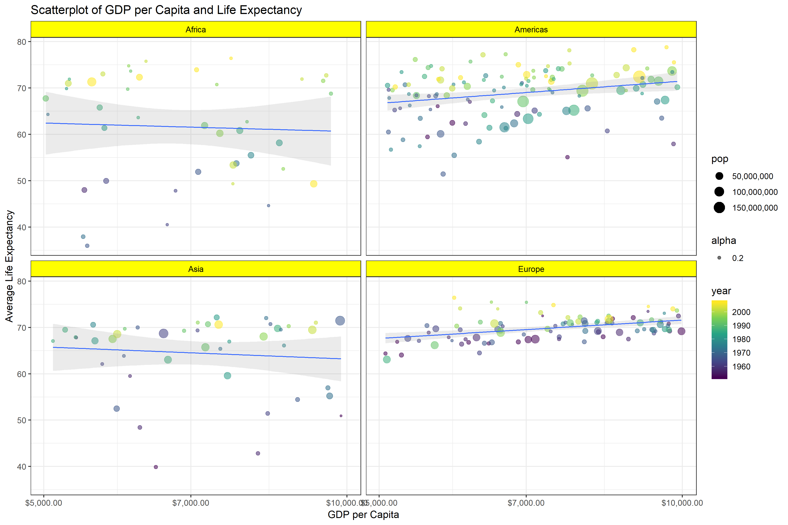

# Introduction 

In this assignment, I will be working with the `gapminder` dataset to (1) Reorder a factor, (2) Write a dataset to file and load it back into R, (3) Improve a figure using new knowledge, (4) Make a plotly visual and (5) Implement visualization design principles.


Let's start by uploading all the neccessary packages.
```{r}
suppressPackageStartupMessages(library(tidyverse))
suppressPackageStartupMessages(library(gapminder))
suppressPackageStartupMessages(library(RColorBrewer))
suppressPackageStartupMessages(library(scales))
suppressPackageStartupMessages(library(plotly))
```

# Part 1: Factor management

## Drop Oceania

The goal of this assignment is to filter the Gapminder data to remove observations associated with the continent of Oceania. 

### Summarizing data before changes 

Let's check the general structure of the `gapminder` dataset by using`str` function.
```{r}
str(gapminder)
```

We can notice that we have 6 variables and 1704 observations: `country` and `continent` are factor variables, `year` and `pop` are integers, and `lifeExp` and `gdpPercap` are numeric.

Let's check which levels are present in the continent variable.
```{r}
levels(gapminder$continent)
```

We can also measure the number of levels - 5 in total.
```{r}
nlevels(gapminder$continent)
```


Now, let's count the number of observations by continent in the gapminder dataset.
```{r}
ggplot(gapminder, aes(continent, fill = continent)) +
  geom_bar() +
  geom_text(stat = 'count', aes(label = ..count..),position = position_stack(vjust = 0.5)) +
  labs(title="Number of observations in gapminder by continent")
```

### Removing Oceania observations

Knowing the main characteristics of the dataframe, we can filter the Gapminder data to remove observations associated with the continent of Oceania by using the `filter` function. We will then count how many observations in each continent category are left.

```{r}
gapminder_no_oceania <- gapminder %>%
  filter(continent!="Oceania")

ContinentTable <- table(gapminder_no_oceania$continent)
knitr::kable(ContinentTable, col.names = c("Continent", "Count"), format = "markdown")
```

We can notice that all the observations in the Oceania category have been dropped, yet it is still unclear whether Oceania category is still an existing level. Let's check how many levels we have in the `continent` variable.

```{r}
levels(gapminder_no_oceania$continent)
```

Oceania is still part of the `continent` variable even though it has no observations. We will have to use the `droplevels()` to remove all the unused levels.

```{r}
gapminder_continents <- gapminder_no_oceania %>% 
  droplevels()
```

### Checking updated dataframe

Now, let's check if Oceania is still present as a level.
```{r}
levels(gapminder_continents$continent)
```

Not anymore! Let's see what the new barchart looks like.

```{r}
ggplot(gapminder_continents, aes(continent, fill = continent)) +
  geom_bar() +
  geom_text(stat = 'count', aes(label = ..count..),position = position_stack(vjust = 0.5)) +
  labs(title="Number of observations in gapminder by continent")
```

We can now take a look at the characteristics of our new dataframe.

```{r}
str(gapminder_continents)
```

We can notice that we still have 6 variables but only 1680 observations (a decrease of 24 from the initial 1704 observations): `country` has now 140 levels instead of 142 and `continent` has 4 levels instead of 5.

## Order by Another Variable

The goal of this component is to use the forcats package to change the order of the factor levels, based on a principled summary of one of the quantitative variables. 

Here, I will reorder the levels of `country` variable by the max `gdpPercap`.

Here is a plot of `gdpPercap` of European countries. We can notice that countries are sorted alphabetically, making it not very useful to analyze various characteristics of this variable.

```{r}
gapminder_Europe <- gapminder %>% 
  filter(continent == "Europe")

ggplot(gapminder_Europe, aes(gdpPercap, country)) +
  geom_point(aes(color=year)) +
  labs(title = "GDP per capita in European countries",
       x = "GDP per capita",
       y = "Country")
```

I'd like to sort these countries based on the max `gdpPercap` to produce an updated plot using the `mutate` and `fct_reorder` functions.

```{r}
gapminder_Europe_sorted <- gapminder_Europe %>% 
  mutate(country = fct_reorder(country, gdpPercap, .fun = max))

ggplot(gapminder_Europe_sorted, aes(gdpPercap, country)) + 
  geom_point(aes(color=year)) +
  labs(title = "GDP per capita in European countries, sorted",
       x = "GDP per capita",
       y = "Country")
```

From here, we can notice that Norway had the highest max`gdpPercap` and Albania had the lowerst max`gdpPercap` among all European other countries.


# Part 2: File I/O

In this component, I will experiment with write_csv()/read_csv() (and/or TSV friends), saveRDS()/readRDS(), dput()/dget() and explore whether this survives the round trip of writing to file then reading back in. 

Here, I will try to download and upload the dataframe I just created `gapminder_Europe_sorted` using three different file types.

## CSV

Download the new data frame.
```{r}
write_csv(gapminder_Europe_sorted, "gapminder_Europe_sorted.csv")
```

Upload the downloaded data frame.
```{r}
read_csv("gapminder_Europe_sorted.csv") %>% 
ggplot(aes(gdpPercap, country)) + 
  geom_point(aes(color=year)) +
  labs(title = "GDP per capita in European countries, sorted",
       x = "GDP per capita",
       y = "Country")
```

The data is not arranged by max `gdpPercap` anymore, meaning that the file didn't survive the transformation back and forth.

## RDS

Let's check if RDS functions preserve the sorted arrangement. 

Download the new data frame.
```{r}
saveRDS(gapminder_Europe_sorted, "gapminder_Europe_sorted.rds")
```

Upload the downloaded data frame.
```{r}
readRDS("gapminder_Europe_sorted.rds") %>% 
ggplot(aes(gdpPercap, country)) + 
  geom_point(aes(color=year)) +
  labs(title = "GDP per capita in European countries, sorted",
       x = "GDP per capita",
       y = "Country")
```

The data is sorted as initially expected. RDS functions are able to preserve the sorted format of the data.

## Dput/Dget

Finally, let's check the third option using `dput()` and `dget()` functions.

Download the new data frame.
```{r}
dput(gapminder_Europe_sorted, file="gapminder_Europe_sorted")
```

Upload the downloaded data frame.
```{r}
dget("gapminder_Europe_sorted") %>% 
ggplot(aes(gdpPercap, country)) + 
  geom_point(aes(color=year)) +
  labs(title = "GDP per capita in European countries, sorted",
       x = "GDP per capita",
       y = "Country")
```

The arrangement of observations is also preserved.

# Part 3: Visualization design

The goal of this component is to remake at least one figure.Then, make a new graph by converting this visual to a plotly graph.

## Remake a figure

Here is a scatterplot of gdpPercap and lifeExp for European countries between 1970 and 1994 I completed in homework 2:

```{r}
gapminder %>% 
  filter(continent == "Europe") %>% 
  filter(year>1970 & year<1994)  %>% 
  ggplot(aes(gdpPercap, lifeExp, color=year))+
  geom_point()+
  geom_smooth()
```


I did the following to improve the scatterplot:
1. Created a new data file for the final plot.  
2. Changed the selection parameters by removing the restrictions on years.
3. The size of points is now connected to the population size.
4. Made points somewhat transparent.
5. Added titles to the graph, renamed x-axis and y-axis.
6. Changed the colour of the smoothing funciton, made it transparent, changed the size of the line.
7. Added dollar sign format to x-axis values.
8. Used a new colour scheme for years: `scale_colour_viridis_c`.
9. Made sure the population size was reflected in a correct format on a side.
10. Added a new theme: `theme_bw()`

```{r}
gapminder_Europe_gdpPercap <- gapminder_Europe %>% 
  ggplot(aes(gdpPercap, lifeExp, color=year, size=pop, alpha=0.2)) +
  geom_point() +
  labs(title = "Scatterplot of GDP per Capita and Life Expectancy (Europe)",        x = "GDP per Capita",
       y = "Average Life Expectancy") +
  geom_smooth(fill="purple", alpha=0.3, size=0.7) + 
  scale_x_log10(labels=dollar_format()) +
  scale_colour_viridis_c() +
  scale_size_continuous(
        labels = comma_format())+
  theme_bw()

gapminder_Europe_gdpPercap
```

We can observe a strong linear relationship between `gdpPercap` and `lifeExp`.


Next, I wanted redo this plot for all other continents with countries whose `gdpPercap` is between 5,000 and 10,000.

```{r}
gapminder_gdpPercap <- gapminder %>% 
  filter(gdpPercap>5000 & gdpPercap <10000) %>% 
  ggplot(aes(gdpPercap, lifeExp, color=year, size=pop, alpha=0.2)) +
  geom_point() +
  facet_wrap(~continent) +
  geom_smooth(method='lm', size=0.5, alpha=0.2)+
  labs(title = "Scatterplot of GDP per Capita and Life Expectancy",  
       x = "GDP per Capita",
       y = "Average Life Expectancy") +
  scale_x_log10(labels=dollar_format()) +
  scale_colour_viridis_c() +
  scale_size_continuous(
        labels = comma_format())+
  theme_bw()+
  theme(strip.background = element_rect(fill = "yellow"),
        strip.text = element_text(color = "black"), 
        axis.text = element_text(size=9))

gapminder_gdpPercap
```

We can notice here tat one of the continents (Oceania) doesn't have data that satisfies this requirement so the whole continent is missing. There is also no longer a linear relationship between `gdpPercap` and `lifeExp` - this pattern holds true for all four continents.

## Plotly

Finally, let's convert our two generated plots into the `plotly` format so we can interact with it.

Start with transforming `gapminder_Europe_gdpPercap`.
```{r}
gapminder_Euro_plotly <- ggplotly(gapminder_Europe_gdpPercap)
gapminder_Euro_plotly 
```


We can impove on this plot by adding a few changes to our code:
1. Year will appear as a moving format so color will be connected to the population size.
2. Country names will appear on each point.
```{r}
  gapminder_Europe_plotly <- gapminder_Europe %>% 
  ggplot(aes(gdpPercap, lifeExp, color=pop, alpha=0.2, frame = year)) +
  geom_point(aes(size=pop, ids = country)) +
  labs(title = "Scatterplot of GDP per Capita and Life Expectancy (Europe)",        x = "GDP per Capita",
       y = "Average Life Expectancy") +
  geom_smooth(method="lm", fill="purple", alpha=0.15, size=0.7) + 
  scale_x_log10(labels=dollar_format()) +
  scale_colour_viridis_c(trans   = "log10",
        breaks  = 10^(1:10),
        labels  = comma_format()
    ) +
  scale_size_continuous(
        labels = comma_format())+
  theme_bw()

gapminder_Europe_plotly <- ggplotly(gapminder_Europe_plotly )
gapminder_Europe_plotly 
```

Similarly, let's transform `gapminder_gdpPercap` into the plotly format.

```{r}
gapminder_gdp_plotly <- ggplotly(gapminder_gdpPercap)
gapminder_gdp_plotly
```

If we can keep the `year` variable as a frame, we no longer have to restrict our observations to a small number of countries (yet We will exclude Oceania as it only has 2 countries).

```{r}
gapminder_gdpPercap_plotly <- gapminder %>% 
  filter(continent!="Oceania") %>% 
  ggplot(aes(gdpPercap, lifeExp, color=pop, frame=year, alpha=0.2)) +
  geom_point(aes(size=pop,ids=country)) +
  facet_wrap(~continent) +
  geom_smooth(method='lm', size=0.5, alpha=0.2)+
  labs(title = "Scatterplot of GDP per Capita and Life Expectancy",  
       x = "GDP per Capita",
       y = "Average Life Expectancy") +
  scale_x_log10(labels=dollar_format()) +
  scale_colour_viridis_c(trans   = "log10",
        breaks  = 10^(1:10),
        labels  = comma_format()
    ) +
  scale_size_continuous(
        labels = comma_format())+
  theme_bw()+
  theme(strip.background = element_rect(fill = "yellow"),
        strip.text = element_text(color = "black"), 
        axis.text = element_text(size=9))

gapminder_gdpPercap_plotly <- ggplotly(gapminder_gdpPercap_plotly)
gapminder_gdpPercap_plotly
```


# Part 4: Writing figures to file

The goal of this exercise is to use ggsave() to explicitly save a plot to file. Then use to load and embed it in your report.

Let's upload two of the plots we generated previously:

```{r}
ggsave("gapminder_Euro.png", plot = gapminder_Europe_gdpPercap, device="png", width = 8, height = 9)
```

`gapminder_Europe_gdpPercap` plot:
.


```{r}
ggsave("gapminder_gdpPercap.png", plot = gapminder_gdpPercap, device="png", width = 12, height =8)
```

`gapminder_gdpPercap` plot:
.
