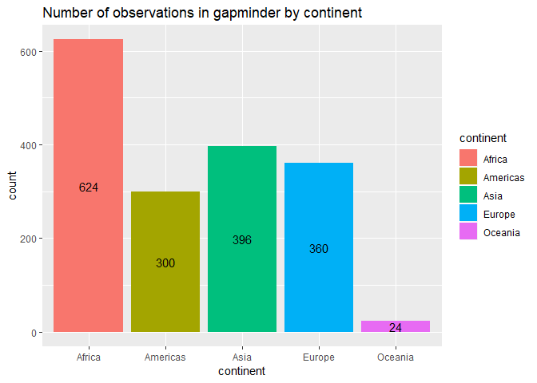
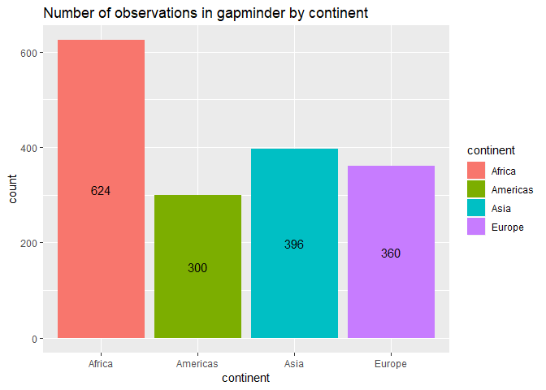
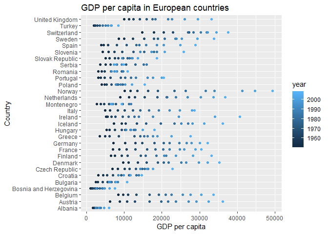
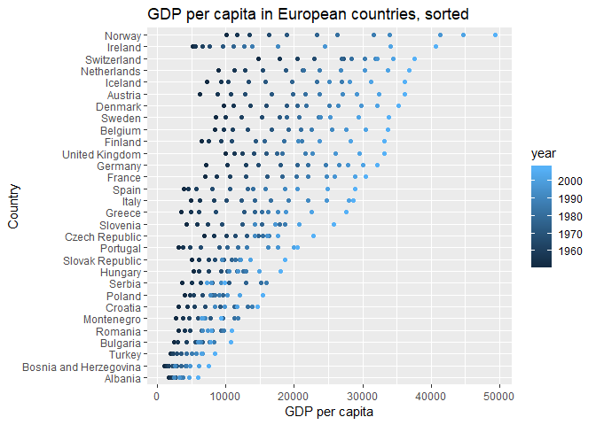

Homework 5
================
Albina Gibadullina
October 19

-   [Introduction](#introduction)
-   [Part 1: Factor management](#part-1-factor-management)
    -   [Drop Oceania](#drop-oceania)
        -   [Summarizing data before changes](#summarizing-data-before-changes)
        -   [Removing Oceania observations](#removing-oceania-observations)
        -   [Checking updated dataframe](#checking-updated-dataframe)
    -   [Order by Another Variable](#order-by-another-variable)
-   [Part 2: File I/O](#part-2-file-io)
    -   [CSV](#csv)
    -   [RDS](#rds)
    -   [Dput/Dget](#dputdget)
-   [Part 3: Visualization design](#part-3-visualization-design)
-   [Part 4: Writing figures to file](#part-4-writing-figures-to-file)

Introduction
============

In this assignment, I will

Upload all the neccessary packages

``` r
suppressPackageStartupMessages(library(tidyverse))
```

    ## Warning: package 'tidyverse' was built under R version 3.5.1

    ## Warning: package 'ggplot2' was built under R version 3.5.1

    ## Warning: package 'tibble' was built under R version 3.5.1

    ## Warning: package 'tidyr' was built under R version 3.5.1

    ## Warning: package 'readr' was built under R version 3.5.1

    ## Warning: package 'purrr' was built under R version 3.5.1

    ## Warning: package 'dplyr' was built under R version 3.5.1

    ## Warning: package 'stringr' was built under R version 3.5.1

    ## Warning: package 'forcats' was built under R version 3.5.1

``` r
suppressPackageStartupMessages(library(gapminder))
```

    ## Warning: package 'gapminder' was built under R version 3.5.1

Part 1: Factor management
=========================

Drop Oceania
------------

### Summarizing data before changes

Let's check the general structure of the `gapminder` dataset by using`str` function

``` r
str(gapminder)
```

    ## Classes 'tbl_df', 'tbl' and 'data.frame':    1704 obs. of  6 variables:
    ##  $ country  : Factor w/ 142 levels "Afghanistan",..: 1 1 1 1 1 1 1 1 1 1 ...
    ##  $ continent: Factor w/ 5 levels "Africa","Americas",..: 3 3 3 3 3 3 3 3 3 3 ...
    ##  $ year     : int  1952 1957 1962 1967 1972 1977 1982 1987 1992 1997 ...
    ##  $ lifeExp  : num  28.8 30.3 32 34 36.1 ...
    ##  $ pop      : int  8425333 9240934 10267083 11537966 13079460 14880372 12881816 13867957 16317921 22227415 ...
    ##  $ gdpPercap: num  779 821 853 836 740 ...

We can notice that we have 6 variables and 1704 observations: `country` and `continent` are factor variables, `year` and `pop` are integers, and `lifeExp` and `gdpPercap` are numeric.

Let's check which levels are present in the continent variable

``` r
levels(gapminder$continent)
```

    ## [1] "Africa"   "Americas" "Asia"     "Europe"   "Oceania"

We can also measure the number of levels

``` r
nlevels(gapminder$continent)
```

    ## [1] 5

Now, let's count the number of observations by continent in the gapminder dataset

``` r
ggplot(gapminder, aes(continent, fill = continent)) +
  geom_bar() +
  geom_text(stat = 'count', aes(label = ..count..),position = position_stack(vjust = 0.5)) +
  labs(title="Number of observations in gapminder by continent")
```



### Removing Oceania observations

Knowing the main characteristics of the dataframe, we can filter the Gapminder data to remove observations associated with the continent of Oceania by using the `filter` function. We will then count how many observations in each continent category are left.

``` r
gapminder_no_oceania <- gapminder %>%
  filter(continent!="Oceania")
```

    ## Warning: package 'bindrcpp' was built under R version 3.5.1

``` r
ContinentTable <- table(gapminder_no_oceania$continent)
knitr::kable(ContinentTable, col.names = c("Continent", "Count"), format = "markdown")
```

| Continent |  Count|
|:----------|------:|
| Africa    |    624|
| Americas  |    300|
| Asia      |    396|
| Europe    |    360|
| Oceania   |      0|

We can notice that all the observations in the Oceania category have been dropped, yet it is still unclear whether Oceania category is still an existing level. Let's check how many levels we have in the `continent` variable.

``` r
levels(gapminder_no_oceania$continent)
```

    ## [1] "Africa"   "Americas" "Asia"     "Europe"   "Oceania"

Oceania is still part of the `continent` variable even though it has no observations. We will have to use the `droplevels()` to remove all the unused levels.

``` r
gapminder_continents <- gapminder_no_oceania %>% 
  droplevels()
```

### Checking updated dataframe

Now, let's check if Oceania is still present as a level

``` r
levels(gapminder_continents$continent)
```

    ## [1] "Africa"   "Americas" "Asia"     "Europe"

Not anymore! Let's see what the new barchart looks like.

``` r
ggplot(gapminder_continents, aes(continent, fill = continent)) +
  geom_bar() +
  geom_text(stat = 'count', aes(label = ..count..),position = position_stack(vjust = 0.5)) +
  labs(title="Number of observations in gapminder by continent")
```



We can now take a look at the characteristics of our new dataframe.

``` r
str(gapminder_continents)
```

    ## Classes 'tbl_df', 'tbl' and 'data.frame':    1680 obs. of  6 variables:
    ##  $ country  : Factor w/ 140 levels "Afghanistan",..: 1 1 1 1 1 1 1 1 1 1 ...
    ##  $ continent: Factor w/ 4 levels "Africa","Americas",..: 3 3 3 3 3 3 3 3 3 3 ...
    ##  $ year     : int  1952 1957 1962 1967 1972 1977 1982 1987 1992 1997 ...
    ##  $ lifeExp  : num  28.8 30.3 32 34 36.1 ...
    ##  $ pop      : int  8425333 9240934 10267083 11537966 13079460 14880372 12881816 13867957 16317921 22227415 ...
    ##  $ gdpPercap: num  779 821 853 836 740 ...

We can notice that we still have 6 variables but only 1680 observations (a decrease of 24 from the initial 1704 observations): `country` has now 140 levels instead of 142 and `continent` has 4 levels instead of 5.

Order by Another Variable
-------------------------

Here, I will reorder the levels of `country` variable by the max of `gdpPercap`.

Here is a plot of `gdpPercap` of European countries. We can notice that countries are sorted alphabetically, making it not very useful to analyze various characteristics of this variable.

``` r
gapminder_Europe <- gapminder %>% 
  filter(continent == "Europe")

ggplot(gapminder_Europe, aes(gdpPercap, country)) +
  geom_point(aes(color=year)) +
  labs(title = "GDP per capita in European countries",
       x = "GDP per capita",
       y = "Country")
```



I'd like to sort these countries based on the max `gdpPercap` to produce an updated plot using the `mutate` and `fct_reorder` functions.

``` r
gapminder_Europe_sorted <- gapminder_Europe %>% 
  mutate(country = fct_reorder(country, gdpPercap, .fun = max))

ggplot(gapminder_Europe_sorted, aes(gdpPercap, country)) + 
  geom_point(aes(color=year)) +
  labs(title = "GDP per capita in European countries, sorted",
       x = "GDP per capita",
       y = "Country")
```


From here, we can notice that Norway had the highest max`gdpPercap` and Albania had the lowerst max`gdpPercap` among all European other countries.

Part 2: File I/O
================

Here, we will try to expirent with downloading and uploading the new dataframe using three different file types

CSV
---

Download the new data frame

``` r
write_csv(gapminder_Europe_sorted, "gapminder_Europe_sorted.csv")
```

Upload the downloaded data frame

``` r
read_csv("gapminder_Europe_sorted.csv") %>% 
ggplot(aes(gdpPercap, country)) + 
  geom_point(aes(color=year)) +
  labs(title = "GDP per capita in European countries, sorted",
       x = "GDP per capita",
       y = "Country")
```

    ## Parsed with column specification:
    ## cols(
    ##   country = col_character(),
    ##   continent = col_character(),
    ##   year = col_integer(),
    ##   lifeExp = col_double(),
    ##   pop = col_integer(),
    ##   gdpPercap = col_double()
    ## )


The file didn't survive the transformation back and forth - the data is not arranged by max `gdpPercap` anymore.

RDS
---

Let's check if RDS functions preserved the sorted arrangement.

Download the new data frame

``` r
saveRDS(gapminder_Europe_sorted, "gapminder_Europe_sorted.rds")
```

Upload the downloaded data frame

``` r
readRDS("gapminder_Europe_sorted.rds") %>% 
ggplot(aes(gdpPercap, country)) + 
  geom_point(aes(color=year)) +
  labs(title = "GDP per capita in European countries, sorted",
       x = "GDP per capita",
       y = "Country")
```



The data is sorted as initially expected. RDS functions wor to preserve the sorted format of the data.

Dput/Dget
---------

Finally, let's check the third option using `dput()` and `dget()` functions.

Download the new data frame

``` r
dput(gapminder_Europe_sorted, file="gapminder_Europe_sorted")
```

Upload the downloaded data frame

``` r
dget("gapminder_Europe_sorted") %>% 
ggplot(aes(gdpPercap, country)) + 
  geom_point(aes(color=year)) +
  labs(title = "GDP per capita in European countries, sorted",
       x = "GDP per capita",
       y = "Country")
```


The arrangement of observations is also preserved.

Part 3: Visualization design
============================

Remake at least one figure or create a new one, in light of something you learned in the recent class meetings about visualization design and color. Maybe juxtapose your first attempt and what you obtained after some time spent working on it. Reflect on the differences. If using Gapminder, you can use the country or continent color scheme that ships with Gapminder. Consult the dimensions listed in All the Graph Things.

Then, make a new graph by converting this visual (or another, if you’d like) to a plotly graph. What are some things that plotly makes possible, that are not possible with a regular ggplot2 graph?

Part 4: Writing figures to file
===============================

> Use ggsave() to explicitly save a plot to file. Then use to load and embed it in your report. You can play around with various options, such as:

> Arguments of ggsave(), such as width, height, resolution or text scaling. Various graphics devices, e.g. a vector vs. raster format. Explicit provision of the plot object p via ggsave(..., plot = p). Show a situation in which this actually matters.
