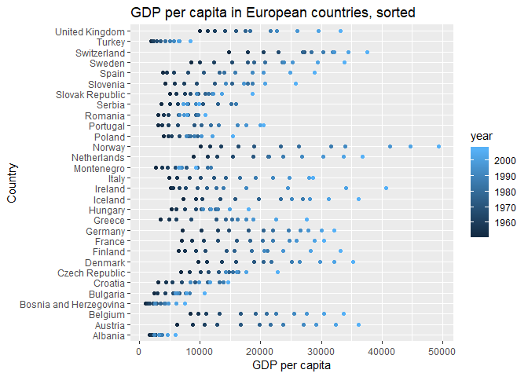
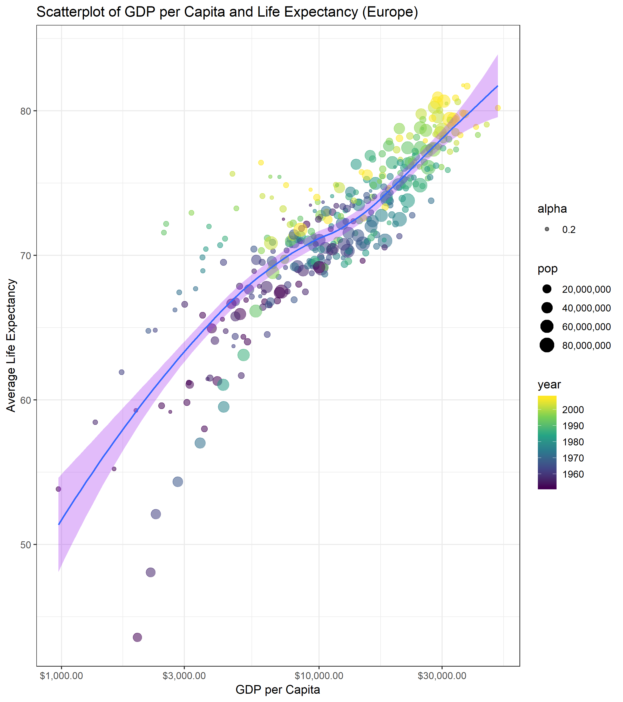

Homework 5
================
Albina Gibadullina
October 19

-   [Introduction](#introduction)
-   [Part 1: Factor management](#part-1-factor-management)
    -   [Drop Oceania](#drop-oceania)
        -   [Summarizing data before changes](#summarizing-data-before-changes)
        -   [Removing Oceania observations](#removing-oceania-observations)
        -   [Checking updated dataframe](#checking-updated-dataframe)
    -   [Order by Another Variable](#order-by-another-variable)
-   [Part 2: File I/O](#part-2-file-io)
    -   [CSV](#csv)
    -   [RDS](#rds)
    -   [Dput/Dget](#dputdget)
-   [Part 3: Visualization design](#part-3-visualization-design)
    -   [Remake a figure](#remake-a-figure)
    -   [Plotly](#plotly)
-   [Part 4: Writing figures to file](#part-4-writing-figures-to-file)

Introduction
============

In this assignment, I will be working with the `gapminder` dataset to (1) Reorder a factor, (2) Write a dataset to file and load it back into R, (3) Improve a figure using new knowledge, (4) Make a plotly visual and (5) Implement visualization design principles.

Let's start by uploading all the neccessary packages.

``` r
suppressPackageStartupMessages(library(tidyverse))
```

    ## Warning: package 'tidyverse' was built under R version 3.5.1

    ## Warning: package 'ggplot2' was built under R version 3.5.1

    ## Warning: package 'tibble' was built under R version 3.5.1

    ## Warning: package 'tidyr' was built under R version 3.5.1

    ## Warning: package 'readr' was built under R version 3.5.1

    ## Warning: package 'purrr' was built under R version 3.5.1

    ## Warning: package 'dplyr' was built under R version 3.5.1

    ## Warning: package 'stringr' was built under R version 3.5.1

    ## Warning: package 'forcats' was built under R version 3.5.1

``` r
suppressPackageStartupMessages(library(gapminder))
```

    ## Warning: package 'gapminder' was built under R version 3.5.1

``` r
suppressPackageStartupMessages(library(RColorBrewer))
suppressPackageStartupMessages(library(scales))
```

    ## Warning: package 'scales' was built under R version 3.5.1

``` r
suppressPackageStartupMessages(library(plotly))
```

    ## Warning: package 'plotly' was built under R version 3.5.1

Part 1: Factor management
=========================

Drop Oceania
------------

The goal of this assignment is to filter the Gapminder data to remove observations associated with the continent of Oceania.

### Summarizing data before changes

Let's check the general structure of the `gapminder` dataset by using`str` function.

``` r
str(gapminder)
```

    ## Classes 'tbl_df', 'tbl' and 'data.frame':    1704 obs. of  6 variables:
    ##  $ country  : Factor w/ 142 levels "Afghanistan",..: 1 1 1 1 1 1 1 1 1 1 ...
    ##  $ continent: Factor w/ 5 levels "Africa","Americas",..: 3 3 3 3 3 3 3 3 3 3 ...
    ##  $ year     : int  1952 1957 1962 1967 1972 1977 1982 1987 1992 1997 ...
    ##  $ lifeExp  : num  28.8 30.3 32 34 36.1 ...
    ##  $ pop      : int  8425333 9240934 10267083 11537966 13079460 14880372 12881816 13867957 16317921 22227415 ...
    ##  $ gdpPercap: num  779 821 853 836 740 ...

We can notice that we have 6 variables and 1704 observations: `country` and `continent` are factor variables, `year` and `pop` are integers, and `lifeExp` and `gdpPercap` are numeric.

Let's check which levels are present in the continent variable.

``` r
levels(gapminder$continent)
```

    ## [1] "Africa"   "Americas" "Asia"     "Europe"   "Oceania"

We can also measure the number of levels - 5 in total.

``` r
nlevels(gapminder$continent)
```

    ## [1] 5

Now, let's count the number of observations by continent in the gapminder dataset.

``` r
ggplot(gapminder, aes(continent, fill = continent)) +
  geom_bar() +
  geom_text(stat = 'count', aes(label = ..count..),position = position_stack(vjust = 0.5)) +
  labs(title="Number of observations in gapminder by continent")
```


### Removing Oceania observations

Knowing the main characteristics of the dataframe, we can filter the Gapminder data to remove observations associated with the continent of Oceania by using the `filter` function. We will then count how many observations in each continent category are left.

``` r
gapminder_no_oceania <- gapminder %>%
  filter(continent!="Oceania")
```

    ## Warning: package 'bindrcpp' was built under R version 3.5.1

``` r
ContinentTable <- table(gapminder_no_oceania$continent)
knitr::kable(ContinentTable, col.names = c("Continent", "Count"), format = "markdown")
```

| Continent |  Count|
|:----------|------:|
| Africa    |    624|
| Americas  |    300|
| Asia      |    396|
| Europe    |    360|
| Oceania   |      0|

We can notice that all the observations in the Oceania category have been dropped, yet it is still unclear whether Oceania category is still an existing level. Let's check how many levels we have in the `continent` variable.

``` r
levels(gapminder_no_oceania$continent)
```

    ## [1] "Africa"   "Americas" "Asia"     "Europe"   "Oceania"

Oceania is still part of the `continent` variable even though it has no observations. We will have to use the `droplevels()` to remove all the unused levels.

``` r
gapminder_continents <- gapminder_no_oceania %>% 
  droplevels()
```

### Checking updated dataframe

Now, let's check if Oceania is still present as a level.

``` r
levels(gapminder_continents$continent)
```

    ## [1] "Africa"   "Americas" "Asia"     "Europe"

Not anymore! Let's see what the new barchart looks like.

``` r
ggplot(gapminder_continents, aes(continent, fill = continent)) +
  geom_bar() +
  geom_text(stat = 'count', aes(label = ..count..),position = position_stack(vjust = 0.5)) +
  labs(title="Number of observations in gapminder by continent")
```


We can now take a look at the characteristics of our new dataframe.

``` r
str(gapminder_continents)
```

    ## Classes 'tbl_df', 'tbl' and 'data.frame':    1680 obs. of  6 variables:
    ##  $ country  : Factor w/ 140 levels "Afghanistan",..: 1 1 1 1 1 1 1 1 1 1 ...
    ##  $ continent: Factor w/ 4 levels "Africa","Americas",..: 3 3 3 3 3 3 3 3 3 3 ...
    ##  $ year     : int  1952 1957 1962 1967 1972 1977 1982 1987 1992 1997 ...
    ##  $ lifeExp  : num  28.8 30.3 32 34 36.1 ...
    ##  $ pop      : int  8425333 9240934 10267083 11537966 13079460 14880372 12881816 13867957 16317921 22227415 ...
    ##  $ gdpPercap: num  779 821 853 836 740 ...

We can notice that we still have 6 variables but only 1680 observations (a decrease of 24 from the initial 1704 observations): `country` has now 140 levels instead of 142 and `continent` has 4 levels instead of 5.

Order by Another Variable
-------------------------

The goal of this component is to use the forcats package to change the order of the factor levels, based on a principled summary of one of the quantitative variables.

Here, I will reorder the levels of `country` variable by the max `gdpPercap`.

Here is a plot of `gdpPercap` of European countries. We can notice that countries are sorted alphabetically, making it not very useful to analyze various characteristics of this variable.

``` r
gapminder_Europe <- gapminder %>% 
  filter(continent == "Europe")

ggplot(gapminder_Europe, aes(gdpPercap, country)) +
  geom_point(aes(color=year)) +
  labs(title = "GDP per capita in European countries",
       x = "GDP per capita",
       y = "Country")
```


I'd like to sort these countries based on the max `gdpPercap` to produce an updated plot using the `mutate` and `fct_reorder` functions.

``` r
gapminder_Europe_sorted <- gapminder_Europe %>% 
  mutate(country = fct_reorder(country, gdpPercap, .fun = max))

ggplot(gapminder_Europe_sorted, aes(gdpPercap, country)) + 
  geom_point(aes(color=year)) +
  labs(title = "GDP per capita in European countries, sorted",
       x = "GDP per capita",
       y = "Country")
```


From here, we can notice that Norway had the highest max`gdpPercap` and Albania had the lowerst max`gdpPercap` among all European other countries.

Part 2: File I/O
================

In this component, I will experiment with write\_csv()/read\_csv() (and/or TSV friends), saveRDS()/readRDS(), dput()/dget() and explore whether this survives the round trip of writing to file then reading back in.

Here, I will try to download and upload the dataframe I just created `gapminder_Europe_sorted` using three different file types.

CSV
---

Download the new data frame.

``` r
write_csv(gapminder_Europe_sorted, "gapminder_Europe_sorted.csv")
```

Upload the downloaded data frame.

``` r
read_csv("gapminder_Europe_sorted.csv") %>% 
ggplot(aes(gdpPercap, country)) + 
  geom_point(aes(color=year)) +
  labs(title = "GDP per capita in European countries, sorted",
       x = "GDP per capita",
       y = "Country")
```

    ## Parsed with column specification:
    ## cols(
    ##   country = col_character(),
    ##   continent = col_character(),
    ##   year = col_integer(),
    ##   lifeExp = col_double(),
    ##   pop = col_integer(),
    ##   gdpPercap = col_double()
    ## )



The data is not arranged by max `gdpPercap` anymore, meaning that the file didn't survive the transformation back and forth.

RDS
---

Let's check if RDS functions preserve the sorted arrangement.

Download the new data frame.

``` r
saveRDS(gapminder_Europe_sorted, "gapminder_Europe_sorted.rds")
```

Upload the downloaded data frame.

``` r
readRDS("gapminder_Europe_sorted.rds") %>% 
ggplot(aes(gdpPercap, country)) + 
  geom_point(aes(color=year)) +
  labs(title = "GDP per capita in European countries, sorted",
       x = "GDP per capita",
       y = "Country")
```


The data is sorted as initially expected. RDS functions are able to preserve the sorted format of the data.

Dput/Dget
---------

Finally, let's check the third option using `dput()` and `dget()` functions.

Download the new data frame.

``` r
dput(gapminder_Europe_sorted, file="gapminder_Europe_sorted")
```

Upload the downloaded data frame.

``` r
dget("gapminder_Europe_sorted") %>% 
ggplot(aes(gdpPercap, country)) + 
  geom_point(aes(color=year)) +
  labs(title = "GDP per capita in European countries, sorted",
       x = "GDP per capita",
       y = "Country")
```


The arrangement of observations is also preserved.

Part 3: Visualization design
============================

The goal of this component is to remake at least one figure.Then, make a new graph by converting this visual to a plotly graph.

Remake a figure
---------------

Here is a scatterplot of gdpPercap and lifeExp for European countries between 1970 and 1994 I completed in homework 2:

``` r
gapminder %>% 
  filter(continent == "Europe") %>% 
  filter(year>1970 & year<1994)  %>% 
  ggplot(aes(gdpPercap, lifeExp, color=year))+
  geom_point()+
  geom_smooth()
```

    ## `geom_smooth()` using method = 'loess' and formula 'y ~ x'


I did the following to improve the scatterplot: 1. Created a new data file for the final plot.
2. Changed the selection parameters by removing the restrictions on years. 3. The size of points is now connected to the population size. 4. Made points somewhat transparent. 5. Added titles to the graph, renamed x-axis and y-axis. 6. Changed the colour of the smoothing funciton, made it transparent, changed the size of the line. 7. Added dollar sign format to x-axis values. 8. Used a new colour scheme for years: `scale_colour_viridis_c`. 9. Made sure the population size was reflected in a correct format on a side. 10. Added a new theme: `theme_bw()`

``` r
gapminder_Europe_gdpPercap <- gapminder_Europe %>% 
  ggplot(aes(gdpPercap, lifeExp, color=year, size=pop, alpha=0.2)) +
  geom_point() +
  labs(title = "Scatterplot of GDP per Capita and Life Expectancy (Europe)",        x = "GDP per Capita",
       y = "Average Life Expectancy") +
  geom_smooth(fill="purple", alpha=0.3, size=0.7) + 
  scale_x_log10(labels=dollar_format()) +
  scale_colour_viridis_c() +
  scale_size_continuous(
        labels = comma_format())+
  theme_bw()

gapminder_Europe_gdpPercap
```

    ## `geom_smooth()` using method = 'loess' and formula 'y ~ x'


We can observe a strong linear relationship between `gdpPercap` and `lifeExp`.

Next, I wanted redo this plot for all other continents with countries whose `gdpPercap` is between 5,000 and 10,000.

``` r
gapminder_gdpPercap <- gapminder %>% 
  filter(gdpPercap>5000 & gdpPercap <10000) %>% 
  ggplot(aes(gdpPercap, lifeExp, color=year, size=pop, alpha=0.2)) +
  geom_point() +
  facet_wrap(~continent) +
  geom_smooth(method='lm', size=0.5, alpha=0.2)+
  labs(title = "Scatterplot of GDP per Capita and Life Expectancy",  
       x = "GDP per Capita",
       y = "Average Life Expectancy") +
  scale_x_log10(labels=dollar_format()) +
  scale_colour_viridis_c() +
  scale_size_continuous(
        labels = comma_format())+
  theme_bw()+
  theme(strip.background = element_rect(fill = "yellow"),
        strip.text = element_text(color = "black"), 
        axis.text = element_text(size=9))

gapminder_gdpPercap
```


We can notice here tat one of the continents (Oceania) doesn't have data that satisfies this requirement so the whole continent is missing. There is also no longer a linear relationship between `gdpPercap` and `lifeExp` - this pattern holds true for all four continents.

Plotly
------

Finally, let's convert our two generated plots into the `plotly` format so we can interact with it.

Start with transforming `gapminder_Europe_gdpPercap`.

``` r
gapminder_Euro_plotly <- ggplotly(gapminder_Europe_gdpPercap)
```

    ## `geom_smooth()` using method = 'loess' and formula 'y ~ x'

``` r
gapminder_Euro_plotly 
```

<!--html_preserve-->

<script type="application/json" data-for="htmlwidget-3e322f9e41e307bac394">{"x":{"data":[{"x":[3.20440655935692,3.28831278714121,3.36415478275528,3.44094006865781,3.52027677612856,3.54814411807184,3.56001198214669,3.57274765208091,3.39749469826406,3.50420634541484,3.66315528761115,3.77356920876217,3.78796153632719,3.94657988314917,4.03143759574841,4.10838241931361,4.22171737130058,4.29555439638822,4.33439510979661,4.37452520554653,4.43203910845529,4.46383210379552,4.5107809622285,4.55782580062218,3.9213277159305,3.9874410446426,4.04104537763161,4.11889408582397,4.22199144124559,4.28144187754483,4.32180229370652,4.35267565600983,4.40782533328362,4.44029806949553,4.48409878922788,4.52753459151331,2.98835076435393,3.13161519254539,3.23291576584681,3.33693028267941,3.45639180910827,3.54758782074795,3.61559375851768,3.63489169330918,3.40599167707862,3.67818646800884,3.77952255671775,3.87194045947979,3.3881521354268,3.47837466056434,3.62883197446838,3.74640086253428,3.81937903012836,3.88151249733011,3.91509322206278,3.91591956003557,3.79952136016638,3.77600261099969,3.886308944764,4.02860349094832,3.49404830692654,3.63731273516082,3.73861330848472,3.84262782533193,3.96208935173804,4.05328536317461,4.12129130087923,4.14058923594614,3.92674335990023,3.99456368956363,4.06551954975935,4.16492428251317,3.83734472624362,3.91678777519626,4.0059037539735,4.05688370334703,4.11755146113333,4.17026642863828,4.18687806928202,4.21246576751212,4.1552455617675,4.2054348319286,4.24541914180452,4.35856884462783,3.98643066779033,4.04530965043662,4.13300572455237,4.2024123287676,4.2756846000415,4.31011744274222,4.33622031516927,4.39995351440246,4.42171478694898,4.47427959169049,4.50740380919791,4.54750911081685,3.80784062264484,3.87768315330736,3.97182498420755,4.03828770846528,4.15712044202774,4.19327554039949,4.26794941909068,4.32512577745481,4.31486042820919,4.37518700371537,4.45031979970118,4.52123074598147,3.84694354559525,3.93766003740826,4.02368388582586,4.11394060154369,4.20701982774602,4.26227627214274,4.30736546166243,4.343732315784,4.39276369497302,4.41312844169945,4.4612888674186,4.48387269225076,3.85394839994697,4.0080815466578,4.11067261930134,4.16866320301241,4.255662718746,4.31202751232983,4.34304471219246,4.39162635003408,4.42333277608952,4.44387110838644,4.47763923244914,4.50745611553652,3.54785959575643,3.69163836651823,3.77939377798269,3.93008758267857,4.10465197432477,4.15215143685527,4.18379412322395,4.20737927277307,4.24406663717638,4.27294795225229,4.35245757681066,4.43993889119905,3.72128896869472,3.78104988176998,3.87796765214183,3.96972543116429,4.00726356033899,4.06725083957618,4.09850495988616,4.11349145034739,4.02266045049501,4.06865986739997,4.17154906033606,4.25548825822109,3.86139630046032,3.96586000314456,4.0149470240296,4.12450082349962,4.19860385843004,4.29347221889702,4.36678905788829,4.43012677868692,4.40044113886749,4.44810468618315,4.49364207422891,4.55847803563392,3.71686109021475,3.74811650770658,3.82161814697266,3.88397747306288,3.97912812108504,4.04731308089082,4.10100158542625,4.14216620766251,4.24449521672678,4.38955495174527,4.53246198371447,4.60933819969144,3.69297059675009,3.79578663274036,3.91611598019254,4.00097178847123,4.08881885753772,4.15399722211687,4.21846942388565,4.28346484592075,4.34269195584422,4.39225759185182,4.44666293536129,4.45590597950278,3.42285001049471,3.56611443882719,3.66741501210734,3.7714295289461,3.89089105535981,3.98208706693409,4.05009300482744,4.06939093934078,3.845305151385,3.81060972975025,3.81671805149487,3.96632461957789,3.95141387106102,4.05216251746597,4.10689939099677,4.18648313615635,4.27403645322818,4.32652140433408,4.33040282371374,4.37385545037759,4.42798810752661,4.48066982350009,4.52794883913899,4.56582342810493,4.00412446561185,4.06647400906966,4.12873524872317,4.21383310947184,4.27795411820419,4.36756741361793,4.41993321264512,4.49887511143166,4.53104007265859,4.61577297830881,4.6501518025891,4.69335042800253,3.60523280489102,3.67525146479271,3.72743975876275,3.81671530247097,3.90344308730428,3.97809563416623,3.92693538899242,3.95819829002402,3.88867818246945,4.00687591176845,4.07926227349578,4.18723649435127,3.48690063208004,3.57686768438836,3.67467332414396,3.80356075988127,3.95531473257819,4.00742708886894,4.0701798820755,4.11525456918159,4.20970977687171,4.24652397692489,4.30039780818413,4.31195820191596,3.49756723117478,3.59586755291055,3.67531976192701,3.81096244303535,3.90370919682789,3.97110865215781,3.98251156901606,3.9866048478327,3.81943929106406,3.86608329429534,3.89682152995671,4.03376444688129,3.55406003811099,3.69732446646629,3.79862503975108,3.90263955655535,4.02210108309511,4.11329709452241,4.18130303219855,4.20060096717612,3.96965201852667,3.89841362281209,3.85950307462284,3.990628940935,3.70540687333909,3.78484992230602,3.87396590108497,3.92494585044061,3.98561360821433,4.03832857580155,4.05494021661463,4.08052791469559,3.97765355127639,4.08372582458422,4.13477547215859,4.27133768016358,3.62480187974278,3.76806630806585,3.86936688136353,3.97338139817314,4.09284292451341,4.18403893629866,4.25204487391065,4.27134280866535,4.15273821196319,4.23454530801608,4.31513072415055,4.41108505321789,3.58365604390734,3.65942198360003,3.75540555493978,3.90273764724083,4.02689065700032,4.12178698250771,4.14383169147022,4.19769351034863,4.26958449230923,4.31059346537845,4.3950724122632,4.4597100052953,3.93083928091202,3.99615595780494,4.09094341913022,4.18350606325153,4.25120065557361,4.27544324046184,4.31528545095118,4.37267140473045,4.37803462853663,4.40254671890085,4.46748425007351,4.52968372605252,4.16832752592624,4.25308321228107,4.31029159428248,4.36108808961809,4.43449086835605,4.43107881405245,4.45328339812114,4.48118031842363,4.50340291646683,4.50698266960368,4.53757931986706,4.57410560181062,3.29426798832312,3.34610920365656,3.36602488788039,3.451226922958,3.53790674825367,3.63033859911073,3.6275047619036,3.70663617901385,3.75422202565638,3.81963801689525,3.81345326439531,3.92728187211911,3.99910915184445,4.05243143756984,4.0961163384234,4.15053696257245,4.20126371287586,4.24126620200209,4.2608444243129,4.33575443700302,4.35612327631095,4.41621651155322,4.46951273516943,4.52118074293136],"y":[55.23,59.28,64.82,66.22,67.69,68.93,70.42,72,71.581,72.95,75.651,76.423,66.8,67.48,69.54,70.14,70.63,72.17,73.18,74.94,76.04,77.51,78.98,79.829,68,69.24,70.25,70.94,71.44,72.8,73.93,75.35,76.46,77.53,78.32,79.441,53.82,58.45,61.93,64.79,67.45,69.86,70.69,71.14,72.178,73.244,74.09,74.852,59.6,66.61,69.51,70.42,70.9,70.81,71.08,71.34,71.19,70.32,72.14,73.005,61.21,64.77,67.13,68.5,69.61,70.64,70.46,71.52,72.527,73.68,74.876,75.748,66.87,69.03,69.9,70.38,70.29,70.71,70.96,71.58,72.4,74.01,75.51,76.486,70.78,71.81,72.35,72.96,73.47,74.69,74.63,74.8,75.33,76.11,77.18,78.332,66.55,67.49,68.75,69.83,70.87,72.52,74.55,74.83,75.7,77.13,78.37,79.313,67.41,68.93,70.51,71.55,72.38,73.83,74.89,76.34,77.46,78.64,79.59,80.657,67.5,69.1,70.3,70.8,71,72.5,73.8,74.847,76.07,77.34,78.67,79.406,65.86,67.86,69.51,71,72.34,73.68,75.24,76.67,77.03,77.869,78.256,79.483,64.03,66.41,67.96,69.5,69.76,69.95,69.39,69.58,69.17,71.04,72.59,73.338,72.49,73.47,73.68,73.73,74.46,76.11,76.99,77.23,78.77,78.95,80.5,81.757,66.91,68.9,70.29,71.08,71.28,72.03,73.1,74.36,75.467,76.122,77.783,78.885,65.94,67.81,69.24,71.06,72.19,73.48,74.98,76.42,77.44,78.82,80.24,80.546,59.164,61.448,63.728,67.178,70.636,73.066,74.101,74.865,75.435,75.445,73.981,74.543,72.13,72.99,73.23,73.82,73.75,75.24,76.05,76.83,77.42,78.03,78.53,79.762,72.67,73.44,73.47,74.08,74.34,75.37,75.97,75.89,77.32,78.32,79.05,80.196,61.31,65.77,67.64,69.61,70.85,70.67,71.32,70.98,70.99,72.75,74.67,75.563,59.82,61.51,64.39,66.6,69.26,70.41,72.77,74.06,74.86,75.97,77.29,78.098,61.05,64.1,66.8,66.8,69.21,69.46,69.66,69.53,69.36,69.72,71.322,72.476,57.996,61.685,64.531,66.914,68.7,70.3,70.162,71.218,71.659,72.232,73.213,74.002,64.36,67.45,70.33,70.98,70.35,70.45,70.8,71.08,71.38,72.71,73.8,74.663,65.57,67.85,69.15,69.18,69.82,70.97,71.063,72.25,73.64,75.13,76.66,77.926,64.94,66.66,69.69,71.44,73.06,74.39,76.3,76.9,77.57,78.77,79.78,80.941,71.86,72.49,73.37,74.16,74.72,75.44,76.42,77.19,78.16,79.39,80.04,80.884,69.62,70.56,71.32,72.77,73.78,75.39,76.21,77.41,78.03,79.37,80.62,81.701,43.585,48.079,52.098,54.336,57.005,59.507,61.036,63.108,66.146,68.835,70.845,71.777,69.18,70.42,70.76,71.36,72.01,72.76,74.04,75.007,76.42,77.218,78.471,79.425],"text":["gdpPercap:  1601.0561<br />lifeExp: 55.230<br />year: 1952<br />pop:  1282697<br />alpha: 0.2","gdpPercap:  1942.2842<br />lifeExp: 59.280<br />year: 1957<br />pop:  1476505<br />alpha: 0.2","gdpPercap:  2312.8890<br />lifeExp: 64.820<br />year: 1962<br />pop:  1728137<br />alpha: 0.2","gdpPercap:  2760.1969<br />lifeExp: 66.220<br />year: 1967<br />pop:  1984060<br />alpha: 0.2","gdpPercap:  3313.4222<br />lifeExp: 67.690<br />year: 1972<br />pop:  2263554<br />alpha: 0.2","gdpPercap:  3533.0039<br />lifeExp: 68.930<br />year: 1977<br />pop:  2509048<br />alpha: 0.2","gdpPercap:  3630.8807<br />lifeExp: 70.420<br />year: 1982<br />pop:  2780097<br />alpha: 0.2","gdpPercap:  3738.9327<br />lifeExp: 72.000<br />year: 1987<br />pop:  3075321<br />alpha: 0.2","gdpPercap:  2497.4379<br />lifeExp: 71.581<br />year: 1992<br />pop:  3326498<br />alpha: 0.2","gdpPercap:  3193.0546<br />lifeExp: 72.950<br />year: 1997<br />pop:  3428038<br />alpha: 0.2","gdpPercap:  4604.2117<br />lifeExp: 75.651<br />year: 2002<br />pop:  3508512<br />alpha: 0.2","gdpPercap:  5937.0295<br />lifeExp: 76.423<br />year: 2007<br />pop:  3600523<br />alpha: 0.2","gdpPercap:  6137.0765<br />lifeExp: 66.800<br />year: 1952<br />pop:  6927772<br />alpha: 0.2","gdpPercap:  8842.5980<br />lifeExp: 67.480<br />year: 1957<br />pop:  6965860<br />alpha: 0.2","gdpPercap: 10750.7211<br />lifeExp: 69.540<br />year: 1962<br />pop:  7129864<br />alpha: 0.2","gdpPercap: 12834.6024<br />lifeExp: 70.140<br />year: 1967<br />pop:  7376998<br />alpha: 0.2","gdpPercap: 16661.6256<br />lifeExp: 70.630<br />year: 1972<br />pop:  7544201<br />alpha: 0.2","gdpPercap: 19749.4223<br />lifeExp: 72.170<br />year: 1977<br />pop:  7568430<br />alpha: 0.2","gdpPercap: 21597.0836<br />lifeExp: 73.180<br />year: 1982<br />pop:  7574613<br />alpha: 0.2","gdpPercap: 23687.8261<br />lifeExp: 74.940<br />year: 1987<br />pop:  7578903<br />alpha: 0.2","gdpPercap: 27042.0187<br />lifeExp: 76.040<br />year: 1992<br />pop:  7914969<br />alpha: 0.2","gdpPercap: 29095.9207<br />lifeExp: 77.510<br />year: 1997<br />pop:  8069876<br />alpha: 0.2","gdpPercap: 32417.6077<br />lifeExp: 78.980<br />year: 2002<br />pop:  8148312<br />alpha: 0.2","gdpPercap: 36126.4927<br />lifeExp: 79.829<br />year: 2007<br />pop:  8199783<br />alpha: 0.2","gdpPercap:  8343.1051<br />lifeExp: 68.000<br />year: 1952<br />pop:  8730405<br />alpha: 0.2","gdpPercap:  9714.9606<br />lifeExp: 69.240<br />year: 1957<br />pop:  8989111<br />alpha: 0.2","gdpPercap: 10991.2068<br />lifeExp: 70.250<br />year: 1962<br />pop:  9218400<br />alpha: 0.2","gdpPercap: 13149.0412<br />lifeExp: 70.940<br />year: 1967<br />pop:  9556500<br />alpha: 0.2","gdpPercap: 16672.1436<br />lifeExp: 71.440<br />year: 1972<br />pop:  9709100<br />alpha: 0.2","gdpPercap: 19117.9745<br />lifeExp: 72.800<br />year: 1977<br />pop:  9821800<br />alpha: 0.2","gdpPercap: 20979.8459<br />lifeExp: 73.930<br />year: 1982<br />pop:  9856303<br />alpha: 0.2","gdpPercap: 22525.5631<br />lifeExp: 75.350<br />year: 1987<br />pop:  9870200<br />alpha: 0.2","gdpPercap: 25575.5707<br />lifeExp: 76.460<br />year: 1992<br />pop: 10045622<br />alpha: 0.2","gdpPercap: 27561.1966<br />lifeExp: 77.530<br />year: 1997<br />pop: 10199787<br />alpha: 0.2","gdpPercap: 30485.8838<br />lifeExp: 78.320<br />year: 2002<br />pop: 10311970<br />alpha: 0.2","gdpPercap: 33692.6051<br />lifeExp: 79.441<br />year: 2007<br />pop: 10392226<br />alpha: 0.2","gdpPercap:   973.5332<br />lifeExp: 53.820<br />year: 1952<br />pop:  2791000<br />alpha: 0.2","gdpPercap:  1353.9892<br />lifeExp: 58.450<br />year: 1957<br />pop:  3076000<br />alpha: 0.2","gdpPercap:  1709.6837<br />lifeExp: 61.930<br />year: 1962<br />pop:  3349000<br />alpha: 0.2","gdpPercap:  2172.3524<br />lifeExp: 64.790<br />year: 1967<br />pop:  3585000<br />alpha: 0.2","gdpPercap:  2860.1698<br />lifeExp: 67.450<br />year: 1972<br />pop:  3819000<br />alpha: 0.2","gdpPercap:  3528.4813<br />lifeExp: 69.860<br />year: 1977<br />pop:  4086000<br />alpha: 0.2","gdpPercap:  4126.6132<br />lifeExp: 70.690<br />year: 1982<br />pop:  4172693<br />alpha: 0.2","gdpPercap:  4314.1148<br />lifeExp: 71.140<br />year: 1987<br />pop:  4338977<br />alpha: 0.2","gdpPercap:  2546.7814<br />lifeExp: 72.178<br />year: 1992<br />pop:  4256013<br />alpha: 0.2","gdpPercap:  4766.3559<br />lifeExp: 73.244<br />year: 1997<br />pop:  3607000<br />alpha: 0.2","gdpPercap:  6018.9752<br />lifeExp: 74.090<br />year: 2002<br />pop:  4165416<br />alpha: 0.2","gdpPercap:  7446.2988<br />lifeExp: 74.852<br />year: 2007<br />pop:  4552198<br />alpha: 0.2","gdpPercap:  2444.2866<br />lifeExp: 59.600<br />year: 1952<br />pop:  7274900<br />alpha: 0.2","gdpPercap:  3008.6707<br />lifeExp: 66.610<br />year: 1957<br />pop:  7651254<br />alpha: 0.2","gdpPercap:  4254.3378<br />lifeExp: 69.510<br />year: 1962<br />pop:  8012946<br />alpha: 0.2","gdpPercap:  5577.0028<br />lifeExp: 70.420<br />year: 1967<br />pop:  8310226<br />alpha: 0.2","gdpPercap:  6597.4944<br />lifeExp: 70.900<br />year: 1972<br />pop:  8576200<br />alpha: 0.2","gdpPercap:  7612.2404<br />lifeExp: 70.810<br />year: 1977<br />pop:  8797022<br />alpha: 0.2","gdpPercap:  8224.1916<br />lifeExp: 71.080<br />year: 1982<br />pop:  8892098<br />alpha: 0.2","gdpPercap:  8239.8548<br />lifeExp: 71.340<br />year: 1987<br />pop:  8971958<br />alpha: 0.2","gdpPercap:  6302.6234<br />lifeExp: 71.190<br />year: 1992<br />pop:  8658506<br />alpha: 0.2","gdpPercap:  5970.3888<br />lifeExp: 70.320<br />year: 1997<br />pop:  8066057<br />alpha: 0.2","gdpPercap:  7696.7777<br />lifeExp: 72.140<br />year: 2002<br />pop:  7661799<br />alpha: 0.2","gdpPercap: 10680.7928<br />lifeExp: 73.005<br />year: 2007<br />pop:  7322858<br />alpha: 0.2","gdpPercap:  3119.2365<br />lifeExp: 61.210<br />year: 1952<br />pop:  3882229<br />alpha: 0.2","gdpPercap:  4338.2316<br />lifeExp: 64.770<br />year: 1957<br />pop:  3991242<br />alpha: 0.2","gdpPercap:  5477.8900<br />lifeExp: 67.130<br />year: 1962<br />pop:  4076557<br />alpha: 0.2","gdpPercap:  6960.2979<br />lifeExp: 68.500<br />year: 1967<br />pop:  4174366<br />alpha: 0.2","gdpPercap:  9164.0901<br />lifeExp: 69.610<br />year: 1972<br />pop:  4225310<br />alpha: 0.2","gdpPercap: 11305.3852<br />lifeExp: 70.640<br />year: 1977<br />pop:  4318673<br />alpha: 0.2","gdpPercap: 13221.8218<br />lifeExp: 70.460<br />year: 1982<br />pop:  4413368<br />alpha: 0.2","gdpPercap: 13822.5839<br />lifeExp: 71.520<br />year: 1987<br />pop:  4484310<br />alpha: 0.2","gdpPercap:  8447.7949<br />lifeExp: 72.527<br />year: 1992<br />pop:  4494013<br />alpha: 0.2","gdpPercap:  9875.6045<br />lifeExp: 73.680<br />year: 1997<br />pop:  4444595<br />alpha: 0.2","gdpPercap: 11628.3890<br />lifeExp: 74.876<br />year: 2002<br />pop:  4481020<br />alpha: 0.2","gdpPercap: 14619.2227<br />lifeExp: 75.748<br />year: 2007<br />pop:  4493312<br />alpha: 0.2","gdpPercap:  6876.1403<br />lifeExp: 66.870<br />year: 1952<br />pop:  9125183<br />alpha: 0.2","gdpPercap:  8256.3439<br />lifeExp: 69.030<br />year: 1957<br />pop:  9513758<br />alpha: 0.2","gdpPercap: 10136.8671<br />lifeExp: 69.900<br />year: 1962<br />pop:  9620282<br />alpha: 0.2","gdpPercap: 11399.4449<br />lifeExp: 70.380<br />year: 1967<br />pop:  9835109<br />alpha: 0.2","gdpPercap: 13108.4536<br />lifeExp: 70.290<br />year: 1972<br />pop:  9862158<br />alpha: 0.2","gdpPercap: 14800.1606<br />lifeExp: 70.710<br />year: 1977<br />pop: 10161915<br />alpha: 0.2","gdpPercap: 15377.2285<br />lifeExp: 70.960<br />year: 1982<br />pop: 10303704<br />alpha: 0.2","gdpPercap: 16310.4434<br />lifeExp: 71.580<br />year: 1987<br />pop: 10311597<br />alpha: 0.2","gdpPercap: 14297.0212<br />lifeExp: 72.400<br />year: 1992<br />pop: 10315702<br />alpha: 0.2","gdpPercap: 16048.5142<br />lifeExp: 74.010<br />year: 1997<br />pop: 10300707<br />alpha: 0.2","gdpPercap: 17596.2102<br />lifeExp: 75.510<br />year: 2002<br />pop: 10256295<br />alpha: 0.2","gdpPercap: 22833.3085<br />lifeExp: 76.486<br />year: 2007<br />pop: 10228744<br />alpha: 0.2","gdpPercap:  9692.3852<br />lifeExp: 70.780<br />year: 1952<br />pop:  4334000<br />alpha: 0.2","gdpPercap: 11099.6593<br />lifeExp: 71.810<br />year: 1957<br />pop:  4487831<br />alpha: 0.2","gdpPercap: 13583.3135<br />lifeExp: 72.350<br />year: 1962<br />pop:  4646899<br />alpha: 0.2","gdpPercap: 15937.2112<br />lifeExp: 72.960<br />year: 1967<br />pop:  4838800<br />alpha: 0.2","gdpPercap: 18866.2072<br />lifeExp: 73.470<br />year: 1972<br />pop:  4991596<br />alpha: 0.2","gdpPercap: 20422.9015<br />lifeExp: 74.690<br />year: 1977<br />pop:  5088419<br />alpha: 0.2","gdpPercap: 21688.0405<br />lifeExp: 74.630<br />year: 1982<br />pop:  5117810<br />alpha: 0.2","gdpPercap: 25116.1758<br />lifeExp: 74.800<br />year: 1987<br />pop:  5127024<br />alpha: 0.2","gdpPercap: 26406.7399<br />lifeExp: 75.330<br />year: 1992<br />pop:  5171393<br />alpha: 0.2","gdpPercap: 29804.3457<br />lifeExp: 76.110<br />year: 1997<br />pop:  5283663<br />alpha: 0.2","gdpPercap: 32166.5001<br />lifeExp: 77.180<br />year: 2002<br />pop:  5374693<br />alpha: 0.2","gdpPercap: 35278.4187<br />lifeExp: 78.332<br />year: 2007<br />pop:  5468120<br />alpha: 0.2","gdpPercap:  6424.5191<br />lifeExp: 66.550<br />year: 1952<br />pop:  4090500<br />alpha: 0.2","gdpPercap:  7545.4154<br />lifeExp: 67.490<br />year: 1957<br />pop:  4324000<br />alpha: 0.2","gdpPercap:  9371.8426<br />lifeExp: 68.750<br />year: 1962<br />pop:  4491443<br />alpha: 0.2","gdpPercap: 10921.6363<br />lifeExp: 69.830<br />year: 1967<br />pop:  4605744<br />alpha: 0.2","gdpPercap: 14358.8759<br />lifeExp: 70.870<br />year: 1972<br />pop:  4639657<br />alpha: 0.2","gdpPercap: 15605.4228<br />lifeExp: 72.520<br />year: 1977<br />pop:  4738902<br />alpha: 0.2","gdpPercap: 18533.1576<br />lifeExp: 74.550<br />year: 1982<br />pop:  4826933<br />alpha: 0.2","gdpPercap: 21141.0122<br />lifeExp: 74.830<br />year: 1987<br />pop:  4931729<br />alpha: 0.2","gdpPercap: 20647.1650<br />lifeExp: 75.700<br />year: 1992<br />pop:  5041039<br />alpha: 0.2","gdpPercap: 23723.9502<br />lifeExp: 77.130<br />year: 1997<br />pop:  5134406<br />alpha: 0.2","gdpPercap: 28204.5906<br />lifeExp: 78.370<br />year: 2002<br />pop:  5193039<br />alpha: 0.2","gdpPercap: 33207.0844<br />lifeExp: 79.313<br />year: 2007<br />pop:  5238460<br />alpha: 0.2","gdpPercap:  7029.8093<br />lifeExp: 67.410<br />year: 1952<br />pop: 42459667<br />alpha: 0.2","gdpPercap:  8662.8349<br />lifeExp: 68.930<br />year: 1957<br />pop: 44310863<br />alpha: 0.2","gdpPercap: 10560.4855<br />lifeExp: 70.510<br />year: 1962<br />pop: 47124000<br />alpha: 0.2","gdpPercap: 12999.9177<br />lifeExp: 71.550<br />year: 1967<br />pop: 49569000<br />alpha: 0.2","gdpPercap: 16107.1917<br />lifeExp: 72.380<br />year: 1972<br />pop: 51732000<br />alpha: 0.2","gdpPercap: 18292.6351<br />lifeExp: 73.830<br />year: 1977<br />pop: 53165019<br />alpha: 0.2","gdpPercap: 20293.8975<br />lifeExp: 74.890<br />year: 1982<br />pop: 54433565<br />alpha: 0.2","gdpPercap: 22066.4421<br />lifeExp: 76.340<br />year: 1987<br />pop: 55630100<br />alpha: 0.2","gdpPercap: 24703.7961<br />lifeExp: 77.460<br />year: 1992<br />pop: 57374179<br />alpha: 0.2","gdpPercap: 25889.7849<br />lifeExp: 78.640<br />year: 1997<br />pop: 58623428<br />alpha: 0.2","gdpPercap: 28926.0323<br />lifeExp: 79.590<br />year: 2002<br />pop: 59925035<br />alpha: 0.2","gdpPercap: 30470.0167<br />lifeExp: 80.657<br />year: 2007<br />pop: 61083916<br />alpha: 0.2","gdpPercap:  7144.1144<br />lifeExp: 67.500<br />year: 1952<br />pop: 69145952<br />alpha: 0.2","gdpPercap: 10187.8267<br />lifeExp: 69.100<br />year: 1957<br />pop: 71019069<br />alpha: 0.2","gdpPercap: 12902.4629<br />lifeExp: 70.300<br />year: 1962<br />pop: 73739117<br />alpha: 0.2","gdpPercap: 14745.6256<br />lifeExp: 70.800<br />year: 1967<br />pop: 76368453<br />alpha: 0.2","gdpPercap: 18016.1803<br />lifeExp: 71.000<br />year: 1972<br />pop: 78717088<br />alpha: 0.2","gdpPercap: 20512.9212<br />lifeExp: 72.500<br />year: 1977<br />pop: 78160773<br />alpha: 0.2","gdpPercap: 22031.5327<br />lifeExp: 73.800<br />year: 1982<br />pop: 78335266<br />alpha: 0.2","gdpPercap: 24639.1857<br />lifeExp: 74.847<br />year: 1987<br />pop: 77718298<br />alpha: 0.2","gdpPercap: 26505.3032<br />lifeExp: 76.070<br />year: 1992<br />pop: 80597764<br />alpha: 0.2","gdpPercap: 27788.8842<br />lifeExp: 77.340<br />year: 1997<br />pop: 82011073<br />alpha: 0.2","gdpPercap: 30035.8020<br />lifeExp: 78.670<br />year: 2002<br />pop: 82350671<br />alpha: 0.2","gdpPercap: 32170.3744<br />lifeExp: 79.406<br />year: 2007<br />pop: 82400996<br />alpha: 0.2","gdpPercap:  3530.6901<br />lifeExp: 65.860<br />year: 1952<br />pop:  7733250<br />alpha: 0.2","gdpPercap:  4916.2999<br />lifeExp: 67.860<br />year: 1957<br />pop:  8096218<br />alpha: 0.2","gdpPercap:  6017.1907<br />lifeExp: 69.510<br />year: 1962<br />pop:  8448233<br />alpha: 0.2","gdpPercap:  8513.0970<br />lifeExp: 71.000<br />year: 1967<br />pop:  8716441<br />alpha: 0.2","gdpPercap: 12724.8296<br />lifeExp: 72.340<br />year: 1972<br />pop:  8888628<br />alpha: 0.2","gdpPercap: 14195.5243<br />lifeExp: 73.680<br />year: 1977<br />pop:  9308479<br />alpha: 0.2","gdpPercap: 15268.4209<br />lifeExp: 75.240<br />year: 1982<br />pop:  9786480<br />alpha: 0.2","gdpPercap: 16120.5284<br />lifeExp: 76.670<br />year: 1987<br />pop:  9974490<br />alpha: 0.2","gdpPercap: 17541.4963<br />lifeExp: 77.030<br />year: 1992<br />pop: 10325429<br />alpha: 0.2","gdpPercap: 18747.6981<br />lifeExp: 77.869<br />year: 1997<br />pop: 10502372<br />alpha: 0.2","gdpPercap: 22514.2548<br />lifeExp: 78.256<br />year: 2002<br />pop: 10603863<br />alpha: 0.2","gdpPercap: 27538.4119<br />lifeExp: 79.483<br />year: 2007<br />pop: 10706290<br />alpha: 0.2","gdpPercap:  5263.6738<br />lifeExp: 64.030<br />year: 1952<br />pop:  9504000<br />alpha: 0.2","gdpPercap:  6040.1800<br />lifeExp: 66.410<br />year: 1957<br />pop:  9839000<br />alpha: 0.2","gdpPercap:  7550.3599<br />lifeExp: 67.960<br />year: 1962<br />pop: 10063000<br />alpha: 0.2","gdpPercap:  9326.6447<br />lifeExp: 69.500<br />year: 1967<br />pop: 10223422<br />alpha: 0.2","gdpPercap: 10168.6561<br />lifeExp: 69.760<br />year: 1972<br />pop: 10394091<br />alpha: 0.2","gdpPercap: 11674.8374<br />lifeExp: 69.950<br />year: 1977<br />pop: 10637171<br />alpha: 0.2","gdpPercap: 12545.9907<br />lifeExp: 69.390<br />year: 1982<br />pop: 10705535<br />alpha: 0.2","gdpPercap: 12986.4800<br />lifeExp: 69.580<br />year: 1987<br />pop: 10612740<br />alpha: 0.2","gdpPercap: 10535.6285<br />lifeExp: 69.170<br />year: 1992<br />pop: 10348684<br />alpha: 0.2","gdpPercap: 11712.7768<br />lifeExp: 71.040<br />year: 1997<br />pop: 10244684<br />alpha: 0.2","gdpPercap: 14843.9356<br />lifeExp: 72.590<br />year: 2002<br />pop: 10083313<br />alpha: 0.2","gdpPercap: 18008.9444<br />lifeExp: 73.338<br />year: 2007<br />pop:  9956108<br />alpha: 0.2","gdpPercap:  7267.6884<br />lifeExp: 72.490<br />year: 1952<br />pop:   147962<br />alpha: 0.2","gdpPercap:  9244.0014<br />lifeExp: 73.470<br />year: 1957<br />pop:   165110<br />alpha: 0.2","gdpPercap: 10350.1591<br />lifeExp: 73.680<br />year: 1962<br />pop:   182053<br />alpha: 0.2","gdpPercap: 13319.8957<br />lifeExp: 73.730<br />year: 1967<br />pop:   198676<br />alpha: 0.2","gdpPercap: 15798.0636<br />lifeExp: 74.460<br />year: 1972<br />pop:   209275<br />alpha: 0.2","gdpPercap: 19654.9625<br />lifeExp: 76.110<br />year: 1977<br />pop:   221823<br />alpha: 0.2","gdpPercap: 23269.6075<br />lifeExp: 76.990<br />year: 1982<br />pop:   233997<br />alpha: 0.2","gdpPercap: 26923.2063<br />lifeExp: 77.230<br />year: 1987<br />pop:   244676<br />alpha: 0.2","gdpPercap: 25144.3920<br />lifeExp: 78.770<br />year: 1992<br />pop:   259012<br />alpha: 0.2","gdpPercap: 28061.0997<br />lifeExp: 78.950<br />year: 1997<br />pop:   271192<br />alpha: 0.2","gdpPercap: 31163.2020<br />lifeExp: 80.500<br />year: 2002<br />pop:   288030<br />alpha: 0.2","gdpPercap: 36180.7892<br />lifeExp: 81.757<br />year: 2007<br />pop:   301931<br />alpha: 0.2","gdpPercap:  5210.2803<br />lifeExp: 66.910<br />year: 1952<br />pop:  2952156<br />alpha: 0.2","gdpPercap:  5599.0779<br />lifeExp: 68.900<br />year: 1957<br />pop:  2878220<br />alpha: 0.2","gdpPercap:  6631.5973<br />lifeExp: 70.290<br />year: 1962<br />pop:  2830000<br />alpha: 0.2","gdpPercap:  7655.5690<br />lifeExp: 71.080<br />year: 1967<br />pop:  2900100<br />alpha: 0.2","gdpPercap:  9530.7729<br />lifeExp: 71.280<br />year: 1972<br />pop:  3024400<br />alpha: 0.2","gdpPercap: 11150.9811<br />lifeExp: 72.030<br />year: 1977<br />pop:  3271900<br />alpha: 0.2","gdpPercap: 12618.3214<br />lifeExp: 73.100<br />year: 1982<br />pop:  3480000<br />alpha: 0.2","gdpPercap: 13872.8665<br />lifeExp: 74.360<br />year: 1987<br />pop:  3539900<br />alpha: 0.2","gdpPercap: 17558.8155<br />lifeExp: 75.467<br />year: 1992<br />pop:  3557761<br />alpha: 0.2","gdpPercap: 24521.9471<br />lifeExp: 76.122<br />year: 1997<br />pop:  3667233<br />alpha: 0.2","gdpPercap: 34077.0494<br />lifeExp: 77.783<br />year: 2002<br />pop:  3879155<br />alpha: 0.2","gdpPercap: 40675.9964<br />lifeExp: 78.885<br />year: 2007<br />pop:  4109086<br />alpha: 0.2","gdpPercap:  4931.4042<br />lifeExp: 65.940<br />year: 1952<br />pop: 47666000<br />alpha: 0.2","gdpPercap:  6248.6562<br />lifeExp: 67.810<br />year: 1957<br />pop: 49182000<br />alpha: 0.2","gdpPercap:  8243.5823<br />lifeExp: 69.240<br />year: 1962<br />pop: 50843200<br />alpha: 0.2","gdpPercap: 10022.4013<br />lifeExp: 71.060<br />year: 1967<br />pop: 52667100<br />alpha: 0.2","gdpPercap: 12269.2738<br />lifeExp: 72.190<br />year: 1972<br />pop: 54365564<br />alpha: 0.2","gdpPercap: 14255.9847<br />lifeExp: 73.480<br />year: 1977<br />pop: 56059245<br />alpha: 0.2","gdpPercap: 16537.4835<br />lifeExp: 74.980<br />year: 1982<br />pop: 56535636<br />alpha: 0.2","gdpPercap: 19207.2348<br />lifeExp: 76.420<br />year: 1987<br />pop: 56729703<br />alpha: 0.2","gdpPercap: 22013.6449<br />lifeExp: 77.440<br />year: 1992<br />pop: 56840847<br />alpha: 0.2","gdpPercap: 24675.0245<br />lifeExp: 78.820<br />year: 1997<br />pop: 57479469<br />alpha: 0.2","gdpPercap: 27968.0982<br />lifeExp: 80.240<br />year: 2002<br />pop: 57926999<br />alpha: 0.2","gdpPercap: 28569.7197<br />lifeExp: 80.546<br />year: 2007<br />pop: 58147733<br />alpha: 0.2","gdpPercap:  2647.5856<br />lifeExp: 59.164<br />year: 1952<br />pop:   413834<br />alpha: 0.2","gdpPercap:  3682.2599<br />lifeExp: 61.448<br />year: 1957<br />pop:   442829<br />alpha: 0.2","gdpPercap:  4649.5938<br />lifeExp: 63.728<br />year: 1962<br />pop:   474528<br />alpha: 0.2","gdpPercap:  5907.8509<br />lifeExp: 67.178<br />year: 1967<br />pop:   501035<br />alpha: 0.2","gdpPercap:  7778.4140<br />lifeExp: 70.636<br />year: 1972<br />pop:   527678<br />alpha: 0.2","gdpPercap:  9595.9299<br />lifeExp: 73.066<br />year: 1977<br />pop:   560073<br />alpha: 0.2","gdpPercap: 11222.5876<br />lifeExp: 74.101<br />year: 1982<br />pop:   562548<br />alpha: 0.2","gdpPercap: 11732.5102<br />lifeExp: 74.865<br />year: 1987<br />pop:   569473<br />alpha: 0.2","gdpPercap:  7003.3390<br />lifeExp: 75.435<br />year: 1992<br />pop:   621621<br />alpha: 0.2","gdpPercap:  6465.6133<br />lifeExp: 75.445<br />year: 1997<br />pop:   692651<br />alpha: 0.2","gdpPercap:  6557.1943<br />lifeExp: 73.981<br />year: 2002<br />pop:   720230<br />alpha: 0.2","gdpPercap:  9253.8961<br />lifeExp: 74.543<br />year: 2007<br />pop:   684736<br />alpha: 0.2","gdpPercap:  8941.5719<br />lifeExp: 72.130<br />year: 1952<br />pop: 10381988<br />alpha: 0.2","gdpPercap: 11276.1934<br />lifeExp: 72.990<br />year: 1957<br />pop: 11026383<br />alpha: 0.2","gdpPercap: 12790.8496<br />lifeExp: 73.230<br />year: 1962<br />pop: 11805689<br />alpha: 0.2","gdpPercap: 15363.2514<br />lifeExp: 73.820<br />year: 1967<br />pop: 12596822<br />alpha: 0.2","gdpPercap: 18794.7457<br />lifeExp: 73.750<br />year: 1972<br />pop: 13329874<br />alpha: 0.2","gdpPercap: 21209.0592<br />lifeExp: 75.240<br />year: 1977<br />pop: 13852989<br />alpha: 0.2","gdpPercap: 21399.4605<br />lifeExp: 76.050<br />year: 1982<br />pop: 14310401<br />alpha: 0.2","gdpPercap: 23651.3236<br />lifeExp: 76.830<br />year: 1987<br />pop: 14665278<br />alpha: 0.2","gdpPercap: 26790.9496<br />lifeExp: 77.420<br />year: 1992<br />pop: 15174244<br />alpha: 0.2","gdpPercap: 30246.1306<br />lifeExp: 78.030<br />year: 1997<br />pop: 15604464<br />alpha: 0.2","gdpPercap: 33724.7578<br />lifeExp: 78.530<br />year: 2002<br />pop: 16122830<br />alpha: 0.2","gdpPercap: 36797.9333<br />lifeExp: 79.762<br />year: 2007<br />pop: 16570613<br />alpha: 0.2","gdpPercap: 10095.4217<br />lifeExp: 72.670<br />year: 1952<br />pop:  3327728<br />alpha: 0.2","gdpPercap: 11653.9730<br />lifeExp: 73.440<br />year: 1957<br />pop:  3491938<br />alpha: 0.2","gdpPercap: 13450.4015<br />lifeExp: 73.470<br />year: 1962<br />pop:  3638919<br />alpha: 0.2","gdpPercap: 16361.8765<br />lifeExp: 74.080<br />year: 1967<br />pop:  3786019<br />alpha: 0.2","gdpPercap: 18965.0555<br />lifeExp: 74.340<br />year: 1972<br />pop:  3933004<br />alpha: 0.2","gdpPercap: 23311.3494<br />lifeExp: 75.370<br />year: 1977<br />pop:  4043205<br />alpha: 0.2","gdpPercap: 26298.6353<br />lifeExp: 75.970<br />year: 1982<br />pop:  4114787<br />alpha: 0.2","gdpPercap: 31540.9748<br />lifeExp: 75.890<br />year: 1987<br />pop:  4186147<br />alpha: 0.2","gdpPercap: 33965.6611<br />lifeExp: 77.320<br />year: 1992<br />pop:  4286357<br />alpha: 0.2","gdpPercap: 41283.1643<br />lifeExp: 78.320<br />year: 1997<br />pop:  4405672<br />alpha: 0.2","gdpPercap: 44683.9753<br />lifeExp: 79.050<br />year: 2002<br />pop:  4535591<br />alpha: 0.2","gdpPercap: 49357.1902<br />lifeExp: 80.196<br />year: 2007<br />pop:  4627926<br />alpha: 0.2","gdpPercap:  4029.3297<br />lifeExp: 61.310<br />year: 1952<br />pop: 25730551<br />alpha: 0.2","gdpPercap:  4734.2530<br />lifeExp: 65.770<br />year: 1957<br />pop: 28235346<br />alpha: 0.2","gdpPercap:  5338.7521<br />lifeExp: 67.640<br />year: 1962<br />pop: 30329617<br />alpha: 0.2","gdpPercap:  6557.1528<br />lifeExp: 69.610<br />year: 1967<br />pop: 31785378<br />alpha: 0.2","gdpPercap:  8006.5070<br />lifeExp: 70.850<br />year: 1972<br />pop: 33039545<br />alpha: 0.2","gdpPercap:  9508.1415<br />lifeExp: 70.670<br />year: 1977<br />pop: 34621254<br />alpha: 0.2","gdpPercap:  8451.5310<br />lifeExp: 71.320<br />year: 1982<br />pop: 36227381<br />alpha: 0.2","gdpPercap:  9082.3512<br />lifeExp: 70.980<br />year: 1987<br />pop: 37740710<br />alpha: 0.2","gdpPercap:  7738.8812<br />lifeExp: 70.990<br />year: 1992<br />pop: 38370697<br />alpha: 0.2","gdpPercap: 10159.5837<br />lifeExp: 72.750<br />year: 1997<br />pop: 38654957<br />alpha: 0.2","gdpPercap: 12002.2391<br />lifeExp: 74.670<br />year: 2002<br />pop: 38625976<br />alpha: 0.2","gdpPercap: 15389.9247<br />lifeExp: 75.563<br />year: 2007<br />pop: 38518241<br />alpha: 0.2","gdpPercap:  3068.3199<br />lifeExp: 59.820<br />year: 1952<br />pop:  8526050<br />alpha: 0.2","gdpPercap:  3774.5717<br />lifeExp: 61.510<br />year: 1957<br />pop:  8817650<br />alpha: 0.2","gdpPercap:  4727.9549<br />lifeExp: 64.390<br />year: 1962<br />pop:  9019800<br />alpha: 0.2","gdpPercap:  6361.5180<br />lifeExp: 66.600<br />year: 1967<br />pop:  9103000<br />alpha: 0.2","gdpPercap:  9022.2474<br />lifeExp: 69.260<br />year: 1972<br />pop:  8970450<br />alpha: 0.2","gdpPercap: 10172.4857<br />lifeExp: 70.410<br />year: 1977<br />pop:  9662600<br />alpha: 0.2","gdpPercap: 11753.8429<br />lifeExp: 72.770<br />year: 1982<br />pop:  9859650<br />alpha: 0.2","gdpPercap: 13039.3088<br />lifeExp: 74.060<br />year: 1987<br />pop:  9915289<br />alpha: 0.2","gdpPercap: 16207.2666<br />lifeExp: 74.860<br />year: 1992<br />pop:  9927680<br />alpha: 0.2","gdpPercap: 17641.0316<br />lifeExp: 75.970<br />year: 1997<br />pop: 10156415<br />alpha: 0.2","gdpPercap: 19970.9079<br />lifeExp: 77.290<br />year: 2002<br />pop: 10433867<br />alpha: 0.2","gdpPercap: 20509.6478<br />lifeExp: 78.098<br />year: 2007<br />pop: 10642836<br />alpha: 0.2","gdpPercap:  3144.6132<br />lifeExp: 61.050<br />year: 1952<br />pop: 16630000<br />alpha: 0.2","gdpPercap:  3943.3702<br />lifeExp: 64.100<br />year: 1957<br />pop: 17829327<br />alpha: 0.2","gdpPercap:  4734.9976<br />lifeExp: 66.800<br />year: 1962<br />pop: 18680721<br />alpha: 0.2","gdpPercap:  6470.8665<br />lifeExp: 66.800<br />year: 1967<br />pop: 19284814<br />alpha: 0.2","gdpPercap:  8011.4144<br />lifeExp: 69.210<br />year: 1972<br />pop: 20662648<br />alpha: 0.2","gdpPercap:  9356.3972<br />lifeExp: 69.460<br />year: 1977<br />pop: 21658597<br />alpha: 0.2","gdpPercap:  9605.3141<br />lifeExp: 69.660<br />year: 1982<br />pop: 22356726<br />alpha: 0.2","gdpPercap:  9696.2733<br />lifeExp: 69.530<br />year: 1987<br />pop: 22686371<br />alpha: 0.2","gdpPercap:  6598.4099<br />lifeExp: 69.360<br />year: 1992<br />pop: 22797027<br />alpha: 0.2","gdpPercap:  7346.5476<br />lifeExp: 69.720<br />year: 1997<br />pop: 22562458<br />alpha: 0.2","gdpPercap:  7885.3601<br />lifeExp: 71.322<br />year: 2002<br />pop: 22404337<br />alpha: 0.2","gdpPercap: 10808.4756<br />lifeExp: 72.476<br />year: 2007<br />pop: 22276056<br />alpha: 0.2","gdpPercap:  3581.4594<br />lifeExp: 57.996<br />year: 1952<br />pop:  6860147<br />alpha: 0.2","gdpPercap:  4981.0909<br />lifeExp: 61.685<br />year: 1957<br />pop:  7271135<br />alpha: 0.2","gdpPercap:  6289.6292<br />lifeExp: 64.531<br />year: 1962<br />pop:  7616060<br />alpha: 0.2","gdpPercap:  7991.7071<br />lifeExp: 66.914<br />year: 1967<br />pop:  7971222<br />alpha: 0.2","gdpPercap: 10522.0675<br />lifeExp: 68.700<br />year: 1972<br />pop:  8313288<br />alpha: 0.2","gdpPercap: 12980.6696<br />lifeExp: 70.300<br />year: 1977<br />pop:  8686367<br />alpha: 0.2","gdpPercap: 15181.0927<br />lifeExp: 70.162<br />year: 1982<br />pop:  9032824<br />alpha: 0.2","gdpPercap: 15870.8785<br />lifeExp: 71.218<br />year: 1987<br />pop:  9230783<br />alpha: 0.2","gdpPercap:  9325.0682<br />lifeExp: 71.659<br />year: 1992<br />pop:  9826397<br />alpha: 0.2","gdpPercap:  7914.3203<br />lifeExp: 72.232<br />year: 1997<br />pop: 10336594<br />alpha: 0.2","gdpPercap:  7236.0753<br />lifeExp: 73.213<br />year: 2002<br />pop: 10111559<br />alpha: 0.2","gdpPercap:  9786.5347<br />lifeExp: 74.002<br />year: 2007<br />pop: 10150265<br />alpha: 0.2","gdpPercap:  5074.6591<br />lifeExp: 64.360<br />year: 1952<br />pop:  3558137<br />alpha: 0.2","gdpPercap:  6093.2630<br />lifeExp: 67.450<br />year: 1957<br />pop:  3844277<br />alpha: 0.2","gdpPercap:  7481.1076<br />lifeExp: 70.330<br />year: 1962<br />pop:  4237384<br />alpha: 0.2","gdpPercap:  8412.9024<br />lifeExp: 70.980<br />year: 1967<br />pop:  4442238<br />alpha: 0.2","gdpPercap:  9674.1676<br />lifeExp: 70.350<br />year: 1972<br />pop:  4593433<br />alpha: 0.2","gdpPercap: 10922.6640<br />lifeExp: 70.450<br />year: 1977<br />pop:  4827803<br />alpha: 0.2","gdpPercap: 11348.5459<br />lifeExp: 70.800<br />year: 1982<br />pop:  5048043<br />alpha: 0.2","gdpPercap: 12037.2676<br />lifeExp: 71.080<br />year: 1987<br />pop:  5199318<br />alpha: 0.2","gdpPercap:  9498.4677<br />lifeExp: 71.380<br />year: 1992<br />pop:  5302888<br />alpha: 0.2","gdpPercap: 12126.2306<br />lifeExp: 72.710<br />year: 1997<br />pop:  5383010<br />alpha: 0.2","gdpPercap: 13638.7784<br />lifeExp: 73.800<br />year: 2002<br />pop:  5410052<br />alpha: 0.2","gdpPercap: 18678.3144<br />lifeExp: 74.663<br />year: 2007<br />pop:  5447502<br />alpha: 0.2","gdpPercap:  4215.0417<br />lifeExp: 65.570<br />year: 1952<br />pop:  1489518<br />alpha: 0.2","gdpPercap:  5862.2766<br />lifeExp: 67.850<br />year: 1957<br />pop:  1533070<br />alpha: 0.2","gdpPercap:  7402.3034<br />lifeExp: 69.150<br />year: 1962<br />pop:  1582962<br />alpha: 0.2","gdpPercap:  9405.4894<br />lifeExp: 69.180<br />year: 1967<br />pop:  1646912<br />alpha: 0.2","gdpPercap: 12383.4862<br />lifeExp: 69.820<br />year: 1972<br />pop:  1694510<br />alpha: 0.2","gdpPercap: 15277.0302<br />lifeExp: 70.970<br />year: 1977<br />pop:  1746919<br />alpha: 0.2","gdpPercap: 17866.7218<br />lifeExp: 71.063<br />year: 1982<br />pop:  1861252<br />alpha: 0.2","gdpPercap: 18678.5349<br />lifeExp: 72.250<br />year: 1987<br />pop:  1945870<br />alpha: 0.2","gdpPercap: 14214.7168<br />lifeExp: 73.640<br />year: 1992<br />pop:  1999210<br />alpha: 0.2","gdpPercap: 17161.1073<br />lifeExp: 75.130<br />year: 1997<br />pop:  2011612<br />alpha: 0.2","gdpPercap: 20660.0194<br />lifeExp: 76.660<br />year: 2002<br />pop:  2011497<br />alpha: 0.2","gdpPercap: 25768.2576<br />lifeExp: 77.926<br />year: 2007<br />pop:  2009245<br />alpha: 0.2","gdpPercap:  3834.0347<br />lifeExp: 64.940<br />year: 1952<br />pop: 28549870<br />alpha: 0.2","gdpPercap:  4564.8024<br />lifeExp: 66.660<br />year: 1957<br />pop: 29841614<br />alpha: 0.2","gdpPercap:  5693.8439<br />lifeExp: 69.690<br />year: 1962<br />pop: 31158061<br />alpha: 0.2","gdpPercap:  7993.5123<br />lifeExp: 71.440<br />year: 1967<br />pop: 32850275<br />alpha: 0.2","gdpPercap: 10638.7513<br />lifeExp: 73.060<br />year: 1972<br />pop: 34513161<br />alpha: 0.2","gdpPercap: 13236.9212<br />lifeExp: 74.390<br />year: 1977<br />pop: 36439000<br />alpha: 0.2","gdpPercap: 13926.1700<br />lifeExp: 76.300<br />year: 1982<br />pop: 37983310<br />alpha: 0.2","gdpPercap: 15764.9831<br />lifeExp: 76.900<br />year: 1987<br />pop: 38880702<br />alpha: 0.2","gdpPercap: 18603.0645<br />lifeExp: 77.570<br />year: 1992<br />pop: 39549438<br />alpha: 0.2","gdpPercap: 20445.2990<br />lifeExp: 78.770<br />year: 1997<br />pop: 39855442<br />alpha: 0.2","gdpPercap: 24835.4717<br />lifeExp: 79.780<br />year: 2002<br />pop: 40152517<br />alpha: 0.2","gdpPercap: 28821.0637<br />lifeExp: 80.941<br />year: 2007<br />pop: 40448191<br />alpha: 0.2","gdpPercap:  8527.8447<br />lifeExp: 71.860<br />year: 1952<br />pop:  7124673<br />alpha: 0.2","gdpPercap:  9911.8782<br />lifeExp: 72.490<br />year: 1957<br />pop:  7363802<br />alpha: 0.2","gdpPercap: 12329.4419<br />lifeExp: 73.370<br />year: 1962<br />pop:  7561588<br />alpha: 0.2","gdpPercap: 15258.2970<br />lifeExp: 74.160<br />year: 1967<br />pop:  7867931<br />alpha: 0.2","gdpPercap: 17832.0246<br />lifeExp: 74.720<br />year: 1972<br />pop:  8122293<br />alpha: 0.2","gdpPercap: 18855.7252<br />lifeExp: 75.440<br />year: 1977<br />pop:  8251648<br />alpha: 0.2","gdpPercap: 20667.3812<br />lifeExp: 76.420<br />year: 1982<br />pop:  8325260<br />alpha: 0.2","gdpPercap: 23586.9293<br />lifeExp: 77.190<br />year: 1987<br />pop:  8421403<br />alpha: 0.2","gdpPercap: 23880.0168<br />lifeExp: 78.160<br />year: 1992<br />pop:  8718867<br />alpha: 0.2","gdpPercap: 25266.5950<br />lifeExp: 79.390<br />year: 1997<br />pop:  8897619<br />alpha: 0.2","gdpPercap: 29341.6309<br />lifeExp: 80.040<br />year: 2002<br />pop:  8954175<br />alpha: 0.2","gdpPercap: 33859.7484<br />lifeExp: 80.884<br />year: 2007<br />pop:  9031088<br />alpha: 0.2","gdpPercap: 14734.2327<br />lifeExp: 69.620<br />year: 1952<br />pop:  4815000<br />alpha: 0.2","gdpPercap: 17909.4897<br />lifeExp: 70.560<br />year: 1957<br />pop:  5126000<br />alpha: 0.2","gdpPercap: 20431.0927<br />lifeExp: 71.320<br />year: 1962<br />pop:  5666000<br />alpha: 0.2","gdpPercap: 22966.1443<br />lifeExp: 72.770<br />year: 1967<br />pop:  6063000<br />alpha: 0.2","gdpPercap: 27195.1130<br />lifeExp: 73.780<br />year: 1972<br />pop:  6401400<br />alpha: 0.2","gdpPercap: 26982.2905<br />lifeExp: 75.390<br />year: 1977<br />pop:  6316424<br />alpha: 0.2","gdpPercap: 28397.7151<br />lifeExp: 76.210<br />year: 1982<br />pop:  6468126<br />alpha: 0.2","gdpPercap: 30281.7046<br />lifeExp: 77.410<br />year: 1987<br />pop:  6649942<br />alpha: 0.2","gdpPercap: 31871.5303<br />lifeExp: 78.030<br />year: 1992<br />pop:  6995447<br />alpha: 0.2","gdpPercap: 32135.3230<br />lifeExp: 79.370<br />year: 1997<br />pop:  7193761<br />alpha: 0.2","gdpPercap: 34480.9577<br />lifeExp: 80.620<br />year: 2002<br />pop:  7361757<br />alpha: 0.2","gdpPercap: 37506.4191<br />lifeExp: 81.701<br />year: 2007<br />pop:  7554661<br />alpha: 0.2","gdpPercap:  1969.1010<br />lifeExp: 43.585<br />year: 1952<br />pop: 22235677<br />alpha: 0.2","gdpPercap:  2218.7543<br />lifeExp: 48.079<br />year: 1957<br />pop: 25670939<br />alpha: 0.2","gdpPercap:  2322.8699<br />lifeExp: 52.098<br />year: 1962<br />pop: 29788695<br />alpha: 0.2","gdpPercap:  2826.3564<br />lifeExp: 54.336<br />year: 1967<br />pop: 33411317<br />alpha: 0.2","gdpPercap:  3450.6964<br />lifeExp: 57.005<br />year: 1972<br />pop: 37492953<br />alpha: 0.2","gdpPercap:  4269.1223<br />lifeExp: 59.507<br />year: 1977<br />pop: 42404033<br />alpha: 0.2","gdpPercap:  4241.3563<br />lifeExp: 61.036<br />year: 1982<br />pop: 47328791<br />alpha: 0.2","gdpPercap:  5089.0437<br />lifeExp: 63.108<br />year: 1987<br />pop: 52881328<br />alpha: 0.2","gdpPercap:  5678.3483<br />lifeExp: 66.146<br />year: 1992<br />pop: 58179144<br />alpha: 0.2","gdpPercap:  6601.4299<br />lifeExp: 68.835<br />year: 1997<br />pop: 63047647<br />alpha: 0.2","gdpPercap:  6508.0857<br />lifeExp: 70.845<br />year: 2002<br />pop: 67308928<br />alpha: 0.2","gdpPercap:  8458.2764<br />lifeExp: 71.777<br />year: 2007<br />pop: 71158647<br />alpha: 0.2","gdpPercap:  9979.5085<br />lifeExp: 69.180<br />year: 1952<br />pop: 50430000<br />alpha: 0.2","gdpPercap: 11283.1779<br />lifeExp: 70.420<br />year: 1957<br />pop: 51430000<br />alpha: 0.2","gdpPercap: 12477.1771<br />lifeExp: 70.760<br />year: 1962<br />pop: 53292000<br />alpha: 0.2","gdpPercap: 14142.8509<br />lifeExp: 71.360<br />year: 1967<br />pop: 54959000<br />alpha: 0.2","gdpPercap: 15895.1164<br />lifeExp: 72.010<br />year: 1972<br />pop: 56079000<br />alpha: 0.2","gdpPercap: 17428.7485<br />lifeExp: 72.760<br />year: 1977<br />pop: 56179000<br />alpha: 0.2","gdpPercap: 18232.4245<br />lifeExp: 74.040<br />year: 1982<br />pop: 56339704<br />alpha: 0.2","gdpPercap: 21664.7877<br />lifeExp: 75.007<br />year: 1987<br />pop: 56981620<br />alpha: 0.2","gdpPercap: 22705.0925<br />lifeExp: 76.420<br />year: 1992<br />pop: 57866349<br />alpha: 0.2","gdpPercap: 26074.5314<br />lifeExp: 77.218<br />year: 1997<br />pop: 58808266<br />alpha: 0.2","gdpPercap: 29478.9992<br />lifeExp: 78.471<br />year: 2002<br />pop: 59912431<br />alpha: 0.2","gdpPercap: 33203.2613<br />lifeExp: 79.425<br />year: 2007<br />pop: 60776238<br />alpha: 0.2"],"type":"scatter","mode":"markers","marker":{"autocolorscale":false,"color":["rgba(68,1,84,1)","rgba(70,37,107,1)","rgba(66,63,130,1)","rgba(61,87,138,1)","rgba(50,111,141,1)","rgba(44,133,140,1)","rgba(40,155,135,1)","rgba(61,175,124,1)","rgba(99,194,102,1)","rgba(136,211,78,1)","rgba(198,222,62,1)","rgba(253,231,37,1)","rgba(68,1,84,1)","rgba(70,37,107,1)","rgba(66,63,130,1)","rgba(61,87,138,1)","rgba(50,111,141,1)","rgba(44,133,140,1)","rgba(40,155,135,1)","rgba(61,175,124,1)","rgba(99,194,102,1)","rgba(136,211,78,1)","rgba(198,222,62,1)","rgba(253,231,37,1)","rgba(68,1,84,1)","rgba(70,37,107,1)","rgba(66,63,130,1)","rgba(61,87,138,1)","rgba(50,111,141,1)","rgba(44,133,140,1)","rgba(40,155,135,1)","rgba(61,175,124,1)","rgba(99,194,102,1)","rgba(136,211,78,1)","rgba(198,222,62,1)","rgba(253,231,37,1)","rgba(68,1,84,1)","rgba(70,37,107,1)","rgba(66,63,130,1)","rgba(61,87,138,1)","rgba(50,111,141,1)","rgba(44,133,140,1)","rgba(40,155,135,1)","rgba(61,175,124,1)","rgba(99,194,102,1)","rgba(136,211,78,1)","rgba(198,222,62,1)","rgba(253,231,37,1)","rgba(68,1,84,1)","rgba(70,37,107,1)","rgba(66,63,130,1)","rgba(61,87,138,1)","rgba(50,111,141,1)","rgba(44,133,140,1)","rgba(40,155,135,1)","rgba(61,175,124,1)","rgba(99,194,102,1)","rgba(136,211,78,1)","rgba(198,222,62,1)","rgba(253,231,37,1)","rgba(68,1,84,1)","rgba(70,37,107,1)","rgba(66,63,130,1)","rgba(61,87,138,1)","rgba(50,111,141,1)","rgba(44,133,140,1)","rgba(40,155,135,1)","rgba(61,175,124,1)","rgba(99,194,102,1)","rgba(136,211,78,1)","rgba(198,222,62,1)","rgba(253,231,37,1)","rgba(68,1,84,1)","rgba(70,37,107,1)","rgba(66,63,130,1)","rgba(61,87,138,1)","rgba(50,111,141,1)","rgba(44,133,140,1)","rgba(40,155,135,1)","rgba(61,175,124,1)","rgba(99,194,102,1)","rgba(136,211,78,1)","rgba(198,222,62,1)","rgba(253,231,37,1)","rgba(68,1,84,1)","rgba(70,37,107,1)","rgba(66,63,130,1)","rgba(61,87,138,1)","rgba(50,111,141,1)","rgba(44,133,140,1)","rgba(40,155,135,1)","rgba(61,175,124,1)","rgba(99,194,102,1)","rgba(136,211,78,1)","rgba(198,222,62,1)","rgba(253,231,37,1)","rgba(68,1,84,1)","rgba(70,37,107,1)","rgba(66,63,130,1)","rgba(61,87,138,1)","rgba(50,111,141,1)","rgba(44,133,140,1)","rgba(40,155,135,1)","rgba(61,175,124,1)","rgba(99,194,102,1)","rgba(136,211,78,1)","rgba(198,222,62,1)","rgba(253,231,37,1)","rgba(68,1,84,1)","rgba(70,37,107,1)","rgba(66,63,130,1)","rgba(61,87,138,1)","rgba(50,111,141,1)","rgba(44,133,140,1)","rgba(40,155,135,1)","rgba(61,175,124,1)","rgba(99,194,102,1)","rgba(136,211,78,1)","rgba(198,222,62,1)","rgba(253,231,37,1)","rgba(68,1,84,1)","rgba(70,37,107,1)","rgba(66,63,130,1)","rgba(61,87,138,1)","rgba(50,111,141,1)","rgba(44,133,140,1)","rgba(40,155,135,1)","rgba(61,175,124,1)","rgba(99,194,102,1)","rgba(136,211,78,1)","rgba(198,222,62,1)","rgba(253,231,37,1)","rgba(68,1,84,1)","rgba(70,37,107,1)","rgba(66,63,130,1)","rgba(61,87,138,1)","rgba(50,111,141,1)","rgba(44,133,140,1)","rgba(40,155,135,1)","rgba(61,175,124,1)","rgba(99,194,102,1)","rgba(136,211,78,1)","rgba(198,222,62,1)","rgba(253,231,37,1)","rgba(68,1,84,1)","rgba(70,37,107,1)","rgba(66,63,130,1)","rgba(61,87,138,1)","rgba(50,111,141,1)","rgba(44,133,140,1)","rgba(40,155,135,1)","rgba(61,175,124,1)","rgba(99,194,102,1)","rgba(136,211,78,1)","rgba(198,222,62,1)","rgba(253,231,37,1)","rgba(68,1,84,1)","rgba(70,37,107,1)","rgba(66,63,130,1)","rgba(61,87,138,1)","rgba(50,111,141,1)","rgba(44,133,140,1)","rgba(40,155,135,1)","rgba(61,175,124,1)","rgba(99,194,102,1)","rgba(136,211,78,1)","rgba(198,222,62,1)","rgba(253,231,37,1)","rgba(68,1,84,1)","rgba(70,37,107,1)","rgba(66,63,130,1)","rgba(61,87,138,1)","rgba(50,111,141,1)","rgba(44,133,140,1)","rgba(40,155,135,1)","rgba(61,175,124,1)","rgba(99,194,102,1)","rgba(136,211,78,1)","rgba(198,222,62,1)","rgba(253,231,37,1)","rgba(68,1,84,1)","rgba(70,37,107,1)","rgba(66,63,130,1)","rgba(61,87,138,1)","rgba(50,111,141,1)","rgba(44,133,140,1)","rgba(40,155,135,1)","rgba(61,175,124,1)","rgba(99,194,102,1)","rgba(136,211,78,1)","rgba(198,222,62,1)","rgba(253,231,37,1)","rgba(68,1,84,1)","rgba(70,37,107,1)","rgba(66,63,130,1)","rgba(61,87,138,1)","rgba(50,111,141,1)","rgba(44,133,140,1)","rgba(40,155,135,1)","rgba(61,175,124,1)","rgba(99,194,102,1)","rgba(136,211,78,1)","rgba(198,222,62,1)","rgba(253,231,37,1)","rgba(68,1,84,1)","rgba(70,37,107,1)","rgba(66,63,130,1)","rgba(61,87,138,1)","rgba(50,111,141,1)","rgba(44,133,140,1)","rgba(40,155,135,1)","rgba(61,175,124,1)","rgba(99,194,102,1)","rgba(136,211,78,1)","rgba(198,222,62,1)","rgba(253,231,37,1)","rgba(68,1,84,1)","rgba(70,37,107,1)","rgba(66,63,130,1)","rgba(61,87,138,1)","rgba(50,111,141,1)","rgba(44,133,140,1)","rgba(40,155,135,1)","rgba(61,175,124,1)","rgba(99,194,102,1)","rgba(136,211,78,1)","rgba(198,222,62,1)","rgba(253,231,37,1)","rgba(68,1,84,1)","rgba(70,37,107,1)","rgba(66,63,130,1)","rgba(61,87,138,1)","rgba(50,111,141,1)","rgba(44,133,140,1)","rgba(40,155,135,1)","rgba(61,175,124,1)","rgba(99,194,102,1)","rgba(136,211,78,1)","rgba(198,222,62,1)","rgba(253,231,37,1)","rgba(68,1,84,1)","rgba(70,37,107,1)","rgba(66,63,130,1)","rgba(61,87,138,1)","rgba(50,111,141,1)","rgba(44,133,140,1)","rgba(40,155,135,1)","rgba(61,175,124,1)","rgba(99,194,102,1)","rgba(136,211,78,1)","rgba(198,222,62,1)","rgba(253,231,37,1)","rgba(68,1,84,1)","rgba(70,37,107,1)","rgba(66,63,130,1)","rgba(61,87,138,1)","rgba(50,111,141,1)","rgba(44,133,140,1)","rgba(40,155,135,1)","rgba(61,175,124,1)","rgba(99,194,102,1)","rgba(136,211,78,1)","rgba(198,222,62,1)","rgba(253,231,37,1)","rgba(68,1,84,1)","rgba(70,37,107,1)","rgba(66,63,130,1)","rgba(61,87,138,1)","rgba(50,111,141,1)","rgba(44,133,140,1)","rgba(40,155,135,1)","rgba(61,175,124,1)","rgba(99,194,102,1)","rgba(136,211,78,1)","rgba(198,222,62,1)","rgba(253,231,37,1)","rgba(68,1,84,1)","rgba(70,37,107,1)","rgba(66,63,130,1)","rgba(61,87,138,1)","rgba(50,111,141,1)","rgba(44,133,140,1)","rgba(40,155,135,1)","rgba(61,175,124,1)","rgba(99,194,102,1)","rgba(136,211,78,1)","rgba(198,222,62,1)","rgba(253,231,37,1)","rgba(68,1,84,1)","rgba(70,37,107,1)","rgba(66,63,130,1)","rgba(61,87,138,1)","rgba(50,111,141,1)","rgba(44,133,140,1)","rgba(40,155,135,1)","rgba(61,175,124,1)","rgba(99,194,102,1)","rgba(136,211,78,1)","rgba(198,222,62,1)","rgba(253,231,37,1)","rgba(68,1,84,1)","rgba(70,37,107,1)","rgba(66,63,130,1)","rgba(61,87,138,1)","rgba(50,111,141,1)","rgba(44,133,140,1)","rgba(40,155,135,1)","rgba(61,175,124,1)","rgba(99,194,102,1)","rgba(136,211,78,1)","rgba(198,222,62,1)","rgba(253,231,37,1)","rgba(68,1,84,1)","rgba(70,37,107,1)","rgba(66,63,130,1)","rgba(61,87,138,1)","rgba(50,111,141,1)","rgba(44,133,140,1)","rgba(40,155,135,1)","rgba(61,175,124,1)","rgba(99,194,102,1)","rgba(136,211,78,1)","rgba(198,222,62,1)","rgba(253,231,37,1)","rgba(68,1,84,1)","rgba(70,37,107,1)","rgba(66,63,130,1)","rgba(61,87,138,1)","rgba(50,111,141,1)","rgba(44,133,140,1)","rgba(40,155,135,1)","rgba(61,175,124,1)","rgba(99,194,102,1)","rgba(136,211,78,1)","rgba(198,222,62,1)","rgba(253,231,37,1)","rgba(68,1,84,1)","rgba(70,37,107,1)","rgba(66,63,130,1)","rgba(61,87,138,1)","rgba(50,111,141,1)","rgba(44,133,140,1)","rgba(40,155,135,1)","rgba(61,175,124,1)","rgba(99,194,102,1)","rgba(136,211,78,1)","rgba(198,222,62,1)","rgba(253,231,37,1)","rgba(68,1,84,1)","rgba(70,37,107,1)","rgba(66,63,130,1)","rgba(61,87,138,1)","rgba(50,111,141,1)","rgba(44,133,140,1)","rgba(40,155,135,1)","rgba(61,175,124,1)","rgba(99,194,102,1)","rgba(136,211,78,1)","rgba(198,222,62,1)","rgba(253,231,37,1)"],"opacity":0.55,"size":[5.99914834327479,6.18123091711691,6.3988209723692,6.60297356108034,6.81025942724137,6.98127787168552,7.16006412290237,7.34460978117867,7.49441042758269,7.55328090266183,7.59929337935763,7.65123236694604,9.20503444688449,9.2202529626566,9.28530220942542,9.38189708903194,9.44631634439289,9.45559054206783,9.45795479927133,9.45959463234861,9.58661553913355,9.6442386044772,9.67320076156273,9.69212911493215,9.88384375503538,9.97516381410118,10.0549893132798,10.1708779770005,10.2225011446601,10.2603625312544,10.2719096143175,10.2765547111733,10.3349068239278,10.3857625365851,10.4225245645071,10.4486998720347,7.16705842602819,7.34502321705645,7.50753673332498,7.64251880906805,7.77185356351165,7.91448942634183,7.95975572330346,8.04523596912501,8.0028036216559,7.65486232191856,7.95597493858018,8.15240040163451,9.34219437380151,9.48717950037983,9.62312754409014,9.73254118067542,9.8287555493996,9.9074888390836,9.9410780180507,9.96915071868599,9.85822067169373,9.64282480274555,9.49118881109654,9.36087891194109,7.8060881712138,7.8644382931835,7.9095288494843,7.96062445156171,7.98699193464125,8.03489049215172,8.08292785432278,8.11856723687214,8.12341903574118,8.09865170620879,8.11692090345144,8.12306869577459,10.0226595375746,10.1563438345923,10.192505383815,10.2648190761521,10.2738670634514,10.3733057222302,10.4198227670446,10.4224026706333,10.4237440337118,10.418842905939,10.4043055348214,10.3952712165427,8.04270236598816,8.12032847221118,8.19916367040001,8.29243862246061,8.36534980874091,8.4109577185772,8.42471358309231,8.42901763066683,8.44968775744932,8.50158671217275,8.54325200563444,8.58563884515714,7.91685126436682,8.03760718538954,8.12213448431878,8.17890243896718,8.19560506359763,8.24412561714881,8.28672656956964,8.33692146068578,8.38869603197285,8.43246304100809,8.45973881836333,8.48075966219027,17.3333508942929,17.6266762119158,18.0608935873865,18.4278364336245,18.7449584389511,18.951406392632,19.1318431956122,19.3001148846446,19.5421718907097,19.7132923987837,19.889651458861,20.045063024526,21.0876427637768,21.3210048594758,21.6544582754589,21.9709822305486,22.2491287786678,22.1836248746782,22.2041958063779,22.131358249263,22.4688711085949,22.6323197308944,22.6713833844333,22.6771653543307,9.51828138062148,9.65398119983549,9.78265680378862,9.87887574230601,9.93985532997339,10.0860733012205,10.2485206744007,10.3113084151989,10.4269213791358,10.484457377192,10.517237161934,10.5501583554746,10.1530210423093,10.2661214067487,10.3406591644152,10.3935246439063,10.4493069161484,10.527960350183,10.5499162755905,10.5200966935424,10.4345115260363,10.4004996452392,10.3473766411992,10.3051962156906,3.77952755905512,4.05238656648777,4.16425346226914,4.24876806103901,4.29547782511685,4.34581789365809,4.39070756603215,4.42752938614948,4.47389738312904,4.51098621191686,4.55935950347984,4.59714133850454,7.26880566524009,7.22249885275771,7.19195967746068,7.23626712805337,7.31346670157906,7.46236678811507,7.58305479438575,7.61709048859578,7.62718099092365,7.68845773618012,7.80443052385619,7.92659192949395,18.1430450577565,18.3703706533921,18.6154700335681,18.8799936437147,19.1222246236832,19.3600238268533,19.4262596935638,19.4531619044233,19.4685482795397,19.5566660003757,19.6181245037946,19.6483498617897,4.85393215845032,4.91100172681272,4.97026782775665,5.0176506162828,5.06351568122053,5.11716575350565,5.12117644326189,5.13233509514489,5.21357808939332,5.31734881668886,5.35580002140608,5.30613471334402,10.4453664918143,10.6520234470896,10.8939311411512,11.1313726746255,11.3447336158538,11.4933831678892,11.621053503731,11.7186906341055,11.8566622505017,11.9714751422858,12.1077093527226,12.2236240902505,7.49512913329611,7.58986232633887,7.67270149566883,7.75387935889812,7.83337040970983,7.89196055900167,7.92957516270341,7.96673679449017,8.01837247812099,8.07904382532723,8.14414824555223,8.18983453884614,14.3186343315832,14.8225308977611,15.2268280402015,15.4996476061338,15.7296937588403,16.0136532084826,16.2954056763313,16.5551948819647,16.6617987450602,16.7096123205665,16.7047457071186,16.6866382956773,9.81073153238349,9.91479207807933,9.98590750631013,10.0149412772849,9.96862180012425,10.2068145480634,10.2730286587649,10.2916029744499,10.2957323309848,10.3714947110909,10.462240589342,10.529782447129,12.2388779317129,12.5412492148011,12.7497166217822,12.8947402472045,13.2171803251263,13.4435554149166,13.5991265394041,13.6717343259179,13.6959882950303,13.6445038668758,13.6096464996373,13.5812762056808,9.1779083620341,9.34072486422568,9.47377796900161,9.60760668654702,9.73365768575908,9.86816246201073,9.99046136812322,10.0592714956184,10.2619021921355,10.430566579275,10.3567061454161,10.3694690819676,7.62739312627386,7.78557460215993,7.9932169823975,8.0974668747221,8.17282339005864,8.28714558059555,8.39199365755989,8.46265036050163,8.51041674217652,8.54704062107375,8.55933821859163,8.57631688555867,6.19296452570623,6.231826306917,6.27560185540917,6.33061374340076,6.37080109315972,6.4143414831744,6.5069160126574,6.57345607318591,6.61459803114264,6.62407862287807,6.62399085735908,6.62227163347032,14.8841888315602,15.1339059904603,15.3828706540859,15.6952613758444,15.9944577454276,16.3320571147993,16.5963516577884,16.7474578666223,16.8589269963029,16.9096180885258,16.9586435252693,17.0072573424222,9.28325507452316,9.37678142513945,9.45297314791559,9.56900459677402,9.66360915828042,9.71114126377114,9.73802105938858,9.7729466193141,9.87973913775041,9.94302289585773,9.96291059909315,9.98985456591163,8.28097543947968,8.42853949616572,8.67420301567797,8.84722090387747,8.99016651155402,8.9546425517529,9.01789226296988,9.09270563843025,9.23204548864025,9.31043871508083,9.37598822606216,9.45032200649247,13.5723290833256,14.3063481699317,15.1237837882459,15.7970400709349,16.5130259313105,17.3244372681541,18.0919893837516,18.9107600520392,19.6526463279631,20.3050726246863,20.8556800580457,21.3382700052993,18.5548849158346,18.7010863934049,18.9695645880477,19.2059624646714,19.3627760935171,19.3767006423242,19.3990519453395,19.4880147539165,19.6098095233746,19.7384554433746,19.8879529589516,20.0039470631356],"symbol":"circle","line":{"width":1.88976377952756,"color":["rgba(68,1,84,1)","rgba(70,37,107,1)","rgba(66,63,130,1)","rgba(61,87,138,1)","rgba(50,111,141,1)","rgba(44,133,140,1)","rgba(40,155,135,1)","rgba(61,175,124,1)","rgba(99,194,102,1)","rgba(136,211,78,1)","rgba(198,222,62,1)","rgba(253,231,37,1)","rgba(68,1,84,1)","rgba(70,37,107,1)","rgba(66,63,130,1)","rgba(61,87,138,1)","rgba(50,111,141,1)","rgba(44,133,140,1)","rgba(40,155,135,1)","rgba(61,175,124,1)","rgba(99,194,102,1)","rgba(136,211,78,1)","rgba(198,222,62,1)","rgba(253,231,37,1)","rgba(68,1,84,1)","rgba(70,37,107,1)","rgba(66,63,130,1)","rgba(61,87,138,1)","rgba(50,111,141,1)","rgba(44,133,140,1)","rgba(40,155,135,1)","rgba(61,175,124,1)","rgba(99,194,102,1)","rgba(136,211,78,1)","rgba(198,222,62,1)","rgba(253,231,37,1)","rgba(68,1,84,1)","rgba(70,37,107,1)","rgba(66,63,130,1)","rgba(61,87,138,1)","rgba(50,111,141,1)","rgba(44,133,140,1)","rgba(40,155,135,1)","rgba(61,175,124,1)","rgba(99,194,102,1)","rgba(136,211,78,1)","rgba(198,222,62,1)","rgba(253,231,37,1)","rgba(68,1,84,1)","rgba(70,37,107,1)","rgba(66,63,130,1)","rgba(61,87,138,1)","rgba(50,111,141,1)","rgba(44,133,140,1)","rgba(40,155,135,1)","rgba(61,175,124,1)","rgba(99,194,102,1)","rgba(136,211,78,1)","rgba(198,222,62,1)","rgba(253,231,37,1)","rgba(68,1,84,1)","rgba(70,37,107,1)","rgba(66,63,130,1)","rgba(61,87,138,1)","rgba(50,111,141,1)","rgba(44,133,140,1)","rgba(40,155,135,1)","rgba(61,175,124,1)","rgba(99,194,102,1)","rgba(136,211,78,1)","rgba(198,222,62,1)","rgba(253,231,37,1)","rgba(68,1,84,1)","rgba(70,37,107,1)","rgba(66,63,130,1)","rgba(61,87,138,1)","rgba(50,111,141,1)","rgba(44,133,140,1)","rgba(40,155,135,1)","rgba(61,175,124,1)","rgba(99,194,102,1)","rgba(136,211,78,1)","rgba(198,222,62,1)","rgba(253,231,37,1)","rgba(68,1,84,1)","rgba(70,37,107,1)","rgba(66,63,130,1)","rgba(61,87,138,1)","rgba(50,111,141,1)","rgba(44,133,140,1)","rgba(40,155,135,1)","rgba(61,175,124,1)","rgba(99,194,102,1)","rgba(136,211,78,1)","rgba(198,222,62,1)","rgba(253,231,37,1)","rgba(68,1,84,1)","rgba(70,37,107,1)","rgba(66,63,130,1)","rgba(61,87,138,1)","rgba(50,111,141,1)","rgba(44,133,140,1)","rgba(40,155,135,1)","rgba(61,175,124,1)","rgba(99,194,102,1)","rgba(136,211,78,1)","rgba(198,222,62,1)","rgba(253,231,37,1)","rgba(68,1,84,1)","rgba(70,37,107,1)","rgba(66,63,130,1)","rgba(61,87,138,1)","rgba(50,111,141,1)","rgba(44,133,140,1)","rgba(40,155,135,1)","rgba(61,175,124,1)","rgba(99,194,102,1)","rgba(136,211,78,1)","rgba(198,222,62,1)","rgba(253,231,37,1)","rgba(68,1,84,1)","rgba(70,37,107,1)","rgba(66,63,130,1)","rgba(61,87,138,1)","rgba(50,111,141,1)","rgba(44,133,140,1)","rgba(40,155,135,1)","rgba(61,175,124,1)","rgba(99,194,102,1)","rgba(136,211,78,1)","rgba(198,222,62,1)","rgba(253,231,37,1)","rgba(68,1,84,1)","rgba(70,37,107,1)","rgba(66,63,130,1)","rgba(61,87,138,1)","rgba(50,111,141,1)","rgba(44,133,140,1)","rgba(40,155,135,1)","rgba(61,175,124,1)","rgba(99,194,102,1)","rgba(136,211,78,1)","rgba(198,222,62,1)","rgba(253,231,37,1)","rgba(68,1,84,1)","rgba(70,37,107,1)","rgba(66,63,130,1)","rgba(61,87,138,1)","rgba(50,111,141,1)","rgba(44,133,140,1)","rgba(40,155,135,1)","rgba(61,175,124,1)","rgba(99,194,102,1)","rgba(136,211,78,1)","rgba(198,222,62,1)","rgba(253,231,37,1)","rgba(68,1,84,1)","rgba(70,37,107,1)","rgba(66,63,130,1)","rgba(61,87,138,1)","rgba(50,111,141,1)","rgba(44,133,140,1)","rgba(40,155,135,1)","rgba(61,175,124,1)","rgba(99,194,102,1)","rgba(136,211,78,1)","rgba(198,222,62,1)","rgba(253,231,37,1)","rgba(68,1,84,1)","rgba(70,37,107,1)","rgba(66,63,130,1)","rgba(61,87,138,1)","rgba(50,111,141,1)","rgba(44,133,140,1)","rgba(40,155,135,1)","rgba(61,175,124,1)","rgba(99,194,102,1)","rgba(136,211,78,1)","rgba(198,222,62,1)","rgba(253,231,37,1)","rgba(68,1,84,1)","rgba(70,37,107,1)","rgba(66,63,130,1)","rgba(61,87,138,1)","rgba(50,111,141,1)","rgba(44,133,140,1)","rgba(40,155,135,1)","rgba(61,175,124,1)","rgba(99,194,102,1)","rgba(136,211,78,1)","rgba(198,222,62,1)","rgba(253,231,37,1)","rgba(68,1,84,1)","rgba(70,37,107,1)","rgba(66,63,130,1)","rgba(61,87,138,1)","rgba(50,111,141,1)","rgba(44,133,140,1)","rgba(40,155,135,1)","rgba(61,175,124,1)","rgba(99,194,102,1)","rgba(136,211,78,1)","rgba(198,222,62,1)","rgba(253,231,37,1)","rgba(68,1,84,1)","rgba(70,37,107,1)","rgba(66,63,130,1)","rgba(61,87,138,1)","rgba(50,111,141,1)","rgba(44,133,140,1)","rgba(40,155,135,1)","rgba(61,175,124,1)","rgba(99,194,102,1)","rgba(136,211,78,1)","rgba(198,222,62,1)","rgba(253,231,37,1)","rgba(68,1,84,1)","rgba(70,37,107,1)","rgba(66,63,130,1)","rgba(61,87,138,1)","rgba(50,111,141,1)","rgba(44,133,140,1)","rgba(40,155,135,1)","rgba(61,175,124,1)","rgba(99,194,102,1)","rgba(136,211,78,1)","rgba(198,222,62,1)","rgba(253,231,37,1)","rgba(68,1,84,1)","rgba(70,37,107,1)","rgba(66,63,130,1)","rgba(61,87,138,1)","rgba(50,111,141,1)","rgba(44,133,140,1)","rgba(40,155,135,1)","rgba(61,175,124,1)","rgba(99,194,102,1)","rgba(136,211,78,1)","rgba(198,222,62,1)","rgba(253,231,37,1)","rgba(68,1,84,1)","rgba(70,37,107,1)","rgba(66,63,130,1)","rgba(61,87,138,1)","rgba(50,111,141,1)","rgba(44,133,140,1)","rgba(40,155,135,1)","rgba(61,175,124,1)","rgba(99,194,102,1)","rgba(136,211,78,1)","rgba(198,222,62,1)","rgba(253,231,37,1)","rgba(68,1,84,1)","rgba(70,37,107,1)","rgba(66,63,130,1)","rgba(61,87,138,1)","rgba(50,111,141,1)","rgba(44,133,140,1)","rgba(40,155,135,1)","rgba(61,175,124,1)","rgba(99,194,102,1)","rgba(136,211,78,1)","rgba(198,222,62,1)","rgba(253,231,37,1)","rgba(68,1,84,1)","rgba(70,37,107,1)","rgba(66,63,130,1)","rgba(61,87,138,1)","rgba(50,111,141,1)","rgba(44,133,140,1)","rgba(40,155,135,1)","rgba(61,175,124,1)","rgba(99,194,102,1)","rgba(136,211,78,1)","rgba(198,222,62,1)","rgba(253,231,37,1)","rgba(68,1,84,1)","rgba(70,37,107,1)","rgba(66,63,130,1)","rgba(61,87,138,1)","rgba(50,111,141,1)","rgba(44,133,140,1)","rgba(40,155,135,1)","rgba(61,175,124,1)","rgba(99,194,102,1)","rgba(136,211,78,1)","rgba(198,222,62,1)","rgba(253,231,37,1)","rgba(68,1,84,1)","rgba(70,37,107,1)","rgba(66,63,130,1)","rgba(61,87,138,1)","rgba(50,111,141,1)","rgba(44,133,140,1)","rgba(40,155,135,1)","rgba(61,175,124,1)","rgba(99,194,102,1)","rgba(136,211,78,1)","rgba(198,222,62,1)","rgba(253,231,37,1)","rgba(68,1,84,1)","rgba(70,37,107,1)","rgba(66,63,130,1)","rgba(61,87,138,1)","rgba(50,111,141,1)","rgba(44,133,140,1)","rgba(40,155,135,1)","rgba(61,175,124,1)","rgba(99,194,102,1)","rgba(136,211,78,1)","rgba(198,222,62,1)","rgba(253,231,37,1)","rgba(68,1,84,1)","rgba(70,37,107,1)","rgba(66,63,130,1)","rgba(61,87,138,1)","rgba(50,111,141,1)","rgba(44,133,140,1)","rgba(40,155,135,1)","rgba(61,175,124,1)","rgba(99,194,102,1)","rgba(136,211,78,1)","rgba(198,222,62,1)","rgba(253,231,37,1)","rgba(68,1,84,1)","rgba(70,37,107,1)","rgba(66,63,130,1)","rgba(61,87,138,1)","rgba(50,111,141,1)","rgba(44,133,140,1)","rgba(40,155,135,1)","rgba(61,175,124,1)","rgba(99,194,102,1)","rgba(136,211,78,1)","rgba(198,222,62,1)","rgba(253,231,37,1)","rgba(68,1,84,1)","rgba(70,37,107,1)","rgba(66,63,130,1)","rgba(61,87,138,1)","rgba(50,111,141,1)","rgba(44,133,140,1)","rgba(40,155,135,1)","rgba(61,175,124,1)","rgba(99,194,102,1)","rgba(136,211,78,1)","rgba(198,222,62,1)","rgba(253,231,37,1)","rgba(68,1,84,1)","rgba(70,37,107,1)","rgba(66,63,130,1)","rgba(61,87,138,1)","rgba(50,111,141,1)","rgba(44,133,140,1)","rgba(40,155,135,1)","rgba(61,175,124,1)","rgba(99,194,102,1)","rgba(136,211,78,1)","rgba(198,222,62,1)","rgba(253,231,37,1)"]}},"hoveron":"points","showlegend":false,"xaxis":"x","yaxis":"y","hoverinfo":"text","frame":null},{"x":[2.98835076435393,3.00993303857733,3.03151531280073,3.05309758702413,3.07467986124753,3.09626213547093,3.11784440969433,3.13942668391773,3.16100895814113,3.18259123236453,3.20417350658793,3.22575578081133,3.24733805503473,3.26892032925813,3.29050260348153,3.31208487770493,3.33366715192833,3.35524942615173,3.37683170037513,3.39841397459853,3.41999624882193,3.44157852304533,3.46316079726873,3.48474307149213,3.50632534571553,3.52790761993893,3.54948989416233,3.57107216838573,3.59265444260913,3.61423671683253,3.63581899105593,3.65740126527933,3.67898353950273,3.70056581372613,3.72214808794953,3.74373036217293,3.76531263639633,3.78689491061973,3.80847718484313,3.83005945906653,3.85164173328993,3.87322400751333,3.89480628173673,3.91638855596013,3.93797083018353,3.95955310440693,3.98113537863033,4.00271765285373,4.02429992707713,4.04588220130053,4.06746447552393,4.08904674974733,4.11062902397073,4.13221129819413,4.15379357241753,4.17537584664093,4.19695812086433,4.21854039508773,4.24012266931113,4.26170494353453,4.28328721775793,4.30486949198133,4.32645176620473,4.34803404042813,4.36961631465153,4.39119858887493,4.41278086309833,4.43436313732173,4.45594541154513,4.47752768576853,4.49910995999193,4.52069223421533,4.54227450843873,4.56385678266213,4.58543905688553,4.60702133110893,4.62860360533233,4.65018587955573,4.67176815377913,4.69335042800253],"y":[51.3697150402344,51.9792076284052,52.5811934759781,53.1756790116304,53.7626706640397,54.3421748618834,54.914198033839,55.4787466085838,56.0358270147953,56.585445681151,57.1276090363283,57.6623235090046,58.1895955278574,58.7094315215641,59.2218379188021,59.726821148249,60.2243876385821,60.7145438184789,61.1972961166168,61.6726509616733,62.1406147823258,62.6011940072518,63.0543950651286,63.5002243846338,63.9386883944448,64.3697935232389,64.7935461996937,65.2099528524866,65.6190199102951,66.0207538017965,66.4151609556684,66.8022478005881,67.1797398766581,67.5368360955011,67.8744812186346,68.195427523846,68.5024272889228,68.7982327916524,69.0855963098225,69.3672701212205,69.6460065036338,69.9116037054578,70.1510516132905,70.3728954596253,70.5858773867184,70.798739536826,71.0193921095712,71.2090085671692,71.3636463198812,71.5128829302279,71.6862959607297,71.9080712269815,72.1481420089015,72.3987866897768,72.6633615070804,72.9452226982858,73.2478852934913,73.5788718321692,73.934314348566,74.3051720458542,74.6824041272063,75.0569697957947,75.4279155086845,75.8092500965143,76.1973852280975,76.5877311354264,76.9756980504931,77.3567799127239,77.7320540805022,78.1039836963761,78.4730399859625,78.8396941748783,79.2044174887403,79.5676811531653,79.9299563937704,80.2917144361722,80.6534265059876,81.0155638288336,81.378597630327,81.7429991360846],"text":["gdpPercap: 2.988351<br />lifeExp: 51.36972<br />year: #3366FF<br />pop: 0.7<br />alpha: 0.3","gdpPercap: 3.009933<br />lifeExp: 51.97921<br />year: #3366FF<br />pop: 0.7<br />alpha: 0.3","gdpPercap: 3.031515<br />lifeExp: 52.58119<br />year: #3366FF<br />pop: 0.7<br />alpha: 0.3","gdpPercap: 3.053098<br />lifeExp: 53.17568<br />year: #3366FF<br />pop: 0.7<br />alpha: 0.3","gdpPercap: 3.074680<br />lifeExp: 53.76267<br />year: #3366FF<br />pop: 0.7<br />alpha: 0.3","gdpPercap: 3.096262<br />lifeExp: 54.34217<br />year: #3366FF<br />pop: 0.7<br />alpha: 0.3","gdpPercap: 3.117844<br />lifeExp: 54.91420<br />year: #3366FF<br />pop: 0.7<br />alpha: 0.3","gdpPercap: 3.139427<br />lifeExp: 55.47875<br />year: #3366FF<br />pop: 0.7<br />alpha: 0.3","gdpPercap: 3.161009<br />lifeExp: 56.03583<br />year: #3366FF<br />pop: 0.7<br />alpha: 0.3","gdpPercap: 3.182591<br />lifeExp: 56.58545<br />year: #3366FF<br />pop: 0.7<br />alpha: 0.3","gdpPercap: 3.204174<br />lifeExp: 57.12761<br />year: #3366FF<br />pop: 0.7<br />alpha: 0.3","gdpPercap: 3.225756<br />lifeExp: 57.66232<br />year: #3366FF<br />pop: 0.7<br />alpha: 0.3","gdpPercap: 3.247338<br />lifeExp: 58.18960<br />year: #3366FF<br />pop: 0.7<br />alpha: 0.3","gdpPercap: 3.268920<br />lifeExp: 58.70943<br />year: #3366FF<br />pop: 0.7<br />alpha: 0.3","gdpPercap: 3.290503<br />lifeExp: 59.22184<br />year: #3366FF<br />pop: 0.7<br />alpha: 0.3","gdpPercap: 3.312085<br />lifeExp: 59.72682<br />year: #3366FF<br />pop: 0.7<br />alpha: 0.3","gdpPercap: 3.333667<br />lifeExp: 60.22439<br />year: #3366FF<br />pop: 0.7<br />alpha: 0.3","gdpPercap: 3.355249<br />lifeExp: 60.71454<br />year: #3366FF<br />pop: 0.7<br />alpha: 0.3","gdpPercap: 3.376832<br />lifeExp: 61.19730<br />year: #3366FF<br />pop: 0.7<br />alpha: 0.3","gdpPercap: 3.398414<br />lifeExp: 61.67265<br />year: #3366FF<br />pop: 0.7<br />alpha: 0.3","gdpPercap: 3.419996<br />lifeExp: 62.14061<br />year: #3366FF<br />pop: 0.7<br />alpha: 0.3","gdpPercap: 3.441579<br />lifeExp: 62.60119<br />year: #3366FF<br />pop: 0.7<br />alpha: 0.3","gdpPercap: 3.463161<br />lifeExp: 63.05440<br />year: #3366FF<br />pop: 0.7<br />alpha: 0.3","gdpPercap: 3.484743<br />lifeExp: 63.50022<br />year: #3366FF<br />pop: 0.7<br />alpha: 0.3","gdpPercap: 3.506325<br />lifeExp: 63.93869<br />year: #3366FF<br />pop: 0.7<br />alpha: 0.3","gdpPercap: 3.527908<br />lifeExp: 64.36979<br />year: #3366FF<br />pop: 0.7<br />alpha: 0.3","gdpPercap: 3.549490<br />lifeExp: 64.79355<br />year: #3366FF<br />pop: 0.7<br />alpha: 0.3","gdpPercap: 3.571072<br />lifeExp: 65.20995<br />year: #3366FF<br />pop: 0.7<br />alpha: 0.3","gdpPercap: 3.592654<br />lifeExp: 65.61902<br />year: #3366FF<br />pop: 0.7<br />alpha: 0.3","gdpPercap: 3.614237<br />lifeExp: 66.02075<br />year: #3366FF<br />pop: 0.7<br />alpha: 0.3","gdpPercap: 3.635819<br />lifeExp: 66.41516<br />year: #3366FF<br />pop: 0.7<br />alpha: 0.3","gdpPercap: 3.657401<br />lifeExp: 66.80225<br />year: #3366FF<br />pop: 0.7<br />alpha: 0.3","gdpPercap: 3.678984<br />lifeExp: 67.17974<br />year: #3366FF<br />pop: 0.7<br />alpha: 0.3","gdpPercap: 3.700566<br />lifeExp: 67.53684<br />year: #3366FF<br />pop: 0.7<br />alpha: 0.3","gdpPercap: 3.722148<br />lifeExp: 67.87448<br />year: #3366FF<br />pop: 0.7<br />alpha: 0.3","gdpPercap: 3.743730<br />lifeExp: 68.19543<br />year: #3366FF<br />pop: 0.7<br />alpha: 0.3","gdpPercap: 3.765313<br />lifeExp: 68.50243<br />year: #3366FF<br />pop: 0.7<br />alpha: 0.3","gdpPercap: 3.786895<br />lifeExp: 68.79823<br />year: #3366FF<br />pop: 0.7<br />alpha: 0.3","gdpPercap: 3.808477<br />lifeExp: 69.08560<br />year: #3366FF<br />pop: 0.7<br />alpha: 0.3","gdpPercap: 3.830059<br />lifeExp: 69.36727<br />year: #3366FF<br />pop: 0.7<br />alpha: 0.3","gdpPercap: 3.851642<br />lifeExp: 69.64601<br />year: #3366FF<br />pop: 0.7<br />alpha: 0.3","gdpPercap: 3.873224<br />lifeExp: 69.91160<br />year: #3366FF<br />pop: 0.7<br />alpha: 0.3","gdpPercap: 3.894806<br />lifeExp: 70.15105<br />year: #3366FF<br />pop: 0.7<br />alpha: 0.3","gdpPercap: 3.916389<br />lifeExp: 70.37290<br />year: #3366FF<br />pop: 0.7<br />alpha: 0.3","gdpPercap: 3.937971<br />lifeExp: 70.58588<br />year: #3366FF<br />pop: 0.7<br />alpha: 0.3","gdpPercap: 3.959553<br />lifeExp: 70.79874<br />year: #3366FF<br />pop: 0.7<br />alpha: 0.3","gdpPercap: 3.981135<br />lifeExp: 71.01939<br />year: #3366FF<br />pop: 0.7<br />alpha: 0.3","gdpPercap: 4.002718<br />lifeExp: 71.20901<br />year: #3366FF<br />pop: 0.7<br />alpha: 0.3","gdpPercap: 4.024300<br />lifeExp: 71.36365<br />year: #3366FF<br />pop: 0.7<br />alpha: 0.3","gdpPercap: 4.045882<br />lifeExp: 71.51288<br />year: #3366FF<br />pop: 0.7<br />alpha: 0.3","gdpPercap: 4.067464<br />lifeExp: 71.68630<br />year: #3366FF<br />pop: 0.7<br />alpha: 0.3","gdpPercap: 4.089047<br />lifeExp: 71.90807<br />year: #3366FF<br />pop: 0.7<br />alpha: 0.3","gdpPercap: 4.110629<br />lifeExp: 72.14814<br />year: #3366FF<br />pop: 0.7<br />alpha: 0.3","gdpPercap: 4.132211<br />lifeExp: 72.39879<br />year: #3366FF<br />pop: 0.7<br />alpha: 0.3","gdpPercap: 4.153794<br />lifeExp: 72.66336<br />year: #3366FF<br />pop: 0.7<br />alpha: 0.3","gdpPercap: 4.175376<br />lifeExp: 72.94522<br />year: #3366FF<br />pop: 0.7<br />alpha: 0.3","gdpPercap: 4.196958<br />lifeExp: 73.24789<br />year: #3366FF<br />pop: 0.7<br />alpha: 0.3","gdpPercap: 4.218540<br />lifeExp: 73.57887<br />year: #3366FF<br />pop: 0.7<br />alpha: 0.3","gdpPercap: 4.240123<br />lifeExp: 73.93431<br />year: #3366FF<br />pop: 0.7<br />alpha: 0.3","gdpPercap: 4.261705<br />lifeExp: 74.30517<br />year: #3366FF<br />pop: 0.7<br />alpha: 0.3","gdpPercap: 4.283287<br />lifeExp: 74.68240<br />year: #3366FF<br />pop: 0.7<br />alpha: 0.3","gdpPercap: 4.304869<br />lifeExp: 75.05697<br />year: #3366FF<br />pop: 0.7<br />alpha: 0.3","gdpPercap: 4.326452<br />lifeExp: 75.42792<br />year: #3366FF<br />pop: 0.7<br />alpha: 0.3","gdpPercap: 4.348034<br />lifeExp: 75.80925<br />year: #3366FF<br />pop: 0.7<br />alpha: 0.3","gdpPercap: 4.369616<br />lifeExp: 76.19739<br />year: #3366FF<br />pop: 0.7<br />alpha: 0.3","gdpPercap: 4.391199<br />lifeExp: 76.58773<br />year: #3366FF<br />pop: 0.7<br />alpha: 0.3","gdpPercap: 4.412781<br />lifeExp: 76.97570<br />year: #3366FF<br />pop: 0.7<br />alpha: 0.3","gdpPercap: 4.434363<br />lifeExp: 77.35678<br />year: #3366FF<br />pop: 0.7<br />alpha: 0.3","gdpPercap: 4.455945<br />lifeExp: 77.73205<br />year: #3366FF<br />pop: 0.7<br />alpha: 0.3","gdpPercap: 4.477528<br />lifeExp: 78.10398<br />year: #3366FF<br />pop: 0.7<br />alpha: 0.3","gdpPercap: 4.499110<br />lifeExp: 78.47304<br />year: #3366FF<br />pop: 0.7<br />alpha: 0.3","gdpPercap: 4.520692<br />lifeExp: 78.83969<br />year: #3366FF<br />pop: 0.7<br />alpha: 0.3","gdpPercap: 4.542275<br />lifeExp: 79.20442<br />year: #3366FF<br />pop: 0.7<br />alpha: 0.3","gdpPercap: 4.563857<br />lifeExp: 79.56768<br />year: #3366FF<br />pop: 0.7<br />alpha: 0.3","gdpPercap: 4.585439<br />lifeExp: 79.92996<br />year: #3366FF<br />pop: 0.7<br />alpha: 0.3","gdpPercap: 4.607021<br />lifeExp: 80.29171<br />year: #3366FF<br />pop: 0.7<br />alpha: 0.3","gdpPercap: 4.628604<br />lifeExp: 80.65343<br />year: #3366FF<br />pop: 0.7<br />alpha: 0.3","gdpPercap: 4.650186<br />lifeExp: 81.01556<br />year: #3366FF<br />pop: 0.7<br />alpha: 0.3","gdpPercap: 4.671768<br />lifeExp: 81.37860<br />year: #3366FF<br />pop: 0.7<br />alpha: 0.3","gdpPercap: 4.693350<br />lifeExp: 81.74300<br />year: #3366FF<br />pop: 0.7<br />alpha: 0.3"],"type":"scatter","mode":"lines","name":"fitted values","line":{"width":2.64566929133858,"color":"rgba(51,102,255,1)","dash":"solid"},"hoveron":"points","showlegend":false,"xaxis":"x","yaxis":"y","hoverinfo":"text","frame":null},{"x":[2.98835076435393,3.00993303857733,3.03151531280073,3.05309758702413,3.07467986124753,3.09626213547093,3.11784440969433,3.13942668391773,3.16100895814113,3.18259123236453,3.20417350658793,3.22575578081133,3.24733805503473,3.26892032925813,3.29050260348153,3.31208487770493,3.33366715192833,3.35524942615173,3.37683170037513,3.39841397459853,3.41999624882193,3.44157852304533,3.46316079726873,3.48474307149213,3.50632534571553,3.52790761993893,3.54948989416233,3.57107216838573,3.59265444260913,3.61423671683253,3.63581899105593,3.65740126527933,3.67898353950273,3.70056581372613,3.72214808794953,3.74373036217293,3.76531263639633,3.78689491061973,3.80847718484313,3.83005945906653,3.85164173328993,3.87322400751333,3.89480628173673,3.91638855596013,3.93797083018353,3.95955310440693,3.98113537863033,4.00271765285373,4.02429992707713,4.04588220130053,4.06746447552393,4.08904674974733,4.11062902397073,4.13221129819413,4.15379357241753,4.17537584664093,4.19695812086433,4.21854039508773,4.24012266931113,4.26170494353453,4.28328721775793,4.30486949198133,4.32645176620473,4.34803404042813,4.36961631465153,4.39119858887493,4.41278086309833,4.43436313732173,4.45594541154513,4.47752768576853,4.49910995999193,4.52069223421533,4.54227450843873,4.56385678266213,4.58543905688553,4.60702133110893,4.62860360533233,4.65018587955573,4.67176815377913,4.69335042800253,4.69335042800253,4.69335042800253,4.67176815377913,4.65018587955573,4.62860360533233,4.60702133110893,4.58543905688553,4.56385678266213,4.54227450843873,4.52069223421533,4.49910995999193,4.47752768576853,4.45594541154513,4.43436313732173,4.41278086309833,4.39119858887493,4.36961631465153,4.34803404042813,4.32645176620473,4.30486949198133,4.28328721775793,4.26170494353453,4.24012266931113,4.21854039508773,4.19695812086433,4.17537584664093,4.15379357241753,4.13221129819413,4.11062902397073,4.08904674974733,4.06746447552393,4.04588220130053,4.02429992707713,4.00271765285373,3.98113537863033,3.95955310440693,3.93797083018353,3.91638855596013,3.89480628173673,3.87322400751333,3.85164173328993,3.83005945906653,3.80847718484313,3.78689491061973,3.76531263639633,3.74373036217293,3.72214808794953,3.70056581372613,3.67898353950273,3.65740126527933,3.63581899105593,3.61423671683253,3.59265444260913,3.57107216838573,3.54948989416233,3.52790761993893,3.50632534571553,3.48474307149213,3.46316079726873,3.44157852304533,3.41999624882193,3.39841397459853,3.37683170037513,3.35524942615173,3.33366715192833,3.31208487770493,3.29050260348153,3.26892032925813,3.24733805503473,3.22575578081133,3.20417350658793,3.18259123236453,3.16100895814113,3.13942668391773,3.11784440969433,3.09626213547093,3.07467986124753,3.05309758702413,3.03151531280073,3.00993303857733,2.98835076435393,2.98835076435393],"y":[48.1148059137965,48.9153749260805,49.7016541263353,50.4736003779668,51.2311649663261,51.9742929568526,52.7029225493651,53.4169844786485,54.1164015437075,54.8010883952423,55.4709517777496,56.1258915135369,56.7658026324093,57.3905791869022,58.000120427139,58.5943400929048,59.1731795252867,59.7366249761494,60.2847287548896,60.8176326163618,61.3355901819557,61.8389836576768,62.3283294540061,62.804268305829,63.2675383328922,63.7189333555825,64.1592521088351,64.5892453637704,65.0095670122652,65.420732705737,65.8230870000134,66.2167782339147,66.6001756440327,66.965601290361,67.3129706451445,67.6431336759135,67.9572234467271,68.2571494619217,68.5458991304957,68.827567082539,69.1071110962318,69.3794684238954,69.6308461642779,69.8608176808821,70.0734221811208,70.2799376587207,70.4969091711844,70.69266344769,70.8519083821987,70.9946169486114,71.1553291464629,71.3744314343061,71.626078966126,71.8847772853791,72.1426520557703,72.4085194378796,72.7037378607366,73.0419520683266,73.4076154373967,73.7834906219362,74.1601012508796,74.5354443221824,74.9141173388218,75.3033640558119,75.6965555347645,76.0867598856613,76.4672734954914,76.83113646396,77.1751257527023,77.4975842707539,77.7966127844214,78.0718521689064,78.324123412171,78.554874784619,78.7657509670037,78.958359392509,79.1341800154617,79.294549843608,79.440677551973,79.573666076262,79.573666076262,83.9123321959073,83.316517708681,82.7365778140592,82.1726729965136,81.6250694798353,81.094161820537,80.5804875217116,80.0847115653095,79.6075361808502,79.1494671875037,78.7103831219984,78.2889824083021,77.8824233614878,77.4841226054947,77.0887023851914,76.6982149214305,76.3151361372168,75.9417136785473,75.578495269407,75.2047070035331,74.8268534697723,74.4610132597353,74.1157915960117,73.792032726246,73.481925958692,73.1840709583906,72.9127960941745,72.670205051677,72.4417110196568,72.2172627749965,72.0311489118444,71.8753842575638,71.7253536866484,71.5418750479581,71.3175414149314,71.0983325923159,70.8849732383684,70.6712570623031,70.4437389870201,70.1849019110358,69.9069731599019,69.6252934891493,69.3393161213832,69.0476311311185,68.7477213717784,68.4359917921247,68.1080709006413,67.7593041092835,67.3877173672615,67.0072349113233,66.620774897856,66.228472808325,65.8306603412029,65.4278402905523,65.0206536908953,64.6098384559973,64.1961804634386,63.7804606762511,63.3634043568268,62.945639382696,62.5276693069849,62.1098634783441,61.6924626608084,61.2755957518775,60.8593022035932,60.4435554104653,60.0282838562259,59.6133884233054,59.1987555044723,58.784266294907,58.3698029670596,57.9552524858831,57.5405087385191,57.1254735183128,56.7100567669143,56.2941763617533,55.877757645294,55.4607328256208,55.0430403307299,54.6246241666723,48.1148059137965],"text":["gdpPercap: 2.988351<br />lifeExp: 51.36972<br />year: #3366FF<br />pop: 0.7<br />alpha: 0.3","gdpPercap: 3.009933<br />lifeExp: 51.97921<br />year: #3366FF<br />pop: 0.7<br />alpha: 0.3","gdpPercap: 3.031515<br />lifeExp: 52.58119<br />year: #3366FF<br />pop: 0.7<br />alpha: 0.3","gdpPercap: 3.053098<br />lifeExp: 53.17568<br />year: #3366FF<br />pop: 0.7<br />alpha: 0.3","gdpPercap: 3.074680<br />lifeExp: 53.76267<br />year: #3366FF<br />pop: 0.7<br />alpha: 0.3","gdpPercap: 3.096262<br />lifeExp: 54.34217<br />year: #3366FF<br />pop: 0.7<br />alpha: 0.3","gdpPercap: 3.117844<br />lifeExp: 54.91420<br />year: #3366FF<br />pop: 0.7<br />alpha: 0.3","gdpPercap: 3.139427<br />lifeExp: 55.47875<br />year: #3366FF<br />pop: 0.7<br />alpha: 0.3","gdpPercap: 3.161009<br />lifeExp: 56.03583<br />year: #3366FF<br />pop: 0.7<br />alpha: 0.3","gdpPercap: 3.182591<br />lifeExp: 56.58545<br />year: #3366FF<br />pop: 0.7<br />alpha: 0.3","gdpPercap: 3.204174<br />lifeExp: 57.12761<br />year: #3366FF<br />pop: 0.7<br />alpha: 0.3","gdpPercap: 3.225756<br />lifeExp: 57.66232<br />year: #3366FF<br />pop: 0.7<br />alpha: 0.3","gdpPercap: 3.247338<br />lifeExp: 58.18960<br />year: #3366FF<br />pop: 0.7<br />alpha: 0.3","gdpPercap: 3.268920<br />lifeExp: 58.70943<br />year: #3366FF<br />pop: 0.7<br />alpha: 0.3","gdpPercap: 3.290503<br />lifeExp: 59.22184<br />year: #3366FF<br />pop: 0.7<br />alpha: 0.3","gdpPercap: 3.312085<br />lifeExp: 59.72682<br />year: #3366FF<br />pop: 0.7<br />alpha: 0.3","gdpPercap: 3.333667<br />lifeExp: 60.22439<br />year: #3366FF<br />pop: 0.7<br />alpha: 0.3","gdpPercap: 3.355249<br />lifeExp: 60.71454<br />year: #3366FF<br />pop: 0.7<br />alpha: 0.3","gdpPercap: 3.376832<br />lifeExp: 61.19730<br />year: #3366FF<br />pop: 0.7<br />alpha: 0.3","gdpPercap: 3.398414<br />lifeExp: 61.67265<br />year: #3366FF<br />pop: 0.7<br />alpha: 0.3","gdpPercap: 3.419996<br />lifeExp: 62.14061<br />year: #3366FF<br />pop: 0.7<br />alpha: 0.3","gdpPercap: 3.441579<br />lifeExp: 62.60119<br />year: #3366FF<br />pop: 0.7<br />alpha: 0.3","gdpPercap: 3.463161<br />lifeExp: 63.05440<br />year: #3366FF<br />pop: 0.7<br />alpha: 0.3","gdpPercap: 3.484743<br />lifeExp: 63.50022<br />year: #3366FF<br />pop: 0.7<br />alpha: 0.3","gdpPercap: 3.506325<br />lifeExp: 63.93869<br />year: #3366FF<br />pop: 0.7<br />alpha: 0.3","gdpPercap: 3.527908<br />lifeExp: 64.36979<br />year: #3366FF<br />pop: 0.7<br />alpha: 0.3","gdpPercap: 3.549490<br />lifeExp: 64.79355<br />year: #3366FF<br />pop: 0.7<br />alpha: 0.3","gdpPercap: 3.571072<br />lifeExp: 65.20995<br />year: #3366FF<br />pop: 0.7<br />alpha: 0.3","gdpPercap: 3.592654<br />lifeExp: 65.61902<br />year: #3366FF<br />pop: 0.7<br />alpha: 0.3","gdpPercap: 3.614237<br />lifeExp: 66.02075<br />year: #3366FF<br />pop: 0.7<br />alpha: 0.3","gdpPercap: 3.635819<br />lifeExp: 66.41516<br />year: #3366FF<br />pop: 0.7<br />alpha: 0.3","gdpPercap: 3.657401<br />lifeExp: 66.80225<br />year: #3366FF<br />pop: 0.7<br />alpha: 0.3","gdpPercap: 3.678984<br />lifeExp: 67.17974<br />year: #3366FF<br />pop: 0.7<br />alpha: 0.3","gdpPercap: 3.700566<br />lifeExp: 67.53684<br />year: #3366FF<br />pop: 0.7<br />alpha: 0.3","gdpPercap: 3.722148<br />lifeExp: 67.87448<br />year: #3366FF<br />pop: 0.7<br />alpha: 0.3","gdpPercap: 3.743730<br />lifeExp: 68.19543<br />year: #3366FF<br />pop: 0.7<br />alpha: 0.3","gdpPercap: 3.765313<br />lifeExp: 68.50243<br />year: #3366FF<br />pop: 0.7<br />alpha: 0.3","gdpPercap: 3.786895<br />lifeExp: 68.79823<br />year: #3366FF<br />pop: 0.7<br />alpha: 0.3","gdpPercap: 3.808477<br />lifeExp: 69.08560<br />year: #3366FF<br />pop: 0.7<br />alpha: 0.3","gdpPercap: 3.830059<br />lifeExp: 69.36727<br />year: #3366FF<br />pop: 0.7<br />alpha: 0.3","gdpPercap: 3.851642<br />lifeExp: 69.64601<br />year: #3366FF<br />pop: 0.7<br />alpha: 0.3","gdpPercap: 3.873224<br />lifeExp: 69.91160<br />year: #3366FF<br />pop: 0.7<br />alpha: 0.3","gdpPercap: 3.894806<br />lifeExp: 70.15105<br />year: #3366FF<br />pop: 0.7<br />alpha: 0.3","gdpPercap: 3.916389<br />lifeExp: 70.37290<br />year: #3366FF<br />pop: 0.7<br />alpha: 0.3","gdpPercap: 3.937971<br />lifeExp: 70.58588<br />year: #3366FF<br />pop: 0.7<br />alpha: 0.3","gdpPercap: 3.959553<br />lifeExp: 70.79874<br />year: #3366FF<br />pop: 0.7<br />alpha: 0.3","gdpPercap: 3.981135<br />lifeExp: 71.01939<br />year: #3366FF<br />pop: 0.7<br />alpha: 0.3","gdpPercap: 4.002718<br />lifeExp: 71.20901<br />year: #3366FF<br />pop: 0.7<br />alpha: 0.3","gdpPercap: 4.024300<br />lifeExp: 71.36365<br />year: #3366FF<br />pop: 0.7<br />alpha: 0.3","gdpPercap: 4.045882<br />lifeExp: 71.51288<br />year: #3366FF<br />pop: 0.7<br />alpha: 0.3","gdpPercap: 4.067464<br />lifeExp: 71.68630<br />year: #3366FF<br />pop: 0.7<br />alpha: 0.3","gdpPercap: 4.089047<br />lifeExp: 71.90807<br />year: #3366FF<br />pop: 0.7<br />alpha: 0.3","gdpPercap: 4.110629<br />lifeExp: 72.14814<br />year: #3366FF<br />pop: 0.7<br />alpha: 0.3","gdpPercap: 4.132211<br />lifeExp: 72.39879<br />year: #3366FF<br />pop: 0.7<br />alpha: 0.3","gdpPercap: 4.153794<br />lifeExp: 72.66336<br />year: #3366FF<br />pop: 0.7<br />alpha: 0.3","gdpPercap: 4.175376<br />lifeExp: 72.94522<br />year: #3366FF<br />pop: 0.7<br />alpha: 0.3","gdpPercap: 4.196958<br />lifeExp: 73.24789<br />year: #3366FF<br />pop: 0.7<br />alpha: 0.3","gdpPercap: 4.218540<br />lifeExp: 73.57887<br />year: #3366FF<br />pop: 0.7<br />alpha: 0.3","gdpPercap: 4.240123<br />lifeExp: 73.93431<br />year: #3366FF<br />pop: 0.7<br />alpha: 0.3","gdpPercap: 4.261705<br />lifeExp: 74.30517<br />year: #3366FF<br />pop: 0.7<br />alpha: 0.3","gdpPercap: 4.283287<br />lifeExp: 74.68240<br />year: #3366FF<br />pop: 0.7<br />alpha: 0.3","gdpPercap: 4.304869<br />lifeExp: 75.05697<br />year: #3366FF<br />pop: 0.7<br />alpha: 0.3","gdpPercap: 4.326452<br />lifeExp: 75.42792<br />year: #3366FF<br />pop: 0.7<br />alpha: 0.3","gdpPercap: 4.348034<br />lifeExp: 75.80925<br />year: #3366FF<br />pop: 0.7<br />alpha: 0.3","gdpPercap: 4.369616<br />lifeExp: 76.19739<br />year: #3366FF<br />pop: 0.7<br />alpha: 0.3","gdpPercap: 4.391199<br />lifeExp: 76.58773<br />year: #3366FF<br />pop: 0.7<br />alpha: 0.3","gdpPercap: 4.412781<br />lifeExp: 76.97570<br />year: #3366FF<br />pop: 0.7<br />alpha: 0.3","gdpPercap: 4.434363<br />lifeExp: 77.35678<br />year: #3366FF<br />pop: 0.7<br />alpha: 0.3","gdpPercap: 4.455945<br />lifeExp: 77.73205<br />year: #3366FF<br />pop: 0.7<br />alpha: 0.3","gdpPercap: 4.477528<br />lifeExp: 78.10398<br />year: #3366FF<br />pop: 0.7<br />alpha: 0.3","gdpPercap: 4.499110<br />lifeExp: 78.47304<br />year: #3366FF<br />pop: 0.7<br />alpha: 0.3","gdpPercap: 4.520692<br />lifeExp: 78.83969<br />year: #3366FF<br />pop: 0.7<br />alpha: 0.3","gdpPercap: 4.542275<br />lifeExp: 79.20442<br />year: #3366FF<br />pop: 0.7<br />alpha: 0.3","gdpPercap: 4.563857<br />lifeExp: 79.56768<br />year: #3366FF<br />pop: 0.7<br />alpha: 0.3","gdpPercap: 4.585439<br />lifeExp: 79.92996<br />year: #3366FF<br />pop: 0.7<br />alpha: 0.3","gdpPercap: 4.607021<br />lifeExp: 80.29171<br />year: #3366FF<br />pop: 0.7<br />alpha: 0.3","gdpPercap: 4.628604<br />lifeExp: 80.65343<br />year: #3366FF<br />pop: 0.7<br />alpha: 0.3","gdpPercap: 4.650186<br />lifeExp: 81.01556<br />year: #3366FF<br />pop: 0.7<br />alpha: 0.3","gdpPercap: 4.671768<br />lifeExp: 81.37860<br />year: #3366FF<br />pop: 0.7<br />alpha: 0.3","gdpPercap: 4.693350<br />lifeExp: 81.74300<br />year: #3366FF<br />pop: 0.7<br />alpha: 0.3","gdpPercap: 4.693350<br />lifeExp: 81.74300<br />year: #3366FF<br />pop: 0.7<br />alpha: 0.3","gdpPercap: 4.693350<br />lifeExp: 81.74300<br />year: #3366FF<br />pop: 0.7<br />alpha: 0.3","gdpPercap: 4.671768<br />lifeExp: 81.37860<br />year: #3366FF<br />pop: 0.7<br />alpha: 0.3","gdpPercap: 4.650186<br />lifeExp: 81.01556<br />year: #3366FF<br />pop: 0.7<br />alpha: 0.3","gdpPercap: 4.628604<br />lifeExp: 80.65343<br />year: #3366FF<br />pop: 0.7<br />alpha: 0.3","gdpPercap: 4.607021<br />lifeExp: 80.29171<br />year: #3366FF<br />pop: 0.7<br />alpha: 0.3","gdpPercap: 4.585439<br />lifeExp: 79.92996<br />year: #3366FF<br />pop: 0.7<br />alpha: 0.3","gdpPercap: 4.563857<br />lifeExp: 79.56768<br />year: #3366FF<br />pop: 0.7<br />alpha: 0.3","gdpPercap: 4.542275<br />lifeExp: 79.20442<br />year: #3366FF<br />pop: 0.7<br />alpha: 0.3","gdpPercap: 4.520692<br />lifeExp: 78.83969<br />year: #3366FF<br />pop: 0.7<br />alpha: 0.3","gdpPercap: 4.499110<br />lifeExp: 78.47304<br />year: #3366FF<br />pop: 0.7<br />alpha: 0.3","gdpPercap: 4.477528<br />lifeExp: 78.10398<br />year: #3366FF<br />pop: 0.7<br />alpha: 0.3","gdpPercap: 4.455945<br />lifeExp: 77.73205<br />year: #3366FF<br />pop: 0.7<br />alpha: 0.3","gdpPercap: 4.434363<br />lifeExp: 77.35678<br />year: #3366FF<br />pop: 0.7<br />alpha: 0.3","gdpPercap: 4.412781<br />lifeExp: 76.97570<br />year: #3366FF<br />pop: 0.7<br />alpha: 0.3","gdpPercap: 4.391199<br />lifeExp: 76.58773<br />year: #3366FF<br />pop: 0.7<br />alpha: 0.3","gdpPercap: 4.369616<br />lifeExp: 76.19739<br />year: #3366FF<br />pop: 0.7<br />alpha: 0.3","gdpPercap: 4.348034<br />lifeExp: 75.80925<br />year: #3366FF<br />pop: 0.7<br />alpha: 0.3","gdpPercap: 4.326452<br />lifeExp: 75.42792<br />year: #3366FF<br />pop: 0.7<br />alpha: 0.3","gdpPercap: 4.304869<br />lifeExp: 75.05697<br />year: #3366FF<br />pop: 0.7<br />alpha: 0.3","gdpPercap: 4.283287<br />lifeExp: 74.68240<br />year: #3366FF<br />pop: 0.7<br />alpha: 0.3","gdpPercap: 4.261705<br />lifeExp: 74.30517<br />year: #3366FF<br />pop: 0.7<br />alpha: 0.3","gdpPercap: 4.240123<br />lifeExp: 73.93431<br />year: #3366FF<br />pop: 0.7<br />alpha: 0.3","gdpPercap: 4.218540<br />lifeExp: 73.57887<br />year: #3366FF<br />pop: 0.7<br />alpha: 0.3","gdpPercap: 4.196958<br />lifeExp: 73.24789<br />year: #3366FF<br />pop: 0.7<br />alpha: 0.3","gdpPercap: 4.175376<br />lifeExp: 72.94522<br />year: #3366FF<br />pop: 0.7<br />alpha: 0.3","gdpPercap: 4.153794<br />lifeExp: 72.66336<br />year: #3366FF<br />pop: 0.7<br />alpha: 0.3","gdpPercap: 4.132211<br />lifeExp: 72.39879<br />year: #3366FF<br />pop: 0.7<br />alpha: 0.3","gdpPercap: 4.110629<br />lifeExp: 72.14814<br />year: #3366FF<br />pop: 0.7<br />alpha: 0.3","gdpPercap: 4.089047<br />lifeExp: 71.90807<br />year: #3366FF<br />pop: 0.7<br />alpha: 0.3","gdpPercap: 4.067464<br />lifeExp: 71.68630<br />year: #3366FF<br />pop: 0.7<br />alpha: 0.3","gdpPercap: 4.045882<br />lifeExp: 71.51288<br />year: #3366FF<br />pop: 0.7<br />alpha: 0.3","gdpPercap: 4.024300<br />lifeExp: 71.36365<br />year: #3366FF<br />pop: 0.7<br />alpha: 0.3","gdpPercap: 4.002718<br />lifeExp: 71.20901<br />year: #3366FF<br />pop: 0.7<br />alpha: 0.3","gdpPercap: 3.981135<br />lifeExp: 71.01939<br />year: #3366FF<br />pop: 0.7<br />alpha: 0.3","gdpPercap: 3.959553<br />lifeExp: 70.79874<br />year: #3366FF<br />pop: 0.7<br />alpha: 0.3","gdpPercap: 3.937971<br />lifeExp: 70.58588<br />year: #3366FF<br />pop: 0.7<br />alpha: 0.3","gdpPercap: 3.916389<br />lifeExp: 70.37290<br />year: #3366FF<br />pop: 0.7<br />alpha: 0.3","gdpPercap: 3.894806<br />lifeExp: 70.15105<br />year: #3366FF<br />pop: 0.7<br />alpha: 0.3","gdpPercap: 3.873224<br />lifeExp: 69.91160<br />year: #3366FF<br />pop: 0.7<br />alpha: 0.3","gdpPercap: 3.851642<br />lifeExp: 69.64601<br />year: #3366FF<br />pop: 0.7<br />alpha: 0.3","gdpPercap: 3.830059<br />lifeExp: 69.36727<br />year: #3366FF<br />pop: 0.7<br />alpha: 0.3","gdpPercap: 3.808477<br />lifeExp: 69.08560<br />year: #3366FF<br />pop: 0.7<br />alpha: 0.3","gdpPercap: 3.786895<br />lifeExp: 68.79823<br />year: #3366FF<br />pop: 0.7<br />alpha: 0.3","gdpPercap: 3.765313<br />lifeExp: 68.50243<br />year: #3366FF<br />pop: 0.7<br />alpha: 0.3","gdpPercap: 3.743730<br />lifeExp: 68.19543<br />year: #3366FF<br />pop: 0.7<br />alpha: 0.3","gdpPercap: 3.722148<br />lifeExp: 67.87448<br />year: #3366FF<br />pop: 0.7<br />alpha: 0.3","gdpPercap: 3.700566<br />lifeExp: 67.53684<br />year: #3366FF<br />pop: 0.7<br />alpha: 0.3","gdpPercap: 3.678984<br />lifeExp: 67.17974<br />year: #3366FF<br />pop: 0.7<br />alpha: 0.3","gdpPercap: 3.657401<br />lifeExp: 66.80225<br />year: #3366FF<br />pop: 0.7<br />alpha: 0.3","gdpPercap: 3.635819<br />lifeExp: 66.41516<br />year: #3366FF<br />pop: 0.7<br />alpha: 0.3","gdpPercap: 3.614237<br />lifeExp: 66.02075<br />year: #3366FF<br />pop: 0.7<br />alpha: 0.3","gdpPercap: 3.592654<br />lifeExp: 65.61902<br />year: #3366FF<br />pop: 0.7<br />alpha: 0.3","gdpPercap: 3.571072<br />lifeExp: 65.20995<br />year: #3366FF<br />pop: 0.7<br />alpha: 0.3","gdpPercap: 3.549490<br />lifeExp: 64.79355<br />year: #3366FF<br />pop: 0.7<br />alpha: 0.3","gdpPercap: 3.527908<br />lifeExp: 64.36979<br />year: #3366FF<br />pop: 0.7<br />alpha: 0.3","gdpPercap: 3.506325<br />lifeExp: 63.93869<br />year: #3366FF<br />pop: 0.7<br />alpha: 0.3","gdpPercap: 3.484743<br />lifeExp: 63.50022<br />year: #3366FF<br />pop: 0.7<br />alpha: 0.3","gdpPercap: 3.463161<br />lifeExp: 63.05440<br />year: #3366FF<br />pop: 0.7<br />alpha: 0.3","gdpPercap: 3.441579<br />lifeExp: 62.60119<br />year: #3366FF<br />pop: 0.7<br />alpha: 0.3","gdpPercap: 3.419996<br />lifeExp: 62.14061<br />year: #3366FF<br />pop: 0.7<br />alpha: 0.3","gdpPercap: 3.398414<br />lifeExp: 61.67265<br />year: #3366FF<br />pop: 0.7<br />alpha: 0.3","gdpPercap: 3.376832<br />lifeExp: 61.19730<br />year: #3366FF<br />pop: 0.7<br />alpha: 0.3","gdpPercap: 3.355249<br />lifeExp: 60.71454<br />year: #3366FF<br />pop: 0.7<br />alpha: 0.3","gdpPercap: 3.333667<br />lifeExp: 60.22439<br />year: #3366FF<br />pop: 0.7<br />alpha: 0.3","gdpPercap: 3.312085<br />lifeExp: 59.72682<br />year: #3366FF<br />pop: 0.7<br />alpha: 0.3","gdpPercap: 3.290503<br />lifeExp: 59.22184<br />year: #3366FF<br />pop: 0.7<br />alpha: 0.3","gdpPercap: 3.268920<br />lifeExp: 58.70943<br />year: #3366FF<br />pop: 0.7<br />alpha: 0.3","gdpPercap: 3.247338<br />lifeExp: 58.18960<br />year: #3366FF<br />pop: 0.7<br />alpha: 0.3","gdpPercap: 3.225756<br />lifeExp: 57.66232<br />year: #3366FF<br />pop: 0.7<br />alpha: 0.3","gdpPercap: 3.204174<br />lifeExp: 57.12761<br />year: #3366FF<br />pop: 0.7<br />alpha: 0.3","gdpPercap: 3.182591<br />lifeExp: 56.58545<br />year: #3366FF<br />pop: 0.7<br />alpha: 0.3","gdpPercap: 3.161009<br />lifeExp: 56.03583<br />year: #3366FF<br />pop: 0.7<br />alpha: 0.3","gdpPercap: 3.139427<br />lifeExp: 55.47875<br />year: #3366FF<br />pop: 0.7<br />alpha: 0.3","gdpPercap: 3.117844<br />lifeExp: 54.91420<br />year: #3366FF<br />pop: 0.7<br />alpha: 0.3","gdpPercap: 3.096262<br />lifeExp: 54.34217<br />year: #3366FF<br />pop: 0.7<br />alpha: 0.3","gdpPercap: 3.074680<br />lifeExp: 53.76267<br />year: #3366FF<br />pop: 0.7<br />alpha: 0.3","gdpPercap: 3.053098<br />lifeExp: 53.17568<br />year: #3366FF<br />pop: 0.7<br />alpha: 0.3","gdpPercap: 3.031515<br />lifeExp: 52.58119<br />year: #3366FF<br />pop: 0.7<br />alpha: 0.3","gdpPercap: 3.009933<br />lifeExp: 51.97921<br />year: #3366FF<br />pop: 0.7<br />alpha: 0.3","gdpPercap: 2.988351<br />lifeExp: 51.36972<br />year: #3366FF<br />pop: 0.7<br />alpha: 0.3","gdpPercap: 2.988351<br />lifeExp: 51.36972<br />year: #3366FF<br />pop: 0.7<br />alpha: 0.3"],"type":"scatter","mode":"lines","line":{"width":2.64566929133858,"color":"transparent","dash":"solid"},"fill":"toself","fillcolor":"rgba(160,32,240,0.3)","hoveron":"points","hoverinfo":"x+y","showlegend":false,"xaxis":"x","yaxis":"y","frame":null},{"x":[3],"y":[50],"name":"99_c0931769188a266ddf21bb9629f9bd6a","type":"scatter","mode":"markers","opacity":0,"hoverinfo":"none","showlegend":false,"marker":{"color":[0,1],"colorscale":[[0,"#440154"],[0.0526315789473673,"#451961"],[0.105263157894739,"#452A6E"],[0.157894736842106,"#44397C"],[0.210526315789473,"#414787"],[0.263157894736841,"#3E5589"],[0.315789473684212,"#39628B"],[0.36842105263158,"#31708D"],[0.421052631578947,"#2B7D8D"],[0.473684210526314,"#2C898B"],[0.526315789473686,"#2A9688"],[0.578947368421053,"#25A385"],[0.63157894736842,"#3AAE7D"],[0.684210526315788,"#53B971"],[0.736842105263159,"#67C464"],[0.789473684210527,"#77CF54"],[0.842105263157894,"#9AD64A"],[0.894736842105261,"#BDDC41"],[0.947368421052633,"#DEE235"],[1,"#FDE725"]],"colorbar":{"bgcolor":"rgba(255,255,255,1)","bordercolor":"transparent","borderwidth":1.88976377952756,"thickness":23.04,"title":"year","titlefont":{"color":"rgba(0,0,0,1)","family":"","size":14.6118721461187},"tickmode":"array","ticktext":["1960","1970","1980","1990","2000"],"tickvals":[0.145454545454545,0.327272727272727,0.509090909090909,0.690909090909091,0.872727272727273],"tickfont":{"color":"rgba(0,0,0,1)","family":"","size":11.689497716895},"ticklen":2,"len":0.5}},"xaxis":"x","yaxis":"y","frame":null}],"layout":{"margin":{"t":43.7625570776256,"r":7.30593607305936,"b":40.1826484018265,"l":37.2602739726027},"plot_bgcolor":"rgba(255,255,255,1)","paper_bgcolor":"rgba(255,255,255,1)","font":{"color":"rgba(0,0,0,1)","family":"","size":14.6118721461187},"title":"Scatterplot of GDP per Capita and Life Expectancy (Europe)","titlefont":{"color":"rgba(0,0,0,1)","family":"","size":17.5342465753425},"xaxis":{"domain":[0,1],"automargin":true,"type":"linear","autorange":false,"range":[2.9031007811715,4.77860041118496],"tickmode":"array","ticktext":["$1,000.00","$3,000.00","$10,000.00","$30,000.00"],"tickvals":[3,3.47712125471966,4,4.47712125471966],"categoryorder":"array","categoryarray":["$1,000.00","$3,000.00","$10,000.00","$30,000.00"],"nticks":null,"ticks":"outside","tickcolor":"rgba(51,51,51,1)","ticklen":3.65296803652968,"tickwidth":0.66417600664176,"showticklabels":true,"tickfont":{"color":"rgba(77,77,77,1)","family":"","size":11.689497716895},"tickangle":-0,"showline":false,"linecolor":null,"linewidth":0,"showgrid":true,"gridcolor":"rgba(235,235,235,1)","gridwidth":0.66417600664176,"zeroline":false,"anchor":"y","title":"GDP per Capita","titlefont":{"color":"rgba(0,0,0,1)","family":"","size":14.6118721461187},"hoverformat":".2f"},"yaxis":{"domain":[0,1],"automargin":true,"type":"linear","autorange":false,"range":[41.5686333902046,85.9286988057027],"tickmode":"array","ticktext":["50","60","70","80"],"tickvals":[50,60,70,80],"categoryorder":"array","categoryarray":["50","60","70","80"],"nticks":null,"ticks":"outside","tickcolor":"rgba(51,51,51,1)","ticklen":3.65296803652968,"tickwidth":0.66417600664176,"showticklabels":true,"tickfont":{"color":"rgba(77,77,77,1)","family":"","size":11.689497716895},"tickangle":-0,"showline":false,"linecolor":null,"linewidth":0,"showgrid":true,"gridcolor":"rgba(235,235,235,1)","gridwidth":0.66417600664176,"zeroline":false,"anchor":"x","title":"Average Life Expectancy","titlefont":{"color":"rgba(0,0,0,1)","family":"","size":14.6118721461187},"hoverformat":".2f"},"shapes":[{"type":"rect","fillcolor":"transparent","line":{"color":"rgba(51,51,51,1)","width":0.66417600664176,"linetype":"solid"},"yref":"paper","xref":"paper","x0":0,"x1":1,"y0":0,"y1":1}],"showlegend":false,"legend":{"bgcolor":"rgba(255,255,255,1)","bordercolor":"transparent","borderwidth":1.88976377952756,"font":{"color":"rgba(0,0,0,1)","family":"","size":11.689497716895}},"hovermode":"closest","barmode":"relative"},"config":{"doubleClick":"reset","modeBarButtonsToAdd":[{"name":"Collaborate","icon":{"width":1000,"ascent":500,"descent":-50,"path":"M487 375c7-10 9-23 5-36l-79-259c-3-12-11-23-22-31-11-8-22-12-35-12l-263 0c-15 0-29 5-43 15-13 10-23 23-28 37-5 13-5 25-1 37 0 0 0 3 1 7 1 5 1 8 1 11 0 2 0 4-1 6 0 3-1 5-1 6 1 2 2 4 3 6 1 2 2 4 4 6 2 3 4 5 5 7 5 7 9 16 13 26 4 10 7 19 9 26 0 2 0 5 0 9-1 4-1 6 0 8 0 2 2 5 4 8 3 3 5 5 5 7 4 6 8 15 12 26 4 11 7 19 7 26 1 1 0 4 0 9-1 4-1 7 0 8 1 2 3 5 6 8 4 4 6 6 6 7 4 5 8 13 13 24 4 11 7 20 7 28 1 1 0 4 0 7-1 3-1 6-1 7 0 2 1 4 3 6 1 1 3 4 5 6 2 3 3 5 5 6 1 2 3 5 4 9 2 3 3 7 5 10 1 3 2 6 4 10 2 4 4 7 6 9 2 3 4 5 7 7 3 2 7 3 11 3 3 0 8 0 13-1l0-1c7 2 12 2 14 2l218 0c14 0 25-5 32-16 8-10 10-23 6-37l-79-259c-7-22-13-37-20-43-7-7-19-10-37-10l-248 0c-5 0-9-2-11-5-2-3-2-7 0-12 4-13 18-20 41-20l264 0c5 0 10 2 16 5 5 3 8 6 10 11l85 282c2 5 2 10 2 17 7-3 13-7 17-13z m-304 0c-1-3-1-5 0-7 1-1 3-2 6-2l174 0c2 0 4 1 7 2 2 2 4 4 5 7l6 18c0 3 0 5-1 7-1 1-3 2-6 2l-173 0c-3 0-5-1-8-2-2-2-4-4-4-7z m-24-73c-1-3-1-5 0-7 2-2 3-2 6-2l174 0c2 0 5 0 7 2 3 2 4 4 5 7l6 18c1 2 0 5-1 6-1 2-3 3-5 3l-174 0c-3 0-5-1-7-3-3-1-4-4-5-6z"},"click":"function(gd) { \n        // is this being viewed in RStudio?\n        if (location.search == '?viewer_pane=1') {\n          alert('To learn about plotly for collaboration, visit:\\n https://cpsievert.github.io/plotly_book/plot-ly-for-collaboration.html');\n        } else {\n          window.open('https://cpsievert.github.io/plotly_book/plot-ly-for-collaboration.html', '_blank');\n        }\n      }"}],"cloud":false},"source":"A","attrs":{"39e8703e4b9d":{"x":{},"y":{},"colour":{},"size":{},"alpha":{},"type":"scatter"},"39e85a8f46a2":{"x":{},"y":{},"colour":{},"size":{},"alpha":{}}},"cur_data":"39e8703e4b9d","visdat":{"39e8703e4b9d":["function (y) ","x"],"39e85a8f46a2":["function (y) ","x"]},"highlight":{"on":"plotly_click","persistent":false,"dynamic":false,"selectize":false,"opacityDim":0.2,"selected":{"opacity":1},"debounce":0},"base_url":"https://plot.ly"},"evals":["config.modeBarButtonsToAdd.0.click"],"jsHooks":[]}</script>
<!--/html_preserve-->
We can impove on this plot by adding a few changes to our code: 1. Year will appear as a moving format so color will be connected to the population size. 2. Country names will appear on each point.

``` r
  gapminder_Europe_plotly <- gapminder_Europe %>% 
  ggplot(aes(gdpPercap, lifeExp, color=pop, alpha=0.2, frame = year)) +
  geom_point(aes(size=pop, ids = country)) +
  labs(title = "Scatterplot of GDP per Capita and Life Expectancy (Europe)",        x = "GDP per Capita",
       y = "Average Life Expectancy") +
  geom_smooth(method="lm", fill="purple", alpha=0.15, size=0.7) + 
  scale_x_log10(labels=dollar_format()) +
  scale_colour_viridis_c(trans   = "log10",
        breaks  = 10^(1:10),
        labels  = comma_format()
    ) +
  scale_size_continuous(
        labels = comma_format())+
  theme_bw()
```

    ## Warning: Ignoring unknown aesthetics: ids

``` r
gapminder_Europe_plotly <- ggplotly(gapminder_Europe_plotly )
gapminder_Europe_plotly 
```

<!--html_preserve-->

<script type="application/json" data-for="htmlwidget-36ae636a2d0db48015de">{"x":{"data":[{"x":[3.20440655935692,3.78796153632719,3.9213277159305,2.98835076435393,3.3881521354268,3.49404830692654,3.83734472624362,3.98643066779033,3.80784062264484,3.84694354559525,3.85394839994697,3.54785959575643,3.72128896869472,3.86139630046032,3.71686109021475,3.69297059675009,3.42285001049471,3.95141387106102,4.00412446561185,3.60523280489102,3.48690063208004,3.49756723117478,3.55406003811099,3.70540687333909,3.62480187974278,3.58365604390734,3.93083928091202,4.16832752592624,3.29426798832312,3.99910915184445],"y":[55.23,66.8,68,53.82,59.6,61.21,66.87,70.78,66.55,67.41,67.5,65.86,64.03,72.49,66.91,65.94,59.164,72.13,72.67,61.31,59.82,61.05,57.996,64.36,65.57,64.94,71.86,69.62,43.585,69.18],"text":["pop:  1282697<br />country: Albania<br />gdpPercap:  1601.0561<br />lifeExp: 55.230<br />pop: 6.108124<br />alpha: 0.2<br />year: 1952","pop:  6927772<br />country: Austria<br />gdpPercap:  6137.0765<br />lifeExp: 66.800<br />pop: 6.840594<br />alpha: 0.2<br />year: 1952","pop:  8730405<br />country: Belgium<br />gdpPercap:  8343.1051<br />lifeExp: 68.000<br />pop: 6.941034<br />alpha: 0.2<br />year: 1952","pop:  2791000<br />country: Bosnia and Herzegovina<br />gdpPercap:   973.5332<br />lifeExp: 53.820<br />pop: 6.445760<br />alpha: 0.2<br />year: 1952","pop:  7274900<br />country: Bulgaria<br />gdpPercap:  2444.2866<br />lifeExp: 59.600<br />pop: 6.861827<br />alpha: 0.2<br />year: 1952","pop:  3882229<br />country: Croatia<br />gdpPercap:  3119.2365<br />lifeExp: 61.210<br />pop: 6.589081<br />alpha: 0.2<br />year: 1952","pop:  9125183<br />country: Czech Republic<br />gdpPercap:  6876.1403<br />lifeExp: 66.870<br />pop: 6.960242<br />alpha: 0.2<br />year: 1952","pop:  4334000<br />country: Denmark<br />gdpPercap:  9692.3852<br />lifeExp: 70.780<br />pop: 6.636889<br />alpha: 0.2<br />year: 1952","pop:  4090500<br />country: Finland<br />gdpPercap:  6424.5191<br />lifeExp: 66.550<br />pop: 6.611776<br />alpha: 0.2<br />year: 1952","pop: 42459667<br />country: France<br />gdpPercap:  7029.8093<br />lifeExp: 67.410<br />pop: 7.627977<br />alpha: 0.2<br />year: 1952","pop: 69145952<br />country: Germany<br />gdpPercap:  7144.1144<br />lifeExp: 67.500<br />pop: 7.839767<br />alpha: 0.2<br />year: 1952","pop:  7733250<br />country: Greece<br />gdpPercap:  3530.6901<br />lifeExp: 65.860<br />pop: 6.888362<br />alpha: 0.2<br />year: 1952","pop:  9504000<br />country: Hungary<br />gdpPercap:  5263.6738<br />lifeExp: 64.030<br />pop: 6.977906<br />alpha: 0.2<br />year: 1952","pop:   147962<br />country: Iceland<br />gdpPercap:  7267.6884<br />lifeExp: 72.490<br />pop: 5.170150<br />alpha: 0.2<br />year: 1952","pop:  2952156<br />country: Ireland<br />gdpPercap:  5210.2803<br />lifeExp: 66.910<br />pop: 6.470139<br />alpha: 0.2<br />year: 1952","pop: 47666000<br />country: Italy<br />gdpPercap:  4931.4042<br />lifeExp: 65.940<br />pop: 7.678209<br />alpha: 0.2<br />year: 1952","pop:   413834<br />country: Montenegro<br />gdpPercap:  2647.5856<br />lifeExp: 59.164<br />pop: 5.616826<br />alpha: 0.2<br />year: 1952","pop: 10381988<br />country: Netherlands<br />gdpPercap:  8941.5719<br />lifeExp: 72.130<br />pop: 7.016281<br />alpha: 0.2<br />year: 1952","pop:  3327728<br />country: Norway<br />gdpPercap: 10095.4217<br />lifeExp: 72.670<br />pop: 6.522148<br />alpha: 0.2<br />year: 1952","pop: 25730551<br />country: Poland<br />gdpPercap:  4029.3297<br />lifeExp: 61.310<br />pop: 7.410449<br />alpha: 0.2<br />year: 1952","pop:  8526050<br />country: Portugal<br />gdpPercap:  3068.3199<br />lifeExp: 59.820<br />pop: 6.930748<br />alpha: 0.2<br />year: 1952","pop: 16630000<br />country: Romania<br />gdpPercap:  3144.6132<br />lifeExp: 61.050<br />pop: 7.220892<br />alpha: 0.2<br />year: 1952","pop:  6860147<br />country: Serbia<br />gdpPercap:  3581.4594<br />lifeExp: 57.996<br />pop: 6.836333<br />alpha: 0.2<br />year: 1952","pop:  3558137<br />country: Slovak Republic<br />gdpPercap:  5074.6591<br />lifeExp: 64.360<br />pop: 6.551223<br />alpha: 0.2<br />year: 1952","pop:  1489518<br />country: Slovenia<br />gdpPercap:  4215.0417<br />lifeExp: 65.570<br />pop: 6.173046<br />alpha: 0.2<br />year: 1952","pop: 28549870<br />country: Spain<br />gdpPercap:  3834.0347<br />lifeExp: 64.940<br />pop: 7.455604<br />alpha: 0.2<br />year: 1952","pop:  7124673<br />country: Sweden<br />gdpPercap:  8527.8447<br />lifeExp: 71.860<br />pop: 6.852765<br />alpha: 0.2<br />year: 1952","pop:  4815000<br />country: Switzerland<br />gdpPercap: 14734.2327<br />lifeExp: 69.620<br />pop: 6.682596<br />alpha: 0.2<br />year: 1952","pop: 22235677<br />country: Turkey<br />gdpPercap:  1969.1010<br />lifeExp: 43.585<br />pop: 7.347050<br />alpha: 0.2<br />year: 1952","pop: 50430000<br />country: United Kingdom<br />gdpPercap:  9979.5085<br />lifeExp: 69.180<br />pop: 7.702689<br />alpha: 0.2<br />year: 1952"],"frame":"1952","ids":["Albania","Austria","Belgium","Bosnia and Herzegovina","Bulgaria","Croatia","Czech Republic","Denmark","Finland","France","Germany","Greece","Hungary","Iceland","Ireland","Italy","Montenegro","Netherlands","Norway","Poland","Portugal","Romania","Serbia","Slovak Republic","Slovenia","Spain","Sweden","Switzerland","Turkey","United Kingdom"],"type":"scatter","mode":"markers","marker":{"autocolorscale":false,"color":["rgba(54,105,140,1)","rgba(42,170,130,1)","rgba(65,177,122,1)","rgba(44,135,139,1)","rgba(48,171,129,1)","rgba(42,148,137,1)","rgba(69,178,120,1)","rgba(41,152,136,1)","rgba(42,150,136,1)","rgba(189,220,65,1)","rgba(237,228,46,1)","rgba(54,173,126,1)","rgba(72,180,119,1)","rgba(68,1,84,1)","rgba(44,137,139,1)","rgba(201,222,61,1)","rgba(68,58,125,1)","rgba(78,183,116,1)","rgba(43,142,138,1)","rgba(134,211,79,1)","rgba(63,176,123,1)","rgba(106,198,97,1)","rgba(40,169,131,1)","rgba(43,144,137,1)","rgba(50,111,141,1)","rgba(147,213,76,1)","rgba(45,171,129,1)","rgba(40,156,135,1)","rgba(120,207,83,1)","rgba(206,223,59,1)"],"opacity":0.55,"size":[5.99914834327479,9.20503444688449,9.88384375503538,7.16705842602819,9.34219437380151,7.8060881712138,10.0226595375746,8.04270236598816,7.91685126436682,17.3333508942929,21.0876427637768,9.51828138062148,10.1530210423093,3.77952755905512,7.26880566524009,18.1430450577565,4.85393215845032,10.4453664918143,7.49512913329611,14.3186343315832,9.81073153238349,12.2388779317129,9.1779083620341,7.62739312627386,6.19296452570623,14.8841888315602,9.28325507452316,8.28097543947968,13.5723290833256,18.5548849158346],"symbol":"circle","line":{"width":1.88976377952756,"color":["rgba(54,105,140,1)","rgba(42,170,130,1)","rgba(65,177,122,1)","rgba(44,135,139,1)","rgba(48,171,129,1)","rgba(42,148,137,1)","rgba(69,178,120,1)","rgba(41,152,136,1)","rgba(42,150,136,1)","rgba(189,220,65,1)","rgba(237,228,46,1)","rgba(54,173,126,1)","rgba(72,180,119,1)","rgba(68,1,84,1)","rgba(44,137,139,1)","rgba(201,222,61,1)","rgba(68,58,125,1)","rgba(78,183,116,1)","rgba(43,142,138,1)","rgba(134,211,79,1)","rgba(63,176,123,1)","rgba(106,198,97,1)","rgba(40,169,131,1)","rgba(43,144,137,1)","rgba(50,111,141,1)","rgba(147,213,76,1)","rgba(45,171,129,1)","rgba(40,156,135,1)","rgba(120,207,83,1)","rgba(206,223,59,1)"]}},"hoveron":"points","showlegend":false,"xaxis":"x","yaxis":"y","hoverinfo":"text","visible":true},{"x":[2.98835076435393,3.00328717905738,3.01822359376082,3.03316000846427,3.04809642316772,3.06303283787117,3.07796925257461,3.09290566727806,3.10784208198151,3.12277849668495,3.1377149113884,3.15265132609185,3.16758774079529,3.18252415549874,3.19746057020219,3.21239698490564,3.22733339960908,3.24226981431253,3.25720622901598,3.27214264371942,3.28707905842287,3.30201547312632,3.31695188782976,3.33188830253321,3.34682471723666,3.36176113194011,3.37669754664355,3.391633961347,3.40657037605045,3.42150679075389,3.43644320545734,3.45137962016079,3.46631603486423,3.48125244956768,3.49618886427113,3.51112527897457,3.52606169367802,3.54099810838147,3.55593452308492,3.57087093778836,3.58580735249181,3.60074376719526,3.6156801818987,3.63061659660215,3.6455530113056,3.66048942600904,3.67542584071249,3.69036225541594,3.70529867011939,3.72023508482283,3.73517149952628,3.75010791422973,3.76504432893317,3.77998074363662,3.79491715834007,3.80985357304351,3.82478998774696,3.83972640245041,3.85466281715386,3.8695992318573,3.88453564656075,3.8994720612642,3.91440847596764,3.92934489067109,3.94428130537454,3.95921772007798,3.97415413478143,3.98909054948488,4.00402696418833,4.01896337889177,4.03389979359522,4.04883620829867,4.06377262300211,4.07870903770556,4.09364545240901,4.10858186711245,4.1235182818159,4.13845469651935,4.15339111122279,4.16832752592624],"y":[50.0095943267124,50.3192650376985,50.6289357486847,50.9386064596708,51.2482771706569,51.5579478816431,51.8676185926292,52.1772893036153,52.4869600146015,52.7966307255876,53.1063014365737,53.4159721475599,53.725642858546,54.0353135695321,54.3449842805183,54.6546549915044,54.9643257024906,55.2739964134767,55.5836671244628,55.893337835449,56.2030085464351,56.5126792574213,56.8223499684074,57.1320206793935,57.4416913903797,57.7513621013658,58.061032812352,58.3707035233381,58.6803742343242,58.9900449453104,59.2997156562965,59.6093863672826,59.9190570782688,60.2287277892549,60.5383985002411,60.8480692112272,61.1577399222133,61.4674106331995,61.7770813441856,62.0867520551717,62.3964227661579,62.706093477144,63.0157641881301,63.3254348991163,63.6351056101024,63.9447763210886,64.2544470320747,64.5641177430608,64.873788454047,65.1834591650331,65.4931298760192,65.8028005870054,66.1124712979915,66.4221420089777,66.7318127199638,67.0414834309499,67.3511541419361,67.6608248529222,67.9704955639083,68.2801662748945,68.5898369858806,68.8995076968668,69.2091784078529,69.518849118839,69.8285198298252,70.1381905408113,70.4478612517974,70.7575319627836,71.0672026737697,71.3768733847559,71.686544095742,71.9962148067281,72.3058855177143,72.6155562287004,72.9252269396866,73.2348976506727,73.5445683616588,73.854239072645,74.1639097836311,74.4735804946172],"text":["gdpPercap: 2.988351<br />lifeExp: 50.00959<br />pop: #3366FF<br />alpha: 0.15<br />year: 1952","gdpPercap: 3.003287<br />lifeExp: 50.31927<br />pop: #3366FF<br />alpha: 0.15<br />year: 1952","gdpPercap: 3.018224<br />lifeExp: 50.62894<br />pop: #3366FF<br />alpha: 0.15<br />year: 1952","gdpPercap: 3.033160<br />lifeExp: 50.93861<br />pop: #3366FF<br />alpha: 0.15<br />year: 1952","gdpPercap: 3.048096<br />lifeExp: 51.24828<br />pop: #3366FF<br />alpha: 0.15<br />year: 1952","gdpPercap: 3.063033<br />lifeExp: 51.55795<br />pop: #3366FF<br />alpha: 0.15<br />year: 1952","gdpPercap: 3.077969<br />lifeExp: 51.86762<br />pop: #3366FF<br />alpha: 0.15<br />year: 1952","gdpPercap: 3.092906<br />lifeExp: 52.17729<br />pop: #3366FF<br />alpha: 0.15<br />year: 1952","gdpPercap: 3.107842<br />lifeExp: 52.48696<br />pop: #3366FF<br />alpha: 0.15<br />year: 1952","gdpPercap: 3.122778<br />lifeExp: 52.79663<br />pop: #3366FF<br />alpha: 0.15<br />year: 1952","gdpPercap: 3.137715<br />lifeExp: 53.10630<br />pop: #3366FF<br />alpha: 0.15<br />year: 1952","gdpPercap: 3.152651<br />lifeExp: 53.41597<br />pop: #3366FF<br />alpha: 0.15<br />year: 1952","gdpPercap: 3.167588<br />lifeExp: 53.72564<br />pop: #3366FF<br />alpha: 0.15<br />year: 1952","gdpPercap: 3.182524<br />lifeExp: 54.03531<br />pop: #3366FF<br />alpha: 0.15<br />year: 1952","gdpPercap: 3.197461<br />lifeExp: 54.34498<br />pop: #3366FF<br />alpha: 0.15<br />year: 1952","gdpPercap: 3.212397<br />lifeExp: 54.65465<br />pop: #3366FF<br />alpha: 0.15<br />year: 1952","gdpPercap: 3.227333<br />lifeExp: 54.96433<br />pop: #3366FF<br />alpha: 0.15<br />year: 1952","gdpPercap: 3.242270<br />lifeExp: 55.27400<br />pop: #3366FF<br />alpha: 0.15<br />year: 1952","gdpPercap: 3.257206<br />lifeExp: 55.58367<br />pop: #3366FF<br />alpha: 0.15<br />year: 1952","gdpPercap: 3.272143<br />lifeExp: 55.89334<br />pop: #3366FF<br />alpha: 0.15<br />year: 1952","gdpPercap: 3.287079<br />lifeExp: 56.20301<br />pop: #3366FF<br />alpha: 0.15<br />year: 1952","gdpPercap: 3.302015<br />lifeExp: 56.51268<br />pop: #3366FF<br />alpha: 0.15<br />year: 1952","gdpPercap: 3.316952<br />lifeExp: 56.82235<br />pop: #3366FF<br />alpha: 0.15<br />year: 1952","gdpPercap: 3.331888<br />lifeExp: 57.13202<br />pop: #3366FF<br />alpha: 0.15<br />year: 1952","gdpPercap: 3.346825<br />lifeExp: 57.44169<br />pop: #3366FF<br />alpha: 0.15<br />year: 1952","gdpPercap: 3.361761<br />lifeExp: 57.75136<br />pop: #3366FF<br />alpha: 0.15<br />year: 1952","gdpPercap: 3.376698<br />lifeExp: 58.06103<br />pop: #3366FF<br />alpha: 0.15<br />year: 1952","gdpPercap: 3.391634<br />lifeExp: 58.37070<br />pop: #3366FF<br />alpha: 0.15<br />year: 1952","gdpPercap: 3.406570<br />lifeExp: 58.68037<br />pop: #3366FF<br />alpha: 0.15<br />year: 1952","gdpPercap: 3.421507<br />lifeExp: 58.99004<br />pop: #3366FF<br />alpha: 0.15<br />year: 1952","gdpPercap: 3.436443<br />lifeExp: 59.29972<br />pop: #3366FF<br />alpha: 0.15<br />year: 1952","gdpPercap: 3.451380<br />lifeExp: 59.60939<br />pop: #3366FF<br />alpha: 0.15<br />year: 1952","gdpPercap: 3.466316<br />lifeExp: 59.91906<br />pop: #3366FF<br />alpha: 0.15<br />year: 1952","gdpPercap: 3.481252<br />lifeExp: 60.22873<br />pop: #3366FF<br />alpha: 0.15<br />year: 1952","gdpPercap: 3.496189<br />lifeExp: 60.53840<br />pop: #3366FF<br />alpha: 0.15<br />year: 1952","gdpPercap: 3.511125<br />lifeExp: 60.84807<br />pop: #3366FF<br />alpha: 0.15<br />year: 1952","gdpPercap: 3.526062<br />lifeExp: 61.15774<br />pop: #3366FF<br />alpha: 0.15<br />year: 1952","gdpPercap: 3.540998<br />lifeExp: 61.46741<br />pop: #3366FF<br />alpha: 0.15<br />year: 1952","gdpPercap: 3.555935<br />lifeExp: 61.77708<br />pop: #3366FF<br />alpha: 0.15<br />year: 1952","gdpPercap: 3.570871<br />lifeExp: 62.08675<br />pop: #3366FF<br />alpha: 0.15<br />year: 1952","gdpPercap: 3.585807<br />lifeExp: 62.39642<br />pop: #3366FF<br />alpha: 0.15<br />year: 1952","gdpPercap: 3.600744<br />lifeExp: 62.70609<br />pop: #3366FF<br />alpha: 0.15<br />year: 1952","gdpPercap: 3.615680<br />lifeExp: 63.01576<br />pop: #3366FF<br />alpha: 0.15<br />year: 1952","gdpPercap: 3.630617<br />lifeExp: 63.32543<br />pop: #3366FF<br />alpha: 0.15<br />year: 1952","gdpPercap: 3.645553<br />lifeExp: 63.63511<br />pop: #3366FF<br />alpha: 0.15<br />year: 1952","gdpPercap: 3.660489<br />lifeExp: 63.94478<br />pop: #3366FF<br />alpha: 0.15<br />year: 1952","gdpPercap: 3.675426<br />lifeExp: 64.25445<br />pop: #3366FF<br />alpha: 0.15<br />year: 1952","gdpPercap: 3.690362<br />lifeExp: 64.56412<br />pop: #3366FF<br />alpha: 0.15<br />year: 1952","gdpPercap: 3.705299<br />lifeExp: 64.87379<br />pop: #3366FF<br />alpha: 0.15<br />year: 1952","gdpPercap: 3.720235<br />lifeExp: 65.18346<br />pop: #3366FF<br />alpha: 0.15<br />year: 1952","gdpPercap: 3.735171<br />lifeExp: 65.49313<br />pop: #3366FF<br />alpha: 0.15<br />year: 1952","gdpPercap: 3.750108<br />lifeExp: 65.80280<br />pop: #3366FF<br />alpha: 0.15<br />year: 1952","gdpPercap: 3.765044<br />lifeExp: 66.11247<br />pop: #3366FF<br />alpha: 0.15<br />year: 1952","gdpPercap: 3.779981<br />lifeExp: 66.42214<br />pop: #3366FF<br />alpha: 0.15<br />year: 1952","gdpPercap: 3.794917<br />lifeExp: 66.73181<br />pop: #3366FF<br />alpha: 0.15<br />year: 1952","gdpPercap: 3.809854<br />lifeExp: 67.04148<br />pop: #3366FF<br />alpha: 0.15<br />year: 1952","gdpPercap: 3.824790<br />lifeExp: 67.35115<br />pop: #3366FF<br />alpha: 0.15<br />year: 1952","gdpPercap: 3.839726<br />lifeExp: 67.66082<br />pop: #3366FF<br />alpha: 0.15<br />year: 1952","gdpPercap: 3.854663<br />lifeExp: 67.97050<br />pop: #3366FF<br />alpha: 0.15<br />year: 1952","gdpPercap: 3.869599<br />lifeExp: 68.28017<br />pop: #3366FF<br />alpha: 0.15<br />year: 1952","gdpPercap: 3.884536<br />lifeExp: 68.58984<br />pop: #3366FF<br />alpha: 0.15<br />year: 1952","gdpPercap: 3.899472<br />lifeExp: 68.89951<br />pop: #3366FF<br />alpha: 0.15<br />year: 1952","gdpPercap: 3.914408<br />lifeExp: 69.20918<br />pop: #3366FF<br />alpha: 0.15<br />year: 1952","gdpPercap: 3.929345<br />lifeExp: 69.51885<br />pop: #3366FF<br />alpha: 0.15<br />year: 1952","gdpPercap: 3.944281<br />lifeExp: 69.82852<br />pop: #3366FF<br />alpha: 0.15<br />year: 1952","gdpPercap: 3.959218<br />lifeExp: 70.13819<br />pop: #3366FF<br />alpha: 0.15<br />year: 1952","gdpPercap: 3.974154<br />lifeExp: 70.44786<br />pop: #3366FF<br />alpha: 0.15<br />year: 1952","gdpPercap: 3.989091<br />lifeExp: 70.75753<br />pop: #3366FF<br />alpha: 0.15<br />year: 1952","gdpPercap: 4.004027<br />lifeExp: 71.06720<br />pop: #3366FF<br />alpha: 0.15<br />year: 1952","gdpPercap: 4.018963<br />lifeExp: 71.37687<br />pop: #3366FF<br />alpha: 0.15<br />year: 1952","gdpPercap: 4.033900<br />lifeExp: 71.68654<br />pop: #3366FF<br />alpha: 0.15<br />year: 1952","gdpPercap: 4.048836<br />lifeExp: 71.99621<br />pop: #3366FF<br />alpha: 0.15<br />year: 1952","gdpPercap: 4.063773<br />lifeExp: 72.30589<br />pop: #3366FF<br />alpha: 0.15<br />year: 1952","gdpPercap: 4.078709<br />lifeExp: 72.61556<br />pop: #3366FF<br />alpha: 0.15<br />year: 1952","gdpPercap: 4.093645<br />lifeExp: 72.92523<br />pop: #3366FF<br />alpha: 0.15<br />year: 1952","gdpPercap: 4.108582<br />lifeExp: 73.23490<br />pop: #3366FF<br />alpha: 0.15<br />year: 1952","gdpPercap: 4.123518<br />lifeExp: 73.54457<br />pop: #3366FF<br />alpha: 0.15<br />year: 1952","gdpPercap: 4.138455<br />lifeExp: 73.85424<br />pop: #3366FF<br />alpha: 0.15<br />year: 1952","gdpPercap: 4.153391<br />lifeExp: 74.16391<br />pop: #3366FF<br />alpha: 0.15<br />year: 1952","gdpPercap: 4.168328<br />lifeExp: 74.47358<br />pop: #3366FF<br />alpha: 0.15<br />year: 1952"],"frame":"1952","type":"scatter","mode":"lines","name":"fitted values","line":{"width":2.64566929133858,"color":"rgba(51,102,255,1)","dash":"solid"},"hoveron":"points","showlegend":false,"xaxis":"x","yaxis":"y","hoverinfo":"text","visible":true},{"x":[2.98835076435393,3.00328717905738,3.01822359376082,3.03316000846427,3.04809642316772,3.06303283787117,3.07796925257461,3.09290566727806,3.10784208198151,3.12277849668495,3.1377149113884,3.15265132609185,3.16758774079529,3.18252415549874,3.19746057020219,3.21239698490564,3.22733339960908,3.24226981431253,3.25720622901598,3.27214264371942,3.28707905842287,3.30201547312632,3.31695188782976,3.33188830253321,3.34682471723666,3.36176113194011,3.37669754664355,3.391633961347,3.40657037605045,3.42150679075389,3.43644320545734,3.45137962016079,3.46631603486423,3.48125244956768,3.49618886427113,3.51112527897457,3.52606169367802,3.54099810838147,3.55593452308492,3.57087093778836,3.58580735249181,3.60074376719526,3.6156801818987,3.63061659660215,3.6455530113056,3.66048942600904,3.67542584071249,3.69036225541594,3.70529867011939,3.72023508482283,3.73517149952628,3.75010791422973,3.76504432893317,3.77998074363662,3.79491715834007,3.80985357304351,3.82478998774696,3.83972640245041,3.85466281715386,3.8695992318573,3.88453564656075,3.8994720612642,3.91440847596764,3.92934489067109,3.94428130537454,3.95921772007798,3.97415413478143,3.98909054948488,4.00402696418833,4.01896337889177,4.03389979359522,4.04883620829867,4.06377262300211,4.07870903770556,4.09364545240901,4.10858186711245,4.1235182818159,4.13845469651935,4.15339111122279,4.16832752592624,4.16832752592624,4.15339111122279,4.13845469651935,4.1235182818159,4.10858186711245,4.09364545240901,4.07870903770556,4.06377262300211,4.04883620829867,4.03389979359522,4.01896337889177,4.00402696418833,3.98909054948488,3.97415413478143,3.95921772007798,3.94428130537454,3.92934489067109,3.91440847596764,3.8994720612642,3.88453564656075,3.8695992318573,3.85466281715386,3.83972640245041,3.82478998774696,3.80985357304351,3.79491715834007,3.77998074363662,3.76504432893317,3.75010791422973,3.73517149952628,3.72023508482283,3.70529867011939,3.69036225541594,3.67542584071249,3.66048942600904,3.6455530113056,3.63061659660215,3.6156801818987,3.60074376719526,3.58580735249181,3.57087093778836,3.55593452308492,3.54099810838147,3.52606169367802,3.51112527897457,3.49618886427113,3.48125244956768,3.46631603486423,3.45137962016079,3.43644320545734,3.42150679075389,3.40657037605045,3.391633961347,3.37669754664355,3.36176113194011,3.34682471723666,3.33188830253321,3.31695188782976,3.30201547312632,3.28707905842287,3.27214264371942,3.25720622901598,3.24226981431253,3.22733339960908,3.21239698490564,3.19746057020219,3.18252415549874,3.16758774079529,3.15265132609185,3.1377149113884,3.12277849668495,3.10784208198151,3.09290566727806,3.07796925257461,3.06303283787117,3.04809642316772,3.03316000846427,3.01822359376082,3.00328717905738,2.98835076435393,2.98835076435393],"y":[46.5553146960256,46.9299974842692,47.3044968654712,47.6788018972076,48.0529007858735,48.42678080639,48.8004282132091,49.1738281415879,49.546964497981,49.9198198382626,50.2923752323431,50.6646101135807,51.03650211122,51.4080268639026,51.7791578121132,52.1498659672352,52.520119654717,52.8898842287028,53.2591217553759,53.6277906622387,53.9958453506383,54.3632357691061,54.7299069455792,55.0957984774113,55.4608439793835,55.8249704918543,56.1880978539286,56.5501380503288,56.9109945457656,57.2705616273349,57.6287237840693,57.9853551634431,58.3403191574026,58.6934681850646,59.0446437548167,59.393676903616,59.7403891233139,60.0845938891641,60.4260988995293,60.7647091127163,61.1002306216962,61.4324753370511,61.7612663539652,62.0864437680677,62.4078705928988,62.7254383409427,63.0390717855179,63.3487324429189,63.6544204114114,63.9561743664872,64.2540697129019,64.5482150950406,64.8387476296812,65.125827322059,65.4096311478757,65.69034723894,65.96816951914,66.243293025356,66.5159100369704,66.7862070432108,67.0543625072812,67.3205453411823,67.5849139821362,67.8476159554623,68.1087878141224,68.3685553572106,68.6270340447338,68.8843295416153,69.1405383384224,69.3957484090742,69.6500398764531,69.903485665431,70.1561521295405,70.4080996426347,70.6593831506661,70.9100526814626,71.1601538122942,71.4097280963302,71.6588134499212,71.9074445031406,77.0397164860938,76.669006117341,76.2987500489598,75.9289829110235,75.5597426198828,75.191070728707,74.8230128147661,74.455618905888,74.0889439480253,73.7230483150308,73.3579983604375,72.9938670091171,72.6307343839519,72.2686884588611,71.907825724412,71.548251845528,71.1900822822158,70.8334428335696,70.4784700525513,70.1253114644801,69.7741255065782,69.4250810908463,69.0783566804884,68.7341387647322,68.3926196229599,68.0539942920519,67.7184566958963,67.3861949663019,67.0573860789702,66.7321900391366,66.410743963579,66.0931564966825,65.7795030432028,65.4698222786315,65.1641143012344,64.8623406273061,64.5644260301649,64.2702620222951,63.9797116172369,63.6926149106196,63.4087949976272,63.1280637888419,62.8502273772348,62.5750907211128,62.3024615188384,62.0321532456655,61.7639873934452,61.4977949991349,61.2334175711221,60.9707075285237,60.7095282632858,60.4497539228829,60.1912689963473,59.9339677707753,59.6777537108774,59.4225388013759,59.1682428813758,58.9147929912356,58.6621227457364,58.4101717422319,58.1588850086593,57.9082124935498,57.6581085982506,57.4085317502642,57.1594440157737,56.9108107489234,56.6626002751617,56.4147836058721,56.167334181539,55.9202276408044,55.6734416129126,55.426955531222,55.1807504656428,54.9348089720493,54.6891149568961,54.4436535554403,54.198411022134,53.9533746318981,53.7085325911278,53.4638739573991,46.5553146960256],"text":["gdpPercap: 2.988351<br />lifeExp: 50.00959<br />pop: #3366FF<br />alpha: 0.15<br />year: 1952","gdpPercap: 3.003287<br />lifeExp: 50.31927<br />pop: #3366FF<br />alpha: 0.15<br />year: 1952","gdpPercap: 3.018224<br />lifeExp: 50.62894<br />pop: #3366FF<br />alpha: 0.15<br />year: 1952","gdpPercap: 3.033160<br />lifeExp: 50.93861<br />pop: #3366FF<br />alpha: 0.15<br />year: 1952","gdpPercap: 3.048096<br />lifeExp: 51.24828<br />pop: #3366FF<br />alpha: 0.15<br />year: 1952","gdpPercap: 3.063033<br />lifeExp: 51.55795<br />pop: #3366FF<br />alpha: 0.15<br />year: 1952","gdpPercap: 3.077969<br />lifeExp: 51.86762<br />pop: #3366FF<br />alpha: 0.15<br />year: 1952","gdpPercap: 3.092906<br />lifeExp: 52.17729<br />pop: #3366FF<br />alpha: 0.15<br />year: 1952","gdpPercap: 3.107842<br />lifeExp: 52.48696<br />pop: #3366FF<br />alpha: 0.15<br />year: 1952","gdpPercap: 3.122778<br />lifeExp: 52.79663<br />pop: #3366FF<br />alpha: 0.15<br />year: 1952","gdpPercap: 3.137715<br />lifeExp: 53.10630<br />pop: #3366FF<br />alpha: 0.15<br />year: 1952","gdpPercap: 3.152651<br />lifeExp: 53.41597<br />pop: #3366FF<br />alpha: 0.15<br />year: 1952","gdpPercap: 3.167588<br />lifeExp: 53.72564<br />pop: #3366FF<br />alpha: 0.15<br />year: 1952","gdpPercap: 3.182524<br />lifeExp: 54.03531<br />pop: #3366FF<br />alpha: 0.15<br />year: 1952","gdpPercap: 3.197461<br />lifeExp: 54.34498<br />pop: #3366FF<br />alpha: 0.15<br />year: 1952","gdpPercap: 3.212397<br />lifeExp: 54.65465<br />pop: #3366FF<br />alpha: 0.15<br />year: 1952","gdpPercap: 3.227333<br />lifeExp: 54.96433<br />pop: #3366FF<br />alpha: 0.15<br />year: 1952","gdpPercap: 3.242270<br />lifeExp: 55.27400<br />pop: #3366FF<br />alpha: 0.15<br />year: 1952","gdpPercap: 3.257206<br />lifeExp: 55.58367<br />pop: #3366FF<br />alpha: 0.15<br />year: 1952","gdpPercap: 3.272143<br />lifeExp: 55.89334<br />pop: #3366FF<br />alpha: 0.15<br />year: 1952","gdpPercap: 3.287079<br />lifeExp: 56.20301<br />pop: #3366FF<br />alpha: 0.15<br />year: 1952","gdpPercap: 3.302015<br />lifeExp: 56.51268<br />pop: #3366FF<br />alpha: 0.15<br />year: 1952","gdpPercap: 3.316952<br />lifeExp: 56.82235<br />pop: #3366FF<br />alpha: 0.15<br />year: 1952","gdpPercap: 3.331888<br />lifeExp: 57.13202<br />pop: #3366FF<br />alpha: 0.15<br />year: 1952","gdpPercap: 3.346825<br />lifeExp: 57.44169<br />pop: #3366FF<br />alpha: 0.15<br />year: 1952","gdpPercap: 3.361761<br />lifeExp: 57.75136<br />pop: #3366FF<br />alpha: 0.15<br />year: 1952","gdpPercap: 3.376698<br />lifeExp: 58.06103<br />pop: #3366FF<br />alpha: 0.15<br />year: 1952","gdpPercap: 3.391634<br />lifeExp: 58.37070<br />pop: #3366FF<br />alpha: 0.15<br />year: 1952","gdpPercap: 3.406570<br />lifeExp: 58.68037<br />pop: #3366FF<br />alpha: 0.15<br />year: 1952","gdpPercap: 3.421507<br />lifeExp: 58.99004<br />pop: #3366FF<br />alpha: 0.15<br />year: 1952","gdpPercap: 3.436443<br />lifeExp: 59.29972<br />pop: #3366FF<br />alpha: 0.15<br />year: 1952","gdpPercap: 3.451380<br />lifeExp: 59.60939<br />pop: #3366FF<br />alpha: 0.15<br />year: 1952","gdpPercap: 3.466316<br />lifeExp: 59.91906<br />pop: #3366FF<br />alpha: 0.15<br />year: 1952","gdpPercap: 3.481252<br />lifeExp: 60.22873<br />pop: #3366FF<br />alpha: 0.15<br />year: 1952","gdpPercap: 3.496189<br />lifeExp: 60.53840<br />pop: #3366FF<br />alpha: 0.15<br />year: 1952","gdpPercap: 3.511125<br />lifeExp: 60.84807<br />pop: #3366FF<br />alpha: 0.15<br />year: 1952","gdpPercap: 3.526062<br />lifeExp: 61.15774<br />pop: #3366FF<br />alpha: 0.15<br />year: 1952","gdpPercap: 3.540998<br />lifeExp: 61.46741<br />pop: #3366FF<br />alpha: 0.15<br />year: 1952","gdpPercap: 3.555935<br />lifeExp: 61.77708<br />pop: #3366FF<br />alpha: 0.15<br />year: 1952","gdpPercap: 3.570871<br />lifeExp: 62.08675<br />pop: #3366FF<br />alpha: 0.15<br />year: 1952","gdpPercap: 3.585807<br />lifeExp: 62.39642<br />pop: #3366FF<br />alpha: 0.15<br />year: 1952","gdpPercap: 3.600744<br />lifeExp: 62.70609<br />pop: #3366FF<br />alpha: 0.15<br />year: 1952","gdpPercap: 3.615680<br />lifeExp: 63.01576<br />pop: #3366FF<br />alpha: 0.15<br />year: 1952","gdpPercap: 3.630617<br />lifeExp: 63.32543<br />pop: #3366FF<br />alpha: 0.15<br />year: 1952","gdpPercap: 3.645553<br />lifeExp: 63.63511<br />pop: #3366FF<br />alpha: 0.15<br />year: 1952","gdpPercap: 3.660489<br />lifeExp: 63.94478<br />pop: #3366FF<br />alpha: 0.15<br />year: 1952","gdpPercap: 3.675426<br />lifeExp: 64.25445<br />pop: #3366FF<br />alpha: 0.15<br />year: 1952","gdpPercap: 3.690362<br />lifeExp: 64.56412<br />pop: #3366FF<br />alpha: 0.15<br />year: 1952","gdpPercap: 3.705299<br />lifeExp: 64.87379<br />pop: #3366FF<br />alpha: 0.15<br />year: 1952","gdpPercap: 3.720235<br />lifeExp: 65.18346<br />pop: #3366FF<br />alpha: 0.15<br />year: 1952","gdpPercap: 3.735171<br />lifeExp: 65.49313<br />pop: #3366FF<br />alpha: 0.15<br />year: 1952","gdpPercap: 3.750108<br />lifeExp: 65.80280<br />pop: #3366FF<br />alpha: 0.15<br />year: 1952","gdpPercap: 3.765044<br />lifeExp: 66.11247<br />pop: #3366FF<br />alpha: 0.15<br />year: 1952","gdpPercap: 3.779981<br />lifeExp: 66.42214<br />pop: #3366FF<br />alpha: 0.15<br />year: 1952","gdpPercap: 3.794917<br />lifeExp: 66.73181<br />pop: #3366FF<br />alpha: 0.15<br />year: 1952","gdpPercap: 3.809854<br />lifeExp: 67.04148<br />pop: #3366FF<br />alpha: 0.15<br />year: 1952","gdpPercap: 3.824790<br />lifeExp: 67.35115<br />pop: #3366FF<br />alpha: 0.15<br />year: 1952","gdpPercap: 3.839726<br />lifeExp: 67.66082<br />pop: #3366FF<br />alpha: 0.15<br />year: 1952","gdpPercap: 3.854663<br />lifeExp: 67.97050<br />pop: #3366FF<br />alpha: 0.15<br />year: 1952","gdpPercap: 3.869599<br />lifeExp: 68.28017<br />pop: #3366FF<br />alpha: 0.15<br />year: 1952","gdpPercap: 3.884536<br />lifeExp: 68.58984<br />pop: #3366FF<br />alpha: 0.15<br />year: 1952","gdpPercap: 3.899472<br />lifeExp: 68.89951<br />pop: #3366FF<br />alpha: 0.15<br />year: 1952","gdpPercap: 3.914408<br />lifeExp: 69.20918<br />pop: #3366FF<br />alpha: 0.15<br />year: 1952","gdpPercap: 3.929345<br />lifeExp: 69.51885<br />pop: #3366FF<br />alpha: 0.15<br />year: 1952","gdpPercap: 3.944281<br />lifeExp: 69.82852<br />pop: #3366FF<br />alpha: 0.15<br />year: 1952","gdpPercap: 3.959218<br />lifeExp: 70.13819<br />pop: #3366FF<br />alpha: 0.15<br />year: 1952","gdpPercap: 3.974154<br />lifeExp: 70.44786<br />pop: #3366FF<br />alpha: 0.15<br />year: 1952","gdpPercap: 3.989091<br />lifeExp: 70.75753<br />pop: #3366FF<br />alpha: 0.15<br />year: 1952","gdpPercap: 4.004027<br />lifeExp: 71.06720<br />pop: #3366FF<br />alpha: 0.15<br />year: 1952","gdpPercap: 4.018963<br />lifeExp: 71.37687<br />pop: #3366FF<br />alpha: 0.15<br />year: 1952","gdpPercap: 4.033900<br />lifeExp: 71.68654<br />pop: #3366FF<br />alpha: 0.15<br />year: 1952","gdpPercap: 4.048836<br />lifeExp: 71.99621<br />pop: #3366FF<br />alpha: 0.15<br />year: 1952","gdpPercap: 4.063773<br />lifeExp: 72.30589<br />pop: #3366FF<br />alpha: 0.15<br />year: 1952","gdpPercap: 4.078709<br />lifeExp: 72.61556<br />pop: #3366FF<br />alpha: 0.15<br />year: 1952","gdpPercap: 4.093645<br />lifeExp: 72.92523<br />pop: #3366FF<br />alpha: 0.15<br />year: 1952","gdpPercap: 4.108582<br />lifeExp: 73.23490<br />pop: #3366FF<br />alpha: 0.15<br />year: 1952","gdpPercap: 4.123518<br />lifeExp: 73.54457<br />pop: #3366FF<br />alpha: 0.15<br />year: 1952","gdpPercap: 4.138455<br />lifeExp: 73.85424<br />pop: #3366FF<br />alpha: 0.15<br />year: 1952","gdpPercap: 4.153391<br />lifeExp: 74.16391<br />pop: #3366FF<br />alpha: 0.15<br />year: 1952","gdpPercap: 4.168328<br />lifeExp: 74.47358<br />pop: #3366FF<br />alpha: 0.15<br />year: 1952","gdpPercap: 4.168328<br />lifeExp: 74.47358<br />pop: #3366FF<br />alpha: 0.15<br />year: 1952","gdpPercap: 4.153391<br />lifeExp: 74.16391<br />pop: #3366FF<br />alpha: 0.15<br />year: 1952","gdpPercap: 4.138455<br />lifeExp: 73.85424<br />pop: #3366FF<br />alpha: 0.15<br />year: 1952","gdpPercap: 4.123518<br />lifeExp: 73.54457<br />pop: #3366FF<br />alpha: 0.15<br />year: 1952","gdpPercap: 4.108582<br />lifeExp: 73.23490<br />pop: #3366FF<br />alpha: 0.15<br />year: 1952","gdpPercap: 4.093645<br />lifeExp: 72.92523<br />pop: #3366FF<br />alpha: 0.15<br />year: 1952","gdpPercap: 4.078709<br />lifeExp: 72.61556<br />pop: #3366FF<br />alpha: 0.15<br />year: 1952","gdpPercap: 4.063773<br />lifeExp: 72.30589<br />pop: #3366FF<br />alpha: 0.15<br />year: 1952","gdpPercap: 4.048836<br />lifeExp: 71.99621<br />pop: #3366FF<br />alpha: 0.15<br />year: 1952","gdpPercap: 4.033900<br />lifeExp: 71.68654<br />pop: #3366FF<br />alpha: 0.15<br />year: 1952","gdpPercap: 4.018963<br />lifeExp: 71.37687<br />pop: #3366FF<br />alpha: 0.15<br />year: 1952","gdpPercap: 4.004027<br />lifeExp: 71.06720<br />pop: #3366FF<br />alpha: 0.15<br />year: 1952","gdpPercap: 3.989091<br />lifeExp: 70.75753<br />pop: #3366FF<br />alpha: 0.15<br />year: 1952","gdpPercap: 3.974154<br />lifeExp: 70.44786<br />pop: #3366FF<br />alpha: 0.15<br />year: 1952","gdpPercap: 3.959218<br />lifeExp: 70.13819<br />pop: #3366FF<br />alpha: 0.15<br />year: 1952","gdpPercap: 3.944281<br />lifeExp: 69.82852<br />pop: #3366FF<br />alpha: 0.15<br />year: 1952","gdpPercap: 3.929345<br />lifeExp: 69.51885<br />pop: #3366FF<br />alpha: 0.15<br />year: 1952","gdpPercap: 3.914408<br />lifeExp: 69.20918<br />pop: #3366FF<br />alpha: 0.15<br />year: 1952","gdpPercap: 3.899472<br />lifeExp: 68.89951<br />pop: #3366FF<br />alpha: 0.15<br />year: 1952","gdpPercap: 3.884536<br />lifeExp: 68.58984<br />pop: #3366FF<br />alpha: 0.15<br />year: 1952","gdpPercap: 3.869599<br />lifeExp: 68.28017<br />pop: #3366FF<br />alpha: 0.15<br />year: 1952","gdpPercap: 3.854663<br />lifeExp: 67.97050<br />pop: #3366FF<br />alpha: 0.15<br />year: 1952","gdpPercap: 3.839726<br />lifeExp: 67.66082<br />pop: #3366FF<br />alpha: 0.15<br />year: 1952","gdpPercap: 3.824790<br />lifeExp: 67.35115<br />pop: #3366FF<br />alpha: 0.15<br />year: 1952","gdpPercap: 3.809854<br />lifeExp: 67.04148<br />pop: #3366FF<br />alpha: 0.15<br />year: 1952","gdpPercap: 3.794917<br />lifeExp: 66.73181<br />pop: #3366FF<br />alpha: 0.15<br />year: 1952","gdpPercap: 3.779981<br />lifeExp: 66.42214<br />pop: #3366FF<br />alpha: 0.15<br />year: 1952","gdpPercap: 3.765044<br />lifeExp: 66.11247<br />pop: #3366FF<br />alpha: 0.15<br />year: 1952","gdpPercap: 3.750108<br />lifeExp: 65.80280<br />pop: #3366FF<br />alpha: 0.15<br />year: 1952","gdpPercap: 3.735171<br />lifeExp: 65.49313<br />pop: #3366FF<br />alpha: 0.15<br />year: 1952","gdpPercap: 3.720235<br />lifeExp: 65.18346<br />pop: #3366FF<br />alpha: 0.15<br />year: 1952","gdpPercap: 3.705299<br />lifeExp: 64.87379<br />pop: #3366FF<br />alpha: 0.15<br />year: 1952","gdpPercap: 3.690362<br />lifeExp: 64.56412<br />pop: #3366FF<br />alpha: 0.15<br />year: 1952","gdpPercap: 3.675426<br />lifeExp: 64.25445<br />pop: #3366FF<br />alpha: 0.15<br />year: 1952","gdpPercap: 3.660489<br />lifeExp: 63.94478<br />pop: #3366FF<br />alpha: 0.15<br />year: 1952","gdpPercap: 3.645553<br />lifeExp: 63.63511<br />pop: #3366FF<br />alpha: 0.15<br />year: 1952","gdpPercap: 3.630617<br />lifeExp: 63.32543<br />pop: #3366FF<br />alpha: 0.15<br />year: 1952","gdpPercap: 3.615680<br />lifeExp: 63.01576<br />pop: #3366FF<br />alpha: 0.15<br />year: 1952","gdpPercap: 3.600744<br />lifeExp: 62.70609<br />pop: #3366FF<br />alpha: 0.15<br />year: 1952","gdpPercap: 3.585807<br />lifeExp: 62.39642<br />pop: #3366FF<br />alpha: 0.15<br />year: 1952","gdpPercap: 3.570871<br />lifeExp: 62.08675<br />pop: #3366FF<br />alpha: 0.15<br />year: 1952","gdpPercap: 3.555935<br />lifeExp: 61.77708<br />pop: #3366FF<br />alpha: 0.15<br />year: 1952","gdpPercap: 3.540998<br />lifeExp: 61.46741<br />pop: #3366FF<br />alpha: 0.15<br />year: 1952","gdpPercap: 3.526062<br />lifeExp: 61.15774<br />pop: #3366FF<br />alpha: 0.15<br />year: 1952","gdpPercap: 3.511125<br />lifeExp: 60.84807<br />pop: #3366FF<br />alpha: 0.15<br />year: 1952","gdpPercap: 3.496189<br />lifeExp: 60.53840<br />pop: #3366FF<br />alpha: 0.15<br />year: 1952","gdpPercap: 3.481252<br />lifeExp: 60.22873<br />pop: #3366FF<br />alpha: 0.15<br />year: 1952","gdpPercap: 3.466316<br />lifeExp: 59.91906<br />pop: #3366FF<br />alpha: 0.15<br />year: 1952","gdpPercap: 3.451380<br />lifeExp: 59.60939<br />pop: #3366FF<br />alpha: 0.15<br />year: 1952","gdpPercap: 3.436443<br />lifeExp: 59.29972<br />pop: #3366FF<br />alpha: 0.15<br />year: 1952","gdpPercap: 3.421507<br />lifeExp: 58.99004<br />pop: #3366FF<br />alpha: 0.15<br />year: 1952","gdpPercap: 3.406570<br />lifeExp: 58.68037<br />pop: #3366FF<br />alpha: 0.15<br />year: 1952","gdpPercap: 3.391634<br />lifeExp: 58.37070<br />pop: #3366FF<br />alpha: 0.15<br />year: 1952","gdpPercap: 3.376698<br />lifeExp: 58.06103<br />pop: #3366FF<br />alpha: 0.15<br />year: 1952","gdpPercap: 3.361761<br />lifeExp: 57.75136<br />pop: #3366FF<br />alpha: 0.15<br />year: 1952","gdpPercap: 3.346825<br />lifeExp: 57.44169<br />pop: #3366FF<br />alpha: 0.15<br />year: 1952","gdpPercap: 3.331888<br />lifeExp: 57.13202<br />pop: #3366FF<br />alpha: 0.15<br />year: 1952","gdpPercap: 3.316952<br />lifeExp: 56.82235<br />pop: #3366FF<br />alpha: 0.15<br />year: 1952","gdpPercap: 3.302015<br />lifeExp: 56.51268<br />pop: #3366FF<br />alpha: 0.15<br />year: 1952","gdpPercap: 3.287079<br />lifeExp: 56.20301<br />pop: #3366FF<br />alpha: 0.15<br />year: 1952","gdpPercap: 3.272143<br />lifeExp: 55.89334<br />pop: #3366FF<br />alpha: 0.15<br />year: 1952","gdpPercap: 3.257206<br />lifeExp: 55.58367<br />pop: #3366FF<br />alpha: 0.15<br />year: 1952","gdpPercap: 3.242270<br />lifeExp: 55.27400<br />pop: #3366FF<br />alpha: 0.15<br />year: 1952","gdpPercap: 3.227333<br />lifeExp: 54.96433<br />pop: #3366FF<br />alpha: 0.15<br />year: 1952","gdpPercap: 3.212397<br />lifeExp: 54.65465<br />pop: #3366FF<br />alpha: 0.15<br />year: 1952","gdpPercap: 3.197461<br />lifeExp: 54.34498<br />pop: #3366FF<br />alpha: 0.15<br />year: 1952","gdpPercap: 3.182524<br />lifeExp: 54.03531<br />pop: #3366FF<br />alpha: 0.15<br />year: 1952","gdpPercap: 3.167588<br />lifeExp: 53.72564<br />pop: #3366FF<br />alpha: 0.15<br />year: 1952","gdpPercap: 3.152651<br />lifeExp: 53.41597<br />pop: #3366FF<br />alpha: 0.15<br />year: 1952","gdpPercap: 3.137715<br />lifeExp: 53.10630<br />pop: #3366FF<br />alpha: 0.15<br />year: 1952","gdpPercap: 3.122778<br />lifeExp: 52.79663<br />pop: #3366FF<br />alpha: 0.15<br />year: 1952","gdpPercap: 3.107842<br />lifeExp: 52.48696<br />pop: #3366FF<br />alpha: 0.15<br />year: 1952","gdpPercap: 3.092906<br />lifeExp: 52.17729<br />pop: #3366FF<br />alpha: 0.15<br />year: 1952","gdpPercap: 3.077969<br />lifeExp: 51.86762<br />pop: #3366FF<br />alpha: 0.15<br />year: 1952","gdpPercap: 3.063033<br />lifeExp: 51.55795<br />pop: #3366FF<br />alpha: 0.15<br />year: 1952","gdpPercap: 3.048096<br />lifeExp: 51.24828<br />pop: #3366FF<br />alpha: 0.15<br />year: 1952","gdpPercap: 3.033160<br />lifeExp: 50.93861<br />pop: #3366FF<br />alpha: 0.15<br />year: 1952","gdpPercap: 3.018224<br />lifeExp: 50.62894<br />pop: #3366FF<br />alpha: 0.15<br />year: 1952","gdpPercap: 3.003287<br />lifeExp: 50.31927<br />pop: #3366FF<br />alpha: 0.15<br />year: 1952","gdpPercap: 2.988351<br />lifeExp: 50.00959<br />pop: #3366FF<br />alpha: 0.15<br />year: 1952","gdpPercap: 2.988351<br />lifeExp: 50.00959<br />pop: #3366FF<br />alpha: 0.15<br />year: 1952"],"frame":"1952","type":"scatter","mode":"lines","line":{"width":2.64566929133858,"color":"transparent","dash":"solid"},"fill":"toself","fillcolor":"rgba(160,32,240,0.15)","hoveron":"points","hoverinfo":"x+y","showlegend":false,"xaxis":"x","yaxis":"y","visible":true},{"x":[3],"y":[50],"name":"99_f7a351385ae83e68c880b437f89870e9","type":"scatter","mode":"markers","opacity":0,"hoverinfo":"none","showlegend":false,"marker":{"color":[0,1],"colorscale":[[0,"#440154"],[0.0526315789473684,"#451961"],[0.105263157894737,"#452A6E"],[0.157894736842105,"#44397C"],[0.210526315789474,"#414787"],[0.263157894736842,"#3E5589"],[0.31578947368421,"#39628B"],[0.368421052631579,"#31708D"],[0.421052631578947,"#2B7D8D"],[0.473684210526316,"#2C898B"],[0.526315789473684,"#2A9688"],[0.578947368421053,"#25A385"],[0.631578947368421,"#3AAE7D"],[0.68421052631579,"#53B971"],[0.736842105263158,"#67C464"],[0.789473684210527,"#77CF54"],[0.842105263157895,"#9AD64A"],[0.894736842105263,"#BDDC41"],[0.947368421052632,"#DEE235"],[1,"#FDE725"]],"colorbar":{"bgcolor":"rgba(255,255,255,1)","bordercolor":"transparent","borderwidth":1.88976377952756,"thickness":23.04,"title":"pop","titlefont":{"color":"rgba(0,0,0,1)","family":"","size":14.6118721461187},"tickmode":"array","ticktext":["1,000,000","10,000,000"],"tickvals":[0.302227098121582,0.666422035066594],"tickfont":{"color":"rgba(0,0,0,1)","family":"","size":11.689497716895},"ticklen":2,"len":0.5}},"xaxis":"x","yaxis":"y","frame":null}],"layout":{"margin":{"t":43.7625570776256,"r":7.30593607305936,"b":40.1826484018265,"l":37.2602739726027},"plot_bgcolor":"rgba(255,255,255,1)","paper_bgcolor":"rgba(255,255,255,1)","font":{"color":"rgba(0,0,0,1)","family":"","size":14.6118721461187},"title":"Scatterplot of GDP per Capita and Life Expectancy (Europe)","titlefont":{"color":"rgba(0,0,0,1)","family":"","size":17.5342465753425},"xaxis":{"domain":[0,1],"automargin":true,"type":"linear","autorange":false,"range":[2.9031007811715,4.77860041118496],"tickmode":"array","ticktext":["$1,000.00","$3,000.00","$10,000.00","$30,000.00"],"tickvals":[3,3.47712125471966,4,4.47712125471966],"categoryorder":"array","categoryarray":["$1,000.00","$3,000.00","$10,000.00","$30,000.00"],"nticks":null,"ticks":"outside","tickcolor":"rgba(51,51,51,1)","ticklen":3.65296803652968,"tickwidth":0.66417600664176,"showticklabels":true,"tickfont":{"color":"rgba(77,77,77,1)","family":"","size":11.689497716895},"tickangle":-0,"showline":false,"linecolor":null,"linewidth":0,"showgrid":true,"gridcolor":"rgba(235,235,235,1)","gridwidth":0.66417600664176,"zeroline":false,"anchor":"y","title":"GDP per Capita","titlefont":{"color":"rgba(0,0,0,1)","family":"","size":14.6118721461187},"hoverformat":".2f"},"yaxis":{"domain":[0,1],"automargin":true,"type":"linear","autorange":false,"range":[41.654351272901,84.1286232690791],"tickmode":"array","ticktext":["50","60","70","80"],"tickvals":[50,60,70,80],"categoryorder":"array","categoryarray":["50","60","70","80"],"nticks":null,"ticks":"outside","tickcolor":"rgba(51,51,51,1)","ticklen":3.65296803652968,"tickwidth":0.66417600664176,"showticklabels":true,"tickfont":{"color":"rgba(77,77,77,1)","family":"","size":11.689497716895},"tickangle":-0,"showline":false,"linecolor":null,"linewidth":0,"showgrid":true,"gridcolor":"rgba(235,235,235,1)","gridwidth":0.66417600664176,"zeroline":false,"anchor":"x","title":"Average Life Expectancy","titlefont":{"color":"rgba(0,0,0,1)","family":"","size":14.6118721461187},"hoverformat":".2f"},"shapes":[{"type":"rect","fillcolor":"transparent","line":{"color":"rgba(51,51,51,1)","width":0.66417600664176,"linetype":"solid"},"yref":"paper","xref":"paper","x0":0,"x1":1,"y0":0,"y1":1}],"showlegend":false,"legend":{"bgcolor":"rgba(255,255,255,1)","bordercolor":"transparent","borderwidth":1.88976377952756,"font":{"color":"rgba(0,0,0,1)","family":"","size":11.689497716895}},"hovermode":"closest","barmode":"relative","sliders":[{"currentvalue":{"prefix":"~year: ","xanchor":"right","font":{"size":16,"color":"rgba(204,204,204,1)"}},"steps":[{"method":"animate","args":[["1952"],{"transition":{"duration":500,"easing":"linear"},"frame":{"duration":500,"redraw":false},"mode":"immediate"}],"label":"1952","value":"1952"},{"method":"animate","args":[["1957"],{"transition":{"duration":500,"easing":"linear"},"frame":{"duration":500,"redraw":false},"mode":"immediate"}],"label":"1957","value":"1957"},{"method":"animate","args":[["1962"],{"transition":{"duration":500,"easing":"linear"},"frame":{"duration":500,"redraw":false},"mode":"immediate"}],"label":"1962","value":"1962"},{"method":"animate","args":[["1967"],{"transition":{"duration":500,"easing":"linear"},"frame":{"duration":500,"redraw":false},"mode":"immediate"}],"label":"1967","value":"1967"},{"method":"animate","args":[["1972"],{"transition":{"duration":500,"easing":"linear"},"frame":{"duration":500,"redraw":false},"mode":"immediate"}],"label":"1972","value":"1972"},{"method":"animate","args":[["1977"],{"transition":{"duration":500,"easing":"linear"},"frame":{"duration":500,"redraw":false},"mode":"immediate"}],"label":"1977","value":"1977"},{"method":"animate","args":[["1982"],{"transition":{"duration":500,"easing":"linear"},"frame":{"duration":500,"redraw":false},"mode":"immediate"}],"label":"1982","value":"1982"},{"method":"animate","args":[["1987"],{"transition":{"duration":500,"easing":"linear"},"frame":{"duration":500,"redraw":false},"mode":"immediate"}],"label":"1987","value":"1987"},{"method":"animate","args":[["1992"],{"transition":{"duration":500,"easing":"linear"},"frame":{"duration":500,"redraw":false},"mode":"immediate"}],"label":"1992","value":"1992"},{"method":"animate","args":[["1997"],{"transition":{"duration":500,"easing":"linear"},"frame":{"duration":500,"redraw":false},"mode":"immediate"}],"label":"1997","value":"1997"},{"method":"animate","args":[["2002"],{"transition":{"duration":500,"easing":"linear"},"frame":{"duration":500,"redraw":false},"mode":"immediate"}],"label":"2002","value":"2002"},{"method":"animate","args":[["2007"],{"transition":{"duration":500,"easing":"linear"},"frame":{"duration":500,"redraw":false},"mode":"immediate"}],"label":"2007","value":"2007"}],"visible":true,"pad":{"t":40}}],"updatemenus":[{"type":"buttons","direction":"right","showactive":false,"y":0,"x":0,"yanchor":"top","xanchor":"right","pad":{"t":60,"r":5},"buttons":[{"label":"Play","method":"animate","args":[null,{"fromcurrent":true,"mode":"immediate","transition":{"duration":500,"easing":"linear"},"frame":{"duration":500,"redraw":false}}]}]}]},"config":{"doubleClick":"reset","modeBarButtonsToAdd":[{"name":"Collaborate","icon":{"width":1000,"ascent":500,"descent":-50,"path":"M487 375c7-10 9-23 5-36l-79-259c-3-12-11-23-22-31-11-8-22-12-35-12l-263 0c-15 0-29 5-43 15-13 10-23 23-28 37-5 13-5 25-1 37 0 0 0 3 1 7 1 5 1 8 1 11 0 2 0 4-1 6 0 3-1 5-1 6 1 2 2 4 3 6 1 2 2 4 4 6 2 3 4 5 5 7 5 7 9 16 13 26 4 10 7 19 9 26 0 2 0 5 0 9-1 4-1 6 0 8 0 2 2 5 4 8 3 3 5 5 5 7 4 6 8 15 12 26 4 11 7 19 7 26 1 1 0 4 0 9-1 4-1 7 0 8 1 2 3 5 6 8 4 4 6 6 6 7 4 5 8 13 13 24 4 11 7 20 7 28 1 1 0 4 0 7-1 3-1 6-1 7 0 2 1 4 3 6 1 1 3 4 5 6 2 3 3 5 5 6 1 2 3 5 4 9 2 3 3 7 5 10 1 3 2 6 4 10 2 4 4 7 6 9 2 3 4 5 7 7 3 2 7 3 11 3 3 0 8 0 13-1l0-1c7 2 12 2 14 2l218 0c14 0 25-5 32-16 8-10 10-23 6-37l-79-259c-7-22-13-37-20-43-7-7-19-10-37-10l-248 0c-5 0-9-2-11-5-2-3-2-7 0-12 4-13 18-20 41-20l264 0c5 0 10 2 16 5 5 3 8 6 10 11l85 282c2 5 2 10 2 17 7-3 13-7 17-13z m-304 0c-1-3-1-5 0-7 1-1 3-2 6-2l174 0c2 0 4 1 7 2 2 2 4 4 5 7l6 18c0 3 0 5-1 7-1 1-3 2-6 2l-173 0c-3 0-5-1-8-2-2-2-4-4-4-7z m-24-73c-1-3-1-5 0-7 2-2 3-2 6-2l174 0c2 0 5 0 7 2 3 2 4 4 5 7l6 18c1 2 0 5-1 6-1 2-3 3-5 3l-174 0c-3 0-5-1-7-3-3-1-4-4-5-6z"},"click":"function(gd) { \n        // is this being viewed in RStudio?\n        if (location.search == '?viewer_pane=1') {\n          alert('To learn about plotly for collaboration, visit:\\n https://cpsievert.github.io/plotly_book/plot-ly-for-collaboration.html');\n        } else {\n          window.open('https://cpsievert.github.io/plotly_book/plot-ly-for-collaboration.html', '_blank');\n        }\n      }"}],"cloud":false},"source":"A","attrs":{"39e814516562":{"size":{},"ids":{},"x":{},"y":{},"colour":{},"alpha":{},"frame":{},"type":"scatter"},"39e847e46482":{"x":{},"y":{},"colour":{},"alpha":{},"frame":{}}},"cur_data":"39e814516562","visdat":{"39e814516562":["function (y) ","x"],"39e847e46482":["function (y) ","x"]},"highlight":{"on":"plotly_click","persistent":false,"dynamic":false,"selectize":false,"opacityDim":0.2,"selected":{"opacity":1},"debounce":0},"frames":[{"name":"1952","data":[{"x":[3.20440655935692,3.78796153632719,3.9213277159305,2.98835076435393,3.3881521354268,3.49404830692654,3.83734472624362,3.98643066779033,3.80784062264484,3.84694354559525,3.85394839994697,3.54785959575643,3.72128896869472,3.86139630046032,3.71686109021475,3.69297059675009,3.42285001049471,3.95141387106102,4.00412446561185,3.60523280489102,3.48690063208004,3.49756723117478,3.55406003811099,3.70540687333909,3.62480187974278,3.58365604390734,3.93083928091202,4.16832752592624,3.29426798832312,3.99910915184445],"y":[55.23,66.8,68,53.82,59.6,61.21,66.87,70.78,66.55,67.41,67.5,65.86,64.03,72.49,66.91,65.94,59.164,72.13,72.67,61.31,59.82,61.05,57.996,64.36,65.57,64.94,71.86,69.62,43.585,69.18],"text":["pop:  1282697<br />country: Albania<br />gdpPercap:  1601.0561<br />lifeExp: 55.230<br />pop: 6.108124<br />alpha: 0.2<br />year: 1952","pop:  6927772<br />country: Austria<br />gdpPercap:  6137.0765<br />lifeExp: 66.800<br />pop: 6.840594<br />alpha: 0.2<br />year: 1952","pop:  8730405<br />country: Belgium<br />gdpPercap:  8343.1051<br />lifeExp: 68.000<br />pop: 6.941034<br />alpha: 0.2<br />year: 1952","pop:  2791000<br />country: Bosnia and Herzegovina<br />gdpPercap:   973.5332<br />lifeExp: 53.820<br />pop: 6.445760<br />alpha: 0.2<br />year: 1952","pop:  7274900<br />country: Bulgaria<br />gdpPercap:  2444.2866<br />lifeExp: 59.600<br />pop: 6.861827<br />alpha: 0.2<br />year: 1952","pop:  3882229<br />country: Croatia<br />gdpPercap:  3119.2365<br />lifeExp: 61.210<br />pop: 6.589081<br />alpha: 0.2<br />year: 1952","pop:  9125183<br />country: Czech Republic<br />gdpPercap:  6876.1403<br />lifeExp: 66.870<br />pop: 6.960242<br />alpha: 0.2<br />year: 1952","pop:  4334000<br />country: Denmark<br />gdpPercap:  9692.3852<br />lifeExp: 70.780<br />pop: 6.636889<br />alpha: 0.2<br />year: 1952","pop:  4090500<br />country: Finland<br />gdpPercap:  6424.5191<br />lifeExp: 66.550<br />pop: 6.611776<br />alpha: 0.2<br />year: 1952","pop: 42459667<br />country: France<br />gdpPercap:  7029.8093<br />lifeExp: 67.410<br />pop: 7.627977<br />alpha: 0.2<br />year: 1952","pop: 69145952<br />country: Germany<br />gdpPercap:  7144.1144<br />lifeExp: 67.500<br />pop: 7.839767<br />alpha: 0.2<br />year: 1952","pop:  7733250<br />country: Greece<br />gdpPercap:  3530.6901<br />lifeExp: 65.860<br />pop: 6.888362<br />alpha: 0.2<br />year: 1952","pop:  9504000<br />country: Hungary<br />gdpPercap:  5263.6738<br />lifeExp: 64.030<br />pop: 6.977906<br />alpha: 0.2<br />year: 1952","pop:   147962<br />country: Iceland<br />gdpPercap:  7267.6884<br />lifeExp: 72.490<br />pop: 5.170150<br />alpha: 0.2<br />year: 1952","pop:  2952156<br />country: Ireland<br />gdpPercap:  5210.2803<br />lifeExp: 66.910<br />pop: 6.470139<br />alpha: 0.2<br />year: 1952","pop: 47666000<br />country: Italy<br />gdpPercap:  4931.4042<br />lifeExp: 65.940<br />pop: 7.678209<br />alpha: 0.2<br />year: 1952","pop:   413834<br />country: Montenegro<br />gdpPercap:  2647.5856<br />lifeExp: 59.164<br />pop: 5.616826<br />alpha: 0.2<br />year: 1952","pop: 10381988<br />country: Netherlands<br />gdpPercap:  8941.5719<br />lifeExp: 72.130<br />pop: 7.016281<br />alpha: 0.2<br />year: 1952","pop:  3327728<br />country: Norway<br />gdpPercap: 10095.4217<br />lifeExp: 72.670<br />pop: 6.522148<br />alpha: 0.2<br />year: 1952","pop: 25730551<br />country: Poland<br />gdpPercap:  4029.3297<br />lifeExp: 61.310<br />pop: 7.410449<br />alpha: 0.2<br />year: 1952","pop:  8526050<br />country: Portugal<br />gdpPercap:  3068.3199<br />lifeExp: 59.820<br />pop: 6.930748<br />alpha: 0.2<br />year: 1952","pop: 16630000<br />country: Romania<br />gdpPercap:  3144.6132<br />lifeExp: 61.050<br />pop: 7.220892<br />alpha: 0.2<br />year: 1952","pop:  6860147<br />country: Serbia<br />gdpPercap:  3581.4594<br />lifeExp: 57.996<br />pop: 6.836333<br />alpha: 0.2<br />year: 1952","pop:  3558137<br />country: Slovak Republic<br />gdpPercap:  5074.6591<br />lifeExp: 64.360<br />pop: 6.551223<br />alpha: 0.2<br />year: 1952","pop:  1489518<br />country: Slovenia<br />gdpPercap:  4215.0417<br />lifeExp: 65.570<br />pop: 6.173046<br />alpha: 0.2<br />year: 1952","pop: 28549870<br />country: Spain<br />gdpPercap:  3834.0347<br />lifeExp: 64.940<br />pop: 7.455604<br />alpha: 0.2<br />year: 1952","pop:  7124673<br />country: Sweden<br />gdpPercap:  8527.8447<br />lifeExp: 71.860<br />pop: 6.852765<br />alpha: 0.2<br />year: 1952","pop:  4815000<br />country: Switzerland<br />gdpPercap: 14734.2327<br />lifeExp: 69.620<br />pop: 6.682596<br />alpha: 0.2<br />year: 1952","pop: 22235677<br />country: Turkey<br />gdpPercap:  1969.1010<br />lifeExp: 43.585<br />pop: 7.347050<br />alpha: 0.2<br />year: 1952","pop: 50430000<br />country: United Kingdom<br />gdpPercap:  9979.5085<br />lifeExp: 69.180<br />pop: 7.702689<br />alpha: 0.2<br />year: 1952"],"frame":"1952","ids":["Albania","Austria","Belgium","Bosnia and Herzegovina","Bulgaria","Croatia","Czech Republic","Denmark","Finland","France","Germany","Greece","Hungary","Iceland","Ireland","Italy","Montenegro","Netherlands","Norway","Poland","Portugal","Romania","Serbia","Slovak Republic","Slovenia","Spain","Sweden","Switzerland","Turkey","United Kingdom"],"type":"scatter","mode":"markers","marker":{"autocolorscale":false,"color":["rgba(54,105,140,1)","rgba(42,170,130,1)","rgba(65,177,122,1)","rgba(44,135,139,1)","rgba(48,171,129,1)","rgba(42,148,137,1)","rgba(69,178,120,1)","rgba(41,152,136,1)","rgba(42,150,136,1)","rgba(189,220,65,1)","rgba(237,228,46,1)","rgba(54,173,126,1)","rgba(72,180,119,1)","rgba(68,1,84,1)","rgba(44,137,139,1)","rgba(201,222,61,1)","rgba(68,58,125,1)","rgba(78,183,116,1)","rgba(43,142,138,1)","rgba(134,211,79,1)","rgba(63,176,123,1)","rgba(106,198,97,1)","rgba(40,169,131,1)","rgba(43,144,137,1)","rgba(50,111,141,1)","rgba(147,213,76,1)","rgba(45,171,129,1)","rgba(40,156,135,1)","rgba(120,207,83,1)","rgba(206,223,59,1)"],"opacity":0.55,"size":[5.99914834327479,9.20503444688449,9.88384375503538,7.16705842602819,9.34219437380151,7.8060881712138,10.0226595375746,8.04270236598816,7.91685126436682,17.3333508942929,21.0876427637768,9.51828138062148,10.1530210423093,3.77952755905512,7.26880566524009,18.1430450577565,4.85393215845032,10.4453664918143,7.49512913329611,14.3186343315832,9.81073153238349,12.2388779317129,9.1779083620341,7.62739312627386,6.19296452570623,14.8841888315602,9.28325507452316,8.28097543947968,13.5723290833256,18.5548849158346],"symbol":"circle","line":{"width":1.88976377952756,"color":["rgba(54,105,140,1)","rgba(42,170,130,1)","rgba(65,177,122,1)","rgba(44,135,139,1)","rgba(48,171,129,1)","rgba(42,148,137,1)","rgba(69,178,120,1)","rgba(41,152,136,1)","rgba(42,150,136,1)","rgba(189,220,65,1)","rgba(237,228,46,1)","rgba(54,173,126,1)","rgba(72,180,119,1)","rgba(68,1,84,1)","rgba(44,137,139,1)","rgba(201,222,61,1)","rgba(68,58,125,1)","rgba(78,183,116,1)","rgba(43,142,138,1)","rgba(134,211,79,1)","rgba(63,176,123,1)","rgba(106,198,97,1)","rgba(40,169,131,1)","rgba(43,144,137,1)","rgba(50,111,141,1)","rgba(147,213,76,1)","rgba(45,171,129,1)","rgba(40,156,135,1)","rgba(120,207,83,1)","rgba(206,223,59,1)"]}},"hoveron":"points","showlegend":false,"xaxis":"x","yaxis":"y","hoverinfo":"text","visible":true},{"x":[2.98835076435393,3.00328717905738,3.01822359376082,3.03316000846427,3.04809642316772,3.06303283787117,3.07796925257461,3.09290566727806,3.10784208198151,3.12277849668495,3.1377149113884,3.15265132609185,3.16758774079529,3.18252415549874,3.19746057020219,3.21239698490564,3.22733339960908,3.24226981431253,3.25720622901598,3.27214264371942,3.28707905842287,3.30201547312632,3.31695188782976,3.33188830253321,3.34682471723666,3.36176113194011,3.37669754664355,3.391633961347,3.40657037605045,3.42150679075389,3.43644320545734,3.45137962016079,3.46631603486423,3.48125244956768,3.49618886427113,3.51112527897457,3.52606169367802,3.54099810838147,3.55593452308492,3.57087093778836,3.58580735249181,3.60074376719526,3.6156801818987,3.63061659660215,3.6455530113056,3.66048942600904,3.67542584071249,3.69036225541594,3.70529867011939,3.72023508482283,3.73517149952628,3.75010791422973,3.76504432893317,3.77998074363662,3.79491715834007,3.80985357304351,3.82478998774696,3.83972640245041,3.85466281715386,3.8695992318573,3.88453564656075,3.8994720612642,3.91440847596764,3.92934489067109,3.94428130537454,3.95921772007798,3.97415413478143,3.98909054948488,4.00402696418833,4.01896337889177,4.03389979359522,4.04883620829867,4.06377262300211,4.07870903770556,4.09364545240901,4.10858186711245,4.1235182818159,4.13845469651935,4.15339111122279,4.16832752592624],"y":[50.0095943267124,50.3192650376985,50.6289357486847,50.9386064596708,51.2482771706569,51.5579478816431,51.8676185926292,52.1772893036153,52.4869600146015,52.7966307255876,53.1063014365737,53.4159721475599,53.725642858546,54.0353135695321,54.3449842805183,54.6546549915044,54.9643257024906,55.2739964134767,55.5836671244628,55.893337835449,56.2030085464351,56.5126792574213,56.8223499684074,57.1320206793935,57.4416913903797,57.7513621013658,58.061032812352,58.3707035233381,58.6803742343242,58.9900449453104,59.2997156562965,59.6093863672826,59.9190570782688,60.2287277892549,60.5383985002411,60.8480692112272,61.1577399222133,61.4674106331995,61.7770813441856,62.0867520551717,62.3964227661579,62.706093477144,63.0157641881301,63.3254348991163,63.6351056101024,63.9447763210886,64.2544470320747,64.5641177430608,64.873788454047,65.1834591650331,65.4931298760192,65.8028005870054,66.1124712979915,66.4221420089777,66.7318127199638,67.0414834309499,67.3511541419361,67.6608248529222,67.9704955639083,68.2801662748945,68.5898369858806,68.8995076968668,69.2091784078529,69.518849118839,69.8285198298252,70.1381905408113,70.4478612517974,70.7575319627836,71.0672026737697,71.3768733847559,71.686544095742,71.9962148067281,72.3058855177143,72.6155562287004,72.9252269396866,73.2348976506727,73.5445683616588,73.854239072645,74.1639097836311,74.4735804946172],"text":["gdpPercap: 2.988351<br />lifeExp: 50.00959<br />pop: #3366FF<br />alpha: 0.15<br />year: 1952","gdpPercap: 3.003287<br />lifeExp: 50.31927<br />pop: #3366FF<br />alpha: 0.15<br />year: 1952","gdpPercap: 3.018224<br />lifeExp: 50.62894<br />pop: #3366FF<br />alpha: 0.15<br />year: 1952","gdpPercap: 3.033160<br />lifeExp: 50.93861<br />pop: #3366FF<br />alpha: 0.15<br />year: 1952","gdpPercap: 3.048096<br />lifeExp: 51.24828<br />pop: #3366FF<br />alpha: 0.15<br />year: 1952","gdpPercap: 3.063033<br />lifeExp: 51.55795<br />pop: #3366FF<br />alpha: 0.15<br />year: 1952","gdpPercap: 3.077969<br />lifeExp: 51.86762<br />pop: #3366FF<br />alpha: 0.15<br />year: 1952","gdpPercap: 3.092906<br />lifeExp: 52.17729<br />pop: #3366FF<br />alpha: 0.15<br />year: 1952","gdpPercap: 3.107842<br />lifeExp: 52.48696<br />pop: #3366FF<br />alpha: 0.15<br />year: 1952","gdpPercap: 3.122778<br />lifeExp: 52.79663<br />pop: #3366FF<br />alpha: 0.15<br />year: 1952","gdpPercap: 3.137715<br />lifeExp: 53.10630<br />pop: #3366FF<br />alpha: 0.15<br />year: 1952","gdpPercap: 3.152651<br />lifeExp: 53.41597<br />pop: #3366FF<br />alpha: 0.15<br />year: 1952","gdpPercap: 3.167588<br />lifeExp: 53.72564<br />pop: #3366FF<br />alpha: 0.15<br />year: 1952","gdpPercap: 3.182524<br />lifeExp: 54.03531<br />pop: #3366FF<br />alpha: 0.15<br />year: 1952","gdpPercap: 3.197461<br />lifeExp: 54.34498<br />pop: #3366FF<br />alpha: 0.15<br />year: 1952","gdpPercap: 3.212397<br />lifeExp: 54.65465<br />pop: #3366FF<br />alpha: 0.15<br />year: 1952","gdpPercap: 3.227333<br />lifeExp: 54.96433<br />pop: #3366FF<br />alpha: 0.15<br />year: 1952","gdpPercap: 3.242270<br />lifeExp: 55.27400<br />pop: #3366FF<br />alpha: 0.15<br />year: 1952","gdpPercap: 3.257206<br />lifeExp: 55.58367<br />pop: #3366FF<br />alpha: 0.15<br />year: 1952","gdpPercap: 3.272143<br />lifeExp: 55.89334<br />pop: #3366FF<br />alpha: 0.15<br />year: 1952","gdpPercap: 3.287079<br />lifeExp: 56.20301<br />pop: #3366FF<br />alpha: 0.15<br />year: 1952","gdpPercap: 3.302015<br />lifeExp: 56.51268<br />pop: #3366FF<br />alpha: 0.15<br />year: 1952","gdpPercap: 3.316952<br />lifeExp: 56.82235<br />pop: #3366FF<br />alpha: 0.15<br />year: 1952","gdpPercap: 3.331888<br />lifeExp: 57.13202<br />pop: #3366FF<br />alpha: 0.15<br />year: 1952","gdpPercap: 3.346825<br />lifeExp: 57.44169<br />pop: #3366FF<br />alpha: 0.15<br />year: 1952","gdpPercap: 3.361761<br />lifeExp: 57.75136<br />pop: #3366FF<br />alpha: 0.15<br />year: 1952","gdpPercap: 3.376698<br />lifeExp: 58.06103<br />pop: #3366FF<br />alpha: 0.15<br />year: 1952","gdpPercap: 3.391634<br />lifeExp: 58.37070<br />pop: #3366FF<br />alpha: 0.15<br />year: 1952","gdpPercap: 3.406570<br />lifeExp: 58.68037<br />pop: #3366FF<br />alpha: 0.15<br />year: 1952","gdpPercap: 3.421507<br />lifeExp: 58.99004<br />pop: #3366FF<br />alpha: 0.15<br />year: 1952","gdpPercap: 3.436443<br />lifeExp: 59.29972<br />pop: #3366FF<br />alpha: 0.15<br />year: 1952","gdpPercap: 3.451380<br />lifeExp: 59.60939<br />pop: #3366FF<br />alpha: 0.15<br />year: 1952","gdpPercap: 3.466316<br />lifeExp: 59.91906<br />pop: #3366FF<br />alpha: 0.15<br />year: 1952","gdpPercap: 3.481252<br />lifeExp: 60.22873<br />pop: #3366FF<br />alpha: 0.15<br />year: 1952","gdpPercap: 3.496189<br />lifeExp: 60.53840<br />pop: #3366FF<br />alpha: 0.15<br />year: 1952","gdpPercap: 3.511125<br />lifeExp: 60.84807<br />pop: #3366FF<br />alpha: 0.15<br />year: 1952","gdpPercap: 3.526062<br />lifeExp: 61.15774<br />pop: #3366FF<br />alpha: 0.15<br />year: 1952","gdpPercap: 3.540998<br />lifeExp: 61.46741<br />pop: #3366FF<br />alpha: 0.15<br />year: 1952","gdpPercap: 3.555935<br />lifeExp: 61.77708<br />pop: #3366FF<br />alpha: 0.15<br />year: 1952","gdpPercap: 3.570871<br />lifeExp: 62.08675<br />pop: #3366FF<br />alpha: 0.15<br />year: 1952","gdpPercap: 3.585807<br />lifeExp: 62.39642<br />pop: #3366FF<br />alpha: 0.15<br />year: 1952","gdpPercap: 3.600744<br />lifeExp: 62.70609<br />pop: #3366FF<br />alpha: 0.15<br />year: 1952","gdpPercap: 3.615680<br />lifeExp: 63.01576<br />pop: #3366FF<br />alpha: 0.15<br />year: 1952","gdpPercap: 3.630617<br />lifeExp: 63.32543<br />pop: #3366FF<br />alpha: 0.15<br />year: 1952","gdpPercap: 3.645553<br />lifeExp: 63.63511<br />pop: #3366FF<br />alpha: 0.15<br />year: 1952","gdpPercap: 3.660489<br />lifeExp: 63.94478<br />pop: #3366FF<br />alpha: 0.15<br />year: 1952","gdpPercap: 3.675426<br />lifeExp: 64.25445<br />pop: #3366FF<br />alpha: 0.15<br />year: 1952","gdpPercap: 3.690362<br />lifeExp: 64.56412<br />pop: #3366FF<br />alpha: 0.15<br />year: 1952","gdpPercap: 3.705299<br />lifeExp: 64.87379<br />pop: #3366FF<br />alpha: 0.15<br />year: 1952","gdpPercap: 3.720235<br />lifeExp: 65.18346<br />pop: #3366FF<br />alpha: 0.15<br />year: 1952","gdpPercap: 3.735171<br />lifeExp: 65.49313<br />pop: #3366FF<br />alpha: 0.15<br />year: 1952","gdpPercap: 3.750108<br />lifeExp: 65.80280<br />pop: #3366FF<br />alpha: 0.15<br />year: 1952","gdpPercap: 3.765044<br />lifeExp: 66.11247<br />pop: #3366FF<br />alpha: 0.15<br />year: 1952","gdpPercap: 3.779981<br />lifeExp: 66.42214<br />pop: #3366FF<br />alpha: 0.15<br />year: 1952","gdpPercap: 3.794917<br />lifeExp: 66.73181<br />pop: #3366FF<br />alpha: 0.15<br />year: 1952","gdpPercap: 3.809854<br />lifeExp: 67.04148<br />pop: #3366FF<br />alpha: 0.15<br />year: 1952","gdpPercap: 3.824790<br />lifeExp: 67.35115<br />pop: #3366FF<br />alpha: 0.15<br />year: 1952","gdpPercap: 3.839726<br />lifeExp: 67.66082<br />pop: #3366FF<br />alpha: 0.15<br />year: 1952","gdpPercap: 3.854663<br />lifeExp: 67.97050<br />pop: #3366FF<br />alpha: 0.15<br />year: 1952","gdpPercap: 3.869599<br />lifeExp: 68.28017<br />pop: #3366FF<br />alpha: 0.15<br />year: 1952","gdpPercap: 3.884536<br />lifeExp: 68.58984<br />pop: #3366FF<br />alpha: 0.15<br />year: 1952","gdpPercap: 3.899472<br />lifeExp: 68.89951<br />pop: #3366FF<br />alpha: 0.15<br />year: 1952","gdpPercap: 3.914408<br />lifeExp: 69.20918<br />pop: #3366FF<br />alpha: 0.15<br />year: 1952","gdpPercap: 3.929345<br />lifeExp: 69.51885<br />pop: #3366FF<br />alpha: 0.15<br />year: 1952","gdpPercap: 3.944281<br />lifeExp: 69.82852<br />pop: #3366FF<br />alpha: 0.15<br />year: 1952","gdpPercap: 3.959218<br />lifeExp: 70.13819<br />pop: #3366FF<br />alpha: 0.15<br />year: 1952","gdpPercap: 3.974154<br />lifeExp: 70.44786<br />pop: #3366FF<br />alpha: 0.15<br />year: 1952","gdpPercap: 3.989091<br />lifeExp: 70.75753<br />pop: #3366FF<br />alpha: 0.15<br />year: 1952","gdpPercap: 4.004027<br />lifeExp: 71.06720<br />pop: #3366FF<br />alpha: 0.15<br />year: 1952","gdpPercap: 4.018963<br />lifeExp: 71.37687<br />pop: #3366FF<br />alpha: 0.15<br />year: 1952","gdpPercap: 4.033900<br />lifeExp: 71.68654<br />pop: #3366FF<br />alpha: 0.15<br />year: 1952","gdpPercap: 4.048836<br />lifeExp: 71.99621<br />pop: #3366FF<br />alpha: 0.15<br />year: 1952","gdpPercap: 4.063773<br />lifeExp: 72.30589<br />pop: #3366FF<br />alpha: 0.15<br />year: 1952","gdpPercap: 4.078709<br />lifeExp: 72.61556<br />pop: #3366FF<br />alpha: 0.15<br />year: 1952","gdpPercap: 4.093645<br />lifeExp: 72.92523<br />pop: #3366FF<br />alpha: 0.15<br />year: 1952","gdpPercap: 4.108582<br />lifeExp: 73.23490<br />pop: #3366FF<br />alpha: 0.15<br />year: 1952","gdpPercap: 4.123518<br />lifeExp: 73.54457<br />pop: #3366FF<br />alpha: 0.15<br />year: 1952","gdpPercap: 4.138455<br />lifeExp: 73.85424<br />pop: #3366FF<br />alpha: 0.15<br />year: 1952","gdpPercap: 4.153391<br />lifeExp: 74.16391<br />pop: #3366FF<br />alpha: 0.15<br />year: 1952","gdpPercap: 4.168328<br />lifeExp: 74.47358<br />pop: #3366FF<br />alpha: 0.15<br />year: 1952"],"frame":"1952","type":"scatter","mode":"lines","name":"fitted values","line":{"width":2.64566929133858,"color":"rgba(51,102,255,1)","dash":"solid"},"hoveron":"points","showlegend":false,"xaxis":"x","yaxis":"y","hoverinfo":"text","visible":true},{"x":[2.98835076435393,3.00328717905738,3.01822359376082,3.03316000846427,3.04809642316772,3.06303283787117,3.07796925257461,3.09290566727806,3.10784208198151,3.12277849668495,3.1377149113884,3.15265132609185,3.16758774079529,3.18252415549874,3.19746057020219,3.21239698490564,3.22733339960908,3.24226981431253,3.25720622901598,3.27214264371942,3.28707905842287,3.30201547312632,3.31695188782976,3.33188830253321,3.34682471723666,3.36176113194011,3.37669754664355,3.391633961347,3.40657037605045,3.42150679075389,3.43644320545734,3.45137962016079,3.46631603486423,3.48125244956768,3.49618886427113,3.51112527897457,3.52606169367802,3.54099810838147,3.55593452308492,3.57087093778836,3.58580735249181,3.60074376719526,3.6156801818987,3.63061659660215,3.6455530113056,3.66048942600904,3.67542584071249,3.69036225541594,3.70529867011939,3.72023508482283,3.73517149952628,3.75010791422973,3.76504432893317,3.77998074363662,3.79491715834007,3.80985357304351,3.82478998774696,3.83972640245041,3.85466281715386,3.8695992318573,3.88453564656075,3.8994720612642,3.91440847596764,3.92934489067109,3.94428130537454,3.95921772007798,3.97415413478143,3.98909054948488,4.00402696418833,4.01896337889177,4.03389979359522,4.04883620829867,4.06377262300211,4.07870903770556,4.09364545240901,4.10858186711245,4.1235182818159,4.13845469651935,4.15339111122279,4.16832752592624,4.16832752592624,4.15339111122279,4.13845469651935,4.1235182818159,4.10858186711245,4.09364545240901,4.07870903770556,4.06377262300211,4.04883620829867,4.03389979359522,4.01896337889177,4.00402696418833,3.98909054948488,3.97415413478143,3.95921772007798,3.94428130537454,3.92934489067109,3.91440847596764,3.8994720612642,3.88453564656075,3.8695992318573,3.85466281715386,3.83972640245041,3.82478998774696,3.80985357304351,3.79491715834007,3.77998074363662,3.76504432893317,3.75010791422973,3.73517149952628,3.72023508482283,3.70529867011939,3.69036225541594,3.67542584071249,3.66048942600904,3.6455530113056,3.63061659660215,3.6156801818987,3.60074376719526,3.58580735249181,3.57087093778836,3.55593452308492,3.54099810838147,3.52606169367802,3.51112527897457,3.49618886427113,3.48125244956768,3.46631603486423,3.45137962016079,3.43644320545734,3.42150679075389,3.40657037605045,3.391633961347,3.37669754664355,3.36176113194011,3.34682471723666,3.33188830253321,3.31695188782976,3.30201547312632,3.28707905842287,3.27214264371942,3.25720622901598,3.24226981431253,3.22733339960908,3.21239698490564,3.19746057020219,3.18252415549874,3.16758774079529,3.15265132609185,3.1377149113884,3.12277849668495,3.10784208198151,3.09290566727806,3.07796925257461,3.06303283787117,3.04809642316772,3.03316000846427,3.01822359376082,3.00328717905738,2.98835076435393,2.98835076435393],"y":[46.5553146960256,46.9299974842692,47.3044968654712,47.6788018972076,48.0529007858735,48.42678080639,48.8004282132091,49.1738281415879,49.546964497981,49.9198198382626,50.2923752323431,50.6646101135807,51.03650211122,51.4080268639026,51.7791578121132,52.1498659672352,52.520119654717,52.8898842287028,53.2591217553759,53.6277906622387,53.9958453506383,54.3632357691061,54.7299069455792,55.0957984774113,55.4608439793835,55.8249704918543,56.1880978539286,56.5501380503288,56.9109945457656,57.2705616273349,57.6287237840693,57.9853551634431,58.3403191574026,58.6934681850646,59.0446437548167,59.393676903616,59.7403891233139,60.0845938891641,60.4260988995293,60.7647091127163,61.1002306216962,61.4324753370511,61.7612663539652,62.0864437680677,62.4078705928988,62.7254383409427,63.0390717855179,63.3487324429189,63.6544204114114,63.9561743664872,64.2540697129019,64.5482150950406,64.8387476296812,65.125827322059,65.4096311478757,65.69034723894,65.96816951914,66.243293025356,66.5159100369704,66.7862070432108,67.0543625072812,67.3205453411823,67.5849139821362,67.8476159554623,68.1087878141224,68.3685553572106,68.6270340447338,68.8843295416153,69.1405383384224,69.3957484090742,69.6500398764531,69.903485665431,70.1561521295405,70.4080996426347,70.6593831506661,70.9100526814626,71.1601538122942,71.4097280963302,71.6588134499212,71.9074445031406,77.0397164860938,76.669006117341,76.2987500489598,75.9289829110235,75.5597426198828,75.191070728707,74.8230128147661,74.455618905888,74.0889439480253,73.7230483150308,73.3579983604375,72.9938670091171,72.6307343839519,72.2686884588611,71.907825724412,71.548251845528,71.1900822822158,70.8334428335696,70.4784700525513,70.1253114644801,69.7741255065782,69.4250810908463,69.0783566804884,68.7341387647322,68.3926196229599,68.0539942920519,67.7184566958963,67.3861949663019,67.0573860789702,66.7321900391366,66.410743963579,66.0931564966825,65.7795030432028,65.4698222786315,65.1641143012344,64.8623406273061,64.5644260301649,64.2702620222951,63.9797116172369,63.6926149106196,63.4087949976272,63.1280637888419,62.8502273772348,62.5750907211128,62.3024615188384,62.0321532456655,61.7639873934452,61.4977949991349,61.2334175711221,60.9707075285237,60.7095282632858,60.4497539228829,60.1912689963473,59.9339677707753,59.6777537108774,59.4225388013759,59.1682428813758,58.9147929912356,58.6621227457364,58.4101717422319,58.1588850086593,57.9082124935498,57.6581085982506,57.4085317502642,57.1594440157737,56.9108107489234,56.6626002751617,56.4147836058721,56.167334181539,55.9202276408044,55.6734416129126,55.426955531222,55.1807504656428,54.9348089720493,54.6891149568961,54.4436535554403,54.198411022134,53.9533746318981,53.7085325911278,53.4638739573991,46.5553146960256],"text":["gdpPercap: 2.988351<br />lifeExp: 50.00959<br />pop: #3366FF<br />alpha: 0.15<br />year: 1952","gdpPercap: 3.003287<br />lifeExp: 50.31927<br />pop: #3366FF<br />alpha: 0.15<br />year: 1952","gdpPercap: 3.018224<br />lifeExp: 50.62894<br />pop: #3366FF<br />alpha: 0.15<br />year: 1952","gdpPercap: 3.033160<br />lifeExp: 50.93861<br />pop: #3366FF<br />alpha: 0.15<br />year: 1952","gdpPercap: 3.048096<br />lifeExp: 51.24828<br />pop: #3366FF<br />alpha: 0.15<br />year: 1952","gdpPercap: 3.063033<br />lifeExp: 51.55795<br />pop: #3366FF<br />alpha: 0.15<br />year: 1952","gdpPercap: 3.077969<br />lifeExp: 51.86762<br />pop: #3366FF<br />alpha: 0.15<br />year: 1952","gdpPercap: 3.092906<br />lifeExp: 52.17729<br />pop: #3366FF<br />alpha: 0.15<br />year: 1952","gdpPercap: 3.107842<br />lifeExp: 52.48696<br />pop: #3366FF<br />alpha: 0.15<br />year: 1952","gdpPercap: 3.122778<br />lifeExp: 52.79663<br />pop: #3366FF<br />alpha: 0.15<br />year: 1952","gdpPercap: 3.137715<br />lifeExp: 53.10630<br />pop: #3366FF<br />alpha: 0.15<br />year: 1952","gdpPercap: 3.152651<br />lifeExp: 53.41597<br />pop: #3366FF<br />alpha: 0.15<br />year: 1952","gdpPercap: 3.167588<br />lifeExp: 53.72564<br />pop: #3366FF<br />alpha: 0.15<br />year: 1952","gdpPercap: 3.182524<br />lifeExp: 54.03531<br />pop: #3366FF<br />alpha: 0.15<br />year: 1952","gdpPercap: 3.197461<br />lifeExp: 54.34498<br />pop: #3366FF<br />alpha: 0.15<br />year: 1952","gdpPercap: 3.212397<br />lifeExp: 54.65465<br />pop: #3366FF<br />alpha: 0.15<br />year: 1952","gdpPercap: 3.227333<br />lifeExp: 54.96433<br />pop: #3366FF<br />alpha: 0.15<br />year: 1952","gdpPercap: 3.242270<br />lifeExp: 55.27400<br />pop: #3366FF<br />alpha: 0.15<br />year: 1952","gdpPercap: 3.257206<br />lifeExp: 55.58367<br />pop: #3366FF<br />alpha: 0.15<br />year: 1952","gdpPercap: 3.272143<br />lifeExp: 55.89334<br />pop: #3366FF<br />alpha: 0.15<br />year: 1952","gdpPercap: 3.287079<br />lifeExp: 56.20301<br />pop: #3366FF<br />alpha: 0.15<br />year: 1952","gdpPercap: 3.302015<br />lifeExp: 56.51268<br />pop: #3366FF<br />alpha: 0.15<br />year: 1952","gdpPercap: 3.316952<br />lifeExp: 56.82235<br />pop: #3366FF<br />alpha: 0.15<br />year: 1952","gdpPercap: 3.331888<br />lifeExp: 57.13202<br />pop: #3366FF<br />alpha: 0.15<br />year: 1952","gdpPercap: 3.346825<br />lifeExp: 57.44169<br />pop: #3366FF<br />alpha: 0.15<br />year: 1952","gdpPercap: 3.361761<br />lifeExp: 57.75136<br />pop: #3366FF<br />alpha: 0.15<br />year: 1952","gdpPercap: 3.376698<br />lifeExp: 58.06103<br />pop: #3366FF<br />alpha: 0.15<br />year: 1952","gdpPercap: 3.391634<br />lifeExp: 58.37070<br />pop: #3366FF<br />alpha: 0.15<br />year: 1952","gdpPercap: 3.406570<br />lifeExp: 58.68037<br />pop: #3366FF<br />alpha: 0.15<br />year: 1952","gdpPercap: 3.421507<br />lifeExp: 58.99004<br />pop: #3366FF<br />alpha: 0.15<br />year: 1952","gdpPercap: 3.436443<br />lifeExp: 59.29972<br />pop: #3366FF<br />alpha: 0.15<br />year: 1952","gdpPercap: 3.451380<br />lifeExp: 59.60939<br />pop: #3366FF<br />alpha: 0.15<br />year: 1952","gdpPercap: 3.466316<br />lifeExp: 59.91906<br />pop: #3366FF<br />alpha: 0.15<br />year: 1952","gdpPercap: 3.481252<br />lifeExp: 60.22873<br />pop: #3366FF<br />alpha: 0.15<br />year: 1952","gdpPercap: 3.496189<br />lifeExp: 60.53840<br />pop: #3366FF<br />alpha: 0.15<br />year: 1952","gdpPercap: 3.511125<br />lifeExp: 60.84807<br />pop: #3366FF<br />alpha: 0.15<br />year: 1952","gdpPercap: 3.526062<br />lifeExp: 61.15774<br />pop: #3366FF<br />alpha: 0.15<br />year: 1952","gdpPercap: 3.540998<br />lifeExp: 61.46741<br />pop: #3366FF<br />alpha: 0.15<br />year: 1952","gdpPercap: 3.555935<br />lifeExp: 61.77708<br />pop: #3366FF<br />alpha: 0.15<br />year: 1952","gdpPercap: 3.570871<br />lifeExp: 62.08675<br />pop: #3366FF<br />alpha: 0.15<br />year: 1952","gdpPercap: 3.585807<br />lifeExp: 62.39642<br />pop: #3366FF<br />alpha: 0.15<br />year: 1952","gdpPercap: 3.600744<br />lifeExp: 62.70609<br />pop: #3366FF<br />alpha: 0.15<br />year: 1952","gdpPercap: 3.615680<br />lifeExp: 63.01576<br />pop: #3366FF<br />alpha: 0.15<br />year: 1952","gdpPercap: 3.630617<br />lifeExp: 63.32543<br />pop: #3366FF<br />alpha: 0.15<br />year: 1952","gdpPercap: 3.645553<br />lifeExp: 63.63511<br />pop: #3366FF<br />alpha: 0.15<br />year: 1952","gdpPercap: 3.660489<br />lifeExp: 63.94478<br />pop: #3366FF<br />alpha: 0.15<br />year: 1952","gdpPercap: 3.675426<br />lifeExp: 64.25445<br />pop: #3366FF<br />alpha: 0.15<br />year: 1952","gdpPercap: 3.690362<br />lifeExp: 64.56412<br />pop: #3366FF<br />alpha: 0.15<br />year: 1952","gdpPercap: 3.705299<br />lifeExp: 64.87379<br />pop: #3366FF<br />alpha: 0.15<br />year: 1952","gdpPercap: 3.720235<br />lifeExp: 65.18346<br />pop: #3366FF<br />alpha: 0.15<br />year: 1952","gdpPercap: 3.735171<br />lifeExp: 65.49313<br />pop: #3366FF<br />alpha: 0.15<br />year: 1952","gdpPercap: 3.750108<br />lifeExp: 65.80280<br />pop: #3366FF<br />alpha: 0.15<br />year: 1952","gdpPercap: 3.765044<br />lifeExp: 66.11247<br />pop: #3366FF<br />alpha: 0.15<br />year: 1952","gdpPercap: 3.779981<br />lifeExp: 66.42214<br />pop: #3366FF<br />alpha: 0.15<br />year: 1952","gdpPercap: 3.794917<br />lifeExp: 66.73181<br />pop: #3366FF<br />alpha: 0.15<br />year: 1952","gdpPercap: 3.809854<br />lifeExp: 67.04148<br />pop: #3366FF<br />alpha: 0.15<br />year: 1952","gdpPercap: 3.824790<br />lifeExp: 67.35115<br />pop: #3366FF<br />alpha: 0.15<br />year: 1952","gdpPercap: 3.839726<br />lifeExp: 67.66082<br />pop: #3366FF<br />alpha: 0.15<br />year: 1952","gdpPercap: 3.854663<br />lifeExp: 67.97050<br />pop: #3366FF<br />alpha: 0.15<br />year: 1952","gdpPercap: 3.869599<br />lifeExp: 68.28017<br />pop: #3366FF<br />alpha: 0.15<br />year: 1952","gdpPercap: 3.884536<br />lifeExp: 68.58984<br />pop: #3366FF<br />alpha: 0.15<br />year: 1952","gdpPercap: 3.899472<br />lifeExp: 68.89951<br />pop: #3366FF<br />alpha: 0.15<br />year: 1952","gdpPercap: 3.914408<br />lifeExp: 69.20918<br />pop: #3366FF<br />alpha: 0.15<br />year: 1952","gdpPercap: 3.929345<br />lifeExp: 69.51885<br />pop: #3366FF<br />alpha: 0.15<br />year: 1952","gdpPercap: 3.944281<br />lifeExp: 69.82852<br />pop: #3366FF<br />alpha: 0.15<br />year: 1952","gdpPercap: 3.959218<br />lifeExp: 70.13819<br />pop: #3366FF<br />alpha: 0.15<br />year: 1952","gdpPercap: 3.974154<br />lifeExp: 70.44786<br />pop: #3366FF<br />alpha: 0.15<br />year: 1952","gdpPercap: 3.989091<br />lifeExp: 70.75753<br />pop: #3366FF<br />alpha: 0.15<br />year: 1952","gdpPercap: 4.004027<br />lifeExp: 71.06720<br />pop: #3366FF<br />alpha: 0.15<br />year: 1952","gdpPercap: 4.018963<br />lifeExp: 71.37687<br />pop: #3366FF<br />alpha: 0.15<br />year: 1952","gdpPercap: 4.033900<br />lifeExp: 71.68654<br />pop: #3366FF<br />alpha: 0.15<br />year: 1952","gdpPercap: 4.048836<br />lifeExp: 71.99621<br />pop: #3366FF<br />alpha: 0.15<br />year: 1952","gdpPercap: 4.063773<br />lifeExp: 72.30589<br />pop: #3366FF<br />alpha: 0.15<br />year: 1952","gdpPercap: 4.078709<br />lifeExp: 72.61556<br />pop: #3366FF<br />alpha: 0.15<br />year: 1952","gdpPercap: 4.093645<br />lifeExp: 72.92523<br />pop: #3366FF<br />alpha: 0.15<br />year: 1952","gdpPercap: 4.108582<br />lifeExp: 73.23490<br />pop: #3366FF<br />alpha: 0.15<br />year: 1952","gdpPercap: 4.123518<br />lifeExp: 73.54457<br />pop: #3366FF<br />alpha: 0.15<br />year: 1952","gdpPercap: 4.138455<br />lifeExp: 73.85424<br />pop: #3366FF<br />alpha: 0.15<br />year: 1952","gdpPercap: 4.153391<br />lifeExp: 74.16391<br />pop: #3366FF<br />alpha: 0.15<br />year: 1952","gdpPercap: 4.168328<br />lifeExp: 74.47358<br />pop: #3366FF<br />alpha: 0.15<br />year: 1952","gdpPercap: 4.168328<br />lifeExp: 74.47358<br />pop: #3366FF<br />alpha: 0.15<br />year: 1952","gdpPercap: 4.153391<br />lifeExp: 74.16391<br />pop: #3366FF<br />alpha: 0.15<br />year: 1952","gdpPercap: 4.138455<br />lifeExp: 73.85424<br />pop: #3366FF<br />alpha: 0.15<br />year: 1952","gdpPercap: 4.123518<br />lifeExp: 73.54457<br />pop: #3366FF<br />alpha: 0.15<br />year: 1952","gdpPercap: 4.108582<br />lifeExp: 73.23490<br />pop: #3366FF<br />alpha: 0.15<br />year: 1952","gdpPercap: 4.093645<br />lifeExp: 72.92523<br />pop: #3366FF<br />alpha: 0.15<br />year: 1952","gdpPercap: 4.078709<br />lifeExp: 72.61556<br />pop: #3366FF<br />alpha: 0.15<br />year: 1952","gdpPercap: 4.063773<br />lifeExp: 72.30589<br />pop: #3366FF<br />alpha: 0.15<br />year: 1952","gdpPercap: 4.048836<br />lifeExp: 71.99621<br />pop: #3366FF<br />alpha: 0.15<br />year: 1952","gdpPercap: 4.033900<br />lifeExp: 71.68654<br />pop: #3366FF<br />alpha: 0.15<br />year: 1952","gdpPercap: 4.018963<br />lifeExp: 71.37687<br />pop: #3366FF<br />alpha: 0.15<br />year: 1952","gdpPercap: 4.004027<br />lifeExp: 71.06720<br />pop: #3366FF<br />alpha: 0.15<br />year: 1952","gdpPercap: 3.989091<br />lifeExp: 70.75753<br />pop: #3366FF<br />alpha: 0.15<br />year: 1952","gdpPercap: 3.974154<br />lifeExp: 70.44786<br />pop: #3366FF<br />alpha: 0.15<br />year: 1952","gdpPercap: 3.959218<br />lifeExp: 70.13819<br />pop: #3366FF<br />alpha: 0.15<br />year: 1952","gdpPercap: 3.944281<br />lifeExp: 69.82852<br />pop: #3366FF<br />alpha: 0.15<br />year: 1952","gdpPercap: 3.929345<br />lifeExp: 69.51885<br />pop: #3366FF<br />alpha: 0.15<br />year: 1952","gdpPercap: 3.914408<br />lifeExp: 69.20918<br />pop: #3366FF<br />alpha: 0.15<br />year: 1952","gdpPercap: 3.899472<br />lifeExp: 68.89951<br />pop: #3366FF<br />alpha: 0.15<br />year: 1952","gdpPercap: 3.884536<br />lifeExp: 68.58984<br />pop: #3366FF<br />alpha: 0.15<br />year: 1952","gdpPercap: 3.869599<br />lifeExp: 68.28017<br />pop: #3366FF<br />alpha: 0.15<br />year: 1952","gdpPercap: 3.854663<br />lifeExp: 67.97050<br />pop: #3366FF<br />alpha: 0.15<br />year: 1952","gdpPercap: 3.839726<br />lifeExp: 67.66082<br />pop: #3366FF<br />alpha: 0.15<br />year: 1952","gdpPercap: 3.824790<br />lifeExp: 67.35115<br />pop: #3366FF<br />alpha: 0.15<br />year: 1952","gdpPercap: 3.809854<br />lifeExp: 67.04148<br />pop: #3366FF<br />alpha: 0.15<br />year: 1952","gdpPercap: 3.794917<br />lifeExp: 66.73181<br />pop: #3366FF<br />alpha: 0.15<br />year: 1952","gdpPercap: 3.779981<br />lifeExp: 66.42214<br />pop: #3366FF<br />alpha: 0.15<br />year: 1952","gdpPercap: 3.765044<br />lifeExp: 66.11247<br />pop: #3366FF<br />alpha: 0.15<br />year: 1952","gdpPercap: 3.750108<br />lifeExp: 65.80280<br />pop: #3366FF<br />alpha: 0.15<br />year: 1952","gdpPercap: 3.735171<br />lifeExp: 65.49313<br />pop: #3366FF<br />alpha: 0.15<br />year: 1952","gdpPercap: 3.720235<br />lifeExp: 65.18346<br />pop: #3366FF<br />alpha: 0.15<br />year: 1952","gdpPercap: 3.705299<br />lifeExp: 64.87379<br />pop: #3366FF<br />alpha: 0.15<br />year: 1952","gdpPercap: 3.690362<br />lifeExp: 64.56412<br />pop: #3366FF<br />alpha: 0.15<br />year: 1952","gdpPercap: 3.675426<br />lifeExp: 64.25445<br />pop: #3366FF<br />alpha: 0.15<br />year: 1952","gdpPercap: 3.660489<br />lifeExp: 63.94478<br />pop: #3366FF<br />alpha: 0.15<br />year: 1952","gdpPercap: 3.645553<br />lifeExp: 63.63511<br />pop: #3366FF<br />alpha: 0.15<br />year: 1952","gdpPercap: 3.630617<br />lifeExp: 63.32543<br />pop: #3366FF<br />alpha: 0.15<br />year: 1952","gdpPercap: 3.615680<br />lifeExp: 63.01576<br />pop: #3366FF<br />alpha: 0.15<br />year: 1952","gdpPercap: 3.600744<br />lifeExp: 62.70609<br />pop: #3366FF<br />alpha: 0.15<br />year: 1952","gdpPercap: 3.585807<br />lifeExp: 62.39642<br />pop: #3366FF<br />alpha: 0.15<br />year: 1952","gdpPercap: 3.570871<br />lifeExp: 62.08675<br />pop: #3366FF<br />alpha: 0.15<br />year: 1952","gdpPercap: 3.555935<br />lifeExp: 61.77708<br />pop: #3366FF<br />alpha: 0.15<br />year: 1952","gdpPercap: 3.540998<br />lifeExp: 61.46741<br />pop: #3366FF<br />alpha: 0.15<br />year: 1952","gdpPercap: 3.526062<br />lifeExp: 61.15774<br />pop: #3366FF<br />alpha: 0.15<br />year: 1952","gdpPercap: 3.511125<br />lifeExp: 60.84807<br />pop: #3366FF<br />alpha: 0.15<br />year: 1952","gdpPercap: 3.496189<br />lifeExp: 60.53840<br />pop: #3366FF<br />alpha: 0.15<br />year: 1952","gdpPercap: 3.481252<br />lifeExp: 60.22873<br />pop: #3366FF<br />alpha: 0.15<br />year: 1952","gdpPercap: 3.466316<br />lifeExp: 59.91906<br />pop: #3366FF<br />alpha: 0.15<br />year: 1952","gdpPercap: 3.451380<br />lifeExp: 59.60939<br />pop: #3366FF<br />alpha: 0.15<br />year: 1952","gdpPercap: 3.436443<br />lifeExp: 59.29972<br />pop: #3366FF<br />alpha: 0.15<br />year: 1952","gdpPercap: 3.421507<br />lifeExp: 58.99004<br />pop: #3366FF<br />alpha: 0.15<br />year: 1952","gdpPercap: 3.406570<br />lifeExp: 58.68037<br />pop: #3366FF<br />alpha: 0.15<br />year: 1952","gdpPercap: 3.391634<br />lifeExp: 58.37070<br />pop: #3366FF<br />alpha: 0.15<br />year: 1952","gdpPercap: 3.376698<br />lifeExp: 58.06103<br />pop: #3366FF<br />alpha: 0.15<br />year: 1952","gdpPercap: 3.361761<br />lifeExp: 57.75136<br />pop: #3366FF<br />alpha: 0.15<br />year: 1952","gdpPercap: 3.346825<br />lifeExp: 57.44169<br />pop: #3366FF<br />alpha: 0.15<br />year: 1952","gdpPercap: 3.331888<br />lifeExp: 57.13202<br />pop: #3366FF<br />alpha: 0.15<br />year: 1952","gdpPercap: 3.316952<br />lifeExp: 56.82235<br />pop: #3366FF<br />alpha: 0.15<br />year: 1952","gdpPercap: 3.302015<br />lifeExp: 56.51268<br />pop: #3366FF<br />alpha: 0.15<br />year: 1952","gdpPercap: 3.287079<br />lifeExp: 56.20301<br />pop: #3366FF<br />alpha: 0.15<br />year: 1952","gdpPercap: 3.272143<br />lifeExp: 55.89334<br />pop: #3366FF<br />alpha: 0.15<br />year: 1952","gdpPercap: 3.257206<br />lifeExp: 55.58367<br />pop: #3366FF<br />alpha: 0.15<br />year: 1952","gdpPercap: 3.242270<br />lifeExp: 55.27400<br />pop: #3366FF<br />alpha: 0.15<br />year: 1952","gdpPercap: 3.227333<br />lifeExp: 54.96433<br />pop: #3366FF<br />alpha: 0.15<br />year: 1952","gdpPercap: 3.212397<br />lifeExp: 54.65465<br />pop: #3366FF<br />alpha: 0.15<br />year: 1952","gdpPercap: 3.197461<br />lifeExp: 54.34498<br />pop: #3366FF<br />alpha: 0.15<br />year: 1952","gdpPercap: 3.182524<br />lifeExp: 54.03531<br />pop: #3366FF<br />alpha: 0.15<br />year: 1952","gdpPercap: 3.167588<br />lifeExp: 53.72564<br />pop: #3366FF<br />alpha: 0.15<br />year: 1952","gdpPercap: 3.152651<br />lifeExp: 53.41597<br />pop: #3366FF<br />alpha: 0.15<br />year: 1952","gdpPercap: 3.137715<br />lifeExp: 53.10630<br />pop: #3366FF<br />alpha: 0.15<br />year: 1952","gdpPercap: 3.122778<br />lifeExp: 52.79663<br />pop: #3366FF<br />alpha: 0.15<br />year: 1952","gdpPercap: 3.107842<br />lifeExp: 52.48696<br />pop: #3366FF<br />alpha: 0.15<br />year: 1952","gdpPercap: 3.092906<br />lifeExp: 52.17729<br />pop: #3366FF<br />alpha: 0.15<br />year: 1952","gdpPercap: 3.077969<br />lifeExp: 51.86762<br />pop: #3366FF<br />alpha: 0.15<br />year: 1952","gdpPercap: 3.063033<br />lifeExp: 51.55795<br />pop: #3366FF<br />alpha: 0.15<br />year: 1952","gdpPercap: 3.048096<br />lifeExp: 51.24828<br />pop: #3366FF<br />alpha: 0.15<br />year: 1952","gdpPercap: 3.033160<br />lifeExp: 50.93861<br />pop: #3366FF<br />alpha: 0.15<br />year: 1952","gdpPercap: 3.018224<br />lifeExp: 50.62894<br />pop: #3366FF<br />alpha: 0.15<br />year: 1952","gdpPercap: 3.003287<br />lifeExp: 50.31927<br />pop: #3366FF<br />alpha: 0.15<br />year: 1952","gdpPercap: 2.988351<br />lifeExp: 50.00959<br />pop: #3366FF<br />alpha: 0.15<br />year: 1952","gdpPercap: 2.988351<br />lifeExp: 50.00959<br />pop: #3366FF<br />alpha: 0.15<br />year: 1952"],"frame":"1952","type":"scatter","mode":"lines","line":{"width":2.64566929133858,"color":"transparent","dash":"solid"},"fill":"toself","fillcolor":"rgba(160,32,240,0.15)","hoveron":"points","hoverinfo":"x+y","showlegend":false,"xaxis":"x","yaxis":"y","visible":true}],"traces":[0,1,2]},{"name":"1957","data":[{"x":[3.28831278714121,3.94657988314917,3.9874410446426,3.13161519254539,3.47837466056434,3.63731273516082,3.91678777519626,4.04530965043662,3.87768315330736,3.93766003740826,4.0080815466578,3.69163836651823,3.78104988176998,3.96586000314456,3.74811650770658,3.79578663274036,3.56611443882719,4.05216251746597,4.06647400906966,3.67525146479271,3.57686768438836,3.59586755291055,3.69732446646629,3.78484992230602,3.76806630806585,3.65942198360003,3.99615595780494,4.25308321228107,3.34610920365656,4.05243143756984],"y":[59.28,67.48,69.24,58.45,66.61,64.77,69.03,71.81,67.49,68.93,69.1,67.86,66.41,73.47,68.9,67.81,61.448,72.99,73.44,65.77,61.51,64.1,61.685,67.45,67.85,66.66,72.49,70.56,48.079,70.42],"text":["pop:  1476505<br />country: Albania<br />gdpPercap:  1942.2842<br />lifeExp: 59.280<br />pop: 6.169235<br />alpha: 0.2<br />year: 1957","pop:  6965860<br />country: Austria<br />gdpPercap:  8842.5980<br />lifeExp: 67.480<br />pop: 6.842975<br />alpha: 0.2<br />year: 1957","pop:  8989111<br />country: Belgium<br />gdpPercap:  9714.9606<br />lifeExp: 69.240<br />pop: 6.953717<br />alpha: 0.2<br />year: 1957","pop:  3076000<br />country: Bosnia and Herzegovina<br />gdpPercap:  1353.9892<br />lifeExp: 58.450<br />pop: 6.487986<br />alpha: 0.2<br />year: 1957","pop:  7651254<br />country: Bulgaria<br />gdpPercap:  3008.6707<br />lifeExp: 66.610<br />pop: 6.883733<br />alpha: 0.2<br />year: 1957","pop:  3991242<br />country: Croatia<br />gdpPercap:  4338.2316<br />lifeExp: 64.770<br />pop: 6.601108<br />alpha: 0.2<br />year: 1957","pop:  9513758<br />country: Czech Republic<br />gdpPercap:  8256.3439<br />lifeExp: 69.030<br />pop: 6.978352<br />alpha: 0.2<br />year: 1957","pop:  4487831<br />country: Denmark<br />gdpPercap: 11099.6593<br />lifeExp: 71.810<br />pop: 6.652036<br />alpha: 0.2<br />year: 1957","pop:  4324000<br />country: Finland<br />gdpPercap:  7545.4154<br />lifeExp: 67.490<br />pop: 6.635886<br />alpha: 0.2<br />year: 1957","pop: 44310863<br />country: France<br />gdpPercap:  8662.8349<br />lifeExp: 68.930<br />pop: 7.646510<br />alpha: 0.2<br />year: 1957","pop: 71019069<br />country: Germany<br />gdpPercap: 10187.8267<br />lifeExp: 69.100<br />pop: 7.851375<br />alpha: 0.2<br />year: 1957","pop:  8096218<br />country: Greece<br />gdpPercap:  4916.2999<br />lifeExp: 67.860<br />pop: 6.908282<br />alpha: 0.2<br />year: 1957","pop:  9839000<br />country: Hungary<br />gdpPercap:  6040.1800<br />lifeExp: 66.410<br />pop: 6.992951<br />alpha: 0.2<br />year: 1957","pop:   165110<br />country: Iceland<br />gdpPercap:  9244.0014<br />lifeExp: 73.470<br />pop: 5.217773<br />alpha: 0.2<br />year: 1957","pop:  2878220<br />country: Ireland<br />gdpPercap:  5599.0779<br />lifeExp: 68.900<br />pop: 6.459124<br />alpha: 0.2<br />year: 1957","pop: 49182000<br />country: Italy<br />gdpPercap:  6248.6562<br />lifeExp: 67.810<br />pop: 7.691806<br />alpha: 0.2<br />year: 1957","pop:   442829<br />country: Montenegro<br />gdpPercap:  3682.2599<br />lifeExp: 61.448<br />pop: 5.646236<br />alpha: 0.2<br />year: 1957","pop: 11026383<br />country: Netherlands<br />gdpPercap: 11276.1934<br />lifeExp: 72.990<br />pop: 7.042433<br />alpha: 0.2<br />year: 1957","pop:  3491938<br />country: Norway<br />gdpPercap: 11653.9730<br />lifeExp: 73.440<br />pop: 6.543067<br />alpha: 0.2<br />year: 1957","pop: 28235346<br />country: Poland<br />gdpPercap:  4734.2530<br />lifeExp: 65.770<br />pop: 7.450793<br />alpha: 0.2<br />year: 1957","pop:  8817650<br />country: Portugal<br />gdpPercap:  3774.5717<br />lifeExp: 61.510<br />pop: 6.945353<br />alpha: 0.2<br />year: 1957","pop: 17829327<br />country: Romania<br />gdpPercap:  3943.3702<br />lifeExp: 64.100<br />pop: 7.251135<br />alpha: 0.2<br />year: 1957","pop:  7271135<br />country: Serbia<br />gdpPercap:  4981.0909<br />lifeExp: 61.685<br />pop: 6.861602<br />alpha: 0.2<br />year: 1957","pop:  3844277<br />country: Slovak Republic<br />gdpPercap:  6093.2630<br />lifeExp: 67.450<br />pop: 6.584815<br />alpha: 0.2<br />year: 1957","pop:  1533070<br />country: Slovenia<br />gdpPercap:  5862.2766<br />lifeExp: 67.850<br />pop: 6.185562<br />alpha: 0.2<br />year: 1957","pop: 29841614<br />country: Spain<br />gdpPercap:  4564.8024<br />lifeExp: 66.660<br />pop: 7.474822<br />alpha: 0.2<br />year: 1957","pop:  7363802<br />country: Sweden<br />gdpPercap:  9911.8782<br />lifeExp: 72.490<br />pop: 6.867102<br />alpha: 0.2<br />year: 1957","pop:  5126000<br />country: Switzerland<br />gdpPercap: 17909.4897<br />lifeExp: 70.560<br />pop: 6.709779<br />alpha: 0.2<br />year: 1957","pop: 25670939<br />country: Turkey<br />gdpPercap:  2218.7543<br />lifeExp: 48.079<br />pop: 7.409442<br />alpha: 0.2<br />year: 1957","pop: 51430000<br />country: United Kingdom<br />gdpPercap: 11283.1779<br />lifeExp: 70.420<br />pop: 7.711217<br />alpha: 0.2<br />year: 1957"],"frame":"1957","ids":["Albania","Austria","Belgium","Bosnia and Herzegovina","Bulgaria","Croatia","Czech Republic","Denmark","Finland","France","Germany","Greece","Hungary","Iceland","Ireland","Italy","Montenegro","Netherlands","Norway","Poland","Portugal","Romania","Serbia","Slovak Republic","Slovenia","Spain","Sweden","Switzerland","Turkey","United Kingdom"],"type":"scatter","mode":"markers","marker":{"autocolorscale":false,"color":["rgba(50,111,141,1)","rgba(42,170,130,1)","rgba(68,178,121,1)","rgba(43,139,138,1)","rgba(53,173,127,1)","rgba(42,149,136,1)","rgba(72,180,119,1)","rgba(41,153,135,1)","rgba(41,152,136,1)","rgba(193,221,63,1)","rgba(239,229,45,1)","rgba(59,175,125,1)","rgba(75,181,118,1)","rgba(69,10,88,1)","rgba(44,136,139,1)","rgba(204,223,60,1)","rgba(67,61,128,1)","rgba(82,184,113,1)","rgba(43,144,137,1)","rgba(145,213,76,1)","rgba(66,177,122,1)","rgba(109,200,94,1)","rgba(48,171,129,1)","rgba(42,147,137,1)","rgba(49,112,141,1)","rgba(152,214,75,1)","rgba(49,172,128,1)","rgba(39,158,134,1)","rgba(134,211,79,1)","rgba(208,224,58,1)"],"opacity":0.55,"size":[6.18123091711691,9.2202529626566,9.97516381410118,7.34502321705645,9.48717950037983,7.8644382931835,10.1563438345923,8.12032847221118,8.03760718538954,17.6266762119158,21.3210048594758,9.65398119983549,10.2661214067487,4.05238656648777,7.22249885275771,18.3703706533921,4.91100172681272,10.6520234470896,7.58986232633887,14.8225308977611,9.91479207807933,12.5412492148011,9.34072486422568,7.78557460215993,6.231826306917,15.1339059904603,9.37678142513945,8.42853949616572,14.3063481699317,18.7010863934049],"symbol":"circle","line":{"width":1.88976377952756,"color":["rgba(50,111,141,1)","rgba(42,170,130,1)","rgba(68,178,121,1)","rgba(43,139,138,1)","rgba(53,173,127,1)","rgba(42,149,136,1)","rgba(72,180,119,1)","rgba(41,153,135,1)","rgba(41,152,136,1)","rgba(193,221,63,1)","rgba(239,229,45,1)","rgba(59,175,125,1)","rgba(75,181,118,1)","rgba(69,10,88,1)","rgba(44,136,139,1)","rgba(204,223,60,1)","rgba(67,61,128,1)","rgba(82,184,113,1)","rgba(43,144,137,1)","rgba(145,213,76,1)","rgba(66,177,122,1)","rgba(109,200,94,1)","rgba(48,171,129,1)","rgba(42,147,137,1)","rgba(49,112,141,1)","rgba(152,214,75,1)","rgba(49,172,128,1)","rgba(39,158,134,1)","rgba(134,211,79,1)","rgba(208,224,58,1)"]}},"hoveron":"points","showlegend":false,"xaxis":"x","yaxis":"y","hoverinfo":"text","visible":true},{"x":[3.13161519254539,3.14581099026356,3.16000678798173,3.17420258569991,3.18839838341808,3.20259418113625,3.21678997885443,3.2309857765726,3.24518157429077,3.25937737200895,3.27357316972712,3.28776896744529,3.30196476516347,3.31616056288164,3.33035636059981,3.34455215831799,3.35874795603616,3.37294375375433,3.3871395514725,3.40133534919068,3.41553114690885,3.42972694462702,3.4439227423452,3.45811854006337,3.47231433778154,3.48651013549972,3.50070593321789,3.51490173093606,3.52909752865424,3.54329332637241,3.55748912409058,3.57168492180876,3.58588071952693,3.6000765172451,3.61427231496328,3.62846811268145,3.64266391039962,3.65685970811779,3.67105550583597,3.68525130355414,3.69944710127231,3.71364289899049,3.72783869670866,3.74203449442683,3.75623029214501,3.77042608986318,3.78462188758135,3.79881768529953,3.8130134830177,3.82720928073587,3.84140507845405,3.85560087617222,3.86979667389039,3.88399247160857,3.89818826932674,3.91238406704491,3.92657986476309,3.94077566248126,3.95497146019943,3.9691672579176,3.98336305563578,3.99755885335395,4.01175465107212,4.0259504487903,4.04014624650847,4.05434204422664,4.06853784194482,4.08273363966299,4.09692943738116,4.11112523509934,4.12532103281751,4.13951683053568,4.15371262825386,4.16790842597203,4.1821042236902,4.19630002140838,4.21049581912655,4.22469161684472,4.2388874145629,4.25308321228107],"y":[55.6238309001413,55.8673045734752,56.1107782468092,56.3542519201431,56.5977255934771,56.841199266811,57.084672940145,57.3281466134789,57.5716202868129,57.8150939601468,58.0585676334807,58.3020413068147,58.5455149801486,58.7889886534826,59.0324623268165,59.2759360001505,59.5194096734844,59.7628833468184,60.0063570201523,60.2498306934863,60.4933043668202,60.7367780401542,60.9802517134881,61.2237253868221,61.467199060156,61.71067273349,61.9541464068239,62.1976200801579,62.4410937534918,62.6845674268258,62.9280411001597,63.1715147734937,63.4149884468276,63.6584621201616,63.9019357934955,64.1454094668295,64.3888831401634,64.6323568134974,64.8758304868313,65.1193041601653,65.3627778334992,65.6062515068332,65.8497251801671,66.0931988535011,66.336672526835,66.580146200169,66.8236198735029,67.0670935468369,67.3105672201708,67.5540408935048,67.7975145668387,68.0409882401727,68.2844619135066,68.5279355868406,68.7714092601745,69.0148829335085,69.2583566068424,69.5018302801764,69.7453039535103,69.9887776268443,70.2322513001782,70.4757249735122,70.7191986468461,70.96267232018,71.206145993514,71.449619666848,71.6930933401819,71.9365670135158,72.1800406868498,72.4235143601837,72.6669880335177,72.9104617068516,73.1539353801856,73.3974090535196,73.6408827268535,73.8843564001874,74.1278300735214,74.3713037468553,74.6147774201893,74.8582510935232],"text":["gdpPercap: 3.131615<br />lifeExp: 55.62383<br />pop: #3366FF<br />alpha: 0.15<br />year: 1957","gdpPercap: 3.145811<br />lifeExp: 55.86730<br />pop: #3366FF<br />alpha: 0.15<br />year: 1957","gdpPercap: 3.160007<br />lifeExp: 56.11078<br />pop: #3366FF<br />alpha: 0.15<br />year: 1957","gdpPercap: 3.174203<br />lifeExp: 56.35425<br />pop: #3366FF<br />alpha: 0.15<br />year: 1957","gdpPercap: 3.188398<br />lifeExp: 56.59773<br />pop: #3366FF<br />alpha: 0.15<br />year: 1957","gdpPercap: 3.202594<br />lifeExp: 56.84120<br />pop: #3366FF<br />alpha: 0.15<br />year: 1957","gdpPercap: 3.216790<br />lifeExp: 57.08467<br />pop: #3366FF<br />alpha: 0.15<br />year: 1957","gdpPercap: 3.230986<br />lifeExp: 57.32815<br />pop: #3366FF<br />alpha: 0.15<br />year: 1957","gdpPercap: 3.245182<br />lifeExp: 57.57162<br />pop: #3366FF<br />alpha: 0.15<br />year: 1957","gdpPercap: 3.259377<br />lifeExp: 57.81509<br />pop: #3366FF<br />alpha: 0.15<br />year: 1957","gdpPercap: 3.273573<br />lifeExp: 58.05857<br />pop: #3366FF<br />alpha: 0.15<br />year: 1957","gdpPercap: 3.287769<br />lifeExp: 58.30204<br />pop: #3366FF<br />alpha: 0.15<br />year: 1957","gdpPercap: 3.301965<br />lifeExp: 58.54551<br />pop: #3366FF<br />alpha: 0.15<br />year: 1957","gdpPercap: 3.316161<br />lifeExp: 58.78899<br />pop: #3366FF<br />alpha: 0.15<br />year: 1957","gdpPercap: 3.330356<br />lifeExp: 59.03246<br />pop: #3366FF<br />alpha: 0.15<br />year: 1957","gdpPercap: 3.344552<br />lifeExp: 59.27594<br />pop: #3366FF<br />alpha: 0.15<br />year: 1957","gdpPercap: 3.358748<br />lifeExp: 59.51941<br />pop: #3366FF<br />alpha: 0.15<br />year: 1957","gdpPercap: 3.372944<br />lifeExp: 59.76288<br />pop: #3366FF<br />alpha: 0.15<br />year: 1957","gdpPercap: 3.387140<br />lifeExp: 60.00636<br />pop: #3366FF<br />alpha: 0.15<br />year: 1957","gdpPercap: 3.401335<br />lifeExp: 60.24983<br />pop: #3366FF<br />alpha: 0.15<br />year: 1957","gdpPercap: 3.415531<br />lifeExp: 60.49330<br />pop: #3366FF<br />alpha: 0.15<br />year: 1957","gdpPercap: 3.429727<br />lifeExp: 60.73678<br />pop: #3366FF<br />alpha: 0.15<br />year: 1957","gdpPercap: 3.443923<br />lifeExp: 60.98025<br />pop: #3366FF<br />alpha: 0.15<br />year: 1957","gdpPercap: 3.458119<br />lifeExp: 61.22373<br />pop: #3366FF<br />alpha: 0.15<br />year: 1957","gdpPercap: 3.472314<br />lifeExp: 61.46720<br />pop: #3366FF<br />alpha: 0.15<br />year: 1957","gdpPercap: 3.486510<br />lifeExp: 61.71067<br />pop: #3366FF<br />alpha: 0.15<br />year: 1957","gdpPercap: 3.500706<br />lifeExp: 61.95415<br />pop: #3366FF<br />alpha: 0.15<br />year: 1957","gdpPercap: 3.514902<br />lifeExp: 62.19762<br />pop: #3366FF<br />alpha: 0.15<br />year: 1957","gdpPercap: 3.529098<br />lifeExp: 62.44109<br />pop: #3366FF<br />alpha: 0.15<br />year: 1957","gdpPercap: 3.543293<br />lifeExp: 62.68457<br />pop: #3366FF<br />alpha: 0.15<br />year: 1957","gdpPercap: 3.557489<br />lifeExp: 62.92804<br />pop: #3366FF<br />alpha: 0.15<br />year: 1957","gdpPercap: 3.571685<br />lifeExp: 63.17151<br />pop: #3366FF<br />alpha: 0.15<br />year: 1957","gdpPercap: 3.585881<br />lifeExp: 63.41499<br />pop: #3366FF<br />alpha: 0.15<br />year: 1957","gdpPercap: 3.600077<br />lifeExp: 63.65846<br />pop: #3366FF<br />alpha: 0.15<br />year: 1957","gdpPercap: 3.614272<br />lifeExp: 63.90194<br />pop: #3366FF<br />alpha: 0.15<br />year: 1957","gdpPercap: 3.628468<br />lifeExp: 64.14541<br />pop: #3366FF<br />alpha: 0.15<br />year: 1957","gdpPercap: 3.642664<br />lifeExp: 64.38888<br />pop: #3366FF<br />alpha: 0.15<br />year: 1957","gdpPercap: 3.656860<br />lifeExp: 64.63236<br />pop: #3366FF<br />alpha: 0.15<br />year: 1957","gdpPercap: 3.671056<br />lifeExp: 64.87583<br />pop: #3366FF<br />alpha: 0.15<br />year: 1957","gdpPercap: 3.685251<br />lifeExp: 65.11930<br />pop: #3366FF<br />alpha: 0.15<br />year: 1957","gdpPercap: 3.699447<br />lifeExp: 65.36278<br />pop: #3366FF<br />alpha: 0.15<br />year: 1957","gdpPercap: 3.713643<br />lifeExp: 65.60625<br />pop: #3366FF<br />alpha: 0.15<br />year: 1957","gdpPercap: 3.727839<br />lifeExp: 65.84973<br />pop: #3366FF<br />alpha: 0.15<br />year: 1957","gdpPercap: 3.742034<br />lifeExp: 66.09320<br />pop: #3366FF<br />alpha: 0.15<br />year: 1957","gdpPercap: 3.756230<br />lifeExp: 66.33667<br />pop: #3366FF<br />alpha: 0.15<br />year: 1957","gdpPercap: 3.770426<br />lifeExp: 66.58015<br />pop: #3366FF<br />alpha: 0.15<br />year: 1957","gdpPercap: 3.784622<br />lifeExp: 66.82362<br />pop: #3366FF<br />alpha: 0.15<br />year: 1957","gdpPercap: 3.798818<br />lifeExp: 67.06709<br />pop: #3366FF<br />alpha: 0.15<br />year: 1957","gdpPercap: 3.813013<br />lifeExp: 67.31057<br />pop: #3366FF<br />alpha: 0.15<br />year: 1957","gdpPercap: 3.827209<br />lifeExp: 67.55404<br />pop: #3366FF<br />alpha: 0.15<br />year: 1957","gdpPercap: 3.841405<br />lifeExp: 67.79751<br />pop: #3366FF<br />alpha: 0.15<br />year: 1957","gdpPercap: 3.855601<br />lifeExp: 68.04099<br />pop: #3366FF<br />alpha: 0.15<br />year: 1957","gdpPercap: 3.869797<br />lifeExp: 68.28446<br />pop: #3366FF<br />alpha: 0.15<br />year: 1957","gdpPercap: 3.883992<br />lifeExp: 68.52794<br />pop: #3366FF<br />alpha: 0.15<br />year: 1957","gdpPercap: 3.898188<br />lifeExp: 68.77141<br />pop: #3366FF<br />alpha: 0.15<br />year: 1957","gdpPercap: 3.912384<br />lifeExp: 69.01488<br />pop: #3366FF<br />alpha: 0.15<br />year: 1957","gdpPercap: 3.926580<br />lifeExp: 69.25836<br />pop: #3366FF<br />alpha: 0.15<br />year: 1957","gdpPercap: 3.940776<br />lifeExp: 69.50183<br />pop: #3366FF<br />alpha: 0.15<br />year: 1957","gdpPercap: 3.954971<br />lifeExp: 69.74530<br />pop: #3366FF<br />alpha: 0.15<br />year: 1957","gdpPercap: 3.969167<br />lifeExp: 69.98878<br />pop: #3366FF<br />alpha: 0.15<br />year: 1957","gdpPercap: 3.983363<br />lifeExp: 70.23225<br />pop: #3366FF<br />alpha: 0.15<br />year: 1957","gdpPercap: 3.997559<br />lifeExp: 70.47572<br />pop: #3366FF<br />alpha: 0.15<br />year: 1957","gdpPercap: 4.011755<br />lifeExp: 70.71920<br />pop: #3366FF<br />alpha: 0.15<br />year: 1957","gdpPercap: 4.025950<br />lifeExp: 70.96267<br />pop: #3366FF<br />alpha: 0.15<br />year: 1957","gdpPercap: 4.040146<br />lifeExp: 71.20615<br />pop: #3366FF<br />alpha: 0.15<br />year: 1957","gdpPercap: 4.054342<br />lifeExp: 71.44962<br />pop: #3366FF<br />alpha: 0.15<br />year: 1957","gdpPercap: 4.068538<br />lifeExp: 71.69309<br />pop: #3366FF<br />alpha: 0.15<br />year: 1957","gdpPercap: 4.082734<br />lifeExp: 71.93657<br />pop: #3366FF<br />alpha: 0.15<br />year: 1957","gdpPercap: 4.096929<br />lifeExp: 72.18004<br />pop: #3366FF<br />alpha: 0.15<br />year: 1957","gdpPercap: 4.111125<br />lifeExp: 72.42351<br />pop: #3366FF<br />alpha: 0.15<br />year: 1957","gdpPercap: 4.125321<br />lifeExp: 72.66699<br />pop: #3366FF<br />alpha: 0.15<br />year: 1957","gdpPercap: 4.139517<br />lifeExp: 72.91046<br />pop: #3366FF<br />alpha: 0.15<br />year: 1957","gdpPercap: 4.153713<br />lifeExp: 73.15394<br />pop: #3366FF<br />alpha: 0.15<br />year: 1957","gdpPercap: 4.167908<br />lifeExp: 73.39741<br />pop: #3366FF<br />alpha: 0.15<br />year: 1957","gdpPercap: 4.182104<br />lifeExp: 73.64088<br />pop: #3366FF<br />alpha: 0.15<br />year: 1957","gdpPercap: 4.196300<br />lifeExp: 73.88436<br />pop: #3366FF<br />alpha: 0.15<br />year: 1957","gdpPercap: 4.210496<br />lifeExp: 74.12783<br />pop: #3366FF<br />alpha: 0.15<br />year: 1957","gdpPercap: 4.224692<br />lifeExp: 74.37130<br />pop: #3366FF<br />alpha: 0.15<br />year: 1957","gdpPercap: 4.238887<br />lifeExp: 74.61478<br />pop: #3366FF<br />alpha: 0.15<br />year: 1957","gdpPercap: 4.253083<br />lifeExp: 74.85825<br />pop: #3366FF<br />alpha: 0.15<br />year: 1957"],"frame":"1957","type":"scatter","mode":"lines","name":"fitted values","line":{"width":2.64566929133858,"color":"rgba(51,102,255,1)","dash":"solid"},"hoveron":"points","showlegend":false,"xaxis":"x","yaxis":"y","hoverinfo":"text","visible":true},{"x":[3.13161519254539,3.14581099026356,3.16000678798173,3.17420258569991,3.18839838341808,3.20259418113625,3.21678997885443,3.2309857765726,3.24518157429077,3.25937737200895,3.27357316972712,3.28776896744529,3.30196476516347,3.31616056288164,3.33035636059981,3.34455215831799,3.35874795603616,3.37294375375433,3.3871395514725,3.40133534919068,3.41553114690885,3.42972694462702,3.4439227423452,3.45811854006337,3.47231433778154,3.48651013549972,3.50070593321789,3.51490173093606,3.52909752865424,3.54329332637241,3.55748912409058,3.57168492180876,3.58588071952693,3.6000765172451,3.61427231496328,3.62846811268145,3.64266391039962,3.65685970811779,3.67105550583597,3.68525130355414,3.69944710127231,3.71364289899049,3.72783869670866,3.74203449442683,3.75623029214501,3.77042608986318,3.78462188758135,3.79881768529953,3.8130134830177,3.82720928073587,3.84140507845405,3.85560087617222,3.86979667389039,3.88399247160857,3.89818826932674,3.91238406704491,3.92657986476309,3.94077566248126,3.95497146019943,3.9691672579176,3.98336305563578,3.99755885335395,4.01175465107212,4.0259504487903,4.04014624650847,4.05434204422664,4.06853784194482,4.08273363966299,4.09692943738116,4.11112523509934,4.12532103281751,4.13951683053568,4.15371262825386,4.16790842597203,4.1821042236902,4.19630002140838,4.21049581912655,4.22469161684472,4.2388874145629,4.25308321228107,4.25308321228107,4.2388874145629,4.22469161684472,4.21049581912655,4.19630002140838,4.1821042236902,4.16790842597203,4.15371262825386,4.13951683053568,4.12532103281751,4.11112523509934,4.09692943738116,4.08273363966299,4.06853784194482,4.05434204422664,4.04014624650847,4.0259504487903,4.01175465107212,3.99755885335395,3.98336305563578,3.9691672579176,3.95497146019943,3.94077566248126,3.92657986476309,3.91238406704491,3.89818826932674,3.88399247160857,3.86979667389039,3.85560087617222,3.84140507845405,3.82720928073587,3.8130134830177,3.79881768529953,3.78462188758135,3.77042608986318,3.75623029214501,3.74203449442683,3.72783869670866,3.71364289899049,3.69944710127231,3.68525130355414,3.67105550583597,3.65685970811779,3.64266391039962,3.62846811268145,3.61427231496328,3.6000765172451,3.58588071952693,3.57168492180876,3.55748912409058,3.54329332637241,3.52909752865424,3.51490173093606,3.50070593321789,3.48651013549972,3.47231433778154,3.45811854006337,3.4439227423452,3.42972694462702,3.41553114690885,3.40133534919068,3.3871395514725,3.37294375375433,3.35874795603616,3.34455215831799,3.33035636059981,3.31616056288164,3.30196476516347,3.28776896744529,3.27357316972712,3.25937737200895,3.24518157429077,3.2309857765726,3.21678997885443,3.20259418113625,3.18839838341808,3.17420258569991,3.16000678798173,3.14581099026356,3.13161519254539,3.13161519254539],"y":[52.5328862418567,52.8352236353866,53.1373796344195,53.4393432835475,53.7411027675273,54.0426453298155,54.3439571822987,54.6450234051936,54.9458278359764,55.2463529460704,55.5465797038868,55.8464874226674,56.1460535914252,56.4452536871315,56.7440609661463,57.0424462327604,57.3403775826117,57.6378201186841,57.9347356376159,58.2310822841757,58.5268141720559,58.8218809696533,59.1162274503361,59.4097930079488,59.702511140118,59.994308904452,60.285106356187,60.5748159804192,60.8633421380196,61.1505805518427,61.4364178690408,61.7207313461327,62.0033887156378,62.2842483057995,62.5631594968089,62.8399636058092,63.1144952957306,63.3865845957466,63.6560595995335,63.922749867633,64.1864904999987,64.4471267657338,64.704519085876,64.9585480746828,65.2091192731736,65.4561671753155,65.6996581680713,65.939592087529,66.1760022265701,66.408953793252,66.6385409829616,66.8648829610489,67.0881191342252,67.3084041104148,67.5259027138465,67.7407853507477,67.9532239306956,68.1633884574609,68.3714443239484,68.5775502854197,68.7818570451128,68.9845063645994,69.1856306038474,69.3853525986447,69.5837857918695,69.7810345469592,69.9771945846469,70.1723534962008,70.3665912972592,70.5599809955687,70.7525891534618,70.9444764318856,71.135698107389,71.3263045569463,71.5163417080344,71.7058514531969,71.8948720295856,72.0834383648034,72.2715823908963,72.4593333286313,77.2571688584151,76.9579724494823,76.6591691289072,76.3607881174572,76.0628613471779,75.7654237456726,75.4685135500928,75.1721726529822,74.8764469818177,74.5813869135736,74.2870477247988,73.9934900764403,73.7007805308309,73.4089920957169,73.1182047867367,72.8285061951585,72.5399920417154,72.2527666898448,71.9669435824249,71.6826455552436,71.4000049682688,71.1191635830722,70.8402721028918,70.5634892829893,70.2889805162693,70.0169158065025,69.7474670632663,69.480804692788,69.2170935192964,68.9564881507158,68.6991279937576,68.4451322137715,68.1945950061447,67.9475815789345,67.7041252250224,67.4642257804965,67.2278496323193,66.9949312744583,66.7653762479325,66.5390651669998,66.3158584526975,66.0956013741291,65.8781290312481,65.6632709845962,65.4508553278497,65.2407120901822,65.0326759345236,64.8265881780175,64.6222982008547,64.4196643312786,64.2185543018088,64.0188453689641,63.8204241798965,63.6231864574609,63.427036562528,63.2318869801941,63.0376577656953,62.8442759766402,62.651675110655,62.4597945615846,62.2685791027969,62.0779784026887,61.8879465749527,61.6984417643571,61.5094257675405,61.3208636874868,61.1327236198337,60.9449763688721,60.757595190962,60.5705555630747,60.3838349742232,60.1974127376493,60.0112698217642,59.8253886979912,59.6397532038065,59.4543484194268,59.2691605567387,59.0841768591988,58.8993855115638,58.7147755584258,52.5328862418567],"text":["gdpPercap: 3.131615<br />lifeExp: 55.62383<br />pop: #3366FF<br />alpha: 0.15<br />year: 1957","gdpPercap: 3.145811<br />lifeExp: 55.86730<br />pop: #3366FF<br />alpha: 0.15<br />year: 1957","gdpPercap: 3.160007<br />lifeExp: 56.11078<br />pop: #3366FF<br />alpha: 0.15<br />year: 1957","gdpPercap: 3.174203<br />lifeExp: 56.35425<br />pop: #3366FF<br />alpha: 0.15<br />year: 1957","gdpPercap: 3.188398<br />lifeExp: 56.59773<br />pop: #3366FF<br />alpha: 0.15<br />year: 1957","gdpPercap: 3.202594<br />lifeExp: 56.84120<br />pop: #3366FF<br />alpha: 0.15<br />year: 1957","gdpPercap: 3.216790<br />lifeExp: 57.08467<br />pop: #3366FF<br />alpha: 0.15<br />year: 1957","gdpPercap: 3.230986<br />lifeExp: 57.32815<br />pop: #3366FF<br />alpha: 0.15<br />year: 1957","gdpPercap: 3.245182<br />lifeExp: 57.57162<br />pop: #3366FF<br />alpha: 0.15<br />year: 1957","gdpPercap: 3.259377<br />lifeExp: 57.81509<br />pop: #3366FF<br />alpha: 0.15<br />year: 1957","gdpPercap: 3.273573<br />lifeExp: 58.05857<br />pop: #3366FF<br />alpha: 0.15<br />year: 1957","gdpPercap: 3.287769<br />lifeExp: 58.30204<br />pop: #3366FF<br />alpha: 0.15<br />year: 1957","gdpPercap: 3.301965<br />lifeExp: 58.54551<br />pop: #3366FF<br />alpha: 0.15<br />year: 1957","gdpPercap: 3.316161<br />lifeExp: 58.78899<br />pop: #3366FF<br />alpha: 0.15<br />year: 1957","gdpPercap: 3.330356<br />lifeExp: 59.03246<br />pop: #3366FF<br />alpha: 0.15<br />year: 1957","gdpPercap: 3.344552<br />lifeExp: 59.27594<br />pop: #3366FF<br />alpha: 0.15<br />year: 1957","gdpPercap: 3.358748<br />lifeExp: 59.51941<br />pop: #3366FF<br />alpha: 0.15<br />year: 1957","gdpPercap: 3.372944<br />lifeExp: 59.76288<br />pop: #3366FF<br />alpha: 0.15<br />year: 1957","gdpPercap: 3.387140<br />lifeExp: 60.00636<br />pop: #3366FF<br />alpha: 0.15<br />year: 1957","gdpPercap: 3.401335<br />lifeExp: 60.24983<br />pop: #3366FF<br />alpha: 0.15<br />year: 1957","gdpPercap: 3.415531<br />lifeExp: 60.49330<br />pop: #3366FF<br />alpha: 0.15<br />year: 1957","gdpPercap: 3.429727<br />lifeExp: 60.73678<br />pop: #3366FF<br />alpha: 0.15<br />year: 1957","gdpPercap: 3.443923<br />lifeExp: 60.98025<br />pop: #3366FF<br />alpha: 0.15<br />year: 1957","gdpPercap: 3.458119<br />lifeExp: 61.22373<br />pop: #3366FF<br />alpha: 0.15<br />year: 1957","gdpPercap: 3.472314<br />lifeExp: 61.46720<br />pop: #3366FF<br />alpha: 0.15<br />year: 1957","gdpPercap: 3.486510<br />lifeExp: 61.71067<br />pop: #3366FF<br />alpha: 0.15<br />year: 1957","gdpPercap: 3.500706<br />lifeExp: 61.95415<br />pop: #3366FF<br />alpha: 0.15<br />year: 1957","gdpPercap: 3.514902<br />lifeExp: 62.19762<br />pop: #3366FF<br />alpha: 0.15<br />year: 1957","gdpPercap: 3.529098<br />lifeExp: 62.44109<br />pop: #3366FF<br />alpha: 0.15<br />year: 1957","gdpPercap: 3.543293<br />lifeExp: 62.68457<br />pop: #3366FF<br />alpha: 0.15<br />year: 1957","gdpPercap: 3.557489<br />lifeExp: 62.92804<br />pop: #3366FF<br />alpha: 0.15<br />year: 1957","gdpPercap: 3.571685<br />lifeExp: 63.17151<br />pop: #3366FF<br />alpha: 0.15<br />year: 1957","gdpPercap: 3.585881<br />lifeExp: 63.41499<br />pop: #3366FF<br />alpha: 0.15<br />year: 1957","gdpPercap: 3.600077<br />lifeExp: 63.65846<br />pop: #3366FF<br />alpha: 0.15<br />year: 1957","gdpPercap: 3.614272<br />lifeExp: 63.90194<br />pop: #3366FF<br />alpha: 0.15<br />year: 1957","gdpPercap: 3.628468<br />lifeExp: 64.14541<br />pop: #3366FF<br />alpha: 0.15<br />year: 1957","gdpPercap: 3.642664<br />lifeExp: 64.38888<br />pop: #3366FF<br />alpha: 0.15<br />year: 1957","gdpPercap: 3.656860<br />lifeExp: 64.63236<br />pop: #3366FF<br />alpha: 0.15<br />year: 1957","gdpPercap: 3.671056<br />lifeExp: 64.87583<br />pop: #3366FF<br />alpha: 0.15<br />year: 1957","gdpPercap: 3.685251<br />lifeExp: 65.11930<br />pop: #3366FF<br />alpha: 0.15<br />year: 1957","gdpPercap: 3.699447<br />lifeExp: 65.36278<br />pop: #3366FF<br />alpha: 0.15<br />year: 1957","gdpPercap: 3.713643<br />lifeExp: 65.60625<br />pop: #3366FF<br />alpha: 0.15<br />year: 1957","gdpPercap: 3.727839<br />lifeExp: 65.84973<br />pop: #3366FF<br />alpha: 0.15<br />year: 1957","gdpPercap: 3.742034<br />lifeExp: 66.09320<br />pop: #3366FF<br />alpha: 0.15<br />year: 1957","gdpPercap: 3.756230<br />lifeExp: 66.33667<br />pop: #3366FF<br />alpha: 0.15<br />year: 1957","gdpPercap: 3.770426<br />lifeExp: 66.58015<br />pop: #3366FF<br />alpha: 0.15<br />year: 1957","gdpPercap: 3.784622<br />lifeExp: 66.82362<br />pop: #3366FF<br />alpha: 0.15<br />year: 1957","gdpPercap: 3.798818<br />lifeExp: 67.06709<br />pop: #3366FF<br />alpha: 0.15<br />year: 1957","gdpPercap: 3.813013<br />lifeExp: 67.31057<br />pop: #3366FF<br />alpha: 0.15<br />year: 1957","gdpPercap: 3.827209<br />lifeExp: 67.55404<br />pop: #3366FF<br />alpha: 0.15<br />year: 1957","gdpPercap: 3.841405<br />lifeExp: 67.79751<br />pop: #3366FF<br />alpha: 0.15<br />year: 1957","gdpPercap: 3.855601<br />lifeExp: 68.04099<br />pop: #3366FF<br />alpha: 0.15<br />year: 1957","gdpPercap: 3.869797<br />lifeExp: 68.28446<br />pop: #3366FF<br />alpha: 0.15<br />year: 1957","gdpPercap: 3.883992<br />lifeExp: 68.52794<br />pop: #3366FF<br />alpha: 0.15<br />year: 1957","gdpPercap: 3.898188<br />lifeExp: 68.77141<br />pop: #3366FF<br />alpha: 0.15<br />year: 1957","gdpPercap: 3.912384<br />lifeExp: 69.01488<br />pop: #3366FF<br />alpha: 0.15<br />year: 1957","gdpPercap: 3.926580<br />lifeExp: 69.25836<br />pop: #3366FF<br />alpha: 0.15<br />year: 1957","gdpPercap: 3.940776<br />lifeExp: 69.50183<br />pop: #3366FF<br />alpha: 0.15<br />year: 1957","gdpPercap: 3.954971<br />lifeExp: 69.74530<br />pop: #3366FF<br />alpha: 0.15<br />year: 1957","gdpPercap: 3.969167<br />lifeExp: 69.98878<br />pop: #3366FF<br />alpha: 0.15<br />year: 1957","gdpPercap: 3.983363<br />lifeExp: 70.23225<br />pop: #3366FF<br />alpha: 0.15<br />year: 1957","gdpPercap: 3.997559<br />lifeExp: 70.47572<br />pop: #3366FF<br />alpha: 0.15<br />year: 1957","gdpPercap: 4.011755<br />lifeExp: 70.71920<br />pop: #3366FF<br />alpha: 0.15<br />year: 1957","gdpPercap: 4.025950<br />lifeExp: 70.96267<br />pop: #3366FF<br />alpha: 0.15<br />year: 1957","gdpPercap: 4.040146<br />lifeExp: 71.20615<br />pop: #3366FF<br />alpha: 0.15<br />year: 1957","gdpPercap: 4.054342<br />lifeExp: 71.44962<br />pop: #3366FF<br />alpha: 0.15<br />year: 1957","gdpPercap: 4.068538<br />lifeExp: 71.69309<br />pop: #3366FF<br />alpha: 0.15<br />year: 1957","gdpPercap: 4.082734<br />lifeExp: 71.93657<br />pop: #3366FF<br />alpha: 0.15<br />year: 1957","gdpPercap: 4.096929<br />lifeExp: 72.18004<br />pop: #3366FF<br />alpha: 0.15<br />year: 1957","gdpPercap: 4.111125<br />lifeExp: 72.42351<br />pop: #3366FF<br />alpha: 0.15<br />year: 1957","gdpPercap: 4.125321<br />lifeExp: 72.66699<br />pop: #3366FF<br />alpha: 0.15<br />year: 1957","gdpPercap: 4.139517<br />lifeExp: 72.91046<br />pop: #3366FF<br />alpha: 0.15<br />year: 1957","gdpPercap: 4.153713<br />lifeExp: 73.15394<br />pop: #3366FF<br />alpha: 0.15<br />year: 1957","gdpPercap: 4.167908<br />lifeExp: 73.39741<br />pop: #3366FF<br />alpha: 0.15<br />year: 1957","gdpPercap: 4.182104<br />lifeExp: 73.64088<br />pop: #3366FF<br />alpha: 0.15<br />year: 1957","gdpPercap: 4.196300<br />lifeExp: 73.88436<br />pop: #3366FF<br />alpha: 0.15<br />year: 1957","gdpPercap: 4.210496<br />lifeExp: 74.12783<br />pop: #3366FF<br />alpha: 0.15<br />year: 1957","gdpPercap: 4.224692<br />lifeExp: 74.37130<br />pop: #3366FF<br />alpha: 0.15<br />year: 1957","gdpPercap: 4.238887<br />lifeExp: 74.61478<br />pop: #3366FF<br />alpha: 0.15<br />year: 1957","gdpPercap: 4.253083<br />lifeExp: 74.85825<br />pop: #3366FF<br />alpha: 0.15<br />year: 1957","gdpPercap: 4.253083<br />lifeExp: 74.85825<br />pop: #3366FF<br />alpha: 0.15<br />year: 1957","gdpPercap: 4.238887<br />lifeExp: 74.61478<br />pop: #3366FF<br />alpha: 0.15<br />year: 1957","gdpPercap: 4.224692<br />lifeExp: 74.37130<br />pop: #3366FF<br />alpha: 0.15<br />year: 1957","gdpPercap: 4.210496<br />lifeExp: 74.12783<br />pop: #3366FF<br />alpha: 0.15<br />year: 1957","gdpPercap: 4.196300<br />lifeExp: 73.88436<br />pop: #3366FF<br />alpha: 0.15<br />year: 1957","gdpPercap: 4.182104<br />lifeExp: 73.64088<br />pop: #3366FF<br />alpha: 0.15<br />year: 1957","gdpPercap: 4.167908<br />lifeExp: 73.39741<br />pop: #3366FF<br />alpha: 0.15<br />year: 1957","gdpPercap: 4.153713<br />lifeExp: 73.15394<br />pop: #3366FF<br />alpha: 0.15<br />year: 1957","gdpPercap: 4.139517<br />lifeExp: 72.91046<br />pop: #3366FF<br />alpha: 0.15<br />year: 1957","gdpPercap: 4.125321<br />lifeExp: 72.66699<br />pop: #3366FF<br />alpha: 0.15<br />year: 1957","gdpPercap: 4.111125<br />lifeExp: 72.42351<br />pop: #3366FF<br />alpha: 0.15<br />year: 1957","gdpPercap: 4.096929<br />lifeExp: 72.18004<br />pop: #3366FF<br />alpha: 0.15<br />year: 1957","gdpPercap: 4.082734<br />lifeExp: 71.93657<br />pop: #3366FF<br />alpha: 0.15<br />year: 1957","gdpPercap: 4.068538<br />lifeExp: 71.69309<br />pop: #3366FF<br />alpha: 0.15<br />year: 1957","gdpPercap: 4.054342<br />lifeExp: 71.44962<br />pop: #3366FF<br />alpha: 0.15<br />year: 1957","gdpPercap: 4.040146<br />lifeExp: 71.20615<br />pop: #3366FF<br />alpha: 0.15<br />year: 1957","gdpPercap: 4.025950<br />lifeExp: 70.96267<br />pop: #3366FF<br />alpha: 0.15<br />year: 1957","gdpPercap: 4.011755<br />lifeExp: 70.71920<br />pop: #3366FF<br />alpha: 0.15<br />year: 1957","gdpPercap: 3.997559<br />lifeExp: 70.47572<br />pop: #3366FF<br />alpha: 0.15<br />year: 1957","gdpPercap: 3.983363<br />lifeExp: 70.23225<br />pop: #3366FF<br />alpha: 0.15<br />year: 1957","gdpPercap: 3.969167<br />lifeExp: 69.98878<br />pop: #3366FF<br />alpha: 0.15<br />year: 1957","gdpPercap: 3.954971<br />lifeExp: 69.74530<br />pop: #3366FF<br />alpha: 0.15<br />year: 1957","gdpPercap: 3.940776<br />lifeExp: 69.50183<br />pop: #3366FF<br />alpha: 0.15<br />year: 1957","gdpPercap: 3.926580<br />lifeExp: 69.25836<br />pop: #3366FF<br />alpha: 0.15<br />year: 1957","gdpPercap: 3.912384<br />lifeExp: 69.01488<br />pop: #3366FF<br />alpha: 0.15<br />year: 1957","gdpPercap: 3.898188<br />lifeExp: 68.77141<br />pop: #3366FF<br />alpha: 0.15<br />year: 1957","gdpPercap: 3.883992<br />lifeExp: 68.52794<br />pop: #3366FF<br />alpha: 0.15<br />year: 1957","gdpPercap: 3.869797<br />lifeExp: 68.28446<br />pop: #3366FF<br />alpha: 0.15<br />year: 1957","gdpPercap: 3.855601<br />lifeExp: 68.04099<br />pop: #3366FF<br />alpha: 0.15<br />year: 1957","gdpPercap: 3.841405<br />lifeExp: 67.79751<br />pop: #3366FF<br />alpha: 0.15<br />year: 1957","gdpPercap: 3.827209<br />lifeExp: 67.55404<br />pop: #3366FF<br />alpha: 0.15<br />year: 1957","gdpPercap: 3.813013<br />lifeExp: 67.31057<br />pop: #3366FF<br />alpha: 0.15<br />year: 1957","gdpPercap: 3.798818<br />lifeExp: 67.06709<br />pop: #3366FF<br />alpha: 0.15<br />year: 1957","gdpPercap: 3.784622<br />lifeExp: 66.82362<br />pop: #3366FF<br />alpha: 0.15<br />year: 1957","gdpPercap: 3.770426<br />lifeExp: 66.58015<br />pop: #3366FF<br />alpha: 0.15<br />year: 1957","gdpPercap: 3.756230<br />lifeExp: 66.33667<br />pop: #3366FF<br />alpha: 0.15<br />year: 1957","gdpPercap: 3.742034<br />lifeExp: 66.09320<br />pop: #3366FF<br />alpha: 0.15<br />year: 1957","gdpPercap: 3.727839<br />lifeExp: 65.84973<br />pop: #3366FF<br />alpha: 0.15<br />year: 1957","gdpPercap: 3.713643<br />lifeExp: 65.60625<br />pop: #3366FF<br />alpha: 0.15<br />year: 1957","gdpPercap: 3.699447<br />lifeExp: 65.36278<br />pop: #3366FF<br />alpha: 0.15<br />year: 1957","gdpPercap: 3.685251<br />lifeExp: 65.11930<br />pop: #3366FF<br />alpha: 0.15<br />year: 1957","gdpPercap: 3.671056<br />lifeExp: 64.87583<br />pop: #3366FF<br />alpha: 0.15<br />year: 1957","gdpPercap: 3.656860<br />lifeExp: 64.63236<br />pop: #3366FF<br />alpha: 0.15<br />year: 1957","gdpPercap: 3.642664<br />lifeExp: 64.38888<br />pop: #3366FF<br />alpha: 0.15<br />year: 1957","gdpPercap: 3.628468<br />lifeExp: 64.14541<br />pop: #3366FF<br />alpha: 0.15<br />year: 1957","gdpPercap: 3.614272<br />lifeExp: 63.90194<br />pop: #3366FF<br />alpha: 0.15<br />year: 1957","gdpPercap: 3.600077<br />lifeExp: 63.65846<br />pop: #3366FF<br />alpha: 0.15<br />year: 1957","gdpPercap: 3.585881<br />lifeExp: 63.41499<br />pop: #3366FF<br />alpha: 0.15<br />year: 1957","gdpPercap: 3.571685<br />lifeExp: 63.17151<br />pop: #3366FF<br />alpha: 0.15<br />year: 1957","gdpPercap: 3.557489<br />lifeExp: 62.92804<br />pop: #3366FF<br />alpha: 0.15<br />year: 1957","gdpPercap: 3.543293<br />lifeExp: 62.68457<br />pop: #3366FF<br />alpha: 0.15<br />year: 1957","gdpPercap: 3.529098<br />lifeExp: 62.44109<br />pop: #3366FF<br />alpha: 0.15<br />year: 1957","gdpPercap: 3.514902<br />lifeExp: 62.19762<br />pop: #3366FF<br />alpha: 0.15<br />year: 1957","gdpPercap: 3.500706<br />lifeExp: 61.95415<br />pop: #3366FF<br />alpha: 0.15<br />year: 1957","gdpPercap: 3.486510<br />lifeExp: 61.71067<br />pop: #3366FF<br />alpha: 0.15<br />year: 1957","gdpPercap: 3.472314<br />lifeExp: 61.46720<br />pop: #3366FF<br />alpha: 0.15<br />year: 1957","gdpPercap: 3.458119<br />lifeExp: 61.22373<br />pop: #3366FF<br />alpha: 0.15<br />year: 1957","gdpPercap: 3.443923<br />lifeExp: 60.98025<br />pop: #3366FF<br />alpha: 0.15<br />year: 1957","gdpPercap: 3.429727<br />lifeExp: 60.73678<br />pop: #3366FF<br />alpha: 0.15<br />year: 1957","gdpPercap: 3.415531<br />lifeExp: 60.49330<br />pop: #3366FF<br />alpha: 0.15<br />year: 1957","gdpPercap: 3.401335<br />lifeExp: 60.24983<br />pop: #3366FF<br />alpha: 0.15<br />year: 1957","gdpPercap: 3.387140<br />lifeExp: 60.00636<br />pop: #3366FF<br />alpha: 0.15<br />year: 1957","gdpPercap: 3.372944<br />lifeExp: 59.76288<br />pop: #3366FF<br />alpha: 0.15<br />year: 1957","gdpPercap: 3.358748<br />lifeExp: 59.51941<br />pop: #3366FF<br />alpha: 0.15<br />year: 1957","gdpPercap: 3.344552<br />lifeExp: 59.27594<br />pop: #3366FF<br />alpha: 0.15<br />year: 1957","gdpPercap: 3.330356<br />lifeExp: 59.03246<br />pop: #3366FF<br />alpha: 0.15<br />year: 1957","gdpPercap: 3.316161<br />lifeExp: 58.78899<br />pop: #3366FF<br />alpha: 0.15<br />year: 1957","gdpPercap: 3.301965<br />lifeExp: 58.54551<br />pop: #3366FF<br />alpha: 0.15<br />year: 1957","gdpPercap: 3.287769<br />lifeExp: 58.30204<br />pop: #3366FF<br />alpha: 0.15<br />year: 1957","gdpPercap: 3.273573<br />lifeExp: 58.05857<br />pop: #3366FF<br />alpha: 0.15<br />year: 1957","gdpPercap: 3.259377<br />lifeExp: 57.81509<br />pop: #3366FF<br />alpha: 0.15<br />year: 1957","gdpPercap: 3.245182<br />lifeExp: 57.57162<br />pop: #3366FF<br />alpha: 0.15<br />year: 1957","gdpPercap: 3.230986<br />lifeExp: 57.32815<br />pop: #3366FF<br />alpha: 0.15<br />year: 1957","gdpPercap: 3.216790<br />lifeExp: 57.08467<br />pop: #3366FF<br />alpha: 0.15<br />year: 1957","gdpPercap: 3.202594<br />lifeExp: 56.84120<br />pop: #3366FF<br />alpha: 0.15<br />year: 1957","gdpPercap: 3.188398<br />lifeExp: 56.59773<br />pop: #3366FF<br />alpha: 0.15<br />year: 1957","gdpPercap: 3.174203<br />lifeExp: 56.35425<br />pop: #3366FF<br />alpha: 0.15<br />year: 1957","gdpPercap: 3.160007<br />lifeExp: 56.11078<br />pop: #3366FF<br />alpha: 0.15<br />year: 1957","gdpPercap: 3.145811<br />lifeExp: 55.86730<br />pop: #3366FF<br />alpha: 0.15<br />year: 1957","gdpPercap: 3.131615<br />lifeExp: 55.62383<br />pop: #3366FF<br />alpha: 0.15<br />year: 1957","gdpPercap: 3.131615<br />lifeExp: 55.62383<br />pop: #3366FF<br />alpha: 0.15<br />year: 1957"],"frame":"1957","type":"scatter","mode":"lines","line":{"width":2.64566929133858,"color":"transparent","dash":"solid"},"fill":"toself","fillcolor":"rgba(160,32,240,0.15)","hoveron":"points","hoverinfo":"x+y","showlegend":false,"xaxis":"x","yaxis":"y","visible":true}],"traces":[0,1,2]},{"name":"1962","data":[{"x":[3.36415478275528,4.03143759574841,4.04104537763161,3.23291576584681,3.62883197446838,3.73861330848472,4.0059037539735,4.13300572455237,3.97182498420755,4.02368388582586,4.11067261930134,3.77939377798269,3.87796765214183,4.0149470240296,3.82161814697266,3.91611598019254,3.66741501210734,4.10689939099677,4.12873524872317,3.72743975876275,3.67467332414396,3.67531976192701,3.79862503975108,3.87396590108497,3.86936688136353,3.75540555493978,4.09094341913022,4.31029159428248,3.36602488788039,4.0961163384234],"y":[64.82,69.54,70.25,61.93,69.51,67.13,69.9,72.35,68.75,70.51,70.3,69.51,67.96,73.68,70.29,69.24,63.728,73.23,73.47,67.64,64.39,66.8,64.531,70.33,69.15,69.69,73.37,71.32,52.098,70.76],"text":["pop:  1728137<br />country: Albania<br />gdpPercap:  2312.8890<br />lifeExp: 64.820<br />pop: 6.237578<br />alpha: 0.2<br />year: 1962","pop:  7129864<br />country: Austria<br />gdpPercap: 10750.7211<br />lifeExp: 69.540<br />pop: 6.853081<br />alpha: 0.2<br />year: 1962","pop:  9218400<br />country: Belgium<br />gdpPercap: 10991.2068<br />lifeExp: 70.250<br />pop: 6.964656<br />alpha: 0.2<br />year: 1962","pop:  3349000<br />country: Bosnia and Herzegovina<br />gdpPercap:  1709.6837<br />lifeExp: 61.930<br />pop: 6.524915<br />alpha: 0.2<br />year: 1962","pop:  8012946<br />country: Bulgaria<br />gdpPercap:  4254.3378<br />lifeExp: 69.510<br />pop: 6.903792<br />alpha: 0.2<br />year: 1962","pop:  4076557<br />country: Croatia<br />gdpPercap:  5477.8900<br />lifeExp: 67.130<br />pop: 6.610294<br />alpha: 0.2<br />year: 1962","pop:  9620282<br />country: Czech Republic<br />gdpPercap: 10136.8671<br />lifeExp: 69.900<br />pop: 6.983188<br />alpha: 0.2<br />year: 1962","pop:  4646899<br />country: Denmark<br />gdpPercap: 13583.3135<br />lifeExp: 72.350<br />pop: 6.667163<br />alpha: 0.2<br />year: 1962","pop:  4491443<br />country: Finland<br />gdpPercap:  9371.8426<br />lifeExp: 68.750<br />pop: 6.652386<br />alpha: 0.2<br />year: 1962","pop: 47124000<br />country: France<br />gdpPercap: 10560.4855<br />lifeExp: 70.510<br />pop: 7.673242<br />alpha: 0.2<br />year: 1962","pop: 73739117<br />country: Germany<br />gdpPercap: 12902.4629<br />lifeExp: 70.300<br />pop: 7.867698<br />alpha: 0.2<br />year: 1962","pop:  8448233<br />country: Greece<br />gdpPercap:  6017.1907<br />lifeExp: 69.510<br />pop: 6.926766<br />alpha: 0.2<br />year: 1962","pop: 10063000<br />country: Hungary<br />gdpPercap:  7550.3599<br />lifeExp: 67.960<br />pop: 7.002727<br />alpha: 0.2<br />year: 1962","pop:   182053<br />country: Iceland<br />gdpPercap: 10350.1591<br />lifeExp: 73.680<br />pop: 5.260198<br />alpha: 0.2<br />year: 1962","pop:  2830000<br />country: Ireland<br />gdpPercap:  6631.5973<br />lifeExp: 70.290<br />pop: 6.451786<br />alpha: 0.2<br />year: 1962","pop: 50843200<br />country: Italy<br />gdpPercap:  8243.5823<br />lifeExp: 69.240<br />pop: 7.706233<br />alpha: 0.2<br />year: 1962","pop:   474528<br />country: Montenegro<br />gdpPercap:  4649.5938<br />lifeExp: 63.728<br />pop: 5.676262<br />alpha: 0.2<br />year: 1962","pop: 11805689<br />country: Netherlands<br />gdpPercap: 12790.8496<br />lifeExp: 73.230<br />pop: 7.072091<br />alpha: 0.2<br />year: 1962","pop:  3638919<br />country: Norway<br />gdpPercap: 13450.4015<br />lifeExp: 73.470<br />pop: 6.560972<br />alpha: 0.2<br />year: 1962","pop: 30329617<br />country: Poland<br />gdpPercap:  5338.7521<br />lifeExp: 67.640<br />pop: 7.481867<br />alpha: 0.2<br />year: 1962","pop:  9019800<br />country: Portugal<br />gdpPercap:  4727.9549<br />lifeExp: 64.390<br />pop: 6.955197<br />alpha: 0.2<br />year: 1962","pop: 18680721<br />country: Romania<br />gdpPercap:  4734.9976<br />lifeExp: 66.800<br />pop: 7.271394<br />alpha: 0.2<br />year: 1962","pop:  7616060<br />country: Serbia<br />gdpPercap:  6289.6292<br />lifeExp: 64.531<br />pop: 6.881730<br />alpha: 0.2<br />year: 1962","pop:  4237384<br />country: Slovak Republic<br />gdpPercap:  7481.1076<br />lifeExp: 70.330<br />pop: 6.627098<br />alpha: 0.2<br />year: 1962","pop:  1582962<br />country: Slovenia<br />gdpPercap:  7402.3034<br />lifeExp: 69.150<br />pop: 6.199470<br />alpha: 0.2<br />year: 1962","pop: 31158061<br />country: Spain<br />gdpPercap:  5693.8439<br />lifeExp: 69.690<br />pop: 7.493570<br />alpha: 0.2<br />year: 1962","pop:  7561588<br />country: Sweden<br />gdpPercap: 12329.4419<br />lifeExp: 73.370<br />pop: 6.878613<br />alpha: 0.2<br />year: 1962","pop:  5666000<br />country: Switzerland<br />gdpPercap: 20431.0927<br />lifeExp: 71.320<br />pop: 6.753277<br />alpha: 0.2<br />year: 1962","pop: 29788695<br />country: Turkey<br />gdpPercap:  2322.8699<br />lifeExp: 52.098<br />pop: 7.474051<br />alpha: 0.2<br />year: 1962","pop: 53292000<br />country: United Kingdom<br />gdpPercap: 12477.1771<br />lifeExp: 70.760<br />pop: 7.726662<br />alpha: 0.2<br />year: 1962"],"frame":"1962","ids":["Albania","Austria","Belgium","Bosnia and Herzegovina","Bulgaria","Croatia","Czech Republic","Denmark","Finland","France","Germany","Greece","Hungary","Iceland","Ireland","Italy","Montenegro","Netherlands","Norway","Poland","Portugal","Romania","Serbia","Slovak Republic","Slovenia","Spain","Sweden","Switzerland","Turkey","United Kingdom"],"type":"scatter","mode":"markers","marker":{"autocolorscale":false,"color":["rgba(45,117,142,1)","rgba(45,171,129,1)","rgba(70,179,120,1)","rgba(43,142,138,1)","rgba(58,174,125,1)","rgba(42,150,136,1)","rgba(73,180,119,1)","rgba(40,155,135,1)","rgba(41,153,135,1)","rgba(200,222,61,1)","rgba(243,229,43,1)","rgba(63,176,123,1)","rgba(76,182,117,1)","rgba(69,17,92,1)","rgba(44,136,139,1)","rgba(207,223,59,1)","rgba(66,64,131,1)","rgba(87,187,111,1)","rgba(43,145,137,1)","rgba(153,214,74,1)","rgba(68,178,121,1)","rgba(112,202,92,1)","rgba(53,173,127,1)","rgba(42,151,136,1)","rgba(48,114,141,1)","rgba(156,215,74,1)","rgba(52,172,127,1)","rgba(37,162,133,1)","rgba(151,214,75,1)","rgba(212,224,57,1)"],"opacity":0.55,"size":[6.3988209723692,9.28530220942542,10.0549893132798,7.50753673332498,9.62312754409014,7.9095288494843,10.192505383815,8.19916367040001,8.12213448431878,18.0608935873865,21.6544582754589,9.78265680378862,10.3406591644152,4.16425346226914,7.19195967746068,18.6154700335681,4.97026782775665,10.8939311411512,7.67270149566883,15.2268280402015,9.98590750631013,12.7497166217822,9.47377796900161,7.9932169823975,6.27560185540917,15.3828706540859,9.45297314791559,8.67420301567797,15.1237837882459,18.9695645880477],"symbol":"circle","line":{"width":1.88976377952756,"color":["rgba(45,117,142,1)","rgba(45,171,129,1)","rgba(70,179,120,1)","rgba(43,142,138,1)","rgba(58,174,125,1)","rgba(42,150,136,1)","rgba(73,180,119,1)","rgba(40,155,135,1)","rgba(41,153,135,1)","rgba(200,222,61,1)","rgba(243,229,43,1)","rgba(63,176,123,1)","rgba(76,182,117,1)","rgba(69,17,92,1)","rgba(44,136,139,1)","rgba(207,223,59,1)","rgba(66,64,131,1)","rgba(87,187,111,1)","rgba(43,145,137,1)","rgba(153,214,74,1)","rgba(68,178,121,1)","rgba(112,202,92,1)","rgba(53,173,127,1)","rgba(42,151,136,1)","rgba(48,114,141,1)","rgba(156,215,74,1)","rgba(52,172,127,1)","rgba(37,162,133,1)","rgba(151,214,75,1)","rgba(212,224,57,1)"]}},"hoveron":"points","showlegend":false,"xaxis":"x","yaxis":"y","hoverinfo":"text","visible":true},{"x":[3.23291576584681,3.24655343456119,3.26019110327556,3.27382877198994,3.28746644070431,3.30110410941869,3.31474177813306,3.32837944684744,3.34201711556182,3.35565478427619,3.36929245299057,3.38293012170494,3.39656779041932,3.41020545913369,3.42384312784807,3.43748079656244,3.45111846527682,3.46475613399119,3.47839380270557,3.49203147141995,3.50566914013432,3.5193068088487,3.53294447756307,3.54658214627745,3.56021981499182,3.5738574837062,3.58749515242057,3.60113282113495,3.61477048984933,3.6284081585637,3.64204582727808,3.65568349599245,3.66932116470683,3.6829588334212,3.69659650213558,3.71023417084995,3.72387183956433,3.7375095082787,3.75114717699308,3.76478484570746,3.77842251442183,3.79206018313621,3.80569785185058,3.81933552056496,3.83297318927933,3.84661085799371,3.86024852670808,3.87388619542246,3.88752386413683,3.90116153285121,3.91479920156559,3.92843687027996,3.94207453899434,3.95571220770871,3.96934987642309,3.98298754513746,3.99662521385184,4.01026288256621,4.02390055128059,4.03753821999496,4.05117588870934,4.06481355742372,4.07845122613809,4.09208889485247,4.10572656356684,4.11936423228122,4.13300190099559,4.14663956970997,4.16027723842434,4.17391490713872,4.1875525758531,4.20119024456747,4.21482791328185,4.22846558199622,4.2421032507106,4.25574091942497,4.26937858813935,4.28301625685372,4.2966539255681,4.31029159428248],"y":[59.9871679502704,60.1728269249902,60.3584858997099,60.5441448744297,60.7298038491494,60.9154628238691,61.1011217985889,61.2867807733086,61.4724397480284,61.6580987227481,61.8437576974679,62.0294166721876,62.2150756469073,62.4007346216271,62.5863935963468,62.7720525710665,62.9577115457863,63.143370520506,63.3290294952258,63.5146884699455,63.7003474446652,63.886006419385,64.0716653941047,64.2573243688245,64.4429833435442,64.628642318264,64.8143012929837,64.9999602677034,65.1856192424232,65.3712782171429,65.5569371918627,65.7425961665824,65.9282551413021,66.1139141160219,66.2995730907416,66.4852320654614,66.6708910401811,66.8565500149008,67.0422089896206,67.2278679643403,67.4135269390601,67.5991859137798,67.7848448884995,67.9705038632193,68.156162837939,68.3418218126588,68.5274807873785,68.7131397620982,68.898798736818,69.0844577115377,69.2701166862575,69.4557756609772,69.6414346356969,69.8270936104167,70.0127525851364,70.1984115598562,70.3840705345759,70.5697295092956,70.7553884840154,70.9410474587351,71.1267064334548,71.3123654081746,71.4980243828943,71.6836833576141,71.8693423323338,72.0550013070536,72.2406602817733,72.426319256493,72.6119782312128,72.7976372059325,72.9832961806523,73.168955155372,73.3546141300917,73.5402731048115,73.7259320795312,73.9115910542509,74.0972500289707,74.2829090036904,74.4685679784102,74.6542269531299],"text":["gdpPercap: 3.232916<br />lifeExp: 59.98717<br />pop: #3366FF<br />alpha: 0.15<br />year: 1962","gdpPercap: 3.246553<br />lifeExp: 60.17283<br />pop: #3366FF<br />alpha: 0.15<br />year: 1962","gdpPercap: 3.260191<br />lifeExp: 60.35849<br />pop: #3366FF<br />alpha: 0.15<br />year: 1962","gdpPercap: 3.273829<br />lifeExp: 60.54414<br />pop: #3366FF<br />alpha: 0.15<br />year: 1962","gdpPercap: 3.287466<br />lifeExp: 60.72980<br />pop: #3366FF<br />alpha: 0.15<br />year: 1962","gdpPercap: 3.301104<br />lifeExp: 60.91546<br />pop: #3366FF<br />alpha: 0.15<br />year: 1962","gdpPercap: 3.314742<br />lifeExp: 61.10112<br />pop: #3366FF<br />alpha: 0.15<br />year: 1962","gdpPercap: 3.328379<br />lifeExp: 61.28678<br />pop: #3366FF<br />alpha: 0.15<br />year: 1962","gdpPercap: 3.342017<br />lifeExp: 61.47244<br />pop: #3366FF<br />alpha: 0.15<br />year: 1962","gdpPercap: 3.355655<br />lifeExp: 61.65810<br />pop: #3366FF<br />alpha: 0.15<br />year: 1962","gdpPercap: 3.369292<br />lifeExp: 61.84376<br />pop: #3366FF<br />alpha: 0.15<br />year: 1962","gdpPercap: 3.382930<br />lifeExp: 62.02942<br />pop: #3366FF<br />alpha: 0.15<br />year: 1962","gdpPercap: 3.396568<br />lifeExp: 62.21508<br />pop: #3366FF<br />alpha: 0.15<br />year: 1962","gdpPercap: 3.410205<br />lifeExp: 62.40073<br />pop: #3366FF<br />alpha: 0.15<br />year: 1962","gdpPercap: 3.423843<br />lifeExp: 62.58639<br />pop: #3366FF<br />alpha: 0.15<br />year: 1962","gdpPercap: 3.437481<br />lifeExp: 62.77205<br />pop: #3366FF<br />alpha: 0.15<br />year: 1962","gdpPercap: 3.451118<br />lifeExp: 62.95771<br />pop: #3366FF<br />alpha: 0.15<br />year: 1962","gdpPercap: 3.464756<br />lifeExp: 63.14337<br />pop: #3366FF<br />alpha: 0.15<br />year: 1962","gdpPercap: 3.478394<br />lifeExp: 63.32903<br />pop: #3366FF<br />alpha: 0.15<br />year: 1962","gdpPercap: 3.492031<br />lifeExp: 63.51469<br />pop: #3366FF<br />alpha: 0.15<br />year: 1962","gdpPercap: 3.505669<br />lifeExp: 63.70035<br />pop: #3366FF<br />alpha: 0.15<br />year: 1962","gdpPercap: 3.519307<br />lifeExp: 63.88601<br />pop: #3366FF<br />alpha: 0.15<br />year: 1962","gdpPercap: 3.532944<br />lifeExp: 64.07167<br />pop: #3366FF<br />alpha: 0.15<br />year: 1962","gdpPercap: 3.546582<br />lifeExp: 64.25732<br />pop: #3366FF<br />alpha: 0.15<br />year: 1962","gdpPercap: 3.560220<br />lifeExp: 64.44298<br />pop: #3366FF<br />alpha: 0.15<br />year: 1962","gdpPercap: 3.573857<br />lifeExp: 64.62864<br />pop: #3366FF<br />alpha: 0.15<br />year: 1962","gdpPercap: 3.587495<br />lifeExp: 64.81430<br />pop: #3366FF<br />alpha: 0.15<br />year: 1962","gdpPercap: 3.601133<br />lifeExp: 64.99996<br />pop: #3366FF<br />alpha: 0.15<br />year: 1962","gdpPercap: 3.614770<br />lifeExp: 65.18562<br />pop: #3366FF<br />alpha: 0.15<br />year: 1962","gdpPercap: 3.628408<br />lifeExp: 65.37128<br />pop: #3366FF<br />alpha: 0.15<br />year: 1962","gdpPercap: 3.642046<br />lifeExp: 65.55694<br />pop: #3366FF<br />alpha: 0.15<br />year: 1962","gdpPercap: 3.655683<br />lifeExp: 65.74260<br />pop: #3366FF<br />alpha: 0.15<br />year: 1962","gdpPercap: 3.669321<br />lifeExp: 65.92826<br />pop: #3366FF<br />alpha: 0.15<br />year: 1962","gdpPercap: 3.682959<br />lifeExp: 66.11391<br />pop: #3366FF<br />alpha: 0.15<br />year: 1962","gdpPercap: 3.696597<br />lifeExp: 66.29957<br />pop: #3366FF<br />alpha: 0.15<br />year: 1962","gdpPercap: 3.710234<br />lifeExp: 66.48523<br />pop: #3366FF<br />alpha: 0.15<br />year: 1962","gdpPercap: 3.723872<br />lifeExp: 66.67089<br />pop: #3366FF<br />alpha: 0.15<br />year: 1962","gdpPercap: 3.737510<br />lifeExp: 66.85655<br />pop: #3366FF<br />alpha: 0.15<br />year: 1962","gdpPercap: 3.751147<br />lifeExp: 67.04221<br />pop: #3366FF<br />alpha: 0.15<br />year: 1962","gdpPercap: 3.764785<br />lifeExp: 67.22787<br />pop: #3366FF<br />alpha: 0.15<br />year: 1962","gdpPercap: 3.778423<br />lifeExp: 67.41353<br />pop: #3366FF<br />alpha: 0.15<br />year: 1962","gdpPercap: 3.792060<br />lifeExp: 67.59919<br />pop: #3366FF<br />alpha: 0.15<br />year: 1962","gdpPercap: 3.805698<br />lifeExp: 67.78484<br />pop: #3366FF<br />alpha: 0.15<br />year: 1962","gdpPercap: 3.819336<br />lifeExp: 67.97050<br />pop: #3366FF<br />alpha: 0.15<br />year: 1962","gdpPercap: 3.832973<br />lifeExp: 68.15616<br />pop: #3366FF<br />alpha: 0.15<br />year: 1962","gdpPercap: 3.846611<br />lifeExp: 68.34182<br />pop: #3366FF<br />alpha: 0.15<br />year: 1962","gdpPercap: 3.860249<br />lifeExp: 68.52748<br />pop: #3366FF<br />alpha: 0.15<br />year: 1962","gdpPercap: 3.873886<br />lifeExp: 68.71314<br />pop: #3366FF<br />alpha: 0.15<br />year: 1962","gdpPercap: 3.887524<br />lifeExp: 68.89880<br />pop: #3366FF<br />alpha: 0.15<br />year: 1962","gdpPercap: 3.901162<br />lifeExp: 69.08446<br />pop: #3366FF<br />alpha: 0.15<br />year: 1962","gdpPercap: 3.914799<br />lifeExp: 69.27012<br />pop: #3366FF<br />alpha: 0.15<br />year: 1962","gdpPercap: 3.928437<br />lifeExp: 69.45578<br />pop: #3366FF<br />alpha: 0.15<br />year: 1962","gdpPercap: 3.942075<br />lifeExp: 69.64143<br />pop: #3366FF<br />alpha: 0.15<br />year: 1962","gdpPercap: 3.955712<br />lifeExp: 69.82709<br />pop: #3366FF<br />alpha: 0.15<br />year: 1962","gdpPercap: 3.969350<br />lifeExp: 70.01275<br />pop: #3366FF<br />alpha: 0.15<br />year: 1962","gdpPercap: 3.982988<br />lifeExp: 70.19841<br />pop: #3366FF<br />alpha: 0.15<br />year: 1962","gdpPercap: 3.996625<br />lifeExp: 70.38407<br />pop: #3366FF<br />alpha: 0.15<br />year: 1962","gdpPercap: 4.010263<br />lifeExp: 70.56973<br />pop: #3366FF<br />alpha: 0.15<br />year: 1962","gdpPercap: 4.023901<br />lifeExp: 70.75539<br />pop: #3366FF<br />alpha: 0.15<br />year: 1962","gdpPercap: 4.037538<br />lifeExp: 70.94105<br />pop: #3366FF<br />alpha: 0.15<br />year: 1962","gdpPercap: 4.051176<br />lifeExp: 71.12671<br />pop: #3366FF<br />alpha: 0.15<br />year: 1962","gdpPercap: 4.064814<br />lifeExp: 71.31237<br />pop: #3366FF<br />alpha: 0.15<br />year: 1962","gdpPercap: 4.078451<br />lifeExp: 71.49802<br />pop: #3366FF<br />alpha: 0.15<br />year: 1962","gdpPercap: 4.092089<br />lifeExp: 71.68368<br />pop: #3366FF<br />alpha: 0.15<br />year: 1962","gdpPercap: 4.105727<br />lifeExp: 71.86934<br />pop: #3366FF<br />alpha: 0.15<br />year: 1962","gdpPercap: 4.119364<br />lifeExp: 72.05500<br />pop: #3366FF<br />alpha: 0.15<br />year: 1962","gdpPercap: 4.133002<br />lifeExp: 72.24066<br />pop: #3366FF<br />alpha: 0.15<br />year: 1962","gdpPercap: 4.146640<br />lifeExp: 72.42632<br />pop: #3366FF<br />alpha: 0.15<br />year: 1962","gdpPercap: 4.160277<br />lifeExp: 72.61198<br />pop: #3366FF<br />alpha: 0.15<br />year: 1962","gdpPercap: 4.173915<br />lifeExp: 72.79764<br />pop: #3366FF<br />alpha: 0.15<br />year: 1962","gdpPercap: 4.187553<br />lifeExp: 72.98330<br />pop: #3366FF<br />alpha: 0.15<br />year: 1962","gdpPercap: 4.201190<br />lifeExp: 73.16896<br />pop: #3366FF<br />alpha: 0.15<br />year: 1962","gdpPercap: 4.214828<br />lifeExp: 73.35461<br />pop: #3366FF<br />alpha: 0.15<br />year: 1962","gdpPercap: 4.228466<br />lifeExp: 73.54027<br />pop: #3366FF<br />alpha: 0.15<br />year: 1962","gdpPercap: 4.242103<br />lifeExp: 73.72593<br />pop: #3366FF<br />alpha: 0.15<br />year: 1962","gdpPercap: 4.255741<br />lifeExp: 73.91159<br />pop: #3366FF<br />alpha: 0.15<br />year: 1962","gdpPercap: 4.269379<br />lifeExp: 74.09725<br />pop: #3366FF<br />alpha: 0.15<br />year: 1962","gdpPercap: 4.283016<br />lifeExp: 74.28291<br />pop: #3366FF<br />alpha: 0.15<br />year: 1962","gdpPercap: 4.296654<br />lifeExp: 74.46857<br />pop: #3366FF<br />alpha: 0.15<br />year: 1962","gdpPercap: 4.310292<br />lifeExp: 74.65423<br />pop: #3366FF<br />alpha: 0.15<br />year: 1962"],"frame":"1962","type":"scatter","mode":"lines","name":"fitted values","line":{"width":2.64566929133858,"color":"rgba(51,102,255,1)","dash":"solid"},"hoveron":"points","showlegend":false,"xaxis":"x","yaxis":"y","hoverinfo":"text","visible":true},{"x":[3.23291576584681,3.24655343456119,3.26019110327556,3.27382877198994,3.28746644070431,3.30110410941869,3.31474177813306,3.32837944684744,3.34201711556182,3.35565478427619,3.36929245299057,3.38293012170494,3.39656779041932,3.41020545913369,3.42384312784807,3.43748079656244,3.45111846527682,3.46475613399119,3.47839380270557,3.49203147141995,3.50566914013432,3.5193068088487,3.53294447756307,3.54658214627745,3.56021981499182,3.5738574837062,3.58749515242057,3.60113282113495,3.61477048984933,3.6284081585637,3.64204582727808,3.65568349599245,3.66932116470683,3.6829588334212,3.69659650213558,3.71023417084995,3.72387183956433,3.7375095082787,3.75114717699308,3.76478484570746,3.77842251442183,3.79206018313621,3.80569785185058,3.81933552056496,3.83297318927933,3.84661085799371,3.86024852670808,3.87388619542246,3.88752386413683,3.90116153285121,3.91479920156559,3.92843687027996,3.94207453899434,3.95571220770871,3.96934987642309,3.98298754513746,3.99662521385184,4.01026288256621,4.02390055128059,4.03753821999496,4.05117588870934,4.06481355742372,4.07845122613809,4.09208889485247,4.10572656356684,4.11936423228122,4.13300190099559,4.14663956970997,4.16027723842434,4.17391490713872,4.1875525758531,4.20119024456747,4.21482791328185,4.22846558199622,4.2421032507106,4.25574091942497,4.26937858813935,4.28301625685372,4.2966539255681,4.31029159428248,4.31029159428248,4.2966539255681,4.28301625685372,4.26937858813935,4.25574091942497,4.2421032507106,4.22846558199622,4.21482791328185,4.20119024456747,4.1875525758531,4.17391490713872,4.16027723842434,4.14663956970997,4.13300190099559,4.11936423228122,4.10572656356684,4.09208889485247,4.07845122613809,4.06481355742372,4.05117588870934,4.03753821999496,4.02390055128059,4.01026288256621,3.99662521385184,3.98298754513746,3.96934987642309,3.95571220770871,3.94207453899434,3.92843687027996,3.91479920156559,3.90116153285121,3.88752386413683,3.87388619542246,3.86024852670808,3.84661085799371,3.83297318927933,3.81933552056496,3.80569785185058,3.79206018313621,3.77842251442183,3.76478484570746,3.75114717699308,3.7375095082787,3.72387183956433,3.71023417084995,3.69659650213558,3.6829588334212,3.66932116470683,3.65568349599245,3.64204582727808,3.6284081585637,3.61477048984933,3.60113282113495,3.58749515242057,3.5738574837062,3.56021981499182,3.54658214627745,3.53294447756307,3.5193068088487,3.50566914013432,3.49203147141995,3.47839380270557,3.46475613399119,3.45111846527682,3.43748079656244,3.42384312784807,3.41020545913369,3.39656779041932,3.38293012170494,3.36929245299057,3.35565478427619,3.34201711556182,3.32837944684744,3.31474177813306,3.30110410941869,3.28746644070431,3.27382877198994,3.26019110327556,3.24655343456119,3.23291576584681,3.23291576584681],"y":[57.2712922213446,57.5079418563928,57.7444343350014,57.9807603076246,58.2169097025584,58.4528716586804,58.6886344510537,58.9241854085822,59.159510822814,59.3945958468902,59.6294243835337,59.8639789608605,60.0982405946811,60.3321886358468,60.5658006010856,60.799051985672,61.0319160562046,61.2643636217223,61.4963627814129,61.7278786472682,61.9588730402677,62.189304159062,62.4191262207549,62.6482890743129,62.8767377884765,63.1044122179141,63.3312465539019,63.557168869174,63.7821006709444,64.0059564815953,64.2286434732564,64.450061190469,64.6701014041454,64.8886481496196,65.1055780108591,65.3207607204292,65.5340601485021,65.7453357513999,65.9544445377297,66.1612435850743,66.3655931003331,66.5673599621237,66.7664216174917,66.9626701350641,67.1560161544264,67.3463924310686,67.533756671146,67.718093388863,67.899414601036,68.0777592874434,68.2531916725259,68.4257985008959,68.5956855657557,68.7629737936037,68.9277951887182,69.0902889042766,69.2505976465755,69.4088645489695,69.5652305849737,69.7198325335696,69.872801467957,70.0242617121117,70.174330195637,70.3231161335474,70.4707209606655,70.6172384574752,70.7627550134203,70.907349983242,71.0510961010718,71.1940599251121,71.3363022926275,71.477878770617,71.6188400920273,71.7592325708488,71.8990984920703,72.038476474416,72.1774018051878,72.3159067475169,72.4540208209877,72.591771057014,76.7166828492459,76.4831151358326,76.249911259864,76.0170982527536,75.7847056340859,75.5527656669922,75.3213136387742,75.0903881681561,74.860031540127,74.630290068677,74.4012144867529,74.1728603613537,73.945288529744,73.7185655501263,73.4927641566319,73.2679637040021,73.0442505816807,72.8217185701517,72.6004691042375,72.3806113989527,72.1622623839006,71.945546383057,71.7305944696217,71.5175434225763,71.3065342154357,71.0977099815546,70.8912134272296,70.6871837056381,70.4857528210585,70.287041699989,70.0911561356321,69.8981828725999,69.7081861353335,69.521204903611,69.337251194249,69.1563095214517,68.9783375913744,68.8032681595074,68.6310118654359,68.461460777787,68.2944923436063,68.1299734415115,67.9677642784018,67.8077219318601,67.6497034104935,67.4935681706241,67.3391800824242,67.1864088784588,67.0351311426957,66.8852309104689,66.7365999526905,66.589137813902,66.4427516662329,66.2973560320654,66.1528724186138,66.009228898612,65.866359663336,65.7242045674546,65.582708679708,65.4418218490628,65.3014982926228,65.1616962090387,65.0223774192898,64.883507035368,64.7450531564611,64.606986591608,64.4692806074073,64.3319106991336,64.1948543835147,64.058091011402,63.921601598606,63.7853686732427,63.649376138035,63.5136091461241,63.3780539890579,63.2426979957404,63.1075294412348,62.9725374644185,62.8377119935876,62.7030436791963,57.2712922213446],"text":["gdpPercap: 3.232916<br />lifeExp: 59.98717<br />pop: #3366FF<br />alpha: 0.15<br />year: 1962","gdpPercap: 3.246553<br />lifeExp: 60.17283<br />pop: #3366FF<br />alpha: 0.15<br />year: 1962","gdpPercap: 3.260191<br />lifeExp: 60.35849<br />pop: #3366FF<br />alpha: 0.15<br />year: 1962","gdpPercap: 3.273829<br />lifeExp: 60.54414<br />pop: #3366FF<br />alpha: 0.15<br />year: 1962","gdpPercap: 3.287466<br />lifeExp: 60.72980<br />pop: #3366FF<br />alpha: 0.15<br />year: 1962","gdpPercap: 3.301104<br />lifeExp: 60.91546<br />pop: #3366FF<br />alpha: 0.15<br />year: 1962","gdpPercap: 3.314742<br />lifeExp: 61.10112<br />pop: #3366FF<br />alpha: 0.15<br />year: 1962","gdpPercap: 3.328379<br />lifeExp: 61.28678<br />pop: #3366FF<br />alpha: 0.15<br />year: 1962","gdpPercap: 3.342017<br />lifeExp: 61.47244<br />pop: #3366FF<br />alpha: 0.15<br />year: 1962","gdpPercap: 3.355655<br />lifeExp: 61.65810<br />pop: #3366FF<br />alpha: 0.15<br />year: 1962","gdpPercap: 3.369292<br />lifeExp: 61.84376<br />pop: #3366FF<br />alpha: 0.15<br />year: 1962","gdpPercap: 3.382930<br />lifeExp: 62.02942<br />pop: #3366FF<br />alpha: 0.15<br />year: 1962","gdpPercap: 3.396568<br />lifeExp: 62.21508<br />pop: #3366FF<br />alpha: 0.15<br />year: 1962","gdpPercap: 3.410205<br />lifeExp: 62.40073<br />pop: #3366FF<br />alpha: 0.15<br />year: 1962","gdpPercap: 3.423843<br />lifeExp: 62.58639<br />pop: #3366FF<br />alpha: 0.15<br />year: 1962","gdpPercap: 3.437481<br />lifeExp: 62.77205<br />pop: #3366FF<br />alpha: 0.15<br />year: 1962","gdpPercap: 3.451118<br />lifeExp: 62.95771<br />pop: #3366FF<br />alpha: 0.15<br />year: 1962","gdpPercap: 3.464756<br />lifeExp: 63.14337<br />pop: #3366FF<br />alpha: 0.15<br />year: 1962","gdpPercap: 3.478394<br />lifeExp: 63.32903<br />pop: #3366FF<br />alpha: 0.15<br />year: 1962","gdpPercap: 3.492031<br />lifeExp: 63.51469<br />pop: #3366FF<br />alpha: 0.15<br />year: 1962","gdpPercap: 3.505669<br />lifeExp: 63.70035<br />pop: #3366FF<br />alpha: 0.15<br />year: 1962","gdpPercap: 3.519307<br />lifeExp: 63.88601<br />pop: #3366FF<br />alpha: 0.15<br />year: 1962","gdpPercap: 3.532944<br />lifeExp: 64.07167<br />pop: #3366FF<br />alpha: 0.15<br />year: 1962","gdpPercap: 3.546582<br />lifeExp: 64.25732<br />pop: #3366FF<br />alpha: 0.15<br />year: 1962","gdpPercap: 3.560220<br />lifeExp: 64.44298<br />pop: #3366FF<br />alpha: 0.15<br />year: 1962","gdpPercap: 3.573857<br />lifeExp: 64.62864<br />pop: #3366FF<br />alpha: 0.15<br />year: 1962","gdpPercap: 3.587495<br />lifeExp: 64.81430<br />pop: #3366FF<br />alpha: 0.15<br />year: 1962","gdpPercap: 3.601133<br />lifeExp: 64.99996<br />pop: #3366FF<br />alpha: 0.15<br />year: 1962","gdpPercap: 3.614770<br />lifeExp: 65.18562<br />pop: #3366FF<br />alpha: 0.15<br />year: 1962","gdpPercap: 3.628408<br />lifeExp: 65.37128<br />pop: #3366FF<br />alpha: 0.15<br />year: 1962","gdpPercap: 3.642046<br />lifeExp: 65.55694<br />pop: #3366FF<br />alpha: 0.15<br />year: 1962","gdpPercap: 3.655683<br />lifeExp: 65.74260<br />pop: #3366FF<br />alpha: 0.15<br />year: 1962","gdpPercap: 3.669321<br />lifeExp: 65.92826<br />pop: #3366FF<br />alpha: 0.15<br />year: 1962","gdpPercap: 3.682959<br />lifeExp: 66.11391<br />pop: #3366FF<br />alpha: 0.15<br />year: 1962","gdpPercap: 3.696597<br />lifeExp: 66.29957<br />pop: #3366FF<br />alpha: 0.15<br />year: 1962","gdpPercap: 3.710234<br />lifeExp: 66.48523<br />pop: #3366FF<br />alpha: 0.15<br />year: 1962","gdpPercap: 3.723872<br />lifeExp: 66.67089<br />pop: #3366FF<br />alpha: 0.15<br />year: 1962","gdpPercap: 3.737510<br />lifeExp: 66.85655<br />pop: #3366FF<br />alpha: 0.15<br />year: 1962","gdpPercap: 3.751147<br />lifeExp: 67.04221<br />pop: #3366FF<br />alpha: 0.15<br />year: 1962","gdpPercap: 3.764785<br />lifeExp: 67.22787<br />pop: #3366FF<br />alpha: 0.15<br />year: 1962","gdpPercap: 3.778423<br />lifeExp: 67.41353<br />pop: #3366FF<br />alpha: 0.15<br />year: 1962","gdpPercap: 3.792060<br />lifeExp: 67.59919<br />pop: #3366FF<br />alpha: 0.15<br />year: 1962","gdpPercap: 3.805698<br />lifeExp: 67.78484<br />pop: #3366FF<br />alpha: 0.15<br />year: 1962","gdpPercap: 3.819336<br />lifeExp: 67.97050<br />pop: #3366FF<br />alpha: 0.15<br />year: 1962","gdpPercap: 3.832973<br />lifeExp: 68.15616<br />pop: #3366FF<br />alpha: 0.15<br />year: 1962","gdpPercap: 3.846611<br />lifeExp: 68.34182<br />pop: #3366FF<br />alpha: 0.15<br />year: 1962","gdpPercap: 3.860249<br />lifeExp: 68.52748<br />pop: #3366FF<br />alpha: 0.15<br />year: 1962","gdpPercap: 3.873886<br />lifeExp: 68.71314<br />pop: #3366FF<br />alpha: 0.15<br />year: 1962","gdpPercap: 3.887524<br />lifeExp: 68.89880<br />pop: #3366FF<br />alpha: 0.15<br />year: 1962","gdpPercap: 3.901162<br />lifeExp: 69.08446<br />pop: #3366FF<br />alpha: 0.15<br />year: 1962","gdpPercap: 3.914799<br />lifeExp: 69.27012<br />pop: #3366FF<br />alpha: 0.15<br />year: 1962","gdpPercap: 3.928437<br />lifeExp: 69.45578<br />pop: #3366FF<br />alpha: 0.15<br />year: 1962","gdpPercap: 3.942075<br />lifeExp: 69.64143<br />pop: #3366FF<br />alpha: 0.15<br />year: 1962","gdpPercap: 3.955712<br />lifeExp: 69.82709<br />pop: #3366FF<br />alpha: 0.15<br />year: 1962","gdpPercap: 3.969350<br />lifeExp: 70.01275<br />pop: #3366FF<br />alpha: 0.15<br />year: 1962","gdpPercap: 3.982988<br />lifeExp: 70.19841<br />pop: #3366FF<br />alpha: 0.15<br />year: 1962","gdpPercap: 3.996625<br />lifeExp: 70.38407<br />pop: #3366FF<br />alpha: 0.15<br />year: 1962","gdpPercap: 4.010263<br />lifeExp: 70.56973<br />pop: #3366FF<br />alpha: 0.15<br />year: 1962","gdpPercap: 4.023901<br />lifeExp: 70.75539<br />pop: #3366FF<br />alpha: 0.15<br />year: 1962","gdpPercap: 4.037538<br />lifeExp: 70.94105<br />pop: #3366FF<br />alpha: 0.15<br />year: 1962","gdpPercap: 4.051176<br />lifeExp: 71.12671<br />pop: #3366FF<br />alpha: 0.15<br />year: 1962","gdpPercap: 4.064814<br />lifeExp: 71.31237<br />pop: #3366FF<br />alpha: 0.15<br />year: 1962","gdpPercap: 4.078451<br />lifeExp: 71.49802<br />pop: #3366FF<br />alpha: 0.15<br />year: 1962","gdpPercap: 4.092089<br />lifeExp: 71.68368<br />pop: #3366FF<br />alpha: 0.15<br />year: 1962","gdpPercap: 4.105727<br />lifeExp: 71.86934<br />pop: #3366FF<br />alpha: 0.15<br />year: 1962","gdpPercap: 4.119364<br />lifeExp: 72.05500<br />pop: #3366FF<br />alpha: 0.15<br />year: 1962","gdpPercap: 4.133002<br />lifeExp: 72.24066<br />pop: #3366FF<br />alpha: 0.15<br />year: 1962","gdpPercap: 4.146640<br />lifeExp: 72.42632<br />pop: #3366FF<br />alpha: 0.15<br />year: 1962","gdpPercap: 4.160277<br />lifeExp: 72.61198<br />pop: #3366FF<br />alpha: 0.15<br />year: 1962","gdpPercap: 4.173915<br />lifeExp: 72.79764<br />pop: #3366FF<br />alpha: 0.15<br />year: 1962","gdpPercap: 4.187553<br />lifeExp: 72.98330<br />pop: #3366FF<br />alpha: 0.15<br />year: 1962","gdpPercap: 4.201190<br />lifeExp: 73.16896<br />pop: #3366FF<br />alpha: 0.15<br />year: 1962","gdpPercap: 4.214828<br />lifeExp: 73.35461<br />pop: #3366FF<br />alpha: 0.15<br />year: 1962","gdpPercap: 4.228466<br />lifeExp: 73.54027<br />pop: #3366FF<br />alpha: 0.15<br />year: 1962","gdpPercap: 4.242103<br />lifeExp: 73.72593<br />pop: #3366FF<br />alpha: 0.15<br />year: 1962","gdpPercap: 4.255741<br />lifeExp: 73.91159<br />pop: #3366FF<br />alpha: 0.15<br />year: 1962","gdpPercap: 4.269379<br />lifeExp: 74.09725<br />pop: #3366FF<br />alpha: 0.15<br />year: 1962","gdpPercap: 4.283016<br />lifeExp: 74.28291<br />pop: #3366FF<br />alpha: 0.15<br />year: 1962","gdpPercap: 4.296654<br />lifeExp: 74.46857<br />pop: #3366FF<br />alpha: 0.15<br />year: 1962","gdpPercap: 4.310292<br />lifeExp: 74.65423<br />pop: #3366FF<br />alpha: 0.15<br />year: 1962","gdpPercap: 4.310292<br />lifeExp: 74.65423<br />pop: #3366FF<br />alpha: 0.15<br />year: 1962","gdpPercap: 4.296654<br />lifeExp: 74.46857<br />pop: #3366FF<br />alpha: 0.15<br />year: 1962","gdpPercap: 4.283016<br />lifeExp: 74.28291<br />pop: #3366FF<br />alpha: 0.15<br />year: 1962","gdpPercap: 4.269379<br />lifeExp: 74.09725<br />pop: #3366FF<br />alpha: 0.15<br />year: 1962","gdpPercap: 4.255741<br />lifeExp: 73.91159<br />pop: #3366FF<br />alpha: 0.15<br />year: 1962","gdpPercap: 4.242103<br />lifeExp: 73.72593<br />pop: #3366FF<br />alpha: 0.15<br />year: 1962","gdpPercap: 4.228466<br />lifeExp: 73.54027<br />pop: #3366FF<br />alpha: 0.15<br />year: 1962","gdpPercap: 4.214828<br />lifeExp: 73.35461<br />pop: #3366FF<br />alpha: 0.15<br />year: 1962","gdpPercap: 4.201190<br />lifeExp: 73.16896<br />pop: #3366FF<br />alpha: 0.15<br />year: 1962","gdpPercap: 4.187553<br />lifeExp: 72.98330<br />pop: #3366FF<br />alpha: 0.15<br />year: 1962","gdpPercap: 4.173915<br />lifeExp: 72.79764<br />pop: #3366FF<br />alpha: 0.15<br />year: 1962","gdpPercap: 4.160277<br />lifeExp: 72.61198<br />pop: #3366FF<br />alpha: 0.15<br />year: 1962","gdpPercap: 4.146640<br />lifeExp: 72.42632<br />pop: #3366FF<br />alpha: 0.15<br />year: 1962","gdpPercap: 4.133002<br />lifeExp: 72.24066<br />pop: #3366FF<br />alpha: 0.15<br />year: 1962","gdpPercap: 4.119364<br />lifeExp: 72.05500<br />pop: #3366FF<br />alpha: 0.15<br />year: 1962","gdpPercap: 4.105727<br />lifeExp: 71.86934<br />pop: #3366FF<br />alpha: 0.15<br />year: 1962","gdpPercap: 4.092089<br />lifeExp: 71.68368<br />pop: #3366FF<br />alpha: 0.15<br />year: 1962","gdpPercap: 4.078451<br />lifeExp: 71.49802<br />pop: #3366FF<br />alpha: 0.15<br />year: 1962","gdpPercap: 4.064814<br />lifeExp: 71.31237<br />pop: #3366FF<br />alpha: 0.15<br />year: 1962","gdpPercap: 4.051176<br />lifeExp: 71.12671<br />pop: #3366FF<br />alpha: 0.15<br />year: 1962","gdpPercap: 4.037538<br />lifeExp: 70.94105<br />pop: #3366FF<br />alpha: 0.15<br />year: 1962","gdpPercap: 4.023901<br />lifeExp: 70.75539<br />pop: #3366FF<br />alpha: 0.15<br />year: 1962","gdpPercap: 4.010263<br />lifeExp: 70.56973<br />pop: #3366FF<br />alpha: 0.15<br />year: 1962","gdpPercap: 3.996625<br />lifeExp: 70.38407<br />pop: #3366FF<br />alpha: 0.15<br />year: 1962","gdpPercap: 3.982988<br />lifeExp: 70.19841<br />pop: #3366FF<br />alpha: 0.15<br />year: 1962","gdpPercap: 3.969350<br />lifeExp: 70.01275<br />pop: #3366FF<br />alpha: 0.15<br />year: 1962","gdpPercap: 3.955712<br />lifeExp: 69.82709<br />pop: #3366FF<br />alpha: 0.15<br />year: 1962","gdpPercap: 3.942075<br />lifeExp: 69.64143<br />pop: #3366FF<br />alpha: 0.15<br />year: 1962","gdpPercap: 3.928437<br />lifeExp: 69.45578<br />pop: #3366FF<br />alpha: 0.15<br />year: 1962","gdpPercap: 3.914799<br />lifeExp: 69.27012<br />pop: #3366FF<br />alpha: 0.15<br />year: 1962","gdpPercap: 3.901162<br />lifeExp: 69.08446<br />pop: #3366FF<br />alpha: 0.15<br />year: 1962","gdpPercap: 3.887524<br />lifeExp: 68.89880<br />pop: #3366FF<br />alpha: 0.15<br />year: 1962","gdpPercap: 3.873886<br />lifeExp: 68.71314<br />pop: #3366FF<br />alpha: 0.15<br />year: 1962","gdpPercap: 3.860249<br />lifeExp: 68.52748<br />pop: #3366FF<br />alpha: 0.15<br />year: 1962","gdpPercap: 3.846611<br />lifeExp: 68.34182<br />pop: #3366FF<br />alpha: 0.15<br />year: 1962","gdpPercap: 3.832973<br />lifeExp: 68.15616<br />pop: #3366FF<br />alpha: 0.15<br />year: 1962","gdpPercap: 3.819336<br />lifeExp: 67.97050<br />pop: #3366FF<br />alpha: 0.15<br />year: 1962","gdpPercap: 3.805698<br />lifeExp: 67.78484<br />pop: #3366FF<br />alpha: 0.15<br />year: 1962","gdpPercap: 3.792060<br />lifeExp: 67.59919<br />pop: #3366FF<br />alpha: 0.15<br />year: 1962","gdpPercap: 3.778423<br />lifeExp: 67.41353<br />pop: #3366FF<br />alpha: 0.15<br />year: 1962","gdpPercap: 3.764785<br />lifeExp: 67.22787<br />pop: #3366FF<br />alpha: 0.15<br />year: 1962","gdpPercap: 3.751147<br />lifeExp: 67.04221<br />pop: #3366FF<br />alpha: 0.15<br />year: 1962","gdpPercap: 3.737510<br />lifeExp: 66.85655<br />pop: #3366FF<br />alpha: 0.15<br />year: 1962","gdpPercap: 3.723872<br />lifeExp: 66.67089<br />pop: #3366FF<br />alpha: 0.15<br />year: 1962","gdpPercap: 3.710234<br />lifeExp: 66.48523<br />pop: #3366FF<br />alpha: 0.15<br />year: 1962","gdpPercap: 3.696597<br />lifeExp: 66.29957<br />pop: #3366FF<br />alpha: 0.15<br />year: 1962","gdpPercap: 3.682959<br />lifeExp: 66.11391<br />pop: #3366FF<br />alpha: 0.15<br />year: 1962","gdpPercap: 3.669321<br />lifeExp: 65.92826<br />pop: #3366FF<br />alpha: 0.15<br />year: 1962","gdpPercap: 3.655683<br />lifeExp: 65.74260<br />pop: #3366FF<br />alpha: 0.15<br />year: 1962","gdpPercap: 3.642046<br />lifeExp: 65.55694<br />pop: #3366FF<br />alpha: 0.15<br />year: 1962","gdpPercap: 3.628408<br />lifeExp: 65.37128<br />pop: #3366FF<br />alpha: 0.15<br />year: 1962","gdpPercap: 3.614770<br />lifeExp: 65.18562<br />pop: #3366FF<br />alpha: 0.15<br />year: 1962","gdpPercap: 3.601133<br />lifeExp: 64.99996<br />pop: #3366FF<br />alpha: 0.15<br />year: 1962","gdpPercap: 3.587495<br />lifeExp: 64.81430<br />pop: #3366FF<br />alpha: 0.15<br />year: 1962","gdpPercap: 3.573857<br />lifeExp: 64.62864<br />pop: #3366FF<br />alpha: 0.15<br />year: 1962","gdpPercap: 3.560220<br />lifeExp: 64.44298<br />pop: #3366FF<br />alpha: 0.15<br />year: 1962","gdpPercap: 3.546582<br />lifeExp: 64.25732<br />pop: #3366FF<br />alpha: 0.15<br />year: 1962","gdpPercap: 3.532944<br />lifeExp: 64.07167<br />pop: #3366FF<br />alpha: 0.15<br />year: 1962","gdpPercap: 3.519307<br />lifeExp: 63.88601<br />pop: #3366FF<br />alpha: 0.15<br />year: 1962","gdpPercap: 3.505669<br />lifeExp: 63.70035<br />pop: #3366FF<br />alpha: 0.15<br />year: 1962","gdpPercap: 3.492031<br />lifeExp: 63.51469<br />pop: #3366FF<br />alpha: 0.15<br />year: 1962","gdpPercap: 3.478394<br />lifeExp: 63.32903<br />pop: #3366FF<br />alpha: 0.15<br />year: 1962","gdpPercap: 3.464756<br />lifeExp: 63.14337<br />pop: #3366FF<br />alpha: 0.15<br />year: 1962","gdpPercap: 3.451118<br />lifeExp: 62.95771<br />pop: #3366FF<br />alpha: 0.15<br />year: 1962","gdpPercap: 3.437481<br />lifeExp: 62.77205<br />pop: #3366FF<br />alpha: 0.15<br />year: 1962","gdpPercap: 3.423843<br />lifeExp: 62.58639<br />pop: #3366FF<br />alpha: 0.15<br />year: 1962","gdpPercap: 3.410205<br />lifeExp: 62.40073<br />pop: #3366FF<br />alpha: 0.15<br />year: 1962","gdpPercap: 3.396568<br />lifeExp: 62.21508<br />pop: #3366FF<br />alpha: 0.15<br />year: 1962","gdpPercap: 3.382930<br />lifeExp: 62.02942<br />pop: #3366FF<br />alpha: 0.15<br />year: 1962","gdpPercap: 3.369292<br />lifeExp: 61.84376<br />pop: #3366FF<br />alpha: 0.15<br />year: 1962","gdpPercap: 3.355655<br />lifeExp: 61.65810<br />pop: #3366FF<br />alpha: 0.15<br />year: 1962","gdpPercap: 3.342017<br />lifeExp: 61.47244<br />pop: #3366FF<br />alpha: 0.15<br />year: 1962","gdpPercap: 3.328379<br />lifeExp: 61.28678<br />pop: #3366FF<br />alpha: 0.15<br />year: 1962","gdpPercap: 3.314742<br />lifeExp: 61.10112<br />pop: #3366FF<br />alpha: 0.15<br />year: 1962","gdpPercap: 3.301104<br />lifeExp: 60.91546<br />pop: #3366FF<br />alpha: 0.15<br />year: 1962","gdpPercap: 3.287466<br />lifeExp: 60.72980<br />pop: #3366FF<br />alpha: 0.15<br />year: 1962","gdpPercap: 3.273829<br />lifeExp: 60.54414<br />pop: #3366FF<br />alpha: 0.15<br />year: 1962","gdpPercap: 3.260191<br />lifeExp: 60.35849<br />pop: #3366FF<br />alpha: 0.15<br />year: 1962","gdpPercap: 3.246553<br />lifeExp: 60.17283<br />pop: #3366FF<br />alpha: 0.15<br />year: 1962","gdpPercap: 3.232916<br />lifeExp: 59.98717<br />pop: #3366FF<br />alpha: 0.15<br />year: 1962","gdpPercap: 3.232916<br />lifeExp: 59.98717<br />pop: #3366FF<br />alpha: 0.15<br />year: 1962"],"frame":"1962","type":"scatter","mode":"lines","line":{"width":2.64566929133858,"color":"transparent","dash":"solid"},"fill":"toself","fillcolor":"rgba(160,32,240,0.15)","hoveron":"points","hoverinfo":"x+y","showlegend":false,"xaxis":"x","yaxis":"y","visible":true}],"traces":[0,1,2]},{"name":"1967","data":[{"x":[3.44094006865781,4.10838241931361,4.11889408582397,3.33693028267941,3.74640086253428,3.84262782533193,4.05688370334703,4.2024123287676,4.03828770846528,4.11394060154369,4.16866320301241,3.93008758267857,3.96972543116429,4.12450082349962,3.88397747306288,4.00097178847123,3.7714295289461,4.18648313615635,4.21383310947184,3.81671530247097,3.80356075988127,3.81096244303535,3.90263955655535,3.92494585044061,3.97338139817314,3.90273764724083,4.18350606325153,4.36108808961809,3.451226922958,4.15053696257245],"y":[66.22,70.14,70.94,64.79,70.42,68.5,70.38,72.96,69.83,71.55,70.8,71,69.5,73.73,71.08,71.06,67.178,73.82,74.08,69.61,66.6,66.8,66.914,70.98,69.18,71.44,74.16,72.77,54.336,71.36],"text":["pop:  1984060<br />country: Albania<br />gdpPercap:  2760.1969<br />lifeExp: 66.220<br />pop: 6.297555<br />alpha: 0.2<br />year: 1967","pop:  7376998<br />country: Austria<br />gdpPercap: 12834.6024<br />lifeExp: 70.140<br />pop: 6.867880<br />alpha: 0.2<br />year: 1967","pop:  9556500<br />country: Belgium<br />gdpPercap: 13149.0412<br />lifeExp: 70.940<br />pop: 6.980299<br />alpha: 0.2<br />year: 1967","pop:  3585000<br />country: Bosnia and Herzegovina<br />gdpPercap:  2172.3524<br />lifeExp: 64.790<br />pop: 6.554489<br />alpha: 0.2<br />year: 1967","pop:  8310226<br />country: Bulgaria<br />gdpPercap:  5577.0028<br />lifeExp: 70.420<br />pop: 6.919613<br />alpha: 0.2<br />year: 1967","pop:  4174366<br />country: Croatia<br />gdpPercap:  6960.2979<br />lifeExp: 68.500<br />pop: 6.620591<br />alpha: 0.2<br />year: 1967","pop:  9835109<br />country: Czech Republic<br />gdpPercap: 11399.4449<br />lifeExp: 70.380<br />pop: 6.992779<br />alpha: 0.2<br />year: 1967","pop:  4838800<br />country: Denmark<br />gdpPercap: 15937.2112<br />lifeExp: 72.960<br />pop: 6.684738<br />alpha: 0.2<br />year: 1967","pop:  4605744<br />country: Finland<br />gdpPercap: 10921.6363<br />lifeExp: 69.830<br />pop: 6.663300<br />alpha: 0.2<br />year: 1967","pop: 49569000<br />country: France<br />gdpPercap: 12999.9177<br />lifeExp: 71.550<br />pop: 7.695210<br />alpha: 0.2<br />year: 1967","pop: 76368453<br />country: Germany<br />gdpPercap: 14745.6256<br />lifeExp: 70.800<br />pop: 7.882914<br />alpha: 0.2<br />year: 1967","pop:  8716441<br />country: Greece<br />gdpPercap:  8513.0970<br />lifeExp: 71.000<br />pop: 6.940339<br />alpha: 0.2<br />year: 1967","pop: 10223422<br />country: Hungary<br />gdpPercap:  9326.6447<br />lifeExp: 69.500<br />pop: 7.009596<br />alpha: 0.2<br />year: 1967","pop:   198676<br />country: Iceland<br />gdpPercap: 13319.8957<br />lifeExp: 73.730<br />pop: 5.298145<br />alpha: 0.2<br />year: 1967","pop:  2900100<br />country: Ireland<br />gdpPercap:  7655.5690<br />lifeExp: 71.080<br />pop: 6.462413<br />alpha: 0.2<br />year: 1967","pop: 52667100<br />country: Italy<br />gdpPercap: 10022.4013<br />lifeExp: 71.060<br />pop: 7.721539<br />alpha: 0.2<br />year: 1967","pop:   501035<br />country: Montenegro<br />gdpPercap:  5907.8509<br />lifeExp: 67.178<br />pop: 5.699868<br />alpha: 0.2<br />year: 1967","pop: 12596822<br />country: Netherlands<br />gdpPercap: 15363.2514<br />lifeExp: 73.820<br />pop: 7.100261<br />alpha: 0.2<br />year: 1967","pop:  3786019<br />country: Norway<br />gdpPercap: 16361.8765<br />lifeExp: 74.080<br />pop: 6.578183<br />alpha: 0.2<br />year: 1967","pop: 31785378<br />country: Poland<br />gdpPercap:  6557.1528<br />lifeExp: 69.610<br />pop: 7.502227<br />alpha: 0.2<br />year: 1967","pop:  9103000<br />country: Portugal<br />gdpPercap:  6361.5180<br />lifeExp: 66.600<br />pop: 6.959185<br />alpha: 0.2<br />year: 1967","pop: 19284814<br />country: Romania<br />gdpPercap:  6470.8665<br />lifeExp: 66.800<br />pop: 7.285215<br />alpha: 0.2<br />year: 1967","pop:  7971222<br />country: Serbia<br />gdpPercap:  7991.7071<br />lifeExp: 66.914<br />pop: 6.901525<br />alpha: 0.2<br />year: 1967","pop:  4442238<br />country: Slovak Republic<br />gdpPercap:  8412.9024<br />lifeExp: 70.980<br />pop: 6.647602<br />alpha: 0.2<br />year: 1967","pop:  1646912<br />country: Slovenia<br />gdpPercap:  9405.4894<br />lifeExp: 69.180<br />pop: 6.216670<br />alpha: 0.2<br />year: 1967","pop: 32850275<br />country: Spain<br />gdpPercap:  7993.5123<br />lifeExp: 71.440<br />pop: 7.516539<br />alpha: 0.2<br />year: 1967","pop:  7867931<br />country: Sweden<br />gdpPercap: 15258.2970<br />lifeExp: 74.160<br />pop: 6.895861<br />alpha: 0.2<br />year: 1967","pop:  6063000<br />country: Switzerland<br />gdpPercap: 22966.1443<br />lifeExp: 72.770<br />pop: 6.782688<br />alpha: 0.2<br />year: 1967","pop: 33411317<br />country: Turkey<br />gdpPercap:  2826.3564<br />lifeExp: 54.336<br />pop: 7.523894<br />alpha: 0.2<br />year: 1967","pop: 54959000<br />country: United Kingdom<br />gdpPercap: 14142.8509<br />lifeExp: 71.360<br />pop: 7.740039<br />alpha: 0.2<br />year: 1967"],"frame":"1967","ids":["Albania","Austria","Belgium","Bosnia and Herzegovina","Bulgaria","Croatia","Czech Republic","Denmark","Finland","France","Germany","Greece","Hungary","Iceland","Ireland","Italy","Montenegro","Netherlands","Norway","Poland","Portugal","Romania","Serbia","Slovak Republic","Slovenia","Spain","Sweden","Switzerland","Turkey","United Kingdom"],"type":"scatter","mode":"markers","marker":{"autocolorscale":false,"color":["rgba(42,122,142,1)","rgba(49,172,128,1)","rgba(72,180,119,1)","rgba(43,145,137,1)","rgba(61,175,124,1)","rgba(42,151,136,1)","rgba(75,181,118,1)","rgba(40,156,135,1)","rgba(41,154,135,1)","rgba(205,223,60,1)","rgba(246,230,41,1)","rgba(65,177,122,1)","rgba(77,182,116,1)","rgba(69,23,96,1)","rgba(44,137,139,1)","rgba(210,224,57,1)","rgba(66,66,133,1)","rgba(91,189,108,1)","rgba(42,147,137,1)","rgba(159,215,73,1)","rgba(69,178,121,1)","rgba(113,203,90,1)","rgba(57,174,125,1)","rgba(41,153,135,1)","rgba(47,115,141,1)","rgba(162,216,72,1)","rgba(56,174,126,1)","rgba(36,165,133,1)","rgba(164,216,72,1)","rgba(215,225,56,1)"],"opacity":0.55,"size":[6.60297356108034,9.38189708903194,10.1708779770005,7.64251880906805,9.73254118067542,7.96062445156171,10.2648190761521,8.29243862246061,8.17890243896718,18.4278364336245,21.9709822305486,9.87887574230601,10.3935246439063,4.24876806103901,7.23626712805337,18.8799936437147,5.0176506162828,11.1313726746255,7.75387935889812,15.4996476061338,10.0149412772849,12.8947402472045,9.60760668654702,8.0974668747221,6.33061374340076,15.6952613758444,9.56900459677402,8.84722090387747,15.7970400709349,19.2059624646714],"symbol":"circle","line":{"width":1.88976377952756,"color":["rgba(42,122,142,1)","rgba(49,172,128,1)","rgba(72,180,119,1)","rgba(43,145,137,1)","rgba(61,175,124,1)","rgba(42,151,136,1)","rgba(75,181,118,1)","rgba(40,156,135,1)","rgba(41,154,135,1)","rgba(205,223,60,1)","rgba(246,230,41,1)","rgba(65,177,122,1)","rgba(77,182,116,1)","rgba(69,23,96,1)","rgba(44,137,139,1)","rgba(210,224,57,1)","rgba(66,66,133,1)","rgba(91,189,108,1)","rgba(42,147,137,1)","rgba(159,215,73,1)","rgba(69,178,121,1)","rgba(113,203,90,1)","rgba(57,174,125,1)","rgba(41,153,135,1)","rgba(47,115,141,1)","rgba(162,216,72,1)","rgba(56,174,126,1)","rgba(36,165,133,1)","rgba(164,216,72,1)","rgba(215,225,56,1)"]}},"hoveron":"points","showlegend":false,"xaxis":"x","yaxis":"y","hoverinfo":"text","visible":true},{"x":[3.33693028267941,3.34989430555205,3.36285832842469,3.37582235129733,3.38878637416997,3.40175039704261,3.41471441991526,3.4276784427879,3.44064246566054,3.45360648853318,3.46657051140582,3.47953453427846,3.4924985571511,3.50546258002375,3.51842660289639,3.53139062576903,3.54435464864167,3.55731867151431,3.57028269438695,3.5832467172596,3.59621074013224,3.60917476300488,3.62213878587752,3.63510280875016,3.6480668316228,3.66103085449544,3.67399487736809,3.68695890024073,3.69992292311337,3.71288694598601,3.72585096885865,3.73881499173129,3.75177901460394,3.76474303747658,3.77770706034922,3.79067108322186,3.8036351060945,3.81659912896714,3.82956315183979,3.84252717471243,3.85549119758507,3.86845522045771,3.88141924333035,3.89438326620299,3.90734728907564,3.92031131194828,3.93327533482092,3.94623935769356,3.9592033805662,3.97216740343884,3.98513142631148,3.99809544918413,4.01105947205677,4.02402349492941,4.03698751780205,4.04995154067469,4.06291556354733,4.07587958641998,4.08884360929262,4.10180763216526,4.1147716550379,4.12773567791054,4.14069970078318,4.15366372365582,4.16662774652847,4.17959176940111,4.19255579227375,4.20551981514639,4.21848383801903,4.23144786089167,4.24441188376432,4.25737590663696,4.2703399295096,4.28330395238224,4.29626797525488,4.30923199812752,4.32219602100017,4.33516004387281,4.34812406674545,4.36108808961809],"y":[62.0570694308898,62.2191593649494,62.3812492990089,62.5433392330685,62.7054291671281,62.8675191011877,63.0296090352473,63.1916989693068,63.3537889033664,63.515878837426,63.6779687714856,63.8400587055451,64.0021486396047,64.1642385736643,64.3263285077239,64.4884184417835,64.650508375843,64.8125983099026,64.9746882439622,65.1367781780218,65.2988681120814,65.4609580461409,65.6230479802005,65.7851379142601,65.9472278483197,66.1093177823793,66.2714077164388,66.4334976504984,66.595587584558,66.7576775186176,66.9197674526772,67.0818573867367,67.2439473207963,67.4060372548559,67.5681271889155,67.730217122975,67.8923070570346,68.0543969910942,68.2164869251538,68.3785768592134,68.540666793273,68.7027567273325,68.8648466613921,69.0269365954517,69.1890265295113,69.3511164635709,69.5132063976304,69.67529633169,69.8373862657496,69.9994761998092,70.1615661338687,70.3236560679283,70.4857460019879,70.6478359360475,70.8099258701071,70.9720158041666,71.1341057382262,71.2961956722858,71.4582856063454,71.620375540405,71.7824654744645,71.9445554085241,72.1066453425837,72.2687352766433,72.4308252107029,72.5929151447624,72.755005078822,72.9170950128816,73.0791849469412,73.2412748810008,73.4033648150603,73.5654547491199,73.7275446831795,73.8896346172391,74.0517245512986,74.2138144853582,74.3759044194178,74.5379943534774,74.700084287537,74.8621742215965],"text":["gdpPercap: 3.336930<br />lifeExp: 62.05707<br />pop: #3366FF<br />alpha: 0.15<br />year: 1967","gdpPercap: 3.349894<br />lifeExp: 62.21916<br />pop: #3366FF<br />alpha: 0.15<br />year: 1967","gdpPercap: 3.362858<br />lifeExp: 62.38125<br />pop: #3366FF<br />alpha: 0.15<br />year: 1967","gdpPercap: 3.375822<br />lifeExp: 62.54334<br />pop: #3366FF<br />alpha: 0.15<br />year: 1967","gdpPercap: 3.388786<br />lifeExp: 62.70543<br />pop: #3366FF<br />alpha: 0.15<br />year: 1967","gdpPercap: 3.401750<br />lifeExp: 62.86752<br />pop: #3366FF<br />alpha: 0.15<br />year: 1967","gdpPercap: 3.414714<br />lifeExp: 63.02961<br />pop: #3366FF<br />alpha: 0.15<br />year: 1967","gdpPercap: 3.427678<br />lifeExp: 63.19170<br />pop: #3366FF<br />alpha: 0.15<br />year: 1967","gdpPercap: 3.440642<br />lifeExp: 63.35379<br />pop: #3366FF<br />alpha: 0.15<br />year: 1967","gdpPercap: 3.453606<br />lifeExp: 63.51588<br />pop: #3366FF<br />alpha: 0.15<br />year: 1967","gdpPercap: 3.466571<br />lifeExp: 63.67797<br />pop: #3366FF<br />alpha: 0.15<br />year: 1967","gdpPercap: 3.479535<br />lifeExp: 63.84006<br />pop: #3366FF<br />alpha: 0.15<br />year: 1967","gdpPercap: 3.492499<br />lifeExp: 64.00215<br />pop: #3366FF<br />alpha: 0.15<br />year: 1967","gdpPercap: 3.505463<br />lifeExp: 64.16424<br />pop: #3366FF<br />alpha: 0.15<br />year: 1967","gdpPercap: 3.518427<br />lifeExp: 64.32633<br />pop: #3366FF<br />alpha: 0.15<br />year: 1967","gdpPercap: 3.531391<br />lifeExp: 64.48842<br />pop: #3366FF<br />alpha: 0.15<br />year: 1967","gdpPercap: 3.544355<br />lifeExp: 64.65051<br />pop: #3366FF<br />alpha: 0.15<br />year: 1967","gdpPercap: 3.557319<br />lifeExp: 64.81260<br />pop: #3366FF<br />alpha: 0.15<br />year: 1967","gdpPercap: 3.570283<br />lifeExp: 64.97469<br />pop: #3366FF<br />alpha: 0.15<br />year: 1967","gdpPercap: 3.583247<br />lifeExp: 65.13678<br />pop: #3366FF<br />alpha: 0.15<br />year: 1967","gdpPercap: 3.596211<br />lifeExp: 65.29887<br />pop: #3366FF<br />alpha: 0.15<br />year: 1967","gdpPercap: 3.609175<br />lifeExp: 65.46096<br />pop: #3366FF<br />alpha: 0.15<br />year: 1967","gdpPercap: 3.622139<br />lifeExp: 65.62305<br />pop: #3366FF<br />alpha: 0.15<br />year: 1967","gdpPercap: 3.635103<br />lifeExp: 65.78514<br />pop: #3366FF<br />alpha: 0.15<br />year: 1967","gdpPercap: 3.648067<br />lifeExp: 65.94723<br />pop: #3366FF<br />alpha: 0.15<br />year: 1967","gdpPercap: 3.661031<br />lifeExp: 66.10932<br />pop: #3366FF<br />alpha: 0.15<br />year: 1967","gdpPercap: 3.673995<br />lifeExp: 66.27141<br />pop: #3366FF<br />alpha: 0.15<br />year: 1967","gdpPercap: 3.686959<br />lifeExp: 66.43350<br />pop: #3366FF<br />alpha: 0.15<br />year: 1967","gdpPercap: 3.699923<br />lifeExp: 66.59559<br />pop: #3366FF<br />alpha: 0.15<br />year: 1967","gdpPercap: 3.712887<br />lifeExp: 66.75768<br />pop: #3366FF<br />alpha: 0.15<br />year: 1967","gdpPercap: 3.725851<br />lifeExp: 66.91977<br />pop: #3366FF<br />alpha: 0.15<br />year: 1967","gdpPercap: 3.738815<br />lifeExp: 67.08186<br />pop: #3366FF<br />alpha: 0.15<br />year: 1967","gdpPercap: 3.751779<br />lifeExp: 67.24395<br />pop: #3366FF<br />alpha: 0.15<br />year: 1967","gdpPercap: 3.764743<br />lifeExp: 67.40604<br />pop: #3366FF<br />alpha: 0.15<br />year: 1967","gdpPercap: 3.777707<br />lifeExp: 67.56813<br />pop: #3366FF<br />alpha: 0.15<br />year: 1967","gdpPercap: 3.790671<br />lifeExp: 67.73022<br />pop: #3366FF<br />alpha: 0.15<br />year: 1967","gdpPercap: 3.803635<br />lifeExp: 67.89231<br />pop: #3366FF<br />alpha: 0.15<br />year: 1967","gdpPercap: 3.816599<br />lifeExp: 68.05440<br />pop: #3366FF<br />alpha: 0.15<br />year: 1967","gdpPercap: 3.829563<br />lifeExp: 68.21649<br />pop: #3366FF<br />alpha: 0.15<br />year: 1967","gdpPercap: 3.842527<br />lifeExp: 68.37858<br />pop: #3366FF<br />alpha: 0.15<br />year: 1967","gdpPercap: 3.855491<br />lifeExp: 68.54067<br />pop: #3366FF<br />alpha: 0.15<br />year: 1967","gdpPercap: 3.868455<br />lifeExp: 68.70276<br />pop: #3366FF<br />alpha: 0.15<br />year: 1967","gdpPercap: 3.881419<br />lifeExp: 68.86485<br />pop: #3366FF<br />alpha: 0.15<br />year: 1967","gdpPercap: 3.894383<br />lifeExp: 69.02694<br />pop: #3366FF<br />alpha: 0.15<br />year: 1967","gdpPercap: 3.907347<br />lifeExp: 69.18903<br />pop: #3366FF<br />alpha: 0.15<br />year: 1967","gdpPercap: 3.920311<br />lifeExp: 69.35112<br />pop: #3366FF<br />alpha: 0.15<br />year: 1967","gdpPercap: 3.933275<br />lifeExp: 69.51321<br />pop: #3366FF<br />alpha: 0.15<br />year: 1967","gdpPercap: 3.946239<br />lifeExp: 69.67530<br />pop: #3366FF<br />alpha: 0.15<br />year: 1967","gdpPercap: 3.959203<br />lifeExp: 69.83739<br />pop: #3366FF<br />alpha: 0.15<br />year: 1967","gdpPercap: 3.972167<br />lifeExp: 69.99948<br />pop: #3366FF<br />alpha: 0.15<br />year: 1967","gdpPercap: 3.985131<br />lifeExp: 70.16157<br />pop: #3366FF<br />alpha: 0.15<br />year: 1967","gdpPercap: 3.998095<br />lifeExp: 70.32366<br />pop: #3366FF<br />alpha: 0.15<br />year: 1967","gdpPercap: 4.011059<br />lifeExp: 70.48575<br />pop: #3366FF<br />alpha: 0.15<br />year: 1967","gdpPercap: 4.024023<br />lifeExp: 70.64784<br />pop: #3366FF<br />alpha: 0.15<br />year: 1967","gdpPercap: 4.036988<br />lifeExp: 70.80993<br />pop: #3366FF<br />alpha: 0.15<br />year: 1967","gdpPercap: 4.049952<br />lifeExp: 70.97202<br />pop: #3366FF<br />alpha: 0.15<br />year: 1967","gdpPercap: 4.062916<br />lifeExp: 71.13411<br />pop: #3366FF<br />alpha: 0.15<br />year: 1967","gdpPercap: 4.075880<br />lifeExp: 71.29620<br />pop: #3366FF<br />alpha: 0.15<br />year: 1967","gdpPercap: 4.088844<br />lifeExp: 71.45829<br />pop: #3366FF<br />alpha: 0.15<br />year: 1967","gdpPercap: 4.101808<br />lifeExp: 71.62038<br />pop: #3366FF<br />alpha: 0.15<br />year: 1967","gdpPercap: 4.114772<br />lifeExp: 71.78247<br />pop: #3366FF<br />alpha: 0.15<br />year: 1967","gdpPercap: 4.127736<br />lifeExp: 71.94456<br />pop: #3366FF<br />alpha: 0.15<br />year: 1967","gdpPercap: 4.140700<br />lifeExp: 72.10665<br />pop: #3366FF<br />alpha: 0.15<br />year: 1967","gdpPercap: 4.153664<br />lifeExp: 72.26874<br />pop: #3366FF<br />alpha: 0.15<br />year: 1967","gdpPercap: 4.166628<br />lifeExp: 72.43083<br />pop: #3366FF<br />alpha: 0.15<br />year: 1967","gdpPercap: 4.179592<br />lifeExp: 72.59292<br />pop: #3366FF<br />alpha: 0.15<br />year: 1967","gdpPercap: 4.192556<br />lifeExp: 72.75501<br />pop: #3366FF<br />alpha: 0.15<br />year: 1967","gdpPercap: 4.205520<br />lifeExp: 72.91710<br />pop: #3366FF<br />alpha: 0.15<br />year: 1967","gdpPercap: 4.218484<br />lifeExp: 73.07918<br />pop: #3366FF<br />alpha: 0.15<br />year: 1967","gdpPercap: 4.231448<br />lifeExp: 73.24127<br />pop: #3366FF<br />alpha: 0.15<br />year: 1967","gdpPercap: 4.244412<br />lifeExp: 73.40336<br />pop: #3366FF<br />alpha: 0.15<br />year: 1967","gdpPercap: 4.257376<br />lifeExp: 73.56545<br />pop: #3366FF<br />alpha: 0.15<br />year: 1967","gdpPercap: 4.270340<br />lifeExp: 73.72754<br />pop: #3366FF<br />alpha: 0.15<br />year: 1967","gdpPercap: 4.283304<br />lifeExp: 73.88963<br />pop: #3366FF<br />alpha: 0.15<br />year: 1967","gdpPercap: 4.296268<br />lifeExp: 74.05172<br />pop: #3366FF<br />alpha: 0.15<br />year: 1967","gdpPercap: 4.309232<br />lifeExp: 74.21381<br />pop: #3366FF<br />alpha: 0.15<br />year: 1967","gdpPercap: 4.322196<br />lifeExp: 74.37590<br />pop: #3366FF<br />alpha: 0.15<br />year: 1967","gdpPercap: 4.335160<br />lifeExp: 74.53799<br />pop: #3366FF<br />alpha: 0.15<br />year: 1967","gdpPercap: 4.348124<br />lifeExp: 74.70008<br />pop: #3366FF<br />alpha: 0.15<br />year: 1967","gdpPercap: 4.361088<br />lifeExp: 74.86217<br />pop: #3366FF<br />alpha: 0.15<br />year: 1967"],"frame":"1967","type":"scatter","mode":"lines","name":"fitted values","line":{"width":2.64566929133858,"color":"rgba(51,102,255,1)","dash":"solid"},"hoveron":"points","showlegend":false,"xaxis":"x","yaxis":"y","hoverinfo":"text","visible":true},{"x":[3.33693028267941,3.34989430555205,3.36285832842469,3.37582235129733,3.38878637416997,3.40175039704261,3.41471441991526,3.4276784427879,3.44064246566054,3.45360648853318,3.46657051140582,3.47953453427846,3.4924985571511,3.50546258002375,3.51842660289639,3.53139062576903,3.54435464864167,3.55731867151431,3.57028269438695,3.5832467172596,3.59621074013224,3.60917476300488,3.62213878587752,3.63510280875016,3.6480668316228,3.66103085449544,3.67399487736809,3.68695890024073,3.69992292311337,3.71288694598601,3.72585096885865,3.73881499173129,3.75177901460394,3.76474303747658,3.77770706034922,3.79067108322186,3.8036351060945,3.81659912896714,3.82956315183979,3.84252717471243,3.85549119758507,3.86845522045771,3.88141924333035,3.89438326620299,3.90734728907564,3.92031131194828,3.93327533482092,3.94623935769356,3.9592033805662,3.97216740343884,3.98513142631148,3.99809544918413,4.01105947205677,4.02402349492941,4.03698751780205,4.04995154067469,4.06291556354733,4.07587958641998,4.08884360929262,4.10180763216526,4.1147716550379,4.12773567791054,4.14069970078318,4.15366372365582,4.16662774652847,4.17959176940111,4.19255579227375,4.20551981514639,4.21848383801903,4.23144786089167,4.24441188376432,4.25737590663696,4.2703399295096,4.28330395238224,4.29626797525488,4.30923199812752,4.32219602100017,4.33516004387281,4.34812406674545,4.36108808961809,4.36108808961809,4.34812406674545,4.33516004387281,4.32219602100017,4.30923199812752,4.29626797525488,4.28330395238224,4.2703399295096,4.25737590663696,4.24441188376432,4.23144786089167,4.21848383801903,4.20551981514639,4.19255579227375,4.17959176940111,4.16662774652847,4.15366372365582,4.14069970078318,4.12773567791054,4.1147716550379,4.10180763216526,4.08884360929262,4.07587958641998,4.06291556354733,4.04995154067469,4.03698751780205,4.02402349492941,4.01105947205677,3.99809544918413,3.98513142631148,3.97216740343884,3.9592033805662,3.94623935769356,3.93327533482092,3.92031131194828,3.90734728907564,3.89438326620299,3.88141924333035,3.86845522045771,3.85549119758507,3.84252717471243,3.82956315183979,3.81659912896714,3.8036351060945,3.79067108322186,3.77770706034922,3.76474303747658,3.75177901460394,3.73881499173129,3.72585096885865,3.71288694598601,3.69992292311337,3.68695890024073,3.67399487736809,3.66103085449544,3.6480668316228,3.63510280875016,3.62213878587752,3.60917476300488,3.59621074013224,3.5832467172596,3.57028269438695,3.55731867151431,3.54435464864167,3.53139062576903,3.51842660289639,3.50546258002375,3.4924985571511,3.47953453427846,3.46657051140582,3.45360648853318,3.44064246566054,3.4276784427879,3.41471441991526,3.40175039704261,3.38878637416997,3.37582235129733,3.36285832842469,3.34989430555205,3.33693028267941,3.33693028267941],"y":[59.5849215131529,59.7924086746937,59.9997653066074,60.2069838218787,60.4140560598733,60.6209732338999,60.8277258732862,61.0343037593486,61.240695854564,61.4468902241741,61.6528739493703,61.8586330311196,62.0641522835941,62.2694152160736,62.4744039020892,62.679098834483,62.8834787649731,63.087520526745,63.2911988385547,63.4944860888313,63.6973520983496,63.8997638602104,64.1016852561762,64.3030767489093,64.5038950503988,64.7040927679456,64.9036180305773,65.1024141008176,65.3004189794583,65.4975650145277,65.6937785301275,65.8889794963438,66.0830812680215,66.2759904277268,66.4676067763619,66.657823522979,66.8465277322721,67.0336010923895,67.2189210649488,67.4023624708725,67.5837995472644,67.7631084799085,67.9401703725141,68.1148745594792,68.2871221090574,68.4568293073794,68.6239308724152,68.7883826325695,68.9501634258997,69.1092760350496,69.2657470633821,69.4196257649627,69.5709819459409,69.7199031390659,69.8664913036874,70.0108593161587,70.1531274939787,70.2934203510612,70.4318637233215,70.5685823444932,70.7036978999123,70.8373275454502,70.9695828510943,71.1005691128378,71.2303849702532,71.3591222677185,71.4868661022421,71.6136950081552,71.7396812371131,71.8648910998958,71.9893853438313,72.1132195460111,72.236444507751,72.3591066400037,72.4812483327712,72.6029083041226,72.7241219263367,72.8449215280861,72.9653366725709,73.0853944121927,76.6389540310004,76.434831902503,76.2310671788687,76.027686912499,75.8247206665939,75.6222007698261,75.4201625944744,75.218644858608,75.0176899522287,74.8173442862894,74.6176586621057,74.4186886567693,74.220495017608,74.0231440554019,73.8267080218064,73.6312654511525,73.4369014404488,73.2437078340731,73.0517832715981,72.8612330490168,72.6721687363167,72.4847074893692,72.2989709935104,72.1150839824737,71.9331722921745,71.7533604365267,71.5757687330291,71.4005100580349,71.2276863708939,71.0573852043554,70.8896763645688,70.7246091055995,70.5622100308105,70.4024819228457,70.2454036197623,70.0909309499651,69.9389986314241,69.7895229502701,69.6424049747566,69.4975340392815,69.3547912475543,69.2140527853588,69.0751928897989,68.9380863817972,68.8026107229711,68.668647601469,68.536084081985,68.4048133735711,68.2747352771297,68.1457563752268,68.0177900227075,67.8907561896577,67.7645812001793,67.6391974023003,67.5145427968129,67.3905606462405,67.2671990796109,67.1444107042248,67.0221522320715,66.9003841258131,66.7790702672123,66.6581776493697,66.5376760930602,66.417537986713,66.2977380490839,66.1782531133586,66.059061931255,65.9401449956154,65.8214843799707,65.7030635936008,65.5848674506779,65.4668819521688,65.3490941792651,65.2314921972084,65.1140649684754,64.9968022743828,64.8796946442584,64.7627332914105,64.645910055205,64.5292173486267,59.5849215131529],"text":["gdpPercap: 3.336930<br />lifeExp: 62.05707<br />pop: #3366FF<br />alpha: 0.15<br />year: 1967","gdpPercap: 3.349894<br />lifeExp: 62.21916<br />pop: #3366FF<br />alpha: 0.15<br />year: 1967","gdpPercap: 3.362858<br />lifeExp: 62.38125<br />pop: #3366FF<br />alpha: 0.15<br />year: 1967","gdpPercap: 3.375822<br />lifeExp: 62.54334<br />pop: #3366FF<br />alpha: 0.15<br />year: 1967","gdpPercap: 3.388786<br />lifeExp: 62.70543<br />pop: #3366FF<br />alpha: 0.15<br />year: 1967","gdpPercap: 3.401750<br />lifeExp: 62.86752<br />pop: #3366FF<br />alpha: 0.15<br />year: 1967","gdpPercap: 3.414714<br />lifeExp: 63.02961<br />pop: #3366FF<br />alpha: 0.15<br />year: 1967","gdpPercap: 3.427678<br />lifeExp: 63.19170<br />pop: #3366FF<br />alpha: 0.15<br />year: 1967","gdpPercap: 3.440642<br />lifeExp: 63.35379<br />pop: #3366FF<br />alpha: 0.15<br />year: 1967","gdpPercap: 3.453606<br />lifeExp: 63.51588<br />pop: #3366FF<br />alpha: 0.15<br />year: 1967","gdpPercap: 3.466571<br />lifeExp: 63.67797<br />pop: #3366FF<br />alpha: 0.15<br />year: 1967","gdpPercap: 3.479535<br />lifeExp: 63.84006<br />pop: #3366FF<br />alpha: 0.15<br />year: 1967","gdpPercap: 3.492499<br />lifeExp: 64.00215<br />pop: #3366FF<br />alpha: 0.15<br />year: 1967","gdpPercap: 3.505463<br />lifeExp: 64.16424<br />pop: #3366FF<br />alpha: 0.15<br />year: 1967","gdpPercap: 3.518427<br />lifeExp: 64.32633<br />pop: #3366FF<br />alpha: 0.15<br />year: 1967","gdpPercap: 3.531391<br />lifeExp: 64.48842<br />pop: #3366FF<br />alpha: 0.15<br />year: 1967","gdpPercap: 3.544355<br />lifeExp: 64.65051<br />pop: #3366FF<br />alpha: 0.15<br />year: 1967","gdpPercap: 3.557319<br />lifeExp: 64.81260<br />pop: #3366FF<br />alpha: 0.15<br />year: 1967","gdpPercap: 3.570283<br />lifeExp: 64.97469<br />pop: #3366FF<br />alpha: 0.15<br />year: 1967","gdpPercap: 3.583247<br />lifeExp: 65.13678<br />pop: #3366FF<br />alpha: 0.15<br />year: 1967","gdpPercap: 3.596211<br />lifeExp: 65.29887<br />pop: #3366FF<br />alpha: 0.15<br />year: 1967","gdpPercap: 3.609175<br />lifeExp: 65.46096<br />pop: #3366FF<br />alpha: 0.15<br />year: 1967","gdpPercap: 3.622139<br />lifeExp: 65.62305<br />pop: #3366FF<br />alpha: 0.15<br />year: 1967","gdpPercap: 3.635103<br />lifeExp: 65.78514<br />pop: #3366FF<br />alpha: 0.15<br />year: 1967","gdpPercap: 3.648067<br />lifeExp: 65.94723<br />pop: #3366FF<br />alpha: 0.15<br />year: 1967","gdpPercap: 3.661031<br />lifeExp: 66.10932<br />pop: #3366FF<br />alpha: 0.15<br />year: 1967","gdpPercap: 3.673995<br />lifeExp: 66.27141<br />pop: #3366FF<br />alpha: 0.15<br />year: 1967","gdpPercap: 3.686959<br />lifeExp: 66.43350<br />pop: #3366FF<br />alpha: 0.15<br />year: 1967","gdpPercap: 3.699923<br />lifeExp: 66.59559<br />pop: #3366FF<br />alpha: 0.15<br />year: 1967","gdpPercap: 3.712887<br />lifeExp: 66.75768<br />pop: #3366FF<br />alpha: 0.15<br />year: 1967","gdpPercap: 3.725851<br />lifeExp: 66.91977<br />pop: #3366FF<br />alpha: 0.15<br />year: 1967","gdpPercap: 3.738815<br />lifeExp: 67.08186<br />pop: #3366FF<br />alpha: 0.15<br />year: 1967","gdpPercap: 3.751779<br />lifeExp: 67.24395<br />pop: #3366FF<br />alpha: 0.15<br />year: 1967","gdpPercap: 3.764743<br />lifeExp: 67.40604<br />pop: #3366FF<br />alpha: 0.15<br />year: 1967","gdpPercap: 3.777707<br />lifeExp: 67.56813<br />pop: #3366FF<br />alpha: 0.15<br />year: 1967","gdpPercap: 3.790671<br />lifeExp: 67.73022<br />pop: #3366FF<br />alpha: 0.15<br />year: 1967","gdpPercap: 3.803635<br />lifeExp: 67.89231<br />pop: #3366FF<br />alpha: 0.15<br />year: 1967","gdpPercap: 3.816599<br />lifeExp: 68.05440<br />pop: #3366FF<br />alpha: 0.15<br />year: 1967","gdpPercap: 3.829563<br />lifeExp: 68.21649<br />pop: #3366FF<br />alpha: 0.15<br />year: 1967","gdpPercap: 3.842527<br />lifeExp: 68.37858<br />pop: #3366FF<br />alpha: 0.15<br />year: 1967","gdpPercap: 3.855491<br />lifeExp: 68.54067<br />pop: #3366FF<br />alpha: 0.15<br />year: 1967","gdpPercap: 3.868455<br />lifeExp: 68.70276<br />pop: #3366FF<br />alpha: 0.15<br />year: 1967","gdpPercap: 3.881419<br />lifeExp: 68.86485<br />pop: #3366FF<br />alpha: 0.15<br />year: 1967","gdpPercap: 3.894383<br />lifeExp: 69.02694<br />pop: #3366FF<br />alpha: 0.15<br />year: 1967","gdpPercap: 3.907347<br />lifeExp: 69.18903<br />pop: #3366FF<br />alpha: 0.15<br />year: 1967","gdpPercap: 3.920311<br />lifeExp: 69.35112<br />pop: #3366FF<br />alpha: 0.15<br />year: 1967","gdpPercap: 3.933275<br />lifeExp: 69.51321<br />pop: #3366FF<br />alpha: 0.15<br />year: 1967","gdpPercap: 3.946239<br />lifeExp: 69.67530<br />pop: #3366FF<br />alpha: 0.15<br />year: 1967","gdpPercap: 3.959203<br />lifeExp: 69.83739<br />pop: #3366FF<br />alpha: 0.15<br />year: 1967","gdpPercap: 3.972167<br />lifeExp: 69.99948<br />pop: #3366FF<br />alpha: 0.15<br />year: 1967","gdpPercap: 3.985131<br />lifeExp: 70.16157<br />pop: #3366FF<br />alpha: 0.15<br />year: 1967","gdpPercap: 3.998095<br />lifeExp: 70.32366<br />pop: #3366FF<br />alpha: 0.15<br />year: 1967","gdpPercap: 4.011059<br />lifeExp: 70.48575<br />pop: #3366FF<br />alpha: 0.15<br />year: 1967","gdpPercap: 4.024023<br />lifeExp: 70.64784<br />pop: #3366FF<br />alpha: 0.15<br />year: 1967","gdpPercap: 4.036988<br />lifeExp: 70.80993<br />pop: #3366FF<br />alpha: 0.15<br />year: 1967","gdpPercap: 4.049952<br />lifeExp: 70.97202<br />pop: #3366FF<br />alpha: 0.15<br />year: 1967","gdpPercap: 4.062916<br />lifeExp: 71.13411<br />pop: #3366FF<br />alpha: 0.15<br />year: 1967","gdpPercap: 4.075880<br />lifeExp: 71.29620<br />pop: #3366FF<br />alpha: 0.15<br />year: 1967","gdpPercap: 4.088844<br />lifeExp: 71.45829<br />pop: #3366FF<br />alpha: 0.15<br />year: 1967","gdpPercap: 4.101808<br />lifeExp: 71.62038<br />pop: #3366FF<br />alpha: 0.15<br />year: 1967","gdpPercap: 4.114772<br />lifeExp: 71.78247<br />pop: #3366FF<br />alpha: 0.15<br />year: 1967","gdpPercap: 4.127736<br />lifeExp: 71.94456<br />pop: #3366FF<br />alpha: 0.15<br />year: 1967","gdpPercap: 4.140700<br />lifeExp: 72.10665<br />pop: #3366FF<br />alpha: 0.15<br />year: 1967","gdpPercap: 4.153664<br />lifeExp: 72.26874<br />pop: #3366FF<br />alpha: 0.15<br />year: 1967","gdpPercap: 4.166628<br />lifeExp: 72.43083<br />pop: #3366FF<br />alpha: 0.15<br />year: 1967","gdpPercap: 4.179592<br />lifeExp: 72.59292<br />pop: #3366FF<br />alpha: 0.15<br />year: 1967","gdpPercap: 4.192556<br />lifeExp: 72.75501<br />pop: #3366FF<br />alpha: 0.15<br />year: 1967","gdpPercap: 4.205520<br />lifeExp: 72.91710<br />pop: #3366FF<br />alpha: 0.15<br />year: 1967","gdpPercap: 4.218484<br />lifeExp: 73.07918<br />pop: #3366FF<br />alpha: 0.15<br />year: 1967","gdpPercap: 4.231448<br />lifeExp: 73.24127<br />pop: #3366FF<br />alpha: 0.15<br />year: 1967","gdpPercap: 4.244412<br />lifeExp: 73.40336<br />pop: #3366FF<br />alpha: 0.15<br />year: 1967","gdpPercap: 4.257376<br />lifeExp: 73.56545<br />pop: #3366FF<br />alpha: 0.15<br />year: 1967","gdpPercap: 4.270340<br />lifeExp: 73.72754<br />pop: #3366FF<br />alpha: 0.15<br />year: 1967","gdpPercap: 4.283304<br />lifeExp: 73.88963<br />pop: #3366FF<br />alpha: 0.15<br />year: 1967","gdpPercap: 4.296268<br />lifeExp: 74.05172<br />pop: #3366FF<br />alpha: 0.15<br />year: 1967","gdpPercap: 4.309232<br />lifeExp: 74.21381<br />pop: #3366FF<br />alpha: 0.15<br />year: 1967","gdpPercap: 4.322196<br />lifeExp: 74.37590<br />pop: #3366FF<br />alpha: 0.15<br />year: 1967","gdpPercap: 4.335160<br />lifeExp: 74.53799<br />pop: #3366FF<br />alpha: 0.15<br />year: 1967","gdpPercap: 4.348124<br />lifeExp: 74.70008<br />pop: #3366FF<br />alpha: 0.15<br />year: 1967","gdpPercap: 4.361088<br />lifeExp: 74.86217<br />pop: #3366FF<br />alpha: 0.15<br />year: 1967","gdpPercap: 4.361088<br />lifeExp: 74.86217<br />pop: #3366FF<br />alpha: 0.15<br />year: 1967","gdpPercap: 4.348124<br />lifeExp: 74.70008<br />pop: #3366FF<br />alpha: 0.15<br />year: 1967","gdpPercap: 4.335160<br />lifeExp: 74.53799<br />pop: #3366FF<br />alpha: 0.15<br />year: 1967","gdpPercap: 4.322196<br />lifeExp: 74.37590<br />pop: #3366FF<br />alpha: 0.15<br />year: 1967","gdpPercap: 4.309232<br />lifeExp: 74.21381<br />pop: #3366FF<br />alpha: 0.15<br />year: 1967","gdpPercap: 4.296268<br />lifeExp: 74.05172<br />pop: #3366FF<br />alpha: 0.15<br />year: 1967","gdpPercap: 4.283304<br />lifeExp: 73.88963<br />pop: #3366FF<br />alpha: 0.15<br />year: 1967","gdpPercap: 4.270340<br />lifeExp: 73.72754<br />pop: #3366FF<br />alpha: 0.15<br />year: 1967","gdpPercap: 4.257376<br />lifeExp: 73.56545<br />pop: #3366FF<br />alpha: 0.15<br />year: 1967","gdpPercap: 4.244412<br />lifeExp: 73.40336<br />pop: #3366FF<br />alpha: 0.15<br />year: 1967","gdpPercap: 4.231448<br />lifeExp: 73.24127<br />pop: #3366FF<br />alpha: 0.15<br />year: 1967","gdpPercap: 4.218484<br />lifeExp: 73.07918<br />pop: #3366FF<br />alpha: 0.15<br />year: 1967","gdpPercap: 4.205520<br />lifeExp: 72.91710<br />pop: #3366FF<br />alpha: 0.15<br />year: 1967","gdpPercap: 4.192556<br />lifeExp: 72.75501<br />pop: #3366FF<br />alpha: 0.15<br />year: 1967","gdpPercap: 4.179592<br />lifeExp: 72.59292<br />pop: #3366FF<br />alpha: 0.15<br />year: 1967","gdpPercap: 4.166628<br />lifeExp: 72.43083<br />pop: #3366FF<br />alpha: 0.15<br />year: 1967","gdpPercap: 4.153664<br />lifeExp: 72.26874<br />pop: #3366FF<br />alpha: 0.15<br />year: 1967","gdpPercap: 4.140700<br />lifeExp: 72.10665<br />pop: #3366FF<br />alpha: 0.15<br />year: 1967","gdpPercap: 4.127736<br />lifeExp: 71.94456<br />pop: #3366FF<br />alpha: 0.15<br />year: 1967","gdpPercap: 4.114772<br />lifeExp: 71.78247<br />pop: #3366FF<br />alpha: 0.15<br />year: 1967","gdpPercap: 4.101808<br />lifeExp: 71.62038<br />pop: #3366FF<br />alpha: 0.15<br />year: 1967","gdpPercap: 4.088844<br />lifeExp: 71.45829<br />pop: #3366FF<br />alpha: 0.15<br />year: 1967","gdpPercap: 4.075880<br />lifeExp: 71.29620<br />pop: #3366FF<br />alpha: 0.15<br />year: 1967","gdpPercap: 4.062916<br />lifeExp: 71.13411<br />pop: #3366FF<br />alpha: 0.15<br />year: 1967","gdpPercap: 4.049952<br />lifeExp: 70.97202<br />pop: #3366FF<br />alpha: 0.15<br />year: 1967","gdpPercap: 4.036988<br />lifeExp: 70.80993<br />pop: #3366FF<br />alpha: 0.15<br />year: 1967","gdpPercap: 4.024023<br />lifeExp: 70.64784<br />pop: #3366FF<br />alpha: 0.15<br />year: 1967","gdpPercap: 4.011059<br />lifeExp: 70.48575<br />pop: #3366FF<br />alpha: 0.15<br />year: 1967","gdpPercap: 3.998095<br />lifeExp: 70.32366<br />pop: #3366FF<br />alpha: 0.15<br />year: 1967","gdpPercap: 3.985131<br />lifeExp: 70.16157<br />pop: #3366FF<br />alpha: 0.15<br />year: 1967","gdpPercap: 3.972167<br />lifeExp: 69.99948<br />pop: #3366FF<br />alpha: 0.15<br />year: 1967","gdpPercap: 3.959203<br />lifeExp: 69.83739<br />pop: #3366FF<br />alpha: 0.15<br />year: 1967","gdpPercap: 3.946239<br />lifeExp: 69.67530<br />pop: #3366FF<br />alpha: 0.15<br />year: 1967","gdpPercap: 3.933275<br />lifeExp: 69.51321<br />pop: #3366FF<br />alpha: 0.15<br />year: 1967","gdpPercap: 3.920311<br />lifeExp: 69.35112<br />pop: #3366FF<br />alpha: 0.15<br />year: 1967","gdpPercap: 3.907347<br />lifeExp: 69.18903<br />pop: #3366FF<br />alpha: 0.15<br />year: 1967","gdpPercap: 3.894383<br />lifeExp: 69.02694<br />pop: #3366FF<br />alpha: 0.15<br />year: 1967","gdpPercap: 3.881419<br />lifeExp: 68.86485<br />pop: #3366FF<br />alpha: 0.15<br />year: 1967","gdpPercap: 3.868455<br />lifeExp: 68.70276<br />pop: #3366FF<br />alpha: 0.15<br />year: 1967","gdpPercap: 3.855491<br />lifeExp: 68.54067<br />pop: #3366FF<br />alpha: 0.15<br />year: 1967","gdpPercap: 3.842527<br />lifeExp: 68.37858<br />pop: #3366FF<br />alpha: 0.15<br />year: 1967","gdpPercap: 3.829563<br />lifeExp: 68.21649<br />pop: #3366FF<br />alpha: 0.15<br />year: 1967","gdpPercap: 3.816599<br />lifeExp: 68.05440<br />pop: #3366FF<br />alpha: 0.15<br />year: 1967","gdpPercap: 3.803635<br />lifeExp: 67.89231<br />pop: #3366FF<br />alpha: 0.15<br />year: 1967","gdpPercap: 3.790671<br />lifeExp: 67.73022<br />pop: #3366FF<br />alpha: 0.15<br />year: 1967","gdpPercap: 3.777707<br />lifeExp: 67.56813<br />pop: #3366FF<br />alpha: 0.15<br />year: 1967","gdpPercap: 3.764743<br />lifeExp: 67.40604<br />pop: #3366FF<br />alpha: 0.15<br />year: 1967","gdpPercap: 3.751779<br />lifeExp: 67.24395<br />pop: #3366FF<br />alpha: 0.15<br />year: 1967","gdpPercap: 3.738815<br />lifeExp: 67.08186<br />pop: #3366FF<br />alpha: 0.15<br />year: 1967","gdpPercap: 3.725851<br />lifeExp: 66.91977<br />pop: #3366FF<br />alpha: 0.15<br />year: 1967","gdpPercap: 3.712887<br />lifeExp: 66.75768<br />pop: #3366FF<br />alpha: 0.15<br />year: 1967","gdpPercap: 3.699923<br />lifeExp: 66.59559<br />pop: #3366FF<br />alpha: 0.15<br />year: 1967","gdpPercap: 3.686959<br />lifeExp: 66.43350<br />pop: #3366FF<br />alpha: 0.15<br />year: 1967","gdpPercap: 3.673995<br />lifeExp: 66.27141<br />pop: #3366FF<br />alpha: 0.15<br />year: 1967","gdpPercap: 3.661031<br />lifeExp: 66.10932<br />pop: #3366FF<br />alpha: 0.15<br />year: 1967","gdpPercap: 3.648067<br />lifeExp: 65.94723<br />pop: #3366FF<br />alpha: 0.15<br />year: 1967","gdpPercap: 3.635103<br />lifeExp: 65.78514<br />pop: #3366FF<br />alpha: 0.15<br />year: 1967","gdpPercap: 3.622139<br />lifeExp: 65.62305<br />pop: #3366FF<br />alpha: 0.15<br />year: 1967","gdpPercap: 3.609175<br />lifeExp: 65.46096<br />pop: #3366FF<br />alpha: 0.15<br />year: 1967","gdpPercap: 3.596211<br />lifeExp: 65.29887<br />pop: #3366FF<br />alpha: 0.15<br />year: 1967","gdpPercap: 3.583247<br />lifeExp: 65.13678<br />pop: #3366FF<br />alpha: 0.15<br />year: 1967","gdpPercap: 3.570283<br />lifeExp: 64.97469<br />pop: #3366FF<br />alpha: 0.15<br />year: 1967","gdpPercap: 3.557319<br />lifeExp: 64.81260<br />pop: #3366FF<br />alpha: 0.15<br />year: 1967","gdpPercap: 3.544355<br />lifeExp: 64.65051<br />pop: #3366FF<br />alpha: 0.15<br />year: 1967","gdpPercap: 3.531391<br />lifeExp: 64.48842<br />pop: #3366FF<br />alpha: 0.15<br />year: 1967","gdpPercap: 3.518427<br />lifeExp: 64.32633<br />pop: #3366FF<br />alpha: 0.15<br />year: 1967","gdpPercap: 3.505463<br />lifeExp: 64.16424<br />pop: #3366FF<br />alpha: 0.15<br />year: 1967","gdpPercap: 3.492499<br />lifeExp: 64.00215<br />pop: #3366FF<br />alpha: 0.15<br />year: 1967","gdpPercap: 3.479535<br />lifeExp: 63.84006<br />pop: #3366FF<br />alpha: 0.15<br />year: 1967","gdpPercap: 3.466571<br />lifeExp: 63.67797<br />pop: #3366FF<br />alpha: 0.15<br />year: 1967","gdpPercap: 3.453606<br />lifeExp: 63.51588<br />pop: #3366FF<br />alpha: 0.15<br />year: 1967","gdpPercap: 3.440642<br />lifeExp: 63.35379<br />pop: #3366FF<br />alpha: 0.15<br />year: 1967","gdpPercap: 3.427678<br />lifeExp: 63.19170<br />pop: #3366FF<br />alpha: 0.15<br />year: 1967","gdpPercap: 3.414714<br />lifeExp: 63.02961<br />pop: #3366FF<br />alpha: 0.15<br />year: 1967","gdpPercap: 3.401750<br />lifeExp: 62.86752<br />pop: #3366FF<br />alpha: 0.15<br />year: 1967","gdpPercap: 3.388786<br />lifeExp: 62.70543<br />pop: #3366FF<br />alpha: 0.15<br />year: 1967","gdpPercap: 3.375822<br />lifeExp: 62.54334<br />pop: #3366FF<br />alpha: 0.15<br />year: 1967","gdpPercap: 3.362858<br />lifeExp: 62.38125<br />pop: #3366FF<br />alpha: 0.15<br />year: 1967","gdpPercap: 3.349894<br />lifeExp: 62.21916<br />pop: #3366FF<br />alpha: 0.15<br />year: 1967","gdpPercap: 3.336930<br />lifeExp: 62.05707<br />pop: #3366FF<br />alpha: 0.15<br />year: 1967","gdpPercap: 3.336930<br />lifeExp: 62.05707<br />pop: #3366FF<br />alpha: 0.15<br />year: 1967"],"frame":"1967","type":"scatter","mode":"lines","line":{"width":2.64566929133858,"color":"transparent","dash":"solid"},"fill":"toself","fillcolor":"rgba(160,32,240,0.15)","hoveron":"points","hoverinfo":"x+y","showlegend":false,"xaxis":"x","yaxis":"y","visible":true}],"traces":[0,1,2]},{"name":"1972","data":[{"x":[3.52027677612856,4.22171737130058,4.22199144124559,3.45639180910827,3.81937903012836,3.96208935173804,4.11755146113333,4.2756846000415,4.15712044202774,4.20701982774602,4.255662718746,4.10465197432477,4.00726356033899,4.19860385843004,3.97912812108504,4.08881885753772,3.89089105535981,4.27403645322818,4.27795411820419,3.90344308730428,3.95531473257819,3.90370919682789,4.02210108309511,3.98561360821433,4.09284292451341,4.02689065700032,4.25120065557361,4.43449086835605,3.53790674825367,4.20126371287586],"y":[67.69,70.63,71.44,67.45,70.9,69.61,70.29,73.47,70.87,72.38,71,72.34,69.76,74.46,71.28,72.19,70.636,73.75,74.34,70.85,69.26,69.21,68.7,70.35,69.82,73.06,74.72,73.78,57.005,72.01],"text":["pop:  2263554<br />country: Albania<br />gdpPercap:  3313.4222<br />lifeExp: 67.690<br />pop: 6.354791<br />alpha: 0.2<br />year: 1972","pop:  7544201<br />country: Austria<br />gdpPercap: 16661.6256<br />lifeExp: 70.630<br />pop: 6.877613<br />alpha: 0.2<br />year: 1972","pop:  9709100<br />country: Belgium<br />gdpPercap: 16672.1436<br />lifeExp: 71.440<br />pop: 6.987179<br />alpha: 0.2<br />year: 1972","pop:  3819000<br />country: Bosnia and Herzegovina<br />gdpPercap:  2860.1698<br />lifeExp: 67.450<br />pop: 6.581950<br />alpha: 0.2<br />year: 1972","pop:  8576200<br />country: Bulgaria<br />gdpPercap:  6597.4944<br />lifeExp: 70.900<br />pop: 6.933295<br />alpha: 0.2<br />year: 1972","pop:  4225310<br />country: Croatia<br />gdpPercap:  9164.0901<br />lifeExp: 69.610<br />pop: 6.625859<br />alpha: 0.2<br />year: 1972","pop:  9862158<br />country: Czech Republic<br />gdpPercap: 13108.4536<br />lifeExp: 70.290<br />pop: 6.993972<br />alpha: 0.2<br />year: 1972","pop:  4991596<br />country: Denmark<br />gdpPercap: 18866.2072<br />lifeExp: 73.470<br />pop: 6.698239<br />alpha: 0.2<br />year: 1972","pop:  4639657<br />country: Finland<br />gdpPercap: 14358.8759<br />lifeExp: 70.870<br />pop: 6.666486<br />alpha: 0.2<br />year: 1972","pop: 51732000<br />country: France<br />gdpPercap: 16107.1917<br />lifeExp: 72.380<br />pop: 7.713759<br />alpha: 0.2<br />year: 1972","pop: 78717088<br />country: Germany<br />gdpPercap: 18016.1803<br />lifeExp: 71.000<br />pop: 7.896069<br />alpha: 0.2<br />year: 1972","pop:  8888628<br />country: Greece<br />gdpPercap: 12724.8296<br />lifeExp: 72.340<br />pop: 6.948835<br />alpha: 0.2<br />year: 1972","pop: 10394091<br />country: Hungary<br />gdpPercap: 10168.6561<br />lifeExp: 69.760<br />pop: 7.016787<br />alpha: 0.2<br />year: 1972","pop:   209275<br />country: Iceland<br />gdpPercap: 15798.0636<br />lifeExp: 74.460<br />pop: 5.320717<br />alpha: 0.2<br />year: 1972","pop:  3024400<br />country: Ireland<br />gdpPercap:  9530.7729<br />lifeExp: 71.280<br />pop: 6.480639<br />alpha: 0.2<br />year: 1972","pop: 54365564<br />country: Italy<br />gdpPercap: 12269.2738<br />lifeExp: 72.190<br />pop: 7.735324<br />alpha: 0.2<br />year: 1972","pop:   527678<br />country: Montenegro<br />gdpPercap:  7778.4140<br />lifeExp: 70.636<br />pop: 5.722369<br />alpha: 0.2<br />year: 1972","pop: 13329874<br />country: Netherlands<br />gdpPercap: 18794.7457<br />lifeExp: 73.750<br />pop: 7.124826<br />alpha: 0.2<br />year: 1972","pop:  3933004<br />country: Norway<br />gdpPercap: 18965.0555<br />lifeExp: 74.340<br />pop: 6.594724<br />alpha: 0.2<br />year: 1972","pop: 33039545<br />country: Poland<br />gdpPercap:  8006.5070<br />lifeExp: 70.850<br />pop: 7.519034<br />alpha: 0.2<br />year: 1972","pop:  8970450<br />country: Portugal<br />gdpPercap:  9022.2474<br />lifeExp: 69.260<br />pop: 6.952814<br />alpha: 0.2<br />year: 1972","pop: 20662648<br />country: Romania<br />gdpPercap:  8011.4144<br />lifeExp: 69.210<br />pop: 7.315186<br />alpha: 0.2<br />year: 1972","pop:  8313288<br />country: Serbia<br />gdpPercap: 10522.0675<br />lifeExp: 68.700<br />pop: 6.919773<br />alpha: 0.2<br />year: 1972","pop:  4593433<br />country: Slovak Republic<br />gdpPercap:  9674.1676<br />lifeExp: 70.350<br />pop: 6.662137<br />alpha: 0.2<br />year: 1972","pop:  1694510<br />country: Slovenia<br />gdpPercap: 12383.4862<br />lifeExp: 69.820<br />pop: 6.229044<br />alpha: 0.2<br />year: 1972","pop: 34513161<br />country: Spain<br />gdpPercap: 10638.7513<br />lifeExp: 73.060<br />pop: 7.537985<br />alpha: 0.2<br />year: 1972","pop:  8122293<br />country: Sweden<br />gdpPercap: 17832.0246<br />lifeExp: 74.720<br />pop: 6.909679<br />alpha: 0.2<br />year: 1972","pop:  6401400<br />country: Switzerland<br />gdpPercap: 27195.1130<br />lifeExp: 73.780<br />pop: 6.806275<br />alpha: 0.2<br />year: 1972","pop: 37492953<br />country: Turkey<br />gdpPercap:  3450.6964<br />lifeExp: 57.005<br />pop: 7.573950<br />alpha: 0.2<br />year: 1972","pop: 56079000<br />country: United Kingdom<br />gdpPercap: 15895.1164<br />lifeExp: 72.010<br />pop: 7.748800<br />alpha: 0.2<br />year: 1972"],"frame":"1972","ids":["Albania","Austria","Belgium","Bosnia and Herzegovina","Bulgaria","Croatia","Czech Republic","Denmark","Finland","France","Germany","Greece","Hungary","Iceland","Ireland","Italy","Montenegro","Netherlands","Norway","Poland","Portugal","Romania","Serbia","Slovak Republic","Slovenia","Spain","Sweden","Switzerland","Turkey","United Kingdom"],"type":"scatter","mode":"markers","marker":{"autocolorscale":false,"color":["rgba(43,127,141,1)","rgba(52,172,127,1)","rgba(74,180,118,1)","rgba(42,147,137,1)","rgba(64,176,123,1)","rgba(42,151,136,1)","rgba(75,181,118,1)","rgba(40,157,134,1)","rgba(41,155,135,1)","rgba(209,224,58,1)","rgba(249,230,40,1)","rgba(67,178,121,1)","rgba(78,183,116,1)","rgba(69,26,98,1)","rgba(43,138,139,1)","rgba(214,225,56,1)","rgba(65,68,135,1)","rgba(94,191,106,1)","rgba(42,148,137,1)","rgba(163,216,72,1)","rgba(68,178,121,1)","rgba(117,205,87,1)","rgba(61,175,124,1)","rgba(41,154,135,1)","rgba(46,116,142,1)","rgba(168,217,71,1)","rgba(59,175,125,1)","rgba(35,167,132,1)","rgba(176,218,68,1)","rgba(217,225,55,1)"],"opacity":0.55,"size":[6.81025942724137,9.44631634439289,10.2225011446601,7.77185356351165,9.8287555493996,7.98699193464125,10.2738670634514,8.36534980874091,8.19560506359763,18.7449584389511,22.2491287786678,9.93985532997339,10.4493069161484,4.29547782511685,7.31346670157906,19.1222246236832,5.06351568122053,11.3447336158538,7.83337040970983,15.7296937588403,9.96862180012425,13.2171803251263,9.73365768575908,8.17282339005864,6.37080109315972,15.9944577454276,9.66360915828042,8.99016651155402,16.5130259313105,19.3627760935171],"symbol":"circle","line":{"width":1.88976377952756,"color":["rgba(43,127,141,1)","rgba(52,172,127,1)","rgba(74,180,118,1)","rgba(42,147,137,1)","rgba(64,176,123,1)","rgba(42,151,136,1)","rgba(75,181,118,1)","rgba(40,157,134,1)","rgba(41,155,135,1)","rgba(209,224,58,1)","rgba(249,230,40,1)","rgba(67,178,121,1)","rgba(78,183,116,1)","rgba(69,26,98,1)","rgba(43,138,139,1)","rgba(214,225,56,1)","rgba(65,68,135,1)","rgba(94,191,106,1)","rgba(42,148,137,1)","rgba(163,216,72,1)","rgba(68,178,121,1)","rgba(117,205,87,1)","rgba(61,175,124,1)","rgba(41,154,135,1)","rgba(46,116,142,1)","rgba(168,217,71,1)","rgba(59,175,125,1)","rgba(35,167,132,1)","rgba(176,218,68,1)","rgba(217,225,55,1)"]}},"hoveron":"points","showlegend":false,"xaxis":"x","yaxis":"y","hoverinfo":"text","visible":true},{"x":[3.45639180910827,3.46877280985824,3.48115381060821,3.49353481135819,3.50591581210816,3.51829681285813,3.5306778136081,3.54305881435807,3.55543981510804,3.56782081585802,3.58020181660799,3.59258281735796,3.60496381810793,3.6173448188579,3.62972581960788,3.64210682035785,3.65448782110782,3.66686882185779,3.67924982260776,3.69163082335774,3.70401182410771,3.71639282485768,3.72877382560765,3.74115482635762,3.7535358271076,3.76591682785757,3.77829782860754,3.79067882935751,3.80305983010748,3.81544083085746,3.82782183160743,3.8402028323574,3.85258383310737,3.86496483385734,3.87734583460731,3.88972683535729,3.90210783610726,3.91448883685723,3.9268698376072,3.93925083835717,3.95163183910715,3.96401283985712,3.97639384060709,3.98877484135706,4.00115584210703,4.01353684285701,4.02591784360698,4.03829884435695,4.05067984510692,4.06306084585689,4.07544184660687,4.08782284735684,4.10020384810681,4.11258484885678,4.12496584960675,4.13734685035673,4.1497278511067,4.16210885185667,4.17448985260664,4.18687085335661,4.19925185410658,4.21163285485656,4.22401385560653,4.2363948563565,4.24877585710647,4.26115685785644,4.27353785860642,4.28591885935639,4.29829986010636,4.31068086085633,4.3230618616063,4.33544286235628,4.34782386310625,4.36020486385622,4.37258586460619,4.38496686535616,4.39734786610614,4.40972886685611,4.42210986760608,4.43449086835605],"y":[64.6664690246047,64.7949514590048,64.9234338934048,65.0519163278049,65.1803987622049,65.308881196605,65.437363631005,65.5658460654051,65.6943284998052,65.8228109342052,65.9512933686053,66.0797758030053,66.2082582374054,66.3367406718054,66.4652231062055,66.5937055406055,66.7221879750056,66.8506704094057,66.9791528438057,67.1076352782057,67.2361177126058,67.3646001470059,67.4930825814059,67.621565015806,67.750047450206,67.8785298846061,68.0070123190062,68.1354947534062,68.2639771878062,68.3924596222063,68.5209420566064,68.6494244910064,68.7779069254065,68.9063893598065,69.0348717942066,69.1633542286066,69.2918366630067,69.4203190974067,69.5488015318068,69.6772839662069,69.8057664006069,69.934248835007,70.062731269407,70.1912137038071,70.3196961382071,70.4481785726072,70.5766610070072,70.7051434414073,70.8336258758073,70.9621083102074,71.0905907446075,71.2190731790075,71.3475556134076,71.4760380478076,71.6045204822077,71.7330029166077,71.8614853510078,71.9899677854078,72.1184502198079,72.2469326542079,72.375415088608,72.503897523008,72.6323799574081,72.7608623918082,72.8893448262082,73.0178272606083,73.1463096950083,73.2747921294084,73.4032745638084,73.5317569982085,73.6602394326085,73.7887218670086,73.9172043014086,74.0456867358087,74.1741691702088,74.3026516046088,74.4311340390089,74.5596164734089,74.688098907809,74.816581342209],"text":["gdpPercap: 3.456392<br />lifeExp: 64.66647<br />pop: #3366FF<br />alpha: 0.15<br />year: 1972","gdpPercap: 3.468773<br />lifeExp: 64.79495<br />pop: #3366FF<br />alpha: 0.15<br />year: 1972","gdpPercap: 3.481154<br />lifeExp: 64.92343<br />pop: #3366FF<br />alpha: 0.15<br />year: 1972","gdpPercap: 3.493535<br />lifeExp: 65.05192<br />pop: #3366FF<br />alpha: 0.15<br />year: 1972","gdpPercap: 3.505916<br />lifeExp: 65.18040<br />pop: #3366FF<br />alpha: 0.15<br />year: 1972","gdpPercap: 3.518297<br />lifeExp: 65.30888<br />pop: #3366FF<br />alpha: 0.15<br />year: 1972","gdpPercap: 3.530678<br />lifeExp: 65.43736<br />pop: #3366FF<br />alpha: 0.15<br />year: 1972","gdpPercap: 3.543059<br />lifeExp: 65.56585<br />pop: #3366FF<br />alpha: 0.15<br />year: 1972","gdpPercap: 3.555440<br />lifeExp: 65.69433<br />pop: #3366FF<br />alpha: 0.15<br />year: 1972","gdpPercap: 3.567821<br />lifeExp: 65.82281<br />pop: #3366FF<br />alpha: 0.15<br />year: 1972","gdpPercap: 3.580202<br />lifeExp: 65.95129<br />pop: #3366FF<br />alpha: 0.15<br />year: 1972","gdpPercap: 3.592583<br />lifeExp: 66.07978<br />pop: #3366FF<br />alpha: 0.15<br />year: 1972","gdpPercap: 3.604964<br />lifeExp: 66.20826<br />pop: #3366FF<br />alpha: 0.15<br />year: 1972","gdpPercap: 3.617345<br />lifeExp: 66.33674<br />pop: #3366FF<br />alpha: 0.15<br />year: 1972","gdpPercap: 3.629726<br />lifeExp: 66.46522<br />pop: #3366FF<br />alpha: 0.15<br />year: 1972","gdpPercap: 3.642107<br />lifeExp: 66.59371<br />pop: #3366FF<br />alpha: 0.15<br />year: 1972","gdpPercap: 3.654488<br />lifeExp: 66.72219<br />pop: #3366FF<br />alpha: 0.15<br />year: 1972","gdpPercap: 3.666869<br />lifeExp: 66.85067<br />pop: #3366FF<br />alpha: 0.15<br />year: 1972","gdpPercap: 3.679250<br />lifeExp: 66.97915<br />pop: #3366FF<br />alpha: 0.15<br />year: 1972","gdpPercap: 3.691631<br />lifeExp: 67.10764<br />pop: #3366FF<br />alpha: 0.15<br />year: 1972","gdpPercap: 3.704012<br />lifeExp: 67.23612<br />pop: #3366FF<br />alpha: 0.15<br />year: 1972","gdpPercap: 3.716393<br />lifeExp: 67.36460<br />pop: #3366FF<br />alpha: 0.15<br />year: 1972","gdpPercap: 3.728774<br />lifeExp: 67.49308<br />pop: #3366FF<br />alpha: 0.15<br />year: 1972","gdpPercap: 3.741155<br />lifeExp: 67.62157<br />pop: #3366FF<br />alpha: 0.15<br />year: 1972","gdpPercap: 3.753536<br />lifeExp: 67.75005<br />pop: #3366FF<br />alpha: 0.15<br />year: 1972","gdpPercap: 3.765917<br />lifeExp: 67.87853<br />pop: #3366FF<br />alpha: 0.15<br />year: 1972","gdpPercap: 3.778298<br />lifeExp: 68.00701<br />pop: #3366FF<br />alpha: 0.15<br />year: 1972","gdpPercap: 3.790679<br />lifeExp: 68.13549<br />pop: #3366FF<br />alpha: 0.15<br />year: 1972","gdpPercap: 3.803060<br />lifeExp: 68.26398<br />pop: #3366FF<br />alpha: 0.15<br />year: 1972","gdpPercap: 3.815441<br />lifeExp: 68.39246<br />pop: #3366FF<br />alpha: 0.15<br />year: 1972","gdpPercap: 3.827822<br />lifeExp: 68.52094<br />pop: #3366FF<br />alpha: 0.15<br />year: 1972","gdpPercap: 3.840203<br />lifeExp: 68.64942<br />pop: #3366FF<br />alpha: 0.15<br />year: 1972","gdpPercap: 3.852584<br />lifeExp: 68.77791<br />pop: #3366FF<br />alpha: 0.15<br />year: 1972","gdpPercap: 3.864965<br />lifeExp: 68.90639<br />pop: #3366FF<br />alpha: 0.15<br />year: 1972","gdpPercap: 3.877346<br />lifeExp: 69.03487<br />pop: #3366FF<br />alpha: 0.15<br />year: 1972","gdpPercap: 3.889727<br />lifeExp: 69.16335<br />pop: #3366FF<br />alpha: 0.15<br />year: 1972","gdpPercap: 3.902108<br />lifeExp: 69.29184<br />pop: #3366FF<br />alpha: 0.15<br />year: 1972","gdpPercap: 3.914489<br />lifeExp: 69.42032<br />pop: #3366FF<br />alpha: 0.15<br />year: 1972","gdpPercap: 3.926870<br />lifeExp: 69.54880<br />pop: #3366FF<br />alpha: 0.15<br />year: 1972","gdpPercap: 3.939251<br />lifeExp: 69.67728<br />pop: #3366FF<br />alpha: 0.15<br />year: 1972","gdpPercap: 3.951632<br />lifeExp: 69.80577<br />pop: #3366FF<br />alpha: 0.15<br />year: 1972","gdpPercap: 3.964013<br />lifeExp: 69.93425<br />pop: #3366FF<br />alpha: 0.15<br />year: 1972","gdpPercap: 3.976394<br />lifeExp: 70.06273<br />pop: #3366FF<br />alpha: 0.15<br />year: 1972","gdpPercap: 3.988775<br />lifeExp: 70.19121<br />pop: #3366FF<br />alpha: 0.15<br />year: 1972","gdpPercap: 4.001156<br />lifeExp: 70.31970<br />pop: #3366FF<br />alpha: 0.15<br />year: 1972","gdpPercap: 4.013537<br />lifeExp: 70.44818<br />pop: #3366FF<br />alpha: 0.15<br />year: 1972","gdpPercap: 4.025918<br />lifeExp: 70.57666<br />pop: #3366FF<br />alpha: 0.15<br />year: 1972","gdpPercap: 4.038299<br />lifeExp: 70.70514<br />pop: #3366FF<br />alpha: 0.15<br />year: 1972","gdpPercap: 4.050680<br />lifeExp: 70.83363<br />pop: #3366FF<br />alpha: 0.15<br />year: 1972","gdpPercap: 4.063061<br />lifeExp: 70.96211<br />pop: #3366FF<br />alpha: 0.15<br />year: 1972","gdpPercap: 4.075442<br />lifeExp: 71.09059<br />pop: #3366FF<br />alpha: 0.15<br />year: 1972","gdpPercap: 4.087823<br />lifeExp: 71.21907<br />pop: #3366FF<br />alpha: 0.15<br />year: 1972","gdpPercap: 4.100204<br />lifeExp: 71.34756<br />pop: #3366FF<br />alpha: 0.15<br />year: 1972","gdpPercap: 4.112585<br />lifeExp: 71.47604<br />pop: #3366FF<br />alpha: 0.15<br />year: 1972","gdpPercap: 4.124966<br />lifeExp: 71.60452<br />pop: #3366FF<br />alpha: 0.15<br />year: 1972","gdpPercap: 4.137347<br />lifeExp: 71.73300<br />pop: #3366FF<br />alpha: 0.15<br />year: 1972","gdpPercap: 4.149728<br />lifeExp: 71.86149<br />pop: #3366FF<br />alpha: 0.15<br />year: 1972","gdpPercap: 4.162109<br />lifeExp: 71.98997<br />pop: #3366FF<br />alpha: 0.15<br />year: 1972","gdpPercap: 4.174490<br />lifeExp: 72.11845<br />pop: #3366FF<br />alpha: 0.15<br />year: 1972","gdpPercap: 4.186871<br />lifeExp: 72.24693<br />pop: #3366FF<br />alpha: 0.15<br />year: 1972","gdpPercap: 4.199252<br />lifeExp: 72.37542<br />pop: #3366FF<br />alpha: 0.15<br />year: 1972","gdpPercap: 4.211633<br />lifeExp: 72.50390<br />pop: #3366FF<br />alpha: 0.15<br />year: 1972","gdpPercap: 4.224014<br />lifeExp: 72.63238<br />pop: #3366FF<br />alpha: 0.15<br />year: 1972","gdpPercap: 4.236395<br />lifeExp: 72.76086<br />pop: #3366FF<br />alpha: 0.15<br />year: 1972","gdpPercap: 4.248776<br />lifeExp: 72.88934<br />pop: #3366FF<br />alpha: 0.15<br />year: 1972","gdpPercap: 4.261157<br />lifeExp: 73.01783<br />pop: #3366FF<br />alpha: 0.15<br />year: 1972","gdpPercap: 4.273538<br />lifeExp: 73.14631<br />pop: #3366FF<br />alpha: 0.15<br />year: 1972","gdpPercap: 4.285919<br />lifeExp: 73.27479<br />pop: #3366FF<br />alpha: 0.15<br />year: 1972","gdpPercap: 4.298300<br />lifeExp: 73.40327<br />pop: #3366FF<br />alpha: 0.15<br />year: 1972","gdpPercap: 4.310681<br />lifeExp: 73.53176<br />pop: #3366FF<br />alpha: 0.15<br />year: 1972","gdpPercap: 4.323062<br />lifeExp: 73.66024<br />pop: #3366FF<br />alpha: 0.15<br />year: 1972","gdpPercap: 4.335443<br />lifeExp: 73.78872<br />pop: #3366FF<br />alpha: 0.15<br />year: 1972","gdpPercap: 4.347824<br />lifeExp: 73.91720<br />pop: #3366FF<br />alpha: 0.15<br />year: 1972","gdpPercap: 4.360205<br />lifeExp: 74.04569<br />pop: #3366FF<br />alpha: 0.15<br />year: 1972","gdpPercap: 4.372586<br />lifeExp: 74.17417<br />pop: #3366FF<br />alpha: 0.15<br />year: 1972","gdpPercap: 4.384967<br />lifeExp: 74.30265<br />pop: #3366FF<br />alpha: 0.15<br />year: 1972","gdpPercap: 4.397348<br />lifeExp: 74.43113<br />pop: #3366FF<br />alpha: 0.15<br />year: 1972","gdpPercap: 4.409729<br />lifeExp: 74.55962<br />pop: #3366FF<br />alpha: 0.15<br />year: 1972","gdpPercap: 4.422110<br />lifeExp: 74.68810<br />pop: #3366FF<br />alpha: 0.15<br />year: 1972","gdpPercap: 4.434491<br />lifeExp: 74.81658<br />pop: #3366FF<br />alpha: 0.15<br />year: 1972"],"frame":"1972","type":"scatter","mode":"lines","name":"fitted values","line":{"width":2.64566929133858,"color":"rgba(51,102,255,1)","dash":"solid"},"hoveron":"points","showlegend":false,"xaxis":"x","yaxis":"y","hoverinfo":"text","visible":true},{"x":[3.45639180910827,3.46877280985824,3.48115381060821,3.49353481135819,3.50591581210816,3.51829681285813,3.5306778136081,3.54305881435807,3.55543981510804,3.56782081585802,3.58020181660799,3.59258281735796,3.60496381810793,3.6173448188579,3.62972581960788,3.64210682035785,3.65448782110782,3.66686882185779,3.67924982260776,3.69163082335774,3.70401182410771,3.71639282485768,3.72877382560765,3.74115482635762,3.7535358271076,3.76591682785757,3.77829782860754,3.79067882935751,3.80305983010748,3.81544083085746,3.82782183160743,3.8402028323574,3.85258383310737,3.86496483385734,3.87734583460731,3.88972683535729,3.90210783610726,3.91448883685723,3.9268698376072,3.93925083835717,3.95163183910715,3.96401283985712,3.97639384060709,3.98877484135706,4.00115584210703,4.01353684285701,4.02591784360698,4.03829884435695,4.05067984510692,4.06306084585689,4.07544184660687,4.08782284735684,4.10020384810681,4.11258484885678,4.12496584960675,4.13734685035673,4.1497278511067,4.16210885185667,4.17448985260664,4.18687085335661,4.19925185410658,4.21163285485656,4.22401385560653,4.2363948563565,4.24877585710647,4.26115685785644,4.27353785860642,4.28591885935639,4.29829986010636,4.31068086085633,4.3230618616063,4.33544286235628,4.34782386310625,4.36020486385622,4.37258586460619,4.38496686535616,4.39734786610614,4.40972886685611,4.42210986760608,4.43449086835605,4.43449086835605,4.42210986760608,4.40972886685611,4.39734786610614,4.38496686535616,4.37258586460619,4.36020486385622,4.34782386310625,4.33544286235628,4.3230618616063,4.31068086085633,4.29829986010636,4.28591885935639,4.27353785860642,4.26115685785644,4.24877585710647,4.2363948563565,4.22401385560653,4.21163285485656,4.19925185410658,4.18687085335661,4.17448985260664,4.16210885185667,4.1497278511067,4.13734685035673,4.12496584960675,4.11258484885678,4.10020384810681,4.08782284735684,4.07544184660687,4.06306084585689,4.05067984510692,4.03829884435695,4.02591784360698,4.01353684285701,4.00115584210703,3.98877484135706,3.97639384060709,3.96401283985712,3.95163183910715,3.93925083835717,3.9268698376072,3.91448883685723,3.90210783610726,3.88972683535729,3.87734583460731,3.86496483385734,3.85258383310737,3.8402028323574,3.82782183160743,3.81544083085746,3.80305983010748,3.79067882935751,3.77829782860754,3.76591682785757,3.7535358271076,3.74115482635762,3.72877382560765,3.71639282485768,3.70401182410771,3.69163082335774,3.67924982260776,3.66686882185779,3.65448782110782,3.64210682035785,3.62972581960788,3.6173448188579,3.60496381810793,3.59258281735796,3.58020181660799,3.56782081585802,3.55543981510804,3.54305881435807,3.5306778136081,3.51829681285813,3.50591581210816,3.49353481135819,3.48115381060821,3.46877280985824,3.45639180910827,3.45639180910827],"y":[62.4102608805833,62.5798803012504,62.7493788961639,62.9187496956622,63.0879852078874,63.2570773715665,63.4260175039201,63.5947962431575,63.7634034849557,63.931828312258,64.1000589176544,64.268082517536,64.4358852571363,64.6034521054937,64.7707667392924,64.937811414466,65.1045668243832,65.2710119433934,65.4371238544889,65.6028775598707,65.7682457732901,65.9331986932138,66.0977037561576,66.2617253699907,66.425224627691,66.5881590029878,66.7504820306541,66.912142975989,67.0730865003711,67.2332523327729,67.392574960898,67.55098336021,67.7084007845549,67.8647446482281,68.0199265359067,68.1738523832939,68.3264228767184,68.4775341229934,68.627078639854,68.774946710262,68.9210281287274,69.0652143429776,69.2074009593565,69.3474905367722,69.4853955459516,69.6210413250899,69.7543688286613,69.8853369525006,70.0139242323516,70.1401297571656,70.2639732082683,70.3854940205276,70.5047497473466,70.6218137829757,70.7367726422596,70.8497230146585,70.9607687979311,71.070018284005,71.1775816245076,71.283568655265,71.3880871149121,71.4912412569575,71.593130828928,71.6938503762864,71.7934888211441,71.892129264364,71.9898489624247,72.0867194356673,72.1828066709229,72.2781713881036,72.3728693465395,72.4669516723473,72.5604651927991,72.6534527675002,72.7459536092587,72.8380035899263,72.9296355283092,73.0208794586143,73.1117628788765,73.2023109795162,76.4308517049019,76.2644349367415,76.0983534882035,75.9326325497085,75.7672996192914,75.6023847311588,75.4379207041172,75.2739434100181,75.1104920616699,74.9476095186776,74.7853426083133,74.623742456694,74.4628648231494,74.3027704275919,74.1435252568526,73.9852008312723,73.8278744073299,73.6716290858882,73.5165537890586,73.3627430623039,73.2102966531509,73.0593188151081,72.9099172868106,72.7622019040844,72.6162828185569,72.4722683221557,72.3302623126395,72.1903614794686,72.0526523374874,71.9172082809466,71.7840868632492,71.6533275192631,71.5249499303139,71.3989531853532,71.2753158201244,71.1539967304626,71.034936870842,70.9180615794575,70.8032833270363,70.6905046724864,70.5796212221517,70.4705244237596,70.3631040718201,70.257250449295,70.1528560739194,70.0498170525064,69.9480340713849,69.8474130662581,69.7478656218028,69.6493091523148,69.5516669116397,69.4548678752414,69.3588465308234,69.2635426073582,69.1689007662244,69.0748702727211,68.9814046616213,68.8884614066543,68.7960016007979,68.7039896519215,68.6123929965408,68.5211818331226,68.4303288754179,68.339809125628,68.2495996667451,68.1596794731185,68.0700292381172,67.9806312176744,67.8914690884747,67.8025278195562,67.7137935561525,67.6252535146546,67.5368958876527,67.4487097580899,67.3606850216435,67.2728123165224,67.1850829599475,67.0974888906457,67.0100226167591,66.9226771686261,62.4102608805833],"text":["gdpPercap: 3.456392<br />lifeExp: 64.66647<br />pop: #3366FF<br />alpha: 0.15<br />year: 1972","gdpPercap: 3.468773<br />lifeExp: 64.79495<br />pop: #3366FF<br />alpha: 0.15<br />year: 1972","gdpPercap: 3.481154<br />lifeExp: 64.92343<br />pop: #3366FF<br />alpha: 0.15<br />year: 1972","gdpPercap: 3.493535<br />lifeExp: 65.05192<br />pop: #3366FF<br />alpha: 0.15<br />year: 1972","gdpPercap: 3.505916<br />lifeExp: 65.18040<br />pop: #3366FF<br />alpha: 0.15<br />year: 1972","gdpPercap: 3.518297<br />lifeExp: 65.30888<br />pop: #3366FF<br />alpha: 0.15<br />year: 1972","gdpPercap: 3.530678<br />lifeExp: 65.43736<br />pop: #3366FF<br />alpha: 0.15<br />year: 1972","gdpPercap: 3.543059<br />lifeExp: 65.56585<br />pop: #3366FF<br />alpha: 0.15<br />year: 1972","gdpPercap: 3.555440<br />lifeExp: 65.69433<br />pop: #3366FF<br />alpha: 0.15<br />year: 1972","gdpPercap: 3.567821<br />lifeExp: 65.82281<br />pop: #3366FF<br />alpha: 0.15<br />year: 1972","gdpPercap: 3.580202<br />lifeExp: 65.95129<br />pop: #3366FF<br />alpha: 0.15<br />year: 1972","gdpPercap: 3.592583<br />lifeExp: 66.07978<br />pop: #3366FF<br />alpha: 0.15<br />year: 1972","gdpPercap: 3.604964<br />lifeExp: 66.20826<br />pop: #3366FF<br />alpha: 0.15<br />year: 1972","gdpPercap: 3.617345<br />lifeExp: 66.33674<br />pop: #3366FF<br />alpha: 0.15<br />year: 1972","gdpPercap: 3.629726<br />lifeExp: 66.46522<br />pop: #3366FF<br />alpha: 0.15<br />year: 1972","gdpPercap: 3.642107<br />lifeExp: 66.59371<br />pop: #3366FF<br />alpha: 0.15<br />year: 1972","gdpPercap: 3.654488<br />lifeExp: 66.72219<br />pop: #3366FF<br />alpha: 0.15<br />year: 1972","gdpPercap: 3.666869<br />lifeExp: 66.85067<br />pop: #3366FF<br />alpha: 0.15<br />year: 1972","gdpPercap: 3.679250<br />lifeExp: 66.97915<br />pop: #3366FF<br />alpha: 0.15<br />year: 1972","gdpPercap: 3.691631<br />lifeExp: 67.10764<br />pop: #3366FF<br />alpha: 0.15<br />year: 1972","gdpPercap: 3.704012<br />lifeExp: 67.23612<br />pop: #3366FF<br />alpha: 0.15<br />year: 1972","gdpPercap: 3.716393<br />lifeExp: 67.36460<br />pop: #3366FF<br />alpha: 0.15<br />year: 1972","gdpPercap: 3.728774<br />lifeExp: 67.49308<br />pop: #3366FF<br />alpha: 0.15<br />year: 1972","gdpPercap: 3.741155<br />lifeExp: 67.62157<br />pop: #3366FF<br />alpha: 0.15<br />year: 1972","gdpPercap: 3.753536<br />lifeExp: 67.75005<br />pop: #3366FF<br />alpha: 0.15<br />year: 1972","gdpPercap: 3.765917<br />lifeExp: 67.87853<br />pop: #3366FF<br />alpha: 0.15<br />year: 1972","gdpPercap: 3.778298<br />lifeExp: 68.00701<br />pop: #3366FF<br />alpha: 0.15<br />year: 1972","gdpPercap: 3.790679<br />lifeExp: 68.13549<br />pop: #3366FF<br />alpha: 0.15<br />year: 1972","gdpPercap: 3.803060<br />lifeExp: 68.26398<br />pop: #3366FF<br />alpha: 0.15<br />year: 1972","gdpPercap: 3.815441<br />lifeExp: 68.39246<br />pop: #3366FF<br />alpha: 0.15<br />year: 1972","gdpPercap: 3.827822<br />lifeExp: 68.52094<br />pop: #3366FF<br />alpha: 0.15<br />year: 1972","gdpPercap: 3.840203<br />lifeExp: 68.64942<br />pop: #3366FF<br />alpha: 0.15<br />year: 1972","gdpPercap: 3.852584<br />lifeExp: 68.77791<br />pop: #3366FF<br />alpha: 0.15<br />year: 1972","gdpPercap: 3.864965<br />lifeExp: 68.90639<br />pop: #3366FF<br />alpha: 0.15<br />year: 1972","gdpPercap: 3.877346<br />lifeExp: 69.03487<br />pop: #3366FF<br />alpha: 0.15<br />year: 1972","gdpPercap: 3.889727<br />lifeExp: 69.16335<br />pop: #3366FF<br />alpha: 0.15<br />year: 1972","gdpPercap: 3.902108<br />lifeExp: 69.29184<br />pop: #3366FF<br />alpha: 0.15<br />year: 1972","gdpPercap: 3.914489<br />lifeExp: 69.42032<br />pop: #3366FF<br />alpha: 0.15<br />year: 1972","gdpPercap: 3.926870<br />lifeExp: 69.54880<br />pop: #3366FF<br />alpha: 0.15<br />year: 1972","gdpPercap: 3.939251<br />lifeExp: 69.67728<br />pop: #3366FF<br />alpha: 0.15<br />year: 1972","gdpPercap: 3.951632<br />lifeExp: 69.80577<br />pop: #3366FF<br />alpha: 0.15<br />year: 1972","gdpPercap: 3.964013<br />lifeExp: 69.93425<br />pop: #3366FF<br />alpha: 0.15<br />year: 1972","gdpPercap: 3.976394<br />lifeExp: 70.06273<br />pop: #3366FF<br />alpha: 0.15<br />year: 1972","gdpPercap: 3.988775<br />lifeExp: 70.19121<br />pop: #3366FF<br />alpha: 0.15<br />year: 1972","gdpPercap: 4.001156<br />lifeExp: 70.31970<br />pop: #3366FF<br />alpha: 0.15<br />year: 1972","gdpPercap: 4.013537<br />lifeExp: 70.44818<br />pop: #3366FF<br />alpha: 0.15<br />year: 1972","gdpPercap: 4.025918<br />lifeExp: 70.57666<br />pop: #3366FF<br />alpha: 0.15<br />year: 1972","gdpPercap: 4.038299<br />lifeExp: 70.70514<br />pop: #3366FF<br />alpha: 0.15<br />year: 1972","gdpPercap: 4.050680<br />lifeExp: 70.83363<br />pop: #3366FF<br />alpha: 0.15<br />year: 1972","gdpPercap: 4.063061<br />lifeExp: 70.96211<br />pop: #3366FF<br />alpha: 0.15<br />year: 1972","gdpPercap: 4.075442<br />lifeExp: 71.09059<br />pop: #3366FF<br />alpha: 0.15<br />year: 1972","gdpPercap: 4.087823<br />lifeExp: 71.21907<br />pop: #3366FF<br />alpha: 0.15<br />year: 1972","gdpPercap: 4.100204<br />lifeExp: 71.34756<br />pop: #3366FF<br />alpha: 0.15<br />year: 1972","gdpPercap: 4.112585<br />lifeExp: 71.47604<br />pop: #3366FF<br />alpha: 0.15<br />year: 1972","gdpPercap: 4.124966<br />lifeExp: 71.60452<br />pop: #3366FF<br />alpha: 0.15<br />year: 1972","gdpPercap: 4.137347<br />lifeExp: 71.73300<br />pop: #3366FF<br />alpha: 0.15<br />year: 1972","gdpPercap: 4.149728<br />lifeExp: 71.86149<br />pop: #3366FF<br />alpha: 0.15<br />year: 1972","gdpPercap: 4.162109<br />lifeExp: 71.98997<br />pop: #3366FF<br />alpha: 0.15<br />year: 1972","gdpPercap: 4.174490<br />lifeExp: 72.11845<br />pop: #3366FF<br />alpha: 0.15<br />year: 1972","gdpPercap: 4.186871<br />lifeExp: 72.24693<br />pop: #3366FF<br />alpha: 0.15<br />year: 1972","gdpPercap: 4.199252<br />lifeExp: 72.37542<br />pop: #3366FF<br />alpha: 0.15<br />year: 1972","gdpPercap: 4.211633<br />lifeExp: 72.50390<br />pop: #3366FF<br />alpha: 0.15<br />year: 1972","gdpPercap: 4.224014<br />lifeExp: 72.63238<br />pop: #3366FF<br />alpha: 0.15<br />year: 1972","gdpPercap: 4.236395<br />lifeExp: 72.76086<br />pop: #3366FF<br />alpha: 0.15<br />year: 1972","gdpPercap: 4.248776<br />lifeExp: 72.88934<br />pop: #3366FF<br />alpha: 0.15<br />year: 1972","gdpPercap: 4.261157<br />lifeExp: 73.01783<br />pop: #3366FF<br />alpha: 0.15<br />year: 1972","gdpPercap: 4.273538<br />lifeExp: 73.14631<br />pop: #3366FF<br />alpha: 0.15<br />year: 1972","gdpPercap: 4.285919<br />lifeExp: 73.27479<br />pop: #3366FF<br />alpha: 0.15<br />year: 1972","gdpPercap: 4.298300<br />lifeExp: 73.40327<br />pop: #3366FF<br />alpha: 0.15<br />year: 1972","gdpPercap: 4.310681<br />lifeExp: 73.53176<br />pop: #3366FF<br />alpha: 0.15<br />year: 1972","gdpPercap: 4.323062<br />lifeExp: 73.66024<br />pop: #3366FF<br />alpha: 0.15<br />year: 1972","gdpPercap: 4.335443<br />lifeExp: 73.78872<br />pop: #3366FF<br />alpha: 0.15<br />year: 1972","gdpPercap: 4.347824<br />lifeExp: 73.91720<br />pop: #3366FF<br />alpha: 0.15<br />year: 1972","gdpPercap: 4.360205<br />lifeExp: 74.04569<br />pop: #3366FF<br />alpha: 0.15<br />year: 1972","gdpPercap: 4.372586<br />lifeExp: 74.17417<br />pop: #3366FF<br />alpha: 0.15<br />year: 1972","gdpPercap: 4.384967<br />lifeExp: 74.30265<br />pop: #3366FF<br />alpha: 0.15<br />year: 1972","gdpPercap: 4.397348<br />lifeExp: 74.43113<br />pop: #3366FF<br />alpha: 0.15<br />year: 1972","gdpPercap: 4.409729<br />lifeExp: 74.55962<br />pop: #3366FF<br />alpha: 0.15<br />year: 1972","gdpPercap: 4.422110<br />lifeExp: 74.68810<br />pop: #3366FF<br />alpha: 0.15<br />year: 1972","gdpPercap: 4.434491<br />lifeExp: 74.81658<br />pop: #3366FF<br />alpha: 0.15<br />year: 1972","gdpPercap: 4.434491<br />lifeExp: 74.81658<br />pop: #3366FF<br />alpha: 0.15<br />year: 1972","gdpPercap: 4.422110<br />lifeExp: 74.68810<br />pop: #3366FF<br />alpha: 0.15<br />year: 1972","gdpPercap: 4.409729<br />lifeExp: 74.55962<br />pop: #3366FF<br />alpha: 0.15<br />year: 1972","gdpPercap: 4.397348<br />lifeExp: 74.43113<br />pop: #3366FF<br />alpha: 0.15<br />year: 1972","gdpPercap: 4.384967<br />lifeExp: 74.30265<br />pop: #3366FF<br />alpha: 0.15<br />year: 1972","gdpPercap: 4.372586<br />lifeExp: 74.17417<br />pop: #3366FF<br />alpha: 0.15<br />year: 1972","gdpPercap: 4.360205<br />lifeExp: 74.04569<br />pop: #3366FF<br />alpha: 0.15<br />year: 1972","gdpPercap: 4.347824<br />lifeExp: 73.91720<br />pop: #3366FF<br />alpha: 0.15<br />year: 1972","gdpPercap: 4.335443<br />lifeExp: 73.78872<br />pop: #3366FF<br />alpha: 0.15<br />year: 1972","gdpPercap: 4.323062<br />lifeExp: 73.66024<br />pop: #3366FF<br />alpha: 0.15<br />year: 1972","gdpPercap: 4.310681<br />lifeExp: 73.53176<br />pop: #3366FF<br />alpha: 0.15<br />year: 1972","gdpPercap: 4.298300<br />lifeExp: 73.40327<br />pop: #3366FF<br />alpha: 0.15<br />year: 1972","gdpPercap: 4.285919<br />lifeExp: 73.27479<br />pop: #3366FF<br />alpha: 0.15<br />year: 1972","gdpPercap: 4.273538<br />lifeExp: 73.14631<br />pop: #3366FF<br />alpha: 0.15<br />year: 1972","gdpPercap: 4.261157<br />lifeExp: 73.01783<br />pop: #3366FF<br />alpha: 0.15<br />year: 1972","gdpPercap: 4.248776<br />lifeExp: 72.88934<br />pop: #3366FF<br />alpha: 0.15<br />year: 1972","gdpPercap: 4.236395<br />lifeExp: 72.76086<br />pop: #3366FF<br />alpha: 0.15<br />year: 1972","gdpPercap: 4.224014<br />lifeExp: 72.63238<br />pop: #3366FF<br />alpha: 0.15<br />year: 1972","gdpPercap: 4.211633<br />lifeExp: 72.50390<br />pop: #3366FF<br />alpha: 0.15<br />year: 1972","gdpPercap: 4.199252<br />lifeExp: 72.37542<br />pop: #3366FF<br />alpha: 0.15<br />year: 1972","gdpPercap: 4.186871<br />lifeExp: 72.24693<br />pop: #3366FF<br />alpha: 0.15<br />year: 1972","gdpPercap: 4.174490<br />lifeExp: 72.11845<br />pop: #3366FF<br />alpha: 0.15<br />year: 1972","gdpPercap: 4.162109<br />lifeExp: 71.98997<br />pop: #3366FF<br />alpha: 0.15<br />year: 1972","gdpPercap: 4.149728<br />lifeExp: 71.86149<br />pop: #3366FF<br />alpha: 0.15<br />year: 1972","gdpPercap: 4.137347<br />lifeExp: 71.73300<br />pop: #3366FF<br />alpha: 0.15<br />year: 1972","gdpPercap: 4.124966<br />lifeExp: 71.60452<br />pop: #3366FF<br />alpha: 0.15<br />year: 1972","gdpPercap: 4.112585<br />lifeExp: 71.47604<br />pop: #3366FF<br />alpha: 0.15<br />year: 1972","gdpPercap: 4.100204<br />lifeExp: 71.34756<br />pop: #3366FF<br />alpha: 0.15<br />year: 1972","gdpPercap: 4.087823<br />lifeExp: 71.21907<br />pop: #3366FF<br />alpha: 0.15<br />year: 1972","gdpPercap: 4.075442<br />lifeExp: 71.09059<br />pop: #3366FF<br />alpha: 0.15<br />year: 1972","gdpPercap: 4.063061<br />lifeExp: 70.96211<br />pop: #3366FF<br />alpha: 0.15<br />year: 1972","gdpPercap: 4.050680<br />lifeExp: 70.83363<br />pop: #3366FF<br />alpha: 0.15<br />year: 1972","gdpPercap: 4.038299<br />lifeExp: 70.70514<br />pop: #3366FF<br />alpha: 0.15<br />year: 1972","gdpPercap: 4.025918<br />lifeExp: 70.57666<br />pop: #3366FF<br />alpha: 0.15<br />year: 1972","gdpPercap: 4.013537<br />lifeExp: 70.44818<br />pop: #3366FF<br />alpha: 0.15<br />year: 1972","gdpPercap: 4.001156<br />lifeExp: 70.31970<br />pop: #3366FF<br />alpha: 0.15<br />year: 1972","gdpPercap: 3.988775<br />lifeExp: 70.19121<br />pop: #3366FF<br />alpha: 0.15<br />year: 1972","gdpPercap: 3.976394<br />lifeExp: 70.06273<br />pop: #3366FF<br />alpha: 0.15<br />year: 1972","gdpPercap: 3.964013<br />lifeExp: 69.93425<br />pop: #3366FF<br />alpha: 0.15<br />year: 1972","gdpPercap: 3.951632<br />lifeExp: 69.80577<br />pop: #3366FF<br />alpha: 0.15<br />year: 1972","gdpPercap: 3.939251<br />lifeExp: 69.67728<br />pop: #3366FF<br />alpha: 0.15<br />year: 1972","gdpPercap: 3.926870<br />lifeExp: 69.54880<br />pop: #3366FF<br />alpha: 0.15<br />year: 1972","gdpPercap: 3.914489<br />lifeExp: 69.42032<br />pop: #3366FF<br />alpha: 0.15<br />year: 1972","gdpPercap: 3.902108<br />lifeExp: 69.29184<br />pop: #3366FF<br />alpha: 0.15<br />year: 1972","gdpPercap: 3.889727<br />lifeExp: 69.16335<br />pop: #3366FF<br />alpha: 0.15<br />year: 1972","gdpPercap: 3.877346<br />lifeExp: 69.03487<br />pop: #3366FF<br />alpha: 0.15<br />year: 1972","gdpPercap: 3.864965<br />lifeExp: 68.90639<br />pop: #3366FF<br />alpha: 0.15<br />year: 1972","gdpPercap: 3.852584<br />lifeExp: 68.77791<br />pop: #3366FF<br />alpha: 0.15<br />year: 1972","gdpPercap: 3.840203<br />lifeExp: 68.64942<br />pop: #3366FF<br />alpha: 0.15<br />year: 1972","gdpPercap: 3.827822<br />lifeExp: 68.52094<br />pop: #3366FF<br />alpha: 0.15<br />year: 1972","gdpPercap: 3.815441<br />lifeExp: 68.39246<br />pop: #3366FF<br />alpha: 0.15<br />year: 1972","gdpPercap: 3.803060<br />lifeExp: 68.26398<br />pop: #3366FF<br />alpha: 0.15<br />year: 1972","gdpPercap: 3.790679<br />lifeExp: 68.13549<br />pop: #3366FF<br />alpha: 0.15<br />year: 1972","gdpPercap: 3.778298<br />lifeExp: 68.00701<br />pop: #3366FF<br />alpha: 0.15<br />year: 1972","gdpPercap: 3.765917<br />lifeExp: 67.87853<br />pop: #3366FF<br />alpha: 0.15<br />year: 1972","gdpPercap: 3.753536<br />lifeExp: 67.75005<br />pop: #3366FF<br />alpha: 0.15<br />year: 1972","gdpPercap: 3.741155<br />lifeExp: 67.62157<br />pop: #3366FF<br />alpha: 0.15<br />year: 1972","gdpPercap: 3.728774<br />lifeExp: 67.49308<br />pop: #3366FF<br />alpha: 0.15<br />year: 1972","gdpPercap: 3.716393<br />lifeExp: 67.36460<br />pop: #3366FF<br />alpha: 0.15<br />year: 1972","gdpPercap: 3.704012<br />lifeExp: 67.23612<br />pop: #3366FF<br />alpha: 0.15<br />year: 1972","gdpPercap: 3.691631<br />lifeExp: 67.10764<br />pop: #3366FF<br />alpha: 0.15<br />year: 1972","gdpPercap: 3.679250<br />lifeExp: 66.97915<br />pop: #3366FF<br />alpha: 0.15<br />year: 1972","gdpPercap: 3.666869<br />lifeExp: 66.85067<br />pop: #3366FF<br />alpha: 0.15<br />year: 1972","gdpPercap: 3.654488<br />lifeExp: 66.72219<br />pop: #3366FF<br />alpha: 0.15<br />year: 1972","gdpPercap: 3.642107<br />lifeExp: 66.59371<br />pop: #3366FF<br />alpha: 0.15<br />year: 1972","gdpPercap: 3.629726<br />lifeExp: 66.46522<br />pop: #3366FF<br />alpha: 0.15<br />year: 1972","gdpPercap: 3.617345<br />lifeExp: 66.33674<br />pop: #3366FF<br />alpha: 0.15<br />year: 1972","gdpPercap: 3.604964<br />lifeExp: 66.20826<br />pop: #3366FF<br />alpha: 0.15<br />year: 1972","gdpPercap: 3.592583<br />lifeExp: 66.07978<br />pop: #3366FF<br />alpha: 0.15<br />year: 1972","gdpPercap: 3.580202<br />lifeExp: 65.95129<br />pop: #3366FF<br />alpha: 0.15<br />year: 1972","gdpPercap: 3.567821<br />lifeExp: 65.82281<br />pop: #3366FF<br />alpha: 0.15<br />year: 1972","gdpPercap: 3.555440<br />lifeExp: 65.69433<br />pop: #3366FF<br />alpha: 0.15<br />year: 1972","gdpPercap: 3.543059<br />lifeExp: 65.56585<br />pop: #3366FF<br />alpha: 0.15<br />year: 1972","gdpPercap: 3.530678<br />lifeExp: 65.43736<br />pop: #3366FF<br />alpha: 0.15<br />year: 1972","gdpPercap: 3.518297<br />lifeExp: 65.30888<br />pop: #3366FF<br />alpha: 0.15<br />year: 1972","gdpPercap: 3.505916<br />lifeExp: 65.18040<br />pop: #3366FF<br />alpha: 0.15<br />year: 1972","gdpPercap: 3.493535<br />lifeExp: 65.05192<br />pop: #3366FF<br />alpha: 0.15<br />year: 1972","gdpPercap: 3.481154<br />lifeExp: 64.92343<br />pop: #3366FF<br />alpha: 0.15<br />year: 1972","gdpPercap: 3.468773<br />lifeExp: 64.79495<br />pop: #3366FF<br />alpha: 0.15<br />year: 1972","gdpPercap: 3.456392<br />lifeExp: 64.66647<br />pop: #3366FF<br />alpha: 0.15<br />year: 1972","gdpPercap: 3.456392<br />lifeExp: 64.66647<br />pop: #3366FF<br />alpha: 0.15<br />year: 1972"],"frame":"1972","type":"scatter","mode":"lines","line":{"width":2.64566929133858,"color":"transparent","dash":"solid"},"fill":"toself","fillcolor":"rgba(160,32,240,0.15)","hoveron":"points","hoverinfo":"x+y","showlegend":false,"xaxis":"x","yaxis":"y","visible":true}],"traces":[0,1,2]},{"name":"1977","data":[{"x":[3.54814411807184,4.29555439638822,4.28144187754483,3.54758782074795,3.88151249733011,4.05328536317461,4.17026642863828,4.31011744274222,4.19327554039949,4.26227627214274,4.31202751232983,4.15215143685527,4.06725083957618,4.29347221889702,4.04731308089082,4.15399722211687,3.98208706693409,4.32652140433408,4.36756741361793,3.97809563416623,4.00742708886894,3.97110865215781,4.11329709452241,4.03832857580155,4.18403893629866,4.12178698250771,4.27544324046184,4.43107881405245,3.63033859911073,4.24126620200209],"y":[68.93,72.17,72.8,69.86,70.81,70.64,70.71,74.69,72.52,73.83,72.5,73.68,69.95,76.11,72.03,73.48,73.066,75.24,75.37,70.67,70.41,69.46,70.3,70.45,70.97,74.39,75.44,75.39,59.507,72.76],"text":["pop:  2509048<br />country: Albania<br />gdpPercap:  3533.0039<br />lifeExp: 68.930<br />pop: 6.399509<br />alpha: 0.2<br />year: 1977","pop:  7568430<br />country: Austria<br />gdpPercap: 19749.4223<br />lifeExp: 72.170<br />pop: 6.879006<br />alpha: 0.2<br />year: 1977","pop:  9821800<br />country: Belgium<br />gdpPercap: 19117.9745<br />lifeExp: 72.800<br />pop: 6.992191<br />alpha: 0.2<br />year: 1977","pop:  4086000<br />country: Bosnia and Herzegovina<br />gdpPercap:  3528.4813<br />lifeExp: 69.860<br />pop: 6.611298<br />alpha: 0.2<br />year: 1977","pop:  8797022<br />country: Bulgaria<br />gdpPercap:  7612.2404<br />lifeExp: 70.810<br />pop: 6.944336<br />alpha: 0.2<br />year: 1977","pop:  4318673<br />country: Croatia<br />gdpPercap: 11305.3852<br />lifeExp: 70.640<br />pop: 6.635350<br />alpha: 0.2<br />year: 1977","pop: 10161915<br />country: Czech Republic<br />gdpPercap: 14800.1606<br />lifeExp: 70.710<br />pop: 7.006976<br />alpha: 0.2<br />year: 1977","pop:  5088419<br />country: Denmark<br />gdpPercap: 20422.9015<br />lifeExp: 74.690<br />pop: 6.706583<br />alpha: 0.2<br />year: 1977","pop:  4738902<br />country: Finland<br />gdpPercap: 15605.4228<br />lifeExp: 72.520<br />pop: 6.675678<br />alpha: 0.2<br />year: 1977","pop: 53165019<br />country: France<br />gdpPercap: 18292.6351<br />lifeExp: 73.830<br />pop: 7.725626<br />alpha: 0.2<br />year: 1977","pop: 78160773<br />country: Germany<br />gdpPercap: 20512.9212<br />lifeExp: 72.500<br />pop: 7.892989<br />alpha: 0.2<br />year: 1977","pop:  9308479<br />country: Greece<br />gdpPercap: 14195.5243<br />lifeExp: 73.680<br />pop: 6.968879<br />alpha: 0.2<br />year: 1977","pop: 10637171<br />country: Hungary<br />gdpPercap: 11674.8374<br />lifeExp: 69.950<br />pop: 7.026826<br />alpha: 0.2<br />year: 1977","pop:   221823<br />country: Iceland<br />gdpPercap: 19654.9625<br />lifeExp: 76.110<br />pop: 5.346007<br />alpha: 0.2<br />year: 1977","pop:  3271900<br />country: Ireland<br />gdpPercap: 11150.9811<br />lifeExp: 72.030<br />pop: 6.514800<br />alpha: 0.2<br />year: 1977","pop: 56059245<br />country: Italy<br />gdpPercap: 14255.9847<br />lifeExp: 73.480<br />pop: 7.748647<br />alpha: 0.2<br />year: 1977","pop:   560073<br />country: Montenegro<br />gdpPercap:  9595.9299<br />lifeExp: 73.066<br />pop: 5.748245<br />alpha: 0.2<br />year: 1977","pop: 13852989<br />country: Netherlands<br />gdpPercap: 21209.0592<br />lifeExp: 75.240<br />pop: 7.141543<br />alpha: 0.2<br />year: 1977","pop:  4043205<br />country: Norway<br />gdpPercap: 23311.3494<br />lifeExp: 75.370<br />pop: 6.606726<br />alpha: 0.2<br />year: 1977","pop: 34621254<br />country: Poland<br />gdpPercap:  9508.1415<br />lifeExp: 70.670<br />pop: 7.539343<br />alpha: 0.2<br />year: 1977","pop:  9662600<br />country: Portugal<br />gdpPercap: 10172.4857<br />lifeExp: 70.410<br />pop: 6.985094<br />alpha: 0.2<br />year: 1977","pop: 21658597<br />country: Romania<br />gdpPercap:  9356.3972<br />lifeExp: 69.460<br />pop: 7.335630<br />alpha: 0.2<br />year: 1977","pop:  8686367<br />country: Serbia<br />gdpPercap: 12980.6696<br />lifeExp: 70.300<br />pop: 6.938838<br />alpha: 0.2<br />year: 1977","pop:  4827803<br />country: Slovak Republic<br />gdpPercap: 10922.6640<br />lifeExp: 70.450<br />pop: 6.683750<br />alpha: 0.2<br />year: 1977","pop:  1746919<br />country: Slovenia<br />gdpPercap: 15277.0302<br />lifeExp: 70.970<br />pop: 6.242273<br />alpha: 0.2<br />year: 1977","pop: 36439000<br />country: Spain<br />gdpPercap: 13236.9212<br />lifeExp: 74.390<br />pop: 7.561566<br />alpha: 0.2<br />year: 1977","pop:  8251648<br />country: Sweden<br />gdpPercap: 18855.7252<br />lifeExp: 75.440<br />pop: 6.916541<br />alpha: 0.2<br />year: 1977","pop:  6316424<br />country: Switzerland<br />gdpPercap: 26982.2905<br />lifeExp: 75.390<br />pop: 6.800471<br />alpha: 0.2<br />year: 1977","pop: 42404033<br />country: Turkey<br />gdpPercap:  4269.1223<br />lifeExp: 59.507<br />pop: 7.627407<br />alpha: 0.2<br />year: 1977","pop: 56179000<br />country: United Kingdom<br />gdpPercap: 17428.7485<br />lifeExp: 72.760<br />pop: 7.749574<br />alpha: 0.2<br />year: 1977"],"frame":"1977","ids":["Albania","Austria","Belgium","Bosnia and Herzegovina","Bulgaria","Croatia","Czech Republic","Denmark","Finland","France","Germany","Greece","Hungary","Iceland","Ireland","Italy","Montenegro","Netherlands","Norway","Poland","Portugal","Romania","Serbia","Slovak Republic","Slovenia","Spain","Sweden","Switzerland","Turkey","United Kingdom"],"type":"scatter","mode":"markers","marker":{"autocolorscale":false,"color":["rgba(44,131,140,1)","rgba(52,172,127,1)","rgba(74,181,118,1)","rgba(42,150,136,1)","rgba(66,177,122,1)","rgba(41,152,136,1)","rgba(77,182,117,1)","rgba(39,158,134,1)","rgba(40,155,135,1)","rgba(211,224,57,1)","rgba(248,230,40,1)","rgba(70,179,120,1)","rgba(80,183,115,1)","rgba(70,29,100,1)","rgba(43,141,138,1)","rgba(217,225,55,1)","rgba(65,71,135,1)","rgba(96,192,104,1)","rgba(42,149,136,1)","rgba(168,217,71,1)","rgba(73,180,118,1)","rgba(119,207,85,1)","rgba(65,177,122,1)","rgba(40,156,135,1)","rgba(44,118,142,1)","rgba(173,218,69,1)","rgba(61,175,124,1)","rgba(35,166,132,1)","rgba(189,220,65,1)","rgba(217,225,55,1)"],"opacity":0.55,"size":[6.98127787168552,9.45559054206783,10.2603625312544,7.91448942634183,9.9074888390836,8.03489049215172,10.3733057222302,8.4109577185772,8.24412561714881,18.951406392632,22.1836248746782,10.0860733012205,10.527960350183,4.34581789365809,7.46236678811507,19.3600238268533,5.11716575350565,11.4933831678892,7.89196055900167,16.0136532084826,10.2068145480634,13.4435554149166,9.86816246201073,8.28714558059555,6.4143414831744,16.3320571147993,9.71114126377114,8.9546425517529,17.3244372681541,19.3767006423242],"symbol":"circle","line":{"width":1.88976377952756,"color":["rgba(44,131,140,1)","rgba(52,172,127,1)","rgba(74,181,118,1)","rgba(42,150,136,1)","rgba(66,177,122,1)","rgba(41,152,136,1)","rgba(77,182,117,1)","rgba(39,158,134,1)","rgba(40,155,135,1)","rgba(211,224,57,1)","rgba(248,230,40,1)","rgba(70,179,120,1)","rgba(80,183,115,1)","rgba(70,29,100,1)","rgba(43,141,138,1)","rgba(217,225,55,1)","rgba(65,71,135,1)","rgba(96,192,104,1)","rgba(42,149,136,1)","rgba(168,217,71,1)","rgba(73,180,118,1)","rgba(119,207,85,1)","rgba(65,177,122,1)","rgba(40,156,135,1)","rgba(44,118,142,1)","rgba(173,218,69,1)","rgba(61,175,124,1)","rgba(35,166,132,1)","rgba(189,220,65,1)","rgba(217,225,55,1)"]}},"hoveron":"points","showlegend":false,"xaxis":"x","yaxis":"y","hoverinfo":"text","visible":true},{"x":[3.54758782074795,3.55877125104294,3.56995468133794,3.58113811163293,3.59232154192792,3.60350497222292,3.61468840251791,3.6258718328129,3.6370552631079,3.64823869340289,3.65942212369789,3.67060555399288,3.68178898428787,3.69297241458287,3.70415584487786,3.71533927517285,3.72652270546785,3.73770613576284,3.74888956605784,3.76007299635283,3.77125642664782,3.78243985694282,3.79362328723781,3.8048067175328,3.8159901478278,3.82717357812279,3.83835700841779,3.84954043871278,3.86072386900777,3.87190729930277,3.88309072959776,3.89427415989275,3.90545759018775,3.91664102048274,3.92782445077774,3.93900788107273,3.95019131136772,3.96137474166272,3.97255817195771,3.9837416022527,3.9949250325477,4.00610846284269,4.01729189313769,4.02847532343268,4.03965875372767,4.05084218402267,4.06202561431766,4.07320904461265,4.08439247490765,4.09557590520264,4.10675933549764,4.11794276579263,4.12912619608762,4.14030962638262,4.15149305667761,4.1626764869726,4.1738599172676,4.18504334756259,4.19622677785759,4.20741020815258,4.21859363844757,4.22977706874257,4.24096049903756,4.25214392933255,4.26332735962755,4.27451078992254,4.28569422021754,4.29687765051253,4.30806108080752,4.31924451110252,4.33042794139751,4.3416113716925,4.3527948019875,4.36397823228249,4.37516166257749,4.38634509287248,4.39752852316747,4.40871195346247,4.41989538375746,4.43107881405245],"y":[66.1475092079469,66.2630713191385,66.37863343033,66.4941955415216,66.6097576527131,66.7253197639047,66.8408818750962,66.9564439862878,67.0720060974793,67.1875682086709,67.3031303198624,67.418692431054,67.5342545422455,67.6498166534371,67.7653787646286,67.8809408758202,67.9965029870117,68.1120650982033,68.2276272093949,68.3431893205864,68.458751431778,68.5743135429695,68.6898756541611,68.8054377653526,68.9209998765442,69.0365619877357,69.1521240989273,69.2676862101188,69.3832483213104,69.4988104325019,69.6143725436935,69.729934654885,69.8454967660766,69.9610588772681,70.0766209884597,70.1921830996512,70.3077452108428,70.4233073220343,70.5388694332259,70.6544315444174,70.769993655609,70.8855557668005,71.0011178779921,71.1166799891836,71.2322421003752,71.3478042115667,71.4633663227583,71.5789284339498,71.6944905451414,71.810052656333,71.9256147675245,72.0411768787161,72.1567389899076,72.2723011010992,72.3878632122907,72.5034253234823,72.6189874346738,72.7345495458654,72.8501116570569,72.9656737682485,73.08123587944,73.1967979906316,73.3123601018231,73.4279222130147,73.5434843242062,73.6590464353978,73.7746085465893,73.8901706577809,74.0057327689725,74.121294880164,74.2368569913556,74.3524191025471,74.4679812137387,74.5835433249302,74.6991054361218,74.8146675473133,74.9302296585049,75.0457917696964,75.161353880888,75.2769159920795],"text":["gdpPercap: 3.547588<br />lifeExp: 66.14751<br />pop: #3366FF<br />alpha: 0.15<br />year: 1977","gdpPercap: 3.558771<br />lifeExp: 66.26307<br />pop: #3366FF<br />alpha: 0.15<br />year: 1977","gdpPercap: 3.569955<br />lifeExp: 66.37863<br />pop: #3366FF<br />alpha: 0.15<br />year: 1977","gdpPercap: 3.581138<br />lifeExp: 66.49420<br />pop: #3366FF<br />alpha: 0.15<br />year: 1977","gdpPercap: 3.592322<br />lifeExp: 66.60976<br />pop: #3366FF<br />alpha: 0.15<br />year: 1977","gdpPercap: 3.603505<br />lifeExp: 66.72532<br />pop: #3366FF<br />alpha: 0.15<br />year: 1977","gdpPercap: 3.614688<br />lifeExp: 66.84088<br />pop: #3366FF<br />alpha: 0.15<br />year: 1977","gdpPercap: 3.625872<br />lifeExp: 66.95644<br />pop: #3366FF<br />alpha: 0.15<br />year: 1977","gdpPercap: 3.637055<br />lifeExp: 67.07201<br />pop: #3366FF<br />alpha: 0.15<br />year: 1977","gdpPercap: 3.648239<br />lifeExp: 67.18757<br />pop: #3366FF<br />alpha: 0.15<br />year: 1977","gdpPercap: 3.659422<br />lifeExp: 67.30313<br />pop: #3366FF<br />alpha: 0.15<br />year: 1977","gdpPercap: 3.670606<br />lifeExp: 67.41869<br />pop: #3366FF<br />alpha: 0.15<br />year: 1977","gdpPercap: 3.681789<br />lifeExp: 67.53425<br />pop: #3366FF<br />alpha: 0.15<br />year: 1977","gdpPercap: 3.692972<br />lifeExp: 67.64982<br />pop: #3366FF<br />alpha: 0.15<br />year: 1977","gdpPercap: 3.704156<br />lifeExp: 67.76538<br />pop: #3366FF<br />alpha: 0.15<br />year: 1977","gdpPercap: 3.715339<br />lifeExp: 67.88094<br />pop: #3366FF<br />alpha: 0.15<br />year: 1977","gdpPercap: 3.726523<br />lifeExp: 67.99650<br />pop: #3366FF<br />alpha: 0.15<br />year: 1977","gdpPercap: 3.737706<br />lifeExp: 68.11207<br />pop: #3366FF<br />alpha: 0.15<br />year: 1977","gdpPercap: 3.748890<br />lifeExp: 68.22763<br />pop: #3366FF<br />alpha: 0.15<br />year: 1977","gdpPercap: 3.760073<br />lifeExp: 68.34319<br />pop: #3366FF<br />alpha: 0.15<br />year: 1977","gdpPercap: 3.771256<br />lifeExp: 68.45875<br />pop: #3366FF<br />alpha: 0.15<br />year: 1977","gdpPercap: 3.782440<br />lifeExp: 68.57431<br />pop: #3366FF<br />alpha: 0.15<br />year: 1977","gdpPercap: 3.793623<br />lifeExp: 68.68988<br />pop: #3366FF<br />alpha: 0.15<br />year: 1977","gdpPercap: 3.804807<br />lifeExp: 68.80544<br />pop: #3366FF<br />alpha: 0.15<br />year: 1977","gdpPercap: 3.815990<br />lifeExp: 68.92100<br />pop: #3366FF<br />alpha: 0.15<br />year: 1977","gdpPercap: 3.827174<br />lifeExp: 69.03656<br />pop: #3366FF<br />alpha: 0.15<br />year: 1977","gdpPercap: 3.838357<br />lifeExp: 69.15212<br />pop: #3366FF<br />alpha: 0.15<br />year: 1977","gdpPercap: 3.849540<br />lifeExp: 69.26769<br />pop: #3366FF<br />alpha: 0.15<br />year: 1977","gdpPercap: 3.860724<br />lifeExp: 69.38325<br />pop: #3366FF<br />alpha: 0.15<br />year: 1977","gdpPercap: 3.871907<br />lifeExp: 69.49881<br />pop: #3366FF<br />alpha: 0.15<br />year: 1977","gdpPercap: 3.883091<br />lifeExp: 69.61437<br />pop: #3366FF<br />alpha: 0.15<br />year: 1977","gdpPercap: 3.894274<br />lifeExp: 69.72993<br />pop: #3366FF<br />alpha: 0.15<br />year: 1977","gdpPercap: 3.905458<br />lifeExp: 69.84550<br />pop: #3366FF<br />alpha: 0.15<br />year: 1977","gdpPercap: 3.916641<br />lifeExp: 69.96106<br />pop: #3366FF<br />alpha: 0.15<br />year: 1977","gdpPercap: 3.927824<br />lifeExp: 70.07662<br />pop: #3366FF<br />alpha: 0.15<br />year: 1977","gdpPercap: 3.939008<br />lifeExp: 70.19218<br />pop: #3366FF<br />alpha: 0.15<br />year: 1977","gdpPercap: 3.950191<br />lifeExp: 70.30775<br />pop: #3366FF<br />alpha: 0.15<br />year: 1977","gdpPercap: 3.961375<br />lifeExp: 70.42331<br />pop: #3366FF<br />alpha: 0.15<br />year: 1977","gdpPercap: 3.972558<br />lifeExp: 70.53887<br />pop: #3366FF<br />alpha: 0.15<br />year: 1977","gdpPercap: 3.983742<br />lifeExp: 70.65443<br />pop: #3366FF<br />alpha: 0.15<br />year: 1977","gdpPercap: 3.994925<br />lifeExp: 70.76999<br />pop: #3366FF<br />alpha: 0.15<br />year: 1977","gdpPercap: 4.006108<br />lifeExp: 70.88556<br />pop: #3366FF<br />alpha: 0.15<br />year: 1977","gdpPercap: 4.017292<br />lifeExp: 71.00112<br />pop: #3366FF<br />alpha: 0.15<br />year: 1977","gdpPercap: 4.028475<br />lifeExp: 71.11668<br />pop: #3366FF<br />alpha: 0.15<br />year: 1977","gdpPercap: 4.039659<br />lifeExp: 71.23224<br />pop: #3366FF<br />alpha: 0.15<br />year: 1977","gdpPercap: 4.050842<br />lifeExp: 71.34780<br />pop: #3366FF<br />alpha: 0.15<br />year: 1977","gdpPercap: 4.062026<br />lifeExp: 71.46337<br />pop: #3366FF<br />alpha: 0.15<br />year: 1977","gdpPercap: 4.073209<br />lifeExp: 71.57893<br />pop: #3366FF<br />alpha: 0.15<br />year: 1977","gdpPercap: 4.084392<br />lifeExp: 71.69449<br />pop: #3366FF<br />alpha: 0.15<br />year: 1977","gdpPercap: 4.095576<br />lifeExp: 71.81005<br />pop: #3366FF<br />alpha: 0.15<br />year: 1977","gdpPercap: 4.106759<br />lifeExp: 71.92561<br />pop: #3366FF<br />alpha: 0.15<br />year: 1977","gdpPercap: 4.117943<br />lifeExp: 72.04118<br />pop: #3366FF<br />alpha: 0.15<br />year: 1977","gdpPercap: 4.129126<br />lifeExp: 72.15674<br />pop: #3366FF<br />alpha: 0.15<br />year: 1977","gdpPercap: 4.140310<br />lifeExp: 72.27230<br />pop: #3366FF<br />alpha: 0.15<br />year: 1977","gdpPercap: 4.151493<br />lifeExp: 72.38786<br />pop: #3366FF<br />alpha: 0.15<br />year: 1977","gdpPercap: 4.162676<br />lifeExp: 72.50343<br />pop: #3366FF<br />alpha: 0.15<br />year: 1977","gdpPercap: 4.173860<br />lifeExp: 72.61899<br />pop: #3366FF<br />alpha: 0.15<br />year: 1977","gdpPercap: 4.185043<br />lifeExp: 72.73455<br />pop: #3366FF<br />alpha: 0.15<br />year: 1977","gdpPercap: 4.196227<br />lifeExp: 72.85011<br />pop: #3366FF<br />alpha: 0.15<br />year: 1977","gdpPercap: 4.207410<br />lifeExp: 72.96567<br />pop: #3366FF<br />alpha: 0.15<br />year: 1977","gdpPercap: 4.218594<br />lifeExp: 73.08124<br />pop: #3366FF<br />alpha: 0.15<br />year: 1977","gdpPercap: 4.229777<br />lifeExp: 73.19680<br />pop: #3366FF<br />alpha: 0.15<br />year: 1977","gdpPercap: 4.240960<br />lifeExp: 73.31236<br />pop: #3366FF<br />alpha: 0.15<br />year: 1977","gdpPercap: 4.252144<br />lifeExp: 73.42792<br />pop: #3366FF<br />alpha: 0.15<br />year: 1977","gdpPercap: 4.263327<br />lifeExp: 73.54348<br />pop: #3366FF<br />alpha: 0.15<br />year: 1977","gdpPercap: 4.274511<br />lifeExp: 73.65905<br />pop: #3366FF<br />alpha: 0.15<br />year: 1977","gdpPercap: 4.285694<br />lifeExp: 73.77461<br />pop: #3366FF<br />alpha: 0.15<br />year: 1977","gdpPercap: 4.296878<br />lifeExp: 73.89017<br />pop: #3366FF<br />alpha: 0.15<br />year: 1977","gdpPercap: 4.308061<br />lifeExp: 74.00573<br />pop: #3366FF<br />alpha: 0.15<br />year: 1977","gdpPercap: 4.319245<br />lifeExp: 74.12129<br />pop: #3366FF<br />alpha: 0.15<br />year: 1977","gdpPercap: 4.330428<br />lifeExp: 74.23686<br />pop: #3366FF<br />alpha: 0.15<br />year: 1977","gdpPercap: 4.341611<br />lifeExp: 74.35242<br />pop: #3366FF<br />alpha: 0.15<br />year: 1977","gdpPercap: 4.352795<br />lifeExp: 74.46798<br />pop: #3366FF<br />alpha: 0.15<br />year: 1977","gdpPercap: 4.363978<br />lifeExp: 74.58354<br />pop: #3366FF<br />alpha: 0.15<br />year: 1977","gdpPercap: 4.375162<br />lifeExp: 74.69911<br />pop: #3366FF<br />alpha: 0.15<br />year: 1977","gdpPercap: 4.386345<br />lifeExp: 74.81467<br />pop: #3366FF<br />alpha: 0.15<br />year: 1977","gdpPercap: 4.397529<br />lifeExp: 74.93023<br />pop: #3366FF<br />alpha: 0.15<br />year: 1977","gdpPercap: 4.408712<br />lifeExp: 75.04579<br />pop: #3366FF<br />alpha: 0.15<br />year: 1977","gdpPercap: 4.419895<br />lifeExp: 75.16135<br />pop: #3366FF<br />alpha: 0.15<br />year: 1977","gdpPercap: 4.431079<br />lifeExp: 75.27692<br />pop: #3366FF<br />alpha: 0.15<br />year: 1977"],"frame":"1977","type":"scatter","mode":"lines","name":"fitted values","line":{"width":2.64566929133858,"color":"rgba(51,102,255,1)","dash":"solid"},"hoveron":"points","showlegend":false,"xaxis":"x","yaxis":"y","hoverinfo":"text","visible":true},{"x":[3.54758782074795,3.55877125104294,3.56995468133794,3.58113811163293,3.59232154192792,3.60350497222292,3.61468840251791,3.6258718328129,3.6370552631079,3.64823869340289,3.65942212369789,3.67060555399288,3.68178898428787,3.69297241458287,3.70415584487786,3.71533927517285,3.72652270546785,3.73770613576284,3.74888956605784,3.76007299635283,3.77125642664782,3.78243985694282,3.79362328723781,3.8048067175328,3.8159901478278,3.82717357812279,3.83835700841779,3.84954043871278,3.86072386900777,3.87190729930277,3.88309072959776,3.89427415989275,3.90545759018775,3.91664102048274,3.92782445077774,3.93900788107273,3.95019131136772,3.96137474166272,3.97255817195771,3.9837416022527,3.9949250325477,4.00610846284269,4.01729189313769,4.02847532343268,4.03965875372767,4.05084218402267,4.06202561431766,4.07320904461265,4.08439247490765,4.09557590520264,4.10675933549764,4.11794276579263,4.12912619608762,4.14030962638262,4.15149305667761,4.1626764869726,4.1738599172676,4.18504334756259,4.19622677785759,4.20741020815258,4.21859363844757,4.22977706874257,4.24096049903756,4.25214392933255,4.26332735962755,4.27451078992254,4.28569422021754,4.29687765051253,4.30806108080752,4.31924451110252,4.33042794139751,4.3416113716925,4.3527948019875,4.36397823228249,4.37516166257749,4.38634509287248,4.39752852316747,4.40871195346247,4.41989538375746,4.43107881405245,4.43107881405245,4.41989538375746,4.40871195346247,4.39752852316747,4.38634509287248,4.37516166257749,4.36397823228249,4.3527948019875,4.3416113716925,4.33042794139751,4.31924451110252,4.30806108080752,4.29687765051253,4.28569422021754,4.27451078992254,4.26332735962755,4.25214392933255,4.24096049903756,4.22977706874257,4.21859363844757,4.20741020815258,4.19622677785759,4.18504334756259,4.1738599172676,4.1626764869726,4.15149305667761,4.14030962638262,4.12912619608762,4.11794276579263,4.10675933549764,4.09557590520264,4.08439247490765,4.07320904461265,4.06202561431766,4.05084218402267,4.03965875372767,4.02847532343268,4.01729189313769,4.00610846284269,3.9949250325477,3.9837416022527,3.97255817195771,3.96137474166272,3.95019131136772,3.93900788107273,3.92782445077774,3.91664102048274,3.90545759018775,3.89427415989275,3.88309072959776,3.87190729930277,3.86072386900777,3.84954043871278,3.83835700841779,3.82717357812279,3.8159901478278,3.8048067175328,3.79362328723781,3.78243985694282,3.77125642664782,3.76007299635283,3.74888956605784,3.73770613576284,3.72652270546785,3.71533927517285,3.70415584487786,3.69297241458287,3.68178898428787,3.67060555399288,3.65942212369789,3.64823869340289,3.6370552631079,3.6258718328129,3.61468840251791,3.60350497222292,3.59232154192792,3.58113811163293,3.56995468133794,3.55877125104294,3.54758782074795,3.54758782074795],"y":[63.9988191959628,64.1514108381472,64.3038969418996,64.4562717706378,64.6085291836208,64.7606626016644,64.9126649695479,65.0645287147687,65.2162457022678,65.3678071847096,65.519203747863,65.6704252505846,65.8214607588637,65.9722984733447,66.1229256496954,66.2733285111529,66.4234921525378,66.5734004350041,66.7230358707758,66.8723794971282,67.0214107389084,67.170107258964,67.3184447959818,67.4663969894401,67.6139351916833,67.7610282675509,67.9076423825848,68.0537407816267,68.1992835606577,68.3442274360735,68.4885255172817,68.6321270906085,68.7749774250325,68.9170176132464,69.0581844649223,69.198410472722,69.3376238753095,69.4757488450294,69.6127058304563,69.7484120849629,69.8827824108709,70.0157301436248,70.147168390762,70.2770115255553,70.4051769149468,70.5315868366307,70.6561705129258,70.7788661627865,70.8996229523116,71.0184027131212,71.1351813009334,71.2499494855531,71.3627132974141,71.4734938007744,71.5823263131802,71.6892591373329,71.7943519081691,71.8976736801945,71.9993008863358,72.0993152912472,72.1978020427364,72.2948478994081,72.3905396852847,72.4849629966642,72.5782011651708,72.6703344649034,72.761439540873,72.8515890299086,72.9408513429783,73.029290578357,73.1169665373527,73.2039348175729,73.2902469624058,73.3759506490844,73.4610899011568,73.5457053142517,73.6298342866571,73.7135112484197,73.7967678844452,73.8796333484937,76.6741986356653,76.5259398773307,76.3780722909731,76.2306250303526,76.0836297803749,75.9371209710867,75.791136000776,75.6457154650715,75.5009033875213,75.3567474453584,75.213299181971,75.0706141949666,74.9287522856531,74.7877775523057,74.6477584058921,74.5087674832417,74.3708814293651,74.2341805183616,74.098748081855,73.9646697161437,73.8320322452498,73.7009224277781,73.5714254115363,73.4436229611785,73.3175915096317,73.1934001114012,73.0711084014239,72.9507646824011,72.832404271879,72.7160482341156,72.6017025995447,72.4893581379712,72.3789907051132,72.2705621325908,72.1640215865027,72.0593072858036,71.956348452812,71.8550673652222,71.7553813899763,71.657204900347,71.560451003872,71.4650330359954,71.3708657990393,71.277866546376,71.1859557265805,71.0950575119971,71.0051001412899,70.9160161071206,70.8277422191615,70.7402195701052,70.6533934289303,70.567213081963,70.4816316386109,70.3966058152697,70.3120957079205,70.228064561405,70.1444785412651,70.0613065123403,69.978519826975,69.8960921246475,69.8139991440446,69.7322185480139,69.6507297614025,69.5695138214857,69.4885532404874,69.4078318795618,69.3273348335295,69.2470483256274,69.1669596115234,69.0870568918618,69.0073292326321,68.9277664926909,68.8483592578068,68.7690987806446,68.6899769261449,68.6109861218054,68.5321193124053,68.4533699187605,68.3747318001298,68.296199219931,63.9988191959628],"text":["gdpPercap: 3.547588<br />lifeExp: 66.14751<br />pop: #3366FF<br />alpha: 0.15<br />year: 1977","gdpPercap: 3.558771<br />lifeExp: 66.26307<br />pop: #3366FF<br />alpha: 0.15<br />year: 1977","gdpPercap: 3.569955<br />lifeExp: 66.37863<br />pop: #3366FF<br />alpha: 0.15<br />year: 1977","gdpPercap: 3.581138<br />lifeExp: 66.49420<br />pop: #3366FF<br />alpha: 0.15<br />year: 1977","gdpPercap: 3.592322<br />lifeExp: 66.60976<br />pop: #3366FF<br />alpha: 0.15<br />year: 1977","gdpPercap: 3.603505<br />lifeExp: 66.72532<br />pop: #3366FF<br />alpha: 0.15<br />year: 1977","gdpPercap: 3.614688<br />lifeExp: 66.84088<br />pop: #3366FF<br />alpha: 0.15<br />year: 1977","gdpPercap: 3.625872<br />lifeExp: 66.95644<br />pop: #3366FF<br />alpha: 0.15<br />year: 1977","gdpPercap: 3.637055<br />lifeExp: 67.07201<br />pop: #3366FF<br />alpha: 0.15<br />year: 1977","gdpPercap: 3.648239<br />lifeExp: 67.18757<br />pop: #3366FF<br />alpha: 0.15<br />year: 1977","gdpPercap: 3.659422<br />lifeExp: 67.30313<br />pop: #3366FF<br />alpha: 0.15<br />year: 1977","gdpPercap: 3.670606<br />lifeExp: 67.41869<br />pop: #3366FF<br />alpha: 0.15<br />year: 1977","gdpPercap: 3.681789<br />lifeExp: 67.53425<br />pop: #3366FF<br />alpha: 0.15<br />year: 1977","gdpPercap: 3.692972<br />lifeExp: 67.64982<br />pop: #3366FF<br />alpha: 0.15<br />year: 1977","gdpPercap: 3.704156<br />lifeExp: 67.76538<br />pop: #3366FF<br />alpha: 0.15<br />year: 1977","gdpPercap: 3.715339<br />lifeExp: 67.88094<br />pop: #3366FF<br />alpha: 0.15<br />year: 1977","gdpPercap: 3.726523<br />lifeExp: 67.99650<br />pop: #3366FF<br />alpha: 0.15<br />year: 1977","gdpPercap: 3.737706<br />lifeExp: 68.11207<br />pop: #3366FF<br />alpha: 0.15<br />year: 1977","gdpPercap: 3.748890<br />lifeExp: 68.22763<br />pop: #3366FF<br />alpha: 0.15<br />year: 1977","gdpPercap: 3.760073<br />lifeExp: 68.34319<br />pop: #3366FF<br />alpha: 0.15<br />year: 1977","gdpPercap: 3.771256<br />lifeExp: 68.45875<br />pop: #3366FF<br />alpha: 0.15<br />year: 1977","gdpPercap: 3.782440<br />lifeExp: 68.57431<br />pop: #3366FF<br />alpha: 0.15<br />year: 1977","gdpPercap: 3.793623<br />lifeExp: 68.68988<br />pop: #3366FF<br />alpha: 0.15<br />year: 1977","gdpPercap: 3.804807<br />lifeExp: 68.80544<br />pop: #3366FF<br />alpha: 0.15<br />year: 1977","gdpPercap: 3.815990<br />lifeExp: 68.92100<br />pop: #3366FF<br />alpha: 0.15<br />year: 1977","gdpPercap: 3.827174<br />lifeExp: 69.03656<br />pop: #3366FF<br />alpha: 0.15<br />year: 1977","gdpPercap: 3.838357<br />lifeExp: 69.15212<br />pop: #3366FF<br />alpha: 0.15<br />year: 1977","gdpPercap: 3.849540<br />lifeExp: 69.26769<br />pop: #3366FF<br />alpha: 0.15<br />year: 1977","gdpPercap: 3.860724<br />lifeExp: 69.38325<br />pop: #3366FF<br />alpha: 0.15<br />year: 1977","gdpPercap: 3.871907<br />lifeExp: 69.49881<br />pop: #3366FF<br />alpha: 0.15<br />year: 1977","gdpPercap: 3.883091<br />lifeExp: 69.61437<br />pop: #3366FF<br />alpha: 0.15<br />year: 1977","gdpPercap: 3.894274<br />lifeExp: 69.72993<br />pop: #3366FF<br />alpha: 0.15<br />year: 1977","gdpPercap: 3.905458<br />lifeExp: 69.84550<br />pop: #3366FF<br />alpha: 0.15<br />year: 1977","gdpPercap: 3.916641<br />lifeExp: 69.96106<br />pop: #3366FF<br />alpha: 0.15<br />year: 1977","gdpPercap: 3.927824<br />lifeExp: 70.07662<br />pop: #3366FF<br />alpha: 0.15<br />year: 1977","gdpPercap: 3.939008<br />lifeExp: 70.19218<br />pop: #3366FF<br />alpha: 0.15<br />year: 1977","gdpPercap: 3.950191<br />lifeExp: 70.30775<br />pop: #3366FF<br />alpha: 0.15<br />year: 1977","gdpPercap: 3.961375<br />lifeExp: 70.42331<br />pop: #3366FF<br />alpha: 0.15<br />year: 1977","gdpPercap: 3.972558<br />lifeExp: 70.53887<br />pop: #3366FF<br />alpha: 0.15<br />year: 1977","gdpPercap: 3.983742<br />lifeExp: 70.65443<br />pop: #3366FF<br />alpha: 0.15<br />year: 1977","gdpPercap: 3.994925<br />lifeExp: 70.76999<br />pop: #3366FF<br />alpha: 0.15<br />year: 1977","gdpPercap: 4.006108<br />lifeExp: 70.88556<br />pop: #3366FF<br />alpha: 0.15<br />year: 1977","gdpPercap: 4.017292<br />lifeExp: 71.00112<br />pop: #3366FF<br />alpha: 0.15<br />year: 1977","gdpPercap: 4.028475<br />lifeExp: 71.11668<br />pop: #3366FF<br />alpha: 0.15<br />year: 1977","gdpPercap: 4.039659<br />lifeExp: 71.23224<br />pop: #3366FF<br />alpha: 0.15<br />year: 1977","gdpPercap: 4.050842<br />lifeExp: 71.34780<br />pop: #3366FF<br />alpha: 0.15<br />year: 1977","gdpPercap: 4.062026<br />lifeExp: 71.46337<br />pop: #3366FF<br />alpha: 0.15<br />year: 1977","gdpPercap: 4.073209<br />lifeExp: 71.57893<br />pop: #3366FF<br />alpha: 0.15<br />year: 1977","gdpPercap: 4.084392<br />lifeExp: 71.69449<br />pop: #3366FF<br />alpha: 0.15<br />year: 1977","gdpPercap: 4.095576<br />lifeExp: 71.81005<br />pop: #3366FF<br />alpha: 0.15<br />year: 1977","gdpPercap: 4.106759<br />lifeExp: 71.92561<br />pop: #3366FF<br />alpha: 0.15<br />year: 1977","gdpPercap: 4.117943<br />lifeExp: 72.04118<br />pop: #3366FF<br />alpha: 0.15<br />year: 1977","gdpPercap: 4.129126<br />lifeExp: 72.15674<br />pop: #3366FF<br />alpha: 0.15<br />year: 1977","gdpPercap: 4.140310<br />lifeExp: 72.27230<br />pop: #3366FF<br />alpha: 0.15<br />year: 1977","gdpPercap: 4.151493<br />lifeExp: 72.38786<br />pop: #3366FF<br />alpha: 0.15<br />year: 1977","gdpPercap: 4.162676<br />lifeExp: 72.50343<br />pop: #3366FF<br />alpha: 0.15<br />year: 1977","gdpPercap: 4.173860<br />lifeExp: 72.61899<br />pop: #3366FF<br />alpha: 0.15<br />year: 1977","gdpPercap: 4.185043<br />lifeExp: 72.73455<br />pop: #3366FF<br />alpha: 0.15<br />year: 1977","gdpPercap: 4.196227<br />lifeExp: 72.85011<br />pop: #3366FF<br />alpha: 0.15<br />year: 1977","gdpPercap: 4.207410<br />lifeExp: 72.96567<br />pop: #3366FF<br />alpha: 0.15<br />year: 1977","gdpPercap: 4.218594<br />lifeExp: 73.08124<br />pop: #3366FF<br />alpha: 0.15<br />year: 1977","gdpPercap: 4.229777<br />lifeExp: 73.19680<br />pop: #3366FF<br />alpha: 0.15<br />year: 1977","gdpPercap: 4.240960<br />lifeExp: 73.31236<br />pop: #3366FF<br />alpha: 0.15<br />year: 1977","gdpPercap: 4.252144<br />lifeExp: 73.42792<br />pop: #3366FF<br />alpha: 0.15<br />year: 1977","gdpPercap: 4.263327<br />lifeExp: 73.54348<br />pop: #3366FF<br />alpha: 0.15<br />year: 1977","gdpPercap: 4.274511<br />lifeExp: 73.65905<br />pop: #3366FF<br />alpha: 0.15<br />year: 1977","gdpPercap: 4.285694<br />lifeExp: 73.77461<br />pop: #3366FF<br />alpha: 0.15<br />year: 1977","gdpPercap: 4.296878<br />lifeExp: 73.89017<br />pop: #3366FF<br />alpha: 0.15<br />year: 1977","gdpPercap: 4.308061<br />lifeExp: 74.00573<br />pop: #3366FF<br />alpha: 0.15<br />year: 1977","gdpPercap: 4.319245<br />lifeExp: 74.12129<br />pop: #3366FF<br />alpha: 0.15<br />year: 1977","gdpPercap: 4.330428<br />lifeExp: 74.23686<br />pop: #3366FF<br />alpha: 0.15<br />year: 1977","gdpPercap: 4.341611<br />lifeExp: 74.35242<br />pop: #3366FF<br />alpha: 0.15<br />year: 1977","gdpPercap: 4.352795<br />lifeExp: 74.46798<br />pop: #3366FF<br />alpha: 0.15<br />year: 1977","gdpPercap: 4.363978<br />lifeExp: 74.58354<br />pop: #3366FF<br />alpha: 0.15<br />year: 1977","gdpPercap: 4.375162<br />lifeExp: 74.69911<br />pop: #3366FF<br />alpha: 0.15<br />year: 1977","gdpPercap: 4.386345<br />lifeExp: 74.81467<br />pop: #3366FF<br />alpha: 0.15<br />year: 1977","gdpPercap: 4.397529<br />lifeExp: 74.93023<br />pop: #3366FF<br />alpha: 0.15<br />year: 1977","gdpPercap: 4.408712<br />lifeExp: 75.04579<br />pop: #3366FF<br />alpha: 0.15<br />year: 1977","gdpPercap: 4.419895<br />lifeExp: 75.16135<br />pop: #3366FF<br />alpha: 0.15<br />year: 1977","gdpPercap: 4.431079<br />lifeExp: 75.27692<br />pop: #3366FF<br />alpha: 0.15<br />year: 1977","gdpPercap: 4.431079<br />lifeExp: 75.27692<br />pop: #3366FF<br />alpha: 0.15<br />year: 1977","gdpPercap: 4.419895<br />lifeExp: 75.16135<br />pop: #3366FF<br />alpha: 0.15<br />year: 1977","gdpPercap: 4.408712<br />lifeExp: 75.04579<br />pop: #3366FF<br />alpha: 0.15<br />year: 1977","gdpPercap: 4.397529<br />lifeExp: 74.93023<br />pop: #3366FF<br />alpha: 0.15<br />year: 1977","gdpPercap: 4.386345<br />lifeExp: 74.81467<br />pop: #3366FF<br />alpha: 0.15<br />year: 1977","gdpPercap: 4.375162<br />lifeExp: 74.69911<br />pop: #3366FF<br />alpha: 0.15<br />year: 1977","gdpPercap: 4.363978<br />lifeExp: 74.58354<br />pop: #3366FF<br />alpha: 0.15<br />year: 1977","gdpPercap: 4.352795<br />lifeExp: 74.46798<br />pop: #3366FF<br />alpha: 0.15<br />year: 1977","gdpPercap: 4.341611<br />lifeExp: 74.35242<br />pop: #3366FF<br />alpha: 0.15<br />year: 1977","gdpPercap: 4.330428<br />lifeExp: 74.23686<br />pop: #3366FF<br />alpha: 0.15<br />year: 1977","gdpPercap: 4.319245<br />lifeExp: 74.12129<br />pop: #3366FF<br />alpha: 0.15<br />year: 1977","gdpPercap: 4.308061<br />lifeExp: 74.00573<br />pop: #3366FF<br />alpha: 0.15<br />year: 1977","gdpPercap: 4.296878<br />lifeExp: 73.89017<br />pop: #3366FF<br />alpha: 0.15<br />year: 1977","gdpPercap: 4.285694<br />lifeExp: 73.77461<br />pop: #3366FF<br />alpha: 0.15<br />year: 1977","gdpPercap: 4.274511<br />lifeExp: 73.65905<br />pop: #3366FF<br />alpha: 0.15<br />year: 1977","gdpPercap: 4.263327<br />lifeExp: 73.54348<br />pop: #3366FF<br />alpha: 0.15<br />year: 1977","gdpPercap: 4.252144<br />lifeExp: 73.42792<br />pop: #3366FF<br />alpha: 0.15<br />year: 1977","gdpPercap: 4.240960<br />lifeExp: 73.31236<br />pop: #3366FF<br />alpha: 0.15<br />year: 1977","gdpPercap: 4.229777<br />lifeExp: 73.19680<br />pop: #3366FF<br />alpha: 0.15<br />year: 1977","gdpPercap: 4.218594<br />lifeExp: 73.08124<br />pop: #3366FF<br />alpha: 0.15<br />year: 1977","gdpPercap: 4.207410<br />lifeExp: 72.96567<br />pop: #3366FF<br />alpha: 0.15<br />year: 1977","gdpPercap: 4.196227<br />lifeExp: 72.85011<br />pop: #3366FF<br />alpha: 0.15<br />year: 1977","gdpPercap: 4.185043<br />lifeExp: 72.73455<br />pop: #3366FF<br />alpha: 0.15<br />year: 1977","gdpPercap: 4.173860<br />lifeExp: 72.61899<br />pop: #3366FF<br />alpha: 0.15<br />year: 1977","gdpPercap: 4.162676<br />lifeExp: 72.50343<br />pop: #3366FF<br />alpha: 0.15<br />year: 1977","gdpPercap: 4.151493<br />lifeExp: 72.38786<br />pop: #3366FF<br />alpha: 0.15<br />year: 1977","gdpPercap: 4.140310<br />lifeExp: 72.27230<br />pop: #3366FF<br />alpha: 0.15<br />year: 1977","gdpPercap: 4.129126<br />lifeExp: 72.15674<br />pop: #3366FF<br />alpha: 0.15<br />year: 1977","gdpPercap: 4.117943<br />lifeExp: 72.04118<br />pop: #3366FF<br />alpha: 0.15<br />year: 1977","gdpPercap: 4.106759<br />lifeExp: 71.92561<br />pop: #3366FF<br />alpha: 0.15<br />year: 1977","gdpPercap: 4.095576<br />lifeExp: 71.81005<br />pop: #3366FF<br />alpha: 0.15<br />year: 1977","gdpPercap: 4.084392<br />lifeExp: 71.69449<br />pop: #3366FF<br />alpha: 0.15<br />year: 1977","gdpPercap: 4.073209<br />lifeExp: 71.57893<br />pop: #3366FF<br />alpha: 0.15<br />year: 1977","gdpPercap: 4.062026<br />lifeExp: 71.46337<br />pop: #3366FF<br />alpha: 0.15<br />year: 1977","gdpPercap: 4.050842<br />lifeExp: 71.34780<br />pop: #3366FF<br />alpha: 0.15<br />year: 1977","gdpPercap: 4.039659<br />lifeExp: 71.23224<br />pop: #3366FF<br />alpha: 0.15<br />year: 1977","gdpPercap: 4.028475<br />lifeExp: 71.11668<br />pop: #3366FF<br />alpha: 0.15<br />year: 1977","gdpPercap: 4.017292<br />lifeExp: 71.00112<br />pop: #3366FF<br />alpha: 0.15<br />year: 1977","gdpPercap: 4.006108<br />lifeExp: 70.88556<br />pop: #3366FF<br />alpha: 0.15<br />year: 1977","gdpPercap: 3.994925<br />lifeExp: 70.76999<br />pop: #3366FF<br />alpha: 0.15<br />year: 1977","gdpPercap: 3.983742<br />lifeExp: 70.65443<br />pop: #3366FF<br />alpha: 0.15<br />year: 1977","gdpPercap: 3.972558<br />lifeExp: 70.53887<br />pop: #3366FF<br />alpha: 0.15<br />year: 1977","gdpPercap: 3.961375<br />lifeExp: 70.42331<br />pop: #3366FF<br />alpha: 0.15<br />year: 1977","gdpPercap: 3.950191<br />lifeExp: 70.30775<br />pop: #3366FF<br />alpha: 0.15<br />year: 1977","gdpPercap: 3.939008<br />lifeExp: 70.19218<br />pop: #3366FF<br />alpha: 0.15<br />year: 1977","gdpPercap: 3.927824<br />lifeExp: 70.07662<br />pop: #3366FF<br />alpha: 0.15<br />year: 1977","gdpPercap: 3.916641<br />lifeExp: 69.96106<br />pop: #3366FF<br />alpha: 0.15<br />year: 1977","gdpPercap: 3.905458<br />lifeExp: 69.84550<br />pop: #3366FF<br />alpha: 0.15<br />year: 1977","gdpPercap: 3.894274<br />lifeExp: 69.72993<br />pop: #3366FF<br />alpha: 0.15<br />year: 1977","gdpPercap: 3.883091<br />lifeExp: 69.61437<br />pop: #3366FF<br />alpha: 0.15<br />year: 1977","gdpPercap: 3.871907<br />lifeExp: 69.49881<br />pop: #3366FF<br />alpha: 0.15<br />year: 1977","gdpPercap: 3.860724<br />lifeExp: 69.38325<br />pop: #3366FF<br />alpha: 0.15<br />year: 1977","gdpPercap: 3.849540<br />lifeExp: 69.26769<br />pop: #3366FF<br />alpha: 0.15<br />year: 1977","gdpPercap: 3.838357<br />lifeExp: 69.15212<br />pop: #3366FF<br />alpha: 0.15<br />year: 1977","gdpPercap: 3.827174<br />lifeExp: 69.03656<br />pop: #3366FF<br />alpha: 0.15<br />year: 1977","gdpPercap: 3.815990<br />lifeExp: 68.92100<br />pop: #3366FF<br />alpha: 0.15<br />year: 1977","gdpPercap: 3.804807<br />lifeExp: 68.80544<br />pop: #3366FF<br />alpha: 0.15<br />year: 1977","gdpPercap: 3.793623<br />lifeExp: 68.68988<br />pop: #3366FF<br />alpha: 0.15<br />year: 1977","gdpPercap: 3.782440<br />lifeExp: 68.57431<br />pop: #3366FF<br />alpha: 0.15<br />year: 1977","gdpPercap: 3.771256<br />lifeExp: 68.45875<br />pop: #3366FF<br />alpha: 0.15<br />year: 1977","gdpPercap: 3.760073<br />lifeExp: 68.34319<br />pop: #3366FF<br />alpha: 0.15<br />year: 1977","gdpPercap: 3.748890<br />lifeExp: 68.22763<br />pop: #3366FF<br />alpha: 0.15<br />year: 1977","gdpPercap: 3.737706<br />lifeExp: 68.11207<br />pop: #3366FF<br />alpha: 0.15<br />year: 1977","gdpPercap: 3.726523<br />lifeExp: 67.99650<br />pop: #3366FF<br />alpha: 0.15<br />year: 1977","gdpPercap: 3.715339<br />lifeExp: 67.88094<br />pop: #3366FF<br />alpha: 0.15<br />year: 1977","gdpPercap: 3.704156<br />lifeExp: 67.76538<br />pop: #3366FF<br />alpha: 0.15<br />year: 1977","gdpPercap: 3.692972<br />lifeExp: 67.64982<br />pop: #3366FF<br />alpha: 0.15<br />year: 1977","gdpPercap: 3.681789<br />lifeExp: 67.53425<br />pop: #3366FF<br />alpha: 0.15<br />year: 1977","gdpPercap: 3.670606<br />lifeExp: 67.41869<br />pop: #3366FF<br />alpha: 0.15<br />year: 1977","gdpPercap: 3.659422<br />lifeExp: 67.30313<br />pop: #3366FF<br />alpha: 0.15<br />year: 1977","gdpPercap: 3.648239<br />lifeExp: 67.18757<br />pop: #3366FF<br />alpha: 0.15<br />year: 1977","gdpPercap: 3.637055<br />lifeExp: 67.07201<br />pop: #3366FF<br />alpha: 0.15<br />year: 1977","gdpPercap: 3.625872<br />lifeExp: 66.95644<br />pop: #3366FF<br />alpha: 0.15<br />year: 1977","gdpPercap: 3.614688<br />lifeExp: 66.84088<br />pop: #3366FF<br />alpha: 0.15<br />year: 1977","gdpPercap: 3.603505<br />lifeExp: 66.72532<br />pop: #3366FF<br />alpha: 0.15<br />year: 1977","gdpPercap: 3.592322<br />lifeExp: 66.60976<br />pop: #3366FF<br />alpha: 0.15<br />year: 1977","gdpPercap: 3.581138<br />lifeExp: 66.49420<br />pop: #3366FF<br />alpha: 0.15<br />year: 1977","gdpPercap: 3.569955<br />lifeExp: 66.37863<br />pop: #3366FF<br />alpha: 0.15<br />year: 1977","gdpPercap: 3.558771<br />lifeExp: 66.26307<br />pop: #3366FF<br />alpha: 0.15<br />year: 1977","gdpPercap: 3.547588<br />lifeExp: 66.14751<br />pop: #3366FF<br />alpha: 0.15<br />year: 1977","gdpPercap: 3.547588<br />lifeExp: 66.14751<br />pop: #3366FF<br />alpha: 0.15<br />year: 1977"],"frame":"1977","type":"scatter","mode":"lines","line":{"width":2.64566929133858,"color":"transparent","dash":"solid"},"fill":"toself","fillcolor":"rgba(160,32,240,0.15)","hoveron":"points","hoverinfo":"x+y","showlegend":false,"xaxis":"x","yaxis":"y","visible":true}],"traces":[0,1,2]},{"name":"1982","data":[{"x":[3.56001198214669,4.33439510979661,4.32180229370652,3.61559375851768,3.91509322206278,4.12129130087923,4.18687806928202,4.33622031516927,4.26794941909068,4.30736546166243,4.34304471219246,4.18379412322395,4.09850495988616,4.36678905788829,4.10100158542625,4.21846942388565,4.05009300482744,4.33040282371374,4.41993321264512,3.92693538899242,4.0701798820755,3.98251156901606,4.18130303219855,4.05494021661463,4.25204487391065,4.14383169147022,4.31528545095118,4.45328339812114,3.6275047619036,4.2608444243129],"y":[70.42,73.18,73.93,70.69,71.08,70.46,70.96,74.63,74.55,74.89,73.8,75.24,69.39,76.99,73.1,74.98,74.101,76.05,75.97,71.32,72.77,69.66,70.162,70.8,71.063,76.3,76.42,76.21,61.036,74.04],"text":["pop:  2780097<br />country: Albania<br />gdpPercap:  3630.8807<br />lifeExp: 70.420<br />pop: 6.444060<br />alpha: 0.2<br />year: 1982","pop:  7574613<br />country: Austria<br />gdpPercap: 21597.0836<br />lifeExp: 73.180<br />pop: 6.879360<br />alpha: 0.2<br />year: 1982","pop:  9856303<br />country: Belgium<br />gdpPercap: 20979.8459<br />lifeExp: 73.930<br />pop: 6.993714<br />alpha: 0.2<br />year: 1982","pop:  4172693<br />country: Bosnia and Herzegovina<br />gdpPercap:  4126.6132<br />lifeExp: 70.690<br />pop: 6.620416<br />alpha: 0.2<br />year: 1982","pop:  8892098<br />country: Bulgaria<br />gdpPercap:  8224.1916<br />lifeExp: 71.080<br />pop: 6.949004<br />alpha: 0.2<br />year: 1982","pop:  4413368<br />country: Croatia<br />gdpPercap: 13221.8218<br />lifeExp: 70.460<br />pop: 6.644770<br />alpha: 0.2<br />year: 1982","pop: 10303704<br />country: Czech Republic<br />gdpPercap: 15377.2285<br />lifeExp: 70.960<br />pop: 7.012993<br />alpha: 0.2<br />year: 1982","pop:  5117810<br />country: Denmark<br />gdpPercap: 21688.0405<br />lifeExp: 74.630<br />pop: 6.709084<br />alpha: 0.2<br />year: 1982","pop:  4826933<br />country: Finland<br />gdpPercap: 18533.1576<br />lifeExp: 74.550<br />pop: 6.683671<br />alpha: 0.2<br />year: 1982","pop: 54433565<br />country: France<br />gdpPercap: 20293.8975<br />lifeExp: 74.890<br />pop: 7.735867<br />alpha: 0.2<br />year: 1982","pop: 78335266<br />country: Germany<br />gdpPercap: 22031.5327<br />lifeExp: 73.800<br />pop: 7.893957<br />alpha: 0.2<br />year: 1982","pop:  9786480<br />country: Greece<br />gdpPercap: 15268.4209<br />lifeExp: 75.240<br />pop: 6.990627<br />alpha: 0.2<br />year: 1982","pop: 10705535<br />country: Hungary<br />gdpPercap: 12545.9907<br />lifeExp: 69.390<br />pop: 7.029608<br />alpha: 0.2<br />year: 1982","pop:   233997<br />country: Iceland<br />gdpPercap: 23269.6075<br />lifeExp: 76.990<br />pop: 5.369210<br />alpha: 0.2<br />year: 1982","pop:  3480000<br />country: Ireland<br />gdpPercap: 12618.3214<br />lifeExp: 73.100<br />pop: 6.541579<br />alpha: 0.2<br />year: 1982","pop: 56535636<br />country: Italy<br />gdpPercap: 16537.4835<br />lifeExp: 74.980<br />pop: 7.752322<br />alpha: 0.2<br />year: 1982","pop:   562548<br />country: Montenegro<br />gdpPercap: 11222.5876<br />lifeExp: 74.101<br />pop: 5.750160<br />alpha: 0.2<br />year: 1982","pop: 14310401<br />country: Netherlands<br />gdpPercap: 21399.4605<br />lifeExp: 76.050<br />pop: 7.155652<br />alpha: 0.2<br />year: 1982","pop:  4114787<br />country: Norway<br />gdpPercap: 26298.6353<br />lifeExp: 75.970<br />pop: 6.614347<br />alpha: 0.2<br />year: 1982","pop: 36227381<br />country: Poland<br />gdpPercap:  8451.5310<br />lifeExp: 71.320<br />pop: 7.559037<br />alpha: 0.2<br />year: 1982","pop:  9859650<br />country: Portugal<br />gdpPercap: 11753.8429<br />lifeExp: 72.770<br />pop: 6.993861<br />alpha: 0.2<br />year: 1982","pop: 22356726<br />country: Romania<br />gdpPercap:  9605.3141<br />lifeExp: 69.660<br />pop: 7.349408<br />alpha: 0.2<br />year: 1982","pop:  9032824<br />country: Serbia<br />gdpPercap: 15181.0927<br />lifeExp: 70.162<br />pop: 6.955824<br />alpha: 0.2<br />year: 1982","pop:  5048043<br />country: Slovak Republic<br />gdpPercap: 11348.5459<br />lifeExp: 70.800<br />pop: 6.703123<br />alpha: 0.2<br />year: 1982","pop:  1861252<br />country: Slovenia<br />gdpPercap: 17866.7218<br />lifeExp: 71.063<br />pop: 6.269805<br />alpha: 0.2<br />year: 1982","pop: 37983310<br />country: Spain<br />gdpPercap: 13926.1700<br />lifeExp: 76.300<br />pop: 7.579593<br />alpha: 0.2<br />year: 1982","pop:  8325260<br />country: Sweden<br />gdpPercap: 20667.3812<br />lifeExp: 76.420<br />pop: 6.920398<br />alpha: 0.2<br />year: 1982","pop:  6468126<br />country: Switzerland<br />gdpPercap: 28397.7151<br />lifeExp: 76.210<br />pop: 6.810778<br />alpha: 0.2<br />year: 1982","pop: 47328791<br />country: Turkey<br />gdpPercap:  4241.3563<br />lifeExp: 61.036<br />pop: 7.675125<br />alpha: 0.2<br />year: 1982","pop: 56339704<br />country: United Kingdom<br />gdpPercap: 18232.4245<br />lifeExp: 74.040<br />pop: 7.750815<br />alpha: 0.2<br />year: 1982"],"frame":"1982","ids":["Albania","Austria","Belgium","Bosnia and Herzegovina","Bulgaria","Croatia","Czech Republic","Denmark","Finland","France","Germany","Greece","Hungary","Iceland","Ireland","Italy","Montenegro","Netherlands","Norway","Poland","Portugal","Romania","Serbia","Slovak Republic","Slovenia","Spain","Sweden","Switzerland","Turkey","United Kingdom"],"type":"scatter","mode":"markers","marker":{"autocolorscale":false,"color":["rgba(44,135,139,1)","rgba(52,172,127,1)","rgba(75,181,118,1)","rgba(42,151,136,1)","rgba(67,178,121,1)","rgba(41,153,136,1)","rgba(78,182,116,1)","rgba(39,158,134,1)","rgba(40,156,135,1)","rgba(214,225,56,1)","rgba(248,230,40,1)","rgba(74,181,118,1)","rgba(80,184,115,1)","rgba(70,32,102,1)","rgba(43,144,137,1)","rgba(217,225,55,1)","rgba(65,71,135,1)","rgba(98,193,103,1)","rgba(42,150,136,1)","rgba(173,217,69,1)","rgba(75,181,118,1)","rgba(120,208,83,1)","rgba(68,178,121,1)","rgba(39,158,134,1)","rgba(42,120,142,1)","rgba(178,218,68,1)","rgba(61,175,124,1)","rgba(34,167,132,1)","rgba(200,222,61,1)","rgba(217,225,55,1)"],"opacity":0.55,"size":[7.16006412290237,9.45795479927133,10.2719096143175,7.95975572330346,9.9410780180507,8.08292785432278,10.4198227670446,8.42471358309231,8.28672656956964,19.1318431956122,22.2041958063779,10.2485206744007,10.5499162755905,4.39070756603215,7.58305479438575,19.4262596935638,5.12117644326189,11.621053503731,7.92957516270341,16.2954056763313,10.2730286587649,13.5991265394041,9.99046136812322,8.39199365755989,6.5069160126574,16.5963516577884,9.73802105938858,9.01789226296988,18.0919893837516,19.3990519453395],"symbol":"circle","line":{"width":1.88976377952756,"color":["rgba(44,135,139,1)","rgba(52,172,127,1)","rgba(75,181,118,1)","rgba(42,151,136,1)","rgba(67,178,121,1)","rgba(41,153,136,1)","rgba(78,182,116,1)","rgba(39,158,134,1)","rgba(40,156,135,1)","rgba(214,225,56,1)","rgba(248,230,40,1)","rgba(74,181,118,1)","rgba(80,184,115,1)","rgba(70,32,102,1)","rgba(43,144,137,1)","rgba(217,225,55,1)","rgba(65,71,135,1)","rgba(98,193,103,1)","rgba(42,150,136,1)","rgba(173,217,69,1)","rgba(75,181,118,1)","rgba(120,208,83,1)","rgba(68,178,121,1)","rgba(39,158,134,1)","rgba(42,120,142,1)","rgba(178,218,68,1)","rgba(61,175,124,1)","rgba(34,167,132,1)","rgba(200,222,61,1)","rgba(217,225,55,1)"]}},"hoveron":"points","showlegend":false,"xaxis":"x","yaxis":"y","hoverinfo":"text","visible":true},{"x":[3.56001198214669,3.57131921526029,3.58262644837389,3.59393368148749,3.60524091460109,3.6165481477147,3.6278553808283,3.6391626139419,3.6504698470555,3.6617770801691,3.6730843132827,3.6843915463963,3.6956987795099,3.7070060126235,3.7183132457371,3.7296204788507,3.7409277119643,3.7522349450779,3.7635421781915,3.7748494113051,3.78615664441871,3.79746387753231,3.80877111064591,3.82007834375951,3.83138557687311,3.84269280998671,3.85400004310031,3.86530727621391,3.87661450932751,3.88792174244111,3.89922897555471,3.91053620866831,3.92184344178191,3.93315067489551,3.94445790800911,3.95576514112271,3.96707237423632,3.97837960734992,3.98968684046352,4.00099407357712,4.01230130669072,4.02360853980432,4.03491577291792,4.04622300603152,4.05753023914512,4.06883747225872,4.08014470537232,4.09145193848592,4.10275917159952,4.11406640471312,4.12537363782672,4.13668087094033,4.14798810405393,4.15929533716753,4.17060257028113,4.18190980339473,4.19321703650833,4.20452426962193,4.21583150273553,4.22713873584913,4.23844596896273,4.24975320207633,4.26106043518993,4.27236766830353,4.28367490141713,4.29498213453073,4.30628936764434,4.31759660075793,4.32890383387154,4.34021106698514,4.35151830009874,4.36282553321234,4.37413276632594,4.38543999943954,4.39674723255314,4.40805446566674,4.41936169878034,4.43066893189394,4.44197616500754,4.45328339812114],"y":[66.9207077943886,67.0344898510283,67.1482719076681,67.2620539643079,67.3758360209476,67.4896180775874,67.6034001342272,67.717182190867,67.8309642475067,67.9447463041465,68.0585283607863,68.172310417426,68.2860924740658,68.3998745307056,68.5136565873453,68.6274386439851,68.7412207006249,68.8550027572646,68.9687848139044,69.0825668705442,69.196348927184,69.3101309838237,69.4239130404635,69.5376950971033,69.651477153743,69.7652592103828,69.8790412670226,69.9928233236623,70.1066053803021,70.2203874369419,70.3341694935817,70.4479515502214,70.5617336068612,70.675515663501,70.7892977201407,70.9030797767805,71.0168618334203,71.13064389006,71.2444259466998,71.3582080033396,71.4719900599794,71.5857721166191,71.6995541732589,71.8133362298987,71.9271182865384,72.0409003431782,72.154682399818,72.2684644564577,72.3822465130975,72.4960285697373,72.6098106263771,72.7235926830168,72.8373747396566,72.9511567962964,73.0649388529361,73.1787209095759,73.2925029662157,73.4062850228554,73.5200670794952,73.633849136135,73.7476311927748,73.8614132494145,73.9751953060543,74.0889773626941,74.2027594193338,74.3165414759736,74.4303235326134,74.5441055892531,74.6578876458929,74.7716697025327,74.8854517591725,74.9992338158122,75.113015872452,75.2267979290918,75.3405799857315,75.4543620423713,75.5681440990111,75.6819261556508,75.7957082122906,75.9094902689304],"text":["gdpPercap: 3.560012<br />lifeExp: 66.92071<br />pop: #3366FF<br />alpha: 0.15<br />year: 1982","gdpPercap: 3.571319<br />lifeExp: 67.03449<br />pop: #3366FF<br />alpha: 0.15<br />year: 1982","gdpPercap: 3.582626<br />lifeExp: 67.14827<br />pop: #3366FF<br />alpha: 0.15<br />year: 1982","gdpPercap: 3.593934<br />lifeExp: 67.26205<br />pop: #3366FF<br />alpha: 0.15<br />year: 1982","gdpPercap: 3.605241<br />lifeExp: 67.37584<br />pop: #3366FF<br />alpha: 0.15<br />year: 1982","gdpPercap: 3.616548<br />lifeExp: 67.48962<br />pop: #3366FF<br />alpha: 0.15<br />year: 1982","gdpPercap: 3.627855<br />lifeExp: 67.60340<br />pop: #3366FF<br />alpha: 0.15<br />year: 1982","gdpPercap: 3.639163<br />lifeExp: 67.71718<br />pop: #3366FF<br />alpha: 0.15<br />year: 1982","gdpPercap: 3.650470<br />lifeExp: 67.83096<br />pop: #3366FF<br />alpha: 0.15<br />year: 1982","gdpPercap: 3.661777<br />lifeExp: 67.94475<br />pop: #3366FF<br />alpha: 0.15<br />year: 1982","gdpPercap: 3.673084<br />lifeExp: 68.05853<br />pop: #3366FF<br />alpha: 0.15<br />year: 1982","gdpPercap: 3.684392<br />lifeExp: 68.17231<br />pop: #3366FF<br />alpha: 0.15<br />year: 1982","gdpPercap: 3.695699<br />lifeExp: 68.28609<br />pop: #3366FF<br />alpha: 0.15<br />year: 1982","gdpPercap: 3.707006<br />lifeExp: 68.39987<br />pop: #3366FF<br />alpha: 0.15<br />year: 1982","gdpPercap: 3.718313<br />lifeExp: 68.51366<br />pop: #3366FF<br />alpha: 0.15<br />year: 1982","gdpPercap: 3.729620<br />lifeExp: 68.62744<br />pop: #3366FF<br />alpha: 0.15<br />year: 1982","gdpPercap: 3.740928<br />lifeExp: 68.74122<br />pop: #3366FF<br />alpha: 0.15<br />year: 1982","gdpPercap: 3.752235<br />lifeExp: 68.85500<br />pop: #3366FF<br />alpha: 0.15<br />year: 1982","gdpPercap: 3.763542<br />lifeExp: 68.96878<br />pop: #3366FF<br />alpha: 0.15<br />year: 1982","gdpPercap: 3.774849<br />lifeExp: 69.08257<br />pop: #3366FF<br />alpha: 0.15<br />year: 1982","gdpPercap: 3.786157<br />lifeExp: 69.19635<br />pop: #3366FF<br />alpha: 0.15<br />year: 1982","gdpPercap: 3.797464<br />lifeExp: 69.31013<br />pop: #3366FF<br />alpha: 0.15<br />year: 1982","gdpPercap: 3.808771<br />lifeExp: 69.42391<br />pop: #3366FF<br />alpha: 0.15<br />year: 1982","gdpPercap: 3.820078<br />lifeExp: 69.53770<br />pop: #3366FF<br />alpha: 0.15<br />year: 1982","gdpPercap: 3.831386<br />lifeExp: 69.65148<br />pop: #3366FF<br />alpha: 0.15<br />year: 1982","gdpPercap: 3.842693<br />lifeExp: 69.76526<br />pop: #3366FF<br />alpha: 0.15<br />year: 1982","gdpPercap: 3.854000<br />lifeExp: 69.87904<br />pop: #3366FF<br />alpha: 0.15<br />year: 1982","gdpPercap: 3.865307<br />lifeExp: 69.99282<br />pop: #3366FF<br />alpha: 0.15<br />year: 1982","gdpPercap: 3.876615<br />lifeExp: 70.10661<br />pop: #3366FF<br />alpha: 0.15<br />year: 1982","gdpPercap: 3.887922<br />lifeExp: 70.22039<br />pop: #3366FF<br />alpha: 0.15<br />year: 1982","gdpPercap: 3.899229<br />lifeExp: 70.33417<br />pop: #3366FF<br />alpha: 0.15<br />year: 1982","gdpPercap: 3.910536<br />lifeExp: 70.44795<br />pop: #3366FF<br />alpha: 0.15<br />year: 1982","gdpPercap: 3.921843<br />lifeExp: 70.56173<br />pop: #3366FF<br />alpha: 0.15<br />year: 1982","gdpPercap: 3.933151<br />lifeExp: 70.67552<br />pop: #3366FF<br />alpha: 0.15<br />year: 1982","gdpPercap: 3.944458<br />lifeExp: 70.78930<br />pop: #3366FF<br />alpha: 0.15<br />year: 1982","gdpPercap: 3.955765<br />lifeExp: 70.90308<br />pop: #3366FF<br />alpha: 0.15<br />year: 1982","gdpPercap: 3.967072<br />lifeExp: 71.01686<br />pop: #3366FF<br />alpha: 0.15<br />year: 1982","gdpPercap: 3.978380<br />lifeExp: 71.13064<br />pop: #3366FF<br />alpha: 0.15<br />year: 1982","gdpPercap: 3.989687<br />lifeExp: 71.24443<br />pop: #3366FF<br />alpha: 0.15<br />year: 1982","gdpPercap: 4.000994<br />lifeExp: 71.35821<br />pop: #3366FF<br />alpha: 0.15<br />year: 1982","gdpPercap: 4.012301<br />lifeExp: 71.47199<br />pop: #3366FF<br />alpha: 0.15<br />year: 1982","gdpPercap: 4.023609<br />lifeExp: 71.58577<br />pop: #3366FF<br />alpha: 0.15<br />year: 1982","gdpPercap: 4.034916<br />lifeExp: 71.69955<br />pop: #3366FF<br />alpha: 0.15<br />year: 1982","gdpPercap: 4.046223<br />lifeExp: 71.81334<br />pop: #3366FF<br />alpha: 0.15<br />year: 1982","gdpPercap: 4.057530<br />lifeExp: 71.92712<br />pop: #3366FF<br />alpha: 0.15<br />year: 1982","gdpPercap: 4.068837<br />lifeExp: 72.04090<br />pop: #3366FF<br />alpha: 0.15<br />year: 1982","gdpPercap: 4.080145<br />lifeExp: 72.15468<br />pop: #3366FF<br />alpha: 0.15<br />year: 1982","gdpPercap: 4.091452<br />lifeExp: 72.26846<br />pop: #3366FF<br />alpha: 0.15<br />year: 1982","gdpPercap: 4.102759<br />lifeExp: 72.38225<br />pop: #3366FF<br />alpha: 0.15<br />year: 1982","gdpPercap: 4.114066<br />lifeExp: 72.49603<br />pop: #3366FF<br />alpha: 0.15<br />year: 1982","gdpPercap: 4.125374<br />lifeExp: 72.60981<br />pop: #3366FF<br />alpha: 0.15<br />year: 1982","gdpPercap: 4.136681<br />lifeExp: 72.72359<br />pop: #3366FF<br />alpha: 0.15<br />year: 1982","gdpPercap: 4.147988<br />lifeExp: 72.83737<br />pop: #3366FF<br />alpha: 0.15<br />year: 1982","gdpPercap: 4.159295<br />lifeExp: 72.95116<br />pop: #3366FF<br />alpha: 0.15<br />year: 1982","gdpPercap: 4.170603<br />lifeExp: 73.06494<br />pop: #3366FF<br />alpha: 0.15<br />year: 1982","gdpPercap: 4.181910<br />lifeExp: 73.17872<br />pop: #3366FF<br />alpha: 0.15<br />year: 1982","gdpPercap: 4.193217<br />lifeExp: 73.29250<br />pop: #3366FF<br />alpha: 0.15<br />year: 1982","gdpPercap: 4.204524<br />lifeExp: 73.40629<br />pop: #3366FF<br />alpha: 0.15<br />year: 1982","gdpPercap: 4.215832<br />lifeExp: 73.52007<br />pop: #3366FF<br />alpha: 0.15<br />year: 1982","gdpPercap: 4.227139<br />lifeExp: 73.63385<br />pop: #3366FF<br />alpha: 0.15<br />year: 1982","gdpPercap: 4.238446<br />lifeExp: 73.74763<br />pop: #3366FF<br />alpha: 0.15<br />year: 1982","gdpPercap: 4.249753<br />lifeExp: 73.86141<br />pop: #3366FF<br />alpha: 0.15<br />year: 1982","gdpPercap: 4.261060<br />lifeExp: 73.97520<br />pop: #3366FF<br />alpha: 0.15<br />year: 1982","gdpPercap: 4.272368<br />lifeExp: 74.08898<br />pop: #3366FF<br />alpha: 0.15<br />year: 1982","gdpPercap: 4.283675<br />lifeExp: 74.20276<br />pop: #3366FF<br />alpha: 0.15<br />year: 1982","gdpPercap: 4.294982<br />lifeExp: 74.31654<br />pop: #3366FF<br />alpha: 0.15<br />year: 1982","gdpPercap: 4.306289<br />lifeExp: 74.43032<br />pop: #3366FF<br />alpha: 0.15<br />year: 1982","gdpPercap: 4.317597<br />lifeExp: 74.54411<br />pop: #3366FF<br />alpha: 0.15<br />year: 1982","gdpPercap: 4.328904<br />lifeExp: 74.65789<br />pop: #3366FF<br />alpha: 0.15<br />year: 1982","gdpPercap: 4.340211<br />lifeExp: 74.77167<br />pop: #3366FF<br />alpha: 0.15<br />year: 1982","gdpPercap: 4.351518<br />lifeExp: 74.88545<br />pop: #3366FF<br />alpha: 0.15<br />year: 1982","gdpPercap: 4.362826<br />lifeExp: 74.99923<br />pop: #3366FF<br />alpha: 0.15<br />year: 1982","gdpPercap: 4.374133<br />lifeExp: 75.11302<br />pop: #3366FF<br />alpha: 0.15<br />year: 1982","gdpPercap: 4.385440<br />lifeExp: 75.22680<br />pop: #3366FF<br />alpha: 0.15<br />year: 1982","gdpPercap: 4.396747<br />lifeExp: 75.34058<br />pop: #3366FF<br />alpha: 0.15<br />year: 1982","gdpPercap: 4.408054<br />lifeExp: 75.45436<br />pop: #3366FF<br />alpha: 0.15<br />year: 1982","gdpPercap: 4.419362<br />lifeExp: 75.56814<br />pop: #3366FF<br />alpha: 0.15<br />year: 1982","gdpPercap: 4.430669<br />lifeExp: 75.68193<br />pop: #3366FF<br />alpha: 0.15<br />year: 1982","gdpPercap: 4.441976<br />lifeExp: 75.79571<br />pop: #3366FF<br />alpha: 0.15<br />year: 1982","gdpPercap: 4.453283<br />lifeExp: 75.90949<br />pop: #3366FF<br />alpha: 0.15<br />year: 1982"],"frame":"1982","type":"scatter","mode":"lines","name":"fitted values","line":{"width":2.64566929133858,"color":"rgba(51,102,255,1)","dash":"solid"},"hoveron":"points","showlegend":false,"xaxis":"x","yaxis":"y","hoverinfo":"text","visible":true},{"x":[3.56001198214669,3.57131921526029,3.58262644837389,3.59393368148749,3.60524091460109,3.6165481477147,3.6278553808283,3.6391626139419,3.6504698470555,3.6617770801691,3.6730843132827,3.6843915463963,3.6956987795099,3.7070060126235,3.7183132457371,3.7296204788507,3.7409277119643,3.7522349450779,3.7635421781915,3.7748494113051,3.78615664441871,3.79746387753231,3.80877111064591,3.82007834375951,3.83138557687311,3.84269280998671,3.85400004310031,3.86530727621391,3.87661450932751,3.88792174244111,3.89922897555471,3.91053620866831,3.92184344178191,3.93315067489551,3.94445790800911,3.95576514112271,3.96707237423632,3.97837960734992,3.98968684046352,4.00099407357712,4.01230130669072,4.02360853980432,4.03491577291792,4.04622300603152,4.05753023914512,4.06883747225872,4.08014470537232,4.09145193848592,4.10275917159952,4.11406640471312,4.12537363782672,4.13668087094033,4.14798810405393,4.15929533716753,4.17060257028113,4.18190980339473,4.19321703650833,4.20452426962193,4.21583150273553,4.22713873584913,4.23844596896273,4.24975320207633,4.26106043518993,4.27236766830353,4.28367490141713,4.29498213453073,4.30628936764434,4.31759660075793,4.32890383387154,4.34021106698514,4.35151830009874,4.36282553321234,4.37413276632594,4.38543999943954,4.39674723255314,4.40805446566674,4.41936169878034,4.43066893189394,4.44197616500754,4.45328339812114,4.45328339812114,4.44197616500754,4.43066893189394,4.41936169878034,4.40805446566674,4.39674723255314,4.38543999943954,4.37413276632594,4.36282553321234,4.35151830009874,4.34021106698514,4.32890383387154,4.31759660075793,4.30628936764434,4.29498213453073,4.28367490141713,4.27236766830353,4.26106043518993,4.24975320207633,4.23844596896273,4.22713873584913,4.21583150273553,4.20452426962193,4.19321703650833,4.18190980339473,4.17060257028113,4.15929533716753,4.14798810405393,4.13668087094033,4.12537363782672,4.11406640471312,4.10275917159952,4.09145193848592,4.08014470537232,4.06883747225872,4.05753023914512,4.04622300603152,4.03491577291792,4.02360853980432,4.01230130669072,4.00099407357712,3.98968684046352,3.97837960734992,3.96707237423632,3.95576514112271,3.94445790800911,3.93315067489551,3.92184344178191,3.91053620866831,3.89922897555471,3.88792174244111,3.87661450932751,3.86530727621391,3.85400004310031,3.84269280998671,3.83138557687311,3.82007834375951,3.80877111064591,3.79746387753231,3.78615664441871,3.7748494113051,3.7635421781915,3.7522349450779,3.7409277119643,3.7296204788507,3.7183132457371,3.7070060126235,3.6956987795099,3.6843915463963,3.6730843132827,3.6617770801691,3.6504698470555,3.6391626139419,3.6278553808283,3.6165481477147,3.60524091460109,3.59393368148749,3.58262644837389,3.57131921526029,3.56001198214669,3.56001198214669],"y":[64.579559187767,64.7326215014818,64.8855790085262,65.0384261695018,65.191157064976,65.3437653640208,65.4962442897768,65.6485865817385,65.8007844544258,65.9528295520739,66.1047128989361,66.2564248447557,66.4079550049246,66.5592921948014,66.7104243576209,66.8613384853826,67.0120205320675,67.1624553184948,67.3126264281036,67.4625160929281,67.6121050690375,67.7613725007413,67.9102957729256,68.0588503509983,68.2070096081056,68.3547446395464,68.5020240646942,68.6488138172604,68.7950769254397,68.9407732844126,69.0858594248821,69.2302882828504,69.3740089777417,69.51696660828,69.6591020782652,69.8003519675277,69.9406484667921,70.0799193987956,70.2180883514608,70.3550749518038,70.4907953109156,70.6251626700066,70.7580882742075,70.889482493609,71.0192561990712,71.1473223832392,71.2735979952679,71.3980059323347,71.5204771046594,71.6409524671328,71.7593848941728,71.8757407693141,71.9900011703449,72.1021625553319,72.2122368925549,72.3202512233845,72.4262466947779,72.5302771402851,72.6324073194126,72.7327109414952,72.8312686014215,72.9281657427749,73.023490743025,73.1173331897805,73.2097823908749,73.3009261372937,73.3908497185609,73.4796351759188,73.5673607693549,73.6541006295606,73.7399245643404,73.8248979898406,73.9090819593798,73.99253326592,74.0753045978069,74.1574447309572,74.2389987439698,74.320008245557,74.4005116061934,74.4805441879602,77.3384363499006,77.1909048183878,77.0438440657447,76.8972894540524,76.7512793537854,76.6058553736562,76.4610625922635,76.3169497855241,76.1735696417838,76.0309789540045,75.8892387755047,75.7484145224309,75.6085760025874,75.4697973466659,75.3321568146535,75.1957364477928,75.0606215356076,74.9268998690836,74.7946607560542,74.6639937841281,74.5349873307748,74.4077268395778,74.2822929054258,74.1587592376535,74.0371905957673,73.9176408133174,73.8001510372608,73.6847483089683,73.5714445967196,73.4602363585813,73.3511046723418,73.2440159215356,73.1389229805808,73.0357668043681,72.9344783031172,72.8349803740057,72.7371899661884,72.6410200723103,72.5463815632317,72.4531848090431,72.3613410548754,72.2707635419388,72.1813683813245,72.0930752000484,72.0058075860333,71.9194933620162,71.834064718722,71.7494582359807,71.6656148175925,71.5824795622813,71.5000015894712,71.4181338351646,71.3368328300643,71.256058469351,71.1757737812192,71.0959446993805,71.0165398432082,70.9375303080014,70.8588894669061,70.7805927853305,70.7026176481603,70.6249431997052,70.5475501960345,70.4704208691823,70.3935388025876,70.3168888170698,70.2404568666097,70.164229943207,70.0881959900963,70.0123438226364,69.9366630562191,69.8611440405877,69.7857777999954,69.7105559786775,69.635470791154,69.5605149769193,69.485681759114,69.41096480681,69.3363582005749,69.2618564010101,64.579559187767],"text":["gdpPercap: 3.560012<br />lifeExp: 66.92071<br />pop: #3366FF<br />alpha: 0.15<br />year: 1982","gdpPercap: 3.571319<br />lifeExp: 67.03449<br />pop: #3366FF<br />alpha: 0.15<br />year: 1982","gdpPercap: 3.582626<br />lifeExp: 67.14827<br />pop: #3366FF<br />alpha: 0.15<br />year: 1982","gdpPercap: 3.593934<br />lifeExp: 67.26205<br />pop: #3366FF<br />alpha: 0.15<br />year: 1982","gdpPercap: 3.605241<br />lifeExp: 67.37584<br />pop: #3366FF<br />alpha: 0.15<br />year: 1982","gdpPercap: 3.616548<br />lifeExp: 67.48962<br />pop: #3366FF<br />alpha: 0.15<br />year: 1982","gdpPercap: 3.627855<br />lifeExp: 67.60340<br />pop: #3366FF<br />alpha: 0.15<br />year: 1982","gdpPercap: 3.639163<br />lifeExp: 67.71718<br />pop: #3366FF<br />alpha: 0.15<br />year: 1982","gdpPercap: 3.650470<br />lifeExp: 67.83096<br />pop: #3366FF<br />alpha: 0.15<br />year: 1982","gdpPercap: 3.661777<br />lifeExp: 67.94475<br />pop: #3366FF<br />alpha: 0.15<br />year: 1982","gdpPercap: 3.673084<br />lifeExp: 68.05853<br />pop: #3366FF<br />alpha: 0.15<br />year: 1982","gdpPercap: 3.684392<br />lifeExp: 68.17231<br />pop: #3366FF<br />alpha: 0.15<br />year: 1982","gdpPercap: 3.695699<br />lifeExp: 68.28609<br />pop: #3366FF<br />alpha: 0.15<br />year: 1982","gdpPercap: 3.707006<br />lifeExp: 68.39987<br />pop: #3366FF<br />alpha: 0.15<br />year: 1982","gdpPercap: 3.718313<br />lifeExp: 68.51366<br />pop: #3366FF<br />alpha: 0.15<br />year: 1982","gdpPercap: 3.729620<br />lifeExp: 68.62744<br />pop: #3366FF<br />alpha: 0.15<br />year: 1982","gdpPercap: 3.740928<br />lifeExp: 68.74122<br />pop: #3366FF<br />alpha: 0.15<br />year: 1982","gdpPercap: 3.752235<br />lifeExp: 68.85500<br />pop: #3366FF<br />alpha: 0.15<br />year: 1982","gdpPercap: 3.763542<br />lifeExp: 68.96878<br />pop: #3366FF<br />alpha: 0.15<br />year: 1982","gdpPercap: 3.774849<br />lifeExp: 69.08257<br />pop: #3366FF<br />alpha: 0.15<br />year: 1982","gdpPercap: 3.786157<br />lifeExp: 69.19635<br />pop: #3366FF<br />alpha: 0.15<br />year: 1982","gdpPercap: 3.797464<br />lifeExp: 69.31013<br />pop: #3366FF<br />alpha: 0.15<br />year: 1982","gdpPercap: 3.808771<br />lifeExp: 69.42391<br />pop: #3366FF<br />alpha: 0.15<br />year: 1982","gdpPercap: 3.820078<br />lifeExp: 69.53770<br />pop: #3366FF<br />alpha: 0.15<br />year: 1982","gdpPercap: 3.831386<br />lifeExp: 69.65148<br />pop: #3366FF<br />alpha: 0.15<br />year: 1982","gdpPercap: 3.842693<br />lifeExp: 69.76526<br />pop: #3366FF<br />alpha: 0.15<br />year: 1982","gdpPercap: 3.854000<br />lifeExp: 69.87904<br />pop: #3366FF<br />alpha: 0.15<br />year: 1982","gdpPercap: 3.865307<br />lifeExp: 69.99282<br />pop: #3366FF<br />alpha: 0.15<br />year: 1982","gdpPercap: 3.876615<br />lifeExp: 70.10661<br />pop: #3366FF<br />alpha: 0.15<br />year: 1982","gdpPercap: 3.887922<br />lifeExp: 70.22039<br />pop: #3366FF<br />alpha: 0.15<br />year: 1982","gdpPercap: 3.899229<br />lifeExp: 70.33417<br />pop: #3366FF<br />alpha: 0.15<br />year: 1982","gdpPercap: 3.910536<br />lifeExp: 70.44795<br />pop: #3366FF<br />alpha: 0.15<br />year: 1982","gdpPercap: 3.921843<br />lifeExp: 70.56173<br />pop: #3366FF<br />alpha: 0.15<br />year: 1982","gdpPercap: 3.933151<br />lifeExp: 70.67552<br />pop: #3366FF<br />alpha: 0.15<br />year: 1982","gdpPercap: 3.944458<br />lifeExp: 70.78930<br />pop: #3366FF<br />alpha: 0.15<br />year: 1982","gdpPercap: 3.955765<br />lifeExp: 70.90308<br />pop: #3366FF<br />alpha: 0.15<br />year: 1982","gdpPercap: 3.967072<br />lifeExp: 71.01686<br />pop: #3366FF<br />alpha: 0.15<br />year: 1982","gdpPercap: 3.978380<br />lifeExp: 71.13064<br />pop: #3366FF<br />alpha: 0.15<br />year: 1982","gdpPercap: 3.989687<br />lifeExp: 71.24443<br />pop: #3366FF<br />alpha: 0.15<br />year: 1982","gdpPercap: 4.000994<br />lifeExp: 71.35821<br />pop: #3366FF<br />alpha: 0.15<br />year: 1982","gdpPercap: 4.012301<br />lifeExp: 71.47199<br />pop: #3366FF<br />alpha: 0.15<br />year: 1982","gdpPercap: 4.023609<br />lifeExp: 71.58577<br />pop: #3366FF<br />alpha: 0.15<br />year: 1982","gdpPercap: 4.034916<br />lifeExp: 71.69955<br />pop: #3366FF<br />alpha: 0.15<br />year: 1982","gdpPercap: 4.046223<br />lifeExp: 71.81334<br />pop: #3366FF<br />alpha: 0.15<br />year: 1982","gdpPercap: 4.057530<br />lifeExp: 71.92712<br />pop: #3366FF<br />alpha: 0.15<br />year: 1982","gdpPercap: 4.068837<br />lifeExp: 72.04090<br />pop: #3366FF<br />alpha: 0.15<br />year: 1982","gdpPercap: 4.080145<br />lifeExp: 72.15468<br />pop: #3366FF<br />alpha: 0.15<br />year: 1982","gdpPercap: 4.091452<br />lifeExp: 72.26846<br />pop: #3366FF<br />alpha: 0.15<br />year: 1982","gdpPercap: 4.102759<br />lifeExp: 72.38225<br />pop: #3366FF<br />alpha: 0.15<br />year: 1982","gdpPercap: 4.114066<br />lifeExp: 72.49603<br />pop: #3366FF<br />alpha: 0.15<br />year: 1982","gdpPercap: 4.125374<br />lifeExp: 72.60981<br />pop: #3366FF<br />alpha: 0.15<br />year: 1982","gdpPercap: 4.136681<br />lifeExp: 72.72359<br />pop: #3366FF<br />alpha: 0.15<br />year: 1982","gdpPercap: 4.147988<br />lifeExp: 72.83737<br />pop: #3366FF<br />alpha: 0.15<br />year: 1982","gdpPercap: 4.159295<br />lifeExp: 72.95116<br />pop: #3366FF<br />alpha: 0.15<br />year: 1982","gdpPercap: 4.170603<br />lifeExp: 73.06494<br />pop: #3366FF<br />alpha: 0.15<br />year: 1982","gdpPercap: 4.181910<br />lifeExp: 73.17872<br />pop: #3366FF<br />alpha: 0.15<br />year: 1982","gdpPercap: 4.193217<br />lifeExp: 73.29250<br />pop: #3366FF<br />alpha: 0.15<br />year: 1982","gdpPercap: 4.204524<br />lifeExp: 73.40629<br />pop: #3366FF<br />alpha: 0.15<br />year: 1982","gdpPercap: 4.215832<br />lifeExp: 73.52007<br />pop: #3366FF<br />alpha: 0.15<br />year: 1982","gdpPercap: 4.227139<br />lifeExp: 73.63385<br />pop: #3366FF<br />alpha: 0.15<br />year: 1982","gdpPercap: 4.238446<br />lifeExp: 73.74763<br />pop: #3366FF<br />alpha: 0.15<br />year: 1982","gdpPercap: 4.249753<br />lifeExp: 73.86141<br />pop: #3366FF<br />alpha: 0.15<br />year: 1982","gdpPercap: 4.261060<br />lifeExp: 73.97520<br />pop: #3366FF<br />alpha: 0.15<br />year: 1982","gdpPercap: 4.272368<br />lifeExp: 74.08898<br />pop: #3366FF<br />alpha: 0.15<br />year: 1982","gdpPercap: 4.283675<br />lifeExp: 74.20276<br />pop: #3366FF<br />alpha: 0.15<br />year: 1982","gdpPercap: 4.294982<br />lifeExp: 74.31654<br />pop: #3366FF<br />alpha: 0.15<br />year: 1982","gdpPercap: 4.306289<br />lifeExp: 74.43032<br />pop: #3366FF<br />alpha: 0.15<br />year: 1982","gdpPercap: 4.317597<br />lifeExp: 74.54411<br />pop: #3366FF<br />alpha: 0.15<br />year: 1982","gdpPercap: 4.328904<br />lifeExp: 74.65789<br />pop: #3366FF<br />alpha: 0.15<br />year: 1982","gdpPercap: 4.340211<br />lifeExp: 74.77167<br />pop: #3366FF<br />alpha: 0.15<br />year: 1982","gdpPercap: 4.351518<br />lifeExp: 74.88545<br />pop: #3366FF<br />alpha: 0.15<br />year: 1982","gdpPercap: 4.362826<br />lifeExp: 74.99923<br />pop: #3366FF<br />alpha: 0.15<br />year: 1982","gdpPercap: 4.374133<br />lifeExp: 75.11302<br />pop: #3366FF<br />alpha: 0.15<br />year: 1982","gdpPercap: 4.385440<br />lifeExp: 75.22680<br />pop: #3366FF<br />alpha: 0.15<br />year: 1982","gdpPercap: 4.396747<br />lifeExp: 75.34058<br />pop: #3366FF<br />alpha: 0.15<br />year: 1982","gdpPercap: 4.408054<br />lifeExp: 75.45436<br />pop: #3366FF<br />alpha: 0.15<br />year: 1982","gdpPercap: 4.419362<br />lifeExp: 75.56814<br />pop: #3366FF<br />alpha: 0.15<br />year: 1982","gdpPercap: 4.430669<br />lifeExp: 75.68193<br />pop: #3366FF<br />alpha: 0.15<br />year: 1982","gdpPercap: 4.441976<br />lifeExp: 75.79571<br />pop: #3366FF<br />alpha: 0.15<br />year: 1982","gdpPercap: 4.453283<br />lifeExp: 75.90949<br />pop: #3366FF<br />alpha: 0.15<br />year: 1982","gdpPercap: 4.453283<br />lifeExp: 75.90949<br />pop: #3366FF<br />alpha: 0.15<br />year: 1982","gdpPercap: 4.441976<br />lifeExp: 75.79571<br />pop: #3366FF<br />alpha: 0.15<br />year: 1982","gdpPercap: 4.430669<br />lifeExp: 75.68193<br />pop: #3366FF<br />alpha: 0.15<br />year: 1982","gdpPercap: 4.419362<br />lifeExp: 75.56814<br />pop: #3366FF<br />alpha: 0.15<br />year: 1982","gdpPercap: 4.408054<br />lifeExp: 75.45436<br />pop: #3366FF<br />alpha: 0.15<br />year: 1982","gdpPercap: 4.396747<br />lifeExp: 75.34058<br />pop: #3366FF<br />alpha: 0.15<br />year: 1982","gdpPercap: 4.385440<br />lifeExp: 75.22680<br />pop: #3366FF<br />alpha: 0.15<br />year: 1982","gdpPercap: 4.374133<br />lifeExp: 75.11302<br />pop: #3366FF<br />alpha: 0.15<br />year: 1982","gdpPercap: 4.362826<br />lifeExp: 74.99923<br />pop: #3366FF<br />alpha: 0.15<br />year: 1982","gdpPercap: 4.351518<br />lifeExp: 74.88545<br />pop: #3366FF<br />alpha: 0.15<br />year: 1982","gdpPercap: 4.340211<br />lifeExp: 74.77167<br />pop: #3366FF<br />alpha: 0.15<br />year: 1982","gdpPercap: 4.328904<br />lifeExp: 74.65789<br />pop: #3366FF<br />alpha: 0.15<br />year: 1982","gdpPercap: 4.317597<br />lifeExp: 74.54411<br />pop: #3366FF<br />alpha: 0.15<br />year: 1982","gdpPercap: 4.306289<br />lifeExp: 74.43032<br />pop: #3366FF<br />alpha: 0.15<br />year: 1982","gdpPercap: 4.294982<br />lifeExp: 74.31654<br />pop: #3366FF<br />alpha: 0.15<br />year: 1982","gdpPercap: 4.283675<br />lifeExp: 74.20276<br />pop: #3366FF<br />alpha: 0.15<br />year: 1982","gdpPercap: 4.272368<br />lifeExp: 74.08898<br />pop: #3366FF<br />alpha: 0.15<br />year: 1982","gdpPercap: 4.261060<br />lifeExp: 73.97520<br />pop: #3366FF<br />alpha: 0.15<br />year: 1982","gdpPercap: 4.249753<br />lifeExp: 73.86141<br />pop: #3366FF<br />alpha: 0.15<br />year: 1982","gdpPercap: 4.238446<br />lifeExp: 73.74763<br />pop: #3366FF<br />alpha: 0.15<br />year: 1982","gdpPercap: 4.227139<br />lifeExp: 73.63385<br />pop: #3366FF<br />alpha: 0.15<br />year: 1982","gdpPercap: 4.215832<br />lifeExp: 73.52007<br />pop: #3366FF<br />alpha: 0.15<br />year: 1982","gdpPercap: 4.204524<br />lifeExp: 73.40629<br />pop: #3366FF<br />alpha: 0.15<br />year: 1982","gdpPercap: 4.193217<br />lifeExp: 73.29250<br />pop: #3366FF<br />alpha: 0.15<br />year: 1982","gdpPercap: 4.181910<br />lifeExp: 73.17872<br />pop: #3366FF<br />alpha: 0.15<br />year: 1982","gdpPercap: 4.170603<br />lifeExp: 73.06494<br />pop: #3366FF<br />alpha: 0.15<br />year: 1982","gdpPercap: 4.159295<br />lifeExp: 72.95116<br />pop: #3366FF<br />alpha: 0.15<br />year: 1982","gdpPercap: 4.147988<br />lifeExp: 72.83737<br />pop: #3366FF<br />alpha: 0.15<br />year: 1982","gdpPercap: 4.136681<br />lifeExp: 72.72359<br />pop: #3366FF<br />alpha: 0.15<br />year: 1982","gdpPercap: 4.125374<br />lifeExp: 72.60981<br />pop: #3366FF<br />alpha: 0.15<br />year: 1982","gdpPercap: 4.114066<br />lifeExp: 72.49603<br />pop: #3366FF<br />alpha: 0.15<br />year: 1982","gdpPercap: 4.102759<br />lifeExp: 72.38225<br />pop: #3366FF<br />alpha: 0.15<br />year: 1982","gdpPercap: 4.091452<br />lifeExp: 72.26846<br />pop: #3366FF<br />alpha: 0.15<br />year: 1982","gdpPercap: 4.080145<br />lifeExp: 72.15468<br />pop: #3366FF<br />alpha: 0.15<br />year: 1982","gdpPercap: 4.068837<br />lifeExp: 72.04090<br />pop: #3366FF<br />alpha: 0.15<br />year: 1982","gdpPercap: 4.057530<br />lifeExp: 71.92712<br />pop: #3366FF<br />alpha: 0.15<br />year: 1982","gdpPercap: 4.046223<br />lifeExp: 71.81334<br />pop: #3366FF<br />alpha: 0.15<br />year: 1982","gdpPercap: 4.034916<br />lifeExp: 71.69955<br />pop: #3366FF<br />alpha: 0.15<br />year: 1982","gdpPercap: 4.023609<br />lifeExp: 71.58577<br />pop: #3366FF<br />alpha: 0.15<br />year: 1982","gdpPercap: 4.012301<br />lifeExp: 71.47199<br />pop: #3366FF<br />alpha: 0.15<br />year: 1982","gdpPercap: 4.000994<br />lifeExp: 71.35821<br />pop: #3366FF<br />alpha: 0.15<br />year: 1982","gdpPercap: 3.989687<br />lifeExp: 71.24443<br />pop: #3366FF<br />alpha: 0.15<br />year: 1982","gdpPercap: 3.978380<br />lifeExp: 71.13064<br />pop: #3366FF<br />alpha: 0.15<br />year: 1982","gdpPercap: 3.967072<br />lifeExp: 71.01686<br />pop: #3366FF<br />alpha: 0.15<br />year: 1982","gdpPercap: 3.955765<br />lifeExp: 70.90308<br />pop: #3366FF<br />alpha: 0.15<br />year: 1982","gdpPercap: 3.944458<br />lifeExp: 70.78930<br />pop: #3366FF<br />alpha: 0.15<br />year: 1982","gdpPercap: 3.933151<br />lifeExp: 70.67552<br />pop: #3366FF<br />alpha: 0.15<br />year: 1982","gdpPercap: 3.921843<br />lifeExp: 70.56173<br />pop: #3366FF<br />alpha: 0.15<br />year: 1982","gdpPercap: 3.910536<br />lifeExp: 70.44795<br />pop: #3366FF<br />alpha: 0.15<br />year: 1982","gdpPercap: 3.899229<br />lifeExp: 70.33417<br />pop: #3366FF<br />alpha: 0.15<br />year: 1982","gdpPercap: 3.887922<br />lifeExp: 70.22039<br />pop: #3366FF<br />alpha: 0.15<br />year: 1982","gdpPercap: 3.876615<br />lifeExp: 70.10661<br />pop: #3366FF<br />alpha: 0.15<br />year: 1982","gdpPercap: 3.865307<br />lifeExp: 69.99282<br />pop: #3366FF<br />alpha: 0.15<br />year: 1982","gdpPercap: 3.854000<br />lifeExp: 69.87904<br />pop: #3366FF<br />alpha: 0.15<br />year: 1982","gdpPercap: 3.842693<br />lifeExp: 69.76526<br />pop: #3366FF<br />alpha: 0.15<br />year: 1982","gdpPercap: 3.831386<br />lifeExp: 69.65148<br />pop: #3366FF<br />alpha: 0.15<br />year: 1982","gdpPercap: 3.820078<br />lifeExp: 69.53770<br />pop: #3366FF<br />alpha: 0.15<br />year: 1982","gdpPercap: 3.808771<br />lifeExp: 69.42391<br />pop: #3366FF<br />alpha: 0.15<br />year: 1982","gdpPercap: 3.797464<br />lifeExp: 69.31013<br />pop: #3366FF<br />alpha: 0.15<br />year: 1982","gdpPercap: 3.786157<br />lifeExp: 69.19635<br />pop: #3366FF<br />alpha: 0.15<br />year: 1982","gdpPercap: 3.774849<br />lifeExp: 69.08257<br />pop: #3366FF<br />alpha: 0.15<br />year: 1982","gdpPercap: 3.763542<br />lifeExp: 68.96878<br />pop: #3366FF<br />alpha: 0.15<br />year: 1982","gdpPercap: 3.752235<br />lifeExp: 68.85500<br />pop: #3366FF<br />alpha: 0.15<br />year: 1982","gdpPercap: 3.740928<br />lifeExp: 68.74122<br />pop: #3366FF<br />alpha: 0.15<br />year: 1982","gdpPercap: 3.729620<br />lifeExp: 68.62744<br />pop: #3366FF<br />alpha: 0.15<br />year: 1982","gdpPercap: 3.718313<br />lifeExp: 68.51366<br />pop: #3366FF<br />alpha: 0.15<br />year: 1982","gdpPercap: 3.707006<br />lifeExp: 68.39987<br />pop: #3366FF<br />alpha: 0.15<br />year: 1982","gdpPercap: 3.695699<br />lifeExp: 68.28609<br />pop: #3366FF<br />alpha: 0.15<br />year: 1982","gdpPercap: 3.684392<br />lifeExp: 68.17231<br />pop: #3366FF<br />alpha: 0.15<br />year: 1982","gdpPercap: 3.673084<br />lifeExp: 68.05853<br />pop: #3366FF<br />alpha: 0.15<br />year: 1982","gdpPercap: 3.661777<br />lifeExp: 67.94475<br />pop: #3366FF<br />alpha: 0.15<br />year: 1982","gdpPercap: 3.650470<br />lifeExp: 67.83096<br />pop: #3366FF<br />alpha: 0.15<br />year: 1982","gdpPercap: 3.639163<br />lifeExp: 67.71718<br />pop: #3366FF<br />alpha: 0.15<br />year: 1982","gdpPercap: 3.627855<br />lifeExp: 67.60340<br />pop: #3366FF<br />alpha: 0.15<br />year: 1982","gdpPercap: 3.616548<br />lifeExp: 67.48962<br />pop: #3366FF<br />alpha: 0.15<br />year: 1982","gdpPercap: 3.605241<br />lifeExp: 67.37584<br />pop: #3366FF<br />alpha: 0.15<br />year: 1982","gdpPercap: 3.593934<br />lifeExp: 67.26205<br />pop: #3366FF<br />alpha: 0.15<br />year: 1982","gdpPercap: 3.582626<br />lifeExp: 67.14827<br />pop: #3366FF<br />alpha: 0.15<br />year: 1982","gdpPercap: 3.571319<br />lifeExp: 67.03449<br />pop: #3366FF<br />alpha: 0.15<br />year: 1982","gdpPercap: 3.560012<br />lifeExp: 66.92071<br />pop: #3366FF<br />alpha: 0.15<br />year: 1982","gdpPercap: 3.560012<br />lifeExp: 66.92071<br />pop: #3366FF<br />alpha: 0.15<br />year: 1982"],"frame":"1982","type":"scatter","mode":"lines","line":{"width":2.64566929133858,"color":"transparent","dash":"solid"},"fill":"toself","fillcolor":"rgba(160,32,240,0.15)","hoveron":"points","hoverinfo":"x+y","showlegend":false,"xaxis":"x","yaxis":"y","visible":true}],"traces":[0,1,2]},{"name":"1987","data":[{"x":[3.57274765208091,4.37452520554653,4.35267565600983,3.63489169330918,3.91591956003557,4.14058923594614,4.21246576751212,4.39995351440246,4.32512577745481,4.343732315784,4.39162635003408,4.20737927277307,4.11349145034739,4.43012677868692,4.14216620766251,4.28346484592075,4.06939093934078,4.37385545037759,4.49887511143166,3.95819829002402,4.11525456918159,3.9866048478327,4.20060096717612,4.08052791469559,4.27134280866535,4.19769351034863,4.37267140473045,4.48118031842363,3.70663617901385,4.33575443700302],"y":[72,74.94,75.35,71.14,71.34,71.52,71.58,74.8,74.83,76.34,74.847,76.67,69.58,77.23,74.36,76.42,74.865,76.83,75.89,70.98,74.06,69.53,71.218,71.08,72.25,76.9,77.19,77.41,63.108,75.007],"text":["pop:  3075321<br />country: Albania<br />gdpPercap:  3738.9327<br />lifeExp: 72.000<br />pop: 6.487890<br />alpha: 0.2<br />year: 1987","pop:  7578903<br />country: Austria<br />gdpPercap: 23687.8261<br />lifeExp: 74.940<br />pop: 6.879606<br />alpha: 0.2<br />year: 1987","pop:  9870200<br />country: Belgium<br />gdpPercap: 22525.5631<br />lifeExp: 75.350<br />pop: 6.994326<br />alpha: 0.2<br />year: 1987","pop:  4338977<br />country: Bosnia and Herzegovina<br />gdpPercap:  4314.1148<br />lifeExp: 71.140<br />pop: 6.637387<br />alpha: 0.2<br />year: 1987","pop:  8971958<br />country: Bulgaria<br />gdpPercap:  8239.8548<br />lifeExp: 71.340<br />pop: 6.952887<br />alpha: 0.2<br />year: 1987","pop:  4484310<br />country: Croatia<br />gdpPercap: 13822.5839<br />lifeExp: 71.520<br />pop: 6.651696<br />alpha: 0.2<br />year: 1987","pop: 10311597<br />country: Czech Republic<br />gdpPercap: 16310.4434<br />lifeExp: 71.580<br />pop: 7.013326<br />alpha: 0.2<br />year: 1987","pop:  5127024<br />country: Denmark<br />gdpPercap: 25116.1758<br />lifeExp: 74.800<br />pop: 6.709865<br />alpha: 0.2<br />year: 1987","pop:  4931729<br />country: Finland<br />gdpPercap: 21141.0122<br />lifeExp: 74.830<br />pop: 6.692999<br />alpha: 0.2<br />year: 1987","pop: 55630100<br />country: France<br />gdpPercap: 22066.4421<br />lifeExp: 76.340<br />pop: 7.745310<br />alpha: 0.2<br />year: 1987","pop: 77718298<br />country: Germany<br />gdpPercap: 24639.1857<br />lifeExp: 74.847<br />pop: 7.890523<br />alpha: 0.2<br />year: 1987","pop:  9974490<br />country: Greece<br />gdpPercap: 16120.5284<br />lifeExp: 76.670<br />pop: 6.998891<br />alpha: 0.2<br />year: 1987","pop: 10612740<br />country: Hungary<br />gdpPercap: 12986.4800<br />lifeExp: 69.580<br />pop: 7.025828<br />alpha: 0.2<br />year: 1987","pop:   244676<br />country: Iceland<br />gdpPercap: 26923.2063<br />lifeExp: 77.230<br />pop: 5.388591<br />alpha: 0.2<br />year: 1987","pop:  3539900<br />country: Ireland<br />gdpPercap: 13872.8665<br />lifeExp: 74.360<br />pop: 6.548991<br />alpha: 0.2<br />year: 1987","pop: 56729703<br />country: Italy<br />gdpPercap: 19207.2348<br />lifeExp: 76.420<br />pop: 7.753811<br />alpha: 0.2<br />year: 1987","pop:   569473<br />country: Montenegro<br />gdpPercap: 11732.5102<br />lifeExp: 74.865<br />pop: 5.755473<br />alpha: 0.2<br />year: 1987","pop: 14665278<br />country: Netherlands<br />gdpPercap: 23651.3236<br />lifeExp: 76.830<br />pop: 7.166290<br />alpha: 0.2<br />year: 1987","pop:  4186147<br />country: Norway<br />gdpPercap: 31540.9748<br />lifeExp: 75.890<br />pop: 6.621814<br />alpha: 0.2<br />year: 1987","pop: 37740710<br />country: Poland<br />gdpPercap:  9082.3512<br />lifeExp: 70.980<br />pop: 7.576810<br />alpha: 0.2<br />year: 1987","pop:  9915289<br />country: Portugal<br />gdpPercap: 13039.3088<br />lifeExp: 74.060<br />pop: 6.996305<br />alpha: 0.2<br />year: 1987","pop: 22686371<br />country: Romania<br />gdpPercap:  9696.2733<br />lifeExp: 69.530<br />pop: 7.355765<br />alpha: 0.2<br />year: 1987","pop:  9230783<br />country: Serbia<br />gdpPercap: 15870.8785<br />lifeExp: 71.218<br />pop: 6.965239<br />alpha: 0.2<br />year: 1987","pop:  5199318<br />country: Slovak Republic<br />gdpPercap: 12037.2676<br />lifeExp: 71.080<br />pop: 6.715946<br />alpha: 0.2<br />year: 1987","pop:  1945870<br />country: Slovenia<br />gdpPercap: 18678.5349<br />lifeExp: 72.250<br />pop: 6.289114<br />alpha: 0.2<br />year: 1987","pop: 38880702<br />country: Spain<br />gdpPercap: 15764.9831<br />lifeExp: 76.900<br />pop: 7.589734<br />alpha: 0.2<br />year: 1987","pop:  8421403<br />country: Sweden<br />gdpPercap: 23586.9293<br />lifeExp: 77.190<br />pop: 6.925384<br />alpha: 0.2<br />year: 1987","pop:  6649942<br />country: Switzerland<br />gdpPercap: 30281.7046<br />lifeExp: 77.410<br />pop: 6.822818<br />alpha: 0.2<br />year: 1987","pop: 52881328<br />country: Turkey<br />gdpPercap:  5089.0437<br />lifeExp: 63.108<br />pop: 7.723302<br />alpha: 0.2<br />year: 1987","pop: 56981620<br />country: United Kingdom<br />gdpPercap: 21664.7877<br />lifeExp: 75.007<br />pop: 7.755735<br />alpha: 0.2<br />year: 1987"],"frame":"1987","ids":["Albania","Austria","Belgium","Bosnia and Herzegovina","Bulgaria","Croatia","Czech Republic","Denmark","Finland","France","Germany","Greece","Hungary","Iceland","Ireland","Italy","Montenegro","Netherlands","Norway","Poland","Portugal","Romania","Serbia","Slovak Republic","Slovenia","Spain","Sweden","Switzerland","Turkey","United Kingdom"],"type":"scatter","mode":"markers","marker":{"autocolorscale":false,"color":["rgba(43,139,138,1)","rgba(52,172,127,1)","rgba(75,181,118,1)","rgba(41,152,136,1)","rgba(68,178,121,1)","rgba(41,153,135,1)","rgba(78,182,116,1)","rgba(39,158,134,1)","rgba(40,157,135,1)","rgba(216,225,55,1)","rgba(248,230,40,1)","rgba(76,181,117,1)","rgba(80,183,115,1)","rgba(70,34,104,1)","rgba(43,144,137,1)","rgba(218,225,55,1)","rgba(65,72,136,1)","rgba(99,194,102,1)","rgba(42,151,136,1)","rgba(177,218,68,1)","rgba(75,181,117,1)","rgba(121,208,82,1)","rgba(70,179,120,1)","rgba(39,159,134,1)","rgba(42,122,142,1)","rgba(180,219,67,1)","rgba(62,176,123,1)","rgba(36,168,132,1)","rgba(211,224,57,1)","rgba(218,225,54,1)"],"opacity":0.55,"size":[7.34460978117867,9.45959463234861,10.2765547111733,8.04523596912501,9.96915071868599,8.11856723687214,10.4224026706333,8.42901763066683,8.33692146068578,19.3001148846446,22.131358249263,10.3113084151989,10.5200966935424,4.42752938614948,7.61709048859578,19.4531619044233,5.13233509514489,11.7186906341055,7.96673679449017,16.5551948819647,10.2916029744499,13.6717343259179,10.0592714956184,8.46265036050163,6.57345607318591,16.7474578666223,9.7729466193141,9.09270563843025,18.9107600520392,19.4880147539165],"symbol":"circle","line":{"width":1.88976377952756,"color":["rgba(43,139,138,1)","rgba(52,172,127,1)","rgba(75,181,118,1)","rgba(41,152,136,1)","rgba(68,178,121,1)","rgba(41,153,135,1)","rgba(78,182,116,1)","rgba(39,158,134,1)","rgba(40,157,135,1)","rgba(216,225,55,1)","rgba(248,230,40,1)","rgba(76,181,117,1)","rgba(80,183,115,1)","rgba(70,34,104,1)","rgba(43,144,137,1)","rgba(218,225,55,1)","rgba(65,72,136,1)","rgba(99,194,102,1)","rgba(42,151,136,1)","rgba(177,218,68,1)","rgba(75,181,117,1)","rgba(121,208,82,1)","rgba(70,179,120,1)","rgba(39,159,134,1)","rgba(42,122,142,1)","rgba(180,219,67,1)","rgba(62,176,123,1)","rgba(36,168,132,1)","rgba(211,224,57,1)","rgba(218,225,54,1)"]}},"hoveron":"points","showlegend":false,"xaxis":"x","yaxis":"y","hoverinfo":"text","visible":true},{"x":[3.57274765208091,3.58447078447776,3.5961939168746,3.60791704927145,3.61964018166829,3.63136331406514,3.64308644646198,3.65480957885883,3.66653271125567,3.67825584365252,3.68997897604936,3.70170210844621,3.71342524084305,3.72514837323989,3.73687150563674,3.74859463803358,3.76031777043043,3.77204090282727,3.78376403522412,3.79548716762096,3.80721030001781,3.81893343241465,3.8306565648115,3.84237969720834,3.85410282960519,3.86582596200203,3.87754909439888,3.88927222679572,3.90099535919257,3.91271849158941,3.92444162398626,3.9361647563831,3.94788788877995,3.95961102117679,3.97133415357364,3.98305728597048,3.99478041836733,4.00650355076417,4.01822668316102,4.02994981555786,4.04167294795471,4.05339608035155,4.0651192127484,4.07684234514524,4.08856547754209,4.10028860993893,4.11201174233578,4.12373487473262,4.13545800712947,4.14718113952631,4.15890427192316,4.17062740432,4.18235053671684,4.19407366911369,4.20579680151053,4.21751993390738,4.22924306630422,4.24096619870107,4.25268933109791,4.26441246349476,4.2761355958916,4.28785872828845,4.29958186068529,4.31130499308214,4.32302812547898,4.33475125787583,4.34647439027267,4.35819752266952,4.36992065506636,4.38164378746321,4.39336691986005,4.4050900522569,4.41681318465374,4.42853631705059,4.44025944944743,4.45198258184428,4.46370571424112,4.47542884663797,4.48715197903481,4.49887511143166],"y":[67.8189035908829,67.930773488573,68.0426433862631,68.1545132839532,68.2663831816433,68.3782530793334,68.4901229770235,68.6019928747137,68.7138627724038,68.8257326700939,68.937602567784,69.0494724654741,69.1613423631642,69.2732122608543,69.3850821585444,69.4969520562345,69.6088219539246,69.7206918516147,69.8325617493048,69.944431646995,70.0563015446851,70.1681714423752,70.2800413400653,70.3919112377554,70.5037811354455,70.6156510331356,70.7275209308257,70.8393908285158,70.9512607262059,71.063130623896,71.1750005215862,71.2868704192763,71.3987403169664,71.5106102146565,71.6224801123466,71.7343500100367,71.8462199077268,71.9580898054169,72.069959703107,72.1818296007971,72.2936994984872,72.4055693961773,72.5174392938674,72.6293091915576,72.7411790892477,72.8530489869378,72.9649188846279,73.076788782318,73.1886586800081,73.3005285776982,73.4123984753883,73.5242683730784,73.6361382707685,73.7480081684586,73.8598780661488,73.9717479638389,74.083617861529,74.1954877592191,74.3073576569092,74.4192275545993,74.5310974522894,74.6429673499795,74.7548372476696,74.8667071453597,74.9785770430498,75.0904469407399,75.2023168384301,75.3141867361201,75.4260566338103,75.5379265315004,75.6497964291905,75.7616663268806,75.8735362245707,75.9854061222608,76.0972760199509,76.209145917641,76.3210158153311,76.4328857130212,76.5447556107113,76.6566255084014],"text":["gdpPercap: 3.572748<br />lifeExp: 67.81890<br />pop: #3366FF<br />alpha: 0.15<br />year: 1987","gdpPercap: 3.584471<br />lifeExp: 67.93077<br />pop: #3366FF<br />alpha: 0.15<br />year: 1987","gdpPercap: 3.596194<br />lifeExp: 68.04264<br />pop: #3366FF<br />alpha: 0.15<br />year: 1987","gdpPercap: 3.607917<br />lifeExp: 68.15451<br />pop: #3366FF<br />alpha: 0.15<br />year: 1987","gdpPercap: 3.619640<br />lifeExp: 68.26638<br />pop: #3366FF<br />alpha: 0.15<br />year: 1987","gdpPercap: 3.631363<br />lifeExp: 68.37825<br />pop: #3366FF<br />alpha: 0.15<br />year: 1987","gdpPercap: 3.643086<br />lifeExp: 68.49012<br />pop: #3366FF<br />alpha: 0.15<br />year: 1987","gdpPercap: 3.654810<br />lifeExp: 68.60199<br />pop: #3366FF<br />alpha: 0.15<br />year: 1987","gdpPercap: 3.666533<br />lifeExp: 68.71386<br />pop: #3366FF<br />alpha: 0.15<br />year: 1987","gdpPercap: 3.678256<br />lifeExp: 68.82573<br />pop: #3366FF<br />alpha: 0.15<br />year: 1987","gdpPercap: 3.689979<br />lifeExp: 68.93760<br />pop: #3366FF<br />alpha: 0.15<br />year: 1987","gdpPercap: 3.701702<br />lifeExp: 69.04947<br />pop: #3366FF<br />alpha: 0.15<br />year: 1987","gdpPercap: 3.713425<br />lifeExp: 69.16134<br />pop: #3366FF<br />alpha: 0.15<br />year: 1987","gdpPercap: 3.725148<br />lifeExp: 69.27321<br />pop: #3366FF<br />alpha: 0.15<br />year: 1987","gdpPercap: 3.736872<br />lifeExp: 69.38508<br />pop: #3366FF<br />alpha: 0.15<br />year: 1987","gdpPercap: 3.748595<br />lifeExp: 69.49695<br />pop: #3366FF<br />alpha: 0.15<br />year: 1987","gdpPercap: 3.760318<br />lifeExp: 69.60882<br />pop: #3366FF<br />alpha: 0.15<br />year: 1987","gdpPercap: 3.772041<br />lifeExp: 69.72069<br />pop: #3366FF<br />alpha: 0.15<br />year: 1987","gdpPercap: 3.783764<br />lifeExp: 69.83256<br />pop: #3366FF<br />alpha: 0.15<br />year: 1987","gdpPercap: 3.795487<br />lifeExp: 69.94443<br />pop: #3366FF<br />alpha: 0.15<br />year: 1987","gdpPercap: 3.807210<br />lifeExp: 70.05630<br />pop: #3366FF<br />alpha: 0.15<br />year: 1987","gdpPercap: 3.818933<br />lifeExp: 70.16817<br />pop: #3366FF<br />alpha: 0.15<br />year: 1987","gdpPercap: 3.830657<br />lifeExp: 70.28004<br />pop: #3366FF<br />alpha: 0.15<br />year: 1987","gdpPercap: 3.842380<br />lifeExp: 70.39191<br />pop: #3366FF<br />alpha: 0.15<br />year: 1987","gdpPercap: 3.854103<br />lifeExp: 70.50378<br />pop: #3366FF<br />alpha: 0.15<br />year: 1987","gdpPercap: 3.865826<br />lifeExp: 70.61565<br />pop: #3366FF<br />alpha: 0.15<br />year: 1987","gdpPercap: 3.877549<br />lifeExp: 70.72752<br />pop: #3366FF<br />alpha: 0.15<br />year: 1987","gdpPercap: 3.889272<br />lifeExp: 70.83939<br />pop: #3366FF<br />alpha: 0.15<br />year: 1987","gdpPercap: 3.900995<br />lifeExp: 70.95126<br />pop: #3366FF<br />alpha: 0.15<br />year: 1987","gdpPercap: 3.912718<br />lifeExp: 71.06313<br />pop: #3366FF<br />alpha: 0.15<br />year: 1987","gdpPercap: 3.924442<br />lifeExp: 71.17500<br />pop: #3366FF<br />alpha: 0.15<br />year: 1987","gdpPercap: 3.936165<br />lifeExp: 71.28687<br />pop: #3366FF<br />alpha: 0.15<br />year: 1987","gdpPercap: 3.947888<br />lifeExp: 71.39874<br />pop: #3366FF<br />alpha: 0.15<br />year: 1987","gdpPercap: 3.959611<br />lifeExp: 71.51061<br />pop: #3366FF<br />alpha: 0.15<br />year: 1987","gdpPercap: 3.971334<br />lifeExp: 71.62248<br />pop: #3366FF<br />alpha: 0.15<br />year: 1987","gdpPercap: 3.983057<br />lifeExp: 71.73435<br />pop: #3366FF<br />alpha: 0.15<br />year: 1987","gdpPercap: 3.994780<br />lifeExp: 71.84622<br />pop: #3366FF<br />alpha: 0.15<br />year: 1987","gdpPercap: 4.006504<br />lifeExp: 71.95809<br />pop: #3366FF<br />alpha: 0.15<br />year: 1987","gdpPercap: 4.018227<br />lifeExp: 72.06996<br />pop: #3366FF<br />alpha: 0.15<br />year: 1987","gdpPercap: 4.029950<br />lifeExp: 72.18183<br />pop: #3366FF<br />alpha: 0.15<br />year: 1987","gdpPercap: 4.041673<br />lifeExp: 72.29370<br />pop: #3366FF<br />alpha: 0.15<br />year: 1987","gdpPercap: 4.053396<br />lifeExp: 72.40557<br />pop: #3366FF<br />alpha: 0.15<br />year: 1987","gdpPercap: 4.065119<br />lifeExp: 72.51744<br />pop: #3366FF<br />alpha: 0.15<br />year: 1987","gdpPercap: 4.076842<br />lifeExp: 72.62931<br />pop: #3366FF<br />alpha: 0.15<br />year: 1987","gdpPercap: 4.088565<br />lifeExp: 72.74118<br />pop: #3366FF<br />alpha: 0.15<br />year: 1987","gdpPercap: 4.100289<br />lifeExp: 72.85305<br />pop: #3366FF<br />alpha: 0.15<br />year: 1987","gdpPercap: 4.112012<br />lifeExp: 72.96492<br />pop: #3366FF<br />alpha: 0.15<br />year: 1987","gdpPercap: 4.123735<br />lifeExp: 73.07679<br />pop: #3366FF<br />alpha: 0.15<br />year: 1987","gdpPercap: 4.135458<br />lifeExp: 73.18866<br />pop: #3366FF<br />alpha: 0.15<br />year: 1987","gdpPercap: 4.147181<br />lifeExp: 73.30053<br />pop: #3366FF<br />alpha: 0.15<br />year: 1987","gdpPercap: 4.158904<br />lifeExp: 73.41240<br />pop: #3366FF<br />alpha: 0.15<br />year: 1987","gdpPercap: 4.170627<br />lifeExp: 73.52427<br />pop: #3366FF<br />alpha: 0.15<br />year: 1987","gdpPercap: 4.182351<br />lifeExp: 73.63614<br />pop: #3366FF<br />alpha: 0.15<br />year: 1987","gdpPercap: 4.194074<br />lifeExp: 73.74801<br />pop: #3366FF<br />alpha: 0.15<br />year: 1987","gdpPercap: 4.205797<br />lifeExp: 73.85988<br />pop: #3366FF<br />alpha: 0.15<br />year: 1987","gdpPercap: 4.217520<br />lifeExp: 73.97175<br />pop: #3366FF<br />alpha: 0.15<br />year: 1987","gdpPercap: 4.229243<br />lifeExp: 74.08362<br />pop: #3366FF<br />alpha: 0.15<br />year: 1987","gdpPercap: 4.240966<br />lifeExp: 74.19549<br />pop: #3366FF<br />alpha: 0.15<br />year: 1987","gdpPercap: 4.252689<br />lifeExp: 74.30736<br />pop: #3366FF<br />alpha: 0.15<br />year: 1987","gdpPercap: 4.264412<br />lifeExp: 74.41923<br />pop: #3366FF<br />alpha: 0.15<br />year: 1987","gdpPercap: 4.276136<br />lifeExp: 74.53110<br />pop: #3366FF<br />alpha: 0.15<br />year: 1987","gdpPercap: 4.287859<br />lifeExp: 74.64297<br />pop: #3366FF<br />alpha: 0.15<br />year: 1987","gdpPercap: 4.299582<br />lifeExp: 74.75484<br />pop: #3366FF<br />alpha: 0.15<br />year: 1987","gdpPercap: 4.311305<br />lifeExp: 74.86671<br />pop: #3366FF<br />alpha: 0.15<br />year: 1987","gdpPercap: 4.323028<br />lifeExp: 74.97858<br />pop: #3366FF<br />alpha: 0.15<br />year: 1987","gdpPercap: 4.334751<br />lifeExp: 75.09045<br />pop: #3366FF<br />alpha: 0.15<br />year: 1987","gdpPercap: 4.346474<br />lifeExp: 75.20232<br />pop: #3366FF<br />alpha: 0.15<br />year: 1987","gdpPercap: 4.358198<br />lifeExp: 75.31419<br />pop: #3366FF<br />alpha: 0.15<br />year: 1987","gdpPercap: 4.369921<br />lifeExp: 75.42606<br />pop: #3366FF<br />alpha: 0.15<br />year: 1987","gdpPercap: 4.381644<br />lifeExp: 75.53793<br />pop: #3366FF<br />alpha: 0.15<br />year: 1987","gdpPercap: 4.393367<br />lifeExp: 75.64980<br />pop: #3366FF<br />alpha: 0.15<br />year: 1987","gdpPercap: 4.405090<br />lifeExp: 75.76167<br />pop: #3366FF<br />alpha: 0.15<br />year: 1987","gdpPercap: 4.416813<br />lifeExp: 75.87354<br />pop: #3366FF<br />alpha: 0.15<br />year: 1987","gdpPercap: 4.428536<br />lifeExp: 75.98541<br />pop: #3366FF<br />alpha: 0.15<br />year: 1987","gdpPercap: 4.440259<br />lifeExp: 76.09728<br />pop: #3366FF<br />alpha: 0.15<br />year: 1987","gdpPercap: 4.451983<br />lifeExp: 76.20915<br />pop: #3366FF<br />alpha: 0.15<br />year: 1987","gdpPercap: 4.463706<br />lifeExp: 76.32102<br />pop: #3366FF<br />alpha: 0.15<br />year: 1987","gdpPercap: 4.475429<br />lifeExp: 76.43289<br />pop: #3366FF<br />alpha: 0.15<br />year: 1987","gdpPercap: 4.487152<br />lifeExp: 76.54476<br />pop: #3366FF<br />alpha: 0.15<br />year: 1987","gdpPercap: 4.498875<br />lifeExp: 76.65663<br />pop: #3366FF<br />alpha: 0.15<br />year: 1987"],"frame":"1987","type":"scatter","mode":"lines","name":"fitted values","line":{"width":2.64566929133858,"color":"rgba(51,102,255,1)","dash":"solid"},"hoveron":"points","showlegend":false,"xaxis":"x","yaxis":"y","hoverinfo":"text","visible":true},{"x":[3.57274765208091,3.58447078447776,3.5961939168746,3.60791704927145,3.61964018166829,3.63136331406514,3.64308644646198,3.65480957885883,3.66653271125567,3.67825584365252,3.68997897604936,3.70170210844621,3.71342524084305,3.72514837323989,3.73687150563674,3.74859463803358,3.76031777043043,3.77204090282727,3.78376403522412,3.79548716762096,3.80721030001781,3.81893343241465,3.8306565648115,3.84237969720834,3.85410282960519,3.86582596200203,3.87754909439888,3.88927222679572,3.90099535919257,3.91271849158941,3.92444162398626,3.9361647563831,3.94788788877995,3.95961102117679,3.97133415357364,3.98305728597048,3.99478041836733,4.00650355076417,4.01822668316102,4.02994981555786,4.04167294795471,4.05339608035155,4.0651192127484,4.07684234514524,4.08856547754209,4.10028860993893,4.11201174233578,4.12373487473262,4.13545800712947,4.14718113952631,4.15890427192316,4.17062740432,4.18235053671684,4.19407366911369,4.20579680151053,4.21751993390738,4.22924306630422,4.24096619870107,4.25268933109791,4.26441246349476,4.2761355958916,4.28785872828845,4.29958186068529,4.31130499308214,4.32302812547898,4.33475125787583,4.34647439027267,4.35819752266952,4.36992065506636,4.38164378746321,4.39336691986005,4.4050900522569,4.41681318465374,4.42853631705059,4.44025944944743,4.45198258184428,4.46370571424112,4.47542884663797,4.48715197903481,4.49887511143166,4.49887511143166,4.48715197903481,4.47542884663797,4.46370571424112,4.45198258184428,4.44025944944743,4.42853631705059,4.41681318465374,4.4050900522569,4.39336691986005,4.38164378746321,4.36992065506636,4.35819752266952,4.34647439027267,4.33475125787583,4.32302812547898,4.31130499308214,4.29958186068529,4.28785872828845,4.2761355958916,4.26441246349476,4.25268933109791,4.24096619870107,4.22924306630422,4.21751993390738,4.20579680151053,4.19407366911369,4.18235053671684,4.17062740432,4.15890427192316,4.14718113952631,4.13545800712947,4.12373487473262,4.11201174233578,4.10028860993893,4.08856547754209,4.07684234514524,4.0651192127484,4.05339608035155,4.04167294795471,4.02994981555786,4.01822668316102,4.00650355076417,3.99478041836733,3.98305728597048,3.97133415357364,3.95961102117679,3.94788788877995,3.9361647563831,3.92444162398626,3.91271849158941,3.90099535919257,3.88927222679572,3.87754909439888,3.86582596200203,3.85410282960519,3.84237969720834,3.8306565648115,3.81893343241465,3.80721030001781,3.79548716762096,3.78376403522412,3.77204090282727,3.76031777043043,3.74859463803358,3.73687150563674,3.72514837323989,3.71342524084305,3.70170210844621,3.68997897604936,3.67825584365252,3.66653271125567,3.65480957885883,3.64308644646198,3.63136331406514,3.61964018166829,3.60791704927145,3.5961939168746,3.58447078447776,3.57274765208091,3.57274765208091],"y":[65.4976713866208,65.6483041007144,65.798835118856,65.9492590924318,66.0995703075062,66.2497626546909,66.3998295961728,66.5497641296106,66.6995587485804,66.849205399217,66.9986954326653,67.1480195529166,67.2971677595668,67.4461292849917,67.5948925253933,67.7434449651279,67.8917730936862,68.039862314661,68.1876968460039,68.3352596108561,68.4825321182326,68.6294943328597,68.7761245335156,68.9223991593215,69.0682926435832,69.2137772350211,69.3588228065573,69.5033966523021,69.6474632740136,69.7909841591465,69.9339175537024,70.0762182344879,70.2178372871372,70.3587218983899,70.4988151736712,70.6380559939851,70.7763789294418,70.9137142302668,71.0499879196308,71.18512201571,71.3190349124794,71.4516419491298,71.5828561957918,71.7125894774946,71.8407536481033,71.9672621108026,72.0920315615605,72.2149839078973,72.3360482892997,72.4551631010683,72.5722779044126,72.6873550965434,72.8003712188517,72.911317800602,73.0202016688245,73.1270446983379,73.2318830229567,73.3347657729236,73.4357534381766,73.5349159780058,73.6323308035716,73.7280807519999,73.8222521526552,73.914933062035,74.0062117177224,74.0961752373938,74.1849085682574,74.2724936765667,74.3590089561534,74.4445288287275,74.5291235061525,74.6128588850537,74.6957965460643,74.7779938330136,74.8595039908248,74.9403763444269,75.0206565043305,75.1003865875194,75.1796054449107,75.2583488888183,78.0549021279846,77.9099057765119,77.765384838523,77.6213751263317,77.4779154908551,77.335048049077,77.192818411508,77.0512759030771,76.9104737687075,76.7704693522284,76.6313242342733,76.4931043114671,76.3558797956736,76.2197251086027,76.0847186440861,75.9509423683773,75.8184812286844,75.687422342684,75.5578539479591,75.4298641010072,75.3035391311928,75.1789618756417,75.0562097455146,74.9353527001012,74.8164512293398,74.699554463473,74.5846985363153,74.4719053226854,74.3611816496135,74.2525190463641,74.1458940543281,74.0412690707165,73.9385936567387,73.8378062076952,73.7388358630729,73.641604530392,73.5460289056205,73.4520223919431,73.3594968432249,73.2683640844951,73.1785371858842,73.0899314865832,73.002465380567,72.9160608860118,72.8306440260883,72.746145051022,72.662498530923,72.5796433467955,72.4975226040646,72.4160834894699,72.3352770886455,72.2550581783983,72.1753850047296,72.0962190550941,72.0175248312501,71.9392696273078,71.8614233161893,71.7839581466149,71.7068485518907,71.6300709711375,71.5536036831338,71.4774266526058,71.4015213885685,71.3258708141631,71.2504591473412,71.1752717916955,71.1002952367169,71.0255169667616,70.9509253780315,70.8765097029026,70.8022599409707,70.7281667962271,70.6542216198167,70.5804163578743,70.5067435039759,70.4331960557804,70.3597674754747,70.2864516536703,70.2132428764316,70.140135795145,65.4976713866208],"text":["gdpPercap: 3.572748<br />lifeExp: 67.81890<br />pop: #3366FF<br />alpha: 0.15<br />year: 1987","gdpPercap: 3.584471<br />lifeExp: 67.93077<br />pop: #3366FF<br />alpha: 0.15<br />year: 1987","gdpPercap: 3.596194<br />lifeExp: 68.04264<br />pop: #3366FF<br />alpha: 0.15<br />year: 1987","gdpPercap: 3.607917<br />lifeExp: 68.15451<br />pop: #3366FF<br />alpha: 0.15<br />year: 1987","gdpPercap: 3.619640<br />lifeExp: 68.26638<br />pop: #3366FF<br />alpha: 0.15<br />year: 1987","gdpPercap: 3.631363<br />lifeExp: 68.37825<br />pop: #3366FF<br />alpha: 0.15<br />year: 1987","gdpPercap: 3.643086<br />lifeExp: 68.49012<br />pop: #3366FF<br />alpha: 0.15<br />year: 1987","gdpPercap: 3.654810<br />lifeExp: 68.60199<br />pop: #3366FF<br />alpha: 0.15<br />year: 1987","gdpPercap: 3.666533<br />lifeExp: 68.71386<br />pop: #3366FF<br />alpha: 0.15<br />year: 1987","gdpPercap: 3.678256<br />lifeExp: 68.82573<br />pop: #3366FF<br />alpha: 0.15<br />year: 1987","gdpPercap: 3.689979<br />lifeExp: 68.93760<br />pop: #3366FF<br />alpha: 0.15<br />year: 1987","gdpPercap: 3.701702<br />lifeExp: 69.04947<br />pop: #3366FF<br />alpha: 0.15<br />year: 1987","gdpPercap: 3.713425<br />lifeExp: 69.16134<br />pop: #3366FF<br />alpha: 0.15<br />year: 1987","gdpPercap: 3.725148<br />lifeExp: 69.27321<br />pop: #3366FF<br />alpha: 0.15<br />year: 1987","gdpPercap: 3.736872<br />lifeExp: 69.38508<br />pop: #3366FF<br />alpha: 0.15<br />year: 1987","gdpPercap: 3.748595<br />lifeExp: 69.49695<br />pop: #3366FF<br />alpha: 0.15<br />year: 1987","gdpPercap: 3.760318<br />lifeExp: 69.60882<br />pop: #3366FF<br />alpha: 0.15<br />year: 1987","gdpPercap: 3.772041<br />lifeExp: 69.72069<br />pop: #3366FF<br />alpha: 0.15<br />year: 1987","gdpPercap: 3.783764<br />lifeExp: 69.83256<br />pop: #3366FF<br />alpha: 0.15<br />year: 1987","gdpPercap: 3.795487<br />lifeExp: 69.94443<br />pop: #3366FF<br />alpha: 0.15<br />year: 1987","gdpPercap: 3.807210<br />lifeExp: 70.05630<br />pop: #3366FF<br />alpha: 0.15<br />year: 1987","gdpPercap: 3.818933<br />lifeExp: 70.16817<br />pop: #3366FF<br />alpha: 0.15<br />year: 1987","gdpPercap: 3.830657<br />lifeExp: 70.28004<br />pop: #3366FF<br />alpha: 0.15<br />year: 1987","gdpPercap: 3.842380<br />lifeExp: 70.39191<br />pop: #3366FF<br />alpha: 0.15<br />year: 1987","gdpPercap: 3.854103<br />lifeExp: 70.50378<br />pop: #3366FF<br />alpha: 0.15<br />year: 1987","gdpPercap: 3.865826<br />lifeExp: 70.61565<br />pop: #3366FF<br />alpha: 0.15<br />year: 1987","gdpPercap: 3.877549<br />lifeExp: 70.72752<br />pop: #3366FF<br />alpha: 0.15<br />year: 1987","gdpPercap: 3.889272<br />lifeExp: 70.83939<br />pop: #3366FF<br />alpha: 0.15<br />year: 1987","gdpPercap: 3.900995<br />lifeExp: 70.95126<br />pop: #3366FF<br />alpha: 0.15<br />year: 1987","gdpPercap: 3.912718<br />lifeExp: 71.06313<br />pop: #3366FF<br />alpha: 0.15<br />year: 1987","gdpPercap: 3.924442<br />lifeExp: 71.17500<br />pop: #3366FF<br />alpha: 0.15<br />year: 1987","gdpPercap: 3.936165<br />lifeExp: 71.28687<br />pop: #3366FF<br />alpha: 0.15<br />year: 1987","gdpPercap: 3.947888<br />lifeExp: 71.39874<br />pop: #3366FF<br />alpha: 0.15<br />year: 1987","gdpPercap: 3.959611<br />lifeExp: 71.51061<br />pop: #3366FF<br />alpha: 0.15<br />year: 1987","gdpPercap: 3.971334<br />lifeExp: 71.62248<br />pop: #3366FF<br />alpha: 0.15<br />year: 1987","gdpPercap: 3.983057<br />lifeExp: 71.73435<br />pop: #3366FF<br />alpha: 0.15<br />year: 1987","gdpPercap: 3.994780<br />lifeExp: 71.84622<br />pop: #3366FF<br />alpha: 0.15<br />year: 1987","gdpPercap: 4.006504<br />lifeExp: 71.95809<br />pop: #3366FF<br />alpha: 0.15<br />year: 1987","gdpPercap: 4.018227<br />lifeExp: 72.06996<br />pop: #3366FF<br />alpha: 0.15<br />year: 1987","gdpPercap: 4.029950<br />lifeExp: 72.18183<br />pop: #3366FF<br />alpha: 0.15<br />year: 1987","gdpPercap: 4.041673<br />lifeExp: 72.29370<br />pop: #3366FF<br />alpha: 0.15<br />year: 1987","gdpPercap: 4.053396<br />lifeExp: 72.40557<br />pop: #3366FF<br />alpha: 0.15<br />year: 1987","gdpPercap: 4.065119<br />lifeExp: 72.51744<br />pop: #3366FF<br />alpha: 0.15<br />year: 1987","gdpPercap: 4.076842<br />lifeExp: 72.62931<br />pop: #3366FF<br />alpha: 0.15<br />year: 1987","gdpPercap: 4.088565<br />lifeExp: 72.74118<br />pop: #3366FF<br />alpha: 0.15<br />year: 1987","gdpPercap: 4.100289<br />lifeExp: 72.85305<br />pop: #3366FF<br />alpha: 0.15<br />year: 1987","gdpPercap: 4.112012<br />lifeExp: 72.96492<br />pop: #3366FF<br />alpha: 0.15<br />year: 1987","gdpPercap: 4.123735<br />lifeExp: 73.07679<br />pop: #3366FF<br />alpha: 0.15<br />year: 1987","gdpPercap: 4.135458<br />lifeExp: 73.18866<br />pop: #3366FF<br />alpha: 0.15<br />year: 1987","gdpPercap: 4.147181<br />lifeExp: 73.30053<br />pop: #3366FF<br />alpha: 0.15<br />year: 1987","gdpPercap: 4.158904<br />lifeExp: 73.41240<br />pop: #3366FF<br />alpha: 0.15<br />year: 1987","gdpPercap: 4.170627<br />lifeExp: 73.52427<br />pop: #3366FF<br />alpha: 0.15<br />year: 1987","gdpPercap: 4.182351<br />lifeExp: 73.63614<br />pop: #3366FF<br />alpha: 0.15<br />year: 1987","gdpPercap: 4.194074<br />lifeExp: 73.74801<br />pop: #3366FF<br />alpha: 0.15<br />year: 1987","gdpPercap: 4.205797<br />lifeExp: 73.85988<br />pop: #3366FF<br />alpha: 0.15<br />year: 1987","gdpPercap: 4.217520<br />lifeExp: 73.97175<br />pop: #3366FF<br />alpha: 0.15<br />year: 1987","gdpPercap: 4.229243<br />lifeExp: 74.08362<br />pop: #3366FF<br />alpha: 0.15<br />year: 1987","gdpPercap: 4.240966<br />lifeExp: 74.19549<br />pop: #3366FF<br />alpha: 0.15<br />year: 1987","gdpPercap: 4.252689<br />lifeExp: 74.30736<br />pop: #3366FF<br />alpha: 0.15<br />year: 1987","gdpPercap: 4.264412<br />lifeExp: 74.41923<br />pop: #3366FF<br />alpha: 0.15<br />year: 1987","gdpPercap: 4.276136<br />lifeExp: 74.53110<br />pop: #3366FF<br />alpha: 0.15<br />year: 1987","gdpPercap: 4.287859<br />lifeExp: 74.64297<br />pop: #3366FF<br />alpha: 0.15<br />year: 1987","gdpPercap: 4.299582<br />lifeExp: 74.75484<br />pop: #3366FF<br />alpha: 0.15<br />year: 1987","gdpPercap: 4.311305<br />lifeExp: 74.86671<br />pop: #3366FF<br />alpha: 0.15<br />year: 1987","gdpPercap: 4.323028<br />lifeExp: 74.97858<br />pop: #3366FF<br />alpha: 0.15<br />year: 1987","gdpPercap: 4.334751<br />lifeExp: 75.09045<br />pop: #3366FF<br />alpha: 0.15<br />year: 1987","gdpPercap: 4.346474<br />lifeExp: 75.20232<br />pop: #3366FF<br />alpha: 0.15<br />year: 1987","gdpPercap: 4.358198<br />lifeExp: 75.31419<br />pop: #3366FF<br />alpha: 0.15<br />year: 1987","gdpPercap: 4.369921<br />lifeExp: 75.42606<br />pop: #3366FF<br />alpha: 0.15<br />year: 1987","gdpPercap: 4.381644<br />lifeExp: 75.53793<br />pop: #3366FF<br />alpha: 0.15<br />year: 1987","gdpPercap: 4.393367<br />lifeExp: 75.64980<br />pop: #3366FF<br />alpha: 0.15<br />year: 1987","gdpPercap: 4.405090<br />lifeExp: 75.76167<br />pop: #3366FF<br />alpha: 0.15<br />year: 1987","gdpPercap: 4.416813<br />lifeExp: 75.87354<br />pop: #3366FF<br />alpha: 0.15<br />year: 1987","gdpPercap: 4.428536<br />lifeExp: 75.98541<br />pop: #3366FF<br />alpha: 0.15<br />year: 1987","gdpPercap: 4.440259<br />lifeExp: 76.09728<br />pop: #3366FF<br />alpha: 0.15<br />year: 1987","gdpPercap: 4.451983<br />lifeExp: 76.20915<br />pop: #3366FF<br />alpha: 0.15<br />year: 1987","gdpPercap: 4.463706<br />lifeExp: 76.32102<br />pop: #3366FF<br />alpha: 0.15<br />year: 1987","gdpPercap: 4.475429<br />lifeExp: 76.43289<br />pop: #3366FF<br />alpha: 0.15<br />year: 1987","gdpPercap: 4.487152<br />lifeExp: 76.54476<br />pop: #3366FF<br />alpha: 0.15<br />year: 1987","gdpPercap: 4.498875<br />lifeExp: 76.65663<br />pop: #3366FF<br />alpha: 0.15<br />year: 1987","gdpPercap: 4.498875<br />lifeExp: 76.65663<br />pop: #3366FF<br />alpha: 0.15<br />year: 1987","gdpPercap: 4.487152<br />lifeExp: 76.54476<br />pop: #3366FF<br />alpha: 0.15<br />year: 1987","gdpPercap: 4.475429<br />lifeExp: 76.43289<br />pop: #3366FF<br />alpha: 0.15<br />year: 1987","gdpPercap: 4.463706<br />lifeExp: 76.32102<br />pop: #3366FF<br />alpha: 0.15<br />year: 1987","gdpPercap: 4.451983<br />lifeExp: 76.20915<br />pop: #3366FF<br />alpha: 0.15<br />year: 1987","gdpPercap: 4.440259<br />lifeExp: 76.09728<br />pop: #3366FF<br />alpha: 0.15<br />year: 1987","gdpPercap: 4.428536<br />lifeExp: 75.98541<br />pop: #3366FF<br />alpha: 0.15<br />year: 1987","gdpPercap: 4.416813<br />lifeExp: 75.87354<br />pop: #3366FF<br />alpha: 0.15<br />year: 1987","gdpPercap: 4.405090<br />lifeExp: 75.76167<br />pop: #3366FF<br />alpha: 0.15<br />year: 1987","gdpPercap: 4.393367<br />lifeExp: 75.64980<br />pop: #3366FF<br />alpha: 0.15<br />year: 1987","gdpPercap: 4.381644<br />lifeExp: 75.53793<br />pop: #3366FF<br />alpha: 0.15<br />year: 1987","gdpPercap: 4.369921<br />lifeExp: 75.42606<br />pop: #3366FF<br />alpha: 0.15<br />year: 1987","gdpPercap: 4.358198<br />lifeExp: 75.31419<br />pop: #3366FF<br />alpha: 0.15<br />year: 1987","gdpPercap: 4.346474<br />lifeExp: 75.20232<br />pop: #3366FF<br />alpha: 0.15<br />year: 1987","gdpPercap: 4.334751<br />lifeExp: 75.09045<br />pop: #3366FF<br />alpha: 0.15<br />year: 1987","gdpPercap: 4.323028<br />lifeExp: 74.97858<br />pop: #3366FF<br />alpha: 0.15<br />year: 1987","gdpPercap: 4.311305<br />lifeExp: 74.86671<br />pop: #3366FF<br />alpha: 0.15<br />year: 1987","gdpPercap: 4.299582<br />lifeExp: 74.75484<br />pop: #3366FF<br />alpha: 0.15<br />year: 1987","gdpPercap: 4.287859<br />lifeExp: 74.64297<br />pop: #3366FF<br />alpha: 0.15<br />year: 1987","gdpPercap: 4.276136<br />lifeExp: 74.53110<br />pop: #3366FF<br />alpha: 0.15<br />year: 1987","gdpPercap: 4.264412<br />lifeExp: 74.41923<br />pop: #3366FF<br />alpha: 0.15<br />year: 1987","gdpPercap: 4.252689<br />lifeExp: 74.30736<br />pop: #3366FF<br />alpha: 0.15<br />year: 1987","gdpPercap: 4.240966<br />lifeExp: 74.19549<br />pop: #3366FF<br />alpha: 0.15<br />year: 1987","gdpPercap: 4.229243<br />lifeExp: 74.08362<br />pop: #3366FF<br />alpha: 0.15<br />year: 1987","gdpPercap: 4.217520<br />lifeExp: 73.97175<br />pop: #3366FF<br />alpha: 0.15<br />year: 1987","gdpPercap: 4.205797<br />lifeExp: 73.85988<br />pop: #3366FF<br />alpha: 0.15<br />year: 1987","gdpPercap: 4.194074<br />lifeExp: 73.74801<br />pop: #3366FF<br />alpha: 0.15<br />year: 1987","gdpPercap: 4.182351<br />lifeExp: 73.63614<br />pop: #3366FF<br />alpha: 0.15<br />year: 1987","gdpPercap: 4.170627<br />lifeExp: 73.52427<br />pop: #3366FF<br />alpha: 0.15<br />year: 1987","gdpPercap: 4.158904<br />lifeExp: 73.41240<br />pop: #3366FF<br />alpha: 0.15<br />year: 1987","gdpPercap: 4.147181<br />lifeExp: 73.30053<br />pop: #3366FF<br />alpha: 0.15<br />year: 1987","gdpPercap: 4.135458<br />lifeExp: 73.18866<br />pop: #3366FF<br />alpha: 0.15<br />year: 1987","gdpPercap: 4.123735<br />lifeExp: 73.07679<br />pop: #3366FF<br />alpha: 0.15<br />year: 1987","gdpPercap: 4.112012<br />lifeExp: 72.96492<br />pop: #3366FF<br />alpha: 0.15<br />year: 1987","gdpPercap: 4.100289<br />lifeExp: 72.85305<br />pop: #3366FF<br />alpha: 0.15<br />year: 1987","gdpPercap: 4.088565<br />lifeExp: 72.74118<br />pop: #3366FF<br />alpha: 0.15<br />year: 1987","gdpPercap: 4.076842<br />lifeExp: 72.62931<br />pop: #3366FF<br />alpha: 0.15<br />year: 1987","gdpPercap: 4.065119<br />lifeExp: 72.51744<br />pop: #3366FF<br />alpha: 0.15<br />year: 1987","gdpPercap: 4.053396<br />lifeExp: 72.40557<br />pop: #3366FF<br />alpha: 0.15<br />year: 1987","gdpPercap: 4.041673<br />lifeExp: 72.29370<br />pop: #3366FF<br />alpha: 0.15<br />year: 1987","gdpPercap: 4.029950<br />lifeExp: 72.18183<br />pop: #3366FF<br />alpha: 0.15<br />year: 1987","gdpPercap: 4.018227<br />lifeExp: 72.06996<br />pop: #3366FF<br />alpha: 0.15<br />year: 1987","gdpPercap: 4.006504<br />lifeExp: 71.95809<br />pop: #3366FF<br />alpha: 0.15<br />year: 1987","gdpPercap: 3.994780<br />lifeExp: 71.84622<br />pop: #3366FF<br />alpha: 0.15<br />year: 1987","gdpPercap: 3.983057<br />lifeExp: 71.73435<br />pop: #3366FF<br />alpha: 0.15<br />year: 1987","gdpPercap: 3.971334<br />lifeExp: 71.62248<br />pop: #3366FF<br />alpha: 0.15<br />year: 1987","gdpPercap: 3.959611<br />lifeExp: 71.51061<br />pop: #3366FF<br />alpha: 0.15<br />year: 1987","gdpPercap: 3.947888<br />lifeExp: 71.39874<br />pop: #3366FF<br />alpha: 0.15<br />year: 1987","gdpPercap: 3.936165<br />lifeExp: 71.28687<br />pop: #3366FF<br />alpha: 0.15<br />year: 1987","gdpPercap: 3.924442<br />lifeExp: 71.17500<br />pop: #3366FF<br />alpha: 0.15<br />year: 1987","gdpPercap: 3.912718<br />lifeExp: 71.06313<br />pop: #3366FF<br />alpha: 0.15<br />year: 1987","gdpPercap: 3.900995<br />lifeExp: 70.95126<br />pop: #3366FF<br />alpha: 0.15<br />year: 1987","gdpPercap: 3.889272<br />lifeExp: 70.83939<br />pop: #3366FF<br />alpha: 0.15<br />year: 1987","gdpPercap: 3.877549<br />lifeExp: 70.72752<br />pop: #3366FF<br />alpha: 0.15<br />year: 1987","gdpPercap: 3.865826<br />lifeExp: 70.61565<br />pop: #3366FF<br />alpha: 0.15<br />year: 1987","gdpPercap: 3.854103<br />lifeExp: 70.50378<br />pop: #3366FF<br />alpha: 0.15<br />year: 1987","gdpPercap: 3.842380<br />lifeExp: 70.39191<br />pop: #3366FF<br />alpha: 0.15<br />year: 1987","gdpPercap: 3.830657<br />lifeExp: 70.28004<br />pop: #3366FF<br />alpha: 0.15<br />year: 1987","gdpPercap: 3.818933<br />lifeExp: 70.16817<br />pop: #3366FF<br />alpha: 0.15<br />year: 1987","gdpPercap: 3.807210<br />lifeExp: 70.05630<br />pop: #3366FF<br />alpha: 0.15<br />year: 1987","gdpPercap: 3.795487<br />lifeExp: 69.94443<br />pop: #3366FF<br />alpha: 0.15<br />year: 1987","gdpPercap: 3.783764<br />lifeExp: 69.83256<br />pop: #3366FF<br />alpha: 0.15<br />year: 1987","gdpPercap: 3.772041<br />lifeExp: 69.72069<br />pop: #3366FF<br />alpha: 0.15<br />year: 1987","gdpPercap: 3.760318<br />lifeExp: 69.60882<br />pop: #3366FF<br />alpha: 0.15<br />year: 1987","gdpPercap: 3.748595<br />lifeExp: 69.49695<br />pop: #3366FF<br />alpha: 0.15<br />year: 1987","gdpPercap: 3.736872<br />lifeExp: 69.38508<br />pop: #3366FF<br />alpha: 0.15<br />year: 1987","gdpPercap: 3.725148<br />lifeExp: 69.27321<br />pop: #3366FF<br />alpha: 0.15<br />year: 1987","gdpPercap: 3.713425<br />lifeExp: 69.16134<br />pop: #3366FF<br />alpha: 0.15<br />year: 1987","gdpPercap: 3.701702<br />lifeExp: 69.04947<br />pop: #3366FF<br />alpha: 0.15<br />year: 1987","gdpPercap: 3.689979<br />lifeExp: 68.93760<br />pop: #3366FF<br />alpha: 0.15<br />year: 1987","gdpPercap: 3.678256<br />lifeExp: 68.82573<br />pop: #3366FF<br />alpha: 0.15<br />year: 1987","gdpPercap: 3.666533<br />lifeExp: 68.71386<br />pop: #3366FF<br />alpha: 0.15<br />year: 1987","gdpPercap: 3.654810<br />lifeExp: 68.60199<br />pop: #3366FF<br />alpha: 0.15<br />year: 1987","gdpPercap: 3.643086<br />lifeExp: 68.49012<br />pop: #3366FF<br />alpha: 0.15<br />year: 1987","gdpPercap: 3.631363<br />lifeExp: 68.37825<br />pop: #3366FF<br />alpha: 0.15<br />year: 1987","gdpPercap: 3.619640<br />lifeExp: 68.26638<br />pop: #3366FF<br />alpha: 0.15<br />year: 1987","gdpPercap: 3.607917<br />lifeExp: 68.15451<br />pop: #3366FF<br />alpha: 0.15<br />year: 1987","gdpPercap: 3.596194<br />lifeExp: 68.04264<br />pop: #3366FF<br />alpha: 0.15<br />year: 1987","gdpPercap: 3.584471<br />lifeExp: 67.93077<br />pop: #3366FF<br />alpha: 0.15<br />year: 1987","gdpPercap: 3.572748<br />lifeExp: 67.81890<br />pop: #3366FF<br />alpha: 0.15<br />year: 1987","gdpPercap: 3.572748<br />lifeExp: 67.81890<br />pop: #3366FF<br />alpha: 0.15<br />year: 1987"],"frame":"1987","type":"scatter","mode":"lines","line":{"width":2.64566929133858,"color":"transparent","dash":"solid"},"fill":"toself","fillcolor":"rgba(160,32,240,0.15)","hoveron":"points","hoverinfo":"x+y","showlegend":false,"xaxis":"x","yaxis":"y","visible":true}],"traces":[0,1,2]},{"name":"1992","data":[{"x":[3.39749469826406,4.43203910845529,4.40782533328362,3.40599167707862,3.79952136016638,3.92674335990023,4.1552455617675,4.42171478694898,4.31486042820919,4.39276369497302,4.42333277608952,4.24406663717638,4.02266045049501,4.40044113886749,4.24449521672678,4.34269195584422,3.845305151385,4.42798810752661,4.53104007265859,3.88867818246945,4.20970977687171,3.81943929106406,3.96965201852667,3.97765355127639,4.15273821196319,4.26958449230923,4.37803462853663,4.50340291646683,3.75422202565638,4.35612327631095],"y":[71.581,76.04,76.46,72.178,71.19,72.527,72.4,75.33,75.7,77.46,76.07,77.03,69.17,78.77,75.467,77.44,75.435,77.42,77.32,70.99,74.86,69.36,71.659,71.38,73.64,77.57,78.16,78.03,66.146,76.42],"text":["pop:  3326498<br />country: Albania<br />gdpPercap:  2497.4379<br />lifeExp: 71.581<br />pop: 6.521987<br />alpha: 0.2<br />year: 1992","pop:  7914969<br />country: Austria<br />gdpPercap: 27042.0187<br />lifeExp: 76.040<br />pop: 6.898449<br />alpha: 0.2<br />year: 1992","pop: 10045622<br />country: Belgium<br />gdpPercap: 25575.5707<br />lifeExp: 76.460<br />pop: 7.001977<br />alpha: 0.2<br />year: 1992","pop:  4256013<br />country: Bosnia and Herzegovina<br />gdpPercap:  2546.7814<br />lifeExp: 72.178<br />pop: 6.629003<br />alpha: 0.2<br />year: 1992","pop:  8658506<br />country: Bulgaria<br />gdpPercap:  6302.6234<br />lifeExp: 71.190<br />pop: 6.937443<br />alpha: 0.2<br />year: 1992","pop:  4494013<br />country: Croatia<br />gdpPercap:  8447.7949<br />lifeExp: 72.527<br />pop: 6.652634<br />alpha: 0.2<br />year: 1992","pop: 10315702<br />country: Czech Republic<br />gdpPercap: 14297.0212<br />lifeExp: 72.400<br />pop: 7.013499<br />alpha: 0.2<br />year: 1992","pop:  5171393<br />country: Denmark<br />gdpPercap: 26406.7399<br />lifeExp: 75.330<br />pop: 6.713608<br />alpha: 0.2<br />year: 1992","pop:  5041039<br />country: Finland<br />gdpPercap: 20647.1650<br />lifeExp: 75.700<br />pop: 6.702520<br />alpha: 0.2<br />year: 1992","pop: 57374179<br />country: France<br />gdpPercap: 24703.7961<br />lifeExp: 77.460<br />pop: 7.758716<br />alpha: 0.2<br />year: 1992","pop: 80597764<br />country: Germany<br />gdpPercap: 26505.3032<br />lifeExp: 76.070<br />pop: 7.906323<br />alpha: 0.2<br />year: 1992","pop: 10325429<br />country: Greece<br />gdpPercap: 17541.4963<br />lifeExp: 77.030<br />pop: 7.013908<br />alpha: 0.2<br />year: 1992","pop: 10348684<br />country: Hungary<br />gdpPercap: 10535.6285<br />lifeExp: 69.170<br />pop: 7.014885<br />alpha: 0.2<br />year: 1992","pop:   259012<br />country: Iceland<br />gdpPercap: 25144.3920<br />lifeExp: 78.770<br />pop: 5.413320<br />alpha: 0.2<br />year: 1992","pop:  3557761<br />country: Ireland<br />gdpPercap: 17558.8155<br />lifeExp: 75.467<br />pop: 6.551177<br />alpha: 0.2<br />year: 1992","pop: 56840847<br />country: Italy<br />gdpPercap: 22013.6449<br />lifeExp: 77.440<br />pop: 7.754661<br />alpha: 0.2<br />year: 1992","pop:   621621<br />country: Montenegro<br />gdpPercap:  7003.3390<br />lifeExp: 75.435<br />pop: 5.793526<br />alpha: 0.2<br />year: 1992","pop: 15174244<br />country: Netherlands<br />gdpPercap: 26790.9496<br />lifeExp: 77.420<br />pop: 7.181107<br />alpha: 0.2<br />year: 1992","pop:  4286357<br />country: Norway<br />gdpPercap: 33965.6611<br />lifeExp: 77.320<br />pop: 6.632088<br />alpha: 0.2<br />year: 1992","pop: 38370697<br />country: Poland<br />gdpPercap:  7738.8812<br />lifeExp: 70.990<br />pop: 7.584000<br />alpha: 0.2<br />year: 1992","pop:  9927680<br />country: Portugal<br />gdpPercap: 16207.2666<br />lifeExp: 74.860<br />pop: 6.996848<br />alpha: 0.2<br />year: 1992","pop: 22797027<br />country: Romania<br />gdpPercap:  6598.4099<br />lifeExp: 69.360<br />pop: 7.357878<br />alpha: 0.2<br />year: 1992","pop:  9826397<br />country: Serbia<br />gdpPercap:  9325.0682<br />lifeExp: 71.659<br />pop: 6.992394<br />alpha: 0.2<br />year: 1992","pop:  5302888<br />country: Slovak Republic<br />gdpPercap:  9498.4677<br />lifeExp: 71.380<br />pop: 6.724512<br />alpha: 0.2<br />year: 1992","pop:  1999210<br />country: Slovenia<br />gdpPercap: 14214.7168<br />lifeExp: 73.640<br />pop: 6.300858<br />alpha: 0.2<br />year: 1992","pop: 39549438<br />country: Spain<br />gdpPercap: 18603.0645<br />lifeExp: 77.570<br />pop: 7.597140<br />alpha: 0.2<br />year: 1992","pop:  8718867<br />country: Sweden<br />gdpPercap: 23880.0168<br />lifeExp: 78.160<br />pop: 6.940460<br />alpha: 0.2<br />year: 1992","pop:  6995447<br />country: Switzerland<br />gdpPercap: 31871.5303<br />lifeExp: 78.030<br />pop: 6.844815<br />alpha: 0.2<br />year: 1992","pop: 58179144<br />country: Turkey<br />gdpPercap:  5678.3483<br />lifeExp: 66.146<br />pop: 7.764767<br />alpha: 0.2<br />year: 1992","pop: 57866349<br />country: United Kingdom<br />gdpPercap: 22705.0925<br />lifeExp: 76.420<br />pop: 7.762426<br />alpha: 0.2<br />year: 1992"],"frame":"1992","ids":["Albania","Austria","Belgium","Bosnia and Herzegovina","Bulgaria","Croatia","Czech Republic","Denmark","Finland","France","Germany","Greece","Hungary","Iceland","Ireland","Italy","Montenegro","Netherlands","Norway","Poland","Portugal","Romania","Serbia","Slovak Republic","Slovenia","Spain","Sweden","Switzerland","Turkey","United Kingdom"],"type":"scatter","mode":"markers","marker":{"autocolorscale":false,"color":["rgba(43,142,138,1)","rgba(57,174,126,1)","rgba(76,181,117,1)","rgba(41,151,136,1)","rgba(65,177,122,1)","rgba(41,153,135,1)","rgba(78,182,116,1)","rgba(39,159,134,1)","rgba(39,158,134,1)","rgba(219,225,54,1)","rgba(251,231,38,1)","rgba(78,182,116,1)","rgba(78,182,116,1)","rgba(70,37,106,1)","rgba(43,144,137,1)","rgba(218,225,54,1)","rgba(64,75,136,1)","rgba(101,195,101,1)","rgba(41,152,136,1)","rgba(179,219,68,1)","rgba(75,181,117,1)","rgba(121,208,82,1)","rgba(75,181,118,1)","rgba(39,160,134,1)","rgba(43,123,142,1)","rgba(182,219,67,1)","rgba(65,177,122,1)","rgba(43,170,130,1)","rgba(220,226,54,1)","rgba(220,226,54,1)"],"opacity":0.55,"size":[7.49441042758269,9.58661553913355,10.3349068239278,8.0028036216559,9.85822067169373,8.12341903574118,10.4237440337118,8.44968775744932,8.38869603197285,19.5421718907097,22.4688711085949,10.4269213791358,10.4345115260363,4.47389738312904,7.62718099092365,19.4685482795397,5.21357808939332,11.8566622505017,8.01837247812099,16.6617987450602,10.2957323309848,13.6959882950303,10.2619021921355,8.51041674217652,6.61459803114264,16.8589269963029,9.87973913775041,9.23204548864025,19.6526463279631,19.6098095233746],"symbol":"circle","line":{"width":1.88976377952756,"color":["rgba(43,142,138,1)","rgba(57,174,126,1)","rgba(76,181,117,1)","rgba(41,151,136,1)","rgba(65,177,122,1)","rgba(41,153,135,1)","rgba(78,182,116,1)","rgba(39,159,134,1)","rgba(39,158,134,1)","rgba(219,225,54,1)","rgba(251,231,38,1)","rgba(78,182,116,1)","rgba(78,182,116,1)","rgba(70,37,106,1)","rgba(43,144,137,1)","rgba(218,225,54,1)","rgba(64,75,136,1)","rgba(101,195,101,1)","rgba(41,152,136,1)","rgba(179,219,68,1)","rgba(75,181,117,1)","rgba(121,208,82,1)","rgba(75,181,118,1)","rgba(39,160,134,1)","rgba(43,123,142,1)","rgba(182,219,67,1)","rgba(65,177,122,1)","rgba(43,170,130,1)","rgba(220,226,54,1)","rgba(220,226,54,1)"]}},"hoveron":"points","showlegend":false,"xaxis":"x","yaxis":"y","hoverinfo":"text","visible":true},{"x":[3.39749469826406,3.4118433738893,3.42619204951455,3.4405407251398,3.45488940076505,3.46923807639029,3.48358675201554,3.49793542764079,3.51228410326603,3.52663277889128,3.54098145451653,3.55533013014178,3.56967880576702,3.58402748139227,3.59837615701752,3.61272483264277,3.62707350826801,3.64142218389326,3.65577085951851,3.67011953514375,3.684468210769,3.69881688639425,3.7131655620195,3.72751423764474,3.74186291326999,3.75621158889524,3.77056026452049,3.78490894014573,3.79925761577098,3.81360629139623,3.82795496702147,3.84230364264672,3.85665231827197,3.87100099389722,3.88534966952246,3.89969834514771,3.91404702077296,3.92839569639821,3.94274437202345,3.9570930476487,3.97144172327395,3.98579039889919,4.00013907452444,4.01448775014969,4.02883642577494,4.04318510140018,4.05753377702543,4.07188245265068,4.08623112827593,4.10057980390117,4.11492847952642,4.12927715515167,4.14362583077691,4.15797450640216,4.17232318202741,4.18667185765266,4.2010205332779,4.21536920890315,4.2297178845284,4.24406656015365,4.25841523577889,4.27276391140414,4.28711258702939,4.30146126265463,4.31580993827988,4.33015861390513,4.34450728953038,4.35885596515562,4.37320464078087,4.38755331640612,4.40190199203137,4.41625066765661,4.43059934328186,4.44494801890711,4.45929669453235,4.4736453701576,4.48799404578285,4.5023427214081,4.51669139703334,4.53104007265859],"y":[68.427552157769,68.5426296025945,68.65770704742,68.7727844922455,68.8878619370709,69.0029393818964,69.1180168267219,69.2330942715474,69.3481717163729,69.4632491611983,69.5783266060238,69.6934040508493,69.8084814956748,69.9235589405003,70.0386363853258,70.1537138301512,70.2687912749767,70.3838687198022,70.4989461646277,70.6140236094532,70.7291010542787,70.8441784991041,70.9592559439296,71.0743333887551,71.1894108335806,71.3044882784061,71.4195657232316,71.534643168057,71.6497206128825,71.764798057708,71.8798755025335,71.994952947359,72.1100303921845,72.2251078370099,72.3401852818354,72.4552627266609,72.5703401714864,72.6854176163119,72.8004950611374,72.9155725059628,73.0306499507883,73.1457273956138,73.2608048404393,73.3758822852648,73.4909597300903,73.6060371749157,73.7211146197412,73.8361920645667,73.9512695093922,74.0663469542177,74.1814243990432,74.2965018438686,74.4115792886941,74.5266567335196,74.6417341783451,74.7568116231706,74.8718890679961,74.9869665128215,75.102043957647,75.2171214024725,75.332198847298,75.4472762921235,75.5623537369489,75.6774311817744,75.7925086265999,75.9075860714254,76.0226635162509,76.1377409610764,76.2528184059018,76.3678958507273,76.4829732955528,76.5980507403783,76.7131281852038,76.8282056300293,76.9432830748547,77.0583605196802,77.1734379645057,77.2885154093312,77.4035928541567,77.5186702989822],"text":["gdpPercap: 3.397495<br />lifeExp: 68.42755<br />pop: #3366FF<br />alpha: 0.15<br />year: 1992","gdpPercap: 3.411843<br />lifeExp: 68.54263<br />pop: #3366FF<br />alpha: 0.15<br />year: 1992","gdpPercap: 3.426192<br />lifeExp: 68.65771<br />pop: #3366FF<br />alpha: 0.15<br />year: 1992","gdpPercap: 3.440541<br />lifeExp: 68.77278<br />pop: #3366FF<br />alpha: 0.15<br />year: 1992","gdpPercap: 3.454889<br />lifeExp: 68.88786<br />pop: #3366FF<br />alpha: 0.15<br />year: 1992","gdpPercap: 3.469238<br />lifeExp: 69.00294<br />pop: #3366FF<br />alpha: 0.15<br />year: 1992","gdpPercap: 3.483587<br />lifeExp: 69.11802<br />pop: #3366FF<br />alpha: 0.15<br />year: 1992","gdpPercap: 3.497935<br />lifeExp: 69.23309<br />pop: #3366FF<br />alpha: 0.15<br />year: 1992","gdpPercap: 3.512284<br />lifeExp: 69.34817<br />pop: #3366FF<br />alpha: 0.15<br />year: 1992","gdpPercap: 3.526633<br />lifeExp: 69.46325<br />pop: #3366FF<br />alpha: 0.15<br />year: 1992","gdpPercap: 3.540981<br />lifeExp: 69.57833<br />pop: #3366FF<br />alpha: 0.15<br />year: 1992","gdpPercap: 3.555330<br />lifeExp: 69.69340<br />pop: #3366FF<br />alpha: 0.15<br />year: 1992","gdpPercap: 3.569679<br />lifeExp: 69.80848<br />pop: #3366FF<br />alpha: 0.15<br />year: 1992","gdpPercap: 3.584027<br />lifeExp: 69.92356<br />pop: #3366FF<br />alpha: 0.15<br />year: 1992","gdpPercap: 3.598376<br />lifeExp: 70.03864<br />pop: #3366FF<br />alpha: 0.15<br />year: 1992","gdpPercap: 3.612725<br />lifeExp: 70.15371<br />pop: #3366FF<br />alpha: 0.15<br />year: 1992","gdpPercap: 3.627074<br />lifeExp: 70.26879<br />pop: #3366FF<br />alpha: 0.15<br />year: 1992","gdpPercap: 3.641422<br />lifeExp: 70.38387<br />pop: #3366FF<br />alpha: 0.15<br />year: 1992","gdpPercap: 3.655771<br />lifeExp: 70.49895<br />pop: #3366FF<br />alpha: 0.15<br />year: 1992","gdpPercap: 3.670120<br />lifeExp: 70.61402<br />pop: #3366FF<br />alpha: 0.15<br />year: 1992","gdpPercap: 3.684468<br />lifeExp: 70.72910<br />pop: #3366FF<br />alpha: 0.15<br />year: 1992","gdpPercap: 3.698817<br />lifeExp: 70.84418<br />pop: #3366FF<br />alpha: 0.15<br />year: 1992","gdpPercap: 3.713166<br />lifeExp: 70.95926<br />pop: #3366FF<br />alpha: 0.15<br />year: 1992","gdpPercap: 3.727514<br />lifeExp: 71.07433<br />pop: #3366FF<br />alpha: 0.15<br />year: 1992","gdpPercap: 3.741863<br />lifeExp: 71.18941<br />pop: #3366FF<br />alpha: 0.15<br />year: 1992","gdpPercap: 3.756212<br />lifeExp: 71.30449<br />pop: #3366FF<br />alpha: 0.15<br />year: 1992","gdpPercap: 3.770560<br />lifeExp: 71.41957<br />pop: #3366FF<br />alpha: 0.15<br />year: 1992","gdpPercap: 3.784909<br />lifeExp: 71.53464<br />pop: #3366FF<br />alpha: 0.15<br />year: 1992","gdpPercap: 3.799258<br />lifeExp: 71.64972<br />pop: #3366FF<br />alpha: 0.15<br />year: 1992","gdpPercap: 3.813606<br />lifeExp: 71.76480<br />pop: #3366FF<br />alpha: 0.15<br />year: 1992","gdpPercap: 3.827955<br />lifeExp: 71.87988<br />pop: #3366FF<br />alpha: 0.15<br />year: 1992","gdpPercap: 3.842304<br />lifeExp: 71.99495<br />pop: #3366FF<br />alpha: 0.15<br />year: 1992","gdpPercap: 3.856652<br />lifeExp: 72.11003<br />pop: #3366FF<br />alpha: 0.15<br />year: 1992","gdpPercap: 3.871001<br />lifeExp: 72.22511<br />pop: #3366FF<br />alpha: 0.15<br />year: 1992","gdpPercap: 3.885350<br />lifeExp: 72.34019<br />pop: #3366FF<br />alpha: 0.15<br />year: 1992","gdpPercap: 3.899698<br />lifeExp: 72.45526<br />pop: #3366FF<br />alpha: 0.15<br />year: 1992","gdpPercap: 3.914047<br />lifeExp: 72.57034<br />pop: #3366FF<br />alpha: 0.15<br />year: 1992","gdpPercap: 3.928396<br />lifeExp: 72.68542<br />pop: #3366FF<br />alpha: 0.15<br />year: 1992","gdpPercap: 3.942744<br />lifeExp: 72.80050<br />pop: #3366FF<br />alpha: 0.15<br />year: 1992","gdpPercap: 3.957093<br />lifeExp: 72.91557<br />pop: #3366FF<br />alpha: 0.15<br />year: 1992","gdpPercap: 3.971442<br />lifeExp: 73.03065<br />pop: #3366FF<br />alpha: 0.15<br />year: 1992","gdpPercap: 3.985790<br />lifeExp: 73.14573<br />pop: #3366FF<br />alpha: 0.15<br />year: 1992","gdpPercap: 4.000139<br />lifeExp: 73.26080<br />pop: #3366FF<br />alpha: 0.15<br />year: 1992","gdpPercap: 4.014488<br />lifeExp: 73.37588<br />pop: #3366FF<br />alpha: 0.15<br />year: 1992","gdpPercap: 4.028836<br />lifeExp: 73.49096<br />pop: #3366FF<br />alpha: 0.15<br />year: 1992","gdpPercap: 4.043185<br />lifeExp: 73.60604<br />pop: #3366FF<br />alpha: 0.15<br />year: 1992","gdpPercap: 4.057534<br />lifeExp: 73.72111<br />pop: #3366FF<br />alpha: 0.15<br />year: 1992","gdpPercap: 4.071882<br />lifeExp: 73.83619<br />pop: #3366FF<br />alpha: 0.15<br />year: 1992","gdpPercap: 4.086231<br />lifeExp: 73.95127<br />pop: #3366FF<br />alpha: 0.15<br />year: 1992","gdpPercap: 4.100580<br />lifeExp: 74.06635<br />pop: #3366FF<br />alpha: 0.15<br />year: 1992","gdpPercap: 4.114928<br />lifeExp: 74.18142<br />pop: #3366FF<br />alpha: 0.15<br />year: 1992","gdpPercap: 4.129277<br />lifeExp: 74.29650<br />pop: #3366FF<br />alpha: 0.15<br />year: 1992","gdpPercap: 4.143626<br />lifeExp: 74.41158<br />pop: #3366FF<br />alpha: 0.15<br />year: 1992","gdpPercap: 4.157975<br />lifeExp: 74.52666<br />pop: #3366FF<br />alpha: 0.15<br />year: 1992","gdpPercap: 4.172323<br />lifeExp: 74.64173<br />pop: #3366FF<br />alpha: 0.15<br />year: 1992","gdpPercap: 4.186672<br />lifeExp: 74.75681<br />pop: #3366FF<br />alpha: 0.15<br />year: 1992","gdpPercap: 4.201021<br />lifeExp: 74.87189<br />pop: #3366FF<br />alpha: 0.15<br />year: 1992","gdpPercap: 4.215369<br />lifeExp: 74.98697<br />pop: #3366FF<br />alpha: 0.15<br />year: 1992","gdpPercap: 4.229718<br />lifeExp: 75.10204<br />pop: #3366FF<br />alpha: 0.15<br />year: 1992","gdpPercap: 4.244067<br />lifeExp: 75.21712<br />pop: #3366FF<br />alpha: 0.15<br />year: 1992","gdpPercap: 4.258415<br />lifeExp: 75.33220<br />pop: #3366FF<br />alpha: 0.15<br />year: 1992","gdpPercap: 4.272764<br />lifeExp: 75.44728<br />pop: #3366FF<br />alpha: 0.15<br />year: 1992","gdpPercap: 4.287113<br />lifeExp: 75.56235<br />pop: #3366FF<br />alpha: 0.15<br />year: 1992","gdpPercap: 4.301461<br />lifeExp: 75.67743<br />pop: #3366FF<br />alpha: 0.15<br />year: 1992","gdpPercap: 4.315810<br />lifeExp: 75.79251<br />pop: #3366FF<br />alpha: 0.15<br />year: 1992","gdpPercap: 4.330159<br />lifeExp: 75.90759<br />pop: #3366FF<br />alpha: 0.15<br />year: 1992","gdpPercap: 4.344507<br />lifeExp: 76.02266<br />pop: #3366FF<br />alpha: 0.15<br />year: 1992","gdpPercap: 4.358856<br />lifeExp: 76.13774<br />pop: #3366FF<br />alpha: 0.15<br />year: 1992","gdpPercap: 4.373205<br />lifeExp: 76.25282<br />pop: #3366FF<br />alpha: 0.15<br />year: 1992","gdpPercap: 4.387553<br />lifeExp: 76.36790<br />pop: #3366FF<br />alpha: 0.15<br />year: 1992","gdpPercap: 4.401902<br />lifeExp: 76.48297<br />pop: #3366FF<br />alpha: 0.15<br />year: 1992","gdpPercap: 4.416251<br />lifeExp: 76.59805<br />pop: #3366FF<br />alpha: 0.15<br />year: 1992","gdpPercap: 4.430599<br />lifeExp: 76.71313<br />pop: #3366FF<br />alpha: 0.15<br />year: 1992","gdpPercap: 4.444948<br />lifeExp: 76.82821<br />pop: #3366FF<br />alpha: 0.15<br />year: 1992","gdpPercap: 4.459297<br />lifeExp: 76.94328<br />pop: #3366FF<br />alpha: 0.15<br />year: 1992","gdpPercap: 4.473645<br />lifeExp: 77.05836<br />pop: #3366FF<br />alpha: 0.15<br />year: 1992","gdpPercap: 4.487994<br />lifeExp: 77.17344<br />pop: #3366FF<br />alpha: 0.15<br />year: 1992","gdpPercap: 4.502343<br />lifeExp: 77.28852<br />pop: #3366FF<br />alpha: 0.15<br />year: 1992","gdpPercap: 4.516691<br />lifeExp: 77.40359<br />pop: #3366FF<br />alpha: 0.15<br />year: 1992","gdpPercap: 4.531040<br />lifeExp: 77.51867<br />pop: #3366FF<br />alpha: 0.15<br />year: 1992"],"frame":"1992","type":"scatter","mode":"lines","name":"fitted values","line":{"width":2.64566929133858,"color":"rgba(51,102,255,1)","dash":"solid"},"hoveron":"points","showlegend":false,"xaxis":"x","yaxis":"y","hoverinfo":"text","visible":true},{"x":[3.39749469826406,3.4118433738893,3.42619204951455,3.4405407251398,3.45488940076505,3.46923807639029,3.48358675201554,3.49793542764079,3.51228410326603,3.52663277889128,3.54098145451653,3.55533013014178,3.56967880576702,3.58402748139227,3.59837615701752,3.61272483264277,3.62707350826801,3.64142218389326,3.65577085951851,3.67011953514375,3.684468210769,3.69881688639425,3.7131655620195,3.72751423764474,3.74186291326999,3.75621158889524,3.77056026452049,3.78490894014573,3.79925761577098,3.81360629139623,3.82795496702147,3.84230364264672,3.85665231827197,3.87100099389722,3.88534966952246,3.89969834514771,3.91404702077296,3.92839569639821,3.94274437202345,3.9570930476487,3.97144172327395,3.98579039889919,4.00013907452444,4.01448775014969,4.02883642577494,4.04318510140018,4.05753377702543,4.07188245265068,4.08623112827593,4.10057980390117,4.11492847952642,4.12927715515167,4.14362583077691,4.15797450640216,4.17232318202741,4.18667185765266,4.2010205332779,4.21536920890315,4.2297178845284,4.24406656015365,4.25841523577889,4.27276391140414,4.28711258702939,4.30146126265463,4.31580993827988,4.33015861390513,4.34450728953038,4.35885596515562,4.37320464078087,4.38755331640612,4.40190199203137,4.41625066765661,4.43059934328186,4.44494801890711,4.45929669453235,4.4736453701576,4.48799404578285,4.5023427214081,4.51669139703334,4.53104007265859,4.53104007265859,4.51669139703334,4.5023427214081,4.48799404578285,4.4736453701576,4.45929669453235,4.44494801890711,4.43059934328186,4.41625066765661,4.40190199203137,4.38755331640612,4.37320464078087,4.35885596515562,4.34450728953038,4.33015861390513,4.31580993827988,4.30146126265463,4.28711258702939,4.27276391140414,4.25841523577889,4.24406656015365,4.2297178845284,4.21536920890315,4.2010205332779,4.18667185765266,4.17232318202741,4.15797450640216,4.14362583077691,4.12927715515167,4.11492847952642,4.10057980390117,4.08623112827593,4.07188245265068,4.05753377702543,4.04318510140018,4.02883642577494,4.01448775014969,4.00013907452444,3.98579039889919,3.97144172327395,3.9570930476487,3.94274437202345,3.92839569639821,3.91404702077296,3.89969834514771,3.88534966952246,3.87100099389722,3.85665231827197,3.84230364264672,3.82795496702147,3.81360629139623,3.79925761577098,3.78490894014573,3.77056026452049,3.75621158889524,3.74186291326999,3.72751423764474,3.7131655620195,3.69881688639425,3.684468210769,3.67011953514375,3.65577085951851,3.64142218389326,3.62707350826801,3.61272483264277,3.59837615701752,3.58402748139227,3.56967880576702,3.55533013014178,3.54098145451653,3.52663277889128,3.51228410326603,3.49793542764079,3.48358675201554,3.46923807639029,3.45488940076505,3.4405407251398,3.42619204951455,3.4118433738893,3.39749469826406,3.39749469826406],"y":[66.3488438946065,66.498070999207,66.6472014477552,66.7962302445371,66.9451520600598,67.0939612042862,67.24265159744,67.3912167381431,67.53964966863,67.6879429367579,67.8360885545066,67.9840779526386,68.1319019311606,68.2795506052047,68.4270133459184,68.5742787159322,68.7213343989507,68.8681671230014,69.0147625768659,69.161105319228,69.307178680092,69.4529646540728,69.5984437852341,69.7435950432669,69.8883956909692,70.0328211432216,70.1768448179738,70.3204379801775,70.4635695801574,70.6062060886143,70.7483113313462,70.8898463278723,71.030769139473,71.1710347337444,71.3105948745842,71.4493980485694,71.5873894408732,71.7245109760776,71.8607014412761,71.9958967104403,72.13003008977,72.2630328031847,72.3948346347168,72.5253647397979,72.6545526298411,72.7823293239151,72.9086286478591,73.033388645626,73.1565530513564,73.278072755645,73.397907188096,73.516025533006,73.6324076978121,73.7470449657083,73.8599402840004,73.9711081662533,74.0805742157146,74.1883743059204,74.2945534780389,74.3991646306045,74.5022670845102,74.603925104672,74.7042064511524,74.8031810189969,74.9009196100874,74.9974928641838,75.0929703616987,75.1874198986834,75.2809069254231,75.3734941339158,75.4652411760039,75.5562044925194,75.646437233969,75.7359892545032,75.8249071627658,75.9132344153727,76.0010114409892,76.0882757850995,76.1750622674967,76.2614031462279,78.7759374517364,78.6321234408166,78.4887550335629,78.3458644880222,78.2034866239878,78.0616589869437,77.9204220055553,77.7798191364386,77.6398969882372,77.5007054151017,77.3622975675389,77.2247298863806,77.0880620234693,76.9523566708031,76.817679278667,76.6840976431124,76.551681344552,76.4205010227455,76.2906274795749,76.1621306100857,76.0350781743405,75.9095344372551,75.7855587197227,75.6632039202775,75.5425150800878,75.4235280726897,75.3062685013309,75.1907508795761,75.0769781547313,74.9649416099903,74.8546211527904,74.745985967428,74.6389954835074,74.5336005916233,74.4297450259163,74.3273668303394,74.2263998307316,74.1267750461618,74.0284219880429,73.9312698118066,73.8352483014854,73.7402886809986,73.6463242565461,73.5532909020996,73.4611274047525,73.3697756890867,73.2791809402755,73.189291644896,73.1000595668457,73.0114396737208,72.9233900268018,72.8358716456076,72.7488483559366,72.6622866284893,72.5761554135905,72.490425976192,72.4050717342433,72.3200681026252,72.2353923441355,72.1510234284654,72.0669418996784,71.9831297523895,71.8995703166031,71.8162481510027,71.7331489443703,71.6502594247331,71.5675672757959,71.485061060189,71.4027301490601,71.3205646575411,71.2385553856388,71.1566937641158,71.0749718049517,70.9933820560038,70.9119175595066,70.8305718140821,70.7493387399538,70.6682126470848,70.5871882059819,70.5062604209316,66.3488438946065],"text":["gdpPercap: 3.397495<br />lifeExp: 68.42755<br />pop: #3366FF<br />alpha: 0.15<br />year: 1992","gdpPercap: 3.411843<br />lifeExp: 68.54263<br />pop: #3366FF<br />alpha: 0.15<br />year: 1992","gdpPercap: 3.426192<br />lifeExp: 68.65771<br />pop: #3366FF<br />alpha: 0.15<br />year: 1992","gdpPercap: 3.440541<br />lifeExp: 68.77278<br />pop: #3366FF<br />alpha: 0.15<br />year: 1992","gdpPercap: 3.454889<br />lifeExp: 68.88786<br />pop: #3366FF<br />alpha: 0.15<br />year: 1992","gdpPercap: 3.469238<br />lifeExp: 69.00294<br />pop: #3366FF<br />alpha: 0.15<br />year: 1992","gdpPercap: 3.483587<br />lifeExp: 69.11802<br />pop: #3366FF<br />alpha: 0.15<br />year: 1992","gdpPercap: 3.497935<br />lifeExp: 69.23309<br />pop: #3366FF<br />alpha: 0.15<br />year: 1992","gdpPercap: 3.512284<br />lifeExp: 69.34817<br />pop: #3366FF<br />alpha: 0.15<br />year: 1992","gdpPercap: 3.526633<br />lifeExp: 69.46325<br />pop: #3366FF<br />alpha: 0.15<br />year: 1992","gdpPercap: 3.540981<br />lifeExp: 69.57833<br />pop: #3366FF<br />alpha: 0.15<br />year: 1992","gdpPercap: 3.555330<br />lifeExp: 69.69340<br />pop: #3366FF<br />alpha: 0.15<br />year: 1992","gdpPercap: 3.569679<br />lifeExp: 69.80848<br />pop: #3366FF<br />alpha: 0.15<br />year: 1992","gdpPercap: 3.584027<br />lifeExp: 69.92356<br />pop: #3366FF<br />alpha: 0.15<br />year: 1992","gdpPercap: 3.598376<br />lifeExp: 70.03864<br />pop: #3366FF<br />alpha: 0.15<br />year: 1992","gdpPercap: 3.612725<br />lifeExp: 70.15371<br />pop: #3366FF<br />alpha: 0.15<br />year: 1992","gdpPercap: 3.627074<br />lifeExp: 70.26879<br />pop: #3366FF<br />alpha: 0.15<br />year: 1992","gdpPercap: 3.641422<br />lifeExp: 70.38387<br />pop: #3366FF<br />alpha: 0.15<br />year: 1992","gdpPercap: 3.655771<br />lifeExp: 70.49895<br />pop: #3366FF<br />alpha: 0.15<br />year: 1992","gdpPercap: 3.670120<br />lifeExp: 70.61402<br />pop: #3366FF<br />alpha: 0.15<br />year: 1992","gdpPercap: 3.684468<br />lifeExp: 70.72910<br />pop: #3366FF<br />alpha: 0.15<br />year: 1992","gdpPercap: 3.698817<br />lifeExp: 70.84418<br />pop: #3366FF<br />alpha: 0.15<br />year: 1992","gdpPercap: 3.713166<br />lifeExp: 70.95926<br />pop: #3366FF<br />alpha: 0.15<br />year: 1992","gdpPercap: 3.727514<br />lifeExp: 71.07433<br />pop: #3366FF<br />alpha: 0.15<br />year: 1992","gdpPercap: 3.741863<br />lifeExp: 71.18941<br />pop: #3366FF<br />alpha: 0.15<br />year: 1992","gdpPercap: 3.756212<br />lifeExp: 71.30449<br />pop: #3366FF<br />alpha: 0.15<br />year: 1992","gdpPercap: 3.770560<br />lifeExp: 71.41957<br />pop: #3366FF<br />alpha: 0.15<br />year: 1992","gdpPercap: 3.784909<br />lifeExp: 71.53464<br />pop: #3366FF<br />alpha: 0.15<br />year: 1992","gdpPercap: 3.799258<br />lifeExp: 71.64972<br />pop: #3366FF<br />alpha: 0.15<br />year: 1992","gdpPercap: 3.813606<br />lifeExp: 71.76480<br />pop: #3366FF<br />alpha: 0.15<br />year: 1992","gdpPercap: 3.827955<br />lifeExp: 71.87988<br />pop: #3366FF<br />alpha: 0.15<br />year: 1992","gdpPercap: 3.842304<br />lifeExp: 71.99495<br />pop: #3366FF<br />alpha: 0.15<br />year: 1992","gdpPercap: 3.856652<br />lifeExp: 72.11003<br />pop: #3366FF<br />alpha: 0.15<br />year: 1992","gdpPercap: 3.871001<br />lifeExp: 72.22511<br />pop: #3366FF<br />alpha: 0.15<br />year: 1992","gdpPercap: 3.885350<br />lifeExp: 72.34019<br />pop: #3366FF<br />alpha: 0.15<br />year: 1992","gdpPercap: 3.899698<br />lifeExp: 72.45526<br />pop: #3366FF<br />alpha: 0.15<br />year: 1992","gdpPercap: 3.914047<br />lifeExp: 72.57034<br />pop: #3366FF<br />alpha: 0.15<br />year: 1992","gdpPercap: 3.928396<br />lifeExp: 72.68542<br />pop: #3366FF<br />alpha: 0.15<br />year: 1992","gdpPercap: 3.942744<br />lifeExp: 72.80050<br />pop: #3366FF<br />alpha: 0.15<br />year: 1992","gdpPercap: 3.957093<br />lifeExp: 72.91557<br />pop: #3366FF<br />alpha: 0.15<br />year: 1992","gdpPercap: 3.971442<br />lifeExp: 73.03065<br />pop: #3366FF<br />alpha: 0.15<br />year: 1992","gdpPercap: 3.985790<br />lifeExp: 73.14573<br />pop: #3366FF<br />alpha: 0.15<br />year: 1992","gdpPercap: 4.000139<br />lifeExp: 73.26080<br />pop: #3366FF<br />alpha: 0.15<br />year: 1992","gdpPercap: 4.014488<br />lifeExp: 73.37588<br />pop: #3366FF<br />alpha: 0.15<br />year: 1992","gdpPercap: 4.028836<br />lifeExp: 73.49096<br />pop: #3366FF<br />alpha: 0.15<br />year: 1992","gdpPercap: 4.043185<br />lifeExp: 73.60604<br />pop: #3366FF<br />alpha: 0.15<br />year: 1992","gdpPercap: 4.057534<br />lifeExp: 73.72111<br />pop: #3366FF<br />alpha: 0.15<br />year: 1992","gdpPercap: 4.071882<br />lifeExp: 73.83619<br />pop: #3366FF<br />alpha: 0.15<br />year: 1992","gdpPercap: 4.086231<br />lifeExp: 73.95127<br />pop: #3366FF<br />alpha: 0.15<br />year: 1992","gdpPercap: 4.100580<br />lifeExp: 74.06635<br />pop: #3366FF<br />alpha: 0.15<br />year: 1992","gdpPercap: 4.114928<br />lifeExp: 74.18142<br />pop: #3366FF<br />alpha: 0.15<br />year: 1992","gdpPercap: 4.129277<br />lifeExp: 74.29650<br />pop: #3366FF<br />alpha: 0.15<br />year: 1992","gdpPercap: 4.143626<br />lifeExp: 74.41158<br />pop: #3366FF<br />alpha: 0.15<br />year: 1992","gdpPercap: 4.157975<br />lifeExp: 74.52666<br />pop: #3366FF<br />alpha: 0.15<br />year: 1992","gdpPercap: 4.172323<br />lifeExp: 74.64173<br />pop: #3366FF<br />alpha: 0.15<br />year: 1992","gdpPercap: 4.186672<br />lifeExp: 74.75681<br />pop: #3366FF<br />alpha: 0.15<br />year: 1992","gdpPercap: 4.201021<br />lifeExp: 74.87189<br />pop: #3366FF<br />alpha: 0.15<br />year: 1992","gdpPercap: 4.215369<br />lifeExp: 74.98697<br />pop: #3366FF<br />alpha: 0.15<br />year: 1992","gdpPercap: 4.229718<br />lifeExp: 75.10204<br />pop: #3366FF<br />alpha: 0.15<br />year: 1992","gdpPercap: 4.244067<br />lifeExp: 75.21712<br />pop: #3366FF<br />alpha: 0.15<br />year: 1992","gdpPercap: 4.258415<br />lifeExp: 75.33220<br />pop: #3366FF<br />alpha: 0.15<br />year: 1992","gdpPercap: 4.272764<br />lifeExp: 75.44728<br />pop: #3366FF<br />alpha: 0.15<br />year: 1992","gdpPercap: 4.287113<br />lifeExp: 75.56235<br />pop: #3366FF<br />alpha: 0.15<br />year: 1992","gdpPercap: 4.301461<br />lifeExp: 75.67743<br />pop: #3366FF<br />alpha: 0.15<br />year: 1992","gdpPercap: 4.315810<br />lifeExp: 75.79251<br />pop: #3366FF<br />alpha: 0.15<br />year: 1992","gdpPercap: 4.330159<br />lifeExp: 75.90759<br />pop: #3366FF<br />alpha: 0.15<br />year: 1992","gdpPercap: 4.344507<br />lifeExp: 76.02266<br />pop: #3366FF<br />alpha: 0.15<br />year: 1992","gdpPercap: 4.358856<br />lifeExp: 76.13774<br />pop: #3366FF<br />alpha: 0.15<br />year: 1992","gdpPercap: 4.373205<br />lifeExp: 76.25282<br />pop: #3366FF<br />alpha: 0.15<br />year: 1992","gdpPercap: 4.387553<br />lifeExp: 76.36790<br />pop: #3366FF<br />alpha: 0.15<br />year: 1992","gdpPercap: 4.401902<br />lifeExp: 76.48297<br />pop: #3366FF<br />alpha: 0.15<br />year: 1992","gdpPercap: 4.416251<br />lifeExp: 76.59805<br />pop: #3366FF<br />alpha: 0.15<br />year: 1992","gdpPercap: 4.430599<br />lifeExp: 76.71313<br />pop: #3366FF<br />alpha: 0.15<br />year: 1992","gdpPercap: 4.444948<br />lifeExp: 76.82821<br />pop: #3366FF<br />alpha: 0.15<br />year: 1992","gdpPercap: 4.459297<br />lifeExp: 76.94328<br />pop: #3366FF<br />alpha: 0.15<br />year: 1992","gdpPercap: 4.473645<br />lifeExp: 77.05836<br />pop: #3366FF<br />alpha: 0.15<br />year: 1992","gdpPercap: 4.487994<br />lifeExp: 77.17344<br />pop: #3366FF<br />alpha: 0.15<br />year: 1992","gdpPercap: 4.502343<br />lifeExp: 77.28852<br />pop: #3366FF<br />alpha: 0.15<br />year: 1992","gdpPercap: 4.516691<br />lifeExp: 77.40359<br />pop: #3366FF<br />alpha: 0.15<br />year: 1992","gdpPercap: 4.531040<br />lifeExp: 77.51867<br />pop: #3366FF<br />alpha: 0.15<br />year: 1992","gdpPercap: 4.531040<br />lifeExp: 77.51867<br />pop: #3366FF<br />alpha: 0.15<br />year: 1992","gdpPercap: 4.516691<br />lifeExp: 77.40359<br />pop: #3366FF<br />alpha: 0.15<br />year: 1992","gdpPercap: 4.502343<br />lifeExp: 77.28852<br />pop: #3366FF<br />alpha: 0.15<br />year: 1992","gdpPercap: 4.487994<br />lifeExp: 77.17344<br />pop: #3366FF<br />alpha: 0.15<br />year: 1992","gdpPercap: 4.473645<br />lifeExp: 77.05836<br />pop: #3366FF<br />alpha: 0.15<br />year: 1992","gdpPercap: 4.459297<br />lifeExp: 76.94328<br />pop: #3366FF<br />alpha: 0.15<br />year: 1992","gdpPercap: 4.444948<br />lifeExp: 76.82821<br />pop: #3366FF<br />alpha: 0.15<br />year: 1992","gdpPercap: 4.430599<br />lifeExp: 76.71313<br />pop: #3366FF<br />alpha: 0.15<br />year: 1992","gdpPercap: 4.416251<br />lifeExp: 76.59805<br />pop: #3366FF<br />alpha: 0.15<br />year: 1992","gdpPercap: 4.401902<br />lifeExp: 76.48297<br />pop: #3366FF<br />alpha: 0.15<br />year: 1992","gdpPercap: 4.387553<br />lifeExp: 76.36790<br />pop: #3366FF<br />alpha: 0.15<br />year: 1992","gdpPercap: 4.373205<br />lifeExp: 76.25282<br />pop: #3366FF<br />alpha: 0.15<br />year: 1992","gdpPercap: 4.358856<br />lifeExp: 76.13774<br />pop: #3366FF<br />alpha: 0.15<br />year: 1992","gdpPercap: 4.344507<br />lifeExp: 76.02266<br />pop: #3366FF<br />alpha: 0.15<br />year: 1992","gdpPercap: 4.330159<br />lifeExp: 75.90759<br />pop: #3366FF<br />alpha: 0.15<br />year: 1992","gdpPercap: 4.315810<br />lifeExp: 75.79251<br />pop: #3366FF<br />alpha: 0.15<br />year: 1992","gdpPercap: 4.301461<br />lifeExp: 75.67743<br />pop: #3366FF<br />alpha: 0.15<br />year: 1992","gdpPercap: 4.287113<br />lifeExp: 75.56235<br />pop: #3366FF<br />alpha: 0.15<br />year: 1992","gdpPercap: 4.272764<br />lifeExp: 75.44728<br />pop: #3366FF<br />alpha: 0.15<br />year: 1992","gdpPercap: 4.258415<br />lifeExp: 75.33220<br />pop: #3366FF<br />alpha: 0.15<br />year: 1992","gdpPercap: 4.244067<br />lifeExp: 75.21712<br />pop: #3366FF<br />alpha: 0.15<br />year: 1992","gdpPercap: 4.229718<br />lifeExp: 75.10204<br />pop: #3366FF<br />alpha: 0.15<br />year: 1992","gdpPercap: 4.215369<br />lifeExp: 74.98697<br />pop: #3366FF<br />alpha: 0.15<br />year: 1992","gdpPercap: 4.201021<br />lifeExp: 74.87189<br />pop: #3366FF<br />alpha: 0.15<br />year: 1992","gdpPercap: 4.186672<br />lifeExp: 74.75681<br />pop: #3366FF<br />alpha: 0.15<br />year: 1992","gdpPercap: 4.172323<br />lifeExp: 74.64173<br />pop: #3366FF<br />alpha: 0.15<br />year: 1992","gdpPercap: 4.157975<br />lifeExp: 74.52666<br />pop: #3366FF<br />alpha: 0.15<br />year: 1992","gdpPercap: 4.143626<br />lifeExp: 74.41158<br />pop: #3366FF<br />alpha: 0.15<br />year: 1992","gdpPercap: 4.129277<br />lifeExp: 74.29650<br />pop: #3366FF<br />alpha: 0.15<br />year: 1992","gdpPercap: 4.114928<br />lifeExp: 74.18142<br />pop: #3366FF<br />alpha: 0.15<br />year: 1992","gdpPercap: 4.100580<br />lifeExp: 74.06635<br />pop: #3366FF<br />alpha: 0.15<br />year: 1992","gdpPercap: 4.086231<br />lifeExp: 73.95127<br />pop: #3366FF<br />alpha: 0.15<br />year: 1992","gdpPercap: 4.071882<br />lifeExp: 73.83619<br />pop: #3366FF<br />alpha: 0.15<br />year: 1992","gdpPercap: 4.057534<br />lifeExp: 73.72111<br />pop: #3366FF<br />alpha: 0.15<br />year: 1992","gdpPercap: 4.043185<br />lifeExp: 73.60604<br />pop: #3366FF<br />alpha: 0.15<br />year: 1992","gdpPercap: 4.028836<br />lifeExp: 73.49096<br />pop: #3366FF<br />alpha: 0.15<br />year: 1992","gdpPercap: 4.014488<br />lifeExp: 73.37588<br />pop: #3366FF<br />alpha: 0.15<br />year: 1992","gdpPercap: 4.000139<br />lifeExp: 73.26080<br />pop: #3366FF<br />alpha: 0.15<br />year: 1992","gdpPercap: 3.985790<br />lifeExp: 73.14573<br />pop: #3366FF<br />alpha: 0.15<br />year: 1992","gdpPercap: 3.971442<br />lifeExp: 73.03065<br />pop: #3366FF<br />alpha: 0.15<br />year: 1992","gdpPercap: 3.957093<br />lifeExp: 72.91557<br />pop: #3366FF<br />alpha: 0.15<br />year: 1992","gdpPercap: 3.942744<br />lifeExp: 72.80050<br />pop: #3366FF<br />alpha: 0.15<br />year: 1992","gdpPercap: 3.928396<br />lifeExp: 72.68542<br />pop: #3366FF<br />alpha: 0.15<br />year: 1992","gdpPercap: 3.914047<br />lifeExp: 72.57034<br />pop: #3366FF<br />alpha: 0.15<br />year: 1992","gdpPercap: 3.899698<br />lifeExp: 72.45526<br />pop: #3366FF<br />alpha: 0.15<br />year: 1992","gdpPercap: 3.885350<br />lifeExp: 72.34019<br />pop: #3366FF<br />alpha: 0.15<br />year: 1992","gdpPercap: 3.871001<br />lifeExp: 72.22511<br />pop: #3366FF<br />alpha: 0.15<br />year: 1992","gdpPercap: 3.856652<br />lifeExp: 72.11003<br />pop: #3366FF<br />alpha: 0.15<br />year: 1992","gdpPercap: 3.842304<br />lifeExp: 71.99495<br />pop: #3366FF<br />alpha: 0.15<br />year: 1992","gdpPercap: 3.827955<br />lifeExp: 71.87988<br />pop: #3366FF<br />alpha: 0.15<br />year: 1992","gdpPercap: 3.813606<br />lifeExp: 71.76480<br />pop: #3366FF<br />alpha: 0.15<br />year: 1992","gdpPercap: 3.799258<br />lifeExp: 71.64972<br />pop: #3366FF<br />alpha: 0.15<br />year: 1992","gdpPercap: 3.784909<br />lifeExp: 71.53464<br />pop: #3366FF<br />alpha: 0.15<br />year: 1992","gdpPercap: 3.770560<br />lifeExp: 71.41957<br />pop: #3366FF<br />alpha: 0.15<br />year: 1992","gdpPercap: 3.756212<br />lifeExp: 71.30449<br />pop: #3366FF<br />alpha: 0.15<br />year: 1992","gdpPercap: 3.741863<br />lifeExp: 71.18941<br />pop: #3366FF<br />alpha: 0.15<br />year: 1992","gdpPercap: 3.727514<br />lifeExp: 71.07433<br />pop: #3366FF<br />alpha: 0.15<br />year: 1992","gdpPercap: 3.713166<br />lifeExp: 70.95926<br />pop: #3366FF<br />alpha: 0.15<br />year: 1992","gdpPercap: 3.698817<br />lifeExp: 70.84418<br />pop: #3366FF<br />alpha: 0.15<br />year: 1992","gdpPercap: 3.684468<br />lifeExp: 70.72910<br />pop: #3366FF<br />alpha: 0.15<br />year: 1992","gdpPercap: 3.670120<br />lifeExp: 70.61402<br />pop: #3366FF<br />alpha: 0.15<br />year: 1992","gdpPercap: 3.655771<br />lifeExp: 70.49895<br />pop: #3366FF<br />alpha: 0.15<br />year: 1992","gdpPercap: 3.641422<br />lifeExp: 70.38387<br />pop: #3366FF<br />alpha: 0.15<br />year: 1992","gdpPercap: 3.627074<br />lifeExp: 70.26879<br />pop: #3366FF<br />alpha: 0.15<br />year: 1992","gdpPercap: 3.612725<br />lifeExp: 70.15371<br />pop: #3366FF<br />alpha: 0.15<br />year: 1992","gdpPercap: 3.598376<br />lifeExp: 70.03864<br />pop: #3366FF<br />alpha: 0.15<br />year: 1992","gdpPercap: 3.584027<br />lifeExp: 69.92356<br />pop: #3366FF<br />alpha: 0.15<br />year: 1992","gdpPercap: 3.569679<br />lifeExp: 69.80848<br />pop: #3366FF<br />alpha: 0.15<br />year: 1992","gdpPercap: 3.555330<br />lifeExp: 69.69340<br />pop: #3366FF<br />alpha: 0.15<br />year: 1992","gdpPercap: 3.540981<br />lifeExp: 69.57833<br />pop: #3366FF<br />alpha: 0.15<br />year: 1992","gdpPercap: 3.526633<br />lifeExp: 69.46325<br />pop: #3366FF<br />alpha: 0.15<br />year: 1992","gdpPercap: 3.512284<br />lifeExp: 69.34817<br />pop: #3366FF<br />alpha: 0.15<br />year: 1992","gdpPercap: 3.497935<br />lifeExp: 69.23309<br />pop: #3366FF<br />alpha: 0.15<br />year: 1992","gdpPercap: 3.483587<br />lifeExp: 69.11802<br />pop: #3366FF<br />alpha: 0.15<br />year: 1992","gdpPercap: 3.469238<br />lifeExp: 69.00294<br />pop: #3366FF<br />alpha: 0.15<br />year: 1992","gdpPercap: 3.454889<br />lifeExp: 68.88786<br />pop: #3366FF<br />alpha: 0.15<br />year: 1992","gdpPercap: 3.440541<br />lifeExp: 68.77278<br />pop: #3366FF<br />alpha: 0.15<br />year: 1992","gdpPercap: 3.426192<br />lifeExp: 68.65771<br />pop: #3366FF<br />alpha: 0.15<br />year: 1992","gdpPercap: 3.411843<br />lifeExp: 68.54263<br />pop: #3366FF<br />alpha: 0.15<br />year: 1992","gdpPercap: 3.397495<br />lifeExp: 68.42755<br />pop: #3366FF<br />alpha: 0.15<br />year: 1992","gdpPercap: 3.397495<br />lifeExp: 68.42755<br />pop: #3366FF<br />alpha: 0.15<br />year: 1992"],"frame":"1992","type":"scatter","mode":"lines","line":{"width":2.64566929133858,"color":"transparent","dash":"solid"},"fill":"toself","fillcolor":"rgba(160,32,240,0.15)","hoveron":"points","hoverinfo":"x+y","showlegend":false,"xaxis":"x","yaxis":"y","visible":true}],"traces":[0,1,2]},{"name":"1997","data":[{"x":[3.50420634541484,4.46383210379552,4.44029806949553,3.67818646800884,3.77600261099969,3.99456368956363,4.2054348319286,4.47427959169049,4.37518700371537,4.41312844169945,4.44387110838644,4.27294795225229,4.06865986739997,4.44810468618315,4.38955495174527,4.39225759185182,3.81060972975025,4.48066982350009,4.61577297830881,4.00687591176845,4.24652397692489,3.86608329429534,3.89841362281209,4.08372582458422,4.23454530801608,4.31059346537845,4.40254671890085,4.50698266960368,3.81963801689525,4.41621651155322],"y":[72.95,77.51,77.53,73.244,70.32,73.68,74.01,76.11,77.13,78.64,77.34,77.869,71.04,78.95,76.122,78.82,75.445,78.03,78.32,72.75,75.97,69.72,72.232,72.71,75.13,78.77,79.39,79.37,68.835,77.218],"text":["pop:  3428038<br />country: Albania<br />gdpPercap:  3193.0546<br />lifeExp: 72.950<br />pop: 6.535046<br />alpha: 0.2<br />year: 1997","pop:  8069876<br />country: Austria<br />gdpPercap: 29095.9207<br />lifeExp: 77.510<br />pop: 6.906867<br />alpha: 0.2<br />year: 1997","pop: 10199787<br />country: Belgium<br />gdpPercap: 27561.1966<br />lifeExp: 77.530<br />pop: 7.008591<br />alpha: 0.2<br />year: 1997","pop:  3607000<br />country: Bosnia and Herzegovina<br />gdpPercap:  4766.3559<br />lifeExp: 73.244<br />pop: 6.557146<br />alpha: 0.2<br />year: 1997","pop:  8066057<br />country: Bulgaria<br />gdpPercap:  5970.3888<br />lifeExp: 70.320<br />pop: 6.906661<br />alpha: 0.2<br />year: 1997","pop:  4444595<br />country: Croatia<br />gdpPercap:  9875.6045<br />lifeExp: 73.680<br />pop: 6.647832<br />alpha: 0.2<br />year: 1997","pop: 10300707<br />country: Czech Republic<br />gdpPercap: 16048.5142<br />lifeExp: 74.010<br />pop: 7.012867<br />alpha: 0.2<br />year: 1997","pop:  5283663<br />country: Denmark<br />gdpPercap: 29804.3457<br />lifeExp: 76.110<br />pop: 6.722935<br />alpha: 0.2<br />year: 1997","pop:  5134406<br />country: Finland<br />gdpPercap: 23723.9502<br />lifeExp: 77.130<br />pop: 6.710490<br />alpha: 0.2<br />year: 1997","pop: 58623428<br />country: France<br />gdpPercap: 25889.7849<br />lifeExp: 78.640<br />pop: 7.768071<br />alpha: 0.2<br />year: 1997","pop: 82011073<br />country: Germany<br />gdpPercap: 27788.8842<br />lifeExp: 77.340<br />pop: 7.913872<br />alpha: 0.2<br />year: 1997","pop: 10502372<br />country: Greece<br />gdpPercap: 18747.6981<br />lifeExp: 77.869<br />pop: 7.021287<br />alpha: 0.2<br />year: 1997","pop: 10244684<br />country: Hungary<br />gdpPercap: 11712.7768<br />lifeExp: 71.040<br />pop: 7.010499<br />alpha: 0.2<br />year: 1997","pop:   271192<br />country: Iceland<br />gdpPercap: 28061.0997<br />lifeExp: 78.950<br />pop: 5.433277<br />alpha: 0.2<br />year: 1997","pop:  3667233<br />country: Ireland<br />gdpPercap: 24521.9471<br />lifeExp: 76.122<br />pop: 6.564339<br />alpha: 0.2<br />year: 1997","pop: 57479469<br />country: Italy<br />gdpPercap: 24675.0245<br />lifeExp: 78.820<br />pop: 7.759513<br />alpha: 0.2<br />year: 1997","pop:   692651<br />country: Montenegro<br />gdpPercap:  6465.6133<br />lifeExp: 75.445<br />pop: 5.840514<br />alpha: 0.2<br />year: 1997","pop: 15604464<br />country: Netherlands<br />gdpPercap: 30246.1306<br />lifeExp: 78.030<br />pop: 7.193249<br />alpha: 0.2<br />year: 1997","pop:  4405672<br />country: Norway<br />gdpPercap: 41283.1643<br />lifeExp: 78.320<br />pop: 6.644012<br />alpha: 0.2<br />year: 1997","pop: 38654957<br />country: Poland<br />gdpPercap: 10159.5837<br />lifeExp: 72.750<br />pop: 7.587205<br />alpha: 0.2<br />year: 1997","pop: 10156415<br />country: Portugal<br />gdpPercap: 17641.0316<br />lifeExp: 75.970<br />pop: 7.006740<br />alpha: 0.2<br />year: 1997","pop: 22562458<br />country: Romania<br />gdpPercap:  7346.5476<br />lifeExp: 69.720<br />pop: 7.353386<br />alpha: 0.2<br />year: 1997","pop: 10336594<br />country: Serbia<br />gdpPercap:  7914.3203<br />lifeExp: 72.232<br />pop: 7.014377<br />alpha: 0.2<br />year: 1997","pop:  5383010<br />country: Slovak Republic<br />gdpPercap: 12126.2306<br />lifeExp: 72.710<br />pop: 6.731025<br />alpha: 0.2<br />year: 1997","pop:  2011612<br />country: Slovenia<br />gdpPercap: 17161.1073<br />lifeExp: 75.130<br />pop: 6.303544<br />alpha: 0.2<br />year: 1997","pop: 39855442<br />country: Spain<br />gdpPercap: 20445.2990<br />lifeExp: 78.770<br />pop: 7.600488<br />alpha: 0.2<br />year: 1997","pop:  8897619<br />country: Sweden<br />gdpPercap: 25266.5950<br />lifeExp: 79.390<br />pop: 6.949274<br />alpha: 0.2<br />year: 1997","pop:  7193761<br />country: Switzerland<br />gdpPercap: 32135.3230<br />lifeExp: 79.370<br />pop: 6.856956<br />alpha: 0.2<br />year: 1997","pop: 63047647<br />country: Turkey<br />gdpPercap:  6601.4299<br />lifeExp: 68.835<br />pop: 7.799669<br />alpha: 0.2<br />year: 1997","pop: 58808266<br />country: United Kingdom<br />gdpPercap: 26074.5314<br />lifeExp: 77.218<br />pop: 7.769438<br />alpha: 0.2<br />year: 1997"],"frame":"1997","ids":["Albania","Austria","Belgium","Bosnia and Herzegovina","Bulgaria","Croatia","Czech Republic","Denmark","Finland","France","Germany","Greece","Hungary","Iceland","Ireland","Italy","Montenegro","Netherlands","Norway","Poland","Portugal","Romania","Serbia","Slovak Republic","Slovenia","Spain","Sweden","Switzerland","Turkey","United Kingdom"],"type":"scatter","mode":"markers","marker":{"autocolorscale":false,"color":["rgba(43,143,138,1)","rgba(58,174,125,1)","rgba(77,182,116,1)","rgba(43,145,137,1)","rgba(58,174,125,1)","rgba(41,153,135,1)","rgba(78,182,116,1)","rgba(39,160,134,1)","rgba(39,158,134,1)","rgba(221,226,53,1)","rgba(253,231,37,1)","rgba(79,183,115,1)","rgba(77,182,116,1)","rgba(70,39,108,1)","rgba(43,146,137,1)","rgba(219,225,54,1)","rgba(63,80,137,1)","rgba(103,196,100,1)","rgba(41,153,136,1)","rgba(179,219,68,1)","rgba(77,182,117,1)","rgba(121,208,83,1)","rgba(78,182,116,1)","rgba(38,160,134,1)","rgba(43,123,141,1)","rgba(183,219,67,1)","rgba(67,178,121,1)","rgba(46,171,129,1)","rgba(228,227,50,1)","rgba(221,226,53,1)"],"opacity":0.55,"size":[7.55328090266183,9.6442386044772,10.3857625365851,7.65486232191856,9.64282480274555,8.09865170620879,10.418842905939,8.50158671217275,8.43246304100809,19.7132923987837,22.6323197308944,10.484457377192,10.4004996452392,4.51098621191686,7.68845773618012,19.5566660003757,5.31734881668886,11.9714751422858,8.07904382532723,16.7096123205665,10.3714947110909,13.6445038668758,10.430566579275,8.54704062107375,6.62407862287807,16.9096180885258,9.94302289585773,9.31043871508083,20.3050726246863,19.7384554433746],"symbol":"circle","line":{"width":1.88976377952756,"color":["rgba(43,143,138,1)","rgba(58,174,125,1)","rgba(77,182,116,1)","rgba(43,145,137,1)","rgba(58,174,125,1)","rgba(41,153,135,1)","rgba(78,182,116,1)","rgba(39,160,134,1)","rgba(39,158,134,1)","rgba(221,226,53,1)","rgba(253,231,37,1)","rgba(79,183,115,1)","rgba(77,182,116,1)","rgba(70,39,108,1)","rgba(43,146,137,1)","rgba(219,225,54,1)","rgba(63,80,137,1)","rgba(103,196,100,1)","rgba(41,153,136,1)","rgba(179,219,68,1)","rgba(77,182,117,1)","rgba(121,208,83,1)","rgba(78,182,116,1)","rgba(38,160,134,1)","rgba(43,123,141,1)","rgba(183,219,67,1)","rgba(67,178,121,1)","rgba(46,171,129,1)","rgba(228,227,50,1)","rgba(221,226,53,1)"]}},"hoveron":"points","showlegend":false,"xaxis":"x","yaxis":"y","hoverinfo":"text","visible":true},{"x":[3.50420634541484,3.51827680912235,3.53234727282987,3.54641773653739,3.56048820024491,3.57455866395243,3.58862912765995,3.60269959136747,3.61677005507498,3.6308405187825,3.64491098249002,3.65898144619754,3.67305190990506,3.68712237361258,3.7011928373201,3.71526330102761,3.72933376473513,3.74340422844265,3.75747469215017,3.77154515585769,3.78561561956521,3.79968608327273,3.81375654698024,3.82782701068776,3.84189747439528,3.8559679381028,3.87003840181032,3.88410886551784,3.89817932922536,3.91224979293288,3.92632025664039,3.94039072034791,3.95446118405543,3.96853164776295,3.98260211147047,3.99667257517799,4.01074303888551,4.02481350259302,4.03888396630054,4.05295443000806,4.06702489371558,4.0810953574231,4.09516582113062,4.10923628483814,4.12330674854565,4.13737721225317,4.15144767596069,4.16551813966821,4.17958860337573,4.19365906708325,4.20772953079077,4.22179999449829,4.2358704582058,4.24994092191332,4.26401138562084,4.27808184932836,4.29215231303588,4.3062227767434,4.32029324045092,4.33436370415843,4.34843416786595,4.36250463157347,4.37657509528099,4.39064555898851,4.40471602269603,4.41878648640355,4.43285695011106,4.44692741381858,4.4609978775261,4.47506834123362,4.48913880494114,4.50320926864866,4.51727973235618,4.53135019606369,4.54542065977121,4.55949112347873,4.57356158718625,4.58763205089377,4.60170251460129,4.61577297830881],"y":[69.4707807259283,69.5925774349364,69.7143741439445,69.8361708529525,69.9579675619606,70.0797642709687,70.2015609799767,70.3233576889848,70.4451543979929,70.5669511070009,70.688747816009,70.8105445250171,70.9323412340251,71.0541379430332,71.1759346520413,71.2977313610493,71.4195280700574,71.5413247790654,71.6631214880735,71.7849181970816,71.9067149060896,72.0285116150977,72.1503083241058,72.2721050331138,72.3939017421219,72.51569845113,72.637495160138,72.7592918691461,72.8810885781542,73.0028852871622,73.1246819961703,73.2464787051784,73.3682754141864,73.4900721231945,73.6118688322026,73.7336655412106,73.8554622502187,73.9772589592268,74.0990556682348,74.2208523772429,74.3426490862509,74.464445795259,74.5862425042671,74.7080392132751,74.8298359222832,74.9516326312913,75.0734293402993,75.1952260493074,75.3170227583155,75.4388194673235,75.5606161763316,75.6824128853397,75.8042095943477,75.9260063033558,76.0478030123639,76.1695997213719,76.29139643038,76.4131931393881,76.5349898483961,76.6567865574042,76.7785832664123,76.9003799754203,77.0221766844284,77.1439733934364,77.2657701024445,77.3875668114526,77.5093635204607,77.6311602294687,77.7529569384768,77.8747536474848,77.9965503564929,78.118347065501,78.240143774509,78.3619404835171,78.4837371925252,78.6055339015332,78.7273306105413,78.8491273195494,78.9709240285574,79.0927207375655],"text":["gdpPercap: 3.504206<br />lifeExp: 69.47078<br />pop: #3366FF<br />alpha: 0.15<br />year: 1997","gdpPercap: 3.518277<br />lifeExp: 69.59258<br />pop: #3366FF<br />alpha: 0.15<br />year: 1997","gdpPercap: 3.532347<br />lifeExp: 69.71437<br />pop: #3366FF<br />alpha: 0.15<br />year: 1997","gdpPercap: 3.546418<br />lifeExp: 69.83617<br />pop: #3366FF<br />alpha: 0.15<br />year: 1997","gdpPercap: 3.560488<br />lifeExp: 69.95797<br />pop: #3366FF<br />alpha: 0.15<br />year: 1997","gdpPercap: 3.574559<br />lifeExp: 70.07976<br />pop: #3366FF<br />alpha: 0.15<br />year: 1997","gdpPercap: 3.588629<br />lifeExp: 70.20156<br />pop: #3366FF<br />alpha: 0.15<br />year: 1997","gdpPercap: 3.602700<br />lifeExp: 70.32336<br />pop: #3366FF<br />alpha: 0.15<br />year: 1997","gdpPercap: 3.616770<br />lifeExp: 70.44515<br />pop: #3366FF<br />alpha: 0.15<br />year: 1997","gdpPercap: 3.630841<br />lifeExp: 70.56695<br />pop: #3366FF<br />alpha: 0.15<br />year: 1997","gdpPercap: 3.644911<br />lifeExp: 70.68875<br />pop: #3366FF<br />alpha: 0.15<br />year: 1997","gdpPercap: 3.658981<br />lifeExp: 70.81054<br />pop: #3366FF<br />alpha: 0.15<br />year: 1997","gdpPercap: 3.673052<br />lifeExp: 70.93234<br />pop: #3366FF<br />alpha: 0.15<br />year: 1997","gdpPercap: 3.687122<br />lifeExp: 71.05414<br />pop: #3366FF<br />alpha: 0.15<br />year: 1997","gdpPercap: 3.701193<br />lifeExp: 71.17593<br />pop: #3366FF<br />alpha: 0.15<br />year: 1997","gdpPercap: 3.715263<br />lifeExp: 71.29773<br />pop: #3366FF<br />alpha: 0.15<br />year: 1997","gdpPercap: 3.729334<br />lifeExp: 71.41953<br />pop: #3366FF<br />alpha: 0.15<br />year: 1997","gdpPercap: 3.743404<br />lifeExp: 71.54132<br />pop: #3366FF<br />alpha: 0.15<br />year: 1997","gdpPercap: 3.757475<br />lifeExp: 71.66312<br />pop: #3366FF<br />alpha: 0.15<br />year: 1997","gdpPercap: 3.771545<br />lifeExp: 71.78492<br />pop: #3366FF<br />alpha: 0.15<br />year: 1997","gdpPercap: 3.785616<br />lifeExp: 71.90671<br />pop: #3366FF<br />alpha: 0.15<br />year: 1997","gdpPercap: 3.799686<br />lifeExp: 72.02851<br />pop: #3366FF<br />alpha: 0.15<br />year: 1997","gdpPercap: 3.813757<br />lifeExp: 72.15031<br />pop: #3366FF<br />alpha: 0.15<br />year: 1997","gdpPercap: 3.827827<br />lifeExp: 72.27211<br />pop: #3366FF<br />alpha: 0.15<br />year: 1997","gdpPercap: 3.841897<br />lifeExp: 72.39390<br />pop: #3366FF<br />alpha: 0.15<br />year: 1997","gdpPercap: 3.855968<br />lifeExp: 72.51570<br />pop: #3366FF<br />alpha: 0.15<br />year: 1997","gdpPercap: 3.870038<br />lifeExp: 72.63750<br />pop: #3366FF<br />alpha: 0.15<br />year: 1997","gdpPercap: 3.884109<br />lifeExp: 72.75929<br />pop: #3366FF<br />alpha: 0.15<br />year: 1997","gdpPercap: 3.898179<br />lifeExp: 72.88109<br />pop: #3366FF<br />alpha: 0.15<br />year: 1997","gdpPercap: 3.912250<br />lifeExp: 73.00289<br />pop: #3366FF<br />alpha: 0.15<br />year: 1997","gdpPercap: 3.926320<br />lifeExp: 73.12468<br />pop: #3366FF<br />alpha: 0.15<br />year: 1997","gdpPercap: 3.940391<br />lifeExp: 73.24648<br />pop: #3366FF<br />alpha: 0.15<br />year: 1997","gdpPercap: 3.954461<br />lifeExp: 73.36828<br />pop: #3366FF<br />alpha: 0.15<br />year: 1997","gdpPercap: 3.968532<br />lifeExp: 73.49007<br />pop: #3366FF<br />alpha: 0.15<br />year: 1997","gdpPercap: 3.982602<br />lifeExp: 73.61187<br />pop: #3366FF<br />alpha: 0.15<br />year: 1997","gdpPercap: 3.996673<br />lifeExp: 73.73367<br />pop: #3366FF<br />alpha: 0.15<br />year: 1997","gdpPercap: 4.010743<br />lifeExp: 73.85546<br />pop: #3366FF<br />alpha: 0.15<br />year: 1997","gdpPercap: 4.024814<br />lifeExp: 73.97726<br />pop: #3366FF<br />alpha: 0.15<br />year: 1997","gdpPercap: 4.038884<br />lifeExp: 74.09906<br />pop: #3366FF<br />alpha: 0.15<br />year: 1997","gdpPercap: 4.052954<br />lifeExp: 74.22085<br />pop: #3366FF<br />alpha: 0.15<br />year: 1997","gdpPercap: 4.067025<br />lifeExp: 74.34265<br />pop: #3366FF<br />alpha: 0.15<br />year: 1997","gdpPercap: 4.081095<br />lifeExp: 74.46445<br />pop: #3366FF<br />alpha: 0.15<br />year: 1997","gdpPercap: 4.095166<br />lifeExp: 74.58624<br />pop: #3366FF<br />alpha: 0.15<br />year: 1997","gdpPercap: 4.109236<br />lifeExp: 74.70804<br />pop: #3366FF<br />alpha: 0.15<br />year: 1997","gdpPercap: 4.123307<br />lifeExp: 74.82984<br />pop: #3366FF<br />alpha: 0.15<br />year: 1997","gdpPercap: 4.137377<br />lifeExp: 74.95163<br />pop: #3366FF<br />alpha: 0.15<br />year: 1997","gdpPercap: 4.151448<br />lifeExp: 75.07343<br />pop: #3366FF<br />alpha: 0.15<br />year: 1997","gdpPercap: 4.165518<br />lifeExp: 75.19523<br />pop: #3366FF<br />alpha: 0.15<br />year: 1997","gdpPercap: 4.179589<br />lifeExp: 75.31702<br />pop: #3366FF<br />alpha: 0.15<br />year: 1997","gdpPercap: 4.193659<br />lifeExp: 75.43882<br />pop: #3366FF<br />alpha: 0.15<br />year: 1997","gdpPercap: 4.207730<br />lifeExp: 75.56062<br />pop: #3366FF<br />alpha: 0.15<br />year: 1997","gdpPercap: 4.221800<br />lifeExp: 75.68241<br />pop: #3366FF<br />alpha: 0.15<br />year: 1997","gdpPercap: 4.235870<br />lifeExp: 75.80421<br />pop: #3366FF<br />alpha: 0.15<br />year: 1997","gdpPercap: 4.249941<br />lifeExp: 75.92601<br />pop: #3366FF<br />alpha: 0.15<br />year: 1997","gdpPercap: 4.264011<br />lifeExp: 76.04780<br />pop: #3366FF<br />alpha: 0.15<br />year: 1997","gdpPercap: 4.278082<br />lifeExp: 76.16960<br />pop: #3366FF<br />alpha: 0.15<br />year: 1997","gdpPercap: 4.292152<br />lifeExp: 76.29140<br />pop: #3366FF<br />alpha: 0.15<br />year: 1997","gdpPercap: 4.306223<br />lifeExp: 76.41319<br />pop: #3366FF<br />alpha: 0.15<br />year: 1997","gdpPercap: 4.320293<br />lifeExp: 76.53499<br />pop: #3366FF<br />alpha: 0.15<br />year: 1997","gdpPercap: 4.334364<br />lifeExp: 76.65679<br />pop: #3366FF<br />alpha: 0.15<br />year: 1997","gdpPercap: 4.348434<br />lifeExp: 76.77858<br />pop: #3366FF<br />alpha: 0.15<br />year: 1997","gdpPercap: 4.362505<br />lifeExp: 76.90038<br />pop: #3366FF<br />alpha: 0.15<br />year: 1997","gdpPercap: 4.376575<br />lifeExp: 77.02218<br />pop: #3366FF<br />alpha: 0.15<br />year: 1997","gdpPercap: 4.390646<br />lifeExp: 77.14397<br />pop: #3366FF<br />alpha: 0.15<br />year: 1997","gdpPercap: 4.404716<br />lifeExp: 77.26577<br />pop: #3366FF<br />alpha: 0.15<br />year: 1997","gdpPercap: 4.418786<br />lifeExp: 77.38757<br />pop: #3366FF<br />alpha: 0.15<br />year: 1997","gdpPercap: 4.432857<br />lifeExp: 77.50936<br />pop: #3366FF<br />alpha: 0.15<br />year: 1997","gdpPercap: 4.446927<br />lifeExp: 77.63116<br />pop: #3366FF<br />alpha: 0.15<br />year: 1997","gdpPercap: 4.460998<br />lifeExp: 77.75296<br />pop: #3366FF<br />alpha: 0.15<br />year: 1997","gdpPercap: 4.475068<br />lifeExp: 77.87475<br />pop: #3366FF<br />alpha: 0.15<br />year: 1997","gdpPercap: 4.489139<br />lifeExp: 77.99655<br />pop: #3366FF<br />alpha: 0.15<br />year: 1997","gdpPercap: 4.503209<br />lifeExp: 78.11835<br />pop: #3366FF<br />alpha: 0.15<br />year: 1997","gdpPercap: 4.517280<br />lifeExp: 78.24014<br />pop: #3366FF<br />alpha: 0.15<br />year: 1997","gdpPercap: 4.531350<br />lifeExp: 78.36194<br />pop: #3366FF<br />alpha: 0.15<br />year: 1997","gdpPercap: 4.545421<br />lifeExp: 78.48374<br />pop: #3366FF<br />alpha: 0.15<br />year: 1997","gdpPercap: 4.559491<br />lifeExp: 78.60553<br />pop: #3366FF<br />alpha: 0.15<br />year: 1997","gdpPercap: 4.573562<br />lifeExp: 78.72733<br />pop: #3366FF<br />alpha: 0.15<br />year: 1997","gdpPercap: 4.587632<br />lifeExp: 78.84913<br />pop: #3366FF<br />alpha: 0.15<br />year: 1997","gdpPercap: 4.601703<br />lifeExp: 78.97092<br />pop: #3366FF<br />alpha: 0.15<br />year: 1997","gdpPercap: 4.615773<br />lifeExp: 79.09272<br />pop: #3366FF<br />alpha: 0.15<br />year: 1997"],"frame":"1997","type":"scatter","mode":"lines","name":"fitted values","line":{"width":2.64566929133858,"color":"rgba(51,102,255,1)","dash":"solid"},"hoveron":"points","showlegend":false,"xaxis":"x","yaxis":"y","hoverinfo":"text","visible":true},{"x":[3.50420634541484,3.51827680912235,3.53234727282987,3.54641773653739,3.56048820024491,3.57455866395243,3.58862912765995,3.60269959136747,3.61677005507498,3.6308405187825,3.64491098249002,3.65898144619754,3.67305190990506,3.68712237361258,3.7011928373201,3.71526330102761,3.72933376473513,3.74340422844265,3.75747469215017,3.77154515585769,3.78561561956521,3.79968608327273,3.81375654698024,3.82782701068776,3.84189747439528,3.8559679381028,3.87003840181032,3.88410886551784,3.89817932922536,3.91224979293288,3.92632025664039,3.94039072034791,3.95446118405543,3.96853164776295,3.98260211147047,3.99667257517799,4.01074303888551,4.02481350259302,4.03888396630054,4.05295443000806,4.06702489371558,4.0810953574231,4.09516582113062,4.10923628483814,4.12330674854565,4.13737721225317,4.15144767596069,4.16551813966821,4.17958860337573,4.19365906708325,4.20772953079077,4.22179999449829,4.2358704582058,4.24994092191332,4.26401138562084,4.27808184932836,4.29215231303588,4.3062227767434,4.32029324045092,4.33436370415843,4.34843416786595,4.36250463157347,4.37657509528099,4.39064555898851,4.40471602269603,4.41878648640355,4.43285695011106,4.44692741381858,4.4609978775261,4.47506834123362,4.48913880494114,4.50320926864866,4.51727973235618,4.53135019606369,4.54542065977121,4.55949112347873,4.57356158718625,4.58763205089377,4.60170251460129,4.61577297830881,4.61577297830881,4.60170251460129,4.58763205089377,4.57356158718625,4.55949112347873,4.54542065977121,4.53135019606369,4.51727973235618,4.50320926864866,4.48913880494114,4.47506834123362,4.4609978775261,4.44692741381858,4.43285695011106,4.41878648640355,4.40471602269603,4.39064555898851,4.37657509528099,4.36250463157347,4.34843416786595,4.33436370415843,4.32029324045092,4.3062227767434,4.29215231303588,4.27808184932836,4.26401138562084,4.24994092191332,4.2358704582058,4.22179999449829,4.20772953079077,4.19365906708325,4.17958860337573,4.16551813966821,4.15144767596069,4.13737721225317,4.12330674854565,4.10923628483814,4.09516582113062,4.0810953574231,4.06702489371558,4.05295443000806,4.03888396630054,4.02481350259302,4.01074303888551,3.99667257517799,3.98260211147047,3.96853164776295,3.95446118405543,3.94039072034791,3.92632025664039,3.91224979293288,3.89817932922536,3.88410886551784,3.87003840181032,3.8559679381028,3.84189747439528,3.82782701068776,3.81375654698024,3.79968608327273,3.78561561956521,3.77154515585769,3.75747469215017,3.74340422844265,3.72933376473513,3.71526330102761,3.7011928373201,3.68712237361258,3.67305190990506,3.65898144619754,3.64491098249002,3.6308405187825,3.61677005507498,3.60269959136747,3.58862912765995,3.57455866395243,3.56048820024491,3.54641773653739,3.53234727282987,3.51827680912235,3.50420634541484,3.50420634541484],"y":[67.6685775131042,67.8214289803486,67.9741845291531,68.1268389477828,68.279386658936,68.4318216890409,68.5841376346441,68.7363276255998,68.8883842847415,69.0402996836886,69.1920652944117,69.343671936149,69.4951097172351,69.6463679713756,69.7974351878734,69.9482989352918,70.0989457780267,70.2493611852563,70.3995294317532,70.5494334900829,70.6990549137806,70.8483737112135,70.9973682100023,71.1460149121209,71.2942883401251,71.4421608754166,71.5896025900478,71.7365810743481,71.8830612636449,72.0290052685864,72.1743722150883,72.3191181017326,72.4631956845545,72.6065544015146,72.7491403514983,72.8908963452391,73.031762047898,73.1716742347614,73.3105671821775,73.4483732148299,73.5850234270736,73.7204485896931,73.8545802435894,73.9873519684356,74.1187007977019,74.2485687328324,74.3769042907976,74.5036640034901,74.6288137775467,74.7523300219779,74.8742004602416,74.994424563212,75.1130135680014,75.2299900810922,75.3453872979642,75.4592479005244,75.5716227143474,75.6825692179581,75.7921499960698,75.9004312194795,76.007481218967,76.1133692021106,76.2181641432318,76.3219338598,76.4247442748473,76.5266588547731,76.6277382052463,76.7280398043072,76.8276178505608,76.9265232048862,77.0248034057487,77.1225027404908,77.2196623575331,77.3163204069616,77.4125121993687,77.5082703749389,77.6036250766091,77.6986041226734,77.7932331754582,77.8875359037072,80.2979055714238,80.1486148816567,79.9996505164253,79.8510361444734,79.7027974281276,79.5549621856816,79.4075605600726,79.260625191485,79.1141913905111,78.9682973072371,78.8229840900835,78.6782960263928,78.5342806546302,78.390988835675,78.248474768132,78.1067959300417,77.9660129270729,77.8261892256249,77.6873907487301,77.5496853138575,77.4131418953288,77.2778297007225,77.143817060818,77.0111701464126,76.8799515422194,76.7502187267635,76.6220225256194,76.495405620694,76.3704012074673,76.2470318924216,76.1253089126691,76.0052317390843,75.8867880951247,75.7699543898011,75.6546965297501,75.5409710468644,75.4287264581147,75.3179047649448,75.2084430008249,75.1002747454283,74.9933315396559,74.8875441542921,74.7828436836921,74.6791624525393,74.5764347371822,74.4745973129068,74.3735898448743,74.2733551438184,74.1738393086241,74.0749917772523,73.976765305738,73.8791158926634,73.7820026639441,73.6853877302282,73.5892360268433,73.4935151441187,73.3981951541067,73.3032484382092,73.2086495189819,73.1143748983986,73.0204029040803,72.9267135443938,72.8332883728746,72.740110362088,72.6471637868069,72.5544341162092,72.4619079146907,72.3695727508152,72.2774171138852,72.1854303376063,72.0936025303133,72.0019245112442,71.9103877523698,71.8189843253094,71.7277068528965,71.6365484649852,71.5455027581223,71.4545637587358,71.3637258895242,71.2729839387525,67.6685775131042],"text":["gdpPercap: 3.504206<br />lifeExp: 69.47078<br />pop: #3366FF<br />alpha: 0.15<br />year: 1997","gdpPercap: 3.518277<br />lifeExp: 69.59258<br />pop: #3366FF<br />alpha: 0.15<br />year: 1997","gdpPercap: 3.532347<br />lifeExp: 69.71437<br />pop: #3366FF<br />alpha: 0.15<br />year: 1997","gdpPercap: 3.546418<br />lifeExp: 69.83617<br />pop: #3366FF<br />alpha: 0.15<br />year: 1997","gdpPercap: 3.560488<br />lifeExp: 69.95797<br />pop: #3366FF<br />alpha: 0.15<br />year: 1997","gdpPercap: 3.574559<br />lifeExp: 70.07976<br />pop: #3366FF<br />alpha: 0.15<br />year: 1997","gdpPercap: 3.588629<br />lifeExp: 70.20156<br />pop: #3366FF<br />alpha: 0.15<br />year: 1997","gdpPercap: 3.602700<br />lifeExp: 70.32336<br />pop: #3366FF<br />alpha: 0.15<br />year: 1997","gdpPercap: 3.616770<br />lifeExp: 70.44515<br />pop: #3366FF<br />alpha: 0.15<br />year: 1997","gdpPercap: 3.630841<br />lifeExp: 70.56695<br />pop: #3366FF<br />alpha: 0.15<br />year: 1997","gdpPercap: 3.644911<br />lifeExp: 70.68875<br />pop: #3366FF<br />alpha: 0.15<br />year: 1997","gdpPercap: 3.658981<br />lifeExp: 70.81054<br />pop: #3366FF<br />alpha: 0.15<br />year: 1997","gdpPercap: 3.673052<br />lifeExp: 70.93234<br />pop: #3366FF<br />alpha: 0.15<br />year: 1997","gdpPercap: 3.687122<br />lifeExp: 71.05414<br />pop: #3366FF<br />alpha: 0.15<br />year: 1997","gdpPercap: 3.701193<br />lifeExp: 71.17593<br />pop: #3366FF<br />alpha: 0.15<br />year: 1997","gdpPercap: 3.715263<br />lifeExp: 71.29773<br />pop: #3366FF<br />alpha: 0.15<br />year: 1997","gdpPercap: 3.729334<br />lifeExp: 71.41953<br />pop: #3366FF<br />alpha: 0.15<br />year: 1997","gdpPercap: 3.743404<br />lifeExp: 71.54132<br />pop: #3366FF<br />alpha: 0.15<br />year: 1997","gdpPercap: 3.757475<br />lifeExp: 71.66312<br />pop: #3366FF<br />alpha: 0.15<br />year: 1997","gdpPercap: 3.771545<br />lifeExp: 71.78492<br />pop: #3366FF<br />alpha: 0.15<br />year: 1997","gdpPercap: 3.785616<br />lifeExp: 71.90671<br />pop: #3366FF<br />alpha: 0.15<br />year: 1997","gdpPercap: 3.799686<br />lifeExp: 72.02851<br />pop: #3366FF<br />alpha: 0.15<br />year: 1997","gdpPercap: 3.813757<br />lifeExp: 72.15031<br />pop: #3366FF<br />alpha: 0.15<br />year: 1997","gdpPercap: 3.827827<br />lifeExp: 72.27211<br />pop: #3366FF<br />alpha: 0.15<br />year: 1997","gdpPercap: 3.841897<br />lifeExp: 72.39390<br />pop: #3366FF<br />alpha: 0.15<br />year: 1997","gdpPercap: 3.855968<br />lifeExp: 72.51570<br />pop: #3366FF<br />alpha: 0.15<br />year: 1997","gdpPercap: 3.870038<br />lifeExp: 72.63750<br />pop: #3366FF<br />alpha: 0.15<br />year: 1997","gdpPercap: 3.884109<br />lifeExp: 72.75929<br />pop: #3366FF<br />alpha: 0.15<br />year: 1997","gdpPercap: 3.898179<br />lifeExp: 72.88109<br />pop: #3366FF<br />alpha: 0.15<br />year: 1997","gdpPercap: 3.912250<br />lifeExp: 73.00289<br />pop: #3366FF<br />alpha: 0.15<br />year: 1997","gdpPercap: 3.926320<br />lifeExp: 73.12468<br />pop: #3366FF<br />alpha: 0.15<br />year: 1997","gdpPercap: 3.940391<br />lifeExp: 73.24648<br />pop: #3366FF<br />alpha: 0.15<br />year: 1997","gdpPercap: 3.954461<br />lifeExp: 73.36828<br />pop: #3366FF<br />alpha: 0.15<br />year: 1997","gdpPercap: 3.968532<br />lifeExp: 73.49007<br />pop: #3366FF<br />alpha: 0.15<br />year: 1997","gdpPercap: 3.982602<br />lifeExp: 73.61187<br />pop: #3366FF<br />alpha: 0.15<br />year: 1997","gdpPercap: 3.996673<br />lifeExp: 73.73367<br />pop: #3366FF<br />alpha: 0.15<br />year: 1997","gdpPercap: 4.010743<br />lifeExp: 73.85546<br />pop: #3366FF<br />alpha: 0.15<br />year: 1997","gdpPercap: 4.024814<br />lifeExp: 73.97726<br />pop: #3366FF<br />alpha: 0.15<br />year: 1997","gdpPercap: 4.038884<br />lifeExp: 74.09906<br />pop: #3366FF<br />alpha: 0.15<br />year: 1997","gdpPercap: 4.052954<br />lifeExp: 74.22085<br />pop: #3366FF<br />alpha: 0.15<br />year: 1997","gdpPercap: 4.067025<br />lifeExp: 74.34265<br />pop: #3366FF<br />alpha: 0.15<br />year: 1997","gdpPercap: 4.081095<br />lifeExp: 74.46445<br />pop: #3366FF<br />alpha: 0.15<br />year: 1997","gdpPercap: 4.095166<br />lifeExp: 74.58624<br />pop: #3366FF<br />alpha: 0.15<br />year: 1997","gdpPercap: 4.109236<br />lifeExp: 74.70804<br />pop: #3366FF<br />alpha: 0.15<br />year: 1997","gdpPercap: 4.123307<br />lifeExp: 74.82984<br />pop: #3366FF<br />alpha: 0.15<br />year: 1997","gdpPercap: 4.137377<br />lifeExp: 74.95163<br />pop: #3366FF<br />alpha: 0.15<br />year: 1997","gdpPercap: 4.151448<br />lifeExp: 75.07343<br />pop: #3366FF<br />alpha: 0.15<br />year: 1997","gdpPercap: 4.165518<br />lifeExp: 75.19523<br />pop: #3366FF<br />alpha: 0.15<br />year: 1997","gdpPercap: 4.179589<br />lifeExp: 75.31702<br />pop: #3366FF<br />alpha: 0.15<br />year: 1997","gdpPercap: 4.193659<br />lifeExp: 75.43882<br />pop: #3366FF<br />alpha: 0.15<br />year: 1997","gdpPercap: 4.207730<br />lifeExp: 75.56062<br />pop: #3366FF<br />alpha: 0.15<br />year: 1997","gdpPercap: 4.221800<br />lifeExp: 75.68241<br />pop: #3366FF<br />alpha: 0.15<br />year: 1997","gdpPercap: 4.235870<br />lifeExp: 75.80421<br />pop: #3366FF<br />alpha: 0.15<br />year: 1997","gdpPercap: 4.249941<br />lifeExp: 75.92601<br />pop: #3366FF<br />alpha: 0.15<br />year: 1997","gdpPercap: 4.264011<br />lifeExp: 76.04780<br />pop: #3366FF<br />alpha: 0.15<br />year: 1997","gdpPercap: 4.278082<br />lifeExp: 76.16960<br />pop: #3366FF<br />alpha: 0.15<br />year: 1997","gdpPercap: 4.292152<br />lifeExp: 76.29140<br />pop: #3366FF<br />alpha: 0.15<br />year: 1997","gdpPercap: 4.306223<br />lifeExp: 76.41319<br />pop: #3366FF<br />alpha: 0.15<br />year: 1997","gdpPercap: 4.320293<br />lifeExp: 76.53499<br />pop: #3366FF<br />alpha: 0.15<br />year: 1997","gdpPercap: 4.334364<br />lifeExp: 76.65679<br />pop: #3366FF<br />alpha: 0.15<br />year: 1997","gdpPercap: 4.348434<br />lifeExp: 76.77858<br />pop: #3366FF<br />alpha: 0.15<br />year: 1997","gdpPercap: 4.362505<br />lifeExp: 76.90038<br />pop: #3366FF<br />alpha: 0.15<br />year: 1997","gdpPercap: 4.376575<br />lifeExp: 77.02218<br />pop: #3366FF<br />alpha: 0.15<br />year: 1997","gdpPercap: 4.390646<br />lifeExp: 77.14397<br />pop: #3366FF<br />alpha: 0.15<br />year: 1997","gdpPercap: 4.404716<br />lifeExp: 77.26577<br />pop: #3366FF<br />alpha: 0.15<br />year: 1997","gdpPercap: 4.418786<br />lifeExp: 77.38757<br />pop: #3366FF<br />alpha: 0.15<br />year: 1997","gdpPercap: 4.432857<br />lifeExp: 77.50936<br />pop: #3366FF<br />alpha: 0.15<br />year: 1997","gdpPercap: 4.446927<br />lifeExp: 77.63116<br />pop: #3366FF<br />alpha: 0.15<br />year: 1997","gdpPercap: 4.460998<br />lifeExp: 77.75296<br />pop: #3366FF<br />alpha: 0.15<br />year: 1997","gdpPercap: 4.475068<br />lifeExp: 77.87475<br />pop: #3366FF<br />alpha: 0.15<br />year: 1997","gdpPercap: 4.489139<br />lifeExp: 77.99655<br />pop: #3366FF<br />alpha: 0.15<br />year: 1997","gdpPercap: 4.503209<br />lifeExp: 78.11835<br />pop: #3366FF<br />alpha: 0.15<br />year: 1997","gdpPercap: 4.517280<br />lifeExp: 78.24014<br />pop: #3366FF<br />alpha: 0.15<br />year: 1997","gdpPercap: 4.531350<br />lifeExp: 78.36194<br />pop: #3366FF<br />alpha: 0.15<br />year: 1997","gdpPercap: 4.545421<br />lifeExp: 78.48374<br />pop: #3366FF<br />alpha: 0.15<br />year: 1997","gdpPercap: 4.559491<br />lifeExp: 78.60553<br />pop: #3366FF<br />alpha: 0.15<br />year: 1997","gdpPercap: 4.573562<br />lifeExp: 78.72733<br />pop: #3366FF<br />alpha: 0.15<br />year: 1997","gdpPercap: 4.587632<br />lifeExp: 78.84913<br />pop: #3366FF<br />alpha: 0.15<br />year: 1997","gdpPercap: 4.601703<br />lifeExp: 78.97092<br />pop: #3366FF<br />alpha: 0.15<br />year: 1997","gdpPercap: 4.615773<br />lifeExp: 79.09272<br />pop: #3366FF<br />alpha: 0.15<br />year: 1997","gdpPercap: 4.615773<br />lifeExp: 79.09272<br />pop: #3366FF<br />alpha: 0.15<br />year: 1997","gdpPercap: 4.601703<br />lifeExp: 78.97092<br />pop: #3366FF<br />alpha: 0.15<br />year: 1997","gdpPercap: 4.587632<br />lifeExp: 78.84913<br />pop: #3366FF<br />alpha: 0.15<br />year: 1997","gdpPercap: 4.573562<br />lifeExp: 78.72733<br />pop: #3366FF<br />alpha: 0.15<br />year: 1997","gdpPercap: 4.559491<br />lifeExp: 78.60553<br />pop: #3366FF<br />alpha: 0.15<br />year: 1997","gdpPercap: 4.545421<br />lifeExp: 78.48374<br />pop: #3366FF<br />alpha: 0.15<br />year: 1997","gdpPercap: 4.531350<br />lifeExp: 78.36194<br />pop: #3366FF<br />alpha: 0.15<br />year: 1997","gdpPercap: 4.517280<br />lifeExp: 78.24014<br />pop: #3366FF<br />alpha: 0.15<br />year: 1997","gdpPercap: 4.503209<br />lifeExp: 78.11835<br />pop: #3366FF<br />alpha: 0.15<br />year: 1997","gdpPercap: 4.489139<br />lifeExp: 77.99655<br />pop: #3366FF<br />alpha: 0.15<br />year: 1997","gdpPercap: 4.475068<br />lifeExp: 77.87475<br />pop: #3366FF<br />alpha: 0.15<br />year: 1997","gdpPercap: 4.460998<br />lifeExp: 77.75296<br />pop: #3366FF<br />alpha: 0.15<br />year: 1997","gdpPercap: 4.446927<br />lifeExp: 77.63116<br />pop: #3366FF<br />alpha: 0.15<br />year: 1997","gdpPercap: 4.432857<br />lifeExp: 77.50936<br />pop: #3366FF<br />alpha: 0.15<br />year: 1997","gdpPercap: 4.418786<br />lifeExp: 77.38757<br />pop: #3366FF<br />alpha: 0.15<br />year: 1997","gdpPercap: 4.404716<br />lifeExp: 77.26577<br />pop: #3366FF<br />alpha: 0.15<br />year: 1997","gdpPercap: 4.390646<br />lifeExp: 77.14397<br />pop: #3366FF<br />alpha: 0.15<br />year: 1997","gdpPercap: 4.376575<br />lifeExp: 77.02218<br />pop: #3366FF<br />alpha: 0.15<br />year: 1997","gdpPercap: 4.362505<br />lifeExp: 76.90038<br />pop: #3366FF<br />alpha: 0.15<br />year: 1997","gdpPercap: 4.348434<br />lifeExp: 76.77858<br />pop: #3366FF<br />alpha: 0.15<br />year: 1997","gdpPercap: 4.334364<br />lifeExp: 76.65679<br />pop: #3366FF<br />alpha: 0.15<br />year: 1997","gdpPercap: 4.320293<br />lifeExp: 76.53499<br />pop: #3366FF<br />alpha: 0.15<br />year: 1997","gdpPercap: 4.306223<br />lifeExp: 76.41319<br />pop: #3366FF<br />alpha: 0.15<br />year: 1997","gdpPercap: 4.292152<br />lifeExp: 76.29140<br />pop: #3366FF<br />alpha: 0.15<br />year: 1997","gdpPercap: 4.278082<br />lifeExp: 76.16960<br />pop: #3366FF<br />alpha: 0.15<br />year: 1997","gdpPercap: 4.264011<br />lifeExp: 76.04780<br />pop: #3366FF<br />alpha: 0.15<br />year: 1997","gdpPercap: 4.249941<br />lifeExp: 75.92601<br />pop: #3366FF<br />alpha: 0.15<br />year: 1997","gdpPercap: 4.235870<br />lifeExp: 75.80421<br />pop: #3366FF<br />alpha: 0.15<br />year: 1997","gdpPercap: 4.221800<br />lifeExp: 75.68241<br />pop: #3366FF<br />alpha: 0.15<br />year: 1997","gdpPercap: 4.207730<br />lifeExp: 75.56062<br />pop: #3366FF<br />alpha: 0.15<br />year: 1997","gdpPercap: 4.193659<br />lifeExp: 75.43882<br />pop: #3366FF<br />alpha: 0.15<br />year: 1997","gdpPercap: 4.179589<br />lifeExp: 75.31702<br />pop: #3366FF<br />alpha: 0.15<br />year: 1997","gdpPercap: 4.165518<br />lifeExp: 75.19523<br />pop: #3366FF<br />alpha: 0.15<br />year: 1997","gdpPercap: 4.151448<br />lifeExp: 75.07343<br />pop: #3366FF<br />alpha: 0.15<br />year: 1997","gdpPercap: 4.137377<br />lifeExp: 74.95163<br />pop: #3366FF<br />alpha: 0.15<br />year: 1997","gdpPercap: 4.123307<br />lifeExp: 74.82984<br />pop: #3366FF<br />alpha: 0.15<br />year: 1997","gdpPercap: 4.109236<br />lifeExp: 74.70804<br />pop: #3366FF<br />alpha: 0.15<br />year: 1997","gdpPercap: 4.095166<br />lifeExp: 74.58624<br />pop: #3366FF<br />alpha: 0.15<br />year: 1997","gdpPercap: 4.081095<br />lifeExp: 74.46445<br />pop: #3366FF<br />alpha: 0.15<br />year: 1997","gdpPercap: 4.067025<br />lifeExp: 74.34265<br />pop: #3366FF<br />alpha: 0.15<br />year: 1997","gdpPercap: 4.052954<br />lifeExp: 74.22085<br />pop: #3366FF<br />alpha: 0.15<br />year: 1997","gdpPercap: 4.038884<br />lifeExp: 74.09906<br />pop: #3366FF<br />alpha: 0.15<br />year: 1997","gdpPercap: 4.024814<br />lifeExp: 73.97726<br />pop: #3366FF<br />alpha: 0.15<br />year: 1997","gdpPercap: 4.010743<br />lifeExp: 73.85546<br />pop: #3366FF<br />alpha: 0.15<br />year: 1997","gdpPercap: 3.996673<br />lifeExp: 73.73367<br />pop: #3366FF<br />alpha: 0.15<br />year: 1997","gdpPercap: 3.982602<br />lifeExp: 73.61187<br />pop: #3366FF<br />alpha: 0.15<br />year: 1997","gdpPercap: 3.968532<br />lifeExp: 73.49007<br />pop: #3366FF<br />alpha: 0.15<br />year: 1997","gdpPercap: 3.954461<br />lifeExp: 73.36828<br />pop: #3366FF<br />alpha: 0.15<br />year: 1997","gdpPercap: 3.940391<br />lifeExp: 73.24648<br />pop: #3366FF<br />alpha: 0.15<br />year: 1997","gdpPercap: 3.926320<br />lifeExp: 73.12468<br />pop: #3366FF<br />alpha: 0.15<br />year: 1997","gdpPercap: 3.912250<br />lifeExp: 73.00289<br />pop: #3366FF<br />alpha: 0.15<br />year: 1997","gdpPercap: 3.898179<br />lifeExp: 72.88109<br />pop: #3366FF<br />alpha: 0.15<br />year: 1997","gdpPercap: 3.884109<br />lifeExp: 72.75929<br />pop: #3366FF<br />alpha: 0.15<br />year: 1997","gdpPercap: 3.870038<br />lifeExp: 72.63750<br />pop: #3366FF<br />alpha: 0.15<br />year: 1997","gdpPercap: 3.855968<br />lifeExp: 72.51570<br />pop: #3366FF<br />alpha: 0.15<br />year: 1997","gdpPercap: 3.841897<br />lifeExp: 72.39390<br />pop: #3366FF<br />alpha: 0.15<br />year: 1997","gdpPercap: 3.827827<br />lifeExp: 72.27211<br />pop: #3366FF<br />alpha: 0.15<br />year: 1997","gdpPercap: 3.813757<br />lifeExp: 72.15031<br />pop: #3366FF<br />alpha: 0.15<br />year: 1997","gdpPercap: 3.799686<br />lifeExp: 72.02851<br />pop: #3366FF<br />alpha: 0.15<br />year: 1997","gdpPercap: 3.785616<br />lifeExp: 71.90671<br />pop: #3366FF<br />alpha: 0.15<br />year: 1997","gdpPercap: 3.771545<br />lifeExp: 71.78492<br />pop: #3366FF<br />alpha: 0.15<br />year: 1997","gdpPercap: 3.757475<br />lifeExp: 71.66312<br />pop: #3366FF<br />alpha: 0.15<br />year: 1997","gdpPercap: 3.743404<br />lifeExp: 71.54132<br />pop: #3366FF<br />alpha: 0.15<br />year: 1997","gdpPercap: 3.729334<br />lifeExp: 71.41953<br />pop: #3366FF<br />alpha: 0.15<br />year: 1997","gdpPercap: 3.715263<br />lifeExp: 71.29773<br />pop: #3366FF<br />alpha: 0.15<br />year: 1997","gdpPercap: 3.701193<br />lifeExp: 71.17593<br />pop: #3366FF<br />alpha: 0.15<br />year: 1997","gdpPercap: 3.687122<br />lifeExp: 71.05414<br />pop: #3366FF<br />alpha: 0.15<br />year: 1997","gdpPercap: 3.673052<br />lifeExp: 70.93234<br />pop: #3366FF<br />alpha: 0.15<br />year: 1997","gdpPercap: 3.658981<br />lifeExp: 70.81054<br />pop: #3366FF<br />alpha: 0.15<br />year: 1997","gdpPercap: 3.644911<br />lifeExp: 70.68875<br />pop: #3366FF<br />alpha: 0.15<br />year: 1997","gdpPercap: 3.630841<br />lifeExp: 70.56695<br />pop: #3366FF<br />alpha: 0.15<br />year: 1997","gdpPercap: 3.616770<br />lifeExp: 70.44515<br />pop: #3366FF<br />alpha: 0.15<br />year: 1997","gdpPercap: 3.602700<br />lifeExp: 70.32336<br />pop: #3366FF<br />alpha: 0.15<br />year: 1997","gdpPercap: 3.588629<br />lifeExp: 70.20156<br />pop: #3366FF<br />alpha: 0.15<br />year: 1997","gdpPercap: 3.574559<br />lifeExp: 70.07976<br />pop: #3366FF<br />alpha: 0.15<br />year: 1997","gdpPercap: 3.560488<br />lifeExp: 69.95797<br />pop: #3366FF<br />alpha: 0.15<br />year: 1997","gdpPercap: 3.546418<br />lifeExp: 69.83617<br />pop: #3366FF<br />alpha: 0.15<br />year: 1997","gdpPercap: 3.532347<br />lifeExp: 69.71437<br />pop: #3366FF<br />alpha: 0.15<br />year: 1997","gdpPercap: 3.518277<br />lifeExp: 69.59258<br />pop: #3366FF<br />alpha: 0.15<br />year: 1997","gdpPercap: 3.504206<br />lifeExp: 69.47078<br />pop: #3366FF<br />alpha: 0.15<br />year: 1997","gdpPercap: 3.504206<br />lifeExp: 69.47078<br />pop: #3366FF<br />alpha: 0.15<br />year: 1997"],"frame":"1997","type":"scatter","mode":"lines","line":{"width":2.64566929133858,"color":"transparent","dash":"solid"},"fill":"toself","fillcolor":"rgba(160,32,240,0.15)","hoveron":"points","hoverinfo":"x+y","showlegend":false,"xaxis":"x","yaxis":"y","visible":true}],"traces":[0,1,2]},{"name":"2002","data":[{"x":[3.66315528761115,4.5107809622285,4.48409878922788,3.77952255671775,3.886308944764,4.06551954975935,4.24541914180452,4.50740380919791,4.45031979970118,4.4612888674186,4.47763923244914,4.35245757681066,4.17154906033606,4.49364207422891,4.53246198371447,4.44666293536129,3.81671805149487,4.52794883913899,4.6501518025891,4.07926227349578,4.30039780818413,3.89682152995671,3.85950307462284,4.13477547215859,4.31513072415055,4.3950724122632,4.46748425007351,4.53757931986706,3.81345326439531,4.46951273516943],"y":[75.651,78.98,78.32,74.09,72.14,74.876,75.51,77.18,78.37,79.59,78.67,78.256,72.59,80.5,77.783,80.24,73.981,78.53,79.05,74.67,77.29,71.322,73.213,73.8,76.66,79.78,80.04,80.62,70.845,78.471],"text":["pop:  3508512<br />country: Albania<br />gdpPercap:  4604.2117<br />lifeExp: 75.651<br />pop: 6.545123<br />alpha: 0.2<br />year: 2002","pop:  8148312<br />country: Austria<br />gdpPercap: 32417.6077<br />lifeExp: 78.980<br />pop: 6.911068<br />alpha: 0.2<br />year: 2002","pop: 10311970<br />country: Belgium<br />gdpPercap: 30485.8838<br />lifeExp: 78.320<br />pop: 7.013342<br />alpha: 0.2<br />year: 2002","pop:  4165416<br />country: Bosnia and Herzegovina<br />gdpPercap:  6018.9752<br />lifeExp: 74.090<br />pop: 6.619658<br />alpha: 0.2<br />year: 2002","pop:  7661799<br />country: Bulgaria<br />gdpPercap:  7696.7777<br />lifeExp: 72.140<br />pop: 6.884331<br />alpha: 0.2<br />year: 2002","pop:  4481020<br />country: Croatia<br />gdpPercap: 11628.3890<br />lifeExp: 74.876<br />pop: 6.651377<br />alpha: 0.2<br />year: 2002","pop: 10256295<br />country: Czech Republic<br />gdpPercap: 17596.2102<br />lifeExp: 75.510<br />pop: 7.010991<br />alpha: 0.2<br />year: 2002","pop:  5374693<br />country: Denmark<br />gdpPercap: 32166.5001<br />lifeExp: 77.180<br />pop: 6.730354<br />alpha: 0.2<br />year: 2002","pop:  5193039<br />country: Finland<br />gdpPercap: 28204.5906<br />lifeExp: 78.370<br />pop: 6.715422<br />alpha: 0.2<br />year: 2002","pop: 59925035<br />country: France<br />gdpPercap: 28926.0323<br />lifeExp: 79.590<br />pop: 7.777608<br />alpha: 0.2<br />year: 2002","pop: 82350671<br />country: Germany<br />gdpPercap: 30035.8020<br />lifeExp: 78.670<br />pop: 7.915667<br />alpha: 0.2<br />year: 2002","pop: 10603863<br />country: Greece<br />gdpPercap: 22514.2548<br />lifeExp: 78.256<br />pop: 7.025464<br />alpha: 0.2<br />year: 2002","pop: 10083313<br />country: Hungary<br />gdpPercap: 14843.9356<br />lifeExp: 72.590<br />pop: 7.003603<br />alpha: 0.2<br />year: 2002","pop:   288030<br />country: Iceland<br />gdpPercap: 31163.2020<br />lifeExp: 80.500<br />pop: 5.459438<br />alpha: 0.2<br />year: 2002","pop:  3879155<br />country: Ireland<br />gdpPercap: 34077.0494<br />lifeExp: 77.783<br />pop: 6.588737<br />alpha: 0.2<br />year: 2002","pop: 57926999<br />country: Italy<br />gdpPercap: 27968.0982<br />lifeExp: 80.240<br />pop: 7.762881<br />alpha: 0.2<br />year: 2002","pop:   720230<br />country: Montenegro<br />gdpPercap:  6557.1943<br />lifeExp: 73.981<br />pop: 5.857471<br />alpha: 0.2<br />year: 2002","pop: 16122830<br />country: Netherlands<br />gdpPercap: 33724.7578<br />lifeExp: 78.530<br />pop: 7.207441<br />alpha: 0.2<br />year: 2002","pop:  4535591<br />country: Norway<br />gdpPercap: 44683.9753<br />lifeExp: 79.050<br />pop: 6.656634<br />alpha: 0.2<br />year: 2002","pop: 38625976<br />country: Poland<br />gdpPercap: 12002.2391<br />lifeExp: 74.670<br />pop: 7.586879<br />alpha: 0.2<br />year: 2002","pop: 10433867<br />country: Portugal<br />gdpPercap: 19970.9079<br />lifeExp: 77.290<br />pop: 7.018445<br />alpha: 0.2<br />year: 2002","pop: 22404337<br />country: Romania<br />gdpPercap:  7885.3601<br />lifeExp: 71.322<br />pop: 7.350332<br />alpha: 0.2<br />year: 2002","pop: 10111559<br />country: Serbia<br />gdpPercap:  7236.0753<br />lifeExp: 73.213<br />pop: 7.004818<br />alpha: 0.2<br />year: 2002","pop:  5410052<br />country: Slovak Republic<br />gdpPercap: 13638.7784<br />lifeExp: 73.800<br />pop: 6.733201<br />alpha: 0.2<br />year: 2002","pop:  2011497<br />country: Slovenia<br />gdpPercap: 20660.0194<br />lifeExp: 76.660<br />pop: 6.303519<br />alpha: 0.2<br />year: 2002","pop: 40152517<br />country: Spain<br />gdpPercap: 24835.4717<br />lifeExp: 79.780<br />pop: 7.603713<br />alpha: 0.2<br />year: 2002","pop:  8954175<br />country: Sweden<br />gdpPercap: 29341.6309<br />lifeExp: 80.040<br />pop: 6.952026<br />alpha: 0.2<br />year: 2002","pop:  7361757<br />country: Switzerland<br />gdpPercap: 34480.9577<br />lifeExp: 80.620<br />pop: 6.866981<br />alpha: 0.2<br />year: 2002","pop: 67308928<br />country: Turkey<br />gdpPercap:  6508.0857<br />lifeExp: 70.845<br />pop: 7.828073<br />alpha: 0.2<br />year: 2002","pop: 59912431<br />country: United Kingdom<br />gdpPercap: 29478.9992<br />lifeExp: 78.471<br />pop: 7.777517<br />alpha: 0.2<br />year: 2002"],"frame":"2002","ids":["Albania","Austria","Belgium","Bosnia and Herzegovina","Bulgaria","Croatia","Czech Republic","Denmark","Finland","France","Germany","Greece","Hungary","Iceland","Ireland","Italy","Montenegro","Netherlands","Norway","Poland","Portugal","Romania","Serbia","Slovak Republic","Slovenia","Spain","Sweden","Switzerland","Turkey","United Kingdom"],"type":"scatter","mode":"markers","marker":{"autocolorscale":false,"color":["rgba(43,144,137,1)","rgba(59,175,125,1)","rgba(78,182,116,1)","rgba(42,150,136,1)","rgba(53,173,127,1)","rgba(41,153,135,1)","rgba(78,182,116,1)","rgba(38,160,134,1)","rgba(39,159,134,1)","rgba(223,226,52,1)","rgba(253,231,37,1)","rgba(80,183,115,1)","rgba(76,182,117,1)","rgba(69,42,110,1)","rgba(42,148,137,1)","rgba(220,226,54,1)","rgba(63,81,137,1)","rgba(104,197,98,1)","rgba(41,154,135,1)","rgba(179,219,68,1)","rgba(79,183,116,1)","rgba(120,208,83,1)","rgba(77,182,117,1)","rgba(38,160,134,1)","rgba(43,123,141,1)","rgba(183,219,66,1)","rgba(67,178,121,1)","rgba(49,172,128,1)","rgba(234,228,47,1)","rgba(223,226,52,1)"],"opacity":0.55,"size":[7.59929337935763,9.67320076156273,10.4225245645071,7.95597493858018,9.49118881109654,8.11692090345144,10.4043055348214,8.54325200563444,8.45973881836333,19.889651458861,22.6713833844333,10.517237161934,10.3473766411992,4.55935950347984,7.80443052385619,19.6181245037946,5.35580002140608,12.1077093527226,8.14414824555223,16.7047457071186,10.462240589342,13.6096464996373,10.3567061454161,8.55933821859163,6.62399085735908,16.9586435252693,9.96291059909315,9.37598822606216,20.8556800580457,19.8879529589516],"symbol":"circle","line":{"width":1.88976377952756,"color":["rgba(43,144,137,1)","rgba(59,175,125,1)","rgba(78,182,116,1)","rgba(42,150,136,1)","rgba(53,173,127,1)","rgba(41,153,135,1)","rgba(78,182,116,1)","rgba(38,160,134,1)","rgba(39,159,134,1)","rgba(223,226,52,1)","rgba(253,231,37,1)","rgba(80,183,115,1)","rgba(76,182,117,1)","rgba(69,42,110,1)","rgba(42,148,137,1)","rgba(220,226,54,1)","rgba(63,81,137,1)","rgba(104,197,98,1)","rgba(41,154,135,1)","rgba(179,219,68,1)","rgba(79,183,116,1)","rgba(120,208,83,1)","rgba(77,182,117,1)","rgba(38,160,134,1)","rgba(43,123,141,1)","rgba(183,219,66,1)","rgba(67,178,121,1)","rgba(49,172,128,1)","rgba(234,228,47,1)","rgba(223,226,52,1)"]}},"hoveron":"points","showlegend":false,"xaxis":"x","yaxis":"y","hoverinfo":"text","visible":true},{"x":[3.66315528761115,3.67564891438303,3.6881425411549,3.70063616792677,3.71312979469865,3.72562342147052,3.73811704824239,3.75061067501426,3.76310430178614,3.77559792855801,3.78809155532988,3.80058518210175,3.81307880887363,3.8255724356455,3.83806606241737,3.85055968918925,3.86305331596112,3.87554694273299,3.88804056950486,3.90053419627674,3.91302782304861,3.92552144982048,3.93801507659235,3.95050870336423,3.9630023301361,3.97549595690797,3.98798958367985,4.00048321045172,4.01297683722359,4.02547046399546,4.03796409076734,4.05045771753921,4.06295134431108,4.07544497108295,4.08793859785483,4.1004322246267,4.11292585139857,4.12541947817045,4.13791310494232,4.15040673171419,4.16290035848606,4.17539398525794,4.18788761202981,4.20038123880168,4.21287486557355,4.22536849234543,4.2378621191173,4.25035574588917,4.26284937266105,4.27534299943292,4.28783662620479,4.30033025297666,4.31282387974854,4.32531750652041,4.33781113329228,4.35030476006415,4.36279838683603,4.3752920136079,4.38778564037977,4.40027926715165,4.41277289392352,4.42526652069539,4.43776014746726,4.45025377423914,4.46274740101101,4.47524102778288,4.48773465455475,4.50022828132663,4.5127219080985,4.52521553487037,4.53770916164224,4.55020278841412,4.56269641518599,4.57519004195786,4.58768366872974,4.60017729550161,4.61267092227348,4.62516454904535,4.63765817581723,4.6501518025891],"y":[71.5635748700952,71.6711549664072,71.7787350627192,71.8863151590312,71.9938952553432,72.1014753516552,72.2090554479672,72.3166355442792,72.4242156405912,72.5317957369033,72.6393758332153,72.7469559295273,72.8545360258393,72.9621161221513,73.0696962184633,73.1772763147753,73.2848564110873,73.3924365073993,73.5000166037113,73.6075967000234,73.7151767963354,73.8227568926474,73.9303369889594,74.0379170852714,74.1454971815834,74.2530772778954,74.3606573742074,74.4682374705194,74.5758175668314,74.6833976631434,74.7909777594554,74.8985578557675,75.0061379520795,75.1137180483915,75.2212981447035,75.3288782410155,75.4364583373275,75.5440384336395,75.6516185299515,75.7591986262635,75.8667787225755,75.9743588188875,76.0819389151995,76.1895190115115,76.2970991078236,76.4046792041356,76.5122593004476,76.6198393967596,76.7274194930716,76.8349995893836,76.9425796856956,77.0501597820076,77.1577398783196,77.2653199746316,77.3729000709436,77.4804801672556,77.5880602635677,77.6956403598797,77.8032204561917,77.9108005525037,78.0183806488157,78.1259607451277,78.2335408414397,78.3411209377517,78.4487010340637,78.5562811303757,78.6638612266877,78.7714413229997,78.8790214193118,78.9866015156238,79.0941816119358,79.2017617082478,79.3093418045598,79.4169219008718,79.5245019971838,79.6320820934958,79.7396621898078,79.8472422861198,79.9548223824319,80.0624024787439],"text":["gdpPercap: 3.663155<br />lifeExp: 71.56357<br />pop: #3366FF<br />alpha: 0.15<br />year: 2002","gdpPercap: 3.675649<br />lifeExp: 71.67115<br />pop: #3366FF<br />alpha: 0.15<br />year: 2002","gdpPercap: 3.688143<br />lifeExp: 71.77874<br />pop: #3366FF<br />alpha: 0.15<br />year: 2002","gdpPercap: 3.700636<br />lifeExp: 71.88632<br />pop: #3366FF<br />alpha: 0.15<br />year: 2002","gdpPercap: 3.713130<br />lifeExp: 71.99390<br />pop: #3366FF<br />alpha: 0.15<br />year: 2002","gdpPercap: 3.725623<br />lifeExp: 72.10148<br />pop: #3366FF<br />alpha: 0.15<br />year: 2002","gdpPercap: 3.738117<br />lifeExp: 72.20906<br />pop: #3366FF<br />alpha: 0.15<br />year: 2002","gdpPercap: 3.750611<br />lifeExp: 72.31664<br />pop: #3366FF<br />alpha: 0.15<br />year: 2002","gdpPercap: 3.763104<br />lifeExp: 72.42422<br />pop: #3366FF<br />alpha: 0.15<br />year: 2002","gdpPercap: 3.775598<br />lifeExp: 72.53180<br />pop: #3366FF<br />alpha: 0.15<br />year: 2002","gdpPercap: 3.788092<br />lifeExp: 72.63938<br />pop: #3366FF<br />alpha: 0.15<br />year: 2002","gdpPercap: 3.800585<br />lifeExp: 72.74696<br />pop: #3366FF<br />alpha: 0.15<br />year: 2002","gdpPercap: 3.813079<br />lifeExp: 72.85454<br />pop: #3366FF<br />alpha: 0.15<br />year: 2002","gdpPercap: 3.825572<br />lifeExp: 72.96212<br />pop: #3366FF<br />alpha: 0.15<br />year: 2002","gdpPercap: 3.838066<br />lifeExp: 73.06970<br />pop: #3366FF<br />alpha: 0.15<br />year: 2002","gdpPercap: 3.850560<br />lifeExp: 73.17728<br />pop: #3366FF<br />alpha: 0.15<br />year: 2002","gdpPercap: 3.863053<br />lifeExp: 73.28486<br />pop: #3366FF<br />alpha: 0.15<br />year: 2002","gdpPercap: 3.875547<br />lifeExp: 73.39244<br />pop: #3366FF<br />alpha: 0.15<br />year: 2002","gdpPercap: 3.888041<br />lifeExp: 73.50002<br />pop: #3366FF<br />alpha: 0.15<br />year: 2002","gdpPercap: 3.900534<br />lifeExp: 73.60760<br />pop: #3366FF<br />alpha: 0.15<br />year: 2002","gdpPercap: 3.913028<br />lifeExp: 73.71518<br />pop: #3366FF<br />alpha: 0.15<br />year: 2002","gdpPercap: 3.925521<br />lifeExp: 73.82276<br />pop: #3366FF<br />alpha: 0.15<br />year: 2002","gdpPercap: 3.938015<br />lifeExp: 73.93034<br />pop: #3366FF<br />alpha: 0.15<br />year: 2002","gdpPercap: 3.950509<br />lifeExp: 74.03792<br />pop: #3366FF<br />alpha: 0.15<br />year: 2002","gdpPercap: 3.963002<br />lifeExp: 74.14550<br />pop: #3366FF<br />alpha: 0.15<br />year: 2002","gdpPercap: 3.975496<br />lifeExp: 74.25308<br />pop: #3366FF<br />alpha: 0.15<br />year: 2002","gdpPercap: 3.987990<br />lifeExp: 74.36066<br />pop: #3366FF<br />alpha: 0.15<br />year: 2002","gdpPercap: 4.000483<br />lifeExp: 74.46824<br />pop: #3366FF<br />alpha: 0.15<br />year: 2002","gdpPercap: 4.012977<br />lifeExp: 74.57582<br />pop: #3366FF<br />alpha: 0.15<br />year: 2002","gdpPercap: 4.025470<br />lifeExp: 74.68340<br />pop: #3366FF<br />alpha: 0.15<br />year: 2002","gdpPercap: 4.037964<br />lifeExp: 74.79098<br />pop: #3366FF<br />alpha: 0.15<br />year: 2002","gdpPercap: 4.050458<br />lifeExp: 74.89856<br />pop: #3366FF<br />alpha: 0.15<br />year: 2002","gdpPercap: 4.062951<br />lifeExp: 75.00614<br />pop: #3366FF<br />alpha: 0.15<br />year: 2002","gdpPercap: 4.075445<br />lifeExp: 75.11372<br />pop: #3366FF<br />alpha: 0.15<br />year: 2002","gdpPercap: 4.087939<br />lifeExp: 75.22130<br />pop: #3366FF<br />alpha: 0.15<br />year: 2002","gdpPercap: 4.100432<br />lifeExp: 75.32888<br />pop: #3366FF<br />alpha: 0.15<br />year: 2002","gdpPercap: 4.112926<br />lifeExp: 75.43646<br />pop: #3366FF<br />alpha: 0.15<br />year: 2002","gdpPercap: 4.125419<br />lifeExp: 75.54404<br />pop: #3366FF<br />alpha: 0.15<br />year: 2002","gdpPercap: 4.137913<br />lifeExp: 75.65162<br />pop: #3366FF<br />alpha: 0.15<br />year: 2002","gdpPercap: 4.150407<br />lifeExp: 75.75920<br />pop: #3366FF<br />alpha: 0.15<br />year: 2002","gdpPercap: 4.162900<br />lifeExp: 75.86678<br />pop: #3366FF<br />alpha: 0.15<br />year: 2002","gdpPercap: 4.175394<br />lifeExp: 75.97436<br />pop: #3366FF<br />alpha: 0.15<br />year: 2002","gdpPercap: 4.187888<br />lifeExp: 76.08194<br />pop: #3366FF<br />alpha: 0.15<br />year: 2002","gdpPercap: 4.200381<br />lifeExp: 76.18952<br />pop: #3366FF<br />alpha: 0.15<br />year: 2002","gdpPercap: 4.212875<br />lifeExp: 76.29710<br />pop: #3366FF<br />alpha: 0.15<br />year: 2002","gdpPercap: 4.225368<br />lifeExp: 76.40468<br />pop: #3366FF<br />alpha: 0.15<br />year: 2002","gdpPercap: 4.237862<br />lifeExp: 76.51226<br />pop: #3366FF<br />alpha: 0.15<br />year: 2002","gdpPercap: 4.250356<br />lifeExp: 76.61984<br />pop: #3366FF<br />alpha: 0.15<br />year: 2002","gdpPercap: 4.262849<br />lifeExp: 76.72742<br />pop: #3366FF<br />alpha: 0.15<br />year: 2002","gdpPercap: 4.275343<br />lifeExp: 76.83500<br />pop: #3366FF<br />alpha: 0.15<br />year: 2002","gdpPercap: 4.287837<br />lifeExp: 76.94258<br />pop: #3366FF<br />alpha: 0.15<br />year: 2002","gdpPercap: 4.300330<br />lifeExp: 77.05016<br />pop: #3366FF<br />alpha: 0.15<br />year: 2002","gdpPercap: 4.312824<br />lifeExp: 77.15774<br />pop: #3366FF<br />alpha: 0.15<br />year: 2002","gdpPercap: 4.325318<br />lifeExp: 77.26532<br />pop: #3366FF<br />alpha: 0.15<br />year: 2002","gdpPercap: 4.337811<br />lifeExp: 77.37290<br />pop: #3366FF<br />alpha: 0.15<br />year: 2002","gdpPercap: 4.350305<br />lifeExp: 77.48048<br />pop: #3366FF<br />alpha: 0.15<br />year: 2002","gdpPercap: 4.362798<br />lifeExp: 77.58806<br />pop: #3366FF<br />alpha: 0.15<br />year: 2002","gdpPercap: 4.375292<br />lifeExp: 77.69564<br />pop: #3366FF<br />alpha: 0.15<br />year: 2002","gdpPercap: 4.387786<br />lifeExp: 77.80322<br />pop: #3366FF<br />alpha: 0.15<br />year: 2002","gdpPercap: 4.400279<br />lifeExp: 77.91080<br />pop: #3366FF<br />alpha: 0.15<br />year: 2002","gdpPercap: 4.412773<br />lifeExp: 78.01838<br />pop: #3366FF<br />alpha: 0.15<br />year: 2002","gdpPercap: 4.425267<br />lifeExp: 78.12596<br />pop: #3366FF<br />alpha: 0.15<br />year: 2002","gdpPercap: 4.437760<br />lifeExp: 78.23354<br />pop: #3366FF<br />alpha: 0.15<br />year: 2002","gdpPercap: 4.450254<br />lifeExp: 78.34112<br />pop: #3366FF<br />alpha: 0.15<br />year: 2002","gdpPercap: 4.462747<br />lifeExp: 78.44870<br />pop: #3366FF<br />alpha: 0.15<br />year: 2002","gdpPercap: 4.475241<br />lifeExp: 78.55628<br />pop: #3366FF<br />alpha: 0.15<br />year: 2002","gdpPercap: 4.487735<br />lifeExp: 78.66386<br />pop: #3366FF<br />alpha: 0.15<br />year: 2002","gdpPercap: 4.500228<br />lifeExp: 78.77144<br />pop: #3366FF<br />alpha: 0.15<br />year: 2002","gdpPercap: 4.512722<br />lifeExp: 78.87902<br />pop: #3366FF<br />alpha: 0.15<br />year: 2002","gdpPercap: 4.525216<br />lifeExp: 78.98660<br />pop: #3366FF<br />alpha: 0.15<br />year: 2002","gdpPercap: 4.537709<br />lifeExp: 79.09418<br />pop: #3366FF<br />alpha: 0.15<br />year: 2002","gdpPercap: 4.550203<br />lifeExp: 79.20176<br />pop: #3366FF<br />alpha: 0.15<br />year: 2002","gdpPercap: 4.562696<br />lifeExp: 79.30934<br />pop: #3366FF<br />alpha: 0.15<br />year: 2002","gdpPercap: 4.575190<br />lifeExp: 79.41692<br />pop: #3366FF<br />alpha: 0.15<br />year: 2002","gdpPercap: 4.587684<br />lifeExp: 79.52450<br />pop: #3366FF<br />alpha: 0.15<br />year: 2002","gdpPercap: 4.600177<br />lifeExp: 79.63208<br />pop: #3366FF<br />alpha: 0.15<br />year: 2002","gdpPercap: 4.612671<br />lifeExp: 79.73966<br />pop: #3366FF<br />alpha: 0.15<br />year: 2002","gdpPercap: 4.625165<br />lifeExp: 79.84724<br />pop: #3366FF<br />alpha: 0.15<br />year: 2002","gdpPercap: 4.637658<br />lifeExp: 79.95482<br />pop: #3366FF<br />alpha: 0.15<br />year: 2002","gdpPercap: 4.650152<br />lifeExp: 80.06240<br />pop: #3366FF<br />alpha: 0.15<br />year: 2002"],"frame":"2002","type":"scatter","mode":"lines","name":"fitted values","line":{"width":2.64566929133858,"color":"rgba(51,102,255,1)","dash":"solid"},"hoveron":"points","showlegend":false,"xaxis":"x","yaxis":"y","hoverinfo":"text","visible":true},{"x":[3.66315528761115,3.67564891438303,3.6881425411549,3.70063616792677,3.71312979469865,3.72562342147052,3.73811704824239,3.75061067501426,3.76310430178614,3.77559792855801,3.78809155532988,3.80058518210175,3.81307880887363,3.8255724356455,3.83806606241737,3.85055968918925,3.86305331596112,3.87554694273299,3.88804056950486,3.90053419627674,3.91302782304861,3.92552144982048,3.93801507659235,3.95050870336423,3.9630023301361,3.97549595690797,3.98798958367985,4.00048321045172,4.01297683722359,4.02547046399546,4.03796409076734,4.05045771753921,4.06295134431108,4.07544497108295,4.08793859785483,4.1004322246267,4.11292585139857,4.12541947817045,4.13791310494232,4.15040673171419,4.16290035848606,4.17539398525794,4.18788761202981,4.20038123880168,4.21287486557355,4.22536849234543,4.2378621191173,4.25035574588917,4.26284937266105,4.27534299943292,4.28783662620479,4.30033025297666,4.31282387974854,4.32531750652041,4.33781113329228,4.35030476006415,4.36279838683603,4.3752920136079,4.38778564037977,4.40027926715165,4.41277289392352,4.42526652069539,4.43776014746726,4.45025377423914,4.46274740101101,4.47524102778288,4.48773465455475,4.50022828132663,4.5127219080985,4.52521553487037,4.53770916164224,4.55020278841412,4.56269641518599,4.57519004195786,4.58768366872974,4.60017729550161,4.61267092227348,4.62516454904535,4.63765817581723,4.6501518025891,4.6501518025891,4.63765817581723,4.62516454904535,4.61267092227348,4.60017729550161,4.58768366872974,4.57519004195786,4.56269641518599,4.55020278841412,4.53770916164224,4.52521553487037,4.5127219080985,4.50022828132663,4.48773465455475,4.47524102778288,4.46274740101101,4.45025377423914,4.43776014746726,4.42526652069539,4.41277289392352,4.40027926715165,4.38778564037977,4.3752920136079,4.36279838683603,4.35030476006415,4.33781113329228,4.32531750652041,4.31282387974854,4.30033025297666,4.28783662620479,4.27534299943292,4.26284937266105,4.25035574588917,4.2378621191173,4.22536849234543,4.21287486557355,4.20038123880168,4.18788761202981,4.17539398525794,4.16290035848606,4.15040673171419,4.13791310494232,4.12541947817045,4.11292585139857,4.1004322246267,4.08793859785483,4.07544497108295,4.06295134431108,4.05045771753921,4.03796409076734,4.02547046399546,4.01297683722359,4.00048321045172,3.98798958367985,3.97549595690797,3.9630023301361,3.95050870336423,3.93801507659235,3.92552144982048,3.91302782304861,3.90053419627674,3.88804056950486,3.87554694273299,3.86305331596112,3.85055968918925,3.83806606241737,3.8255724356455,3.81307880887363,3.80058518210175,3.78809155532988,3.77559792855801,3.76310430178614,3.75061067501426,3.73811704824239,3.72562342147052,3.71312979469865,3.70063616792677,3.6881425411549,3.67564891438303,3.66315528761115,3.66315528761115],"y":[70.1773774603699,70.3086303660535,70.4397875520923,70.5708438717488,70.70179382708,70.8326315409439,70.9633507265961,71.0939446546766,71.2244061173779,71.354727389578,71.4849001867153,71.614915619179,71.7447641429956,71.874435506597,72.0039186934798,72.1332018605947,72.2622722723533,72.3911162302086,72.5197189978582,72.6480647222473,72.7761363507137,72.9039155448309,73.0313825917811,73.1585163144278,73.2852939816826,73.4116912212697,73.5376819376032,73.6632382382038,73.7883303728982,73.912926690949,74.0369936222319,74.1604956895644,74.2833955602265,74.4056541454933,74.5272307574861,74.6480833326802,74.7681687307669,74.8874431160627,75.0058624260734,75.1233829280199,75.2399618590695,75.355558139813,75.4701331435072,75.583651496345,75.6960818772908,75.8073977807967,75.9175782029345,76.0266082119605,76.1344793685209,76.2411899685527,76.3467450928044,76.4511564596584,76.5544420910784,76.6566258134963,76.7577366249267,76.8578079656634,76.9568769322278,77.0549834730111,77.1521695999384,77.2484786443886,77.3439545785044,77.4386414158003,77.5325826983071,77.6258210718313,77.7183979464672,77.8103532363235,77.9017251703941,77.9925501654652,78.0828627516623,78.1726955415294,78.2620792341812,78.3510426469424,78.439612767861,78.5278148234672,78.6156723570917,78.7032073139188,78.7904401297166,78.8773898208457,78.9640740737084,79.0505093322687,81.074295625219,80.9455706911553,80.817094751394,80.688884249899,80.5609568730729,80.433331637276,80.3060289782764,80.1790708412586,80.0524807695532,79.9262839896904,79.8005074897182,79.6751800869613,79.5503324805343,79.4259972829814,79.302209024428,79.1790041216602,79.0564208036722,78.9344989845723,78.8132800744552,78.692806719127,78.5731224606188,78.4542713124449,78.3362972467482,78.2192435949076,78.1031523688479,77.9880635169605,77.8740141357669,77.7610376655609,77.6491631043568,77.5384142785868,77.4288092102146,77.3203596176223,77.2130705815587,77.1069403979606,77.0019606274744,76.8981163383563,76.7953865266781,76.6937446868918,76.5931594979621,76.4935955860815,76.3950143245072,76.2973746338296,76.2006337512163,76.104747943888,76.0096731493507,75.9153655319208,75.8217819512896,75.7288803439324,75.6366200219705,75.544961896679,75.4538686353378,75.3633047607647,75.273236702835,75.1836328108116,75.0944633345211,75.0057003814842,74.9173178561149,74.8292913861376,74.7415982404638,74.654217241957,74.5671286777994,74.4803142095645,74.39375678459,74.3074405498213,74.2213507689559,74.1354737434468,74.0497967377056,73.9643079086829,73.8789962398755,73.7938514797152,73.7088640842285,73.6240251638046,73.5393264338819,73.4547601693383,73.3703191623665,73.2859966836064,73.2017864463136,73.1176825733461,73.0336795667609,72.9497722798205,70.1773774603699],"text":["gdpPercap: 3.663155<br />lifeExp: 71.56357<br />pop: #3366FF<br />alpha: 0.15<br />year: 2002","gdpPercap: 3.675649<br />lifeExp: 71.67115<br />pop: #3366FF<br />alpha: 0.15<br />year: 2002","gdpPercap: 3.688143<br />lifeExp: 71.77874<br />pop: #3366FF<br />alpha: 0.15<br />year: 2002","gdpPercap: 3.700636<br />lifeExp: 71.88632<br />pop: #3366FF<br />alpha: 0.15<br />year: 2002","gdpPercap: 3.713130<br />lifeExp: 71.99390<br />pop: #3366FF<br />alpha: 0.15<br />year: 2002","gdpPercap: 3.725623<br />lifeExp: 72.10148<br />pop: #3366FF<br />alpha: 0.15<br />year: 2002","gdpPercap: 3.738117<br />lifeExp: 72.20906<br />pop: #3366FF<br />alpha: 0.15<br />year: 2002","gdpPercap: 3.750611<br />lifeExp: 72.31664<br />pop: #3366FF<br />alpha: 0.15<br />year: 2002","gdpPercap: 3.763104<br />lifeExp: 72.42422<br />pop: #3366FF<br />alpha: 0.15<br />year: 2002","gdpPercap: 3.775598<br />lifeExp: 72.53180<br />pop: #3366FF<br />alpha: 0.15<br />year: 2002","gdpPercap: 3.788092<br />lifeExp: 72.63938<br />pop: #3366FF<br />alpha: 0.15<br />year: 2002","gdpPercap: 3.800585<br />lifeExp: 72.74696<br />pop: #3366FF<br />alpha: 0.15<br />year: 2002","gdpPercap: 3.813079<br />lifeExp: 72.85454<br />pop: #3366FF<br />alpha: 0.15<br />year: 2002","gdpPercap: 3.825572<br />lifeExp: 72.96212<br />pop: #3366FF<br />alpha: 0.15<br />year: 2002","gdpPercap: 3.838066<br />lifeExp: 73.06970<br />pop: #3366FF<br />alpha: 0.15<br />year: 2002","gdpPercap: 3.850560<br />lifeExp: 73.17728<br />pop: #3366FF<br />alpha: 0.15<br />year: 2002","gdpPercap: 3.863053<br />lifeExp: 73.28486<br />pop: #3366FF<br />alpha: 0.15<br />year: 2002","gdpPercap: 3.875547<br />lifeExp: 73.39244<br />pop: #3366FF<br />alpha: 0.15<br />year: 2002","gdpPercap: 3.888041<br />lifeExp: 73.50002<br />pop: #3366FF<br />alpha: 0.15<br />year: 2002","gdpPercap: 3.900534<br />lifeExp: 73.60760<br />pop: #3366FF<br />alpha: 0.15<br />year: 2002","gdpPercap: 3.913028<br />lifeExp: 73.71518<br />pop: #3366FF<br />alpha: 0.15<br />year: 2002","gdpPercap: 3.925521<br />lifeExp: 73.82276<br />pop: #3366FF<br />alpha: 0.15<br />year: 2002","gdpPercap: 3.938015<br />lifeExp: 73.93034<br />pop: #3366FF<br />alpha: 0.15<br />year: 2002","gdpPercap: 3.950509<br />lifeExp: 74.03792<br />pop: #3366FF<br />alpha: 0.15<br />year: 2002","gdpPercap: 3.963002<br />lifeExp: 74.14550<br />pop: #3366FF<br />alpha: 0.15<br />year: 2002","gdpPercap: 3.975496<br />lifeExp: 74.25308<br />pop: #3366FF<br />alpha: 0.15<br />year: 2002","gdpPercap: 3.987990<br />lifeExp: 74.36066<br />pop: #3366FF<br />alpha: 0.15<br />year: 2002","gdpPercap: 4.000483<br />lifeExp: 74.46824<br />pop: #3366FF<br />alpha: 0.15<br />year: 2002","gdpPercap: 4.012977<br />lifeExp: 74.57582<br />pop: #3366FF<br />alpha: 0.15<br />year: 2002","gdpPercap: 4.025470<br />lifeExp: 74.68340<br />pop: #3366FF<br />alpha: 0.15<br />year: 2002","gdpPercap: 4.037964<br />lifeExp: 74.79098<br />pop: #3366FF<br />alpha: 0.15<br />year: 2002","gdpPercap: 4.050458<br />lifeExp: 74.89856<br />pop: #3366FF<br />alpha: 0.15<br />year: 2002","gdpPercap: 4.062951<br />lifeExp: 75.00614<br />pop: #3366FF<br />alpha: 0.15<br />year: 2002","gdpPercap: 4.075445<br />lifeExp: 75.11372<br />pop: #3366FF<br />alpha: 0.15<br />year: 2002","gdpPercap: 4.087939<br />lifeExp: 75.22130<br />pop: #3366FF<br />alpha: 0.15<br />year: 2002","gdpPercap: 4.100432<br />lifeExp: 75.32888<br />pop: #3366FF<br />alpha: 0.15<br />year: 2002","gdpPercap: 4.112926<br />lifeExp: 75.43646<br />pop: #3366FF<br />alpha: 0.15<br />year: 2002","gdpPercap: 4.125419<br />lifeExp: 75.54404<br />pop: #3366FF<br />alpha: 0.15<br />year: 2002","gdpPercap: 4.137913<br />lifeExp: 75.65162<br />pop: #3366FF<br />alpha: 0.15<br />year: 2002","gdpPercap: 4.150407<br />lifeExp: 75.75920<br />pop: #3366FF<br />alpha: 0.15<br />year: 2002","gdpPercap: 4.162900<br />lifeExp: 75.86678<br />pop: #3366FF<br />alpha: 0.15<br />year: 2002","gdpPercap: 4.175394<br />lifeExp: 75.97436<br />pop: #3366FF<br />alpha: 0.15<br />year: 2002","gdpPercap: 4.187888<br />lifeExp: 76.08194<br />pop: #3366FF<br />alpha: 0.15<br />year: 2002","gdpPercap: 4.200381<br />lifeExp: 76.18952<br />pop: #3366FF<br />alpha: 0.15<br />year: 2002","gdpPercap: 4.212875<br />lifeExp: 76.29710<br />pop: #3366FF<br />alpha: 0.15<br />year: 2002","gdpPercap: 4.225368<br />lifeExp: 76.40468<br />pop: #3366FF<br />alpha: 0.15<br />year: 2002","gdpPercap: 4.237862<br />lifeExp: 76.51226<br />pop: #3366FF<br />alpha: 0.15<br />year: 2002","gdpPercap: 4.250356<br />lifeExp: 76.61984<br />pop: #3366FF<br />alpha: 0.15<br />year: 2002","gdpPercap: 4.262849<br />lifeExp: 76.72742<br />pop: #3366FF<br />alpha: 0.15<br />year: 2002","gdpPercap: 4.275343<br />lifeExp: 76.83500<br />pop: #3366FF<br />alpha: 0.15<br />year: 2002","gdpPercap: 4.287837<br />lifeExp: 76.94258<br />pop: #3366FF<br />alpha: 0.15<br />year: 2002","gdpPercap: 4.300330<br />lifeExp: 77.05016<br />pop: #3366FF<br />alpha: 0.15<br />year: 2002","gdpPercap: 4.312824<br />lifeExp: 77.15774<br />pop: #3366FF<br />alpha: 0.15<br />year: 2002","gdpPercap: 4.325318<br />lifeExp: 77.26532<br />pop: #3366FF<br />alpha: 0.15<br />year: 2002","gdpPercap: 4.337811<br />lifeExp: 77.37290<br />pop: #3366FF<br />alpha: 0.15<br />year: 2002","gdpPercap: 4.350305<br />lifeExp: 77.48048<br />pop: #3366FF<br />alpha: 0.15<br />year: 2002","gdpPercap: 4.362798<br />lifeExp: 77.58806<br />pop: #3366FF<br />alpha: 0.15<br />year: 2002","gdpPercap: 4.375292<br />lifeExp: 77.69564<br />pop: #3366FF<br />alpha: 0.15<br />year: 2002","gdpPercap: 4.387786<br />lifeExp: 77.80322<br />pop: #3366FF<br />alpha: 0.15<br />year: 2002","gdpPercap: 4.400279<br />lifeExp: 77.91080<br />pop: #3366FF<br />alpha: 0.15<br />year: 2002","gdpPercap: 4.412773<br />lifeExp: 78.01838<br />pop: #3366FF<br />alpha: 0.15<br />year: 2002","gdpPercap: 4.425267<br />lifeExp: 78.12596<br />pop: #3366FF<br />alpha: 0.15<br />year: 2002","gdpPercap: 4.437760<br />lifeExp: 78.23354<br />pop: #3366FF<br />alpha: 0.15<br />year: 2002","gdpPercap: 4.450254<br />lifeExp: 78.34112<br />pop: #3366FF<br />alpha: 0.15<br />year: 2002","gdpPercap: 4.462747<br />lifeExp: 78.44870<br />pop: #3366FF<br />alpha: 0.15<br />year: 2002","gdpPercap: 4.475241<br />lifeExp: 78.55628<br />pop: #3366FF<br />alpha: 0.15<br />year: 2002","gdpPercap: 4.487735<br />lifeExp: 78.66386<br />pop: #3366FF<br />alpha: 0.15<br />year: 2002","gdpPercap: 4.500228<br />lifeExp: 78.77144<br />pop: #3366FF<br />alpha: 0.15<br />year: 2002","gdpPercap: 4.512722<br />lifeExp: 78.87902<br />pop: #3366FF<br />alpha: 0.15<br />year: 2002","gdpPercap: 4.525216<br />lifeExp: 78.98660<br />pop: #3366FF<br />alpha: 0.15<br />year: 2002","gdpPercap: 4.537709<br />lifeExp: 79.09418<br />pop: #3366FF<br />alpha: 0.15<br />year: 2002","gdpPercap: 4.550203<br />lifeExp: 79.20176<br />pop: #3366FF<br />alpha: 0.15<br />year: 2002","gdpPercap: 4.562696<br />lifeExp: 79.30934<br />pop: #3366FF<br />alpha: 0.15<br />year: 2002","gdpPercap: 4.575190<br />lifeExp: 79.41692<br />pop: #3366FF<br />alpha: 0.15<br />year: 2002","gdpPercap: 4.587684<br />lifeExp: 79.52450<br />pop: #3366FF<br />alpha: 0.15<br />year: 2002","gdpPercap: 4.600177<br />lifeExp: 79.63208<br />pop: #3366FF<br />alpha: 0.15<br />year: 2002","gdpPercap: 4.612671<br />lifeExp: 79.73966<br />pop: #3366FF<br />alpha: 0.15<br />year: 2002","gdpPercap: 4.625165<br />lifeExp: 79.84724<br />pop: #3366FF<br />alpha: 0.15<br />year: 2002","gdpPercap: 4.637658<br />lifeExp: 79.95482<br />pop: #3366FF<br />alpha: 0.15<br />year: 2002","gdpPercap: 4.650152<br />lifeExp: 80.06240<br />pop: #3366FF<br />alpha: 0.15<br />year: 2002","gdpPercap: 4.650152<br />lifeExp: 80.06240<br />pop: #3366FF<br />alpha: 0.15<br />year: 2002","gdpPercap: 4.637658<br />lifeExp: 79.95482<br />pop: #3366FF<br />alpha: 0.15<br />year: 2002","gdpPercap: 4.625165<br />lifeExp: 79.84724<br />pop: #3366FF<br />alpha: 0.15<br />year: 2002","gdpPercap: 4.612671<br />lifeExp: 79.73966<br />pop: #3366FF<br />alpha: 0.15<br />year: 2002","gdpPercap: 4.600177<br />lifeExp: 79.63208<br />pop: #3366FF<br />alpha: 0.15<br />year: 2002","gdpPercap: 4.587684<br />lifeExp: 79.52450<br />pop: #3366FF<br />alpha: 0.15<br />year: 2002","gdpPercap: 4.575190<br />lifeExp: 79.41692<br />pop: #3366FF<br />alpha: 0.15<br />year: 2002","gdpPercap: 4.562696<br />lifeExp: 79.30934<br />pop: #3366FF<br />alpha: 0.15<br />year: 2002","gdpPercap: 4.550203<br />lifeExp: 79.20176<br />pop: #3366FF<br />alpha: 0.15<br />year: 2002","gdpPercap: 4.537709<br />lifeExp: 79.09418<br />pop: #3366FF<br />alpha: 0.15<br />year: 2002","gdpPercap: 4.525216<br />lifeExp: 78.98660<br />pop: #3366FF<br />alpha: 0.15<br />year: 2002","gdpPercap: 4.512722<br />lifeExp: 78.87902<br />pop: #3366FF<br />alpha: 0.15<br />year: 2002","gdpPercap: 4.500228<br />lifeExp: 78.77144<br />pop: #3366FF<br />alpha: 0.15<br />year: 2002","gdpPercap: 4.487735<br />lifeExp: 78.66386<br />pop: #3366FF<br />alpha: 0.15<br />year: 2002","gdpPercap: 4.475241<br />lifeExp: 78.55628<br />pop: #3366FF<br />alpha: 0.15<br />year: 2002","gdpPercap: 4.462747<br />lifeExp: 78.44870<br />pop: #3366FF<br />alpha: 0.15<br />year: 2002","gdpPercap: 4.450254<br />lifeExp: 78.34112<br />pop: #3366FF<br />alpha: 0.15<br />year: 2002","gdpPercap: 4.437760<br />lifeExp: 78.23354<br />pop: #3366FF<br />alpha: 0.15<br />year: 2002","gdpPercap: 4.425267<br />lifeExp: 78.12596<br />pop: #3366FF<br />alpha: 0.15<br />year: 2002","gdpPercap: 4.412773<br />lifeExp: 78.01838<br />pop: #3366FF<br />alpha: 0.15<br />year: 2002","gdpPercap: 4.400279<br />lifeExp: 77.91080<br />pop: #3366FF<br />alpha: 0.15<br />year: 2002","gdpPercap: 4.387786<br />lifeExp: 77.80322<br />pop: #3366FF<br />alpha: 0.15<br />year: 2002","gdpPercap: 4.375292<br />lifeExp: 77.69564<br />pop: #3366FF<br />alpha: 0.15<br />year: 2002","gdpPercap: 4.362798<br />lifeExp: 77.58806<br />pop: #3366FF<br />alpha: 0.15<br />year: 2002","gdpPercap: 4.350305<br />lifeExp: 77.48048<br />pop: #3366FF<br />alpha: 0.15<br />year: 2002","gdpPercap: 4.337811<br />lifeExp: 77.37290<br />pop: #3366FF<br />alpha: 0.15<br />year: 2002","gdpPercap: 4.325318<br />lifeExp: 77.26532<br />pop: #3366FF<br />alpha: 0.15<br />year: 2002","gdpPercap: 4.312824<br />lifeExp: 77.15774<br />pop: #3366FF<br />alpha: 0.15<br />year: 2002","gdpPercap: 4.300330<br />lifeExp: 77.05016<br />pop: #3366FF<br />alpha: 0.15<br />year: 2002","gdpPercap: 4.287837<br />lifeExp: 76.94258<br />pop: #3366FF<br />alpha: 0.15<br />year: 2002","gdpPercap: 4.275343<br />lifeExp: 76.83500<br />pop: #3366FF<br />alpha: 0.15<br />year: 2002","gdpPercap: 4.262849<br />lifeExp: 76.72742<br />pop: #3366FF<br />alpha: 0.15<br />year: 2002","gdpPercap: 4.250356<br />lifeExp: 76.61984<br />pop: #3366FF<br />alpha: 0.15<br />year: 2002","gdpPercap: 4.237862<br />lifeExp: 76.51226<br />pop: #3366FF<br />alpha: 0.15<br />year: 2002","gdpPercap: 4.225368<br />lifeExp: 76.40468<br />pop: #3366FF<br />alpha: 0.15<br />year: 2002","gdpPercap: 4.212875<br />lifeExp: 76.29710<br />pop: #3366FF<br />alpha: 0.15<br />year: 2002","gdpPercap: 4.200381<br />lifeExp: 76.18952<br />pop: #3366FF<br />alpha: 0.15<br />year: 2002","gdpPercap: 4.187888<br />lifeExp: 76.08194<br />pop: #3366FF<br />alpha: 0.15<br />year: 2002","gdpPercap: 4.175394<br />lifeExp: 75.97436<br />pop: #3366FF<br />alpha: 0.15<br />year: 2002","gdpPercap: 4.162900<br />lifeExp: 75.86678<br />pop: #3366FF<br />alpha: 0.15<br />year: 2002","gdpPercap: 4.150407<br />lifeExp: 75.75920<br />pop: #3366FF<br />alpha: 0.15<br />year: 2002","gdpPercap: 4.137913<br />lifeExp: 75.65162<br />pop: #3366FF<br />alpha: 0.15<br />year: 2002","gdpPercap: 4.125419<br />lifeExp: 75.54404<br />pop: #3366FF<br />alpha: 0.15<br />year: 2002","gdpPercap: 4.112926<br />lifeExp: 75.43646<br />pop: #3366FF<br />alpha: 0.15<br />year: 2002","gdpPercap: 4.100432<br />lifeExp: 75.32888<br />pop: #3366FF<br />alpha: 0.15<br />year: 2002","gdpPercap: 4.087939<br />lifeExp: 75.22130<br />pop: #3366FF<br />alpha: 0.15<br />year: 2002","gdpPercap: 4.075445<br />lifeExp: 75.11372<br />pop: #3366FF<br />alpha: 0.15<br />year: 2002","gdpPercap: 4.062951<br />lifeExp: 75.00614<br />pop: #3366FF<br />alpha: 0.15<br />year: 2002","gdpPercap: 4.050458<br />lifeExp: 74.89856<br />pop: #3366FF<br />alpha: 0.15<br />year: 2002","gdpPercap: 4.037964<br />lifeExp: 74.79098<br />pop: #3366FF<br />alpha: 0.15<br />year: 2002","gdpPercap: 4.025470<br />lifeExp: 74.68340<br />pop: #3366FF<br />alpha: 0.15<br />year: 2002","gdpPercap: 4.012977<br />lifeExp: 74.57582<br />pop: #3366FF<br />alpha: 0.15<br />year: 2002","gdpPercap: 4.000483<br />lifeExp: 74.46824<br />pop: #3366FF<br />alpha: 0.15<br />year: 2002","gdpPercap: 3.987990<br />lifeExp: 74.36066<br />pop: #3366FF<br />alpha: 0.15<br />year: 2002","gdpPercap: 3.975496<br />lifeExp: 74.25308<br />pop: #3366FF<br />alpha: 0.15<br />year: 2002","gdpPercap: 3.963002<br />lifeExp: 74.14550<br />pop: #3366FF<br />alpha: 0.15<br />year: 2002","gdpPercap: 3.950509<br />lifeExp: 74.03792<br />pop: #3366FF<br />alpha: 0.15<br />year: 2002","gdpPercap: 3.938015<br />lifeExp: 73.93034<br />pop: #3366FF<br />alpha: 0.15<br />year: 2002","gdpPercap: 3.925521<br />lifeExp: 73.82276<br />pop: #3366FF<br />alpha: 0.15<br />year: 2002","gdpPercap: 3.913028<br />lifeExp: 73.71518<br />pop: #3366FF<br />alpha: 0.15<br />year: 2002","gdpPercap: 3.900534<br />lifeExp: 73.60760<br />pop: #3366FF<br />alpha: 0.15<br />year: 2002","gdpPercap: 3.888041<br />lifeExp: 73.50002<br />pop: #3366FF<br />alpha: 0.15<br />year: 2002","gdpPercap: 3.875547<br />lifeExp: 73.39244<br />pop: #3366FF<br />alpha: 0.15<br />year: 2002","gdpPercap: 3.863053<br />lifeExp: 73.28486<br />pop: #3366FF<br />alpha: 0.15<br />year: 2002","gdpPercap: 3.850560<br />lifeExp: 73.17728<br />pop: #3366FF<br />alpha: 0.15<br />year: 2002","gdpPercap: 3.838066<br />lifeExp: 73.06970<br />pop: #3366FF<br />alpha: 0.15<br />year: 2002","gdpPercap: 3.825572<br />lifeExp: 72.96212<br />pop: #3366FF<br />alpha: 0.15<br />year: 2002","gdpPercap: 3.813079<br />lifeExp: 72.85454<br />pop: #3366FF<br />alpha: 0.15<br />year: 2002","gdpPercap: 3.800585<br />lifeExp: 72.74696<br />pop: #3366FF<br />alpha: 0.15<br />year: 2002","gdpPercap: 3.788092<br />lifeExp: 72.63938<br />pop: #3366FF<br />alpha: 0.15<br />year: 2002","gdpPercap: 3.775598<br />lifeExp: 72.53180<br />pop: #3366FF<br />alpha: 0.15<br />year: 2002","gdpPercap: 3.763104<br />lifeExp: 72.42422<br />pop: #3366FF<br />alpha: 0.15<br />year: 2002","gdpPercap: 3.750611<br />lifeExp: 72.31664<br />pop: #3366FF<br />alpha: 0.15<br />year: 2002","gdpPercap: 3.738117<br />lifeExp: 72.20906<br />pop: #3366FF<br />alpha: 0.15<br />year: 2002","gdpPercap: 3.725623<br />lifeExp: 72.10148<br />pop: #3366FF<br />alpha: 0.15<br />year: 2002","gdpPercap: 3.713130<br />lifeExp: 71.99390<br />pop: #3366FF<br />alpha: 0.15<br />year: 2002","gdpPercap: 3.700636<br />lifeExp: 71.88632<br />pop: #3366FF<br />alpha: 0.15<br />year: 2002","gdpPercap: 3.688143<br />lifeExp: 71.77874<br />pop: #3366FF<br />alpha: 0.15<br />year: 2002","gdpPercap: 3.675649<br />lifeExp: 71.67115<br />pop: #3366FF<br />alpha: 0.15<br />year: 2002","gdpPercap: 3.663155<br />lifeExp: 71.56357<br />pop: #3366FF<br />alpha: 0.15<br />year: 2002","gdpPercap: 3.663155<br />lifeExp: 71.56357<br />pop: #3366FF<br />alpha: 0.15<br />year: 2002"],"frame":"2002","type":"scatter","mode":"lines","line":{"width":2.64566929133858,"color":"transparent","dash":"solid"},"fill":"toself","fillcolor":"rgba(160,32,240,0.15)","hoveron":"points","hoverinfo":"x+y","showlegend":false,"xaxis":"x","yaxis":"y","visible":true}],"traces":[0,1,2]},{"name":"2007","data":[{"x":[3.77356920876217,4.55782580062218,4.52753459151331,3.87194045947979,4.02860349094832,4.16492428251317,4.35856884462783,4.54750911081685,4.52123074598147,4.48387269225076,4.50745611553652,4.43993889119905,4.25548825822109,4.55847803563392,4.60933819969144,4.45590597950278,3.96632461957789,4.56582342810493,4.69335042800253,4.18723649435127,4.31195820191596,4.03376444688129,3.990628940935,4.27133768016358,4.41108505321789,4.4597100052953,4.52968372605252,4.57410560181062,3.92728187211911,4.52118074293136],"y":[76.423,79.829,79.441,74.852,73.005,75.748,76.486,78.332,79.313,80.657,79.406,79.483,73.338,81.757,78.885,80.546,74.543,79.762,80.196,75.563,78.098,72.476,74.002,74.663,77.926,80.941,80.884,81.701,71.777,79.425],"text":["pop:  3600523<br />country: Albania<br />gdpPercap:  5937.0295<br />lifeExp: 76.423<br />pop: 6.556366<br />alpha: 0.2<br />year: 2007","pop:  8199783<br />country: Austria<br />gdpPercap: 36126.4927<br />lifeExp: 79.829<br />pop: 6.913802<br />alpha: 0.2<br />year: 2007","pop: 10392226<br />country: Belgium<br />gdpPercap: 33692.6051<br />lifeExp: 79.441<br />pop: 7.016709<br />alpha: 0.2<br />year: 2007","pop:  4552198<br />country: Bosnia and Herzegovina<br />gdpPercap:  7446.2988<br />lifeExp: 74.852<br />pop: 6.658221<br />alpha: 0.2<br />year: 2007","pop:  7322858<br />country: Bulgaria<br />gdpPercap: 10680.7928<br />lifeExp: 73.005<br />pop: 6.864681<br />alpha: 0.2<br />year: 2007","pop:  4493312<br />country: Croatia<br />gdpPercap: 14619.2227<br />lifeExp: 75.748<br />pop: 6.652567<br />alpha: 0.2<br />year: 2007","pop: 10228744<br />country: Czech Republic<br />gdpPercap: 22833.3085<br />lifeExp: 76.486<br />pop: 7.009822<br />alpha: 0.2<br />year: 2007","pop:  5468120<br />country: Denmark<br />gdpPercap: 35278.4187<br />lifeExp: 78.332<br />pop: 6.737838<br />alpha: 0.2<br />year: 2007","pop:  5238460<br />country: Finland<br />gdpPercap: 33207.0844<br />lifeExp: 79.313<br />pop: 6.719204<br />alpha: 0.2<br />year: 2007","pop: 61083916<br />country: France<br />gdpPercap: 30470.0167<br />lifeExp: 80.657<br />pop: 7.785927<br />alpha: 0.2<br />year: 2007","pop: 82400996<br />country: Germany<br />gdpPercap: 32170.3744<br />lifeExp: 79.406<br />pop: 7.915932<br />alpha: 0.2<br />year: 2007","pop: 10706290<br />country: Greece<br />gdpPercap: 27538.4119<br />lifeExp: 79.483<br />pop: 7.029639<br />alpha: 0.2<br />year: 2007","pop:  9956108<br />country: Hungary<br />gdpPercap: 18008.9444<br />lifeExp: 73.338<br />pop: 6.998090<br />alpha: 0.2<br />year: 2007","pop:   301931<br />country: Iceland<br />gdpPercap: 36180.7892<br />lifeExp: 81.757<br />pop: 5.479908<br />alpha: 0.2<br />year: 2007","pop:  4109086<br />country: Ireland<br />gdpPercap: 40675.9964<br />lifeExp: 78.885<br />pop: 6.613745<br />alpha: 0.2<br />year: 2007","pop: 58147733<br />country: Italy<br />gdpPercap: 28569.7197<br />lifeExp: 80.546<br />pop: 7.764533<br />alpha: 0.2<br />year: 2007","pop:   684736<br />country: Montenegro<br />gdpPercap:  9253.8961<br />lifeExp: 74.543<br />pop: 5.835523<br />alpha: 0.2<br />year: 2007","pop: 16570613<br />country: Netherlands<br />gdpPercap: 36797.9333<br />lifeExp: 79.762<br />pop: 7.219339<br />alpha: 0.2<br />year: 2007","pop:  4627926<br />country: Norway<br />gdpPercap: 49357.1902<br />lifeExp: 80.196<br />pop: 6.665386<br />alpha: 0.2<br />year: 2007","pop: 38518241<br />country: Poland<br />gdpPercap: 15389.9247<br />lifeExp: 75.563<br />pop: 7.585666<br />alpha: 0.2<br />year: 2007","pop: 10642836<br />country: Portugal<br />gdpPercap: 20509.6478<br />lifeExp: 78.098<br />pop: 7.027057<br />alpha: 0.2<br />year: 2007","pop: 22276056<br />country: Romania<br />gdpPercap: 10808.4756<br />lifeExp: 72.476<br />pop: 7.347838<br />alpha: 0.2<br />year: 2007","pop: 10150265<br />country: Serbia<br />gdpPercap:  9786.5347<br />lifeExp: 74.002<br />pop: 7.006477<br />alpha: 0.2<br />year: 2007","pop:  5447502<br />country: Slovak Republic<br />gdpPercap: 18678.3144<br />lifeExp: 74.663<br />pop: 6.736197<br />alpha: 0.2<br />year: 2007","pop:  2009245<br />country: Slovenia<br />gdpPercap: 25768.2576<br />lifeExp: 77.926<br />pop: 6.303033<br />alpha: 0.2<br />year: 2007","pop: 40448191<br />country: Spain<br />gdpPercap: 28821.0637<br />lifeExp: 80.941<br />pop: 7.606899<br />alpha: 0.2<br />year: 2007","pop:  9031088<br />country: Sweden<br />gdpPercap: 33859.7484<br />lifeExp: 80.884<br />pop: 6.955740<br />alpha: 0.2<br />year: 2007","pop:  7554661<br />country: Switzerland<br />gdpPercap: 37506.4191<br />lifeExp: 81.701<br />pop: 6.878215<br />alpha: 0.2<br />year: 2007","pop: 71158647<br />country: Turkey<br />gdpPercap:  8458.2764<br />lifeExp: 71.777<br />pop: 7.852228<br />alpha: 0.2<br />year: 2007","pop: 60776238<br />country: United Kingdom<br />gdpPercap: 33203.2613<br />lifeExp: 79.425<br />pop: 7.783734<br />alpha: 0.2<br />year: 2007"],"frame":"2007","ids":["Albania","Austria","Belgium","Bosnia and Herzegovina","Bulgaria","Croatia","Czech Republic","Denmark","Finland","France","Germany","Greece","Hungary","Iceland","Ireland","Italy","Montenegro","Netherlands","Norway","Poland","Portugal","Romania","Serbia","Slovak Republic","Slovenia","Spain","Sweden","Switzerland","Turkey","United Kingdom"],"type":"scatter","mode":"markers","marker":{"autocolorscale":false,"color":["rgba(43,145,137,1)","rgba(60,175,124,1)","rgba(78,183,116,1)","rgba(41,154,135,1)","rgba(48,171,128,1)","rgba(41,153,135,1)","rgba(77,182,116,1)","rgba(38,161,134,1)","rgba(39,159,134,1)","rgba(225,226,52,1)","rgba(253,231,37,1)","rgba(80,184,115,1)","rgba(75,181,117,1)","rgba(69,44,112,1)","rgba(42,150,136,1)","rgba(220,226,54,1)","rgba(63,79,137,1)","rgba(106,198,97,1)","rgba(41,154,135,1)","rgba(179,219,68,1)","rgba(80,183,115,1)","rgba(120,208,83,1)","rgba(77,182,117,1)","rgba(38,161,134,1)","rgba(43,123,141,1)","rgba(184,219,66,1)","rgba(68,178,121,1)","rgba(52,172,127,1)","rgba(239,229,45,1)","rgba(224,226,52,1)"],"opacity":0.55,"size":[7.65123236694604,9.69212911493215,10.4486998720347,8.15240040163451,9.36087891194109,8.12306869577459,10.3952712165427,8.58563884515714,8.48075966219027,20.045063024526,22.6771653543307,10.5501583554746,10.3051962156906,4.59714133850454,7.92659192949395,19.6483498617897,5.30613471334402,12.2236240902505,8.18983453884614,16.6866382956773,10.529782447129,13.5812762056808,10.3694690819676,8.57631688555867,6.62227163347032,17.0072573424222,9.98985456591163,9.45032200649247,21.3382700052993,20.0039470631356],"symbol":"circle","line":{"width":1.88976377952756,"color":["rgba(43,145,137,1)","rgba(60,175,124,1)","rgba(78,183,116,1)","rgba(41,154,135,1)","rgba(48,171,128,1)","rgba(41,153,135,1)","rgba(77,182,116,1)","rgba(38,161,134,1)","rgba(39,159,134,1)","rgba(225,226,52,1)","rgba(253,231,37,1)","rgba(80,184,115,1)","rgba(75,181,117,1)","rgba(69,44,112,1)","rgba(42,150,136,1)","rgba(220,226,54,1)","rgba(63,79,137,1)","rgba(106,198,97,1)","rgba(41,154,135,1)","rgba(179,219,68,1)","rgba(80,183,115,1)","rgba(120,208,83,1)","rgba(77,182,117,1)","rgba(38,161,134,1)","rgba(43,123,141,1)","rgba(184,219,66,1)","rgba(68,178,121,1)","rgba(52,172,127,1)","rgba(239,229,45,1)","rgba(224,226,52,1)"]}},"hoveron":"points","showlegend":false,"xaxis":"x","yaxis":"y","hoverinfo":"text","visible":true},{"x":[3.77356920876217,3.78521200900572,3.79685480924927,3.80849760949282,3.82014040973636,3.83178320997991,3.84342601022346,3.85506881046701,3.86671161071056,3.87835441095411,3.88999721119766,3.90164001144121,3.91328281168476,3.9249256119283,3.93656841217185,3.9482112124154,3.95985401265895,3.9714968129025,3.98313961314605,3.9947824133896,4.00642521363315,4.0180680138767,4.02971081412024,4.04135361436379,4.05299641460734,4.06463921485089,4.07628201509444,4.08792481533799,4.09956761558154,4.11121041582509,4.12285321606864,4.13449601631218,4.14613881655573,4.15778161679928,4.16942441704283,4.18106721728638,4.19271001752993,4.20435281777348,4.21599561801703,4.22763841826058,4.23928121850413,4.25092401874767,4.26256681899122,4.27420961923477,4.28585241947832,4.29749521972187,4.30913801996542,4.32078082020897,4.33242362045252,4.34406642069606,4.35570922093961,4.36735202118316,4.37899482142671,4.39063762167026,4.40228042191381,4.41392322215736,4.42556602240091,4.43720882264446,4.448851622888,4.46049442313155,4.4721372233751,4.48378002361865,4.4954228238622,4.50706562410575,4.5187084243493,4.53035122459285,4.5419940248364,4.55363682507994,4.56527962532349,4.57692242556704,4.58856522581059,4.60020802605414,4.61185082629769,4.62349362654124,4.63513642678479,4.64677922702834,4.65842202727189,4.67006482751543,4.68170762775898,4.69335042800253],"y":[72.1662628645359,72.2795796473475,72.3928964301591,72.5062132129707,72.6195299957823,72.7328467785939,72.8461635614055,72.9594803442172,73.0727971270288,73.1861139098404,73.299430692652,73.4127474754636,73.5260642582752,73.6393810410868,73.7526978238985,73.8660146067101,73.9793313895217,74.0926481723333,74.2059649551449,74.3192817379565,74.4325985207682,74.5459153035798,74.6592320863914,74.772548869203,74.8858656520146,74.9991824348262,75.1124992176378,75.2258160004494,75.3391327832611,75.4524495660727,75.5657663488843,75.6790831316959,75.7923999145075,75.9057166973191,76.0190334801307,76.1323502629424,76.245667045754,76.3589838285656,76.4723006113772,76.5856173941888,76.6989341770004,76.812250959812,76.9255677426237,77.0388845254353,77.1522013082469,77.2655180910585,77.3788348738701,77.4921516566817,77.6054684394933,77.7187852223049,77.8321020051166,77.9454187879282,78.0587355707398,78.1720523535514,78.285369136363,78.3986859191746,78.5120027019862,78.6253194847979,78.7386362676095,78.8519530504211,78.9652698332327,79.0785866160443,79.1919033988559,79.3052201816676,79.4185369644792,79.5318537472908,79.6451705301024,79.758487312914,79.8718040957256,79.9851208785372,80.0984376613488,80.2117544441604,80.3250712269721,80.4383880097837,80.5517047925953,80.6650215754069,80.7783383582185,80.8916551410301,81.0049719238418,81.1182887066534],"text":["gdpPercap: 3.773569<br />lifeExp: 72.16626<br />pop: #3366FF<br />alpha: 0.15<br />year: 2007","gdpPercap: 3.785212<br />lifeExp: 72.27958<br />pop: #3366FF<br />alpha: 0.15<br />year: 2007","gdpPercap: 3.796855<br />lifeExp: 72.39290<br />pop: #3366FF<br />alpha: 0.15<br />year: 2007","gdpPercap: 3.808498<br />lifeExp: 72.50621<br />pop: #3366FF<br />alpha: 0.15<br />year: 2007","gdpPercap: 3.820140<br />lifeExp: 72.61953<br />pop: #3366FF<br />alpha: 0.15<br />year: 2007","gdpPercap: 3.831783<br />lifeExp: 72.73285<br />pop: #3366FF<br />alpha: 0.15<br />year: 2007","gdpPercap: 3.843426<br />lifeExp: 72.84616<br />pop: #3366FF<br />alpha: 0.15<br />year: 2007","gdpPercap: 3.855069<br />lifeExp: 72.95948<br />pop: #3366FF<br />alpha: 0.15<br />year: 2007","gdpPercap: 3.866712<br />lifeExp: 73.07280<br />pop: #3366FF<br />alpha: 0.15<br />year: 2007","gdpPercap: 3.878354<br />lifeExp: 73.18611<br />pop: #3366FF<br />alpha: 0.15<br />year: 2007","gdpPercap: 3.889997<br />lifeExp: 73.29943<br />pop: #3366FF<br />alpha: 0.15<br />year: 2007","gdpPercap: 3.901640<br />lifeExp: 73.41275<br />pop: #3366FF<br />alpha: 0.15<br />year: 2007","gdpPercap: 3.913283<br />lifeExp: 73.52606<br />pop: #3366FF<br />alpha: 0.15<br />year: 2007","gdpPercap: 3.924926<br />lifeExp: 73.63938<br />pop: #3366FF<br />alpha: 0.15<br />year: 2007","gdpPercap: 3.936568<br />lifeExp: 73.75270<br />pop: #3366FF<br />alpha: 0.15<br />year: 2007","gdpPercap: 3.948211<br />lifeExp: 73.86601<br />pop: #3366FF<br />alpha: 0.15<br />year: 2007","gdpPercap: 3.959854<br />lifeExp: 73.97933<br />pop: #3366FF<br />alpha: 0.15<br />year: 2007","gdpPercap: 3.971497<br />lifeExp: 74.09265<br />pop: #3366FF<br />alpha: 0.15<br />year: 2007","gdpPercap: 3.983140<br />lifeExp: 74.20596<br />pop: #3366FF<br />alpha: 0.15<br />year: 2007","gdpPercap: 3.994782<br />lifeExp: 74.31928<br />pop: #3366FF<br />alpha: 0.15<br />year: 2007","gdpPercap: 4.006425<br />lifeExp: 74.43260<br />pop: #3366FF<br />alpha: 0.15<br />year: 2007","gdpPercap: 4.018068<br />lifeExp: 74.54592<br />pop: #3366FF<br />alpha: 0.15<br />year: 2007","gdpPercap: 4.029711<br />lifeExp: 74.65923<br />pop: #3366FF<br />alpha: 0.15<br />year: 2007","gdpPercap: 4.041354<br />lifeExp: 74.77255<br />pop: #3366FF<br />alpha: 0.15<br />year: 2007","gdpPercap: 4.052996<br />lifeExp: 74.88587<br />pop: #3366FF<br />alpha: 0.15<br />year: 2007","gdpPercap: 4.064639<br />lifeExp: 74.99918<br />pop: #3366FF<br />alpha: 0.15<br />year: 2007","gdpPercap: 4.076282<br />lifeExp: 75.11250<br />pop: #3366FF<br />alpha: 0.15<br />year: 2007","gdpPercap: 4.087925<br />lifeExp: 75.22582<br />pop: #3366FF<br />alpha: 0.15<br />year: 2007","gdpPercap: 4.099568<br />lifeExp: 75.33913<br />pop: #3366FF<br />alpha: 0.15<br />year: 2007","gdpPercap: 4.111210<br />lifeExp: 75.45245<br />pop: #3366FF<br />alpha: 0.15<br />year: 2007","gdpPercap: 4.122853<br />lifeExp: 75.56577<br />pop: #3366FF<br />alpha: 0.15<br />year: 2007","gdpPercap: 4.134496<br />lifeExp: 75.67908<br />pop: #3366FF<br />alpha: 0.15<br />year: 2007","gdpPercap: 4.146139<br />lifeExp: 75.79240<br />pop: #3366FF<br />alpha: 0.15<br />year: 2007","gdpPercap: 4.157782<br />lifeExp: 75.90572<br />pop: #3366FF<br />alpha: 0.15<br />year: 2007","gdpPercap: 4.169424<br />lifeExp: 76.01903<br />pop: #3366FF<br />alpha: 0.15<br />year: 2007","gdpPercap: 4.181067<br />lifeExp: 76.13235<br />pop: #3366FF<br />alpha: 0.15<br />year: 2007","gdpPercap: 4.192710<br />lifeExp: 76.24567<br />pop: #3366FF<br />alpha: 0.15<br />year: 2007","gdpPercap: 4.204353<br />lifeExp: 76.35898<br />pop: #3366FF<br />alpha: 0.15<br />year: 2007","gdpPercap: 4.215996<br />lifeExp: 76.47230<br />pop: #3366FF<br />alpha: 0.15<br />year: 2007","gdpPercap: 4.227638<br />lifeExp: 76.58562<br />pop: #3366FF<br />alpha: 0.15<br />year: 2007","gdpPercap: 4.239281<br />lifeExp: 76.69893<br />pop: #3366FF<br />alpha: 0.15<br />year: 2007","gdpPercap: 4.250924<br />lifeExp: 76.81225<br />pop: #3366FF<br />alpha: 0.15<br />year: 2007","gdpPercap: 4.262567<br />lifeExp: 76.92557<br />pop: #3366FF<br />alpha: 0.15<br />year: 2007","gdpPercap: 4.274210<br />lifeExp: 77.03888<br />pop: #3366FF<br />alpha: 0.15<br />year: 2007","gdpPercap: 4.285852<br />lifeExp: 77.15220<br />pop: #3366FF<br />alpha: 0.15<br />year: 2007","gdpPercap: 4.297495<br />lifeExp: 77.26552<br />pop: #3366FF<br />alpha: 0.15<br />year: 2007","gdpPercap: 4.309138<br />lifeExp: 77.37883<br />pop: #3366FF<br />alpha: 0.15<br />year: 2007","gdpPercap: 4.320781<br />lifeExp: 77.49215<br />pop: #3366FF<br />alpha: 0.15<br />year: 2007","gdpPercap: 4.332424<br />lifeExp: 77.60547<br />pop: #3366FF<br />alpha: 0.15<br />year: 2007","gdpPercap: 4.344066<br />lifeExp: 77.71879<br />pop: #3366FF<br />alpha: 0.15<br />year: 2007","gdpPercap: 4.355709<br />lifeExp: 77.83210<br />pop: #3366FF<br />alpha: 0.15<br />year: 2007","gdpPercap: 4.367352<br />lifeExp: 77.94542<br />pop: #3366FF<br />alpha: 0.15<br />year: 2007","gdpPercap: 4.378995<br />lifeExp: 78.05874<br />pop: #3366FF<br />alpha: 0.15<br />year: 2007","gdpPercap: 4.390638<br />lifeExp: 78.17205<br />pop: #3366FF<br />alpha: 0.15<br />year: 2007","gdpPercap: 4.402280<br />lifeExp: 78.28537<br />pop: #3366FF<br />alpha: 0.15<br />year: 2007","gdpPercap: 4.413923<br />lifeExp: 78.39869<br />pop: #3366FF<br />alpha: 0.15<br />year: 2007","gdpPercap: 4.425566<br />lifeExp: 78.51200<br />pop: #3366FF<br />alpha: 0.15<br />year: 2007","gdpPercap: 4.437209<br />lifeExp: 78.62532<br />pop: #3366FF<br />alpha: 0.15<br />year: 2007","gdpPercap: 4.448852<br />lifeExp: 78.73864<br />pop: #3366FF<br />alpha: 0.15<br />year: 2007","gdpPercap: 4.460494<br />lifeExp: 78.85195<br />pop: #3366FF<br />alpha: 0.15<br />year: 2007","gdpPercap: 4.472137<br />lifeExp: 78.96527<br />pop: #3366FF<br />alpha: 0.15<br />year: 2007","gdpPercap: 4.483780<br />lifeExp: 79.07859<br />pop: #3366FF<br />alpha: 0.15<br />year: 2007","gdpPercap: 4.495423<br />lifeExp: 79.19190<br />pop: #3366FF<br />alpha: 0.15<br />year: 2007","gdpPercap: 4.507066<br />lifeExp: 79.30522<br />pop: #3366FF<br />alpha: 0.15<br />year: 2007","gdpPercap: 4.518708<br />lifeExp: 79.41854<br />pop: #3366FF<br />alpha: 0.15<br />year: 2007","gdpPercap: 4.530351<br />lifeExp: 79.53185<br />pop: #3366FF<br />alpha: 0.15<br />year: 2007","gdpPercap: 4.541994<br />lifeExp: 79.64517<br />pop: #3366FF<br />alpha: 0.15<br />year: 2007","gdpPercap: 4.553637<br />lifeExp: 79.75849<br />pop: #3366FF<br />alpha: 0.15<br />year: 2007","gdpPercap: 4.565280<br />lifeExp: 79.87180<br />pop: #3366FF<br />alpha: 0.15<br />year: 2007","gdpPercap: 4.576922<br />lifeExp: 79.98512<br />pop: #3366FF<br />alpha: 0.15<br />year: 2007","gdpPercap: 4.588565<br />lifeExp: 80.09844<br />pop: #3366FF<br />alpha: 0.15<br />year: 2007","gdpPercap: 4.600208<br />lifeExp: 80.21175<br />pop: #3366FF<br />alpha: 0.15<br />year: 2007","gdpPercap: 4.611851<br />lifeExp: 80.32507<br />pop: #3366FF<br />alpha: 0.15<br />year: 2007","gdpPercap: 4.623494<br />lifeExp: 80.43839<br />pop: #3366FF<br />alpha: 0.15<br />year: 2007","gdpPercap: 4.635136<br />lifeExp: 80.55170<br />pop: #3366FF<br />alpha: 0.15<br />year: 2007","gdpPercap: 4.646779<br />lifeExp: 80.66502<br />pop: #3366FF<br />alpha: 0.15<br />year: 2007","gdpPercap: 4.658422<br />lifeExp: 80.77834<br />pop: #3366FF<br />alpha: 0.15<br />year: 2007","gdpPercap: 4.670065<br />lifeExp: 80.89166<br />pop: #3366FF<br />alpha: 0.15<br />year: 2007","gdpPercap: 4.681708<br />lifeExp: 81.00497<br />pop: #3366FF<br />alpha: 0.15<br />year: 2007","gdpPercap: 4.693350<br />lifeExp: 81.11829<br />pop: #3366FF<br />alpha: 0.15<br />year: 2007"],"frame":"2007","type":"scatter","mode":"lines","name":"fitted values","line":{"width":2.64566929133858,"color":"rgba(51,102,255,1)","dash":"solid"},"hoveron":"points","showlegend":false,"xaxis":"x","yaxis":"y","hoverinfo":"text","visible":true},{"x":[3.77356920876217,3.78521200900572,3.79685480924927,3.80849760949282,3.82014040973636,3.83178320997991,3.84342601022346,3.85506881046701,3.86671161071056,3.87835441095411,3.88999721119766,3.90164001144121,3.91328281168476,3.9249256119283,3.93656841217185,3.9482112124154,3.95985401265895,3.9714968129025,3.98313961314605,3.9947824133896,4.00642521363315,4.0180680138767,4.02971081412024,4.04135361436379,4.05299641460734,4.06463921485089,4.07628201509444,4.08792481533799,4.09956761558154,4.11121041582509,4.12285321606864,4.13449601631218,4.14613881655573,4.15778161679928,4.16942441704283,4.18106721728638,4.19271001752993,4.20435281777348,4.21599561801703,4.22763841826058,4.23928121850413,4.25092401874767,4.26256681899122,4.27420961923477,4.28585241947832,4.29749521972187,4.30913801996542,4.32078082020897,4.33242362045252,4.34406642069606,4.35570922093961,4.36735202118316,4.37899482142671,4.39063762167026,4.40228042191381,4.41392322215736,4.42556602240091,4.43720882264446,4.448851622888,4.46049442313155,4.4721372233751,4.48378002361865,4.4954228238622,4.50706562410575,4.5187084243493,4.53035122459285,4.5419940248364,4.55363682507994,4.56527962532349,4.57692242556704,4.58856522581059,4.60020802605414,4.61185082629769,4.62349362654124,4.63513642678479,4.64677922702834,4.65842202727189,4.67006482751543,4.68170762775898,4.69335042800253,4.69335042800253,4.69335042800253,4.68170762775898,4.67006482751543,4.65842202727189,4.64677922702834,4.63513642678479,4.62349362654124,4.61185082629769,4.60020802605414,4.58856522581059,4.57692242556704,4.56527962532349,4.55363682507994,4.5419940248364,4.53035122459285,4.5187084243493,4.50706562410575,4.4954228238622,4.48378002361865,4.4721372233751,4.46049442313155,4.448851622888,4.43720882264446,4.42556602240091,4.41392322215736,4.40228042191381,4.39063762167026,4.37899482142671,4.36735202118316,4.35570922093961,4.34406642069606,4.33242362045252,4.32078082020897,4.30913801996542,4.29749521972187,4.28585241947832,4.27420961923477,4.26256681899122,4.25092401874767,4.23928121850413,4.22763841826058,4.21599561801703,4.20435281777348,4.19271001752993,4.18106721728638,4.16942441704283,4.15778161679928,4.14613881655573,4.13449601631218,4.12285321606864,4.11121041582509,4.09956761558154,4.08792481533799,4.07628201509444,4.06463921485089,4.05299641460734,4.04135361436379,4.02971081412024,4.0180680138767,4.00642521363315,3.9947824133896,3.98313961314605,3.9714968129025,3.95985401265895,3.9482112124154,3.93656841217185,3.9249256119283,3.91328281168476,3.90164001144121,3.88999721119766,3.87835441095411,3.86671161071056,3.85506881046701,3.84342601022346,3.83178320997991,3.82014040973636,3.80849760949282,3.79685480924927,3.78521200900572,3.77356920876217,3.77356920876217],"y":[70.6397433133335,70.7793181557302,70.9187977043592,71.0581767939785,71.1974499012732,71.3366111155274,71.4756541066455,71.6145720902821,71.7533577898227,71.8920033949386,72.0305005164248,72.1688401370139,72.3070125578514,72.4450073403082,72.5828132428114,72.7204181523828,72.8578090106022,72.9949717337524,73.1318911269738,73.2685507923491,73.4049330309807,73.541018739305,73.6767873001409,73.8122164692921,73.9472822589405,74.0819588195946,74.2162183230121,74.3500308493127,74.4833642824499,74.616184219333,74.7484538991547,74.8801341608871,75.0111834383767,75.1415578039283,75.2712110725589,75.4000949800437,75.5281594482,75.6553529502561,75.7816229872849,75.9069166832115,76.0311815005634,76.1543660718228,76.2764211321043,76.3973005284395,76.5169622700876,76.6353695743179,76.752491854553,76.8683055941851,76.9827950510416,77.0959527449664,77.2077796940323,77.3182853822195,77.4274874609271,77.5354112059049,77.6420887676593,77.7475582651845,77.8518627789624,77.9550492995013,78.0571676830267,78.1582696576566,78.2584079130747,78.35763529585,78.4560041223523,78.5535656124834,78.6503694406014,78.7464633951385,78.8418931353529,78.9367020321227,79.0309310793412,79.1246188629733,79.2178015758719,79.3105130678095,79.4027849216428,79.4946465479961,79.5861252922203,79.6772465486219,79.7680338780325,79.8585091257079,79.9486925373078,80.0386028713267,80.0386028713267,82.1979745419801,82.0612513103757,81.9248011563523,81.7886428384046,81.6527966021919,81.5172842929703,81.3821294715713,81.2473575323013,81.1129958205114,80.9790737468258,80.8456228941012,80.71267711211,80.5802725937053,80.4484479248518,80.3172440994431,80.186704488357,80.0568747508517,79.9278026753595,79.7995379362386,79.6721317533907,79.5456364431855,79.4201048521922,79.2955896700944,79.1721426250101,79.0498135731647,78.9286495050667,78.808693501198,78.6899836805525,78.5725521936368,78.4564243162008,78.3416176996435,78.2281418279451,78.1159977191784,78.0051778931873,77.8956666077991,77.7874403464062,77.680468522431,77.574714353143,77.4701358478013,77.3666868534374,77.2643181051662,77.1629782354695,77.0626147068751,76.963174643308,76.864605545841,76.7668558877026,76.6698755907099,76.5736163906383,76.4780321025047,76.3830787986139,76.2887149128123,76.1949012840722,76.1016011515862,76.0087801122635,75.9164060500579,75.8244490450887,75.7328812691138,75.6416768726419,75.5508118678546,75.4602640105556,75.3700126835639,75.2800387833161,75.1903246109142,75.1008537684412,75.0116110610374,74.9225824049856,74.8337547418655,74.7451159586991,74.6566548139133,74.5683608688793,74.4802244247422,74.3922364642349,74.3043885981522,74.2166730161656,74.1290824416605,74.0416100902915,73.954249631963,73.8669951559589,73.7798411389648,73.6927824157383,70.6397433133335],"text":["gdpPercap: 3.773569<br />lifeExp: 72.16626<br />pop: #3366FF<br />alpha: 0.15<br />year: 2007","gdpPercap: 3.785212<br />lifeExp: 72.27958<br />pop: #3366FF<br />alpha: 0.15<br />year: 2007","gdpPercap: 3.796855<br />lifeExp: 72.39290<br />pop: #3366FF<br />alpha: 0.15<br />year: 2007","gdpPercap: 3.808498<br />lifeExp: 72.50621<br />pop: #3366FF<br />alpha: 0.15<br />year: 2007","gdpPercap: 3.820140<br />lifeExp: 72.61953<br />pop: #3366FF<br />alpha: 0.15<br />year: 2007","gdpPercap: 3.831783<br />lifeExp: 72.73285<br />pop: #3366FF<br />alpha: 0.15<br />year: 2007","gdpPercap: 3.843426<br />lifeExp: 72.84616<br />pop: #3366FF<br />alpha: 0.15<br />year: 2007","gdpPercap: 3.855069<br />lifeExp: 72.95948<br />pop: #3366FF<br />alpha: 0.15<br />year: 2007","gdpPercap: 3.866712<br />lifeExp: 73.07280<br />pop: #3366FF<br />alpha: 0.15<br />year: 2007","gdpPercap: 3.878354<br />lifeExp: 73.18611<br />pop: #3366FF<br />alpha: 0.15<br />year: 2007","gdpPercap: 3.889997<br />lifeExp: 73.29943<br />pop: #3366FF<br />alpha: 0.15<br />year: 2007","gdpPercap: 3.901640<br />lifeExp: 73.41275<br />pop: #3366FF<br />alpha: 0.15<br />year: 2007","gdpPercap: 3.913283<br />lifeExp: 73.52606<br />pop: #3366FF<br />alpha: 0.15<br />year: 2007","gdpPercap: 3.924926<br />lifeExp: 73.63938<br />pop: #3366FF<br />alpha: 0.15<br />year: 2007","gdpPercap: 3.936568<br />lifeExp: 73.75270<br />pop: #3366FF<br />alpha: 0.15<br />year: 2007","gdpPercap: 3.948211<br />lifeExp: 73.86601<br />pop: #3366FF<br />alpha: 0.15<br />year: 2007","gdpPercap: 3.959854<br />lifeExp: 73.97933<br />pop: #3366FF<br />alpha: 0.15<br />year: 2007","gdpPercap: 3.971497<br />lifeExp: 74.09265<br />pop: #3366FF<br />alpha: 0.15<br />year: 2007","gdpPercap: 3.983140<br />lifeExp: 74.20596<br />pop: #3366FF<br />alpha: 0.15<br />year: 2007","gdpPercap: 3.994782<br />lifeExp: 74.31928<br />pop: #3366FF<br />alpha: 0.15<br />year: 2007","gdpPercap: 4.006425<br />lifeExp: 74.43260<br />pop: #3366FF<br />alpha: 0.15<br />year: 2007","gdpPercap: 4.018068<br />lifeExp: 74.54592<br />pop: #3366FF<br />alpha: 0.15<br />year: 2007","gdpPercap: 4.029711<br />lifeExp: 74.65923<br />pop: #3366FF<br />alpha: 0.15<br />year: 2007","gdpPercap: 4.041354<br />lifeExp: 74.77255<br />pop: #3366FF<br />alpha: 0.15<br />year: 2007","gdpPercap: 4.052996<br />lifeExp: 74.88587<br />pop: #3366FF<br />alpha: 0.15<br />year: 2007","gdpPercap: 4.064639<br />lifeExp: 74.99918<br />pop: #3366FF<br />alpha: 0.15<br />year: 2007","gdpPercap: 4.076282<br />lifeExp: 75.11250<br />pop: #3366FF<br />alpha: 0.15<br />year: 2007","gdpPercap: 4.087925<br />lifeExp: 75.22582<br />pop: #3366FF<br />alpha: 0.15<br />year: 2007","gdpPercap: 4.099568<br />lifeExp: 75.33913<br />pop: #3366FF<br />alpha: 0.15<br />year: 2007","gdpPercap: 4.111210<br />lifeExp: 75.45245<br />pop: #3366FF<br />alpha: 0.15<br />year: 2007","gdpPercap: 4.122853<br />lifeExp: 75.56577<br />pop: #3366FF<br />alpha: 0.15<br />year: 2007","gdpPercap: 4.134496<br />lifeExp: 75.67908<br />pop: #3366FF<br />alpha: 0.15<br />year: 2007","gdpPercap: 4.146139<br />lifeExp: 75.79240<br />pop: #3366FF<br />alpha: 0.15<br />year: 2007","gdpPercap: 4.157782<br />lifeExp: 75.90572<br />pop: #3366FF<br />alpha: 0.15<br />year: 2007","gdpPercap: 4.169424<br />lifeExp: 76.01903<br />pop: #3366FF<br />alpha: 0.15<br />year: 2007","gdpPercap: 4.181067<br />lifeExp: 76.13235<br />pop: #3366FF<br />alpha: 0.15<br />year: 2007","gdpPercap: 4.192710<br />lifeExp: 76.24567<br />pop: #3366FF<br />alpha: 0.15<br />year: 2007","gdpPercap: 4.204353<br />lifeExp: 76.35898<br />pop: #3366FF<br />alpha: 0.15<br />year: 2007","gdpPercap: 4.215996<br />lifeExp: 76.47230<br />pop: #3366FF<br />alpha: 0.15<br />year: 2007","gdpPercap: 4.227638<br />lifeExp: 76.58562<br />pop: #3366FF<br />alpha: 0.15<br />year: 2007","gdpPercap: 4.239281<br />lifeExp: 76.69893<br />pop: #3366FF<br />alpha: 0.15<br />year: 2007","gdpPercap: 4.250924<br />lifeExp: 76.81225<br />pop: #3366FF<br />alpha: 0.15<br />year: 2007","gdpPercap: 4.262567<br />lifeExp: 76.92557<br />pop: #3366FF<br />alpha: 0.15<br />year: 2007","gdpPercap: 4.274210<br />lifeExp: 77.03888<br />pop: #3366FF<br />alpha: 0.15<br />year: 2007","gdpPercap: 4.285852<br />lifeExp: 77.15220<br />pop: #3366FF<br />alpha: 0.15<br />year: 2007","gdpPercap: 4.297495<br />lifeExp: 77.26552<br />pop: #3366FF<br />alpha: 0.15<br />year: 2007","gdpPercap: 4.309138<br />lifeExp: 77.37883<br />pop: #3366FF<br />alpha: 0.15<br />year: 2007","gdpPercap: 4.320781<br />lifeExp: 77.49215<br />pop: #3366FF<br />alpha: 0.15<br />year: 2007","gdpPercap: 4.332424<br />lifeExp: 77.60547<br />pop: #3366FF<br />alpha: 0.15<br />year: 2007","gdpPercap: 4.344066<br />lifeExp: 77.71879<br />pop: #3366FF<br />alpha: 0.15<br />year: 2007","gdpPercap: 4.355709<br />lifeExp: 77.83210<br />pop: #3366FF<br />alpha: 0.15<br />year: 2007","gdpPercap: 4.367352<br />lifeExp: 77.94542<br />pop: #3366FF<br />alpha: 0.15<br />year: 2007","gdpPercap: 4.378995<br />lifeExp: 78.05874<br />pop: #3366FF<br />alpha: 0.15<br />year: 2007","gdpPercap: 4.390638<br />lifeExp: 78.17205<br />pop: #3366FF<br />alpha: 0.15<br />year: 2007","gdpPercap: 4.402280<br />lifeExp: 78.28537<br />pop: #3366FF<br />alpha: 0.15<br />year: 2007","gdpPercap: 4.413923<br />lifeExp: 78.39869<br />pop: #3366FF<br />alpha: 0.15<br />year: 2007","gdpPercap: 4.425566<br />lifeExp: 78.51200<br />pop: #3366FF<br />alpha: 0.15<br />year: 2007","gdpPercap: 4.437209<br />lifeExp: 78.62532<br />pop: #3366FF<br />alpha: 0.15<br />year: 2007","gdpPercap: 4.448852<br />lifeExp: 78.73864<br />pop: #3366FF<br />alpha: 0.15<br />year: 2007","gdpPercap: 4.460494<br />lifeExp: 78.85195<br />pop: #3366FF<br />alpha: 0.15<br />year: 2007","gdpPercap: 4.472137<br />lifeExp: 78.96527<br />pop: #3366FF<br />alpha: 0.15<br />year: 2007","gdpPercap: 4.483780<br />lifeExp: 79.07859<br />pop: #3366FF<br />alpha: 0.15<br />year: 2007","gdpPercap: 4.495423<br />lifeExp: 79.19190<br />pop: #3366FF<br />alpha: 0.15<br />year: 2007","gdpPercap: 4.507066<br />lifeExp: 79.30522<br />pop: #3366FF<br />alpha: 0.15<br />year: 2007","gdpPercap: 4.518708<br />lifeExp: 79.41854<br />pop: #3366FF<br />alpha: 0.15<br />year: 2007","gdpPercap: 4.530351<br />lifeExp: 79.53185<br />pop: #3366FF<br />alpha: 0.15<br />year: 2007","gdpPercap: 4.541994<br />lifeExp: 79.64517<br />pop: #3366FF<br />alpha: 0.15<br />year: 2007","gdpPercap: 4.553637<br />lifeExp: 79.75849<br />pop: #3366FF<br />alpha: 0.15<br />year: 2007","gdpPercap: 4.565280<br />lifeExp: 79.87180<br />pop: #3366FF<br />alpha: 0.15<br />year: 2007","gdpPercap: 4.576922<br />lifeExp: 79.98512<br />pop: #3366FF<br />alpha: 0.15<br />year: 2007","gdpPercap: 4.588565<br />lifeExp: 80.09844<br />pop: #3366FF<br />alpha: 0.15<br />year: 2007","gdpPercap: 4.600208<br />lifeExp: 80.21175<br />pop: #3366FF<br />alpha: 0.15<br />year: 2007","gdpPercap: 4.611851<br />lifeExp: 80.32507<br />pop: #3366FF<br />alpha: 0.15<br />year: 2007","gdpPercap: 4.623494<br />lifeExp: 80.43839<br />pop: #3366FF<br />alpha: 0.15<br />year: 2007","gdpPercap: 4.635136<br />lifeExp: 80.55170<br />pop: #3366FF<br />alpha: 0.15<br />year: 2007","gdpPercap: 4.646779<br />lifeExp: 80.66502<br />pop: #3366FF<br />alpha: 0.15<br />year: 2007","gdpPercap: 4.658422<br />lifeExp: 80.77834<br />pop: #3366FF<br />alpha: 0.15<br />year: 2007","gdpPercap: 4.670065<br />lifeExp: 80.89166<br />pop: #3366FF<br />alpha: 0.15<br />year: 2007","gdpPercap: 4.681708<br />lifeExp: 81.00497<br />pop: #3366FF<br />alpha: 0.15<br />year: 2007","gdpPercap: 4.693350<br />lifeExp: 81.11829<br />pop: #3366FF<br />alpha: 0.15<br />year: 2007","gdpPercap: 4.693350<br />lifeExp: 81.11829<br />pop: #3366FF<br />alpha: 0.15<br />year: 2007","gdpPercap: 4.693350<br />lifeExp: 81.11829<br />pop: #3366FF<br />alpha: 0.15<br />year: 2007","gdpPercap: 4.681708<br />lifeExp: 81.00497<br />pop: #3366FF<br />alpha: 0.15<br />year: 2007","gdpPercap: 4.670065<br />lifeExp: 80.89166<br />pop: #3366FF<br />alpha: 0.15<br />year: 2007","gdpPercap: 4.658422<br />lifeExp: 80.77834<br />pop: #3366FF<br />alpha: 0.15<br />year: 2007","gdpPercap: 4.646779<br />lifeExp: 80.66502<br />pop: #3366FF<br />alpha: 0.15<br />year: 2007","gdpPercap: 4.635136<br />lifeExp: 80.55170<br />pop: #3366FF<br />alpha: 0.15<br />year: 2007","gdpPercap: 4.623494<br />lifeExp: 80.43839<br />pop: #3366FF<br />alpha: 0.15<br />year: 2007","gdpPercap: 4.611851<br />lifeExp: 80.32507<br />pop: #3366FF<br />alpha: 0.15<br />year: 2007","gdpPercap: 4.600208<br />lifeExp: 80.21175<br />pop: #3366FF<br />alpha: 0.15<br />year: 2007","gdpPercap: 4.588565<br />lifeExp: 80.09844<br />pop: #3366FF<br />alpha: 0.15<br />year: 2007","gdpPercap: 4.576922<br />lifeExp: 79.98512<br />pop: #3366FF<br />alpha: 0.15<br />year: 2007","gdpPercap: 4.565280<br />lifeExp: 79.87180<br />pop: #3366FF<br />alpha: 0.15<br />year: 2007","gdpPercap: 4.553637<br />lifeExp: 79.75849<br />pop: #3366FF<br />alpha: 0.15<br />year: 2007","gdpPercap: 4.541994<br />lifeExp: 79.64517<br />pop: #3366FF<br />alpha: 0.15<br />year: 2007","gdpPercap: 4.530351<br />lifeExp: 79.53185<br />pop: #3366FF<br />alpha: 0.15<br />year: 2007","gdpPercap: 4.518708<br />lifeExp: 79.41854<br />pop: #3366FF<br />alpha: 0.15<br />year: 2007","gdpPercap: 4.507066<br />lifeExp: 79.30522<br />pop: #3366FF<br />alpha: 0.15<br />year: 2007","gdpPercap: 4.495423<br />lifeExp: 79.19190<br />pop: #3366FF<br />alpha: 0.15<br />year: 2007","gdpPercap: 4.483780<br />lifeExp: 79.07859<br />pop: #3366FF<br />alpha: 0.15<br />year: 2007","gdpPercap: 4.472137<br />lifeExp: 78.96527<br />pop: #3366FF<br />alpha: 0.15<br />year: 2007","gdpPercap: 4.460494<br />lifeExp: 78.85195<br />pop: #3366FF<br />alpha: 0.15<br />year: 2007","gdpPercap: 4.448852<br />lifeExp: 78.73864<br />pop: #3366FF<br />alpha: 0.15<br />year: 2007","gdpPercap: 4.437209<br />lifeExp: 78.62532<br />pop: #3366FF<br />alpha: 0.15<br />year: 2007","gdpPercap: 4.425566<br />lifeExp: 78.51200<br />pop: #3366FF<br />alpha: 0.15<br />year: 2007","gdpPercap: 4.413923<br />lifeExp: 78.39869<br />pop: #3366FF<br />alpha: 0.15<br />year: 2007","gdpPercap: 4.402280<br />lifeExp: 78.28537<br />pop: #3366FF<br />alpha: 0.15<br />year: 2007","gdpPercap: 4.390638<br />lifeExp: 78.17205<br />pop: #3366FF<br />alpha: 0.15<br />year: 2007","gdpPercap: 4.378995<br />lifeExp: 78.05874<br />pop: #3366FF<br />alpha: 0.15<br />year: 2007","gdpPercap: 4.367352<br />lifeExp: 77.94542<br />pop: #3366FF<br />alpha: 0.15<br />year: 2007","gdpPercap: 4.355709<br />lifeExp: 77.83210<br />pop: #3366FF<br />alpha: 0.15<br />year: 2007","gdpPercap: 4.344066<br />lifeExp: 77.71879<br />pop: #3366FF<br />alpha: 0.15<br />year: 2007","gdpPercap: 4.332424<br />lifeExp: 77.60547<br />pop: #3366FF<br />alpha: 0.15<br />year: 2007","gdpPercap: 4.320781<br />lifeExp: 77.49215<br />pop: #3366FF<br />alpha: 0.15<br />year: 2007","gdpPercap: 4.309138<br />lifeExp: 77.37883<br />pop: #3366FF<br />alpha: 0.15<br />year: 2007","gdpPercap: 4.297495<br />lifeExp: 77.26552<br />pop: #3366FF<br />alpha: 0.15<br />year: 2007","gdpPercap: 4.285852<br />lifeExp: 77.15220<br />pop: #3366FF<br />alpha: 0.15<br />year: 2007","gdpPercap: 4.274210<br />lifeExp: 77.03888<br />pop: #3366FF<br />alpha: 0.15<br />year: 2007","gdpPercap: 4.262567<br />lifeExp: 76.92557<br />pop: #3366FF<br />alpha: 0.15<br />year: 2007","gdpPercap: 4.250924<br />lifeExp: 76.81225<br />pop: #3366FF<br />alpha: 0.15<br />year: 2007","gdpPercap: 4.239281<br />lifeExp: 76.69893<br />pop: #3366FF<br />alpha: 0.15<br />year: 2007","gdpPercap: 4.227638<br />lifeExp: 76.58562<br />pop: #3366FF<br />alpha: 0.15<br />year: 2007","gdpPercap: 4.215996<br />lifeExp: 76.47230<br />pop: #3366FF<br />alpha: 0.15<br />year: 2007","gdpPercap: 4.204353<br />lifeExp: 76.35898<br />pop: #3366FF<br />alpha: 0.15<br />year: 2007","gdpPercap: 4.192710<br />lifeExp: 76.24567<br />pop: #3366FF<br />alpha: 0.15<br />year: 2007","gdpPercap: 4.181067<br />lifeExp: 76.13235<br />pop: #3366FF<br />alpha: 0.15<br />year: 2007","gdpPercap: 4.169424<br />lifeExp: 76.01903<br />pop: #3366FF<br />alpha: 0.15<br />year: 2007","gdpPercap: 4.157782<br />lifeExp: 75.90572<br />pop: #3366FF<br />alpha: 0.15<br />year: 2007","gdpPercap: 4.146139<br />lifeExp: 75.79240<br />pop: #3366FF<br />alpha: 0.15<br />year: 2007","gdpPercap: 4.134496<br />lifeExp: 75.67908<br />pop: #3366FF<br />alpha: 0.15<br />year: 2007","gdpPercap: 4.122853<br />lifeExp: 75.56577<br />pop: #3366FF<br />alpha: 0.15<br />year: 2007","gdpPercap: 4.111210<br />lifeExp: 75.45245<br />pop: #3366FF<br />alpha: 0.15<br />year: 2007","gdpPercap: 4.099568<br />lifeExp: 75.33913<br />pop: #3366FF<br />alpha: 0.15<br />year: 2007","gdpPercap: 4.087925<br />lifeExp: 75.22582<br />pop: #3366FF<br />alpha: 0.15<br />year: 2007","gdpPercap: 4.076282<br />lifeExp: 75.11250<br />pop: #3366FF<br />alpha: 0.15<br />year: 2007","gdpPercap: 4.064639<br />lifeExp: 74.99918<br />pop: #3366FF<br />alpha: 0.15<br />year: 2007","gdpPercap: 4.052996<br />lifeExp: 74.88587<br />pop: #3366FF<br />alpha: 0.15<br />year: 2007","gdpPercap: 4.041354<br />lifeExp: 74.77255<br />pop: #3366FF<br />alpha: 0.15<br />year: 2007","gdpPercap: 4.029711<br />lifeExp: 74.65923<br />pop: #3366FF<br />alpha: 0.15<br />year: 2007","gdpPercap: 4.018068<br />lifeExp: 74.54592<br />pop: #3366FF<br />alpha: 0.15<br />year: 2007","gdpPercap: 4.006425<br />lifeExp: 74.43260<br />pop: #3366FF<br />alpha: 0.15<br />year: 2007","gdpPercap: 3.994782<br />lifeExp: 74.31928<br />pop: #3366FF<br />alpha: 0.15<br />year: 2007","gdpPercap: 3.983140<br />lifeExp: 74.20596<br />pop: #3366FF<br />alpha: 0.15<br />year: 2007","gdpPercap: 3.971497<br />lifeExp: 74.09265<br />pop: #3366FF<br />alpha: 0.15<br />year: 2007","gdpPercap: 3.959854<br />lifeExp: 73.97933<br />pop: #3366FF<br />alpha: 0.15<br />year: 2007","gdpPercap: 3.948211<br />lifeExp: 73.86601<br />pop: #3366FF<br />alpha: 0.15<br />year: 2007","gdpPercap: 3.936568<br />lifeExp: 73.75270<br />pop: #3366FF<br />alpha: 0.15<br />year: 2007","gdpPercap: 3.924926<br />lifeExp: 73.63938<br />pop: #3366FF<br />alpha: 0.15<br />year: 2007","gdpPercap: 3.913283<br />lifeExp: 73.52606<br />pop: #3366FF<br />alpha: 0.15<br />year: 2007","gdpPercap: 3.901640<br />lifeExp: 73.41275<br />pop: #3366FF<br />alpha: 0.15<br />year: 2007","gdpPercap: 3.889997<br />lifeExp: 73.29943<br />pop: #3366FF<br />alpha: 0.15<br />year: 2007","gdpPercap: 3.878354<br />lifeExp: 73.18611<br />pop: #3366FF<br />alpha: 0.15<br />year: 2007","gdpPercap: 3.866712<br />lifeExp: 73.07280<br />pop: #3366FF<br />alpha: 0.15<br />year: 2007","gdpPercap: 3.855069<br />lifeExp: 72.95948<br />pop: #3366FF<br />alpha: 0.15<br />year: 2007","gdpPercap: 3.843426<br />lifeExp: 72.84616<br />pop: #3366FF<br />alpha: 0.15<br />year: 2007","gdpPercap: 3.831783<br />lifeExp: 72.73285<br />pop: #3366FF<br />alpha: 0.15<br />year: 2007","gdpPercap: 3.820140<br />lifeExp: 72.61953<br />pop: #3366FF<br />alpha: 0.15<br />year: 2007","gdpPercap: 3.808498<br />lifeExp: 72.50621<br />pop: #3366FF<br />alpha: 0.15<br />year: 2007","gdpPercap: 3.796855<br />lifeExp: 72.39290<br />pop: #3366FF<br />alpha: 0.15<br />year: 2007","gdpPercap: 3.785212<br />lifeExp: 72.27958<br />pop: #3366FF<br />alpha: 0.15<br />year: 2007","gdpPercap: 3.773569<br />lifeExp: 72.16626<br />pop: #3366FF<br />alpha: 0.15<br />year: 2007","gdpPercap: 3.773569<br />lifeExp: 72.16626<br />pop: #3366FF<br />alpha: 0.15<br />year: 2007"],"frame":"2007","type":"scatter","mode":"lines","line":{"width":2.64566929133858,"color":"transparent","dash":"solid"},"fill":"toself","fillcolor":"rgba(160,32,240,0.15)","hoveron":"points","hoverinfo":"x+y","showlegend":false,"xaxis":"x","yaxis":"y","visible":true}],"traces":[0,1,2]}],"base_url":"https://plot.ly"},"evals":["config.modeBarButtonsToAdd.0.click"],"jsHooks":[]}</script>
<!--/html_preserve-->
Similarly, let's transform `gapminder_gdpPercap` into the plotly format.

``` r
gapminder_gdp_plotly <- ggplotly(gapminder_gdpPercap)
gapminder_gdp_plotly
```

<!--html_preserve-->

<script type="application/json" data-for="htmlwidget-9a6bdc748428ef407137">{"x":{"data":[{"x":[3.75930214419082,3.75445219758492,3.70098190930978,3.72329476297017,3.79402544509666,3.74215745838396,3.73824830136585,3.79280364302125,3.90059168250955,3.93687260656924,3.74672610693845,3.88668785576092,3.82160910341721,3.9221419590145,3.82975589956553,3.98408327350739,3.97623283925911,3.97930600659322,3.78234746668706,3.87073770932658,3.95529396031038,3.70308997040009,3.72158140489893,3.72455254077511,3.78541923515268,3.7833275723403,3.80045348050506,3.88480230343241,3.73934320902181,3.76108019138226,3.85214303897666,3.89019529671504,3.90464260358686,3.93289295216963,3.89353004313794,3.85884201450444,3.87385446413688,3.88710768676435,3.96706370233863,3.75761582753152,3.85082524675123],"y":[61.368,65.799,67.744,70.994,72.301,35.985,37.928,63.622,62.745,52.556,71.338,49.348,40.489,44.598,47.808,68.755,71.555,72.737,69.745,70.736,71.954,64.274,69.885,71.913,73.615,74.772,75.744,76.442,47.985,49.951,51.927,53.696,55.527,58.161,60.834,61.888,60.236,53.365,49.339,73.042,73.923],"text":["gdpPercap: 5745.160<br />lifeExp: 61.368<br />year: 1982<br />pop:  20033753<br />alpha: 0.2","gdpPercap: 5681.359<br />lifeExp: 65.799<br />year: 1987<br />pop:  23254956<br />alpha: 0.2","gdpPercap: 5023.217<br />lifeExp: 67.744<br />year: 1992<br />pop:  26298373<br />alpha: 0.2","gdpPercap: 5288.040<br />lifeExp: 70.994<br />year: 2002<br />pop:  31287142<br />alpha: 0.2","gdpPercap: 6223.367<br />lifeExp: 72.301<br />year: 2007<br />pop:  33333216<br />alpha: 0.2","gdpPercap: 5522.776<br />lifeExp: 35.985<br />year: 1967<br />pop:   5247469<br />alpha: 0.2","gdpPercap: 5473.288<br />lifeExp: 37.928<br />year: 1972<br />pop:   5894858<br />alpha: 0.2","gdpPercap: 6205.884<br />lifeExp: 63.622<br />year: 1987<br />pop:   1151184<br />alpha: 0.2","gdpPercap: 7954.112<br />lifeExp: 62.745<br />year: 1992<br />pop:   1342614<br />alpha: 0.2","gdpPercap: 8647.142<br />lifeExp: 52.556<br />year: 1997<br />pop:   1536536<br />alpha: 0.2","gdpPercap: 5581.181<br />lifeExp: 71.338<br />year: 2007<br />pop:  80264543<br />alpha: 0.2","gdpPercap: 7703.496<br />lifeExp: 49.348<br />year: 2002<br />pop:    495627<br />alpha: 0.2","gdpPercap: 6631.459<br />lifeExp: 40.489<br />year: 1962<br />pop:    455661<br />alpha: 0.2","gdpPercap: 8358.762<br />lifeExp: 44.598<br />year: 1967<br />pop:    489004<br />alpha: 0.2","gdpPercap: 6757.031<br />lifeExp: 47.808<br />year: 1962<br />pop:   1441863<br />alpha: 0.2","gdpPercap: 9640.139<br />lifeExp: 68.755<br />year: 1992<br />pop:   4364501<br />alpha: 0.2","gdpPercap: 9467.446<br />lifeExp: 71.555<br />year: 1997<br />pop:   4759670<br />alpha: 0.2","gdpPercap: 9534.677<br />lifeExp: 72.737<br />year: 2002<br />pop:   5368585<br />alpha: 0.2","gdpPercap: 6058.254<br />lifeExp: 69.745<br />year: 1992<br />pop:   1096202<br />alpha: 0.2","gdpPercap: 7425.705<br />lifeExp: 70.736<br />year: 1997<br />pop:   1149818<br />alpha: 0.2","gdpPercap: 9021.816<br />lifeExp: 71.954<br />year: 2002<br />pop:   1200206<br />alpha: 0.2","gdpPercap: 5047.659<br />lifeExp: 64.274<br />year: 1972<br />pop:    461633<br />alpha: 0.2","gdpPercap: 5267.219<br />lifeExp: 69.885<br />year: 1982<br />pop:    517810<br />alpha: 0.2","gdpPercap: 5303.377<br />lifeExp: 71.913<br />year: 1987<br />pop:    562035<br />alpha: 0.2","gdpPercap: 6101.256<br />lifeExp: 73.615<br />year: 1992<br />pop:    622191<br />alpha: 0.2","gdpPercap: 6071.941<br />lifeExp: 74.772<br />year: 1997<br />pop:    684810<br />alpha: 0.2","gdpPercap: 6316.165<br />lifeExp: 75.744<br />year: 2002<br />pop:    743981<br />alpha: 0.2","gdpPercap: 7670.123<br />lifeExp: 76.442<br />year: 2007<br />pop:    798094<br />alpha: 0.2","gdpPercap: 5487.104<br />lifeExp: 47.985<br />year: 1957<br />pop:  16151549<br />alpha: 0.2","gdpPercap: 5768.730<br />lifeExp: 49.951<br />year: 1962<br />pop:  18356657<br />alpha: 0.2","gdpPercap: 7114.478<br />lifeExp: 51.927<br />year: 1967<br />pop:  20997321<br />alpha: 0.2","gdpPercap: 7765.963<br />lifeExp: 53.696<br />year: 1972<br />pop:  23935810<br />alpha: 0.2","gdpPercap: 8028.651<br />lifeExp: 55.527<br />year: 1977<br />pop:  27129932<br />alpha: 0.2","gdpPercap: 8568.266<br />lifeExp: 58.161<br />year: 1982<br />pop:  31140029<br />alpha: 0.2","gdpPercap: 7825.823<br />lifeExp: 60.834<br />year: 1987<br />pop:  35933379<br />alpha: 0.2","gdpPercap: 7225.069<br />lifeExp: 61.888<br />year: 1992<br />pop:  39964159<br />alpha: 0.2","gdpPercap: 7479.188<br />lifeExp: 60.236<br />year: 1997<br />pop:  42835005<br />alpha: 0.2","gdpPercap: 7710.946<br />lifeExp: 53.365<br />year: 2002<br />pop:  44433622<br />alpha: 0.2","gdpPercap: 9269.658<br />lifeExp: 49.339<br />year: 2007<br />pop:  43997828<br />alpha: 0.2","gdpPercap: 5722.896<br />lifeExp: 73.042<br />year: 2002<br />pop:   9770575<br />alpha: 0.2","gdpPercap: 7092.923<br />lifeExp: 73.923<br />year: 2007<br />pop:  10276158<br />alpha: 0.2"],"type":"scatter","mode":"markers","marker":{"autocolorscale":false,"color":["rgba(40,155,135,1)","rgba(61,175,124,1)","rgba(99,194,102,1)","rgba(198,222,62,1)","rgba(253,231,37,1)","rgba(61,87,138,1)","rgba(50,111,141,1)","rgba(61,175,124,1)","rgba(99,194,102,1)","rgba(136,211,78,1)","rgba(253,231,37,1)","rgba(198,222,62,1)","rgba(66,63,130,1)","rgba(61,87,138,1)","rgba(66,63,130,1)","rgba(99,194,102,1)","rgba(136,211,78,1)","rgba(198,222,62,1)","rgba(99,194,102,1)","rgba(136,211,78,1)","rgba(198,222,62,1)","rgba(50,111,141,1)","rgba(40,155,135,1)","rgba(61,175,124,1)","rgba(99,194,102,1)","rgba(136,211,78,1)","rgba(198,222,62,1)","rgba(253,231,37,1)","rgba(70,37,107,1)","rgba(66,63,130,1)","rgba(61,87,138,1)","rgba(50,111,141,1)","rgba(44,133,140,1)","rgba(40,155,135,1)","rgba(61,175,124,1)","rgba(99,194,102,1)","rgba(136,211,78,1)","rgba(198,222,62,1)","rgba(253,231,37,1)","rgba(198,222,62,1)","rgba(253,231,37,1)"],"opacity":0.55,"size":[9.8991964999773,10.375614754995,10.7960814092261,11.4355221914067,11.6828333768694,6.8847222523951,7.07494238172973,5.1718190784844,5.29560547402749,5.41145753363794,16.0565206682089,4.61952136638435,4.57352173894139,4.61207420760849,5.35596240230167,6.60471128141236,6.73331248094264,6.9211852830944,5.13417611224909,5.17089619478366,5.20454329828291,4.58056321129516,4.64399762138163,4.69083491602583,4.75092585813233,4.80976068854443,4.86242247463372,4.90843414011652,9.27035674533088,9.63583053884346,10.0455072054894,10.4719731264398,10.9066528989569,11.4174319099364,11.9863716657436,12.4359041302328,12.742337830143,12.9085164541325,12.8635164266654,8.03965686975171,8.14982918361759],"symbol":"circle","line":{"width":1.88976377952756,"color":["rgba(40,155,135,1)","rgba(61,175,124,1)","rgba(99,194,102,1)","rgba(198,222,62,1)","rgba(253,231,37,1)","rgba(61,87,138,1)","rgba(50,111,141,1)","rgba(61,175,124,1)","rgba(99,194,102,1)","rgba(136,211,78,1)","rgba(253,231,37,1)","rgba(198,222,62,1)","rgba(66,63,130,1)","rgba(61,87,138,1)","rgba(66,63,130,1)","rgba(99,194,102,1)","rgba(136,211,78,1)","rgba(198,222,62,1)","rgba(99,194,102,1)","rgba(136,211,78,1)","rgba(198,222,62,1)","rgba(50,111,141,1)","rgba(40,155,135,1)","rgba(61,175,124,1)","rgba(99,194,102,1)","rgba(136,211,78,1)","rgba(198,222,62,1)","rgba(253,231,37,1)","rgba(70,37,107,1)","rgba(66,63,130,1)","rgba(61,87,138,1)","rgba(50,111,141,1)","rgba(44,133,140,1)","rgba(40,155,135,1)","rgba(61,175,124,1)","rgba(99,194,102,1)","rgba(136,211,78,1)","rgba(198,222,62,1)","rgba(253,231,37,1)","rgba(198,222,62,1)","rgba(253,231,37,1)"]}},"hoveron":"points","showlegend":false,"xaxis":"x","yaxis":"y","hoverinfo":"text","frame":null},{"x":[3.77168410638546,3.83612504242298,3.85328233225476,3.90595516552978,3.97511176153781,3.95414103732296,3.96093058123607,3.96887591042825,3.9443662219913,3.82348196645535,3.84700696024358,3.89248950957774,3.84200248976363,3.90080288831112,3.91015532932556,3.95740617340857,3.70813645996287,3.73989058679744,3.7072009317089,3.74406315737898,3.8805921578839,3.73596985679663,3.78656416296411,3.76006494525725,3.84550611104731,3.70911275007028,3.77282591203612,3.72121148153542,3.75050186248866,3.78961006249988,3.82458432359807,3.88781118163342,3.98430499758718,3.74714281784858,3.78477232441909,3.71439313109482,3.75513272240462,3.72472183764533,3.80485437036137,3.86432819431492,3.87696362982776,3.74763270294109,3.73495899494029,3.80213355386532,3.95173097080165,3.77998406330737,3.72271573245366,3.82475196835622,3.85816357173594,3.81169408495358,3.85148477089356,3.87095700780234,3.76140490605942,3.83716291957619,3.71087205749874,3.71221396789169,3.72848110223266,3.75802981175127,3.71483669984604,3.71983718762706,3.78708506565499,3.8712160892056,3.82283441748743,3.78304924728399,3.80285835283347,3.86952058704978,3.85259737781757,3.84477374052922,3.86456330372846,3.76002524528695,3.83310927307515,3.88507437266432,3.98277524416916,3.93892761043006,3.97645930908032,3.98977441733576,3.7392851792172,3.72950898259119,3.72850897552038,3.84569333484153,3.84725046841405,3.82077552142161,3.85209507308631,3.86664360592899,3.99163295350919,3.76253552527651,3.77362756087017,3.7980489038637,3.80851492650228,3.8035215342233,3.76628995242336,3.77151546528485,3.86975405900188,3.70828018887691,3.84068796748737,3.96013966196001,3.98991789679654,3.74984205355686,3.82082856000559,3.89760258369119,3.95997239000937,3.86856202763531,3.86752587691881,3.94411598894078,3.7571504724556,3.78892969708875,3.74844834860717,3.73596754383367,3.75613450884254,3.81320321246222,3.84012009275984,3.87229609708263,3.91046457085066,3.96521302678897,3.88801102487943,3.88591503111158,3.99133536792217,3.92546546862278,3.97961547976198,3.99491448613596,3.93475328868817],"y":[62.485,64.399,65.142,65.634,67.065,69.942,70.774,71.868,74.34,61.489,63.336,65.205,67.057,69.388,71.006,72.39,60.523,63.441,70.565,72.492,74.126,68.421,70.313,71.682,72.889,67.849,70.75,73.45,74.752,75.713,77.26,78.123,78.782,59.421,62.325,65.246,68.29,70.723,72.649,73.717,74.174,74.414,76.151,77.158,78.273,72.235,58.796,61.31,64.342,67.231,69.613,72.312,74.173,74.994,56.696,69.535,70.734,71.878,70.259,65.61,67.51,69,70.11,71.21,71.77,71.766,72.262,72.047,72.567,60.11,62.361,65.032,67.405,69.498,71.455,73.67,57.47,66.216,68.681,70.472,71.523,72.462,73.738,74.712,75.537,51.445,55.448,58.447,61.406,64.134,68.386,69.906,71.421,69.62,71.1,72.16,73.44,65.4,65.9,68.3,68.832,69.582,69.862,69.465,66.071,67.044,68.253,68.468,68.673,69.481,70.805,71.918,72.752,74.223,75.307,55.088,57.907,60.77,63.479,70.19,72.766],"text":["gdpPercap: 5911.315<br />lifeExp: 62.485<br />year: 1952<br />pop:  17876956<br />alpha: 0.2","gdpPercap: 6856.856<br />lifeExp: 64.399<br />year: 1957<br />pop:  19610538<br />alpha: 0.2","gdpPercap: 7133.166<br />lifeExp: 65.142<br />year: 1962<br />pop:  21283783<br />alpha: 0.2","gdpPercap: 8052.953<br />lifeExp: 65.634<br />year: 1967<br />pop:  22934225<br />alpha: 0.2","gdpPercap: 9443.039<br />lifeExp: 67.065<br />year: 1972<br />pop:  24779799<br />alpha: 0.2","gdpPercap: 8997.897<br />lifeExp: 69.942<br />year: 1982<br />pop:  29341374<br />alpha: 0.2","gdpPercap: 9139.671<br />lifeExp: 70.774<br />year: 1987<br />pop:  31620918<br />alpha: 0.2","gdpPercap: 9308.419<br />lifeExp: 71.868<br />year: 1992<br />pop:  33958947<br />alpha: 0.2","gdpPercap: 8797.641<br />lifeExp: 74.340<br />year: 2002<br />pop:  38331121<br />alpha: 0.2","gdpPercap: 6660.119<br />lifeExp: 61.489<br />year: 1977<br />pop: 114313951<br />alpha: 0.2","gdpPercap: 7030.836<br />lifeExp: 63.336<br />year: 1982<br />pop: 128962939<br />alpha: 0.2","gdpPercap: 7807.096<br />lifeExp: 65.205<br />year: 1987<br />pop: 142938076<br />alpha: 0.2","gdpPercap: 6950.283<br />lifeExp: 67.057<br />year: 1992<br />pop: 155975974<br />alpha: 0.2","gdpPercap: 7957.981<br />lifeExp: 69.388<br />year: 1997<br />pop: 168546719<br />alpha: 0.2","gdpPercap: 8131.213<br />lifeExp: 71.006<br />year: 2002<br />pop: 179914212<br />alpha: 0.2","gdpPercap: 9065.801<br />lifeExp: 72.390<br />year: 2007<br />pop: 190010647<br />alpha: 0.2","gdpPercap: 5106.654<br />lifeExp: 60.523<br />year: 1967<br />pop:   8858908<br />alpha: 0.2","gdpPercap: 5494.024<br />lifeExp: 63.441<br />year: 1972<br />pop:   9717524<br />alpha: 0.2","gdpPercap: 5095.666<br />lifeExp: 70.565<br />year: 1982<br />pop:  11487112<br />alpha: 0.2","gdpPercap: 5547.064<br />lifeExp: 72.492<br />year: 1987<br />pop:  12463354<br />alpha: 0.2","gdpPercap: 7596.126<br />lifeExp: 74.126<br />year: 1992<br />pop:  13572994<br />alpha: 0.2","gdpPercap: 5444.649<br />lifeExp: 68.421<br />year: 1992<br />pop:  34202721<br />alpha: 0.2","gdpPercap: 6117.362<br />lifeExp: 70.313<br />year: 1997<br />pop:  37657830<br />alpha: 0.2","gdpPercap: 5755.260<br />lifeExp: 71.682<br />year: 2002<br />pop:  41008227<br />alpha: 0.2","gdpPercap: 7006.580<br />lifeExp: 72.889<br />year: 2007<br />pop:  44227550<br />alpha: 0.2","gdpPercap: 5118.147<br />lifeExp: 67.849<br />year: 1972<br />pop:   1834796<br />alpha: 0.2","gdpPercap: 5926.877<br />lifeExp: 70.750<br />year: 1977<br />pop:   2108457<br />alpha: 0.2","gdpPercap: 5262.735<br />lifeExp: 73.450<br />year: 1982<br />pop:   2424367<br />alpha: 0.2","gdpPercap: 5629.915<br />lifeExp: 74.752<br />year: 1987<br />pop:   2799811<br />alpha: 0.2","gdpPercap: 6160.416<br />lifeExp: 75.713<br />year: 1992<br />pop:   3173216<br />alpha: 0.2","gdpPercap: 6677.045<br />lifeExp: 77.260<br />year: 1997<br />pop:   3518107<br />alpha: 0.2","gdpPercap: 7723.447<br />lifeExp: 78.123<br />year: 2002<br />pop:   3834934<br />alpha: 0.2","gdpPercap: 9645.061<br />lifeExp: 78.782<br />year: 2007<br />pop:   4133884<br />alpha: 0.2","gdpPercap: 5586.539<br />lifeExp: 59.421<br />year: 1952<br />pop:   6007797<br />alpha: 0.2","gdpPercap: 6092.174<br />lifeExp: 62.325<br />year: 1957<br />pop:   6640752<br />alpha: 0.2","gdpPercap: 5180.756<br />lifeExp: 65.246<br />year: 1962<br />pop:   7254373<br />alpha: 0.2","gdpPercap: 5690.268<br />lifeExp: 68.290<br />year: 1967<br />pop:   8139332<br />alpha: 0.2","gdpPercap: 5305.445<br />lifeExp: 70.723<br />year: 1972<br />pop:   8831348<br />alpha: 0.2","gdpPercap: 6380.495<br />lifeExp: 72.649<br />year: 1977<br />pop:   9537988<br />alpha: 0.2","gdpPercap: 7316.918<br />lifeExp: 73.717<br />year: 1982<br />pop:   9789224<br />alpha: 0.2","gdpPercap: 7532.925<br />lifeExp: 74.174<br />year: 1987<br />pop:  10239839<br />alpha: 0.2","gdpPercap: 5592.844<br />lifeExp: 74.414<br />year: 1992<br />pop:  10723260<br />alpha: 0.2","gdpPercap: 5431.990<br />lifeExp: 76.151<br />year: 1997<br />pop:  10983007<br />alpha: 0.2","gdpPercap: 6340.647<br />lifeExp: 77.158<br />year: 2002<br />pop:  11226999<br />alpha: 0.2","gdpPercap: 8948.103<br />lifeExp: 78.273<br />year: 2007<br />pop:  11416987<br />alpha: 0.2","gdpPercap: 6025.375<br />lifeExp: 72.235<br />year: 2007<br />pop:   9319622<br />alpha: 0.2","gdpPercap: 5280.995<br />lifeExp: 58.796<br />year: 1972<br />pop:   6298651<br />alpha: 0.2","gdpPercap: 6679.623<br />lifeExp: 61.310<br />year: 1977<br />pop:   7278866<br />alpha: 0.2","gdpPercap: 7213.791<br />lifeExp: 64.342<br />year: 1982<br />pop:   8365850<br />alpha: 0.2","gdpPercap: 6481.777<br />lifeExp: 67.231<br />year: 1987<br />pop:   9545158<br />alpha: 0.2","gdpPercap: 7103.703<br />lifeExp: 69.613<br />year: 1992<br />pop:  10748394<br />alpha: 0.2","gdpPercap: 7429.456<br />lifeExp: 72.312<br />year: 1997<br />pop:  11911819<br />alpha: 0.2","gdpPercap: 5773.045<br />lifeExp: 74.173<br />year: 2002<br />pop:  12921234<br />alpha: 0.2","gdpPercap: 6873.262<br />lifeExp: 74.994<br />year: 2007<br />pop:  13755680<br />alpha: 0.2","gdpPercap: 5138.922<br />lifeExp: 56.696<br />year: 1977<br />pop:   4282586<br />alpha: 0.2","gdpPercap: 5154.825<br />lifeExp: 69.535<br />year: 1997<br />pop:   5783439<br />alpha: 0.2","gdpPercap: 5351.569<br />lifeExp: 70.734<br />year: 2002<br />pop:   6353681<br />alpha: 0.2","gdpPercap: 5728.354<br />lifeExp: 71.878<br />year: 2007<br />pop:   6939688<br />alpha: 0.2","gdpPercap: 5186.050<br />lifeExp: 70.259<br />year: 2007<br />pop:  12572928<br />alpha: 0.2","gdpPercap: 5246.108<br />lifeExp: 65.610<br />year: 1962<br />pop:   1665128<br />alpha: 0.2","gdpPercap: 6124.703<br />lifeExp: 67.510<br />year: 1967<br />pop:   1861096<br />alpha: 0.2","gdpPercap: 7433.889<br />lifeExp: 69.000<br />year: 1972<br />pop:   1997616<br />alpha: 0.2","gdpPercap: 6650.196<br />lifeExp: 70.110<br />year: 1977<br />pop:   2156814<br />alpha: 0.2","gdpPercap: 6068.051<br />lifeExp: 71.210<br />year: 1982<br />pop:   2298309<br />alpha: 0.2","gdpPercap: 6351.237<br />lifeExp: 71.770<br />year: 1987<br />pop:   2326606<br />alpha: 0.2","gdpPercap: 7404.924<br />lifeExp: 71.766<br />year: 1992<br />pop:   2378618<br />alpha: 0.2","gdpPercap: 7121.925<br />lifeExp: 72.262<br />year: 1997<br />pop:   2531311<br />alpha: 0.2","gdpPercap: 6994.775<br />lifeExp: 72.047<br />year: 2002<br />pop:   2664659<br />alpha: 0.2","gdpPercap: 7320.880<br />lifeExp: 72.567<br />year: 2007<br />pop:   2780132<br />alpha: 0.2","gdpPercap: 5754.734<br />lifeExp: 60.110<br />year: 1967<br />pop:  47995559<br />alpha: 0.2","gdpPercap: 6809.407<br />lifeExp: 62.361<br />year: 1972<br />pop:  55984294<br />alpha: 0.2","gdpPercap: 7674.929<br />lifeExp: 65.032<br />year: 1977<br />pop:  63759976<br />alpha: 0.2","gdpPercap: 9611.148<br />lifeExp: 67.405<br />year: 1982<br />pop:  71640904<br />alpha: 0.2","gdpPercap: 8688.156<br />lifeExp: 69.498<br />year: 1987<br />pop:  80122492<br />alpha: 0.2","gdpPercap: 9472.384<br />lifeExp: 71.455<br />year: 1992<br />pop:  88111030<br />alpha: 0.2","gdpPercap: 9767.298<br />lifeExp: 73.670<br />year: 1997<br />pop:  95895146<br />alpha: 0.2","gdpPercap: 5486.371<br />lifeExp: 57.470<br />year: 1977<br />pop:   2554598<br />alpha: 0.2","gdpPercap: 5364.250<br />lifeExp: 66.216<br />year: 1972<br />pop:   1616384<br />alpha: 0.2","gdpPercap: 5351.912<br />lifeExp: 68.681<br />year: 1977<br />pop:   1839782<br />alpha: 0.2","gdpPercap: 7009.602<br />lifeExp: 70.472<br />year: 1982<br />pop:   2036305<br />alpha: 0.2","gdpPercap: 7034.779<br />lifeExp: 71.523<br />year: 1987<br />pop:   2253639<br />alpha: 0.2","gdpPercap: 6618.743<br />lifeExp: 72.462<br />year: 1992<br />pop:   2484997<br />alpha: 0.2","gdpPercap: 7113.692<br />lifeExp: 73.738<br />year: 1997<br />pop:   2734531<br />alpha: 0.2","gdpPercap: 7356.032<br />lifeExp: 74.712<br />year: 2002<br />pop:   2990875<br />alpha: 0.2","gdpPercap: 9809.186<br />lifeExp: 75.537<br />year: 2007<br />pop:   3242173<br />alpha: 0.2","gdpPercap: 5788.093<br />lifeExp: 51.445<br />year: 1967<br />pop:  12132200<br />alpha: 0.2","gdpPercap: 5937.827<br />lifeExp: 55.448<br />year: 1972<br />pop:  13954700<br />alpha: 0.2","gdpPercap: 6281.291<br />lifeExp: 58.447<br />year: 1977<br />pop:  15990099<br />alpha: 0.2","gdpPercap: 6434.502<br />lifeExp: 61.406<br />year: 1982<br />pop:  18125129<br />alpha: 0.2","gdpPercap: 6360.943<br />lifeExp: 64.134<br />year: 1987<br />pop:  20195924<br />alpha: 0.2","gdpPercap: 5838.348<br />lifeExp: 68.386<br />year: 1997<br />pop:  24748122<br />alpha: 0.2","gdpPercap: 5909.020<br />lifeExp: 69.906<br />year: 2002<br />pop:  26769436<br />alpha: 0.2","gdpPercap: 7408.906<br />lifeExp: 71.421<br />year: 2007<br />pop:  28674757<br />alpha: 0.2","gdpPercap: 5108.345<br />lifeExp: 69.620<br />year: 1962<br />pop:   2448046<br />alpha: 0.2","gdpPercap: 6929.278<br />lifeExp: 71.100<br />year: 1967<br />pop:   2648961<br />alpha: 0.2","gdpPercap: 9123.042<br />lifeExp: 72.160<br />year: 1972<br />pop:   2847132<br />alpha: 0.2","gdpPercap: 9770.525<br />lifeExp: 73.440<br />year: 1977<br />pop:   3080828<br />alpha: 0.2","gdpPercap: 5621.368<br />lifeExp: 65.400<br />year: 1967<br />pop:    960155<br />alpha: 0.2","gdpPercap: 6619.551<br />lifeExp: 65.900<br />year: 1972<br />pop:    975199<br />alpha: 0.2","gdpPercap: 7899.554<br />lifeExp: 68.300<br />year: 1977<br />pop:   1039009<br />alpha: 0.2","gdpPercap: 9119.529<br />lifeExp: 68.832<br />year: 1982<br />pop:   1116479<br />alpha: 0.2","gdpPercap: 7388.598<br />lifeExp: 69.582<br />year: 1987<br />pop:   1191336<br />alpha: 0.2","gdpPercap: 7370.991<br />lifeExp: 69.862<br />year: 1992<br />pop:   1183669<br />alpha: 0.2","gdpPercap: 8792.573<br />lifeExp: 69.465<br />year: 1997<br />pop:   1138101<br />alpha: 0.2","gdpPercap: 5716.767<br />lifeExp: 66.071<br />year: 1952<br />pop:   2252965<br />alpha: 0.2","gdpPercap: 6150.773<br />lifeExp: 67.044<br />year: 1957<br />pop:   2424959<br />alpha: 0.2","gdpPercap: 5603.358<br />lifeExp: 68.253<br />year: 1962<br />pop:   2598466<br />alpha: 0.2","gdpPercap: 5444.620<br />lifeExp: 68.468<br />year: 1967<br />pop:   2748579<br />alpha: 0.2","gdpPercap: 5703.409<br />lifeExp: 68.673<br />year: 1972<br />pop:   2829526<br />alpha: 0.2","gdpPercap: 6504.340<br />lifeExp: 69.481<br />year: 1977<br />pop:   2873520<br />alpha: 0.2","gdpPercap: 6920.223<br />lifeExp: 70.805<br />year: 1982<br />pop:   2953997<br />alpha: 0.2","gdpPercap: 7452.399<br />lifeExp: 71.918<br />year: 1987<br />pop:   3045153<br />alpha: 0.2","gdpPercap: 8137.005<br />lifeExp: 72.752<br />year: 1992<br />pop:   3149262<br />alpha: 0.2","gdpPercap: 9230.241<br />lifeExp: 74.223<br />year: 1997<br />pop:   3262838<br />alpha: 0.2","gdpPercap: 7727.002<br />lifeExp: 75.307<br />year: 2002<br />pop:   3363085<br />alpha: 0.2","gdpPercap: 7689.800<br />lifeExp: 55.088<br />year: 1952<br />pop:   5439568<br />alpha: 0.2","gdpPercap: 9802.467<br />lifeExp: 57.907<br />year: 1957<br />pop:   6702668<br />alpha: 0.2","gdpPercap: 8422.974<br />lifeExp: 60.770<br />year: 1962<br />pop:   8143375<br />alpha: 0.2","gdpPercap: 9541.474<br />lifeExp: 63.479<br />year: 1967<br />pop:   9709552<br />alpha: 0.2","gdpPercap: 9883.585<br />lifeExp: 70.190<br />year: 1987<br />pop:  17910182<br />alpha: 0.2","gdpPercap: 8605.048<br />lifeExp: 72.766<br />year: 2002<br />pop:  24287670<br />alpha: 0.2"],"type":"scatter","mode":"markers","marker":{"autocolorscale":false,"color":["rgba(68,1,84,1)","rgba(70,37,107,1)","rgba(66,63,130,1)","rgba(61,87,138,1)","rgba(50,111,141,1)","rgba(40,155,135,1)","rgba(61,175,124,1)","rgba(99,194,102,1)","rgba(198,222,62,1)","rgba(44,133,140,1)","rgba(40,155,135,1)","rgba(61,175,124,1)","rgba(99,194,102,1)","rgba(136,211,78,1)","rgba(198,222,62,1)","rgba(253,231,37,1)","rgba(61,87,138,1)","rgba(50,111,141,1)","rgba(40,155,135,1)","rgba(61,175,124,1)","rgba(99,194,102,1)","rgba(99,194,102,1)","rgba(136,211,78,1)","rgba(198,222,62,1)","rgba(253,231,37,1)","rgba(50,111,141,1)","rgba(44,133,140,1)","rgba(40,155,135,1)","rgba(61,175,124,1)","rgba(99,194,102,1)","rgba(136,211,78,1)","rgba(198,222,62,1)","rgba(253,231,37,1)","rgba(68,1,84,1)","rgba(70,37,107,1)","rgba(66,63,130,1)","rgba(61,87,138,1)","rgba(50,111,141,1)","rgba(44,133,140,1)","rgba(40,155,135,1)","rgba(61,175,124,1)","rgba(99,194,102,1)","rgba(136,211,78,1)","rgba(198,222,62,1)","rgba(253,231,37,1)","rgba(253,231,37,1)","rgba(50,111,141,1)","rgba(44,133,140,1)","rgba(40,155,135,1)","rgba(61,175,124,1)","rgba(99,194,102,1)","rgba(136,211,78,1)","rgba(198,222,62,1)","rgba(253,231,37,1)","rgba(44,133,140,1)","rgba(136,211,78,1)","rgba(198,222,62,1)","rgba(253,231,37,1)","rgba(253,231,37,1)","rgba(66,63,130,1)","rgba(61,87,138,1)","rgba(50,111,141,1)","rgba(44,133,140,1)","rgba(40,155,135,1)","rgba(61,175,124,1)","rgba(99,194,102,1)","rgba(136,211,78,1)","rgba(198,222,62,1)","rgba(253,231,37,1)","rgba(61,87,138,1)","rgba(50,111,141,1)","rgba(44,133,140,1)","rgba(40,155,135,1)","rgba(61,175,124,1)","rgba(99,194,102,1)","rgba(136,211,78,1)","rgba(44,133,140,1)","rgba(50,111,141,1)","rgba(44,133,140,1)","rgba(40,155,135,1)","rgba(61,175,124,1)","rgba(99,194,102,1)","rgba(136,211,78,1)","rgba(198,222,62,1)","rgba(253,231,37,1)","rgba(61,87,138,1)","rgba(50,111,141,1)","rgba(44,133,140,1)","rgba(40,155,135,1)","rgba(61,175,124,1)","rgba(136,211,78,1)","rgba(198,222,62,1)","rgba(253,231,37,1)","rgba(66,63,130,1)","rgba(61,87,138,1)","rgba(50,111,141,1)","rgba(44,133,140,1)","rgba(61,87,138,1)","rgba(50,111,141,1)","rgba(44,133,140,1)","rgba(40,155,135,1)","rgba(61,175,124,1)","rgba(99,194,102,1)","rgba(136,211,78,1)","rgba(68,1,84,1)","rgba(70,37,107,1)","rgba(66,63,130,1)","rgba(61,87,138,1)","rgba(50,111,141,1)","rgba(44,133,140,1)","rgba(40,155,135,1)","rgba(61,175,124,1)","rgba(99,194,102,1)","rgba(136,211,78,1)","rgba(198,222,62,1)","rgba(68,1,84,1)","rgba(70,37,107,1)","rgba(66,63,130,1)","rgba(61,87,138,1)","rgba(61,175,124,1)","rgba(198,222,62,1)"],"opacity":0.55,"size":[9.55829261174588,9.8338169797052,10.0883500550542,10.3297319280525,10.5895269770474,11.192685267463,11.4764084965191,11.7569354136814,12.2566526923194,18.4342279699018,19.3458421386226,20.1683275151604,20.90006322759,21.5771161243179,22.1679112976866,22.6771653543307,7.83343399487486,8.02793082902905,8.40304792630971,8.59750734057687,8.80941774857133,11.785618641126,12.181635190641,12.5485869283767,12.887265198772,5.575112126158,5.7131226157795,5.86109239262812,6.02429887245803,6.17561805346523,6.30734789566755,6.42257930677674,6.52688059403079,7.10701306468549,7.28131838319934,7.44238945887344,7.66293749475086,7.82703619252098,7.98800501041314,8.04377126105257,8.14200761663605,8.2449936489881,8.29936004159189,8.34983980128922,8.38876379028008,7.9389275367907,7.18821646349859,7.44867194652137,7.71740493532224,7.98960675773522,8.25028321648576,8.48863300519425,8.68605893489434,8.84345561081146,6.57731383038945,7.04299450917442,7.20336360825752,7.36069200715617,8.61884586423426,5.48394373442386,5.58883282528392,5.65844601162243,5.73649801875043,5.80334541549728,5.81645073431282,5.84032192186414,5.90885573460222,5.96695115781386,6.01604014647473,13.2683243558008,14.0294756170745,14.7195880455286,15.3772145978246,16.0456356954615,16.6434775303617,17.2004276289739,5.91911481613377,5.45683586196704,5.57772136282666,5.67770978820469,5.78248267784852,5.88830378006787,5.99678445490532,6.10295745763586,6.20252879441719,8.53243592507413,8.88027830422312,9.24263757591745,9.59853580229113,9.92406480816826,10.5851515645506,10.8589302009295,11.1076392480198,5.87176189829638,5.96019242327369,6.04403488131506,6.13908225440574,5.03619507847549,5.04740217701193,5.09387590326347,5.14817909938343,5.19867812128116,5.19358881124236,5.16295477996013,5.78216622757066,5.86135980799662,5.93830842839765,6.00273420438318,6.03671216486959,6.05496609267303,6.0879840049268,6.12482188486373,6.16619890202375,6.21053537938776,6.24900736287004,6.94235996382436,7.29790538285751,7.66391634953332,8.02616595274815,9.56369670078918,10.5212306120818],"symbol":"circle","line":{"width":1.88976377952756,"color":["rgba(68,1,84,1)","rgba(70,37,107,1)","rgba(66,63,130,1)","rgba(61,87,138,1)","rgba(50,111,141,1)","rgba(40,155,135,1)","rgba(61,175,124,1)","rgba(99,194,102,1)","rgba(198,222,62,1)","rgba(44,133,140,1)","rgba(40,155,135,1)","rgba(61,175,124,1)","rgba(99,194,102,1)","rgba(136,211,78,1)","rgba(198,222,62,1)","rgba(253,231,37,1)","rgba(61,87,138,1)","rgba(50,111,141,1)","rgba(40,155,135,1)","rgba(61,175,124,1)","rgba(99,194,102,1)","rgba(99,194,102,1)","rgba(136,211,78,1)","rgba(198,222,62,1)","rgba(253,231,37,1)","rgba(50,111,141,1)","rgba(44,133,140,1)","rgba(40,155,135,1)","rgba(61,175,124,1)","rgba(99,194,102,1)","rgba(136,211,78,1)","rgba(198,222,62,1)","rgba(253,231,37,1)","rgba(68,1,84,1)","rgba(70,37,107,1)","rgba(66,63,130,1)","rgba(61,87,138,1)","rgba(50,111,141,1)","rgba(44,133,140,1)","rgba(40,155,135,1)","rgba(61,175,124,1)","rgba(99,194,102,1)","rgba(136,211,78,1)","rgba(198,222,62,1)","rgba(253,231,37,1)","rgba(253,231,37,1)","rgba(50,111,141,1)","rgba(44,133,140,1)","rgba(40,155,135,1)","rgba(61,175,124,1)","rgba(99,194,102,1)","rgba(136,211,78,1)","rgba(198,222,62,1)","rgba(253,231,37,1)","rgba(44,133,140,1)","rgba(136,211,78,1)","rgba(198,222,62,1)","rgba(253,231,37,1)","rgba(253,231,37,1)","rgba(66,63,130,1)","rgba(61,87,138,1)","rgba(50,111,141,1)","rgba(44,133,140,1)","rgba(40,155,135,1)","rgba(61,175,124,1)","rgba(99,194,102,1)","rgba(136,211,78,1)","rgba(198,222,62,1)","rgba(253,231,37,1)","rgba(61,87,138,1)","rgba(50,111,141,1)","rgba(44,133,140,1)","rgba(40,155,135,1)","rgba(61,175,124,1)","rgba(99,194,102,1)","rgba(136,211,78,1)","rgba(44,133,140,1)","rgba(50,111,141,1)","rgba(44,133,140,1)","rgba(40,155,135,1)","rgba(61,175,124,1)","rgba(99,194,102,1)","rgba(136,211,78,1)","rgba(198,222,62,1)","rgba(253,231,37,1)","rgba(61,87,138,1)","rgba(50,111,141,1)","rgba(44,133,140,1)","rgba(40,155,135,1)","rgba(61,175,124,1)","rgba(136,211,78,1)","rgba(198,222,62,1)","rgba(253,231,37,1)","rgba(66,63,130,1)","rgba(61,87,138,1)","rgba(50,111,141,1)","rgba(44,133,140,1)","rgba(61,87,138,1)","rgba(50,111,141,1)","rgba(44,133,140,1)","rgba(40,155,135,1)","rgba(61,175,124,1)","rgba(99,194,102,1)","rgba(136,211,78,1)","rgba(68,1,84,1)","rgba(70,37,107,1)","rgba(66,63,130,1)","rgba(61,87,138,1)","rgba(50,111,141,1)","rgba(44,133,140,1)","rgba(40,155,135,1)","rgba(61,175,124,1)","rgba(99,194,102,1)","rgba(136,211,78,1)","rgba(198,222,62,1)","rgba(68,1,84,1)","rgba(70,37,107,1)","rgba(66,63,130,1)","rgba(61,87,138,1)","rgba(61,175,124,1)","rgba(198,222,62,1)"]}},"hoveron":"points","showlegend":false,"xaxis":"x2","yaxis":"y","hoverinfo":"text","frame":null},{"x":[3.99418885910468,3.7922489662687,3.91991072809031,3.77134725217608,3.98289592362557,3.88128960390396,3.82235649685219,3.8594777425234,3.91716877724031,3.96570778376274,3.79444158665475,3.92125653563111,3.95092244836757,3.98118584246344,3.73120816382831,3.85160263257717,3.92395558525362,3.8180046943436,3.99333871744166,3.74996363967246,3.9311062654171,3.78460209805048,3.75698284338325,3.77865640591502,3.87427211945096,3.93750268823479,3.88312288965326,3.73054741295915,3.83827007701996,3.94225435718384,3.96913338134411,3.72014297801091,3.86200684792003,3.81020258849406,3.91156194035525,3.93438512609999,3.74791804661293,3.87077569262919,3.76735073498212,3.77182165229835,3.87264545733796,3.70818264288109,3.7794272678399,3.85191037845634],"y":[50.939,70,72,52.469,55.234,59.62,63.04,65.742,68.042,69.451,48.437,51.457,54.459,56.95,67.84,69.39,70.75,68.73,71.43,67.123,69.81,59.489,62.094,63.87,65.421,66.099,66.983,67.926,69.292,70.265,71.028,69.5,70.693,39.875,42.868,69.521,70.59,72.16,67.521,68.564,70.616,67.046,69.718,71.096],"text":["gdpPercap: 9867.085<br />lifeExp: 50.939<br />year: 1952<br />pop:    120447<br />alpha: 0.2","gdpPercap: 6197.963<br />lifeExp: 70.000<br />year: 1967<br />pop:   3722800<br />alpha: 0.2","gdpPercap: 8315.928<br />lifeExp: 72.000<br />year: 1972<br />pop:   4115700<br />alpha: 0.2","gdpPercap: 5906.732<br />lifeExp: 52.469<br />year: 1967<br />pop:  26538000<br />alpha: 0.2","gdpPercap: 9613.819<br />lifeExp: 55.234<br />year: 1972<br />pop:  30614000<br />alpha: 0.2","gdpPercap: 7608.335<br />lifeExp: 59.620<br />year: 1982<br />pop:  43072751<br />alpha: 0.2","gdpPercap: 6642.881<br />lifeExp: 63.040<br />year: 1987<br />pop:  51889696<br />alpha: 0.2","gdpPercap: 7235.653<br />lifeExp: 65.742<br />year: 1992<br />pop:  60397973<br />alpha: 0.2","gdpPercap: 8263.590<br />lifeExp: 68.042<br />year: 1997<br />pop:  63327987<br />alpha: 0.2","gdpPercap: 9240.762<br />lifeExp: 69.451<br />year: 2002<br />pop:  66907826<br />alpha: 0.2","gdpPercap: 6229.334<br />lifeExp: 48.437<br />year: 1957<br />pop:   6248643<br />alpha: 0.2","gdpPercap: 8341.738<br />lifeExp: 51.457<br />year: 1962<br />pop:   7240260<br />alpha: 0.2","gdpPercap: 8931.460<br />lifeExp: 54.459<br />year: 1967<br />pop:   8519282<br />alpha: 0.2","gdpPercap: 9576.038<br />lifeExp: 56.950<br />year: 1972<br />pop:  10061506<br />alpha: 0.2","gdpPercap: 5385.278<br />lifeExp: 67.840<br />year: 1957<br />pop:   1944401<br />alpha: 0.2","gdpPercap: 7105.631<br />lifeExp: 69.390<br />year: 1962<br />pop:   2310904<br />alpha: 0.2","gdpPercap: 8393.741<br />lifeExp: 70.750<br />year: 1967<br />pop:   2693585<br />alpha: 0.2","gdpPercap: 6576.649<br />lifeExp: 68.730<br />year: 1962<br />pop:  95831757<br />alpha: 0.2","gdpPercap: 9847.789<br />lifeExp: 71.430<br />year: 1967<br />pop: 100825279<br />alpha: 0.2","gdpPercap: 5622.942<br />lifeExp: 67.123<br />year: 1982<br />pop:  39326000<br />alpha: 0.2","gdpPercap: 8533.089<br />lifeExp: 69.810<br />year: 1987<br />pop:  41622000<br />alpha: 0.2","gdpPercap: 6089.787<br />lifeExp: 59.489<br />year: 1957<br />pop:   1647412<br />alpha: 0.2","gdpPercap: 5714.561<br />lifeExp: 62.094<br />year: 1962<br />pop:   1886848<br />alpha: 0.2","gdpPercap: 6006.983<br />lifeExp: 63.870<br />year: 1967<br />pop:   2186894<br />alpha: 0.2","gdpPercap: 7486.384<br />lifeExp: 65.421<br />year: 1972<br />pop:   2680018<br />alpha: 0.2","gdpPercap: 8659.697<br />lifeExp: 66.099<br />year: 1977<br />pop:   3115787<br />alpha: 0.2","gdpPercap: 7640.520<br />lifeExp: 66.983<br />year: 1982<br />pop:   3086876<br />alpha: 0.2","gdpPercap: 5377.091<br />lifeExp: 67.926<br />year: 1987<br />pop:   3089353<br />alpha: 0.2","gdpPercap: 6890.807<br />lifeExp: 69.292<br />year: 1992<br />pop:   3219994<br />alpha: 0.2","gdpPercap: 8754.964<br />lifeExp: 70.265<br />year: 1997<br />pop:   3430388<br />alpha: 0.2","gdpPercap: 9313.939<br />lifeExp: 71.028<br />year: 2002<br />pop:   3677780<br />alpha: 0.2","gdpPercap: 5249.803<br />lifeExp: 69.500<br />year: 1987<br />pop:  16331785<br />alpha: 0.2","gdpPercap: 7277.913<br />lifeExp: 70.693<br />year: 1992<br />pop:  18319502<br />alpha: 0.2","gdpPercap: 6459.555<br />lifeExp: 39.875<br />year: 1952<br />pop:   4005677<br />alpha: 0.2","gdpPercap: 8157.591<br />lifeExp: 42.868<br />year: 1957<br />pop:   4419650<br />alpha: 0.2","gdpPercap: 8597.756<br />lifeExp: 69.521<br />year: 1972<br />pop:   2152400<br />alpha: 0.2","gdpPercap: 5596.520<br />lifeExp: 70.590<br />year: 1977<br />pop:  16785196<br />alpha: 0.2","gdpPercap: 7426.355<br />lifeExp: 72.160<br />year: 1982<br />pop:  18501390<br />alpha: 0.2","gdpPercap: 5852.625<br />lifeExp: 67.521<br />year: 1997<br />pop:  60216677<br />alpha: 0.2","gdpPercap: 5913.188<br />lifeExp: 68.564<br />year: 2002<br />pop:  62806748<br />alpha: 0.2","gdpPercap: 7458.396<br />lifeExp: 70.616<br />year: 2007<br />pop:  65068149<br />alpha: 0.2","gdpPercap: 5107.197<br />lifeExp: 67.046<br />year: 1987<br />pop:   1691210<br />alpha: 0.2","gdpPercap: 6017.655<br />lifeExp: 69.718<br />year: 1992<br />pop:   2104779<br />alpha: 0.2","gdpPercap: 7110.668<br />lifeExp: 71.096<br />year: 1997<br />pop:   2826046<br />alpha: 0.2"],"type":"scatter","mode":"markers","marker":{"autocolorscale":false,"color":["rgba(68,1,84,1)","rgba(61,87,138,1)","rgba(50,111,141,1)","rgba(61,87,138,1)","rgba(50,111,141,1)","rgba(40,155,135,1)","rgba(61,175,124,1)","rgba(99,194,102,1)","rgba(136,211,78,1)","rgba(198,222,62,1)","rgba(70,37,107,1)","rgba(66,63,130,1)","rgba(61,87,138,1)","rgba(50,111,141,1)","rgba(70,37,107,1)","rgba(66,63,130,1)","rgba(61,87,138,1)","rgba(66,63,130,1)","rgba(61,87,138,1)","rgba(40,155,135,1)","rgba(61,175,124,1)","rgba(70,37,107,1)","rgba(66,63,130,1)","rgba(61,87,138,1)","rgba(50,111,141,1)","rgba(44,133,140,1)","rgba(40,155,135,1)","rgba(61,175,124,1)","rgba(99,194,102,1)","rgba(136,211,78,1)","rgba(198,222,62,1)","rgba(61,175,124,1)","rgba(99,194,102,1)","rgba(68,1,84,1)","rgba(70,37,107,1)","rgba(50,111,141,1)","rgba(44,133,140,1)","rgba(40,155,135,1)","rgba(136,211,78,1)","rgba(198,222,62,1)","rgba(253,231,37,1)","rgba(61,175,124,1)","rgba(99,194,102,1)","rgba(136,211,78,1)"],"opacity":0.55,"size":[3.77952755905512,6.38237898459477,6.52064970225768,10.8281222509881,11.3523933414449,12.7672463805871,13.6466877114561,14.4266918212959,14.682393920508,14.9868907210666,7.17439302400976,7.43876455711705,7.75387443856834,8.10339698498674,5.63162224401675,5.80918904532679,5.97935078999715,17.1959855463764,17.5415226769915,12.3663016420207,12.6141586439129,5.47414154382175,5.60216755320729,5.75089863517187,5.97354378593296,6.15297330030239,6.14149128648665,6.14247721322505,6.19390607472679,6.27450355156518,6.36606342792353,9.30113688127894,9.62986159349145,6.48264311330811,6.62300784020512,5.73437591757046,9.37782067053623,9.65902409659709,14.4106680887921,14.6373457831578,14.8314579133435,5.49827306717583,5.71133312402205,6.03526194384914],"symbol":"circle","line":{"width":1.88976377952756,"color":["rgba(68,1,84,1)","rgba(61,87,138,1)","rgba(50,111,141,1)","rgba(61,87,138,1)","rgba(50,111,141,1)","rgba(40,155,135,1)","rgba(61,175,124,1)","rgba(99,194,102,1)","rgba(136,211,78,1)","rgba(198,222,62,1)","rgba(70,37,107,1)","rgba(66,63,130,1)","rgba(61,87,138,1)","rgba(50,111,141,1)","rgba(70,37,107,1)","rgba(66,63,130,1)","rgba(61,87,138,1)","rgba(66,63,130,1)","rgba(61,87,138,1)","rgba(40,155,135,1)","rgba(61,175,124,1)","rgba(70,37,107,1)","rgba(66,63,130,1)","rgba(61,87,138,1)","rgba(50,111,141,1)","rgba(44,133,140,1)","rgba(40,155,135,1)","rgba(61,175,124,1)","rgba(99,194,102,1)","rgba(136,211,78,1)","rgba(198,222,62,1)","rgba(61,175,124,1)","rgba(99,194,102,1)","rgba(68,1,84,1)","rgba(70,37,107,1)","rgba(50,111,141,1)","rgba(44,133,140,1)","rgba(40,155,135,1)","rgba(136,211,78,1)","rgba(198,222,62,1)","rgba(253,231,37,1)","rgba(61,175,124,1)","rgba(99,194,102,1)","rgba(136,211,78,1)"]}},"hoveron":"points","showlegend":false,"xaxis":"x","yaxis":"y2","hoverinfo":"text","frame":null},{"x":[3.77356920876217,3.78796153632719,3.94657988314917,3.9213277159305,3.9874410446426,3.77952255671775,3.87194045947979,3.74640086253428,3.81937903012836,3.88151249733011,3.91509322206278,3.91591956003557,3.79952136016638,3.77600261099969,3.886308944764,3.73861330848472,3.84262782533193,3.96208935173804,3.92674335990023,3.99456368956363,3.83734472624362,3.91678777519626,3.98643066779033,3.80784062264484,3.87768315330736,3.97182498420755,3.84694354559525,3.93766003740826,3.85394839994697,3.77939377798269,3.93008758267857,3.72128896869472,3.78104988176998,3.87796765214183,3.96972543116429,3.86139630046032,3.96586000314456,3.71686109021475,3.74811650770658,3.82161814697266,3.88397747306288,3.97912812108504,3.79578663274036,3.91611598019254,3.7714295289461,3.89089105535981,3.98208706693409,3.845305151385,3.81060972975025,3.81671805149487,3.96632461957789,3.95141387106102,3.72743975876275,3.81671530247097,3.90344308730428,3.97809563416623,3.92693538899242,3.95819829002402,3.88867818246945,3.80356075988127,3.95531473257819,3.81096244303535,3.90370919682789,3.97110865215781,3.98251156901606,3.9866048478327,3.81943929106406,3.86608329429534,3.89682152995671,3.79862503975108,3.90263955655535,3.96965201852667,3.89841362281209,3.85950307462284,3.990628940935,3.70540687333909,3.78484992230602,3.87396590108497,3.92494585044061,3.98561360821433,3.97765355127639,3.76806630806585,3.86936688136353,3.97338139817314,3.75540555493978,3.90273764724083,3.93083928091202,3.99615595780494,3.70663617901385,3.75422202565638,3.81963801689525,3.81345326439531,3.92728187211911,3.99910915184445],"y":[76.423,66.8,67.48,68,69.24,74.09,74.852,70.42,70.9,70.81,71.08,71.34,71.19,70.32,72.14,67.13,68.5,69.61,72.527,73.68,66.87,69.03,70.78,66.55,67.49,68.75,67.41,68.93,67.5,69.51,71,64.03,66.41,67.96,69.5,72.49,73.47,66.91,68.9,70.29,71.08,71.28,67.81,69.24,67.178,70.636,73.066,75.435,75.445,73.981,74.543,72.13,67.64,69.61,70.85,70.67,71.32,70.98,70.99,66.6,69.26,66.8,69.21,69.46,69.66,69.53,69.36,69.72,71.322,64.531,66.914,71.659,72.232,73.213,74.002,64.36,67.45,70.33,70.98,70.35,71.38,67.85,69.15,69.18,69.69,71.44,71.86,72.49,63.108,66.146,68.835,70.845,71.777,69.18],"text":["gdpPercap: 5937.030<br />lifeExp: 76.423<br />year: 2007<br />pop:   3600523<br />alpha: 0.2","gdpPercap: 6137.076<br />lifeExp: 66.800<br />year: 1952<br />pop:   6927772<br />alpha: 0.2","gdpPercap: 8842.598<br />lifeExp: 67.480<br />year: 1957<br />pop:   6965860<br />alpha: 0.2","gdpPercap: 8343.105<br />lifeExp: 68.000<br />year: 1952<br />pop:   8730405<br />alpha: 0.2","gdpPercap: 9714.961<br />lifeExp: 69.240<br />year: 1957<br />pop:   8989111<br />alpha: 0.2","gdpPercap: 6018.975<br />lifeExp: 74.090<br />year: 2002<br />pop:   4165416<br />alpha: 0.2","gdpPercap: 7446.299<br />lifeExp: 74.852<br />year: 2007<br />pop:   4552198<br />alpha: 0.2","gdpPercap: 5577.003<br />lifeExp: 70.420<br />year: 1967<br />pop:   8310226<br />alpha: 0.2","gdpPercap: 6597.494<br />lifeExp: 70.900<br />year: 1972<br />pop:   8576200<br />alpha: 0.2","gdpPercap: 7612.240<br />lifeExp: 70.810<br />year: 1977<br />pop:   8797022<br />alpha: 0.2","gdpPercap: 8224.192<br />lifeExp: 71.080<br />year: 1982<br />pop:   8892098<br />alpha: 0.2","gdpPercap: 8239.855<br />lifeExp: 71.340<br />year: 1987<br />pop:   8971958<br />alpha: 0.2","gdpPercap: 6302.623<br />lifeExp: 71.190<br />year: 1992<br />pop:   8658506<br />alpha: 0.2","gdpPercap: 5970.389<br />lifeExp: 70.320<br />year: 1997<br />pop:   8066057<br />alpha: 0.2","gdpPercap: 7696.778<br />lifeExp: 72.140<br />year: 2002<br />pop:   7661799<br />alpha: 0.2","gdpPercap: 5477.890<br />lifeExp: 67.130<br />year: 1962<br />pop:   4076557<br />alpha: 0.2","gdpPercap: 6960.298<br />lifeExp: 68.500<br />year: 1967<br />pop:   4174366<br />alpha: 0.2","gdpPercap: 9164.090<br />lifeExp: 69.610<br />year: 1972<br />pop:   4225310<br />alpha: 0.2","gdpPercap: 8447.795<br />lifeExp: 72.527<br />year: 1992<br />pop:   4494013<br />alpha: 0.2","gdpPercap: 9875.605<br />lifeExp: 73.680<br />year: 1997<br />pop:   4444595<br />alpha: 0.2","gdpPercap: 6876.140<br />lifeExp: 66.870<br />year: 1952<br />pop:   9125183<br />alpha: 0.2","gdpPercap: 8256.344<br />lifeExp: 69.030<br />year: 1957<br />pop:   9513758<br />alpha: 0.2","gdpPercap: 9692.385<br />lifeExp: 70.780<br />year: 1952<br />pop:   4334000<br />alpha: 0.2","gdpPercap: 6424.519<br />lifeExp: 66.550<br />year: 1952<br />pop:   4090500<br />alpha: 0.2","gdpPercap: 7545.415<br />lifeExp: 67.490<br />year: 1957<br />pop:   4324000<br />alpha: 0.2","gdpPercap: 9371.843<br />lifeExp: 68.750<br />year: 1962<br />pop:   4491443<br />alpha: 0.2","gdpPercap: 7029.809<br />lifeExp: 67.410<br />year: 1952<br />pop:  42459667<br />alpha: 0.2","gdpPercap: 8662.835<br />lifeExp: 68.930<br />year: 1957<br />pop:  44310863<br />alpha: 0.2","gdpPercap: 7144.114<br />lifeExp: 67.500<br />year: 1952<br />pop:  69145952<br />alpha: 0.2","gdpPercap: 6017.191<br />lifeExp: 69.510<br />year: 1962<br />pop:   8448233<br />alpha: 0.2","gdpPercap: 8513.097<br />lifeExp: 71.000<br />year: 1967<br />pop:   8716441<br />alpha: 0.2","gdpPercap: 5263.674<br />lifeExp: 64.030<br />year: 1952<br />pop:   9504000<br />alpha: 0.2","gdpPercap: 6040.180<br />lifeExp: 66.410<br />year: 1957<br />pop:   9839000<br />alpha: 0.2","gdpPercap: 7550.360<br />lifeExp: 67.960<br />year: 1962<br />pop:  10063000<br />alpha: 0.2","gdpPercap: 9326.645<br />lifeExp: 69.500<br />year: 1967<br />pop:  10223422<br />alpha: 0.2","gdpPercap: 7267.688<br />lifeExp: 72.490<br />year: 1952<br />pop:    147962<br />alpha: 0.2","gdpPercap: 9244.001<br />lifeExp: 73.470<br />year: 1957<br />pop:    165110<br />alpha: 0.2","gdpPercap: 5210.280<br />lifeExp: 66.910<br />year: 1952<br />pop:   2952156<br />alpha: 0.2","gdpPercap: 5599.078<br />lifeExp: 68.900<br />year: 1957<br />pop:   2878220<br />alpha: 0.2","gdpPercap: 6631.597<br />lifeExp: 70.290<br />year: 1962<br />pop:   2830000<br />alpha: 0.2","gdpPercap: 7655.569<br />lifeExp: 71.080<br />year: 1967<br />pop:   2900100<br />alpha: 0.2","gdpPercap: 9530.773<br />lifeExp: 71.280<br />year: 1972<br />pop:   3024400<br />alpha: 0.2","gdpPercap: 6248.656<br />lifeExp: 67.810<br />year: 1957<br />pop:  49182000<br />alpha: 0.2","gdpPercap: 8243.582<br />lifeExp: 69.240<br />year: 1962<br />pop:  50843200<br />alpha: 0.2","gdpPercap: 5907.851<br />lifeExp: 67.178<br />year: 1967<br />pop:    501035<br />alpha: 0.2","gdpPercap: 7778.414<br />lifeExp: 70.636<br />year: 1972<br />pop:    527678<br />alpha: 0.2","gdpPercap: 9595.930<br />lifeExp: 73.066<br />year: 1977<br />pop:    560073<br />alpha: 0.2","gdpPercap: 7003.339<br />lifeExp: 75.435<br />year: 1992<br />pop:    621621<br />alpha: 0.2","gdpPercap: 6465.613<br />lifeExp: 75.445<br />year: 1997<br />pop:    692651<br />alpha: 0.2","gdpPercap: 6557.194<br />lifeExp: 73.981<br />year: 2002<br />pop:    720230<br />alpha: 0.2","gdpPercap: 9253.896<br />lifeExp: 74.543<br />year: 2007<br />pop:    684736<br />alpha: 0.2","gdpPercap: 8941.572<br />lifeExp: 72.130<br />year: 1952<br />pop:  10381988<br />alpha: 0.2","gdpPercap: 5338.752<br />lifeExp: 67.640<br />year: 1962<br />pop:  30329617<br />alpha: 0.2","gdpPercap: 6557.153<br />lifeExp: 69.610<br />year: 1967<br />pop:  31785378<br />alpha: 0.2","gdpPercap: 8006.507<br />lifeExp: 70.850<br />year: 1972<br />pop:  33039545<br />alpha: 0.2","gdpPercap: 9508.141<br />lifeExp: 70.670<br />year: 1977<br />pop:  34621254<br />alpha: 0.2","gdpPercap: 8451.531<br />lifeExp: 71.320<br />year: 1982<br />pop:  36227381<br />alpha: 0.2","gdpPercap: 9082.351<br />lifeExp: 70.980<br />year: 1987<br />pop:  37740710<br />alpha: 0.2","gdpPercap: 7738.881<br />lifeExp: 70.990<br />year: 1992<br />pop:  38370697<br />alpha: 0.2","gdpPercap: 6361.518<br />lifeExp: 66.600<br />year: 1967<br />pop:   9103000<br />alpha: 0.2","gdpPercap: 9022.247<br />lifeExp: 69.260<br />year: 1972<br />pop:   8970450<br />alpha: 0.2","gdpPercap: 6470.867<br />lifeExp: 66.800<br />year: 1967<br />pop:  19284814<br />alpha: 0.2","gdpPercap: 8011.414<br />lifeExp: 69.210<br />year: 1972<br />pop:  20662648<br />alpha: 0.2","gdpPercap: 9356.397<br />lifeExp: 69.460<br />year: 1977<br />pop:  21658597<br />alpha: 0.2","gdpPercap: 9605.314<br />lifeExp: 69.660<br />year: 1982<br />pop:  22356726<br />alpha: 0.2","gdpPercap: 9696.273<br />lifeExp: 69.530<br />year: 1987<br />pop:  22686371<br />alpha: 0.2","gdpPercap: 6598.410<br />lifeExp: 69.360<br />year: 1992<br />pop:  22797027<br />alpha: 0.2","gdpPercap: 7346.548<br />lifeExp: 69.720<br />year: 1997<br />pop:  22562458<br />alpha: 0.2","gdpPercap: 7885.360<br />lifeExp: 71.322<br />year: 2002<br />pop:  22404337<br />alpha: 0.2","gdpPercap: 6289.629<br />lifeExp: 64.531<br />year: 1962<br />pop:   7616060<br />alpha: 0.2","gdpPercap: 7991.707<br />lifeExp: 66.914<br />year: 1967<br />pop:   7971222<br />alpha: 0.2","gdpPercap: 9325.068<br />lifeExp: 71.659<br />year: 1992<br />pop:   9826397<br />alpha: 0.2","gdpPercap: 7914.320<br />lifeExp: 72.232<br />year: 1997<br />pop:  10336594<br />alpha: 0.2","gdpPercap: 7236.075<br />lifeExp: 73.213<br />year: 2002<br />pop:  10111559<br />alpha: 0.2","gdpPercap: 9786.535<br />lifeExp: 74.002<br />year: 2007<br />pop:  10150265<br />alpha: 0.2","gdpPercap: 5074.659<br />lifeExp: 64.360<br />year: 1952<br />pop:   3558137<br />alpha: 0.2","gdpPercap: 6093.263<br />lifeExp: 67.450<br />year: 1957<br />pop:   3844277<br />alpha: 0.2","gdpPercap: 7481.108<br />lifeExp: 70.330<br />year: 1962<br />pop:   4237384<br />alpha: 0.2","gdpPercap: 8412.902<br />lifeExp: 70.980<br />year: 1967<br />pop:   4442238<br />alpha: 0.2","gdpPercap: 9674.168<br />lifeExp: 70.350<br />year: 1972<br />pop:   4593433<br />alpha: 0.2","gdpPercap: 9498.468<br />lifeExp: 71.380<br />year: 1992<br />pop:   5302888<br />alpha: 0.2","gdpPercap: 5862.277<br />lifeExp: 67.850<br />year: 1957<br />pop:   1533070<br />alpha: 0.2","gdpPercap: 7402.303<br />lifeExp: 69.150<br />year: 1962<br />pop:   1582962<br />alpha: 0.2","gdpPercap: 9405.489<br />lifeExp: 69.180<br />year: 1967<br />pop:   1646912<br />alpha: 0.2","gdpPercap: 5693.844<br />lifeExp: 69.690<br />year: 1962<br />pop:  31158061<br />alpha: 0.2","gdpPercap: 7993.512<br />lifeExp: 71.440<br />year: 1967<br />pop:  32850275<br />alpha: 0.2","gdpPercap: 8527.845<br />lifeExp: 71.860<br />year: 1952<br />pop:   7124673<br />alpha: 0.2","gdpPercap: 9911.878<br />lifeExp: 72.490<br />year: 1957<br />pop:   7363802<br />alpha: 0.2","gdpPercap: 5089.044<br />lifeExp: 63.108<br />year: 1987<br />pop:  52881328<br />alpha: 0.2","gdpPercap: 5678.348<br />lifeExp: 66.146<br />year: 1992<br />pop:  58179144<br />alpha: 0.2","gdpPercap: 6601.430<br />lifeExp: 68.835<br />year: 1997<br />pop:  63047647<br />alpha: 0.2","gdpPercap: 6508.086<br />lifeExp: 70.845<br />year: 2002<br />pop:  67308928<br />alpha: 0.2","gdpPercap: 8458.276<br />lifeExp: 71.777<br />year: 2007<br />pop:  71158647<br />alpha: 0.2","gdpPercap: 9979.508<br />lifeExp: 69.180<br />year: 1952<br />pop:  50430000<br />alpha: 0.2"],"type":"scatter","mode":"markers","marker":{"autocolorscale":false,"color":["rgba(253,231,37,1)","rgba(68,1,84,1)","rgba(70,37,107,1)","rgba(68,1,84,1)","rgba(70,37,107,1)","rgba(198,222,62,1)","rgba(253,231,37,1)","rgba(61,87,138,1)","rgba(50,111,141,1)","rgba(44,133,140,1)","rgba(40,155,135,1)","rgba(61,175,124,1)","rgba(99,194,102,1)","rgba(136,211,78,1)","rgba(198,222,62,1)","rgba(66,63,130,1)","rgba(61,87,138,1)","rgba(50,111,141,1)","rgba(99,194,102,1)","rgba(136,211,78,1)","rgba(68,1,84,1)","rgba(70,37,107,1)","rgba(68,1,84,1)","rgba(68,1,84,1)","rgba(70,37,107,1)","rgba(66,63,130,1)","rgba(68,1,84,1)","rgba(70,37,107,1)","rgba(68,1,84,1)","rgba(66,63,130,1)","rgba(61,87,138,1)","rgba(68,1,84,1)","rgba(70,37,107,1)","rgba(66,63,130,1)","rgba(61,87,138,1)","rgba(68,1,84,1)","rgba(70,37,107,1)","rgba(68,1,84,1)","rgba(70,37,107,1)","rgba(66,63,130,1)","rgba(61,87,138,1)","rgba(50,111,141,1)","rgba(70,37,107,1)","rgba(66,63,130,1)","rgba(61,87,138,1)","rgba(50,111,141,1)","rgba(44,133,140,1)","rgba(99,194,102,1)","rgba(136,211,78,1)","rgba(198,222,62,1)","rgba(253,231,37,1)","rgba(68,1,84,1)","rgba(66,63,130,1)","rgba(61,87,138,1)","rgba(50,111,141,1)","rgba(44,133,140,1)","rgba(40,155,135,1)","rgba(61,175,124,1)","rgba(99,194,102,1)","rgba(61,87,138,1)","rgba(50,111,141,1)","rgba(61,87,138,1)","rgba(50,111,141,1)","rgba(44,133,140,1)","rgba(40,155,135,1)","rgba(61,175,124,1)","rgba(99,194,102,1)","rgba(136,211,78,1)","rgba(198,222,62,1)","rgba(66,63,130,1)","rgba(61,87,138,1)","rgba(99,194,102,1)","rgba(136,211,78,1)","rgba(198,222,62,1)","rgba(253,231,37,1)","rgba(68,1,84,1)","rgba(70,37,107,1)","rgba(66,63,130,1)","rgba(61,87,138,1)","rgba(50,111,141,1)","rgba(99,194,102,1)","rgba(70,37,107,1)","rgba(66,63,130,1)","rgba(61,87,138,1)","rgba(66,63,130,1)","rgba(61,87,138,1)","rgba(68,1,84,1)","rgba(70,37,107,1)","rgba(61,175,124,1)","rgba(99,194,102,1)","rgba(136,211,78,1)","rgba(198,222,62,1)","rgba(253,231,37,1)","rgba(68,1,84,1)"],"opacity":0.55,"size":[6.33782248236519,7.35756176042284,7.36755761570565,7.8035163404824,7.86352391139424,6.53765191640112,6.66650852450819,7.70409987566115,7.76731856001311,7.81905355544418,7.84112537423401,7.85957254426984,7.78667959686394,7.64515385610483,7.54553220102461,6.50718874701908,6.54070157800586,6.55799670442063,6.64749414497654,6.63124518372511,7.89473504725811,7.98258761522161,6.59454101613986,6.51199123340822,6.59119860457459,6.64665138220182,12.7028722914624,12.8958628498905,15.1731294667117,7.7370284660499,7.80025187734132,7.9804039274352,8.05473358412887,8.10372188086726,8.13846748764166,4.00700639822689,4.06934878579106,6.08723396366372,6.05690755964579,6.03690962288164,6.06592400685861,6.116486253555,13.3851804829521,13.5464480730576,4.62555371538823,4.65466579706995,4.68880816769042,4.75037392888653,4.81689279412215,4.84159799741921,4.80969314358593,8.17254105170475,11.3169983360173,11.4964745640121,11.6478148407143,11.8346263590166,12.019989366277,12.190905718659,12.2610415690984,7.88966305300841,7.85922497819249,9.78301331194858,9.99507995719752,10.1439711763186,10.2462958786655,10.2940533137487,10.310006345231,10.2761425549131,10.2532153069137,7.53409424769561,7.62201547354977,8.05196064556101,8.16281359052791,8.11426860838779,8.12265697916374,6.32219522426421,6.42590123573138,6.56207998366826,6.630467872839,6.67990831047159,6.9014594783221,5.40945916539068,5.43799293578138,5.47386407303304,11.4196515833283,11.6251626782615,7.40893997133048,7.47037530500014,13.7407414191234,14.2288922632952,14.658188689824,15.0204941259151,15.3380472999662,13.5065848568585],"symbol":"circle","line":{"width":1.88976377952756,"color":["rgba(253,231,37,1)","rgba(68,1,84,1)","rgba(70,37,107,1)","rgba(68,1,84,1)","rgba(70,37,107,1)","rgba(198,222,62,1)","rgba(253,231,37,1)","rgba(61,87,138,1)","rgba(50,111,141,1)","rgba(44,133,140,1)","rgba(40,155,135,1)","rgba(61,175,124,1)","rgba(99,194,102,1)","rgba(136,211,78,1)","rgba(198,222,62,1)","rgba(66,63,130,1)","rgba(61,87,138,1)","rgba(50,111,141,1)","rgba(99,194,102,1)","rgba(136,211,78,1)","rgba(68,1,84,1)","rgba(70,37,107,1)","rgba(68,1,84,1)","rgba(68,1,84,1)","rgba(70,37,107,1)","rgba(66,63,130,1)","rgba(68,1,84,1)","rgba(70,37,107,1)","rgba(68,1,84,1)","rgba(66,63,130,1)","rgba(61,87,138,1)","rgba(68,1,84,1)","rgba(70,37,107,1)","rgba(66,63,130,1)","rgba(61,87,138,1)","rgba(68,1,84,1)","rgba(70,37,107,1)","rgba(68,1,84,1)","rgba(70,37,107,1)","rgba(66,63,130,1)","rgba(61,87,138,1)","rgba(50,111,141,1)","rgba(70,37,107,1)","rgba(66,63,130,1)","rgba(61,87,138,1)","rgba(50,111,141,1)","rgba(44,133,140,1)","rgba(99,194,102,1)","rgba(136,211,78,1)","rgba(198,222,62,1)","rgba(253,231,37,1)","rgba(68,1,84,1)","rgba(66,63,130,1)","rgba(61,87,138,1)","rgba(50,111,141,1)","rgba(44,133,140,1)","rgba(40,155,135,1)","rgba(61,175,124,1)","rgba(99,194,102,1)","rgba(61,87,138,1)","rgba(50,111,141,1)","rgba(61,87,138,1)","rgba(50,111,141,1)","rgba(44,133,140,1)","rgba(40,155,135,1)","rgba(61,175,124,1)","rgba(99,194,102,1)","rgba(136,211,78,1)","rgba(198,222,62,1)","rgba(66,63,130,1)","rgba(61,87,138,1)","rgba(99,194,102,1)","rgba(136,211,78,1)","rgba(198,222,62,1)","rgba(253,231,37,1)","rgba(68,1,84,1)","rgba(70,37,107,1)","rgba(66,63,130,1)","rgba(61,87,138,1)","rgba(50,111,141,1)","rgba(99,194,102,1)","rgba(70,37,107,1)","rgba(66,63,130,1)","rgba(61,87,138,1)","rgba(66,63,130,1)","rgba(61,87,138,1)","rgba(68,1,84,1)","rgba(70,37,107,1)","rgba(61,175,124,1)","rgba(99,194,102,1)","rgba(136,211,78,1)","rgba(198,222,62,1)","rgba(253,231,37,1)","rgba(68,1,84,1)"]}},"hoveron":"points","showlegend":false,"xaxis":"x2","yaxis":"y2","hoverinfo":"text","frame":null},{"x":[3.70098190930978,3.7045654708819,3.70814903245402,3.71173259402615,3.71531615559827,3.71889971717039,3.72248327874251,3.72606684031463,3.72965040188675,3.73323396345888,3.736817525031,3.74040108660312,3.74398464817524,3.74756820974736,3.75115177131948,3.75473533289161,3.75831889446373,3.76190245603585,3.76548601760797,3.76906957918009,3.77265314075221,3.77623670232433,3.77982026389646,3.78340382546858,3.7869873870407,3.79057094861282,3.79415451018494,3.79773807175706,3.80132163332919,3.80490519490131,3.80848875647343,3.81207231804555,3.81565587961767,3.81923944118979,3.82282300276192,3.82640656433404,3.82999012590616,3.83357368747828,3.8371572490504,3.84074081062252,3.84432437219465,3.84790793376677,3.85149149533889,3.85507505691101,3.85865861848313,3.86224218005525,3.86582574162738,3.8694093031995,3.87299286477162,3.87657642634374,3.88015998791586,3.88374354948798,3.88732711106011,3.89091067263223,3.89449423420435,3.89807779577647,3.90166135734859,3.90524491892071,3.90882848049284,3.91241204206496,3.91599560363708,3.9195791652092,3.92316272678132,3.92674628835344,3.93032984992557,3.93391341149769,3.93749697306981,3.94108053464193,3.94466409621405,3.94824765778617,3.95183121935829,3.95541478093042,3.95899834250254,3.96258190407466,3.96616546564678,3.9697490272189,3.97333258879102,3.97691615036315,3.98049971193527,3.98408327350739],"y":[62.4245259716207,62.4028906093736,62.3812552471264,62.3596198848793,62.3379845226321,62.316349160385,62.2947137981378,62.2730784358907,62.2514430736436,62.2298077113964,62.2081723491493,62.1865369869021,62.164901624655,62.1432662624078,62.1216309001607,62.0999955379135,62.0783601756664,62.0567248134192,62.0350894511721,62.0134540889249,61.9918187266778,61.9701833644306,61.9485480021835,61.9269126399363,61.9052772776892,61.883641915442,61.8620065531949,61.8403711909477,61.8187358287006,61.7971004664535,61.7754651042063,61.7538297419592,61.732194379712,61.7105590174649,61.6889236552177,61.6672882929706,61.6456529307234,61.6240175684763,61.6023822062291,61.580746843982,61.5591114817348,61.5374761194877,61.5158407572405,61.4942053949934,61.4725700327462,61.4509346704991,61.4292993082519,61.4076639460048,61.3860285837576,61.3643932215105,61.3427578592634,61.3211224970162,61.2994871347691,61.2778517725219,61.2562164102748,61.2345810480276,61.2129456857805,61.1913103235333,61.1696749612862,61.148039599039,61.1264042367919,61.1047688745447,61.0831335122976,61.0614981500504,61.0398627878033,61.0182274255561,60.996592063309,60.9749567010618,60.9533213388147,60.9316859765676,60.9100506143204,60.8884152520733,60.8667798898261,60.845144527579,60.8235091653318,60.8018738030847,60.7802384408375,60.7586030785904,60.7369677163432,60.7153323540961],"text":["gdpPercap: 3.700982<br />lifeExp: 62.42453<br />year: #3366FF<br />pop: 0.5<br />alpha: 0.2","gdpPercap: 3.704565<br />lifeExp: 62.40289<br />year: #3366FF<br />pop: 0.5<br />alpha: 0.2","gdpPercap: 3.708149<br />lifeExp: 62.38126<br />year: #3366FF<br />pop: 0.5<br />alpha: 0.2","gdpPercap: 3.711733<br />lifeExp: 62.35962<br />year: #3366FF<br />pop: 0.5<br />alpha: 0.2","gdpPercap: 3.715316<br />lifeExp: 62.33798<br />year: #3366FF<br />pop: 0.5<br />alpha: 0.2","gdpPercap: 3.718900<br />lifeExp: 62.31635<br />year: #3366FF<br />pop: 0.5<br />alpha: 0.2","gdpPercap: 3.722483<br />lifeExp: 62.29471<br />year: #3366FF<br />pop: 0.5<br />alpha: 0.2","gdpPercap: 3.726067<br />lifeExp: 62.27308<br />year: #3366FF<br />pop: 0.5<br />alpha: 0.2","gdpPercap: 3.729650<br />lifeExp: 62.25144<br />year: #3366FF<br />pop: 0.5<br />alpha: 0.2","gdpPercap: 3.733234<br />lifeExp: 62.22981<br />year: #3366FF<br />pop: 0.5<br />alpha: 0.2","gdpPercap: 3.736818<br />lifeExp: 62.20817<br />year: #3366FF<br />pop: 0.5<br />alpha: 0.2","gdpPercap: 3.740401<br />lifeExp: 62.18654<br />year: #3366FF<br />pop: 0.5<br />alpha: 0.2","gdpPercap: 3.743985<br />lifeExp: 62.16490<br />year: #3366FF<br />pop: 0.5<br />alpha: 0.2","gdpPercap: 3.747568<br />lifeExp: 62.14327<br />year: #3366FF<br />pop: 0.5<br />alpha: 0.2","gdpPercap: 3.751152<br />lifeExp: 62.12163<br />year: #3366FF<br />pop: 0.5<br />alpha: 0.2","gdpPercap: 3.754735<br />lifeExp: 62.10000<br />year: #3366FF<br />pop: 0.5<br />alpha: 0.2","gdpPercap: 3.758319<br />lifeExp: 62.07836<br />year: #3366FF<br />pop: 0.5<br />alpha: 0.2","gdpPercap: 3.761902<br />lifeExp: 62.05672<br />year: #3366FF<br />pop: 0.5<br />alpha: 0.2","gdpPercap: 3.765486<br />lifeExp: 62.03509<br />year: #3366FF<br />pop: 0.5<br />alpha: 0.2","gdpPercap: 3.769070<br />lifeExp: 62.01345<br />year: #3366FF<br />pop: 0.5<br />alpha: 0.2","gdpPercap: 3.772653<br />lifeExp: 61.99182<br />year: #3366FF<br />pop: 0.5<br />alpha: 0.2","gdpPercap: 3.776237<br />lifeExp: 61.97018<br />year: #3366FF<br />pop: 0.5<br />alpha: 0.2","gdpPercap: 3.779820<br />lifeExp: 61.94855<br />year: #3366FF<br />pop: 0.5<br />alpha: 0.2","gdpPercap: 3.783404<br />lifeExp: 61.92691<br />year: #3366FF<br />pop: 0.5<br />alpha: 0.2","gdpPercap: 3.786987<br />lifeExp: 61.90528<br />year: #3366FF<br />pop: 0.5<br />alpha: 0.2","gdpPercap: 3.790571<br />lifeExp: 61.88364<br />year: #3366FF<br />pop: 0.5<br />alpha: 0.2","gdpPercap: 3.794155<br />lifeExp: 61.86201<br />year: #3366FF<br />pop: 0.5<br />alpha: 0.2","gdpPercap: 3.797738<br />lifeExp: 61.84037<br />year: #3366FF<br />pop: 0.5<br />alpha: 0.2","gdpPercap: 3.801322<br />lifeExp: 61.81874<br />year: #3366FF<br />pop: 0.5<br />alpha: 0.2","gdpPercap: 3.804905<br />lifeExp: 61.79710<br />year: #3366FF<br />pop: 0.5<br />alpha: 0.2","gdpPercap: 3.808489<br />lifeExp: 61.77547<br />year: #3366FF<br />pop: 0.5<br />alpha: 0.2","gdpPercap: 3.812072<br />lifeExp: 61.75383<br />year: #3366FF<br />pop: 0.5<br />alpha: 0.2","gdpPercap: 3.815656<br />lifeExp: 61.73219<br />year: #3366FF<br />pop: 0.5<br />alpha: 0.2","gdpPercap: 3.819239<br />lifeExp: 61.71056<br />year: #3366FF<br />pop: 0.5<br />alpha: 0.2","gdpPercap: 3.822823<br />lifeExp: 61.68892<br />year: #3366FF<br />pop: 0.5<br />alpha: 0.2","gdpPercap: 3.826407<br />lifeExp: 61.66729<br />year: #3366FF<br />pop: 0.5<br />alpha: 0.2","gdpPercap: 3.829990<br />lifeExp: 61.64565<br />year: #3366FF<br />pop: 0.5<br />alpha: 0.2","gdpPercap: 3.833574<br />lifeExp: 61.62402<br />year: #3366FF<br />pop: 0.5<br />alpha: 0.2","gdpPercap: 3.837157<br />lifeExp: 61.60238<br />year: #3366FF<br />pop: 0.5<br />alpha: 0.2","gdpPercap: 3.840741<br />lifeExp: 61.58075<br />year: #3366FF<br />pop: 0.5<br />alpha: 0.2","gdpPercap: 3.844324<br />lifeExp: 61.55911<br />year: #3366FF<br />pop: 0.5<br />alpha: 0.2","gdpPercap: 3.847908<br />lifeExp: 61.53748<br />year: #3366FF<br />pop: 0.5<br />alpha: 0.2","gdpPercap: 3.851491<br />lifeExp: 61.51584<br />year: #3366FF<br />pop: 0.5<br />alpha: 0.2","gdpPercap: 3.855075<br />lifeExp: 61.49421<br />year: #3366FF<br />pop: 0.5<br />alpha: 0.2","gdpPercap: 3.858659<br />lifeExp: 61.47257<br />year: #3366FF<br />pop: 0.5<br />alpha: 0.2","gdpPercap: 3.862242<br />lifeExp: 61.45093<br />year: #3366FF<br />pop: 0.5<br />alpha: 0.2","gdpPercap: 3.865826<br />lifeExp: 61.42930<br />year: #3366FF<br />pop: 0.5<br />alpha: 0.2","gdpPercap: 3.869409<br />lifeExp: 61.40766<br />year: #3366FF<br />pop: 0.5<br />alpha: 0.2","gdpPercap: 3.872993<br />lifeExp: 61.38603<br />year: #3366FF<br />pop: 0.5<br />alpha: 0.2","gdpPercap: 3.876576<br />lifeExp: 61.36439<br />year: #3366FF<br />pop: 0.5<br />alpha: 0.2","gdpPercap: 3.880160<br />lifeExp: 61.34276<br />year: #3366FF<br />pop: 0.5<br />alpha: 0.2","gdpPercap: 3.883744<br />lifeExp: 61.32112<br />year: #3366FF<br />pop: 0.5<br />alpha: 0.2","gdpPercap: 3.887327<br />lifeExp: 61.29949<br />year: #3366FF<br />pop: 0.5<br />alpha: 0.2","gdpPercap: 3.890911<br />lifeExp: 61.27785<br />year: #3366FF<br />pop: 0.5<br />alpha: 0.2","gdpPercap: 3.894494<br />lifeExp: 61.25622<br />year: #3366FF<br />pop: 0.5<br />alpha: 0.2","gdpPercap: 3.898078<br />lifeExp: 61.23458<br />year: #3366FF<br />pop: 0.5<br />alpha: 0.2","gdpPercap: 3.901661<br />lifeExp: 61.21295<br />year: #3366FF<br />pop: 0.5<br />alpha: 0.2","gdpPercap: 3.905245<br />lifeExp: 61.19131<br />year: #3366FF<br />pop: 0.5<br />alpha: 0.2","gdpPercap: 3.908828<br />lifeExp: 61.16967<br />year: #3366FF<br />pop: 0.5<br />alpha: 0.2","gdpPercap: 3.912412<br />lifeExp: 61.14804<br />year: #3366FF<br />pop: 0.5<br />alpha: 0.2","gdpPercap: 3.915996<br />lifeExp: 61.12640<br />year: #3366FF<br />pop: 0.5<br />alpha: 0.2","gdpPercap: 3.919579<br />lifeExp: 61.10477<br />year: #3366FF<br />pop: 0.5<br />alpha: 0.2","gdpPercap: 3.923163<br />lifeExp: 61.08313<br />year: #3366FF<br />pop: 0.5<br />alpha: 0.2","gdpPercap: 3.926746<br />lifeExp: 61.06150<br />year: #3366FF<br />pop: 0.5<br />alpha: 0.2","gdpPercap: 3.930330<br />lifeExp: 61.03986<br />year: #3366FF<br />pop: 0.5<br />alpha: 0.2","gdpPercap: 3.933913<br />lifeExp: 61.01823<br />year: #3366FF<br />pop: 0.5<br />alpha: 0.2","gdpPercap: 3.937497<br />lifeExp: 60.99659<br />year: #3366FF<br />pop: 0.5<br />alpha: 0.2","gdpPercap: 3.941081<br />lifeExp: 60.97496<br />year: #3366FF<br />pop: 0.5<br />alpha: 0.2","gdpPercap: 3.944664<br />lifeExp: 60.95332<br />year: #3366FF<br />pop: 0.5<br />alpha: 0.2","gdpPercap: 3.948248<br />lifeExp: 60.93169<br />year: #3366FF<br />pop: 0.5<br />alpha: 0.2","gdpPercap: 3.951831<br />lifeExp: 60.91005<br />year: #3366FF<br />pop: 0.5<br />alpha: 0.2","gdpPercap: 3.955415<br />lifeExp: 60.88842<br />year: #3366FF<br />pop: 0.5<br />alpha: 0.2","gdpPercap: 3.958998<br />lifeExp: 60.86678<br />year: #3366FF<br />pop: 0.5<br />alpha: 0.2","gdpPercap: 3.962582<br />lifeExp: 60.84514<br />year: #3366FF<br />pop: 0.5<br />alpha: 0.2","gdpPercap: 3.966165<br />lifeExp: 60.82351<br />year: #3366FF<br />pop: 0.5<br />alpha: 0.2","gdpPercap: 3.969749<br />lifeExp: 60.80187<br />year: #3366FF<br />pop: 0.5<br />alpha: 0.2","gdpPercap: 3.973333<br />lifeExp: 60.78024<br />year: #3366FF<br />pop: 0.5<br />alpha: 0.2","gdpPercap: 3.976916<br />lifeExp: 60.75860<br />year: #3366FF<br />pop: 0.5<br />alpha: 0.2","gdpPercap: 3.980500<br />lifeExp: 60.73697<br />year: #3366FF<br />pop: 0.5<br />alpha: 0.2","gdpPercap: 3.984083<br />lifeExp: 60.71533<br />year: #3366FF<br />pop: 0.5<br />alpha: 0.2"],"type":"scatter","mode":"lines","name":"fitted values","line":{"width":1.88976377952756,"color":"rgba(51,102,255,1)","dash":"solid"},"hoveron":"points","showlegend":false,"xaxis":"x","yaxis":"y","hoverinfo":"text","frame":null},{"x":[3.7072009317089,3.71084287543583,3.71448481916275,3.71812676288968,3.7217687066166,3.72541065034353,3.72905259407045,3.73269453779738,3.7363364815243,3.73997842525123,3.74362036897815,3.74726231270507,3.750904256432,3.75454620015892,3.75818814388585,3.76183008761277,3.7654720313397,3.76911397506662,3.77275591879355,3.77639786252047,3.7800398062474,3.78368174997432,3.78732369370125,3.79096563742817,3.7946075811551,3.79824952488202,3.80189146860895,3.80553341233587,3.8091753560628,3.81281729978972,3.81645924351665,3.82010118724357,3.8237431309705,3.82738507469742,3.83102701842435,3.83466896215127,3.8383109058782,3.84195284960512,3.84559479333204,3.84923673705897,3.85287868078589,3.85652062451282,3.86016256823974,3.86380451196667,3.86744645569359,3.87108839942052,3.87473034314744,3.87837228687437,3.88201423060129,3.88565617432822,3.88929811805514,3.89294006178207,3.89658200550899,3.90022394923592,3.90386589296284,3.90750783668977,3.91114978041669,3.91479172414362,3.91843366787054,3.92207561159747,3.92571755532439,3.92935949905132,3.93300144277824,3.93664338650517,3.94028533023209,3.94392727395901,3.94756921768594,3.95121116141286,3.95485310513979,3.95849504886671,3.96213699259364,3.96577893632056,3.96942088004749,3.97306282377441,3.97670476750134,3.98034671122826,3.98398865495519,3.98763059868211,3.99127254240904,3.99491448613596],"y":[66.8312448082869,66.8893090088685,66.94737320945,67.0054374100316,67.0635016106131,67.1215658111947,67.1796300117762,67.2376942123578,67.2957584129393,67.3538226135209,67.4118868141025,67.469951014684,67.5280152152656,67.5860794158471,67.6441436164287,67.7022078170102,67.7602720175918,67.8183362181733,67.8764004187549,67.9344646193364,67.992528819918,68.0505930204995,68.1086572210811,68.1667214216627,68.2247856222442,68.2828498228258,68.3409140234073,68.3989782239889,68.4570424245704,68.515106625152,68.5731708257335,68.6312350263151,68.6892992268967,68.7473634274782,68.8054276280597,68.8634918286413,68.9215560292229,68.9796202298044,69.037684430386,69.0957486309675,69.1538128315491,69.2118770321306,69.2699412327122,69.3280054332937,69.3860696338753,69.4441338344568,69.5021980350384,69.5602622356199,69.6183264362015,69.6763906367831,69.7344548373646,69.7925190379462,69.8505832385277,69.9086474391093,69.9667116396908,70.0247758402724,70.0828400408539,70.1409042414355,70.198968442017,70.2570326425986,70.3150968431802,70.3731610437617,70.4312252443433,70.4892894449248,70.5473536455064,70.6054178460879,70.6634820466695,70.721546247251,70.7796104478326,70.8376746484142,70.8957388489957,70.9538030495773,71.0118672501588,71.0699314507404,71.1279956513219,71.1860598519035,71.244124052485,71.3021882530666,71.3602524536481,71.4183166542297],"text":["gdpPercap: 3.707201<br />lifeExp: 66.83124<br />year: #3366FF<br />pop: 0.5<br />alpha: 0.2","gdpPercap: 3.710843<br />lifeExp: 66.88931<br />year: #3366FF<br />pop: 0.5<br />alpha: 0.2","gdpPercap: 3.714485<br />lifeExp: 66.94737<br />year: #3366FF<br />pop: 0.5<br />alpha: 0.2","gdpPercap: 3.718127<br />lifeExp: 67.00544<br />year: #3366FF<br />pop: 0.5<br />alpha: 0.2","gdpPercap: 3.721769<br />lifeExp: 67.06350<br />year: #3366FF<br />pop: 0.5<br />alpha: 0.2","gdpPercap: 3.725411<br />lifeExp: 67.12157<br />year: #3366FF<br />pop: 0.5<br />alpha: 0.2","gdpPercap: 3.729053<br />lifeExp: 67.17963<br />year: #3366FF<br />pop: 0.5<br />alpha: 0.2","gdpPercap: 3.732695<br />lifeExp: 67.23769<br />year: #3366FF<br />pop: 0.5<br />alpha: 0.2","gdpPercap: 3.736336<br />lifeExp: 67.29576<br />year: #3366FF<br />pop: 0.5<br />alpha: 0.2","gdpPercap: 3.739978<br />lifeExp: 67.35382<br />year: #3366FF<br />pop: 0.5<br />alpha: 0.2","gdpPercap: 3.743620<br />lifeExp: 67.41189<br />year: #3366FF<br />pop: 0.5<br />alpha: 0.2","gdpPercap: 3.747262<br />lifeExp: 67.46995<br />year: #3366FF<br />pop: 0.5<br />alpha: 0.2","gdpPercap: 3.750904<br />lifeExp: 67.52802<br />year: #3366FF<br />pop: 0.5<br />alpha: 0.2","gdpPercap: 3.754546<br />lifeExp: 67.58608<br />year: #3366FF<br />pop: 0.5<br />alpha: 0.2","gdpPercap: 3.758188<br />lifeExp: 67.64414<br />year: #3366FF<br />pop: 0.5<br />alpha: 0.2","gdpPercap: 3.761830<br />lifeExp: 67.70221<br />year: #3366FF<br />pop: 0.5<br />alpha: 0.2","gdpPercap: 3.765472<br />lifeExp: 67.76027<br />year: #3366FF<br />pop: 0.5<br />alpha: 0.2","gdpPercap: 3.769114<br />lifeExp: 67.81834<br />year: #3366FF<br />pop: 0.5<br />alpha: 0.2","gdpPercap: 3.772756<br />lifeExp: 67.87640<br />year: #3366FF<br />pop: 0.5<br />alpha: 0.2","gdpPercap: 3.776398<br />lifeExp: 67.93446<br />year: #3366FF<br />pop: 0.5<br />alpha: 0.2","gdpPercap: 3.780040<br />lifeExp: 67.99253<br />year: #3366FF<br />pop: 0.5<br />alpha: 0.2","gdpPercap: 3.783682<br />lifeExp: 68.05059<br />year: #3366FF<br />pop: 0.5<br />alpha: 0.2","gdpPercap: 3.787324<br />lifeExp: 68.10866<br />year: #3366FF<br />pop: 0.5<br />alpha: 0.2","gdpPercap: 3.790966<br />lifeExp: 68.16672<br />year: #3366FF<br />pop: 0.5<br />alpha: 0.2","gdpPercap: 3.794608<br />lifeExp: 68.22479<br />year: #3366FF<br />pop: 0.5<br />alpha: 0.2","gdpPercap: 3.798250<br />lifeExp: 68.28285<br />year: #3366FF<br />pop: 0.5<br />alpha: 0.2","gdpPercap: 3.801891<br />lifeExp: 68.34091<br />year: #3366FF<br />pop: 0.5<br />alpha: 0.2","gdpPercap: 3.805533<br />lifeExp: 68.39898<br />year: #3366FF<br />pop: 0.5<br />alpha: 0.2","gdpPercap: 3.809175<br />lifeExp: 68.45704<br />year: #3366FF<br />pop: 0.5<br />alpha: 0.2","gdpPercap: 3.812817<br />lifeExp: 68.51511<br />year: #3366FF<br />pop: 0.5<br />alpha: 0.2","gdpPercap: 3.816459<br />lifeExp: 68.57317<br />year: #3366FF<br />pop: 0.5<br />alpha: 0.2","gdpPercap: 3.820101<br />lifeExp: 68.63124<br />year: #3366FF<br />pop: 0.5<br />alpha: 0.2","gdpPercap: 3.823743<br />lifeExp: 68.68930<br />year: #3366FF<br />pop: 0.5<br />alpha: 0.2","gdpPercap: 3.827385<br />lifeExp: 68.74736<br />year: #3366FF<br />pop: 0.5<br />alpha: 0.2","gdpPercap: 3.831027<br />lifeExp: 68.80543<br />year: #3366FF<br />pop: 0.5<br />alpha: 0.2","gdpPercap: 3.834669<br />lifeExp: 68.86349<br />year: #3366FF<br />pop: 0.5<br />alpha: 0.2","gdpPercap: 3.838311<br />lifeExp: 68.92156<br />year: #3366FF<br />pop: 0.5<br />alpha: 0.2","gdpPercap: 3.841953<br />lifeExp: 68.97962<br />year: #3366FF<br />pop: 0.5<br />alpha: 0.2","gdpPercap: 3.845595<br />lifeExp: 69.03768<br />year: #3366FF<br />pop: 0.5<br />alpha: 0.2","gdpPercap: 3.849237<br />lifeExp: 69.09575<br />year: #3366FF<br />pop: 0.5<br />alpha: 0.2","gdpPercap: 3.852879<br />lifeExp: 69.15381<br />year: #3366FF<br />pop: 0.5<br />alpha: 0.2","gdpPercap: 3.856521<br />lifeExp: 69.21188<br />year: #3366FF<br />pop: 0.5<br />alpha: 0.2","gdpPercap: 3.860163<br />lifeExp: 69.26994<br />year: #3366FF<br />pop: 0.5<br />alpha: 0.2","gdpPercap: 3.863805<br />lifeExp: 69.32801<br />year: #3366FF<br />pop: 0.5<br />alpha: 0.2","gdpPercap: 3.867446<br />lifeExp: 69.38607<br />year: #3366FF<br />pop: 0.5<br />alpha: 0.2","gdpPercap: 3.871088<br />lifeExp: 69.44413<br />year: #3366FF<br />pop: 0.5<br />alpha: 0.2","gdpPercap: 3.874730<br />lifeExp: 69.50220<br />year: #3366FF<br />pop: 0.5<br />alpha: 0.2","gdpPercap: 3.878372<br />lifeExp: 69.56026<br />year: #3366FF<br />pop: 0.5<br />alpha: 0.2","gdpPercap: 3.882014<br />lifeExp: 69.61833<br />year: #3366FF<br />pop: 0.5<br />alpha: 0.2","gdpPercap: 3.885656<br />lifeExp: 69.67639<br />year: #3366FF<br />pop: 0.5<br />alpha: 0.2","gdpPercap: 3.889298<br />lifeExp: 69.73445<br />year: #3366FF<br />pop: 0.5<br />alpha: 0.2","gdpPercap: 3.892940<br />lifeExp: 69.79252<br />year: #3366FF<br />pop: 0.5<br />alpha: 0.2","gdpPercap: 3.896582<br />lifeExp: 69.85058<br />year: #3366FF<br />pop: 0.5<br />alpha: 0.2","gdpPercap: 3.900224<br />lifeExp: 69.90865<br />year: #3366FF<br />pop: 0.5<br />alpha: 0.2","gdpPercap: 3.903866<br />lifeExp: 69.96671<br />year: #3366FF<br />pop: 0.5<br />alpha: 0.2","gdpPercap: 3.907508<br />lifeExp: 70.02478<br />year: #3366FF<br />pop: 0.5<br />alpha: 0.2","gdpPercap: 3.911150<br />lifeExp: 70.08284<br />year: #3366FF<br />pop: 0.5<br />alpha: 0.2","gdpPercap: 3.914792<br />lifeExp: 70.14090<br />year: #3366FF<br />pop: 0.5<br />alpha: 0.2","gdpPercap: 3.918434<br />lifeExp: 70.19897<br />year: #3366FF<br />pop: 0.5<br />alpha: 0.2","gdpPercap: 3.922076<br />lifeExp: 70.25703<br />year: #3366FF<br />pop: 0.5<br />alpha: 0.2","gdpPercap: 3.925718<br />lifeExp: 70.31510<br />year: #3366FF<br />pop: 0.5<br />alpha: 0.2","gdpPercap: 3.929359<br />lifeExp: 70.37316<br />year: #3366FF<br />pop: 0.5<br />alpha: 0.2","gdpPercap: 3.933001<br />lifeExp: 70.43123<br />year: #3366FF<br />pop: 0.5<br />alpha: 0.2","gdpPercap: 3.936643<br />lifeExp: 70.48929<br />year: #3366FF<br />pop: 0.5<br />alpha: 0.2","gdpPercap: 3.940285<br />lifeExp: 70.54735<br />year: #3366FF<br />pop: 0.5<br />alpha: 0.2","gdpPercap: 3.943927<br />lifeExp: 70.60542<br />year: #3366FF<br />pop: 0.5<br />alpha: 0.2","gdpPercap: 3.947569<br />lifeExp: 70.66348<br />year: #3366FF<br />pop: 0.5<br />alpha: 0.2","gdpPercap: 3.951211<br />lifeExp: 70.72155<br />year: #3366FF<br />pop: 0.5<br />alpha: 0.2","gdpPercap: 3.954853<br />lifeExp: 70.77961<br />year: #3366FF<br />pop: 0.5<br />alpha: 0.2","gdpPercap: 3.958495<br />lifeExp: 70.83767<br />year: #3366FF<br />pop: 0.5<br />alpha: 0.2","gdpPercap: 3.962137<br />lifeExp: 70.89574<br />year: #3366FF<br />pop: 0.5<br />alpha: 0.2","gdpPercap: 3.965779<br />lifeExp: 70.95380<br />year: #3366FF<br />pop: 0.5<br />alpha: 0.2","gdpPercap: 3.969421<br />lifeExp: 71.01187<br />year: #3366FF<br />pop: 0.5<br />alpha: 0.2","gdpPercap: 3.973063<br />lifeExp: 71.06993<br />year: #3366FF<br />pop: 0.5<br />alpha: 0.2","gdpPercap: 3.976705<br />lifeExp: 71.12800<br />year: #3366FF<br />pop: 0.5<br />alpha: 0.2","gdpPercap: 3.980347<br />lifeExp: 71.18606<br />year: #3366FF<br />pop: 0.5<br />alpha: 0.2","gdpPercap: 3.983989<br />lifeExp: 71.24412<br />year: #3366FF<br />pop: 0.5<br />alpha: 0.2","gdpPercap: 3.987631<br />lifeExp: 71.30219<br />year: #3366FF<br />pop: 0.5<br />alpha: 0.2","gdpPercap: 3.991273<br />lifeExp: 71.36025<br />year: #3366FF<br />pop: 0.5<br />alpha: 0.2","gdpPercap: 3.994914<br />lifeExp: 71.41832<br />year: #3366FF<br />pop: 0.5<br />alpha: 0.2"],"type":"scatter","mode":"lines","name":"fitted values","line":{"width":1.88976377952756,"color":"rgba(51,102,255,1)","dash":"solid"},"hoveron":"points","showlegend":false,"xaxis":"x2","yaxis":"y","hoverinfo":"text","frame":null},{"x":[3.70818264288109,3.71180297473202,3.71542330658295,3.71904363843388,3.72266397028482,3.72628430213575,3.72990463398668,3.73352496583761,3.73714529768854,3.74076562953947,3.7443859613904,3.74800629324134,3.75162662509227,3.7552469569432,3.75886728879413,3.76248762064506,3.76610795249599,3.76972828434693,3.77334861619786,3.77696894804879,3.78058927989972,3.78420961175065,3.78782994360158,3.79145027545251,3.79507060730345,3.79869093915438,3.80231127100531,3.80593160285624,3.80955193470717,3.8131722665581,3.81679259840904,3.82041293025997,3.8240332621109,3.82765359396183,3.83127392581276,3.83489425766369,3.83851458951463,3.84213492136556,3.84575525321649,3.84937558506742,3.85299591691835,3.85661624876928,3.86023658062021,3.86385691247115,3.86747724432208,3.87109757617301,3.87471790802394,3.87833823987487,3.8819585717258,3.88557890357674,3.88919923542767,3.8928195672786,3.89643989912953,3.90006023098046,3.90368056283139,3.90730089468232,3.91092122653326,3.91454155838419,3.91816189023512,3.92178222208605,3.92540255393698,3.92902288578791,3.93264321763885,3.93626354948978,3.93988388134071,3.94350421319164,3.94712454504257,3.9507448768935,3.95436520874443,3.95798554059537,3.9616058724463,3.96522620429723,3.96884653614816,3.97246686799909,3.97608719985002,3.97970753170096,3.98332786355189,3.98694819540282,3.99056852725375,3.99418885910468],"y":[65.7182069431591,65.6867505584481,65.6552941737371,65.6238377890261,65.592381404315,65.560925019604,65.529468634893,65.498012250182,65.466555865471,65.43509948076,65.403643096049,65.3721867113379,65.3407303266269,65.3092739419159,65.2778175572049,65.2463611724939,65.2149047877829,65.1834484030718,65.1519920183608,65.1205356336498,65.0890792489388,65.0576228642278,65.0261664795168,64.9947100948058,64.9632537100947,64.9317973253837,64.9003409406727,64.8688845559617,64.8374281712507,64.8059717865397,64.7745154018287,64.7430590171176,64.7116026324066,64.6801462476956,64.6486898629846,64.6172334782736,64.5857770935626,64.5543207088516,64.5228643241406,64.4914079394295,64.4599515547185,64.4284951700075,64.3970387852965,64.3655824005855,64.3341260158745,64.3026696311635,64.2712132464524,64.2397568617414,64.2083004770304,64.1768440923194,64.1453877076084,64.1139313228974,64.0824749381864,64.0510185534753,64.0195621687643,63.9881057840533,63.9566493993423,63.9251930146313,63.8937366299203,63.8622802452093,63.8308238604982,63.7993674757872,63.7679110910762,63.7364547063652,63.7049983216542,63.6735419369432,63.6420855522322,63.6106291675211,63.5791727828101,63.5477163980991,63.5162600133881,63.4848036286771,63.4533472439661,63.4218908592551,63.390434474544,63.358978089833,63.327521705122,63.296065320411,63.2646089357,63.233152550989],"text":["gdpPercap: 3.708183<br />lifeExp: 65.71821<br />year: #3366FF<br />pop: 0.5<br />alpha: 0.2","gdpPercap: 3.711803<br />lifeExp: 65.68675<br />year: #3366FF<br />pop: 0.5<br />alpha: 0.2","gdpPercap: 3.715423<br />lifeExp: 65.65529<br />year: #3366FF<br />pop: 0.5<br />alpha: 0.2","gdpPercap: 3.719044<br />lifeExp: 65.62384<br />year: #3366FF<br />pop: 0.5<br />alpha: 0.2","gdpPercap: 3.722664<br />lifeExp: 65.59238<br />year: #3366FF<br />pop: 0.5<br />alpha: 0.2","gdpPercap: 3.726284<br />lifeExp: 65.56093<br />year: #3366FF<br />pop: 0.5<br />alpha: 0.2","gdpPercap: 3.729905<br />lifeExp: 65.52947<br />year: #3366FF<br />pop: 0.5<br />alpha: 0.2","gdpPercap: 3.733525<br />lifeExp: 65.49801<br />year: #3366FF<br />pop: 0.5<br />alpha: 0.2","gdpPercap: 3.737145<br />lifeExp: 65.46656<br />year: #3366FF<br />pop: 0.5<br />alpha: 0.2","gdpPercap: 3.740766<br />lifeExp: 65.43510<br />year: #3366FF<br />pop: 0.5<br />alpha: 0.2","gdpPercap: 3.744386<br />lifeExp: 65.40364<br />year: #3366FF<br />pop: 0.5<br />alpha: 0.2","gdpPercap: 3.748006<br />lifeExp: 65.37219<br />year: #3366FF<br />pop: 0.5<br />alpha: 0.2","gdpPercap: 3.751627<br />lifeExp: 65.34073<br />year: #3366FF<br />pop: 0.5<br />alpha: 0.2","gdpPercap: 3.755247<br />lifeExp: 65.30927<br />year: #3366FF<br />pop: 0.5<br />alpha: 0.2","gdpPercap: 3.758867<br />lifeExp: 65.27782<br />year: #3366FF<br />pop: 0.5<br />alpha: 0.2","gdpPercap: 3.762488<br />lifeExp: 65.24636<br />year: #3366FF<br />pop: 0.5<br />alpha: 0.2","gdpPercap: 3.766108<br />lifeExp: 65.21490<br />year: #3366FF<br />pop: 0.5<br />alpha: 0.2","gdpPercap: 3.769728<br />lifeExp: 65.18345<br />year: #3366FF<br />pop: 0.5<br />alpha: 0.2","gdpPercap: 3.773349<br />lifeExp: 65.15199<br />year: #3366FF<br />pop: 0.5<br />alpha: 0.2","gdpPercap: 3.776969<br />lifeExp: 65.12054<br />year: #3366FF<br />pop: 0.5<br />alpha: 0.2","gdpPercap: 3.780589<br />lifeExp: 65.08908<br />year: #3366FF<br />pop: 0.5<br />alpha: 0.2","gdpPercap: 3.784210<br />lifeExp: 65.05762<br />year: #3366FF<br />pop: 0.5<br />alpha: 0.2","gdpPercap: 3.787830<br />lifeExp: 65.02617<br />year: #3366FF<br />pop: 0.5<br />alpha: 0.2","gdpPercap: 3.791450<br />lifeExp: 64.99471<br />year: #3366FF<br />pop: 0.5<br />alpha: 0.2","gdpPercap: 3.795071<br />lifeExp: 64.96325<br />year: #3366FF<br />pop: 0.5<br />alpha: 0.2","gdpPercap: 3.798691<br />lifeExp: 64.93180<br />year: #3366FF<br />pop: 0.5<br />alpha: 0.2","gdpPercap: 3.802311<br />lifeExp: 64.90034<br />year: #3366FF<br />pop: 0.5<br />alpha: 0.2","gdpPercap: 3.805932<br />lifeExp: 64.86888<br />year: #3366FF<br />pop: 0.5<br />alpha: 0.2","gdpPercap: 3.809552<br />lifeExp: 64.83743<br />year: #3366FF<br />pop: 0.5<br />alpha: 0.2","gdpPercap: 3.813172<br />lifeExp: 64.80597<br />year: #3366FF<br />pop: 0.5<br />alpha: 0.2","gdpPercap: 3.816793<br />lifeExp: 64.77452<br />year: #3366FF<br />pop: 0.5<br />alpha: 0.2","gdpPercap: 3.820413<br />lifeExp: 64.74306<br />year: #3366FF<br />pop: 0.5<br />alpha: 0.2","gdpPercap: 3.824033<br />lifeExp: 64.71160<br />year: #3366FF<br />pop: 0.5<br />alpha: 0.2","gdpPercap: 3.827654<br />lifeExp: 64.68015<br />year: #3366FF<br />pop: 0.5<br />alpha: 0.2","gdpPercap: 3.831274<br />lifeExp: 64.64869<br />year: #3366FF<br />pop: 0.5<br />alpha: 0.2","gdpPercap: 3.834894<br />lifeExp: 64.61723<br />year: #3366FF<br />pop: 0.5<br />alpha: 0.2","gdpPercap: 3.838515<br />lifeExp: 64.58578<br />year: #3366FF<br />pop: 0.5<br />alpha: 0.2","gdpPercap: 3.842135<br />lifeExp: 64.55432<br />year: #3366FF<br />pop: 0.5<br />alpha: 0.2","gdpPercap: 3.845755<br />lifeExp: 64.52286<br />year: #3366FF<br />pop: 0.5<br />alpha: 0.2","gdpPercap: 3.849376<br />lifeExp: 64.49141<br />year: #3366FF<br />pop: 0.5<br />alpha: 0.2","gdpPercap: 3.852996<br />lifeExp: 64.45995<br />year: #3366FF<br />pop: 0.5<br />alpha: 0.2","gdpPercap: 3.856616<br />lifeExp: 64.42850<br />year: #3366FF<br />pop: 0.5<br />alpha: 0.2","gdpPercap: 3.860237<br />lifeExp: 64.39704<br />year: #3366FF<br />pop: 0.5<br />alpha: 0.2","gdpPercap: 3.863857<br />lifeExp: 64.36558<br />year: #3366FF<br />pop: 0.5<br />alpha: 0.2","gdpPercap: 3.867477<br />lifeExp: 64.33413<br />year: #3366FF<br />pop: 0.5<br />alpha: 0.2","gdpPercap: 3.871098<br />lifeExp: 64.30267<br />year: #3366FF<br />pop: 0.5<br />alpha: 0.2","gdpPercap: 3.874718<br />lifeExp: 64.27121<br />year: #3366FF<br />pop: 0.5<br />alpha: 0.2","gdpPercap: 3.878338<br />lifeExp: 64.23976<br />year: #3366FF<br />pop: 0.5<br />alpha: 0.2","gdpPercap: 3.881959<br />lifeExp: 64.20830<br />year: #3366FF<br />pop: 0.5<br />alpha: 0.2","gdpPercap: 3.885579<br />lifeExp: 64.17684<br />year: #3366FF<br />pop: 0.5<br />alpha: 0.2","gdpPercap: 3.889199<br />lifeExp: 64.14539<br />year: #3366FF<br />pop: 0.5<br />alpha: 0.2","gdpPercap: 3.892820<br />lifeExp: 64.11393<br />year: #3366FF<br />pop: 0.5<br />alpha: 0.2","gdpPercap: 3.896440<br />lifeExp: 64.08247<br />year: #3366FF<br />pop: 0.5<br />alpha: 0.2","gdpPercap: 3.900060<br />lifeExp: 64.05102<br />year: #3366FF<br />pop: 0.5<br />alpha: 0.2","gdpPercap: 3.903681<br />lifeExp: 64.01956<br />year: #3366FF<br />pop: 0.5<br />alpha: 0.2","gdpPercap: 3.907301<br />lifeExp: 63.98811<br />year: #3366FF<br />pop: 0.5<br />alpha: 0.2","gdpPercap: 3.910921<br />lifeExp: 63.95665<br />year: #3366FF<br />pop: 0.5<br />alpha: 0.2","gdpPercap: 3.914542<br />lifeExp: 63.92519<br />year: #3366FF<br />pop: 0.5<br />alpha: 0.2","gdpPercap: 3.918162<br />lifeExp: 63.89374<br />year: #3366FF<br />pop: 0.5<br />alpha: 0.2","gdpPercap: 3.921782<br />lifeExp: 63.86228<br />year: #3366FF<br />pop: 0.5<br />alpha: 0.2","gdpPercap: 3.925403<br />lifeExp: 63.83082<br />year: #3366FF<br />pop: 0.5<br />alpha: 0.2","gdpPercap: 3.929023<br />lifeExp: 63.79937<br />year: #3366FF<br />pop: 0.5<br />alpha: 0.2","gdpPercap: 3.932643<br />lifeExp: 63.76791<br />year: #3366FF<br />pop: 0.5<br />alpha: 0.2","gdpPercap: 3.936264<br />lifeExp: 63.73645<br />year: #3366FF<br />pop: 0.5<br />alpha: 0.2","gdpPercap: 3.939884<br />lifeExp: 63.70500<br />year: #3366FF<br />pop: 0.5<br />alpha: 0.2","gdpPercap: 3.943504<br />lifeExp: 63.67354<br />year: #3366FF<br />pop: 0.5<br />alpha: 0.2","gdpPercap: 3.947125<br />lifeExp: 63.64209<br />year: #3366FF<br />pop: 0.5<br />alpha: 0.2","gdpPercap: 3.950745<br />lifeExp: 63.61063<br />year: #3366FF<br />pop: 0.5<br />alpha: 0.2","gdpPercap: 3.954365<br />lifeExp: 63.57917<br />year: #3366FF<br />pop: 0.5<br />alpha: 0.2","gdpPercap: 3.957986<br />lifeExp: 63.54772<br />year: #3366FF<br />pop: 0.5<br />alpha: 0.2","gdpPercap: 3.961606<br />lifeExp: 63.51626<br />year: #3366FF<br />pop: 0.5<br />alpha: 0.2","gdpPercap: 3.965226<br />lifeExp: 63.48480<br />year: #3366FF<br />pop: 0.5<br />alpha: 0.2","gdpPercap: 3.968847<br />lifeExp: 63.45335<br />year: #3366FF<br />pop: 0.5<br />alpha: 0.2","gdpPercap: 3.972467<br />lifeExp: 63.42189<br />year: #3366FF<br />pop: 0.5<br />alpha: 0.2","gdpPercap: 3.976087<br />lifeExp: 63.39043<br />year: #3366FF<br />pop: 0.5<br />alpha: 0.2","gdpPercap: 3.979708<br />lifeExp: 63.35898<br />year: #3366FF<br />pop: 0.5<br />alpha: 0.2","gdpPercap: 3.983328<br />lifeExp: 63.32752<br />year: #3366FF<br />pop: 0.5<br />alpha: 0.2","gdpPercap: 3.986948<br />lifeExp: 63.29607<br />year: #3366FF<br />pop: 0.5<br />alpha: 0.2","gdpPercap: 3.990569<br />lifeExp: 63.26461<br />year: #3366FF<br />pop: 0.5<br />alpha: 0.2","gdpPercap: 3.994189<br />lifeExp: 63.23315<br />year: #3366FF<br />pop: 0.5<br />alpha: 0.2"],"type":"scatter","mode":"lines","name":"fitted values","line":{"width":1.88976377952756,"color":"rgba(51,102,255,1)","dash":"solid"},"hoveron":"points","showlegend":false,"xaxis":"x","yaxis":"y2","hoverinfo":"text","frame":null},{"x":[3.70540687333909,3.70912462369991,3.71284237406074,3.71656012442157,3.7202778747824,3.72399562514322,3.72771337550405,3.73143112586488,3.73514887622571,3.73886662658653,3.74258437694736,3.74630212730819,3.75001987766902,3.75373762802984,3.75745537839067,3.7611731287515,3.76489087911233,3.76860862947315,3.77232637983398,3.77604413019481,3.77976188055564,3.78347963091646,3.78719738127729,3.79091513163812,3.79463288199894,3.79835063235977,3.8020683827206,3.80578613308143,3.80950388344225,3.81322163380308,3.81693938416391,3.82065713452474,3.82437488488556,3.82809263524639,3.83181038560722,3.83552813596805,3.83924588632887,3.8429636366897,3.84668138705053,3.85039913741136,3.85411688777218,3.85783463813301,3.86155238849384,3.86527013885467,3.86898788921549,3.87270563957632,3.87642338993715,3.88014114029798,3.8838588906588,3.88757664101963,3.89129439138046,3.89501214174129,3.89872989210211,3.90244764246294,3.90616539282377,3.9098831431846,3.91360089354542,3.91731864390625,3.92103639426708,3.9247541446279,3.92847189498873,3.93218964534956,3.93590739571039,3.93962514607121,3.94334289643204,3.94706064679287,3.9507783971537,3.95449614751452,3.95821389787535,3.96193164823618,3.96564939859701,3.96936714895783,3.97308489931866,3.97680264967949,3.98052040004032,3.98423815040114,3.98795590076197,3.9916736511228,3.99539140148363,3.99910915184445],"y":[67.7045621870853,67.7537254202385,67.8028886533918,67.8520518865451,67.9012151196984,67.9503783528516,67.9995415860049,68.0487048191582,68.0978680523115,68.1470312854647,68.196194518618,68.2453577517713,68.2945209849246,68.3436842180778,68.3928474512311,68.4420106843844,68.4911739175377,68.5403371506909,68.5895003838442,68.6386636169975,68.6878268501508,68.736990083304,68.7861533164573,68.8353165496106,68.8844797827639,68.9336430159171,68.9828062490704,69.0319694822237,69.081132715377,69.1302959485302,69.1794591816835,69.2286224148368,69.2777856479901,69.3269488811433,69.3761121142966,69.4252753474499,69.4744385806031,69.5236018137564,69.5727650469097,69.621928280063,69.6710915132163,69.7202547463695,69.7694179795228,69.8185812126761,69.8677444458293,69.9169076789826,69.9660709121359,70.0152341452892,70.0643973784425,70.1135606115957,70.162723844749,70.2118870779023,70.2610503110556,70.3102135442088,70.3593767773621,70.4085400105154,70.4577032436686,70.5068664768219,70.5560297099752,70.6051929431285,70.6543561762817,70.703519409435,70.7526826425883,70.8018458757416,70.8510091088948,70.9001723420481,70.9493355752014,70.9984988083547,71.0476620415079,71.0968252746612,71.1459885078145,71.1951517409678,71.244314974121,71.2934782072743,71.3426414404276,71.3918046735809,71.4409679067341,71.4901311398874,71.5392943730407,71.588457606194],"text":["gdpPercap: 3.705407<br />lifeExp: 67.70456<br />year: #3366FF<br />pop: 0.5<br />alpha: 0.2","gdpPercap: 3.709125<br />lifeExp: 67.75373<br />year: #3366FF<br />pop: 0.5<br />alpha: 0.2","gdpPercap: 3.712842<br />lifeExp: 67.80289<br />year: #3366FF<br />pop: 0.5<br />alpha: 0.2","gdpPercap: 3.716560<br />lifeExp: 67.85205<br />year: #3366FF<br />pop: 0.5<br />alpha: 0.2","gdpPercap: 3.720278<br />lifeExp: 67.90122<br />year: #3366FF<br />pop: 0.5<br />alpha: 0.2","gdpPercap: 3.723996<br />lifeExp: 67.95038<br />year: #3366FF<br />pop: 0.5<br />alpha: 0.2","gdpPercap: 3.727713<br />lifeExp: 67.99954<br />year: #3366FF<br />pop: 0.5<br />alpha: 0.2","gdpPercap: 3.731431<br />lifeExp: 68.04870<br />year: #3366FF<br />pop: 0.5<br />alpha: 0.2","gdpPercap: 3.735149<br />lifeExp: 68.09787<br />year: #3366FF<br />pop: 0.5<br />alpha: 0.2","gdpPercap: 3.738867<br />lifeExp: 68.14703<br />year: #3366FF<br />pop: 0.5<br />alpha: 0.2","gdpPercap: 3.742584<br />lifeExp: 68.19619<br />year: #3366FF<br />pop: 0.5<br />alpha: 0.2","gdpPercap: 3.746302<br />lifeExp: 68.24536<br />year: #3366FF<br />pop: 0.5<br />alpha: 0.2","gdpPercap: 3.750020<br />lifeExp: 68.29452<br />year: #3366FF<br />pop: 0.5<br />alpha: 0.2","gdpPercap: 3.753738<br />lifeExp: 68.34368<br />year: #3366FF<br />pop: 0.5<br />alpha: 0.2","gdpPercap: 3.757455<br />lifeExp: 68.39285<br />year: #3366FF<br />pop: 0.5<br />alpha: 0.2","gdpPercap: 3.761173<br />lifeExp: 68.44201<br />year: #3366FF<br />pop: 0.5<br />alpha: 0.2","gdpPercap: 3.764891<br />lifeExp: 68.49117<br />year: #3366FF<br />pop: 0.5<br />alpha: 0.2","gdpPercap: 3.768609<br />lifeExp: 68.54034<br />year: #3366FF<br />pop: 0.5<br />alpha: 0.2","gdpPercap: 3.772326<br />lifeExp: 68.58950<br />year: #3366FF<br />pop: 0.5<br />alpha: 0.2","gdpPercap: 3.776044<br />lifeExp: 68.63866<br />year: #3366FF<br />pop: 0.5<br />alpha: 0.2","gdpPercap: 3.779762<br />lifeExp: 68.68783<br />year: #3366FF<br />pop: 0.5<br />alpha: 0.2","gdpPercap: 3.783480<br />lifeExp: 68.73699<br />year: #3366FF<br />pop: 0.5<br />alpha: 0.2","gdpPercap: 3.787197<br />lifeExp: 68.78615<br />year: #3366FF<br />pop: 0.5<br />alpha: 0.2","gdpPercap: 3.790915<br />lifeExp: 68.83532<br />year: #3366FF<br />pop: 0.5<br />alpha: 0.2","gdpPercap: 3.794633<br />lifeExp: 68.88448<br />year: #3366FF<br />pop: 0.5<br />alpha: 0.2","gdpPercap: 3.798351<br />lifeExp: 68.93364<br />year: #3366FF<br />pop: 0.5<br />alpha: 0.2","gdpPercap: 3.802068<br />lifeExp: 68.98281<br />year: #3366FF<br />pop: 0.5<br />alpha: 0.2","gdpPercap: 3.805786<br />lifeExp: 69.03197<br />year: #3366FF<br />pop: 0.5<br />alpha: 0.2","gdpPercap: 3.809504<br />lifeExp: 69.08113<br />year: #3366FF<br />pop: 0.5<br />alpha: 0.2","gdpPercap: 3.813222<br />lifeExp: 69.13030<br />year: #3366FF<br />pop: 0.5<br />alpha: 0.2","gdpPercap: 3.816939<br />lifeExp: 69.17946<br />year: #3366FF<br />pop: 0.5<br />alpha: 0.2","gdpPercap: 3.820657<br />lifeExp: 69.22862<br />year: #3366FF<br />pop: 0.5<br />alpha: 0.2","gdpPercap: 3.824375<br />lifeExp: 69.27779<br />year: #3366FF<br />pop: 0.5<br />alpha: 0.2","gdpPercap: 3.828093<br />lifeExp: 69.32695<br />year: #3366FF<br />pop: 0.5<br />alpha: 0.2","gdpPercap: 3.831810<br />lifeExp: 69.37611<br />year: #3366FF<br />pop: 0.5<br />alpha: 0.2","gdpPercap: 3.835528<br />lifeExp: 69.42528<br />year: #3366FF<br />pop: 0.5<br />alpha: 0.2","gdpPercap: 3.839246<br />lifeExp: 69.47444<br />year: #3366FF<br />pop: 0.5<br />alpha: 0.2","gdpPercap: 3.842964<br />lifeExp: 69.52360<br />year: #3366FF<br />pop: 0.5<br />alpha: 0.2","gdpPercap: 3.846681<br />lifeExp: 69.57277<br />year: #3366FF<br />pop: 0.5<br />alpha: 0.2","gdpPercap: 3.850399<br />lifeExp: 69.62193<br />year: #3366FF<br />pop: 0.5<br />alpha: 0.2","gdpPercap: 3.854117<br />lifeExp: 69.67109<br />year: #3366FF<br />pop: 0.5<br />alpha: 0.2","gdpPercap: 3.857835<br />lifeExp: 69.72025<br />year: #3366FF<br />pop: 0.5<br />alpha: 0.2","gdpPercap: 3.861552<br />lifeExp: 69.76942<br />year: #3366FF<br />pop: 0.5<br />alpha: 0.2","gdpPercap: 3.865270<br />lifeExp: 69.81858<br />year: #3366FF<br />pop: 0.5<br />alpha: 0.2","gdpPercap: 3.868988<br />lifeExp: 69.86774<br />year: #3366FF<br />pop: 0.5<br />alpha: 0.2","gdpPercap: 3.872706<br />lifeExp: 69.91691<br />year: #3366FF<br />pop: 0.5<br />alpha: 0.2","gdpPercap: 3.876423<br />lifeExp: 69.96607<br />year: #3366FF<br />pop: 0.5<br />alpha: 0.2","gdpPercap: 3.880141<br />lifeExp: 70.01523<br />year: #3366FF<br />pop: 0.5<br />alpha: 0.2","gdpPercap: 3.883859<br />lifeExp: 70.06440<br />year: #3366FF<br />pop: 0.5<br />alpha: 0.2","gdpPercap: 3.887577<br />lifeExp: 70.11356<br />year: #3366FF<br />pop: 0.5<br />alpha: 0.2","gdpPercap: 3.891294<br />lifeExp: 70.16272<br />year: #3366FF<br />pop: 0.5<br />alpha: 0.2","gdpPercap: 3.895012<br />lifeExp: 70.21189<br />year: #3366FF<br />pop: 0.5<br />alpha: 0.2","gdpPercap: 3.898730<br />lifeExp: 70.26105<br />year: #3366FF<br />pop: 0.5<br />alpha: 0.2","gdpPercap: 3.902448<br />lifeExp: 70.31021<br />year: #3366FF<br />pop: 0.5<br />alpha: 0.2","gdpPercap: 3.906165<br />lifeExp: 70.35938<br />year: #3366FF<br />pop: 0.5<br />alpha: 0.2","gdpPercap: 3.909883<br />lifeExp: 70.40854<br />year: #3366FF<br />pop: 0.5<br />alpha: 0.2","gdpPercap: 3.913601<br />lifeExp: 70.45770<br />year: #3366FF<br />pop: 0.5<br />alpha: 0.2","gdpPercap: 3.917319<br />lifeExp: 70.50687<br />year: #3366FF<br />pop: 0.5<br />alpha: 0.2","gdpPercap: 3.921036<br />lifeExp: 70.55603<br />year: #3366FF<br />pop: 0.5<br />alpha: 0.2","gdpPercap: 3.924754<br />lifeExp: 70.60519<br />year: #3366FF<br />pop: 0.5<br />alpha: 0.2","gdpPercap: 3.928472<br />lifeExp: 70.65436<br />year: #3366FF<br />pop: 0.5<br />alpha: 0.2","gdpPercap: 3.932190<br />lifeExp: 70.70352<br />year: #3366FF<br />pop: 0.5<br />alpha: 0.2","gdpPercap: 3.935907<br />lifeExp: 70.75268<br />year: #3366FF<br />pop: 0.5<br />alpha: 0.2","gdpPercap: 3.939625<br />lifeExp: 70.80185<br />year: #3366FF<br />pop: 0.5<br />alpha: 0.2","gdpPercap: 3.943343<br />lifeExp: 70.85101<br />year: #3366FF<br />pop: 0.5<br />alpha: 0.2","gdpPercap: 3.947061<br />lifeExp: 70.90017<br />year: #3366FF<br />pop: 0.5<br />alpha: 0.2","gdpPercap: 3.950778<br />lifeExp: 70.94934<br />year: #3366FF<br />pop: 0.5<br />alpha: 0.2","gdpPercap: 3.954496<br />lifeExp: 70.99850<br />year: #3366FF<br />pop: 0.5<br />alpha: 0.2","gdpPercap: 3.958214<br />lifeExp: 71.04766<br />year: #3366FF<br />pop: 0.5<br />alpha: 0.2","gdpPercap: 3.961932<br />lifeExp: 71.09683<br />year: #3366FF<br />pop: 0.5<br />alpha: 0.2","gdpPercap: 3.965649<br />lifeExp: 71.14599<br />year: #3366FF<br />pop: 0.5<br />alpha: 0.2","gdpPercap: 3.969367<br />lifeExp: 71.19515<br />year: #3366FF<br />pop: 0.5<br />alpha: 0.2","gdpPercap: 3.973085<br />lifeExp: 71.24431<br />year: #3366FF<br />pop: 0.5<br />alpha: 0.2","gdpPercap: 3.976803<br />lifeExp: 71.29348<br />year: #3366FF<br />pop: 0.5<br />alpha: 0.2","gdpPercap: 3.980520<br />lifeExp: 71.34264<br />year: #3366FF<br />pop: 0.5<br />alpha: 0.2","gdpPercap: 3.984238<br />lifeExp: 71.39180<br />year: #3366FF<br />pop: 0.5<br />alpha: 0.2","gdpPercap: 3.987956<br />lifeExp: 71.44097<br />year: #3366FF<br />pop: 0.5<br />alpha: 0.2","gdpPercap: 3.991674<br />lifeExp: 71.49013<br />year: #3366FF<br />pop: 0.5<br />alpha: 0.2","gdpPercap: 3.995391<br />lifeExp: 71.53929<br />year: #3366FF<br />pop: 0.5<br />alpha: 0.2","gdpPercap: 3.999109<br />lifeExp: 71.58846<br />year: #3366FF<br />pop: 0.5<br />alpha: 0.2"],"type":"scatter","mode":"lines","name":"fitted values","line":{"width":1.88976377952756,"color":"rgba(51,102,255,1)","dash":"solid"},"hoveron":"points","showlegend":false,"xaxis":"x2","yaxis":"y2","hoverinfo":"text","frame":null},{"x":[3.70098190930978,3.7045654708819,3.70814903245402,3.71173259402615,3.71531615559827,3.71889971717039,3.72248327874251,3.72606684031463,3.72965040188675,3.73323396345888,3.736817525031,3.74040108660312,3.74398464817524,3.74756820974736,3.75115177131948,3.75473533289161,3.75831889446373,3.76190245603585,3.76548601760797,3.76906957918009,3.77265314075221,3.77623670232433,3.77982026389646,3.78340382546858,3.7869873870407,3.79057094861282,3.79415451018494,3.79773807175706,3.80132163332919,3.80490519490131,3.80848875647343,3.81207231804555,3.81565587961767,3.81923944118979,3.82282300276192,3.82640656433404,3.82999012590616,3.83357368747828,3.8371572490504,3.84074081062252,3.84432437219465,3.84790793376677,3.85149149533889,3.85507505691101,3.85865861848313,3.86224218005525,3.86582574162738,3.8694093031995,3.87299286477162,3.87657642634374,3.88015998791586,3.88374354948798,3.88732711106011,3.89091067263223,3.89449423420435,3.89807779577647,3.90166135734859,3.90524491892071,3.90882848049284,3.91241204206496,3.91599560363708,3.9195791652092,3.92316272678132,3.92674628835344,3.93032984992557,3.93391341149769,3.93749697306981,3.94108053464193,3.94466409621405,3.94824765778617,3.95183121935829,3.95541478093042,3.95899834250254,3.96258190407466,3.96616546564678,3.9697490272189,3.97333258879102,3.97691615036315,3.98049971193527,3.98408327350739,3.98408327350739,3.98049971193527,3.97691615036315,3.97333258879102,3.9697490272189,3.96616546564678,3.96258190407466,3.95899834250254,3.95541478093042,3.95183121935829,3.94824765778617,3.94466409621405,3.94108053464193,3.93749697306981,3.93391341149769,3.93032984992557,3.92674628835344,3.92316272678132,3.9195791652092,3.91599560363708,3.91241204206496,3.90882848049284,3.90524491892071,3.90166135734859,3.89807779577647,3.89449423420435,3.89091067263223,3.88732711106011,3.88374354948798,3.88015998791586,3.87657642634374,3.87299286477162,3.8694093031995,3.86582574162738,3.86224218005525,3.85865861848313,3.85507505691101,3.85149149533889,3.84790793376677,3.84432437219465,3.84074081062252,3.8371572490504,3.83357368747828,3.82999012590616,3.82640656433404,3.82282300276192,3.81923944118979,3.81565587961767,3.81207231804555,3.80848875647343,3.80490519490131,3.80132163332919,3.79773807175706,3.79415451018494,3.79057094861282,3.7869873870407,3.78340382546858,3.77982026389646,3.77623670232433,3.77265314075221,3.76906957918009,3.76548601760797,3.76190245603585,3.75831889446373,3.75473533289161,3.75115177131948,3.74756820974736,3.74398464817524,3.74040108660312,3.736817525031,3.73323396345888,3.72965040188675,3.72606684031463,3.72248327874251,3.71889971717039,3.71531615559827,3.71173259402615,3.70814903245402,3.7045654708819,3.70098190930978,3.70098190930978],"y":[55.6522476908543,55.7601635438031,55.8669966564773,55.9726816930153,56.0771486111744,56.1803223093707,56.2821222532881,56.3824620830213,56.4812492024771,56.5783843537224,56.6737611801863,56.7672657841219,56.8587762855695,56.9481623922673,57.0352849925689,57.1199957864614,57.2021369732368,57.2815410182105,57.3580305250094,57.4314182442121,57.5015072532574,57.5680913461864,57.6309556744491,57.6898776810772,57.7446283692449,57.7949739417927,57.8406778398448,57.8815031954793,57.9172156950941,57.9475868266554,57.9723974561481,57.991441647798,58.0045306114618,58.0114966322344,58.0121968155966,58.0065164700873,57.9943719516829,57.9757128115717,57.9505231216992,57.9188218980093,57.8806625954145,57.8361317054581,57.785346541198,57.7284523383994,57.6656188335279,57.597036495161,57.5229125863336,57.4434672229412,57.358929570848,57.2695342956048,57.1755183474254,57.0771181334889,56.9745671021076,56.8680937402876,56.7579199683474,56.644259902539,56.5273189485505,56.4072931846394,56.2843689921088,56.158722892075,56.0305215502534,55.8999219152003,55.7670714596036,55.6321084984735,55.495162562194,55.3563548062055,55.2157984425077,55.0735991811769,54.9298556726579,54.7846599437694,54.6380978221599,54.4902493454292,54.3411891523175,54.1909868543167,54.0397073867955,53.8874113393082,53.7341552651905,53.5799919708648,53.4249707855146,53.2691378119427,68.1615268962494,68.0489646471718,67.9372141863159,67.8263216164845,67.7163362668611,67.6073109438682,67.4993022008412,67.3923706273347,67.2865811587173,67.1820034064809,67.0787120093657,66.9767870049715,66.8763142209468,66.7773856841102,66.6801000449068,66.5845630134125,66.4908878016274,66.3991955649916,66.3096158338892,66.2222869233304,66.1373563060031,66.0549809304635,65.9753274624273,65.8985724230104,65.8249021935162,65.7545128522021,65.6876098047563,65.6244071674305,65.5651268605435,65.5099973711013,65.4592521474162,65.4131275966673,65.3718606690684,65.3356860301703,65.3048328458372,65.2795212319646,65.2599584515874,65.2463349732831,65.2388205335173,65.2375603680552,65.2426717899546,65.254241290759,65.2723223253809,65.296933909764,65.3280601158538,65.3656504948389,65.4096214026953,65.4598581479622,65.5162178361203,65.5785327522646,65.6466141062515,65.7202559623071,65.7992391864162,65.883335266545,65.9723098890913,66.0659261861335,66.1639475987954,66.2661403299179,66.3722753826749,66.4821302000982,66.5954899336378,66.7121483773348,66.831908608628,66.954583378096,67.0799952893656,67.2079768077524,67.3383701325483,67.4710269637404,67.6058081896823,67.7425835181122,67.8812310690704,68.02163694481,68.16369478876,68.3073053429876,68.4523760113993,68.5988204340899,68.7465580767433,68.8955138377756,69.045617674944,69.1968042523872,55.6522476908543],"text":["gdpPercap: 3.700982<br />lifeExp: 62.42453<br />year: #3366FF<br />pop: 0.5<br />alpha: 0.2","gdpPercap: 3.704565<br />lifeExp: 62.40289<br />year: #3366FF<br />pop: 0.5<br />alpha: 0.2","gdpPercap: 3.708149<br />lifeExp: 62.38126<br />year: #3366FF<br />pop: 0.5<br />alpha: 0.2","gdpPercap: 3.711733<br />lifeExp: 62.35962<br />year: #3366FF<br />pop: 0.5<br />alpha: 0.2","gdpPercap: 3.715316<br />lifeExp: 62.33798<br />year: #3366FF<br />pop: 0.5<br />alpha: 0.2","gdpPercap: 3.718900<br />lifeExp: 62.31635<br />year: #3366FF<br />pop: 0.5<br />alpha: 0.2","gdpPercap: 3.722483<br />lifeExp: 62.29471<br />year: #3366FF<br />pop: 0.5<br />alpha: 0.2","gdpPercap: 3.726067<br />lifeExp: 62.27308<br />year: #3366FF<br />pop: 0.5<br />alpha: 0.2","gdpPercap: 3.729650<br />lifeExp: 62.25144<br />year: #3366FF<br />pop: 0.5<br />alpha: 0.2","gdpPercap: 3.733234<br />lifeExp: 62.22981<br />year: #3366FF<br />pop: 0.5<br />alpha: 0.2","gdpPercap: 3.736818<br />lifeExp: 62.20817<br />year: #3366FF<br />pop: 0.5<br />alpha: 0.2","gdpPercap: 3.740401<br />lifeExp: 62.18654<br />year: #3366FF<br />pop: 0.5<br />alpha: 0.2","gdpPercap: 3.743985<br />lifeExp: 62.16490<br />year: #3366FF<br />pop: 0.5<br />alpha: 0.2","gdpPercap: 3.747568<br />lifeExp: 62.14327<br />year: #3366FF<br />pop: 0.5<br />alpha: 0.2","gdpPercap: 3.751152<br />lifeExp: 62.12163<br />year: #3366FF<br />pop: 0.5<br />alpha: 0.2","gdpPercap: 3.754735<br />lifeExp: 62.10000<br />year: #3366FF<br />pop: 0.5<br />alpha: 0.2","gdpPercap: 3.758319<br />lifeExp: 62.07836<br />year: #3366FF<br />pop: 0.5<br />alpha: 0.2","gdpPercap: 3.761902<br />lifeExp: 62.05672<br />year: #3366FF<br />pop: 0.5<br />alpha: 0.2","gdpPercap: 3.765486<br />lifeExp: 62.03509<br />year: #3366FF<br />pop: 0.5<br />alpha: 0.2","gdpPercap: 3.769070<br />lifeExp: 62.01345<br />year: #3366FF<br />pop: 0.5<br />alpha: 0.2","gdpPercap: 3.772653<br />lifeExp: 61.99182<br />year: #3366FF<br />pop: 0.5<br />alpha: 0.2","gdpPercap: 3.776237<br />lifeExp: 61.97018<br />year: #3366FF<br />pop: 0.5<br />alpha: 0.2","gdpPercap: 3.779820<br />lifeExp: 61.94855<br />year: #3366FF<br />pop: 0.5<br />alpha: 0.2","gdpPercap: 3.783404<br />lifeExp: 61.92691<br />year: #3366FF<br />pop: 0.5<br />alpha: 0.2","gdpPercap: 3.786987<br />lifeExp: 61.90528<br />year: #3366FF<br />pop: 0.5<br />alpha: 0.2","gdpPercap: 3.790571<br />lifeExp: 61.88364<br />year: #3366FF<br />pop: 0.5<br />alpha: 0.2","gdpPercap: 3.794155<br />lifeExp: 61.86201<br />year: #3366FF<br />pop: 0.5<br />alpha: 0.2","gdpPercap: 3.797738<br />lifeExp: 61.84037<br />year: #3366FF<br />pop: 0.5<br />alpha: 0.2","gdpPercap: 3.801322<br />lifeExp: 61.81874<br />year: #3366FF<br />pop: 0.5<br />alpha: 0.2","gdpPercap: 3.804905<br />lifeExp: 61.79710<br />year: #3366FF<br />pop: 0.5<br />alpha: 0.2","gdpPercap: 3.808489<br />lifeExp: 61.77547<br />year: #3366FF<br />pop: 0.5<br />alpha: 0.2","gdpPercap: 3.812072<br />lifeExp: 61.75383<br />year: #3366FF<br />pop: 0.5<br />alpha: 0.2","gdpPercap: 3.815656<br />lifeExp: 61.73219<br />year: #3366FF<br />pop: 0.5<br />alpha: 0.2","gdpPercap: 3.819239<br />lifeExp: 61.71056<br />year: #3366FF<br />pop: 0.5<br />alpha: 0.2","gdpPercap: 3.822823<br />lifeExp: 61.68892<br />year: #3366FF<br />pop: 0.5<br />alpha: 0.2","gdpPercap: 3.826407<br />lifeExp: 61.66729<br />year: #3366FF<br />pop: 0.5<br />alpha: 0.2","gdpPercap: 3.829990<br />lifeExp: 61.64565<br />year: #3366FF<br />pop: 0.5<br />alpha: 0.2","gdpPercap: 3.833574<br />lifeExp: 61.62402<br />year: #3366FF<br />pop: 0.5<br />alpha: 0.2","gdpPercap: 3.837157<br />lifeExp: 61.60238<br />year: #3366FF<br />pop: 0.5<br />alpha: 0.2","gdpPercap: 3.840741<br />lifeExp: 61.58075<br />year: #3366FF<br />pop: 0.5<br />alpha: 0.2","gdpPercap: 3.844324<br />lifeExp: 61.55911<br />year: #3366FF<br />pop: 0.5<br />alpha: 0.2","gdpPercap: 3.847908<br />lifeExp: 61.53748<br />year: #3366FF<br />pop: 0.5<br />alpha: 0.2","gdpPercap: 3.851491<br />lifeExp: 61.51584<br />year: #3366FF<br />pop: 0.5<br />alpha: 0.2","gdpPercap: 3.855075<br />lifeExp: 61.49421<br />year: #3366FF<br />pop: 0.5<br />alpha: 0.2","gdpPercap: 3.858659<br />lifeExp: 61.47257<br />year: #3366FF<br />pop: 0.5<br />alpha: 0.2","gdpPercap: 3.862242<br />lifeExp: 61.45093<br />year: #3366FF<br />pop: 0.5<br />alpha: 0.2","gdpPercap: 3.865826<br />lifeExp: 61.42930<br />year: #3366FF<br />pop: 0.5<br />alpha: 0.2","gdpPercap: 3.869409<br />lifeExp: 61.40766<br />year: #3366FF<br />pop: 0.5<br />alpha: 0.2","gdpPercap: 3.872993<br />lifeExp: 61.38603<br />year: #3366FF<br />pop: 0.5<br />alpha: 0.2","gdpPercap: 3.876576<br />lifeExp: 61.36439<br />year: #3366FF<br />pop: 0.5<br />alpha: 0.2","gdpPercap: 3.880160<br />lifeExp: 61.34276<br />year: #3366FF<br />pop: 0.5<br />alpha: 0.2","gdpPercap: 3.883744<br />lifeExp: 61.32112<br />year: #3366FF<br />pop: 0.5<br />alpha: 0.2","gdpPercap: 3.887327<br />lifeExp: 61.29949<br />year: #3366FF<br />pop: 0.5<br />alpha: 0.2","gdpPercap: 3.890911<br />lifeExp: 61.27785<br />year: #3366FF<br />pop: 0.5<br />alpha: 0.2","gdpPercap: 3.894494<br />lifeExp: 61.25622<br />year: #3366FF<br />pop: 0.5<br />alpha: 0.2","gdpPercap: 3.898078<br />lifeExp: 61.23458<br />year: #3366FF<br />pop: 0.5<br />alpha: 0.2","gdpPercap: 3.901661<br />lifeExp: 61.21295<br />year: #3366FF<br />pop: 0.5<br />alpha: 0.2","gdpPercap: 3.905245<br />lifeExp: 61.19131<br />year: #3366FF<br />pop: 0.5<br />alpha: 0.2","gdpPercap: 3.908828<br />lifeExp: 61.16967<br />year: #3366FF<br />pop: 0.5<br />alpha: 0.2","gdpPercap: 3.912412<br />lifeExp: 61.14804<br />year: #3366FF<br />pop: 0.5<br />alpha: 0.2","gdpPercap: 3.915996<br />lifeExp: 61.12640<br />year: #3366FF<br />pop: 0.5<br />alpha: 0.2","gdpPercap: 3.919579<br />lifeExp: 61.10477<br />year: #3366FF<br />pop: 0.5<br />alpha: 0.2","gdpPercap: 3.923163<br />lifeExp: 61.08313<br />year: #3366FF<br />pop: 0.5<br />alpha: 0.2","gdpPercap: 3.926746<br />lifeExp: 61.06150<br />year: #3366FF<br />pop: 0.5<br />alpha: 0.2","gdpPercap: 3.930330<br />lifeExp: 61.03986<br />year: #3366FF<br />pop: 0.5<br />alpha: 0.2","gdpPercap: 3.933913<br />lifeExp: 61.01823<br />year: #3366FF<br />pop: 0.5<br />alpha: 0.2","gdpPercap: 3.937497<br />lifeExp: 60.99659<br />year: #3366FF<br />pop: 0.5<br />alpha: 0.2","gdpPercap: 3.941081<br />lifeExp: 60.97496<br />year: #3366FF<br />pop: 0.5<br />alpha: 0.2","gdpPercap: 3.944664<br />lifeExp: 60.95332<br />year: #3366FF<br />pop: 0.5<br />alpha: 0.2","gdpPercap: 3.948248<br />lifeExp: 60.93169<br />year: #3366FF<br />pop: 0.5<br />alpha: 0.2","gdpPercap: 3.951831<br />lifeExp: 60.91005<br />year: #3366FF<br />pop: 0.5<br />alpha: 0.2","gdpPercap: 3.955415<br />lifeExp: 60.88842<br />year: #3366FF<br />pop: 0.5<br />alpha: 0.2","gdpPercap: 3.958998<br />lifeExp: 60.86678<br />year: #3366FF<br />pop: 0.5<br />alpha: 0.2","gdpPercap: 3.962582<br />lifeExp: 60.84514<br />year: #3366FF<br />pop: 0.5<br />alpha: 0.2","gdpPercap: 3.966165<br />lifeExp: 60.82351<br />year: #3366FF<br />pop: 0.5<br />alpha: 0.2","gdpPercap: 3.969749<br />lifeExp: 60.80187<br />year: #3366FF<br />pop: 0.5<br />alpha: 0.2","gdpPercap: 3.973333<br />lifeExp: 60.78024<br />year: #3366FF<br />pop: 0.5<br />alpha: 0.2","gdpPercap: 3.976916<br />lifeExp: 60.75860<br />year: #3366FF<br />pop: 0.5<br />alpha: 0.2","gdpPercap: 3.980500<br />lifeExp: 60.73697<br />year: #3366FF<br />pop: 0.5<br />alpha: 0.2","gdpPercap: 3.984083<br />lifeExp: 60.71533<br />year: #3366FF<br />pop: 0.5<br />alpha: 0.2","gdpPercap: 3.984083<br />lifeExp: 60.71533<br />year: #3366FF<br />pop: 0.5<br />alpha: 0.2","gdpPercap: 3.980500<br />lifeExp: 60.73697<br />year: #3366FF<br />pop: 0.5<br />alpha: 0.2","gdpPercap: 3.976916<br />lifeExp: 60.75860<br />year: #3366FF<br />pop: 0.5<br />alpha: 0.2","gdpPercap: 3.973333<br />lifeExp: 60.78024<br />year: #3366FF<br />pop: 0.5<br />alpha: 0.2","gdpPercap: 3.969749<br />lifeExp: 60.80187<br />year: #3366FF<br />pop: 0.5<br />alpha: 0.2","gdpPercap: 3.966165<br />lifeExp: 60.82351<br />year: #3366FF<br />pop: 0.5<br />alpha: 0.2","gdpPercap: 3.962582<br />lifeExp: 60.84514<br />year: #3366FF<br />pop: 0.5<br />alpha: 0.2","gdpPercap: 3.958998<br />lifeExp: 60.86678<br />year: #3366FF<br />pop: 0.5<br />alpha: 0.2","gdpPercap: 3.955415<br />lifeExp: 60.88842<br />year: #3366FF<br />pop: 0.5<br />alpha: 0.2","gdpPercap: 3.951831<br />lifeExp: 60.91005<br />year: #3366FF<br />pop: 0.5<br />alpha: 0.2","gdpPercap: 3.948248<br />lifeExp: 60.93169<br />year: #3366FF<br />pop: 0.5<br />alpha: 0.2","gdpPercap: 3.944664<br />lifeExp: 60.95332<br />year: #3366FF<br />pop: 0.5<br />alpha: 0.2","gdpPercap: 3.941081<br />lifeExp: 60.97496<br />year: #3366FF<br />pop: 0.5<br />alpha: 0.2","gdpPercap: 3.937497<br />lifeExp: 60.99659<br />year: #3366FF<br />pop: 0.5<br />alpha: 0.2","gdpPercap: 3.933913<br />lifeExp: 61.01823<br />year: #3366FF<br />pop: 0.5<br />alpha: 0.2","gdpPercap: 3.930330<br />lifeExp: 61.03986<br />year: #3366FF<br />pop: 0.5<br />alpha: 0.2","gdpPercap: 3.926746<br />lifeExp: 61.06150<br />year: #3366FF<br />pop: 0.5<br />alpha: 0.2","gdpPercap: 3.923163<br />lifeExp: 61.08313<br />year: #3366FF<br />pop: 0.5<br />alpha: 0.2","gdpPercap: 3.919579<br />lifeExp: 61.10477<br />year: #3366FF<br />pop: 0.5<br />alpha: 0.2","gdpPercap: 3.915996<br />lifeExp: 61.12640<br />year: #3366FF<br />pop: 0.5<br />alpha: 0.2","gdpPercap: 3.912412<br />lifeExp: 61.14804<br />year: #3366FF<br />pop: 0.5<br />alpha: 0.2","gdpPercap: 3.908828<br />lifeExp: 61.16967<br />year: #3366FF<br />pop: 0.5<br />alpha: 0.2","gdpPercap: 3.905245<br />lifeExp: 61.19131<br />year: #3366FF<br />pop: 0.5<br />alpha: 0.2","gdpPercap: 3.901661<br />lifeExp: 61.21295<br />year: #3366FF<br />pop: 0.5<br />alpha: 0.2","gdpPercap: 3.898078<br />lifeExp: 61.23458<br />year: #3366FF<br />pop: 0.5<br />alpha: 0.2","gdpPercap: 3.894494<br />lifeExp: 61.25622<br />year: #3366FF<br />pop: 0.5<br />alpha: 0.2","gdpPercap: 3.890911<br />lifeExp: 61.27785<br />year: #3366FF<br />pop: 0.5<br />alpha: 0.2","gdpPercap: 3.887327<br />lifeExp: 61.29949<br />year: #3366FF<br />pop: 0.5<br />alpha: 0.2","gdpPercap: 3.883744<br />lifeExp: 61.32112<br />year: #3366FF<br />pop: 0.5<br />alpha: 0.2","gdpPercap: 3.880160<br />lifeExp: 61.34276<br />year: #3366FF<br />pop: 0.5<br />alpha: 0.2","gdpPercap: 3.876576<br />lifeExp: 61.36439<br />year: #3366FF<br />pop: 0.5<br />alpha: 0.2","gdpPercap: 3.872993<br />lifeExp: 61.38603<br />year: #3366FF<br />pop: 0.5<br />alpha: 0.2","gdpPercap: 3.869409<br />lifeExp: 61.40766<br />year: #3366FF<br />pop: 0.5<br />alpha: 0.2","gdpPercap: 3.865826<br />lifeExp: 61.42930<br />year: #3366FF<br />pop: 0.5<br />alpha: 0.2","gdpPercap: 3.862242<br />lifeExp: 61.45093<br />year: #3366FF<br />pop: 0.5<br />alpha: 0.2","gdpPercap: 3.858659<br />lifeExp: 61.47257<br />year: #3366FF<br />pop: 0.5<br />alpha: 0.2","gdpPercap: 3.855075<br />lifeExp: 61.49421<br />year: #3366FF<br />pop: 0.5<br />alpha: 0.2","gdpPercap: 3.851491<br />lifeExp: 61.51584<br />year: #3366FF<br />pop: 0.5<br />alpha: 0.2","gdpPercap: 3.847908<br />lifeExp: 61.53748<br />year: #3366FF<br />pop: 0.5<br />alpha: 0.2","gdpPercap: 3.844324<br />lifeExp: 61.55911<br />year: #3366FF<br />pop: 0.5<br />alpha: 0.2","gdpPercap: 3.840741<br />lifeExp: 61.58075<br />year: #3366FF<br />pop: 0.5<br />alpha: 0.2","gdpPercap: 3.837157<br />lifeExp: 61.60238<br />year: #3366FF<br />pop: 0.5<br />alpha: 0.2","gdpPercap: 3.833574<br />lifeExp: 61.62402<br />year: #3366FF<br />pop: 0.5<br />alpha: 0.2","gdpPercap: 3.829990<br />lifeExp: 61.64565<br />year: #3366FF<br />pop: 0.5<br />alpha: 0.2","gdpPercap: 3.826407<br />lifeExp: 61.66729<br />year: #3366FF<br />pop: 0.5<br />alpha: 0.2","gdpPercap: 3.822823<br />lifeExp: 61.68892<br />year: #3366FF<br />pop: 0.5<br />alpha: 0.2","gdpPercap: 3.819239<br />lifeExp: 61.71056<br />year: #3366FF<br />pop: 0.5<br />alpha: 0.2","gdpPercap: 3.815656<br />lifeExp: 61.73219<br />year: #3366FF<br />pop: 0.5<br />alpha: 0.2","gdpPercap: 3.812072<br />lifeExp: 61.75383<br />year: #3366FF<br />pop: 0.5<br />alpha: 0.2","gdpPercap: 3.808489<br />lifeExp: 61.77547<br />year: #3366FF<br />pop: 0.5<br />alpha: 0.2","gdpPercap: 3.804905<br />lifeExp: 61.79710<br />year: #3366FF<br />pop: 0.5<br />alpha: 0.2","gdpPercap: 3.801322<br />lifeExp: 61.81874<br />year: #3366FF<br />pop: 0.5<br />alpha: 0.2","gdpPercap: 3.797738<br />lifeExp: 61.84037<br />year: #3366FF<br />pop: 0.5<br />alpha: 0.2","gdpPercap: 3.794155<br />lifeExp: 61.86201<br />year: #3366FF<br />pop: 0.5<br />alpha: 0.2","gdpPercap: 3.790571<br />lifeExp: 61.88364<br />year: #3366FF<br />pop: 0.5<br />alpha: 0.2","gdpPercap: 3.786987<br />lifeExp: 61.90528<br />year: #3366FF<br />pop: 0.5<br />alpha: 0.2","gdpPercap: 3.783404<br />lifeExp: 61.92691<br />year: #3366FF<br />pop: 0.5<br />alpha: 0.2","gdpPercap: 3.779820<br />lifeExp: 61.94855<br />year: #3366FF<br />pop: 0.5<br />alpha: 0.2","gdpPercap: 3.776237<br />lifeExp: 61.97018<br />year: #3366FF<br />pop: 0.5<br />alpha: 0.2","gdpPercap: 3.772653<br />lifeExp: 61.99182<br />year: #3366FF<br />pop: 0.5<br />alpha: 0.2","gdpPercap: 3.769070<br />lifeExp: 62.01345<br />year: #3366FF<br />pop: 0.5<br />alpha: 0.2","gdpPercap: 3.765486<br />lifeExp: 62.03509<br />year: #3366FF<br />pop: 0.5<br />alpha: 0.2","gdpPercap: 3.761902<br />lifeExp: 62.05672<br />year: #3366FF<br />pop: 0.5<br />alpha: 0.2","gdpPercap: 3.758319<br />lifeExp: 62.07836<br />year: #3366FF<br />pop: 0.5<br />alpha: 0.2","gdpPercap: 3.754735<br />lifeExp: 62.10000<br />year: #3366FF<br />pop: 0.5<br />alpha: 0.2","gdpPercap: 3.751152<br />lifeExp: 62.12163<br />year: #3366FF<br />pop: 0.5<br />alpha: 0.2","gdpPercap: 3.747568<br />lifeExp: 62.14327<br />year: #3366FF<br />pop: 0.5<br />alpha: 0.2","gdpPercap: 3.743985<br />lifeExp: 62.16490<br />year: #3366FF<br />pop: 0.5<br />alpha: 0.2","gdpPercap: 3.740401<br />lifeExp: 62.18654<br />year: #3366FF<br />pop: 0.5<br />alpha: 0.2","gdpPercap: 3.736818<br />lifeExp: 62.20817<br />year: #3366FF<br />pop: 0.5<br />alpha: 0.2","gdpPercap: 3.733234<br />lifeExp: 62.22981<br />year: #3366FF<br />pop: 0.5<br />alpha: 0.2","gdpPercap: 3.729650<br />lifeExp: 62.25144<br />year: #3366FF<br />pop: 0.5<br />alpha: 0.2","gdpPercap: 3.726067<br />lifeExp: 62.27308<br />year: #3366FF<br />pop: 0.5<br />alpha: 0.2","gdpPercap: 3.722483<br />lifeExp: 62.29471<br />year: #3366FF<br />pop: 0.5<br />alpha: 0.2","gdpPercap: 3.718900<br />lifeExp: 62.31635<br />year: #3366FF<br />pop: 0.5<br />alpha: 0.2","gdpPercap: 3.715316<br />lifeExp: 62.33798<br />year: #3366FF<br />pop: 0.5<br />alpha: 0.2","gdpPercap: 3.711733<br />lifeExp: 62.35962<br />year: #3366FF<br />pop: 0.5<br />alpha: 0.2","gdpPercap: 3.708149<br />lifeExp: 62.38126<br />year: #3366FF<br />pop: 0.5<br />alpha: 0.2","gdpPercap: 3.704565<br />lifeExp: 62.40289<br />year: #3366FF<br />pop: 0.5<br />alpha: 0.2","gdpPercap: 3.700982<br />lifeExp: 62.42453<br />year: #3366FF<br />pop: 0.5<br />alpha: 0.2","gdpPercap: 3.700982<br />lifeExp: 62.42453<br />year: #3366FF<br />pop: 0.5<br />alpha: 0.2"],"type":"scatter","mode":"lines","line":{"width":1.88976377952756,"color":"transparent","dash":"solid"},"fill":"toself","fillcolor":"rgba(153,153,153,0.2)","hoveron":"points","hoverinfo":"x+y","showlegend":false,"xaxis":"x","yaxis":"y","frame":null},{"x":[3.7072009317089,3.71084287543583,3.71448481916275,3.71812676288968,3.7217687066166,3.72541065034353,3.72905259407045,3.73269453779738,3.7363364815243,3.73997842525123,3.74362036897815,3.74726231270507,3.750904256432,3.75454620015892,3.75818814388585,3.76183008761277,3.7654720313397,3.76911397506662,3.77275591879355,3.77639786252047,3.7800398062474,3.78368174997432,3.78732369370125,3.79096563742817,3.7946075811551,3.79824952488202,3.80189146860895,3.80553341233587,3.8091753560628,3.81281729978972,3.81645924351665,3.82010118724357,3.8237431309705,3.82738507469742,3.83102701842435,3.83466896215127,3.8383109058782,3.84195284960512,3.84559479333204,3.84923673705897,3.85287868078589,3.85652062451282,3.86016256823974,3.86380451196667,3.86744645569359,3.87108839942052,3.87473034314744,3.87837228687437,3.88201423060129,3.88565617432822,3.88929811805514,3.89294006178207,3.89658200550899,3.90022394923592,3.90386589296284,3.90750783668977,3.91114978041669,3.91479172414362,3.91843366787054,3.92207561159747,3.92571755532439,3.92935949905132,3.93300144277824,3.93664338650517,3.94028533023209,3.94392727395901,3.94756921768594,3.95121116141286,3.95485310513979,3.95849504886671,3.96213699259364,3.96577893632056,3.96942088004749,3.97306282377441,3.97670476750134,3.98034671122826,3.98398865495519,3.98763059868211,3.99127254240904,3.99491448613596,3.99491448613596,3.99127254240904,3.98763059868211,3.98398865495519,3.98034671122826,3.97670476750134,3.97306282377441,3.96942088004749,3.96577893632056,3.96213699259364,3.95849504886671,3.95485310513979,3.95121116141286,3.94756921768594,3.94392727395901,3.94028533023209,3.93664338650517,3.93300144277824,3.92935949905132,3.92571755532439,3.92207561159747,3.91843366787054,3.91479172414362,3.91114978041669,3.90750783668977,3.90386589296284,3.90022394923592,3.89658200550899,3.89294006178207,3.88929811805514,3.88565617432822,3.88201423060129,3.87837228687437,3.87473034314744,3.87108839942052,3.86744645569359,3.86380451196667,3.86016256823974,3.85652062451282,3.85287868078589,3.84923673705897,3.84559479333204,3.84195284960512,3.8383109058782,3.83466896215127,3.83102701842435,3.82738507469742,3.8237431309705,3.82010118724357,3.81645924351665,3.81281729978972,3.8091753560628,3.80553341233587,3.80189146860895,3.79824952488202,3.7946075811551,3.79096563742817,3.78732369370125,3.78368174997432,3.7800398062474,3.77639786252047,3.77275591879355,3.76911397506662,3.7654720313397,3.76183008761277,3.75818814388585,3.75454620015892,3.750904256432,3.74726231270507,3.74362036897815,3.73997842525123,3.7363364815243,3.73269453779738,3.72905259407045,3.72541065034353,3.7217687066166,3.71812676288968,3.71448481916275,3.71084287543583,3.7072009317089,3.7072009317089],"y":[65.1365034495241,65.2282470487396,65.31967473569,65.4107666818304,65.5015015897778,65.5918565830715,65.6818070903573,65.7713267246323,65.8603871585261,65.9489579970041,66.0370066493997,66.1244982033031,66.2113953035903,66.2976580407551,66.3832438537292,66.4681074535208,66.552200775255,66.6354729675121,66.7178704291664,66.7993369051147,66.8798136532109,66.9592396951951,67.0375521641919,67.1146867601893,67.190578322523,67.2651615245443,67.338371690172,67.4101457249243,67.4804231454802,67.549147182327,67.616265920384,67.6817334336947,67.7455108635956,67.8075673864013,67.8678810176171,67.9264392055253,67.983239177604,68.0382880177864,68.0916024695915,68.1432084777424,68.1931404970463,68.2414406102775,68.2881575053839,68.3333453660138,68.3770627283273,68.4193713520966,68.460335146329,68.5000191803283,68.5384888014037,68.5758088712769,68.6120431252861,68.6472536520794,68.6815004867408,68.7148413071122,68.747331221253,68.7790226332717,68.8099651748742,68.8402056906787,68.8697882664028,68.898754290287,68.9271425394374,68.9549892840636,68.9823284037988,69.0091915113807,69.0356080799331,69.0616055709109,69.0872095604695,69.1124438625899,69.1373306477678,69.161890556448,69.1861428066863,69.2101052957562,69.2337946955962,69.2572265421289,69.2804153185822,69.3033745330154,69.3261167903001,69.3486538588368,69.3709967323064,69.3931556867631,73.4434776216963,73.3495081749899,73.2557226472964,73.1621313146699,73.0687451707916,72.9755759840617,72.8826363593518,72.7899398047214,72.6975008033983,72.6053348913051,72.5134587403803,72.4218902478974,72.3306486319122,72.2397545328695,72.1492301212649,72.0590992110797,71.9693873784689,71.8801220848877,71.7913328034598,71.7030511469229,71.6153109949102,71.5281486176312,71.4416027921922,71.3557149068337,71.2705290472731,71.1860920581286,71.1024535711064,71.0196659903146,70.9377844238129,70.8568665494431,70.7769724022892,70.6981640709993,70.6205052909116,70.5440609237478,70.4688963168171,70.3950765394233,70.3226655005737,70.2517249600404,70.1823134539838,70.1144851660518,70.0482887841927,69.9837663911805,69.9209524418224,69.8598728808417,69.8005444517573,69.7429742385024,69.6871594685552,69.6330875901977,69.5807366189355,69.5300757310831,69.4810660679769,69.4336617036607,69.3878107230534,69.3434563566427,69.3005381211073,69.2589929219654,69.218756083136,69.1797622779703,69.141946345804,69.1052439866251,69.0695923335582,69.0349304083433,69.0011994688345,68.9683432599285,68.9363081804996,68.9050433791282,68.8745007909391,68.8446351269408,68.8154038260649,68.7867669788052,68.7586872300377,68.7311296673526,68.7040617000833,68.6774529331952,68.6512750393179,68.6255016314485,68.6001081382327,68.57507168321,68.5503709689974,68.5259861670497,65.1365034495241],"text":["gdpPercap: 3.707201<br />lifeExp: 66.83124<br />year: #3366FF<br />pop: 0.5<br />alpha: 0.2","gdpPercap: 3.710843<br />lifeExp: 66.88931<br />year: #3366FF<br />pop: 0.5<br />alpha: 0.2","gdpPercap: 3.714485<br />lifeExp: 66.94737<br />year: #3366FF<br />pop: 0.5<br />alpha: 0.2","gdpPercap: 3.718127<br />lifeExp: 67.00544<br />year: #3366FF<br />pop: 0.5<br />alpha: 0.2","gdpPercap: 3.721769<br />lifeExp: 67.06350<br />year: #3366FF<br />pop: 0.5<br />alpha: 0.2","gdpPercap: 3.725411<br />lifeExp: 67.12157<br />year: #3366FF<br />pop: 0.5<br />alpha: 0.2","gdpPercap: 3.729053<br />lifeExp: 67.17963<br />year: #3366FF<br />pop: 0.5<br />alpha: 0.2","gdpPercap: 3.732695<br />lifeExp: 67.23769<br />year: #3366FF<br />pop: 0.5<br />alpha: 0.2","gdpPercap: 3.736336<br />lifeExp: 67.29576<br />year: #3366FF<br />pop: 0.5<br />alpha: 0.2","gdpPercap: 3.739978<br />lifeExp: 67.35382<br />year: #3366FF<br />pop: 0.5<br />alpha: 0.2","gdpPercap: 3.743620<br />lifeExp: 67.41189<br />year: #3366FF<br />pop: 0.5<br />alpha: 0.2","gdpPercap: 3.747262<br />lifeExp: 67.46995<br />year: #3366FF<br />pop: 0.5<br />alpha: 0.2","gdpPercap: 3.750904<br />lifeExp: 67.52802<br />year: #3366FF<br />pop: 0.5<br />alpha: 0.2","gdpPercap: 3.754546<br />lifeExp: 67.58608<br />year: #3366FF<br />pop: 0.5<br />alpha: 0.2","gdpPercap: 3.758188<br />lifeExp: 67.64414<br />year: #3366FF<br />pop: 0.5<br />alpha: 0.2","gdpPercap: 3.761830<br />lifeExp: 67.70221<br />year: #3366FF<br />pop: 0.5<br />alpha: 0.2","gdpPercap: 3.765472<br />lifeExp: 67.76027<br />year: #3366FF<br />pop: 0.5<br />alpha: 0.2","gdpPercap: 3.769114<br />lifeExp: 67.81834<br />year: #3366FF<br />pop: 0.5<br />alpha: 0.2","gdpPercap: 3.772756<br />lifeExp: 67.87640<br />year: #3366FF<br />pop: 0.5<br />alpha: 0.2","gdpPercap: 3.776398<br />lifeExp: 67.93446<br />year: #3366FF<br />pop: 0.5<br />alpha: 0.2","gdpPercap: 3.780040<br />lifeExp: 67.99253<br />year: #3366FF<br />pop: 0.5<br />alpha: 0.2","gdpPercap: 3.783682<br />lifeExp: 68.05059<br />year: #3366FF<br />pop: 0.5<br />alpha: 0.2","gdpPercap: 3.787324<br />lifeExp: 68.10866<br />year: #3366FF<br />pop: 0.5<br />alpha: 0.2","gdpPercap: 3.790966<br />lifeExp: 68.16672<br />year: #3366FF<br />pop: 0.5<br />alpha: 0.2","gdpPercap: 3.794608<br />lifeExp: 68.22479<br />year: #3366FF<br />pop: 0.5<br />alpha: 0.2","gdpPercap: 3.798250<br />lifeExp: 68.28285<br />year: #3366FF<br />pop: 0.5<br />alpha: 0.2","gdpPercap: 3.801891<br />lifeExp: 68.34091<br />year: #3366FF<br />pop: 0.5<br />alpha: 0.2","gdpPercap: 3.805533<br />lifeExp: 68.39898<br />year: #3366FF<br />pop: 0.5<br />alpha: 0.2","gdpPercap: 3.809175<br />lifeExp: 68.45704<br />year: #3366FF<br />pop: 0.5<br />alpha: 0.2","gdpPercap: 3.812817<br />lifeExp: 68.51511<br />year: #3366FF<br />pop: 0.5<br />alpha: 0.2","gdpPercap: 3.816459<br />lifeExp: 68.57317<br />year: #3366FF<br />pop: 0.5<br />alpha: 0.2","gdpPercap: 3.820101<br />lifeExp: 68.63124<br />year: #3366FF<br />pop: 0.5<br />alpha: 0.2","gdpPercap: 3.823743<br />lifeExp: 68.68930<br />year: #3366FF<br />pop: 0.5<br />alpha: 0.2","gdpPercap: 3.827385<br />lifeExp: 68.74736<br />year: #3366FF<br />pop: 0.5<br />alpha: 0.2","gdpPercap: 3.831027<br />lifeExp: 68.80543<br />year: #3366FF<br />pop: 0.5<br />alpha: 0.2","gdpPercap: 3.834669<br />lifeExp: 68.86349<br />year: #3366FF<br />pop: 0.5<br />alpha: 0.2","gdpPercap: 3.838311<br />lifeExp: 68.92156<br />year: #3366FF<br />pop: 0.5<br />alpha: 0.2","gdpPercap: 3.841953<br />lifeExp: 68.97962<br />year: #3366FF<br />pop: 0.5<br />alpha: 0.2","gdpPercap: 3.845595<br />lifeExp: 69.03768<br />year: #3366FF<br />pop: 0.5<br />alpha: 0.2","gdpPercap: 3.849237<br />lifeExp: 69.09575<br />year: #3366FF<br />pop: 0.5<br />alpha: 0.2","gdpPercap: 3.852879<br />lifeExp: 69.15381<br />year: #3366FF<br />pop: 0.5<br />alpha: 0.2","gdpPercap: 3.856521<br />lifeExp: 69.21188<br />year: #3366FF<br />pop: 0.5<br />alpha: 0.2","gdpPercap: 3.860163<br />lifeExp: 69.26994<br />year: #3366FF<br />pop: 0.5<br />alpha: 0.2","gdpPercap: 3.863805<br />lifeExp: 69.32801<br />year: #3366FF<br />pop: 0.5<br />alpha: 0.2","gdpPercap: 3.867446<br />lifeExp: 69.38607<br />year: #3366FF<br />pop: 0.5<br />alpha: 0.2","gdpPercap: 3.871088<br />lifeExp: 69.44413<br />year: #3366FF<br />pop: 0.5<br />alpha: 0.2","gdpPercap: 3.874730<br />lifeExp: 69.50220<br />year: #3366FF<br />pop: 0.5<br />alpha: 0.2","gdpPercap: 3.878372<br />lifeExp: 69.56026<br />year: #3366FF<br />pop: 0.5<br />alpha: 0.2","gdpPercap: 3.882014<br />lifeExp: 69.61833<br />year: #3366FF<br />pop: 0.5<br />alpha: 0.2","gdpPercap: 3.885656<br />lifeExp: 69.67639<br />year: #3366FF<br />pop: 0.5<br />alpha: 0.2","gdpPercap: 3.889298<br />lifeExp: 69.73445<br />year: #3366FF<br />pop: 0.5<br />alpha: 0.2","gdpPercap: 3.892940<br />lifeExp: 69.79252<br />year: #3366FF<br />pop: 0.5<br />alpha: 0.2","gdpPercap: 3.896582<br />lifeExp: 69.85058<br />year: #3366FF<br />pop: 0.5<br />alpha: 0.2","gdpPercap: 3.900224<br />lifeExp: 69.90865<br />year: #3366FF<br />pop: 0.5<br />alpha: 0.2","gdpPercap: 3.903866<br />lifeExp: 69.96671<br />year: #3366FF<br />pop: 0.5<br />alpha: 0.2","gdpPercap: 3.907508<br />lifeExp: 70.02478<br />year: #3366FF<br />pop: 0.5<br />alpha: 0.2","gdpPercap: 3.911150<br />lifeExp: 70.08284<br />year: #3366FF<br />pop: 0.5<br />alpha: 0.2","gdpPercap: 3.914792<br />lifeExp: 70.14090<br />year: #3366FF<br />pop: 0.5<br />alpha: 0.2","gdpPercap: 3.918434<br />lifeExp: 70.19897<br />year: #3366FF<br />pop: 0.5<br />alpha: 0.2","gdpPercap: 3.922076<br />lifeExp: 70.25703<br />year: #3366FF<br />pop: 0.5<br />alpha: 0.2","gdpPercap: 3.925718<br />lifeExp: 70.31510<br />year: #3366FF<br />pop: 0.5<br />alpha: 0.2","gdpPercap: 3.929359<br />lifeExp: 70.37316<br />year: #3366FF<br />pop: 0.5<br />alpha: 0.2","gdpPercap: 3.933001<br />lifeExp: 70.43123<br />year: #3366FF<br />pop: 0.5<br />alpha: 0.2","gdpPercap: 3.936643<br />lifeExp: 70.48929<br />year: #3366FF<br />pop: 0.5<br />alpha: 0.2","gdpPercap: 3.940285<br />lifeExp: 70.54735<br />year: #3366FF<br />pop: 0.5<br />alpha: 0.2","gdpPercap: 3.943927<br />lifeExp: 70.60542<br />year: #3366FF<br />pop: 0.5<br />alpha: 0.2","gdpPercap: 3.947569<br />lifeExp: 70.66348<br />year: #3366FF<br />pop: 0.5<br />alpha: 0.2","gdpPercap: 3.951211<br />lifeExp: 70.72155<br />year: #3366FF<br />pop: 0.5<br />alpha: 0.2","gdpPercap: 3.954853<br />lifeExp: 70.77961<br />year: #3366FF<br />pop: 0.5<br />alpha: 0.2","gdpPercap: 3.958495<br />lifeExp: 70.83767<br />year: #3366FF<br />pop: 0.5<br />alpha: 0.2","gdpPercap: 3.962137<br />lifeExp: 70.89574<br />year: #3366FF<br />pop: 0.5<br />alpha: 0.2","gdpPercap: 3.965779<br />lifeExp: 70.95380<br />year: #3366FF<br />pop: 0.5<br />alpha: 0.2","gdpPercap: 3.969421<br />lifeExp: 71.01187<br />year: #3366FF<br />pop: 0.5<br />alpha: 0.2","gdpPercap: 3.973063<br />lifeExp: 71.06993<br />year: #3366FF<br />pop: 0.5<br />alpha: 0.2","gdpPercap: 3.976705<br />lifeExp: 71.12800<br />year: #3366FF<br />pop: 0.5<br />alpha: 0.2","gdpPercap: 3.980347<br />lifeExp: 71.18606<br />year: #3366FF<br />pop: 0.5<br />alpha: 0.2","gdpPercap: 3.983989<br />lifeExp: 71.24412<br />year: #3366FF<br />pop: 0.5<br />alpha: 0.2","gdpPercap: 3.987631<br />lifeExp: 71.30219<br />year: #3366FF<br />pop: 0.5<br />alpha: 0.2","gdpPercap: 3.991273<br />lifeExp: 71.36025<br />year: #3366FF<br />pop: 0.5<br />alpha: 0.2","gdpPercap: 3.994914<br />lifeExp: 71.41832<br />year: #3366FF<br />pop: 0.5<br />alpha: 0.2","gdpPercap: 3.994914<br />lifeExp: 71.41832<br />year: #3366FF<br />pop: 0.5<br />alpha: 0.2","gdpPercap: 3.991273<br />lifeExp: 71.36025<br />year: #3366FF<br />pop: 0.5<br />alpha: 0.2","gdpPercap: 3.987631<br />lifeExp: 71.30219<br />year: #3366FF<br />pop: 0.5<br />alpha: 0.2","gdpPercap: 3.983989<br />lifeExp: 71.24412<br />year: #3366FF<br />pop: 0.5<br />alpha: 0.2","gdpPercap: 3.980347<br />lifeExp: 71.18606<br />year: #3366FF<br />pop: 0.5<br />alpha: 0.2","gdpPercap: 3.976705<br />lifeExp: 71.12800<br />year: #3366FF<br />pop: 0.5<br />alpha: 0.2","gdpPercap: 3.973063<br />lifeExp: 71.06993<br />year: #3366FF<br />pop: 0.5<br />alpha: 0.2","gdpPercap: 3.969421<br />lifeExp: 71.01187<br />year: #3366FF<br />pop: 0.5<br />alpha: 0.2","gdpPercap: 3.965779<br />lifeExp: 70.95380<br />year: #3366FF<br />pop: 0.5<br />alpha: 0.2","gdpPercap: 3.962137<br />lifeExp: 70.89574<br />year: #3366FF<br />pop: 0.5<br />alpha: 0.2","gdpPercap: 3.958495<br />lifeExp: 70.83767<br />year: #3366FF<br />pop: 0.5<br />alpha: 0.2","gdpPercap: 3.954853<br />lifeExp: 70.77961<br />year: #3366FF<br />pop: 0.5<br />alpha: 0.2","gdpPercap: 3.951211<br />lifeExp: 70.72155<br />year: #3366FF<br />pop: 0.5<br />alpha: 0.2","gdpPercap: 3.947569<br />lifeExp: 70.66348<br />year: #3366FF<br />pop: 0.5<br />alpha: 0.2","gdpPercap: 3.943927<br />lifeExp: 70.60542<br />year: #3366FF<br />pop: 0.5<br />alpha: 0.2","gdpPercap: 3.940285<br />lifeExp: 70.54735<br />year: #3366FF<br />pop: 0.5<br />alpha: 0.2","gdpPercap: 3.936643<br />lifeExp: 70.48929<br />year: #3366FF<br />pop: 0.5<br />alpha: 0.2","gdpPercap: 3.933001<br />lifeExp: 70.43123<br />year: #3366FF<br />pop: 0.5<br />alpha: 0.2","gdpPercap: 3.929359<br />lifeExp: 70.37316<br />year: #3366FF<br />pop: 0.5<br />alpha: 0.2","gdpPercap: 3.925718<br />lifeExp: 70.31510<br />year: #3366FF<br />pop: 0.5<br />alpha: 0.2","gdpPercap: 3.922076<br />lifeExp: 70.25703<br />year: #3366FF<br />pop: 0.5<br />alpha: 0.2","gdpPercap: 3.918434<br />lifeExp: 70.19897<br />year: #3366FF<br />pop: 0.5<br />alpha: 0.2","gdpPercap: 3.914792<br />lifeExp: 70.14090<br />year: #3366FF<br />pop: 0.5<br />alpha: 0.2","gdpPercap: 3.911150<br />lifeExp: 70.08284<br />year: #3366FF<br />pop: 0.5<br />alpha: 0.2","gdpPercap: 3.907508<br />lifeExp: 70.02478<br />year: #3366FF<br />pop: 0.5<br />alpha: 0.2","gdpPercap: 3.903866<br />lifeExp: 69.96671<br />year: #3366FF<br />pop: 0.5<br />alpha: 0.2","gdpPercap: 3.900224<br />lifeExp: 69.90865<br />year: #3366FF<br />pop: 0.5<br />alpha: 0.2","gdpPercap: 3.896582<br />lifeExp: 69.85058<br />year: #3366FF<br />pop: 0.5<br />alpha: 0.2","gdpPercap: 3.892940<br />lifeExp: 69.79252<br />year: #3366FF<br />pop: 0.5<br />alpha: 0.2","gdpPercap: 3.889298<br />lifeExp: 69.73445<br />year: #3366FF<br />pop: 0.5<br />alpha: 0.2","gdpPercap: 3.885656<br />lifeExp: 69.67639<br />year: #3366FF<br />pop: 0.5<br />alpha: 0.2","gdpPercap: 3.882014<br />lifeExp: 69.61833<br />year: #3366FF<br />pop: 0.5<br />alpha: 0.2","gdpPercap: 3.878372<br />lifeExp: 69.56026<br />year: #3366FF<br />pop: 0.5<br />alpha: 0.2","gdpPercap: 3.874730<br />lifeExp: 69.50220<br />year: #3366FF<br />pop: 0.5<br />alpha: 0.2","gdpPercap: 3.871088<br />lifeExp: 69.44413<br />year: #3366FF<br />pop: 0.5<br />alpha: 0.2","gdpPercap: 3.867446<br />lifeExp: 69.38607<br />year: #3366FF<br />pop: 0.5<br />alpha: 0.2","gdpPercap: 3.863805<br />lifeExp: 69.32801<br />year: #3366FF<br />pop: 0.5<br />alpha: 0.2","gdpPercap: 3.860163<br />lifeExp: 69.26994<br />year: #3366FF<br />pop: 0.5<br />alpha: 0.2","gdpPercap: 3.856521<br />lifeExp: 69.21188<br />year: #3366FF<br />pop: 0.5<br />alpha: 0.2","gdpPercap: 3.852879<br />lifeExp: 69.15381<br />year: #3366FF<br />pop: 0.5<br />alpha: 0.2","gdpPercap: 3.849237<br />lifeExp: 69.09575<br />year: #3366FF<br />pop: 0.5<br />alpha: 0.2","gdpPercap: 3.845595<br />lifeExp: 69.03768<br />year: #3366FF<br />pop: 0.5<br />alpha: 0.2","gdpPercap: 3.841953<br />lifeExp: 68.97962<br />year: #3366FF<br />pop: 0.5<br />alpha: 0.2","gdpPercap: 3.838311<br />lifeExp: 68.92156<br />year: #3366FF<br />pop: 0.5<br />alpha: 0.2","gdpPercap: 3.834669<br />lifeExp: 68.86349<br />year: #3366FF<br />pop: 0.5<br />alpha: 0.2","gdpPercap: 3.831027<br />lifeExp: 68.80543<br />year: #3366FF<br />pop: 0.5<br />alpha: 0.2","gdpPercap: 3.827385<br />lifeExp: 68.74736<br />year: #3366FF<br />pop: 0.5<br />alpha: 0.2","gdpPercap: 3.823743<br />lifeExp: 68.68930<br />year: #3366FF<br />pop: 0.5<br />alpha: 0.2","gdpPercap: 3.820101<br />lifeExp: 68.63124<br />year: #3366FF<br />pop: 0.5<br />alpha: 0.2","gdpPercap: 3.816459<br />lifeExp: 68.57317<br />year: #3366FF<br />pop: 0.5<br />alpha: 0.2","gdpPercap: 3.812817<br />lifeExp: 68.51511<br />year: #3366FF<br />pop: 0.5<br />alpha: 0.2","gdpPercap: 3.809175<br />lifeExp: 68.45704<br />year: #3366FF<br />pop: 0.5<br />alpha: 0.2","gdpPercap: 3.805533<br />lifeExp: 68.39898<br />year: #3366FF<br />pop: 0.5<br />alpha: 0.2","gdpPercap: 3.801891<br />lifeExp: 68.34091<br />year: #3366FF<br />pop: 0.5<br />alpha: 0.2","gdpPercap: 3.798250<br />lifeExp: 68.28285<br />year: #3366FF<br />pop: 0.5<br />alpha: 0.2","gdpPercap: 3.794608<br />lifeExp: 68.22479<br />year: #3366FF<br />pop: 0.5<br />alpha: 0.2","gdpPercap: 3.790966<br />lifeExp: 68.16672<br />year: #3366FF<br />pop: 0.5<br />alpha: 0.2","gdpPercap: 3.787324<br />lifeExp: 68.10866<br />year: #3366FF<br />pop: 0.5<br />alpha: 0.2","gdpPercap: 3.783682<br />lifeExp: 68.05059<br />year: #3366FF<br />pop: 0.5<br />alpha: 0.2","gdpPercap: 3.780040<br />lifeExp: 67.99253<br />year: #3366FF<br />pop: 0.5<br />alpha: 0.2","gdpPercap: 3.776398<br />lifeExp: 67.93446<br />year: #3366FF<br />pop: 0.5<br />alpha: 0.2","gdpPercap: 3.772756<br />lifeExp: 67.87640<br />year: #3366FF<br />pop: 0.5<br />alpha: 0.2","gdpPercap: 3.769114<br />lifeExp: 67.81834<br />year: #3366FF<br />pop: 0.5<br />alpha: 0.2","gdpPercap: 3.765472<br />lifeExp: 67.76027<br />year: #3366FF<br />pop: 0.5<br />alpha: 0.2","gdpPercap: 3.761830<br />lifeExp: 67.70221<br />year: #3366FF<br />pop: 0.5<br />alpha: 0.2","gdpPercap: 3.758188<br />lifeExp: 67.64414<br />year: #3366FF<br />pop: 0.5<br />alpha: 0.2","gdpPercap: 3.754546<br />lifeExp: 67.58608<br />year: #3366FF<br />pop: 0.5<br />alpha: 0.2","gdpPercap: 3.750904<br />lifeExp: 67.52802<br />year: #3366FF<br />pop: 0.5<br />alpha: 0.2","gdpPercap: 3.747262<br />lifeExp: 67.46995<br />year: #3366FF<br />pop: 0.5<br />alpha: 0.2","gdpPercap: 3.743620<br />lifeExp: 67.41189<br />year: #3366FF<br />pop: 0.5<br />alpha: 0.2","gdpPercap: 3.739978<br />lifeExp: 67.35382<br />year: #3366FF<br />pop: 0.5<br />alpha: 0.2","gdpPercap: 3.736336<br />lifeExp: 67.29576<br />year: #3366FF<br />pop: 0.5<br />alpha: 0.2","gdpPercap: 3.732695<br />lifeExp: 67.23769<br />year: #3366FF<br />pop: 0.5<br />alpha: 0.2","gdpPercap: 3.729053<br />lifeExp: 67.17963<br />year: #3366FF<br />pop: 0.5<br />alpha: 0.2","gdpPercap: 3.725411<br />lifeExp: 67.12157<br />year: #3366FF<br />pop: 0.5<br />alpha: 0.2","gdpPercap: 3.721769<br />lifeExp: 67.06350<br />year: #3366FF<br />pop: 0.5<br />alpha: 0.2","gdpPercap: 3.718127<br />lifeExp: 67.00544<br />year: #3366FF<br />pop: 0.5<br />alpha: 0.2","gdpPercap: 3.714485<br />lifeExp: 66.94737<br />year: #3366FF<br />pop: 0.5<br />alpha: 0.2","gdpPercap: 3.710843<br />lifeExp: 66.88931<br />year: #3366FF<br />pop: 0.5<br />alpha: 0.2","gdpPercap: 3.707201<br />lifeExp: 66.83124<br />year: #3366FF<br />pop: 0.5<br />alpha: 0.2","gdpPercap: 3.707201<br />lifeExp: 66.83124<br />year: #3366FF<br />pop: 0.5<br />alpha: 0.2"],"type":"scatter","mode":"lines","line":{"width":1.88976377952756,"color":"transparent","dash":"solid"},"fill":"toself","fillcolor":"rgba(153,153,153,0.2)","hoveron":"points","hoverinfo":"x+y","showlegend":false,"xaxis":"x2","yaxis":"y","frame":null},{"x":[3.70818264288109,3.71180297473202,3.71542330658295,3.71904363843388,3.72266397028482,3.72628430213575,3.72990463398668,3.73352496583761,3.73714529768854,3.74076562953947,3.7443859613904,3.74800629324134,3.75162662509227,3.7552469569432,3.75886728879413,3.76248762064506,3.76610795249599,3.76972828434693,3.77334861619786,3.77696894804879,3.78058927989972,3.78420961175065,3.78782994360158,3.79145027545251,3.79507060730345,3.79869093915438,3.80231127100531,3.80593160285624,3.80955193470717,3.8131722665581,3.81679259840904,3.82041293025997,3.8240332621109,3.82765359396183,3.83127392581276,3.83489425766369,3.83851458951463,3.84213492136556,3.84575525321649,3.84937558506742,3.85299591691835,3.85661624876928,3.86023658062021,3.86385691247115,3.86747724432208,3.87109757617301,3.87471790802394,3.87833823987487,3.8819585717258,3.88557890357674,3.88919923542767,3.8928195672786,3.89643989912953,3.90006023098046,3.90368056283139,3.90730089468232,3.91092122653326,3.91454155838419,3.91816189023512,3.92178222208605,3.92540255393698,3.92902288578791,3.93264321763885,3.93626354948978,3.93988388134071,3.94350421319164,3.94712454504257,3.9507448768935,3.95436520874443,3.95798554059537,3.9616058724463,3.96522620429723,3.96884653614816,3.97246686799909,3.97608719985002,3.97970753170096,3.98332786355189,3.98694819540282,3.99056852725375,3.99418885910468,3.99418885910468,3.99056852725375,3.98694819540282,3.98332786355189,3.97970753170096,3.97608719985002,3.97246686799909,3.96884653614816,3.96522620429723,3.9616058724463,3.95798554059537,3.95436520874443,3.9507448768935,3.94712454504257,3.94350421319164,3.93988388134071,3.93626354948978,3.93264321763885,3.92902288578791,3.92540255393698,3.92178222208605,3.91816189023512,3.91454155838419,3.91092122653326,3.90730089468232,3.90368056283139,3.90006023098046,3.89643989912953,3.8928195672786,3.88919923542767,3.88557890357674,3.8819585717258,3.87833823987487,3.87471790802394,3.87109757617301,3.86747724432208,3.86385691247115,3.86023658062021,3.85661624876928,3.85299591691835,3.84937558506742,3.84575525321649,3.84213492136556,3.83851458951463,3.83489425766369,3.83127392581276,3.82765359396183,3.8240332621109,3.82041293025997,3.81679259840904,3.8131722665581,3.80955193470717,3.80593160285624,3.80231127100531,3.79869093915438,3.79507060730345,3.79145027545251,3.78782994360158,3.78420961175065,3.78058927989972,3.77696894804879,3.77334861619786,3.76972828434693,3.76610795249599,3.76248762064506,3.75886728879413,3.7552469569432,3.75162662509227,3.74800629324134,3.7443859613904,3.74076562953947,3.73714529768854,3.73352496583761,3.72990463398668,3.72628430213575,3.72266397028482,3.71904363843388,3.71542330658295,3.71180297473202,3.70818264288109,3.70818264288109],"y":[60.629714760675,60.6924278755703,60.7545459230461,60.8160341575293,60.8768553373896,60.9369695264021,60.9963338801333,61.0549024166368,61.1126257710023,61.1694509335244,61.2253209715612,61.2801747355645,61.3339465503044,61.3865658930079,61.4379570610185,61.488038832697,61.5367241266546,61.5839196660817,61.629525656935,61.673435491099,61.7155354883498,61.7557046939996,61.7938147524308,61.8297298802157,61.8633069659819,61.8943958273326,61.9228396575782,61.9484756962754,61.9711361569791,61.9906494424984,62.0068416715855,62.0195385307367,62.0285674502234,62.0337600845727,62.0349550550245,62.0320008862707,62.0247590441134,62.0131069573357,61.9969408893111,61.9761785159402,61.9507610690457,61.9206549198254,61.8858525050866,61.846372537586,61.8022594869689,61.7535823645152,61.7004328878408,61.642923136241,61.5811828302532,61.5153563789233,61.4455998356549,61.372077890459,61.2949610058733,61.2144227791107,61.130637587214,61.0437785476432,60.9540158055308,60.8615151417564,60.7664368832955,60.6689350887669,60.5691569772088,60.46724256616,60.3633244853915,60.2575279344575,60.1499707550349,60.0407635923441,59.9300101234469,59.8178073336574,59.7042458255226,59.5894101477399,59.4733791339421,59.356226243477,59.2380198981695,59.1188238105917,58.9986973006226,58.8776955980955,58.7558701301285,58.633268792364,58.5099362038253,58.3859139454595,68.0803911565185,68.0192816675746,67.958861848458,67.8991732801156,67.8402605815705,67.7821716484655,67.7249579079184,67.6686745897626,67.6133810138772,67.5591408928341,67.5060226484583,67.4540997400977,67.4034510013849,67.3541609810175,67.3063202815422,67.2600258882734,67.2153814782729,67.172497696761,67.1314923854144,67.0924907437876,67.0556254016516,67.021036376545,66.9888708875062,66.9592829931538,66.9324330204634,66.9084867503147,66.88761432784,66.8699888704994,66.8557847553357,66.8451755795619,66.8383318057155,66.8354181238076,66.8365905872419,66.8419936050641,66.8517568978117,66.86599254478,66.884792263585,66.9082250655064,66.9363354201896,66.9691420403913,67.0066373629189,67.0487877589701,67.0955344603675,67.1467951430118,67.2024660702765,67.2624246709447,67.3265324108185,67.3946378145899,67.4665795034986,67.5421891320719,67.621294130581,67.7037201855223,67.7892934156479,67.8778422237672,67.9691988234349,68.0632004542076,68.1596903093958,68.2585182066027,68.359541034456,68.4626230095279,68.5676357762006,68.6744583797867,68.782977140062,68.8930854489111,69.0046835122907,69.1176780533913,69.2319819908239,69.3475141029495,69.4641986871114,69.5819652205367,69.7007480279955,69.8204859599396,69.9411220837272,70.0626033896527,70.184880512806,70.3079074712405,70.4316414205228,70.5560424244281,70.6810732413258,70.8066991256432,60.629714760675],"text":["gdpPercap: 3.708183<br />lifeExp: 65.71821<br />year: #3366FF<br />pop: 0.5<br />alpha: 0.2","gdpPercap: 3.711803<br />lifeExp: 65.68675<br />year: #3366FF<br />pop: 0.5<br />alpha: 0.2","gdpPercap: 3.715423<br />lifeExp: 65.65529<br />year: #3366FF<br />pop: 0.5<br />alpha: 0.2","gdpPercap: 3.719044<br />lifeExp: 65.62384<br />year: #3366FF<br />pop: 0.5<br />alpha: 0.2","gdpPercap: 3.722664<br />lifeExp: 65.59238<br />year: #3366FF<br />pop: 0.5<br />alpha: 0.2","gdpPercap: 3.726284<br />lifeExp: 65.56093<br />year: #3366FF<br />pop: 0.5<br />alpha: 0.2","gdpPercap: 3.729905<br />lifeExp: 65.52947<br />year: #3366FF<br />pop: 0.5<br />alpha: 0.2","gdpPercap: 3.733525<br />lifeExp: 65.49801<br />year: #3366FF<br />pop: 0.5<br />alpha: 0.2","gdpPercap: 3.737145<br />lifeExp: 65.46656<br />year: #3366FF<br />pop: 0.5<br />alpha: 0.2","gdpPercap: 3.740766<br />lifeExp: 65.43510<br />year: #3366FF<br />pop: 0.5<br />alpha: 0.2","gdpPercap: 3.744386<br />lifeExp: 65.40364<br />year: #3366FF<br />pop: 0.5<br />alpha: 0.2","gdpPercap: 3.748006<br />lifeExp: 65.37219<br />year: #3366FF<br />pop: 0.5<br />alpha: 0.2","gdpPercap: 3.751627<br />lifeExp: 65.34073<br />year: #3366FF<br />pop: 0.5<br />alpha: 0.2","gdpPercap: 3.755247<br />lifeExp: 65.30927<br />year: #3366FF<br />pop: 0.5<br />alpha: 0.2","gdpPercap: 3.758867<br />lifeExp: 65.27782<br />year: #3366FF<br />pop: 0.5<br />alpha: 0.2","gdpPercap: 3.762488<br />lifeExp: 65.24636<br />year: #3366FF<br />pop: 0.5<br />alpha: 0.2","gdpPercap: 3.766108<br />lifeExp: 65.21490<br />year: #3366FF<br />pop: 0.5<br />alpha: 0.2","gdpPercap: 3.769728<br />lifeExp: 65.18345<br />year: #3366FF<br />pop: 0.5<br />alpha: 0.2","gdpPercap: 3.773349<br />lifeExp: 65.15199<br />year: #3366FF<br />pop: 0.5<br />alpha: 0.2","gdpPercap: 3.776969<br />lifeExp: 65.12054<br />year: #3366FF<br />pop: 0.5<br />alpha: 0.2","gdpPercap: 3.780589<br />lifeExp: 65.08908<br />year: #3366FF<br />pop: 0.5<br />alpha: 0.2","gdpPercap: 3.784210<br />lifeExp: 65.05762<br />year: #3366FF<br />pop: 0.5<br />alpha: 0.2","gdpPercap: 3.787830<br />lifeExp: 65.02617<br />year: #3366FF<br />pop: 0.5<br />alpha: 0.2","gdpPercap: 3.791450<br />lifeExp: 64.99471<br />year: #3366FF<br />pop: 0.5<br />alpha: 0.2","gdpPercap: 3.795071<br />lifeExp: 64.96325<br />year: #3366FF<br />pop: 0.5<br />alpha: 0.2","gdpPercap: 3.798691<br />lifeExp: 64.93180<br />year: #3366FF<br />pop: 0.5<br />alpha: 0.2","gdpPercap: 3.802311<br />lifeExp: 64.90034<br />year: #3366FF<br />pop: 0.5<br />alpha: 0.2","gdpPercap: 3.805932<br />lifeExp: 64.86888<br />year: #3366FF<br />pop: 0.5<br />alpha: 0.2","gdpPercap: 3.809552<br />lifeExp: 64.83743<br />year: #3366FF<br />pop: 0.5<br />alpha: 0.2","gdpPercap: 3.813172<br />lifeExp: 64.80597<br />year: #3366FF<br />pop: 0.5<br />alpha: 0.2","gdpPercap: 3.816793<br />lifeExp: 64.77452<br />year: #3366FF<br />pop: 0.5<br />alpha: 0.2","gdpPercap: 3.820413<br />lifeExp: 64.74306<br />year: #3366FF<br />pop: 0.5<br />alpha: 0.2","gdpPercap: 3.824033<br />lifeExp: 64.71160<br />year: #3366FF<br />pop: 0.5<br />alpha: 0.2","gdpPercap: 3.827654<br />lifeExp: 64.68015<br />year: #3366FF<br />pop: 0.5<br />alpha: 0.2","gdpPercap: 3.831274<br />lifeExp: 64.64869<br />year: #3366FF<br />pop: 0.5<br />alpha: 0.2","gdpPercap: 3.834894<br />lifeExp: 64.61723<br />year: #3366FF<br />pop: 0.5<br />alpha: 0.2","gdpPercap: 3.838515<br />lifeExp: 64.58578<br />year: #3366FF<br />pop: 0.5<br />alpha: 0.2","gdpPercap: 3.842135<br />lifeExp: 64.55432<br />year: #3366FF<br />pop: 0.5<br />alpha: 0.2","gdpPercap: 3.845755<br />lifeExp: 64.52286<br />year: #3366FF<br />pop: 0.5<br />alpha: 0.2","gdpPercap: 3.849376<br />lifeExp: 64.49141<br />year: #3366FF<br />pop: 0.5<br />alpha: 0.2","gdpPercap: 3.852996<br />lifeExp: 64.45995<br />year: #3366FF<br />pop: 0.5<br />alpha: 0.2","gdpPercap: 3.856616<br />lifeExp: 64.42850<br />year: #3366FF<br />pop: 0.5<br />alpha: 0.2","gdpPercap: 3.860237<br />lifeExp: 64.39704<br />year: #3366FF<br />pop: 0.5<br />alpha: 0.2","gdpPercap: 3.863857<br />lifeExp: 64.36558<br />year: #3366FF<br />pop: 0.5<br />alpha: 0.2","gdpPercap: 3.867477<br />lifeExp: 64.33413<br />year: #3366FF<br />pop: 0.5<br />alpha: 0.2","gdpPercap: 3.871098<br />lifeExp: 64.30267<br />year: #3366FF<br />pop: 0.5<br />alpha: 0.2","gdpPercap: 3.874718<br />lifeExp: 64.27121<br />year: #3366FF<br />pop: 0.5<br />alpha: 0.2","gdpPercap: 3.878338<br />lifeExp: 64.23976<br />year: #3366FF<br />pop: 0.5<br />alpha: 0.2","gdpPercap: 3.881959<br />lifeExp: 64.20830<br />year: #3366FF<br />pop: 0.5<br />alpha: 0.2","gdpPercap: 3.885579<br />lifeExp: 64.17684<br />year: #3366FF<br />pop: 0.5<br />alpha: 0.2","gdpPercap: 3.889199<br />lifeExp: 64.14539<br />year: #3366FF<br />pop: 0.5<br />alpha: 0.2","gdpPercap: 3.892820<br />lifeExp: 64.11393<br />year: #3366FF<br />pop: 0.5<br />alpha: 0.2","gdpPercap: 3.896440<br />lifeExp: 64.08247<br />year: #3366FF<br />pop: 0.5<br />alpha: 0.2","gdpPercap: 3.900060<br />lifeExp: 64.05102<br />year: #3366FF<br />pop: 0.5<br />alpha: 0.2","gdpPercap: 3.903681<br />lifeExp: 64.01956<br />year: #3366FF<br />pop: 0.5<br />alpha: 0.2","gdpPercap: 3.907301<br />lifeExp: 63.98811<br />year: #3366FF<br />pop: 0.5<br />alpha: 0.2","gdpPercap: 3.910921<br />lifeExp: 63.95665<br />year: #3366FF<br />pop: 0.5<br />alpha: 0.2","gdpPercap: 3.914542<br />lifeExp: 63.92519<br />year: #3366FF<br />pop: 0.5<br />alpha: 0.2","gdpPercap: 3.918162<br />lifeExp: 63.89374<br />year: #3366FF<br />pop: 0.5<br />alpha: 0.2","gdpPercap: 3.921782<br />lifeExp: 63.86228<br />year: #3366FF<br />pop: 0.5<br />alpha: 0.2","gdpPercap: 3.925403<br />lifeExp: 63.83082<br />year: #3366FF<br />pop: 0.5<br />alpha: 0.2","gdpPercap: 3.929023<br />lifeExp: 63.79937<br />year: #3366FF<br />pop: 0.5<br />alpha: 0.2","gdpPercap: 3.932643<br />lifeExp: 63.76791<br />year: #3366FF<br />pop: 0.5<br />alpha: 0.2","gdpPercap: 3.936264<br />lifeExp: 63.73645<br />year: #3366FF<br />pop: 0.5<br />alpha: 0.2","gdpPercap: 3.939884<br />lifeExp: 63.70500<br />year: #3366FF<br />pop: 0.5<br />alpha: 0.2","gdpPercap: 3.943504<br />lifeExp: 63.67354<br />year: #3366FF<br />pop: 0.5<br />alpha: 0.2","gdpPercap: 3.947125<br />lifeExp: 63.64209<br />year: #3366FF<br />pop: 0.5<br />alpha: 0.2","gdpPercap: 3.950745<br />lifeExp: 63.61063<br />year: #3366FF<br />pop: 0.5<br />alpha: 0.2","gdpPercap: 3.954365<br />lifeExp: 63.57917<br />year: #3366FF<br />pop: 0.5<br />alpha: 0.2","gdpPercap: 3.957986<br />lifeExp: 63.54772<br />year: #3366FF<br />pop: 0.5<br />alpha: 0.2","gdpPercap: 3.961606<br />lifeExp: 63.51626<br />year: #3366FF<br />pop: 0.5<br />alpha: 0.2","gdpPercap: 3.965226<br />lifeExp: 63.48480<br />year: #3366FF<br />pop: 0.5<br />alpha: 0.2","gdpPercap: 3.968847<br />lifeExp: 63.45335<br />year: #3366FF<br />pop: 0.5<br />alpha: 0.2","gdpPercap: 3.972467<br />lifeExp: 63.42189<br />year: #3366FF<br />pop: 0.5<br />alpha: 0.2","gdpPercap: 3.976087<br />lifeExp: 63.39043<br />year: #3366FF<br />pop: 0.5<br />alpha: 0.2","gdpPercap: 3.979708<br />lifeExp: 63.35898<br />year: #3366FF<br />pop: 0.5<br />alpha: 0.2","gdpPercap: 3.983328<br />lifeExp: 63.32752<br />year: #3366FF<br />pop: 0.5<br />alpha: 0.2","gdpPercap: 3.986948<br />lifeExp: 63.29607<br />year: #3366FF<br />pop: 0.5<br />alpha: 0.2","gdpPercap: 3.990569<br />lifeExp: 63.26461<br />year: #3366FF<br />pop: 0.5<br />alpha: 0.2","gdpPercap: 3.994189<br />lifeExp: 63.23315<br />year: #3366FF<br />pop: 0.5<br />alpha: 0.2","gdpPercap: 3.994189<br />lifeExp: 63.23315<br />year: #3366FF<br />pop: 0.5<br />alpha: 0.2","gdpPercap: 3.990569<br />lifeExp: 63.26461<br />year: #3366FF<br />pop: 0.5<br />alpha: 0.2","gdpPercap: 3.986948<br />lifeExp: 63.29607<br />year: #3366FF<br />pop: 0.5<br />alpha: 0.2","gdpPercap: 3.983328<br />lifeExp: 63.32752<br />year: #3366FF<br />pop: 0.5<br />alpha: 0.2","gdpPercap: 3.979708<br />lifeExp: 63.35898<br />year: #3366FF<br />pop: 0.5<br />alpha: 0.2","gdpPercap: 3.976087<br />lifeExp: 63.39043<br />year: #3366FF<br />pop: 0.5<br />alpha: 0.2","gdpPercap: 3.972467<br />lifeExp: 63.42189<br />year: #3366FF<br />pop: 0.5<br />alpha: 0.2","gdpPercap: 3.968847<br />lifeExp: 63.45335<br />year: #3366FF<br />pop: 0.5<br />alpha: 0.2","gdpPercap: 3.965226<br />lifeExp: 63.48480<br />year: #3366FF<br />pop: 0.5<br />alpha: 0.2","gdpPercap: 3.961606<br />lifeExp: 63.51626<br />year: #3366FF<br />pop: 0.5<br />alpha: 0.2","gdpPercap: 3.957986<br />lifeExp: 63.54772<br />year: #3366FF<br />pop: 0.5<br />alpha: 0.2","gdpPercap: 3.954365<br />lifeExp: 63.57917<br />year: #3366FF<br />pop: 0.5<br />alpha: 0.2","gdpPercap: 3.950745<br />lifeExp: 63.61063<br />year: #3366FF<br />pop: 0.5<br />alpha: 0.2","gdpPercap: 3.947125<br />lifeExp: 63.64209<br />year: #3366FF<br />pop: 0.5<br />alpha: 0.2","gdpPercap: 3.943504<br />lifeExp: 63.67354<br />year: #3366FF<br />pop: 0.5<br />alpha: 0.2","gdpPercap: 3.939884<br />lifeExp: 63.70500<br />year: #3366FF<br />pop: 0.5<br />alpha: 0.2","gdpPercap: 3.936264<br />lifeExp: 63.73645<br />year: #3366FF<br />pop: 0.5<br />alpha: 0.2","gdpPercap: 3.932643<br />lifeExp: 63.76791<br />year: #3366FF<br />pop: 0.5<br />alpha: 0.2","gdpPercap: 3.929023<br />lifeExp: 63.79937<br />year: #3366FF<br />pop: 0.5<br />alpha: 0.2","gdpPercap: 3.925403<br />lifeExp: 63.83082<br />year: #3366FF<br />pop: 0.5<br />alpha: 0.2","gdpPercap: 3.921782<br />lifeExp: 63.86228<br />year: #3366FF<br />pop: 0.5<br />alpha: 0.2","gdpPercap: 3.918162<br />lifeExp: 63.89374<br />year: #3366FF<br />pop: 0.5<br />alpha: 0.2","gdpPercap: 3.914542<br />lifeExp: 63.92519<br />year: #3366FF<br />pop: 0.5<br />alpha: 0.2","gdpPercap: 3.910921<br />lifeExp: 63.95665<br />year: #3366FF<br />pop: 0.5<br />alpha: 0.2","gdpPercap: 3.907301<br />lifeExp: 63.98811<br />year: #3366FF<br />pop: 0.5<br />alpha: 0.2","gdpPercap: 3.903681<br />lifeExp: 64.01956<br />year: #3366FF<br />pop: 0.5<br />alpha: 0.2","gdpPercap: 3.900060<br />lifeExp: 64.05102<br />year: #3366FF<br />pop: 0.5<br />alpha: 0.2","gdpPercap: 3.896440<br />lifeExp: 64.08247<br />year: #3366FF<br />pop: 0.5<br />alpha: 0.2","gdpPercap: 3.892820<br />lifeExp: 64.11393<br />year: #3366FF<br />pop: 0.5<br />alpha: 0.2","gdpPercap: 3.889199<br />lifeExp: 64.14539<br />year: #3366FF<br />pop: 0.5<br />alpha: 0.2","gdpPercap: 3.885579<br />lifeExp: 64.17684<br />year: #3366FF<br />pop: 0.5<br />alpha: 0.2","gdpPercap: 3.881959<br />lifeExp: 64.20830<br />year: #3366FF<br />pop: 0.5<br />alpha: 0.2","gdpPercap: 3.878338<br />lifeExp: 64.23976<br />year: #3366FF<br />pop: 0.5<br />alpha: 0.2","gdpPercap: 3.874718<br />lifeExp: 64.27121<br />year: #3366FF<br />pop: 0.5<br />alpha: 0.2","gdpPercap: 3.871098<br />lifeExp: 64.30267<br />year: #3366FF<br />pop: 0.5<br />alpha: 0.2","gdpPercap: 3.867477<br />lifeExp: 64.33413<br />year: #3366FF<br />pop: 0.5<br />alpha: 0.2","gdpPercap: 3.863857<br />lifeExp: 64.36558<br />year: #3366FF<br />pop: 0.5<br />alpha: 0.2","gdpPercap: 3.860237<br />lifeExp: 64.39704<br />year: #3366FF<br />pop: 0.5<br />alpha: 0.2","gdpPercap: 3.856616<br />lifeExp: 64.42850<br />year: #3366FF<br />pop: 0.5<br />alpha: 0.2","gdpPercap: 3.852996<br />lifeExp: 64.45995<br />year: #3366FF<br />pop: 0.5<br />alpha: 0.2","gdpPercap: 3.849376<br />lifeExp: 64.49141<br />year: #3366FF<br />pop: 0.5<br />alpha: 0.2","gdpPercap: 3.845755<br />lifeExp: 64.52286<br />year: #3366FF<br />pop: 0.5<br />alpha: 0.2","gdpPercap: 3.842135<br />lifeExp: 64.55432<br />year: #3366FF<br />pop: 0.5<br />alpha: 0.2","gdpPercap: 3.838515<br />lifeExp: 64.58578<br />year: #3366FF<br />pop: 0.5<br />alpha: 0.2","gdpPercap: 3.834894<br />lifeExp: 64.61723<br />year: #3366FF<br />pop: 0.5<br />alpha: 0.2","gdpPercap: 3.831274<br />lifeExp: 64.64869<br />year: #3366FF<br />pop: 0.5<br />alpha: 0.2","gdpPercap: 3.827654<br />lifeExp: 64.68015<br />year: #3366FF<br />pop: 0.5<br />alpha: 0.2","gdpPercap: 3.824033<br />lifeExp: 64.71160<br />year: #3366FF<br />pop: 0.5<br />alpha: 0.2","gdpPercap: 3.820413<br />lifeExp: 64.74306<br />year: #3366FF<br />pop: 0.5<br />alpha: 0.2","gdpPercap: 3.816793<br />lifeExp: 64.77452<br />year: #3366FF<br />pop: 0.5<br />alpha: 0.2","gdpPercap: 3.813172<br />lifeExp: 64.80597<br />year: #3366FF<br />pop: 0.5<br />alpha: 0.2","gdpPercap: 3.809552<br />lifeExp: 64.83743<br />year: #3366FF<br />pop: 0.5<br />alpha: 0.2","gdpPercap: 3.805932<br />lifeExp: 64.86888<br />year: #3366FF<br />pop: 0.5<br />alpha: 0.2","gdpPercap: 3.802311<br />lifeExp: 64.90034<br />year: #3366FF<br />pop: 0.5<br />alpha: 0.2","gdpPercap: 3.798691<br />lifeExp: 64.93180<br />year: #3366FF<br />pop: 0.5<br />alpha: 0.2","gdpPercap: 3.795071<br />lifeExp: 64.96325<br />year: #3366FF<br />pop: 0.5<br />alpha: 0.2","gdpPercap: 3.791450<br />lifeExp: 64.99471<br />year: #3366FF<br />pop: 0.5<br />alpha: 0.2","gdpPercap: 3.787830<br />lifeExp: 65.02617<br />year: #3366FF<br />pop: 0.5<br />alpha: 0.2","gdpPercap: 3.784210<br />lifeExp: 65.05762<br />year: #3366FF<br />pop: 0.5<br />alpha: 0.2","gdpPercap: 3.780589<br />lifeExp: 65.08908<br />year: #3366FF<br />pop: 0.5<br />alpha: 0.2","gdpPercap: 3.776969<br />lifeExp: 65.12054<br />year: #3366FF<br />pop: 0.5<br />alpha: 0.2","gdpPercap: 3.773349<br />lifeExp: 65.15199<br />year: #3366FF<br />pop: 0.5<br />alpha: 0.2","gdpPercap: 3.769728<br />lifeExp: 65.18345<br />year: #3366FF<br />pop: 0.5<br />alpha: 0.2","gdpPercap: 3.766108<br />lifeExp: 65.21490<br />year: #3366FF<br />pop: 0.5<br />alpha: 0.2","gdpPercap: 3.762488<br />lifeExp: 65.24636<br />year: #3366FF<br />pop: 0.5<br />alpha: 0.2","gdpPercap: 3.758867<br />lifeExp: 65.27782<br />year: #3366FF<br />pop: 0.5<br />alpha: 0.2","gdpPercap: 3.755247<br />lifeExp: 65.30927<br />year: #3366FF<br />pop: 0.5<br />alpha: 0.2","gdpPercap: 3.751627<br />lifeExp: 65.34073<br />year: #3366FF<br />pop: 0.5<br />alpha: 0.2","gdpPercap: 3.748006<br />lifeExp: 65.37219<br />year: #3366FF<br />pop: 0.5<br />alpha: 0.2","gdpPercap: 3.744386<br />lifeExp: 65.40364<br />year: #3366FF<br />pop: 0.5<br />alpha: 0.2","gdpPercap: 3.740766<br />lifeExp: 65.43510<br />year: #3366FF<br />pop: 0.5<br />alpha: 0.2","gdpPercap: 3.737145<br />lifeExp: 65.46656<br />year: #3366FF<br />pop: 0.5<br />alpha: 0.2","gdpPercap: 3.733525<br />lifeExp: 65.49801<br />year: #3366FF<br />pop: 0.5<br />alpha: 0.2","gdpPercap: 3.729905<br />lifeExp: 65.52947<br />year: #3366FF<br />pop: 0.5<br />alpha: 0.2","gdpPercap: 3.726284<br />lifeExp: 65.56093<br />year: #3366FF<br />pop: 0.5<br />alpha: 0.2","gdpPercap: 3.722664<br />lifeExp: 65.59238<br />year: #3366FF<br />pop: 0.5<br />alpha: 0.2","gdpPercap: 3.719044<br />lifeExp: 65.62384<br />year: #3366FF<br />pop: 0.5<br />alpha: 0.2","gdpPercap: 3.715423<br />lifeExp: 65.65529<br />year: #3366FF<br />pop: 0.5<br />alpha: 0.2","gdpPercap: 3.711803<br />lifeExp: 65.68675<br />year: #3366FF<br />pop: 0.5<br />alpha: 0.2","gdpPercap: 3.708183<br />lifeExp: 65.71821<br />year: #3366FF<br />pop: 0.5<br />alpha: 0.2","gdpPercap: 3.708183<br />lifeExp: 65.71821<br />year: #3366FF<br />pop: 0.5<br />alpha: 0.2"],"type":"scatter","mode":"lines","line":{"width":1.88976377952756,"color":"transparent","dash":"solid"},"fill":"toself","fillcolor":"rgba(153,153,153,0.2)","hoveron":"points","hoverinfo":"x+y","showlegend":false,"xaxis":"x","yaxis":"y2","frame":null},{"x":[3.70540687333909,3.70912462369991,3.71284237406074,3.71656012442157,3.7202778747824,3.72399562514322,3.72771337550405,3.73143112586488,3.73514887622571,3.73886662658653,3.74258437694736,3.74630212730819,3.75001987766902,3.75373762802984,3.75745537839067,3.7611731287515,3.76489087911233,3.76860862947315,3.77232637983398,3.77604413019481,3.77976188055564,3.78347963091646,3.78719738127729,3.79091513163812,3.79463288199894,3.79835063235977,3.8020683827206,3.80578613308143,3.80950388344225,3.81322163380308,3.81693938416391,3.82065713452474,3.82437488488556,3.82809263524639,3.83181038560722,3.83552813596805,3.83924588632887,3.8429636366897,3.84668138705053,3.85039913741136,3.85411688777218,3.85783463813301,3.86155238849384,3.86527013885467,3.86898788921549,3.87270563957632,3.87642338993715,3.88014114029798,3.8838588906588,3.88757664101963,3.89129439138046,3.89501214174129,3.89872989210211,3.90244764246294,3.90616539282377,3.9098831431846,3.91360089354542,3.91731864390625,3.92103639426708,3.9247541446279,3.92847189498873,3.93218964534956,3.93590739571039,3.93962514607121,3.94334289643204,3.94706064679287,3.9507783971537,3.95449614751452,3.95821389787535,3.96193164823618,3.96564939859701,3.96936714895783,3.97308489931866,3.97680264967949,3.98052040004032,3.98423815040114,3.98795590076197,3.9916736511228,3.99539140148363,3.99910915184445,3.99910915184445,3.99910915184445,3.99539140148363,3.9916736511228,3.98795590076197,3.98423815040114,3.98052040004032,3.97680264967949,3.97308489931866,3.96936714895783,3.96564939859701,3.96193164823618,3.95821389787535,3.95449614751452,3.9507783971537,3.94706064679287,3.94334289643204,3.93962514607121,3.93590739571039,3.93218964534956,3.92847189498873,3.9247541446279,3.92103639426708,3.91731864390625,3.91360089354542,3.9098831431846,3.90616539282377,3.90244764246294,3.89872989210211,3.89501214174129,3.89129439138046,3.88757664101963,3.8838588906588,3.88014114029798,3.87642338993715,3.87270563957632,3.86898788921549,3.86527013885467,3.86155238849384,3.85783463813301,3.85411688777218,3.85039913741136,3.84668138705053,3.8429636366897,3.83924588632887,3.83552813596805,3.83181038560722,3.82809263524639,3.82437488488556,3.82065713452474,3.81693938416391,3.81322163380308,3.80950388344225,3.80578613308143,3.8020683827206,3.79835063235977,3.79463288199894,3.79091513163812,3.78719738127729,3.78347963091646,3.77976188055564,3.77604413019481,3.77232637983398,3.76860862947315,3.76489087911233,3.7611731287515,3.75745537839067,3.75373762802984,3.75001987766902,3.74630212730819,3.74258437694736,3.73886662658653,3.73514887622571,3.73143112586488,3.72771337550405,3.72399562514322,3.7202778747824,3.71656012442157,3.71284237406074,3.70912462369991,3.70540687333909,3.70540687333909],"y":[66.5984382110914,66.6671749911251,66.735822986051,66.8043772421534,66.8728324568447,66.9411829502226,67.0094226341663,67.077544978779,67.145542975978,67.2134091000307,67.281135264838,67.3487127777736,67.4161322899068,67.4833837424605,67.5504563094016,67.6173383361205,67.6840172742383,67.7504796126967,67.8167108054316,67.8826951961274,67.9484159407942,68.0138549292208,68.0789927067375,68.1438083981905,68.2082796365833,68.272382499493,68.3360914571093,68.3993793365733,68.4622173081689,68.5245748998139,68.5864200471323,68.6477191870669,68.7084374033889,68.7685386324011,68.8279859364478,68.8867418513155,68.9447688110795,69.0020296502846,69.0584881785373,69.1141098167811,69.1688622780756,69.2227162691813,69.2756461834383,69.3276307512167,69.3786536124675,69.4287037772951,69.4777759452971,69.5258706624565,69.5729943048938,69.6191588905946,69.6643817319012,69.7086849516954,69.7520948936824,69.7946414613719,69.8363574211228,69.8772777023531,69.9174387234382,69.9568777658118,69.995632412221,70.0337400587236,70.0712375043701,70.1081606179132,70.1445440774361,70.1804211764567,70.2158236887141,70.2507817832841,70.2853239817134,70.3194771493232,70.3532665135455,70.3867157030123,70.4198468020067,70.4526804157623,70.4852357429046,70.5175306520564,70.5495817602608,70.5814045114161,70.6130132533624,70.6444213126322,70.6756410661721,70.7066840095792,70.7066840095792,72.4702312028087,72.4029476799093,72.3358409671426,72.2689225601059,72.2022048357456,72.1357011205944,72.0694257624923,72.0033942053374,71.9376230661732,71.8721302136222,71.8069348463101,71.7420575694703,71.6775204673861,71.6133471686894,71.5495629008121,71.4861945290756,71.4232705750265,71.3608212077405,71.2988782009568,71.2374748481934,71.1766458275334,71.1164270077294,71.0568551878321,70.9979677638991,70.9398023186777,70.8823961336014,70.8257856270457,70.7700057284287,70.7150892041091,70.6610659575968,70.6079623325969,70.5558004519911,70.5045976281219,70.4543658789747,70.4051115806701,70.3568352791912,70.3095316741354,70.2631897756073,70.2177932235578,70.1733207483569,70.1297467433449,70.0870419152821,70.0451739772282,70.0041083501268,69.9638088435843,69.9242382921454,69.8853591298856,69.8471338925913,69.8095256426066,69.7724983162347,69.7360169972465,69.700048122585,69.6645596278741,69.6295210410315,69.5949035323412,69.5606799289444,69.5268247010307,69.4933139261771,69.4601252373872,69.4272377595073,69.3946320378676,69.3622899622568,69.3301946886851,69.298330560837,69.2666830326483,69.2352385930606,69.2039846936952,69.1729096799423,69.142002725769,69.1112537723981,69.0806534708988,69.0501931286449,69.0198646595374,68.9896605378436,68.9595737554807,68.9295977825521,68.8997265309368,68.8699543207326,68.840275849352,68.8106861630791,66.5984382110914],"text":["gdpPercap: 3.705407<br />lifeExp: 67.70456<br />year: #3366FF<br />pop: 0.5<br />alpha: 0.2","gdpPercap: 3.709125<br />lifeExp: 67.75373<br />year: #3366FF<br />pop: 0.5<br />alpha: 0.2","gdpPercap: 3.712842<br />lifeExp: 67.80289<br />year: #3366FF<br />pop: 0.5<br />alpha: 0.2","gdpPercap: 3.716560<br />lifeExp: 67.85205<br />year: #3366FF<br />pop: 0.5<br />alpha: 0.2","gdpPercap: 3.720278<br />lifeExp: 67.90122<br />year: #3366FF<br />pop: 0.5<br />alpha: 0.2","gdpPercap: 3.723996<br />lifeExp: 67.95038<br />year: #3366FF<br />pop: 0.5<br />alpha: 0.2","gdpPercap: 3.727713<br />lifeExp: 67.99954<br />year: #3366FF<br />pop: 0.5<br />alpha: 0.2","gdpPercap: 3.731431<br />lifeExp: 68.04870<br />year: #3366FF<br />pop: 0.5<br />alpha: 0.2","gdpPercap: 3.735149<br />lifeExp: 68.09787<br />year: #3366FF<br />pop: 0.5<br />alpha: 0.2","gdpPercap: 3.738867<br />lifeExp: 68.14703<br />year: #3366FF<br />pop: 0.5<br />alpha: 0.2","gdpPercap: 3.742584<br />lifeExp: 68.19619<br />year: #3366FF<br />pop: 0.5<br />alpha: 0.2","gdpPercap: 3.746302<br />lifeExp: 68.24536<br />year: #3366FF<br />pop: 0.5<br />alpha: 0.2","gdpPercap: 3.750020<br />lifeExp: 68.29452<br />year: #3366FF<br />pop: 0.5<br />alpha: 0.2","gdpPercap: 3.753738<br />lifeExp: 68.34368<br />year: #3366FF<br />pop: 0.5<br />alpha: 0.2","gdpPercap: 3.757455<br />lifeExp: 68.39285<br />year: #3366FF<br />pop: 0.5<br />alpha: 0.2","gdpPercap: 3.761173<br />lifeExp: 68.44201<br />year: #3366FF<br />pop: 0.5<br />alpha: 0.2","gdpPercap: 3.764891<br />lifeExp: 68.49117<br />year: #3366FF<br />pop: 0.5<br />alpha: 0.2","gdpPercap: 3.768609<br />lifeExp: 68.54034<br />year: #3366FF<br />pop: 0.5<br />alpha: 0.2","gdpPercap: 3.772326<br />lifeExp: 68.58950<br />year: #3366FF<br />pop: 0.5<br />alpha: 0.2","gdpPercap: 3.776044<br />lifeExp: 68.63866<br />year: #3366FF<br />pop: 0.5<br />alpha: 0.2","gdpPercap: 3.779762<br />lifeExp: 68.68783<br />year: #3366FF<br />pop: 0.5<br />alpha: 0.2","gdpPercap: 3.783480<br />lifeExp: 68.73699<br />year: #3366FF<br />pop: 0.5<br />alpha: 0.2","gdpPercap: 3.787197<br />lifeExp: 68.78615<br />year: #3366FF<br />pop: 0.5<br />alpha: 0.2","gdpPercap: 3.790915<br />lifeExp: 68.83532<br />year: #3366FF<br />pop: 0.5<br />alpha: 0.2","gdpPercap: 3.794633<br />lifeExp: 68.88448<br />year: #3366FF<br />pop: 0.5<br />alpha: 0.2","gdpPercap: 3.798351<br />lifeExp: 68.93364<br />year: #3366FF<br />pop: 0.5<br />alpha: 0.2","gdpPercap: 3.802068<br />lifeExp: 68.98281<br />year: #3366FF<br />pop: 0.5<br />alpha: 0.2","gdpPercap: 3.805786<br />lifeExp: 69.03197<br />year: #3366FF<br />pop: 0.5<br />alpha: 0.2","gdpPercap: 3.809504<br />lifeExp: 69.08113<br />year: #3366FF<br />pop: 0.5<br />alpha: 0.2","gdpPercap: 3.813222<br />lifeExp: 69.13030<br />year: #3366FF<br />pop: 0.5<br />alpha: 0.2","gdpPercap: 3.816939<br />lifeExp: 69.17946<br />year: #3366FF<br />pop: 0.5<br />alpha: 0.2","gdpPercap: 3.820657<br />lifeExp: 69.22862<br />year: #3366FF<br />pop: 0.5<br />alpha: 0.2","gdpPercap: 3.824375<br />lifeExp: 69.27779<br />year: #3366FF<br />pop: 0.5<br />alpha: 0.2","gdpPercap: 3.828093<br />lifeExp: 69.32695<br />year: #3366FF<br />pop: 0.5<br />alpha: 0.2","gdpPercap: 3.831810<br />lifeExp: 69.37611<br />year: #3366FF<br />pop: 0.5<br />alpha: 0.2","gdpPercap: 3.835528<br />lifeExp: 69.42528<br />year: #3366FF<br />pop: 0.5<br />alpha: 0.2","gdpPercap: 3.839246<br />lifeExp: 69.47444<br />year: #3366FF<br />pop: 0.5<br />alpha: 0.2","gdpPercap: 3.842964<br />lifeExp: 69.52360<br />year: #3366FF<br />pop: 0.5<br />alpha: 0.2","gdpPercap: 3.846681<br />lifeExp: 69.57277<br />year: #3366FF<br />pop: 0.5<br />alpha: 0.2","gdpPercap: 3.850399<br />lifeExp: 69.62193<br />year: #3366FF<br />pop: 0.5<br />alpha: 0.2","gdpPercap: 3.854117<br />lifeExp: 69.67109<br />year: #3366FF<br />pop: 0.5<br />alpha: 0.2","gdpPercap: 3.857835<br />lifeExp: 69.72025<br />year: #3366FF<br />pop: 0.5<br />alpha: 0.2","gdpPercap: 3.861552<br />lifeExp: 69.76942<br />year: #3366FF<br />pop: 0.5<br />alpha: 0.2","gdpPercap: 3.865270<br />lifeExp: 69.81858<br />year: #3366FF<br />pop: 0.5<br />alpha: 0.2","gdpPercap: 3.868988<br />lifeExp: 69.86774<br />year: #3366FF<br />pop: 0.5<br />alpha: 0.2","gdpPercap: 3.872706<br />lifeExp: 69.91691<br />year: #3366FF<br />pop: 0.5<br />alpha: 0.2","gdpPercap: 3.876423<br />lifeExp: 69.96607<br />year: #3366FF<br />pop: 0.5<br />alpha: 0.2","gdpPercap: 3.880141<br />lifeExp: 70.01523<br />year: #3366FF<br />pop: 0.5<br />alpha: 0.2","gdpPercap: 3.883859<br />lifeExp: 70.06440<br />year: #3366FF<br />pop: 0.5<br />alpha: 0.2","gdpPercap: 3.887577<br />lifeExp: 70.11356<br />year: #3366FF<br />pop: 0.5<br />alpha: 0.2","gdpPercap: 3.891294<br />lifeExp: 70.16272<br />year: #3366FF<br />pop: 0.5<br />alpha: 0.2","gdpPercap: 3.895012<br />lifeExp: 70.21189<br />year: #3366FF<br />pop: 0.5<br />alpha: 0.2","gdpPercap: 3.898730<br />lifeExp: 70.26105<br />year: #3366FF<br />pop: 0.5<br />alpha: 0.2","gdpPercap: 3.902448<br />lifeExp: 70.31021<br />year: #3366FF<br />pop: 0.5<br />alpha: 0.2","gdpPercap: 3.906165<br />lifeExp: 70.35938<br />year: #3366FF<br />pop: 0.5<br />alpha: 0.2","gdpPercap: 3.909883<br />lifeExp: 70.40854<br />year: #3366FF<br />pop: 0.5<br />alpha: 0.2","gdpPercap: 3.913601<br />lifeExp: 70.45770<br />year: #3366FF<br />pop: 0.5<br />alpha: 0.2","gdpPercap: 3.917319<br />lifeExp: 70.50687<br />year: #3366FF<br />pop: 0.5<br />alpha: 0.2","gdpPercap: 3.921036<br />lifeExp: 70.55603<br />year: #3366FF<br />pop: 0.5<br />alpha: 0.2","gdpPercap: 3.924754<br />lifeExp: 70.60519<br />year: #3366FF<br />pop: 0.5<br />alpha: 0.2","gdpPercap: 3.928472<br />lifeExp: 70.65436<br />year: #3366FF<br />pop: 0.5<br />alpha: 0.2","gdpPercap: 3.932190<br />lifeExp: 70.70352<br />year: #3366FF<br />pop: 0.5<br />alpha: 0.2","gdpPercap: 3.935907<br />lifeExp: 70.75268<br />year: #3366FF<br />pop: 0.5<br />alpha: 0.2","gdpPercap: 3.939625<br />lifeExp: 70.80185<br />year: #3366FF<br />pop: 0.5<br />alpha: 0.2","gdpPercap: 3.943343<br />lifeExp: 70.85101<br />year: #3366FF<br />pop: 0.5<br />alpha: 0.2","gdpPercap: 3.947061<br />lifeExp: 70.90017<br />year: #3366FF<br />pop: 0.5<br />alpha: 0.2","gdpPercap: 3.950778<br />lifeExp: 70.94934<br />year: #3366FF<br />pop: 0.5<br />alpha: 0.2","gdpPercap: 3.954496<br />lifeExp: 70.99850<br />year: #3366FF<br />pop: 0.5<br />alpha: 0.2","gdpPercap: 3.958214<br />lifeExp: 71.04766<br />year: #3366FF<br />pop: 0.5<br />alpha: 0.2","gdpPercap: 3.961932<br />lifeExp: 71.09683<br />year: #3366FF<br />pop: 0.5<br />alpha: 0.2","gdpPercap: 3.965649<br />lifeExp: 71.14599<br />year: #3366FF<br />pop: 0.5<br />alpha: 0.2","gdpPercap: 3.969367<br />lifeExp: 71.19515<br />year: #3366FF<br />pop: 0.5<br />alpha: 0.2","gdpPercap: 3.973085<br />lifeExp: 71.24431<br />year: #3366FF<br />pop: 0.5<br />alpha: 0.2","gdpPercap: 3.976803<br />lifeExp: 71.29348<br />year: #3366FF<br />pop: 0.5<br />alpha: 0.2","gdpPercap: 3.980520<br />lifeExp: 71.34264<br />year: #3366FF<br />pop: 0.5<br />alpha: 0.2","gdpPercap: 3.984238<br />lifeExp: 71.39180<br />year: #3366FF<br />pop: 0.5<br />alpha: 0.2","gdpPercap: 3.987956<br />lifeExp: 71.44097<br />year: #3366FF<br />pop: 0.5<br />alpha: 0.2","gdpPercap: 3.991674<br />lifeExp: 71.49013<br />year: #3366FF<br />pop: 0.5<br />alpha: 0.2","gdpPercap: 3.995391<br />lifeExp: 71.53929<br />year: #3366FF<br />pop: 0.5<br />alpha: 0.2","gdpPercap: 3.999109<br />lifeExp: 71.58846<br />year: #3366FF<br />pop: 0.5<br />alpha: 0.2","gdpPercap: 3.999109<br />lifeExp: 71.58846<br />year: #3366FF<br />pop: 0.5<br />alpha: 0.2","gdpPercap: 3.999109<br />lifeExp: 71.58846<br />year: #3366FF<br />pop: 0.5<br />alpha: 0.2","gdpPercap: 3.995391<br />lifeExp: 71.53929<br />year: #3366FF<br />pop: 0.5<br />alpha: 0.2","gdpPercap: 3.991674<br />lifeExp: 71.49013<br />year: #3366FF<br />pop: 0.5<br />alpha: 0.2","gdpPercap: 3.987956<br />lifeExp: 71.44097<br />year: #3366FF<br />pop: 0.5<br />alpha: 0.2","gdpPercap: 3.984238<br />lifeExp: 71.39180<br />year: #3366FF<br />pop: 0.5<br />alpha: 0.2","gdpPercap: 3.980520<br />lifeExp: 71.34264<br />year: #3366FF<br />pop: 0.5<br />alpha: 0.2","gdpPercap: 3.976803<br />lifeExp: 71.29348<br />year: #3366FF<br />pop: 0.5<br />alpha: 0.2","gdpPercap: 3.973085<br />lifeExp: 71.24431<br />year: #3366FF<br />pop: 0.5<br />alpha: 0.2","gdpPercap: 3.969367<br />lifeExp: 71.19515<br />year: #3366FF<br />pop: 0.5<br />alpha: 0.2","gdpPercap: 3.965649<br />lifeExp: 71.14599<br />year: #3366FF<br />pop: 0.5<br />alpha: 0.2","gdpPercap: 3.961932<br />lifeExp: 71.09683<br />year: #3366FF<br />pop: 0.5<br />alpha: 0.2","gdpPercap: 3.958214<br />lifeExp: 71.04766<br />year: #3366FF<br />pop: 0.5<br />alpha: 0.2","gdpPercap: 3.954496<br />lifeExp: 70.99850<br />year: #3366FF<br />pop: 0.5<br />alpha: 0.2","gdpPercap: 3.950778<br />lifeExp: 70.94934<br />year: #3366FF<br />pop: 0.5<br />alpha: 0.2","gdpPercap: 3.947061<br />lifeExp: 70.90017<br />year: #3366FF<br />pop: 0.5<br />alpha: 0.2","gdpPercap: 3.943343<br />lifeExp: 70.85101<br />year: #3366FF<br />pop: 0.5<br />alpha: 0.2","gdpPercap: 3.939625<br />lifeExp: 70.80185<br />year: #3366FF<br />pop: 0.5<br />alpha: 0.2","gdpPercap: 3.935907<br />lifeExp: 70.75268<br />year: #3366FF<br />pop: 0.5<br />alpha: 0.2","gdpPercap: 3.932190<br />lifeExp: 70.70352<br />year: #3366FF<br />pop: 0.5<br />alpha: 0.2","gdpPercap: 3.928472<br />lifeExp: 70.65436<br />year: #3366FF<br />pop: 0.5<br />alpha: 0.2","gdpPercap: 3.924754<br />lifeExp: 70.60519<br />year: #3366FF<br />pop: 0.5<br />alpha: 0.2","gdpPercap: 3.921036<br />lifeExp: 70.55603<br />year: #3366FF<br />pop: 0.5<br />alpha: 0.2","gdpPercap: 3.917319<br />lifeExp: 70.50687<br />year: #3366FF<br />pop: 0.5<br />alpha: 0.2","gdpPercap: 3.913601<br />lifeExp: 70.45770<br />year: #3366FF<br />pop: 0.5<br />alpha: 0.2","gdpPercap: 3.909883<br />lifeExp: 70.40854<br />year: #3366FF<br />pop: 0.5<br />alpha: 0.2","gdpPercap: 3.906165<br />lifeExp: 70.35938<br />year: #3366FF<br />pop: 0.5<br />alpha: 0.2","gdpPercap: 3.902448<br />lifeExp: 70.31021<br />year: #3366FF<br />pop: 0.5<br />alpha: 0.2","gdpPercap: 3.898730<br />lifeExp: 70.26105<br />year: #3366FF<br />pop: 0.5<br />alpha: 0.2","gdpPercap: 3.895012<br />lifeExp: 70.21189<br />year: #3366FF<br />pop: 0.5<br />alpha: 0.2","gdpPercap: 3.891294<br />lifeExp: 70.16272<br />year: #3366FF<br />pop: 0.5<br />alpha: 0.2","gdpPercap: 3.887577<br />lifeExp: 70.11356<br />year: #3366FF<br />pop: 0.5<br />alpha: 0.2","gdpPercap: 3.883859<br />lifeExp: 70.06440<br />year: #3366FF<br />pop: 0.5<br />alpha: 0.2","gdpPercap: 3.880141<br />lifeExp: 70.01523<br />year: #3366FF<br />pop: 0.5<br />alpha: 0.2","gdpPercap: 3.876423<br />lifeExp: 69.96607<br />year: #3366FF<br />pop: 0.5<br />alpha: 0.2","gdpPercap: 3.872706<br />lifeExp: 69.91691<br />year: #3366FF<br />pop: 0.5<br />alpha: 0.2","gdpPercap: 3.868988<br />lifeExp: 69.86774<br />year: #3366FF<br />pop: 0.5<br />alpha: 0.2","gdpPercap: 3.865270<br />lifeExp: 69.81858<br />year: #3366FF<br />pop: 0.5<br />alpha: 0.2","gdpPercap: 3.861552<br />lifeExp: 69.76942<br />year: #3366FF<br />pop: 0.5<br />alpha: 0.2","gdpPercap: 3.857835<br />lifeExp: 69.72025<br />year: #3366FF<br />pop: 0.5<br />alpha: 0.2","gdpPercap: 3.854117<br />lifeExp: 69.67109<br />year: #3366FF<br />pop: 0.5<br />alpha: 0.2","gdpPercap: 3.850399<br />lifeExp: 69.62193<br />year: #3366FF<br />pop: 0.5<br />alpha: 0.2","gdpPercap: 3.846681<br />lifeExp: 69.57277<br />year: #3366FF<br />pop: 0.5<br />alpha: 0.2","gdpPercap: 3.842964<br />lifeExp: 69.52360<br />year: #3366FF<br />pop: 0.5<br />alpha: 0.2","gdpPercap: 3.839246<br />lifeExp: 69.47444<br />year: #3366FF<br />pop: 0.5<br />alpha: 0.2","gdpPercap: 3.835528<br />lifeExp: 69.42528<br />year: #3366FF<br />pop: 0.5<br />alpha: 0.2","gdpPercap: 3.831810<br />lifeExp: 69.37611<br />year: #3366FF<br />pop: 0.5<br />alpha: 0.2","gdpPercap: 3.828093<br />lifeExp: 69.32695<br />year: #3366FF<br />pop: 0.5<br />alpha: 0.2","gdpPercap: 3.824375<br />lifeExp: 69.27779<br />year: #3366FF<br />pop: 0.5<br />alpha: 0.2","gdpPercap: 3.820657<br />lifeExp: 69.22862<br />year: #3366FF<br />pop: 0.5<br />alpha: 0.2","gdpPercap: 3.816939<br />lifeExp: 69.17946<br />year: #3366FF<br />pop: 0.5<br />alpha: 0.2","gdpPercap: 3.813222<br />lifeExp: 69.13030<br />year: #3366FF<br />pop: 0.5<br />alpha: 0.2","gdpPercap: 3.809504<br />lifeExp: 69.08113<br />year: #3366FF<br />pop: 0.5<br />alpha: 0.2","gdpPercap: 3.805786<br />lifeExp: 69.03197<br />year: #3366FF<br />pop: 0.5<br />alpha: 0.2","gdpPercap: 3.802068<br />lifeExp: 68.98281<br />year: #3366FF<br />pop: 0.5<br />alpha: 0.2","gdpPercap: 3.798351<br />lifeExp: 68.93364<br />year: #3366FF<br />pop: 0.5<br />alpha: 0.2","gdpPercap: 3.794633<br />lifeExp: 68.88448<br />year: #3366FF<br />pop: 0.5<br />alpha: 0.2","gdpPercap: 3.790915<br />lifeExp: 68.83532<br />year: #3366FF<br />pop: 0.5<br />alpha: 0.2","gdpPercap: 3.787197<br />lifeExp: 68.78615<br />year: #3366FF<br />pop: 0.5<br />alpha: 0.2","gdpPercap: 3.783480<br />lifeExp: 68.73699<br />year: #3366FF<br />pop: 0.5<br />alpha: 0.2","gdpPercap: 3.779762<br />lifeExp: 68.68783<br />year: #3366FF<br />pop: 0.5<br />alpha: 0.2","gdpPercap: 3.776044<br />lifeExp: 68.63866<br />year: #3366FF<br />pop: 0.5<br />alpha: 0.2","gdpPercap: 3.772326<br />lifeExp: 68.58950<br />year: #3366FF<br />pop: 0.5<br />alpha: 0.2","gdpPercap: 3.768609<br />lifeExp: 68.54034<br />year: #3366FF<br />pop: 0.5<br />alpha: 0.2","gdpPercap: 3.764891<br />lifeExp: 68.49117<br />year: #3366FF<br />pop: 0.5<br />alpha: 0.2","gdpPercap: 3.761173<br />lifeExp: 68.44201<br />year: #3366FF<br />pop: 0.5<br />alpha: 0.2","gdpPercap: 3.757455<br />lifeExp: 68.39285<br />year: #3366FF<br />pop: 0.5<br />alpha: 0.2","gdpPercap: 3.753738<br />lifeExp: 68.34368<br />year: #3366FF<br />pop: 0.5<br />alpha: 0.2","gdpPercap: 3.750020<br />lifeExp: 68.29452<br />year: #3366FF<br />pop: 0.5<br />alpha: 0.2","gdpPercap: 3.746302<br />lifeExp: 68.24536<br />year: #3366FF<br />pop: 0.5<br />alpha: 0.2","gdpPercap: 3.742584<br />lifeExp: 68.19619<br />year: #3366FF<br />pop: 0.5<br />alpha: 0.2","gdpPercap: 3.738867<br />lifeExp: 68.14703<br />year: #3366FF<br />pop: 0.5<br />alpha: 0.2","gdpPercap: 3.735149<br />lifeExp: 68.09787<br />year: #3366FF<br />pop: 0.5<br />alpha: 0.2","gdpPercap: 3.731431<br />lifeExp: 68.04870<br />year: #3366FF<br />pop: 0.5<br />alpha: 0.2","gdpPercap: 3.727713<br />lifeExp: 67.99954<br />year: #3366FF<br />pop: 0.5<br />alpha: 0.2","gdpPercap: 3.723996<br />lifeExp: 67.95038<br />year: #3366FF<br />pop: 0.5<br />alpha: 0.2","gdpPercap: 3.720278<br />lifeExp: 67.90122<br />year: #3366FF<br />pop: 0.5<br />alpha: 0.2","gdpPercap: 3.716560<br />lifeExp: 67.85205<br />year: #3366FF<br />pop: 0.5<br />alpha: 0.2","gdpPercap: 3.712842<br />lifeExp: 67.80289<br />year: #3366FF<br />pop: 0.5<br />alpha: 0.2","gdpPercap: 3.709125<br />lifeExp: 67.75373<br />year: #3366FF<br />pop: 0.5<br />alpha: 0.2","gdpPercap: 3.705407<br />lifeExp: 67.70456<br />year: #3366FF<br />pop: 0.5<br />alpha: 0.2","gdpPercap: 3.705407<br />lifeExp: 67.70456<br />year: #3366FF<br />pop: 0.5<br />alpha: 0.2"],"type":"scatter","mode":"lines","line":{"width":1.88976377952756,"color":"transparent","dash":"solid"},"fill":"toself","fillcolor":"rgba(153,153,153,0.2)","hoveron":"points","hoverinfo":"x+y","showlegend":false,"xaxis":"x2","yaxis":"y2","frame":null},{"x":[3.69897000433602],"y":[40],"name":"99_c0931769188a266ddf21bb9629f9bd6a","type":"scatter","mode":"markers","opacity":0,"hoverinfo":"none","showlegend":false,"marker":{"color":[0,1],"colorscale":[[0,"#440154"],[0.0526315789473673,"#451961"],[0.105263157894739,"#452A6E"],[0.157894736842106,"#44397C"],[0.210526315789473,"#414787"],[0.263157894736841,"#3E5589"],[0.315789473684212,"#39628B"],[0.36842105263158,"#31708D"],[0.421052631578947,"#2B7D8D"],[0.473684210526314,"#2C898B"],[0.526315789473686,"#2A9688"],[0.578947368421053,"#25A385"],[0.63157894736842,"#3AAE7D"],[0.684210526315788,"#53B971"],[0.736842105263159,"#67C464"],[0.789473684210527,"#77CF54"],[0.842105263157894,"#9AD64A"],[0.894736842105261,"#BDDC41"],[0.947368421052633,"#DEE235"],[1,"#FDE725"]],"colorbar":{"bgcolor":"rgba(255,255,255,1)","bordercolor":"transparent","borderwidth":1.88976377952756,"thickness":23.04,"title":"year","titlefont":{"color":"rgba(0,0,0,1)","family":"","size":14.6118721461187},"tickmode":"array","ticktext":["1960","1970","1980","1990","2000"],"tickvals":[0.145454545454545,0.327272727272727,0.509090909090909,0.690909090909091,0.872727272727273],"tickfont":{"color":"rgba(0,0,0,1)","family":"","size":11.689497716895},"ticklen":2,"len":0.5}},"xaxis":"x","yaxis":"y","frame":null}],"layout":{"margin":{"t":55.4520547945205,"r":7.30593607305936,"b":40.4483188044832,"l":37.5259443752594},"plot_bgcolor":"rgba(255,255,255,1)","paper_bgcolor":"rgba(255,255,255,1)","font":{"color":"rgba(0,0,0,1)","family":"","size":14.6118721461187},"title":"Scatterplot of GDP per Capita and Life Expectancy","titlefont":{"color":"rgba(0,0,0,1)","family":"","size":17.5342465753425},"xaxis":{"domain":[0,0.491846053489889],"automargin":true,"type":"linear","autorange":false,"range":[3.68607554718305,4.01401551397119],"tickmode":"array","ticktext":["$5,000.00","$7,000.00","$10,000.00"],"tickvals":[3.69897000433602,3.84509804001426,4],"categoryorder":"array","categoryarray":["$5,000.00","$7,000.00","$10,000.00"],"nticks":null,"ticks":"outside","tickcolor":"rgba(51,51,51,1)","ticklen":3.65296803652968,"tickwidth":0.66417600664176,"showticklabels":true,"tickfont":{"color":"rgba(77,77,77,1)","family":"","size":11.9551681195517},"tickangle":-0,"showline":false,"linecolor":null,"linewidth":0,"showgrid":true,"gridcolor":"rgba(235,235,235,1)","gridwidth":0.66417600664176,"zeroline":false,"anchor":"y2","title":"","titlefont":{"color":"rgba(0,0,0,1)","family":"","size":14.6118721461187},"hoverformat":".2f"},"annotations":[{"text":"GDP per Capita","x":0.5,"y":-0.0358032378580324,"showarrow":false,"ax":0,"ay":0,"font":{"color":"rgba(0,0,0,1)","family":"","size":14.6118721461187},"xref":"paper","yref":"paper","textangle":-0,"xanchor":"center","yanchor":"top","annotationType":"axis"},{"text":"Average Life Expectancy","x":-0.025573741327166,"y":0.5,"showarrow":false,"ax":0,"ay":0,"font":{"color":"rgba(0,0,0,1)","family":"","size":14.6118721461187},"xref":"paper","yref":"paper","textangle":-90,"xanchor":"right","yanchor":"center","annotationType":"axis"},{"text":"Africa","x":0.245923026744945,"y":1,"showarrow":false,"ax":0,"ay":0,"font":{"color":"rgba(0,0,0,1)","family":"","size":11.689497716895},"xref":"paper","yref":"paper","textangle":-0,"xanchor":"center","yanchor":"bottom"},{"text":"Americas","x":0.754076973255055,"y":1,"showarrow":false,"ax":0,"ay":0,"font":{"color":"rgba(0,0,0,1)","family":"","size":11.689497716895},"xref":"paper","yref":"paper","textangle":-0,"xanchor":"center","yanchor":"bottom"},{"text":"Asia","x":0.245923026744945,"y":0.470319634703196,"showarrow":false,"ax":0,"ay":0,"font":{"color":"rgba(0,0,0,1)","family":"","size":11.689497716895},"xref":"paper","yref":"paper","textangle":-0,"xanchor":"center","yanchor":"bottom"},{"text":"Europe","x":0.754076973255055,"y":0.470319634703196,"showarrow":false,"ax":0,"ay":0,"font":{"color":"rgba(0,0,0,1)","family":"","size":11.689497716895},"xref":"paper","yref":"paper","textangle":-0,"xanchor":"center","yanchor":"bottom"}],"yaxis":{"domain":[0.529680365296804,1],"automargin":true,"type":"linear","autorange":false,"range":[33.84515,80.92185],"tickmode":"array","ticktext":["40","50","60","70","80"],"tickvals":[40,50,60,70,80],"categoryorder":"array","categoryarray":["40","50","60","70","80"],"nticks":null,"ticks":"outside","tickcolor":"rgba(51,51,51,1)","ticklen":3.65296803652968,"tickwidth":0.66417600664176,"showticklabels":true,"tickfont":{"color":"rgba(77,77,77,1)","family":"","size":11.9551681195517},"tickangle":-0,"showline":false,"linecolor":null,"linewidth":0,"showgrid":true,"gridcolor":"rgba(235,235,235,1)","gridwidth":0.66417600664176,"zeroline":false,"anchor":"x","title":"","titlefont":{"color":"rgba(0,0,0,1)","family":"","size":14.6118721461187},"hoverformat":".2f"},"shapes":[{"type":"rect","fillcolor":"transparent","line":{"color":"rgba(51,51,51,1)","width":0.66417600664176,"linetype":"solid"},"yref":"paper","xref":"paper","x0":0,"x1":0.491846053489889,"y0":0.529680365296804,"y1":1},{"type":"rect","fillcolor":"rgba(255,255,0,1)","line":{"color":"rgba(51,51,51,1)","width":0.66417600664176,"linetype":"solid"},"yref":"paper","xref":"paper","x0":0,"x1":0.491846053489889,"y0":0,"y1":23.37899543379,"yanchor":1,"ysizemode":"pixel"},{"type":"rect","fillcolor":"transparent","line":{"color":"rgba(51,51,51,1)","width":0.66417600664176,"linetype":"solid"},"yref":"paper","xref":"paper","x0":0.508153946510111,"x1":1,"y0":0.529680365296804,"y1":1},{"type":"rect","fillcolor":"rgba(255,255,0,1)","line":{"color":"rgba(51,51,51,1)","width":0.66417600664176,"linetype":"solid"},"yref":"paper","xref":"paper","x0":0.508153946510111,"x1":1,"y0":0,"y1":23.37899543379,"yanchor":1,"ysizemode":"pixel"},{"type":"rect","fillcolor":"transparent","line":{"color":"rgba(51,51,51,1)","width":0.66417600664176,"linetype":"solid"},"yref":"paper","xref":"paper","x0":0,"x1":0.491846053489889,"y0":0,"y1":0.470319634703196},{"type":"rect","fillcolor":"rgba(255,255,0,1)","line":{"color":"rgba(51,51,51,1)","width":0.66417600664176,"linetype":"solid"},"yref":"paper","xref":"paper","x0":0,"x1":0.491846053489889,"y0":0,"y1":23.37899543379,"yanchor":0.470319634703196,"ysizemode":"pixel"},{"type":"rect","fillcolor":"transparent","line":{"color":"rgba(51,51,51,1)","width":0.66417600664176,"linetype":"solid"},"yref":"paper","xref":"paper","x0":0.508153946510111,"x1":1,"y0":0,"y1":0.470319634703196},{"type":"rect","fillcolor":"rgba(255,255,0,1)","line":{"color":"rgba(51,51,51,1)","width":0.66417600664176,"linetype":"solid"},"yref":"paper","xref":"paper","x0":0.508153946510111,"x1":1,"y0":0,"y1":23.37899543379,"yanchor":0.470319634703196,"ysizemode":"pixel"}],"xaxis2":{"type":"linear","autorange":false,"range":[3.68607554718305,4.01401551397119],"tickmode":"array","ticktext":["$5,000.00","$7,000.00","$10,000.00"],"tickvals":[3.69897000433602,3.84509804001426,4],"categoryorder":"array","categoryarray":["$5,000.00","$7,000.00","$10,000.00"],"nticks":null,"ticks":"outside","tickcolor":"rgba(51,51,51,1)","ticklen":3.65296803652968,"tickwidth":0.66417600664176,"showticklabels":true,"tickfont":{"color":"rgba(77,77,77,1)","family":"","size":11.9551681195517},"tickangle":-0,"showline":false,"linecolor":null,"linewidth":0,"showgrid":true,"domain":[0.508153946510111,1],"gridcolor":"rgba(235,235,235,1)","gridwidth":0.66417600664176,"zeroline":false,"anchor":"y2","title":"","titlefont":{"color":"rgba(0,0,0,1)","family":"","size":14.6118721461187},"hoverformat":".2f"},"yaxis2":{"type":"linear","autorange":false,"range":[33.84515,80.92185],"tickmode":"array","ticktext":["40","50","60","70","80"],"tickvals":[40,50,60,70,80],"categoryorder":"array","categoryarray":["40","50","60","70","80"],"nticks":null,"ticks":"outside","tickcolor":"rgba(51,51,51,1)","ticklen":3.65296803652968,"tickwidth":0.66417600664176,"showticklabels":true,"tickfont":{"color":"rgba(77,77,77,1)","family":"","size":11.9551681195517},"tickangle":-0,"showline":false,"linecolor":null,"linewidth":0,"showgrid":true,"domain":[0,0.470319634703196],"gridcolor":"rgba(235,235,235,1)","gridwidth":0.66417600664176,"zeroline":false,"anchor":"x","title":"","titlefont":{"color":"rgba(0,0,0,1)","family":"","size":14.6118721461187},"hoverformat":".2f"},"showlegend":false,"legend":{"bgcolor":"rgba(255,255,255,1)","bordercolor":"transparent","borderwidth":1.88976377952756,"font":{"color":"rgba(0,0,0,1)","family":"","size":11.689497716895}},"hovermode":"closest","barmode":"relative"},"config":{"doubleClick":"reset","modeBarButtonsToAdd":[{"name":"Collaborate","icon":{"width":1000,"ascent":500,"descent":-50,"path":"M487 375c7-10 9-23 5-36l-79-259c-3-12-11-23-22-31-11-8-22-12-35-12l-263 0c-15 0-29 5-43 15-13 10-23 23-28 37-5 13-5 25-1 37 0 0 0 3 1 7 1 5 1 8 1 11 0 2 0 4-1 6 0 3-1 5-1 6 1 2 2 4 3 6 1 2 2 4 4 6 2 3 4 5 5 7 5 7 9 16 13 26 4 10 7 19 9 26 0 2 0 5 0 9-1 4-1 6 0 8 0 2 2 5 4 8 3 3 5 5 5 7 4 6 8 15 12 26 4 11 7 19 7 26 1 1 0 4 0 9-1 4-1 7 0 8 1 2 3 5 6 8 4 4 6 6 6 7 4 5 8 13 13 24 4 11 7 20 7 28 1 1 0 4 0 7-1 3-1 6-1 7 0 2 1 4 3 6 1 1 3 4 5 6 2 3 3 5 5 6 1 2 3 5 4 9 2 3 3 7 5 10 1 3 2 6 4 10 2 4 4 7 6 9 2 3 4 5 7 7 3 2 7 3 11 3 3 0 8 0 13-1l0-1c7 2 12 2 14 2l218 0c14 0 25-5 32-16 8-10 10-23 6-37l-79-259c-7-22-13-37-20-43-7-7-19-10-37-10l-248 0c-5 0-9-2-11-5-2-3-2-7 0-12 4-13 18-20 41-20l264 0c5 0 10 2 16 5 5 3 8 6 10 11l85 282c2 5 2 10 2 17 7-3 13-7 17-13z m-304 0c-1-3-1-5 0-7 1-1 3-2 6-2l174 0c2 0 4 1 7 2 2 2 4 4 5 7l6 18c0 3 0 5-1 7-1 1-3 2-6 2l-173 0c-3 0-5-1-8-2-2-2-4-4-4-7z m-24-73c-1-3-1-5 0-7 2-2 3-2 6-2l174 0c2 0 5 0 7 2 3 2 4 4 5 7l6 18c1 2 0 5-1 6-1 2-3 3-5 3l-174 0c-3 0-5-1-7-3-3-1-4-4-5-6z"},"click":"function(gd) { \n        // is this being viewed in RStudio?\n        if (location.search == '?viewer_pane=1') {\n          alert('To learn about plotly for collaboration, visit:\\n https://cpsievert.github.io/plotly_book/plot-ly-for-collaboration.html');\n        } else {\n          window.open('https://cpsievert.github.io/plotly_book/plot-ly-for-collaboration.html', '_blank');\n        }\n      }"}],"cloud":false},"source":"A","attrs":{"39e81b13098":{"x":{},"y":{},"colour":{},"size":{},"alpha":{},"type":"scatter"},"39e87a4a5196":{"x":{},"y":{},"colour":{},"size":{},"alpha":{}}},"cur_data":"39e81b13098","visdat":{"39e81b13098":["function (y) ","x"],"39e87a4a5196":["function (y) ","x"]},"highlight":{"on":"plotly_click","persistent":false,"dynamic":false,"selectize":false,"opacityDim":0.2,"selected":{"opacity":1},"debounce":0},"base_url":"https://plot.ly"},"evals":["config.modeBarButtonsToAdd.0.click"],"jsHooks":[]}</script>
<!--/html_preserve-->
If we can keep the `year` variable as a frame, we no longer have to restrict our observations to a small number of countries (yet We will exclude Oceania as it only has 2 countries).

``` r
gapminder_gdpPercap_plotly <- gapminder %>% 
  filter(continent!="Oceania") %>% 
  ggplot(aes(gdpPercap, lifeExp, color=pop, frame=year, alpha=0.2)) +
  geom_point(aes(size=pop,ids=country)) +
  facet_wrap(~continent) +
  geom_smooth(method='lm', size=0.5, alpha=0.2)+
  labs(title = "Scatterplot of GDP per Capita and Life Expectancy",  
       x = "GDP per Capita",
       y = "Average Life Expectancy") +
  scale_x_log10(labels=dollar_format()) +
  scale_colour_viridis_c(trans   = "log10",
        breaks  = 10^(1:10),
        labels  = comma_format()
    ) +
  scale_size_continuous(
        labels = comma_format())+
  theme_bw()+
  theme(strip.background = element_rect(fill = "yellow"),
        strip.text = element_text(color = "black"), 
        axis.text = element_text(size=9))
```

    ## Warning: Ignoring unknown aesthetics: ids

``` r
gapminder_gdpPercap_plotly <- ggplotly(gapminder_gdpPercap_plotly)
gapminder_gdpPercap_plotly
```

<!--html_preserve-->

<script type="application/json" data-for="htmlwidget-d64893003336b987a2cd">{"x":{"data":[{"x":[3.38899023661283,3.54661795189398,3.02643201267174,2.93005260502055,2.7350039250647,2.5305793268568,3.06917494642867,3.02991544783555,3.07139072908185,3.04257194357223,2.89239645809614,3.32748591742422,3.14257551331311,3.42643472038373,3.15192805015693,2.57477544261792,2.51711742361593,2.55888402796697,3.63280908763635,2.68594823378004,2.95966086373133,2.7077374684251,2.47690451520437,2.93122434615365,2.47544775548677,2.76010041014319,3.3779521224475,3.15926985690029,2.56722061382276,2.65546209483727,2.87105655940933,3.29401531949067,3.22742481432583,2.67073373159289,3.38449327691663,2.88188621742309,3.03232934535076,3.43439088585181,2.69313213434862,2.94427711610338,3.16147491028024,2.94437790363822,3.05528268506973,3.6744289754842,3.20843897238107,3.06008434430642,2.85530714889989,2.93440181335381,3.16686674390612,2.86614165405515,3.05971061802448,2.6094707348536],"y":[43.077,30.015,38.223,47.622,31.975,39.031,38.523,35.463,38.092,40.715,39.143,42.111,40.477,34.812,41.893,34.482,35.928,34.078,37.003,30,43.149,33.609,32.5,42.27,42.138,38.48,42.723,36.681,36.256,33.685,40.543,50.986,42.873,31.286,41.725,37.444,36.324,52.724,40,46.471,37.278,30.331,32.978,45.009,38.635,41.407,41.215,38.596,44.6,39.978,42.038,48.451],"text":["pop:    9279525<br />country: Algeria<br />gdpPercap:   2449.0082<br />lifeExp: 43.07700<br />pop: 6.967526<br />year: 1952<br />alpha: 0.2","pop:    4232095<br />country: Angola<br />gdpPercap:   3520.6103<br />lifeExp: 30.01500<br />pop: 6.626555<br />year: 1952<br />alpha: 0.2","pop:    1738315<br />country: Benin<br />gdpPercap:   1062.7522<br />lifeExp: 38.22300<br />pop: 6.240128<br />year: 1952<br />alpha: 0.2","pop:     442308<br />country: Botswana<br />gdpPercap:    851.2411<br />lifeExp: 47.62200<br />pop: 5.645725<br />year: 1952<br />alpha: 0.2","pop:    4469979<br />country: Burkina Faso<br />gdpPercap:    543.2552<br />lifeExp: 31.97500<br />pop: 6.650305<br />year: 1952<br />alpha: 0.2","pop:    2445618<br />country: Burundi<br />gdpPercap:    339.2965<br />lifeExp: 39.03100<br />pop: 6.388389<br />year: 1952<br />alpha: 0.2","pop:    5009067<br />country: Cameroon<br />gdpPercap:   1172.6677<br />lifeExp: 38.52300<br />pop: 6.699757<br />year: 1952<br />alpha: 0.2","pop:    1291695<br />country: Central African Republic<br />gdpPercap:   1071.3107<br />lifeExp: 35.46300<br />pop: 6.111160<br />year: 1952<br />alpha: 0.2","pop:    2682462<br />country: Chad<br />gdpPercap:   1178.6659<br />lifeExp: 38.09200<br />pop: 6.428534<br />year: 1952<br />alpha: 0.2","pop:     153936<br />country: Comoros<br />gdpPercap:   1102.9909<br />lifeExp: 40.71500<br />pop: 5.187340<br />year: 1952<br />alpha: 0.2","pop:   14100005<br />country: Congo, Dem. Rep.<br />gdpPercap:    780.5423<br />lifeExp: 39.14300<br />pop: 7.149219<br />year: 1952<br />alpha: 0.2","pop:     854885<br />country: Congo, Rep.<br />gdpPercap:   2125.6214<br />lifeExp: 42.11100<br />pop: 5.931908<br />year: 1952<br />alpha: 0.2","pop:    2977019<br />country: Cote d'Ivoire<br />gdpPercap:   1388.5947<br />lifeExp: 40.47700<br />pop: 6.473782<br />year: 1952<br />alpha: 0.2","pop:      63149<br />country: Djibouti<br />gdpPercap:   2669.5295<br />lifeExp: 34.81200<br />pop: 4.800366<br />year: 1952<br />alpha: 0.2","pop:   22223309<br />country: Egypt<br />gdpPercap:   1418.8224<br />lifeExp: 41.89300<br />pop: 7.346809<br />year: 1952<br />alpha: 0.2","pop:     216964<br />country: Equatorial Guinea<br />gdpPercap:    375.6431<br />lifeExp: 34.48200<br />pop: 5.336388<br />year: 1952<br />alpha: 0.2","pop:    1438760<br />country: Eritrea<br />gdpPercap:    328.9406<br />lifeExp: 35.92800<br />pop: 6.157988<br />year: 1952<br />alpha: 0.2","pop:   20860941<br />country: Ethiopia<br />gdpPercap:    362.1463<br />lifeExp: 34.07800<br />pop: 7.319334<br />year: 1952<br />alpha: 0.2","pop:     420702<br />country: Gabon<br />gdpPercap:   4293.4765<br />lifeExp: 37.00300<br />pop: 5.623975<br />year: 1952<br />alpha: 0.2","pop:     284320<br />country: Gambia<br />gdpPercap:    485.2307<br />lifeExp: 30.00000<br />pop: 5.453807<br />year: 1952<br />alpha: 0.2","pop:    5581001<br />country: Ghana<br />gdpPercap:    911.2989<br />lifeExp: 43.14900<br />pop: 6.746712<br />year: 1952<br />alpha: 0.2","pop:    2664249<br />country: Guinea<br />gdpPercap:    510.1965<br />lifeExp: 33.60900<br />pop: 6.425575<br />year: 1952<br />alpha: 0.2","pop:     580653<br />country: Guinea-Bissau<br />gdpPercap:    299.8503<br />lifeExp: 32.50000<br />pop: 5.763917<br />year: 1952<br />alpha: 0.2","pop:    6464046<br />country: Kenya<br />gdpPercap:    853.5409<br />lifeExp: 42.27000<br />pop: 6.810504<br />year: 1952<br />alpha: 0.2","pop:     748747<br />country: Lesotho<br />gdpPercap:    298.8462<br />lifeExp: 42.13800<br />pop: 5.874335<br />year: 1952<br />alpha: 0.2","pop:     863308<br />country: Liberia<br />gdpPercap:    575.5730<br />lifeExp: 38.48000<br />pop: 5.936166<br />year: 1952<br />alpha: 0.2","pop:    1019729<br />country: Libya<br />gdpPercap:   2387.5481<br />lifeExp: 42.72300<br />pop: 6.008485<br />year: 1952<br />alpha: 0.2","pop:    4762912<br />country: Madagascar<br />gdpPercap:   1443.0117<br />lifeExp: 36.68100<br />pop: 6.677873<br />year: 1952<br />alpha: 0.2","pop:    2917802<br />country: Malawi<br />gdpPercap:    369.1651<br />lifeExp: 36.25600<br />pop: 6.465056<br />year: 1952<br />alpha: 0.2","pop:    3838168<br />country: Mali<br />gdpPercap:    452.3370<br />lifeExp: 33.68500<br />pop: 6.584124<br />year: 1952<br />alpha: 0.2","pop:    1022556<br />country: Mauritania<br />gdpPercap:    743.1159<br />lifeExp: 40.54300<br />pop: 6.009687<br />year: 1952<br />alpha: 0.2","pop:     516556<br />country: Mauritius<br />gdpPercap:   1967.9557<br />lifeExp: 50.98600<br />pop: 5.713117<br />year: 1952<br />alpha: 0.2","pop:    9939217<br />country: Morocco<br />gdpPercap:   1688.2036<br />lifeExp: 42.87300<br />pop: 6.997352<br />year: 1952<br />alpha: 0.2","pop:    6446316<br />country: Mozambique<br />gdpPercap:    468.5260<br />lifeExp: 31.28600<br />pop: 6.809312<br />year: 1952<br />alpha: 0.2","pop:     485831<br />country: Namibia<br />gdpPercap:   2423.7804<br />lifeExp: 41.72500<br />pop: 5.686485<br />year: 1952<br />alpha: 0.2","pop:    3379468<br />country: Niger<br />gdpPercap:    761.8794<br />lifeExp: 37.44400<br />pop: 6.528848<br />year: 1952<br />alpha: 0.2","pop:   33119096<br />country: Nigeria<br />gdpPercap:   1077.2819<br />lifeExp: 36.32400<br />pop: 7.520078<br />year: 1952<br />alpha: 0.2","pop:     257700<br />country: Reunion<br />gdpPercap:   2718.8853<br />lifeExp: 52.72400<br />pop: 5.411114<br />year: 1952<br />alpha: 0.2","pop:    2534927<br />country: Rwanda<br />gdpPercap:    493.3239<br />lifeExp: 40.00000<br />pop: 6.403965<br />year: 1952<br />alpha: 0.2","pop:      60011<br />country: Sao Tome and Principe<br />gdpPercap:    879.5836<br />lifeExp: 46.47100<br />pop: 4.778231<br />year: 1952<br />alpha: 0.2","pop:    2755589<br />country: Senegal<br />gdpPercap:   1450.3570<br />lifeExp: 37.27800<br />pop: 6.440214<br />year: 1952<br />alpha: 0.2","pop:    2143249<br />country: Sierra Leone<br />gdpPercap:    879.7877<br />lifeExp: 30.33100<br />pop: 6.331073<br />year: 1952<br />alpha: 0.2","pop:    2526994<br />country: Somalia<br />gdpPercap:   1135.7498<br />lifeExp: 32.97800<br />pop: 6.402604<br />year: 1952<br />alpha: 0.2","pop:   14264935<br />country: South Africa<br />gdpPercap:   4725.2955<br />lifeExp: 45.00900<br />pop: 7.154270<br />year: 1952<br />alpha: 0.2","pop:    8504667<br />country: Sudan<br />gdpPercap:   1615.9911<br />lifeExp: 38.63500<br />pop: 6.929657<br />year: 1952<br />alpha: 0.2","pop:     290243<br />country: Swaziland<br />gdpPercap:   1148.3766<br />lifeExp: 41.40700<br />pop: 5.462762<br />year: 1952<br />alpha: 0.2","pop:    8322925<br />country: Tanzania<br />gdpPercap:    716.6501<br />lifeExp: 41.21500<br />pop: 6.920276<br />year: 1952<br />alpha: 0.2","pop:    1219113<br />country: Togo<br />gdpPercap:    859.8087<br />lifeExp: 38.59600<br />pop: 6.086044<br />year: 1952<br />alpha: 0.2","pop:    3647735<br />country: Tunisia<br />gdpPercap:   1468.4756<br />lifeExp: 44.60000<br />pop: 6.562023<br />year: 1952<br />alpha: 0.2","pop:    5824797<br />country: Uganda<br />gdpPercap:    734.7535<br />lifeExp: 39.97800<br />pop: 6.765281<br />year: 1952<br />alpha: 0.2","pop:    2672000<br />country: Zambia<br />gdpPercap:   1147.3888<br />lifeExp: 42.03800<br />pop: 6.426836<br />year: 1952<br />alpha: 0.2","pop:    3080907<br />country: Zimbabwe<br />gdpPercap:    406.8841<br />lifeExp: 48.45100<br />pop: 6.488679<br />year: 1952<br />alpha: 0.2"],"frame":"1952","ids":["Algeria","Angola","Benin","Botswana","Burkina Faso","Burundi","Cameroon","Central African Republic","Chad","Comoros","Congo, Dem. Rep.","Congo, Rep.","Cote d'Ivoire","Djibouti","Egypt","Equatorial Guinea","Eritrea","Ethiopia","Gabon","Gambia","Ghana","Guinea","Guinea-Bissau","Kenya","Lesotho","Liberia","Libya","Madagascar","Malawi","Mali","Mauritania","Mauritius","Morocco","Mozambique","Namibia","Niger","Nigeria","Reunion","Rwanda","Sao Tome and Principe","Senegal","Sierra Leone","Somalia","South Africa","Sudan","Swaziland","Tanzania","Togo","Tunisia","Uganda","Zambia","Zimbabwe"],"type":"scatter","mode":"markers","marker":{"autocolorscale":false,"color":["rgba(43,145,137,1)","rgba(43,126,141,1)","rgba(54,104,140,1)","rgba(65,68,135,1)","rgba(43,127,141,1)","rgba(49,113,141,1)","rgba(43,130,140,1)","rgba(58,96,139,1)","rgba(47,115,141,1)","rgba(70,38,108,1)","rgba(40,155,135,1)","rgba(62,85,137,1)","rgba(44,118,142,1)","rgba(68,3,85,1)","rgba(35,166,132,1)","rgba(69,48,116,1)","rgba(57,99,139,1)","rgba(36,164,133,1)","rgba(65,67,134,1)","rgba(68,56,123,1)","rgba(44,133,140,1)","rgba(47,115,141,1)","rgba(64,75,136,1)","rgba(44,136,139,1)","rgba(63,82,137,1)","rgba(62,86,138,1)","rgba(60,90,138,1)","rgba(43,129,140,1)","rgba(45,117,142,1)","rgba(43,124,141,1)","rgba(60,90,138,1)","rgba(64,72,136,1)","rgba(43,146,137,1)","rgba(44,136,139,1)","rgba(65,70,135,1)","rgba(42,121,142,1)","rgba(58,174,125,1)","rgba(68,53,121,1)","rgba(48,113,141,1)","rgba(68,1,84,1)","rgba(46,116,141,1)","rgba(51,109,141,1)","rgba(48,113,141,1)","rgba(40,155,135,1)","rgba(43,143,138,1)","rgba(68,56,124,1)","rgba(43,142,138,1)","rgba(59,95,139,1)","rgba(43,123,142,1)","rgba(44,134,139,1)","rgba(47,115,141,1)","rgba(44,118,142,1)"],"opacity":0.55,"size":[5.35968804514207,4.84250416186875,4.45371785674036,4.1012990986035,4.87238849503729,4.58332502678959,4.93726043871616,4.35708719417804,4.62228166006047,3.93901914820522,5.72950974795362,4.24350442739459,4.66835201061866,3.80867991467032,6.22951792375247,3.98570065576357,4.39059590687407,6.15302386263088,4.09207420046803,4.02600122977445,5.00232821691524,4.6193500851059,4.1550334747376,5.09649194848592,4.2114179836478,4.24595624902047,4.28935006529264,4.90810171738286,4.65928391982779,4.79107716188864,4.29010039425127,4.13116003515429,5.41524469769673,5.09466763284805,4.11912171762827,4.72768554447956,6.77174119676661,4.01091428219662,4.59823250699591,3.77952755905512,4.63395096147068,4.53066018778736,4.59691933126708,5.74092968044297,5.29182829988804,4.02923416203677,5.27546626675411,4.33981128880517,4.76525465868962,5.02903480362436,4.62059893948484,4.68404109519925],"symbol":"circle","line":{"width":1.88976377952756,"color":["rgba(43,145,137,1)","rgba(43,126,141,1)","rgba(54,104,140,1)","rgba(65,68,135,1)","rgba(43,127,141,1)","rgba(49,113,141,1)","rgba(43,130,140,1)","rgba(58,96,139,1)","rgba(47,115,141,1)","rgba(70,38,108,1)","rgba(40,155,135,1)","rgba(62,85,137,1)","rgba(44,118,142,1)","rgba(68,3,85,1)","rgba(35,166,132,1)","rgba(69,48,116,1)","rgba(57,99,139,1)","rgba(36,164,133,1)","rgba(65,67,134,1)","rgba(68,56,123,1)","rgba(44,133,140,1)","rgba(47,115,141,1)","rgba(64,75,136,1)","rgba(44,136,139,1)","rgba(63,82,137,1)","rgba(62,86,138,1)","rgba(60,90,138,1)","rgba(43,129,140,1)","rgba(45,117,142,1)","rgba(43,124,141,1)","rgba(60,90,138,1)","rgba(64,72,136,1)","rgba(43,146,137,1)","rgba(44,136,139,1)","rgba(65,70,135,1)","rgba(42,121,142,1)","rgba(58,174,125,1)","rgba(68,53,121,1)","rgba(48,113,141,1)","rgba(68,1,84,1)","rgba(46,116,141,1)","rgba(51,109,141,1)","rgba(48,113,141,1)","rgba(40,155,135,1)","rgba(43,143,138,1)","rgba(68,56,124,1)","rgba(43,142,138,1)","rgba(59,95,139,1)","rgba(43,123,142,1)","rgba(44,134,139,1)","rgba(47,115,141,1)","rgba(44,118,142,1)"]}},"hoveron":"points","showlegend":false,"xaxis":"x","yaxis":"y","hoverinfo":"text","visible":true},{"x":[3.77168410638546,3.4277013118156,3.32406512092713,4.05565201579927,3.59549388379384,3.33124809455434,3.41946163852479,3.74714281784858,3.14541928995783,3.54680300382501,3.48405811924978,3.38529120987805,3.26490442284377,3.34141992333242,3.46217793171264,3.54134525206814,3.49309037603174,3.39451827933144,3.29054848983727,3.57501726271782,3.4888269675211,3.48047721152403,4.14583267954377,3.7571504724556,3.88591503111158],"y":[62.485,40.414,50.917,68.75,54.745,50.643,57.206,59.421,45.928,48.357,45.262,42.023,37.579,41.912,58.53,50.789,42.314,55.191,62.649,43.902,64.28,59.1,68.44,66.071,55.088],"text":["pop:   17876956<br />country: Argentina<br />gdpPercap:   5911.3151<br />lifeExp: 62.48500<br />pop: 7.252294<br />year: 1952<br />alpha: 0.2","pop:    2883315<br />country: Bolivia<br />gdpPercap:   2677.3263<br />lifeExp: 40.41400<br />pop: 6.459892<br />year: 1952<br />alpha: 0.2","pop:   56602560<br />country: Brazil<br />gdpPercap:   2108.9444<br />lifeExp: 50.91700<br />pop: 7.752836<br />year: 1952<br />alpha: 0.2","pop:   14785584<br />country: Canada<br />gdpPercap:  11367.1611<br />lifeExp: 68.75000<br />pop: 7.169838<br />year: 1952<br />alpha: 0.2","pop:    6377619<br />country: Chile<br />gdpPercap:   3939.9788<br />lifeExp: 54.74500<br />pop: 6.804659<br />year: 1952<br />alpha: 0.2","pop:   12350771<br />country: Colombia<br />gdpPercap:   2144.1151<br />lifeExp: 50.64300<br />pop: 7.091694<br />year: 1952<br />alpha: 0.2","pop:     926317<br />country: Costa Rica<br />gdpPercap:   2627.0095<br />lifeExp: 57.20600<br />pop: 5.966760<br />year: 1952<br />alpha: 0.2","pop:    6007797<br />country: Cuba<br />gdpPercap:   5586.5388<br />lifeExp: 59.42100<br />pop: 6.778715<br />year: 1952<br />alpha: 0.2","pop:    2491346<br />country: Dominican Republic<br />gdpPercap:   1397.7171<br />lifeExp: 45.92800<br />pop: 6.396434<br />year: 1952<br />alpha: 0.2","pop:    3548753<br />country: Ecuador<br />gdpPercap:   3522.1107<br />lifeExp: 48.35700<br />pop: 6.550076<br />year: 1952<br />alpha: 0.2","pop:    2042865<br />country: El Salvador<br />gdpPercap:   3048.3029<br />lifeExp: 45.26200<br />pop: 6.310240<br />year: 1952<br />alpha: 0.2","pop:    3146381<br />country: Guatemala<br />gdpPercap:   2428.2378<br />lifeExp: 42.02300<br />pop: 6.497811<br />year: 1952<br />alpha: 0.2","pop:    3201488<br />country: Haiti<br />gdpPercap:   1840.3669<br />lifeExp: 37.57900<br />pop: 6.505352<br />year: 1952<br />alpha: 0.2","pop:    1517453<br />country: Honduras<br />gdpPercap:   2194.9262<br />lifeExp: 41.91200<br />pop: 6.181115<br />year: 1952<br />alpha: 0.2","pop:    1426095<br />country: Jamaica<br />gdpPercap:   2898.5309<br />lifeExp: 58.53000<br />pop: 6.154148<br />year: 1952<br />alpha: 0.2","pop:   30144317<br />country: Mexico<br />gdpPercap:   3478.1255<br />lifeExp: 50.78900<br />pop: 7.479205<br />year: 1952<br />alpha: 0.2","pop:    1165790<br />country: Nicaragua<br />gdpPercap:   3112.3639<br />lifeExp: 42.31400<br />pop: 6.066620<br />year: 1952<br />alpha: 0.2","pop:     940080<br />country: Panama<br />gdpPercap:   2480.3803<br />lifeExp: 55.19100<br />pop: 5.973165<br />year: 1952<br />alpha: 0.2","pop:    1555876<br />country: Paraguay<br />gdpPercap:   1952.3087<br />lifeExp: 62.64900<br />pop: 6.191975<br />year: 1952<br />alpha: 0.2","pop:    8025700<br />country: Peru<br />gdpPercap:   3758.5234<br />lifeExp: 43.90200<br />pop: 6.904483<br />year: 1952<br />alpha: 0.2","pop:    2227000<br />country: Puerto Rico<br />gdpPercap:   3081.9598<br />lifeExp: 64.28000<br />pop: 6.347720<br />year: 1952<br />alpha: 0.2","pop:     662850<br />country: Trinidad and Tobago<br />gdpPercap:   3023.2719<br />lifeExp: 59.10000<br />pop: 5.821415<br />year: 1952<br />alpha: 0.2","pop:  157553000<br />country: United States<br />gdpPercap:  13990.4821<br />lifeExp: 68.44000<br />pop: 8.197427<br />year: 1952<br />alpha: 0.2","pop:    2252965<br />country: Uruguay<br />gdpPercap:   5716.7667<br />lifeExp: 66.07100<br />pop: 6.352754<br />year: 1952<br />alpha: 0.2","pop:    5439568<br />country: Venezuela<br />gdpPercap:   7689.7998<br />lifeExp: 55.08800<br />pop: 6.735564<br />year: 1952<br />alpha: 0.2"],"frame":"1952","ids":["Argentina","Bolivia","Brazil","Canada","Chile","Colombia","Costa Rica","Cuba","Dominican Republic","Ecuador","El Salvador","Guatemala","Haiti","Honduras","Jamaica","Mexico","Nicaragua","Panama","Paraguay","Peru","Puerto Rico","Trinidad and Tobago","United States","Uruguay","Venezuela"],"type":"scatter","mode":"markers","marker":{"autocolorscale":false,"color":["rgba(38,161,134,1)","rgba(45,117,142,1)","rgba(84,185,113,1)","rgba(40,156,135,1)","rgba(44,136,139,1)","rgba(41,152,136,1)","rgba(61,88,138,1)","rgba(44,134,139,1)","rgba(48,113,141,1)","rgba(42,122,142,1)","rgba(52,108,140,1)","rgba(43,119,142,1)","rgba(43,119,142,1)","rgba(56,100,139,1)","rgba(57,99,139,1)","rgba(52,172,127,1)","rgba(59,94,139,1)","rgba(61,88,138,1)","rgba(56,101,140,1)","rgba(43,141,138,1)","rgba(50,110,141,1)","rgba(63,79,137,1)","rgba(118,206,85,1)","rgba(50,110,141,1)","rgba(44,132,140,1)"],"opacity":0.55,"size":[5.97619242125899,4.65395948424224,7.69275305989396,5.77655156249043,5.08757507658801,5.60399682816117,4.2639038135082,5.04871232496498,4.59099217002467,4.7515619042363,4.5123395251453,4.69379062971888,4.70191658143957,4.40779249758022,4.38778283665972,6.6339430009005,4.32677199222334,4.26773629366056,4.4160201956941,5.24831468311839,4.54561005055384,4.18358941453741,10.3104991726885,4.55018600857998,4.98656416222882],"symbol":"circle","line":{"width":1.88976377952756,"color":["rgba(38,161,134,1)","rgba(45,117,142,1)","rgba(84,185,113,1)","rgba(40,156,135,1)","rgba(44,136,139,1)","rgba(41,152,136,1)","rgba(61,88,138,1)","rgba(44,134,139,1)","rgba(48,113,141,1)","rgba(42,122,142,1)","rgba(52,108,140,1)","rgba(43,119,142,1)","rgba(43,119,142,1)","rgba(56,100,139,1)","rgba(57,99,139,1)","rgba(52,172,127,1)","rgba(59,94,139,1)","rgba(61,88,138,1)","rgba(56,101,140,1)","rgba(43,141,138,1)","rgba(50,110,141,1)","rgba(63,79,137,1)","rgba(118,206,85,1)","rgba(50,110,141,1)","rgba(44,132,140,1)"]}},"hoveron":"points","showlegend":false,"xaxis":"x2","yaxis":"y","hoverinfo":"text","visible":true},{"x":[2.89178565070639,3.99418885910468,2.83521110677235,2.56640129232975,2.60254679160356,3.48492892667285,2.73764241302062,2.8748768833905,3.48220534228651,3.61592545033292,3.61135385491083,3.50744516771402,3.18946443127902,3.0367397532404,3.0130868621518,5.03495857498782,3.68437887876133,3.26271986425609,2.89573564318216,2.51982799377572,2.73708582406826,3.26203090406686,2.83543508289054,3.10478780221552,3.81020258849406,3.3645769259938,3.0348417539084,3.2157658381984,3.08168852810498,2.8795531210227,2.78180310257259,3.18058239847588,2.89304987672292],"y":[28.801,50.939,37.484,39.417,44,60.96,37.373,37.468,44.869,45.32,65.39,63.03,43.158,50.056,47.453,55.565,55.928,48.463,42.244,36.319,36.157,37.578,43.436,47.752,39.875,60.396,57.593,45.883,58.5,50.848,40.412,43.16,32.548],"text":["pop:    8425333<br />country: Afghanistan<br />gdpPercap:    779.4453<br />lifeExp: 28.80100<br />pop: 6.925587<br />year: 1952<br />alpha: 0.2","pop:     120447<br />country: Bahrain<br />gdpPercap:   9867.0848<br />lifeExp: 50.93900<br />pop: 5.080796<br />year: 1952<br />alpha: 0.2","pop:   46886859<br />country: Bangladesh<br />gdpPercap:    684.2442<br />lifeExp: 37.48400<br />pop: 7.671051<br />year: 1952<br />alpha: 0.2","pop:    4693836<br />country: Cambodia<br />gdpPercap:    368.4693<br />lifeExp: 39.41700<br />pop: 6.671528<br />year: 1952<br />alpha: 0.2","pop:  556263527<br />country: China<br />gdpPercap:    400.4486<br />lifeExp: 44.00000<br />pop: 8.745281<br />year: 1952<br />alpha: 0.2","pop:    2125900<br />country: Hong Kong, China<br />gdpPercap:   3054.4212<br />lifeExp: 60.96000<br />pop: 6.327543<br />year: 1952<br />alpha: 0.2","pop:  372000000<br />country: India<br />gdpPercap:    546.5657<br />lifeExp: 37.37300<br />pop: 8.570543<br />year: 1952<br />alpha: 0.2","pop:   82052000<br />country: Indonesia<br />gdpPercap:    749.6817<br />lifeExp: 37.46800<br />pop: 7.914089<br />year: 1952<br />alpha: 0.2","pop:   17272000<br />country: Iran<br />gdpPercap:   3035.3260<br />lifeExp: 44.86900<br />pop: 7.237343<br />year: 1952<br />alpha: 0.2","pop:    5441766<br />country: Iraq<br />gdpPercap:   4129.7661<br />lifeExp: 45.32000<br />pop: 6.735740<br />year: 1952<br />alpha: 0.2","pop:    1620914<br />country: Israel<br />gdpPercap:   4086.5221<br />lifeExp: 65.39000<br />pop: 6.209760<br />year: 1952<br />alpha: 0.2","pop:   86459025<br />country: Japan<br />gdpPercap:   3216.9563<br />lifeExp: 63.03000<br />pop: 7.936810<br />year: 1952<br />alpha: 0.2","pop:     607914<br />country: Jordan<br />gdpPercap:   1546.9078<br />lifeExp: 43.15800<br />pop: 5.783842<br />year: 1952<br />alpha: 0.2","pop:    8865488<br />country: Korea, Dem. Rep.<br />gdpPercap:   1088.2778<br />lifeExp: 50.05600<br />pop: 6.947703<br />year: 1952<br />alpha: 0.2","pop:   20947571<br />country: Korea, Rep.<br />gdpPercap:   1030.5922<br />lifeExp: 47.45300<br />pop: 7.321134<br />year: 1952<br />alpha: 0.2","pop:     160000<br />country: Kuwait<br />gdpPercap: 108382.3529<br />lifeExp: 55.56500<br />pop: 5.204120<br />year: 1952<br />alpha: 0.2","pop:    1439529<br />country: Lebanon<br />gdpPercap:   4834.8041<br />lifeExp: 55.92800<br />pop: 6.158220<br />year: 1952<br />alpha: 0.2","pop:    6748378<br />country: Malaysia<br />gdpPercap:   1831.1329<br />lifeExp: 48.46300<br />pop: 6.829199<br />year: 1952<br />alpha: 0.2","pop:     800663<br />country: Mongolia<br />gdpPercap:    786.5669<br />lifeExp: 42.24400<br />pop: 5.903450<br />year: 1952<br />alpha: 0.2","pop:   20092996<br />country: Myanmar<br />gdpPercap:    331.0000<br />lifeExp: 36.31900<br />pop: 7.303045<br />year: 1952<br />alpha: 0.2","pop:    9182536<br />country: Nepal<br />gdpPercap:    545.8657<br />lifeExp: 36.15700<br />pop: 6.962963<br />year: 1952<br />alpha: 0.2","pop:     507833<br />country: Oman<br />gdpPercap:   1828.2303<br />lifeExp: 37.57800<br />pop: 5.705721<br />year: 1952<br />alpha: 0.2","pop:   41346560<br />country: Pakistan<br />gdpPercap:    684.5971<br />lifeExp: 43.43600<br />pop: 7.616439<br />year: 1952<br />alpha: 0.2","pop:   22438691<br />country: Philippines<br />gdpPercap:   1272.8810<br />lifeExp: 47.75200<br />pop: 7.350998<br />year: 1952<br />alpha: 0.2","pop:    4005677<br />country: Saudi Arabia<br />gdpPercap:   6459.5548<br />lifeExp: 39.87500<br />pop: 6.602676<br />year: 1952<br />alpha: 0.2","pop:    1127000<br />country: Singapore<br />gdpPercap:   2315.1382<br />lifeExp: 60.39600<br />pop: 6.051924<br />year: 1952<br />alpha: 0.2","pop:    7982342<br />country: Sri Lanka<br />gdpPercap:   1083.5320<br />lifeExp: 57.59300<br />pop: 6.902130<br />year: 1952<br />alpha: 0.2","pop:    3661549<br />country: Syria<br />gdpPercap:   1643.4854<br />lifeExp: 45.88300<br />pop: 6.563665<br />year: 1952<br />alpha: 0.2","pop:    8550362<br />country: Taiwan<br />gdpPercap:   1206.9479<br />lifeExp: 58.50000<br />pop: 6.931985<br />year: 1952<br />alpha: 0.2","pop:   21289402<br />country: Thailand<br />gdpPercap:    757.7974<br />lifeExp: 50.84800<br />pop: 7.328163<br />year: 1952<br />alpha: 0.2","pop:   26246839<br />country: Vietnam<br />gdpPercap:    605.0665<br />lifeExp: 40.41200<br />pop: 7.419077<br />year: 1952<br />alpha: 0.2","pop:    1030585<br />country: West Bank and Gaza<br />gdpPercap:   1515.5923<br />lifeExp: 43.16000<br />pop: 6.013084<br />year: 1952<br />alpha: 0.2","pop:    4963829<br />country: Yemen, Rep.<br />gdpPercap:    781.7176<br />lifeExp: 32.54800<br />pop: 6.695817<br />year: 1952<br />alpha: 0.2"],"frame":"1952","ids":["Afghanistan","Bahrain","Bangladesh","Cambodia","China","Hong Kong, China","India","Indonesia","Iran","Iraq","Israel","Japan","Jordan","Korea, Dem. Rep.","Korea, Rep.","Kuwait","Lebanon","Malaysia","Mongolia","Myanmar","Nepal","Oman","Pakistan","Philippines","Saudi Arabia","Singapore","Sri Lanka","Syria","Taiwan","Thailand","Vietnam","West Bank and Gaza","Yemen, Rep."],"type":"scatter","mode":"markers","marker":{"autocolorscale":false,"color":["rgba(43,142,138,1)","rgba(70,31,101,1)","rgba(76,181,117,1)","rgba(43,128,140,1)","rgba(201,222,61,1)","rgba(51,109,141,1)","rgba(175,218,69,1)","rgba(98,193,103,1)","rgba(39,160,134,1)","rgba(44,132,140,1)","rgba(55,102,140,1)","rgba(99,194,102,1)","rgba(64,76,136,1)","rgba(43,144,137,1)","rgba(36,164,133,1)","rgba(70,39,108,1)","rgba(57,99,139,1)","rgba(44,137,139,1)","rgba(62,84,137,1)","rgba(37,163,133,1)","rgba(43,144,137,1)","rgba(65,72,136,1)","rgba(70,179,120,1)","rgba(35,166,132,1)","rgba(43,125,141,1)","rgba(59,93,138,1)","rgba(43,141,138,1)","rgba(43,123,142,1)","rgba(43,143,138,1)","rgba(36,165,133,1)","rgba(42,170,130,1)","rgba(60,90,138,1)","rgba(43,130,140,1)"],"opacity":0.55,"size":[5.28470782147571,3.90746422823432,7.34071346783861,4.89978283410227,16.0529038184325,4.52752596966341,13.8160583288728,8.49182715917815,5.93857762560002,4.98681072486484,4.4297098570151,8.61681145587525,4.16473886274926,5.32379895407851,6.15796119827621,3.94408718667722,4.3907662954126,5.12541032235073,4.22739994193016,6.10879854145549,5.3513544503673,4.12778459233438,7.12341365169018,6.2413935934758,4.81325808992936,4.3170878180567,5.24431185499877,4.76715053361297,5.29591439594829,6.17734409784566,6.44263465191063,4.29222542532659,4.93195702800079],"symbol":"circle","line":{"width":1.88976377952756,"color":["rgba(43,142,138,1)","rgba(70,31,101,1)","rgba(76,181,117,1)","rgba(43,128,140,1)","rgba(201,222,61,1)","rgba(51,109,141,1)","rgba(175,218,69,1)","rgba(98,193,103,1)","rgba(39,160,134,1)","rgba(44,132,140,1)","rgba(55,102,140,1)","rgba(99,194,102,1)","rgba(64,76,136,1)","rgba(43,144,137,1)","rgba(36,164,133,1)","rgba(70,39,108,1)","rgba(57,99,139,1)","rgba(44,137,139,1)","rgba(62,84,137,1)","rgba(37,163,133,1)","rgba(43,144,137,1)","rgba(65,72,136,1)","rgba(70,179,120,1)","rgba(35,166,132,1)","rgba(43,125,141,1)","rgba(59,93,138,1)","rgba(43,141,138,1)","rgba(43,123,142,1)","rgba(43,143,138,1)","rgba(36,165,133,1)","rgba(42,170,130,1)","rgba(60,90,138,1)","rgba(43,130,140,1)"]}},"hoveron":"points","showlegend":false,"xaxis":"x","yaxis":"y2","hoverinfo":"text","visible":true},{"x":[3.20440655935692,3.78796153632719,3.9213277159305,2.98835076435393,3.3881521354268,3.49404830692654,3.83734472624362,3.98643066779033,3.80784062264484,3.84694354559525,3.85394839994697,3.54785959575643,3.72128896869472,3.86139630046032,3.71686109021475,3.69297059675009,3.42285001049471,3.95141387106102,4.00412446561185,3.60523280489102,3.48690063208004,3.49756723117478,3.55406003811099,3.70540687333909,3.62480187974278,3.58365604390734,3.93083928091202,4.16832752592624,3.29426798832312,3.99910915184445],"y":[55.23,66.8,68,53.82,59.6,61.21,66.87,70.78,66.55,67.41,67.5,65.86,64.03,72.49,66.91,65.94,59.164,72.13,72.67,61.31,59.82,61.05,57.996,64.36,65.57,64.94,71.86,69.62,43.585,69.18],"text":["pop:    1282697<br />country: Albania<br />gdpPercap:   1601.0561<br />lifeExp: 55.23000<br />pop: 6.108124<br />year: 1952<br />alpha: 0.2","pop:    6927772<br />country: Austria<br />gdpPercap:   6137.0765<br />lifeExp: 66.80000<br />pop: 6.840594<br />year: 1952<br />alpha: 0.2","pop:    8730405<br />country: Belgium<br />gdpPercap:   8343.1051<br />lifeExp: 68.00000<br />pop: 6.941034<br />year: 1952<br />alpha: 0.2","pop:    2791000<br />country: Bosnia and Herzegovina<br />gdpPercap:    973.5332<br />lifeExp: 53.82000<br />pop: 6.445760<br />year: 1952<br />alpha: 0.2","pop:    7274900<br />country: Bulgaria<br />gdpPercap:   2444.2866<br />lifeExp: 59.60000<br />pop: 6.861827<br />year: 1952<br />alpha: 0.2","pop:    3882229<br />country: Croatia<br />gdpPercap:   3119.2365<br />lifeExp: 61.21000<br />pop: 6.589081<br />year: 1952<br />alpha: 0.2","pop:    9125183<br />country: Czech Republic<br />gdpPercap:   6876.1403<br />lifeExp: 66.87000<br />pop: 6.960242<br />year: 1952<br />alpha: 0.2","pop:    4334000<br />country: Denmark<br />gdpPercap:   9692.3852<br />lifeExp: 70.78000<br />pop: 6.636889<br />year: 1952<br />alpha: 0.2","pop:    4090500<br />country: Finland<br />gdpPercap:   6424.5191<br />lifeExp: 66.55000<br />pop: 6.611776<br />year: 1952<br />alpha: 0.2","pop:   42459667<br />country: France<br />gdpPercap:   7029.8093<br />lifeExp: 67.41000<br />pop: 7.627977<br />year: 1952<br />alpha: 0.2","pop:   69145952<br />country: Germany<br />gdpPercap:   7144.1144<br />lifeExp: 67.50000<br />pop: 7.839767<br />year: 1952<br />alpha: 0.2","pop:    7733250<br />country: Greece<br />gdpPercap:   3530.6901<br />lifeExp: 65.86000<br />pop: 6.888362<br />year: 1952<br />alpha: 0.2","pop:    9504000<br />country: Hungary<br />gdpPercap:   5263.6738<br />lifeExp: 64.03000<br />pop: 6.977906<br />year: 1952<br />alpha: 0.2","pop:     147962<br />country: Iceland<br />gdpPercap:   7267.6884<br />lifeExp: 72.49000<br />pop: 5.170150<br />year: 1952<br />alpha: 0.2","pop:    2952156<br />country: Ireland<br />gdpPercap:   5210.2803<br />lifeExp: 66.91000<br />pop: 6.470139<br />year: 1952<br />alpha: 0.2","pop:   47666000<br />country: Italy<br />gdpPercap:   4931.4042<br />lifeExp: 65.94000<br />pop: 7.678209<br />year: 1952<br />alpha: 0.2","pop:     413834<br />country: Montenegro<br />gdpPercap:   2647.5856<br />lifeExp: 59.16400<br />pop: 5.616826<br />year: 1952<br />alpha: 0.2","pop:   10381988<br />country: Netherlands<br />gdpPercap:   8941.5719<br />lifeExp: 72.13000<br />pop: 7.016281<br />year: 1952<br />alpha: 0.2","pop:    3327728<br />country: Norway<br />gdpPercap:  10095.4217<br />lifeExp: 72.67000<br />pop: 6.522148<br />year: 1952<br />alpha: 0.2","pop:   25730551<br />country: Poland<br />gdpPercap:   4029.3297<br />lifeExp: 61.31000<br />pop: 7.410449<br />year: 1952<br />alpha: 0.2","pop:    8526050<br />country: Portugal<br />gdpPercap:   3068.3199<br />lifeExp: 59.82000<br />pop: 6.930748<br />year: 1952<br />alpha: 0.2","pop:   16630000<br />country: Romania<br />gdpPercap:   3144.6132<br />lifeExp: 61.05000<br />pop: 7.220892<br />year: 1952<br />alpha: 0.2","pop:    6860147<br />country: Serbia<br />gdpPercap:   3581.4594<br />lifeExp: 57.99600<br />pop: 6.836333<br />year: 1952<br />alpha: 0.2","pop:    3558137<br />country: Slovak Republic<br />gdpPercap:   5074.6591<br />lifeExp: 64.36000<br />pop: 6.551223<br />year: 1952<br />alpha: 0.2","pop:    1489518<br />country: Slovenia<br />gdpPercap:   4215.0417<br />lifeExp: 65.57000<br />pop: 6.173046<br />year: 1952<br />alpha: 0.2","pop:   28549870<br />country: Spain<br />gdpPercap:   3834.0347<br />lifeExp: 64.94000<br />pop: 7.455604<br />year: 1952<br />alpha: 0.2","pop:    7124673<br />country: Sweden<br />gdpPercap:   8527.8447<br />lifeExp: 71.86000<br />pop: 6.852765<br />year: 1952<br />alpha: 0.2","pop:    4815000<br />country: Switzerland<br />gdpPercap:  14734.2327<br />lifeExp: 69.62000<br />pop: 6.682596<br />year: 1952<br />alpha: 0.2","pop:   22235677<br />country: Turkey<br />gdpPercap:   1969.1010<br />lifeExp: 43.58500<br />pop: 7.347050<br />year: 1952<br />alpha: 0.2","pop:   50430000<br />country: United Kingdom<br />gdpPercap:   9979.5085<br />lifeExp: 69.18000<br />pop: 7.702689<br />year: 1952<br />alpha: 0.2"],"frame":"1952","ids":["Albania","Austria","Belgium","Bosnia and Herzegovina","Bulgaria","Croatia","Czech Republic","Denmark","Finland","France","Germany","Greece","Hungary","Iceland","Ireland","Italy","Montenegro","Netherlands","Norway","Poland","Portugal","Romania","Serbia","Slovak Republic","Slovenia","Spain","Sweden","Switzerland","Turkey","United Kingdom"],"type":"scatter","mode":"markers","marker":{"autocolorscale":false,"color":["rgba(58,96,139,1)","rgba(44,138,139,1)","rgba(43,143,138,1)","rgba(46,116,142,1)","rgba(43,139,138,1)","rgba(43,124,141,1)","rgba(43,144,137,1)","rgba(43,127,141,1)","rgba(43,125,141,1)","rgba(71,179,119,1)","rgba(92,189,108,1)","rgba(43,140,138,1)","rgba(43,145,137,1)","rgba(70,37,107,1)","rgba(45,117,142,1)","rgba(76,182,117,1)","rgba(66,66,133,1)","rgba(42,147,137,1)","rgba(42,120,142,1)","rgba(40,169,131,1)","rgba(43,143,138,1)","rgba(39,159,134,1)","rgba(44,138,139,1)","rgba(42,122,142,1)","rgba(56,100,139,1)","rgba(48,171,128,1)","rgba(43,138,139,1)","rgba(43,129,140,1)","rgba(35,166,132,1)","rgba(79,183,115,1)"],"opacity":0.55,"size":[4.35497366188859,5.14334038372947,5.31190799974549,4.63954480229176,5.1773821927127,4.79695842825468,5.34640564914439,4.85540768090017,4.82431045346424,7.16819031911421,8.10508438798888,5.22110024904718,5.37880908201462,3.93386367777419,4.6645559747926,7.37021811470831,4.0890842629233,5.4514981222269,4.72026710784271,6.41625164067622,5.29374176337787,5.89792914795226,5.13660922326248,4.75286831278451,4.40174234414841,6.557272295853,5.16275271192545,4.91433439100264,6.23020142434548,7.47298510514748],"symbol":"circle","line":{"width":1.88976377952756,"color":["rgba(58,96,139,1)","rgba(44,138,139,1)","rgba(43,143,138,1)","rgba(46,116,142,1)","rgba(43,139,138,1)","rgba(43,124,141,1)","rgba(43,144,137,1)","rgba(43,127,141,1)","rgba(43,125,141,1)","rgba(71,179,119,1)","rgba(92,189,108,1)","rgba(43,140,138,1)","rgba(43,145,137,1)","rgba(70,37,107,1)","rgba(45,117,142,1)","rgba(76,182,117,1)","rgba(66,66,133,1)","rgba(42,147,137,1)","rgba(42,120,142,1)","rgba(40,169,131,1)","rgba(43,143,138,1)","rgba(39,159,134,1)","rgba(44,138,139,1)","rgba(42,122,142,1)","rgba(56,100,139,1)","rgba(48,171,128,1)","rgba(43,138,139,1)","rgba(43,129,140,1)","rgba(35,166,132,1)","rgba(79,183,115,1)"]}},"hoveron":"points","showlegend":false,"xaxis":"x2","yaxis":"y2","hoverinfo":"text","visible":true},{"x":[2.47544775548677,2.49062473295509,2.50580171042341,2.52097868789174,2.53615566536006,2.55133264282838,2.5665096202967,2.58168659776502,2.59686357523335,2.61204055270167,2.62721753016999,2.64239450763831,2.65757148510663,2.67274846257495,2.68792544004328,2.7031024175116,2.71827939497992,2.73345637244824,2.74863334991656,2.76381032738489,2.77898730485321,2.79416428232153,2.80934125978985,2.82451823725817,2.83969521472649,2.85487219219482,2.87004916966314,2.88522614713146,2.90040312459978,2.9155801020681,2.93075707953643,2.94593405700475,2.96111103447307,2.97628801194139,2.99146498940971,3.00664196687804,3.02181894434636,3.03699592181468,3.052172899283,3.06734987675132,3.08252685421964,3.09770383168797,3.11288080915629,3.12805778662461,3.14323476409293,3.15841174156125,3.17358871902958,3.1887656964979,3.20394267396622,3.21911965143454,3.23429662890286,3.24947360637118,3.26465058383951,3.27982756130783,3.29500453877615,3.31018151624447,3.32535849371279,3.34053547118112,3.35571244864944,3.37088942611776,3.38606640358608,3.4012433810544,3.41642035852272,3.43159733599105,3.44677431345937,3.46195129092769,3.47712826839601,3.49230524586433,3.50748222333266,3.52265920080098,3.5378361782693,3.55301315573762,3.56819013320594,3.58336711067427,3.59854408814259,3.61372106561091,3.62889804307923,3.64407502054755,3.65925199801587,3.6744289754842],"y":[36.3761919555825,36.4578789660426,36.5395659765026,36.6212529869626,36.7029399974226,36.7846270078827,36.8663140183427,36.9480010288027,37.0296880392628,37.1113750497228,37.1930620601828,37.2747490706428,37.3564360811029,37.4381230915629,37.5198101020229,37.6014971124829,37.683184122943,37.764871133403,37.846558143863,37.9282451543231,38.0099321647831,38.0916191752431,38.1733061857031,38.2549931961632,38.3366802066232,38.4183672170832,38.5000542275432,38.5817412380033,38.6634282484633,38.7451152589233,38.8268022693833,38.9084892798434,38.9901762903034,39.0718633007634,39.1535503112234,39.2352373216835,39.3169243321435,39.3986113426035,39.4802983530636,39.5619853635236,39.6436723739836,39.7253593844436,39.8070463949037,39.8887334053637,39.9704204158237,40.0521074262837,40.1337944367438,40.2154814472038,40.2971684576638,40.3788554681238,40.4605424785839,40.5422294890439,40.6239164995039,40.705603509964,40.787290520424,40.868977530884,40.950664541344,41.0323515518041,41.1140385622641,41.1957255727241,41.2774125831841,41.3590995936442,41.4407866041042,41.5224736145642,41.6041606250242,41.6858476354843,41.7675346459443,41.8492216564043,41.9309086668644,42.0125956773244,42.0942826877844,42.1759696982444,42.2576567087045,42.3393437191645,42.4210307296245,42.5027177400845,42.5844047505446,42.6660917610046,42.7477787714646,42.8294657819246],"text":["gdpPercap: 2.475448<br />lifeExp: 36.37619<br />pop: #3366FF<br />year: 1952<br />alpha: 0.2","gdpPercap: 2.490625<br />lifeExp: 36.45788<br />pop: #3366FF<br />year: 1952<br />alpha: 0.2","gdpPercap: 2.505802<br />lifeExp: 36.53957<br />pop: #3366FF<br />year: 1952<br />alpha: 0.2","gdpPercap: 2.520979<br />lifeExp: 36.62125<br />pop: #3366FF<br />year: 1952<br />alpha: 0.2","gdpPercap: 2.536156<br />lifeExp: 36.70294<br />pop: #3366FF<br />year: 1952<br />alpha: 0.2","gdpPercap: 2.551333<br />lifeExp: 36.78463<br />pop: #3366FF<br />year: 1952<br />alpha: 0.2","gdpPercap: 2.566510<br />lifeExp: 36.86631<br />pop: #3366FF<br />year: 1952<br />alpha: 0.2","gdpPercap: 2.581687<br />lifeExp: 36.94800<br />pop: #3366FF<br />year: 1952<br />alpha: 0.2","gdpPercap: 2.596864<br />lifeExp: 37.02969<br />pop: #3366FF<br />year: 1952<br />alpha: 0.2","gdpPercap: 2.612041<br />lifeExp: 37.11138<br />pop: #3366FF<br />year: 1952<br />alpha: 0.2","gdpPercap: 2.627218<br />lifeExp: 37.19306<br />pop: #3366FF<br />year: 1952<br />alpha: 0.2","gdpPercap: 2.642395<br />lifeExp: 37.27475<br />pop: #3366FF<br />year: 1952<br />alpha: 0.2","gdpPercap: 2.657571<br />lifeExp: 37.35644<br />pop: #3366FF<br />year: 1952<br />alpha: 0.2","gdpPercap: 2.672748<br />lifeExp: 37.43812<br />pop: #3366FF<br />year: 1952<br />alpha: 0.2","gdpPercap: 2.687925<br />lifeExp: 37.51981<br />pop: #3366FF<br />year: 1952<br />alpha: 0.2","gdpPercap: 2.703102<br />lifeExp: 37.60150<br />pop: #3366FF<br />year: 1952<br />alpha: 0.2","gdpPercap: 2.718279<br />lifeExp: 37.68318<br />pop: #3366FF<br />year: 1952<br />alpha: 0.2","gdpPercap: 2.733456<br />lifeExp: 37.76487<br />pop: #3366FF<br />year: 1952<br />alpha: 0.2","gdpPercap: 2.748633<br />lifeExp: 37.84656<br />pop: #3366FF<br />year: 1952<br />alpha: 0.2","gdpPercap: 2.763810<br />lifeExp: 37.92825<br />pop: #3366FF<br />year: 1952<br />alpha: 0.2","gdpPercap: 2.778987<br />lifeExp: 38.00993<br />pop: #3366FF<br />year: 1952<br />alpha: 0.2","gdpPercap: 2.794164<br />lifeExp: 38.09162<br />pop: #3366FF<br />year: 1952<br />alpha: 0.2","gdpPercap: 2.809341<br />lifeExp: 38.17331<br />pop: #3366FF<br />year: 1952<br />alpha: 0.2","gdpPercap: 2.824518<br />lifeExp: 38.25499<br />pop: #3366FF<br />year: 1952<br />alpha: 0.2","gdpPercap: 2.839695<br />lifeExp: 38.33668<br />pop: #3366FF<br />year: 1952<br />alpha: 0.2","gdpPercap: 2.854872<br />lifeExp: 38.41837<br />pop: #3366FF<br />year: 1952<br />alpha: 0.2","gdpPercap: 2.870049<br />lifeExp: 38.50005<br />pop: #3366FF<br />year: 1952<br />alpha: 0.2","gdpPercap: 2.885226<br />lifeExp: 38.58174<br />pop: #3366FF<br />year: 1952<br />alpha: 0.2","gdpPercap: 2.900403<br />lifeExp: 38.66343<br />pop: #3366FF<br />year: 1952<br />alpha: 0.2","gdpPercap: 2.915580<br />lifeExp: 38.74512<br />pop: #3366FF<br />year: 1952<br />alpha: 0.2","gdpPercap: 2.930757<br />lifeExp: 38.82680<br />pop: #3366FF<br />year: 1952<br />alpha: 0.2","gdpPercap: 2.945934<br />lifeExp: 38.90849<br />pop: #3366FF<br />year: 1952<br />alpha: 0.2","gdpPercap: 2.961111<br />lifeExp: 38.99018<br />pop: #3366FF<br />year: 1952<br />alpha: 0.2","gdpPercap: 2.976288<br />lifeExp: 39.07186<br />pop: #3366FF<br />year: 1952<br />alpha: 0.2","gdpPercap: 2.991465<br />lifeExp: 39.15355<br />pop: #3366FF<br />year: 1952<br />alpha: 0.2","gdpPercap: 3.006642<br />lifeExp: 39.23524<br />pop: #3366FF<br />year: 1952<br />alpha: 0.2","gdpPercap: 3.021819<br />lifeExp: 39.31692<br />pop: #3366FF<br />year: 1952<br />alpha: 0.2","gdpPercap: 3.036996<br />lifeExp: 39.39861<br />pop: #3366FF<br />year: 1952<br />alpha: 0.2","gdpPercap: 3.052173<br />lifeExp: 39.48030<br />pop: #3366FF<br />year: 1952<br />alpha: 0.2","gdpPercap: 3.067350<br />lifeExp: 39.56199<br />pop: #3366FF<br />year: 1952<br />alpha: 0.2","gdpPercap: 3.082527<br />lifeExp: 39.64367<br />pop: #3366FF<br />year: 1952<br />alpha: 0.2","gdpPercap: 3.097704<br />lifeExp: 39.72536<br />pop: #3366FF<br />year: 1952<br />alpha: 0.2","gdpPercap: 3.112881<br />lifeExp: 39.80705<br />pop: #3366FF<br />year: 1952<br />alpha: 0.2","gdpPercap: 3.128058<br />lifeExp: 39.88873<br />pop: #3366FF<br />year: 1952<br />alpha: 0.2","gdpPercap: 3.143235<br />lifeExp: 39.97042<br />pop: #3366FF<br />year: 1952<br />alpha: 0.2","gdpPercap: 3.158412<br />lifeExp: 40.05211<br />pop: #3366FF<br />year: 1952<br />alpha: 0.2","gdpPercap: 3.173589<br />lifeExp: 40.13379<br />pop: #3366FF<br />year: 1952<br />alpha: 0.2","gdpPercap: 3.188766<br />lifeExp: 40.21548<br />pop: #3366FF<br />year: 1952<br />alpha: 0.2","gdpPercap: 3.203943<br />lifeExp: 40.29717<br />pop: #3366FF<br />year: 1952<br />alpha: 0.2","gdpPercap: 3.219120<br />lifeExp: 40.37886<br />pop: #3366FF<br />year: 1952<br />alpha: 0.2","gdpPercap: 3.234297<br />lifeExp: 40.46054<br />pop: #3366FF<br />year: 1952<br />alpha: 0.2","gdpPercap: 3.249474<br />lifeExp: 40.54223<br />pop: #3366FF<br />year: 1952<br />alpha: 0.2","gdpPercap: 3.264651<br />lifeExp: 40.62392<br />pop: #3366FF<br />year: 1952<br />alpha: 0.2","gdpPercap: 3.279828<br />lifeExp: 40.70560<br />pop: #3366FF<br />year: 1952<br />alpha: 0.2","gdpPercap: 3.295005<br />lifeExp: 40.78729<br />pop: #3366FF<br />year: 1952<br />alpha: 0.2","gdpPercap: 3.310182<br />lifeExp: 40.86898<br />pop: #3366FF<br />year: 1952<br />alpha: 0.2","gdpPercap: 3.325358<br />lifeExp: 40.95066<br />pop: #3366FF<br />year: 1952<br />alpha: 0.2","gdpPercap: 3.340535<br />lifeExp: 41.03235<br />pop: #3366FF<br />year: 1952<br />alpha: 0.2","gdpPercap: 3.355712<br />lifeExp: 41.11404<br />pop: #3366FF<br />year: 1952<br />alpha: 0.2","gdpPercap: 3.370889<br />lifeExp: 41.19573<br />pop: #3366FF<br />year: 1952<br />alpha: 0.2","gdpPercap: 3.386066<br />lifeExp: 41.27741<br />pop: #3366FF<br />year: 1952<br />alpha: 0.2","gdpPercap: 3.401243<br />lifeExp: 41.35910<br />pop: #3366FF<br />year: 1952<br />alpha: 0.2","gdpPercap: 3.416420<br />lifeExp: 41.44079<br />pop: #3366FF<br />year: 1952<br />alpha: 0.2","gdpPercap: 3.431597<br />lifeExp: 41.52247<br />pop: #3366FF<br />year: 1952<br />alpha: 0.2","gdpPercap: 3.446774<br />lifeExp: 41.60416<br />pop: #3366FF<br />year: 1952<br />alpha: 0.2","gdpPercap: 3.461951<br />lifeExp: 41.68585<br />pop: #3366FF<br />year: 1952<br />alpha: 0.2","gdpPercap: 3.477128<br />lifeExp: 41.76753<br />pop: #3366FF<br />year: 1952<br />alpha: 0.2","gdpPercap: 3.492305<br />lifeExp: 41.84922<br />pop: #3366FF<br />year: 1952<br />alpha: 0.2","gdpPercap: 3.507482<br />lifeExp: 41.93091<br />pop: #3366FF<br />year: 1952<br />alpha: 0.2","gdpPercap: 3.522659<br />lifeExp: 42.01260<br />pop: #3366FF<br />year: 1952<br />alpha: 0.2","gdpPercap: 3.537836<br />lifeExp: 42.09428<br />pop: #3366FF<br />year: 1952<br />alpha: 0.2","gdpPercap: 3.553013<br />lifeExp: 42.17597<br />pop: #3366FF<br />year: 1952<br />alpha: 0.2","gdpPercap: 3.568190<br />lifeExp: 42.25766<br />pop: #3366FF<br />year: 1952<br />alpha: 0.2","gdpPercap: 3.583367<br />lifeExp: 42.33934<br />pop: #3366FF<br />year: 1952<br />alpha: 0.2","gdpPercap: 3.598544<br />lifeExp: 42.42103<br />pop: #3366FF<br />year: 1952<br />alpha: 0.2","gdpPercap: 3.613721<br />lifeExp: 42.50272<br />pop: #3366FF<br />year: 1952<br />alpha: 0.2","gdpPercap: 3.628898<br />lifeExp: 42.58440<br />pop: #3366FF<br />year: 1952<br />alpha: 0.2","gdpPercap: 3.644075<br />lifeExp: 42.66609<br />pop: #3366FF<br />year: 1952<br />alpha: 0.2","gdpPercap: 3.659252<br />lifeExp: 42.74778<br />pop: #3366FF<br />year: 1952<br />alpha: 0.2","gdpPercap: 3.674429<br />lifeExp: 42.82947<br />pop: #3366FF<br />year: 1952<br />alpha: 0.2"],"frame":"1952","type":"scatter","mode":"lines","name":"fitted values","line":{"width":1.88976377952756,"color":"rgba(51,102,255,1)","dash":"solid"},"hoveron":"points","showlegend":false,"xaxis":"x","yaxis":"y","hoverinfo":"text","visible":true},{"x":[3.14541928995783,3.1580827505855,3.17074621121317,3.18340967184084,3.19607313246851,3.20873659309618,3.22140005372385,3.23406351435152,3.24672697497919,3.25939043560686,3.27205389623453,3.2847173568622,3.29738081748987,3.31004427811754,3.32270773874521,3.33537119937288,3.34803466000055,3.36069812062822,3.37336158125589,3.38602504188356,3.39868850251123,3.4113519631389,3.42401542376657,3.43667888439424,3.44934234502191,3.46200580564958,3.47466926627725,3.48733272690492,3.49999618753259,3.51265964816026,3.52532310878793,3.5379865694156,3.55065003004328,3.56331349067095,3.57597695129862,3.58864041192629,3.60130387255396,3.61396733318163,3.6266307938093,3.63929425443697,3.65195771506464,3.66462117569231,3.67728463631998,3.68994809694765,3.70261155757532,3.71527501820299,3.72793847883066,3.74060193945833,3.753265400086,3.76592886071367,3.77859232134134,3.79125578196901,3.80391924259668,3.81658270322435,3.82924616385202,3.84190962447969,3.85457308510736,3.86723654573503,3.8799000063627,3.89256346699037,3.90522692761804,3.91789038824571,3.93055384887338,3.94321730950105,3.95588077012872,3.96854423075639,3.98120769138406,3.99387115201173,4.0065346126394,4.01919807326707,4.03186153389474,4.04452499452241,4.05718845515008,4.06985191577775,4.08251537640542,4.09517883703309,4.10784229766076,4.12050575828843,4.1331692189161,4.14583267954377],"y":[43.9329117226759,44.2373544913051,44.5417972599343,44.8462400285634,45.1506827971926,45.4551255658218,45.759568334451,46.0640111030802,46.3684538717094,46.6728966403386,46.9773394089678,47.2817821775969,47.5862249462261,47.8906677148553,48.1951104834845,48.4995532521137,48.8039960207429,49.1084387893721,49.4128815580012,49.7173243266304,50.0217670952596,50.3262098638888,50.630652632518,50.9350954011472,51.2395381697764,51.5439809384056,51.8484237070347,52.1528664756639,52.4573092442931,52.7617520129223,53.0661947815515,53.3706375501807,53.6750803188099,53.979523087439,54.2839658560682,54.5884086246974,54.8928513933266,55.1972941619558,55.501736930585,55.8061796992142,56.1106224678434,56.4150652364726,56.7195080051017,57.0239507737309,57.3283935423601,57.6328363109893,57.9372790796185,58.2417218482477,58.5461646168769,58.8506073855061,59.1550501541352,59.4594929227644,59.7639356913936,60.0683784600228,60.372821228652,60.6772639972812,60.9817067659104,61.2861495345395,61.5905923031687,61.8950350717979,62.1994778404271,62.5039206090563,62.8083633776855,63.1128061463147,63.4172489149439,63.721691683573,64.0261344522022,64.3305772208314,64.6350199894606,64.9394627580898,65.243905526719,65.5483482953482,65.8527910639773,66.1572338326065,66.4616766012357,66.7661193698649,67.0705621384941,67.3750049071233,67.6794476757525,67.9838904443817],"text":["gdpPercap: 3.145419<br />lifeExp: 43.93291<br />pop: #3366FF<br />year: 1952<br />alpha: 0.2","gdpPercap: 3.158083<br />lifeExp: 44.23735<br />pop: #3366FF<br />year: 1952<br />alpha: 0.2","gdpPercap: 3.170746<br />lifeExp: 44.54180<br />pop: #3366FF<br />year: 1952<br />alpha: 0.2","gdpPercap: 3.183410<br />lifeExp: 44.84624<br />pop: #3366FF<br />year: 1952<br />alpha: 0.2","gdpPercap: 3.196073<br />lifeExp: 45.15068<br />pop: #3366FF<br />year: 1952<br />alpha: 0.2","gdpPercap: 3.208737<br />lifeExp: 45.45513<br />pop: #3366FF<br />year: 1952<br />alpha: 0.2","gdpPercap: 3.221400<br />lifeExp: 45.75957<br />pop: #3366FF<br />year: 1952<br />alpha: 0.2","gdpPercap: 3.234064<br />lifeExp: 46.06401<br />pop: #3366FF<br />year: 1952<br />alpha: 0.2","gdpPercap: 3.246727<br />lifeExp: 46.36845<br />pop: #3366FF<br />year: 1952<br />alpha: 0.2","gdpPercap: 3.259390<br />lifeExp: 46.67290<br />pop: #3366FF<br />year: 1952<br />alpha: 0.2","gdpPercap: 3.272054<br />lifeExp: 46.97734<br />pop: #3366FF<br />year: 1952<br />alpha: 0.2","gdpPercap: 3.284717<br />lifeExp: 47.28178<br />pop: #3366FF<br />year: 1952<br />alpha: 0.2","gdpPercap: 3.297381<br />lifeExp: 47.58622<br />pop: #3366FF<br />year: 1952<br />alpha: 0.2","gdpPercap: 3.310044<br />lifeExp: 47.89067<br />pop: #3366FF<br />year: 1952<br />alpha: 0.2","gdpPercap: 3.322708<br />lifeExp: 48.19511<br />pop: #3366FF<br />year: 1952<br />alpha: 0.2","gdpPercap: 3.335371<br />lifeExp: 48.49955<br />pop: #3366FF<br />year: 1952<br />alpha: 0.2","gdpPercap: 3.348035<br />lifeExp: 48.80400<br />pop: #3366FF<br />year: 1952<br />alpha: 0.2","gdpPercap: 3.360698<br />lifeExp: 49.10844<br />pop: #3366FF<br />year: 1952<br />alpha: 0.2","gdpPercap: 3.373362<br />lifeExp: 49.41288<br />pop: #3366FF<br />year: 1952<br />alpha: 0.2","gdpPercap: 3.386025<br />lifeExp: 49.71732<br />pop: #3366FF<br />year: 1952<br />alpha: 0.2","gdpPercap: 3.398689<br />lifeExp: 50.02177<br />pop: #3366FF<br />year: 1952<br />alpha: 0.2","gdpPercap: 3.411352<br />lifeExp: 50.32621<br />pop: #3366FF<br />year: 1952<br />alpha: 0.2","gdpPercap: 3.424015<br />lifeExp: 50.63065<br />pop: #3366FF<br />year: 1952<br />alpha: 0.2","gdpPercap: 3.436679<br />lifeExp: 50.93510<br />pop: #3366FF<br />year: 1952<br />alpha: 0.2","gdpPercap: 3.449342<br />lifeExp: 51.23954<br />pop: #3366FF<br />year: 1952<br />alpha: 0.2","gdpPercap: 3.462006<br />lifeExp: 51.54398<br />pop: #3366FF<br />year: 1952<br />alpha: 0.2","gdpPercap: 3.474669<br />lifeExp: 51.84842<br />pop: #3366FF<br />year: 1952<br />alpha: 0.2","gdpPercap: 3.487333<br />lifeExp: 52.15287<br />pop: #3366FF<br />year: 1952<br />alpha: 0.2","gdpPercap: 3.499996<br />lifeExp: 52.45731<br />pop: #3366FF<br />year: 1952<br />alpha: 0.2","gdpPercap: 3.512660<br />lifeExp: 52.76175<br />pop: #3366FF<br />year: 1952<br />alpha: 0.2","gdpPercap: 3.525323<br />lifeExp: 53.06619<br />pop: #3366FF<br />year: 1952<br />alpha: 0.2","gdpPercap: 3.537987<br />lifeExp: 53.37064<br />pop: #3366FF<br />year: 1952<br />alpha: 0.2","gdpPercap: 3.550650<br />lifeExp: 53.67508<br />pop: #3366FF<br />year: 1952<br />alpha: 0.2","gdpPercap: 3.563313<br />lifeExp: 53.97952<br />pop: #3366FF<br />year: 1952<br />alpha: 0.2","gdpPercap: 3.575977<br />lifeExp: 54.28397<br />pop: #3366FF<br />year: 1952<br />alpha: 0.2","gdpPercap: 3.588640<br />lifeExp: 54.58841<br />pop: #3366FF<br />year: 1952<br />alpha: 0.2","gdpPercap: 3.601304<br />lifeExp: 54.89285<br />pop: #3366FF<br />year: 1952<br />alpha: 0.2","gdpPercap: 3.613967<br />lifeExp: 55.19729<br />pop: #3366FF<br />year: 1952<br />alpha: 0.2","gdpPercap: 3.626631<br />lifeExp: 55.50174<br />pop: #3366FF<br />year: 1952<br />alpha: 0.2","gdpPercap: 3.639294<br />lifeExp: 55.80618<br />pop: #3366FF<br />year: 1952<br />alpha: 0.2","gdpPercap: 3.651958<br />lifeExp: 56.11062<br />pop: #3366FF<br />year: 1952<br />alpha: 0.2","gdpPercap: 3.664621<br />lifeExp: 56.41507<br />pop: #3366FF<br />year: 1952<br />alpha: 0.2","gdpPercap: 3.677285<br />lifeExp: 56.71951<br />pop: #3366FF<br />year: 1952<br />alpha: 0.2","gdpPercap: 3.689948<br />lifeExp: 57.02395<br />pop: #3366FF<br />year: 1952<br />alpha: 0.2","gdpPercap: 3.702612<br />lifeExp: 57.32839<br />pop: #3366FF<br />year: 1952<br />alpha: 0.2","gdpPercap: 3.715275<br />lifeExp: 57.63284<br />pop: #3366FF<br />year: 1952<br />alpha: 0.2","gdpPercap: 3.727938<br />lifeExp: 57.93728<br />pop: #3366FF<br />year: 1952<br />alpha: 0.2","gdpPercap: 3.740602<br />lifeExp: 58.24172<br />pop: #3366FF<br />year: 1952<br />alpha: 0.2","gdpPercap: 3.753265<br />lifeExp: 58.54616<br />pop: #3366FF<br />year: 1952<br />alpha: 0.2","gdpPercap: 3.765929<br />lifeExp: 58.85061<br />pop: #3366FF<br />year: 1952<br />alpha: 0.2","gdpPercap: 3.778592<br />lifeExp: 59.15505<br />pop: #3366FF<br />year: 1952<br />alpha: 0.2","gdpPercap: 3.791256<br />lifeExp: 59.45949<br />pop: #3366FF<br />year: 1952<br />alpha: 0.2","gdpPercap: 3.803919<br />lifeExp: 59.76394<br />pop: #3366FF<br />year: 1952<br />alpha: 0.2","gdpPercap: 3.816583<br />lifeExp: 60.06838<br />pop: #3366FF<br />year: 1952<br />alpha: 0.2","gdpPercap: 3.829246<br />lifeExp: 60.37282<br />pop: #3366FF<br />year: 1952<br />alpha: 0.2","gdpPercap: 3.841910<br />lifeExp: 60.67726<br />pop: #3366FF<br />year: 1952<br />alpha: 0.2","gdpPercap: 3.854573<br />lifeExp: 60.98171<br />pop: #3366FF<br />year: 1952<br />alpha: 0.2","gdpPercap: 3.867237<br />lifeExp: 61.28615<br />pop: #3366FF<br />year: 1952<br />alpha: 0.2","gdpPercap: 3.879900<br />lifeExp: 61.59059<br />pop: #3366FF<br />year: 1952<br />alpha: 0.2","gdpPercap: 3.892563<br />lifeExp: 61.89504<br />pop: #3366FF<br />year: 1952<br />alpha: 0.2","gdpPercap: 3.905227<br />lifeExp: 62.19948<br />pop: #3366FF<br />year: 1952<br />alpha: 0.2","gdpPercap: 3.917890<br />lifeExp: 62.50392<br />pop: #3366FF<br />year: 1952<br />alpha: 0.2","gdpPercap: 3.930554<br />lifeExp: 62.80836<br />pop: #3366FF<br />year: 1952<br />alpha: 0.2","gdpPercap: 3.943217<br />lifeExp: 63.11281<br />pop: #3366FF<br />year: 1952<br />alpha: 0.2","gdpPercap: 3.955881<br />lifeExp: 63.41725<br />pop: #3366FF<br />year: 1952<br />alpha: 0.2","gdpPercap: 3.968544<br />lifeExp: 63.72169<br />pop: #3366FF<br />year: 1952<br />alpha: 0.2","gdpPercap: 3.981208<br />lifeExp: 64.02613<br />pop: #3366FF<br />year: 1952<br />alpha: 0.2","gdpPercap: 3.993871<br />lifeExp: 64.33058<br />pop: #3366FF<br />year: 1952<br />alpha: 0.2","gdpPercap: 4.006535<br />lifeExp: 64.63502<br />pop: #3366FF<br />year: 1952<br />alpha: 0.2","gdpPercap: 4.019198<br />lifeExp: 64.93946<br />pop: #3366FF<br />year: 1952<br />alpha: 0.2","gdpPercap: 4.031862<br />lifeExp: 65.24391<br />pop: #3366FF<br />year: 1952<br />alpha: 0.2","gdpPercap: 4.044525<br />lifeExp: 65.54835<br />pop: #3366FF<br />year: 1952<br />alpha: 0.2","gdpPercap: 4.057188<br />lifeExp: 65.85279<br />pop: #3366FF<br />year: 1952<br />alpha: 0.2","gdpPercap: 4.069852<br />lifeExp: 66.15723<br />pop: #3366FF<br />year: 1952<br />alpha: 0.2","gdpPercap: 4.082515<br />lifeExp: 66.46168<br />pop: #3366FF<br />year: 1952<br />alpha: 0.2","gdpPercap: 4.095179<br />lifeExp: 66.76612<br />pop: #3366FF<br />year: 1952<br />alpha: 0.2","gdpPercap: 4.107842<br />lifeExp: 67.07056<br />pop: #3366FF<br />year: 1952<br />alpha: 0.2","gdpPercap: 4.120506<br />lifeExp: 67.37500<br />pop: #3366FF<br />year: 1952<br />alpha: 0.2","gdpPercap: 4.133169<br />lifeExp: 67.67945<br />pop: #3366FF<br />year: 1952<br />alpha: 0.2","gdpPercap: 4.145833<br />lifeExp: 67.98389<br />pop: #3366FF<br />year: 1952<br />alpha: 0.2"],"frame":"1952","type":"scatter","mode":"lines","name":"fitted values","line":{"width":1.88976377952756,"color":"rgba(51,102,255,1)","dash":"solid"},"hoveron":"points","showlegend":false,"xaxis":"x2","yaxis":"y","hoverinfo":"text","visible":true},{"x":[2.51982799377572,2.55166508974043,2.58350218570514,2.61533928166985,2.64717637763456,2.67901347359927,2.71085056956398,2.74268766552869,2.7745247614934,2.80636185745811,2.83819895342282,2.87003604938753,2.90187314535224,2.93371024131695,2.96554733728166,2.99738443324637,3.02922152921108,3.06105862517579,3.0928957211405,3.12473281710521,3.15656991306992,3.18840700903463,3.22024410499934,3.25208120096405,3.28391829692876,3.31575539289347,3.34759248885818,3.37942958482289,3.4112666807876,3.44310377675231,3.47494087271702,3.50677796868173,3.53861506464644,3.57045216061115,3.60228925657586,3.63412635254057,3.66596344850528,3.69780054446999,3.7296376404347,3.76147473639941,3.79331183236412,3.82514892832883,3.85698602429354,3.88882312025825,3.92066021622296,3.95249731218767,3.98433440815238,4.01617150411709,4.0480086000818,4.07984569604652,4.11168279201122,4.14351988797594,4.17535698394065,4.20719407990536,4.23903117587007,4.27086827183478,4.30270536779949,4.3345424637642,4.36637955972891,4.39821665569362,4.43005375165833,4.46189084762304,4.49372794358775,4.52556503955246,4.55740213551717,4.58923923148188,4.62107632744659,4.6529134234113,4.68475051937601,4.71658761534072,4.74842471130543,4.78026180727014,4.81209890323485,4.84393599919956,4.87577309516427,4.90761019112898,4.93944728709369,4.9712843830584,5.00312147902311,5.03495857498782],"y":[39.9672260088066,40.2721617333797,40.5770974579529,40.882033182526,41.1869689070991,41.4919046316723,41.7968403562454,42.1017760808185,42.4067118053917,42.7116475299648,43.0165832545379,43.321518979111,43.6264547036842,43.9313904282573,44.2363261528304,44.5412618774036,44.8461976019767,45.1511333265498,45.456069051123,45.7610047756961,46.0659405002692,46.3708762248424,46.6758119494155,46.9807476739886,47.2856833985617,47.5906191231349,47.895554847708,48.2004905722811,48.5054262968543,48.8103620214274,49.1152977460005,49.4202334705737,49.7251691951468,50.0301049197199,50.3350406442931,50.6399763688662,50.9449120934393,51.2498478180124,51.5547835425856,51.8597192671587,52.1646549917318,52.469590716305,52.7745264408781,53.0794621654512,53.3843978900244,53.6893336145975,53.9942693391706,54.2992050637438,54.6041407883169,54.90907651289,55.2140122374631,55.5189479620363,55.8238836866094,56.1288194111825,56.4337551357557,56.7386908603288,57.0436265849019,57.3485623094751,57.6534980340482,57.9584337586213,58.2633694831945,58.5683052077676,58.8732409323407,59.1781766569138,59.483112381487,59.7880481060601,60.0929838306333,60.3979195552064,60.7028552797795,61.0077910043526,61.3127267289258,61.6176624534989,61.922598178072,62.2275339026452,62.5324696272183,62.8374053517914,63.1423410763646,63.4472768009377,63.7522125255108,64.0571482500839],"text":["gdpPercap: 2.519828<br />lifeExp: 39.96723<br />pop: #3366FF<br />year: 1952<br />alpha: 0.2","gdpPercap: 2.551665<br />lifeExp: 40.27216<br />pop: #3366FF<br />year: 1952<br />alpha: 0.2","gdpPercap: 2.583502<br />lifeExp: 40.57710<br />pop: #3366FF<br />year: 1952<br />alpha: 0.2","gdpPercap: 2.615339<br />lifeExp: 40.88203<br />pop: #3366FF<br />year: 1952<br />alpha: 0.2","gdpPercap: 2.647176<br />lifeExp: 41.18697<br />pop: #3366FF<br />year: 1952<br />alpha: 0.2","gdpPercap: 2.679013<br />lifeExp: 41.49190<br />pop: #3366FF<br />year: 1952<br />alpha: 0.2","gdpPercap: 2.710851<br />lifeExp: 41.79684<br />pop: #3366FF<br />year: 1952<br />alpha: 0.2","gdpPercap: 2.742688<br />lifeExp: 42.10178<br />pop: #3366FF<br />year: 1952<br />alpha: 0.2","gdpPercap: 2.774525<br />lifeExp: 42.40671<br />pop: #3366FF<br />year: 1952<br />alpha: 0.2","gdpPercap: 2.806362<br />lifeExp: 42.71165<br />pop: #3366FF<br />year: 1952<br />alpha: 0.2","gdpPercap: 2.838199<br />lifeExp: 43.01658<br />pop: #3366FF<br />year: 1952<br />alpha: 0.2","gdpPercap: 2.870036<br />lifeExp: 43.32152<br />pop: #3366FF<br />year: 1952<br />alpha: 0.2","gdpPercap: 2.901873<br />lifeExp: 43.62645<br />pop: #3366FF<br />year: 1952<br />alpha: 0.2","gdpPercap: 2.933710<br />lifeExp: 43.93139<br />pop: #3366FF<br />year: 1952<br />alpha: 0.2","gdpPercap: 2.965547<br />lifeExp: 44.23633<br />pop: #3366FF<br />year: 1952<br />alpha: 0.2","gdpPercap: 2.997384<br />lifeExp: 44.54126<br />pop: #3366FF<br />year: 1952<br />alpha: 0.2","gdpPercap: 3.029222<br />lifeExp: 44.84620<br />pop: #3366FF<br />year: 1952<br />alpha: 0.2","gdpPercap: 3.061059<br />lifeExp: 45.15113<br />pop: #3366FF<br />year: 1952<br />alpha: 0.2","gdpPercap: 3.092896<br />lifeExp: 45.45607<br />pop: #3366FF<br />year: 1952<br />alpha: 0.2","gdpPercap: 3.124733<br />lifeExp: 45.76100<br />pop: #3366FF<br />year: 1952<br />alpha: 0.2","gdpPercap: 3.156570<br />lifeExp: 46.06594<br />pop: #3366FF<br />year: 1952<br />alpha: 0.2","gdpPercap: 3.188407<br />lifeExp: 46.37088<br />pop: #3366FF<br />year: 1952<br />alpha: 0.2","gdpPercap: 3.220244<br />lifeExp: 46.67581<br />pop: #3366FF<br />year: 1952<br />alpha: 0.2","gdpPercap: 3.252081<br />lifeExp: 46.98075<br />pop: #3366FF<br />year: 1952<br />alpha: 0.2","gdpPercap: 3.283918<br />lifeExp: 47.28568<br />pop: #3366FF<br />year: 1952<br />alpha: 0.2","gdpPercap: 3.315755<br />lifeExp: 47.59062<br />pop: #3366FF<br />year: 1952<br />alpha: 0.2","gdpPercap: 3.347592<br />lifeExp: 47.89555<br />pop: #3366FF<br />year: 1952<br />alpha: 0.2","gdpPercap: 3.379430<br />lifeExp: 48.20049<br />pop: #3366FF<br />year: 1952<br />alpha: 0.2","gdpPercap: 3.411267<br />lifeExp: 48.50543<br />pop: #3366FF<br />year: 1952<br />alpha: 0.2","gdpPercap: 3.443104<br />lifeExp: 48.81036<br />pop: #3366FF<br />year: 1952<br />alpha: 0.2","gdpPercap: 3.474941<br />lifeExp: 49.11530<br />pop: #3366FF<br />year: 1952<br />alpha: 0.2","gdpPercap: 3.506778<br />lifeExp: 49.42023<br />pop: #3366FF<br />year: 1952<br />alpha: 0.2","gdpPercap: 3.538615<br />lifeExp: 49.72517<br />pop: #3366FF<br />year: 1952<br />alpha: 0.2","gdpPercap: 3.570452<br />lifeExp: 50.03010<br />pop: #3366FF<br />year: 1952<br />alpha: 0.2","gdpPercap: 3.602289<br />lifeExp: 50.33504<br />pop: #3366FF<br />year: 1952<br />alpha: 0.2","gdpPercap: 3.634126<br />lifeExp: 50.63998<br />pop: #3366FF<br />year: 1952<br />alpha: 0.2","gdpPercap: 3.665963<br />lifeExp: 50.94491<br />pop: #3366FF<br />year: 1952<br />alpha: 0.2","gdpPercap: 3.697801<br />lifeExp: 51.24985<br />pop: #3366FF<br />year: 1952<br />alpha: 0.2","gdpPercap: 3.729638<br />lifeExp: 51.55478<br />pop: #3366FF<br />year: 1952<br />alpha: 0.2","gdpPercap: 3.761475<br />lifeExp: 51.85972<br />pop: #3366FF<br />year: 1952<br />alpha: 0.2","gdpPercap: 3.793312<br />lifeExp: 52.16465<br />pop: #3366FF<br />year: 1952<br />alpha: 0.2","gdpPercap: 3.825149<br />lifeExp: 52.46959<br />pop: #3366FF<br />year: 1952<br />alpha: 0.2","gdpPercap: 3.856986<br />lifeExp: 52.77453<br />pop: #3366FF<br />year: 1952<br />alpha: 0.2","gdpPercap: 3.888823<br />lifeExp: 53.07946<br />pop: #3366FF<br />year: 1952<br />alpha: 0.2","gdpPercap: 3.920660<br />lifeExp: 53.38440<br />pop: #3366FF<br />year: 1952<br />alpha: 0.2","gdpPercap: 3.952497<br />lifeExp: 53.68933<br />pop: #3366FF<br />year: 1952<br />alpha: 0.2","gdpPercap: 3.984334<br />lifeExp: 53.99427<br />pop: #3366FF<br />year: 1952<br />alpha: 0.2","gdpPercap: 4.016172<br />lifeExp: 54.29921<br />pop: #3366FF<br />year: 1952<br />alpha: 0.2","gdpPercap: 4.048009<br />lifeExp: 54.60414<br />pop: #3366FF<br />year: 1952<br />alpha: 0.2","gdpPercap: 4.079846<br />lifeExp: 54.90908<br />pop: #3366FF<br />year: 1952<br />alpha: 0.2","gdpPercap: 4.111683<br />lifeExp: 55.21401<br />pop: #3366FF<br />year: 1952<br />alpha: 0.2","gdpPercap: 4.143520<br />lifeExp: 55.51895<br />pop: #3366FF<br />year: 1952<br />alpha: 0.2","gdpPercap: 4.175357<br />lifeExp: 55.82388<br />pop: #3366FF<br />year: 1952<br />alpha: 0.2","gdpPercap: 4.207194<br />lifeExp: 56.12882<br />pop: #3366FF<br />year: 1952<br />alpha: 0.2","gdpPercap: 4.239031<br />lifeExp: 56.43376<br />pop: #3366FF<br />year: 1952<br />alpha: 0.2","gdpPercap: 4.270868<br />lifeExp: 56.73869<br />pop: #3366FF<br />year: 1952<br />alpha: 0.2","gdpPercap: 4.302705<br />lifeExp: 57.04363<br />pop: #3366FF<br />year: 1952<br />alpha: 0.2","gdpPercap: 4.334542<br />lifeExp: 57.34856<br />pop: #3366FF<br />year: 1952<br />alpha: 0.2","gdpPercap: 4.366380<br />lifeExp: 57.65350<br />pop: #3366FF<br />year: 1952<br />alpha: 0.2","gdpPercap: 4.398217<br />lifeExp: 57.95843<br />pop: #3366FF<br />year: 1952<br />alpha: 0.2","gdpPercap: 4.430054<br />lifeExp: 58.26337<br />pop: #3366FF<br />year: 1952<br />alpha: 0.2","gdpPercap: 4.461891<br />lifeExp: 58.56831<br />pop: #3366FF<br />year: 1952<br />alpha: 0.2","gdpPercap: 4.493728<br />lifeExp: 58.87324<br />pop: #3366FF<br />year: 1952<br />alpha: 0.2","gdpPercap: 4.525565<br />lifeExp: 59.17818<br />pop: #3366FF<br />year: 1952<br />alpha: 0.2","gdpPercap: 4.557402<br />lifeExp: 59.48311<br />pop: #3366FF<br />year: 1952<br />alpha: 0.2","gdpPercap: 4.589239<br />lifeExp: 59.78805<br />pop: #3366FF<br />year: 1952<br />alpha: 0.2","gdpPercap: 4.621076<br />lifeExp: 60.09298<br />pop: #3366FF<br />year: 1952<br />alpha: 0.2","gdpPercap: 4.652913<br />lifeExp: 60.39792<br />pop: #3366FF<br />year: 1952<br />alpha: 0.2","gdpPercap: 4.684751<br />lifeExp: 60.70286<br />pop: #3366FF<br />year: 1952<br />alpha: 0.2","gdpPercap: 4.716588<br />lifeExp: 61.00779<br />pop: #3366FF<br />year: 1952<br />alpha: 0.2","gdpPercap: 4.748425<br />lifeExp: 61.31273<br />pop: #3366FF<br />year: 1952<br />alpha: 0.2","gdpPercap: 4.780262<br />lifeExp: 61.61766<br />pop: #3366FF<br />year: 1952<br />alpha: 0.2","gdpPercap: 4.812099<br />lifeExp: 61.92260<br />pop: #3366FF<br />year: 1952<br />alpha: 0.2","gdpPercap: 4.843936<br />lifeExp: 62.22753<br />pop: #3366FF<br />year: 1952<br />alpha: 0.2","gdpPercap: 4.875773<br />lifeExp: 62.53247<br />pop: #3366FF<br />year: 1952<br />alpha: 0.2","gdpPercap: 4.907610<br />lifeExp: 62.83741<br />pop: #3366FF<br />year: 1952<br />alpha: 0.2","gdpPercap: 4.939447<br />lifeExp: 63.14234<br />pop: #3366FF<br />year: 1952<br />alpha: 0.2","gdpPercap: 4.971284<br />lifeExp: 63.44728<br />pop: #3366FF<br />year: 1952<br />alpha: 0.2","gdpPercap: 5.003121<br />lifeExp: 63.75221<br />pop: #3366FF<br />year: 1952<br />alpha: 0.2","gdpPercap: 5.034959<br />lifeExp: 64.05715<br />pop: #3366FF<br />year: 1952<br />alpha: 0.2"],"frame":"1952","type":"scatter","mode":"lines","name":"fitted values","line":{"width":1.88976377952756,"color":"rgba(51,102,255,1)","dash":"solid"},"hoveron":"points","showlegend":false,"xaxis":"x","yaxis":"y2","hoverinfo":"text","visible":true},{"x":[2.98835076435393,3.00328717905738,3.01822359376082,3.03316000846427,3.04809642316772,3.06303283787117,3.07796925257461,3.09290566727806,3.10784208198151,3.12277849668495,3.1377149113884,3.15265132609185,3.16758774079529,3.18252415549874,3.19746057020219,3.21239698490564,3.22733339960908,3.24226981431253,3.25720622901598,3.27214264371942,3.28707905842287,3.30201547312632,3.31695188782976,3.33188830253321,3.34682471723666,3.36176113194011,3.37669754664355,3.391633961347,3.40657037605045,3.42150679075389,3.43644320545734,3.45137962016079,3.46631603486423,3.48125244956768,3.49618886427113,3.51112527897457,3.52606169367802,3.54099810838147,3.55593452308492,3.57087093778836,3.58580735249181,3.60074376719526,3.6156801818987,3.63061659660215,3.6455530113056,3.66048942600904,3.67542584071249,3.69036225541594,3.70529867011939,3.72023508482283,3.73517149952628,3.75010791422973,3.76504432893317,3.77998074363662,3.79491715834007,3.80985357304351,3.82478998774696,3.83972640245041,3.85466281715386,3.8695992318573,3.88453564656075,3.8994720612642,3.91440847596764,3.92934489067109,3.94428130537454,3.95921772007798,3.97415413478143,3.98909054948488,4.00402696418833,4.01896337889177,4.03389979359522,4.04883620829867,4.06377262300211,4.07870903770556,4.09364545240901,4.10858186711245,4.1235182818159,4.13845469651935,4.15339111122279,4.16832752592624],"y":[50.0095943267124,50.3192650376985,50.6289357486847,50.9386064596708,51.2482771706569,51.5579478816431,51.8676185926292,52.1772893036153,52.4869600146015,52.7966307255876,53.1063014365737,53.4159721475599,53.725642858546,54.0353135695321,54.3449842805183,54.6546549915044,54.9643257024906,55.2739964134767,55.5836671244628,55.893337835449,56.2030085464351,56.5126792574213,56.8223499684074,57.1320206793935,57.4416913903797,57.7513621013658,58.061032812352,58.3707035233381,58.6803742343242,58.9900449453104,59.2997156562965,59.6093863672826,59.9190570782688,60.2287277892549,60.5383985002411,60.8480692112272,61.1577399222133,61.4674106331995,61.7770813441856,62.0867520551717,62.3964227661579,62.706093477144,63.0157641881301,63.3254348991163,63.6351056101024,63.9447763210886,64.2544470320747,64.5641177430608,64.873788454047,65.1834591650331,65.4931298760192,65.8028005870054,66.1124712979915,66.4221420089777,66.7318127199638,67.0414834309499,67.3511541419361,67.6608248529222,67.9704955639083,68.2801662748945,68.5898369858806,68.8995076968668,69.2091784078529,69.518849118839,69.8285198298252,70.1381905408113,70.4478612517974,70.7575319627836,71.0672026737697,71.3768733847559,71.686544095742,71.9962148067281,72.3058855177143,72.6155562287004,72.9252269396866,73.2348976506727,73.5445683616588,73.854239072645,74.1639097836311,74.4735804946172],"text":["gdpPercap: 2.988351<br />lifeExp: 50.00959<br />pop: #3366FF<br />year: 1952<br />alpha: 0.2","gdpPercap: 3.003287<br />lifeExp: 50.31927<br />pop: #3366FF<br />year: 1952<br />alpha: 0.2","gdpPercap: 3.018224<br />lifeExp: 50.62894<br />pop: #3366FF<br />year: 1952<br />alpha: 0.2","gdpPercap: 3.033160<br />lifeExp: 50.93861<br />pop: #3366FF<br />year: 1952<br />alpha: 0.2","gdpPercap: 3.048096<br />lifeExp: 51.24828<br />pop: #3366FF<br />year: 1952<br />alpha: 0.2","gdpPercap: 3.063033<br />lifeExp: 51.55795<br />pop: #3366FF<br />year: 1952<br />alpha: 0.2","gdpPercap: 3.077969<br />lifeExp: 51.86762<br />pop: #3366FF<br />year: 1952<br />alpha: 0.2","gdpPercap: 3.092906<br />lifeExp: 52.17729<br />pop: #3366FF<br />year: 1952<br />alpha: 0.2","gdpPercap: 3.107842<br />lifeExp: 52.48696<br />pop: #3366FF<br />year: 1952<br />alpha: 0.2","gdpPercap: 3.122778<br />lifeExp: 52.79663<br />pop: #3366FF<br />year: 1952<br />alpha: 0.2","gdpPercap: 3.137715<br />lifeExp: 53.10630<br />pop: #3366FF<br />year: 1952<br />alpha: 0.2","gdpPercap: 3.152651<br />lifeExp: 53.41597<br />pop: #3366FF<br />year: 1952<br />alpha: 0.2","gdpPercap: 3.167588<br />lifeExp: 53.72564<br />pop: #3366FF<br />year: 1952<br />alpha: 0.2","gdpPercap: 3.182524<br />lifeExp: 54.03531<br />pop: #3366FF<br />year: 1952<br />alpha: 0.2","gdpPercap: 3.197461<br />lifeExp: 54.34498<br />pop: #3366FF<br />year: 1952<br />alpha: 0.2","gdpPercap: 3.212397<br />lifeExp: 54.65465<br />pop: #3366FF<br />year: 1952<br />alpha: 0.2","gdpPercap: 3.227333<br />lifeExp: 54.96433<br />pop: #3366FF<br />year: 1952<br />alpha: 0.2","gdpPercap: 3.242270<br />lifeExp: 55.27400<br />pop: #3366FF<br />year: 1952<br />alpha: 0.2","gdpPercap: 3.257206<br />lifeExp: 55.58367<br />pop: #3366FF<br />year: 1952<br />alpha: 0.2","gdpPercap: 3.272143<br />lifeExp: 55.89334<br />pop: #3366FF<br />year: 1952<br />alpha: 0.2","gdpPercap: 3.287079<br />lifeExp: 56.20301<br />pop: #3366FF<br />year: 1952<br />alpha: 0.2","gdpPercap: 3.302015<br />lifeExp: 56.51268<br />pop: #3366FF<br />year: 1952<br />alpha: 0.2","gdpPercap: 3.316952<br />lifeExp: 56.82235<br />pop: #3366FF<br />year: 1952<br />alpha: 0.2","gdpPercap: 3.331888<br />lifeExp: 57.13202<br />pop: #3366FF<br />year: 1952<br />alpha: 0.2","gdpPercap: 3.346825<br />lifeExp: 57.44169<br />pop: #3366FF<br />year: 1952<br />alpha: 0.2","gdpPercap: 3.361761<br />lifeExp: 57.75136<br />pop: #3366FF<br />year: 1952<br />alpha: 0.2","gdpPercap: 3.376698<br />lifeExp: 58.06103<br />pop: #3366FF<br />year: 1952<br />alpha: 0.2","gdpPercap: 3.391634<br />lifeExp: 58.37070<br />pop: #3366FF<br />year: 1952<br />alpha: 0.2","gdpPercap: 3.406570<br />lifeExp: 58.68037<br />pop: #3366FF<br />year: 1952<br />alpha: 0.2","gdpPercap: 3.421507<br />lifeExp: 58.99004<br />pop: #3366FF<br />year: 1952<br />alpha: 0.2","gdpPercap: 3.436443<br />lifeExp: 59.29972<br />pop: #3366FF<br />year: 1952<br />alpha: 0.2","gdpPercap: 3.451380<br />lifeExp: 59.60939<br />pop: #3366FF<br />year: 1952<br />alpha: 0.2","gdpPercap: 3.466316<br />lifeExp: 59.91906<br />pop: #3366FF<br />year: 1952<br />alpha: 0.2","gdpPercap: 3.481252<br />lifeExp: 60.22873<br />pop: #3366FF<br />year: 1952<br />alpha: 0.2","gdpPercap: 3.496189<br />lifeExp: 60.53840<br />pop: #3366FF<br />year: 1952<br />alpha: 0.2","gdpPercap: 3.511125<br />lifeExp: 60.84807<br />pop: #3366FF<br />year: 1952<br />alpha: 0.2","gdpPercap: 3.526062<br />lifeExp: 61.15774<br />pop: #3366FF<br />year: 1952<br />alpha: 0.2","gdpPercap: 3.540998<br />lifeExp: 61.46741<br />pop: #3366FF<br />year: 1952<br />alpha: 0.2","gdpPercap: 3.555935<br />lifeExp: 61.77708<br />pop: #3366FF<br />year: 1952<br />alpha: 0.2","gdpPercap: 3.570871<br />lifeExp: 62.08675<br />pop: #3366FF<br />year: 1952<br />alpha: 0.2","gdpPercap: 3.585807<br />lifeExp: 62.39642<br />pop: #3366FF<br />year: 1952<br />alpha: 0.2","gdpPercap: 3.600744<br />lifeExp: 62.70609<br />pop: #3366FF<br />year: 1952<br />alpha: 0.2","gdpPercap: 3.615680<br />lifeExp: 63.01576<br />pop: #3366FF<br />year: 1952<br />alpha: 0.2","gdpPercap: 3.630617<br />lifeExp: 63.32543<br />pop: #3366FF<br />year: 1952<br />alpha: 0.2","gdpPercap: 3.645553<br />lifeExp: 63.63511<br />pop: #3366FF<br />year: 1952<br />alpha: 0.2","gdpPercap: 3.660489<br />lifeExp: 63.94478<br />pop: #3366FF<br />year: 1952<br />alpha: 0.2","gdpPercap: 3.675426<br />lifeExp: 64.25445<br />pop: #3366FF<br />year: 1952<br />alpha: 0.2","gdpPercap: 3.690362<br />lifeExp: 64.56412<br />pop: #3366FF<br />year: 1952<br />alpha: 0.2","gdpPercap: 3.705299<br />lifeExp: 64.87379<br />pop: #3366FF<br />year: 1952<br />alpha: 0.2","gdpPercap: 3.720235<br />lifeExp: 65.18346<br />pop: #3366FF<br />year: 1952<br />alpha: 0.2","gdpPercap: 3.735171<br />lifeExp: 65.49313<br />pop: #3366FF<br />year: 1952<br />alpha: 0.2","gdpPercap: 3.750108<br />lifeExp: 65.80280<br />pop: #3366FF<br />year: 1952<br />alpha: 0.2","gdpPercap: 3.765044<br />lifeExp: 66.11247<br />pop: #3366FF<br />year: 1952<br />alpha: 0.2","gdpPercap: 3.779981<br />lifeExp: 66.42214<br />pop: #3366FF<br />year: 1952<br />alpha: 0.2","gdpPercap: 3.794917<br />lifeExp: 66.73181<br />pop: #3366FF<br />year: 1952<br />alpha: 0.2","gdpPercap: 3.809854<br />lifeExp: 67.04148<br />pop: #3366FF<br />year: 1952<br />alpha: 0.2","gdpPercap: 3.824790<br />lifeExp: 67.35115<br />pop: #3366FF<br />year: 1952<br />alpha: 0.2","gdpPercap: 3.839726<br />lifeExp: 67.66082<br />pop: #3366FF<br />year: 1952<br />alpha: 0.2","gdpPercap: 3.854663<br />lifeExp: 67.97050<br />pop: #3366FF<br />year: 1952<br />alpha: 0.2","gdpPercap: 3.869599<br />lifeExp: 68.28017<br />pop: #3366FF<br />year: 1952<br />alpha: 0.2","gdpPercap: 3.884536<br />lifeExp: 68.58984<br />pop: #3366FF<br />year: 1952<br />alpha: 0.2","gdpPercap: 3.899472<br />lifeExp: 68.89951<br />pop: #3366FF<br />year: 1952<br />alpha: 0.2","gdpPercap: 3.914408<br />lifeExp: 69.20918<br />pop: #3366FF<br />year: 1952<br />alpha: 0.2","gdpPercap: 3.929345<br />lifeExp: 69.51885<br />pop: #3366FF<br />year: 1952<br />alpha: 0.2","gdpPercap: 3.944281<br />lifeExp: 69.82852<br />pop: #3366FF<br />year: 1952<br />alpha: 0.2","gdpPercap: 3.959218<br />lifeExp: 70.13819<br />pop: #3366FF<br />year: 1952<br />alpha: 0.2","gdpPercap: 3.974154<br />lifeExp: 70.44786<br />pop: #3366FF<br />year: 1952<br />alpha: 0.2","gdpPercap: 3.989091<br />lifeExp: 70.75753<br />pop: #3366FF<br />year: 1952<br />alpha: 0.2","gdpPercap: 4.004027<br />lifeExp: 71.06720<br />pop: #3366FF<br />year: 1952<br />alpha: 0.2","gdpPercap: 4.018963<br />lifeExp: 71.37687<br />pop: #3366FF<br />year: 1952<br />alpha: 0.2","gdpPercap: 4.033900<br />lifeExp: 71.68654<br />pop: #3366FF<br />year: 1952<br />alpha: 0.2","gdpPercap: 4.048836<br />lifeExp: 71.99621<br />pop: #3366FF<br />year: 1952<br />alpha: 0.2","gdpPercap: 4.063773<br />lifeExp: 72.30589<br />pop: #3366FF<br />year: 1952<br />alpha: 0.2","gdpPercap: 4.078709<br />lifeExp: 72.61556<br />pop: #3366FF<br />year: 1952<br />alpha: 0.2","gdpPercap: 4.093645<br />lifeExp: 72.92523<br />pop: #3366FF<br />year: 1952<br />alpha: 0.2","gdpPercap: 4.108582<br />lifeExp: 73.23490<br />pop: #3366FF<br />year: 1952<br />alpha: 0.2","gdpPercap: 4.123518<br />lifeExp: 73.54457<br />pop: #3366FF<br />year: 1952<br />alpha: 0.2","gdpPercap: 4.138455<br />lifeExp: 73.85424<br />pop: #3366FF<br />year: 1952<br />alpha: 0.2","gdpPercap: 4.153391<br />lifeExp: 74.16391<br />pop: #3366FF<br />year: 1952<br />alpha: 0.2","gdpPercap: 4.168328<br />lifeExp: 74.47358<br />pop: #3366FF<br />year: 1952<br />alpha: 0.2"],"frame":"1952","type":"scatter","mode":"lines","name":"fitted values","line":{"width":1.88976377952756,"color":"rgba(51,102,255,1)","dash":"solid"},"hoveron":"points","showlegend":false,"xaxis":"x2","yaxis":"y2","hoverinfo":"text","visible":true},{"x":[2.47544775548677,2.49062473295509,2.50580171042341,2.52097868789174,2.53615566536006,2.55133264282838,2.5665096202967,2.58168659776502,2.59686357523335,2.61204055270167,2.62721753016999,2.64239450763831,2.65757148510663,2.67274846257495,2.68792544004328,2.7031024175116,2.71827939497992,2.73345637244824,2.74863334991656,2.76381032738489,2.77898730485321,2.79416428232153,2.80934125978985,2.82451823725817,2.83969521472649,2.85487219219482,2.87004916966314,2.88522614713146,2.90040312459978,2.9155801020681,2.93075707953643,2.94593405700475,2.96111103447307,2.97628801194139,2.99146498940971,3.00664196687804,3.02181894434636,3.03699592181468,3.052172899283,3.06734987675132,3.08252685421964,3.09770383168797,3.11288080915629,3.12805778662461,3.14323476409293,3.15841174156125,3.17358871902958,3.1887656964979,3.20394267396622,3.21911965143454,3.23429662890286,3.24947360637118,3.26465058383951,3.27982756130783,3.29500453877615,3.31018151624447,3.32535849371279,3.34053547118112,3.35571244864944,3.37088942611776,3.38606640358608,3.4012433810544,3.41642035852272,3.43159733599105,3.44677431345937,3.46195129092769,3.47712826839601,3.49230524586433,3.50748222333266,3.52265920080098,3.5378361782693,3.55301315573762,3.56819013320594,3.58336711067427,3.59854408814259,3.61372106561091,3.62889804307923,3.64407502054755,3.65925199801587,3.6744289754842,3.6744289754842,3.65925199801587,3.64407502054755,3.62889804307923,3.61372106561091,3.59854408814259,3.58336711067427,3.56819013320594,3.55301315573762,3.5378361782693,3.52265920080098,3.50748222333266,3.49230524586433,3.47712826839601,3.46195129092769,3.44677431345937,3.43159733599105,3.41642035852272,3.4012433810544,3.38606640358608,3.37088942611776,3.35571244864944,3.34053547118112,3.32535849371279,3.31018151624447,3.29500453877615,3.27982756130783,3.26465058383951,3.24947360637118,3.23429662890286,3.21911965143454,3.20394267396622,3.1887656964979,3.17358871902958,3.15841174156125,3.14323476409293,3.12805778662461,3.11288080915629,3.09770383168797,3.08252685421964,3.06734987675132,3.052172899283,3.03699592181468,3.02181894434636,3.00664196687804,2.99146498940971,2.97628801194139,2.96111103447307,2.94593405700475,2.93075707953643,2.9155801020681,2.90040312459978,2.88522614713146,2.87004916966314,2.85487219219482,2.83969521472649,2.82451823725817,2.80934125978985,2.79416428232153,2.77898730485321,2.76381032738489,2.74863334991656,2.73345637244824,2.71827939497992,2.7031024175116,2.68792544004328,2.67274846257495,2.65757148510663,2.64239450763831,2.62721753016999,2.61204055270167,2.59686357523335,2.58168659776502,2.5665096202967,2.55133264282838,2.53615566536006,2.52097868789174,2.50580171042341,2.49062473295509,2.47544775548677,2.47544775548677],"y":[33.6952778780225,33.8353148673058,33.9748664821239,34.1138991178989,34.2523763404836,34.390258629276,34.5275030999501,34.664063206691,34.7998884244293,34.9349239124099,35.0691101615588,35.2023826295939,35.3346713697522,35.4659006614351,35.5959886540983,35.7248470393873,35.8523807708693,35.9784878557053,36.103059248116,36.225978880245,36.3471238715588,36.4663649625346,36.5835672210937,36.6985910697744,36.8112936765211,36.9215307406551,37.0291586867675,37.1340372522584,37.2360324194906,37.335019603106,37.4308869609564,37.5235386591331,37.612897894673,37.6989094704785,37.7815417307556,37.8607877033199,37.9366653543709,38.0092169343151,38.0785074693708,38.1446225217699,38.2076653919241,38.2677539633428,38.3250173943504,38.3795928429579,38.4316223785636,38.4812501935564,38.52862018592,38.5738739456484,38.6171491462934,38.6585783195948,38.6982879757709,38.7363980236581,38.773021442017,38.8082641544345,38.8422250639388,38.8749962085688,38.9066630048398,38.9373045517392,38.9669939731861,38.9957987816111,39.0237812493623,39.0509987780232,39.0775042584848,39.1033464168085,39.1285701426371,39.1532167982302,39.1773245071923,39.2009284226902,39.2240609754827,39.2467521024453,39.269029456511,39.2909185990954,39.3124431761502,39.3336250790154,39.3544845912306,39.3750405224331,39.3953103304163,39.4153102323672,39.4350553062285,39.454559583068,46.2043719807813,46.0605022367007,45.916873289642,45.7734991706728,45.630394957736,45.4875768680184,45.3450623593136,45.2028702412587,45.0610207973935,44.9195359190578,44.7784392522035,44.637756358246,44.4975148901185,44.3577447846963,44.2184784727383,44.0797511074114,43.9416008123199,43.8040689497236,43.6672004092651,43.531043917006,43.3956523638371,43.261083151342,43.1273985518689,42.9946660778482,42.8629588531992,42.7323559769091,42.6029428654934,42.4748115569908,42.3480609544297,42.2227969813969,42.0991326166529,41.9771877690342,41.8570889487592,41.7389686875676,41.6229646590111,41.5092184530838,41.3978739677695,41.2890753954569,41.1829648055445,41.0796793560431,40.9793482052773,40.8820892367563,40.788005750892,40.6971833099161,40.6096869400471,40.5255588916912,40.4448171310483,40.3674546859338,40.2934399005536,40.2227175778102,40.1552109147406,40.0908240774359,40.0294452237481,39.970949768319,39.9152036935113,39.8620667367253,39.8113953225519,39.7630451503126,39.7168733879516,39.6727404580074,39.6305114284011,39.59005703961,39.5512544111007,39.5139874750166,39.4781471855785,39.4436315499475,39.4103455216907,39.3782007924535,39.3471155116918,39.3170139588068,39.2878261870356,39.2594876540962,39.2319388509144,39.2051249367353,39.1789953864894,39.1535036543617,39.1286068560263,39.1042654708813,39.0804430647793,39.0571060331425,33.6952778780225],"text":["gdpPercap: 2.475448<br />lifeExp: 36.37619<br />pop: #3366FF<br />year: 1952<br />alpha: 0.2","gdpPercap: 2.490625<br />lifeExp: 36.45788<br />pop: #3366FF<br />year: 1952<br />alpha: 0.2","gdpPercap: 2.505802<br />lifeExp: 36.53957<br />pop: #3366FF<br />year: 1952<br />alpha: 0.2","gdpPercap: 2.520979<br />lifeExp: 36.62125<br />pop: #3366FF<br />year: 1952<br />alpha: 0.2","gdpPercap: 2.536156<br />lifeExp: 36.70294<br />pop: #3366FF<br />year: 1952<br />alpha: 0.2","gdpPercap: 2.551333<br />lifeExp: 36.78463<br />pop: #3366FF<br />year: 1952<br />alpha: 0.2","gdpPercap: 2.566510<br />lifeExp: 36.86631<br />pop: #3366FF<br />year: 1952<br />alpha: 0.2","gdpPercap: 2.581687<br />lifeExp: 36.94800<br />pop: #3366FF<br />year: 1952<br />alpha: 0.2","gdpPercap: 2.596864<br />lifeExp: 37.02969<br />pop: #3366FF<br />year: 1952<br />alpha: 0.2","gdpPercap: 2.612041<br />lifeExp: 37.11138<br />pop: #3366FF<br />year: 1952<br />alpha: 0.2","gdpPercap: 2.627218<br />lifeExp: 37.19306<br />pop: #3366FF<br />year: 1952<br />alpha: 0.2","gdpPercap: 2.642395<br />lifeExp: 37.27475<br />pop: #3366FF<br />year: 1952<br />alpha: 0.2","gdpPercap: 2.657571<br />lifeExp: 37.35644<br />pop: #3366FF<br />year: 1952<br />alpha: 0.2","gdpPercap: 2.672748<br />lifeExp: 37.43812<br />pop: #3366FF<br />year: 1952<br />alpha: 0.2","gdpPercap: 2.687925<br />lifeExp: 37.51981<br />pop: #3366FF<br />year: 1952<br />alpha: 0.2","gdpPercap: 2.703102<br />lifeExp: 37.60150<br />pop: #3366FF<br />year: 1952<br />alpha: 0.2","gdpPercap: 2.718279<br />lifeExp: 37.68318<br />pop: #3366FF<br />year: 1952<br />alpha: 0.2","gdpPercap: 2.733456<br />lifeExp: 37.76487<br />pop: #3366FF<br />year: 1952<br />alpha: 0.2","gdpPercap: 2.748633<br />lifeExp: 37.84656<br />pop: #3366FF<br />year: 1952<br />alpha: 0.2","gdpPercap: 2.763810<br />lifeExp: 37.92825<br />pop: #3366FF<br />year: 1952<br />alpha: 0.2","gdpPercap: 2.778987<br />lifeExp: 38.00993<br />pop: #3366FF<br />year: 1952<br />alpha: 0.2","gdpPercap: 2.794164<br />lifeExp: 38.09162<br />pop: #3366FF<br />year: 1952<br />alpha: 0.2","gdpPercap: 2.809341<br />lifeExp: 38.17331<br />pop: #3366FF<br />year: 1952<br />alpha: 0.2","gdpPercap: 2.824518<br />lifeExp: 38.25499<br />pop: #3366FF<br />year: 1952<br />alpha: 0.2","gdpPercap: 2.839695<br />lifeExp: 38.33668<br />pop: #3366FF<br />year: 1952<br />alpha: 0.2","gdpPercap: 2.854872<br />lifeExp: 38.41837<br />pop: #3366FF<br />year: 1952<br />alpha: 0.2","gdpPercap: 2.870049<br />lifeExp: 38.50005<br />pop: #3366FF<br />year: 1952<br />alpha: 0.2","gdpPercap: 2.885226<br />lifeExp: 38.58174<br />pop: #3366FF<br />year: 1952<br />alpha: 0.2","gdpPercap: 2.900403<br />lifeExp: 38.66343<br />pop: #3366FF<br />year: 1952<br />alpha: 0.2","gdpPercap: 2.915580<br />lifeExp: 38.74512<br />pop: #3366FF<br />year: 1952<br />alpha: 0.2","gdpPercap: 2.930757<br />lifeExp: 38.82680<br />pop: #3366FF<br />year: 1952<br />alpha: 0.2","gdpPercap: 2.945934<br />lifeExp: 38.90849<br />pop: #3366FF<br />year: 1952<br />alpha: 0.2","gdpPercap: 2.961111<br />lifeExp: 38.99018<br />pop: #3366FF<br />year: 1952<br />alpha: 0.2","gdpPercap: 2.976288<br />lifeExp: 39.07186<br />pop: #3366FF<br />year: 1952<br />alpha: 0.2","gdpPercap: 2.991465<br />lifeExp: 39.15355<br />pop: #3366FF<br />year: 1952<br />alpha: 0.2","gdpPercap: 3.006642<br />lifeExp: 39.23524<br />pop: #3366FF<br />year: 1952<br />alpha: 0.2","gdpPercap: 3.021819<br />lifeExp: 39.31692<br />pop: #3366FF<br />year: 1952<br />alpha: 0.2","gdpPercap: 3.036996<br />lifeExp: 39.39861<br />pop: #3366FF<br />year: 1952<br />alpha: 0.2","gdpPercap: 3.052173<br />lifeExp: 39.48030<br />pop: #3366FF<br />year: 1952<br />alpha: 0.2","gdpPercap: 3.067350<br />lifeExp: 39.56199<br />pop: #3366FF<br />year: 1952<br />alpha: 0.2","gdpPercap: 3.082527<br />lifeExp: 39.64367<br />pop: #3366FF<br />year: 1952<br />alpha: 0.2","gdpPercap: 3.097704<br />lifeExp: 39.72536<br />pop: #3366FF<br />year: 1952<br />alpha: 0.2","gdpPercap: 3.112881<br />lifeExp: 39.80705<br />pop: #3366FF<br />year: 1952<br />alpha: 0.2","gdpPercap: 3.128058<br />lifeExp: 39.88873<br />pop: #3366FF<br />year: 1952<br />alpha: 0.2","gdpPercap: 3.143235<br />lifeExp: 39.97042<br />pop: #3366FF<br />year: 1952<br />alpha: 0.2","gdpPercap: 3.158412<br />lifeExp: 40.05211<br />pop: #3366FF<br />year: 1952<br />alpha: 0.2","gdpPercap: 3.173589<br />lifeExp: 40.13379<br />pop: #3366FF<br />year: 1952<br />alpha: 0.2","gdpPercap: 3.188766<br />lifeExp: 40.21548<br />pop: #3366FF<br />year: 1952<br />alpha: 0.2","gdpPercap: 3.203943<br />lifeExp: 40.29717<br />pop: #3366FF<br />year: 1952<br />alpha: 0.2","gdpPercap: 3.219120<br />lifeExp: 40.37886<br />pop: #3366FF<br />year: 1952<br />alpha: 0.2","gdpPercap: 3.234297<br />lifeExp: 40.46054<br />pop: #3366FF<br />year: 1952<br />alpha: 0.2","gdpPercap: 3.249474<br />lifeExp: 40.54223<br />pop: #3366FF<br />year: 1952<br />alpha: 0.2","gdpPercap: 3.264651<br />lifeExp: 40.62392<br />pop: #3366FF<br />year: 1952<br />alpha: 0.2","gdpPercap: 3.279828<br />lifeExp: 40.70560<br />pop: #3366FF<br />year: 1952<br />alpha: 0.2","gdpPercap: 3.295005<br />lifeExp: 40.78729<br />pop: #3366FF<br />year: 1952<br />alpha: 0.2","gdpPercap: 3.310182<br />lifeExp: 40.86898<br />pop: #3366FF<br />year: 1952<br />alpha: 0.2","gdpPercap: 3.325358<br />lifeExp: 40.95066<br />pop: #3366FF<br />year: 1952<br />alpha: 0.2","gdpPercap: 3.340535<br />lifeExp: 41.03235<br />pop: #3366FF<br />year: 1952<br />alpha: 0.2","gdpPercap: 3.355712<br />lifeExp: 41.11404<br />pop: #3366FF<br />year: 1952<br />alpha: 0.2","gdpPercap: 3.370889<br />lifeExp: 41.19573<br />pop: #3366FF<br />year: 1952<br />alpha: 0.2","gdpPercap: 3.386066<br />lifeExp: 41.27741<br />pop: #3366FF<br />year: 1952<br />alpha: 0.2","gdpPercap: 3.401243<br />lifeExp: 41.35910<br />pop: #3366FF<br />year: 1952<br />alpha: 0.2","gdpPercap: 3.416420<br />lifeExp: 41.44079<br />pop: #3366FF<br />year: 1952<br />alpha: 0.2","gdpPercap: 3.431597<br />lifeExp: 41.52247<br />pop: #3366FF<br />year: 1952<br />alpha: 0.2","gdpPercap: 3.446774<br />lifeExp: 41.60416<br />pop: #3366FF<br />year: 1952<br />alpha: 0.2","gdpPercap: 3.461951<br />lifeExp: 41.68585<br />pop: #3366FF<br />year: 1952<br />alpha: 0.2","gdpPercap: 3.477128<br />lifeExp: 41.76753<br />pop: #3366FF<br />year: 1952<br />alpha: 0.2","gdpPercap: 3.492305<br />lifeExp: 41.84922<br />pop: #3366FF<br />year: 1952<br />alpha: 0.2","gdpPercap: 3.507482<br />lifeExp: 41.93091<br />pop: #3366FF<br />year: 1952<br />alpha: 0.2","gdpPercap: 3.522659<br />lifeExp: 42.01260<br />pop: #3366FF<br />year: 1952<br />alpha: 0.2","gdpPercap: 3.537836<br />lifeExp: 42.09428<br />pop: #3366FF<br />year: 1952<br />alpha: 0.2","gdpPercap: 3.553013<br />lifeExp: 42.17597<br />pop: #3366FF<br />year: 1952<br />alpha: 0.2","gdpPercap: 3.568190<br />lifeExp: 42.25766<br />pop: #3366FF<br />year: 1952<br />alpha: 0.2","gdpPercap: 3.583367<br />lifeExp: 42.33934<br />pop: #3366FF<br />year: 1952<br />alpha: 0.2","gdpPercap: 3.598544<br />lifeExp: 42.42103<br />pop: #3366FF<br />year: 1952<br />alpha: 0.2","gdpPercap: 3.613721<br />lifeExp: 42.50272<br />pop: #3366FF<br />year: 1952<br />alpha: 0.2","gdpPercap: 3.628898<br />lifeExp: 42.58440<br />pop: #3366FF<br />year: 1952<br />alpha: 0.2","gdpPercap: 3.644075<br />lifeExp: 42.66609<br />pop: #3366FF<br />year: 1952<br />alpha: 0.2","gdpPercap: 3.659252<br />lifeExp: 42.74778<br />pop: #3366FF<br />year: 1952<br />alpha: 0.2","gdpPercap: 3.674429<br />lifeExp: 42.82947<br />pop: #3366FF<br />year: 1952<br />alpha: 0.2","gdpPercap: 3.674429<br />lifeExp: 42.82947<br />pop: #3366FF<br />year: 1952<br />alpha: 0.2","gdpPercap: 3.659252<br />lifeExp: 42.74778<br />pop: #3366FF<br />year: 1952<br />alpha: 0.2","gdpPercap: 3.644075<br />lifeExp: 42.66609<br />pop: #3366FF<br />year: 1952<br />alpha: 0.2","gdpPercap: 3.628898<br />lifeExp: 42.58440<br />pop: #3366FF<br />year: 1952<br />alpha: 0.2","gdpPercap: 3.613721<br />lifeExp: 42.50272<br />pop: #3366FF<br />year: 1952<br />alpha: 0.2","gdpPercap: 3.598544<br />lifeExp: 42.42103<br />pop: #3366FF<br />year: 1952<br />alpha: 0.2","gdpPercap: 3.583367<br />lifeExp: 42.33934<br />pop: #3366FF<br />year: 1952<br />alpha: 0.2","gdpPercap: 3.568190<br />lifeExp: 42.25766<br />pop: #3366FF<br />year: 1952<br />alpha: 0.2","gdpPercap: 3.553013<br />lifeExp: 42.17597<br />pop: #3366FF<br />year: 1952<br />alpha: 0.2","gdpPercap: 3.537836<br />lifeExp: 42.09428<br />pop: #3366FF<br />year: 1952<br />alpha: 0.2","gdpPercap: 3.522659<br />lifeExp: 42.01260<br />pop: #3366FF<br />year: 1952<br />alpha: 0.2","gdpPercap: 3.507482<br />lifeExp: 41.93091<br />pop: #3366FF<br />year: 1952<br />alpha: 0.2","gdpPercap: 3.492305<br />lifeExp: 41.84922<br />pop: #3366FF<br />year: 1952<br />alpha: 0.2","gdpPercap: 3.477128<br />lifeExp: 41.76753<br />pop: #3366FF<br />year: 1952<br />alpha: 0.2","gdpPercap: 3.461951<br />lifeExp: 41.68585<br />pop: #3366FF<br />year: 1952<br />alpha: 0.2","gdpPercap: 3.446774<br />lifeExp: 41.60416<br />pop: #3366FF<br />year: 1952<br />alpha: 0.2","gdpPercap: 3.431597<br />lifeExp: 41.52247<br />pop: #3366FF<br />year: 1952<br />alpha: 0.2","gdpPercap: 3.416420<br />lifeExp: 41.44079<br />pop: #3366FF<br />year: 1952<br />alpha: 0.2","gdpPercap: 3.401243<br />lifeExp: 41.35910<br />pop: #3366FF<br />year: 1952<br />alpha: 0.2","gdpPercap: 3.386066<br />lifeExp: 41.27741<br />pop: #3366FF<br />year: 1952<br />alpha: 0.2","gdpPercap: 3.370889<br />lifeExp: 41.19573<br />pop: #3366FF<br />year: 1952<br />alpha: 0.2","gdpPercap: 3.355712<br />lifeExp: 41.11404<br />pop: #3366FF<br />year: 1952<br />alpha: 0.2","gdpPercap: 3.340535<br />lifeExp: 41.03235<br />pop: #3366FF<br />year: 1952<br />alpha: 0.2","gdpPercap: 3.325358<br />lifeExp: 40.95066<br />pop: #3366FF<br />year: 1952<br />alpha: 0.2","gdpPercap: 3.310182<br />lifeExp: 40.86898<br />pop: #3366FF<br />year: 1952<br />alpha: 0.2","gdpPercap: 3.295005<br />lifeExp: 40.78729<br />pop: #3366FF<br />year: 1952<br />alpha: 0.2","gdpPercap: 3.279828<br />lifeExp: 40.70560<br />pop: #3366FF<br />year: 1952<br />alpha: 0.2","gdpPercap: 3.264651<br />lifeExp: 40.62392<br />pop: #3366FF<br />year: 1952<br />alpha: 0.2","gdpPercap: 3.249474<br />lifeExp: 40.54223<br />pop: #3366FF<br />year: 1952<br />alpha: 0.2","gdpPercap: 3.234297<br />lifeExp: 40.46054<br />pop: #3366FF<br />year: 1952<br />alpha: 0.2","gdpPercap: 3.219120<br />lifeExp: 40.37886<br />pop: #3366FF<br />year: 1952<br />alpha: 0.2","gdpPercap: 3.203943<br />lifeExp: 40.29717<br />pop: #3366FF<br />year: 1952<br />alpha: 0.2","gdpPercap: 3.188766<br />lifeExp: 40.21548<br />pop: #3366FF<br />year: 1952<br />alpha: 0.2","gdpPercap: 3.173589<br />lifeExp: 40.13379<br />pop: #3366FF<br />year: 1952<br />alpha: 0.2","gdpPercap: 3.158412<br />lifeExp: 40.05211<br />pop: #3366FF<br />year: 1952<br />alpha: 0.2","gdpPercap: 3.143235<br />lifeExp: 39.97042<br />pop: #3366FF<br />year: 1952<br />alpha: 0.2","gdpPercap: 3.128058<br />lifeExp: 39.88873<br />pop: #3366FF<br />year: 1952<br />alpha: 0.2","gdpPercap: 3.112881<br />lifeExp: 39.80705<br />pop: #3366FF<br />year: 1952<br />alpha: 0.2","gdpPercap: 3.097704<br />lifeExp: 39.72536<br />pop: #3366FF<br />year: 1952<br />alpha: 0.2","gdpPercap: 3.082527<br />lifeExp: 39.64367<br />pop: #3366FF<br />year: 1952<br />alpha: 0.2","gdpPercap: 3.067350<br />lifeExp: 39.56199<br />pop: #3366FF<br />year: 1952<br />alpha: 0.2","gdpPercap: 3.052173<br />lifeExp: 39.48030<br />pop: #3366FF<br />year: 1952<br />alpha: 0.2","gdpPercap: 3.036996<br />lifeExp: 39.39861<br />pop: #3366FF<br />year: 1952<br />alpha: 0.2","gdpPercap: 3.021819<br />lifeExp: 39.31692<br />pop: #3366FF<br />year: 1952<br />alpha: 0.2","gdpPercap: 3.006642<br />lifeExp: 39.23524<br />pop: #3366FF<br />year: 1952<br />alpha: 0.2","gdpPercap: 2.991465<br />lifeExp: 39.15355<br />pop: #3366FF<br />year: 1952<br />alpha: 0.2","gdpPercap: 2.976288<br />lifeExp: 39.07186<br />pop: #3366FF<br />year: 1952<br />alpha: 0.2","gdpPercap: 2.961111<br />lifeExp: 38.99018<br />pop: #3366FF<br />year: 1952<br />alpha: 0.2","gdpPercap: 2.945934<br />lifeExp: 38.90849<br />pop: #3366FF<br />year: 1952<br />alpha: 0.2","gdpPercap: 2.930757<br />lifeExp: 38.82680<br />pop: #3366FF<br />year: 1952<br />alpha: 0.2","gdpPercap: 2.915580<br />lifeExp: 38.74512<br />pop: #3366FF<br />year: 1952<br />alpha: 0.2","gdpPercap: 2.900403<br />lifeExp: 38.66343<br />pop: #3366FF<br />year: 1952<br />alpha: 0.2","gdpPercap: 2.885226<br />lifeExp: 38.58174<br />pop: #3366FF<br />year: 1952<br />alpha: 0.2","gdpPercap: 2.870049<br />lifeExp: 38.50005<br />pop: #3366FF<br />year: 1952<br />alpha: 0.2","gdpPercap: 2.854872<br />lifeExp: 38.41837<br />pop: #3366FF<br />year: 1952<br />alpha: 0.2","gdpPercap: 2.839695<br />lifeExp: 38.33668<br />pop: #3366FF<br />year: 1952<br />alpha: 0.2","gdpPercap: 2.824518<br />lifeExp: 38.25499<br />pop: #3366FF<br />year: 1952<br />alpha: 0.2","gdpPercap: 2.809341<br />lifeExp: 38.17331<br />pop: #3366FF<br />year: 1952<br />alpha: 0.2","gdpPercap: 2.794164<br />lifeExp: 38.09162<br />pop: #3366FF<br />year: 1952<br />alpha: 0.2","gdpPercap: 2.778987<br />lifeExp: 38.00993<br />pop: #3366FF<br />year: 1952<br />alpha: 0.2","gdpPercap: 2.763810<br />lifeExp: 37.92825<br />pop: #3366FF<br />year: 1952<br />alpha: 0.2","gdpPercap: 2.748633<br />lifeExp: 37.84656<br />pop: #3366FF<br />year: 1952<br />alpha: 0.2","gdpPercap: 2.733456<br />lifeExp: 37.76487<br />pop: #3366FF<br />year: 1952<br />alpha: 0.2","gdpPercap: 2.718279<br />lifeExp: 37.68318<br />pop: #3366FF<br />year: 1952<br />alpha: 0.2","gdpPercap: 2.703102<br />lifeExp: 37.60150<br />pop: #3366FF<br />year: 1952<br />alpha: 0.2","gdpPercap: 2.687925<br />lifeExp: 37.51981<br />pop: #3366FF<br />year: 1952<br />alpha: 0.2","gdpPercap: 2.672748<br />lifeExp: 37.43812<br />pop: #3366FF<br />year: 1952<br />alpha: 0.2","gdpPercap: 2.657571<br />lifeExp: 37.35644<br />pop: #3366FF<br />year: 1952<br />alpha: 0.2","gdpPercap: 2.642395<br />lifeExp: 37.27475<br />pop: #3366FF<br />year: 1952<br />alpha: 0.2","gdpPercap: 2.627218<br />lifeExp: 37.19306<br />pop: #3366FF<br />year: 1952<br />alpha: 0.2","gdpPercap: 2.612041<br />lifeExp: 37.11138<br />pop: #3366FF<br />year: 1952<br />alpha: 0.2","gdpPercap: 2.596864<br />lifeExp: 37.02969<br />pop: #3366FF<br />year: 1952<br />alpha: 0.2","gdpPercap: 2.581687<br />lifeExp: 36.94800<br />pop: #3366FF<br />year: 1952<br />alpha: 0.2","gdpPercap: 2.566510<br />lifeExp: 36.86631<br />pop: #3366FF<br />year: 1952<br />alpha: 0.2","gdpPercap: 2.551333<br />lifeExp: 36.78463<br />pop: #3366FF<br />year: 1952<br />alpha: 0.2","gdpPercap: 2.536156<br />lifeExp: 36.70294<br />pop: #3366FF<br />year: 1952<br />alpha: 0.2","gdpPercap: 2.520979<br />lifeExp: 36.62125<br />pop: #3366FF<br />year: 1952<br />alpha: 0.2","gdpPercap: 2.505802<br />lifeExp: 36.53957<br />pop: #3366FF<br />year: 1952<br />alpha: 0.2","gdpPercap: 2.490625<br />lifeExp: 36.45788<br />pop: #3366FF<br />year: 1952<br />alpha: 0.2","gdpPercap: 2.475448<br />lifeExp: 36.37619<br />pop: #3366FF<br />year: 1952<br />alpha: 0.2","gdpPercap: 2.475448<br />lifeExp: 36.37619<br />pop: #3366FF<br />year: 1952<br />alpha: 0.2"],"frame":"1952","type":"scatter","mode":"lines","line":{"width":1.88976377952756,"color":"transparent","dash":"solid"},"fill":"toself","fillcolor":"rgba(153,153,153,0.2)","hoveron":"points","hoverinfo":"x+y","showlegend":false,"xaxis":"x","yaxis":"y","visible":true},{"x":[3.14541928995783,3.1580827505855,3.17074621121317,3.18340967184084,3.19607313246851,3.20873659309618,3.22140005372385,3.23406351435152,3.24672697497919,3.25939043560686,3.27205389623453,3.2847173568622,3.29738081748987,3.31004427811754,3.32270773874521,3.33537119937288,3.34803466000055,3.36069812062822,3.37336158125589,3.38602504188356,3.39868850251123,3.4113519631389,3.42401542376657,3.43667888439424,3.44934234502191,3.46200580564958,3.47466926627725,3.48733272690492,3.49999618753259,3.51265964816026,3.52532310878793,3.5379865694156,3.55065003004328,3.56331349067095,3.57597695129862,3.58864041192629,3.60130387255396,3.61396733318163,3.6266307938093,3.63929425443697,3.65195771506464,3.66462117569231,3.67728463631998,3.68994809694765,3.70261155757532,3.71527501820299,3.72793847883066,3.74060193945833,3.753265400086,3.76592886071367,3.77859232134134,3.79125578196901,3.80391924259668,3.81658270322435,3.82924616385202,3.84190962447969,3.85457308510736,3.86723654573503,3.8799000063627,3.89256346699037,3.90522692761804,3.91789038824571,3.93055384887338,3.94321730950105,3.95588077012872,3.96854423075639,3.98120769138406,3.99387115201173,4.0065346126394,4.01919807326707,4.03186153389474,4.04452499452241,4.05718845515008,4.06985191577775,4.08251537640542,4.09517883703309,4.10784229766076,4.12050575828843,4.1331692189161,4.14583267954377,4.14583267954377,4.1331692189161,4.12050575828843,4.10784229766076,4.09517883703309,4.08251537640542,4.06985191577775,4.05718845515008,4.04452499452241,4.03186153389474,4.01919807326707,4.0065346126394,3.99387115201173,3.98120769138406,3.96854423075639,3.95588077012872,3.94321730950105,3.93055384887338,3.91789038824571,3.90522692761804,3.89256346699037,3.8799000063627,3.86723654573503,3.85457308510736,3.84190962447969,3.82924616385202,3.81658270322435,3.80391924259668,3.79125578196901,3.77859232134134,3.76592886071367,3.753265400086,3.74060193945833,3.72793847883066,3.71527501820299,3.70261155757532,3.68994809694765,3.67728463631998,3.66462117569231,3.65195771506464,3.63929425443697,3.6266307938093,3.61396733318163,3.60130387255396,3.58864041192629,3.57597695129862,3.56331349067095,3.55065003004328,3.5379865694156,3.52532310878793,3.51265964816026,3.49999618753259,3.48733272690492,3.47466926627725,3.46200580564958,3.44934234502191,3.43667888439424,3.42401542376657,3.4113519631389,3.39868850251123,3.38602504188356,3.37336158125589,3.36069812062822,3.34803466000055,3.33537119937288,3.32270773874521,3.31004427811754,3.29738081748987,3.2847173568622,3.27205389623453,3.25939043560686,3.24672697497919,3.23406351435152,3.22140005372385,3.20873659309618,3.19607313246851,3.18340967184084,3.17074621121317,3.1580827505855,3.14541928995783,3.14541928995783],"y":[38.0376110285543,38.4811830873032,38.9234235999297,39.3642321548313,39.8034991959935,40.2411051405407,40.676919426784,41.1107994949401,41.5425897061467,41.9721202101141,42.3992057780554,42.823644625763,43.2452172622089,43.6636854121522,44.0787910771363,44.4902558179195,44.8977803623802,45.301044665239,45.6997085676367,46.093413222684,46.4817834631952,46.8644312842702,47.2409605895187,47.6109732987745,47.9740768318278,48.3298928654313,48.6780671143029,49.0182797242141,49.3502557087556,49.6737747403261,49.9886795512902,50.2948822377487,50.5923678955597,50.8811952448742,51.161494183081,51.4334604998865,51.6973482428147,51.9534603973095,52.2021386226948,52.4437527651013,52.6786907706634,52.9073494763214,53.130126592245,53.3474140347666,53.5595926386254,53.7670281802006,53.9700685798848,54.1690421177303,54.3642564855832,54.5559985042646,54.7445343498172,54.9301101535027,55.1129528625847,55.2932712706176,55.4712571456488,55.6470864017773,55.8209202737296,55.9929064656369,56.1631802543059,56.3318655343094,56.4990757975373,56.6649150437764,56.8294786217129,56.9928540017243,57.1551214831524,57.3163548395843,57.4766219061446,57.6359851130164,57.7945019694482,57.9522255024032,58.1092046538415,58.265484640393,58.4211072789298,58.5761112812784,58.7305325210483,58.8844042752918,59.0377574434657,59.1906207459317,59.3430209040175,59.494982803461,76.4727980853023,76.0158744474875,75.5593890683148,75.1033668335225,74.647834464438,74.1928206814231,73.7383563839347,73.2844748490249,72.8312119503033,72.3786063995964,71.9267000137764,71.475538009473,71.0251693286464,70.5756469982599,70.1270285275617,69.6793763467354,69.232758290905,68.787248133658,68.3429261743362,67.8998798833169,67.4582046092864,67.0180043520315,66.5793926034422,66.1424932580912,65.7074415927851,65.2743853116552,64.843485649428,64.4149185202025,63.9888756920262,63.5655659584533,63.1452162667475,62.7280727481705,62.314401578765,61.9044895793522,61.498644441778,61.0971944460948,60.7004875126953,60.3088894179585,59.9227809966237,59.5425541650233,59.1686066333271,58.8013352384752,58.4411279266021,58.0883545438385,57.7433567495083,57.4064375290555,57.0778509300039,56.75779274206,56.4463928626126,56.1437100118128,55.8497292855185,55.5643627798306,55.2874532271138,55.0187802997666,54.7580690113798,54.504999507725,54.2592175035199,54.0203446755172,53.7879884435074,53.5617507273241,53.3412354305769,53.1260545483658,52.9158329135051,52.7102116791055,52.5088506863079,52.3114298898327,52.1176500175585,51.9272326302433,51.7399197294308,51.5554730398801,51.3736730705631,51.194318037272,51.0172227112202,50.842217242118,50.6691459911029,50.4978663983917,50.3282479022956,50.1601709199388,49.993525895307,49.8282124167974,38.0376110285543],"text":["gdpPercap: 3.145419<br />lifeExp: 43.93291<br />pop: #3366FF<br />year: 1952<br />alpha: 0.2","gdpPercap: 3.158083<br />lifeExp: 44.23735<br />pop: #3366FF<br />year: 1952<br />alpha: 0.2","gdpPercap: 3.170746<br />lifeExp: 44.54180<br />pop: #3366FF<br />year: 1952<br />alpha: 0.2","gdpPercap: 3.183410<br />lifeExp: 44.84624<br />pop: #3366FF<br />year: 1952<br />alpha: 0.2","gdpPercap: 3.196073<br />lifeExp: 45.15068<br />pop: #3366FF<br />year: 1952<br />alpha: 0.2","gdpPercap: 3.208737<br />lifeExp: 45.45513<br />pop: #3366FF<br />year: 1952<br />alpha: 0.2","gdpPercap: 3.221400<br />lifeExp: 45.75957<br />pop: #3366FF<br />year: 1952<br />alpha: 0.2","gdpPercap: 3.234064<br />lifeExp: 46.06401<br />pop: #3366FF<br />year: 1952<br />alpha: 0.2","gdpPercap: 3.246727<br />lifeExp: 46.36845<br />pop: #3366FF<br />year: 1952<br />alpha: 0.2","gdpPercap: 3.259390<br />lifeExp: 46.67290<br />pop: #3366FF<br />year: 1952<br />alpha: 0.2","gdpPercap: 3.272054<br />lifeExp: 46.97734<br />pop: #3366FF<br />year: 1952<br />alpha: 0.2","gdpPercap: 3.284717<br />lifeExp: 47.28178<br />pop: #3366FF<br />year: 1952<br />alpha: 0.2","gdpPercap: 3.297381<br />lifeExp: 47.58622<br />pop: #3366FF<br />year: 1952<br />alpha: 0.2","gdpPercap: 3.310044<br />lifeExp: 47.89067<br />pop: #3366FF<br />year: 1952<br />alpha: 0.2","gdpPercap: 3.322708<br />lifeExp: 48.19511<br />pop: #3366FF<br />year: 1952<br />alpha: 0.2","gdpPercap: 3.335371<br />lifeExp: 48.49955<br />pop: #3366FF<br />year: 1952<br />alpha: 0.2","gdpPercap: 3.348035<br />lifeExp: 48.80400<br />pop: #3366FF<br />year: 1952<br />alpha: 0.2","gdpPercap: 3.360698<br />lifeExp: 49.10844<br />pop: #3366FF<br />year: 1952<br />alpha: 0.2","gdpPercap: 3.373362<br />lifeExp: 49.41288<br />pop: #3366FF<br />year: 1952<br />alpha: 0.2","gdpPercap: 3.386025<br />lifeExp: 49.71732<br />pop: #3366FF<br />year: 1952<br />alpha: 0.2","gdpPercap: 3.398689<br />lifeExp: 50.02177<br />pop: #3366FF<br />year: 1952<br />alpha: 0.2","gdpPercap: 3.411352<br />lifeExp: 50.32621<br />pop: #3366FF<br />year: 1952<br />alpha: 0.2","gdpPercap: 3.424015<br />lifeExp: 50.63065<br />pop: #3366FF<br />year: 1952<br />alpha: 0.2","gdpPercap: 3.436679<br />lifeExp: 50.93510<br />pop: #3366FF<br />year: 1952<br />alpha: 0.2","gdpPercap: 3.449342<br />lifeExp: 51.23954<br />pop: #3366FF<br />year: 1952<br />alpha: 0.2","gdpPercap: 3.462006<br />lifeExp: 51.54398<br />pop: #3366FF<br />year: 1952<br />alpha: 0.2","gdpPercap: 3.474669<br />lifeExp: 51.84842<br />pop: #3366FF<br />year: 1952<br />alpha: 0.2","gdpPercap: 3.487333<br />lifeExp: 52.15287<br />pop: #3366FF<br />year: 1952<br />alpha: 0.2","gdpPercap: 3.499996<br />lifeExp: 52.45731<br />pop: #3366FF<br />year: 1952<br />alpha: 0.2","gdpPercap: 3.512660<br />lifeExp: 52.76175<br />pop: #3366FF<br />year: 1952<br />alpha: 0.2","gdpPercap: 3.525323<br />lifeExp: 53.06619<br />pop: #3366FF<br />year: 1952<br />alpha: 0.2","gdpPercap: 3.537987<br />lifeExp: 53.37064<br />pop: #3366FF<br />year: 1952<br />alpha: 0.2","gdpPercap: 3.550650<br />lifeExp: 53.67508<br />pop: #3366FF<br />year: 1952<br />alpha: 0.2","gdpPercap: 3.563313<br />lifeExp: 53.97952<br />pop: #3366FF<br />year: 1952<br />alpha: 0.2","gdpPercap: 3.575977<br />lifeExp: 54.28397<br />pop: #3366FF<br />year: 1952<br />alpha: 0.2","gdpPercap: 3.588640<br />lifeExp: 54.58841<br />pop: #3366FF<br />year: 1952<br />alpha: 0.2","gdpPercap: 3.601304<br />lifeExp: 54.89285<br />pop: #3366FF<br />year: 1952<br />alpha: 0.2","gdpPercap: 3.613967<br />lifeExp: 55.19729<br />pop: #3366FF<br />year: 1952<br />alpha: 0.2","gdpPercap: 3.626631<br />lifeExp: 55.50174<br />pop: #3366FF<br />year: 1952<br />alpha: 0.2","gdpPercap: 3.639294<br />lifeExp: 55.80618<br />pop: #3366FF<br />year: 1952<br />alpha: 0.2","gdpPercap: 3.651958<br />lifeExp: 56.11062<br />pop: #3366FF<br />year: 1952<br />alpha: 0.2","gdpPercap: 3.664621<br />lifeExp: 56.41507<br />pop: #3366FF<br />year: 1952<br />alpha: 0.2","gdpPercap: 3.677285<br />lifeExp: 56.71951<br />pop: #3366FF<br />year: 1952<br />alpha: 0.2","gdpPercap: 3.689948<br />lifeExp: 57.02395<br />pop: #3366FF<br />year: 1952<br />alpha: 0.2","gdpPercap: 3.702612<br />lifeExp: 57.32839<br />pop: #3366FF<br />year: 1952<br />alpha: 0.2","gdpPercap: 3.715275<br />lifeExp: 57.63284<br />pop: #3366FF<br />year: 1952<br />alpha: 0.2","gdpPercap: 3.727938<br />lifeExp: 57.93728<br />pop: #3366FF<br />year: 1952<br />alpha: 0.2","gdpPercap: 3.740602<br />lifeExp: 58.24172<br />pop: #3366FF<br />year: 1952<br />alpha: 0.2","gdpPercap: 3.753265<br />lifeExp: 58.54616<br />pop: #3366FF<br />year: 1952<br />alpha: 0.2","gdpPercap: 3.765929<br />lifeExp: 58.85061<br />pop: #3366FF<br />year: 1952<br />alpha: 0.2","gdpPercap: 3.778592<br />lifeExp: 59.15505<br />pop: #3366FF<br />year: 1952<br />alpha: 0.2","gdpPercap: 3.791256<br />lifeExp: 59.45949<br />pop: #3366FF<br />year: 1952<br />alpha: 0.2","gdpPercap: 3.803919<br />lifeExp: 59.76394<br />pop: #3366FF<br />year: 1952<br />alpha: 0.2","gdpPercap: 3.816583<br />lifeExp: 60.06838<br />pop: #3366FF<br />year: 1952<br />alpha: 0.2","gdpPercap: 3.829246<br />lifeExp: 60.37282<br />pop: #3366FF<br />year: 1952<br />alpha: 0.2","gdpPercap: 3.841910<br />lifeExp: 60.67726<br />pop: #3366FF<br />year: 1952<br />alpha: 0.2","gdpPercap: 3.854573<br />lifeExp: 60.98171<br />pop: #3366FF<br />year: 1952<br />alpha: 0.2","gdpPercap: 3.867237<br />lifeExp: 61.28615<br />pop: #3366FF<br />year: 1952<br />alpha: 0.2","gdpPercap: 3.879900<br />lifeExp: 61.59059<br />pop: #3366FF<br />year: 1952<br />alpha: 0.2","gdpPercap: 3.892563<br />lifeExp: 61.89504<br />pop: #3366FF<br />year: 1952<br />alpha: 0.2","gdpPercap: 3.905227<br />lifeExp: 62.19948<br />pop: #3366FF<br />year: 1952<br />alpha: 0.2","gdpPercap: 3.917890<br />lifeExp: 62.50392<br />pop: #3366FF<br />year: 1952<br />alpha: 0.2","gdpPercap: 3.930554<br />lifeExp: 62.80836<br />pop: #3366FF<br />year: 1952<br />alpha: 0.2","gdpPercap: 3.943217<br />lifeExp: 63.11281<br />pop: #3366FF<br />year: 1952<br />alpha: 0.2","gdpPercap: 3.955881<br />lifeExp: 63.41725<br />pop: #3366FF<br />year: 1952<br />alpha: 0.2","gdpPercap: 3.968544<br />lifeExp: 63.72169<br />pop: #3366FF<br />year: 1952<br />alpha: 0.2","gdpPercap: 3.981208<br />lifeExp: 64.02613<br />pop: #3366FF<br />year: 1952<br />alpha: 0.2","gdpPercap: 3.993871<br />lifeExp: 64.33058<br />pop: #3366FF<br />year: 1952<br />alpha: 0.2","gdpPercap: 4.006535<br />lifeExp: 64.63502<br />pop: #3366FF<br />year: 1952<br />alpha: 0.2","gdpPercap: 4.019198<br />lifeExp: 64.93946<br />pop: #3366FF<br />year: 1952<br />alpha: 0.2","gdpPercap: 4.031862<br />lifeExp: 65.24391<br />pop: #3366FF<br />year: 1952<br />alpha: 0.2","gdpPercap: 4.044525<br />lifeExp: 65.54835<br />pop: #3366FF<br />year: 1952<br />alpha: 0.2","gdpPercap: 4.057188<br />lifeExp: 65.85279<br />pop: #3366FF<br />year: 1952<br />alpha: 0.2","gdpPercap: 4.069852<br />lifeExp: 66.15723<br />pop: #3366FF<br />year: 1952<br />alpha: 0.2","gdpPercap: 4.082515<br />lifeExp: 66.46168<br />pop: #3366FF<br />year: 1952<br />alpha: 0.2","gdpPercap: 4.095179<br />lifeExp: 66.76612<br />pop: #3366FF<br />year: 1952<br />alpha: 0.2","gdpPercap: 4.107842<br />lifeExp: 67.07056<br />pop: #3366FF<br />year: 1952<br />alpha: 0.2","gdpPercap: 4.120506<br />lifeExp: 67.37500<br />pop: #3366FF<br />year: 1952<br />alpha: 0.2","gdpPercap: 4.133169<br />lifeExp: 67.67945<br />pop: #3366FF<br />year: 1952<br />alpha: 0.2","gdpPercap: 4.145833<br />lifeExp: 67.98389<br />pop: #3366FF<br />year: 1952<br />alpha: 0.2","gdpPercap: 4.145833<br />lifeExp: 67.98389<br />pop: #3366FF<br />year: 1952<br />alpha: 0.2","gdpPercap: 4.133169<br />lifeExp: 67.67945<br />pop: #3366FF<br />year: 1952<br />alpha: 0.2","gdpPercap: 4.120506<br />lifeExp: 67.37500<br />pop: #3366FF<br />year: 1952<br />alpha: 0.2","gdpPercap: 4.107842<br />lifeExp: 67.07056<br />pop: #3366FF<br />year: 1952<br />alpha: 0.2","gdpPercap: 4.095179<br />lifeExp: 66.76612<br />pop: #3366FF<br />year: 1952<br />alpha: 0.2","gdpPercap: 4.082515<br />lifeExp: 66.46168<br />pop: #3366FF<br />year: 1952<br />alpha: 0.2","gdpPercap: 4.069852<br />lifeExp: 66.15723<br />pop: #3366FF<br />year: 1952<br />alpha: 0.2","gdpPercap: 4.057188<br />lifeExp: 65.85279<br />pop: #3366FF<br />year: 1952<br />alpha: 0.2","gdpPercap: 4.044525<br />lifeExp: 65.54835<br />pop: #3366FF<br />year: 1952<br />alpha: 0.2","gdpPercap: 4.031862<br />lifeExp: 65.24391<br />pop: #3366FF<br />year: 1952<br />alpha: 0.2","gdpPercap: 4.019198<br />lifeExp: 64.93946<br />pop: #3366FF<br />year: 1952<br />alpha: 0.2","gdpPercap: 4.006535<br />lifeExp: 64.63502<br />pop: #3366FF<br />year: 1952<br />alpha: 0.2","gdpPercap: 3.993871<br />lifeExp: 64.33058<br />pop: #3366FF<br />year: 1952<br />alpha: 0.2","gdpPercap: 3.981208<br />lifeExp: 64.02613<br />pop: #3366FF<br />year: 1952<br />alpha: 0.2","gdpPercap: 3.968544<br />lifeExp: 63.72169<br />pop: #3366FF<br />year: 1952<br />alpha: 0.2","gdpPercap: 3.955881<br />lifeExp: 63.41725<br />pop: #3366FF<br />year: 1952<br />alpha: 0.2","gdpPercap: 3.943217<br />lifeExp: 63.11281<br />pop: #3366FF<br />year: 1952<br />alpha: 0.2","gdpPercap: 3.930554<br />lifeExp: 62.80836<br />pop: #3366FF<br />year: 1952<br />alpha: 0.2","gdpPercap: 3.917890<br />lifeExp: 62.50392<br />pop: #3366FF<br />year: 1952<br />alpha: 0.2","gdpPercap: 3.905227<br />lifeExp: 62.19948<br />pop: #3366FF<br />year: 1952<br />alpha: 0.2","gdpPercap: 3.892563<br />lifeExp: 61.89504<br />pop: #3366FF<br />year: 1952<br />alpha: 0.2","gdpPercap: 3.879900<br />lifeExp: 61.59059<br />pop: #3366FF<br />year: 1952<br />alpha: 0.2","gdpPercap: 3.867237<br />lifeExp: 61.28615<br />pop: #3366FF<br />year: 1952<br />alpha: 0.2","gdpPercap: 3.854573<br />lifeExp: 60.98171<br />pop: #3366FF<br />year: 1952<br />alpha: 0.2","gdpPercap: 3.841910<br />lifeExp: 60.67726<br />pop: #3366FF<br />year: 1952<br />alpha: 0.2","gdpPercap: 3.829246<br />lifeExp: 60.37282<br />pop: #3366FF<br />year: 1952<br />alpha: 0.2","gdpPercap: 3.816583<br />lifeExp: 60.06838<br />pop: #3366FF<br />year: 1952<br />alpha: 0.2","gdpPercap: 3.803919<br />lifeExp: 59.76394<br />pop: #3366FF<br />year: 1952<br />alpha: 0.2","gdpPercap: 3.791256<br />lifeExp: 59.45949<br />pop: #3366FF<br />year: 1952<br />alpha: 0.2","gdpPercap: 3.778592<br />lifeExp: 59.15505<br />pop: #3366FF<br />year: 1952<br />alpha: 0.2","gdpPercap: 3.765929<br />lifeExp: 58.85061<br />pop: #3366FF<br />year: 1952<br />alpha: 0.2","gdpPercap: 3.753265<br />lifeExp: 58.54616<br />pop: #3366FF<br />year: 1952<br />alpha: 0.2","gdpPercap: 3.740602<br />lifeExp: 58.24172<br />pop: #3366FF<br />year: 1952<br />alpha: 0.2","gdpPercap: 3.727938<br />lifeExp: 57.93728<br />pop: #3366FF<br />year: 1952<br />alpha: 0.2","gdpPercap: 3.715275<br />lifeExp: 57.63284<br />pop: #3366FF<br />year: 1952<br />alpha: 0.2","gdpPercap: 3.702612<br />lifeExp: 57.32839<br />pop: #3366FF<br />year: 1952<br />alpha: 0.2","gdpPercap: 3.689948<br />lifeExp: 57.02395<br />pop: #3366FF<br />year: 1952<br />alpha: 0.2","gdpPercap: 3.677285<br />lifeExp: 56.71951<br />pop: #3366FF<br />year: 1952<br />alpha: 0.2","gdpPercap: 3.664621<br />lifeExp: 56.41507<br />pop: #3366FF<br />year: 1952<br />alpha: 0.2","gdpPercap: 3.651958<br />lifeExp: 56.11062<br />pop: #3366FF<br />year: 1952<br />alpha: 0.2","gdpPercap: 3.639294<br />lifeExp: 55.80618<br />pop: #3366FF<br />year: 1952<br />alpha: 0.2","gdpPercap: 3.626631<br />lifeExp: 55.50174<br />pop: #3366FF<br />year: 1952<br />alpha: 0.2","gdpPercap: 3.613967<br />lifeExp: 55.19729<br />pop: #3366FF<br />year: 1952<br />alpha: 0.2","gdpPercap: 3.601304<br />lifeExp: 54.89285<br />pop: #3366FF<br />year: 1952<br />alpha: 0.2","gdpPercap: 3.588640<br />lifeExp: 54.58841<br />pop: #3366FF<br />year: 1952<br />alpha: 0.2","gdpPercap: 3.575977<br />lifeExp: 54.28397<br />pop: #3366FF<br />year: 1952<br />alpha: 0.2","gdpPercap: 3.563313<br />lifeExp: 53.97952<br />pop: #3366FF<br />year: 1952<br />alpha: 0.2","gdpPercap: 3.550650<br />lifeExp: 53.67508<br />pop: #3366FF<br />year: 1952<br />alpha: 0.2","gdpPercap: 3.537987<br />lifeExp: 53.37064<br />pop: #3366FF<br />year: 1952<br />alpha: 0.2","gdpPercap: 3.525323<br />lifeExp: 53.06619<br />pop: #3366FF<br />year: 1952<br />alpha: 0.2","gdpPercap: 3.512660<br />lifeExp: 52.76175<br />pop: #3366FF<br />year: 1952<br />alpha: 0.2","gdpPercap: 3.499996<br />lifeExp: 52.45731<br />pop: #3366FF<br />year: 1952<br />alpha: 0.2","gdpPercap: 3.487333<br />lifeExp: 52.15287<br />pop: #3366FF<br />year: 1952<br />alpha: 0.2","gdpPercap: 3.474669<br />lifeExp: 51.84842<br />pop: #3366FF<br />year: 1952<br />alpha: 0.2","gdpPercap: 3.462006<br />lifeExp: 51.54398<br />pop: #3366FF<br />year: 1952<br />alpha: 0.2","gdpPercap: 3.449342<br />lifeExp: 51.23954<br />pop: #3366FF<br />year: 1952<br />alpha: 0.2","gdpPercap: 3.436679<br />lifeExp: 50.93510<br />pop: #3366FF<br />year: 1952<br />alpha: 0.2","gdpPercap: 3.424015<br />lifeExp: 50.63065<br />pop: #3366FF<br />year: 1952<br />alpha: 0.2","gdpPercap: 3.411352<br />lifeExp: 50.32621<br />pop: #3366FF<br />year: 1952<br />alpha: 0.2","gdpPercap: 3.398689<br />lifeExp: 50.02177<br />pop: #3366FF<br />year: 1952<br />alpha: 0.2","gdpPercap: 3.386025<br />lifeExp: 49.71732<br />pop: #3366FF<br />year: 1952<br />alpha: 0.2","gdpPercap: 3.373362<br />lifeExp: 49.41288<br />pop: #3366FF<br />year: 1952<br />alpha: 0.2","gdpPercap: 3.360698<br />lifeExp: 49.10844<br />pop: #3366FF<br />year: 1952<br />alpha: 0.2","gdpPercap: 3.348035<br />lifeExp: 48.80400<br />pop: #3366FF<br />year: 1952<br />alpha: 0.2","gdpPercap: 3.335371<br />lifeExp: 48.49955<br />pop: #3366FF<br />year: 1952<br />alpha: 0.2","gdpPercap: 3.322708<br />lifeExp: 48.19511<br />pop: #3366FF<br />year: 1952<br />alpha: 0.2","gdpPercap: 3.310044<br />lifeExp: 47.89067<br />pop: #3366FF<br />year: 1952<br />alpha: 0.2","gdpPercap: 3.297381<br />lifeExp: 47.58622<br />pop: #3366FF<br />year: 1952<br />alpha: 0.2","gdpPercap: 3.284717<br />lifeExp: 47.28178<br />pop: #3366FF<br />year: 1952<br />alpha: 0.2","gdpPercap: 3.272054<br />lifeExp: 46.97734<br />pop: #3366FF<br />year: 1952<br />alpha: 0.2","gdpPercap: 3.259390<br />lifeExp: 46.67290<br />pop: #3366FF<br />year: 1952<br />alpha: 0.2","gdpPercap: 3.246727<br />lifeExp: 46.36845<br />pop: #3366FF<br />year: 1952<br />alpha: 0.2","gdpPercap: 3.234064<br />lifeExp: 46.06401<br />pop: #3366FF<br />year: 1952<br />alpha: 0.2","gdpPercap: 3.221400<br />lifeExp: 45.75957<br />pop: #3366FF<br />year: 1952<br />alpha: 0.2","gdpPercap: 3.208737<br />lifeExp: 45.45513<br />pop: #3366FF<br />year: 1952<br />alpha: 0.2","gdpPercap: 3.196073<br />lifeExp: 45.15068<br />pop: #3366FF<br />year: 1952<br />alpha: 0.2","gdpPercap: 3.183410<br />lifeExp: 44.84624<br />pop: #3366FF<br />year: 1952<br />alpha: 0.2","gdpPercap: 3.170746<br />lifeExp: 44.54180<br />pop: #3366FF<br />year: 1952<br />alpha: 0.2","gdpPercap: 3.158083<br />lifeExp: 44.23735<br />pop: #3366FF<br />year: 1952<br />alpha: 0.2","gdpPercap: 3.145419<br />lifeExp: 43.93291<br />pop: #3366FF<br />year: 1952<br />alpha: 0.2","gdpPercap: 3.145419<br />lifeExp: 43.93291<br />pop: #3366FF<br />year: 1952<br />alpha: 0.2"],"frame":"1952","type":"scatter","mode":"lines","line":{"width":1.88976377952756,"color":"transparent","dash":"solid"},"fill":"toself","fillcolor":"rgba(153,153,153,0.2)","hoveron":"points","hoverinfo":"x+y","showlegend":false,"xaxis":"x2","yaxis":"y","visible":true},{"x":[2.51982799377572,2.55166508974043,2.58350218570514,2.61533928166985,2.64717637763456,2.67901347359927,2.71085056956398,2.74268766552869,2.7745247614934,2.80636185745811,2.83819895342282,2.87003604938753,2.90187314535224,2.93371024131695,2.96554733728166,2.99738443324637,3.02922152921108,3.06105862517579,3.0928957211405,3.12473281710521,3.15656991306992,3.18840700903463,3.22024410499934,3.25208120096405,3.28391829692876,3.31575539289347,3.34759248885818,3.37942958482289,3.4112666807876,3.44310377675231,3.47494087271702,3.50677796868173,3.53861506464644,3.57045216061115,3.60228925657586,3.63412635254057,3.66596344850528,3.69780054446999,3.7296376404347,3.76147473639941,3.79331183236412,3.82514892832883,3.85698602429354,3.88882312025825,3.92066021622296,3.95249731218767,3.98433440815238,4.01617150411709,4.0480086000818,4.07984569604652,4.11168279201122,4.14351988797594,4.17535698394065,4.20719407990536,4.23903117587007,4.27086827183478,4.30270536779949,4.3345424637642,4.36637955972891,4.39821665569362,4.43005375165833,4.46189084762304,4.49372794358775,4.52556503955246,4.55740213551717,4.58923923148188,4.62107632744659,4.6529134234113,4.68475051937601,4.71658761534072,4.74842471130543,4.78026180727014,4.81209890323485,4.84393599919956,4.87577309516427,4.90761019112898,4.93944728709369,4.9712843830584,5.00312147902311,5.03495857498782,5.03495857498782,5.00312147902311,4.9712843830584,4.93944728709369,4.90761019112898,4.87577309516427,4.84393599919956,4.81209890323485,4.78026180727014,4.74842471130543,4.71658761534072,4.68475051937601,4.6529134234113,4.62107632744659,4.58923923148188,4.55740213551717,4.52556503955246,4.49372794358775,4.46189084762304,4.43005375165833,4.39821665569362,4.36637955972891,4.3345424637642,4.30270536779949,4.27086827183478,4.23903117587007,4.20719407990536,4.17535698394065,4.14351988797594,4.11168279201122,4.07984569604652,4.0480086000818,4.01617150411709,3.98433440815238,3.95249731218767,3.92066021622296,3.88882312025825,3.85698602429354,3.82514892832883,3.79331183236412,3.76147473639941,3.7296376404347,3.69780054446999,3.66596344850528,3.63412635254057,3.60228925657586,3.57045216061115,3.53861506464644,3.50677796868173,3.47494087271702,3.44310377675231,3.4112666807876,3.37942958482289,3.34759248885818,3.31575539289347,3.28391829692876,3.25208120096405,3.22024410499934,3.18840700903463,3.15656991306992,3.12473281710521,3.0928957211405,3.06105862517579,3.02922152921108,2.99738443324637,2.96554733728166,2.93371024131695,2.90187314535224,2.87003604938753,2.83819895342282,2.80636185745811,2.7745247614934,2.74268766552869,2.71085056956398,2.67901347359927,2.64717637763456,2.61533928166985,2.58350218570514,2.55166508974043,2.51982799377572,2.51982799377572],"y":[35.1268585581149,35.5808447982541,36.0320246793113,36.4801184866497,36.9248152419121,37.3657697343582,37.8025996317434,38.2348828589958,38.6621555083174,39.0839106342942,39.4995983873922,39.9086280379109,40.3103725203553,40.7041761549362,41.0893661380646,41.4652681920371,41.831226388256,42.1866265992871,42.5309223365667,42.8636610065442,43.1845080473252,43.4932661931692,43.7898874082738,44.0744758578617,44.3472814977772,44.6086851800157,44.8591772689162,45.0993323999003,45.3297831071161,45.5511946774256,45.7642429369656,45.9695959440612,46.1678999060899,46.3597691449399,46.5457796274635,46.7264654314892,46.9023174922524,47.0737840240321,47.2412721003251,47.4051499767668,47.5657498380497,47.7233707349411,47.8782815471149,48.0307238619562,48.1809147004748,48.3290490512611,48.4753021943842,48.6198318113687,48.7627798866412,48.9042744115108,49.0444309049007,49.1833537664813,49.3211374781474,49.4578676693502,49.5936220609306,49.7284713009964,49.8624797051863,49.9957059124465,50.1282034662676,50.2600213302251,50.3912043456498,50.5217936383276,50.6518269803029,50.7813391121197,50.9103620301798,51.0389252433223,51.1670560022225,51.2947795047631,51.422119080143,51.54909635415,51.6757313977256,51.8020428606945,51.9280480923008,52.053763250001,52.1792033977866,52.3043825951632,52.4293139777768,52.5540098305666,52.6784816542214,52.8027402256257,75.3115562745422,74.8259433968002,74.3405437713087,73.8553681749524,73.3704281084196,72.88573585665,72.4013045552894,71.9171482638432,71.4332820463033,70.9497220601259,70.4664856545553,69.983591479416,69.5010596056497,69.018911659044,68.537170968798,68.0558627327942,67.575014201708,67.0946548843786,66.6148167772076,66.1355346207391,65.6568461870175,65.1787926018288,64.7014187065036,64.2247734646176,63.7489104196613,63.2738882105807,62.7997711530149,62.3266298950714,61.8545421575912,61.3835935700256,60.9138786142693,60.4455016899926,59.9785783161188,59.5132364839571,59.0496181779339,58.5878810795739,58.1282004689462,57.6707713346413,57.2158106976688,56.763560145414,56.3142885575506,55.8682949848461,55.4259116119928,54.9875066946262,54.5534873062431,54.1243016611226,53.7004406945,53.2824384842037,52.8708709970862,52.4663525550355,52.0695293654292,51.6810694865924,51.301648744662,50.9319324264998,50.572553066254,50.2240852993463,49.8870194901155,49.5617364905572,49.2484862565155,48.9473729532132,48.658348544848,48.3812157656792,48.1156400538126,47.8611688156974,47.61725556277,47.3832861675963,47.1586047015784,46.942536887013,46.7344099203112,46.5335681216837,46.3393844256354,46.1512681024659,45.9686693026413,45.7910810807474,45.6180395289863,45.4491225722861,45.2839478784024,45.1221702365945,44.9634786685054,44.8075934594983,35.1268585581149],"text":["gdpPercap: 2.519828<br />lifeExp: 39.96723<br />pop: #3366FF<br />year: 1952<br />alpha: 0.2","gdpPercap: 2.551665<br />lifeExp: 40.27216<br />pop: #3366FF<br />year: 1952<br />alpha: 0.2","gdpPercap: 2.583502<br />lifeExp: 40.57710<br />pop: #3366FF<br />year: 1952<br />alpha: 0.2","gdpPercap: 2.615339<br />lifeExp: 40.88203<br />pop: #3366FF<br />year: 1952<br />alpha: 0.2","gdpPercap: 2.647176<br />lifeExp: 41.18697<br />pop: #3366FF<br />year: 1952<br />alpha: 0.2","gdpPercap: 2.679013<br />lifeExp: 41.49190<br />pop: #3366FF<br />year: 1952<br />alpha: 0.2","gdpPercap: 2.710851<br />lifeExp: 41.79684<br />pop: #3366FF<br />year: 1952<br />alpha: 0.2","gdpPercap: 2.742688<br />lifeExp: 42.10178<br />pop: #3366FF<br />year: 1952<br />alpha: 0.2","gdpPercap: 2.774525<br />lifeExp: 42.40671<br />pop: #3366FF<br />year: 1952<br />alpha: 0.2","gdpPercap: 2.806362<br />lifeExp: 42.71165<br />pop: #3366FF<br />year: 1952<br />alpha: 0.2","gdpPercap: 2.838199<br />lifeExp: 43.01658<br />pop: #3366FF<br />year: 1952<br />alpha: 0.2","gdpPercap: 2.870036<br />lifeExp: 43.32152<br />pop: #3366FF<br />year: 1952<br />alpha: 0.2","gdpPercap: 2.901873<br />lifeExp: 43.62645<br />pop: #3366FF<br />year: 1952<br />alpha: 0.2","gdpPercap: 2.933710<br />lifeExp: 43.93139<br />pop: #3366FF<br />year: 1952<br />alpha: 0.2","gdpPercap: 2.965547<br />lifeExp: 44.23633<br />pop: #3366FF<br />year: 1952<br />alpha: 0.2","gdpPercap: 2.997384<br />lifeExp: 44.54126<br />pop: #3366FF<br />year: 1952<br />alpha: 0.2","gdpPercap: 3.029222<br />lifeExp: 44.84620<br />pop: #3366FF<br />year: 1952<br />alpha: 0.2","gdpPercap: 3.061059<br />lifeExp: 45.15113<br />pop: #3366FF<br />year: 1952<br />alpha: 0.2","gdpPercap: 3.092896<br />lifeExp: 45.45607<br />pop: #3366FF<br />year: 1952<br />alpha: 0.2","gdpPercap: 3.124733<br />lifeExp: 45.76100<br />pop: #3366FF<br />year: 1952<br />alpha: 0.2","gdpPercap: 3.156570<br />lifeExp: 46.06594<br />pop: #3366FF<br />year: 1952<br />alpha: 0.2","gdpPercap: 3.188407<br />lifeExp: 46.37088<br />pop: #3366FF<br />year: 1952<br />alpha: 0.2","gdpPercap: 3.220244<br />lifeExp: 46.67581<br />pop: #3366FF<br />year: 1952<br />alpha: 0.2","gdpPercap: 3.252081<br />lifeExp: 46.98075<br />pop: #3366FF<br />year: 1952<br />alpha: 0.2","gdpPercap: 3.283918<br />lifeExp: 47.28568<br />pop: #3366FF<br />year: 1952<br />alpha: 0.2","gdpPercap: 3.315755<br />lifeExp: 47.59062<br />pop: #3366FF<br />year: 1952<br />alpha: 0.2","gdpPercap: 3.347592<br />lifeExp: 47.89555<br />pop: #3366FF<br />year: 1952<br />alpha: 0.2","gdpPercap: 3.379430<br />lifeExp: 48.20049<br />pop: #3366FF<br />year: 1952<br />alpha: 0.2","gdpPercap: 3.411267<br />lifeExp: 48.50543<br />pop: #3366FF<br />year: 1952<br />alpha: 0.2","gdpPercap: 3.443104<br />lifeExp: 48.81036<br />pop: #3366FF<br />year: 1952<br />alpha: 0.2","gdpPercap: 3.474941<br />lifeExp: 49.11530<br />pop: #3366FF<br />year: 1952<br />alpha: 0.2","gdpPercap: 3.506778<br />lifeExp: 49.42023<br />pop: #3366FF<br />year: 1952<br />alpha: 0.2","gdpPercap: 3.538615<br />lifeExp: 49.72517<br />pop: #3366FF<br />year: 1952<br />alpha: 0.2","gdpPercap: 3.570452<br />lifeExp: 50.03010<br />pop: #3366FF<br />year: 1952<br />alpha: 0.2","gdpPercap: 3.602289<br />lifeExp: 50.33504<br />pop: #3366FF<br />year: 1952<br />alpha: 0.2","gdpPercap: 3.634126<br />lifeExp: 50.63998<br />pop: #3366FF<br />year: 1952<br />alpha: 0.2","gdpPercap: 3.665963<br />lifeExp: 50.94491<br />pop: #3366FF<br />year: 1952<br />alpha: 0.2","gdpPercap: 3.697801<br />lifeExp: 51.24985<br />pop: #3366FF<br />year: 1952<br />alpha: 0.2","gdpPercap: 3.729638<br />lifeExp: 51.55478<br />pop: #3366FF<br />year: 1952<br />alpha: 0.2","gdpPercap: 3.761475<br />lifeExp: 51.85972<br />pop: #3366FF<br />year: 1952<br />alpha: 0.2","gdpPercap: 3.793312<br />lifeExp: 52.16465<br />pop: #3366FF<br />year: 1952<br />alpha: 0.2","gdpPercap: 3.825149<br />lifeExp: 52.46959<br />pop: #3366FF<br />year: 1952<br />alpha: 0.2","gdpPercap: 3.856986<br />lifeExp: 52.77453<br />pop: #3366FF<br />year: 1952<br />alpha: 0.2","gdpPercap: 3.888823<br />lifeExp: 53.07946<br />pop: #3366FF<br />year: 1952<br />alpha: 0.2","gdpPercap: 3.920660<br />lifeExp: 53.38440<br />pop: #3366FF<br />year: 1952<br />alpha: 0.2","gdpPercap: 3.952497<br />lifeExp: 53.68933<br />pop: #3366FF<br />year: 1952<br />alpha: 0.2","gdpPercap: 3.984334<br />lifeExp: 53.99427<br />pop: #3366FF<br />year: 1952<br />alpha: 0.2","gdpPercap: 4.016172<br />lifeExp: 54.29921<br />pop: #3366FF<br />year: 1952<br />alpha: 0.2","gdpPercap: 4.048009<br />lifeExp: 54.60414<br />pop: #3366FF<br />year: 1952<br />alpha: 0.2","gdpPercap: 4.079846<br />lifeExp: 54.90908<br />pop: #3366FF<br />year: 1952<br />alpha: 0.2","gdpPercap: 4.111683<br />lifeExp: 55.21401<br />pop: #3366FF<br />year: 1952<br />alpha: 0.2","gdpPercap: 4.143520<br />lifeExp: 55.51895<br />pop: #3366FF<br />year: 1952<br />alpha: 0.2","gdpPercap: 4.175357<br />lifeExp: 55.82388<br />pop: #3366FF<br />year: 1952<br />alpha: 0.2","gdpPercap: 4.207194<br />lifeExp: 56.12882<br />pop: #3366FF<br />year: 1952<br />alpha: 0.2","gdpPercap: 4.239031<br />lifeExp: 56.43376<br />pop: #3366FF<br />year: 1952<br />alpha: 0.2","gdpPercap: 4.270868<br />lifeExp: 56.73869<br />pop: #3366FF<br />year: 1952<br />alpha: 0.2","gdpPercap: 4.302705<br />lifeExp: 57.04363<br />pop: #3366FF<br />year: 1952<br />alpha: 0.2","gdpPercap: 4.334542<br />lifeExp: 57.34856<br />pop: #3366FF<br />year: 1952<br />alpha: 0.2","gdpPercap: 4.366380<br />lifeExp: 57.65350<br />pop: #3366FF<br />year: 1952<br />alpha: 0.2","gdpPercap: 4.398217<br />lifeExp: 57.95843<br />pop: #3366FF<br />year: 1952<br />alpha: 0.2","gdpPercap: 4.430054<br />lifeExp: 58.26337<br />pop: #3366FF<br />year: 1952<br />alpha: 0.2","gdpPercap: 4.461891<br />lifeExp: 58.56831<br />pop: #3366FF<br />year: 1952<br />alpha: 0.2","gdpPercap: 4.493728<br />lifeExp: 58.87324<br />pop: #3366FF<br />year: 1952<br />alpha: 0.2","gdpPercap: 4.525565<br />lifeExp: 59.17818<br />pop: #3366FF<br />year: 1952<br />alpha: 0.2","gdpPercap: 4.557402<br />lifeExp: 59.48311<br />pop: #3366FF<br />year: 1952<br />alpha: 0.2","gdpPercap: 4.589239<br />lifeExp: 59.78805<br />pop: #3366FF<br />year: 1952<br />alpha: 0.2","gdpPercap: 4.621076<br />lifeExp: 60.09298<br />pop: #3366FF<br />year: 1952<br />alpha: 0.2","gdpPercap: 4.652913<br />lifeExp: 60.39792<br />pop: #3366FF<br />year: 1952<br />alpha: 0.2","gdpPercap: 4.684751<br />lifeExp: 60.70286<br />pop: #3366FF<br />year: 1952<br />alpha: 0.2","gdpPercap: 4.716588<br />lifeExp: 61.00779<br />pop: #3366FF<br />year: 1952<br />alpha: 0.2","gdpPercap: 4.748425<br />lifeExp: 61.31273<br />pop: #3366FF<br />year: 1952<br />alpha: 0.2","gdpPercap: 4.780262<br />lifeExp: 61.61766<br />pop: #3366FF<br />year: 1952<br />alpha: 0.2","gdpPercap: 4.812099<br />lifeExp: 61.92260<br />pop: #3366FF<br />year: 1952<br />alpha: 0.2","gdpPercap: 4.843936<br />lifeExp: 62.22753<br />pop: #3366FF<br />year: 1952<br />alpha: 0.2","gdpPercap: 4.875773<br />lifeExp: 62.53247<br />pop: #3366FF<br />year: 1952<br />alpha: 0.2","gdpPercap: 4.907610<br />lifeExp: 62.83741<br />pop: #3366FF<br />year: 1952<br />alpha: 0.2","gdpPercap: 4.939447<br />lifeExp: 63.14234<br />pop: #3366FF<br />year: 1952<br />alpha: 0.2","gdpPercap: 4.971284<br />lifeExp: 63.44728<br />pop: #3366FF<br />year: 1952<br />alpha: 0.2","gdpPercap: 5.003121<br />lifeExp: 63.75221<br />pop: #3366FF<br />year: 1952<br />alpha: 0.2","gdpPercap: 5.034959<br />lifeExp: 64.05715<br />pop: #3366FF<br />year: 1952<br />alpha: 0.2","gdpPercap: 5.034959<br />lifeExp: 64.05715<br />pop: #3366FF<br />year: 1952<br />alpha: 0.2","gdpPercap: 5.003121<br />lifeExp: 63.75221<br />pop: #3366FF<br />year: 1952<br />alpha: 0.2","gdpPercap: 4.971284<br />lifeExp: 63.44728<br />pop: #3366FF<br />year: 1952<br />alpha: 0.2","gdpPercap: 4.939447<br />lifeExp: 63.14234<br />pop: #3366FF<br />year: 1952<br />alpha: 0.2","gdpPercap: 4.907610<br />lifeExp: 62.83741<br />pop: #3366FF<br />year: 1952<br />alpha: 0.2","gdpPercap: 4.875773<br />lifeExp: 62.53247<br />pop: #3366FF<br />year: 1952<br />alpha: 0.2","gdpPercap: 4.843936<br />lifeExp: 62.22753<br />pop: #3366FF<br />year: 1952<br />alpha: 0.2","gdpPercap: 4.812099<br />lifeExp: 61.92260<br />pop: #3366FF<br />year: 1952<br />alpha: 0.2","gdpPercap: 4.780262<br />lifeExp: 61.61766<br />pop: #3366FF<br />year: 1952<br />alpha: 0.2","gdpPercap: 4.748425<br />lifeExp: 61.31273<br />pop: #3366FF<br />year: 1952<br />alpha: 0.2","gdpPercap: 4.716588<br />lifeExp: 61.00779<br />pop: #3366FF<br />year: 1952<br />alpha: 0.2","gdpPercap: 4.684751<br />lifeExp: 60.70286<br />pop: #3366FF<br />year: 1952<br />alpha: 0.2","gdpPercap: 4.652913<br />lifeExp: 60.39792<br />pop: #3366FF<br />year: 1952<br />alpha: 0.2","gdpPercap: 4.621076<br />lifeExp: 60.09298<br />pop: #3366FF<br />year: 1952<br />alpha: 0.2","gdpPercap: 4.589239<br />lifeExp: 59.78805<br />pop: #3366FF<br />year: 1952<br />alpha: 0.2","gdpPercap: 4.557402<br />lifeExp: 59.48311<br />pop: #3366FF<br />year: 1952<br />alpha: 0.2","gdpPercap: 4.525565<br />lifeExp: 59.17818<br />pop: #3366FF<br />year: 1952<br />alpha: 0.2","gdpPercap: 4.493728<br />lifeExp: 58.87324<br />pop: #3366FF<br />year: 1952<br />alpha: 0.2","gdpPercap: 4.461891<br />lifeExp: 58.56831<br />pop: #3366FF<br />year: 1952<br />alpha: 0.2","gdpPercap: 4.430054<br />lifeExp: 58.26337<br />pop: #3366FF<br />year: 1952<br />alpha: 0.2","gdpPercap: 4.398217<br />lifeExp: 57.95843<br />pop: #3366FF<br />year: 1952<br />alpha: 0.2","gdpPercap: 4.366380<br />lifeExp: 57.65350<br />pop: #3366FF<br />year: 1952<br />alpha: 0.2","gdpPercap: 4.334542<br />lifeExp: 57.34856<br />pop: #3366FF<br />year: 1952<br />alpha: 0.2","gdpPercap: 4.302705<br />lifeExp: 57.04363<br />pop: #3366FF<br />year: 1952<br />alpha: 0.2","gdpPercap: 4.270868<br />lifeExp: 56.73869<br />pop: #3366FF<br />year: 1952<br />alpha: 0.2","gdpPercap: 4.239031<br />lifeExp: 56.43376<br />pop: #3366FF<br />year: 1952<br />alpha: 0.2","gdpPercap: 4.207194<br />lifeExp: 56.12882<br />pop: #3366FF<br />year: 1952<br />alpha: 0.2","gdpPercap: 4.175357<br />lifeExp: 55.82388<br />pop: #3366FF<br />year: 1952<br />alpha: 0.2","gdpPercap: 4.143520<br />lifeExp: 55.51895<br />pop: #3366FF<br />year: 1952<br />alpha: 0.2","gdpPercap: 4.111683<br />lifeExp: 55.21401<br />pop: #3366FF<br />year: 1952<br />alpha: 0.2","gdpPercap: 4.079846<br />lifeExp: 54.90908<br />pop: #3366FF<br />year: 1952<br />alpha: 0.2","gdpPercap: 4.048009<br />lifeExp: 54.60414<br />pop: #3366FF<br />year: 1952<br />alpha: 0.2","gdpPercap: 4.016172<br />lifeExp: 54.29921<br />pop: #3366FF<br />year: 1952<br />alpha: 0.2","gdpPercap: 3.984334<br />lifeExp: 53.99427<br />pop: #3366FF<br />year: 1952<br />alpha: 0.2","gdpPercap: 3.952497<br />lifeExp: 53.68933<br />pop: #3366FF<br />year: 1952<br />alpha: 0.2","gdpPercap: 3.920660<br />lifeExp: 53.38440<br />pop: #3366FF<br />year: 1952<br />alpha: 0.2","gdpPercap: 3.888823<br />lifeExp: 53.07946<br />pop: #3366FF<br />year: 1952<br />alpha: 0.2","gdpPercap: 3.856986<br />lifeExp: 52.77453<br />pop: #3366FF<br />year: 1952<br />alpha: 0.2","gdpPercap: 3.825149<br />lifeExp: 52.46959<br />pop: #3366FF<br />year: 1952<br />alpha: 0.2","gdpPercap: 3.793312<br />lifeExp: 52.16465<br />pop: #3366FF<br />year: 1952<br />alpha: 0.2","gdpPercap: 3.761475<br />lifeExp: 51.85972<br />pop: #3366FF<br />year: 1952<br />alpha: 0.2","gdpPercap: 3.729638<br />lifeExp: 51.55478<br />pop: #3366FF<br />year: 1952<br />alpha: 0.2","gdpPercap: 3.697801<br />lifeExp: 51.24985<br />pop: #3366FF<br />year: 1952<br />alpha: 0.2","gdpPercap: 3.665963<br />lifeExp: 50.94491<br />pop: #3366FF<br />year: 1952<br />alpha: 0.2","gdpPercap: 3.634126<br />lifeExp: 50.63998<br />pop: #3366FF<br />year: 1952<br />alpha: 0.2","gdpPercap: 3.602289<br />lifeExp: 50.33504<br />pop: #3366FF<br />year: 1952<br />alpha: 0.2","gdpPercap: 3.570452<br />lifeExp: 50.03010<br />pop: #3366FF<br />year: 1952<br />alpha: 0.2","gdpPercap: 3.538615<br />lifeExp: 49.72517<br />pop: #3366FF<br />year: 1952<br />alpha: 0.2","gdpPercap: 3.506778<br />lifeExp: 49.42023<br />pop: #3366FF<br />year: 1952<br />alpha: 0.2","gdpPercap: 3.474941<br />lifeExp: 49.11530<br />pop: #3366FF<br />year: 1952<br />alpha: 0.2","gdpPercap: 3.443104<br />lifeExp: 48.81036<br />pop: #3366FF<br />year: 1952<br />alpha: 0.2","gdpPercap: 3.411267<br />lifeExp: 48.50543<br />pop: #3366FF<br />year: 1952<br />alpha: 0.2","gdpPercap: 3.379430<br />lifeExp: 48.20049<br />pop: #3366FF<br />year: 1952<br />alpha: 0.2","gdpPercap: 3.347592<br />lifeExp: 47.89555<br />pop: #3366FF<br />year: 1952<br />alpha: 0.2","gdpPercap: 3.315755<br />lifeExp: 47.59062<br />pop: #3366FF<br />year: 1952<br />alpha: 0.2","gdpPercap: 3.283918<br />lifeExp: 47.28568<br />pop: #3366FF<br />year: 1952<br />alpha: 0.2","gdpPercap: 3.252081<br />lifeExp: 46.98075<br />pop: #3366FF<br />year: 1952<br />alpha: 0.2","gdpPercap: 3.220244<br />lifeExp: 46.67581<br />pop: #3366FF<br />year: 1952<br />alpha: 0.2","gdpPercap: 3.188407<br />lifeExp: 46.37088<br />pop: #3366FF<br />year: 1952<br />alpha: 0.2","gdpPercap: 3.156570<br />lifeExp: 46.06594<br />pop: #3366FF<br />year: 1952<br />alpha: 0.2","gdpPercap: 3.124733<br />lifeExp: 45.76100<br />pop: #3366FF<br />year: 1952<br />alpha: 0.2","gdpPercap: 3.092896<br />lifeExp: 45.45607<br />pop: #3366FF<br />year: 1952<br />alpha: 0.2","gdpPercap: 3.061059<br />lifeExp: 45.15113<br />pop: #3366FF<br />year: 1952<br />alpha: 0.2","gdpPercap: 3.029222<br />lifeExp: 44.84620<br />pop: #3366FF<br />year: 1952<br />alpha: 0.2","gdpPercap: 2.997384<br />lifeExp: 44.54126<br />pop: #3366FF<br />year: 1952<br />alpha: 0.2","gdpPercap: 2.965547<br />lifeExp: 44.23633<br />pop: #3366FF<br />year: 1952<br />alpha: 0.2","gdpPercap: 2.933710<br />lifeExp: 43.93139<br />pop: #3366FF<br />year: 1952<br />alpha: 0.2","gdpPercap: 2.901873<br />lifeExp: 43.62645<br />pop: #3366FF<br />year: 1952<br />alpha: 0.2","gdpPercap: 2.870036<br />lifeExp: 43.32152<br />pop: #3366FF<br />year: 1952<br />alpha: 0.2","gdpPercap: 2.838199<br />lifeExp: 43.01658<br />pop: #3366FF<br />year: 1952<br />alpha: 0.2","gdpPercap: 2.806362<br />lifeExp: 42.71165<br />pop: #3366FF<br />year: 1952<br />alpha: 0.2","gdpPercap: 2.774525<br />lifeExp: 42.40671<br />pop: #3366FF<br />year: 1952<br />alpha: 0.2","gdpPercap: 2.742688<br />lifeExp: 42.10178<br />pop: #3366FF<br />year: 1952<br />alpha: 0.2","gdpPercap: 2.710851<br />lifeExp: 41.79684<br />pop: #3366FF<br />year: 1952<br />alpha: 0.2","gdpPercap: 2.679013<br />lifeExp: 41.49190<br />pop: #3366FF<br />year: 1952<br />alpha: 0.2","gdpPercap: 2.647176<br />lifeExp: 41.18697<br />pop: #3366FF<br />year: 1952<br />alpha: 0.2","gdpPercap: 2.615339<br />lifeExp: 40.88203<br />pop: #3366FF<br />year: 1952<br />alpha: 0.2","gdpPercap: 2.583502<br />lifeExp: 40.57710<br />pop: #3366FF<br />year: 1952<br />alpha: 0.2","gdpPercap: 2.551665<br />lifeExp: 40.27216<br />pop: #3366FF<br />year: 1952<br />alpha: 0.2","gdpPercap: 2.519828<br />lifeExp: 39.96723<br />pop: #3366FF<br />year: 1952<br />alpha: 0.2","gdpPercap: 2.519828<br />lifeExp: 39.96723<br />pop: #3366FF<br />year: 1952<br />alpha: 0.2"],"frame":"1952","type":"scatter","mode":"lines","line":{"width":1.88976377952756,"color":"transparent","dash":"solid"},"fill":"toself","fillcolor":"rgba(153,153,153,0.2)","hoveron":"points","hoverinfo":"x+y","showlegend":false,"xaxis":"x","yaxis":"y2","visible":true},{"x":[2.98835076435393,3.00328717905738,3.01822359376082,3.03316000846427,3.04809642316772,3.06303283787117,3.07796925257461,3.09290566727806,3.10784208198151,3.12277849668495,3.1377149113884,3.15265132609185,3.16758774079529,3.18252415549874,3.19746057020219,3.21239698490564,3.22733339960908,3.24226981431253,3.25720622901598,3.27214264371942,3.28707905842287,3.30201547312632,3.31695188782976,3.33188830253321,3.34682471723666,3.36176113194011,3.37669754664355,3.391633961347,3.40657037605045,3.42150679075389,3.43644320545734,3.45137962016079,3.46631603486423,3.48125244956768,3.49618886427113,3.51112527897457,3.52606169367802,3.54099810838147,3.55593452308492,3.57087093778836,3.58580735249181,3.60074376719526,3.6156801818987,3.63061659660215,3.6455530113056,3.66048942600904,3.67542584071249,3.69036225541594,3.70529867011939,3.72023508482283,3.73517149952628,3.75010791422973,3.76504432893317,3.77998074363662,3.79491715834007,3.80985357304351,3.82478998774696,3.83972640245041,3.85466281715386,3.8695992318573,3.88453564656075,3.8994720612642,3.91440847596764,3.92934489067109,3.94428130537454,3.95921772007798,3.97415413478143,3.98909054948488,4.00402696418833,4.01896337889177,4.03389979359522,4.04883620829867,4.06377262300211,4.07870903770556,4.09364545240901,4.10858186711245,4.1235182818159,4.13845469651935,4.15339111122279,4.16832752592624,4.16832752592624,4.15339111122279,4.13845469651935,4.1235182818159,4.10858186711245,4.09364545240901,4.07870903770556,4.06377262300211,4.04883620829867,4.03389979359522,4.01896337889177,4.00402696418833,3.98909054948488,3.97415413478143,3.95921772007798,3.94428130537454,3.92934489067109,3.91440847596764,3.8994720612642,3.88453564656075,3.8695992318573,3.85466281715386,3.83972640245041,3.82478998774696,3.80985357304351,3.79491715834007,3.77998074363662,3.76504432893317,3.75010791422973,3.73517149952628,3.72023508482283,3.70529867011939,3.69036225541594,3.67542584071249,3.66048942600904,3.6455530113056,3.63061659660215,3.6156801818987,3.60074376719526,3.58580735249181,3.57087093778836,3.55593452308492,3.54099810838147,3.52606169367802,3.51112527897457,3.49618886427113,3.48125244956768,3.46631603486423,3.45137962016079,3.43644320545734,3.42150679075389,3.40657037605045,3.391633961347,3.37669754664355,3.36176113194011,3.34682471723666,3.33188830253321,3.31695188782976,3.30201547312632,3.28707905842287,3.27214264371942,3.25720622901598,3.24226981431253,3.22733339960908,3.21239698490564,3.19746057020219,3.18252415549874,3.16758774079529,3.15265132609185,3.1377149113884,3.12277849668495,3.10784208198151,3.09290566727806,3.07796925257461,3.06303283787117,3.04809642316772,3.03316000846427,3.01822359376082,3.00328717905738,2.98835076435393,2.98835076435393],"y":[46.5553146960256,46.9299974842692,47.3044968654712,47.6788018972076,48.0529007858735,48.42678080639,48.8004282132091,49.1738281415879,49.546964497981,49.9198198382626,50.2923752323431,50.6646101135807,51.03650211122,51.4080268639026,51.7791578121132,52.1498659672352,52.520119654717,52.8898842287028,53.2591217553759,53.6277906622387,53.9958453506383,54.3632357691061,54.7299069455792,55.0957984774113,55.4608439793835,55.8249704918543,56.1880978539286,56.5501380503288,56.9109945457656,57.2705616273349,57.6287237840693,57.9853551634431,58.3403191574026,58.6934681850646,59.0446437548167,59.393676903616,59.7403891233139,60.0845938891641,60.4260988995293,60.7647091127163,61.1002306216962,61.4324753370511,61.7612663539652,62.0864437680677,62.4078705928988,62.7254383409427,63.0390717855179,63.3487324429189,63.6544204114114,63.9561743664872,64.2540697129019,64.5482150950406,64.8387476296812,65.125827322059,65.4096311478757,65.69034723894,65.96816951914,66.243293025356,66.5159100369704,66.7862070432108,67.0543625072812,67.3205453411823,67.5849139821362,67.8476159554623,68.1087878141224,68.3685553572106,68.6270340447338,68.8843295416153,69.1405383384224,69.3957484090742,69.6500398764531,69.903485665431,70.1561521295405,70.4080996426347,70.6593831506661,70.9100526814626,71.1601538122942,71.4097280963302,71.6588134499212,71.9074445031406,77.0397164860938,76.669006117341,76.2987500489598,75.9289829110235,75.5597426198828,75.191070728707,74.8230128147661,74.455618905888,74.0889439480253,73.7230483150308,73.3579983604375,72.9938670091171,72.6307343839519,72.2686884588611,71.907825724412,71.548251845528,71.1900822822158,70.8334428335696,70.4784700525513,70.1253114644801,69.7741255065782,69.4250810908463,69.0783566804884,68.7341387647322,68.3926196229599,68.0539942920519,67.7184566958963,67.3861949663019,67.0573860789702,66.7321900391366,66.410743963579,66.0931564966825,65.7795030432028,65.4698222786315,65.1641143012344,64.8623406273061,64.5644260301649,64.2702620222951,63.9797116172369,63.6926149106196,63.4087949976272,63.1280637888419,62.8502273772348,62.5750907211128,62.3024615188384,62.0321532456655,61.7639873934452,61.4977949991349,61.2334175711221,60.9707075285237,60.7095282632858,60.4497539228829,60.1912689963473,59.9339677707753,59.6777537108774,59.4225388013759,59.1682428813758,58.9147929912356,58.6621227457364,58.4101717422319,58.1588850086593,57.9082124935498,57.6581085982506,57.4085317502642,57.1594440157737,56.9108107489234,56.6626002751617,56.4147836058721,56.167334181539,55.9202276408044,55.6734416129126,55.426955531222,55.1807504656428,54.9348089720493,54.6891149568961,54.4436535554403,54.198411022134,53.9533746318981,53.7085325911278,53.4638739573991,46.5553146960256],"text":["gdpPercap: 2.988351<br />lifeExp: 50.00959<br />pop: #3366FF<br />year: 1952<br />alpha: 0.2","gdpPercap: 3.003287<br />lifeExp: 50.31927<br />pop: #3366FF<br />year: 1952<br />alpha: 0.2","gdpPercap: 3.018224<br />lifeExp: 50.62894<br />pop: #3366FF<br />year: 1952<br />alpha: 0.2","gdpPercap: 3.033160<br />lifeExp: 50.93861<br />pop: #3366FF<br />year: 1952<br />alpha: 0.2","gdpPercap: 3.048096<br />lifeExp: 51.24828<br />pop: #3366FF<br />year: 1952<br />alpha: 0.2","gdpPercap: 3.063033<br />lifeExp: 51.55795<br />pop: #3366FF<br />year: 1952<br />alpha: 0.2","gdpPercap: 3.077969<br />lifeExp: 51.86762<br />pop: #3366FF<br />year: 1952<br />alpha: 0.2","gdpPercap: 3.092906<br />lifeExp: 52.17729<br />pop: #3366FF<br />year: 1952<br />alpha: 0.2","gdpPercap: 3.107842<br />lifeExp: 52.48696<br />pop: #3366FF<br />year: 1952<br />alpha: 0.2","gdpPercap: 3.122778<br />lifeExp: 52.79663<br />pop: #3366FF<br />year: 1952<br />alpha: 0.2","gdpPercap: 3.137715<br />lifeExp: 53.10630<br />pop: #3366FF<br />year: 1952<br />alpha: 0.2","gdpPercap: 3.152651<br />lifeExp: 53.41597<br />pop: #3366FF<br />year: 1952<br />alpha: 0.2","gdpPercap: 3.167588<br />lifeExp: 53.72564<br />pop: #3366FF<br />year: 1952<br />alpha: 0.2","gdpPercap: 3.182524<br />lifeExp: 54.03531<br />pop: #3366FF<br />year: 1952<br />alpha: 0.2","gdpPercap: 3.197461<br />lifeExp: 54.34498<br />pop: #3366FF<br />year: 1952<br />alpha: 0.2","gdpPercap: 3.212397<br />lifeExp: 54.65465<br />pop: #3366FF<br />year: 1952<br />alpha: 0.2","gdpPercap: 3.227333<br />lifeExp: 54.96433<br />pop: #3366FF<br />year: 1952<br />alpha: 0.2","gdpPercap: 3.242270<br />lifeExp: 55.27400<br />pop: #3366FF<br />year: 1952<br />alpha: 0.2","gdpPercap: 3.257206<br />lifeExp: 55.58367<br />pop: #3366FF<br />year: 1952<br />alpha: 0.2","gdpPercap: 3.272143<br />lifeExp: 55.89334<br />pop: #3366FF<br />year: 1952<br />alpha: 0.2","gdpPercap: 3.287079<br />lifeExp: 56.20301<br />pop: #3366FF<br />year: 1952<br />alpha: 0.2","gdpPercap: 3.302015<br />lifeExp: 56.51268<br />pop: #3366FF<br />year: 1952<br />alpha: 0.2","gdpPercap: 3.316952<br />lifeExp: 56.82235<br />pop: #3366FF<br />year: 1952<br />alpha: 0.2","gdpPercap: 3.331888<br />lifeExp: 57.13202<br />pop: #3366FF<br />year: 1952<br />alpha: 0.2","gdpPercap: 3.346825<br />lifeExp: 57.44169<br />pop: #3366FF<br />year: 1952<br />alpha: 0.2","gdpPercap: 3.361761<br />lifeExp: 57.75136<br />pop: #3366FF<br />year: 1952<br />alpha: 0.2","gdpPercap: 3.376698<br />lifeExp: 58.06103<br />pop: #3366FF<br />year: 1952<br />alpha: 0.2","gdpPercap: 3.391634<br />lifeExp: 58.37070<br />pop: #3366FF<br />year: 1952<br />alpha: 0.2","gdpPercap: 3.406570<br />lifeExp: 58.68037<br />pop: #3366FF<br />year: 1952<br />alpha: 0.2","gdpPercap: 3.421507<br />lifeExp: 58.99004<br />pop: #3366FF<br />year: 1952<br />alpha: 0.2","gdpPercap: 3.436443<br />lifeExp: 59.29972<br />pop: #3366FF<br />year: 1952<br />alpha: 0.2","gdpPercap: 3.451380<br />lifeExp: 59.60939<br />pop: #3366FF<br />year: 1952<br />alpha: 0.2","gdpPercap: 3.466316<br />lifeExp: 59.91906<br />pop: #3366FF<br />year: 1952<br />alpha: 0.2","gdpPercap: 3.481252<br />lifeExp: 60.22873<br />pop: #3366FF<br />year: 1952<br />alpha: 0.2","gdpPercap: 3.496189<br />lifeExp: 60.53840<br />pop: #3366FF<br />year: 1952<br />alpha: 0.2","gdpPercap: 3.511125<br />lifeExp: 60.84807<br />pop: #3366FF<br />year: 1952<br />alpha: 0.2","gdpPercap: 3.526062<br />lifeExp: 61.15774<br />pop: #3366FF<br />year: 1952<br />alpha: 0.2","gdpPercap: 3.540998<br />lifeExp: 61.46741<br />pop: #3366FF<br />year: 1952<br />alpha: 0.2","gdpPercap: 3.555935<br />lifeExp: 61.77708<br />pop: #3366FF<br />year: 1952<br />alpha: 0.2","gdpPercap: 3.570871<br />lifeExp: 62.08675<br />pop: #3366FF<br />year: 1952<br />alpha: 0.2","gdpPercap: 3.585807<br />lifeExp: 62.39642<br />pop: #3366FF<br />year: 1952<br />alpha: 0.2","gdpPercap: 3.600744<br />lifeExp: 62.70609<br />pop: #3366FF<br />year: 1952<br />alpha: 0.2","gdpPercap: 3.615680<br />lifeExp: 63.01576<br />pop: #3366FF<br />year: 1952<br />alpha: 0.2","gdpPercap: 3.630617<br />lifeExp: 63.32543<br />pop: #3366FF<br />year: 1952<br />alpha: 0.2","gdpPercap: 3.645553<br />lifeExp: 63.63511<br />pop: #3366FF<br />year: 1952<br />alpha: 0.2","gdpPercap: 3.660489<br />lifeExp: 63.94478<br />pop: #3366FF<br />year: 1952<br />alpha: 0.2","gdpPercap: 3.675426<br />lifeExp: 64.25445<br />pop: #3366FF<br />year: 1952<br />alpha: 0.2","gdpPercap: 3.690362<br />lifeExp: 64.56412<br />pop: #3366FF<br />year: 1952<br />alpha: 0.2","gdpPercap: 3.705299<br />lifeExp: 64.87379<br />pop: #3366FF<br />year: 1952<br />alpha: 0.2","gdpPercap: 3.720235<br />lifeExp: 65.18346<br />pop: #3366FF<br />year: 1952<br />alpha: 0.2","gdpPercap: 3.735171<br />lifeExp: 65.49313<br />pop: #3366FF<br />year: 1952<br />alpha: 0.2","gdpPercap: 3.750108<br />lifeExp: 65.80280<br />pop: #3366FF<br />year: 1952<br />alpha: 0.2","gdpPercap: 3.765044<br />lifeExp: 66.11247<br />pop: #3366FF<br />year: 1952<br />alpha: 0.2","gdpPercap: 3.779981<br />lifeExp: 66.42214<br />pop: #3366FF<br />year: 1952<br />alpha: 0.2","gdpPercap: 3.794917<br />lifeExp: 66.73181<br />pop: #3366FF<br />year: 1952<br />alpha: 0.2","gdpPercap: 3.809854<br />lifeExp: 67.04148<br />pop: #3366FF<br />year: 1952<br />alpha: 0.2","gdpPercap: 3.824790<br />lifeExp: 67.35115<br />pop: #3366FF<br />year: 1952<br />alpha: 0.2","gdpPercap: 3.839726<br />lifeExp: 67.66082<br />pop: #3366FF<br />year: 1952<br />alpha: 0.2","gdpPercap: 3.854663<br />lifeExp: 67.97050<br />pop: #3366FF<br />year: 1952<br />alpha: 0.2","gdpPercap: 3.869599<br />lifeExp: 68.28017<br />pop: #3366FF<br />year: 1952<br />alpha: 0.2","gdpPercap: 3.884536<br />lifeExp: 68.58984<br />pop: #3366FF<br />year: 1952<br />alpha: 0.2","gdpPercap: 3.899472<br />lifeExp: 68.89951<br />pop: #3366FF<br />year: 1952<br />alpha: 0.2","gdpPercap: 3.914408<br />lifeExp: 69.20918<br />pop: #3366FF<br />year: 1952<br />alpha: 0.2","gdpPercap: 3.929345<br />lifeExp: 69.51885<br />pop: #3366FF<br />year: 1952<br />alpha: 0.2","gdpPercap: 3.944281<br />lifeExp: 69.82852<br />pop: #3366FF<br />year: 1952<br />alpha: 0.2","gdpPercap: 3.959218<br />lifeExp: 70.13819<br />pop: #3366FF<br />year: 1952<br />alpha: 0.2","gdpPercap: 3.974154<br />lifeExp: 70.44786<br />pop: #3366FF<br />year: 1952<br />alpha: 0.2","gdpPercap: 3.989091<br />lifeExp: 70.75753<br />pop: #3366FF<br />year: 1952<br />alpha: 0.2","gdpPercap: 4.004027<br />lifeExp: 71.06720<br />pop: #3366FF<br />year: 1952<br />alpha: 0.2","gdpPercap: 4.018963<br />lifeExp: 71.37687<br />pop: #3366FF<br />year: 1952<br />alpha: 0.2","gdpPercap: 4.033900<br />lifeExp: 71.68654<br />pop: #3366FF<br />year: 1952<br />alpha: 0.2","gdpPercap: 4.048836<br />lifeExp: 71.99621<br />pop: #3366FF<br />year: 1952<br />alpha: 0.2","gdpPercap: 4.063773<br />lifeExp: 72.30589<br />pop: #3366FF<br />year: 1952<br />alpha: 0.2","gdpPercap: 4.078709<br />lifeExp: 72.61556<br />pop: #3366FF<br />year: 1952<br />alpha: 0.2","gdpPercap: 4.093645<br />lifeExp: 72.92523<br />pop: #3366FF<br />year: 1952<br />alpha: 0.2","gdpPercap: 4.108582<br />lifeExp: 73.23490<br />pop: #3366FF<br />year: 1952<br />alpha: 0.2","gdpPercap: 4.123518<br />lifeExp: 73.54457<br />pop: #3366FF<br />year: 1952<br />alpha: 0.2","gdpPercap: 4.138455<br />lifeExp: 73.85424<br />pop: #3366FF<br />year: 1952<br />alpha: 0.2","gdpPercap: 4.153391<br />lifeExp: 74.16391<br />pop: #3366FF<br />year: 1952<br />alpha: 0.2","gdpPercap: 4.168328<br />lifeExp: 74.47358<br />pop: #3366FF<br />year: 1952<br />alpha: 0.2","gdpPercap: 4.168328<br />lifeExp: 74.47358<br />pop: #3366FF<br />year: 1952<br />alpha: 0.2","gdpPercap: 4.153391<br />lifeExp: 74.16391<br />pop: #3366FF<br />year: 1952<br />alpha: 0.2","gdpPercap: 4.138455<br />lifeExp: 73.85424<br />pop: #3366FF<br />year: 1952<br />alpha: 0.2","gdpPercap: 4.123518<br />lifeExp: 73.54457<br />pop: #3366FF<br />year: 1952<br />alpha: 0.2","gdpPercap: 4.108582<br />lifeExp: 73.23490<br />pop: #3366FF<br />year: 1952<br />alpha: 0.2","gdpPercap: 4.093645<br />lifeExp: 72.92523<br />pop: #3366FF<br />year: 1952<br />alpha: 0.2","gdpPercap: 4.078709<br />lifeExp: 72.61556<br />pop: #3366FF<br />year: 1952<br />alpha: 0.2","gdpPercap: 4.063773<br />lifeExp: 72.30589<br />pop: #3366FF<br />year: 1952<br />alpha: 0.2","gdpPercap: 4.048836<br />lifeExp: 71.99621<br />pop: #3366FF<br />year: 1952<br />alpha: 0.2","gdpPercap: 4.033900<br />lifeExp: 71.68654<br />pop: #3366FF<br />year: 1952<br />alpha: 0.2","gdpPercap: 4.018963<br />lifeExp: 71.37687<br />pop: #3366FF<br />year: 1952<br />alpha: 0.2","gdpPercap: 4.004027<br />lifeExp: 71.06720<br />pop: #3366FF<br />year: 1952<br />alpha: 0.2","gdpPercap: 3.989091<br />lifeExp: 70.75753<br />pop: #3366FF<br />year: 1952<br />alpha: 0.2","gdpPercap: 3.974154<br />lifeExp: 70.44786<br />pop: #3366FF<br />year: 1952<br />alpha: 0.2","gdpPercap: 3.959218<br />lifeExp: 70.13819<br />pop: #3366FF<br />year: 1952<br />alpha: 0.2","gdpPercap: 3.944281<br />lifeExp: 69.82852<br />pop: #3366FF<br />year: 1952<br />alpha: 0.2","gdpPercap: 3.929345<br />lifeExp: 69.51885<br />pop: #3366FF<br />year: 1952<br />alpha: 0.2","gdpPercap: 3.914408<br />lifeExp: 69.20918<br />pop: #3366FF<br />year: 1952<br />alpha: 0.2","gdpPercap: 3.899472<br />lifeExp: 68.89951<br />pop: #3366FF<br />year: 1952<br />alpha: 0.2","gdpPercap: 3.884536<br />lifeExp: 68.58984<br />pop: #3366FF<br />year: 1952<br />alpha: 0.2","gdpPercap: 3.869599<br />lifeExp: 68.28017<br />pop: #3366FF<br />year: 1952<br />alpha: 0.2","gdpPercap: 3.854663<br />lifeExp: 67.97050<br />pop: #3366FF<br />year: 1952<br />alpha: 0.2","gdpPercap: 3.839726<br />lifeExp: 67.66082<br />pop: #3366FF<br />year: 1952<br />alpha: 0.2","gdpPercap: 3.824790<br />lifeExp: 67.35115<br />pop: #3366FF<br />year: 1952<br />alpha: 0.2","gdpPercap: 3.809854<br />lifeExp: 67.04148<br />pop: #3366FF<br />year: 1952<br />alpha: 0.2","gdpPercap: 3.794917<br />lifeExp: 66.73181<br />pop: #3366FF<br />year: 1952<br />alpha: 0.2","gdpPercap: 3.779981<br />lifeExp: 66.42214<br />pop: #3366FF<br />year: 1952<br />alpha: 0.2","gdpPercap: 3.765044<br />lifeExp: 66.11247<br />pop: #3366FF<br />year: 1952<br />alpha: 0.2","gdpPercap: 3.750108<br />lifeExp: 65.80280<br />pop: #3366FF<br />year: 1952<br />alpha: 0.2","gdpPercap: 3.735171<br />lifeExp: 65.49313<br />pop: #3366FF<br />year: 1952<br />alpha: 0.2","gdpPercap: 3.720235<br />lifeExp: 65.18346<br />pop: #3366FF<br />year: 1952<br />alpha: 0.2","gdpPercap: 3.705299<br />lifeExp: 64.87379<br />pop: #3366FF<br />year: 1952<br />alpha: 0.2","gdpPercap: 3.690362<br />lifeExp: 64.56412<br />pop: #3366FF<br />year: 1952<br />alpha: 0.2","gdpPercap: 3.675426<br />lifeExp: 64.25445<br />pop: #3366FF<br />year: 1952<br />alpha: 0.2","gdpPercap: 3.660489<br />lifeExp: 63.94478<br />pop: #3366FF<br />year: 1952<br />alpha: 0.2","gdpPercap: 3.645553<br />lifeExp: 63.63511<br />pop: #3366FF<br />year: 1952<br />alpha: 0.2","gdpPercap: 3.630617<br />lifeExp: 63.32543<br />pop: #3366FF<br />year: 1952<br />alpha: 0.2","gdpPercap: 3.615680<br />lifeExp: 63.01576<br />pop: #3366FF<br />year: 1952<br />alpha: 0.2","gdpPercap: 3.600744<br />lifeExp: 62.70609<br />pop: #3366FF<br />year: 1952<br />alpha: 0.2","gdpPercap: 3.585807<br />lifeExp: 62.39642<br />pop: #3366FF<br />year: 1952<br />alpha: 0.2","gdpPercap: 3.570871<br />lifeExp: 62.08675<br />pop: #3366FF<br />year: 1952<br />alpha: 0.2","gdpPercap: 3.555935<br />lifeExp: 61.77708<br />pop: #3366FF<br />year: 1952<br />alpha: 0.2","gdpPercap: 3.540998<br />lifeExp: 61.46741<br />pop: #3366FF<br />year: 1952<br />alpha: 0.2","gdpPercap: 3.526062<br />lifeExp: 61.15774<br />pop: #3366FF<br />year: 1952<br />alpha: 0.2","gdpPercap: 3.511125<br />lifeExp: 60.84807<br />pop: #3366FF<br />year: 1952<br />alpha: 0.2","gdpPercap: 3.496189<br />lifeExp: 60.53840<br />pop: #3366FF<br />year: 1952<br />alpha: 0.2","gdpPercap: 3.481252<br />lifeExp: 60.22873<br />pop: #3366FF<br />year: 1952<br />alpha: 0.2","gdpPercap: 3.466316<br />lifeExp: 59.91906<br />pop: #3366FF<br />year: 1952<br />alpha: 0.2","gdpPercap: 3.451380<br />lifeExp: 59.60939<br />pop: #3366FF<br />year: 1952<br />alpha: 0.2","gdpPercap: 3.436443<br />lifeExp: 59.29972<br />pop: #3366FF<br />year: 1952<br />alpha: 0.2","gdpPercap: 3.421507<br />lifeExp: 58.99004<br />pop: #3366FF<br />year: 1952<br />alpha: 0.2","gdpPercap: 3.406570<br />lifeExp: 58.68037<br />pop: #3366FF<br />year: 1952<br />alpha: 0.2","gdpPercap: 3.391634<br />lifeExp: 58.37070<br />pop: #3366FF<br />year: 1952<br />alpha: 0.2","gdpPercap: 3.376698<br />lifeExp: 58.06103<br />pop: #3366FF<br />year: 1952<br />alpha: 0.2","gdpPercap: 3.361761<br />lifeExp: 57.75136<br />pop: #3366FF<br />year: 1952<br />alpha: 0.2","gdpPercap: 3.346825<br />lifeExp: 57.44169<br />pop: #3366FF<br />year: 1952<br />alpha: 0.2","gdpPercap: 3.331888<br />lifeExp: 57.13202<br />pop: #3366FF<br />year: 1952<br />alpha: 0.2","gdpPercap: 3.316952<br />lifeExp: 56.82235<br />pop: #3366FF<br />year: 1952<br />alpha: 0.2","gdpPercap: 3.302015<br />lifeExp: 56.51268<br />pop: #3366FF<br />year: 1952<br />alpha: 0.2","gdpPercap: 3.287079<br />lifeExp: 56.20301<br />pop: #3366FF<br />year: 1952<br />alpha: 0.2","gdpPercap: 3.272143<br />lifeExp: 55.89334<br />pop: #3366FF<br />year: 1952<br />alpha: 0.2","gdpPercap: 3.257206<br />lifeExp: 55.58367<br />pop: #3366FF<br />year: 1952<br />alpha: 0.2","gdpPercap: 3.242270<br />lifeExp: 55.27400<br />pop: #3366FF<br />year: 1952<br />alpha: 0.2","gdpPercap: 3.227333<br />lifeExp: 54.96433<br />pop: #3366FF<br />year: 1952<br />alpha: 0.2","gdpPercap: 3.212397<br />lifeExp: 54.65465<br />pop: #3366FF<br />year: 1952<br />alpha: 0.2","gdpPercap: 3.197461<br />lifeExp: 54.34498<br />pop: #3366FF<br />year: 1952<br />alpha: 0.2","gdpPercap: 3.182524<br />lifeExp: 54.03531<br />pop: #3366FF<br />year: 1952<br />alpha: 0.2","gdpPercap: 3.167588<br />lifeExp: 53.72564<br />pop: #3366FF<br />year: 1952<br />alpha: 0.2","gdpPercap: 3.152651<br />lifeExp: 53.41597<br />pop: #3366FF<br />year: 1952<br />alpha: 0.2","gdpPercap: 3.137715<br />lifeExp: 53.10630<br />pop: #3366FF<br />year: 1952<br />alpha: 0.2","gdpPercap: 3.122778<br />lifeExp: 52.79663<br />pop: #3366FF<br />year: 1952<br />alpha: 0.2","gdpPercap: 3.107842<br />lifeExp: 52.48696<br />pop: #3366FF<br />year: 1952<br />alpha: 0.2","gdpPercap: 3.092906<br />lifeExp: 52.17729<br />pop: #3366FF<br />year: 1952<br />alpha: 0.2","gdpPercap: 3.077969<br />lifeExp: 51.86762<br />pop: #3366FF<br />year: 1952<br />alpha: 0.2","gdpPercap: 3.063033<br />lifeExp: 51.55795<br />pop: #3366FF<br />year: 1952<br />alpha: 0.2","gdpPercap: 3.048096<br />lifeExp: 51.24828<br />pop: #3366FF<br />year: 1952<br />alpha: 0.2","gdpPercap: 3.033160<br />lifeExp: 50.93861<br />pop: #3366FF<br />year: 1952<br />alpha: 0.2","gdpPercap: 3.018224<br />lifeExp: 50.62894<br />pop: #3366FF<br />year: 1952<br />alpha: 0.2","gdpPercap: 3.003287<br />lifeExp: 50.31927<br />pop: #3366FF<br />year: 1952<br />alpha: 0.2","gdpPercap: 2.988351<br />lifeExp: 50.00959<br />pop: #3366FF<br />year: 1952<br />alpha: 0.2","gdpPercap: 2.988351<br />lifeExp: 50.00959<br />pop: #3366FF<br />year: 1952<br />alpha: 0.2"],"frame":"1952","type":"scatter","mode":"lines","line":{"width":1.88976377952756,"color":"transparent","dash":"solid"},"fill":"toself","fillcolor":"rgba(153,153,153,0.2)","hoveron":"points","hoverinfo":"x+y","showlegend":false,"xaxis":"x2","yaxis":"y2","visible":true},{"x":[3],"y":[40],"name":"99_fb3353c0caeaf47391995c6f9539f058","type":"scatter","mode":"markers","opacity":0,"hoverinfo":"none","showlegend":false,"marker":{"color":[0,1],"colorscale":[[0,"#440154"],[0.0526315789473684,"#451961"],[0.105263157894737,"#452A6E"],[0.157894736842105,"#44397C"],[0.210526315789474,"#414787"],[0.263157894736842,"#3E5589"],[0.31578947368421,"#39628B"],[0.368421052631579,"#31708D"],[0.421052631578947,"#2B7D8D"],[0.473684210526316,"#2C898B"],[0.526315789473684,"#2A9688"],[0.578947368421053,"#25A385"],[0.631578947368421,"#3AAE7D"],[0.684210526315789,"#53B971"],[0.736842105263158,"#67C464"],[0.789473684210526,"#77CF54"],[0.842105263157894,"#9AD64A"],[0.894736842105263,"#BDDC41"],[0.947368421052631,"#DEE235"],[1,"#FDE725"]],"colorbar":{"bgcolor":"rgba(255,255,255,1)","bordercolor":"transparent","borderwidth":1.88976377952756,"thickness":23.04,"title":"pop","titlefont":{"color":"rgba(0,0,0,1)","family":"","size":14.6118721461187},"tickmode":"array","ticktext":["100,000","1,000,000","10,000,000","100,000,000","1,000,000,000"],"tickvals":[0.0510764059940825,0.281389815946806,0.511703225899529,0.742016635852253,0.972330045804977],"tickfont":{"color":"rgba(0,0,0,1)","family":"","size":11.689497716895},"ticklen":2,"len":0.5}},"xaxis":"x","yaxis":"y","frame":null}],"layout":{"margin":{"t":55.4520547945205,"r":7.30593607305936,"b":40.4483188044832,"l":37.5259443752594},"plot_bgcolor":"rgba(255,255,255,1)","paper_bgcolor":"rgba(255,255,255,1)","font":{"color":"rgba(0,0,0,1)","family":"","size":14.6118721461187},"title":"Scatterplot of GDP per Capita and Life Expectancy","titlefont":{"color":"rgba(0,0,0,1)","family":"","size":17.5342465753425},"xaxis":{"domain":[0,0.491846053489889],"automargin":true,"type":"linear","autorange":false,"range":[2.24867743229327,5.18872279335025],"tickmode":"array","ticktext":["$1,000","$10,000","$100,000"],"tickvals":[3,4,5],"categoryorder":"array","categoryarray":["$1,000","$10,000","$100,000"],"nticks":null,"ticks":"outside","tickcolor":"rgba(51,51,51,1)","ticklen":3.65296803652968,"tickwidth":0.66417600664176,"showticklabels":true,"tickfont":{"color":"rgba(77,77,77,1)","family":"","size":11.9551681195517},"tickangle":-0,"showline":false,"linecolor":null,"linewidth":0,"showgrid":true,"gridcolor":"rgba(235,235,235,1)","gridwidth":0.66417600664176,"zeroline":false,"anchor":"y2","title":"","titlefont":{"color":"rgba(0,0,0,1)","family":"","size":14.6118721461187},"hoverformat":".2f"},"annotations":[{"text":"GDP per Capita","x":0.5,"y":-0.0358032378580324,"showarrow":false,"ax":0,"ay":0,"font":{"color":"rgba(0,0,0,1)","family":"","size":14.6118721461187},"xref":"paper","yref":"paper","textangle":-0,"xanchor":"center","yanchor":"top","annotationType":"axis"},{"text":"Average Life Expectancy","x":-0.025573741327166,"y":0.5,"showarrow":false,"ax":0,"ay":0,"font":{"color":"rgba(0,0,0,1)","family":"","size":14.6118721461187},"xref":"paper","yref":"paper","textangle":-90,"xanchor":"right","yanchor":"center","annotationType":"axis"},{"text":"Africa","x":0.245923026744945,"y":1,"showarrow":false,"ax":0,"ay":0,"font":{"color":"rgba(0,0,0,1)","family":"","size":11.689497716895},"xref":"paper","yref":"paper","textangle":-0,"xanchor":"center","yanchor":"bottom"},{"text":"Americas","x":0.754076973255055,"y":1,"showarrow":false,"ax":0,"ay":0,"font":{"color":"rgba(0,0,0,1)","family":"","size":11.689497716895},"xref":"paper","yref":"paper","textangle":-0,"xanchor":"center","yanchor":"bottom"},{"text":"Asia","x":0.245923026744945,"y":0.470319634703196,"showarrow":false,"ax":0,"ay":0,"font":{"color":"rgba(0,0,0,1)","family":"","size":11.689497716895},"xref":"paper","yref":"paper","textangle":-0,"xanchor":"center","yanchor":"bottom"},{"text":"Europe","x":0.754076973255055,"y":0.470319634703196,"showarrow":false,"ax":0,"ay":0,"font":{"color":"rgba(0,0,0,1)","family":"","size":11.689497716895},"xref":"paper","yref":"paper","textangle":-0,"xanchor":"center","yanchor":"bottom"}],"yaxis":{"domain":[0.529680365296804,1],"automargin":true,"type":"linear","autorange":false,"range":[20.5536134244802,87.5521180859148],"tickmode":"array","ticktext":["40","60","80"],"tickvals":[40,60,80],"categoryorder":"array","categoryarray":["40","60","80"],"nticks":null,"ticks":"outside","tickcolor":"rgba(51,51,51,1)","ticklen":3.65296803652968,"tickwidth":0.66417600664176,"showticklabels":true,"tickfont":{"color":"rgba(77,77,77,1)","family":"","size":11.9551681195517},"tickangle":-0,"showline":false,"linecolor":null,"linewidth":0,"showgrid":true,"gridcolor":"rgba(235,235,235,1)","gridwidth":0.66417600664176,"zeroline":false,"anchor":"x","title":"","titlefont":{"color":"rgba(0,0,0,1)","family":"","size":14.6118721461187},"hoverformat":".2f"},"shapes":[{"type":"rect","fillcolor":"transparent","line":{"color":"rgba(51,51,51,1)","width":0.66417600664176,"linetype":"solid"},"yref":"paper","xref":"paper","x0":0,"x1":0.491846053489889,"y0":0.529680365296804,"y1":1},{"type":"rect","fillcolor":"rgba(255,255,0,1)","line":{"color":"rgba(51,51,51,1)","width":0.66417600664176,"linetype":"solid"},"yref":"paper","xref":"paper","x0":0,"x1":0.491846053489889,"y0":0,"y1":23.37899543379,"yanchor":1,"ysizemode":"pixel"},{"type":"rect","fillcolor":"transparent","line":{"color":"rgba(51,51,51,1)","width":0.66417600664176,"linetype":"solid"},"yref":"paper","xref":"paper","x0":0.508153946510111,"x1":1,"y0":0.529680365296804,"y1":1},{"type":"rect","fillcolor":"rgba(255,255,0,1)","line":{"color":"rgba(51,51,51,1)","width":0.66417600664176,"linetype":"solid"},"yref":"paper","xref":"paper","x0":0.508153946510111,"x1":1,"y0":0,"y1":23.37899543379,"yanchor":1,"ysizemode":"pixel"},{"type":"rect","fillcolor":"transparent","line":{"color":"rgba(51,51,51,1)","width":0.66417600664176,"linetype":"solid"},"yref":"paper","xref":"paper","x0":0,"x1":0.491846053489889,"y0":0,"y1":0.470319634703196},{"type":"rect","fillcolor":"rgba(255,255,0,1)","line":{"color":"rgba(51,51,51,1)","width":0.66417600664176,"linetype":"solid"},"yref":"paper","xref":"paper","x0":0,"x1":0.491846053489889,"y0":0,"y1":23.37899543379,"yanchor":0.470319634703196,"ysizemode":"pixel"},{"type":"rect","fillcolor":"transparent","line":{"color":"rgba(51,51,51,1)","width":0.66417600664176,"linetype":"solid"},"yref":"paper","xref":"paper","x0":0.508153946510111,"x1":1,"y0":0,"y1":0.470319634703196},{"type":"rect","fillcolor":"rgba(255,255,0,1)","line":{"color":"rgba(51,51,51,1)","width":0.66417600664176,"linetype":"solid"},"yref":"paper","xref":"paper","x0":0.508153946510111,"x1":1,"y0":0,"y1":23.37899543379,"yanchor":0.470319634703196,"ysizemode":"pixel"}],"xaxis2":{"type":"linear","autorange":false,"range":[2.24867743229327,5.18872279335025],"tickmode":"array","ticktext":["$1,000","$10,000","$100,000"],"tickvals":[3,4,5],"categoryorder":"array","categoryarray":["$1,000","$10,000","$100,000"],"nticks":null,"ticks":"outside","tickcolor":"rgba(51,51,51,1)","ticklen":3.65296803652968,"tickwidth":0.66417600664176,"showticklabels":true,"tickfont":{"color":"rgba(77,77,77,1)","family":"","size":11.9551681195517},"tickangle":-0,"showline":false,"linecolor":null,"linewidth":0,"showgrid":true,"domain":[0.508153946510111,1],"gridcolor":"rgba(235,235,235,1)","gridwidth":0.66417600664176,"zeroline":false,"anchor":"y2","title":"","titlefont":{"color":"rgba(0,0,0,1)","family":"","size":14.6118721461187},"hoverformat":".2f"},"yaxis2":{"type":"linear","autorange":false,"range":[20.5536134244802,87.5521180859148],"tickmode":"array","ticktext":["40","60","80"],"tickvals":[40,60,80],"categoryorder":"array","categoryarray":["40","60","80"],"nticks":null,"ticks":"outside","tickcolor":"rgba(51,51,51,1)","ticklen":3.65296803652968,"tickwidth":0.66417600664176,"showticklabels":true,"tickfont":{"color":"rgba(77,77,77,1)","family":"","size":11.9551681195517},"tickangle":-0,"showline":false,"linecolor":null,"linewidth":0,"showgrid":true,"domain":[0,0.470319634703196],"gridcolor":"rgba(235,235,235,1)","gridwidth":0.66417600664176,"zeroline":false,"anchor":"x","title":"","titlefont":{"color":"rgba(0,0,0,1)","family":"","size":14.6118721461187},"hoverformat":".2f"},"showlegend":false,"legend":{"bgcolor":"rgba(255,255,255,1)","bordercolor":"transparent","borderwidth":1.88976377952756,"font":{"color":"rgba(0,0,0,1)","family":"","size":11.689497716895}},"hovermode":"closest","barmode":"relative","sliders":[{"currentvalue":{"prefix":"~year: ","xanchor":"right","font":{"size":16,"color":"rgba(204,204,204,1)"}},"steps":[{"method":"animate","args":[["1952"],{"transition":{"duration":500,"easing":"linear"},"frame":{"duration":500,"redraw":false},"mode":"immediate"}],"label":"1952","value":"1952"},{"method":"animate","args":[["1957"],{"transition":{"duration":500,"easing":"linear"},"frame":{"duration":500,"redraw":false},"mode":"immediate"}],"label":"1957","value":"1957"},{"method":"animate","args":[["1962"],{"transition":{"duration":500,"easing":"linear"},"frame":{"duration":500,"redraw":false},"mode":"immediate"}],"label":"1962","value":"1962"},{"method":"animate","args":[["1967"],{"transition":{"duration":500,"easing":"linear"},"frame":{"duration":500,"redraw":false},"mode":"immediate"}],"label":"1967","value":"1967"},{"method":"animate","args":[["1972"],{"transition":{"duration":500,"easing":"linear"},"frame":{"duration":500,"redraw":false},"mode":"immediate"}],"label":"1972","value":"1972"},{"method":"animate","args":[["1977"],{"transition":{"duration":500,"easing":"linear"},"frame":{"duration":500,"redraw":false},"mode":"immediate"}],"label":"1977","value":"1977"},{"method":"animate","args":[["1982"],{"transition":{"duration":500,"easing":"linear"},"frame":{"duration":500,"redraw":false},"mode":"immediate"}],"label":"1982","value":"1982"},{"method":"animate","args":[["1987"],{"transition":{"duration":500,"easing":"linear"},"frame":{"duration":500,"redraw":false},"mode":"immediate"}],"label":"1987","value":"1987"},{"method":"animate","args":[["1992"],{"transition":{"duration":500,"easing":"linear"},"frame":{"duration":500,"redraw":false},"mode":"immediate"}],"label":"1992","value":"1992"},{"method":"animate","args":[["1997"],{"transition":{"duration":500,"easing":"linear"},"frame":{"duration":500,"redraw":false},"mode":"immediate"}],"label":"1997","value":"1997"},{"method":"animate","args":[["2002"],{"transition":{"duration":500,"easing":"linear"},"frame":{"duration":500,"redraw":false},"mode":"immediate"}],"label":"2002","value":"2002"},{"method":"animate","args":[["2007"],{"transition":{"duration":500,"easing":"linear"},"frame":{"duration":500,"redraw":false},"mode":"immediate"}],"label":"2007","value":"2007"}],"visible":true,"pad":{"t":40}}],"updatemenus":[{"type":"buttons","direction":"right","showactive":false,"y":0,"x":0,"yanchor":"top","xanchor":"right","pad":{"t":60,"r":5},"buttons":[{"label":"Play","method":"animate","args":[null,{"fromcurrent":true,"mode":"immediate","transition":{"duration":500,"easing":"linear"},"frame":{"duration":500,"redraw":false}}]}]}]},"config":{"doubleClick":"reset","modeBarButtonsToAdd":[{"name":"Collaborate","icon":{"width":1000,"ascent":500,"descent":-50,"path":"M487 375c7-10 9-23 5-36l-79-259c-3-12-11-23-22-31-11-8-22-12-35-12l-263 0c-15 0-29 5-43 15-13 10-23 23-28 37-5 13-5 25-1 37 0 0 0 3 1 7 1 5 1 8 1 11 0 2 0 4-1 6 0 3-1 5-1 6 1 2 2 4 3 6 1 2 2 4 4 6 2 3 4 5 5 7 5 7 9 16 13 26 4 10 7 19 9 26 0 2 0 5 0 9-1 4-1 6 0 8 0 2 2 5 4 8 3 3 5 5 5 7 4 6 8 15 12 26 4 11 7 19 7 26 1 1 0 4 0 9-1 4-1 7 0 8 1 2 3 5 6 8 4 4 6 6 6 7 4 5 8 13 13 24 4 11 7 20 7 28 1 1 0 4 0 7-1 3-1 6-1 7 0 2 1 4 3 6 1 1 3 4 5 6 2 3 3 5 5 6 1 2 3 5 4 9 2 3 3 7 5 10 1 3 2 6 4 10 2 4 4 7 6 9 2 3 4 5 7 7 3 2 7 3 11 3 3 0 8 0 13-1l0-1c7 2 12 2 14 2l218 0c14 0 25-5 32-16 8-10 10-23 6-37l-79-259c-7-22-13-37-20-43-7-7-19-10-37-10l-248 0c-5 0-9-2-11-5-2-3-2-7 0-12 4-13 18-20 41-20l264 0c5 0 10 2 16 5 5 3 8 6 10 11l85 282c2 5 2 10 2 17 7-3 13-7 17-13z m-304 0c-1-3-1-5 0-7 1-1 3-2 6-2l174 0c2 0 4 1 7 2 2 2 4 4 5 7l6 18c0 3 0 5-1 7-1 1-3 2-6 2l-173 0c-3 0-5-1-8-2-2-2-4-4-4-7z m-24-73c-1-3-1-5 0-7 2-2 3-2 6-2l174 0c2 0 5 0 7 2 3 2 4 4 5 7l6 18c1 2 0 5-1 6-1 2-3 3-5 3l-174 0c-3 0-5-1-7-3-3-1-4-4-5-6z"},"click":"function(gd) { \n        // is this being viewed in RStudio?\n        if (location.search == '?viewer_pane=1') {\n          alert('To learn about plotly for collaboration, visit:\\n https://cpsievert.github.io/plotly_book/plot-ly-for-collaboration.html');\n        } else {\n          window.open('https://cpsievert.github.io/plotly_book/plot-ly-for-collaboration.html', '_blank');\n        }\n      }"}],"cloud":false},"source":"A","attrs":{"39e84ae038f0":{"size":{},"ids":{},"x":{},"y":{},"colour":{},"frame":{},"alpha":{},"type":"scatter"},"39e81c5d75ad":{"x":{},"y":{},"colour":{},"frame":{},"alpha":{}}},"cur_data":"39e84ae038f0","visdat":{"39e84ae038f0":["function (y) ","x"],"39e81c5d75ad":["function (y) ","x"]},"highlight":{"on":"plotly_click","persistent":false,"dynamic":false,"selectize":false,"opacityDim":0.2,"selected":{"opacity":1},"debounce":0},"frames":[{"name":"1952","data":[{"x":[3.38899023661283,3.54661795189398,3.02643201267174,2.93005260502055,2.7350039250647,2.5305793268568,3.06917494642867,3.02991544783555,3.07139072908185,3.04257194357223,2.89239645809614,3.32748591742422,3.14257551331311,3.42643472038373,3.15192805015693,2.57477544261792,2.51711742361593,2.55888402796697,3.63280908763635,2.68594823378004,2.95966086373133,2.7077374684251,2.47690451520437,2.93122434615365,2.47544775548677,2.76010041014319,3.3779521224475,3.15926985690029,2.56722061382276,2.65546209483727,2.87105655940933,3.29401531949067,3.22742481432583,2.67073373159289,3.38449327691663,2.88188621742309,3.03232934535076,3.43439088585181,2.69313213434862,2.94427711610338,3.16147491028024,2.94437790363822,3.05528268506973,3.6744289754842,3.20843897238107,3.06008434430642,2.85530714889989,2.93440181335381,3.16686674390612,2.86614165405515,3.05971061802448,2.6094707348536],"y":[43.077,30.015,38.223,47.622,31.975,39.031,38.523,35.463,38.092,40.715,39.143,42.111,40.477,34.812,41.893,34.482,35.928,34.078,37.003,30,43.149,33.609,32.5,42.27,42.138,38.48,42.723,36.681,36.256,33.685,40.543,50.986,42.873,31.286,41.725,37.444,36.324,52.724,40,46.471,37.278,30.331,32.978,45.009,38.635,41.407,41.215,38.596,44.6,39.978,42.038,48.451],"text":["pop:    9279525<br />country: Algeria<br />gdpPercap:   2449.0082<br />lifeExp: 43.07700<br />pop: 6.967526<br />year: 1952<br />alpha: 0.2","pop:    4232095<br />country: Angola<br />gdpPercap:   3520.6103<br />lifeExp: 30.01500<br />pop: 6.626555<br />year: 1952<br />alpha: 0.2","pop:    1738315<br />country: Benin<br />gdpPercap:   1062.7522<br />lifeExp: 38.22300<br />pop: 6.240128<br />year: 1952<br />alpha: 0.2","pop:     442308<br />country: Botswana<br />gdpPercap:    851.2411<br />lifeExp: 47.62200<br />pop: 5.645725<br />year: 1952<br />alpha: 0.2","pop:    4469979<br />country: Burkina Faso<br />gdpPercap:    543.2552<br />lifeExp: 31.97500<br />pop: 6.650305<br />year: 1952<br />alpha: 0.2","pop:    2445618<br />country: Burundi<br />gdpPercap:    339.2965<br />lifeExp: 39.03100<br />pop: 6.388389<br />year: 1952<br />alpha: 0.2","pop:    5009067<br />country: Cameroon<br />gdpPercap:   1172.6677<br />lifeExp: 38.52300<br />pop: 6.699757<br />year: 1952<br />alpha: 0.2","pop:    1291695<br />country: Central African Republic<br />gdpPercap:   1071.3107<br />lifeExp: 35.46300<br />pop: 6.111160<br />year: 1952<br />alpha: 0.2","pop:    2682462<br />country: Chad<br />gdpPercap:   1178.6659<br />lifeExp: 38.09200<br />pop: 6.428534<br />year: 1952<br />alpha: 0.2","pop:     153936<br />country: Comoros<br />gdpPercap:   1102.9909<br />lifeExp: 40.71500<br />pop: 5.187340<br />year: 1952<br />alpha: 0.2","pop:   14100005<br />country: Congo, Dem. Rep.<br />gdpPercap:    780.5423<br />lifeExp: 39.14300<br />pop: 7.149219<br />year: 1952<br />alpha: 0.2","pop:     854885<br />country: Congo, Rep.<br />gdpPercap:   2125.6214<br />lifeExp: 42.11100<br />pop: 5.931908<br />year: 1952<br />alpha: 0.2","pop:    2977019<br />country: Cote d'Ivoire<br />gdpPercap:   1388.5947<br />lifeExp: 40.47700<br />pop: 6.473782<br />year: 1952<br />alpha: 0.2","pop:      63149<br />country: Djibouti<br />gdpPercap:   2669.5295<br />lifeExp: 34.81200<br />pop: 4.800366<br />year: 1952<br />alpha: 0.2","pop:   22223309<br />country: Egypt<br />gdpPercap:   1418.8224<br />lifeExp: 41.89300<br />pop: 7.346809<br />year: 1952<br />alpha: 0.2","pop:     216964<br />country: Equatorial Guinea<br />gdpPercap:    375.6431<br />lifeExp: 34.48200<br />pop: 5.336388<br />year: 1952<br />alpha: 0.2","pop:    1438760<br />country: Eritrea<br />gdpPercap:    328.9406<br />lifeExp: 35.92800<br />pop: 6.157988<br />year: 1952<br />alpha: 0.2","pop:   20860941<br />country: Ethiopia<br />gdpPercap:    362.1463<br />lifeExp: 34.07800<br />pop: 7.319334<br />year: 1952<br />alpha: 0.2","pop:     420702<br />country: Gabon<br />gdpPercap:   4293.4765<br />lifeExp: 37.00300<br />pop: 5.623975<br />year: 1952<br />alpha: 0.2","pop:     284320<br />country: Gambia<br />gdpPercap:    485.2307<br />lifeExp: 30.00000<br />pop: 5.453807<br />year: 1952<br />alpha: 0.2","pop:    5581001<br />country: Ghana<br />gdpPercap:    911.2989<br />lifeExp: 43.14900<br />pop: 6.746712<br />year: 1952<br />alpha: 0.2","pop:    2664249<br />country: Guinea<br />gdpPercap:    510.1965<br />lifeExp: 33.60900<br />pop: 6.425575<br />year: 1952<br />alpha: 0.2","pop:     580653<br />country: Guinea-Bissau<br />gdpPercap:    299.8503<br />lifeExp: 32.50000<br />pop: 5.763917<br />year: 1952<br />alpha: 0.2","pop:    6464046<br />country: Kenya<br />gdpPercap:    853.5409<br />lifeExp: 42.27000<br />pop: 6.810504<br />year: 1952<br />alpha: 0.2","pop:     748747<br />country: Lesotho<br />gdpPercap:    298.8462<br />lifeExp: 42.13800<br />pop: 5.874335<br />year: 1952<br />alpha: 0.2","pop:     863308<br />country: Liberia<br />gdpPercap:    575.5730<br />lifeExp: 38.48000<br />pop: 5.936166<br />year: 1952<br />alpha: 0.2","pop:    1019729<br />country: Libya<br />gdpPercap:   2387.5481<br />lifeExp: 42.72300<br />pop: 6.008485<br />year: 1952<br />alpha: 0.2","pop:    4762912<br />country: Madagascar<br />gdpPercap:   1443.0117<br />lifeExp: 36.68100<br />pop: 6.677873<br />year: 1952<br />alpha: 0.2","pop:    2917802<br />country: Malawi<br />gdpPercap:    369.1651<br />lifeExp: 36.25600<br />pop: 6.465056<br />year: 1952<br />alpha: 0.2","pop:    3838168<br />country: Mali<br />gdpPercap:    452.3370<br />lifeExp: 33.68500<br />pop: 6.584124<br />year: 1952<br />alpha: 0.2","pop:    1022556<br />country: Mauritania<br />gdpPercap:    743.1159<br />lifeExp: 40.54300<br />pop: 6.009687<br />year: 1952<br />alpha: 0.2","pop:     516556<br />country: Mauritius<br />gdpPercap:   1967.9557<br />lifeExp: 50.98600<br />pop: 5.713117<br />year: 1952<br />alpha: 0.2","pop:    9939217<br />country: Morocco<br />gdpPercap:   1688.2036<br />lifeExp: 42.87300<br />pop: 6.997352<br />year: 1952<br />alpha: 0.2","pop:    6446316<br />country: Mozambique<br />gdpPercap:    468.5260<br />lifeExp: 31.28600<br />pop: 6.809312<br />year: 1952<br />alpha: 0.2","pop:     485831<br />country: Namibia<br />gdpPercap:   2423.7804<br />lifeExp: 41.72500<br />pop: 5.686485<br />year: 1952<br />alpha: 0.2","pop:    3379468<br />country: Niger<br />gdpPercap:    761.8794<br />lifeExp: 37.44400<br />pop: 6.528848<br />year: 1952<br />alpha: 0.2","pop:   33119096<br />country: Nigeria<br />gdpPercap:   1077.2819<br />lifeExp: 36.32400<br />pop: 7.520078<br />year: 1952<br />alpha: 0.2","pop:     257700<br />country: Reunion<br />gdpPercap:   2718.8853<br />lifeExp: 52.72400<br />pop: 5.411114<br />year: 1952<br />alpha: 0.2","pop:    2534927<br />country: Rwanda<br />gdpPercap:    493.3239<br />lifeExp: 40.00000<br />pop: 6.403965<br />year: 1952<br />alpha: 0.2","pop:      60011<br />country: Sao Tome and Principe<br />gdpPercap:    879.5836<br />lifeExp: 46.47100<br />pop: 4.778231<br />year: 1952<br />alpha: 0.2","pop:    2755589<br />country: Senegal<br />gdpPercap:   1450.3570<br />lifeExp: 37.27800<br />pop: 6.440214<br />year: 1952<br />alpha: 0.2","pop:    2143249<br />country: Sierra Leone<br />gdpPercap:    879.7877<br />lifeExp: 30.33100<br />pop: 6.331073<br />year: 1952<br />alpha: 0.2","pop:    2526994<br />country: Somalia<br />gdpPercap:   1135.7498<br />lifeExp: 32.97800<br />pop: 6.402604<br />year: 1952<br />alpha: 0.2","pop:   14264935<br />country: South Africa<br />gdpPercap:   4725.2955<br />lifeExp: 45.00900<br />pop: 7.154270<br />year: 1952<br />alpha: 0.2","pop:    8504667<br />country: Sudan<br />gdpPercap:   1615.9911<br />lifeExp: 38.63500<br />pop: 6.929657<br />year: 1952<br />alpha: 0.2","pop:     290243<br />country: Swaziland<br />gdpPercap:   1148.3766<br />lifeExp: 41.40700<br />pop: 5.462762<br />year: 1952<br />alpha: 0.2","pop:    8322925<br />country: Tanzania<br />gdpPercap:    716.6501<br />lifeExp: 41.21500<br />pop: 6.920276<br />year: 1952<br />alpha: 0.2","pop:    1219113<br />country: Togo<br />gdpPercap:    859.8087<br />lifeExp: 38.59600<br />pop: 6.086044<br />year: 1952<br />alpha: 0.2","pop:    3647735<br />country: Tunisia<br />gdpPercap:   1468.4756<br />lifeExp: 44.60000<br />pop: 6.562023<br />year: 1952<br />alpha: 0.2","pop:    5824797<br />country: Uganda<br />gdpPercap:    734.7535<br />lifeExp: 39.97800<br />pop: 6.765281<br />year: 1952<br />alpha: 0.2","pop:    2672000<br />country: Zambia<br />gdpPercap:   1147.3888<br />lifeExp: 42.03800<br />pop: 6.426836<br />year: 1952<br />alpha: 0.2","pop:    3080907<br />country: Zimbabwe<br />gdpPercap:    406.8841<br />lifeExp: 48.45100<br />pop: 6.488679<br />year: 1952<br />alpha: 0.2"],"frame":"1952","ids":["Algeria","Angola","Benin","Botswana","Burkina Faso","Burundi","Cameroon","Central African Republic","Chad","Comoros","Congo, Dem. Rep.","Congo, Rep.","Cote d'Ivoire","Djibouti","Egypt","Equatorial Guinea","Eritrea","Ethiopia","Gabon","Gambia","Ghana","Guinea","Guinea-Bissau","Kenya","Lesotho","Liberia","Libya","Madagascar","Malawi","Mali","Mauritania","Mauritius","Morocco","Mozambique","Namibia","Niger","Nigeria","Reunion","Rwanda","Sao Tome and Principe","Senegal","Sierra Leone","Somalia","South Africa","Sudan","Swaziland","Tanzania","Togo","Tunisia","Uganda","Zambia","Zimbabwe"],"type":"scatter","mode":"markers","marker":{"autocolorscale":false,"color":["rgba(43,145,137,1)","rgba(43,126,141,1)","rgba(54,104,140,1)","rgba(65,68,135,1)","rgba(43,127,141,1)","rgba(49,113,141,1)","rgba(43,130,140,1)","rgba(58,96,139,1)","rgba(47,115,141,1)","rgba(70,38,108,1)","rgba(40,155,135,1)","rgba(62,85,137,1)","rgba(44,118,142,1)","rgba(68,3,85,1)","rgba(35,166,132,1)","rgba(69,48,116,1)","rgba(57,99,139,1)","rgba(36,164,133,1)","rgba(65,67,134,1)","rgba(68,56,123,1)","rgba(44,133,140,1)","rgba(47,115,141,1)","rgba(64,75,136,1)","rgba(44,136,139,1)","rgba(63,82,137,1)","rgba(62,86,138,1)","rgba(60,90,138,1)","rgba(43,129,140,1)","rgba(45,117,142,1)","rgba(43,124,141,1)","rgba(60,90,138,1)","rgba(64,72,136,1)","rgba(43,146,137,1)","rgba(44,136,139,1)","rgba(65,70,135,1)","rgba(42,121,142,1)","rgba(58,174,125,1)","rgba(68,53,121,1)","rgba(48,113,141,1)","rgba(68,1,84,1)","rgba(46,116,141,1)","rgba(51,109,141,1)","rgba(48,113,141,1)","rgba(40,155,135,1)","rgba(43,143,138,1)","rgba(68,56,124,1)","rgba(43,142,138,1)","rgba(59,95,139,1)","rgba(43,123,142,1)","rgba(44,134,139,1)","rgba(47,115,141,1)","rgba(44,118,142,1)"],"opacity":0.55,"size":[5.35968804514207,4.84250416186875,4.45371785674036,4.1012990986035,4.87238849503729,4.58332502678959,4.93726043871616,4.35708719417804,4.62228166006047,3.93901914820522,5.72950974795362,4.24350442739459,4.66835201061866,3.80867991467032,6.22951792375247,3.98570065576357,4.39059590687407,6.15302386263088,4.09207420046803,4.02600122977445,5.00232821691524,4.6193500851059,4.1550334747376,5.09649194848592,4.2114179836478,4.24595624902047,4.28935006529264,4.90810171738286,4.65928391982779,4.79107716188864,4.29010039425127,4.13116003515429,5.41524469769673,5.09466763284805,4.11912171762827,4.72768554447956,6.77174119676661,4.01091428219662,4.59823250699591,3.77952755905512,4.63395096147068,4.53066018778736,4.59691933126708,5.74092968044297,5.29182829988804,4.02923416203677,5.27546626675411,4.33981128880517,4.76525465868962,5.02903480362436,4.62059893948484,4.68404109519925],"symbol":"circle","line":{"width":1.88976377952756,"color":["rgba(43,145,137,1)","rgba(43,126,141,1)","rgba(54,104,140,1)","rgba(65,68,135,1)","rgba(43,127,141,1)","rgba(49,113,141,1)","rgba(43,130,140,1)","rgba(58,96,139,1)","rgba(47,115,141,1)","rgba(70,38,108,1)","rgba(40,155,135,1)","rgba(62,85,137,1)","rgba(44,118,142,1)","rgba(68,3,85,1)","rgba(35,166,132,1)","rgba(69,48,116,1)","rgba(57,99,139,1)","rgba(36,164,133,1)","rgba(65,67,134,1)","rgba(68,56,123,1)","rgba(44,133,140,1)","rgba(47,115,141,1)","rgba(64,75,136,1)","rgba(44,136,139,1)","rgba(63,82,137,1)","rgba(62,86,138,1)","rgba(60,90,138,1)","rgba(43,129,140,1)","rgba(45,117,142,1)","rgba(43,124,141,1)","rgba(60,90,138,1)","rgba(64,72,136,1)","rgba(43,146,137,1)","rgba(44,136,139,1)","rgba(65,70,135,1)","rgba(42,121,142,1)","rgba(58,174,125,1)","rgba(68,53,121,1)","rgba(48,113,141,1)","rgba(68,1,84,1)","rgba(46,116,141,1)","rgba(51,109,141,1)","rgba(48,113,141,1)","rgba(40,155,135,1)","rgba(43,143,138,1)","rgba(68,56,124,1)","rgba(43,142,138,1)","rgba(59,95,139,1)","rgba(43,123,142,1)","rgba(44,134,139,1)","rgba(47,115,141,1)","rgba(44,118,142,1)"]}},"hoveron":"points","showlegend":false,"xaxis":"x","yaxis":"y","hoverinfo":"text","visible":true},{"x":[3.77168410638546,3.4277013118156,3.32406512092713,4.05565201579927,3.59549388379384,3.33124809455434,3.41946163852479,3.74714281784858,3.14541928995783,3.54680300382501,3.48405811924978,3.38529120987805,3.26490442284377,3.34141992333242,3.46217793171264,3.54134525206814,3.49309037603174,3.39451827933144,3.29054848983727,3.57501726271782,3.4888269675211,3.48047721152403,4.14583267954377,3.7571504724556,3.88591503111158],"y":[62.485,40.414,50.917,68.75,54.745,50.643,57.206,59.421,45.928,48.357,45.262,42.023,37.579,41.912,58.53,50.789,42.314,55.191,62.649,43.902,64.28,59.1,68.44,66.071,55.088],"text":["pop:   17876956<br />country: Argentina<br />gdpPercap:   5911.3151<br />lifeExp: 62.48500<br />pop: 7.252294<br />year: 1952<br />alpha: 0.2","pop:    2883315<br />country: Bolivia<br />gdpPercap:   2677.3263<br />lifeExp: 40.41400<br />pop: 6.459892<br />year: 1952<br />alpha: 0.2","pop:   56602560<br />country: Brazil<br />gdpPercap:   2108.9444<br />lifeExp: 50.91700<br />pop: 7.752836<br />year: 1952<br />alpha: 0.2","pop:   14785584<br />country: Canada<br />gdpPercap:  11367.1611<br />lifeExp: 68.75000<br />pop: 7.169838<br />year: 1952<br />alpha: 0.2","pop:    6377619<br />country: Chile<br />gdpPercap:   3939.9788<br />lifeExp: 54.74500<br />pop: 6.804659<br />year: 1952<br />alpha: 0.2","pop:   12350771<br />country: Colombia<br />gdpPercap:   2144.1151<br />lifeExp: 50.64300<br />pop: 7.091694<br />year: 1952<br />alpha: 0.2","pop:     926317<br />country: Costa Rica<br />gdpPercap:   2627.0095<br />lifeExp: 57.20600<br />pop: 5.966760<br />year: 1952<br />alpha: 0.2","pop:    6007797<br />country: Cuba<br />gdpPercap:   5586.5388<br />lifeExp: 59.42100<br />pop: 6.778715<br />year: 1952<br />alpha: 0.2","pop:    2491346<br />country: Dominican Republic<br />gdpPercap:   1397.7171<br />lifeExp: 45.92800<br />pop: 6.396434<br />year: 1952<br />alpha: 0.2","pop:    3548753<br />country: Ecuador<br />gdpPercap:   3522.1107<br />lifeExp: 48.35700<br />pop: 6.550076<br />year: 1952<br />alpha: 0.2","pop:    2042865<br />country: El Salvador<br />gdpPercap:   3048.3029<br />lifeExp: 45.26200<br />pop: 6.310240<br />year: 1952<br />alpha: 0.2","pop:    3146381<br />country: Guatemala<br />gdpPercap:   2428.2378<br />lifeExp: 42.02300<br />pop: 6.497811<br />year: 1952<br />alpha: 0.2","pop:    3201488<br />country: Haiti<br />gdpPercap:   1840.3669<br />lifeExp: 37.57900<br />pop: 6.505352<br />year: 1952<br />alpha: 0.2","pop:    1517453<br />country: Honduras<br />gdpPercap:   2194.9262<br />lifeExp: 41.91200<br />pop: 6.181115<br />year: 1952<br />alpha: 0.2","pop:    1426095<br />country: Jamaica<br />gdpPercap:   2898.5309<br />lifeExp: 58.53000<br />pop: 6.154148<br />year: 1952<br />alpha: 0.2","pop:   30144317<br />country: Mexico<br />gdpPercap:   3478.1255<br />lifeExp: 50.78900<br />pop: 7.479205<br />year: 1952<br />alpha: 0.2","pop:    1165790<br />country: Nicaragua<br />gdpPercap:   3112.3639<br />lifeExp: 42.31400<br />pop: 6.066620<br />year: 1952<br />alpha: 0.2","pop:     940080<br />country: Panama<br />gdpPercap:   2480.3803<br />lifeExp: 55.19100<br />pop: 5.973165<br />year: 1952<br />alpha: 0.2","pop:    1555876<br />country: Paraguay<br />gdpPercap:   1952.3087<br />lifeExp: 62.64900<br />pop: 6.191975<br />year: 1952<br />alpha: 0.2","pop:    8025700<br />country: Peru<br />gdpPercap:   3758.5234<br />lifeExp: 43.90200<br />pop: 6.904483<br />year: 1952<br />alpha: 0.2","pop:    2227000<br />country: Puerto Rico<br />gdpPercap:   3081.9598<br />lifeExp: 64.28000<br />pop: 6.347720<br />year: 1952<br />alpha: 0.2","pop:     662850<br />country: Trinidad and Tobago<br />gdpPercap:   3023.2719<br />lifeExp: 59.10000<br />pop: 5.821415<br />year: 1952<br />alpha: 0.2","pop:  157553000<br />country: United States<br />gdpPercap:  13990.4821<br />lifeExp: 68.44000<br />pop: 8.197427<br />year: 1952<br />alpha: 0.2","pop:    2252965<br />country: Uruguay<br />gdpPercap:   5716.7667<br />lifeExp: 66.07100<br />pop: 6.352754<br />year: 1952<br />alpha: 0.2","pop:    5439568<br />country: Venezuela<br />gdpPercap:   7689.7998<br />lifeExp: 55.08800<br />pop: 6.735564<br />year: 1952<br />alpha: 0.2"],"frame":"1952","ids":["Argentina","Bolivia","Brazil","Canada","Chile","Colombia","Costa Rica","Cuba","Dominican Republic","Ecuador","El Salvador","Guatemala","Haiti","Honduras","Jamaica","Mexico","Nicaragua","Panama","Paraguay","Peru","Puerto Rico","Trinidad and Tobago","United States","Uruguay","Venezuela"],"type":"scatter","mode":"markers","marker":{"autocolorscale":false,"color":["rgba(38,161,134,1)","rgba(45,117,142,1)","rgba(84,185,113,1)","rgba(40,156,135,1)","rgba(44,136,139,1)","rgba(41,152,136,1)","rgba(61,88,138,1)","rgba(44,134,139,1)","rgba(48,113,141,1)","rgba(42,122,142,1)","rgba(52,108,140,1)","rgba(43,119,142,1)","rgba(43,119,142,1)","rgba(56,100,139,1)","rgba(57,99,139,1)","rgba(52,172,127,1)","rgba(59,94,139,1)","rgba(61,88,138,1)","rgba(56,101,140,1)","rgba(43,141,138,1)","rgba(50,110,141,1)","rgba(63,79,137,1)","rgba(118,206,85,1)","rgba(50,110,141,1)","rgba(44,132,140,1)"],"opacity":0.55,"size":[5.97619242125899,4.65395948424224,7.69275305989396,5.77655156249043,5.08757507658801,5.60399682816117,4.2639038135082,5.04871232496498,4.59099217002467,4.7515619042363,4.5123395251453,4.69379062971888,4.70191658143957,4.40779249758022,4.38778283665972,6.6339430009005,4.32677199222334,4.26773629366056,4.4160201956941,5.24831468311839,4.54561005055384,4.18358941453741,10.3104991726885,4.55018600857998,4.98656416222882],"symbol":"circle","line":{"width":1.88976377952756,"color":["rgba(38,161,134,1)","rgba(45,117,142,1)","rgba(84,185,113,1)","rgba(40,156,135,1)","rgba(44,136,139,1)","rgba(41,152,136,1)","rgba(61,88,138,1)","rgba(44,134,139,1)","rgba(48,113,141,1)","rgba(42,122,142,1)","rgba(52,108,140,1)","rgba(43,119,142,1)","rgba(43,119,142,1)","rgba(56,100,139,1)","rgba(57,99,139,1)","rgba(52,172,127,1)","rgba(59,94,139,1)","rgba(61,88,138,1)","rgba(56,101,140,1)","rgba(43,141,138,1)","rgba(50,110,141,1)","rgba(63,79,137,1)","rgba(118,206,85,1)","rgba(50,110,141,1)","rgba(44,132,140,1)"]}},"hoveron":"points","showlegend":false,"xaxis":"x2","yaxis":"y","hoverinfo":"text","visible":true},{"x":[2.89178565070639,3.99418885910468,2.83521110677235,2.56640129232975,2.60254679160356,3.48492892667285,2.73764241302062,2.8748768833905,3.48220534228651,3.61592545033292,3.61135385491083,3.50744516771402,3.18946443127902,3.0367397532404,3.0130868621518,5.03495857498782,3.68437887876133,3.26271986425609,2.89573564318216,2.51982799377572,2.73708582406826,3.26203090406686,2.83543508289054,3.10478780221552,3.81020258849406,3.3645769259938,3.0348417539084,3.2157658381984,3.08168852810498,2.8795531210227,2.78180310257259,3.18058239847588,2.89304987672292],"y":[28.801,50.939,37.484,39.417,44,60.96,37.373,37.468,44.869,45.32,65.39,63.03,43.158,50.056,47.453,55.565,55.928,48.463,42.244,36.319,36.157,37.578,43.436,47.752,39.875,60.396,57.593,45.883,58.5,50.848,40.412,43.16,32.548],"text":["pop:    8425333<br />country: Afghanistan<br />gdpPercap:    779.4453<br />lifeExp: 28.80100<br />pop: 6.925587<br />year: 1952<br />alpha: 0.2","pop:     120447<br />country: Bahrain<br />gdpPercap:   9867.0848<br />lifeExp: 50.93900<br />pop: 5.080796<br />year: 1952<br />alpha: 0.2","pop:   46886859<br />country: Bangladesh<br />gdpPercap:    684.2442<br />lifeExp: 37.48400<br />pop: 7.671051<br />year: 1952<br />alpha: 0.2","pop:    4693836<br />country: Cambodia<br />gdpPercap:    368.4693<br />lifeExp: 39.41700<br />pop: 6.671528<br />year: 1952<br />alpha: 0.2","pop:  556263527<br />country: China<br />gdpPercap:    400.4486<br />lifeExp: 44.00000<br />pop: 8.745281<br />year: 1952<br />alpha: 0.2","pop:    2125900<br />country: Hong Kong, China<br />gdpPercap:   3054.4212<br />lifeExp: 60.96000<br />pop: 6.327543<br />year: 1952<br />alpha: 0.2","pop:  372000000<br />country: India<br />gdpPercap:    546.5657<br />lifeExp: 37.37300<br />pop: 8.570543<br />year: 1952<br />alpha: 0.2","pop:   82052000<br />country: Indonesia<br />gdpPercap:    749.6817<br />lifeExp: 37.46800<br />pop: 7.914089<br />year: 1952<br />alpha: 0.2","pop:   17272000<br />country: Iran<br />gdpPercap:   3035.3260<br />lifeExp: 44.86900<br />pop: 7.237343<br />year: 1952<br />alpha: 0.2","pop:    5441766<br />country: Iraq<br />gdpPercap:   4129.7661<br />lifeExp: 45.32000<br />pop: 6.735740<br />year: 1952<br />alpha: 0.2","pop:    1620914<br />country: Israel<br />gdpPercap:   4086.5221<br />lifeExp: 65.39000<br />pop: 6.209760<br />year: 1952<br />alpha: 0.2","pop:   86459025<br />country: Japan<br />gdpPercap:   3216.9563<br />lifeExp: 63.03000<br />pop: 7.936810<br />year: 1952<br />alpha: 0.2","pop:     607914<br />country: Jordan<br />gdpPercap:   1546.9078<br />lifeExp: 43.15800<br />pop: 5.783842<br />year: 1952<br />alpha: 0.2","pop:    8865488<br />country: Korea, Dem. Rep.<br />gdpPercap:   1088.2778<br />lifeExp: 50.05600<br />pop: 6.947703<br />year: 1952<br />alpha: 0.2","pop:   20947571<br />country: Korea, Rep.<br />gdpPercap:   1030.5922<br />lifeExp: 47.45300<br />pop: 7.321134<br />year: 1952<br />alpha: 0.2","pop:     160000<br />country: Kuwait<br />gdpPercap: 108382.3529<br />lifeExp: 55.56500<br />pop: 5.204120<br />year: 1952<br />alpha: 0.2","pop:    1439529<br />country: Lebanon<br />gdpPercap:   4834.8041<br />lifeExp: 55.92800<br />pop: 6.158220<br />year: 1952<br />alpha: 0.2","pop:    6748378<br />country: Malaysia<br />gdpPercap:   1831.1329<br />lifeExp: 48.46300<br />pop: 6.829199<br />year: 1952<br />alpha: 0.2","pop:     800663<br />country: Mongolia<br />gdpPercap:    786.5669<br />lifeExp: 42.24400<br />pop: 5.903450<br />year: 1952<br />alpha: 0.2","pop:   20092996<br />country: Myanmar<br />gdpPercap:    331.0000<br />lifeExp: 36.31900<br />pop: 7.303045<br />year: 1952<br />alpha: 0.2","pop:    9182536<br />country: Nepal<br />gdpPercap:    545.8657<br />lifeExp: 36.15700<br />pop: 6.962963<br />year: 1952<br />alpha: 0.2","pop:     507833<br />country: Oman<br />gdpPercap:   1828.2303<br />lifeExp: 37.57800<br />pop: 5.705721<br />year: 1952<br />alpha: 0.2","pop:   41346560<br />country: Pakistan<br />gdpPercap:    684.5971<br />lifeExp: 43.43600<br />pop: 7.616439<br />year: 1952<br />alpha: 0.2","pop:   22438691<br />country: Philippines<br />gdpPercap:   1272.8810<br />lifeExp: 47.75200<br />pop: 7.350998<br />year: 1952<br />alpha: 0.2","pop:    4005677<br />country: Saudi Arabia<br />gdpPercap:   6459.5548<br />lifeExp: 39.87500<br />pop: 6.602676<br />year: 1952<br />alpha: 0.2","pop:    1127000<br />country: Singapore<br />gdpPercap:   2315.1382<br />lifeExp: 60.39600<br />pop: 6.051924<br />year: 1952<br />alpha: 0.2","pop:    7982342<br />country: Sri Lanka<br />gdpPercap:   1083.5320<br />lifeExp: 57.59300<br />pop: 6.902130<br />year: 1952<br />alpha: 0.2","pop:    3661549<br />country: Syria<br />gdpPercap:   1643.4854<br />lifeExp: 45.88300<br />pop: 6.563665<br />year: 1952<br />alpha: 0.2","pop:    8550362<br />country: Taiwan<br />gdpPercap:   1206.9479<br />lifeExp: 58.50000<br />pop: 6.931985<br />year: 1952<br />alpha: 0.2","pop:   21289402<br />country: Thailand<br />gdpPercap:    757.7974<br />lifeExp: 50.84800<br />pop: 7.328163<br />year: 1952<br />alpha: 0.2","pop:   26246839<br />country: Vietnam<br />gdpPercap:    605.0665<br />lifeExp: 40.41200<br />pop: 7.419077<br />year: 1952<br />alpha: 0.2","pop:    1030585<br />country: West Bank and Gaza<br />gdpPercap:   1515.5923<br />lifeExp: 43.16000<br />pop: 6.013084<br />year: 1952<br />alpha: 0.2","pop:    4963829<br />country: Yemen, Rep.<br />gdpPercap:    781.7176<br />lifeExp: 32.54800<br />pop: 6.695817<br />year: 1952<br />alpha: 0.2"],"frame":"1952","ids":["Afghanistan","Bahrain","Bangladesh","Cambodia","China","Hong Kong, China","India","Indonesia","Iran","Iraq","Israel","Japan","Jordan","Korea, Dem. Rep.","Korea, Rep.","Kuwait","Lebanon","Malaysia","Mongolia","Myanmar","Nepal","Oman","Pakistan","Philippines","Saudi Arabia","Singapore","Sri Lanka","Syria","Taiwan","Thailand","Vietnam","West Bank and Gaza","Yemen, Rep."],"type":"scatter","mode":"markers","marker":{"autocolorscale":false,"color":["rgba(43,142,138,1)","rgba(70,31,101,1)","rgba(76,181,117,1)","rgba(43,128,140,1)","rgba(201,222,61,1)","rgba(51,109,141,1)","rgba(175,218,69,1)","rgba(98,193,103,1)","rgba(39,160,134,1)","rgba(44,132,140,1)","rgba(55,102,140,1)","rgba(99,194,102,1)","rgba(64,76,136,1)","rgba(43,144,137,1)","rgba(36,164,133,1)","rgba(70,39,108,1)","rgba(57,99,139,1)","rgba(44,137,139,1)","rgba(62,84,137,1)","rgba(37,163,133,1)","rgba(43,144,137,1)","rgba(65,72,136,1)","rgba(70,179,120,1)","rgba(35,166,132,1)","rgba(43,125,141,1)","rgba(59,93,138,1)","rgba(43,141,138,1)","rgba(43,123,142,1)","rgba(43,143,138,1)","rgba(36,165,133,1)","rgba(42,170,130,1)","rgba(60,90,138,1)","rgba(43,130,140,1)"],"opacity":0.55,"size":[5.28470782147571,3.90746422823432,7.34071346783861,4.89978283410227,16.0529038184325,4.52752596966341,13.8160583288728,8.49182715917815,5.93857762560002,4.98681072486484,4.4297098570151,8.61681145587525,4.16473886274926,5.32379895407851,6.15796119827621,3.94408718667722,4.3907662954126,5.12541032235073,4.22739994193016,6.10879854145549,5.3513544503673,4.12778459233438,7.12341365169018,6.2413935934758,4.81325808992936,4.3170878180567,5.24431185499877,4.76715053361297,5.29591439594829,6.17734409784566,6.44263465191063,4.29222542532659,4.93195702800079],"symbol":"circle","line":{"width":1.88976377952756,"color":["rgba(43,142,138,1)","rgba(70,31,101,1)","rgba(76,181,117,1)","rgba(43,128,140,1)","rgba(201,222,61,1)","rgba(51,109,141,1)","rgba(175,218,69,1)","rgba(98,193,103,1)","rgba(39,160,134,1)","rgba(44,132,140,1)","rgba(55,102,140,1)","rgba(99,194,102,1)","rgba(64,76,136,1)","rgba(43,144,137,1)","rgba(36,164,133,1)","rgba(70,39,108,1)","rgba(57,99,139,1)","rgba(44,137,139,1)","rgba(62,84,137,1)","rgba(37,163,133,1)","rgba(43,144,137,1)","rgba(65,72,136,1)","rgba(70,179,120,1)","rgba(35,166,132,1)","rgba(43,125,141,1)","rgba(59,93,138,1)","rgba(43,141,138,1)","rgba(43,123,142,1)","rgba(43,143,138,1)","rgba(36,165,133,1)","rgba(42,170,130,1)","rgba(60,90,138,1)","rgba(43,130,140,1)"]}},"hoveron":"points","showlegend":false,"xaxis":"x","yaxis":"y2","hoverinfo":"text","visible":true},{"x":[3.20440655935692,3.78796153632719,3.9213277159305,2.98835076435393,3.3881521354268,3.49404830692654,3.83734472624362,3.98643066779033,3.80784062264484,3.84694354559525,3.85394839994697,3.54785959575643,3.72128896869472,3.86139630046032,3.71686109021475,3.69297059675009,3.42285001049471,3.95141387106102,4.00412446561185,3.60523280489102,3.48690063208004,3.49756723117478,3.55406003811099,3.70540687333909,3.62480187974278,3.58365604390734,3.93083928091202,4.16832752592624,3.29426798832312,3.99910915184445],"y":[55.23,66.8,68,53.82,59.6,61.21,66.87,70.78,66.55,67.41,67.5,65.86,64.03,72.49,66.91,65.94,59.164,72.13,72.67,61.31,59.82,61.05,57.996,64.36,65.57,64.94,71.86,69.62,43.585,69.18],"text":["pop:    1282697<br />country: Albania<br />gdpPercap:   1601.0561<br />lifeExp: 55.23000<br />pop: 6.108124<br />year: 1952<br />alpha: 0.2","pop:    6927772<br />country: Austria<br />gdpPercap:   6137.0765<br />lifeExp: 66.80000<br />pop: 6.840594<br />year: 1952<br />alpha: 0.2","pop:    8730405<br />country: Belgium<br />gdpPercap:   8343.1051<br />lifeExp: 68.00000<br />pop: 6.941034<br />year: 1952<br />alpha: 0.2","pop:    2791000<br />country: Bosnia and Herzegovina<br />gdpPercap:    973.5332<br />lifeExp: 53.82000<br />pop: 6.445760<br />year: 1952<br />alpha: 0.2","pop:    7274900<br />country: Bulgaria<br />gdpPercap:   2444.2866<br />lifeExp: 59.60000<br />pop: 6.861827<br />year: 1952<br />alpha: 0.2","pop:    3882229<br />country: Croatia<br />gdpPercap:   3119.2365<br />lifeExp: 61.21000<br />pop: 6.589081<br />year: 1952<br />alpha: 0.2","pop:    9125183<br />country: Czech Republic<br />gdpPercap:   6876.1403<br />lifeExp: 66.87000<br />pop: 6.960242<br />year: 1952<br />alpha: 0.2","pop:    4334000<br />country: Denmark<br />gdpPercap:   9692.3852<br />lifeExp: 70.78000<br />pop: 6.636889<br />year: 1952<br />alpha: 0.2","pop:    4090500<br />country: Finland<br />gdpPercap:   6424.5191<br />lifeExp: 66.55000<br />pop: 6.611776<br />year: 1952<br />alpha: 0.2","pop:   42459667<br />country: France<br />gdpPercap:   7029.8093<br />lifeExp: 67.41000<br />pop: 7.627977<br />year: 1952<br />alpha: 0.2","pop:   69145952<br />country: Germany<br />gdpPercap:   7144.1144<br />lifeExp: 67.50000<br />pop: 7.839767<br />year: 1952<br />alpha: 0.2","pop:    7733250<br />country: Greece<br />gdpPercap:   3530.6901<br />lifeExp: 65.86000<br />pop: 6.888362<br />year: 1952<br />alpha: 0.2","pop:    9504000<br />country: Hungary<br />gdpPercap:   5263.6738<br />lifeExp: 64.03000<br />pop: 6.977906<br />year: 1952<br />alpha: 0.2","pop:     147962<br />country: Iceland<br />gdpPercap:   7267.6884<br />lifeExp: 72.49000<br />pop: 5.170150<br />year: 1952<br />alpha: 0.2","pop:    2952156<br />country: Ireland<br />gdpPercap:   5210.2803<br />lifeExp: 66.91000<br />pop: 6.470139<br />year: 1952<br />alpha: 0.2","pop:   47666000<br />country: Italy<br />gdpPercap:   4931.4042<br />lifeExp: 65.94000<br />pop: 7.678209<br />year: 1952<br />alpha: 0.2","pop:     413834<br />country: Montenegro<br />gdpPercap:   2647.5856<br />lifeExp: 59.16400<br />pop: 5.616826<br />year: 1952<br />alpha: 0.2","pop:   10381988<br />country: Netherlands<br />gdpPercap:   8941.5719<br />lifeExp: 72.13000<br />pop: 7.016281<br />year: 1952<br />alpha: 0.2","pop:    3327728<br />country: Norway<br />gdpPercap:  10095.4217<br />lifeExp: 72.67000<br />pop: 6.522148<br />year: 1952<br />alpha: 0.2","pop:   25730551<br />country: Poland<br />gdpPercap:   4029.3297<br />lifeExp: 61.31000<br />pop: 7.410449<br />year: 1952<br />alpha: 0.2","pop:    8526050<br />country: Portugal<br />gdpPercap:   3068.3199<br />lifeExp: 59.82000<br />pop: 6.930748<br />year: 1952<br />alpha: 0.2","pop:   16630000<br />country: Romania<br />gdpPercap:   3144.6132<br />lifeExp: 61.05000<br />pop: 7.220892<br />year: 1952<br />alpha: 0.2","pop:    6860147<br />country: Serbia<br />gdpPercap:   3581.4594<br />lifeExp: 57.99600<br />pop: 6.836333<br />year: 1952<br />alpha: 0.2","pop:    3558137<br />country: Slovak Republic<br />gdpPercap:   5074.6591<br />lifeExp: 64.36000<br />pop: 6.551223<br />year: 1952<br />alpha: 0.2","pop:    1489518<br />country: Slovenia<br />gdpPercap:   4215.0417<br />lifeExp: 65.57000<br />pop: 6.173046<br />year: 1952<br />alpha: 0.2","pop:   28549870<br />country: Spain<br />gdpPercap:   3834.0347<br />lifeExp: 64.94000<br />pop: 7.455604<br />year: 1952<br />alpha: 0.2","pop:    7124673<br />country: Sweden<br />gdpPercap:   8527.8447<br />lifeExp: 71.86000<br />pop: 6.852765<br />year: 1952<br />alpha: 0.2","pop:    4815000<br />country: Switzerland<br />gdpPercap:  14734.2327<br />lifeExp: 69.62000<br />pop: 6.682596<br />year: 1952<br />alpha: 0.2","pop:   22235677<br />country: Turkey<br />gdpPercap:   1969.1010<br />lifeExp: 43.58500<br />pop: 7.347050<br />year: 1952<br />alpha: 0.2","pop:   50430000<br />country: United Kingdom<br />gdpPercap:   9979.5085<br />lifeExp: 69.18000<br />pop: 7.702689<br />year: 1952<br />alpha: 0.2"],"frame":"1952","ids":["Albania","Austria","Belgium","Bosnia and Herzegovina","Bulgaria","Croatia","Czech Republic","Denmark","Finland","France","Germany","Greece","Hungary","Iceland","Ireland","Italy","Montenegro","Netherlands","Norway","Poland","Portugal","Romania","Serbia","Slovak Republic","Slovenia","Spain","Sweden","Switzerland","Turkey","United Kingdom"],"type":"scatter","mode":"markers","marker":{"autocolorscale":false,"color":["rgba(58,96,139,1)","rgba(44,138,139,1)","rgba(43,143,138,1)","rgba(46,116,142,1)","rgba(43,139,138,1)","rgba(43,124,141,1)","rgba(43,144,137,1)","rgba(43,127,141,1)","rgba(43,125,141,1)","rgba(71,179,119,1)","rgba(92,189,108,1)","rgba(43,140,138,1)","rgba(43,145,137,1)","rgba(70,37,107,1)","rgba(45,117,142,1)","rgba(76,182,117,1)","rgba(66,66,133,1)","rgba(42,147,137,1)","rgba(42,120,142,1)","rgba(40,169,131,1)","rgba(43,143,138,1)","rgba(39,159,134,1)","rgba(44,138,139,1)","rgba(42,122,142,1)","rgba(56,100,139,1)","rgba(48,171,128,1)","rgba(43,138,139,1)","rgba(43,129,140,1)","rgba(35,166,132,1)","rgba(79,183,115,1)"],"opacity":0.55,"size":[4.35497366188859,5.14334038372947,5.31190799974549,4.63954480229176,5.1773821927127,4.79695842825468,5.34640564914439,4.85540768090017,4.82431045346424,7.16819031911421,8.10508438798888,5.22110024904718,5.37880908201462,3.93386367777419,4.6645559747926,7.37021811470831,4.0890842629233,5.4514981222269,4.72026710784271,6.41625164067622,5.29374176337787,5.89792914795226,5.13660922326248,4.75286831278451,4.40174234414841,6.557272295853,5.16275271192545,4.91433439100264,6.23020142434548,7.47298510514748],"symbol":"circle","line":{"width":1.88976377952756,"color":["rgba(58,96,139,1)","rgba(44,138,139,1)","rgba(43,143,138,1)","rgba(46,116,142,1)","rgba(43,139,138,1)","rgba(43,124,141,1)","rgba(43,144,137,1)","rgba(43,127,141,1)","rgba(43,125,141,1)","rgba(71,179,119,1)","rgba(92,189,108,1)","rgba(43,140,138,1)","rgba(43,145,137,1)","rgba(70,37,107,1)","rgba(45,117,142,1)","rgba(76,182,117,1)","rgba(66,66,133,1)","rgba(42,147,137,1)","rgba(42,120,142,1)","rgba(40,169,131,1)","rgba(43,143,138,1)","rgba(39,159,134,1)","rgba(44,138,139,1)","rgba(42,122,142,1)","rgba(56,100,139,1)","rgba(48,171,128,1)","rgba(43,138,139,1)","rgba(43,129,140,1)","rgba(35,166,132,1)","rgba(79,183,115,1)"]}},"hoveron":"points","showlegend":false,"xaxis":"x2","yaxis":"y2","hoverinfo":"text","visible":true},{"x":[2.47544775548677,2.49062473295509,2.50580171042341,2.52097868789174,2.53615566536006,2.55133264282838,2.5665096202967,2.58168659776502,2.59686357523335,2.61204055270167,2.62721753016999,2.64239450763831,2.65757148510663,2.67274846257495,2.68792544004328,2.7031024175116,2.71827939497992,2.73345637244824,2.74863334991656,2.76381032738489,2.77898730485321,2.79416428232153,2.80934125978985,2.82451823725817,2.83969521472649,2.85487219219482,2.87004916966314,2.88522614713146,2.90040312459978,2.9155801020681,2.93075707953643,2.94593405700475,2.96111103447307,2.97628801194139,2.99146498940971,3.00664196687804,3.02181894434636,3.03699592181468,3.052172899283,3.06734987675132,3.08252685421964,3.09770383168797,3.11288080915629,3.12805778662461,3.14323476409293,3.15841174156125,3.17358871902958,3.1887656964979,3.20394267396622,3.21911965143454,3.23429662890286,3.24947360637118,3.26465058383951,3.27982756130783,3.29500453877615,3.31018151624447,3.32535849371279,3.34053547118112,3.35571244864944,3.37088942611776,3.38606640358608,3.4012433810544,3.41642035852272,3.43159733599105,3.44677431345937,3.46195129092769,3.47712826839601,3.49230524586433,3.50748222333266,3.52265920080098,3.5378361782693,3.55301315573762,3.56819013320594,3.58336711067427,3.59854408814259,3.61372106561091,3.62889804307923,3.64407502054755,3.65925199801587,3.6744289754842],"y":[36.3761919555825,36.4578789660426,36.5395659765026,36.6212529869626,36.7029399974226,36.7846270078827,36.8663140183427,36.9480010288027,37.0296880392628,37.1113750497228,37.1930620601828,37.2747490706428,37.3564360811029,37.4381230915629,37.5198101020229,37.6014971124829,37.683184122943,37.764871133403,37.846558143863,37.9282451543231,38.0099321647831,38.0916191752431,38.1733061857031,38.2549931961632,38.3366802066232,38.4183672170832,38.5000542275432,38.5817412380033,38.6634282484633,38.7451152589233,38.8268022693833,38.9084892798434,38.9901762903034,39.0718633007634,39.1535503112234,39.2352373216835,39.3169243321435,39.3986113426035,39.4802983530636,39.5619853635236,39.6436723739836,39.7253593844436,39.8070463949037,39.8887334053637,39.9704204158237,40.0521074262837,40.1337944367438,40.2154814472038,40.2971684576638,40.3788554681238,40.4605424785839,40.5422294890439,40.6239164995039,40.705603509964,40.787290520424,40.868977530884,40.950664541344,41.0323515518041,41.1140385622641,41.1957255727241,41.2774125831841,41.3590995936442,41.4407866041042,41.5224736145642,41.6041606250242,41.6858476354843,41.7675346459443,41.8492216564043,41.9309086668644,42.0125956773244,42.0942826877844,42.1759696982444,42.2576567087045,42.3393437191645,42.4210307296245,42.5027177400845,42.5844047505446,42.6660917610046,42.7477787714646,42.8294657819246],"text":["gdpPercap: 2.475448<br />lifeExp: 36.37619<br />pop: #3366FF<br />year: 1952<br />alpha: 0.2","gdpPercap: 2.490625<br />lifeExp: 36.45788<br />pop: #3366FF<br />year: 1952<br />alpha: 0.2","gdpPercap: 2.505802<br />lifeExp: 36.53957<br />pop: #3366FF<br />year: 1952<br />alpha: 0.2","gdpPercap: 2.520979<br />lifeExp: 36.62125<br />pop: #3366FF<br />year: 1952<br />alpha: 0.2","gdpPercap: 2.536156<br />lifeExp: 36.70294<br />pop: #3366FF<br />year: 1952<br />alpha: 0.2","gdpPercap: 2.551333<br />lifeExp: 36.78463<br />pop: #3366FF<br />year: 1952<br />alpha: 0.2","gdpPercap: 2.566510<br />lifeExp: 36.86631<br />pop: #3366FF<br />year: 1952<br />alpha: 0.2","gdpPercap: 2.581687<br />lifeExp: 36.94800<br />pop: #3366FF<br />year: 1952<br />alpha: 0.2","gdpPercap: 2.596864<br />lifeExp: 37.02969<br />pop: #3366FF<br />year: 1952<br />alpha: 0.2","gdpPercap: 2.612041<br />lifeExp: 37.11138<br />pop: #3366FF<br />year: 1952<br />alpha: 0.2","gdpPercap: 2.627218<br />lifeExp: 37.19306<br />pop: #3366FF<br />year: 1952<br />alpha: 0.2","gdpPercap: 2.642395<br />lifeExp: 37.27475<br />pop: #3366FF<br />year: 1952<br />alpha: 0.2","gdpPercap: 2.657571<br />lifeExp: 37.35644<br />pop: #3366FF<br />year: 1952<br />alpha: 0.2","gdpPercap: 2.672748<br />lifeExp: 37.43812<br />pop: #3366FF<br />year: 1952<br />alpha: 0.2","gdpPercap: 2.687925<br />lifeExp: 37.51981<br />pop: #3366FF<br />year: 1952<br />alpha: 0.2","gdpPercap: 2.703102<br />lifeExp: 37.60150<br />pop: #3366FF<br />year: 1952<br />alpha: 0.2","gdpPercap: 2.718279<br />lifeExp: 37.68318<br />pop: #3366FF<br />year: 1952<br />alpha: 0.2","gdpPercap: 2.733456<br />lifeExp: 37.76487<br />pop: #3366FF<br />year: 1952<br />alpha: 0.2","gdpPercap: 2.748633<br />lifeExp: 37.84656<br />pop: #3366FF<br />year: 1952<br />alpha: 0.2","gdpPercap: 2.763810<br />lifeExp: 37.92825<br />pop: #3366FF<br />year: 1952<br />alpha: 0.2","gdpPercap: 2.778987<br />lifeExp: 38.00993<br />pop: #3366FF<br />year: 1952<br />alpha: 0.2","gdpPercap: 2.794164<br />lifeExp: 38.09162<br />pop: #3366FF<br />year: 1952<br />alpha: 0.2","gdpPercap: 2.809341<br />lifeExp: 38.17331<br />pop: #3366FF<br />year: 1952<br />alpha: 0.2","gdpPercap: 2.824518<br />lifeExp: 38.25499<br />pop: #3366FF<br />year: 1952<br />alpha: 0.2","gdpPercap: 2.839695<br />lifeExp: 38.33668<br />pop: #3366FF<br />year: 1952<br />alpha: 0.2","gdpPercap: 2.854872<br />lifeExp: 38.41837<br />pop: #3366FF<br />year: 1952<br />alpha: 0.2","gdpPercap: 2.870049<br />lifeExp: 38.50005<br />pop: #3366FF<br />year: 1952<br />alpha: 0.2","gdpPercap: 2.885226<br />lifeExp: 38.58174<br />pop: #3366FF<br />year: 1952<br />alpha: 0.2","gdpPercap: 2.900403<br />lifeExp: 38.66343<br />pop: #3366FF<br />year: 1952<br />alpha: 0.2","gdpPercap: 2.915580<br />lifeExp: 38.74512<br />pop: #3366FF<br />year: 1952<br />alpha: 0.2","gdpPercap: 2.930757<br />lifeExp: 38.82680<br />pop: #3366FF<br />year: 1952<br />alpha: 0.2","gdpPercap: 2.945934<br />lifeExp: 38.90849<br />pop: #3366FF<br />year: 1952<br />alpha: 0.2","gdpPercap: 2.961111<br />lifeExp: 38.99018<br />pop: #3366FF<br />year: 1952<br />alpha: 0.2","gdpPercap: 2.976288<br />lifeExp: 39.07186<br />pop: #3366FF<br />year: 1952<br />alpha: 0.2","gdpPercap: 2.991465<br />lifeExp: 39.15355<br />pop: #3366FF<br />year: 1952<br />alpha: 0.2","gdpPercap: 3.006642<br />lifeExp: 39.23524<br />pop: #3366FF<br />year: 1952<br />alpha: 0.2","gdpPercap: 3.021819<br />lifeExp: 39.31692<br />pop: #3366FF<br />year: 1952<br />alpha: 0.2","gdpPercap: 3.036996<br />lifeExp: 39.39861<br />pop: #3366FF<br />year: 1952<br />alpha: 0.2","gdpPercap: 3.052173<br />lifeExp: 39.48030<br />pop: #3366FF<br />year: 1952<br />alpha: 0.2","gdpPercap: 3.067350<br />lifeExp: 39.56199<br />pop: #3366FF<br />year: 1952<br />alpha: 0.2","gdpPercap: 3.082527<br />lifeExp: 39.64367<br />pop: #3366FF<br />year: 1952<br />alpha: 0.2","gdpPercap: 3.097704<br />lifeExp: 39.72536<br />pop: #3366FF<br />year: 1952<br />alpha: 0.2","gdpPercap: 3.112881<br />lifeExp: 39.80705<br />pop: #3366FF<br />year: 1952<br />alpha: 0.2","gdpPercap: 3.128058<br />lifeExp: 39.88873<br />pop: #3366FF<br />year: 1952<br />alpha: 0.2","gdpPercap: 3.143235<br />lifeExp: 39.97042<br />pop: #3366FF<br />year: 1952<br />alpha: 0.2","gdpPercap: 3.158412<br />lifeExp: 40.05211<br />pop: #3366FF<br />year: 1952<br />alpha: 0.2","gdpPercap: 3.173589<br />lifeExp: 40.13379<br />pop: #3366FF<br />year: 1952<br />alpha: 0.2","gdpPercap: 3.188766<br />lifeExp: 40.21548<br />pop: #3366FF<br />year: 1952<br />alpha: 0.2","gdpPercap: 3.203943<br />lifeExp: 40.29717<br />pop: #3366FF<br />year: 1952<br />alpha: 0.2","gdpPercap: 3.219120<br />lifeExp: 40.37886<br />pop: #3366FF<br />year: 1952<br />alpha: 0.2","gdpPercap: 3.234297<br />lifeExp: 40.46054<br />pop: #3366FF<br />year: 1952<br />alpha: 0.2","gdpPercap: 3.249474<br />lifeExp: 40.54223<br />pop: #3366FF<br />year: 1952<br />alpha: 0.2","gdpPercap: 3.264651<br />lifeExp: 40.62392<br />pop: #3366FF<br />year: 1952<br />alpha: 0.2","gdpPercap: 3.279828<br />lifeExp: 40.70560<br />pop: #3366FF<br />year: 1952<br />alpha: 0.2","gdpPercap: 3.295005<br />lifeExp: 40.78729<br />pop: #3366FF<br />year: 1952<br />alpha: 0.2","gdpPercap: 3.310182<br />lifeExp: 40.86898<br />pop: #3366FF<br />year: 1952<br />alpha: 0.2","gdpPercap: 3.325358<br />lifeExp: 40.95066<br />pop: #3366FF<br />year: 1952<br />alpha: 0.2","gdpPercap: 3.340535<br />lifeExp: 41.03235<br />pop: #3366FF<br />year: 1952<br />alpha: 0.2","gdpPercap: 3.355712<br />lifeExp: 41.11404<br />pop: #3366FF<br />year: 1952<br />alpha: 0.2","gdpPercap: 3.370889<br />lifeExp: 41.19573<br />pop: #3366FF<br />year: 1952<br />alpha: 0.2","gdpPercap: 3.386066<br />lifeExp: 41.27741<br />pop: #3366FF<br />year: 1952<br />alpha: 0.2","gdpPercap: 3.401243<br />lifeExp: 41.35910<br />pop: #3366FF<br />year: 1952<br />alpha: 0.2","gdpPercap: 3.416420<br />lifeExp: 41.44079<br />pop: #3366FF<br />year: 1952<br />alpha: 0.2","gdpPercap: 3.431597<br />lifeExp: 41.52247<br />pop: #3366FF<br />year: 1952<br />alpha: 0.2","gdpPercap: 3.446774<br />lifeExp: 41.60416<br />pop: #3366FF<br />year: 1952<br />alpha: 0.2","gdpPercap: 3.461951<br />lifeExp: 41.68585<br />pop: #3366FF<br />year: 1952<br />alpha: 0.2","gdpPercap: 3.477128<br />lifeExp: 41.76753<br />pop: #3366FF<br />year: 1952<br />alpha: 0.2","gdpPercap: 3.492305<br />lifeExp: 41.84922<br />pop: #3366FF<br />year: 1952<br />alpha: 0.2","gdpPercap: 3.507482<br />lifeExp: 41.93091<br />pop: #3366FF<br />year: 1952<br />alpha: 0.2","gdpPercap: 3.522659<br />lifeExp: 42.01260<br />pop: #3366FF<br />year: 1952<br />alpha: 0.2","gdpPercap: 3.537836<br />lifeExp: 42.09428<br />pop: #3366FF<br />year: 1952<br />alpha: 0.2","gdpPercap: 3.553013<br />lifeExp: 42.17597<br />pop: #3366FF<br />year: 1952<br />alpha: 0.2","gdpPercap: 3.568190<br />lifeExp: 42.25766<br />pop: #3366FF<br />year: 1952<br />alpha: 0.2","gdpPercap: 3.583367<br />lifeExp: 42.33934<br />pop: #3366FF<br />year: 1952<br />alpha: 0.2","gdpPercap: 3.598544<br />lifeExp: 42.42103<br />pop: #3366FF<br />year: 1952<br />alpha: 0.2","gdpPercap: 3.613721<br />lifeExp: 42.50272<br />pop: #3366FF<br />year: 1952<br />alpha: 0.2","gdpPercap: 3.628898<br />lifeExp: 42.58440<br />pop: #3366FF<br />year: 1952<br />alpha: 0.2","gdpPercap: 3.644075<br />lifeExp: 42.66609<br />pop: #3366FF<br />year: 1952<br />alpha: 0.2","gdpPercap: 3.659252<br />lifeExp: 42.74778<br />pop: #3366FF<br />year: 1952<br />alpha: 0.2","gdpPercap: 3.674429<br />lifeExp: 42.82947<br />pop: #3366FF<br />year: 1952<br />alpha: 0.2"],"frame":"1952","type":"scatter","mode":"lines","name":"fitted values","line":{"width":1.88976377952756,"color":"rgba(51,102,255,1)","dash":"solid"},"hoveron":"points","showlegend":false,"xaxis":"x","yaxis":"y","hoverinfo":"text","visible":true},{"x":[3.14541928995783,3.1580827505855,3.17074621121317,3.18340967184084,3.19607313246851,3.20873659309618,3.22140005372385,3.23406351435152,3.24672697497919,3.25939043560686,3.27205389623453,3.2847173568622,3.29738081748987,3.31004427811754,3.32270773874521,3.33537119937288,3.34803466000055,3.36069812062822,3.37336158125589,3.38602504188356,3.39868850251123,3.4113519631389,3.42401542376657,3.43667888439424,3.44934234502191,3.46200580564958,3.47466926627725,3.48733272690492,3.49999618753259,3.51265964816026,3.52532310878793,3.5379865694156,3.55065003004328,3.56331349067095,3.57597695129862,3.58864041192629,3.60130387255396,3.61396733318163,3.6266307938093,3.63929425443697,3.65195771506464,3.66462117569231,3.67728463631998,3.68994809694765,3.70261155757532,3.71527501820299,3.72793847883066,3.74060193945833,3.753265400086,3.76592886071367,3.77859232134134,3.79125578196901,3.80391924259668,3.81658270322435,3.82924616385202,3.84190962447969,3.85457308510736,3.86723654573503,3.8799000063627,3.89256346699037,3.90522692761804,3.91789038824571,3.93055384887338,3.94321730950105,3.95588077012872,3.96854423075639,3.98120769138406,3.99387115201173,4.0065346126394,4.01919807326707,4.03186153389474,4.04452499452241,4.05718845515008,4.06985191577775,4.08251537640542,4.09517883703309,4.10784229766076,4.12050575828843,4.1331692189161,4.14583267954377],"y":[43.9329117226759,44.2373544913051,44.5417972599343,44.8462400285634,45.1506827971926,45.4551255658218,45.759568334451,46.0640111030802,46.3684538717094,46.6728966403386,46.9773394089678,47.2817821775969,47.5862249462261,47.8906677148553,48.1951104834845,48.4995532521137,48.8039960207429,49.1084387893721,49.4128815580012,49.7173243266304,50.0217670952596,50.3262098638888,50.630652632518,50.9350954011472,51.2395381697764,51.5439809384056,51.8484237070347,52.1528664756639,52.4573092442931,52.7617520129223,53.0661947815515,53.3706375501807,53.6750803188099,53.979523087439,54.2839658560682,54.5884086246974,54.8928513933266,55.1972941619558,55.501736930585,55.8061796992142,56.1106224678434,56.4150652364726,56.7195080051017,57.0239507737309,57.3283935423601,57.6328363109893,57.9372790796185,58.2417218482477,58.5461646168769,58.8506073855061,59.1550501541352,59.4594929227644,59.7639356913936,60.0683784600228,60.372821228652,60.6772639972812,60.9817067659104,61.2861495345395,61.5905923031687,61.8950350717979,62.1994778404271,62.5039206090563,62.8083633776855,63.1128061463147,63.4172489149439,63.721691683573,64.0261344522022,64.3305772208314,64.6350199894606,64.9394627580898,65.243905526719,65.5483482953482,65.8527910639773,66.1572338326065,66.4616766012357,66.7661193698649,67.0705621384941,67.3750049071233,67.6794476757525,67.9838904443817],"text":["gdpPercap: 3.145419<br />lifeExp: 43.93291<br />pop: #3366FF<br />year: 1952<br />alpha: 0.2","gdpPercap: 3.158083<br />lifeExp: 44.23735<br />pop: #3366FF<br />year: 1952<br />alpha: 0.2","gdpPercap: 3.170746<br />lifeExp: 44.54180<br />pop: #3366FF<br />year: 1952<br />alpha: 0.2","gdpPercap: 3.183410<br />lifeExp: 44.84624<br />pop: #3366FF<br />year: 1952<br />alpha: 0.2","gdpPercap: 3.196073<br />lifeExp: 45.15068<br />pop: #3366FF<br />year: 1952<br />alpha: 0.2","gdpPercap: 3.208737<br />lifeExp: 45.45513<br />pop: #3366FF<br />year: 1952<br />alpha: 0.2","gdpPercap: 3.221400<br />lifeExp: 45.75957<br />pop: #3366FF<br />year: 1952<br />alpha: 0.2","gdpPercap: 3.234064<br />lifeExp: 46.06401<br />pop: #3366FF<br />year: 1952<br />alpha: 0.2","gdpPercap: 3.246727<br />lifeExp: 46.36845<br />pop: #3366FF<br />year: 1952<br />alpha: 0.2","gdpPercap: 3.259390<br />lifeExp: 46.67290<br />pop: #3366FF<br />year: 1952<br />alpha: 0.2","gdpPercap: 3.272054<br />lifeExp: 46.97734<br />pop: #3366FF<br />year: 1952<br />alpha: 0.2","gdpPercap: 3.284717<br />lifeExp: 47.28178<br />pop: #3366FF<br />year: 1952<br />alpha: 0.2","gdpPercap: 3.297381<br />lifeExp: 47.58622<br />pop: #3366FF<br />year: 1952<br />alpha: 0.2","gdpPercap: 3.310044<br />lifeExp: 47.89067<br />pop: #3366FF<br />year: 1952<br />alpha: 0.2","gdpPercap: 3.322708<br />lifeExp: 48.19511<br />pop: #3366FF<br />year: 1952<br />alpha: 0.2","gdpPercap: 3.335371<br />lifeExp: 48.49955<br />pop: #3366FF<br />year: 1952<br />alpha: 0.2","gdpPercap: 3.348035<br />lifeExp: 48.80400<br />pop: #3366FF<br />year: 1952<br />alpha: 0.2","gdpPercap: 3.360698<br />lifeExp: 49.10844<br />pop: #3366FF<br />year: 1952<br />alpha: 0.2","gdpPercap: 3.373362<br />lifeExp: 49.41288<br />pop: #3366FF<br />year: 1952<br />alpha: 0.2","gdpPercap: 3.386025<br />lifeExp: 49.71732<br />pop: #3366FF<br />year: 1952<br />alpha: 0.2","gdpPercap: 3.398689<br />lifeExp: 50.02177<br />pop: #3366FF<br />year: 1952<br />alpha: 0.2","gdpPercap: 3.411352<br />lifeExp: 50.32621<br />pop: #3366FF<br />year: 1952<br />alpha: 0.2","gdpPercap: 3.424015<br />lifeExp: 50.63065<br />pop: #3366FF<br />year: 1952<br />alpha: 0.2","gdpPercap: 3.436679<br />lifeExp: 50.93510<br />pop: #3366FF<br />year: 1952<br />alpha: 0.2","gdpPercap: 3.449342<br />lifeExp: 51.23954<br />pop: #3366FF<br />year: 1952<br />alpha: 0.2","gdpPercap: 3.462006<br />lifeExp: 51.54398<br />pop: #3366FF<br />year: 1952<br />alpha: 0.2","gdpPercap: 3.474669<br />lifeExp: 51.84842<br />pop: #3366FF<br />year: 1952<br />alpha: 0.2","gdpPercap: 3.487333<br />lifeExp: 52.15287<br />pop: #3366FF<br />year: 1952<br />alpha: 0.2","gdpPercap: 3.499996<br />lifeExp: 52.45731<br />pop: #3366FF<br />year: 1952<br />alpha: 0.2","gdpPercap: 3.512660<br />lifeExp: 52.76175<br />pop: #3366FF<br />year: 1952<br />alpha: 0.2","gdpPercap: 3.525323<br />lifeExp: 53.06619<br />pop: #3366FF<br />year: 1952<br />alpha: 0.2","gdpPercap: 3.537987<br />lifeExp: 53.37064<br />pop: #3366FF<br />year: 1952<br />alpha: 0.2","gdpPercap: 3.550650<br />lifeExp: 53.67508<br />pop: #3366FF<br />year: 1952<br />alpha: 0.2","gdpPercap: 3.563313<br />lifeExp: 53.97952<br />pop: #3366FF<br />year: 1952<br />alpha: 0.2","gdpPercap: 3.575977<br />lifeExp: 54.28397<br />pop: #3366FF<br />year: 1952<br />alpha: 0.2","gdpPercap: 3.588640<br />lifeExp: 54.58841<br />pop: #3366FF<br />year: 1952<br />alpha: 0.2","gdpPercap: 3.601304<br />lifeExp: 54.89285<br />pop: #3366FF<br />year: 1952<br />alpha: 0.2","gdpPercap: 3.613967<br />lifeExp: 55.19729<br />pop: #3366FF<br />year: 1952<br />alpha: 0.2","gdpPercap: 3.626631<br />lifeExp: 55.50174<br />pop: #3366FF<br />year: 1952<br />alpha: 0.2","gdpPercap: 3.639294<br />lifeExp: 55.80618<br />pop: #3366FF<br />year: 1952<br />alpha: 0.2","gdpPercap: 3.651958<br />lifeExp: 56.11062<br />pop: #3366FF<br />year: 1952<br />alpha: 0.2","gdpPercap: 3.664621<br />lifeExp: 56.41507<br />pop: #3366FF<br />year: 1952<br />alpha: 0.2","gdpPercap: 3.677285<br />lifeExp: 56.71951<br />pop: #3366FF<br />year: 1952<br />alpha: 0.2","gdpPercap: 3.689948<br />lifeExp: 57.02395<br />pop: #3366FF<br />year: 1952<br />alpha: 0.2","gdpPercap: 3.702612<br />lifeExp: 57.32839<br />pop: #3366FF<br />year: 1952<br />alpha: 0.2","gdpPercap: 3.715275<br />lifeExp: 57.63284<br />pop: #3366FF<br />year: 1952<br />alpha: 0.2","gdpPercap: 3.727938<br />lifeExp: 57.93728<br />pop: #3366FF<br />year: 1952<br />alpha: 0.2","gdpPercap: 3.740602<br />lifeExp: 58.24172<br />pop: #3366FF<br />year: 1952<br />alpha: 0.2","gdpPercap: 3.753265<br />lifeExp: 58.54616<br />pop: #3366FF<br />year: 1952<br />alpha: 0.2","gdpPercap: 3.765929<br />lifeExp: 58.85061<br />pop: #3366FF<br />year: 1952<br />alpha: 0.2","gdpPercap: 3.778592<br />lifeExp: 59.15505<br />pop: #3366FF<br />year: 1952<br />alpha: 0.2","gdpPercap: 3.791256<br />lifeExp: 59.45949<br />pop: #3366FF<br />year: 1952<br />alpha: 0.2","gdpPercap: 3.803919<br />lifeExp: 59.76394<br />pop: #3366FF<br />year: 1952<br />alpha: 0.2","gdpPercap: 3.816583<br />lifeExp: 60.06838<br />pop: #3366FF<br />year: 1952<br />alpha: 0.2","gdpPercap: 3.829246<br />lifeExp: 60.37282<br />pop: #3366FF<br />year: 1952<br />alpha: 0.2","gdpPercap: 3.841910<br />lifeExp: 60.67726<br />pop: #3366FF<br />year: 1952<br />alpha: 0.2","gdpPercap: 3.854573<br />lifeExp: 60.98171<br />pop: #3366FF<br />year: 1952<br />alpha: 0.2","gdpPercap: 3.867237<br />lifeExp: 61.28615<br />pop: #3366FF<br />year: 1952<br />alpha: 0.2","gdpPercap: 3.879900<br />lifeExp: 61.59059<br />pop: #3366FF<br />year: 1952<br />alpha: 0.2","gdpPercap: 3.892563<br />lifeExp: 61.89504<br />pop: #3366FF<br />year: 1952<br />alpha: 0.2","gdpPercap: 3.905227<br />lifeExp: 62.19948<br />pop: #3366FF<br />year: 1952<br />alpha: 0.2","gdpPercap: 3.917890<br />lifeExp: 62.50392<br />pop: #3366FF<br />year: 1952<br />alpha: 0.2","gdpPercap: 3.930554<br />lifeExp: 62.80836<br />pop: #3366FF<br />year: 1952<br />alpha: 0.2","gdpPercap: 3.943217<br />lifeExp: 63.11281<br />pop: #3366FF<br />year: 1952<br />alpha: 0.2","gdpPercap: 3.955881<br />lifeExp: 63.41725<br />pop: #3366FF<br />year: 1952<br />alpha: 0.2","gdpPercap: 3.968544<br />lifeExp: 63.72169<br />pop: #3366FF<br />year: 1952<br />alpha: 0.2","gdpPercap: 3.981208<br />lifeExp: 64.02613<br />pop: #3366FF<br />year: 1952<br />alpha: 0.2","gdpPercap: 3.993871<br />lifeExp: 64.33058<br />pop: #3366FF<br />year: 1952<br />alpha: 0.2","gdpPercap: 4.006535<br />lifeExp: 64.63502<br />pop: #3366FF<br />year: 1952<br />alpha: 0.2","gdpPercap: 4.019198<br />lifeExp: 64.93946<br />pop: #3366FF<br />year: 1952<br />alpha: 0.2","gdpPercap: 4.031862<br />lifeExp: 65.24391<br />pop: #3366FF<br />year: 1952<br />alpha: 0.2","gdpPercap: 4.044525<br />lifeExp: 65.54835<br />pop: #3366FF<br />year: 1952<br />alpha: 0.2","gdpPercap: 4.057188<br />lifeExp: 65.85279<br />pop: #3366FF<br />year: 1952<br />alpha: 0.2","gdpPercap: 4.069852<br />lifeExp: 66.15723<br />pop: #3366FF<br />year: 1952<br />alpha: 0.2","gdpPercap: 4.082515<br />lifeExp: 66.46168<br />pop: #3366FF<br />year: 1952<br />alpha: 0.2","gdpPercap: 4.095179<br />lifeExp: 66.76612<br />pop: #3366FF<br />year: 1952<br />alpha: 0.2","gdpPercap: 4.107842<br />lifeExp: 67.07056<br />pop: #3366FF<br />year: 1952<br />alpha: 0.2","gdpPercap: 4.120506<br />lifeExp: 67.37500<br />pop: #3366FF<br />year: 1952<br />alpha: 0.2","gdpPercap: 4.133169<br />lifeExp: 67.67945<br />pop: #3366FF<br />year: 1952<br />alpha: 0.2","gdpPercap: 4.145833<br />lifeExp: 67.98389<br />pop: #3366FF<br />year: 1952<br />alpha: 0.2"],"frame":"1952","type":"scatter","mode":"lines","name":"fitted values","line":{"width":1.88976377952756,"color":"rgba(51,102,255,1)","dash":"solid"},"hoveron":"points","showlegend":false,"xaxis":"x2","yaxis":"y","hoverinfo":"text","visible":true},{"x":[2.51982799377572,2.55166508974043,2.58350218570514,2.61533928166985,2.64717637763456,2.67901347359927,2.71085056956398,2.74268766552869,2.7745247614934,2.80636185745811,2.83819895342282,2.87003604938753,2.90187314535224,2.93371024131695,2.96554733728166,2.99738443324637,3.02922152921108,3.06105862517579,3.0928957211405,3.12473281710521,3.15656991306992,3.18840700903463,3.22024410499934,3.25208120096405,3.28391829692876,3.31575539289347,3.34759248885818,3.37942958482289,3.4112666807876,3.44310377675231,3.47494087271702,3.50677796868173,3.53861506464644,3.57045216061115,3.60228925657586,3.63412635254057,3.66596344850528,3.69780054446999,3.7296376404347,3.76147473639941,3.79331183236412,3.82514892832883,3.85698602429354,3.88882312025825,3.92066021622296,3.95249731218767,3.98433440815238,4.01617150411709,4.0480086000818,4.07984569604652,4.11168279201122,4.14351988797594,4.17535698394065,4.20719407990536,4.23903117587007,4.27086827183478,4.30270536779949,4.3345424637642,4.36637955972891,4.39821665569362,4.43005375165833,4.46189084762304,4.49372794358775,4.52556503955246,4.55740213551717,4.58923923148188,4.62107632744659,4.6529134234113,4.68475051937601,4.71658761534072,4.74842471130543,4.78026180727014,4.81209890323485,4.84393599919956,4.87577309516427,4.90761019112898,4.93944728709369,4.9712843830584,5.00312147902311,5.03495857498782],"y":[39.9672260088066,40.2721617333797,40.5770974579529,40.882033182526,41.1869689070991,41.4919046316723,41.7968403562454,42.1017760808185,42.4067118053917,42.7116475299648,43.0165832545379,43.321518979111,43.6264547036842,43.9313904282573,44.2363261528304,44.5412618774036,44.8461976019767,45.1511333265498,45.456069051123,45.7610047756961,46.0659405002692,46.3708762248424,46.6758119494155,46.9807476739886,47.2856833985617,47.5906191231349,47.895554847708,48.2004905722811,48.5054262968543,48.8103620214274,49.1152977460005,49.4202334705737,49.7251691951468,50.0301049197199,50.3350406442931,50.6399763688662,50.9449120934393,51.2498478180124,51.5547835425856,51.8597192671587,52.1646549917318,52.469590716305,52.7745264408781,53.0794621654512,53.3843978900244,53.6893336145975,53.9942693391706,54.2992050637438,54.6041407883169,54.90907651289,55.2140122374631,55.5189479620363,55.8238836866094,56.1288194111825,56.4337551357557,56.7386908603288,57.0436265849019,57.3485623094751,57.6534980340482,57.9584337586213,58.2633694831945,58.5683052077676,58.8732409323407,59.1781766569138,59.483112381487,59.7880481060601,60.0929838306333,60.3979195552064,60.7028552797795,61.0077910043526,61.3127267289258,61.6176624534989,61.922598178072,62.2275339026452,62.5324696272183,62.8374053517914,63.1423410763646,63.4472768009377,63.7522125255108,64.0571482500839],"text":["gdpPercap: 2.519828<br />lifeExp: 39.96723<br />pop: #3366FF<br />year: 1952<br />alpha: 0.2","gdpPercap: 2.551665<br />lifeExp: 40.27216<br />pop: #3366FF<br />year: 1952<br />alpha: 0.2","gdpPercap: 2.583502<br />lifeExp: 40.57710<br />pop: #3366FF<br />year: 1952<br />alpha: 0.2","gdpPercap: 2.615339<br />lifeExp: 40.88203<br />pop: #3366FF<br />year: 1952<br />alpha: 0.2","gdpPercap: 2.647176<br />lifeExp: 41.18697<br />pop: #3366FF<br />year: 1952<br />alpha: 0.2","gdpPercap: 2.679013<br />lifeExp: 41.49190<br />pop: #3366FF<br />year: 1952<br />alpha: 0.2","gdpPercap: 2.710851<br />lifeExp: 41.79684<br />pop: #3366FF<br />year: 1952<br />alpha: 0.2","gdpPercap: 2.742688<br />lifeExp: 42.10178<br />pop: #3366FF<br />year: 1952<br />alpha: 0.2","gdpPercap: 2.774525<br />lifeExp: 42.40671<br />pop: #3366FF<br />year: 1952<br />alpha: 0.2","gdpPercap: 2.806362<br />lifeExp: 42.71165<br />pop: #3366FF<br />year: 1952<br />alpha: 0.2","gdpPercap: 2.838199<br />lifeExp: 43.01658<br />pop: #3366FF<br />year: 1952<br />alpha: 0.2","gdpPercap: 2.870036<br />lifeExp: 43.32152<br />pop: #3366FF<br />year: 1952<br />alpha: 0.2","gdpPercap: 2.901873<br />lifeExp: 43.62645<br />pop: #3366FF<br />year: 1952<br />alpha: 0.2","gdpPercap: 2.933710<br />lifeExp: 43.93139<br />pop: #3366FF<br />year: 1952<br />alpha: 0.2","gdpPercap: 2.965547<br />lifeExp: 44.23633<br />pop: #3366FF<br />year: 1952<br />alpha: 0.2","gdpPercap: 2.997384<br />lifeExp: 44.54126<br />pop: #3366FF<br />year: 1952<br />alpha: 0.2","gdpPercap: 3.029222<br />lifeExp: 44.84620<br />pop: #3366FF<br />year: 1952<br />alpha: 0.2","gdpPercap: 3.061059<br />lifeExp: 45.15113<br />pop: #3366FF<br />year: 1952<br />alpha: 0.2","gdpPercap: 3.092896<br />lifeExp: 45.45607<br />pop: #3366FF<br />year: 1952<br />alpha: 0.2","gdpPercap: 3.124733<br />lifeExp: 45.76100<br />pop: #3366FF<br />year: 1952<br />alpha: 0.2","gdpPercap: 3.156570<br />lifeExp: 46.06594<br />pop: #3366FF<br />year: 1952<br />alpha: 0.2","gdpPercap: 3.188407<br />lifeExp: 46.37088<br />pop: #3366FF<br />year: 1952<br />alpha: 0.2","gdpPercap: 3.220244<br />lifeExp: 46.67581<br />pop: #3366FF<br />year: 1952<br />alpha: 0.2","gdpPercap: 3.252081<br />lifeExp: 46.98075<br />pop: #3366FF<br />year: 1952<br />alpha: 0.2","gdpPercap: 3.283918<br />lifeExp: 47.28568<br />pop: #3366FF<br />year: 1952<br />alpha: 0.2","gdpPercap: 3.315755<br />lifeExp: 47.59062<br />pop: #3366FF<br />year: 1952<br />alpha: 0.2","gdpPercap: 3.347592<br />lifeExp: 47.89555<br />pop: #3366FF<br />year: 1952<br />alpha: 0.2","gdpPercap: 3.379430<br />lifeExp: 48.20049<br />pop: #3366FF<br />year: 1952<br />alpha: 0.2","gdpPercap: 3.411267<br />lifeExp: 48.50543<br />pop: #3366FF<br />year: 1952<br />alpha: 0.2","gdpPercap: 3.443104<br />lifeExp: 48.81036<br />pop: #3366FF<br />year: 1952<br />alpha: 0.2","gdpPercap: 3.474941<br />lifeExp: 49.11530<br />pop: #3366FF<br />year: 1952<br />alpha: 0.2","gdpPercap: 3.506778<br />lifeExp: 49.42023<br />pop: #3366FF<br />year: 1952<br />alpha: 0.2","gdpPercap: 3.538615<br />lifeExp: 49.72517<br />pop: #3366FF<br />year: 1952<br />alpha: 0.2","gdpPercap: 3.570452<br />lifeExp: 50.03010<br />pop: #3366FF<br />year: 1952<br />alpha: 0.2","gdpPercap: 3.602289<br />lifeExp: 50.33504<br />pop: #3366FF<br />year: 1952<br />alpha: 0.2","gdpPercap: 3.634126<br />lifeExp: 50.63998<br />pop: #3366FF<br />year: 1952<br />alpha: 0.2","gdpPercap: 3.665963<br />lifeExp: 50.94491<br />pop: #3366FF<br />year: 1952<br />alpha: 0.2","gdpPercap: 3.697801<br />lifeExp: 51.24985<br />pop: #3366FF<br />year: 1952<br />alpha: 0.2","gdpPercap: 3.729638<br />lifeExp: 51.55478<br />pop: #3366FF<br />year: 1952<br />alpha: 0.2","gdpPercap: 3.761475<br />lifeExp: 51.85972<br />pop: #3366FF<br />year: 1952<br />alpha: 0.2","gdpPercap: 3.793312<br />lifeExp: 52.16465<br />pop: #3366FF<br />year: 1952<br />alpha: 0.2","gdpPercap: 3.825149<br />lifeExp: 52.46959<br />pop: #3366FF<br />year: 1952<br />alpha: 0.2","gdpPercap: 3.856986<br />lifeExp: 52.77453<br />pop: #3366FF<br />year: 1952<br />alpha: 0.2","gdpPercap: 3.888823<br />lifeExp: 53.07946<br />pop: #3366FF<br />year: 1952<br />alpha: 0.2","gdpPercap: 3.920660<br />lifeExp: 53.38440<br />pop: #3366FF<br />year: 1952<br />alpha: 0.2","gdpPercap: 3.952497<br />lifeExp: 53.68933<br />pop: #3366FF<br />year: 1952<br />alpha: 0.2","gdpPercap: 3.984334<br />lifeExp: 53.99427<br />pop: #3366FF<br />year: 1952<br />alpha: 0.2","gdpPercap: 4.016172<br />lifeExp: 54.29921<br />pop: #3366FF<br />year: 1952<br />alpha: 0.2","gdpPercap: 4.048009<br />lifeExp: 54.60414<br />pop: #3366FF<br />year: 1952<br />alpha: 0.2","gdpPercap: 4.079846<br />lifeExp: 54.90908<br />pop: #3366FF<br />year: 1952<br />alpha: 0.2","gdpPercap: 4.111683<br />lifeExp: 55.21401<br />pop: #3366FF<br />year: 1952<br />alpha: 0.2","gdpPercap: 4.143520<br />lifeExp: 55.51895<br />pop: #3366FF<br />year: 1952<br />alpha: 0.2","gdpPercap: 4.175357<br />lifeExp: 55.82388<br />pop: #3366FF<br />year: 1952<br />alpha: 0.2","gdpPercap: 4.207194<br />lifeExp: 56.12882<br />pop: #3366FF<br />year: 1952<br />alpha: 0.2","gdpPercap: 4.239031<br />lifeExp: 56.43376<br />pop: #3366FF<br />year: 1952<br />alpha: 0.2","gdpPercap: 4.270868<br />lifeExp: 56.73869<br />pop: #3366FF<br />year: 1952<br />alpha: 0.2","gdpPercap: 4.302705<br />lifeExp: 57.04363<br />pop: #3366FF<br />year: 1952<br />alpha: 0.2","gdpPercap: 4.334542<br />lifeExp: 57.34856<br />pop: #3366FF<br />year: 1952<br />alpha: 0.2","gdpPercap: 4.366380<br />lifeExp: 57.65350<br />pop: #3366FF<br />year: 1952<br />alpha: 0.2","gdpPercap: 4.398217<br />lifeExp: 57.95843<br />pop: #3366FF<br />year: 1952<br />alpha: 0.2","gdpPercap: 4.430054<br />lifeExp: 58.26337<br />pop: #3366FF<br />year: 1952<br />alpha: 0.2","gdpPercap: 4.461891<br />lifeExp: 58.56831<br />pop: #3366FF<br />year: 1952<br />alpha: 0.2","gdpPercap: 4.493728<br />lifeExp: 58.87324<br />pop: #3366FF<br />year: 1952<br />alpha: 0.2","gdpPercap: 4.525565<br />lifeExp: 59.17818<br />pop: #3366FF<br />year: 1952<br />alpha: 0.2","gdpPercap: 4.557402<br />lifeExp: 59.48311<br />pop: #3366FF<br />year: 1952<br />alpha: 0.2","gdpPercap: 4.589239<br />lifeExp: 59.78805<br />pop: #3366FF<br />year: 1952<br />alpha: 0.2","gdpPercap: 4.621076<br />lifeExp: 60.09298<br />pop: #3366FF<br />year: 1952<br />alpha: 0.2","gdpPercap: 4.652913<br />lifeExp: 60.39792<br />pop: #3366FF<br />year: 1952<br />alpha: 0.2","gdpPercap: 4.684751<br />lifeExp: 60.70286<br />pop: #3366FF<br />year: 1952<br />alpha: 0.2","gdpPercap: 4.716588<br />lifeExp: 61.00779<br />pop: #3366FF<br />year: 1952<br />alpha: 0.2","gdpPercap: 4.748425<br />lifeExp: 61.31273<br />pop: #3366FF<br />year: 1952<br />alpha: 0.2","gdpPercap: 4.780262<br />lifeExp: 61.61766<br />pop: #3366FF<br />year: 1952<br />alpha: 0.2","gdpPercap: 4.812099<br />lifeExp: 61.92260<br />pop: #3366FF<br />year: 1952<br />alpha: 0.2","gdpPercap: 4.843936<br />lifeExp: 62.22753<br />pop: #3366FF<br />year: 1952<br />alpha: 0.2","gdpPercap: 4.875773<br />lifeExp: 62.53247<br />pop: #3366FF<br />year: 1952<br />alpha: 0.2","gdpPercap: 4.907610<br />lifeExp: 62.83741<br />pop: #3366FF<br />year: 1952<br />alpha: 0.2","gdpPercap: 4.939447<br />lifeExp: 63.14234<br />pop: #3366FF<br />year: 1952<br />alpha: 0.2","gdpPercap: 4.971284<br />lifeExp: 63.44728<br />pop: #3366FF<br />year: 1952<br />alpha: 0.2","gdpPercap: 5.003121<br />lifeExp: 63.75221<br />pop: #3366FF<br />year: 1952<br />alpha: 0.2","gdpPercap: 5.034959<br />lifeExp: 64.05715<br />pop: #3366FF<br />year: 1952<br />alpha: 0.2"],"frame":"1952","type":"scatter","mode":"lines","name":"fitted values","line":{"width":1.88976377952756,"color":"rgba(51,102,255,1)","dash":"solid"},"hoveron":"points","showlegend":false,"xaxis":"x","yaxis":"y2","hoverinfo":"text","visible":true},{"x":[2.98835076435393,3.00328717905738,3.01822359376082,3.03316000846427,3.04809642316772,3.06303283787117,3.07796925257461,3.09290566727806,3.10784208198151,3.12277849668495,3.1377149113884,3.15265132609185,3.16758774079529,3.18252415549874,3.19746057020219,3.21239698490564,3.22733339960908,3.24226981431253,3.25720622901598,3.27214264371942,3.28707905842287,3.30201547312632,3.31695188782976,3.33188830253321,3.34682471723666,3.36176113194011,3.37669754664355,3.391633961347,3.40657037605045,3.42150679075389,3.43644320545734,3.45137962016079,3.46631603486423,3.48125244956768,3.49618886427113,3.51112527897457,3.52606169367802,3.54099810838147,3.55593452308492,3.57087093778836,3.58580735249181,3.60074376719526,3.6156801818987,3.63061659660215,3.6455530113056,3.66048942600904,3.67542584071249,3.69036225541594,3.70529867011939,3.72023508482283,3.73517149952628,3.75010791422973,3.76504432893317,3.77998074363662,3.79491715834007,3.80985357304351,3.82478998774696,3.83972640245041,3.85466281715386,3.8695992318573,3.88453564656075,3.8994720612642,3.91440847596764,3.92934489067109,3.94428130537454,3.95921772007798,3.97415413478143,3.98909054948488,4.00402696418833,4.01896337889177,4.03389979359522,4.04883620829867,4.06377262300211,4.07870903770556,4.09364545240901,4.10858186711245,4.1235182818159,4.13845469651935,4.15339111122279,4.16832752592624],"y":[50.0095943267124,50.3192650376985,50.6289357486847,50.9386064596708,51.2482771706569,51.5579478816431,51.8676185926292,52.1772893036153,52.4869600146015,52.7966307255876,53.1063014365737,53.4159721475599,53.725642858546,54.0353135695321,54.3449842805183,54.6546549915044,54.9643257024906,55.2739964134767,55.5836671244628,55.893337835449,56.2030085464351,56.5126792574213,56.8223499684074,57.1320206793935,57.4416913903797,57.7513621013658,58.061032812352,58.3707035233381,58.6803742343242,58.9900449453104,59.2997156562965,59.6093863672826,59.9190570782688,60.2287277892549,60.5383985002411,60.8480692112272,61.1577399222133,61.4674106331995,61.7770813441856,62.0867520551717,62.3964227661579,62.706093477144,63.0157641881301,63.3254348991163,63.6351056101024,63.9447763210886,64.2544470320747,64.5641177430608,64.873788454047,65.1834591650331,65.4931298760192,65.8028005870054,66.1124712979915,66.4221420089777,66.7318127199638,67.0414834309499,67.3511541419361,67.6608248529222,67.9704955639083,68.2801662748945,68.5898369858806,68.8995076968668,69.2091784078529,69.518849118839,69.8285198298252,70.1381905408113,70.4478612517974,70.7575319627836,71.0672026737697,71.3768733847559,71.686544095742,71.9962148067281,72.3058855177143,72.6155562287004,72.9252269396866,73.2348976506727,73.5445683616588,73.854239072645,74.1639097836311,74.4735804946172],"text":["gdpPercap: 2.988351<br />lifeExp: 50.00959<br />pop: #3366FF<br />year: 1952<br />alpha: 0.2","gdpPercap: 3.003287<br />lifeExp: 50.31927<br />pop: #3366FF<br />year: 1952<br />alpha: 0.2","gdpPercap: 3.018224<br />lifeExp: 50.62894<br />pop: #3366FF<br />year: 1952<br />alpha: 0.2","gdpPercap: 3.033160<br />lifeExp: 50.93861<br />pop: #3366FF<br />year: 1952<br />alpha: 0.2","gdpPercap: 3.048096<br />lifeExp: 51.24828<br />pop: #3366FF<br />year: 1952<br />alpha: 0.2","gdpPercap: 3.063033<br />lifeExp: 51.55795<br />pop: #3366FF<br />year: 1952<br />alpha: 0.2","gdpPercap: 3.077969<br />lifeExp: 51.86762<br />pop: #3366FF<br />year: 1952<br />alpha: 0.2","gdpPercap: 3.092906<br />lifeExp: 52.17729<br />pop: #3366FF<br />year: 1952<br />alpha: 0.2","gdpPercap: 3.107842<br />lifeExp: 52.48696<br />pop: #3366FF<br />year: 1952<br />alpha: 0.2","gdpPercap: 3.122778<br />lifeExp: 52.79663<br />pop: #3366FF<br />year: 1952<br />alpha: 0.2","gdpPercap: 3.137715<br />lifeExp: 53.10630<br />pop: #3366FF<br />year: 1952<br />alpha: 0.2","gdpPercap: 3.152651<br />lifeExp: 53.41597<br />pop: #3366FF<br />year: 1952<br />alpha: 0.2","gdpPercap: 3.167588<br />lifeExp: 53.72564<br />pop: #3366FF<br />year: 1952<br />alpha: 0.2","gdpPercap: 3.182524<br />lifeExp: 54.03531<br />pop: #3366FF<br />year: 1952<br />alpha: 0.2","gdpPercap: 3.197461<br />lifeExp: 54.34498<br />pop: #3366FF<br />year: 1952<br />alpha: 0.2","gdpPercap: 3.212397<br />lifeExp: 54.65465<br />pop: #3366FF<br />year: 1952<br />alpha: 0.2","gdpPercap: 3.227333<br />lifeExp: 54.96433<br />pop: #3366FF<br />year: 1952<br />alpha: 0.2","gdpPercap: 3.242270<br />lifeExp: 55.27400<br />pop: #3366FF<br />year: 1952<br />alpha: 0.2","gdpPercap: 3.257206<br />lifeExp: 55.58367<br />pop: #3366FF<br />year: 1952<br />alpha: 0.2","gdpPercap: 3.272143<br />lifeExp: 55.89334<br />pop: #3366FF<br />year: 1952<br />alpha: 0.2","gdpPercap: 3.287079<br />lifeExp: 56.20301<br />pop: #3366FF<br />year: 1952<br />alpha: 0.2","gdpPercap: 3.302015<br />lifeExp: 56.51268<br />pop: #3366FF<br />year: 1952<br />alpha: 0.2","gdpPercap: 3.316952<br />lifeExp: 56.82235<br />pop: #3366FF<br />year: 1952<br />alpha: 0.2","gdpPercap: 3.331888<br />lifeExp: 57.13202<br />pop: #3366FF<br />year: 1952<br />alpha: 0.2","gdpPercap: 3.346825<br />lifeExp: 57.44169<br />pop: #3366FF<br />year: 1952<br />alpha: 0.2","gdpPercap: 3.361761<br />lifeExp: 57.75136<br />pop: #3366FF<br />year: 1952<br />alpha: 0.2","gdpPercap: 3.376698<br />lifeExp: 58.06103<br />pop: #3366FF<br />year: 1952<br />alpha: 0.2","gdpPercap: 3.391634<br />lifeExp: 58.37070<br />pop: #3366FF<br />year: 1952<br />alpha: 0.2","gdpPercap: 3.406570<br />lifeExp: 58.68037<br />pop: #3366FF<br />year: 1952<br />alpha: 0.2","gdpPercap: 3.421507<br />lifeExp: 58.99004<br />pop: #3366FF<br />year: 1952<br />alpha: 0.2","gdpPercap: 3.436443<br />lifeExp: 59.29972<br />pop: #3366FF<br />year: 1952<br />alpha: 0.2","gdpPercap: 3.451380<br />lifeExp: 59.60939<br />pop: #3366FF<br />year: 1952<br />alpha: 0.2","gdpPercap: 3.466316<br />lifeExp: 59.91906<br />pop: #3366FF<br />year: 1952<br />alpha: 0.2","gdpPercap: 3.481252<br />lifeExp: 60.22873<br />pop: #3366FF<br />year: 1952<br />alpha: 0.2","gdpPercap: 3.496189<br />lifeExp: 60.53840<br />pop: #3366FF<br />year: 1952<br />alpha: 0.2","gdpPercap: 3.511125<br />lifeExp: 60.84807<br />pop: #3366FF<br />year: 1952<br />alpha: 0.2","gdpPercap: 3.526062<br />lifeExp: 61.15774<br />pop: #3366FF<br />year: 1952<br />alpha: 0.2","gdpPercap: 3.540998<br />lifeExp: 61.46741<br />pop: #3366FF<br />year: 1952<br />alpha: 0.2","gdpPercap: 3.555935<br />lifeExp: 61.77708<br />pop: #3366FF<br />year: 1952<br />alpha: 0.2","gdpPercap: 3.570871<br />lifeExp: 62.08675<br />pop: #3366FF<br />year: 1952<br />alpha: 0.2","gdpPercap: 3.585807<br />lifeExp: 62.39642<br />pop: #3366FF<br />year: 1952<br />alpha: 0.2","gdpPercap: 3.600744<br />lifeExp: 62.70609<br />pop: #3366FF<br />year: 1952<br />alpha: 0.2","gdpPercap: 3.615680<br />lifeExp: 63.01576<br />pop: #3366FF<br />year: 1952<br />alpha: 0.2","gdpPercap: 3.630617<br />lifeExp: 63.32543<br />pop: #3366FF<br />year: 1952<br />alpha: 0.2","gdpPercap: 3.645553<br />lifeExp: 63.63511<br />pop: #3366FF<br />year: 1952<br />alpha: 0.2","gdpPercap: 3.660489<br />lifeExp: 63.94478<br />pop: #3366FF<br />year: 1952<br />alpha: 0.2","gdpPercap: 3.675426<br />lifeExp: 64.25445<br />pop: #3366FF<br />year: 1952<br />alpha: 0.2","gdpPercap: 3.690362<br />lifeExp: 64.56412<br />pop: #3366FF<br />year: 1952<br />alpha: 0.2","gdpPercap: 3.705299<br />lifeExp: 64.87379<br />pop: #3366FF<br />year: 1952<br />alpha: 0.2","gdpPercap: 3.720235<br />lifeExp: 65.18346<br />pop: #3366FF<br />year: 1952<br />alpha: 0.2","gdpPercap: 3.735171<br />lifeExp: 65.49313<br />pop: #3366FF<br />year: 1952<br />alpha: 0.2","gdpPercap: 3.750108<br />lifeExp: 65.80280<br />pop: #3366FF<br />year: 1952<br />alpha: 0.2","gdpPercap: 3.765044<br />lifeExp: 66.11247<br />pop: #3366FF<br />year: 1952<br />alpha: 0.2","gdpPercap: 3.779981<br />lifeExp: 66.42214<br />pop: #3366FF<br />year: 1952<br />alpha: 0.2","gdpPercap: 3.794917<br />lifeExp: 66.73181<br />pop: #3366FF<br />year: 1952<br />alpha: 0.2","gdpPercap: 3.809854<br />lifeExp: 67.04148<br />pop: #3366FF<br />year: 1952<br />alpha: 0.2","gdpPercap: 3.824790<br />lifeExp: 67.35115<br />pop: #3366FF<br />year: 1952<br />alpha: 0.2","gdpPercap: 3.839726<br />lifeExp: 67.66082<br />pop: #3366FF<br />year: 1952<br />alpha: 0.2","gdpPercap: 3.854663<br />lifeExp: 67.97050<br />pop: #3366FF<br />year: 1952<br />alpha: 0.2","gdpPercap: 3.869599<br />lifeExp: 68.28017<br />pop: #3366FF<br />year: 1952<br />alpha: 0.2","gdpPercap: 3.884536<br />lifeExp: 68.58984<br />pop: #3366FF<br />year: 1952<br />alpha: 0.2","gdpPercap: 3.899472<br />lifeExp: 68.89951<br />pop: #3366FF<br />year: 1952<br />alpha: 0.2","gdpPercap: 3.914408<br />lifeExp: 69.20918<br />pop: #3366FF<br />year: 1952<br />alpha: 0.2","gdpPercap: 3.929345<br />lifeExp: 69.51885<br />pop: #3366FF<br />year: 1952<br />alpha: 0.2","gdpPercap: 3.944281<br />lifeExp: 69.82852<br />pop: #3366FF<br />year: 1952<br />alpha: 0.2","gdpPercap: 3.959218<br />lifeExp: 70.13819<br />pop: #3366FF<br />year: 1952<br />alpha: 0.2","gdpPercap: 3.974154<br />lifeExp: 70.44786<br />pop: #3366FF<br />year: 1952<br />alpha: 0.2","gdpPercap: 3.989091<br />lifeExp: 70.75753<br />pop: #3366FF<br />year: 1952<br />alpha: 0.2","gdpPercap: 4.004027<br />lifeExp: 71.06720<br />pop: #3366FF<br />year: 1952<br />alpha: 0.2","gdpPercap: 4.018963<br />lifeExp: 71.37687<br />pop: #3366FF<br />year: 1952<br />alpha: 0.2","gdpPercap: 4.033900<br />lifeExp: 71.68654<br />pop: #3366FF<br />year: 1952<br />alpha: 0.2","gdpPercap: 4.048836<br />lifeExp: 71.99621<br />pop: #3366FF<br />year: 1952<br />alpha: 0.2","gdpPercap: 4.063773<br />lifeExp: 72.30589<br />pop: #3366FF<br />year: 1952<br />alpha: 0.2","gdpPercap: 4.078709<br />lifeExp: 72.61556<br />pop: #3366FF<br />year: 1952<br />alpha: 0.2","gdpPercap: 4.093645<br />lifeExp: 72.92523<br />pop: #3366FF<br />year: 1952<br />alpha: 0.2","gdpPercap: 4.108582<br />lifeExp: 73.23490<br />pop: #3366FF<br />year: 1952<br />alpha: 0.2","gdpPercap: 4.123518<br />lifeExp: 73.54457<br />pop: #3366FF<br />year: 1952<br />alpha: 0.2","gdpPercap: 4.138455<br />lifeExp: 73.85424<br />pop: #3366FF<br />year: 1952<br />alpha: 0.2","gdpPercap: 4.153391<br />lifeExp: 74.16391<br />pop: #3366FF<br />year: 1952<br />alpha: 0.2","gdpPercap: 4.168328<br />lifeExp: 74.47358<br />pop: #3366FF<br />year: 1952<br />alpha: 0.2"],"frame":"1952","type":"scatter","mode":"lines","name":"fitted values","line":{"width":1.88976377952756,"color":"rgba(51,102,255,1)","dash":"solid"},"hoveron":"points","showlegend":false,"xaxis":"x2","yaxis":"y2","hoverinfo":"text","visible":true},{"x":[2.47544775548677,2.49062473295509,2.50580171042341,2.52097868789174,2.53615566536006,2.55133264282838,2.5665096202967,2.58168659776502,2.59686357523335,2.61204055270167,2.62721753016999,2.64239450763831,2.65757148510663,2.67274846257495,2.68792544004328,2.7031024175116,2.71827939497992,2.73345637244824,2.74863334991656,2.76381032738489,2.77898730485321,2.79416428232153,2.80934125978985,2.82451823725817,2.83969521472649,2.85487219219482,2.87004916966314,2.88522614713146,2.90040312459978,2.9155801020681,2.93075707953643,2.94593405700475,2.96111103447307,2.97628801194139,2.99146498940971,3.00664196687804,3.02181894434636,3.03699592181468,3.052172899283,3.06734987675132,3.08252685421964,3.09770383168797,3.11288080915629,3.12805778662461,3.14323476409293,3.15841174156125,3.17358871902958,3.1887656964979,3.20394267396622,3.21911965143454,3.23429662890286,3.24947360637118,3.26465058383951,3.27982756130783,3.29500453877615,3.31018151624447,3.32535849371279,3.34053547118112,3.35571244864944,3.37088942611776,3.38606640358608,3.4012433810544,3.41642035852272,3.43159733599105,3.44677431345937,3.46195129092769,3.47712826839601,3.49230524586433,3.50748222333266,3.52265920080098,3.5378361782693,3.55301315573762,3.56819013320594,3.58336711067427,3.59854408814259,3.61372106561091,3.62889804307923,3.64407502054755,3.65925199801587,3.6744289754842,3.6744289754842,3.65925199801587,3.64407502054755,3.62889804307923,3.61372106561091,3.59854408814259,3.58336711067427,3.56819013320594,3.55301315573762,3.5378361782693,3.52265920080098,3.50748222333266,3.49230524586433,3.47712826839601,3.46195129092769,3.44677431345937,3.43159733599105,3.41642035852272,3.4012433810544,3.38606640358608,3.37088942611776,3.35571244864944,3.34053547118112,3.32535849371279,3.31018151624447,3.29500453877615,3.27982756130783,3.26465058383951,3.24947360637118,3.23429662890286,3.21911965143454,3.20394267396622,3.1887656964979,3.17358871902958,3.15841174156125,3.14323476409293,3.12805778662461,3.11288080915629,3.09770383168797,3.08252685421964,3.06734987675132,3.052172899283,3.03699592181468,3.02181894434636,3.00664196687804,2.99146498940971,2.97628801194139,2.96111103447307,2.94593405700475,2.93075707953643,2.9155801020681,2.90040312459978,2.88522614713146,2.87004916966314,2.85487219219482,2.83969521472649,2.82451823725817,2.80934125978985,2.79416428232153,2.77898730485321,2.76381032738489,2.74863334991656,2.73345637244824,2.71827939497992,2.7031024175116,2.68792544004328,2.67274846257495,2.65757148510663,2.64239450763831,2.62721753016999,2.61204055270167,2.59686357523335,2.58168659776502,2.5665096202967,2.55133264282838,2.53615566536006,2.52097868789174,2.50580171042341,2.49062473295509,2.47544775548677,2.47544775548677],"y":[33.6952778780225,33.8353148673058,33.9748664821239,34.1138991178989,34.2523763404836,34.390258629276,34.5275030999501,34.664063206691,34.7998884244293,34.9349239124099,35.0691101615588,35.2023826295939,35.3346713697522,35.4659006614351,35.5959886540983,35.7248470393873,35.8523807708693,35.9784878557053,36.103059248116,36.225978880245,36.3471238715588,36.4663649625346,36.5835672210937,36.6985910697744,36.8112936765211,36.9215307406551,37.0291586867675,37.1340372522584,37.2360324194906,37.335019603106,37.4308869609564,37.5235386591331,37.612897894673,37.6989094704785,37.7815417307556,37.8607877033199,37.9366653543709,38.0092169343151,38.0785074693708,38.1446225217699,38.2076653919241,38.2677539633428,38.3250173943504,38.3795928429579,38.4316223785636,38.4812501935564,38.52862018592,38.5738739456484,38.6171491462934,38.6585783195948,38.6982879757709,38.7363980236581,38.773021442017,38.8082641544345,38.8422250639388,38.8749962085688,38.9066630048398,38.9373045517392,38.9669939731861,38.9957987816111,39.0237812493623,39.0509987780232,39.0775042584848,39.1033464168085,39.1285701426371,39.1532167982302,39.1773245071923,39.2009284226902,39.2240609754827,39.2467521024453,39.269029456511,39.2909185990954,39.3124431761502,39.3336250790154,39.3544845912306,39.3750405224331,39.3953103304163,39.4153102323672,39.4350553062285,39.454559583068,46.2043719807813,46.0605022367007,45.916873289642,45.7734991706728,45.630394957736,45.4875768680184,45.3450623593136,45.2028702412587,45.0610207973935,44.9195359190578,44.7784392522035,44.637756358246,44.4975148901185,44.3577447846963,44.2184784727383,44.0797511074114,43.9416008123199,43.8040689497236,43.6672004092651,43.531043917006,43.3956523638371,43.261083151342,43.1273985518689,42.9946660778482,42.8629588531992,42.7323559769091,42.6029428654934,42.4748115569908,42.3480609544297,42.2227969813969,42.0991326166529,41.9771877690342,41.8570889487592,41.7389686875676,41.6229646590111,41.5092184530838,41.3978739677695,41.2890753954569,41.1829648055445,41.0796793560431,40.9793482052773,40.8820892367563,40.788005750892,40.6971833099161,40.6096869400471,40.5255588916912,40.4448171310483,40.3674546859338,40.2934399005536,40.2227175778102,40.1552109147406,40.0908240774359,40.0294452237481,39.970949768319,39.9152036935113,39.8620667367253,39.8113953225519,39.7630451503126,39.7168733879516,39.6727404580074,39.6305114284011,39.59005703961,39.5512544111007,39.5139874750166,39.4781471855785,39.4436315499475,39.4103455216907,39.3782007924535,39.3471155116918,39.3170139588068,39.2878261870356,39.2594876540962,39.2319388509144,39.2051249367353,39.1789953864894,39.1535036543617,39.1286068560263,39.1042654708813,39.0804430647793,39.0571060331425,33.6952778780225],"text":["gdpPercap: 2.475448<br />lifeExp: 36.37619<br />pop: #3366FF<br />year: 1952<br />alpha: 0.2","gdpPercap: 2.490625<br />lifeExp: 36.45788<br />pop: #3366FF<br />year: 1952<br />alpha: 0.2","gdpPercap: 2.505802<br />lifeExp: 36.53957<br />pop: #3366FF<br />year: 1952<br />alpha: 0.2","gdpPercap: 2.520979<br />lifeExp: 36.62125<br />pop: #3366FF<br />year: 1952<br />alpha: 0.2","gdpPercap: 2.536156<br />lifeExp: 36.70294<br />pop: #3366FF<br />year: 1952<br />alpha: 0.2","gdpPercap: 2.551333<br />lifeExp: 36.78463<br />pop: #3366FF<br />year: 1952<br />alpha: 0.2","gdpPercap: 2.566510<br />lifeExp: 36.86631<br />pop: #3366FF<br />year: 1952<br />alpha: 0.2","gdpPercap: 2.581687<br />lifeExp: 36.94800<br />pop: #3366FF<br />year: 1952<br />alpha: 0.2","gdpPercap: 2.596864<br />lifeExp: 37.02969<br />pop: #3366FF<br />year: 1952<br />alpha: 0.2","gdpPercap: 2.612041<br />lifeExp: 37.11138<br />pop: #3366FF<br />year: 1952<br />alpha: 0.2","gdpPercap: 2.627218<br />lifeExp: 37.19306<br />pop: #3366FF<br />year: 1952<br />alpha: 0.2","gdpPercap: 2.642395<br />lifeExp: 37.27475<br />pop: #3366FF<br />year: 1952<br />alpha: 0.2","gdpPercap: 2.657571<br />lifeExp: 37.35644<br />pop: #3366FF<br />year: 1952<br />alpha: 0.2","gdpPercap: 2.672748<br />lifeExp: 37.43812<br />pop: #3366FF<br />year: 1952<br />alpha: 0.2","gdpPercap: 2.687925<br />lifeExp: 37.51981<br />pop: #3366FF<br />year: 1952<br />alpha: 0.2","gdpPercap: 2.703102<br />lifeExp: 37.60150<br />pop: #3366FF<br />year: 1952<br />alpha: 0.2","gdpPercap: 2.718279<br />lifeExp: 37.68318<br />pop: #3366FF<br />year: 1952<br />alpha: 0.2","gdpPercap: 2.733456<br />lifeExp: 37.76487<br />pop: #3366FF<br />year: 1952<br />alpha: 0.2","gdpPercap: 2.748633<br />lifeExp: 37.84656<br />pop: #3366FF<br />year: 1952<br />alpha: 0.2","gdpPercap: 2.763810<br />lifeExp: 37.92825<br />pop: #3366FF<br />year: 1952<br />alpha: 0.2","gdpPercap: 2.778987<br />lifeExp: 38.00993<br />pop: #3366FF<br />year: 1952<br />alpha: 0.2","gdpPercap: 2.794164<br />lifeExp: 38.09162<br />pop: #3366FF<br />year: 1952<br />alpha: 0.2","gdpPercap: 2.809341<br />lifeExp: 38.17331<br />pop: #3366FF<br />year: 1952<br />alpha: 0.2","gdpPercap: 2.824518<br />lifeExp: 38.25499<br />pop: #3366FF<br />year: 1952<br />alpha: 0.2","gdpPercap: 2.839695<br />lifeExp: 38.33668<br />pop: #3366FF<br />year: 1952<br />alpha: 0.2","gdpPercap: 2.854872<br />lifeExp: 38.41837<br />pop: #3366FF<br />year: 1952<br />alpha: 0.2","gdpPercap: 2.870049<br />lifeExp: 38.50005<br />pop: #3366FF<br />year: 1952<br />alpha: 0.2","gdpPercap: 2.885226<br />lifeExp: 38.58174<br />pop: #3366FF<br />year: 1952<br />alpha: 0.2","gdpPercap: 2.900403<br />lifeExp: 38.66343<br />pop: #3366FF<br />year: 1952<br />alpha: 0.2","gdpPercap: 2.915580<br />lifeExp: 38.74512<br />pop: #3366FF<br />year: 1952<br />alpha: 0.2","gdpPercap: 2.930757<br />lifeExp: 38.82680<br />pop: #3366FF<br />year: 1952<br />alpha: 0.2","gdpPercap: 2.945934<br />lifeExp: 38.90849<br />pop: #3366FF<br />year: 1952<br />alpha: 0.2","gdpPercap: 2.961111<br />lifeExp: 38.99018<br />pop: #3366FF<br />year: 1952<br />alpha: 0.2","gdpPercap: 2.976288<br />lifeExp: 39.07186<br />pop: #3366FF<br />year: 1952<br />alpha: 0.2","gdpPercap: 2.991465<br />lifeExp: 39.15355<br />pop: #3366FF<br />year: 1952<br />alpha: 0.2","gdpPercap: 3.006642<br />lifeExp: 39.23524<br />pop: #3366FF<br />year: 1952<br />alpha: 0.2","gdpPercap: 3.021819<br />lifeExp: 39.31692<br />pop: #3366FF<br />year: 1952<br />alpha: 0.2","gdpPercap: 3.036996<br />lifeExp: 39.39861<br />pop: #3366FF<br />year: 1952<br />alpha: 0.2","gdpPercap: 3.052173<br />lifeExp: 39.48030<br />pop: #3366FF<br />year: 1952<br />alpha: 0.2","gdpPercap: 3.067350<br />lifeExp: 39.56199<br />pop: #3366FF<br />year: 1952<br />alpha: 0.2","gdpPercap: 3.082527<br />lifeExp: 39.64367<br />pop: #3366FF<br />year: 1952<br />alpha: 0.2","gdpPercap: 3.097704<br />lifeExp: 39.72536<br />pop: #3366FF<br />year: 1952<br />alpha: 0.2","gdpPercap: 3.112881<br />lifeExp: 39.80705<br />pop: #3366FF<br />year: 1952<br />alpha: 0.2","gdpPercap: 3.128058<br />lifeExp: 39.88873<br />pop: #3366FF<br />year: 1952<br />alpha: 0.2","gdpPercap: 3.143235<br />lifeExp: 39.97042<br />pop: #3366FF<br />year: 1952<br />alpha: 0.2","gdpPercap: 3.158412<br />lifeExp: 40.05211<br />pop: #3366FF<br />year: 1952<br />alpha: 0.2","gdpPercap: 3.173589<br />lifeExp: 40.13379<br />pop: #3366FF<br />year: 1952<br />alpha: 0.2","gdpPercap: 3.188766<br />lifeExp: 40.21548<br />pop: #3366FF<br />year: 1952<br />alpha: 0.2","gdpPercap: 3.203943<br />lifeExp: 40.29717<br />pop: #3366FF<br />year: 1952<br />alpha: 0.2","gdpPercap: 3.219120<br />lifeExp: 40.37886<br />pop: #3366FF<br />year: 1952<br />alpha: 0.2","gdpPercap: 3.234297<br />lifeExp: 40.46054<br />pop: #3366FF<br />year: 1952<br />alpha: 0.2","gdpPercap: 3.249474<br />lifeExp: 40.54223<br />pop: #3366FF<br />year: 1952<br />alpha: 0.2","gdpPercap: 3.264651<br />lifeExp: 40.62392<br />pop: #3366FF<br />year: 1952<br />alpha: 0.2","gdpPercap: 3.279828<br />lifeExp: 40.70560<br />pop: #3366FF<br />year: 1952<br />alpha: 0.2","gdpPercap: 3.295005<br />lifeExp: 40.78729<br />pop: #3366FF<br />year: 1952<br />alpha: 0.2","gdpPercap: 3.310182<br />lifeExp: 40.86898<br />pop: #3366FF<br />year: 1952<br />alpha: 0.2","gdpPercap: 3.325358<br />lifeExp: 40.95066<br />pop: #3366FF<br />year: 1952<br />alpha: 0.2","gdpPercap: 3.340535<br />lifeExp: 41.03235<br />pop: #3366FF<br />year: 1952<br />alpha: 0.2","gdpPercap: 3.355712<br />lifeExp: 41.11404<br />pop: #3366FF<br />year: 1952<br />alpha: 0.2","gdpPercap: 3.370889<br />lifeExp: 41.19573<br />pop: #3366FF<br />year: 1952<br />alpha: 0.2","gdpPercap: 3.386066<br />lifeExp: 41.27741<br />pop: #3366FF<br />year: 1952<br />alpha: 0.2","gdpPercap: 3.401243<br />lifeExp: 41.35910<br />pop: #3366FF<br />year: 1952<br />alpha: 0.2","gdpPercap: 3.416420<br />lifeExp: 41.44079<br />pop: #3366FF<br />year: 1952<br />alpha: 0.2","gdpPercap: 3.431597<br />lifeExp: 41.52247<br />pop: #3366FF<br />year: 1952<br />alpha: 0.2","gdpPercap: 3.446774<br />lifeExp: 41.60416<br />pop: #3366FF<br />year: 1952<br />alpha: 0.2","gdpPercap: 3.461951<br />lifeExp: 41.68585<br />pop: #3366FF<br />year: 1952<br />alpha: 0.2","gdpPercap: 3.477128<br />lifeExp: 41.76753<br />pop: #3366FF<br />year: 1952<br />alpha: 0.2","gdpPercap: 3.492305<br />lifeExp: 41.84922<br />pop: #3366FF<br />year: 1952<br />alpha: 0.2","gdpPercap: 3.507482<br />lifeExp: 41.93091<br />pop: #3366FF<br />year: 1952<br />alpha: 0.2","gdpPercap: 3.522659<br />lifeExp: 42.01260<br />pop: #3366FF<br />year: 1952<br />alpha: 0.2","gdpPercap: 3.537836<br />lifeExp: 42.09428<br />pop: #3366FF<br />year: 1952<br />alpha: 0.2","gdpPercap: 3.553013<br />lifeExp: 42.17597<br />pop: #3366FF<br />year: 1952<br />alpha: 0.2","gdpPercap: 3.568190<br />lifeExp: 42.25766<br />pop: #3366FF<br />year: 1952<br />alpha: 0.2","gdpPercap: 3.583367<br />lifeExp: 42.33934<br />pop: #3366FF<br />year: 1952<br />alpha: 0.2","gdpPercap: 3.598544<br />lifeExp: 42.42103<br />pop: #3366FF<br />year: 1952<br />alpha: 0.2","gdpPercap: 3.613721<br />lifeExp: 42.50272<br />pop: #3366FF<br />year: 1952<br />alpha: 0.2","gdpPercap: 3.628898<br />lifeExp: 42.58440<br />pop: #3366FF<br />year: 1952<br />alpha: 0.2","gdpPercap: 3.644075<br />lifeExp: 42.66609<br />pop: #3366FF<br />year: 1952<br />alpha: 0.2","gdpPercap: 3.659252<br />lifeExp: 42.74778<br />pop: #3366FF<br />year: 1952<br />alpha: 0.2","gdpPercap: 3.674429<br />lifeExp: 42.82947<br />pop: #3366FF<br />year: 1952<br />alpha: 0.2","gdpPercap: 3.674429<br />lifeExp: 42.82947<br />pop: #3366FF<br />year: 1952<br />alpha: 0.2","gdpPercap: 3.659252<br />lifeExp: 42.74778<br />pop: #3366FF<br />year: 1952<br />alpha: 0.2","gdpPercap: 3.644075<br />lifeExp: 42.66609<br />pop: #3366FF<br />year: 1952<br />alpha: 0.2","gdpPercap: 3.628898<br />lifeExp: 42.58440<br />pop: #3366FF<br />year: 1952<br />alpha: 0.2","gdpPercap: 3.613721<br />lifeExp: 42.50272<br />pop: #3366FF<br />year: 1952<br />alpha: 0.2","gdpPercap: 3.598544<br />lifeExp: 42.42103<br />pop: #3366FF<br />year: 1952<br />alpha: 0.2","gdpPercap: 3.583367<br />lifeExp: 42.33934<br />pop: #3366FF<br />year: 1952<br />alpha: 0.2","gdpPercap: 3.568190<br />lifeExp: 42.25766<br />pop: #3366FF<br />year: 1952<br />alpha: 0.2","gdpPercap: 3.553013<br />lifeExp: 42.17597<br />pop: #3366FF<br />year: 1952<br />alpha: 0.2","gdpPercap: 3.537836<br />lifeExp: 42.09428<br />pop: #3366FF<br />year: 1952<br />alpha: 0.2","gdpPercap: 3.522659<br />lifeExp: 42.01260<br />pop: #3366FF<br />year: 1952<br />alpha: 0.2","gdpPercap: 3.507482<br />lifeExp: 41.93091<br />pop: #3366FF<br />year: 1952<br />alpha: 0.2","gdpPercap: 3.492305<br />lifeExp: 41.84922<br />pop: #3366FF<br />year: 1952<br />alpha: 0.2","gdpPercap: 3.477128<br />lifeExp: 41.76753<br />pop: #3366FF<br />year: 1952<br />alpha: 0.2","gdpPercap: 3.461951<br />lifeExp: 41.68585<br />pop: #3366FF<br />year: 1952<br />alpha: 0.2","gdpPercap: 3.446774<br />lifeExp: 41.60416<br />pop: #3366FF<br />year: 1952<br />alpha: 0.2","gdpPercap: 3.431597<br />lifeExp: 41.52247<br />pop: #3366FF<br />year: 1952<br />alpha: 0.2","gdpPercap: 3.416420<br />lifeExp: 41.44079<br />pop: #3366FF<br />year: 1952<br />alpha: 0.2","gdpPercap: 3.401243<br />lifeExp: 41.35910<br />pop: #3366FF<br />year: 1952<br />alpha: 0.2","gdpPercap: 3.386066<br />lifeExp: 41.27741<br />pop: #3366FF<br />year: 1952<br />alpha: 0.2","gdpPercap: 3.370889<br />lifeExp: 41.19573<br />pop: #3366FF<br />year: 1952<br />alpha: 0.2","gdpPercap: 3.355712<br />lifeExp: 41.11404<br />pop: #3366FF<br />year: 1952<br />alpha: 0.2","gdpPercap: 3.340535<br />lifeExp: 41.03235<br />pop: #3366FF<br />year: 1952<br />alpha: 0.2","gdpPercap: 3.325358<br />lifeExp: 40.95066<br />pop: #3366FF<br />year: 1952<br />alpha: 0.2","gdpPercap: 3.310182<br />lifeExp: 40.86898<br />pop: #3366FF<br />year: 1952<br />alpha: 0.2","gdpPercap: 3.295005<br />lifeExp: 40.78729<br />pop: #3366FF<br />year: 1952<br />alpha: 0.2","gdpPercap: 3.279828<br />lifeExp: 40.70560<br />pop: #3366FF<br />year: 1952<br />alpha: 0.2","gdpPercap: 3.264651<br />lifeExp: 40.62392<br />pop: #3366FF<br />year: 1952<br />alpha: 0.2","gdpPercap: 3.249474<br />lifeExp: 40.54223<br />pop: #3366FF<br />year: 1952<br />alpha: 0.2","gdpPercap: 3.234297<br />lifeExp: 40.46054<br />pop: #3366FF<br />year: 1952<br />alpha: 0.2","gdpPercap: 3.219120<br />lifeExp: 40.37886<br />pop: #3366FF<br />year: 1952<br />alpha: 0.2","gdpPercap: 3.203943<br />lifeExp: 40.29717<br />pop: #3366FF<br />year: 1952<br />alpha: 0.2","gdpPercap: 3.188766<br />lifeExp: 40.21548<br />pop: #3366FF<br />year: 1952<br />alpha: 0.2","gdpPercap: 3.173589<br />lifeExp: 40.13379<br />pop: #3366FF<br />year: 1952<br />alpha: 0.2","gdpPercap: 3.158412<br />lifeExp: 40.05211<br />pop: #3366FF<br />year: 1952<br />alpha: 0.2","gdpPercap: 3.143235<br />lifeExp: 39.97042<br />pop: #3366FF<br />year: 1952<br />alpha: 0.2","gdpPercap: 3.128058<br />lifeExp: 39.88873<br />pop: #3366FF<br />year: 1952<br />alpha: 0.2","gdpPercap: 3.112881<br />lifeExp: 39.80705<br />pop: #3366FF<br />year: 1952<br />alpha: 0.2","gdpPercap: 3.097704<br />lifeExp: 39.72536<br />pop: #3366FF<br />year: 1952<br />alpha: 0.2","gdpPercap: 3.082527<br />lifeExp: 39.64367<br />pop: #3366FF<br />year: 1952<br />alpha: 0.2","gdpPercap: 3.067350<br />lifeExp: 39.56199<br />pop: #3366FF<br />year: 1952<br />alpha: 0.2","gdpPercap: 3.052173<br />lifeExp: 39.48030<br />pop: #3366FF<br />year: 1952<br />alpha: 0.2","gdpPercap: 3.036996<br />lifeExp: 39.39861<br />pop: #3366FF<br />year: 1952<br />alpha: 0.2","gdpPercap: 3.021819<br />lifeExp: 39.31692<br />pop: #3366FF<br />year: 1952<br />alpha: 0.2","gdpPercap: 3.006642<br />lifeExp: 39.23524<br />pop: #3366FF<br />year: 1952<br />alpha: 0.2","gdpPercap: 2.991465<br />lifeExp: 39.15355<br />pop: #3366FF<br />year: 1952<br />alpha: 0.2","gdpPercap: 2.976288<br />lifeExp: 39.07186<br />pop: #3366FF<br />year: 1952<br />alpha: 0.2","gdpPercap: 2.961111<br />lifeExp: 38.99018<br />pop: #3366FF<br />year: 1952<br />alpha: 0.2","gdpPercap: 2.945934<br />lifeExp: 38.90849<br />pop: #3366FF<br />year: 1952<br />alpha: 0.2","gdpPercap: 2.930757<br />lifeExp: 38.82680<br />pop: #3366FF<br />year: 1952<br />alpha: 0.2","gdpPercap: 2.915580<br />lifeExp: 38.74512<br />pop: #3366FF<br />year: 1952<br />alpha: 0.2","gdpPercap: 2.900403<br />lifeExp: 38.66343<br />pop: #3366FF<br />year: 1952<br />alpha: 0.2","gdpPercap: 2.885226<br />lifeExp: 38.58174<br />pop: #3366FF<br />year: 1952<br />alpha: 0.2","gdpPercap: 2.870049<br />lifeExp: 38.50005<br />pop: #3366FF<br />year: 1952<br />alpha: 0.2","gdpPercap: 2.854872<br />lifeExp: 38.41837<br />pop: #3366FF<br />year: 1952<br />alpha: 0.2","gdpPercap: 2.839695<br />lifeExp: 38.33668<br />pop: #3366FF<br />year: 1952<br />alpha: 0.2","gdpPercap: 2.824518<br />lifeExp: 38.25499<br />pop: #3366FF<br />year: 1952<br />alpha: 0.2","gdpPercap: 2.809341<br />lifeExp: 38.17331<br />pop: #3366FF<br />year: 1952<br />alpha: 0.2","gdpPercap: 2.794164<br />lifeExp: 38.09162<br />pop: #3366FF<br />year: 1952<br />alpha: 0.2","gdpPercap: 2.778987<br />lifeExp: 38.00993<br />pop: #3366FF<br />year: 1952<br />alpha: 0.2","gdpPercap: 2.763810<br />lifeExp: 37.92825<br />pop: #3366FF<br />year: 1952<br />alpha: 0.2","gdpPercap: 2.748633<br />lifeExp: 37.84656<br />pop: #3366FF<br />year: 1952<br />alpha: 0.2","gdpPercap: 2.733456<br />lifeExp: 37.76487<br />pop: #3366FF<br />year: 1952<br />alpha: 0.2","gdpPercap: 2.718279<br />lifeExp: 37.68318<br />pop: #3366FF<br />year: 1952<br />alpha: 0.2","gdpPercap: 2.703102<br />lifeExp: 37.60150<br />pop: #3366FF<br />year: 1952<br />alpha: 0.2","gdpPercap: 2.687925<br />lifeExp: 37.51981<br />pop: #3366FF<br />year: 1952<br />alpha: 0.2","gdpPercap: 2.672748<br />lifeExp: 37.43812<br />pop: #3366FF<br />year: 1952<br />alpha: 0.2","gdpPercap: 2.657571<br />lifeExp: 37.35644<br />pop: #3366FF<br />year: 1952<br />alpha: 0.2","gdpPercap: 2.642395<br />lifeExp: 37.27475<br />pop: #3366FF<br />year: 1952<br />alpha: 0.2","gdpPercap: 2.627218<br />lifeExp: 37.19306<br />pop: #3366FF<br />year: 1952<br />alpha: 0.2","gdpPercap: 2.612041<br />lifeExp: 37.11138<br />pop: #3366FF<br />year: 1952<br />alpha: 0.2","gdpPercap: 2.596864<br />lifeExp: 37.02969<br />pop: #3366FF<br />year: 1952<br />alpha: 0.2","gdpPercap: 2.581687<br />lifeExp: 36.94800<br />pop: #3366FF<br />year: 1952<br />alpha: 0.2","gdpPercap: 2.566510<br />lifeExp: 36.86631<br />pop: #3366FF<br />year: 1952<br />alpha: 0.2","gdpPercap: 2.551333<br />lifeExp: 36.78463<br />pop: #3366FF<br />year: 1952<br />alpha: 0.2","gdpPercap: 2.536156<br />lifeExp: 36.70294<br />pop: #3366FF<br />year: 1952<br />alpha: 0.2","gdpPercap: 2.520979<br />lifeExp: 36.62125<br />pop: #3366FF<br />year: 1952<br />alpha: 0.2","gdpPercap: 2.505802<br />lifeExp: 36.53957<br />pop: #3366FF<br />year: 1952<br />alpha: 0.2","gdpPercap: 2.490625<br />lifeExp: 36.45788<br />pop: #3366FF<br />year: 1952<br />alpha: 0.2","gdpPercap: 2.475448<br />lifeExp: 36.37619<br />pop: #3366FF<br />year: 1952<br />alpha: 0.2","gdpPercap: 2.475448<br />lifeExp: 36.37619<br />pop: #3366FF<br />year: 1952<br />alpha: 0.2"],"frame":"1952","type":"scatter","mode":"lines","line":{"width":1.88976377952756,"color":"transparent","dash":"solid"},"fill":"toself","fillcolor":"rgba(153,153,153,0.2)","hoveron":"points","hoverinfo":"x+y","showlegend":false,"xaxis":"x","yaxis":"y","visible":true},{"x":[3.14541928995783,3.1580827505855,3.17074621121317,3.18340967184084,3.19607313246851,3.20873659309618,3.22140005372385,3.23406351435152,3.24672697497919,3.25939043560686,3.27205389623453,3.2847173568622,3.29738081748987,3.31004427811754,3.32270773874521,3.33537119937288,3.34803466000055,3.36069812062822,3.37336158125589,3.38602504188356,3.39868850251123,3.4113519631389,3.42401542376657,3.43667888439424,3.44934234502191,3.46200580564958,3.47466926627725,3.48733272690492,3.49999618753259,3.51265964816026,3.52532310878793,3.5379865694156,3.55065003004328,3.56331349067095,3.57597695129862,3.58864041192629,3.60130387255396,3.61396733318163,3.6266307938093,3.63929425443697,3.65195771506464,3.66462117569231,3.67728463631998,3.68994809694765,3.70261155757532,3.71527501820299,3.72793847883066,3.74060193945833,3.753265400086,3.76592886071367,3.77859232134134,3.79125578196901,3.80391924259668,3.81658270322435,3.82924616385202,3.84190962447969,3.85457308510736,3.86723654573503,3.8799000063627,3.89256346699037,3.90522692761804,3.91789038824571,3.93055384887338,3.94321730950105,3.95588077012872,3.96854423075639,3.98120769138406,3.99387115201173,4.0065346126394,4.01919807326707,4.03186153389474,4.04452499452241,4.05718845515008,4.06985191577775,4.08251537640542,4.09517883703309,4.10784229766076,4.12050575828843,4.1331692189161,4.14583267954377,4.14583267954377,4.1331692189161,4.12050575828843,4.10784229766076,4.09517883703309,4.08251537640542,4.06985191577775,4.05718845515008,4.04452499452241,4.03186153389474,4.01919807326707,4.0065346126394,3.99387115201173,3.98120769138406,3.96854423075639,3.95588077012872,3.94321730950105,3.93055384887338,3.91789038824571,3.90522692761804,3.89256346699037,3.8799000063627,3.86723654573503,3.85457308510736,3.84190962447969,3.82924616385202,3.81658270322435,3.80391924259668,3.79125578196901,3.77859232134134,3.76592886071367,3.753265400086,3.74060193945833,3.72793847883066,3.71527501820299,3.70261155757532,3.68994809694765,3.67728463631998,3.66462117569231,3.65195771506464,3.63929425443697,3.6266307938093,3.61396733318163,3.60130387255396,3.58864041192629,3.57597695129862,3.56331349067095,3.55065003004328,3.5379865694156,3.52532310878793,3.51265964816026,3.49999618753259,3.48733272690492,3.47466926627725,3.46200580564958,3.44934234502191,3.43667888439424,3.42401542376657,3.4113519631389,3.39868850251123,3.38602504188356,3.37336158125589,3.36069812062822,3.34803466000055,3.33537119937288,3.32270773874521,3.31004427811754,3.29738081748987,3.2847173568622,3.27205389623453,3.25939043560686,3.24672697497919,3.23406351435152,3.22140005372385,3.20873659309618,3.19607313246851,3.18340967184084,3.17074621121317,3.1580827505855,3.14541928995783,3.14541928995783],"y":[38.0376110285543,38.4811830873032,38.9234235999297,39.3642321548313,39.8034991959935,40.2411051405407,40.676919426784,41.1107994949401,41.5425897061467,41.9721202101141,42.3992057780554,42.823644625763,43.2452172622089,43.6636854121522,44.0787910771363,44.4902558179195,44.8977803623802,45.301044665239,45.6997085676367,46.093413222684,46.4817834631952,46.8644312842702,47.2409605895187,47.6109732987745,47.9740768318278,48.3298928654313,48.6780671143029,49.0182797242141,49.3502557087556,49.6737747403261,49.9886795512902,50.2948822377487,50.5923678955597,50.8811952448742,51.161494183081,51.4334604998865,51.6973482428147,51.9534603973095,52.2021386226948,52.4437527651013,52.6786907706634,52.9073494763214,53.130126592245,53.3474140347666,53.5595926386254,53.7670281802006,53.9700685798848,54.1690421177303,54.3642564855832,54.5559985042646,54.7445343498172,54.9301101535027,55.1129528625847,55.2932712706176,55.4712571456488,55.6470864017773,55.8209202737296,55.9929064656369,56.1631802543059,56.3318655343094,56.4990757975373,56.6649150437764,56.8294786217129,56.9928540017243,57.1551214831524,57.3163548395843,57.4766219061446,57.6359851130164,57.7945019694482,57.9522255024032,58.1092046538415,58.265484640393,58.4211072789298,58.5761112812784,58.7305325210483,58.8844042752918,59.0377574434657,59.1906207459317,59.3430209040175,59.494982803461,76.4727980853023,76.0158744474875,75.5593890683148,75.1033668335225,74.647834464438,74.1928206814231,73.7383563839347,73.2844748490249,72.8312119503033,72.3786063995964,71.9267000137764,71.475538009473,71.0251693286464,70.5756469982599,70.1270285275617,69.6793763467354,69.232758290905,68.787248133658,68.3429261743362,67.8998798833169,67.4582046092864,67.0180043520315,66.5793926034422,66.1424932580912,65.7074415927851,65.2743853116552,64.843485649428,64.4149185202025,63.9888756920262,63.5655659584533,63.1452162667475,62.7280727481705,62.314401578765,61.9044895793522,61.498644441778,61.0971944460948,60.7004875126953,60.3088894179585,59.9227809966237,59.5425541650233,59.1686066333271,58.8013352384752,58.4411279266021,58.0883545438385,57.7433567495083,57.4064375290555,57.0778509300039,56.75779274206,56.4463928626126,56.1437100118128,55.8497292855185,55.5643627798306,55.2874532271138,55.0187802997666,54.7580690113798,54.504999507725,54.2592175035199,54.0203446755172,53.7879884435074,53.5617507273241,53.3412354305769,53.1260545483658,52.9158329135051,52.7102116791055,52.5088506863079,52.3114298898327,52.1176500175585,51.9272326302433,51.7399197294308,51.5554730398801,51.3736730705631,51.194318037272,51.0172227112202,50.842217242118,50.6691459911029,50.4978663983917,50.3282479022956,50.1601709199388,49.993525895307,49.8282124167974,38.0376110285543],"text":["gdpPercap: 3.145419<br />lifeExp: 43.93291<br />pop: #3366FF<br />year: 1952<br />alpha: 0.2","gdpPercap: 3.158083<br />lifeExp: 44.23735<br />pop: #3366FF<br />year: 1952<br />alpha: 0.2","gdpPercap: 3.170746<br />lifeExp: 44.54180<br />pop: #3366FF<br />year: 1952<br />alpha: 0.2","gdpPercap: 3.183410<br />lifeExp: 44.84624<br />pop: #3366FF<br />year: 1952<br />alpha: 0.2","gdpPercap: 3.196073<br />lifeExp: 45.15068<br />pop: #3366FF<br />year: 1952<br />alpha: 0.2","gdpPercap: 3.208737<br />lifeExp: 45.45513<br />pop: #3366FF<br />year: 1952<br />alpha: 0.2","gdpPercap: 3.221400<br />lifeExp: 45.75957<br />pop: #3366FF<br />year: 1952<br />alpha: 0.2","gdpPercap: 3.234064<br />lifeExp: 46.06401<br />pop: #3366FF<br />year: 1952<br />alpha: 0.2","gdpPercap: 3.246727<br />lifeExp: 46.36845<br />pop: #3366FF<br />year: 1952<br />alpha: 0.2","gdpPercap: 3.259390<br />lifeExp: 46.67290<br />pop: #3366FF<br />year: 1952<br />alpha: 0.2","gdpPercap: 3.272054<br />lifeExp: 46.97734<br />pop: #3366FF<br />year: 1952<br />alpha: 0.2","gdpPercap: 3.284717<br />lifeExp: 47.28178<br />pop: #3366FF<br />year: 1952<br />alpha: 0.2","gdpPercap: 3.297381<br />lifeExp: 47.58622<br />pop: #3366FF<br />year: 1952<br />alpha: 0.2","gdpPercap: 3.310044<br />lifeExp: 47.89067<br />pop: #3366FF<br />year: 1952<br />alpha: 0.2","gdpPercap: 3.322708<br />lifeExp: 48.19511<br />pop: #3366FF<br />year: 1952<br />alpha: 0.2","gdpPercap: 3.335371<br />lifeExp: 48.49955<br />pop: #3366FF<br />year: 1952<br />alpha: 0.2","gdpPercap: 3.348035<br />lifeExp: 48.80400<br />pop: #3366FF<br />year: 1952<br />alpha: 0.2","gdpPercap: 3.360698<br />lifeExp: 49.10844<br />pop: #3366FF<br />year: 1952<br />alpha: 0.2","gdpPercap: 3.373362<br />lifeExp: 49.41288<br />pop: #3366FF<br />year: 1952<br />alpha: 0.2","gdpPercap: 3.386025<br />lifeExp: 49.71732<br />pop: #3366FF<br />year: 1952<br />alpha: 0.2","gdpPercap: 3.398689<br />lifeExp: 50.02177<br />pop: #3366FF<br />year: 1952<br />alpha: 0.2","gdpPercap: 3.411352<br />lifeExp: 50.32621<br />pop: #3366FF<br />year: 1952<br />alpha: 0.2","gdpPercap: 3.424015<br />lifeExp: 50.63065<br />pop: #3366FF<br />year: 1952<br />alpha: 0.2","gdpPercap: 3.436679<br />lifeExp: 50.93510<br />pop: #3366FF<br />year: 1952<br />alpha: 0.2","gdpPercap: 3.449342<br />lifeExp: 51.23954<br />pop: #3366FF<br />year: 1952<br />alpha: 0.2","gdpPercap: 3.462006<br />lifeExp: 51.54398<br />pop: #3366FF<br />year: 1952<br />alpha: 0.2","gdpPercap: 3.474669<br />lifeExp: 51.84842<br />pop: #3366FF<br />year: 1952<br />alpha: 0.2","gdpPercap: 3.487333<br />lifeExp: 52.15287<br />pop: #3366FF<br />year: 1952<br />alpha: 0.2","gdpPercap: 3.499996<br />lifeExp: 52.45731<br />pop: #3366FF<br />year: 1952<br />alpha: 0.2","gdpPercap: 3.512660<br />lifeExp: 52.76175<br />pop: #3366FF<br />year: 1952<br />alpha: 0.2","gdpPercap: 3.525323<br />lifeExp: 53.06619<br />pop: #3366FF<br />year: 1952<br />alpha: 0.2","gdpPercap: 3.537987<br />lifeExp: 53.37064<br />pop: #3366FF<br />year: 1952<br />alpha: 0.2","gdpPercap: 3.550650<br />lifeExp: 53.67508<br />pop: #3366FF<br />year: 1952<br />alpha: 0.2","gdpPercap: 3.563313<br />lifeExp: 53.97952<br />pop: #3366FF<br />year: 1952<br />alpha: 0.2","gdpPercap: 3.575977<br />lifeExp: 54.28397<br />pop: #3366FF<br />year: 1952<br />alpha: 0.2","gdpPercap: 3.588640<br />lifeExp: 54.58841<br />pop: #3366FF<br />year: 1952<br />alpha: 0.2","gdpPercap: 3.601304<br />lifeExp: 54.89285<br />pop: #3366FF<br />year: 1952<br />alpha: 0.2","gdpPercap: 3.613967<br />lifeExp: 55.19729<br />pop: #3366FF<br />year: 1952<br />alpha: 0.2","gdpPercap: 3.626631<br />lifeExp: 55.50174<br />pop: #3366FF<br />year: 1952<br />alpha: 0.2","gdpPercap: 3.639294<br />lifeExp: 55.80618<br />pop: #3366FF<br />year: 1952<br />alpha: 0.2","gdpPercap: 3.651958<br />lifeExp: 56.11062<br />pop: #3366FF<br />year: 1952<br />alpha: 0.2","gdpPercap: 3.664621<br />lifeExp: 56.41507<br />pop: #3366FF<br />year: 1952<br />alpha: 0.2","gdpPercap: 3.677285<br />lifeExp: 56.71951<br />pop: #3366FF<br />year: 1952<br />alpha: 0.2","gdpPercap: 3.689948<br />lifeExp: 57.02395<br />pop: #3366FF<br />year: 1952<br />alpha: 0.2","gdpPercap: 3.702612<br />lifeExp: 57.32839<br />pop: #3366FF<br />year: 1952<br />alpha: 0.2","gdpPercap: 3.715275<br />lifeExp: 57.63284<br />pop: #3366FF<br />year: 1952<br />alpha: 0.2","gdpPercap: 3.727938<br />lifeExp: 57.93728<br />pop: #3366FF<br />year: 1952<br />alpha: 0.2","gdpPercap: 3.740602<br />lifeExp: 58.24172<br />pop: #3366FF<br />year: 1952<br />alpha: 0.2","gdpPercap: 3.753265<br />lifeExp: 58.54616<br />pop: #3366FF<br />year: 1952<br />alpha: 0.2","gdpPercap: 3.765929<br />lifeExp: 58.85061<br />pop: #3366FF<br />year: 1952<br />alpha: 0.2","gdpPercap: 3.778592<br />lifeExp: 59.15505<br />pop: #3366FF<br />year: 1952<br />alpha: 0.2","gdpPercap: 3.791256<br />lifeExp: 59.45949<br />pop: #3366FF<br />year: 1952<br />alpha: 0.2","gdpPercap: 3.803919<br />lifeExp: 59.76394<br />pop: #3366FF<br />year: 1952<br />alpha: 0.2","gdpPercap: 3.816583<br />lifeExp: 60.06838<br />pop: #3366FF<br />year: 1952<br />alpha: 0.2","gdpPercap: 3.829246<br />lifeExp: 60.37282<br />pop: #3366FF<br />year: 1952<br />alpha: 0.2","gdpPercap: 3.841910<br />lifeExp: 60.67726<br />pop: #3366FF<br />year: 1952<br />alpha: 0.2","gdpPercap: 3.854573<br />lifeExp: 60.98171<br />pop: #3366FF<br />year: 1952<br />alpha: 0.2","gdpPercap: 3.867237<br />lifeExp: 61.28615<br />pop: #3366FF<br />year: 1952<br />alpha: 0.2","gdpPercap: 3.879900<br />lifeExp: 61.59059<br />pop: #3366FF<br />year: 1952<br />alpha: 0.2","gdpPercap: 3.892563<br />lifeExp: 61.89504<br />pop: #3366FF<br />year: 1952<br />alpha: 0.2","gdpPercap: 3.905227<br />lifeExp: 62.19948<br />pop: #3366FF<br />year: 1952<br />alpha: 0.2","gdpPercap: 3.917890<br />lifeExp: 62.50392<br />pop: #3366FF<br />year: 1952<br />alpha: 0.2","gdpPercap: 3.930554<br />lifeExp: 62.80836<br />pop: #3366FF<br />year: 1952<br />alpha: 0.2","gdpPercap: 3.943217<br />lifeExp: 63.11281<br />pop: #3366FF<br />year: 1952<br />alpha: 0.2","gdpPercap: 3.955881<br />lifeExp: 63.41725<br />pop: #3366FF<br />year: 1952<br />alpha: 0.2","gdpPercap: 3.968544<br />lifeExp: 63.72169<br />pop: #3366FF<br />year: 1952<br />alpha: 0.2","gdpPercap: 3.981208<br />lifeExp: 64.02613<br />pop: #3366FF<br />year: 1952<br />alpha: 0.2","gdpPercap: 3.993871<br />lifeExp: 64.33058<br />pop: #3366FF<br />year: 1952<br />alpha: 0.2","gdpPercap: 4.006535<br />lifeExp: 64.63502<br />pop: #3366FF<br />year: 1952<br />alpha: 0.2","gdpPercap: 4.019198<br />lifeExp: 64.93946<br />pop: #3366FF<br />year: 1952<br />alpha: 0.2","gdpPercap: 4.031862<br />lifeExp: 65.24391<br />pop: #3366FF<br />year: 1952<br />alpha: 0.2","gdpPercap: 4.044525<br />lifeExp: 65.54835<br />pop: #3366FF<br />year: 1952<br />alpha: 0.2","gdpPercap: 4.057188<br />lifeExp: 65.85279<br />pop: #3366FF<br />year: 1952<br />alpha: 0.2","gdpPercap: 4.069852<br />lifeExp: 66.15723<br />pop: #3366FF<br />year: 1952<br />alpha: 0.2","gdpPercap: 4.082515<br />lifeExp: 66.46168<br />pop: #3366FF<br />year: 1952<br />alpha: 0.2","gdpPercap: 4.095179<br />lifeExp: 66.76612<br />pop: #3366FF<br />year: 1952<br />alpha: 0.2","gdpPercap: 4.107842<br />lifeExp: 67.07056<br />pop: #3366FF<br />year: 1952<br />alpha: 0.2","gdpPercap: 4.120506<br />lifeExp: 67.37500<br />pop: #3366FF<br />year: 1952<br />alpha: 0.2","gdpPercap: 4.133169<br />lifeExp: 67.67945<br />pop: #3366FF<br />year: 1952<br />alpha: 0.2","gdpPercap: 4.145833<br />lifeExp: 67.98389<br />pop: #3366FF<br />year: 1952<br />alpha: 0.2","gdpPercap: 4.145833<br />lifeExp: 67.98389<br />pop: #3366FF<br />year: 1952<br />alpha: 0.2","gdpPercap: 4.133169<br />lifeExp: 67.67945<br />pop: #3366FF<br />year: 1952<br />alpha: 0.2","gdpPercap: 4.120506<br />lifeExp: 67.37500<br />pop: #3366FF<br />year: 1952<br />alpha: 0.2","gdpPercap: 4.107842<br />lifeExp: 67.07056<br />pop: #3366FF<br />year: 1952<br />alpha: 0.2","gdpPercap: 4.095179<br />lifeExp: 66.76612<br />pop: #3366FF<br />year: 1952<br />alpha: 0.2","gdpPercap: 4.082515<br />lifeExp: 66.46168<br />pop: #3366FF<br />year: 1952<br />alpha: 0.2","gdpPercap: 4.069852<br />lifeExp: 66.15723<br />pop: #3366FF<br />year: 1952<br />alpha: 0.2","gdpPercap: 4.057188<br />lifeExp: 65.85279<br />pop: #3366FF<br />year: 1952<br />alpha: 0.2","gdpPercap: 4.044525<br />lifeExp: 65.54835<br />pop: #3366FF<br />year: 1952<br />alpha: 0.2","gdpPercap: 4.031862<br />lifeExp: 65.24391<br />pop: #3366FF<br />year: 1952<br />alpha: 0.2","gdpPercap: 4.019198<br />lifeExp: 64.93946<br />pop: #3366FF<br />year: 1952<br />alpha: 0.2","gdpPercap: 4.006535<br />lifeExp: 64.63502<br />pop: #3366FF<br />year: 1952<br />alpha: 0.2","gdpPercap: 3.993871<br />lifeExp: 64.33058<br />pop: #3366FF<br />year: 1952<br />alpha: 0.2","gdpPercap: 3.981208<br />lifeExp: 64.02613<br />pop: #3366FF<br />year: 1952<br />alpha: 0.2","gdpPercap: 3.968544<br />lifeExp: 63.72169<br />pop: #3366FF<br />year: 1952<br />alpha: 0.2","gdpPercap: 3.955881<br />lifeExp: 63.41725<br />pop: #3366FF<br />year: 1952<br />alpha: 0.2","gdpPercap: 3.943217<br />lifeExp: 63.11281<br />pop: #3366FF<br />year: 1952<br />alpha: 0.2","gdpPercap: 3.930554<br />lifeExp: 62.80836<br />pop: #3366FF<br />year: 1952<br />alpha: 0.2","gdpPercap: 3.917890<br />lifeExp: 62.50392<br />pop: #3366FF<br />year: 1952<br />alpha: 0.2","gdpPercap: 3.905227<br />lifeExp: 62.19948<br />pop: #3366FF<br />year: 1952<br />alpha: 0.2","gdpPercap: 3.892563<br />lifeExp: 61.89504<br />pop: #3366FF<br />year: 1952<br />alpha: 0.2","gdpPercap: 3.879900<br />lifeExp: 61.59059<br />pop: #3366FF<br />year: 1952<br />alpha: 0.2","gdpPercap: 3.867237<br />lifeExp: 61.28615<br />pop: #3366FF<br />year: 1952<br />alpha: 0.2","gdpPercap: 3.854573<br />lifeExp: 60.98171<br />pop: #3366FF<br />year: 1952<br />alpha: 0.2","gdpPercap: 3.841910<br />lifeExp: 60.67726<br />pop: #3366FF<br />year: 1952<br />alpha: 0.2","gdpPercap: 3.829246<br />lifeExp: 60.37282<br />pop: #3366FF<br />year: 1952<br />alpha: 0.2","gdpPercap: 3.816583<br />lifeExp: 60.06838<br />pop: #3366FF<br />year: 1952<br />alpha: 0.2","gdpPercap: 3.803919<br />lifeExp: 59.76394<br />pop: #3366FF<br />year: 1952<br />alpha: 0.2","gdpPercap: 3.791256<br />lifeExp: 59.45949<br />pop: #3366FF<br />year: 1952<br />alpha: 0.2","gdpPercap: 3.778592<br />lifeExp: 59.15505<br />pop: #3366FF<br />year: 1952<br />alpha: 0.2","gdpPercap: 3.765929<br />lifeExp: 58.85061<br />pop: #3366FF<br />year: 1952<br />alpha: 0.2","gdpPercap: 3.753265<br />lifeExp: 58.54616<br />pop: #3366FF<br />year: 1952<br />alpha: 0.2","gdpPercap: 3.740602<br />lifeExp: 58.24172<br />pop: #3366FF<br />year: 1952<br />alpha: 0.2","gdpPercap: 3.727938<br />lifeExp: 57.93728<br />pop: #3366FF<br />year: 1952<br />alpha: 0.2","gdpPercap: 3.715275<br />lifeExp: 57.63284<br />pop: #3366FF<br />year: 1952<br />alpha: 0.2","gdpPercap: 3.702612<br />lifeExp: 57.32839<br />pop: #3366FF<br />year: 1952<br />alpha: 0.2","gdpPercap: 3.689948<br />lifeExp: 57.02395<br />pop: #3366FF<br />year: 1952<br />alpha: 0.2","gdpPercap: 3.677285<br />lifeExp: 56.71951<br />pop: #3366FF<br />year: 1952<br />alpha: 0.2","gdpPercap: 3.664621<br />lifeExp: 56.41507<br />pop: #3366FF<br />year: 1952<br />alpha: 0.2","gdpPercap: 3.651958<br />lifeExp: 56.11062<br />pop: #3366FF<br />year: 1952<br />alpha: 0.2","gdpPercap: 3.639294<br />lifeExp: 55.80618<br />pop: #3366FF<br />year: 1952<br />alpha: 0.2","gdpPercap: 3.626631<br />lifeExp: 55.50174<br />pop: #3366FF<br />year: 1952<br />alpha: 0.2","gdpPercap: 3.613967<br />lifeExp: 55.19729<br />pop: #3366FF<br />year: 1952<br />alpha: 0.2","gdpPercap: 3.601304<br />lifeExp: 54.89285<br />pop: #3366FF<br />year: 1952<br />alpha: 0.2","gdpPercap: 3.588640<br />lifeExp: 54.58841<br />pop: #3366FF<br />year: 1952<br />alpha: 0.2","gdpPercap: 3.575977<br />lifeExp: 54.28397<br />pop: #3366FF<br />year: 1952<br />alpha: 0.2","gdpPercap: 3.563313<br />lifeExp: 53.97952<br />pop: #3366FF<br />year: 1952<br />alpha: 0.2","gdpPercap: 3.550650<br />lifeExp: 53.67508<br />pop: #3366FF<br />year: 1952<br />alpha: 0.2","gdpPercap: 3.537987<br />lifeExp: 53.37064<br />pop: #3366FF<br />year: 1952<br />alpha: 0.2","gdpPercap: 3.525323<br />lifeExp: 53.06619<br />pop: #3366FF<br />year: 1952<br />alpha: 0.2","gdpPercap: 3.512660<br />lifeExp: 52.76175<br />pop: #3366FF<br />year: 1952<br />alpha: 0.2","gdpPercap: 3.499996<br />lifeExp: 52.45731<br />pop: #3366FF<br />year: 1952<br />alpha: 0.2","gdpPercap: 3.487333<br />lifeExp: 52.15287<br />pop: #3366FF<br />year: 1952<br />alpha: 0.2","gdpPercap: 3.474669<br />lifeExp: 51.84842<br />pop: #3366FF<br />year: 1952<br />alpha: 0.2","gdpPercap: 3.462006<br />lifeExp: 51.54398<br />pop: #3366FF<br />year: 1952<br />alpha: 0.2","gdpPercap: 3.449342<br />lifeExp: 51.23954<br />pop: #3366FF<br />year: 1952<br />alpha: 0.2","gdpPercap: 3.436679<br />lifeExp: 50.93510<br />pop: #3366FF<br />year: 1952<br />alpha: 0.2","gdpPercap: 3.424015<br />lifeExp: 50.63065<br />pop: #3366FF<br />year: 1952<br />alpha: 0.2","gdpPercap: 3.411352<br />lifeExp: 50.32621<br />pop: #3366FF<br />year: 1952<br />alpha: 0.2","gdpPercap: 3.398689<br />lifeExp: 50.02177<br />pop: #3366FF<br />year: 1952<br />alpha: 0.2","gdpPercap: 3.386025<br />lifeExp: 49.71732<br />pop: #3366FF<br />year: 1952<br />alpha: 0.2","gdpPercap: 3.373362<br />lifeExp: 49.41288<br />pop: #3366FF<br />year: 1952<br />alpha: 0.2","gdpPercap: 3.360698<br />lifeExp: 49.10844<br />pop: #3366FF<br />year: 1952<br />alpha: 0.2","gdpPercap: 3.348035<br />lifeExp: 48.80400<br />pop: #3366FF<br />year: 1952<br />alpha: 0.2","gdpPercap: 3.335371<br />lifeExp: 48.49955<br />pop: #3366FF<br />year: 1952<br />alpha: 0.2","gdpPercap: 3.322708<br />lifeExp: 48.19511<br />pop: #3366FF<br />year: 1952<br />alpha: 0.2","gdpPercap: 3.310044<br />lifeExp: 47.89067<br />pop: #3366FF<br />year: 1952<br />alpha: 0.2","gdpPercap: 3.297381<br />lifeExp: 47.58622<br />pop: #3366FF<br />year: 1952<br />alpha: 0.2","gdpPercap: 3.284717<br />lifeExp: 47.28178<br />pop: #3366FF<br />year: 1952<br />alpha: 0.2","gdpPercap: 3.272054<br />lifeExp: 46.97734<br />pop: #3366FF<br />year: 1952<br />alpha: 0.2","gdpPercap: 3.259390<br />lifeExp: 46.67290<br />pop: #3366FF<br />year: 1952<br />alpha: 0.2","gdpPercap: 3.246727<br />lifeExp: 46.36845<br />pop: #3366FF<br />year: 1952<br />alpha: 0.2","gdpPercap: 3.234064<br />lifeExp: 46.06401<br />pop: #3366FF<br />year: 1952<br />alpha: 0.2","gdpPercap: 3.221400<br />lifeExp: 45.75957<br />pop: #3366FF<br />year: 1952<br />alpha: 0.2","gdpPercap: 3.208737<br />lifeExp: 45.45513<br />pop: #3366FF<br />year: 1952<br />alpha: 0.2","gdpPercap: 3.196073<br />lifeExp: 45.15068<br />pop: #3366FF<br />year: 1952<br />alpha: 0.2","gdpPercap: 3.183410<br />lifeExp: 44.84624<br />pop: #3366FF<br />year: 1952<br />alpha: 0.2","gdpPercap: 3.170746<br />lifeExp: 44.54180<br />pop: #3366FF<br />year: 1952<br />alpha: 0.2","gdpPercap: 3.158083<br />lifeExp: 44.23735<br />pop: #3366FF<br />year: 1952<br />alpha: 0.2","gdpPercap: 3.145419<br />lifeExp: 43.93291<br />pop: #3366FF<br />year: 1952<br />alpha: 0.2","gdpPercap: 3.145419<br />lifeExp: 43.93291<br />pop: #3366FF<br />year: 1952<br />alpha: 0.2"],"frame":"1952","type":"scatter","mode":"lines","line":{"width":1.88976377952756,"color":"transparent","dash":"solid"},"fill":"toself","fillcolor":"rgba(153,153,153,0.2)","hoveron":"points","hoverinfo":"x+y","showlegend":false,"xaxis":"x2","yaxis":"y","visible":true},{"x":[2.51982799377572,2.55166508974043,2.58350218570514,2.61533928166985,2.64717637763456,2.67901347359927,2.71085056956398,2.74268766552869,2.7745247614934,2.80636185745811,2.83819895342282,2.87003604938753,2.90187314535224,2.93371024131695,2.96554733728166,2.99738443324637,3.02922152921108,3.06105862517579,3.0928957211405,3.12473281710521,3.15656991306992,3.18840700903463,3.22024410499934,3.25208120096405,3.28391829692876,3.31575539289347,3.34759248885818,3.37942958482289,3.4112666807876,3.44310377675231,3.47494087271702,3.50677796868173,3.53861506464644,3.57045216061115,3.60228925657586,3.63412635254057,3.66596344850528,3.69780054446999,3.7296376404347,3.76147473639941,3.79331183236412,3.82514892832883,3.85698602429354,3.88882312025825,3.92066021622296,3.95249731218767,3.98433440815238,4.01617150411709,4.0480086000818,4.07984569604652,4.11168279201122,4.14351988797594,4.17535698394065,4.20719407990536,4.23903117587007,4.27086827183478,4.30270536779949,4.3345424637642,4.36637955972891,4.39821665569362,4.43005375165833,4.46189084762304,4.49372794358775,4.52556503955246,4.55740213551717,4.58923923148188,4.62107632744659,4.6529134234113,4.68475051937601,4.71658761534072,4.74842471130543,4.78026180727014,4.81209890323485,4.84393599919956,4.87577309516427,4.90761019112898,4.93944728709369,4.9712843830584,5.00312147902311,5.03495857498782,5.03495857498782,5.00312147902311,4.9712843830584,4.93944728709369,4.90761019112898,4.87577309516427,4.84393599919956,4.81209890323485,4.78026180727014,4.74842471130543,4.71658761534072,4.68475051937601,4.6529134234113,4.62107632744659,4.58923923148188,4.55740213551717,4.52556503955246,4.49372794358775,4.46189084762304,4.43005375165833,4.39821665569362,4.36637955972891,4.3345424637642,4.30270536779949,4.27086827183478,4.23903117587007,4.20719407990536,4.17535698394065,4.14351988797594,4.11168279201122,4.07984569604652,4.0480086000818,4.01617150411709,3.98433440815238,3.95249731218767,3.92066021622296,3.88882312025825,3.85698602429354,3.82514892832883,3.79331183236412,3.76147473639941,3.7296376404347,3.69780054446999,3.66596344850528,3.63412635254057,3.60228925657586,3.57045216061115,3.53861506464644,3.50677796868173,3.47494087271702,3.44310377675231,3.4112666807876,3.37942958482289,3.34759248885818,3.31575539289347,3.28391829692876,3.25208120096405,3.22024410499934,3.18840700903463,3.15656991306992,3.12473281710521,3.0928957211405,3.06105862517579,3.02922152921108,2.99738443324637,2.96554733728166,2.93371024131695,2.90187314535224,2.87003604938753,2.83819895342282,2.80636185745811,2.7745247614934,2.74268766552869,2.71085056956398,2.67901347359927,2.64717637763456,2.61533928166985,2.58350218570514,2.55166508974043,2.51982799377572,2.51982799377572],"y":[35.1268585581149,35.5808447982541,36.0320246793113,36.4801184866497,36.9248152419121,37.3657697343582,37.8025996317434,38.2348828589958,38.6621555083174,39.0839106342942,39.4995983873922,39.9086280379109,40.3103725203553,40.7041761549362,41.0893661380646,41.4652681920371,41.831226388256,42.1866265992871,42.5309223365667,42.8636610065442,43.1845080473252,43.4932661931692,43.7898874082738,44.0744758578617,44.3472814977772,44.6086851800157,44.8591772689162,45.0993323999003,45.3297831071161,45.5511946774256,45.7642429369656,45.9695959440612,46.1678999060899,46.3597691449399,46.5457796274635,46.7264654314892,46.9023174922524,47.0737840240321,47.2412721003251,47.4051499767668,47.5657498380497,47.7233707349411,47.8782815471149,48.0307238619562,48.1809147004748,48.3290490512611,48.4753021943842,48.6198318113687,48.7627798866412,48.9042744115108,49.0444309049007,49.1833537664813,49.3211374781474,49.4578676693502,49.5936220609306,49.7284713009964,49.8624797051863,49.9957059124465,50.1282034662676,50.2600213302251,50.3912043456498,50.5217936383276,50.6518269803029,50.7813391121197,50.9103620301798,51.0389252433223,51.1670560022225,51.2947795047631,51.422119080143,51.54909635415,51.6757313977256,51.8020428606945,51.9280480923008,52.053763250001,52.1792033977866,52.3043825951632,52.4293139777768,52.5540098305666,52.6784816542214,52.8027402256257,75.3115562745422,74.8259433968002,74.3405437713087,73.8553681749524,73.3704281084196,72.88573585665,72.4013045552894,71.9171482638432,71.4332820463033,70.9497220601259,70.4664856545553,69.983591479416,69.5010596056497,69.018911659044,68.537170968798,68.0558627327942,67.575014201708,67.0946548843786,66.6148167772076,66.1355346207391,65.6568461870175,65.1787926018288,64.7014187065036,64.2247734646176,63.7489104196613,63.2738882105807,62.7997711530149,62.3266298950714,61.8545421575912,61.3835935700256,60.9138786142693,60.4455016899926,59.9785783161188,59.5132364839571,59.0496181779339,58.5878810795739,58.1282004689462,57.6707713346413,57.2158106976688,56.763560145414,56.3142885575506,55.8682949848461,55.4259116119928,54.9875066946262,54.5534873062431,54.1243016611226,53.7004406945,53.2824384842037,52.8708709970862,52.4663525550355,52.0695293654292,51.6810694865924,51.301648744662,50.9319324264998,50.572553066254,50.2240852993463,49.8870194901155,49.5617364905572,49.2484862565155,48.9473729532132,48.658348544848,48.3812157656792,48.1156400538126,47.8611688156974,47.61725556277,47.3832861675963,47.1586047015784,46.942536887013,46.7344099203112,46.5335681216837,46.3393844256354,46.1512681024659,45.9686693026413,45.7910810807474,45.6180395289863,45.4491225722861,45.2839478784024,45.1221702365945,44.9634786685054,44.8075934594983,35.1268585581149],"text":["gdpPercap: 2.519828<br />lifeExp: 39.96723<br />pop: #3366FF<br />year: 1952<br />alpha: 0.2","gdpPercap: 2.551665<br />lifeExp: 40.27216<br />pop: #3366FF<br />year: 1952<br />alpha: 0.2","gdpPercap: 2.583502<br />lifeExp: 40.57710<br />pop: #3366FF<br />year: 1952<br />alpha: 0.2","gdpPercap: 2.615339<br />lifeExp: 40.88203<br />pop: #3366FF<br />year: 1952<br />alpha: 0.2","gdpPercap: 2.647176<br />lifeExp: 41.18697<br />pop: #3366FF<br />year: 1952<br />alpha: 0.2","gdpPercap: 2.679013<br />lifeExp: 41.49190<br />pop: #3366FF<br />year: 1952<br />alpha: 0.2","gdpPercap: 2.710851<br />lifeExp: 41.79684<br />pop: #3366FF<br />year: 1952<br />alpha: 0.2","gdpPercap: 2.742688<br />lifeExp: 42.10178<br />pop: #3366FF<br />year: 1952<br />alpha: 0.2","gdpPercap: 2.774525<br />lifeExp: 42.40671<br />pop: #3366FF<br />year: 1952<br />alpha: 0.2","gdpPercap: 2.806362<br />lifeExp: 42.71165<br />pop: #3366FF<br />year: 1952<br />alpha: 0.2","gdpPercap: 2.838199<br />lifeExp: 43.01658<br />pop: #3366FF<br />year: 1952<br />alpha: 0.2","gdpPercap: 2.870036<br />lifeExp: 43.32152<br />pop: #3366FF<br />year: 1952<br />alpha: 0.2","gdpPercap: 2.901873<br />lifeExp: 43.62645<br />pop: #3366FF<br />year: 1952<br />alpha: 0.2","gdpPercap: 2.933710<br />lifeExp: 43.93139<br />pop: #3366FF<br />year: 1952<br />alpha: 0.2","gdpPercap: 2.965547<br />lifeExp: 44.23633<br />pop: #3366FF<br />year: 1952<br />alpha: 0.2","gdpPercap: 2.997384<br />lifeExp: 44.54126<br />pop: #3366FF<br />year: 1952<br />alpha: 0.2","gdpPercap: 3.029222<br />lifeExp: 44.84620<br />pop: #3366FF<br />year: 1952<br />alpha: 0.2","gdpPercap: 3.061059<br />lifeExp: 45.15113<br />pop: #3366FF<br />year: 1952<br />alpha: 0.2","gdpPercap: 3.092896<br />lifeExp: 45.45607<br />pop: #3366FF<br />year: 1952<br />alpha: 0.2","gdpPercap: 3.124733<br />lifeExp: 45.76100<br />pop: #3366FF<br />year: 1952<br />alpha: 0.2","gdpPercap: 3.156570<br />lifeExp: 46.06594<br />pop: #3366FF<br />year: 1952<br />alpha: 0.2","gdpPercap: 3.188407<br />lifeExp: 46.37088<br />pop: #3366FF<br />year: 1952<br />alpha: 0.2","gdpPercap: 3.220244<br />lifeExp: 46.67581<br />pop: #3366FF<br />year: 1952<br />alpha: 0.2","gdpPercap: 3.252081<br />lifeExp: 46.98075<br />pop: #3366FF<br />year: 1952<br />alpha: 0.2","gdpPercap: 3.283918<br />lifeExp: 47.28568<br />pop: #3366FF<br />year: 1952<br />alpha: 0.2","gdpPercap: 3.315755<br />lifeExp: 47.59062<br />pop: #3366FF<br />year: 1952<br />alpha: 0.2","gdpPercap: 3.347592<br />lifeExp: 47.89555<br />pop: #3366FF<br />year: 1952<br />alpha: 0.2","gdpPercap: 3.379430<br />lifeExp: 48.20049<br />pop: #3366FF<br />year: 1952<br />alpha: 0.2","gdpPercap: 3.411267<br />lifeExp: 48.50543<br />pop: #3366FF<br />year: 1952<br />alpha: 0.2","gdpPercap: 3.443104<br />lifeExp: 48.81036<br />pop: #3366FF<br />year: 1952<br />alpha: 0.2","gdpPercap: 3.474941<br />lifeExp: 49.11530<br />pop: #3366FF<br />year: 1952<br />alpha: 0.2","gdpPercap: 3.506778<br />lifeExp: 49.42023<br />pop: #3366FF<br />year: 1952<br />alpha: 0.2","gdpPercap: 3.538615<br />lifeExp: 49.72517<br />pop: #3366FF<br />year: 1952<br />alpha: 0.2","gdpPercap: 3.570452<br />lifeExp: 50.03010<br />pop: #3366FF<br />year: 1952<br />alpha: 0.2","gdpPercap: 3.602289<br />lifeExp: 50.33504<br />pop: #3366FF<br />year: 1952<br />alpha: 0.2","gdpPercap: 3.634126<br />lifeExp: 50.63998<br />pop: #3366FF<br />year: 1952<br />alpha: 0.2","gdpPercap: 3.665963<br />lifeExp: 50.94491<br />pop: #3366FF<br />year: 1952<br />alpha: 0.2","gdpPercap: 3.697801<br />lifeExp: 51.24985<br />pop: #3366FF<br />year: 1952<br />alpha: 0.2","gdpPercap: 3.729638<br />lifeExp: 51.55478<br />pop: #3366FF<br />year: 1952<br />alpha: 0.2","gdpPercap: 3.761475<br />lifeExp: 51.85972<br />pop: #3366FF<br />year: 1952<br />alpha: 0.2","gdpPercap: 3.793312<br />lifeExp: 52.16465<br />pop: #3366FF<br />year: 1952<br />alpha: 0.2","gdpPercap: 3.825149<br />lifeExp: 52.46959<br />pop: #3366FF<br />year: 1952<br />alpha: 0.2","gdpPercap: 3.856986<br />lifeExp: 52.77453<br />pop: #3366FF<br />year: 1952<br />alpha: 0.2","gdpPercap: 3.888823<br />lifeExp: 53.07946<br />pop: #3366FF<br />year: 1952<br />alpha: 0.2","gdpPercap: 3.920660<br />lifeExp: 53.38440<br />pop: #3366FF<br />year: 1952<br />alpha: 0.2","gdpPercap: 3.952497<br />lifeExp: 53.68933<br />pop: #3366FF<br />year: 1952<br />alpha: 0.2","gdpPercap: 3.984334<br />lifeExp: 53.99427<br />pop: #3366FF<br />year: 1952<br />alpha: 0.2","gdpPercap: 4.016172<br />lifeExp: 54.29921<br />pop: #3366FF<br />year: 1952<br />alpha: 0.2","gdpPercap: 4.048009<br />lifeExp: 54.60414<br />pop: #3366FF<br />year: 1952<br />alpha: 0.2","gdpPercap: 4.079846<br />lifeExp: 54.90908<br />pop: #3366FF<br />year: 1952<br />alpha: 0.2","gdpPercap: 4.111683<br />lifeExp: 55.21401<br />pop: #3366FF<br />year: 1952<br />alpha: 0.2","gdpPercap: 4.143520<br />lifeExp: 55.51895<br />pop: #3366FF<br />year: 1952<br />alpha: 0.2","gdpPercap: 4.175357<br />lifeExp: 55.82388<br />pop: #3366FF<br />year: 1952<br />alpha: 0.2","gdpPercap: 4.207194<br />lifeExp: 56.12882<br />pop: #3366FF<br />year: 1952<br />alpha: 0.2","gdpPercap: 4.239031<br />lifeExp: 56.43376<br />pop: #3366FF<br />year: 1952<br />alpha: 0.2","gdpPercap: 4.270868<br />lifeExp: 56.73869<br />pop: #3366FF<br />year: 1952<br />alpha: 0.2","gdpPercap: 4.302705<br />lifeExp: 57.04363<br />pop: #3366FF<br />year: 1952<br />alpha: 0.2","gdpPercap: 4.334542<br />lifeExp: 57.34856<br />pop: #3366FF<br />year: 1952<br />alpha: 0.2","gdpPercap: 4.366380<br />lifeExp: 57.65350<br />pop: #3366FF<br />year: 1952<br />alpha: 0.2","gdpPercap: 4.398217<br />lifeExp: 57.95843<br />pop: #3366FF<br />year: 1952<br />alpha: 0.2","gdpPercap: 4.430054<br />lifeExp: 58.26337<br />pop: #3366FF<br />year: 1952<br />alpha: 0.2","gdpPercap: 4.461891<br />lifeExp: 58.56831<br />pop: #3366FF<br />year: 1952<br />alpha: 0.2","gdpPercap: 4.493728<br />lifeExp: 58.87324<br />pop: #3366FF<br />year: 1952<br />alpha: 0.2","gdpPercap: 4.525565<br />lifeExp: 59.17818<br />pop: #3366FF<br />year: 1952<br />alpha: 0.2","gdpPercap: 4.557402<br />lifeExp: 59.48311<br />pop: #3366FF<br />year: 1952<br />alpha: 0.2","gdpPercap: 4.589239<br />lifeExp: 59.78805<br />pop: #3366FF<br />year: 1952<br />alpha: 0.2","gdpPercap: 4.621076<br />lifeExp: 60.09298<br />pop: #3366FF<br />year: 1952<br />alpha: 0.2","gdpPercap: 4.652913<br />lifeExp: 60.39792<br />pop: #3366FF<br />year: 1952<br />alpha: 0.2","gdpPercap: 4.684751<br />lifeExp: 60.70286<br />pop: #3366FF<br />year: 1952<br />alpha: 0.2","gdpPercap: 4.716588<br />lifeExp: 61.00779<br />pop: #3366FF<br />year: 1952<br />alpha: 0.2","gdpPercap: 4.748425<br />lifeExp: 61.31273<br />pop: #3366FF<br />year: 1952<br />alpha: 0.2","gdpPercap: 4.780262<br />lifeExp: 61.61766<br />pop: #3366FF<br />year: 1952<br />alpha: 0.2","gdpPercap: 4.812099<br />lifeExp: 61.92260<br />pop: #3366FF<br />year: 1952<br />alpha: 0.2","gdpPercap: 4.843936<br />lifeExp: 62.22753<br />pop: #3366FF<br />year: 1952<br />alpha: 0.2","gdpPercap: 4.875773<br />lifeExp: 62.53247<br />pop: #3366FF<br />year: 1952<br />alpha: 0.2","gdpPercap: 4.907610<br />lifeExp: 62.83741<br />pop: #3366FF<br />year: 1952<br />alpha: 0.2","gdpPercap: 4.939447<br />lifeExp: 63.14234<br />pop: #3366FF<br />year: 1952<br />alpha: 0.2","gdpPercap: 4.971284<br />lifeExp: 63.44728<br />pop: #3366FF<br />year: 1952<br />alpha: 0.2","gdpPercap: 5.003121<br />lifeExp: 63.75221<br />pop: #3366FF<br />year: 1952<br />alpha: 0.2","gdpPercap: 5.034959<br />lifeExp: 64.05715<br />pop: #3366FF<br />year: 1952<br />alpha: 0.2","gdpPercap: 5.034959<br />lifeExp: 64.05715<br />pop: #3366FF<br />year: 1952<br />alpha: 0.2","gdpPercap: 5.003121<br />lifeExp: 63.75221<br />pop: #3366FF<br />year: 1952<br />alpha: 0.2","gdpPercap: 4.971284<br />lifeExp: 63.44728<br />pop: #3366FF<br />year: 1952<br />alpha: 0.2","gdpPercap: 4.939447<br />lifeExp: 63.14234<br />pop: #3366FF<br />year: 1952<br />alpha: 0.2","gdpPercap: 4.907610<br />lifeExp: 62.83741<br />pop: #3366FF<br />year: 1952<br />alpha: 0.2","gdpPercap: 4.875773<br />lifeExp: 62.53247<br />pop: #3366FF<br />year: 1952<br />alpha: 0.2","gdpPercap: 4.843936<br />lifeExp: 62.22753<br />pop: #3366FF<br />year: 1952<br />alpha: 0.2","gdpPercap: 4.812099<br />lifeExp: 61.92260<br />pop: #3366FF<br />year: 1952<br />alpha: 0.2","gdpPercap: 4.780262<br />lifeExp: 61.61766<br />pop: #3366FF<br />year: 1952<br />alpha: 0.2","gdpPercap: 4.748425<br />lifeExp: 61.31273<br />pop: #3366FF<br />year: 1952<br />alpha: 0.2","gdpPercap: 4.716588<br />lifeExp: 61.00779<br />pop: #3366FF<br />year: 1952<br />alpha: 0.2","gdpPercap: 4.684751<br />lifeExp: 60.70286<br />pop: #3366FF<br />year: 1952<br />alpha: 0.2","gdpPercap: 4.652913<br />lifeExp: 60.39792<br />pop: #3366FF<br />year: 1952<br />alpha: 0.2","gdpPercap: 4.621076<br />lifeExp: 60.09298<br />pop: #3366FF<br />year: 1952<br />alpha: 0.2","gdpPercap: 4.589239<br />lifeExp: 59.78805<br />pop: #3366FF<br />year: 1952<br />alpha: 0.2","gdpPercap: 4.557402<br />lifeExp: 59.48311<br />pop: #3366FF<br />year: 1952<br />alpha: 0.2","gdpPercap: 4.525565<br />lifeExp: 59.17818<br />pop: #3366FF<br />year: 1952<br />alpha: 0.2","gdpPercap: 4.493728<br />lifeExp: 58.87324<br />pop: #3366FF<br />year: 1952<br />alpha: 0.2","gdpPercap: 4.461891<br />lifeExp: 58.56831<br />pop: #3366FF<br />year: 1952<br />alpha: 0.2","gdpPercap: 4.430054<br />lifeExp: 58.26337<br />pop: #3366FF<br />year: 1952<br />alpha: 0.2","gdpPercap: 4.398217<br />lifeExp: 57.95843<br />pop: #3366FF<br />year: 1952<br />alpha: 0.2","gdpPercap: 4.366380<br />lifeExp: 57.65350<br />pop: #3366FF<br />year: 1952<br />alpha: 0.2","gdpPercap: 4.334542<br />lifeExp: 57.34856<br />pop: #3366FF<br />year: 1952<br />alpha: 0.2","gdpPercap: 4.302705<br />lifeExp: 57.04363<br />pop: #3366FF<br />year: 1952<br />alpha: 0.2","gdpPercap: 4.270868<br />lifeExp: 56.73869<br />pop: #3366FF<br />year: 1952<br />alpha: 0.2","gdpPercap: 4.239031<br />lifeExp: 56.43376<br />pop: #3366FF<br />year: 1952<br />alpha: 0.2","gdpPercap: 4.207194<br />lifeExp: 56.12882<br />pop: #3366FF<br />year: 1952<br />alpha: 0.2","gdpPercap: 4.175357<br />lifeExp: 55.82388<br />pop: #3366FF<br />year: 1952<br />alpha: 0.2","gdpPercap: 4.143520<br />lifeExp: 55.51895<br />pop: #3366FF<br />year: 1952<br />alpha: 0.2","gdpPercap: 4.111683<br />lifeExp: 55.21401<br />pop: #3366FF<br />year: 1952<br />alpha: 0.2","gdpPercap: 4.079846<br />lifeExp: 54.90908<br />pop: #3366FF<br />year: 1952<br />alpha: 0.2","gdpPercap: 4.048009<br />lifeExp: 54.60414<br />pop: #3366FF<br />year: 1952<br />alpha: 0.2","gdpPercap: 4.016172<br />lifeExp: 54.29921<br />pop: #3366FF<br />year: 1952<br />alpha: 0.2","gdpPercap: 3.984334<br />lifeExp: 53.99427<br />pop: #3366FF<br />year: 1952<br />alpha: 0.2","gdpPercap: 3.952497<br />lifeExp: 53.68933<br />pop: #3366FF<br />year: 1952<br />alpha: 0.2","gdpPercap: 3.920660<br />lifeExp: 53.38440<br />pop: #3366FF<br />year: 1952<br />alpha: 0.2","gdpPercap: 3.888823<br />lifeExp: 53.07946<br />pop: #3366FF<br />year: 1952<br />alpha: 0.2","gdpPercap: 3.856986<br />lifeExp: 52.77453<br />pop: #3366FF<br />year: 1952<br />alpha: 0.2","gdpPercap: 3.825149<br />lifeExp: 52.46959<br />pop: #3366FF<br />year: 1952<br />alpha: 0.2","gdpPercap: 3.793312<br />lifeExp: 52.16465<br />pop: #3366FF<br />year: 1952<br />alpha: 0.2","gdpPercap: 3.761475<br />lifeExp: 51.85972<br />pop: #3366FF<br />year: 1952<br />alpha: 0.2","gdpPercap: 3.729638<br />lifeExp: 51.55478<br />pop: #3366FF<br />year: 1952<br />alpha: 0.2","gdpPercap: 3.697801<br />lifeExp: 51.24985<br />pop: #3366FF<br />year: 1952<br />alpha: 0.2","gdpPercap: 3.665963<br />lifeExp: 50.94491<br />pop: #3366FF<br />year: 1952<br />alpha: 0.2","gdpPercap: 3.634126<br />lifeExp: 50.63998<br />pop: #3366FF<br />year: 1952<br />alpha: 0.2","gdpPercap: 3.602289<br />lifeExp: 50.33504<br />pop: #3366FF<br />year: 1952<br />alpha: 0.2","gdpPercap: 3.570452<br />lifeExp: 50.03010<br />pop: #3366FF<br />year: 1952<br />alpha: 0.2","gdpPercap: 3.538615<br />lifeExp: 49.72517<br />pop: #3366FF<br />year: 1952<br />alpha: 0.2","gdpPercap: 3.506778<br />lifeExp: 49.42023<br />pop: #3366FF<br />year: 1952<br />alpha: 0.2","gdpPercap: 3.474941<br />lifeExp: 49.11530<br />pop: #3366FF<br />year: 1952<br />alpha: 0.2","gdpPercap: 3.443104<br />lifeExp: 48.81036<br />pop: #3366FF<br />year: 1952<br />alpha: 0.2","gdpPercap: 3.411267<br />lifeExp: 48.50543<br />pop: #3366FF<br />year: 1952<br />alpha: 0.2","gdpPercap: 3.379430<br />lifeExp: 48.20049<br />pop: #3366FF<br />year: 1952<br />alpha: 0.2","gdpPercap: 3.347592<br />lifeExp: 47.89555<br />pop: #3366FF<br />year: 1952<br />alpha: 0.2","gdpPercap: 3.315755<br />lifeExp: 47.59062<br />pop: #3366FF<br />year: 1952<br />alpha: 0.2","gdpPercap: 3.283918<br />lifeExp: 47.28568<br />pop: #3366FF<br />year: 1952<br />alpha: 0.2","gdpPercap: 3.252081<br />lifeExp: 46.98075<br />pop: #3366FF<br />year: 1952<br />alpha: 0.2","gdpPercap: 3.220244<br />lifeExp: 46.67581<br />pop: #3366FF<br />year: 1952<br />alpha: 0.2","gdpPercap: 3.188407<br />lifeExp: 46.37088<br />pop: #3366FF<br />year: 1952<br />alpha: 0.2","gdpPercap: 3.156570<br />lifeExp: 46.06594<br />pop: #3366FF<br />year: 1952<br />alpha: 0.2","gdpPercap: 3.124733<br />lifeExp: 45.76100<br />pop: #3366FF<br />year: 1952<br />alpha: 0.2","gdpPercap: 3.092896<br />lifeExp: 45.45607<br />pop: #3366FF<br />year: 1952<br />alpha: 0.2","gdpPercap: 3.061059<br />lifeExp: 45.15113<br />pop: #3366FF<br />year: 1952<br />alpha: 0.2","gdpPercap: 3.029222<br />lifeExp: 44.84620<br />pop: #3366FF<br />year: 1952<br />alpha: 0.2","gdpPercap: 2.997384<br />lifeExp: 44.54126<br />pop: #3366FF<br />year: 1952<br />alpha: 0.2","gdpPercap: 2.965547<br />lifeExp: 44.23633<br />pop: #3366FF<br />year: 1952<br />alpha: 0.2","gdpPercap: 2.933710<br />lifeExp: 43.93139<br />pop: #3366FF<br />year: 1952<br />alpha: 0.2","gdpPercap: 2.901873<br />lifeExp: 43.62645<br />pop: #3366FF<br />year: 1952<br />alpha: 0.2","gdpPercap: 2.870036<br />lifeExp: 43.32152<br />pop: #3366FF<br />year: 1952<br />alpha: 0.2","gdpPercap: 2.838199<br />lifeExp: 43.01658<br />pop: #3366FF<br />year: 1952<br />alpha: 0.2","gdpPercap: 2.806362<br />lifeExp: 42.71165<br />pop: #3366FF<br />year: 1952<br />alpha: 0.2","gdpPercap: 2.774525<br />lifeExp: 42.40671<br />pop: #3366FF<br />year: 1952<br />alpha: 0.2","gdpPercap: 2.742688<br />lifeExp: 42.10178<br />pop: #3366FF<br />year: 1952<br />alpha: 0.2","gdpPercap: 2.710851<br />lifeExp: 41.79684<br />pop: #3366FF<br />year: 1952<br />alpha: 0.2","gdpPercap: 2.679013<br />lifeExp: 41.49190<br />pop: #3366FF<br />year: 1952<br />alpha: 0.2","gdpPercap: 2.647176<br />lifeExp: 41.18697<br />pop: #3366FF<br />year: 1952<br />alpha: 0.2","gdpPercap: 2.615339<br />lifeExp: 40.88203<br />pop: #3366FF<br />year: 1952<br />alpha: 0.2","gdpPercap: 2.583502<br />lifeExp: 40.57710<br />pop: #3366FF<br />year: 1952<br />alpha: 0.2","gdpPercap: 2.551665<br />lifeExp: 40.27216<br />pop: #3366FF<br />year: 1952<br />alpha: 0.2","gdpPercap: 2.519828<br />lifeExp: 39.96723<br />pop: #3366FF<br />year: 1952<br />alpha: 0.2","gdpPercap: 2.519828<br />lifeExp: 39.96723<br />pop: #3366FF<br />year: 1952<br />alpha: 0.2"],"frame":"1952","type":"scatter","mode":"lines","line":{"width":1.88976377952756,"color":"transparent","dash":"solid"},"fill":"toself","fillcolor":"rgba(153,153,153,0.2)","hoveron":"points","hoverinfo":"x+y","showlegend":false,"xaxis":"x","yaxis":"y2","visible":true},{"x":[2.98835076435393,3.00328717905738,3.01822359376082,3.03316000846427,3.04809642316772,3.06303283787117,3.07796925257461,3.09290566727806,3.10784208198151,3.12277849668495,3.1377149113884,3.15265132609185,3.16758774079529,3.18252415549874,3.19746057020219,3.21239698490564,3.22733339960908,3.24226981431253,3.25720622901598,3.27214264371942,3.28707905842287,3.30201547312632,3.31695188782976,3.33188830253321,3.34682471723666,3.36176113194011,3.37669754664355,3.391633961347,3.40657037605045,3.42150679075389,3.43644320545734,3.45137962016079,3.46631603486423,3.48125244956768,3.49618886427113,3.51112527897457,3.52606169367802,3.54099810838147,3.55593452308492,3.57087093778836,3.58580735249181,3.60074376719526,3.6156801818987,3.63061659660215,3.6455530113056,3.66048942600904,3.67542584071249,3.69036225541594,3.70529867011939,3.72023508482283,3.73517149952628,3.75010791422973,3.76504432893317,3.77998074363662,3.79491715834007,3.80985357304351,3.82478998774696,3.83972640245041,3.85466281715386,3.8695992318573,3.88453564656075,3.8994720612642,3.91440847596764,3.92934489067109,3.94428130537454,3.95921772007798,3.97415413478143,3.98909054948488,4.00402696418833,4.01896337889177,4.03389979359522,4.04883620829867,4.06377262300211,4.07870903770556,4.09364545240901,4.10858186711245,4.1235182818159,4.13845469651935,4.15339111122279,4.16832752592624,4.16832752592624,4.15339111122279,4.13845469651935,4.1235182818159,4.10858186711245,4.09364545240901,4.07870903770556,4.06377262300211,4.04883620829867,4.03389979359522,4.01896337889177,4.00402696418833,3.98909054948488,3.97415413478143,3.95921772007798,3.94428130537454,3.92934489067109,3.91440847596764,3.8994720612642,3.88453564656075,3.8695992318573,3.85466281715386,3.83972640245041,3.82478998774696,3.80985357304351,3.79491715834007,3.77998074363662,3.76504432893317,3.75010791422973,3.73517149952628,3.72023508482283,3.70529867011939,3.69036225541594,3.67542584071249,3.66048942600904,3.6455530113056,3.63061659660215,3.6156801818987,3.60074376719526,3.58580735249181,3.57087093778836,3.55593452308492,3.54099810838147,3.52606169367802,3.51112527897457,3.49618886427113,3.48125244956768,3.46631603486423,3.45137962016079,3.43644320545734,3.42150679075389,3.40657037605045,3.391633961347,3.37669754664355,3.36176113194011,3.34682471723666,3.33188830253321,3.31695188782976,3.30201547312632,3.28707905842287,3.27214264371942,3.25720622901598,3.24226981431253,3.22733339960908,3.21239698490564,3.19746057020219,3.18252415549874,3.16758774079529,3.15265132609185,3.1377149113884,3.12277849668495,3.10784208198151,3.09290566727806,3.07796925257461,3.06303283787117,3.04809642316772,3.03316000846427,3.01822359376082,3.00328717905738,2.98835076435393,2.98835076435393],"y":[46.5553146960256,46.9299974842692,47.3044968654712,47.6788018972076,48.0529007858735,48.42678080639,48.8004282132091,49.1738281415879,49.546964497981,49.9198198382626,50.2923752323431,50.6646101135807,51.03650211122,51.4080268639026,51.7791578121132,52.1498659672352,52.520119654717,52.8898842287028,53.2591217553759,53.6277906622387,53.9958453506383,54.3632357691061,54.7299069455792,55.0957984774113,55.4608439793835,55.8249704918543,56.1880978539286,56.5501380503288,56.9109945457656,57.2705616273349,57.6287237840693,57.9853551634431,58.3403191574026,58.6934681850646,59.0446437548167,59.393676903616,59.7403891233139,60.0845938891641,60.4260988995293,60.7647091127163,61.1002306216962,61.4324753370511,61.7612663539652,62.0864437680677,62.4078705928988,62.7254383409427,63.0390717855179,63.3487324429189,63.6544204114114,63.9561743664872,64.2540697129019,64.5482150950406,64.8387476296812,65.125827322059,65.4096311478757,65.69034723894,65.96816951914,66.243293025356,66.5159100369704,66.7862070432108,67.0543625072812,67.3205453411823,67.5849139821362,67.8476159554623,68.1087878141224,68.3685553572106,68.6270340447338,68.8843295416153,69.1405383384224,69.3957484090742,69.6500398764531,69.903485665431,70.1561521295405,70.4080996426347,70.6593831506661,70.9100526814626,71.1601538122942,71.4097280963302,71.6588134499212,71.9074445031406,77.0397164860938,76.669006117341,76.2987500489598,75.9289829110235,75.5597426198828,75.191070728707,74.8230128147661,74.455618905888,74.0889439480253,73.7230483150308,73.3579983604375,72.9938670091171,72.6307343839519,72.2686884588611,71.907825724412,71.548251845528,71.1900822822158,70.8334428335696,70.4784700525513,70.1253114644801,69.7741255065782,69.4250810908463,69.0783566804884,68.7341387647322,68.3926196229599,68.0539942920519,67.7184566958963,67.3861949663019,67.0573860789702,66.7321900391366,66.410743963579,66.0931564966825,65.7795030432028,65.4698222786315,65.1641143012344,64.8623406273061,64.5644260301649,64.2702620222951,63.9797116172369,63.6926149106196,63.4087949976272,63.1280637888419,62.8502273772348,62.5750907211128,62.3024615188384,62.0321532456655,61.7639873934452,61.4977949991349,61.2334175711221,60.9707075285237,60.7095282632858,60.4497539228829,60.1912689963473,59.9339677707753,59.6777537108774,59.4225388013759,59.1682428813758,58.9147929912356,58.6621227457364,58.4101717422319,58.1588850086593,57.9082124935498,57.6581085982506,57.4085317502642,57.1594440157737,56.9108107489234,56.6626002751617,56.4147836058721,56.167334181539,55.9202276408044,55.6734416129126,55.426955531222,55.1807504656428,54.9348089720493,54.6891149568961,54.4436535554403,54.198411022134,53.9533746318981,53.7085325911278,53.4638739573991,46.5553146960256],"text":["gdpPercap: 2.988351<br />lifeExp: 50.00959<br />pop: #3366FF<br />year: 1952<br />alpha: 0.2","gdpPercap: 3.003287<br />lifeExp: 50.31927<br />pop: #3366FF<br />year: 1952<br />alpha: 0.2","gdpPercap: 3.018224<br />lifeExp: 50.62894<br />pop: #3366FF<br />year: 1952<br />alpha: 0.2","gdpPercap: 3.033160<br />lifeExp: 50.93861<br />pop: #3366FF<br />year: 1952<br />alpha: 0.2","gdpPercap: 3.048096<br />lifeExp: 51.24828<br />pop: #3366FF<br />year: 1952<br />alpha: 0.2","gdpPercap: 3.063033<br />lifeExp: 51.55795<br />pop: #3366FF<br />year: 1952<br />alpha: 0.2","gdpPercap: 3.077969<br />lifeExp: 51.86762<br />pop: #3366FF<br />year: 1952<br />alpha: 0.2","gdpPercap: 3.092906<br />lifeExp: 52.17729<br />pop: #3366FF<br />year: 1952<br />alpha: 0.2","gdpPercap: 3.107842<br />lifeExp: 52.48696<br />pop: #3366FF<br />year: 1952<br />alpha: 0.2","gdpPercap: 3.122778<br />lifeExp: 52.79663<br />pop: #3366FF<br />year: 1952<br />alpha: 0.2","gdpPercap: 3.137715<br />lifeExp: 53.10630<br />pop: #3366FF<br />year: 1952<br />alpha: 0.2","gdpPercap: 3.152651<br />lifeExp: 53.41597<br />pop: #3366FF<br />year: 1952<br />alpha: 0.2","gdpPercap: 3.167588<br />lifeExp: 53.72564<br />pop: #3366FF<br />year: 1952<br />alpha: 0.2","gdpPercap: 3.182524<br />lifeExp: 54.03531<br />pop: #3366FF<br />year: 1952<br />alpha: 0.2","gdpPercap: 3.197461<br />lifeExp: 54.34498<br />pop: #3366FF<br />year: 1952<br />alpha: 0.2","gdpPercap: 3.212397<br />lifeExp: 54.65465<br />pop: #3366FF<br />year: 1952<br />alpha: 0.2","gdpPercap: 3.227333<br />lifeExp: 54.96433<br />pop: #3366FF<br />year: 1952<br />alpha: 0.2","gdpPercap: 3.242270<br />lifeExp: 55.27400<br />pop: #3366FF<br />year: 1952<br />alpha: 0.2","gdpPercap: 3.257206<br />lifeExp: 55.58367<br />pop: #3366FF<br />year: 1952<br />alpha: 0.2","gdpPercap: 3.272143<br />lifeExp: 55.89334<br />pop: #3366FF<br />year: 1952<br />alpha: 0.2","gdpPercap: 3.287079<br />lifeExp: 56.20301<br />pop: #3366FF<br />year: 1952<br />alpha: 0.2","gdpPercap: 3.302015<br />lifeExp: 56.51268<br />pop: #3366FF<br />year: 1952<br />alpha: 0.2","gdpPercap: 3.316952<br />lifeExp: 56.82235<br />pop: #3366FF<br />year: 1952<br />alpha: 0.2","gdpPercap: 3.331888<br />lifeExp: 57.13202<br />pop: #3366FF<br />year: 1952<br />alpha: 0.2","gdpPercap: 3.346825<br />lifeExp: 57.44169<br />pop: #3366FF<br />year: 1952<br />alpha: 0.2","gdpPercap: 3.361761<br />lifeExp: 57.75136<br />pop: #3366FF<br />year: 1952<br />alpha: 0.2","gdpPercap: 3.376698<br />lifeExp: 58.06103<br />pop: #3366FF<br />year: 1952<br />alpha: 0.2","gdpPercap: 3.391634<br />lifeExp: 58.37070<br />pop: #3366FF<br />year: 1952<br />alpha: 0.2","gdpPercap: 3.406570<br />lifeExp: 58.68037<br />pop: #3366FF<br />year: 1952<br />alpha: 0.2","gdpPercap: 3.421507<br />lifeExp: 58.99004<br />pop: #3366FF<br />year: 1952<br />alpha: 0.2","gdpPercap: 3.436443<br />lifeExp: 59.29972<br />pop: #3366FF<br />year: 1952<br />alpha: 0.2","gdpPercap: 3.451380<br />lifeExp: 59.60939<br />pop: #3366FF<br />year: 1952<br />alpha: 0.2","gdpPercap: 3.466316<br />lifeExp: 59.91906<br />pop: #3366FF<br />year: 1952<br />alpha: 0.2","gdpPercap: 3.481252<br />lifeExp: 60.22873<br />pop: #3366FF<br />year: 1952<br />alpha: 0.2","gdpPercap: 3.496189<br />lifeExp: 60.53840<br />pop: #3366FF<br />year: 1952<br />alpha: 0.2","gdpPercap: 3.511125<br />lifeExp: 60.84807<br />pop: #3366FF<br />year: 1952<br />alpha: 0.2","gdpPercap: 3.526062<br />lifeExp: 61.15774<br />pop: #3366FF<br />year: 1952<br />alpha: 0.2","gdpPercap: 3.540998<br />lifeExp: 61.46741<br />pop: #3366FF<br />year: 1952<br />alpha: 0.2","gdpPercap: 3.555935<br />lifeExp: 61.77708<br />pop: #3366FF<br />year: 1952<br />alpha: 0.2","gdpPercap: 3.570871<br />lifeExp: 62.08675<br />pop: #3366FF<br />year: 1952<br />alpha: 0.2","gdpPercap: 3.585807<br />lifeExp: 62.39642<br />pop: #3366FF<br />year: 1952<br />alpha: 0.2","gdpPercap: 3.600744<br />lifeExp: 62.70609<br />pop: #3366FF<br />year: 1952<br />alpha: 0.2","gdpPercap: 3.615680<br />lifeExp: 63.01576<br />pop: #3366FF<br />year: 1952<br />alpha: 0.2","gdpPercap: 3.630617<br />lifeExp: 63.32543<br />pop: #3366FF<br />year: 1952<br />alpha: 0.2","gdpPercap: 3.645553<br />lifeExp: 63.63511<br />pop: #3366FF<br />year: 1952<br />alpha: 0.2","gdpPercap: 3.660489<br />lifeExp: 63.94478<br />pop: #3366FF<br />year: 1952<br />alpha: 0.2","gdpPercap: 3.675426<br />lifeExp: 64.25445<br />pop: #3366FF<br />year: 1952<br />alpha: 0.2","gdpPercap: 3.690362<br />lifeExp: 64.56412<br />pop: #3366FF<br />year: 1952<br />alpha: 0.2","gdpPercap: 3.705299<br />lifeExp: 64.87379<br />pop: #3366FF<br />year: 1952<br />alpha: 0.2","gdpPercap: 3.720235<br />lifeExp: 65.18346<br />pop: #3366FF<br />year: 1952<br />alpha: 0.2","gdpPercap: 3.735171<br />lifeExp: 65.49313<br />pop: #3366FF<br />year: 1952<br />alpha: 0.2","gdpPercap: 3.750108<br />lifeExp: 65.80280<br />pop: #3366FF<br />year: 1952<br />alpha: 0.2","gdpPercap: 3.765044<br />lifeExp: 66.11247<br />pop: #3366FF<br />year: 1952<br />alpha: 0.2","gdpPercap: 3.779981<br />lifeExp: 66.42214<br />pop: #3366FF<br />year: 1952<br />alpha: 0.2","gdpPercap: 3.794917<br />lifeExp: 66.73181<br />pop: #3366FF<br />year: 1952<br />alpha: 0.2","gdpPercap: 3.809854<br />lifeExp: 67.04148<br />pop: #3366FF<br />year: 1952<br />alpha: 0.2","gdpPercap: 3.824790<br />lifeExp: 67.35115<br />pop: #3366FF<br />year: 1952<br />alpha: 0.2","gdpPercap: 3.839726<br />lifeExp: 67.66082<br />pop: #3366FF<br />year: 1952<br />alpha: 0.2","gdpPercap: 3.854663<br />lifeExp: 67.97050<br />pop: #3366FF<br />year: 1952<br />alpha: 0.2","gdpPercap: 3.869599<br />lifeExp: 68.28017<br />pop: #3366FF<br />year: 1952<br />alpha: 0.2","gdpPercap: 3.884536<br />lifeExp: 68.58984<br />pop: #3366FF<br />year: 1952<br />alpha: 0.2","gdpPercap: 3.899472<br />lifeExp: 68.89951<br />pop: #3366FF<br />year: 1952<br />alpha: 0.2","gdpPercap: 3.914408<br />lifeExp: 69.20918<br />pop: #3366FF<br />year: 1952<br />alpha: 0.2","gdpPercap: 3.929345<br />lifeExp: 69.51885<br />pop: #3366FF<br />year: 1952<br />alpha: 0.2","gdpPercap: 3.944281<br />lifeExp: 69.82852<br />pop: #3366FF<br />year: 1952<br />alpha: 0.2","gdpPercap: 3.959218<br />lifeExp: 70.13819<br />pop: #3366FF<br />year: 1952<br />alpha: 0.2","gdpPercap: 3.974154<br />lifeExp: 70.44786<br />pop: #3366FF<br />year: 1952<br />alpha: 0.2","gdpPercap: 3.989091<br />lifeExp: 70.75753<br />pop: #3366FF<br />year: 1952<br />alpha: 0.2","gdpPercap: 4.004027<br />lifeExp: 71.06720<br />pop: #3366FF<br />year: 1952<br />alpha: 0.2","gdpPercap: 4.018963<br />lifeExp: 71.37687<br />pop: #3366FF<br />year: 1952<br />alpha: 0.2","gdpPercap: 4.033900<br />lifeExp: 71.68654<br />pop: #3366FF<br />year: 1952<br />alpha: 0.2","gdpPercap: 4.048836<br />lifeExp: 71.99621<br />pop: #3366FF<br />year: 1952<br />alpha: 0.2","gdpPercap: 4.063773<br />lifeExp: 72.30589<br />pop: #3366FF<br />year: 1952<br />alpha: 0.2","gdpPercap: 4.078709<br />lifeExp: 72.61556<br />pop: #3366FF<br />year: 1952<br />alpha: 0.2","gdpPercap: 4.093645<br />lifeExp: 72.92523<br />pop: #3366FF<br />year: 1952<br />alpha: 0.2","gdpPercap: 4.108582<br />lifeExp: 73.23490<br />pop: #3366FF<br />year: 1952<br />alpha: 0.2","gdpPercap: 4.123518<br />lifeExp: 73.54457<br />pop: #3366FF<br />year: 1952<br />alpha: 0.2","gdpPercap: 4.138455<br />lifeExp: 73.85424<br />pop: #3366FF<br />year: 1952<br />alpha: 0.2","gdpPercap: 4.153391<br />lifeExp: 74.16391<br />pop: #3366FF<br />year: 1952<br />alpha: 0.2","gdpPercap: 4.168328<br />lifeExp: 74.47358<br />pop: #3366FF<br />year: 1952<br />alpha: 0.2","gdpPercap: 4.168328<br />lifeExp: 74.47358<br />pop: #3366FF<br />year: 1952<br />alpha: 0.2","gdpPercap: 4.153391<br />lifeExp: 74.16391<br />pop: #3366FF<br />year: 1952<br />alpha: 0.2","gdpPercap: 4.138455<br />lifeExp: 73.85424<br />pop: #3366FF<br />year: 1952<br />alpha: 0.2","gdpPercap: 4.123518<br />lifeExp: 73.54457<br />pop: #3366FF<br />year: 1952<br />alpha: 0.2","gdpPercap: 4.108582<br />lifeExp: 73.23490<br />pop: #3366FF<br />year: 1952<br />alpha: 0.2","gdpPercap: 4.093645<br />lifeExp: 72.92523<br />pop: #3366FF<br />year: 1952<br />alpha: 0.2","gdpPercap: 4.078709<br />lifeExp: 72.61556<br />pop: #3366FF<br />year: 1952<br />alpha: 0.2","gdpPercap: 4.063773<br />lifeExp: 72.30589<br />pop: #3366FF<br />year: 1952<br />alpha: 0.2","gdpPercap: 4.048836<br />lifeExp: 71.99621<br />pop: #3366FF<br />year: 1952<br />alpha: 0.2","gdpPercap: 4.033900<br />lifeExp: 71.68654<br />pop: #3366FF<br />year: 1952<br />alpha: 0.2","gdpPercap: 4.018963<br />lifeExp: 71.37687<br />pop: #3366FF<br />year: 1952<br />alpha: 0.2","gdpPercap: 4.004027<br />lifeExp: 71.06720<br />pop: #3366FF<br />year: 1952<br />alpha: 0.2","gdpPercap: 3.989091<br />lifeExp: 70.75753<br />pop: #3366FF<br />year: 1952<br />alpha: 0.2","gdpPercap: 3.974154<br />lifeExp: 70.44786<br />pop: #3366FF<br />year: 1952<br />alpha: 0.2","gdpPercap: 3.959218<br />lifeExp: 70.13819<br />pop: #3366FF<br />year: 1952<br />alpha: 0.2","gdpPercap: 3.944281<br />lifeExp: 69.82852<br />pop: #3366FF<br />year: 1952<br />alpha: 0.2","gdpPercap: 3.929345<br />lifeExp: 69.51885<br />pop: #3366FF<br />year: 1952<br />alpha: 0.2","gdpPercap: 3.914408<br />lifeExp: 69.20918<br />pop: #3366FF<br />year: 1952<br />alpha: 0.2","gdpPercap: 3.899472<br />lifeExp: 68.89951<br />pop: #3366FF<br />year: 1952<br />alpha: 0.2","gdpPercap: 3.884536<br />lifeExp: 68.58984<br />pop: #3366FF<br />year: 1952<br />alpha: 0.2","gdpPercap: 3.869599<br />lifeExp: 68.28017<br />pop: #3366FF<br />year: 1952<br />alpha: 0.2","gdpPercap: 3.854663<br />lifeExp: 67.97050<br />pop: #3366FF<br />year: 1952<br />alpha: 0.2","gdpPercap: 3.839726<br />lifeExp: 67.66082<br />pop: #3366FF<br />year: 1952<br />alpha: 0.2","gdpPercap: 3.824790<br />lifeExp: 67.35115<br />pop: #3366FF<br />year: 1952<br />alpha: 0.2","gdpPercap: 3.809854<br />lifeExp: 67.04148<br />pop: #3366FF<br />year: 1952<br />alpha: 0.2","gdpPercap: 3.794917<br />lifeExp: 66.73181<br />pop: #3366FF<br />year: 1952<br />alpha: 0.2","gdpPercap: 3.779981<br />lifeExp: 66.42214<br />pop: #3366FF<br />year: 1952<br />alpha: 0.2","gdpPercap: 3.765044<br />lifeExp: 66.11247<br />pop: #3366FF<br />year: 1952<br />alpha: 0.2","gdpPercap: 3.750108<br />lifeExp: 65.80280<br />pop: #3366FF<br />year: 1952<br />alpha: 0.2","gdpPercap: 3.735171<br />lifeExp: 65.49313<br />pop: #3366FF<br />year: 1952<br />alpha: 0.2","gdpPercap: 3.720235<br />lifeExp: 65.18346<br />pop: #3366FF<br />year: 1952<br />alpha: 0.2","gdpPercap: 3.705299<br />lifeExp: 64.87379<br />pop: #3366FF<br />year: 1952<br />alpha: 0.2","gdpPercap: 3.690362<br />lifeExp: 64.56412<br />pop: #3366FF<br />year: 1952<br />alpha: 0.2","gdpPercap: 3.675426<br />lifeExp: 64.25445<br />pop: #3366FF<br />year: 1952<br />alpha: 0.2","gdpPercap: 3.660489<br />lifeExp: 63.94478<br />pop: #3366FF<br />year: 1952<br />alpha: 0.2","gdpPercap: 3.645553<br />lifeExp: 63.63511<br />pop: #3366FF<br />year: 1952<br />alpha: 0.2","gdpPercap: 3.630617<br />lifeExp: 63.32543<br />pop: #3366FF<br />year: 1952<br />alpha: 0.2","gdpPercap: 3.615680<br />lifeExp: 63.01576<br />pop: #3366FF<br />year: 1952<br />alpha: 0.2","gdpPercap: 3.600744<br />lifeExp: 62.70609<br />pop: #3366FF<br />year: 1952<br />alpha: 0.2","gdpPercap: 3.585807<br />lifeExp: 62.39642<br />pop: #3366FF<br />year: 1952<br />alpha: 0.2","gdpPercap: 3.570871<br />lifeExp: 62.08675<br />pop: #3366FF<br />year: 1952<br />alpha: 0.2","gdpPercap: 3.555935<br />lifeExp: 61.77708<br />pop: #3366FF<br />year: 1952<br />alpha: 0.2","gdpPercap: 3.540998<br />lifeExp: 61.46741<br />pop: #3366FF<br />year: 1952<br />alpha: 0.2","gdpPercap: 3.526062<br />lifeExp: 61.15774<br />pop: #3366FF<br />year: 1952<br />alpha: 0.2","gdpPercap: 3.511125<br />lifeExp: 60.84807<br />pop: #3366FF<br />year: 1952<br />alpha: 0.2","gdpPercap: 3.496189<br />lifeExp: 60.53840<br />pop: #3366FF<br />year: 1952<br />alpha: 0.2","gdpPercap: 3.481252<br />lifeExp: 60.22873<br />pop: #3366FF<br />year: 1952<br />alpha: 0.2","gdpPercap: 3.466316<br />lifeExp: 59.91906<br />pop: #3366FF<br />year: 1952<br />alpha: 0.2","gdpPercap: 3.451380<br />lifeExp: 59.60939<br />pop: #3366FF<br />year: 1952<br />alpha: 0.2","gdpPercap: 3.436443<br />lifeExp: 59.29972<br />pop: #3366FF<br />year: 1952<br />alpha: 0.2","gdpPercap: 3.421507<br />lifeExp: 58.99004<br />pop: #3366FF<br />year: 1952<br />alpha: 0.2","gdpPercap: 3.406570<br />lifeExp: 58.68037<br />pop: #3366FF<br />year: 1952<br />alpha: 0.2","gdpPercap: 3.391634<br />lifeExp: 58.37070<br />pop: #3366FF<br />year: 1952<br />alpha: 0.2","gdpPercap: 3.376698<br />lifeExp: 58.06103<br />pop: #3366FF<br />year: 1952<br />alpha: 0.2","gdpPercap: 3.361761<br />lifeExp: 57.75136<br />pop: #3366FF<br />year: 1952<br />alpha: 0.2","gdpPercap: 3.346825<br />lifeExp: 57.44169<br />pop: #3366FF<br />year: 1952<br />alpha: 0.2","gdpPercap: 3.331888<br />lifeExp: 57.13202<br />pop: #3366FF<br />year: 1952<br />alpha: 0.2","gdpPercap: 3.316952<br />lifeExp: 56.82235<br />pop: #3366FF<br />year: 1952<br />alpha: 0.2","gdpPercap: 3.302015<br />lifeExp: 56.51268<br />pop: #3366FF<br />year: 1952<br />alpha: 0.2","gdpPercap: 3.287079<br />lifeExp: 56.20301<br />pop: #3366FF<br />year: 1952<br />alpha: 0.2","gdpPercap: 3.272143<br />lifeExp: 55.89334<br />pop: #3366FF<br />year: 1952<br />alpha: 0.2","gdpPercap: 3.257206<br />lifeExp: 55.58367<br />pop: #3366FF<br />year: 1952<br />alpha: 0.2","gdpPercap: 3.242270<br />lifeExp: 55.27400<br />pop: #3366FF<br />year: 1952<br />alpha: 0.2","gdpPercap: 3.227333<br />lifeExp: 54.96433<br />pop: #3366FF<br />year: 1952<br />alpha: 0.2","gdpPercap: 3.212397<br />lifeExp: 54.65465<br />pop: #3366FF<br />year: 1952<br />alpha: 0.2","gdpPercap: 3.197461<br />lifeExp: 54.34498<br />pop: #3366FF<br />year: 1952<br />alpha: 0.2","gdpPercap: 3.182524<br />lifeExp: 54.03531<br />pop: #3366FF<br />year: 1952<br />alpha: 0.2","gdpPercap: 3.167588<br />lifeExp: 53.72564<br />pop: #3366FF<br />year: 1952<br />alpha: 0.2","gdpPercap: 3.152651<br />lifeExp: 53.41597<br />pop: #3366FF<br />year: 1952<br />alpha: 0.2","gdpPercap: 3.137715<br />lifeExp: 53.10630<br />pop: #3366FF<br />year: 1952<br />alpha: 0.2","gdpPercap: 3.122778<br />lifeExp: 52.79663<br />pop: #3366FF<br />year: 1952<br />alpha: 0.2","gdpPercap: 3.107842<br />lifeExp: 52.48696<br />pop: #3366FF<br />year: 1952<br />alpha: 0.2","gdpPercap: 3.092906<br />lifeExp: 52.17729<br />pop: #3366FF<br />year: 1952<br />alpha: 0.2","gdpPercap: 3.077969<br />lifeExp: 51.86762<br />pop: #3366FF<br />year: 1952<br />alpha: 0.2","gdpPercap: 3.063033<br />lifeExp: 51.55795<br />pop: #3366FF<br />year: 1952<br />alpha: 0.2","gdpPercap: 3.048096<br />lifeExp: 51.24828<br />pop: #3366FF<br />year: 1952<br />alpha: 0.2","gdpPercap: 3.033160<br />lifeExp: 50.93861<br />pop: #3366FF<br />year: 1952<br />alpha: 0.2","gdpPercap: 3.018224<br />lifeExp: 50.62894<br />pop: #3366FF<br />year: 1952<br />alpha: 0.2","gdpPercap: 3.003287<br />lifeExp: 50.31927<br />pop: #3366FF<br />year: 1952<br />alpha: 0.2","gdpPercap: 2.988351<br />lifeExp: 50.00959<br />pop: #3366FF<br />year: 1952<br />alpha: 0.2","gdpPercap: 2.988351<br />lifeExp: 50.00959<br />pop: #3366FF<br />year: 1952<br />alpha: 0.2"],"frame":"1952","type":"scatter","mode":"lines","line":{"width":1.88976377952756,"color":"transparent","dash":"solid"},"fill":"toself","fillcolor":"rgba(153,153,153,0.2)","hoveron":"points","hoverinfo":"x+y","showlegend":false,"xaxis":"x2","yaxis":"y2","visible":true}],"traces":[0,1,2,3,4,5,6,7,8,9,10,11]},{"name":"1957","data":[{"x":[3.47913979306149,3.58296517468395,2.98209072830676,2.96295267666482,2.79041428219618,2.57928573342662,3.11828063526517,3.07585499245729,3.11677225896846,3.08319741285422,2.95706119338084,3.36456160814328,3.1763505784756,3.45711993862626,3.16403007052858,2.62950787320791,2.53676277284848,2.57852937710095,3.69689766098945,2.71677662693916,3.01851806374316,2.76062376883101,2.63527303936051,2.9751735977866,2.52633554851624,2.79307061233617,3.53760307678312,3.20117930789905,2.6194792285491,2.69053468590187,2.9274320948441,3.30835905811707,3.21537376481553,2.69511975956618,3.41854125692006,2.92195861872286,3.04162657384042,3.44239381791495,2.7326264457828,2.93487042298656,3.19524993956246,3.00194321238603,3.09973152894849,3.73934320902181,3.24805596435105,3.09506760786377,2.84418854883211,2.96656798667935,3.14464657403142,2.88894911919509,3.117919523609,2.71497005472619],"y":[45.685,31.999,40.358,49.618,34.906,40.533,40.428,37.464,39.881,42.46,40.652,45.053,42.469,37.328,44.444,35.983,38.047,36.667,38.999,32.065,44.779,34.558,33.489,44.686,45.047,39.486,45.289,38.865,37.207,35.307,42.338,58.089,45.423,33.779,45.226,38.598,37.802,55.09,41.5,48.945,39.329,31.57,34.977,47.985,39.624,43.424,42.974,41.208,47.1,42.571,44.077,50.469],"text":["pop:   10270856<br />country: Algeria<br />gdpPercap:   3013.9760<br />lifeExp: 45.68500<br />pop: 7.011607<br />year: 1957<br />alpha: 0.2","pop:    4561361<br />country: Angola<br />gdpPercap:   3827.9405<br />lifeExp: 31.99900<br />pop: 6.659094<br />year: 1957<br />alpha: 0.2","pop:    1925173<br />country: Benin<br />gdpPercap:    959.6011<br />lifeExp: 40.35800<br />pop: 6.284470<br />year: 1957<br />alpha: 0.2","pop:     474639<br />country: Botswana<br />gdpPercap:    918.2325<br />lifeExp: 49.61800<br />pop: 5.676363<br />year: 1957<br />alpha: 0.2","pop:    4713416<br />country: Burkina Faso<br />gdpPercap:    617.1835<br />lifeExp: 34.90600<br />pop: 6.673336<br />year: 1957<br />alpha: 0.2","pop:    2667518<br />country: Burundi<br />gdpPercap:    379.5646<br />lifeExp: 40.53300<br />pop: 6.426107<br />year: 1957<br />alpha: 0.2","pop:    5359923<br />country: Cameroon<br />gdpPercap:   1313.0481<br />lifeExp: 40.42800<br />pop: 6.729159<br />year: 1957<br />alpha: 0.2","pop:    1392284<br />country: Central African Republic<br />gdpPercap:   1190.8443<br />lifeExp: 37.46400<br />pop: 6.143728<br />year: 1957<br />alpha: 0.2","pop:    2894855<br />country: Chad<br />gdpPercap:   1308.4956<br />lifeExp: 39.88100<br />pop: 6.461627<br />year: 1957<br />alpha: 0.2","pop:     170928<br />country: Comoros<br />gdpPercap:   1211.1485<br />lifeExp: 42.46000<br />pop: 5.232813<br />year: 1957<br />alpha: 0.2","pop:   15577932<br />country: Congo, Dem. Rep.<br />gdpPercap:    905.8602<br />lifeExp: 40.65200<br />pop: 7.192510<br />year: 1957<br />alpha: 0.2","pop:     940458<br />country: Congo, Rep.<br />gdpPercap:   2315.0566<br />lifeExp: 45.05300<br />pop: 5.973339<br />year: 1957<br />alpha: 0.2","pop:    3300000<br />country: Cote d'Ivoire<br />gdpPercap:   1500.8959<br />lifeExp: 42.46900<br />pop: 6.518514<br />year: 1957<br />alpha: 0.2","pop:      71851<br />country: Djibouti<br />gdpPercap:   2864.9691<br />lifeExp: 37.32800<br />pop: 4.856433<br />year: 1957<br />alpha: 0.2","pop:   25009741<br />country: Egypt<br />gdpPercap:   1458.9153<br />lifeExp: 44.44400<br />pop: 7.398109<br />year: 1957<br />alpha: 0.2","pop:     232922<br />country: Equatorial Guinea<br />gdpPercap:    426.0964<br />lifeExp: 35.98300<br />pop: 5.367211<br />year: 1957<br />alpha: 0.2","pop:    1542611<br />country: Eritrea<br />gdpPercap:    344.1619<br />lifeExp: 38.04700<br />pop: 6.188256<br />year: 1957<br />alpha: 0.2","pop:   22815614<br />country: Ethiopia<br />gdpPercap:    378.9042<br />lifeExp: 36.66700<br />pop: 7.358232<br />year: 1957<br />alpha: 0.2","pop:     434904<br />country: Gabon<br />gdpPercap:   4976.1981<br />lifeExp: 38.99900<br />pop: 5.638393<br />year: 1957<br />alpha: 0.2","pop:     323150<br />country: Gambia<br />gdpPercap:    520.9267<br />lifeExp: 32.06500<br />pop: 5.509404<br />year: 1957<br />alpha: 0.2","pop:    6391288<br />country: Ghana<br />gdpPercap:   1043.5615<br />lifeExp: 44.77900<br />pop: 6.805588<br />year: 1957<br />alpha: 0.2","pop:    2876726<br />country: Guinea<br />gdpPercap:    576.2670<br />lifeExp: 34.55800<br />pop: 6.458898<br />year: 1957<br />alpha: 0.2","pop:     601095<br />country: Guinea-Bissau<br />gdpPercap:    431.7905<br />lifeExp: 33.48900<br />pop: 5.778943<br />year: 1957<br />alpha: 0.2","pop:    7454779<br />country: Kenya<br />gdpPercap:    944.4383<br />lifeExp: 44.68600<br />pop: 6.872435<br />year: 1957<br />alpha: 0.2","pop:     813338<br />country: Lesotho<br />gdpPercap:    335.9971<br />lifeExp: 45.04700<br />pop: 5.910271<br />year: 1957<br />alpha: 0.2","pop:     975950<br />country: Liberia<br />gdpPercap:    620.9700<br />lifeExp: 39.48600<br />pop: 5.989428<br />year: 1957<br />alpha: 0.2","pop:    1201578<br />country: Libya<br />gdpPercap:   3448.2844<br />lifeExp: 45.28900<br />pop: 6.079752<br />year: 1957<br />alpha: 0.2","pop:    5181679<br />country: Madagascar<br />gdpPercap:   1589.2027<br />lifeExp: 38.86500<br />pop: 6.714471<br />year: 1957<br />alpha: 0.2","pop:    3221238<br />country: Malawi<br />gdpPercap:    416.3698<br />lifeExp: 37.20700<br />pop: 6.508023<br />year: 1957<br />alpha: 0.2","pop:    4241884<br />country: Mali<br />gdpPercap:    490.3822<br />lifeExp: 35.30700<br />pop: 6.627559<br />year: 1957<br />alpha: 0.2","pop:    1076852<br />country: Mauritania<br />gdpPercap:    846.1203<br />lifeExp: 42.33800<br />pop: 6.032156<br />year: 1957<br />alpha: 0.2","pop:     609816<br />country: Mauritius<br />gdpPercap:   2034.0380<br />lifeExp: 58.08900<br />pop: 5.785199<br />year: 1957<br />alpha: 0.2","pop:   11406350<br />country: Morocco<br />gdpPercap:   1642.0023<br />lifeExp: 45.42300<br />pop: 7.057147<br />year: 1957<br />alpha: 0.2","pop:    7038035<br />country: Mozambique<br />gdpPercap:    495.5868<br />lifeExp: 33.77900<br />pop: 6.847451<br />year: 1957<br />alpha: 0.2","pop:     548080<br />country: Namibia<br />gdpPercap:   2621.4481<br />lifeExp: 45.22600<br />pop: 5.738844<br />year: 1957<br />alpha: 0.2","pop:    3692184<br />country: Niger<br />gdpPercap:    835.5234<br />lifeExp: 38.59800<br />pop: 6.567283<br />year: 1957<br />alpha: 0.2","pop:   37173340<br />country: Nigeria<br />gdpPercap:   1100.5926<br />lifeExp: 37.80200<br />pop: 7.570232<br />year: 1957<br />alpha: 0.2","pop:     308700<br />country: Reunion<br />gdpPercap:   2769.4518<br />lifeExp: 55.09000<br />pop: 5.489537<br />year: 1957<br />alpha: 0.2","pop:    2822082<br />country: Rwanda<br />gdpPercap:    540.2894<br />lifeExp: 41.50000<br />pop: 6.450570<br />year: 1957<br />alpha: 0.2","pop:      61325<br />country: Sao Tome and Principe<br />gdpPercap:    860.7369<br />lifeExp: 48.94500<br />pop: 4.787638<br />year: 1957<br />alpha: 0.2","pop:    3054547<br />country: Senegal<br />gdpPercap:   1567.6530<br />lifeExp: 39.32900<br />pop: 6.484947<br />year: 1957<br />alpha: 0.2","pop:    2295678<br />country: Sierra Leone<br />gdpPercap:   1004.4844<br />lifeExp: 31.57000<br />pop: 6.360911<br />year: 1957<br />alpha: 0.2","pop:    2780415<br />country: Somalia<br />gdpPercap:   1258.1474<br />lifeExp: 34.97700<br />pop: 6.444110<br />year: 1957<br />alpha: 0.2","pop:   16151549<br />country: South Africa<br />gdpPercap:   5487.1042<br />lifeExp: 47.98500<br />pop: 7.208214<br />year: 1957<br />alpha: 0.2","pop:    9753392<br />country: Sudan<br />gdpPercap:   1770.3371<br />lifeExp: 39.62400<br />pop: 6.989156<br />year: 1957<br />alpha: 0.2","pop:     326741<br />country: Swaziland<br />gdpPercap:   1244.7084<br />lifeExp: 43.42400<br />pop: 5.514204<br />year: 1957<br />alpha: 0.2","pop:    9452826<br />country: Tanzania<br />gdpPercap:    698.5356<br />lifeExp: 42.97400<br />pop: 6.975562<br />year: 1957<br />alpha: 0.2","pop:    1357445<br />country: Togo<br />gdpPercap:    925.9083<br />lifeExp: 41.20800<br />pop: 6.132722<br />year: 1957<br />alpha: 0.2","pop:    3950849<br />country: Tunisia<br />gdpPercap:   1395.2325<br />lifeExp: 47.10000<br />pop: 6.596690<br />year: 1957<br />alpha: 0.2","pop:    6675501<br />country: Uganda<br />gdpPercap:    774.3711<br />lifeExp: 42.57100<br />pop: 6.824484<br />year: 1957<br />alpha: 0.2","pop:    3016000<br />country: Zambia<br />gdpPercap:   1311.9568<br />lifeExp: 44.07700<br />pop: 6.479431<br />year: 1957<br />alpha: 0.2","pop:    3646340<br />country: Zimbabwe<br />gdpPercap:    518.7643<br />lifeExp: 50.46900<br />pop: 6.561857<br />year: 1957<br />alpha: 0.2"],"frame":"1957","ids":["Algeria","Angola","Benin","Botswana","Burkina Faso","Burundi","Cameroon","Central African Republic","Chad","Comoros","Congo, Dem. Rep.","Congo, Rep.","Cote d'Ivoire","Djibouti","Egypt","Equatorial Guinea","Eritrea","Ethiopia","Gabon","Gambia","Ghana","Guinea","Guinea-Bissau","Kenya","Lesotho","Liberia","Libya","Madagascar","Malawi","Mali","Mauritania","Mauritius","Morocco","Mozambique","Namibia","Niger","Nigeria","Reunion","Rwanda","Sao Tome and Principe","Senegal","Sierra Leone","Somalia","South Africa","Sudan","Swaziland","Tanzania","Togo","Tunisia","Uganda","Zambia","Zimbabwe"],"type":"scatter","mode":"markers","marker":{"autocolorscale":false,"color":["rgba(42,147,137,1)","rgba(43,128,141,1)","rgba(53,106,140,1)","rgba(65,70,135,1)","rgba(43,129,140,1)","rgba(47,115,141,1)","rgba(44,132,140,1)","rgba(57,98,139,1)","rgba(45,117,142,1)","rgba(70,41,110,1)","rgba(40,157,135,1)","rgba(61,88,138,1)","rgba(42,120,142,1)","rgba(69,10,88,1)","rgba(37,169,131,1)","rgba(69,50,118,1)","rgba(56,101,140,1)","rgba(35,167,132,1)","rgba(65,67,134,1)","rgba(67,59,127,1)","rgba(44,136,139,1)","rgba(45,117,142,1)","rgba(64,76,136,1)","rgba(43,140,138,1)","rgba(62,84,137,1)","rgba(61,89,138,1)","rgba(59,94,139,1)","rgba(43,131,140,1)","rgba(42,120,142,1)","rgba(43,126,141,1)","rgba(60,91,138,1)","rgba(64,77,136,1)","rgba(42,150,136,1)","rgba(44,138,139,1)","rgba(64,74,136,1)","rgba(43,123,141,1)","rgba(64,177,123,1)","rgba(68,58,125,1)","rgba(46,116,142,1)","rgba(68,2,85,1)","rgba(44,118,142,1)","rgba(50,111,141,1)","rgba(46,116,141,1)","rgba(39,158,134,1)","rgba(43,146,137,1)","rgba(67,60,127,1)","rgba(43,145,137,1)","rgba(58,97,139,1)","rgba(43,124,141,1)","rgba(44,137,139,1)","rgba(44,118,142,1)","rgba(43,123,142,1)"],"opacity":0.55,"size":[5.44247309366438,4.88365340130589,4.49025889341333,4.11462915551129,4.90214713100799,4.61987701828855,4.97759568123926,4.38020842296489,4.65574474257444,3.95284658544357,5.82957519066175,4.26784112810542,4.71626731264822,3.8361544913272,6.37896942037584,3.99592817604673,4.41319177330614,6.26203956561826,4.09816796678417,4.04648362486686,5.08898938091625,4.65293851776221,4.16233425824096,5.19470031772144,4.23121597223341,4.27758617698702,4.33555712665712,4.95727696786866,4.70481150008148,4.843750467252,4.30430324862285,4.1654068981026,5.53249988902343,5.15424490593573,4.14309735418532,4.77134204323045,6.94991354205644,4.03905033113119,4.64442498080526,3.79839204025812,4.68008610671689,4.55765501880157,4.63787652012822,5.86712117957588,5.39978798606749,4.04829899768432,5.37447019499552,4.3723024793253,4.80605073238227,5.11805781415867,4.67427113769472,4.76506300194602],"symbol":"circle","line":{"width":1.88976377952756,"color":["rgba(42,147,137,1)","rgba(43,128,141,1)","rgba(53,106,140,1)","rgba(65,70,135,1)","rgba(43,129,140,1)","rgba(47,115,141,1)","rgba(44,132,140,1)","rgba(57,98,139,1)","rgba(45,117,142,1)","rgba(70,41,110,1)","rgba(40,157,135,1)","rgba(61,88,138,1)","rgba(42,120,142,1)","rgba(69,10,88,1)","rgba(37,169,131,1)","rgba(69,50,118,1)","rgba(56,101,140,1)","rgba(35,167,132,1)","rgba(65,67,134,1)","rgba(67,59,127,1)","rgba(44,136,139,1)","rgba(45,117,142,1)","rgba(64,76,136,1)","rgba(43,140,138,1)","rgba(62,84,137,1)","rgba(61,89,138,1)","rgba(59,94,139,1)","rgba(43,131,140,1)","rgba(42,120,142,1)","rgba(43,126,141,1)","rgba(60,91,138,1)","rgba(64,77,136,1)","rgba(42,150,136,1)","rgba(44,138,139,1)","rgba(64,74,136,1)","rgba(43,123,141,1)","rgba(64,177,123,1)","rgba(68,58,125,1)","rgba(46,116,142,1)","rgba(68,2,85,1)","rgba(44,118,142,1)","rgba(50,111,141,1)","rgba(46,116,141,1)","rgba(39,158,134,1)","rgba(43,146,137,1)","rgba(67,60,127,1)","rgba(43,145,137,1)","rgba(58,97,139,1)","rgba(43,124,141,1)","rgba(44,137,139,1)","rgba(44,118,142,1)","rgba(43,123,142,1)"]}},"hoveron":"points","showlegend":false,"xaxis":"x","yaxis":"y","hoverinfo":"text","visible":true},{"x":[3.83612504242298,3.32790760251002,3.39573969170697,4.09656070188816,3.63504347111722,3.36619979040036,3.47567275730119,3.78477232441909,3.18876063516304,3.57755460151657,3.53421949140673,3.41782960479085,3.23726414196274,3.34644836829814,3.67728985502279,3.61611265986739,3.53875163080657,3.47155586148905,3.31093846682584,3.62790395586486,3.59186077254166,3.61282552580583,4.17164242694385,3.78892969708875,3.99133536792217],"y":[64.399,41.89,53.285,69.96,56.074,55.118,60.026,62.325,49.828,51.356,48.57,44.142,40.696,44.665,62.61,55.19,45.432,59.201,63.196,46.263,68.54,61.8,69.49,67.044,57.907],"text":["pop:   19610538<br />country: Argentina<br />gdpPercap:   6856.8562<br />lifeExp: 64.39900<br />pop: 7.292490<br />year: 1957<br />alpha: 0.2","pop:    3211738<br />country: Bolivia<br />gdpPercap:   2127.6863<br />lifeExp: 41.89000<br />pop: 6.506740<br />year: 1957<br />alpha: 0.2","pop:   65551171<br />country: Brazil<br />gdpPercap:   2487.3660<br />lifeExp: 53.28500<br />pop: 7.816580<br />year: 1957<br />alpha: 0.2","pop:   17010154<br />country: Canada<br />gdpPercap:  12489.9501<br />lifeExp: 69.96000<br />pop: 7.230708<br />year: 1957<br />alpha: 0.2","pop:    7048426<br />country: Chile<br />gdpPercap:   4315.6227<br />lifeExp: 56.07400<br />pop: 6.848092<br />year: 1957<br />alpha: 0.2","pop:   14485993<br />country: Colombia<br />gdpPercap:   2323.8056<br />lifeExp: 55.11800<br />pop: 7.160948<br />year: 1957<br />alpha: 0.2","pop:    1112300<br />country: Costa Rica<br />gdpPercap:   2990.0108<br />lifeExp: 60.02600<br />pop: 6.046222<br />year: 1957<br />alpha: 0.2","pop:    6640752<br />country: Cuba<br />gdpPercap:   6092.1744<br />lifeExp: 62.32500<br />pop: 6.822217<br />year: 1957<br />alpha: 0.2","pop:    2923186<br />country: Dominican Republic<br />gdpPercap:   1544.4030<br />lifeExp: 49.82800<br />pop: 6.465856<br />year: 1957<br />alpha: 0.2","pop:    4058385<br />country: Ecuador<br />gdpPercap:   3780.5467<br />lifeExp: 51.35600<br />pop: 6.608353<br />year: 1957<br />alpha: 0.2","pop:    2355805<br />country: El Salvador<br />gdpPercap:   3421.5232<br />lifeExp: 48.57000<br />pop: 6.372139<br />year: 1957<br />alpha: 0.2","pop:    3640876<br />country: Guatemala<br />gdpPercap:   2617.1560<br />lifeExp: 44.14200<br />pop: 6.561206<br />year: 1957<br />alpha: 0.2","pop:    3507701<br />country: Haiti<br />gdpPercap:   1726.8879<br />lifeExp: 40.69600<br />pop: 6.545023<br />year: 1957<br />alpha: 0.2","pop:    1770390<br />country: Honduras<br />gdpPercap:   2220.4877<br />lifeExp: 44.66500<br />pop: 6.248069<br />year: 1957<br />alpha: 0.2","pop:    1535090<br />country: Jamaica<br />gdpPercap:   4756.5258<br />lifeExp: 62.61000<br />pop: 6.186134<br />year: 1957<br />alpha: 0.2","pop:   35015548<br />country: Mexico<br />gdpPercap:   4131.5466<br />lifeExp: 55.19000<br />pop: 7.544261<br />year: 1957<br />alpha: 0.2","pop:    1358828<br />country: Nicaragua<br />gdpPercap:   3457.4159<br />lifeExp: 45.43200<br />pop: 6.133164<br />year: 1957<br />alpha: 0.2","pop:    1063506<br />country: Panama<br />gdpPercap:   2961.8009<br />lifeExp: 59.20100<br />pop: 6.026740<br />year: 1957<br />alpha: 0.2","pop:    1770902<br />country: Paraguay<br />gdpPercap:   2046.1547<br />lifeExp: 63.19600<br />pop: 6.248195<br />year: 1957<br />alpha: 0.2","pop:    9146100<br />country: Peru<br />gdpPercap:   4245.2567<br />lifeExp: 46.26300<br />pop: 6.961236<br />year: 1957<br />alpha: 0.2","pop:    2260000<br />country: Puerto Rico<br />gdpPercap:   3907.1562<br />lifeExp: 68.54000<br />pop: 6.354108<br />year: 1957<br />alpha: 0.2","pop:     764900<br />country: Trinidad and Tobago<br />gdpPercap:   4100.3934<br />lifeExp: 61.80000<br />pop: 5.883605<br />year: 1957<br />alpha: 0.2","pop:  171984000<br />country: United States<br />gdpPercap:  14847.1271<br />lifeExp: 69.49000<br />pop: 8.235488<br />year: 1957<br />alpha: 0.2","pop:    2424959<br />country: Uruguay<br />gdpPercap:   6150.7730<br />lifeExp: 67.04400<br />pop: 6.384704<br />year: 1957<br />alpha: 0.2","pop:    6702668<br />country: Venezuela<br />gdpPercap:   9802.4665<br />lifeExp: 57.90700<br />pop: 6.826248<br />year: 1957<br />alpha: 0.2"],"frame":"1957","ids":["Argentina","Bolivia","Brazil","Canada","Chile","Colombia","Costa Rica","Cuba","Dominican Republic","Ecuador","El Salvador","Guatemala","Haiti","Honduras","Jamaica","Mexico","Nicaragua","Panama","Paraguay","Peru","Puerto Rico","Trinidad and Tobago","United States","Uruguay","Venezuela"],"type":"scatter","mode":"markers","marker":{"autocolorscale":false,"color":["rgba(37,163,133,1)","rgba(42,120,142,1)","rgba(90,188,109,1)","rgba(39,159,134,1)","rgba(44,138,139,1)","rgba(40,156,135,1)","rgba(60,92,138,1)","rgba(44,137,139,1)","rgba(45,117,142,1)","rgba(43,125,141,1)","rgba(49,112,141,1)","rgba(42,123,142,1)","rgba(42,122,142,1)","rgba(54,104,140,1)","rgba(56,101,140,1)","rgba(61,175,124,1)","rgba(57,97,139,1)","rgba(60,91,138,1)","rgba(54,104,140,1)","rgba(43,144,137,1)","rgba(50,111,141,1)","rgba(63,83,137,1)","rgba(121,208,82,1)","rgba(49,112,141,1)","rgba(44,137,139,1)"],"opacity":0.55,"size":[6.08057947768791,4.70342013980052,7.99104423700454,5.92209187081484,5.15526807338703,5.75613249901758,4.3133719681153,5.11453775535575,4.66011224832266,4.82013970540077,4.56804924482233,4.76431195284983,4.74582602048694,4.46012977891681,4.41158248962847,6.85636939885762,4.37261832944274,4.30084804319073,4.46023164004293,5.34821231673241,4.55142115556476,4.21645321822455,10.603156822445,4.57983707613116,5.12080338517353],"symbol":"circle","line":{"width":1.88976377952756,"color":["rgba(37,163,133,1)","rgba(42,120,142,1)","rgba(90,188,109,1)","rgba(39,159,134,1)","rgba(44,138,139,1)","rgba(40,156,135,1)","rgba(60,92,138,1)","rgba(44,137,139,1)","rgba(45,117,142,1)","rgba(43,125,141,1)","rgba(49,112,141,1)","rgba(42,123,142,1)","rgba(42,122,142,1)","rgba(54,104,140,1)","rgba(56,101,140,1)","rgba(61,175,124,1)","rgba(57,97,139,1)","rgba(60,91,138,1)","rgba(54,104,140,1)","rgba(43,144,137,1)","rgba(50,111,141,1)","rgba(63,83,137,1)","rgba(121,208,82,1)","rgba(49,112,141,1)","rgba(44,137,139,1)"]}},"hoveron":"points","showlegend":false,"xaxis":"x2","yaxis":"y","hoverinfo":"text","visible":true},{"x":[2.91426540541726,4.065796227313,2.82062008422877,2.63752809023067,2.76041268220602,3.55979611796728,2.77089764402555,2.93394273961808,3.51722990662846,3.79444158665475,3.73120816382831,3.6352518968468,3.27556024591924,3.19621340809367,3.1724842828549,5.05508436784766,3.78460209805048,3.25769464874627,2.9603102579863,2.54406804435028,2.77665496024957,3.35078019746999,2.87336916171177,3.18975548194558,3.91156194035525,3.45379280883569,3.03041617130128,3.32576904275003,3.1783613920919,2.89958929930828,2.83013004244803,3.26175464994224,2.90570440168043],"y":[30.332,53.832,39.348,41.366,50.54896,64.75,40.249,39.918,47.181,48.437,67.84,65.5,45.669,54.081,52.681,58.033,59.489,52.102,45.248,41.905,37.686,40.08,45.557,51.334,42.868,63.179,61.456,48.284,62.4,53.63,42.887,45.671,33.97],"text":["pop:    9240934<br />country: Afghanistan<br />gdpPercap:    820.8530<br />lifeExp: 30.33200<br />pop: 6.965716<br />year: 1957<br />alpha: 0.2","pop:     138655<br />country: Bahrain<br />gdpPercap:  11635.7995<br />lifeExp: 53.83200<br />pop: 5.141936<br />year: 1957<br />alpha: 0.2","pop:   51365468<br />country: Bangladesh<br />gdpPercap:    661.6375<br />lifeExp: 39.34800<br />pop: 7.710671<br />year: 1957<br />alpha: 0.2","pop:    5322536<br />country: Cambodia<br />gdpPercap:    434.0383<br />lifeExp: 41.36600<br />pop: 6.726119<br />year: 1957<br />alpha: 0.2","pop:  637408000<br />country: China<br />gdpPercap:    575.9870<br />lifeExp: 50.54896<br />pop: 8.804418<br />year: 1957<br />alpha: 0.2","pop:    2736300<br />country: Hong Kong, China<br />gdpPercap:   3629.0765<br />lifeExp: 64.75000<br />pop: 6.437164<br />year: 1957<br />alpha: 0.2","pop:  409000000<br />country: India<br />gdpPercap:    590.0620<br />lifeExp: 40.24900<br />pop: 8.611723<br />year: 1957<br />alpha: 0.2","pop:   90124000<br />country: Indonesia<br />gdpPercap:    858.9003<br />lifeExp: 39.91800<br />pop: 7.954840<br />year: 1957<br />alpha: 0.2","pop:   19792000<br />country: Iran<br />gdpPercap:   3290.2576<br />lifeExp: 47.18100<br />pop: 7.296490<br />year: 1957<br />alpha: 0.2","pop:    6248643<br />country: Iraq<br />gdpPercap:   6229.3336<br />lifeExp: 48.43700<br />pop: 6.795786<br />year: 1957<br />alpha: 0.2","pop:    1944401<br />country: Israel<br />gdpPercap:   5385.2785<br />lifeExp: 67.84000<br />pop: 6.288786<br />year: 1957<br />alpha: 0.2","pop:   91563009<br />country: Japan<br />gdpPercap:   4317.6944<br />lifeExp: 65.50000<br />pop: 7.961720<br />year: 1957<br />alpha: 0.2","pop:     746559<br />country: Jordan<br />gdpPercap:   1886.0806<br />lifeExp: 45.66900<br />pop: 5.873064<br />year: 1957<br />alpha: 0.2","pop:    9411381<br />country: Korea, Dem. Rep.<br />gdpPercap:   1571.1347<br />lifeExp: 54.08100<br />pop: 6.973653<br />year: 1957<br />alpha: 0.2","pop:   22611552<br />country: Korea, Rep.<br />gdpPercap:   1487.5935<br />lifeExp: 52.68100<br />pop: 7.354330<br />year: 1957<br />alpha: 0.2","pop:     212846<br />country: Kuwait<br />gdpPercap: 113523.1329<br />lifeExp: 58.03300<br />pop: 5.328065<br />year: 1957<br />alpha: 0.2","pop:    1647412<br />country: Lebanon<br />gdpPercap:   6089.7869<br />lifeExp: 59.48900<br />pop: 6.216802<br />year: 1957<br />alpha: 0.2","pop:    7739235<br />country: Malaysia<br />gdpPercap:   1810.0670<br />lifeExp: 52.10200<br />pop: 6.888698<br />year: 1957<br />alpha: 0.2","pop:     882134<br />country: Mongolia<br />gdpPercap:    912.6626<br />lifeExp: 45.24800<br />pop: 5.945535<br />year: 1957<br />alpha: 0.2","pop:   21731844<br />country: Myanmar<br />gdpPercap:    350.0000<br />lifeExp: 41.90500<br />pop: 7.337097<br />year: 1957<br />alpha: 0.2","pop:    9682338<br />country: Nepal<br />gdpPercap:    597.9364<br />lifeExp: 37.68600<br />pop: 6.985980<br />year: 1957<br />alpha: 0.2","pop:     561977<br />country: Oman<br />gdpPercap:   2242.7466<br />lifeExp: 40.08000<br />pop: 5.749719<br />year: 1957<br />alpha: 0.2","pop:   46679944<br />country: Pakistan<br />gdpPercap:    747.0835<br />lifeExp: 45.55700<br />pop: 7.669130<br />year: 1957<br />alpha: 0.2","pop:   26072194<br />country: Philippines<br />gdpPercap:   1547.9448<br />lifeExp: 51.33400<br />pop: 7.416178<br />year: 1957<br />alpha: 0.2","pop:    4419650<br />country: Saudi Arabia<br />gdpPercap:   8157.5912<br />lifeExp: 42.86800<br />pop: 6.645388<br />year: 1957<br />alpha: 0.2","pop:    1445929<br />country: Singapore<br />gdpPercap:   2843.1044<br />lifeExp: 63.17900<br />pop: 6.160147<br />year: 1957<br />alpha: 0.2","pop:    9128546<br />country: Sri Lanka<br />gdpPercap:   1072.5466<br />lifeExp: 61.45600<br />pop: 6.960402<br />year: 1957<br />alpha: 0.2","pop:    4149908<br />country: Syria<br />gdpPercap:   2117.2349<br />lifeExp: 48.28400<br />pop: 6.618038<br />year: 1957<br />alpha: 0.2","pop:   10164215<br />country: Taiwan<br />gdpPercap:   1507.8613<br />lifeExp: 62.40000<br />pop: 7.007074<br />year: 1957<br />alpha: 0.2","pop:   25041917<br />country: Thailand<br />gdpPercap:    793.5774<br />lifeExp: 53.63000<br />pop: 7.398668<br />year: 1957<br />alpha: 0.2","pop:   28998543<br />country: Vietnam<br />gdpPercap:    676.2854<br />lifeExp: 42.88700<br />pop: 7.462376<br />year: 1957<br />alpha: 0.2","pop:    1070439<br />country: West Bank and Gaza<br />gdpPercap:   1827.0677<br />lifeExp: 45.67100<br />pop: 6.029562<br />year: 1957<br />alpha: 0.2","pop:    5498090<br />country: Yemen, Rep.<br />gdpPercap:    804.8305<br />lifeExp: 33.97000<br />pop: 6.740212<br />year: 1957<br />alpha: 0.2"],"frame":"1957","ids":["Afghanistan","Bahrain","Bangladesh","Cambodia","China","Hong Kong, China","India","Indonesia","Iran","Iraq","Israel","Japan","Jordan","Korea, Dem. Rep.","Korea, Rep.","Kuwait","Lebanon","Malaysia","Mongolia","Myanmar","Nepal","Oman","Pakistan","Philippines","Saudi Arabia","Singapore","Sri Lanka","Syria","Taiwan","Thailand","Vietnam","West Bank and Gaza","Yemen, Rep."],"type":"scatter","mode":"markers","marker":{"autocolorscale":false,"color":["rgba(43,145,137,1)","rgba(70,35,105,1)","rgba(80,183,115,1)","rgba(44,131,140,1)","rgba(209,224,58,1)","rgba(46,115,141,1)","rgba(181,219,67,1)","rgba(101,195,101,1)","rgba(37,163,133,1)","rgba(44,135,139,1)","rgba(53,107,140,1)","rgba(101,195,101,1)","rgba(63,82,137,1)","rgba(43,145,137,1)","rgba(35,166,132,1)","rgba(69,48,116,1)","rgba(55,102,140,1)","rgba(43,140,138,1)","rgba(62,86,138,1)","rgba(36,165,133,1)","rgba(43,146,137,1)","rgba(64,74,136,1)","rgba(76,181,117,1)","rgba(41,169,130,1)","rgba(43,127,141,1)","rgba(57,99,139,1)","rgba(43,144,137,1)","rgba(43,126,141,1)","rgba(42,147,137,1)","rgba(37,169,131,1)","rgba(49,172,128,1)","rgba(60,91,138,1)","rgba(44,132,140,1)"],"opacity":0.55,"size":[5.35637746284641,3.9254694539215,7.50712464585111,4.97336245559893,16.917716202747,4.63088843414198,14.3034338894751,8.71834271918854,6.091233641972,5.07415411961455,4.49391297328663,8.75764164344233,4.21073141582523,5.3709475302422,6.2508834737391,3.98297798062485,4.43520540237074,5.22166234093676,4.25139018757457,6.2022017132879,5.39383868241146,4.14823706478732,7.33283680502802,6.433739408995,4.86613443264855,4.39218251515514,5.34669626262617,4.83198215478406,5.43376648642968,6.38064504357075,6.57905953049099,4.30264580685455,4.99311183176541],"symbol":"circle","line":{"width":1.88976377952756,"color":["rgba(43,145,137,1)","rgba(70,35,105,1)","rgba(80,183,115,1)","rgba(44,131,140,1)","rgba(209,224,58,1)","rgba(46,115,141,1)","rgba(181,219,67,1)","rgba(101,195,101,1)","rgba(37,163,133,1)","rgba(44,135,139,1)","rgba(53,107,140,1)","rgba(101,195,101,1)","rgba(63,82,137,1)","rgba(43,145,137,1)","rgba(35,166,132,1)","rgba(69,48,116,1)","rgba(55,102,140,1)","rgba(43,140,138,1)","rgba(62,86,138,1)","rgba(36,165,133,1)","rgba(43,146,137,1)","rgba(64,74,136,1)","rgba(76,181,117,1)","rgba(41,169,130,1)","rgba(43,127,141,1)","rgba(57,99,139,1)","rgba(43,144,137,1)","rgba(43,126,141,1)","rgba(42,147,137,1)","rgba(37,169,131,1)","rgba(49,172,128,1)","rgba(60,91,138,1)","rgba(44,132,140,1)"]}},"hoveron":"points","showlegend":false,"xaxis":"x","yaxis":"y2","hoverinfo":"text","visible":true},{"x":[3.28831278714121,3.94657988314917,3.9874410446426,3.13161519254539,3.47837466056434,3.63731273516082,3.91678777519626,4.04530965043662,3.87768315330736,3.93766003740826,4.0080815466578,3.69163836651823,3.78104988176998,3.96586000314456,3.74811650770658,3.79578663274036,3.56611443882719,4.05216251746597,4.06647400906966,3.67525146479271,3.57686768438836,3.59586755291055,3.69732446646629,3.78484992230602,3.76806630806585,3.65942198360003,3.99615595780494,4.25308321228107,3.34610920365656,4.05243143756984],"y":[59.28,67.48,69.24,58.45,66.61,64.77,69.03,71.81,67.49,68.93,69.1,67.86,66.41,73.47,68.9,67.81,61.448,72.99,73.44,65.77,61.51,64.1,61.685,67.45,67.85,66.66,72.49,70.56,48.079,70.42],"text":["pop:    1476505<br />country: Albania<br />gdpPercap:   1942.2842<br />lifeExp: 59.28000<br />pop: 6.169235<br />year: 1957<br />alpha: 0.2","pop:    6965860<br />country: Austria<br />gdpPercap:   8842.5980<br />lifeExp: 67.48000<br />pop: 6.842975<br />year: 1957<br />alpha: 0.2","pop:    8989111<br />country: Belgium<br />gdpPercap:   9714.9606<br />lifeExp: 69.24000<br />pop: 6.953717<br />year: 1957<br />alpha: 0.2","pop:    3076000<br />country: Bosnia and Herzegovina<br />gdpPercap:   1353.9892<br />lifeExp: 58.45000<br />pop: 6.487986<br />year: 1957<br />alpha: 0.2","pop:    7651254<br />country: Bulgaria<br />gdpPercap:   3008.6707<br />lifeExp: 66.61000<br />pop: 6.883733<br />year: 1957<br />alpha: 0.2","pop:    3991242<br />country: Croatia<br />gdpPercap:   4338.2316<br />lifeExp: 64.77000<br />pop: 6.601108<br />year: 1957<br />alpha: 0.2","pop:    9513758<br />country: Czech Republic<br />gdpPercap:   8256.3439<br />lifeExp: 69.03000<br />pop: 6.978352<br />year: 1957<br />alpha: 0.2","pop:    4487831<br />country: Denmark<br />gdpPercap:  11099.6593<br />lifeExp: 71.81000<br />pop: 6.652036<br />year: 1957<br />alpha: 0.2","pop:    4324000<br />country: Finland<br />gdpPercap:   7545.4154<br />lifeExp: 67.49000<br />pop: 6.635886<br />year: 1957<br />alpha: 0.2","pop:   44310863<br />country: France<br />gdpPercap:   8662.8349<br />lifeExp: 68.93000<br />pop: 7.646510<br />year: 1957<br />alpha: 0.2","pop:   71019069<br />country: Germany<br />gdpPercap:  10187.8267<br />lifeExp: 69.10000<br />pop: 7.851375<br />year: 1957<br />alpha: 0.2","pop:    8096218<br />country: Greece<br />gdpPercap:   4916.2999<br />lifeExp: 67.86000<br />pop: 6.908282<br />year: 1957<br />alpha: 0.2","pop:    9839000<br />country: Hungary<br />gdpPercap:   6040.1800<br />lifeExp: 66.41000<br />pop: 6.992951<br />year: 1957<br />alpha: 0.2","pop:     165110<br />country: Iceland<br />gdpPercap:   9244.0014<br />lifeExp: 73.47000<br />pop: 5.217773<br />year: 1957<br />alpha: 0.2","pop:    2878220<br />country: Ireland<br />gdpPercap:   5599.0779<br />lifeExp: 68.90000<br />pop: 6.459124<br />year: 1957<br />alpha: 0.2","pop:   49182000<br />country: Italy<br />gdpPercap:   6248.6562<br />lifeExp: 67.81000<br />pop: 7.691806<br />year: 1957<br />alpha: 0.2","pop:     442829<br />country: Montenegro<br />gdpPercap:   3682.2599<br />lifeExp: 61.44800<br />pop: 5.646236<br />year: 1957<br />alpha: 0.2","pop:   11026383<br />country: Netherlands<br />gdpPercap:  11276.1934<br />lifeExp: 72.99000<br />pop: 7.042433<br />year: 1957<br />alpha: 0.2","pop:    3491938<br />country: Norway<br />gdpPercap:  11653.9730<br />lifeExp: 73.44000<br />pop: 6.543067<br />year: 1957<br />alpha: 0.2","pop:   28235346<br />country: Poland<br />gdpPercap:   4734.2530<br />lifeExp: 65.77000<br />pop: 7.450793<br />year: 1957<br />alpha: 0.2","pop:    8817650<br />country: Portugal<br />gdpPercap:   3774.5717<br />lifeExp: 61.51000<br />pop: 6.945353<br />year: 1957<br />alpha: 0.2","pop:   17829327<br />country: Romania<br />gdpPercap:   3943.3702<br />lifeExp: 64.10000<br />pop: 7.251135<br />year: 1957<br />alpha: 0.2","pop:    7271135<br />country: Serbia<br />gdpPercap:   4981.0909<br />lifeExp: 61.68500<br />pop: 6.861602<br />year: 1957<br />alpha: 0.2","pop:    3844277<br />country: Slovak Republic<br />gdpPercap:   6093.2630<br />lifeExp: 67.45000<br />pop: 6.584815<br />year: 1957<br />alpha: 0.2","pop:    1533070<br />country: Slovenia<br />gdpPercap:   5862.2766<br />lifeExp: 67.85000<br />pop: 6.185562<br />year: 1957<br />alpha: 0.2","pop:   29841614<br />country: Spain<br />gdpPercap:   4564.8024<br />lifeExp: 66.66000<br />pop: 7.474822<br />year: 1957<br />alpha: 0.2","pop:    7363802<br />country: Sweden<br />gdpPercap:   9911.8782<br />lifeExp: 72.49000<br />pop: 6.867102<br />year: 1957<br />alpha: 0.2","pop:    5126000<br />country: Switzerland<br />gdpPercap:  17909.4897<br />lifeExp: 70.56000<br />pop: 6.709779<br />year: 1957<br />alpha: 0.2","pop:   25670939<br />country: Turkey<br />gdpPercap:   2218.7543<br />lifeExp: 48.07900<br />pop: 7.409442<br />year: 1957<br />alpha: 0.2","pop:   51430000<br />country: United Kingdom<br />gdpPercap:  11283.1779<br />lifeExp: 70.42000<br />pop: 7.711217<br />year: 1957<br />alpha: 0.2"],"frame":"1957","ids":["Albania","Austria","Belgium","Bosnia and Herzegovina","Bulgaria","Croatia","Czech Republic","Denmark","Finland","France","Germany","Greece","Hungary","Iceland","Ireland","Italy","Montenegro","Netherlands","Norway","Poland","Portugal","Romania","Serbia","Slovak Republic","Slovenia","Spain","Sweden","Switzerland","Turkey","United Kingdom"],"type":"scatter","mode":"markers","marker":{"autocolorscale":false,"color":["rgba(57,100,139,1)","rgba(44,138,139,1)","rgba(43,144,137,1)","rgba(44,118,142,1)","rgba(43,140,138,1)","rgba(43,125,141,1)","rgba(43,145,137,1)","rgba(43,127,141,1)","rgba(43,127,141,1)","rgba(73,180,118,1)","rgba(93,190,107,1)","rgba(43,141,138,1)","rgba(43,146,137,1)","rgba(70,40,109,1)","rgba(45,117,142,1)","rgba(78,182,116,1)","rgba(65,68,135,1)","rgba(42,149,136,1)","rgba(42,122,142,1)","rgba(47,171,129,1)","rgba(43,144,137,1)","rgba(38,161,134,1)","rgba(43,139,138,1)","rgba(43,124,141,1)","rgba(56,101,140,1)","rgba(51,172,127,1)","rgba(43,139,138,1)","rgba(43,131,140,1)","rgba(40,169,131,1)","rgba(80,183,115,1)"],"opacity":0.55,"size":[4.39890381586338,5.14711694798511,5.33460143940185,4.68330617221809,5.21337726063353,4.8113654344219,5.37963509737808,4.87459826718578,4.8541483068381,7.24137561178606,8.16333131272659,5.25480173699206,5.40692699917559,3.94823975389037,4.65317011786906,7.42694235241654,4.10151828145663,5.50289812175481,4.74361450891769,6.54189678839099,5.31959841704496,5.97325434836596,5.17701741859957,4.79189463196332,4.41114956760843,6.6195463820096,5.18596802074706,4.9508576618963,6.41318836750507,7.50946819482307],"symbol":"circle","line":{"width":1.88976377952756,"color":["rgba(57,100,139,1)","rgba(44,138,139,1)","rgba(43,144,137,1)","rgba(44,118,142,1)","rgba(43,140,138,1)","rgba(43,125,141,1)","rgba(43,145,137,1)","rgba(43,127,141,1)","rgba(43,127,141,1)","rgba(73,180,118,1)","rgba(93,190,107,1)","rgba(43,141,138,1)","rgba(43,146,137,1)","rgba(70,40,109,1)","rgba(45,117,142,1)","rgba(78,182,116,1)","rgba(65,68,135,1)","rgba(42,149,136,1)","rgba(42,122,142,1)","rgba(47,171,129,1)","rgba(43,144,137,1)","rgba(38,161,134,1)","rgba(43,139,138,1)","rgba(43,124,141,1)","rgba(56,101,140,1)","rgba(51,172,127,1)","rgba(43,139,138,1)","rgba(43,131,140,1)","rgba(40,169,131,1)","rgba(80,183,115,1)"]}},"hoveron":"points","showlegend":false,"xaxis":"x2","yaxis":"y2","hoverinfo":"text","visible":true},{"x":[2.52633554851624,2.54169007586442,2.55704460321259,2.57239913056076,2.58775365790893,2.6031081852571,2.61846271260527,2.63381723995345,2.64917176730162,2.66452629464979,2.67988082199796,2.69523534934613,2.7105898766943,2.72594440404248,2.74129893139065,2.75665345873882,2.77200798608699,2.78736251343516,2.80271704078333,2.81807156813151,2.83342609547968,2.84878062282785,2.86413515017602,2.87948967752419,2.89484420487236,2.91019873222054,2.92555325956871,2.94090778691688,2.95626231426505,2.97161684161322,2.98697136896139,3.00232589630957,3.01768042365774,3.03303495100591,3.04838947835408,3.06374400570225,3.07909853305042,3.0944530603986,3.10980758774677,3.12516211509494,3.14051664244311,3.15587116979128,3.17122569713945,3.18658022448763,3.2019347518358,3.21728927918397,3.23264380653214,3.24799833388031,3.26335286122849,3.27870738857666,3.29406191592483,3.309416443273,3.32477097062117,3.34012549796934,3.35548002531752,3.37083455266569,3.38618908001386,3.40154360736203,3.4168981347102,3.43225266205837,3.44760718940655,3.46296171675472,3.47831624410289,3.49367077145106,3.50902529879923,3.5243798261474,3.53973435349558,3.55508888084375,3.57044340819192,3.58579793554009,3.60115246288826,3.61650699023643,3.63186151758461,3.64721604493278,3.66257057228095,3.67792509962912,3.69327962697729,3.70863415432546,3.72398868167364,3.73934320902181],"y":[38.1560339418496,38.2510668404456,38.3460997390417,38.4411326376377,38.5361655362337,38.6311984348297,38.7262313334258,38.8212642320218,38.9162971306178,39.0113300292138,39.1063629278099,39.2013958264059,39.2964287250019,39.3914616235979,39.486494522194,39.58152742079,39.676560319386,39.771593217982,39.866626116578,39.9616590151741,40.0566919137701,40.1517248123661,40.2467577109621,40.3417906095582,40.4368235081542,40.5318564067502,40.6268893053462,40.7219222039423,40.8169551025383,40.9119880011343,41.0070208997303,41.1020537983264,41.1970866969224,41.2921195955184,41.3871524941144,41.4821853927104,41.5772182913065,41.6722511899025,41.7672840884985,41.8623169870945,41.9573498856906,42.0523827842866,42.1474156828826,42.2424485814786,42.3374814800747,42.4325143786707,42.5275472772667,42.6225801758627,42.7176130744588,42.8126459730548,42.9076788716508,43.0027117702468,43.0977446688428,43.1927775674389,43.2878104660349,43.3828433646309,43.4778762632269,43.572909161823,43.667942060419,43.762974959015,43.858007857611,43.9530407562071,44.0480736548031,44.1431065533991,44.2381394519951,44.3331723505911,44.4282052491872,44.5232381477832,44.6182710463792,44.7133039449752,44.8083368435713,44.9033697421673,44.9984026407633,45.0934355393593,45.1884684379554,45.2835013365514,45.3785342351474,45.4735671337434,45.5686000323394,45.6636329309355],"text":["gdpPercap: 2.526336<br />lifeExp: 38.15603<br />pop: #3366FF<br />year: 1957<br />alpha: 0.2","gdpPercap: 2.541690<br />lifeExp: 38.25107<br />pop: #3366FF<br />year: 1957<br />alpha: 0.2","gdpPercap: 2.557045<br />lifeExp: 38.34610<br />pop: #3366FF<br />year: 1957<br />alpha: 0.2","gdpPercap: 2.572399<br />lifeExp: 38.44113<br />pop: #3366FF<br />year: 1957<br />alpha: 0.2","gdpPercap: 2.587754<br />lifeExp: 38.53617<br />pop: #3366FF<br />year: 1957<br />alpha: 0.2","gdpPercap: 2.603108<br />lifeExp: 38.63120<br />pop: #3366FF<br />year: 1957<br />alpha: 0.2","gdpPercap: 2.618463<br />lifeExp: 38.72623<br />pop: #3366FF<br />year: 1957<br />alpha: 0.2","gdpPercap: 2.633817<br />lifeExp: 38.82126<br />pop: #3366FF<br />year: 1957<br />alpha: 0.2","gdpPercap: 2.649172<br />lifeExp: 38.91630<br />pop: #3366FF<br />year: 1957<br />alpha: 0.2","gdpPercap: 2.664526<br />lifeExp: 39.01133<br />pop: #3366FF<br />year: 1957<br />alpha: 0.2","gdpPercap: 2.679881<br />lifeExp: 39.10636<br />pop: #3366FF<br />year: 1957<br />alpha: 0.2","gdpPercap: 2.695235<br />lifeExp: 39.20140<br />pop: #3366FF<br />year: 1957<br />alpha: 0.2","gdpPercap: 2.710590<br />lifeExp: 39.29643<br />pop: #3366FF<br />year: 1957<br />alpha: 0.2","gdpPercap: 2.725944<br />lifeExp: 39.39146<br />pop: #3366FF<br />year: 1957<br />alpha: 0.2","gdpPercap: 2.741299<br />lifeExp: 39.48649<br />pop: #3366FF<br />year: 1957<br />alpha: 0.2","gdpPercap: 2.756653<br />lifeExp: 39.58153<br />pop: #3366FF<br />year: 1957<br />alpha: 0.2","gdpPercap: 2.772008<br />lifeExp: 39.67656<br />pop: #3366FF<br />year: 1957<br />alpha: 0.2","gdpPercap: 2.787363<br />lifeExp: 39.77159<br />pop: #3366FF<br />year: 1957<br />alpha: 0.2","gdpPercap: 2.802717<br />lifeExp: 39.86663<br />pop: #3366FF<br />year: 1957<br />alpha: 0.2","gdpPercap: 2.818072<br />lifeExp: 39.96166<br />pop: #3366FF<br />year: 1957<br />alpha: 0.2","gdpPercap: 2.833426<br />lifeExp: 40.05669<br />pop: #3366FF<br />year: 1957<br />alpha: 0.2","gdpPercap: 2.848781<br />lifeExp: 40.15172<br />pop: #3366FF<br />year: 1957<br />alpha: 0.2","gdpPercap: 2.864135<br />lifeExp: 40.24676<br />pop: #3366FF<br />year: 1957<br />alpha: 0.2","gdpPercap: 2.879490<br />lifeExp: 40.34179<br />pop: #3366FF<br />year: 1957<br />alpha: 0.2","gdpPercap: 2.894844<br />lifeExp: 40.43682<br />pop: #3366FF<br />year: 1957<br />alpha: 0.2","gdpPercap: 2.910199<br />lifeExp: 40.53186<br />pop: #3366FF<br />year: 1957<br />alpha: 0.2","gdpPercap: 2.925553<br />lifeExp: 40.62689<br />pop: #3366FF<br />year: 1957<br />alpha: 0.2","gdpPercap: 2.940908<br />lifeExp: 40.72192<br />pop: #3366FF<br />year: 1957<br />alpha: 0.2","gdpPercap: 2.956262<br />lifeExp: 40.81696<br />pop: #3366FF<br />year: 1957<br />alpha: 0.2","gdpPercap: 2.971617<br />lifeExp: 40.91199<br />pop: #3366FF<br />year: 1957<br />alpha: 0.2","gdpPercap: 2.986971<br />lifeExp: 41.00702<br />pop: #3366FF<br />year: 1957<br />alpha: 0.2","gdpPercap: 3.002326<br />lifeExp: 41.10205<br />pop: #3366FF<br />year: 1957<br />alpha: 0.2","gdpPercap: 3.017680<br />lifeExp: 41.19709<br />pop: #3366FF<br />year: 1957<br />alpha: 0.2","gdpPercap: 3.033035<br />lifeExp: 41.29212<br />pop: #3366FF<br />year: 1957<br />alpha: 0.2","gdpPercap: 3.048389<br />lifeExp: 41.38715<br />pop: #3366FF<br />year: 1957<br />alpha: 0.2","gdpPercap: 3.063744<br />lifeExp: 41.48219<br />pop: #3366FF<br />year: 1957<br />alpha: 0.2","gdpPercap: 3.079099<br />lifeExp: 41.57722<br />pop: #3366FF<br />year: 1957<br />alpha: 0.2","gdpPercap: 3.094453<br />lifeExp: 41.67225<br />pop: #3366FF<br />year: 1957<br />alpha: 0.2","gdpPercap: 3.109808<br />lifeExp: 41.76728<br />pop: #3366FF<br />year: 1957<br />alpha: 0.2","gdpPercap: 3.125162<br />lifeExp: 41.86232<br />pop: #3366FF<br />year: 1957<br />alpha: 0.2","gdpPercap: 3.140517<br />lifeExp: 41.95735<br />pop: #3366FF<br />year: 1957<br />alpha: 0.2","gdpPercap: 3.155871<br />lifeExp: 42.05238<br />pop: #3366FF<br />year: 1957<br />alpha: 0.2","gdpPercap: 3.171226<br />lifeExp: 42.14742<br />pop: #3366FF<br />year: 1957<br />alpha: 0.2","gdpPercap: 3.186580<br />lifeExp: 42.24245<br />pop: #3366FF<br />year: 1957<br />alpha: 0.2","gdpPercap: 3.201935<br />lifeExp: 42.33748<br />pop: #3366FF<br />year: 1957<br />alpha: 0.2","gdpPercap: 3.217289<br />lifeExp: 42.43251<br />pop: #3366FF<br />year: 1957<br />alpha: 0.2","gdpPercap: 3.232644<br />lifeExp: 42.52755<br />pop: #3366FF<br />year: 1957<br />alpha: 0.2","gdpPercap: 3.247998<br />lifeExp: 42.62258<br />pop: #3366FF<br />year: 1957<br />alpha: 0.2","gdpPercap: 3.263353<br />lifeExp: 42.71761<br />pop: #3366FF<br />year: 1957<br />alpha: 0.2","gdpPercap: 3.278707<br />lifeExp: 42.81265<br />pop: #3366FF<br />year: 1957<br />alpha: 0.2","gdpPercap: 3.294062<br />lifeExp: 42.90768<br />pop: #3366FF<br />year: 1957<br />alpha: 0.2","gdpPercap: 3.309416<br />lifeExp: 43.00271<br />pop: #3366FF<br />year: 1957<br />alpha: 0.2","gdpPercap: 3.324771<br />lifeExp: 43.09774<br />pop: #3366FF<br />year: 1957<br />alpha: 0.2","gdpPercap: 3.340125<br />lifeExp: 43.19278<br />pop: #3366FF<br />year: 1957<br />alpha: 0.2","gdpPercap: 3.355480<br />lifeExp: 43.28781<br />pop: #3366FF<br />year: 1957<br />alpha: 0.2","gdpPercap: 3.370835<br />lifeExp: 43.38284<br />pop: #3366FF<br />year: 1957<br />alpha: 0.2","gdpPercap: 3.386189<br />lifeExp: 43.47788<br />pop: #3366FF<br />year: 1957<br />alpha: 0.2","gdpPercap: 3.401544<br />lifeExp: 43.57291<br />pop: #3366FF<br />year: 1957<br />alpha: 0.2","gdpPercap: 3.416898<br />lifeExp: 43.66794<br />pop: #3366FF<br />year: 1957<br />alpha: 0.2","gdpPercap: 3.432253<br />lifeExp: 43.76297<br />pop: #3366FF<br />year: 1957<br />alpha: 0.2","gdpPercap: 3.447607<br />lifeExp: 43.85801<br />pop: #3366FF<br />year: 1957<br />alpha: 0.2","gdpPercap: 3.462962<br />lifeExp: 43.95304<br />pop: #3366FF<br />year: 1957<br />alpha: 0.2","gdpPercap: 3.478316<br />lifeExp: 44.04807<br />pop: #3366FF<br />year: 1957<br />alpha: 0.2","gdpPercap: 3.493671<br />lifeExp: 44.14311<br />pop: #3366FF<br />year: 1957<br />alpha: 0.2","gdpPercap: 3.509025<br />lifeExp: 44.23814<br />pop: #3366FF<br />year: 1957<br />alpha: 0.2","gdpPercap: 3.524380<br />lifeExp: 44.33317<br />pop: #3366FF<br />year: 1957<br />alpha: 0.2","gdpPercap: 3.539734<br />lifeExp: 44.42821<br />pop: #3366FF<br />year: 1957<br />alpha: 0.2","gdpPercap: 3.555089<br />lifeExp: 44.52324<br />pop: #3366FF<br />year: 1957<br />alpha: 0.2","gdpPercap: 3.570443<br />lifeExp: 44.61827<br />pop: #3366FF<br />year: 1957<br />alpha: 0.2","gdpPercap: 3.585798<br />lifeExp: 44.71330<br />pop: #3366FF<br />year: 1957<br />alpha: 0.2","gdpPercap: 3.601152<br />lifeExp: 44.80834<br />pop: #3366FF<br />year: 1957<br />alpha: 0.2","gdpPercap: 3.616507<br />lifeExp: 44.90337<br />pop: #3366FF<br />year: 1957<br />alpha: 0.2","gdpPercap: 3.631862<br />lifeExp: 44.99840<br />pop: #3366FF<br />year: 1957<br />alpha: 0.2","gdpPercap: 3.647216<br />lifeExp: 45.09344<br />pop: #3366FF<br />year: 1957<br />alpha: 0.2","gdpPercap: 3.662571<br />lifeExp: 45.18847<br />pop: #3366FF<br />year: 1957<br />alpha: 0.2","gdpPercap: 3.677925<br />lifeExp: 45.28350<br />pop: #3366FF<br />year: 1957<br />alpha: 0.2","gdpPercap: 3.693280<br />lifeExp: 45.37853<br />pop: #3366FF<br />year: 1957<br />alpha: 0.2","gdpPercap: 3.708634<br />lifeExp: 45.47357<br />pop: #3366FF<br />year: 1957<br />alpha: 0.2","gdpPercap: 3.723989<br />lifeExp: 45.56860<br />pop: #3366FF<br />year: 1957<br />alpha: 0.2","gdpPercap: 3.739343<br />lifeExp: 45.66363<br />pop: #3366FF<br />year: 1957<br />alpha: 0.2"],"frame":"1957","type":"scatter","mode":"lines","name":"fitted values","line":{"width":1.88976377952756,"color":"rgba(51,102,255,1)","dash":"solid"},"hoveron":"points","showlegend":false,"xaxis":"x","yaxis":"y","hoverinfo":"text","visible":true},{"x":[3.18876063516304,3.20120217683115,3.21364371849926,3.22608526016737,3.23852680183549,3.2509683435036,3.26340988517171,3.27585142683982,3.28829296850793,3.30073451017604,3.31317605184415,3.32561759351227,3.33805913518038,3.35050067684849,3.3629422185166,3.37538376018471,3.38782530185282,3.40026684352093,3.41270838518905,3.42514992685716,3.43759146852527,3.45003301019338,3.46247455186149,3.4749160935296,3.48735763519771,3.49979917686583,3.51224071853394,3.52468226020205,3.53712380187016,3.54956534353827,3.56200688520638,3.5744484268745,3.58688996854261,3.59933151021072,3.61177305187883,3.62421459354694,3.63665613521505,3.64909767688316,3.66153921855128,3.67398076021939,3.6864223018875,3.69886384355561,3.71130538522372,3.72374692689183,3.73618846855994,3.74863001022806,3.76107155189617,3.77351309356428,3.78595463523239,3.7983961769005,3.81083771856861,3.82327926023672,3.83572080190484,3.84816234357295,3.86060388524106,3.87304542690917,3.88548696857728,3.89792851024539,3.9103700519135,3.92281159358162,3.93525313524973,3.94769467691784,3.96013621858595,3.97257776025406,3.98501930192217,3.99746084359028,4.0099023852584,4.02234392692651,4.03478546859462,4.04722701026273,4.05966855193084,4.07211009359895,4.08455163526706,4.09699317693518,4.10943471860329,4.1218762602714,4.13431780193951,4.14675934360762,4.15920088527573,4.17164242694385],"y":[46.5461996429292,46.8419647160499,47.1377297891705,47.4334948622912,47.7292599354118,48.0250250085325,48.3207900816531,48.6165551547738,48.9123202278944,49.2080853010151,49.5038503741357,49.7996154472564,50.095380520377,50.3911455934977,50.6869106666183,50.982675739739,51.2784408128596,51.5742058859803,51.8699709591009,52.1657360322216,52.4615011053422,52.7572661784629,53.0530312515835,53.3487963247042,53.6445613978248,53.9403264709455,54.2360915440661,54.5318566171868,54.8276216903074,55.1233867634281,55.4191518365487,55.7149169096694,56.01068198279,56.3064470559107,56.6022121290313,56.897977202152,57.1937422752726,57.4895073483933,57.7852724215139,58.0810374946346,58.3768025677552,58.6725676408758,58.9683327139965,59.2640977871171,59.5598628602378,59.8556279333584,60.1513930064791,60.4471580795998,60.7429231527204,61.038688225841,61.3344532989617,61.6302183720823,61.925983445203,62.2217485183236,62.5175135914443,62.8132786645649,63.1090437376856,63.4048088108062,63.7005738839269,63.9963389570475,64.2921040301682,64.5878691032888,64.8836341764095,65.1793992495301,65.4751643226508,65.7709293957714,66.0666944688921,66.3624595420127,66.6582246151334,66.953989688254,67.2497547613747,67.5455198344953,67.841284907616,68.1370499807366,68.4328150538573,68.7285801269779,69.0243452000986,69.3201102732192,69.6158753463399,69.9116404194605],"text":["gdpPercap: 3.188761<br />lifeExp: 46.54620<br />pop: #3366FF<br />year: 1957<br />alpha: 0.2","gdpPercap: 3.201202<br />lifeExp: 46.84196<br />pop: #3366FF<br />year: 1957<br />alpha: 0.2","gdpPercap: 3.213644<br />lifeExp: 47.13773<br />pop: #3366FF<br />year: 1957<br />alpha: 0.2","gdpPercap: 3.226085<br />lifeExp: 47.43349<br />pop: #3366FF<br />year: 1957<br />alpha: 0.2","gdpPercap: 3.238527<br />lifeExp: 47.72926<br />pop: #3366FF<br />year: 1957<br />alpha: 0.2","gdpPercap: 3.250968<br />lifeExp: 48.02503<br />pop: #3366FF<br />year: 1957<br />alpha: 0.2","gdpPercap: 3.263410<br />lifeExp: 48.32079<br />pop: #3366FF<br />year: 1957<br />alpha: 0.2","gdpPercap: 3.275851<br />lifeExp: 48.61656<br />pop: #3366FF<br />year: 1957<br />alpha: 0.2","gdpPercap: 3.288293<br />lifeExp: 48.91232<br />pop: #3366FF<br />year: 1957<br />alpha: 0.2","gdpPercap: 3.300735<br />lifeExp: 49.20809<br />pop: #3366FF<br />year: 1957<br />alpha: 0.2","gdpPercap: 3.313176<br />lifeExp: 49.50385<br />pop: #3366FF<br />year: 1957<br />alpha: 0.2","gdpPercap: 3.325618<br />lifeExp: 49.79962<br />pop: #3366FF<br />year: 1957<br />alpha: 0.2","gdpPercap: 3.338059<br />lifeExp: 50.09538<br />pop: #3366FF<br />year: 1957<br />alpha: 0.2","gdpPercap: 3.350501<br />lifeExp: 50.39115<br />pop: #3366FF<br />year: 1957<br />alpha: 0.2","gdpPercap: 3.362942<br />lifeExp: 50.68691<br />pop: #3366FF<br />year: 1957<br />alpha: 0.2","gdpPercap: 3.375384<br />lifeExp: 50.98268<br />pop: #3366FF<br />year: 1957<br />alpha: 0.2","gdpPercap: 3.387825<br />lifeExp: 51.27844<br />pop: #3366FF<br />year: 1957<br />alpha: 0.2","gdpPercap: 3.400267<br />lifeExp: 51.57421<br />pop: #3366FF<br />year: 1957<br />alpha: 0.2","gdpPercap: 3.412708<br />lifeExp: 51.86997<br />pop: #3366FF<br />year: 1957<br />alpha: 0.2","gdpPercap: 3.425150<br />lifeExp: 52.16574<br />pop: #3366FF<br />year: 1957<br />alpha: 0.2","gdpPercap: 3.437591<br />lifeExp: 52.46150<br />pop: #3366FF<br />year: 1957<br />alpha: 0.2","gdpPercap: 3.450033<br />lifeExp: 52.75727<br />pop: #3366FF<br />year: 1957<br />alpha: 0.2","gdpPercap: 3.462475<br />lifeExp: 53.05303<br />pop: #3366FF<br />year: 1957<br />alpha: 0.2","gdpPercap: 3.474916<br />lifeExp: 53.34880<br />pop: #3366FF<br />year: 1957<br />alpha: 0.2","gdpPercap: 3.487358<br />lifeExp: 53.64456<br />pop: #3366FF<br />year: 1957<br />alpha: 0.2","gdpPercap: 3.499799<br />lifeExp: 53.94033<br />pop: #3366FF<br />year: 1957<br />alpha: 0.2","gdpPercap: 3.512241<br />lifeExp: 54.23609<br />pop: #3366FF<br />year: 1957<br />alpha: 0.2","gdpPercap: 3.524682<br />lifeExp: 54.53186<br />pop: #3366FF<br />year: 1957<br />alpha: 0.2","gdpPercap: 3.537124<br />lifeExp: 54.82762<br />pop: #3366FF<br />year: 1957<br />alpha: 0.2","gdpPercap: 3.549565<br />lifeExp: 55.12339<br />pop: #3366FF<br />year: 1957<br />alpha: 0.2","gdpPercap: 3.562007<br />lifeExp: 55.41915<br />pop: #3366FF<br />year: 1957<br />alpha: 0.2","gdpPercap: 3.574448<br />lifeExp: 55.71492<br />pop: #3366FF<br />year: 1957<br />alpha: 0.2","gdpPercap: 3.586890<br />lifeExp: 56.01068<br />pop: #3366FF<br />year: 1957<br />alpha: 0.2","gdpPercap: 3.599332<br />lifeExp: 56.30645<br />pop: #3366FF<br />year: 1957<br />alpha: 0.2","gdpPercap: 3.611773<br />lifeExp: 56.60221<br />pop: #3366FF<br />year: 1957<br />alpha: 0.2","gdpPercap: 3.624215<br />lifeExp: 56.89798<br />pop: #3366FF<br />year: 1957<br />alpha: 0.2","gdpPercap: 3.636656<br />lifeExp: 57.19374<br />pop: #3366FF<br />year: 1957<br />alpha: 0.2","gdpPercap: 3.649098<br />lifeExp: 57.48951<br />pop: #3366FF<br />year: 1957<br />alpha: 0.2","gdpPercap: 3.661539<br />lifeExp: 57.78527<br />pop: #3366FF<br />year: 1957<br />alpha: 0.2","gdpPercap: 3.673981<br />lifeExp: 58.08104<br />pop: #3366FF<br />year: 1957<br />alpha: 0.2","gdpPercap: 3.686422<br />lifeExp: 58.37680<br />pop: #3366FF<br />year: 1957<br />alpha: 0.2","gdpPercap: 3.698864<br />lifeExp: 58.67257<br />pop: #3366FF<br />year: 1957<br />alpha: 0.2","gdpPercap: 3.711305<br />lifeExp: 58.96833<br />pop: #3366FF<br />year: 1957<br />alpha: 0.2","gdpPercap: 3.723747<br />lifeExp: 59.26410<br />pop: #3366FF<br />year: 1957<br />alpha: 0.2","gdpPercap: 3.736188<br />lifeExp: 59.55986<br />pop: #3366FF<br />year: 1957<br />alpha: 0.2","gdpPercap: 3.748630<br />lifeExp: 59.85563<br />pop: #3366FF<br />year: 1957<br />alpha: 0.2","gdpPercap: 3.761072<br />lifeExp: 60.15139<br />pop: #3366FF<br />year: 1957<br />alpha: 0.2","gdpPercap: 3.773513<br />lifeExp: 60.44716<br />pop: #3366FF<br />year: 1957<br />alpha: 0.2","gdpPercap: 3.785955<br />lifeExp: 60.74292<br />pop: #3366FF<br />year: 1957<br />alpha: 0.2","gdpPercap: 3.798396<br />lifeExp: 61.03869<br />pop: #3366FF<br />year: 1957<br />alpha: 0.2","gdpPercap: 3.810838<br />lifeExp: 61.33445<br />pop: #3366FF<br />year: 1957<br />alpha: 0.2","gdpPercap: 3.823279<br />lifeExp: 61.63022<br />pop: #3366FF<br />year: 1957<br />alpha: 0.2","gdpPercap: 3.835721<br />lifeExp: 61.92598<br />pop: #3366FF<br />year: 1957<br />alpha: 0.2","gdpPercap: 3.848162<br />lifeExp: 62.22175<br />pop: #3366FF<br />year: 1957<br />alpha: 0.2","gdpPercap: 3.860604<br />lifeExp: 62.51751<br />pop: #3366FF<br />year: 1957<br />alpha: 0.2","gdpPercap: 3.873045<br />lifeExp: 62.81328<br />pop: #3366FF<br />year: 1957<br />alpha: 0.2","gdpPercap: 3.885487<br />lifeExp: 63.10904<br />pop: #3366FF<br />year: 1957<br />alpha: 0.2","gdpPercap: 3.897929<br />lifeExp: 63.40481<br />pop: #3366FF<br />year: 1957<br />alpha: 0.2","gdpPercap: 3.910370<br />lifeExp: 63.70057<br />pop: #3366FF<br />year: 1957<br />alpha: 0.2","gdpPercap: 3.922812<br />lifeExp: 63.99634<br />pop: #3366FF<br />year: 1957<br />alpha: 0.2","gdpPercap: 3.935253<br />lifeExp: 64.29210<br />pop: #3366FF<br />year: 1957<br />alpha: 0.2","gdpPercap: 3.947695<br />lifeExp: 64.58787<br />pop: #3366FF<br />year: 1957<br />alpha: 0.2","gdpPercap: 3.960136<br />lifeExp: 64.88363<br />pop: #3366FF<br />year: 1957<br />alpha: 0.2","gdpPercap: 3.972578<br />lifeExp: 65.17940<br />pop: #3366FF<br />year: 1957<br />alpha: 0.2","gdpPercap: 3.985019<br />lifeExp: 65.47516<br />pop: #3366FF<br />year: 1957<br />alpha: 0.2","gdpPercap: 3.997461<br />lifeExp: 65.77093<br />pop: #3366FF<br />year: 1957<br />alpha: 0.2","gdpPercap: 4.009902<br />lifeExp: 66.06669<br />pop: #3366FF<br />year: 1957<br />alpha: 0.2","gdpPercap: 4.022344<br />lifeExp: 66.36246<br />pop: #3366FF<br />year: 1957<br />alpha: 0.2","gdpPercap: 4.034785<br />lifeExp: 66.65822<br />pop: #3366FF<br />year: 1957<br />alpha: 0.2","gdpPercap: 4.047227<br />lifeExp: 66.95399<br />pop: #3366FF<br />year: 1957<br />alpha: 0.2","gdpPercap: 4.059669<br />lifeExp: 67.24975<br />pop: #3366FF<br />year: 1957<br />alpha: 0.2","gdpPercap: 4.072110<br />lifeExp: 67.54552<br />pop: #3366FF<br />year: 1957<br />alpha: 0.2","gdpPercap: 4.084552<br />lifeExp: 67.84128<br />pop: #3366FF<br />year: 1957<br />alpha: 0.2","gdpPercap: 4.096993<br />lifeExp: 68.13705<br />pop: #3366FF<br />year: 1957<br />alpha: 0.2","gdpPercap: 4.109435<br />lifeExp: 68.43282<br />pop: #3366FF<br />year: 1957<br />alpha: 0.2","gdpPercap: 4.121876<br />lifeExp: 68.72858<br />pop: #3366FF<br />year: 1957<br />alpha: 0.2","gdpPercap: 4.134318<br />lifeExp: 69.02435<br />pop: #3366FF<br />year: 1957<br />alpha: 0.2","gdpPercap: 4.146759<br />lifeExp: 69.32011<br />pop: #3366FF<br />year: 1957<br />alpha: 0.2","gdpPercap: 4.159201<br />lifeExp: 69.61588<br />pop: #3366FF<br />year: 1957<br />alpha: 0.2","gdpPercap: 4.171642<br />lifeExp: 69.91164<br />pop: #3366FF<br />year: 1957<br />alpha: 0.2"],"frame":"1957","type":"scatter","mode":"lines","name":"fitted values","line":{"width":1.88976377952756,"color":"rgba(51,102,255,1)","dash":"solid"},"hoveron":"points","showlegend":false,"xaxis":"x2","yaxis":"y","hoverinfo":"text","visible":true},{"x":[2.54406804435028,2.57585306110341,2.60763807785654,2.63942309460967,2.6712081113628,2.70299312811593,2.73477814486906,2.7665631616222,2.79834817837533,2.83013319512846,2.86191821188159,2.89370322863472,2.92548824538785,2.95727326214098,2.98905827889411,3.02084329564725,3.05262831240038,3.08441332915351,3.11619834590664,3.14798336265977,3.1797683794129,3.21155339616603,3.24333841291917,3.2751234296723,3.30690844642543,3.33869346317856,3.37047847993169,3.40226349668482,3.43404851343795,3.46583353019109,3.49761854694422,3.52940356369735,3.56118858045048,3.59297359720361,3.62475861395674,3.65654363070987,3.68832864746301,3.72011366421614,3.75189868096927,3.7836836977224,3.81546871447553,3.84725373122866,3.87903874798179,3.91082376473493,3.94260878148806,3.97439379824119,4.00617881499432,4.03796383174745,4.06974884850058,4.10153386525371,4.13331888200685,4.16510389875998,4.19688891551311,4.22867393226624,4.26045894901937,4.2922439657725,4.32402898252563,4.35581399927877,4.3875990160319,4.41938403278503,4.45116904953816,4.48295406629129,4.51473908304442,4.54652409979755,4.57830911655068,4.61009413330382,4.64187915005695,4.67366416681008,4.70544918356321,4.73723420031634,4.76901921706947,4.8008042338226,4.83258925057574,4.86437426732887,4.896159284082,4.92794430083513,4.95972931758826,4.99151433434139,5.02329935109452,5.05508436784766],"y":[42.5019653838596,42.8072473046361,43.1125292254125,43.417811146189,43.7230930669655,44.0283749877419,44.3336569085184,44.6389388292948,44.9442207500713,45.2495026708477,45.5547845916242,45.8600665124006,46.1653484331771,46.4706303539536,46.77591227473,47.0811941955065,47.3864761162829,47.6917580370594,47.9970399578359,48.3023218786123,48.6076037993888,48.9128857201652,49.2181676409417,49.5234495617181,49.8287314824946,50.1340134032711,50.4392953240475,50.744577244824,51.0498591656004,51.3551410863769,51.6604230071533,51.9657049279298,52.2709868487063,52.5762687694827,52.8815506902592,53.1868326110356,53.4921145318121,53.7973964525885,54.102678373365,54.4079602941414,54.7132422149179,55.0185241356944,55.3238060564708,55.6290879772473,55.9343698980237,56.2396518188002,56.5449337395766,56.8502156603531,57.1554975811296,57.460779501906,57.7660614226825,58.0713433434589,58.3766252642354,58.6819071850119,58.9871891057883,59.2924710265648,59.5977529473412,59.9030348681177,60.2083167888941,60.5135987096706,60.8188806304471,61.1241625512235,61.429444472,61.7347263927764,62.0400083135529,62.3452902343293,62.6505721551058,62.9558540758823,63.2611359966587,63.5664179174352,63.8716998382116,64.1769817589881,64.4822636797645,64.787545600541,65.0928275213175,65.3981094420939,65.7033913628704,66.0086732836468,66.3139552044233,66.6192371251997],"text":["gdpPercap: 2.544068<br />lifeExp: 42.50197<br />pop: #3366FF<br />year: 1957<br />alpha: 0.2","gdpPercap: 2.575853<br />lifeExp: 42.80725<br />pop: #3366FF<br />year: 1957<br />alpha: 0.2","gdpPercap: 2.607638<br />lifeExp: 43.11253<br />pop: #3366FF<br />year: 1957<br />alpha: 0.2","gdpPercap: 2.639423<br />lifeExp: 43.41781<br />pop: #3366FF<br />year: 1957<br />alpha: 0.2","gdpPercap: 2.671208<br />lifeExp: 43.72309<br />pop: #3366FF<br />year: 1957<br />alpha: 0.2","gdpPercap: 2.702993<br />lifeExp: 44.02837<br />pop: #3366FF<br />year: 1957<br />alpha: 0.2","gdpPercap: 2.734778<br />lifeExp: 44.33366<br />pop: #3366FF<br />year: 1957<br />alpha: 0.2","gdpPercap: 2.766563<br />lifeExp: 44.63894<br />pop: #3366FF<br />year: 1957<br />alpha: 0.2","gdpPercap: 2.798348<br />lifeExp: 44.94422<br />pop: #3366FF<br />year: 1957<br />alpha: 0.2","gdpPercap: 2.830133<br />lifeExp: 45.24950<br />pop: #3366FF<br />year: 1957<br />alpha: 0.2","gdpPercap: 2.861918<br />lifeExp: 45.55478<br />pop: #3366FF<br />year: 1957<br />alpha: 0.2","gdpPercap: 2.893703<br />lifeExp: 45.86007<br />pop: #3366FF<br />year: 1957<br />alpha: 0.2","gdpPercap: 2.925488<br />lifeExp: 46.16535<br />pop: #3366FF<br />year: 1957<br />alpha: 0.2","gdpPercap: 2.957273<br />lifeExp: 46.47063<br />pop: #3366FF<br />year: 1957<br />alpha: 0.2","gdpPercap: 2.989058<br />lifeExp: 46.77591<br />pop: #3366FF<br />year: 1957<br />alpha: 0.2","gdpPercap: 3.020843<br />lifeExp: 47.08119<br />pop: #3366FF<br />year: 1957<br />alpha: 0.2","gdpPercap: 3.052628<br />lifeExp: 47.38648<br />pop: #3366FF<br />year: 1957<br />alpha: 0.2","gdpPercap: 3.084413<br />lifeExp: 47.69176<br />pop: #3366FF<br />year: 1957<br />alpha: 0.2","gdpPercap: 3.116198<br />lifeExp: 47.99704<br />pop: #3366FF<br />year: 1957<br />alpha: 0.2","gdpPercap: 3.147983<br />lifeExp: 48.30232<br />pop: #3366FF<br />year: 1957<br />alpha: 0.2","gdpPercap: 3.179768<br />lifeExp: 48.60760<br />pop: #3366FF<br />year: 1957<br />alpha: 0.2","gdpPercap: 3.211553<br />lifeExp: 48.91289<br />pop: #3366FF<br />year: 1957<br />alpha: 0.2","gdpPercap: 3.243338<br />lifeExp: 49.21817<br />pop: #3366FF<br />year: 1957<br />alpha: 0.2","gdpPercap: 3.275123<br />lifeExp: 49.52345<br />pop: #3366FF<br />year: 1957<br />alpha: 0.2","gdpPercap: 3.306908<br />lifeExp: 49.82873<br />pop: #3366FF<br />year: 1957<br />alpha: 0.2","gdpPercap: 3.338693<br />lifeExp: 50.13401<br />pop: #3366FF<br />year: 1957<br />alpha: 0.2","gdpPercap: 3.370478<br />lifeExp: 50.43930<br />pop: #3366FF<br />year: 1957<br />alpha: 0.2","gdpPercap: 3.402263<br />lifeExp: 50.74458<br />pop: #3366FF<br />year: 1957<br />alpha: 0.2","gdpPercap: 3.434049<br />lifeExp: 51.04986<br />pop: #3366FF<br />year: 1957<br />alpha: 0.2","gdpPercap: 3.465834<br />lifeExp: 51.35514<br />pop: #3366FF<br />year: 1957<br />alpha: 0.2","gdpPercap: 3.497619<br />lifeExp: 51.66042<br />pop: #3366FF<br />year: 1957<br />alpha: 0.2","gdpPercap: 3.529404<br />lifeExp: 51.96570<br />pop: #3366FF<br />year: 1957<br />alpha: 0.2","gdpPercap: 3.561189<br />lifeExp: 52.27099<br />pop: #3366FF<br />year: 1957<br />alpha: 0.2","gdpPercap: 3.592974<br />lifeExp: 52.57627<br />pop: #3366FF<br />year: 1957<br />alpha: 0.2","gdpPercap: 3.624759<br />lifeExp: 52.88155<br />pop: #3366FF<br />year: 1957<br />alpha: 0.2","gdpPercap: 3.656544<br />lifeExp: 53.18683<br />pop: #3366FF<br />year: 1957<br />alpha: 0.2","gdpPercap: 3.688329<br />lifeExp: 53.49211<br />pop: #3366FF<br />year: 1957<br />alpha: 0.2","gdpPercap: 3.720114<br />lifeExp: 53.79740<br />pop: #3366FF<br />year: 1957<br />alpha: 0.2","gdpPercap: 3.751899<br />lifeExp: 54.10268<br />pop: #3366FF<br />year: 1957<br />alpha: 0.2","gdpPercap: 3.783684<br />lifeExp: 54.40796<br />pop: #3366FF<br />year: 1957<br />alpha: 0.2","gdpPercap: 3.815469<br />lifeExp: 54.71324<br />pop: #3366FF<br />year: 1957<br />alpha: 0.2","gdpPercap: 3.847254<br />lifeExp: 55.01852<br />pop: #3366FF<br />year: 1957<br />alpha: 0.2","gdpPercap: 3.879039<br />lifeExp: 55.32381<br />pop: #3366FF<br />year: 1957<br />alpha: 0.2","gdpPercap: 3.910824<br />lifeExp: 55.62909<br />pop: #3366FF<br />year: 1957<br />alpha: 0.2","gdpPercap: 3.942609<br />lifeExp: 55.93437<br />pop: #3366FF<br />year: 1957<br />alpha: 0.2","gdpPercap: 3.974394<br />lifeExp: 56.23965<br />pop: #3366FF<br />year: 1957<br />alpha: 0.2","gdpPercap: 4.006179<br />lifeExp: 56.54493<br />pop: #3366FF<br />year: 1957<br />alpha: 0.2","gdpPercap: 4.037964<br />lifeExp: 56.85022<br />pop: #3366FF<br />year: 1957<br />alpha: 0.2","gdpPercap: 4.069749<br />lifeExp: 57.15550<br />pop: #3366FF<br />year: 1957<br />alpha: 0.2","gdpPercap: 4.101534<br />lifeExp: 57.46078<br />pop: #3366FF<br />year: 1957<br />alpha: 0.2","gdpPercap: 4.133319<br />lifeExp: 57.76606<br />pop: #3366FF<br />year: 1957<br />alpha: 0.2","gdpPercap: 4.165104<br />lifeExp: 58.07134<br />pop: #3366FF<br />year: 1957<br />alpha: 0.2","gdpPercap: 4.196889<br />lifeExp: 58.37663<br />pop: #3366FF<br />year: 1957<br />alpha: 0.2","gdpPercap: 4.228674<br />lifeExp: 58.68191<br />pop: #3366FF<br />year: 1957<br />alpha: 0.2","gdpPercap: 4.260459<br />lifeExp: 58.98719<br />pop: #3366FF<br />year: 1957<br />alpha: 0.2","gdpPercap: 4.292244<br />lifeExp: 59.29247<br />pop: #3366FF<br />year: 1957<br />alpha: 0.2","gdpPercap: 4.324029<br />lifeExp: 59.59775<br />pop: #3366FF<br />year: 1957<br />alpha: 0.2","gdpPercap: 4.355814<br />lifeExp: 59.90303<br />pop: #3366FF<br />year: 1957<br />alpha: 0.2","gdpPercap: 4.387599<br />lifeExp: 60.20832<br />pop: #3366FF<br />year: 1957<br />alpha: 0.2","gdpPercap: 4.419384<br />lifeExp: 60.51360<br />pop: #3366FF<br />year: 1957<br />alpha: 0.2","gdpPercap: 4.451169<br />lifeExp: 60.81888<br />pop: #3366FF<br />year: 1957<br />alpha: 0.2","gdpPercap: 4.482954<br />lifeExp: 61.12416<br />pop: #3366FF<br />year: 1957<br />alpha: 0.2","gdpPercap: 4.514739<br />lifeExp: 61.42944<br />pop: #3366FF<br />year: 1957<br />alpha: 0.2","gdpPercap: 4.546524<br />lifeExp: 61.73473<br />pop: #3366FF<br />year: 1957<br />alpha: 0.2","gdpPercap: 4.578309<br />lifeExp: 62.04001<br />pop: #3366FF<br />year: 1957<br />alpha: 0.2","gdpPercap: 4.610094<br />lifeExp: 62.34529<br />pop: #3366FF<br />year: 1957<br />alpha: 0.2","gdpPercap: 4.641879<br />lifeExp: 62.65057<br />pop: #3366FF<br />year: 1957<br />alpha: 0.2","gdpPercap: 4.673664<br />lifeExp: 62.95585<br />pop: #3366FF<br />year: 1957<br />alpha: 0.2","gdpPercap: 4.705449<br />lifeExp: 63.26114<br />pop: #3366FF<br />year: 1957<br />alpha: 0.2","gdpPercap: 4.737234<br />lifeExp: 63.56642<br />pop: #3366FF<br />year: 1957<br />alpha: 0.2","gdpPercap: 4.769019<br />lifeExp: 63.87170<br />pop: #3366FF<br />year: 1957<br />alpha: 0.2","gdpPercap: 4.800804<br />lifeExp: 64.17698<br />pop: #3366FF<br />year: 1957<br />alpha: 0.2","gdpPercap: 4.832589<br />lifeExp: 64.48226<br />pop: #3366FF<br />year: 1957<br />alpha: 0.2","gdpPercap: 4.864374<br />lifeExp: 64.78755<br />pop: #3366FF<br />year: 1957<br />alpha: 0.2","gdpPercap: 4.896159<br />lifeExp: 65.09283<br />pop: #3366FF<br />year: 1957<br />alpha: 0.2","gdpPercap: 4.927944<br />lifeExp: 65.39811<br />pop: #3366FF<br />year: 1957<br />alpha: 0.2","gdpPercap: 4.959729<br />lifeExp: 65.70339<br />pop: #3366FF<br />year: 1957<br />alpha: 0.2","gdpPercap: 4.991514<br />lifeExp: 66.00867<br />pop: #3366FF<br />year: 1957<br />alpha: 0.2","gdpPercap: 5.023299<br />lifeExp: 66.31396<br />pop: #3366FF<br />year: 1957<br />alpha: 0.2","gdpPercap: 5.055084<br />lifeExp: 66.61924<br />pop: #3366FF<br />year: 1957<br />alpha: 0.2"],"frame":"1957","type":"scatter","mode":"lines","name":"fitted values","line":{"width":1.88976377952756,"color":"rgba(51,102,255,1)","dash":"solid"},"hoveron":"points","showlegend":false,"xaxis":"x","yaxis":"y2","hoverinfo":"text","visible":true},{"x":[3.13161519254539,3.14581099026356,3.16000678798173,3.17420258569991,3.18839838341808,3.20259418113625,3.21678997885443,3.2309857765726,3.24518157429077,3.25937737200895,3.27357316972712,3.28776896744529,3.30196476516347,3.31616056288164,3.33035636059981,3.34455215831799,3.35874795603616,3.37294375375433,3.3871395514725,3.40133534919068,3.41553114690885,3.42972694462702,3.4439227423452,3.45811854006337,3.47231433778154,3.48651013549972,3.50070593321789,3.51490173093606,3.52909752865424,3.54329332637241,3.55748912409058,3.57168492180876,3.58588071952693,3.6000765172451,3.61427231496328,3.62846811268145,3.64266391039962,3.65685970811779,3.67105550583597,3.68525130355414,3.69944710127231,3.71364289899049,3.72783869670866,3.74203449442683,3.75623029214501,3.77042608986318,3.78462188758135,3.79881768529953,3.8130134830177,3.82720928073587,3.84140507845405,3.85560087617222,3.86979667389039,3.88399247160857,3.89818826932674,3.91238406704491,3.92657986476309,3.94077566248126,3.95497146019943,3.9691672579176,3.98336305563578,3.99755885335395,4.01175465107212,4.0259504487903,4.04014624650847,4.05434204422664,4.06853784194482,4.08273363966299,4.09692943738116,4.11112523509934,4.12532103281751,4.13951683053568,4.15371262825386,4.16790842597203,4.1821042236902,4.19630002140838,4.21049581912655,4.22469161684472,4.2388874145629,4.25308321228107],"y":[55.6238309001413,55.8673045734752,56.1107782468092,56.3542519201431,56.5977255934771,56.841199266811,57.084672940145,57.3281466134789,57.5716202868129,57.8150939601468,58.0585676334807,58.3020413068147,58.5455149801486,58.7889886534826,59.0324623268165,59.2759360001505,59.5194096734844,59.7628833468184,60.0063570201523,60.2498306934863,60.4933043668202,60.7367780401542,60.9802517134881,61.2237253868221,61.467199060156,61.71067273349,61.9541464068239,62.1976200801579,62.4410937534918,62.6845674268258,62.9280411001597,63.1715147734937,63.4149884468276,63.6584621201616,63.9019357934955,64.1454094668295,64.3888831401634,64.6323568134974,64.8758304868313,65.1193041601653,65.3627778334992,65.6062515068332,65.8497251801671,66.0931988535011,66.336672526835,66.580146200169,66.8236198735029,67.0670935468369,67.3105672201708,67.5540408935048,67.7975145668387,68.0409882401727,68.2844619135066,68.5279355868406,68.7714092601745,69.0148829335085,69.2583566068424,69.5018302801764,69.7453039535103,69.9887776268443,70.2322513001782,70.4757249735122,70.7191986468461,70.96267232018,71.206145993514,71.449619666848,71.6930933401819,71.9365670135158,72.1800406868498,72.4235143601837,72.6669880335177,72.9104617068516,73.1539353801856,73.3974090535196,73.6408827268535,73.8843564001874,74.1278300735214,74.3713037468553,74.6147774201893,74.8582510935232],"text":["gdpPercap: 3.131615<br />lifeExp: 55.62383<br />pop: #3366FF<br />year: 1957<br />alpha: 0.2","gdpPercap: 3.145811<br />lifeExp: 55.86730<br />pop: #3366FF<br />year: 1957<br />alpha: 0.2","gdpPercap: 3.160007<br />lifeExp: 56.11078<br />pop: #3366FF<br />year: 1957<br />alpha: 0.2","gdpPercap: 3.174203<br />lifeExp: 56.35425<br />pop: #3366FF<br />year: 1957<br />alpha: 0.2","gdpPercap: 3.188398<br />lifeExp: 56.59773<br />pop: #3366FF<br />year: 1957<br />alpha: 0.2","gdpPercap: 3.202594<br />lifeExp: 56.84120<br />pop: #3366FF<br />year: 1957<br />alpha: 0.2","gdpPercap: 3.216790<br />lifeExp: 57.08467<br />pop: #3366FF<br />year: 1957<br />alpha: 0.2","gdpPercap: 3.230986<br />lifeExp: 57.32815<br />pop: #3366FF<br />year: 1957<br />alpha: 0.2","gdpPercap: 3.245182<br />lifeExp: 57.57162<br />pop: #3366FF<br />year: 1957<br />alpha: 0.2","gdpPercap: 3.259377<br />lifeExp: 57.81509<br />pop: #3366FF<br />year: 1957<br />alpha: 0.2","gdpPercap: 3.273573<br />lifeExp: 58.05857<br />pop: #3366FF<br />year: 1957<br />alpha: 0.2","gdpPercap: 3.287769<br />lifeExp: 58.30204<br />pop: #3366FF<br />year: 1957<br />alpha: 0.2","gdpPercap: 3.301965<br />lifeExp: 58.54551<br />pop: #3366FF<br />year: 1957<br />alpha: 0.2","gdpPercap: 3.316161<br />lifeExp: 58.78899<br />pop: #3366FF<br />year: 1957<br />alpha: 0.2","gdpPercap: 3.330356<br />lifeExp: 59.03246<br />pop: #3366FF<br />year: 1957<br />alpha: 0.2","gdpPercap: 3.344552<br />lifeExp: 59.27594<br />pop: #3366FF<br />year: 1957<br />alpha: 0.2","gdpPercap: 3.358748<br />lifeExp: 59.51941<br />pop: #3366FF<br />year: 1957<br />alpha: 0.2","gdpPercap: 3.372944<br />lifeExp: 59.76288<br />pop: #3366FF<br />year: 1957<br />alpha: 0.2","gdpPercap: 3.387140<br />lifeExp: 60.00636<br />pop: #3366FF<br />year: 1957<br />alpha: 0.2","gdpPercap: 3.401335<br />lifeExp: 60.24983<br />pop: #3366FF<br />year: 1957<br />alpha: 0.2","gdpPercap: 3.415531<br />lifeExp: 60.49330<br />pop: #3366FF<br />year: 1957<br />alpha: 0.2","gdpPercap: 3.429727<br />lifeExp: 60.73678<br />pop: #3366FF<br />year: 1957<br />alpha: 0.2","gdpPercap: 3.443923<br />lifeExp: 60.98025<br />pop: #3366FF<br />year: 1957<br />alpha: 0.2","gdpPercap: 3.458119<br />lifeExp: 61.22373<br />pop: #3366FF<br />year: 1957<br />alpha: 0.2","gdpPercap: 3.472314<br />lifeExp: 61.46720<br />pop: #3366FF<br />year: 1957<br />alpha: 0.2","gdpPercap: 3.486510<br />lifeExp: 61.71067<br />pop: #3366FF<br />year: 1957<br />alpha: 0.2","gdpPercap: 3.500706<br />lifeExp: 61.95415<br />pop: #3366FF<br />year: 1957<br />alpha: 0.2","gdpPercap: 3.514902<br />lifeExp: 62.19762<br />pop: #3366FF<br />year: 1957<br />alpha: 0.2","gdpPercap: 3.529098<br />lifeExp: 62.44109<br />pop: #3366FF<br />year: 1957<br />alpha: 0.2","gdpPercap: 3.543293<br />lifeExp: 62.68457<br />pop: #3366FF<br />year: 1957<br />alpha: 0.2","gdpPercap: 3.557489<br />lifeExp: 62.92804<br />pop: #3366FF<br />year: 1957<br />alpha: 0.2","gdpPercap: 3.571685<br />lifeExp: 63.17151<br />pop: #3366FF<br />year: 1957<br />alpha: 0.2","gdpPercap: 3.585881<br />lifeExp: 63.41499<br />pop: #3366FF<br />year: 1957<br />alpha: 0.2","gdpPercap: 3.600077<br />lifeExp: 63.65846<br />pop: #3366FF<br />year: 1957<br />alpha: 0.2","gdpPercap: 3.614272<br />lifeExp: 63.90194<br />pop: #3366FF<br />year: 1957<br />alpha: 0.2","gdpPercap: 3.628468<br />lifeExp: 64.14541<br />pop: #3366FF<br />year: 1957<br />alpha: 0.2","gdpPercap: 3.642664<br />lifeExp: 64.38888<br />pop: #3366FF<br />year: 1957<br />alpha: 0.2","gdpPercap: 3.656860<br />lifeExp: 64.63236<br />pop: #3366FF<br />year: 1957<br />alpha: 0.2","gdpPercap: 3.671056<br />lifeExp: 64.87583<br />pop: #3366FF<br />year: 1957<br />alpha: 0.2","gdpPercap: 3.685251<br />lifeExp: 65.11930<br />pop: #3366FF<br />year: 1957<br />alpha: 0.2","gdpPercap: 3.699447<br />lifeExp: 65.36278<br />pop: #3366FF<br />year: 1957<br />alpha: 0.2","gdpPercap: 3.713643<br />lifeExp: 65.60625<br />pop: #3366FF<br />year: 1957<br />alpha: 0.2","gdpPercap: 3.727839<br />lifeExp: 65.84973<br />pop: #3366FF<br />year: 1957<br />alpha: 0.2","gdpPercap: 3.742034<br />lifeExp: 66.09320<br />pop: #3366FF<br />year: 1957<br />alpha: 0.2","gdpPercap: 3.756230<br />lifeExp: 66.33667<br />pop: #3366FF<br />year: 1957<br />alpha: 0.2","gdpPercap: 3.770426<br />lifeExp: 66.58015<br />pop: #3366FF<br />year: 1957<br />alpha: 0.2","gdpPercap: 3.784622<br />lifeExp: 66.82362<br />pop: #3366FF<br />year: 1957<br />alpha: 0.2","gdpPercap: 3.798818<br />lifeExp: 67.06709<br />pop: #3366FF<br />year: 1957<br />alpha: 0.2","gdpPercap: 3.813013<br />lifeExp: 67.31057<br />pop: #3366FF<br />year: 1957<br />alpha: 0.2","gdpPercap: 3.827209<br />lifeExp: 67.55404<br />pop: #3366FF<br />year: 1957<br />alpha: 0.2","gdpPercap: 3.841405<br />lifeExp: 67.79751<br />pop: #3366FF<br />year: 1957<br />alpha: 0.2","gdpPercap: 3.855601<br />lifeExp: 68.04099<br />pop: #3366FF<br />year: 1957<br />alpha: 0.2","gdpPercap: 3.869797<br />lifeExp: 68.28446<br />pop: #3366FF<br />year: 1957<br />alpha: 0.2","gdpPercap: 3.883992<br />lifeExp: 68.52794<br />pop: #3366FF<br />year: 1957<br />alpha: 0.2","gdpPercap: 3.898188<br />lifeExp: 68.77141<br />pop: #3366FF<br />year: 1957<br />alpha: 0.2","gdpPercap: 3.912384<br />lifeExp: 69.01488<br />pop: #3366FF<br />year: 1957<br />alpha: 0.2","gdpPercap: 3.926580<br />lifeExp: 69.25836<br />pop: #3366FF<br />year: 1957<br />alpha: 0.2","gdpPercap: 3.940776<br />lifeExp: 69.50183<br />pop: #3366FF<br />year: 1957<br />alpha: 0.2","gdpPercap: 3.954971<br />lifeExp: 69.74530<br />pop: #3366FF<br />year: 1957<br />alpha: 0.2","gdpPercap: 3.969167<br />lifeExp: 69.98878<br />pop: #3366FF<br />year: 1957<br />alpha: 0.2","gdpPercap: 3.983363<br />lifeExp: 70.23225<br />pop: #3366FF<br />year: 1957<br />alpha: 0.2","gdpPercap: 3.997559<br />lifeExp: 70.47572<br />pop: #3366FF<br />year: 1957<br />alpha: 0.2","gdpPercap: 4.011755<br />lifeExp: 70.71920<br />pop: #3366FF<br />year: 1957<br />alpha: 0.2","gdpPercap: 4.025950<br />lifeExp: 70.96267<br />pop: #3366FF<br />year: 1957<br />alpha: 0.2","gdpPercap: 4.040146<br />lifeExp: 71.20615<br />pop: #3366FF<br />year: 1957<br />alpha: 0.2","gdpPercap: 4.054342<br />lifeExp: 71.44962<br />pop: #3366FF<br />year: 1957<br />alpha: 0.2","gdpPercap: 4.068538<br />lifeExp: 71.69309<br />pop: #3366FF<br />year: 1957<br />alpha: 0.2","gdpPercap: 4.082734<br />lifeExp: 71.93657<br />pop: #3366FF<br />year: 1957<br />alpha: 0.2","gdpPercap: 4.096929<br />lifeExp: 72.18004<br />pop: #3366FF<br />year: 1957<br />alpha: 0.2","gdpPercap: 4.111125<br />lifeExp: 72.42351<br />pop: #3366FF<br />year: 1957<br />alpha: 0.2","gdpPercap: 4.125321<br />lifeExp: 72.66699<br />pop: #3366FF<br />year: 1957<br />alpha: 0.2","gdpPercap: 4.139517<br />lifeExp: 72.91046<br />pop: #3366FF<br />year: 1957<br />alpha: 0.2","gdpPercap: 4.153713<br />lifeExp: 73.15394<br />pop: #3366FF<br />year: 1957<br />alpha: 0.2","gdpPercap: 4.167908<br />lifeExp: 73.39741<br />pop: #3366FF<br />year: 1957<br />alpha: 0.2","gdpPercap: 4.182104<br />lifeExp: 73.64088<br />pop: #3366FF<br />year: 1957<br />alpha: 0.2","gdpPercap: 4.196300<br />lifeExp: 73.88436<br />pop: #3366FF<br />year: 1957<br />alpha: 0.2","gdpPercap: 4.210496<br />lifeExp: 74.12783<br />pop: #3366FF<br />year: 1957<br />alpha: 0.2","gdpPercap: 4.224692<br />lifeExp: 74.37130<br />pop: #3366FF<br />year: 1957<br />alpha: 0.2","gdpPercap: 4.238887<br />lifeExp: 74.61478<br />pop: #3366FF<br />year: 1957<br />alpha: 0.2","gdpPercap: 4.253083<br />lifeExp: 74.85825<br />pop: #3366FF<br />year: 1957<br />alpha: 0.2"],"frame":"1957","type":"scatter","mode":"lines","name":"fitted values","line":{"width":1.88976377952756,"color":"rgba(51,102,255,1)","dash":"solid"},"hoveron":"points","showlegend":false,"xaxis":"x2","yaxis":"y2","hoverinfo":"text","visible":true},{"x":[2.52633554851624,2.54169007586442,2.55704460321259,2.57239913056076,2.58775365790893,2.6031081852571,2.61846271260527,2.63381723995345,2.64917176730162,2.66452629464979,2.67988082199796,2.69523534934613,2.7105898766943,2.72594440404248,2.74129893139065,2.75665345873882,2.77200798608699,2.78736251343516,2.80271704078333,2.81807156813151,2.83342609547968,2.84878062282785,2.86413515017602,2.87948967752419,2.89484420487236,2.91019873222054,2.92555325956871,2.94090778691688,2.95626231426505,2.97161684161322,2.98697136896139,3.00232589630957,3.01768042365774,3.03303495100591,3.04838947835408,3.06374400570225,3.07909853305042,3.0944530603986,3.10980758774677,3.12516211509494,3.14051664244311,3.15587116979128,3.17122569713945,3.18658022448763,3.2019347518358,3.21728927918397,3.23264380653214,3.24799833388031,3.26335286122849,3.27870738857666,3.29406191592483,3.309416443273,3.32477097062117,3.34012549796934,3.35548002531752,3.37083455266569,3.38618908001386,3.40154360736203,3.4168981347102,3.43225266205837,3.44760718940655,3.46296171675472,3.47831624410289,3.49367077145106,3.50902529879923,3.5243798261474,3.53973435349558,3.55508888084375,3.57044340819192,3.58579793554009,3.60115246288826,3.61650699023643,3.63186151758461,3.64721604493278,3.66257057228095,3.67792509962912,3.69327962697729,3.70863415432546,3.72398868167364,3.73934320902181,3.73934320902181,3.72398868167364,3.70863415432546,3.69327962697729,3.67792509962912,3.66257057228095,3.64721604493278,3.63186151758461,3.61650699023643,3.60115246288826,3.58579793554009,3.57044340819192,3.55508888084375,3.53973435349558,3.5243798261474,3.50902529879923,3.49367077145106,3.47831624410289,3.46296171675472,3.44760718940655,3.43225266205837,3.4168981347102,3.40154360736203,3.38618908001386,3.37083455266569,3.35548002531752,3.34012549796934,3.32477097062117,3.309416443273,3.29406191592483,3.27870738857666,3.26335286122849,3.24799833388031,3.23264380653214,3.21728927918397,3.2019347518358,3.18658022448763,3.17122569713945,3.15587116979128,3.14051664244311,3.12516211509494,3.10980758774677,3.0944530603986,3.07909853305042,3.06374400570225,3.04838947835408,3.03303495100591,3.01768042365774,3.00232589630957,2.98697136896139,2.97161684161322,2.95626231426505,2.94090778691688,2.92555325956871,2.91019873222054,2.89484420487236,2.87948967752419,2.86413515017602,2.84878062282785,2.83342609547968,2.81807156813151,2.80271704078333,2.78736251343516,2.77200798608699,2.75665345873882,2.74129893139065,2.72594440404248,2.7105898766943,2.69523534934613,2.67988082199796,2.66452629464979,2.64917176730162,2.63381723995345,2.61846271260527,2.6031081852571,2.58775365790893,2.57239913056076,2.55704460321259,2.54169007586442,2.52633554851624,2.52633554851624],"y":[35.2870635992573,35.4459226616135,35.6042182748995,35.7619105257579,35.9189560780179,36.0753078593998,36.2309147240597,36.3857210912843,36.5396665615521,36.6926855124215,36.8447066783561,36.9956527207509,37.1454397971818,37.2939771423504,37.4411666774335,37.5869026696051,37.7310714693702,37.8735513598976,38.0142125594708,38.1529174249855,38.2895209102705,38.4238713367638,38.5558115342017,38.6851804036679,38.8118149426913,38.93555275036,39.0562349986987,39.1737098152225,39.2878359730427,39.3984867339389,39.505553643536,39.6089500447129,39.7086140640889,39.8045108430761,39.8966338313662,39.985005032945,40.0696741833803,40.1507169290239,40.2282321599655,40.3023387076228,40.3731716482011,40.44087845421,40.5056152121844,40.5675430834509,40.626825134963,40.683623616837,40.7380977181585,40.7904017963464,40.8406840491224,40.8890855815041,40.9357398118055,40.9807721584992,41.0242999521038,41.0664325213089,41.1072714090496,41.1469106811888,41.1854372972478,41.2229315188222,41.2594673367657,41.2951129028298,41.3299309552503,41.3639792308374,41.3973108585389,41.4299747313203,41.4620158546199,41.4934756706904,41.5243923589024,41.5548011126184,41.584734393609,41.6142221652101,41.6432921055537,41.6719698022585,41.7002789299785,41.7282414121731,41.755877568413,41.7832062484637,41.8102449543119,41.8370099512191,41.8635163688007,41.8897782930509,49.4374875688201,49.2736836958782,49.1101243162677,48.9468235159829,48.7837964246391,48.6210593074977,48.4586296665456,48.2965263515482,48.1347696820761,47.9733815815889,47.8123857247404,47.6518076991495,47.4916751829479,47.3320181394719,47.1728690304919,47.0142630493703,46.8562383754779,46.6988364510673,46.5421022815767,46.3860847599717,46.2308370152002,46.0764167840722,45.9228868048238,45.7703152292061,45.618776048073,45.4683495230202,45.3191226135688,45.1711893855819,45.0246513819944,44.8796179314961,44.7362063646054,44.5945420997951,44.454758555379,44.3169968363749,44.1814051405044,44.0481378251863,43.9173540795063,43.7892161535809,43.6638871143632,43.54152812318,43.4222952665663,43.3063360170315,43.1937854507811,43.0847623992326,42.9793657524759,42.8776711568626,42.7797283479607,42.6855593297559,42.5951575519398,42.5084881559247,42.4254892683297,42.3460742320338,42.270134592662,42.1975436119938,42.1281600631404,42.0618320736171,41.9984008154484,41.9377038877226,41.8795782879684,41.8238629172697,41.7704006053626,41.7190396736853,41.6696350760665,41.6220491694017,41.5761521719749,41.5318223669544,41.4889461048454,41.447417652822,41.4071389320609,41.3680191772636,41.3299745460061,41.2929276996835,41.2568073727593,41.2215479427918,41.1870890102597,41.1533749944495,41.1203547495175,41.0879812031838,41.0562110192777,41.0250042844419,35.2870635992573],"text":["gdpPercap: 2.526336<br />lifeExp: 38.15603<br />pop: #3366FF<br />year: 1957<br />alpha: 0.2","gdpPercap: 2.541690<br />lifeExp: 38.25107<br />pop: #3366FF<br />year: 1957<br />alpha: 0.2","gdpPercap: 2.557045<br />lifeExp: 38.34610<br />pop: #3366FF<br />year: 1957<br />alpha: 0.2","gdpPercap: 2.572399<br />lifeExp: 38.44113<br />pop: #3366FF<br />year: 1957<br />alpha: 0.2","gdpPercap: 2.587754<br />lifeExp: 38.53617<br />pop: #3366FF<br />year: 1957<br />alpha: 0.2","gdpPercap: 2.603108<br />lifeExp: 38.63120<br />pop: #3366FF<br />year: 1957<br />alpha: 0.2","gdpPercap: 2.618463<br />lifeExp: 38.72623<br />pop: #3366FF<br />year: 1957<br />alpha: 0.2","gdpPercap: 2.633817<br />lifeExp: 38.82126<br />pop: #3366FF<br />year: 1957<br />alpha: 0.2","gdpPercap: 2.649172<br />lifeExp: 38.91630<br />pop: #3366FF<br />year: 1957<br />alpha: 0.2","gdpPercap: 2.664526<br />lifeExp: 39.01133<br />pop: #3366FF<br />year: 1957<br />alpha: 0.2","gdpPercap: 2.679881<br />lifeExp: 39.10636<br />pop: #3366FF<br />year: 1957<br />alpha: 0.2","gdpPercap: 2.695235<br />lifeExp: 39.20140<br />pop: #3366FF<br />year: 1957<br />alpha: 0.2","gdpPercap: 2.710590<br />lifeExp: 39.29643<br />pop: #3366FF<br />year: 1957<br />alpha: 0.2","gdpPercap: 2.725944<br />lifeExp: 39.39146<br />pop: #3366FF<br />year: 1957<br />alpha: 0.2","gdpPercap: 2.741299<br />lifeExp: 39.48649<br />pop: #3366FF<br />year: 1957<br />alpha: 0.2","gdpPercap: 2.756653<br />lifeExp: 39.58153<br />pop: #3366FF<br />year: 1957<br />alpha: 0.2","gdpPercap: 2.772008<br />lifeExp: 39.67656<br />pop: #3366FF<br />year: 1957<br />alpha: 0.2","gdpPercap: 2.787363<br />lifeExp: 39.77159<br />pop: #3366FF<br />year: 1957<br />alpha: 0.2","gdpPercap: 2.802717<br />lifeExp: 39.86663<br />pop: #3366FF<br />year: 1957<br />alpha: 0.2","gdpPercap: 2.818072<br />lifeExp: 39.96166<br />pop: #3366FF<br />year: 1957<br />alpha: 0.2","gdpPercap: 2.833426<br />lifeExp: 40.05669<br />pop: #3366FF<br />year: 1957<br />alpha: 0.2","gdpPercap: 2.848781<br />lifeExp: 40.15172<br />pop: #3366FF<br />year: 1957<br />alpha: 0.2","gdpPercap: 2.864135<br />lifeExp: 40.24676<br />pop: #3366FF<br />year: 1957<br />alpha: 0.2","gdpPercap: 2.879490<br />lifeExp: 40.34179<br />pop: #3366FF<br />year: 1957<br />alpha: 0.2","gdpPercap: 2.894844<br />lifeExp: 40.43682<br />pop: #3366FF<br />year: 1957<br />alpha: 0.2","gdpPercap: 2.910199<br />lifeExp: 40.53186<br />pop: #3366FF<br />year: 1957<br />alpha: 0.2","gdpPercap: 2.925553<br />lifeExp: 40.62689<br />pop: #3366FF<br />year: 1957<br />alpha: 0.2","gdpPercap: 2.940908<br />lifeExp: 40.72192<br />pop: #3366FF<br />year: 1957<br />alpha: 0.2","gdpPercap: 2.956262<br />lifeExp: 40.81696<br />pop: #3366FF<br />year: 1957<br />alpha: 0.2","gdpPercap: 2.971617<br />lifeExp: 40.91199<br />pop: #3366FF<br />year: 1957<br />alpha: 0.2","gdpPercap: 2.986971<br />lifeExp: 41.00702<br />pop: #3366FF<br />year: 1957<br />alpha: 0.2","gdpPercap: 3.002326<br />lifeExp: 41.10205<br />pop: #3366FF<br />year: 1957<br />alpha: 0.2","gdpPercap: 3.017680<br />lifeExp: 41.19709<br />pop: #3366FF<br />year: 1957<br />alpha: 0.2","gdpPercap: 3.033035<br />lifeExp: 41.29212<br />pop: #3366FF<br />year: 1957<br />alpha: 0.2","gdpPercap: 3.048389<br />lifeExp: 41.38715<br />pop: #3366FF<br />year: 1957<br />alpha: 0.2","gdpPercap: 3.063744<br />lifeExp: 41.48219<br />pop: #3366FF<br />year: 1957<br />alpha: 0.2","gdpPercap: 3.079099<br />lifeExp: 41.57722<br />pop: #3366FF<br />year: 1957<br />alpha: 0.2","gdpPercap: 3.094453<br />lifeExp: 41.67225<br />pop: #3366FF<br />year: 1957<br />alpha: 0.2","gdpPercap: 3.109808<br />lifeExp: 41.76728<br />pop: #3366FF<br />year: 1957<br />alpha: 0.2","gdpPercap: 3.125162<br />lifeExp: 41.86232<br />pop: #3366FF<br />year: 1957<br />alpha: 0.2","gdpPercap: 3.140517<br />lifeExp: 41.95735<br />pop: #3366FF<br />year: 1957<br />alpha: 0.2","gdpPercap: 3.155871<br />lifeExp: 42.05238<br />pop: #3366FF<br />year: 1957<br />alpha: 0.2","gdpPercap: 3.171226<br />lifeExp: 42.14742<br />pop: #3366FF<br />year: 1957<br />alpha: 0.2","gdpPercap: 3.186580<br />lifeExp: 42.24245<br />pop: #3366FF<br />year: 1957<br />alpha: 0.2","gdpPercap: 3.201935<br />lifeExp: 42.33748<br />pop: #3366FF<br />year: 1957<br />alpha: 0.2","gdpPercap: 3.217289<br />lifeExp: 42.43251<br />pop: #3366FF<br />year: 1957<br />alpha: 0.2","gdpPercap: 3.232644<br />lifeExp: 42.52755<br />pop: #3366FF<br />year: 1957<br />alpha: 0.2","gdpPercap: 3.247998<br />lifeExp: 42.62258<br />pop: #3366FF<br />year: 1957<br />alpha: 0.2","gdpPercap: 3.263353<br />lifeExp: 42.71761<br />pop: #3366FF<br />year: 1957<br />alpha: 0.2","gdpPercap: 3.278707<br />lifeExp: 42.81265<br />pop: #3366FF<br />year: 1957<br />alpha: 0.2","gdpPercap: 3.294062<br />lifeExp: 42.90768<br />pop: #3366FF<br />year: 1957<br />alpha: 0.2","gdpPercap: 3.309416<br />lifeExp: 43.00271<br />pop: #3366FF<br />year: 1957<br />alpha: 0.2","gdpPercap: 3.324771<br />lifeExp: 43.09774<br />pop: #3366FF<br />year: 1957<br />alpha: 0.2","gdpPercap: 3.340125<br />lifeExp: 43.19278<br />pop: #3366FF<br />year: 1957<br />alpha: 0.2","gdpPercap: 3.355480<br />lifeExp: 43.28781<br />pop: #3366FF<br />year: 1957<br />alpha: 0.2","gdpPercap: 3.370835<br />lifeExp: 43.38284<br />pop: #3366FF<br />year: 1957<br />alpha: 0.2","gdpPercap: 3.386189<br />lifeExp: 43.47788<br />pop: #3366FF<br />year: 1957<br />alpha: 0.2","gdpPercap: 3.401544<br />lifeExp: 43.57291<br />pop: #3366FF<br />year: 1957<br />alpha: 0.2","gdpPercap: 3.416898<br />lifeExp: 43.66794<br />pop: #3366FF<br />year: 1957<br />alpha: 0.2","gdpPercap: 3.432253<br />lifeExp: 43.76297<br />pop: #3366FF<br />year: 1957<br />alpha: 0.2","gdpPercap: 3.447607<br />lifeExp: 43.85801<br />pop: #3366FF<br />year: 1957<br />alpha: 0.2","gdpPercap: 3.462962<br />lifeExp: 43.95304<br />pop: #3366FF<br />year: 1957<br />alpha: 0.2","gdpPercap: 3.478316<br />lifeExp: 44.04807<br />pop: #3366FF<br />year: 1957<br />alpha: 0.2","gdpPercap: 3.493671<br />lifeExp: 44.14311<br />pop: #3366FF<br />year: 1957<br />alpha: 0.2","gdpPercap: 3.509025<br />lifeExp: 44.23814<br />pop: #3366FF<br />year: 1957<br />alpha: 0.2","gdpPercap: 3.524380<br />lifeExp: 44.33317<br />pop: #3366FF<br />year: 1957<br />alpha: 0.2","gdpPercap: 3.539734<br />lifeExp: 44.42821<br />pop: #3366FF<br />year: 1957<br />alpha: 0.2","gdpPercap: 3.555089<br />lifeExp: 44.52324<br />pop: #3366FF<br />year: 1957<br />alpha: 0.2","gdpPercap: 3.570443<br />lifeExp: 44.61827<br />pop: #3366FF<br />year: 1957<br />alpha: 0.2","gdpPercap: 3.585798<br />lifeExp: 44.71330<br />pop: #3366FF<br />year: 1957<br />alpha: 0.2","gdpPercap: 3.601152<br />lifeExp: 44.80834<br />pop: #3366FF<br />year: 1957<br />alpha: 0.2","gdpPercap: 3.616507<br />lifeExp: 44.90337<br />pop: #3366FF<br />year: 1957<br />alpha: 0.2","gdpPercap: 3.631862<br />lifeExp: 44.99840<br />pop: #3366FF<br />year: 1957<br />alpha: 0.2","gdpPercap: 3.647216<br />lifeExp: 45.09344<br />pop: #3366FF<br />year: 1957<br />alpha: 0.2","gdpPercap: 3.662571<br />lifeExp: 45.18847<br />pop: #3366FF<br />year: 1957<br />alpha: 0.2","gdpPercap: 3.677925<br />lifeExp: 45.28350<br />pop: #3366FF<br />year: 1957<br />alpha: 0.2","gdpPercap: 3.693280<br />lifeExp: 45.37853<br />pop: #3366FF<br />year: 1957<br />alpha: 0.2","gdpPercap: 3.708634<br />lifeExp: 45.47357<br />pop: #3366FF<br />year: 1957<br />alpha: 0.2","gdpPercap: 3.723989<br />lifeExp: 45.56860<br />pop: #3366FF<br />year: 1957<br />alpha: 0.2","gdpPercap: 3.739343<br />lifeExp: 45.66363<br />pop: #3366FF<br />year: 1957<br />alpha: 0.2","gdpPercap: 3.739343<br />lifeExp: 45.66363<br />pop: #3366FF<br />year: 1957<br />alpha: 0.2","gdpPercap: 3.723989<br />lifeExp: 45.56860<br />pop: #3366FF<br />year: 1957<br />alpha: 0.2","gdpPercap: 3.708634<br />lifeExp: 45.47357<br />pop: #3366FF<br />year: 1957<br />alpha: 0.2","gdpPercap: 3.693280<br />lifeExp: 45.37853<br />pop: #3366FF<br />year: 1957<br />alpha: 0.2","gdpPercap: 3.677925<br />lifeExp: 45.28350<br />pop: #3366FF<br />year: 1957<br />alpha: 0.2","gdpPercap: 3.662571<br />lifeExp: 45.18847<br />pop: #3366FF<br />year: 1957<br />alpha: 0.2","gdpPercap: 3.647216<br />lifeExp: 45.09344<br />pop: #3366FF<br />year: 1957<br />alpha: 0.2","gdpPercap: 3.631862<br />lifeExp: 44.99840<br />pop: #3366FF<br />year: 1957<br />alpha: 0.2","gdpPercap: 3.616507<br />lifeExp: 44.90337<br />pop: #3366FF<br />year: 1957<br />alpha: 0.2","gdpPercap: 3.601152<br />lifeExp: 44.80834<br />pop: #3366FF<br />year: 1957<br />alpha: 0.2","gdpPercap: 3.585798<br />lifeExp: 44.71330<br />pop: #3366FF<br />year: 1957<br />alpha: 0.2","gdpPercap: 3.570443<br />lifeExp: 44.61827<br />pop: #3366FF<br />year: 1957<br />alpha: 0.2","gdpPercap: 3.555089<br />lifeExp: 44.52324<br />pop: #3366FF<br />year: 1957<br />alpha: 0.2","gdpPercap: 3.539734<br />lifeExp: 44.42821<br />pop: #3366FF<br />year: 1957<br />alpha: 0.2","gdpPercap: 3.524380<br />lifeExp: 44.33317<br />pop: #3366FF<br />year: 1957<br />alpha: 0.2","gdpPercap: 3.509025<br />lifeExp: 44.23814<br />pop: #3366FF<br />year: 1957<br />alpha: 0.2","gdpPercap: 3.493671<br />lifeExp: 44.14311<br />pop: #3366FF<br />year: 1957<br />alpha: 0.2","gdpPercap: 3.478316<br />lifeExp: 44.04807<br />pop: #3366FF<br />year: 1957<br />alpha: 0.2","gdpPercap: 3.462962<br />lifeExp: 43.95304<br />pop: #3366FF<br />year: 1957<br />alpha: 0.2","gdpPercap: 3.447607<br />lifeExp: 43.85801<br />pop: #3366FF<br />year: 1957<br />alpha: 0.2","gdpPercap: 3.432253<br />lifeExp: 43.76297<br />pop: #3366FF<br />year: 1957<br />alpha: 0.2","gdpPercap: 3.416898<br />lifeExp: 43.66794<br />pop: #3366FF<br />year: 1957<br />alpha: 0.2","gdpPercap: 3.401544<br />lifeExp: 43.57291<br />pop: #3366FF<br />year: 1957<br />alpha: 0.2","gdpPercap: 3.386189<br />lifeExp: 43.47788<br />pop: #3366FF<br />year: 1957<br />alpha: 0.2","gdpPercap: 3.370835<br />lifeExp: 43.38284<br />pop: #3366FF<br />year: 1957<br />alpha: 0.2","gdpPercap: 3.355480<br />lifeExp: 43.28781<br />pop: #3366FF<br />year: 1957<br />alpha: 0.2","gdpPercap: 3.340125<br />lifeExp: 43.19278<br />pop: #3366FF<br />year: 1957<br />alpha: 0.2","gdpPercap: 3.324771<br />lifeExp: 43.09774<br />pop: #3366FF<br />year: 1957<br />alpha: 0.2","gdpPercap: 3.309416<br />lifeExp: 43.00271<br />pop: #3366FF<br />year: 1957<br />alpha: 0.2","gdpPercap: 3.294062<br />lifeExp: 42.90768<br />pop: #3366FF<br />year: 1957<br />alpha: 0.2","gdpPercap: 3.278707<br />lifeExp: 42.81265<br />pop: #3366FF<br />year: 1957<br />alpha: 0.2","gdpPercap: 3.263353<br />lifeExp: 42.71761<br />pop: #3366FF<br />year: 1957<br />alpha: 0.2","gdpPercap: 3.247998<br />lifeExp: 42.62258<br />pop: #3366FF<br />year: 1957<br />alpha: 0.2","gdpPercap: 3.232644<br />lifeExp: 42.52755<br />pop: #3366FF<br />year: 1957<br />alpha: 0.2","gdpPercap: 3.217289<br />lifeExp: 42.43251<br />pop: #3366FF<br />year: 1957<br />alpha: 0.2","gdpPercap: 3.201935<br />lifeExp: 42.33748<br />pop: #3366FF<br />year: 1957<br />alpha: 0.2","gdpPercap: 3.186580<br />lifeExp: 42.24245<br />pop: #3366FF<br />year: 1957<br />alpha: 0.2","gdpPercap: 3.171226<br />lifeExp: 42.14742<br />pop: #3366FF<br />year: 1957<br />alpha: 0.2","gdpPercap: 3.155871<br />lifeExp: 42.05238<br />pop: #3366FF<br />year: 1957<br />alpha: 0.2","gdpPercap: 3.140517<br />lifeExp: 41.95735<br />pop: #3366FF<br />year: 1957<br />alpha: 0.2","gdpPercap: 3.125162<br />lifeExp: 41.86232<br />pop: #3366FF<br />year: 1957<br />alpha: 0.2","gdpPercap: 3.109808<br />lifeExp: 41.76728<br />pop: #3366FF<br />year: 1957<br />alpha: 0.2","gdpPercap: 3.094453<br />lifeExp: 41.67225<br />pop: #3366FF<br />year: 1957<br />alpha: 0.2","gdpPercap: 3.079099<br />lifeExp: 41.57722<br />pop: #3366FF<br />year: 1957<br />alpha: 0.2","gdpPercap: 3.063744<br />lifeExp: 41.48219<br />pop: #3366FF<br />year: 1957<br />alpha: 0.2","gdpPercap: 3.048389<br />lifeExp: 41.38715<br />pop: #3366FF<br />year: 1957<br />alpha: 0.2","gdpPercap: 3.033035<br />lifeExp: 41.29212<br />pop: #3366FF<br />year: 1957<br />alpha: 0.2","gdpPercap: 3.017680<br />lifeExp: 41.19709<br />pop: #3366FF<br />year: 1957<br />alpha: 0.2","gdpPercap: 3.002326<br />lifeExp: 41.10205<br />pop: #3366FF<br />year: 1957<br />alpha: 0.2","gdpPercap: 2.986971<br />lifeExp: 41.00702<br />pop: #3366FF<br />year: 1957<br />alpha: 0.2","gdpPercap: 2.971617<br />lifeExp: 40.91199<br />pop: #3366FF<br />year: 1957<br />alpha: 0.2","gdpPercap: 2.956262<br />lifeExp: 40.81696<br />pop: #3366FF<br />year: 1957<br />alpha: 0.2","gdpPercap: 2.940908<br />lifeExp: 40.72192<br />pop: #3366FF<br />year: 1957<br />alpha: 0.2","gdpPercap: 2.925553<br />lifeExp: 40.62689<br />pop: #3366FF<br />year: 1957<br />alpha: 0.2","gdpPercap: 2.910199<br />lifeExp: 40.53186<br />pop: #3366FF<br />year: 1957<br />alpha: 0.2","gdpPercap: 2.894844<br />lifeExp: 40.43682<br />pop: #3366FF<br />year: 1957<br />alpha: 0.2","gdpPercap: 2.879490<br />lifeExp: 40.34179<br />pop: #3366FF<br />year: 1957<br />alpha: 0.2","gdpPercap: 2.864135<br />lifeExp: 40.24676<br />pop: #3366FF<br />year: 1957<br />alpha: 0.2","gdpPercap: 2.848781<br />lifeExp: 40.15172<br />pop: #3366FF<br />year: 1957<br />alpha: 0.2","gdpPercap: 2.833426<br />lifeExp: 40.05669<br />pop: #3366FF<br />year: 1957<br />alpha: 0.2","gdpPercap: 2.818072<br />lifeExp: 39.96166<br />pop: #3366FF<br />year: 1957<br />alpha: 0.2","gdpPercap: 2.802717<br />lifeExp: 39.86663<br />pop: #3366FF<br />year: 1957<br />alpha: 0.2","gdpPercap: 2.787363<br />lifeExp: 39.77159<br />pop: #3366FF<br />year: 1957<br />alpha: 0.2","gdpPercap: 2.772008<br />lifeExp: 39.67656<br />pop: #3366FF<br />year: 1957<br />alpha: 0.2","gdpPercap: 2.756653<br />lifeExp: 39.58153<br />pop: #3366FF<br />year: 1957<br />alpha: 0.2","gdpPercap: 2.741299<br />lifeExp: 39.48649<br />pop: #3366FF<br />year: 1957<br />alpha: 0.2","gdpPercap: 2.725944<br />lifeExp: 39.39146<br />pop: #3366FF<br />year: 1957<br />alpha: 0.2","gdpPercap: 2.710590<br />lifeExp: 39.29643<br />pop: #3366FF<br />year: 1957<br />alpha: 0.2","gdpPercap: 2.695235<br />lifeExp: 39.20140<br />pop: #3366FF<br />year: 1957<br />alpha: 0.2","gdpPercap: 2.679881<br />lifeExp: 39.10636<br />pop: #3366FF<br />year: 1957<br />alpha: 0.2","gdpPercap: 2.664526<br />lifeExp: 39.01133<br />pop: #3366FF<br />year: 1957<br />alpha: 0.2","gdpPercap: 2.649172<br />lifeExp: 38.91630<br />pop: #3366FF<br />year: 1957<br />alpha: 0.2","gdpPercap: 2.633817<br />lifeExp: 38.82126<br />pop: #3366FF<br />year: 1957<br />alpha: 0.2","gdpPercap: 2.618463<br />lifeExp: 38.72623<br />pop: #3366FF<br />year: 1957<br />alpha: 0.2","gdpPercap: 2.603108<br />lifeExp: 38.63120<br />pop: #3366FF<br />year: 1957<br />alpha: 0.2","gdpPercap: 2.587754<br />lifeExp: 38.53617<br />pop: #3366FF<br />year: 1957<br />alpha: 0.2","gdpPercap: 2.572399<br />lifeExp: 38.44113<br />pop: #3366FF<br />year: 1957<br />alpha: 0.2","gdpPercap: 2.557045<br />lifeExp: 38.34610<br />pop: #3366FF<br />year: 1957<br />alpha: 0.2","gdpPercap: 2.541690<br />lifeExp: 38.25107<br />pop: #3366FF<br />year: 1957<br />alpha: 0.2","gdpPercap: 2.526336<br />lifeExp: 38.15603<br />pop: #3366FF<br />year: 1957<br />alpha: 0.2","gdpPercap: 2.526336<br />lifeExp: 38.15603<br />pop: #3366FF<br />year: 1957<br />alpha: 0.2"],"frame":"1957","type":"scatter","mode":"lines","line":{"width":1.88976377952756,"color":"transparent","dash":"solid"},"fill":"toself","fillcolor":"rgba(153,153,153,0.2)","hoveron":"points","hoverinfo":"x+y","showlegend":false,"xaxis":"x","yaxis":"y","visible":true},{"x":[3.18876063516304,3.20120217683115,3.21364371849926,3.22608526016737,3.23852680183549,3.2509683435036,3.26340988517171,3.27585142683982,3.28829296850793,3.30073451017604,3.31317605184415,3.32561759351227,3.33805913518038,3.35050067684849,3.3629422185166,3.37538376018471,3.38782530185282,3.40026684352093,3.41270838518905,3.42514992685716,3.43759146852527,3.45003301019338,3.46247455186149,3.4749160935296,3.48735763519771,3.49979917686583,3.51224071853394,3.52468226020205,3.53712380187016,3.54956534353827,3.56200688520638,3.5744484268745,3.58688996854261,3.59933151021072,3.61177305187883,3.62421459354694,3.63665613521505,3.64909767688316,3.66153921855128,3.67398076021939,3.6864223018875,3.69886384355561,3.71130538522372,3.72374692689183,3.73618846855994,3.74863001022806,3.76107155189617,3.77351309356428,3.78595463523239,3.7983961769005,3.81083771856861,3.82327926023672,3.83572080190484,3.84816234357295,3.86060388524106,3.87304542690917,3.88548696857728,3.89792851024539,3.9103700519135,3.92281159358162,3.93525313524973,3.94769467691784,3.96013621858595,3.97257776025406,3.98501930192217,3.99746084359028,4.0099023852584,4.02234392692651,4.03478546859462,4.04722701026273,4.05966855193084,4.07211009359895,4.08455163526706,4.09699317693518,4.10943471860329,4.1218762602714,4.13431780193951,4.14675934360762,4.15920088527573,4.17164242694385,4.17164242694385,4.15920088527573,4.14675934360762,4.13431780193951,4.1218762602714,4.10943471860329,4.09699317693518,4.08455163526706,4.07211009359895,4.05966855193084,4.04722701026273,4.03478546859462,4.02234392692651,4.0099023852584,3.99746084359028,3.98501930192217,3.97257776025406,3.96013621858595,3.94769467691784,3.93525313524973,3.92281159358162,3.9103700519135,3.89792851024539,3.88548696857728,3.87304542690917,3.86060388524106,3.84816234357295,3.83572080190484,3.82327926023672,3.81083771856861,3.7983961769005,3.78595463523239,3.77351309356428,3.76107155189617,3.74863001022806,3.73618846855994,3.72374692689183,3.71130538522372,3.69886384355561,3.6864223018875,3.67398076021939,3.66153921855128,3.64909767688316,3.63665613521505,3.62421459354694,3.61177305187883,3.59933151021072,3.58688996854261,3.5744484268745,3.56200688520638,3.54956534353827,3.53712380187016,3.52468226020205,3.51224071853394,3.49979917686583,3.48735763519771,3.4749160935296,3.46247455186149,3.45003301019338,3.43759146852527,3.42514992685716,3.41270838518905,3.40026684352093,3.38782530185282,3.37538376018471,3.3629422185166,3.35050067684849,3.33805913518038,3.32561759351227,3.31317605184415,3.30073451017604,3.28829296850793,3.27585142683982,3.26340988517171,3.2509683435036,3.23852680183549,3.22608526016737,3.21364371849926,3.20120217683115,3.18876063516304,3.18876063516304],"y":[41.2073001283274,41.6227838430342,42.0371224565811,42.4502342274205,42.8620304188785,43.2724146735745,43.6812823445047,44.0885197852183,44.4940036038163,44.897599888554,45.2991634167929,45.6985368640989,46.0955500365951,46.4900191573867,46.8817462470654,47.2705186489205,47.6561087612979,48.0382740520215,48.4167574419825,48.7912881554586,49.1615831413702,49.527349169827,49.8882856987499,50.2440885826679,50.5944546569854,50.9390871743644,51.2777019960272,51.6100343538854,51.9358459077689,52.2549317380872,52.5671268531194,52.8723117669206,53.1704167298897,53.4614242732499,53.7453698550059,54.0223405524283,54.2924719118657,54.5559432158562,54.8129715390986,55.0638050260832,55.3087158315744,55.5479931274499,55.7819365087281,56.010850043443,56.2350371198016,56.4547961608962,56.6704172089929,56.8821793309176,57.090348763033,57.2951776964555,57.4969035972881,57.6957489593427,57.8919213950447,58.0856139814588,58.2770057907984,58.4662625471107,58.6535373622835,58.8389715146615,59.0226952422499,59.2048285296955,59.3854818741056,59.5647570194229,59.7427476527085,59.9195400584648,60.0952137292091,60.2698419320341,60.4434922319743,60.6162269737434,60.7881037238929,60.9591756757354,61.1294920195165,61.2990982803702,61.4680366265528,61.6363461503744,61.8040631241293,61.9712212331916,62.1378517882984,62.3039839188926,62.4696447492516,62.6348595589824,77.1884212799386,76.7621059434282,76.3362366275459,75.9108386118988,75.4859390207642,75.0615669835852,74.6377538110989,74.2145331886792,73.7919413886205,73.3700175032329,72.9488037007727,72.5283455063738,72.1086921102821,71.6898967058098,71.2720168595088,70.8551149160925,70.4392584405955,70.0245207001104,69.6109811871547,69.1987261862308,68.7878493843996,68.3784525256039,67.9706461069509,67.5645501130877,67.1602947820192,66.7580213920902,66.3578830551885,65.9600454953613,65.564687784822,65.1720030006352,64.7821987552266,64.3954975424078,64.0121368282819,63.6323688039653,63.2564597058207,62.884688600674,62.5173455307912,62.1547289192648,61.7971421543018,61.444889303936,61.0982699631859,60.7575733039292,60.4230714809303,60.0950126386796,59.7736138518756,59.4590544030568,59.1514698385714,58.8509472356903,58.5575220524181,58.2711768199781,57.9918417887689,57.7193974728459,57.4536788804881,57.194481092105,56.9415657675265,56.6946681386642,56.4535040667404,56.2177768044171,55.9871831870988,55.7614190693143,55.5401839089845,55.3231844762193,55.110137719939,54.9007728644213,54.6948328305575,54.4920750861713,54.2922720296087,54.0952110041589,53.9006940304138,53.7085373314785,53.5185707134761,53.3306368519725,53.1445905243292,52.9602978188015,52.7776353434904,52.5964894519451,52.4167554971619,52.2383371217599,52.0611455890656,51.885099157531,41.2073001283274],"text":["gdpPercap: 3.188761<br />lifeExp: 46.54620<br />pop: #3366FF<br />year: 1957<br />alpha: 0.2","gdpPercap: 3.201202<br />lifeExp: 46.84196<br />pop: #3366FF<br />year: 1957<br />alpha: 0.2","gdpPercap: 3.213644<br />lifeExp: 47.13773<br />pop: #3366FF<br />year: 1957<br />alpha: 0.2","gdpPercap: 3.226085<br />lifeExp: 47.43349<br />pop: #3366FF<br />year: 1957<br />alpha: 0.2","gdpPercap: 3.238527<br />lifeExp: 47.72926<br />pop: #3366FF<br />year: 1957<br />alpha: 0.2","gdpPercap: 3.250968<br />lifeExp: 48.02503<br />pop: #3366FF<br />year: 1957<br />alpha: 0.2","gdpPercap: 3.263410<br />lifeExp: 48.32079<br />pop: #3366FF<br />year: 1957<br />alpha: 0.2","gdpPercap: 3.275851<br />lifeExp: 48.61656<br />pop: #3366FF<br />year: 1957<br />alpha: 0.2","gdpPercap: 3.288293<br />lifeExp: 48.91232<br />pop: #3366FF<br />year: 1957<br />alpha: 0.2","gdpPercap: 3.300735<br />lifeExp: 49.20809<br />pop: #3366FF<br />year: 1957<br />alpha: 0.2","gdpPercap: 3.313176<br />lifeExp: 49.50385<br />pop: #3366FF<br />year: 1957<br />alpha: 0.2","gdpPercap: 3.325618<br />lifeExp: 49.79962<br />pop: #3366FF<br />year: 1957<br />alpha: 0.2","gdpPercap: 3.338059<br />lifeExp: 50.09538<br />pop: #3366FF<br />year: 1957<br />alpha: 0.2","gdpPercap: 3.350501<br />lifeExp: 50.39115<br />pop: #3366FF<br />year: 1957<br />alpha: 0.2","gdpPercap: 3.362942<br />lifeExp: 50.68691<br />pop: #3366FF<br />year: 1957<br />alpha: 0.2","gdpPercap: 3.375384<br />lifeExp: 50.98268<br />pop: #3366FF<br />year: 1957<br />alpha: 0.2","gdpPercap: 3.387825<br />lifeExp: 51.27844<br />pop: #3366FF<br />year: 1957<br />alpha: 0.2","gdpPercap: 3.400267<br />lifeExp: 51.57421<br />pop: #3366FF<br />year: 1957<br />alpha: 0.2","gdpPercap: 3.412708<br />lifeExp: 51.86997<br />pop: #3366FF<br />year: 1957<br />alpha: 0.2","gdpPercap: 3.425150<br />lifeExp: 52.16574<br />pop: #3366FF<br />year: 1957<br />alpha: 0.2","gdpPercap: 3.437591<br />lifeExp: 52.46150<br />pop: #3366FF<br />year: 1957<br />alpha: 0.2","gdpPercap: 3.450033<br />lifeExp: 52.75727<br />pop: #3366FF<br />year: 1957<br />alpha: 0.2","gdpPercap: 3.462475<br />lifeExp: 53.05303<br />pop: #3366FF<br />year: 1957<br />alpha: 0.2","gdpPercap: 3.474916<br />lifeExp: 53.34880<br />pop: #3366FF<br />year: 1957<br />alpha: 0.2","gdpPercap: 3.487358<br />lifeExp: 53.64456<br />pop: #3366FF<br />year: 1957<br />alpha: 0.2","gdpPercap: 3.499799<br />lifeExp: 53.94033<br />pop: #3366FF<br />year: 1957<br />alpha: 0.2","gdpPercap: 3.512241<br />lifeExp: 54.23609<br />pop: #3366FF<br />year: 1957<br />alpha: 0.2","gdpPercap: 3.524682<br />lifeExp: 54.53186<br />pop: #3366FF<br />year: 1957<br />alpha: 0.2","gdpPercap: 3.537124<br />lifeExp: 54.82762<br />pop: #3366FF<br />year: 1957<br />alpha: 0.2","gdpPercap: 3.549565<br />lifeExp: 55.12339<br />pop: #3366FF<br />year: 1957<br />alpha: 0.2","gdpPercap: 3.562007<br />lifeExp: 55.41915<br />pop: #3366FF<br />year: 1957<br />alpha: 0.2","gdpPercap: 3.574448<br />lifeExp: 55.71492<br />pop: #3366FF<br />year: 1957<br />alpha: 0.2","gdpPercap: 3.586890<br />lifeExp: 56.01068<br />pop: #3366FF<br />year: 1957<br />alpha: 0.2","gdpPercap: 3.599332<br />lifeExp: 56.30645<br />pop: #3366FF<br />year: 1957<br />alpha: 0.2","gdpPercap: 3.611773<br />lifeExp: 56.60221<br />pop: #3366FF<br />year: 1957<br />alpha: 0.2","gdpPercap: 3.624215<br />lifeExp: 56.89798<br />pop: #3366FF<br />year: 1957<br />alpha: 0.2","gdpPercap: 3.636656<br />lifeExp: 57.19374<br />pop: #3366FF<br />year: 1957<br />alpha: 0.2","gdpPercap: 3.649098<br />lifeExp: 57.48951<br />pop: #3366FF<br />year: 1957<br />alpha: 0.2","gdpPercap: 3.661539<br />lifeExp: 57.78527<br />pop: #3366FF<br />year: 1957<br />alpha: 0.2","gdpPercap: 3.673981<br />lifeExp: 58.08104<br />pop: #3366FF<br />year: 1957<br />alpha: 0.2","gdpPercap: 3.686422<br />lifeExp: 58.37680<br />pop: #3366FF<br />year: 1957<br />alpha: 0.2","gdpPercap: 3.698864<br />lifeExp: 58.67257<br />pop: #3366FF<br />year: 1957<br />alpha: 0.2","gdpPercap: 3.711305<br />lifeExp: 58.96833<br />pop: #3366FF<br />year: 1957<br />alpha: 0.2","gdpPercap: 3.723747<br />lifeExp: 59.26410<br />pop: #3366FF<br />year: 1957<br />alpha: 0.2","gdpPercap: 3.736188<br />lifeExp: 59.55986<br />pop: #3366FF<br />year: 1957<br />alpha: 0.2","gdpPercap: 3.748630<br />lifeExp: 59.85563<br />pop: #3366FF<br />year: 1957<br />alpha: 0.2","gdpPercap: 3.761072<br />lifeExp: 60.15139<br />pop: #3366FF<br />year: 1957<br />alpha: 0.2","gdpPercap: 3.773513<br />lifeExp: 60.44716<br />pop: #3366FF<br />year: 1957<br />alpha: 0.2","gdpPercap: 3.785955<br />lifeExp: 60.74292<br />pop: #3366FF<br />year: 1957<br />alpha: 0.2","gdpPercap: 3.798396<br />lifeExp: 61.03869<br />pop: #3366FF<br />year: 1957<br />alpha: 0.2","gdpPercap: 3.810838<br />lifeExp: 61.33445<br />pop: #3366FF<br />year: 1957<br />alpha: 0.2","gdpPercap: 3.823279<br />lifeExp: 61.63022<br />pop: #3366FF<br />year: 1957<br />alpha: 0.2","gdpPercap: 3.835721<br />lifeExp: 61.92598<br />pop: #3366FF<br />year: 1957<br />alpha: 0.2","gdpPercap: 3.848162<br />lifeExp: 62.22175<br />pop: #3366FF<br />year: 1957<br />alpha: 0.2","gdpPercap: 3.860604<br />lifeExp: 62.51751<br />pop: #3366FF<br />year: 1957<br />alpha: 0.2","gdpPercap: 3.873045<br />lifeExp: 62.81328<br />pop: #3366FF<br />year: 1957<br />alpha: 0.2","gdpPercap: 3.885487<br />lifeExp: 63.10904<br />pop: #3366FF<br />year: 1957<br />alpha: 0.2","gdpPercap: 3.897929<br />lifeExp: 63.40481<br />pop: #3366FF<br />year: 1957<br />alpha: 0.2","gdpPercap: 3.910370<br />lifeExp: 63.70057<br />pop: #3366FF<br />year: 1957<br />alpha: 0.2","gdpPercap: 3.922812<br />lifeExp: 63.99634<br />pop: #3366FF<br />year: 1957<br />alpha: 0.2","gdpPercap: 3.935253<br />lifeExp: 64.29210<br />pop: #3366FF<br />year: 1957<br />alpha: 0.2","gdpPercap: 3.947695<br />lifeExp: 64.58787<br />pop: #3366FF<br />year: 1957<br />alpha: 0.2","gdpPercap: 3.960136<br />lifeExp: 64.88363<br />pop: #3366FF<br />year: 1957<br />alpha: 0.2","gdpPercap: 3.972578<br />lifeExp: 65.17940<br />pop: #3366FF<br />year: 1957<br />alpha: 0.2","gdpPercap: 3.985019<br />lifeExp: 65.47516<br />pop: #3366FF<br />year: 1957<br />alpha: 0.2","gdpPercap: 3.997461<br />lifeExp: 65.77093<br />pop: #3366FF<br />year: 1957<br />alpha: 0.2","gdpPercap: 4.009902<br />lifeExp: 66.06669<br />pop: #3366FF<br />year: 1957<br />alpha: 0.2","gdpPercap: 4.022344<br />lifeExp: 66.36246<br />pop: #3366FF<br />year: 1957<br />alpha: 0.2","gdpPercap: 4.034785<br />lifeExp: 66.65822<br />pop: #3366FF<br />year: 1957<br />alpha: 0.2","gdpPercap: 4.047227<br />lifeExp: 66.95399<br />pop: #3366FF<br />year: 1957<br />alpha: 0.2","gdpPercap: 4.059669<br />lifeExp: 67.24975<br />pop: #3366FF<br />year: 1957<br />alpha: 0.2","gdpPercap: 4.072110<br />lifeExp: 67.54552<br />pop: #3366FF<br />year: 1957<br />alpha: 0.2","gdpPercap: 4.084552<br />lifeExp: 67.84128<br />pop: #3366FF<br />year: 1957<br />alpha: 0.2","gdpPercap: 4.096993<br />lifeExp: 68.13705<br />pop: #3366FF<br />year: 1957<br />alpha: 0.2","gdpPercap: 4.109435<br />lifeExp: 68.43282<br />pop: #3366FF<br />year: 1957<br />alpha: 0.2","gdpPercap: 4.121876<br />lifeExp: 68.72858<br />pop: #3366FF<br />year: 1957<br />alpha: 0.2","gdpPercap: 4.134318<br />lifeExp: 69.02435<br />pop: #3366FF<br />year: 1957<br />alpha: 0.2","gdpPercap: 4.146759<br />lifeExp: 69.32011<br />pop: #3366FF<br />year: 1957<br />alpha: 0.2","gdpPercap: 4.159201<br />lifeExp: 69.61588<br />pop: #3366FF<br />year: 1957<br />alpha: 0.2","gdpPercap: 4.171642<br />lifeExp: 69.91164<br />pop: #3366FF<br />year: 1957<br />alpha: 0.2","gdpPercap: 4.171642<br />lifeExp: 69.91164<br />pop: #3366FF<br />year: 1957<br />alpha: 0.2","gdpPercap: 4.159201<br />lifeExp: 69.61588<br />pop: #3366FF<br />year: 1957<br />alpha: 0.2","gdpPercap: 4.146759<br />lifeExp: 69.32011<br />pop: #3366FF<br />year: 1957<br />alpha: 0.2","gdpPercap: 4.134318<br />lifeExp: 69.02435<br />pop: #3366FF<br />year: 1957<br />alpha: 0.2","gdpPercap: 4.121876<br />lifeExp: 68.72858<br />pop: #3366FF<br />year: 1957<br />alpha: 0.2","gdpPercap: 4.109435<br />lifeExp: 68.43282<br />pop: #3366FF<br />year: 1957<br />alpha: 0.2","gdpPercap: 4.096993<br />lifeExp: 68.13705<br />pop: #3366FF<br />year: 1957<br />alpha: 0.2","gdpPercap: 4.084552<br />lifeExp: 67.84128<br />pop: #3366FF<br />year: 1957<br />alpha: 0.2","gdpPercap: 4.072110<br />lifeExp: 67.54552<br />pop: #3366FF<br />year: 1957<br />alpha: 0.2","gdpPercap: 4.059669<br />lifeExp: 67.24975<br />pop: #3366FF<br />year: 1957<br />alpha: 0.2","gdpPercap: 4.047227<br />lifeExp: 66.95399<br />pop: #3366FF<br />year: 1957<br />alpha: 0.2","gdpPercap: 4.034785<br />lifeExp: 66.65822<br />pop: #3366FF<br />year: 1957<br />alpha: 0.2","gdpPercap: 4.022344<br />lifeExp: 66.36246<br />pop: #3366FF<br />year: 1957<br />alpha: 0.2","gdpPercap: 4.009902<br />lifeExp: 66.06669<br />pop: #3366FF<br />year: 1957<br />alpha: 0.2","gdpPercap: 3.997461<br />lifeExp: 65.77093<br />pop: #3366FF<br />year: 1957<br />alpha: 0.2","gdpPercap: 3.985019<br />lifeExp: 65.47516<br />pop: #3366FF<br />year: 1957<br />alpha: 0.2","gdpPercap: 3.972578<br />lifeExp: 65.17940<br />pop: #3366FF<br />year: 1957<br />alpha: 0.2","gdpPercap: 3.960136<br />lifeExp: 64.88363<br />pop: #3366FF<br />year: 1957<br />alpha: 0.2","gdpPercap: 3.947695<br />lifeExp: 64.58787<br />pop: #3366FF<br />year: 1957<br />alpha: 0.2","gdpPercap: 3.935253<br />lifeExp: 64.29210<br />pop: #3366FF<br />year: 1957<br />alpha: 0.2","gdpPercap: 3.922812<br />lifeExp: 63.99634<br />pop: #3366FF<br />year: 1957<br />alpha: 0.2","gdpPercap: 3.910370<br />lifeExp: 63.70057<br />pop: #3366FF<br />year: 1957<br />alpha: 0.2","gdpPercap: 3.897929<br />lifeExp: 63.40481<br />pop: #3366FF<br />year: 1957<br />alpha: 0.2","gdpPercap: 3.885487<br />lifeExp: 63.10904<br />pop: #3366FF<br />year: 1957<br />alpha: 0.2","gdpPercap: 3.873045<br />lifeExp: 62.81328<br />pop: #3366FF<br />year: 1957<br />alpha: 0.2","gdpPercap: 3.860604<br />lifeExp: 62.51751<br />pop: #3366FF<br />year: 1957<br />alpha: 0.2","gdpPercap: 3.848162<br />lifeExp: 62.22175<br />pop: #3366FF<br />year: 1957<br />alpha: 0.2","gdpPercap: 3.835721<br />lifeExp: 61.92598<br />pop: #3366FF<br />year: 1957<br />alpha: 0.2","gdpPercap: 3.823279<br />lifeExp: 61.63022<br />pop: #3366FF<br />year: 1957<br />alpha: 0.2","gdpPercap: 3.810838<br />lifeExp: 61.33445<br />pop: #3366FF<br />year: 1957<br />alpha: 0.2","gdpPercap: 3.798396<br />lifeExp: 61.03869<br />pop: #3366FF<br />year: 1957<br />alpha: 0.2","gdpPercap: 3.785955<br />lifeExp: 60.74292<br />pop: #3366FF<br />year: 1957<br />alpha: 0.2","gdpPercap: 3.773513<br />lifeExp: 60.44716<br />pop: #3366FF<br />year: 1957<br />alpha: 0.2","gdpPercap: 3.761072<br />lifeExp: 60.15139<br />pop: #3366FF<br />year: 1957<br />alpha: 0.2","gdpPercap: 3.748630<br />lifeExp: 59.85563<br />pop: #3366FF<br />year: 1957<br />alpha: 0.2","gdpPercap: 3.736188<br />lifeExp: 59.55986<br />pop: #3366FF<br />year: 1957<br />alpha: 0.2","gdpPercap: 3.723747<br />lifeExp: 59.26410<br />pop: #3366FF<br />year: 1957<br />alpha: 0.2","gdpPercap: 3.711305<br />lifeExp: 58.96833<br />pop: #3366FF<br />year: 1957<br />alpha: 0.2","gdpPercap: 3.698864<br />lifeExp: 58.67257<br />pop: #3366FF<br />year: 1957<br />alpha: 0.2","gdpPercap: 3.686422<br />lifeExp: 58.37680<br />pop: #3366FF<br />year: 1957<br />alpha: 0.2","gdpPercap: 3.673981<br />lifeExp: 58.08104<br />pop: #3366FF<br />year: 1957<br />alpha: 0.2","gdpPercap: 3.661539<br />lifeExp: 57.78527<br />pop: #3366FF<br />year: 1957<br />alpha: 0.2","gdpPercap: 3.649098<br />lifeExp: 57.48951<br />pop: #3366FF<br />year: 1957<br />alpha: 0.2","gdpPercap: 3.636656<br />lifeExp: 57.19374<br />pop: #3366FF<br />year: 1957<br />alpha: 0.2","gdpPercap: 3.624215<br />lifeExp: 56.89798<br />pop: #3366FF<br />year: 1957<br />alpha: 0.2","gdpPercap: 3.611773<br />lifeExp: 56.60221<br />pop: #3366FF<br />year: 1957<br />alpha: 0.2","gdpPercap: 3.599332<br />lifeExp: 56.30645<br />pop: #3366FF<br />year: 1957<br />alpha: 0.2","gdpPercap: 3.586890<br />lifeExp: 56.01068<br />pop: #3366FF<br />year: 1957<br />alpha: 0.2","gdpPercap: 3.574448<br />lifeExp: 55.71492<br />pop: #3366FF<br />year: 1957<br />alpha: 0.2","gdpPercap: 3.562007<br />lifeExp: 55.41915<br />pop: #3366FF<br />year: 1957<br />alpha: 0.2","gdpPercap: 3.549565<br />lifeExp: 55.12339<br />pop: #3366FF<br />year: 1957<br />alpha: 0.2","gdpPercap: 3.537124<br />lifeExp: 54.82762<br />pop: #3366FF<br />year: 1957<br />alpha: 0.2","gdpPercap: 3.524682<br />lifeExp: 54.53186<br />pop: #3366FF<br />year: 1957<br />alpha: 0.2","gdpPercap: 3.512241<br />lifeExp: 54.23609<br />pop: #3366FF<br />year: 1957<br />alpha: 0.2","gdpPercap: 3.499799<br />lifeExp: 53.94033<br />pop: #3366FF<br />year: 1957<br />alpha: 0.2","gdpPercap: 3.487358<br />lifeExp: 53.64456<br />pop: #3366FF<br />year: 1957<br />alpha: 0.2","gdpPercap: 3.474916<br />lifeExp: 53.34880<br />pop: #3366FF<br />year: 1957<br />alpha: 0.2","gdpPercap: 3.462475<br />lifeExp: 53.05303<br />pop: #3366FF<br />year: 1957<br />alpha: 0.2","gdpPercap: 3.450033<br />lifeExp: 52.75727<br />pop: #3366FF<br />year: 1957<br />alpha: 0.2","gdpPercap: 3.437591<br />lifeExp: 52.46150<br />pop: #3366FF<br />year: 1957<br />alpha: 0.2","gdpPercap: 3.425150<br />lifeExp: 52.16574<br />pop: #3366FF<br />year: 1957<br />alpha: 0.2","gdpPercap: 3.412708<br />lifeExp: 51.86997<br />pop: #3366FF<br />year: 1957<br />alpha: 0.2","gdpPercap: 3.400267<br />lifeExp: 51.57421<br />pop: #3366FF<br />year: 1957<br />alpha: 0.2","gdpPercap: 3.387825<br />lifeExp: 51.27844<br />pop: #3366FF<br />year: 1957<br />alpha: 0.2","gdpPercap: 3.375384<br />lifeExp: 50.98268<br />pop: #3366FF<br />year: 1957<br />alpha: 0.2","gdpPercap: 3.362942<br />lifeExp: 50.68691<br />pop: #3366FF<br />year: 1957<br />alpha: 0.2","gdpPercap: 3.350501<br />lifeExp: 50.39115<br />pop: #3366FF<br />year: 1957<br />alpha: 0.2","gdpPercap: 3.338059<br />lifeExp: 50.09538<br />pop: #3366FF<br />year: 1957<br />alpha: 0.2","gdpPercap: 3.325618<br />lifeExp: 49.79962<br />pop: #3366FF<br />year: 1957<br />alpha: 0.2","gdpPercap: 3.313176<br />lifeExp: 49.50385<br />pop: #3366FF<br />year: 1957<br />alpha: 0.2","gdpPercap: 3.300735<br />lifeExp: 49.20809<br />pop: #3366FF<br />year: 1957<br />alpha: 0.2","gdpPercap: 3.288293<br />lifeExp: 48.91232<br />pop: #3366FF<br />year: 1957<br />alpha: 0.2","gdpPercap: 3.275851<br />lifeExp: 48.61656<br />pop: #3366FF<br />year: 1957<br />alpha: 0.2","gdpPercap: 3.263410<br />lifeExp: 48.32079<br />pop: #3366FF<br />year: 1957<br />alpha: 0.2","gdpPercap: 3.250968<br />lifeExp: 48.02503<br />pop: #3366FF<br />year: 1957<br />alpha: 0.2","gdpPercap: 3.238527<br />lifeExp: 47.72926<br />pop: #3366FF<br />year: 1957<br />alpha: 0.2","gdpPercap: 3.226085<br />lifeExp: 47.43349<br />pop: #3366FF<br />year: 1957<br />alpha: 0.2","gdpPercap: 3.213644<br />lifeExp: 47.13773<br />pop: #3366FF<br />year: 1957<br />alpha: 0.2","gdpPercap: 3.201202<br />lifeExp: 46.84196<br />pop: #3366FF<br />year: 1957<br />alpha: 0.2","gdpPercap: 3.188761<br />lifeExp: 46.54620<br />pop: #3366FF<br />year: 1957<br />alpha: 0.2","gdpPercap: 3.188761<br />lifeExp: 46.54620<br />pop: #3366FF<br />year: 1957<br />alpha: 0.2"],"frame":"1957","type":"scatter","mode":"lines","line":{"width":1.88976377952756,"color":"transparent","dash":"solid"},"fill":"toself","fillcolor":"rgba(153,153,153,0.2)","hoveron":"points","hoverinfo":"x+y","showlegend":false,"xaxis":"x2","yaxis":"y","visible":true},{"x":[2.54406804435028,2.57585306110341,2.60763807785654,2.63942309460967,2.6712081113628,2.70299312811593,2.73477814486906,2.7665631616222,2.79834817837533,2.83013319512846,2.86191821188159,2.89370322863472,2.92548824538785,2.95727326214098,2.98905827889411,3.02084329564725,3.05262831240038,3.08441332915351,3.11619834590664,3.14798336265977,3.1797683794129,3.21155339616603,3.24333841291917,3.2751234296723,3.30690844642543,3.33869346317856,3.37047847993169,3.40226349668482,3.43404851343795,3.46583353019109,3.49761854694422,3.52940356369735,3.56118858045048,3.59297359720361,3.62475861395674,3.65654363070987,3.68832864746301,3.72011366421614,3.75189868096927,3.7836836977224,3.81546871447553,3.84725373122866,3.87903874798179,3.91082376473493,3.94260878148806,3.97439379824119,4.00617881499432,4.03796383174745,4.06974884850058,4.10153386525371,4.13331888200685,4.16510389875998,4.19688891551311,4.22867393226624,4.26045894901937,4.2922439657725,4.32402898252563,4.35581399927877,4.3875990160319,4.41938403278503,4.45116904953816,4.48295406629129,4.51473908304442,4.54652409979755,4.57830911655068,4.61009413330382,4.64187915005695,4.67366416681008,4.70544918356321,4.73723420031634,4.76901921706947,4.8008042338226,4.83258925057574,4.86437426732887,4.896159284082,4.92794430083513,4.95972931758826,4.99151433434139,5.02329935109452,5.05508436784766,5.05508436784766,5.05508436784766,5.02329935109452,4.99151433434139,4.95972931758826,4.92794430083513,4.896159284082,4.86437426732887,4.83258925057574,4.8008042338226,4.76901921706947,4.73723420031634,4.70544918356321,4.67366416681008,4.64187915005695,4.61009413330382,4.57830911655068,4.54652409979755,4.51473908304442,4.48295406629129,4.45116904953816,4.41938403278503,4.3875990160319,4.35581399927877,4.32402898252563,4.2922439657725,4.26045894901937,4.22867393226624,4.19688891551311,4.16510389875998,4.13331888200685,4.10153386525371,4.06974884850058,4.03796383174745,4.00617881499432,3.97439379824119,3.94260878148806,3.91082376473493,3.87903874798179,3.84725373122866,3.81546871447553,3.7836836977224,3.75189868096927,3.72011366421614,3.68832864746301,3.65654363070987,3.62475861395674,3.59297359720361,3.56118858045048,3.52940356369735,3.49761854694422,3.46583353019109,3.43404851343795,3.40226349668482,3.37047847993169,3.33869346317856,3.30690844642543,3.2751234296723,3.24333841291917,3.21155339616603,3.1797683794129,3.14798336265977,3.11619834590664,3.08441332915351,3.05262831240038,3.02084329564725,2.98905827889411,2.95727326214098,2.92548824538785,2.89370322863472,2.86191821188159,2.83013319512846,2.79834817837533,2.7665631616222,2.73477814486906,2.70299312811593,2.6712081113628,2.63942309460967,2.60763807785654,2.57585306110341,2.54406804435028,2.54406804435028],"y":[37.2881749444553,37.7484896656617,38.2062674319968,38.6612642313596,39.1132091039782,39.5618014035241,40.0067080012569,40.4475605427808,40.8839529181342,41.3154391704378,41.7415321458446,42.1617032748288,42.575383963911,42.9819691528685,43.3808236318356,43.7712916830361,44.1527104749915,44.5244273572395,44.8858207627852,45.2363238427736,45.5754493073362,45.9028133616705,46.2181562784856,46.5213571950263,46.812441242278,47.0915780497929,47.3590718291118,47.6153443501346,47.860912933465,48.0963659383363,48.3223381233741,48.5394878085785,48.74847714136,48.9499561299612,49.1445505681625,49.3328535896423,49.5154203627916,49.692765340991,49.8653614814557,50.0336409008624,50.1979965185945,50.3587843281827,50.5163260220825,50.6709117681792,50.8228029962717,50.9722350995918,51.1194199917092,51.2645484849305,51.4077924745083,51.549306925419,51.6892316666149,51.8276930026974,51.9648051557992,52.1006715517897,52.2353859652315,52.3690335371767,52.5016916791526,52.6334308757325,52.7643153970277,52.8944039313551,53.0237501472863,53.1524031932847,53.2804081422208,53.4078063872144,53.5346359944954,53.6609320182985,53.7867267822055,53.9120501308145,54.0369296551488,54.1613908948014,54.2854575194517,54.4091514920716,54.5324932158601,54.6555016667004,54.7781945127244,54.9005882223759,55.0226981622071,55.1445386854953,55.2661232126431,55.3874643042135,55.3874643042135,77.8510099461859,77.3617871962035,76.8728078817983,76.3840845635337,75.8956306618119,75.4074605299105,74.9195895343816,74.432034143669,73.9448120259045,73.4579421569716,72.971444940069,72.4853423381686,71.99965802095,71.5144175280061,71.0296484503601,70.5453806326104,70.0616463983385,69.5784808017792,69.0959219091623,68.6140111136078,68.132793487986,67.6523181807606,67.1726388605029,66.6938142155299,66.2159085159528,65.7389922463451,65.263142818234,64.7884453726716,64.3149936842205,63.8428911787501,63.3722520783931,62.9032026877508,62.4358828357757,61.9704474874441,61.5070685380086,61.0459367997757,60.5872641863153,60.1312860908592,59.678263943206,59.2284879112413,58.7822796874205,58.3399952652743,57.9020275641861,57.4688087008325,57.040811632429,56.6185508123559,56.2025814090043,55.7934965560526,55.3919220472811,54.9985078909326,54.6139162344175,54.2388053977358,53.8738101395134,53.5195188189832,53.1764487567492,52.8450217227111,52.52554192841,52.2181790033978,51.92295807866,51.6397582914413,51.368319914451,51.1082591528865,50.8590887168793,50.6202417575744,50.3910967079769,50.1710009176245,49.9592915550386,49.7553129024433,49.5584297499725,49.3680370374038,49.1835661712577,49.0044885820084,48.8303171158088,48.6606058157798,48.4949485719598,48.3329770299527,48.1743580610184,48.0187910188283,47.8660049436105,47.715755823264,37.2881749444553],"text":["gdpPercap: 2.544068<br />lifeExp: 42.50197<br />pop: #3366FF<br />year: 1957<br />alpha: 0.2","gdpPercap: 2.575853<br />lifeExp: 42.80725<br />pop: #3366FF<br />year: 1957<br />alpha: 0.2","gdpPercap: 2.607638<br />lifeExp: 43.11253<br />pop: #3366FF<br />year: 1957<br />alpha: 0.2","gdpPercap: 2.639423<br />lifeExp: 43.41781<br />pop: #3366FF<br />year: 1957<br />alpha: 0.2","gdpPercap: 2.671208<br />lifeExp: 43.72309<br />pop: #3366FF<br />year: 1957<br />alpha: 0.2","gdpPercap: 2.702993<br />lifeExp: 44.02837<br />pop: #3366FF<br />year: 1957<br />alpha: 0.2","gdpPercap: 2.734778<br />lifeExp: 44.33366<br />pop: #3366FF<br />year: 1957<br />alpha: 0.2","gdpPercap: 2.766563<br />lifeExp: 44.63894<br />pop: #3366FF<br />year: 1957<br />alpha: 0.2","gdpPercap: 2.798348<br />lifeExp: 44.94422<br />pop: #3366FF<br />year: 1957<br />alpha: 0.2","gdpPercap: 2.830133<br />lifeExp: 45.24950<br />pop: #3366FF<br />year: 1957<br />alpha: 0.2","gdpPercap: 2.861918<br />lifeExp: 45.55478<br />pop: #3366FF<br />year: 1957<br />alpha: 0.2","gdpPercap: 2.893703<br />lifeExp: 45.86007<br />pop: #3366FF<br />year: 1957<br />alpha: 0.2","gdpPercap: 2.925488<br />lifeExp: 46.16535<br />pop: #3366FF<br />year: 1957<br />alpha: 0.2","gdpPercap: 2.957273<br />lifeExp: 46.47063<br />pop: #3366FF<br />year: 1957<br />alpha: 0.2","gdpPercap: 2.989058<br />lifeExp: 46.77591<br />pop: #3366FF<br />year: 1957<br />alpha: 0.2","gdpPercap: 3.020843<br />lifeExp: 47.08119<br />pop: #3366FF<br />year: 1957<br />alpha: 0.2","gdpPercap: 3.052628<br />lifeExp: 47.38648<br />pop: #3366FF<br />year: 1957<br />alpha: 0.2","gdpPercap: 3.084413<br />lifeExp: 47.69176<br />pop: #3366FF<br />year: 1957<br />alpha: 0.2","gdpPercap: 3.116198<br />lifeExp: 47.99704<br />pop: #3366FF<br />year: 1957<br />alpha: 0.2","gdpPercap: 3.147983<br />lifeExp: 48.30232<br />pop: #3366FF<br />year: 1957<br />alpha: 0.2","gdpPercap: 3.179768<br />lifeExp: 48.60760<br />pop: #3366FF<br />year: 1957<br />alpha: 0.2","gdpPercap: 3.211553<br />lifeExp: 48.91289<br />pop: #3366FF<br />year: 1957<br />alpha: 0.2","gdpPercap: 3.243338<br />lifeExp: 49.21817<br />pop: #3366FF<br />year: 1957<br />alpha: 0.2","gdpPercap: 3.275123<br />lifeExp: 49.52345<br />pop: #3366FF<br />year: 1957<br />alpha: 0.2","gdpPercap: 3.306908<br />lifeExp: 49.82873<br />pop: #3366FF<br />year: 1957<br />alpha: 0.2","gdpPercap: 3.338693<br />lifeExp: 50.13401<br />pop: #3366FF<br />year: 1957<br />alpha: 0.2","gdpPercap: 3.370478<br />lifeExp: 50.43930<br />pop: #3366FF<br />year: 1957<br />alpha: 0.2","gdpPercap: 3.402263<br />lifeExp: 50.74458<br />pop: #3366FF<br />year: 1957<br />alpha: 0.2","gdpPercap: 3.434049<br />lifeExp: 51.04986<br />pop: #3366FF<br />year: 1957<br />alpha: 0.2","gdpPercap: 3.465834<br />lifeExp: 51.35514<br />pop: #3366FF<br />year: 1957<br />alpha: 0.2","gdpPercap: 3.497619<br />lifeExp: 51.66042<br />pop: #3366FF<br />year: 1957<br />alpha: 0.2","gdpPercap: 3.529404<br />lifeExp: 51.96570<br />pop: #3366FF<br />year: 1957<br />alpha: 0.2","gdpPercap: 3.561189<br />lifeExp: 52.27099<br />pop: #3366FF<br />year: 1957<br />alpha: 0.2","gdpPercap: 3.592974<br />lifeExp: 52.57627<br />pop: #3366FF<br />year: 1957<br />alpha: 0.2","gdpPercap: 3.624759<br />lifeExp: 52.88155<br />pop: #3366FF<br />year: 1957<br />alpha: 0.2","gdpPercap: 3.656544<br />lifeExp: 53.18683<br />pop: #3366FF<br />year: 1957<br />alpha: 0.2","gdpPercap: 3.688329<br />lifeExp: 53.49211<br />pop: #3366FF<br />year: 1957<br />alpha: 0.2","gdpPercap: 3.720114<br />lifeExp: 53.79740<br />pop: #3366FF<br />year: 1957<br />alpha: 0.2","gdpPercap: 3.751899<br />lifeExp: 54.10268<br />pop: #3366FF<br />year: 1957<br />alpha: 0.2","gdpPercap: 3.783684<br />lifeExp: 54.40796<br />pop: #3366FF<br />year: 1957<br />alpha: 0.2","gdpPercap: 3.815469<br />lifeExp: 54.71324<br />pop: #3366FF<br />year: 1957<br />alpha: 0.2","gdpPercap: 3.847254<br />lifeExp: 55.01852<br />pop: #3366FF<br />year: 1957<br />alpha: 0.2","gdpPercap: 3.879039<br />lifeExp: 55.32381<br />pop: #3366FF<br />year: 1957<br />alpha: 0.2","gdpPercap: 3.910824<br />lifeExp: 55.62909<br />pop: #3366FF<br />year: 1957<br />alpha: 0.2","gdpPercap: 3.942609<br />lifeExp: 55.93437<br />pop: #3366FF<br />year: 1957<br />alpha: 0.2","gdpPercap: 3.974394<br />lifeExp: 56.23965<br />pop: #3366FF<br />year: 1957<br />alpha: 0.2","gdpPercap: 4.006179<br />lifeExp: 56.54493<br />pop: #3366FF<br />year: 1957<br />alpha: 0.2","gdpPercap: 4.037964<br />lifeExp: 56.85022<br />pop: #3366FF<br />year: 1957<br />alpha: 0.2","gdpPercap: 4.069749<br />lifeExp: 57.15550<br />pop: #3366FF<br />year: 1957<br />alpha: 0.2","gdpPercap: 4.101534<br />lifeExp: 57.46078<br />pop: #3366FF<br />year: 1957<br />alpha: 0.2","gdpPercap: 4.133319<br />lifeExp: 57.76606<br />pop: #3366FF<br />year: 1957<br />alpha: 0.2","gdpPercap: 4.165104<br />lifeExp: 58.07134<br />pop: #3366FF<br />year: 1957<br />alpha: 0.2","gdpPercap: 4.196889<br />lifeExp: 58.37663<br />pop: #3366FF<br />year: 1957<br />alpha: 0.2","gdpPercap: 4.228674<br />lifeExp: 58.68191<br />pop: #3366FF<br />year: 1957<br />alpha: 0.2","gdpPercap: 4.260459<br />lifeExp: 58.98719<br />pop: #3366FF<br />year: 1957<br />alpha: 0.2","gdpPercap: 4.292244<br />lifeExp: 59.29247<br />pop: #3366FF<br />year: 1957<br />alpha: 0.2","gdpPercap: 4.324029<br />lifeExp: 59.59775<br />pop: #3366FF<br />year: 1957<br />alpha: 0.2","gdpPercap: 4.355814<br />lifeExp: 59.90303<br />pop: #3366FF<br />year: 1957<br />alpha: 0.2","gdpPercap: 4.387599<br />lifeExp: 60.20832<br />pop: #3366FF<br />year: 1957<br />alpha: 0.2","gdpPercap: 4.419384<br />lifeExp: 60.51360<br />pop: #3366FF<br />year: 1957<br />alpha: 0.2","gdpPercap: 4.451169<br />lifeExp: 60.81888<br />pop: #3366FF<br />year: 1957<br />alpha: 0.2","gdpPercap: 4.482954<br />lifeExp: 61.12416<br />pop: #3366FF<br />year: 1957<br />alpha: 0.2","gdpPercap: 4.514739<br />lifeExp: 61.42944<br />pop: #3366FF<br />year: 1957<br />alpha: 0.2","gdpPercap: 4.546524<br />lifeExp: 61.73473<br />pop: #3366FF<br />year: 1957<br />alpha: 0.2","gdpPercap: 4.578309<br />lifeExp: 62.04001<br />pop: #3366FF<br />year: 1957<br />alpha: 0.2","gdpPercap: 4.610094<br />lifeExp: 62.34529<br />pop: #3366FF<br />year: 1957<br />alpha: 0.2","gdpPercap: 4.641879<br />lifeExp: 62.65057<br />pop: #3366FF<br />year: 1957<br />alpha: 0.2","gdpPercap: 4.673664<br />lifeExp: 62.95585<br />pop: #3366FF<br />year: 1957<br />alpha: 0.2","gdpPercap: 4.705449<br />lifeExp: 63.26114<br />pop: #3366FF<br />year: 1957<br />alpha: 0.2","gdpPercap: 4.737234<br />lifeExp: 63.56642<br />pop: #3366FF<br />year: 1957<br />alpha: 0.2","gdpPercap: 4.769019<br />lifeExp: 63.87170<br />pop: #3366FF<br />year: 1957<br />alpha: 0.2","gdpPercap: 4.800804<br />lifeExp: 64.17698<br />pop: #3366FF<br />year: 1957<br />alpha: 0.2","gdpPercap: 4.832589<br />lifeExp: 64.48226<br />pop: #3366FF<br />year: 1957<br />alpha: 0.2","gdpPercap: 4.864374<br />lifeExp: 64.78755<br />pop: #3366FF<br />year: 1957<br />alpha: 0.2","gdpPercap: 4.896159<br />lifeExp: 65.09283<br />pop: #3366FF<br />year: 1957<br />alpha: 0.2","gdpPercap: 4.927944<br />lifeExp: 65.39811<br />pop: #3366FF<br />year: 1957<br />alpha: 0.2","gdpPercap: 4.959729<br />lifeExp: 65.70339<br />pop: #3366FF<br />year: 1957<br />alpha: 0.2","gdpPercap: 4.991514<br />lifeExp: 66.00867<br />pop: #3366FF<br />year: 1957<br />alpha: 0.2","gdpPercap: 5.023299<br />lifeExp: 66.31396<br />pop: #3366FF<br />year: 1957<br />alpha: 0.2","gdpPercap: 5.055084<br />lifeExp: 66.61924<br />pop: #3366FF<br />year: 1957<br />alpha: 0.2","gdpPercap: 5.055084<br />lifeExp: 66.61924<br />pop: #3366FF<br />year: 1957<br />alpha: 0.2","gdpPercap: 5.055084<br />lifeExp: 66.61924<br />pop: #3366FF<br />year: 1957<br />alpha: 0.2","gdpPercap: 5.023299<br />lifeExp: 66.31396<br />pop: #3366FF<br />year: 1957<br />alpha: 0.2","gdpPercap: 4.991514<br />lifeExp: 66.00867<br />pop: #3366FF<br />year: 1957<br />alpha: 0.2","gdpPercap: 4.959729<br />lifeExp: 65.70339<br />pop: #3366FF<br />year: 1957<br />alpha: 0.2","gdpPercap: 4.927944<br />lifeExp: 65.39811<br />pop: #3366FF<br />year: 1957<br />alpha: 0.2","gdpPercap: 4.896159<br />lifeExp: 65.09283<br />pop: #3366FF<br />year: 1957<br />alpha: 0.2","gdpPercap: 4.864374<br />lifeExp: 64.78755<br />pop: #3366FF<br />year: 1957<br />alpha: 0.2","gdpPercap: 4.832589<br />lifeExp: 64.48226<br />pop: #3366FF<br />year: 1957<br />alpha: 0.2","gdpPercap: 4.800804<br />lifeExp: 64.17698<br />pop: #3366FF<br />year: 1957<br />alpha: 0.2","gdpPercap: 4.769019<br />lifeExp: 63.87170<br />pop: #3366FF<br />year: 1957<br />alpha: 0.2","gdpPercap: 4.737234<br />lifeExp: 63.56642<br />pop: #3366FF<br />year: 1957<br />alpha: 0.2","gdpPercap: 4.705449<br />lifeExp: 63.26114<br />pop: #3366FF<br />year: 1957<br />alpha: 0.2","gdpPercap: 4.673664<br />lifeExp: 62.95585<br />pop: #3366FF<br />year: 1957<br />alpha: 0.2","gdpPercap: 4.641879<br />lifeExp: 62.65057<br />pop: #3366FF<br />year: 1957<br />alpha: 0.2","gdpPercap: 4.610094<br />lifeExp: 62.34529<br />pop: #3366FF<br />year: 1957<br />alpha: 0.2","gdpPercap: 4.578309<br />lifeExp: 62.04001<br />pop: #3366FF<br />year: 1957<br />alpha: 0.2","gdpPercap: 4.546524<br />lifeExp: 61.73473<br />pop: #3366FF<br />year: 1957<br />alpha: 0.2","gdpPercap: 4.514739<br />lifeExp: 61.42944<br />pop: #3366FF<br />year: 1957<br />alpha: 0.2","gdpPercap: 4.482954<br />lifeExp: 61.12416<br />pop: #3366FF<br />year: 1957<br />alpha: 0.2","gdpPercap: 4.451169<br />lifeExp: 60.81888<br />pop: #3366FF<br />year: 1957<br />alpha: 0.2","gdpPercap: 4.419384<br />lifeExp: 60.51360<br />pop: #3366FF<br />year: 1957<br />alpha: 0.2","gdpPercap: 4.387599<br />lifeExp: 60.20832<br />pop: #3366FF<br />year: 1957<br />alpha: 0.2","gdpPercap: 4.355814<br />lifeExp: 59.90303<br />pop: #3366FF<br />year: 1957<br />alpha: 0.2","gdpPercap: 4.324029<br />lifeExp: 59.59775<br />pop: #3366FF<br />year: 1957<br />alpha: 0.2","gdpPercap: 4.292244<br />lifeExp: 59.29247<br />pop: #3366FF<br />year: 1957<br />alpha: 0.2","gdpPercap: 4.260459<br />lifeExp: 58.98719<br />pop: #3366FF<br />year: 1957<br />alpha: 0.2","gdpPercap: 4.228674<br />lifeExp: 58.68191<br />pop: #3366FF<br />year: 1957<br />alpha: 0.2","gdpPercap: 4.196889<br />lifeExp: 58.37663<br />pop: #3366FF<br />year: 1957<br />alpha: 0.2","gdpPercap: 4.165104<br />lifeExp: 58.07134<br />pop: #3366FF<br />year: 1957<br />alpha: 0.2","gdpPercap: 4.133319<br />lifeExp: 57.76606<br />pop: #3366FF<br />year: 1957<br />alpha: 0.2","gdpPercap: 4.101534<br />lifeExp: 57.46078<br />pop: #3366FF<br />year: 1957<br />alpha: 0.2","gdpPercap: 4.069749<br />lifeExp: 57.15550<br />pop: #3366FF<br />year: 1957<br />alpha: 0.2","gdpPercap: 4.037964<br />lifeExp: 56.85022<br />pop: #3366FF<br />year: 1957<br />alpha: 0.2","gdpPercap: 4.006179<br />lifeExp: 56.54493<br />pop: #3366FF<br />year: 1957<br />alpha: 0.2","gdpPercap: 3.974394<br />lifeExp: 56.23965<br />pop: #3366FF<br />year: 1957<br />alpha: 0.2","gdpPercap: 3.942609<br />lifeExp: 55.93437<br />pop: #3366FF<br />year: 1957<br />alpha: 0.2","gdpPercap: 3.910824<br />lifeExp: 55.62909<br />pop: #3366FF<br />year: 1957<br />alpha: 0.2","gdpPercap: 3.879039<br />lifeExp: 55.32381<br />pop: #3366FF<br />year: 1957<br />alpha: 0.2","gdpPercap: 3.847254<br />lifeExp: 55.01852<br />pop: #3366FF<br />year: 1957<br />alpha: 0.2","gdpPercap: 3.815469<br />lifeExp: 54.71324<br />pop: #3366FF<br />year: 1957<br />alpha: 0.2","gdpPercap: 3.783684<br />lifeExp: 54.40796<br />pop: #3366FF<br />year: 1957<br />alpha: 0.2","gdpPercap: 3.751899<br />lifeExp: 54.10268<br />pop: #3366FF<br />year: 1957<br />alpha: 0.2","gdpPercap: 3.720114<br />lifeExp: 53.79740<br />pop: #3366FF<br />year: 1957<br />alpha: 0.2","gdpPercap: 3.688329<br />lifeExp: 53.49211<br />pop: #3366FF<br />year: 1957<br />alpha: 0.2","gdpPercap: 3.656544<br />lifeExp: 53.18683<br />pop: #3366FF<br />year: 1957<br />alpha: 0.2","gdpPercap: 3.624759<br />lifeExp: 52.88155<br />pop: #3366FF<br />year: 1957<br />alpha: 0.2","gdpPercap: 3.592974<br />lifeExp: 52.57627<br />pop: #3366FF<br />year: 1957<br />alpha: 0.2","gdpPercap: 3.561189<br />lifeExp: 52.27099<br />pop: #3366FF<br />year: 1957<br />alpha: 0.2","gdpPercap: 3.529404<br />lifeExp: 51.96570<br />pop: #3366FF<br />year: 1957<br />alpha: 0.2","gdpPercap: 3.497619<br />lifeExp: 51.66042<br />pop: #3366FF<br />year: 1957<br />alpha: 0.2","gdpPercap: 3.465834<br />lifeExp: 51.35514<br />pop: #3366FF<br />year: 1957<br />alpha: 0.2","gdpPercap: 3.434049<br />lifeExp: 51.04986<br />pop: #3366FF<br />year: 1957<br />alpha: 0.2","gdpPercap: 3.402263<br />lifeExp: 50.74458<br />pop: #3366FF<br />year: 1957<br />alpha: 0.2","gdpPercap: 3.370478<br />lifeExp: 50.43930<br />pop: #3366FF<br />year: 1957<br />alpha: 0.2","gdpPercap: 3.338693<br />lifeExp: 50.13401<br />pop: #3366FF<br />year: 1957<br />alpha: 0.2","gdpPercap: 3.306908<br />lifeExp: 49.82873<br />pop: #3366FF<br />year: 1957<br />alpha: 0.2","gdpPercap: 3.275123<br />lifeExp: 49.52345<br />pop: #3366FF<br />year: 1957<br />alpha: 0.2","gdpPercap: 3.243338<br />lifeExp: 49.21817<br />pop: #3366FF<br />year: 1957<br />alpha: 0.2","gdpPercap: 3.211553<br />lifeExp: 48.91289<br />pop: #3366FF<br />year: 1957<br />alpha: 0.2","gdpPercap: 3.179768<br />lifeExp: 48.60760<br />pop: #3366FF<br />year: 1957<br />alpha: 0.2","gdpPercap: 3.147983<br />lifeExp: 48.30232<br />pop: #3366FF<br />year: 1957<br />alpha: 0.2","gdpPercap: 3.116198<br />lifeExp: 47.99704<br />pop: #3366FF<br />year: 1957<br />alpha: 0.2","gdpPercap: 3.084413<br />lifeExp: 47.69176<br />pop: #3366FF<br />year: 1957<br />alpha: 0.2","gdpPercap: 3.052628<br />lifeExp: 47.38648<br />pop: #3366FF<br />year: 1957<br />alpha: 0.2","gdpPercap: 3.020843<br />lifeExp: 47.08119<br />pop: #3366FF<br />year: 1957<br />alpha: 0.2","gdpPercap: 2.989058<br />lifeExp: 46.77591<br />pop: #3366FF<br />year: 1957<br />alpha: 0.2","gdpPercap: 2.957273<br />lifeExp: 46.47063<br />pop: #3366FF<br />year: 1957<br />alpha: 0.2","gdpPercap: 2.925488<br />lifeExp: 46.16535<br />pop: #3366FF<br />year: 1957<br />alpha: 0.2","gdpPercap: 2.893703<br />lifeExp: 45.86007<br />pop: #3366FF<br />year: 1957<br />alpha: 0.2","gdpPercap: 2.861918<br />lifeExp: 45.55478<br />pop: #3366FF<br />year: 1957<br />alpha: 0.2","gdpPercap: 2.830133<br />lifeExp: 45.24950<br />pop: #3366FF<br />year: 1957<br />alpha: 0.2","gdpPercap: 2.798348<br />lifeExp: 44.94422<br />pop: #3366FF<br />year: 1957<br />alpha: 0.2","gdpPercap: 2.766563<br />lifeExp: 44.63894<br />pop: #3366FF<br />year: 1957<br />alpha: 0.2","gdpPercap: 2.734778<br />lifeExp: 44.33366<br />pop: #3366FF<br />year: 1957<br />alpha: 0.2","gdpPercap: 2.702993<br />lifeExp: 44.02837<br />pop: #3366FF<br />year: 1957<br />alpha: 0.2","gdpPercap: 2.671208<br />lifeExp: 43.72309<br />pop: #3366FF<br />year: 1957<br />alpha: 0.2","gdpPercap: 2.639423<br />lifeExp: 43.41781<br />pop: #3366FF<br />year: 1957<br />alpha: 0.2","gdpPercap: 2.607638<br />lifeExp: 43.11253<br />pop: #3366FF<br />year: 1957<br />alpha: 0.2","gdpPercap: 2.575853<br />lifeExp: 42.80725<br />pop: #3366FF<br />year: 1957<br />alpha: 0.2","gdpPercap: 2.544068<br />lifeExp: 42.50197<br />pop: #3366FF<br />year: 1957<br />alpha: 0.2","gdpPercap: 2.544068<br />lifeExp: 42.50197<br />pop: #3366FF<br />year: 1957<br />alpha: 0.2"],"frame":"1957","type":"scatter","mode":"lines","line":{"width":1.88976377952756,"color":"transparent","dash":"solid"},"fill":"toself","fillcolor":"rgba(153,153,153,0.2)","hoveron":"points","hoverinfo":"x+y","showlegend":false,"xaxis":"x","yaxis":"y2","visible":true},{"x":[3.13161519254539,3.14581099026356,3.16000678798173,3.17420258569991,3.18839838341808,3.20259418113625,3.21678997885443,3.2309857765726,3.24518157429077,3.25937737200895,3.27357316972712,3.28776896744529,3.30196476516347,3.31616056288164,3.33035636059981,3.34455215831799,3.35874795603616,3.37294375375433,3.3871395514725,3.40133534919068,3.41553114690885,3.42972694462702,3.4439227423452,3.45811854006337,3.47231433778154,3.48651013549972,3.50070593321789,3.51490173093606,3.52909752865424,3.54329332637241,3.55748912409058,3.57168492180876,3.58588071952693,3.6000765172451,3.61427231496328,3.62846811268145,3.64266391039962,3.65685970811779,3.67105550583597,3.68525130355414,3.69944710127231,3.71364289899049,3.72783869670866,3.74203449442683,3.75623029214501,3.77042608986318,3.78462188758135,3.79881768529953,3.8130134830177,3.82720928073587,3.84140507845405,3.85560087617222,3.86979667389039,3.88399247160857,3.89818826932674,3.91238406704491,3.92657986476309,3.94077566248126,3.95497146019943,3.9691672579176,3.98336305563578,3.99755885335395,4.01175465107212,4.0259504487903,4.04014624650847,4.05434204422664,4.06853784194482,4.08273363966299,4.09692943738116,4.11112523509934,4.12532103281751,4.13951683053568,4.15371262825386,4.16790842597203,4.1821042236902,4.19630002140838,4.21049581912655,4.22469161684472,4.2388874145629,4.25308321228107,4.25308321228107,4.2388874145629,4.22469161684472,4.21049581912655,4.19630002140838,4.1821042236902,4.16790842597203,4.15371262825386,4.13951683053568,4.12532103281751,4.11112523509934,4.09692943738116,4.08273363966299,4.06853784194482,4.05434204422664,4.04014624650847,4.0259504487903,4.01175465107212,3.99755885335395,3.98336305563578,3.9691672579176,3.95497146019943,3.94077566248126,3.92657986476309,3.91238406704491,3.89818826932674,3.88399247160857,3.86979667389039,3.85560087617222,3.84140507845405,3.82720928073587,3.8130134830177,3.79881768529953,3.78462188758135,3.77042608986318,3.75623029214501,3.74203449442683,3.72783869670866,3.71364289899049,3.69944710127231,3.68525130355414,3.67105550583597,3.65685970811779,3.64266391039962,3.62846811268145,3.61427231496328,3.6000765172451,3.58588071952693,3.57168492180876,3.55748912409058,3.54329332637241,3.52909752865424,3.51490173093606,3.50070593321789,3.48651013549972,3.47231433778154,3.45811854006337,3.4439227423452,3.42972694462702,3.41553114690885,3.40133534919068,3.3871395514725,3.37294375375433,3.35874795603616,3.34455215831799,3.33035636059981,3.31616056288164,3.30196476516347,3.28776896744529,3.27357316972712,3.25937737200895,3.24518157429077,3.2309857765726,3.21678997885443,3.20259418113625,3.18839838341808,3.17420258569991,3.16000678798173,3.14581099026356,3.13161519254539,3.13161519254539],"y":[52.5328862418567,52.8352236353866,53.1373796344195,53.4393432835475,53.7411027675273,54.0426453298155,54.3439571822987,54.6450234051936,54.9458278359764,55.2463529460704,55.5465797038868,55.8464874226674,56.1460535914252,56.4452536871315,56.7440609661463,57.0424462327604,57.3403775826117,57.6378201186841,57.9347356376159,58.2310822841757,58.5268141720559,58.8218809696533,59.1162274503361,59.4097930079488,59.702511140118,59.994308904452,60.285106356187,60.5748159804192,60.8633421380196,61.1505805518427,61.4364178690408,61.7207313461327,62.0033887156378,62.2842483057995,62.5631594968089,62.8399636058092,63.1144952957306,63.3865845957466,63.6560595995335,63.922749867633,64.1864904999987,64.4471267657338,64.704519085876,64.9585480746828,65.2091192731736,65.4561671753155,65.6996581680713,65.939592087529,66.1760022265701,66.408953793252,66.6385409829616,66.8648829610489,67.0881191342252,67.3084041104148,67.5259027138465,67.7407853507477,67.9532239306956,68.1633884574609,68.3714443239484,68.5775502854197,68.7818570451128,68.9845063645994,69.1856306038474,69.3853525986447,69.5837857918695,69.7810345469592,69.9771945846469,70.1723534962008,70.3665912972592,70.5599809955687,70.7525891534618,70.9444764318856,71.135698107389,71.3263045569463,71.5163417080344,71.7058514531969,71.8948720295856,72.0834383648034,72.2715823908963,72.4593333286313,77.2571688584151,76.9579724494823,76.6591691289072,76.3607881174572,76.0628613471779,75.7654237456726,75.4685135500928,75.1721726529822,74.8764469818177,74.5813869135736,74.2870477247988,73.9934900764403,73.7007805308309,73.4089920957169,73.1182047867367,72.8285061951585,72.5399920417154,72.2527666898448,71.9669435824249,71.6826455552436,71.4000049682688,71.1191635830722,70.8402721028918,70.5634892829893,70.2889805162693,70.0169158065025,69.7474670632663,69.480804692788,69.2170935192964,68.9564881507158,68.6991279937576,68.4451322137715,68.1945950061447,67.9475815789345,67.7041252250224,67.4642257804965,67.2278496323193,66.9949312744583,66.7653762479325,66.5390651669998,66.3158584526975,66.0956013741291,65.8781290312481,65.6632709845962,65.4508553278497,65.2407120901822,65.0326759345236,64.8265881780175,64.6222982008547,64.4196643312786,64.2185543018088,64.0188453689641,63.8204241798965,63.6231864574609,63.427036562528,63.2318869801941,63.0376577656953,62.8442759766402,62.651675110655,62.4597945615846,62.2685791027969,62.0779784026887,61.8879465749527,61.6984417643571,61.5094257675405,61.3208636874868,61.1327236198337,60.9449763688721,60.757595190962,60.5705555630747,60.3838349742232,60.1974127376493,60.0112698217642,59.8253886979912,59.6397532038065,59.4543484194268,59.2691605567387,59.0841768591988,58.8993855115638,58.7147755584258,52.5328862418567],"text":["gdpPercap: 3.131615<br />lifeExp: 55.62383<br />pop: #3366FF<br />year: 1957<br />alpha: 0.2","gdpPercap: 3.145811<br />lifeExp: 55.86730<br />pop: #3366FF<br />year: 1957<br />alpha: 0.2","gdpPercap: 3.160007<br />lifeExp: 56.11078<br />pop: #3366FF<br />year: 1957<br />alpha: 0.2","gdpPercap: 3.174203<br />lifeExp: 56.35425<br />pop: #3366FF<br />year: 1957<br />alpha: 0.2","gdpPercap: 3.188398<br />lifeExp: 56.59773<br />pop: #3366FF<br />year: 1957<br />alpha: 0.2","gdpPercap: 3.202594<br />lifeExp: 56.84120<br />pop: #3366FF<br />year: 1957<br />alpha: 0.2","gdpPercap: 3.216790<br />lifeExp: 57.08467<br />pop: #3366FF<br />year: 1957<br />alpha: 0.2","gdpPercap: 3.230986<br />lifeExp: 57.32815<br />pop: #3366FF<br />year: 1957<br />alpha: 0.2","gdpPercap: 3.245182<br />lifeExp: 57.57162<br />pop: #3366FF<br />year: 1957<br />alpha: 0.2","gdpPercap: 3.259377<br />lifeExp: 57.81509<br />pop: #3366FF<br />year: 1957<br />alpha: 0.2","gdpPercap: 3.273573<br />lifeExp: 58.05857<br />pop: #3366FF<br />year: 1957<br />alpha: 0.2","gdpPercap: 3.287769<br />lifeExp: 58.30204<br />pop: #3366FF<br />year: 1957<br />alpha: 0.2","gdpPercap: 3.301965<br />lifeExp: 58.54551<br />pop: #3366FF<br />year: 1957<br />alpha: 0.2","gdpPercap: 3.316161<br />lifeExp: 58.78899<br />pop: #3366FF<br />year: 1957<br />alpha: 0.2","gdpPercap: 3.330356<br />lifeExp: 59.03246<br />pop: #3366FF<br />year: 1957<br />alpha: 0.2","gdpPercap: 3.344552<br />lifeExp: 59.27594<br />pop: #3366FF<br />year: 1957<br />alpha: 0.2","gdpPercap: 3.358748<br />lifeExp: 59.51941<br />pop: #3366FF<br />year: 1957<br />alpha: 0.2","gdpPercap: 3.372944<br />lifeExp: 59.76288<br />pop: #3366FF<br />year: 1957<br />alpha: 0.2","gdpPercap: 3.387140<br />lifeExp: 60.00636<br />pop: #3366FF<br />year: 1957<br />alpha: 0.2","gdpPercap: 3.401335<br />lifeExp: 60.24983<br />pop: #3366FF<br />year: 1957<br />alpha: 0.2","gdpPercap: 3.415531<br />lifeExp: 60.49330<br />pop: #3366FF<br />year: 1957<br />alpha: 0.2","gdpPercap: 3.429727<br />lifeExp: 60.73678<br />pop: #3366FF<br />year: 1957<br />alpha: 0.2","gdpPercap: 3.443923<br />lifeExp: 60.98025<br />pop: #3366FF<br />year: 1957<br />alpha: 0.2","gdpPercap: 3.458119<br />lifeExp: 61.22373<br />pop: #3366FF<br />year: 1957<br />alpha: 0.2","gdpPercap: 3.472314<br />lifeExp: 61.46720<br />pop: #3366FF<br />year: 1957<br />alpha: 0.2","gdpPercap: 3.486510<br />lifeExp: 61.71067<br />pop: #3366FF<br />year: 1957<br />alpha: 0.2","gdpPercap: 3.500706<br />lifeExp: 61.95415<br />pop: #3366FF<br />year: 1957<br />alpha: 0.2","gdpPercap: 3.514902<br />lifeExp: 62.19762<br />pop: #3366FF<br />year: 1957<br />alpha: 0.2","gdpPercap: 3.529098<br />lifeExp: 62.44109<br />pop: #3366FF<br />year: 1957<br />alpha: 0.2","gdpPercap: 3.543293<br />lifeExp: 62.68457<br />pop: #3366FF<br />year: 1957<br />alpha: 0.2","gdpPercap: 3.557489<br />lifeExp: 62.92804<br />pop: #3366FF<br />year: 1957<br />alpha: 0.2","gdpPercap: 3.571685<br />lifeExp: 63.17151<br />pop: #3366FF<br />year: 1957<br />alpha: 0.2","gdpPercap: 3.585881<br />lifeExp: 63.41499<br />pop: #3366FF<br />year: 1957<br />alpha: 0.2","gdpPercap: 3.600077<br />lifeExp: 63.65846<br />pop: #3366FF<br />year: 1957<br />alpha: 0.2","gdpPercap: 3.614272<br />lifeExp: 63.90194<br />pop: #3366FF<br />year: 1957<br />alpha: 0.2","gdpPercap: 3.628468<br />lifeExp: 64.14541<br />pop: #3366FF<br />year: 1957<br />alpha: 0.2","gdpPercap: 3.642664<br />lifeExp: 64.38888<br />pop: #3366FF<br />year: 1957<br />alpha: 0.2","gdpPercap: 3.656860<br />lifeExp: 64.63236<br />pop: #3366FF<br />year: 1957<br />alpha: 0.2","gdpPercap: 3.671056<br />lifeExp: 64.87583<br />pop: #3366FF<br />year: 1957<br />alpha: 0.2","gdpPercap: 3.685251<br />lifeExp: 65.11930<br />pop: #3366FF<br />year: 1957<br />alpha: 0.2","gdpPercap: 3.699447<br />lifeExp: 65.36278<br />pop: #3366FF<br />year: 1957<br />alpha: 0.2","gdpPercap: 3.713643<br />lifeExp: 65.60625<br />pop: #3366FF<br />year: 1957<br />alpha: 0.2","gdpPercap: 3.727839<br />lifeExp: 65.84973<br />pop: #3366FF<br />year: 1957<br />alpha: 0.2","gdpPercap: 3.742034<br />lifeExp: 66.09320<br />pop: #3366FF<br />year: 1957<br />alpha: 0.2","gdpPercap: 3.756230<br />lifeExp: 66.33667<br />pop: #3366FF<br />year: 1957<br />alpha: 0.2","gdpPercap: 3.770426<br />lifeExp: 66.58015<br />pop: #3366FF<br />year: 1957<br />alpha: 0.2","gdpPercap: 3.784622<br />lifeExp: 66.82362<br />pop: #3366FF<br />year: 1957<br />alpha: 0.2","gdpPercap: 3.798818<br />lifeExp: 67.06709<br />pop: #3366FF<br />year: 1957<br />alpha: 0.2","gdpPercap: 3.813013<br />lifeExp: 67.31057<br />pop: #3366FF<br />year: 1957<br />alpha: 0.2","gdpPercap: 3.827209<br />lifeExp: 67.55404<br />pop: #3366FF<br />year: 1957<br />alpha: 0.2","gdpPercap: 3.841405<br />lifeExp: 67.79751<br />pop: #3366FF<br />year: 1957<br />alpha: 0.2","gdpPercap: 3.855601<br />lifeExp: 68.04099<br />pop: #3366FF<br />year: 1957<br />alpha: 0.2","gdpPercap: 3.869797<br />lifeExp: 68.28446<br />pop: #3366FF<br />year: 1957<br />alpha: 0.2","gdpPercap: 3.883992<br />lifeExp: 68.52794<br />pop: #3366FF<br />year: 1957<br />alpha: 0.2","gdpPercap: 3.898188<br />lifeExp: 68.77141<br />pop: #3366FF<br />year: 1957<br />alpha: 0.2","gdpPercap: 3.912384<br />lifeExp: 69.01488<br />pop: #3366FF<br />year: 1957<br />alpha: 0.2","gdpPercap: 3.926580<br />lifeExp: 69.25836<br />pop: #3366FF<br />year: 1957<br />alpha: 0.2","gdpPercap: 3.940776<br />lifeExp: 69.50183<br />pop: #3366FF<br />year: 1957<br />alpha: 0.2","gdpPercap: 3.954971<br />lifeExp: 69.74530<br />pop: #3366FF<br />year: 1957<br />alpha: 0.2","gdpPercap: 3.969167<br />lifeExp: 69.98878<br />pop: #3366FF<br />year: 1957<br />alpha: 0.2","gdpPercap: 3.983363<br />lifeExp: 70.23225<br />pop: #3366FF<br />year: 1957<br />alpha: 0.2","gdpPercap: 3.997559<br />lifeExp: 70.47572<br />pop: #3366FF<br />year: 1957<br />alpha: 0.2","gdpPercap: 4.011755<br />lifeExp: 70.71920<br />pop: #3366FF<br />year: 1957<br />alpha: 0.2","gdpPercap: 4.025950<br />lifeExp: 70.96267<br />pop: #3366FF<br />year: 1957<br />alpha: 0.2","gdpPercap: 4.040146<br />lifeExp: 71.20615<br />pop: #3366FF<br />year: 1957<br />alpha: 0.2","gdpPercap: 4.054342<br />lifeExp: 71.44962<br />pop: #3366FF<br />year: 1957<br />alpha: 0.2","gdpPercap: 4.068538<br />lifeExp: 71.69309<br />pop: #3366FF<br />year: 1957<br />alpha: 0.2","gdpPercap: 4.082734<br />lifeExp: 71.93657<br />pop: #3366FF<br />year: 1957<br />alpha: 0.2","gdpPercap: 4.096929<br />lifeExp: 72.18004<br />pop: #3366FF<br />year: 1957<br />alpha: 0.2","gdpPercap: 4.111125<br />lifeExp: 72.42351<br />pop: #3366FF<br />year: 1957<br />alpha: 0.2","gdpPercap: 4.125321<br />lifeExp: 72.66699<br />pop: #3366FF<br />year: 1957<br />alpha: 0.2","gdpPercap: 4.139517<br />lifeExp: 72.91046<br />pop: #3366FF<br />year: 1957<br />alpha: 0.2","gdpPercap: 4.153713<br />lifeExp: 73.15394<br />pop: #3366FF<br />year: 1957<br />alpha: 0.2","gdpPercap: 4.167908<br />lifeExp: 73.39741<br />pop: #3366FF<br />year: 1957<br />alpha: 0.2","gdpPercap: 4.182104<br />lifeExp: 73.64088<br />pop: #3366FF<br />year: 1957<br />alpha: 0.2","gdpPercap: 4.196300<br />lifeExp: 73.88436<br />pop: #3366FF<br />year: 1957<br />alpha: 0.2","gdpPercap: 4.210496<br />lifeExp: 74.12783<br />pop: #3366FF<br />year: 1957<br />alpha: 0.2","gdpPercap: 4.224692<br />lifeExp: 74.37130<br />pop: #3366FF<br />year: 1957<br />alpha: 0.2","gdpPercap: 4.238887<br />lifeExp: 74.61478<br />pop: #3366FF<br />year: 1957<br />alpha: 0.2","gdpPercap: 4.253083<br />lifeExp: 74.85825<br />pop: #3366FF<br />year: 1957<br />alpha: 0.2","gdpPercap: 4.253083<br />lifeExp: 74.85825<br />pop: #3366FF<br />year: 1957<br />alpha: 0.2","gdpPercap: 4.238887<br />lifeExp: 74.61478<br />pop: #3366FF<br />year: 1957<br />alpha: 0.2","gdpPercap: 4.224692<br />lifeExp: 74.37130<br />pop: #3366FF<br />year: 1957<br />alpha: 0.2","gdpPercap: 4.210496<br />lifeExp: 74.12783<br />pop: #3366FF<br />year: 1957<br />alpha: 0.2","gdpPercap: 4.196300<br />lifeExp: 73.88436<br />pop: #3366FF<br />year: 1957<br />alpha: 0.2","gdpPercap: 4.182104<br />lifeExp: 73.64088<br />pop: #3366FF<br />year: 1957<br />alpha: 0.2","gdpPercap: 4.167908<br />lifeExp: 73.39741<br />pop: #3366FF<br />year: 1957<br />alpha: 0.2","gdpPercap: 4.153713<br />lifeExp: 73.15394<br />pop: #3366FF<br />year: 1957<br />alpha: 0.2","gdpPercap: 4.139517<br />lifeExp: 72.91046<br />pop: #3366FF<br />year: 1957<br />alpha: 0.2","gdpPercap: 4.125321<br />lifeExp: 72.66699<br />pop: #3366FF<br />year: 1957<br />alpha: 0.2","gdpPercap: 4.111125<br />lifeExp: 72.42351<br />pop: #3366FF<br />year: 1957<br />alpha: 0.2","gdpPercap: 4.096929<br />lifeExp: 72.18004<br />pop: #3366FF<br />year: 1957<br />alpha: 0.2","gdpPercap: 4.082734<br />lifeExp: 71.93657<br />pop: #3366FF<br />year: 1957<br />alpha: 0.2","gdpPercap: 4.068538<br />lifeExp: 71.69309<br />pop: #3366FF<br />year: 1957<br />alpha: 0.2","gdpPercap: 4.054342<br />lifeExp: 71.44962<br />pop: #3366FF<br />year: 1957<br />alpha: 0.2","gdpPercap: 4.040146<br />lifeExp: 71.20615<br />pop: #3366FF<br />year: 1957<br />alpha: 0.2","gdpPercap: 4.025950<br />lifeExp: 70.96267<br />pop: #3366FF<br />year: 1957<br />alpha: 0.2","gdpPercap: 4.011755<br />lifeExp: 70.71920<br />pop: #3366FF<br />year: 1957<br />alpha: 0.2","gdpPercap: 3.997559<br />lifeExp: 70.47572<br />pop: #3366FF<br />year: 1957<br />alpha: 0.2","gdpPercap: 3.983363<br />lifeExp: 70.23225<br />pop: #3366FF<br />year: 1957<br />alpha: 0.2","gdpPercap: 3.969167<br />lifeExp: 69.98878<br />pop: #3366FF<br />year: 1957<br />alpha: 0.2","gdpPercap: 3.954971<br />lifeExp: 69.74530<br />pop: #3366FF<br />year: 1957<br />alpha: 0.2","gdpPercap: 3.940776<br />lifeExp: 69.50183<br />pop: #3366FF<br />year: 1957<br />alpha: 0.2","gdpPercap: 3.926580<br />lifeExp: 69.25836<br />pop: #3366FF<br />year: 1957<br />alpha: 0.2","gdpPercap: 3.912384<br />lifeExp: 69.01488<br />pop: #3366FF<br />year: 1957<br />alpha: 0.2","gdpPercap: 3.898188<br />lifeExp: 68.77141<br />pop: #3366FF<br />year: 1957<br />alpha: 0.2","gdpPercap: 3.883992<br />lifeExp: 68.52794<br />pop: #3366FF<br />year: 1957<br />alpha: 0.2","gdpPercap: 3.869797<br />lifeExp: 68.28446<br />pop: #3366FF<br />year: 1957<br />alpha: 0.2","gdpPercap: 3.855601<br />lifeExp: 68.04099<br />pop: #3366FF<br />year: 1957<br />alpha: 0.2","gdpPercap: 3.841405<br />lifeExp: 67.79751<br />pop: #3366FF<br />year: 1957<br />alpha: 0.2","gdpPercap: 3.827209<br />lifeExp: 67.55404<br />pop: #3366FF<br />year: 1957<br />alpha: 0.2","gdpPercap: 3.813013<br />lifeExp: 67.31057<br />pop: #3366FF<br />year: 1957<br />alpha: 0.2","gdpPercap: 3.798818<br />lifeExp: 67.06709<br />pop: #3366FF<br />year: 1957<br />alpha: 0.2","gdpPercap: 3.784622<br />lifeExp: 66.82362<br />pop: #3366FF<br />year: 1957<br />alpha: 0.2","gdpPercap: 3.770426<br />lifeExp: 66.58015<br />pop: #3366FF<br />year: 1957<br />alpha: 0.2","gdpPercap: 3.756230<br />lifeExp: 66.33667<br />pop: #3366FF<br />year: 1957<br />alpha: 0.2","gdpPercap: 3.742034<br />lifeExp: 66.09320<br />pop: #3366FF<br />year: 1957<br />alpha: 0.2","gdpPercap: 3.727839<br />lifeExp: 65.84973<br />pop: #3366FF<br />year: 1957<br />alpha: 0.2","gdpPercap: 3.713643<br />lifeExp: 65.60625<br />pop: #3366FF<br />year: 1957<br />alpha: 0.2","gdpPercap: 3.699447<br />lifeExp: 65.36278<br />pop: #3366FF<br />year: 1957<br />alpha: 0.2","gdpPercap: 3.685251<br />lifeExp: 65.11930<br />pop: #3366FF<br />year: 1957<br />alpha: 0.2","gdpPercap: 3.671056<br />lifeExp: 64.87583<br />pop: #3366FF<br />year: 1957<br />alpha: 0.2","gdpPercap: 3.656860<br />lifeExp: 64.63236<br />pop: #3366FF<br />year: 1957<br />alpha: 0.2","gdpPercap: 3.642664<br />lifeExp: 64.38888<br />pop: #3366FF<br />year: 1957<br />alpha: 0.2","gdpPercap: 3.628468<br />lifeExp: 64.14541<br />pop: #3366FF<br />year: 1957<br />alpha: 0.2","gdpPercap: 3.614272<br />lifeExp: 63.90194<br />pop: #3366FF<br />year: 1957<br />alpha: 0.2","gdpPercap: 3.600077<br />lifeExp: 63.65846<br />pop: #3366FF<br />year: 1957<br />alpha: 0.2","gdpPercap: 3.585881<br />lifeExp: 63.41499<br />pop: #3366FF<br />year: 1957<br />alpha: 0.2","gdpPercap: 3.571685<br />lifeExp: 63.17151<br />pop: #3366FF<br />year: 1957<br />alpha: 0.2","gdpPercap: 3.557489<br />lifeExp: 62.92804<br />pop: #3366FF<br />year: 1957<br />alpha: 0.2","gdpPercap: 3.543293<br />lifeExp: 62.68457<br />pop: #3366FF<br />year: 1957<br />alpha: 0.2","gdpPercap: 3.529098<br />lifeExp: 62.44109<br />pop: #3366FF<br />year: 1957<br />alpha: 0.2","gdpPercap: 3.514902<br />lifeExp: 62.19762<br />pop: #3366FF<br />year: 1957<br />alpha: 0.2","gdpPercap: 3.500706<br />lifeExp: 61.95415<br />pop: #3366FF<br />year: 1957<br />alpha: 0.2","gdpPercap: 3.486510<br />lifeExp: 61.71067<br />pop: #3366FF<br />year: 1957<br />alpha: 0.2","gdpPercap: 3.472314<br />lifeExp: 61.46720<br />pop: #3366FF<br />year: 1957<br />alpha: 0.2","gdpPercap: 3.458119<br />lifeExp: 61.22373<br />pop: #3366FF<br />year: 1957<br />alpha: 0.2","gdpPercap: 3.443923<br />lifeExp: 60.98025<br />pop: #3366FF<br />year: 1957<br />alpha: 0.2","gdpPercap: 3.429727<br />lifeExp: 60.73678<br />pop: #3366FF<br />year: 1957<br />alpha: 0.2","gdpPercap: 3.415531<br />lifeExp: 60.49330<br />pop: #3366FF<br />year: 1957<br />alpha: 0.2","gdpPercap: 3.401335<br />lifeExp: 60.24983<br />pop: #3366FF<br />year: 1957<br />alpha: 0.2","gdpPercap: 3.387140<br />lifeExp: 60.00636<br />pop: #3366FF<br />year: 1957<br />alpha: 0.2","gdpPercap: 3.372944<br />lifeExp: 59.76288<br />pop: #3366FF<br />year: 1957<br />alpha: 0.2","gdpPercap: 3.358748<br />lifeExp: 59.51941<br />pop: #3366FF<br />year: 1957<br />alpha: 0.2","gdpPercap: 3.344552<br />lifeExp: 59.27594<br />pop: #3366FF<br />year: 1957<br />alpha: 0.2","gdpPercap: 3.330356<br />lifeExp: 59.03246<br />pop: #3366FF<br />year: 1957<br />alpha: 0.2","gdpPercap: 3.316161<br />lifeExp: 58.78899<br />pop: #3366FF<br />year: 1957<br />alpha: 0.2","gdpPercap: 3.301965<br />lifeExp: 58.54551<br />pop: #3366FF<br />year: 1957<br />alpha: 0.2","gdpPercap: 3.287769<br />lifeExp: 58.30204<br />pop: #3366FF<br />year: 1957<br />alpha: 0.2","gdpPercap: 3.273573<br />lifeExp: 58.05857<br />pop: #3366FF<br />year: 1957<br />alpha: 0.2","gdpPercap: 3.259377<br />lifeExp: 57.81509<br />pop: #3366FF<br />year: 1957<br />alpha: 0.2","gdpPercap: 3.245182<br />lifeExp: 57.57162<br />pop: #3366FF<br />year: 1957<br />alpha: 0.2","gdpPercap: 3.230986<br />lifeExp: 57.32815<br />pop: #3366FF<br />year: 1957<br />alpha: 0.2","gdpPercap: 3.216790<br />lifeExp: 57.08467<br />pop: #3366FF<br />year: 1957<br />alpha: 0.2","gdpPercap: 3.202594<br />lifeExp: 56.84120<br />pop: #3366FF<br />year: 1957<br />alpha: 0.2","gdpPercap: 3.188398<br />lifeExp: 56.59773<br />pop: #3366FF<br />year: 1957<br />alpha: 0.2","gdpPercap: 3.174203<br />lifeExp: 56.35425<br />pop: #3366FF<br />year: 1957<br />alpha: 0.2","gdpPercap: 3.160007<br />lifeExp: 56.11078<br />pop: #3366FF<br />year: 1957<br />alpha: 0.2","gdpPercap: 3.145811<br />lifeExp: 55.86730<br />pop: #3366FF<br />year: 1957<br />alpha: 0.2","gdpPercap: 3.131615<br />lifeExp: 55.62383<br />pop: #3366FF<br />year: 1957<br />alpha: 0.2","gdpPercap: 3.131615<br />lifeExp: 55.62383<br />pop: #3366FF<br />year: 1957<br />alpha: 0.2"],"frame":"1957","type":"scatter","mode":"lines","line":{"width":1.88976377952756,"color":"transparent","dash":"solid"},"fill":"toself","fillcolor":"rgba(153,153,153,0.2)","hoveron":"points","hoverinfo":"x+y","showlegend":false,"xaxis":"x2","yaxis":"y2","visible":true}],"traces":[0,1,2,3,4,5,6,7,8,9,10,11]},{"name":"1962","data":[{"x":[3.40667928226323,3.63035430744579,2.97749454099889,2.99284235191855,2.85884507694668,2.55047690303059,3.1460062427396,3.07666547148941,3.14295781270513,3.14818551888514,2.95246048690214,3.39177871758455,3.23776219463864,3.48014918173533,3.22874310379055,2.76555081847731,2.58092023750837,2.62268684184979,3.82160910341721,2.77789803790876,3.07556196728497,2.83656061764481,2.71769909935403,2.95277616187639,2.61468700310939,2.80222292500175,3.82975589956553,3.21573987623756,2.6313433883056,2.6956343031275,3.02362115947219,3.40296041844707,3.19488977990255,2.7456105755398,3.50149957999136,2.99902874983636,3.06104795881945,3.50156906572439,2.77631833699871,3.03001289415532,3.21879503886367,3.04791313314348,3.13655833769812,3.76108019138226,3.29216604939941,3.26862058610807,2.8585394877151,3.02838204533119,3.22018740756113,2.88494920253419,3.16218363938167,2.72203485911935],"y":[48.303,34,42.618,51.52,37.814,42.045,42.643,39.475,41.716,44.467,42.122,48.435,44.93,39.693,46.992,37.485,40.158,40.059,40.489,33.896,46.452,35.753,34.488,47.949,47.747,40.502,47.808,40.848,38.41,36.936,44.248,60.246,47.924,36.161,48.386,39.487,39.36,57.666,43,51.893,41.454,32.767,36.981,49.951,40.87,44.992,44.246,43.922,49.579,45.344,46.023,52.358],"text":["pop:   11000948<br />country: Algeria<br />gdpPercap:   2550.8169<br />lifeExp: 48.30300<br />pop: 7.041430<br />year: 1962<br />alpha: 0.2","pop:    4826015<br />country: Angola<br />gdpPercap:   4269.2767<br />lifeExp: 34.00000<br />pop: 6.683589<br />year: 1962<br />alpha: 0.2","pop:    2151895<br />country: Benin<br />gdpPercap:    949.4991<br />lifeExp: 42.61800<br />pop: 6.332821<br />year: 1962<br />alpha: 0.2","pop:     512764<br />country: Botswana<br />gdpPercap:    983.6540<br />lifeExp: 51.52000<br />pop: 5.709918<br />year: 1962<br />alpha: 0.2","pop:    4919632<br />country: Burkina Faso<br />gdpPercap:    722.5120<br />lifeExp: 37.81400<br />pop: 6.691933<br />year: 1962<br />alpha: 0.2","pop:    2961915<br />country: Burundi<br />gdpPercap:    355.2032<br />lifeExp: 42.04500<br />pop: 6.471573<br />year: 1962<br />alpha: 0.2","pop:    5793633<br />country: Cameroon<br />gdpPercap:   1399.6074<br />lifeExp: 42.64300<br />pop: 6.762951<br />year: 1962<br />alpha: 0.2","pop:    1523478<br />country: Central African Republic<br />gdpPercap:   1193.0688<br />lifeExp: 39.47500<br />pop: 6.182836<br />year: 1962<br />alpha: 0.2","pop:    3150417<br />country: Chad<br />gdpPercap:   1389.8176<br />lifeExp: 41.71600<br />pop: 6.498368<br />year: 1962<br />alpha: 0.2","pop:     191689<br />country: Comoros<br />gdpPercap:   1406.6483<br />lifeExp: 44.46700<br />pop: 5.282597<br />year: 1962<br />alpha: 0.2","pop:   17486434<br />country: Congo, Dem. Rep.<br />gdpPercap:    896.3146<br />lifeExp: 42.12200<br />pop: 7.242701<br />year: 1962<br />alpha: 0.2","pop:    1047924<br />country: Congo, Rep.<br />gdpPercap:   2464.7832<br />lifeExp: 48.43500<br />pop: 6.020330<br />year: 1962<br />alpha: 0.2","pop:    3832408<br />country: Cote d'Ivoire<br />gdpPercap:   1728.8694<br />lifeExp: 44.93000<br />pop: 6.583472<br />year: 1962<br />alpha: 0.2","pop:      89898<br />country: Djibouti<br />gdpPercap:   3020.9893<br />lifeExp: 39.69300<br />pop: 4.953750<br />year: 1962<br />alpha: 0.2","pop:   28173309<br />country: Egypt<br />gdpPercap:   1693.3359<br />lifeExp: 46.99200<br />pop: 7.449838<br />year: 1962<br />alpha: 0.2","pop:     249220<br />country: Equatorial Guinea<br />gdpPercap:    582.8420<br />lifeExp: 37.48500<br />pop: 5.396583<br />year: 1962<br />alpha: 0.2","pop:    1666618<br />country: Eritrea<br />gdpPercap:    380.9958<br />lifeExp: 40.15800<br />pop: 6.221836<br />year: 1962<br />alpha: 0.2","pop:   25145372<br />country: Ethiopia<br />gdpPercap:    419.4564<br />lifeExp: 40.05900<br />pop: 7.400458<br />year: 1962<br />alpha: 0.2","pop:     455661<br />country: Gabon<br />gdpPercap:   6631.4592<br />lifeExp: 40.48900<br />pop: 5.658642<br />year: 1962<br />alpha: 0.2","pop:     374020<br />country: Gambia<br />gdpPercap:    599.6503<br />lifeExp: 33.89600<br />pop: 5.572895<br />year: 1962<br />alpha: 0.2","pop:    7355248<br />country: Ghana<br />gdpPercap:   1190.0411<br />lifeExp: 46.45200<br />pop: 6.866597<br />year: 1962<br />alpha: 0.2","pop:    3140003<br />country: Guinea<br />gdpPercap:    686.3737<br />lifeExp: 35.75300<br />pop: 6.496930<br />year: 1962<br />alpha: 0.2","pop:     627820<br />country: Guinea-Bissau<br />gdpPercap:    522.0344<br />lifeExp: 34.48800<br />pop: 5.797835<br />year: 1962<br />alpha: 0.2","pop:    8678557<br />country: Kenya<br />gdpPercap:    896.9664<br />lifeExp: 47.94900<br />pop: 6.938448<br />year: 1962<br />alpha: 0.2","pop:     893143<br />country: Lesotho<br />gdpPercap:    411.8006<br />lifeExp: 47.74700<br />pop: 5.950921<br />year: 1962<br />alpha: 0.2","pop:    1112796<br />country: Liberia<br />gdpPercap:    634.1952<br />lifeExp: 40.50200<br />pop: 6.046416<br />year: 1962<br />alpha: 0.2","pop:    1441863<br />country: Libya<br />gdpPercap:   6757.0308<br />lifeExp: 47.80800<br />pop: 6.158924<br />year: 1962<br />alpha: 0.2","pop:    5703324<br />country: Madagascar<br />gdpPercap:   1643.3871<br />lifeExp: 40.84800<br />pop: 6.756128<br />year: 1962<br />alpha: 0.2","pop:    3628608<br />country: Malawi<br />gdpPercap:    427.9011<br />lifeExp: 38.41000<br />pop: 6.559740<br />year: 1962<br />alpha: 0.2","pop:    4690372<br />country: Mali<br />gdpPercap:    496.1743<br />lifeExp: 36.93600<br />pop: 6.671207<br />year: 1962<br />alpha: 0.2","pop:    1146757<br />country: Mauritania<br />gdpPercap:   1055.8960<br />lifeExp: 44.24800<br />pop: 6.059471<br />year: 1962<br />alpha: 0.2","pop:     701016<br />country: Mauritius<br />gdpPercap:   2529.0675<br />lifeExp: 60.24600<br />pop: 5.845728<br />year: 1962<br />alpha: 0.2","pop:   13056604<br />country: Morocco<br />gdpPercap:   1566.3535<br />lifeExp: 47.92400<br />pop: 7.115830<br />year: 1962<br />alpha: 0.2","pop:    7788944<br />country: Mozambique<br />gdpPercap:    556.6864<br />lifeExp: 36.16100<br />pop: 6.891479<br />year: 1962<br />alpha: 0.2","pop:     621392<br />country: Namibia<br />gdpPercap:   3173.2156<br />lifeExp: 48.38600<br />pop: 5.793366<br />year: 1962<br />alpha: 0.2","pop:    4076008<br />country: Niger<br />gdpPercap:    997.7661<br />lifeExp: 39.48700<br />pop: 6.610235<br />year: 1962<br />alpha: 0.2","pop:   41871351<br />country: Nigeria<br />gdpPercap:   1150.9275<br />lifeExp: 39.36000<br />pop: 7.621917<br />year: 1962<br />alpha: 0.2","pop:     358900<br />country: Reunion<br />gdpPercap:   3173.7233<br />lifeExp: 57.66600<br />pop: 5.554973<br />year: 1962<br />alpha: 0.2","pop:    3051242<br />country: Rwanda<br />gdpPercap:    597.4731<br />lifeExp: 43.00000<br />pop: 6.484477<br />year: 1962<br />alpha: 0.2","pop:      65345<br />country: Sao Tome and Principe<br />gdpPercap:   1071.5511<br />lifeExp: 51.89300<br />pop: 4.815212<br />year: 1962<br />alpha: 0.2","pop:    3430243<br />country: Senegal<br />gdpPercap:   1654.9887<br />lifeExp: 41.45400<br />pop: 6.535325<br />year: 1962<br />alpha: 0.2","pop:    2467895<br />country: Sierra Leone<br />gdpPercap:   1116.6399<br />lifeExp: 32.76700<br />pop: 6.392327<br />year: 1962<br />alpha: 0.2","pop:    3080153<br />country: Somalia<br />gdpPercap:   1369.4883<br />lifeExp: 36.98100<br />pop: 6.488572<br />year: 1962<br />alpha: 0.2","pop:   18356657<br />country: South Africa<br />gdpPercap:   5768.7297<br />lifeExp: 49.95100<br />pop: 7.263794<br />year: 1962<br />alpha: 0.2","pop:   11183227<br />country: Sudan<br />gdpPercap:   1959.5938<br />lifeExp: 40.87000<br />pop: 7.048567<br />year: 1962<br />alpha: 0.2","pop:     370006<br />country: Swaziland<br />gdpPercap:   1856.1821<br />lifeExp: 44.99200<br />pop: 5.568209<br />year: 1962<br />alpha: 0.2","pop:   10863958<br />country: Tanzania<br />gdpPercap:    722.0038<br />lifeExp: 44.24600<br />pop: 7.035988<br />year: 1962<br />alpha: 0.2","pop:    1528098<br />country: Togo<br />gdpPercap:   1067.5348<br />lifeExp: 43.92200<br />pop: 6.184151<br />year: 1962<br />alpha: 0.2","pop:    4286552<br />country: Tunisia<br />gdpPercap:   1660.3032<br />lifeExp: 49.57900<br />pop: 6.632108<br />year: 1962<br />alpha: 0.2","pop:    7688797<br />country: Uganda<br />gdpPercap:    767.2717<br />lifeExp: 45.34400<br />pop: 6.885858<br />year: 1962<br />alpha: 0.2","pop:    3421000<br />country: Zambia<br />gdpPercap:   1452.7258<br />lifeExp: 46.02300<br />pop: 6.534153<br />year: 1962<br />alpha: 0.2","pop:    4277736<br />country: Zimbabwe<br />gdpPercap:    527.2722<br />lifeExp: 52.35800<br />pop: 6.631214<br />year: 1962<br />alpha: 0.2"],"frame":"1962","ids":["Algeria","Angola","Benin","Botswana","Burkina Faso","Burundi","Cameroon","Central African Republic","Chad","Comoros","Congo, Dem. Rep.","Congo, Rep.","Cote d'Ivoire","Djibouti","Egypt","Equatorial Guinea","Eritrea","Ethiopia","Gabon","Gambia","Ghana","Guinea","Guinea-Bissau","Kenya","Lesotho","Liberia","Libya","Madagascar","Malawi","Mali","Mauritania","Mauritius","Morocco","Mozambique","Namibia","Niger","Nigeria","Reunion","Rwanda","Sao Tome and Principe","Senegal","Sierra Leone","Somalia","South Africa","Sudan","Swaziland","Tanzania","Togo","Tunisia","Uganda","Zambia","Zimbabwe"],"type":"scatter","mode":"markers","marker":{"autocolorscale":false,"color":["rgba(42,149,136,1)","rgba(43,129,140,1)","rgba(51,109,141,1)","rgba(65,72,136,1)","rgba(43,130,140,1)","rgba(45,117,142,1)","rgba(44,133,140,1)","rgba(56,100,140,1)","rgba(43,119,142,1)","rgba(69,45,113,1)","rgba(38,160,134,1)","rgba(60,91,138,1)","rgba(43,124,141,1)","rgba(69,20,94,1)","rgba(47,171,129,1)","rgba(69,52,120,1)","rgba(55,103,140,1)","rgba(38,169,131,1)","rgba(65,69,135,1)","rgba(66,63,131,1)","rgba(43,139,138,1)","rgba(43,119,142,1)","rgba(64,77,136,1)","rgba(43,143,138,1)","rgba(61,87,138,1)","rgba(60,92,138,1)","rgba(57,99,139,1)","rgba(44,133,140,1)","rgba(42,122,142,1)","rgba(43,128,140,1)","rgba(59,93,139,1)","rgba(63,80,137,1)","rgba(41,153,135,1)","rgba(43,141,138,1)","rgba(64,77,136,1)","rgba(43,125,141,1)","rgba(70,179,120,1)","rgba(67,62,129,1)","rgba(44,118,142,1)","rgba(68,5,86,1)","rgba(42,121,142,1)","rgba(48,113,141,1)","rgba(44,118,142,1)","rgba(38,161,134,1)","rgba(42,149,136,1)","rgba(66,63,130,1)","rgba(42,149,136,1)","rgba(56,100,140,1)","rgba(43,126,141,1)","rgba(43,140,138,1)","rgba(42,121,142,1)","rgba(43,126,141,1)"],"opacity":0.55,"size":[5.50089840040294,4.91564802880273,4.53221727545275,4.12969668472113,4.92675198069661,4.6660478983647,5.0256528556478,4.4090897678176,4.69438821850652,3.96837182142298,5.95198516019546,4.29678474602112,4.79030578736419,3.8694956168663,6.53885399342818,4.00589714613094,4.43916000702604,6.3860253493635,4.10687034062323,4.0711481806654,5.18514418718735,4.6928454764292,4.17167403761373,5.30731939659752,4.25453902330312,4.31349776798216,4.3912831528559,5.01580018419095,4.76262357583292,4.89936403432352,4.32204188215018,4.19618380063393,5.65565330315078,5.22632241082132,4.16944803176443,4.82243045472911,7.14459851828967,4.06404058161241,4.679589006718,3.81753544280777,4.73490962006065,4.58706927046434,4.68392820720713,6.00556736549863,5.5151784231057,4.06927828182053,5.49008792835312,4.41008271316864,4.84941903291543,5.21691848749137,4.73359863326877,4.84830262508594],"symbol":"circle","line":{"width":1.88976377952756,"color":["rgba(42,149,136,1)","rgba(43,129,140,1)","rgba(51,109,141,1)","rgba(65,72,136,1)","rgba(43,130,140,1)","rgba(45,117,142,1)","rgba(44,133,140,1)","rgba(56,100,140,1)","rgba(43,119,142,1)","rgba(69,45,113,1)","rgba(38,160,134,1)","rgba(60,91,138,1)","rgba(43,124,141,1)","rgba(69,20,94,1)","rgba(47,171,129,1)","rgba(69,52,120,1)","rgba(55,103,140,1)","rgba(38,169,131,1)","rgba(65,69,135,1)","rgba(66,63,131,1)","rgba(43,139,138,1)","rgba(43,119,142,1)","rgba(64,77,136,1)","rgba(43,143,138,1)","rgba(61,87,138,1)","rgba(60,92,138,1)","rgba(57,99,139,1)","rgba(44,133,140,1)","rgba(42,122,142,1)","rgba(43,128,140,1)","rgba(59,93,139,1)","rgba(63,80,137,1)","rgba(41,153,135,1)","rgba(43,141,138,1)","rgba(64,77,136,1)","rgba(43,125,141,1)","rgba(70,179,120,1)","rgba(67,62,129,1)","rgba(44,118,142,1)","rgba(68,5,86,1)","rgba(42,121,142,1)","rgba(48,113,141,1)","rgba(44,118,142,1)","rgba(38,161,134,1)","rgba(42,149,136,1)","rgba(66,63,130,1)","rgba(42,149,136,1)","rgba(56,100,140,1)","rgba(43,126,141,1)","rgba(43,140,138,1)","rgba(42,121,142,1)","rgba(43,126,141,1)"]}},"hoveron":"points","showlegend":false,"xaxis":"x","yaxis":"y","hoverinfo":"text","visible":true},{"x":[3.85328233225476,3.33865019873058,3.52330229743376,4.12912525015498,3.65505140683357,3.39660922336439,3.53919369697,3.71439313109482,3.22066691101895,3.61131048729748,3.57712440449197,3.43939024524837,3.25444874402785,3.36005481867163,3.71983718762706,3.66101805971797,3.56042847046256,3.54857861149303,3.33203976552077,3.69522224658516,3.70828018887691,3.69875488592133,4.20879450331745,3.74844834860717,3.92546546862278],"y":[65.142,43.428,55.665,71.3,57.924,57.863,62.842,65.246,53.459,54.64,52.307,46.954,43.59,48.041,65.61,58.299,48.632,61.817,64.361,49.096,69.62,64.9,70.21,68.253,60.77],"text":["pop:   21283783<br />country: Argentina<br />gdpPercap:   7133.1660<br />lifeExp: 65.14200<br />pop: 7.328049<br />year: 1962<br />alpha: 0.2","pop:    3593918<br />country: Bolivia<br />gdpPercap:   2180.9725<br />lifeExp: 43.42800<br />pop: 6.555568<br />year: 1962<br />alpha: 0.2","pop:   76039390<br />country: Brazil<br />gdpPercap:   3336.5858<br />lifeExp: 55.66500<br />pop: 7.881039<br />year: 1962<br />alpha: 0.2","pop:   18985849<br />country: Canada<br />gdpPercap:  13462.4855<br />lifeExp: 71.30000<br />pop: 7.278430<br />year: 1962<br />alpha: 0.2","pop:    7961258<br />country: Chile<br />gdpPercap:   4519.0943<br />lifeExp: 57.92400<br />pop: 6.900982<br />year: 1962<br />alpha: 0.2","pop:   17009885<br />country: Colombia<br />gdpPercap:   2492.3511<br />lifeExp: 57.86300<br />pop: 7.230701<br />year: 1962<br />alpha: 0.2","pop:    1345187<br />country: Costa Rica<br />gdpPercap:   3460.9370<br />lifeExp: 62.84200<br />pop: 6.128783<br />year: 1962<br />alpha: 0.2","pop:    7254373<br />country: Cuba<br />gdpPercap:   5180.7559<br />lifeExp: 65.24600<br />pop: 6.860600<br />year: 1962<br />alpha: 0.2","pop:    3453434<br />country: Dominican Republic<br />gdpPercap:   1662.1374<br />lifeExp: 53.45900<br />pop: 6.538251<br />year: 1962<br />alpha: 0.2","pop:    4681707<br />country: Ecuador<br />gdpPercap:   4086.1141<br />lifeExp: 54.64000<br />pop: 6.670404<br />year: 1962<br />alpha: 0.2","pop:    2747687<br />country: El Salvador<br />gdpPercap:   3776.8036<br />lifeExp: 52.30700<br />pop: 6.438967<br />year: 1962<br />alpha: 0.2","pop:    4208858<br />country: Guatemala<br />gdpPercap:   2750.3644<br />lifeExp: 46.95400<br />pop: 6.624164<br />year: 1962<br />alpha: 0.2","pop:    3880130<br />country: Haiti<br />gdpPercap:   1796.5890<br />lifeExp: 43.59000<br />pop: 6.588846<br />year: 1962<br />alpha: 0.2","pop:    2090162<br />country: Honduras<br />gdpPercap:   2291.1568<br />lifeExp: 48.04100<br />pop: 6.320180<br />year: 1962<br />alpha: 0.2","pop:    1665128<br />country: Jamaica<br />gdpPercap:   5246.1075<br />lifeExp: 65.61000<br />pop: 6.221448<br />year: 1962<br />alpha: 0.2","pop:   41121485<br />country: Mexico<br />gdpPercap:   4581.6094<br />lifeExp: 58.29900<br />pop: 7.614069<br />year: 1962<br />alpha: 0.2","pop:    1590597<br />country: Nicaragua<br />gdpPercap:   3634.3644<br />lifeExp: 48.63200<br />pop: 6.201560<br />year: 1962<br />alpha: 0.2","pop:    1215725<br />country: Panama<br />gdpPercap:   3536.5403<br />lifeExp: 61.81700<br />pop: 6.084835<br />year: 1962<br />alpha: 0.2","pop:    2009813<br />country: Paraguay<br />gdpPercap:   2148.0271<br />lifeExp: 64.36100<br />pop: 6.303156<br />year: 1962<br />alpha: 0.2","pop:   10516500<br />country: Peru<br />gdpPercap:   4957.0380<br />lifeExp: 49.09600<br />pop: 7.021871<br />year: 1962<br />alpha: 0.2","pop:    2448046<br />country: Puerto Rico<br />gdpPercap:   5108.3446<br />lifeExp: 69.62000<br />pop: 6.388820<br />year: 1962<br />alpha: 0.2","pop:     887498<br />country: Trinidad and Tobago<br />gdpPercap:   4997.5240<br />lifeExp: 64.90000<br />pop: 5.948167<br />year: 1962<br />alpha: 0.2","pop:  186538000<br />country: United States<br />gdpPercap:  16173.1459<br />lifeExp: 70.21000<br />pop: 8.270767<br />year: 1962<br />alpha: 0.2","pop:    2598466<br />country: Uruguay<br />gdpPercap:   5603.3577<br />lifeExp: 68.25300<br />pop: 6.414717<br />year: 1962<br />alpha: 0.2","pop:    8143375<br />country: Venezuela<br />gdpPercap:   8422.9742<br />lifeExp: 60.77000<br />pop: 6.910804<br />year: 1962<br />alpha: 0.2"],"frame":"1962","ids":["Argentina","Bolivia","Brazil","Canada","Chile","Colombia","Costa Rica","Cuba","Dominican Republic","Ecuador","El Salvador","Guatemala","Haiti","Honduras","Jamaica","Mexico","Nicaragua","Panama","Paraguay","Peru","Puerto Rico","Trinidad and Tobago","United States","Uruguay","Venezuela"],"type":"scatter","mode":"markers","marker":{"autocolorscale":false,"color":["rgba(36,165,133,1)","rgba(42,122,142,1)","rgba(95,191,105,1)","rgba(37,162,133,1)","rgba(43,141,138,1)","rgba(39,159,134,1)","rgba(58,97,139,1)","rgba(43,139,138,1)","rgba(42,121,142,1)","rgba(43,128,140,1)","rgba(46,116,141,1)","rgba(43,126,141,1)","rgba(43,124,141,1)","rgba(51,109,141,1)","rgba(55,103,140,1)","rgba(70,179,120,1)","rgba(56,102,140,1)","rgba(59,95,139,1)","rgba(52,108,140,1)","rgba(42,148,137,1)","rgba(49,113,141,1)","rgba(61,86,138,1)","rgba(126,210,80,1)","rgba(47,114,141,1)","rgba(43,142,138,1)"],"opacity":0.55,"size":[6.17702674953405,4.75783361417542,8.31575742145368,6.04351880162401,5.2423614134337,5.92207486942179,4.36949560084138,5.17539226603296,4.73819103821295,4.89831574382267,4.63269768498312,4.8395398307946,4.79667902495161,4.52102789842359,4.4388540578012,7.11428654217941,4.42336473792764,4.33899184822765,4.50620627348894,5.46235709513881,4.58373396336818,4.25292703547613,10.8861128386383,4.60867529254039,5.25912390932632],"symbol":"circle","line":{"width":1.88976377952756,"color":["rgba(36,165,133,1)","rgba(42,122,142,1)","rgba(95,191,105,1)","rgba(37,162,133,1)","rgba(43,141,138,1)","rgba(39,159,134,1)","rgba(58,97,139,1)","rgba(43,139,138,1)","rgba(42,121,142,1)","rgba(43,128,140,1)","rgba(46,116,141,1)","rgba(43,126,141,1)","rgba(43,124,141,1)","rgba(51,109,141,1)","rgba(55,103,140,1)","rgba(70,179,120,1)","rgba(56,102,140,1)","rgba(59,95,139,1)","rgba(52,108,140,1)","rgba(42,148,137,1)","rgba(49,113,141,1)","rgba(61,86,138,1)","rgba(126,210,80,1)","rgba(47,114,141,1)","rgba(43,142,138,1)"]}},"hoveron":"points","showlegend":false,"xaxis":"x2","yaxis":"y","hoverinfo":"text","visible":true},{"x":[2.93100030340142,4.10562172928569,2.8365402935719,2.69628092469075,2.68812961839756,3.67141800376416,2.8184549604276,2.92905589293455,3.62193716809161,3.92125653563111,3.85160263257717,3.8180046943436,3.37069978646872,3.20996880223764,3.18648857807127,4.97981283941297,3.75698284338325,3.30896649802464,3.02380946388826,2.58883172559421,2.81451186163868,3.46607213528986,2.90490087418869,3.21736605095263,4.06544599828818,3.5652260934194,3.03119508639222,3.34104598531203,3.26075784846008,3.00095403959985,2.8876449549003,3.34221660105438,2.91678188843888],"y":[31.997,56.923,41.216,43.415,44.50136,67.65,43.605,42.518,49.325,51.457,69.39,68.73,48.126,56.656,55.292,60.47,62.094,55.737,48.251,45.108,39.393,43.165,47.67,54.757,45.914,65.798,62.192,50.305,65.2,56.061,45.363,48.127,35.18],"text":["pop:   10267083<br />country: Afghanistan<br />gdpPercap:    853.1007<br />lifeExp: 31.99700<br />pop: 7.011447<br />year: 1962<br />alpha: 0.2","pop:     171863<br />country: Bahrain<br />gdpPercap:  12753.2751<br />lifeExp: 56.92300<br />pop: 5.235182<br />year: 1962<br />alpha: 0.2","pop:   56839289<br />country: Bangladesh<br />gdpPercap:    686.3416<br />lifeExp: 41.21600<br />pop: 7.754649<br />year: 1962<br />alpha: 0.2","pop:    6083619<br />country: Cambodia<br />gdpPercap:    496.9136<br />lifeExp: 43.41500<br />pop: 6.784162<br />year: 1962<br />alpha: 0.2","pop:  665770000<br />country: China<br />gdpPercap:    487.6740<br />lifeExp: 44.50136<br />pop: 8.823324<br />year: 1962<br />alpha: 0.2","pop:    3305200<br />country: Hong Kong, China<br />gdpPercap:   4692.6483<br />lifeExp: 67.65000<br />pop: 6.519198<br />year: 1962<br />alpha: 0.2","pop:  454000000<br />country: India<br />gdpPercap:    658.3472<br />lifeExp: 43.60500<br />pop: 8.657056<br />year: 1962<br />alpha: 0.2","pop:   99028000<br />country: Indonesia<br />gdpPercap:    849.2898<br />lifeExp: 42.51800<br />pop: 7.995758<br />year: 1962<br />alpha: 0.2","pop:   22874000<br />country: Iran<br />gdpPercap:   4187.3298<br />lifeExp: 49.32500<br />pop: 7.359342<br />year: 1962<br />alpha: 0.2","pop:    7240260<br />country: Iraq<br />gdpPercap:   8341.7378<br />lifeExp: 51.45700<br />pop: 6.859754<br />year: 1962<br />alpha: 0.2","pop:    2310904<br />country: Israel<br />gdpPercap:   7105.6307<br />lifeExp: 69.39000<br />pop: 6.363782<br />year: 1962<br />alpha: 0.2","pop:   95831757<br />country: Japan<br />gdpPercap:   6576.6495<br />lifeExp: 68.73000<br />pop: 7.981509<br />year: 1962<br />alpha: 0.2","pop:     933559<br />country: Jordan<br />gdpPercap:   2348.0092<br />lifeExp: 48.12600<br />pop: 5.970142<br />year: 1962<br />alpha: 0.2","pop:   10917494<br />country: Korea, Dem. Rep.<br />gdpPercap:   1621.6936<br />lifeExp: 56.65600<br />pop: 7.038123<br />year: 1962<br />alpha: 0.2","pop:   26420307<br />country: Korea, Rep.<br />gdpPercap:   1536.3444<br />lifeExp: 55.29200<br />pop: 7.421938<br />year: 1962<br />alpha: 0.2","pop:     358266<br />country: Kuwait<br />gdpPercap:  95458.1118<br />lifeExp: 60.47000<br />pop: 5.554206<br />year: 1962<br />alpha: 0.2","pop:    1886848<br />country: Lebanon<br />gdpPercap:   5714.5606<br />lifeExp: 62.09400<br />pop: 6.275737<br />year: 1962<br />alpha: 0.2","pop:    8906385<br />country: Malaysia<br />gdpPercap:   2036.8849<br />lifeExp: 55.73700<br />pop: 6.949701<br />year: 1962<br />alpha: 0.2","pop:    1010280<br />country: Mongolia<br />gdpPercap:   1056.3540<br />lifeExp: 48.25100<br />pop: 6.004442<br />year: 1962<br />alpha: 0.2","pop:   23634436<br />country: Myanmar<br />gdpPercap:    388.0000<br />lifeExp: 45.10800<br />pop: 7.373545<br />year: 1962<br />alpha: 0.2","pop:   10332057<br />country: Nepal<br />gdpPercap:    652.3969<br />lifeExp: 39.39300<br />pop: 7.014187<br />year: 1962<br />alpha: 0.2","pop:     628164<br />country: Oman<br />gdpPercap:   2924.6381<br />lifeExp: 43.16500<br />pop: 5.798073<br />year: 1962<br />alpha: 0.2","pop:   53100671<br />country: Pakistan<br />gdpPercap:    803.3427<br />lifeExp: 47.67000<br />pop: 7.725100<br />year: 1962<br />alpha: 0.2","pop:   30325264<br />country: Philippines<br />gdpPercap:   1649.5522<br />lifeExp: 54.75700<br />pop: 7.481805<br />year: 1962<br />alpha: 0.2","pop:    4943029<br />country: Saudi Arabia<br />gdpPercap:  11626.4197<br />lifeExp: 45.91400<br />pop: 6.693993<br />year: 1962<br />alpha: 0.2","pop:    1750200<br />country: Singapore<br />gdpPercap:   3674.7356<br />lifeExp: 65.79800<br />pop: 6.243088<br />year: 1962<br />alpha: 0.2","pop:   10421936<br />country: Sri Lanka<br />gdpPercap:   1074.4720<br />lifeExp: 62.19200<br />pop: 7.017948<br />year: 1962<br />alpha: 0.2","pop:    4834621<br />country: Syria<br />gdpPercap:   2193.0371<br />lifeExp: 50.30500<br />pop: 6.684362<br />year: 1962<br />alpha: 0.2","pop:   11918938<br />country: Taiwan<br />gdpPercap:   1822.8790<br />lifeExp: 65.20000<br />pop: 7.076238<br />year: 1962<br />alpha: 0.2","pop:   29263397<br />country: Thailand<br />gdpPercap:   1002.1992<br />lifeExp: 56.06100<br />pop: 7.466325<br />year: 1962<br />alpha: 0.2","pop:   33796140<br />country: Vietnam<br />gdpPercap:    772.0492<br />lifeExp: 45.36300<br />pop: 7.528867<br />year: 1962<br />alpha: 0.2","pop:    1133134<br />country: West Bank and Gaza<br />gdpPercap:   2198.9563<br />lifeExp: 48.12700<br />pop: 6.054281<br />year: 1962<br />alpha: 0.2","pop:    6120081<br />country: Yemen, Rep.<br />gdpPercap:    825.6232<br />lifeExp: 35.18000<br />pop: 6.786757<br />year: 1962<br />alpha: 0.2"],"frame":"1962","ids":["Afghanistan","Bahrain","Bangladesh","Cambodia","China","Hong Kong, China","India","Indonesia","Iran","Iraq","Israel","Japan","Jordan","Korea, Dem. Rep.","Korea, Rep.","Kuwait","Lebanon","Malaysia","Mongolia","Myanmar","Nepal","Oman","Pakistan","Philippines","Saudi Arabia","Singapore","Sri Lanka","Syria","Taiwan","Thailand","Vietnam","West Bank and Gaza","Yemen, Rep."],"type":"scatter","mode":"markers","marker":{"autocolorscale":false,"color":["rgba(42,147,137,1)","rgba(69,42,110,1)","rgba(84,185,113,1)","rgba(44,135,139,1)","rgba(212,224,57,1)","rgba(42,120,142,1)","rgba(188,220,65,1)","rgba(104,197,98,1)","rgba(35,167,132,1)","rgba(43,139,138,1)","rgba(50,111,141,1)","rgba(103,196,99,1)","rgba(61,88,138,1)","rgba(42,149,136,1)","rgba(42,170,130,1)","rgba(67,62,129,1)","rgba(53,106,140,1)","rgba(43,144,137,1)","rgba(60,90,138,1)","rgba(34,167,132,1)","rgba(42,147,137,1)","rgba(64,77,136,1)","rgba(81,184,114,1)","rgba(52,173,127,1)","rgba(43,130,140,1)","rgba(54,104,140,1)","rgba(42,148,137,1)","rgba(43,129,140,1)","rgba(42,151,136,1)","rgba(50,172,128,1)","rgba(59,175,125,1)","rgba(59,93,138,1)","rgba(44,135,139,1)"],"opacity":0.55,"size":[5.44216582853543,3.95357556840083,7.70093633406987,5.05677644970386,17.2068593416045,4.71701871857066,14.8673536319128,8.95672295462511,6.26522232221945,5.17402247749108,4.56030023940217,8.87243620359008,4.26592420366354,5.49432079780805,6.45144063146729,4.06373866850492,4.48291900577315,5.3273809806413,4.28683410282822,6.30630934584236,5.44744926770971,4.17179280815381,7.56963606276494,6.64251430710659,4.92951036243168,4.45610080286101,5.45473041873914,4.91667331570376,5.57165909150341,6.59184142330383,6.80222590088831,4.31863079043706,5.06063632785173],"symbol":"circle","line":{"width":1.88976377952756,"color":["rgba(42,147,137,1)","rgba(69,42,110,1)","rgba(84,185,113,1)","rgba(44,135,139,1)","rgba(212,224,57,1)","rgba(42,120,142,1)","rgba(188,220,65,1)","rgba(104,197,98,1)","rgba(35,167,132,1)","rgba(43,139,138,1)","rgba(50,111,141,1)","rgba(103,196,99,1)","rgba(61,88,138,1)","rgba(42,149,136,1)","rgba(42,170,130,1)","rgba(67,62,129,1)","rgba(53,106,140,1)","rgba(43,144,137,1)","rgba(60,90,138,1)","rgba(34,167,132,1)","rgba(42,147,137,1)","rgba(64,77,136,1)","rgba(81,184,114,1)","rgba(52,173,127,1)","rgba(43,130,140,1)","rgba(54,104,140,1)","rgba(42,148,137,1)","rgba(43,129,140,1)","rgba(42,151,136,1)","rgba(50,172,128,1)","rgba(59,175,125,1)","rgba(59,93,138,1)","rgba(44,135,139,1)"]}},"hoveron":"points","showlegend":false,"xaxis":"x","yaxis":"y2","hoverinfo":"text","visible":true},{"x":[3.36415478275528,4.03143759574841,4.04104537763161,3.23291576584681,3.62883197446838,3.73861330848472,4.0059037539735,4.13300572455237,3.97182498420755,4.02368388582586,4.11067261930134,3.77939377798269,3.87796765214183,4.0149470240296,3.82161814697266,3.91611598019254,3.66741501210734,4.10689939099677,4.12873524872317,3.72743975876275,3.67467332414396,3.67531976192701,3.79862503975108,3.87396590108497,3.86936688136353,3.75540555493978,4.09094341913022,4.31029159428248,3.36602488788039,4.0961163384234],"y":[64.82,69.54,70.25,61.93,69.51,67.13,69.9,72.35,68.75,70.51,70.3,69.51,67.96,73.68,70.29,69.24,63.728,73.23,73.47,67.64,64.39,66.8,64.531,70.33,69.15,69.69,73.37,71.32,52.098,70.76],"text":["pop:    1728137<br />country: Albania<br />gdpPercap:   2312.8890<br />lifeExp: 64.82000<br />pop: 6.237578<br />year: 1962<br />alpha: 0.2","pop:    7129864<br />country: Austria<br />gdpPercap:  10750.7211<br />lifeExp: 69.54000<br />pop: 6.853081<br />year: 1962<br />alpha: 0.2","pop:    9218400<br />country: Belgium<br />gdpPercap:  10991.2068<br />lifeExp: 70.25000<br />pop: 6.964656<br />year: 1962<br />alpha: 0.2","pop:    3349000<br />country: Bosnia and Herzegovina<br />gdpPercap:   1709.6837<br />lifeExp: 61.93000<br />pop: 6.524915<br />year: 1962<br />alpha: 0.2","pop:    8012946<br />country: Bulgaria<br />gdpPercap:   4254.3378<br />lifeExp: 69.51000<br />pop: 6.903792<br />year: 1962<br />alpha: 0.2","pop:    4076557<br />country: Croatia<br />gdpPercap:   5477.8900<br />lifeExp: 67.13000<br />pop: 6.610294<br />year: 1962<br />alpha: 0.2","pop:    9620282<br />country: Czech Republic<br />gdpPercap:  10136.8671<br />lifeExp: 69.90000<br />pop: 6.983188<br />year: 1962<br />alpha: 0.2","pop:    4646899<br />country: Denmark<br />gdpPercap:  13583.3135<br />lifeExp: 72.35000<br />pop: 6.667163<br />year: 1962<br />alpha: 0.2","pop:    4491443<br />country: Finland<br />gdpPercap:   9371.8426<br />lifeExp: 68.75000<br />pop: 6.652386<br />year: 1962<br />alpha: 0.2","pop:   47124000<br />country: France<br />gdpPercap:  10560.4855<br />lifeExp: 70.51000<br />pop: 7.673242<br />year: 1962<br />alpha: 0.2","pop:   73739117<br />country: Germany<br />gdpPercap:  12902.4629<br />lifeExp: 70.30000<br />pop: 7.867698<br />year: 1962<br />alpha: 0.2","pop:    8448233<br />country: Greece<br />gdpPercap:   6017.1907<br />lifeExp: 69.51000<br />pop: 6.926766<br />year: 1962<br />alpha: 0.2","pop:   10063000<br />country: Hungary<br />gdpPercap:   7550.3599<br />lifeExp: 67.96000<br />pop: 7.002727<br />year: 1962<br />alpha: 0.2","pop:     182053<br />country: Iceland<br />gdpPercap:  10350.1591<br />lifeExp: 73.68000<br />pop: 5.260198<br />year: 1962<br />alpha: 0.2","pop:    2830000<br />country: Ireland<br />gdpPercap:   6631.5973<br />lifeExp: 70.29000<br />pop: 6.451786<br />year: 1962<br />alpha: 0.2","pop:   50843200<br />country: Italy<br />gdpPercap:   8243.5823<br />lifeExp: 69.24000<br />pop: 7.706233<br />year: 1962<br />alpha: 0.2","pop:     474528<br />country: Montenegro<br />gdpPercap:   4649.5938<br />lifeExp: 63.72800<br />pop: 5.676262<br />year: 1962<br />alpha: 0.2","pop:   11805689<br />country: Netherlands<br />gdpPercap:  12790.8496<br />lifeExp: 73.23000<br />pop: 7.072091<br />year: 1962<br />alpha: 0.2","pop:    3638919<br />country: Norway<br />gdpPercap:  13450.4015<br />lifeExp: 73.47000<br />pop: 6.560972<br />year: 1962<br />alpha: 0.2","pop:   30329617<br />country: Poland<br />gdpPercap:   5338.7521<br />lifeExp: 67.64000<br />pop: 7.481867<br />year: 1962<br />alpha: 0.2","pop:    9019800<br />country: Portugal<br />gdpPercap:   4727.9549<br />lifeExp: 64.39000<br />pop: 6.955197<br />year: 1962<br />alpha: 0.2","pop:   18680721<br />country: Romania<br />gdpPercap:   4734.9976<br />lifeExp: 66.80000<br />pop: 7.271394<br />year: 1962<br />alpha: 0.2","pop:    7616060<br />country: Serbia<br />gdpPercap:   6289.6292<br />lifeExp: 64.53100<br />pop: 6.881730<br />year: 1962<br />alpha: 0.2","pop:    4237384<br />country: Slovak Republic<br />gdpPercap:   7481.1076<br />lifeExp: 70.33000<br />pop: 6.627098<br />year: 1962<br />alpha: 0.2","pop:    1582962<br />country: Slovenia<br />gdpPercap:   7402.3034<br />lifeExp: 69.15000<br />pop: 6.199470<br />year: 1962<br />alpha: 0.2","pop:   31158061<br />country: Spain<br />gdpPercap:   5693.8439<br />lifeExp: 69.69000<br />pop: 7.493570<br />year: 1962<br />alpha: 0.2","pop:    7561588<br />country: Sweden<br />gdpPercap:  12329.4419<br />lifeExp: 73.37000<br />pop: 6.878613<br />year: 1962<br />alpha: 0.2","pop:    5666000<br />country: Switzerland<br />gdpPercap:  20431.0927<br />lifeExp: 71.32000<br />pop: 6.753277<br />year: 1962<br />alpha: 0.2","pop:   29788695<br />country: Turkey<br />gdpPercap:   2322.8699<br />lifeExp: 52.09800<br />pop: 7.474051<br />year: 1962<br />alpha: 0.2","pop:   53292000<br />country: United Kingdom<br />gdpPercap:  12477.1771<br />lifeExp: 70.76000<br />pop: 7.726662<br />year: 1962<br />alpha: 0.2"],"frame":"1962","ids":["Albania","Austria","Belgium","Bosnia and Herzegovina","Bulgaria","Croatia","Czech Republic","Denmark","Finland","France","Germany","Greece","Hungary","Iceland","Ireland","Italy","Montenegro","Netherlands","Norway","Poland","Portugal","Romania","Serbia","Slovak Republic","Slovenia","Spain","Sweden","Switzerland","Turkey","United Kingdom"],"type":"scatter","mode":"markers","marker":{"autocolorscale":false,"color":["rgba(54,104,140,1)","rgba(43,138,139,1)","rgba(43,145,137,1)","rgba(42,121,142,1)","rgba(43,141,138,1)","rgba(43,125,141,1)","rgba(43,146,137,1)","rgba(43,128,140,1)","rgba(43,127,141,1)","rgba(76,181,117,1)","rgba(94,191,106,1)","rgba(43,142,138,1)","rgba(43,147,137,1)","rgba(69,43,112,1)","rgba(46,116,142,1)","rgba(79,183,115,1)","rgba(65,70,135,1)","rgba(42,151,136,1)","rgba(42,122,142,1)","rgba(52,173,127,1)","rgba(43,144,137,1)","rgba(38,162,134,1)","rgba(43,140,138,1)","rgba(43,126,141,1)","rgba(56,101,140,1)","rgba(54,173,126,1)","rgba(43,140,138,1)","rgba(44,133,140,1)","rgba(51,172,127,1)","rgba(81,184,114,1)"],"opacity":0.55,"size":[4.45167044937233,5.16326080440438,5.35444113434498,4.72332412746296,5.24713836206287,4.82250173642125,5.38862478094658,4.89409474136983,4.87504482882016,7.34971937723633,8.24656257959534,5.28676662272963,5.42546028005416,3.96133089232535,4.64566378980952,7.48810342879728,4.11458429750967,5.56308141936368,4.76404281586125,6.64272018896769,5.3372715140173,6.02519427239499,5.21004964152445,4.84317772244249,4.42175690850052,6.68163684079096,5.20488395599416,5.01170514392987,6.6170220420914,7.57646577507466],"symbol":"circle","line":{"width":1.88976377952756,"color":["rgba(54,104,140,1)","rgba(43,138,139,1)","rgba(43,145,137,1)","rgba(42,121,142,1)","rgba(43,141,138,1)","rgba(43,125,141,1)","rgba(43,146,137,1)","rgba(43,128,140,1)","rgba(43,127,141,1)","rgba(76,181,117,1)","rgba(94,191,106,1)","rgba(43,142,138,1)","rgba(43,147,137,1)","rgba(69,43,112,1)","rgba(46,116,142,1)","rgba(79,183,115,1)","rgba(65,70,135,1)","rgba(42,151,136,1)","rgba(42,122,142,1)","rgba(52,173,127,1)","rgba(43,144,137,1)","rgba(38,162,134,1)","rgba(43,140,138,1)","rgba(43,126,141,1)","rgba(56,101,140,1)","rgba(54,173,126,1)","rgba(43,140,138,1)","rgba(44,133,140,1)","rgba(51,172,127,1)","rgba(81,184,114,1)"]}},"hoveron":"points","showlegend":false,"xaxis":"x2","yaxis":"y2","hoverinfo":"text","visible":true},{"x":[2.55047690303059,2.56667030805002,2.58286371306945,2.59905711808888,2.61525052310831,2.63144392812774,2.64763733314717,2.6638307381666,2.68002414318603,2.69621754820546,2.71241095322489,2.72860435824432,2.74479776326375,2.76099116828317,2.7771845733026,2.79337797832203,2.80957138334146,2.82576478836089,2.84195819338032,2.85815159839975,2.87434500341918,2.89053840843861,2.90673181345804,2.92292521847747,2.9391186234969,2.95531202851633,2.97150543353576,2.98769883855519,3.00389224357462,3.02008564859405,3.03627905361348,3.05247245863291,3.06866586365234,3.08485926867177,3.1010526736912,3.11724607871063,3.13343948373006,3.14963288874949,3.16582629376892,3.18201969878835,3.19821310380777,3.2144065088272,3.23059991384663,3.24679331886606,3.26298672388549,3.27918012890492,3.29537353392435,3.31156693894378,3.32776034396321,3.34395374898264,3.36014715400207,3.3763405590215,3.39253396404093,3.40872736906036,3.42492077407979,3.44111417909922,3.45730758411865,3.47350098913808,3.48969439415751,3.50588779917694,3.52208120419637,3.5382746092158,3.55446801423523,3.57066141925466,3.58685482427409,3.60304822929352,3.61924163431295,3.63543503933237,3.6516284443518,3.66782184937123,3.68401525439066,3.70020865941009,3.71640206442952,3.73259546944895,3.74878887446838,3.76498227948781,3.78117568450724,3.79736908952667,3.8135624945461,3.82975589956553],"y":[39.978321083494,40.0810934091769,40.1838657348598,40.2866380605426,40.3894103862255,40.4921827119084,40.5949550375912,40.6977273632741,40.800499688957,40.9032720146398,41.0060443403227,41.1088166660056,41.2115889916884,41.3143613173713,41.4171336430542,41.519905968737,41.6226782944199,41.7254506201028,41.8282229457856,41.9309952714685,42.0337675971514,42.1365399228342,42.2393122485171,42.3420845742,42.4448568998828,42.5476292255657,42.6504015512486,42.7531738769314,42.8559462026143,42.9587185282972,43.06149085398,43.1642631796629,43.2670355053458,43.3698078310286,43.4725801567115,43.5753524823944,43.6781248080772,43.7808971337601,43.883669459443,43.9864417851258,44.0892141108087,44.1919864364916,44.2947587621744,44.3975310878573,44.5003034135402,44.603075739223,44.7058480649059,44.8086203905888,44.9113927162716,45.0141650419545,45.1169373676374,45.2197096933202,45.3224820190031,45.425254344686,45.5280266703688,45.6307989960517,45.7335713217346,45.8363436474174,45.9391159731003,46.0418882987832,46.144660624466,46.2474329501489,46.3502052758318,46.4529776015146,46.5557499271975,46.6585222528804,46.7612945785632,46.8640669042461,46.966839229929,47.0696115556118,47.1723838812947,47.2751562069776,47.3779285326604,47.4807008583433,47.5834731840262,47.686245509709,47.7890178353919,47.8917901610748,47.9945624867576,48.0973348124405],"text":["gdpPercap: 2.550477<br />lifeExp: 39.97832<br />pop: #3366FF<br />year: 1962<br />alpha: 0.2","gdpPercap: 2.566670<br />lifeExp: 40.08109<br />pop: #3366FF<br />year: 1962<br />alpha: 0.2","gdpPercap: 2.582864<br />lifeExp: 40.18387<br />pop: #3366FF<br />year: 1962<br />alpha: 0.2","gdpPercap: 2.599057<br />lifeExp: 40.28664<br />pop: #3366FF<br />year: 1962<br />alpha: 0.2","gdpPercap: 2.615251<br />lifeExp: 40.38941<br />pop: #3366FF<br />year: 1962<br />alpha: 0.2","gdpPercap: 2.631444<br />lifeExp: 40.49218<br />pop: #3366FF<br />year: 1962<br />alpha: 0.2","gdpPercap: 2.647637<br />lifeExp: 40.59496<br />pop: #3366FF<br />year: 1962<br />alpha: 0.2","gdpPercap: 2.663831<br />lifeExp: 40.69773<br />pop: #3366FF<br />year: 1962<br />alpha: 0.2","gdpPercap: 2.680024<br />lifeExp: 40.80050<br />pop: #3366FF<br />year: 1962<br />alpha: 0.2","gdpPercap: 2.696218<br />lifeExp: 40.90327<br />pop: #3366FF<br />year: 1962<br />alpha: 0.2","gdpPercap: 2.712411<br />lifeExp: 41.00604<br />pop: #3366FF<br />year: 1962<br />alpha: 0.2","gdpPercap: 2.728604<br />lifeExp: 41.10882<br />pop: #3366FF<br />year: 1962<br />alpha: 0.2","gdpPercap: 2.744798<br />lifeExp: 41.21159<br />pop: #3366FF<br />year: 1962<br />alpha: 0.2","gdpPercap: 2.760991<br />lifeExp: 41.31436<br />pop: #3366FF<br />year: 1962<br />alpha: 0.2","gdpPercap: 2.777185<br />lifeExp: 41.41713<br />pop: #3366FF<br />year: 1962<br />alpha: 0.2","gdpPercap: 2.793378<br />lifeExp: 41.51991<br />pop: #3366FF<br />year: 1962<br />alpha: 0.2","gdpPercap: 2.809571<br />lifeExp: 41.62268<br />pop: #3366FF<br />year: 1962<br />alpha: 0.2","gdpPercap: 2.825765<br />lifeExp: 41.72545<br />pop: #3366FF<br />year: 1962<br />alpha: 0.2","gdpPercap: 2.841958<br />lifeExp: 41.82822<br />pop: #3366FF<br />year: 1962<br />alpha: 0.2","gdpPercap: 2.858152<br />lifeExp: 41.93100<br />pop: #3366FF<br />year: 1962<br />alpha: 0.2","gdpPercap: 2.874345<br />lifeExp: 42.03377<br />pop: #3366FF<br />year: 1962<br />alpha: 0.2","gdpPercap: 2.890538<br />lifeExp: 42.13654<br />pop: #3366FF<br />year: 1962<br />alpha: 0.2","gdpPercap: 2.906732<br />lifeExp: 42.23931<br />pop: #3366FF<br />year: 1962<br />alpha: 0.2","gdpPercap: 2.922925<br />lifeExp: 42.34208<br />pop: #3366FF<br />year: 1962<br />alpha: 0.2","gdpPercap: 2.939119<br />lifeExp: 42.44486<br />pop: #3366FF<br />year: 1962<br />alpha: 0.2","gdpPercap: 2.955312<br />lifeExp: 42.54763<br />pop: #3366FF<br />year: 1962<br />alpha: 0.2","gdpPercap: 2.971505<br />lifeExp: 42.65040<br />pop: #3366FF<br />year: 1962<br />alpha: 0.2","gdpPercap: 2.987699<br />lifeExp: 42.75317<br />pop: #3366FF<br />year: 1962<br />alpha: 0.2","gdpPercap: 3.003892<br />lifeExp: 42.85595<br />pop: #3366FF<br />year: 1962<br />alpha: 0.2","gdpPercap: 3.020086<br />lifeExp: 42.95872<br />pop: #3366FF<br />year: 1962<br />alpha: 0.2","gdpPercap: 3.036279<br />lifeExp: 43.06149<br />pop: #3366FF<br />year: 1962<br />alpha: 0.2","gdpPercap: 3.052472<br />lifeExp: 43.16426<br />pop: #3366FF<br />year: 1962<br />alpha: 0.2","gdpPercap: 3.068666<br />lifeExp: 43.26704<br />pop: #3366FF<br />year: 1962<br />alpha: 0.2","gdpPercap: 3.084859<br />lifeExp: 43.36981<br />pop: #3366FF<br />year: 1962<br />alpha: 0.2","gdpPercap: 3.101053<br />lifeExp: 43.47258<br />pop: #3366FF<br />year: 1962<br />alpha: 0.2","gdpPercap: 3.117246<br />lifeExp: 43.57535<br />pop: #3366FF<br />year: 1962<br />alpha: 0.2","gdpPercap: 3.133439<br />lifeExp: 43.67812<br />pop: #3366FF<br />year: 1962<br />alpha: 0.2","gdpPercap: 3.149633<br />lifeExp: 43.78090<br />pop: #3366FF<br />year: 1962<br />alpha: 0.2","gdpPercap: 3.165826<br />lifeExp: 43.88367<br />pop: #3366FF<br />year: 1962<br />alpha: 0.2","gdpPercap: 3.182020<br />lifeExp: 43.98644<br />pop: #3366FF<br />year: 1962<br />alpha: 0.2","gdpPercap: 3.198213<br />lifeExp: 44.08921<br />pop: #3366FF<br />year: 1962<br />alpha: 0.2","gdpPercap: 3.214407<br />lifeExp: 44.19199<br />pop: #3366FF<br />year: 1962<br />alpha: 0.2","gdpPercap: 3.230600<br />lifeExp: 44.29476<br />pop: #3366FF<br />year: 1962<br />alpha: 0.2","gdpPercap: 3.246793<br />lifeExp: 44.39753<br />pop: #3366FF<br />year: 1962<br />alpha: 0.2","gdpPercap: 3.262987<br />lifeExp: 44.50030<br />pop: #3366FF<br />year: 1962<br />alpha: 0.2","gdpPercap: 3.279180<br />lifeExp: 44.60308<br />pop: #3366FF<br />year: 1962<br />alpha: 0.2","gdpPercap: 3.295374<br />lifeExp: 44.70585<br />pop: #3366FF<br />year: 1962<br />alpha: 0.2","gdpPercap: 3.311567<br />lifeExp: 44.80862<br />pop: #3366FF<br />year: 1962<br />alpha: 0.2","gdpPercap: 3.327760<br />lifeExp: 44.91139<br />pop: #3366FF<br />year: 1962<br />alpha: 0.2","gdpPercap: 3.343954<br />lifeExp: 45.01417<br />pop: #3366FF<br />year: 1962<br />alpha: 0.2","gdpPercap: 3.360147<br />lifeExp: 45.11694<br />pop: #3366FF<br />year: 1962<br />alpha: 0.2","gdpPercap: 3.376341<br />lifeExp: 45.21971<br />pop: #3366FF<br />year: 1962<br />alpha: 0.2","gdpPercap: 3.392534<br />lifeExp: 45.32248<br />pop: #3366FF<br />year: 1962<br />alpha: 0.2","gdpPercap: 3.408727<br />lifeExp: 45.42525<br />pop: #3366FF<br />year: 1962<br />alpha: 0.2","gdpPercap: 3.424921<br />lifeExp: 45.52803<br />pop: #3366FF<br />year: 1962<br />alpha: 0.2","gdpPercap: 3.441114<br />lifeExp: 45.63080<br />pop: #3366FF<br />year: 1962<br />alpha: 0.2","gdpPercap: 3.457308<br />lifeExp: 45.73357<br />pop: #3366FF<br />year: 1962<br />alpha: 0.2","gdpPercap: 3.473501<br />lifeExp: 45.83634<br />pop: #3366FF<br />year: 1962<br />alpha: 0.2","gdpPercap: 3.489694<br />lifeExp: 45.93912<br />pop: #3366FF<br />year: 1962<br />alpha: 0.2","gdpPercap: 3.505888<br />lifeExp: 46.04189<br />pop: #3366FF<br />year: 1962<br />alpha: 0.2","gdpPercap: 3.522081<br />lifeExp: 46.14466<br />pop: #3366FF<br />year: 1962<br />alpha: 0.2","gdpPercap: 3.538275<br />lifeExp: 46.24743<br />pop: #3366FF<br />year: 1962<br />alpha: 0.2","gdpPercap: 3.554468<br />lifeExp: 46.35021<br />pop: #3366FF<br />year: 1962<br />alpha: 0.2","gdpPercap: 3.570661<br />lifeExp: 46.45298<br />pop: #3366FF<br />year: 1962<br />alpha: 0.2","gdpPercap: 3.586855<br />lifeExp: 46.55575<br />pop: #3366FF<br />year: 1962<br />alpha: 0.2","gdpPercap: 3.603048<br />lifeExp: 46.65852<br />pop: #3366FF<br />year: 1962<br />alpha: 0.2","gdpPercap: 3.619242<br />lifeExp: 46.76129<br />pop: #3366FF<br />year: 1962<br />alpha: 0.2","gdpPercap: 3.635435<br />lifeExp: 46.86407<br />pop: #3366FF<br />year: 1962<br />alpha: 0.2","gdpPercap: 3.651628<br />lifeExp: 46.96684<br />pop: #3366FF<br />year: 1962<br />alpha: 0.2","gdpPercap: 3.667822<br />lifeExp: 47.06961<br />pop: #3366FF<br />year: 1962<br />alpha: 0.2","gdpPercap: 3.684015<br />lifeExp: 47.17238<br />pop: #3366FF<br />year: 1962<br />alpha: 0.2","gdpPercap: 3.700209<br />lifeExp: 47.27516<br />pop: #3366FF<br />year: 1962<br />alpha: 0.2","gdpPercap: 3.716402<br />lifeExp: 47.37793<br />pop: #3366FF<br />year: 1962<br />alpha: 0.2","gdpPercap: 3.732595<br />lifeExp: 47.48070<br />pop: #3366FF<br />year: 1962<br />alpha: 0.2","gdpPercap: 3.748789<br />lifeExp: 47.58347<br />pop: #3366FF<br />year: 1962<br />alpha: 0.2","gdpPercap: 3.764982<br />lifeExp: 47.68625<br />pop: #3366FF<br />year: 1962<br />alpha: 0.2","gdpPercap: 3.781176<br />lifeExp: 47.78902<br />pop: #3366FF<br />year: 1962<br />alpha: 0.2","gdpPercap: 3.797369<br />lifeExp: 47.89179<br />pop: #3366FF<br />year: 1962<br />alpha: 0.2","gdpPercap: 3.813562<br />lifeExp: 47.99456<br />pop: #3366FF<br />year: 1962<br />alpha: 0.2","gdpPercap: 3.829756<br />lifeExp: 48.09733<br />pop: #3366FF<br />year: 1962<br />alpha: 0.2"],"frame":"1962","type":"scatter","mode":"lines","name":"fitted values","line":{"width":1.88976377952756,"color":"rgba(51,102,255,1)","dash":"solid"},"hoveron":"points","showlegend":false,"xaxis":"x","yaxis":"y","hoverinfo":"text","visible":true},{"x":[3.22066691101895,3.23317485522526,3.24568279943157,3.25819074363788,3.27069868784419,3.2832066320505,3.29571457625681,3.30822252046312,3.32073046466943,3.33323840887574,3.34574635308205,3.35825429728836,3.37076224149467,3.38327018570098,3.39577812990729,3.4082860741136,3.42079401831991,3.43330196252622,3.44580990673253,3.45831785093884,3.47082579514515,3.48333373935146,3.49584168355777,3.50834962776408,3.52085757197039,3.5333655161767,3.54587346038301,3.55838140458932,3.57088934879563,3.58339729300194,3.59590523720825,3.60841318141456,3.62092112562087,3.63342906982718,3.64593701403349,3.6584449582398,3.67095290244611,3.68346084665242,3.69596879085873,3.70847673506504,3.72098467927135,3.73349262347766,3.74600056768397,3.75850851189028,3.77101645609659,3.7835244003029,3.79603234450921,3.80854028871552,3.82104823292183,3.83355617712814,3.84606412133445,3.85857206554076,3.87108000974708,3.88358795395339,3.8960958981597,3.90860384236601,3.92111178657232,3.93361973077863,3.94612767498494,3.95863561919125,3.97114356339756,3.98365150760387,3.99615945181018,4.00866739601649,4.0211753402228,4.03368328442911,4.04619122863542,4.05869917284173,4.07120711704804,4.08371506125435,4.09622300546066,4.10873094966697,4.12123889387328,4.13374683807959,4.1462547822859,4.15876272649221,4.17127067069852,4.18377861490483,4.19628655911114,4.20879450331745],"y":[48.9197602513502,49.2190766634498,49.5183930755493,49.8177094876488,50.1170258997484,50.4163423118479,50.7156587239474,51.014975136047,51.3142915481465,51.613607960246,51.9129243723456,52.2122407844451,52.5115571965446,52.8108736086442,53.1101900207437,53.4095064328432,53.7088228449428,54.0081392570423,54.3074556691418,54.6067720812414,54.9060884933409,55.2054049054404,55.5047213175399,55.8040377296395,56.103354141739,56.4026705538385,56.7019869659381,57.0013033780376,57.3006197901371,57.5999362022367,57.8992526143362,58.1985690264357,58.4978854385353,58.7972018506348,59.0965182627343,59.3958346748339,59.6951510869334,59.9944674990329,60.2937839111325,60.593100323232,60.8924167353315,61.1917331474311,61.4910495595306,61.7903659716301,62.0896823837297,62.3889987958292,62.6883152079287,62.9876316200283,63.2869480321278,63.5862644442273,63.8855808563269,64.1848972684264,64.4842136805259,64.7835300926254,65.082846504725,65.3821629168245,65.681479328924,65.9807957410236,66.2801121531231,66.5794285652226,66.8787449773222,67.1780613894217,67.4773778015212,67.7766942136208,68.0760106257203,68.3753270378198,68.6746434499194,68.9739598620189,69.2732762741184,69.572592686218,69.8719090983175,70.171225510417,70.4705419225165,70.7698583346161,71.0691747467156,71.3684911588152,71.6678075709147,71.9671239830142,72.2664403951138,72.5657568072133],"text":["gdpPercap: 3.220667<br />lifeExp: 48.91976<br />pop: #3366FF<br />year: 1962<br />alpha: 0.2","gdpPercap: 3.233175<br />lifeExp: 49.21908<br />pop: #3366FF<br />year: 1962<br />alpha: 0.2","gdpPercap: 3.245683<br />lifeExp: 49.51839<br />pop: #3366FF<br />year: 1962<br />alpha: 0.2","gdpPercap: 3.258191<br />lifeExp: 49.81771<br />pop: #3366FF<br />year: 1962<br />alpha: 0.2","gdpPercap: 3.270699<br />lifeExp: 50.11703<br />pop: #3366FF<br />year: 1962<br />alpha: 0.2","gdpPercap: 3.283207<br />lifeExp: 50.41634<br />pop: #3366FF<br />year: 1962<br />alpha: 0.2","gdpPercap: 3.295715<br />lifeExp: 50.71566<br />pop: #3366FF<br />year: 1962<br />alpha: 0.2","gdpPercap: 3.308223<br />lifeExp: 51.01498<br />pop: #3366FF<br />year: 1962<br />alpha: 0.2","gdpPercap: 3.320730<br />lifeExp: 51.31429<br />pop: #3366FF<br />year: 1962<br />alpha: 0.2","gdpPercap: 3.333238<br />lifeExp: 51.61361<br />pop: #3366FF<br />year: 1962<br />alpha: 0.2","gdpPercap: 3.345746<br />lifeExp: 51.91292<br />pop: #3366FF<br />year: 1962<br />alpha: 0.2","gdpPercap: 3.358254<br />lifeExp: 52.21224<br />pop: #3366FF<br />year: 1962<br />alpha: 0.2","gdpPercap: 3.370762<br />lifeExp: 52.51156<br />pop: #3366FF<br />year: 1962<br />alpha: 0.2","gdpPercap: 3.383270<br />lifeExp: 52.81087<br />pop: #3366FF<br />year: 1962<br />alpha: 0.2","gdpPercap: 3.395778<br />lifeExp: 53.11019<br />pop: #3366FF<br />year: 1962<br />alpha: 0.2","gdpPercap: 3.408286<br />lifeExp: 53.40951<br />pop: #3366FF<br />year: 1962<br />alpha: 0.2","gdpPercap: 3.420794<br />lifeExp: 53.70882<br />pop: #3366FF<br />year: 1962<br />alpha: 0.2","gdpPercap: 3.433302<br />lifeExp: 54.00814<br />pop: #3366FF<br />year: 1962<br />alpha: 0.2","gdpPercap: 3.445810<br />lifeExp: 54.30746<br />pop: #3366FF<br />year: 1962<br />alpha: 0.2","gdpPercap: 3.458318<br />lifeExp: 54.60677<br />pop: #3366FF<br />year: 1962<br />alpha: 0.2","gdpPercap: 3.470826<br />lifeExp: 54.90609<br />pop: #3366FF<br />year: 1962<br />alpha: 0.2","gdpPercap: 3.483334<br />lifeExp: 55.20540<br />pop: #3366FF<br />year: 1962<br />alpha: 0.2","gdpPercap: 3.495842<br />lifeExp: 55.50472<br />pop: #3366FF<br />year: 1962<br />alpha: 0.2","gdpPercap: 3.508350<br />lifeExp: 55.80404<br />pop: #3366FF<br />year: 1962<br />alpha: 0.2","gdpPercap: 3.520858<br />lifeExp: 56.10335<br />pop: #3366FF<br />year: 1962<br />alpha: 0.2","gdpPercap: 3.533366<br />lifeExp: 56.40267<br />pop: #3366FF<br />year: 1962<br />alpha: 0.2","gdpPercap: 3.545873<br />lifeExp: 56.70199<br />pop: #3366FF<br />year: 1962<br />alpha: 0.2","gdpPercap: 3.558381<br />lifeExp: 57.00130<br />pop: #3366FF<br />year: 1962<br />alpha: 0.2","gdpPercap: 3.570889<br />lifeExp: 57.30062<br />pop: #3366FF<br />year: 1962<br />alpha: 0.2","gdpPercap: 3.583397<br />lifeExp: 57.59994<br />pop: #3366FF<br />year: 1962<br />alpha: 0.2","gdpPercap: 3.595905<br />lifeExp: 57.89925<br />pop: #3366FF<br />year: 1962<br />alpha: 0.2","gdpPercap: 3.608413<br />lifeExp: 58.19857<br />pop: #3366FF<br />year: 1962<br />alpha: 0.2","gdpPercap: 3.620921<br />lifeExp: 58.49789<br />pop: #3366FF<br />year: 1962<br />alpha: 0.2","gdpPercap: 3.633429<br />lifeExp: 58.79720<br />pop: #3366FF<br />year: 1962<br />alpha: 0.2","gdpPercap: 3.645937<br />lifeExp: 59.09652<br />pop: #3366FF<br />year: 1962<br />alpha: 0.2","gdpPercap: 3.658445<br />lifeExp: 59.39583<br />pop: #3366FF<br />year: 1962<br />alpha: 0.2","gdpPercap: 3.670953<br />lifeExp: 59.69515<br />pop: #3366FF<br />year: 1962<br />alpha: 0.2","gdpPercap: 3.683461<br />lifeExp: 59.99447<br />pop: #3366FF<br />year: 1962<br />alpha: 0.2","gdpPercap: 3.695969<br />lifeExp: 60.29378<br />pop: #3366FF<br />year: 1962<br />alpha: 0.2","gdpPercap: 3.708477<br />lifeExp: 60.59310<br />pop: #3366FF<br />year: 1962<br />alpha: 0.2","gdpPercap: 3.720985<br />lifeExp: 60.89242<br />pop: #3366FF<br />year: 1962<br />alpha: 0.2","gdpPercap: 3.733493<br />lifeExp: 61.19173<br />pop: #3366FF<br />year: 1962<br />alpha: 0.2","gdpPercap: 3.746001<br />lifeExp: 61.49105<br />pop: #3366FF<br />year: 1962<br />alpha: 0.2","gdpPercap: 3.758509<br />lifeExp: 61.79037<br />pop: #3366FF<br />year: 1962<br />alpha: 0.2","gdpPercap: 3.771016<br />lifeExp: 62.08968<br />pop: #3366FF<br />year: 1962<br />alpha: 0.2","gdpPercap: 3.783524<br />lifeExp: 62.38900<br />pop: #3366FF<br />year: 1962<br />alpha: 0.2","gdpPercap: 3.796032<br />lifeExp: 62.68832<br />pop: #3366FF<br />year: 1962<br />alpha: 0.2","gdpPercap: 3.808540<br />lifeExp: 62.98763<br />pop: #3366FF<br />year: 1962<br />alpha: 0.2","gdpPercap: 3.821048<br />lifeExp: 63.28695<br />pop: #3366FF<br />year: 1962<br />alpha: 0.2","gdpPercap: 3.833556<br />lifeExp: 63.58626<br />pop: #3366FF<br />year: 1962<br />alpha: 0.2","gdpPercap: 3.846064<br />lifeExp: 63.88558<br />pop: #3366FF<br />year: 1962<br />alpha: 0.2","gdpPercap: 3.858572<br />lifeExp: 64.18490<br />pop: #3366FF<br />year: 1962<br />alpha: 0.2","gdpPercap: 3.871080<br />lifeExp: 64.48421<br />pop: #3366FF<br />year: 1962<br />alpha: 0.2","gdpPercap: 3.883588<br />lifeExp: 64.78353<br />pop: #3366FF<br />year: 1962<br />alpha: 0.2","gdpPercap: 3.896096<br />lifeExp: 65.08285<br />pop: #3366FF<br />year: 1962<br />alpha: 0.2","gdpPercap: 3.908604<br />lifeExp: 65.38216<br />pop: #3366FF<br />year: 1962<br />alpha: 0.2","gdpPercap: 3.921112<br />lifeExp: 65.68148<br />pop: #3366FF<br />year: 1962<br />alpha: 0.2","gdpPercap: 3.933620<br />lifeExp: 65.98080<br />pop: #3366FF<br />year: 1962<br />alpha: 0.2","gdpPercap: 3.946128<br />lifeExp: 66.28011<br />pop: #3366FF<br />year: 1962<br />alpha: 0.2","gdpPercap: 3.958636<br />lifeExp: 66.57943<br />pop: #3366FF<br />year: 1962<br />alpha: 0.2","gdpPercap: 3.971144<br />lifeExp: 66.87874<br />pop: #3366FF<br />year: 1962<br />alpha: 0.2","gdpPercap: 3.983652<br />lifeExp: 67.17806<br />pop: #3366FF<br />year: 1962<br />alpha: 0.2","gdpPercap: 3.996159<br />lifeExp: 67.47738<br />pop: #3366FF<br />year: 1962<br />alpha: 0.2","gdpPercap: 4.008667<br />lifeExp: 67.77669<br />pop: #3366FF<br />year: 1962<br />alpha: 0.2","gdpPercap: 4.021175<br />lifeExp: 68.07601<br />pop: #3366FF<br />year: 1962<br />alpha: 0.2","gdpPercap: 4.033683<br />lifeExp: 68.37533<br />pop: #3366FF<br />year: 1962<br />alpha: 0.2","gdpPercap: 4.046191<br />lifeExp: 68.67464<br />pop: #3366FF<br />year: 1962<br />alpha: 0.2","gdpPercap: 4.058699<br />lifeExp: 68.97396<br />pop: #3366FF<br />year: 1962<br />alpha: 0.2","gdpPercap: 4.071207<br />lifeExp: 69.27328<br />pop: #3366FF<br />year: 1962<br />alpha: 0.2","gdpPercap: 4.083715<br />lifeExp: 69.57259<br />pop: #3366FF<br />year: 1962<br />alpha: 0.2","gdpPercap: 4.096223<br />lifeExp: 69.87191<br />pop: #3366FF<br />year: 1962<br />alpha: 0.2","gdpPercap: 4.108731<br />lifeExp: 70.17123<br />pop: #3366FF<br />year: 1962<br />alpha: 0.2","gdpPercap: 4.121239<br />lifeExp: 70.47054<br />pop: #3366FF<br />year: 1962<br />alpha: 0.2","gdpPercap: 4.133747<br />lifeExp: 70.76986<br />pop: #3366FF<br />year: 1962<br />alpha: 0.2","gdpPercap: 4.146255<br />lifeExp: 71.06917<br />pop: #3366FF<br />year: 1962<br />alpha: 0.2","gdpPercap: 4.158763<br />lifeExp: 71.36849<br />pop: #3366FF<br />year: 1962<br />alpha: 0.2","gdpPercap: 4.171271<br />lifeExp: 71.66781<br />pop: #3366FF<br />year: 1962<br />alpha: 0.2","gdpPercap: 4.183779<br />lifeExp: 71.96712<br />pop: #3366FF<br />year: 1962<br />alpha: 0.2","gdpPercap: 4.196287<br />lifeExp: 72.26644<br />pop: #3366FF<br />year: 1962<br />alpha: 0.2","gdpPercap: 4.208795<br />lifeExp: 72.56576<br />pop: #3366FF<br />year: 1962<br />alpha: 0.2"],"frame":"1962","type":"scatter","mode":"lines","name":"fitted values","line":{"width":1.88976377952756,"color":"rgba(51,102,255,1)","dash":"solid"},"hoveron":"points","showlegend":false,"xaxis":"x2","yaxis":"y","hoverinfo":"text","visible":true},{"x":[2.58883172559421,2.61909730931343,2.64936289303266,2.67962847675188,2.70989406047111,2.74015964419033,2.77042522790956,2.80069081162878,2.83095639534801,2.86122197906723,2.89148756278646,2.92175314650568,2.95201873022491,2.98228431394413,3.01254989766336,3.04281548138258,3.07308106510181,3.10334664882103,3.13361223254025,3.16387781625948,3.1941433999787,3.22440898369793,3.25467456741715,3.28494015113638,3.3152057348556,3.34547131857483,3.37573690229405,3.40600248601328,3.4362680697325,3.46653365345173,3.49679923717095,3.52706482089018,3.5573304046094,3.58759598832863,3.61786157204785,3.64812715576708,3.6783927394863,3.70865832320553,3.73892390692475,3.76918949064398,3.7994550743632,3.82972065808243,3.85998624180165,3.89025182552088,3.9205174092401,3.95078299295933,3.98104857667855,4.01131416039778,4.041579744117,4.07184532783623,4.10211091155545,4.13237649527468,4.1626420789939,4.19290766271313,4.22317324643235,4.25343883015157,4.2837044138708,4.31396999759002,4.34423558130925,4.37450116502847,4.4047667487477,4.43503233246692,4.46529791618615,4.49556349990537,4.5258290836246,4.55609466734382,4.58636025106305,4.61662583478227,4.6468914185015,4.67715700222072,4.70742258593995,4.73768816965917,4.7679537533784,4.79821933709762,4.82848492081685,4.85875050453607,4.8890160882553,4.91928167197452,4.94954725569375,4.97981283941297],"y":[43.9694727683446,44.2895215048959,44.6095702414471,44.9296189779984,45.2496677145496,45.5697164511009,45.8897651876521,46.2098139242034,46.5298626607546,46.8499113973058,47.1699601338571,47.4900088704083,47.8100576069596,48.1301063435108,48.4501550800621,48.7702038166133,49.0902525531646,49.4103012897158,49.7303500262671,50.0503987628183,50.3704474993696,50.6904962359208,51.0105449724721,51.3305937090233,51.6506424455746,51.9706911821258,52.2907399186771,52.6107886552283,52.9308373917796,53.2508861283308,53.5709348648821,53.8909836014333,54.2110323379846,54.5310810745358,54.8511298110871,55.1711785476383,55.4912272841896,55.8112760207408,56.1313247572921,56.4513734938433,56.7714222303946,57.0914709669458,57.4115197034971,57.7315684400483,58.0516171765996,58.3716659131508,58.6917146497021,59.0117633862533,59.3318121228046,59.6518608593558,59.9719095959071,60.2919583324583,60.6120070690096,60.9320558055608,61.2521045421121,61.5721532786633,61.8922020152146,62.2122507517658,62.5322994883171,62.8523482248683,63.1723969614196,63.4924456979708,63.8124944345221,64.1325431710733,64.4525919076246,64.7726406441758,65.0926893807271,65.4127381172783,65.7327868538296,66.0528355903808,66.3728843269321,66.6929330634833,67.0129818000345,67.3330305365858,67.653079273137,67.9731280096883,68.2931767462395,68.6132254827908,68.933274219342,69.2533229558933],"text":["gdpPercap: 2.588832<br />lifeExp: 43.96947<br />pop: #3366FF<br />year: 1962<br />alpha: 0.2","gdpPercap: 2.619097<br />lifeExp: 44.28952<br />pop: #3366FF<br />year: 1962<br />alpha: 0.2","gdpPercap: 2.649363<br />lifeExp: 44.60957<br />pop: #3366FF<br />year: 1962<br />alpha: 0.2","gdpPercap: 2.679628<br />lifeExp: 44.92962<br />pop: #3366FF<br />year: 1962<br />alpha: 0.2","gdpPercap: 2.709894<br />lifeExp: 45.24967<br />pop: #3366FF<br />year: 1962<br />alpha: 0.2","gdpPercap: 2.740160<br />lifeExp: 45.56972<br />pop: #3366FF<br />year: 1962<br />alpha: 0.2","gdpPercap: 2.770425<br />lifeExp: 45.88977<br />pop: #3366FF<br />year: 1962<br />alpha: 0.2","gdpPercap: 2.800691<br />lifeExp: 46.20981<br />pop: #3366FF<br />year: 1962<br />alpha: 0.2","gdpPercap: 2.830956<br />lifeExp: 46.52986<br />pop: #3366FF<br />year: 1962<br />alpha: 0.2","gdpPercap: 2.861222<br />lifeExp: 46.84991<br />pop: #3366FF<br />year: 1962<br />alpha: 0.2","gdpPercap: 2.891488<br />lifeExp: 47.16996<br />pop: #3366FF<br />year: 1962<br />alpha: 0.2","gdpPercap: 2.921753<br />lifeExp: 47.49001<br />pop: #3366FF<br />year: 1962<br />alpha: 0.2","gdpPercap: 2.952019<br />lifeExp: 47.81006<br />pop: #3366FF<br />year: 1962<br />alpha: 0.2","gdpPercap: 2.982284<br />lifeExp: 48.13011<br />pop: #3366FF<br />year: 1962<br />alpha: 0.2","gdpPercap: 3.012550<br />lifeExp: 48.45016<br />pop: #3366FF<br />year: 1962<br />alpha: 0.2","gdpPercap: 3.042815<br />lifeExp: 48.77020<br />pop: #3366FF<br />year: 1962<br />alpha: 0.2","gdpPercap: 3.073081<br />lifeExp: 49.09025<br />pop: #3366FF<br />year: 1962<br />alpha: 0.2","gdpPercap: 3.103347<br />lifeExp: 49.41030<br />pop: #3366FF<br />year: 1962<br />alpha: 0.2","gdpPercap: 3.133612<br />lifeExp: 49.73035<br />pop: #3366FF<br />year: 1962<br />alpha: 0.2","gdpPercap: 3.163878<br />lifeExp: 50.05040<br />pop: #3366FF<br />year: 1962<br />alpha: 0.2","gdpPercap: 3.194143<br />lifeExp: 50.37045<br />pop: #3366FF<br />year: 1962<br />alpha: 0.2","gdpPercap: 3.224409<br />lifeExp: 50.69050<br />pop: #3366FF<br />year: 1962<br />alpha: 0.2","gdpPercap: 3.254675<br />lifeExp: 51.01054<br />pop: #3366FF<br />year: 1962<br />alpha: 0.2","gdpPercap: 3.284940<br />lifeExp: 51.33059<br />pop: #3366FF<br />year: 1962<br />alpha: 0.2","gdpPercap: 3.315206<br />lifeExp: 51.65064<br />pop: #3366FF<br />year: 1962<br />alpha: 0.2","gdpPercap: 3.345471<br />lifeExp: 51.97069<br />pop: #3366FF<br />year: 1962<br />alpha: 0.2","gdpPercap: 3.375737<br />lifeExp: 52.29074<br />pop: #3366FF<br />year: 1962<br />alpha: 0.2","gdpPercap: 3.406002<br />lifeExp: 52.61079<br />pop: #3366FF<br />year: 1962<br />alpha: 0.2","gdpPercap: 3.436268<br />lifeExp: 52.93084<br />pop: #3366FF<br />year: 1962<br />alpha: 0.2","gdpPercap: 3.466534<br />lifeExp: 53.25089<br />pop: #3366FF<br />year: 1962<br />alpha: 0.2","gdpPercap: 3.496799<br />lifeExp: 53.57093<br />pop: #3366FF<br />year: 1962<br />alpha: 0.2","gdpPercap: 3.527065<br />lifeExp: 53.89098<br />pop: #3366FF<br />year: 1962<br />alpha: 0.2","gdpPercap: 3.557330<br />lifeExp: 54.21103<br />pop: #3366FF<br />year: 1962<br />alpha: 0.2","gdpPercap: 3.587596<br />lifeExp: 54.53108<br />pop: #3366FF<br />year: 1962<br />alpha: 0.2","gdpPercap: 3.617862<br />lifeExp: 54.85113<br />pop: #3366FF<br />year: 1962<br />alpha: 0.2","gdpPercap: 3.648127<br />lifeExp: 55.17118<br />pop: #3366FF<br />year: 1962<br />alpha: 0.2","gdpPercap: 3.678393<br />lifeExp: 55.49123<br />pop: #3366FF<br />year: 1962<br />alpha: 0.2","gdpPercap: 3.708658<br />lifeExp: 55.81128<br />pop: #3366FF<br />year: 1962<br />alpha: 0.2","gdpPercap: 3.738924<br />lifeExp: 56.13132<br />pop: #3366FF<br />year: 1962<br />alpha: 0.2","gdpPercap: 3.769189<br />lifeExp: 56.45137<br />pop: #3366FF<br />year: 1962<br />alpha: 0.2","gdpPercap: 3.799455<br />lifeExp: 56.77142<br />pop: #3366FF<br />year: 1962<br />alpha: 0.2","gdpPercap: 3.829721<br />lifeExp: 57.09147<br />pop: #3366FF<br />year: 1962<br />alpha: 0.2","gdpPercap: 3.859986<br />lifeExp: 57.41152<br />pop: #3366FF<br />year: 1962<br />alpha: 0.2","gdpPercap: 3.890252<br />lifeExp: 57.73157<br />pop: #3366FF<br />year: 1962<br />alpha: 0.2","gdpPercap: 3.920517<br />lifeExp: 58.05162<br />pop: #3366FF<br />year: 1962<br />alpha: 0.2","gdpPercap: 3.950783<br />lifeExp: 58.37167<br />pop: #3366FF<br />year: 1962<br />alpha: 0.2","gdpPercap: 3.981049<br />lifeExp: 58.69171<br />pop: #3366FF<br />year: 1962<br />alpha: 0.2","gdpPercap: 4.011314<br />lifeExp: 59.01176<br />pop: #3366FF<br />year: 1962<br />alpha: 0.2","gdpPercap: 4.041580<br />lifeExp: 59.33181<br />pop: #3366FF<br />year: 1962<br />alpha: 0.2","gdpPercap: 4.071845<br />lifeExp: 59.65186<br />pop: #3366FF<br />year: 1962<br />alpha: 0.2","gdpPercap: 4.102111<br />lifeExp: 59.97191<br />pop: #3366FF<br />year: 1962<br />alpha: 0.2","gdpPercap: 4.132376<br />lifeExp: 60.29196<br />pop: #3366FF<br />year: 1962<br />alpha: 0.2","gdpPercap: 4.162642<br />lifeExp: 60.61201<br />pop: #3366FF<br />year: 1962<br />alpha: 0.2","gdpPercap: 4.192908<br />lifeExp: 60.93206<br />pop: #3366FF<br />year: 1962<br />alpha: 0.2","gdpPercap: 4.223173<br />lifeExp: 61.25210<br />pop: #3366FF<br />year: 1962<br />alpha: 0.2","gdpPercap: 4.253439<br />lifeExp: 61.57215<br />pop: #3366FF<br />year: 1962<br />alpha: 0.2","gdpPercap: 4.283704<br />lifeExp: 61.89220<br />pop: #3366FF<br />year: 1962<br />alpha: 0.2","gdpPercap: 4.313970<br />lifeExp: 62.21225<br />pop: #3366FF<br />year: 1962<br />alpha: 0.2","gdpPercap: 4.344236<br />lifeExp: 62.53230<br />pop: #3366FF<br />year: 1962<br />alpha: 0.2","gdpPercap: 4.374501<br />lifeExp: 62.85235<br />pop: #3366FF<br />year: 1962<br />alpha: 0.2","gdpPercap: 4.404767<br />lifeExp: 63.17240<br />pop: #3366FF<br />year: 1962<br />alpha: 0.2","gdpPercap: 4.435032<br />lifeExp: 63.49245<br />pop: #3366FF<br />year: 1962<br />alpha: 0.2","gdpPercap: 4.465298<br />lifeExp: 63.81249<br />pop: #3366FF<br />year: 1962<br />alpha: 0.2","gdpPercap: 4.495563<br />lifeExp: 64.13254<br />pop: #3366FF<br />year: 1962<br />alpha: 0.2","gdpPercap: 4.525829<br />lifeExp: 64.45259<br />pop: #3366FF<br />year: 1962<br />alpha: 0.2","gdpPercap: 4.556095<br />lifeExp: 64.77264<br />pop: #3366FF<br />year: 1962<br />alpha: 0.2","gdpPercap: 4.586360<br />lifeExp: 65.09269<br />pop: #3366FF<br />year: 1962<br />alpha: 0.2","gdpPercap: 4.616626<br />lifeExp: 65.41274<br />pop: #3366FF<br />year: 1962<br />alpha: 0.2","gdpPercap: 4.646891<br />lifeExp: 65.73279<br />pop: #3366FF<br />year: 1962<br />alpha: 0.2","gdpPercap: 4.677157<br />lifeExp: 66.05284<br />pop: #3366FF<br />year: 1962<br />alpha: 0.2","gdpPercap: 4.707423<br />lifeExp: 66.37288<br />pop: #3366FF<br />year: 1962<br />alpha: 0.2","gdpPercap: 4.737688<br />lifeExp: 66.69293<br />pop: #3366FF<br />year: 1962<br />alpha: 0.2","gdpPercap: 4.767954<br />lifeExp: 67.01298<br />pop: #3366FF<br />year: 1962<br />alpha: 0.2","gdpPercap: 4.798219<br />lifeExp: 67.33303<br />pop: #3366FF<br />year: 1962<br />alpha: 0.2","gdpPercap: 4.828485<br />lifeExp: 67.65308<br />pop: #3366FF<br />year: 1962<br />alpha: 0.2","gdpPercap: 4.858751<br />lifeExp: 67.97313<br />pop: #3366FF<br />year: 1962<br />alpha: 0.2","gdpPercap: 4.889016<br />lifeExp: 68.29318<br />pop: #3366FF<br />year: 1962<br />alpha: 0.2","gdpPercap: 4.919282<br />lifeExp: 68.61323<br />pop: #3366FF<br />year: 1962<br />alpha: 0.2","gdpPercap: 4.949547<br />lifeExp: 68.93327<br />pop: #3366FF<br />year: 1962<br />alpha: 0.2","gdpPercap: 4.979813<br />lifeExp: 69.25332<br />pop: #3366FF<br />year: 1962<br />alpha: 0.2"],"frame":"1962","type":"scatter","mode":"lines","name":"fitted values","line":{"width":1.88976377952756,"color":"rgba(51,102,255,1)","dash":"solid"},"hoveron":"points","showlegend":false,"xaxis":"x","yaxis":"y2","hoverinfo":"text","visible":true},{"x":[3.23291576584681,3.24655343456119,3.26019110327556,3.27382877198994,3.28746644070431,3.30110410941869,3.31474177813306,3.32837944684744,3.34201711556182,3.35565478427619,3.36929245299057,3.38293012170494,3.39656779041932,3.41020545913369,3.42384312784807,3.43748079656244,3.45111846527682,3.46475613399119,3.47839380270557,3.49203147141995,3.50566914013432,3.5193068088487,3.53294447756307,3.54658214627745,3.56021981499182,3.5738574837062,3.58749515242057,3.60113282113495,3.61477048984933,3.6284081585637,3.64204582727808,3.65568349599245,3.66932116470683,3.6829588334212,3.69659650213558,3.71023417084995,3.72387183956433,3.7375095082787,3.75114717699308,3.76478484570746,3.77842251442183,3.79206018313621,3.80569785185058,3.81933552056496,3.83297318927933,3.84661085799371,3.86024852670808,3.87388619542246,3.88752386413683,3.90116153285121,3.91479920156559,3.92843687027996,3.94207453899434,3.95571220770871,3.96934987642309,3.98298754513746,3.99662521385184,4.01026288256621,4.02390055128059,4.03753821999496,4.05117588870934,4.06481355742372,4.07845122613809,4.09208889485247,4.10572656356684,4.11936423228122,4.13300190099559,4.14663956970997,4.16027723842434,4.17391490713872,4.1875525758531,4.20119024456747,4.21482791328185,4.22846558199622,4.2421032507106,4.25574091942497,4.26937858813935,4.28301625685372,4.2966539255681,4.31029159428248],"y":[59.9871679502704,60.1728269249902,60.3584858997099,60.5441448744297,60.7298038491494,60.9154628238691,61.1011217985889,61.2867807733086,61.4724397480284,61.6580987227481,61.8437576974679,62.0294166721876,62.2150756469073,62.4007346216271,62.5863935963468,62.7720525710665,62.9577115457863,63.143370520506,63.3290294952258,63.5146884699455,63.7003474446652,63.886006419385,64.0716653941047,64.2573243688245,64.4429833435442,64.628642318264,64.8143012929837,64.9999602677034,65.1856192424232,65.3712782171429,65.5569371918627,65.7425961665824,65.9282551413021,66.1139141160219,66.2995730907416,66.4852320654614,66.6708910401811,66.8565500149008,67.0422089896206,67.2278679643403,67.4135269390601,67.5991859137798,67.7848448884995,67.9705038632193,68.156162837939,68.3418218126588,68.5274807873785,68.7131397620982,68.898798736818,69.0844577115377,69.2701166862575,69.4557756609772,69.6414346356969,69.8270936104167,70.0127525851364,70.1984115598562,70.3840705345759,70.5697295092956,70.7553884840154,70.9410474587351,71.1267064334548,71.3123654081746,71.4980243828943,71.6836833576141,71.8693423323338,72.0550013070536,72.2406602817733,72.426319256493,72.6119782312128,72.7976372059325,72.9832961806523,73.168955155372,73.3546141300917,73.5402731048115,73.7259320795312,73.9115910542509,74.0972500289707,74.2829090036904,74.4685679784102,74.6542269531299],"text":["gdpPercap: 3.232916<br />lifeExp: 59.98717<br />pop: #3366FF<br />year: 1962<br />alpha: 0.2","gdpPercap: 3.246553<br />lifeExp: 60.17283<br />pop: #3366FF<br />year: 1962<br />alpha: 0.2","gdpPercap: 3.260191<br />lifeExp: 60.35849<br />pop: #3366FF<br />year: 1962<br />alpha: 0.2","gdpPercap: 3.273829<br />lifeExp: 60.54414<br />pop: #3366FF<br />year: 1962<br />alpha: 0.2","gdpPercap: 3.287466<br />lifeExp: 60.72980<br />pop: #3366FF<br />year: 1962<br />alpha: 0.2","gdpPercap: 3.301104<br />lifeExp: 60.91546<br />pop: #3366FF<br />year: 1962<br />alpha: 0.2","gdpPercap: 3.314742<br />lifeExp: 61.10112<br />pop: #3366FF<br />year: 1962<br />alpha: 0.2","gdpPercap: 3.328379<br />lifeExp: 61.28678<br />pop: #3366FF<br />year: 1962<br />alpha: 0.2","gdpPercap: 3.342017<br />lifeExp: 61.47244<br />pop: #3366FF<br />year: 1962<br />alpha: 0.2","gdpPercap: 3.355655<br />lifeExp: 61.65810<br />pop: #3366FF<br />year: 1962<br />alpha: 0.2","gdpPercap: 3.369292<br />lifeExp: 61.84376<br />pop: #3366FF<br />year: 1962<br />alpha: 0.2","gdpPercap: 3.382930<br />lifeExp: 62.02942<br />pop: #3366FF<br />year: 1962<br />alpha: 0.2","gdpPercap: 3.396568<br />lifeExp: 62.21508<br />pop: #3366FF<br />year: 1962<br />alpha: 0.2","gdpPercap: 3.410205<br />lifeExp: 62.40073<br />pop: #3366FF<br />year: 1962<br />alpha: 0.2","gdpPercap: 3.423843<br />lifeExp: 62.58639<br />pop: #3366FF<br />year: 1962<br />alpha: 0.2","gdpPercap: 3.437481<br />lifeExp: 62.77205<br />pop: #3366FF<br />year: 1962<br />alpha: 0.2","gdpPercap: 3.451118<br />lifeExp: 62.95771<br />pop: #3366FF<br />year: 1962<br />alpha: 0.2","gdpPercap: 3.464756<br />lifeExp: 63.14337<br />pop: #3366FF<br />year: 1962<br />alpha: 0.2","gdpPercap: 3.478394<br />lifeExp: 63.32903<br />pop: #3366FF<br />year: 1962<br />alpha: 0.2","gdpPercap: 3.492031<br />lifeExp: 63.51469<br />pop: #3366FF<br />year: 1962<br />alpha: 0.2","gdpPercap: 3.505669<br />lifeExp: 63.70035<br />pop: #3366FF<br />year: 1962<br />alpha: 0.2","gdpPercap: 3.519307<br />lifeExp: 63.88601<br />pop: #3366FF<br />year: 1962<br />alpha: 0.2","gdpPercap: 3.532944<br />lifeExp: 64.07167<br />pop: #3366FF<br />year: 1962<br />alpha: 0.2","gdpPercap: 3.546582<br />lifeExp: 64.25732<br />pop: #3366FF<br />year: 1962<br />alpha: 0.2","gdpPercap: 3.560220<br />lifeExp: 64.44298<br />pop: #3366FF<br />year: 1962<br />alpha: 0.2","gdpPercap: 3.573857<br />lifeExp: 64.62864<br />pop: #3366FF<br />year: 1962<br />alpha: 0.2","gdpPercap: 3.587495<br />lifeExp: 64.81430<br />pop: #3366FF<br />year: 1962<br />alpha: 0.2","gdpPercap: 3.601133<br />lifeExp: 64.99996<br />pop: #3366FF<br />year: 1962<br />alpha: 0.2","gdpPercap: 3.614770<br />lifeExp: 65.18562<br />pop: #3366FF<br />year: 1962<br />alpha: 0.2","gdpPercap: 3.628408<br />lifeExp: 65.37128<br />pop: #3366FF<br />year: 1962<br />alpha: 0.2","gdpPercap: 3.642046<br />lifeExp: 65.55694<br />pop: #3366FF<br />year: 1962<br />alpha: 0.2","gdpPercap: 3.655683<br />lifeExp: 65.74260<br />pop: #3366FF<br />year: 1962<br />alpha: 0.2","gdpPercap: 3.669321<br />lifeExp: 65.92826<br />pop: #3366FF<br />year: 1962<br />alpha: 0.2","gdpPercap: 3.682959<br />lifeExp: 66.11391<br />pop: #3366FF<br />year: 1962<br />alpha: 0.2","gdpPercap: 3.696597<br />lifeExp: 66.29957<br />pop: #3366FF<br />year: 1962<br />alpha: 0.2","gdpPercap: 3.710234<br />lifeExp: 66.48523<br />pop: #3366FF<br />year: 1962<br />alpha: 0.2","gdpPercap: 3.723872<br />lifeExp: 66.67089<br />pop: #3366FF<br />year: 1962<br />alpha: 0.2","gdpPercap: 3.737510<br />lifeExp: 66.85655<br />pop: #3366FF<br />year: 1962<br />alpha: 0.2","gdpPercap: 3.751147<br />lifeExp: 67.04221<br />pop: #3366FF<br />year: 1962<br />alpha: 0.2","gdpPercap: 3.764785<br />lifeExp: 67.22787<br />pop: #3366FF<br />year: 1962<br />alpha: 0.2","gdpPercap: 3.778423<br />lifeExp: 67.41353<br />pop: #3366FF<br />year: 1962<br />alpha: 0.2","gdpPercap: 3.792060<br />lifeExp: 67.59919<br />pop: #3366FF<br />year: 1962<br />alpha: 0.2","gdpPercap: 3.805698<br />lifeExp: 67.78484<br />pop: #3366FF<br />year: 1962<br />alpha: 0.2","gdpPercap: 3.819336<br />lifeExp: 67.97050<br />pop: #3366FF<br />year: 1962<br />alpha: 0.2","gdpPercap: 3.832973<br />lifeExp: 68.15616<br />pop: #3366FF<br />year: 1962<br />alpha: 0.2","gdpPercap: 3.846611<br />lifeExp: 68.34182<br />pop: #3366FF<br />year: 1962<br />alpha: 0.2","gdpPercap: 3.860249<br />lifeExp: 68.52748<br />pop: #3366FF<br />year: 1962<br />alpha: 0.2","gdpPercap: 3.873886<br />lifeExp: 68.71314<br />pop: #3366FF<br />year: 1962<br />alpha: 0.2","gdpPercap: 3.887524<br />lifeExp: 68.89880<br />pop: #3366FF<br />year: 1962<br />alpha: 0.2","gdpPercap: 3.901162<br />lifeExp: 69.08446<br />pop: #3366FF<br />year: 1962<br />alpha: 0.2","gdpPercap: 3.914799<br />lifeExp: 69.27012<br />pop: #3366FF<br />year: 1962<br />alpha: 0.2","gdpPercap: 3.928437<br />lifeExp: 69.45578<br />pop: #3366FF<br />year: 1962<br />alpha: 0.2","gdpPercap: 3.942075<br />lifeExp: 69.64143<br />pop: #3366FF<br />year: 1962<br />alpha: 0.2","gdpPercap: 3.955712<br />lifeExp: 69.82709<br />pop: #3366FF<br />year: 1962<br />alpha: 0.2","gdpPercap: 3.969350<br />lifeExp: 70.01275<br />pop: #3366FF<br />year: 1962<br />alpha: 0.2","gdpPercap: 3.982988<br />lifeExp: 70.19841<br />pop: #3366FF<br />year: 1962<br />alpha: 0.2","gdpPercap: 3.996625<br />lifeExp: 70.38407<br />pop: #3366FF<br />year: 1962<br />alpha: 0.2","gdpPercap: 4.010263<br />lifeExp: 70.56973<br />pop: #3366FF<br />year: 1962<br />alpha: 0.2","gdpPercap: 4.023901<br />lifeExp: 70.75539<br />pop: #3366FF<br />year: 1962<br />alpha: 0.2","gdpPercap: 4.037538<br />lifeExp: 70.94105<br />pop: #3366FF<br />year: 1962<br />alpha: 0.2","gdpPercap: 4.051176<br />lifeExp: 71.12671<br />pop: #3366FF<br />year: 1962<br />alpha: 0.2","gdpPercap: 4.064814<br />lifeExp: 71.31237<br />pop: #3366FF<br />year: 1962<br />alpha: 0.2","gdpPercap: 4.078451<br />lifeExp: 71.49802<br />pop: #3366FF<br />year: 1962<br />alpha: 0.2","gdpPercap: 4.092089<br />lifeExp: 71.68368<br />pop: #3366FF<br />year: 1962<br />alpha: 0.2","gdpPercap: 4.105727<br />lifeExp: 71.86934<br />pop: #3366FF<br />year: 1962<br />alpha: 0.2","gdpPercap: 4.119364<br />lifeExp: 72.05500<br />pop: #3366FF<br />year: 1962<br />alpha: 0.2","gdpPercap: 4.133002<br />lifeExp: 72.24066<br />pop: #3366FF<br />year: 1962<br />alpha: 0.2","gdpPercap: 4.146640<br />lifeExp: 72.42632<br />pop: #3366FF<br />year: 1962<br />alpha: 0.2","gdpPercap: 4.160277<br />lifeExp: 72.61198<br />pop: #3366FF<br />year: 1962<br />alpha: 0.2","gdpPercap: 4.173915<br />lifeExp: 72.79764<br />pop: #3366FF<br />year: 1962<br />alpha: 0.2","gdpPercap: 4.187553<br />lifeExp: 72.98330<br />pop: #3366FF<br />year: 1962<br />alpha: 0.2","gdpPercap: 4.201190<br />lifeExp: 73.16896<br />pop: #3366FF<br />year: 1962<br />alpha: 0.2","gdpPercap: 4.214828<br />lifeExp: 73.35461<br />pop: #3366FF<br />year: 1962<br />alpha: 0.2","gdpPercap: 4.228466<br />lifeExp: 73.54027<br />pop: #3366FF<br />year: 1962<br />alpha: 0.2","gdpPercap: 4.242103<br />lifeExp: 73.72593<br />pop: #3366FF<br />year: 1962<br />alpha: 0.2","gdpPercap: 4.255741<br />lifeExp: 73.91159<br />pop: #3366FF<br />year: 1962<br />alpha: 0.2","gdpPercap: 4.269379<br />lifeExp: 74.09725<br />pop: #3366FF<br />year: 1962<br />alpha: 0.2","gdpPercap: 4.283016<br />lifeExp: 74.28291<br />pop: #3366FF<br />year: 1962<br />alpha: 0.2","gdpPercap: 4.296654<br />lifeExp: 74.46857<br />pop: #3366FF<br />year: 1962<br />alpha: 0.2","gdpPercap: 4.310292<br />lifeExp: 74.65423<br />pop: #3366FF<br />year: 1962<br />alpha: 0.2"],"frame":"1962","type":"scatter","mode":"lines","name":"fitted values","line":{"width":1.88976377952756,"color":"rgba(51,102,255,1)","dash":"solid"},"hoveron":"points","showlegend":false,"xaxis":"x2","yaxis":"y2","hoverinfo":"text","visible":true},{"x":[2.55047690303059,2.56667030805002,2.58286371306945,2.59905711808888,2.61525052310831,2.63144392812774,2.64763733314717,2.6638307381666,2.68002414318603,2.69621754820546,2.71241095322489,2.72860435824432,2.74479776326375,2.76099116828317,2.7771845733026,2.79337797832203,2.80957138334146,2.82576478836089,2.84195819338032,2.85815159839975,2.87434500341918,2.89053840843861,2.90673181345804,2.92292521847747,2.9391186234969,2.95531202851633,2.97150543353576,2.98769883855519,3.00389224357462,3.02008564859405,3.03627905361348,3.05247245863291,3.06866586365234,3.08485926867177,3.1010526736912,3.11724607871063,3.13343948373006,3.14963288874949,3.16582629376892,3.18201969878835,3.19821310380777,3.2144065088272,3.23059991384663,3.24679331886606,3.26298672388549,3.27918012890492,3.29537353392435,3.31156693894378,3.32776034396321,3.34395374898264,3.36014715400207,3.3763405590215,3.39253396404093,3.40872736906036,3.42492077407979,3.44111417909922,3.45730758411865,3.47350098913808,3.48969439415751,3.50588779917694,3.52208120419637,3.5382746092158,3.55446801423523,3.57066141925466,3.58685482427409,3.60304822929352,3.61924163431295,3.63543503933237,3.6516284443518,3.66782184937123,3.68401525439066,3.70020865941009,3.71640206442952,3.73259546944895,3.74878887446838,3.76498227948781,3.78117568450724,3.79736908952667,3.8135624945461,3.82975589956553,3.82975589956553,3.8135624945461,3.79736908952667,3.78117568450724,3.76498227948781,3.74878887446838,3.73259546944895,3.71640206442952,3.70020865941009,3.68401525439066,3.66782184937123,3.6516284443518,3.63543503933237,3.61924163431295,3.60304822929352,3.58685482427409,3.57066141925466,3.55446801423523,3.5382746092158,3.52208120419637,3.50588779917694,3.48969439415751,3.47350098913808,3.45730758411865,3.44111417909922,3.42492077407979,3.40872736906036,3.39253396404093,3.3763405590215,3.36014715400207,3.34395374898264,3.32776034396321,3.31156693894378,3.29537353392435,3.27918012890492,3.26298672388549,3.24679331886606,3.23059991384663,3.2144065088272,3.19821310380777,3.18201969878835,3.16582629376892,3.14963288874949,3.13343948373006,3.11724607871063,3.1010526736912,3.08485926867177,3.06866586365234,3.05247245863291,3.03627905361348,3.02008564859405,3.00389224357462,2.98769883855519,2.97150543353576,2.95531202851633,2.9391186234969,2.92292521847747,2.90673181345804,2.89053840843861,2.87434500341918,2.85815159839975,2.84195819338032,2.82576478836089,2.80957138334146,2.79337797832203,2.7771845733026,2.76099116828317,2.74479776326375,2.72860435824432,2.71241095322489,2.69621754820546,2.68002414318603,2.6638307381666,2.64763733314717,2.63144392812774,2.61525052310831,2.59905711808888,2.58286371306945,2.56667030805002,2.55047690303059,2.55047690303059],"y":[36.9706204198127,37.1410242723154,37.3108331210066,37.4800043305156,37.6484915599358,37.8162444178485,37.983208089963,38.1493229395616,38.3145240819423,38.478740935427,38.64189675335,38.8039081438661,38.9646845875368,39.124127966588,39.2821321245784,39.4385824810431,39.5933557324594,39.7463196784872,39.8973332205137,40.0462465874833,40.1929018508434,40.3371337948024,40.4787712081577,40.6176386575347,40.7535587866751,40.8863551604281,41.0158556342488,41.1418961809445,41.2643250492264,41.3830070693805,41.4978278688284,41.6086977249076,41.7155547737717,41.8183673196375,41.9171350487607,42.0118890415576,42.1026905817951,42.1896288674481,42.2728178173217,42.3523922283497,42.4285035645067,42.5013156504662,42.5710005081367,42.6377345219073,42.7016950592234,42.763057615826,42.8219935057205,42.8786680778566,42.9332394152862,42.9858574571683,43.0366634774186,43.085789853759,43.1333600652182,43.1794888629548,43.2242825672076,43.2678394512673,43.3102501809759,43.3515982850652,43.3919606374884,43.4314079377644,43.4700051793077,43.5078120988469,43.5448836024787,43.581270165754,43.6170182065833,43.6521704307531,43.6867661505609,43.7208415775628,43.7544300907415,43.7875624815897,43.8202671776929,43.8525704464208,43.8844965803121,43.9160680656797,43.9473057358879,43.9782289106644,44.0088555227124,44.0392022327936,44.0692845343578,44.0991168487001,52.0955527761809,51.9198404391574,51.744378089356,51.5691801480715,51.3942621087536,51.2196406321644,51.0453336510069,50.8713604850087,50.6977419675343,50.5245005848965,50.3516606296339,50.1792483691164,50.0072922309294,49.8358230065656,49.6648740750076,49.4944816478117,49.3246850372753,49.1555269491848,48.9870538014509,48.8193160696244,48.6523686598019,48.4862713087122,48.3210890097697,48.1568924624933,47.9937585408361,47.8317707735301,47.6710198264171,47.511603972788,47.3536295328815,47.1972112578561,47.0424726267407,46.8895460172571,46.7385727033209,46.5897026240913,46.4430938626201,46.2989117678569,46.1573276538073,46.0185170162121,45.8826572225169,45.7499246571107,45.620491341902,45.4945211015642,45.3721654000721,45.2535590343593,45.1388159232312,45.0280252646623,44.9212483424197,44.8185162369198,44.7198286344182,44.6251538391317,44.5344299872138,44.4475673560022,44.3644515729183,44.2849474682483,44.2089032907033,44.1361550130905,44.0665304908652,43.9998532888765,43.9359460508661,43.8746333434593,43.8157439554537,43.7591126710576,43.7045815617183,43.6520008563804,43.601229456431,43.5521351615299,43.5045946681546,43.45849339584,43.413725188145,43.3701919272953,43.3278030938526,43.2864752959716,43.2461317869866,43.2067019852195,43.1681210059682,43.1303292125152,43.0932717905697,43.056898348713,43.0211625460384,42.9860217471754,36.9706204198127],"text":["gdpPercap: 2.550477<br />lifeExp: 39.97832<br />pop: #3366FF<br />year: 1962<br />alpha: 0.2","gdpPercap: 2.566670<br />lifeExp: 40.08109<br />pop: #3366FF<br />year: 1962<br />alpha: 0.2","gdpPercap: 2.582864<br />lifeExp: 40.18387<br />pop: #3366FF<br />year: 1962<br />alpha: 0.2","gdpPercap: 2.599057<br />lifeExp: 40.28664<br />pop: #3366FF<br />year: 1962<br />alpha: 0.2","gdpPercap: 2.615251<br />lifeExp: 40.38941<br />pop: #3366FF<br />year: 1962<br />alpha: 0.2","gdpPercap: 2.631444<br />lifeExp: 40.49218<br />pop: #3366FF<br />year: 1962<br />alpha: 0.2","gdpPercap: 2.647637<br />lifeExp: 40.59496<br />pop: #3366FF<br />year: 1962<br />alpha: 0.2","gdpPercap: 2.663831<br />lifeExp: 40.69773<br />pop: #3366FF<br />year: 1962<br />alpha: 0.2","gdpPercap: 2.680024<br />lifeExp: 40.80050<br />pop: #3366FF<br />year: 1962<br />alpha: 0.2","gdpPercap: 2.696218<br />lifeExp: 40.90327<br />pop: #3366FF<br />year: 1962<br />alpha: 0.2","gdpPercap: 2.712411<br />lifeExp: 41.00604<br />pop: #3366FF<br />year: 1962<br />alpha: 0.2","gdpPercap: 2.728604<br />lifeExp: 41.10882<br />pop: #3366FF<br />year: 1962<br />alpha: 0.2","gdpPercap: 2.744798<br />lifeExp: 41.21159<br />pop: #3366FF<br />year: 1962<br />alpha: 0.2","gdpPercap: 2.760991<br />lifeExp: 41.31436<br />pop: #3366FF<br />year: 1962<br />alpha: 0.2","gdpPercap: 2.777185<br />lifeExp: 41.41713<br />pop: #3366FF<br />year: 1962<br />alpha: 0.2","gdpPercap: 2.793378<br />lifeExp: 41.51991<br />pop: #3366FF<br />year: 1962<br />alpha: 0.2","gdpPercap: 2.809571<br />lifeExp: 41.62268<br />pop: #3366FF<br />year: 1962<br />alpha: 0.2","gdpPercap: 2.825765<br />lifeExp: 41.72545<br />pop: #3366FF<br />year: 1962<br />alpha: 0.2","gdpPercap: 2.841958<br />lifeExp: 41.82822<br />pop: #3366FF<br />year: 1962<br />alpha: 0.2","gdpPercap: 2.858152<br />lifeExp: 41.93100<br />pop: #3366FF<br />year: 1962<br />alpha: 0.2","gdpPercap: 2.874345<br />lifeExp: 42.03377<br />pop: #3366FF<br />year: 1962<br />alpha: 0.2","gdpPercap: 2.890538<br />lifeExp: 42.13654<br />pop: #3366FF<br />year: 1962<br />alpha: 0.2","gdpPercap: 2.906732<br />lifeExp: 42.23931<br />pop: #3366FF<br />year: 1962<br />alpha: 0.2","gdpPercap: 2.922925<br />lifeExp: 42.34208<br />pop: #3366FF<br />year: 1962<br />alpha: 0.2","gdpPercap: 2.939119<br />lifeExp: 42.44486<br />pop: #3366FF<br />year: 1962<br />alpha: 0.2","gdpPercap: 2.955312<br />lifeExp: 42.54763<br />pop: #3366FF<br />year: 1962<br />alpha: 0.2","gdpPercap: 2.971505<br />lifeExp: 42.65040<br />pop: #3366FF<br />year: 1962<br />alpha: 0.2","gdpPercap: 2.987699<br />lifeExp: 42.75317<br />pop: #3366FF<br />year: 1962<br />alpha: 0.2","gdpPercap: 3.003892<br />lifeExp: 42.85595<br />pop: #3366FF<br />year: 1962<br />alpha: 0.2","gdpPercap: 3.020086<br />lifeExp: 42.95872<br />pop: #3366FF<br />year: 1962<br />alpha: 0.2","gdpPercap: 3.036279<br />lifeExp: 43.06149<br />pop: #3366FF<br />year: 1962<br />alpha: 0.2","gdpPercap: 3.052472<br />lifeExp: 43.16426<br />pop: #3366FF<br />year: 1962<br />alpha: 0.2","gdpPercap: 3.068666<br />lifeExp: 43.26704<br />pop: #3366FF<br />year: 1962<br />alpha: 0.2","gdpPercap: 3.084859<br />lifeExp: 43.36981<br />pop: #3366FF<br />year: 1962<br />alpha: 0.2","gdpPercap: 3.101053<br />lifeExp: 43.47258<br />pop: #3366FF<br />year: 1962<br />alpha: 0.2","gdpPercap: 3.117246<br />lifeExp: 43.57535<br />pop: #3366FF<br />year: 1962<br />alpha: 0.2","gdpPercap: 3.133439<br />lifeExp: 43.67812<br />pop: #3366FF<br />year: 1962<br />alpha: 0.2","gdpPercap: 3.149633<br />lifeExp: 43.78090<br />pop: #3366FF<br />year: 1962<br />alpha: 0.2","gdpPercap: 3.165826<br />lifeExp: 43.88367<br />pop: #3366FF<br />year: 1962<br />alpha: 0.2","gdpPercap: 3.182020<br />lifeExp: 43.98644<br />pop: #3366FF<br />year: 1962<br />alpha: 0.2","gdpPercap: 3.198213<br />lifeExp: 44.08921<br />pop: #3366FF<br />year: 1962<br />alpha: 0.2","gdpPercap: 3.214407<br />lifeExp: 44.19199<br />pop: #3366FF<br />year: 1962<br />alpha: 0.2","gdpPercap: 3.230600<br />lifeExp: 44.29476<br />pop: #3366FF<br />year: 1962<br />alpha: 0.2","gdpPercap: 3.246793<br />lifeExp: 44.39753<br />pop: #3366FF<br />year: 1962<br />alpha: 0.2","gdpPercap: 3.262987<br />lifeExp: 44.50030<br />pop: #3366FF<br />year: 1962<br />alpha: 0.2","gdpPercap: 3.279180<br />lifeExp: 44.60308<br />pop: #3366FF<br />year: 1962<br />alpha: 0.2","gdpPercap: 3.295374<br />lifeExp: 44.70585<br />pop: #3366FF<br />year: 1962<br />alpha: 0.2","gdpPercap: 3.311567<br />lifeExp: 44.80862<br />pop: #3366FF<br />year: 1962<br />alpha: 0.2","gdpPercap: 3.327760<br />lifeExp: 44.91139<br />pop: #3366FF<br />year: 1962<br />alpha: 0.2","gdpPercap: 3.343954<br />lifeExp: 45.01417<br />pop: #3366FF<br />year: 1962<br />alpha: 0.2","gdpPercap: 3.360147<br />lifeExp: 45.11694<br />pop: #3366FF<br />year: 1962<br />alpha: 0.2","gdpPercap: 3.376341<br />lifeExp: 45.21971<br />pop: #3366FF<br />year: 1962<br />alpha: 0.2","gdpPercap: 3.392534<br />lifeExp: 45.32248<br />pop: #3366FF<br />year: 1962<br />alpha: 0.2","gdpPercap: 3.408727<br />lifeExp: 45.42525<br />pop: #3366FF<br />year: 1962<br />alpha: 0.2","gdpPercap: 3.424921<br />lifeExp: 45.52803<br />pop: #3366FF<br />year: 1962<br />alpha: 0.2","gdpPercap: 3.441114<br />lifeExp: 45.63080<br />pop: #3366FF<br />year: 1962<br />alpha: 0.2","gdpPercap: 3.457308<br />lifeExp: 45.73357<br />pop: #3366FF<br />year: 1962<br />alpha: 0.2","gdpPercap: 3.473501<br />lifeExp: 45.83634<br />pop: #3366FF<br />year: 1962<br />alpha: 0.2","gdpPercap: 3.489694<br />lifeExp: 45.93912<br />pop: #3366FF<br />year: 1962<br />alpha: 0.2","gdpPercap: 3.505888<br />lifeExp: 46.04189<br />pop: #3366FF<br />year: 1962<br />alpha: 0.2","gdpPercap: 3.522081<br />lifeExp: 46.14466<br />pop: #3366FF<br />year: 1962<br />alpha: 0.2","gdpPercap: 3.538275<br />lifeExp: 46.24743<br />pop: #3366FF<br />year: 1962<br />alpha: 0.2","gdpPercap: 3.554468<br />lifeExp: 46.35021<br />pop: #3366FF<br />year: 1962<br />alpha: 0.2","gdpPercap: 3.570661<br />lifeExp: 46.45298<br />pop: #3366FF<br />year: 1962<br />alpha: 0.2","gdpPercap: 3.586855<br />lifeExp: 46.55575<br />pop: #3366FF<br />year: 1962<br />alpha: 0.2","gdpPercap: 3.603048<br />lifeExp: 46.65852<br />pop: #3366FF<br />year: 1962<br />alpha: 0.2","gdpPercap: 3.619242<br />lifeExp: 46.76129<br />pop: #3366FF<br />year: 1962<br />alpha: 0.2","gdpPercap: 3.635435<br />lifeExp: 46.86407<br />pop: #3366FF<br />year: 1962<br />alpha: 0.2","gdpPercap: 3.651628<br />lifeExp: 46.96684<br />pop: #3366FF<br />year: 1962<br />alpha: 0.2","gdpPercap: 3.667822<br />lifeExp: 47.06961<br />pop: #3366FF<br />year: 1962<br />alpha: 0.2","gdpPercap: 3.684015<br />lifeExp: 47.17238<br />pop: #3366FF<br />year: 1962<br />alpha: 0.2","gdpPercap: 3.700209<br />lifeExp: 47.27516<br />pop: #3366FF<br />year: 1962<br />alpha: 0.2","gdpPercap: 3.716402<br />lifeExp: 47.37793<br />pop: #3366FF<br />year: 1962<br />alpha: 0.2","gdpPercap: 3.732595<br />lifeExp: 47.48070<br />pop: #3366FF<br />year: 1962<br />alpha: 0.2","gdpPercap: 3.748789<br />lifeExp: 47.58347<br />pop: #3366FF<br />year: 1962<br />alpha: 0.2","gdpPercap: 3.764982<br />lifeExp: 47.68625<br />pop: #3366FF<br />year: 1962<br />alpha: 0.2","gdpPercap: 3.781176<br />lifeExp: 47.78902<br />pop: #3366FF<br />year: 1962<br />alpha: 0.2","gdpPercap: 3.797369<br />lifeExp: 47.89179<br />pop: #3366FF<br />year: 1962<br />alpha: 0.2","gdpPercap: 3.813562<br />lifeExp: 47.99456<br />pop: #3366FF<br />year: 1962<br />alpha: 0.2","gdpPercap: 3.829756<br />lifeExp: 48.09733<br />pop: #3366FF<br />year: 1962<br />alpha: 0.2","gdpPercap: 3.829756<br />lifeExp: 48.09733<br />pop: #3366FF<br />year: 1962<br />alpha: 0.2","gdpPercap: 3.813562<br />lifeExp: 47.99456<br />pop: #3366FF<br />year: 1962<br />alpha: 0.2","gdpPercap: 3.797369<br />lifeExp: 47.89179<br />pop: #3366FF<br />year: 1962<br />alpha: 0.2","gdpPercap: 3.781176<br />lifeExp: 47.78902<br />pop: #3366FF<br />year: 1962<br />alpha: 0.2","gdpPercap: 3.764982<br />lifeExp: 47.68625<br />pop: #3366FF<br />year: 1962<br />alpha: 0.2","gdpPercap: 3.748789<br />lifeExp: 47.58347<br />pop: #3366FF<br />year: 1962<br />alpha: 0.2","gdpPercap: 3.732595<br />lifeExp: 47.48070<br />pop: #3366FF<br />year: 1962<br />alpha: 0.2","gdpPercap: 3.716402<br />lifeExp: 47.37793<br />pop: #3366FF<br />year: 1962<br />alpha: 0.2","gdpPercap: 3.700209<br />lifeExp: 47.27516<br />pop: #3366FF<br />year: 1962<br />alpha: 0.2","gdpPercap: 3.684015<br />lifeExp: 47.17238<br />pop: #3366FF<br />year: 1962<br />alpha: 0.2","gdpPercap: 3.667822<br />lifeExp: 47.06961<br />pop: #3366FF<br />year: 1962<br />alpha: 0.2","gdpPercap: 3.651628<br />lifeExp: 46.96684<br />pop: #3366FF<br />year: 1962<br />alpha: 0.2","gdpPercap: 3.635435<br />lifeExp: 46.86407<br />pop: #3366FF<br />year: 1962<br />alpha: 0.2","gdpPercap: 3.619242<br />lifeExp: 46.76129<br />pop: #3366FF<br />year: 1962<br />alpha: 0.2","gdpPercap: 3.603048<br />lifeExp: 46.65852<br />pop: #3366FF<br />year: 1962<br />alpha: 0.2","gdpPercap: 3.586855<br />lifeExp: 46.55575<br />pop: #3366FF<br />year: 1962<br />alpha: 0.2","gdpPercap: 3.570661<br />lifeExp: 46.45298<br />pop: #3366FF<br />year: 1962<br />alpha: 0.2","gdpPercap: 3.554468<br />lifeExp: 46.35021<br />pop: #3366FF<br />year: 1962<br />alpha: 0.2","gdpPercap: 3.538275<br />lifeExp: 46.24743<br />pop: #3366FF<br />year: 1962<br />alpha: 0.2","gdpPercap: 3.522081<br />lifeExp: 46.14466<br />pop: #3366FF<br />year: 1962<br />alpha: 0.2","gdpPercap: 3.505888<br />lifeExp: 46.04189<br />pop: #3366FF<br />year: 1962<br />alpha: 0.2","gdpPercap: 3.489694<br />lifeExp: 45.93912<br />pop: #3366FF<br />year: 1962<br />alpha: 0.2","gdpPercap: 3.473501<br />lifeExp: 45.83634<br />pop: #3366FF<br />year: 1962<br />alpha: 0.2","gdpPercap: 3.457308<br />lifeExp: 45.73357<br />pop: #3366FF<br />year: 1962<br />alpha: 0.2","gdpPercap: 3.441114<br />lifeExp: 45.63080<br />pop: #3366FF<br />year: 1962<br />alpha: 0.2","gdpPercap: 3.424921<br />lifeExp: 45.52803<br />pop: #3366FF<br />year: 1962<br />alpha: 0.2","gdpPercap: 3.408727<br />lifeExp: 45.42525<br />pop: #3366FF<br />year: 1962<br />alpha: 0.2","gdpPercap: 3.392534<br />lifeExp: 45.32248<br />pop: #3366FF<br />year: 1962<br />alpha: 0.2","gdpPercap: 3.376341<br />lifeExp: 45.21971<br />pop: #3366FF<br />year: 1962<br />alpha: 0.2","gdpPercap: 3.360147<br />lifeExp: 45.11694<br />pop: #3366FF<br />year: 1962<br />alpha: 0.2","gdpPercap: 3.343954<br />lifeExp: 45.01417<br />pop: #3366FF<br />year: 1962<br />alpha: 0.2","gdpPercap: 3.327760<br />lifeExp: 44.91139<br />pop: #3366FF<br />year: 1962<br />alpha: 0.2","gdpPercap: 3.311567<br />lifeExp: 44.80862<br />pop: #3366FF<br />year: 1962<br />alpha: 0.2","gdpPercap: 3.295374<br />lifeExp: 44.70585<br />pop: #3366FF<br />year: 1962<br />alpha: 0.2","gdpPercap: 3.279180<br />lifeExp: 44.60308<br />pop: #3366FF<br />year: 1962<br />alpha: 0.2","gdpPercap: 3.262987<br />lifeExp: 44.50030<br />pop: #3366FF<br />year: 1962<br />alpha: 0.2","gdpPercap: 3.246793<br />lifeExp: 44.39753<br />pop: #3366FF<br />year: 1962<br />alpha: 0.2","gdpPercap: 3.230600<br />lifeExp: 44.29476<br />pop: #3366FF<br />year: 1962<br />alpha: 0.2","gdpPercap: 3.214407<br />lifeExp: 44.19199<br />pop: #3366FF<br />year: 1962<br />alpha: 0.2","gdpPercap: 3.198213<br />lifeExp: 44.08921<br />pop: #3366FF<br />year: 1962<br />alpha: 0.2","gdpPercap: 3.182020<br />lifeExp: 43.98644<br />pop: #3366FF<br />year: 1962<br />alpha: 0.2","gdpPercap: 3.165826<br />lifeExp: 43.88367<br />pop: #3366FF<br />year: 1962<br />alpha: 0.2","gdpPercap: 3.149633<br />lifeExp: 43.78090<br />pop: #3366FF<br />year: 1962<br />alpha: 0.2","gdpPercap: 3.133439<br />lifeExp: 43.67812<br />pop: #3366FF<br />year: 1962<br />alpha: 0.2","gdpPercap: 3.117246<br />lifeExp: 43.57535<br />pop: #3366FF<br />year: 1962<br />alpha: 0.2","gdpPercap: 3.101053<br />lifeExp: 43.47258<br />pop: #3366FF<br />year: 1962<br />alpha: 0.2","gdpPercap: 3.084859<br />lifeExp: 43.36981<br />pop: #3366FF<br />year: 1962<br />alpha: 0.2","gdpPercap: 3.068666<br />lifeExp: 43.26704<br />pop: #3366FF<br />year: 1962<br />alpha: 0.2","gdpPercap: 3.052472<br />lifeExp: 43.16426<br />pop: #3366FF<br />year: 1962<br />alpha: 0.2","gdpPercap: 3.036279<br />lifeExp: 43.06149<br />pop: #3366FF<br />year: 1962<br />alpha: 0.2","gdpPercap: 3.020086<br />lifeExp: 42.95872<br />pop: #3366FF<br />year: 1962<br />alpha: 0.2","gdpPercap: 3.003892<br />lifeExp: 42.85595<br />pop: #3366FF<br />year: 1962<br />alpha: 0.2","gdpPercap: 2.987699<br />lifeExp: 42.75317<br />pop: #3366FF<br />year: 1962<br />alpha: 0.2","gdpPercap: 2.971505<br />lifeExp: 42.65040<br />pop: #3366FF<br />year: 1962<br />alpha: 0.2","gdpPercap: 2.955312<br />lifeExp: 42.54763<br />pop: #3366FF<br />year: 1962<br />alpha: 0.2","gdpPercap: 2.939119<br />lifeExp: 42.44486<br />pop: #3366FF<br />year: 1962<br />alpha: 0.2","gdpPercap: 2.922925<br />lifeExp: 42.34208<br />pop: #3366FF<br />year: 1962<br />alpha: 0.2","gdpPercap: 2.906732<br />lifeExp: 42.23931<br />pop: #3366FF<br />year: 1962<br />alpha: 0.2","gdpPercap: 2.890538<br />lifeExp: 42.13654<br />pop: #3366FF<br />year: 1962<br />alpha: 0.2","gdpPercap: 2.874345<br />lifeExp: 42.03377<br />pop: #3366FF<br />year: 1962<br />alpha: 0.2","gdpPercap: 2.858152<br />lifeExp: 41.93100<br />pop: #3366FF<br />year: 1962<br />alpha: 0.2","gdpPercap: 2.841958<br />lifeExp: 41.82822<br />pop: #3366FF<br />year: 1962<br />alpha: 0.2","gdpPercap: 2.825765<br />lifeExp: 41.72545<br />pop: #3366FF<br />year: 1962<br />alpha: 0.2","gdpPercap: 2.809571<br />lifeExp: 41.62268<br />pop: #3366FF<br />year: 1962<br />alpha: 0.2","gdpPercap: 2.793378<br />lifeExp: 41.51991<br />pop: #3366FF<br />year: 1962<br />alpha: 0.2","gdpPercap: 2.777185<br />lifeExp: 41.41713<br />pop: #3366FF<br />year: 1962<br />alpha: 0.2","gdpPercap: 2.760991<br />lifeExp: 41.31436<br />pop: #3366FF<br />year: 1962<br />alpha: 0.2","gdpPercap: 2.744798<br />lifeExp: 41.21159<br />pop: #3366FF<br />year: 1962<br />alpha: 0.2","gdpPercap: 2.728604<br />lifeExp: 41.10882<br />pop: #3366FF<br />year: 1962<br />alpha: 0.2","gdpPercap: 2.712411<br />lifeExp: 41.00604<br />pop: #3366FF<br />year: 1962<br />alpha: 0.2","gdpPercap: 2.696218<br />lifeExp: 40.90327<br />pop: #3366FF<br />year: 1962<br />alpha: 0.2","gdpPercap: 2.680024<br />lifeExp: 40.80050<br />pop: #3366FF<br />year: 1962<br />alpha: 0.2","gdpPercap: 2.663831<br />lifeExp: 40.69773<br />pop: #3366FF<br />year: 1962<br />alpha: 0.2","gdpPercap: 2.647637<br />lifeExp: 40.59496<br />pop: #3366FF<br />year: 1962<br />alpha: 0.2","gdpPercap: 2.631444<br />lifeExp: 40.49218<br />pop: #3366FF<br />year: 1962<br />alpha: 0.2","gdpPercap: 2.615251<br />lifeExp: 40.38941<br />pop: #3366FF<br />year: 1962<br />alpha: 0.2","gdpPercap: 2.599057<br />lifeExp: 40.28664<br />pop: #3366FF<br />year: 1962<br />alpha: 0.2","gdpPercap: 2.582864<br />lifeExp: 40.18387<br />pop: #3366FF<br />year: 1962<br />alpha: 0.2","gdpPercap: 2.566670<br />lifeExp: 40.08109<br />pop: #3366FF<br />year: 1962<br />alpha: 0.2","gdpPercap: 2.550477<br />lifeExp: 39.97832<br />pop: #3366FF<br />year: 1962<br />alpha: 0.2","gdpPercap: 2.550477<br />lifeExp: 39.97832<br />pop: #3366FF<br />year: 1962<br />alpha: 0.2"],"frame":"1962","type":"scatter","mode":"lines","line":{"width":1.88976377952756,"color":"transparent","dash":"solid"},"fill":"toself","fillcolor":"rgba(153,153,153,0.2)","hoveron":"points","hoverinfo":"x+y","showlegend":false,"xaxis":"x","yaxis":"y","visible":true},{"x":[3.22066691101895,3.23317485522526,3.24568279943157,3.25819074363788,3.27069868784419,3.2832066320505,3.29571457625681,3.30822252046312,3.32073046466943,3.33323840887574,3.34574635308205,3.35825429728836,3.37076224149467,3.38327018570098,3.39577812990729,3.4082860741136,3.42079401831991,3.43330196252622,3.44580990673253,3.45831785093884,3.47082579514515,3.48333373935146,3.49584168355777,3.50834962776408,3.52085757197039,3.5333655161767,3.54587346038301,3.55838140458932,3.57088934879563,3.58339729300194,3.59590523720825,3.60841318141456,3.62092112562087,3.63342906982718,3.64593701403349,3.6584449582398,3.67095290244611,3.68346084665242,3.69596879085873,3.70847673506504,3.72098467927135,3.73349262347766,3.74600056768397,3.75850851189028,3.77101645609659,3.7835244003029,3.79603234450921,3.80854028871552,3.82104823292183,3.83355617712814,3.84606412133445,3.85857206554076,3.87108000974708,3.88358795395339,3.8960958981597,3.90860384236601,3.92111178657232,3.93361973077863,3.94612767498494,3.95863561919125,3.97114356339756,3.98365150760387,3.99615945181018,4.00866739601649,4.0211753402228,4.03368328442911,4.04619122863542,4.05869917284173,4.07120711704804,4.08371506125435,4.09622300546066,4.10873094966697,4.12123889387328,4.13374683807959,4.1462547822859,4.15876272649221,4.17127067069852,4.18377861490483,4.19628655911114,4.20879450331745,4.20879450331745,4.19628655911114,4.18377861490483,4.17127067069852,4.15876272649221,4.1462547822859,4.13374683807959,4.12123889387328,4.10873094966697,4.09622300546066,4.08371506125435,4.07120711704804,4.05869917284173,4.04619122863542,4.03368328442911,4.0211753402228,4.00866739601649,3.99615945181018,3.98365150760387,3.97114356339756,3.95863561919125,3.94612767498494,3.93361973077863,3.92111178657232,3.90860384236601,3.8960958981597,3.88358795395339,3.87108000974708,3.85857206554076,3.84606412133445,3.83355617712814,3.82104823292183,3.80854028871552,3.79603234450921,3.7835244003029,3.77101645609659,3.75850851189028,3.74600056768397,3.73349262347766,3.72098467927135,3.70847673506504,3.69596879085873,3.68346084665242,3.67095290244611,3.6584449582398,3.64593701403349,3.63342906982718,3.62092112562087,3.60841318141456,3.59590523720825,3.58339729300194,3.57088934879563,3.55838140458932,3.54587346038301,3.5333655161767,3.52085757197039,3.50834962776408,3.49584168355777,3.48333373935146,3.47082579514515,3.45831785093884,3.44580990673253,3.43330196252622,3.42079401831991,3.4082860741136,3.39577812990729,3.38327018570098,3.37076224149467,3.35825429728836,3.34574635308205,3.33323840887574,3.32073046466943,3.30822252046312,3.29571457625681,3.2832066320505,3.27069868784419,3.25819074363788,3.24568279943157,3.23317485522526,3.22066691101895,3.22066691101895],"y":[43.903994323104,44.3185947059299,44.7321402451224,45.144553587261,45.5557505130107,45.9656392876329,46.3741199601422,46.7810836120162,47.1864115585315,47.58997450877,47.9916316943146,48.3912299818576,48.7886029916194,49.1835702518488,49.5759364299219,49.9654906927481,50.3520062631828,50.7352402544908,51.1149338806499,51.4908131548661,51.8625901996847,52.2299652962586,52.5926297935565,52.9502699759508,53.302571945334,53.6492275086359,53.9899409732568,54.3244366459362,54.6524667152163,54.9738190900798,55.2883246878928,55.5958636341237,55.8963698700585,56.1898337679405,56.4763025166463,56.7558782423882,57.0287140360838,57.2950082385801,57.5549974602907,57.8089488690985,58.0571522701429,58.2999124359523,58.5375420449163,58.7703554712846,58.9986635586041,59.2227694130882,59.4429651801577,59.6595297175705,59.8727270499268,60.0828054778301,60.2899972159528,60.4945184433746,60.6965696632476,60.8963362844102,61.0939893531841,61.2896863781087,61.4835722031948,61.6757798961832,61.8664316272837,62.0556395210927,62.2435064700634,62.4301269022654,62.6155874994565,62.7999678639063,62.9833411341469,63.1657745510288,63.3473299762603,63.5280643661068,63.7080302031948,63.8872758894831,64.0658461034552,64.2437821245085,64.4211221273823,64.5979014493048,64.7741528323542,64.949906643347,65.1251910733738,65.3000323189264,65.4744547463823,65.6484810414536,79.483032572973,79.0584260438452,78.6342156471021,78.2104240684556,77.7870756742833,77.364196661077,76.9418152199274,76.5199617176508,76.0986688963256,75.6779720931798,75.2579094829528,74.8385223450421,74.419855357931,74.0019569235784,73.5848795246109,73.1686801172937,72.7534205633352,72.3391681035859,71.925995876578,71.5139834845809,71.1032176093526,70.6937926789625,70.285811585864,69.8793864546533,69.4746394555403,69.0717036562659,68.6707239008407,68.2718576978043,67.8752760934781,67.4811644967009,67.0897234106245,66.7011690143288,66.315733522486,65.9336652356998,65.5552281785702,65.1807012088552,64.8103764719757,64.4445570741449,64.0835538589099,63.7276812005201,63.3772517773655,63.0325703619743,62.6939267594858,62.361588137783,62.0357911072795,61.7167340088223,61.4045699333291,61.0994010070121,60.8012744187478,60.5101805407796,60.2260533143935,59.948772865058,59.678170110139,59.4140329586193,59.1561135990411,58.9041363381441,58.6578054833282,58.4168128415234,58.1808445146222,57.9495867869971,57.7227310076166,57.4999774576337,57.2810382595938,57.0656394267027,56.8535221729384,56.6444436115655,56.4381769654396,56.2345114014698,56.0332515870326,55.8342170503765,55.6372414117221,55.4421715377615,55.2488666600777,55.0571974877527,54.867045336063,54.678301286486,54.4908653880367,54.3046459059762,54.1195586209697,53.9355261795965,43.903994323104],"text":["gdpPercap: 3.220667<br />lifeExp: 48.91976<br />pop: #3366FF<br />year: 1962<br />alpha: 0.2","gdpPercap: 3.233175<br />lifeExp: 49.21908<br />pop: #3366FF<br />year: 1962<br />alpha: 0.2","gdpPercap: 3.245683<br />lifeExp: 49.51839<br />pop: #3366FF<br />year: 1962<br />alpha: 0.2","gdpPercap: 3.258191<br />lifeExp: 49.81771<br />pop: #3366FF<br />year: 1962<br />alpha: 0.2","gdpPercap: 3.270699<br />lifeExp: 50.11703<br />pop: #3366FF<br />year: 1962<br />alpha: 0.2","gdpPercap: 3.283207<br />lifeExp: 50.41634<br />pop: #3366FF<br />year: 1962<br />alpha: 0.2","gdpPercap: 3.295715<br />lifeExp: 50.71566<br />pop: #3366FF<br />year: 1962<br />alpha: 0.2","gdpPercap: 3.308223<br />lifeExp: 51.01498<br />pop: #3366FF<br />year: 1962<br />alpha: 0.2","gdpPercap: 3.320730<br />lifeExp: 51.31429<br />pop: #3366FF<br />year: 1962<br />alpha: 0.2","gdpPercap: 3.333238<br />lifeExp: 51.61361<br />pop: #3366FF<br />year: 1962<br />alpha: 0.2","gdpPercap: 3.345746<br />lifeExp: 51.91292<br />pop: #3366FF<br />year: 1962<br />alpha: 0.2","gdpPercap: 3.358254<br />lifeExp: 52.21224<br />pop: #3366FF<br />year: 1962<br />alpha: 0.2","gdpPercap: 3.370762<br />lifeExp: 52.51156<br />pop: #3366FF<br />year: 1962<br />alpha: 0.2","gdpPercap: 3.383270<br />lifeExp: 52.81087<br />pop: #3366FF<br />year: 1962<br />alpha: 0.2","gdpPercap: 3.395778<br />lifeExp: 53.11019<br />pop: #3366FF<br />year: 1962<br />alpha: 0.2","gdpPercap: 3.408286<br />lifeExp: 53.40951<br />pop: #3366FF<br />year: 1962<br />alpha: 0.2","gdpPercap: 3.420794<br />lifeExp: 53.70882<br />pop: #3366FF<br />year: 1962<br />alpha: 0.2","gdpPercap: 3.433302<br />lifeExp: 54.00814<br />pop: #3366FF<br />year: 1962<br />alpha: 0.2","gdpPercap: 3.445810<br />lifeExp: 54.30746<br />pop: #3366FF<br />year: 1962<br />alpha: 0.2","gdpPercap: 3.458318<br />lifeExp: 54.60677<br />pop: #3366FF<br />year: 1962<br />alpha: 0.2","gdpPercap: 3.470826<br />lifeExp: 54.90609<br />pop: #3366FF<br />year: 1962<br />alpha: 0.2","gdpPercap: 3.483334<br />lifeExp: 55.20540<br />pop: #3366FF<br />year: 1962<br />alpha: 0.2","gdpPercap: 3.495842<br />lifeExp: 55.50472<br />pop: #3366FF<br />year: 1962<br />alpha: 0.2","gdpPercap: 3.508350<br />lifeExp: 55.80404<br />pop: #3366FF<br />year: 1962<br />alpha: 0.2","gdpPercap: 3.520858<br />lifeExp: 56.10335<br />pop: #3366FF<br />year: 1962<br />alpha: 0.2","gdpPercap: 3.533366<br />lifeExp: 56.40267<br />pop: #3366FF<br />year: 1962<br />alpha: 0.2","gdpPercap: 3.545873<br />lifeExp: 56.70199<br />pop: #3366FF<br />year: 1962<br />alpha: 0.2","gdpPercap: 3.558381<br />lifeExp: 57.00130<br />pop: #3366FF<br />year: 1962<br />alpha: 0.2","gdpPercap: 3.570889<br />lifeExp: 57.30062<br />pop: #3366FF<br />year: 1962<br />alpha: 0.2","gdpPercap: 3.583397<br />lifeExp: 57.59994<br />pop: #3366FF<br />year: 1962<br />alpha: 0.2","gdpPercap: 3.595905<br />lifeExp: 57.89925<br />pop: #3366FF<br />year: 1962<br />alpha: 0.2","gdpPercap: 3.608413<br />lifeExp: 58.19857<br />pop: #3366FF<br />year: 1962<br />alpha: 0.2","gdpPercap: 3.620921<br />lifeExp: 58.49789<br />pop: #3366FF<br />year: 1962<br />alpha: 0.2","gdpPercap: 3.633429<br />lifeExp: 58.79720<br />pop: #3366FF<br />year: 1962<br />alpha: 0.2","gdpPercap: 3.645937<br />lifeExp: 59.09652<br />pop: #3366FF<br />year: 1962<br />alpha: 0.2","gdpPercap: 3.658445<br />lifeExp: 59.39583<br />pop: #3366FF<br />year: 1962<br />alpha: 0.2","gdpPercap: 3.670953<br />lifeExp: 59.69515<br />pop: #3366FF<br />year: 1962<br />alpha: 0.2","gdpPercap: 3.683461<br />lifeExp: 59.99447<br />pop: #3366FF<br />year: 1962<br />alpha: 0.2","gdpPercap: 3.695969<br />lifeExp: 60.29378<br />pop: #3366FF<br />year: 1962<br />alpha: 0.2","gdpPercap: 3.708477<br />lifeExp: 60.59310<br />pop: #3366FF<br />year: 1962<br />alpha: 0.2","gdpPercap: 3.720985<br />lifeExp: 60.89242<br />pop: #3366FF<br />year: 1962<br />alpha: 0.2","gdpPercap: 3.733493<br />lifeExp: 61.19173<br />pop: #3366FF<br />year: 1962<br />alpha: 0.2","gdpPercap: 3.746001<br />lifeExp: 61.49105<br />pop: #3366FF<br />year: 1962<br />alpha: 0.2","gdpPercap: 3.758509<br />lifeExp: 61.79037<br />pop: #3366FF<br />year: 1962<br />alpha: 0.2","gdpPercap: 3.771016<br />lifeExp: 62.08968<br />pop: #3366FF<br />year: 1962<br />alpha: 0.2","gdpPercap: 3.783524<br />lifeExp: 62.38900<br />pop: #3366FF<br />year: 1962<br />alpha: 0.2","gdpPercap: 3.796032<br />lifeExp: 62.68832<br />pop: #3366FF<br />year: 1962<br />alpha: 0.2","gdpPercap: 3.808540<br />lifeExp: 62.98763<br />pop: #3366FF<br />year: 1962<br />alpha: 0.2","gdpPercap: 3.821048<br />lifeExp: 63.28695<br />pop: #3366FF<br />year: 1962<br />alpha: 0.2","gdpPercap: 3.833556<br />lifeExp: 63.58626<br />pop: #3366FF<br />year: 1962<br />alpha: 0.2","gdpPercap: 3.846064<br />lifeExp: 63.88558<br />pop: #3366FF<br />year: 1962<br />alpha: 0.2","gdpPercap: 3.858572<br />lifeExp: 64.18490<br />pop: #3366FF<br />year: 1962<br />alpha: 0.2","gdpPercap: 3.871080<br />lifeExp: 64.48421<br />pop: #3366FF<br />year: 1962<br />alpha: 0.2","gdpPercap: 3.883588<br />lifeExp: 64.78353<br />pop: #3366FF<br />year: 1962<br />alpha: 0.2","gdpPercap: 3.896096<br />lifeExp: 65.08285<br />pop: #3366FF<br />year: 1962<br />alpha: 0.2","gdpPercap: 3.908604<br />lifeExp: 65.38216<br />pop: #3366FF<br />year: 1962<br />alpha: 0.2","gdpPercap: 3.921112<br />lifeExp: 65.68148<br />pop: #3366FF<br />year: 1962<br />alpha: 0.2","gdpPercap: 3.933620<br />lifeExp: 65.98080<br />pop: #3366FF<br />year: 1962<br />alpha: 0.2","gdpPercap: 3.946128<br />lifeExp: 66.28011<br />pop: #3366FF<br />year: 1962<br />alpha: 0.2","gdpPercap: 3.958636<br />lifeExp: 66.57943<br />pop: #3366FF<br />year: 1962<br />alpha: 0.2","gdpPercap: 3.971144<br />lifeExp: 66.87874<br />pop: #3366FF<br />year: 1962<br />alpha: 0.2","gdpPercap: 3.983652<br />lifeExp: 67.17806<br />pop: #3366FF<br />year: 1962<br />alpha: 0.2","gdpPercap: 3.996159<br />lifeExp: 67.47738<br />pop: #3366FF<br />year: 1962<br />alpha: 0.2","gdpPercap: 4.008667<br />lifeExp: 67.77669<br />pop: #3366FF<br />year: 1962<br />alpha: 0.2","gdpPercap: 4.021175<br />lifeExp: 68.07601<br />pop: #3366FF<br />year: 1962<br />alpha: 0.2","gdpPercap: 4.033683<br />lifeExp: 68.37533<br />pop: #3366FF<br />year: 1962<br />alpha: 0.2","gdpPercap: 4.046191<br />lifeExp: 68.67464<br />pop: #3366FF<br />year: 1962<br />alpha: 0.2","gdpPercap: 4.058699<br />lifeExp: 68.97396<br />pop: #3366FF<br />year: 1962<br />alpha: 0.2","gdpPercap: 4.071207<br />lifeExp: 69.27328<br />pop: #3366FF<br />year: 1962<br />alpha: 0.2","gdpPercap: 4.083715<br />lifeExp: 69.57259<br />pop: #3366FF<br />year: 1962<br />alpha: 0.2","gdpPercap: 4.096223<br />lifeExp: 69.87191<br />pop: #3366FF<br />year: 1962<br />alpha: 0.2","gdpPercap: 4.108731<br />lifeExp: 70.17123<br />pop: #3366FF<br />year: 1962<br />alpha: 0.2","gdpPercap: 4.121239<br />lifeExp: 70.47054<br />pop: #3366FF<br />year: 1962<br />alpha: 0.2","gdpPercap: 4.133747<br />lifeExp: 70.76986<br />pop: #3366FF<br />year: 1962<br />alpha: 0.2","gdpPercap: 4.146255<br />lifeExp: 71.06917<br />pop: #3366FF<br />year: 1962<br />alpha: 0.2","gdpPercap: 4.158763<br />lifeExp: 71.36849<br />pop: #3366FF<br />year: 1962<br />alpha: 0.2","gdpPercap: 4.171271<br />lifeExp: 71.66781<br />pop: #3366FF<br />year: 1962<br />alpha: 0.2","gdpPercap: 4.183779<br />lifeExp: 71.96712<br />pop: #3366FF<br />year: 1962<br />alpha: 0.2","gdpPercap: 4.196287<br />lifeExp: 72.26644<br />pop: #3366FF<br />year: 1962<br />alpha: 0.2","gdpPercap: 4.208795<br />lifeExp: 72.56576<br />pop: #3366FF<br />year: 1962<br />alpha: 0.2","gdpPercap: 4.208795<br />lifeExp: 72.56576<br />pop: #3366FF<br />year: 1962<br />alpha: 0.2","gdpPercap: 4.196287<br />lifeExp: 72.26644<br />pop: #3366FF<br />year: 1962<br />alpha: 0.2","gdpPercap: 4.183779<br />lifeExp: 71.96712<br />pop: #3366FF<br />year: 1962<br />alpha: 0.2","gdpPercap: 4.171271<br />lifeExp: 71.66781<br />pop: #3366FF<br />year: 1962<br />alpha: 0.2","gdpPercap: 4.158763<br />lifeExp: 71.36849<br />pop: #3366FF<br />year: 1962<br />alpha: 0.2","gdpPercap: 4.146255<br />lifeExp: 71.06917<br />pop: #3366FF<br />year: 1962<br />alpha: 0.2","gdpPercap: 4.133747<br />lifeExp: 70.76986<br />pop: #3366FF<br />year: 1962<br />alpha: 0.2","gdpPercap: 4.121239<br />lifeExp: 70.47054<br />pop: #3366FF<br />year: 1962<br />alpha: 0.2","gdpPercap: 4.108731<br />lifeExp: 70.17123<br />pop: #3366FF<br />year: 1962<br />alpha: 0.2","gdpPercap: 4.096223<br />lifeExp: 69.87191<br />pop: #3366FF<br />year: 1962<br />alpha: 0.2","gdpPercap: 4.083715<br />lifeExp: 69.57259<br />pop: #3366FF<br />year: 1962<br />alpha: 0.2","gdpPercap: 4.071207<br />lifeExp: 69.27328<br />pop: #3366FF<br />year: 1962<br />alpha: 0.2","gdpPercap: 4.058699<br />lifeExp: 68.97396<br />pop: #3366FF<br />year: 1962<br />alpha: 0.2","gdpPercap: 4.046191<br />lifeExp: 68.67464<br />pop: #3366FF<br />year: 1962<br />alpha: 0.2","gdpPercap: 4.033683<br />lifeExp: 68.37533<br />pop: #3366FF<br />year: 1962<br />alpha: 0.2","gdpPercap: 4.021175<br />lifeExp: 68.07601<br />pop: #3366FF<br />year: 1962<br />alpha: 0.2","gdpPercap: 4.008667<br />lifeExp: 67.77669<br />pop: #3366FF<br />year: 1962<br />alpha: 0.2","gdpPercap: 3.996159<br />lifeExp: 67.47738<br />pop: #3366FF<br />year: 1962<br />alpha: 0.2","gdpPercap: 3.983652<br />lifeExp: 67.17806<br />pop: #3366FF<br />year: 1962<br />alpha: 0.2","gdpPercap: 3.971144<br />lifeExp: 66.87874<br />pop: #3366FF<br />year: 1962<br />alpha: 0.2","gdpPercap: 3.958636<br />lifeExp: 66.57943<br />pop: #3366FF<br />year: 1962<br />alpha: 0.2","gdpPercap: 3.946128<br />lifeExp: 66.28011<br />pop: #3366FF<br />year: 1962<br />alpha: 0.2","gdpPercap: 3.933620<br />lifeExp: 65.98080<br />pop: #3366FF<br />year: 1962<br />alpha: 0.2","gdpPercap: 3.921112<br />lifeExp: 65.68148<br />pop: #3366FF<br />year: 1962<br />alpha: 0.2","gdpPercap: 3.908604<br />lifeExp: 65.38216<br />pop: #3366FF<br />year: 1962<br />alpha: 0.2","gdpPercap: 3.896096<br />lifeExp: 65.08285<br />pop: #3366FF<br />year: 1962<br />alpha: 0.2","gdpPercap: 3.883588<br />lifeExp: 64.78353<br />pop: #3366FF<br />year: 1962<br />alpha: 0.2","gdpPercap: 3.871080<br />lifeExp: 64.48421<br />pop: #3366FF<br />year: 1962<br />alpha: 0.2","gdpPercap: 3.858572<br />lifeExp: 64.18490<br />pop: #3366FF<br />year: 1962<br />alpha: 0.2","gdpPercap: 3.846064<br />lifeExp: 63.88558<br />pop: #3366FF<br />year: 1962<br />alpha: 0.2","gdpPercap: 3.833556<br />lifeExp: 63.58626<br />pop: #3366FF<br />year: 1962<br />alpha: 0.2","gdpPercap: 3.821048<br />lifeExp: 63.28695<br />pop: #3366FF<br />year: 1962<br />alpha: 0.2","gdpPercap: 3.808540<br />lifeExp: 62.98763<br />pop: #3366FF<br />year: 1962<br />alpha: 0.2","gdpPercap: 3.796032<br />lifeExp: 62.68832<br />pop: #3366FF<br />year: 1962<br />alpha: 0.2","gdpPercap: 3.783524<br />lifeExp: 62.38900<br />pop: #3366FF<br />year: 1962<br />alpha: 0.2","gdpPercap: 3.771016<br />lifeExp: 62.08968<br />pop: #3366FF<br />year: 1962<br />alpha: 0.2","gdpPercap: 3.758509<br />lifeExp: 61.79037<br />pop: #3366FF<br />year: 1962<br />alpha: 0.2","gdpPercap: 3.746001<br />lifeExp: 61.49105<br />pop: #3366FF<br />year: 1962<br />alpha: 0.2","gdpPercap: 3.733493<br />lifeExp: 61.19173<br />pop: #3366FF<br />year: 1962<br />alpha: 0.2","gdpPercap: 3.720985<br />lifeExp: 60.89242<br />pop: #3366FF<br />year: 1962<br />alpha: 0.2","gdpPercap: 3.708477<br />lifeExp: 60.59310<br />pop: #3366FF<br />year: 1962<br />alpha: 0.2","gdpPercap: 3.695969<br />lifeExp: 60.29378<br />pop: #3366FF<br />year: 1962<br />alpha: 0.2","gdpPercap: 3.683461<br />lifeExp: 59.99447<br />pop: #3366FF<br />year: 1962<br />alpha: 0.2","gdpPercap: 3.670953<br />lifeExp: 59.69515<br />pop: #3366FF<br />year: 1962<br />alpha: 0.2","gdpPercap: 3.658445<br />lifeExp: 59.39583<br />pop: #3366FF<br />year: 1962<br />alpha: 0.2","gdpPercap: 3.645937<br />lifeExp: 59.09652<br />pop: #3366FF<br />year: 1962<br />alpha: 0.2","gdpPercap: 3.633429<br />lifeExp: 58.79720<br />pop: #3366FF<br />year: 1962<br />alpha: 0.2","gdpPercap: 3.620921<br />lifeExp: 58.49789<br />pop: #3366FF<br />year: 1962<br />alpha: 0.2","gdpPercap: 3.608413<br />lifeExp: 58.19857<br />pop: #3366FF<br />year: 1962<br />alpha: 0.2","gdpPercap: 3.595905<br />lifeExp: 57.89925<br />pop: #3366FF<br />year: 1962<br />alpha: 0.2","gdpPercap: 3.583397<br />lifeExp: 57.59994<br />pop: #3366FF<br />year: 1962<br />alpha: 0.2","gdpPercap: 3.570889<br />lifeExp: 57.30062<br />pop: #3366FF<br />year: 1962<br />alpha: 0.2","gdpPercap: 3.558381<br />lifeExp: 57.00130<br />pop: #3366FF<br />year: 1962<br />alpha: 0.2","gdpPercap: 3.545873<br />lifeExp: 56.70199<br />pop: #3366FF<br />year: 1962<br />alpha: 0.2","gdpPercap: 3.533366<br />lifeExp: 56.40267<br />pop: #3366FF<br />year: 1962<br />alpha: 0.2","gdpPercap: 3.520858<br />lifeExp: 56.10335<br />pop: #3366FF<br />year: 1962<br />alpha: 0.2","gdpPercap: 3.508350<br />lifeExp: 55.80404<br />pop: #3366FF<br />year: 1962<br />alpha: 0.2","gdpPercap: 3.495842<br />lifeExp: 55.50472<br />pop: #3366FF<br />year: 1962<br />alpha: 0.2","gdpPercap: 3.483334<br />lifeExp: 55.20540<br />pop: #3366FF<br />year: 1962<br />alpha: 0.2","gdpPercap: 3.470826<br />lifeExp: 54.90609<br />pop: #3366FF<br />year: 1962<br />alpha: 0.2","gdpPercap: 3.458318<br />lifeExp: 54.60677<br />pop: #3366FF<br />year: 1962<br />alpha: 0.2","gdpPercap: 3.445810<br />lifeExp: 54.30746<br />pop: #3366FF<br />year: 1962<br />alpha: 0.2","gdpPercap: 3.433302<br />lifeExp: 54.00814<br />pop: #3366FF<br />year: 1962<br />alpha: 0.2","gdpPercap: 3.420794<br />lifeExp: 53.70882<br />pop: #3366FF<br />year: 1962<br />alpha: 0.2","gdpPercap: 3.408286<br />lifeExp: 53.40951<br />pop: #3366FF<br />year: 1962<br />alpha: 0.2","gdpPercap: 3.395778<br />lifeExp: 53.11019<br />pop: #3366FF<br />year: 1962<br />alpha: 0.2","gdpPercap: 3.383270<br />lifeExp: 52.81087<br />pop: #3366FF<br />year: 1962<br />alpha: 0.2","gdpPercap: 3.370762<br />lifeExp: 52.51156<br />pop: #3366FF<br />year: 1962<br />alpha: 0.2","gdpPercap: 3.358254<br />lifeExp: 52.21224<br />pop: #3366FF<br />year: 1962<br />alpha: 0.2","gdpPercap: 3.345746<br />lifeExp: 51.91292<br />pop: #3366FF<br />year: 1962<br />alpha: 0.2","gdpPercap: 3.333238<br />lifeExp: 51.61361<br />pop: #3366FF<br />year: 1962<br />alpha: 0.2","gdpPercap: 3.320730<br />lifeExp: 51.31429<br />pop: #3366FF<br />year: 1962<br />alpha: 0.2","gdpPercap: 3.308223<br />lifeExp: 51.01498<br />pop: #3366FF<br />year: 1962<br />alpha: 0.2","gdpPercap: 3.295715<br />lifeExp: 50.71566<br />pop: #3366FF<br />year: 1962<br />alpha: 0.2","gdpPercap: 3.283207<br />lifeExp: 50.41634<br />pop: #3366FF<br />year: 1962<br />alpha: 0.2","gdpPercap: 3.270699<br />lifeExp: 50.11703<br />pop: #3366FF<br />year: 1962<br />alpha: 0.2","gdpPercap: 3.258191<br />lifeExp: 49.81771<br />pop: #3366FF<br />year: 1962<br />alpha: 0.2","gdpPercap: 3.245683<br />lifeExp: 49.51839<br />pop: #3366FF<br />year: 1962<br />alpha: 0.2","gdpPercap: 3.233175<br />lifeExp: 49.21908<br />pop: #3366FF<br />year: 1962<br />alpha: 0.2","gdpPercap: 3.220667<br />lifeExp: 48.91976<br />pop: #3366FF<br />year: 1962<br />alpha: 0.2","gdpPercap: 3.220667<br />lifeExp: 48.91976<br />pop: #3366FF<br />year: 1962<br />alpha: 0.2"],"frame":"1962","type":"scatter","mode":"lines","line":{"width":1.88976377952756,"color":"transparent","dash":"solid"},"fill":"toself","fillcolor":"rgba(153,153,153,0.2)","hoveron":"points","hoverinfo":"x+y","showlegend":false,"xaxis":"x2","yaxis":"y","visible":true},{"x":[2.58883172559421,2.61909730931343,2.64936289303266,2.67962847675188,2.70989406047111,2.74015964419033,2.77042522790956,2.80069081162878,2.83095639534801,2.86122197906723,2.89148756278646,2.92175314650568,2.95201873022491,2.98228431394413,3.01254989766336,3.04281548138258,3.07308106510181,3.10334664882103,3.13361223254025,3.16387781625948,3.1941433999787,3.22440898369793,3.25467456741715,3.28494015113638,3.3152057348556,3.34547131857483,3.37573690229405,3.40600248601328,3.4362680697325,3.46653365345173,3.49679923717095,3.52706482089018,3.5573304046094,3.58759598832863,3.61786157204785,3.64812715576708,3.6783927394863,3.70865832320553,3.73892390692475,3.76918949064398,3.7994550743632,3.82972065808243,3.85998624180165,3.89025182552088,3.9205174092401,3.95078299295933,3.98104857667855,4.01131416039778,4.041579744117,4.07184532783623,4.10211091155545,4.13237649527468,4.1626420789939,4.19290766271313,4.22317324643235,4.25343883015157,4.2837044138708,4.31396999759002,4.34423558130925,4.37450116502847,4.4047667487477,4.43503233246692,4.46529791618615,4.49556349990537,4.5258290836246,4.55609466734382,4.58636025106305,4.61662583478227,4.6468914185015,4.67715700222072,4.70742258593995,4.73768816965917,4.7679537533784,4.79821933709762,4.82848492081685,4.85875050453607,4.8890160882553,4.91928167197452,4.94954725569375,4.97981283941297,4.97981283941297,4.94954725569375,4.91928167197452,4.8890160882553,4.85875050453607,4.82848492081685,4.79821933709762,4.7679537533784,4.73768816965917,4.70742258593995,4.67715700222072,4.6468914185015,4.61662583478227,4.58636025106305,4.55609466734382,4.5258290836246,4.49556349990537,4.46529791618615,4.43503233246692,4.4047667487477,4.37450116502847,4.34423558130925,4.31396999759002,4.2837044138708,4.25343883015157,4.22317324643235,4.19290766271313,4.1626420789939,4.13237649527468,4.10211091155545,4.07184532783623,4.041579744117,4.01131416039778,3.98104857667855,3.95078299295933,3.9205174092401,3.89025182552088,3.85998624180165,3.82972065808243,3.7994550743632,3.76918949064398,3.73892390692475,3.70865832320553,3.6783927394863,3.64812715576708,3.61786157204785,3.58759598832863,3.5573304046094,3.52706482089018,3.49679923717095,3.46653365345173,3.4362680697325,3.40600248601328,3.37573690229405,3.34547131857483,3.3152057348556,3.28494015113638,3.25467456741715,3.22440898369793,3.1941433999787,3.16387781625948,3.13361223254025,3.10334664882103,3.07308106510181,3.04281548138258,3.01254989766336,2.98228431394413,2.95201873022491,2.92175314650568,2.89148756278646,2.86122197906723,2.83095639534801,2.80069081162878,2.77042522790956,2.74015964419033,2.70989406047111,2.67962847675188,2.64936289303266,2.61909730931343,2.58883172559421,2.58883172559421],"y":[38.8674807805582,39.3298302724085,39.7899856620219,40.2477499673038,40.7029059144531,41.1552140081547,41.6044105594813,42.0502057361598,42.4922817283968,42.9302911591851,43.3638559109963,43.7925665898692,44.2159829000282,44.6336352513185,45.0450279581303,45.4496443979399,45.8469544620523,46.2364245307458,46.6175300229751,46.9897703007038,47.3526853629905,47.7058733855649,48.0490078168016,48.3818525185467,48.7042734240743,49.016245425009,49.3178536828649,49.6092892084744,49.8908392330478,50.1628734664773,50.4258276945476,50.6801862636281,50.9264648634955,51.1651947183241,51.3969089221109,51.6221312874299,51.8413677692229,52.0551003031739,52.2637827624416,52.467838673979,52.6676603271335,52.8636089334011,53.0560155410415,53.2451824599868,53.4313850034871,53.6148733989369,53.7958747593926,53.9745950390312,54.1512209206913,54.3259216025658,54.4988504651223,54.6701466093958,54.8399362648262,55.0083340695325,55.1754442289359,55.3413615604294,55.5061724327008,55.6699556086287,55.8327830005743,55.9947203465416,56.1558278151688,56.3161605469279,56.4757691382822,56.634700074933,56.7929961196839,56.9506966598849,57.1078380188934,57.2644537355071,57.4205748148894,57.5762299541115,57.7314457450863,57.8862468573535,58.0406562028938,58.1946950849062,58.3483833322592,58.5017394211339,58.6547805852045,58.8075229155517,58.9599814513687,59.1121702624021,79.3944756493845,78.9065669873153,78.4189280500299,77.9315729072746,77.4445165982427,76.9577752140149,76.4713659882654,75.9853073971753,75.4996192696131,75.0143229087778,74.5294412266502,74.0449988927697,73.5610224990495,73.0775407425607,72.5945846284667,72.1121876955652,71.6303862672136,71.1492197307619,70.6687308490137,70.1889661076703,69.7099761031951,69.2318159760598,68.7545458949029,68.2782315977283,67.8029449968972,67.3287648552882,66.8557775415892,66.3840778731929,65.9137700555208,65.4449687266919,64.9778001161458,64.5124033249178,64.0489317334754,63.5875545400116,63.1284584273647,62.6718493497121,62.2179544201098,61.7670238659526,61.3193330004906,60.8751841336557,60.4349083137076,59.9988667521426,59.5674517383077,59.1410867991563,58.7202258078468,58.3053507000632,57.8969674307475,57.4955998124736,57.1017809392386,56.7160420352165,56.3388987901844,55.9708355505114,55.6122881019822,55.2636261544893,54.9251369392427,54.5970114670749,54.2793348995,53.9720821281426,53.6751190862768,53.3882096357487,53.1110272249329,52.8431700295591,52.5841780486859,52.3335506442768,52.0907632352868,51.8552822019939,51.6265774357032,51.4041323138911,51.1874511509475,50.9760643567179,50.7695316354266,50.5674435931124,50.3694221122469,50.1751198158229,49.984218894047,49.7964295146461,49.6114879886929,49.4291548208723,49.2492127373832,49.071464756131,38.8674807805582],"text":["gdpPercap: 2.588832<br />lifeExp: 43.96947<br />pop: #3366FF<br />year: 1962<br />alpha: 0.2","gdpPercap: 2.619097<br />lifeExp: 44.28952<br />pop: #3366FF<br />year: 1962<br />alpha: 0.2","gdpPercap: 2.649363<br />lifeExp: 44.60957<br />pop: #3366FF<br />year: 1962<br />alpha: 0.2","gdpPercap: 2.679628<br />lifeExp: 44.92962<br />pop: #3366FF<br />year: 1962<br />alpha: 0.2","gdpPercap: 2.709894<br />lifeExp: 45.24967<br />pop: #3366FF<br />year: 1962<br />alpha: 0.2","gdpPercap: 2.740160<br />lifeExp: 45.56972<br />pop: #3366FF<br />year: 1962<br />alpha: 0.2","gdpPercap: 2.770425<br />lifeExp: 45.88977<br />pop: #3366FF<br />year: 1962<br />alpha: 0.2","gdpPercap: 2.800691<br />lifeExp: 46.20981<br />pop: #3366FF<br />year: 1962<br />alpha: 0.2","gdpPercap: 2.830956<br />lifeExp: 46.52986<br />pop: #3366FF<br />year: 1962<br />alpha: 0.2","gdpPercap: 2.861222<br />lifeExp: 46.84991<br />pop: #3366FF<br />year: 1962<br />alpha: 0.2","gdpPercap: 2.891488<br />lifeExp: 47.16996<br />pop: #3366FF<br />year: 1962<br />alpha: 0.2","gdpPercap: 2.921753<br />lifeExp: 47.49001<br />pop: #3366FF<br />year: 1962<br />alpha: 0.2","gdpPercap: 2.952019<br />lifeExp: 47.81006<br />pop: #3366FF<br />year: 1962<br />alpha: 0.2","gdpPercap: 2.982284<br />lifeExp: 48.13011<br />pop: #3366FF<br />year: 1962<br />alpha: 0.2","gdpPercap: 3.012550<br />lifeExp: 48.45016<br />pop: #3366FF<br />year: 1962<br />alpha: 0.2","gdpPercap: 3.042815<br />lifeExp: 48.77020<br />pop: #3366FF<br />year: 1962<br />alpha: 0.2","gdpPercap: 3.073081<br />lifeExp: 49.09025<br />pop: #3366FF<br />year: 1962<br />alpha: 0.2","gdpPercap: 3.103347<br />lifeExp: 49.41030<br />pop: #3366FF<br />year: 1962<br />alpha: 0.2","gdpPercap: 3.133612<br />lifeExp: 49.73035<br />pop: #3366FF<br />year: 1962<br />alpha: 0.2","gdpPercap: 3.163878<br />lifeExp: 50.05040<br />pop: #3366FF<br />year: 1962<br />alpha: 0.2","gdpPercap: 3.194143<br />lifeExp: 50.37045<br />pop: #3366FF<br />year: 1962<br />alpha: 0.2","gdpPercap: 3.224409<br />lifeExp: 50.69050<br />pop: #3366FF<br />year: 1962<br />alpha: 0.2","gdpPercap: 3.254675<br />lifeExp: 51.01054<br />pop: #3366FF<br />year: 1962<br />alpha: 0.2","gdpPercap: 3.284940<br />lifeExp: 51.33059<br />pop: #3366FF<br />year: 1962<br />alpha: 0.2","gdpPercap: 3.315206<br />lifeExp: 51.65064<br />pop: #3366FF<br />year: 1962<br />alpha: 0.2","gdpPercap: 3.345471<br />lifeExp: 51.97069<br />pop: #3366FF<br />year: 1962<br />alpha: 0.2","gdpPercap: 3.375737<br />lifeExp: 52.29074<br />pop: #3366FF<br />year: 1962<br />alpha: 0.2","gdpPercap: 3.406002<br />lifeExp: 52.61079<br />pop: #3366FF<br />year: 1962<br />alpha: 0.2","gdpPercap: 3.436268<br />lifeExp: 52.93084<br />pop: #3366FF<br />year: 1962<br />alpha: 0.2","gdpPercap: 3.466534<br />lifeExp: 53.25089<br />pop: #3366FF<br />year: 1962<br />alpha: 0.2","gdpPercap: 3.496799<br />lifeExp: 53.57093<br />pop: #3366FF<br />year: 1962<br />alpha: 0.2","gdpPercap: 3.527065<br />lifeExp: 53.89098<br />pop: #3366FF<br />year: 1962<br />alpha: 0.2","gdpPercap: 3.557330<br />lifeExp: 54.21103<br />pop: #3366FF<br />year: 1962<br />alpha: 0.2","gdpPercap: 3.587596<br />lifeExp: 54.53108<br />pop: #3366FF<br />year: 1962<br />alpha: 0.2","gdpPercap: 3.617862<br />lifeExp: 54.85113<br />pop: #3366FF<br />year: 1962<br />alpha: 0.2","gdpPercap: 3.648127<br />lifeExp: 55.17118<br />pop: #3366FF<br />year: 1962<br />alpha: 0.2","gdpPercap: 3.678393<br />lifeExp: 55.49123<br />pop: #3366FF<br />year: 1962<br />alpha: 0.2","gdpPercap: 3.708658<br />lifeExp: 55.81128<br />pop: #3366FF<br />year: 1962<br />alpha: 0.2","gdpPercap: 3.738924<br />lifeExp: 56.13132<br />pop: #3366FF<br />year: 1962<br />alpha: 0.2","gdpPercap: 3.769189<br />lifeExp: 56.45137<br />pop: #3366FF<br />year: 1962<br />alpha: 0.2","gdpPercap: 3.799455<br />lifeExp: 56.77142<br />pop: #3366FF<br />year: 1962<br />alpha: 0.2","gdpPercap: 3.829721<br />lifeExp: 57.09147<br />pop: #3366FF<br />year: 1962<br />alpha: 0.2","gdpPercap: 3.859986<br />lifeExp: 57.41152<br />pop: #3366FF<br />year: 1962<br />alpha: 0.2","gdpPercap: 3.890252<br />lifeExp: 57.73157<br />pop: #3366FF<br />year: 1962<br />alpha: 0.2","gdpPercap: 3.920517<br />lifeExp: 58.05162<br />pop: #3366FF<br />year: 1962<br />alpha: 0.2","gdpPercap: 3.950783<br />lifeExp: 58.37167<br />pop: #3366FF<br />year: 1962<br />alpha: 0.2","gdpPercap: 3.981049<br />lifeExp: 58.69171<br />pop: #3366FF<br />year: 1962<br />alpha: 0.2","gdpPercap: 4.011314<br />lifeExp: 59.01176<br />pop: #3366FF<br />year: 1962<br />alpha: 0.2","gdpPercap: 4.041580<br />lifeExp: 59.33181<br />pop: #3366FF<br />year: 1962<br />alpha: 0.2","gdpPercap: 4.071845<br />lifeExp: 59.65186<br />pop: #3366FF<br />year: 1962<br />alpha: 0.2","gdpPercap: 4.102111<br />lifeExp: 59.97191<br />pop: #3366FF<br />year: 1962<br />alpha: 0.2","gdpPercap: 4.132376<br />lifeExp: 60.29196<br />pop: #3366FF<br />year: 1962<br />alpha: 0.2","gdpPercap: 4.162642<br />lifeExp: 60.61201<br />pop: #3366FF<br />year: 1962<br />alpha: 0.2","gdpPercap: 4.192908<br />lifeExp: 60.93206<br />pop: #3366FF<br />year: 1962<br />alpha: 0.2","gdpPercap: 4.223173<br />lifeExp: 61.25210<br />pop: #3366FF<br />year: 1962<br />alpha: 0.2","gdpPercap: 4.253439<br />lifeExp: 61.57215<br />pop: #3366FF<br />year: 1962<br />alpha: 0.2","gdpPercap: 4.283704<br />lifeExp: 61.89220<br />pop: #3366FF<br />year: 1962<br />alpha: 0.2","gdpPercap: 4.313970<br />lifeExp: 62.21225<br />pop: #3366FF<br />year: 1962<br />alpha: 0.2","gdpPercap: 4.344236<br />lifeExp: 62.53230<br />pop: #3366FF<br />year: 1962<br />alpha: 0.2","gdpPercap: 4.374501<br />lifeExp: 62.85235<br />pop: #3366FF<br />year: 1962<br />alpha: 0.2","gdpPercap: 4.404767<br />lifeExp: 63.17240<br />pop: #3366FF<br />year: 1962<br />alpha: 0.2","gdpPercap: 4.435032<br />lifeExp: 63.49245<br />pop: #3366FF<br />year: 1962<br />alpha: 0.2","gdpPercap: 4.465298<br />lifeExp: 63.81249<br />pop: #3366FF<br />year: 1962<br />alpha: 0.2","gdpPercap: 4.495563<br />lifeExp: 64.13254<br />pop: #3366FF<br />year: 1962<br />alpha: 0.2","gdpPercap: 4.525829<br />lifeExp: 64.45259<br />pop: #3366FF<br />year: 1962<br />alpha: 0.2","gdpPercap: 4.556095<br />lifeExp: 64.77264<br />pop: #3366FF<br />year: 1962<br />alpha: 0.2","gdpPercap: 4.586360<br />lifeExp: 65.09269<br />pop: #3366FF<br />year: 1962<br />alpha: 0.2","gdpPercap: 4.616626<br />lifeExp: 65.41274<br />pop: #3366FF<br />year: 1962<br />alpha: 0.2","gdpPercap: 4.646891<br />lifeExp: 65.73279<br />pop: #3366FF<br />year: 1962<br />alpha: 0.2","gdpPercap: 4.677157<br />lifeExp: 66.05284<br />pop: #3366FF<br />year: 1962<br />alpha: 0.2","gdpPercap: 4.707423<br />lifeExp: 66.37288<br />pop: #3366FF<br />year: 1962<br />alpha: 0.2","gdpPercap: 4.737688<br />lifeExp: 66.69293<br />pop: #3366FF<br />year: 1962<br />alpha: 0.2","gdpPercap: 4.767954<br />lifeExp: 67.01298<br />pop: #3366FF<br />year: 1962<br />alpha: 0.2","gdpPercap: 4.798219<br />lifeExp: 67.33303<br />pop: #3366FF<br />year: 1962<br />alpha: 0.2","gdpPercap: 4.828485<br />lifeExp: 67.65308<br />pop: #3366FF<br />year: 1962<br />alpha: 0.2","gdpPercap: 4.858751<br />lifeExp: 67.97313<br />pop: #3366FF<br />year: 1962<br />alpha: 0.2","gdpPercap: 4.889016<br />lifeExp: 68.29318<br />pop: #3366FF<br />year: 1962<br />alpha: 0.2","gdpPercap: 4.919282<br />lifeExp: 68.61323<br />pop: #3366FF<br />year: 1962<br />alpha: 0.2","gdpPercap: 4.949547<br />lifeExp: 68.93327<br />pop: #3366FF<br />year: 1962<br />alpha: 0.2","gdpPercap: 4.979813<br />lifeExp: 69.25332<br />pop: #3366FF<br />year: 1962<br />alpha: 0.2","gdpPercap: 4.979813<br />lifeExp: 69.25332<br />pop: #3366FF<br />year: 1962<br />alpha: 0.2","gdpPercap: 4.949547<br />lifeExp: 68.93327<br />pop: #3366FF<br />year: 1962<br />alpha: 0.2","gdpPercap: 4.919282<br />lifeExp: 68.61323<br />pop: #3366FF<br />year: 1962<br />alpha: 0.2","gdpPercap: 4.889016<br />lifeExp: 68.29318<br />pop: #3366FF<br />year: 1962<br />alpha: 0.2","gdpPercap: 4.858751<br />lifeExp: 67.97313<br />pop: #3366FF<br />year: 1962<br />alpha: 0.2","gdpPercap: 4.828485<br />lifeExp: 67.65308<br />pop: #3366FF<br />year: 1962<br />alpha: 0.2","gdpPercap: 4.798219<br />lifeExp: 67.33303<br />pop: #3366FF<br />year: 1962<br />alpha: 0.2","gdpPercap: 4.767954<br />lifeExp: 67.01298<br />pop: #3366FF<br />year: 1962<br />alpha: 0.2","gdpPercap: 4.737688<br />lifeExp: 66.69293<br />pop: #3366FF<br />year: 1962<br />alpha: 0.2","gdpPercap: 4.707423<br />lifeExp: 66.37288<br />pop: #3366FF<br />year: 1962<br />alpha: 0.2","gdpPercap: 4.677157<br />lifeExp: 66.05284<br />pop: #3366FF<br />year: 1962<br />alpha: 0.2","gdpPercap: 4.646891<br />lifeExp: 65.73279<br />pop: #3366FF<br />year: 1962<br />alpha: 0.2","gdpPercap: 4.616626<br />lifeExp: 65.41274<br />pop: #3366FF<br />year: 1962<br />alpha: 0.2","gdpPercap: 4.586360<br />lifeExp: 65.09269<br />pop: #3366FF<br />year: 1962<br />alpha: 0.2","gdpPercap: 4.556095<br />lifeExp: 64.77264<br />pop: #3366FF<br />year: 1962<br />alpha: 0.2","gdpPercap: 4.525829<br />lifeExp: 64.45259<br />pop: #3366FF<br />year: 1962<br />alpha: 0.2","gdpPercap: 4.495563<br />lifeExp: 64.13254<br />pop: #3366FF<br />year: 1962<br />alpha: 0.2","gdpPercap: 4.465298<br />lifeExp: 63.81249<br />pop: #3366FF<br />year: 1962<br />alpha: 0.2","gdpPercap: 4.435032<br />lifeExp: 63.49245<br />pop: #3366FF<br />year: 1962<br />alpha: 0.2","gdpPercap: 4.404767<br />lifeExp: 63.17240<br />pop: #3366FF<br />year: 1962<br />alpha: 0.2","gdpPercap: 4.374501<br />lifeExp: 62.85235<br />pop: #3366FF<br />year: 1962<br />alpha: 0.2","gdpPercap: 4.344236<br />lifeExp: 62.53230<br />pop: #3366FF<br />year: 1962<br />alpha: 0.2","gdpPercap: 4.313970<br />lifeExp: 62.21225<br />pop: #3366FF<br />year: 1962<br />alpha: 0.2","gdpPercap: 4.283704<br />lifeExp: 61.89220<br />pop: #3366FF<br />year: 1962<br />alpha: 0.2","gdpPercap: 4.253439<br />lifeExp: 61.57215<br />pop: #3366FF<br />year: 1962<br />alpha: 0.2","gdpPercap: 4.223173<br />lifeExp: 61.25210<br />pop: #3366FF<br />year: 1962<br />alpha: 0.2","gdpPercap: 4.192908<br />lifeExp: 60.93206<br />pop: #3366FF<br />year: 1962<br />alpha: 0.2","gdpPercap: 4.162642<br />lifeExp: 60.61201<br />pop: #3366FF<br />year: 1962<br />alpha: 0.2","gdpPercap: 4.132376<br />lifeExp: 60.29196<br />pop: #3366FF<br />year: 1962<br />alpha: 0.2","gdpPercap: 4.102111<br />lifeExp: 59.97191<br />pop: #3366FF<br />year: 1962<br />alpha: 0.2","gdpPercap: 4.071845<br />lifeExp: 59.65186<br />pop: #3366FF<br />year: 1962<br />alpha: 0.2","gdpPercap: 4.041580<br />lifeExp: 59.33181<br />pop: #3366FF<br />year: 1962<br />alpha: 0.2","gdpPercap: 4.011314<br />lifeExp: 59.01176<br />pop: #3366FF<br />year: 1962<br />alpha: 0.2","gdpPercap: 3.981049<br />lifeExp: 58.69171<br />pop: #3366FF<br />year: 1962<br />alpha: 0.2","gdpPercap: 3.950783<br />lifeExp: 58.37167<br />pop: #3366FF<br />year: 1962<br />alpha: 0.2","gdpPercap: 3.920517<br />lifeExp: 58.05162<br />pop: #3366FF<br />year: 1962<br />alpha: 0.2","gdpPercap: 3.890252<br />lifeExp: 57.73157<br />pop: #3366FF<br />year: 1962<br />alpha: 0.2","gdpPercap: 3.859986<br />lifeExp: 57.41152<br />pop: #3366FF<br />year: 1962<br />alpha: 0.2","gdpPercap: 3.829721<br />lifeExp: 57.09147<br />pop: #3366FF<br />year: 1962<br />alpha: 0.2","gdpPercap: 3.799455<br />lifeExp: 56.77142<br />pop: #3366FF<br />year: 1962<br />alpha: 0.2","gdpPercap: 3.769189<br />lifeExp: 56.45137<br />pop: #3366FF<br />year: 1962<br />alpha: 0.2","gdpPercap: 3.738924<br />lifeExp: 56.13132<br />pop: #3366FF<br />year: 1962<br />alpha: 0.2","gdpPercap: 3.708658<br />lifeExp: 55.81128<br />pop: #3366FF<br />year: 1962<br />alpha: 0.2","gdpPercap: 3.678393<br />lifeExp: 55.49123<br />pop: #3366FF<br />year: 1962<br />alpha: 0.2","gdpPercap: 3.648127<br />lifeExp: 55.17118<br />pop: #3366FF<br />year: 1962<br />alpha: 0.2","gdpPercap: 3.617862<br />lifeExp: 54.85113<br />pop: #3366FF<br />year: 1962<br />alpha: 0.2","gdpPercap: 3.587596<br />lifeExp: 54.53108<br />pop: #3366FF<br />year: 1962<br />alpha: 0.2","gdpPercap: 3.557330<br />lifeExp: 54.21103<br />pop: #3366FF<br />year: 1962<br />alpha: 0.2","gdpPercap: 3.527065<br />lifeExp: 53.89098<br />pop: #3366FF<br />year: 1962<br />alpha: 0.2","gdpPercap: 3.496799<br />lifeExp: 53.57093<br />pop: #3366FF<br />year: 1962<br />alpha: 0.2","gdpPercap: 3.466534<br />lifeExp: 53.25089<br />pop: #3366FF<br />year: 1962<br />alpha: 0.2","gdpPercap: 3.436268<br />lifeExp: 52.93084<br />pop: #3366FF<br />year: 1962<br />alpha: 0.2","gdpPercap: 3.406002<br />lifeExp: 52.61079<br />pop: #3366FF<br />year: 1962<br />alpha: 0.2","gdpPercap: 3.375737<br />lifeExp: 52.29074<br />pop: #3366FF<br />year: 1962<br />alpha: 0.2","gdpPercap: 3.345471<br />lifeExp: 51.97069<br />pop: #3366FF<br />year: 1962<br />alpha: 0.2","gdpPercap: 3.315206<br />lifeExp: 51.65064<br />pop: #3366FF<br />year: 1962<br />alpha: 0.2","gdpPercap: 3.284940<br />lifeExp: 51.33059<br />pop: #3366FF<br />year: 1962<br />alpha: 0.2","gdpPercap: 3.254675<br />lifeExp: 51.01054<br />pop: #3366FF<br />year: 1962<br />alpha: 0.2","gdpPercap: 3.224409<br />lifeExp: 50.69050<br />pop: #3366FF<br />year: 1962<br />alpha: 0.2","gdpPercap: 3.194143<br />lifeExp: 50.37045<br />pop: #3366FF<br />year: 1962<br />alpha: 0.2","gdpPercap: 3.163878<br />lifeExp: 50.05040<br />pop: #3366FF<br />year: 1962<br />alpha: 0.2","gdpPercap: 3.133612<br />lifeExp: 49.73035<br />pop: #3366FF<br />year: 1962<br />alpha: 0.2","gdpPercap: 3.103347<br />lifeExp: 49.41030<br />pop: #3366FF<br />year: 1962<br />alpha: 0.2","gdpPercap: 3.073081<br />lifeExp: 49.09025<br />pop: #3366FF<br />year: 1962<br />alpha: 0.2","gdpPercap: 3.042815<br />lifeExp: 48.77020<br />pop: #3366FF<br />year: 1962<br />alpha: 0.2","gdpPercap: 3.012550<br />lifeExp: 48.45016<br />pop: #3366FF<br />year: 1962<br />alpha: 0.2","gdpPercap: 2.982284<br />lifeExp: 48.13011<br />pop: #3366FF<br />year: 1962<br />alpha: 0.2","gdpPercap: 2.952019<br />lifeExp: 47.81006<br />pop: #3366FF<br />year: 1962<br />alpha: 0.2","gdpPercap: 2.921753<br />lifeExp: 47.49001<br />pop: #3366FF<br />year: 1962<br />alpha: 0.2","gdpPercap: 2.891488<br />lifeExp: 47.16996<br />pop: #3366FF<br />year: 1962<br />alpha: 0.2","gdpPercap: 2.861222<br />lifeExp: 46.84991<br />pop: #3366FF<br />year: 1962<br />alpha: 0.2","gdpPercap: 2.830956<br />lifeExp: 46.52986<br />pop: #3366FF<br />year: 1962<br />alpha: 0.2","gdpPercap: 2.800691<br />lifeExp: 46.20981<br />pop: #3366FF<br />year: 1962<br />alpha: 0.2","gdpPercap: 2.770425<br />lifeExp: 45.88977<br />pop: #3366FF<br />year: 1962<br />alpha: 0.2","gdpPercap: 2.740160<br />lifeExp: 45.56972<br />pop: #3366FF<br />year: 1962<br />alpha: 0.2","gdpPercap: 2.709894<br />lifeExp: 45.24967<br />pop: #3366FF<br />year: 1962<br />alpha: 0.2","gdpPercap: 2.679628<br />lifeExp: 44.92962<br />pop: #3366FF<br />year: 1962<br />alpha: 0.2","gdpPercap: 2.649363<br />lifeExp: 44.60957<br />pop: #3366FF<br />year: 1962<br />alpha: 0.2","gdpPercap: 2.619097<br />lifeExp: 44.28952<br />pop: #3366FF<br />year: 1962<br />alpha: 0.2","gdpPercap: 2.588832<br />lifeExp: 43.96947<br />pop: #3366FF<br />year: 1962<br />alpha: 0.2","gdpPercap: 2.588832<br />lifeExp: 43.96947<br />pop: #3366FF<br />year: 1962<br />alpha: 0.2"],"frame":"1962","type":"scatter","mode":"lines","line":{"width":1.88976377952756,"color":"transparent","dash":"solid"},"fill":"toself","fillcolor":"rgba(153,153,153,0.2)","hoveron":"points","hoverinfo":"x+y","showlegend":false,"xaxis":"x","yaxis":"y2","visible":true},{"x":[3.23291576584681,3.24655343456119,3.26019110327556,3.27382877198994,3.28746644070431,3.30110410941869,3.31474177813306,3.32837944684744,3.34201711556182,3.35565478427619,3.36929245299057,3.38293012170494,3.39656779041932,3.41020545913369,3.42384312784807,3.43748079656244,3.45111846527682,3.46475613399119,3.47839380270557,3.49203147141995,3.50566914013432,3.5193068088487,3.53294447756307,3.54658214627745,3.56021981499182,3.5738574837062,3.58749515242057,3.60113282113495,3.61477048984933,3.6284081585637,3.64204582727808,3.65568349599245,3.66932116470683,3.6829588334212,3.69659650213558,3.71023417084995,3.72387183956433,3.7375095082787,3.75114717699308,3.76478484570746,3.77842251442183,3.79206018313621,3.80569785185058,3.81933552056496,3.83297318927933,3.84661085799371,3.86024852670808,3.87388619542246,3.88752386413683,3.90116153285121,3.91479920156559,3.92843687027996,3.94207453899434,3.95571220770871,3.96934987642309,3.98298754513746,3.99662521385184,4.01026288256621,4.02390055128059,4.03753821999496,4.05117588870934,4.06481355742372,4.07845122613809,4.09208889485247,4.10572656356684,4.11936423228122,4.13300190099559,4.14663956970997,4.16027723842434,4.17391490713872,4.1875525758531,4.20119024456747,4.21482791328185,4.22846558199622,4.2421032507106,4.25574091942497,4.26937858813935,4.28301625685372,4.2966539255681,4.31029159428248,4.31029159428248,4.2966539255681,4.28301625685372,4.26937858813935,4.25574091942497,4.2421032507106,4.22846558199622,4.21482791328185,4.20119024456747,4.1875525758531,4.17391490713872,4.16027723842434,4.14663956970997,4.13300190099559,4.11936423228122,4.10572656356684,4.09208889485247,4.07845122613809,4.06481355742372,4.05117588870934,4.03753821999496,4.02390055128059,4.01026288256621,3.99662521385184,3.98298754513746,3.96934987642309,3.95571220770871,3.94207453899434,3.92843687027996,3.91479920156559,3.90116153285121,3.88752386413683,3.87388619542246,3.86024852670808,3.84661085799371,3.83297318927933,3.81933552056496,3.80569785185058,3.79206018313621,3.77842251442183,3.76478484570746,3.75114717699308,3.7375095082787,3.72387183956433,3.71023417084995,3.69659650213558,3.6829588334212,3.66932116470683,3.65568349599245,3.64204582727808,3.6284081585637,3.61477048984933,3.60113282113495,3.58749515242057,3.5738574837062,3.56021981499182,3.54658214627745,3.53294447756307,3.5193068088487,3.50566914013432,3.49203147141995,3.47839380270557,3.46475613399119,3.45111846527682,3.43748079656244,3.42384312784807,3.41020545913369,3.39656779041932,3.38293012170494,3.36929245299057,3.35565478427619,3.34201711556182,3.32837944684744,3.31474177813306,3.30110410941869,3.28746644070431,3.27382877198994,3.26019110327556,3.24655343456119,3.23291576584681,3.23291576584681],"y":[57.2712922213446,57.5079418563928,57.7444343350014,57.9807603076246,58.2169097025584,58.4528716586804,58.6886344510537,58.9241854085822,59.159510822814,59.3945958468902,59.6294243835337,59.8639789608605,60.0982405946811,60.3321886358468,60.5658006010856,60.799051985672,61.0319160562046,61.2643636217223,61.4963627814129,61.7278786472682,61.9588730402677,62.189304159062,62.4191262207549,62.6482890743129,62.8767377884765,63.1044122179141,63.3312465539019,63.557168869174,63.7821006709444,64.0059564815953,64.2286434732564,64.450061190469,64.6701014041454,64.8886481496196,65.1055780108591,65.3207607204292,65.5340601485021,65.7453357513999,65.9544445377297,66.1612435850743,66.3655931003331,66.5673599621237,66.7664216174917,66.9626701350641,67.1560161544264,67.3463924310686,67.533756671146,67.718093388863,67.899414601036,68.0777592874434,68.2531916725259,68.4257985008959,68.5956855657557,68.7629737936037,68.9277951887182,69.0902889042766,69.2505976465755,69.4088645489695,69.5652305849737,69.7198325335696,69.872801467957,70.0242617121117,70.174330195637,70.3231161335474,70.4707209606655,70.6172384574752,70.7627550134203,70.907349983242,71.0510961010718,71.1940599251121,71.3363022926275,71.477878770617,71.6188400920273,71.7592325708488,71.8990984920703,72.038476474416,72.1774018051878,72.3159067475169,72.4540208209877,72.591771057014,76.7166828492459,76.4831151358326,76.249911259864,76.0170982527536,75.7847056340859,75.5527656669922,75.3213136387742,75.0903881681561,74.860031540127,74.630290068677,74.4012144867529,74.1728603613537,73.945288529744,73.7185655501263,73.4927641566319,73.2679637040021,73.0442505816807,72.8217185701517,72.6004691042375,72.3806113989527,72.1622623839006,71.945546383057,71.7305944696217,71.5175434225763,71.3065342154357,71.0977099815546,70.8912134272296,70.6871837056381,70.4857528210585,70.287041699989,70.0911561356321,69.8981828725999,69.7081861353335,69.521204903611,69.337251194249,69.1563095214517,68.9783375913744,68.8032681595074,68.6310118654359,68.461460777787,68.2944923436063,68.1299734415115,67.9677642784018,67.8077219318601,67.6497034104935,67.4935681706241,67.3391800824242,67.1864088784588,67.0351311426957,66.8852309104689,66.7365999526905,66.589137813902,66.4427516662329,66.2973560320654,66.1528724186138,66.009228898612,65.866359663336,65.7242045674546,65.582708679708,65.4418218490628,65.3014982926228,65.1616962090387,65.0223774192898,64.883507035368,64.7450531564611,64.606986591608,64.4692806074073,64.3319106991336,64.1948543835147,64.058091011402,63.921601598606,63.7853686732427,63.649376138035,63.5136091461241,63.3780539890579,63.2426979957404,63.1075294412348,62.9725374644185,62.8377119935876,62.7030436791963,57.2712922213446],"text":["gdpPercap: 3.232916<br />lifeExp: 59.98717<br />pop: #3366FF<br />year: 1962<br />alpha: 0.2","gdpPercap: 3.246553<br />lifeExp: 60.17283<br />pop: #3366FF<br />year: 1962<br />alpha: 0.2","gdpPercap: 3.260191<br />lifeExp: 60.35849<br />pop: #3366FF<br />year: 1962<br />alpha: 0.2","gdpPercap: 3.273829<br />lifeExp: 60.54414<br />pop: #3366FF<br />year: 1962<br />alpha: 0.2","gdpPercap: 3.287466<br />lifeExp: 60.72980<br />pop: #3366FF<br />year: 1962<br />alpha: 0.2","gdpPercap: 3.301104<br />lifeExp: 60.91546<br />pop: #3366FF<br />year: 1962<br />alpha: 0.2","gdpPercap: 3.314742<br />lifeExp: 61.10112<br />pop: #3366FF<br />year: 1962<br />alpha: 0.2","gdpPercap: 3.328379<br />lifeExp: 61.28678<br />pop: #3366FF<br />year: 1962<br />alpha: 0.2","gdpPercap: 3.342017<br />lifeExp: 61.47244<br />pop: #3366FF<br />year: 1962<br />alpha: 0.2","gdpPercap: 3.355655<br />lifeExp: 61.65810<br />pop: #3366FF<br />year: 1962<br />alpha: 0.2","gdpPercap: 3.369292<br />lifeExp: 61.84376<br />pop: #3366FF<br />year: 1962<br />alpha: 0.2","gdpPercap: 3.382930<br />lifeExp: 62.02942<br />pop: #3366FF<br />year: 1962<br />alpha: 0.2","gdpPercap: 3.396568<br />lifeExp: 62.21508<br />pop: #3366FF<br />year: 1962<br />alpha: 0.2","gdpPercap: 3.410205<br />lifeExp: 62.40073<br />pop: #3366FF<br />year: 1962<br />alpha: 0.2","gdpPercap: 3.423843<br />lifeExp: 62.58639<br />pop: #3366FF<br />year: 1962<br />alpha: 0.2","gdpPercap: 3.437481<br />lifeExp: 62.77205<br />pop: #3366FF<br />year: 1962<br />alpha: 0.2","gdpPercap: 3.451118<br />lifeExp: 62.95771<br />pop: #3366FF<br />year: 1962<br />alpha: 0.2","gdpPercap: 3.464756<br />lifeExp: 63.14337<br />pop: #3366FF<br />year: 1962<br />alpha: 0.2","gdpPercap: 3.478394<br />lifeExp: 63.32903<br />pop: #3366FF<br />year: 1962<br />alpha: 0.2","gdpPercap: 3.492031<br />lifeExp: 63.51469<br />pop: #3366FF<br />year: 1962<br />alpha: 0.2","gdpPercap: 3.505669<br />lifeExp: 63.70035<br />pop: #3366FF<br />year: 1962<br />alpha: 0.2","gdpPercap: 3.519307<br />lifeExp: 63.88601<br />pop: #3366FF<br />year: 1962<br />alpha: 0.2","gdpPercap: 3.532944<br />lifeExp: 64.07167<br />pop: #3366FF<br />year: 1962<br />alpha: 0.2","gdpPercap: 3.546582<br />lifeExp: 64.25732<br />pop: #3366FF<br />year: 1962<br />alpha: 0.2","gdpPercap: 3.560220<br />lifeExp: 64.44298<br />pop: #3366FF<br />year: 1962<br />alpha: 0.2","gdpPercap: 3.573857<br />lifeExp: 64.62864<br />pop: #3366FF<br />year: 1962<br />alpha: 0.2","gdpPercap: 3.587495<br />lifeExp: 64.81430<br />pop: #3366FF<br />year: 1962<br />alpha: 0.2","gdpPercap: 3.601133<br />lifeExp: 64.99996<br />pop: #3366FF<br />year: 1962<br />alpha: 0.2","gdpPercap: 3.614770<br />lifeExp: 65.18562<br />pop: #3366FF<br />year: 1962<br />alpha: 0.2","gdpPercap: 3.628408<br />lifeExp: 65.37128<br />pop: #3366FF<br />year: 1962<br />alpha: 0.2","gdpPercap: 3.642046<br />lifeExp: 65.55694<br />pop: #3366FF<br />year: 1962<br />alpha: 0.2","gdpPercap: 3.655683<br />lifeExp: 65.74260<br />pop: #3366FF<br />year: 1962<br />alpha: 0.2","gdpPercap: 3.669321<br />lifeExp: 65.92826<br />pop: #3366FF<br />year: 1962<br />alpha: 0.2","gdpPercap: 3.682959<br />lifeExp: 66.11391<br />pop: #3366FF<br />year: 1962<br />alpha: 0.2","gdpPercap: 3.696597<br />lifeExp: 66.29957<br />pop: #3366FF<br />year: 1962<br />alpha: 0.2","gdpPercap: 3.710234<br />lifeExp: 66.48523<br />pop: #3366FF<br />year: 1962<br />alpha: 0.2","gdpPercap: 3.723872<br />lifeExp: 66.67089<br />pop: #3366FF<br />year: 1962<br />alpha: 0.2","gdpPercap: 3.737510<br />lifeExp: 66.85655<br />pop: #3366FF<br />year: 1962<br />alpha: 0.2","gdpPercap: 3.751147<br />lifeExp: 67.04221<br />pop: #3366FF<br />year: 1962<br />alpha: 0.2","gdpPercap: 3.764785<br />lifeExp: 67.22787<br />pop: #3366FF<br />year: 1962<br />alpha: 0.2","gdpPercap: 3.778423<br />lifeExp: 67.41353<br />pop: #3366FF<br />year: 1962<br />alpha: 0.2","gdpPercap: 3.792060<br />lifeExp: 67.59919<br />pop: #3366FF<br />year: 1962<br />alpha: 0.2","gdpPercap: 3.805698<br />lifeExp: 67.78484<br />pop: #3366FF<br />year: 1962<br />alpha: 0.2","gdpPercap: 3.819336<br />lifeExp: 67.97050<br />pop: #3366FF<br />year: 1962<br />alpha: 0.2","gdpPercap: 3.832973<br />lifeExp: 68.15616<br />pop: #3366FF<br />year: 1962<br />alpha: 0.2","gdpPercap: 3.846611<br />lifeExp: 68.34182<br />pop: #3366FF<br />year: 1962<br />alpha: 0.2","gdpPercap: 3.860249<br />lifeExp: 68.52748<br />pop: #3366FF<br />year: 1962<br />alpha: 0.2","gdpPercap: 3.873886<br />lifeExp: 68.71314<br />pop: #3366FF<br />year: 1962<br />alpha: 0.2","gdpPercap: 3.887524<br />lifeExp: 68.89880<br />pop: #3366FF<br />year: 1962<br />alpha: 0.2","gdpPercap: 3.901162<br />lifeExp: 69.08446<br />pop: #3366FF<br />year: 1962<br />alpha: 0.2","gdpPercap: 3.914799<br />lifeExp: 69.27012<br />pop: #3366FF<br />year: 1962<br />alpha: 0.2","gdpPercap: 3.928437<br />lifeExp: 69.45578<br />pop: #3366FF<br />year: 1962<br />alpha: 0.2","gdpPercap: 3.942075<br />lifeExp: 69.64143<br />pop: #3366FF<br />year: 1962<br />alpha: 0.2","gdpPercap: 3.955712<br />lifeExp: 69.82709<br />pop: #3366FF<br />year: 1962<br />alpha: 0.2","gdpPercap: 3.969350<br />lifeExp: 70.01275<br />pop: #3366FF<br />year: 1962<br />alpha: 0.2","gdpPercap: 3.982988<br />lifeExp: 70.19841<br />pop: #3366FF<br />year: 1962<br />alpha: 0.2","gdpPercap: 3.996625<br />lifeExp: 70.38407<br />pop: #3366FF<br />year: 1962<br />alpha: 0.2","gdpPercap: 4.010263<br />lifeExp: 70.56973<br />pop: #3366FF<br />year: 1962<br />alpha: 0.2","gdpPercap: 4.023901<br />lifeExp: 70.75539<br />pop: #3366FF<br />year: 1962<br />alpha: 0.2","gdpPercap: 4.037538<br />lifeExp: 70.94105<br />pop: #3366FF<br />year: 1962<br />alpha: 0.2","gdpPercap: 4.051176<br />lifeExp: 71.12671<br />pop: #3366FF<br />year: 1962<br />alpha: 0.2","gdpPercap: 4.064814<br />lifeExp: 71.31237<br />pop: #3366FF<br />year: 1962<br />alpha: 0.2","gdpPercap: 4.078451<br />lifeExp: 71.49802<br />pop: #3366FF<br />year: 1962<br />alpha: 0.2","gdpPercap: 4.092089<br />lifeExp: 71.68368<br />pop: #3366FF<br />year: 1962<br />alpha: 0.2","gdpPercap: 4.105727<br />lifeExp: 71.86934<br />pop: #3366FF<br />year: 1962<br />alpha: 0.2","gdpPercap: 4.119364<br />lifeExp: 72.05500<br />pop: #3366FF<br />year: 1962<br />alpha: 0.2","gdpPercap: 4.133002<br />lifeExp: 72.24066<br />pop: #3366FF<br />year: 1962<br />alpha: 0.2","gdpPercap: 4.146640<br />lifeExp: 72.42632<br />pop: #3366FF<br />year: 1962<br />alpha: 0.2","gdpPercap: 4.160277<br />lifeExp: 72.61198<br />pop: #3366FF<br />year: 1962<br />alpha: 0.2","gdpPercap: 4.173915<br />lifeExp: 72.79764<br />pop: #3366FF<br />year: 1962<br />alpha: 0.2","gdpPercap: 4.187553<br />lifeExp: 72.98330<br />pop: #3366FF<br />year: 1962<br />alpha: 0.2","gdpPercap: 4.201190<br />lifeExp: 73.16896<br />pop: #3366FF<br />year: 1962<br />alpha: 0.2","gdpPercap: 4.214828<br />lifeExp: 73.35461<br />pop: #3366FF<br />year: 1962<br />alpha: 0.2","gdpPercap: 4.228466<br />lifeExp: 73.54027<br />pop: #3366FF<br />year: 1962<br />alpha: 0.2","gdpPercap: 4.242103<br />lifeExp: 73.72593<br />pop: #3366FF<br />year: 1962<br />alpha: 0.2","gdpPercap: 4.255741<br />lifeExp: 73.91159<br />pop: #3366FF<br />year: 1962<br />alpha: 0.2","gdpPercap: 4.269379<br />lifeExp: 74.09725<br />pop: #3366FF<br />year: 1962<br />alpha: 0.2","gdpPercap: 4.283016<br />lifeExp: 74.28291<br />pop: #3366FF<br />year: 1962<br />alpha: 0.2","gdpPercap: 4.296654<br />lifeExp: 74.46857<br />pop: #3366FF<br />year: 1962<br />alpha: 0.2","gdpPercap: 4.310292<br />lifeExp: 74.65423<br />pop: #3366FF<br />year: 1962<br />alpha: 0.2","gdpPercap: 4.310292<br />lifeExp: 74.65423<br />pop: #3366FF<br />year: 1962<br />alpha: 0.2","gdpPercap: 4.296654<br />lifeExp: 74.46857<br />pop: #3366FF<br />year: 1962<br />alpha: 0.2","gdpPercap: 4.283016<br />lifeExp: 74.28291<br />pop: #3366FF<br />year: 1962<br />alpha: 0.2","gdpPercap: 4.269379<br />lifeExp: 74.09725<br />pop: #3366FF<br />year: 1962<br />alpha: 0.2","gdpPercap: 4.255741<br />lifeExp: 73.91159<br />pop: #3366FF<br />year: 1962<br />alpha: 0.2","gdpPercap: 4.242103<br />lifeExp: 73.72593<br />pop: #3366FF<br />year: 1962<br />alpha: 0.2","gdpPercap: 4.228466<br />lifeExp: 73.54027<br />pop: #3366FF<br />year: 1962<br />alpha: 0.2","gdpPercap: 4.214828<br />lifeExp: 73.35461<br />pop: #3366FF<br />year: 1962<br />alpha: 0.2","gdpPercap: 4.201190<br />lifeExp: 73.16896<br />pop: #3366FF<br />year: 1962<br />alpha: 0.2","gdpPercap: 4.187553<br />lifeExp: 72.98330<br />pop: #3366FF<br />year: 1962<br />alpha: 0.2","gdpPercap: 4.173915<br />lifeExp: 72.79764<br />pop: #3366FF<br />year: 1962<br />alpha: 0.2","gdpPercap: 4.160277<br />lifeExp: 72.61198<br />pop: #3366FF<br />year: 1962<br />alpha: 0.2","gdpPercap: 4.146640<br />lifeExp: 72.42632<br />pop: #3366FF<br />year: 1962<br />alpha: 0.2","gdpPercap: 4.133002<br />lifeExp: 72.24066<br />pop: #3366FF<br />year: 1962<br />alpha: 0.2","gdpPercap: 4.119364<br />lifeExp: 72.05500<br />pop: #3366FF<br />year: 1962<br />alpha: 0.2","gdpPercap: 4.105727<br />lifeExp: 71.86934<br />pop: #3366FF<br />year: 1962<br />alpha: 0.2","gdpPercap: 4.092089<br />lifeExp: 71.68368<br />pop: #3366FF<br />year: 1962<br />alpha: 0.2","gdpPercap: 4.078451<br />lifeExp: 71.49802<br />pop: #3366FF<br />year: 1962<br />alpha: 0.2","gdpPercap: 4.064814<br />lifeExp: 71.31237<br />pop: #3366FF<br />year: 1962<br />alpha: 0.2","gdpPercap: 4.051176<br />lifeExp: 71.12671<br />pop: #3366FF<br />year: 1962<br />alpha: 0.2","gdpPercap: 4.037538<br />lifeExp: 70.94105<br />pop: #3366FF<br />year: 1962<br />alpha: 0.2","gdpPercap: 4.023901<br />lifeExp: 70.75539<br />pop: #3366FF<br />year: 1962<br />alpha: 0.2","gdpPercap: 4.010263<br />lifeExp: 70.56973<br />pop: #3366FF<br />year: 1962<br />alpha: 0.2","gdpPercap: 3.996625<br />lifeExp: 70.38407<br />pop: #3366FF<br />year: 1962<br />alpha: 0.2","gdpPercap: 3.982988<br />lifeExp: 70.19841<br />pop: #3366FF<br />year: 1962<br />alpha: 0.2","gdpPercap: 3.969350<br />lifeExp: 70.01275<br />pop: #3366FF<br />year: 1962<br />alpha: 0.2","gdpPercap: 3.955712<br />lifeExp: 69.82709<br />pop: #3366FF<br />year: 1962<br />alpha: 0.2","gdpPercap: 3.942075<br />lifeExp: 69.64143<br />pop: #3366FF<br />year: 1962<br />alpha: 0.2","gdpPercap: 3.928437<br />lifeExp: 69.45578<br />pop: #3366FF<br />year: 1962<br />alpha: 0.2","gdpPercap: 3.914799<br />lifeExp: 69.27012<br />pop: #3366FF<br />year: 1962<br />alpha: 0.2","gdpPercap: 3.901162<br />lifeExp: 69.08446<br />pop: #3366FF<br />year: 1962<br />alpha: 0.2","gdpPercap: 3.887524<br />lifeExp: 68.89880<br />pop: #3366FF<br />year: 1962<br />alpha: 0.2","gdpPercap: 3.873886<br />lifeExp: 68.71314<br />pop: #3366FF<br />year: 1962<br />alpha: 0.2","gdpPercap: 3.860249<br />lifeExp: 68.52748<br />pop: #3366FF<br />year: 1962<br />alpha: 0.2","gdpPercap: 3.846611<br />lifeExp: 68.34182<br />pop: #3366FF<br />year: 1962<br />alpha: 0.2","gdpPercap: 3.832973<br />lifeExp: 68.15616<br />pop: #3366FF<br />year: 1962<br />alpha: 0.2","gdpPercap: 3.819336<br />lifeExp: 67.97050<br />pop: #3366FF<br />year: 1962<br />alpha: 0.2","gdpPercap: 3.805698<br />lifeExp: 67.78484<br />pop: #3366FF<br />year: 1962<br />alpha: 0.2","gdpPercap: 3.792060<br />lifeExp: 67.59919<br />pop: #3366FF<br />year: 1962<br />alpha: 0.2","gdpPercap: 3.778423<br />lifeExp: 67.41353<br />pop: #3366FF<br />year: 1962<br />alpha: 0.2","gdpPercap: 3.764785<br />lifeExp: 67.22787<br />pop: #3366FF<br />year: 1962<br />alpha: 0.2","gdpPercap: 3.751147<br />lifeExp: 67.04221<br />pop: #3366FF<br />year: 1962<br />alpha: 0.2","gdpPercap: 3.737510<br />lifeExp: 66.85655<br />pop: #3366FF<br />year: 1962<br />alpha: 0.2","gdpPercap: 3.723872<br />lifeExp: 66.67089<br />pop: #3366FF<br />year: 1962<br />alpha: 0.2","gdpPercap: 3.710234<br />lifeExp: 66.48523<br />pop: #3366FF<br />year: 1962<br />alpha: 0.2","gdpPercap: 3.696597<br />lifeExp: 66.29957<br />pop: #3366FF<br />year: 1962<br />alpha: 0.2","gdpPercap: 3.682959<br />lifeExp: 66.11391<br />pop: #3366FF<br />year: 1962<br />alpha: 0.2","gdpPercap: 3.669321<br />lifeExp: 65.92826<br />pop: #3366FF<br />year: 1962<br />alpha: 0.2","gdpPercap: 3.655683<br />lifeExp: 65.74260<br />pop: #3366FF<br />year: 1962<br />alpha: 0.2","gdpPercap: 3.642046<br />lifeExp: 65.55694<br />pop: #3366FF<br />year: 1962<br />alpha: 0.2","gdpPercap: 3.628408<br />lifeExp: 65.37128<br />pop: #3366FF<br />year: 1962<br />alpha: 0.2","gdpPercap: 3.614770<br />lifeExp: 65.18562<br />pop: #3366FF<br />year: 1962<br />alpha: 0.2","gdpPercap: 3.601133<br />lifeExp: 64.99996<br />pop: #3366FF<br />year: 1962<br />alpha: 0.2","gdpPercap: 3.587495<br />lifeExp: 64.81430<br />pop: #3366FF<br />year: 1962<br />alpha: 0.2","gdpPercap: 3.573857<br />lifeExp: 64.62864<br />pop: #3366FF<br />year: 1962<br />alpha: 0.2","gdpPercap: 3.560220<br />lifeExp: 64.44298<br />pop: #3366FF<br />year: 1962<br />alpha: 0.2","gdpPercap: 3.546582<br />lifeExp: 64.25732<br />pop: #3366FF<br />year: 1962<br />alpha: 0.2","gdpPercap: 3.532944<br />lifeExp: 64.07167<br />pop: #3366FF<br />year: 1962<br />alpha: 0.2","gdpPercap: 3.519307<br />lifeExp: 63.88601<br />pop: #3366FF<br />year: 1962<br />alpha: 0.2","gdpPercap: 3.505669<br />lifeExp: 63.70035<br />pop: #3366FF<br />year: 1962<br />alpha: 0.2","gdpPercap: 3.492031<br />lifeExp: 63.51469<br />pop: #3366FF<br />year: 1962<br />alpha: 0.2","gdpPercap: 3.478394<br />lifeExp: 63.32903<br />pop: #3366FF<br />year: 1962<br />alpha: 0.2","gdpPercap: 3.464756<br />lifeExp: 63.14337<br />pop: #3366FF<br />year: 1962<br />alpha: 0.2","gdpPercap: 3.451118<br />lifeExp: 62.95771<br />pop: #3366FF<br />year: 1962<br />alpha: 0.2","gdpPercap: 3.437481<br />lifeExp: 62.77205<br />pop: #3366FF<br />year: 1962<br />alpha: 0.2","gdpPercap: 3.423843<br />lifeExp: 62.58639<br />pop: #3366FF<br />year: 1962<br />alpha: 0.2","gdpPercap: 3.410205<br />lifeExp: 62.40073<br />pop: #3366FF<br />year: 1962<br />alpha: 0.2","gdpPercap: 3.396568<br />lifeExp: 62.21508<br />pop: #3366FF<br />year: 1962<br />alpha: 0.2","gdpPercap: 3.382930<br />lifeExp: 62.02942<br />pop: #3366FF<br />year: 1962<br />alpha: 0.2","gdpPercap: 3.369292<br />lifeExp: 61.84376<br />pop: #3366FF<br />year: 1962<br />alpha: 0.2","gdpPercap: 3.355655<br />lifeExp: 61.65810<br />pop: #3366FF<br />year: 1962<br />alpha: 0.2","gdpPercap: 3.342017<br />lifeExp: 61.47244<br />pop: #3366FF<br />year: 1962<br />alpha: 0.2","gdpPercap: 3.328379<br />lifeExp: 61.28678<br />pop: #3366FF<br />year: 1962<br />alpha: 0.2","gdpPercap: 3.314742<br />lifeExp: 61.10112<br />pop: #3366FF<br />year: 1962<br />alpha: 0.2","gdpPercap: 3.301104<br />lifeExp: 60.91546<br />pop: #3366FF<br />year: 1962<br />alpha: 0.2","gdpPercap: 3.287466<br />lifeExp: 60.72980<br />pop: #3366FF<br />year: 1962<br />alpha: 0.2","gdpPercap: 3.273829<br />lifeExp: 60.54414<br />pop: #3366FF<br />year: 1962<br />alpha: 0.2","gdpPercap: 3.260191<br />lifeExp: 60.35849<br />pop: #3366FF<br />year: 1962<br />alpha: 0.2","gdpPercap: 3.246553<br />lifeExp: 60.17283<br />pop: #3366FF<br />year: 1962<br />alpha: 0.2","gdpPercap: 3.232916<br />lifeExp: 59.98717<br />pop: #3366FF<br />year: 1962<br />alpha: 0.2","gdpPercap: 3.232916<br />lifeExp: 59.98717<br />pop: #3366FF<br />year: 1962<br />alpha: 0.2"],"frame":"1962","type":"scatter","mode":"lines","line":{"width":1.88976377952756,"color":"transparent","dash":"solid"},"fill":"toself","fillcolor":"rgba(153,153,153,0.2)","hoveron":"points","hoverinfo":"x+y","showlegend":false,"xaxis":"x2","yaxis":"y2","visible":true}],"traces":[0,1,2,3,4,5,6,7,8,9,10,11]},{"name":"1967","data":[{"x":[3.51148118797499,3.74215745838396,3.01528907661539,3.08447235438054,2.90027237094209,2.61592640520288,3.1785318256936,3.055399974834,3.078025414328,3.27323969635094,2.93530228406906,3.4278007842362,3.31218803864046,3.48001420697493,3.25884808894596,2.96170388787321,2.67098294312012,2.71274954741178,3.9221419590145,2.866159048101,3.05142157041711,2.8504989181547,2.85465858235922,3.02396669067389,2.69778626600553,2.8534570617051,4.27352793571109,3.2132646189128,2.69505661348785,2.73640438110395,3.15263845040986,3.39364320442555,3.23326137313525,2.7533295728751,3.57906238390086,3.02299917399278,3.00625808906951,3.60435305365754,2.70839006005204,3.14139978526705,3.20747403709274,3.08136295976889,3.10881294051872,3.85214303897666,3.22737183535753,3.41715630666173,2.92850782101237,3.16955593013409,3.28608807651144,2.95852495345071,3.24970632372554,2.75571868821708],"y":[51.407,35.985,44.885,53.298,40.697,43.548,44.799,41.478,43.601,46.472,44.056,52.04,47.35,42.074,49.293,38.987,42.189,42.115,44.598,35.857,48.072,37.197,35.492,50.654,48.492,41.536,50.227,42.881,39.487,38.487,46.289,61.557,50.335,38.113,51.159,40.118,41.04,60.542,44.1,54.425,43.563,34.113,38.977,51.927,42.858,46.633,45.757,46.769,52.053,48.051,47.768,53.995],"text":["pop:   12760499<br />country: Algeria<br />gdpPercap:   3246.9918<br />lifeExp: 51.40700<br />pop: 7.105868<br />year: 1967<br />alpha: 0.2","pop:    5247469<br />country: Angola<br />gdpPercap:   5522.7764<br />lifeExp: 35.98500<br />pop: 6.719950<br />year: 1967<br />alpha: 0.2","pop:    2427334<br />country: Benin<br />gdpPercap:   1035.8314<br />lifeExp: 44.88500<br />pop: 6.385130<br />year: 1967<br />alpha: 0.2","pop:     553541<br />country: Botswana<br />gdpPercap:   1214.7093<br />lifeExp: 53.29800<br />pop: 5.743150<br />year: 1967<br />alpha: 0.2","pop:    5127935<br />country: Burkina Faso<br />gdpPercap:    794.8266<br />lifeExp: 40.69700<br />pop: 6.709943<br />year: 1967<br />alpha: 0.2","pop:    3330989<br />country: Burundi<br />gdpPercap:    412.9775<br />lifeExp: 43.54800<br />pop: 6.522573<br />year: 1967<br />alpha: 0.2","pop:    6335506<br />country: Cameroon<br />gdpPercap:   1508.4531<br />lifeExp: 44.79900<br />pop: 6.801781<br />year: 1967<br />alpha: 0.2","pop:    1733638<br />country: Central African Republic<br />gdpPercap:   1136.0566<br />lifeExp: 41.47800<br />pop: 6.238958<br />year: 1967<br />alpha: 0.2","pop:    3495967<br />country: Chad<br />gdpPercap:   1196.8106<br />lifeExp: 43.60100<br />pop: 6.543567<br />year: 1967<br />alpha: 0.2","pop:     217378<br />country: Comoros<br />gdpPercap:   1876.0296<br />lifeExp: 46.47200<br />pop: 5.337216<br />year: 1967<br />alpha: 0.2","pop:   19941073<br />country: Congo, Dem. Rep.<br />gdpPercap:    861.5932<br />lifeExp: 44.05600<br />pop: 7.299749<br />year: 1967<br />alpha: 0.2","pop:    1179760<br />country: Congo, Rep.<br />gdpPercap:   2677.9396<br />lifeExp: 52.04000<br />pop: 6.071794<br />year: 1967<br />alpha: 0.2","pop:    4744870<br />country: Cote d'Ivoire<br />gdpPercap:   2052.0505<br />lifeExp: 47.35000<br />pop: 6.676224<br />year: 1967<br />alpha: 0.2","pop:     127617<br />country: Djibouti<br />gdpPercap:   3020.0505<br />lifeExp: 42.07400<br />pop: 5.105909<br />year: 1967<br />alpha: 0.2","pop:   31681188<br />country: Egypt<br />gdpPercap:   1814.8807<br />lifeExp: 49.29300<br />pop: 7.500801<br />year: 1967<br />alpha: 0.2","pop:     259864<br />country: Equatorial Guinea<br />gdpPercap:    915.5960<br />lifeExp: 38.98700<br />pop: 5.414746<br />year: 1967<br />alpha: 0.2","pop:    1820319<br />country: Eritrea<br />gdpPercap:    468.7950<br />lifeExp: 42.18900<br />pop: 6.260148<br />year: 1967<br />alpha: 0.2","pop:   27860297<br />country: Ethiopia<br />gdpPercap:    516.1186<br />lifeExp: 42.11500<br />pop: 7.444986<br />year: 1967<br />alpha: 0.2","pop:     489004<br />country: Gabon<br />gdpPercap:   8358.7620<br />lifeExp: 44.59800<br />pop: 5.689312<br />year: 1967<br />alpha: 0.2","pop:     439593<br />country: Gambia<br />gdpPercap:    734.7829<br />lifeExp: 35.85700<br />pop: 5.643051<br />year: 1967<br />alpha: 0.2","pop:    8490213<br />country: Ghana<br />gdpPercap:   1125.6972<br />lifeExp: 48.07200<br />pop: 6.928919<br />year: 1967<br />alpha: 0.2","pop:    3451418<br />country: Guinea<br />gdpPercap:    708.7595<br />lifeExp: 37.19700<br />pop: 6.537998<br />year: 1967<br />alpha: 0.2","pop:     601287<br />country: Guinea-Bissau<br />gdpPercap:    715.5806<br />lifeExp: 35.49200<br />pop: 5.779082<br />year: 1967<br />alpha: 0.2","pop:   10191512<br />country: Kenya<br />gdpPercap:   1056.7365<br />lifeExp: 50.65400<br />pop: 7.008239<br />year: 1967<br />alpha: 0.2","pop:     996380<br />country: Lesotho<br />gdpPercap:    498.6390<br />lifeExp: 48.49200<br />pop: 5.998425<br />year: 1967<br />alpha: 0.2","pop:    1279406<br />country: Liberia<br />gdpPercap:    713.6036<br />lifeExp: 41.53600<br />pop: 6.107008<br />year: 1967<br />alpha: 0.2","pop:    1759224<br />country: Libya<br />gdpPercap:  18772.7517<br />lifeExp: 50.22700<br />pop: 6.245321<br />year: 1967<br />alpha: 0.2","pop:    6334556<br />country: Madagascar<br />gdpPercap:   1634.0473<br />lifeExp: 42.88100<br />pop: 6.801716<br />year: 1967<br />alpha: 0.2","pop:    4147252<br />country: Malawi<br />gdpPercap:    495.5148<br />lifeExp: 39.48700<br />pop: 6.617760<br />year: 1967<br />alpha: 0.2","pop:    5212416<br />country: Mali<br />gdpPercap:    545.0099<br />lifeExp: 38.48700<br />pop: 6.717039<br />year: 1967<br />alpha: 0.2","pop:    1230542<br />country: Mauritania<br />gdpPercap:   1421.1452<br />lifeExp: 46.28900<br />pop: 6.090096<br />year: 1967<br />alpha: 0.2","pop:     789309<br />country: Mauritius<br />gdpPercap:   2475.3876<br />lifeExp: 61.55700<br />pop: 5.897247<br />year: 1967<br />alpha: 0.2","pop:   14770296<br />country: Morocco<br />gdpPercap:   1711.0448<br />lifeExp: 50.33500<br />pop: 7.169389<br />year: 1967<br />alpha: 0.2","pop:    8680909<br />country: Mozambique<br />gdpPercap:    566.6692<br />lifeExp: 38.11300<br />pop: 6.938565<br />year: 1967<br />alpha: 0.2","pop:     706640<br />country: Namibia<br />gdpPercap:   3793.6948<br />lifeExp: 51.15900<br />pop: 5.849198<br />year: 1967<br />alpha: 0.2","pop:    4534062<br />country: Niger<br />gdpPercap:   1054.3849<br />lifeExp: 40.11800<br />pop: 6.656487<br />year: 1967<br />alpha: 0.2","pop:   47287752<br />country: Nigeria<br />gdpPercap:   1014.5141<br />lifeExp: 41.04000<br />pop: 7.674749<br />year: 1967<br />alpha: 0.2","pop:     414024<br />country: Reunion<br />gdpPercap:   4021.1757<br />lifeExp: 60.54200<br />pop: 5.617026<br />year: 1967<br />alpha: 0.2","pop:    3451079<br />country: Rwanda<br />gdpPercap:    510.9637<br />lifeExp: 44.10000<br />pop: 6.537955<br />year: 1967<br />alpha: 0.2","pop:      70787<br />country: Sao Tome and Principe<br />gdpPercap:   1384.8406<br />lifeExp: 54.42500<br />pop: 4.849954<br />year: 1967<br />alpha: 0.2","pop:    3965841<br />country: Senegal<br />gdpPercap:   1612.4046<br />lifeExp: 43.56300<br />pop: 6.598335<br />year: 1967<br />alpha: 0.2","pop:    2662190<br />country: Sierra Leone<br />gdpPercap:   1206.0435<br />lifeExp: 34.11300<br />pop: 6.425239<br />year: 1967<br />alpha: 0.2","pop:    3428839<br />country: Somalia<br />gdpPercap:   1284.7332<br />lifeExp: 38.97700<br />pop: 6.535147<br />year: 1967<br />alpha: 0.2","pop:   20997321<br />country: South Africa<br />gdpPercap:   7114.4780<br />lifeExp: 51.92700<br />pop: 7.322164<br />year: 1967<br />alpha: 0.2","pop:   12716129<br />country: Sudan<br />gdpPercap:   1687.9976<br />lifeExp: 42.85800<br />pop: 7.104355<br />year: 1967<br />alpha: 0.2","pop:     420690<br />country: Swaziland<br />gdpPercap:   2613.1017<br />lifeExp: 46.63300<br />pop: 5.623962<br />year: 1967<br />alpha: 0.2","pop:   12607312<br />country: Tanzania<br />gdpPercap:    848.2187<br />lifeExp: 45.75700<br />pop: 7.100623<br />year: 1967<br />alpha: 0.2","pop:    1735550<br />country: Togo<br />gdpPercap:   1477.5968<br />lifeExp: 46.76900<br />pop: 6.239437<br />year: 1967<br />alpha: 0.2","pop:    4786986<br />country: Tunisia<br />gdpPercap:   1932.3602<br />lifeExp: 52.05300<br />pop: 6.680062<br />year: 1967<br />alpha: 0.2","pop:    8900294<br />country: Uganda<br />gdpPercap:    908.9185<br />lifeExp: 48.05100<br />pop: 6.949404<br />year: 1967<br />alpha: 0.2","pop:    3900000<br />country: Zambia<br />gdpPercap:   1777.0773<br />lifeExp: 47.76800<br />pop: 6.591065<br />year: 1967<br />alpha: 0.2","pop:    4995432<br />country: Zimbabwe<br />gdpPercap:    569.7951<br />lifeExp: 53.99500<br />pop: 6.698573<br />year: 1967<br />alpha: 0.2"],"frame":"1967","ids":["Algeria","Angola","Benin","Botswana","Burkina Faso","Burundi","Cameroon","Central African Republic","Chad","Comoros","Congo, Dem. Rep.","Congo, Rep.","Cote d'Ivoire","Djibouti","Egypt","Equatorial Guinea","Eritrea","Ethiopia","Gabon","Gambia","Ghana","Guinea","Guinea-Bissau","Kenya","Lesotho","Liberia","Libya","Madagascar","Malawi","Mali","Mauritania","Mauritius","Morocco","Mozambique","Namibia","Niger","Nigeria","Reunion","Rwanda","Sao Tome and Principe","Senegal","Sierra Leone","Somalia","South Africa","Sudan","Swaziland","Tanzania","Togo","Tunisia","Uganda","Zambia","Zimbabwe"],"type":"scatter","mode":"markers","marker":{"autocolorscale":false,"color":["rgba(41,152,136,1)","rgba(43,131,140,1)","rgba(49,112,141,1)","rgba(64,74,136,1)","rgba(43,131,140,1)","rgba(42,120,142,1)","rgba(44,136,139,1)","rgba(54,104,140,1)","rgba(42,122,142,1)","rgba(69,48,116,1)","rgba(37,163,133,1)","rgba(59,94,139,1)","rgba(43,129,140,1)","rgba(70,32,103,1)","rgba(55,173,126,1)","rgba(68,53,121,1)","rgba(54,105,140,1)","rgba(46,171,129,1)","rgba(65,71,135,1)","rgba(65,68,135,1)","rgba(43,143,138,1)","rgba(42,121,142,1)","rgba(64,76,136,1)","rgba(42,147,137,1)","rgba(61,89,138,1)","rgba(58,96,139,1)","rgba(54,104,140,1)","rgba(44,136,139,1)","rgba(43,126,141,1)","rgba(43,131,140,1)","rgba(59,95,139,1)","rgba(62,83,137,1)","rgba(40,156,135,1)","rgba(43,143,138,1)","rgba(63,80,137,1)","rgba(43,128,141,1)","rgba(76,181,117,1)","rgba(66,66,133,1)","rgba(42,121,142,1)","rgba(69,9,88,1)","rgba(43,125,141,1)","rgba(47,115,141,1)","rgba(42,121,142,1)","rgba(36,165,133,1)","rgba(41,152,136,1)","rgba(65,67,134,1)","rgba(41,152,136,1)","rgba(54,104,140,1)","rgba(43,129,140,1)","rgba(43,144,137,1)","rgba(43,124,141,1)","rgba(43,130,140,1)"],"opacity":0.55,"size":[5.63415801664018,4.96481717643928,4.58023883087143,4.14512568593499,4.951081340566,4.72073639369103,5.08320808258744,4.45277780420256,4.74418025040477,3.98597239140992,6.09994955322103,4.33021798370447,4.90593483132386,3.91484064665901,6.70594447820322,4.01217727111931,4.46999231408275,6.52344989769695,4.12038461321783,4.10015448288027,5.29053350727708,4.73790622952512,4.16240217040178,5.4359994828886,4.28311013737097,4.35419870037646,4.45790452699563,5.08310940165688,4.83164036459015,4.96080573358188,4.34256677329071,4.2239538010069,5.77551464422497,5.30752784946637,4.19800762206815,4.8803002550563,7.35592495411576,4.08916736645241,4.73785832927478,3.83355022034536,4.80802650716986,4.61901802319249,4.73471059872603,6.16079199085001,5.63091554475333,4.09206900129354,5.62293926796139,4.45316226472733,4.91098659772682,5.32684801659228,4.79932090424889,4.93566452067749],"symbol":"circle","line":{"width":1.88976377952756,"color":["rgba(41,152,136,1)","rgba(43,131,140,1)","rgba(49,112,141,1)","rgba(64,74,136,1)","rgba(43,131,140,1)","rgba(42,120,142,1)","rgba(44,136,139,1)","rgba(54,104,140,1)","rgba(42,122,142,1)","rgba(69,48,116,1)","rgba(37,163,133,1)","rgba(59,94,139,1)","rgba(43,129,140,1)","rgba(70,32,103,1)","rgba(55,173,126,1)","rgba(68,53,121,1)","rgba(54,105,140,1)","rgba(46,171,129,1)","rgba(65,71,135,1)","rgba(65,68,135,1)","rgba(43,143,138,1)","rgba(42,121,142,1)","rgba(64,76,136,1)","rgba(42,147,137,1)","rgba(61,89,138,1)","rgba(58,96,139,1)","rgba(54,104,140,1)","rgba(44,136,139,1)","rgba(43,126,141,1)","rgba(43,131,140,1)","rgba(59,95,139,1)","rgba(62,83,137,1)","rgba(40,156,135,1)","rgba(43,143,138,1)","rgba(63,80,137,1)","rgba(43,128,141,1)","rgba(76,181,117,1)","rgba(66,66,133,1)","rgba(42,121,142,1)","rgba(69,9,88,1)","rgba(43,125,141,1)","rgba(47,115,141,1)","rgba(42,121,142,1)","rgba(36,165,133,1)","rgba(41,152,136,1)","rgba(65,67,134,1)","rgba(41,152,136,1)","rgba(54,104,140,1)","rgba(43,129,140,1)","rgba(43,144,137,1)","rgba(43,124,141,1)","rgba(43,130,140,1)"]}},"hoveron":"points","showlegend":false,"xaxis":"x","yaxis":"y","hoverinfo":"text","visible":true},{"x":[3.90595516552978,3.41277729936084,3.53527694506573,4.206193882909,3.70813645996287,3.42792891541937,3.61927367509308,3.75513272240462,3.21846276740337,3.6607776823798,3.63934655547257,3.51088415650793,3.16198386397309,3.40453770699663,3.78708506565499,3.76002524528695,3.66683549228173,3.64552140726666,3.36161005279027,3.76253552527651,3.84068796748737,3.74984205355686,4.29071037250177,3.73596754383367,3.97961547976198],"y":[65.634,45.032,57.632,72.13,60.523,59.963,65.424,68.29,56.751,56.678,55.855,50.016,46.243,50.924,67.51,60.11,51.884,64.071,64.951,51.445,71.1,65.4,70.76,68.468,63.479],"text":["pop:   22934225<br />country: Argentina<br />gdpPercap:   8052.9530<br />lifeExp: 65.63400<br />pop: 7.360484<br />year: 1967<br />alpha: 0.2","pop:    4040665<br />country: Bolivia<br />gdpPercap:   2586.8861<br />lifeExp: 45.03200<br />pop: 6.606453<br />year: 1967<br />alpha: 0.2","pop:   88049823<br />country: Brazil<br />gdpPercap:   3429.8644<br />lifeExp: 57.63200<br />pop: 7.944728<br />year: 1967<br />alpha: 0.2","pop:   20819767<br />country: Canada<br />gdpPercap:  16076.5880<br />lifeExp: 72.13000<br />pop: 7.318476<br />year: 1967<br />alpha: 0.2","pop:    8858908<br />country: Chile<br />gdpPercap:   5106.6543<br />lifeExp: 60.52300<br />pop: 6.947380<br />year: 1967<br />alpha: 0.2","pop:   19764027<br />country: Colombia<br />gdpPercap:   2678.7298<br />lifeExp: 59.96300<br />pop: 7.295875<br />year: 1967<br />alpha: 0.2","pop:    1588717<br />country: Costa Rica<br />gdpPercap:   4161.7278<br />lifeExp: 65.42400<br />pop: 6.201047<br />year: 1967<br />alpha: 0.2","pop:    8139332<br />country: Cuba<br />gdpPercap:   5690.2680<br />lifeExp: 68.29000<br />pop: 6.910589<br />year: 1967<br />alpha: 0.2","pop:    4049146<br />country: Dominican Republic<br />gdpPercap:   1653.7230<br />lifeExp: 56.75100<br />pop: 6.607363<br />year: 1967<br />alpha: 0.2","pop:    5432424<br />country: Ecuador<br />gdpPercap:   4579.0742<br />lifeExp: 56.67800<br />pop: 6.734994<br />year: 1967<br />alpha: 0.2","pop:    3232927<br />country: El Salvador<br />gdpPercap:   4358.5954<br />lifeExp: 55.85500<br />pop: 6.509596<br />year: 1967<br />alpha: 0.2","pop:    4690773<br />country: Guatemala<br />gdpPercap:   3242.5311<br />lifeExp: 50.01600<br />pop: 6.671244<br />year: 1967<br />alpha: 0.2","pop:    4318137<br />country: Haiti<br />gdpPercap:   1452.0577<br />lifeExp: 46.24300<br />pop: 6.635296<br />year: 1967<br />alpha: 0.2","pop:    2500689<br />country: Honduras<br />gdpPercap:   2538.2694<br />lifeExp: 50.92400<br />pop: 6.398060<br />year: 1967<br />alpha: 0.2","pop:    1861096<br />country: Jamaica<br />gdpPercap:   6124.7035<br />lifeExp: 67.51000<br />pop: 6.269769<br />year: 1967<br />alpha: 0.2","pop:   47995559<br />country: Mexico<br />gdpPercap:   5754.7339<br />lifeExp: 60.11000<br />pop: 7.681201<br />year: 1967<br />alpha: 0.2","pop:    1865490<br />country: Nicaragua<br />gdpPercap:   4643.3935<br />lifeExp: 51.88400<br />pop: 6.270793<br />year: 1967<br />alpha: 0.2","pop:    1405486<br />country: Panama<br />gdpPercap:   4421.0091<br />lifeExp: 64.07100<br />pop: 6.147827<br />year: 1967<br />alpha: 0.2","pop:    2287985<br />country: Paraguay<br />gdpPercap:   2299.3763<br />lifeExp: 64.95100<br />pop: 6.359453<br />year: 1967<br />alpha: 0.2","pop:   12132200<br />country: Peru<br />gdpPercap:   5788.0933<br />lifeExp: 51.44500<br />pop: 7.083940<br />year: 1967<br />alpha: 0.2","pop:    2648961<br />country: Puerto Rico<br />gdpPercap:   6929.2777<br />lifeExp: 71.10000<br />pop: 6.423076<br />year: 1967<br />alpha: 0.2","pop:     960155<br />country: Trinidad and Tobago<br />gdpPercap:   5621.3685<br />lifeExp: 65.40000<br />pop: 5.982341<br />year: 1967<br />alpha: 0.2","pop:  198712000<br />country: United States<br />gdpPercap:  19530.3656<br />lifeExp: 70.76000<br />pop: 8.298224<br />year: 1967<br />alpha: 0.2","pop:    2748579<br />country: Uruguay<br />gdpPercap:   5444.6196<br />lifeExp: 68.46800<br />pop: 6.439108<br />year: 1967<br />alpha: 0.2","pop:    9709552<br />country: Venezuela<br />gdpPercap:   9541.4742<br />lifeExp: 63.47900<br />pop: 6.987199<br />year: 1967<br />alpha: 0.2"],"frame":"1967","ids":["Argentina","Bolivia","Brazil","Canada","Chile","Colombia","Costa Rica","Cuba","Dominican Republic","Ecuador","El Salvador","Guatemala","Haiti","Honduras","Jamaica","Mexico","Nicaragua","Panama","Paraguay","Peru","Puerto Rico","Trinidad and Tobago","United States","Uruguay","Venezuela"],"type":"scatter","mode":"markers","marker":{"autocolorscale":false,"color":["rgba(35,167,132,1)","rgba(43,125,141,1)","rgba(100,194,102,1)","rgba(36,164,133,1)","rgba(43,144,137,1)","rgba(37,163,133,1)","rgba(56,101,140,1)","rgba(43,142,138,1)","rgba(43,125,141,1)","rgba(44,132,140,1)","rgba(42,120,142,1)","rgba(43,128,140,1)","rgba(43,127,141,1)","rgba(48,113,141,1)","rgba(53,106,140,1)","rgba(77,182,117,1)","rgba(53,106,140,1)","rgba(57,98,139,1)","rgba(50,111,141,1)","rgba(41,151,136,1)","rgba(47,115,141,1)","rgba(61,88,138,1)","rgba(130,210,79,1)","rgba(46,116,141,1)","rgba(43,146,137,1)"],"opacity":0.55,"size":[6.26850106275688,4.81783125165875,8.66114091296489,6.15067361325851,5.32322185843799,6.0895944689347,4.42296920778139,5.25875384333486,4.81893674440809,4.98576242946217,4.70652059348207,4.8994125234915,4.85340924902891,4.59254980078415,4.47794373279663,7.3826252036666,4.47879515603043,4.38317727382774,4.55631508466873,5.58770146039772,4.61688139652788,4.27327309140351,11.1144181863281,4.63283925052512,5.39611987928729],"symbol":"circle","line":{"width":1.88976377952756,"color":["rgba(35,167,132,1)","rgba(43,125,141,1)","rgba(100,194,102,1)","rgba(36,164,133,1)","rgba(43,144,137,1)","rgba(37,163,133,1)","rgba(56,101,140,1)","rgba(43,142,138,1)","rgba(43,125,141,1)","rgba(44,132,140,1)","rgba(42,120,142,1)","rgba(43,128,140,1)","rgba(43,127,141,1)","rgba(48,113,141,1)","rgba(53,106,140,1)","rgba(77,182,117,1)","rgba(53,106,140,1)","rgba(57,98,139,1)","rgba(50,111,141,1)","rgba(41,151,136,1)","rgba(47,115,141,1)","rgba(61,88,138,1)","rgba(130,210,79,1)","rgba(46,116,141,1)","rgba(43,146,137,1)"]}},"hoveron":"points","showlegend":false,"xaxis":"x2","yaxis":"y","hoverinfo":"text","visible":true},{"x":[2.92230867688807,4.17039881049903,2.85804733931374,2.71886053038935,2.78725191591334,3.7922489662687,2.84557587986314,2.88220098595162,3.77134725217608,3.95092244836757,3.92395558525362,3.99333871744166,3.43803517841855,3.3311317155572,3.30733087662514,4.90792105261074,3.77865640591502,3.35750460546659,3.08850503970313,2.54282542695918,2.83023070963807,3.67402872805872,2.9742390834018,3.25866779000196,4.22796504684151,3.6970041611318,3.05519261778385,3.27460199588512,3.4222382376131,3.11242422905142,2.80422348009232,3.42319916542994,2.9357299717043],"y":[34.02,59.923,43.453,45.415,58.38112,70,47.193,45.964,52.469,54.459,70.75,71.43,51.629,59.942,57.716,64.624,63.87,59.371,51.253,49.379,41.472,46.988,49.8,56.393,49.901,67.946,64.266,53.655,67.5,58.285,47.838,51.631,36.984],"text":["pop:   11537966<br />country: Afghanistan<br />gdpPercap:    836.1971<br />lifeExp: 34.02000<br />pop: 7.062129<br />year: 1967<br />alpha: 0.2","pop:     202182<br />country: Bahrain<br />gdpPercap:  14804.6727<br />lifeExp: 59.92300<br />pop: 5.305742<br />year: 1967<br />alpha: 0.2","pop:   62821884<br />country: Bangladesh<br />gdpPercap:    721.1861<br />lifeExp: 43.45300<br />pop: 7.798111<br />year: 1967<br />alpha: 0.2","pop:    6960067<br />country: Cambodia<br />gdpPercap:    523.4323<br />lifeExp: 45.41500<br />pop: 6.842613<br />year: 1967<br />alpha: 0.2","pop:  754550000<br />country: China<br />gdpPercap:    612.7057<br />lifeExp: 58.38112<br />pop: 8.877688<br />year: 1967<br />alpha: 0.2","pop:    3722800<br />country: Hong Kong, China<br />gdpPercap:   6197.9628<br />lifeExp: 70.00000<br />pop: 6.570870<br />year: 1967<br />alpha: 0.2","pop:  506000000<br />country: India<br />gdpPercap:    700.7706<br />lifeExp: 47.19300<br />pop: 8.704151<br />year: 1967<br />alpha: 0.2","pop:  109343000<br />country: Indonesia<br />gdpPercap:    762.4318<br />lifeExp: 45.96400<br />pop: 8.038791<br />year: 1967<br />alpha: 0.2","pop:   26538000<br />country: Iran<br />gdpPercap:   5906.7318<br />lifeExp: 52.46900<br />pop: 7.423868<br />year: 1967<br />alpha: 0.2","pop:    8519282<br />country: Iraq<br />gdpPercap:   8931.4598<br />lifeExp: 54.45900<br />pop: 6.930403<br />year: 1967<br />alpha: 0.2","pop:    2693585<br />country: Israel<br />gdpPercap:   8393.7414<br />lifeExp: 70.75000<br />pop: 6.430331<br />year: 1967<br />alpha: 0.2","pop:  100825279<br />country: Japan<br />gdpPercap:   9847.7886<br />lifeExp: 71.43000<br />pop: 8.003569<br />year: 1967<br />alpha: 0.2","pop:    1255058<br />country: Jordan<br />gdpPercap:   2741.7963<br />lifeExp: 51.62900<br />pop: 6.098664<br />year: 1967<br />alpha: 0.2","pop:   12617009<br />country: Korea, Dem. Rep.<br />gdpPercap:   2143.5406<br />lifeExp: 59.94200<br />pop: 7.100956<br />year: 1967<br />alpha: 0.2","pop:   30131000<br />country: Korea, Rep.<br />gdpPercap:   2029.2281<br />lifeExp: 57.71600<br />pop: 7.479014<br />year: 1967<br />alpha: 0.2","pop:     575003<br />country: Kuwait<br />gdpPercap:  80894.8833<br />lifeExp: 64.62400<br />pop: 5.759670<br />year: 1967<br />alpha: 0.2","pop:    2186894<br />country: Lebanon<br />gdpPercap:   6006.9830<br />lifeExp: 63.87000<br />pop: 6.339828<br />year: 1967<br />alpha: 0.2","pop:   10154878<br />country: Malaysia<br />gdpPercap:   2277.7424<br />lifeExp: 59.37100<br />pop: 7.006675<br />year: 1967<br />alpha: 0.2","pop:    1149500<br />country: Mongolia<br />gdpPercap:   1226.0411<br />lifeExp: 51.25300<br />pop: 6.060509<br />year: 1967<br />alpha: 0.2","pop:   25870271<br />country: Myanmar<br />gdpPercap:    349.0000<br />lifeExp: 49.37900<br />pop: 7.412801<br />year: 1967<br />alpha: 0.2","pop:   11261690<br />country: Nepal<br />gdpPercap:    676.4422<br />lifeExp: 41.47200<br />pop: 7.051604<br />year: 1967<br />alpha: 0.2","pop:     714775<br />country: Oman<br />gdpPercap:   4720.9427<br />lifeExp: 46.98800<br />pop: 5.854169<br />year: 1967<br />alpha: 0.2","pop:   60641899<br />country: Pakistan<br />gdpPercap:    942.4083<br />lifeExp: 49.80000<br />pop: 7.782773<br />year: 1967<br />alpha: 0.2","pop:   35356600<br />country: Philippines<br />gdpPercap:   1814.1274<br />lifeExp: 56.39300<br />pop: 7.548470<br />year: 1967<br />alpha: 0.2","pop:    5618198<br />country: Saudi Arabia<br />gdpPercap:  16903.0489<br />lifeExp: 49.90100<br />pop: 6.749597<br />year: 1967<br />alpha: 0.2","pop:    1977600<br />country: Singapore<br />gdpPercap:   4977.4185<br />lifeExp: 67.94600<br />pop: 6.296138<br />year: 1967<br />alpha: 0.2","pop:   11737396<br />country: Sri Lanka<br />gdpPercap:   1135.5143<br />lifeExp: 64.26600<br />pop: 7.069572<br />year: 1967<br />alpha: 0.2","pop:    5680812<br />country: Syria<br />gdpPercap:   1881.9236<br />lifeExp: 53.65500<br />pop: 6.754410<br />year: 1967<br />alpha: 0.2","pop:   13648692<br />country: Taiwan<br />gdpPercap:   2643.8587<br />lifeExp: 67.50000<br />pop: 7.135091<br />year: 1967<br />alpha: 0.2","pop:   34024249<br />country: Thailand<br />gdpPercap:   1295.4607<br />lifeExp: 58.28500<br />pop: 7.531789<br />year: 1967<br />alpha: 0.2","pop:   39463910<br />country: Vietnam<br />gdpPercap:    637.1233<br />lifeExp: 47.83800<br />pop: 7.596200<br />year: 1967<br />alpha: 0.2","pop:    1142636<br />country: West Bank and Gaza<br />gdpPercap:   2649.7150<br />lifeExp: 51.63100<br />pop: 6.057908<br />year: 1967<br />alpha: 0.2","pop:    6740785<br />country: Yemen, Rep.<br />gdpPercap:    862.4421<br />lifeExp: 36.98400<br />pop: 6.828710<br />year: 1967<br />alpha: 0.2"],"frame":"1967","ids":["Afghanistan","Bahrain","Bangladesh","Cambodia","China","Hong Kong, China","India","Indonesia","Iran","Iraq","Israel","Japan","Jordan","Korea, Dem. Rep.","Korea, Rep.","Kuwait","Lebanon","Malaysia","Mongolia","Myanmar","Nepal","Oman","Pakistan","Philippines","Saudi Arabia","Singapore","Sri Lanka","Syria","Taiwan","Thailand","Vietnam","West Bank and Gaza","Yemen, Rep."],"type":"scatter","mode":"markers","marker":{"autocolorscale":false,"color":["rgba(42,150,136,1)","rgba(69,46,114,1)","rgba(88,187,110,1)","rgba(44,138,139,1)","rgba(220,226,54,1)","rgba(43,123,141,1)","rgba(195,221,63,1)","rgba(107,199,96,1)","rgba(43,170,130,1)","rgba(43,143,138,1)","rgba(47,115,141,1)","rgba(105,197,98,1)","rgba(58,95,139,1)","rgba(41,152,136,1)","rgba(52,172,127,1)","rgba(64,75,136,1)","rgba(51,110,141,1)","rgba(42,147,137,1)","rgba(59,93,139,1)","rgba(40,169,131,1)","rgba(42,149,136,1)","rgba(63,81,137,1)","rgba(87,187,111,1)","rgba(62,176,124,1)","rgba(44,133,140,1)","rgba(52,107,140,1)","rgba(42,150,136,1)","rgba(44,133,140,1)","rgba(41,154,135,1)","rgba(59,175,125,1)","rgba(67,178,121,1)","rgba(59,93,139,1)","rgba(44,137,139,1)"],"opacity":0.55,"size":[5.54263769563102,3.97575181570092,7.90235474681007,5.1465432236341,18.0741906599375,4.77551333025064,15.485208620121,9.21983528542213,6.45739874441149,5.29313638873146,4.62406701946195,9.00352091111615,4.34843246175102,5.62365145741781,6.63331116884231,4.15299042424882,4.53848772658506,5.43300199282245,4.32272611699051,6.4234175039733,5.5212892932191,4.2006317658729,7.83012034889516,6.87134293343883,5.00644053748346,4.50017848390725,5.55788879394641,5.01333188407306,5.69791284712787,6.81242776914858,7.04628419554401,4.32101228322408,5.12464614554623],"symbol":"circle","line":{"width":1.88976377952756,"color":["rgba(42,150,136,1)","rgba(69,46,114,1)","rgba(88,187,110,1)","rgba(44,138,139,1)","rgba(220,226,54,1)","rgba(43,123,141,1)","rgba(195,221,63,1)","rgba(107,199,96,1)","rgba(43,170,130,1)","rgba(43,143,138,1)","rgba(47,115,141,1)","rgba(105,197,98,1)","rgba(58,95,139,1)","rgba(41,152,136,1)","rgba(52,172,127,1)","rgba(64,75,136,1)","rgba(51,110,141,1)","rgba(42,147,137,1)","rgba(59,93,139,1)","rgba(40,169,131,1)","rgba(42,149,136,1)","rgba(63,81,137,1)","rgba(87,187,111,1)","rgba(62,176,124,1)","rgba(44,133,140,1)","rgba(52,107,140,1)","rgba(42,150,136,1)","rgba(44,133,140,1)","rgba(41,154,135,1)","rgba(59,175,125,1)","rgba(67,178,121,1)","rgba(59,93,139,1)","rgba(44,137,139,1)"]}},"hoveron":"points","showlegend":false,"xaxis":"x","yaxis":"y2","hoverinfo":"text","visible":true},{"x":[3.44094006865781,4.10838241931361,4.11889408582397,3.33693028267941,3.74640086253428,3.84262782533193,4.05688370334703,4.2024123287676,4.03828770846528,4.11394060154369,4.16866320301241,3.93008758267857,3.96972543116429,4.12450082349962,3.88397747306288,4.00097178847123,3.7714295289461,4.18648313615635,4.21383310947184,3.81671530247097,3.80356075988127,3.81096244303535,3.90263955655535,3.92494585044061,3.97338139817314,3.90273764724083,4.18350606325153,4.36108808961809,3.451226922958,4.15053696257245],"y":[66.22,70.14,70.94,64.79,70.42,68.5,70.38,72.96,69.83,71.55,70.8,71,69.5,73.73,71.08,71.06,67.178,73.82,74.08,69.61,66.6,66.8,66.914,70.98,69.18,71.44,74.16,72.77,54.336,71.36],"text":["pop:    1984060<br />country: Albania<br />gdpPercap:   2760.1969<br />lifeExp: 66.22000<br />pop: 6.297555<br />year: 1967<br />alpha: 0.2","pop:    7376998<br />country: Austria<br />gdpPercap:  12834.6024<br />lifeExp: 70.14000<br />pop: 6.867880<br />year: 1967<br />alpha: 0.2","pop:    9556500<br />country: Belgium<br />gdpPercap:  13149.0412<br />lifeExp: 70.94000<br />pop: 6.980299<br />year: 1967<br />alpha: 0.2","pop:    3585000<br />country: Bosnia and Herzegovina<br />gdpPercap:   2172.3524<br />lifeExp: 64.79000<br />pop: 6.554489<br />year: 1967<br />alpha: 0.2","pop:    8310226<br />country: Bulgaria<br />gdpPercap:   5577.0028<br />lifeExp: 70.42000<br />pop: 6.919613<br />year: 1967<br />alpha: 0.2","pop:    4174366<br />country: Croatia<br />gdpPercap:   6960.2979<br />lifeExp: 68.50000<br />pop: 6.620591<br />year: 1967<br />alpha: 0.2","pop:    9835109<br />country: Czech Republic<br />gdpPercap:  11399.4449<br />lifeExp: 70.38000<br />pop: 6.992779<br />year: 1967<br />alpha: 0.2","pop:    4838800<br />country: Denmark<br />gdpPercap:  15937.2112<br />lifeExp: 72.96000<br />pop: 6.684738<br />year: 1967<br />alpha: 0.2","pop:    4605744<br />country: Finland<br />gdpPercap:  10921.6363<br />lifeExp: 69.83000<br />pop: 6.663300<br />year: 1967<br />alpha: 0.2","pop:   49569000<br />country: France<br />gdpPercap:  12999.9177<br />lifeExp: 71.55000<br />pop: 7.695210<br />year: 1967<br />alpha: 0.2","pop:   76368453<br />country: Germany<br />gdpPercap:  14745.6256<br />lifeExp: 70.80000<br />pop: 7.882914<br />year: 1967<br />alpha: 0.2","pop:    8716441<br />country: Greece<br />gdpPercap:   8513.0970<br />lifeExp: 71.00000<br />pop: 6.940339<br />year: 1967<br />alpha: 0.2","pop:   10223422<br />country: Hungary<br />gdpPercap:   9326.6447<br />lifeExp: 69.50000<br />pop: 7.009596<br />year: 1967<br />alpha: 0.2","pop:     198676<br />country: Iceland<br />gdpPercap:  13319.8957<br />lifeExp: 73.73000<br />pop: 5.298145<br />year: 1967<br />alpha: 0.2","pop:    2900100<br />country: Ireland<br />gdpPercap:   7655.5690<br />lifeExp: 71.08000<br />pop: 6.462413<br />year: 1967<br />alpha: 0.2","pop:   52667100<br />country: Italy<br />gdpPercap:  10022.4013<br />lifeExp: 71.06000<br />pop: 7.721539<br />year: 1967<br />alpha: 0.2","pop:     501035<br />country: Montenegro<br />gdpPercap:   5907.8509<br />lifeExp: 67.17800<br />pop: 5.699868<br />year: 1967<br />alpha: 0.2","pop:   12596822<br />country: Netherlands<br />gdpPercap:  15363.2514<br />lifeExp: 73.82000<br />pop: 7.100261<br />year: 1967<br />alpha: 0.2","pop:    3786019<br />country: Norway<br />gdpPercap:  16361.8765<br />lifeExp: 74.08000<br />pop: 6.578183<br />year: 1967<br />alpha: 0.2","pop:   31785378<br />country: Poland<br />gdpPercap:   6557.1528<br />lifeExp: 69.61000<br />pop: 7.502227<br />year: 1967<br />alpha: 0.2","pop:    9103000<br />country: Portugal<br />gdpPercap:   6361.5180<br />lifeExp: 66.60000<br />pop: 6.959185<br />year: 1967<br />alpha: 0.2","pop:   19284814<br />country: Romania<br />gdpPercap:   6470.8665<br />lifeExp: 66.80000<br />pop: 7.285215<br />year: 1967<br />alpha: 0.2","pop:    7971222<br />country: Serbia<br />gdpPercap:   7991.7071<br />lifeExp: 66.91400<br />pop: 6.901525<br />year: 1967<br />alpha: 0.2","pop:    4442238<br />country: Slovak Republic<br />gdpPercap:   8412.9024<br />lifeExp: 70.98000<br />pop: 6.647602<br />year: 1967<br />alpha: 0.2","pop:    1646912<br />country: Slovenia<br />gdpPercap:   9405.4894<br />lifeExp: 69.18000<br />pop: 6.216670<br />year: 1967<br />alpha: 0.2","pop:   32850275<br />country: Spain<br />gdpPercap:   7993.5123<br />lifeExp: 71.44000<br />pop: 7.516539<br />year: 1967<br />alpha: 0.2","pop:    7867931<br />country: Sweden<br />gdpPercap:  15258.2970<br />lifeExp: 74.16000<br />pop: 6.895861<br />year: 1967<br />alpha: 0.2","pop:    6063000<br />country: Switzerland<br />gdpPercap:  22966.1443<br />lifeExp: 72.77000<br />pop: 6.782688<br />year: 1967<br />alpha: 0.2","pop:   33411317<br />country: Turkey<br />gdpPercap:   2826.3564<br />lifeExp: 54.33600<br />pop: 7.523894<br />year: 1967<br />alpha: 0.2","pop:   54959000<br />country: United Kingdom<br />gdpPercap:  14142.8509<br />lifeExp: 71.36000<br />pop: 7.740039<br />year: 1967<br />alpha: 0.2"],"frame":"1967","ids":["Albania","Austria","Belgium","Bosnia and Herzegovina","Bulgaria","Croatia","Czech Republic","Denmark","Finland","France","Germany","Greece","Hungary","Iceland","Ireland","Italy","Montenegro","Netherlands","Norway","Poland","Portugal","Romania","Serbia","Slovak Republic","Slovenia","Spain","Sweden","Switzerland","Turkey","United Kingdom"],"type":"scatter","mode":"markers","marker":{"autocolorscale":false,"color":["rgba(52,107,140,1)","rgba(43,139,138,1)","rgba(43,145,137,1)","rgba(42,122,142,1)","rgba(43,142,138,1)","rgba(43,126,141,1)","rgba(43,146,137,1)","rgba(43,129,140,1)","rgba(43,128,141,1)","rgba(78,182,116,1)","rgba(95,191,105,1)","rgba(43,143,138,1)","rgba(42,147,137,1)","rgba(69,46,114,1)","rgba(45,117,142,1)","rgba(81,184,114,1)","rgba(65,71,135,1)","rgba(41,152,136,1)","rgba(43,123,141,1)","rgba(55,173,126,1)","rgba(43,144,137,1)","rgba(37,162,133,1)","rgba(43,141,138,1)","rgba(43,127,141,1)","rgba(55,102,140,1)","rgba(57,174,125,1)","rgba(43,141,138,1)","rgba(44,135,139,1)","rgba(58,174,125,1)","rgba(83,185,113,1)"],"opacity":0.55,"size":[4.50139133263733,5.18723797856295,5.38324819744945,4.75659843105371,5.27431629531544,4.83512435687248,5.40660320081392,4.91717085296233,4.88908335166358,7.44128196165204,8.32556990418647,5.31067352395021,5.43860602975311,3.97331722382005,4.65655495211947,7.55411350795612,4.12513118906329,5.62216852721775,4.78407181565333,6.71076170293624,5.34448735424206,6.06133048424376,5.24328348840458,4.86894573952296,4.43510213144505,6.75955072424814,5.23369648801434,5.05458854418079,6.78493672076053,7.63545947344117],"symbol":"circle","line":{"width":1.88976377952756,"color":["rgba(52,107,140,1)","rgba(43,139,138,1)","rgba(43,145,137,1)","rgba(42,122,142,1)","rgba(43,142,138,1)","rgba(43,126,141,1)","rgba(43,146,137,1)","rgba(43,129,140,1)","rgba(43,128,141,1)","rgba(78,182,116,1)","rgba(95,191,105,1)","rgba(43,143,138,1)","rgba(42,147,137,1)","rgba(69,46,114,1)","rgba(45,117,142,1)","rgba(81,184,114,1)","rgba(65,71,135,1)","rgba(41,152,136,1)","rgba(43,123,141,1)","rgba(55,173,126,1)","rgba(43,144,137,1)","rgba(37,162,133,1)","rgba(43,141,138,1)","rgba(43,127,141,1)","rgba(55,102,140,1)","rgba(57,174,125,1)","rgba(43,141,138,1)","rgba(44,135,139,1)","rgba(58,174,125,1)","rgba(83,185,113,1)"]}},"hoveron":"points","showlegend":false,"xaxis":"x2","yaxis":"y2","hoverinfo":"text","visible":true},{"x":[2.61592640520288,2.63690870305742,2.65789100091195,2.67887329876649,2.69985559662102,2.72083789447556,2.74182019233009,2.76280249018462,2.78378478803916,2.80476708589369,2.82574938374823,2.84673168160276,2.8677139794573,2.88869627731183,2.90967857516636,2.9306608730209,2.95164317087543,2.97262546872997,2.9936077665845,3.01459006443904,3.03557236229357,3.0565546601481,3.07753695800264,3.09851925585717,3.11950155371171,3.14048385156624,3.16146614942078,3.18244844727531,3.20343074512984,3.22441304298438,3.24539534083891,3.26637763869345,3.28735993654798,3.30834223440251,3.32932453225705,3.35030683011158,3.37128912796612,3.39227142582065,3.41325372367519,3.43423602152972,3.45521831938425,3.47620061723879,3.49718291509332,3.51816521294786,3.53914751080239,3.56012980865693,3.58111210651146,3.60209440436599,3.62307670222053,3.64405900007506,3.6650412979296,3.68602359578413,3.70700589363867,3.7279881914932,3.74897048934773,3.76995278720227,3.7909350850568,3.81191738291134,3.83289968076587,3.85388197862041,3.87486427647494,3.89584657432947,3.91682887218401,3.93781117003854,3.95879346789308,3.97977576574761,4.00075806360215,4.02174036145668,4.04272265931121,4.06370495716575,4.08468725502028,4.10566955287482,4.12665185072935,4.14763414858388,4.16861644643842,4.18959874429295,4.21058104214749,4.23156334000202,4.25254563785656,4.27352793571109],"y":[41.6574949935287,41.8057434647959,41.9539919360631,42.1022404073303,42.2504888785975,42.3987373498647,42.5469858211319,42.6952342923991,42.8434827636663,42.9917312349335,43.1399797062008,43.288228177468,43.4364766487352,43.5847251200024,43.7329735912696,43.8812220625368,44.029470533804,44.1777190050712,44.3259674763384,44.4742159476056,44.6224644188728,44.77071289014,44.9189613614072,45.0672098326744,45.2154583039416,45.3637067752088,45.511955246476,45.6602037177432,45.8084521890104,45.9567006602776,46.1049491315448,46.2531976028121,46.4014460740792,46.5496945453465,46.6979430166137,46.8461914878809,46.9944399591481,47.1426884304153,47.2909369016825,47.4391853729497,47.5874338442169,47.7356823154841,47.8839307867513,48.0321792580185,48.1804277292857,48.3286762005529,48.4769246718201,48.6251731430873,48.7734216143545,48.9216700856217,49.0699185568889,49.2181670281561,49.3664154994233,49.5146639706905,49.6629124419577,49.811160913225,49.9594093844922,50.1076578557594,50.2559063270266,50.4041547982938,50.552403269561,50.7006517408282,50.8489002120954,50.9971486833626,51.1453971546298,51.293645625897,51.4418940971642,51.5901425684314,51.7383910396986,51.8866395109658,52.034887982233,52.1831364535002,52.3313849247674,52.4796333960346,52.6278818673018,52.776130338569,52.9243788098362,53.0726272811034,53.2208757523707,53.3691242236379],"text":["gdpPercap: 2.615926<br />lifeExp: 41.65749<br />pop: #3366FF<br />year: 1967<br />alpha: 0.2","gdpPercap: 2.636909<br />lifeExp: 41.80574<br />pop: #3366FF<br />year: 1967<br />alpha: 0.2","gdpPercap: 2.657891<br />lifeExp: 41.95399<br />pop: #3366FF<br />year: 1967<br />alpha: 0.2","gdpPercap: 2.678873<br />lifeExp: 42.10224<br />pop: #3366FF<br />year: 1967<br />alpha: 0.2","gdpPercap: 2.699856<br />lifeExp: 42.25049<br />pop: #3366FF<br />year: 1967<br />alpha: 0.2","gdpPercap: 2.720838<br />lifeExp: 42.39874<br />pop: #3366FF<br />year: 1967<br />alpha: 0.2","gdpPercap: 2.741820<br />lifeExp: 42.54699<br />pop: #3366FF<br />year: 1967<br />alpha: 0.2","gdpPercap: 2.762802<br />lifeExp: 42.69523<br />pop: #3366FF<br />year: 1967<br />alpha: 0.2","gdpPercap: 2.783785<br />lifeExp: 42.84348<br />pop: #3366FF<br />year: 1967<br />alpha: 0.2","gdpPercap: 2.804767<br />lifeExp: 42.99173<br />pop: #3366FF<br />year: 1967<br />alpha: 0.2","gdpPercap: 2.825749<br />lifeExp: 43.13998<br />pop: #3366FF<br />year: 1967<br />alpha: 0.2","gdpPercap: 2.846732<br />lifeExp: 43.28823<br />pop: #3366FF<br />year: 1967<br />alpha: 0.2","gdpPercap: 2.867714<br />lifeExp: 43.43648<br />pop: #3366FF<br />year: 1967<br />alpha: 0.2","gdpPercap: 2.888696<br />lifeExp: 43.58473<br />pop: #3366FF<br />year: 1967<br />alpha: 0.2","gdpPercap: 2.909679<br />lifeExp: 43.73297<br />pop: #3366FF<br />year: 1967<br />alpha: 0.2","gdpPercap: 2.930661<br />lifeExp: 43.88122<br />pop: #3366FF<br />year: 1967<br />alpha: 0.2","gdpPercap: 2.951643<br />lifeExp: 44.02947<br />pop: #3366FF<br />year: 1967<br />alpha: 0.2","gdpPercap: 2.972625<br />lifeExp: 44.17772<br />pop: #3366FF<br />year: 1967<br />alpha: 0.2","gdpPercap: 2.993608<br />lifeExp: 44.32597<br />pop: #3366FF<br />year: 1967<br />alpha: 0.2","gdpPercap: 3.014590<br />lifeExp: 44.47422<br />pop: #3366FF<br />year: 1967<br />alpha: 0.2","gdpPercap: 3.035572<br />lifeExp: 44.62246<br />pop: #3366FF<br />year: 1967<br />alpha: 0.2","gdpPercap: 3.056555<br />lifeExp: 44.77071<br />pop: #3366FF<br />year: 1967<br />alpha: 0.2","gdpPercap: 3.077537<br />lifeExp: 44.91896<br />pop: #3366FF<br />year: 1967<br />alpha: 0.2","gdpPercap: 3.098519<br />lifeExp: 45.06721<br />pop: #3366FF<br />year: 1967<br />alpha: 0.2","gdpPercap: 3.119502<br />lifeExp: 45.21546<br />pop: #3366FF<br />year: 1967<br />alpha: 0.2","gdpPercap: 3.140484<br />lifeExp: 45.36371<br />pop: #3366FF<br />year: 1967<br />alpha: 0.2","gdpPercap: 3.161466<br />lifeExp: 45.51196<br />pop: #3366FF<br />year: 1967<br />alpha: 0.2","gdpPercap: 3.182448<br />lifeExp: 45.66020<br />pop: #3366FF<br />year: 1967<br />alpha: 0.2","gdpPercap: 3.203431<br />lifeExp: 45.80845<br />pop: #3366FF<br />year: 1967<br />alpha: 0.2","gdpPercap: 3.224413<br />lifeExp: 45.95670<br />pop: #3366FF<br />year: 1967<br />alpha: 0.2","gdpPercap: 3.245395<br />lifeExp: 46.10495<br />pop: #3366FF<br />year: 1967<br />alpha: 0.2","gdpPercap: 3.266378<br />lifeExp: 46.25320<br />pop: #3366FF<br />year: 1967<br />alpha: 0.2","gdpPercap: 3.287360<br />lifeExp: 46.40145<br />pop: #3366FF<br />year: 1967<br />alpha: 0.2","gdpPercap: 3.308342<br />lifeExp: 46.54969<br />pop: #3366FF<br />year: 1967<br />alpha: 0.2","gdpPercap: 3.329325<br />lifeExp: 46.69794<br />pop: #3366FF<br />year: 1967<br />alpha: 0.2","gdpPercap: 3.350307<br />lifeExp: 46.84619<br />pop: #3366FF<br />year: 1967<br />alpha: 0.2","gdpPercap: 3.371289<br />lifeExp: 46.99444<br />pop: #3366FF<br />year: 1967<br />alpha: 0.2","gdpPercap: 3.392271<br />lifeExp: 47.14269<br />pop: #3366FF<br />year: 1967<br />alpha: 0.2","gdpPercap: 3.413254<br />lifeExp: 47.29094<br />pop: #3366FF<br />year: 1967<br />alpha: 0.2","gdpPercap: 3.434236<br />lifeExp: 47.43919<br />pop: #3366FF<br />year: 1967<br />alpha: 0.2","gdpPercap: 3.455218<br />lifeExp: 47.58743<br />pop: #3366FF<br />year: 1967<br />alpha: 0.2","gdpPercap: 3.476201<br />lifeExp: 47.73568<br />pop: #3366FF<br />year: 1967<br />alpha: 0.2","gdpPercap: 3.497183<br />lifeExp: 47.88393<br />pop: #3366FF<br />year: 1967<br />alpha: 0.2","gdpPercap: 3.518165<br />lifeExp: 48.03218<br />pop: #3366FF<br />year: 1967<br />alpha: 0.2","gdpPercap: 3.539148<br />lifeExp: 48.18043<br />pop: #3366FF<br />year: 1967<br />alpha: 0.2","gdpPercap: 3.560130<br />lifeExp: 48.32868<br />pop: #3366FF<br />year: 1967<br />alpha: 0.2","gdpPercap: 3.581112<br />lifeExp: 48.47692<br />pop: #3366FF<br />year: 1967<br />alpha: 0.2","gdpPercap: 3.602094<br />lifeExp: 48.62517<br />pop: #3366FF<br />year: 1967<br />alpha: 0.2","gdpPercap: 3.623077<br />lifeExp: 48.77342<br />pop: #3366FF<br />year: 1967<br />alpha: 0.2","gdpPercap: 3.644059<br />lifeExp: 48.92167<br />pop: #3366FF<br />year: 1967<br />alpha: 0.2","gdpPercap: 3.665041<br />lifeExp: 49.06992<br />pop: #3366FF<br />year: 1967<br />alpha: 0.2","gdpPercap: 3.686024<br />lifeExp: 49.21817<br />pop: #3366FF<br />year: 1967<br />alpha: 0.2","gdpPercap: 3.707006<br />lifeExp: 49.36642<br />pop: #3366FF<br />year: 1967<br />alpha: 0.2","gdpPercap: 3.727988<br />lifeExp: 49.51466<br />pop: #3366FF<br />year: 1967<br />alpha: 0.2","gdpPercap: 3.748970<br />lifeExp: 49.66291<br />pop: #3366FF<br />year: 1967<br />alpha: 0.2","gdpPercap: 3.769953<br />lifeExp: 49.81116<br />pop: #3366FF<br />year: 1967<br />alpha: 0.2","gdpPercap: 3.790935<br />lifeExp: 49.95941<br />pop: #3366FF<br />year: 1967<br />alpha: 0.2","gdpPercap: 3.811917<br />lifeExp: 50.10766<br />pop: #3366FF<br />year: 1967<br />alpha: 0.2","gdpPercap: 3.832900<br />lifeExp: 50.25591<br />pop: #3366FF<br />year: 1967<br />alpha: 0.2","gdpPercap: 3.853882<br />lifeExp: 50.40415<br />pop: #3366FF<br />year: 1967<br />alpha: 0.2","gdpPercap: 3.874864<br />lifeExp: 50.55240<br />pop: #3366FF<br />year: 1967<br />alpha: 0.2","gdpPercap: 3.895847<br />lifeExp: 50.70065<br />pop: #3366FF<br />year: 1967<br />alpha: 0.2","gdpPercap: 3.916829<br />lifeExp: 50.84890<br />pop: #3366FF<br />year: 1967<br />alpha: 0.2","gdpPercap: 3.937811<br />lifeExp: 50.99715<br />pop: #3366FF<br />year: 1967<br />alpha: 0.2","gdpPercap: 3.958793<br />lifeExp: 51.14540<br />pop: #3366FF<br />year: 1967<br />alpha: 0.2","gdpPercap: 3.979776<br />lifeExp: 51.29365<br />pop: #3366FF<br />year: 1967<br />alpha: 0.2","gdpPercap: 4.000758<br />lifeExp: 51.44189<br />pop: #3366FF<br />year: 1967<br />alpha: 0.2","gdpPercap: 4.021740<br />lifeExp: 51.59014<br />pop: #3366FF<br />year: 1967<br />alpha: 0.2","gdpPercap: 4.042723<br />lifeExp: 51.73839<br />pop: #3366FF<br />year: 1967<br />alpha: 0.2","gdpPercap: 4.063705<br />lifeExp: 51.88664<br />pop: #3366FF<br />year: 1967<br />alpha: 0.2","gdpPercap: 4.084687<br />lifeExp: 52.03489<br />pop: #3366FF<br />year: 1967<br />alpha: 0.2","gdpPercap: 4.105670<br />lifeExp: 52.18314<br />pop: #3366FF<br />year: 1967<br />alpha: 0.2","gdpPercap: 4.126652<br />lifeExp: 52.33138<br />pop: #3366FF<br />year: 1967<br />alpha: 0.2","gdpPercap: 4.147634<br />lifeExp: 52.47963<br />pop: #3366FF<br />year: 1967<br />alpha: 0.2","gdpPercap: 4.168616<br />lifeExp: 52.62788<br />pop: #3366FF<br />year: 1967<br />alpha: 0.2","gdpPercap: 4.189599<br />lifeExp: 52.77613<br />pop: #3366FF<br />year: 1967<br />alpha: 0.2","gdpPercap: 4.210581<br />lifeExp: 52.92438<br />pop: #3366FF<br />year: 1967<br />alpha: 0.2","gdpPercap: 4.231563<br />lifeExp: 53.07263<br />pop: #3366FF<br />year: 1967<br />alpha: 0.2","gdpPercap: 4.252546<br />lifeExp: 53.22088<br />pop: #3366FF<br />year: 1967<br />alpha: 0.2","gdpPercap: 4.273528<br />lifeExp: 53.36912<br />pop: #3366FF<br />year: 1967<br />alpha: 0.2"],"frame":"1967","type":"scatter","mode":"lines","name":"fitted values","line":{"width":1.88976377952756,"color":"rgba(51,102,255,1)","dash":"solid"},"hoveron":"points","showlegend":false,"xaxis":"x","yaxis":"y","hoverinfo":"text","visible":true},{"x":[3.16198386397309,3.17627154129624,3.19055921861939,3.20484689594254,3.21913457326569,3.23342225058883,3.24770992791198,3.26199760523513,3.27628528255828,3.29057295988143,3.30486063720457,3.31914831452772,3.33343599185087,3.34772366917402,3.36201134649716,3.37629902382031,3.39058670114346,3.40487437846661,3.41916205578976,3.4334497331129,3.44773741043605,3.4620250877592,3.47631276508235,3.4906004424055,3.50488811972864,3.51917579705179,3.53346347437494,3.54775115169809,3.56203882902123,3.57632650634438,3.59061418366753,3.60490186099068,3.61918953831383,3.63347721563697,3.64776489296012,3.66205257028327,3.67634024760642,3.69062792492957,3.70491560225271,3.71920327957586,3.73349095689901,3.74777863422216,3.7620663115453,3.77635398886845,3.7906416661916,3.80492934351475,3.8192170208379,3.83350469816104,3.84779237548419,3.86208005280734,3.87636773013049,3.89065540745363,3.90494308477678,3.91923076209993,3.93351843942308,3.94780611674623,3.96209379406937,3.97638147139252,3.99066914871567,4.00495682603882,4.01924450336197,4.03353218068511,4.04781985800826,4.06210753533141,4.07639521265456,4.0906828899777,4.10497056730085,4.119258244624,4.13354592194715,4.1478335992703,4.16212127659344,4.17640895391659,4.19069663123974,4.20498430856289,4.21927198588604,4.23355966320918,4.24784734053233,4.26213501785548,4.27642269517863,4.29071037250177],"y":[50.2090528049716,50.4960402071614,50.7830276093513,51.0700150115412,51.357002413731,51.6439898159208,51.9309772181107,52.2179646203006,52.5049520224904,52.7919394246803,53.0789268268701,53.36591422906,53.6529016312498,53.9398890334397,54.2268764356295,54.5138638378194,54.8008512400092,55.0878386421991,55.3748260443889,55.6618134465788,55.9488008487686,56.2357882509584,56.5227756531483,56.8097630553382,57.096750457528,57.3837378597179,57.6707252619077,57.9577126640976,58.2447000662874,58.5316874684773,58.8186748706671,59.105662272857,59.3926496750468,59.6796370772367,59.9666244794265,60.2536118816164,60.5405992838062,60.8275866859961,61.1145740881859,61.4015614903758,61.6885488925656,61.9755362947555,62.2625236969453,62.5495110991352,62.836498501325,63.1234859035149,63.4104733057047,63.6974607078946,63.9844481100844,64.2714355122743,64.5584229144641,64.845410316654,65.1323977188438,65.4193851210337,65.7063725232235,65.9933599254134,66.2803473276032,66.5673347297931,66.8543221319829,67.1413095341728,67.4282969363626,67.7152843385525,68.0022717407423,68.2892591429322,68.576246545122,68.8632339473119,69.1502213495017,69.4372087516916,69.7241961538814,70.0111835560713,70.2981709582611,70.585158360451,70.8721457626408,71.1591331648307,71.4461205670205,71.7331079692104,72.0200953714002,72.3070827735901,72.5940701757799,72.8810575779698],"text":["gdpPercap: 3.161984<br />lifeExp: 50.20905<br />pop: #3366FF<br />year: 1967<br />alpha: 0.2","gdpPercap: 3.176272<br />lifeExp: 50.49604<br />pop: #3366FF<br />year: 1967<br />alpha: 0.2","gdpPercap: 3.190559<br />lifeExp: 50.78303<br />pop: #3366FF<br />year: 1967<br />alpha: 0.2","gdpPercap: 3.204847<br />lifeExp: 51.07002<br />pop: #3366FF<br />year: 1967<br />alpha: 0.2","gdpPercap: 3.219135<br />lifeExp: 51.35700<br />pop: #3366FF<br />year: 1967<br />alpha: 0.2","gdpPercap: 3.233422<br />lifeExp: 51.64399<br />pop: #3366FF<br />year: 1967<br />alpha: 0.2","gdpPercap: 3.247710<br />lifeExp: 51.93098<br />pop: #3366FF<br />year: 1967<br />alpha: 0.2","gdpPercap: 3.261998<br />lifeExp: 52.21796<br />pop: #3366FF<br />year: 1967<br />alpha: 0.2","gdpPercap: 3.276285<br />lifeExp: 52.50495<br />pop: #3366FF<br />year: 1967<br />alpha: 0.2","gdpPercap: 3.290573<br />lifeExp: 52.79194<br />pop: #3366FF<br />year: 1967<br />alpha: 0.2","gdpPercap: 3.304861<br />lifeExp: 53.07893<br />pop: #3366FF<br />year: 1967<br />alpha: 0.2","gdpPercap: 3.319148<br />lifeExp: 53.36591<br />pop: #3366FF<br />year: 1967<br />alpha: 0.2","gdpPercap: 3.333436<br />lifeExp: 53.65290<br />pop: #3366FF<br />year: 1967<br />alpha: 0.2","gdpPercap: 3.347724<br />lifeExp: 53.93989<br />pop: #3366FF<br />year: 1967<br />alpha: 0.2","gdpPercap: 3.362011<br />lifeExp: 54.22688<br />pop: #3366FF<br />year: 1967<br />alpha: 0.2","gdpPercap: 3.376299<br />lifeExp: 54.51386<br />pop: #3366FF<br />year: 1967<br />alpha: 0.2","gdpPercap: 3.390587<br />lifeExp: 54.80085<br />pop: #3366FF<br />year: 1967<br />alpha: 0.2","gdpPercap: 3.404874<br />lifeExp: 55.08784<br />pop: #3366FF<br />year: 1967<br />alpha: 0.2","gdpPercap: 3.419162<br />lifeExp: 55.37483<br />pop: #3366FF<br />year: 1967<br />alpha: 0.2","gdpPercap: 3.433450<br />lifeExp: 55.66181<br />pop: #3366FF<br />year: 1967<br />alpha: 0.2","gdpPercap: 3.447737<br />lifeExp: 55.94880<br />pop: #3366FF<br />year: 1967<br />alpha: 0.2","gdpPercap: 3.462025<br />lifeExp: 56.23579<br />pop: #3366FF<br />year: 1967<br />alpha: 0.2","gdpPercap: 3.476313<br />lifeExp: 56.52278<br />pop: #3366FF<br />year: 1967<br />alpha: 0.2","gdpPercap: 3.490600<br />lifeExp: 56.80976<br />pop: #3366FF<br />year: 1967<br />alpha: 0.2","gdpPercap: 3.504888<br />lifeExp: 57.09675<br />pop: #3366FF<br />year: 1967<br />alpha: 0.2","gdpPercap: 3.519176<br />lifeExp: 57.38374<br />pop: #3366FF<br />year: 1967<br />alpha: 0.2","gdpPercap: 3.533463<br />lifeExp: 57.67073<br />pop: #3366FF<br />year: 1967<br />alpha: 0.2","gdpPercap: 3.547751<br />lifeExp: 57.95771<br />pop: #3366FF<br />year: 1967<br />alpha: 0.2","gdpPercap: 3.562039<br />lifeExp: 58.24470<br />pop: #3366FF<br />year: 1967<br />alpha: 0.2","gdpPercap: 3.576327<br />lifeExp: 58.53169<br />pop: #3366FF<br />year: 1967<br />alpha: 0.2","gdpPercap: 3.590614<br />lifeExp: 58.81867<br />pop: #3366FF<br />year: 1967<br />alpha: 0.2","gdpPercap: 3.604902<br />lifeExp: 59.10566<br />pop: #3366FF<br />year: 1967<br />alpha: 0.2","gdpPercap: 3.619190<br />lifeExp: 59.39265<br />pop: #3366FF<br />year: 1967<br />alpha: 0.2","gdpPercap: 3.633477<br />lifeExp: 59.67964<br />pop: #3366FF<br />year: 1967<br />alpha: 0.2","gdpPercap: 3.647765<br />lifeExp: 59.96662<br />pop: #3366FF<br />year: 1967<br />alpha: 0.2","gdpPercap: 3.662053<br />lifeExp: 60.25361<br />pop: #3366FF<br />year: 1967<br />alpha: 0.2","gdpPercap: 3.676340<br />lifeExp: 60.54060<br />pop: #3366FF<br />year: 1967<br />alpha: 0.2","gdpPercap: 3.690628<br />lifeExp: 60.82759<br />pop: #3366FF<br />year: 1967<br />alpha: 0.2","gdpPercap: 3.704916<br />lifeExp: 61.11457<br />pop: #3366FF<br />year: 1967<br />alpha: 0.2","gdpPercap: 3.719203<br />lifeExp: 61.40156<br />pop: #3366FF<br />year: 1967<br />alpha: 0.2","gdpPercap: 3.733491<br />lifeExp: 61.68855<br />pop: #3366FF<br />year: 1967<br />alpha: 0.2","gdpPercap: 3.747779<br />lifeExp: 61.97554<br />pop: #3366FF<br />year: 1967<br />alpha: 0.2","gdpPercap: 3.762066<br />lifeExp: 62.26252<br />pop: #3366FF<br />year: 1967<br />alpha: 0.2","gdpPercap: 3.776354<br />lifeExp: 62.54951<br />pop: #3366FF<br />year: 1967<br />alpha: 0.2","gdpPercap: 3.790642<br />lifeExp: 62.83650<br />pop: #3366FF<br />year: 1967<br />alpha: 0.2","gdpPercap: 3.804929<br />lifeExp: 63.12349<br />pop: #3366FF<br />year: 1967<br />alpha: 0.2","gdpPercap: 3.819217<br />lifeExp: 63.41047<br />pop: #3366FF<br />year: 1967<br />alpha: 0.2","gdpPercap: 3.833505<br />lifeExp: 63.69746<br />pop: #3366FF<br />year: 1967<br />alpha: 0.2","gdpPercap: 3.847792<br />lifeExp: 63.98445<br />pop: #3366FF<br />year: 1967<br />alpha: 0.2","gdpPercap: 3.862080<br />lifeExp: 64.27144<br />pop: #3366FF<br />year: 1967<br />alpha: 0.2","gdpPercap: 3.876368<br />lifeExp: 64.55842<br />pop: #3366FF<br />year: 1967<br />alpha: 0.2","gdpPercap: 3.890655<br />lifeExp: 64.84541<br />pop: #3366FF<br />year: 1967<br />alpha: 0.2","gdpPercap: 3.904943<br />lifeExp: 65.13240<br />pop: #3366FF<br />year: 1967<br />alpha: 0.2","gdpPercap: 3.919231<br />lifeExp: 65.41939<br />pop: #3366FF<br />year: 1967<br />alpha: 0.2","gdpPercap: 3.933518<br />lifeExp: 65.70637<br />pop: #3366FF<br />year: 1967<br />alpha: 0.2","gdpPercap: 3.947806<br />lifeExp: 65.99336<br />pop: #3366FF<br />year: 1967<br />alpha: 0.2","gdpPercap: 3.962094<br />lifeExp: 66.28035<br />pop: #3366FF<br />year: 1967<br />alpha: 0.2","gdpPercap: 3.976381<br />lifeExp: 66.56733<br />pop: #3366FF<br />year: 1967<br />alpha: 0.2","gdpPercap: 3.990669<br />lifeExp: 66.85432<br />pop: #3366FF<br />year: 1967<br />alpha: 0.2","gdpPercap: 4.004957<br />lifeExp: 67.14131<br />pop: #3366FF<br />year: 1967<br />alpha: 0.2","gdpPercap: 4.019245<br />lifeExp: 67.42830<br />pop: #3366FF<br />year: 1967<br />alpha: 0.2","gdpPercap: 4.033532<br />lifeExp: 67.71528<br />pop: #3366FF<br />year: 1967<br />alpha: 0.2","gdpPercap: 4.047820<br />lifeExp: 68.00227<br />pop: #3366FF<br />year: 1967<br />alpha: 0.2","gdpPercap: 4.062108<br />lifeExp: 68.28926<br />pop: #3366FF<br />year: 1967<br />alpha: 0.2","gdpPercap: 4.076395<br />lifeExp: 68.57625<br />pop: #3366FF<br />year: 1967<br />alpha: 0.2","gdpPercap: 4.090683<br />lifeExp: 68.86323<br />pop: #3366FF<br />year: 1967<br />alpha: 0.2","gdpPercap: 4.104971<br />lifeExp: 69.15022<br />pop: #3366FF<br />year: 1967<br />alpha: 0.2","gdpPercap: 4.119258<br />lifeExp: 69.43721<br />pop: #3366FF<br />year: 1967<br />alpha: 0.2","gdpPercap: 4.133546<br />lifeExp: 69.72420<br />pop: #3366FF<br />year: 1967<br />alpha: 0.2","gdpPercap: 4.147834<br />lifeExp: 70.01118<br />pop: #3366FF<br />year: 1967<br />alpha: 0.2","gdpPercap: 4.162121<br />lifeExp: 70.29817<br />pop: #3366FF<br />year: 1967<br />alpha: 0.2","gdpPercap: 4.176409<br />lifeExp: 70.58516<br />pop: #3366FF<br />year: 1967<br />alpha: 0.2","gdpPercap: 4.190697<br />lifeExp: 70.87215<br />pop: #3366FF<br />year: 1967<br />alpha: 0.2","gdpPercap: 4.204984<br />lifeExp: 71.15913<br />pop: #3366FF<br />year: 1967<br />alpha: 0.2","gdpPercap: 4.219272<br />lifeExp: 71.44612<br />pop: #3366FF<br />year: 1967<br />alpha: 0.2","gdpPercap: 4.233560<br />lifeExp: 71.73311<br />pop: #3366FF<br />year: 1967<br />alpha: 0.2","gdpPercap: 4.247847<br />lifeExp: 72.02010<br />pop: #3366FF<br />year: 1967<br />alpha: 0.2","gdpPercap: 4.262135<br />lifeExp: 72.30708<br />pop: #3366FF<br />year: 1967<br />alpha: 0.2","gdpPercap: 4.276423<br />lifeExp: 72.59407<br />pop: #3366FF<br />year: 1967<br />alpha: 0.2","gdpPercap: 4.290710<br />lifeExp: 72.88106<br />pop: #3366FF<br />year: 1967<br />alpha: 0.2"],"frame":"1967","type":"scatter","mode":"lines","name":"fitted values","line":{"width":1.88976377952756,"color":"rgba(51,102,255,1)","dash":"solid"},"hoveron":"points","showlegend":false,"xaxis":"x2","yaxis":"y","hoverinfo":"text","visible":true},{"x":[2.54282542695918,2.57276334627122,2.60270126558327,2.63263918489531,2.66257710420736,2.6925150235194,2.72245294283145,2.7523908621435,2.78232878145554,2.81226670076759,2.84220462007963,2.87214253939168,2.90208045870372,2.93201837801577,2.96195629732781,2.99189421663986,3.0218321359519,3.05177005526395,3.08170797457599,3.11164589388804,3.14158381320008,3.17152173251213,3.20145965182417,3.23139757113622,3.26133549044826,3.29127340976031,3.32121132907235,3.3511492483844,3.38108716769644,3.41102508700849,3.44096300632053,3.47090092563258,3.50083884494462,3.53077676425667,3.56071468356871,3.59065260288076,3.6205905221928,3.65052844150485,3.68046636081689,3.71040428012894,3.74034219944098,3.77028011875303,3.80021803806507,3.83015595737712,3.86009387668916,3.89003179600121,3.91996971531325,3.9499076346253,3.97984555393734,4.00978347324939,4.03972139256143,4.06965931187348,4.09959723118552,4.12953515049757,4.15947306980961,4.18941098912166,4.2193489084337,4.24928682774575,4.27922474705779,4.30916266636984,4.33910058568188,4.36903850499393,4.39897642430597,4.42891434361802,4.45885226293006,4.48879018224211,4.51872810155415,4.5486660208662,4.57860394017824,4.60854185949029,4.63847977880233,4.66841769811438,4.69835561742642,4.72829353673847,4.75823145605052,4.78816937536256,4.81810729467461,4.84804521398665,4.8779831332987,4.90792105261074],"y":[46.1370051521496,46.4473363198095,46.7576674874694,47.0679986551293,47.3783298227891,47.688660990449,47.9989921581089,48.3093233257688,48.6196544934287,48.9299856610885,49.2403168287484,49.5506479964083,49.8609791640682,50.1713103317281,50.4816414993879,50.7919726670478,51.1023038347077,51.4126350023676,51.7229661700274,52.0332973376873,52.3436285053472,52.6539596730071,52.964290840667,53.2746220083268,53.5849531759867,53.8952843436466,54.2056155113065,54.5159466789664,54.8262778466262,55.1366090142861,55.446940181946,55.7572713496059,56.0676025172657,56.3779336849256,56.6882648525855,56.9985960202454,57.3089271879053,57.6192583555651,57.929589523225,58.2399206908849,58.5502518585448,58.8605830262047,59.1709141938645,59.4812453615244,59.7915765291843,60.1019076968442,60.412238864504,60.7225700321639,61.0329011998238,61.3432323674837,61.6535635351436,61.9638947028034,62.2742258704633,62.5845570381232,62.8948882057831,63.205219373443,63.5155505411028,63.8258817087627,64.1362128764226,64.4465440440825,64.7568752117423,65.0672063794022,65.3775375470621,65.687868714722,65.9981998823819,66.3085310500417,66.6188622177016,66.9291933853615,67.2395245530214,67.5498557206813,67.8601868883411,68.170518056001,68.4808492236609,68.7911803913208,69.1015115589806,69.4118427266405,69.7221738943004,70.0325050619603,70.3428362296202,70.65316739728],"text":["gdpPercap: 2.542825<br />lifeExp: 46.13701<br />pop: #3366FF<br />year: 1967<br />alpha: 0.2","gdpPercap: 2.572763<br />lifeExp: 46.44734<br />pop: #3366FF<br />year: 1967<br />alpha: 0.2","gdpPercap: 2.602701<br />lifeExp: 46.75767<br />pop: #3366FF<br />year: 1967<br />alpha: 0.2","gdpPercap: 2.632639<br />lifeExp: 47.06800<br />pop: #3366FF<br />year: 1967<br />alpha: 0.2","gdpPercap: 2.662577<br />lifeExp: 47.37833<br />pop: #3366FF<br />year: 1967<br />alpha: 0.2","gdpPercap: 2.692515<br />lifeExp: 47.68866<br />pop: #3366FF<br />year: 1967<br />alpha: 0.2","gdpPercap: 2.722453<br />lifeExp: 47.99899<br />pop: #3366FF<br />year: 1967<br />alpha: 0.2","gdpPercap: 2.752391<br />lifeExp: 48.30932<br />pop: #3366FF<br />year: 1967<br />alpha: 0.2","gdpPercap: 2.782329<br />lifeExp: 48.61965<br />pop: #3366FF<br />year: 1967<br />alpha: 0.2","gdpPercap: 2.812267<br />lifeExp: 48.92999<br />pop: #3366FF<br />year: 1967<br />alpha: 0.2","gdpPercap: 2.842205<br />lifeExp: 49.24032<br />pop: #3366FF<br />year: 1967<br />alpha: 0.2","gdpPercap: 2.872143<br />lifeExp: 49.55065<br />pop: #3366FF<br />year: 1967<br />alpha: 0.2","gdpPercap: 2.902080<br />lifeExp: 49.86098<br />pop: #3366FF<br />year: 1967<br />alpha: 0.2","gdpPercap: 2.932018<br />lifeExp: 50.17131<br />pop: #3366FF<br />year: 1967<br />alpha: 0.2","gdpPercap: 2.961956<br />lifeExp: 50.48164<br />pop: #3366FF<br />year: 1967<br />alpha: 0.2","gdpPercap: 2.991894<br />lifeExp: 50.79197<br />pop: #3366FF<br />year: 1967<br />alpha: 0.2","gdpPercap: 3.021832<br />lifeExp: 51.10230<br />pop: #3366FF<br />year: 1967<br />alpha: 0.2","gdpPercap: 3.051770<br />lifeExp: 51.41264<br />pop: #3366FF<br />year: 1967<br />alpha: 0.2","gdpPercap: 3.081708<br />lifeExp: 51.72297<br />pop: #3366FF<br />year: 1967<br />alpha: 0.2","gdpPercap: 3.111646<br />lifeExp: 52.03330<br />pop: #3366FF<br />year: 1967<br />alpha: 0.2","gdpPercap: 3.141584<br />lifeExp: 52.34363<br />pop: #3366FF<br />year: 1967<br />alpha: 0.2","gdpPercap: 3.171522<br />lifeExp: 52.65396<br />pop: #3366FF<br />year: 1967<br />alpha: 0.2","gdpPercap: 3.201460<br />lifeExp: 52.96429<br />pop: #3366FF<br />year: 1967<br />alpha: 0.2","gdpPercap: 3.231398<br />lifeExp: 53.27462<br />pop: #3366FF<br />year: 1967<br />alpha: 0.2","gdpPercap: 3.261335<br />lifeExp: 53.58495<br />pop: #3366FF<br />year: 1967<br />alpha: 0.2","gdpPercap: 3.291273<br />lifeExp: 53.89528<br />pop: #3366FF<br />year: 1967<br />alpha: 0.2","gdpPercap: 3.321211<br />lifeExp: 54.20562<br />pop: #3366FF<br />year: 1967<br />alpha: 0.2","gdpPercap: 3.351149<br />lifeExp: 54.51595<br />pop: #3366FF<br />year: 1967<br />alpha: 0.2","gdpPercap: 3.381087<br />lifeExp: 54.82628<br />pop: #3366FF<br />year: 1967<br />alpha: 0.2","gdpPercap: 3.411025<br />lifeExp: 55.13661<br />pop: #3366FF<br />year: 1967<br />alpha: 0.2","gdpPercap: 3.440963<br />lifeExp: 55.44694<br />pop: #3366FF<br />year: 1967<br />alpha: 0.2","gdpPercap: 3.470901<br />lifeExp: 55.75727<br />pop: #3366FF<br />year: 1967<br />alpha: 0.2","gdpPercap: 3.500839<br />lifeExp: 56.06760<br />pop: #3366FF<br />year: 1967<br />alpha: 0.2","gdpPercap: 3.530777<br />lifeExp: 56.37793<br />pop: #3366FF<br />year: 1967<br />alpha: 0.2","gdpPercap: 3.560715<br />lifeExp: 56.68826<br />pop: #3366FF<br />year: 1967<br />alpha: 0.2","gdpPercap: 3.590653<br />lifeExp: 56.99860<br />pop: #3366FF<br />year: 1967<br />alpha: 0.2","gdpPercap: 3.620591<br />lifeExp: 57.30893<br />pop: #3366FF<br />year: 1967<br />alpha: 0.2","gdpPercap: 3.650528<br />lifeExp: 57.61926<br />pop: #3366FF<br />year: 1967<br />alpha: 0.2","gdpPercap: 3.680466<br />lifeExp: 57.92959<br />pop: #3366FF<br />year: 1967<br />alpha: 0.2","gdpPercap: 3.710404<br />lifeExp: 58.23992<br />pop: #3366FF<br />year: 1967<br />alpha: 0.2","gdpPercap: 3.740342<br />lifeExp: 58.55025<br />pop: #3366FF<br />year: 1967<br />alpha: 0.2","gdpPercap: 3.770280<br />lifeExp: 58.86058<br />pop: #3366FF<br />year: 1967<br />alpha: 0.2","gdpPercap: 3.800218<br />lifeExp: 59.17091<br />pop: #3366FF<br />year: 1967<br />alpha: 0.2","gdpPercap: 3.830156<br />lifeExp: 59.48125<br />pop: #3366FF<br />year: 1967<br />alpha: 0.2","gdpPercap: 3.860094<br />lifeExp: 59.79158<br />pop: #3366FF<br />year: 1967<br />alpha: 0.2","gdpPercap: 3.890032<br />lifeExp: 60.10191<br />pop: #3366FF<br />year: 1967<br />alpha: 0.2","gdpPercap: 3.919970<br />lifeExp: 60.41224<br />pop: #3366FF<br />year: 1967<br />alpha: 0.2","gdpPercap: 3.949908<br />lifeExp: 60.72257<br />pop: #3366FF<br />year: 1967<br />alpha: 0.2","gdpPercap: 3.979846<br />lifeExp: 61.03290<br />pop: #3366FF<br />year: 1967<br />alpha: 0.2","gdpPercap: 4.009783<br />lifeExp: 61.34323<br />pop: #3366FF<br />year: 1967<br />alpha: 0.2","gdpPercap: 4.039721<br />lifeExp: 61.65356<br />pop: #3366FF<br />year: 1967<br />alpha: 0.2","gdpPercap: 4.069659<br />lifeExp: 61.96389<br />pop: #3366FF<br />year: 1967<br />alpha: 0.2","gdpPercap: 4.099597<br />lifeExp: 62.27423<br />pop: #3366FF<br />year: 1967<br />alpha: 0.2","gdpPercap: 4.129535<br />lifeExp: 62.58456<br />pop: #3366FF<br />year: 1967<br />alpha: 0.2","gdpPercap: 4.159473<br />lifeExp: 62.89489<br />pop: #3366FF<br />year: 1967<br />alpha: 0.2","gdpPercap: 4.189411<br />lifeExp: 63.20522<br />pop: #3366FF<br />year: 1967<br />alpha: 0.2","gdpPercap: 4.219349<br />lifeExp: 63.51555<br />pop: #3366FF<br />year: 1967<br />alpha: 0.2","gdpPercap: 4.249287<br />lifeExp: 63.82588<br />pop: #3366FF<br />year: 1967<br />alpha: 0.2","gdpPercap: 4.279225<br />lifeExp: 64.13621<br />pop: #3366FF<br />year: 1967<br />alpha: 0.2","gdpPercap: 4.309163<br />lifeExp: 64.44654<br />pop: #3366FF<br />year: 1967<br />alpha: 0.2","gdpPercap: 4.339101<br />lifeExp: 64.75688<br />pop: #3366FF<br />year: 1967<br />alpha: 0.2","gdpPercap: 4.369039<br />lifeExp: 65.06721<br />pop: #3366FF<br />year: 1967<br />alpha: 0.2","gdpPercap: 4.398976<br />lifeExp: 65.37754<br />pop: #3366FF<br />year: 1967<br />alpha: 0.2","gdpPercap: 4.428914<br />lifeExp: 65.68787<br />pop: #3366FF<br />year: 1967<br />alpha: 0.2","gdpPercap: 4.458852<br />lifeExp: 65.99820<br />pop: #3366FF<br />year: 1967<br />alpha: 0.2","gdpPercap: 4.488790<br />lifeExp: 66.30853<br />pop: #3366FF<br />year: 1967<br />alpha: 0.2","gdpPercap: 4.518728<br />lifeExp: 66.61886<br />pop: #3366FF<br />year: 1967<br />alpha: 0.2","gdpPercap: 4.548666<br />lifeExp: 66.92919<br />pop: #3366FF<br />year: 1967<br />alpha: 0.2","gdpPercap: 4.578604<br />lifeExp: 67.23952<br />pop: #3366FF<br />year: 1967<br />alpha: 0.2","gdpPercap: 4.608542<br />lifeExp: 67.54986<br />pop: #3366FF<br />year: 1967<br />alpha: 0.2","gdpPercap: 4.638480<br />lifeExp: 67.86019<br />pop: #3366FF<br />year: 1967<br />alpha: 0.2","gdpPercap: 4.668418<br />lifeExp: 68.17052<br />pop: #3366FF<br />year: 1967<br />alpha: 0.2","gdpPercap: 4.698356<br />lifeExp: 68.48085<br />pop: #3366FF<br />year: 1967<br />alpha: 0.2","gdpPercap: 4.728294<br />lifeExp: 68.79118<br />pop: #3366FF<br />year: 1967<br />alpha: 0.2","gdpPercap: 4.758231<br />lifeExp: 69.10151<br />pop: #3366FF<br />year: 1967<br />alpha: 0.2","gdpPercap: 4.788169<br />lifeExp: 69.41184<br />pop: #3366FF<br />year: 1967<br />alpha: 0.2","gdpPercap: 4.818107<br />lifeExp: 69.72217<br />pop: #3366FF<br />year: 1967<br />alpha: 0.2","gdpPercap: 4.848045<br />lifeExp: 70.03251<br />pop: #3366FF<br />year: 1967<br />alpha: 0.2","gdpPercap: 4.877983<br />lifeExp: 70.34284<br />pop: #3366FF<br />year: 1967<br />alpha: 0.2","gdpPercap: 4.907921<br />lifeExp: 70.65317<br />pop: #3366FF<br />year: 1967<br />alpha: 0.2"],"frame":"1967","type":"scatter","mode":"lines","name":"fitted values","line":{"width":1.88976377952756,"color":"rgba(51,102,255,1)","dash":"solid"},"hoveron":"points","showlegend":false,"xaxis":"x","yaxis":"y2","hoverinfo":"text","visible":true},{"x":[3.33693028267941,3.34989430555205,3.36285832842469,3.37582235129733,3.38878637416997,3.40175039704261,3.41471441991526,3.4276784427879,3.44064246566054,3.45360648853318,3.46657051140582,3.47953453427846,3.4924985571511,3.50546258002375,3.51842660289639,3.53139062576903,3.54435464864167,3.55731867151431,3.57028269438695,3.5832467172596,3.59621074013224,3.60917476300488,3.62213878587752,3.63510280875016,3.6480668316228,3.66103085449544,3.67399487736809,3.68695890024073,3.69992292311337,3.71288694598601,3.72585096885865,3.73881499173129,3.75177901460394,3.76474303747658,3.77770706034922,3.79067108322186,3.8036351060945,3.81659912896714,3.82956315183979,3.84252717471243,3.85549119758507,3.86845522045771,3.88141924333035,3.89438326620299,3.90734728907564,3.92031131194828,3.93327533482092,3.94623935769356,3.9592033805662,3.97216740343884,3.98513142631148,3.99809544918413,4.01105947205677,4.02402349492941,4.03698751780205,4.04995154067469,4.06291556354733,4.07587958641998,4.08884360929262,4.10180763216526,4.1147716550379,4.12773567791054,4.14069970078318,4.15366372365582,4.16662774652847,4.17959176940111,4.19255579227375,4.20551981514639,4.21848383801903,4.23144786089167,4.24441188376432,4.25737590663696,4.2703399295096,4.28330395238224,4.29626797525488,4.30923199812752,4.32219602100017,4.33516004387281,4.34812406674545,4.36108808961809],"y":[62.0570694308898,62.2191593649494,62.3812492990089,62.5433392330685,62.7054291671281,62.8675191011877,63.0296090352473,63.1916989693068,63.3537889033664,63.515878837426,63.6779687714856,63.8400587055451,64.0021486396047,64.1642385736643,64.3263285077239,64.4884184417835,64.650508375843,64.8125983099026,64.9746882439622,65.1367781780218,65.2988681120814,65.4609580461409,65.6230479802005,65.7851379142601,65.9472278483197,66.1093177823793,66.2714077164388,66.4334976504984,66.595587584558,66.7576775186176,66.9197674526772,67.0818573867367,67.2439473207963,67.4060372548559,67.5681271889155,67.730217122975,67.8923070570346,68.0543969910942,68.2164869251538,68.3785768592134,68.540666793273,68.7027567273325,68.8648466613921,69.0269365954517,69.1890265295113,69.3511164635709,69.5132063976304,69.67529633169,69.8373862657496,69.9994761998092,70.1615661338687,70.3236560679283,70.4857460019879,70.6478359360475,70.8099258701071,70.9720158041666,71.1341057382262,71.2961956722858,71.4582856063454,71.620375540405,71.7824654744645,71.9445554085241,72.1066453425837,72.2687352766433,72.4308252107029,72.5929151447624,72.755005078822,72.9170950128816,73.0791849469412,73.2412748810008,73.4033648150603,73.5654547491199,73.7275446831795,73.8896346172391,74.0517245512986,74.2138144853582,74.3759044194178,74.5379943534774,74.700084287537,74.8621742215965],"text":["gdpPercap: 3.336930<br />lifeExp: 62.05707<br />pop: #3366FF<br />year: 1967<br />alpha: 0.2","gdpPercap: 3.349894<br />lifeExp: 62.21916<br />pop: #3366FF<br />year: 1967<br />alpha: 0.2","gdpPercap: 3.362858<br />lifeExp: 62.38125<br />pop: #3366FF<br />year: 1967<br />alpha: 0.2","gdpPercap: 3.375822<br />lifeExp: 62.54334<br />pop: #3366FF<br />year: 1967<br />alpha: 0.2","gdpPercap: 3.388786<br />lifeExp: 62.70543<br />pop: #3366FF<br />year: 1967<br />alpha: 0.2","gdpPercap: 3.401750<br />lifeExp: 62.86752<br />pop: #3366FF<br />year: 1967<br />alpha: 0.2","gdpPercap: 3.414714<br />lifeExp: 63.02961<br />pop: #3366FF<br />year: 1967<br />alpha: 0.2","gdpPercap: 3.427678<br />lifeExp: 63.19170<br />pop: #3366FF<br />year: 1967<br />alpha: 0.2","gdpPercap: 3.440642<br />lifeExp: 63.35379<br />pop: #3366FF<br />year: 1967<br />alpha: 0.2","gdpPercap: 3.453606<br />lifeExp: 63.51588<br />pop: #3366FF<br />year: 1967<br />alpha: 0.2","gdpPercap: 3.466571<br />lifeExp: 63.67797<br />pop: #3366FF<br />year: 1967<br />alpha: 0.2","gdpPercap: 3.479535<br />lifeExp: 63.84006<br />pop: #3366FF<br />year: 1967<br />alpha: 0.2","gdpPercap: 3.492499<br />lifeExp: 64.00215<br />pop: #3366FF<br />year: 1967<br />alpha: 0.2","gdpPercap: 3.505463<br />lifeExp: 64.16424<br />pop: #3366FF<br />year: 1967<br />alpha: 0.2","gdpPercap: 3.518427<br />lifeExp: 64.32633<br />pop: #3366FF<br />year: 1967<br />alpha: 0.2","gdpPercap: 3.531391<br />lifeExp: 64.48842<br />pop: #3366FF<br />year: 1967<br />alpha: 0.2","gdpPercap: 3.544355<br />lifeExp: 64.65051<br />pop: #3366FF<br />year: 1967<br />alpha: 0.2","gdpPercap: 3.557319<br />lifeExp: 64.81260<br />pop: #3366FF<br />year: 1967<br />alpha: 0.2","gdpPercap: 3.570283<br />lifeExp: 64.97469<br />pop: #3366FF<br />year: 1967<br />alpha: 0.2","gdpPercap: 3.583247<br />lifeExp: 65.13678<br />pop: #3366FF<br />year: 1967<br />alpha: 0.2","gdpPercap: 3.596211<br />lifeExp: 65.29887<br />pop: #3366FF<br />year: 1967<br />alpha: 0.2","gdpPercap: 3.609175<br />lifeExp: 65.46096<br />pop: #3366FF<br />year: 1967<br />alpha: 0.2","gdpPercap: 3.622139<br />lifeExp: 65.62305<br />pop: #3366FF<br />year: 1967<br />alpha: 0.2","gdpPercap: 3.635103<br />lifeExp: 65.78514<br />pop: #3366FF<br />year: 1967<br />alpha: 0.2","gdpPercap: 3.648067<br />lifeExp: 65.94723<br />pop: #3366FF<br />year: 1967<br />alpha: 0.2","gdpPercap: 3.661031<br />lifeExp: 66.10932<br />pop: #3366FF<br />year: 1967<br />alpha: 0.2","gdpPercap: 3.673995<br />lifeExp: 66.27141<br />pop: #3366FF<br />year: 1967<br />alpha: 0.2","gdpPercap: 3.686959<br />lifeExp: 66.43350<br />pop: #3366FF<br />year: 1967<br />alpha: 0.2","gdpPercap: 3.699923<br />lifeExp: 66.59559<br />pop: #3366FF<br />year: 1967<br />alpha: 0.2","gdpPercap: 3.712887<br />lifeExp: 66.75768<br />pop: #3366FF<br />year: 1967<br />alpha: 0.2","gdpPercap: 3.725851<br />lifeExp: 66.91977<br />pop: #3366FF<br />year: 1967<br />alpha: 0.2","gdpPercap: 3.738815<br />lifeExp: 67.08186<br />pop: #3366FF<br />year: 1967<br />alpha: 0.2","gdpPercap: 3.751779<br />lifeExp: 67.24395<br />pop: #3366FF<br />year: 1967<br />alpha: 0.2","gdpPercap: 3.764743<br />lifeExp: 67.40604<br />pop: #3366FF<br />year: 1967<br />alpha: 0.2","gdpPercap: 3.777707<br />lifeExp: 67.56813<br />pop: #3366FF<br />year: 1967<br />alpha: 0.2","gdpPercap: 3.790671<br />lifeExp: 67.73022<br />pop: #3366FF<br />year: 1967<br />alpha: 0.2","gdpPercap: 3.803635<br />lifeExp: 67.89231<br />pop: #3366FF<br />year: 1967<br />alpha: 0.2","gdpPercap: 3.816599<br />lifeExp: 68.05440<br />pop: #3366FF<br />year: 1967<br />alpha: 0.2","gdpPercap: 3.829563<br />lifeExp: 68.21649<br />pop: #3366FF<br />year: 1967<br />alpha: 0.2","gdpPercap: 3.842527<br />lifeExp: 68.37858<br />pop: #3366FF<br />year: 1967<br />alpha: 0.2","gdpPercap: 3.855491<br />lifeExp: 68.54067<br />pop: #3366FF<br />year: 1967<br />alpha: 0.2","gdpPercap: 3.868455<br />lifeExp: 68.70276<br />pop: #3366FF<br />year: 1967<br />alpha: 0.2","gdpPercap: 3.881419<br />lifeExp: 68.86485<br />pop: #3366FF<br />year: 1967<br />alpha: 0.2","gdpPercap: 3.894383<br />lifeExp: 69.02694<br />pop: #3366FF<br />year: 1967<br />alpha: 0.2","gdpPercap: 3.907347<br />lifeExp: 69.18903<br />pop: #3366FF<br />year: 1967<br />alpha: 0.2","gdpPercap: 3.920311<br />lifeExp: 69.35112<br />pop: #3366FF<br />year: 1967<br />alpha: 0.2","gdpPercap: 3.933275<br />lifeExp: 69.51321<br />pop: #3366FF<br />year: 1967<br />alpha: 0.2","gdpPercap: 3.946239<br />lifeExp: 69.67530<br />pop: #3366FF<br />year: 1967<br />alpha: 0.2","gdpPercap: 3.959203<br />lifeExp: 69.83739<br />pop: #3366FF<br />year: 1967<br />alpha: 0.2","gdpPercap: 3.972167<br />lifeExp: 69.99948<br />pop: #3366FF<br />year: 1967<br />alpha: 0.2","gdpPercap: 3.985131<br />lifeExp: 70.16157<br />pop: #3366FF<br />year: 1967<br />alpha: 0.2","gdpPercap: 3.998095<br />lifeExp: 70.32366<br />pop: #3366FF<br />year: 1967<br />alpha: 0.2","gdpPercap: 4.011059<br />lifeExp: 70.48575<br />pop: #3366FF<br />year: 1967<br />alpha: 0.2","gdpPercap: 4.024023<br />lifeExp: 70.64784<br />pop: #3366FF<br />year: 1967<br />alpha: 0.2","gdpPercap: 4.036988<br />lifeExp: 70.80993<br />pop: #3366FF<br />year: 1967<br />alpha: 0.2","gdpPercap: 4.049952<br />lifeExp: 70.97202<br />pop: #3366FF<br />year: 1967<br />alpha: 0.2","gdpPercap: 4.062916<br />lifeExp: 71.13411<br />pop: #3366FF<br />year: 1967<br />alpha: 0.2","gdpPercap: 4.075880<br />lifeExp: 71.29620<br />pop: #3366FF<br />year: 1967<br />alpha: 0.2","gdpPercap: 4.088844<br />lifeExp: 71.45829<br />pop: #3366FF<br />year: 1967<br />alpha: 0.2","gdpPercap: 4.101808<br />lifeExp: 71.62038<br />pop: #3366FF<br />year: 1967<br />alpha: 0.2","gdpPercap: 4.114772<br />lifeExp: 71.78247<br />pop: #3366FF<br />year: 1967<br />alpha: 0.2","gdpPercap: 4.127736<br />lifeExp: 71.94456<br />pop: #3366FF<br />year: 1967<br />alpha: 0.2","gdpPercap: 4.140700<br />lifeExp: 72.10665<br />pop: #3366FF<br />year: 1967<br />alpha: 0.2","gdpPercap: 4.153664<br />lifeExp: 72.26874<br />pop: #3366FF<br />year: 1967<br />alpha: 0.2","gdpPercap: 4.166628<br />lifeExp: 72.43083<br />pop: #3366FF<br />year: 1967<br />alpha: 0.2","gdpPercap: 4.179592<br />lifeExp: 72.59292<br />pop: #3366FF<br />year: 1967<br />alpha: 0.2","gdpPercap: 4.192556<br />lifeExp: 72.75501<br />pop: #3366FF<br />year: 1967<br />alpha: 0.2","gdpPercap: 4.205520<br />lifeExp: 72.91710<br />pop: #3366FF<br />year: 1967<br />alpha: 0.2","gdpPercap: 4.218484<br />lifeExp: 73.07918<br />pop: #3366FF<br />year: 1967<br />alpha: 0.2","gdpPercap: 4.231448<br />lifeExp: 73.24127<br />pop: #3366FF<br />year: 1967<br />alpha: 0.2","gdpPercap: 4.244412<br />lifeExp: 73.40336<br />pop: #3366FF<br />year: 1967<br />alpha: 0.2","gdpPercap: 4.257376<br />lifeExp: 73.56545<br />pop: #3366FF<br />year: 1967<br />alpha: 0.2","gdpPercap: 4.270340<br />lifeExp: 73.72754<br />pop: #3366FF<br />year: 1967<br />alpha: 0.2","gdpPercap: 4.283304<br />lifeExp: 73.88963<br />pop: #3366FF<br />year: 1967<br />alpha: 0.2","gdpPercap: 4.296268<br />lifeExp: 74.05172<br />pop: #3366FF<br />year: 1967<br />alpha: 0.2","gdpPercap: 4.309232<br />lifeExp: 74.21381<br />pop: #3366FF<br />year: 1967<br />alpha: 0.2","gdpPercap: 4.322196<br />lifeExp: 74.37590<br />pop: #3366FF<br />year: 1967<br />alpha: 0.2","gdpPercap: 4.335160<br />lifeExp: 74.53799<br />pop: #3366FF<br />year: 1967<br />alpha: 0.2","gdpPercap: 4.348124<br />lifeExp: 74.70008<br />pop: #3366FF<br />year: 1967<br />alpha: 0.2","gdpPercap: 4.361088<br />lifeExp: 74.86217<br />pop: #3366FF<br />year: 1967<br />alpha: 0.2"],"frame":"1967","type":"scatter","mode":"lines","name":"fitted values","line":{"width":1.88976377952756,"color":"rgba(51,102,255,1)","dash":"solid"},"hoveron":"points","showlegend":false,"xaxis":"x2","yaxis":"y2","hoverinfo":"text","visible":true},{"x":[2.61592640520288,2.63690870305742,2.65789100091195,2.67887329876649,2.69985559662102,2.72083789447556,2.74182019233009,2.76280249018462,2.78378478803916,2.80476708589369,2.82574938374823,2.84673168160276,2.8677139794573,2.88869627731183,2.90967857516636,2.9306608730209,2.95164317087543,2.97262546872997,2.9936077665845,3.01459006443904,3.03557236229357,3.0565546601481,3.07753695800264,3.09851925585717,3.11950155371171,3.14048385156624,3.16146614942078,3.18244844727531,3.20343074512984,3.22441304298438,3.24539534083891,3.26637763869345,3.28735993654798,3.30834223440251,3.32932453225705,3.35030683011158,3.37128912796612,3.39227142582065,3.41325372367519,3.43423602152972,3.45521831938425,3.47620061723879,3.49718291509332,3.51816521294786,3.53914751080239,3.56012980865693,3.58111210651146,3.60209440436599,3.62307670222053,3.64405900007506,3.6650412979296,3.68602359578413,3.70700589363867,3.7279881914932,3.74897048934773,3.76995278720227,3.7909350850568,3.81191738291134,3.83289968076587,3.85388197862041,3.87486427647494,3.89584657432947,3.91682887218401,3.93781117003854,3.95879346789308,3.97977576574761,4.00075806360215,4.02174036145668,4.04272265931121,4.06370495716575,4.08468725502028,4.10566955287482,4.12665185072935,4.14763414858388,4.16861644643842,4.18959874429295,4.21058104214749,4.23156334000202,4.25254563785656,4.27352793571109,4.27352793571109,4.25254563785656,4.23156334000202,4.21058104214749,4.18959874429295,4.16861644643842,4.14763414858388,4.12665185072935,4.10566955287482,4.08468725502028,4.06370495716575,4.04272265931121,4.02174036145668,4.00075806360215,3.97977576574761,3.95879346789308,3.93781117003854,3.91682887218401,3.89584657432947,3.87486427647494,3.85388197862041,3.83289968076587,3.81191738291134,3.7909350850568,3.76995278720227,3.74897048934773,3.7279881914932,3.70700589363867,3.68602359578413,3.6650412979296,3.64405900007506,3.62307670222053,3.60209440436599,3.58111210651146,3.56012980865693,3.53914751080239,3.51816521294786,3.49718291509332,3.47620061723879,3.45521831938425,3.43423602152972,3.41325372367519,3.39227142582065,3.37128912796612,3.35030683011158,3.32932453225705,3.30834223440251,3.28735993654798,3.26637763869345,3.24539534083891,3.22441304298438,3.20343074512984,3.18244844727531,3.16146614942078,3.14048385156624,3.11950155371171,3.09851925585717,3.07753695800264,3.0565546601481,3.03557236229357,3.01459006443904,2.9936077665845,2.97262546872997,2.95164317087543,2.9306608730209,2.90967857516636,2.88869627731183,2.8677139794573,2.84673168160276,2.82574938374823,2.80476708589369,2.78378478803916,2.76280249018462,2.74182019233009,2.72083789447556,2.69985559662102,2.67887329876649,2.65789100091195,2.63690870305742,2.61592640520288,2.61592640520288],"y":[38.8093157288744,39.0371467926395,39.2639134153887,39.4895196288003,39.7138592661823,39.936814885722,40.1582566290362,40.3780410350855,40.5960098416582,40.8119888227596,41.0257867309617,41.237194439442,41.445984408775,41.6519106371788,41.8547092867763,42.0541002070205,42.2497895912958,42.4414739923501,42.628845873117,42.8116007687704,42.9894459760756,43.1621104715826,43.3293555133079,43.4909851442226,43.6468556488666,43.7968829767611,43.9410472777821,44.0793939943166,44.2120313729019,44.3391247061478,44.4608879959711,44.5775739659296,44.6894634128632,44.7968547931216,44.9000547368517,44.9993699369774,45.0951006213499,45.1875356220179,45.2769489193174,45.3635974593966,45.4477200115947,45.5295368332024,45.6092499306047,45.6870437373082,45.7630860636279,45.8375292054112,45.9105111277606,45.9821566634356,46.0525786844632,46.1218792199643,46.1901505039812,46.2574759448907,46.3239310134551,46.3895840502665,46.4544969957339,46.5187260472104,46.582322248634,46.6453320183692,46.7077976209423,46.7697575881677,46.8312470948481,46.8922982938533,46.952940614972,47.0132010315228,47.0731042983101,47.1326731641382,47.1919285617453,47.2508897777045,47.3095746045475,47.3679994771118,47.4261795948774,47.4841290318561,47.5418608354136,47.5993871152425,47.6567191235647,47.7138673275131,47.7708414745354,47.827650651563,47.8843033386053,47.9408074573514,58.7974409899243,58.557448166136,58.3176039106439,58.0779161451371,57.8383933496249,57.5990446110389,57.3598796768267,57.1209090141212,56.8821438751443,56.6435963695886,56.4052795448198,56.1672074748497,55.9293953591583,55.691859632583,55.4546180876558,55.2176900109495,54.9810963352024,54.7448598092187,54.5090051878031,54.2735594442738,54.0385520084198,53.8040150331108,53.5699836931495,53.3364965203503,53.1035957792395,52.8713278881816,52.6397438911145,52.4088999853916,52.1788581114216,51.9496866097967,51.7214609512791,51.4942645442458,51.2681896227391,51.0433382158796,50.8198231956946,50.5977693949435,50.3773147787288,50.1586116428978,49.9418277977658,49.7271476768391,49.5147732865028,49.3049248840475,49.0978412388126,48.8937792969463,48.6930130387843,48.4958312963757,48.3025342975714,48.1134287352953,47.9288212396945,47.7490102671186,47.5742766144075,47.4048730051189,47.2410134411699,47.0828632151699,46.9305305736565,46.7840609590166,46.6434345211262,46.5085672095066,46.3793153086974,46.25548286167,46.1368311264408,46.0230890795598,45.9139640177922,45.8091514763122,45.708343918053,45.6112378957629,45.5175396028259,45.4269688886953,45.3392619154939,45.2541726814398,45.1714736471075,45.0909556856745,45.0124275497128,44.9357150132276,44.8606598140075,44.7871184910127,44.7149611858604,44.6440704567375,44.5743401369523,44.5056742581831,38.8093157288744],"text":["gdpPercap: 2.615926<br />lifeExp: 41.65749<br />pop: #3366FF<br />year: 1967<br />alpha: 0.2","gdpPercap: 2.636909<br />lifeExp: 41.80574<br />pop: #3366FF<br />year: 1967<br />alpha: 0.2","gdpPercap: 2.657891<br />lifeExp: 41.95399<br />pop: #3366FF<br />year: 1967<br />alpha: 0.2","gdpPercap: 2.678873<br />lifeExp: 42.10224<br />pop: #3366FF<br />year: 1967<br />alpha: 0.2","gdpPercap: 2.699856<br />lifeExp: 42.25049<br />pop: #3366FF<br />year: 1967<br />alpha: 0.2","gdpPercap: 2.720838<br />lifeExp: 42.39874<br />pop: #3366FF<br />year: 1967<br />alpha: 0.2","gdpPercap: 2.741820<br />lifeExp: 42.54699<br />pop: #3366FF<br />year: 1967<br />alpha: 0.2","gdpPercap: 2.762802<br />lifeExp: 42.69523<br />pop: #3366FF<br />year: 1967<br />alpha: 0.2","gdpPercap: 2.783785<br />lifeExp: 42.84348<br />pop: #3366FF<br />year: 1967<br />alpha: 0.2","gdpPercap: 2.804767<br />lifeExp: 42.99173<br />pop: #3366FF<br />year: 1967<br />alpha: 0.2","gdpPercap: 2.825749<br />lifeExp: 43.13998<br />pop: #3366FF<br />year: 1967<br />alpha: 0.2","gdpPercap: 2.846732<br />lifeExp: 43.28823<br />pop: #3366FF<br />year: 1967<br />alpha: 0.2","gdpPercap: 2.867714<br />lifeExp: 43.43648<br />pop: #3366FF<br />year: 1967<br />alpha: 0.2","gdpPercap: 2.888696<br />lifeExp: 43.58473<br />pop: #3366FF<br />year: 1967<br />alpha: 0.2","gdpPercap: 2.909679<br />lifeExp: 43.73297<br />pop: #3366FF<br />year: 1967<br />alpha: 0.2","gdpPercap: 2.930661<br />lifeExp: 43.88122<br />pop: #3366FF<br />year: 1967<br />alpha: 0.2","gdpPercap: 2.951643<br />lifeExp: 44.02947<br />pop: #3366FF<br />year: 1967<br />alpha: 0.2","gdpPercap: 2.972625<br />lifeExp: 44.17772<br />pop: #3366FF<br />year: 1967<br />alpha: 0.2","gdpPercap: 2.993608<br />lifeExp: 44.32597<br />pop: #3366FF<br />year: 1967<br />alpha: 0.2","gdpPercap: 3.014590<br />lifeExp: 44.47422<br />pop: #3366FF<br />year: 1967<br />alpha: 0.2","gdpPercap: 3.035572<br />lifeExp: 44.62246<br />pop: #3366FF<br />year: 1967<br />alpha: 0.2","gdpPercap: 3.056555<br />lifeExp: 44.77071<br />pop: #3366FF<br />year: 1967<br />alpha: 0.2","gdpPercap: 3.077537<br />lifeExp: 44.91896<br />pop: #3366FF<br />year: 1967<br />alpha: 0.2","gdpPercap: 3.098519<br />lifeExp: 45.06721<br />pop: #3366FF<br />year: 1967<br />alpha: 0.2","gdpPercap: 3.119502<br />lifeExp: 45.21546<br />pop: #3366FF<br />year: 1967<br />alpha: 0.2","gdpPercap: 3.140484<br />lifeExp: 45.36371<br />pop: #3366FF<br />year: 1967<br />alpha: 0.2","gdpPercap: 3.161466<br />lifeExp: 45.51196<br />pop: #3366FF<br />year: 1967<br />alpha: 0.2","gdpPercap: 3.182448<br />lifeExp: 45.66020<br />pop: #3366FF<br />year: 1967<br />alpha: 0.2","gdpPercap: 3.203431<br />lifeExp: 45.80845<br />pop: #3366FF<br />year: 1967<br />alpha: 0.2","gdpPercap: 3.224413<br />lifeExp: 45.95670<br />pop: #3366FF<br />year: 1967<br />alpha: 0.2","gdpPercap: 3.245395<br />lifeExp: 46.10495<br />pop: #3366FF<br />year: 1967<br />alpha: 0.2","gdpPercap: 3.266378<br />lifeExp: 46.25320<br />pop: #3366FF<br />year: 1967<br />alpha: 0.2","gdpPercap: 3.287360<br />lifeExp: 46.40145<br />pop: #3366FF<br />year: 1967<br />alpha: 0.2","gdpPercap: 3.308342<br />lifeExp: 46.54969<br />pop: #3366FF<br />year: 1967<br />alpha: 0.2","gdpPercap: 3.329325<br />lifeExp: 46.69794<br />pop: #3366FF<br />year: 1967<br />alpha: 0.2","gdpPercap: 3.350307<br />lifeExp: 46.84619<br />pop: #3366FF<br />year: 1967<br />alpha: 0.2","gdpPercap: 3.371289<br />lifeExp: 46.99444<br />pop: #3366FF<br />year: 1967<br />alpha: 0.2","gdpPercap: 3.392271<br />lifeExp: 47.14269<br />pop: #3366FF<br />year: 1967<br />alpha: 0.2","gdpPercap: 3.413254<br />lifeExp: 47.29094<br />pop: #3366FF<br />year: 1967<br />alpha: 0.2","gdpPercap: 3.434236<br />lifeExp: 47.43919<br />pop: #3366FF<br />year: 1967<br />alpha: 0.2","gdpPercap: 3.455218<br />lifeExp: 47.58743<br />pop: #3366FF<br />year: 1967<br />alpha: 0.2","gdpPercap: 3.476201<br />lifeExp: 47.73568<br />pop: #3366FF<br />year: 1967<br />alpha: 0.2","gdpPercap: 3.497183<br />lifeExp: 47.88393<br />pop: #3366FF<br />year: 1967<br />alpha: 0.2","gdpPercap: 3.518165<br />lifeExp: 48.03218<br />pop: #3366FF<br />year: 1967<br />alpha: 0.2","gdpPercap: 3.539148<br />lifeExp: 48.18043<br />pop: #3366FF<br />year: 1967<br />alpha: 0.2","gdpPercap: 3.560130<br />lifeExp: 48.32868<br />pop: #3366FF<br />year: 1967<br />alpha: 0.2","gdpPercap: 3.581112<br />lifeExp: 48.47692<br />pop: #3366FF<br />year: 1967<br />alpha: 0.2","gdpPercap: 3.602094<br />lifeExp: 48.62517<br />pop: #3366FF<br />year: 1967<br />alpha: 0.2","gdpPercap: 3.623077<br />lifeExp: 48.77342<br />pop: #3366FF<br />year: 1967<br />alpha: 0.2","gdpPercap: 3.644059<br />lifeExp: 48.92167<br />pop: #3366FF<br />year: 1967<br />alpha: 0.2","gdpPercap: 3.665041<br />lifeExp: 49.06992<br />pop: #3366FF<br />year: 1967<br />alpha: 0.2","gdpPercap: 3.686024<br />lifeExp: 49.21817<br />pop: #3366FF<br />year: 1967<br />alpha: 0.2","gdpPercap: 3.707006<br />lifeExp: 49.36642<br />pop: #3366FF<br />year: 1967<br />alpha: 0.2","gdpPercap: 3.727988<br />lifeExp: 49.51466<br />pop: #3366FF<br />year: 1967<br />alpha: 0.2","gdpPercap: 3.748970<br />lifeExp: 49.66291<br />pop: #3366FF<br />year: 1967<br />alpha: 0.2","gdpPercap: 3.769953<br />lifeExp: 49.81116<br />pop: #3366FF<br />year: 1967<br />alpha: 0.2","gdpPercap: 3.790935<br />lifeExp: 49.95941<br />pop: #3366FF<br />year: 1967<br />alpha: 0.2","gdpPercap: 3.811917<br />lifeExp: 50.10766<br />pop: #3366FF<br />year: 1967<br />alpha: 0.2","gdpPercap: 3.832900<br />lifeExp: 50.25591<br />pop: #3366FF<br />year: 1967<br />alpha: 0.2","gdpPercap: 3.853882<br />lifeExp: 50.40415<br />pop: #3366FF<br />year: 1967<br />alpha: 0.2","gdpPercap: 3.874864<br />lifeExp: 50.55240<br />pop: #3366FF<br />year: 1967<br />alpha: 0.2","gdpPercap: 3.895847<br />lifeExp: 50.70065<br />pop: #3366FF<br />year: 1967<br />alpha: 0.2","gdpPercap: 3.916829<br />lifeExp: 50.84890<br />pop: #3366FF<br />year: 1967<br />alpha: 0.2","gdpPercap: 3.937811<br />lifeExp: 50.99715<br />pop: #3366FF<br />year: 1967<br />alpha: 0.2","gdpPercap: 3.958793<br />lifeExp: 51.14540<br />pop: #3366FF<br />year: 1967<br />alpha: 0.2","gdpPercap: 3.979776<br />lifeExp: 51.29365<br />pop: #3366FF<br />year: 1967<br />alpha: 0.2","gdpPercap: 4.000758<br />lifeExp: 51.44189<br />pop: #3366FF<br />year: 1967<br />alpha: 0.2","gdpPercap: 4.021740<br />lifeExp: 51.59014<br />pop: #3366FF<br />year: 1967<br />alpha: 0.2","gdpPercap: 4.042723<br />lifeExp: 51.73839<br />pop: #3366FF<br />year: 1967<br />alpha: 0.2","gdpPercap: 4.063705<br />lifeExp: 51.88664<br />pop: #3366FF<br />year: 1967<br />alpha: 0.2","gdpPercap: 4.084687<br />lifeExp: 52.03489<br />pop: #3366FF<br />year: 1967<br />alpha: 0.2","gdpPercap: 4.105670<br />lifeExp: 52.18314<br />pop: #3366FF<br />year: 1967<br />alpha: 0.2","gdpPercap: 4.126652<br />lifeExp: 52.33138<br />pop: #3366FF<br />year: 1967<br />alpha: 0.2","gdpPercap: 4.147634<br />lifeExp: 52.47963<br />pop: #3366FF<br />year: 1967<br />alpha: 0.2","gdpPercap: 4.168616<br />lifeExp: 52.62788<br />pop: #3366FF<br />year: 1967<br />alpha: 0.2","gdpPercap: 4.189599<br />lifeExp: 52.77613<br />pop: #3366FF<br />year: 1967<br />alpha: 0.2","gdpPercap: 4.210581<br />lifeExp: 52.92438<br />pop: #3366FF<br />year: 1967<br />alpha: 0.2","gdpPercap: 4.231563<br />lifeExp: 53.07263<br />pop: #3366FF<br />year: 1967<br />alpha: 0.2","gdpPercap: 4.252546<br />lifeExp: 53.22088<br />pop: #3366FF<br />year: 1967<br />alpha: 0.2","gdpPercap: 4.273528<br />lifeExp: 53.36912<br />pop: #3366FF<br />year: 1967<br />alpha: 0.2","gdpPercap: 4.273528<br />lifeExp: 53.36912<br />pop: #3366FF<br />year: 1967<br />alpha: 0.2","gdpPercap: 4.252546<br />lifeExp: 53.22088<br />pop: #3366FF<br />year: 1967<br />alpha: 0.2","gdpPercap: 4.231563<br />lifeExp: 53.07263<br />pop: #3366FF<br />year: 1967<br />alpha: 0.2","gdpPercap: 4.210581<br />lifeExp: 52.92438<br />pop: #3366FF<br />year: 1967<br />alpha: 0.2","gdpPercap: 4.189599<br />lifeExp: 52.77613<br />pop: #3366FF<br />year: 1967<br />alpha: 0.2","gdpPercap: 4.168616<br />lifeExp: 52.62788<br />pop: #3366FF<br />year: 1967<br />alpha: 0.2","gdpPercap: 4.147634<br />lifeExp: 52.47963<br />pop: #3366FF<br />year: 1967<br />alpha: 0.2","gdpPercap: 4.126652<br />lifeExp: 52.33138<br />pop: #3366FF<br />year: 1967<br />alpha: 0.2","gdpPercap: 4.105670<br />lifeExp: 52.18314<br />pop: #3366FF<br />year: 1967<br />alpha: 0.2","gdpPercap: 4.084687<br />lifeExp: 52.03489<br />pop: #3366FF<br />year: 1967<br />alpha: 0.2","gdpPercap: 4.063705<br />lifeExp: 51.88664<br />pop: #3366FF<br />year: 1967<br />alpha: 0.2","gdpPercap: 4.042723<br />lifeExp: 51.73839<br />pop: #3366FF<br />year: 1967<br />alpha: 0.2","gdpPercap: 4.021740<br />lifeExp: 51.59014<br />pop: #3366FF<br />year: 1967<br />alpha: 0.2","gdpPercap: 4.000758<br />lifeExp: 51.44189<br />pop: #3366FF<br />year: 1967<br />alpha: 0.2","gdpPercap: 3.979776<br />lifeExp: 51.29365<br />pop: #3366FF<br />year: 1967<br />alpha: 0.2","gdpPercap: 3.958793<br />lifeExp: 51.14540<br />pop: #3366FF<br />year: 1967<br />alpha: 0.2","gdpPercap: 3.937811<br />lifeExp: 50.99715<br />pop: #3366FF<br />year: 1967<br />alpha: 0.2","gdpPercap: 3.916829<br />lifeExp: 50.84890<br />pop: #3366FF<br />year: 1967<br />alpha: 0.2","gdpPercap: 3.895847<br />lifeExp: 50.70065<br />pop: #3366FF<br />year: 1967<br />alpha: 0.2","gdpPercap: 3.874864<br />lifeExp: 50.55240<br />pop: #3366FF<br />year: 1967<br />alpha: 0.2","gdpPercap: 3.853882<br />lifeExp: 50.40415<br />pop: #3366FF<br />year: 1967<br />alpha: 0.2","gdpPercap: 3.832900<br />lifeExp: 50.25591<br />pop: #3366FF<br />year: 1967<br />alpha: 0.2","gdpPercap: 3.811917<br />lifeExp: 50.10766<br />pop: #3366FF<br />year: 1967<br />alpha: 0.2","gdpPercap: 3.790935<br />lifeExp: 49.95941<br />pop: #3366FF<br />year: 1967<br />alpha: 0.2","gdpPercap: 3.769953<br />lifeExp: 49.81116<br />pop: #3366FF<br />year: 1967<br />alpha: 0.2","gdpPercap: 3.748970<br />lifeExp: 49.66291<br />pop: #3366FF<br />year: 1967<br />alpha: 0.2","gdpPercap: 3.727988<br />lifeExp: 49.51466<br />pop: #3366FF<br />year: 1967<br />alpha: 0.2","gdpPercap: 3.707006<br />lifeExp: 49.36642<br />pop: #3366FF<br />year: 1967<br />alpha: 0.2","gdpPercap: 3.686024<br />lifeExp: 49.21817<br />pop: #3366FF<br />year: 1967<br />alpha: 0.2","gdpPercap: 3.665041<br />lifeExp: 49.06992<br />pop: #3366FF<br />year: 1967<br />alpha: 0.2","gdpPercap: 3.644059<br />lifeExp: 48.92167<br />pop: #3366FF<br />year: 1967<br />alpha: 0.2","gdpPercap: 3.623077<br />lifeExp: 48.77342<br />pop: #3366FF<br />year: 1967<br />alpha: 0.2","gdpPercap: 3.602094<br />lifeExp: 48.62517<br />pop: #3366FF<br />year: 1967<br />alpha: 0.2","gdpPercap: 3.581112<br />lifeExp: 48.47692<br />pop: #3366FF<br />year: 1967<br />alpha: 0.2","gdpPercap: 3.560130<br />lifeExp: 48.32868<br />pop: #3366FF<br />year: 1967<br />alpha: 0.2","gdpPercap: 3.539148<br />lifeExp: 48.18043<br />pop: #3366FF<br />year: 1967<br />alpha: 0.2","gdpPercap: 3.518165<br />lifeExp: 48.03218<br />pop: #3366FF<br />year: 1967<br />alpha: 0.2","gdpPercap: 3.497183<br />lifeExp: 47.88393<br />pop: #3366FF<br />year: 1967<br />alpha: 0.2","gdpPercap: 3.476201<br />lifeExp: 47.73568<br />pop: #3366FF<br />year: 1967<br />alpha: 0.2","gdpPercap: 3.455218<br />lifeExp: 47.58743<br />pop: #3366FF<br />year: 1967<br />alpha: 0.2","gdpPercap: 3.434236<br />lifeExp: 47.43919<br />pop: #3366FF<br />year: 1967<br />alpha: 0.2","gdpPercap: 3.413254<br />lifeExp: 47.29094<br />pop: #3366FF<br />year: 1967<br />alpha: 0.2","gdpPercap: 3.392271<br />lifeExp: 47.14269<br />pop: #3366FF<br />year: 1967<br />alpha: 0.2","gdpPercap: 3.371289<br />lifeExp: 46.99444<br />pop: #3366FF<br />year: 1967<br />alpha: 0.2","gdpPercap: 3.350307<br />lifeExp: 46.84619<br />pop: #3366FF<br />year: 1967<br />alpha: 0.2","gdpPercap: 3.329325<br />lifeExp: 46.69794<br />pop: #3366FF<br />year: 1967<br />alpha: 0.2","gdpPercap: 3.308342<br />lifeExp: 46.54969<br />pop: #3366FF<br />year: 1967<br />alpha: 0.2","gdpPercap: 3.287360<br />lifeExp: 46.40145<br />pop: #3366FF<br />year: 1967<br />alpha: 0.2","gdpPercap: 3.266378<br />lifeExp: 46.25320<br />pop: #3366FF<br />year: 1967<br />alpha: 0.2","gdpPercap: 3.245395<br />lifeExp: 46.10495<br />pop: #3366FF<br />year: 1967<br />alpha: 0.2","gdpPercap: 3.224413<br />lifeExp: 45.95670<br />pop: #3366FF<br />year: 1967<br />alpha: 0.2","gdpPercap: 3.203431<br />lifeExp: 45.80845<br />pop: #3366FF<br />year: 1967<br />alpha: 0.2","gdpPercap: 3.182448<br />lifeExp: 45.66020<br />pop: #3366FF<br />year: 1967<br />alpha: 0.2","gdpPercap: 3.161466<br />lifeExp: 45.51196<br />pop: #3366FF<br />year: 1967<br />alpha: 0.2","gdpPercap: 3.140484<br />lifeExp: 45.36371<br />pop: #3366FF<br />year: 1967<br />alpha: 0.2","gdpPercap: 3.119502<br />lifeExp: 45.21546<br />pop: #3366FF<br />year: 1967<br />alpha: 0.2","gdpPercap: 3.098519<br />lifeExp: 45.06721<br />pop: #3366FF<br />year: 1967<br />alpha: 0.2","gdpPercap: 3.077537<br />lifeExp: 44.91896<br />pop: #3366FF<br />year: 1967<br />alpha: 0.2","gdpPercap: 3.056555<br />lifeExp: 44.77071<br />pop: #3366FF<br />year: 1967<br />alpha: 0.2","gdpPercap: 3.035572<br />lifeExp: 44.62246<br />pop: #3366FF<br />year: 1967<br />alpha: 0.2","gdpPercap: 3.014590<br />lifeExp: 44.47422<br />pop: #3366FF<br />year: 1967<br />alpha: 0.2","gdpPercap: 2.993608<br />lifeExp: 44.32597<br />pop: #3366FF<br />year: 1967<br />alpha: 0.2","gdpPercap: 2.972625<br />lifeExp: 44.17772<br />pop: #3366FF<br />year: 1967<br />alpha: 0.2","gdpPercap: 2.951643<br />lifeExp: 44.02947<br />pop: #3366FF<br />year: 1967<br />alpha: 0.2","gdpPercap: 2.930661<br />lifeExp: 43.88122<br />pop: #3366FF<br />year: 1967<br />alpha: 0.2","gdpPercap: 2.909679<br />lifeExp: 43.73297<br />pop: #3366FF<br />year: 1967<br />alpha: 0.2","gdpPercap: 2.888696<br />lifeExp: 43.58473<br />pop: #3366FF<br />year: 1967<br />alpha: 0.2","gdpPercap: 2.867714<br />lifeExp: 43.43648<br />pop: #3366FF<br />year: 1967<br />alpha: 0.2","gdpPercap: 2.846732<br />lifeExp: 43.28823<br />pop: #3366FF<br />year: 1967<br />alpha: 0.2","gdpPercap: 2.825749<br />lifeExp: 43.13998<br />pop: #3366FF<br />year: 1967<br />alpha: 0.2","gdpPercap: 2.804767<br />lifeExp: 42.99173<br />pop: #3366FF<br />year: 1967<br />alpha: 0.2","gdpPercap: 2.783785<br />lifeExp: 42.84348<br />pop: #3366FF<br />year: 1967<br />alpha: 0.2","gdpPercap: 2.762802<br />lifeExp: 42.69523<br />pop: #3366FF<br />year: 1967<br />alpha: 0.2","gdpPercap: 2.741820<br />lifeExp: 42.54699<br />pop: #3366FF<br />year: 1967<br />alpha: 0.2","gdpPercap: 2.720838<br />lifeExp: 42.39874<br />pop: #3366FF<br />year: 1967<br />alpha: 0.2","gdpPercap: 2.699856<br />lifeExp: 42.25049<br />pop: #3366FF<br />year: 1967<br />alpha: 0.2","gdpPercap: 2.678873<br />lifeExp: 42.10224<br />pop: #3366FF<br />year: 1967<br />alpha: 0.2","gdpPercap: 2.657891<br />lifeExp: 41.95399<br />pop: #3366FF<br />year: 1967<br />alpha: 0.2","gdpPercap: 2.636909<br />lifeExp: 41.80574<br />pop: #3366FF<br />year: 1967<br />alpha: 0.2","gdpPercap: 2.615926<br />lifeExp: 41.65749<br />pop: #3366FF<br />year: 1967<br />alpha: 0.2","gdpPercap: 2.615926<br />lifeExp: 41.65749<br />pop: #3366FF<br />year: 1967<br />alpha: 0.2"],"frame":"1967","type":"scatter","mode":"lines","line":{"width":1.88976377952756,"color":"transparent","dash":"solid"},"fill":"toself","fillcolor":"rgba(153,153,153,0.2)","hoveron":"points","hoverinfo":"x+y","showlegend":false,"xaxis":"x","yaxis":"y","visible":true},{"x":[3.16198386397309,3.17627154129624,3.19055921861939,3.20484689594254,3.21913457326569,3.23342225058883,3.24770992791198,3.26199760523513,3.27628528255828,3.29057295988143,3.30486063720457,3.31914831452772,3.33343599185087,3.34772366917402,3.36201134649716,3.37629902382031,3.39058670114346,3.40487437846661,3.41916205578976,3.4334497331129,3.44773741043605,3.4620250877592,3.47631276508235,3.4906004424055,3.50488811972864,3.51917579705179,3.53346347437494,3.54775115169809,3.56203882902123,3.57632650634438,3.59061418366753,3.60490186099068,3.61918953831383,3.63347721563697,3.64776489296012,3.66205257028327,3.67634024760642,3.69062792492957,3.70491560225271,3.71920327957586,3.73349095689901,3.74777863422216,3.7620663115453,3.77635398886845,3.7906416661916,3.80492934351475,3.8192170208379,3.83350469816104,3.84779237548419,3.86208005280734,3.87636773013049,3.89065540745363,3.90494308477678,3.91923076209993,3.93351843942308,3.94780611674623,3.96209379406937,3.97638147139252,3.99066914871567,4.00495682603882,4.01924450336197,4.03353218068511,4.04781985800826,4.06210753533141,4.07639521265456,4.0906828899777,4.10497056730085,4.119258244624,4.13354592194715,4.1478335992703,4.16212127659344,4.17640895391659,4.19069663123974,4.20498430856289,4.21927198588604,4.23355966320918,4.24784734053233,4.26213501785548,4.27642269517863,4.29071037250177,4.29071037250177,4.27642269517863,4.26213501785548,4.24784734053233,4.23355966320918,4.21927198588604,4.20498430856289,4.19069663123974,4.17640895391659,4.16212127659344,4.1478335992703,4.13354592194715,4.119258244624,4.10497056730085,4.0906828899777,4.07639521265456,4.06210753533141,4.04781985800826,4.03353218068511,4.01924450336197,4.00495682603882,3.99066914871567,3.97638147139252,3.96209379406937,3.94780611674623,3.93351843942308,3.91923076209993,3.90494308477678,3.89065540745363,3.87636773013049,3.86208005280734,3.84779237548419,3.83350469816104,3.8192170208379,3.80492934351475,3.7906416661916,3.77635398886845,3.7620663115453,3.74777863422216,3.73349095689901,3.71920327957586,3.70491560225271,3.69062792492957,3.67634024760642,3.66205257028327,3.64776489296012,3.63347721563697,3.61918953831383,3.60490186099068,3.59061418366753,3.57632650634438,3.56203882902123,3.54775115169809,3.53346347437494,3.51917579705179,3.50488811972864,3.4906004424055,3.47631276508235,3.4620250877592,3.44773741043605,3.4334497331129,3.41916205578976,3.40487437846661,3.39058670114346,3.37629902382031,3.36201134649716,3.34772366917402,3.33343599185087,3.31914831452772,3.30486063720457,3.29057295988143,3.27628528255828,3.26199760523513,3.24770992791198,3.23342225058883,3.21913457326569,3.20484689594254,3.19055921861939,3.17627154129624,3.16198386397309,3.16198386397309],"y":[44.8238316866646,45.2302992907165,45.6360131571692,46.0409199032133,46.4449614008698,46.8480742952678,47.2501894728441,47.6512314753684,48.0511178558883,48.4497584731364,48.8470547217498,49.2428986969492,49.6371722942868,50.0297462479073,50.420479114731,50.8092162173805,51.1957885658675,51.5800117874152,51.9616851056665,52.3405904251888,52.7164915947175,53.0891339427088,53.4582442006724,53.8235309517352,54.184685761174,54.5413851580462,54.8932936369283,55.2400678293263,55.5813619483856,55.9168345321985,56.2461563979931,56.5690195759208,56.8851468301078,57.1943012189226,57.4962950265694,57.7909973465192,58.078339639277,58.3583187314254,58.6309969559734,58.8964994197645,59.1550086719715,59.4067572877351,59.6520190349622,59.8910993440924,60.1243257571492,60.352038917744,60.5745845100336,60.7923063929442,61.005541030009,61.2146131988973,61.4198328830675,61.6214931991412,61.8198691919043,62.015217327171,62.2077755242049,62.3977635882115,62.5853839252887,62.7708224442111,62.9542495697742,63.1358213102232,63.3156803362295,63.4939570410109,63.6707705607776,63.8462297420742,64.0204340481542,64.1934744006162,64.3654339554612,64.5363888147657,64.7064086765207,64.875557426033,65.0438936727637,65.211471236693,65.3783395883225,65.5445442463345,65.710127136741,65.8751269171323,66.0395792693745,66.2035171638453,66.3669710980298,66.5299693120455,79.232145843894,78.8211692535301,78.4106483833349,78.000611473426,77.5910890212885,77.1821139973,76.7737220833269,76.3659519369591,75.958845484209,75.5524482437585,75.1468096861096,74.7419836312421,74.3380286886174,73.9350087435423,73.5329934940075,73.1320590420899,72.7322885437902,72.333772920707,71.9366116360941,71.5409135364958,71.1467977581223,70.7543946941916,70.3638470153751,69.9753107299178,69.5889562626152,69.2049695222421,68.8235529148963,68.4449262457833,68.0693274341667,67.6970129458607,67.3282578256512,66.9633551901599,66.602615022845,66.2463621013759,65.8949328892857,65.5486712455009,65.2079228541779,64.8730283589284,64.5443153017758,64.2220891131598,63.906623560987,63.5981512203984,63.2968546405667,63.0028589283354,62.7162264167135,62.4369539322836,62.1649729355508,61.9001525199858,61.6423049697932,61.3911933433411,61.146540404756,60.9080381841892,60.6753574988688,60.4481568868872,60.2260905613895,60.008815153882,59.7959951589411,59.5873071056242,59.3824425592081,59.1811101028198,58.9830364679687,58.7879669831114,58.5956654969829,58.4059139141509,58.2185114582582,58.033273756528,57.850031818972,57.6686309682128,57.4889297611707,57.3107989319904,57.1341203762241,56.9587861890925,56.7846977652327,56.6117649633773,56.4399053365739,56.2690434265922,56.0991101198691,55.9300420615334,55.7617811236064,55.5942739232786,44.8238316866646],"text":["gdpPercap: 3.161984<br />lifeExp: 50.20905<br />pop: #3366FF<br />year: 1967<br />alpha: 0.2","gdpPercap: 3.176272<br />lifeExp: 50.49604<br />pop: #3366FF<br />year: 1967<br />alpha: 0.2","gdpPercap: 3.190559<br />lifeExp: 50.78303<br />pop: #3366FF<br />year: 1967<br />alpha: 0.2","gdpPercap: 3.204847<br />lifeExp: 51.07002<br />pop: #3366FF<br />year: 1967<br />alpha: 0.2","gdpPercap: 3.219135<br />lifeExp: 51.35700<br />pop: #3366FF<br />year: 1967<br />alpha: 0.2","gdpPercap: 3.233422<br />lifeExp: 51.64399<br />pop: #3366FF<br />year: 1967<br />alpha: 0.2","gdpPercap: 3.247710<br />lifeExp: 51.93098<br />pop: #3366FF<br />year: 1967<br />alpha: 0.2","gdpPercap: 3.261998<br />lifeExp: 52.21796<br />pop: #3366FF<br />year: 1967<br />alpha: 0.2","gdpPercap: 3.276285<br />lifeExp: 52.50495<br />pop: #3366FF<br />year: 1967<br />alpha: 0.2","gdpPercap: 3.290573<br />lifeExp: 52.79194<br />pop: #3366FF<br />year: 1967<br />alpha: 0.2","gdpPercap: 3.304861<br />lifeExp: 53.07893<br />pop: #3366FF<br />year: 1967<br />alpha: 0.2","gdpPercap: 3.319148<br />lifeExp: 53.36591<br />pop: #3366FF<br />year: 1967<br />alpha: 0.2","gdpPercap: 3.333436<br />lifeExp: 53.65290<br />pop: #3366FF<br />year: 1967<br />alpha: 0.2","gdpPercap: 3.347724<br />lifeExp: 53.93989<br />pop: #3366FF<br />year: 1967<br />alpha: 0.2","gdpPercap: 3.362011<br />lifeExp: 54.22688<br />pop: #3366FF<br />year: 1967<br />alpha: 0.2","gdpPercap: 3.376299<br />lifeExp: 54.51386<br />pop: #3366FF<br />year: 1967<br />alpha: 0.2","gdpPercap: 3.390587<br />lifeExp: 54.80085<br />pop: #3366FF<br />year: 1967<br />alpha: 0.2","gdpPercap: 3.404874<br />lifeExp: 55.08784<br />pop: #3366FF<br />year: 1967<br />alpha: 0.2","gdpPercap: 3.419162<br />lifeExp: 55.37483<br />pop: #3366FF<br />year: 1967<br />alpha: 0.2","gdpPercap: 3.433450<br />lifeExp: 55.66181<br />pop: #3366FF<br />year: 1967<br />alpha: 0.2","gdpPercap: 3.447737<br />lifeExp: 55.94880<br />pop: #3366FF<br />year: 1967<br />alpha: 0.2","gdpPercap: 3.462025<br />lifeExp: 56.23579<br />pop: #3366FF<br />year: 1967<br />alpha: 0.2","gdpPercap: 3.476313<br />lifeExp: 56.52278<br />pop: #3366FF<br />year: 1967<br />alpha: 0.2","gdpPercap: 3.490600<br />lifeExp: 56.80976<br />pop: #3366FF<br />year: 1967<br />alpha: 0.2","gdpPercap: 3.504888<br />lifeExp: 57.09675<br />pop: #3366FF<br />year: 1967<br />alpha: 0.2","gdpPercap: 3.519176<br />lifeExp: 57.38374<br />pop: #3366FF<br />year: 1967<br />alpha: 0.2","gdpPercap: 3.533463<br />lifeExp: 57.67073<br />pop: #3366FF<br />year: 1967<br />alpha: 0.2","gdpPercap: 3.547751<br />lifeExp: 57.95771<br />pop: #3366FF<br />year: 1967<br />alpha: 0.2","gdpPercap: 3.562039<br />lifeExp: 58.24470<br />pop: #3366FF<br />year: 1967<br />alpha: 0.2","gdpPercap: 3.576327<br />lifeExp: 58.53169<br />pop: #3366FF<br />year: 1967<br />alpha: 0.2","gdpPercap: 3.590614<br />lifeExp: 58.81867<br />pop: #3366FF<br />year: 1967<br />alpha: 0.2","gdpPercap: 3.604902<br />lifeExp: 59.10566<br />pop: #3366FF<br />year: 1967<br />alpha: 0.2","gdpPercap: 3.619190<br />lifeExp: 59.39265<br />pop: #3366FF<br />year: 1967<br />alpha: 0.2","gdpPercap: 3.633477<br />lifeExp: 59.67964<br />pop: #3366FF<br />year: 1967<br />alpha: 0.2","gdpPercap: 3.647765<br />lifeExp: 59.96662<br />pop: #3366FF<br />year: 1967<br />alpha: 0.2","gdpPercap: 3.662053<br />lifeExp: 60.25361<br />pop: #3366FF<br />year: 1967<br />alpha: 0.2","gdpPercap: 3.676340<br />lifeExp: 60.54060<br />pop: #3366FF<br />year: 1967<br />alpha: 0.2","gdpPercap: 3.690628<br />lifeExp: 60.82759<br />pop: #3366FF<br />year: 1967<br />alpha: 0.2","gdpPercap: 3.704916<br />lifeExp: 61.11457<br />pop: #3366FF<br />year: 1967<br />alpha: 0.2","gdpPercap: 3.719203<br />lifeExp: 61.40156<br />pop: #3366FF<br />year: 1967<br />alpha: 0.2","gdpPercap: 3.733491<br />lifeExp: 61.68855<br />pop: #3366FF<br />year: 1967<br />alpha: 0.2","gdpPercap: 3.747779<br />lifeExp: 61.97554<br />pop: #3366FF<br />year: 1967<br />alpha: 0.2","gdpPercap: 3.762066<br />lifeExp: 62.26252<br />pop: #3366FF<br />year: 1967<br />alpha: 0.2","gdpPercap: 3.776354<br />lifeExp: 62.54951<br />pop: #3366FF<br />year: 1967<br />alpha: 0.2","gdpPercap: 3.790642<br />lifeExp: 62.83650<br />pop: #3366FF<br />year: 1967<br />alpha: 0.2","gdpPercap: 3.804929<br />lifeExp: 63.12349<br />pop: #3366FF<br />year: 1967<br />alpha: 0.2","gdpPercap: 3.819217<br />lifeExp: 63.41047<br />pop: #3366FF<br />year: 1967<br />alpha: 0.2","gdpPercap: 3.833505<br />lifeExp: 63.69746<br />pop: #3366FF<br />year: 1967<br />alpha: 0.2","gdpPercap: 3.847792<br />lifeExp: 63.98445<br />pop: #3366FF<br />year: 1967<br />alpha: 0.2","gdpPercap: 3.862080<br />lifeExp: 64.27144<br />pop: #3366FF<br />year: 1967<br />alpha: 0.2","gdpPercap: 3.876368<br />lifeExp: 64.55842<br />pop: #3366FF<br />year: 1967<br />alpha: 0.2","gdpPercap: 3.890655<br />lifeExp: 64.84541<br />pop: #3366FF<br />year: 1967<br />alpha: 0.2","gdpPercap: 3.904943<br />lifeExp: 65.13240<br />pop: #3366FF<br />year: 1967<br />alpha: 0.2","gdpPercap: 3.919231<br />lifeExp: 65.41939<br />pop: #3366FF<br />year: 1967<br />alpha: 0.2","gdpPercap: 3.933518<br />lifeExp: 65.70637<br />pop: #3366FF<br />year: 1967<br />alpha: 0.2","gdpPercap: 3.947806<br />lifeExp: 65.99336<br />pop: #3366FF<br />year: 1967<br />alpha: 0.2","gdpPercap: 3.962094<br />lifeExp: 66.28035<br />pop: #3366FF<br />year: 1967<br />alpha: 0.2","gdpPercap: 3.976381<br />lifeExp: 66.56733<br />pop: #3366FF<br />year: 1967<br />alpha: 0.2","gdpPercap: 3.990669<br />lifeExp: 66.85432<br />pop: #3366FF<br />year: 1967<br />alpha: 0.2","gdpPercap: 4.004957<br />lifeExp: 67.14131<br />pop: #3366FF<br />year: 1967<br />alpha: 0.2","gdpPercap: 4.019245<br />lifeExp: 67.42830<br />pop: #3366FF<br />year: 1967<br />alpha: 0.2","gdpPercap: 4.033532<br />lifeExp: 67.71528<br />pop: #3366FF<br />year: 1967<br />alpha: 0.2","gdpPercap: 4.047820<br />lifeExp: 68.00227<br />pop: #3366FF<br />year: 1967<br />alpha: 0.2","gdpPercap: 4.062108<br />lifeExp: 68.28926<br />pop: #3366FF<br />year: 1967<br />alpha: 0.2","gdpPercap: 4.076395<br />lifeExp: 68.57625<br />pop: #3366FF<br />year: 1967<br />alpha: 0.2","gdpPercap: 4.090683<br />lifeExp: 68.86323<br />pop: #3366FF<br />year: 1967<br />alpha: 0.2","gdpPercap: 4.104971<br />lifeExp: 69.15022<br />pop: #3366FF<br />year: 1967<br />alpha: 0.2","gdpPercap: 4.119258<br />lifeExp: 69.43721<br />pop: #3366FF<br />year: 1967<br />alpha: 0.2","gdpPercap: 4.133546<br />lifeExp: 69.72420<br />pop: #3366FF<br />year: 1967<br />alpha: 0.2","gdpPercap: 4.147834<br />lifeExp: 70.01118<br />pop: #3366FF<br />year: 1967<br />alpha: 0.2","gdpPercap: 4.162121<br />lifeExp: 70.29817<br />pop: #3366FF<br />year: 1967<br />alpha: 0.2","gdpPercap: 4.176409<br />lifeExp: 70.58516<br />pop: #3366FF<br />year: 1967<br />alpha: 0.2","gdpPercap: 4.190697<br />lifeExp: 70.87215<br />pop: #3366FF<br />year: 1967<br />alpha: 0.2","gdpPercap: 4.204984<br />lifeExp: 71.15913<br />pop: #3366FF<br />year: 1967<br />alpha: 0.2","gdpPercap: 4.219272<br />lifeExp: 71.44612<br />pop: #3366FF<br />year: 1967<br />alpha: 0.2","gdpPercap: 4.233560<br />lifeExp: 71.73311<br />pop: #3366FF<br />year: 1967<br />alpha: 0.2","gdpPercap: 4.247847<br />lifeExp: 72.02010<br />pop: #3366FF<br />year: 1967<br />alpha: 0.2","gdpPercap: 4.262135<br />lifeExp: 72.30708<br />pop: #3366FF<br />year: 1967<br />alpha: 0.2","gdpPercap: 4.276423<br />lifeExp: 72.59407<br />pop: #3366FF<br />year: 1967<br />alpha: 0.2","gdpPercap: 4.290710<br />lifeExp: 72.88106<br />pop: #3366FF<br />year: 1967<br />alpha: 0.2","gdpPercap: 4.290710<br />lifeExp: 72.88106<br />pop: #3366FF<br />year: 1967<br />alpha: 0.2","gdpPercap: 4.276423<br />lifeExp: 72.59407<br />pop: #3366FF<br />year: 1967<br />alpha: 0.2","gdpPercap: 4.262135<br />lifeExp: 72.30708<br />pop: #3366FF<br />year: 1967<br />alpha: 0.2","gdpPercap: 4.247847<br />lifeExp: 72.02010<br />pop: #3366FF<br />year: 1967<br />alpha: 0.2","gdpPercap: 4.233560<br />lifeExp: 71.73311<br />pop: #3366FF<br />year: 1967<br />alpha: 0.2","gdpPercap: 4.219272<br />lifeExp: 71.44612<br />pop: #3366FF<br />year: 1967<br />alpha: 0.2","gdpPercap: 4.204984<br />lifeExp: 71.15913<br />pop: #3366FF<br />year: 1967<br />alpha: 0.2","gdpPercap: 4.190697<br />lifeExp: 70.87215<br />pop: #3366FF<br />year: 1967<br />alpha: 0.2","gdpPercap: 4.176409<br />lifeExp: 70.58516<br />pop: #3366FF<br />year: 1967<br />alpha: 0.2","gdpPercap: 4.162121<br />lifeExp: 70.29817<br />pop: #3366FF<br />year: 1967<br />alpha: 0.2","gdpPercap: 4.147834<br />lifeExp: 70.01118<br />pop: #3366FF<br />year: 1967<br />alpha: 0.2","gdpPercap: 4.133546<br />lifeExp: 69.72420<br />pop: #3366FF<br />year: 1967<br />alpha: 0.2","gdpPercap: 4.119258<br />lifeExp: 69.43721<br />pop: #3366FF<br />year: 1967<br />alpha: 0.2","gdpPercap: 4.104971<br />lifeExp: 69.15022<br />pop: #3366FF<br />year: 1967<br />alpha: 0.2","gdpPercap: 4.090683<br />lifeExp: 68.86323<br />pop: #3366FF<br />year: 1967<br />alpha: 0.2","gdpPercap: 4.076395<br />lifeExp: 68.57625<br />pop: #3366FF<br />year: 1967<br />alpha: 0.2","gdpPercap: 4.062108<br />lifeExp: 68.28926<br />pop: #3366FF<br />year: 1967<br />alpha: 0.2","gdpPercap: 4.047820<br />lifeExp: 68.00227<br />pop: #3366FF<br />year: 1967<br />alpha: 0.2","gdpPercap: 4.033532<br />lifeExp: 67.71528<br />pop: #3366FF<br />year: 1967<br />alpha: 0.2","gdpPercap: 4.019245<br />lifeExp: 67.42830<br />pop: #3366FF<br />year: 1967<br />alpha: 0.2","gdpPercap: 4.004957<br />lifeExp: 67.14131<br />pop: #3366FF<br />year: 1967<br />alpha: 0.2","gdpPercap: 3.990669<br />lifeExp: 66.85432<br />pop: #3366FF<br />year: 1967<br />alpha: 0.2","gdpPercap: 3.976381<br />lifeExp: 66.56733<br />pop: #3366FF<br />year: 1967<br />alpha: 0.2","gdpPercap: 3.962094<br />lifeExp: 66.28035<br />pop: #3366FF<br />year: 1967<br />alpha: 0.2","gdpPercap: 3.947806<br />lifeExp: 65.99336<br />pop: #3366FF<br />year: 1967<br />alpha: 0.2","gdpPercap: 3.933518<br />lifeExp: 65.70637<br />pop: #3366FF<br />year: 1967<br />alpha: 0.2","gdpPercap: 3.919231<br />lifeExp: 65.41939<br />pop: #3366FF<br />year: 1967<br />alpha: 0.2","gdpPercap: 3.904943<br />lifeExp: 65.13240<br />pop: #3366FF<br />year: 1967<br />alpha: 0.2","gdpPercap: 3.890655<br />lifeExp: 64.84541<br />pop: #3366FF<br />year: 1967<br />alpha: 0.2","gdpPercap: 3.876368<br />lifeExp: 64.55842<br />pop: #3366FF<br />year: 1967<br />alpha: 0.2","gdpPercap: 3.862080<br />lifeExp: 64.27144<br />pop: #3366FF<br />year: 1967<br />alpha: 0.2","gdpPercap: 3.847792<br />lifeExp: 63.98445<br />pop: #3366FF<br />year: 1967<br />alpha: 0.2","gdpPercap: 3.833505<br />lifeExp: 63.69746<br />pop: #3366FF<br />year: 1967<br />alpha: 0.2","gdpPercap: 3.819217<br />lifeExp: 63.41047<br />pop: #3366FF<br />year: 1967<br />alpha: 0.2","gdpPercap: 3.804929<br />lifeExp: 63.12349<br />pop: #3366FF<br />year: 1967<br />alpha: 0.2","gdpPercap: 3.790642<br />lifeExp: 62.83650<br />pop: #3366FF<br />year: 1967<br />alpha: 0.2","gdpPercap: 3.776354<br />lifeExp: 62.54951<br />pop: #3366FF<br />year: 1967<br />alpha: 0.2","gdpPercap: 3.762066<br />lifeExp: 62.26252<br />pop: #3366FF<br />year: 1967<br />alpha: 0.2","gdpPercap: 3.747779<br />lifeExp: 61.97554<br />pop: #3366FF<br />year: 1967<br />alpha: 0.2","gdpPercap: 3.733491<br />lifeExp: 61.68855<br />pop: #3366FF<br />year: 1967<br />alpha: 0.2","gdpPercap: 3.719203<br />lifeExp: 61.40156<br />pop: #3366FF<br />year: 1967<br />alpha: 0.2","gdpPercap: 3.704916<br />lifeExp: 61.11457<br />pop: #3366FF<br />year: 1967<br />alpha: 0.2","gdpPercap: 3.690628<br />lifeExp: 60.82759<br />pop: #3366FF<br />year: 1967<br />alpha: 0.2","gdpPercap: 3.676340<br />lifeExp: 60.54060<br />pop: #3366FF<br />year: 1967<br />alpha: 0.2","gdpPercap: 3.662053<br />lifeExp: 60.25361<br />pop: #3366FF<br />year: 1967<br />alpha: 0.2","gdpPercap: 3.647765<br />lifeExp: 59.96662<br />pop: #3366FF<br />year: 1967<br />alpha: 0.2","gdpPercap: 3.633477<br />lifeExp: 59.67964<br />pop: #3366FF<br />year: 1967<br />alpha: 0.2","gdpPercap: 3.619190<br />lifeExp: 59.39265<br />pop: #3366FF<br />year: 1967<br />alpha: 0.2","gdpPercap: 3.604902<br />lifeExp: 59.10566<br />pop: #3366FF<br />year: 1967<br />alpha: 0.2","gdpPercap: 3.590614<br />lifeExp: 58.81867<br />pop: #3366FF<br />year: 1967<br />alpha: 0.2","gdpPercap: 3.576327<br />lifeExp: 58.53169<br />pop: #3366FF<br />year: 1967<br />alpha: 0.2","gdpPercap: 3.562039<br />lifeExp: 58.24470<br />pop: #3366FF<br />year: 1967<br />alpha: 0.2","gdpPercap: 3.547751<br />lifeExp: 57.95771<br />pop: #3366FF<br />year: 1967<br />alpha: 0.2","gdpPercap: 3.533463<br />lifeExp: 57.67073<br />pop: #3366FF<br />year: 1967<br />alpha: 0.2","gdpPercap: 3.519176<br />lifeExp: 57.38374<br />pop: #3366FF<br />year: 1967<br />alpha: 0.2","gdpPercap: 3.504888<br />lifeExp: 57.09675<br />pop: #3366FF<br />year: 1967<br />alpha: 0.2","gdpPercap: 3.490600<br />lifeExp: 56.80976<br />pop: #3366FF<br />year: 1967<br />alpha: 0.2","gdpPercap: 3.476313<br />lifeExp: 56.52278<br />pop: #3366FF<br />year: 1967<br />alpha: 0.2","gdpPercap: 3.462025<br />lifeExp: 56.23579<br />pop: #3366FF<br />year: 1967<br />alpha: 0.2","gdpPercap: 3.447737<br />lifeExp: 55.94880<br />pop: #3366FF<br />year: 1967<br />alpha: 0.2","gdpPercap: 3.433450<br />lifeExp: 55.66181<br />pop: #3366FF<br />year: 1967<br />alpha: 0.2","gdpPercap: 3.419162<br />lifeExp: 55.37483<br />pop: #3366FF<br />year: 1967<br />alpha: 0.2","gdpPercap: 3.404874<br />lifeExp: 55.08784<br />pop: #3366FF<br />year: 1967<br />alpha: 0.2","gdpPercap: 3.390587<br />lifeExp: 54.80085<br />pop: #3366FF<br />year: 1967<br />alpha: 0.2","gdpPercap: 3.376299<br />lifeExp: 54.51386<br />pop: #3366FF<br />year: 1967<br />alpha: 0.2","gdpPercap: 3.362011<br />lifeExp: 54.22688<br />pop: #3366FF<br />year: 1967<br />alpha: 0.2","gdpPercap: 3.347724<br />lifeExp: 53.93989<br />pop: #3366FF<br />year: 1967<br />alpha: 0.2","gdpPercap: 3.333436<br />lifeExp: 53.65290<br />pop: #3366FF<br />year: 1967<br />alpha: 0.2","gdpPercap: 3.319148<br />lifeExp: 53.36591<br />pop: #3366FF<br />year: 1967<br />alpha: 0.2","gdpPercap: 3.304861<br />lifeExp: 53.07893<br />pop: #3366FF<br />year: 1967<br />alpha: 0.2","gdpPercap: 3.290573<br />lifeExp: 52.79194<br />pop: #3366FF<br />year: 1967<br />alpha: 0.2","gdpPercap: 3.276285<br />lifeExp: 52.50495<br />pop: #3366FF<br />year: 1967<br />alpha: 0.2","gdpPercap: 3.261998<br />lifeExp: 52.21796<br />pop: #3366FF<br />year: 1967<br />alpha: 0.2","gdpPercap: 3.247710<br />lifeExp: 51.93098<br />pop: #3366FF<br />year: 1967<br />alpha: 0.2","gdpPercap: 3.233422<br />lifeExp: 51.64399<br />pop: #3366FF<br />year: 1967<br />alpha: 0.2","gdpPercap: 3.219135<br />lifeExp: 51.35700<br />pop: #3366FF<br />year: 1967<br />alpha: 0.2","gdpPercap: 3.204847<br />lifeExp: 51.07002<br />pop: #3366FF<br />year: 1967<br />alpha: 0.2","gdpPercap: 3.190559<br />lifeExp: 50.78303<br />pop: #3366FF<br />year: 1967<br />alpha: 0.2","gdpPercap: 3.176272<br />lifeExp: 50.49604<br />pop: #3366FF<br />year: 1967<br />alpha: 0.2","gdpPercap: 3.161984<br />lifeExp: 50.20905<br />pop: #3366FF<br />year: 1967<br />alpha: 0.2","gdpPercap: 3.161984<br />lifeExp: 50.20905<br />pop: #3366FF<br />year: 1967<br />alpha: 0.2"],"frame":"1967","type":"scatter","mode":"lines","line":{"width":1.88976377952756,"color":"transparent","dash":"solid"},"fill":"toself","fillcolor":"rgba(153,153,153,0.2)","hoveron":"points","hoverinfo":"x+y","showlegend":false,"xaxis":"x2","yaxis":"y","visible":true},{"x":[2.54282542695918,2.57276334627122,2.60270126558327,2.63263918489531,2.66257710420736,2.6925150235194,2.72245294283145,2.7523908621435,2.78232878145554,2.81226670076759,2.84220462007963,2.87214253939168,2.90208045870372,2.93201837801577,2.96195629732781,2.99189421663986,3.0218321359519,3.05177005526395,3.08170797457599,3.11164589388804,3.14158381320008,3.17152173251213,3.20145965182417,3.23139757113622,3.26133549044826,3.29127340976031,3.32121132907235,3.3511492483844,3.38108716769644,3.41102508700849,3.44096300632053,3.47090092563258,3.50083884494462,3.53077676425667,3.56071468356871,3.59065260288076,3.6205905221928,3.65052844150485,3.68046636081689,3.71040428012894,3.74034219944098,3.77028011875303,3.80021803806507,3.83015595737712,3.86009387668916,3.89003179600121,3.91996971531325,3.9499076346253,3.97984555393734,4.00978347324939,4.03972139256143,4.06965931187348,4.09959723118552,4.12953515049757,4.15947306980961,4.18941098912166,4.2193489084337,4.24928682774575,4.27922474705779,4.30916266636984,4.33910058568188,4.36903850499393,4.39897642430597,4.42891434361802,4.45885226293006,4.48879018224211,4.51872810155415,4.5486660208662,4.57860394017824,4.60854185949029,4.63847977880233,4.66841769811438,4.69835561742642,4.72829353673847,4.75823145605052,4.78816937536256,4.81810729467461,4.84804521398665,4.8779831332987,4.90792105261074,4.90792105261074,4.8779831332987,4.84804521398665,4.81810729467461,4.78816937536256,4.75823145605052,4.72829353673847,4.69835561742642,4.66841769811438,4.63847977880233,4.60854185949029,4.57860394017824,4.5486660208662,4.51872810155415,4.48879018224211,4.45885226293006,4.42891434361802,4.39897642430597,4.36903850499393,4.33910058568188,4.30916266636984,4.27922474705779,4.24928682774575,4.2193489084337,4.18941098912166,4.15947306980961,4.12953515049757,4.09959723118552,4.06965931187348,4.03972139256143,4.00978347324939,3.97984555393734,3.9499076346253,3.91996971531325,3.89003179600121,3.86009387668916,3.83015595737712,3.80021803806507,3.77028011875303,3.74034219944098,3.71040428012894,3.68046636081689,3.65052844150485,3.6205905221928,3.59065260288076,3.56071468356871,3.53077676425667,3.50083884494462,3.47090092563258,3.44096300632053,3.41102508700849,3.38108716769644,3.3511492483844,3.32121132907235,3.29127340976031,3.26133549044826,3.23139757113622,3.20145965182417,3.17152173251213,3.14158381320008,3.11164589388804,3.08170797457599,3.05177005526395,3.0218321359519,2.99189421663986,2.96195629732781,2.93201837801577,2.90208045870372,2.87214253939168,2.84220462007963,2.81226670076759,2.78232878145554,2.7523908621435,2.72245294283145,2.6925150235194,2.66257710420736,2.63263918489531,2.60270126558327,2.57276334627122,2.54282542695918,2.54282542695918],"y":[40.8483337668412,41.2944933902038,41.7390909629361,42.1819977087512,42.623072205854,43.0621591155078,43.4990878219868,43.9336709961535,44.3657031038278,44.7949588920689,45.2211919021093,45.644133077538,46.0634895608194,46.478943800327,46.8901531230124,47.2967499626881,47.6983429670559,48.0945192322444,48.4848479233637,48.8688855227026,49.2461828915785,49.6162942263693,49.9787878275818,50.3332583863675,50.6793402437411,51.0167208290648,51.3451532859079,51.6644672001021,51.9745764012014,52.275483031514,52.5672774439242,52.8501339396767,53.1243028050939,53.3900994674475,53.6478918053103,53.8980866972367,54.141116793085,54.3774282901545,54.6074702465476,54.8316857160123,55.0505047763374,55.2643393644243,55.4735797282835,55.6785922527261,55.8797184001956,56.0772745189238,56.2715522967592,56.4628196723671,56.6513220503301,56.8372836994707,57.020909242596,57.2023851701286,57.3818813297295,57.5595523594443,57.7355390437042,57.9099695803034,58.0829607528668,58.2546190078348,58.4250414380699,58.5943166771936,58.7625257099805,58.9297426047814,59.0960351741981,59.2614655702087,59.426090819735,59.58996330633,59.7531312032821,59.9156388630181,60.0775271672772,60.2388338421111,60.3995937413818,60.5598391020584,60.71959977428,60.8789034288373,61.0377757444478,61.196240576943,61.3543201122574,61.5120350049042,61.6694045034388,61.8264465642486,79.4798882303115,79.0162679558015,78.5529751190164,78.0900276763434,77.627444876338,77.1652473735135,76.7034573538042,76.2420986730418,75.7811970099437,75.3207800353005,74.8608775992514,74.4015219387656,73.9427479077049,73.4845932321212,73.0270987937534,72.5703089450288,72.1142718592352,71.6590399199261,71.204670154023,70.7512247135042,70.2987714109713,69.8473843147753,69.3971444096906,68.9481403293389,68.5004691665825,68.0542373678619,67.6095617168021,67.1665704111972,66.7254042354783,66.2862178276911,65.8491810354966,65.4144803493175,64.9823203919608,64.5529254322489,64.1265408747646,63.7034346581729,63.2838984703227,62.8682486594456,62.456826687985,62.0499989407522,61.6481556657574,61.2517087999024,60.8610884209758,60.4767375827255,60.099105343254,59.7286378998607,59.3657679024038,59.0109022294376,58.6644087595351,58.3266029199677,57.9977349970582,57.677979292051,57.3674261578306,57.066077736705,56.7738478582284,56.4905661082323,56.2159856302862,55.9497938537521,55.6916251196448,55.4410741191159,55.1977091526721,54.9610844166912,54.7307507724907,54.5062647023595,54.2871953714075,54.0731298757634,53.8636768631291,53.6584687673169,53.4571629152786,53.2594417553875,53.0650124301081,52.8736058830296,52.6849756553841,52.498896494231,52.3151628653902,52.1335874397243,51.9539996015074,51.7762440120027,51.6001792494152,51.4256765374581,40.8483337668412],"text":["gdpPercap: 2.542825<br />lifeExp: 46.13701<br />pop: #3366FF<br />year: 1967<br />alpha: 0.2","gdpPercap: 2.572763<br />lifeExp: 46.44734<br />pop: #3366FF<br />year: 1967<br />alpha: 0.2","gdpPercap: 2.602701<br />lifeExp: 46.75767<br />pop: #3366FF<br />year: 1967<br />alpha: 0.2","gdpPercap: 2.632639<br />lifeExp: 47.06800<br />pop: #3366FF<br />year: 1967<br />alpha: 0.2","gdpPercap: 2.662577<br />lifeExp: 47.37833<br />pop: #3366FF<br />year: 1967<br />alpha: 0.2","gdpPercap: 2.692515<br />lifeExp: 47.68866<br />pop: #3366FF<br />year: 1967<br />alpha: 0.2","gdpPercap: 2.722453<br />lifeExp: 47.99899<br />pop: #3366FF<br />year: 1967<br />alpha: 0.2","gdpPercap: 2.752391<br />lifeExp: 48.30932<br />pop: #3366FF<br />year: 1967<br />alpha: 0.2","gdpPercap: 2.782329<br />lifeExp: 48.61965<br />pop: #3366FF<br />year: 1967<br />alpha: 0.2","gdpPercap: 2.812267<br />lifeExp: 48.92999<br />pop: #3366FF<br />year: 1967<br />alpha: 0.2","gdpPercap: 2.842205<br />lifeExp: 49.24032<br />pop: #3366FF<br />year: 1967<br />alpha: 0.2","gdpPercap: 2.872143<br />lifeExp: 49.55065<br />pop: #3366FF<br />year: 1967<br />alpha: 0.2","gdpPercap: 2.902080<br />lifeExp: 49.86098<br />pop: #3366FF<br />year: 1967<br />alpha: 0.2","gdpPercap: 2.932018<br />lifeExp: 50.17131<br />pop: #3366FF<br />year: 1967<br />alpha: 0.2","gdpPercap: 2.961956<br />lifeExp: 50.48164<br />pop: #3366FF<br />year: 1967<br />alpha: 0.2","gdpPercap: 2.991894<br />lifeExp: 50.79197<br />pop: #3366FF<br />year: 1967<br />alpha: 0.2","gdpPercap: 3.021832<br />lifeExp: 51.10230<br />pop: #3366FF<br />year: 1967<br />alpha: 0.2","gdpPercap: 3.051770<br />lifeExp: 51.41264<br />pop: #3366FF<br />year: 1967<br />alpha: 0.2","gdpPercap: 3.081708<br />lifeExp: 51.72297<br />pop: #3366FF<br />year: 1967<br />alpha: 0.2","gdpPercap: 3.111646<br />lifeExp: 52.03330<br />pop: #3366FF<br />year: 1967<br />alpha: 0.2","gdpPercap: 3.141584<br />lifeExp: 52.34363<br />pop: #3366FF<br />year: 1967<br />alpha: 0.2","gdpPercap: 3.171522<br />lifeExp: 52.65396<br />pop: #3366FF<br />year: 1967<br />alpha: 0.2","gdpPercap: 3.201460<br />lifeExp: 52.96429<br />pop: #3366FF<br />year: 1967<br />alpha: 0.2","gdpPercap: 3.231398<br />lifeExp: 53.27462<br />pop: #3366FF<br />year: 1967<br />alpha: 0.2","gdpPercap: 3.261335<br />lifeExp: 53.58495<br />pop: #3366FF<br />year: 1967<br />alpha: 0.2","gdpPercap: 3.291273<br />lifeExp: 53.89528<br />pop: #3366FF<br />year: 1967<br />alpha: 0.2","gdpPercap: 3.321211<br />lifeExp: 54.20562<br />pop: #3366FF<br />year: 1967<br />alpha: 0.2","gdpPercap: 3.351149<br />lifeExp: 54.51595<br />pop: #3366FF<br />year: 1967<br />alpha: 0.2","gdpPercap: 3.381087<br />lifeExp: 54.82628<br />pop: #3366FF<br />year: 1967<br />alpha: 0.2","gdpPercap: 3.411025<br />lifeExp: 55.13661<br />pop: #3366FF<br />year: 1967<br />alpha: 0.2","gdpPercap: 3.440963<br />lifeExp: 55.44694<br />pop: #3366FF<br />year: 1967<br />alpha: 0.2","gdpPercap: 3.470901<br />lifeExp: 55.75727<br />pop: #3366FF<br />year: 1967<br />alpha: 0.2","gdpPercap: 3.500839<br />lifeExp: 56.06760<br />pop: #3366FF<br />year: 1967<br />alpha: 0.2","gdpPercap: 3.530777<br />lifeExp: 56.37793<br />pop: #3366FF<br />year: 1967<br />alpha: 0.2","gdpPercap: 3.560715<br />lifeExp: 56.68826<br />pop: #3366FF<br />year: 1967<br />alpha: 0.2","gdpPercap: 3.590653<br />lifeExp: 56.99860<br />pop: #3366FF<br />year: 1967<br />alpha: 0.2","gdpPercap: 3.620591<br />lifeExp: 57.30893<br />pop: #3366FF<br />year: 1967<br />alpha: 0.2","gdpPercap: 3.650528<br />lifeExp: 57.61926<br />pop: #3366FF<br />year: 1967<br />alpha: 0.2","gdpPercap: 3.680466<br />lifeExp: 57.92959<br />pop: #3366FF<br />year: 1967<br />alpha: 0.2","gdpPercap: 3.710404<br />lifeExp: 58.23992<br />pop: #3366FF<br />year: 1967<br />alpha: 0.2","gdpPercap: 3.740342<br />lifeExp: 58.55025<br />pop: #3366FF<br />year: 1967<br />alpha: 0.2","gdpPercap: 3.770280<br />lifeExp: 58.86058<br />pop: #3366FF<br />year: 1967<br />alpha: 0.2","gdpPercap: 3.800218<br />lifeExp: 59.17091<br />pop: #3366FF<br />year: 1967<br />alpha: 0.2","gdpPercap: 3.830156<br />lifeExp: 59.48125<br />pop: #3366FF<br />year: 1967<br />alpha: 0.2","gdpPercap: 3.860094<br />lifeExp: 59.79158<br />pop: #3366FF<br />year: 1967<br />alpha: 0.2","gdpPercap: 3.890032<br />lifeExp: 60.10191<br />pop: #3366FF<br />year: 1967<br />alpha: 0.2","gdpPercap: 3.919970<br />lifeExp: 60.41224<br />pop: #3366FF<br />year: 1967<br />alpha: 0.2","gdpPercap: 3.949908<br />lifeExp: 60.72257<br />pop: #3366FF<br />year: 1967<br />alpha: 0.2","gdpPercap: 3.979846<br />lifeExp: 61.03290<br />pop: #3366FF<br />year: 1967<br />alpha: 0.2","gdpPercap: 4.009783<br />lifeExp: 61.34323<br />pop: #3366FF<br />year: 1967<br />alpha: 0.2","gdpPercap: 4.039721<br />lifeExp: 61.65356<br />pop: #3366FF<br />year: 1967<br />alpha: 0.2","gdpPercap: 4.069659<br />lifeExp: 61.96389<br />pop: #3366FF<br />year: 1967<br />alpha: 0.2","gdpPercap: 4.099597<br />lifeExp: 62.27423<br />pop: #3366FF<br />year: 1967<br />alpha: 0.2","gdpPercap: 4.129535<br />lifeExp: 62.58456<br />pop: #3366FF<br />year: 1967<br />alpha: 0.2","gdpPercap: 4.159473<br />lifeExp: 62.89489<br />pop: #3366FF<br />year: 1967<br />alpha: 0.2","gdpPercap: 4.189411<br />lifeExp: 63.20522<br />pop: #3366FF<br />year: 1967<br />alpha: 0.2","gdpPercap: 4.219349<br />lifeExp: 63.51555<br />pop: #3366FF<br />year: 1967<br />alpha: 0.2","gdpPercap: 4.249287<br />lifeExp: 63.82588<br />pop: #3366FF<br />year: 1967<br />alpha: 0.2","gdpPercap: 4.279225<br />lifeExp: 64.13621<br />pop: #3366FF<br />year: 1967<br />alpha: 0.2","gdpPercap: 4.309163<br />lifeExp: 64.44654<br />pop: #3366FF<br />year: 1967<br />alpha: 0.2","gdpPercap: 4.339101<br />lifeExp: 64.75688<br />pop: #3366FF<br />year: 1967<br />alpha: 0.2","gdpPercap: 4.369039<br />lifeExp: 65.06721<br />pop: #3366FF<br />year: 1967<br />alpha: 0.2","gdpPercap: 4.398976<br />lifeExp: 65.37754<br />pop: #3366FF<br />year: 1967<br />alpha: 0.2","gdpPercap: 4.428914<br />lifeExp: 65.68787<br />pop: #3366FF<br />year: 1967<br />alpha: 0.2","gdpPercap: 4.458852<br />lifeExp: 65.99820<br />pop: #3366FF<br />year: 1967<br />alpha: 0.2","gdpPercap: 4.488790<br />lifeExp: 66.30853<br />pop: #3366FF<br />year: 1967<br />alpha: 0.2","gdpPercap: 4.518728<br />lifeExp: 66.61886<br />pop: #3366FF<br />year: 1967<br />alpha: 0.2","gdpPercap: 4.548666<br />lifeExp: 66.92919<br />pop: #3366FF<br />year: 1967<br />alpha: 0.2","gdpPercap: 4.578604<br />lifeExp: 67.23952<br />pop: #3366FF<br />year: 1967<br />alpha: 0.2","gdpPercap: 4.608542<br />lifeExp: 67.54986<br />pop: #3366FF<br />year: 1967<br />alpha: 0.2","gdpPercap: 4.638480<br />lifeExp: 67.86019<br />pop: #3366FF<br />year: 1967<br />alpha: 0.2","gdpPercap: 4.668418<br />lifeExp: 68.17052<br />pop: #3366FF<br />year: 1967<br />alpha: 0.2","gdpPercap: 4.698356<br />lifeExp: 68.48085<br />pop: #3366FF<br />year: 1967<br />alpha: 0.2","gdpPercap: 4.728294<br />lifeExp: 68.79118<br />pop: #3366FF<br />year: 1967<br />alpha: 0.2","gdpPercap: 4.758231<br />lifeExp: 69.10151<br />pop: #3366FF<br />year: 1967<br />alpha: 0.2","gdpPercap: 4.788169<br />lifeExp: 69.41184<br />pop: #3366FF<br />year: 1967<br />alpha: 0.2","gdpPercap: 4.818107<br />lifeExp: 69.72217<br />pop: #3366FF<br />year: 1967<br />alpha: 0.2","gdpPercap: 4.848045<br />lifeExp: 70.03251<br />pop: #3366FF<br />year: 1967<br />alpha: 0.2","gdpPercap: 4.877983<br />lifeExp: 70.34284<br />pop: #3366FF<br />year: 1967<br />alpha: 0.2","gdpPercap: 4.907921<br />lifeExp: 70.65317<br />pop: #3366FF<br />year: 1967<br />alpha: 0.2","gdpPercap: 4.907921<br />lifeExp: 70.65317<br />pop: #3366FF<br />year: 1967<br />alpha: 0.2","gdpPercap: 4.877983<br />lifeExp: 70.34284<br />pop: #3366FF<br />year: 1967<br />alpha: 0.2","gdpPercap: 4.848045<br />lifeExp: 70.03251<br />pop: #3366FF<br />year: 1967<br />alpha: 0.2","gdpPercap: 4.818107<br />lifeExp: 69.72217<br />pop: #3366FF<br />year: 1967<br />alpha: 0.2","gdpPercap: 4.788169<br />lifeExp: 69.41184<br />pop: #3366FF<br />year: 1967<br />alpha: 0.2","gdpPercap: 4.758231<br />lifeExp: 69.10151<br />pop: #3366FF<br />year: 1967<br />alpha: 0.2","gdpPercap: 4.728294<br />lifeExp: 68.79118<br />pop: #3366FF<br />year: 1967<br />alpha: 0.2","gdpPercap: 4.698356<br />lifeExp: 68.48085<br />pop: #3366FF<br />year: 1967<br />alpha: 0.2","gdpPercap: 4.668418<br />lifeExp: 68.17052<br />pop: #3366FF<br />year: 1967<br />alpha: 0.2","gdpPercap: 4.638480<br />lifeExp: 67.86019<br />pop: #3366FF<br />year: 1967<br />alpha: 0.2","gdpPercap: 4.608542<br />lifeExp: 67.54986<br />pop: #3366FF<br />year: 1967<br />alpha: 0.2","gdpPercap: 4.578604<br />lifeExp: 67.23952<br />pop: #3366FF<br />year: 1967<br />alpha: 0.2","gdpPercap: 4.548666<br />lifeExp: 66.92919<br />pop: #3366FF<br />year: 1967<br />alpha: 0.2","gdpPercap: 4.518728<br />lifeExp: 66.61886<br />pop: #3366FF<br />year: 1967<br />alpha: 0.2","gdpPercap: 4.488790<br />lifeExp: 66.30853<br />pop: #3366FF<br />year: 1967<br />alpha: 0.2","gdpPercap: 4.458852<br />lifeExp: 65.99820<br />pop: #3366FF<br />year: 1967<br />alpha: 0.2","gdpPercap: 4.428914<br />lifeExp: 65.68787<br />pop: #3366FF<br />year: 1967<br />alpha: 0.2","gdpPercap: 4.398976<br />lifeExp: 65.37754<br />pop: #3366FF<br />year: 1967<br />alpha: 0.2","gdpPercap: 4.369039<br />lifeExp: 65.06721<br />pop: #3366FF<br />year: 1967<br />alpha: 0.2","gdpPercap: 4.339101<br />lifeExp: 64.75688<br />pop: #3366FF<br />year: 1967<br />alpha: 0.2","gdpPercap: 4.309163<br />lifeExp: 64.44654<br />pop: #3366FF<br />year: 1967<br />alpha: 0.2","gdpPercap: 4.279225<br />lifeExp: 64.13621<br />pop: #3366FF<br />year: 1967<br />alpha: 0.2","gdpPercap: 4.249287<br />lifeExp: 63.82588<br />pop: #3366FF<br />year: 1967<br />alpha: 0.2","gdpPercap: 4.219349<br />lifeExp: 63.51555<br />pop: #3366FF<br />year: 1967<br />alpha: 0.2","gdpPercap: 4.189411<br />lifeExp: 63.20522<br />pop: #3366FF<br />year: 1967<br />alpha: 0.2","gdpPercap: 4.159473<br />lifeExp: 62.89489<br />pop: #3366FF<br />year: 1967<br />alpha: 0.2","gdpPercap: 4.129535<br />lifeExp: 62.58456<br />pop: #3366FF<br />year: 1967<br />alpha: 0.2","gdpPercap: 4.099597<br />lifeExp: 62.27423<br />pop: #3366FF<br />year: 1967<br />alpha: 0.2","gdpPercap: 4.069659<br />lifeExp: 61.96389<br />pop: #3366FF<br />year: 1967<br />alpha: 0.2","gdpPercap: 4.039721<br />lifeExp: 61.65356<br />pop: #3366FF<br />year: 1967<br />alpha: 0.2","gdpPercap: 4.009783<br />lifeExp: 61.34323<br />pop: #3366FF<br />year: 1967<br />alpha: 0.2","gdpPercap: 3.979846<br />lifeExp: 61.03290<br />pop: #3366FF<br />year: 1967<br />alpha: 0.2","gdpPercap: 3.949908<br />lifeExp: 60.72257<br />pop: #3366FF<br />year: 1967<br />alpha: 0.2","gdpPercap: 3.919970<br />lifeExp: 60.41224<br />pop: #3366FF<br />year: 1967<br />alpha: 0.2","gdpPercap: 3.890032<br />lifeExp: 60.10191<br />pop: #3366FF<br />year: 1967<br />alpha: 0.2","gdpPercap: 3.860094<br />lifeExp: 59.79158<br />pop: #3366FF<br />year: 1967<br />alpha: 0.2","gdpPercap: 3.830156<br />lifeExp: 59.48125<br />pop: #3366FF<br />year: 1967<br />alpha: 0.2","gdpPercap: 3.800218<br />lifeExp: 59.17091<br />pop: #3366FF<br />year: 1967<br />alpha: 0.2","gdpPercap: 3.770280<br />lifeExp: 58.86058<br />pop: #3366FF<br />year: 1967<br />alpha: 0.2","gdpPercap: 3.740342<br />lifeExp: 58.55025<br />pop: #3366FF<br />year: 1967<br />alpha: 0.2","gdpPercap: 3.710404<br />lifeExp: 58.23992<br />pop: #3366FF<br />year: 1967<br />alpha: 0.2","gdpPercap: 3.680466<br />lifeExp: 57.92959<br />pop: #3366FF<br />year: 1967<br />alpha: 0.2","gdpPercap: 3.650528<br />lifeExp: 57.61926<br />pop: #3366FF<br />year: 1967<br />alpha: 0.2","gdpPercap: 3.620591<br />lifeExp: 57.30893<br />pop: #3366FF<br />year: 1967<br />alpha: 0.2","gdpPercap: 3.590653<br />lifeExp: 56.99860<br />pop: #3366FF<br />year: 1967<br />alpha: 0.2","gdpPercap: 3.560715<br />lifeExp: 56.68826<br />pop: #3366FF<br />year: 1967<br />alpha: 0.2","gdpPercap: 3.530777<br />lifeExp: 56.37793<br />pop: #3366FF<br />year: 1967<br />alpha: 0.2","gdpPercap: 3.500839<br />lifeExp: 56.06760<br />pop: #3366FF<br />year: 1967<br />alpha: 0.2","gdpPercap: 3.470901<br />lifeExp: 55.75727<br />pop: #3366FF<br />year: 1967<br />alpha: 0.2","gdpPercap: 3.440963<br />lifeExp: 55.44694<br />pop: #3366FF<br />year: 1967<br />alpha: 0.2","gdpPercap: 3.411025<br />lifeExp: 55.13661<br />pop: #3366FF<br />year: 1967<br />alpha: 0.2","gdpPercap: 3.381087<br />lifeExp: 54.82628<br />pop: #3366FF<br />year: 1967<br />alpha: 0.2","gdpPercap: 3.351149<br />lifeExp: 54.51595<br />pop: #3366FF<br />year: 1967<br />alpha: 0.2","gdpPercap: 3.321211<br />lifeExp: 54.20562<br />pop: #3366FF<br />year: 1967<br />alpha: 0.2","gdpPercap: 3.291273<br />lifeExp: 53.89528<br />pop: #3366FF<br />year: 1967<br />alpha: 0.2","gdpPercap: 3.261335<br />lifeExp: 53.58495<br />pop: #3366FF<br />year: 1967<br />alpha: 0.2","gdpPercap: 3.231398<br />lifeExp: 53.27462<br />pop: #3366FF<br />year: 1967<br />alpha: 0.2","gdpPercap: 3.201460<br />lifeExp: 52.96429<br />pop: #3366FF<br />year: 1967<br />alpha: 0.2","gdpPercap: 3.171522<br />lifeExp: 52.65396<br />pop: #3366FF<br />year: 1967<br />alpha: 0.2","gdpPercap: 3.141584<br />lifeExp: 52.34363<br />pop: #3366FF<br />year: 1967<br />alpha: 0.2","gdpPercap: 3.111646<br />lifeExp: 52.03330<br />pop: #3366FF<br />year: 1967<br />alpha: 0.2","gdpPercap: 3.081708<br />lifeExp: 51.72297<br />pop: #3366FF<br />year: 1967<br />alpha: 0.2","gdpPercap: 3.051770<br />lifeExp: 51.41264<br />pop: #3366FF<br />year: 1967<br />alpha: 0.2","gdpPercap: 3.021832<br />lifeExp: 51.10230<br />pop: #3366FF<br />year: 1967<br />alpha: 0.2","gdpPercap: 2.991894<br />lifeExp: 50.79197<br />pop: #3366FF<br />year: 1967<br />alpha: 0.2","gdpPercap: 2.961956<br />lifeExp: 50.48164<br />pop: #3366FF<br />year: 1967<br />alpha: 0.2","gdpPercap: 2.932018<br />lifeExp: 50.17131<br />pop: #3366FF<br />year: 1967<br />alpha: 0.2","gdpPercap: 2.902080<br />lifeExp: 49.86098<br />pop: #3366FF<br />year: 1967<br />alpha: 0.2","gdpPercap: 2.872143<br />lifeExp: 49.55065<br />pop: #3366FF<br />year: 1967<br />alpha: 0.2","gdpPercap: 2.842205<br />lifeExp: 49.24032<br />pop: #3366FF<br />year: 1967<br />alpha: 0.2","gdpPercap: 2.812267<br />lifeExp: 48.92999<br />pop: #3366FF<br />year: 1967<br />alpha: 0.2","gdpPercap: 2.782329<br />lifeExp: 48.61965<br />pop: #3366FF<br />year: 1967<br />alpha: 0.2","gdpPercap: 2.752391<br />lifeExp: 48.30932<br />pop: #3366FF<br />year: 1967<br />alpha: 0.2","gdpPercap: 2.722453<br />lifeExp: 47.99899<br />pop: #3366FF<br />year: 1967<br />alpha: 0.2","gdpPercap: 2.692515<br />lifeExp: 47.68866<br />pop: #3366FF<br />year: 1967<br />alpha: 0.2","gdpPercap: 2.662577<br />lifeExp: 47.37833<br />pop: #3366FF<br />year: 1967<br />alpha: 0.2","gdpPercap: 2.632639<br />lifeExp: 47.06800<br />pop: #3366FF<br />year: 1967<br />alpha: 0.2","gdpPercap: 2.602701<br />lifeExp: 46.75767<br />pop: #3366FF<br />year: 1967<br />alpha: 0.2","gdpPercap: 2.572763<br />lifeExp: 46.44734<br />pop: #3366FF<br />year: 1967<br />alpha: 0.2","gdpPercap: 2.542825<br />lifeExp: 46.13701<br />pop: #3366FF<br />year: 1967<br />alpha: 0.2","gdpPercap: 2.542825<br />lifeExp: 46.13701<br />pop: #3366FF<br />year: 1967<br />alpha: 0.2"],"frame":"1967","type":"scatter","mode":"lines","line":{"width":1.88976377952756,"color":"transparent","dash":"solid"},"fill":"toself","fillcolor":"rgba(153,153,153,0.2)","hoveron":"points","hoverinfo":"x+y","showlegend":false,"xaxis":"x","yaxis":"y2","visible":true},{"x":[3.33693028267941,3.34989430555205,3.36285832842469,3.37582235129733,3.38878637416997,3.40175039704261,3.41471441991526,3.4276784427879,3.44064246566054,3.45360648853318,3.46657051140582,3.47953453427846,3.4924985571511,3.50546258002375,3.51842660289639,3.53139062576903,3.54435464864167,3.55731867151431,3.57028269438695,3.5832467172596,3.59621074013224,3.60917476300488,3.62213878587752,3.63510280875016,3.6480668316228,3.66103085449544,3.67399487736809,3.68695890024073,3.69992292311337,3.71288694598601,3.72585096885865,3.73881499173129,3.75177901460394,3.76474303747658,3.77770706034922,3.79067108322186,3.8036351060945,3.81659912896714,3.82956315183979,3.84252717471243,3.85549119758507,3.86845522045771,3.88141924333035,3.89438326620299,3.90734728907564,3.92031131194828,3.93327533482092,3.94623935769356,3.9592033805662,3.97216740343884,3.98513142631148,3.99809544918413,4.01105947205677,4.02402349492941,4.03698751780205,4.04995154067469,4.06291556354733,4.07587958641998,4.08884360929262,4.10180763216526,4.1147716550379,4.12773567791054,4.14069970078318,4.15366372365582,4.16662774652847,4.17959176940111,4.19255579227375,4.20551981514639,4.21848383801903,4.23144786089167,4.24441188376432,4.25737590663696,4.2703399295096,4.28330395238224,4.29626797525488,4.30923199812752,4.32219602100017,4.33516004387281,4.34812406674545,4.36108808961809,4.36108808961809,4.34812406674545,4.33516004387281,4.32219602100017,4.30923199812752,4.29626797525488,4.28330395238224,4.2703399295096,4.25737590663696,4.24441188376432,4.23144786089167,4.21848383801903,4.20551981514639,4.19255579227375,4.17959176940111,4.16662774652847,4.15366372365582,4.14069970078318,4.12773567791054,4.1147716550379,4.10180763216526,4.08884360929262,4.07587958641998,4.06291556354733,4.04995154067469,4.03698751780205,4.02402349492941,4.01105947205677,3.99809544918413,3.98513142631148,3.97216740343884,3.9592033805662,3.94623935769356,3.93327533482092,3.92031131194828,3.90734728907564,3.89438326620299,3.88141924333035,3.86845522045771,3.85549119758507,3.84252717471243,3.82956315183979,3.81659912896714,3.8036351060945,3.79067108322186,3.77770706034922,3.76474303747658,3.75177901460394,3.73881499173129,3.72585096885865,3.71288694598601,3.69992292311337,3.68695890024073,3.67399487736809,3.66103085449544,3.6480668316228,3.63510280875016,3.62213878587752,3.60917476300488,3.59621074013224,3.5832467172596,3.57028269438695,3.55731867151431,3.54435464864167,3.53139062576903,3.51842660289639,3.50546258002375,3.4924985571511,3.47953453427846,3.46657051140582,3.45360648853318,3.44064246566054,3.4276784427879,3.41471441991526,3.40175039704261,3.38878637416997,3.37582235129733,3.36285832842469,3.34989430555205,3.33693028267941,3.33693028267941],"y":[59.5849215131529,59.7924086746937,59.9997653066074,60.2069838218787,60.4140560598733,60.6209732338999,60.8277258732862,61.0343037593486,61.240695854564,61.4468902241741,61.6528739493703,61.8586330311196,62.0641522835941,62.2694152160736,62.4744039020892,62.679098834483,62.8834787649731,63.087520526745,63.2911988385547,63.4944860888313,63.6973520983496,63.8997638602104,64.1016852561762,64.3030767489093,64.5038950503988,64.7040927679456,64.9036180305773,65.1024141008176,65.3004189794583,65.4975650145277,65.6937785301275,65.8889794963438,66.0830812680215,66.2759904277268,66.4676067763619,66.657823522979,66.8465277322721,67.0336010923895,67.2189210649488,67.4023624708725,67.5837995472644,67.7631084799085,67.9401703725141,68.1148745594792,68.2871221090574,68.4568293073794,68.6239308724152,68.7883826325695,68.9501634258997,69.1092760350496,69.2657470633821,69.4196257649627,69.5709819459409,69.7199031390659,69.8664913036874,70.0108593161587,70.1531274939787,70.2934203510612,70.4318637233215,70.5685823444932,70.7036978999123,70.8373275454502,70.9695828510943,71.1005691128378,71.2303849702532,71.3591222677185,71.4868661022421,71.6136950081552,71.7396812371131,71.8648910998958,71.9893853438313,72.1132195460111,72.236444507751,72.3591066400037,72.4812483327712,72.6029083041226,72.7241219263367,72.8449215280861,72.9653366725709,73.0853944121927,76.6389540310004,76.434831902503,76.2310671788687,76.027686912499,75.8247206665939,75.6222007698261,75.4201625944744,75.218644858608,75.0176899522287,74.8173442862894,74.6176586621057,74.4186886567693,74.220495017608,74.0231440554019,73.8267080218064,73.6312654511525,73.4369014404488,73.2437078340731,73.0517832715981,72.8612330490168,72.6721687363167,72.4847074893692,72.2989709935104,72.1150839824737,71.9331722921745,71.7533604365267,71.5757687330291,71.4005100580349,71.2276863708939,71.0573852043554,70.8896763645688,70.7246091055995,70.5622100308105,70.4024819228457,70.2454036197623,70.0909309499651,69.9389986314241,69.7895229502701,69.6424049747566,69.4975340392815,69.3547912475543,69.2140527853588,69.0751928897989,68.9380863817972,68.8026107229711,68.668647601469,68.536084081985,68.4048133735711,68.2747352771297,68.1457563752268,68.0177900227075,67.8907561896577,67.7645812001793,67.6391974023003,67.5145427968129,67.3905606462405,67.2671990796109,67.1444107042248,67.0221522320715,66.9003841258131,66.7790702672123,66.6581776493697,66.5376760930602,66.417537986713,66.2977380490839,66.1782531133586,66.059061931255,65.9401449956154,65.8214843799707,65.7030635936008,65.5848674506779,65.4668819521688,65.3490941792651,65.2314921972084,65.1140649684754,64.9968022743828,64.8796946442584,64.7627332914105,64.645910055205,64.5292173486267,59.5849215131529],"text":["gdpPercap: 3.336930<br />lifeExp: 62.05707<br />pop: #3366FF<br />year: 1967<br />alpha: 0.2","gdpPercap: 3.349894<br />lifeExp: 62.21916<br />pop: #3366FF<br />year: 1967<br />alpha: 0.2","gdpPercap: 3.362858<br />lifeExp: 62.38125<br />pop: #3366FF<br />year: 1967<br />alpha: 0.2","gdpPercap: 3.375822<br />lifeExp: 62.54334<br />pop: #3366FF<br />year: 1967<br />alpha: 0.2","gdpPercap: 3.388786<br />lifeExp: 62.70543<br />pop: #3366FF<br />year: 1967<br />alpha: 0.2","gdpPercap: 3.401750<br />lifeExp: 62.86752<br />pop: #3366FF<br />year: 1967<br />alpha: 0.2","gdpPercap: 3.414714<br />lifeExp: 63.02961<br />pop: #3366FF<br />year: 1967<br />alpha: 0.2","gdpPercap: 3.427678<br />lifeExp: 63.19170<br />pop: #3366FF<br />year: 1967<br />alpha: 0.2","gdpPercap: 3.440642<br />lifeExp: 63.35379<br />pop: #3366FF<br />year: 1967<br />alpha: 0.2","gdpPercap: 3.453606<br />lifeExp: 63.51588<br />pop: #3366FF<br />year: 1967<br />alpha: 0.2","gdpPercap: 3.466571<br />lifeExp: 63.67797<br />pop: #3366FF<br />year: 1967<br />alpha: 0.2","gdpPercap: 3.479535<br />lifeExp: 63.84006<br />pop: #3366FF<br />year: 1967<br />alpha: 0.2","gdpPercap: 3.492499<br />lifeExp: 64.00215<br />pop: #3366FF<br />year: 1967<br />alpha: 0.2","gdpPercap: 3.505463<br />lifeExp: 64.16424<br />pop: #3366FF<br />year: 1967<br />alpha: 0.2","gdpPercap: 3.518427<br />lifeExp: 64.32633<br />pop: #3366FF<br />year: 1967<br />alpha: 0.2","gdpPercap: 3.531391<br />lifeExp: 64.48842<br />pop: #3366FF<br />year: 1967<br />alpha: 0.2","gdpPercap: 3.544355<br />lifeExp: 64.65051<br />pop: #3366FF<br />year: 1967<br />alpha: 0.2","gdpPercap: 3.557319<br />lifeExp: 64.81260<br />pop: #3366FF<br />year: 1967<br />alpha: 0.2","gdpPercap: 3.570283<br />lifeExp: 64.97469<br />pop: #3366FF<br />year: 1967<br />alpha: 0.2","gdpPercap: 3.583247<br />lifeExp: 65.13678<br />pop: #3366FF<br />year: 1967<br />alpha: 0.2","gdpPercap: 3.596211<br />lifeExp: 65.29887<br />pop: #3366FF<br />year: 1967<br />alpha: 0.2","gdpPercap: 3.609175<br />lifeExp: 65.46096<br />pop: #3366FF<br />year: 1967<br />alpha: 0.2","gdpPercap: 3.622139<br />lifeExp: 65.62305<br />pop: #3366FF<br />year: 1967<br />alpha: 0.2","gdpPercap: 3.635103<br />lifeExp: 65.78514<br />pop: #3366FF<br />year: 1967<br />alpha: 0.2","gdpPercap: 3.648067<br />lifeExp: 65.94723<br />pop: #3366FF<br />year: 1967<br />alpha: 0.2","gdpPercap: 3.661031<br />lifeExp: 66.10932<br />pop: #3366FF<br />year: 1967<br />alpha: 0.2","gdpPercap: 3.673995<br />lifeExp: 66.27141<br />pop: #3366FF<br />year: 1967<br />alpha: 0.2","gdpPercap: 3.686959<br />lifeExp: 66.43350<br />pop: #3366FF<br />year: 1967<br />alpha: 0.2","gdpPercap: 3.699923<br />lifeExp: 66.59559<br />pop: #3366FF<br />year: 1967<br />alpha: 0.2","gdpPercap: 3.712887<br />lifeExp: 66.75768<br />pop: #3366FF<br />year: 1967<br />alpha: 0.2","gdpPercap: 3.725851<br />lifeExp: 66.91977<br />pop: #3366FF<br />year: 1967<br />alpha: 0.2","gdpPercap: 3.738815<br />lifeExp: 67.08186<br />pop: #3366FF<br />year: 1967<br />alpha: 0.2","gdpPercap: 3.751779<br />lifeExp: 67.24395<br />pop: #3366FF<br />year: 1967<br />alpha: 0.2","gdpPercap: 3.764743<br />lifeExp: 67.40604<br />pop: #3366FF<br />year: 1967<br />alpha: 0.2","gdpPercap: 3.777707<br />lifeExp: 67.56813<br />pop: #3366FF<br />year: 1967<br />alpha: 0.2","gdpPercap: 3.790671<br />lifeExp: 67.73022<br />pop: #3366FF<br />year: 1967<br />alpha: 0.2","gdpPercap: 3.803635<br />lifeExp: 67.89231<br />pop: #3366FF<br />year: 1967<br />alpha: 0.2","gdpPercap: 3.816599<br />lifeExp: 68.05440<br />pop: #3366FF<br />year: 1967<br />alpha: 0.2","gdpPercap: 3.829563<br />lifeExp: 68.21649<br />pop: #3366FF<br />year: 1967<br />alpha: 0.2","gdpPercap: 3.842527<br />lifeExp: 68.37858<br />pop: #3366FF<br />year: 1967<br />alpha: 0.2","gdpPercap: 3.855491<br />lifeExp: 68.54067<br />pop: #3366FF<br />year: 1967<br />alpha: 0.2","gdpPercap: 3.868455<br />lifeExp: 68.70276<br />pop: #3366FF<br />year: 1967<br />alpha: 0.2","gdpPercap: 3.881419<br />lifeExp: 68.86485<br />pop: #3366FF<br />year: 1967<br />alpha: 0.2","gdpPercap: 3.894383<br />lifeExp: 69.02694<br />pop: #3366FF<br />year: 1967<br />alpha: 0.2","gdpPercap: 3.907347<br />lifeExp: 69.18903<br />pop: #3366FF<br />year: 1967<br />alpha: 0.2","gdpPercap: 3.920311<br />lifeExp: 69.35112<br />pop: #3366FF<br />year: 1967<br />alpha: 0.2","gdpPercap: 3.933275<br />lifeExp: 69.51321<br />pop: #3366FF<br />year: 1967<br />alpha: 0.2","gdpPercap: 3.946239<br />lifeExp: 69.67530<br />pop: #3366FF<br />year: 1967<br />alpha: 0.2","gdpPercap: 3.959203<br />lifeExp: 69.83739<br />pop: #3366FF<br />year: 1967<br />alpha: 0.2","gdpPercap: 3.972167<br />lifeExp: 69.99948<br />pop: #3366FF<br />year: 1967<br />alpha: 0.2","gdpPercap: 3.985131<br />lifeExp: 70.16157<br />pop: #3366FF<br />year: 1967<br />alpha: 0.2","gdpPercap: 3.998095<br />lifeExp: 70.32366<br />pop: #3366FF<br />year: 1967<br />alpha: 0.2","gdpPercap: 4.011059<br />lifeExp: 70.48575<br />pop: #3366FF<br />year: 1967<br />alpha: 0.2","gdpPercap: 4.024023<br />lifeExp: 70.64784<br />pop: #3366FF<br />year: 1967<br />alpha: 0.2","gdpPercap: 4.036988<br />lifeExp: 70.80993<br />pop: #3366FF<br />year: 1967<br />alpha: 0.2","gdpPercap: 4.049952<br />lifeExp: 70.97202<br />pop: #3366FF<br />year: 1967<br />alpha: 0.2","gdpPercap: 4.062916<br />lifeExp: 71.13411<br />pop: #3366FF<br />year: 1967<br />alpha: 0.2","gdpPercap: 4.075880<br />lifeExp: 71.29620<br />pop: #3366FF<br />year: 1967<br />alpha: 0.2","gdpPercap: 4.088844<br />lifeExp: 71.45829<br />pop: #3366FF<br />year: 1967<br />alpha: 0.2","gdpPercap: 4.101808<br />lifeExp: 71.62038<br />pop: #3366FF<br />year: 1967<br />alpha: 0.2","gdpPercap: 4.114772<br />lifeExp: 71.78247<br />pop: #3366FF<br />year: 1967<br />alpha: 0.2","gdpPercap: 4.127736<br />lifeExp: 71.94456<br />pop: #3366FF<br />year: 1967<br />alpha: 0.2","gdpPercap: 4.140700<br />lifeExp: 72.10665<br />pop: #3366FF<br />year: 1967<br />alpha: 0.2","gdpPercap: 4.153664<br />lifeExp: 72.26874<br />pop: #3366FF<br />year: 1967<br />alpha: 0.2","gdpPercap: 4.166628<br />lifeExp: 72.43083<br />pop: #3366FF<br />year: 1967<br />alpha: 0.2","gdpPercap: 4.179592<br />lifeExp: 72.59292<br />pop: #3366FF<br />year: 1967<br />alpha: 0.2","gdpPercap: 4.192556<br />lifeExp: 72.75501<br />pop: #3366FF<br />year: 1967<br />alpha: 0.2","gdpPercap: 4.205520<br />lifeExp: 72.91710<br />pop: #3366FF<br />year: 1967<br />alpha: 0.2","gdpPercap: 4.218484<br />lifeExp: 73.07918<br />pop: #3366FF<br />year: 1967<br />alpha: 0.2","gdpPercap: 4.231448<br />lifeExp: 73.24127<br />pop: #3366FF<br />year: 1967<br />alpha: 0.2","gdpPercap: 4.244412<br />lifeExp: 73.40336<br />pop: #3366FF<br />year: 1967<br />alpha: 0.2","gdpPercap: 4.257376<br />lifeExp: 73.56545<br />pop: #3366FF<br />year: 1967<br />alpha: 0.2","gdpPercap: 4.270340<br />lifeExp: 73.72754<br />pop: #3366FF<br />year: 1967<br />alpha: 0.2","gdpPercap: 4.283304<br />lifeExp: 73.88963<br />pop: #3366FF<br />year: 1967<br />alpha: 0.2","gdpPercap: 4.296268<br />lifeExp: 74.05172<br />pop: #3366FF<br />year: 1967<br />alpha: 0.2","gdpPercap: 4.309232<br />lifeExp: 74.21381<br />pop: #3366FF<br />year: 1967<br />alpha: 0.2","gdpPercap: 4.322196<br />lifeExp: 74.37590<br />pop: #3366FF<br />year: 1967<br />alpha: 0.2","gdpPercap: 4.335160<br />lifeExp: 74.53799<br />pop: #3366FF<br />year: 1967<br />alpha: 0.2","gdpPercap: 4.348124<br />lifeExp: 74.70008<br />pop: #3366FF<br />year: 1967<br />alpha: 0.2","gdpPercap: 4.361088<br />lifeExp: 74.86217<br />pop: #3366FF<br />year: 1967<br />alpha: 0.2","gdpPercap: 4.361088<br />lifeExp: 74.86217<br />pop: #3366FF<br />year: 1967<br />alpha: 0.2","gdpPercap: 4.348124<br />lifeExp: 74.70008<br />pop: #3366FF<br />year: 1967<br />alpha: 0.2","gdpPercap: 4.335160<br />lifeExp: 74.53799<br />pop: #3366FF<br />year: 1967<br />alpha: 0.2","gdpPercap: 4.322196<br />lifeExp: 74.37590<br />pop: #3366FF<br />year: 1967<br />alpha: 0.2","gdpPercap: 4.309232<br />lifeExp: 74.21381<br />pop: #3366FF<br />year: 1967<br />alpha: 0.2","gdpPercap: 4.296268<br />lifeExp: 74.05172<br />pop: #3366FF<br />year: 1967<br />alpha: 0.2","gdpPercap: 4.283304<br />lifeExp: 73.88963<br />pop: #3366FF<br />year: 1967<br />alpha: 0.2","gdpPercap: 4.270340<br />lifeExp: 73.72754<br />pop: #3366FF<br />year: 1967<br />alpha: 0.2","gdpPercap: 4.257376<br />lifeExp: 73.56545<br />pop: #3366FF<br />year: 1967<br />alpha: 0.2","gdpPercap: 4.244412<br />lifeExp: 73.40336<br />pop: #3366FF<br />year: 1967<br />alpha: 0.2","gdpPercap: 4.231448<br />lifeExp: 73.24127<br />pop: #3366FF<br />year: 1967<br />alpha: 0.2","gdpPercap: 4.218484<br />lifeExp: 73.07918<br />pop: #3366FF<br />year: 1967<br />alpha: 0.2","gdpPercap: 4.205520<br />lifeExp: 72.91710<br />pop: #3366FF<br />year: 1967<br />alpha: 0.2","gdpPercap: 4.192556<br />lifeExp: 72.75501<br />pop: #3366FF<br />year: 1967<br />alpha: 0.2","gdpPercap: 4.179592<br />lifeExp: 72.59292<br />pop: #3366FF<br />year: 1967<br />alpha: 0.2","gdpPercap: 4.166628<br />lifeExp: 72.43083<br />pop: #3366FF<br />year: 1967<br />alpha: 0.2","gdpPercap: 4.153664<br />lifeExp: 72.26874<br />pop: #3366FF<br />year: 1967<br />alpha: 0.2","gdpPercap: 4.140700<br />lifeExp: 72.10665<br />pop: #3366FF<br />year: 1967<br />alpha: 0.2","gdpPercap: 4.127736<br />lifeExp: 71.94456<br />pop: #3366FF<br />year: 1967<br />alpha: 0.2","gdpPercap: 4.114772<br />lifeExp: 71.78247<br />pop: #3366FF<br />year: 1967<br />alpha: 0.2","gdpPercap: 4.101808<br />lifeExp: 71.62038<br />pop: #3366FF<br />year: 1967<br />alpha: 0.2","gdpPercap: 4.088844<br />lifeExp: 71.45829<br />pop: #3366FF<br />year: 1967<br />alpha: 0.2","gdpPercap: 4.075880<br />lifeExp: 71.29620<br />pop: #3366FF<br />year: 1967<br />alpha: 0.2","gdpPercap: 4.062916<br />lifeExp: 71.13411<br />pop: #3366FF<br />year: 1967<br />alpha: 0.2","gdpPercap: 4.049952<br />lifeExp: 70.97202<br />pop: #3366FF<br />year: 1967<br />alpha: 0.2","gdpPercap: 4.036988<br />lifeExp: 70.80993<br />pop: #3366FF<br />year: 1967<br />alpha: 0.2","gdpPercap: 4.024023<br />lifeExp: 70.64784<br />pop: #3366FF<br />year: 1967<br />alpha: 0.2","gdpPercap: 4.011059<br />lifeExp: 70.48575<br />pop: #3366FF<br />year: 1967<br />alpha: 0.2","gdpPercap: 3.998095<br />lifeExp: 70.32366<br />pop: #3366FF<br />year: 1967<br />alpha: 0.2","gdpPercap: 3.985131<br />lifeExp: 70.16157<br />pop: #3366FF<br />year: 1967<br />alpha: 0.2","gdpPercap: 3.972167<br />lifeExp: 69.99948<br />pop: #3366FF<br />year: 1967<br />alpha: 0.2","gdpPercap: 3.959203<br />lifeExp: 69.83739<br />pop: #3366FF<br />year: 1967<br />alpha: 0.2","gdpPercap: 3.946239<br />lifeExp: 69.67530<br />pop: #3366FF<br />year: 1967<br />alpha: 0.2","gdpPercap: 3.933275<br />lifeExp: 69.51321<br />pop: #3366FF<br />year: 1967<br />alpha: 0.2","gdpPercap: 3.920311<br />lifeExp: 69.35112<br />pop: #3366FF<br />year: 1967<br />alpha: 0.2","gdpPercap: 3.907347<br />lifeExp: 69.18903<br />pop: #3366FF<br />year: 1967<br />alpha: 0.2","gdpPercap: 3.894383<br />lifeExp: 69.02694<br />pop: #3366FF<br />year: 1967<br />alpha: 0.2","gdpPercap: 3.881419<br />lifeExp: 68.86485<br />pop: #3366FF<br />year: 1967<br />alpha: 0.2","gdpPercap: 3.868455<br />lifeExp: 68.70276<br />pop: #3366FF<br />year: 1967<br />alpha: 0.2","gdpPercap: 3.855491<br />lifeExp: 68.54067<br />pop: #3366FF<br />year: 1967<br />alpha: 0.2","gdpPercap: 3.842527<br />lifeExp: 68.37858<br />pop: #3366FF<br />year: 1967<br />alpha: 0.2","gdpPercap: 3.829563<br />lifeExp: 68.21649<br />pop: #3366FF<br />year: 1967<br />alpha: 0.2","gdpPercap: 3.816599<br />lifeExp: 68.05440<br />pop: #3366FF<br />year: 1967<br />alpha: 0.2","gdpPercap: 3.803635<br />lifeExp: 67.89231<br />pop: #3366FF<br />year: 1967<br />alpha: 0.2","gdpPercap: 3.790671<br />lifeExp: 67.73022<br />pop: #3366FF<br />year: 1967<br />alpha: 0.2","gdpPercap: 3.777707<br />lifeExp: 67.56813<br />pop: #3366FF<br />year: 1967<br />alpha: 0.2","gdpPercap: 3.764743<br />lifeExp: 67.40604<br />pop: #3366FF<br />year: 1967<br />alpha: 0.2","gdpPercap: 3.751779<br />lifeExp: 67.24395<br />pop: #3366FF<br />year: 1967<br />alpha: 0.2","gdpPercap: 3.738815<br />lifeExp: 67.08186<br />pop: #3366FF<br />year: 1967<br />alpha: 0.2","gdpPercap: 3.725851<br />lifeExp: 66.91977<br />pop: #3366FF<br />year: 1967<br />alpha: 0.2","gdpPercap: 3.712887<br />lifeExp: 66.75768<br />pop: #3366FF<br />year: 1967<br />alpha: 0.2","gdpPercap: 3.699923<br />lifeExp: 66.59559<br />pop: #3366FF<br />year: 1967<br />alpha: 0.2","gdpPercap: 3.686959<br />lifeExp: 66.43350<br />pop: #3366FF<br />year: 1967<br />alpha: 0.2","gdpPercap: 3.673995<br />lifeExp: 66.27141<br />pop: #3366FF<br />year: 1967<br />alpha: 0.2","gdpPercap: 3.661031<br />lifeExp: 66.10932<br />pop: #3366FF<br />year: 1967<br />alpha: 0.2","gdpPercap: 3.648067<br />lifeExp: 65.94723<br />pop: #3366FF<br />year: 1967<br />alpha: 0.2","gdpPercap: 3.635103<br />lifeExp: 65.78514<br />pop: #3366FF<br />year: 1967<br />alpha: 0.2","gdpPercap: 3.622139<br />lifeExp: 65.62305<br />pop: #3366FF<br />year: 1967<br />alpha: 0.2","gdpPercap: 3.609175<br />lifeExp: 65.46096<br />pop: #3366FF<br />year: 1967<br />alpha: 0.2","gdpPercap: 3.596211<br />lifeExp: 65.29887<br />pop: #3366FF<br />year: 1967<br />alpha: 0.2","gdpPercap: 3.583247<br />lifeExp: 65.13678<br />pop: #3366FF<br />year: 1967<br />alpha: 0.2","gdpPercap: 3.570283<br />lifeExp: 64.97469<br />pop: #3366FF<br />year: 1967<br />alpha: 0.2","gdpPercap: 3.557319<br />lifeExp: 64.81260<br />pop: #3366FF<br />year: 1967<br />alpha: 0.2","gdpPercap: 3.544355<br />lifeExp: 64.65051<br />pop: #3366FF<br />year: 1967<br />alpha: 0.2","gdpPercap: 3.531391<br />lifeExp: 64.48842<br />pop: #3366FF<br />year: 1967<br />alpha: 0.2","gdpPercap: 3.518427<br />lifeExp: 64.32633<br />pop: #3366FF<br />year: 1967<br />alpha: 0.2","gdpPercap: 3.505463<br />lifeExp: 64.16424<br />pop: #3366FF<br />year: 1967<br />alpha: 0.2","gdpPercap: 3.492499<br />lifeExp: 64.00215<br />pop: #3366FF<br />year: 1967<br />alpha: 0.2","gdpPercap: 3.479535<br />lifeExp: 63.84006<br />pop: #3366FF<br />year: 1967<br />alpha: 0.2","gdpPercap: 3.466571<br />lifeExp: 63.67797<br />pop: #3366FF<br />year: 1967<br />alpha: 0.2","gdpPercap: 3.453606<br />lifeExp: 63.51588<br />pop: #3366FF<br />year: 1967<br />alpha: 0.2","gdpPercap: 3.440642<br />lifeExp: 63.35379<br />pop: #3366FF<br />year: 1967<br />alpha: 0.2","gdpPercap: 3.427678<br />lifeExp: 63.19170<br />pop: #3366FF<br />year: 1967<br />alpha: 0.2","gdpPercap: 3.414714<br />lifeExp: 63.02961<br />pop: #3366FF<br />year: 1967<br />alpha: 0.2","gdpPercap: 3.401750<br />lifeExp: 62.86752<br />pop: #3366FF<br />year: 1967<br />alpha: 0.2","gdpPercap: 3.388786<br />lifeExp: 62.70543<br />pop: #3366FF<br />year: 1967<br />alpha: 0.2","gdpPercap: 3.375822<br />lifeExp: 62.54334<br />pop: #3366FF<br />year: 1967<br />alpha: 0.2","gdpPercap: 3.362858<br />lifeExp: 62.38125<br />pop: #3366FF<br />year: 1967<br />alpha: 0.2","gdpPercap: 3.349894<br />lifeExp: 62.21916<br />pop: #3366FF<br />year: 1967<br />alpha: 0.2","gdpPercap: 3.336930<br />lifeExp: 62.05707<br />pop: #3366FF<br />year: 1967<br />alpha: 0.2","gdpPercap: 3.336930<br />lifeExp: 62.05707<br />pop: #3366FF<br />year: 1967<br />alpha: 0.2"],"frame":"1967","type":"scatter","mode":"lines","line":{"width":1.88976377952756,"color":"transparent","dash":"solid"},"fill":"toself","fillcolor":"rgba(153,153,153,0.2)","hoveron":"points","hoverinfo":"x+y","showlegend":false,"xaxis":"x2","yaxis":"y2","visible":true}],"traces":[0,1,2,3,4,5,6,7,8,9,10,11]},{"name":"1972","data":[{"x":[3.62145295412403,3.73824830136585,3.03574858899122,3.35480181759101,2.93183198403372,2.66661110417941,3.22637987429751,3.02938916574454,3.04300997815182,3.28725912183523,2.95659870133898,3.50693136290256,3.3762485776605,3.5675218560883,3.30621225628536,2.82763562139798,2.71123696616486,2.75300357040352,4.0569790716354,2.87857167693004,3.07122775728131,2.87020850531013,2.91393278384802,3.08719911842289,2.69599061663994,2.90471849473935,4.32245699990115,3.2426812799066,2.76687513271374,2.76445177786469,3.20053636361687,3.41085888284625,3.28560118066049,2.86028876598719,3.57357715768681,2.97964361601112,3.23003712693577,3.70308997040009,2.77127922362731,3.18553797733498,3.20349851230071,3.13154160135448,3.09849701920418,3.89019529671504,3.22001723642861,3.5269639825025,2.96188838986882,3.21739449350165,3.43985132551065,2.97805987911551,3.24883076794115,2.90274359447453],"y":[54.518,37.928,47.014,56.024,43.591,44.057,47.049,43.457,45.569,48.944,45.989,54.907,49.801,44.366,51.137,40.516,44.142,43.515,48.69,38.308,49.875,38.842,36.486,53.559,49.767,42.614,52.773,44.851,41.766,39.977,48.437,62.944,52.862,40.328,53.867,40.546,42.821,64.274,44.6,56.48,45.815,35.4,40.973,53.696,45.083,49.552,47.62,49.759,55.602,51.016,50.107,55.635],"text":["pop:   14760787<br />country: Algeria<br />gdpPercap:   4182.6638<br />lifeExp: 54.51800<br />pop: 7.169110<br />year: 1972<br />alpha: 0.2","pop:    5894858<br />country: Angola<br />gdpPercap:   5473.2880<br />lifeExp: 37.92800<br />pop: 6.770473<br />year: 1972<br />alpha: 0.2","pop:    2761407<br />country: Benin<br />gdpPercap:   1085.7969<br />lifeExp: 47.01400<br />pop: 6.441130<br />year: 1972<br />alpha: 0.2","pop:     619351<br />country: Botswana<br />gdpPercap:   2263.6111<br />lifeExp: 56.02400<br />pop: 5.791937<br />year: 1972<br />alpha: 0.2","pop:    5433886<br />country: Burkina Faso<br />gdpPercap:    854.7360<br />lifeExp: 43.59100<br />pop: 6.735111<br />year: 1972<br />alpha: 0.2","pop:    3529983<br />country: Burundi<br />gdpPercap:    464.0995<br />lifeExp: 44.05700<br />pop: 6.547773<br />year: 1972<br />alpha: 0.2","pop:    7021028<br />country: Cameroon<br />gdpPercap:   1684.1465<br />lifeExp: 47.04900<br />pop: 6.846401<br />year: 1972<br />alpha: 0.2","pop:    1927260<br />country: Central African Republic<br />gdpPercap:   1070.0133<br />lifeExp: 43.45700<br />pop: 6.284940<br />year: 1972<br />alpha: 0.2","pop:    3899068<br />country: Chad<br />gdpPercap:   1104.1040<br />lifeExp: 45.56900<br />pop: 6.590961<br />year: 1972<br />alpha: 0.2","pop:     250027<br />country: Comoros<br />gdpPercap:   1937.5777<br />lifeExp: 48.94400<br />pop: 5.397987<br />year: 1972<br />alpha: 0.2","pop:   23007669<br />country: Congo, Dem. Rep.<br />gdpPercap:    904.8961<br />lifeExp: 45.98900<br />pop: 7.361873<br />year: 1972<br />alpha: 0.2","pop:    1340458<br />country: Congo, Rep.<br />gdpPercap:   3213.1527<br />lifeExp: 54.90700<br />pop: 6.127253<br />year: 1972<br />alpha: 0.2","pop:    6071696<br />country: Cote d'Ivoire<br />gdpPercap:   2378.2011<br />lifeExp: 49.80100<br />pop: 6.783310<br />year: 1972<br />alpha: 0.2","pop:     178848<br />country: Djibouti<br />gdpPercap:   3694.2124<br />lifeExp: 44.36600<br />pop: 5.252484<br />year: 1972<br />alpha: 0.2","pop:   34807417<br />country: Egypt<br />gdpPercap:   2024.0081<br />lifeExp: 51.13700<br />pop: 7.541672<br />year: 1972<br />alpha: 0.2","pop:     277603<br />country: Equatorial Guinea<br />gdpPercap:    672.4123<br />lifeExp: 40.51600<br />pop: 5.443424<br />year: 1972<br />alpha: 0.2","pop:    2260187<br />country: Eritrea<br />gdpPercap:    514.3242<br />lifeExp: 44.14200<br />pop: 6.354144<br />year: 1972<br />alpha: 0.2","pop:   30770372<br />country: Ethiopia<br />gdpPercap:    566.2439<br />lifeExp: 43.51500<br />pop: 7.488133<br />year: 1972<br />alpha: 0.2","pop:     537977<br />country: Gabon<br />gdpPercap:  11401.9484<br />lifeExp: 48.69000<br />pop: 5.730764<br />year: 1972<br />alpha: 0.2","pop:     517101<br />country: Gambia<br />gdpPercap:    756.0868<br />lifeExp: 38.30800<br />pop: 5.713575<br />year: 1972<br />alpha: 0.2","pop:    9354120<br />country: Ghana<br />gdpPercap:   1178.2237<br />lifeExp: 49.87500<br />pop: 6.971003<br />year: 1972<br />alpha: 0.2","pop:    3811387<br />country: Guinea<br />gdpPercap:    741.6662<br />lifeExp: 38.84200<br />pop: 6.581083<br />year: 1972<br />alpha: 0.2","pop:     625361<br />country: Guinea-Bissau<br />gdpPercap:    820.2246<br />lifeExp: 36.48600<br />pop: 5.796131<br />year: 1972<br />alpha: 0.2","pop:   12044785<br />country: Kenya<br />gdpPercap:   1222.3600<br />lifeExp: 53.55900<br />pop: 7.080799<br />year: 1972<br />alpha: 0.2","pop:    1116779<br />country: Lesotho<br />gdpPercap:    496.5816<br />lifeExp: 49.76700<br />pop: 6.047967<br />year: 1972<br />alpha: 0.2","pop:    1482628<br />country: Liberia<br />gdpPercap:    803.0055<br />lifeExp: 42.61400<br />pop: 6.171032<br />year: 1972<br />alpha: 0.2","pop:    2183877<br />country: Libya<br />gdpPercap:  21011.4972<br />lifeExp: 52.77300<br />pop: 6.339228<br />year: 1972<br />alpha: 0.2","pop:    7082430<br />country: Madagascar<br />gdpPercap:   1748.5630<br />lifeExp: 44.85100<br />pop: 6.850182<br />year: 1972<br />alpha: 0.2","pop:    4730997<br />country: Malawi<br />gdpPercap:    584.6220<br />lifeExp: 41.76600<br />pop: 6.674953<br />year: 1972<br />alpha: 0.2","pop:    5828158<br />country: Mali<br />gdpPercap:    581.3689<br />lifeExp: 39.97700<br />pop: 6.765531<br />year: 1972<br />alpha: 0.2","pop:    1332786<br />country: Mauritania<br />gdpPercap:   1586.8518<br />lifeExp: 48.43700<br />pop: 6.124760<br />year: 1972<br />alpha: 0.2","pop:     851334<br />country: Mauritius<br />gdpPercap:   2575.4842<br />lifeExp: 62.94400<br />pop: 5.930100<br />year: 1972<br />alpha: 0.2","pop:   16660670<br />country: Morocco<br />gdpPercap:   1930.1950<br />lifeExp: 52.86200<br />pop: 7.221692<br />year: 1972<br />alpha: 0.2","pop:    9809596<br />country: Mozambique<br />gdpPercap:    724.9178<br />lifeExp: 40.32800<br />pop: 6.991651<br />year: 1972<br />alpha: 0.2","pop:     821782<br />country: Namibia<br />gdpPercap:   3746.0809<br />lifeExp: 53.86700<br />pop: 5.914757<br />year: 1972<br />alpha: 0.2","pop:    5060262<br />country: Niger<br />gdpPercap:    954.2092<br />lifeExp: 40.54600<br />pop: 6.704173<br />year: 1972<br />alpha: 0.2","pop:   53740085<br />country: Nigeria<br />gdpPercap:   1698.3888<br />lifeExp: 42.82100<br />pop: 7.730298<br />year: 1972<br />alpha: 0.2","pop:     461633<br />country: Reunion<br />gdpPercap:   5047.6586<br />lifeExp: 64.27400<br />pop: 5.664297<br />year: 1972<br />alpha: 0.2","pop:    3992121<br />country: Rwanda<br />gdpPercap:    590.5807<br />lifeExp: 44.60000<br />pop: 6.601204<br />year: 1972<br />alpha: 0.2","pop:      76595<br />country: Sao Tome and Principe<br />gdpPercap:   1532.9853<br />lifeExp: 56.48000<br />pop: 4.884200<br />year: 1972<br />alpha: 0.2","pop:    4588696<br />country: Senegal<br />gdpPercap:   1597.7121<br />lifeExp: 45.81500<br />pop: 6.661689<br />year: 1972<br />alpha: 0.2","pop:    2879013<br />country: Sierra Leone<br />gdpPercap:   1353.7598<br />lifeExp: 35.40000<br />pop: 6.459244<br />year: 1972<br />alpha: 0.2","pop:    3840161<br />country: Somalia<br />gdpPercap:   1254.5761<br />lifeExp: 40.97300<br />pop: 6.584349<br />year: 1972<br />alpha: 0.2","pop:   23935810<br />country: South Africa<br />gdpPercap:   7765.9626<br />lifeExp: 53.69600<br />pop: 7.379048<br />year: 1972<br />alpha: 0.2","pop:   14597019<br />country: Sudan<br />gdpPercap:   1659.6528<br />lifeExp: 45.08300<br />pop: 7.164264<br />year: 1972<br />alpha: 0.2","pop:     480105<br />country: Swaziland<br />gdpPercap:   3364.8366<br />lifeExp: 49.55200<br />pop: 5.681336<br />year: 1972<br />alpha: 0.2","pop:   14706593<br />country: Tanzania<br />gdpPercap:    915.9851<br />lifeExp: 47.62000<br />pop: 7.167512<br />year: 1972<br />alpha: 0.2","pop:    2056351<br />country: Togo<br />gdpPercap:   1649.6602<br />lifeExp: 49.75900<br />pop: 6.313097<br />year: 1972<br />alpha: 0.2","pop:    5303507<br />country: Tunisia<br />gdpPercap:   2753.2860<br />lifeExp: 55.60200<br />pop: 6.724563<br />year: 1972<br />alpha: 0.2","pop:   10190285<br />country: Uganda<br />gdpPercap:    950.7359<br />lifeExp: 51.01600<br />pop: 7.008186<br />year: 1972<br />alpha: 0.2","pop:    4506497<br />country: Zambia<br />gdpPercap:   1773.4983<br />lifeExp: 50.10700<br />pop: 6.653839<br />year: 1972<br />alpha: 0.2","pop:    5861135<br />country: Zimbabwe<br />gdpPercap:    799.3622<br />lifeExp: 55.63500<br />pop: 6.767982<br />year: 1972<br />alpha: 0.2"],"frame":"1972","ids":["Algeria","Angola","Benin","Botswana","Burkina Faso","Burundi","Cameroon","Central African Republic","Chad","Comoros","Congo, Dem. Rep.","Congo, Rep.","Cote d'Ivoire","Djibouti","Egypt","Equatorial Guinea","Eritrea","Ethiopia","Gabon","Gambia","Ghana","Guinea","Guinea-Bissau","Kenya","Lesotho","Liberia","Libya","Madagascar","Malawi","Mali","Mauritania","Mauritius","Morocco","Mozambique","Namibia","Niger","Nigeria","Reunion","Rwanda","Sao Tome and Principe","Senegal","Sierra Leone","Somalia","South Africa","Sudan","Swaziland","Tanzania","Togo","Tunisia","Uganda","Zambia","Zimbabwe"],"type":"scatter","mode":"markers","marker":{"autocolorscale":false,"color":["rgba(40,156,135,1)","rgba(44,134,139,1)","rgba(46,116,141,1)","rgba(64,77,136,1)","rgba(44,132,140,1)","rgba(42,122,142,1)","rgba(44,138,139,1)","rgba(53,106,140,1)","rgba(43,124,141,1)","rgba(69,52,120,1)","rgba(35,167,132,1)","rgba(58,97,139,1)","rgba(44,135,139,1)","rgba(69,43,111,1)","rgba(61,175,124,1)","rgba(68,55,123,1)","rgba(50,111,141,1)","rgba(53,173,127,1)","rgba(64,73,136,1)","rgba(64,72,136,1)","rgba(43,145,137,1)","rgba(43,124,141,1)","rgba(64,77,136,1)","rgba(42,151,136,1)","rgba(60,92,138,1)","rgba(56,100,139,1)","rgba(51,110,141,1)","rgba(43,138,139,1)","rgba(43,129,140,1)","rgba(44,134,139,1)","rgba(58,97,139,1)","rgba(62,85,137,1)","rgba(39,159,134,1)","rgba(43,146,137,1)","rgba(62,84,137,1)","rgba(43,130,140,1)","rgba(82,184,114,1)","rgba(65,69,135,1)","rgba(43,125,141,1)","rgba(69,13,90,1)","rgba(43,128,141,1)","rgba(45,117,142,1)","rgba(43,124,141,1)","rgba(34,168,132,1)","rgba(40,156,135,1)","rgba(65,70,135,1)","rgba(40,156,135,1)","rgba(52,108,141,1)","rgba(44,131,140,1)","rgba(42,147,137,1)","rgba(43,128,141,1)","rgba(44,134,139,1)"],"opacity":0.55,"size":[5.77486941847256,5.03660467279129,4.63487253672056,4.16873857388661,4.98592654523473,4.74894352613912,5.15256863764247,4.49065641427151,4.79919714021268,4.00637937975234,6.27249362994306,4.36840916204948,5.05551174408222,3.95892780052833,6.84719571260428,4.02228281710907,4.55145396050954,6.66349029324458,4.13931474001032,4.13136985296105,5.36606769843543,4.78748566378577,4.17082398551538,5.58114305189261,4.31450689879015,4.4002410440165,4.53794924011906,5.15861102829891,4.90426581270247,5.02939899597365,4.36664232303333,4.24246688806599,5.89988875516887,5.40447848029685,4.23374039294111,4.94323305693074,7.59241281898546,4.10933156821223,4.81148078439738,3.84654561535323,4.88700079693325,4.6532930239098,4.79134392589066,6.32240916598668,5.76372414556033,4.11683072912181,5.77118813659577,4.51482734201244,4.97120208032738,5.43589917432664,4.8769040398565,5.03296671606313],"symbol":"circle","line":{"width":1.88976377952756,"color":["rgba(40,156,135,1)","rgba(44,134,139,1)","rgba(46,116,141,1)","rgba(64,77,136,1)","rgba(44,132,140,1)","rgba(42,122,142,1)","rgba(44,138,139,1)","rgba(53,106,140,1)","rgba(43,124,141,1)","rgba(69,52,120,1)","rgba(35,167,132,1)","rgba(58,97,139,1)","rgba(44,135,139,1)","rgba(69,43,111,1)","rgba(61,175,124,1)","rgba(68,55,123,1)","rgba(50,111,141,1)","rgba(53,173,127,1)","rgba(64,73,136,1)","rgba(64,72,136,1)","rgba(43,145,137,1)","rgba(43,124,141,1)","rgba(64,77,136,1)","rgba(42,151,136,1)","rgba(60,92,138,1)","rgba(56,100,139,1)","rgba(51,110,141,1)","rgba(43,138,139,1)","rgba(43,129,140,1)","rgba(44,134,139,1)","rgba(58,97,139,1)","rgba(62,85,137,1)","rgba(39,159,134,1)","rgba(43,146,137,1)","rgba(62,84,137,1)","rgba(43,130,140,1)","rgba(82,184,114,1)","rgba(65,69,135,1)","rgba(43,125,141,1)","rgba(69,13,90,1)","rgba(43,128,141,1)","rgba(45,117,142,1)","rgba(43,124,141,1)","rgba(34,168,132,1)","rgba(40,156,135,1)","rgba(65,70,135,1)","rgba(40,156,135,1)","rgba(52,108,141,1)","rgba(44,131,140,1)","rgba(42,147,137,1)","rgba(43,128,141,1)","rgba(44,134,139,1)"]}},"hoveron":"points","showlegend":false,"xaxis":"x","yaxis":"y","hoverinfo":"text","visible":true},{"x":[3.97511176153781,3.47426454954607,3.69772714141292,4.27808039981948,3.73989058679744,3.51383796355758,3.70911275007028,3.72472183764533,3.34041922627685,3.72271573245366,3.65516207131792,3.60545678249039,3.21865546998006,3.40309345760668,3.8712160892056,3.83310927307515,3.671042559555,3.72950898259119,3.40197542400774,3.77362756087017,3.96013966196001,3.82082856000559,4.33857672354045,3.75613450884254,4.02140679139323],"y":[67.065,46.714,59.504,72.88,63.441,61.623,67.849,70.723,59.631,58.796,58.207,53.738,48.042,53.884,69,62.361,55.151,66.216,65.815,55.448,72.16,65.9,71.34,68.673,65.712],"text":["pop:   24779799<br />country: Argentina<br />gdpPercap:   9443.0385<br />lifeExp: 67.06500<br />pop: 7.394098<br />year: 1972<br />alpha: 0.2","pop:    4565872<br />country: Bolivia<br />gdpPercap:   2980.3313<br />lifeExp: 46.71400<br />pop: 6.659524<br />year: 1972<br />alpha: 0.2","pop:  100840058<br />country: Brazil<br />gdpPercap:   4985.7115<br />lifeExp: 59.50400<br />pop: 8.003633<br />year: 1972<br />alpha: 0.2","pop:   22284500<br />country: Canada<br />gdpPercap:  18970.5709<br />lifeExp: 72.88000<br />pop: 7.348003<br />year: 1972<br />alpha: 0.2","pop:    9717524<br />country: Chile<br />gdpPercap:   5494.0244<br />lifeExp: 63.44100<br />pop: 6.987556<br />year: 1972<br />alpha: 0.2","pop:   22542890<br />country: Colombia<br />gdpPercap:   3264.6600<br />lifeExp: 61.62300<br />pop: 7.353010<br />year: 1972<br />alpha: 0.2","pop:    1834796<br />country: Costa Rica<br />gdpPercap:   5118.1469<br />lifeExp: 67.84900<br />pop: 6.263588<br />year: 1972<br />alpha: 0.2","pop:    8831348<br />country: Cuba<br />gdpPercap:   5305.4453<br />lifeExp: 70.72300<br />pop: 6.946027<br />year: 1972<br />alpha: 0.2","pop:    4671329<br />country: Dominican Republic<br />gdpPercap:   2189.8745<br />lifeExp: 59.63100<br />pop: 6.669440<br />year: 1972<br />alpha: 0.2","pop:    6298651<br />country: Ecuador<br />gdpPercap:   5280.9947<br />lifeExp: 58.79600<br />pop: 6.799248<br />year: 1972<br />alpha: 0.2","pop:    3790903<br />country: El Salvador<br />gdpPercap:   4520.2460<br />lifeExp: 58.20700<br />pop: 6.578743<br />year: 1972<br />alpha: 0.2","pop:    5149581<br />country: Guatemala<br />gdpPercap:   4031.4083<br />lifeExp: 53.73800<br />pop: 6.711772<br />year: 1972<br />alpha: 0.2","pop:    4698301<br />country: Haiti<br />gdpPercap:   1654.4569<br />lifeExp: 48.04200<br />pop: 6.671941<br />year: 1972<br />alpha: 0.2","pop:    2965146<br />country: Honduras<br />gdpPercap:   2529.8423<br />lifeExp: 53.88400<br />pop: 6.472046<br />year: 1972<br />alpha: 0.2","pop:    1997616<br />country: Jamaica<br />gdpPercap:   7433.8893<br />lifeExp: 69.00000<br />pop: 6.300512<br />year: 1972<br />alpha: 0.2","pop:   55984294<br />country: Mexico<br />gdpPercap:   6809.4067<br />lifeExp: 62.36100<br />pop: 7.748066<br />year: 1972<br />alpha: 0.2","pop:    2182908<br />country: Nicaragua<br />gdpPercap:   4688.5933<br />lifeExp: 55.15100<br />pop: 6.339035<br />year: 1972<br />alpha: 0.2","pop:    1616384<br />country: Panama<br />gdpPercap:   5364.2497<br />lifeExp: 66.21600<br />pop: 6.208545<br />year: 1972<br />alpha: 0.2","pop:    2614104<br />country: Paraguay<br />gdpPercap:   2523.3380<br />lifeExp: 65.81500<br />pop: 6.417323<br />year: 1972<br />alpha: 0.2","pop:   13954700<br />country: Peru<br />gdpPercap:   5937.8273<br />lifeExp: 55.44800<br />pop: 7.144721<br />year: 1972<br />alpha: 0.2","pop:    2847132<br />country: Puerto Rico<br />gdpPercap:   9123.0417<br />lifeExp: 72.16000<br />pop: 6.454408<br />year: 1972<br />alpha: 0.2","pop:     975199<br />country: Trinidad and Tobago<br />gdpPercap:   6619.5514<br />lifeExp: 65.90000<br />pop: 5.989093<br />year: 1972<br />alpha: 0.2","pop:  209896000<br />country: United States<br />gdpPercap:  21806.0359<br />lifeExp: 71.34000<br />pop: 8.322004<br />year: 1972<br />alpha: 0.2","pop:    2829526<br />country: Uruguay<br />gdpPercap:   5703.4089<br />lifeExp: 68.67300<br />pop: 6.451714<br />year: 1972<br />alpha: 0.2","pop:   11515649<br />country: Venezuela<br />gdpPercap:  10505.2597<br />lifeExp: 65.71200<br />pop: 7.061288<br />year: 1972<br />alpha: 0.2"],"frame":"1972","ids":["Argentina","Bolivia","Brazil","Canada","Chile","Colombia","Costa Rica","Cuba","Dominican Republic","Ecuador","El Salvador","Guatemala","Haiti","Honduras","Jamaica","Mexico","Nicaragua","Panama","Paraguay","Peru","Puerto Rico","Trinidad and Tobago","United States","Uruguay","Venezuela"],"type":"scatter","mode":"markers","marker":{"autocolorscale":false,"color":["rgba(36,168,131,1)","rgba(43,128,141,1)","rgba(105,197,98,1)","rgba(35,166,132,1)","rgba(43,146,137,1)","rgba(35,166,132,1)","rgba(54,105,140,1)","rgba(43,144,137,1)","rgba(43,128,140,1)","rgba(44,135,139,1)","rgba(43,123,141,1)","rgba(43,131,140,1)","rgba(43,129,140,1)","rgba(44,117,142,1)","rgba(52,107,140,1)","rgba(83,185,113,1)","rgba(51,110,141,1)","rgba(55,102,140,1)","rgba(47,114,141,1)","rgba(40,155,135,1)","rgba(45,116,142,1)","rgba(61,89,138,1)","rgba(135,211,79,1)","rgba(46,116,142,1)","rgba(42,150,136,1)"],"opacity":0.55,"size":[6.36696318976738,4.88420650920151,9.0039039923534,6.23289770111465,5.39678751795107,6.24711837409495,4.47282573599816,5.32080237440896,4.89705892066705,5.07937428964003,4.78472997144086,4.95358063141486,4.90032242455481,4.66654129000754,4.5039298359549,7.67129961893554,4.53777620790972,4.42876570293487,4.61122532871142,5.71939296717015,4.64833812765697,4.27738195010893,11.3180663084134,4.64558968010401,5.5409228224833],"symbol":"circle","line":{"width":1.88976377952756,"color":["rgba(36,168,131,1)","rgba(43,128,141,1)","rgba(105,197,98,1)","rgba(35,166,132,1)","rgba(43,146,137,1)","rgba(35,166,132,1)","rgba(54,105,140,1)","rgba(43,144,137,1)","rgba(43,128,140,1)","rgba(44,135,139,1)","rgba(43,123,141,1)","rgba(43,131,140,1)","rgba(43,129,140,1)","rgba(44,117,142,1)","rgba(52,107,140,1)","rgba(83,185,113,1)","rgba(51,110,141,1)","rgba(55,102,140,1)","rgba(47,114,141,1)","rgba(40,155,135,1)","rgba(45,116,142,1)","rgba(61,89,138,1)","rgba(135,211,79,1)","rgba(46,116,142,1)","rgba(42,150,136,1)"]}},"hoveron":"points","showlegend":false,"xaxis":"x2","yaxis":"y","hoverinfo":"text","visible":true},{"x":[2.86922063087752,4.2617066548942,2.79950157150347,2.62492535061919,2.83052457318799,3.91991072809031,2.85975807721828,3.04575623818387,3.98289592362557,3.98118584246344,4.10676636344731,4.16963877108206,3.32445867085747,3.56839200934875,3.48156826189899,5.0388103158678,3.87427211945096,3.45470689702688,3.15282078556282,2.55266821611219,2.82916743418004,4.02604429776365,3.02116406003658,3.29871645293952,4.39510663253032,3.93438512609999,3.08400239072348,3.41017352648115,3.60879592864655,3.18308724099962,2.84478873958942,3.49601712489568,3.10210667169689],"y":[36.088,63.3,45.252,40.317,63.11888,72,50.651,49.203,55.234,56.95,71.63,73.42,56.528,63.983,62.612,67.712,65.421,63.01,53.754,53.07,43.971,52.143,51.929,58.065,53.886,69.521,65.042,57.296,69.39,60.405,50.254,56.532,39.848],"text":["pop:   13079460<br />country: Afghanistan<br />gdpPercap:    739.9811<br />lifeExp: 36.08800<br />pop: 7.116590<br />year: 1972<br />alpha: 0.2","pop:     230800<br />country: Bahrain<br />gdpPercap:  18268.6584<br />lifeExp: 63.30000<br />pop: 5.363236<br />year: 1972<br />alpha: 0.2","pop:   70759295<br />country: Bangladesh<br />gdpPercap:    630.2336<br />lifeExp: 45.25200<br />pop: 7.849783<br />year: 1972<br />alpha: 0.2","pop:    7450606<br />country: Cambodia<br />gdpPercap:    421.6240<br />lifeExp: 40.31700<br />pop: 6.872192<br />year: 1972<br />alpha: 0.2","pop:  862030000<br />country: China<br />gdpPercap:    676.9001<br />lifeExp: 63.11888<br />pop: 8.935522<br />year: 1972<br />alpha: 0.2","pop:    4115700<br />country: Hong Kong, China<br />gdpPercap:   8315.9281<br />lifeExp: 72.00000<br />pop: 6.614444<br />year: 1972<br />alpha: 0.2","pop:  567000000<br />country: India<br />gdpPercap:    724.0325<br />lifeExp: 50.65100<br />pop: 8.753583<br />year: 1972<br />alpha: 0.2","pop:  121282000<br />country: Indonesia<br />gdpPercap:   1111.1079<br />lifeExp: 49.20300<br />pop: 8.083796<br />year: 1972<br />alpha: 0.2","pop:   30614000<br />country: Iran<br />gdpPercap:   9613.8186<br />lifeExp: 55.23400<br />pop: 7.485920<br />year: 1972<br />alpha: 0.2","pop:   10061506<br />country: Iraq<br />gdpPercap:   9576.0376<br />lifeExp: 56.95000<br />pop: 7.002663<br />year: 1972<br />alpha: 0.2","pop:    3095893<br />country: Israel<br />gdpPercap:  12786.9322<br />lifeExp: 71.63000<br />pop: 6.490786<br />year: 1972<br />alpha: 0.2","pop:  107188273<br />country: Japan<br />gdpPercap:  14778.7864<br />lifeExp: 73.42000<br />pop: 8.030147<br />year: 1972<br />alpha: 0.2","pop:    1613551<br />country: Jordan<br />gdpPercap:   2110.8563<br />lifeExp: 56.52800<br />pop: 6.207783<br />year: 1972<br />alpha: 0.2","pop:   14781241<br />country: Korea, Dem. Rep.<br />gdpPercap:   3701.6215<br />lifeExp: 63.98300<br />pop: 7.169711<br />year: 1972<br />alpha: 0.2","pop:   33505000<br />country: Korea, Rep.<br />gdpPercap:   3030.8767<br />lifeExp: 62.61200<br />pop: 7.525110<br />year: 1972<br />alpha: 0.2","pop:     841934<br />country: Kuwait<br />gdpPercap: 109347.8670<br />lifeExp: 67.71200<br />pop: 5.925278<br />year: 1972<br />alpha: 0.2","pop:    2680018<br />country: Lebanon<br />gdpPercap:   7486.3843<br />lifeExp: 65.42100<br />pop: 6.428138<br />year: 1972<br />alpha: 0.2","pop:   11441462<br />country: Malaysia<br />gdpPercap:   2849.0948<br />lifeExp: 63.01000<br />pop: 7.058482<br />year: 1972<br />alpha: 0.2","pop:    1320500<br />country: Mongolia<br />gdpPercap:   1421.7420<br />lifeExp: 53.75400<br />pop: 6.120738<br />year: 1972<br />alpha: 0.2","pop:   28466390<br />country: Myanmar<br />gdpPercap:    357.0000<br />lifeExp: 53.07000<br />pop: 7.454332<br />year: 1972<br />alpha: 0.2","pop:   12412593<br />country: Nepal<br />gdpPercap:    674.7881<br />lifeExp: 43.97100<br />pop: 7.093863<br />year: 1972<br />alpha: 0.2","pop:     829050<br />country: Oman<br />gdpPercap:  10618.0385<br />lifeExp: 52.14300<br />pop: 5.918581<br />year: 1972<br />alpha: 0.2","pop:   69325921<br />country: Pakistan<br />gdpPercap:   1049.9390<br />lifeExp: 51.92900<br />pop: 7.840896<br />year: 1972<br />alpha: 0.2","pop:   40850141<br />country: Philippines<br />gdpPercap:   1989.3741<br />lifeExp: 58.06500<br />pop: 7.611194<br />year: 1972<br />alpha: 0.2","pop:    6472756<br />country: Saudi Arabia<br />gdpPercap:  24837.4287<br />lifeExp: 53.88600<br />pop: 6.811089<br />year: 1972<br />alpha: 0.2","pop:    2152400<br />country: Singapore<br />gdpPercap:   8597.7562<br />lifeExp: 69.52100<br />pop: 6.332923<br />year: 1972<br />alpha: 0.2","pop:   13016733<br />country: Sri Lanka<br />gdpPercap:   1213.3955<br />lifeExp: 65.04200<br />pop: 7.114502<br />year: 1972<br />alpha: 0.2","pop:    6701172<br />country: Syria<br />gdpPercap:   2571.4230<br />lifeExp: 57.29600<br />pop: 6.826151<br />year: 1972<br />alpha: 0.2","pop:   15226039<br />country: Taiwan<br />gdpPercap:   4062.5239<br />lifeExp: 69.39000<br />pop: 7.182587<br />year: 1972<br />alpha: 0.2","pop:   39276153<br />country: Thailand<br />gdpPercap:   1524.3589<br />lifeExp: 60.40500<br />pop: 7.594129<br />year: 1972<br />alpha: 0.2","pop:   44655014<br />country: Vietnam<br />gdpPercap:    699.5016<br />lifeExp: 50.25400<br />pop: 7.649870<br />year: 1972<br />alpha: 0.2","pop:    1089572<br />country: West Bank and Gaza<br />gdpPercap:   3133.4093<br />lifeExp: 56.53200<br />pop: 6.037256<br />year: 1972<br />alpha: 0.2","pop:    7407075<br />country: Yemen, Rep.<br />gdpPercap:   1265.0470<br />lifeExp: 39.84800<br />pop: 6.869647<br />year: 1972<br />alpha: 0.2"],"frame":"1972","ids":["Afghanistan","Bahrain","Bangladesh","Cambodia","China","Hong Kong, China","India","Indonesia","Iran","Iraq","Israel","Japan","Jordan","Korea, Dem. Rep.","Korea, Rep.","Kuwait","Lebanon","Malaysia","Mongolia","Myanmar","Nepal","Oman","Pakistan","Philippines","Saudi Arabia","Singapore","Sri Lanka","Syria","Taiwan","Thailand","Vietnam","West Bank and Gaza","Yemen, Rep."],"type":"scatter","mode":"markers","marker":{"autocolorscale":false,"color":["rgba(41,153,135,1)","rgba(69,50,118,1)","rgba(92,190,107,1)","rgba(43,139,138,1)","rgba(228,227,50,1)","rgba(43,125,141,1)","rgba(202,223,60,1)","rgba(111,201,93,1)","rgba(53,173,127,1)","rgba(43,147,137,1)","rgba(43,119,142,1)","rgba(107,198,96,1)","rgba(55,102,140,1)","rgba(40,156,135,1)","rgba(59,175,125,1)","rgba(62,85,137,1)","rgba(47,115,141,1)","rgba(42,150,136,1)","rgba(58,97,139,1)","rgba(48,171,128,1)","rgba(41,152,136,1)","rgba(62,85,137,1)","rgba(92,189,108,1)","rgba(69,178,120,1)","rgba(44,136,139,1)","rgba(51,109,141,1)","rgba(41,153,135,1)","rgba(44,137,139,1)","rgba(40,157,135,1)","rgba(67,178,121,1)","rgba(73,180,118,1)","rgba(60,92,138,1)","rgba(43,139,138,1)"],"opacity":0.55,"size":[5.65730226968744,3.99459622007765,8.15529962207876,5.19430095770743,19.058468638727,4.82757153460642,16.1707949558531,9.50930675530431,6.65613859597801,5.4253373610292,4.6862818659059,9.16593514415986,4.42817454341833,5.77625705052724,6.78915482098891,4.23970908240249,4.62188886508924,5.53521013856131,4.36380176446808,6.55319968450498,5.60857957404436,4.23590205441625,8.11071476523011,7.10324983785627,5.09738723264616,4.53230812307364,5.6527732996008,5.12065234157585,5.80619789188042,7.03849196129636,7.2548114093096,4.3075753437311,5.19012825876873],"symbol":"circle","line":{"width":1.88976377952756,"color":["rgba(41,153,135,1)","rgba(69,50,118,1)","rgba(92,190,107,1)","rgba(43,139,138,1)","rgba(228,227,50,1)","rgba(43,125,141,1)","rgba(202,223,60,1)","rgba(111,201,93,1)","rgba(53,173,127,1)","rgba(43,147,137,1)","rgba(43,119,142,1)","rgba(107,198,96,1)","rgba(55,102,140,1)","rgba(40,156,135,1)","rgba(59,175,125,1)","rgba(62,85,137,1)","rgba(47,115,141,1)","rgba(42,150,136,1)","rgba(58,97,139,1)","rgba(48,171,128,1)","rgba(41,152,136,1)","rgba(62,85,137,1)","rgba(92,189,108,1)","rgba(69,178,120,1)","rgba(44,136,139,1)","rgba(51,109,141,1)","rgba(41,153,135,1)","rgba(44,137,139,1)","rgba(40,157,135,1)","rgba(67,178,121,1)","rgba(73,180,118,1)","rgba(60,92,138,1)","rgba(43,139,138,1)"]}},"hoveron":"points","showlegend":false,"xaxis":"x","yaxis":"y2","hoverinfo":"text","visible":true},{"x":[3.52027677612856,4.22171737130058,4.22199144124559,3.45639180910827,3.81937903012836,3.96208935173804,4.11755146113333,4.2756846000415,4.15712044202774,4.20701982774602,4.255662718746,4.10465197432477,4.00726356033899,4.19860385843004,3.97912812108504,4.08881885753772,3.89089105535981,4.27403645322818,4.27795411820419,3.90344308730428,3.95531473257819,3.90370919682789,4.02210108309511,3.98561360821433,4.09284292451341,4.02689065700032,4.25120065557361,4.43449086835605,3.53790674825367,4.20126371287586],"y":[67.69,70.63,71.44,67.45,70.9,69.61,70.29,73.47,70.87,72.38,71,72.34,69.76,74.46,71.28,72.19,70.636,73.75,74.34,70.85,69.26,69.21,68.7,70.35,69.82,73.06,74.72,73.78,57.005,72.01],"text":["pop:    2263554<br />country: Albania<br />gdpPercap:   3313.4222<br />lifeExp: 67.69000<br />pop: 6.354791<br />year: 1972<br />alpha: 0.2","pop:    7544201<br />country: Austria<br />gdpPercap:  16661.6256<br />lifeExp: 70.63000<br />pop: 6.877613<br />year: 1972<br />alpha: 0.2","pop:    9709100<br />country: Belgium<br />gdpPercap:  16672.1436<br />lifeExp: 71.44000<br />pop: 6.987179<br />year: 1972<br />alpha: 0.2","pop:    3819000<br />country: Bosnia and Herzegovina<br />gdpPercap:   2860.1698<br />lifeExp: 67.45000<br />pop: 6.581950<br />year: 1972<br />alpha: 0.2","pop:    8576200<br />country: Bulgaria<br />gdpPercap:   6597.4944<br />lifeExp: 70.90000<br />pop: 6.933295<br />year: 1972<br />alpha: 0.2","pop:    4225310<br />country: Croatia<br />gdpPercap:   9164.0901<br />lifeExp: 69.61000<br />pop: 6.625859<br />year: 1972<br />alpha: 0.2","pop:    9862158<br />country: Czech Republic<br />gdpPercap:  13108.4536<br />lifeExp: 70.29000<br />pop: 6.993972<br />year: 1972<br />alpha: 0.2","pop:    4991596<br />country: Denmark<br />gdpPercap:  18866.2072<br />lifeExp: 73.47000<br />pop: 6.698239<br />year: 1972<br />alpha: 0.2","pop:    4639657<br />country: Finland<br />gdpPercap:  14358.8759<br />lifeExp: 70.87000<br />pop: 6.666486<br />year: 1972<br />alpha: 0.2","pop:   51732000<br />country: France<br />gdpPercap:  16107.1917<br />lifeExp: 72.38000<br />pop: 7.713759<br />year: 1972<br />alpha: 0.2","pop:   78717088<br />country: Germany<br />gdpPercap:  18016.1803<br />lifeExp: 71.00000<br />pop: 7.896069<br />year: 1972<br />alpha: 0.2","pop:    8888628<br />country: Greece<br />gdpPercap:  12724.8296<br />lifeExp: 72.34000<br />pop: 6.948835<br />year: 1972<br />alpha: 0.2","pop:   10394091<br />country: Hungary<br />gdpPercap:  10168.6561<br />lifeExp: 69.76000<br />pop: 7.016787<br />year: 1972<br />alpha: 0.2","pop:     209275<br />country: Iceland<br />gdpPercap:  15798.0636<br />lifeExp: 74.46000<br />pop: 5.320717<br />year: 1972<br />alpha: 0.2","pop:    3024400<br />country: Ireland<br />gdpPercap:   9530.7729<br />lifeExp: 71.28000<br />pop: 6.480639<br />year: 1972<br />alpha: 0.2","pop:   54365564<br />country: Italy<br />gdpPercap:  12269.2738<br />lifeExp: 72.19000<br />pop: 7.735324<br />year: 1972<br />alpha: 0.2","pop:     527678<br />country: Montenegro<br />gdpPercap:   7778.4140<br />lifeExp: 70.63600<br />pop: 5.722369<br />year: 1972<br />alpha: 0.2","pop:   13329874<br />country: Netherlands<br />gdpPercap:  18794.7457<br />lifeExp: 73.75000<br />pop: 7.124826<br />year: 1972<br />alpha: 0.2","pop:    3933004<br />country: Norway<br />gdpPercap:  18965.0555<br />lifeExp: 74.34000<br />pop: 6.594724<br />year: 1972<br />alpha: 0.2","pop:   33039545<br />country: Poland<br />gdpPercap:   8006.5070<br />lifeExp: 70.85000<br />pop: 7.519034<br />year: 1972<br />alpha: 0.2","pop:    8970450<br />country: Portugal<br />gdpPercap:   9022.2474<br />lifeExp: 69.26000<br />pop: 6.952814<br />year: 1972<br />alpha: 0.2","pop:   20662648<br />country: Romania<br />gdpPercap:   8011.4144<br />lifeExp: 69.21000<br />pop: 7.315186<br />year: 1972<br />alpha: 0.2","pop:    8313288<br />country: Serbia<br />gdpPercap:  10522.0675<br />lifeExp: 68.70000<br />pop: 6.919773<br />year: 1972<br />alpha: 0.2","pop:    4593433<br />country: Slovak Republic<br />gdpPercap:   9674.1676<br />lifeExp: 70.35000<br />pop: 6.662137<br />year: 1972<br />alpha: 0.2","pop:    1694510<br />country: Slovenia<br />gdpPercap:  12383.4862<br />lifeExp: 69.82000<br />pop: 6.229044<br />year: 1972<br />alpha: 0.2","pop:   34513161<br />country: Spain<br />gdpPercap:  10638.7513<br />lifeExp: 73.06000<br />pop: 7.537985<br />year: 1972<br />alpha: 0.2","pop:    8122293<br />country: Sweden<br />gdpPercap:  17832.0246<br />lifeExp: 74.72000<br />pop: 6.909679<br />year: 1972<br />alpha: 0.2","pop:    6401400<br />country: Switzerland<br />gdpPercap:  27195.1130<br />lifeExp: 73.78000<br />pop: 6.806275<br />year: 1972<br />alpha: 0.2","pop:   37492953<br />country: Turkey<br />gdpPercap:   3450.6964<br />lifeExp: 57.00500<br />pop: 7.573950<br />year: 1972<br />alpha: 0.2","pop:   56079000<br />country: United Kingdom<br />gdpPercap:  15895.1164<br />lifeExp: 72.01000<br />pop: 7.748800<br />year: 1972<br />alpha: 0.2"],"frame":"1972","ids":["Albania","Austria","Belgium","Bosnia and Herzegovina","Bulgaria","Croatia","Czech Republic","Denmark","Finland","France","Germany","Greece","Hungary","Iceland","Ireland","Italy","Montenegro","Netherlands","Norway","Poland","Portugal","Romania","Serbia","Slovak Republic","Slovenia","Spain","Sweden","Switzerland","Turkey","United Kingdom"],"type":"scatter","mode":"markers","marker":{"autocolorscale":false,"color":["rgba(50,111,141,1)","rgba(43,140,138,1)","rgba(43,146,137,1)","rgba(43,124,141,1)","rgba(43,143,138,1)","rgba(43,126,141,1)","rgba(43,146,137,1)","rgba(43,130,140,1)","rgba(43,128,141,1)","rgba(80,183,115,1)","rgba(96,192,104,1)","rgba(43,144,137,1)","rgba(42,147,137,1)","rgba(69,47,115,1)","rgba(44,118,142,1)","rgba(82,184,114,1)","rgba(64,73,136,1)","rgba(41,153,135,1)","rgba(43,124,141,1)","rgba(58,174,125,1)","rgba(43,144,137,1)","rgba(36,164,133,1)","rgba(43,142,138,1)","rgba(43,128,141,1)","rgba(55,103,140,1)","rgba(60,175,124,1)","rgba(43,142,138,1)","rgba(44,136,139,1)","rgba(65,177,122,1)","rgba(83,185,113,1)"],"opacity":0.55,"size":[4.55204438659168,5.2032311669519,5.39608201695344,4.7885079147978,5.29821999201393,4.84163945840757,5.40885281330723,4.93521513616988,4.89321452759009,7.52041613716408,8.39499918192356,5.3258267257799,5.45247806683095,3.98058711604709,4.67554152709912,7.61456231062196,4.13541736340762,5.67527467095627,4.80369399609902,6.7681389047437,5.33297560861098,6.14168363074613,5.27459365890573,4.88757985350164,4.44486124599859,6.83417892848221,5.25719320231338,5.0900346672845,6.96353566065951,7.67459352128673],"symbol":"circle","line":{"width":1.88976377952756,"color":["rgba(50,111,141,1)","rgba(43,140,138,1)","rgba(43,146,137,1)","rgba(43,124,141,1)","rgba(43,143,138,1)","rgba(43,126,141,1)","rgba(43,146,137,1)","rgba(43,130,140,1)","rgba(43,128,141,1)","rgba(80,183,115,1)","rgba(96,192,104,1)","rgba(43,144,137,1)","rgba(42,147,137,1)","rgba(69,47,115,1)","rgba(44,118,142,1)","rgba(82,184,114,1)","rgba(64,73,136,1)","rgba(41,153,135,1)","rgba(43,124,141,1)","rgba(58,174,125,1)","rgba(43,144,137,1)","rgba(36,164,133,1)","rgba(43,142,138,1)","rgba(43,128,141,1)","rgba(55,103,140,1)","rgba(60,175,124,1)","rgba(43,142,138,1)","rgba(44,136,139,1)","rgba(65,177,122,1)","rgba(83,185,113,1)"]}},"hoveron":"points","showlegend":false,"xaxis":"x2","yaxis":"y2","hoverinfo":"text","visible":true},{"x":[2.66661110417941,2.6875711788088,2.70853125343819,2.72949132806758,2.75045140269697,2.77141147732636,2.79237155195574,2.81333162658513,2.83429170121452,2.85525177584391,2.8762118504733,2.89717192510269,2.91813199973208,2.93909207436147,2.96005214899086,2.98101222362025,3.00197229824964,3.02293237287902,3.04389244750841,3.0648525221378,3.08581259676719,3.10677267139658,3.12773274602597,3.14869282065536,3.16965289528475,3.19061296991414,3.21157304454353,3.23253311917292,3.25349319380231,3.27445326843169,3.29541334306108,3.31637341769047,3.33733349231986,3.35829356694925,3.37925364157864,3.40021371620803,3.42117379083742,3.44213386546681,3.4630939400962,3.48405401472559,3.50501408935497,3.52597416398436,3.54693423861375,3.56789431324314,3.58885438787253,3.60981446250192,3.63077453713131,3.6517346117607,3.67269468639009,3.69365476101948,3.71461483564887,3.73557491027825,3.75653498490764,3.77749505953703,3.79845513416642,3.81941520879581,3.8403752834252,3.86133535805459,3.88229543268398,3.90325550731337,3.92421558194276,3.94517565657215,3.96613573120153,3.98709580583092,4.00805588046031,4.0290159550897,4.04997602971909,4.07093610434848,4.09189617897787,4.11285625360726,4.13381632823665,4.15477640286604,4.17573647749543,4.19669655212481,4.2176566267542,4.23861670138359,4.25957677601298,4.28053685064237,4.30149692527176,4.32245699990115],"y":[42.9252142291921,43.1087799500252,43.2923456708583,43.4759113916913,43.6594771125244,43.8430428333575,44.0266085541905,44.2101742750236,44.3937399958567,44.5773057166898,44.7608714375228,44.9444371583559,45.128002879189,45.311568600022,45.4951343208551,45.6787000416882,45.8622657625213,46.0458314833543,46.2293972041874,46.4129629250205,46.5965286458535,46.7800943666866,46.9636600875197,47.1472258083527,47.3307915291858,47.5143572500189,47.6979229708519,47.881488691685,48.0650544125181,48.2486201333512,48.4321858541842,48.6157515750173,48.7993172958504,48.9828830166834,49.1664487375165,49.3500144583496,49.5335801791827,49.7171459000157,49.9007116208488,50.0842773416819,50.2678430625149,50.451408783348,50.6349745041811,50.8185402250141,51.0021059458472,51.1856716666803,51.3692373875134,51.5528031083464,51.7363688291795,51.9199345500126,52.1035002708456,52.2870659916787,52.4706317125118,52.6541974333448,52.8377631541779,53.021328875011,53.2048945958441,53.3884603166771,53.5720260375102,53.7555917583433,53.9391574791763,54.1227232000094,54.3062889208425,54.4898546416756,54.6734203625086,54.8569860833417,55.0405518041748,55.2241175250078,55.4076832458409,55.591248966674,55.774814687507,55.9583804083401,56.1419461291732,56.3255118500063,56.5090775708393,56.6926432916724,56.8762090125055,57.0597747333385,57.2433404541716,57.4269061750047],"text":["gdpPercap: 2.666611<br />lifeExp: 42.92521<br />pop: #3366FF<br />year: 1972<br />alpha: 0.2","gdpPercap: 2.687571<br />lifeExp: 43.10878<br />pop: #3366FF<br />year: 1972<br />alpha: 0.2","gdpPercap: 2.708531<br />lifeExp: 43.29235<br />pop: #3366FF<br />year: 1972<br />alpha: 0.2","gdpPercap: 2.729491<br />lifeExp: 43.47591<br />pop: #3366FF<br />year: 1972<br />alpha: 0.2","gdpPercap: 2.750451<br />lifeExp: 43.65948<br />pop: #3366FF<br />year: 1972<br />alpha: 0.2","gdpPercap: 2.771411<br />lifeExp: 43.84304<br />pop: #3366FF<br />year: 1972<br />alpha: 0.2","gdpPercap: 2.792372<br />lifeExp: 44.02661<br />pop: #3366FF<br />year: 1972<br />alpha: 0.2","gdpPercap: 2.813332<br />lifeExp: 44.21017<br />pop: #3366FF<br />year: 1972<br />alpha: 0.2","gdpPercap: 2.834292<br />lifeExp: 44.39374<br />pop: #3366FF<br />year: 1972<br />alpha: 0.2","gdpPercap: 2.855252<br />lifeExp: 44.57731<br />pop: #3366FF<br />year: 1972<br />alpha: 0.2","gdpPercap: 2.876212<br />lifeExp: 44.76087<br />pop: #3366FF<br />year: 1972<br />alpha: 0.2","gdpPercap: 2.897172<br />lifeExp: 44.94444<br />pop: #3366FF<br />year: 1972<br />alpha: 0.2","gdpPercap: 2.918132<br />lifeExp: 45.12800<br />pop: #3366FF<br />year: 1972<br />alpha: 0.2","gdpPercap: 2.939092<br />lifeExp: 45.31157<br />pop: #3366FF<br />year: 1972<br />alpha: 0.2","gdpPercap: 2.960052<br />lifeExp: 45.49513<br />pop: #3366FF<br />year: 1972<br />alpha: 0.2","gdpPercap: 2.981012<br />lifeExp: 45.67870<br />pop: #3366FF<br />year: 1972<br />alpha: 0.2","gdpPercap: 3.001972<br />lifeExp: 45.86227<br />pop: #3366FF<br />year: 1972<br />alpha: 0.2","gdpPercap: 3.022932<br />lifeExp: 46.04583<br />pop: #3366FF<br />year: 1972<br />alpha: 0.2","gdpPercap: 3.043892<br />lifeExp: 46.22940<br />pop: #3366FF<br />year: 1972<br />alpha: 0.2","gdpPercap: 3.064853<br />lifeExp: 46.41296<br />pop: #3366FF<br />year: 1972<br />alpha: 0.2","gdpPercap: 3.085813<br />lifeExp: 46.59653<br />pop: #3366FF<br />year: 1972<br />alpha: 0.2","gdpPercap: 3.106773<br />lifeExp: 46.78009<br />pop: #3366FF<br />year: 1972<br />alpha: 0.2","gdpPercap: 3.127733<br />lifeExp: 46.96366<br />pop: #3366FF<br />year: 1972<br />alpha: 0.2","gdpPercap: 3.148693<br />lifeExp: 47.14723<br />pop: #3366FF<br />year: 1972<br />alpha: 0.2","gdpPercap: 3.169653<br />lifeExp: 47.33079<br />pop: #3366FF<br />year: 1972<br />alpha: 0.2","gdpPercap: 3.190613<br />lifeExp: 47.51436<br />pop: #3366FF<br />year: 1972<br />alpha: 0.2","gdpPercap: 3.211573<br />lifeExp: 47.69792<br />pop: #3366FF<br />year: 1972<br />alpha: 0.2","gdpPercap: 3.232533<br />lifeExp: 47.88149<br />pop: #3366FF<br />year: 1972<br />alpha: 0.2","gdpPercap: 3.253493<br />lifeExp: 48.06505<br />pop: #3366FF<br />year: 1972<br />alpha: 0.2","gdpPercap: 3.274453<br />lifeExp: 48.24862<br />pop: #3366FF<br />year: 1972<br />alpha: 0.2","gdpPercap: 3.295413<br />lifeExp: 48.43219<br />pop: #3366FF<br />year: 1972<br />alpha: 0.2","gdpPercap: 3.316373<br />lifeExp: 48.61575<br />pop: #3366FF<br />year: 1972<br />alpha: 0.2","gdpPercap: 3.337333<br />lifeExp: 48.79932<br />pop: #3366FF<br />year: 1972<br />alpha: 0.2","gdpPercap: 3.358294<br />lifeExp: 48.98288<br />pop: #3366FF<br />year: 1972<br />alpha: 0.2","gdpPercap: 3.379254<br />lifeExp: 49.16645<br />pop: #3366FF<br />year: 1972<br />alpha: 0.2","gdpPercap: 3.400214<br />lifeExp: 49.35001<br />pop: #3366FF<br />year: 1972<br />alpha: 0.2","gdpPercap: 3.421174<br />lifeExp: 49.53358<br />pop: #3366FF<br />year: 1972<br />alpha: 0.2","gdpPercap: 3.442134<br />lifeExp: 49.71715<br />pop: #3366FF<br />year: 1972<br />alpha: 0.2","gdpPercap: 3.463094<br />lifeExp: 49.90071<br />pop: #3366FF<br />year: 1972<br />alpha: 0.2","gdpPercap: 3.484054<br />lifeExp: 50.08428<br />pop: #3366FF<br />year: 1972<br />alpha: 0.2","gdpPercap: 3.505014<br />lifeExp: 50.26784<br />pop: #3366FF<br />year: 1972<br />alpha: 0.2","gdpPercap: 3.525974<br />lifeExp: 50.45141<br />pop: #3366FF<br />year: 1972<br />alpha: 0.2","gdpPercap: 3.546934<br />lifeExp: 50.63497<br />pop: #3366FF<br />year: 1972<br />alpha: 0.2","gdpPercap: 3.567894<br />lifeExp: 50.81854<br />pop: #3366FF<br />year: 1972<br />alpha: 0.2","gdpPercap: 3.588854<br />lifeExp: 51.00211<br />pop: #3366FF<br />year: 1972<br />alpha: 0.2","gdpPercap: 3.609814<br />lifeExp: 51.18567<br />pop: #3366FF<br />year: 1972<br />alpha: 0.2","gdpPercap: 3.630775<br />lifeExp: 51.36924<br />pop: #3366FF<br />year: 1972<br />alpha: 0.2","gdpPercap: 3.651735<br />lifeExp: 51.55280<br />pop: #3366FF<br />year: 1972<br />alpha: 0.2","gdpPercap: 3.672695<br />lifeExp: 51.73637<br />pop: #3366FF<br />year: 1972<br />alpha: 0.2","gdpPercap: 3.693655<br />lifeExp: 51.91993<br />pop: #3366FF<br />year: 1972<br />alpha: 0.2","gdpPercap: 3.714615<br />lifeExp: 52.10350<br />pop: #3366FF<br />year: 1972<br />alpha: 0.2","gdpPercap: 3.735575<br />lifeExp: 52.28707<br />pop: #3366FF<br />year: 1972<br />alpha: 0.2","gdpPercap: 3.756535<br />lifeExp: 52.47063<br />pop: #3366FF<br />year: 1972<br />alpha: 0.2","gdpPercap: 3.777495<br />lifeExp: 52.65420<br />pop: #3366FF<br />year: 1972<br />alpha: 0.2","gdpPercap: 3.798455<br />lifeExp: 52.83776<br />pop: #3366FF<br />year: 1972<br />alpha: 0.2","gdpPercap: 3.819415<br />lifeExp: 53.02133<br />pop: #3366FF<br />year: 1972<br />alpha: 0.2","gdpPercap: 3.840375<br />lifeExp: 53.20489<br />pop: #3366FF<br />year: 1972<br />alpha: 0.2","gdpPercap: 3.861335<br />lifeExp: 53.38846<br />pop: #3366FF<br />year: 1972<br />alpha: 0.2","gdpPercap: 3.882295<br />lifeExp: 53.57203<br />pop: #3366FF<br />year: 1972<br />alpha: 0.2","gdpPercap: 3.903256<br />lifeExp: 53.75559<br />pop: #3366FF<br />year: 1972<br />alpha: 0.2","gdpPercap: 3.924216<br />lifeExp: 53.93916<br />pop: #3366FF<br />year: 1972<br />alpha: 0.2","gdpPercap: 3.945176<br />lifeExp: 54.12272<br />pop: #3366FF<br />year: 1972<br />alpha: 0.2","gdpPercap: 3.966136<br />lifeExp: 54.30629<br />pop: #3366FF<br />year: 1972<br />alpha: 0.2","gdpPercap: 3.987096<br />lifeExp: 54.48985<br />pop: #3366FF<br />year: 1972<br />alpha: 0.2","gdpPercap: 4.008056<br />lifeExp: 54.67342<br />pop: #3366FF<br />year: 1972<br />alpha: 0.2","gdpPercap: 4.029016<br />lifeExp: 54.85699<br />pop: #3366FF<br />year: 1972<br />alpha: 0.2","gdpPercap: 4.049976<br />lifeExp: 55.04055<br />pop: #3366FF<br />year: 1972<br />alpha: 0.2","gdpPercap: 4.070936<br />lifeExp: 55.22412<br />pop: #3366FF<br />year: 1972<br />alpha: 0.2","gdpPercap: 4.091896<br />lifeExp: 55.40768<br />pop: #3366FF<br />year: 1972<br />alpha: 0.2","gdpPercap: 4.112856<br />lifeExp: 55.59125<br />pop: #3366FF<br />year: 1972<br />alpha: 0.2","gdpPercap: 4.133816<br />lifeExp: 55.77481<br />pop: #3366FF<br />year: 1972<br />alpha: 0.2","gdpPercap: 4.154776<br />lifeExp: 55.95838<br />pop: #3366FF<br />year: 1972<br />alpha: 0.2","gdpPercap: 4.175736<br />lifeExp: 56.14195<br />pop: #3366FF<br />year: 1972<br />alpha: 0.2","gdpPercap: 4.196697<br />lifeExp: 56.32551<br />pop: #3366FF<br />year: 1972<br />alpha: 0.2","gdpPercap: 4.217657<br />lifeExp: 56.50908<br />pop: #3366FF<br />year: 1972<br />alpha: 0.2","gdpPercap: 4.238617<br />lifeExp: 56.69264<br />pop: #3366FF<br />year: 1972<br />alpha: 0.2","gdpPercap: 4.259577<br />lifeExp: 56.87621<br />pop: #3366FF<br />year: 1972<br />alpha: 0.2","gdpPercap: 4.280537<br />lifeExp: 57.05977<br />pop: #3366FF<br />year: 1972<br />alpha: 0.2","gdpPercap: 4.301497<br />lifeExp: 57.24334<br />pop: #3366FF<br />year: 1972<br />alpha: 0.2","gdpPercap: 4.322457<br />lifeExp: 57.42691<br />pop: #3366FF<br />year: 1972<br />alpha: 0.2"],"frame":"1972","type":"scatter","mode":"lines","name":"fitted values","line":{"width":1.88976377952756,"color":"rgba(51,102,255,1)","dash":"solid"},"hoveron":"points","showlegend":false,"xaxis":"x","yaxis":"y","hoverinfo":"text","visible":true},{"x":[3.21865546998006,3.23283168837956,3.24700790677906,3.26118412517855,3.27536034357805,3.28953656197755,3.30371278037705,3.31788899877655,3.33206521717605,3.34624143557555,3.36041765397505,3.37459387237454,3.38877009077404,3.40294630917354,3.41712252757304,3.43129874597254,3.44547496437204,3.45965118277154,3.47382740117104,3.48800361957053,3.50217983797003,3.51635605636953,3.53053227476903,3.54470849316853,3.55888471156803,3.57306092996753,3.58723714836702,3.60141336676652,3.61558958516602,3.62976580356552,3.64394202196502,3.65811824036452,3.67229445876402,3.68647067716351,3.70064689556301,3.71482311396251,3.72899933236201,3.74317555076151,3.75735176916101,3.77152798756051,3.78570420596001,3.7998804243595,3.814056642759,3.8282328611585,3.842409079558,3.8565852979575,3.870761516357,3.8849377347565,3.89911395315599,3.91329017155549,3.92746638995499,3.94164260835449,3.95581882675399,3.96999504515349,3.98417126355299,3.99834748195249,4.01252370035198,4.02669991875148,4.04087613715098,4.05505235555048,4.06922857394998,4.08340479234948,4.09758101074898,4.11175722914848,4.12593344754797,4.14010966594747,4.15428588434697,4.16846210274647,4.18263832114597,4.19681453954547,4.21099075794497,4.22516697634446,4.23934319474396,4.25351941314346,4.26769563154296,4.28187184994246,4.29604806834196,4.31022428674146,4.32440050514096,4.33857672354045],"y":[52.4305291936898,52.7070830219862,52.9836368502826,53.260190678579,53.5367445068754,53.8132983351718,54.0898521634682,54.3664059917646,54.642959820061,54.9195136483574,55.1960674766538,55.4726213049502,55.7491751332466,56.025728961543,56.3022827898394,56.5788366181358,56.8553904464322,57.1319442747286,57.408498103025,57.6850519313214,57.9616057596178,58.2381595879142,58.5147134162106,58.791267244507,59.0678210728034,59.3443749010998,59.6209287293962,59.8974825576926,60.174036385989,60.4505902142854,60.7271440425818,61.0036978708782,61.2802516991746,61.556805527471,61.8333593557674,62.1099131840637,62.3864670123601,62.6630208406565,62.9395746689529,63.2161284972493,63.4926823255457,63.7692361538421,64.0457899821385,64.3223438104349,64.5988976387313,64.8754514670277,65.1520052953241,65.4285591236205,65.7051129519169,65.9816667802133,66.2582206085097,66.5347744368061,66.8113282651025,67.0878820933989,67.3644359216953,67.6409897499917,67.9175435782881,68.1940974065845,68.4706512348809,68.7472050631773,69.0237588914737,69.3003127197701,69.5768665480665,69.8534203763629,70.1299742046593,70.4065280329556,70.6830818612521,70.9596356895484,71.2361895178448,71.5127433461413,71.7892971744376,72.065851002734,72.3424048310304,72.6189586593268,72.8955124876232,73.1720663159196,73.448620144216,73.7251739725124,74.0017278008088,74.2782816291052],"text":["gdpPercap: 3.218655<br />lifeExp: 52.43053<br />pop: #3366FF<br />year: 1972<br />alpha: 0.2","gdpPercap: 3.232832<br />lifeExp: 52.70708<br />pop: #3366FF<br />year: 1972<br />alpha: 0.2","gdpPercap: 3.247008<br />lifeExp: 52.98364<br />pop: #3366FF<br />year: 1972<br />alpha: 0.2","gdpPercap: 3.261184<br />lifeExp: 53.26019<br />pop: #3366FF<br />year: 1972<br />alpha: 0.2","gdpPercap: 3.275360<br />lifeExp: 53.53674<br />pop: #3366FF<br />year: 1972<br />alpha: 0.2","gdpPercap: 3.289537<br />lifeExp: 53.81330<br />pop: #3366FF<br />year: 1972<br />alpha: 0.2","gdpPercap: 3.303713<br />lifeExp: 54.08985<br />pop: #3366FF<br />year: 1972<br />alpha: 0.2","gdpPercap: 3.317889<br />lifeExp: 54.36641<br />pop: #3366FF<br />year: 1972<br />alpha: 0.2","gdpPercap: 3.332065<br />lifeExp: 54.64296<br />pop: #3366FF<br />year: 1972<br />alpha: 0.2","gdpPercap: 3.346241<br />lifeExp: 54.91951<br />pop: #3366FF<br />year: 1972<br />alpha: 0.2","gdpPercap: 3.360418<br />lifeExp: 55.19607<br />pop: #3366FF<br />year: 1972<br />alpha: 0.2","gdpPercap: 3.374594<br />lifeExp: 55.47262<br />pop: #3366FF<br />year: 1972<br />alpha: 0.2","gdpPercap: 3.388770<br />lifeExp: 55.74918<br />pop: #3366FF<br />year: 1972<br />alpha: 0.2","gdpPercap: 3.402946<br />lifeExp: 56.02573<br />pop: #3366FF<br />year: 1972<br />alpha: 0.2","gdpPercap: 3.417123<br />lifeExp: 56.30228<br />pop: #3366FF<br />year: 1972<br />alpha: 0.2","gdpPercap: 3.431299<br />lifeExp: 56.57884<br />pop: #3366FF<br />year: 1972<br />alpha: 0.2","gdpPercap: 3.445475<br />lifeExp: 56.85539<br />pop: #3366FF<br />year: 1972<br />alpha: 0.2","gdpPercap: 3.459651<br />lifeExp: 57.13194<br />pop: #3366FF<br />year: 1972<br />alpha: 0.2","gdpPercap: 3.473827<br />lifeExp: 57.40850<br />pop: #3366FF<br />year: 1972<br />alpha: 0.2","gdpPercap: 3.488004<br />lifeExp: 57.68505<br />pop: #3366FF<br />year: 1972<br />alpha: 0.2","gdpPercap: 3.502180<br />lifeExp: 57.96161<br />pop: #3366FF<br />year: 1972<br />alpha: 0.2","gdpPercap: 3.516356<br />lifeExp: 58.23816<br />pop: #3366FF<br />year: 1972<br />alpha: 0.2","gdpPercap: 3.530532<br />lifeExp: 58.51471<br />pop: #3366FF<br />year: 1972<br />alpha: 0.2","gdpPercap: 3.544708<br />lifeExp: 58.79127<br />pop: #3366FF<br />year: 1972<br />alpha: 0.2","gdpPercap: 3.558885<br />lifeExp: 59.06782<br />pop: #3366FF<br />year: 1972<br />alpha: 0.2","gdpPercap: 3.573061<br />lifeExp: 59.34437<br />pop: #3366FF<br />year: 1972<br />alpha: 0.2","gdpPercap: 3.587237<br />lifeExp: 59.62093<br />pop: #3366FF<br />year: 1972<br />alpha: 0.2","gdpPercap: 3.601413<br />lifeExp: 59.89748<br />pop: #3366FF<br />year: 1972<br />alpha: 0.2","gdpPercap: 3.615590<br />lifeExp: 60.17404<br />pop: #3366FF<br />year: 1972<br />alpha: 0.2","gdpPercap: 3.629766<br />lifeExp: 60.45059<br />pop: #3366FF<br />year: 1972<br />alpha: 0.2","gdpPercap: 3.643942<br />lifeExp: 60.72714<br />pop: #3366FF<br />year: 1972<br />alpha: 0.2","gdpPercap: 3.658118<br />lifeExp: 61.00370<br />pop: #3366FF<br />year: 1972<br />alpha: 0.2","gdpPercap: 3.672294<br />lifeExp: 61.28025<br />pop: #3366FF<br />year: 1972<br />alpha: 0.2","gdpPercap: 3.686471<br />lifeExp: 61.55681<br />pop: #3366FF<br />year: 1972<br />alpha: 0.2","gdpPercap: 3.700647<br />lifeExp: 61.83336<br />pop: #3366FF<br />year: 1972<br />alpha: 0.2","gdpPercap: 3.714823<br />lifeExp: 62.10991<br />pop: #3366FF<br />year: 1972<br />alpha: 0.2","gdpPercap: 3.728999<br />lifeExp: 62.38647<br />pop: #3366FF<br />year: 1972<br />alpha: 0.2","gdpPercap: 3.743176<br />lifeExp: 62.66302<br />pop: #3366FF<br />year: 1972<br />alpha: 0.2","gdpPercap: 3.757352<br />lifeExp: 62.93957<br />pop: #3366FF<br />year: 1972<br />alpha: 0.2","gdpPercap: 3.771528<br />lifeExp: 63.21613<br />pop: #3366FF<br />year: 1972<br />alpha: 0.2","gdpPercap: 3.785704<br />lifeExp: 63.49268<br />pop: #3366FF<br />year: 1972<br />alpha: 0.2","gdpPercap: 3.799880<br />lifeExp: 63.76924<br />pop: #3366FF<br />year: 1972<br />alpha: 0.2","gdpPercap: 3.814057<br />lifeExp: 64.04579<br />pop: #3366FF<br />year: 1972<br />alpha: 0.2","gdpPercap: 3.828233<br />lifeExp: 64.32234<br />pop: #3366FF<br />year: 1972<br />alpha: 0.2","gdpPercap: 3.842409<br />lifeExp: 64.59890<br />pop: #3366FF<br />year: 1972<br />alpha: 0.2","gdpPercap: 3.856585<br />lifeExp: 64.87545<br />pop: #3366FF<br />year: 1972<br />alpha: 0.2","gdpPercap: 3.870762<br />lifeExp: 65.15201<br />pop: #3366FF<br />year: 1972<br />alpha: 0.2","gdpPercap: 3.884938<br />lifeExp: 65.42856<br />pop: #3366FF<br />year: 1972<br />alpha: 0.2","gdpPercap: 3.899114<br />lifeExp: 65.70511<br />pop: #3366FF<br />year: 1972<br />alpha: 0.2","gdpPercap: 3.913290<br />lifeExp: 65.98167<br />pop: #3366FF<br />year: 1972<br />alpha: 0.2","gdpPercap: 3.927466<br />lifeExp: 66.25822<br />pop: #3366FF<br />year: 1972<br />alpha: 0.2","gdpPercap: 3.941643<br />lifeExp: 66.53477<br />pop: #3366FF<br />year: 1972<br />alpha: 0.2","gdpPercap: 3.955819<br />lifeExp: 66.81133<br />pop: #3366FF<br />year: 1972<br />alpha: 0.2","gdpPercap: 3.969995<br />lifeExp: 67.08788<br />pop: #3366FF<br />year: 1972<br />alpha: 0.2","gdpPercap: 3.984171<br />lifeExp: 67.36444<br />pop: #3366FF<br />year: 1972<br />alpha: 0.2","gdpPercap: 3.998347<br />lifeExp: 67.64099<br />pop: #3366FF<br />year: 1972<br />alpha: 0.2","gdpPercap: 4.012524<br />lifeExp: 67.91754<br />pop: #3366FF<br />year: 1972<br />alpha: 0.2","gdpPercap: 4.026700<br />lifeExp: 68.19410<br />pop: #3366FF<br />year: 1972<br />alpha: 0.2","gdpPercap: 4.040876<br />lifeExp: 68.47065<br />pop: #3366FF<br />year: 1972<br />alpha: 0.2","gdpPercap: 4.055052<br />lifeExp: 68.74721<br />pop: #3366FF<br />year: 1972<br />alpha: 0.2","gdpPercap: 4.069229<br />lifeExp: 69.02376<br />pop: #3366FF<br />year: 1972<br />alpha: 0.2","gdpPercap: 4.083405<br />lifeExp: 69.30031<br />pop: #3366FF<br />year: 1972<br />alpha: 0.2","gdpPercap: 4.097581<br />lifeExp: 69.57687<br />pop: #3366FF<br />year: 1972<br />alpha: 0.2","gdpPercap: 4.111757<br />lifeExp: 69.85342<br />pop: #3366FF<br />year: 1972<br />alpha: 0.2","gdpPercap: 4.125933<br />lifeExp: 70.12997<br />pop: #3366FF<br />year: 1972<br />alpha: 0.2","gdpPercap: 4.140110<br />lifeExp: 70.40653<br />pop: #3366FF<br />year: 1972<br />alpha: 0.2","gdpPercap: 4.154286<br />lifeExp: 70.68308<br />pop: #3366FF<br />year: 1972<br />alpha: 0.2","gdpPercap: 4.168462<br />lifeExp: 70.95964<br />pop: #3366FF<br />year: 1972<br />alpha: 0.2","gdpPercap: 4.182638<br />lifeExp: 71.23619<br />pop: #3366FF<br />year: 1972<br />alpha: 0.2","gdpPercap: 4.196815<br />lifeExp: 71.51274<br />pop: #3366FF<br />year: 1972<br />alpha: 0.2","gdpPercap: 4.210991<br />lifeExp: 71.78930<br />pop: #3366FF<br />year: 1972<br />alpha: 0.2","gdpPercap: 4.225167<br />lifeExp: 72.06585<br />pop: #3366FF<br />year: 1972<br />alpha: 0.2","gdpPercap: 4.239343<br />lifeExp: 72.34240<br />pop: #3366FF<br />year: 1972<br />alpha: 0.2","gdpPercap: 4.253519<br />lifeExp: 72.61896<br />pop: #3366FF<br />year: 1972<br />alpha: 0.2","gdpPercap: 4.267696<br />lifeExp: 72.89551<br />pop: #3366FF<br />year: 1972<br />alpha: 0.2","gdpPercap: 4.281872<br />lifeExp: 73.17207<br />pop: #3366FF<br />year: 1972<br />alpha: 0.2","gdpPercap: 4.296048<br />lifeExp: 73.44862<br />pop: #3366FF<br />year: 1972<br />alpha: 0.2","gdpPercap: 4.310224<br />lifeExp: 73.72517<br />pop: #3366FF<br />year: 1972<br />alpha: 0.2","gdpPercap: 4.324401<br />lifeExp: 74.00173<br />pop: #3366FF<br />year: 1972<br />alpha: 0.2","gdpPercap: 4.338577<br />lifeExp: 74.27828<br />pop: #3366FF<br />year: 1972<br />alpha: 0.2"],"frame":"1972","type":"scatter","mode":"lines","name":"fitted values","line":{"width":1.88976377952756,"color":"rgba(51,102,255,1)","dash":"solid"},"hoveron":"points","showlegend":false,"xaxis":"x2","yaxis":"y","hoverinfo":"text","visible":true},{"x":[2.55266821611219,2.58413836927366,2.61560852243512,2.64707867559658,2.67854882875805,2.71001898191951,2.74148913508097,2.77295928824244,2.8044294414039,2.83589959456536,2.86736974772683,2.89883990088829,2.93031005404975,2.96178020721122,2.99325036037268,3.02472051353414,3.05619066669561,3.08766081985707,3.11913097301854,3.15060112618,3.18207127934146,3.21354143250293,3.24501158566439,3.27648173882585,3.30795189198732,3.33942204514878,3.37089219831024,3.40236235147171,3.43383250463317,3.46530265779463,3.4967728109561,3.52824296411756,3.55971311727902,3.59118327044049,3.62265342360195,3.65412357676341,3.68559372992488,3.71706388308634,3.7485340362478,3.78000418940927,3.81147434257073,3.84294449573219,3.87441464889366,3.90588480205512,3.93735495521658,3.96882510837805,4.00029526153951,4.03176541470097,4.06323556786244,4.0947057210239,4.12617587418536,4.15764602734683,4.18911618050829,4.22058633366975,4.25205648683122,4.28352663999268,4.31499679315415,4.34646694631561,4.37793709947707,4.40940725263854,4.4408774058,4.47234755896146,4.50381771212293,4.53528786528439,4.56675801844585,4.59822817160732,4.62969832476878,4.66116847793024,4.69263863109171,4.72410878425317,4.75557893741463,4.7870490905761,4.81851924373756,4.84998939689902,4.88145955006049,4.91292970322195,4.94439985638341,4.97587000954488,5.00734016270634,5.0388103158678],"y":[48.0477845830987,48.3698644845591,48.6919443860194,49.0140242874797,49.33610418894,49.6581840904003,49.9802639918606,50.3023438933209,50.6244237947812,50.9465036962415,51.2685835977018,51.5906634991621,51.9127434006224,52.2348233020827,52.556903203543,52.8789831050034,53.2010630064637,53.523142907924,53.8452228093843,54.1673027108446,54.4893826123049,54.8114625137652,55.1335424152255,55.4556223166858,55.7777022181461,56.0997821196064,56.4218620210667,56.743941922527,57.0660218239873,57.3881017254476,57.710181626908,58.0322615283683,58.3543414298286,58.6764213312889,58.9985012327492,59.3205811342095,59.6426610356698,59.9647409371301,60.2868208385904,60.6089007400507,60.930980641511,61.2530605429713,61.5751404444316,61.8972203458919,62.2193002473523,62.5413801488126,62.8634600502729,63.1855399517332,63.5076198531935,63.8296997546538,64.1517796561141,64.4738595575744,64.7959394590347,65.118019360495,65.4400992619553,65.7621791634156,66.0842590648759,66.4063389663362,66.7284188677965,67.0504987692568,67.3725786707172,67.6946585721775,68.0167384736378,68.3388183750981,68.6608982765584,68.9829781780187,69.305058079479,69.6271379809393,69.9492178823996,70.2712977838599,70.5933776853202,70.9154575867805,71.2375374882408,71.5596173897011,71.8816972911615,72.2037771926218,72.5258570940821,72.8479369955424,73.1700168970027,73.492096798463],"text":["gdpPercap: 2.552668<br />lifeExp: 48.04778<br />pop: #3366FF<br />year: 1972<br />alpha: 0.2","gdpPercap: 2.584138<br />lifeExp: 48.36986<br />pop: #3366FF<br />year: 1972<br />alpha: 0.2","gdpPercap: 2.615609<br />lifeExp: 48.69194<br />pop: #3366FF<br />year: 1972<br />alpha: 0.2","gdpPercap: 2.647079<br />lifeExp: 49.01402<br />pop: #3366FF<br />year: 1972<br />alpha: 0.2","gdpPercap: 2.678549<br />lifeExp: 49.33610<br />pop: #3366FF<br />year: 1972<br />alpha: 0.2","gdpPercap: 2.710019<br />lifeExp: 49.65818<br />pop: #3366FF<br />year: 1972<br />alpha: 0.2","gdpPercap: 2.741489<br />lifeExp: 49.98026<br />pop: #3366FF<br />year: 1972<br />alpha: 0.2","gdpPercap: 2.772959<br />lifeExp: 50.30234<br />pop: #3366FF<br />year: 1972<br />alpha: 0.2","gdpPercap: 2.804429<br />lifeExp: 50.62442<br />pop: #3366FF<br />year: 1972<br />alpha: 0.2","gdpPercap: 2.835900<br />lifeExp: 50.94650<br />pop: #3366FF<br />year: 1972<br />alpha: 0.2","gdpPercap: 2.867370<br />lifeExp: 51.26858<br />pop: #3366FF<br />year: 1972<br />alpha: 0.2","gdpPercap: 2.898840<br />lifeExp: 51.59066<br />pop: #3366FF<br />year: 1972<br />alpha: 0.2","gdpPercap: 2.930310<br />lifeExp: 51.91274<br />pop: #3366FF<br />year: 1972<br />alpha: 0.2","gdpPercap: 2.961780<br />lifeExp: 52.23482<br />pop: #3366FF<br />year: 1972<br />alpha: 0.2","gdpPercap: 2.993250<br />lifeExp: 52.55690<br />pop: #3366FF<br />year: 1972<br />alpha: 0.2","gdpPercap: 3.024721<br />lifeExp: 52.87898<br />pop: #3366FF<br />year: 1972<br />alpha: 0.2","gdpPercap: 3.056191<br />lifeExp: 53.20106<br />pop: #3366FF<br />year: 1972<br />alpha: 0.2","gdpPercap: 3.087661<br />lifeExp: 53.52314<br />pop: #3366FF<br />year: 1972<br />alpha: 0.2","gdpPercap: 3.119131<br />lifeExp: 53.84522<br />pop: #3366FF<br />year: 1972<br />alpha: 0.2","gdpPercap: 3.150601<br />lifeExp: 54.16730<br />pop: #3366FF<br />year: 1972<br />alpha: 0.2","gdpPercap: 3.182071<br />lifeExp: 54.48938<br />pop: #3366FF<br />year: 1972<br />alpha: 0.2","gdpPercap: 3.213541<br />lifeExp: 54.81146<br />pop: #3366FF<br />year: 1972<br />alpha: 0.2","gdpPercap: 3.245012<br />lifeExp: 55.13354<br />pop: #3366FF<br />year: 1972<br />alpha: 0.2","gdpPercap: 3.276482<br />lifeExp: 55.45562<br />pop: #3366FF<br />year: 1972<br />alpha: 0.2","gdpPercap: 3.307952<br />lifeExp: 55.77770<br />pop: #3366FF<br />year: 1972<br />alpha: 0.2","gdpPercap: 3.339422<br />lifeExp: 56.09978<br />pop: #3366FF<br />year: 1972<br />alpha: 0.2","gdpPercap: 3.370892<br />lifeExp: 56.42186<br />pop: #3366FF<br />year: 1972<br />alpha: 0.2","gdpPercap: 3.402362<br />lifeExp: 56.74394<br />pop: #3366FF<br />year: 1972<br />alpha: 0.2","gdpPercap: 3.433833<br />lifeExp: 57.06602<br />pop: #3366FF<br />year: 1972<br />alpha: 0.2","gdpPercap: 3.465303<br />lifeExp: 57.38810<br />pop: #3366FF<br />year: 1972<br />alpha: 0.2","gdpPercap: 3.496773<br />lifeExp: 57.71018<br />pop: #3366FF<br />year: 1972<br />alpha: 0.2","gdpPercap: 3.528243<br />lifeExp: 58.03226<br />pop: #3366FF<br />year: 1972<br />alpha: 0.2","gdpPercap: 3.559713<br />lifeExp: 58.35434<br />pop: #3366FF<br />year: 1972<br />alpha: 0.2","gdpPercap: 3.591183<br />lifeExp: 58.67642<br />pop: #3366FF<br />year: 1972<br />alpha: 0.2","gdpPercap: 3.622653<br />lifeExp: 58.99850<br />pop: #3366FF<br />year: 1972<br />alpha: 0.2","gdpPercap: 3.654124<br />lifeExp: 59.32058<br />pop: #3366FF<br />year: 1972<br />alpha: 0.2","gdpPercap: 3.685594<br />lifeExp: 59.64266<br />pop: #3366FF<br />year: 1972<br />alpha: 0.2","gdpPercap: 3.717064<br />lifeExp: 59.96474<br />pop: #3366FF<br />year: 1972<br />alpha: 0.2","gdpPercap: 3.748534<br />lifeExp: 60.28682<br />pop: #3366FF<br />year: 1972<br />alpha: 0.2","gdpPercap: 3.780004<br />lifeExp: 60.60890<br />pop: #3366FF<br />year: 1972<br />alpha: 0.2","gdpPercap: 3.811474<br />lifeExp: 60.93098<br />pop: #3366FF<br />year: 1972<br />alpha: 0.2","gdpPercap: 3.842944<br />lifeExp: 61.25306<br />pop: #3366FF<br />year: 1972<br />alpha: 0.2","gdpPercap: 3.874415<br />lifeExp: 61.57514<br />pop: #3366FF<br />year: 1972<br />alpha: 0.2","gdpPercap: 3.905885<br />lifeExp: 61.89722<br />pop: #3366FF<br />year: 1972<br />alpha: 0.2","gdpPercap: 3.937355<br />lifeExp: 62.21930<br />pop: #3366FF<br />year: 1972<br />alpha: 0.2","gdpPercap: 3.968825<br />lifeExp: 62.54138<br />pop: #3366FF<br />year: 1972<br />alpha: 0.2","gdpPercap: 4.000295<br />lifeExp: 62.86346<br />pop: #3366FF<br />year: 1972<br />alpha: 0.2","gdpPercap: 4.031765<br />lifeExp: 63.18554<br />pop: #3366FF<br />year: 1972<br />alpha: 0.2","gdpPercap: 4.063236<br />lifeExp: 63.50762<br />pop: #3366FF<br />year: 1972<br />alpha: 0.2","gdpPercap: 4.094706<br />lifeExp: 63.82970<br />pop: #3366FF<br />year: 1972<br />alpha: 0.2","gdpPercap: 4.126176<br />lifeExp: 64.15178<br />pop: #3366FF<br />year: 1972<br />alpha: 0.2","gdpPercap: 4.157646<br />lifeExp: 64.47386<br />pop: #3366FF<br />year: 1972<br />alpha: 0.2","gdpPercap: 4.189116<br />lifeExp: 64.79594<br />pop: #3366FF<br />year: 1972<br />alpha: 0.2","gdpPercap: 4.220586<br />lifeExp: 65.11802<br />pop: #3366FF<br />year: 1972<br />alpha: 0.2","gdpPercap: 4.252056<br />lifeExp: 65.44010<br />pop: #3366FF<br />year: 1972<br />alpha: 0.2","gdpPercap: 4.283527<br />lifeExp: 65.76218<br />pop: #3366FF<br />year: 1972<br />alpha: 0.2","gdpPercap: 4.314997<br />lifeExp: 66.08426<br />pop: #3366FF<br />year: 1972<br />alpha: 0.2","gdpPercap: 4.346467<br />lifeExp: 66.40634<br />pop: #3366FF<br />year: 1972<br />alpha: 0.2","gdpPercap: 4.377937<br />lifeExp: 66.72842<br />pop: #3366FF<br />year: 1972<br />alpha: 0.2","gdpPercap: 4.409407<br />lifeExp: 67.05050<br />pop: #3366FF<br />year: 1972<br />alpha: 0.2","gdpPercap: 4.440877<br />lifeExp: 67.37258<br />pop: #3366FF<br />year: 1972<br />alpha: 0.2","gdpPercap: 4.472348<br />lifeExp: 67.69466<br />pop: #3366FF<br />year: 1972<br />alpha: 0.2","gdpPercap: 4.503818<br />lifeExp: 68.01674<br />pop: #3366FF<br />year: 1972<br />alpha: 0.2","gdpPercap: 4.535288<br />lifeExp: 68.33882<br />pop: #3366FF<br />year: 1972<br />alpha: 0.2","gdpPercap: 4.566758<br />lifeExp: 68.66090<br />pop: #3366FF<br />year: 1972<br />alpha: 0.2","gdpPercap: 4.598228<br />lifeExp: 68.98298<br />pop: #3366FF<br />year: 1972<br />alpha: 0.2","gdpPercap: 4.629698<br />lifeExp: 69.30506<br />pop: #3366FF<br />year: 1972<br />alpha: 0.2","gdpPercap: 4.661168<br />lifeExp: 69.62714<br />pop: #3366FF<br />year: 1972<br />alpha: 0.2","gdpPercap: 4.692639<br />lifeExp: 69.94922<br />pop: #3366FF<br />year: 1972<br />alpha: 0.2","gdpPercap: 4.724109<br />lifeExp: 70.27130<br />pop: #3366FF<br />year: 1972<br />alpha: 0.2","gdpPercap: 4.755579<br />lifeExp: 70.59338<br />pop: #3366FF<br />year: 1972<br />alpha: 0.2","gdpPercap: 4.787049<br />lifeExp: 70.91546<br />pop: #3366FF<br />year: 1972<br />alpha: 0.2","gdpPercap: 4.818519<br />lifeExp: 71.23754<br />pop: #3366FF<br />year: 1972<br />alpha: 0.2","gdpPercap: 4.849989<br />lifeExp: 71.55962<br />pop: #3366FF<br />year: 1972<br />alpha: 0.2","gdpPercap: 4.881460<br />lifeExp: 71.88170<br />pop: #3366FF<br />year: 1972<br />alpha: 0.2","gdpPercap: 4.912930<br />lifeExp: 72.20378<br />pop: #3366FF<br />year: 1972<br />alpha: 0.2","gdpPercap: 4.944400<br />lifeExp: 72.52586<br />pop: #3366FF<br />year: 1972<br />alpha: 0.2","gdpPercap: 4.975870<br />lifeExp: 72.84794<br />pop: #3366FF<br />year: 1972<br />alpha: 0.2","gdpPercap: 5.007340<br />lifeExp: 73.17002<br />pop: #3366FF<br />year: 1972<br />alpha: 0.2","gdpPercap: 5.038810<br />lifeExp: 73.49210<br />pop: #3366FF<br />year: 1972<br />alpha: 0.2"],"frame":"1972","type":"scatter","mode":"lines","name":"fitted values","line":{"width":1.88976377952756,"color":"rgba(51,102,255,1)","dash":"solid"},"hoveron":"points","showlegend":false,"xaxis":"x","yaxis":"y2","hoverinfo":"text","visible":true},{"x":[3.45639180910827,3.46877280985824,3.48115381060821,3.49353481135819,3.50591581210816,3.51829681285813,3.5306778136081,3.54305881435807,3.55543981510804,3.56782081585802,3.58020181660799,3.59258281735796,3.60496381810793,3.6173448188579,3.62972581960788,3.64210682035785,3.65448782110782,3.66686882185779,3.67924982260776,3.69163082335774,3.70401182410771,3.71639282485768,3.72877382560765,3.74115482635762,3.7535358271076,3.76591682785757,3.77829782860754,3.79067882935751,3.80305983010748,3.81544083085746,3.82782183160743,3.8402028323574,3.85258383310737,3.86496483385734,3.87734583460731,3.88972683535729,3.90210783610726,3.91448883685723,3.9268698376072,3.93925083835717,3.95163183910715,3.96401283985712,3.97639384060709,3.98877484135706,4.00115584210703,4.01353684285701,4.02591784360698,4.03829884435695,4.05067984510692,4.06306084585689,4.07544184660687,4.08782284735684,4.10020384810681,4.11258484885678,4.12496584960675,4.13734685035673,4.1497278511067,4.16210885185667,4.17448985260664,4.18687085335661,4.19925185410658,4.21163285485656,4.22401385560653,4.2363948563565,4.24877585710647,4.26115685785644,4.27353785860642,4.28591885935639,4.29829986010636,4.31068086085633,4.3230618616063,4.33544286235628,4.34782386310625,4.36020486385622,4.37258586460619,4.38496686535616,4.39734786610614,4.40972886685611,4.42210986760608,4.43449086835605],"y":[64.6664690246047,64.7949514590048,64.9234338934048,65.0519163278049,65.1803987622049,65.308881196605,65.437363631005,65.5658460654051,65.6943284998052,65.8228109342052,65.9512933686053,66.0797758030053,66.2082582374054,66.3367406718054,66.4652231062055,66.5937055406055,66.7221879750056,66.8506704094057,66.9791528438057,67.1076352782057,67.2361177126058,67.3646001470059,67.4930825814059,67.621565015806,67.750047450206,67.8785298846061,68.0070123190062,68.1354947534062,68.2639771878062,68.3924596222063,68.5209420566064,68.6494244910064,68.7779069254065,68.9063893598065,69.0348717942066,69.1633542286066,69.2918366630067,69.4203190974067,69.5488015318068,69.6772839662069,69.8057664006069,69.934248835007,70.062731269407,70.1912137038071,70.3196961382071,70.4481785726072,70.5766610070072,70.7051434414073,70.8336258758073,70.9621083102074,71.0905907446075,71.2190731790075,71.3475556134076,71.4760380478076,71.6045204822077,71.7330029166077,71.8614853510078,71.9899677854078,72.1184502198079,72.2469326542079,72.375415088608,72.503897523008,72.6323799574081,72.7608623918082,72.8893448262082,73.0178272606083,73.1463096950083,73.2747921294084,73.4032745638084,73.5317569982085,73.6602394326085,73.7887218670086,73.9172043014086,74.0456867358087,74.1741691702088,74.3026516046088,74.4311340390089,74.5596164734089,74.688098907809,74.816581342209],"text":["gdpPercap: 3.456392<br />lifeExp: 64.66647<br />pop: #3366FF<br />year: 1972<br />alpha: 0.2","gdpPercap: 3.468773<br />lifeExp: 64.79495<br />pop: #3366FF<br />year: 1972<br />alpha: 0.2","gdpPercap: 3.481154<br />lifeExp: 64.92343<br />pop: #3366FF<br />year: 1972<br />alpha: 0.2","gdpPercap: 3.493535<br />lifeExp: 65.05192<br />pop: #3366FF<br />year: 1972<br />alpha: 0.2","gdpPercap: 3.505916<br />lifeExp: 65.18040<br />pop: #3366FF<br />year: 1972<br />alpha: 0.2","gdpPercap: 3.518297<br />lifeExp: 65.30888<br />pop: #3366FF<br />year: 1972<br />alpha: 0.2","gdpPercap: 3.530678<br />lifeExp: 65.43736<br />pop: #3366FF<br />year: 1972<br />alpha: 0.2","gdpPercap: 3.543059<br />lifeExp: 65.56585<br />pop: #3366FF<br />year: 1972<br />alpha: 0.2","gdpPercap: 3.555440<br />lifeExp: 65.69433<br />pop: #3366FF<br />year: 1972<br />alpha: 0.2","gdpPercap: 3.567821<br />lifeExp: 65.82281<br />pop: #3366FF<br />year: 1972<br />alpha: 0.2","gdpPercap: 3.580202<br />lifeExp: 65.95129<br />pop: #3366FF<br />year: 1972<br />alpha: 0.2","gdpPercap: 3.592583<br />lifeExp: 66.07978<br />pop: #3366FF<br />year: 1972<br />alpha: 0.2","gdpPercap: 3.604964<br />lifeExp: 66.20826<br />pop: #3366FF<br />year: 1972<br />alpha: 0.2","gdpPercap: 3.617345<br />lifeExp: 66.33674<br />pop: #3366FF<br />year: 1972<br />alpha: 0.2","gdpPercap: 3.629726<br />lifeExp: 66.46522<br />pop: #3366FF<br />year: 1972<br />alpha: 0.2","gdpPercap: 3.642107<br />lifeExp: 66.59371<br />pop: #3366FF<br />year: 1972<br />alpha: 0.2","gdpPercap: 3.654488<br />lifeExp: 66.72219<br />pop: #3366FF<br />year: 1972<br />alpha: 0.2","gdpPercap: 3.666869<br />lifeExp: 66.85067<br />pop: #3366FF<br />year: 1972<br />alpha: 0.2","gdpPercap: 3.679250<br />lifeExp: 66.97915<br />pop: #3366FF<br />year: 1972<br />alpha: 0.2","gdpPercap: 3.691631<br />lifeExp: 67.10764<br />pop: #3366FF<br />year: 1972<br />alpha: 0.2","gdpPercap: 3.704012<br />lifeExp: 67.23612<br />pop: #3366FF<br />year: 1972<br />alpha: 0.2","gdpPercap: 3.716393<br />lifeExp: 67.36460<br />pop: #3366FF<br />year: 1972<br />alpha: 0.2","gdpPercap: 3.728774<br />lifeExp: 67.49308<br />pop: #3366FF<br />year: 1972<br />alpha: 0.2","gdpPercap: 3.741155<br />lifeExp: 67.62157<br />pop: #3366FF<br />year: 1972<br />alpha: 0.2","gdpPercap: 3.753536<br />lifeExp: 67.75005<br />pop: #3366FF<br />year: 1972<br />alpha: 0.2","gdpPercap: 3.765917<br />lifeExp: 67.87853<br />pop: #3366FF<br />year: 1972<br />alpha: 0.2","gdpPercap: 3.778298<br />lifeExp: 68.00701<br />pop: #3366FF<br />year: 1972<br />alpha: 0.2","gdpPercap: 3.790679<br />lifeExp: 68.13549<br />pop: #3366FF<br />year: 1972<br />alpha: 0.2","gdpPercap: 3.803060<br />lifeExp: 68.26398<br />pop: #3366FF<br />year: 1972<br />alpha: 0.2","gdpPercap: 3.815441<br />lifeExp: 68.39246<br />pop: #3366FF<br />year: 1972<br />alpha: 0.2","gdpPercap: 3.827822<br />lifeExp: 68.52094<br />pop: #3366FF<br />year: 1972<br />alpha: 0.2","gdpPercap: 3.840203<br />lifeExp: 68.64942<br />pop: #3366FF<br />year: 1972<br />alpha: 0.2","gdpPercap: 3.852584<br />lifeExp: 68.77791<br />pop: #3366FF<br />year: 1972<br />alpha: 0.2","gdpPercap: 3.864965<br />lifeExp: 68.90639<br />pop: #3366FF<br />year: 1972<br />alpha: 0.2","gdpPercap: 3.877346<br />lifeExp: 69.03487<br />pop: #3366FF<br />year: 1972<br />alpha: 0.2","gdpPercap: 3.889727<br />lifeExp: 69.16335<br />pop: #3366FF<br />year: 1972<br />alpha: 0.2","gdpPercap: 3.902108<br />lifeExp: 69.29184<br />pop: #3366FF<br />year: 1972<br />alpha: 0.2","gdpPercap: 3.914489<br />lifeExp: 69.42032<br />pop: #3366FF<br />year: 1972<br />alpha: 0.2","gdpPercap: 3.926870<br />lifeExp: 69.54880<br />pop: #3366FF<br />year: 1972<br />alpha: 0.2","gdpPercap: 3.939251<br />lifeExp: 69.67728<br />pop: #3366FF<br />year: 1972<br />alpha: 0.2","gdpPercap: 3.951632<br />lifeExp: 69.80577<br />pop: #3366FF<br />year: 1972<br />alpha: 0.2","gdpPercap: 3.964013<br />lifeExp: 69.93425<br />pop: #3366FF<br />year: 1972<br />alpha: 0.2","gdpPercap: 3.976394<br />lifeExp: 70.06273<br />pop: #3366FF<br />year: 1972<br />alpha: 0.2","gdpPercap: 3.988775<br />lifeExp: 70.19121<br />pop: #3366FF<br />year: 1972<br />alpha: 0.2","gdpPercap: 4.001156<br />lifeExp: 70.31970<br />pop: #3366FF<br />year: 1972<br />alpha: 0.2","gdpPercap: 4.013537<br />lifeExp: 70.44818<br />pop: #3366FF<br />year: 1972<br />alpha: 0.2","gdpPercap: 4.025918<br />lifeExp: 70.57666<br />pop: #3366FF<br />year: 1972<br />alpha: 0.2","gdpPercap: 4.038299<br />lifeExp: 70.70514<br />pop: #3366FF<br />year: 1972<br />alpha: 0.2","gdpPercap: 4.050680<br />lifeExp: 70.83363<br />pop: #3366FF<br />year: 1972<br />alpha: 0.2","gdpPercap: 4.063061<br />lifeExp: 70.96211<br />pop: #3366FF<br />year: 1972<br />alpha: 0.2","gdpPercap: 4.075442<br />lifeExp: 71.09059<br />pop: #3366FF<br />year: 1972<br />alpha: 0.2","gdpPercap: 4.087823<br />lifeExp: 71.21907<br />pop: #3366FF<br />year: 1972<br />alpha: 0.2","gdpPercap: 4.100204<br />lifeExp: 71.34756<br />pop: #3366FF<br />year: 1972<br />alpha: 0.2","gdpPercap: 4.112585<br />lifeExp: 71.47604<br />pop: #3366FF<br />year: 1972<br />alpha: 0.2","gdpPercap: 4.124966<br />lifeExp: 71.60452<br />pop: #3366FF<br />year: 1972<br />alpha: 0.2","gdpPercap: 4.137347<br />lifeExp: 71.73300<br />pop: #3366FF<br />year: 1972<br />alpha: 0.2","gdpPercap: 4.149728<br />lifeExp: 71.86149<br />pop: #3366FF<br />year: 1972<br />alpha: 0.2","gdpPercap: 4.162109<br />lifeExp: 71.98997<br />pop: #3366FF<br />year: 1972<br />alpha: 0.2","gdpPercap: 4.174490<br />lifeExp: 72.11845<br />pop: #3366FF<br />year: 1972<br />alpha: 0.2","gdpPercap: 4.186871<br />lifeExp: 72.24693<br />pop: #3366FF<br />year: 1972<br />alpha: 0.2","gdpPercap: 4.199252<br />lifeExp: 72.37542<br />pop: #3366FF<br />year: 1972<br />alpha: 0.2","gdpPercap: 4.211633<br />lifeExp: 72.50390<br />pop: #3366FF<br />year: 1972<br />alpha: 0.2","gdpPercap: 4.224014<br />lifeExp: 72.63238<br />pop: #3366FF<br />year: 1972<br />alpha: 0.2","gdpPercap: 4.236395<br />lifeExp: 72.76086<br />pop: #3366FF<br />year: 1972<br />alpha: 0.2","gdpPercap: 4.248776<br />lifeExp: 72.88934<br />pop: #3366FF<br />year: 1972<br />alpha: 0.2","gdpPercap: 4.261157<br />lifeExp: 73.01783<br />pop: #3366FF<br />year: 1972<br />alpha: 0.2","gdpPercap: 4.273538<br />lifeExp: 73.14631<br />pop: #3366FF<br />year: 1972<br />alpha: 0.2","gdpPercap: 4.285919<br />lifeExp: 73.27479<br />pop: #3366FF<br />year: 1972<br />alpha: 0.2","gdpPercap: 4.298300<br />lifeExp: 73.40327<br />pop: #3366FF<br />year: 1972<br />alpha: 0.2","gdpPercap: 4.310681<br />lifeExp: 73.53176<br />pop: #3366FF<br />year: 1972<br />alpha: 0.2","gdpPercap: 4.323062<br />lifeExp: 73.66024<br />pop: #3366FF<br />year: 1972<br />alpha: 0.2","gdpPercap: 4.335443<br />lifeExp: 73.78872<br />pop: #3366FF<br />year: 1972<br />alpha: 0.2","gdpPercap: 4.347824<br />lifeExp: 73.91720<br />pop: #3366FF<br />year: 1972<br />alpha: 0.2","gdpPercap: 4.360205<br />lifeExp: 74.04569<br />pop: #3366FF<br />year: 1972<br />alpha: 0.2","gdpPercap: 4.372586<br />lifeExp: 74.17417<br />pop: #3366FF<br />year: 1972<br />alpha: 0.2","gdpPercap: 4.384967<br />lifeExp: 74.30265<br />pop: #3366FF<br />year: 1972<br />alpha: 0.2","gdpPercap: 4.397348<br />lifeExp: 74.43113<br />pop: #3366FF<br />year: 1972<br />alpha: 0.2","gdpPercap: 4.409729<br />lifeExp: 74.55962<br />pop: #3366FF<br />year: 1972<br />alpha: 0.2","gdpPercap: 4.422110<br />lifeExp: 74.68810<br />pop: #3366FF<br />year: 1972<br />alpha: 0.2","gdpPercap: 4.434491<br />lifeExp: 74.81658<br />pop: #3366FF<br />year: 1972<br />alpha: 0.2"],"frame":"1972","type":"scatter","mode":"lines","name":"fitted values","line":{"width":1.88976377952756,"color":"rgba(51,102,255,1)","dash":"solid"},"hoveron":"points","showlegend":false,"xaxis":"x2","yaxis":"y2","hoverinfo":"text","visible":true},{"x":[2.66661110417941,2.6875711788088,2.70853125343819,2.72949132806758,2.75045140269697,2.77141147732636,2.79237155195574,2.81333162658513,2.83429170121452,2.85525177584391,2.8762118504733,2.89717192510269,2.91813199973208,2.93909207436147,2.96005214899086,2.98101222362025,3.00197229824964,3.02293237287902,3.04389244750841,3.0648525221378,3.08581259676719,3.10677267139658,3.12773274602597,3.14869282065536,3.16965289528475,3.19061296991414,3.21157304454353,3.23253311917292,3.25349319380231,3.27445326843169,3.29541334306108,3.31637341769047,3.33733349231986,3.35829356694925,3.37925364157864,3.40021371620803,3.42117379083742,3.44213386546681,3.4630939400962,3.48405401472559,3.50501408935497,3.52597416398436,3.54693423861375,3.56789431324314,3.58885438787253,3.60981446250192,3.63077453713131,3.6517346117607,3.67269468639009,3.69365476101948,3.71461483564887,3.73557491027825,3.75653498490764,3.77749505953703,3.79845513416642,3.81941520879581,3.8403752834252,3.86133535805459,3.88229543268398,3.90325550731337,3.92421558194276,3.94517565657215,3.96613573120153,3.98709580583092,4.00805588046031,4.0290159550897,4.04997602971909,4.07093610434848,4.09189617897787,4.11285625360726,4.13381632823665,4.15477640286604,4.17573647749543,4.19669655212481,4.2176566267542,4.23861670138359,4.25957677601298,4.28053685064237,4.30149692527176,4.32245699990115,4.32245699990115,4.30149692527176,4.28053685064237,4.25957677601298,4.23861670138359,4.2176566267542,4.19669655212481,4.17573647749543,4.15477640286604,4.13381632823665,4.11285625360726,4.09189617897787,4.07093610434848,4.04997602971909,4.0290159550897,4.00805588046031,3.98709580583092,3.96613573120153,3.94517565657215,3.92421558194276,3.90325550731337,3.88229543268398,3.86133535805459,3.8403752834252,3.81941520879581,3.79845513416642,3.77749505953703,3.75653498490764,3.73557491027825,3.71461483564887,3.69365476101948,3.67269468639009,3.6517346117607,3.63077453713131,3.60981446250192,3.58885438787253,3.56789431324314,3.54693423861375,3.52597416398436,3.50501408935497,3.48405401472559,3.4630939400962,3.44213386546681,3.42117379083742,3.40021371620803,3.37925364157864,3.35829356694925,3.33733349231986,3.31637341769047,3.29541334306108,3.27445326843169,3.25349319380231,3.23253311917292,3.21157304454353,3.19061296991414,3.16965289528475,3.14869282065536,3.12773274602597,3.10677267139658,3.08581259676719,3.0648525221378,3.04389244750841,3.02293237287902,3.00197229824964,2.98101222362025,2.96005214899086,2.93909207436147,2.91813199973208,2.89717192510269,2.8762118504733,2.85525177584391,2.83429170121452,2.81333162658513,2.79237155195574,2.77141147732636,2.75045140269697,2.72949132806758,2.70853125343819,2.6875711788088,2.66661110417941,2.66661110417941],"y":[40.1370890155319,40.3971158755227,40.6560582301376,40.9138203592512,41.1702967216782,41.4253709885674,41.6789150368714,41.9307879267517,42.1808348986216,42.4288864407327,42.6747574970841,42.9182469079261,43.1591372005215,43.3971948743386,43.6321713491904,43.8638047617189,44.0918227976195,44.3159467247822,44.5358967361732,44.7513986128005,44.9621915743239,45.1680370059319,45.3687275570955,45.564095936832,45.754022625747,45.9384417285341,46.1173443242431,46.2907789266337,46.4588490002506,46.6217078224321,46.7795512667159,46.9326092568434,47.0811366831052,47.2254044978807,47.3656915519561,47.5022775425804,47.6354372578779,47.7654361468105,47.892527131548,48.0169485104036,48.1389227677516,48.2586561029187,48.3763385032152,48.492144208975,48.6062324447456,48.7187483167617,48.8298238003401,48.9395787608551,49.0481219682724,49.1555520780513,49.2619585610249,49.3674225721376,49.4720177531728,49.5758109682839,49.6788629736321,49.781229024036,49.8829594205014,49.9841000030024,50.0846925930683,50.1847753907073,50.2843833300277,50.3835483976704,50.4822999178687,50.5806648076389,50.678667805283,50.776331675083,50.8736773907715,50.9707243000915,51.0674902725151,51.1639918319568,51.2602442761217,51.3562617839387,51.4520575123697,51.5476436837382,51.6430316645919,51.7382320369993,51.833254663078,51.9281087434633,52.0228028703467,52.1173450756416,62.7364672743678,62.4638780379965,62.1914407232137,61.9191633619329,61.6470545463455,61.3751234770868,61.1033800162744,60.8318347459767,60.5604990327416,60.2893850988924,60.0185061013912,59.7478762191668,59.4775107499241,59.2074262175781,58.9376404916004,58.6681729197343,58.3990444757122,58.1302779238162,57.8618980023485,57.5939316283249,57.3264081259792,57.0593594819521,56.7928206303519,56.5268297711867,56.261428725986,55.9966633347237,55.7325838984058,55.4692456718508,55.2067094112198,54.9450419806664,54.6843170219739,54.4246156900866,54.1660274558377,53.9086509746866,53.6525950165988,53.3979794469488,53.1449362410533,52.893610505147,52.6441614637773,52.3967633572782,52.1516061729602,51.9088961101496,51.668855653221,51.4317231004874,51.1977513741188,50.9672059230769,50.7403615354862,50.5174979085955,50.2988938931912,50.0848204416526,49.8755324442702,49.6712598247856,49.4721984567363,49.2785016174608,49.0902727715037,48.9075604326247,48.7303556798735,48.5585926179438,48.3921517274413,48.2308657173832,48.0745272372404,47.9228976722016,47.7757162419264,47.6327087274231,47.4935953216575,47.3580972925198,47.2259423257054,47.0968685578564,46.9706274087857,46.8469853779616,46.7257249926468,46.6066450930918,46.4895606232956,46.3743020715097,46.2607146781476,46.1486575033706,46.0380024241315,45.928633111579,45.8204440245277,45.7133394428523,40.1370890155319],"text":["gdpPercap: 2.666611<br />lifeExp: 42.92521<br />pop: #3366FF<br />year: 1972<br />alpha: 0.2","gdpPercap: 2.687571<br />lifeExp: 43.10878<br />pop: #3366FF<br />year: 1972<br />alpha: 0.2","gdpPercap: 2.708531<br />lifeExp: 43.29235<br />pop: #3366FF<br />year: 1972<br />alpha: 0.2","gdpPercap: 2.729491<br />lifeExp: 43.47591<br />pop: #3366FF<br />year: 1972<br />alpha: 0.2","gdpPercap: 2.750451<br />lifeExp: 43.65948<br />pop: #3366FF<br />year: 1972<br />alpha: 0.2","gdpPercap: 2.771411<br />lifeExp: 43.84304<br />pop: #3366FF<br />year: 1972<br />alpha: 0.2","gdpPercap: 2.792372<br />lifeExp: 44.02661<br />pop: #3366FF<br />year: 1972<br />alpha: 0.2","gdpPercap: 2.813332<br />lifeExp: 44.21017<br />pop: #3366FF<br />year: 1972<br />alpha: 0.2","gdpPercap: 2.834292<br />lifeExp: 44.39374<br />pop: #3366FF<br />year: 1972<br />alpha: 0.2","gdpPercap: 2.855252<br />lifeExp: 44.57731<br />pop: #3366FF<br />year: 1972<br />alpha: 0.2","gdpPercap: 2.876212<br />lifeExp: 44.76087<br />pop: #3366FF<br />year: 1972<br />alpha: 0.2","gdpPercap: 2.897172<br />lifeExp: 44.94444<br />pop: #3366FF<br />year: 1972<br />alpha: 0.2","gdpPercap: 2.918132<br />lifeExp: 45.12800<br />pop: #3366FF<br />year: 1972<br />alpha: 0.2","gdpPercap: 2.939092<br />lifeExp: 45.31157<br />pop: #3366FF<br />year: 1972<br />alpha: 0.2","gdpPercap: 2.960052<br />lifeExp: 45.49513<br />pop: #3366FF<br />year: 1972<br />alpha: 0.2","gdpPercap: 2.981012<br />lifeExp: 45.67870<br />pop: #3366FF<br />year: 1972<br />alpha: 0.2","gdpPercap: 3.001972<br />lifeExp: 45.86227<br />pop: #3366FF<br />year: 1972<br />alpha: 0.2","gdpPercap: 3.022932<br />lifeExp: 46.04583<br />pop: #3366FF<br />year: 1972<br />alpha: 0.2","gdpPercap: 3.043892<br />lifeExp: 46.22940<br />pop: #3366FF<br />year: 1972<br />alpha: 0.2","gdpPercap: 3.064853<br />lifeExp: 46.41296<br />pop: #3366FF<br />year: 1972<br />alpha: 0.2","gdpPercap: 3.085813<br />lifeExp: 46.59653<br />pop: #3366FF<br />year: 1972<br />alpha: 0.2","gdpPercap: 3.106773<br />lifeExp: 46.78009<br />pop: #3366FF<br />year: 1972<br />alpha: 0.2","gdpPercap: 3.127733<br />lifeExp: 46.96366<br />pop: #3366FF<br />year: 1972<br />alpha: 0.2","gdpPercap: 3.148693<br />lifeExp: 47.14723<br />pop: #3366FF<br />year: 1972<br />alpha: 0.2","gdpPercap: 3.169653<br />lifeExp: 47.33079<br />pop: #3366FF<br />year: 1972<br />alpha: 0.2","gdpPercap: 3.190613<br />lifeExp: 47.51436<br />pop: #3366FF<br />year: 1972<br />alpha: 0.2","gdpPercap: 3.211573<br />lifeExp: 47.69792<br />pop: #3366FF<br />year: 1972<br />alpha: 0.2","gdpPercap: 3.232533<br />lifeExp: 47.88149<br />pop: #3366FF<br />year: 1972<br />alpha: 0.2","gdpPercap: 3.253493<br />lifeExp: 48.06505<br />pop: #3366FF<br />year: 1972<br />alpha: 0.2","gdpPercap: 3.274453<br />lifeExp: 48.24862<br />pop: #3366FF<br />year: 1972<br />alpha: 0.2","gdpPercap: 3.295413<br />lifeExp: 48.43219<br />pop: #3366FF<br />year: 1972<br />alpha: 0.2","gdpPercap: 3.316373<br />lifeExp: 48.61575<br />pop: #3366FF<br />year: 1972<br />alpha: 0.2","gdpPercap: 3.337333<br />lifeExp: 48.79932<br />pop: #3366FF<br />year: 1972<br />alpha: 0.2","gdpPercap: 3.358294<br />lifeExp: 48.98288<br />pop: #3366FF<br />year: 1972<br />alpha: 0.2","gdpPercap: 3.379254<br />lifeExp: 49.16645<br />pop: #3366FF<br />year: 1972<br />alpha: 0.2","gdpPercap: 3.400214<br />lifeExp: 49.35001<br />pop: #3366FF<br />year: 1972<br />alpha: 0.2","gdpPercap: 3.421174<br />lifeExp: 49.53358<br />pop: #3366FF<br />year: 1972<br />alpha: 0.2","gdpPercap: 3.442134<br />lifeExp: 49.71715<br />pop: #3366FF<br />year: 1972<br />alpha: 0.2","gdpPercap: 3.463094<br />lifeExp: 49.90071<br />pop: #3366FF<br />year: 1972<br />alpha: 0.2","gdpPercap: 3.484054<br />lifeExp: 50.08428<br />pop: #3366FF<br />year: 1972<br />alpha: 0.2","gdpPercap: 3.505014<br />lifeExp: 50.26784<br />pop: #3366FF<br />year: 1972<br />alpha: 0.2","gdpPercap: 3.525974<br />lifeExp: 50.45141<br />pop: #3366FF<br />year: 1972<br />alpha: 0.2","gdpPercap: 3.546934<br />lifeExp: 50.63497<br />pop: #3366FF<br />year: 1972<br />alpha: 0.2","gdpPercap: 3.567894<br />lifeExp: 50.81854<br />pop: #3366FF<br />year: 1972<br />alpha: 0.2","gdpPercap: 3.588854<br />lifeExp: 51.00211<br />pop: #3366FF<br />year: 1972<br />alpha: 0.2","gdpPercap: 3.609814<br />lifeExp: 51.18567<br />pop: #3366FF<br />year: 1972<br />alpha: 0.2","gdpPercap: 3.630775<br />lifeExp: 51.36924<br />pop: #3366FF<br />year: 1972<br />alpha: 0.2","gdpPercap: 3.651735<br />lifeExp: 51.55280<br />pop: #3366FF<br />year: 1972<br />alpha: 0.2","gdpPercap: 3.672695<br />lifeExp: 51.73637<br />pop: #3366FF<br />year: 1972<br />alpha: 0.2","gdpPercap: 3.693655<br />lifeExp: 51.91993<br />pop: #3366FF<br />year: 1972<br />alpha: 0.2","gdpPercap: 3.714615<br />lifeExp: 52.10350<br />pop: #3366FF<br />year: 1972<br />alpha: 0.2","gdpPercap: 3.735575<br />lifeExp: 52.28707<br />pop: #3366FF<br />year: 1972<br />alpha: 0.2","gdpPercap: 3.756535<br />lifeExp: 52.47063<br />pop: #3366FF<br />year: 1972<br />alpha: 0.2","gdpPercap: 3.777495<br />lifeExp: 52.65420<br />pop: #3366FF<br />year: 1972<br />alpha: 0.2","gdpPercap: 3.798455<br />lifeExp: 52.83776<br />pop: #3366FF<br />year: 1972<br />alpha: 0.2","gdpPercap: 3.819415<br />lifeExp: 53.02133<br />pop: #3366FF<br />year: 1972<br />alpha: 0.2","gdpPercap: 3.840375<br />lifeExp: 53.20489<br />pop: #3366FF<br />year: 1972<br />alpha: 0.2","gdpPercap: 3.861335<br />lifeExp: 53.38846<br />pop: #3366FF<br />year: 1972<br />alpha: 0.2","gdpPercap: 3.882295<br />lifeExp: 53.57203<br />pop: #3366FF<br />year: 1972<br />alpha: 0.2","gdpPercap: 3.903256<br />lifeExp: 53.75559<br />pop: #3366FF<br />year: 1972<br />alpha: 0.2","gdpPercap: 3.924216<br />lifeExp: 53.93916<br />pop: #3366FF<br />year: 1972<br />alpha: 0.2","gdpPercap: 3.945176<br />lifeExp: 54.12272<br />pop: #3366FF<br />year: 1972<br />alpha: 0.2","gdpPercap: 3.966136<br />lifeExp: 54.30629<br />pop: #3366FF<br />year: 1972<br />alpha: 0.2","gdpPercap: 3.987096<br />lifeExp: 54.48985<br />pop: #3366FF<br />year: 1972<br />alpha: 0.2","gdpPercap: 4.008056<br />lifeExp: 54.67342<br />pop: #3366FF<br />year: 1972<br />alpha: 0.2","gdpPercap: 4.029016<br />lifeExp: 54.85699<br />pop: #3366FF<br />year: 1972<br />alpha: 0.2","gdpPercap: 4.049976<br />lifeExp: 55.04055<br />pop: #3366FF<br />year: 1972<br />alpha: 0.2","gdpPercap: 4.070936<br />lifeExp: 55.22412<br />pop: #3366FF<br />year: 1972<br />alpha: 0.2","gdpPercap: 4.091896<br />lifeExp: 55.40768<br />pop: #3366FF<br />year: 1972<br />alpha: 0.2","gdpPercap: 4.112856<br />lifeExp: 55.59125<br />pop: #3366FF<br />year: 1972<br />alpha: 0.2","gdpPercap: 4.133816<br />lifeExp: 55.77481<br />pop: #3366FF<br />year: 1972<br />alpha: 0.2","gdpPercap: 4.154776<br />lifeExp: 55.95838<br />pop: #3366FF<br />year: 1972<br />alpha: 0.2","gdpPercap: 4.175736<br />lifeExp: 56.14195<br />pop: #3366FF<br />year: 1972<br />alpha: 0.2","gdpPercap: 4.196697<br />lifeExp: 56.32551<br />pop: #3366FF<br />year: 1972<br />alpha: 0.2","gdpPercap: 4.217657<br />lifeExp: 56.50908<br />pop: #3366FF<br />year: 1972<br />alpha: 0.2","gdpPercap: 4.238617<br />lifeExp: 56.69264<br />pop: #3366FF<br />year: 1972<br />alpha: 0.2","gdpPercap: 4.259577<br />lifeExp: 56.87621<br />pop: #3366FF<br />year: 1972<br />alpha: 0.2","gdpPercap: 4.280537<br />lifeExp: 57.05977<br />pop: #3366FF<br />year: 1972<br />alpha: 0.2","gdpPercap: 4.301497<br />lifeExp: 57.24334<br />pop: #3366FF<br />year: 1972<br />alpha: 0.2","gdpPercap: 4.322457<br />lifeExp: 57.42691<br />pop: #3366FF<br />year: 1972<br />alpha: 0.2","gdpPercap: 4.322457<br />lifeExp: 57.42691<br />pop: #3366FF<br />year: 1972<br />alpha: 0.2","gdpPercap: 4.301497<br />lifeExp: 57.24334<br />pop: #3366FF<br />year: 1972<br />alpha: 0.2","gdpPercap: 4.280537<br />lifeExp: 57.05977<br />pop: #3366FF<br />year: 1972<br />alpha: 0.2","gdpPercap: 4.259577<br />lifeExp: 56.87621<br />pop: #3366FF<br />year: 1972<br />alpha: 0.2","gdpPercap: 4.238617<br />lifeExp: 56.69264<br />pop: #3366FF<br />year: 1972<br />alpha: 0.2","gdpPercap: 4.217657<br />lifeExp: 56.50908<br />pop: #3366FF<br />year: 1972<br />alpha: 0.2","gdpPercap: 4.196697<br />lifeExp: 56.32551<br />pop: #3366FF<br />year: 1972<br />alpha: 0.2","gdpPercap: 4.175736<br />lifeExp: 56.14195<br />pop: #3366FF<br />year: 1972<br />alpha: 0.2","gdpPercap: 4.154776<br />lifeExp: 55.95838<br />pop: #3366FF<br />year: 1972<br />alpha: 0.2","gdpPercap: 4.133816<br />lifeExp: 55.77481<br />pop: #3366FF<br />year: 1972<br />alpha: 0.2","gdpPercap: 4.112856<br />lifeExp: 55.59125<br />pop: #3366FF<br />year: 1972<br />alpha: 0.2","gdpPercap: 4.091896<br />lifeExp: 55.40768<br />pop: #3366FF<br />year: 1972<br />alpha: 0.2","gdpPercap: 4.070936<br />lifeExp: 55.22412<br />pop: #3366FF<br />year: 1972<br />alpha: 0.2","gdpPercap: 4.049976<br />lifeExp: 55.04055<br />pop: #3366FF<br />year: 1972<br />alpha: 0.2","gdpPercap: 4.029016<br />lifeExp: 54.85699<br />pop: #3366FF<br />year: 1972<br />alpha: 0.2","gdpPercap: 4.008056<br />lifeExp: 54.67342<br />pop: #3366FF<br />year: 1972<br />alpha: 0.2","gdpPercap: 3.987096<br />lifeExp: 54.48985<br />pop: #3366FF<br />year: 1972<br />alpha: 0.2","gdpPercap: 3.966136<br />lifeExp: 54.30629<br />pop: #3366FF<br />year: 1972<br />alpha: 0.2","gdpPercap: 3.945176<br />lifeExp: 54.12272<br />pop: #3366FF<br />year: 1972<br />alpha: 0.2","gdpPercap: 3.924216<br />lifeExp: 53.93916<br />pop: #3366FF<br />year: 1972<br />alpha: 0.2","gdpPercap: 3.903256<br />lifeExp: 53.75559<br />pop: #3366FF<br />year: 1972<br />alpha: 0.2","gdpPercap: 3.882295<br />lifeExp: 53.57203<br />pop: #3366FF<br />year: 1972<br />alpha: 0.2","gdpPercap: 3.861335<br />lifeExp: 53.38846<br />pop: #3366FF<br />year: 1972<br />alpha: 0.2","gdpPercap: 3.840375<br />lifeExp: 53.20489<br />pop: #3366FF<br />year: 1972<br />alpha: 0.2","gdpPercap: 3.819415<br />lifeExp: 53.02133<br />pop: #3366FF<br />year: 1972<br />alpha: 0.2","gdpPercap: 3.798455<br />lifeExp: 52.83776<br />pop: #3366FF<br />year: 1972<br />alpha: 0.2","gdpPercap: 3.777495<br />lifeExp: 52.65420<br />pop: #3366FF<br />year: 1972<br />alpha: 0.2","gdpPercap: 3.756535<br />lifeExp: 52.47063<br />pop: #3366FF<br />year: 1972<br />alpha: 0.2","gdpPercap: 3.735575<br />lifeExp: 52.28707<br />pop: #3366FF<br />year: 1972<br />alpha: 0.2","gdpPercap: 3.714615<br />lifeExp: 52.10350<br />pop: #3366FF<br />year: 1972<br />alpha: 0.2","gdpPercap: 3.693655<br />lifeExp: 51.91993<br />pop: #3366FF<br />year: 1972<br />alpha: 0.2","gdpPercap: 3.672695<br />lifeExp: 51.73637<br />pop: #3366FF<br />year: 1972<br />alpha: 0.2","gdpPercap: 3.651735<br />lifeExp: 51.55280<br />pop: #3366FF<br />year: 1972<br />alpha: 0.2","gdpPercap: 3.630775<br />lifeExp: 51.36924<br />pop: #3366FF<br />year: 1972<br />alpha: 0.2","gdpPercap: 3.609814<br />lifeExp: 51.18567<br />pop: #3366FF<br />year: 1972<br />alpha: 0.2","gdpPercap: 3.588854<br />lifeExp: 51.00211<br />pop: #3366FF<br />year: 1972<br />alpha: 0.2","gdpPercap: 3.567894<br />lifeExp: 50.81854<br />pop: #3366FF<br />year: 1972<br />alpha: 0.2","gdpPercap: 3.546934<br />lifeExp: 50.63497<br />pop: #3366FF<br />year: 1972<br />alpha: 0.2","gdpPercap: 3.525974<br />lifeExp: 50.45141<br />pop: #3366FF<br />year: 1972<br />alpha: 0.2","gdpPercap: 3.505014<br />lifeExp: 50.26784<br />pop: #3366FF<br />year: 1972<br />alpha: 0.2","gdpPercap: 3.484054<br />lifeExp: 50.08428<br />pop: #3366FF<br />year: 1972<br />alpha: 0.2","gdpPercap: 3.463094<br />lifeExp: 49.90071<br />pop: #3366FF<br />year: 1972<br />alpha: 0.2","gdpPercap: 3.442134<br />lifeExp: 49.71715<br />pop: #3366FF<br />year: 1972<br />alpha: 0.2","gdpPercap: 3.421174<br />lifeExp: 49.53358<br />pop: #3366FF<br />year: 1972<br />alpha: 0.2","gdpPercap: 3.400214<br />lifeExp: 49.35001<br />pop: #3366FF<br />year: 1972<br />alpha: 0.2","gdpPercap: 3.379254<br />lifeExp: 49.16645<br />pop: #3366FF<br />year: 1972<br />alpha: 0.2","gdpPercap: 3.358294<br />lifeExp: 48.98288<br />pop: #3366FF<br />year: 1972<br />alpha: 0.2","gdpPercap: 3.337333<br />lifeExp: 48.79932<br />pop: #3366FF<br />year: 1972<br />alpha: 0.2","gdpPercap: 3.316373<br />lifeExp: 48.61575<br />pop: #3366FF<br />year: 1972<br />alpha: 0.2","gdpPercap: 3.295413<br />lifeExp: 48.43219<br />pop: #3366FF<br />year: 1972<br />alpha: 0.2","gdpPercap: 3.274453<br />lifeExp: 48.24862<br />pop: #3366FF<br />year: 1972<br />alpha: 0.2","gdpPercap: 3.253493<br />lifeExp: 48.06505<br />pop: #3366FF<br />year: 1972<br />alpha: 0.2","gdpPercap: 3.232533<br />lifeExp: 47.88149<br />pop: #3366FF<br />year: 1972<br />alpha: 0.2","gdpPercap: 3.211573<br />lifeExp: 47.69792<br />pop: #3366FF<br />year: 1972<br />alpha: 0.2","gdpPercap: 3.190613<br />lifeExp: 47.51436<br />pop: #3366FF<br />year: 1972<br />alpha: 0.2","gdpPercap: 3.169653<br />lifeExp: 47.33079<br />pop: #3366FF<br />year: 1972<br />alpha: 0.2","gdpPercap: 3.148693<br />lifeExp: 47.14723<br />pop: #3366FF<br />year: 1972<br />alpha: 0.2","gdpPercap: 3.127733<br />lifeExp: 46.96366<br />pop: #3366FF<br />year: 1972<br />alpha: 0.2","gdpPercap: 3.106773<br />lifeExp: 46.78009<br />pop: #3366FF<br />year: 1972<br />alpha: 0.2","gdpPercap: 3.085813<br />lifeExp: 46.59653<br />pop: #3366FF<br />year: 1972<br />alpha: 0.2","gdpPercap: 3.064853<br />lifeExp: 46.41296<br />pop: #3366FF<br />year: 1972<br />alpha: 0.2","gdpPercap: 3.043892<br />lifeExp: 46.22940<br />pop: #3366FF<br />year: 1972<br />alpha: 0.2","gdpPercap: 3.022932<br />lifeExp: 46.04583<br />pop: #3366FF<br />year: 1972<br />alpha: 0.2","gdpPercap: 3.001972<br />lifeExp: 45.86227<br />pop: #3366FF<br />year: 1972<br />alpha: 0.2","gdpPercap: 2.981012<br />lifeExp: 45.67870<br />pop: #3366FF<br />year: 1972<br />alpha: 0.2","gdpPercap: 2.960052<br />lifeExp: 45.49513<br />pop: #3366FF<br />year: 1972<br />alpha: 0.2","gdpPercap: 2.939092<br />lifeExp: 45.31157<br />pop: #3366FF<br />year: 1972<br />alpha: 0.2","gdpPercap: 2.918132<br />lifeExp: 45.12800<br />pop: #3366FF<br />year: 1972<br />alpha: 0.2","gdpPercap: 2.897172<br />lifeExp: 44.94444<br />pop: #3366FF<br />year: 1972<br />alpha: 0.2","gdpPercap: 2.876212<br />lifeExp: 44.76087<br />pop: #3366FF<br />year: 1972<br />alpha: 0.2","gdpPercap: 2.855252<br />lifeExp: 44.57731<br />pop: #3366FF<br />year: 1972<br />alpha: 0.2","gdpPercap: 2.834292<br />lifeExp: 44.39374<br />pop: #3366FF<br />year: 1972<br />alpha: 0.2","gdpPercap: 2.813332<br />lifeExp: 44.21017<br />pop: #3366FF<br />year: 1972<br />alpha: 0.2","gdpPercap: 2.792372<br />lifeExp: 44.02661<br />pop: #3366FF<br />year: 1972<br />alpha: 0.2","gdpPercap: 2.771411<br />lifeExp: 43.84304<br />pop: #3366FF<br />year: 1972<br />alpha: 0.2","gdpPercap: 2.750451<br />lifeExp: 43.65948<br />pop: #3366FF<br />year: 1972<br />alpha: 0.2","gdpPercap: 2.729491<br />lifeExp: 43.47591<br />pop: #3366FF<br />year: 1972<br />alpha: 0.2","gdpPercap: 2.708531<br />lifeExp: 43.29235<br />pop: #3366FF<br />year: 1972<br />alpha: 0.2","gdpPercap: 2.687571<br />lifeExp: 43.10878<br />pop: #3366FF<br />year: 1972<br />alpha: 0.2","gdpPercap: 2.666611<br />lifeExp: 42.92521<br />pop: #3366FF<br />year: 1972<br />alpha: 0.2","gdpPercap: 2.666611<br />lifeExp: 42.92521<br />pop: #3366FF<br />year: 1972<br />alpha: 0.2"],"frame":"1972","type":"scatter","mode":"lines","line":{"width":1.88976377952756,"color":"transparent","dash":"solid"},"fill":"toself","fillcolor":"rgba(153,153,153,0.2)","hoveron":"points","hoverinfo":"x+y","showlegend":false,"xaxis":"x","yaxis":"y","visible":true},{"x":[3.21865546998006,3.23283168837956,3.24700790677906,3.26118412517855,3.27536034357805,3.28953656197755,3.30371278037705,3.31788899877655,3.33206521717605,3.34624143557555,3.36041765397505,3.37459387237454,3.38877009077404,3.40294630917354,3.41712252757304,3.43129874597254,3.44547496437204,3.45965118277154,3.47382740117104,3.48800361957053,3.50217983797003,3.51635605636953,3.53053227476903,3.54470849316853,3.55888471156803,3.57306092996753,3.58723714836702,3.60141336676652,3.61558958516602,3.62976580356552,3.64394202196502,3.65811824036452,3.67229445876402,3.68647067716351,3.70064689556301,3.71482311396251,3.72899933236201,3.74317555076151,3.75735176916101,3.77152798756051,3.78570420596001,3.7998804243595,3.814056642759,3.8282328611585,3.842409079558,3.8565852979575,3.870761516357,3.8849377347565,3.89911395315599,3.91329017155549,3.92746638995499,3.94164260835449,3.95581882675399,3.96999504515349,3.98417126355299,3.99834748195249,4.01252370035198,4.02669991875148,4.04087613715098,4.05505235555048,4.06922857394998,4.08340479234948,4.09758101074898,4.11175722914848,4.12593344754797,4.14010966594747,4.15428588434697,4.16846210274647,4.18263832114597,4.19681453954547,4.21099075794497,4.22516697634446,4.23934319474396,4.25351941314346,4.26769563154296,4.28187184994246,4.29604806834196,4.31022428674146,4.32440050514096,4.33857672354045,4.33857672354045,4.32440050514096,4.31022428674146,4.29604806834196,4.28187184994246,4.26769563154296,4.25351941314346,4.23934319474396,4.22516697634446,4.21099075794497,4.19681453954547,4.18263832114597,4.16846210274647,4.15428588434697,4.14010966594747,4.12593344754797,4.11175722914848,4.09758101074898,4.08340479234948,4.06922857394998,4.05505235555048,4.04087613715098,4.02669991875148,4.01252370035198,3.99834748195249,3.98417126355299,3.96999504515349,3.95581882675399,3.94164260835449,3.92746638995499,3.91329017155549,3.89911395315599,3.8849377347565,3.870761516357,3.8565852979575,3.842409079558,3.8282328611585,3.814056642759,3.7998804243595,3.78570420596001,3.77152798756051,3.75735176916101,3.74317555076151,3.72899933236201,3.71482311396251,3.70064689556301,3.68647067716351,3.67229445876402,3.65811824036452,3.64394202196502,3.62976580356552,3.61558958516602,3.60141336676652,3.58723714836702,3.57306092996753,3.55888471156803,3.54470849316853,3.53053227476903,3.51635605636953,3.50217983797003,3.48800361957053,3.47382740117104,3.45965118277154,3.44547496437204,3.43129874597254,3.41712252757304,3.40294630917354,3.38877009077404,3.37459387237454,3.36041765397505,3.34624143557555,3.33206521717605,3.31788899877655,3.30371278037705,3.28953656197755,3.27536034357805,3.26118412517855,3.24700790677906,3.23283168837956,3.21865546998006,3.21865546998006],"y":[47.5695820378344,47.9531532868013,48.3360731403927,48.7182958335558,49.0997715562746,49.4804460435709,49.8602601225437,50.2391492127617,50.617042776411,50.9938637148775,51.3695277089966,51.7439425011315,52.1170071186879,52.4886110407954,52.8586333129158,53.2269416183019,53.593391320856,53.9578245013173,54.3200690181966,54.6799376367528,55.0372272837397,55.3917185025778,55.7431752025546,56.0913448155152,56.4359589923093,56.7767349858731,57.1133778738519,57.4455837654564,57.7730441084191,58.0954511564198,58.4125045712666,58.7239190180485,59.0294324730258,59.3288148194235,59.6218761799681,59.9084743559576,60.1885207376992,60.4619841362712,60.7288921595998,60.9893299936525,61.2434367121378,61.4913994787047,61.733446183496,61.969837146684,62.2008565218575,62.4268039569122,62.6479869458057,62.8647141602875,63.0772899113292,63.2860097722407,63.4911573074677,63.6930017937773,63.8917967902398,64.0877794041375,64.2811701052491,64.4721729551974,64.6609761371888,64.847752691341,65.0326613798346,65.2158476231952,65.3974444636027,65.577573523156,65.7563459346447,65.9338632298848,66.1102181763925,66.28549555742,66.4597728934634,66.633121105528,66.8056051219178,66.9772844312711,67.1482135851375,67.318442653685,67.48801763822,67.6569808441632,67.8253712179955,67.9932246514987,68.1605742563994,68.3274506122873,68.4938819904454,68.6598945559936,79.8966687022169,79.5095736111722,79.1228973327375,78.7366660320327,78.3509079803406,77.965653757251,77.5809364744904,77.1967920238408,76.8132593517831,76.4303807637378,76.0482022610115,75.6667739137719,75.2861502735689,74.9063908290407,74.5275605084913,74.149730232926,73.772977522841,73.3973871614883,73.0230519163841,72.6500733193447,72.2785625031594,71.9086410899272,71.540442121828,71.1741110193873,70.8098065447859,70.4477017381414,70.0879847826602,69.7308597399652,69.3765470798349,69.0252839095517,68.6773237881859,68.3329359925046,67.9924040869535,67.6560236448425,67.3240989771432,66.9969387556051,66.6748504741858,66.3581337807811,66.0470728289796,65.7419279389537,65.4429270008461,65.1502571783061,64.8640575450419,64.5844132870211,64.3113520121698,64.0448425315666,63.7847962355184,63.5310709253234,63.2834767237078,63.0417835138969,62.8057292721509,62.5750286635588,62.3493813499287,62.1284795849405,61.9120148163265,61.6996831532975,61.4911896734987,61.2862516298666,61.0846006732506,60.8859842354959,60.6901662258899,60.4969271878534,60.3060640481399,60.1173895720083,59.9307316179697,59.745932266763,59.5628468822906,59.3813431478054,59.2013001087689,59.022607244311,58.8451635818373,58.668876863711,58.4936627707675,58.3194442043928,58.1461506267727,57.9737174574763,57.8020855236022,57.6312005601725,57.4610127571712,57.2914763495453,47.5695820378344],"text":["gdpPercap: 3.218655<br />lifeExp: 52.43053<br />pop: #3366FF<br />year: 1972<br />alpha: 0.2","gdpPercap: 3.232832<br />lifeExp: 52.70708<br />pop: #3366FF<br />year: 1972<br />alpha: 0.2","gdpPercap: 3.247008<br />lifeExp: 52.98364<br />pop: #3366FF<br />year: 1972<br />alpha: 0.2","gdpPercap: 3.261184<br />lifeExp: 53.26019<br />pop: #3366FF<br />year: 1972<br />alpha: 0.2","gdpPercap: 3.275360<br />lifeExp: 53.53674<br />pop: #3366FF<br />year: 1972<br />alpha: 0.2","gdpPercap: 3.289537<br />lifeExp: 53.81330<br />pop: #3366FF<br />year: 1972<br />alpha: 0.2","gdpPercap: 3.303713<br />lifeExp: 54.08985<br />pop: #3366FF<br />year: 1972<br />alpha: 0.2","gdpPercap: 3.317889<br />lifeExp: 54.36641<br />pop: #3366FF<br />year: 1972<br />alpha: 0.2","gdpPercap: 3.332065<br />lifeExp: 54.64296<br />pop: #3366FF<br />year: 1972<br />alpha: 0.2","gdpPercap: 3.346241<br />lifeExp: 54.91951<br />pop: #3366FF<br />year: 1972<br />alpha: 0.2","gdpPercap: 3.360418<br />lifeExp: 55.19607<br />pop: #3366FF<br />year: 1972<br />alpha: 0.2","gdpPercap: 3.374594<br />lifeExp: 55.47262<br />pop: #3366FF<br />year: 1972<br />alpha: 0.2","gdpPercap: 3.388770<br />lifeExp: 55.74918<br />pop: #3366FF<br />year: 1972<br />alpha: 0.2","gdpPercap: 3.402946<br />lifeExp: 56.02573<br />pop: #3366FF<br />year: 1972<br />alpha: 0.2","gdpPercap: 3.417123<br />lifeExp: 56.30228<br />pop: #3366FF<br />year: 1972<br />alpha: 0.2","gdpPercap: 3.431299<br />lifeExp: 56.57884<br />pop: #3366FF<br />year: 1972<br />alpha: 0.2","gdpPercap: 3.445475<br />lifeExp: 56.85539<br />pop: #3366FF<br />year: 1972<br />alpha: 0.2","gdpPercap: 3.459651<br />lifeExp: 57.13194<br />pop: #3366FF<br />year: 1972<br />alpha: 0.2","gdpPercap: 3.473827<br />lifeExp: 57.40850<br />pop: #3366FF<br />year: 1972<br />alpha: 0.2","gdpPercap: 3.488004<br />lifeExp: 57.68505<br />pop: #3366FF<br />year: 1972<br />alpha: 0.2","gdpPercap: 3.502180<br />lifeExp: 57.96161<br />pop: #3366FF<br />year: 1972<br />alpha: 0.2","gdpPercap: 3.516356<br />lifeExp: 58.23816<br />pop: #3366FF<br />year: 1972<br />alpha: 0.2","gdpPercap: 3.530532<br />lifeExp: 58.51471<br />pop: #3366FF<br />year: 1972<br />alpha: 0.2","gdpPercap: 3.544708<br />lifeExp: 58.79127<br />pop: #3366FF<br />year: 1972<br />alpha: 0.2","gdpPercap: 3.558885<br />lifeExp: 59.06782<br />pop: #3366FF<br />year: 1972<br />alpha: 0.2","gdpPercap: 3.573061<br />lifeExp: 59.34437<br />pop: #3366FF<br />year: 1972<br />alpha: 0.2","gdpPercap: 3.587237<br />lifeExp: 59.62093<br />pop: #3366FF<br />year: 1972<br />alpha: 0.2","gdpPercap: 3.601413<br />lifeExp: 59.89748<br />pop: #3366FF<br />year: 1972<br />alpha: 0.2","gdpPercap: 3.615590<br />lifeExp: 60.17404<br />pop: #3366FF<br />year: 1972<br />alpha: 0.2","gdpPercap: 3.629766<br />lifeExp: 60.45059<br />pop: #3366FF<br />year: 1972<br />alpha: 0.2","gdpPercap: 3.643942<br />lifeExp: 60.72714<br />pop: #3366FF<br />year: 1972<br />alpha: 0.2","gdpPercap: 3.658118<br />lifeExp: 61.00370<br />pop: #3366FF<br />year: 1972<br />alpha: 0.2","gdpPercap: 3.672294<br />lifeExp: 61.28025<br />pop: #3366FF<br />year: 1972<br />alpha: 0.2","gdpPercap: 3.686471<br />lifeExp: 61.55681<br />pop: #3366FF<br />year: 1972<br />alpha: 0.2","gdpPercap: 3.700647<br />lifeExp: 61.83336<br />pop: #3366FF<br />year: 1972<br />alpha: 0.2","gdpPercap: 3.714823<br />lifeExp: 62.10991<br />pop: #3366FF<br />year: 1972<br />alpha: 0.2","gdpPercap: 3.728999<br />lifeExp: 62.38647<br />pop: #3366FF<br />year: 1972<br />alpha: 0.2","gdpPercap: 3.743176<br />lifeExp: 62.66302<br />pop: #3366FF<br />year: 1972<br />alpha: 0.2","gdpPercap: 3.757352<br />lifeExp: 62.93957<br />pop: #3366FF<br />year: 1972<br />alpha: 0.2","gdpPercap: 3.771528<br />lifeExp: 63.21613<br />pop: #3366FF<br />year: 1972<br />alpha: 0.2","gdpPercap: 3.785704<br />lifeExp: 63.49268<br />pop: #3366FF<br />year: 1972<br />alpha: 0.2","gdpPercap: 3.799880<br />lifeExp: 63.76924<br />pop: #3366FF<br />year: 1972<br />alpha: 0.2","gdpPercap: 3.814057<br />lifeExp: 64.04579<br />pop: #3366FF<br />year: 1972<br />alpha: 0.2","gdpPercap: 3.828233<br />lifeExp: 64.32234<br />pop: #3366FF<br />year: 1972<br />alpha: 0.2","gdpPercap: 3.842409<br />lifeExp: 64.59890<br />pop: #3366FF<br />year: 1972<br />alpha: 0.2","gdpPercap: 3.856585<br />lifeExp: 64.87545<br />pop: #3366FF<br />year: 1972<br />alpha: 0.2","gdpPercap: 3.870762<br />lifeExp: 65.15201<br />pop: #3366FF<br />year: 1972<br />alpha: 0.2","gdpPercap: 3.884938<br />lifeExp: 65.42856<br />pop: #3366FF<br />year: 1972<br />alpha: 0.2","gdpPercap: 3.899114<br />lifeExp: 65.70511<br />pop: #3366FF<br />year: 1972<br />alpha: 0.2","gdpPercap: 3.913290<br />lifeExp: 65.98167<br />pop: #3366FF<br />year: 1972<br />alpha: 0.2","gdpPercap: 3.927466<br />lifeExp: 66.25822<br />pop: #3366FF<br />year: 1972<br />alpha: 0.2","gdpPercap: 3.941643<br />lifeExp: 66.53477<br />pop: #3366FF<br />year: 1972<br />alpha: 0.2","gdpPercap: 3.955819<br />lifeExp: 66.81133<br />pop: #3366FF<br />year: 1972<br />alpha: 0.2","gdpPercap: 3.969995<br />lifeExp: 67.08788<br />pop: #3366FF<br />year: 1972<br />alpha: 0.2","gdpPercap: 3.984171<br />lifeExp: 67.36444<br />pop: #3366FF<br />year: 1972<br />alpha: 0.2","gdpPercap: 3.998347<br />lifeExp: 67.64099<br />pop: #3366FF<br />year: 1972<br />alpha: 0.2","gdpPercap: 4.012524<br />lifeExp: 67.91754<br />pop: #3366FF<br />year: 1972<br />alpha: 0.2","gdpPercap: 4.026700<br />lifeExp: 68.19410<br />pop: #3366FF<br />year: 1972<br />alpha: 0.2","gdpPercap: 4.040876<br />lifeExp: 68.47065<br />pop: #3366FF<br />year: 1972<br />alpha: 0.2","gdpPercap: 4.055052<br />lifeExp: 68.74721<br />pop: #3366FF<br />year: 1972<br />alpha: 0.2","gdpPercap: 4.069229<br />lifeExp: 69.02376<br />pop: #3366FF<br />year: 1972<br />alpha: 0.2","gdpPercap: 4.083405<br />lifeExp: 69.30031<br />pop: #3366FF<br />year: 1972<br />alpha: 0.2","gdpPercap: 4.097581<br />lifeExp: 69.57687<br />pop: #3366FF<br />year: 1972<br />alpha: 0.2","gdpPercap: 4.111757<br />lifeExp: 69.85342<br />pop: #3366FF<br />year: 1972<br />alpha: 0.2","gdpPercap: 4.125933<br />lifeExp: 70.12997<br />pop: #3366FF<br />year: 1972<br />alpha: 0.2","gdpPercap: 4.140110<br />lifeExp: 70.40653<br />pop: #3366FF<br />year: 1972<br />alpha: 0.2","gdpPercap: 4.154286<br />lifeExp: 70.68308<br />pop: #3366FF<br />year: 1972<br />alpha: 0.2","gdpPercap: 4.168462<br />lifeExp: 70.95964<br />pop: #3366FF<br />year: 1972<br />alpha: 0.2","gdpPercap: 4.182638<br />lifeExp: 71.23619<br />pop: #3366FF<br />year: 1972<br />alpha: 0.2","gdpPercap: 4.196815<br />lifeExp: 71.51274<br />pop: #3366FF<br />year: 1972<br />alpha: 0.2","gdpPercap: 4.210991<br />lifeExp: 71.78930<br />pop: #3366FF<br />year: 1972<br />alpha: 0.2","gdpPercap: 4.225167<br />lifeExp: 72.06585<br />pop: #3366FF<br />year: 1972<br />alpha: 0.2","gdpPercap: 4.239343<br />lifeExp: 72.34240<br />pop: #3366FF<br />year: 1972<br />alpha: 0.2","gdpPercap: 4.253519<br />lifeExp: 72.61896<br />pop: #3366FF<br />year: 1972<br />alpha: 0.2","gdpPercap: 4.267696<br />lifeExp: 72.89551<br />pop: #3366FF<br />year: 1972<br />alpha: 0.2","gdpPercap: 4.281872<br />lifeExp: 73.17207<br />pop: #3366FF<br />year: 1972<br />alpha: 0.2","gdpPercap: 4.296048<br />lifeExp: 73.44862<br />pop: #3366FF<br />year: 1972<br />alpha: 0.2","gdpPercap: 4.310224<br />lifeExp: 73.72517<br />pop: #3366FF<br />year: 1972<br />alpha: 0.2","gdpPercap: 4.324401<br />lifeExp: 74.00173<br />pop: #3366FF<br />year: 1972<br />alpha: 0.2","gdpPercap: 4.338577<br />lifeExp: 74.27828<br />pop: #3366FF<br />year: 1972<br />alpha: 0.2","gdpPercap: 4.338577<br />lifeExp: 74.27828<br />pop: #3366FF<br />year: 1972<br />alpha: 0.2","gdpPercap: 4.324401<br />lifeExp: 74.00173<br />pop: #3366FF<br />year: 1972<br />alpha: 0.2","gdpPercap: 4.310224<br />lifeExp: 73.72517<br />pop: #3366FF<br />year: 1972<br />alpha: 0.2","gdpPercap: 4.296048<br />lifeExp: 73.44862<br />pop: #3366FF<br />year: 1972<br />alpha: 0.2","gdpPercap: 4.281872<br />lifeExp: 73.17207<br />pop: #3366FF<br />year: 1972<br />alpha: 0.2","gdpPercap: 4.267696<br />lifeExp: 72.89551<br />pop: #3366FF<br />year: 1972<br />alpha: 0.2","gdpPercap: 4.253519<br />lifeExp: 72.61896<br />pop: #3366FF<br />year: 1972<br />alpha: 0.2","gdpPercap: 4.239343<br />lifeExp: 72.34240<br />pop: #3366FF<br />year: 1972<br />alpha: 0.2","gdpPercap: 4.225167<br />lifeExp: 72.06585<br />pop: #3366FF<br />year: 1972<br />alpha: 0.2","gdpPercap: 4.210991<br />lifeExp: 71.78930<br />pop: #3366FF<br />year: 1972<br />alpha: 0.2","gdpPercap: 4.196815<br />lifeExp: 71.51274<br />pop: #3366FF<br />year: 1972<br />alpha: 0.2","gdpPercap: 4.182638<br />lifeExp: 71.23619<br />pop: #3366FF<br />year: 1972<br />alpha: 0.2","gdpPercap: 4.168462<br />lifeExp: 70.95964<br />pop: #3366FF<br />year: 1972<br />alpha: 0.2","gdpPercap: 4.154286<br />lifeExp: 70.68308<br />pop: #3366FF<br />year: 1972<br />alpha: 0.2","gdpPercap: 4.140110<br />lifeExp: 70.40653<br />pop: #3366FF<br />year: 1972<br />alpha: 0.2","gdpPercap: 4.125933<br />lifeExp: 70.12997<br />pop: #3366FF<br />year: 1972<br />alpha: 0.2","gdpPercap: 4.111757<br />lifeExp: 69.85342<br />pop: #3366FF<br />year: 1972<br />alpha: 0.2","gdpPercap: 4.097581<br />lifeExp: 69.57687<br />pop: #3366FF<br />year: 1972<br />alpha: 0.2","gdpPercap: 4.083405<br />lifeExp: 69.30031<br />pop: #3366FF<br />year: 1972<br />alpha: 0.2","gdpPercap: 4.069229<br />lifeExp: 69.02376<br />pop: #3366FF<br />year: 1972<br />alpha: 0.2","gdpPercap: 4.055052<br />lifeExp: 68.74721<br />pop: #3366FF<br />year: 1972<br />alpha: 0.2","gdpPercap: 4.040876<br />lifeExp: 68.47065<br />pop: #3366FF<br />year: 1972<br />alpha: 0.2","gdpPercap: 4.026700<br />lifeExp: 68.19410<br />pop: #3366FF<br />year: 1972<br />alpha: 0.2","gdpPercap: 4.012524<br />lifeExp: 67.91754<br />pop: #3366FF<br />year: 1972<br />alpha: 0.2","gdpPercap: 3.998347<br />lifeExp: 67.64099<br />pop: #3366FF<br />year: 1972<br />alpha: 0.2","gdpPercap: 3.984171<br />lifeExp: 67.36444<br />pop: #3366FF<br />year: 1972<br />alpha: 0.2","gdpPercap: 3.969995<br />lifeExp: 67.08788<br />pop: #3366FF<br />year: 1972<br />alpha: 0.2","gdpPercap: 3.955819<br />lifeExp: 66.81133<br />pop: #3366FF<br />year: 1972<br />alpha: 0.2","gdpPercap: 3.941643<br />lifeExp: 66.53477<br />pop: #3366FF<br />year: 1972<br />alpha: 0.2","gdpPercap: 3.927466<br />lifeExp: 66.25822<br />pop: #3366FF<br />year: 1972<br />alpha: 0.2","gdpPercap: 3.913290<br />lifeExp: 65.98167<br />pop: #3366FF<br />year: 1972<br />alpha: 0.2","gdpPercap: 3.899114<br />lifeExp: 65.70511<br />pop: #3366FF<br />year: 1972<br />alpha: 0.2","gdpPercap: 3.884938<br />lifeExp: 65.42856<br />pop: #3366FF<br />year: 1972<br />alpha: 0.2","gdpPercap: 3.870762<br />lifeExp: 65.15201<br />pop: #3366FF<br />year: 1972<br />alpha: 0.2","gdpPercap: 3.856585<br />lifeExp: 64.87545<br />pop: #3366FF<br />year: 1972<br />alpha: 0.2","gdpPercap: 3.842409<br />lifeExp: 64.59890<br />pop: #3366FF<br />year: 1972<br />alpha: 0.2","gdpPercap: 3.828233<br />lifeExp: 64.32234<br />pop: #3366FF<br />year: 1972<br />alpha: 0.2","gdpPercap: 3.814057<br />lifeExp: 64.04579<br />pop: #3366FF<br />year: 1972<br />alpha: 0.2","gdpPercap: 3.799880<br />lifeExp: 63.76924<br />pop: #3366FF<br />year: 1972<br />alpha: 0.2","gdpPercap: 3.785704<br />lifeExp: 63.49268<br />pop: #3366FF<br />year: 1972<br />alpha: 0.2","gdpPercap: 3.771528<br />lifeExp: 63.21613<br />pop: #3366FF<br />year: 1972<br />alpha: 0.2","gdpPercap: 3.757352<br />lifeExp: 62.93957<br />pop: #3366FF<br />year: 1972<br />alpha: 0.2","gdpPercap: 3.743176<br />lifeExp: 62.66302<br />pop: #3366FF<br />year: 1972<br />alpha: 0.2","gdpPercap: 3.728999<br />lifeExp: 62.38647<br />pop: #3366FF<br />year: 1972<br />alpha: 0.2","gdpPercap: 3.714823<br />lifeExp: 62.10991<br />pop: #3366FF<br />year: 1972<br />alpha: 0.2","gdpPercap: 3.700647<br />lifeExp: 61.83336<br />pop: #3366FF<br />year: 1972<br />alpha: 0.2","gdpPercap: 3.686471<br />lifeExp: 61.55681<br />pop: #3366FF<br />year: 1972<br />alpha: 0.2","gdpPercap: 3.672294<br />lifeExp: 61.28025<br />pop: #3366FF<br />year: 1972<br />alpha: 0.2","gdpPercap: 3.658118<br />lifeExp: 61.00370<br />pop: #3366FF<br />year: 1972<br />alpha: 0.2","gdpPercap: 3.643942<br />lifeExp: 60.72714<br />pop: #3366FF<br />year: 1972<br />alpha: 0.2","gdpPercap: 3.629766<br />lifeExp: 60.45059<br />pop: #3366FF<br />year: 1972<br />alpha: 0.2","gdpPercap: 3.615590<br />lifeExp: 60.17404<br />pop: #3366FF<br />year: 1972<br />alpha: 0.2","gdpPercap: 3.601413<br />lifeExp: 59.89748<br />pop: #3366FF<br />year: 1972<br />alpha: 0.2","gdpPercap: 3.587237<br />lifeExp: 59.62093<br />pop: #3366FF<br />year: 1972<br />alpha: 0.2","gdpPercap: 3.573061<br />lifeExp: 59.34437<br />pop: #3366FF<br />year: 1972<br />alpha: 0.2","gdpPercap: 3.558885<br />lifeExp: 59.06782<br />pop: #3366FF<br />year: 1972<br />alpha: 0.2","gdpPercap: 3.544708<br />lifeExp: 58.79127<br />pop: #3366FF<br />year: 1972<br />alpha: 0.2","gdpPercap: 3.530532<br />lifeExp: 58.51471<br />pop: #3366FF<br />year: 1972<br />alpha: 0.2","gdpPercap: 3.516356<br />lifeExp: 58.23816<br />pop: #3366FF<br />year: 1972<br />alpha: 0.2","gdpPercap: 3.502180<br />lifeExp: 57.96161<br />pop: #3366FF<br />year: 1972<br />alpha: 0.2","gdpPercap: 3.488004<br />lifeExp: 57.68505<br />pop: #3366FF<br />year: 1972<br />alpha: 0.2","gdpPercap: 3.473827<br />lifeExp: 57.40850<br />pop: #3366FF<br />year: 1972<br />alpha: 0.2","gdpPercap: 3.459651<br />lifeExp: 57.13194<br />pop: #3366FF<br />year: 1972<br />alpha: 0.2","gdpPercap: 3.445475<br />lifeExp: 56.85539<br />pop: #3366FF<br />year: 1972<br />alpha: 0.2","gdpPercap: 3.431299<br />lifeExp: 56.57884<br />pop: #3366FF<br />year: 1972<br />alpha: 0.2","gdpPercap: 3.417123<br />lifeExp: 56.30228<br />pop: #3366FF<br />year: 1972<br />alpha: 0.2","gdpPercap: 3.402946<br />lifeExp: 56.02573<br />pop: #3366FF<br />year: 1972<br />alpha: 0.2","gdpPercap: 3.388770<br />lifeExp: 55.74918<br />pop: #3366FF<br />year: 1972<br />alpha: 0.2","gdpPercap: 3.374594<br />lifeExp: 55.47262<br />pop: #3366FF<br />year: 1972<br />alpha: 0.2","gdpPercap: 3.360418<br />lifeExp: 55.19607<br />pop: #3366FF<br />year: 1972<br />alpha: 0.2","gdpPercap: 3.346241<br />lifeExp: 54.91951<br />pop: #3366FF<br />year: 1972<br />alpha: 0.2","gdpPercap: 3.332065<br />lifeExp: 54.64296<br />pop: #3366FF<br />year: 1972<br />alpha: 0.2","gdpPercap: 3.317889<br />lifeExp: 54.36641<br />pop: #3366FF<br />year: 1972<br />alpha: 0.2","gdpPercap: 3.303713<br />lifeExp: 54.08985<br />pop: #3366FF<br />year: 1972<br />alpha: 0.2","gdpPercap: 3.289537<br />lifeExp: 53.81330<br />pop: #3366FF<br />year: 1972<br />alpha: 0.2","gdpPercap: 3.275360<br />lifeExp: 53.53674<br />pop: #3366FF<br />year: 1972<br />alpha: 0.2","gdpPercap: 3.261184<br />lifeExp: 53.26019<br />pop: #3366FF<br />year: 1972<br />alpha: 0.2","gdpPercap: 3.247008<br />lifeExp: 52.98364<br />pop: #3366FF<br />year: 1972<br />alpha: 0.2","gdpPercap: 3.232832<br />lifeExp: 52.70708<br />pop: #3366FF<br />year: 1972<br />alpha: 0.2","gdpPercap: 3.218655<br />lifeExp: 52.43053<br />pop: #3366FF<br />year: 1972<br />alpha: 0.2","gdpPercap: 3.218655<br />lifeExp: 52.43053<br />pop: #3366FF<br />year: 1972<br />alpha: 0.2"],"frame":"1972","type":"scatter","mode":"lines","line":{"width":1.88976377952756,"color":"transparent","dash":"solid"},"fill":"toself","fillcolor":"rgba(153,153,153,0.2)","hoveron":"points","hoverinfo":"x+y","showlegend":false,"xaxis":"x2","yaxis":"y","visible":true},{"x":[2.55266821611219,2.58413836927366,2.61560852243512,2.64707867559658,2.67854882875805,2.71001898191951,2.74148913508097,2.77295928824244,2.8044294414039,2.83589959456536,2.86736974772683,2.89883990088829,2.93031005404975,2.96178020721122,2.99325036037268,3.02472051353414,3.05619066669561,3.08766081985707,3.11913097301854,3.15060112618,3.18207127934146,3.21354143250293,3.24501158566439,3.27648173882585,3.30795189198732,3.33942204514878,3.37089219831024,3.40236235147171,3.43383250463317,3.46530265779463,3.4967728109561,3.52824296411756,3.55971311727902,3.59118327044049,3.62265342360195,3.65412357676341,3.68559372992488,3.71706388308634,3.7485340362478,3.78000418940927,3.81147434257073,3.84294449573219,3.87441464889366,3.90588480205512,3.93735495521658,3.96882510837805,4.00029526153951,4.03176541470097,4.06323556786244,4.0947057210239,4.12617587418536,4.15764602734683,4.18911618050829,4.22058633366975,4.25205648683122,4.28352663999268,4.31499679315415,4.34646694631561,4.37793709947707,4.40940725263854,4.4408774058,4.47234755896146,4.50381771212293,4.53528786528439,4.56675801844585,4.59822817160732,4.62969832476878,4.66116847793024,4.69263863109171,4.72410878425317,4.75557893741463,4.7870490905761,4.81851924373756,4.84998939689902,4.88145955006049,4.91292970322195,4.94439985638341,4.97587000954488,5.00734016270634,5.0388103158678,5.0388103158678,5.00734016270634,4.97587000954488,4.94439985638341,4.91292970322195,4.88145955006049,4.84998939689902,4.81851924373756,4.7870490905761,4.75557893741463,4.72410878425317,4.69263863109171,4.66116847793024,4.62969832476878,4.59822817160732,4.56675801844585,4.53528786528439,4.50381771212293,4.47234755896146,4.4408774058,4.40940725263854,4.37793709947707,4.34646694631561,4.31499679315415,4.28352663999268,4.25205648683122,4.22058633366975,4.18911618050829,4.15764602734683,4.12617587418536,4.0947057210239,4.06323556786244,4.03176541470097,4.00029526153951,3.96882510837805,3.93735495521658,3.90588480205512,3.87441464889366,3.84294449573219,3.81147434257073,3.78000418940927,3.7485340362478,3.71706388308634,3.68559372992488,3.65412357676341,3.62265342360195,3.59118327044049,3.55971311727902,3.52824296411756,3.4967728109561,3.46530265779463,3.43383250463317,3.40236235147171,3.37089219831024,3.33942204514878,3.30795189198732,3.27648173882585,3.24501158566439,3.21354143250293,3.18207127934146,3.15060112618,3.11913097301854,3.08766081985707,3.05619066669561,3.02472051353414,2.99325036037268,2.96178020721122,2.93031005404975,2.89883990088829,2.86736974772683,2.83589959456536,2.8044294414039,2.77295928824244,2.74148913508097,2.71001898191951,2.67854882875805,2.64707867559658,2.61560852243512,2.58413836927366,2.55266821611219,2.55266821611219],"y":[42.953671286533,43.4005156404119,43.8459921307624,44.2899935663202,44.7324027523228,45.173091532895,45.6119197689208,46.0487342591844,46.4833676181553,46.9156371312026,47.3453436176407,47.7722703441849,48.1961820464096,48.6168241337434,49.0339221741582,49.4471817771973,49.8562890167176,50.2609115549606,50.6607006432096,51.0552941757851,51.444320956684,51.8274062945214,52.2041789653431,52.5742794713737,52.937369379942,53.2931413623746,53.6413293891141,53.9817184045298,54.3141527358538,54.6385425131559,54.9548675042721,55.2631779912175,55.5635926009536,55.8562933049682,56.1415180664291,56.4195517980499,56.6907163758387,56.9553604346052,57.2138495708963,57.4665574290812,57.7138579791401,57.9561191370147,58.1936977474889,58.4269358532418,58.6561581121052,58.8816701929768,59.1037579723765,59.3226873610875,59.5387046073861,59.7520369450812,59.9628934774783,60.171466210217,60.3779311654675,60.5824495266707,60.7851687767826,60.9862238040232,61.1857379577609,61.3838240437482,61.5805852528462,61.7761160209507,61.970502820373,62.1638248846635,62.3561548699949,62.5475594569053,62.7380998965619,62.9278325058275,63.1168091153821,63.3050774750075,63.4926816199364,63.6796622019145,63.8660567883614,64.0519001327357,64.2372244189479,64.4220594823999,64.6064330099914,64.7903707212024,64.9738965321537,65.1570327043562,65.3397999796833,65.5222177029442,81.4619758939818,81.0002338143221,80.5388412867285,80.0778176560105,79.6171836640411,79.1569615723315,78.6971752970024,78.2378505575338,77.7790150408254,77.3206985822791,76.8629333658053,76.4057541448629,75.9491984868711,75.4933070435759,75.0381238502099,74.5836966565549,74.1300772932909,73.6773220772807,73.2254922596914,72.7746545210614,72.324881517563,71.8762524827468,71.4288538889243,70.982780171991,70.538134522808,70.0950297471281,69.6535891943193,69.2139477526019,68.7762529049318,68.3406658347499,67.9073625642264,67.4765350990009,67.0483925423788,66.6231621281692,66.2010901046483,65.7824423825993,65.367504838542,64.9565831413744,64.550001948928,64.148103303882,63.7512440510202,63.3597921062845,62.974121439655,62.5946056955009,62.2216104703691,61.8554843990693,61.4965493576095,61.1450902587035,60.801345065519,60.4654957495438,60.1376609377394,59.8178909121209,59.5061654405242,59.2023946530193,58.9064228768382,58.6180350563502,58.3369651619979,58.0629058651079,57.795518733009,57.5344442679258,57.279311245904,57.0297449755589,56.7853742608874,56.5458369962098,56.3107844328094,56.0798842329279,55.8528224704221,55.6293047548352,55.4090566541393,55.191823577763,54.9773702612804,54.7654799714071,54.5559535274574,54.3486082148004,54.1432766479055,53.9398056255572,53.7380550086391,53.5378966412763,53.3392133287062,53.1418978796645,42.953671286533],"text":["gdpPercap: 2.552668<br />lifeExp: 48.04778<br />pop: #3366FF<br />year: 1972<br />alpha: 0.2","gdpPercap: 2.584138<br />lifeExp: 48.36986<br />pop: #3366FF<br />year: 1972<br />alpha: 0.2","gdpPercap: 2.615609<br />lifeExp: 48.69194<br />pop: #3366FF<br />year: 1972<br />alpha: 0.2","gdpPercap: 2.647079<br />lifeExp: 49.01402<br />pop: #3366FF<br />year: 1972<br />alpha: 0.2","gdpPercap: 2.678549<br />lifeExp: 49.33610<br />pop: #3366FF<br />year: 1972<br />alpha: 0.2","gdpPercap: 2.710019<br />lifeExp: 49.65818<br />pop: #3366FF<br />year: 1972<br />alpha: 0.2","gdpPercap: 2.741489<br />lifeExp: 49.98026<br />pop: #3366FF<br />year: 1972<br />alpha: 0.2","gdpPercap: 2.772959<br />lifeExp: 50.30234<br />pop: #3366FF<br />year: 1972<br />alpha: 0.2","gdpPercap: 2.804429<br />lifeExp: 50.62442<br />pop: #3366FF<br />year: 1972<br />alpha: 0.2","gdpPercap: 2.835900<br />lifeExp: 50.94650<br />pop: #3366FF<br />year: 1972<br />alpha: 0.2","gdpPercap: 2.867370<br />lifeExp: 51.26858<br />pop: #3366FF<br />year: 1972<br />alpha: 0.2","gdpPercap: 2.898840<br />lifeExp: 51.59066<br />pop: #3366FF<br />year: 1972<br />alpha: 0.2","gdpPercap: 2.930310<br />lifeExp: 51.91274<br />pop: #3366FF<br />year: 1972<br />alpha: 0.2","gdpPercap: 2.961780<br />lifeExp: 52.23482<br />pop: #3366FF<br />year: 1972<br />alpha: 0.2","gdpPercap: 2.993250<br />lifeExp: 52.55690<br />pop: #3366FF<br />year: 1972<br />alpha: 0.2","gdpPercap: 3.024721<br />lifeExp: 52.87898<br />pop: #3366FF<br />year: 1972<br />alpha: 0.2","gdpPercap: 3.056191<br />lifeExp: 53.20106<br />pop: #3366FF<br />year: 1972<br />alpha: 0.2","gdpPercap: 3.087661<br />lifeExp: 53.52314<br />pop: #3366FF<br />year: 1972<br />alpha: 0.2","gdpPercap: 3.119131<br />lifeExp: 53.84522<br />pop: #3366FF<br />year: 1972<br />alpha: 0.2","gdpPercap: 3.150601<br />lifeExp: 54.16730<br />pop: #3366FF<br />year: 1972<br />alpha: 0.2","gdpPercap: 3.182071<br />lifeExp: 54.48938<br />pop: #3366FF<br />year: 1972<br />alpha: 0.2","gdpPercap: 3.213541<br />lifeExp: 54.81146<br />pop: #3366FF<br />year: 1972<br />alpha: 0.2","gdpPercap: 3.245012<br />lifeExp: 55.13354<br />pop: #3366FF<br />year: 1972<br />alpha: 0.2","gdpPercap: 3.276482<br />lifeExp: 55.45562<br />pop: #3366FF<br />year: 1972<br />alpha: 0.2","gdpPercap: 3.307952<br />lifeExp: 55.77770<br />pop: #3366FF<br />year: 1972<br />alpha: 0.2","gdpPercap: 3.339422<br />lifeExp: 56.09978<br />pop: #3366FF<br />year: 1972<br />alpha: 0.2","gdpPercap: 3.370892<br />lifeExp: 56.42186<br />pop: #3366FF<br />year: 1972<br />alpha: 0.2","gdpPercap: 3.402362<br />lifeExp: 56.74394<br />pop: #3366FF<br />year: 1972<br />alpha: 0.2","gdpPercap: 3.433833<br />lifeExp: 57.06602<br />pop: #3366FF<br />year: 1972<br />alpha: 0.2","gdpPercap: 3.465303<br />lifeExp: 57.38810<br />pop: #3366FF<br />year: 1972<br />alpha: 0.2","gdpPercap: 3.496773<br />lifeExp: 57.71018<br />pop: #3366FF<br />year: 1972<br />alpha: 0.2","gdpPercap: 3.528243<br />lifeExp: 58.03226<br />pop: #3366FF<br />year: 1972<br />alpha: 0.2","gdpPercap: 3.559713<br />lifeExp: 58.35434<br />pop: #3366FF<br />year: 1972<br />alpha: 0.2","gdpPercap: 3.591183<br />lifeExp: 58.67642<br />pop: #3366FF<br />year: 1972<br />alpha: 0.2","gdpPercap: 3.622653<br />lifeExp: 58.99850<br />pop: #3366FF<br />year: 1972<br />alpha: 0.2","gdpPercap: 3.654124<br />lifeExp: 59.32058<br />pop: #3366FF<br />year: 1972<br />alpha: 0.2","gdpPercap: 3.685594<br />lifeExp: 59.64266<br />pop: #3366FF<br />year: 1972<br />alpha: 0.2","gdpPercap: 3.717064<br />lifeExp: 59.96474<br />pop: #3366FF<br />year: 1972<br />alpha: 0.2","gdpPercap: 3.748534<br />lifeExp: 60.28682<br />pop: #3366FF<br />year: 1972<br />alpha: 0.2","gdpPercap: 3.780004<br />lifeExp: 60.60890<br />pop: #3366FF<br />year: 1972<br />alpha: 0.2","gdpPercap: 3.811474<br />lifeExp: 60.93098<br />pop: #3366FF<br />year: 1972<br />alpha: 0.2","gdpPercap: 3.842944<br />lifeExp: 61.25306<br />pop: #3366FF<br />year: 1972<br />alpha: 0.2","gdpPercap: 3.874415<br />lifeExp: 61.57514<br />pop: #3366FF<br />year: 1972<br />alpha: 0.2","gdpPercap: 3.905885<br />lifeExp: 61.89722<br />pop: #3366FF<br />year: 1972<br />alpha: 0.2","gdpPercap: 3.937355<br />lifeExp: 62.21930<br />pop: #3366FF<br />year: 1972<br />alpha: 0.2","gdpPercap: 3.968825<br />lifeExp: 62.54138<br />pop: #3366FF<br />year: 1972<br />alpha: 0.2","gdpPercap: 4.000295<br />lifeExp: 62.86346<br />pop: #3366FF<br />year: 1972<br />alpha: 0.2","gdpPercap: 4.031765<br />lifeExp: 63.18554<br />pop: #3366FF<br />year: 1972<br />alpha: 0.2","gdpPercap: 4.063236<br />lifeExp: 63.50762<br />pop: #3366FF<br />year: 1972<br />alpha: 0.2","gdpPercap: 4.094706<br />lifeExp: 63.82970<br />pop: #3366FF<br />year: 1972<br />alpha: 0.2","gdpPercap: 4.126176<br />lifeExp: 64.15178<br />pop: #3366FF<br />year: 1972<br />alpha: 0.2","gdpPercap: 4.157646<br />lifeExp: 64.47386<br />pop: #3366FF<br />year: 1972<br />alpha: 0.2","gdpPercap: 4.189116<br />lifeExp: 64.79594<br />pop: #3366FF<br />year: 1972<br />alpha: 0.2","gdpPercap: 4.220586<br />lifeExp: 65.11802<br />pop: #3366FF<br />year: 1972<br />alpha: 0.2","gdpPercap: 4.252056<br />lifeExp: 65.44010<br />pop: #3366FF<br />year: 1972<br />alpha: 0.2","gdpPercap: 4.283527<br />lifeExp: 65.76218<br />pop: #3366FF<br />year: 1972<br />alpha: 0.2","gdpPercap: 4.314997<br />lifeExp: 66.08426<br />pop: #3366FF<br />year: 1972<br />alpha: 0.2","gdpPercap: 4.346467<br />lifeExp: 66.40634<br />pop: #3366FF<br />year: 1972<br />alpha: 0.2","gdpPercap: 4.377937<br />lifeExp: 66.72842<br />pop: #3366FF<br />year: 1972<br />alpha: 0.2","gdpPercap: 4.409407<br />lifeExp: 67.05050<br />pop: #3366FF<br />year: 1972<br />alpha: 0.2","gdpPercap: 4.440877<br />lifeExp: 67.37258<br />pop: #3366FF<br />year: 1972<br />alpha: 0.2","gdpPercap: 4.472348<br />lifeExp: 67.69466<br />pop: #3366FF<br />year: 1972<br />alpha: 0.2","gdpPercap: 4.503818<br />lifeExp: 68.01674<br />pop: #3366FF<br />year: 1972<br />alpha: 0.2","gdpPercap: 4.535288<br />lifeExp: 68.33882<br />pop: #3366FF<br />year: 1972<br />alpha: 0.2","gdpPercap: 4.566758<br />lifeExp: 68.66090<br />pop: #3366FF<br />year: 1972<br />alpha: 0.2","gdpPercap: 4.598228<br />lifeExp: 68.98298<br />pop: #3366FF<br />year: 1972<br />alpha: 0.2","gdpPercap: 4.629698<br />lifeExp: 69.30506<br />pop: #3366FF<br />year: 1972<br />alpha: 0.2","gdpPercap: 4.661168<br />lifeExp: 69.62714<br />pop: #3366FF<br />year: 1972<br />alpha: 0.2","gdpPercap: 4.692639<br />lifeExp: 69.94922<br />pop: #3366FF<br />year: 1972<br />alpha: 0.2","gdpPercap: 4.724109<br />lifeExp: 70.27130<br />pop: #3366FF<br />year: 1972<br />alpha: 0.2","gdpPercap: 4.755579<br />lifeExp: 70.59338<br />pop: #3366FF<br />year: 1972<br />alpha: 0.2","gdpPercap: 4.787049<br />lifeExp: 70.91546<br />pop: #3366FF<br />year: 1972<br />alpha: 0.2","gdpPercap: 4.818519<br />lifeExp: 71.23754<br />pop: #3366FF<br />year: 1972<br />alpha: 0.2","gdpPercap: 4.849989<br />lifeExp: 71.55962<br />pop: #3366FF<br />year: 1972<br />alpha: 0.2","gdpPercap: 4.881460<br />lifeExp: 71.88170<br />pop: #3366FF<br />year: 1972<br />alpha: 0.2","gdpPercap: 4.912930<br />lifeExp: 72.20378<br />pop: #3366FF<br />year: 1972<br />alpha: 0.2","gdpPercap: 4.944400<br />lifeExp: 72.52586<br />pop: #3366FF<br />year: 1972<br />alpha: 0.2","gdpPercap: 4.975870<br />lifeExp: 72.84794<br />pop: #3366FF<br />year: 1972<br />alpha: 0.2","gdpPercap: 5.007340<br />lifeExp: 73.17002<br />pop: #3366FF<br />year: 1972<br />alpha: 0.2","gdpPercap: 5.038810<br />lifeExp: 73.49210<br />pop: #3366FF<br />year: 1972<br />alpha: 0.2","gdpPercap: 5.038810<br />lifeExp: 73.49210<br />pop: #3366FF<br />year: 1972<br />alpha: 0.2","gdpPercap: 5.007340<br />lifeExp: 73.17002<br />pop: #3366FF<br />year: 1972<br />alpha: 0.2","gdpPercap: 4.975870<br />lifeExp: 72.84794<br />pop: #3366FF<br />year: 1972<br />alpha: 0.2","gdpPercap: 4.944400<br />lifeExp: 72.52586<br />pop: #3366FF<br />year: 1972<br />alpha: 0.2","gdpPercap: 4.912930<br />lifeExp: 72.20378<br />pop: #3366FF<br />year: 1972<br />alpha: 0.2","gdpPercap: 4.881460<br />lifeExp: 71.88170<br />pop: #3366FF<br />year: 1972<br />alpha: 0.2","gdpPercap: 4.849989<br />lifeExp: 71.55962<br />pop: #3366FF<br />year: 1972<br />alpha: 0.2","gdpPercap: 4.818519<br />lifeExp: 71.23754<br />pop: #3366FF<br />year: 1972<br />alpha: 0.2","gdpPercap: 4.787049<br />lifeExp: 70.91546<br />pop: #3366FF<br />year: 1972<br />alpha: 0.2","gdpPercap: 4.755579<br />lifeExp: 70.59338<br />pop: #3366FF<br />year: 1972<br />alpha: 0.2","gdpPercap: 4.724109<br />lifeExp: 70.27130<br />pop: #3366FF<br />year: 1972<br />alpha: 0.2","gdpPercap: 4.692639<br />lifeExp: 69.94922<br />pop: #3366FF<br />year: 1972<br />alpha: 0.2","gdpPercap: 4.661168<br />lifeExp: 69.62714<br />pop: #3366FF<br />year: 1972<br />alpha: 0.2","gdpPercap: 4.629698<br />lifeExp: 69.30506<br />pop: #3366FF<br />year: 1972<br />alpha: 0.2","gdpPercap: 4.598228<br />lifeExp: 68.98298<br />pop: #3366FF<br />year: 1972<br />alpha: 0.2","gdpPercap: 4.566758<br />lifeExp: 68.66090<br />pop: #3366FF<br />year: 1972<br />alpha: 0.2","gdpPercap: 4.535288<br />lifeExp: 68.33882<br />pop: #3366FF<br />year: 1972<br />alpha: 0.2","gdpPercap: 4.503818<br />lifeExp: 68.01674<br />pop: #3366FF<br />year: 1972<br />alpha: 0.2","gdpPercap: 4.472348<br />lifeExp: 67.69466<br />pop: #3366FF<br />year: 1972<br />alpha: 0.2","gdpPercap: 4.440877<br />lifeExp: 67.37258<br />pop: #3366FF<br />year: 1972<br />alpha: 0.2","gdpPercap: 4.409407<br />lifeExp: 67.05050<br />pop: #3366FF<br />year: 1972<br />alpha: 0.2","gdpPercap: 4.377937<br />lifeExp: 66.72842<br />pop: #3366FF<br />year: 1972<br />alpha: 0.2","gdpPercap: 4.346467<br />lifeExp: 66.40634<br />pop: #3366FF<br />year: 1972<br />alpha: 0.2","gdpPercap: 4.314997<br />lifeExp: 66.08426<br />pop: #3366FF<br />year: 1972<br />alpha: 0.2","gdpPercap: 4.283527<br />lifeExp: 65.76218<br />pop: #3366FF<br />year: 1972<br />alpha: 0.2","gdpPercap: 4.252056<br />lifeExp: 65.44010<br />pop: #3366FF<br />year: 1972<br />alpha: 0.2","gdpPercap: 4.220586<br />lifeExp: 65.11802<br />pop: #3366FF<br />year: 1972<br />alpha: 0.2","gdpPercap: 4.189116<br />lifeExp: 64.79594<br />pop: #3366FF<br />year: 1972<br />alpha: 0.2","gdpPercap: 4.157646<br />lifeExp: 64.47386<br />pop: #3366FF<br />year: 1972<br />alpha: 0.2","gdpPercap: 4.126176<br />lifeExp: 64.15178<br />pop: #3366FF<br />year: 1972<br />alpha: 0.2","gdpPercap: 4.094706<br />lifeExp: 63.82970<br />pop: #3366FF<br />year: 1972<br />alpha: 0.2","gdpPercap: 4.063236<br />lifeExp: 63.50762<br />pop: #3366FF<br />year: 1972<br />alpha: 0.2","gdpPercap: 4.031765<br />lifeExp: 63.18554<br />pop: #3366FF<br />year: 1972<br />alpha: 0.2","gdpPercap: 4.000295<br />lifeExp: 62.86346<br />pop: #3366FF<br />year: 1972<br />alpha: 0.2","gdpPercap: 3.968825<br />lifeExp: 62.54138<br />pop: #3366FF<br />year: 1972<br />alpha: 0.2","gdpPercap: 3.937355<br />lifeExp: 62.21930<br />pop: #3366FF<br />year: 1972<br />alpha: 0.2","gdpPercap: 3.905885<br />lifeExp: 61.89722<br />pop: #3366FF<br />year: 1972<br />alpha: 0.2","gdpPercap: 3.874415<br />lifeExp: 61.57514<br />pop: #3366FF<br />year: 1972<br />alpha: 0.2","gdpPercap: 3.842944<br />lifeExp: 61.25306<br />pop: #3366FF<br />year: 1972<br />alpha: 0.2","gdpPercap: 3.811474<br />lifeExp: 60.93098<br />pop: #3366FF<br />year: 1972<br />alpha: 0.2","gdpPercap: 3.780004<br />lifeExp: 60.60890<br />pop: #3366FF<br />year: 1972<br />alpha: 0.2","gdpPercap: 3.748534<br />lifeExp: 60.28682<br />pop: #3366FF<br />year: 1972<br />alpha: 0.2","gdpPercap: 3.717064<br />lifeExp: 59.96474<br />pop: #3366FF<br />year: 1972<br />alpha: 0.2","gdpPercap: 3.685594<br />lifeExp: 59.64266<br />pop: #3366FF<br />year: 1972<br />alpha: 0.2","gdpPercap: 3.654124<br />lifeExp: 59.32058<br />pop: #3366FF<br />year: 1972<br />alpha: 0.2","gdpPercap: 3.622653<br />lifeExp: 58.99850<br />pop: #3366FF<br />year: 1972<br />alpha: 0.2","gdpPercap: 3.591183<br />lifeExp: 58.67642<br />pop: #3366FF<br />year: 1972<br />alpha: 0.2","gdpPercap: 3.559713<br />lifeExp: 58.35434<br />pop: #3366FF<br />year: 1972<br />alpha: 0.2","gdpPercap: 3.528243<br />lifeExp: 58.03226<br />pop: #3366FF<br />year: 1972<br />alpha: 0.2","gdpPercap: 3.496773<br />lifeExp: 57.71018<br />pop: #3366FF<br />year: 1972<br />alpha: 0.2","gdpPercap: 3.465303<br />lifeExp: 57.38810<br />pop: #3366FF<br />year: 1972<br />alpha: 0.2","gdpPercap: 3.433833<br />lifeExp: 57.06602<br />pop: #3366FF<br />year: 1972<br />alpha: 0.2","gdpPercap: 3.402362<br />lifeExp: 56.74394<br />pop: #3366FF<br />year: 1972<br />alpha: 0.2","gdpPercap: 3.370892<br />lifeExp: 56.42186<br />pop: #3366FF<br />year: 1972<br />alpha: 0.2","gdpPercap: 3.339422<br />lifeExp: 56.09978<br />pop: #3366FF<br />year: 1972<br />alpha: 0.2","gdpPercap: 3.307952<br />lifeExp: 55.77770<br />pop: #3366FF<br />year: 1972<br />alpha: 0.2","gdpPercap: 3.276482<br />lifeExp: 55.45562<br />pop: #3366FF<br />year: 1972<br />alpha: 0.2","gdpPercap: 3.245012<br />lifeExp: 55.13354<br />pop: #3366FF<br />year: 1972<br />alpha: 0.2","gdpPercap: 3.213541<br />lifeExp: 54.81146<br />pop: #3366FF<br />year: 1972<br />alpha: 0.2","gdpPercap: 3.182071<br />lifeExp: 54.48938<br />pop: #3366FF<br />year: 1972<br />alpha: 0.2","gdpPercap: 3.150601<br />lifeExp: 54.16730<br />pop: #3366FF<br />year: 1972<br />alpha: 0.2","gdpPercap: 3.119131<br />lifeExp: 53.84522<br />pop: #3366FF<br />year: 1972<br />alpha: 0.2","gdpPercap: 3.087661<br />lifeExp: 53.52314<br />pop: #3366FF<br />year: 1972<br />alpha: 0.2","gdpPercap: 3.056191<br />lifeExp: 53.20106<br />pop: #3366FF<br />year: 1972<br />alpha: 0.2","gdpPercap: 3.024721<br />lifeExp: 52.87898<br />pop: #3366FF<br />year: 1972<br />alpha: 0.2","gdpPercap: 2.993250<br />lifeExp: 52.55690<br />pop: #3366FF<br />year: 1972<br />alpha: 0.2","gdpPercap: 2.961780<br />lifeExp: 52.23482<br />pop: #3366FF<br />year: 1972<br />alpha: 0.2","gdpPercap: 2.930310<br />lifeExp: 51.91274<br />pop: #3366FF<br />year: 1972<br />alpha: 0.2","gdpPercap: 2.898840<br />lifeExp: 51.59066<br />pop: #3366FF<br />year: 1972<br />alpha: 0.2","gdpPercap: 2.867370<br />lifeExp: 51.26858<br />pop: #3366FF<br />year: 1972<br />alpha: 0.2","gdpPercap: 2.835900<br />lifeExp: 50.94650<br />pop: #3366FF<br />year: 1972<br />alpha: 0.2","gdpPercap: 2.804429<br />lifeExp: 50.62442<br />pop: #3366FF<br />year: 1972<br />alpha: 0.2","gdpPercap: 2.772959<br />lifeExp: 50.30234<br />pop: #3366FF<br />year: 1972<br />alpha: 0.2","gdpPercap: 2.741489<br />lifeExp: 49.98026<br />pop: #3366FF<br />year: 1972<br />alpha: 0.2","gdpPercap: 2.710019<br />lifeExp: 49.65818<br />pop: #3366FF<br />year: 1972<br />alpha: 0.2","gdpPercap: 2.678549<br />lifeExp: 49.33610<br />pop: #3366FF<br />year: 1972<br />alpha: 0.2","gdpPercap: 2.647079<br />lifeExp: 49.01402<br />pop: #3366FF<br />year: 1972<br />alpha: 0.2","gdpPercap: 2.615609<br />lifeExp: 48.69194<br />pop: #3366FF<br />year: 1972<br />alpha: 0.2","gdpPercap: 2.584138<br />lifeExp: 48.36986<br />pop: #3366FF<br />year: 1972<br />alpha: 0.2","gdpPercap: 2.552668<br />lifeExp: 48.04778<br />pop: #3366FF<br />year: 1972<br />alpha: 0.2","gdpPercap: 2.552668<br />lifeExp: 48.04778<br />pop: #3366FF<br />year: 1972<br />alpha: 0.2"],"frame":"1972","type":"scatter","mode":"lines","line":{"width":1.88976377952756,"color":"transparent","dash":"solid"},"fill":"toself","fillcolor":"rgba(153,153,153,0.2)","hoveron":"points","hoverinfo":"x+y","showlegend":false,"xaxis":"x","yaxis":"y2","visible":true},{"x":[3.45639180910827,3.46877280985824,3.48115381060821,3.49353481135819,3.50591581210816,3.51829681285813,3.5306778136081,3.54305881435807,3.55543981510804,3.56782081585802,3.58020181660799,3.59258281735796,3.60496381810793,3.6173448188579,3.62972581960788,3.64210682035785,3.65448782110782,3.66686882185779,3.67924982260776,3.69163082335774,3.70401182410771,3.71639282485768,3.72877382560765,3.74115482635762,3.7535358271076,3.76591682785757,3.77829782860754,3.79067882935751,3.80305983010748,3.81544083085746,3.82782183160743,3.8402028323574,3.85258383310737,3.86496483385734,3.87734583460731,3.88972683535729,3.90210783610726,3.91448883685723,3.9268698376072,3.93925083835717,3.95163183910715,3.96401283985712,3.97639384060709,3.98877484135706,4.00115584210703,4.01353684285701,4.02591784360698,4.03829884435695,4.05067984510692,4.06306084585689,4.07544184660687,4.08782284735684,4.10020384810681,4.11258484885678,4.12496584960675,4.13734685035673,4.1497278511067,4.16210885185667,4.17448985260664,4.18687085335661,4.19925185410658,4.21163285485656,4.22401385560653,4.2363948563565,4.24877585710647,4.26115685785644,4.27353785860642,4.28591885935639,4.29829986010636,4.31068086085633,4.3230618616063,4.33544286235628,4.34782386310625,4.36020486385622,4.37258586460619,4.38496686535616,4.39734786610614,4.40972886685611,4.42210986760608,4.43449086835605,4.43449086835605,4.42210986760608,4.40972886685611,4.39734786610614,4.38496686535616,4.37258586460619,4.36020486385622,4.34782386310625,4.33544286235628,4.3230618616063,4.31068086085633,4.29829986010636,4.28591885935639,4.27353785860642,4.26115685785644,4.24877585710647,4.2363948563565,4.22401385560653,4.21163285485656,4.19925185410658,4.18687085335661,4.17448985260664,4.16210885185667,4.1497278511067,4.13734685035673,4.12496584960675,4.11258484885678,4.10020384810681,4.08782284735684,4.07544184660687,4.06306084585689,4.05067984510692,4.03829884435695,4.02591784360698,4.01353684285701,4.00115584210703,3.98877484135706,3.97639384060709,3.96401283985712,3.95163183910715,3.93925083835717,3.9268698376072,3.91448883685723,3.90210783610726,3.88972683535729,3.87734583460731,3.86496483385734,3.85258383310737,3.8402028323574,3.82782183160743,3.81544083085746,3.80305983010748,3.79067882935751,3.77829782860754,3.76591682785757,3.7535358271076,3.74115482635762,3.72877382560765,3.71639282485768,3.70401182410771,3.69163082335774,3.67924982260776,3.66686882185779,3.65448782110782,3.64210682035785,3.62972581960788,3.6173448188579,3.60496381810793,3.59258281735796,3.58020181660799,3.56782081585802,3.55543981510804,3.54305881435807,3.5306778136081,3.51829681285813,3.50591581210816,3.49353481135819,3.48115381060821,3.46877280985824,3.45639180910827,3.45639180910827],"y":[62.4102608805833,62.5798803012504,62.7493788961639,62.9187496956622,63.0879852078874,63.2570773715665,63.4260175039201,63.5947962431575,63.7634034849557,63.931828312258,64.1000589176544,64.268082517536,64.4358852571363,64.6034521054937,64.7707667392924,64.937811414466,65.1045668243832,65.2710119433934,65.4371238544889,65.6028775598707,65.7682457732901,65.9331986932138,66.0977037561576,66.2617253699907,66.425224627691,66.5881590029878,66.7504820306541,66.912142975989,67.0730865003711,67.2332523327729,67.392574960898,67.55098336021,67.7084007845549,67.8647446482281,68.0199265359067,68.1738523832939,68.3264228767184,68.4775341229934,68.627078639854,68.774946710262,68.9210281287274,69.0652143429776,69.2074009593565,69.3474905367722,69.4853955459516,69.6210413250899,69.7543688286613,69.8853369525006,70.0139242323516,70.1401297571656,70.2639732082683,70.3854940205276,70.5047497473466,70.6218137829757,70.7367726422596,70.8497230146585,70.9607687979311,71.070018284005,71.1775816245076,71.283568655265,71.3880871149121,71.4912412569575,71.593130828928,71.6938503762864,71.7934888211441,71.892129264364,71.9898489624247,72.0867194356673,72.1828066709229,72.2781713881036,72.3728693465395,72.4669516723473,72.5604651927991,72.6534527675002,72.7459536092587,72.8380035899263,72.9296355283092,73.0208794586143,73.1117628788765,73.2023109795162,76.4308517049019,76.2644349367415,76.0983534882035,75.9326325497085,75.7672996192914,75.6023847311588,75.4379207041172,75.2739434100181,75.1104920616699,74.9476095186776,74.7853426083133,74.623742456694,74.4628648231494,74.3027704275919,74.1435252568526,73.9852008312723,73.8278744073299,73.6716290858882,73.5165537890586,73.3627430623039,73.2102966531509,73.0593188151081,72.9099172868106,72.7622019040844,72.6162828185569,72.4722683221557,72.3302623126395,72.1903614794686,72.0526523374874,71.9172082809466,71.7840868632492,71.6533275192631,71.5249499303139,71.3989531853532,71.2753158201244,71.1539967304626,71.034936870842,70.9180615794575,70.8032833270363,70.6905046724864,70.5796212221517,70.4705244237596,70.3631040718201,70.257250449295,70.1528560739194,70.0498170525064,69.9480340713849,69.8474130662581,69.7478656218028,69.6493091523148,69.5516669116397,69.4548678752414,69.3588465308234,69.2635426073582,69.1689007662244,69.0748702727211,68.9814046616213,68.8884614066543,68.7960016007979,68.7039896519215,68.6123929965408,68.5211818331226,68.4303288754179,68.339809125628,68.2495996667451,68.1596794731185,68.0700292381172,67.9806312176744,67.8914690884747,67.8025278195562,67.7137935561525,67.6252535146546,67.5368958876527,67.4487097580899,67.3606850216435,67.2728123165224,67.1850829599475,67.0974888906457,67.0100226167591,66.9226771686261,62.4102608805833],"text":["gdpPercap: 3.456392<br />lifeExp: 64.66647<br />pop: #3366FF<br />year: 1972<br />alpha: 0.2","gdpPercap: 3.468773<br />lifeExp: 64.79495<br />pop: #3366FF<br />year: 1972<br />alpha: 0.2","gdpPercap: 3.481154<br />lifeExp: 64.92343<br />pop: #3366FF<br />year: 1972<br />alpha: 0.2","gdpPercap: 3.493535<br />lifeExp: 65.05192<br />pop: #3366FF<br />year: 1972<br />alpha: 0.2","gdpPercap: 3.505916<br />lifeExp: 65.18040<br />pop: #3366FF<br />year: 1972<br />alpha: 0.2","gdpPercap: 3.518297<br />lifeExp: 65.30888<br />pop: #3366FF<br />year: 1972<br />alpha: 0.2","gdpPercap: 3.530678<br />lifeExp: 65.43736<br />pop: #3366FF<br />year: 1972<br />alpha: 0.2","gdpPercap: 3.543059<br />lifeExp: 65.56585<br />pop: #3366FF<br />year: 1972<br />alpha: 0.2","gdpPercap: 3.555440<br />lifeExp: 65.69433<br />pop: #3366FF<br />year: 1972<br />alpha: 0.2","gdpPercap: 3.567821<br />lifeExp: 65.82281<br />pop: #3366FF<br />year: 1972<br />alpha: 0.2","gdpPercap: 3.580202<br />lifeExp: 65.95129<br />pop: #3366FF<br />year: 1972<br />alpha: 0.2","gdpPercap: 3.592583<br />lifeExp: 66.07978<br />pop: #3366FF<br />year: 1972<br />alpha: 0.2","gdpPercap: 3.604964<br />lifeExp: 66.20826<br />pop: #3366FF<br />year: 1972<br />alpha: 0.2","gdpPercap: 3.617345<br />lifeExp: 66.33674<br />pop: #3366FF<br />year: 1972<br />alpha: 0.2","gdpPercap: 3.629726<br />lifeExp: 66.46522<br />pop: #3366FF<br />year: 1972<br />alpha: 0.2","gdpPercap: 3.642107<br />lifeExp: 66.59371<br />pop: #3366FF<br />year: 1972<br />alpha: 0.2","gdpPercap: 3.654488<br />lifeExp: 66.72219<br />pop: #3366FF<br />year: 1972<br />alpha: 0.2","gdpPercap: 3.666869<br />lifeExp: 66.85067<br />pop: #3366FF<br />year: 1972<br />alpha: 0.2","gdpPercap: 3.679250<br />lifeExp: 66.97915<br />pop: #3366FF<br />year: 1972<br />alpha: 0.2","gdpPercap: 3.691631<br />lifeExp: 67.10764<br />pop: #3366FF<br />year: 1972<br />alpha: 0.2","gdpPercap: 3.704012<br />lifeExp: 67.23612<br />pop: #3366FF<br />year: 1972<br />alpha: 0.2","gdpPercap: 3.716393<br />lifeExp: 67.36460<br />pop: #3366FF<br />year: 1972<br />alpha: 0.2","gdpPercap: 3.728774<br />lifeExp: 67.49308<br />pop: #3366FF<br />year: 1972<br />alpha: 0.2","gdpPercap: 3.741155<br />lifeExp: 67.62157<br />pop: #3366FF<br />year: 1972<br />alpha: 0.2","gdpPercap: 3.753536<br />lifeExp: 67.75005<br />pop: #3366FF<br />year: 1972<br />alpha: 0.2","gdpPercap: 3.765917<br />lifeExp: 67.87853<br />pop: #3366FF<br />year: 1972<br />alpha: 0.2","gdpPercap: 3.778298<br />lifeExp: 68.00701<br />pop: #3366FF<br />year: 1972<br />alpha: 0.2","gdpPercap: 3.790679<br />lifeExp: 68.13549<br />pop: #3366FF<br />year: 1972<br />alpha: 0.2","gdpPercap: 3.803060<br />lifeExp: 68.26398<br />pop: #3366FF<br />year: 1972<br />alpha: 0.2","gdpPercap: 3.815441<br />lifeExp: 68.39246<br />pop: #3366FF<br />year: 1972<br />alpha: 0.2","gdpPercap: 3.827822<br />lifeExp: 68.52094<br />pop: #3366FF<br />year: 1972<br />alpha: 0.2","gdpPercap: 3.840203<br />lifeExp: 68.64942<br />pop: #3366FF<br />year: 1972<br />alpha: 0.2","gdpPercap: 3.852584<br />lifeExp: 68.77791<br />pop: #3366FF<br />year: 1972<br />alpha: 0.2","gdpPercap: 3.864965<br />lifeExp: 68.90639<br />pop: #3366FF<br />year: 1972<br />alpha: 0.2","gdpPercap: 3.877346<br />lifeExp: 69.03487<br />pop: #3366FF<br />year: 1972<br />alpha: 0.2","gdpPercap: 3.889727<br />lifeExp: 69.16335<br />pop: #3366FF<br />year: 1972<br />alpha: 0.2","gdpPercap: 3.902108<br />lifeExp: 69.29184<br />pop: #3366FF<br />year: 1972<br />alpha: 0.2","gdpPercap: 3.914489<br />lifeExp: 69.42032<br />pop: #3366FF<br />year: 1972<br />alpha: 0.2","gdpPercap: 3.926870<br />lifeExp: 69.54880<br />pop: #3366FF<br />year: 1972<br />alpha: 0.2","gdpPercap: 3.939251<br />lifeExp: 69.67728<br />pop: #3366FF<br />year: 1972<br />alpha: 0.2","gdpPercap: 3.951632<br />lifeExp: 69.80577<br />pop: #3366FF<br />year: 1972<br />alpha: 0.2","gdpPercap: 3.964013<br />lifeExp: 69.93425<br />pop: #3366FF<br />year: 1972<br />alpha: 0.2","gdpPercap: 3.976394<br />lifeExp: 70.06273<br />pop: #3366FF<br />year: 1972<br />alpha: 0.2","gdpPercap: 3.988775<br />lifeExp: 70.19121<br />pop: #3366FF<br />year: 1972<br />alpha: 0.2","gdpPercap: 4.001156<br />lifeExp: 70.31970<br />pop: #3366FF<br />year: 1972<br />alpha: 0.2","gdpPercap: 4.013537<br />lifeExp: 70.44818<br />pop: #3366FF<br />year: 1972<br />alpha: 0.2","gdpPercap: 4.025918<br />lifeExp: 70.57666<br />pop: #3366FF<br />year: 1972<br />alpha: 0.2","gdpPercap: 4.038299<br />lifeExp: 70.70514<br />pop: #3366FF<br />year: 1972<br />alpha: 0.2","gdpPercap: 4.050680<br />lifeExp: 70.83363<br />pop: #3366FF<br />year: 1972<br />alpha: 0.2","gdpPercap: 4.063061<br />lifeExp: 70.96211<br />pop: #3366FF<br />year: 1972<br />alpha: 0.2","gdpPercap: 4.075442<br />lifeExp: 71.09059<br />pop: #3366FF<br />year: 1972<br />alpha: 0.2","gdpPercap: 4.087823<br />lifeExp: 71.21907<br />pop: #3366FF<br />year: 1972<br />alpha: 0.2","gdpPercap: 4.100204<br />lifeExp: 71.34756<br />pop: #3366FF<br />year: 1972<br />alpha: 0.2","gdpPercap: 4.112585<br />lifeExp: 71.47604<br />pop: #3366FF<br />year: 1972<br />alpha: 0.2","gdpPercap: 4.124966<br />lifeExp: 71.60452<br />pop: #3366FF<br />year: 1972<br />alpha: 0.2","gdpPercap: 4.137347<br />lifeExp: 71.73300<br />pop: #3366FF<br />year: 1972<br />alpha: 0.2","gdpPercap: 4.149728<br />lifeExp: 71.86149<br />pop: #3366FF<br />year: 1972<br />alpha: 0.2","gdpPercap: 4.162109<br />lifeExp: 71.98997<br />pop: #3366FF<br />year: 1972<br />alpha: 0.2","gdpPercap: 4.174490<br />lifeExp: 72.11845<br />pop: #3366FF<br />year: 1972<br />alpha: 0.2","gdpPercap: 4.186871<br />lifeExp: 72.24693<br />pop: #3366FF<br />year: 1972<br />alpha: 0.2","gdpPercap: 4.199252<br />lifeExp: 72.37542<br />pop: #3366FF<br />year: 1972<br />alpha: 0.2","gdpPercap: 4.211633<br />lifeExp: 72.50390<br />pop: #3366FF<br />year: 1972<br />alpha: 0.2","gdpPercap: 4.224014<br />lifeExp: 72.63238<br />pop: #3366FF<br />year: 1972<br />alpha: 0.2","gdpPercap: 4.236395<br />lifeExp: 72.76086<br />pop: #3366FF<br />year: 1972<br />alpha: 0.2","gdpPercap: 4.248776<br />lifeExp: 72.88934<br />pop: #3366FF<br />year: 1972<br />alpha: 0.2","gdpPercap: 4.261157<br />lifeExp: 73.01783<br />pop: #3366FF<br />year: 1972<br />alpha: 0.2","gdpPercap: 4.273538<br />lifeExp: 73.14631<br />pop: #3366FF<br />year: 1972<br />alpha: 0.2","gdpPercap: 4.285919<br />lifeExp: 73.27479<br />pop: #3366FF<br />year: 1972<br />alpha: 0.2","gdpPercap: 4.298300<br />lifeExp: 73.40327<br />pop: #3366FF<br />year: 1972<br />alpha: 0.2","gdpPercap: 4.310681<br />lifeExp: 73.53176<br />pop: #3366FF<br />year: 1972<br />alpha: 0.2","gdpPercap: 4.323062<br />lifeExp: 73.66024<br />pop: #3366FF<br />year: 1972<br />alpha: 0.2","gdpPercap: 4.335443<br />lifeExp: 73.78872<br />pop: #3366FF<br />year: 1972<br />alpha: 0.2","gdpPercap: 4.347824<br />lifeExp: 73.91720<br />pop: #3366FF<br />year: 1972<br />alpha: 0.2","gdpPercap: 4.360205<br />lifeExp: 74.04569<br />pop: #3366FF<br />year: 1972<br />alpha: 0.2","gdpPercap: 4.372586<br />lifeExp: 74.17417<br />pop: #3366FF<br />year: 1972<br />alpha: 0.2","gdpPercap: 4.384967<br />lifeExp: 74.30265<br />pop: #3366FF<br />year: 1972<br />alpha: 0.2","gdpPercap: 4.397348<br />lifeExp: 74.43113<br />pop: #3366FF<br />year: 1972<br />alpha: 0.2","gdpPercap: 4.409729<br />lifeExp: 74.55962<br />pop: #3366FF<br />year: 1972<br />alpha: 0.2","gdpPercap: 4.422110<br />lifeExp: 74.68810<br />pop: #3366FF<br />year: 1972<br />alpha: 0.2","gdpPercap: 4.434491<br />lifeExp: 74.81658<br />pop: #3366FF<br />year: 1972<br />alpha: 0.2","gdpPercap: 4.434491<br />lifeExp: 74.81658<br />pop: #3366FF<br />year: 1972<br />alpha: 0.2","gdpPercap: 4.422110<br />lifeExp: 74.68810<br />pop: #3366FF<br />year: 1972<br />alpha: 0.2","gdpPercap: 4.409729<br />lifeExp: 74.55962<br />pop: #3366FF<br />year: 1972<br />alpha: 0.2","gdpPercap: 4.397348<br />lifeExp: 74.43113<br />pop: #3366FF<br />year: 1972<br />alpha: 0.2","gdpPercap: 4.384967<br />lifeExp: 74.30265<br />pop: #3366FF<br />year: 1972<br />alpha: 0.2","gdpPercap: 4.372586<br />lifeExp: 74.17417<br />pop: #3366FF<br />year: 1972<br />alpha: 0.2","gdpPercap: 4.360205<br />lifeExp: 74.04569<br />pop: #3366FF<br />year: 1972<br />alpha: 0.2","gdpPercap: 4.347824<br />lifeExp: 73.91720<br />pop: #3366FF<br />year: 1972<br />alpha: 0.2","gdpPercap: 4.335443<br />lifeExp: 73.78872<br />pop: #3366FF<br />year: 1972<br />alpha: 0.2","gdpPercap: 4.323062<br />lifeExp: 73.66024<br />pop: #3366FF<br />year: 1972<br />alpha: 0.2","gdpPercap: 4.310681<br />lifeExp: 73.53176<br />pop: #3366FF<br />year: 1972<br />alpha: 0.2","gdpPercap: 4.298300<br />lifeExp: 73.40327<br />pop: #3366FF<br />year: 1972<br />alpha: 0.2","gdpPercap: 4.285919<br />lifeExp: 73.27479<br />pop: #3366FF<br />year: 1972<br />alpha: 0.2","gdpPercap: 4.273538<br />lifeExp: 73.14631<br />pop: #3366FF<br />year: 1972<br />alpha: 0.2","gdpPercap: 4.261157<br />lifeExp: 73.01783<br />pop: #3366FF<br />year: 1972<br />alpha: 0.2","gdpPercap: 4.248776<br />lifeExp: 72.88934<br />pop: #3366FF<br />year: 1972<br />alpha: 0.2","gdpPercap: 4.236395<br />lifeExp: 72.76086<br />pop: #3366FF<br />year: 1972<br />alpha: 0.2","gdpPercap: 4.224014<br />lifeExp: 72.63238<br />pop: #3366FF<br />year: 1972<br />alpha: 0.2","gdpPercap: 4.211633<br />lifeExp: 72.50390<br />pop: #3366FF<br />year: 1972<br />alpha: 0.2","gdpPercap: 4.199252<br />lifeExp: 72.37542<br />pop: #3366FF<br />year: 1972<br />alpha: 0.2","gdpPercap: 4.186871<br />lifeExp: 72.24693<br />pop: #3366FF<br />year: 1972<br />alpha: 0.2","gdpPercap: 4.174490<br />lifeExp: 72.11845<br />pop: #3366FF<br />year: 1972<br />alpha: 0.2","gdpPercap: 4.162109<br />lifeExp: 71.98997<br />pop: #3366FF<br />year: 1972<br />alpha: 0.2","gdpPercap: 4.149728<br />lifeExp: 71.86149<br />pop: #3366FF<br />year: 1972<br />alpha: 0.2","gdpPercap: 4.137347<br />lifeExp: 71.73300<br />pop: #3366FF<br />year: 1972<br />alpha: 0.2","gdpPercap: 4.124966<br />lifeExp: 71.60452<br />pop: #3366FF<br />year: 1972<br />alpha: 0.2","gdpPercap: 4.112585<br />lifeExp: 71.47604<br />pop: #3366FF<br />year: 1972<br />alpha: 0.2","gdpPercap: 4.100204<br />lifeExp: 71.34756<br />pop: #3366FF<br />year: 1972<br />alpha: 0.2","gdpPercap: 4.087823<br />lifeExp: 71.21907<br />pop: #3366FF<br />year: 1972<br />alpha: 0.2","gdpPercap: 4.075442<br />lifeExp: 71.09059<br />pop: #3366FF<br />year: 1972<br />alpha: 0.2","gdpPercap: 4.063061<br />lifeExp: 70.96211<br />pop: #3366FF<br />year: 1972<br />alpha: 0.2","gdpPercap: 4.050680<br />lifeExp: 70.83363<br />pop: #3366FF<br />year: 1972<br />alpha: 0.2","gdpPercap: 4.038299<br />lifeExp: 70.70514<br />pop: #3366FF<br />year: 1972<br />alpha: 0.2","gdpPercap: 4.025918<br />lifeExp: 70.57666<br />pop: #3366FF<br />year: 1972<br />alpha: 0.2","gdpPercap: 4.013537<br />lifeExp: 70.44818<br />pop: #3366FF<br />year: 1972<br />alpha: 0.2","gdpPercap: 4.001156<br />lifeExp: 70.31970<br />pop: #3366FF<br />year: 1972<br />alpha: 0.2","gdpPercap: 3.988775<br />lifeExp: 70.19121<br />pop: #3366FF<br />year: 1972<br />alpha: 0.2","gdpPercap: 3.976394<br />lifeExp: 70.06273<br />pop: #3366FF<br />year: 1972<br />alpha: 0.2","gdpPercap: 3.964013<br />lifeExp: 69.93425<br />pop: #3366FF<br />year: 1972<br />alpha: 0.2","gdpPercap: 3.951632<br />lifeExp: 69.80577<br />pop: #3366FF<br />year: 1972<br />alpha: 0.2","gdpPercap: 3.939251<br />lifeExp: 69.67728<br />pop: #3366FF<br />year: 1972<br />alpha: 0.2","gdpPercap: 3.926870<br />lifeExp: 69.54880<br />pop: #3366FF<br />year: 1972<br />alpha: 0.2","gdpPercap: 3.914489<br />lifeExp: 69.42032<br />pop: #3366FF<br />year: 1972<br />alpha: 0.2","gdpPercap: 3.902108<br />lifeExp: 69.29184<br />pop: #3366FF<br />year: 1972<br />alpha: 0.2","gdpPercap: 3.889727<br />lifeExp: 69.16335<br />pop: #3366FF<br />year: 1972<br />alpha: 0.2","gdpPercap: 3.877346<br />lifeExp: 69.03487<br />pop: #3366FF<br />year: 1972<br />alpha: 0.2","gdpPercap: 3.864965<br />lifeExp: 68.90639<br />pop: #3366FF<br />year: 1972<br />alpha: 0.2","gdpPercap: 3.852584<br />lifeExp: 68.77791<br />pop: #3366FF<br />year: 1972<br />alpha: 0.2","gdpPercap: 3.840203<br />lifeExp: 68.64942<br />pop: #3366FF<br />year: 1972<br />alpha: 0.2","gdpPercap: 3.827822<br />lifeExp: 68.52094<br />pop: #3366FF<br />year: 1972<br />alpha: 0.2","gdpPercap: 3.815441<br />lifeExp: 68.39246<br />pop: #3366FF<br />year: 1972<br />alpha: 0.2","gdpPercap: 3.803060<br />lifeExp: 68.26398<br />pop: #3366FF<br />year: 1972<br />alpha: 0.2","gdpPercap: 3.790679<br />lifeExp: 68.13549<br />pop: #3366FF<br />year: 1972<br />alpha: 0.2","gdpPercap: 3.778298<br />lifeExp: 68.00701<br />pop: #3366FF<br />year: 1972<br />alpha: 0.2","gdpPercap: 3.765917<br />lifeExp: 67.87853<br />pop: #3366FF<br />year: 1972<br />alpha: 0.2","gdpPercap: 3.753536<br />lifeExp: 67.75005<br />pop: #3366FF<br />year: 1972<br />alpha: 0.2","gdpPercap: 3.741155<br />lifeExp: 67.62157<br />pop: #3366FF<br />year: 1972<br />alpha: 0.2","gdpPercap: 3.728774<br />lifeExp: 67.49308<br />pop: #3366FF<br />year: 1972<br />alpha: 0.2","gdpPercap: 3.716393<br />lifeExp: 67.36460<br />pop: #3366FF<br />year: 1972<br />alpha: 0.2","gdpPercap: 3.704012<br />lifeExp: 67.23612<br />pop: #3366FF<br />year: 1972<br />alpha: 0.2","gdpPercap: 3.691631<br />lifeExp: 67.10764<br />pop: #3366FF<br />year: 1972<br />alpha: 0.2","gdpPercap: 3.679250<br />lifeExp: 66.97915<br />pop: #3366FF<br />year: 1972<br />alpha: 0.2","gdpPercap: 3.666869<br />lifeExp: 66.85067<br />pop: #3366FF<br />year: 1972<br />alpha: 0.2","gdpPercap: 3.654488<br />lifeExp: 66.72219<br />pop: #3366FF<br />year: 1972<br />alpha: 0.2","gdpPercap: 3.642107<br />lifeExp: 66.59371<br />pop: #3366FF<br />year: 1972<br />alpha: 0.2","gdpPercap: 3.629726<br />lifeExp: 66.46522<br />pop: #3366FF<br />year: 1972<br />alpha: 0.2","gdpPercap: 3.617345<br />lifeExp: 66.33674<br />pop: #3366FF<br />year: 1972<br />alpha: 0.2","gdpPercap: 3.604964<br />lifeExp: 66.20826<br />pop: #3366FF<br />year: 1972<br />alpha: 0.2","gdpPercap: 3.592583<br />lifeExp: 66.07978<br />pop: #3366FF<br />year: 1972<br />alpha: 0.2","gdpPercap: 3.580202<br />lifeExp: 65.95129<br />pop: #3366FF<br />year: 1972<br />alpha: 0.2","gdpPercap: 3.567821<br />lifeExp: 65.82281<br />pop: #3366FF<br />year: 1972<br />alpha: 0.2","gdpPercap: 3.555440<br />lifeExp: 65.69433<br />pop: #3366FF<br />year: 1972<br />alpha: 0.2","gdpPercap: 3.543059<br />lifeExp: 65.56585<br />pop: #3366FF<br />year: 1972<br />alpha: 0.2","gdpPercap: 3.530678<br />lifeExp: 65.43736<br />pop: #3366FF<br />year: 1972<br />alpha: 0.2","gdpPercap: 3.518297<br />lifeExp: 65.30888<br />pop: #3366FF<br />year: 1972<br />alpha: 0.2","gdpPercap: 3.505916<br />lifeExp: 65.18040<br />pop: #3366FF<br />year: 1972<br />alpha: 0.2","gdpPercap: 3.493535<br />lifeExp: 65.05192<br />pop: #3366FF<br />year: 1972<br />alpha: 0.2","gdpPercap: 3.481154<br />lifeExp: 64.92343<br />pop: #3366FF<br />year: 1972<br />alpha: 0.2","gdpPercap: 3.468773<br />lifeExp: 64.79495<br />pop: #3366FF<br />year: 1972<br />alpha: 0.2","gdpPercap: 3.456392<br />lifeExp: 64.66647<br />pop: #3366FF<br />year: 1972<br />alpha: 0.2","gdpPercap: 3.456392<br />lifeExp: 64.66647<br />pop: #3366FF<br />year: 1972<br />alpha: 0.2"],"frame":"1972","type":"scatter","mode":"lines","line":{"width":1.88976377952756,"color":"transparent","dash":"solid"},"fill":"toself","fillcolor":"rgba(153,153,153,0.2)","hoveron":"points","hoverinfo":"x+y","showlegend":false,"xaxis":"x2","yaxis":"y2","visible":true}],"traces":[0,1,2,3,4,5,6,7,8,9,10,11]},{"name":"1977","data":[{"x":[3.69111835304969,3.47837128685849,3.0124834262036,3.50716177034781,2.87121498358872,2.74515544499733,3.25125676748187,3.04507811557752,3.05460729073385,3.06915101836112,2.90078062155373,3.51310821042633,3.40101028408395,3.48879895792208,3.44490216214739,2.98162238872728,2.7039391611549,2.74570576546197,4.3373708614867,2.94682314869669,2.99704718642708,2.94185210799775,2.88350583493768,3.10298675433845,2.87237164152654,2.8063987207202,4.34145849934605,3.18871158763867,2.82166002181421,2.83657428165302,3.17536457562432,3.56948896052176,3.37486193965761,2.70098023955392,3.58843821514052,2.90789326381397,3.29709308978461,3.6354640490023,2.82612704524949,3.23994022438144,3.19361683040004,3.12978175413031,3.16166517152032,3.90464260358686,3.34301221488094,3.57765383934322,2.9833972607425,3.185478974435,3.49427662628827,2.92620510614229,3.20103869689067,2.83606300605042],"y":[58.014,39.483,49.19,59.319,46.137,45.91,49.355,46.775,47.383,50.939,47.804,55.625,52.374,46.519,53.319,42.024,44.535,44.51,52.79,41.842,51.756,40.762,37.465,56.155,52.208,43.764,57.442,46.881,43.767,41.714,50.852,64.93,55.73,42.495,56.437,41.291,44.514,67.064,45,58.55,48.879,36.788,41.974,55.527,47.8,52.537,49.919,52.887,59.837,50.35,51.386,57.674],"text":["pop:   17152804<br />country: Algeria<br />gdpPercap:   4910.4168<br />lifeExp: 58.01400<br />pop: 7.234335<br />year: 1977<br />alpha: 0.2","pop:    6162675<br />country: Angola<br />gdpPercap:   3008.6474<br />lifeExp: 39.48300<br />pop: 6.789769<br />year: 1977<br />alpha: 0.2","pop:    3168267<br />country: Benin<br />gdpPercap:   1029.1613<br />lifeExp: 49.19000<br />pop: 6.500822<br />year: 1977<br />alpha: 0.2","pop:     781472<br />country: Botswana<br />gdpPercap:   3214.8578<br />lifeExp: 59.31900<br />pop: 5.892913<br />year: 1977<br />alpha: 0.2","pop:    5889574<br />country: Burkina Faso<br />gdpPercap:    743.3870<br />lifeExp: 46.13700<br />pop: 6.770084<br />year: 1977<br />alpha: 0.2","pop:    3834415<br />country: Burundi<br />gdpPercap:    556.1033<br />lifeExp: 45.91000<br />pop: 6.583699<br />year: 1977<br />alpha: 0.2","pop:    7959865<br />country: Cameroon<br />gdpPercap:   1783.4329<br />lifeExp: 49.35500<br />pop: 6.900906<br />year: 1977<br />alpha: 0.2","pop:    2167533<br />country: Central African Republic<br />gdpPercap:   1109.3743<br />lifeExp: 46.77500<br />pop: 6.335966<br />year: 1977<br />alpha: 0.2","pop:    4388260<br />country: Chad<br />gdpPercap:   1133.9850<br />lifeExp: 47.38300<br />pop: 6.642292<br />year: 1977<br />alpha: 0.2","pop:     304739<br />country: Comoros<br />gdpPercap:   1172.6030<br />lifeExp: 50.93900<br />pop: 5.483928<br />year: 1977<br />alpha: 0.2","pop:   26480870<br />country: Congo, Dem. Rep.<br />gdpPercap:    795.7573<br />lifeExp: 47.80400<br />pop: 7.422932<br />year: 1977<br />alpha: 0.2","pop:    1536769<br />country: Congo, Rep.<br />gdpPercap:   3259.1790<br />lifeExp: 55.62500<br />pop: 6.186609<br />year: 1977<br />alpha: 0.2","pop:    7459574<br />country: Cote d'Ivoire<br />gdpPercap:   2517.7365<br />lifeExp: 52.37400<br />pop: 6.872714<br />year: 1977<br />alpha: 0.2","pop:     228694<br />country: Djibouti<br />gdpPercap:   3081.7610<br />lifeExp: 46.51900<br />pop: 5.359255<br />year: 1977<br />alpha: 0.2","pop:   38783863<br />country: Egypt<br />gdpPercap:   2785.4936<br />lifeExp: 53.31900<br />pop: 7.588651<br />year: 1977<br />alpha: 0.2","pop:     192675<br />country: Equatorial Guinea<br />gdpPercap:    958.5668<br />lifeExp: 42.02400<br />pop: 5.284825<br />year: 1977<br />alpha: 0.2","pop:    2512642<br />country: Eritrea<br />gdpPercap:    505.7538<br />lifeExp: 44.53500<br />pop: 6.400131<br />year: 1977<br />alpha: 0.2","pop:   34617799<br />country: Ethiopia<br />gdpPercap:    556.8084<br />lifeExp: 44.51000<br />pop: 7.539299<br />year: 1977<br />alpha: 0.2","pop:     706367<br />country: Gabon<br />gdpPercap:  21745.5733<br />lifeExp: 52.79000<br />pop: 5.849030<br />year: 1977<br />alpha: 0.2","pop:     608274<br />country: Gambia<br />gdpPercap:    884.7553<br />lifeExp: 41.84200<br />pop: 5.784099<br />year: 1977<br />alpha: 0.2","pop:   10538093<br />country: Ghana<br />gdpPercap:    993.2240<br />lifeExp: 51.75600<br />pop: 7.022762<br />year: 1977<br />alpha: 0.2","pop:    4227026<br />country: Guinea<br />gdpPercap:    874.6859<br />lifeExp: 40.76200<br />pop: 6.626035<br />year: 1977<br />alpha: 0.2","pop:     745228<br />country: Guinea-Bissau<br />gdpPercap:    764.7260<br />lifeExp: 37.46500<br />pop: 5.872289<br />year: 1977<br />alpha: 0.2","pop:   14500404<br />country: Kenya<br />gdpPercap:   1267.6132<br />lifeExp: 56.15500<br />pop: 7.161380<br />year: 1977<br />alpha: 0.2","pop:    1251524<br />country: Lesotho<br />gdpPercap:    745.3695<br />lifeExp: 52.20800<br />pop: 6.097439<br />year: 1977<br />alpha: 0.2","pop:    1703617<br />country: Liberia<br />gdpPercap:    640.3224<br />lifeExp: 43.76400<br />pop: 6.231372<br />year: 1977<br />alpha: 0.2","pop:    2721783<br />country: Libya<br />gdpPercap:  21951.2118<br />lifeExp: 57.44200<br />pop: 6.434853<br />year: 1977<br />alpha: 0.2","pop:    8007166<br />country: Madagascar<br />gdpPercap:   1544.2286<br />lifeExp: 46.88100<br />pop: 6.903479<br />year: 1977<br />alpha: 0.2","pop:    5637246<br />country: Malawi<br />gdpPercap:    663.2237<br />lifeExp: 43.76700<br />pop: 6.751067<br />year: 1977<br />alpha: 0.2","pop:    6491649<br />country: Mali<br />gdpPercap:    686.3953<br />lifeExp: 41.71400<br />pop: 6.812355<br />year: 1977<br />alpha: 0.2","pop:    1456688<br />country: Mauritania<br />gdpPercap:   1497.4922<br />lifeExp: 50.85200<br />pop: 6.163367<br />year: 1977<br />alpha: 0.2","pop:     913025<br />country: Mauritius<br />gdpPercap:   3710.9830<br />lifeExp: 64.93000<br />pop: 5.960483<br />year: 1977<br />alpha: 0.2","pop:   18396941<br />country: Morocco<br />gdpPercap:   2370.6200<br />lifeExp: 55.73000<br />pop: 7.264746<br />year: 1977<br />alpha: 0.2","pop:   11127868<br />country: Mozambique<br />gdpPercap:    502.3197<br />lifeExp: 42.49500<br />pop: 7.046412<br />year: 1977<br />alpha: 0.2","pop:     977026<br />country: Namibia<br />gdpPercap:   3876.4860<br />lifeExp: 56.43700<br />pop: 5.989906<br />year: 1977<br />alpha: 0.2","pop:    5682086<br />country: Niger<br />gdpPercap:    808.8971<br />lifeExp: 41.29100<br />pop: 6.754508<br />year: 1977<br />alpha: 0.2","pop:   62209173<br />country: Nigeria<br />gdpPercap:   1981.9518<br />lifeExp: 44.51400<br />pop: 7.793854<br />year: 1977<br />alpha: 0.2","pop:     492095<br />country: Reunion<br />gdpPercap:   4319.8041<br />lifeExp: 67.06400<br />pop: 5.692049<br />year: 1977<br />alpha: 0.2","pop:    4657072<br />country: Rwanda<br />gdpPercap:    670.0806<br />lifeExp: 45.00000<br />pop: 6.668113<br />year: 1977<br />alpha: 0.2","pop:      86796<br />country: Sao Tome and Principe<br />gdpPercap:   1737.5617<br />lifeExp: 58.55000<br />pop: 4.938500<br />year: 1977<br />alpha: 0.2","pop:    5260855<br />country: Senegal<br />gdpPercap:   1561.7691<br />lifeExp: 48.87900<br />pop: 6.721056<br />year: 1977<br />alpha: 0.2","pop:    3140897<br />country: Sierra Leone<br />gdpPercap:   1348.2852<br />lifeExp: 36.78800<br />pop: 6.497054<br />year: 1977<br />alpha: 0.2","pop:    4353666<br />country: Somalia<br />gdpPercap:   1450.9925<br />lifeExp: 41.97400<br />pop: 6.638855<br />year: 1977<br />alpha: 0.2","pop:   27129932<br />country: South Africa<br />gdpPercap:   8028.6514<br />lifeExp: 55.52700<br />pop: 7.433449<br />year: 1977<br />alpha: 0.2","pop:   17104986<br />country: Sudan<br />gdpPercap:   2202.9884<br />lifeExp: 47.80000<br />pop: 7.233123<br />year: 1977<br />alpha: 0.2","pop:     551425<br />country: Swaziland<br />gdpPercap:   3781.4106<br />lifeExp: 52.53700<br />pop: 5.741486<br />year: 1977<br />alpha: 0.2","pop:   17129565<br />country: Tanzania<br />gdpPercap:    962.4923<br />lifeExp: 49.91900<br />pop: 7.233746<br />year: 1977<br />alpha: 0.2","pop:    2308582<br />country: Togo<br />gdpPercap:   1532.7770<br />lifeExp: 52.88700<br />pop: 6.363345<br />year: 1977<br />alpha: 0.2","pop:    6005061<br />country: Tunisia<br />gdpPercap:   3120.8768<br />lifeExp: 59.83700<br />pop: 6.778517<br />year: 1977<br />alpha: 0.2","pop:   11457758<br />country: Uganda<br />gdpPercap:    843.7331<br />lifeExp: 50.35000<br />pop: 7.059100<br />year: 1977<br />alpha: 0.2","pop:    5216550<br />country: Zambia<br />gdpPercap:   1588.6883<br />lifeExp: 51.38600<br />pop: 6.717383<br />year: 1977<br />alpha: 0.2","pop:    6642107<br />country: Zimbabwe<br />gdpPercap:    685.5877<br />lifeExp: 57.67400<br />pop: 6.822306<br />year: 1977<br />alpha: 0.2"],"frame":"1977","ids":["Algeria","Angola","Benin","Botswana","Burkina Faso","Burundi","Cameroon","Central African Republic","Chad","Comoros","Congo, Dem. Rep.","Congo, Rep.","Cote d'Ivoire","Djibouti","Egypt","Equatorial Guinea","Eritrea","Ethiopia","Gabon","Gambia","Ghana","Guinea","Guinea-Bissau","Kenya","Lesotho","Liberia","Libya","Madagascar","Malawi","Mali","Mauritania","Mauritius","Morocco","Mozambique","Namibia","Niger","Nigeria","Reunion","Rwanda","Sao Tome and Principe","Senegal","Sierra Leone","Somalia","South Africa","Sudan","Swaziland","Tanzania","Togo","Tunisia","Uganda","Zambia","Zimbabwe"],"type":"scatter","mode":"markers","marker":{"autocolorscale":false,"color":["rgba(39,160,134,1)","rgba(44,135,139,1)","rgba(43,119,142,1)","rgba(62,83,137,1)","rgba(44,134,139,1)","rgba(43,124,141,1)","rgba(43,141,138,1)","rgba(51,109,141,1)","rgba(43,127,141,1)","rgba(68,58,125,1)","rgba(42,170,130,1)","rgba(56,101,140,1)","rgba(43,140,138,1)","rgba(69,50,118,1)","rgba(67,177,122,1)","rgba(69,45,113,1)","rgba(48,113,141,1)","rgba(60,175,124,1)","rgba(63,80,137,1)","rgba(64,76,136,1)","rgba(42,148,137,1)","rgba(43,126,141,1)","rgba(63,82,137,1)","rgba(40,156,135,1)","rgba(58,95,139,1)","rgba(55,103,140,1)","rgba(46,115,141,1)","rgba(43,141,138,1)","rgba(44,133,140,1)","rgba(44,136,139,1)","rgba(57,99,139,1)","rgba(61,87,138,1)","rgba(38,161,134,1)","rgba(42,149,136,1)","rgba(61,89,138,1)","rgba(44,133,140,1)","rgba(88,187,110,1)","rgba(65,71,135,1)","rgba(43,128,140,1)","rgba(69,19,93,1)","rgba(43,131,140,1)","rgba(43,119,142,1)","rgba(43,127,141,1)","rgba(44,170,130,1)","rgba(39,160,134,1)","rgba(64,74,136,1)","rgba(39,160,134,1)","rgba(50,111,141,1)","rgba(44,134,139,1)","rgba(42,150,136,1)","rgba(43,131,140,1)","rgba(44,137,139,1)"],"opacity":0.55,"size":[5.93108874009898,5.06513066525986,4.69702650453942,4.22155946013083,5.03603534338317,4.79057462998024,5.24223245800549,4.53502542488814,4.86221550628475,4.03697525768796,6.45450824180171,4.4119421037299,5.19515906461589,3.99326610057191,7.01797206406666,3.96907753223319,4.59453822071871,6.83881406762043,4.1979192737896,4.16486539362928,5.46409374871642,4.84185821777431,4.2103132289164,5.75711952865352,4.34759065448282,4.44671220377168,4.62857627513178,5.24660495318469,5.00854106505647,5.09932712041191,4.39455596415709,4.26017348219935,6.00801657074626,5.51085396584886,4.27787863847998,5.01347170201459,7.88218089781872,4.12161038860203,4.89533002465527,3.86469880663584,4.96634548418124,4.69297801686711,4.85788007557888,6.48716603971518,5.92807707872809,4.14434109672711,5.92962563408029,4.55989741661991,5.04842037692327,5.536466585101,4.9612795341492,5.11467519016048],"symbol":"circle","line":{"width":1.88976377952756,"color":["rgba(39,160,134,1)","rgba(44,135,139,1)","rgba(43,119,142,1)","rgba(62,83,137,1)","rgba(44,134,139,1)","rgba(43,124,141,1)","rgba(43,141,138,1)","rgba(51,109,141,1)","rgba(43,127,141,1)","rgba(68,58,125,1)","rgba(42,170,130,1)","rgba(56,101,140,1)","rgba(43,140,138,1)","rgba(69,50,118,1)","rgba(67,177,122,1)","rgba(69,45,113,1)","rgba(48,113,141,1)","rgba(60,175,124,1)","rgba(63,80,137,1)","rgba(64,76,136,1)","rgba(42,148,137,1)","rgba(43,126,141,1)","rgba(63,82,137,1)","rgba(40,156,135,1)","rgba(58,95,139,1)","rgba(55,103,140,1)","rgba(46,115,141,1)","rgba(43,141,138,1)","rgba(44,133,140,1)","rgba(44,136,139,1)","rgba(57,99,139,1)","rgba(61,87,138,1)","rgba(38,161,134,1)","rgba(42,149,136,1)","rgba(61,89,138,1)","rgba(44,133,140,1)","rgba(88,187,110,1)","rgba(65,71,135,1)","rgba(43,128,140,1)","rgba(69,19,93,1)","rgba(43,131,140,1)","rgba(43,119,142,1)","rgba(43,127,141,1)","rgba(44,170,130,1)","rgba(39,160,134,1)","rgba(64,74,136,1)","rgba(39,160,134,1)","rgba(50,111,141,1)","rgba(44,134,139,1)","rgba(42,150,136,1)","rgba(43,131,140,1)","rgba(44,137,139,1)"]}},"hoveron":"points","showlegend":false,"xaxis":"x","yaxis":"y","hoverinfo":"text","visible":true},{"x":[4.00341859740172,3.54999558616307,3.82348196645535,4.34421307668719,3.67731159008544,3.58158649939174,3.77282591203612,3.80485437036137,3.42845697609622,3.82475196835622,3.71087205749874,3.68841917661215,3.27283885748582,3.50558514939778,3.82283441748743,3.88507437266432,3.7392851792172,3.72850897552038,3.51166593362054,3.7980489038637,3.98991789679654,3.89760258369119,4.38152357914239,3.81320321246222,4.11872592974958],"y":[68.481,50.023,61.489,74.21,67.052,63.837,70.75,72.649,61.788,61.31,56.696,56.029,49.923,57.402,70.11,65.032,57.47,68.681,66.353,58.447,73.44,68.3,73.38,69.481,67.456],"text":["pop:   26983828<br />country: Argentina<br />gdpPercap:  10079.0267<br />lifeExp: 68.48100<br />pop: 7.431104<br />year: 1977<br />alpha: 0.2","pop:    5079716<br />country: Bolivia<br />gdpPercap:   3548.0978<br />lifeExp: 50.02300<br />pop: 6.705839<br />year: 1977<br />alpha: 0.2","pop:  114313951<br />country: Brazil<br />gdpPercap:   6660.1187<br />lifeExp: 61.48900<br />pop: 8.058099<br />year: 1977<br />alpha: 0.2","pop:   23796400<br />country: Canada<br />gdpPercap:  22090.8831<br />lifeExp: 74.21000<br />pop: 7.376511<br />year: 1977<br />alpha: 0.2","pop:   10599793<br />country: Chile<br />gdpPercap:   4756.7638<br />lifeExp: 67.05200<br />pop: 7.025297<br />year: 1977<br />alpha: 0.2","pop:   25094412<br />country: Colombia<br />gdpPercap:   3815.8079<br />lifeExp: 63.83700<br />pop: 7.399577<br />year: 1977<br />alpha: 0.2","pop:    2108457<br />country: Costa Rica<br />gdpPercap:   5926.8770<br />lifeExp: 70.75000<br />pop: 6.323965<br />year: 1977<br />alpha: 0.2","pop:    9537988<br />country: Cuba<br />gdpPercap:   6380.4950<br />lifeExp: 72.64900<br />pop: 6.979457<br />year: 1977<br />alpha: 0.2","pop:    5302800<br />country: Dominican Republic<br />gdpPercap:   2681.9889<br />lifeExp: 61.78800<br />pop: 6.724505<br />year: 1977<br />alpha: 0.2","pop:    7278866<br />country: Ecuador<br />gdpPercap:   6679.6233<br />lifeExp: 61.31000<br />pop: 6.862064<br />year: 1977<br />alpha: 0.2","pop:    4282586<br />country: El Salvador<br />gdpPercap:   5138.9224<br />lifeExp: 56.69600<br />pop: 6.631706<br />year: 1977<br />alpha: 0.2","pop:    5703430<br />country: Guatemala<br />gdpPercap:   4879.9927<br />lifeExp: 56.02900<br />pop: 6.756136<br />year: 1977<br />alpha: 0.2","pop:    4908554<br />country: Haiti<br />gdpPercap:   1874.2989<br />lifeExp: 49.92300<br />pop: 6.690954<br />year: 1977<br />alpha: 0.2","pop:    3055235<br />country: Honduras<br />gdpPercap:   3203.2081<br />lifeExp: 57.40200<br />pop: 6.485045<br />year: 1977<br />alpha: 0.2","pop:    2156814<br />country: Jamaica<br />gdpPercap:   6650.1956<br />lifeExp: 70.11000<br />pop: 6.333813<br />year: 1977<br />alpha: 0.2","pop:   63759976<br />country: Mexico<br />gdpPercap:   7674.9291<br />lifeExp: 65.03200<br />pop: 7.804548<br />year: 1977<br />alpha: 0.2","pop:    2554598<br />country: Nicaragua<br />gdpPercap:   5486.3711<br />lifeExp: 57.47000<br />pop: 6.407323<br />year: 1977<br />alpha: 0.2","pop:    1839782<br />country: Panama<br />gdpPercap:   5351.9121<br />lifeExp: 68.68100<br />pop: 6.264766<br />year: 1977<br />alpha: 0.2","pop:    2984494<br />country: Paraguay<br />gdpPercap:   3248.3733<br />lifeExp: 66.35300<br />pop: 6.474871<br />year: 1977<br />alpha: 0.2","pop:   15990099<br />country: Peru<br />gdpPercap:   6281.2909<br />lifeExp: 58.44700<br />pop: 7.203851<br />year: 1977<br />alpha: 0.2","pop:    3080828<br />country: Puerto Rico<br />gdpPercap:   9770.5249<br />lifeExp: 73.44000<br />pop: 6.488667<br />year: 1977<br />alpha: 0.2","pop:    1039009<br />country: Trinidad and Tobago<br />gdpPercap:   7899.5542<br />lifeExp: 68.30000<br />pop: 6.016619<br />year: 1977<br />alpha: 0.2","pop:  220239000<br />country: United States<br />gdpPercap:  24072.6321<br />lifeExp: 73.38000<br />pop: 8.342894<br />year: 1977<br />alpha: 0.2","pop:    2873520<br />country: Uruguay<br />gdpPercap:   6504.3397<br />lifeExp: 69.48100<br />pop: 6.458414<br />year: 1977<br />alpha: 0.2","pop:   13503563<br />country: Venezuela<br />gdpPercap:  13143.9510<br />lifeExp: 67.45600<br />pop: 7.130448<br />year: 1977<br />alpha: 0.2"],"frame":"1977","ids":["Argentina","Bolivia","Brazil","Canada","Chile","Colombia","Costa Rica","Cuba","Dominican Republic","Ecuador","El Salvador","Guatemala","Haiti","Honduras","Jamaica","Mexico","Nicaragua","Panama","Paraguay","Peru","Puerto Rico","Trinidad and Tobago","United States","Uruguay","Venezuela"],"type":"scatter","mode":"markers","marker":{"autocolorscale":false,"color":["rgba(44,170,130,1)","rgba(43,130,140,1)","rgba(109,200,94,1)","rgba(34,168,132,1)","rgba(42,148,137,1)","rgba(38,169,131,1)","rgba(51,109,141,1)","rgba(43,145,137,1)","rgba(44,131,140,1)","rgba(43,139,138,1)","rgba(43,126,141,1)","rgba(44,133,140,1)","rgba(43,130,140,1)","rgba(44,118,142,1)","rgba(51,109,141,1)","rgba(88,188,110,1)","rgba(48,114,141,1)","rgba(54,105,140,1)","rgba(44,118,142,1)","rgba(39,158,134,1)","rgba(44,118,142,1)","rgba(60,91,138,1)","rgba(138,212,78,1)","rgba(45,117,142,1)","rgba(41,154,135,1)"],"opacity":0.55,"size":[6.47984920925871,4.9454946183906,9.34219089312978,6.31497439649176,5.46904623782036,6.38337650061119,4.52436147391111,5.38168432691241,4.97112173867285,5.17776633790342,4.8489169455752,5.01581179477173,4.92544362730371,4.6801895532437,4.53310171902211,7.93305209501044,4.60147966181844,4.47379891311011,4.66949011374292,5.85662213149545,4.68402926807304,4.29444557328312,11.501622201526,4.65244131574223,5.68764103678387],"symbol":"circle","line":{"width":1.88976377952756,"color":["rgba(44,170,130,1)","rgba(43,130,140,1)","rgba(109,200,94,1)","rgba(34,168,132,1)","rgba(42,148,137,1)","rgba(38,169,131,1)","rgba(51,109,141,1)","rgba(43,145,137,1)","rgba(44,131,140,1)","rgba(43,139,138,1)","rgba(43,126,141,1)","rgba(44,133,140,1)","rgba(43,130,140,1)","rgba(44,118,142,1)","rgba(51,109,141,1)","rgba(88,188,110,1)","rgba(48,114,141,1)","rgba(54,105,140,1)","rgba(44,118,142,1)","rgba(39,158,134,1)","rgba(44,118,142,1)","rgba(60,91,138,1)","rgba(138,212,78,1)","rgba(45,117,142,1)","rgba(41,154,135,1)"]}},"hoveron":"points","showlegend":false,"xaxis":"x2","yaxis":"y","hoverinfo":"text","visible":true},{"x":[2.89548517717506,4.28645875933068,2.81946314412135,2.72013629197205,2.86995736499049,4.048680298964,2.91027070197067,3.14072860861607,4.07513053543838,4.16696961434647,4.12406772903255,4.22037948985684,3.45520305365965,3.61345080718246,3.66812684894598,4.7728017852095,3.93750268823479,3.58296303108212,3.21682849824462,2.56937390961505,2.84142982784579,4.07365765189317,3.07037821749517,3.37533512418369,4.53361654092087,4.04960907918865,3.12993971717703,3.50453672644772,3.74791804661293,3.29252733979409,2.85341657088882,3.56618184839601,3.26239535810376],"y":[38.438,65.593,46.923,31.22,63.96736,73.6,54.208,52.702,57.702,60.413,73.06,75.38,61.134,67.159,64.766,69.343,66.099,65.256,55.491,56.059,46.748,57.367,54.043,60.06,58.69,70.795,65.949,61.195,70.59,62.494,55.764,60.765,44.175],"text":["pop:   14880372<br />country: Afghanistan<br />gdpPercap:    786.1134<br />lifeExp: 38.43800<br />pop: 7.172614<br />year: 1977<br />alpha: 0.2","pop:     297410<br />country: Bahrain<br />gdpPercap:  19340.1020<br />lifeExp: 65.59300<br />pop: 5.473356<br />year: 1977<br />alpha: 0.2","pop:   80428306<br />country: Bangladesh<br />gdpPercap:    659.8772<br />lifeExp: 46.92300<br />pop: 7.905409<br />year: 1977<br />alpha: 0.2","pop:    6978607<br />country: Cambodia<br />gdpPercap:    524.9722<br />lifeExp: 31.22000<br />pop: 6.843769<br />year: 1977<br />alpha: 0.2","pop:  943455000<br />country: China<br />gdpPercap:    741.2375<br />lifeExp: 63.96736<br />pop: 8.974721<br />year: 1977<br />alpha: 0.2","pop:    4583700<br />country: Hong Kong, China<br />gdpPercap:  11186.1413<br />lifeExp: 73.60000<br />pop: 6.661216<br />year: 1977<br />alpha: 0.2","pop:  634000000<br />country: India<br />gdpPercap:    813.3373<br />lifeExp: 54.20800<br />pop: 8.802089<br />year: 1977<br />alpha: 0.2","pop:  136725000<br />country: Indonesia<br />gdpPercap:   1382.7021<br />lifeExp: 52.70200<br />pop: 8.135848<br />year: 1977<br />alpha: 0.2","pop:   35480679<br />country: Iran<br />gdpPercap:  11888.5951<br />lifeExp: 57.70200<br />pop: 7.549992<br />year: 1977<br />alpha: 0.2","pop:   11882916<br />country: Iraq<br />gdpPercap:  14688.2351<br />lifeExp: 60.41300<br />pop: 7.074923<br />year: 1977<br />alpha: 0.2","pop:    3495918<br />country: Israel<br />gdpPercap:  13306.6192<br />lifeExp: 73.06000<br />pop: 6.543561<br />year: 1977<br />alpha: 0.2","pop:  113872473<br />country: Japan<br />gdpPercap:  16610.3770<br />lifeExp: 75.38000<br />pop: 8.056419<br />year: 1977<br />alpha: 0.2","pop:    1937652<br />country: Jordan<br />gdpPercap:   2852.3516<br />lifeExp: 61.13400<br />pop: 6.287276<br />year: 1977<br />alpha: 0.2","pop:   16325320<br />country: Korea, Dem. Rep.<br />gdpPercap:   4106.3012<br />lifeExp: 67.15900<br />pop: 7.212862<br />year: 1977<br />alpha: 0.2","pop:   36436000<br />country: Korea, Rep.<br />gdpPercap:   4657.2210<br />lifeExp: 64.76600<br />pop: 7.561531<br />year: 1977<br />alpha: 0.2","pop:    1140357<br />country: Kuwait<br />gdpPercap:  59265.4771<br />lifeExp: 69.34300<br />pop: 6.057041<br />year: 1977<br />alpha: 0.2","pop:    3115787<br />country: Lebanon<br />gdpPercap:   8659.6968<br />lifeExp: 66.09900<br />pop: 6.493568<br />year: 1977<br />alpha: 0.2","pop:   12845381<br />country: Malaysia<br />gdpPercap:   3827.9216<br />lifeExp: 65.25600<br />pop: 7.108747<br />year: 1977<br />alpha: 0.2","pop:    1528000<br />country: Mongolia<br />gdpPercap:   1647.5117<br />lifeExp: 55.49100<br />pop: 6.184123<br />year: 1977<br />alpha: 0.2","pop:   31528087<br />country: Myanmar<br />gdpPercap:    371.0000<br />lifeExp: 56.05900<br />pop: 7.498698<br />year: 1977<br />alpha: 0.2","pop:   13933198<br />country: Nepal<br />gdpPercap:    694.1124<br />lifeExp: 46.74800<br />pop: 7.144051<br />year: 1977<br />alpha: 0.2","pop:    1004533<br />country: Oman<br />gdpPercap:  11848.3439<br />lifeExp: 57.36700<br />pop: 6.001964<br />year: 1977<br />alpha: 0.2","pop:   78152686<br />country: Pakistan<br />gdpPercap:   1175.9212<br />lifeExp: 54.04300<br />pop: 7.892944<br />year: 1977<br />alpha: 0.2","pop:   46850962<br />country: Philippines<br />gdpPercap:   2373.2043<br />lifeExp: 60.06000<br />pop: 7.670719<br />year: 1977<br />alpha: 0.2","pop:    8128505<br />country: Saudi Arabia<br />gdpPercap:  34167.7626<br />lifeExp: 58.69000<br />pop: 6.910011<br />year: 1977<br />alpha: 0.2","pop:    2325300<br />country: Singapore<br />gdpPercap:  11210.0895<br />lifeExp: 70.79500<br />pop: 6.366479<br />year: 1977<br />alpha: 0.2","pop:   14116836<br />country: Sri Lanka<br />gdpPercap:   1348.7757<br />lifeExp: 65.94900<br />pop: 7.149737<br />year: 1977<br />alpha: 0.2","pop:    7932503<br />country: Syria<br />gdpPercap:   3195.4846<br />lifeExp: 61.19500<br />pop: 6.899410<br />year: 1977<br />alpha: 0.2","pop:   16785196<br />country: Taiwan<br />gdpPercap:   5596.5198<br />lifeExp: 70.59000<br />pop: 7.224926<br />year: 1977<br />alpha: 0.2","pop:   44148285<br />country: Thailand<br />gdpPercap:   1961.2246<br />lifeExp: 62.49400<br />pop: 7.644914<br />year: 1977<br />alpha: 0.2","pop:   50533506<br />country: Vietnam<br />gdpPercap:    713.5371<br />lifeExp: 55.76400<br />pop: 7.703579<br />year: 1977<br />alpha: 0.2","pop:    1261091<br />country: West Bank and Gaza<br />gdpPercap:   3682.8315<br />lifeExp: 60.76500<br />pop: 6.100746<br />year: 1977<br />alpha: 0.2","pop:    8403990<br />country: Yemen, Rep.<br />gdpPercap:   1829.7652<br />lifeExp: 44.17500<br />pop: 6.924486<br />year: 1977<br />alpha: 0.2"],"frame":"1977","ids":["Afghanistan","Bahrain","Bangladesh","Cambodia","China","Hong Kong, China","India","Indonesia","Iran","Iraq","Israel","Japan","Jordan","Korea, Dem. Rep.","Korea, Rep.","Kuwait","Lebanon","Malaysia","Mongolia","Myanmar","Nepal","Oman","Pakistan","Philippines","Saudi Arabia","Singapore","Sri Lanka","Syria","Taiwan","Thailand","Vietnam","West Bank and Gaza","Yemen, Rep."],"type":"scatter","mode":"markers","marker":{"autocolorscale":false,"color":["rgba(40,156,135,1)","rgba(68,57,125,1)","rgba(97,192,104,1)","rgba(44,138,139,1)","rgba(233,228,48,1)","rgba(43,128,141,1)","rgba(209,224,58,1)","rgba(114,203,89,1)","rgba(62,176,124,1)","rgba(42,151,136,1)","rgba(42,122,142,1)","rgba(109,200,95,1)","rgba(53,107,140,1)","rgba(39,158,134,1)","rgba(63,176,123,1)","rgba(59,93,139,1)","rgba(43,119,142,1)","rgba(41,153,136,1)","rgba(56,100,140,1)","rgba(55,173,126,1)","rgba(41,155,135,1)","rgba(60,90,138,1)","rgba(96,192,105,1)","rgba(76,181,117,1)","rgba(43,142,138,1)","rgba(50,111,141,1)","rgba(40,155,135,1)","rgba(43,141,138,1)","rgba(39,159,134,1)","rgba(73,180,119,1)","rgba(79,183,115,1)","rgba(58,96,139,1)","rgba(43,142,138,1)"],"opacity":0.55,"size":[5.7829686393725,4.03309099380738,8.44493481976637,5.1483785325447,19.7638402204157,4.88638975166197,16.882543139596,9.8633400304796,6.87677253466188,5.56893518319,4.74417337194788,9.33143340687388,4.4926325292451,5.8783627750701,6.91826211200257,4.3204420517,4.68924797500861,5.64034528228116,4.41006166692397,6.69885143116283,5.71789141735433,4.28529774200041,8.37841026614417,7.33934822113872,5.25776236446243,4.56279304756133,5.73067820714236,5.2396971423411,5.90782659630788,7.23501033054586,7.47677802658768,4.34986666578145,5.28278646212924],"symbol":"circle","line":{"width":1.88976377952756,"color":["rgba(40,156,135,1)","rgba(68,57,125,1)","rgba(97,192,104,1)","rgba(44,138,139,1)","rgba(233,228,48,1)","rgba(43,128,141,1)","rgba(209,224,58,1)","rgba(114,203,89,1)","rgba(62,176,124,1)","rgba(42,151,136,1)","rgba(42,122,142,1)","rgba(109,200,95,1)","rgba(53,107,140,1)","rgba(39,158,134,1)","rgba(63,176,123,1)","rgba(59,93,139,1)","rgba(43,119,142,1)","rgba(41,153,136,1)","rgba(56,100,140,1)","rgba(55,173,126,1)","rgba(41,155,135,1)","rgba(60,90,138,1)","rgba(96,192,105,1)","rgba(76,181,117,1)","rgba(43,142,138,1)","rgba(50,111,141,1)","rgba(40,155,135,1)","rgba(43,141,138,1)","rgba(39,159,134,1)","rgba(73,180,119,1)","rgba(79,183,115,1)","rgba(58,96,139,1)","rgba(43,142,138,1)"]}},"hoveron":"points","showlegend":false,"xaxis":"x","yaxis":"y2","hoverinfo":"text","visible":true},{"x":[3.54814411807184,4.29555439638822,4.28144187754483,3.54758782074795,3.88151249733011,4.05328536317461,4.17026642863828,4.31011744274222,4.19327554039949,4.26227627214274,4.31202751232983,4.15215143685527,4.06725083957618,4.29347221889702,4.04731308089082,4.15399722211687,3.98208706693409,4.32652140433408,4.36756741361793,3.97809563416623,4.00742708886894,3.97110865215781,4.11329709452241,4.03832857580155,4.18403893629866,4.12178698250771,4.27544324046184,4.43107881405245,3.63033859911073,4.24126620200209],"y":[68.93,72.17,72.8,69.86,70.81,70.64,70.71,74.69,72.52,73.83,72.5,73.68,69.95,76.11,72.03,73.48,73.066,75.24,75.37,70.67,70.41,69.46,70.3,70.45,70.97,74.39,75.44,75.39,59.507,72.76],"text":["pop:    2509048<br />country: Albania<br />gdpPercap:   3533.0039<br />lifeExp: 68.93000<br />pop: 6.399509<br />year: 1977<br />alpha: 0.2","pop:    7568430<br />country: Austria<br />gdpPercap:  19749.4223<br />lifeExp: 72.17000<br />pop: 6.879006<br />year: 1977<br />alpha: 0.2","pop:    9821800<br />country: Belgium<br />gdpPercap:  19117.9745<br />lifeExp: 72.80000<br />pop: 6.992191<br />year: 1977<br />alpha: 0.2","pop:    4086000<br />country: Bosnia and Herzegovina<br />gdpPercap:   3528.4813<br />lifeExp: 69.86000<br />pop: 6.611298<br />year: 1977<br />alpha: 0.2","pop:    8797022<br />country: Bulgaria<br />gdpPercap:   7612.2404<br />lifeExp: 70.81000<br />pop: 6.944336<br />year: 1977<br />alpha: 0.2","pop:    4318673<br />country: Croatia<br />gdpPercap:  11305.3852<br />lifeExp: 70.64000<br />pop: 6.635350<br />year: 1977<br />alpha: 0.2","pop:   10161915<br />country: Czech Republic<br />gdpPercap:  14800.1606<br />lifeExp: 70.71000<br />pop: 7.006976<br />year: 1977<br />alpha: 0.2","pop:    5088419<br />country: Denmark<br />gdpPercap:  20422.9015<br />lifeExp: 74.69000<br />pop: 6.706583<br />year: 1977<br />alpha: 0.2","pop:    4738902<br />country: Finland<br />gdpPercap:  15605.4228<br />lifeExp: 72.52000<br />pop: 6.675678<br />year: 1977<br />alpha: 0.2","pop:   53165019<br />country: France<br />gdpPercap:  18292.6351<br />lifeExp: 73.83000<br />pop: 7.725626<br />year: 1977<br />alpha: 0.2","pop:   78160773<br />country: Germany<br />gdpPercap:  20512.9212<br />lifeExp: 72.50000<br />pop: 7.892989<br />year: 1977<br />alpha: 0.2","pop:    9308479<br />country: Greece<br />gdpPercap:  14195.5243<br />lifeExp: 73.68000<br />pop: 6.968879<br />year: 1977<br />alpha: 0.2","pop:   10637171<br />country: Hungary<br />gdpPercap:  11674.8374<br />lifeExp: 69.95000<br />pop: 7.026826<br />year: 1977<br />alpha: 0.2","pop:     221823<br />country: Iceland<br />gdpPercap:  19654.9625<br />lifeExp: 76.11000<br />pop: 5.346007<br />year: 1977<br />alpha: 0.2","pop:    3271900<br />country: Ireland<br />gdpPercap:  11150.9811<br />lifeExp: 72.03000<br />pop: 6.514800<br />year: 1977<br />alpha: 0.2","pop:   56059245<br />country: Italy<br />gdpPercap:  14255.9847<br />lifeExp: 73.48000<br />pop: 7.748647<br />year: 1977<br />alpha: 0.2","pop:     560073<br />country: Montenegro<br />gdpPercap:   9595.9299<br />lifeExp: 73.06600<br />pop: 5.748245<br />year: 1977<br />alpha: 0.2","pop:   13852989<br />country: Netherlands<br />gdpPercap:  21209.0592<br />lifeExp: 75.24000<br />pop: 7.141543<br />year: 1977<br />alpha: 0.2","pop:    4043205<br />country: Norway<br />gdpPercap:  23311.3494<br />lifeExp: 75.37000<br />pop: 6.606726<br />year: 1977<br />alpha: 0.2","pop:   34621254<br />country: Poland<br />gdpPercap:   9508.1415<br />lifeExp: 70.67000<br />pop: 7.539343<br />year: 1977<br />alpha: 0.2","pop:    9662600<br />country: Portugal<br />gdpPercap:  10172.4857<br />lifeExp: 70.41000<br />pop: 6.985094<br />year: 1977<br />alpha: 0.2","pop:   21658597<br />country: Romania<br />gdpPercap:   9356.3972<br />lifeExp: 69.46000<br />pop: 7.335630<br />year: 1977<br />alpha: 0.2","pop:    8686367<br />country: Serbia<br />gdpPercap:  12980.6696<br />lifeExp: 70.30000<br />pop: 6.938838<br />year: 1977<br />alpha: 0.2","pop:    4827803<br />country: Slovak Republic<br />gdpPercap:  10922.6640<br />lifeExp: 70.45000<br />pop: 6.683750<br />year: 1977<br />alpha: 0.2","pop:    1746919<br />country: Slovenia<br />gdpPercap:  15277.0302<br />lifeExp: 70.97000<br />pop: 6.242273<br />year: 1977<br />alpha: 0.2","pop:   36439000<br />country: Spain<br />gdpPercap:  13236.9212<br />lifeExp: 74.39000<br />pop: 7.561566<br />year: 1977<br />alpha: 0.2","pop:    8251648<br />country: Sweden<br />gdpPercap:  18855.7252<br />lifeExp: 75.44000<br />pop: 6.916541<br />year: 1977<br />alpha: 0.2","pop:    6316424<br />country: Switzerland<br />gdpPercap:  26982.2905<br />lifeExp: 75.39000<br />pop: 6.800471<br />year: 1977<br />alpha: 0.2","pop:   42404033<br />country: Turkey<br />gdpPercap:   4269.1223<br />lifeExp: 59.50700<br />pop: 7.627407<br />year: 1977<br />alpha: 0.2","pop:   56179000<br />country: United Kingdom<br />gdpPercap:  17428.7485<br />lifeExp: 72.76000<br />pop: 7.749574<br />year: 1977<br />alpha: 0.2"],"frame":"1977","ids":["Albania","Austria","Belgium","Bosnia and Herzegovina","Bulgaria","Croatia","Czech Republic","Denmark","Finland","France","Germany","Greece","Hungary","Iceland","Ireland","Italy","Montenegro","Netherlands","Norway","Poland","Portugal","Romania","Serbia","Slovak Republic","Slovenia","Spain","Sweden","Switzerland","Turkey","United Kingdom"],"type":"scatter","mode":"markers","marker":{"autocolorscale":false,"color":["rgba(48,113,141,1)","rgba(43,140,138,1)","rgba(43,146,137,1)","rgba(43,125,141,1)","rgba(43,143,138,1)","rgba(43,127,141,1)","rgba(42,147,137,1)","rgba(43,130,140,1)","rgba(43,129,140,1)","rgba(81,184,114,1)","rgba(96,192,105,1)","rgba(43,145,137,1)","rgba(42,148,137,1)","rgba(69,49,117,1)","rgba(42,120,142,1)","rgba(83,185,113,1)","rgba(64,74,136,1)","rgba(41,154,135,1)","rgba(43,125,141,1)","rgba(60,175,124,1)","rgba(43,146,137,1)","rgba(36,165,133,1)","rgba(43,143,138,1)","rgba(43,129,140,1)","rgba(54,104,140,1)","rgba(63,176,123,1)","rgba(43,142,138,1)","rgba(44,136,139,1)","rgba(71,179,119,1)","rgba(83,185,113,1)"],"opacity":0.55,"size":[4.59394085768837,5.20553382373377,5.40549517480811,4.82372704583571,5.31778358368147,4.85347683538888,5.43357820014436,4.94650493840082,4.90521714260938,7.57193441253383,8.37864838195757,5.36216735705873,5.47203941828334,3.98886771644367,4.71219635614637,7.67390666657493,4.14753712706973,5.71227988769903,4.81816246241063,6.83896699365137,5.39218213770118,6.19810414091753,5.30801147112565,4.9158611206207,4.45544380084872,6.91839153816778,5.26900020871538,5.08122451225529,7.16596640075227,7.67806852976351],"symbol":"circle","line":{"width":1.88976377952756,"color":["rgba(48,113,141,1)","rgba(43,140,138,1)","rgba(43,146,137,1)","rgba(43,125,141,1)","rgba(43,143,138,1)","rgba(43,127,141,1)","rgba(42,147,137,1)","rgba(43,130,140,1)","rgba(43,129,140,1)","rgba(81,184,114,1)","rgba(96,192,105,1)","rgba(43,145,137,1)","rgba(42,148,137,1)","rgba(69,49,117,1)","rgba(42,120,142,1)","rgba(83,185,113,1)","rgba(64,74,136,1)","rgba(41,154,135,1)","rgba(43,125,141,1)","rgba(60,175,124,1)","rgba(43,146,137,1)","rgba(36,165,133,1)","rgba(43,143,138,1)","rgba(43,129,140,1)","rgba(54,104,140,1)","rgba(63,176,123,1)","rgba(43,142,138,1)","rgba(44,136,139,1)","rgba(71,179,119,1)","rgba(83,185,113,1)"]}},"hoveron":"points","showlegend":false,"xaxis":"x2","yaxis":"y2","hoverinfo":"text","visible":true},{"x":[2.70098023955392,2.72174578714622,2.74251133473853,2.76327688233083,2.78404242992314,2.80480797751544,2.82557352510775,2.84633907270006,2.86710462029236,2.88787016788467,2.90863571547697,2.92940126306928,2.95016681066158,2.97093235825389,2.99169790584619,3.0124634534385,3.03322900103081,3.05399454862311,3.07476009621542,3.09552564380772,3.11629119140003,3.13705673899233,3.15782228658464,3.17858783417694,3.19935338176925,3.22011892936156,3.24088447695386,3.26165002454617,3.28241557213847,3.30318111973078,3.32394666732308,3.34471221491539,3.36547776250769,3.3862433101,3.4070088576923,3.42777440528461,3.44853995287692,3.46930550046922,3.49007104806153,3.51083659565383,3.53160214324614,3.55236769083844,3.57313323843075,3.59389878602305,3.61466433361536,3.63542988120767,3.65619542879997,3.67696097639228,3.69772652398458,3.71849207157689,3.73925761916919,3.7600231667615,3.7807887143538,3.80155426194611,3.82231980953842,3.84308535713072,3.86385090472303,3.88461645231533,3.90538199990764,3.92614754749994,3.94691309509225,3.96767864268455,3.98844419027686,4.00920973786917,4.02997528546147,4.05074083305378,4.07150638064608,4.09227192823839,4.11303747583069,4.133803023423,4.1545685710153,4.17533411860761,4.19609966619992,4.21686521379222,4.23763076138453,4.25839630897683,4.27916185656914,4.29992740416144,4.32069295175375,4.34145849934605],"y":[44.4315907275666,44.6472209372292,44.8628511468919,45.0784813565546,45.2941115662173,45.50974177588,45.7253719855426,45.9410021952053,46.156632404868,46.3722626145307,46.5878928241933,46.803523033856,47.0191532435187,47.2347834531814,47.4504136628441,47.6660438725067,47.8816740821694,48.0973042918321,48.3129345014948,48.5285647111575,48.7441949208201,48.9598251304828,49.1754553401455,49.3910855498082,49.6067157594709,49.8223459691335,50.0379761787962,50.2536063884589,50.4692365981216,50.6848668077842,50.9004970174469,51.1161272271096,51.3317574367723,51.547387646435,51.7630178560976,51.9786480657603,52.194278275423,52.4099084850857,52.6255386947484,52.841168904411,53.0567991140737,53.2724293237364,53.4880595333991,53.7036897430617,53.9193199527244,54.1349501623871,54.3505803720498,54.5662105817125,54.7818407913751,54.9974710010378,55.2131012107005,55.4287314203632,55.6443616300259,55.8599918396885,56.0756220493512,56.2912522590139,56.5068824686766,56.7225126783392,56.9381428880019,57.1537730976646,57.3694033073273,57.58503351699,57.8006637266526,58.0162939363153,58.231924145978,58.4475543556407,58.6631845653034,58.878814774966,59.0944449846287,59.3100751942914,59.5257054039541,59.7413356136167,59.9569658232794,60.1725960329421,60.3882262426048,60.6038564522675,60.8194866619301,61.0351168715928,61.2507470812555,61.4663772909182],"text":["gdpPercap: 2.700980<br />lifeExp: 44.43159<br />pop: #3366FF<br />year: 1977<br />alpha: 0.2","gdpPercap: 2.721746<br />lifeExp: 44.64722<br />pop: #3366FF<br />year: 1977<br />alpha: 0.2","gdpPercap: 2.742511<br />lifeExp: 44.86285<br />pop: #3366FF<br />year: 1977<br />alpha: 0.2","gdpPercap: 2.763277<br />lifeExp: 45.07848<br />pop: #3366FF<br />year: 1977<br />alpha: 0.2","gdpPercap: 2.784042<br />lifeExp: 45.29411<br />pop: #3366FF<br />year: 1977<br />alpha: 0.2","gdpPercap: 2.804808<br />lifeExp: 45.50974<br />pop: #3366FF<br />year: 1977<br />alpha: 0.2","gdpPercap: 2.825574<br />lifeExp: 45.72537<br />pop: #3366FF<br />year: 1977<br />alpha: 0.2","gdpPercap: 2.846339<br />lifeExp: 45.94100<br />pop: #3366FF<br />year: 1977<br />alpha: 0.2","gdpPercap: 2.867105<br />lifeExp: 46.15663<br />pop: #3366FF<br />year: 1977<br />alpha: 0.2","gdpPercap: 2.887870<br />lifeExp: 46.37226<br />pop: #3366FF<br />year: 1977<br />alpha: 0.2","gdpPercap: 2.908636<br />lifeExp: 46.58789<br />pop: #3366FF<br />year: 1977<br />alpha: 0.2","gdpPercap: 2.929401<br />lifeExp: 46.80352<br />pop: #3366FF<br />year: 1977<br />alpha: 0.2","gdpPercap: 2.950167<br />lifeExp: 47.01915<br />pop: #3366FF<br />year: 1977<br />alpha: 0.2","gdpPercap: 2.970932<br />lifeExp: 47.23478<br />pop: #3366FF<br />year: 1977<br />alpha: 0.2","gdpPercap: 2.991698<br />lifeExp: 47.45041<br />pop: #3366FF<br />year: 1977<br />alpha: 0.2","gdpPercap: 3.012463<br />lifeExp: 47.66604<br />pop: #3366FF<br />year: 1977<br />alpha: 0.2","gdpPercap: 3.033229<br />lifeExp: 47.88167<br />pop: #3366FF<br />year: 1977<br />alpha: 0.2","gdpPercap: 3.053995<br />lifeExp: 48.09730<br />pop: #3366FF<br />year: 1977<br />alpha: 0.2","gdpPercap: 3.074760<br />lifeExp: 48.31293<br />pop: #3366FF<br />year: 1977<br />alpha: 0.2","gdpPercap: 3.095526<br />lifeExp: 48.52856<br />pop: #3366FF<br />year: 1977<br />alpha: 0.2","gdpPercap: 3.116291<br />lifeExp: 48.74419<br />pop: #3366FF<br />year: 1977<br />alpha: 0.2","gdpPercap: 3.137057<br />lifeExp: 48.95983<br />pop: #3366FF<br />year: 1977<br />alpha: 0.2","gdpPercap: 3.157822<br />lifeExp: 49.17546<br />pop: #3366FF<br />year: 1977<br />alpha: 0.2","gdpPercap: 3.178588<br />lifeExp: 49.39109<br />pop: #3366FF<br />year: 1977<br />alpha: 0.2","gdpPercap: 3.199353<br />lifeExp: 49.60672<br />pop: #3366FF<br />year: 1977<br />alpha: 0.2","gdpPercap: 3.220119<br />lifeExp: 49.82235<br />pop: #3366FF<br />year: 1977<br />alpha: 0.2","gdpPercap: 3.240884<br />lifeExp: 50.03798<br />pop: #3366FF<br />year: 1977<br />alpha: 0.2","gdpPercap: 3.261650<br />lifeExp: 50.25361<br />pop: #3366FF<br />year: 1977<br />alpha: 0.2","gdpPercap: 3.282416<br />lifeExp: 50.46924<br />pop: #3366FF<br />year: 1977<br />alpha: 0.2","gdpPercap: 3.303181<br />lifeExp: 50.68487<br />pop: #3366FF<br />year: 1977<br />alpha: 0.2","gdpPercap: 3.323947<br />lifeExp: 50.90050<br />pop: #3366FF<br />year: 1977<br />alpha: 0.2","gdpPercap: 3.344712<br />lifeExp: 51.11613<br />pop: #3366FF<br />year: 1977<br />alpha: 0.2","gdpPercap: 3.365478<br />lifeExp: 51.33176<br />pop: #3366FF<br />year: 1977<br />alpha: 0.2","gdpPercap: 3.386243<br />lifeExp: 51.54739<br />pop: #3366FF<br />year: 1977<br />alpha: 0.2","gdpPercap: 3.407009<br />lifeExp: 51.76302<br />pop: #3366FF<br />year: 1977<br />alpha: 0.2","gdpPercap: 3.427774<br />lifeExp: 51.97865<br />pop: #3366FF<br />year: 1977<br />alpha: 0.2","gdpPercap: 3.448540<br />lifeExp: 52.19428<br />pop: #3366FF<br />year: 1977<br />alpha: 0.2","gdpPercap: 3.469306<br />lifeExp: 52.40991<br />pop: #3366FF<br />year: 1977<br />alpha: 0.2","gdpPercap: 3.490071<br />lifeExp: 52.62554<br />pop: #3366FF<br />year: 1977<br />alpha: 0.2","gdpPercap: 3.510837<br />lifeExp: 52.84117<br />pop: #3366FF<br />year: 1977<br />alpha: 0.2","gdpPercap: 3.531602<br />lifeExp: 53.05680<br />pop: #3366FF<br />year: 1977<br />alpha: 0.2","gdpPercap: 3.552368<br />lifeExp: 53.27243<br />pop: #3366FF<br />year: 1977<br />alpha: 0.2","gdpPercap: 3.573133<br />lifeExp: 53.48806<br />pop: #3366FF<br />year: 1977<br />alpha: 0.2","gdpPercap: 3.593899<br />lifeExp: 53.70369<br />pop: #3366FF<br />year: 1977<br />alpha: 0.2","gdpPercap: 3.614664<br />lifeExp: 53.91932<br />pop: #3366FF<br />year: 1977<br />alpha: 0.2","gdpPercap: 3.635430<br />lifeExp: 54.13495<br />pop: #3366FF<br />year: 1977<br />alpha: 0.2","gdpPercap: 3.656195<br />lifeExp: 54.35058<br />pop: #3366FF<br />year: 1977<br />alpha: 0.2","gdpPercap: 3.676961<br />lifeExp: 54.56621<br />pop: #3366FF<br />year: 1977<br />alpha: 0.2","gdpPercap: 3.697727<br />lifeExp: 54.78184<br />pop: #3366FF<br />year: 1977<br />alpha: 0.2","gdpPercap: 3.718492<br />lifeExp: 54.99747<br />pop: #3366FF<br />year: 1977<br />alpha: 0.2","gdpPercap: 3.739258<br />lifeExp: 55.21310<br />pop: #3366FF<br />year: 1977<br />alpha: 0.2","gdpPercap: 3.760023<br />lifeExp: 55.42873<br />pop: #3366FF<br />year: 1977<br />alpha: 0.2","gdpPercap: 3.780789<br />lifeExp: 55.64436<br />pop: #3366FF<br />year: 1977<br />alpha: 0.2","gdpPercap: 3.801554<br />lifeExp: 55.85999<br />pop: #3366FF<br />year: 1977<br />alpha: 0.2","gdpPercap: 3.822320<br />lifeExp: 56.07562<br />pop: #3366FF<br />year: 1977<br />alpha: 0.2","gdpPercap: 3.843085<br />lifeExp: 56.29125<br />pop: #3366FF<br />year: 1977<br />alpha: 0.2","gdpPercap: 3.863851<br />lifeExp: 56.50688<br />pop: #3366FF<br />year: 1977<br />alpha: 0.2","gdpPercap: 3.884616<br />lifeExp: 56.72251<br />pop: #3366FF<br />year: 1977<br />alpha: 0.2","gdpPercap: 3.905382<br />lifeExp: 56.93814<br />pop: #3366FF<br />year: 1977<br />alpha: 0.2","gdpPercap: 3.926148<br />lifeExp: 57.15377<br />pop: #3366FF<br />year: 1977<br />alpha: 0.2","gdpPercap: 3.946913<br />lifeExp: 57.36940<br />pop: #3366FF<br />year: 1977<br />alpha: 0.2","gdpPercap: 3.967679<br />lifeExp: 57.58503<br />pop: #3366FF<br />year: 1977<br />alpha: 0.2","gdpPercap: 3.988444<br />lifeExp: 57.80066<br />pop: #3366FF<br />year: 1977<br />alpha: 0.2","gdpPercap: 4.009210<br />lifeExp: 58.01629<br />pop: #3366FF<br />year: 1977<br />alpha: 0.2","gdpPercap: 4.029975<br />lifeExp: 58.23192<br />pop: #3366FF<br />year: 1977<br />alpha: 0.2","gdpPercap: 4.050741<br />lifeExp: 58.44755<br />pop: #3366FF<br />year: 1977<br />alpha: 0.2","gdpPercap: 4.071506<br />lifeExp: 58.66318<br />pop: #3366FF<br />year: 1977<br />alpha: 0.2","gdpPercap: 4.092272<br />lifeExp: 58.87881<br />pop: #3366FF<br />year: 1977<br />alpha: 0.2","gdpPercap: 4.113037<br />lifeExp: 59.09444<br />pop: #3366FF<br />year: 1977<br />alpha: 0.2","gdpPercap: 4.133803<br />lifeExp: 59.31008<br />pop: #3366FF<br />year: 1977<br />alpha: 0.2","gdpPercap: 4.154569<br />lifeExp: 59.52571<br />pop: #3366FF<br />year: 1977<br />alpha: 0.2","gdpPercap: 4.175334<br />lifeExp: 59.74134<br />pop: #3366FF<br />year: 1977<br />alpha: 0.2","gdpPercap: 4.196100<br />lifeExp: 59.95697<br />pop: #3366FF<br />year: 1977<br />alpha: 0.2","gdpPercap: 4.216865<br />lifeExp: 60.17260<br />pop: #3366FF<br />year: 1977<br />alpha: 0.2","gdpPercap: 4.237631<br />lifeExp: 60.38823<br />pop: #3366FF<br />year: 1977<br />alpha: 0.2","gdpPercap: 4.258396<br />lifeExp: 60.60386<br />pop: #3366FF<br />year: 1977<br />alpha: 0.2","gdpPercap: 4.279162<br />lifeExp: 60.81949<br />pop: #3366FF<br />year: 1977<br />alpha: 0.2","gdpPercap: 4.299927<br />lifeExp: 61.03512<br />pop: #3366FF<br />year: 1977<br />alpha: 0.2","gdpPercap: 4.320693<br />lifeExp: 61.25075<br />pop: #3366FF<br />year: 1977<br />alpha: 0.2","gdpPercap: 4.341458<br />lifeExp: 61.46638<br />pop: #3366FF<br />year: 1977<br />alpha: 0.2"],"frame":"1977","type":"scatter","mode":"lines","name":"fitted values","line":{"width":1.88976377952756,"color":"rgba(51,102,255,1)","dash":"solid"},"hoveron":"points","showlegend":false,"xaxis":"x","yaxis":"y","hoverinfo":"text","visible":true},{"x":[3.27283885748582,3.28687284130426,3.3009068251227,3.31494080894113,3.32897479275957,3.34300877657801,3.35704276039645,3.37107674421488,3.38511072803332,3.39914471185176,3.4131786956702,3.42721267948863,3.44124666330707,3.45528064712551,3.46931463094395,3.48334861476238,3.49738259858082,3.51141658239926,3.5254505662177,3.53948455003613,3.55351853385457,3.56755251767301,3.58158650149145,3.59562048530988,3.60965446912832,3.62368845294676,3.6377224367652,3.65175642058364,3.66579040440207,3.67982438822051,3.69385837203895,3.70789235585739,3.72192633967582,3.73596032349426,3.7499943073127,3.76402829113114,3.77806227494957,3.79209625876801,3.80613024258645,3.82016422640489,3.83419821022332,3.84823219404176,3.8622661778602,3.87630016167864,3.89033414549707,3.90436812931551,3.91840211313395,3.93243609695239,3.94647008077082,3.96050406458926,3.9745380484077,3.98857203222614,4.00260601604457,4.01663999986301,4.03067398368145,4.04470796749989,4.05874195131832,4.07277593513676,4.0868099189552,4.10084390277364,4.11487788659208,4.12891187041051,4.14294585422895,4.15697983804739,4.17101382186583,4.18504780568426,4.1990817895027,4.21311577332114,4.22714975713958,4.24118374095801,4.25521772477645,4.26925170859489,4.28328569241333,4.29731967623176,4.3113536600502,4.32538764386864,4.33942162768708,4.35345561150551,4.36748959532395,4.38152357914239],"y":[54.666497138715,54.9319418293981,55.1973865200811,55.4628312107642,55.7282759014473,55.9937205921303,56.2591652828134,56.5246099734965,56.7900546641795,57.0554993548626,57.3209440455457,57.5863887362288,57.8518334269118,58.1172781175949,58.382722808278,58.648167498961,58.9136121896441,59.1790568803272,59.4445015710102,59.7099462616933,59.9753909523764,60.2408356430595,60.5062803337425,60.7717250244256,61.0371697151087,61.3026144057917,61.5680590964748,61.8335037871579,62.0989484778409,62.364393168524,62.6298378592071,62.8952825498902,63.1607272405732,63.4261719312563,63.6916166219394,63.9570613126224,64.2225060033055,64.4879506939886,64.7533953846717,65.0188400753547,65.2842847660378,65.5497294567209,65.8151741474039,66.080618838087,66.3460635287701,66.6115082194532,66.8769529101362,67.1423976008193,67.4078422915024,67.6732869821854,67.9387316728685,68.2041763635516,68.4696210542346,68.7350657449177,69.0005104356008,69.2659551262838,69.5313998169669,69.79684450765,70.0622891983331,70.3277338890161,70.5931785796992,70.8586232703823,71.1240679610654,71.3895126517484,71.6549573424315,71.9204020331146,72.1858467237976,72.4512914144807,72.7167361051638,72.9821807958468,73.2476254865299,73.513070177213,73.778514867896,74.0439595585791,74.3094042492622,74.5748489399453,74.8402936306283,75.1057383213114,75.3711830119945,75.6366277026775],"text":["gdpPercap: 3.272839<br />lifeExp: 54.66650<br />pop: #3366FF<br />year: 1977<br />alpha: 0.2","gdpPercap: 3.286873<br />lifeExp: 54.93194<br />pop: #3366FF<br />year: 1977<br />alpha: 0.2","gdpPercap: 3.300907<br />lifeExp: 55.19739<br />pop: #3366FF<br />year: 1977<br />alpha: 0.2","gdpPercap: 3.314941<br />lifeExp: 55.46283<br />pop: #3366FF<br />year: 1977<br />alpha: 0.2","gdpPercap: 3.328975<br />lifeExp: 55.72828<br />pop: #3366FF<br />year: 1977<br />alpha: 0.2","gdpPercap: 3.343009<br />lifeExp: 55.99372<br />pop: #3366FF<br />year: 1977<br />alpha: 0.2","gdpPercap: 3.357043<br />lifeExp: 56.25917<br />pop: #3366FF<br />year: 1977<br />alpha: 0.2","gdpPercap: 3.371077<br />lifeExp: 56.52461<br />pop: #3366FF<br />year: 1977<br />alpha: 0.2","gdpPercap: 3.385111<br />lifeExp: 56.79005<br />pop: #3366FF<br />year: 1977<br />alpha: 0.2","gdpPercap: 3.399145<br />lifeExp: 57.05550<br />pop: #3366FF<br />year: 1977<br />alpha: 0.2","gdpPercap: 3.413179<br />lifeExp: 57.32094<br />pop: #3366FF<br />year: 1977<br />alpha: 0.2","gdpPercap: 3.427213<br />lifeExp: 57.58639<br />pop: #3366FF<br />year: 1977<br />alpha: 0.2","gdpPercap: 3.441247<br />lifeExp: 57.85183<br />pop: #3366FF<br />year: 1977<br />alpha: 0.2","gdpPercap: 3.455281<br />lifeExp: 58.11728<br />pop: #3366FF<br />year: 1977<br />alpha: 0.2","gdpPercap: 3.469315<br />lifeExp: 58.38272<br />pop: #3366FF<br />year: 1977<br />alpha: 0.2","gdpPercap: 3.483349<br />lifeExp: 58.64817<br />pop: #3366FF<br />year: 1977<br />alpha: 0.2","gdpPercap: 3.497383<br />lifeExp: 58.91361<br />pop: #3366FF<br />year: 1977<br />alpha: 0.2","gdpPercap: 3.511417<br />lifeExp: 59.17906<br />pop: #3366FF<br />year: 1977<br />alpha: 0.2","gdpPercap: 3.525451<br />lifeExp: 59.44450<br />pop: #3366FF<br />year: 1977<br />alpha: 0.2","gdpPercap: 3.539485<br />lifeExp: 59.70995<br />pop: #3366FF<br />year: 1977<br />alpha: 0.2","gdpPercap: 3.553519<br />lifeExp: 59.97539<br />pop: #3366FF<br />year: 1977<br />alpha: 0.2","gdpPercap: 3.567553<br />lifeExp: 60.24084<br />pop: #3366FF<br />year: 1977<br />alpha: 0.2","gdpPercap: 3.581587<br />lifeExp: 60.50628<br />pop: #3366FF<br />year: 1977<br />alpha: 0.2","gdpPercap: 3.595620<br />lifeExp: 60.77173<br />pop: #3366FF<br />year: 1977<br />alpha: 0.2","gdpPercap: 3.609654<br />lifeExp: 61.03717<br />pop: #3366FF<br />year: 1977<br />alpha: 0.2","gdpPercap: 3.623688<br />lifeExp: 61.30261<br />pop: #3366FF<br />year: 1977<br />alpha: 0.2","gdpPercap: 3.637722<br />lifeExp: 61.56806<br />pop: #3366FF<br />year: 1977<br />alpha: 0.2","gdpPercap: 3.651756<br />lifeExp: 61.83350<br />pop: #3366FF<br />year: 1977<br />alpha: 0.2","gdpPercap: 3.665790<br />lifeExp: 62.09895<br />pop: #3366FF<br />year: 1977<br />alpha: 0.2","gdpPercap: 3.679824<br />lifeExp: 62.36439<br />pop: #3366FF<br />year: 1977<br />alpha: 0.2","gdpPercap: 3.693858<br />lifeExp: 62.62984<br />pop: #3366FF<br />year: 1977<br />alpha: 0.2","gdpPercap: 3.707892<br />lifeExp: 62.89528<br />pop: #3366FF<br />year: 1977<br />alpha: 0.2","gdpPercap: 3.721926<br />lifeExp: 63.16073<br />pop: #3366FF<br />year: 1977<br />alpha: 0.2","gdpPercap: 3.735960<br />lifeExp: 63.42617<br />pop: #3366FF<br />year: 1977<br />alpha: 0.2","gdpPercap: 3.749994<br />lifeExp: 63.69162<br />pop: #3366FF<br />year: 1977<br />alpha: 0.2","gdpPercap: 3.764028<br />lifeExp: 63.95706<br />pop: #3366FF<br />year: 1977<br />alpha: 0.2","gdpPercap: 3.778062<br />lifeExp: 64.22251<br />pop: #3366FF<br />year: 1977<br />alpha: 0.2","gdpPercap: 3.792096<br />lifeExp: 64.48795<br />pop: #3366FF<br />year: 1977<br />alpha: 0.2","gdpPercap: 3.806130<br />lifeExp: 64.75340<br />pop: #3366FF<br />year: 1977<br />alpha: 0.2","gdpPercap: 3.820164<br />lifeExp: 65.01884<br />pop: #3366FF<br />year: 1977<br />alpha: 0.2","gdpPercap: 3.834198<br />lifeExp: 65.28428<br />pop: #3366FF<br />year: 1977<br />alpha: 0.2","gdpPercap: 3.848232<br />lifeExp: 65.54973<br />pop: #3366FF<br />year: 1977<br />alpha: 0.2","gdpPercap: 3.862266<br />lifeExp: 65.81517<br />pop: #3366FF<br />year: 1977<br />alpha: 0.2","gdpPercap: 3.876300<br />lifeExp: 66.08062<br />pop: #3366FF<br />year: 1977<br />alpha: 0.2","gdpPercap: 3.890334<br />lifeExp: 66.34606<br />pop: #3366FF<br />year: 1977<br />alpha: 0.2","gdpPercap: 3.904368<br />lifeExp: 66.61151<br />pop: #3366FF<br />year: 1977<br />alpha: 0.2","gdpPercap: 3.918402<br />lifeExp: 66.87695<br />pop: #3366FF<br />year: 1977<br />alpha: 0.2","gdpPercap: 3.932436<br />lifeExp: 67.14240<br />pop: #3366FF<br />year: 1977<br />alpha: 0.2","gdpPercap: 3.946470<br />lifeExp: 67.40784<br />pop: #3366FF<br />year: 1977<br />alpha: 0.2","gdpPercap: 3.960504<br />lifeExp: 67.67329<br />pop: #3366FF<br />year: 1977<br />alpha: 0.2","gdpPercap: 3.974538<br />lifeExp: 67.93873<br />pop: #3366FF<br />year: 1977<br />alpha: 0.2","gdpPercap: 3.988572<br />lifeExp: 68.20418<br />pop: #3366FF<br />year: 1977<br />alpha: 0.2","gdpPercap: 4.002606<br />lifeExp: 68.46962<br />pop: #3366FF<br />year: 1977<br />alpha: 0.2","gdpPercap: 4.016640<br />lifeExp: 68.73507<br />pop: #3366FF<br />year: 1977<br />alpha: 0.2","gdpPercap: 4.030674<br />lifeExp: 69.00051<br />pop: #3366FF<br />year: 1977<br />alpha: 0.2","gdpPercap: 4.044708<br />lifeExp: 69.26596<br />pop: #3366FF<br />year: 1977<br />alpha: 0.2","gdpPercap: 4.058742<br />lifeExp: 69.53140<br />pop: #3366FF<br />year: 1977<br />alpha: 0.2","gdpPercap: 4.072776<br />lifeExp: 69.79684<br />pop: #3366FF<br />year: 1977<br />alpha: 0.2","gdpPercap: 4.086810<br />lifeExp: 70.06229<br />pop: #3366FF<br />year: 1977<br />alpha: 0.2","gdpPercap: 4.100844<br />lifeExp: 70.32773<br />pop: #3366FF<br />year: 1977<br />alpha: 0.2","gdpPercap: 4.114878<br />lifeExp: 70.59318<br />pop: #3366FF<br />year: 1977<br />alpha: 0.2","gdpPercap: 4.128912<br />lifeExp: 70.85862<br />pop: #3366FF<br />year: 1977<br />alpha: 0.2","gdpPercap: 4.142946<br />lifeExp: 71.12407<br />pop: #3366FF<br />year: 1977<br />alpha: 0.2","gdpPercap: 4.156980<br />lifeExp: 71.38951<br />pop: #3366FF<br />year: 1977<br />alpha: 0.2","gdpPercap: 4.171014<br />lifeExp: 71.65496<br />pop: #3366FF<br />year: 1977<br />alpha: 0.2","gdpPercap: 4.185048<br />lifeExp: 71.92040<br />pop: #3366FF<br />year: 1977<br />alpha: 0.2","gdpPercap: 4.199082<br />lifeExp: 72.18585<br />pop: #3366FF<br />year: 1977<br />alpha: 0.2","gdpPercap: 4.213116<br />lifeExp: 72.45129<br />pop: #3366FF<br />year: 1977<br />alpha: 0.2","gdpPercap: 4.227150<br />lifeExp: 72.71674<br />pop: #3366FF<br />year: 1977<br />alpha: 0.2","gdpPercap: 4.241184<br />lifeExp: 72.98218<br />pop: #3366FF<br />year: 1977<br />alpha: 0.2","gdpPercap: 4.255218<br />lifeExp: 73.24763<br />pop: #3366FF<br />year: 1977<br />alpha: 0.2","gdpPercap: 4.269252<br />lifeExp: 73.51307<br />pop: #3366FF<br />year: 1977<br />alpha: 0.2","gdpPercap: 4.283286<br />lifeExp: 73.77851<br />pop: #3366FF<br />year: 1977<br />alpha: 0.2","gdpPercap: 4.297320<br />lifeExp: 74.04396<br />pop: #3366FF<br />year: 1977<br />alpha: 0.2","gdpPercap: 4.311354<br />lifeExp: 74.30940<br />pop: #3366FF<br />year: 1977<br />alpha: 0.2","gdpPercap: 4.325388<br />lifeExp: 74.57485<br />pop: #3366FF<br />year: 1977<br />alpha: 0.2","gdpPercap: 4.339422<br />lifeExp: 74.84029<br />pop: #3366FF<br />year: 1977<br />alpha: 0.2","gdpPercap: 4.353456<br />lifeExp: 75.10574<br />pop: #3366FF<br />year: 1977<br />alpha: 0.2","gdpPercap: 4.367490<br />lifeExp: 75.37118<br />pop: #3366FF<br />year: 1977<br />alpha: 0.2","gdpPercap: 4.381524<br />lifeExp: 75.63663<br />pop: #3366FF<br />year: 1977<br />alpha: 0.2"],"frame":"1977","type":"scatter","mode":"lines","name":"fitted values","line":{"width":1.88976377952756,"color":"rgba(51,102,255,1)","dash":"solid"},"hoveron":"points","showlegend":false,"xaxis":"x2","yaxis":"y","hoverinfo":"text","visible":true},{"x":[2.56937390961505,2.59726540171118,2.62515689380731,2.65304838590344,2.68093987799958,2.70883137009571,2.73672286219184,2.76461435428797,2.7925058463841,2.82039733848024,2.84828883057637,2.8761803226725,2.90407181476863,2.93196330686477,2.9598547989609,2.98774629105703,3.01563778315316,3.04352927524929,3.07142076734543,3.09931225944156,3.12720375153769,3.15509524363382,3.18298673572996,3.21087822782609,3.23876971992222,3.26666121201835,3.29455270411449,3.32244419621062,3.35033568830675,3.37822718040288,3.40611867249901,3.43401016459515,3.46190165669128,3.48979314878741,3.51768464088354,3.54557613297968,3.57346762507581,3.60135911717194,3.62925060926807,3.65714210136421,3.68503359346034,3.71292508555647,3.7408165776526,3.76870806974873,3.79659956184487,3.824491053941,3.85238254603713,3.88027403813326,3.9081655302294,3.93605702232553,3.96394851442166,3.99184000651779,4.01973149861393,4.04762299071006,4.07551448280619,4.10340597490232,4.13129746699845,4.15918895909459,4.18708045119072,4.21497194328685,4.24286343538298,4.27075492747912,4.29864641957525,4.32653791167138,4.35442940376751,4.38232089586364,4.41021238795978,4.43810388005591,4.46599537215204,4.49388686424817,4.52177835634431,4.54966984844044,4.57756134053657,4.6054528326327,4.63334432472884,4.66123581682497,4.6891273089211,4.71701880101723,4.74491029311336,4.7728017852095],"y":[48.8653808864098,49.178302396122,49.4912239058343,49.8041454155466,50.1170669252589,50.4299884349712,50.7429099446835,51.0558314543958,51.3687529641081,51.6816744738204,51.9945959835327,52.307517493245,52.6204390029573,52.9333605126696,53.2462820223819,53.5592035320942,53.8721250418065,54.1850465515187,54.497968061231,54.8108895709433,55.1238110806556,55.4367325903679,55.7496541000802,56.0625756097925,56.3754971195048,56.6884186292171,57.0013401389294,57.3142616486417,57.627183158354,57.9401046680663,58.2530261777786,58.5659476874908,58.8788691972031,59.1917907069154,59.5047122166277,59.81763372634,60.1305552360523,60.4434767457646,60.7563982554769,61.0693197651892,61.3822412749015,61.6951627846138,62.0080842943261,62.3210058040384,62.6339273137507,62.946848823463,63.2597703331753,63.5726918428876,63.8856133525998,64.1985348623121,64.5114563720244,64.8243778817367,65.137299391449,65.4502209011613,65.7631424108736,66.0760639205859,66.3889854302982,66.7019069400105,67.0148284497228,67.3277499594351,67.6406714691473,67.9535929788597,68.2665144885719,68.5794359982842,68.8923575079965,69.2052790177088,69.5182005274211,69.8311220371334,70.1440435468457,70.456965056558,70.7698865662703,71.0828080759826,71.3957295856949,71.7086510954072,72.0215726051195,72.3344941148318,72.6474156245441,72.9603371342563,73.2732586439686,73.5861801536809],"text":["gdpPercap: 2.569374<br />lifeExp: 48.86538<br />pop: #3366FF<br />year: 1977<br />alpha: 0.2","gdpPercap: 2.597265<br />lifeExp: 49.17830<br />pop: #3366FF<br />year: 1977<br />alpha: 0.2","gdpPercap: 2.625157<br />lifeExp: 49.49122<br />pop: #3366FF<br />year: 1977<br />alpha: 0.2","gdpPercap: 2.653048<br />lifeExp: 49.80415<br />pop: #3366FF<br />year: 1977<br />alpha: 0.2","gdpPercap: 2.680940<br />lifeExp: 50.11707<br />pop: #3366FF<br />year: 1977<br />alpha: 0.2","gdpPercap: 2.708831<br />lifeExp: 50.42999<br />pop: #3366FF<br />year: 1977<br />alpha: 0.2","gdpPercap: 2.736723<br />lifeExp: 50.74291<br />pop: #3366FF<br />year: 1977<br />alpha: 0.2","gdpPercap: 2.764614<br />lifeExp: 51.05583<br />pop: #3366FF<br />year: 1977<br />alpha: 0.2","gdpPercap: 2.792506<br />lifeExp: 51.36875<br />pop: #3366FF<br />year: 1977<br />alpha: 0.2","gdpPercap: 2.820397<br />lifeExp: 51.68167<br />pop: #3366FF<br />year: 1977<br />alpha: 0.2","gdpPercap: 2.848289<br />lifeExp: 51.99460<br />pop: #3366FF<br />year: 1977<br />alpha: 0.2","gdpPercap: 2.876180<br />lifeExp: 52.30752<br />pop: #3366FF<br />year: 1977<br />alpha: 0.2","gdpPercap: 2.904072<br />lifeExp: 52.62044<br />pop: #3366FF<br />year: 1977<br />alpha: 0.2","gdpPercap: 2.931963<br />lifeExp: 52.93336<br />pop: #3366FF<br />year: 1977<br />alpha: 0.2","gdpPercap: 2.959855<br />lifeExp: 53.24628<br />pop: #3366FF<br />year: 1977<br />alpha: 0.2","gdpPercap: 2.987746<br />lifeExp: 53.55920<br />pop: #3366FF<br />year: 1977<br />alpha: 0.2","gdpPercap: 3.015638<br />lifeExp: 53.87213<br />pop: #3366FF<br />year: 1977<br />alpha: 0.2","gdpPercap: 3.043529<br />lifeExp: 54.18505<br />pop: #3366FF<br />year: 1977<br />alpha: 0.2","gdpPercap: 3.071421<br />lifeExp: 54.49797<br />pop: #3366FF<br />year: 1977<br />alpha: 0.2","gdpPercap: 3.099312<br />lifeExp: 54.81089<br />pop: #3366FF<br />year: 1977<br />alpha: 0.2","gdpPercap: 3.127204<br />lifeExp: 55.12381<br />pop: #3366FF<br />year: 1977<br />alpha: 0.2","gdpPercap: 3.155095<br />lifeExp: 55.43673<br />pop: #3366FF<br />year: 1977<br />alpha: 0.2","gdpPercap: 3.182987<br />lifeExp: 55.74965<br />pop: #3366FF<br />year: 1977<br />alpha: 0.2","gdpPercap: 3.210878<br />lifeExp: 56.06258<br />pop: #3366FF<br />year: 1977<br />alpha: 0.2","gdpPercap: 3.238770<br />lifeExp: 56.37550<br />pop: #3366FF<br />year: 1977<br />alpha: 0.2","gdpPercap: 3.266661<br />lifeExp: 56.68842<br />pop: #3366FF<br />year: 1977<br />alpha: 0.2","gdpPercap: 3.294553<br />lifeExp: 57.00134<br />pop: #3366FF<br />year: 1977<br />alpha: 0.2","gdpPercap: 3.322444<br />lifeExp: 57.31426<br />pop: #3366FF<br />year: 1977<br />alpha: 0.2","gdpPercap: 3.350336<br />lifeExp: 57.62718<br />pop: #3366FF<br />year: 1977<br />alpha: 0.2","gdpPercap: 3.378227<br />lifeExp: 57.94010<br />pop: #3366FF<br />year: 1977<br />alpha: 0.2","gdpPercap: 3.406119<br />lifeExp: 58.25303<br />pop: #3366FF<br />year: 1977<br />alpha: 0.2","gdpPercap: 3.434010<br />lifeExp: 58.56595<br />pop: #3366FF<br />year: 1977<br />alpha: 0.2","gdpPercap: 3.461902<br />lifeExp: 58.87887<br />pop: #3366FF<br />year: 1977<br />alpha: 0.2","gdpPercap: 3.489793<br />lifeExp: 59.19179<br />pop: #3366FF<br />year: 1977<br />alpha: 0.2","gdpPercap: 3.517685<br />lifeExp: 59.50471<br />pop: #3366FF<br />year: 1977<br />alpha: 0.2","gdpPercap: 3.545576<br />lifeExp: 59.81763<br />pop: #3366FF<br />year: 1977<br />alpha: 0.2","gdpPercap: 3.573468<br />lifeExp: 60.13056<br />pop: #3366FF<br />year: 1977<br />alpha: 0.2","gdpPercap: 3.601359<br />lifeExp: 60.44348<br />pop: #3366FF<br />year: 1977<br />alpha: 0.2","gdpPercap: 3.629251<br />lifeExp: 60.75640<br />pop: #3366FF<br />year: 1977<br />alpha: 0.2","gdpPercap: 3.657142<br />lifeExp: 61.06932<br />pop: #3366FF<br />year: 1977<br />alpha: 0.2","gdpPercap: 3.685034<br />lifeExp: 61.38224<br />pop: #3366FF<br />year: 1977<br />alpha: 0.2","gdpPercap: 3.712925<br />lifeExp: 61.69516<br />pop: #3366FF<br />year: 1977<br />alpha: 0.2","gdpPercap: 3.740817<br />lifeExp: 62.00808<br />pop: #3366FF<br />year: 1977<br />alpha: 0.2","gdpPercap: 3.768708<br />lifeExp: 62.32101<br />pop: #3366FF<br />year: 1977<br />alpha: 0.2","gdpPercap: 3.796600<br />lifeExp: 62.63393<br />pop: #3366FF<br />year: 1977<br />alpha: 0.2","gdpPercap: 3.824491<br />lifeExp: 62.94685<br />pop: #3366FF<br />year: 1977<br />alpha: 0.2","gdpPercap: 3.852383<br />lifeExp: 63.25977<br />pop: #3366FF<br />year: 1977<br />alpha: 0.2","gdpPercap: 3.880274<br />lifeExp: 63.57269<br />pop: #3366FF<br />year: 1977<br />alpha: 0.2","gdpPercap: 3.908166<br />lifeExp: 63.88561<br />pop: #3366FF<br />year: 1977<br />alpha: 0.2","gdpPercap: 3.936057<br />lifeExp: 64.19853<br />pop: #3366FF<br />year: 1977<br />alpha: 0.2","gdpPercap: 3.963949<br />lifeExp: 64.51146<br />pop: #3366FF<br />year: 1977<br />alpha: 0.2","gdpPercap: 3.991840<br />lifeExp: 64.82438<br />pop: #3366FF<br />year: 1977<br />alpha: 0.2","gdpPercap: 4.019731<br />lifeExp: 65.13730<br />pop: #3366FF<br />year: 1977<br />alpha: 0.2","gdpPercap: 4.047623<br />lifeExp: 65.45022<br />pop: #3366FF<br />year: 1977<br />alpha: 0.2","gdpPercap: 4.075514<br />lifeExp: 65.76314<br />pop: #3366FF<br />year: 1977<br />alpha: 0.2","gdpPercap: 4.103406<br />lifeExp: 66.07606<br />pop: #3366FF<br />year: 1977<br />alpha: 0.2","gdpPercap: 4.131297<br />lifeExp: 66.38899<br />pop: #3366FF<br />year: 1977<br />alpha: 0.2","gdpPercap: 4.159189<br />lifeExp: 66.70191<br />pop: #3366FF<br />year: 1977<br />alpha: 0.2","gdpPercap: 4.187080<br />lifeExp: 67.01483<br />pop: #3366FF<br />year: 1977<br />alpha: 0.2","gdpPercap: 4.214972<br />lifeExp: 67.32775<br />pop: #3366FF<br />year: 1977<br />alpha: 0.2","gdpPercap: 4.242863<br />lifeExp: 67.64067<br />pop: #3366FF<br />year: 1977<br />alpha: 0.2","gdpPercap: 4.270755<br />lifeExp: 67.95359<br />pop: #3366FF<br />year: 1977<br />alpha: 0.2","gdpPercap: 4.298646<br />lifeExp: 68.26651<br />pop: #3366FF<br />year: 1977<br />alpha: 0.2","gdpPercap: 4.326538<br />lifeExp: 68.57944<br />pop: #3366FF<br />year: 1977<br />alpha: 0.2","gdpPercap: 4.354429<br />lifeExp: 68.89236<br />pop: #3366FF<br />year: 1977<br />alpha: 0.2","gdpPercap: 4.382321<br />lifeExp: 69.20528<br />pop: #3366FF<br />year: 1977<br />alpha: 0.2","gdpPercap: 4.410212<br />lifeExp: 69.51820<br />pop: #3366FF<br />year: 1977<br />alpha: 0.2","gdpPercap: 4.438104<br />lifeExp: 69.83112<br />pop: #3366FF<br />year: 1977<br />alpha: 0.2","gdpPercap: 4.465995<br />lifeExp: 70.14404<br />pop: #3366FF<br />year: 1977<br />alpha: 0.2","gdpPercap: 4.493887<br />lifeExp: 70.45697<br />pop: #3366FF<br />year: 1977<br />alpha: 0.2","gdpPercap: 4.521778<br />lifeExp: 70.76989<br />pop: #3366FF<br />year: 1977<br />alpha: 0.2","gdpPercap: 4.549670<br />lifeExp: 71.08281<br />pop: #3366FF<br />year: 1977<br />alpha: 0.2","gdpPercap: 4.577561<br />lifeExp: 71.39573<br />pop: #3366FF<br />year: 1977<br />alpha: 0.2","gdpPercap: 4.605453<br />lifeExp: 71.70865<br />pop: #3366FF<br />year: 1977<br />alpha: 0.2","gdpPercap: 4.633344<br />lifeExp: 72.02157<br />pop: #3366FF<br />year: 1977<br />alpha: 0.2","gdpPercap: 4.661236<br />lifeExp: 72.33449<br />pop: #3366FF<br />year: 1977<br />alpha: 0.2","gdpPercap: 4.689127<br />lifeExp: 72.64742<br />pop: #3366FF<br />year: 1977<br />alpha: 0.2","gdpPercap: 4.717019<br />lifeExp: 72.96034<br />pop: #3366FF<br />year: 1977<br />alpha: 0.2","gdpPercap: 4.744910<br />lifeExp: 73.27326<br />pop: #3366FF<br />year: 1977<br />alpha: 0.2","gdpPercap: 4.772802<br />lifeExp: 73.58618<br />pop: #3366FF<br />year: 1977<br />alpha: 0.2"],"frame":"1977","type":"scatter","mode":"lines","name":"fitted values","line":{"width":1.88976377952756,"color":"rgba(51,102,255,1)","dash":"solid"},"hoveron":"points","showlegend":false,"xaxis":"x","yaxis":"y2","hoverinfo":"text","visible":true},{"x":[3.54758782074795,3.55877125104294,3.56995468133794,3.58113811163293,3.59232154192792,3.60350497222292,3.61468840251791,3.6258718328129,3.6370552631079,3.64823869340289,3.65942212369789,3.67060555399288,3.68178898428787,3.69297241458287,3.70415584487786,3.71533927517285,3.72652270546785,3.73770613576284,3.74888956605784,3.76007299635283,3.77125642664782,3.78243985694282,3.79362328723781,3.8048067175328,3.8159901478278,3.82717357812279,3.83835700841779,3.84954043871278,3.86072386900777,3.87190729930277,3.88309072959776,3.89427415989275,3.90545759018775,3.91664102048274,3.92782445077774,3.93900788107273,3.95019131136772,3.96137474166272,3.97255817195771,3.9837416022527,3.9949250325477,4.00610846284269,4.01729189313769,4.02847532343268,4.03965875372767,4.05084218402267,4.06202561431766,4.07320904461265,4.08439247490765,4.09557590520264,4.10675933549764,4.11794276579263,4.12912619608762,4.14030962638262,4.15149305667761,4.1626764869726,4.1738599172676,4.18504334756259,4.19622677785759,4.20741020815258,4.21859363844757,4.22977706874257,4.24096049903756,4.25214392933255,4.26332735962755,4.27451078992254,4.28569422021754,4.29687765051253,4.30806108080752,4.31924451110252,4.33042794139751,4.3416113716925,4.3527948019875,4.36397823228249,4.37516166257749,4.38634509287248,4.39752852316747,4.40871195346247,4.41989538375746,4.43107881405245],"y":[66.1475092079469,66.2630713191385,66.37863343033,66.4941955415216,66.6097576527131,66.7253197639047,66.8408818750962,66.9564439862878,67.0720060974793,67.1875682086709,67.3031303198624,67.418692431054,67.5342545422455,67.6498166534371,67.7653787646286,67.8809408758202,67.9965029870117,68.1120650982033,68.2276272093949,68.3431893205864,68.458751431778,68.5743135429695,68.6898756541611,68.8054377653526,68.9209998765442,69.0365619877357,69.1521240989273,69.2676862101188,69.3832483213104,69.4988104325019,69.6143725436935,69.729934654885,69.8454967660766,69.9610588772681,70.0766209884597,70.1921830996512,70.3077452108428,70.4233073220343,70.5388694332259,70.6544315444174,70.769993655609,70.8855557668005,71.0011178779921,71.1166799891836,71.2322421003752,71.3478042115667,71.4633663227583,71.5789284339498,71.6944905451414,71.810052656333,71.9256147675245,72.0411768787161,72.1567389899076,72.2723011010992,72.3878632122907,72.5034253234823,72.6189874346738,72.7345495458654,72.8501116570569,72.9656737682485,73.08123587944,73.1967979906316,73.3123601018231,73.4279222130147,73.5434843242062,73.6590464353978,73.7746085465893,73.8901706577809,74.0057327689725,74.121294880164,74.2368569913556,74.3524191025471,74.4679812137387,74.5835433249302,74.6991054361218,74.8146675473133,74.9302296585049,75.0457917696964,75.161353880888,75.2769159920795],"text":["gdpPercap: 3.547588<br />lifeExp: 66.14751<br />pop: #3366FF<br />year: 1977<br />alpha: 0.2","gdpPercap: 3.558771<br />lifeExp: 66.26307<br />pop: #3366FF<br />year: 1977<br />alpha: 0.2","gdpPercap: 3.569955<br />lifeExp: 66.37863<br />pop: #3366FF<br />year: 1977<br />alpha: 0.2","gdpPercap: 3.581138<br />lifeExp: 66.49420<br />pop: #3366FF<br />year: 1977<br />alpha: 0.2","gdpPercap: 3.592322<br />lifeExp: 66.60976<br />pop: #3366FF<br />year: 1977<br />alpha: 0.2","gdpPercap: 3.603505<br />lifeExp: 66.72532<br />pop: #3366FF<br />year: 1977<br />alpha: 0.2","gdpPercap: 3.614688<br />lifeExp: 66.84088<br />pop: #3366FF<br />year: 1977<br />alpha: 0.2","gdpPercap: 3.625872<br />lifeExp: 66.95644<br />pop: #3366FF<br />year: 1977<br />alpha: 0.2","gdpPercap: 3.637055<br />lifeExp: 67.07201<br />pop: #3366FF<br />year: 1977<br />alpha: 0.2","gdpPercap: 3.648239<br />lifeExp: 67.18757<br />pop: #3366FF<br />year: 1977<br />alpha: 0.2","gdpPercap: 3.659422<br />lifeExp: 67.30313<br />pop: #3366FF<br />year: 1977<br />alpha: 0.2","gdpPercap: 3.670606<br />lifeExp: 67.41869<br />pop: #3366FF<br />year: 1977<br />alpha: 0.2","gdpPercap: 3.681789<br />lifeExp: 67.53425<br />pop: #3366FF<br />year: 1977<br />alpha: 0.2","gdpPercap: 3.692972<br />lifeExp: 67.64982<br />pop: #3366FF<br />year: 1977<br />alpha: 0.2","gdpPercap: 3.704156<br />lifeExp: 67.76538<br />pop: #3366FF<br />year: 1977<br />alpha: 0.2","gdpPercap: 3.715339<br />lifeExp: 67.88094<br />pop: #3366FF<br />year: 1977<br />alpha: 0.2","gdpPercap: 3.726523<br />lifeExp: 67.99650<br />pop: #3366FF<br />year: 1977<br />alpha: 0.2","gdpPercap: 3.737706<br />lifeExp: 68.11207<br />pop: #3366FF<br />year: 1977<br />alpha: 0.2","gdpPercap: 3.748890<br />lifeExp: 68.22763<br />pop: #3366FF<br />year: 1977<br />alpha: 0.2","gdpPercap: 3.760073<br />lifeExp: 68.34319<br />pop: #3366FF<br />year: 1977<br />alpha: 0.2","gdpPercap: 3.771256<br />lifeExp: 68.45875<br />pop: #3366FF<br />year: 1977<br />alpha: 0.2","gdpPercap: 3.782440<br />lifeExp: 68.57431<br />pop: #3366FF<br />year: 1977<br />alpha: 0.2","gdpPercap: 3.793623<br />lifeExp: 68.68988<br />pop: #3366FF<br />year: 1977<br />alpha: 0.2","gdpPercap: 3.804807<br />lifeExp: 68.80544<br />pop: #3366FF<br />year: 1977<br />alpha: 0.2","gdpPercap: 3.815990<br />lifeExp: 68.92100<br />pop: #3366FF<br />year: 1977<br />alpha: 0.2","gdpPercap: 3.827174<br />lifeExp: 69.03656<br />pop: #3366FF<br />year: 1977<br />alpha: 0.2","gdpPercap: 3.838357<br />lifeExp: 69.15212<br />pop: #3366FF<br />year: 1977<br />alpha: 0.2","gdpPercap: 3.849540<br />lifeExp: 69.26769<br />pop: #3366FF<br />year: 1977<br />alpha: 0.2","gdpPercap: 3.860724<br />lifeExp: 69.38325<br />pop: #3366FF<br />year: 1977<br />alpha: 0.2","gdpPercap: 3.871907<br />lifeExp: 69.49881<br />pop: #3366FF<br />year: 1977<br />alpha: 0.2","gdpPercap: 3.883091<br />lifeExp: 69.61437<br />pop: #3366FF<br />year: 1977<br />alpha: 0.2","gdpPercap: 3.894274<br />lifeExp: 69.72993<br />pop: #3366FF<br />year: 1977<br />alpha: 0.2","gdpPercap: 3.905458<br />lifeExp: 69.84550<br />pop: #3366FF<br />year: 1977<br />alpha: 0.2","gdpPercap: 3.916641<br />lifeExp: 69.96106<br />pop: #3366FF<br />year: 1977<br />alpha: 0.2","gdpPercap: 3.927824<br />lifeExp: 70.07662<br />pop: #3366FF<br />year: 1977<br />alpha: 0.2","gdpPercap: 3.939008<br />lifeExp: 70.19218<br />pop: #3366FF<br />year: 1977<br />alpha: 0.2","gdpPercap: 3.950191<br />lifeExp: 70.30775<br />pop: #3366FF<br />year: 1977<br />alpha: 0.2","gdpPercap: 3.961375<br />lifeExp: 70.42331<br />pop: #3366FF<br />year: 1977<br />alpha: 0.2","gdpPercap: 3.972558<br />lifeExp: 70.53887<br />pop: #3366FF<br />year: 1977<br />alpha: 0.2","gdpPercap: 3.983742<br />lifeExp: 70.65443<br />pop: #3366FF<br />year: 1977<br />alpha: 0.2","gdpPercap: 3.994925<br />lifeExp: 70.76999<br />pop: #3366FF<br />year: 1977<br />alpha: 0.2","gdpPercap: 4.006108<br />lifeExp: 70.88556<br />pop: #3366FF<br />year: 1977<br />alpha: 0.2","gdpPercap: 4.017292<br />lifeExp: 71.00112<br />pop: #3366FF<br />year: 1977<br />alpha: 0.2","gdpPercap: 4.028475<br />lifeExp: 71.11668<br />pop: #3366FF<br />year: 1977<br />alpha: 0.2","gdpPercap: 4.039659<br />lifeExp: 71.23224<br />pop: #3366FF<br />year: 1977<br />alpha: 0.2","gdpPercap: 4.050842<br />lifeExp: 71.34780<br />pop: #3366FF<br />year: 1977<br />alpha: 0.2","gdpPercap: 4.062026<br />lifeExp: 71.46337<br />pop: #3366FF<br />year: 1977<br />alpha: 0.2","gdpPercap: 4.073209<br />lifeExp: 71.57893<br />pop: #3366FF<br />year: 1977<br />alpha: 0.2","gdpPercap: 4.084392<br />lifeExp: 71.69449<br />pop: #3366FF<br />year: 1977<br />alpha: 0.2","gdpPercap: 4.095576<br />lifeExp: 71.81005<br />pop: #3366FF<br />year: 1977<br />alpha: 0.2","gdpPercap: 4.106759<br />lifeExp: 71.92561<br />pop: #3366FF<br />year: 1977<br />alpha: 0.2","gdpPercap: 4.117943<br />lifeExp: 72.04118<br />pop: #3366FF<br />year: 1977<br />alpha: 0.2","gdpPercap: 4.129126<br />lifeExp: 72.15674<br />pop: #3366FF<br />year: 1977<br />alpha: 0.2","gdpPercap: 4.140310<br />lifeExp: 72.27230<br />pop: #3366FF<br />year: 1977<br />alpha: 0.2","gdpPercap: 4.151493<br />lifeExp: 72.38786<br />pop: #3366FF<br />year: 1977<br />alpha: 0.2","gdpPercap: 4.162676<br />lifeExp: 72.50343<br />pop: #3366FF<br />year: 1977<br />alpha: 0.2","gdpPercap: 4.173860<br />lifeExp: 72.61899<br />pop: #3366FF<br />year: 1977<br />alpha: 0.2","gdpPercap: 4.185043<br />lifeExp: 72.73455<br />pop: #3366FF<br />year: 1977<br />alpha: 0.2","gdpPercap: 4.196227<br />lifeExp: 72.85011<br />pop: #3366FF<br />year: 1977<br />alpha: 0.2","gdpPercap: 4.207410<br />lifeExp: 72.96567<br />pop: #3366FF<br />year: 1977<br />alpha: 0.2","gdpPercap: 4.218594<br />lifeExp: 73.08124<br />pop: #3366FF<br />year: 1977<br />alpha: 0.2","gdpPercap: 4.229777<br />lifeExp: 73.19680<br />pop: #3366FF<br />year: 1977<br />alpha: 0.2","gdpPercap: 4.240960<br />lifeExp: 73.31236<br />pop: #3366FF<br />year: 1977<br />alpha: 0.2","gdpPercap: 4.252144<br />lifeExp: 73.42792<br />pop: #3366FF<br />year: 1977<br />alpha: 0.2","gdpPercap: 4.263327<br />lifeExp: 73.54348<br />pop: #3366FF<br />year: 1977<br />alpha: 0.2","gdpPercap: 4.274511<br />lifeExp: 73.65905<br />pop: #3366FF<br />year: 1977<br />alpha: 0.2","gdpPercap: 4.285694<br />lifeExp: 73.77461<br />pop: #3366FF<br />year: 1977<br />alpha: 0.2","gdpPercap: 4.296878<br />lifeExp: 73.89017<br />pop: #3366FF<br />year: 1977<br />alpha: 0.2","gdpPercap: 4.308061<br />lifeExp: 74.00573<br />pop: #3366FF<br />year: 1977<br />alpha: 0.2","gdpPercap: 4.319245<br />lifeExp: 74.12129<br />pop: #3366FF<br />year: 1977<br />alpha: 0.2","gdpPercap: 4.330428<br />lifeExp: 74.23686<br />pop: #3366FF<br />year: 1977<br />alpha: 0.2","gdpPercap: 4.341611<br />lifeExp: 74.35242<br />pop: #3366FF<br />year: 1977<br />alpha: 0.2","gdpPercap: 4.352795<br />lifeExp: 74.46798<br />pop: #3366FF<br />year: 1977<br />alpha: 0.2","gdpPercap: 4.363978<br />lifeExp: 74.58354<br />pop: #3366FF<br />year: 1977<br />alpha: 0.2","gdpPercap: 4.375162<br />lifeExp: 74.69911<br />pop: #3366FF<br />year: 1977<br />alpha: 0.2","gdpPercap: 4.386345<br />lifeExp: 74.81467<br />pop: #3366FF<br />year: 1977<br />alpha: 0.2","gdpPercap: 4.397529<br />lifeExp: 74.93023<br />pop: #3366FF<br />year: 1977<br />alpha: 0.2","gdpPercap: 4.408712<br />lifeExp: 75.04579<br />pop: #3366FF<br />year: 1977<br />alpha: 0.2","gdpPercap: 4.419895<br />lifeExp: 75.16135<br />pop: #3366FF<br />year: 1977<br />alpha: 0.2","gdpPercap: 4.431079<br />lifeExp: 75.27692<br />pop: #3366FF<br />year: 1977<br />alpha: 0.2"],"frame":"1977","type":"scatter","mode":"lines","name":"fitted values","line":{"width":1.88976377952756,"color":"rgba(51,102,255,1)","dash":"solid"},"hoveron":"points","showlegend":false,"xaxis":"x2","yaxis":"y2","hoverinfo":"text","visible":true},{"x":[2.70098023955392,2.72174578714622,2.74251133473853,2.76327688233083,2.78404242992314,2.80480797751544,2.82557352510775,2.84633907270006,2.86710462029236,2.88787016788467,2.90863571547697,2.92940126306928,2.95016681066158,2.97093235825389,2.99169790584619,3.0124634534385,3.03322900103081,3.05399454862311,3.07476009621542,3.09552564380772,3.11629119140003,3.13705673899233,3.15782228658464,3.17858783417694,3.19935338176925,3.22011892936156,3.24088447695386,3.26165002454617,3.28241557213847,3.30318111973078,3.32394666732308,3.34471221491539,3.36547776250769,3.3862433101,3.4070088576923,3.42777440528461,3.44853995287692,3.46930550046922,3.49007104806153,3.51083659565383,3.53160214324614,3.55236769083844,3.57313323843075,3.59389878602305,3.61466433361536,3.63542988120767,3.65619542879997,3.67696097639228,3.69772652398458,3.71849207157689,3.73925761916919,3.7600231667615,3.7807887143538,3.80155426194611,3.82231980953842,3.84308535713072,3.86385090472303,3.88461645231533,3.90538199990764,3.92614754749994,3.94691309509225,3.96767864268455,3.98844419027686,4.00920973786917,4.02997528546147,4.05074083305378,4.07150638064608,4.09227192823839,4.11303747583069,4.133803023423,4.1545685710153,4.17533411860761,4.19609966619992,4.21686521379222,4.23763076138453,4.25839630897683,4.27916185656914,4.29992740416144,4.32069295175375,4.34145849934605,4.34145849934605,4.32069295175375,4.29992740416144,4.27916185656914,4.25839630897683,4.23763076138453,4.21686521379222,4.19609966619992,4.17533411860761,4.1545685710153,4.133803023423,4.11303747583069,4.09227192823839,4.07150638064608,4.05074083305378,4.02997528546147,4.00920973786917,3.98844419027686,3.96767864268455,3.94691309509225,3.92614754749994,3.90538199990764,3.88461645231533,3.86385090472303,3.84308535713072,3.82231980953842,3.80155426194611,3.7807887143538,3.7600231667615,3.73925761916919,3.71849207157689,3.69772652398458,3.67696097639228,3.65619542879997,3.63542988120767,3.61466433361536,3.59389878602305,3.57313323843075,3.55236769083844,3.53160214324614,3.51083659565383,3.49007104806153,3.46930550046922,3.44853995287692,3.42777440528461,3.4070088576923,3.3862433101,3.36547776250769,3.34471221491539,3.32394666732308,3.30318111973078,3.28241557213847,3.26165002454617,3.24088447695386,3.22011892936156,3.19935338176925,3.17858783417694,3.15782228658464,3.13705673899233,3.11629119140003,3.09552564380772,3.07476009621542,3.05399454862311,3.03322900103081,3.0124634534385,2.99169790584619,2.97093235825389,2.95016681066158,2.92940126306928,2.90863571547697,2.88787016788467,2.86710462029236,2.84633907270006,2.82557352510775,2.80480797751544,2.78404242992314,2.76327688233083,2.74251133473853,2.72174578714622,2.70098023955392,2.70098023955392],"y":[41.7992611068025,42.0851701858677,42.3699283324941,42.6534371197764,42.9355886751032,43.2162648975836,43.4953366852742,43.7726632052411,44.0480912513337,44.3214547486669,44.5925744799128,44.8612581257786,45.1273007289003,45.3904857042321,45.6505865260658,45.9073692170971,46.1605957426772,46.4100283678792,46.6554349623619,46.8965951383122,47.1333069864956,47.3653940491863,47.5927120587352,47.8151549033371,48.0326592814763,48.2452075873993,48.4528287281928,48.6555967855584,48.8536276641396,49.0470740706056,49.2361193084695,49.4209704343264,49.6018513029345,49.7789959484639,49.9526426328887,50.1230287659154,50.2903867845816,50.4549409872403,50.6169052507975,50.7764815206949,50.933858945678,51.0892135280597,51.2427081693162,51.3944930057356,51.5447059459942,51.6934733396354,51.8409107210995,51.9871235875302,52.1322081798585,52.2762522457267,52.4193357698851,52.5615316630871,52.7029064045045,52.843520635589,52.9834297053388,53.1226841683191,53.2613302376745,53.399410195907,53.5369627664668,53.6740234492996,53.8106248234568,53.9467968197676,54.0825669664051,54.2179606099859,54.3530011146408,54.4877100412813,54.6221073090903,54.7562113410673,54.8900391952813,55.0236066833148,55.1569284772292,55.2900182062456,55.4228885442028,55.5555512887463,55.688017433098,55.8202972311626,55.9524002566501,56.084335456816,56.2161112013602,56.3477353269642,66.5850192548722,66.2853829611508,65.9858982863696,65.6865730672102,65.3874156733723,65.0884350521116,64.7896407771379,64.4910431023561,64.1926530209878,63.8944823306789,63.596543705268,63.2988507739761,63.0014182088648,62.7042618215164,62.40739867,62.1108471773152,61.8146272626447,61.5187604869002,61.2232702142123,60.9281817911978,60.6335227460296,60.3393230095371,60.0456151607715,59.7524346996786,59.4598203497087,59.1678143933637,58.8764630437881,58.5858168555472,58.2959311776393,58.0068666515159,57.718689756349,57.4314734028918,57.1452975758948,56.860250023,56.5764269851388,56.2939339594547,56.0128864803879,55.7334108974819,55.4556451194131,55.1797392824694,54.9058562881272,54.6341721386992,54.364875982931,54.0981697662644,53.8342673656053,53.5733930793065,53.315779344406,53.0616635706101,52.8112840198928,52.5648747264243,52.3226595449629,52.0848455321035,51.8516159913593,51.6231236293996,51.3994843508677,51.1807722374654,50.9670161962792,50.7581986215557,50.5542562117794,50.3550828551446,50.1605342840027,49.9704340406276,49.784580215785,49.6027524216617,49.4247185279163,49.2502407996223,49.0790812021307,48.9110057581371,48.7457879419334,48.5832111684739,48.4230704803945,48.2651735584023,48.1093411851696,47.9554072858111,47.8032186541763,47.6526344573314,47.5035255933327,47.3557739612898,47.2092716885908,47.0639203483306,41.7992611068025],"text":["gdpPercap: 2.700980<br />lifeExp: 44.43159<br />pop: #3366FF<br />year: 1977<br />alpha: 0.2","gdpPercap: 2.721746<br />lifeExp: 44.64722<br />pop: #3366FF<br />year: 1977<br />alpha: 0.2","gdpPercap: 2.742511<br />lifeExp: 44.86285<br />pop: #3366FF<br />year: 1977<br />alpha: 0.2","gdpPercap: 2.763277<br />lifeExp: 45.07848<br />pop: #3366FF<br />year: 1977<br />alpha: 0.2","gdpPercap: 2.784042<br />lifeExp: 45.29411<br />pop: #3366FF<br />year: 1977<br />alpha: 0.2","gdpPercap: 2.804808<br />lifeExp: 45.50974<br />pop: #3366FF<br />year: 1977<br />alpha: 0.2","gdpPercap: 2.825574<br />lifeExp: 45.72537<br />pop: #3366FF<br />year: 1977<br />alpha: 0.2","gdpPercap: 2.846339<br />lifeExp: 45.94100<br />pop: #3366FF<br />year: 1977<br />alpha: 0.2","gdpPercap: 2.867105<br />lifeExp: 46.15663<br />pop: #3366FF<br />year: 1977<br />alpha: 0.2","gdpPercap: 2.887870<br />lifeExp: 46.37226<br />pop: #3366FF<br />year: 1977<br />alpha: 0.2","gdpPercap: 2.908636<br />lifeExp: 46.58789<br />pop: #3366FF<br />year: 1977<br />alpha: 0.2","gdpPercap: 2.929401<br />lifeExp: 46.80352<br />pop: #3366FF<br />year: 1977<br />alpha: 0.2","gdpPercap: 2.950167<br />lifeExp: 47.01915<br />pop: #3366FF<br />year: 1977<br />alpha: 0.2","gdpPercap: 2.970932<br />lifeExp: 47.23478<br />pop: #3366FF<br />year: 1977<br />alpha: 0.2","gdpPercap: 2.991698<br />lifeExp: 47.45041<br />pop: #3366FF<br />year: 1977<br />alpha: 0.2","gdpPercap: 3.012463<br />lifeExp: 47.66604<br />pop: #3366FF<br />year: 1977<br />alpha: 0.2","gdpPercap: 3.033229<br />lifeExp: 47.88167<br />pop: #3366FF<br />year: 1977<br />alpha: 0.2","gdpPercap: 3.053995<br />lifeExp: 48.09730<br />pop: #3366FF<br />year: 1977<br />alpha: 0.2","gdpPercap: 3.074760<br />lifeExp: 48.31293<br />pop: #3366FF<br />year: 1977<br />alpha: 0.2","gdpPercap: 3.095526<br />lifeExp: 48.52856<br />pop: #3366FF<br />year: 1977<br />alpha: 0.2","gdpPercap: 3.116291<br />lifeExp: 48.74419<br />pop: #3366FF<br />year: 1977<br />alpha: 0.2","gdpPercap: 3.137057<br />lifeExp: 48.95983<br />pop: #3366FF<br />year: 1977<br />alpha: 0.2","gdpPercap: 3.157822<br />lifeExp: 49.17546<br />pop: #3366FF<br />year: 1977<br />alpha: 0.2","gdpPercap: 3.178588<br />lifeExp: 49.39109<br />pop: #3366FF<br />year: 1977<br />alpha: 0.2","gdpPercap: 3.199353<br />lifeExp: 49.60672<br />pop: #3366FF<br />year: 1977<br />alpha: 0.2","gdpPercap: 3.220119<br />lifeExp: 49.82235<br />pop: #3366FF<br />year: 1977<br />alpha: 0.2","gdpPercap: 3.240884<br />lifeExp: 50.03798<br />pop: #3366FF<br />year: 1977<br />alpha: 0.2","gdpPercap: 3.261650<br />lifeExp: 50.25361<br />pop: #3366FF<br />year: 1977<br />alpha: 0.2","gdpPercap: 3.282416<br />lifeExp: 50.46924<br />pop: #3366FF<br />year: 1977<br />alpha: 0.2","gdpPercap: 3.303181<br />lifeExp: 50.68487<br />pop: #3366FF<br />year: 1977<br />alpha: 0.2","gdpPercap: 3.323947<br />lifeExp: 50.90050<br />pop: #3366FF<br />year: 1977<br />alpha: 0.2","gdpPercap: 3.344712<br />lifeExp: 51.11613<br />pop: #3366FF<br />year: 1977<br />alpha: 0.2","gdpPercap: 3.365478<br />lifeExp: 51.33176<br />pop: #3366FF<br />year: 1977<br />alpha: 0.2","gdpPercap: 3.386243<br />lifeExp: 51.54739<br />pop: #3366FF<br />year: 1977<br />alpha: 0.2","gdpPercap: 3.407009<br />lifeExp: 51.76302<br />pop: #3366FF<br />year: 1977<br />alpha: 0.2","gdpPercap: 3.427774<br />lifeExp: 51.97865<br />pop: #3366FF<br />year: 1977<br />alpha: 0.2","gdpPercap: 3.448540<br />lifeExp: 52.19428<br />pop: #3366FF<br />year: 1977<br />alpha: 0.2","gdpPercap: 3.469306<br />lifeExp: 52.40991<br />pop: #3366FF<br />year: 1977<br />alpha: 0.2","gdpPercap: 3.490071<br />lifeExp: 52.62554<br />pop: #3366FF<br />year: 1977<br />alpha: 0.2","gdpPercap: 3.510837<br />lifeExp: 52.84117<br />pop: #3366FF<br />year: 1977<br />alpha: 0.2","gdpPercap: 3.531602<br />lifeExp: 53.05680<br />pop: #3366FF<br />year: 1977<br />alpha: 0.2","gdpPercap: 3.552368<br />lifeExp: 53.27243<br />pop: #3366FF<br />year: 1977<br />alpha: 0.2","gdpPercap: 3.573133<br />lifeExp: 53.48806<br />pop: #3366FF<br />year: 1977<br />alpha: 0.2","gdpPercap: 3.593899<br />lifeExp: 53.70369<br />pop: #3366FF<br />year: 1977<br />alpha: 0.2","gdpPercap: 3.614664<br />lifeExp: 53.91932<br />pop: #3366FF<br />year: 1977<br />alpha: 0.2","gdpPercap: 3.635430<br />lifeExp: 54.13495<br />pop: #3366FF<br />year: 1977<br />alpha: 0.2","gdpPercap: 3.656195<br />lifeExp: 54.35058<br />pop: #3366FF<br />year: 1977<br />alpha: 0.2","gdpPercap: 3.676961<br />lifeExp: 54.56621<br />pop: #3366FF<br />year: 1977<br />alpha: 0.2","gdpPercap: 3.697727<br />lifeExp: 54.78184<br />pop: #3366FF<br />year: 1977<br />alpha: 0.2","gdpPercap: 3.718492<br />lifeExp: 54.99747<br />pop: #3366FF<br />year: 1977<br />alpha: 0.2","gdpPercap: 3.739258<br />lifeExp: 55.21310<br />pop: #3366FF<br />year: 1977<br />alpha: 0.2","gdpPercap: 3.760023<br />lifeExp: 55.42873<br />pop: #3366FF<br />year: 1977<br />alpha: 0.2","gdpPercap: 3.780789<br />lifeExp: 55.64436<br />pop: #3366FF<br />year: 1977<br />alpha: 0.2","gdpPercap: 3.801554<br />lifeExp: 55.85999<br />pop: #3366FF<br />year: 1977<br />alpha: 0.2","gdpPercap: 3.822320<br />lifeExp: 56.07562<br />pop: #3366FF<br />year: 1977<br />alpha: 0.2","gdpPercap: 3.843085<br />lifeExp: 56.29125<br />pop: #3366FF<br />year: 1977<br />alpha: 0.2","gdpPercap: 3.863851<br />lifeExp: 56.50688<br />pop: #3366FF<br />year: 1977<br />alpha: 0.2","gdpPercap: 3.884616<br />lifeExp: 56.72251<br />pop: #3366FF<br />year: 1977<br />alpha: 0.2","gdpPercap: 3.905382<br />lifeExp: 56.93814<br />pop: #3366FF<br />year: 1977<br />alpha: 0.2","gdpPercap: 3.926148<br />lifeExp: 57.15377<br />pop: #3366FF<br />year: 1977<br />alpha: 0.2","gdpPercap: 3.946913<br />lifeExp: 57.36940<br />pop: #3366FF<br />year: 1977<br />alpha: 0.2","gdpPercap: 3.967679<br />lifeExp: 57.58503<br />pop: #3366FF<br />year: 1977<br />alpha: 0.2","gdpPercap: 3.988444<br />lifeExp: 57.80066<br />pop: #3366FF<br />year: 1977<br />alpha: 0.2","gdpPercap: 4.009210<br />lifeExp: 58.01629<br />pop: #3366FF<br />year: 1977<br />alpha: 0.2","gdpPercap: 4.029975<br />lifeExp: 58.23192<br />pop: #3366FF<br />year: 1977<br />alpha: 0.2","gdpPercap: 4.050741<br />lifeExp: 58.44755<br />pop: #3366FF<br />year: 1977<br />alpha: 0.2","gdpPercap: 4.071506<br />lifeExp: 58.66318<br />pop: #3366FF<br />year: 1977<br />alpha: 0.2","gdpPercap: 4.092272<br />lifeExp: 58.87881<br />pop: #3366FF<br />year: 1977<br />alpha: 0.2","gdpPercap: 4.113037<br />lifeExp: 59.09444<br />pop: #3366FF<br />year: 1977<br />alpha: 0.2","gdpPercap: 4.133803<br />lifeExp: 59.31008<br />pop: #3366FF<br />year: 1977<br />alpha: 0.2","gdpPercap: 4.154569<br />lifeExp: 59.52571<br />pop: #3366FF<br />year: 1977<br />alpha: 0.2","gdpPercap: 4.175334<br />lifeExp: 59.74134<br />pop: #3366FF<br />year: 1977<br />alpha: 0.2","gdpPercap: 4.196100<br />lifeExp: 59.95697<br />pop: #3366FF<br />year: 1977<br />alpha: 0.2","gdpPercap: 4.216865<br />lifeExp: 60.17260<br />pop: #3366FF<br />year: 1977<br />alpha: 0.2","gdpPercap: 4.237631<br />lifeExp: 60.38823<br />pop: #3366FF<br />year: 1977<br />alpha: 0.2","gdpPercap: 4.258396<br />lifeExp: 60.60386<br />pop: #3366FF<br />year: 1977<br />alpha: 0.2","gdpPercap: 4.279162<br />lifeExp: 60.81949<br />pop: #3366FF<br />year: 1977<br />alpha: 0.2","gdpPercap: 4.299927<br />lifeExp: 61.03512<br />pop: #3366FF<br />year: 1977<br />alpha: 0.2","gdpPercap: 4.320693<br />lifeExp: 61.25075<br />pop: #3366FF<br />year: 1977<br />alpha: 0.2","gdpPercap: 4.341458<br />lifeExp: 61.46638<br />pop: #3366FF<br />year: 1977<br />alpha: 0.2","gdpPercap: 4.341458<br />lifeExp: 61.46638<br />pop: #3366FF<br />year: 1977<br />alpha: 0.2","gdpPercap: 4.320693<br />lifeExp: 61.25075<br />pop: #3366FF<br />year: 1977<br />alpha: 0.2","gdpPercap: 4.299927<br />lifeExp: 61.03512<br />pop: #3366FF<br />year: 1977<br />alpha: 0.2","gdpPercap: 4.279162<br />lifeExp: 60.81949<br />pop: #3366FF<br />year: 1977<br />alpha: 0.2","gdpPercap: 4.258396<br />lifeExp: 60.60386<br />pop: #3366FF<br />year: 1977<br />alpha: 0.2","gdpPercap: 4.237631<br />lifeExp: 60.38823<br />pop: #3366FF<br />year: 1977<br />alpha: 0.2","gdpPercap: 4.216865<br />lifeExp: 60.17260<br />pop: #3366FF<br />year: 1977<br />alpha: 0.2","gdpPercap: 4.196100<br />lifeExp: 59.95697<br />pop: #3366FF<br />year: 1977<br />alpha: 0.2","gdpPercap: 4.175334<br />lifeExp: 59.74134<br />pop: #3366FF<br />year: 1977<br />alpha: 0.2","gdpPercap: 4.154569<br />lifeExp: 59.52571<br />pop: #3366FF<br />year: 1977<br />alpha: 0.2","gdpPercap: 4.133803<br />lifeExp: 59.31008<br />pop: #3366FF<br />year: 1977<br />alpha: 0.2","gdpPercap: 4.113037<br />lifeExp: 59.09444<br />pop: #3366FF<br />year: 1977<br />alpha: 0.2","gdpPercap: 4.092272<br />lifeExp: 58.87881<br />pop: #3366FF<br />year: 1977<br />alpha: 0.2","gdpPercap: 4.071506<br />lifeExp: 58.66318<br />pop: #3366FF<br />year: 1977<br />alpha: 0.2","gdpPercap: 4.050741<br />lifeExp: 58.44755<br />pop: #3366FF<br />year: 1977<br />alpha: 0.2","gdpPercap: 4.029975<br />lifeExp: 58.23192<br />pop: #3366FF<br />year: 1977<br />alpha: 0.2","gdpPercap: 4.009210<br />lifeExp: 58.01629<br />pop: #3366FF<br />year: 1977<br />alpha: 0.2","gdpPercap: 3.988444<br />lifeExp: 57.80066<br />pop: #3366FF<br />year: 1977<br />alpha: 0.2","gdpPercap: 3.967679<br />lifeExp: 57.58503<br />pop: #3366FF<br />year: 1977<br />alpha: 0.2","gdpPercap: 3.946913<br />lifeExp: 57.36940<br />pop: #3366FF<br />year: 1977<br />alpha: 0.2","gdpPercap: 3.926148<br />lifeExp: 57.15377<br />pop: #3366FF<br />year: 1977<br />alpha: 0.2","gdpPercap: 3.905382<br />lifeExp: 56.93814<br />pop: #3366FF<br />year: 1977<br />alpha: 0.2","gdpPercap: 3.884616<br />lifeExp: 56.72251<br />pop: #3366FF<br />year: 1977<br />alpha: 0.2","gdpPercap: 3.863851<br />lifeExp: 56.50688<br />pop: #3366FF<br />year: 1977<br />alpha: 0.2","gdpPercap: 3.843085<br />lifeExp: 56.29125<br />pop: #3366FF<br />year: 1977<br />alpha: 0.2","gdpPercap: 3.822320<br />lifeExp: 56.07562<br />pop: #3366FF<br />year: 1977<br />alpha: 0.2","gdpPercap: 3.801554<br />lifeExp: 55.85999<br />pop: #3366FF<br />year: 1977<br />alpha: 0.2","gdpPercap: 3.780789<br />lifeExp: 55.64436<br />pop: #3366FF<br />year: 1977<br />alpha: 0.2","gdpPercap: 3.760023<br />lifeExp: 55.42873<br />pop: #3366FF<br />year: 1977<br />alpha: 0.2","gdpPercap: 3.739258<br />lifeExp: 55.21310<br />pop: #3366FF<br />year: 1977<br />alpha: 0.2","gdpPercap: 3.718492<br />lifeExp: 54.99747<br />pop: #3366FF<br />year: 1977<br />alpha: 0.2","gdpPercap: 3.697727<br />lifeExp: 54.78184<br />pop: #3366FF<br />year: 1977<br />alpha: 0.2","gdpPercap: 3.676961<br />lifeExp: 54.56621<br />pop: #3366FF<br />year: 1977<br />alpha: 0.2","gdpPercap: 3.656195<br />lifeExp: 54.35058<br />pop: #3366FF<br />year: 1977<br />alpha: 0.2","gdpPercap: 3.635430<br />lifeExp: 54.13495<br />pop: #3366FF<br />year: 1977<br />alpha: 0.2","gdpPercap: 3.614664<br />lifeExp: 53.91932<br />pop: #3366FF<br />year: 1977<br />alpha: 0.2","gdpPercap: 3.593899<br />lifeExp: 53.70369<br />pop: #3366FF<br />year: 1977<br />alpha: 0.2","gdpPercap: 3.573133<br />lifeExp: 53.48806<br />pop: #3366FF<br />year: 1977<br />alpha: 0.2","gdpPercap: 3.552368<br />lifeExp: 53.27243<br />pop: #3366FF<br />year: 1977<br />alpha: 0.2","gdpPercap: 3.531602<br />lifeExp: 53.05680<br />pop: #3366FF<br />year: 1977<br />alpha: 0.2","gdpPercap: 3.510837<br />lifeExp: 52.84117<br />pop: #3366FF<br />year: 1977<br />alpha: 0.2","gdpPercap: 3.490071<br />lifeExp: 52.62554<br />pop: #3366FF<br />year: 1977<br />alpha: 0.2","gdpPercap: 3.469306<br />lifeExp: 52.40991<br />pop: #3366FF<br />year: 1977<br />alpha: 0.2","gdpPercap: 3.448540<br />lifeExp: 52.19428<br />pop: #3366FF<br />year: 1977<br />alpha: 0.2","gdpPercap: 3.427774<br />lifeExp: 51.97865<br />pop: #3366FF<br />year: 1977<br />alpha: 0.2","gdpPercap: 3.407009<br />lifeExp: 51.76302<br />pop: #3366FF<br />year: 1977<br />alpha: 0.2","gdpPercap: 3.386243<br />lifeExp: 51.54739<br />pop: #3366FF<br />year: 1977<br />alpha: 0.2","gdpPercap: 3.365478<br />lifeExp: 51.33176<br />pop: #3366FF<br />year: 1977<br />alpha: 0.2","gdpPercap: 3.344712<br />lifeExp: 51.11613<br />pop: #3366FF<br />year: 1977<br />alpha: 0.2","gdpPercap: 3.323947<br />lifeExp: 50.90050<br />pop: #3366FF<br />year: 1977<br />alpha: 0.2","gdpPercap: 3.303181<br />lifeExp: 50.68487<br />pop: #3366FF<br />year: 1977<br />alpha: 0.2","gdpPercap: 3.282416<br />lifeExp: 50.46924<br />pop: #3366FF<br />year: 1977<br />alpha: 0.2","gdpPercap: 3.261650<br />lifeExp: 50.25361<br />pop: #3366FF<br />year: 1977<br />alpha: 0.2","gdpPercap: 3.240884<br />lifeExp: 50.03798<br />pop: #3366FF<br />year: 1977<br />alpha: 0.2","gdpPercap: 3.220119<br />lifeExp: 49.82235<br />pop: #3366FF<br />year: 1977<br />alpha: 0.2","gdpPercap: 3.199353<br />lifeExp: 49.60672<br />pop: #3366FF<br />year: 1977<br />alpha: 0.2","gdpPercap: 3.178588<br />lifeExp: 49.39109<br />pop: #3366FF<br />year: 1977<br />alpha: 0.2","gdpPercap: 3.157822<br />lifeExp: 49.17546<br />pop: #3366FF<br />year: 1977<br />alpha: 0.2","gdpPercap: 3.137057<br />lifeExp: 48.95983<br />pop: #3366FF<br />year: 1977<br />alpha: 0.2","gdpPercap: 3.116291<br />lifeExp: 48.74419<br />pop: #3366FF<br />year: 1977<br />alpha: 0.2","gdpPercap: 3.095526<br />lifeExp: 48.52856<br />pop: #3366FF<br />year: 1977<br />alpha: 0.2","gdpPercap: 3.074760<br />lifeExp: 48.31293<br />pop: #3366FF<br />year: 1977<br />alpha: 0.2","gdpPercap: 3.053995<br />lifeExp: 48.09730<br />pop: #3366FF<br />year: 1977<br />alpha: 0.2","gdpPercap: 3.033229<br />lifeExp: 47.88167<br />pop: #3366FF<br />year: 1977<br />alpha: 0.2","gdpPercap: 3.012463<br />lifeExp: 47.66604<br />pop: #3366FF<br />year: 1977<br />alpha: 0.2","gdpPercap: 2.991698<br />lifeExp: 47.45041<br />pop: #3366FF<br />year: 1977<br />alpha: 0.2","gdpPercap: 2.970932<br />lifeExp: 47.23478<br />pop: #3366FF<br />year: 1977<br />alpha: 0.2","gdpPercap: 2.950167<br />lifeExp: 47.01915<br />pop: #3366FF<br />year: 1977<br />alpha: 0.2","gdpPercap: 2.929401<br />lifeExp: 46.80352<br />pop: #3366FF<br />year: 1977<br />alpha: 0.2","gdpPercap: 2.908636<br />lifeExp: 46.58789<br />pop: #3366FF<br />year: 1977<br />alpha: 0.2","gdpPercap: 2.887870<br />lifeExp: 46.37226<br />pop: #3366FF<br />year: 1977<br />alpha: 0.2","gdpPercap: 2.867105<br />lifeExp: 46.15663<br />pop: #3366FF<br />year: 1977<br />alpha: 0.2","gdpPercap: 2.846339<br />lifeExp: 45.94100<br />pop: #3366FF<br />year: 1977<br />alpha: 0.2","gdpPercap: 2.825574<br />lifeExp: 45.72537<br />pop: #3366FF<br />year: 1977<br />alpha: 0.2","gdpPercap: 2.804808<br />lifeExp: 45.50974<br />pop: #3366FF<br />year: 1977<br />alpha: 0.2","gdpPercap: 2.784042<br />lifeExp: 45.29411<br />pop: #3366FF<br />year: 1977<br />alpha: 0.2","gdpPercap: 2.763277<br />lifeExp: 45.07848<br />pop: #3366FF<br />year: 1977<br />alpha: 0.2","gdpPercap: 2.742511<br />lifeExp: 44.86285<br />pop: #3366FF<br />year: 1977<br />alpha: 0.2","gdpPercap: 2.721746<br />lifeExp: 44.64722<br />pop: #3366FF<br />year: 1977<br />alpha: 0.2","gdpPercap: 2.700980<br />lifeExp: 44.43159<br />pop: #3366FF<br />year: 1977<br />alpha: 0.2","gdpPercap: 2.700980<br />lifeExp: 44.43159<br />pop: #3366FF<br />year: 1977<br />alpha: 0.2"],"frame":"1977","type":"scatter","mode":"lines","line":{"width":1.88976377952756,"color":"transparent","dash":"solid"},"fill":"toself","fillcolor":"rgba(153,153,153,0.2)","hoveron":"points","hoverinfo":"x+y","showlegend":false,"xaxis":"x","yaxis":"y","visible":true},{"x":[3.27283885748582,3.28687284130426,3.3009068251227,3.31494080894113,3.32897479275957,3.34300877657801,3.35704276039645,3.37107674421488,3.38511072803332,3.39914471185176,3.4131786956702,3.42721267948863,3.44124666330707,3.45528064712551,3.46931463094395,3.48334861476238,3.49738259858082,3.51141658239926,3.5254505662177,3.53948455003613,3.55351853385457,3.56755251767301,3.58158650149145,3.59562048530988,3.60965446912832,3.62368845294676,3.6377224367652,3.65175642058364,3.66579040440207,3.67982438822051,3.69385837203895,3.70789235585739,3.72192633967582,3.73596032349426,3.7499943073127,3.76402829113114,3.77806227494957,3.79209625876801,3.80613024258645,3.82016422640489,3.83419821022332,3.84823219404176,3.8622661778602,3.87630016167864,3.89033414549707,3.90436812931551,3.91840211313395,3.93243609695239,3.94647008077082,3.96050406458926,3.9745380484077,3.98857203222614,4.00260601604457,4.01663999986301,4.03067398368145,4.04470796749989,4.05874195131832,4.07277593513676,4.0868099189552,4.10084390277364,4.11487788659208,4.12891187041051,4.14294585422895,4.15697983804739,4.17101382186583,4.18504780568426,4.1990817895027,4.21311577332114,4.22714975713958,4.24118374095801,4.25521772477645,4.26925170859489,4.28328569241333,4.29731967623176,4.3113536600502,4.32538764386864,4.33942162768708,4.35345561150551,4.36748959532395,4.38152357914239,4.38152357914239,4.36748959532395,4.35345561150551,4.33942162768708,4.32538764386864,4.3113536600502,4.29731967623176,4.28328569241333,4.26925170859489,4.25521772477645,4.24118374095801,4.22714975713958,4.21311577332114,4.1990817895027,4.18504780568426,4.17101382186583,4.15697983804739,4.14294585422895,4.12891187041051,4.11487788659208,4.10084390277364,4.0868099189552,4.07277593513676,4.05874195131832,4.04470796749989,4.03067398368145,4.01663999986301,4.00260601604457,3.98857203222614,3.9745380484077,3.96050406458926,3.94647008077082,3.93243609695239,3.91840211313395,3.90436812931551,3.89033414549707,3.87630016167864,3.8622661778602,3.84823219404176,3.83419821022332,3.82016422640489,3.80613024258645,3.79209625876801,3.77806227494957,3.76402829113114,3.7499943073127,3.73596032349426,3.72192633967582,3.70789235585739,3.69385837203895,3.67982438822051,3.66579040440207,3.65175642058364,3.6377224367652,3.62368845294676,3.60965446912832,3.59562048530988,3.58158650149145,3.56755251767301,3.55351853385457,3.53948455003613,3.5254505662177,3.51141658239926,3.49738259858082,3.48334861476238,3.46931463094395,3.45528064712551,3.44124666330707,3.42721267948863,3.4131786956702,3.39914471185176,3.38511072803332,3.37107674421488,3.35704276039645,3.34300877657801,3.32897479275957,3.31494080894113,3.3009068251227,3.28687284130426,3.27283885748582,3.27283885748582],"y":[49.6904097952182,50.0653277701684,50.4396310513816,50.813276463753,51.1862169918738,51.558401384037,51.9297737130434,52.3002728896247,52.6698321241922,53.0383783326714,53.4058314824246,53.7721038748227,54.1370993619939,54.5007124968385,54.8628276177248,55.2233178726581,55.582044192415,55.9388542285473,56.2935812806653,56.6460432484306,56.9960416575942,57.3433608264263,57.6877672589468,58.0290093739012,58.366817702071,58.7009057067819,59.0309713994216,59.3566999278182,59.6777673033297,59.9938453944766,60.3046082435904,60.6097396540541,60.9089418513457,61.2019448527779,61.4885160111636,61.7684690589509,62.0416719079357,62.3080524859775,62.5676020298189,62.8203754906927,63.0664890096675,63.3061147279849,63.5394734570464,63.7668259000191,63.9884631734345,64.2046973299627,64.415852459702,64.6222567826206,64.8242359733802,65.0221078072528,65.2161780966797,65.4067378066023,65.5940611901976,65.7784047683293,65.9600069778873,66.1390883287819,66.315851930628,66.4904842737337,66.6631561720197,66.8340237963223,67.0032297443989,67.170904108702,67.3371655147593,67.502122112155,67.6658725070504,67.8285066303114,67.9901065390196,68.1507471517266,68.3104969195635,68.4694184364269,68.6275689921198,68.785001072647,68.9417628119573,69.0978983993565,69.2534484466489,69.4084503188307,69.5629384318953,69.7169445210253,69.8704978821697,70.0236255897246,81.2496298156305,80.8718681418192,80.4945321215975,80.1176488293614,79.7412475610598,79.3653600518755,78.9900207178017,78.6152669238348,78.241139281779,77.86768198094,77.4949431552667,77.122975290764,76.7518356772348,76.3815869085756,76.0122974359177,75.6440421778126,75.2769031913418,74.9109704073714,74.5463424320625,74.1831274149995,73.82144398171,73.4614222246464,73.1032047415663,72.7469477033058,72.3928219237858,72.0410138933142,71.6917267215062,71.3451809182717,71.0016149205009,70.6612852490573,70.3244661571181,69.9914486096245,69.6625384190179,69.3380533605704,69.0183191089436,68.7036638841057,68.394411776155,68.0908748377615,67.7933441854568,67.5020805224081,67.2173046600167,66.9391887395244,66.6678489019996,66.4033400986753,66.145653566294,65.8947172327152,65.6503990097347,65.4125126298007,65.1808254457262,64.9550674748237,64.7349409425714,64.5201296523522,64.3103076464976,64.105146793528,63.9043231048016,63.7075217281463,63.51444067495,63.3247934085382,63.1383104596926,62.9547402471585,62.773849274956,62.5954218613552,62.4192595321071,62.2451801868732,62.0730171252639,61.9026179988311,61.7338437383513,61.5665674918297,61.4006735976349,61.2360566086667,61.0726203770539,60.9102772041668,60.7489470573682,60.5885568525834,60.4290398002237,60.2703348110207,60.1123859577754,59.9551419887806,59.7985558886277,59.6425844822118,49.6904097952182],"text":["gdpPercap: 3.272839<br />lifeExp: 54.66650<br />pop: #3366FF<br />year: 1977<br />alpha: 0.2","gdpPercap: 3.286873<br />lifeExp: 54.93194<br />pop: #3366FF<br />year: 1977<br />alpha: 0.2","gdpPercap: 3.300907<br />lifeExp: 55.19739<br />pop: #3366FF<br />year: 1977<br />alpha: 0.2","gdpPercap: 3.314941<br />lifeExp: 55.46283<br />pop: #3366FF<br />year: 1977<br />alpha: 0.2","gdpPercap: 3.328975<br />lifeExp: 55.72828<br />pop: #3366FF<br />year: 1977<br />alpha: 0.2","gdpPercap: 3.343009<br />lifeExp: 55.99372<br />pop: #3366FF<br />year: 1977<br />alpha: 0.2","gdpPercap: 3.357043<br />lifeExp: 56.25917<br />pop: #3366FF<br />year: 1977<br />alpha: 0.2","gdpPercap: 3.371077<br />lifeExp: 56.52461<br />pop: #3366FF<br />year: 1977<br />alpha: 0.2","gdpPercap: 3.385111<br />lifeExp: 56.79005<br />pop: #3366FF<br />year: 1977<br />alpha: 0.2","gdpPercap: 3.399145<br />lifeExp: 57.05550<br />pop: #3366FF<br />year: 1977<br />alpha: 0.2","gdpPercap: 3.413179<br />lifeExp: 57.32094<br />pop: #3366FF<br />year: 1977<br />alpha: 0.2","gdpPercap: 3.427213<br />lifeExp: 57.58639<br />pop: #3366FF<br />year: 1977<br />alpha: 0.2","gdpPercap: 3.441247<br />lifeExp: 57.85183<br />pop: #3366FF<br />year: 1977<br />alpha: 0.2","gdpPercap: 3.455281<br />lifeExp: 58.11728<br />pop: #3366FF<br />year: 1977<br />alpha: 0.2","gdpPercap: 3.469315<br />lifeExp: 58.38272<br />pop: #3366FF<br />year: 1977<br />alpha: 0.2","gdpPercap: 3.483349<br />lifeExp: 58.64817<br />pop: #3366FF<br />year: 1977<br />alpha: 0.2","gdpPercap: 3.497383<br />lifeExp: 58.91361<br />pop: #3366FF<br />year: 1977<br />alpha: 0.2","gdpPercap: 3.511417<br />lifeExp: 59.17906<br />pop: #3366FF<br />year: 1977<br />alpha: 0.2","gdpPercap: 3.525451<br />lifeExp: 59.44450<br />pop: #3366FF<br />year: 1977<br />alpha: 0.2","gdpPercap: 3.539485<br />lifeExp: 59.70995<br />pop: #3366FF<br />year: 1977<br />alpha: 0.2","gdpPercap: 3.553519<br />lifeExp: 59.97539<br />pop: #3366FF<br />year: 1977<br />alpha: 0.2","gdpPercap: 3.567553<br />lifeExp: 60.24084<br />pop: #3366FF<br />year: 1977<br />alpha: 0.2","gdpPercap: 3.581587<br />lifeExp: 60.50628<br />pop: #3366FF<br />year: 1977<br />alpha: 0.2","gdpPercap: 3.595620<br />lifeExp: 60.77173<br />pop: #3366FF<br />year: 1977<br />alpha: 0.2","gdpPercap: 3.609654<br />lifeExp: 61.03717<br />pop: #3366FF<br />year: 1977<br />alpha: 0.2","gdpPercap: 3.623688<br />lifeExp: 61.30261<br />pop: #3366FF<br />year: 1977<br />alpha: 0.2","gdpPercap: 3.637722<br />lifeExp: 61.56806<br />pop: #3366FF<br />year: 1977<br />alpha: 0.2","gdpPercap: 3.651756<br />lifeExp: 61.83350<br />pop: #3366FF<br />year: 1977<br />alpha: 0.2","gdpPercap: 3.665790<br />lifeExp: 62.09895<br />pop: #3366FF<br />year: 1977<br />alpha: 0.2","gdpPercap: 3.679824<br />lifeExp: 62.36439<br />pop: #3366FF<br />year: 1977<br />alpha: 0.2","gdpPercap: 3.693858<br />lifeExp: 62.62984<br />pop: #3366FF<br />year: 1977<br />alpha: 0.2","gdpPercap: 3.707892<br />lifeExp: 62.89528<br />pop: #3366FF<br />year: 1977<br />alpha: 0.2","gdpPercap: 3.721926<br />lifeExp: 63.16073<br />pop: #3366FF<br />year: 1977<br />alpha: 0.2","gdpPercap: 3.735960<br />lifeExp: 63.42617<br />pop: #3366FF<br />year: 1977<br />alpha: 0.2","gdpPercap: 3.749994<br />lifeExp: 63.69162<br />pop: #3366FF<br />year: 1977<br />alpha: 0.2","gdpPercap: 3.764028<br />lifeExp: 63.95706<br />pop: #3366FF<br />year: 1977<br />alpha: 0.2","gdpPercap: 3.778062<br />lifeExp: 64.22251<br />pop: #3366FF<br />year: 1977<br />alpha: 0.2","gdpPercap: 3.792096<br />lifeExp: 64.48795<br />pop: #3366FF<br />year: 1977<br />alpha: 0.2","gdpPercap: 3.806130<br />lifeExp: 64.75340<br />pop: #3366FF<br />year: 1977<br />alpha: 0.2","gdpPercap: 3.820164<br />lifeExp: 65.01884<br />pop: #3366FF<br />year: 1977<br />alpha: 0.2","gdpPercap: 3.834198<br />lifeExp: 65.28428<br />pop: #3366FF<br />year: 1977<br />alpha: 0.2","gdpPercap: 3.848232<br />lifeExp: 65.54973<br />pop: #3366FF<br />year: 1977<br />alpha: 0.2","gdpPercap: 3.862266<br />lifeExp: 65.81517<br />pop: #3366FF<br />year: 1977<br />alpha: 0.2","gdpPercap: 3.876300<br />lifeExp: 66.08062<br />pop: #3366FF<br />year: 1977<br />alpha: 0.2","gdpPercap: 3.890334<br />lifeExp: 66.34606<br />pop: #3366FF<br />year: 1977<br />alpha: 0.2","gdpPercap: 3.904368<br />lifeExp: 66.61151<br />pop: #3366FF<br />year: 1977<br />alpha: 0.2","gdpPercap: 3.918402<br />lifeExp: 66.87695<br />pop: #3366FF<br />year: 1977<br />alpha: 0.2","gdpPercap: 3.932436<br />lifeExp: 67.14240<br />pop: #3366FF<br />year: 1977<br />alpha: 0.2","gdpPercap: 3.946470<br />lifeExp: 67.40784<br />pop: #3366FF<br />year: 1977<br />alpha: 0.2","gdpPercap: 3.960504<br />lifeExp: 67.67329<br />pop: #3366FF<br />year: 1977<br />alpha: 0.2","gdpPercap: 3.974538<br />lifeExp: 67.93873<br />pop: #3366FF<br />year: 1977<br />alpha: 0.2","gdpPercap: 3.988572<br />lifeExp: 68.20418<br />pop: #3366FF<br />year: 1977<br />alpha: 0.2","gdpPercap: 4.002606<br />lifeExp: 68.46962<br />pop: #3366FF<br />year: 1977<br />alpha: 0.2","gdpPercap: 4.016640<br />lifeExp: 68.73507<br />pop: #3366FF<br />year: 1977<br />alpha: 0.2","gdpPercap: 4.030674<br />lifeExp: 69.00051<br />pop: #3366FF<br />year: 1977<br />alpha: 0.2","gdpPercap: 4.044708<br />lifeExp: 69.26596<br />pop: #3366FF<br />year: 1977<br />alpha: 0.2","gdpPercap: 4.058742<br />lifeExp: 69.53140<br />pop: #3366FF<br />year: 1977<br />alpha: 0.2","gdpPercap: 4.072776<br />lifeExp: 69.79684<br />pop: #3366FF<br />year: 1977<br />alpha: 0.2","gdpPercap: 4.086810<br />lifeExp: 70.06229<br />pop: #3366FF<br />year: 1977<br />alpha: 0.2","gdpPercap: 4.100844<br />lifeExp: 70.32773<br />pop: #3366FF<br />year: 1977<br />alpha: 0.2","gdpPercap: 4.114878<br />lifeExp: 70.59318<br />pop: #3366FF<br />year: 1977<br />alpha: 0.2","gdpPercap: 4.128912<br />lifeExp: 70.85862<br />pop: #3366FF<br />year: 1977<br />alpha: 0.2","gdpPercap: 4.142946<br />lifeExp: 71.12407<br />pop: #3366FF<br />year: 1977<br />alpha: 0.2","gdpPercap: 4.156980<br />lifeExp: 71.38951<br />pop: #3366FF<br />year: 1977<br />alpha: 0.2","gdpPercap: 4.171014<br />lifeExp: 71.65496<br />pop: #3366FF<br />year: 1977<br />alpha: 0.2","gdpPercap: 4.185048<br />lifeExp: 71.92040<br />pop: #3366FF<br />year: 1977<br />alpha: 0.2","gdpPercap: 4.199082<br />lifeExp: 72.18585<br />pop: #3366FF<br />year: 1977<br />alpha: 0.2","gdpPercap: 4.213116<br />lifeExp: 72.45129<br />pop: #3366FF<br />year: 1977<br />alpha: 0.2","gdpPercap: 4.227150<br />lifeExp: 72.71674<br />pop: #3366FF<br />year: 1977<br />alpha: 0.2","gdpPercap: 4.241184<br />lifeExp: 72.98218<br />pop: #3366FF<br />year: 1977<br />alpha: 0.2","gdpPercap: 4.255218<br />lifeExp: 73.24763<br />pop: #3366FF<br />year: 1977<br />alpha: 0.2","gdpPercap: 4.269252<br />lifeExp: 73.51307<br />pop: #3366FF<br />year: 1977<br />alpha: 0.2","gdpPercap: 4.283286<br />lifeExp: 73.77851<br />pop: #3366FF<br />year: 1977<br />alpha: 0.2","gdpPercap: 4.297320<br />lifeExp: 74.04396<br />pop: #3366FF<br />year: 1977<br />alpha: 0.2","gdpPercap: 4.311354<br />lifeExp: 74.30940<br />pop: #3366FF<br />year: 1977<br />alpha: 0.2","gdpPercap: 4.325388<br />lifeExp: 74.57485<br />pop: #3366FF<br />year: 1977<br />alpha: 0.2","gdpPercap: 4.339422<br />lifeExp: 74.84029<br />pop: #3366FF<br />year: 1977<br />alpha: 0.2","gdpPercap: 4.353456<br />lifeExp: 75.10574<br />pop: #3366FF<br />year: 1977<br />alpha: 0.2","gdpPercap: 4.367490<br />lifeExp: 75.37118<br />pop: #3366FF<br />year: 1977<br />alpha: 0.2","gdpPercap: 4.381524<br />lifeExp: 75.63663<br />pop: #3366FF<br />year: 1977<br />alpha: 0.2","gdpPercap: 4.381524<br />lifeExp: 75.63663<br />pop: #3366FF<br />year: 1977<br />alpha: 0.2","gdpPercap: 4.367490<br />lifeExp: 75.37118<br />pop: #3366FF<br />year: 1977<br />alpha: 0.2","gdpPercap: 4.353456<br />lifeExp: 75.10574<br />pop: #3366FF<br />year: 1977<br />alpha: 0.2","gdpPercap: 4.339422<br />lifeExp: 74.84029<br />pop: #3366FF<br />year: 1977<br />alpha: 0.2","gdpPercap: 4.325388<br />lifeExp: 74.57485<br />pop: #3366FF<br />year: 1977<br />alpha: 0.2","gdpPercap: 4.311354<br />lifeExp: 74.30940<br />pop: #3366FF<br />year: 1977<br />alpha: 0.2","gdpPercap: 4.297320<br />lifeExp: 74.04396<br />pop: #3366FF<br />year: 1977<br />alpha: 0.2","gdpPercap: 4.283286<br />lifeExp: 73.77851<br />pop: #3366FF<br />year: 1977<br />alpha: 0.2","gdpPercap: 4.269252<br />lifeExp: 73.51307<br />pop: #3366FF<br />year: 1977<br />alpha: 0.2","gdpPercap: 4.255218<br />lifeExp: 73.24763<br />pop: #3366FF<br />year: 1977<br />alpha: 0.2","gdpPercap: 4.241184<br />lifeExp: 72.98218<br />pop: #3366FF<br />year: 1977<br />alpha: 0.2","gdpPercap: 4.227150<br />lifeExp: 72.71674<br />pop: #3366FF<br />year: 1977<br />alpha: 0.2","gdpPercap: 4.213116<br />lifeExp: 72.45129<br />pop: #3366FF<br />year: 1977<br />alpha: 0.2","gdpPercap: 4.199082<br />lifeExp: 72.18585<br />pop: #3366FF<br />year: 1977<br />alpha: 0.2","gdpPercap: 4.185048<br />lifeExp: 71.92040<br />pop: #3366FF<br />year: 1977<br />alpha: 0.2","gdpPercap: 4.171014<br />lifeExp: 71.65496<br />pop: #3366FF<br />year: 1977<br />alpha: 0.2","gdpPercap: 4.156980<br />lifeExp: 71.38951<br />pop: #3366FF<br />year: 1977<br />alpha: 0.2","gdpPercap: 4.142946<br />lifeExp: 71.12407<br />pop: #3366FF<br />year: 1977<br />alpha: 0.2","gdpPercap: 4.128912<br />lifeExp: 70.85862<br />pop: #3366FF<br />year: 1977<br />alpha: 0.2","gdpPercap: 4.114878<br />lifeExp: 70.59318<br />pop: #3366FF<br />year: 1977<br />alpha: 0.2","gdpPercap: 4.100844<br />lifeExp: 70.32773<br />pop: #3366FF<br />year: 1977<br />alpha: 0.2","gdpPercap: 4.086810<br />lifeExp: 70.06229<br />pop: #3366FF<br />year: 1977<br />alpha: 0.2","gdpPercap: 4.072776<br />lifeExp: 69.79684<br />pop: #3366FF<br />year: 1977<br />alpha: 0.2","gdpPercap: 4.058742<br />lifeExp: 69.53140<br />pop: #3366FF<br />year: 1977<br />alpha: 0.2","gdpPercap: 4.044708<br />lifeExp: 69.26596<br />pop: #3366FF<br />year: 1977<br />alpha: 0.2","gdpPercap: 4.030674<br />lifeExp: 69.00051<br />pop: #3366FF<br />year: 1977<br />alpha: 0.2","gdpPercap: 4.016640<br />lifeExp: 68.73507<br />pop: #3366FF<br />year: 1977<br />alpha: 0.2","gdpPercap: 4.002606<br />lifeExp: 68.46962<br />pop: #3366FF<br />year: 1977<br />alpha: 0.2","gdpPercap: 3.988572<br />lifeExp: 68.20418<br />pop: #3366FF<br />year: 1977<br />alpha: 0.2","gdpPercap: 3.974538<br />lifeExp: 67.93873<br />pop: #3366FF<br />year: 1977<br />alpha: 0.2","gdpPercap: 3.960504<br />lifeExp: 67.67329<br />pop: #3366FF<br />year: 1977<br />alpha: 0.2","gdpPercap: 3.946470<br />lifeExp: 67.40784<br />pop: #3366FF<br />year: 1977<br />alpha: 0.2","gdpPercap: 3.932436<br />lifeExp: 67.14240<br />pop: #3366FF<br />year: 1977<br />alpha: 0.2","gdpPercap: 3.918402<br />lifeExp: 66.87695<br />pop: #3366FF<br />year: 1977<br />alpha: 0.2","gdpPercap: 3.904368<br />lifeExp: 66.61151<br />pop: #3366FF<br />year: 1977<br />alpha: 0.2","gdpPercap: 3.890334<br />lifeExp: 66.34606<br />pop: #3366FF<br />year: 1977<br />alpha: 0.2","gdpPercap: 3.876300<br />lifeExp: 66.08062<br />pop: #3366FF<br />year: 1977<br />alpha: 0.2","gdpPercap: 3.862266<br />lifeExp: 65.81517<br />pop: #3366FF<br />year: 1977<br />alpha: 0.2","gdpPercap: 3.848232<br />lifeExp: 65.54973<br />pop: #3366FF<br />year: 1977<br />alpha: 0.2","gdpPercap: 3.834198<br />lifeExp: 65.28428<br />pop: #3366FF<br />year: 1977<br />alpha: 0.2","gdpPercap: 3.820164<br />lifeExp: 65.01884<br />pop: #3366FF<br />year: 1977<br />alpha: 0.2","gdpPercap: 3.806130<br />lifeExp: 64.75340<br />pop: #3366FF<br />year: 1977<br />alpha: 0.2","gdpPercap: 3.792096<br />lifeExp: 64.48795<br />pop: #3366FF<br />year: 1977<br />alpha: 0.2","gdpPercap: 3.778062<br />lifeExp: 64.22251<br />pop: #3366FF<br />year: 1977<br />alpha: 0.2","gdpPercap: 3.764028<br />lifeExp: 63.95706<br />pop: #3366FF<br />year: 1977<br />alpha: 0.2","gdpPercap: 3.749994<br />lifeExp: 63.69162<br />pop: #3366FF<br />year: 1977<br />alpha: 0.2","gdpPercap: 3.735960<br />lifeExp: 63.42617<br />pop: #3366FF<br />year: 1977<br />alpha: 0.2","gdpPercap: 3.721926<br />lifeExp: 63.16073<br />pop: #3366FF<br />year: 1977<br />alpha: 0.2","gdpPercap: 3.707892<br />lifeExp: 62.89528<br />pop: #3366FF<br />year: 1977<br />alpha: 0.2","gdpPercap: 3.693858<br />lifeExp: 62.62984<br />pop: #3366FF<br />year: 1977<br />alpha: 0.2","gdpPercap: 3.679824<br />lifeExp: 62.36439<br />pop: #3366FF<br />year: 1977<br />alpha: 0.2","gdpPercap: 3.665790<br />lifeExp: 62.09895<br />pop: #3366FF<br />year: 1977<br />alpha: 0.2","gdpPercap: 3.651756<br />lifeExp: 61.83350<br />pop: #3366FF<br />year: 1977<br />alpha: 0.2","gdpPercap: 3.637722<br />lifeExp: 61.56806<br />pop: #3366FF<br />year: 1977<br />alpha: 0.2","gdpPercap: 3.623688<br />lifeExp: 61.30261<br />pop: #3366FF<br />year: 1977<br />alpha: 0.2","gdpPercap: 3.609654<br />lifeExp: 61.03717<br />pop: #3366FF<br />year: 1977<br />alpha: 0.2","gdpPercap: 3.595620<br />lifeExp: 60.77173<br />pop: #3366FF<br />year: 1977<br />alpha: 0.2","gdpPercap: 3.581587<br />lifeExp: 60.50628<br />pop: #3366FF<br />year: 1977<br />alpha: 0.2","gdpPercap: 3.567553<br />lifeExp: 60.24084<br />pop: #3366FF<br />year: 1977<br />alpha: 0.2","gdpPercap: 3.553519<br />lifeExp: 59.97539<br />pop: #3366FF<br />year: 1977<br />alpha: 0.2","gdpPercap: 3.539485<br />lifeExp: 59.70995<br />pop: #3366FF<br />year: 1977<br />alpha: 0.2","gdpPercap: 3.525451<br />lifeExp: 59.44450<br />pop: #3366FF<br />year: 1977<br />alpha: 0.2","gdpPercap: 3.511417<br />lifeExp: 59.17906<br />pop: #3366FF<br />year: 1977<br />alpha: 0.2","gdpPercap: 3.497383<br />lifeExp: 58.91361<br />pop: #3366FF<br />year: 1977<br />alpha: 0.2","gdpPercap: 3.483349<br />lifeExp: 58.64817<br />pop: #3366FF<br />year: 1977<br />alpha: 0.2","gdpPercap: 3.469315<br />lifeExp: 58.38272<br />pop: #3366FF<br />year: 1977<br />alpha: 0.2","gdpPercap: 3.455281<br />lifeExp: 58.11728<br />pop: #3366FF<br />year: 1977<br />alpha: 0.2","gdpPercap: 3.441247<br />lifeExp: 57.85183<br />pop: #3366FF<br />year: 1977<br />alpha: 0.2","gdpPercap: 3.427213<br />lifeExp: 57.58639<br />pop: #3366FF<br />year: 1977<br />alpha: 0.2","gdpPercap: 3.413179<br />lifeExp: 57.32094<br />pop: #3366FF<br />year: 1977<br />alpha: 0.2","gdpPercap: 3.399145<br />lifeExp: 57.05550<br />pop: #3366FF<br />year: 1977<br />alpha: 0.2","gdpPercap: 3.385111<br />lifeExp: 56.79005<br />pop: #3366FF<br />year: 1977<br />alpha: 0.2","gdpPercap: 3.371077<br />lifeExp: 56.52461<br />pop: #3366FF<br />year: 1977<br />alpha: 0.2","gdpPercap: 3.357043<br />lifeExp: 56.25917<br />pop: #3366FF<br />year: 1977<br />alpha: 0.2","gdpPercap: 3.343009<br />lifeExp: 55.99372<br />pop: #3366FF<br />year: 1977<br />alpha: 0.2","gdpPercap: 3.328975<br />lifeExp: 55.72828<br />pop: #3366FF<br />year: 1977<br />alpha: 0.2","gdpPercap: 3.314941<br />lifeExp: 55.46283<br />pop: #3366FF<br />year: 1977<br />alpha: 0.2","gdpPercap: 3.300907<br />lifeExp: 55.19739<br />pop: #3366FF<br />year: 1977<br />alpha: 0.2","gdpPercap: 3.286873<br />lifeExp: 54.93194<br />pop: #3366FF<br />year: 1977<br />alpha: 0.2","gdpPercap: 3.272839<br />lifeExp: 54.66650<br />pop: #3366FF<br />year: 1977<br />alpha: 0.2","gdpPercap: 3.272839<br />lifeExp: 54.66650<br />pop: #3366FF<br />year: 1977<br />alpha: 0.2"],"frame":"1977","type":"scatter","mode":"lines","line":{"width":1.88976377952756,"color":"transparent","dash":"solid"},"fill":"toself","fillcolor":"rgba(153,153,153,0.2)","hoveron":"points","hoverinfo":"x+y","showlegend":false,"xaxis":"x2","yaxis":"y","visible":true},{"x":[2.56937390961505,2.59726540171118,2.62515689380731,2.65304838590344,2.68093987799958,2.70883137009571,2.73672286219184,2.76461435428797,2.7925058463841,2.82039733848024,2.84828883057637,2.8761803226725,2.90407181476863,2.93196330686477,2.9598547989609,2.98774629105703,3.01563778315316,3.04352927524929,3.07142076734543,3.09931225944156,3.12720375153769,3.15509524363382,3.18298673572996,3.21087822782609,3.23876971992222,3.26666121201835,3.29455270411449,3.32244419621062,3.35033568830675,3.37822718040288,3.40611867249901,3.43401016459515,3.46190165669128,3.48979314878741,3.51768464088354,3.54557613297968,3.57346762507581,3.60135911717194,3.62925060926807,3.65714210136421,3.68503359346034,3.71292508555647,3.7408165776526,3.76870806974873,3.79659956184487,3.824491053941,3.85238254603713,3.88027403813326,3.9081655302294,3.93605702232553,3.96394851442166,3.99184000651779,4.01973149861393,4.04762299071006,4.07551448280619,4.10340597490232,4.13129746699845,4.15918895909459,4.18708045119072,4.21497194328685,4.24286343538298,4.27075492747912,4.29864641957525,4.32653791167138,4.35442940376751,4.38232089586364,4.41021238795978,4.43810388005591,4.46599537215204,4.49388686424817,4.52177835634431,4.54966984844044,4.57756134053657,4.6054528326327,4.63334432472884,4.66123581682497,4.6891273089211,4.71701880101723,4.74491029311336,4.7728017852095,4.7728017852095,4.74491029311336,4.71701880101723,4.6891273089211,4.66123581682497,4.63334432472884,4.6054528326327,4.57756134053657,4.54966984844044,4.52177835634431,4.49388686424817,4.46599537215204,4.43810388005591,4.41021238795978,4.38232089586364,4.35442940376751,4.32653791167138,4.29864641957525,4.27075492747912,4.24286343538298,4.21497194328685,4.18708045119072,4.15918895909459,4.13129746699845,4.10340597490232,4.07551448280619,4.04762299071006,4.01973149861393,3.99184000651779,3.96394851442166,3.93605702232553,3.9081655302294,3.88027403813326,3.85238254603713,3.824491053941,3.79659956184487,3.76870806974873,3.7408165776526,3.71292508555647,3.68503359346034,3.65714210136421,3.62925060926807,3.60135911717194,3.57346762507581,3.54557613297968,3.51768464088354,3.48979314878741,3.46190165669128,3.43401016459515,3.40611867249901,3.37822718040288,3.35033568830675,3.32244419621062,3.29455270411449,3.26666121201835,3.23876971992222,3.21087822782609,3.18298673572996,3.15509524363382,3.12720375153769,3.09931225944156,3.07142076734543,3.04352927524929,3.01563778315316,2.98774629105703,2.9598547989609,2.93196330686477,2.90407181476863,2.8761803226725,2.84828883057637,2.82039733848024,2.7925058463841,2.76461435428797,2.73672286219184,2.70883137009571,2.68093987799958,2.65304838590344,2.62515689380731,2.59726540171118,2.56937390961505,2.56937390961505],"y":[43.4922355252127,43.9201725469745,44.3471687507694,44.7731601386735,45.1980774188878,45.6218455334577,46.0443831490941,46.4656021108577,46.8854068595121,47.3036938147923,47.7203507287581,48.1352560159388,48.548278070237,48.9592745826922,49.368091879335,49.774564304596,50.1785136831331,50.5797489014717,50.9780656603314,51.3732464585488,51.7650608793993,52.1532662587916,52.5376088207197,52.9178253665077,53.2936455983364,53.6647951416898,54.0309993032615,54.3919875588862,54.7474987101571,55.0972865809161,55.4411260511773,55.778819154889,56.1102009103879,56.4351445204235,56.7535655824958,57.0654249956293,57.370730335408,57.669535586161,57.9619392520953,58.2480809989505,58.5281370860908,58.80231492222,59.0708471096173,59.3339853331633,59.591994408914,59.8451467437107,60.0937173842399,60.3379797615277,60.578202172683,60.8146449901837,61.0475585516119,61.2771816588398,61.5037406032744,61.727448630337,61.9485057592873,62.1670988815066,62.3834020695662,62.5975770394405,62.8097737181452,63.0201308782808,63.2287768091406,63.4358300010599,63.6413998255532,63.8455871985786,64.048485218104,64.2501797701645,64.4507500999231,64.6502693460027,64.848805037661,65.046419555315,65.243170555582,65.4391113624368,65.6342913263636,65.8287561535228,66.0225482070179,66.2157067823328,66.4082683589643,66.6002668301839,66.7917337127655,66.9826983383973,80.1896619689646,79.7547835751718,79.3204074383288,78.8865628901238,78.4532814473307,78.020597003221,77.5885460372915,77.1571678450262,76.7265047895284,76.2966025769586,75.8675105578009,75.4392820560304,75.0119747282641,74.5856509549191,74.1603782652531,73.7362297978891,73.3132847979899,72.8916291515907,72.4713559566594,72.0525661291541,71.6353690405893,71.2198831813004,70.8062368405805,70.3945687910302,69.9850289596652,69.5777790624599,69.1729931719856,68.7708581796236,68.3715741046337,67.975354192437,67.5824247344406,67.1930245325167,66.8074039242474,66.4258232821106,66.0485509032152,65.6758602185873,65.3080262749134,64.9453214790349,64.5880106470076,64.2363454637122,63.8905585314279,63.5508572588585,63.2174179053682,62.8903801366966,62.5698424570508,62.2558588507596,61.9484368934074,61.6475374840184,61.3530762200927,61.0649263043799,60.7829227552165,60.5068676065508,60.2365357383972,59.9716809745972,59.7120421167444,59.4573486406732,59.2073258530773,58.9616993794407,58.7201989219443,58.4825612819119,58.2485326833379,58.0178704621307,57.7903442015658,57.5657364004798,57.3438427595924,57.1244721654287,56.907446442647,56.6925999356776,56.4797789705512,56.2688412383073,56.0596551328485,55.8520990687041,55.6460607979339,55.4414367402729,55.2381313364848,55.0360564316301,54.8351306924198,54.6352790608993,54.4364322452696,54.2385262476068,43.4922355252127],"text":["gdpPercap: 2.569374<br />lifeExp: 48.86538<br />pop: #3366FF<br />year: 1977<br />alpha: 0.2","gdpPercap: 2.597265<br />lifeExp: 49.17830<br />pop: #3366FF<br />year: 1977<br />alpha: 0.2","gdpPercap: 2.625157<br />lifeExp: 49.49122<br />pop: #3366FF<br />year: 1977<br />alpha: 0.2","gdpPercap: 2.653048<br />lifeExp: 49.80415<br />pop: #3366FF<br />year: 1977<br />alpha: 0.2","gdpPercap: 2.680940<br />lifeExp: 50.11707<br />pop: #3366FF<br />year: 1977<br />alpha: 0.2","gdpPercap: 2.708831<br />lifeExp: 50.42999<br />pop: #3366FF<br />year: 1977<br />alpha: 0.2","gdpPercap: 2.736723<br />lifeExp: 50.74291<br />pop: #3366FF<br />year: 1977<br />alpha: 0.2","gdpPercap: 2.764614<br />lifeExp: 51.05583<br />pop: #3366FF<br />year: 1977<br />alpha: 0.2","gdpPercap: 2.792506<br />lifeExp: 51.36875<br />pop: #3366FF<br />year: 1977<br />alpha: 0.2","gdpPercap: 2.820397<br />lifeExp: 51.68167<br />pop: #3366FF<br />year: 1977<br />alpha: 0.2","gdpPercap: 2.848289<br />lifeExp: 51.99460<br />pop: #3366FF<br />year: 1977<br />alpha: 0.2","gdpPercap: 2.876180<br />lifeExp: 52.30752<br />pop: #3366FF<br />year: 1977<br />alpha: 0.2","gdpPercap: 2.904072<br />lifeExp: 52.62044<br />pop: #3366FF<br />year: 1977<br />alpha: 0.2","gdpPercap: 2.931963<br />lifeExp: 52.93336<br />pop: #3366FF<br />year: 1977<br />alpha: 0.2","gdpPercap: 2.959855<br />lifeExp: 53.24628<br />pop: #3366FF<br />year: 1977<br />alpha: 0.2","gdpPercap: 2.987746<br />lifeExp: 53.55920<br />pop: #3366FF<br />year: 1977<br />alpha: 0.2","gdpPercap: 3.015638<br />lifeExp: 53.87213<br />pop: #3366FF<br />year: 1977<br />alpha: 0.2","gdpPercap: 3.043529<br />lifeExp: 54.18505<br />pop: #3366FF<br />year: 1977<br />alpha: 0.2","gdpPercap: 3.071421<br />lifeExp: 54.49797<br />pop: #3366FF<br />year: 1977<br />alpha: 0.2","gdpPercap: 3.099312<br />lifeExp: 54.81089<br />pop: #3366FF<br />year: 1977<br />alpha: 0.2","gdpPercap: 3.127204<br />lifeExp: 55.12381<br />pop: #3366FF<br />year: 1977<br />alpha: 0.2","gdpPercap: 3.155095<br />lifeExp: 55.43673<br />pop: #3366FF<br />year: 1977<br />alpha: 0.2","gdpPercap: 3.182987<br />lifeExp: 55.74965<br />pop: #3366FF<br />year: 1977<br />alpha: 0.2","gdpPercap: 3.210878<br />lifeExp: 56.06258<br />pop: #3366FF<br />year: 1977<br />alpha: 0.2","gdpPercap: 3.238770<br />lifeExp: 56.37550<br />pop: #3366FF<br />year: 1977<br />alpha: 0.2","gdpPercap: 3.266661<br />lifeExp: 56.68842<br />pop: #3366FF<br />year: 1977<br />alpha: 0.2","gdpPercap: 3.294553<br />lifeExp: 57.00134<br />pop: #3366FF<br />year: 1977<br />alpha: 0.2","gdpPercap: 3.322444<br />lifeExp: 57.31426<br />pop: #3366FF<br />year: 1977<br />alpha: 0.2","gdpPercap: 3.350336<br />lifeExp: 57.62718<br />pop: #3366FF<br />year: 1977<br />alpha: 0.2","gdpPercap: 3.378227<br />lifeExp: 57.94010<br />pop: #3366FF<br />year: 1977<br />alpha: 0.2","gdpPercap: 3.406119<br />lifeExp: 58.25303<br />pop: #3366FF<br />year: 1977<br />alpha: 0.2","gdpPercap: 3.434010<br />lifeExp: 58.56595<br />pop: #3366FF<br />year: 1977<br />alpha: 0.2","gdpPercap: 3.461902<br />lifeExp: 58.87887<br />pop: #3366FF<br />year: 1977<br />alpha: 0.2","gdpPercap: 3.489793<br />lifeExp: 59.19179<br />pop: #3366FF<br />year: 1977<br />alpha: 0.2","gdpPercap: 3.517685<br />lifeExp: 59.50471<br />pop: #3366FF<br />year: 1977<br />alpha: 0.2","gdpPercap: 3.545576<br />lifeExp: 59.81763<br />pop: #3366FF<br />year: 1977<br />alpha: 0.2","gdpPercap: 3.573468<br />lifeExp: 60.13056<br />pop: #3366FF<br />year: 1977<br />alpha: 0.2","gdpPercap: 3.601359<br />lifeExp: 60.44348<br />pop: #3366FF<br />year: 1977<br />alpha: 0.2","gdpPercap: 3.629251<br />lifeExp: 60.75640<br />pop: #3366FF<br />year: 1977<br />alpha: 0.2","gdpPercap: 3.657142<br />lifeExp: 61.06932<br />pop: #3366FF<br />year: 1977<br />alpha: 0.2","gdpPercap: 3.685034<br />lifeExp: 61.38224<br />pop: #3366FF<br />year: 1977<br />alpha: 0.2","gdpPercap: 3.712925<br />lifeExp: 61.69516<br />pop: #3366FF<br />year: 1977<br />alpha: 0.2","gdpPercap: 3.740817<br />lifeExp: 62.00808<br />pop: #3366FF<br />year: 1977<br />alpha: 0.2","gdpPercap: 3.768708<br />lifeExp: 62.32101<br />pop: #3366FF<br />year: 1977<br />alpha: 0.2","gdpPercap: 3.796600<br />lifeExp: 62.63393<br />pop: #3366FF<br />year: 1977<br />alpha: 0.2","gdpPercap: 3.824491<br />lifeExp: 62.94685<br />pop: #3366FF<br />year: 1977<br />alpha: 0.2","gdpPercap: 3.852383<br />lifeExp: 63.25977<br />pop: #3366FF<br />year: 1977<br />alpha: 0.2","gdpPercap: 3.880274<br />lifeExp: 63.57269<br />pop: #3366FF<br />year: 1977<br />alpha: 0.2","gdpPercap: 3.908166<br />lifeExp: 63.88561<br />pop: #3366FF<br />year: 1977<br />alpha: 0.2","gdpPercap: 3.936057<br />lifeExp: 64.19853<br />pop: #3366FF<br />year: 1977<br />alpha: 0.2","gdpPercap: 3.963949<br />lifeExp: 64.51146<br />pop: #3366FF<br />year: 1977<br />alpha: 0.2","gdpPercap: 3.991840<br />lifeExp: 64.82438<br />pop: #3366FF<br />year: 1977<br />alpha: 0.2","gdpPercap: 4.019731<br />lifeExp: 65.13730<br />pop: #3366FF<br />year: 1977<br />alpha: 0.2","gdpPercap: 4.047623<br />lifeExp: 65.45022<br />pop: #3366FF<br />year: 1977<br />alpha: 0.2","gdpPercap: 4.075514<br />lifeExp: 65.76314<br />pop: #3366FF<br />year: 1977<br />alpha: 0.2","gdpPercap: 4.103406<br />lifeExp: 66.07606<br />pop: #3366FF<br />year: 1977<br />alpha: 0.2","gdpPercap: 4.131297<br />lifeExp: 66.38899<br />pop: #3366FF<br />year: 1977<br />alpha: 0.2","gdpPercap: 4.159189<br />lifeExp: 66.70191<br />pop: #3366FF<br />year: 1977<br />alpha: 0.2","gdpPercap: 4.187080<br />lifeExp: 67.01483<br />pop: #3366FF<br />year: 1977<br />alpha: 0.2","gdpPercap: 4.214972<br />lifeExp: 67.32775<br />pop: #3366FF<br />year: 1977<br />alpha: 0.2","gdpPercap: 4.242863<br />lifeExp: 67.64067<br />pop: #3366FF<br />year: 1977<br />alpha: 0.2","gdpPercap: 4.270755<br />lifeExp: 67.95359<br />pop: #3366FF<br />year: 1977<br />alpha: 0.2","gdpPercap: 4.298646<br />lifeExp: 68.26651<br />pop: #3366FF<br />year: 1977<br />alpha: 0.2","gdpPercap: 4.326538<br />lifeExp: 68.57944<br />pop: #3366FF<br />year: 1977<br />alpha: 0.2","gdpPercap: 4.354429<br />lifeExp: 68.89236<br />pop: #3366FF<br />year: 1977<br />alpha: 0.2","gdpPercap: 4.382321<br />lifeExp: 69.20528<br />pop: #3366FF<br />year: 1977<br />alpha: 0.2","gdpPercap: 4.410212<br />lifeExp: 69.51820<br />pop: #3366FF<br />year: 1977<br />alpha: 0.2","gdpPercap: 4.438104<br />lifeExp: 69.83112<br />pop: #3366FF<br />year: 1977<br />alpha: 0.2","gdpPercap: 4.465995<br />lifeExp: 70.14404<br />pop: #3366FF<br />year: 1977<br />alpha: 0.2","gdpPercap: 4.493887<br />lifeExp: 70.45697<br />pop: #3366FF<br />year: 1977<br />alpha: 0.2","gdpPercap: 4.521778<br />lifeExp: 70.76989<br />pop: #3366FF<br />year: 1977<br />alpha: 0.2","gdpPercap: 4.549670<br />lifeExp: 71.08281<br />pop: #3366FF<br />year: 1977<br />alpha: 0.2","gdpPercap: 4.577561<br />lifeExp: 71.39573<br />pop: #3366FF<br />year: 1977<br />alpha: 0.2","gdpPercap: 4.605453<br />lifeExp: 71.70865<br />pop: #3366FF<br />year: 1977<br />alpha: 0.2","gdpPercap: 4.633344<br />lifeExp: 72.02157<br />pop: #3366FF<br />year: 1977<br />alpha: 0.2","gdpPercap: 4.661236<br />lifeExp: 72.33449<br />pop: #3366FF<br />year: 1977<br />alpha: 0.2","gdpPercap: 4.689127<br />lifeExp: 72.64742<br />pop: #3366FF<br />year: 1977<br />alpha: 0.2","gdpPercap: 4.717019<br />lifeExp: 72.96034<br />pop: #3366FF<br />year: 1977<br />alpha: 0.2","gdpPercap: 4.744910<br />lifeExp: 73.27326<br />pop: #3366FF<br />year: 1977<br />alpha: 0.2","gdpPercap: 4.772802<br />lifeExp: 73.58618<br />pop: #3366FF<br />year: 1977<br />alpha: 0.2","gdpPercap: 4.772802<br />lifeExp: 73.58618<br />pop: #3366FF<br />year: 1977<br />alpha: 0.2","gdpPercap: 4.744910<br />lifeExp: 73.27326<br />pop: #3366FF<br />year: 1977<br />alpha: 0.2","gdpPercap: 4.717019<br />lifeExp: 72.96034<br />pop: #3366FF<br />year: 1977<br />alpha: 0.2","gdpPercap: 4.689127<br />lifeExp: 72.64742<br />pop: #3366FF<br />year: 1977<br />alpha: 0.2","gdpPercap: 4.661236<br />lifeExp: 72.33449<br />pop: #3366FF<br />year: 1977<br />alpha: 0.2","gdpPercap: 4.633344<br />lifeExp: 72.02157<br />pop: #3366FF<br />year: 1977<br />alpha: 0.2","gdpPercap: 4.605453<br />lifeExp: 71.70865<br />pop: #3366FF<br />year: 1977<br />alpha: 0.2","gdpPercap: 4.577561<br />lifeExp: 71.39573<br />pop: #3366FF<br />year: 1977<br />alpha: 0.2","gdpPercap: 4.549670<br />lifeExp: 71.08281<br />pop: #3366FF<br />year: 1977<br />alpha: 0.2","gdpPercap: 4.521778<br />lifeExp: 70.76989<br />pop: #3366FF<br />year: 1977<br />alpha: 0.2","gdpPercap: 4.493887<br />lifeExp: 70.45697<br />pop: #3366FF<br />year: 1977<br />alpha: 0.2","gdpPercap: 4.465995<br />lifeExp: 70.14404<br />pop: #3366FF<br />year: 1977<br />alpha: 0.2","gdpPercap: 4.438104<br />lifeExp: 69.83112<br />pop: #3366FF<br />year: 1977<br />alpha: 0.2","gdpPercap: 4.410212<br />lifeExp: 69.51820<br />pop: #3366FF<br />year: 1977<br />alpha: 0.2","gdpPercap: 4.382321<br />lifeExp: 69.20528<br />pop: #3366FF<br />year: 1977<br />alpha: 0.2","gdpPercap: 4.354429<br />lifeExp: 68.89236<br />pop: #3366FF<br />year: 1977<br />alpha: 0.2","gdpPercap: 4.326538<br />lifeExp: 68.57944<br />pop: #3366FF<br />year: 1977<br />alpha: 0.2","gdpPercap: 4.298646<br />lifeExp: 68.26651<br />pop: #3366FF<br />year: 1977<br />alpha: 0.2","gdpPercap: 4.270755<br />lifeExp: 67.95359<br />pop: #3366FF<br />year: 1977<br />alpha: 0.2","gdpPercap: 4.242863<br />lifeExp: 67.64067<br />pop: #3366FF<br />year: 1977<br />alpha: 0.2","gdpPercap: 4.214972<br />lifeExp: 67.32775<br />pop: #3366FF<br />year: 1977<br />alpha: 0.2","gdpPercap: 4.187080<br />lifeExp: 67.01483<br />pop: #3366FF<br />year: 1977<br />alpha: 0.2","gdpPercap: 4.159189<br />lifeExp: 66.70191<br />pop: #3366FF<br />year: 1977<br />alpha: 0.2","gdpPercap: 4.131297<br />lifeExp: 66.38899<br />pop: #3366FF<br />year: 1977<br />alpha: 0.2","gdpPercap: 4.103406<br />lifeExp: 66.07606<br />pop: #3366FF<br />year: 1977<br />alpha: 0.2","gdpPercap: 4.075514<br />lifeExp: 65.76314<br />pop: #3366FF<br />year: 1977<br />alpha: 0.2","gdpPercap: 4.047623<br />lifeExp: 65.45022<br />pop: #3366FF<br />year: 1977<br />alpha: 0.2","gdpPercap: 4.019731<br />lifeExp: 65.13730<br />pop: #3366FF<br />year: 1977<br />alpha: 0.2","gdpPercap: 3.991840<br />lifeExp: 64.82438<br />pop: #3366FF<br />year: 1977<br />alpha: 0.2","gdpPercap: 3.963949<br />lifeExp: 64.51146<br />pop: #3366FF<br />year: 1977<br />alpha: 0.2","gdpPercap: 3.936057<br />lifeExp: 64.19853<br />pop: #3366FF<br />year: 1977<br />alpha: 0.2","gdpPercap: 3.908166<br />lifeExp: 63.88561<br />pop: #3366FF<br />year: 1977<br />alpha: 0.2","gdpPercap: 3.880274<br />lifeExp: 63.57269<br />pop: #3366FF<br />year: 1977<br />alpha: 0.2","gdpPercap: 3.852383<br />lifeExp: 63.25977<br />pop: #3366FF<br />year: 1977<br />alpha: 0.2","gdpPercap: 3.824491<br />lifeExp: 62.94685<br />pop: #3366FF<br />year: 1977<br />alpha: 0.2","gdpPercap: 3.796600<br />lifeExp: 62.63393<br />pop: #3366FF<br />year: 1977<br />alpha: 0.2","gdpPercap: 3.768708<br />lifeExp: 62.32101<br />pop: #3366FF<br />year: 1977<br />alpha: 0.2","gdpPercap: 3.740817<br />lifeExp: 62.00808<br />pop: #3366FF<br />year: 1977<br />alpha: 0.2","gdpPercap: 3.712925<br />lifeExp: 61.69516<br />pop: #3366FF<br />year: 1977<br />alpha: 0.2","gdpPercap: 3.685034<br />lifeExp: 61.38224<br />pop: #3366FF<br />year: 1977<br />alpha: 0.2","gdpPercap: 3.657142<br />lifeExp: 61.06932<br />pop: #3366FF<br />year: 1977<br />alpha: 0.2","gdpPercap: 3.629251<br />lifeExp: 60.75640<br />pop: #3366FF<br />year: 1977<br />alpha: 0.2","gdpPercap: 3.601359<br />lifeExp: 60.44348<br />pop: #3366FF<br />year: 1977<br />alpha: 0.2","gdpPercap: 3.573468<br />lifeExp: 60.13056<br />pop: #3366FF<br />year: 1977<br />alpha: 0.2","gdpPercap: 3.545576<br />lifeExp: 59.81763<br />pop: #3366FF<br />year: 1977<br />alpha: 0.2","gdpPercap: 3.517685<br />lifeExp: 59.50471<br />pop: #3366FF<br />year: 1977<br />alpha: 0.2","gdpPercap: 3.489793<br />lifeExp: 59.19179<br />pop: #3366FF<br />year: 1977<br />alpha: 0.2","gdpPercap: 3.461902<br />lifeExp: 58.87887<br />pop: #3366FF<br />year: 1977<br />alpha: 0.2","gdpPercap: 3.434010<br />lifeExp: 58.56595<br />pop: #3366FF<br />year: 1977<br />alpha: 0.2","gdpPercap: 3.406119<br />lifeExp: 58.25303<br />pop: #3366FF<br />year: 1977<br />alpha: 0.2","gdpPercap: 3.378227<br />lifeExp: 57.94010<br />pop: #3366FF<br />year: 1977<br />alpha: 0.2","gdpPercap: 3.350336<br />lifeExp: 57.62718<br />pop: #3366FF<br />year: 1977<br />alpha: 0.2","gdpPercap: 3.322444<br />lifeExp: 57.31426<br />pop: #3366FF<br />year: 1977<br />alpha: 0.2","gdpPercap: 3.294553<br />lifeExp: 57.00134<br />pop: #3366FF<br />year: 1977<br />alpha: 0.2","gdpPercap: 3.266661<br />lifeExp: 56.68842<br />pop: #3366FF<br />year: 1977<br />alpha: 0.2","gdpPercap: 3.238770<br />lifeExp: 56.37550<br />pop: #3366FF<br />year: 1977<br />alpha: 0.2","gdpPercap: 3.210878<br />lifeExp: 56.06258<br />pop: #3366FF<br />year: 1977<br />alpha: 0.2","gdpPercap: 3.182987<br />lifeExp: 55.74965<br />pop: #3366FF<br />year: 1977<br />alpha: 0.2","gdpPercap: 3.155095<br />lifeExp: 55.43673<br />pop: #3366FF<br />year: 1977<br />alpha: 0.2","gdpPercap: 3.127204<br />lifeExp: 55.12381<br />pop: #3366FF<br />year: 1977<br />alpha: 0.2","gdpPercap: 3.099312<br />lifeExp: 54.81089<br />pop: #3366FF<br />year: 1977<br />alpha: 0.2","gdpPercap: 3.071421<br />lifeExp: 54.49797<br />pop: #3366FF<br />year: 1977<br />alpha: 0.2","gdpPercap: 3.043529<br />lifeExp: 54.18505<br />pop: #3366FF<br />year: 1977<br />alpha: 0.2","gdpPercap: 3.015638<br />lifeExp: 53.87213<br />pop: #3366FF<br />year: 1977<br />alpha: 0.2","gdpPercap: 2.987746<br />lifeExp: 53.55920<br />pop: #3366FF<br />year: 1977<br />alpha: 0.2","gdpPercap: 2.959855<br />lifeExp: 53.24628<br />pop: #3366FF<br />year: 1977<br />alpha: 0.2","gdpPercap: 2.931963<br />lifeExp: 52.93336<br />pop: #3366FF<br />year: 1977<br />alpha: 0.2","gdpPercap: 2.904072<br />lifeExp: 52.62044<br />pop: #3366FF<br />year: 1977<br />alpha: 0.2","gdpPercap: 2.876180<br />lifeExp: 52.30752<br />pop: #3366FF<br />year: 1977<br />alpha: 0.2","gdpPercap: 2.848289<br />lifeExp: 51.99460<br />pop: #3366FF<br />year: 1977<br />alpha: 0.2","gdpPercap: 2.820397<br />lifeExp: 51.68167<br />pop: #3366FF<br />year: 1977<br />alpha: 0.2","gdpPercap: 2.792506<br />lifeExp: 51.36875<br />pop: #3366FF<br />year: 1977<br />alpha: 0.2","gdpPercap: 2.764614<br />lifeExp: 51.05583<br />pop: #3366FF<br />year: 1977<br />alpha: 0.2","gdpPercap: 2.736723<br />lifeExp: 50.74291<br />pop: #3366FF<br />year: 1977<br />alpha: 0.2","gdpPercap: 2.708831<br />lifeExp: 50.42999<br />pop: #3366FF<br />year: 1977<br />alpha: 0.2","gdpPercap: 2.680940<br />lifeExp: 50.11707<br />pop: #3366FF<br />year: 1977<br />alpha: 0.2","gdpPercap: 2.653048<br />lifeExp: 49.80415<br />pop: #3366FF<br />year: 1977<br />alpha: 0.2","gdpPercap: 2.625157<br />lifeExp: 49.49122<br />pop: #3366FF<br />year: 1977<br />alpha: 0.2","gdpPercap: 2.597265<br />lifeExp: 49.17830<br />pop: #3366FF<br />year: 1977<br />alpha: 0.2","gdpPercap: 2.569374<br />lifeExp: 48.86538<br />pop: #3366FF<br />year: 1977<br />alpha: 0.2","gdpPercap: 2.569374<br />lifeExp: 48.86538<br />pop: #3366FF<br />year: 1977<br />alpha: 0.2"],"frame":"1977","type":"scatter","mode":"lines","line":{"width":1.88976377952756,"color":"transparent","dash":"solid"},"fill":"toself","fillcolor":"rgba(153,153,153,0.2)","hoveron":"points","hoverinfo":"x+y","showlegend":false,"xaxis":"x","yaxis":"y2","visible":true},{"x":[3.54758782074795,3.55877125104294,3.56995468133794,3.58113811163293,3.59232154192792,3.60350497222292,3.61468840251791,3.6258718328129,3.6370552631079,3.64823869340289,3.65942212369789,3.67060555399288,3.68178898428787,3.69297241458287,3.70415584487786,3.71533927517285,3.72652270546785,3.73770613576284,3.74888956605784,3.76007299635283,3.77125642664782,3.78243985694282,3.79362328723781,3.8048067175328,3.8159901478278,3.82717357812279,3.83835700841779,3.84954043871278,3.86072386900777,3.87190729930277,3.88309072959776,3.89427415989275,3.90545759018775,3.91664102048274,3.92782445077774,3.93900788107273,3.95019131136772,3.96137474166272,3.97255817195771,3.9837416022527,3.9949250325477,4.00610846284269,4.01729189313769,4.02847532343268,4.03965875372767,4.05084218402267,4.06202561431766,4.07320904461265,4.08439247490765,4.09557590520264,4.10675933549764,4.11794276579263,4.12912619608762,4.14030962638262,4.15149305667761,4.1626764869726,4.1738599172676,4.18504334756259,4.19622677785759,4.20741020815258,4.21859363844757,4.22977706874257,4.24096049903756,4.25214392933255,4.26332735962755,4.27451078992254,4.28569422021754,4.29687765051253,4.30806108080752,4.31924451110252,4.33042794139751,4.3416113716925,4.3527948019875,4.36397823228249,4.37516166257749,4.38634509287248,4.39752852316747,4.40871195346247,4.41989538375746,4.43107881405245,4.43107881405245,4.41989538375746,4.40871195346247,4.39752852316747,4.38634509287248,4.37516166257749,4.36397823228249,4.3527948019875,4.3416113716925,4.33042794139751,4.31924451110252,4.30806108080752,4.29687765051253,4.28569422021754,4.27451078992254,4.26332735962755,4.25214392933255,4.24096049903756,4.22977706874257,4.21859363844757,4.20741020815258,4.19622677785759,4.18504334756259,4.1738599172676,4.1626764869726,4.15149305667761,4.14030962638262,4.12912619608762,4.11794276579263,4.10675933549764,4.09557590520264,4.08439247490765,4.07320904461265,4.06202561431766,4.05084218402267,4.03965875372767,4.02847532343268,4.01729189313769,4.00610846284269,3.9949250325477,3.9837416022527,3.97255817195771,3.96137474166272,3.95019131136772,3.93900788107273,3.92782445077774,3.91664102048274,3.90545759018775,3.89427415989275,3.88309072959776,3.87190729930277,3.86072386900777,3.84954043871278,3.83835700841779,3.82717357812279,3.8159901478278,3.8048067175328,3.79362328723781,3.78243985694282,3.77125642664782,3.76007299635283,3.74888956605784,3.73770613576284,3.72652270546785,3.71533927517285,3.70415584487786,3.69297241458287,3.68178898428787,3.67060555399288,3.65942212369789,3.64823869340289,3.6370552631079,3.6258718328129,3.61468840251791,3.60350497222292,3.59232154192792,3.58113811163293,3.56995468133794,3.55877125104294,3.54758782074795,3.54758782074795],"y":[63.9988191959628,64.1514108381472,64.3038969418996,64.4562717706378,64.6085291836208,64.7606626016644,64.9126649695479,65.0645287147687,65.2162457022678,65.3678071847096,65.519203747863,65.6704252505846,65.8214607588637,65.9722984733447,66.1229256496954,66.2733285111529,66.4234921525378,66.5734004350041,66.7230358707758,66.8723794971282,67.0214107389084,67.170107258964,67.3184447959818,67.4663969894401,67.6139351916833,67.7610282675509,67.9076423825848,68.0537407816267,68.1992835606577,68.3442274360735,68.4885255172817,68.6321270906085,68.7749774250325,68.9170176132464,69.0581844649223,69.198410472722,69.3376238753095,69.4757488450294,69.6127058304563,69.7484120849629,69.8827824108709,70.0157301436248,70.147168390762,70.2770115255553,70.4051769149468,70.5315868366307,70.6561705129258,70.7788661627865,70.8996229523116,71.0184027131212,71.1351813009334,71.2499494855531,71.3627132974141,71.4734938007744,71.5823263131802,71.6892591373329,71.7943519081691,71.8976736801945,71.9993008863358,72.0993152912472,72.1978020427364,72.2948478994081,72.3905396852847,72.4849629966642,72.5782011651708,72.6703344649034,72.761439540873,72.8515890299086,72.9408513429783,73.029290578357,73.1169665373527,73.2039348175729,73.2902469624058,73.3759506490844,73.4610899011568,73.5457053142517,73.6298342866571,73.7135112484197,73.7967678844452,73.8796333484937,76.6741986356653,76.5259398773307,76.3780722909731,76.2306250303526,76.0836297803749,75.9371209710867,75.791136000776,75.6457154650715,75.5009033875213,75.3567474453584,75.213299181971,75.0706141949666,74.9287522856531,74.7877775523057,74.6477584058921,74.5087674832417,74.3708814293651,74.2341805183616,74.098748081855,73.9646697161437,73.8320322452498,73.7009224277781,73.5714254115363,73.4436229611785,73.3175915096317,73.1934001114012,73.0711084014239,72.9507646824011,72.832404271879,72.7160482341156,72.6017025995447,72.4893581379712,72.3789907051132,72.2705621325908,72.1640215865027,72.0593072858036,71.956348452812,71.8550673652222,71.7553813899763,71.657204900347,71.560451003872,71.4650330359954,71.3708657990393,71.277866546376,71.1859557265805,71.0950575119971,71.0051001412899,70.9160161071206,70.8277422191615,70.7402195701052,70.6533934289303,70.567213081963,70.4816316386109,70.3966058152697,70.3120957079205,70.228064561405,70.1444785412651,70.0613065123403,69.978519826975,69.8960921246475,69.8139991440446,69.7322185480139,69.6507297614025,69.5695138214857,69.4885532404874,69.4078318795618,69.3273348335295,69.2470483256274,69.1669596115234,69.0870568918618,69.0073292326321,68.9277664926909,68.8483592578068,68.7690987806446,68.6899769261449,68.6109861218054,68.5321193124053,68.4533699187605,68.3747318001298,68.296199219931,63.9988191959628],"text":["gdpPercap: 3.547588<br />lifeExp: 66.14751<br />pop: #3366FF<br />year: 1977<br />alpha: 0.2","gdpPercap: 3.558771<br />lifeExp: 66.26307<br />pop: #3366FF<br />year: 1977<br />alpha: 0.2","gdpPercap: 3.569955<br />lifeExp: 66.37863<br />pop: #3366FF<br />year: 1977<br />alpha: 0.2","gdpPercap: 3.581138<br />lifeExp: 66.49420<br />pop: #3366FF<br />year: 1977<br />alpha: 0.2","gdpPercap: 3.592322<br />lifeExp: 66.60976<br />pop: #3366FF<br />year: 1977<br />alpha: 0.2","gdpPercap: 3.603505<br />lifeExp: 66.72532<br />pop: #3366FF<br />year: 1977<br />alpha: 0.2","gdpPercap: 3.614688<br />lifeExp: 66.84088<br />pop: #3366FF<br />year: 1977<br />alpha: 0.2","gdpPercap: 3.625872<br />lifeExp: 66.95644<br />pop: #3366FF<br />year: 1977<br />alpha: 0.2","gdpPercap: 3.637055<br />lifeExp: 67.07201<br />pop: #3366FF<br />year: 1977<br />alpha: 0.2","gdpPercap: 3.648239<br />lifeExp: 67.18757<br />pop: #3366FF<br />year: 1977<br />alpha: 0.2","gdpPercap: 3.659422<br />lifeExp: 67.30313<br />pop: #3366FF<br />year: 1977<br />alpha: 0.2","gdpPercap: 3.670606<br />lifeExp: 67.41869<br />pop: #3366FF<br />year: 1977<br />alpha: 0.2","gdpPercap: 3.681789<br />lifeExp: 67.53425<br />pop: #3366FF<br />year: 1977<br />alpha: 0.2","gdpPercap: 3.692972<br />lifeExp: 67.64982<br />pop: #3366FF<br />year: 1977<br />alpha: 0.2","gdpPercap: 3.704156<br />lifeExp: 67.76538<br />pop: #3366FF<br />year: 1977<br />alpha: 0.2","gdpPercap: 3.715339<br />lifeExp: 67.88094<br />pop: #3366FF<br />year: 1977<br />alpha: 0.2","gdpPercap: 3.726523<br />lifeExp: 67.99650<br />pop: #3366FF<br />year: 1977<br />alpha: 0.2","gdpPercap: 3.737706<br />lifeExp: 68.11207<br />pop: #3366FF<br />year: 1977<br />alpha: 0.2","gdpPercap: 3.748890<br />lifeExp: 68.22763<br />pop: #3366FF<br />year: 1977<br />alpha: 0.2","gdpPercap: 3.760073<br />lifeExp: 68.34319<br />pop: #3366FF<br />year: 1977<br />alpha: 0.2","gdpPercap: 3.771256<br />lifeExp: 68.45875<br />pop: #3366FF<br />year: 1977<br />alpha: 0.2","gdpPercap: 3.782440<br />lifeExp: 68.57431<br />pop: #3366FF<br />year: 1977<br />alpha: 0.2","gdpPercap: 3.793623<br />lifeExp: 68.68988<br />pop: #3366FF<br />year: 1977<br />alpha: 0.2","gdpPercap: 3.804807<br />lifeExp: 68.80544<br />pop: #3366FF<br />year: 1977<br />alpha: 0.2","gdpPercap: 3.815990<br />lifeExp: 68.92100<br />pop: #3366FF<br />year: 1977<br />alpha: 0.2","gdpPercap: 3.827174<br />lifeExp: 69.03656<br />pop: #3366FF<br />year: 1977<br />alpha: 0.2","gdpPercap: 3.838357<br />lifeExp: 69.15212<br />pop: #3366FF<br />year: 1977<br />alpha: 0.2","gdpPercap: 3.849540<br />lifeExp: 69.26769<br />pop: #3366FF<br />year: 1977<br />alpha: 0.2","gdpPercap: 3.860724<br />lifeExp: 69.38325<br />pop: #3366FF<br />year: 1977<br />alpha: 0.2","gdpPercap: 3.871907<br />lifeExp: 69.49881<br />pop: #3366FF<br />year: 1977<br />alpha: 0.2","gdpPercap: 3.883091<br />lifeExp: 69.61437<br />pop: #3366FF<br />year: 1977<br />alpha: 0.2","gdpPercap: 3.894274<br />lifeExp: 69.72993<br />pop: #3366FF<br />year: 1977<br />alpha: 0.2","gdpPercap: 3.905458<br />lifeExp: 69.84550<br />pop: #3366FF<br />year: 1977<br />alpha: 0.2","gdpPercap: 3.916641<br />lifeExp: 69.96106<br />pop: #3366FF<br />year: 1977<br />alpha: 0.2","gdpPercap: 3.927824<br />lifeExp: 70.07662<br />pop: #3366FF<br />year: 1977<br />alpha: 0.2","gdpPercap: 3.939008<br />lifeExp: 70.19218<br />pop: #3366FF<br />year: 1977<br />alpha: 0.2","gdpPercap: 3.950191<br />lifeExp: 70.30775<br />pop: #3366FF<br />year: 1977<br />alpha: 0.2","gdpPercap: 3.961375<br />lifeExp: 70.42331<br />pop: #3366FF<br />year: 1977<br />alpha: 0.2","gdpPercap: 3.972558<br />lifeExp: 70.53887<br />pop: #3366FF<br />year: 1977<br />alpha: 0.2","gdpPercap: 3.983742<br />lifeExp: 70.65443<br />pop: #3366FF<br />year: 1977<br />alpha: 0.2","gdpPercap: 3.994925<br />lifeExp: 70.76999<br />pop: #3366FF<br />year: 1977<br />alpha: 0.2","gdpPercap: 4.006108<br />lifeExp: 70.88556<br />pop: #3366FF<br />year: 1977<br />alpha: 0.2","gdpPercap: 4.017292<br />lifeExp: 71.00112<br />pop: #3366FF<br />year: 1977<br />alpha: 0.2","gdpPercap: 4.028475<br />lifeExp: 71.11668<br />pop: #3366FF<br />year: 1977<br />alpha: 0.2","gdpPercap: 4.039659<br />lifeExp: 71.23224<br />pop: #3366FF<br />year: 1977<br />alpha: 0.2","gdpPercap: 4.050842<br />lifeExp: 71.34780<br />pop: #3366FF<br />year: 1977<br />alpha: 0.2","gdpPercap: 4.062026<br />lifeExp: 71.46337<br />pop: #3366FF<br />year: 1977<br />alpha: 0.2","gdpPercap: 4.073209<br />lifeExp: 71.57893<br />pop: #3366FF<br />year: 1977<br />alpha: 0.2","gdpPercap: 4.084392<br />lifeExp: 71.69449<br />pop: #3366FF<br />year: 1977<br />alpha: 0.2","gdpPercap: 4.095576<br />lifeExp: 71.81005<br />pop: #3366FF<br />year: 1977<br />alpha: 0.2","gdpPercap: 4.106759<br />lifeExp: 71.92561<br />pop: #3366FF<br />year: 1977<br />alpha: 0.2","gdpPercap: 4.117943<br />lifeExp: 72.04118<br />pop: #3366FF<br />year: 1977<br />alpha: 0.2","gdpPercap: 4.129126<br />lifeExp: 72.15674<br />pop: #3366FF<br />year: 1977<br />alpha: 0.2","gdpPercap: 4.140310<br />lifeExp: 72.27230<br />pop: #3366FF<br />year: 1977<br />alpha: 0.2","gdpPercap: 4.151493<br />lifeExp: 72.38786<br />pop: #3366FF<br />year: 1977<br />alpha: 0.2","gdpPercap: 4.162676<br />lifeExp: 72.50343<br />pop: #3366FF<br />year: 1977<br />alpha: 0.2","gdpPercap: 4.173860<br />lifeExp: 72.61899<br />pop: #3366FF<br />year: 1977<br />alpha: 0.2","gdpPercap: 4.185043<br />lifeExp: 72.73455<br />pop: #3366FF<br />year: 1977<br />alpha: 0.2","gdpPercap: 4.196227<br />lifeExp: 72.85011<br />pop: #3366FF<br />year: 1977<br />alpha: 0.2","gdpPercap: 4.207410<br />lifeExp: 72.96567<br />pop: #3366FF<br />year: 1977<br />alpha: 0.2","gdpPercap: 4.218594<br />lifeExp: 73.08124<br />pop: #3366FF<br />year: 1977<br />alpha: 0.2","gdpPercap: 4.229777<br />lifeExp: 73.19680<br />pop: #3366FF<br />year: 1977<br />alpha: 0.2","gdpPercap: 4.240960<br />lifeExp: 73.31236<br />pop: #3366FF<br />year: 1977<br />alpha: 0.2","gdpPercap: 4.252144<br />lifeExp: 73.42792<br />pop: #3366FF<br />year: 1977<br />alpha: 0.2","gdpPercap: 4.263327<br />lifeExp: 73.54348<br />pop: #3366FF<br />year: 1977<br />alpha: 0.2","gdpPercap: 4.274511<br />lifeExp: 73.65905<br />pop: #3366FF<br />year: 1977<br />alpha: 0.2","gdpPercap: 4.285694<br />lifeExp: 73.77461<br />pop: #3366FF<br />year: 1977<br />alpha: 0.2","gdpPercap: 4.296878<br />lifeExp: 73.89017<br />pop: #3366FF<br />year: 1977<br />alpha: 0.2","gdpPercap: 4.308061<br />lifeExp: 74.00573<br />pop: #3366FF<br />year: 1977<br />alpha: 0.2","gdpPercap: 4.319245<br />lifeExp: 74.12129<br />pop: #3366FF<br />year: 1977<br />alpha: 0.2","gdpPercap: 4.330428<br />lifeExp: 74.23686<br />pop: #3366FF<br />year: 1977<br />alpha: 0.2","gdpPercap: 4.341611<br />lifeExp: 74.35242<br />pop: #3366FF<br />year: 1977<br />alpha: 0.2","gdpPercap: 4.352795<br />lifeExp: 74.46798<br />pop: #3366FF<br />year: 1977<br />alpha: 0.2","gdpPercap: 4.363978<br />lifeExp: 74.58354<br />pop: #3366FF<br />year: 1977<br />alpha: 0.2","gdpPercap: 4.375162<br />lifeExp: 74.69911<br />pop: #3366FF<br />year: 1977<br />alpha: 0.2","gdpPercap: 4.386345<br />lifeExp: 74.81467<br />pop: #3366FF<br />year: 1977<br />alpha: 0.2","gdpPercap: 4.397529<br />lifeExp: 74.93023<br />pop: #3366FF<br />year: 1977<br />alpha: 0.2","gdpPercap: 4.408712<br />lifeExp: 75.04579<br />pop: #3366FF<br />year: 1977<br />alpha: 0.2","gdpPercap: 4.419895<br />lifeExp: 75.16135<br />pop: #3366FF<br />year: 1977<br />alpha: 0.2","gdpPercap: 4.431079<br />lifeExp: 75.27692<br />pop: #3366FF<br />year: 1977<br />alpha: 0.2","gdpPercap: 4.431079<br />lifeExp: 75.27692<br />pop: #3366FF<br />year: 1977<br />alpha: 0.2","gdpPercap: 4.419895<br />lifeExp: 75.16135<br />pop: #3366FF<br />year: 1977<br />alpha: 0.2","gdpPercap: 4.408712<br />lifeExp: 75.04579<br />pop: #3366FF<br />year: 1977<br />alpha: 0.2","gdpPercap: 4.397529<br />lifeExp: 74.93023<br />pop: #3366FF<br />year: 1977<br />alpha: 0.2","gdpPercap: 4.386345<br />lifeExp: 74.81467<br />pop: #3366FF<br />year: 1977<br />alpha: 0.2","gdpPercap: 4.375162<br />lifeExp: 74.69911<br />pop: #3366FF<br />year: 1977<br />alpha: 0.2","gdpPercap: 4.363978<br />lifeExp: 74.58354<br />pop: #3366FF<br />year: 1977<br />alpha: 0.2","gdpPercap: 4.352795<br />lifeExp: 74.46798<br />pop: #3366FF<br />year: 1977<br />alpha: 0.2","gdpPercap: 4.341611<br />lifeExp: 74.35242<br />pop: #3366FF<br />year: 1977<br />alpha: 0.2","gdpPercap: 4.330428<br />lifeExp: 74.23686<br />pop: #3366FF<br />year: 1977<br />alpha: 0.2","gdpPercap: 4.319245<br />lifeExp: 74.12129<br />pop: #3366FF<br />year: 1977<br />alpha: 0.2","gdpPercap: 4.308061<br />lifeExp: 74.00573<br />pop: #3366FF<br />year: 1977<br />alpha: 0.2","gdpPercap: 4.296878<br />lifeExp: 73.89017<br />pop: #3366FF<br />year: 1977<br />alpha: 0.2","gdpPercap: 4.285694<br />lifeExp: 73.77461<br />pop: #3366FF<br />year: 1977<br />alpha: 0.2","gdpPercap: 4.274511<br />lifeExp: 73.65905<br />pop: #3366FF<br />year: 1977<br />alpha: 0.2","gdpPercap: 4.263327<br />lifeExp: 73.54348<br />pop: #3366FF<br />year: 1977<br />alpha: 0.2","gdpPercap: 4.252144<br />lifeExp: 73.42792<br />pop: #3366FF<br />year: 1977<br />alpha: 0.2","gdpPercap: 4.240960<br />lifeExp: 73.31236<br />pop: #3366FF<br />year: 1977<br />alpha: 0.2","gdpPercap: 4.229777<br />lifeExp: 73.19680<br />pop: #3366FF<br />year: 1977<br />alpha: 0.2","gdpPercap: 4.218594<br />lifeExp: 73.08124<br />pop: #3366FF<br />year: 1977<br />alpha: 0.2","gdpPercap: 4.207410<br />lifeExp: 72.96567<br />pop: #3366FF<br />year: 1977<br />alpha: 0.2","gdpPercap: 4.196227<br />lifeExp: 72.85011<br />pop: #3366FF<br />year: 1977<br />alpha: 0.2","gdpPercap: 4.185043<br />lifeExp: 72.73455<br />pop: #3366FF<br />year: 1977<br />alpha: 0.2","gdpPercap: 4.173860<br />lifeExp: 72.61899<br />pop: #3366FF<br />year: 1977<br />alpha: 0.2","gdpPercap: 4.162676<br />lifeExp: 72.50343<br />pop: #3366FF<br />year: 1977<br />alpha: 0.2","gdpPercap: 4.151493<br />lifeExp: 72.38786<br />pop: #3366FF<br />year: 1977<br />alpha: 0.2","gdpPercap: 4.140310<br />lifeExp: 72.27230<br />pop: #3366FF<br />year: 1977<br />alpha: 0.2","gdpPercap: 4.129126<br />lifeExp: 72.15674<br />pop: #3366FF<br />year: 1977<br />alpha: 0.2","gdpPercap: 4.117943<br />lifeExp: 72.04118<br />pop: #3366FF<br />year: 1977<br />alpha: 0.2","gdpPercap: 4.106759<br />lifeExp: 71.92561<br />pop: #3366FF<br />year: 1977<br />alpha: 0.2","gdpPercap: 4.095576<br />lifeExp: 71.81005<br />pop: #3366FF<br />year: 1977<br />alpha: 0.2","gdpPercap: 4.084392<br />lifeExp: 71.69449<br />pop: #3366FF<br />year: 1977<br />alpha: 0.2","gdpPercap: 4.073209<br />lifeExp: 71.57893<br />pop: #3366FF<br />year: 1977<br />alpha: 0.2","gdpPercap: 4.062026<br />lifeExp: 71.46337<br />pop: #3366FF<br />year: 1977<br />alpha: 0.2","gdpPercap: 4.050842<br />lifeExp: 71.34780<br />pop: #3366FF<br />year: 1977<br />alpha: 0.2","gdpPercap: 4.039659<br />lifeExp: 71.23224<br />pop: #3366FF<br />year: 1977<br />alpha: 0.2","gdpPercap: 4.028475<br />lifeExp: 71.11668<br />pop: #3366FF<br />year: 1977<br />alpha: 0.2","gdpPercap: 4.017292<br />lifeExp: 71.00112<br />pop: #3366FF<br />year: 1977<br />alpha: 0.2","gdpPercap: 4.006108<br />lifeExp: 70.88556<br />pop: #3366FF<br />year: 1977<br />alpha: 0.2","gdpPercap: 3.994925<br />lifeExp: 70.76999<br />pop: #3366FF<br />year: 1977<br />alpha: 0.2","gdpPercap: 3.983742<br />lifeExp: 70.65443<br />pop: #3366FF<br />year: 1977<br />alpha: 0.2","gdpPercap: 3.972558<br />lifeExp: 70.53887<br />pop: #3366FF<br />year: 1977<br />alpha: 0.2","gdpPercap: 3.961375<br />lifeExp: 70.42331<br />pop: #3366FF<br />year: 1977<br />alpha: 0.2","gdpPercap: 3.950191<br />lifeExp: 70.30775<br />pop: #3366FF<br />year: 1977<br />alpha: 0.2","gdpPercap: 3.939008<br />lifeExp: 70.19218<br />pop: #3366FF<br />year: 1977<br />alpha: 0.2","gdpPercap: 3.927824<br />lifeExp: 70.07662<br />pop: #3366FF<br />year: 1977<br />alpha: 0.2","gdpPercap: 3.916641<br />lifeExp: 69.96106<br />pop: #3366FF<br />year: 1977<br />alpha: 0.2","gdpPercap: 3.905458<br />lifeExp: 69.84550<br />pop: #3366FF<br />year: 1977<br />alpha: 0.2","gdpPercap: 3.894274<br />lifeExp: 69.72993<br />pop: #3366FF<br />year: 1977<br />alpha: 0.2","gdpPercap: 3.883091<br />lifeExp: 69.61437<br />pop: #3366FF<br />year: 1977<br />alpha: 0.2","gdpPercap: 3.871907<br />lifeExp: 69.49881<br />pop: #3366FF<br />year: 1977<br />alpha: 0.2","gdpPercap: 3.860724<br />lifeExp: 69.38325<br />pop: #3366FF<br />year: 1977<br />alpha: 0.2","gdpPercap: 3.849540<br />lifeExp: 69.26769<br />pop: #3366FF<br />year: 1977<br />alpha: 0.2","gdpPercap: 3.838357<br />lifeExp: 69.15212<br />pop: #3366FF<br />year: 1977<br />alpha: 0.2","gdpPercap: 3.827174<br />lifeExp: 69.03656<br />pop: #3366FF<br />year: 1977<br />alpha: 0.2","gdpPercap: 3.815990<br />lifeExp: 68.92100<br />pop: #3366FF<br />year: 1977<br />alpha: 0.2","gdpPercap: 3.804807<br />lifeExp: 68.80544<br />pop: #3366FF<br />year: 1977<br />alpha: 0.2","gdpPercap: 3.793623<br />lifeExp: 68.68988<br />pop: #3366FF<br />year: 1977<br />alpha: 0.2","gdpPercap: 3.782440<br />lifeExp: 68.57431<br />pop: #3366FF<br />year: 1977<br />alpha: 0.2","gdpPercap: 3.771256<br />lifeExp: 68.45875<br />pop: #3366FF<br />year: 1977<br />alpha: 0.2","gdpPercap: 3.760073<br />lifeExp: 68.34319<br />pop: #3366FF<br />year: 1977<br />alpha: 0.2","gdpPercap: 3.748890<br />lifeExp: 68.22763<br />pop: #3366FF<br />year: 1977<br />alpha: 0.2","gdpPercap: 3.737706<br />lifeExp: 68.11207<br />pop: #3366FF<br />year: 1977<br />alpha: 0.2","gdpPercap: 3.726523<br />lifeExp: 67.99650<br />pop: #3366FF<br />year: 1977<br />alpha: 0.2","gdpPercap: 3.715339<br />lifeExp: 67.88094<br />pop: #3366FF<br />year: 1977<br />alpha: 0.2","gdpPercap: 3.704156<br />lifeExp: 67.76538<br />pop: #3366FF<br />year: 1977<br />alpha: 0.2","gdpPercap: 3.692972<br />lifeExp: 67.64982<br />pop: #3366FF<br />year: 1977<br />alpha: 0.2","gdpPercap: 3.681789<br />lifeExp: 67.53425<br />pop: #3366FF<br />year: 1977<br />alpha: 0.2","gdpPercap: 3.670606<br />lifeExp: 67.41869<br />pop: #3366FF<br />year: 1977<br />alpha: 0.2","gdpPercap: 3.659422<br />lifeExp: 67.30313<br />pop: #3366FF<br />year: 1977<br />alpha: 0.2","gdpPercap: 3.648239<br />lifeExp: 67.18757<br />pop: #3366FF<br />year: 1977<br />alpha: 0.2","gdpPercap: 3.637055<br />lifeExp: 67.07201<br />pop: #3366FF<br />year: 1977<br />alpha: 0.2","gdpPercap: 3.625872<br />lifeExp: 66.95644<br />pop: #3366FF<br />year: 1977<br />alpha: 0.2","gdpPercap: 3.614688<br />lifeExp: 66.84088<br />pop: #3366FF<br />year: 1977<br />alpha: 0.2","gdpPercap: 3.603505<br />lifeExp: 66.72532<br />pop: #3366FF<br />year: 1977<br />alpha: 0.2","gdpPercap: 3.592322<br />lifeExp: 66.60976<br />pop: #3366FF<br />year: 1977<br />alpha: 0.2","gdpPercap: 3.581138<br />lifeExp: 66.49420<br />pop: #3366FF<br />year: 1977<br />alpha: 0.2","gdpPercap: 3.569955<br />lifeExp: 66.37863<br />pop: #3366FF<br />year: 1977<br />alpha: 0.2","gdpPercap: 3.558771<br />lifeExp: 66.26307<br />pop: #3366FF<br />year: 1977<br />alpha: 0.2","gdpPercap: 3.547588<br />lifeExp: 66.14751<br />pop: #3366FF<br />year: 1977<br />alpha: 0.2","gdpPercap: 3.547588<br />lifeExp: 66.14751<br />pop: #3366FF<br />year: 1977<br />alpha: 0.2"],"frame":"1977","type":"scatter","mode":"lines","line":{"width":1.88976377952756,"color":"transparent","dash":"solid"},"fill":"toself","fillcolor":"rgba(153,153,153,0.2)","hoveron":"points","hoverinfo":"x+y","showlegend":false,"xaxis":"x2","yaxis":"y2","visible":true}],"traces":[0,1,2,3,4,5,6,7,8,9,10,11]},{"name":"1982","data":[{"x":[3.75930214419082,3.44042946825891,3.10649605993551,3.6581204004364,2.9069803921906,2.74788021332769,3.37437863193569,2.98079982845335,2.90195287418202,3.1028109193649,2.82849737175522,3.68837599182428,3.41542580890366,3.4593122666122,3.54453058661607,2.96746623070101,2.72005659037713,2.76182319473139,4.17936108310694,2.92210736069778,2.94252025259964,2.93310767500262,2.92330825997355,3.12976263075549,2.90160166798988,2.75754752664772,4.23965666469638,3.11490397011402,2.80126916141876,2.79099835840843,3.17059909832327,3.56679535645849,3.43178504352554,2.66484066673129,3.62232807621186,2.95890876211224,3.19782446420713,3.72158140489893,2.94525712122136,3.27651192139224,3.18140907159466,3.16584082156006,3.07070525448101,3.93289295216963,3.2777338865932,3.59055027810034,2.94163196835205,3.1285859858649,3.55147844259796,2.83395387358472,3.14881190625883,2.89699720519387],"y":[61.368,39.942,50.904,61.484,48.122,47.471,52.961,48.295,49.517,52.933,47.784,56.695,53.983,48.812,56.006,43.662,43.89,44.916,56.564,45.58,53.744,42.891,39.327,58.766,55.078,44.852,62.155,48.969,45.642,43.916,53.599,66.711,59.65,42.795,58.968,42.598,45.826,69.885,46.218,60.351,52.379,38.445,42.955,58.161,50.338,55.561,50.608,55.471,64.048,49.849,51.821,60.363],"text":["pop:   20033753<br />country: Algeria<br />gdpPercap:   5745.1602<br />lifeExp: 61.36800<br />pop: 7.301762<br />year: 1982<br />alpha: 0.2","pop:    7016384<br />country: Angola<br />gdpPercap:   2756.9537<br />lifeExp: 39.94200<br />pop: 6.846113<br />year: 1982<br />alpha: 0.2","pop:    3641603<br />country: Benin<br />gdpPercap:   1277.8976<br />lifeExp: 50.90400<br />pop: 6.561293<br />year: 1982<br />alpha: 0.2","pop:     970347<br />country: Botswana<br />gdpPercap:   4551.1421<br />lifeExp: 61.48400<br />pop: 5.986927<br />year: 1982<br />alpha: 0.2","pop:    6634596<br />country: Burkina Faso<br />gdpPercap:    807.1986<br />lifeExp: 48.12200<br />pop: 6.821814<br />year: 1982<br />alpha: 0.2","pop:    4580410<br />country: Burundi<br />gdpPercap:    559.6032<br />lifeExp: 47.47100<br />pop: 6.660904<br />year: 1982<br />alpha: 0.2","pop:    9250831<br />country: Cameroon<br />gdpPercap:   2367.9833<br />lifeExp: 52.96100<br />pop: 6.966181<br />year: 1982<br />alpha: 0.2","pop:    2476971<br />country: Central African Republic<br />gdpPercap:    956.7530<br />lifeExp: 48.29500<br />pop: 6.393921<br />year: 1982<br />alpha: 0.2","pop:    4875118<br />country: Chad<br />gdpPercap:    797.9081<br />lifeExp: 49.51700<br />pop: 6.687985<br />year: 1982<br />alpha: 0.2","pop:     348643<br />country: Comoros<br />gdpPercap:   1267.1001<br />lifeExp: 52.93300<br />pop: 5.542381<br />year: 1982<br />alpha: 0.2","pop:   30646495<br />country: Congo, Dem. Rep.<br />gdpPercap:    673.7478<br />lifeExp: 47.78400<br />pop: 7.486381<br />year: 1982<br />alpha: 0.2","pop:    1774735<br />country: Congo, Rep.<br />gdpPercap:   4879.5075<br />lifeExp: 56.69500<br />pop: 6.249134<br />year: 1982<br />alpha: 0.2","pop:    9025951<br />country: Cote d'Ivoire<br />gdpPercap:   2602.7102<br />lifeExp: 53.98300<br />pop: 6.955493<br />year: 1982<br />alpha: 0.2","pop:     305991<br />country: Djibouti<br />gdpPercap:   2879.4681<br />lifeExp: 48.81200<br />pop: 5.485709<br />year: 1982<br />alpha: 0.2","pop:   45681811<br />country: Egypt<br />gdpPercap:   3503.7296<br />lifeExp: 56.00600<br />pop: 7.659743<br />year: 1982<br />alpha: 0.2","pop:     285483<br />country: Equatorial Guinea<br />gdpPercap:    927.8253<br />lifeExp: 43.66200<br />pop: 5.455580<br />year: 1982<br />alpha: 0.2","pop:    2637297<br />country: Eritrea<br />gdpPercap:    524.8758<br />lifeExp: 43.89000<br />pop: 6.421159<br />year: 1982<br />alpha: 0.2","pop:   38111756<br />country: Ethiopia<br />gdpPercap:    577.8607<br />lifeExp: 44.91600<br />pop: 7.581059<br />year: 1982<br />alpha: 0.2","pop:     753874<br />country: Gabon<br />gdpPercap:  15113.3619<br />lifeExp: 56.56400<br />pop: 5.877299<br />year: 1982<br />alpha: 0.2","pop:     715523<br />country: Gambia<br />gdpPercap:    835.8096<br />lifeExp: 45.58000<br />pop: 5.854624<br />year: 1982<br />alpha: 0.2","pop:   11400338<br />country: Ghana<br />gdpPercap:    876.0326<br />lifeExp: 53.74400<br />pop: 7.056918<br />year: 1982<br />alpha: 0.2","pop:    4710497<br />country: Guinea<br />gdpPercap:    857.2504<br />lifeExp: 42.89100<br />pop: 6.673067<br />year: 1982<br />alpha: 0.2","pop:     825987<br />country: Guinea-Bissau<br />gdpPercap:    838.1240<br />lifeExp: 39.32700<br />pop: 5.916973<br />year: 1982<br />alpha: 0.2","pop:   17661452<br />country: Kenya<br />gdpPercap:   1348.2258<br />lifeExp: 58.76600<br />pop: 7.247026<br />year: 1982<br />alpha: 0.2","pop:    1411807<br />country: Lesotho<br />gdpPercap:    797.2631<br />lifeExp: 55.07800<br />pop: 6.149775<br />year: 1982<br />alpha: 0.2","pop:    1956875<br />country: Liberia<br />gdpPercap:    572.1996<br />lifeExp: 44.85200<br />pop: 6.291563<br />year: 1982<br />alpha: 0.2","pop:    3344074<br />country: Libya<br />gdpPercap:  17364.2754<br />lifeExp: 62.15500<br />pop: 6.524276<br />year: 1982<br />alpha: 0.2","pop:    9171477<br />country: Madagascar<br />gdpPercap:   1302.8787<br />lifeExp: 48.96900<br />pop: 6.962439<br />year: 1982<br />alpha: 0.2","pop:    6502825<br />country: Malawi<br />gdpPercap:    632.8039<br />lifeExp: 45.64200<br />pop: 6.813102<br />year: 1982<br />alpha: 0.2","pop:    6998256<br />country: Mali<br />gdpPercap:    618.0141<br />lifeExp: 43.91600<br />pop: 6.844990<br />year: 1982<br />alpha: 0.2","pop:    1622136<br />country: Mauritania<br />gdpPercap:   1481.1502<br />lifeExp: 53.59900<br />pop: 6.210087<br />year: 1982<br />alpha: 0.2","pop:     992040<br />country: Mauritius<br />gdpPercap:   3688.0377<br />lifeExp: 66.71100<br />pop: 5.996529<br />year: 1982<br />alpha: 0.2","pop:   20198730<br />country: Morocco<br />gdpPercap:   2702.6204<br />lifeExp: 59.65000<br />pop: 7.305324<br />year: 1982<br />alpha: 0.2","pop:   12587223<br />country: Mozambique<br />gdpPercap:    462.2114<br />lifeExp: 42.79500<br />pop: 7.099930<br />year: 1982<br />alpha: 0.2","pop:    1099010<br />country: Namibia<br />gdpPercap:   4191.1005<br />lifeExp: 58.96800<br />pop: 6.041002<br />year: 1982<br />alpha: 0.2","pop:    6437188<br />country: Niger<br />gdpPercap:    909.7221<br />lifeExp: 42.59800<br />pop: 6.808696<br />year: 1982<br />alpha: 0.2","pop:   73039376<br />country: Nigeria<br />gdpPercap:   1576.9738<br />lifeExp: 45.82600<br />pop: 7.863557<br />year: 1982<br />alpha: 0.2","pop:     517810<br />country: Reunion<br />gdpPercap:   5267.2194<br />lifeExp: 69.88500<br />pop: 5.714170<br />year: 1982<br />alpha: 0.2","pop:    5507565<br />country: Rwanda<br />gdpPercap:    881.5706<br />lifeExp: 46.21800<br />pop: 6.740960<br />year: 1982<br />alpha: 0.2","pop:      98593<br />country: Sao Tome and Principe<br />gdpPercap:   1890.2181<br />lifeExp: 60.35100<br />pop: 4.993846<br />year: 1982<br />alpha: 0.2","pop:    6147783<br />country: Senegal<br />gdpPercap:   1518.4800<br />lifeExp: 52.37900<br />pop: 6.788719<br />year: 1982<br />alpha: 0.2","pop:    3464522<br />country: Sierra Leone<br />gdpPercap:   1465.0108<br />lifeExp: 38.44500<br />pop: 6.539643<br />year: 1982<br />alpha: 0.2","pop:    5828892<br />country: Somalia<br />gdpPercap:   1176.8070<br />lifeExp: 42.95500<br />pop: 6.765586<br />year: 1982<br />alpha: 0.2","pop:   31140029<br />country: South Africa<br />gdpPercap:   8568.2662<br />lifeExp: 58.16100<br />pop: 7.493319<br />year: 1982<br />alpha: 0.2","pop:   20367053<br />country: Sudan<br />gdpPercap:   1895.5441<br />lifeExp: 50.33800<br />pop: 7.308928<br />year: 1982<br />alpha: 0.2","pop:     649901<br />country: Swaziland<br />gdpPercap:   3895.3840<br />lifeExp: 55.56100<br />pop: 5.812847<br />year: 1982<br />alpha: 0.2","pop:   19844382<br />country: Tanzania<br />gdpPercap:    874.2426<br />lifeExp: 50.60800<br />pop: 7.297638<br />year: 1982<br />alpha: 0.2","pop:    2644765<br />country: Togo<br />gdpPercap:   1344.5780<br />lifeExp: 55.47100<br />pop: 6.422387<br />year: 1982<br />alpha: 0.2","pop:    6734098<br />country: Tunisia<br />gdpPercap:   3560.2332<br />lifeExp: 64.04800<br />pop: 6.828279<br />year: 1982<br />alpha: 0.2","pop:   12939400<br />country: Uganda<br />gdpPercap:    682.2662<br />lifeExp: 49.84900<br />pop: 7.111914<br />year: 1982<br />alpha: 0.2","pop:    6100407<br />country: Zambia<br />gdpPercap:   1408.6786<br />lifeExp: 51.82100<br />pop: 6.785359<br />year: 1982<br />alpha: 0.2","pop:    7636524<br />country: Zimbabwe<br />gdpPercap:    788.8550<br />lifeExp: 60.36300<br />pop: 6.882896<br />year: 1982<br />alpha: 0.2"],"frame":"1982","ids":["Algeria","Angola","Benin","Botswana","Burkina Faso","Burundi","Cameroon","Central African Republic","Chad","Comoros","Congo, Dem. Rep.","Congo, Rep.","Cote d'Ivoire","Djibouti","Egypt","Equatorial Guinea","Eritrea","Ethiopia","Gabon","Gambia","Ghana","Guinea","Guinea-Bissau","Kenya","Lesotho","Liberia","Libya","Madagascar","Malawi","Mali","Mauritania","Mauritius","Morocco","Mozambique","Namibia","Niger","Nigeria","Reunion","Rwanda","Sao Tome and Principe","Senegal","Sierra Leone","Somalia","South Africa","Sudan","Swaziland","Tanzania","Togo","Tunisia","Uganda","Zambia","Zimbabwe"],"type":"scatter","mode":"markers","marker":{"autocolorscale":false,"color":["rgba(37,163,133,1)","rgba(44,138,139,1)","rgba(42,123,142,1)","rgba(61,89,138,1)","rgba(44,137,139,1)","rgba(43,128,141,1)","rgba(43,145,137,1)","rgba(48,113,141,1)","rgba(43,129,140,1)","rgba(67,61,129,1)","rgba(53,173,127,1)","rgba(54,104,140,1)","rgba(43,144,137,1)","rgba(68,58,125,1)","rgba(75,181,118,1)","rgba(68,56,123,1)","rgba(47,114,141,1)","rgba(66,177,122,1)","rgba(63,82,137,1)","rgba(63,81,137,1)","rgba(42,150,136,1)","rgba(43,129,140,1)","rgba(62,85,137,1)","rgba(38,160,134,1)","rgba(57,98,139,1)","rgba(53,107,140,1)","rgba(42,121,142,1)","rgba(43,144,137,1)","rgba(44,136,139,1)","rgba(44,138,139,1)","rgba(55,102,140,1)","rgba(61,89,138,1)","rgba(37,164,133,1)","rgba(41,152,136,1)","rgba(60,92,138,1)","rgba(44,136,139,1)","rgba(94,190,106,1)","rgba(64,72,136,1)","rgba(44,132,140,1)","rgba(69,24,96,1)","rgba(44,135,139,1)","rgba(42,121,142,1)","rgba(44,134,139,1)","rgba(54,173,126,1)","rgba(37,164,133,1)","rgba(63,78,136,1)","rgba(37,163,133,1)","rgba(47,115,141,1)","rgba(44,137,139,1)","rgba(41,153,136,1)","rgba(44,135,139,1)","rgba(43,140,138,1)"],"opacity":0.55,"size":[6.10535184660009,5.15211055324055,4.76441191499862,4.27606047317256,5.11391318696446,4.88598717768216,5.35722715301038,4.58858976627157,4.92148562032179,4.05911613547432,6.65766786659834,4.46099372220628,5.33780612700578,4.0376329538366,7.29459281204296,4.02663936351857,4.61499300148113,6.98974516543902,4.21302251471478,4.20087223116906,5.53203541030233,4.90179497591064,4.23499230227443,5.96286717795081,4.38459357619992,4.49627356343552,4.72261708891943,5.35040141899846,5.10047330415258,5.15032094131615,4.42996431463511,4.28194174823218,6.1149373925184,5.62146296909662,4.30999013294606,5.09372742632561,8.22529994056749,4.13164262148302,4.99416861180367,3.88174842408489,5.06356111338224,4.73975597599369,5.02947851687104,6.68079533428668,6.12467696924334,4.17922622653978,6.0943000213857,4.61620255732971,5.12397279093847,5.64717464133831,5.05855507930155,5.2119854686945],"symbol":"circle","line":{"width":1.88976377952756,"color":["rgba(37,163,133,1)","rgba(44,138,139,1)","rgba(42,123,142,1)","rgba(61,89,138,1)","rgba(44,137,139,1)","rgba(43,128,141,1)","rgba(43,145,137,1)","rgba(48,113,141,1)","rgba(43,129,140,1)","rgba(67,61,129,1)","rgba(53,173,127,1)","rgba(54,104,140,1)","rgba(43,144,137,1)","rgba(68,58,125,1)","rgba(75,181,118,1)","rgba(68,56,123,1)","rgba(47,114,141,1)","rgba(66,177,122,1)","rgba(63,82,137,1)","rgba(63,81,137,1)","rgba(42,150,136,1)","rgba(43,129,140,1)","rgba(62,85,137,1)","rgba(38,160,134,1)","rgba(57,98,139,1)","rgba(53,107,140,1)","rgba(42,121,142,1)","rgba(43,144,137,1)","rgba(44,136,139,1)","rgba(44,138,139,1)","rgba(55,102,140,1)","rgba(61,89,138,1)","rgba(37,164,133,1)","rgba(41,152,136,1)","rgba(60,92,138,1)","rgba(44,136,139,1)","rgba(94,190,106,1)","rgba(64,72,136,1)","rgba(44,132,140,1)","rgba(69,24,96,1)","rgba(44,135,139,1)","rgba(42,121,142,1)","rgba(44,134,139,1)","rgba(54,173,126,1)","rgba(37,164,133,1)","rgba(63,78,136,1)","rgba(37,163,133,1)","rgba(47,115,141,1)","rgba(44,137,139,1)","rgba(41,153,136,1)","rgba(44,135,139,1)","rgba(43,140,138,1)"]}},"hoveron":"points","showlegend":false,"xaxis":"x","yaxis":"y","hoverinfo":"text","visible":true},{"x":[3.95414103732296,3.49920723172401,3.84700696024358,4.35981257488279,3.7072009317089,3.64321332010302,3.72121148153542,3.86432819431492,3.45653188160191,3.85816357173594,3.61260842722936,3.68309161781107,3.30344652534648,3.49439962203649,3.78304924728399,3.98277524416916,3.54037179528928,3.84569333484153,3.62925701912801,3.80851492650228,4.01414190543257,3.95997239000937,4.3981060362026,3.84012009275984,4.04736873145292],"y":[69.942,53.859,63.336,75.76,70.565,66.653,73.45,73.717,63.727,64.342,56.604,58.137,51.461,60.909,71.21,67.405,59.298,70.472,66.874,61.406,73.75,68.832,74.65,70.805,68.557],"text":["pop:   29341374<br />country: Argentina<br />gdpPercap:   8997.8974<br />lifeExp: 69.94200<br />pop: 7.467480<br />year: 1982<br />alpha: 0.2","pop:    5642224<br />country: Bolivia<br />gdpPercap:   3156.5105<br />lifeExp: 53.85900<br />pop: 6.751450<br />year: 1982<br />alpha: 0.2","pop:  128962939<br />country: Brazil<br />gdpPercap:   7030.8359<br />lifeExp: 63.33600<br />pop: 8.110465<br />year: 1982<br />alpha: 0.2","pop:   25201900<br />country: Canada<br />gdpPercap:  22898.7921<br />lifeExp: 75.76000<br />pop: 7.401433<br />year: 1982<br />alpha: 0.2","pop:   11487112<br />country: Chile<br />gdpPercap:   5095.6657<br />lifeExp: 70.56500<br />pop: 7.060211<br />year: 1982<br />alpha: 0.2","pop:   27764644<br />country: Colombia<br />gdpPercap:   4397.5757<br />lifeExp: 66.65300<br />pop: 7.443492<br />year: 1982<br />alpha: 0.2","pop:    2424367<br />country: Costa Rica<br />gdpPercap:   5262.7348<br />lifeExp: 73.45000<br />pop: 6.384598<br />year: 1982<br />alpha: 0.2","pop:    9789224<br />country: Cuba<br />gdpPercap:   7316.9181<br />lifeExp: 73.71700<br />pop: 6.990748<br />year: 1982<br />alpha: 0.2","pop:    5968349<br />country: Dominican Republic<br />gdpPercap:   2861.0924<br />lifeExp: 63.72700<br />pop: 6.775854<br />year: 1982<br />alpha: 0.2","pop:    8365850<br />country: Ecuador<br />gdpPercap:   7213.7913<br />lifeExp: 64.34200<br />pop: 6.922510<br />year: 1982<br />alpha: 0.2","pop:    4474873<br />country: El Salvador<br />gdpPercap:   4098.3442<br />lifeExp: 56.60400<br />pop: 6.650781<br />year: 1982<br />alpha: 0.2","pop:    6395630<br />country: Guatemala<br />gdpPercap:   4820.4948<br />lifeExp: 58.13700<br />pop: 6.805883<br />year: 1982<br />alpha: 0.2","pop:    5198399<br />country: Haiti<br />gdpPercap:   2011.1595<br />lifeExp: 51.46100<br />pop: 6.715870<br />year: 1982<br />alpha: 0.2","pop:    3669448<br />country: Honduras<br />gdpPercap:   3121.7608<br />lifeExp: 60.90900<br />pop: 6.564601<br />year: 1982<br />alpha: 0.2","pop:    2298309<br />country: Jamaica<br />gdpPercap:   6068.0513<br />lifeExp: 71.21000<br />pop: 6.361408<br />year: 1982<br />alpha: 0.2","pop:   71640904<br />country: Mexico<br />gdpPercap:   9611.1475<br />lifeExp: 67.40500<br />pop: 7.855161<br />year: 1982<br />alpha: 0.2","pop:    2979423<br />country: Nicaragua<br />gdpPercap:   3470.3382<br />lifeExp: 59.29800<br />pop: 6.474132<br />year: 1982<br />alpha: 0.2","pop:    2036305<br />country: Panama<br />gdpPercap:   7009.6016<br />lifeExp: 70.47200<br />pop: 6.308843<br />year: 1982<br />alpha: 0.2","pop:    3366439<br />country: Paraguay<br />gdpPercap:   4258.5036<br />lifeExp: 66.87400<br />pop: 6.527171<br />year: 1982<br />alpha: 0.2","pop:   18125129<br />country: Peru<br />gdpPercap:   6434.5018<br />lifeExp: 61.40600<br />pop: 7.258281<br />year: 1982<br />alpha: 0.2","pop:    3279001<br />country: Puerto Rico<br />gdpPercap:  10330.9891<br />lifeExp: 73.75000<br />pop: 6.515742<br />year: 1982<br />alpha: 0.2","pop:    1116479<br />country: Trinidad and Tobago<br />gdpPercap:   9119.5286<br />lifeExp: 68.83200<br />pop: 6.047851<br />year: 1982<br />alpha: 0.2","pop:  232187835<br />country: United States<br />gdpPercap:  25009.5591<br />lifeExp: 74.65000<br />pop: 8.365839<br />year: 1982<br />alpha: 0.2","pop:    2953997<br />country: Uruguay<br />gdpPercap:   6920.2231<br />lifeExp: 70.80500<br />pop: 6.470410<br />year: 1982<br />alpha: 0.2","pop:   15620766<br />country: Venezuela<br />gdpPercap:  11152.4101<br />lifeExp: 68.55700<br />pop: 7.193702<br />year: 1982<br />alpha: 0.2"],"frame":"1982","ids":["Argentina","Bolivia","Brazil","Canada","Chile","Colombia","Costa Rica","Cuba","Dominican Republic","Ecuador","El Salvador","Guatemala","Haiti","Honduras","Jamaica","Mexico","Nicaragua","Panama","Paraguay","Peru","Puerto Rico","Trinidad and Tobago","United States","Uruguay","Venezuela"],"type":"scatter","mode":"markers","marker":{"autocolorscale":false,"color":["rgba(50,172,128,1)","rgba(44,133,140,1)","rgba(112,202,91,1)","rgba(38,169,131,1)","rgba(42,150,136,1)","rgba(46,171,129,1)","rgba(49,112,141,1)","rgba(43,146,137,1)","rgba(44,134,139,1)","rgba(43,142,138,1)","rgba(43,127,141,1)","rgba(44,136,139,1)","rgba(43,131,140,1)","rgba(43,123,142,1)","rgba(50,111,141,1)","rgba(93,190,107,1)","rgba(44,118,142,1)","rgba(52,108,140,1)","rgba(42,121,142,1)","rgba(38,161,134,1)","rgba(42,120,142,1)","rgba(60,92,138,1)","rgba(142,212,77,1)","rgba(45,117,142,1)","rgba(40,157,135,1)"],"opacity":0.55,"size":[6.59559354995664,5.00908942501166,9.68804571826924,6.3889604714748,5.53872755936152,6.51872529595498,4.57973690207078,5.40277990487522,5.04449646273927,5.27934685837816,4.87299473281137,5.08943831947572,4.95919781913072,4.76823298242871,4.55811274604438,8.18249769204213,4.66871818958099,4.51112631703294,4.72582293618492,5.99143823504554,4.71322678164088,4.31443095724293,11.7083881799635,4.66483761317976,5.83240260637097],"symbol":"circle","line":{"width":1.88976377952756,"color":["rgba(50,172,128,1)","rgba(44,133,140,1)","rgba(112,202,91,1)","rgba(38,169,131,1)","rgba(42,150,136,1)","rgba(46,171,129,1)","rgba(49,112,141,1)","rgba(43,146,137,1)","rgba(44,134,139,1)","rgba(43,142,138,1)","rgba(43,127,141,1)","rgba(44,136,139,1)","rgba(43,131,140,1)","rgba(43,123,142,1)","rgba(50,111,141,1)","rgba(93,190,107,1)","rgba(44,118,142,1)","rgba(52,108,140,1)","rgba(42,121,142,1)","rgba(38,161,134,1)","rgba(42,120,142,1)","rgba(60,92,138,1)","rgba(142,212,77,1)","rgba(45,117,142,1)","rgba(40,157,135,1)"]}},"hoveron":"points","showlegend":false,"xaxis":"x2","yaxis":"y","hoverinfo":"text","visible":true},{"x":[2.99034393431589,4.28355330216118,2.83057703533901,2.79551538938004,2.98336526243032,4.16317719869737,2.93233347794306,3.18094921762256,3.88128960390396,4.16190401332754,4.18658991650744,4.28744576953352,3.61924112835474,3.6134745020876,3.74996363967246,4.49629344891365,3.88312288965326,3.69199652186561,3.30116094588944,2.62736585659273,2.85635005828879,4.11243041122876,3.15939567680982,3.41551984170779,4.52754194088831,4.18096156423903,3.21697823350406,3.57540005623291,3.87077569262919,3.37898258381719,2.84956422796571,3.6370924868569,3.29612901240816],"y":[39.854,69.052,50.009,50.957,65.525,75.45,56.596,56.159,59.62,62.038,74.45,77.11,63.739,69.1,67.123,71.309,66.983,68,57.489,58.056,49.594,62.728,56.158,62.082,63.012,71.76,68.757,64.59,72.16,64.597,58.816,64.406,49.113],"text":["pop:   12881816<br />country: Afghanistan<br />gdpPercap:    978.0114<br />lifeExp: 39.85400<br />pop: 7.109977<br />year: 1982<br />alpha: 0.2","pop:     377967<br />country: Bahrain<br />gdpPercap:  19211.1473<br />lifeExp: 69.05200<br />pop: 5.577454<br />year: 1982<br />alpha: 0.2","pop:   93074406<br />country: Bangladesh<br />gdpPercap:    676.9819<br />lifeExp: 50.00900<br />pop: 7.968830<br />year: 1982<br />alpha: 0.2","pop:    7272485<br />country: Cambodia<br />gdpPercap:    624.4755<br />lifeExp: 50.95700<br />pop: 6.861683<br />year: 1982<br />alpha: 0.2","pop: 1000281000<br />country: China<br />gdpPercap:    962.4214<br />lifeExp: 65.52500<br />pop: 9.000122<br />year: 1982<br />alpha: 0.2","pop:    5264500<br />country: Hong Kong, China<br />gdpPercap:  14560.5305<br />lifeExp: 75.45000<br />pop: 6.721357<br />year: 1982<br />alpha: 0.2","pop:  708000000<br />country: India<br />gdpPercap:    855.7235<br />lifeExp: 56.59600<br />pop: 8.850033<br />year: 1982<br />alpha: 0.2","pop:  153343000<br />country: Indonesia<br />gdpPercap:   1516.8730<br />lifeExp: 56.15900<br />pop: 8.185664<br />year: 1982<br />alpha: 0.2","pop:   43072751<br />country: Iran<br />gdpPercap:   7608.3346<br />lifeExp: 59.62000<br />pop: 7.634203<br />year: 1982<br />alpha: 0.2","pop:   14173318<br />country: Iraq<br />gdpPercap:  14517.9071<br />lifeExp: 62.03800<br />pop: 7.151472<br />year: 1982<br />alpha: 0.2","pop:    3858421<br />country: Israel<br />gdpPercap:  15367.0292<br />lifeExp: 74.45000<br />pop: 6.586410<br />year: 1982<br />alpha: 0.2","pop:  118454974<br />country: Japan<br />gdpPercap:  19384.1057<br />lifeExp: 77.11000<br />pop: 8.073553<br />year: 1982<br />alpha: 0.2","pop:    2347031<br />country: Jordan<br />gdpPercap:   4161.4160<br />lifeExp: 63.73900<br />pop: 6.370519<br />year: 1982<br />alpha: 0.2","pop:   17647518<br />country: Korea, Dem. Rep.<br />gdpPercap:   4106.5253<br />lifeExp: 69.10000<br />pop: 7.246684<br />year: 1982<br />alpha: 0.2","pop:   39326000<br />country: Korea, Rep.<br />gdpPercap:   5622.9425<br />lifeExp: 67.12300<br />pop: 7.594680<br />year: 1982<br />alpha: 0.2","pop:    1497494<br />country: Kuwait<br />gdpPercap:  31354.0357<br />lifeExp: 71.30900<br />pop: 6.175365<br />year: 1982<br />alpha: 0.2","pop:    3086876<br />country: Lebanon<br />gdpPercap:   7640.5195<br />lifeExp: 66.98300<br />pop: 6.489519<br />year: 1982<br />alpha: 0.2","pop:   14441916<br />country: Malaysia<br />gdpPercap:   4920.3560<br />lifeExp: 68.00000<br />pop: 7.159625<br />year: 1982<br />alpha: 0.2","pop:    1756032<br />country: Mongolia<br />gdpPercap:   2000.6031<br />lifeExp: 57.48900<br />pop: 6.244532<br />year: 1982<br />alpha: 0.2","pop:   34680442<br />country: Myanmar<br />gdpPercap:    424.0000<br />lifeExp: 58.05600<br />pop: 7.540085<br />year: 1982<br />alpha: 0.2","pop:   15796314<br />country: Nepal<br />gdpPercap:    718.3731<br />lifeExp: 49.59400<br />pop: 7.198556<br />year: 1982<br />alpha: 0.2","pop:    1301048<br />country: Oman<br />gdpPercap:  12954.7910<br />lifeExp: 62.72800<br />pop: 6.114293<br />year: 1982<br />alpha: 0.2","pop:   91462088<br />country: Pakistan<br />gdpPercap:   1443.4298<br />lifeExp: 56.15800<br />pop: 7.961241<br />year: 1982<br />alpha: 0.2","pop:   53456774<br />country: Philippines<br />gdpPercap:   2603.2738<br />lifeExp: 62.08200<br />pop: 7.728003<br />year: 1982<br />alpha: 0.2","pop:   11254672<br />country: Saudi Arabia<br />gdpPercap:  33693.1753<br />lifeExp: 63.01200<br />pop: 7.051333<br />year: 1982<br />alpha: 0.2","pop:    2651869<br />country: Singapore<br />gdpPercap:  15169.1611<br />lifeExp: 71.76000<br />pop: 6.423552<br />year: 1982<br />alpha: 0.2","pop:   15410151<br />country: Sri Lanka<br />gdpPercap:   1648.0798<br />lifeExp: 68.75700<br />pop: 7.187807<br />year: 1982<br />alpha: 0.2","pop:    9410494<br />country: Syria<br />gdpPercap:   3761.8377<br />lifeExp: 64.59000<br />pop: 6.973612<br />year: 1982<br />alpha: 0.2","pop:   18501390<br />country: Taiwan<br />gdpPercap:   7426.3548<br />lifeExp: 72.16000<br />pop: 7.267204<br />year: 1982<br />alpha: 0.2","pop:   48827160<br />country: Thailand<br />gdpPercap:   2393.2198<br />lifeExp: 64.59700<br />pop: 7.688661<br />year: 1982<br />alpha: 0.2","pop:   56142181<br />country: Vietnam<br />gdpPercap:    707.2358<br />lifeExp: 58.81600<br />pop: 7.749289<br />year: 1982<br />alpha: 0.2","pop:    1425876<br />country: West Bank and Gaza<br />gdpPercap:   4336.0321<br />lifeExp: 64.40600<br />pop: 6.154082<br />year: 1982<br />alpha: 0.2","pop:    9657618<br />country: Yemen, Rep.<br />gdpPercap:   1977.5570<br />lifeExp: 49.11300<br />pop: 6.984870<br />year: 1982<br />alpha: 0.2"],"frame":"1982","ids":["Afghanistan","Bahrain","Bangladesh","Cambodia","China","Hong Kong, China","India","Indonesia","Iran","Iraq","Israel","Japan","Jordan","Korea, Dem. Rep.","Korea, Rep.","Kuwait","Lebanon","Malaysia","Mongolia","Myanmar","Nepal","Oman","Pakistan","Philippines","Saudi Arabia","Singapore","Sri Lanka","Syria","Taiwan","Thailand","Vietnam","West Bank and Gaza","Yemen, Rep."],"type":"scatter","mode":"markers","marker":{"autocolorscale":false,"color":["rgba(41,153,136,1)","rgba(66,64,131,1)","rgba(102,195,100,1)","rgba(43,139,138,1)","rgba(237,228,46,1)","rgba(43,131,140,1)","rgba(216,225,55,1)","rgba(118,206,86,1)","rgba(72,180,119,1)","rgba(40,155,135,1)","rgba(43,124,141,1)","rgba(110,200,93,1)","rgba(49,111,141,1)","rgba(38,160,134,1)","rgba(67,178,121,1)","rgba(56,100,139,1)","rgba(44,118,142,1)","rgba(40,155,135,1)","rgba(54,104,140,1)","rgba(61,175,124,1)","rgba(39,158,134,1)","rgba(58,96,139,1)","rgba(101,195,101,1)","rgba(81,184,114,1)","rgba(42,149,136,1)","rgba(47,115,141,1)","rgba(40,157,135,1)","rgba(43,145,137,1)","rgba(38,161,134,1)","rgba(78,182,116,1)","rgba(83,185,113,1)","rgba(57,99,139,1)","rgba(43,146,137,1)"],"opacity":0.55,"size":[5.64299482078169,4.07297524952831,8.7985861582305,5.17714822504668,20.2382137668344,4.96676130069527,17.626199593151,10.2226170529618,7.19260182172003,5.73459425534881,4.79378476934986,9.44210033318356,4.56654102758816,5.96200279765435,7.04056251185664,4.40347576757662,4.68493427009376,5.75311053953009,4.45726705624793,6.8415856008488,5.84394984184637,4.35927594508002,8.75489564131474,7.58233774519205,5.52074358935519,4.61735153723485,5.81846243173611,5.37087205344098,6.01435440724454,7.4137446534698,7.67678942678902,4.38773407931942,5.391763745981],"symbol":"circle","line":{"width":1.88976377952756,"color":["rgba(41,153,136,1)","rgba(66,64,131,1)","rgba(102,195,100,1)","rgba(43,139,138,1)","rgba(237,228,46,1)","rgba(43,131,140,1)","rgba(216,225,55,1)","rgba(118,206,86,1)","rgba(72,180,119,1)","rgba(40,155,135,1)","rgba(43,124,141,1)","rgba(110,200,93,1)","rgba(49,111,141,1)","rgba(38,160,134,1)","rgba(67,178,121,1)","rgba(56,100,139,1)","rgba(44,118,142,1)","rgba(40,155,135,1)","rgba(54,104,140,1)","rgba(61,175,124,1)","rgba(39,158,134,1)","rgba(58,96,139,1)","rgba(101,195,101,1)","rgba(81,184,114,1)","rgba(42,149,136,1)","rgba(47,115,141,1)","rgba(40,157,135,1)","rgba(43,145,137,1)","rgba(38,161,134,1)","rgba(78,182,116,1)","rgba(83,185,113,1)","rgba(57,99,139,1)","rgba(43,146,137,1)"]}},"hoveron":"points","showlegend":false,"xaxis":"x","yaxis":"y2","hoverinfo":"text","visible":true},{"x":[3.56001198214669,4.33439510979661,4.32180229370652,3.61559375851768,3.91509322206278,4.12129130087923,4.18687806928202,4.33622031516927,4.26794941909068,4.30736546166243,4.34304471219246,4.18379412322395,4.09850495988616,4.36678905788829,4.10100158542625,4.21846942388565,4.05009300482744,4.33040282371374,4.41993321264512,3.92693538899242,4.0701798820755,3.98251156901606,4.18130303219855,4.05494021661463,4.25204487391065,4.14383169147022,4.31528545095118,4.45328339812114,3.6275047619036,4.2608444243129],"y":[70.42,73.18,73.93,70.69,71.08,70.46,70.96,74.63,74.55,74.89,73.8,75.24,69.39,76.99,73.1,74.98,74.101,76.05,75.97,71.32,72.77,69.66,70.162,70.8,71.063,76.3,76.42,76.21,61.036,74.04],"text":["pop:    2780097<br />country: Albania<br />gdpPercap:   3630.8807<br />lifeExp: 70.42000<br />pop: 6.444060<br />year: 1982<br />alpha: 0.2","pop:    7574613<br />country: Austria<br />gdpPercap:  21597.0836<br />lifeExp: 73.18000<br />pop: 6.879360<br />year: 1982<br />alpha: 0.2","pop:    9856303<br />country: Belgium<br />gdpPercap:  20979.8459<br />lifeExp: 73.93000<br />pop: 6.993714<br />year: 1982<br />alpha: 0.2","pop:    4172693<br />country: Bosnia and Herzegovina<br />gdpPercap:   4126.6132<br />lifeExp: 70.69000<br />pop: 6.620416<br />year: 1982<br />alpha: 0.2","pop:    8892098<br />country: Bulgaria<br />gdpPercap:   8224.1916<br />lifeExp: 71.08000<br />pop: 6.949004<br />year: 1982<br />alpha: 0.2","pop:    4413368<br />country: Croatia<br />gdpPercap:  13221.8218<br />lifeExp: 70.46000<br />pop: 6.644770<br />year: 1982<br />alpha: 0.2","pop:   10303704<br />country: Czech Republic<br />gdpPercap:  15377.2285<br />lifeExp: 70.96000<br />pop: 7.012993<br />year: 1982<br />alpha: 0.2","pop:    5117810<br />country: Denmark<br />gdpPercap:  21688.0405<br />lifeExp: 74.63000<br />pop: 6.709084<br />year: 1982<br />alpha: 0.2","pop:    4826933<br />country: Finland<br />gdpPercap:  18533.1576<br />lifeExp: 74.55000<br />pop: 6.683671<br />year: 1982<br />alpha: 0.2","pop:   54433565<br />country: France<br />gdpPercap:  20293.8975<br />lifeExp: 74.89000<br />pop: 7.735867<br />year: 1982<br />alpha: 0.2","pop:   78335266<br />country: Germany<br />gdpPercap:  22031.5327<br />lifeExp: 73.80000<br />pop: 7.893957<br />year: 1982<br />alpha: 0.2","pop:    9786480<br />country: Greece<br />gdpPercap:  15268.4209<br />lifeExp: 75.24000<br />pop: 6.990627<br />year: 1982<br />alpha: 0.2","pop:   10705535<br />country: Hungary<br />gdpPercap:  12545.9907<br />lifeExp: 69.39000<br />pop: 7.029608<br />year: 1982<br />alpha: 0.2","pop:     233997<br />country: Iceland<br />gdpPercap:  23269.6075<br />lifeExp: 76.99000<br />pop: 5.369210<br />year: 1982<br />alpha: 0.2","pop:    3480000<br />country: Ireland<br />gdpPercap:  12618.3214<br />lifeExp: 73.10000<br />pop: 6.541579<br />year: 1982<br />alpha: 0.2","pop:   56535636<br />country: Italy<br />gdpPercap:  16537.4835<br />lifeExp: 74.98000<br />pop: 7.752322<br />year: 1982<br />alpha: 0.2","pop:     562548<br />country: Montenegro<br />gdpPercap:  11222.5876<br />lifeExp: 74.10100<br />pop: 5.750160<br />year: 1982<br />alpha: 0.2","pop:   14310401<br />country: Netherlands<br />gdpPercap:  21399.4605<br />lifeExp: 76.05000<br />pop: 7.155652<br />year: 1982<br />alpha: 0.2","pop:    4114787<br />country: Norway<br />gdpPercap:  26298.6353<br />lifeExp: 75.97000<br />pop: 6.614347<br />year: 1982<br />alpha: 0.2","pop:   36227381<br />country: Poland<br />gdpPercap:   8451.5310<br />lifeExp: 71.32000<br />pop: 7.559037<br />year: 1982<br />alpha: 0.2","pop:    9859650<br />country: Portugal<br />gdpPercap:  11753.8429<br />lifeExp: 72.77000<br />pop: 6.993861<br />year: 1982<br />alpha: 0.2","pop:   22356726<br />country: Romania<br />gdpPercap:   9605.3141<br />lifeExp: 69.66000<br />pop: 7.349408<br />year: 1982<br />alpha: 0.2","pop:    9032824<br />country: Serbia<br />gdpPercap:  15181.0927<br />lifeExp: 70.16200<br />pop: 6.955824<br />year: 1982<br />alpha: 0.2","pop:    5048043<br />country: Slovak Republic<br />gdpPercap:  11348.5459<br />lifeExp: 70.80000<br />pop: 6.703123<br />year: 1982<br />alpha: 0.2","pop:    1861252<br />country: Slovenia<br />gdpPercap:  17866.7218<br />lifeExp: 71.06300<br />pop: 6.269805<br />year: 1982<br />alpha: 0.2","pop:   37983310<br />country: Spain<br />gdpPercap:  13926.1700<br />lifeExp: 76.30000<br />pop: 7.579593<br />year: 1982<br />alpha: 0.2","pop:    8325260<br />country: Sweden<br />gdpPercap:  20667.3812<br />lifeExp: 76.42000<br />pop: 6.920398<br />year: 1982<br />alpha: 0.2","pop:    6468126<br />country: Switzerland<br />gdpPercap:  28397.7151<br />lifeExp: 76.21000<br />pop: 6.810778<br />year: 1982<br />alpha: 0.2","pop:   47328791<br />country: Turkey<br />gdpPercap:   4241.3563<br />lifeExp: 61.03600<br />pop: 7.675125<br />year: 1982<br />alpha: 0.2","pop:   56339704<br />country: United Kingdom<br />gdpPercap:  18232.4245<br />lifeExp: 74.04000<br />pop: 7.750815<br />year: 1982<br />alpha: 0.2"],"frame":"1982","ids":["Albania","Austria","Belgium","Bosnia and Herzegovina","Bulgaria","Croatia","Czech Republic","Denmark","Finland","France","Germany","Greece","Hungary","Iceland","Ireland","Italy","Montenegro","Netherlands","Norway","Poland","Portugal","Romania","Serbia","Slovak Republic","Slovenia","Spain","Sweden","Switzerland","Turkey","United Kingdom"],"type":"scatter","mode":"markers","marker":{"autocolorscale":false,"color":["rgba(46,116,141,1)","rgba(43,140,138,1)","rgba(43,146,137,1)","rgba(43,126,141,1)","rgba(43,144,137,1)","rgba(43,127,141,1)","rgba(42,147,137,1)","rgba(43,131,140,1)","rgba(43,129,140,1)","rgba(82,184,114,1)","rgba(96,192,105,1)","rgba(43,146,137,1)","rgba(42,148,137,1)","rgba(69,50,118,1)","rgba(42,121,142,1)","rgba(84,185,113,1)","rgba(64,74,136,1)","rgba(40,155,135,1)","rgba(43,125,141,1)","rgba(63,176,123,1)","rgba(43,146,137,1)","rgba(35,166,132,1)","rgba(43,144,137,1)","rgba(43,130,140,1)","rgba(53,106,140,1)","rgba(66,177,122,1)","rgba(43,142,138,1)","rgba(44,136,139,1)","rgba(76,181,117,1)","rgba(84,185,113,1)"],"opacity":0.55,"size":[4.63782635056759,5.2061208436068,5.40836612787249,4.83490971897595,5.32613057467166,4.86535128005851,5.44514577031973,4.94991045554417,4.91575743999645,7.61696266009075,8.3837832015427,5.40255097995888,5.47750026593508,3.99659982276823,4.74193625407175,7.6904365191022,4.14844671373766,5.74406612330805,4.82745356229554,6.9092487323704,5.40864435850866,6.23688099584506,5.33840327559753,4.94181032685533,4.47797397861068,6.98432244213656,5.27567761895662,5.09691139959486,7.35747848916475,7.68364652801696],"symbol":"circle","line":{"width":1.88976377952756,"color":["rgba(46,116,141,1)","rgba(43,140,138,1)","rgba(43,146,137,1)","rgba(43,126,141,1)","rgba(43,144,137,1)","rgba(43,127,141,1)","rgba(42,147,137,1)","rgba(43,131,140,1)","rgba(43,129,140,1)","rgba(82,184,114,1)","rgba(96,192,105,1)","rgba(43,146,137,1)","rgba(42,148,137,1)","rgba(69,50,118,1)","rgba(42,121,142,1)","rgba(84,185,113,1)","rgba(64,74,136,1)","rgba(40,155,135,1)","rgba(43,125,141,1)","rgba(63,176,123,1)","rgba(43,146,137,1)","rgba(35,166,132,1)","rgba(43,144,137,1)","rgba(43,130,140,1)","rgba(53,106,140,1)","rgba(66,177,122,1)","rgba(43,142,138,1)","rgba(44,136,139,1)","rgba(76,181,117,1)","rgba(84,185,113,1)"]}},"hoveron":"points","showlegend":false,"xaxis":"x2","yaxis":"y2","hoverinfo":"text","visible":true},{"x":[2.66484066673129,2.68477504645237,2.70470942617344,2.72464380589452,2.7445781856156,2.76451256533668,2.78444694505775,2.80438132477883,2.82431570449991,2.84425008422098,2.86418446394206,2.88411884366314,2.90405322338422,2.92398760310529,2.94392198282637,2.96385636254745,2.98379074226852,3.0037251219896,3.02365950171068,3.04359388143176,3.06352826115283,3.08346264087391,3.10339702059499,3.12333140031606,3.14326578003714,3.16320015975822,3.1831345394793,3.20306891920037,3.22300329892145,3.24293767864253,3.2628720583636,3.28280643808468,3.30274081780576,3.32267519752684,3.34260957724791,3.36254395696899,3.38247833669007,3.40241271641114,3.42234709613222,3.4422814758533,3.46221585557438,3.48215023529545,3.50208461501653,3.52201899473761,3.54195337445868,3.56188775417976,3.58182213390084,3.60175651362192,3.62169089334299,3.64162527306407,3.66155965278515,3.68149403250622,3.7014284122273,3.72136279194838,3.74129717166946,3.76123155139053,3.78116593111161,3.80110031083269,3.82103469055376,3.84096907027484,3.86090344999592,3.880837829717,3.90077220943807,3.92070658915915,3.94064096888023,3.9605753486013,3.98050972832238,4.00044410804346,4.02037848776454,4.04031286748561,4.06024724720669,4.08018162692777,4.10011600664884,4.12005038636992,4.139984766091,4.15991914581208,4.17985352553315,4.19978790525423,4.21972228497531,4.23965666469638],"y":[44.7052139336492,44.9629065366514,45.2205991396537,45.4782917426559,45.7359843456581,45.9936769486604,46.2513695516626,46.5090621546648,46.7667547576671,47.0244473606693,47.2821399636715,47.5398325666738,47.797525169676,48.0552177726782,48.3129103756805,48.5706029786827,48.8282955816849,49.0859881846871,49.3436807876894,49.6013733906916,49.8590659936938,50.1167585966961,50.3744511996983,50.6321438027005,50.8898364057028,51.147529008705,51.4052216117072,51.6629142147095,51.9206068177117,52.1782994207139,52.4359920237162,52.6936846267184,52.9513772297206,53.2090698327229,53.4667624357251,53.7244550387273,53.9821476417296,54.2398402447318,54.497532847734,54.7552254507363,55.0129180537385,55.2706106567407,55.5283032597429,55.7859958627452,56.0436884657474,56.3013810687496,56.5590736717519,56.8167662747541,57.0744588777563,57.3321514807586,57.5898440837608,57.847536686763,58.1052292897653,58.3629218927675,58.6206144957697,58.878307098772,59.1359997017742,59.3936923047764,59.6513849077787,59.9090775107809,60.1667701137831,60.4244627167854,60.6821553197876,60.9398479227898,61.1975405257921,61.4552331287943,61.7129257317965,61.9706183347988,62.228310937801,62.4860035408032,62.7436961438055,63.0013887468077,63.2590813498099,63.5167739528122,63.7744665558144,64.0321591588166,64.2898517618189,64.5475443648211,64.8052369678233,65.0629295708255],"text":["gdpPercap: 2.664841<br />lifeExp: 44.70521<br />pop: #3366FF<br />year: 1982<br />alpha: 0.2","gdpPercap: 2.684775<br />lifeExp: 44.96291<br />pop: #3366FF<br />year: 1982<br />alpha: 0.2","gdpPercap: 2.704709<br />lifeExp: 45.22060<br />pop: #3366FF<br />year: 1982<br />alpha: 0.2","gdpPercap: 2.724644<br />lifeExp: 45.47829<br />pop: #3366FF<br />year: 1982<br />alpha: 0.2","gdpPercap: 2.744578<br />lifeExp: 45.73598<br />pop: #3366FF<br />year: 1982<br />alpha: 0.2","gdpPercap: 2.764513<br />lifeExp: 45.99368<br />pop: #3366FF<br />year: 1982<br />alpha: 0.2","gdpPercap: 2.784447<br />lifeExp: 46.25137<br />pop: #3366FF<br />year: 1982<br />alpha: 0.2","gdpPercap: 2.804381<br />lifeExp: 46.50906<br />pop: #3366FF<br />year: 1982<br />alpha: 0.2","gdpPercap: 2.824316<br />lifeExp: 46.76675<br />pop: #3366FF<br />year: 1982<br />alpha: 0.2","gdpPercap: 2.844250<br />lifeExp: 47.02445<br />pop: #3366FF<br />year: 1982<br />alpha: 0.2","gdpPercap: 2.864184<br />lifeExp: 47.28214<br />pop: #3366FF<br />year: 1982<br />alpha: 0.2","gdpPercap: 2.884119<br />lifeExp: 47.53983<br />pop: #3366FF<br />year: 1982<br />alpha: 0.2","gdpPercap: 2.904053<br />lifeExp: 47.79753<br />pop: #3366FF<br />year: 1982<br />alpha: 0.2","gdpPercap: 2.923988<br />lifeExp: 48.05522<br />pop: #3366FF<br />year: 1982<br />alpha: 0.2","gdpPercap: 2.943922<br />lifeExp: 48.31291<br />pop: #3366FF<br />year: 1982<br />alpha: 0.2","gdpPercap: 2.963856<br />lifeExp: 48.57060<br />pop: #3366FF<br />year: 1982<br />alpha: 0.2","gdpPercap: 2.983791<br />lifeExp: 48.82830<br />pop: #3366FF<br />year: 1982<br />alpha: 0.2","gdpPercap: 3.003725<br />lifeExp: 49.08599<br />pop: #3366FF<br />year: 1982<br />alpha: 0.2","gdpPercap: 3.023660<br />lifeExp: 49.34368<br />pop: #3366FF<br />year: 1982<br />alpha: 0.2","gdpPercap: 3.043594<br />lifeExp: 49.60137<br />pop: #3366FF<br />year: 1982<br />alpha: 0.2","gdpPercap: 3.063528<br />lifeExp: 49.85907<br />pop: #3366FF<br />year: 1982<br />alpha: 0.2","gdpPercap: 3.083463<br />lifeExp: 50.11676<br />pop: #3366FF<br />year: 1982<br />alpha: 0.2","gdpPercap: 3.103397<br />lifeExp: 50.37445<br />pop: #3366FF<br />year: 1982<br />alpha: 0.2","gdpPercap: 3.123331<br />lifeExp: 50.63214<br />pop: #3366FF<br />year: 1982<br />alpha: 0.2","gdpPercap: 3.143266<br />lifeExp: 50.88984<br />pop: #3366FF<br />year: 1982<br />alpha: 0.2","gdpPercap: 3.163200<br />lifeExp: 51.14753<br />pop: #3366FF<br />year: 1982<br />alpha: 0.2","gdpPercap: 3.183135<br />lifeExp: 51.40522<br />pop: #3366FF<br />year: 1982<br />alpha: 0.2","gdpPercap: 3.203069<br />lifeExp: 51.66291<br />pop: #3366FF<br />year: 1982<br />alpha: 0.2","gdpPercap: 3.223003<br />lifeExp: 51.92061<br />pop: #3366FF<br />year: 1982<br />alpha: 0.2","gdpPercap: 3.242938<br />lifeExp: 52.17830<br />pop: #3366FF<br />year: 1982<br />alpha: 0.2","gdpPercap: 3.262872<br />lifeExp: 52.43599<br />pop: #3366FF<br />year: 1982<br />alpha: 0.2","gdpPercap: 3.282806<br />lifeExp: 52.69368<br />pop: #3366FF<br />year: 1982<br />alpha: 0.2","gdpPercap: 3.302741<br />lifeExp: 52.95138<br />pop: #3366FF<br />year: 1982<br />alpha: 0.2","gdpPercap: 3.322675<br />lifeExp: 53.20907<br />pop: #3366FF<br />year: 1982<br />alpha: 0.2","gdpPercap: 3.342610<br />lifeExp: 53.46676<br />pop: #3366FF<br />year: 1982<br />alpha: 0.2","gdpPercap: 3.362544<br />lifeExp: 53.72446<br />pop: #3366FF<br />year: 1982<br />alpha: 0.2","gdpPercap: 3.382478<br />lifeExp: 53.98215<br />pop: #3366FF<br />year: 1982<br />alpha: 0.2","gdpPercap: 3.402413<br />lifeExp: 54.23984<br />pop: #3366FF<br />year: 1982<br />alpha: 0.2","gdpPercap: 3.422347<br />lifeExp: 54.49753<br />pop: #3366FF<br />year: 1982<br />alpha: 0.2","gdpPercap: 3.442281<br />lifeExp: 54.75523<br />pop: #3366FF<br />year: 1982<br />alpha: 0.2","gdpPercap: 3.462216<br />lifeExp: 55.01292<br />pop: #3366FF<br />year: 1982<br />alpha: 0.2","gdpPercap: 3.482150<br />lifeExp: 55.27061<br />pop: #3366FF<br />year: 1982<br />alpha: 0.2","gdpPercap: 3.502085<br />lifeExp: 55.52830<br />pop: #3366FF<br />year: 1982<br />alpha: 0.2","gdpPercap: 3.522019<br />lifeExp: 55.78600<br />pop: #3366FF<br />year: 1982<br />alpha: 0.2","gdpPercap: 3.541953<br />lifeExp: 56.04369<br />pop: #3366FF<br />year: 1982<br />alpha: 0.2","gdpPercap: 3.561888<br />lifeExp: 56.30138<br />pop: #3366FF<br />year: 1982<br />alpha: 0.2","gdpPercap: 3.581822<br />lifeExp: 56.55907<br />pop: #3366FF<br />year: 1982<br />alpha: 0.2","gdpPercap: 3.601757<br />lifeExp: 56.81677<br />pop: #3366FF<br />year: 1982<br />alpha: 0.2","gdpPercap: 3.621691<br />lifeExp: 57.07446<br />pop: #3366FF<br />year: 1982<br />alpha: 0.2","gdpPercap: 3.641625<br />lifeExp: 57.33215<br />pop: #3366FF<br />year: 1982<br />alpha: 0.2","gdpPercap: 3.661560<br />lifeExp: 57.58984<br />pop: #3366FF<br />year: 1982<br />alpha: 0.2","gdpPercap: 3.681494<br />lifeExp: 57.84754<br />pop: #3366FF<br />year: 1982<br />alpha: 0.2","gdpPercap: 3.701428<br />lifeExp: 58.10523<br />pop: #3366FF<br />year: 1982<br />alpha: 0.2","gdpPercap: 3.721363<br />lifeExp: 58.36292<br />pop: #3366FF<br />year: 1982<br />alpha: 0.2","gdpPercap: 3.741297<br />lifeExp: 58.62061<br />pop: #3366FF<br />year: 1982<br />alpha: 0.2","gdpPercap: 3.761232<br />lifeExp: 58.87831<br />pop: #3366FF<br />year: 1982<br />alpha: 0.2","gdpPercap: 3.781166<br />lifeExp: 59.13600<br />pop: #3366FF<br />year: 1982<br />alpha: 0.2","gdpPercap: 3.801100<br />lifeExp: 59.39369<br />pop: #3366FF<br />year: 1982<br />alpha: 0.2","gdpPercap: 3.821035<br />lifeExp: 59.65138<br />pop: #3366FF<br />year: 1982<br />alpha: 0.2","gdpPercap: 3.840969<br />lifeExp: 59.90908<br />pop: #3366FF<br />year: 1982<br />alpha: 0.2","gdpPercap: 3.860903<br />lifeExp: 60.16677<br />pop: #3366FF<br />year: 1982<br />alpha: 0.2","gdpPercap: 3.880838<br />lifeExp: 60.42446<br />pop: #3366FF<br />year: 1982<br />alpha: 0.2","gdpPercap: 3.900772<br />lifeExp: 60.68216<br />pop: #3366FF<br />year: 1982<br />alpha: 0.2","gdpPercap: 3.920707<br />lifeExp: 60.93985<br />pop: #3366FF<br />year: 1982<br />alpha: 0.2","gdpPercap: 3.940641<br />lifeExp: 61.19754<br />pop: #3366FF<br />year: 1982<br />alpha: 0.2","gdpPercap: 3.960575<br />lifeExp: 61.45523<br />pop: #3366FF<br />year: 1982<br />alpha: 0.2","gdpPercap: 3.980510<br />lifeExp: 61.71293<br />pop: #3366FF<br />year: 1982<br />alpha: 0.2","gdpPercap: 4.000444<br />lifeExp: 61.97062<br />pop: #3366FF<br />year: 1982<br />alpha: 0.2","gdpPercap: 4.020378<br />lifeExp: 62.22831<br />pop: #3366FF<br />year: 1982<br />alpha: 0.2","gdpPercap: 4.040313<br />lifeExp: 62.48600<br />pop: #3366FF<br />year: 1982<br />alpha: 0.2","gdpPercap: 4.060247<br />lifeExp: 62.74370<br />pop: #3366FF<br />year: 1982<br />alpha: 0.2","gdpPercap: 4.080182<br />lifeExp: 63.00139<br />pop: #3366FF<br />year: 1982<br />alpha: 0.2","gdpPercap: 4.100116<br />lifeExp: 63.25908<br />pop: #3366FF<br />year: 1982<br />alpha: 0.2","gdpPercap: 4.120050<br />lifeExp: 63.51677<br />pop: #3366FF<br />year: 1982<br />alpha: 0.2","gdpPercap: 4.139985<br />lifeExp: 63.77447<br />pop: #3366FF<br />year: 1982<br />alpha: 0.2","gdpPercap: 4.159919<br />lifeExp: 64.03216<br />pop: #3366FF<br />year: 1982<br />alpha: 0.2","gdpPercap: 4.179854<br />lifeExp: 64.28985<br />pop: #3366FF<br />year: 1982<br />alpha: 0.2","gdpPercap: 4.199788<br />lifeExp: 64.54754<br />pop: #3366FF<br />year: 1982<br />alpha: 0.2","gdpPercap: 4.219722<br />lifeExp: 64.80524<br />pop: #3366FF<br />year: 1982<br />alpha: 0.2","gdpPercap: 4.239657<br />lifeExp: 65.06293<br />pop: #3366FF<br />year: 1982<br />alpha: 0.2"],"frame":"1982","type":"scatter","mode":"lines","name":"fitted values","line":{"width":1.88976377952756,"color":"rgba(51,102,255,1)","dash":"solid"},"hoveron":"points","showlegend":false,"xaxis":"x","yaxis":"y","hoverinfo":"text","visible":true},{"x":[3.30344652534648,3.31730297485099,3.33115942435549,3.34501587386,3.35887232336451,3.37272877286902,3.38658522237353,3.40044167187803,3.41429812138254,3.42815457088705,3.44201102039156,3.45586746989606,3.46972391940057,3.48358036890508,3.49743681840959,3.5112932679141,3.5251497174186,3.53900616692311,3.55286261642762,3.56671906593213,3.58057551543664,3.59443196494114,3.60828841444565,3.62214486395016,3.63600131345467,3.64985776295918,3.66371421246368,3.67757066196819,3.6914271114727,3.70528356097721,3.71914001048171,3.73299645998622,3.74685290949073,3.76070935899524,3.77456580849975,3.78842225800425,3.80227870750876,3.81613515701327,3.82999160651778,3.84384805602229,3.85770450552679,3.8715609550313,3.88541740453581,3.89927385404032,3.91313030354483,3.92698675304933,3.94084320255384,3.95469965205835,3.96855610156286,3.98241255106736,3.99626900057187,4.01012545007638,4.02398189958089,4.0378383490854,4.0516947985899,4.06555124809441,4.07940769759892,4.09326414710343,4.10712059660794,4.12097704611244,4.13483349561695,4.14868994512146,4.16254639462597,4.17640284413048,4.19025929363498,4.20411574313949,4.217972192644,4.23182864214851,4.24568509165301,4.25954154115752,4.27339799066203,4.28725444016654,4.30111088967105,4.31496733917555,4.32882378868006,4.34268023818457,4.35653668768908,4.37039313719359,4.38424958669809,4.3981060362026],"y":[56.704751065317,56.9736919537675,57.2426328422181,57.5115737306686,57.7805146191192,58.0494555075697,58.3183963960203,58.5873372844708,58.8562781729214,59.125219061372,59.3941599498225,59.6631008382731,59.9320417267236,60.2009826151742,60.4699235036247,60.7388643920753,61.0078052805258,61.2767461689764,61.5456870574269,61.8146279458775,62.0835688343281,62.3525097227786,62.6214506112292,62.8903914996797,63.1593323881303,63.4282732765808,63.6972141650314,63.9661550534819,64.2350959419325,64.504036830383,64.7729777188336,65.0419186072841,65.3108594957347,65.5798003841853,65.8487412726358,66.1176821610864,66.3866230495369,66.6555639379875,66.924504826438,67.1934457148886,67.4623866033392,67.7313274917897,68.0002683802403,68.2692092686908,68.5381501571414,68.8070910455919,69.0760319340425,69.344972822493,69.6139137109436,69.8828545993941,70.1517954878447,70.4207363762953,70.6896772647458,70.9586181531964,71.2275590416469,71.4964999300975,71.765440818548,72.0343817069986,72.3033225954491,72.5722634838997,72.8412043723502,73.1101452608008,73.3790861492514,73.6480270377019,73.9169679261525,74.185908814603,74.4548497030536,74.7237905915041,74.9927314799547,75.2616723684052,75.5306132568558,75.7995541453063,76.0684950337569,76.3374359222075,76.606376810658,76.8753176991086,77.1442585875591,77.4131994760097,77.6821403644602,77.9510812529108],"text":["gdpPercap: 3.303447<br />lifeExp: 56.70475<br />pop: #3366FF<br />year: 1982<br />alpha: 0.2","gdpPercap: 3.317303<br />lifeExp: 56.97369<br />pop: #3366FF<br />year: 1982<br />alpha: 0.2","gdpPercap: 3.331159<br />lifeExp: 57.24263<br />pop: #3366FF<br />year: 1982<br />alpha: 0.2","gdpPercap: 3.345016<br />lifeExp: 57.51157<br />pop: #3366FF<br />year: 1982<br />alpha: 0.2","gdpPercap: 3.358872<br />lifeExp: 57.78051<br />pop: #3366FF<br />year: 1982<br />alpha: 0.2","gdpPercap: 3.372729<br />lifeExp: 58.04946<br />pop: #3366FF<br />year: 1982<br />alpha: 0.2","gdpPercap: 3.386585<br />lifeExp: 58.31840<br />pop: #3366FF<br />year: 1982<br />alpha: 0.2","gdpPercap: 3.400442<br />lifeExp: 58.58734<br />pop: #3366FF<br />year: 1982<br />alpha: 0.2","gdpPercap: 3.414298<br />lifeExp: 58.85628<br />pop: #3366FF<br />year: 1982<br />alpha: 0.2","gdpPercap: 3.428155<br />lifeExp: 59.12522<br />pop: #3366FF<br />year: 1982<br />alpha: 0.2","gdpPercap: 3.442011<br />lifeExp: 59.39416<br />pop: #3366FF<br />year: 1982<br />alpha: 0.2","gdpPercap: 3.455867<br />lifeExp: 59.66310<br />pop: #3366FF<br />year: 1982<br />alpha: 0.2","gdpPercap: 3.469724<br />lifeExp: 59.93204<br />pop: #3366FF<br />year: 1982<br />alpha: 0.2","gdpPercap: 3.483580<br />lifeExp: 60.20098<br />pop: #3366FF<br />year: 1982<br />alpha: 0.2","gdpPercap: 3.497437<br />lifeExp: 60.46992<br />pop: #3366FF<br />year: 1982<br />alpha: 0.2","gdpPercap: 3.511293<br />lifeExp: 60.73886<br />pop: #3366FF<br />year: 1982<br />alpha: 0.2","gdpPercap: 3.525150<br />lifeExp: 61.00781<br />pop: #3366FF<br />year: 1982<br />alpha: 0.2","gdpPercap: 3.539006<br />lifeExp: 61.27675<br />pop: #3366FF<br />year: 1982<br />alpha: 0.2","gdpPercap: 3.552863<br />lifeExp: 61.54569<br />pop: #3366FF<br />year: 1982<br />alpha: 0.2","gdpPercap: 3.566719<br />lifeExp: 61.81463<br />pop: #3366FF<br />year: 1982<br />alpha: 0.2","gdpPercap: 3.580576<br />lifeExp: 62.08357<br />pop: #3366FF<br />year: 1982<br />alpha: 0.2","gdpPercap: 3.594432<br />lifeExp: 62.35251<br />pop: #3366FF<br />year: 1982<br />alpha: 0.2","gdpPercap: 3.608288<br />lifeExp: 62.62145<br />pop: #3366FF<br />year: 1982<br />alpha: 0.2","gdpPercap: 3.622145<br />lifeExp: 62.89039<br />pop: #3366FF<br />year: 1982<br />alpha: 0.2","gdpPercap: 3.636001<br />lifeExp: 63.15933<br />pop: #3366FF<br />year: 1982<br />alpha: 0.2","gdpPercap: 3.649858<br />lifeExp: 63.42827<br />pop: #3366FF<br />year: 1982<br />alpha: 0.2","gdpPercap: 3.663714<br />lifeExp: 63.69721<br />pop: #3366FF<br />year: 1982<br />alpha: 0.2","gdpPercap: 3.677571<br />lifeExp: 63.96616<br />pop: #3366FF<br />year: 1982<br />alpha: 0.2","gdpPercap: 3.691427<br />lifeExp: 64.23510<br />pop: #3366FF<br />year: 1982<br />alpha: 0.2","gdpPercap: 3.705284<br />lifeExp: 64.50404<br />pop: #3366FF<br />year: 1982<br />alpha: 0.2","gdpPercap: 3.719140<br />lifeExp: 64.77298<br />pop: #3366FF<br />year: 1982<br />alpha: 0.2","gdpPercap: 3.732996<br />lifeExp: 65.04192<br />pop: #3366FF<br />year: 1982<br />alpha: 0.2","gdpPercap: 3.746853<br />lifeExp: 65.31086<br />pop: #3366FF<br />year: 1982<br />alpha: 0.2","gdpPercap: 3.760709<br />lifeExp: 65.57980<br />pop: #3366FF<br />year: 1982<br />alpha: 0.2","gdpPercap: 3.774566<br />lifeExp: 65.84874<br />pop: #3366FF<br />year: 1982<br />alpha: 0.2","gdpPercap: 3.788422<br />lifeExp: 66.11768<br />pop: #3366FF<br />year: 1982<br />alpha: 0.2","gdpPercap: 3.802279<br />lifeExp: 66.38662<br />pop: #3366FF<br />year: 1982<br />alpha: 0.2","gdpPercap: 3.816135<br />lifeExp: 66.65556<br />pop: #3366FF<br />year: 1982<br />alpha: 0.2","gdpPercap: 3.829992<br />lifeExp: 66.92450<br />pop: #3366FF<br />year: 1982<br />alpha: 0.2","gdpPercap: 3.843848<br />lifeExp: 67.19345<br />pop: #3366FF<br />year: 1982<br />alpha: 0.2","gdpPercap: 3.857705<br />lifeExp: 67.46239<br />pop: #3366FF<br />year: 1982<br />alpha: 0.2","gdpPercap: 3.871561<br />lifeExp: 67.73133<br />pop: #3366FF<br />year: 1982<br />alpha: 0.2","gdpPercap: 3.885417<br />lifeExp: 68.00027<br />pop: #3366FF<br />year: 1982<br />alpha: 0.2","gdpPercap: 3.899274<br />lifeExp: 68.26921<br />pop: #3366FF<br />year: 1982<br />alpha: 0.2","gdpPercap: 3.913130<br />lifeExp: 68.53815<br />pop: #3366FF<br />year: 1982<br />alpha: 0.2","gdpPercap: 3.926987<br />lifeExp: 68.80709<br />pop: #3366FF<br />year: 1982<br />alpha: 0.2","gdpPercap: 3.940843<br />lifeExp: 69.07603<br />pop: #3366FF<br />year: 1982<br />alpha: 0.2","gdpPercap: 3.954700<br />lifeExp: 69.34497<br />pop: #3366FF<br />year: 1982<br />alpha: 0.2","gdpPercap: 3.968556<br />lifeExp: 69.61391<br />pop: #3366FF<br />year: 1982<br />alpha: 0.2","gdpPercap: 3.982413<br />lifeExp: 69.88285<br />pop: #3366FF<br />year: 1982<br />alpha: 0.2","gdpPercap: 3.996269<br />lifeExp: 70.15180<br />pop: #3366FF<br />year: 1982<br />alpha: 0.2","gdpPercap: 4.010125<br />lifeExp: 70.42074<br />pop: #3366FF<br />year: 1982<br />alpha: 0.2","gdpPercap: 4.023982<br />lifeExp: 70.68968<br />pop: #3366FF<br />year: 1982<br />alpha: 0.2","gdpPercap: 4.037838<br />lifeExp: 70.95862<br />pop: #3366FF<br />year: 1982<br />alpha: 0.2","gdpPercap: 4.051695<br />lifeExp: 71.22756<br />pop: #3366FF<br />year: 1982<br />alpha: 0.2","gdpPercap: 4.065551<br />lifeExp: 71.49650<br />pop: #3366FF<br />year: 1982<br />alpha: 0.2","gdpPercap: 4.079408<br />lifeExp: 71.76544<br />pop: #3366FF<br />year: 1982<br />alpha: 0.2","gdpPercap: 4.093264<br />lifeExp: 72.03438<br />pop: #3366FF<br />year: 1982<br />alpha: 0.2","gdpPercap: 4.107121<br />lifeExp: 72.30332<br />pop: #3366FF<br />year: 1982<br />alpha: 0.2","gdpPercap: 4.120977<br />lifeExp: 72.57226<br />pop: #3366FF<br />year: 1982<br />alpha: 0.2","gdpPercap: 4.134833<br />lifeExp: 72.84120<br />pop: #3366FF<br />year: 1982<br />alpha: 0.2","gdpPercap: 4.148690<br />lifeExp: 73.11015<br />pop: #3366FF<br />year: 1982<br />alpha: 0.2","gdpPercap: 4.162546<br />lifeExp: 73.37909<br />pop: #3366FF<br />year: 1982<br />alpha: 0.2","gdpPercap: 4.176403<br />lifeExp: 73.64803<br />pop: #3366FF<br />year: 1982<br />alpha: 0.2","gdpPercap: 4.190259<br />lifeExp: 73.91697<br />pop: #3366FF<br />year: 1982<br />alpha: 0.2","gdpPercap: 4.204116<br />lifeExp: 74.18591<br />pop: #3366FF<br />year: 1982<br />alpha: 0.2","gdpPercap: 4.217972<br />lifeExp: 74.45485<br />pop: #3366FF<br />year: 1982<br />alpha: 0.2","gdpPercap: 4.231829<br />lifeExp: 74.72379<br />pop: #3366FF<br />year: 1982<br />alpha: 0.2","gdpPercap: 4.245685<br />lifeExp: 74.99273<br />pop: #3366FF<br />year: 1982<br />alpha: 0.2","gdpPercap: 4.259542<br />lifeExp: 75.26167<br />pop: #3366FF<br />year: 1982<br />alpha: 0.2","gdpPercap: 4.273398<br />lifeExp: 75.53061<br />pop: #3366FF<br />year: 1982<br />alpha: 0.2","gdpPercap: 4.287254<br />lifeExp: 75.79955<br />pop: #3366FF<br />year: 1982<br />alpha: 0.2","gdpPercap: 4.301111<br />lifeExp: 76.06850<br />pop: #3366FF<br />year: 1982<br />alpha: 0.2","gdpPercap: 4.314967<br />lifeExp: 76.33744<br />pop: #3366FF<br />year: 1982<br />alpha: 0.2","gdpPercap: 4.328824<br />lifeExp: 76.60638<br />pop: #3366FF<br />year: 1982<br />alpha: 0.2","gdpPercap: 4.342680<br />lifeExp: 76.87532<br />pop: #3366FF<br />year: 1982<br />alpha: 0.2","gdpPercap: 4.356537<br />lifeExp: 77.14426<br />pop: #3366FF<br />year: 1982<br />alpha: 0.2","gdpPercap: 4.370393<br />lifeExp: 77.41320<br />pop: #3366FF<br />year: 1982<br />alpha: 0.2","gdpPercap: 4.384250<br />lifeExp: 77.68214<br />pop: #3366FF<br />year: 1982<br />alpha: 0.2","gdpPercap: 4.398106<br />lifeExp: 77.95108<br />pop: #3366FF<br />year: 1982<br />alpha: 0.2"],"frame":"1982","type":"scatter","mode":"lines","name":"fitted values","line":{"width":1.88976377952756,"color":"rgba(51,102,255,1)","dash":"solid"},"hoveron":"points","showlegend":false,"xaxis":"x2","yaxis":"y","hoverinfo":"text","visible":true},{"x":[2.62736585659273,2.65141871841926,2.67547158024579,2.69952444207231,2.72357730389884,2.74763016572536,2.77168302755189,2.79573588937842,2.81978875120494,2.84384161303147,2.867894474858,2.89194733668452,2.91600019851105,2.94005306033757,2.9641059221641,2.98815878399063,3.01221164581715,3.03626450764368,3.06031736947021,3.08437023129673,3.10842309312326,3.13247595494979,3.15652881677631,3.18058167860284,3.20463454042936,3.22868740225589,3.25274026408242,3.27679312590894,3.30084598773547,3.324898849562,3.34895171138852,3.37300457321505,3.39705743504158,3.4211102968681,3.44516315869463,3.46921602052115,3.49326888234768,3.51732174417421,3.54137460600073,3.56542746782726,3.58948032965379,3.61353319148031,3.63758605330684,3.66163891513337,3.68569177695989,3.70974463878642,3.73379750061294,3.75785036243947,3.781903224266,3.80595608609252,3.83000894791905,3.85406180974558,3.8781146715721,3.90216753339863,3.92622039522515,3.95027325705168,3.97432611887821,3.99837898070473,4.02243184253126,4.04648470435779,4.07053756618431,4.09459042801084,4.11864328983737,4.14269615166389,4.16674901349042,4.19080187531694,4.21485473714347,4.23890759897,4.26296046079652,4.28701332262305,4.31106618444958,4.3351190462761,4.35917190810263,4.38322476992916,4.40727763175568,4.43133049358221,4.45538335540873,4.47943621723526,4.50348907906179,4.52754194088831],"y":[52.2690009497187,52.53369414742,52.7983873451213,53.0630805428226,53.3277737405239,53.5924669382252,53.8571601359265,54.1218533336278,54.3865465313291,54.6512397290304,54.9159329267317,55.180626124433,55.4453193221343,55.7100125198356,55.9747057175369,56.2393989152382,56.5040921129395,56.7687853106408,57.0334785083421,57.2981717060434,57.5628649037447,57.827558101446,58.0922512991473,58.3569444968486,58.6216376945499,58.8863308922512,59.1510240899525,59.4157172876538,59.6804104853551,59.9451036830564,60.2097968807577,60.474490078459,60.7391832761603,61.0038764738616,61.2685696715629,61.5332628692642,61.7979560669655,62.0626492646668,62.3273424623681,62.5920356600694,62.8567288577706,63.121422055472,63.3861152531733,63.6508084508745,63.9155016485759,64.1801948462771,64.4448880439785,64.7095812416797,64.974274439381,65.2389676370823,65.5036608347836,65.7683540324849,66.0330472301862,66.2977404278875,66.5624336255888,66.8271268232901,67.0918200209914,67.3565132186927,67.621206416394,67.8858996140953,68.1505928117966,68.4152860094979,68.6799792071992,68.9446724049005,69.2093656026018,69.4740588003031,69.7387519980044,70.0034451957057,70.268138393407,70.5328315911083,70.7975247888096,71.0622179865109,71.3269111842122,71.5916043819135,71.8562975796148,72.1209907773161,72.3856839750174,72.6503771727187,72.91507037042,73.1797635681213],"text":["gdpPercap: 2.627366<br />lifeExp: 52.26900<br />pop: #3366FF<br />year: 1982<br />alpha: 0.2","gdpPercap: 2.651419<br />lifeExp: 52.53369<br />pop: #3366FF<br />year: 1982<br />alpha: 0.2","gdpPercap: 2.675472<br />lifeExp: 52.79839<br />pop: #3366FF<br />year: 1982<br />alpha: 0.2","gdpPercap: 2.699524<br />lifeExp: 53.06308<br />pop: #3366FF<br />year: 1982<br />alpha: 0.2","gdpPercap: 2.723577<br />lifeExp: 53.32777<br />pop: #3366FF<br />year: 1982<br />alpha: 0.2","gdpPercap: 2.747630<br />lifeExp: 53.59247<br />pop: #3366FF<br />year: 1982<br />alpha: 0.2","gdpPercap: 2.771683<br />lifeExp: 53.85716<br />pop: #3366FF<br />year: 1982<br />alpha: 0.2","gdpPercap: 2.795736<br />lifeExp: 54.12185<br />pop: #3366FF<br />year: 1982<br />alpha: 0.2","gdpPercap: 2.819789<br />lifeExp: 54.38655<br />pop: #3366FF<br />year: 1982<br />alpha: 0.2","gdpPercap: 2.843842<br />lifeExp: 54.65124<br />pop: #3366FF<br />year: 1982<br />alpha: 0.2","gdpPercap: 2.867894<br />lifeExp: 54.91593<br />pop: #3366FF<br />year: 1982<br />alpha: 0.2","gdpPercap: 2.891947<br />lifeExp: 55.18063<br />pop: #3366FF<br />year: 1982<br />alpha: 0.2","gdpPercap: 2.916000<br />lifeExp: 55.44532<br />pop: #3366FF<br />year: 1982<br />alpha: 0.2","gdpPercap: 2.940053<br />lifeExp: 55.71001<br />pop: #3366FF<br />year: 1982<br />alpha: 0.2","gdpPercap: 2.964106<br />lifeExp: 55.97471<br />pop: #3366FF<br />year: 1982<br />alpha: 0.2","gdpPercap: 2.988159<br />lifeExp: 56.23940<br />pop: #3366FF<br />year: 1982<br />alpha: 0.2","gdpPercap: 3.012212<br />lifeExp: 56.50409<br />pop: #3366FF<br />year: 1982<br />alpha: 0.2","gdpPercap: 3.036265<br />lifeExp: 56.76879<br />pop: #3366FF<br />year: 1982<br />alpha: 0.2","gdpPercap: 3.060317<br />lifeExp: 57.03348<br />pop: #3366FF<br />year: 1982<br />alpha: 0.2","gdpPercap: 3.084370<br />lifeExp: 57.29817<br />pop: #3366FF<br />year: 1982<br />alpha: 0.2","gdpPercap: 3.108423<br />lifeExp: 57.56286<br />pop: #3366FF<br />year: 1982<br />alpha: 0.2","gdpPercap: 3.132476<br />lifeExp: 57.82756<br />pop: #3366FF<br />year: 1982<br />alpha: 0.2","gdpPercap: 3.156529<br />lifeExp: 58.09225<br />pop: #3366FF<br />year: 1982<br />alpha: 0.2","gdpPercap: 3.180582<br />lifeExp: 58.35694<br />pop: #3366FF<br />year: 1982<br />alpha: 0.2","gdpPercap: 3.204635<br />lifeExp: 58.62164<br />pop: #3366FF<br />year: 1982<br />alpha: 0.2","gdpPercap: 3.228687<br />lifeExp: 58.88633<br />pop: #3366FF<br />year: 1982<br />alpha: 0.2","gdpPercap: 3.252740<br />lifeExp: 59.15102<br />pop: #3366FF<br />year: 1982<br />alpha: 0.2","gdpPercap: 3.276793<br />lifeExp: 59.41572<br />pop: #3366FF<br />year: 1982<br />alpha: 0.2","gdpPercap: 3.300846<br />lifeExp: 59.68041<br />pop: #3366FF<br />year: 1982<br />alpha: 0.2","gdpPercap: 3.324899<br />lifeExp: 59.94510<br />pop: #3366FF<br />year: 1982<br />alpha: 0.2","gdpPercap: 3.348952<br />lifeExp: 60.20980<br />pop: #3366FF<br />year: 1982<br />alpha: 0.2","gdpPercap: 3.373005<br />lifeExp: 60.47449<br />pop: #3366FF<br />year: 1982<br />alpha: 0.2","gdpPercap: 3.397057<br />lifeExp: 60.73918<br />pop: #3366FF<br />year: 1982<br />alpha: 0.2","gdpPercap: 3.421110<br />lifeExp: 61.00388<br />pop: #3366FF<br />year: 1982<br />alpha: 0.2","gdpPercap: 3.445163<br />lifeExp: 61.26857<br />pop: #3366FF<br />year: 1982<br />alpha: 0.2","gdpPercap: 3.469216<br />lifeExp: 61.53326<br />pop: #3366FF<br />year: 1982<br />alpha: 0.2","gdpPercap: 3.493269<br />lifeExp: 61.79796<br />pop: #3366FF<br />year: 1982<br />alpha: 0.2","gdpPercap: 3.517322<br />lifeExp: 62.06265<br />pop: #3366FF<br />year: 1982<br />alpha: 0.2","gdpPercap: 3.541375<br />lifeExp: 62.32734<br />pop: #3366FF<br />year: 1982<br />alpha: 0.2","gdpPercap: 3.565427<br />lifeExp: 62.59204<br />pop: #3366FF<br />year: 1982<br />alpha: 0.2","gdpPercap: 3.589480<br />lifeExp: 62.85673<br />pop: #3366FF<br />year: 1982<br />alpha: 0.2","gdpPercap: 3.613533<br />lifeExp: 63.12142<br />pop: #3366FF<br />year: 1982<br />alpha: 0.2","gdpPercap: 3.637586<br />lifeExp: 63.38612<br />pop: #3366FF<br />year: 1982<br />alpha: 0.2","gdpPercap: 3.661639<br />lifeExp: 63.65081<br />pop: #3366FF<br />year: 1982<br />alpha: 0.2","gdpPercap: 3.685692<br />lifeExp: 63.91550<br />pop: #3366FF<br />year: 1982<br />alpha: 0.2","gdpPercap: 3.709745<br />lifeExp: 64.18019<br />pop: #3366FF<br />year: 1982<br />alpha: 0.2","gdpPercap: 3.733798<br />lifeExp: 64.44489<br />pop: #3366FF<br />year: 1982<br />alpha: 0.2","gdpPercap: 3.757850<br />lifeExp: 64.70958<br />pop: #3366FF<br />year: 1982<br />alpha: 0.2","gdpPercap: 3.781903<br />lifeExp: 64.97427<br />pop: #3366FF<br />year: 1982<br />alpha: 0.2","gdpPercap: 3.805956<br />lifeExp: 65.23897<br />pop: #3366FF<br />year: 1982<br />alpha: 0.2","gdpPercap: 3.830009<br />lifeExp: 65.50366<br />pop: #3366FF<br />year: 1982<br />alpha: 0.2","gdpPercap: 3.854062<br />lifeExp: 65.76835<br />pop: #3366FF<br />year: 1982<br />alpha: 0.2","gdpPercap: 3.878115<br />lifeExp: 66.03305<br />pop: #3366FF<br />year: 1982<br />alpha: 0.2","gdpPercap: 3.902168<br />lifeExp: 66.29774<br />pop: #3366FF<br />year: 1982<br />alpha: 0.2","gdpPercap: 3.926220<br />lifeExp: 66.56243<br />pop: #3366FF<br />year: 1982<br />alpha: 0.2","gdpPercap: 3.950273<br />lifeExp: 66.82713<br />pop: #3366FF<br />year: 1982<br />alpha: 0.2","gdpPercap: 3.974326<br />lifeExp: 67.09182<br />pop: #3366FF<br />year: 1982<br />alpha: 0.2","gdpPercap: 3.998379<br />lifeExp: 67.35651<br />pop: #3366FF<br />year: 1982<br />alpha: 0.2","gdpPercap: 4.022432<br />lifeExp: 67.62121<br />pop: #3366FF<br />year: 1982<br />alpha: 0.2","gdpPercap: 4.046485<br />lifeExp: 67.88590<br />pop: #3366FF<br />year: 1982<br />alpha: 0.2","gdpPercap: 4.070538<br />lifeExp: 68.15059<br />pop: #3366FF<br />year: 1982<br />alpha: 0.2","gdpPercap: 4.094590<br />lifeExp: 68.41529<br />pop: #3366FF<br />year: 1982<br />alpha: 0.2","gdpPercap: 4.118643<br />lifeExp: 68.67998<br />pop: #3366FF<br />year: 1982<br />alpha: 0.2","gdpPercap: 4.142696<br />lifeExp: 68.94467<br />pop: #3366FF<br />year: 1982<br />alpha: 0.2","gdpPercap: 4.166749<br />lifeExp: 69.20937<br />pop: #3366FF<br />year: 1982<br />alpha: 0.2","gdpPercap: 4.190802<br />lifeExp: 69.47406<br />pop: #3366FF<br />year: 1982<br />alpha: 0.2","gdpPercap: 4.214855<br />lifeExp: 69.73875<br />pop: #3366FF<br />year: 1982<br />alpha: 0.2","gdpPercap: 4.238908<br />lifeExp: 70.00345<br />pop: #3366FF<br />year: 1982<br />alpha: 0.2","gdpPercap: 4.262960<br />lifeExp: 70.26814<br />pop: #3366FF<br />year: 1982<br />alpha: 0.2","gdpPercap: 4.287013<br />lifeExp: 70.53283<br />pop: #3366FF<br />year: 1982<br />alpha: 0.2","gdpPercap: 4.311066<br />lifeExp: 70.79752<br />pop: #3366FF<br />year: 1982<br />alpha: 0.2","gdpPercap: 4.335119<br />lifeExp: 71.06222<br />pop: #3366FF<br />year: 1982<br />alpha: 0.2","gdpPercap: 4.359172<br />lifeExp: 71.32691<br />pop: #3366FF<br />year: 1982<br />alpha: 0.2","gdpPercap: 4.383225<br />lifeExp: 71.59160<br />pop: #3366FF<br />year: 1982<br />alpha: 0.2","gdpPercap: 4.407278<br />lifeExp: 71.85630<br />pop: #3366FF<br />year: 1982<br />alpha: 0.2","gdpPercap: 4.431330<br />lifeExp: 72.12099<br />pop: #3366FF<br />year: 1982<br />alpha: 0.2","gdpPercap: 4.455383<br />lifeExp: 72.38568<br />pop: #3366FF<br />year: 1982<br />alpha: 0.2","gdpPercap: 4.479436<br />lifeExp: 72.65038<br />pop: #3366FF<br />year: 1982<br />alpha: 0.2","gdpPercap: 4.503489<br />lifeExp: 72.91507<br />pop: #3366FF<br />year: 1982<br />alpha: 0.2","gdpPercap: 4.527542<br />lifeExp: 73.17976<br />pop: #3366FF<br />year: 1982<br />alpha: 0.2"],"frame":"1982","type":"scatter","mode":"lines","name":"fitted values","line":{"width":1.88976377952756,"color":"rgba(51,102,255,1)","dash":"solid"},"hoveron":"points","showlegend":false,"xaxis":"x","yaxis":"y2","hoverinfo":"text","visible":true},{"x":[3.56001198214669,3.57131921526029,3.58262644837389,3.59393368148749,3.60524091460109,3.6165481477147,3.6278553808283,3.6391626139419,3.6504698470555,3.6617770801691,3.6730843132827,3.6843915463963,3.6956987795099,3.7070060126235,3.7183132457371,3.7296204788507,3.7409277119643,3.7522349450779,3.7635421781915,3.7748494113051,3.78615664441871,3.79746387753231,3.80877111064591,3.82007834375951,3.83138557687311,3.84269280998671,3.85400004310031,3.86530727621391,3.87661450932751,3.88792174244111,3.89922897555471,3.91053620866831,3.92184344178191,3.93315067489551,3.94445790800911,3.95576514112271,3.96707237423632,3.97837960734992,3.98968684046352,4.00099407357712,4.01230130669072,4.02360853980432,4.03491577291792,4.04622300603152,4.05753023914512,4.06883747225872,4.08014470537232,4.09145193848592,4.10275917159952,4.11406640471312,4.12537363782672,4.13668087094033,4.14798810405393,4.15929533716753,4.17060257028113,4.18190980339473,4.19321703650833,4.20452426962193,4.21583150273553,4.22713873584913,4.23844596896273,4.24975320207633,4.26106043518993,4.27236766830353,4.28367490141713,4.29498213453073,4.30628936764434,4.31759660075793,4.32890383387154,4.34021106698514,4.35151830009874,4.36282553321234,4.37413276632594,4.38543999943954,4.39674723255314,4.40805446566674,4.41936169878034,4.43066893189394,4.44197616500754,4.45328339812114],"y":[66.9207077943886,67.0344898510283,67.1482719076681,67.2620539643079,67.3758360209476,67.4896180775874,67.6034001342272,67.717182190867,67.8309642475067,67.9447463041465,68.0585283607863,68.172310417426,68.2860924740658,68.3998745307056,68.5136565873453,68.6274386439851,68.7412207006249,68.8550027572646,68.9687848139044,69.0825668705442,69.196348927184,69.3101309838237,69.4239130404635,69.5376950971033,69.651477153743,69.7652592103828,69.8790412670226,69.9928233236623,70.1066053803021,70.2203874369419,70.3341694935817,70.4479515502214,70.5617336068612,70.675515663501,70.7892977201407,70.9030797767805,71.0168618334203,71.13064389006,71.2444259466998,71.3582080033396,71.4719900599794,71.5857721166191,71.6995541732589,71.8133362298987,71.9271182865384,72.0409003431782,72.154682399818,72.2684644564577,72.3822465130975,72.4960285697373,72.6098106263771,72.7235926830168,72.8373747396566,72.9511567962964,73.0649388529361,73.1787209095759,73.2925029662157,73.4062850228554,73.5200670794952,73.633849136135,73.7476311927748,73.8614132494145,73.9751953060543,74.0889773626941,74.2027594193338,74.3165414759736,74.4303235326134,74.5441055892531,74.6578876458929,74.7716697025327,74.8854517591725,74.9992338158122,75.113015872452,75.2267979290918,75.3405799857315,75.4543620423713,75.5681440990111,75.6819261556508,75.7957082122906,75.9094902689304],"text":["gdpPercap: 3.560012<br />lifeExp: 66.92071<br />pop: #3366FF<br />year: 1982<br />alpha: 0.2","gdpPercap: 3.571319<br />lifeExp: 67.03449<br />pop: #3366FF<br />year: 1982<br />alpha: 0.2","gdpPercap: 3.582626<br />lifeExp: 67.14827<br />pop: #3366FF<br />year: 1982<br />alpha: 0.2","gdpPercap: 3.593934<br />lifeExp: 67.26205<br />pop: #3366FF<br />year: 1982<br />alpha: 0.2","gdpPercap: 3.605241<br />lifeExp: 67.37584<br />pop: #3366FF<br />year: 1982<br />alpha: 0.2","gdpPercap: 3.616548<br />lifeExp: 67.48962<br />pop: #3366FF<br />year: 1982<br />alpha: 0.2","gdpPercap: 3.627855<br />lifeExp: 67.60340<br />pop: #3366FF<br />year: 1982<br />alpha: 0.2","gdpPercap: 3.639163<br />lifeExp: 67.71718<br />pop: #3366FF<br />year: 1982<br />alpha: 0.2","gdpPercap: 3.650470<br />lifeExp: 67.83096<br />pop: #3366FF<br />year: 1982<br />alpha: 0.2","gdpPercap: 3.661777<br />lifeExp: 67.94475<br />pop: #3366FF<br />year: 1982<br />alpha: 0.2","gdpPercap: 3.673084<br />lifeExp: 68.05853<br />pop: #3366FF<br />year: 1982<br />alpha: 0.2","gdpPercap: 3.684392<br />lifeExp: 68.17231<br />pop: #3366FF<br />year: 1982<br />alpha: 0.2","gdpPercap: 3.695699<br />lifeExp: 68.28609<br />pop: #3366FF<br />year: 1982<br />alpha: 0.2","gdpPercap: 3.707006<br />lifeExp: 68.39987<br />pop: #3366FF<br />year: 1982<br />alpha: 0.2","gdpPercap: 3.718313<br />lifeExp: 68.51366<br />pop: #3366FF<br />year: 1982<br />alpha: 0.2","gdpPercap: 3.729620<br />lifeExp: 68.62744<br />pop: #3366FF<br />year: 1982<br />alpha: 0.2","gdpPercap: 3.740928<br />lifeExp: 68.74122<br />pop: #3366FF<br />year: 1982<br />alpha: 0.2","gdpPercap: 3.752235<br />lifeExp: 68.85500<br />pop: #3366FF<br />year: 1982<br />alpha: 0.2","gdpPercap: 3.763542<br />lifeExp: 68.96878<br />pop: #3366FF<br />year: 1982<br />alpha: 0.2","gdpPercap: 3.774849<br />lifeExp: 69.08257<br />pop: #3366FF<br />year: 1982<br />alpha: 0.2","gdpPercap: 3.786157<br />lifeExp: 69.19635<br />pop: #3366FF<br />year: 1982<br />alpha: 0.2","gdpPercap: 3.797464<br />lifeExp: 69.31013<br />pop: #3366FF<br />year: 1982<br />alpha: 0.2","gdpPercap: 3.808771<br />lifeExp: 69.42391<br />pop: #3366FF<br />year: 1982<br />alpha: 0.2","gdpPercap: 3.820078<br />lifeExp: 69.53770<br />pop: #3366FF<br />year: 1982<br />alpha: 0.2","gdpPercap: 3.831386<br />lifeExp: 69.65148<br />pop: #3366FF<br />year: 1982<br />alpha: 0.2","gdpPercap: 3.842693<br />lifeExp: 69.76526<br />pop: #3366FF<br />year: 1982<br />alpha: 0.2","gdpPercap: 3.854000<br />lifeExp: 69.87904<br />pop: #3366FF<br />year: 1982<br />alpha: 0.2","gdpPercap: 3.865307<br />lifeExp: 69.99282<br />pop: #3366FF<br />year: 1982<br />alpha: 0.2","gdpPercap: 3.876615<br />lifeExp: 70.10661<br />pop: #3366FF<br />year: 1982<br />alpha: 0.2","gdpPercap: 3.887922<br />lifeExp: 70.22039<br />pop: #3366FF<br />year: 1982<br />alpha: 0.2","gdpPercap: 3.899229<br />lifeExp: 70.33417<br />pop: #3366FF<br />year: 1982<br />alpha: 0.2","gdpPercap: 3.910536<br />lifeExp: 70.44795<br />pop: #3366FF<br />year: 1982<br />alpha: 0.2","gdpPercap: 3.921843<br />lifeExp: 70.56173<br />pop: #3366FF<br />year: 1982<br />alpha: 0.2","gdpPercap: 3.933151<br />lifeExp: 70.67552<br />pop: #3366FF<br />year: 1982<br />alpha: 0.2","gdpPercap: 3.944458<br />lifeExp: 70.78930<br />pop: #3366FF<br />year: 1982<br />alpha: 0.2","gdpPercap: 3.955765<br />lifeExp: 70.90308<br />pop: #3366FF<br />year: 1982<br />alpha: 0.2","gdpPercap: 3.967072<br />lifeExp: 71.01686<br />pop: #3366FF<br />year: 1982<br />alpha: 0.2","gdpPercap: 3.978380<br />lifeExp: 71.13064<br />pop: #3366FF<br />year: 1982<br />alpha: 0.2","gdpPercap: 3.989687<br />lifeExp: 71.24443<br />pop: #3366FF<br />year: 1982<br />alpha: 0.2","gdpPercap: 4.000994<br />lifeExp: 71.35821<br />pop: #3366FF<br />year: 1982<br />alpha: 0.2","gdpPercap: 4.012301<br />lifeExp: 71.47199<br />pop: #3366FF<br />year: 1982<br />alpha: 0.2","gdpPercap: 4.023609<br />lifeExp: 71.58577<br />pop: #3366FF<br />year: 1982<br />alpha: 0.2","gdpPercap: 4.034916<br />lifeExp: 71.69955<br />pop: #3366FF<br />year: 1982<br />alpha: 0.2","gdpPercap: 4.046223<br />lifeExp: 71.81334<br />pop: #3366FF<br />year: 1982<br />alpha: 0.2","gdpPercap: 4.057530<br />lifeExp: 71.92712<br />pop: #3366FF<br />year: 1982<br />alpha: 0.2","gdpPercap: 4.068837<br />lifeExp: 72.04090<br />pop: #3366FF<br />year: 1982<br />alpha: 0.2","gdpPercap: 4.080145<br />lifeExp: 72.15468<br />pop: #3366FF<br />year: 1982<br />alpha: 0.2","gdpPercap: 4.091452<br />lifeExp: 72.26846<br />pop: #3366FF<br />year: 1982<br />alpha: 0.2","gdpPercap: 4.102759<br />lifeExp: 72.38225<br />pop: #3366FF<br />year: 1982<br />alpha: 0.2","gdpPercap: 4.114066<br />lifeExp: 72.49603<br />pop: #3366FF<br />year: 1982<br />alpha: 0.2","gdpPercap: 4.125374<br />lifeExp: 72.60981<br />pop: #3366FF<br />year: 1982<br />alpha: 0.2","gdpPercap: 4.136681<br />lifeExp: 72.72359<br />pop: #3366FF<br />year: 1982<br />alpha: 0.2","gdpPercap: 4.147988<br />lifeExp: 72.83737<br />pop: #3366FF<br />year: 1982<br />alpha: 0.2","gdpPercap: 4.159295<br />lifeExp: 72.95116<br />pop: #3366FF<br />year: 1982<br />alpha: 0.2","gdpPercap: 4.170603<br />lifeExp: 73.06494<br />pop: #3366FF<br />year: 1982<br />alpha: 0.2","gdpPercap: 4.181910<br />lifeExp: 73.17872<br />pop: #3366FF<br />year: 1982<br />alpha: 0.2","gdpPercap: 4.193217<br />lifeExp: 73.29250<br />pop: #3366FF<br />year: 1982<br />alpha: 0.2","gdpPercap: 4.204524<br />lifeExp: 73.40629<br />pop: #3366FF<br />year: 1982<br />alpha: 0.2","gdpPercap: 4.215832<br />lifeExp: 73.52007<br />pop: #3366FF<br />year: 1982<br />alpha: 0.2","gdpPercap: 4.227139<br />lifeExp: 73.63385<br />pop: #3366FF<br />year: 1982<br />alpha: 0.2","gdpPercap: 4.238446<br />lifeExp: 73.74763<br />pop: #3366FF<br />year: 1982<br />alpha: 0.2","gdpPercap: 4.249753<br />lifeExp: 73.86141<br />pop: #3366FF<br />year: 1982<br />alpha: 0.2","gdpPercap: 4.261060<br />lifeExp: 73.97520<br />pop: #3366FF<br />year: 1982<br />alpha: 0.2","gdpPercap: 4.272368<br />lifeExp: 74.08898<br />pop: #3366FF<br />year: 1982<br />alpha: 0.2","gdpPercap: 4.283675<br />lifeExp: 74.20276<br />pop: #3366FF<br />year: 1982<br />alpha: 0.2","gdpPercap: 4.294982<br />lifeExp: 74.31654<br />pop: #3366FF<br />year: 1982<br />alpha: 0.2","gdpPercap: 4.306289<br />lifeExp: 74.43032<br />pop: #3366FF<br />year: 1982<br />alpha: 0.2","gdpPercap: 4.317597<br />lifeExp: 74.54411<br />pop: #3366FF<br />year: 1982<br />alpha: 0.2","gdpPercap: 4.328904<br />lifeExp: 74.65789<br />pop: #3366FF<br />year: 1982<br />alpha: 0.2","gdpPercap: 4.340211<br />lifeExp: 74.77167<br />pop: #3366FF<br />year: 1982<br />alpha: 0.2","gdpPercap: 4.351518<br />lifeExp: 74.88545<br />pop: #3366FF<br />year: 1982<br />alpha: 0.2","gdpPercap: 4.362826<br />lifeExp: 74.99923<br />pop: #3366FF<br />year: 1982<br />alpha: 0.2","gdpPercap: 4.374133<br />lifeExp: 75.11302<br />pop: #3366FF<br />year: 1982<br />alpha: 0.2","gdpPercap: 4.385440<br />lifeExp: 75.22680<br />pop: #3366FF<br />year: 1982<br />alpha: 0.2","gdpPercap: 4.396747<br />lifeExp: 75.34058<br />pop: #3366FF<br />year: 1982<br />alpha: 0.2","gdpPercap: 4.408054<br />lifeExp: 75.45436<br />pop: #3366FF<br />year: 1982<br />alpha: 0.2","gdpPercap: 4.419362<br />lifeExp: 75.56814<br />pop: #3366FF<br />year: 1982<br />alpha: 0.2","gdpPercap: 4.430669<br />lifeExp: 75.68193<br />pop: #3366FF<br />year: 1982<br />alpha: 0.2","gdpPercap: 4.441976<br />lifeExp: 75.79571<br />pop: #3366FF<br />year: 1982<br />alpha: 0.2","gdpPercap: 4.453283<br />lifeExp: 75.90949<br />pop: #3366FF<br />year: 1982<br />alpha: 0.2"],"frame":"1982","type":"scatter","mode":"lines","name":"fitted values","line":{"width":1.88976377952756,"color":"rgba(51,102,255,1)","dash":"solid"},"hoveron":"points","showlegend":false,"xaxis":"x2","yaxis":"y2","hoverinfo":"text","visible":true},{"x":[2.66484066673129,2.68477504645237,2.70470942617344,2.72464380589452,2.7445781856156,2.76451256533668,2.78444694505775,2.80438132477883,2.82431570449991,2.84425008422098,2.86418446394206,2.88411884366314,2.90405322338422,2.92398760310529,2.94392198282637,2.96385636254745,2.98379074226852,3.0037251219896,3.02365950171068,3.04359388143176,3.06352826115283,3.08346264087391,3.10339702059499,3.12333140031606,3.14326578003714,3.16320015975822,3.1831345394793,3.20306891920037,3.22300329892145,3.24293767864253,3.2628720583636,3.28280643808468,3.30274081780576,3.32267519752684,3.34260957724791,3.36254395696899,3.38247833669007,3.40241271641114,3.42234709613222,3.4422814758533,3.46221585557438,3.48215023529545,3.50208461501653,3.52201899473761,3.54195337445868,3.56188775417976,3.58182213390084,3.60175651362192,3.62169089334299,3.64162527306407,3.66155965278515,3.68149403250622,3.7014284122273,3.72136279194838,3.74129717166946,3.76123155139053,3.78116593111161,3.80110031083269,3.82103469055376,3.84096907027484,3.86090344999592,3.880837829717,3.90077220943807,3.92070658915915,3.94064096888023,3.9605753486013,3.98050972832238,4.00044410804346,4.02037848776454,4.04031286748561,4.06024724720669,4.08018162692777,4.10011600664884,4.12005038636992,4.139984766091,4.15991914581208,4.17985352553315,4.19978790525423,4.21972228497531,4.23965666469638,4.23965666469638,4.21972228497531,4.19978790525423,4.17985352553315,4.15991914581208,4.139984766091,4.12005038636992,4.10011600664884,4.08018162692777,4.06024724720669,4.04031286748561,4.02037848776454,4.00044410804346,3.98050972832238,3.9605753486013,3.94064096888023,3.92070658915915,3.90077220943807,3.880837829717,3.86090344999592,3.84096907027484,3.82103469055376,3.80110031083269,3.78116593111161,3.76123155139053,3.74129717166946,3.72136279194838,3.7014284122273,3.68149403250622,3.66155965278515,3.64162527306407,3.62169089334299,3.60175651362192,3.58182213390084,3.56188775417976,3.54195337445868,3.52201899473761,3.50208461501653,3.48215023529545,3.46221585557438,3.4422814758533,3.42234709613222,3.40241271641114,3.38247833669007,3.36254395696899,3.34260957724791,3.32267519752684,3.30274081780576,3.28280643808468,3.2628720583636,3.24293767864253,3.22300329892145,3.20306891920037,3.1831345394793,3.16320015975822,3.14326578003714,3.12333140031606,3.10339702059499,3.08346264087391,3.06352826115283,3.04359388143176,3.02365950171068,3.0037251219896,2.98379074226852,2.96385636254745,2.94392198282637,2.92398760310529,2.90405322338422,2.88411884366314,2.86418446394206,2.84425008422098,2.82431570449991,2.80438132477883,2.78444694505775,2.76451256533668,2.7445781856156,2.72464380589452,2.70470942617344,2.68477504645237,2.66484066673129,2.66484066673129],"y":[42.0019425821315,42.326915321491,42.650984465166,42.9740781601605,43.2961179639398,43.6170182737562,43.9366857383032,44.2550186641502,44.5719064346827,44.8872289658494,45.2008562310012,45.5126478964789,45.8224531201698,46.1301105764731,46.435448782067,46.7382868060259,47.0384354530329,47.3356990068169,47.6298776091785,47.9207703246313,48.2081788990986,48.4919121624064,48.7717909507936,49.0476533438187,49.3193599309892,49.5867987618517,49.8498896047938,50.1085871569481,50.3628829154359,50.6128055333332,50.8584196261367,51.0998231426944,51.3371435436086,51.5705331199894,51.8001638256679,52.0262219871156,52.2489032069768,52.4684077040775,52.6849362505703,52.8986867884718,53.1098517418648,53.3186159915924,53.5251554467698,53.7296361298814,53.9322136864188,54.1330332324902,54.3322294614951,54.5299269413138,54.7262405447093,54.9212759665896,55.1151302917328,55.3078925852085,55.4996444849393,55.6904607816954,55.8804099764467,56.0695548085697,56.257952751117,56.445656471356,56.6327142562256,56.8191704033686,57.0050655790742,57.190437144896,57.3753194549552,57.5597441260518,57.7437402827299,57.9273347793939,58.1105524014903,58.2934160476553,58.4759468945986,58.6581645463659,58.8400871694811,59.0217316153467,59.2031135311476,59.3842474603946,59.5651469341279,59.745824553706,59.926292066009,60.1065604318062,60.2866398879578,60.4665400040553,69.6593191375958,69.3238340476888,68.9885282978359,68.6534114576287,68.3184937639273,67.9837861775009,67.6493004452298,67.3150491684723,66.9810458782687,66.6473051181298,66.3138425352406,65.9806749810033,65.6478206219422,65.3152990621027,64.9831314781947,64.6513407688542,64.3199517195278,63.98899118462,63.6584882886747,63.3284746484921,62.9989846181932,62.6700555593317,62.3417281381969,62.0140466524314,61.6870593889742,61.3608190150927,61.0353830038396,60.7108140945913,60.3871807883175,60.0645578757888,59.7430269949275,59.4226772108034,59.1036056081944,58.7859178820086,58.4697289050091,58.1551632450761,57.842355595609,57.5314510727161,57.2226053218891,56.9159843656122,56.6117641130007,56.3101294448977,56.0112727853861,55.7153920764823,55.4226880903391,55.1333610457823,54.8476065454563,54.5656109158327,54.2875461107424,54.0135644212956,53.7437933080947,53.4783307199875,53.2172412724708,52.9605536186207,52.7082592555583,52.4603128804163,52.2166342615824,51.977111448603,51.7416050309857,51.5099530882891,51.2819764567519,51.0574839662003,50.8362773625574,50.618155710337,50.4029191513395,50.1903719692939,49.9803249688833,49.7725972191821,49.5670172368686,49.3634236963419,49.1616657554892,48.9616030806515,48.7631056451794,48.566053365022,48.3703356235645,48.1758507273765,47.9825053251513,47.7902138141413,47.5988977518118,47.4084852851669,42.0019425821315],"text":["gdpPercap: 2.664841<br />lifeExp: 44.70521<br />pop: #3366FF<br />year: 1982<br />alpha: 0.2","gdpPercap: 2.684775<br />lifeExp: 44.96291<br />pop: #3366FF<br />year: 1982<br />alpha: 0.2","gdpPercap: 2.704709<br />lifeExp: 45.22060<br />pop: #3366FF<br />year: 1982<br />alpha: 0.2","gdpPercap: 2.724644<br />lifeExp: 45.47829<br />pop: #3366FF<br />year: 1982<br />alpha: 0.2","gdpPercap: 2.744578<br />lifeExp: 45.73598<br />pop: #3366FF<br />year: 1982<br />alpha: 0.2","gdpPercap: 2.764513<br />lifeExp: 45.99368<br />pop: #3366FF<br />year: 1982<br />alpha: 0.2","gdpPercap: 2.784447<br />lifeExp: 46.25137<br />pop: #3366FF<br />year: 1982<br />alpha: 0.2","gdpPercap: 2.804381<br />lifeExp: 46.50906<br />pop: #3366FF<br />year: 1982<br />alpha: 0.2","gdpPercap: 2.824316<br />lifeExp: 46.76675<br />pop: #3366FF<br />year: 1982<br />alpha: 0.2","gdpPercap: 2.844250<br />lifeExp: 47.02445<br />pop: #3366FF<br />year: 1982<br />alpha: 0.2","gdpPercap: 2.864184<br />lifeExp: 47.28214<br />pop: #3366FF<br />year: 1982<br />alpha: 0.2","gdpPercap: 2.884119<br />lifeExp: 47.53983<br />pop: #3366FF<br />year: 1982<br />alpha: 0.2","gdpPercap: 2.904053<br />lifeExp: 47.79753<br />pop: #3366FF<br />year: 1982<br />alpha: 0.2","gdpPercap: 2.923988<br />lifeExp: 48.05522<br />pop: #3366FF<br />year: 1982<br />alpha: 0.2","gdpPercap: 2.943922<br />lifeExp: 48.31291<br />pop: #3366FF<br />year: 1982<br />alpha: 0.2","gdpPercap: 2.963856<br />lifeExp: 48.57060<br />pop: #3366FF<br />year: 1982<br />alpha: 0.2","gdpPercap: 2.983791<br />lifeExp: 48.82830<br />pop: #3366FF<br />year: 1982<br />alpha: 0.2","gdpPercap: 3.003725<br />lifeExp: 49.08599<br />pop: #3366FF<br />year: 1982<br />alpha: 0.2","gdpPercap: 3.023660<br />lifeExp: 49.34368<br />pop: #3366FF<br />year: 1982<br />alpha: 0.2","gdpPercap: 3.043594<br />lifeExp: 49.60137<br />pop: #3366FF<br />year: 1982<br />alpha: 0.2","gdpPercap: 3.063528<br />lifeExp: 49.85907<br />pop: #3366FF<br />year: 1982<br />alpha: 0.2","gdpPercap: 3.083463<br />lifeExp: 50.11676<br />pop: #3366FF<br />year: 1982<br />alpha: 0.2","gdpPercap: 3.103397<br />lifeExp: 50.37445<br />pop: #3366FF<br />year: 1982<br />alpha: 0.2","gdpPercap: 3.123331<br />lifeExp: 50.63214<br />pop: #3366FF<br />year: 1982<br />alpha: 0.2","gdpPercap: 3.143266<br />lifeExp: 50.88984<br />pop: #3366FF<br />year: 1982<br />alpha: 0.2","gdpPercap: 3.163200<br />lifeExp: 51.14753<br />pop: #3366FF<br />year: 1982<br />alpha: 0.2","gdpPercap: 3.183135<br />lifeExp: 51.40522<br />pop: #3366FF<br />year: 1982<br />alpha: 0.2","gdpPercap: 3.203069<br />lifeExp: 51.66291<br />pop: #3366FF<br />year: 1982<br />alpha: 0.2","gdpPercap: 3.223003<br />lifeExp: 51.92061<br />pop: #3366FF<br />year: 1982<br />alpha: 0.2","gdpPercap: 3.242938<br />lifeExp: 52.17830<br />pop: #3366FF<br />year: 1982<br />alpha: 0.2","gdpPercap: 3.262872<br />lifeExp: 52.43599<br />pop: #3366FF<br />year: 1982<br />alpha: 0.2","gdpPercap: 3.282806<br />lifeExp: 52.69368<br />pop: #3366FF<br />year: 1982<br />alpha: 0.2","gdpPercap: 3.302741<br />lifeExp: 52.95138<br />pop: #3366FF<br />year: 1982<br />alpha: 0.2","gdpPercap: 3.322675<br />lifeExp: 53.20907<br />pop: #3366FF<br />year: 1982<br />alpha: 0.2","gdpPercap: 3.342610<br />lifeExp: 53.46676<br />pop: #3366FF<br />year: 1982<br />alpha: 0.2","gdpPercap: 3.362544<br />lifeExp: 53.72446<br />pop: #3366FF<br />year: 1982<br />alpha: 0.2","gdpPercap: 3.382478<br />lifeExp: 53.98215<br />pop: #3366FF<br />year: 1982<br />alpha: 0.2","gdpPercap: 3.402413<br />lifeExp: 54.23984<br />pop: #3366FF<br />year: 1982<br />alpha: 0.2","gdpPercap: 3.422347<br />lifeExp: 54.49753<br />pop: #3366FF<br />year: 1982<br />alpha: 0.2","gdpPercap: 3.442281<br />lifeExp: 54.75523<br />pop: #3366FF<br />year: 1982<br />alpha: 0.2","gdpPercap: 3.462216<br />lifeExp: 55.01292<br />pop: #3366FF<br />year: 1982<br />alpha: 0.2","gdpPercap: 3.482150<br />lifeExp: 55.27061<br />pop: #3366FF<br />year: 1982<br />alpha: 0.2","gdpPercap: 3.502085<br />lifeExp: 55.52830<br />pop: #3366FF<br />year: 1982<br />alpha: 0.2","gdpPercap: 3.522019<br />lifeExp: 55.78600<br />pop: #3366FF<br />year: 1982<br />alpha: 0.2","gdpPercap: 3.541953<br />lifeExp: 56.04369<br />pop: #3366FF<br />year: 1982<br />alpha: 0.2","gdpPercap: 3.561888<br />lifeExp: 56.30138<br />pop: #3366FF<br />year: 1982<br />alpha: 0.2","gdpPercap: 3.581822<br />lifeExp: 56.55907<br />pop: #3366FF<br />year: 1982<br />alpha: 0.2","gdpPercap: 3.601757<br />lifeExp: 56.81677<br />pop: #3366FF<br />year: 1982<br />alpha: 0.2","gdpPercap: 3.621691<br />lifeExp: 57.07446<br />pop: #3366FF<br />year: 1982<br />alpha: 0.2","gdpPercap: 3.641625<br />lifeExp: 57.33215<br />pop: #3366FF<br />year: 1982<br />alpha: 0.2","gdpPercap: 3.661560<br />lifeExp: 57.58984<br />pop: #3366FF<br />year: 1982<br />alpha: 0.2","gdpPercap: 3.681494<br />lifeExp: 57.84754<br />pop: #3366FF<br />year: 1982<br />alpha: 0.2","gdpPercap: 3.701428<br />lifeExp: 58.10523<br />pop: #3366FF<br />year: 1982<br />alpha: 0.2","gdpPercap: 3.721363<br />lifeExp: 58.36292<br />pop: #3366FF<br />year: 1982<br />alpha: 0.2","gdpPercap: 3.741297<br />lifeExp: 58.62061<br />pop: #3366FF<br />year: 1982<br />alpha: 0.2","gdpPercap: 3.761232<br />lifeExp: 58.87831<br />pop: #3366FF<br />year: 1982<br />alpha: 0.2","gdpPercap: 3.781166<br />lifeExp: 59.13600<br />pop: #3366FF<br />year: 1982<br />alpha: 0.2","gdpPercap: 3.801100<br />lifeExp: 59.39369<br />pop: #3366FF<br />year: 1982<br />alpha: 0.2","gdpPercap: 3.821035<br />lifeExp: 59.65138<br />pop: #3366FF<br />year: 1982<br />alpha: 0.2","gdpPercap: 3.840969<br />lifeExp: 59.90908<br />pop: #3366FF<br />year: 1982<br />alpha: 0.2","gdpPercap: 3.860903<br />lifeExp: 60.16677<br />pop: #3366FF<br />year: 1982<br />alpha: 0.2","gdpPercap: 3.880838<br />lifeExp: 60.42446<br />pop: #3366FF<br />year: 1982<br />alpha: 0.2","gdpPercap: 3.900772<br />lifeExp: 60.68216<br />pop: #3366FF<br />year: 1982<br />alpha: 0.2","gdpPercap: 3.920707<br />lifeExp: 60.93985<br />pop: #3366FF<br />year: 1982<br />alpha: 0.2","gdpPercap: 3.940641<br />lifeExp: 61.19754<br />pop: #3366FF<br />year: 1982<br />alpha: 0.2","gdpPercap: 3.960575<br />lifeExp: 61.45523<br />pop: #3366FF<br />year: 1982<br />alpha: 0.2","gdpPercap: 3.980510<br />lifeExp: 61.71293<br />pop: #3366FF<br />year: 1982<br />alpha: 0.2","gdpPercap: 4.000444<br />lifeExp: 61.97062<br />pop: #3366FF<br />year: 1982<br />alpha: 0.2","gdpPercap: 4.020378<br />lifeExp: 62.22831<br />pop: #3366FF<br />year: 1982<br />alpha: 0.2","gdpPercap: 4.040313<br />lifeExp: 62.48600<br />pop: #3366FF<br />year: 1982<br />alpha: 0.2","gdpPercap: 4.060247<br />lifeExp: 62.74370<br />pop: #3366FF<br />year: 1982<br />alpha: 0.2","gdpPercap: 4.080182<br />lifeExp: 63.00139<br />pop: #3366FF<br />year: 1982<br />alpha: 0.2","gdpPercap: 4.100116<br />lifeExp: 63.25908<br />pop: #3366FF<br />year: 1982<br />alpha: 0.2","gdpPercap: 4.120050<br />lifeExp: 63.51677<br />pop: #3366FF<br />year: 1982<br />alpha: 0.2","gdpPercap: 4.139985<br />lifeExp: 63.77447<br />pop: #3366FF<br />year: 1982<br />alpha: 0.2","gdpPercap: 4.159919<br />lifeExp: 64.03216<br />pop: #3366FF<br />year: 1982<br />alpha: 0.2","gdpPercap: 4.179854<br />lifeExp: 64.28985<br />pop: #3366FF<br />year: 1982<br />alpha: 0.2","gdpPercap: 4.199788<br />lifeExp: 64.54754<br />pop: #3366FF<br />year: 1982<br />alpha: 0.2","gdpPercap: 4.219722<br />lifeExp: 64.80524<br />pop: #3366FF<br />year: 1982<br />alpha: 0.2","gdpPercap: 4.239657<br />lifeExp: 65.06293<br />pop: #3366FF<br />year: 1982<br />alpha: 0.2","gdpPercap: 4.239657<br />lifeExp: 65.06293<br />pop: #3366FF<br />year: 1982<br />alpha: 0.2","gdpPercap: 4.219722<br />lifeExp: 64.80524<br />pop: #3366FF<br />year: 1982<br />alpha: 0.2","gdpPercap: 4.199788<br />lifeExp: 64.54754<br />pop: #3366FF<br />year: 1982<br />alpha: 0.2","gdpPercap: 4.179854<br />lifeExp: 64.28985<br />pop: #3366FF<br />year: 1982<br />alpha: 0.2","gdpPercap: 4.159919<br />lifeExp: 64.03216<br />pop: #3366FF<br />year: 1982<br />alpha: 0.2","gdpPercap: 4.139985<br />lifeExp: 63.77447<br />pop: #3366FF<br />year: 1982<br />alpha: 0.2","gdpPercap: 4.120050<br />lifeExp: 63.51677<br />pop: #3366FF<br />year: 1982<br />alpha: 0.2","gdpPercap: 4.100116<br />lifeExp: 63.25908<br />pop: #3366FF<br />year: 1982<br />alpha: 0.2","gdpPercap: 4.080182<br />lifeExp: 63.00139<br />pop: #3366FF<br />year: 1982<br />alpha: 0.2","gdpPercap: 4.060247<br />lifeExp: 62.74370<br />pop: #3366FF<br />year: 1982<br />alpha: 0.2","gdpPercap: 4.040313<br />lifeExp: 62.48600<br />pop: #3366FF<br />year: 1982<br />alpha: 0.2","gdpPercap: 4.020378<br />lifeExp: 62.22831<br />pop: #3366FF<br />year: 1982<br />alpha: 0.2","gdpPercap: 4.000444<br />lifeExp: 61.97062<br />pop: #3366FF<br />year: 1982<br />alpha: 0.2","gdpPercap: 3.980510<br />lifeExp: 61.71293<br />pop: #3366FF<br />year: 1982<br />alpha: 0.2","gdpPercap: 3.960575<br />lifeExp: 61.45523<br />pop: #3366FF<br />year: 1982<br />alpha: 0.2","gdpPercap: 3.940641<br />lifeExp: 61.19754<br />pop: #3366FF<br />year: 1982<br />alpha: 0.2","gdpPercap: 3.920707<br />lifeExp: 60.93985<br />pop: #3366FF<br />year: 1982<br />alpha: 0.2","gdpPercap: 3.900772<br />lifeExp: 60.68216<br />pop: #3366FF<br />year: 1982<br />alpha: 0.2","gdpPercap: 3.880838<br />lifeExp: 60.42446<br />pop: #3366FF<br />year: 1982<br />alpha: 0.2","gdpPercap: 3.860903<br />lifeExp: 60.16677<br />pop: #3366FF<br />year: 1982<br />alpha: 0.2","gdpPercap: 3.840969<br />lifeExp: 59.90908<br />pop: #3366FF<br />year: 1982<br />alpha: 0.2","gdpPercap: 3.821035<br />lifeExp: 59.65138<br />pop: #3366FF<br />year: 1982<br />alpha: 0.2","gdpPercap: 3.801100<br />lifeExp: 59.39369<br />pop: #3366FF<br />year: 1982<br />alpha: 0.2","gdpPercap: 3.781166<br />lifeExp: 59.13600<br />pop: #3366FF<br />year: 1982<br />alpha: 0.2","gdpPercap: 3.761232<br />lifeExp: 58.87831<br />pop: #3366FF<br />year: 1982<br />alpha: 0.2","gdpPercap: 3.741297<br />lifeExp: 58.62061<br />pop: #3366FF<br />year: 1982<br />alpha: 0.2","gdpPercap: 3.721363<br />lifeExp: 58.36292<br />pop: #3366FF<br />year: 1982<br />alpha: 0.2","gdpPercap: 3.701428<br />lifeExp: 58.10523<br />pop: #3366FF<br />year: 1982<br />alpha: 0.2","gdpPercap: 3.681494<br />lifeExp: 57.84754<br />pop: #3366FF<br />year: 1982<br />alpha: 0.2","gdpPercap: 3.661560<br />lifeExp: 57.58984<br />pop: #3366FF<br />year: 1982<br />alpha: 0.2","gdpPercap: 3.641625<br />lifeExp: 57.33215<br />pop: #3366FF<br />year: 1982<br />alpha: 0.2","gdpPercap: 3.621691<br />lifeExp: 57.07446<br />pop: #3366FF<br />year: 1982<br />alpha: 0.2","gdpPercap: 3.601757<br />lifeExp: 56.81677<br />pop: #3366FF<br />year: 1982<br />alpha: 0.2","gdpPercap: 3.581822<br />lifeExp: 56.55907<br />pop: #3366FF<br />year: 1982<br />alpha: 0.2","gdpPercap: 3.561888<br />lifeExp: 56.30138<br />pop: #3366FF<br />year: 1982<br />alpha: 0.2","gdpPercap: 3.541953<br />lifeExp: 56.04369<br />pop: #3366FF<br />year: 1982<br />alpha: 0.2","gdpPercap: 3.522019<br />lifeExp: 55.78600<br />pop: #3366FF<br />year: 1982<br />alpha: 0.2","gdpPercap: 3.502085<br />lifeExp: 55.52830<br />pop: #3366FF<br />year: 1982<br />alpha: 0.2","gdpPercap: 3.482150<br />lifeExp: 55.27061<br />pop: #3366FF<br />year: 1982<br />alpha: 0.2","gdpPercap: 3.462216<br />lifeExp: 55.01292<br />pop: #3366FF<br />year: 1982<br />alpha: 0.2","gdpPercap: 3.442281<br />lifeExp: 54.75523<br />pop: #3366FF<br />year: 1982<br />alpha: 0.2","gdpPercap: 3.422347<br />lifeExp: 54.49753<br />pop: #3366FF<br />year: 1982<br />alpha: 0.2","gdpPercap: 3.402413<br />lifeExp: 54.23984<br />pop: #3366FF<br />year: 1982<br />alpha: 0.2","gdpPercap: 3.382478<br />lifeExp: 53.98215<br />pop: #3366FF<br />year: 1982<br />alpha: 0.2","gdpPercap: 3.362544<br />lifeExp: 53.72446<br />pop: #3366FF<br />year: 1982<br />alpha: 0.2","gdpPercap: 3.342610<br />lifeExp: 53.46676<br />pop: #3366FF<br />year: 1982<br />alpha: 0.2","gdpPercap: 3.322675<br />lifeExp: 53.20907<br />pop: #3366FF<br />year: 1982<br />alpha: 0.2","gdpPercap: 3.302741<br />lifeExp: 52.95138<br />pop: #3366FF<br />year: 1982<br />alpha: 0.2","gdpPercap: 3.282806<br />lifeExp: 52.69368<br />pop: #3366FF<br />year: 1982<br />alpha: 0.2","gdpPercap: 3.262872<br />lifeExp: 52.43599<br />pop: #3366FF<br />year: 1982<br />alpha: 0.2","gdpPercap: 3.242938<br />lifeExp: 52.17830<br />pop: #3366FF<br />year: 1982<br />alpha: 0.2","gdpPercap: 3.223003<br />lifeExp: 51.92061<br />pop: #3366FF<br />year: 1982<br />alpha: 0.2","gdpPercap: 3.203069<br />lifeExp: 51.66291<br />pop: #3366FF<br />year: 1982<br />alpha: 0.2","gdpPercap: 3.183135<br />lifeExp: 51.40522<br />pop: #3366FF<br />year: 1982<br />alpha: 0.2","gdpPercap: 3.163200<br />lifeExp: 51.14753<br />pop: #3366FF<br />year: 1982<br />alpha: 0.2","gdpPercap: 3.143266<br />lifeExp: 50.88984<br />pop: #3366FF<br />year: 1982<br />alpha: 0.2","gdpPercap: 3.123331<br />lifeExp: 50.63214<br />pop: #3366FF<br />year: 1982<br />alpha: 0.2","gdpPercap: 3.103397<br />lifeExp: 50.37445<br />pop: #3366FF<br />year: 1982<br />alpha: 0.2","gdpPercap: 3.083463<br />lifeExp: 50.11676<br />pop: #3366FF<br />year: 1982<br />alpha: 0.2","gdpPercap: 3.063528<br />lifeExp: 49.85907<br />pop: #3366FF<br />year: 1982<br />alpha: 0.2","gdpPercap: 3.043594<br />lifeExp: 49.60137<br />pop: #3366FF<br />year: 1982<br />alpha: 0.2","gdpPercap: 3.023660<br />lifeExp: 49.34368<br />pop: #3366FF<br />year: 1982<br />alpha: 0.2","gdpPercap: 3.003725<br />lifeExp: 49.08599<br />pop: #3366FF<br />year: 1982<br />alpha: 0.2","gdpPercap: 2.983791<br />lifeExp: 48.82830<br />pop: #3366FF<br />year: 1982<br />alpha: 0.2","gdpPercap: 2.963856<br />lifeExp: 48.57060<br />pop: #3366FF<br />year: 1982<br />alpha: 0.2","gdpPercap: 2.943922<br />lifeExp: 48.31291<br />pop: #3366FF<br />year: 1982<br />alpha: 0.2","gdpPercap: 2.923988<br />lifeExp: 48.05522<br />pop: #3366FF<br />year: 1982<br />alpha: 0.2","gdpPercap: 2.904053<br />lifeExp: 47.79753<br />pop: #3366FF<br />year: 1982<br />alpha: 0.2","gdpPercap: 2.884119<br />lifeExp: 47.53983<br />pop: #3366FF<br />year: 1982<br />alpha: 0.2","gdpPercap: 2.864184<br />lifeExp: 47.28214<br />pop: #3366FF<br />year: 1982<br />alpha: 0.2","gdpPercap: 2.844250<br />lifeExp: 47.02445<br />pop: #3366FF<br />year: 1982<br />alpha: 0.2","gdpPercap: 2.824316<br />lifeExp: 46.76675<br />pop: #3366FF<br />year: 1982<br />alpha: 0.2","gdpPercap: 2.804381<br />lifeExp: 46.50906<br />pop: #3366FF<br />year: 1982<br />alpha: 0.2","gdpPercap: 2.784447<br />lifeExp: 46.25137<br />pop: #3366FF<br />year: 1982<br />alpha: 0.2","gdpPercap: 2.764513<br />lifeExp: 45.99368<br />pop: #3366FF<br />year: 1982<br />alpha: 0.2","gdpPercap: 2.744578<br />lifeExp: 45.73598<br />pop: #3366FF<br />year: 1982<br />alpha: 0.2","gdpPercap: 2.724644<br />lifeExp: 45.47829<br />pop: #3366FF<br />year: 1982<br />alpha: 0.2","gdpPercap: 2.704709<br />lifeExp: 45.22060<br />pop: #3366FF<br />year: 1982<br />alpha: 0.2","gdpPercap: 2.684775<br />lifeExp: 44.96291<br />pop: #3366FF<br />year: 1982<br />alpha: 0.2","gdpPercap: 2.664841<br />lifeExp: 44.70521<br />pop: #3366FF<br />year: 1982<br />alpha: 0.2","gdpPercap: 2.664841<br />lifeExp: 44.70521<br />pop: #3366FF<br />year: 1982<br />alpha: 0.2"],"frame":"1982","type":"scatter","mode":"lines","line":{"width":1.88976377952756,"color":"transparent","dash":"solid"},"fill":"toself","fillcolor":"rgba(153,153,153,0.2)","hoveron":"points","hoverinfo":"x+y","showlegend":false,"xaxis":"x","yaxis":"y","visible":true},{"x":[3.30344652534648,3.31730297485099,3.33115942435549,3.34501587386,3.35887232336451,3.37272877286902,3.38658522237353,3.40044167187803,3.41429812138254,3.42815457088705,3.44201102039156,3.45586746989606,3.46972391940057,3.48358036890508,3.49743681840959,3.5112932679141,3.5251497174186,3.53900616692311,3.55286261642762,3.56671906593213,3.58057551543664,3.59443196494114,3.60828841444565,3.62214486395016,3.63600131345467,3.64985776295918,3.66371421246368,3.67757066196819,3.6914271114727,3.70528356097721,3.71914001048171,3.73299645998622,3.74685290949073,3.76070935899524,3.77456580849975,3.78842225800425,3.80227870750876,3.81613515701327,3.82999160651778,3.84384805602229,3.85770450552679,3.8715609550313,3.88541740453581,3.89927385404032,3.91313030354483,3.92698675304933,3.94084320255384,3.95469965205835,3.96855610156286,3.98241255106736,3.99626900057187,4.01012545007638,4.02398189958089,4.0378383490854,4.0516947985899,4.06555124809441,4.07940769759892,4.09326414710343,4.10712059660794,4.12097704611244,4.13483349561695,4.14868994512146,4.16254639462597,4.17640284413048,4.19025929363498,4.20411574313949,4.217972192644,4.23182864214851,4.24568509165301,4.25954154115752,4.27339799066203,4.28725444016654,4.30111088967105,4.31496733917555,4.32882378868006,4.34268023818457,4.35653668768908,4.37039313719359,4.38424958669809,4.3981060362026,4.3981060362026,4.38424958669809,4.37039313719359,4.35653668768908,4.34268023818457,4.32882378868006,4.31496733917555,4.30111088967105,4.28725444016654,4.27339799066203,4.25954154115752,4.24568509165301,4.23182864214851,4.217972192644,4.20411574313949,4.19025929363498,4.17640284413048,4.16254639462597,4.14868994512146,4.13483349561695,4.12097704611244,4.10712059660794,4.09326414710343,4.07940769759892,4.06555124809441,4.0516947985899,4.0378383490854,4.02398189958089,4.01012545007638,3.99626900057187,3.98241255106736,3.96855610156286,3.95469965205835,3.94084320255384,3.92698675304933,3.91313030354483,3.89927385404032,3.88541740453581,3.8715609550313,3.85770450552679,3.84384805602229,3.82999160651778,3.81613515701327,3.80227870750876,3.78842225800425,3.77456580849975,3.76070935899524,3.74685290949073,3.73299645998622,3.71914001048171,3.70528356097721,3.6914271114727,3.67757066196819,3.66371421246368,3.64985776295918,3.63600131345467,3.62214486395016,3.60828841444565,3.59443196494114,3.58057551543664,3.56671906593213,3.55286261642762,3.53900616692311,3.5251497174186,3.5112932679141,3.49743681840959,3.48358036890508,3.46972391940057,3.45586746989606,3.44201102039156,3.42815457088705,3.41429812138254,3.40044167187803,3.38658522237353,3.37272877286902,3.35887232336451,3.34501587386,3.33115942435549,3.31730297485099,3.30344652534648,3.30344652534648],"y":[52.5928460037967,52.9531543030138,53.3128790079995,53.6719787228277,54.0304083698013,54.3881188160916,54.7450564617558,55.10116278604,55.4563738490523,55.8106197462702,56.1638240140201,56.5159029851258,56.8667650955161,57.2163101448595,57.5644285174759,57.91100037408,58.2558948306268,58.5989691479179,58.9400679649637,59.279022620563,59.6156506211831,59.9497553287474,60.2811259586319,60.6095379946674,60.9347541419554,61.2565259465177,61.5745962087866,61.888702300478,62.1985804561064,62.5039710471375,62.8046247573797,63.1003094667325,63.3908175277722,63.675973004128,63.9556383547709,64.2297200183367,64.4981723942276,64.7609998369672,65.0182564642182,65.2700437978906,65.5165064733178,65.7578264259763,65.994216072005,66.2259110280417,66.45316287484,66.6762323771835,66.8953834542643,67.1108780728816,67.3229721275814,67.53191228688,67.7379337259753,67.9412586320283,68.1420953537034,68.3406380667786,68.5370668371342,68.7315479770859,68.9242346076869,69.1152673561957,69.3047751331358,69.4928759466315,69.6796777227909,69.865279109891,70.0497702511996,70.2332335167148,70.4157441882024,70.5973710949114,70.7781771995026,70.9582201352065,71.1375526962185,71.3162232839471,71.4942763120767,71.6717525735517,71.848689572598,72.02512182482,72.2010811282682,72.3765968082006,72.551695938062,72.7264035390102,72.900742760114,73.074735041158,82.8274274646636,82.4635379688065,82.0999954130092,81.7368212370562,81.3740385900165,81.0116724930478,80.6497500195949,80.2883004949158,79.927355717061,79.5669502016349,79.2071214528634,78.8479102636908,78.4893610478017,78.1315222066046,77.7744465342946,77.4181916641025,77.062820558689,76.7084020473032,76.3550114117106,76.0027310219096,75.6516510211679,75.3018700577625,74.9534960578015,74.6066470294091,74.261451883109,73.9180512461597,73.5765982396141,73.2372591757882,72.9002141205623,72.5656572497141,72.2337969119082,71.9048552943058,71.5790675721044,71.2566804138207,70.9379497140004,70.6231374394427,70.31250750934,70.0063206884755,69.7048285576031,69.4082667333605,69.1168476318866,68.8307531886579,68.5501280390077,68.2750737048462,68.0056443038361,67.7418441905007,67.4836277642425,67.2309014636972,66.9835277478358,66.7413306802875,66.5041026136286,66.2716114277586,66.043607806486,65.8198321212762,65.600020606644,65.3839106343052,65.1712450046921,64.9617752638264,64.7552641168098,64.551487047473,64.350233271192,64.1513061498901,63.9545231900349,63.7597157304248,63.5667284100706,63.3754184897736,63.1856550854888,62.9973183579312,62.8102986914203,62.6244958856249,62.4398183764737,62.2561824967905,62.0735117829017,61.8917363302848,61.7107921990479,61.5306208684371,61.3511687385096,61.1723866764366,60.9942296045213,60.8166561268372,52.5928460037967],"text":["gdpPercap: 3.303447<br />lifeExp: 56.70475<br />pop: #3366FF<br />year: 1982<br />alpha: 0.2","gdpPercap: 3.317303<br />lifeExp: 56.97369<br />pop: #3366FF<br />year: 1982<br />alpha: 0.2","gdpPercap: 3.331159<br />lifeExp: 57.24263<br />pop: #3366FF<br />year: 1982<br />alpha: 0.2","gdpPercap: 3.345016<br />lifeExp: 57.51157<br />pop: #3366FF<br />year: 1982<br />alpha: 0.2","gdpPercap: 3.358872<br />lifeExp: 57.78051<br />pop: #3366FF<br />year: 1982<br />alpha: 0.2","gdpPercap: 3.372729<br />lifeExp: 58.04946<br />pop: #3366FF<br />year: 1982<br />alpha: 0.2","gdpPercap: 3.386585<br />lifeExp: 58.31840<br />pop: #3366FF<br />year: 1982<br />alpha: 0.2","gdpPercap: 3.400442<br />lifeExp: 58.58734<br />pop: #3366FF<br />year: 1982<br />alpha: 0.2","gdpPercap: 3.414298<br />lifeExp: 58.85628<br />pop: #3366FF<br />year: 1982<br />alpha: 0.2","gdpPercap: 3.428155<br />lifeExp: 59.12522<br />pop: #3366FF<br />year: 1982<br />alpha: 0.2","gdpPercap: 3.442011<br />lifeExp: 59.39416<br />pop: #3366FF<br />year: 1982<br />alpha: 0.2","gdpPercap: 3.455867<br />lifeExp: 59.66310<br />pop: #3366FF<br />year: 1982<br />alpha: 0.2","gdpPercap: 3.469724<br />lifeExp: 59.93204<br />pop: #3366FF<br />year: 1982<br />alpha: 0.2","gdpPercap: 3.483580<br />lifeExp: 60.20098<br />pop: #3366FF<br />year: 1982<br />alpha: 0.2","gdpPercap: 3.497437<br />lifeExp: 60.46992<br />pop: #3366FF<br />year: 1982<br />alpha: 0.2","gdpPercap: 3.511293<br />lifeExp: 60.73886<br />pop: #3366FF<br />year: 1982<br />alpha: 0.2","gdpPercap: 3.525150<br />lifeExp: 61.00781<br />pop: #3366FF<br />year: 1982<br />alpha: 0.2","gdpPercap: 3.539006<br />lifeExp: 61.27675<br />pop: #3366FF<br />year: 1982<br />alpha: 0.2","gdpPercap: 3.552863<br />lifeExp: 61.54569<br />pop: #3366FF<br />year: 1982<br />alpha: 0.2","gdpPercap: 3.566719<br />lifeExp: 61.81463<br />pop: #3366FF<br />year: 1982<br />alpha: 0.2","gdpPercap: 3.580576<br />lifeExp: 62.08357<br />pop: #3366FF<br />year: 1982<br />alpha: 0.2","gdpPercap: 3.594432<br />lifeExp: 62.35251<br />pop: #3366FF<br />year: 1982<br />alpha: 0.2","gdpPercap: 3.608288<br />lifeExp: 62.62145<br />pop: #3366FF<br />year: 1982<br />alpha: 0.2","gdpPercap: 3.622145<br />lifeExp: 62.89039<br />pop: #3366FF<br />year: 1982<br />alpha: 0.2","gdpPercap: 3.636001<br />lifeExp: 63.15933<br />pop: #3366FF<br />year: 1982<br />alpha: 0.2","gdpPercap: 3.649858<br />lifeExp: 63.42827<br />pop: #3366FF<br />year: 1982<br />alpha: 0.2","gdpPercap: 3.663714<br />lifeExp: 63.69721<br />pop: #3366FF<br />year: 1982<br />alpha: 0.2","gdpPercap: 3.677571<br />lifeExp: 63.96616<br />pop: #3366FF<br />year: 1982<br />alpha: 0.2","gdpPercap: 3.691427<br />lifeExp: 64.23510<br />pop: #3366FF<br />year: 1982<br />alpha: 0.2","gdpPercap: 3.705284<br />lifeExp: 64.50404<br />pop: #3366FF<br />year: 1982<br />alpha: 0.2","gdpPercap: 3.719140<br />lifeExp: 64.77298<br />pop: #3366FF<br />year: 1982<br />alpha: 0.2","gdpPercap: 3.732996<br />lifeExp: 65.04192<br />pop: #3366FF<br />year: 1982<br />alpha: 0.2","gdpPercap: 3.746853<br />lifeExp: 65.31086<br />pop: #3366FF<br />year: 1982<br />alpha: 0.2","gdpPercap: 3.760709<br />lifeExp: 65.57980<br />pop: #3366FF<br />year: 1982<br />alpha: 0.2","gdpPercap: 3.774566<br />lifeExp: 65.84874<br />pop: #3366FF<br />year: 1982<br />alpha: 0.2","gdpPercap: 3.788422<br />lifeExp: 66.11768<br />pop: #3366FF<br />year: 1982<br />alpha: 0.2","gdpPercap: 3.802279<br />lifeExp: 66.38662<br />pop: #3366FF<br />year: 1982<br />alpha: 0.2","gdpPercap: 3.816135<br />lifeExp: 66.65556<br />pop: #3366FF<br />year: 1982<br />alpha: 0.2","gdpPercap: 3.829992<br />lifeExp: 66.92450<br />pop: #3366FF<br />year: 1982<br />alpha: 0.2","gdpPercap: 3.843848<br />lifeExp: 67.19345<br />pop: #3366FF<br />year: 1982<br />alpha: 0.2","gdpPercap: 3.857705<br />lifeExp: 67.46239<br />pop: #3366FF<br />year: 1982<br />alpha: 0.2","gdpPercap: 3.871561<br />lifeExp: 67.73133<br />pop: #3366FF<br />year: 1982<br />alpha: 0.2","gdpPercap: 3.885417<br />lifeExp: 68.00027<br />pop: #3366FF<br />year: 1982<br />alpha: 0.2","gdpPercap: 3.899274<br />lifeExp: 68.26921<br />pop: #3366FF<br />year: 1982<br />alpha: 0.2","gdpPercap: 3.913130<br />lifeExp: 68.53815<br />pop: #3366FF<br />year: 1982<br />alpha: 0.2","gdpPercap: 3.926987<br />lifeExp: 68.80709<br />pop: #3366FF<br />year: 1982<br />alpha: 0.2","gdpPercap: 3.940843<br />lifeExp: 69.07603<br />pop: #3366FF<br />year: 1982<br />alpha: 0.2","gdpPercap: 3.954700<br />lifeExp: 69.34497<br />pop: #3366FF<br />year: 1982<br />alpha: 0.2","gdpPercap: 3.968556<br />lifeExp: 69.61391<br />pop: #3366FF<br />year: 1982<br />alpha: 0.2","gdpPercap: 3.982413<br />lifeExp: 69.88285<br />pop: #3366FF<br />year: 1982<br />alpha: 0.2","gdpPercap: 3.996269<br />lifeExp: 70.15180<br />pop: #3366FF<br />year: 1982<br />alpha: 0.2","gdpPercap: 4.010125<br />lifeExp: 70.42074<br />pop: #3366FF<br />year: 1982<br />alpha: 0.2","gdpPercap: 4.023982<br />lifeExp: 70.68968<br />pop: #3366FF<br />year: 1982<br />alpha: 0.2","gdpPercap: 4.037838<br />lifeExp: 70.95862<br />pop: #3366FF<br />year: 1982<br />alpha: 0.2","gdpPercap: 4.051695<br />lifeExp: 71.22756<br />pop: #3366FF<br />year: 1982<br />alpha: 0.2","gdpPercap: 4.065551<br />lifeExp: 71.49650<br />pop: #3366FF<br />year: 1982<br />alpha: 0.2","gdpPercap: 4.079408<br />lifeExp: 71.76544<br />pop: #3366FF<br />year: 1982<br />alpha: 0.2","gdpPercap: 4.093264<br />lifeExp: 72.03438<br />pop: #3366FF<br />year: 1982<br />alpha: 0.2","gdpPercap: 4.107121<br />lifeExp: 72.30332<br />pop: #3366FF<br />year: 1982<br />alpha: 0.2","gdpPercap: 4.120977<br />lifeExp: 72.57226<br />pop: #3366FF<br />year: 1982<br />alpha: 0.2","gdpPercap: 4.134833<br />lifeExp: 72.84120<br />pop: #3366FF<br />year: 1982<br />alpha: 0.2","gdpPercap: 4.148690<br />lifeExp: 73.11015<br />pop: #3366FF<br />year: 1982<br />alpha: 0.2","gdpPercap: 4.162546<br />lifeExp: 73.37909<br />pop: #3366FF<br />year: 1982<br />alpha: 0.2","gdpPercap: 4.176403<br />lifeExp: 73.64803<br />pop: #3366FF<br />year: 1982<br />alpha: 0.2","gdpPercap: 4.190259<br />lifeExp: 73.91697<br />pop: #3366FF<br />year: 1982<br />alpha: 0.2","gdpPercap: 4.204116<br />lifeExp: 74.18591<br />pop: #3366FF<br />year: 1982<br />alpha: 0.2","gdpPercap: 4.217972<br />lifeExp: 74.45485<br />pop: #3366FF<br />year: 1982<br />alpha: 0.2","gdpPercap: 4.231829<br />lifeExp: 74.72379<br />pop: #3366FF<br />year: 1982<br />alpha: 0.2","gdpPercap: 4.245685<br />lifeExp: 74.99273<br />pop: #3366FF<br />year: 1982<br />alpha: 0.2","gdpPercap: 4.259542<br />lifeExp: 75.26167<br />pop: #3366FF<br />year: 1982<br />alpha: 0.2","gdpPercap: 4.273398<br />lifeExp: 75.53061<br />pop: #3366FF<br />year: 1982<br />alpha: 0.2","gdpPercap: 4.287254<br />lifeExp: 75.79955<br />pop: #3366FF<br />year: 1982<br />alpha: 0.2","gdpPercap: 4.301111<br />lifeExp: 76.06850<br />pop: #3366FF<br />year: 1982<br />alpha: 0.2","gdpPercap: 4.314967<br />lifeExp: 76.33744<br />pop: #3366FF<br />year: 1982<br />alpha: 0.2","gdpPercap: 4.328824<br />lifeExp: 76.60638<br />pop: #3366FF<br />year: 1982<br />alpha: 0.2","gdpPercap: 4.342680<br />lifeExp: 76.87532<br />pop: #3366FF<br />year: 1982<br />alpha: 0.2","gdpPercap: 4.356537<br />lifeExp: 77.14426<br />pop: #3366FF<br />year: 1982<br />alpha: 0.2","gdpPercap: 4.370393<br />lifeExp: 77.41320<br />pop: #3366FF<br />year: 1982<br />alpha: 0.2","gdpPercap: 4.384250<br />lifeExp: 77.68214<br />pop: #3366FF<br />year: 1982<br />alpha: 0.2","gdpPercap: 4.398106<br />lifeExp: 77.95108<br />pop: #3366FF<br />year: 1982<br />alpha: 0.2","gdpPercap: 4.398106<br />lifeExp: 77.95108<br />pop: #3366FF<br />year: 1982<br />alpha: 0.2","gdpPercap: 4.384250<br />lifeExp: 77.68214<br />pop: #3366FF<br />year: 1982<br />alpha: 0.2","gdpPercap: 4.370393<br />lifeExp: 77.41320<br />pop: #3366FF<br />year: 1982<br />alpha: 0.2","gdpPercap: 4.356537<br />lifeExp: 77.14426<br />pop: #3366FF<br />year: 1982<br />alpha: 0.2","gdpPercap: 4.342680<br />lifeExp: 76.87532<br />pop: #3366FF<br />year: 1982<br />alpha: 0.2","gdpPercap: 4.328824<br />lifeExp: 76.60638<br />pop: #3366FF<br />year: 1982<br />alpha: 0.2","gdpPercap: 4.314967<br />lifeExp: 76.33744<br />pop: #3366FF<br />year: 1982<br />alpha: 0.2","gdpPercap: 4.301111<br />lifeExp: 76.06850<br />pop: #3366FF<br />year: 1982<br />alpha: 0.2","gdpPercap: 4.287254<br />lifeExp: 75.79955<br />pop: #3366FF<br />year: 1982<br />alpha: 0.2","gdpPercap: 4.273398<br />lifeExp: 75.53061<br />pop: #3366FF<br />year: 1982<br />alpha: 0.2","gdpPercap: 4.259542<br />lifeExp: 75.26167<br />pop: #3366FF<br />year: 1982<br />alpha: 0.2","gdpPercap: 4.245685<br />lifeExp: 74.99273<br />pop: #3366FF<br />year: 1982<br />alpha: 0.2","gdpPercap: 4.231829<br />lifeExp: 74.72379<br />pop: #3366FF<br />year: 1982<br />alpha: 0.2","gdpPercap: 4.217972<br />lifeExp: 74.45485<br />pop: #3366FF<br />year: 1982<br />alpha: 0.2","gdpPercap: 4.204116<br />lifeExp: 74.18591<br />pop: #3366FF<br />year: 1982<br />alpha: 0.2","gdpPercap: 4.190259<br />lifeExp: 73.91697<br />pop: #3366FF<br />year: 1982<br />alpha: 0.2","gdpPercap: 4.176403<br />lifeExp: 73.64803<br />pop: #3366FF<br />year: 1982<br />alpha: 0.2","gdpPercap: 4.162546<br />lifeExp: 73.37909<br />pop: #3366FF<br />year: 1982<br />alpha: 0.2","gdpPercap: 4.148690<br />lifeExp: 73.11015<br />pop: #3366FF<br />year: 1982<br />alpha: 0.2","gdpPercap: 4.134833<br />lifeExp: 72.84120<br />pop: #3366FF<br />year: 1982<br />alpha: 0.2","gdpPercap: 4.120977<br />lifeExp: 72.57226<br />pop: #3366FF<br />year: 1982<br />alpha: 0.2","gdpPercap: 4.107121<br />lifeExp: 72.30332<br />pop: #3366FF<br />year: 1982<br />alpha: 0.2","gdpPercap: 4.093264<br />lifeExp: 72.03438<br />pop: #3366FF<br />year: 1982<br />alpha: 0.2","gdpPercap: 4.079408<br />lifeExp: 71.76544<br />pop: #3366FF<br />year: 1982<br />alpha: 0.2","gdpPercap: 4.065551<br />lifeExp: 71.49650<br />pop: #3366FF<br />year: 1982<br />alpha: 0.2","gdpPercap: 4.051695<br />lifeExp: 71.22756<br />pop: #3366FF<br />year: 1982<br />alpha: 0.2","gdpPercap: 4.037838<br />lifeExp: 70.95862<br />pop: #3366FF<br />year: 1982<br />alpha: 0.2","gdpPercap: 4.023982<br />lifeExp: 70.68968<br />pop: #3366FF<br />year: 1982<br />alpha: 0.2","gdpPercap: 4.010125<br />lifeExp: 70.42074<br />pop: #3366FF<br />year: 1982<br />alpha: 0.2","gdpPercap: 3.996269<br />lifeExp: 70.15180<br />pop: #3366FF<br />year: 1982<br />alpha: 0.2","gdpPercap: 3.982413<br />lifeExp: 69.88285<br />pop: #3366FF<br />year: 1982<br />alpha: 0.2","gdpPercap: 3.968556<br />lifeExp: 69.61391<br />pop: #3366FF<br />year: 1982<br />alpha: 0.2","gdpPercap: 3.954700<br />lifeExp: 69.34497<br />pop: #3366FF<br />year: 1982<br />alpha: 0.2","gdpPercap: 3.940843<br />lifeExp: 69.07603<br />pop: #3366FF<br />year: 1982<br />alpha: 0.2","gdpPercap: 3.926987<br />lifeExp: 68.80709<br />pop: #3366FF<br />year: 1982<br />alpha: 0.2","gdpPercap: 3.913130<br />lifeExp: 68.53815<br />pop: #3366FF<br />year: 1982<br />alpha: 0.2","gdpPercap: 3.899274<br />lifeExp: 68.26921<br />pop: #3366FF<br />year: 1982<br />alpha: 0.2","gdpPercap: 3.885417<br />lifeExp: 68.00027<br />pop: #3366FF<br />year: 1982<br />alpha: 0.2","gdpPercap: 3.871561<br />lifeExp: 67.73133<br />pop: #3366FF<br />year: 1982<br />alpha: 0.2","gdpPercap: 3.857705<br />lifeExp: 67.46239<br />pop: #3366FF<br />year: 1982<br />alpha: 0.2","gdpPercap: 3.843848<br />lifeExp: 67.19345<br />pop: #3366FF<br />year: 1982<br />alpha: 0.2","gdpPercap: 3.829992<br />lifeExp: 66.92450<br />pop: #3366FF<br />year: 1982<br />alpha: 0.2","gdpPercap: 3.816135<br />lifeExp: 66.65556<br />pop: #3366FF<br />year: 1982<br />alpha: 0.2","gdpPercap: 3.802279<br />lifeExp: 66.38662<br />pop: #3366FF<br />year: 1982<br />alpha: 0.2","gdpPercap: 3.788422<br />lifeExp: 66.11768<br />pop: #3366FF<br />year: 1982<br />alpha: 0.2","gdpPercap: 3.774566<br />lifeExp: 65.84874<br />pop: #3366FF<br />year: 1982<br />alpha: 0.2","gdpPercap: 3.760709<br />lifeExp: 65.57980<br />pop: #3366FF<br />year: 1982<br />alpha: 0.2","gdpPercap: 3.746853<br />lifeExp: 65.31086<br />pop: #3366FF<br />year: 1982<br />alpha: 0.2","gdpPercap: 3.732996<br />lifeExp: 65.04192<br />pop: #3366FF<br />year: 1982<br />alpha: 0.2","gdpPercap: 3.719140<br />lifeExp: 64.77298<br />pop: #3366FF<br />year: 1982<br />alpha: 0.2","gdpPercap: 3.705284<br />lifeExp: 64.50404<br />pop: #3366FF<br />year: 1982<br />alpha: 0.2","gdpPercap: 3.691427<br />lifeExp: 64.23510<br />pop: #3366FF<br />year: 1982<br />alpha: 0.2","gdpPercap: 3.677571<br />lifeExp: 63.96616<br />pop: #3366FF<br />year: 1982<br />alpha: 0.2","gdpPercap: 3.663714<br />lifeExp: 63.69721<br />pop: #3366FF<br />year: 1982<br />alpha: 0.2","gdpPercap: 3.649858<br />lifeExp: 63.42827<br />pop: #3366FF<br />year: 1982<br />alpha: 0.2","gdpPercap: 3.636001<br />lifeExp: 63.15933<br />pop: #3366FF<br />year: 1982<br />alpha: 0.2","gdpPercap: 3.622145<br />lifeExp: 62.89039<br />pop: #3366FF<br />year: 1982<br />alpha: 0.2","gdpPercap: 3.608288<br />lifeExp: 62.62145<br />pop: #3366FF<br />year: 1982<br />alpha: 0.2","gdpPercap: 3.594432<br />lifeExp: 62.35251<br />pop: #3366FF<br />year: 1982<br />alpha: 0.2","gdpPercap: 3.580576<br />lifeExp: 62.08357<br />pop: #3366FF<br />year: 1982<br />alpha: 0.2","gdpPercap: 3.566719<br />lifeExp: 61.81463<br />pop: #3366FF<br />year: 1982<br />alpha: 0.2","gdpPercap: 3.552863<br />lifeExp: 61.54569<br />pop: #3366FF<br />year: 1982<br />alpha: 0.2","gdpPercap: 3.539006<br />lifeExp: 61.27675<br />pop: #3366FF<br />year: 1982<br />alpha: 0.2","gdpPercap: 3.525150<br />lifeExp: 61.00781<br />pop: #3366FF<br />year: 1982<br />alpha: 0.2","gdpPercap: 3.511293<br />lifeExp: 60.73886<br />pop: #3366FF<br />year: 1982<br />alpha: 0.2","gdpPercap: 3.497437<br />lifeExp: 60.46992<br />pop: #3366FF<br />year: 1982<br />alpha: 0.2","gdpPercap: 3.483580<br />lifeExp: 60.20098<br />pop: #3366FF<br />year: 1982<br />alpha: 0.2","gdpPercap: 3.469724<br />lifeExp: 59.93204<br />pop: #3366FF<br />year: 1982<br />alpha: 0.2","gdpPercap: 3.455867<br />lifeExp: 59.66310<br />pop: #3366FF<br />year: 1982<br />alpha: 0.2","gdpPercap: 3.442011<br />lifeExp: 59.39416<br />pop: #3366FF<br />year: 1982<br />alpha: 0.2","gdpPercap: 3.428155<br />lifeExp: 59.12522<br />pop: #3366FF<br />year: 1982<br />alpha: 0.2","gdpPercap: 3.414298<br />lifeExp: 58.85628<br />pop: #3366FF<br />year: 1982<br />alpha: 0.2","gdpPercap: 3.400442<br />lifeExp: 58.58734<br />pop: #3366FF<br />year: 1982<br />alpha: 0.2","gdpPercap: 3.386585<br />lifeExp: 58.31840<br />pop: #3366FF<br />year: 1982<br />alpha: 0.2","gdpPercap: 3.372729<br />lifeExp: 58.04946<br />pop: #3366FF<br />year: 1982<br />alpha: 0.2","gdpPercap: 3.358872<br />lifeExp: 57.78051<br />pop: #3366FF<br />year: 1982<br />alpha: 0.2","gdpPercap: 3.345016<br />lifeExp: 57.51157<br />pop: #3366FF<br />year: 1982<br />alpha: 0.2","gdpPercap: 3.331159<br />lifeExp: 57.24263<br />pop: #3366FF<br />year: 1982<br />alpha: 0.2","gdpPercap: 3.317303<br />lifeExp: 56.97369<br />pop: #3366FF<br />year: 1982<br />alpha: 0.2","gdpPercap: 3.303447<br />lifeExp: 56.70475<br />pop: #3366FF<br />year: 1982<br />alpha: 0.2","gdpPercap: 3.303447<br />lifeExp: 56.70475<br />pop: #3366FF<br />year: 1982<br />alpha: 0.2"],"frame":"1982","type":"scatter","mode":"lines","line":{"width":1.88976377952756,"color":"transparent","dash":"solid"},"fill":"toself","fillcolor":"rgba(153,153,153,0.2)","hoveron":"points","hoverinfo":"x+y","showlegend":false,"xaxis":"x2","yaxis":"y","visible":true},{"x":[2.62736585659273,2.65141871841926,2.67547158024579,2.69952444207231,2.72357730389884,2.74763016572536,2.77168302755189,2.79573588937842,2.81978875120494,2.84384161303147,2.867894474858,2.89194733668452,2.91600019851105,2.94005306033757,2.9641059221641,2.98815878399063,3.01221164581715,3.03626450764368,3.06031736947021,3.08437023129673,3.10842309312326,3.13247595494979,3.15652881677631,3.18058167860284,3.20463454042936,3.22868740225589,3.25274026408242,3.27679312590894,3.30084598773547,3.324898849562,3.34895171138852,3.37300457321505,3.39705743504158,3.4211102968681,3.44516315869463,3.46921602052115,3.49326888234768,3.51732174417421,3.54137460600073,3.56542746782726,3.58948032965379,3.61353319148031,3.63758605330684,3.66163891513337,3.68569177695989,3.70974463878642,3.73379750061294,3.75785036243947,3.781903224266,3.80595608609252,3.83000894791905,3.85406180974558,3.8781146715721,3.90216753339863,3.92622039522515,3.95027325705168,3.97432611887821,3.99837898070473,4.02243184253126,4.04648470435779,4.07053756618431,4.09459042801084,4.11864328983737,4.14269615166389,4.16674901349042,4.19080187531694,4.21485473714347,4.23890759897,4.26296046079652,4.28701332262305,4.31106618444958,4.3351190462761,4.35917190810263,4.38322476992916,4.40727763175568,4.43133049358221,4.45538335540873,4.47943621723526,4.50348907906179,4.52754194088831,4.52754194088831,4.50348907906179,4.47943621723526,4.45538335540873,4.43133049358221,4.40727763175568,4.38322476992916,4.35917190810263,4.3351190462761,4.31106618444958,4.28701332262305,4.26296046079652,4.23890759897,4.21485473714347,4.19080187531694,4.16674901349042,4.14269615166389,4.11864328983737,4.09459042801084,4.07053756618431,4.04648470435779,4.02243184253126,3.99837898070473,3.97432611887821,3.95027325705168,3.92622039522515,3.90216753339863,3.8781146715721,3.85406180974558,3.83000894791905,3.80595608609252,3.781903224266,3.75785036243947,3.73379750061294,3.70974463878642,3.68569177695989,3.66163891513337,3.63758605330684,3.61353319148031,3.58948032965379,3.56542746782726,3.54137460600073,3.51732174417421,3.49326888234768,3.46921602052115,3.44516315869463,3.4211102968681,3.39705743504158,3.37300457321505,3.34895171138852,3.324898849562,3.30084598773547,3.27679312590894,3.25274026408242,3.22868740225589,3.20463454042936,3.18058167860284,3.15652881677631,3.13247595494979,3.10842309312326,3.08437023129673,3.06031736947021,3.03626450764368,3.01221164581715,2.98815878399063,2.9641059221641,2.94005306033757,2.91600019851105,2.89194733668452,2.867894474858,2.84384161303147,2.81978875120494,2.79573588937842,2.77168302755189,2.74763016572536,2.72357730389884,2.69952444207231,2.67547158024579,2.65141871841926,2.62736585659273,2.62736585659273],"y":[47.9242665500727,48.2721085856309,48.6193867437321,48.9660669253992,49.3121125041552,49.6574841201973,50.002139458932,50.3460330133642,50.6891158300508,51.0313352386364,51.372634565406,51.7129528318415,52.0522244398902,52.3903788465745,52.7273402317367,53.0630271641574,53.3973522730525,53.7302219340766,54.0615359814695,54.3911874608763,54.7190624406251,55.0450399027956,55.3689917391025,55.6907828802338,56.0102715904917,56.3273099619113,56.6417446429017,56.9534178351411,57.262168588175,57.5678344131398,57.870253224597,58.1692656023063,58.4647173430663,58.7564622474369,59.0443650590223,59.3283044477204,59.6081759063085,59.8838944156173,60.1553967306598,60.422643150703,60.6856186609167,60.944333370312,61.1988222165183,61.4491439572863,61.6953795155764,61.9376297842285,62.176013023492,62.4106619980712,62.6417209999805,62.8693428913336,63.0936862804263,63.3149129187398,63.5331853792914,63.7486650509159,63.9615104605594,64.1718759175808,64.3799104607123,64.5857570794816,64.7895521769435,64.991425238738,65.1914986739933,65.3898877956849,65.5867009111379,65.7820394969258,65.9759984361166,66.1686662994063,66.3601256549999,66.5504533950662,66.7397210691804,66.9279952173598,67.1153376971372,67.3018060006194,67.4874535586909,67.6723300304945,67.8564815770732,68.0399511186428,68.2227785754052,68.4050010921393,68.5866532470397,68.7677672454385,77.5917598908041,77.2434874938002,76.8957532532981,76.5485893746296,76.2020304359894,75.8561135821564,75.5108787333326,75.1663688097336,74.8226299724024,74.479711880482,74.1376679648569,73.7965557176336,73.4564369963452,73.117378341009,72.7794513011999,72.4427327690871,72.1073053128753,71.7732575032606,71.440684223311,71.1096869495999,70.7803739894527,70.4528606558446,70.1272693579038,69.8037295812706,69.4823777289995,69.1633567906183,68.8468158048592,68.532909081081,68.22179514623,67.913635389141,67.6085923828311,67.3068278787816,67.0085004852883,66.7137630644649,66.4227599083257,66.1356237815753,65.8524729444627,65.5734082898283,65.2985107406319,65.0278390546246,64.7614281694357,64.4992881940763,64.2414041137162,63.9877362276224,63.7382212908079,63.4927742841034,63.2512907002862,63.0136492092542,62.7797145546117,62.5493405369183,62.3223729529729,62.0986523825352,61.8780167401665,61.6603035370032,61.4453518225911,61.233003798608,61.0231061134633,60.815510859192,60.6100763000963,60.4066673668643,60.2051559512105,60.0054210352146,59.807348687205,59.6108319528264,59.4157706663189,59.2220712033371,59.0296461930967,58.8384142043784,58.6482994170245,58.4592312880574,58.2711442194244,58.0839772326074,57.8976736538914,57.712180812921,57.5274497562531,57.3434349768926,57.160094160246,56.9773879465105,56.7952797092091,56.6137353493647,47.9242665500727],"text":["gdpPercap: 2.627366<br />lifeExp: 52.26900<br />pop: #3366FF<br />year: 1982<br />alpha: 0.2","gdpPercap: 2.651419<br />lifeExp: 52.53369<br />pop: #3366FF<br />year: 1982<br />alpha: 0.2","gdpPercap: 2.675472<br />lifeExp: 52.79839<br />pop: #3366FF<br />year: 1982<br />alpha: 0.2","gdpPercap: 2.699524<br />lifeExp: 53.06308<br />pop: #3366FF<br />year: 1982<br />alpha: 0.2","gdpPercap: 2.723577<br />lifeExp: 53.32777<br />pop: #3366FF<br />year: 1982<br />alpha: 0.2","gdpPercap: 2.747630<br />lifeExp: 53.59247<br />pop: #3366FF<br />year: 1982<br />alpha: 0.2","gdpPercap: 2.771683<br />lifeExp: 53.85716<br />pop: #3366FF<br />year: 1982<br />alpha: 0.2","gdpPercap: 2.795736<br />lifeExp: 54.12185<br />pop: #3366FF<br />year: 1982<br />alpha: 0.2","gdpPercap: 2.819789<br />lifeExp: 54.38655<br />pop: #3366FF<br />year: 1982<br />alpha: 0.2","gdpPercap: 2.843842<br />lifeExp: 54.65124<br />pop: #3366FF<br />year: 1982<br />alpha: 0.2","gdpPercap: 2.867894<br />lifeExp: 54.91593<br />pop: #3366FF<br />year: 1982<br />alpha: 0.2","gdpPercap: 2.891947<br />lifeExp: 55.18063<br />pop: #3366FF<br />year: 1982<br />alpha: 0.2","gdpPercap: 2.916000<br />lifeExp: 55.44532<br />pop: #3366FF<br />year: 1982<br />alpha: 0.2","gdpPercap: 2.940053<br />lifeExp: 55.71001<br />pop: #3366FF<br />year: 1982<br />alpha: 0.2","gdpPercap: 2.964106<br />lifeExp: 55.97471<br />pop: #3366FF<br />year: 1982<br />alpha: 0.2","gdpPercap: 2.988159<br />lifeExp: 56.23940<br />pop: #3366FF<br />year: 1982<br />alpha: 0.2","gdpPercap: 3.012212<br />lifeExp: 56.50409<br />pop: #3366FF<br />year: 1982<br />alpha: 0.2","gdpPercap: 3.036265<br />lifeExp: 56.76879<br />pop: #3366FF<br />year: 1982<br />alpha: 0.2","gdpPercap: 3.060317<br />lifeExp: 57.03348<br />pop: #3366FF<br />year: 1982<br />alpha: 0.2","gdpPercap: 3.084370<br />lifeExp: 57.29817<br />pop: #3366FF<br />year: 1982<br />alpha: 0.2","gdpPercap: 3.108423<br />lifeExp: 57.56286<br />pop: #3366FF<br />year: 1982<br />alpha: 0.2","gdpPercap: 3.132476<br />lifeExp: 57.82756<br />pop: #3366FF<br />year: 1982<br />alpha: 0.2","gdpPercap: 3.156529<br />lifeExp: 58.09225<br />pop: #3366FF<br />year: 1982<br />alpha: 0.2","gdpPercap: 3.180582<br />lifeExp: 58.35694<br />pop: #3366FF<br />year: 1982<br />alpha: 0.2","gdpPercap: 3.204635<br />lifeExp: 58.62164<br />pop: #3366FF<br />year: 1982<br />alpha: 0.2","gdpPercap: 3.228687<br />lifeExp: 58.88633<br />pop: #3366FF<br />year: 1982<br />alpha: 0.2","gdpPercap: 3.252740<br />lifeExp: 59.15102<br />pop: #3366FF<br />year: 1982<br />alpha: 0.2","gdpPercap: 3.276793<br />lifeExp: 59.41572<br />pop: #3366FF<br />year: 1982<br />alpha: 0.2","gdpPercap: 3.300846<br />lifeExp: 59.68041<br />pop: #3366FF<br />year: 1982<br />alpha: 0.2","gdpPercap: 3.324899<br />lifeExp: 59.94510<br />pop: #3366FF<br />year: 1982<br />alpha: 0.2","gdpPercap: 3.348952<br />lifeExp: 60.20980<br />pop: #3366FF<br />year: 1982<br />alpha: 0.2","gdpPercap: 3.373005<br />lifeExp: 60.47449<br />pop: #3366FF<br />year: 1982<br />alpha: 0.2","gdpPercap: 3.397057<br />lifeExp: 60.73918<br />pop: #3366FF<br />year: 1982<br />alpha: 0.2","gdpPercap: 3.421110<br />lifeExp: 61.00388<br />pop: #3366FF<br />year: 1982<br />alpha: 0.2","gdpPercap: 3.445163<br />lifeExp: 61.26857<br />pop: #3366FF<br />year: 1982<br />alpha: 0.2","gdpPercap: 3.469216<br />lifeExp: 61.53326<br />pop: #3366FF<br />year: 1982<br />alpha: 0.2","gdpPercap: 3.493269<br />lifeExp: 61.79796<br />pop: #3366FF<br />year: 1982<br />alpha: 0.2","gdpPercap: 3.517322<br />lifeExp: 62.06265<br />pop: #3366FF<br />year: 1982<br />alpha: 0.2","gdpPercap: 3.541375<br />lifeExp: 62.32734<br />pop: #3366FF<br />year: 1982<br />alpha: 0.2","gdpPercap: 3.565427<br />lifeExp: 62.59204<br />pop: #3366FF<br />year: 1982<br />alpha: 0.2","gdpPercap: 3.589480<br />lifeExp: 62.85673<br />pop: #3366FF<br />year: 1982<br />alpha: 0.2","gdpPercap: 3.613533<br />lifeExp: 63.12142<br />pop: #3366FF<br />year: 1982<br />alpha: 0.2","gdpPercap: 3.637586<br />lifeExp: 63.38612<br />pop: #3366FF<br />year: 1982<br />alpha: 0.2","gdpPercap: 3.661639<br />lifeExp: 63.65081<br />pop: #3366FF<br />year: 1982<br />alpha: 0.2","gdpPercap: 3.685692<br />lifeExp: 63.91550<br />pop: #3366FF<br />year: 1982<br />alpha: 0.2","gdpPercap: 3.709745<br />lifeExp: 64.18019<br />pop: #3366FF<br />year: 1982<br />alpha: 0.2","gdpPercap: 3.733798<br />lifeExp: 64.44489<br />pop: #3366FF<br />year: 1982<br />alpha: 0.2","gdpPercap: 3.757850<br />lifeExp: 64.70958<br />pop: #3366FF<br />year: 1982<br />alpha: 0.2","gdpPercap: 3.781903<br />lifeExp: 64.97427<br />pop: #3366FF<br />year: 1982<br />alpha: 0.2","gdpPercap: 3.805956<br />lifeExp: 65.23897<br />pop: #3366FF<br />year: 1982<br />alpha: 0.2","gdpPercap: 3.830009<br />lifeExp: 65.50366<br />pop: #3366FF<br />year: 1982<br />alpha: 0.2","gdpPercap: 3.854062<br />lifeExp: 65.76835<br />pop: #3366FF<br />year: 1982<br />alpha: 0.2","gdpPercap: 3.878115<br />lifeExp: 66.03305<br />pop: #3366FF<br />year: 1982<br />alpha: 0.2","gdpPercap: 3.902168<br />lifeExp: 66.29774<br />pop: #3366FF<br />year: 1982<br />alpha: 0.2","gdpPercap: 3.926220<br />lifeExp: 66.56243<br />pop: #3366FF<br />year: 1982<br />alpha: 0.2","gdpPercap: 3.950273<br />lifeExp: 66.82713<br />pop: #3366FF<br />year: 1982<br />alpha: 0.2","gdpPercap: 3.974326<br />lifeExp: 67.09182<br />pop: #3366FF<br />year: 1982<br />alpha: 0.2","gdpPercap: 3.998379<br />lifeExp: 67.35651<br />pop: #3366FF<br />year: 1982<br />alpha: 0.2","gdpPercap: 4.022432<br />lifeExp: 67.62121<br />pop: #3366FF<br />year: 1982<br />alpha: 0.2","gdpPercap: 4.046485<br />lifeExp: 67.88590<br />pop: #3366FF<br />year: 1982<br />alpha: 0.2","gdpPercap: 4.070538<br />lifeExp: 68.15059<br />pop: #3366FF<br />year: 1982<br />alpha: 0.2","gdpPercap: 4.094590<br />lifeExp: 68.41529<br />pop: #3366FF<br />year: 1982<br />alpha: 0.2","gdpPercap: 4.118643<br />lifeExp: 68.67998<br />pop: #3366FF<br />year: 1982<br />alpha: 0.2","gdpPercap: 4.142696<br />lifeExp: 68.94467<br />pop: #3366FF<br />year: 1982<br />alpha: 0.2","gdpPercap: 4.166749<br />lifeExp: 69.20937<br />pop: #3366FF<br />year: 1982<br />alpha: 0.2","gdpPercap: 4.190802<br />lifeExp: 69.47406<br />pop: #3366FF<br />year: 1982<br />alpha: 0.2","gdpPercap: 4.214855<br />lifeExp: 69.73875<br />pop: #3366FF<br />year: 1982<br />alpha: 0.2","gdpPercap: 4.238908<br />lifeExp: 70.00345<br />pop: #3366FF<br />year: 1982<br />alpha: 0.2","gdpPercap: 4.262960<br />lifeExp: 70.26814<br />pop: #3366FF<br />year: 1982<br />alpha: 0.2","gdpPercap: 4.287013<br />lifeExp: 70.53283<br />pop: #3366FF<br />year: 1982<br />alpha: 0.2","gdpPercap: 4.311066<br />lifeExp: 70.79752<br />pop: #3366FF<br />year: 1982<br />alpha: 0.2","gdpPercap: 4.335119<br />lifeExp: 71.06222<br />pop: #3366FF<br />year: 1982<br />alpha: 0.2","gdpPercap: 4.359172<br />lifeExp: 71.32691<br />pop: #3366FF<br />year: 1982<br />alpha: 0.2","gdpPercap: 4.383225<br />lifeExp: 71.59160<br />pop: #3366FF<br />year: 1982<br />alpha: 0.2","gdpPercap: 4.407278<br />lifeExp: 71.85630<br />pop: #3366FF<br />year: 1982<br />alpha: 0.2","gdpPercap: 4.431330<br />lifeExp: 72.12099<br />pop: #3366FF<br />year: 1982<br />alpha: 0.2","gdpPercap: 4.455383<br />lifeExp: 72.38568<br />pop: #3366FF<br />year: 1982<br />alpha: 0.2","gdpPercap: 4.479436<br />lifeExp: 72.65038<br />pop: #3366FF<br />year: 1982<br />alpha: 0.2","gdpPercap: 4.503489<br />lifeExp: 72.91507<br />pop: #3366FF<br />year: 1982<br />alpha: 0.2","gdpPercap: 4.527542<br />lifeExp: 73.17976<br />pop: #3366FF<br />year: 1982<br />alpha: 0.2","gdpPercap: 4.527542<br />lifeExp: 73.17976<br />pop: #3366FF<br />year: 1982<br />alpha: 0.2","gdpPercap: 4.503489<br />lifeExp: 72.91507<br />pop: #3366FF<br />year: 1982<br />alpha: 0.2","gdpPercap: 4.479436<br />lifeExp: 72.65038<br />pop: #3366FF<br />year: 1982<br />alpha: 0.2","gdpPercap: 4.455383<br />lifeExp: 72.38568<br />pop: #3366FF<br />year: 1982<br />alpha: 0.2","gdpPercap: 4.431330<br />lifeExp: 72.12099<br />pop: #3366FF<br />year: 1982<br />alpha: 0.2","gdpPercap: 4.407278<br />lifeExp: 71.85630<br />pop: #3366FF<br />year: 1982<br />alpha: 0.2","gdpPercap: 4.383225<br />lifeExp: 71.59160<br />pop: #3366FF<br />year: 1982<br />alpha: 0.2","gdpPercap: 4.359172<br />lifeExp: 71.32691<br />pop: #3366FF<br />year: 1982<br />alpha: 0.2","gdpPercap: 4.335119<br />lifeExp: 71.06222<br />pop: #3366FF<br />year: 1982<br />alpha: 0.2","gdpPercap: 4.311066<br />lifeExp: 70.79752<br />pop: #3366FF<br />year: 1982<br />alpha: 0.2","gdpPercap: 4.287013<br />lifeExp: 70.53283<br />pop: #3366FF<br />year: 1982<br />alpha: 0.2","gdpPercap: 4.262960<br />lifeExp: 70.26814<br />pop: #3366FF<br />year: 1982<br />alpha: 0.2","gdpPercap: 4.238908<br />lifeExp: 70.00345<br />pop: #3366FF<br />year: 1982<br />alpha: 0.2","gdpPercap: 4.214855<br />lifeExp: 69.73875<br />pop: #3366FF<br />year: 1982<br />alpha: 0.2","gdpPercap: 4.190802<br />lifeExp: 69.47406<br />pop: #3366FF<br />year: 1982<br />alpha: 0.2","gdpPercap: 4.166749<br />lifeExp: 69.20937<br />pop: #3366FF<br />year: 1982<br />alpha: 0.2","gdpPercap: 4.142696<br />lifeExp: 68.94467<br />pop: #3366FF<br />year: 1982<br />alpha: 0.2","gdpPercap: 4.118643<br />lifeExp: 68.67998<br />pop: #3366FF<br />year: 1982<br />alpha: 0.2","gdpPercap: 4.094590<br />lifeExp: 68.41529<br />pop: #3366FF<br />year: 1982<br />alpha: 0.2","gdpPercap: 4.070538<br />lifeExp: 68.15059<br />pop: #3366FF<br />year: 1982<br />alpha: 0.2","gdpPercap: 4.046485<br />lifeExp: 67.88590<br />pop: #3366FF<br />year: 1982<br />alpha: 0.2","gdpPercap: 4.022432<br />lifeExp: 67.62121<br />pop: #3366FF<br />year: 1982<br />alpha: 0.2","gdpPercap: 3.998379<br />lifeExp: 67.35651<br />pop: #3366FF<br />year: 1982<br />alpha: 0.2","gdpPercap: 3.974326<br />lifeExp: 67.09182<br />pop: #3366FF<br />year: 1982<br />alpha: 0.2","gdpPercap: 3.950273<br />lifeExp: 66.82713<br />pop: #3366FF<br />year: 1982<br />alpha: 0.2","gdpPercap: 3.926220<br />lifeExp: 66.56243<br />pop: #3366FF<br />year: 1982<br />alpha: 0.2","gdpPercap: 3.902168<br />lifeExp: 66.29774<br />pop: #3366FF<br />year: 1982<br />alpha: 0.2","gdpPercap: 3.878115<br />lifeExp: 66.03305<br />pop: #3366FF<br />year: 1982<br />alpha: 0.2","gdpPercap: 3.854062<br />lifeExp: 65.76835<br />pop: #3366FF<br />year: 1982<br />alpha: 0.2","gdpPercap: 3.830009<br />lifeExp: 65.50366<br />pop: #3366FF<br />year: 1982<br />alpha: 0.2","gdpPercap: 3.805956<br />lifeExp: 65.23897<br />pop: #3366FF<br />year: 1982<br />alpha: 0.2","gdpPercap: 3.781903<br />lifeExp: 64.97427<br />pop: #3366FF<br />year: 1982<br />alpha: 0.2","gdpPercap: 3.757850<br />lifeExp: 64.70958<br />pop: #3366FF<br />year: 1982<br />alpha: 0.2","gdpPercap: 3.733798<br />lifeExp: 64.44489<br />pop: #3366FF<br />year: 1982<br />alpha: 0.2","gdpPercap: 3.709745<br />lifeExp: 64.18019<br />pop: #3366FF<br />year: 1982<br />alpha: 0.2","gdpPercap: 3.685692<br />lifeExp: 63.91550<br />pop: #3366FF<br />year: 1982<br />alpha: 0.2","gdpPercap: 3.661639<br />lifeExp: 63.65081<br />pop: #3366FF<br />year: 1982<br />alpha: 0.2","gdpPercap: 3.637586<br />lifeExp: 63.38612<br />pop: #3366FF<br />year: 1982<br />alpha: 0.2","gdpPercap: 3.613533<br />lifeExp: 63.12142<br />pop: #3366FF<br />year: 1982<br />alpha: 0.2","gdpPercap: 3.589480<br />lifeExp: 62.85673<br />pop: #3366FF<br />year: 1982<br />alpha: 0.2","gdpPercap: 3.565427<br />lifeExp: 62.59204<br />pop: #3366FF<br />year: 1982<br />alpha: 0.2","gdpPercap: 3.541375<br />lifeExp: 62.32734<br />pop: #3366FF<br />year: 1982<br />alpha: 0.2","gdpPercap: 3.517322<br />lifeExp: 62.06265<br />pop: #3366FF<br />year: 1982<br />alpha: 0.2","gdpPercap: 3.493269<br />lifeExp: 61.79796<br />pop: #3366FF<br />year: 1982<br />alpha: 0.2","gdpPercap: 3.469216<br />lifeExp: 61.53326<br />pop: #3366FF<br />year: 1982<br />alpha: 0.2","gdpPercap: 3.445163<br />lifeExp: 61.26857<br />pop: #3366FF<br />year: 1982<br />alpha: 0.2","gdpPercap: 3.421110<br />lifeExp: 61.00388<br />pop: #3366FF<br />year: 1982<br />alpha: 0.2","gdpPercap: 3.397057<br />lifeExp: 60.73918<br />pop: #3366FF<br />year: 1982<br />alpha: 0.2","gdpPercap: 3.373005<br />lifeExp: 60.47449<br />pop: #3366FF<br />year: 1982<br />alpha: 0.2","gdpPercap: 3.348952<br />lifeExp: 60.20980<br />pop: #3366FF<br />year: 1982<br />alpha: 0.2","gdpPercap: 3.324899<br />lifeExp: 59.94510<br />pop: #3366FF<br />year: 1982<br />alpha: 0.2","gdpPercap: 3.300846<br />lifeExp: 59.68041<br />pop: #3366FF<br />year: 1982<br />alpha: 0.2","gdpPercap: 3.276793<br />lifeExp: 59.41572<br />pop: #3366FF<br />year: 1982<br />alpha: 0.2","gdpPercap: 3.252740<br />lifeExp: 59.15102<br />pop: #3366FF<br />year: 1982<br />alpha: 0.2","gdpPercap: 3.228687<br />lifeExp: 58.88633<br />pop: #3366FF<br />year: 1982<br />alpha: 0.2","gdpPercap: 3.204635<br />lifeExp: 58.62164<br />pop: #3366FF<br />year: 1982<br />alpha: 0.2","gdpPercap: 3.180582<br />lifeExp: 58.35694<br />pop: #3366FF<br />year: 1982<br />alpha: 0.2","gdpPercap: 3.156529<br />lifeExp: 58.09225<br />pop: #3366FF<br />year: 1982<br />alpha: 0.2","gdpPercap: 3.132476<br />lifeExp: 57.82756<br />pop: #3366FF<br />year: 1982<br />alpha: 0.2","gdpPercap: 3.108423<br />lifeExp: 57.56286<br />pop: #3366FF<br />year: 1982<br />alpha: 0.2","gdpPercap: 3.084370<br />lifeExp: 57.29817<br />pop: #3366FF<br />year: 1982<br />alpha: 0.2","gdpPercap: 3.060317<br />lifeExp: 57.03348<br />pop: #3366FF<br />year: 1982<br />alpha: 0.2","gdpPercap: 3.036265<br />lifeExp: 56.76879<br />pop: #3366FF<br />year: 1982<br />alpha: 0.2","gdpPercap: 3.012212<br />lifeExp: 56.50409<br />pop: #3366FF<br />year: 1982<br />alpha: 0.2","gdpPercap: 2.988159<br />lifeExp: 56.23940<br />pop: #3366FF<br />year: 1982<br />alpha: 0.2","gdpPercap: 2.964106<br />lifeExp: 55.97471<br />pop: #3366FF<br />year: 1982<br />alpha: 0.2","gdpPercap: 2.940053<br />lifeExp: 55.71001<br />pop: #3366FF<br />year: 1982<br />alpha: 0.2","gdpPercap: 2.916000<br />lifeExp: 55.44532<br />pop: #3366FF<br />year: 1982<br />alpha: 0.2","gdpPercap: 2.891947<br />lifeExp: 55.18063<br />pop: #3366FF<br />year: 1982<br />alpha: 0.2","gdpPercap: 2.867894<br />lifeExp: 54.91593<br />pop: #3366FF<br />year: 1982<br />alpha: 0.2","gdpPercap: 2.843842<br />lifeExp: 54.65124<br />pop: #3366FF<br />year: 1982<br />alpha: 0.2","gdpPercap: 2.819789<br />lifeExp: 54.38655<br />pop: #3366FF<br />year: 1982<br />alpha: 0.2","gdpPercap: 2.795736<br />lifeExp: 54.12185<br />pop: #3366FF<br />year: 1982<br />alpha: 0.2","gdpPercap: 2.771683<br />lifeExp: 53.85716<br />pop: #3366FF<br />year: 1982<br />alpha: 0.2","gdpPercap: 2.747630<br />lifeExp: 53.59247<br />pop: #3366FF<br />year: 1982<br />alpha: 0.2","gdpPercap: 2.723577<br />lifeExp: 53.32777<br />pop: #3366FF<br />year: 1982<br />alpha: 0.2","gdpPercap: 2.699524<br />lifeExp: 53.06308<br />pop: #3366FF<br />year: 1982<br />alpha: 0.2","gdpPercap: 2.675472<br />lifeExp: 52.79839<br />pop: #3366FF<br />year: 1982<br />alpha: 0.2","gdpPercap: 2.651419<br />lifeExp: 52.53369<br />pop: #3366FF<br />year: 1982<br />alpha: 0.2","gdpPercap: 2.627366<br />lifeExp: 52.26900<br />pop: #3366FF<br />year: 1982<br />alpha: 0.2","gdpPercap: 2.627366<br />lifeExp: 52.26900<br />pop: #3366FF<br />year: 1982<br />alpha: 0.2"],"frame":"1982","type":"scatter","mode":"lines","line":{"width":1.88976377952756,"color":"transparent","dash":"solid"},"fill":"toself","fillcolor":"rgba(153,153,153,0.2)","hoveron":"points","hoverinfo":"x+y","showlegend":false,"xaxis":"x","yaxis":"y2","visible":true},{"x":[3.56001198214669,3.57131921526029,3.58262644837389,3.59393368148749,3.60524091460109,3.6165481477147,3.6278553808283,3.6391626139419,3.6504698470555,3.6617770801691,3.6730843132827,3.6843915463963,3.6956987795099,3.7070060126235,3.7183132457371,3.7296204788507,3.7409277119643,3.7522349450779,3.7635421781915,3.7748494113051,3.78615664441871,3.79746387753231,3.80877111064591,3.82007834375951,3.83138557687311,3.84269280998671,3.85400004310031,3.86530727621391,3.87661450932751,3.88792174244111,3.89922897555471,3.91053620866831,3.92184344178191,3.93315067489551,3.94445790800911,3.95576514112271,3.96707237423632,3.97837960734992,3.98968684046352,4.00099407357712,4.01230130669072,4.02360853980432,4.03491577291792,4.04622300603152,4.05753023914512,4.06883747225872,4.08014470537232,4.09145193848592,4.10275917159952,4.11406640471312,4.12537363782672,4.13668087094033,4.14798810405393,4.15929533716753,4.17060257028113,4.18190980339473,4.19321703650833,4.20452426962193,4.21583150273553,4.22713873584913,4.23844596896273,4.24975320207633,4.26106043518993,4.27236766830353,4.28367490141713,4.29498213453073,4.30628936764434,4.31759660075793,4.32890383387154,4.34021106698514,4.35151830009874,4.36282553321234,4.37413276632594,4.38543999943954,4.39674723255314,4.40805446566674,4.41936169878034,4.43066893189394,4.44197616500754,4.45328339812114,4.45328339812114,4.44197616500754,4.43066893189394,4.41936169878034,4.40805446566674,4.39674723255314,4.38543999943954,4.37413276632594,4.36282553321234,4.35151830009874,4.34021106698514,4.32890383387154,4.31759660075793,4.30628936764434,4.29498213453073,4.28367490141713,4.27236766830353,4.26106043518993,4.24975320207633,4.23844596896273,4.22713873584913,4.21583150273553,4.20452426962193,4.19321703650833,4.18190980339473,4.17060257028113,4.15929533716753,4.14798810405393,4.13668087094033,4.12537363782672,4.11406640471312,4.10275917159952,4.09145193848592,4.08014470537232,4.06883747225872,4.05753023914512,4.04622300603152,4.03491577291792,4.02360853980432,4.01230130669072,4.00099407357712,3.98968684046352,3.97837960734992,3.96707237423632,3.95576514112271,3.94445790800911,3.93315067489551,3.92184344178191,3.91053620866831,3.89922897555471,3.88792174244111,3.87661450932751,3.86530727621391,3.85400004310031,3.84269280998671,3.83138557687311,3.82007834375951,3.80877111064591,3.79746387753231,3.78615664441871,3.7748494113051,3.7635421781915,3.7522349450779,3.7409277119643,3.7296204788507,3.7183132457371,3.7070060126235,3.6956987795099,3.6843915463963,3.6730843132827,3.6617770801691,3.6504698470555,3.6391626139419,3.6278553808283,3.6165481477147,3.60524091460109,3.59393368148749,3.58262644837389,3.57131921526029,3.56001198214669,3.56001198214669],"y":[64.579559187767,64.7326215014818,64.8855790085262,65.0384261695018,65.191157064976,65.3437653640208,65.4962442897768,65.6485865817385,65.8007844544258,65.9528295520739,66.1047128989361,66.2564248447557,66.4079550049246,66.5592921948014,66.7104243576209,66.8613384853826,67.0120205320675,67.1624553184948,67.3126264281036,67.4625160929281,67.6121050690375,67.7613725007413,67.9102957729256,68.0588503509983,68.2070096081056,68.3547446395464,68.5020240646942,68.6488138172604,68.7950769254397,68.9407732844126,69.0858594248821,69.2302882828504,69.3740089777417,69.51696660828,69.6591020782652,69.8003519675277,69.9406484667921,70.0799193987956,70.2180883514608,70.3550749518038,70.4907953109156,70.6251626700066,70.7580882742075,70.889482493609,71.0192561990712,71.1473223832392,71.2735979952679,71.3980059323347,71.5204771046594,71.6409524671328,71.7593848941728,71.8757407693141,71.9900011703449,72.1021625553319,72.2122368925549,72.3202512233845,72.4262466947779,72.5302771402851,72.6324073194126,72.7327109414952,72.8312686014215,72.9281657427749,73.023490743025,73.1173331897805,73.2097823908749,73.3009261372937,73.3908497185609,73.4796351759188,73.5673607693549,73.6541006295606,73.7399245643404,73.8248979898406,73.9090819593798,73.99253326592,74.0753045978069,74.1574447309572,74.2389987439698,74.320008245557,74.4005116061934,74.4805441879602,77.3384363499006,77.1909048183878,77.0438440657447,76.8972894540524,76.7512793537854,76.6058553736562,76.4610625922635,76.3169497855241,76.1735696417838,76.0309789540045,75.8892387755047,75.7484145224309,75.6085760025874,75.4697973466659,75.3321568146535,75.1957364477928,75.0606215356076,74.9268998690836,74.7946607560542,74.6639937841281,74.5349873307748,74.4077268395778,74.2822929054258,74.1587592376535,74.0371905957673,73.9176408133174,73.8001510372608,73.6847483089683,73.5714445967196,73.4602363585813,73.3511046723418,73.2440159215356,73.1389229805808,73.0357668043681,72.9344783031172,72.8349803740057,72.7371899661884,72.6410200723103,72.5463815632317,72.4531848090431,72.3613410548754,72.2707635419388,72.1813683813245,72.0930752000484,72.0058075860333,71.9194933620162,71.834064718722,71.7494582359807,71.6656148175925,71.5824795622813,71.5000015894712,71.4181338351646,71.3368328300643,71.256058469351,71.1757737812192,71.0959446993805,71.0165398432082,70.9375303080014,70.8588894669061,70.7805927853305,70.7026176481603,70.6249431997052,70.5475501960345,70.4704208691823,70.3935388025876,70.3168888170698,70.2404568666097,70.164229943207,70.0881959900963,70.0123438226364,69.9366630562191,69.8611440405877,69.7857777999954,69.7105559786775,69.635470791154,69.5605149769193,69.485681759114,69.41096480681,69.3363582005749,69.2618564010101,64.579559187767],"text":["gdpPercap: 3.560012<br />lifeExp: 66.92071<br />pop: #3366FF<br />year: 1982<br />alpha: 0.2","gdpPercap: 3.571319<br />lifeExp: 67.03449<br />pop: #3366FF<br />year: 1982<br />alpha: 0.2","gdpPercap: 3.582626<br />lifeExp: 67.14827<br />pop: #3366FF<br />year: 1982<br />alpha: 0.2","gdpPercap: 3.593934<br />lifeExp: 67.26205<br />pop: #3366FF<br />year: 1982<br />alpha: 0.2","gdpPercap: 3.605241<br />lifeExp: 67.37584<br />pop: #3366FF<br />year: 1982<br />alpha: 0.2","gdpPercap: 3.616548<br />lifeExp: 67.48962<br />pop: #3366FF<br />year: 1982<br />alpha: 0.2","gdpPercap: 3.627855<br />lifeExp: 67.60340<br />pop: #3366FF<br />year: 1982<br />alpha: 0.2","gdpPercap: 3.639163<br />lifeExp: 67.71718<br />pop: #3366FF<br />year: 1982<br />alpha: 0.2","gdpPercap: 3.650470<br />lifeExp: 67.83096<br />pop: #3366FF<br />year: 1982<br />alpha: 0.2","gdpPercap: 3.661777<br />lifeExp: 67.94475<br />pop: #3366FF<br />year: 1982<br />alpha: 0.2","gdpPercap: 3.673084<br />lifeExp: 68.05853<br />pop: #3366FF<br />year: 1982<br />alpha: 0.2","gdpPercap: 3.684392<br />lifeExp: 68.17231<br />pop: #3366FF<br />year: 1982<br />alpha: 0.2","gdpPercap: 3.695699<br />lifeExp: 68.28609<br />pop: #3366FF<br />year: 1982<br />alpha: 0.2","gdpPercap: 3.707006<br />lifeExp: 68.39987<br />pop: #3366FF<br />year: 1982<br />alpha: 0.2","gdpPercap: 3.718313<br />lifeExp: 68.51366<br />pop: #3366FF<br />year: 1982<br />alpha: 0.2","gdpPercap: 3.729620<br />lifeExp: 68.62744<br />pop: #3366FF<br />year: 1982<br />alpha: 0.2","gdpPercap: 3.740928<br />lifeExp: 68.74122<br />pop: #3366FF<br />year: 1982<br />alpha: 0.2","gdpPercap: 3.752235<br />lifeExp: 68.85500<br />pop: #3366FF<br />year: 1982<br />alpha: 0.2","gdpPercap: 3.763542<br />lifeExp: 68.96878<br />pop: #3366FF<br />year: 1982<br />alpha: 0.2","gdpPercap: 3.774849<br />lifeExp: 69.08257<br />pop: #3366FF<br />year: 1982<br />alpha: 0.2","gdpPercap: 3.786157<br />lifeExp: 69.19635<br />pop: #3366FF<br />year: 1982<br />alpha: 0.2","gdpPercap: 3.797464<br />lifeExp: 69.31013<br />pop: #3366FF<br />year: 1982<br />alpha: 0.2","gdpPercap: 3.808771<br />lifeExp: 69.42391<br />pop: #3366FF<br />year: 1982<br />alpha: 0.2","gdpPercap: 3.820078<br />lifeExp: 69.53770<br />pop: #3366FF<br />year: 1982<br />alpha: 0.2","gdpPercap: 3.831386<br />lifeExp: 69.65148<br />pop: #3366FF<br />year: 1982<br />alpha: 0.2","gdpPercap: 3.842693<br />lifeExp: 69.76526<br />pop: #3366FF<br />year: 1982<br />alpha: 0.2","gdpPercap: 3.854000<br />lifeExp: 69.87904<br />pop: #3366FF<br />year: 1982<br />alpha: 0.2","gdpPercap: 3.865307<br />lifeExp: 69.99282<br />pop: #3366FF<br />year: 1982<br />alpha: 0.2","gdpPercap: 3.876615<br />lifeExp: 70.10661<br />pop: #3366FF<br />year: 1982<br />alpha: 0.2","gdpPercap: 3.887922<br />lifeExp: 70.22039<br />pop: #3366FF<br />year: 1982<br />alpha: 0.2","gdpPercap: 3.899229<br />lifeExp: 70.33417<br />pop: #3366FF<br />year: 1982<br />alpha: 0.2","gdpPercap: 3.910536<br />lifeExp: 70.44795<br />pop: #3366FF<br />year: 1982<br />alpha: 0.2","gdpPercap: 3.921843<br />lifeExp: 70.56173<br />pop: #3366FF<br />year: 1982<br />alpha: 0.2","gdpPercap: 3.933151<br />lifeExp: 70.67552<br />pop: #3366FF<br />year: 1982<br />alpha: 0.2","gdpPercap: 3.944458<br />lifeExp: 70.78930<br />pop: #3366FF<br />year: 1982<br />alpha: 0.2","gdpPercap: 3.955765<br />lifeExp: 70.90308<br />pop: #3366FF<br />year: 1982<br />alpha: 0.2","gdpPercap: 3.967072<br />lifeExp: 71.01686<br />pop: #3366FF<br />year: 1982<br />alpha: 0.2","gdpPercap: 3.978380<br />lifeExp: 71.13064<br />pop: #3366FF<br />year: 1982<br />alpha: 0.2","gdpPercap: 3.989687<br />lifeExp: 71.24443<br />pop: #3366FF<br />year: 1982<br />alpha: 0.2","gdpPercap: 4.000994<br />lifeExp: 71.35821<br />pop: #3366FF<br />year: 1982<br />alpha: 0.2","gdpPercap: 4.012301<br />lifeExp: 71.47199<br />pop: #3366FF<br />year: 1982<br />alpha: 0.2","gdpPercap: 4.023609<br />lifeExp: 71.58577<br />pop: #3366FF<br />year: 1982<br />alpha: 0.2","gdpPercap: 4.034916<br />lifeExp: 71.69955<br />pop: #3366FF<br />year: 1982<br />alpha: 0.2","gdpPercap: 4.046223<br />lifeExp: 71.81334<br />pop: #3366FF<br />year: 1982<br />alpha: 0.2","gdpPercap: 4.057530<br />lifeExp: 71.92712<br />pop: #3366FF<br />year: 1982<br />alpha: 0.2","gdpPercap: 4.068837<br />lifeExp: 72.04090<br />pop: #3366FF<br />year: 1982<br />alpha: 0.2","gdpPercap: 4.080145<br />lifeExp: 72.15468<br />pop: #3366FF<br />year: 1982<br />alpha: 0.2","gdpPercap: 4.091452<br />lifeExp: 72.26846<br />pop: #3366FF<br />year: 1982<br />alpha: 0.2","gdpPercap: 4.102759<br />lifeExp: 72.38225<br />pop: #3366FF<br />year: 1982<br />alpha: 0.2","gdpPercap: 4.114066<br />lifeExp: 72.49603<br />pop: #3366FF<br />year: 1982<br />alpha: 0.2","gdpPercap: 4.125374<br />lifeExp: 72.60981<br />pop: #3366FF<br />year: 1982<br />alpha: 0.2","gdpPercap: 4.136681<br />lifeExp: 72.72359<br />pop: #3366FF<br />year: 1982<br />alpha: 0.2","gdpPercap: 4.147988<br />lifeExp: 72.83737<br />pop: #3366FF<br />year: 1982<br />alpha: 0.2","gdpPercap: 4.159295<br />lifeExp: 72.95116<br />pop: #3366FF<br />year: 1982<br />alpha: 0.2","gdpPercap: 4.170603<br />lifeExp: 73.06494<br />pop: #3366FF<br />year: 1982<br />alpha: 0.2","gdpPercap: 4.181910<br />lifeExp: 73.17872<br />pop: #3366FF<br />year: 1982<br />alpha: 0.2","gdpPercap: 4.193217<br />lifeExp: 73.29250<br />pop: #3366FF<br />year: 1982<br />alpha: 0.2","gdpPercap: 4.204524<br />lifeExp: 73.40629<br />pop: #3366FF<br />year: 1982<br />alpha: 0.2","gdpPercap: 4.215832<br />lifeExp: 73.52007<br />pop: #3366FF<br />year: 1982<br />alpha: 0.2","gdpPercap: 4.227139<br />lifeExp: 73.63385<br />pop: #3366FF<br />year: 1982<br />alpha: 0.2","gdpPercap: 4.238446<br />lifeExp: 73.74763<br />pop: #3366FF<br />year: 1982<br />alpha: 0.2","gdpPercap: 4.249753<br />lifeExp: 73.86141<br />pop: #3366FF<br />year: 1982<br />alpha: 0.2","gdpPercap: 4.261060<br />lifeExp: 73.97520<br />pop: #3366FF<br />year: 1982<br />alpha: 0.2","gdpPercap: 4.272368<br />lifeExp: 74.08898<br />pop: #3366FF<br />year: 1982<br />alpha: 0.2","gdpPercap: 4.283675<br />lifeExp: 74.20276<br />pop: #3366FF<br />year: 1982<br />alpha: 0.2","gdpPercap: 4.294982<br />lifeExp: 74.31654<br />pop: #3366FF<br />year: 1982<br />alpha: 0.2","gdpPercap: 4.306289<br />lifeExp: 74.43032<br />pop: #3366FF<br />year: 1982<br />alpha: 0.2","gdpPercap: 4.317597<br />lifeExp: 74.54411<br />pop: #3366FF<br />year: 1982<br />alpha: 0.2","gdpPercap: 4.328904<br />lifeExp: 74.65789<br />pop: #3366FF<br />year: 1982<br />alpha: 0.2","gdpPercap: 4.340211<br />lifeExp: 74.77167<br />pop: #3366FF<br />year: 1982<br />alpha: 0.2","gdpPercap: 4.351518<br />lifeExp: 74.88545<br />pop: #3366FF<br />year: 1982<br />alpha: 0.2","gdpPercap: 4.362826<br />lifeExp: 74.99923<br />pop: #3366FF<br />year: 1982<br />alpha: 0.2","gdpPercap: 4.374133<br />lifeExp: 75.11302<br />pop: #3366FF<br />year: 1982<br />alpha: 0.2","gdpPercap: 4.385440<br />lifeExp: 75.22680<br />pop: #3366FF<br />year: 1982<br />alpha: 0.2","gdpPercap: 4.396747<br />lifeExp: 75.34058<br />pop: #3366FF<br />year: 1982<br />alpha: 0.2","gdpPercap: 4.408054<br />lifeExp: 75.45436<br />pop: #3366FF<br />year: 1982<br />alpha: 0.2","gdpPercap: 4.419362<br />lifeExp: 75.56814<br />pop: #3366FF<br />year: 1982<br />alpha: 0.2","gdpPercap: 4.430669<br />lifeExp: 75.68193<br />pop: #3366FF<br />year: 1982<br />alpha: 0.2","gdpPercap: 4.441976<br />lifeExp: 75.79571<br />pop: #3366FF<br />year: 1982<br />alpha: 0.2","gdpPercap: 4.453283<br />lifeExp: 75.90949<br />pop: #3366FF<br />year: 1982<br />alpha: 0.2","gdpPercap: 4.453283<br />lifeExp: 75.90949<br />pop: #3366FF<br />year: 1982<br />alpha: 0.2","gdpPercap: 4.441976<br />lifeExp: 75.79571<br />pop: #3366FF<br />year: 1982<br />alpha: 0.2","gdpPercap: 4.430669<br />lifeExp: 75.68193<br />pop: #3366FF<br />year: 1982<br />alpha: 0.2","gdpPercap: 4.419362<br />lifeExp: 75.56814<br />pop: #3366FF<br />year: 1982<br />alpha: 0.2","gdpPercap: 4.408054<br />lifeExp: 75.45436<br />pop: #3366FF<br />year: 1982<br />alpha: 0.2","gdpPercap: 4.396747<br />lifeExp: 75.34058<br />pop: #3366FF<br />year: 1982<br />alpha: 0.2","gdpPercap: 4.385440<br />lifeExp: 75.22680<br />pop: #3366FF<br />year: 1982<br />alpha: 0.2","gdpPercap: 4.374133<br />lifeExp: 75.11302<br />pop: #3366FF<br />year: 1982<br />alpha: 0.2","gdpPercap: 4.362826<br />lifeExp: 74.99923<br />pop: #3366FF<br />year: 1982<br />alpha: 0.2","gdpPercap: 4.351518<br />lifeExp: 74.88545<br />pop: #3366FF<br />year: 1982<br />alpha: 0.2","gdpPercap: 4.340211<br />lifeExp: 74.77167<br />pop: #3366FF<br />year: 1982<br />alpha: 0.2","gdpPercap: 4.328904<br />lifeExp: 74.65789<br />pop: #3366FF<br />year: 1982<br />alpha: 0.2","gdpPercap: 4.317597<br />lifeExp: 74.54411<br />pop: #3366FF<br />year: 1982<br />alpha: 0.2","gdpPercap: 4.306289<br />lifeExp: 74.43032<br />pop: #3366FF<br />year: 1982<br />alpha: 0.2","gdpPercap: 4.294982<br />lifeExp: 74.31654<br />pop: #3366FF<br />year: 1982<br />alpha: 0.2","gdpPercap: 4.283675<br />lifeExp: 74.20276<br />pop: #3366FF<br />year: 1982<br />alpha: 0.2","gdpPercap: 4.272368<br />lifeExp: 74.08898<br />pop: #3366FF<br />year: 1982<br />alpha: 0.2","gdpPercap: 4.261060<br />lifeExp: 73.97520<br />pop: #3366FF<br />year: 1982<br />alpha: 0.2","gdpPercap: 4.249753<br />lifeExp: 73.86141<br />pop: #3366FF<br />year: 1982<br />alpha: 0.2","gdpPercap: 4.238446<br />lifeExp: 73.74763<br />pop: #3366FF<br />year: 1982<br />alpha: 0.2","gdpPercap: 4.227139<br />lifeExp: 73.63385<br />pop: #3366FF<br />year: 1982<br />alpha: 0.2","gdpPercap: 4.215832<br />lifeExp: 73.52007<br />pop: #3366FF<br />year: 1982<br />alpha: 0.2","gdpPercap: 4.204524<br />lifeExp: 73.40629<br />pop: #3366FF<br />year: 1982<br />alpha: 0.2","gdpPercap: 4.193217<br />lifeExp: 73.29250<br />pop: #3366FF<br />year: 1982<br />alpha: 0.2","gdpPercap: 4.181910<br />lifeExp: 73.17872<br />pop: #3366FF<br />year: 1982<br />alpha: 0.2","gdpPercap: 4.170603<br />lifeExp: 73.06494<br />pop: #3366FF<br />year: 1982<br />alpha: 0.2","gdpPercap: 4.159295<br />lifeExp: 72.95116<br />pop: #3366FF<br />year: 1982<br />alpha: 0.2","gdpPercap: 4.147988<br />lifeExp: 72.83737<br />pop: #3366FF<br />year: 1982<br />alpha: 0.2","gdpPercap: 4.136681<br />lifeExp: 72.72359<br />pop: #3366FF<br />year: 1982<br />alpha: 0.2","gdpPercap: 4.125374<br />lifeExp: 72.60981<br />pop: #3366FF<br />year: 1982<br />alpha: 0.2","gdpPercap: 4.114066<br />lifeExp: 72.49603<br />pop: #3366FF<br />year: 1982<br />alpha: 0.2","gdpPercap: 4.102759<br />lifeExp: 72.38225<br />pop: #3366FF<br />year: 1982<br />alpha: 0.2","gdpPercap: 4.091452<br />lifeExp: 72.26846<br />pop: #3366FF<br />year: 1982<br />alpha: 0.2","gdpPercap: 4.080145<br />lifeExp: 72.15468<br />pop: #3366FF<br />year: 1982<br />alpha: 0.2","gdpPercap: 4.068837<br />lifeExp: 72.04090<br />pop: #3366FF<br />year: 1982<br />alpha: 0.2","gdpPercap: 4.057530<br />lifeExp: 71.92712<br />pop: #3366FF<br />year: 1982<br />alpha: 0.2","gdpPercap: 4.046223<br />lifeExp: 71.81334<br />pop: #3366FF<br />year: 1982<br />alpha: 0.2","gdpPercap: 4.034916<br />lifeExp: 71.69955<br />pop: #3366FF<br />year: 1982<br />alpha: 0.2","gdpPercap: 4.023609<br />lifeExp: 71.58577<br />pop: #3366FF<br />year: 1982<br />alpha: 0.2","gdpPercap: 4.012301<br />lifeExp: 71.47199<br />pop: #3366FF<br />year: 1982<br />alpha: 0.2","gdpPercap: 4.000994<br />lifeExp: 71.35821<br />pop: #3366FF<br />year: 1982<br />alpha: 0.2","gdpPercap: 3.989687<br />lifeExp: 71.24443<br />pop: #3366FF<br />year: 1982<br />alpha: 0.2","gdpPercap: 3.978380<br />lifeExp: 71.13064<br />pop: #3366FF<br />year: 1982<br />alpha: 0.2","gdpPercap: 3.967072<br />lifeExp: 71.01686<br />pop: #3366FF<br />year: 1982<br />alpha: 0.2","gdpPercap: 3.955765<br />lifeExp: 70.90308<br />pop: #3366FF<br />year: 1982<br />alpha: 0.2","gdpPercap: 3.944458<br />lifeExp: 70.78930<br />pop: #3366FF<br />year: 1982<br />alpha: 0.2","gdpPercap: 3.933151<br />lifeExp: 70.67552<br />pop: #3366FF<br />year: 1982<br />alpha: 0.2","gdpPercap: 3.921843<br />lifeExp: 70.56173<br />pop: #3366FF<br />year: 1982<br />alpha: 0.2","gdpPercap: 3.910536<br />lifeExp: 70.44795<br />pop: #3366FF<br />year: 1982<br />alpha: 0.2","gdpPercap: 3.899229<br />lifeExp: 70.33417<br />pop: #3366FF<br />year: 1982<br />alpha: 0.2","gdpPercap: 3.887922<br />lifeExp: 70.22039<br />pop: #3366FF<br />year: 1982<br />alpha: 0.2","gdpPercap: 3.876615<br />lifeExp: 70.10661<br />pop: #3366FF<br />year: 1982<br />alpha: 0.2","gdpPercap: 3.865307<br />lifeExp: 69.99282<br />pop: #3366FF<br />year: 1982<br />alpha: 0.2","gdpPercap: 3.854000<br />lifeExp: 69.87904<br />pop: #3366FF<br />year: 1982<br />alpha: 0.2","gdpPercap: 3.842693<br />lifeExp: 69.76526<br />pop: #3366FF<br />year: 1982<br />alpha: 0.2","gdpPercap: 3.831386<br />lifeExp: 69.65148<br />pop: #3366FF<br />year: 1982<br />alpha: 0.2","gdpPercap: 3.820078<br />lifeExp: 69.53770<br />pop: #3366FF<br />year: 1982<br />alpha: 0.2","gdpPercap: 3.808771<br />lifeExp: 69.42391<br />pop: #3366FF<br />year: 1982<br />alpha: 0.2","gdpPercap: 3.797464<br />lifeExp: 69.31013<br />pop: #3366FF<br />year: 1982<br />alpha: 0.2","gdpPercap: 3.786157<br />lifeExp: 69.19635<br />pop: #3366FF<br />year: 1982<br />alpha: 0.2","gdpPercap: 3.774849<br />lifeExp: 69.08257<br />pop: #3366FF<br />year: 1982<br />alpha: 0.2","gdpPercap: 3.763542<br />lifeExp: 68.96878<br />pop: #3366FF<br />year: 1982<br />alpha: 0.2","gdpPercap: 3.752235<br />lifeExp: 68.85500<br />pop: #3366FF<br />year: 1982<br />alpha: 0.2","gdpPercap: 3.740928<br />lifeExp: 68.74122<br />pop: #3366FF<br />year: 1982<br />alpha: 0.2","gdpPercap: 3.729620<br />lifeExp: 68.62744<br />pop: #3366FF<br />year: 1982<br />alpha: 0.2","gdpPercap: 3.718313<br />lifeExp: 68.51366<br />pop: #3366FF<br />year: 1982<br />alpha: 0.2","gdpPercap: 3.707006<br />lifeExp: 68.39987<br />pop: #3366FF<br />year: 1982<br />alpha: 0.2","gdpPercap: 3.695699<br />lifeExp: 68.28609<br />pop: #3366FF<br />year: 1982<br />alpha: 0.2","gdpPercap: 3.684392<br />lifeExp: 68.17231<br />pop: #3366FF<br />year: 1982<br />alpha: 0.2","gdpPercap: 3.673084<br />lifeExp: 68.05853<br />pop: #3366FF<br />year: 1982<br />alpha: 0.2","gdpPercap: 3.661777<br />lifeExp: 67.94475<br />pop: #3366FF<br />year: 1982<br />alpha: 0.2","gdpPercap: 3.650470<br />lifeExp: 67.83096<br />pop: #3366FF<br />year: 1982<br />alpha: 0.2","gdpPercap: 3.639163<br />lifeExp: 67.71718<br />pop: #3366FF<br />year: 1982<br />alpha: 0.2","gdpPercap: 3.627855<br />lifeExp: 67.60340<br />pop: #3366FF<br />year: 1982<br />alpha: 0.2","gdpPercap: 3.616548<br />lifeExp: 67.48962<br />pop: #3366FF<br />year: 1982<br />alpha: 0.2","gdpPercap: 3.605241<br />lifeExp: 67.37584<br />pop: #3366FF<br />year: 1982<br />alpha: 0.2","gdpPercap: 3.593934<br />lifeExp: 67.26205<br />pop: #3366FF<br />year: 1982<br />alpha: 0.2","gdpPercap: 3.582626<br />lifeExp: 67.14827<br />pop: #3366FF<br />year: 1982<br />alpha: 0.2","gdpPercap: 3.571319<br />lifeExp: 67.03449<br />pop: #3366FF<br />year: 1982<br />alpha: 0.2","gdpPercap: 3.560012<br />lifeExp: 66.92071<br />pop: #3366FF<br />year: 1982<br />alpha: 0.2","gdpPercap: 3.560012<br />lifeExp: 66.92071<br />pop: #3366FF<br />year: 1982<br />alpha: 0.2"],"frame":"1982","type":"scatter","mode":"lines","line":{"width":1.88976377952756,"color":"transparent","dash":"solid"},"fill":"toself","fillcolor":"rgba(153,153,153,0.2)","hoveron":"points","hoverinfo":"x+y","showlegend":false,"xaxis":"x2","yaxis":"y2","visible":true}],"traces":[0,1,2,3,4,5,6,7,8,9,10,11]},{"name":"1987","data":[{"x":[3.75445219758492,3.38564350176307,3.08843946061065,3.79280364302125,2.9600249053708,2.79366386151668,3.41541813933915,2.92679315360252,2.97881306150959,3.11924955698062,2.82786972355356,3.62337283343022,3.33384129986139,3.45940795439924,3.58944252170786,2.9853801296046,2.71694951956546,2.75871612386372,4.07424608914852,2.78650927173848,2.9278865449821,2.9061046169924,2.86712285728205,3.13415697268215,2.88873715307069,2.7042482283709,4.07079822499023,3.06274813043252,2.80312742070559,2.83516501572141,3.15277850725301,3.67975366815973,3.44012901072245,2.59092670732778,3.56746530390834,2.82497147594026,3.14145904337212,3.72455254077511,2.92839135411027,3.18084970494792,3.15888114005758,3.11208453770577,3.0387174850598,3.89353004313794,3.17834925734412,3.60041086772391,2.92003044384127,3.07997721529327,3.58097276778054,2.79079476079839,3.08397360825901,2.84890145668142],"y":[65.799,39.906,52.337,63.622,49.557,48.211,54.985,50.485,51.051,54.926,47.412,57.47,54.655,50.04,59.797,45.664,46.453,46.684,60.19,49.265,55.729,45.552,41.245,59.339,57.18,46.027,66.234,49.35,47.457,46.364,56.145,68.74,62.677,42.861,60.835,44.555,46.886,71.913,44.02,61.728,55.769,40.006,44.501,60.834,51.744,57.678,51.535,56.941,66.894,51.509,50.821,62.351],"text":["pop:   23254956<br />country: Algeria<br />gdpPercap:   5681.3585<br />lifeExp: 65.79900<br />pop: 7.366516<br />year: 1987<br />alpha: 0.2","pop:    7874230<br />country: Angola<br />gdpPercap:   2430.2083<br />lifeExp: 39.90600<br />pop: 6.896208<br />year: 1987<br />alpha: 0.2","pop:    4243788<br />country: Benin<br />gdpPercap:   1225.8560<br />lifeExp: 52.33700<br />pop: 6.627754<br />year: 1987<br />alpha: 0.2","pop:    1151184<br />country: Botswana<br />gdpPercap:   6205.8839<br />lifeExp: 63.62200<br />pop: 6.061145<br />year: 1987<br />alpha: 0.2","pop:    7586551<br />country: Burkina Faso<br />gdpPercap:    912.0631<br />lifeExp: 49.55700<br />pop: 6.880044<br />year: 1987<br />alpha: 0.2","pop:    5126023<br />country: Burundi<br />gdpPercap:    621.8188<br />lifeExp: 48.21100<br />pop: 6.709781<br />year: 1987<br />alpha: 0.2","pop:   10780667<br />country: Cameroon<br />gdpPercap:   2602.6642<br />lifeExp: 54.98500<br />pop: 7.032646<br />year: 1987<br />alpha: 0.2","pop:    2840009<br />country: Central African Republic<br />gdpPercap:    844.8764<br />lifeExp: 50.48500<br />pop: 6.453320<br />year: 1987<br />alpha: 0.2","pop:    5498955<br />country: Chad<br />gdpPercap:    952.3861<br />lifeExp: 51.05100<br />pop: 6.740280<br />year: 1987<br />alpha: 0.2","pop:     395114<br />country: Comoros<br />gdpPercap:   1315.9808<br />lifeExp: 54.92600<br />pop: 5.596722<br />year: 1987<br />alpha: 0.2","pop:   35481645<br />country: Congo, Dem. Rep.<br />gdpPercap:    672.7748<br />lifeExp: 47.41200<br />pop: 7.550004<br />year: 1987<br />alpha: 0.2","pop:    2064095<br />country: Congo, Rep.<br />gdpPercap:   4201.1949<br />lifeExp: 57.47000<br />pop: 6.314730<br />year: 1987<br />alpha: 0.2","pop:   10761098<br />country: Cote d'Ivoire<br />gdpPercap:   2156.9561<br />lifeExp: 54.65500<br />pop: 7.031857<br />year: 1987<br />alpha: 0.2","pop:     311025<br />country: Djibouti<br />gdpPercap:   2880.1026<br />lifeExp: 50.04000<br />pop: 5.492795<br />year: 1987<br />alpha: 0.2","pop:   52799062<br />country: Egypt<br />gdpPercap:   3885.4607<br />lifeExp: 59.79700<br />pop: 7.722626<br />year: 1987<br />alpha: 0.2","pop:     341244<br />country: Equatorial Guinea<br />gdpPercap:    966.8968<br />lifeExp: 45.66400<br />pop: 5.533065<br />year: 1987<br />alpha: 0.2","pop:    2915959<br />country: Eritrea<br />gdpPercap:    521.1341<br />lifeExp: 46.45300<br />pop: 6.464781<br />year: 1987<br />alpha: 0.2","pop:   42999530<br />country: Ethiopia<br />gdpPercap:    573.7413<br />lifeExp: 46.68400<br />pop: 7.633464<br />year: 1987<br />alpha: 0.2","pop:     880397<br />country: Gabon<br />gdpPercap:  11864.4084<br />lifeExp: 60.19000<br />pop: 5.944679<br />year: 1987<br />alpha: 0.2","pop:     848406<br />country: Gambia<br />gdpPercap:    611.6589<br />lifeExp: 49.26500<br />pop: 5.928604<br />year: 1987<br />alpha: 0.2","pop:   14168101<br />country: Ghana<br />gdpPercap:    847.0061<br />lifeExp: 55.72900<br />pop: 7.151312<br />year: 1987<br />alpha: 0.2","pop:    5650262<br />country: Guinea<br />gdpPercap:    805.5725<br />lifeExp: 45.55200<br />pop: 6.752069<br />year: 1987<br />alpha: 0.2","pop:     927524<br />country: Guinea-Bissau<br />gdpPercap:    736.4154<br />lifeExp: 41.24500<br />pop: 5.967325<br />year: 1987<br />alpha: 0.2","pop:   21198082<br />country: Kenya<br />gdpPercap:   1361.9369<br />lifeExp: 59.33900<br />pop: 7.326297<br />year: 1987<br />alpha: 0.2","pop:    1599200<br />country: Lesotho<br />gdpPercap:    773.9932<br />lifeExp: 57.18000<br />pop: 6.203903<br />year: 1987<br />alpha: 0.2","pop:    2269414<br />country: Liberia<br />gdpPercap:    506.1139<br />lifeExp: 46.02700<br />pop: 6.355914<br />year: 1987<br />alpha: 0.2","pop:    3799845<br />country: Libya<br />gdpPercap:  11770.5898<br />lifeExp: 66.23400<br />pop: 6.579766<br />year: 1987<br />alpha: 0.2","pop:   10568642<br />country: Madagascar<br />gdpPercap:   1155.4419<br />lifeExp: 49.35000<br />pop: 7.024019<br />year: 1987<br />alpha: 0.2","pop:    7824747<br />country: Malawi<br />gdpPercap:    635.5174<br />lifeExp: 47.45700<br />pop: 6.893470<br />year: 1987<br />alpha: 0.2","pop:    7634008<br />country: Mali<br />gdpPercap:    684.1716<br />lifeExp: 46.36400<br />pop: 6.882753<br />year: 1987<br />alpha: 0.2","pop:    1841240<br />country: Mauritania<br />gdpPercap:   1421.6036<br />lifeExp: 56.14500<br />pop: 6.265110<br />year: 1987<br />alpha: 0.2","pop:    1042663<br />country: Mauritius<br />gdpPercap:   4783.5869<br />lifeExp: 68.74000<br />pop: 6.018144<br />year: 1987<br />alpha: 0.2","pop:   22987397<br />country: Morocco<br />gdpPercap:   2755.0470<br />lifeExp: 62.67700<br />pop: 7.361490<br />year: 1987<br />alpha: 0.2","pop:   12891952<br />country: Mozambique<br />gdpPercap:    389.8762<br />lifeExp: 42.86100<br />pop: 7.110319<br />year: 1987<br />alpha: 0.2","pop:    1278184<br />country: Namibia<br />gdpPercap:   3693.7313<br />lifeExp: 60.83500<br />pop: 6.106593<br />year: 1987<br />alpha: 0.2","pop:    7332638<br />country: Niger<br />gdpPercap:    668.3000<br />lifeExp: 44.55500<br />pop: 6.865260<br />year: 1987<br />alpha: 0.2","pop:   81551520<br />country: Nigeria<br />gdpPercap:   1385.0296<br />lifeExp: 46.88600<br />pop: 7.911432<br />year: 1987<br />alpha: 0.2","pop:     562035<br />country: Reunion<br />gdpPercap:   5303.3775<br />lifeExp: 71.91300<br />pop: 5.749763<br />year: 1987<br />alpha: 0.2","pop:    6349365<br />country: Rwanda<br />gdpPercap:    847.9912<br />lifeExp: 44.02000<br />pop: 6.802730<br />year: 1987<br />alpha: 0.2","pop:     110812<br />country: Sao Tome and Principe<br />gdpPercap:   1516.5255<br />lifeExp: 61.72800<br />pop: 5.044587<br />year: 1987<br />alpha: 0.2","pop:    7171347<br />country: Senegal<br />gdpPercap:   1441.7207<br />lifeExp: 55.76900<br />pop: 6.855601<br />year: 1987<br />alpha: 0.2","pop:    3868905<br />country: Sierra Leone<br />gdpPercap:   1294.4478<br />lifeExp: 40.00600<br />pop: 6.587588<br />year: 1987<br />alpha: 0.2","pop:    6921858<br />country: Somalia<br />gdpPercap:   1093.2450<br />lifeExp: 44.50100<br />pop: 6.840223<br />year: 1987<br />alpha: 0.2","pop:   35933379<br />country: South Africa<br />gdpPercap:   7825.8234<br />lifeExp: 60.83400<br />pop: 7.555498<br />year: 1987<br />alpha: 0.2","pop:   24725960<br />country: Sudan<br />gdpPercap:   1507.8192<br />lifeExp: 51.74400<br />pop: 7.393153<br />year: 1987<br />alpha: 0.2","pop:     779348<br />country: Swaziland<br />gdpPercap:   3984.8398<br />lifeExp: 57.67800<br />pop: 5.891731<br />year: 1987<br />alpha: 0.2","pop:   23040630<br />country: Tanzania<br />gdpPercap:    831.8221<br />lifeExp: 51.53500<br />pop: 7.362494<br />year: 1987<br />alpha: 0.2","pop:    3154264<br />country: Togo<br />gdpPercap:   1202.2014<br />lifeExp: 56.94100<br />pop: 6.498898<br />year: 1987<br />alpha: 0.2","pop:    7724976<br />country: Tunisia<br />gdpPercap:   3810.4193<br />lifeExp: 66.89400<br />pop: 6.887897<br />year: 1987<br />alpha: 0.2","pop:   15283050<br />country: Uganda<br />gdpPercap:    617.7244<br />lifeExp: 51.50900<br />pop: 7.184210<br />year: 1987<br />alpha: 0.2","pop:    7272406<br />country: Zambia<br />gdpPercap:   1213.3151<br />lifeExp: 50.82100<br />pop: 6.861678<br />year: 1987<br />alpha: 0.2","pop:    9216418<br />country: Zimbabwe<br />gdpPercap:    706.1573<br />lifeExp: 62.35100<br />pop: 6.964562<br />year: 1987<br />alpha: 0.2"],"frame":"1987","ids":["Algeria","Angola","Benin","Botswana","Burkina Faso","Burundi","Cameroon","Central African Republic","Chad","Comoros","Congo, Dem. Rep.","Congo, Rep.","Cote d'Ivoire","Djibouti","Egypt","Equatorial Guinea","Eritrea","Ethiopia","Gabon","Gambia","Ghana","Guinea","Guinea-Bissau","Kenya","Lesotho","Liberia","Libya","Madagascar","Malawi","Mali","Mauritania","Mauritius","Morocco","Mozambique","Namibia","Niger","Nigeria","Reunion","Rwanda","Sao Tome and Principe","Senegal","Sierra Leone","Somalia","South Africa","Sudan","Swaziland","Tanzania","Togo","Tunisia","Uganda","Zambia","Zimbabwe"],"type":"scatter","mode":"markers","marker":{"autocolorscale":false,"color":["rgba(35,167,132,1)","rgba(43,141,138,1)","rgba(43,126,141,1)","rgba(59,93,139,1)","rgba(43,140,138,1)","rgba(43,131,140,1)","rgba(42,148,136,1)","rgba(45,116,142,1)","rgba(44,132,140,1)","rgba(66,65,132,1)","rgba(62,176,124,1)","rgba(52,108,141,1)","rgba(42,148,136,1)","rgba(67,58,126,1)","rgba(81,184,114,1)","rgba(67,61,128,1)","rgba(45,117,142,1)","rgba(72,180,119,1)","rgba(62,86,138,1)","rgba(62,85,137,1)","rgba(40,155,135,1)","rgba(44,133,140,1)","rgba(61,88,138,1)","rgba(36,165,133,1)","rgba(55,102,140,1)","rgba(50,111,141,1)","rgba(43,124,141,1)","rgba(42,148,137,1)","rgba(43,141,138,1)","rgba(43,140,138,1)","rgba(54,105,140,1)","rgba(60,91,138,1)","rgba(35,167,132,1)","rgba(41,153,136,1)","rgba(58,96,139,1)","rgba(43,139,138,1)","rgba(97,193,104,1)","rgba(64,74,136,1)","rgba(44,136,139,1)","rgba(70,28,99,1)","rgba(43,139,139,1)","rgba(43,124,141,1)","rgba(44,138,139,1)","rgba(63,176,123,1)","rgba(36,168,132,1)","rgba(62,83,137,1)","rgba(35,167,132,1)","rgba(43,119,142,1)","rgba(43,140,138,1)","rgba(40,157,135,1)","rgba(43,139,138,1)","rgba(43,145,137,1)"],"opacity":0.55,"size":[6.28588990282454,5.23428294147574,4.84399270916479,4.32314576012985,5.20725356574536,4.95086032086,5.48348154912907,4.6472272148679,4.99320834642205,4.08078400024835,6.87681476873617,4.51625211187878,5.48192567857411,4.04026065149294,7.55884471382852,4.05550928305333,4.65900019500895,7.18969552980853,4.25089144299836,4.24160962589222,5.7342328756346,5.00997434852232,4.26424113002191,6.17218133570865,4.42517161772638,4.55307090227923,4.78593385788632,5.46654764999782,5.22966955759829,5.2117476044317,4.47408323070185,4.2954056151122,6.27139224141945,5.64373123709531,4.35391067879199,5.18296429537829,8.47742318080489,4.14825836556629,5.08464683316025,3.89682358928665,5.1673144566065,4.79518353163899,5.14275305066976,6.89650213411672,6.36414397302906,4.2209083037997,6.27428338054118,4.69495745995271,5.22032282053712,5.8100035726187,5.17714057078443,5.35427070875992],"symbol":"circle","line":{"width":1.88976377952756,"color":["rgba(35,167,132,1)","rgba(43,141,138,1)","rgba(43,126,141,1)","rgba(59,93,139,1)","rgba(43,140,138,1)","rgba(43,131,140,1)","rgba(42,148,136,1)","rgba(45,116,142,1)","rgba(44,132,140,1)","rgba(66,65,132,1)","rgba(62,176,124,1)","rgba(52,108,141,1)","rgba(42,148,136,1)","rgba(67,58,126,1)","rgba(81,184,114,1)","rgba(67,61,128,1)","rgba(45,117,142,1)","rgba(72,180,119,1)","rgba(62,86,138,1)","rgba(62,85,137,1)","rgba(40,155,135,1)","rgba(44,133,140,1)","rgba(61,88,138,1)","rgba(36,165,133,1)","rgba(55,102,140,1)","rgba(50,111,141,1)","rgba(43,124,141,1)","rgba(42,148,137,1)","rgba(43,141,138,1)","rgba(43,140,138,1)","rgba(54,105,140,1)","rgba(60,91,138,1)","rgba(35,167,132,1)","rgba(41,153,136,1)","rgba(58,96,139,1)","rgba(43,139,138,1)","rgba(97,193,104,1)","rgba(64,74,136,1)","rgba(44,136,139,1)","rgba(70,28,99,1)","rgba(43,139,139,1)","rgba(43,124,141,1)","rgba(44,138,139,1)","rgba(63,176,123,1)","rgba(36,168,132,1)","rgba(62,83,137,1)","rgba(35,167,132,1)","rgba(43,119,142,1)","rgba(43,140,138,1)","rgba(40,157,135,1)","rgba(43,139,138,1)","rgba(43,145,137,1)"]}},"hoveron":"points","showlegend":false,"xaxis":"x","yaxis":"y","hoverinfo":"text","visible":true},{"x":[3.96093058123607,3.43991528243659,3.89248950957774,4.42531432820077,3.74406315737898,3.6904813000981,3.75050186248866,3.87696362982776,3.46237436190178,3.81169408495358,3.61704671552591,3.62802969396312,3.26079047913757,3.48045203906351,3.80285835283347,3.93892761043006,3.47070213409721,3.84725046841405,3.60193790430491,3.8035215342233,4.08924582220159,3.86856202763531,4.47544382010215,3.87229609708263,3.99491448613596],"y":[70.774,57.251,65.205,76.86,72.492,67.768,74.752,74.174,66.046,67.231,63.154,60.782,53.636,64.492,71.77,69.498,62.008,71.523,67.378,64.134,74.63,69.582,75.02,71.918,70.19],"text":["pop:   31620918<br />country: Argentina<br />gdpPercap:   9139.6714<br />lifeExp: 70.77400<br />pop: 7.499974<br />year: 1987<br />alpha: 0.2","pop:    6156369<br />country: Bolivia<br />gdpPercap:   2753.6915<br />lifeExp: 57.25100<br />pop: 6.789325<br />year: 1987<br />alpha: 0.2","pop:  142938076<br />country: Brazil<br />gdpPercap:   7807.0958<br />lifeExp: 65.20500<br />pop: 8.155148<br />year: 1987<br />alpha: 0.2","pop:   26549700<br />country: Canada<br />gdpPercap:  26626.5150<br />lifeExp: 76.86000<br />pop: 7.424060<br />year: 1987<br />alpha: 0.2","pop:   12463354<br />country: Chile<br />gdpPercap:   5547.0638<br />lifeExp: 72.49200<br />pop: 7.095635<br />year: 1987<br />alpha: 0.2","pop:   30964245<br />country: Colombia<br />gdpPercap:   4903.2191<br />lifeExp: 67.76800<br />pop: 7.490860<br />year: 1987<br />alpha: 0.2","pop:    2799811<br />country: Costa Rica<br />gdpPercap:   5629.9153<br />lifeExp: 74.75200<br />pop: 6.447129<br />year: 1987<br />alpha: 0.2","pop:   10239839<br />country: Cuba<br />gdpPercap:   7532.9248<br />lifeExp: 74.17400<br />pop: 7.010293<br />year: 1987<br />alpha: 0.2","pop:    6655297<br />country: Dominican Republic<br />gdpPercap:   2899.8422<br />lifeExp: 66.04600<br />pop: 6.823167<br />year: 1987<br />alpha: 0.2","pop:    9545158<br />country: Ecuador<br />gdpPercap:   6481.7770<br />lifeExp: 67.23100<br />pop: 6.979783<br />year: 1987<br />alpha: 0.2","pop:    4842194<br />country: El Salvador<br />gdpPercap:   4140.4421<br />lifeExp: 63.15400<br />pop: 6.685042<br />year: 1987<br />alpha: 0.2","pop:    7326406<br />country: Guatemala<br />gdpPercap:   4246.4860<br />lifeExp: 60.78200<br />pop: 6.864891<br />year: 1987<br />alpha: 0.2","pop:    5756203<br />country: Haiti<br />gdpPercap:   1823.0160<br />lifeExp: 53.63600<br />pop: 6.760136<br />year: 1987<br />alpha: 0.2","pop:    4372203<br />country: Honduras<br />gdpPercap:   3023.0967<br />lifeExp: 64.49200<br />pop: 6.640700<br />year: 1987<br />alpha: 0.2","pop:    2326606<br />country: Jamaica<br />gdpPercap:   6351.2375<br />lifeExp: 71.77000<br />pop: 6.366723<br />year: 1987<br />alpha: 0.2","pop:   80122492<br />country: Mexico<br />gdpPercap:   8688.1560<br />lifeExp: 69.49800<br />pop: 7.903754<br />year: 1987<br />alpha: 0.2","pop:    3344353<br />country: Nicaragua<br />gdpPercap:   2955.9844<br />lifeExp: 62.00800<br />pop: 6.524312<br />year: 1987<br />alpha: 0.2","pop:    2253639<br />country: Panama<br />gdpPercap:   7034.7792<br />lifeExp: 71.52300<br />pop: 6.352884<br />year: 1987<br />alpha: 0.2","pop:    3886512<br />country: Paraguay<br />gdpPercap:   3998.8757<br />lifeExp: 67.37800<br />pop: 6.589560<br />year: 1987<br />alpha: 0.2","pop:   20195924<br />country: Peru<br />gdpPercap:   6360.9434<br />lifeExp: 64.13400<br />pop: 7.305264<br />year: 1987<br />alpha: 0.2","pop:    3444468<br />country: Puerto Rico<br />gdpPercap:  12281.3419<br />lifeExp: 74.63000<br />pop: 6.537122<br />year: 1987<br />alpha: 0.2","pop:    1191336<br />country: Trinidad and Tobago<br />gdpPercap:   7388.5978<br />lifeExp: 69.58200<br />pop: 6.076034<br />year: 1987<br />alpha: 0.2","pop:  242803533<br />country: United States<br />gdpPercap:  29884.3504<br />lifeExp: 75.02000<br />pop: 8.385255<br />year: 1987<br />alpha: 0.2","pop:    3045153<br />country: Uruguay<br />gdpPercap:   7452.3990<br />lifeExp: 71.91800<br />pop: 6.483609<br />year: 1987<br />alpha: 0.2","pop:   17910182<br />country: Venezuela<br />gdpPercap:   9883.5846<br />lifeExp: 70.19000<br />pop: 7.253100<br />year: 1987<br />alpha: 0.2"],"frame":"1987","ids":["Argentina","Bolivia","Brazil","Canada","Chile","Colombia","Costa Rica","Cuba","Dominican Republic","Ecuador","El Salvador","Guatemala","Haiti","Honduras","Jamaica","Mexico","Nicaragua","Panama","Paraguay","Peru","Puerto Rico","Trinidad and Tobago","United States","Uruguay","Venezuela"],"type":"scatter","mode":"markers","marker":{"autocolorscale":false,"color":["rgba(55,173,126,1)","rgba(44,135,139,1)","rgba(116,204,88,1)","rgba(43,170,130,1)","rgba(41,152,136,1)","rgba(54,173,127,1)","rgba(46,116,142,1)","rgba(42,147,137,1)","rgba(44,137,139,1)","rgba(43,145,137,1)","rgba(43,129,140,1)","rgba(43,139,138,1)","rgba(44,133,140,1)","rgba(43,127,141,1)","rgba(50,111,141,1)","rgba(97,192,104,1)","rgba(42,121,142,1)","rgba(50,110,141,1)","rgba(43,124,141,1)","rgba(37,164,133,1)","rgba(42,121,142,1)","rgba(59,94,139,1)","rgba(146,213,76,1)","rgba(44,118,142,1)","rgba(38,161,134,1)"],"opacity":0.55,"size":[6.70315427101526,5.06446627438453,10.0000944344016,6.45799032318499,5.61233382244038,6.67257912898569,4.64093102351974,5.43994544725188,5.11601228578488,5.38229022057027,4.9175747707763,5.18236285574524,5.02157874318345,4.86020535461986,4.56301880183191,8.43605005560974,4.72265714850274,4.55030442964357,4.79752831154618,6.11477468633343,4.73692372466576,4.33305719198783,11.8876632466354,4.67867244995033,5.97823969679262],"symbol":"circle","line":{"width":1.88976377952756,"color":["rgba(55,173,126,1)","rgba(44,135,139,1)","rgba(116,204,88,1)","rgba(43,170,130,1)","rgba(41,152,136,1)","rgba(54,173,127,1)","rgba(46,116,142,1)","rgba(42,147,137,1)","rgba(44,137,139,1)","rgba(43,145,137,1)","rgba(43,129,140,1)","rgba(43,139,138,1)","rgba(44,133,140,1)","rgba(43,127,141,1)","rgba(50,111,141,1)","rgba(97,192,104,1)","rgba(42,121,142,1)","rgba(50,110,141,1)","rgba(43,124,141,1)","rgba(37,164,133,1)","rgba(42,121,142,1)","rgba(59,94,139,1)","rgba(146,213,76,1)","rgba(44,118,142,1)","rgba(38,161,134,1)"]}},"hoveron":"points","showlegend":false,"xaxis":"x2","yaxis":"y","hoverinfo":"text","visible":true},{"x":[2.93064137492864,4.26773533640728,2.87620594555335,2.83498979258954,3.13953403709412,4.30186461701644,2.98967788500985,3.24263010699728,3.82235649685219,4.06608625841883,4.23356666405139,4.3497813255084,3.64823115884918,3.61347101441374,3.9311062654171,4.4489910677682,3.73054741295915,3.72014297801091,3.36884604933009,2.5854607295085,2.8896559703455,4.25804368772363,3.23164454298501,3.34037172540222,4.32630024240411,4.27557693735977,3.27341031841906,3.49370535205919,4.04354152996951,3.47460284330426,2.91423705405801,3.70818264288109,3.29484998566756],"y":[40.822,70.75,52.819,53.914,67.274,76.2,58.553,60.137,63.04,65.044,75.6,78.67,65.869,70.647,69.81,74.174,67.926,69.5,60.222,58.339,52.537,67.734,58.245,64.151,66.295,73.56,69.011,66.974,73.4,66.084,62.82,67.046,52.922],"text":["pop:   13867957<br />country: Afghanistan<br />gdpPercap:    852.3959<br />lifeExp: 40.82200<br />pop: 7.142012<br />year: 1987<br />alpha: 0.2","pop:     454612<br />country: Bahrain<br />gdpPercap:  18524.0241<br />lifeExp: 70.75000<br />pop: 5.657641<br />year: 1987<br />alpha: 0.2","pop:  103764241<br />country: Bangladesh<br />gdpPercap:    751.9794<br />lifeExp: 52.81900<br />pop: 8.016048<br />year: 1987<br />alpha: 0.2","pop:    8371791<br />country: Cambodia<br />gdpPercap:    683.8956<br />lifeExp: 53.91400<br />pop: 6.922818<br />year: 1987<br />alpha: 0.2","pop: 1084035000<br />country: China<br />gdpPercap:   1378.9040<br />lifeExp: 67.27400<br />pop: 9.035043<br />year: 1987<br />alpha: 0.2","pop:    5584510<br />country: Hong Kong, China<br />gdpPercap:  20038.4727<br />lifeExp: 76.20000<br />pop: 6.746985<br />year: 1987<br />alpha: 0.2","pop:  788000000<br />country: India<br />gdpPercap:    976.5127<br />lifeExp: 58.55300<br />pop: 8.896526<br />year: 1987<br />alpha: 0.2","pop:  169276000<br />country: Indonesia<br />gdpPercap:   1748.3570<br />lifeExp: 60.13700<br />pop: 8.228595<br />year: 1987<br />alpha: 0.2","pop:   51889696<br />country: Iran<br />gdpPercap:   6642.8814<br />lifeExp: 63.04000<br />pop: 7.715081<br />year: 1987<br />alpha: 0.2","pop:   16543189<br />country: Iraq<br />gdpPercap:  11643.5727<br />lifeExp: 65.04400<br />pop: 7.218619<br />year: 1987<br />alpha: 0.2","pop:    4203148<br />country: Israel<br />gdpPercap:  17122.4799<br />lifeExp: 75.60000<br />pop: 6.623575<br />year: 1987<br />alpha: 0.2","pop:  122091325<br />country: Japan<br />gdpPercap:  22375.9419<br />lifeExp: 78.67000<br />pop: 8.086685<br />year: 1987<br />alpha: 0.2","pop:    2820042<br />country: Jordan<br />gdpPercap:   4448.6799<br />lifeExp: 65.86900<br />pop: 6.450256<br />year: 1987<br />alpha: 0.2","pop:   19067554<br />country: Korea, Dem. Rep.<br />gdpPercap:   4106.4923<br />lifeExp: 70.64700<br />pop: 7.280295<br />year: 1987<br />alpha: 0.2","pop:   41622000<br />country: Korea, Rep.<br />gdpPercap:   8533.0888<br />lifeExp: 69.81000<br />pop: 7.619323<br />year: 1987<br />alpha: 0.2","pop:    1891487<br />country: Kuwait<br />gdpPercap:  28118.4300<br />lifeExp: 74.17400<br />pop: 6.276803<br />year: 1987<br />alpha: 0.2","pop:    3089353<br />country: Lebanon<br />gdpPercap:   5377.0913<br />lifeExp: 67.92600<br />pop: 6.489868<br />year: 1987<br />alpha: 0.2","pop:   16331785<br />country: Malaysia<br />gdpPercap:   5249.8027<br />lifeExp: 69.50000<br />pop: 7.213034<br />year: 1987<br />alpha: 0.2","pop:    2015133<br />country: Mongolia<br />gdpPercap:   2338.0083<br />lifeExp: 60.22200<br />pop: 6.304304<br />year: 1987<br />alpha: 0.2","pop:   38028578<br />country: Myanmar<br />gdpPercap:    385.0000<br />lifeExp: 58.33900<br />pop: 7.580110<br />year: 1987<br />alpha: 0.2","pop:   17917180<br />country: Nepal<br />gdpPercap:    775.6325<br />lifeExp: 52.53700<br />pop: 7.253270<br />year: 1987<br />alpha: 0.2","pop:    1593882<br />country: Oman<br />gdpPercap:  18115.2231<br />lifeExp: 67.73400<br />pop: 6.202456<br />year: 1987<br />alpha: 0.2","pop:  105186881<br />country: Pakistan<br />gdpPercap:   1704.6866<br />lifeExp: 58.24500<br />pop: 8.021962<br />year: 1987<br />alpha: 0.2","pop:   60017788<br />country: Philippines<br />gdpPercap:   2189.6350<br />lifeExp: 64.15100<br />pop: 7.778280<br />year: 1987<br />alpha: 0.2","pop:   14619745<br />country: Saudi Arabia<br />gdpPercap:  21198.2614<br />lifeExp: 66.29500<br />pop: 7.164940<br />year: 1987<br />alpha: 0.2","pop:    2794552<br />country: Singapore<br />gdpPercap:  18861.5308<br />lifeExp: 73.56000<br />pop: 6.446312<br />year: 1987<br />alpha: 0.2","pop:   16495304<br />country: Sri Lanka<br />gdpPercap:   1876.7668<br />lifeExp: 69.01100<br />pop: 7.217360<br />year: 1987<br />alpha: 0.2","pop:   11242847<br />country: Syria<br />gdpPercap:   3116.7743<br />lifeExp: 66.97400<br />pop: 7.050876<br />year: 1987<br />alpha: 0.2","pop:   19757799<br />country: Taiwan<br />gdpPercap:  11054.5618<br />lifeExp: 73.40000<br />pop: 7.295739<br />year: 1987<br />alpha: 0.2","pop:   52910342<br />country: Thailand<br />gdpPercap:   2982.6538<br />lifeExp: 66.08400<br />pop: 7.723541<br />year: 1987<br />alpha: 0.2","pop:   62826491<br />country: Vietnam<br />gdpPercap:    820.7994<br />lifeExp: 62.82000<br />pop: 7.798143<br />year: 1987<br />alpha: 0.2","pop:    1691210<br />country: West Bank and Gaza<br />gdpPercap:   5107.1974<br />lifeExp: 67.04600<br />pop: 6.228198<br />year: 1987<br />alpha: 0.2","pop:   11219340<br />country: Yemen, Rep.<br />gdpPercap:   1971.7415<br />lifeExp: 52.92200<br />pop: 7.049967<br />year: 1987<br />alpha: 0.2"],"frame":"1987","ids":["Afghanistan","Bahrain","Bangladesh","Cambodia","China","Hong Kong, China","India","Indonesia","Iran","Iraq","Israel","Japan","Jordan","Korea, Dem. Rep.","Korea, Rep.","Kuwait","Lebanon","Malaysia","Mongolia","Myanmar","Nepal","Oman","Pakistan","Philippines","Saudi Arabia","Singapore","Sri Lanka","Syria","Taiwan","Thailand","Vietnam","West Bank and Gaza","Yemen, Rep."],"type":"scatter","mode":"markers","marker":{"autocolorscale":false,"color":["rgba(41,154,135,1)","rgba(65,69,135,1)","rgba(106,198,97,1)","rgba(43,142,138,1)","rgba(241,229,44,1)","rgba(44,133,140,1)","rgba(222,226,53,1)","rgba(120,208,83,1)","rgba(80,183,115,1)","rgba(39,159,134,1)","rgba(43,126,141,1)","rgba(111,201,93,1)","rgba(46,116,142,1)","rgba(37,162,133,1)","rgba(70,179,120,1)","rgba(53,106,140,1)","rgba(43,119,142,1)","rgba(39,158,134,1)","rgba(52,108,140,1)","rgba(66,177,122,1)","rgba(38,161,134,1)","rgba(56,102,140,1)","rgba(106,198,97,1)","rgba(86,186,111,1)","rgba(40,156,135,1)","rgba(46,116,142,1)","rgba(39,159,134,1)","rgba(42,149,136,1)","rgba(37,163,133,1)","rgba(81,184,114,1)","rgba(88,187,110,1)","rgba(55,103,140,1)","rgba(42,149,136,1)"],"opacity":0.55,"size":[5.71332830496715,4.10643610520619,9.07915596272631,5.27988315782151,20.9134506943542,5.00271674559788,18.3876282756139,10.549203529288,7.52612013434391,5.89237265484242,4.83881013962291,9.52840205018816,4.64410552546812,6.04840049272706,7.13454934780548,4.48381152219417,4.68530465889381,5.87877984743003,4.50719696313882,6.98623460947832,5.9786706472802,4.42405528113243,9.11538294282133,7.80920185137243,5.76527450729035,4.64010390168947,5.88930142750523,5.51982371693829,6.08922935976724,7.56282981396667,7.90250606093918,4.44418926317732,5.51799365063027],"symbol":"circle","line":{"width":1.88976377952756,"color":["rgba(41,154,135,1)","rgba(65,69,135,1)","rgba(106,198,97,1)","rgba(43,142,138,1)","rgba(241,229,44,1)","rgba(44,133,140,1)","rgba(222,226,53,1)","rgba(120,208,83,1)","rgba(80,183,115,1)","rgba(39,159,134,1)","rgba(43,126,141,1)","rgba(111,201,93,1)","rgba(46,116,142,1)","rgba(37,162,133,1)","rgba(70,179,120,1)","rgba(53,106,140,1)","rgba(43,119,142,1)","rgba(39,158,134,1)","rgba(52,108,140,1)","rgba(66,177,122,1)","rgba(38,161,134,1)","rgba(56,102,140,1)","rgba(106,198,97,1)","rgba(86,186,111,1)","rgba(40,156,135,1)","rgba(46,116,142,1)","rgba(39,159,134,1)","rgba(42,149,136,1)","rgba(37,163,133,1)","rgba(81,184,114,1)","rgba(88,187,110,1)","rgba(55,103,140,1)","rgba(42,149,136,1)"]}},"hoveron":"points","showlegend":false,"xaxis":"x","yaxis":"y2","hoverinfo":"text","visible":true},{"x":[3.57274765208091,4.37452520554653,4.35267565600983,3.63489169330918,3.91591956003557,4.14058923594614,4.21246576751212,4.39995351440246,4.32512577745481,4.343732315784,4.39162635003408,4.20737927277307,4.11349145034739,4.43012677868692,4.14216620766251,4.28346484592075,4.06939093934078,4.37385545037759,4.49887511143166,3.95819829002402,4.11525456918159,3.9866048478327,4.20060096717612,4.08052791469559,4.27134280866535,4.19769351034863,4.37267140473045,4.48118031842363,3.70663617901385,4.33575443700302],"y":[72,74.94,75.35,71.14,71.34,71.52,71.58,74.8,74.83,76.34,74.847,76.67,69.58,77.23,74.36,76.42,74.865,76.83,75.89,70.98,74.06,69.53,71.218,71.08,72.25,76.9,77.19,77.41,63.108,75.007],"text":["pop:    3075321<br />country: Albania<br />gdpPercap:   3738.9327<br />lifeExp: 72.00000<br />pop: 6.487890<br />year: 1987<br />alpha: 0.2","pop:    7578903<br />country: Austria<br />gdpPercap:  23687.8261<br />lifeExp: 74.94000<br />pop: 6.879606<br />year: 1987<br />alpha: 0.2","pop:    9870200<br />country: Belgium<br />gdpPercap:  22525.5631<br />lifeExp: 75.35000<br />pop: 6.994326<br />year: 1987<br />alpha: 0.2","pop:    4338977<br />country: Bosnia and Herzegovina<br />gdpPercap:   4314.1148<br />lifeExp: 71.14000<br />pop: 6.637387<br />year: 1987<br />alpha: 0.2","pop:    8971958<br />country: Bulgaria<br />gdpPercap:   8239.8548<br />lifeExp: 71.34000<br />pop: 6.952887<br />year: 1987<br />alpha: 0.2","pop:    4484310<br />country: Croatia<br />gdpPercap:  13822.5839<br />lifeExp: 71.52000<br />pop: 6.651696<br />year: 1987<br />alpha: 0.2","pop:   10311597<br />country: Czech Republic<br />gdpPercap:  16310.4434<br />lifeExp: 71.58000<br />pop: 7.013326<br />year: 1987<br />alpha: 0.2","pop:    5127024<br />country: Denmark<br />gdpPercap:  25116.1758<br />lifeExp: 74.80000<br />pop: 6.709865<br />year: 1987<br />alpha: 0.2","pop:    4931729<br />country: Finland<br />gdpPercap:  21141.0122<br />lifeExp: 74.83000<br />pop: 6.692999<br />year: 1987<br />alpha: 0.2","pop:   55630100<br />country: France<br />gdpPercap:  22066.4421<br />lifeExp: 76.34000<br />pop: 7.745310<br />year: 1987<br />alpha: 0.2","pop:   77718298<br />country: Germany<br />gdpPercap:  24639.1857<br />lifeExp: 74.84700<br />pop: 7.890523<br />year: 1987<br />alpha: 0.2","pop:    9974490<br />country: Greece<br />gdpPercap:  16120.5284<br />lifeExp: 76.67000<br />pop: 6.998891<br />year: 1987<br />alpha: 0.2","pop:   10612740<br />country: Hungary<br />gdpPercap:  12986.4800<br />lifeExp: 69.58000<br />pop: 7.025828<br />year: 1987<br />alpha: 0.2","pop:     244676<br />country: Iceland<br />gdpPercap:  26923.2063<br />lifeExp: 77.23000<br />pop: 5.388591<br />year: 1987<br />alpha: 0.2","pop:    3539900<br />country: Ireland<br />gdpPercap:  13872.8665<br />lifeExp: 74.36000<br />pop: 6.548991<br />year: 1987<br />alpha: 0.2","pop:   56729703<br />country: Italy<br />gdpPercap:  19207.2348<br />lifeExp: 76.42000<br />pop: 7.753811<br />year: 1987<br />alpha: 0.2","pop:     569473<br />country: Montenegro<br />gdpPercap:  11732.5102<br />lifeExp: 74.86500<br />pop: 5.755473<br />year: 1987<br />alpha: 0.2","pop:   14665278<br />country: Netherlands<br />gdpPercap:  23651.3236<br />lifeExp: 76.83000<br />pop: 7.166290<br />year: 1987<br />alpha: 0.2","pop:    4186147<br />country: Norway<br />gdpPercap:  31540.9748<br />lifeExp: 75.89000<br />pop: 6.621814<br />year: 1987<br />alpha: 0.2","pop:   37740710<br />country: Poland<br />gdpPercap:   9082.3512<br />lifeExp: 70.98000<br />pop: 7.576810<br />year: 1987<br />alpha: 0.2","pop:    9915289<br />country: Portugal<br />gdpPercap:  13039.3088<br />lifeExp: 74.06000<br />pop: 6.996305<br />year: 1987<br />alpha: 0.2","pop:   22686371<br />country: Romania<br />gdpPercap:   9696.2733<br />lifeExp: 69.53000<br />pop: 7.355765<br />year: 1987<br />alpha: 0.2","pop:    9230783<br />country: Serbia<br />gdpPercap:  15870.8785<br />lifeExp: 71.21800<br />pop: 6.965239<br />year: 1987<br />alpha: 0.2","pop:    5199318<br />country: Slovak Republic<br />gdpPercap:  12037.2676<br />lifeExp: 71.08000<br />pop: 6.715946<br />year: 1987<br />alpha: 0.2","pop:    1945870<br />country: Slovenia<br />gdpPercap:  18678.5349<br />lifeExp: 72.25000<br />pop: 6.289114<br />year: 1987<br />alpha: 0.2","pop:   38880702<br />country: Spain<br />gdpPercap:  15764.9831<br />lifeExp: 76.90000<br />pop: 7.589734<br />year: 1987<br />alpha: 0.2","pop:    8421403<br />country: Sweden<br />gdpPercap:  23586.9293<br />lifeExp: 77.19000<br />pop: 6.925384<br />year: 1987<br />alpha: 0.2","pop:    6649942<br />country: Switzerland<br />gdpPercap:  30281.7046<br />lifeExp: 77.41000<br />pop: 6.822818<br />year: 1987<br />alpha: 0.2","pop:   52881328<br />country: Turkey<br />gdpPercap:   5089.0437<br />lifeExp: 63.10800<br />pop: 7.723302<br />year: 1987<br />alpha: 0.2","pop:   56981620<br />country: United Kingdom<br />gdpPercap:  21664.7877<br />lifeExp: 75.00700<br />pop: 7.755735<br />year: 1987<br />alpha: 0.2"],"frame":"1987","ids":["Albania","Austria","Belgium","Bosnia and Herzegovina","Bulgaria","Croatia","Czech Republic","Denmark","Finland","France","Germany","Greece","Hungary","Iceland","Ireland","Italy","Montenegro","Netherlands","Norway","Poland","Portugal","Romania","Serbia","Slovak Republic","Slovenia","Spain","Sweden","Switzerland","Turkey","United Kingdom"],"type":"scatter","mode":"markers","marker":{"autocolorscale":false,"color":["rgba(44,118,142,1)","rgba(43,140,138,1)","rgba(43,146,137,1)","rgba(43,127,141,1)","rgba(43,144,137,1)","rgba(43,127,141,1)","rgba(42,147,137,1)","rgba(43,131,140,1)","rgba(43,130,140,1)","rgba(83,185,113,1)","rgba(96,192,105,1)","rgba(43,146,137,1)","rgba(42,148,137,1)","rgba(69,52,119,1)","rgba(42,122,142,1)","rgba(84,185,113,1)","rgba(64,75,136,1)","rgba(40,156,135,1)","rgba(43,126,141,1)","rgba(65,177,122,1)","rgba(43,146,137,1)","rgba(35,166,132,1)","rgba(43,145,137,1)","rgba(43,131,140,1)","rgba(53,107,140,1)","rgba(67,177,121,1)","rgba(43,142,138,1)","rgba(44,137,139,1)","rgba(81,184,114,1)","rgba(84,185,113,1)"],"opacity":0.55,"size":[4.68320443109413,5.20652799836818,5.40952105197259,4.85603392226605,5.33310705558861,4.87416278078507,5.44578734524069,4.95097603773761,4.92817897963236,7.65895585917643,8.36560186094168,5.41816220148816,5.47008361624648,4.00316240705909,4.75032780807004,7.69715027807619,4.15097988448199,5.7683771201299,4.83663456884137,6.97405526251067,5.41326259670976,6.25497967426603,5.35550549004502,4.9593033063477,4.49419137312124,7.022018819383,5.28435421564031,5.11546960052101,7.56179118469974,7.70584823778465],"symbol":"circle","line":{"width":1.88976377952756,"color":["rgba(44,118,142,1)","rgba(43,140,138,1)","rgba(43,146,137,1)","rgba(43,127,141,1)","rgba(43,144,137,1)","rgba(43,127,141,1)","rgba(42,147,137,1)","rgba(43,131,140,1)","rgba(43,130,140,1)","rgba(83,185,113,1)","rgba(96,192,105,1)","rgba(43,146,137,1)","rgba(42,148,137,1)","rgba(69,52,119,1)","rgba(42,122,142,1)","rgba(84,185,113,1)","rgba(64,75,136,1)","rgba(40,156,135,1)","rgba(43,126,141,1)","rgba(65,177,122,1)","rgba(43,146,137,1)","rgba(35,166,132,1)","rgba(43,145,137,1)","rgba(43,131,140,1)","rgba(53,107,140,1)","rgba(67,177,121,1)","rgba(43,142,138,1)","rgba(44,137,139,1)","rgba(81,184,114,1)","rgba(84,185,113,1)"]}},"hoveron":"points","showlegend":false,"xaxis":"x2","yaxis":"y2","hoverinfo":"text","visible":true},{"x":[2.59092670732778,2.60970290203437,2.62847909674097,2.64725529144756,2.66603148615415,2.68480768086074,2.70358387556733,2.72236007027392,2.74113626498051,2.75991245968711,2.7786886543937,2.79746484910029,2.81624104380688,2.83501723851347,2.85379343322006,2.87256962792666,2.89134582263325,2.91012201733984,2.92889821204643,2.94767440675302,2.96645060145961,2.98522679616621,3.0040029908728,3.02277918557939,3.04155538028598,3.06033157499257,3.07910776969916,3.09788396440576,3.11666015911235,3.13543635381894,3.15421254852553,3.17298874323212,3.19176493793871,3.21054113264531,3.2293173273519,3.24809352205849,3.26686971676508,3.28564591147167,3.30442210617826,3.32319830088485,3.34197449559145,3.36075069029804,3.37952688500463,3.39830307971122,3.41707927441781,3.4358554691244,3.454631663831,3.47340785853759,3.49218405324418,3.51096024795077,3.52973644265736,3.54851263736395,3.56728883207055,3.58606502677714,3.60484122148373,3.62361741619032,3.64239361089691,3.6611698056035,3.6799460003101,3.69872219501669,3.71749838972328,3.73627458442987,3.75505077913646,3.77382697384305,3.79260316854965,3.81137936325624,3.83015555796283,3.84893175266942,3.86770794737601,3.8864841420826,3.90526033678919,3.92403653149579,3.94281272620238,3.96158892090897,3.98036511561556,3.99914131032215,4.01791750502874,4.03669369973534,4.05546989444193,4.07424608914852],"y":[44.6349485936067,44.9150448153878,45.1951410371688,45.4752372589499,45.755333480731,46.0354297025121,46.3155259242931,46.5956221460742,46.8757183678553,47.1558145896363,47.4359108114174,47.7160070331985,47.9961032549796,48.2761994767606,48.5562956985417,48.8363919203228,49.1164881421038,49.3965843638849,49.676680585666,49.9567768074471,50.2368730292281,50.5169692510092,50.7970654727903,51.0771616945713,51.3572579163524,51.6373541381335,51.9174503599146,52.1975465816956,52.4776428034767,52.7577390252578,53.0378352470388,53.3179314688199,53.598027690601,53.8781239123821,54.1582201341631,54.4383163559442,54.7184125777253,54.9985087995063,55.2786050212874,55.5587012430685,55.8387974648496,56.1188936866306,56.3989899084117,56.6790861301928,56.9591823519739,57.2392785737549,57.519374795536,57.7994710173171,58.0795672390981,58.3596634608792,58.6397596826603,58.9198559044414,59.1999521262224,59.4800483480035,59.7601445697846,60.0402407915656,60.3203370133467,60.6004332351278,60.8805294569089,61.1606256786899,61.440721900471,61.7208181222521,62.0009143440331,62.2810105658142,62.5611067875953,62.8412030093764,63.1212992311574,63.4013954529385,63.6814916747196,63.9615878965006,64.2416841182817,64.5217803400628,64.8018765618439,65.0819727836249,65.362069005406,65.6421652271871,65.9222614489682,66.2023576707492,66.4824538925303,66.7625501143114],"text":["gdpPercap: 2.590927<br />lifeExp: 44.63495<br />pop: #3366FF<br />year: 1987<br />alpha: 0.2","gdpPercap: 2.609703<br />lifeExp: 44.91504<br />pop: #3366FF<br />year: 1987<br />alpha: 0.2","gdpPercap: 2.628479<br />lifeExp: 45.19514<br />pop: #3366FF<br />year: 1987<br />alpha: 0.2","gdpPercap: 2.647255<br />lifeExp: 45.47524<br />pop: #3366FF<br />year: 1987<br />alpha: 0.2","gdpPercap: 2.666031<br />lifeExp: 45.75533<br />pop: #3366FF<br />year: 1987<br />alpha: 0.2","gdpPercap: 2.684808<br />lifeExp: 46.03543<br />pop: #3366FF<br />year: 1987<br />alpha: 0.2","gdpPercap: 2.703584<br />lifeExp: 46.31553<br />pop: #3366FF<br />year: 1987<br />alpha: 0.2","gdpPercap: 2.722360<br />lifeExp: 46.59562<br />pop: #3366FF<br />year: 1987<br />alpha: 0.2","gdpPercap: 2.741136<br />lifeExp: 46.87572<br />pop: #3366FF<br />year: 1987<br />alpha: 0.2","gdpPercap: 2.759912<br />lifeExp: 47.15581<br />pop: #3366FF<br />year: 1987<br />alpha: 0.2","gdpPercap: 2.778689<br />lifeExp: 47.43591<br />pop: #3366FF<br />year: 1987<br />alpha: 0.2","gdpPercap: 2.797465<br />lifeExp: 47.71601<br />pop: #3366FF<br />year: 1987<br />alpha: 0.2","gdpPercap: 2.816241<br />lifeExp: 47.99610<br />pop: #3366FF<br />year: 1987<br />alpha: 0.2","gdpPercap: 2.835017<br />lifeExp: 48.27620<br />pop: #3366FF<br />year: 1987<br />alpha: 0.2","gdpPercap: 2.853793<br />lifeExp: 48.55630<br />pop: #3366FF<br />year: 1987<br />alpha: 0.2","gdpPercap: 2.872570<br />lifeExp: 48.83639<br />pop: #3366FF<br />year: 1987<br />alpha: 0.2","gdpPercap: 2.891346<br />lifeExp: 49.11649<br />pop: #3366FF<br />year: 1987<br />alpha: 0.2","gdpPercap: 2.910122<br />lifeExp: 49.39658<br />pop: #3366FF<br />year: 1987<br />alpha: 0.2","gdpPercap: 2.928898<br />lifeExp: 49.67668<br />pop: #3366FF<br />year: 1987<br />alpha: 0.2","gdpPercap: 2.947674<br />lifeExp: 49.95678<br />pop: #3366FF<br />year: 1987<br />alpha: 0.2","gdpPercap: 2.966451<br />lifeExp: 50.23687<br />pop: #3366FF<br />year: 1987<br />alpha: 0.2","gdpPercap: 2.985227<br />lifeExp: 50.51697<br />pop: #3366FF<br />year: 1987<br />alpha: 0.2","gdpPercap: 3.004003<br />lifeExp: 50.79707<br />pop: #3366FF<br />year: 1987<br />alpha: 0.2","gdpPercap: 3.022779<br />lifeExp: 51.07716<br />pop: #3366FF<br />year: 1987<br />alpha: 0.2","gdpPercap: 3.041555<br />lifeExp: 51.35726<br />pop: #3366FF<br />year: 1987<br />alpha: 0.2","gdpPercap: 3.060332<br />lifeExp: 51.63735<br />pop: #3366FF<br />year: 1987<br />alpha: 0.2","gdpPercap: 3.079108<br />lifeExp: 51.91745<br />pop: #3366FF<br />year: 1987<br />alpha: 0.2","gdpPercap: 3.097884<br />lifeExp: 52.19755<br />pop: #3366FF<br />year: 1987<br />alpha: 0.2","gdpPercap: 3.116660<br />lifeExp: 52.47764<br />pop: #3366FF<br />year: 1987<br />alpha: 0.2","gdpPercap: 3.135436<br />lifeExp: 52.75774<br />pop: #3366FF<br />year: 1987<br />alpha: 0.2","gdpPercap: 3.154213<br />lifeExp: 53.03784<br />pop: #3366FF<br />year: 1987<br />alpha: 0.2","gdpPercap: 3.172989<br />lifeExp: 53.31793<br />pop: #3366FF<br />year: 1987<br />alpha: 0.2","gdpPercap: 3.191765<br />lifeExp: 53.59803<br />pop: #3366FF<br />year: 1987<br />alpha: 0.2","gdpPercap: 3.210541<br />lifeExp: 53.87812<br />pop: #3366FF<br />year: 1987<br />alpha: 0.2","gdpPercap: 3.229317<br />lifeExp: 54.15822<br />pop: #3366FF<br />year: 1987<br />alpha: 0.2","gdpPercap: 3.248094<br />lifeExp: 54.43832<br />pop: #3366FF<br />year: 1987<br />alpha: 0.2","gdpPercap: 3.266870<br />lifeExp: 54.71841<br />pop: #3366FF<br />year: 1987<br />alpha: 0.2","gdpPercap: 3.285646<br />lifeExp: 54.99851<br />pop: #3366FF<br />year: 1987<br />alpha: 0.2","gdpPercap: 3.304422<br />lifeExp: 55.27861<br />pop: #3366FF<br />year: 1987<br />alpha: 0.2","gdpPercap: 3.323198<br />lifeExp: 55.55870<br />pop: #3366FF<br />year: 1987<br />alpha: 0.2","gdpPercap: 3.341974<br />lifeExp: 55.83880<br />pop: #3366FF<br />year: 1987<br />alpha: 0.2","gdpPercap: 3.360751<br />lifeExp: 56.11889<br />pop: #3366FF<br />year: 1987<br />alpha: 0.2","gdpPercap: 3.379527<br />lifeExp: 56.39899<br />pop: #3366FF<br />year: 1987<br />alpha: 0.2","gdpPercap: 3.398303<br />lifeExp: 56.67909<br />pop: #3366FF<br />year: 1987<br />alpha: 0.2","gdpPercap: 3.417079<br />lifeExp: 56.95918<br />pop: #3366FF<br />year: 1987<br />alpha: 0.2","gdpPercap: 3.435855<br />lifeExp: 57.23928<br />pop: #3366FF<br />year: 1987<br />alpha: 0.2","gdpPercap: 3.454632<br />lifeExp: 57.51937<br />pop: #3366FF<br />year: 1987<br />alpha: 0.2","gdpPercap: 3.473408<br />lifeExp: 57.79947<br />pop: #3366FF<br />year: 1987<br />alpha: 0.2","gdpPercap: 3.492184<br />lifeExp: 58.07957<br />pop: #3366FF<br />year: 1987<br />alpha: 0.2","gdpPercap: 3.510960<br />lifeExp: 58.35966<br />pop: #3366FF<br />year: 1987<br />alpha: 0.2","gdpPercap: 3.529736<br />lifeExp: 58.63976<br />pop: #3366FF<br />year: 1987<br />alpha: 0.2","gdpPercap: 3.548513<br />lifeExp: 58.91986<br />pop: #3366FF<br />year: 1987<br />alpha: 0.2","gdpPercap: 3.567289<br />lifeExp: 59.19995<br />pop: #3366FF<br />year: 1987<br />alpha: 0.2","gdpPercap: 3.586065<br />lifeExp: 59.48005<br />pop: #3366FF<br />year: 1987<br />alpha: 0.2","gdpPercap: 3.604841<br />lifeExp: 59.76014<br />pop: #3366FF<br />year: 1987<br />alpha: 0.2","gdpPercap: 3.623617<br />lifeExp: 60.04024<br />pop: #3366FF<br />year: 1987<br />alpha: 0.2","gdpPercap: 3.642394<br />lifeExp: 60.32034<br />pop: #3366FF<br />year: 1987<br />alpha: 0.2","gdpPercap: 3.661170<br />lifeExp: 60.60043<br />pop: #3366FF<br />year: 1987<br />alpha: 0.2","gdpPercap: 3.679946<br />lifeExp: 60.88053<br />pop: #3366FF<br />year: 1987<br />alpha: 0.2","gdpPercap: 3.698722<br />lifeExp: 61.16063<br />pop: #3366FF<br />year: 1987<br />alpha: 0.2","gdpPercap: 3.717498<br />lifeExp: 61.44072<br />pop: #3366FF<br />year: 1987<br />alpha: 0.2","gdpPercap: 3.736275<br />lifeExp: 61.72082<br />pop: #3366FF<br />year: 1987<br />alpha: 0.2","gdpPercap: 3.755051<br />lifeExp: 62.00091<br />pop: #3366FF<br />year: 1987<br />alpha: 0.2","gdpPercap: 3.773827<br />lifeExp: 62.28101<br />pop: #3366FF<br />year: 1987<br />alpha: 0.2","gdpPercap: 3.792603<br />lifeExp: 62.56111<br />pop: #3366FF<br />year: 1987<br />alpha: 0.2","gdpPercap: 3.811379<br />lifeExp: 62.84120<br />pop: #3366FF<br />year: 1987<br />alpha: 0.2","gdpPercap: 3.830156<br />lifeExp: 63.12130<br />pop: #3366FF<br />year: 1987<br />alpha: 0.2","gdpPercap: 3.848932<br />lifeExp: 63.40140<br />pop: #3366FF<br />year: 1987<br />alpha: 0.2","gdpPercap: 3.867708<br />lifeExp: 63.68149<br />pop: #3366FF<br />year: 1987<br />alpha: 0.2","gdpPercap: 3.886484<br />lifeExp: 63.96159<br />pop: #3366FF<br />year: 1987<br />alpha: 0.2","gdpPercap: 3.905260<br />lifeExp: 64.24168<br />pop: #3366FF<br />year: 1987<br />alpha: 0.2","gdpPercap: 3.924037<br />lifeExp: 64.52178<br />pop: #3366FF<br />year: 1987<br />alpha: 0.2","gdpPercap: 3.942813<br />lifeExp: 64.80188<br />pop: #3366FF<br />year: 1987<br />alpha: 0.2","gdpPercap: 3.961589<br />lifeExp: 65.08197<br />pop: #3366FF<br />year: 1987<br />alpha: 0.2","gdpPercap: 3.980365<br />lifeExp: 65.36207<br />pop: #3366FF<br />year: 1987<br />alpha: 0.2","gdpPercap: 3.999141<br />lifeExp: 65.64217<br />pop: #3366FF<br />year: 1987<br />alpha: 0.2","gdpPercap: 4.017918<br />lifeExp: 65.92226<br />pop: #3366FF<br />year: 1987<br />alpha: 0.2","gdpPercap: 4.036694<br />lifeExp: 66.20236<br />pop: #3366FF<br />year: 1987<br />alpha: 0.2","gdpPercap: 4.055470<br />lifeExp: 66.48245<br />pop: #3366FF<br />year: 1987<br />alpha: 0.2","gdpPercap: 4.074246<br />lifeExp: 66.76255<br />pop: #3366FF<br />year: 1987<br />alpha: 0.2"],"frame":"1987","type":"scatter","mode":"lines","name":"fitted values","line":{"width":1.88976377952756,"color":"rgba(51,102,255,1)","dash":"solid"},"hoveron":"points","showlegend":false,"xaxis":"x","yaxis":"y","hoverinfo":"text","visible":true},{"x":[3.26079047913757,3.27616583788395,3.29154119663034,3.30691655537673,3.32229191412312,3.3376672728695,3.35304263161589,3.36841799036228,3.38379334910866,3.39916870785505,3.41454406660144,3.42991942534783,3.44529478409421,3.4606701428406,3.47604550158699,3.49142086033337,3.50679621907976,3.52217157782615,3.53754693657254,3.55292229531892,3.56829765406531,3.5836730128117,3.59904837155809,3.61442373030447,3.62979908905086,3.64517444779725,3.66054980654363,3.67592516529002,3.69130052403641,3.7066758827828,3.72205124152918,3.73742660027557,3.75280195902196,3.76817731776834,3.78355267651473,3.79892803526112,3.81430339400751,3.82967875275389,3.84505411150028,3.86042947024667,3.87580482899305,3.89118018773944,3.90655554648583,3.92193090523222,3.9373062639786,3.95268162272499,3.96805698147138,3.98343234021776,3.99880769896415,4.01418305771054,4.02955841645693,4.04493377520331,4.0603091339497,4.07568449269609,4.09105985144248,4.10643521018886,4.12181056893525,4.13718592768164,4.15256128642802,4.16793664517441,4.1833120039208,4.19868736266718,4.21406272141357,4.22943808015996,4.24481343890635,4.26018879765273,4.27556415639912,4.29093951514551,4.3063148738919,4.32169023263828,4.33706559138467,4.35244095013106,4.36781630887744,4.38319166762383,4.39856702637022,4.41394238511661,4.42931774386299,4.44469310260938,4.46006846135577,4.47544382010215],"y":[59.4042354887349,59.6555306746142,59.9068258604935,60.1581210463728,60.4094162322521,60.6607114181315,60.9120066040108,61.1633017898901,61.4145969757694,61.6658921616487,61.917187347528,62.1684825334073,62.4197777192867,62.671072905166,62.9223680910453,63.1736632769246,63.4249584628039,63.6762536486832,63.9275488345626,64.1788440204419,64.4301392063212,64.6814343922005,64.9327295780798,65.1840247639591,65.4353199498384,65.6866151357178,65.9379103215971,66.1892055074764,66.4405006933557,66.691795879235,66.9430910651143,67.1943862509936,67.445681436873,67.6969766227523,67.9482718086316,68.1995669945109,68.4508621803902,68.7021573662695,68.9534525521489,69.2047477380282,69.4560429239075,69.7073381097868,69.9586332956661,70.2099284815454,70.4612236674247,70.7125188533041,70.9638140391834,71.2151092250627,71.466404410942,71.7176995968213,71.9689947827006,72.2202899685799,72.4715851544593,72.7228803403386,72.9741755262179,73.2254707120972,73.4767658979765,73.7280610838558,73.9793562697352,74.2306514556145,74.4819466414938,74.7332418273731,74.9845370132524,75.2358321991317,75.487127385011,75.7384225708904,75.9897177567697,76.241012942649,76.4923081285283,76.7436033144076,76.9948985002869,77.2461936861663,77.4974888720456,77.7487840579249,78.0000792438042,78.2513744296835,78.5026696155628,78.7539648014421,79.0052599873215,79.2565551732008],"text":["gdpPercap: 3.260790<br />lifeExp: 59.40424<br />pop: #3366FF<br />year: 1987<br />alpha: 0.2","gdpPercap: 3.276166<br />lifeExp: 59.65553<br />pop: #3366FF<br />year: 1987<br />alpha: 0.2","gdpPercap: 3.291541<br />lifeExp: 59.90683<br />pop: #3366FF<br />year: 1987<br />alpha: 0.2","gdpPercap: 3.306917<br />lifeExp: 60.15812<br />pop: #3366FF<br />year: 1987<br />alpha: 0.2","gdpPercap: 3.322292<br />lifeExp: 60.40942<br />pop: #3366FF<br />year: 1987<br />alpha: 0.2","gdpPercap: 3.337667<br />lifeExp: 60.66071<br />pop: #3366FF<br />year: 1987<br />alpha: 0.2","gdpPercap: 3.353043<br />lifeExp: 60.91201<br />pop: #3366FF<br />year: 1987<br />alpha: 0.2","gdpPercap: 3.368418<br />lifeExp: 61.16330<br />pop: #3366FF<br />year: 1987<br />alpha: 0.2","gdpPercap: 3.383793<br />lifeExp: 61.41460<br />pop: #3366FF<br />year: 1987<br />alpha: 0.2","gdpPercap: 3.399169<br />lifeExp: 61.66589<br />pop: #3366FF<br />year: 1987<br />alpha: 0.2","gdpPercap: 3.414544<br />lifeExp: 61.91719<br />pop: #3366FF<br />year: 1987<br />alpha: 0.2","gdpPercap: 3.429919<br />lifeExp: 62.16848<br />pop: #3366FF<br />year: 1987<br />alpha: 0.2","gdpPercap: 3.445295<br />lifeExp: 62.41978<br />pop: #3366FF<br />year: 1987<br />alpha: 0.2","gdpPercap: 3.460670<br />lifeExp: 62.67107<br />pop: #3366FF<br />year: 1987<br />alpha: 0.2","gdpPercap: 3.476046<br />lifeExp: 62.92237<br />pop: #3366FF<br />year: 1987<br />alpha: 0.2","gdpPercap: 3.491421<br />lifeExp: 63.17366<br />pop: #3366FF<br />year: 1987<br />alpha: 0.2","gdpPercap: 3.506796<br />lifeExp: 63.42496<br />pop: #3366FF<br />year: 1987<br />alpha: 0.2","gdpPercap: 3.522172<br />lifeExp: 63.67625<br />pop: #3366FF<br />year: 1987<br />alpha: 0.2","gdpPercap: 3.537547<br />lifeExp: 63.92755<br />pop: #3366FF<br />year: 1987<br />alpha: 0.2","gdpPercap: 3.552922<br />lifeExp: 64.17884<br />pop: #3366FF<br />year: 1987<br />alpha: 0.2","gdpPercap: 3.568298<br />lifeExp: 64.43014<br />pop: #3366FF<br />year: 1987<br />alpha: 0.2","gdpPercap: 3.583673<br />lifeExp: 64.68143<br />pop: #3366FF<br />year: 1987<br />alpha: 0.2","gdpPercap: 3.599048<br />lifeExp: 64.93273<br />pop: #3366FF<br />year: 1987<br />alpha: 0.2","gdpPercap: 3.614424<br />lifeExp: 65.18402<br />pop: #3366FF<br />year: 1987<br />alpha: 0.2","gdpPercap: 3.629799<br />lifeExp: 65.43532<br />pop: #3366FF<br />year: 1987<br />alpha: 0.2","gdpPercap: 3.645174<br />lifeExp: 65.68662<br />pop: #3366FF<br />year: 1987<br />alpha: 0.2","gdpPercap: 3.660550<br />lifeExp: 65.93791<br />pop: #3366FF<br />year: 1987<br />alpha: 0.2","gdpPercap: 3.675925<br />lifeExp: 66.18921<br />pop: #3366FF<br />year: 1987<br />alpha: 0.2","gdpPercap: 3.691301<br />lifeExp: 66.44050<br />pop: #3366FF<br />year: 1987<br />alpha: 0.2","gdpPercap: 3.706676<br />lifeExp: 66.69180<br />pop: #3366FF<br />year: 1987<br />alpha: 0.2","gdpPercap: 3.722051<br />lifeExp: 66.94309<br />pop: #3366FF<br />year: 1987<br />alpha: 0.2","gdpPercap: 3.737427<br />lifeExp: 67.19439<br />pop: #3366FF<br />year: 1987<br />alpha: 0.2","gdpPercap: 3.752802<br />lifeExp: 67.44568<br />pop: #3366FF<br />year: 1987<br />alpha: 0.2","gdpPercap: 3.768177<br />lifeExp: 67.69698<br />pop: #3366FF<br />year: 1987<br />alpha: 0.2","gdpPercap: 3.783553<br />lifeExp: 67.94827<br />pop: #3366FF<br />year: 1987<br />alpha: 0.2","gdpPercap: 3.798928<br />lifeExp: 68.19957<br />pop: #3366FF<br />year: 1987<br />alpha: 0.2","gdpPercap: 3.814303<br />lifeExp: 68.45086<br />pop: #3366FF<br />year: 1987<br />alpha: 0.2","gdpPercap: 3.829679<br />lifeExp: 68.70216<br />pop: #3366FF<br />year: 1987<br />alpha: 0.2","gdpPercap: 3.845054<br />lifeExp: 68.95345<br />pop: #3366FF<br />year: 1987<br />alpha: 0.2","gdpPercap: 3.860429<br />lifeExp: 69.20475<br />pop: #3366FF<br />year: 1987<br />alpha: 0.2","gdpPercap: 3.875805<br />lifeExp: 69.45604<br />pop: #3366FF<br />year: 1987<br />alpha: 0.2","gdpPercap: 3.891180<br />lifeExp: 69.70734<br />pop: #3366FF<br />year: 1987<br />alpha: 0.2","gdpPercap: 3.906556<br />lifeExp: 69.95863<br />pop: #3366FF<br />year: 1987<br />alpha: 0.2","gdpPercap: 3.921931<br />lifeExp: 70.20993<br />pop: #3366FF<br />year: 1987<br />alpha: 0.2","gdpPercap: 3.937306<br />lifeExp: 70.46122<br />pop: #3366FF<br />year: 1987<br />alpha: 0.2","gdpPercap: 3.952682<br />lifeExp: 70.71252<br />pop: #3366FF<br />year: 1987<br />alpha: 0.2","gdpPercap: 3.968057<br />lifeExp: 70.96381<br />pop: #3366FF<br />year: 1987<br />alpha: 0.2","gdpPercap: 3.983432<br />lifeExp: 71.21511<br />pop: #3366FF<br />year: 1987<br />alpha: 0.2","gdpPercap: 3.998808<br />lifeExp: 71.46640<br />pop: #3366FF<br />year: 1987<br />alpha: 0.2","gdpPercap: 4.014183<br />lifeExp: 71.71770<br />pop: #3366FF<br />year: 1987<br />alpha: 0.2","gdpPercap: 4.029558<br />lifeExp: 71.96899<br />pop: #3366FF<br />year: 1987<br />alpha: 0.2","gdpPercap: 4.044934<br />lifeExp: 72.22029<br />pop: #3366FF<br />year: 1987<br />alpha: 0.2","gdpPercap: 4.060309<br />lifeExp: 72.47159<br />pop: #3366FF<br />year: 1987<br />alpha: 0.2","gdpPercap: 4.075684<br />lifeExp: 72.72288<br />pop: #3366FF<br />year: 1987<br />alpha: 0.2","gdpPercap: 4.091060<br />lifeExp: 72.97418<br />pop: #3366FF<br />year: 1987<br />alpha: 0.2","gdpPercap: 4.106435<br />lifeExp: 73.22547<br />pop: #3366FF<br />year: 1987<br />alpha: 0.2","gdpPercap: 4.121811<br />lifeExp: 73.47677<br />pop: #3366FF<br />year: 1987<br />alpha: 0.2","gdpPercap: 4.137186<br />lifeExp: 73.72806<br />pop: #3366FF<br />year: 1987<br />alpha: 0.2","gdpPercap: 4.152561<br />lifeExp: 73.97936<br />pop: #3366FF<br />year: 1987<br />alpha: 0.2","gdpPercap: 4.167937<br />lifeExp: 74.23065<br />pop: #3366FF<br />year: 1987<br />alpha: 0.2","gdpPercap: 4.183312<br />lifeExp: 74.48195<br />pop: #3366FF<br />year: 1987<br />alpha: 0.2","gdpPercap: 4.198687<br />lifeExp: 74.73324<br />pop: #3366FF<br />year: 1987<br />alpha: 0.2","gdpPercap: 4.214063<br />lifeExp: 74.98454<br />pop: #3366FF<br />year: 1987<br />alpha: 0.2","gdpPercap: 4.229438<br />lifeExp: 75.23583<br />pop: #3366FF<br />year: 1987<br />alpha: 0.2","gdpPercap: 4.244813<br />lifeExp: 75.48713<br />pop: #3366FF<br />year: 1987<br />alpha: 0.2","gdpPercap: 4.260189<br />lifeExp: 75.73842<br />pop: #3366FF<br />year: 1987<br />alpha: 0.2","gdpPercap: 4.275564<br />lifeExp: 75.98972<br />pop: #3366FF<br />year: 1987<br />alpha: 0.2","gdpPercap: 4.290940<br />lifeExp: 76.24101<br />pop: #3366FF<br />year: 1987<br />alpha: 0.2","gdpPercap: 4.306315<br />lifeExp: 76.49231<br />pop: #3366FF<br />year: 1987<br />alpha: 0.2","gdpPercap: 4.321690<br />lifeExp: 76.74360<br />pop: #3366FF<br />year: 1987<br />alpha: 0.2","gdpPercap: 4.337066<br />lifeExp: 76.99490<br />pop: #3366FF<br />year: 1987<br />alpha: 0.2","gdpPercap: 4.352441<br />lifeExp: 77.24619<br />pop: #3366FF<br />year: 1987<br />alpha: 0.2","gdpPercap: 4.367816<br />lifeExp: 77.49749<br />pop: #3366FF<br />year: 1987<br />alpha: 0.2","gdpPercap: 4.383192<br />lifeExp: 77.74878<br />pop: #3366FF<br />year: 1987<br />alpha: 0.2","gdpPercap: 4.398567<br />lifeExp: 78.00008<br />pop: #3366FF<br />year: 1987<br />alpha: 0.2","gdpPercap: 4.413942<br />lifeExp: 78.25137<br />pop: #3366FF<br />year: 1987<br />alpha: 0.2","gdpPercap: 4.429318<br />lifeExp: 78.50267<br />pop: #3366FF<br />year: 1987<br />alpha: 0.2","gdpPercap: 4.444693<br />lifeExp: 78.75396<br />pop: #3366FF<br />year: 1987<br />alpha: 0.2","gdpPercap: 4.460068<br />lifeExp: 79.00526<br />pop: #3366FF<br />year: 1987<br />alpha: 0.2","gdpPercap: 4.475444<br />lifeExp: 79.25656<br />pop: #3366FF<br />year: 1987<br />alpha: 0.2"],"frame":"1987","type":"scatter","mode":"lines","name":"fitted values","line":{"width":1.88976377952756,"color":"rgba(51,102,255,1)","dash":"solid"},"hoveron":"points","showlegend":false,"xaxis":"x2","yaxis":"y","hoverinfo":"text","visible":true},{"x":[2.5854607295085,2.60904972113204,2.63263871275558,2.65622770437912,2.67981669600266,2.7034056876262,2.72699467924974,2.75058367087328,2.77417266249682,2.79776165412036,2.82135064574391,2.84493963736745,2.86852862899099,2.89211762061453,2.91570661223807,2.93929560386161,2.96288459548515,2.98647358710869,3.01006257873223,3.03365157035577,3.05724056197931,3.08082955360285,3.10441854522639,3.12800753684993,3.15159652847347,3.17518552009701,3.19877451172055,3.22236350334409,3.24595249496763,3.26954148659117,3.29313047821471,3.31671946983826,3.3403084614618,3.36389745308534,3.38748644470888,3.41107543633242,3.43466442795596,3.4582534195795,3.48184241120304,3.50543140282658,3.52902039445012,3.55260938607366,3.5761983776972,3.59978736932074,3.62337636094428,3.64696535256782,3.67055434419136,3.6941433358149,3.71773232743844,3.74132131906198,3.76491031068552,3.78849930230906,3.81208829393261,3.83567728555615,3.85926627717969,3.88285526880323,3.90644426042677,3.93003325205031,3.95362224367385,3.97721123529739,4.00080022692093,4.02438921854447,4.04797821016801,4.07156720179155,4.09515619341509,4.11874518503863,4.14233417666217,4.16592316828571,4.18951215990925,4.21310115153279,4.23669014315633,4.26027913477987,4.28386812640341,4.30745711802695,4.3310461096505,4.35463510127404,4.37822409289758,4.40181308452112,4.42540207614466,4.4489910677682],"y":[52.825963956179,53.1070223703665,53.3880807845539,53.6691391987414,53.9501976129288,54.2312560271163,54.5123144413038,54.7933728554912,55.0744312696787,55.3554896838661,55.6365480980536,55.917606512241,56.1986649264285,56.479723340616,56.7607817548034,57.0418401689909,57.3228985831783,57.6039569973658,57.8850154115532,58.1660738257407,58.4471322399282,58.7281906541156,59.0092490683031,59.2903074824905,59.571365896678,59.8524243108654,60.1334827250529,60.4145411392403,60.6955995534278,60.9766579676153,61.2577163818027,61.5387747959902,61.8198332101776,62.1008916243651,62.3819500385525,62.66300845274,62.9440668669275,63.2251252811149,63.5061836953024,63.7872421094898,64.0683005236773,64.3493589378647,64.6304173520522,64.9114757662397,65.1925341804271,65.4735925946146,65.754651008802,66.0357094229895,66.3167678371769,66.5978262513644,66.8788846655519,67.1599430797393,67.4410014939268,67.7220599081142,68.0031183223017,68.2841767364891,68.5652351506766,68.8462935648641,69.1273519790515,69.408410393239,69.6894688074264,69.9705272216139,70.2515856358013,70.5326440499888,70.8137024641763,71.0947608783637,71.3758192925512,71.6568777067386,71.9379361209261,72.2189945351136,72.500052949301,72.7811113634885,73.0621697776759,73.3432281918634,73.6242866060508,73.9053450202383,74.1864034344257,74.4674618486132,74.7485202628006,75.0295786769881],"text":["gdpPercap: 2.585461<br />lifeExp: 52.82596<br />pop: #3366FF<br />year: 1987<br />alpha: 0.2","gdpPercap: 2.609050<br />lifeExp: 53.10702<br />pop: #3366FF<br />year: 1987<br />alpha: 0.2","gdpPercap: 2.632639<br />lifeExp: 53.38808<br />pop: #3366FF<br />year: 1987<br />alpha: 0.2","gdpPercap: 2.656228<br />lifeExp: 53.66914<br />pop: #3366FF<br />year: 1987<br />alpha: 0.2","gdpPercap: 2.679817<br />lifeExp: 53.95020<br />pop: #3366FF<br />year: 1987<br />alpha: 0.2","gdpPercap: 2.703406<br />lifeExp: 54.23126<br />pop: #3366FF<br />year: 1987<br />alpha: 0.2","gdpPercap: 2.726995<br />lifeExp: 54.51231<br />pop: #3366FF<br />year: 1987<br />alpha: 0.2","gdpPercap: 2.750584<br />lifeExp: 54.79337<br />pop: #3366FF<br />year: 1987<br />alpha: 0.2","gdpPercap: 2.774173<br />lifeExp: 55.07443<br />pop: #3366FF<br />year: 1987<br />alpha: 0.2","gdpPercap: 2.797762<br />lifeExp: 55.35549<br />pop: #3366FF<br />year: 1987<br />alpha: 0.2","gdpPercap: 2.821351<br />lifeExp: 55.63655<br />pop: #3366FF<br />year: 1987<br />alpha: 0.2","gdpPercap: 2.844940<br />lifeExp: 55.91761<br />pop: #3366FF<br />year: 1987<br />alpha: 0.2","gdpPercap: 2.868529<br />lifeExp: 56.19866<br />pop: #3366FF<br />year: 1987<br />alpha: 0.2","gdpPercap: 2.892118<br />lifeExp: 56.47972<br />pop: #3366FF<br />year: 1987<br />alpha: 0.2","gdpPercap: 2.915707<br />lifeExp: 56.76078<br />pop: #3366FF<br />year: 1987<br />alpha: 0.2","gdpPercap: 2.939296<br />lifeExp: 57.04184<br />pop: #3366FF<br />year: 1987<br />alpha: 0.2","gdpPercap: 2.962885<br />lifeExp: 57.32290<br />pop: #3366FF<br />year: 1987<br />alpha: 0.2","gdpPercap: 2.986474<br />lifeExp: 57.60396<br />pop: #3366FF<br />year: 1987<br />alpha: 0.2","gdpPercap: 3.010063<br />lifeExp: 57.88502<br />pop: #3366FF<br />year: 1987<br />alpha: 0.2","gdpPercap: 3.033652<br />lifeExp: 58.16607<br />pop: #3366FF<br />year: 1987<br />alpha: 0.2","gdpPercap: 3.057241<br />lifeExp: 58.44713<br />pop: #3366FF<br />year: 1987<br />alpha: 0.2","gdpPercap: 3.080830<br />lifeExp: 58.72819<br />pop: #3366FF<br />year: 1987<br />alpha: 0.2","gdpPercap: 3.104419<br />lifeExp: 59.00925<br />pop: #3366FF<br />year: 1987<br />alpha: 0.2","gdpPercap: 3.128008<br />lifeExp: 59.29031<br />pop: #3366FF<br />year: 1987<br />alpha: 0.2","gdpPercap: 3.151597<br />lifeExp: 59.57137<br />pop: #3366FF<br />year: 1987<br />alpha: 0.2","gdpPercap: 3.175186<br />lifeExp: 59.85242<br />pop: #3366FF<br />year: 1987<br />alpha: 0.2","gdpPercap: 3.198775<br />lifeExp: 60.13348<br />pop: #3366FF<br />year: 1987<br />alpha: 0.2","gdpPercap: 3.222364<br />lifeExp: 60.41454<br />pop: #3366FF<br />year: 1987<br />alpha: 0.2","gdpPercap: 3.245952<br />lifeExp: 60.69560<br />pop: #3366FF<br />year: 1987<br />alpha: 0.2","gdpPercap: 3.269541<br />lifeExp: 60.97666<br />pop: #3366FF<br />year: 1987<br />alpha: 0.2","gdpPercap: 3.293130<br />lifeExp: 61.25772<br />pop: #3366FF<br />year: 1987<br />alpha: 0.2","gdpPercap: 3.316719<br />lifeExp: 61.53877<br />pop: #3366FF<br />year: 1987<br />alpha: 0.2","gdpPercap: 3.340308<br />lifeExp: 61.81983<br />pop: #3366FF<br />year: 1987<br />alpha: 0.2","gdpPercap: 3.363897<br />lifeExp: 62.10089<br />pop: #3366FF<br />year: 1987<br />alpha: 0.2","gdpPercap: 3.387486<br />lifeExp: 62.38195<br />pop: #3366FF<br />year: 1987<br />alpha: 0.2","gdpPercap: 3.411075<br />lifeExp: 62.66301<br />pop: #3366FF<br />year: 1987<br />alpha: 0.2","gdpPercap: 3.434664<br />lifeExp: 62.94407<br />pop: #3366FF<br />year: 1987<br />alpha: 0.2","gdpPercap: 3.458253<br />lifeExp: 63.22513<br />pop: #3366FF<br />year: 1987<br />alpha: 0.2","gdpPercap: 3.481842<br />lifeExp: 63.50618<br />pop: #3366FF<br />year: 1987<br />alpha: 0.2","gdpPercap: 3.505431<br />lifeExp: 63.78724<br />pop: #3366FF<br />year: 1987<br />alpha: 0.2","gdpPercap: 3.529020<br />lifeExp: 64.06830<br />pop: #3366FF<br />year: 1987<br />alpha: 0.2","gdpPercap: 3.552609<br />lifeExp: 64.34936<br />pop: #3366FF<br />year: 1987<br />alpha: 0.2","gdpPercap: 3.576198<br />lifeExp: 64.63042<br />pop: #3366FF<br />year: 1987<br />alpha: 0.2","gdpPercap: 3.599787<br />lifeExp: 64.91148<br />pop: #3366FF<br />year: 1987<br />alpha: 0.2","gdpPercap: 3.623376<br />lifeExp: 65.19253<br />pop: #3366FF<br />year: 1987<br />alpha: 0.2","gdpPercap: 3.646965<br />lifeExp: 65.47359<br />pop: #3366FF<br />year: 1987<br />alpha: 0.2","gdpPercap: 3.670554<br />lifeExp: 65.75465<br />pop: #3366FF<br />year: 1987<br />alpha: 0.2","gdpPercap: 3.694143<br />lifeExp: 66.03571<br />pop: #3366FF<br />year: 1987<br />alpha: 0.2","gdpPercap: 3.717732<br />lifeExp: 66.31677<br />pop: #3366FF<br />year: 1987<br />alpha: 0.2","gdpPercap: 3.741321<br />lifeExp: 66.59783<br />pop: #3366FF<br />year: 1987<br />alpha: 0.2","gdpPercap: 3.764910<br />lifeExp: 66.87888<br />pop: #3366FF<br />year: 1987<br />alpha: 0.2","gdpPercap: 3.788499<br />lifeExp: 67.15994<br />pop: #3366FF<br />year: 1987<br />alpha: 0.2","gdpPercap: 3.812088<br />lifeExp: 67.44100<br />pop: #3366FF<br />year: 1987<br />alpha: 0.2","gdpPercap: 3.835677<br />lifeExp: 67.72206<br />pop: #3366FF<br />year: 1987<br />alpha: 0.2","gdpPercap: 3.859266<br />lifeExp: 68.00312<br />pop: #3366FF<br />year: 1987<br />alpha: 0.2","gdpPercap: 3.882855<br />lifeExp: 68.28418<br />pop: #3366FF<br />year: 1987<br />alpha: 0.2","gdpPercap: 3.906444<br />lifeExp: 68.56524<br />pop: #3366FF<br />year: 1987<br />alpha: 0.2","gdpPercap: 3.930033<br />lifeExp: 68.84629<br />pop: #3366FF<br />year: 1987<br />alpha: 0.2","gdpPercap: 3.953622<br />lifeExp: 69.12735<br />pop: #3366FF<br />year: 1987<br />alpha: 0.2","gdpPercap: 3.977211<br />lifeExp: 69.40841<br />pop: #3366FF<br />year: 1987<br />alpha: 0.2","gdpPercap: 4.000800<br />lifeExp: 69.68947<br />pop: #3366FF<br />year: 1987<br />alpha: 0.2","gdpPercap: 4.024389<br />lifeExp: 69.97053<br />pop: #3366FF<br />year: 1987<br />alpha: 0.2","gdpPercap: 4.047978<br />lifeExp: 70.25159<br />pop: #3366FF<br />year: 1987<br />alpha: 0.2","gdpPercap: 4.071567<br />lifeExp: 70.53264<br />pop: #3366FF<br />year: 1987<br />alpha: 0.2","gdpPercap: 4.095156<br />lifeExp: 70.81370<br />pop: #3366FF<br />year: 1987<br />alpha: 0.2","gdpPercap: 4.118745<br />lifeExp: 71.09476<br />pop: #3366FF<br />year: 1987<br />alpha: 0.2","gdpPercap: 4.142334<br />lifeExp: 71.37582<br />pop: #3366FF<br />year: 1987<br />alpha: 0.2","gdpPercap: 4.165923<br />lifeExp: 71.65688<br />pop: #3366FF<br />year: 1987<br />alpha: 0.2","gdpPercap: 4.189512<br />lifeExp: 71.93794<br />pop: #3366FF<br />year: 1987<br />alpha: 0.2","gdpPercap: 4.213101<br />lifeExp: 72.21899<br />pop: #3366FF<br />year: 1987<br />alpha: 0.2","gdpPercap: 4.236690<br />lifeExp: 72.50005<br />pop: #3366FF<br />year: 1987<br />alpha: 0.2","gdpPercap: 4.260279<br />lifeExp: 72.78111<br />pop: #3366FF<br />year: 1987<br />alpha: 0.2","gdpPercap: 4.283868<br />lifeExp: 73.06217<br />pop: #3366FF<br />year: 1987<br />alpha: 0.2","gdpPercap: 4.307457<br />lifeExp: 73.34323<br />pop: #3366FF<br />year: 1987<br />alpha: 0.2","gdpPercap: 4.331046<br />lifeExp: 73.62429<br />pop: #3366FF<br />year: 1987<br />alpha: 0.2","gdpPercap: 4.354635<br />lifeExp: 73.90535<br />pop: #3366FF<br />year: 1987<br />alpha: 0.2","gdpPercap: 4.378224<br />lifeExp: 74.18640<br />pop: #3366FF<br />year: 1987<br />alpha: 0.2","gdpPercap: 4.401813<br />lifeExp: 74.46746<br />pop: #3366FF<br />year: 1987<br />alpha: 0.2","gdpPercap: 4.425402<br />lifeExp: 74.74852<br />pop: #3366FF<br />year: 1987<br />alpha: 0.2","gdpPercap: 4.448991<br />lifeExp: 75.02958<br />pop: #3366FF<br />year: 1987<br />alpha: 0.2"],"frame":"1987","type":"scatter","mode":"lines","name":"fitted values","line":{"width":1.88976377952756,"color":"rgba(51,102,255,1)","dash":"solid"},"hoveron":"points","showlegend":false,"xaxis":"x","yaxis":"y2","hoverinfo":"text","visible":true},{"x":[3.57274765208091,3.58447078447776,3.5961939168746,3.60791704927145,3.61964018166829,3.63136331406514,3.64308644646198,3.65480957885883,3.66653271125567,3.67825584365252,3.68997897604936,3.70170210844621,3.71342524084305,3.72514837323989,3.73687150563674,3.74859463803358,3.76031777043043,3.77204090282727,3.78376403522412,3.79548716762096,3.80721030001781,3.81893343241465,3.8306565648115,3.84237969720834,3.85410282960519,3.86582596200203,3.87754909439888,3.88927222679572,3.90099535919257,3.91271849158941,3.92444162398626,3.9361647563831,3.94788788877995,3.95961102117679,3.97133415357364,3.98305728597048,3.99478041836733,4.00650355076417,4.01822668316102,4.02994981555786,4.04167294795471,4.05339608035155,4.0651192127484,4.07684234514524,4.08856547754209,4.10028860993893,4.11201174233578,4.12373487473262,4.13545800712947,4.14718113952631,4.15890427192316,4.17062740432,4.18235053671684,4.19407366911369,4.20579680151053,4.21751993390738,4.22924306630422,4.24096619870107,4.25268933109791,4.26441246349476,4.2761355958916,4.28785872828845,4.29958186068529,4.31130499308214,4.32302812547898,4.33475125787583,4.34647439027267,4.35819752266952,4.36992065506636,4.38164378746321,4.39336691986005,4.4050900522569,4.41681318465374,4.42853631705059,4.44025944944743,4.45198258184428,4.46370571424112,4.47542884663797,4.48715197903481,4.49887511143166],"y":[67.8189035908829,67.930773488573,68.0426433862631,68.1545132839532,68.2663831816433,68.3782530793334,68.4901229770235,68.6019928747137,68.7138627724038,68.8257326700939,68.937602567784,69.0494724654741,69.1613423631642,69.2732122608543,69.3850821585444,69.4969520562345,69.6088219539246,69.7206918516147,69.8325617493048,69.944431646995,70.0563015446851,70.1681714423752,70.2800413400653,70.3919112377554,70.5037811354455,70.6156510331356,70.7275209308257,70.8393908285158,70.9512607262059,71.063130623896,71.1750005215862,71.2868704192763,71.3987403169664,71.5106102146565,71.6224801123466,71.7343500100367,71.8462199077268,71.9580898054169,72.069959703107,72.1818296007971,72.2936994984872,72.4055693961773,72.5174392938674,72.6293091915576,72.7411790892477,72.8530489869378,72.9649188846279,73.076788782318,73.1886586800081,73.3005285776982,73.4123984753883,73.5242683730784,73.6361382707685,73.7480081684586,73.8598780661488,73.9717479638389,74.083617861529,74.1954877592191,74.3073576569092,74.4192275545993,74.5310974522894,74.6429673499795,74.7548372476696,74.8667071453597,74.9785770430498,75.0904469407399,75.2023168384301,75.3141867361201,75.4260566338103,75.5379265315004,75.6497964291905,75.7616663268806,75.8735362245707,75.9854061222608,76.0972760199509,76.209145917641,76.3210158153311,76.4328857130212,76.5447556107113,76.6566255084014],"text":["gdpPercap: 3.572748<br />lifeExp: 67.81890<br />pop: #3366FF<br />year: 1987<br />alpha: 0.2","gdpPercap: 3.584471<br />lifeExp: 67.93077<br />pop: #3366FF<br />year: 1987<br />alpha: 0.2","gdpPercap: 3.596194<br />lifeExp: 68.04264<br />pop: #3366FF<br />year: 1987<br />alpha: 0.2","gdpPercap: 3.607917<br />lifeExp: 68.15451<br />pop: #3366FF<br />year: 1987<br />alpha: 0.2","gdpPercap: 3.619640<br />lifeExp: 68.26638<br />pop: #3366FF<br />year: 1987<br />alpha: 0.2","gdpPercap: 3.631363<br />lifeExp: 68.37825<br />pop: #3366FF<br />year: 1987<br />alpha: 0.2","gdpPercap: 3.643086<br />lifeExp: 68.49012<br />pop: #3366FF<br />year: 1987<br />alpha: 0.2","gdpPercap: 3.654810<br />lifeExp: 68.60199<br />pop: #3366FF<br />year: 1987<br />alpha: 0.2","gdpPercap: 3.666533<br />lifeExp: 68.71386<br />pop: #3366FF<br />year: 1987<br />alpha: 0.2","gdpPercap: 3.678256<br />lifeExp: 68.82573<br />pop: #3366FF<br />year: 1987<br />alpha: 0.2","gdpPercap: 3.689979<br />lifeExp: 68.93760<br />pop: #3366FF<br />year: 1987<br />alpha: 0.2","gdpPercap: 3.701702<br />lifeExp: 69.04947<br />pop: #3366FF<br />year: 1987<br />alpha: 0.2","gdpPercap: 3.713425<br />lifeExp: 69.16134<br />pop: #3366FF<br />year: 1987<br />alpha: 0.2","gdpPercap: 3.725148<br />lifeExp: 69.27321<br />pop: #3366FF<br />year: 1987<br />alpha: 0.2","gdpPercap: 3.736872<br />lifeExp: 69.38508<br />pop: #3366FF<br />year: 1987<br />alpha: 0.2","gdpPercap: 3.748595<br />lifeExp: 69.49695<br />pop: #3366FF<br />year: 1987<br />alpha: 0.2","gdpPercap: 3.760318<br />lifeExp: 69.60882<br />pop: #3366FF<br />year: 1987<br />alpha: 0.2","gdpPercap: 3.772041<br />lifeExp: 69.72069<br />pop: #3366FF<br />year: 1987<br />alpha: 0.2","gdpPercap: 3.783764<br />lifeExp: 69.83256<br />pop: #3366FF<br />year: 1987<br />alpha: 0.2","gdpPercap: 3.795487<br />lifeExp: 69.94443<br />pop: #3366FF<br />year: 1987<br />alpha: 0.2","gdpPercap: 3.807210<br />lifeExp: 70.05630<br />pop: #3366FF<br />year: 1987<br />alpha: 0.2","gdpPercap: 3.818933<br />lifeExp: 70.16817<br />pop: #3366FF<br />year: 1987<br />alpha: 0.2","gdpPercap: 3.830657<br />lifeExp: 70.28004<br />pop: #3366FF<br />year: 1987<br />alpha: 0.2","gdpPercap: 3.842380<br />lifeExp: 70.39191<br />pop: #3366FF<br />year: 1987<br />alpha: 0.2","gdpPercap: 3.854103<br />lifeExp: 70.50378<br />pop: #3366FF<br />year: 1987<br />alpha: 0.2","gdpPercap: 3.865826<br />lifeExp: 70.61565<br />pop: #3366FF<br />year: 1987<br />alpha: 0.2","gdpPercap: 3.877549<br />lifeExp: 70.72752<br />pop: #3366FF<br />year: 1987<br />alpha: 0.2","gdpPercap: 3.889272<br />lifeExp: 70.83939<br />pop: #3366FF<br />year: 1987<br />alpha: 0.2","gdpPercap: 3.900995<br />lifeExp: 70.95126<br />pop: #3366FF<br />year: 1987<br />alpha: 0.2","gdpPercap: 3.912718<br />lifeExp: 71.06313<br />pop: #3366FF<br />year: 1987<br />alpha: 0.2","gdpPercap: 3.924442<br />lifeExp: 71.17500<br />pop: #3366FF<br />year: 1987<br />alpha: 0.2","gdpPercap: 3.936165<br />lifeExp: 71.28687<br />pop: #3366FF<br />year: 1987<br />alpha: 0.2","gdpPercap: 3.947888<br />lifeExp: 71.39874<br />pop: #3366FF<br />year: 1987<br />alpha: 0.2","gdpPercap: 3.959611<br />lifeExp: 71.51061<br />pop: #3366FF<br />year: 1987<br />alpha: 0.2","gdpPercap: 3.971334<br />lifeExp: 71.62248<br />pop: #3366FF<br />year: 1987<br />alpha: 0.2","gdpPercap: 3.983057<br />lifeExp: 71.73435<br />pop: #3366FF<br />year: 1987<br />alpha: 0.2","gdpPercap: 3.994780<br />lifeExp: 71.84622<br />pop: #3366FF<br />year: 1987<br />alpha: 0.2","gdpPercap: 4.006504<br />lifeExp: 71.95809<br />pop: #3366FF<br />year: 1987<br />alpha: 0.2","gdpPercap: 4.018227<br />lifeExp: 72.06996<br />pop: #3366FF<br />year: 1987<br />alpha: 0.2","gdpPercap: 4.029950<br />lifeExp: 72.18183<br />pop: #3366FF<br />year: 1987<br />alpha: 0.2","gdpPercap: 4.041673<br />lifeExp: 72.29370<br />pop: #3366FF<br />year: 1987<br />alpha: 0.2","gdpPercap: 4.053396<br />lifeExp: 72.40557<br />pop: #3366FF<br />year: 1987<br />alpha: 0.2","gdpPercap: 4.065119<br />lifeExp: 72.51744<br />pop: #3366FF<br />year: 1987<br />alpha: 0.2","gdpPercap: 4.076842<br />lifeExp: 72.62931<br />pop: #3366FF<br />year: 1987<br />alpha: 0.2","gdpPercap: 4.088565<br />lifeExp: 72.74118<br />pop: #3366FF<br />year: 1987<br />alpha: 0.2","gdpPercap: 4.100289<br />lifeExp: 72.85305<br />pop: #3366FF<br />year: 1987<br />alpha: 0.2","gdpPercap: 4.112012<br />lifeExp: 72.96492<br />pop: #3366FF<br />year: 1987<br />alpha: 0.2","gdpPercap: 4.123735<br />lifeExp: 73.07679<br />pop: #3366FF<br />year: 1987<br />alpha: 0.2","gdpPercap: 4.135458<br />lifeExp: 73.18866<br />pop: #3366FF<br />year: 1987<br />alpha: 0.2","gdpPercap: 4.147181<br />lifeExp: 73.30053<br />pop: #3366FF<br />year: 1987<br />alpha: 0.2","gdpPercap: 4.158904<br />lifeExp: 73.41240<br />pop: #3366FF<br />year: 1987<br />alpha: 0.2","gdpPercap: 4.170627<br />lifeExp: 73.52427<br />pop: #3366FF<br />year: 1987<br />alpha: 0.2","gdpPercap: 4.182351<br />lifeExp: 73.63614<br />pop: #3366FF<br />year: 1987<br />alpha: 0.2","gdpPercap: 4.194074<br />lifeExp: 73.74801<br />pop: #3366FF<br />year: 1987<br />alpha: 0.2","gdpPercap: 4.205797<br />lifeExp: 73.85988<br />pop: #3366FF<br />year: 1987<br />alpha: 0.2","gdpPercap: 4.217520<br />lifeExp: 73.97175<br />pop: #3366FF<br />year: 1987<br />alpha: 0.2","gdpPercap: 4.229243<br />lifeExp: 74.08362<br />pop: #3366FF<br />year: 1987<br />alpha: 0.2","gdpPercap: 4.240966<br />lifeExp: 74.19549<br />pop: #3366FF<br />year: 1987<br />alpha: 0.2","gdpPercap: 4.252689<br />lifeExp: 74.30736<br />pop: #3366FF<br />year: 1987<br />alpha: 0.2","gdpPercap: 4.264412<br />lifeExp: 74.41923<br />pop: #3366FF<br />year: 1987<br />alpha: 0.2","gdpPercap: 4.276136<br />lifeExp: 74.53110<br />pop: #3366FF<br />year: 1987<br />alpha: 0.2","gdpPercap: 4.287859<br />lifeExp: 74.64297<br />pop: #3366FF<br />year: 1987<br />alpha: 0.2","gdpPercap: 4.299582<br />lifeExp: 74.75484<br />pop: #3366FF<br />year: 1987<br />alpha: 0.2","gdpPercap: 4.311305<br />lifeExp: 74.86671<br />pop: #3366FF<br />year: 1987<br />alpha: 0.2","gdpPercap: 4.323028<br />lifeExp: 74.97858<br />pop: #3366FF<br />year: 1987<br />alpha: 0.2","gdpPercap: 4.334751<br />lifeExp: 75.09045<br />pop: #3366FF<br />year: 1987<br />alpha: 0.2","gdpPercap: 4.346474<br />lifeExp: 75.20232<br />pop: #3366FF<br />year: 1987<br />alpha: 0.2","gdpPercap: 4.358198<br />lifeExp: 75.31419<br />pop: #3366FF<br />year: 1987<br />alpha: 0.2","gdpPercap: 4.369921<br />lifeExp: 75.42606<br />pop: #3366FF<br />year: 1987<br />alpha: 0.2","gdpPercap: 4.381644<br />lifeExp: 75.53793<br />pop: #3366FF<br />year: 1987<br />alpha: 0.2","gdpPercap: 4.393367<br />lifeExp: 75.64980<br />pop: #3366FF<br />year: 1987<br />alpha: 0.2","gdpPercap: 4.405090<br />lifeExp: 75.76167<br />pop: #3366FF<br />year: 1987<br />alpha: 0.2","gdpPercap: 4.416813<br />lifeExp: 75.87354<br />pop: #3366FF<br />year: 1987<br />alpha: 0.2","gdpPercap: 4.428536<br />lifeExp: 75.98541<br />pop: #3366FF<br />year: 1987<br />alpha: 0.2","gdpPercap: 4.440259<br />lifeExp: 76.09728<br />pop: #3366FF<br />year: 1987<br />alpha: 0.2","gdpPercap: 4.451983<br />lifeExp: 76.20915<br />pop: #3366FF<br />year: 1987<br />alpha: 0.2","gdpPercap: 4.463706<br />lifeExp: 76.32102<br />pop: #3366FF<br />year: 1987<br />alpha: 0.2","gdpPercap: 4.475429<br />lifeExp: 76.43289<br />pop: #3366FF<br />year: 1987<br />alpha: 0.2","gdpPercap: 4.487152<br />lifeExp: 76.54476<br />pop: #3366FF<br />year: 1987<br />alpha: 0.2","gdpPercap: 4.498875<br />lifeExp: 76.65663<br />pop: #3366FF<br />year: 1987<br />alpha: 0.2"],"frame":"1987","type":"scatter","mode":"lines","name":"fitted values","line":{"width":1.88976377952756,"color":"rgba(51,102,255,1)","dash":"solid"},"hoveron":"points","showlegend":false,"xaxis":"x2","yaxis":"y2","hoverinfo":"text","visible":true},{"x":[2.59092670732778,2.60970290203437,2.62847909674097,2.64725529144756,2.66603148615415,2.68480768086074,2.70358387556733,2.72236007027392,2.74113626498051,2.75991245968711,2.7786886543937,2.79746484910029,2.81624104380688,2.83501723851347,2.85379343322006,2.87256962792666,2.89134582263325,2.91012201733984,2.92889821204643,2.94767440675302,2.96645060145961,2.98522679616621,3.0040029908728,3.02277918557939,3.04155538028598,3.06033157499257,3.07910776969916,3.09788396440576,3.11666015911235,3.13543635381894,3.15421254852553,3.17298874323212,3.19176493793871,3.21054113264531,3.2293173273519,3.24809352205849,3.26686971676508,3.28564591147167,3.30442210617826,3.32319830088485,3.34197449559145,3.36075069029804,3.37952688500463,3.39830307971122,3.41707927441781,3.4358554691244,3.454631663831,3.47340785853759,3.49218405324418,3.51096024795077,3.52973644265736,3.54851263736395,3.56728883207055,3.58606502677714,3.60484122148373,3.62361741619032,3.64239361089691,3.6611698056035,3.6799460003101,3.69872219501669,3.71749838972328,3.73627458442987,3.75505077913646,3.77382697384305,3.79260316854965,3.81137936325624,3.83015555796283,3.84893175266942,3.86770794737601,3.8864841420826,3.90526033678919,3.92403653149579,3.94281272620238,3.96158892090897,3.98036511561556,3.99914131032215,4.01791750502874,4.03669369973534,4.05546989444193,4.07424608914852,4.07424608914852,4.05546989444193,4.03669369973534,4.01791750502874,3.99914131032215,3.98036511561556,3.96158892090897,3.94281272620238,3.92403653149579,3.90526033678919,3.8864841420826,3.86770794737601,3.84893175266942,3.83015555796283,3.81137936325624,3.79260316854965,3.77382697384305,3.75505077913646,3.73627458442987,3.71749838972328,3.69872219501669,3.6799460003101,3.6611698056035,3.64239361089691,3.62361741619032,3.60484122148373,3.58606502677714,3.56728883207055,3.54851263736395,3.52973644265736,3.51096024795077,3.49218405324418,3.47340785853759,3.454631663831,3.4358554691244,3.41707927441781,3.39830307971122,3.37952688500463,3.36075069029804,3.34197449559145,3.32319830088485,3.30442210617826,3.28564591147167,3.26686971676508,3.24809352205849,3.2293173273519,3.21054113264531,3.19176493793871,3.17298874323212,3.15421254852553,3.13543635381894,3.11666015911235,3.09788396440576,3.07910776969916,3.06033157499257,3.04155538028598,3.02277918557939,3.0040029908728,2.98522679616621,2.96645060145961,2.94767440675302,2.92889821204643,2.91012201733984,2.89134582263325,2.87256962792666,2.85379343322006,2.83501723851347,2.81624104380688,2.79746484910029,2.7786886543937,2.75991245968711,2.74113626498051,2.72236007027392,2.70358387556733,2.68480768086074,2.66603148615415,2.64725529144756,2.62847909674097,2.60970290203437,2.59092670732778,2.59092670732778],"y":[41.7584166380577,42.1039042224686,42.4487356027199,42.7928632688188,43.1362356072558,43.4787965348281,43.8204851084527,44.1612351130274,44.5009746309496,44.8396255989391,45.1771033604312,45.5133162251223,45.8481650513329,46.1815428717929,46.5133345892363,46.8434167747471,47.171657608875,47.497917012708,47.8220470226083,48.1438924671309,48.4632920063098,48.7800795902369,49.0940863836973,49.4051431846776,49.7130833355018,50.0177460859949,50.3189803201146,50.6166485049453,50.9106306703531,51.2008281874161,51.4871670929935,51.7696007140066,52.0481113818991,52.3227110935433,52.5934410617746,52.86037019428,53.1235926292089,53.3832245265038,53.6394003567071,53.8922689409622,54.1419894798455,54.3887277715252,54.6326527704449,54.8739335849829,55.112736963303,55.3492252754169,55.5835549684028,55.8158754509189,56.0463283514374,56.2750470901994,56.5021567057571,56.7277738813013,56.952007122262,57.1749570437736,57.3967167337398,57.6173721639065,57.8370026272949,58.0556811854481,58.2734751131908,58.4904463320545,58.7066518262691,58.9221440373605,59.136971235033,59.3511778632382,59.5648048612321,59.7778899600586,59.990467955336,60.2025709575102,60.4142286209097,60.6254683530221,60.8363155054417,61.0467935479149,61.25692422687,61.466727709744,61.6762227163493,61.8854266384329,62.0943556484991,62.3030247988795,62.5114481119538,62.719638662344,70.8054615662788,70.4534596731068,70.101690542619,69.7501672494372,69.3989038159412,69.0479152944627,68.6972178575059,68.3468288968178,67.9967671322106,67.6470527311218,67.2977074399791,66.9487547285295,66.6002199483668,66.2521305069789,65.9045160586941,65.5574087139585,65.2108432683903,64.8648574530333,64.5194922071436,64.1747919746729,63.8308050253254,63.4875838006269,63.1451852848075,62.8036713993985,62.4631094192248,62.1235724058293,61.7851396522334,61.4478971301829,61.1119379275814,60.7773626595635,60.444279831559,60.1128061267589,59.7830665837153,59.4551946226692,59.1293318720929,58.8056277406447,58.4842386754027,58.1653270463785,57.8490596017361,57.5356054498536,57.2251335451748,56.9178096858677,56.6137930725089,56.3132325262416,56.0162625176084,55.7229992065516,55.4335367312209,55.1479439993028,54.8662622236332,54.5885034010842,54.3146498630995,54.0446549366003,53.7784446584459,53.5159203997145,53.2569621902721,53.001432497203,52.749180204465,52.5000445618832,52.2538589117815,52.0104540521465,51.7696611477632,51.5313141487237,51.2952517150619,51.0613186753327,50.8293670658985,50.5992568078471,50.3708560817284,50.1440414586262,49.9186978412747,49.6947182624036,49.4720035803336,49.2504621047609,49.030009179121,48.8105667401336,48.592062870196,48.3744313542062,48.157611249081,47.9415464716178,47.726185408307,47.5114805491557,41.7584166380577],"text":["gdpPercap: 2.590927<br />lifeExp: 44.63495<br />pop: #3366FF<br />year: 1987<br />alpha: 0.2","gdpPercap: 2.609703<br />lifeExp: 44.91504<br />pop: #3366FF<br />year: 1987<br />alpha: 0.2","gdpPercap: 2.628479<br />lifeExp: 45.19514<br />pop: #3366FF<br />year: 1987<br />alpha: 0.2","gdpPercap: 2.647255<br />lifeExp: 45.47524<br />pop: #3366FF<br />year: 1987<br />alpha: 0.2","gdpPercap: 2.666031<br />lifeExp: 45.75533<br />pop: #3366FF<br />year: 1987<br />alpha: 0.2","gdpPercap: 2.684808<br />lifeExp: 46.03543<br />pop: #3366FF<br />year: 1987<br />alpha: 0.2","gdpPercap: 2.703584<br />lifeExp: 46.31553<br />pop: #3366FF<br />year: 1987<br />alpha: 0.2","gdpPercap: 2.722360<br />lifeExp: 46.59562<br />pop: #3366FF<br />year: 1987<br />alpha: 0.2","gdpPercap: 2.741136<br />lifeExp: 46.87572<br />pop: #3366FF<br />year: 1987<br />alpha: 0.2","gdpPercap: 2.759912<br />lifeExp: 47.15581<br />pop: #3366FF<br />year: 1987<br />alpha: 0.2","gdpPercap: 2.778689<br />lifeExp: 47.43591<br />pop: #3366FF<br />year: 1987<br />alpha: 0.2","gdpPercap: 2.797465<br />lifeExp: 47.71601<br />pop: #3366FF<br />year: 1987<br />alpha: 0.2","gdpPercap: 2.816241<br />lifeExp: 47.99610<br />pop: #3366FF<br />year: 1987<br />alpha: 0.2","gdpPercap: 2.835017<br />lifeExp: 48.27620<br />pop: #3366FF<br />year: 1987<br />alpha: 0.2","gdpPercap: 2.853793<br />lifeExp: 48.55630<br />pop: #3366FF<br />year: 1987<br />alpha: 0.2","gdpPercap: 2.872570<br />lifeExp: 48.83639<br />pop: #3366FF<br />year: 1987<br />alpha: 0.2","gdpPercap: 2.891346<br />lifeExp: 49.11649<br />pop: #3366FF<br />year: 1987<br />alpha: 0.2","gdpPercap: 2.910122<br />lifeExp: 49.39658<br />pop: #3366FF<br />year: 1987<br />alpha: 0.2","gdpPercap: 2.928898<br />lifeExp: 49.67668<br />pop: #3366FF<br />year: 1987<br />alpha: 0.2","gdpPercap: 2.947674<br />lifeExp: 49.95678<br />pop: #3366FF<br />year: 1987<br />alpha: 0.2","gdpPercap: 2.966451<br />lifeExp: 50.23687<br />pop: #3366FF<br />year: 1987<br />alpha: 0.2","gdpPercap: 2.985227<br />lifeExp: 50.51697<br />pop: #3366FF<br />year: 1987<br />alpha: 0.2","gdpPercap: 3.004003<br />lifeExp: 50.79707<br />pop: #3366FF<br />year: 1987<br />alpha: 0.2","gdpPercap: 3.022779<br />lifeExp: 51.07716<br />pop: #3366FF<br />year: 1987<br />alpha: 0.2","gdpPercap: 3.041555<br />lifeExp: 51.35726<br />pop: #3366FF<br />year: 1987<br />alpha: 0.2","gdpPercap: 3.060332<br />lifeExp: 51.63735<br />pop: #3366FF<br />year: 1987<br />alpha: 0.2","gdpPercap: 3.079108<br />lifeExp: 51.91745<br />pop: #3366FF<br />year: 1987<br />alpha: 0.2","gdpPercap: 3.097884<br />lifeExp: 52.19755<br />pop: #3366FF<br />year: 1987<br />alpha: 0.2","gdpPercap: 3.116660<br />lifeExp: 52.47764<br />pop: #3366FF<br />year: 1987<br />alpha: 0.2","gdpPercap: 3.135436<br />lifeExp: 52.75774<br />pop: #3366FF<br />year: 1987<br />alpha: 0.2","gdpPercap: 3.154213<br />lifeExp: 53.03784<br />pop: #3366FF<br />year: 1987<br />alpha: 0.2","gdpPercap: 3.172989<br />lifeExp: 53.31793<br />pop: #3366FF<br />year: 1987<br />alpha: 0.2","gdpPercap: 3.191765<br />lifeExp: 53.59803<br />pop: #3366FF<br />year: 1987<br />alpha: 0.2","gdpPercap: 3.210541<br />lifeExp: 53.87812<br />pop: #3366FF<br />year: 1987<br />alpha: 0.2","gdpPercap: 3.229317<br />lifeExp: 54.15822<br />pop: #3366FF<br />year: 1987<br />alpha: 0.2","gdpPercap: 3.248094<br />lifeExp: 54.43832<br />pop: #3366FF<br />year: 1987<br />alpha: 0.2","gdpPercap: 3.266870<br />lifeExp: 54.71841<br />pop: #3366FF<br />year: 1987<br />alpha: 0.2","gdpPercap: 3.285646<br />lifeExp: 54.99851<br />pop: #3366FF<br />year: 1987<br />alpha: 0.2","gdpPercap: 3.304422<br />lifeExp: 55.27861<br />pop: #3366FF<br />year: 1987<br />alpha: 0.2","gdpPercap: 3.323198<br />lifeExp: 55.55870<br />pop: #3366FF<br />year: 1987<br />alpha: 0.2","gdpPercap: 3.341974<br />lifeExp: 55.83880<br />pop: #3366FF<br />year: 1987<br />alpha: 0.2","gdpPercap: 3.360751<br />lifeExp: 56.11889<br />pop: #3366FF<br />year: 1987<br />alpha: 0.2","gdpPercap: 3.379527<br />lifeExp: 56.39899<br />pop: #3366FF<br />year: 1987<br />alpha: 0.2","gdpPercap: 3.398303<br />lifeExp: 56.67909<br />pop: #3366FF<br />year: 1987<br />alpha: 0.2","gdpPercap: 3.417079<br />lifeExp: 56.95918<br />pop: #3366FF<br />year: 1987<br />alpha: 0.2","gdpPercap: 3.435855<br />lifeExp: 57.23928<br />pop: #3366FF<br />year: 1987<br />alpha: 0.2","gdpPercap: 3.454632<br />lifeExp: 57.51937<br />pop: #3366FF<br />year: 1987<br />alpha: 0.2","gdpPercap: 3.473408<br />lifeExp: 57.79947<br />pop: #3366FF<br />year: 1987<br />alpha: 0.2","gdpPercap: 3.492184<br />lifeExp: 58.07957<br />pop: #3366FF<br />year: 1987<br />alpha: 0.2","gdpPercap: 3.510960<br />lifeExp: 58.35966<br />pop: #3366FF<br />year: 1987<br />alpha: 0.2","gdpPercap: 3.529736<br />lifeExp: 58.63976<br />pop: #3366FF<br />year: 1987<br />alpha: 0.2","gdpPercap: 3.548513<br />lifeExp: 58.91986<br />pop: #3366FF<br />year: 1987<br />alpha: 0.2","gdpPercap: 3.567289<br />lifeExp: 59.19995<br />pop: #3366FF<br />year: 1987<br />alpha: 0.2","gdpPercap: 3.586065<br />lifeExp: 59.48005<br />pop: #3366FF<br />year: 1987<br />alpha: 0.2","gdpPercap: 3.604841<br />lifeExp: 59.76014<br />pop: #3366FF<br />year: 1987<br />alpha: 0.2","gdpPercap: 3.623617<br />lifeExp: 60.04024<br />pop: #3366FF<br />year: 1987<br />alpha: 0.2","gdpPercap: 3.642394<br />lifeExp: 60.32034<br />pop: #3366FF<br />year: 1987<br />alpha: 0.2","gdpPercap: 3.661170<br />lifeExp: 60.60043<br />pop: #3366FF<br />year: 1987<br />alpha: 0.2","gdpPercap: 3.679946<br />lifeExp: 60.88053<br />pop: #3366FF<br />year: 1987<br />alpha: 0.2","gdpPercap: 3.698722<br />lifeExp: 61.16063<br />pop: #3366FF<br />year: 1987<br />alpha: 0.2","gdpPercap: 3.717498<br />lifeExp: 61.44072<br />pop: #3366FF<br />year: 1987<br />alpha: 0.2","gdpPercap: 3.736275<br />lifeExp: 61.72082<br />pop: #3366FF<br />year: 1987<br />alpha: 0.2","gdpPercap: 3.755051<br />lifeExp: 62.00091<br />pop: #3366FF<br />year: 1987<br />alpha: 0.2","gdpPercap: 3.773827<br />lifeExp: 62.28101<br />pop: #3366FF<br />year: 1987<br />alpha: 0.2","gdpPercap: 3.792603<br />lifeExp: 62.56111<br />pop: #3366FF<br />year: 1987<br />alpha: 0.2","gdpPercap: 3.811379<br />lifeExp: 62.84120<br />pop: #3366FF<br />year: 1987<br />alpha: 0.2","gdpPercap: 3.830156<br />lifeExp: 63.12130<br />pop: #3366FF<br />year: 1987<br />alpha: 0.2","gdpPercap: 3.848932<br />lifeExp: 63.40140<br />pop: #3366FF<br />year: 1987<br />alpha: 0.2","gdpPercap: 3.867708<br />lifeExp: 63.68149<br />pop: #3366FF<br />year: 1987<br />alpha: 0.2","gdpPercap: 3.886484<br />lifeExp: 63.96159<br />pop: #3366FF<br />year: 1987<br />alpha: 0.2","gdpPercap: 3.905260<br />lifeExp: 64.24168<br />pop: #3366FF<br />year: 1987<br />alpha: 0.2","gdpPercap: 3.924037<br />lifeExp: 64.52178<br />pop: #3366FF<br />year: 1987<br />alpha: 0.2","gdpPercap: 3.942813<br />lifeExp: 64.80188<br />pop: #3366FF<br />year: 1987<br />alpha: 0.2","gdpPercap: 3.961589<br />lifeExp: 65.08197<br />pop: #3366FF<br />year: 1987<br />alpha: 0.2","gdpPercap: 3.980365<br />lifeExp: 65.36207<br />pop: #3366FF<br />year: 1987<br />alpha: 0.2","gdpPercap: 3.999141<br />lifeExp: 65.64217<br />pop: #3366FF<br />year: 1987<br />alpha: 0.2","gdpPercap: 4.017918<br />lifeExp: 65.92226<br />pop: #3366FF<br />year: 1987<br />alpha: 0.2","gdpPercap: 4.036694<br />lifeExp: 66.20236<br />pop: #3366FF<br />year: 1987<br />alpha: 0.2","gdpPercap: 4.055470<br />lifeExp: 66.48245<br />pop: #3366FF<br />year: 1987<br />alpha: 0.2","gdpPercap: 4.074246<br />lifeExp: 66.76255<br />pop: #3366FF<br />year: 1987<br />alpha: 0.2","gdpPercap: 4.074246<br />lifeExp: 66.76255<br />pop: #3366FF<br />year: 1987<br />alpha: 0.2","gdpPercap: 4.055470<br />lifeExp: 66.48245<br />pop: #3366FF<br />year: 1987<br />alpha: 0.2","gdpPercap: 4.036694<br />lifeExp: 66.20236<br />pop: #3366FF<br />year: 1987<br />alpha: 0.2","gdpPercap: 4.017918<br />lifeExp: 65.92226<br />pop: #3366FF<br />year: 1987<br />alpha: 0.2","gdpPercap: 3.999141<br />lifeExp: 65.64217<br />pop: #3366FF<br />year: 1987<br />alpha: 0.2","gdpPercap: 3.980365<br />lifeExp: 65.36207<br />pop: #3366FF<br />year: 1987<br />alpha: 0.2","gdpPercap: 3.961589<br />lifeExp: 65.08197<br />pop: #3366FF<br />year: 1987<br />alpha: 0.2","gdpPercap: 3.942813<br />lifeExp: 64.80188<br />pop: #3366FF<br />year: 1987<br />alpha: 0.2","gdpPercap: 3.924037<br />lifeExp: 64.52178<br />pop: #3366FF<br />year: 1987<br />alpha: 0.2","gdpPercap: 3.905260<br />lifeExp: 64.24168<br />pop: #3366FF<br />year: 1987<br />alpha: 0.2","gdpPercap: 3.886484<br />lifeExp: 63.96159<br />pop: #3366FF<br />year: 1987<br />alpha: 0.2","gdpPercap: 3.867708<br />lifeExp: 63.68149<br />pop: #3366FF<br />year: 1987<br />alpha: 0.2","gdpPercap: 3.848932<br />lifeExp: 63.40140<br />pop: #3366FF<br />year: 1987<br />alpha: 0.2","gdpPercap: 3.830156<br />lifeExp: 63.12130<br />pop: #3366FF<br />year: 1987<br />alpha: 0.2","gdpPercap: 3.811379<br />lifeExp: 62.84120<br />pop: #3366FF<br />year: 1987<br />alpha: 0.2","gdpPercap: 3.792603<br />lifeExp: 62.56111<br />pop: #3366FF<br />year: 1987<br />alpha: 0.2","gdpPercap: 3.773827<br />lifeExp: 62.28101<br />pop: #3366FF<br />year: 1987<br />alpha: 0.2","gdpPercap: 3.755051<br />lifeExp: 62.00091<br />pop: #3366FF<br />year: 1987<br />alpha: 0.2","gdpPercap: 3.736275<br />lifeExp: 61.72082<br />pop: #3366FF<br />year: 1987<br />alpha: 0.2","gdpPercap: 3.717498<br />lifeExp: 61.44072<br />pop: #3366FF<br />year: 1987<br />alpha: 0.2","gdpPercap: 3.698722<br />lifeExp: 61.16063<br />pop: #3366FF<br />year: 1987<br />alpha: 0.2","gdpPercap: 3.679946<br />lifeExp: 60.88053<br />pop: #3366FF<br />year: 1987<br />alpha: 0.2","gdpPercap: 3.661170<br />lifeExp: 60.60043<br />pop: #3366FF<br />year: 1987<br />alpha: 0.2","gdpPercap: 3.642394<br />lifeExp: 60.32034<br />pop: #3366FF<br />year: 1987<br />alpha: 0.2","gdpPercap: 3.623617<br />lifeExp: 60.04024<br />pop: #3366FF<br />year: 1987<br />alpha: 0.2","gdpPercap: 3.604841<br />lifeExp: 59.76014<br />pop: #3366FF<br />year: 1987<br />alpha: 0.2","gdpPercap: 3.586065<br />lifeExp: 59.48005<br />pop: #3366FF<br />year: 1987<br />alpha: 0.2","gdpPercap: 3.567289<br />lifeExp: 59.19995<br />pop: #3366FF<br />year: 1987<br />alpha: 0.2","gdpPercap: 3.548513<br />lifeExp: 58.91986<br />pop: #3366FF<br />year: 1987<br />alpha: 0.2","gdpPercap: 3.529736<br />lifeExp: 58.63976<br />pop: #3366FF<br />year: 1987<br />alpha: 0.2","gdpPercap: 3.510960<br />lifeExp: 58.35966<br />pop: #3366FF<br />year: 1987<br />alpha: 0.2","gdpPercap: 3.492184<br />lifeExp: 58.07957<br />pop: #3366FF<br />year: 1987<br />alpha: 0.2","gdpPercap: 3.473408<br />lifeExp: 57.79947<br />pop: #3366FF<br />year: 1987<br />alpha: 0.2","gdpPercap: 3.454632<br />lifeExp: 57.51937<br />pop: #3366FF<br />year: 1987<br />alpha: 0.2","gdpPercap: 3.435855<br />lifeExp: 57.23928<br />pop: #3366FF<br />year: 1987<br />alpha: 0.2","gdpPercap: 3.417079<br />lifeExp: 56.95918<br />pop: #3366FF<br />year: 1987<br />alpha: 0.2","gdpPercap: 3.398303<br />lifeExp: 56.67909<br />pop: #3366FF<br />year: 1987<br />alpha: 0.2","gdpPercap: 3.379527<br />lifeExp: 56.39899<br />pop: #3366FF<br />year: 1987<br />alpha: 0.2","gdpPercap: 3.360751<br />lifeExp: 56.11889<br />pop: #3366FF<br />year: 1987<br />alpha: 0.2","gdpPercap: 3.341974<br />lifeExp: 55.83880<br />pop: #3366FF<br />year: 1987<br />alpha: 0.2","gdpPercap: 3.323198<br />lifeExp: 55.55870<br />pop: #3366FF<br />year: 1987<br />alpha: 0.2","gdpPercap: 3.304422<br />lifeExp: 55.27861<br />pop: #3366FF<br />year: 1987<br />alpha: 0.2","gdpPercap: 3.285646<br />lifeExp: 54.99851<br />pop: #3366FF<br />year: 1987<br />alpha: 0.2","gdpPercap: 3.266870<br />lifeExp: 54.71841<br />pop: #3366FF<br />year: 1987<br />alpha: 0.2","gdpPercap: 3.248094<br />lifeExp: 54.43832<br />pop: #3366FF<br />year: 1987<br />alpha: 0.2","gdpPercap: 3.229317<br />lifeExp: 54.15822<br />pop: #3366FF<br />year: 1987<br />alpha: 0.2","gdpPercap: 3.210541<br />lifeExp: 53.87812<br />pop: #3366FF<br />year: 1987<br />alpha: 0.2","gdpPercap: 3.191765<br />lifeExp: 53.59803<br />pop: #3366FF<br />year: 1987<br />alpha: 0.2","gdpPercap: 3.172989<br />lifeExp: 53.31793<br />pop: #3366FF<br />year: 1987<br />alpha: 0.2","gdpPercap: 3.154213<br />lifeExp: 53.03784<br />pop: #3366FF<br />year: 1987<br />alpha: 0.2","gdpPercap: 3.135436<br />lifeExp: 52.75774<br />pop: #3366FF<br />year: 1987<br />alpha: 0.2","gdpPercap: 3.116660<br />lifeExp: 52.47764<br />pop: #3366FF<br />year: 1987<br />alpha: 0.2","gdpPercap: 3.097884<br />lifeExp: 52.19755<br />pop: #3366FF<br />year: 1987<br />alpha: 0.2","gdpPercap: 3.079108<br />lifeExp: 51.91745<br />pop: #3366FF<br />year: 1987<br />alpha: 0.2","gdpPercap: 3.060332<br />lifeExp: 51.63735<br />pop: #3366FF<br />year: 1987<br />alpha: 0.2","gdpPercap: 3.041555<br />lifeExp: 51.35726<br />pop: #3366FF<br />year: 1987<br />alpha: 0.2","gdpPercap: 3.022779<br />lifeExp: 51.07716<br />pop: #3366FF<br />year: 1987<br />alpha: 0.2","gdpPercap: 3.004003<br />lifeExp: 50.79707<br />pop: #3366FF<br />year: 1987<br />alpha: 0.2","gdpPercap: 2.985227<br />lifeExp: 50.51697<br />pop: #3366FF<br />year: 1987<br />alpha: 0.2","gdpPercap: 2.966451<br />lifeExp: 50.23687<br />pop: #3366FF<br />year: 1987<br />alpha: 0.2","gdpPercap: 2.947674<br />lifeExp: 49.95678<br />pop: #3366FF<br />year: 1987<br />alpha: 0.2","gdpPercap: 2.928898<br />lifeExp: 49.67668<br />pop: #3366FF<br />year: 1987<br />alpha: 0.2","gdpPercap: 2.910122<br />lifeExp: 49.39658<br />pop: #3366FF<br />year: 1987<br />alpha: 0.2","gdpPercap: 2.891346<br />lifeExp: 49.11649<br />pop: #3366FF<br />year: 1987<br />alpha: 0.2","gdpPercap: 2.872570<br />lifeExp: 48.83639<br />pop: #3366FF<br />year: 1987<br />alpha: 0.2","gdpPercap: 2.853793<br />lifeExp: 48.55630<br />pop: #3366FF<br />year: 1987<br />alpha: 0.2","gdpPercap: 2.835017<br />lifeExp: 48.27620<br />pop: #3366FF<br />year: 1987<br />alpha: 0.2","gdpPercap: 2.816241<br />lifeExp: 47.99610<br />pop: #3366FF<br />year: 1987<br />alpha: 0.2","gdpPercap: 2.797465<br />lifeExp: 47.71601<br />pop: #3366FF<br />year: 1987<br />alpha: 0.2","gdpPercap: 2.778689<br />lifeExp: 47.43591<br />pop: #3366FF<br />year: 1987<br />alpha: 0.2","gdpPercap: 2.759912<br />lifeExp: 47.15581<br />pop: #3366FF<br />year: 1987<br />alpha: 0.2","gdpPercap: 2.741136<br />lifeExp: 46.87572<br />pop: #3366FF<br />year: 1987<br />alpha: 0.2","gdpPercap: 2.722360<br />lifeExp: 46.59562<br />pop: #3366FF<br />year: 1987<br />alpha: 0.2","gdpPercap: 2.703584<br />lifeExp: 46.31553<br />pop: #3366FF<br />year: 1987<br />alpha: 0.2","gdpPercap: 2.684808<br />lifeExp: 46.03543<br />pop: #3366FF<br />year: 1987<br />alpha: 0.2","gdpPercap: 2.666031<br />lifeExp: 45.75533<br />pop: #3366FF<br />year: 1987<br />alpha: 0.2","gdpPercap: 2.647255<br />lifeExp: 45.47524<br />pop: #3366FF<br />year: 1987<br />alpha: 0.2","gdpPercap: 2.628479<br />lifeExp: 45.19514<br />pop: #3366FF<br />year: 1987<br />alpha: 0.2","gdpPercap: 2.609703<br />lifeExp: 44.91504<br />pop: #3366FF<br />year: 1987<br />alpha: 0.2","gdpPercap: 2.590927<br />lifeExp: 44.63495<br />pop: #3366FF<br />year: 1987<br />alpha: 0.2","gdpPercap: 2.590927<br />lifeExp: 44.63495<br />pop: #3366FF<br />year: 1987<br />alpha: 0.2"],"frame":"1987","type":"scatter","mode":"lines","line":{"width":1.88976377952756,"color":"transparent","dash":"solid"},"fill":"toself","fillcolor":"rgba(153,153,153,0.2)","hoveron":"points","hoverinfo":"x+y","showlegend":false,"xaxis":"x","yaxis":"y","visible":true},{"x":[3.26079047913757,3.27616583788395,3.29154119663034,3.30691655537673,3.32229191412312,3.3376672728695,3.35304263161589,3.36841799036228,3.38379334910866,3.39916870785505,3.41454406660144,3.42991942534783,3.44529478409421,3.4606701428406,3.47604550158699,3.49142086033337,3.50679621907976,3.52217157782615,3.53754693657254,3.55292229531892,3.56829765406531,3.5836730128117,3.59904837155809,3.61442373030447,3.62979908905086,3.64517444779725,3.66054980654363,3.67592516529002,3.69130052403641,3.7066758827828,3.72205124152918,3.73742660027557,3.75280195902196,3.76817731776834,3.78355267651473,3.79892803526112,3.81430339400751,3.82967875275389,3.84505411150028,3.86042947024667,3.87580482899305,3.89118018773944,3.90655554648583,3.92193090523222,3.9373062639786,3.95268162272499,3.96805698147138,3.98343234021776,3.99880769896415,4.01418305771054,4.02955841645693,4.04493377520331,4.0603091339497,4.07568449269609,4.09105985144248,4.10643521018886,4.12181056893525,4.13718592768164,4.15256128642802,4.16793664517441,4.1833120039208,4.19868736266718,4.21406272141357,4.22943808015996,4.24481343890635,4.26018879765273,4.27556415639912,4.29093951514551,4.3063148738919,4.32169023263828,4.33706559138467,4.35244095013106,4.36781630887744,4.38319166762383,4.39856702637022,4.41394238511661,4.42931774386299,4.44469310260938,4.46006846135577,4.47544382010215,4.47544382010215,4.46006846135577,4.44469310260938,4.42931774386299,4.41394238511661,4.39856702637022,4.38319166762383,4.36781630887744,4.35244095013106,4.33706559138467,4.32169023263828,4.3063148738919,4.29093951514551,4.27556415639912,4.26018879765273,4.24481343890635,4.22943808015996,4.21406272141357,4.19868736266718,4.1833120039208,4.16793664517441,4.15256128642802,4.13718592768164,4.12181056893525,4.10643521018886,4.09105985144248,4.07568449269609,4.0603091339497,4.04493377520331,4.02955841645693,4.01418305771054,3.99880769896415,3.98343234021776,3.96805698147138,3.95268162272499,3.9373062639786,3.92193090523222,3.90655554648583,3.89118018773944,3.87580482899305,3.86042947024667,3.84505411150028,3.82967875275389,3.81430339400751,3.79892803526112,3.78355267651473,3.76817731776834,3.75280195902196,3.73742660027557,3.72205124152918,3.7066758827828,3.69130052403641,3.67592516529002,3.66054980654363,3.64517444779725,3.62979908905086,3.61442373030447,3.59904837155809,3.5836730128117,3.56829765406531,3.55292229531892,3.53754693657254,3.52217157782615,3.50679621907976,3.49142086033337,3.47604550158699,3.4606701428406,3.44529478409421,3.42991942534783,3.41454406660144,3.39916870785505,3.38379334910866,3.36841799036228,3.35304263161589,3.3376672728695,3.32229191412312,3.30691655537673,3.29154119663034,3.27616583788395,3.26079047913757,3.26079047913757],"y":[56.1660376537339,56.4908844355829,56.8152452948554,57.1390849509518,57.4623649138857,57.7850431520195,58.1070737248908,58.4284063783579,58.7489860995013,59.0687526291352,59.3876399304952,59.7055756137904,60.0224803179649,60.3382670533905,60.6528405124998,60.9660963598218,61.2779205187513,61.5881884799388,61.8967646656631,62.203501896052,62.5082410164755,62.8108107603915,63.1110279374045,63.4086980505333,63.703616456981,63.9955701892563,64.2843405435901,64.5697065150314,64.8514491088155,65.1293564832468,65.4032297824173,65.672889405854,65.9381813520977,66.1989831857067,66.4552091357095,66.706813857143,66.9537944835317,67.1961907581272,67.4340832301243,67.6675897030213,67.8968602891691,68.1220715301983,68.3434200762248,68.5611163830446,68.7753788038402,68.9864283435123,69.1944842316237,69.3997603704753,69.6024626372292,69.8027869659845,70.0009181054107,70.1970289355806,70.3912802288242,70.5838207489301,70.7747875969116,70.9643067269852,71.1524935715131,71.3394537273473,71.5252836677984,71.7100714541874,71.8938974287433,72.0768348766878,72.2589506499743,72.4403057485803,72.620955857732,72.8009518411903,72.980340191905,73.1591634421081,73.3374605353688,73.5152671633614,73.6926160701719,73.8695373269334,74.0460585794775,74.2222052715411,74.3980008458935,74.5734669255687,74.7486234771995,74.9234889582727,75.0980804499499,75.2724137769382,83.2406965694633,82.912439524693,82.5844406446115,82.2567157539262,81.9292819337983,81.6021576417148,81.2753628443087,80.9489191646136,80.6228500453991,80.297180930402,79.9719394654538,79.6471557216879,79.3228624431899,78.9990953216343,78.6758933005904,78.3532989122901,78.0313586496832,77.7101233765305,77.3896487780584,77.0699958542442,76.7512314570415,76.4334288716719,76.1166684403644,75.8010382244399,75.4866346972092,75.1735634555242,74.861939931747,74.5518900800943,74.2435510015793,73.9370714599906,73.6326122276582,73.3303461846548,73.0304580796501,72.733143846743,72.4386093630958,72.1470685310093,71.8587405800463,71.5738465151074,71.2926046893753,71.0152255586459,70.741905773035,70.4728218741734,70.2081239744119,69.9479298772487,69.6923201318788,69.4413344815537,69.1949700597979,68.9531815216482,68.7158830961333,68.4829523478114,68.2542352752233,68.0295522778959,67.8087044999214,67.5914800996041,67.3776600821792,67.1670234426959,66.959351477385,66.7544312187552,66.5520580240095,66.3520373961668,66.1541861448317,65.9583330034621,65.7643188174277,65.5719964068566,65.3812301940274,65.1918956695908,65.0038787569414,64.8170751206084,64.6313894530243,64.4467347645608,64.2630316941622,64.0802078520375,63.8981972014223,63.7169394831307,63.5363796842434,63.3564675506186,63.1771571417938,62.9984064261317,62.8201769136455,62.6424333237359,56.1660376537339],"text":["gdpPercap: 3.260790<br />lifeExp: 59.40424<br />pop: #3366FF<br />year: 1987<br />alpha: 0.2","gdpPercap: 3.276166<br />lifeExp: 59.65553<br />pop: #3366FF<br />year: 1987<br />alpha: 0.2","gdpPercap: 3.291541<br />lifeExp: 59.90683<br />pop: #3366FF<br />year: 1987<br />alpha: 0.2","gdpPercap: 3.306917<br />lifeExp: 60.15812<br />pop: #3366FF<br />year: 1987<br />alpha: 0.2","gdpPercap: 3.322292<br />lifeExp: 60.40942<br />pop: #3366FF<br />year: 1987<br />alpha: 0.2","gdpPercap: 3.337667<br />lifeExp: 60.66071<br />pop: #3366FF<br />year: 1987<br />alpha: 0.2","gdpPercap: 3.353043<br />lifeExp: 60.91201<br />pop: #3366FF<br />year: 1987<br />alpha: 0.2","gdpPercap: 3.368418<br />lifeExp: 61.16330<br />pop: #3366FF<br />year: 1987<br />alpha: 0.2","gdpPercap: 3.383793<br />lifeExp: 61.41460<br />pop: #3366FF<br />year: 1987<br />alpha: 0.2","gdpPercap: 3.399169<br />lifeExp: 61.66589<br />pop: #3366FF<br />year: 1987<br />alpha: 0.2","gdpPercap: 3.414544<br />lifeExp: 61.91719<br />pop: #3366FF<br />year: 1987<br />alpha: 0.2","gdpPercap: 3.429919<br />lifeExp: 62.16848<br />pop: #3366FF<br />year: 1987<br />alpha: 0.2","gdpPercap: 3.445295<br />lifeExp: 62.41978<br />pop: #3366FF<br />year: 1987<br />alpha: 0.2","gdpPercap: 3.460670<br />lifeExp: 62.67107<br />pop: #3366FF<br />year: 1987<br />alpha: 0.2","gdpPercap: 3.476046<br />lifeExp: 62.92237<br />pop: #3366FF<br />year: 1987<br />alpha: 0.2","gdpPercap: 3.491421<br />lifeExp: 63.17366<br />pop: #3366FF<br />year: 1987<br />alpha: 0.2","gdpPercap: 3.506796<br />lifeExp: 63.42496<br />pop: #3366FF<br />year: 1987<br />alpha: 0.2","gdpPercap: 3.522172<br />lifeExp: 63.67625<br />pop: #3366FF<br />year: 1987<br />alpha: 0.2","gdpPercap: 3.537547<br />lifeExp: 63.92755<br />pop: #3366FF<br />year: 1987<br />alpha: 0.2","gdpPercap: 3.552922<br />lifeExp: 64.17884<br />pop: #3366FF<br />year: 1987<br />alpha: 0.2","gdpPercap: 3.568298<br />lifeExp: 64.43014<br />pop: #3366FF<br />year: 1987<br />alpha: 0.2","gdpPercap: 3.583673<br />lifeExp: 64.68143<br />pop: #3366FF<br />year: 1987<br />alpha: 0.2","gdpPercap: 3.599048<br />lifeExp: 64.93273<br />pop: #3366FF<br />year: 1987<br />alpha: 0.2","gdpPercap: 3.614424<br />lifeExp: 65.18402<br />pop: #3366FF<br />year: 1987<br />alpha: 0.2","gdpPercap: 3.629799<br />lifeExp: 65.43532<br />pop: #3366FF<br />year: 1987<br />alpha: 0.2","gdpPercap: 3.645174<br />lifeExp: 65.68662<br />pop: #3366FF<br />year: 1987<br />alpha: 0.2","gdpPercap: 3.660550<br />lifeExp: 65.93791<br />pop: #3366FF<br />year: 1987<br />alpha: 0.2","gdpPercap: 3.675925<br />lifeExp: 66.18921<br />pop: #3366FF<br />year: 1987<br />alpha: 0.2","gdpPercap: 3.691301<br />lifeExp: 66.44050<br />pop: #3366FF<br />year: 1987<br />alpha: 0.2","gdpPercap: 3.706676<br />lifeExp: 66.69180<br />pop: #3366FF<br />year: 1987<br />alpha: 0.2","gdpPercap: 3.722051<br />lifeExp: 66.94309<br />pop: #3366FF<br />year: 1987<br />alpha: 0.2","gdpPercap: 3.737427<br />lifeExp: 67.19439<br />pop: #3366FF<br />year: 1987<br />alpha: 0.2","gdpPercap: 3.752802<br />lifeExp: 67.44568<br />pop: #3366FF<br />year: 1987<br />alpha: 0.2","gdpPercap: 3.768177<br />lifeExp: 67.69698<br />pop: #3366FF<br />year: 1987<br />alpha: 0.2","gdpPercap: 3.783553<br />lifeExp: 67.94827<br />pop: #3366FF<br />year: 1987<br />alpha: 0.2","gdpPercap: 3.798928<br />lifeExp: 68.19957<br />pop: #3366FF<br />year: 1987<br />alpha: 0.2","gdpPercap: 3.814303<br />lifeExp: 68.45086<br />pop: #3366FF<br />year: 1987<br />alpha: 0.2","gdpPercap: 3.829679<br />lifeExp: 68.70216<br />pop: #3366FF<br />year: 1987<br />alpha: 0.2","gdpPercap: 3.845054<br />lifeExp: 68.95345<br />pop: #3366FF<br />year: 1987<br />alpha: 0.2","gdpPercap: 3.860429<br />lifeExp: 69.20475<br />pop: #3366FF<br />year: 1987<br />alpha: 0.2","gdpPercap: 3.875805<br />lifeExp: 69.45604<br />pop: #3366FF<br />year: 1987<br />alpha: 0.2","gdpPercap: 3.891180<br />lifeExp: 69.70734<br />pop: #3366FF<br />year: 1987<br />alpha: 0.2","gdpPercap: 3.906556<br />lifeExp: 69.95863<br />pop: #3366FF<br />year: 1987<br />alpha: 0.2","gdpPercap: 3.921931<br />lifeExp: 70.20993<br />pop: #3366FF<br />year: 1987<br />alpha: 0.2","gdpPercap: 3.937306<br />lifeExp: 70.46122<br />pop: #3366FF<br />year: 1987<br />alpha: 0.2","gdpPercap: 3.952682<br />lifeExp: 70.71252<br />pop: #3366FF<br />year: 1987<br />alpha: 0.2","gdpPercap: 3.968057<br />lifeExp: 70.96381<br />pop: #3366FF<br />year: 1987<br />alpha: 0.2","gdpPercap: 3.983432<br />lifeExp: 71.21511<br />pop: #3366FF<br />year: 1987<br />alpha: 0.2","gdpPercap: 3.998808<br />lifeExp: 71.46640<br />pop: #3366FF<br />year: 1987<br />alpha: 0.2","gdpPercap: 4.014183<br />lifeExp: 71.71770<br />pop: #3366FF<br />year: 1987<br />alpha: 0.2","gdpPercap: 4.029558<br />lifeExp: 71.96899<br />pop: #3366FF<br />year: 1987<br />alpha: 0.2","gdpPercap: 4.044934<br />lifeExp: 72.22029<br />pop: #3366FF<br />year: 1987<br />alpha: 0.2","gdpPercap: 4.060309<br />lifeExp: 72.47159<br />pop: #3366FF<br />year: 1987<br />alpha: 0.2","gdpPercap: 4.075684<br />lifeExp: 72.72288<br />pop: #3366FF<br />year: 1987<br />alpha: 0.2","gdpPercap: 4.091060<br />lifeExp: 72.97418<br />pop: #3366FF<br />year: 1987<br />alpha: 0.2","gdpPercap: 4.106435<br />lifeExp: 73.22547<br />pop: #3366FF<br />year: 1987<br />alpha: 0.2","gdpPercap: 4.121811<br />lifeExp: 73.47677<br />pop: #3366FF<br />year: 1987<br />alpha: 0.2","gdpPercap: 4.137186<br />lifeExp: 73.72806<br />pop: #3366FF<br />year: 1987<br />alpha: 0.2","gdpPercap: 4.152561<br />lifeExp: 73.97936<br />pop: #3366FF<br />year: 1987<br />alpha: 0.2","gdpPercap: 4.167937<br />lifeExp: 74.23065<br />pop: #3366FF<br />year: 1987<br />alpha: 0.2","gdpPercap: 4.183312<br />lifeExp: 74.48195<br />pop: #3366FF<br />year: 1987<br />alpha: 0.2","gdpPercap: 4.198687<br />lifeExp: 74.73324<br />pop: #3366FF<br />year: 1987<br />alpha: 0.2","gdpPercap: 4.214063<br />lifeExp: 74.98454<br />pop: #3366FF<br />year: 1987<br />alpha: 0.2","gdpPercap: 4.229438<br />lifeExp: 75.23583<br />pop: #3366FF<br />year: 1987<br />alpha: 0.2","gdpPercap: 4.244813<br />lifeExp: 75.48713<br />pop: #3366FF<br />year: 1987<br />alpha: 0.2","gdpPercap: 4.260189<br />lifeExp: 75.73842<br />pop: #3366FF<br />year: 1987<br />alpha: 0.2","gdpPercap: 4.275564<br />lifeExp: 75.98972<br />pop: #3366FF<br />year: 1987<br />alpha: 0.2","gdpPercap: 4.290940<br />lifeExp: 76.24101<br />pop: #3366FF<br />year: 1987<br />alpha: 0.2","gdpPercap: 4.306315<br />lifeExp: 76.49231<br />pop: #3366FF<br />year: 1987<br />alpha: 0.2","gdpPercap: 4.321690<br />lifeExp: 76.74360<br />pop: #3366FF<br />year: 1987<br />alpha: 0.2","gdpPercap: 4.337066<br />lifeExp: 76.99490<br />pop: #3366FF<br />year: 1987<br />alpha: 0.2","gdpPercap: 4.352441<br />lifeExp: 77.24619<br />pop: #3366FF<br />year: 1987<br />alpha: 0.2","gdpPercap: 4.367816<br />lifeExp: 77.49749<br />pop: #3366FF<br />year: 1987<br />alpha: 0.2","gdpPercap: 4.383192<br />lifeExp: 77.74878<br />pop: #3366FF<br />year: 1987<br />alpha: 0.2","gdpPercap: 4.398567<br />lifeExp: 78.00008<br />pop: #3366FF<br />year: 1987<br />alpha: 0.2","gdpPercap: 4.413942<br />lifeExp: 78.25137<br />pop: #3366FF<br />year: 1987<br />alpha: 0.2","gdpPercap: 4.429318<br />lifeExp: 78.50267<br />pop: #3366FF<br />year: 1987<br />alpha: 0.2","gdpPercap: 4.444693<br />lifeExp: 78.75396<br />pop: #3366FF<br />year: 1987<br />alpha: 0.2","gdpPercap: 4.460068<br />lifeExp: 79.00526<br />pop: #3366FF<br />year: 1987<br />alpha: 0.2","gdpPercap: 4.475444<br />lifeExp: 79.25656<br />pop: #3366FF<br />year: 1987<br />alpha: 0.2","gdpPercap: 4.475444<br />lifeExp: 79.25656<br />pop: #3366FF<br />year: 1987<br />alpha: 0.2","gdpPercap: 4.460068<br />lifeExp: 79.00526<br />pop: #3366FF<br />year: 1987<br />alpha: 0.2","gdpPercap: 4.444693<br />lifeExp: 78.75396<br />pop: #3366FF<br />year: 1987<br />alpha: 0.2","gdpPercap: 4.429318<br />lifeExp: 78.50267<br />pop: #3366FF<br />year: 1987<br />alpha: 0.2","gdpPercap: 4.413942<br />lifeExp: 78.25137<br />pop: #3366FF<br />year: 1987<br />alpha: 0.2","gdpPercap: 4.398567<br />lifeExp: 78.00008<br />pop: #3366FF<br />year: 1987<br />alpha: 0.2","gdpPercap: 4.383192<br />lifeExp: 77.74878<br />pop: #3366FF<br />year: 1987<br />alpha: 0.2","gdpPercap: 4.367816<br />lifeExp: 77.49749<br />pop: #3366FF<br />year: 1987<br />alpha: 0.2","gdpPercap: 4.352441<br />lifeExp: 77.24619<br />pop: #3366FF<br />year: 1987<br />alpha: 0.2","gdpPercap: 4.337066<br />lifeExp: 76.99490<br />pop: #3366FF<br />year: 1987<br />alpha: 0.2","gdpPercap: 4.321690<br />lifeExp: 76.74360<br />pop: #3366FF<br />year: 1987<br />alpha: 0.2","gdpPercap: 4.306315<br />lifeExp: 76.49231<br />pop: #3366FF<br />year: 1987<br />alpha: 0.2","gdpPercap: 4.290940<br />lifeExp: 76.24101<br />pop: #3366FF<br />year: 1987<br />alpha: 0.2","gdpPercap: 4.275564<br />lifeExp: 75.98972<br />pop: #3366FF<br />year: 1987<br />alpha: 0.2","gdpPercap: 4.260189<br />lifeExp: 75.73842<br />pop: #3366FF<br />year: 1987<br />alpha: 0.2","gdpPercap: 4.244813<br />lifeExp: 75.48713<br />pop: #3366FF<br />year: 1987<br />alpha: 0.2","gdpPercap: 4.229438<br />lifeExp: 75.23583<br />pop: #3366FF<br />year: 1987<br />alpha: 0.2","gdpPercap: 4.214063<br />lifeExp: 74.98454<br />pop: #3366FF<br />year: 1987<br />alpha: 0.2","gdpPercap: 4.198687<br />lifeExp: 74.73324<br />pop: #3366FF<br />year: 1987<br />alpha: 0.2","gdpPercap: 4.183312<br />lifeExp: 74.48195<br />pop: #3366FF<br />year: 1987<br />alpha: 0.2","gdpPercap: 4.167937<br />lifeExp: 74.23065<br />pop: #3366FF<br />year: 1987<br />alpha: 0.2","gdpPercap: 4.152561<br />lifeExp: 73.97936<br />pop: #3366FF<br />year: 1987<br />alpha: 0.2","gdpPercap: 4.137186<br />lifeExp: 73.72806<br />pop: #3366FF<br />year: 1987<br />alpha: 0.2","gdpPercap: 4.121811<br />lifeExp: 73.47677<br />pop: #3366FF<br />year: 1987<br />alpha: 0.2","gdpPercap: 4.106435<br />lifeExp: 73.22547<br />pop: #3366FF<br />year: 1987<br />alpha: 0.2","gdpPercap: 4.091060<br />lifeExp: 72.97418<br />pop: #3366FF<br />year: 1987<br />alpha: 0.2","gdpPercap: 4.075684<br />lifeExp: 72.72288<br />pop: #3366FF<br />year: 1987<br />alpha: 0.2","gdpPercap: 4.060309<br />lifeExp: 72.47159<br />pop: #3366FF<br />year: 1987<br />alpha: 0.2","gdpPercap: 4.044934<br />lifeExp: 72.22029<br />pop: #3366FF<br />year: 1987<br />alpha: 0.2","gdpPercap: 4.029558<br />lifeExp: 71.96899<br />pop: #3366FF<br />year: 1987<br />alpha: 0.2","gdpPercap: 4.014183<br />lifeExp: 71.71770<br />pop: #3366FF<br />year: 1987<br />alpha: 0.2","gdpPercap: 3.998808<br />lifeExp: 71.46640<br />pop: #3366FF<br />year: 1987<br />alpha: 0.2","gdpPercap: 3.983432<br />lifeExp: 71.21511<br />pop: #3366FF<br />year: 1987<br />alpha: 0.2","gdpPercap: 3.968057<br />lifeExp: 70.96381<br />pop: #3366FF<br />year: 1987<br />alpha: 0.2","gdpPercap: 3.952682<br />lifeExp: 70.71252<br />pop: #3366FF<br />year: 1987<br />alpha: 0.2","gdpPercap: 3.937306<br />lifeExp: 70.46122<br />pop: #3366FF<br />year: 1987<br />alpha: 0.2","gdpPercap: 3.921931<br />lifeExp: 70.20993<br />pop: #3366FF<br />year: 1987<br />alpha: 0.2","gdpPercap: 3.906556<br />lifeExp: 69.95863<br />pop: #3366FF<br />year: 1987<br />alpha: 0.2","gdpPercap: 3.891180<br />lifeExp: 69.70734<br />pop: #3366FF<br />year: 1987<br />alpha: 0.2","gdpPercap: 3.875805<br />lifeExp: 69.45604<br />pop: #3366FF<br />year: 1987<br />alpha: 0.2","gdpPercap: 3.860429<br />lifeExp: 69.20475<br />pop: #3366FF<br />year: 1987<br />alpha: 0.2","gdpPercap: 3.845054<br />lifeExp: 68.95345<br />pop: #3366FF<br />year: 1987<br />alpha: 0.2","gdpPercap: 3.829679<br />lifeExp: 68.70216<br />pop: #3366FF<br />year: 1987<br />alpha: 0.2","gdpPercap: 3.814303<br />lifeExp: 68.45086<br />pop: #3366FF<br />year: 1987<br />alpha: 0.2","gdpPercap: 3.798928<br />lifeExp: 68.19957<br />pop: #3366FF<br />year: 1987<br />alpha: 0.2","gdpPercap: 3.783553<br />lifeExp: 67.94827<br />pop: #3366FF<br />year: 1987<br />alpha: 0.2","gdpPercap: 3.768177<br />lifeExp: 67.69698<br />pop: #3366FF<br />year: 1987<br />alpha: 0.2","gdpPercap: 3.752802<br />lifeExp: 67.44568<br />pop: #3366FF<br />year: 1987<br />alpha: 0.2","gdpPercap: 3.737427<br />lifeExp: 67.19439<br />pop: #3366FF<br />year: 1987<br />alpha: 0.2","gdpPercap: 3.722051<br />lifeExp: 66.94309<br />pop: #3366FF<br />year: 1987<br />alpha: 0.2","gdpPercap: 3.706676<br />lifeExp: 66.69180<br />pop: #3366FF<br />year: 1987<br />alpha: 0.2","gdpPercap: 3.691301<br />lifeExp: 66.44050<br />pop: #3366FF<br />year: 1987<br />alpha: 0.2","gdpPercap: 3.675925<br />lifeExp: 66.18921<br />pop: #3366FF<br />year: 1987<br />alpha: 0.2","gdpPercap: 3.660550<br />lifeExp: 65.93791<br />pop: #3366FF<br />year: 1987<br />alpha: 0.2","gdpPercap: 3.645174<br />lifeExp: 65.68662<br />pop: #3366FF<br />year: 1987<br />alpha: 0.2","gdpPercap: 3.629799<br />lifeExp: 65.43532<br />pop: #3366FF<br />year: 1987<br />alpha: 0.2","gdpPercap: 3.614424<br />lifeExp: 65.18402<br />pop: #3366FF<br />year: 1987<br />alpha: 0.2","gdpPercap: 3.599048<br />lifeExp: 64.93273<br />pop: #3366FF<br />year: 1987<br />alpha: 0.2","gdpPercap: 3.583673<br />lifeExp: 64.68143<br />pop: #3366FF<br />year: 1987<br />alpha: 0.2","gdpPercap: 3.568298<br />lifeExp: 64.43014<br />pop: #3366FF<br />year: 1987<br />alpha: 0.2","gdpPercap: 3.552922<br />lifeExp: 64.17884<br />pop: #3366FF<br />year: 1987<br />alpha: 0.2","gdpPercap: 3.537547<br />lifeExp: 63.92755<br />pop: #3366FF<br />year: 1987<br />alpha: 0.2","gdpPercap: 3.522172<br />lifeExp: 63.67625<br />pop: #3366FF<br />year: 1987<br />alpha: 0.2","gdpPercap: 3.506796<br />lifeExp: 63.42496<br />pop: #3366FF<br />year: 1987<br />alpha: 0.2","gdpPercap: 3.491421<br />lifeExp: 63.17366<br />pop: #3366FF<br />year: 1987<br />alpha: 0.2","gdpPercap: 3.476046<br />lifeExp: 62.92237<br />pop: #3366FF<br />year: 1987<br />alpha: 0.2","gdpPercap: 3.460670<br />lifeExp: 62.67107<br />pop: #3366FF<br />year: 1987<br />alpha: 0.2","gdpPercap: 3.445295<br />lifeExp: 62.41978<br />pop: #3366FF<br />year: 1987<br />alpha: 0.2","gdpPercap: 3.429919<br />lifeExp: 62.16848<br />pop: #3366FF<br />year: 1987<br />alpha: 0.2","gdpPercap: 3.414544<br />lifeExp: 61.91719<br />pop: #3366FF<br />year: 1987<br />alpha: 0.2","gdpPercap: 3.399169<br />lifeExp: 61.66589<br />pop: #3366FF<br />year: 1987<br />alpha: 0.2","gdpPercap: 3.383793<br />lifeExp: 61.41460<br />pop: #3366FF<br />year: 1987<br />alpha: 0.2","gdpPercap: 3.368418<br />lifeExp: 61.16330<br />pop: #3366FF<br />year: 1987<br />alpha: 0.2","gdpPercap: 3.353043<br />lifeExp: 60.91201<br />pop: #3366FF<br />year: 1987<br />alpha: 0.2","gdpPercap: 3.337667<br />lifeExp: 60.66071<br />pop: #3366FF<br />year: 1987<br />alpha: 0.2","gdpPercap: 3.322292<br />lifeExp: 60.40942<br />pop: #3366FF<br />year: 1987<br />alpha: 0.2","gdpPercap: 3.306917<br />lifeExp: 60.15812<br />pop: #3366FF<br />year: 1987<br />alpha: 0.2","gdpPercap: 3.291541<br />lifeExp: 59.90683<br />pop: #3366FF<br />year: 1987<br />alpha: 0.2","gdpPercap: 3.276166<br />lifeExp: 59.65553<br />pop: #3366FF<br />year: 1987<br />alpha: 0.2","gdpPercap: 3.260790<br />lifeExp: 59.40424<br />pop: #3366FF<br />year: 1987<br />alpha: 0.2","gdpPercap: 3.260790<br />lifeExp: 59.40424<br />pop: #3366FF<br />year: 1987<br />alpha: 0.2"],"frame":"1987","type":"scatter","mode":"lines","line":{"width":1.88976377952756,"color":"transparent","dash":"solid"},"fill":"toself","fillcolor":"rgba(153,153,153,0.2)","hoveron":"points","hoverinfo":"x+y","showlegend":false,"xaxis":"x2","yaxis":"y","visible":true},{"x":[2.5854607295085,2.60904972113204,2.63263871275558,2.65622770437912,2.67981669600266,2.7034056876262,2.72699467924974,2.75058367087328,2.77417266249682,2.79776165412036,2.82135064574391,2.84493963736745,2.86852862899099,2.89211762061453,2.91570661223807,2.93929560386161,2.96288459548515,2.98647358710869,3.01006257873223,3.03365157035577,3.05724056197931,3.08082955360285,3.10441854522639,3.12800753684993,3.15159652847347,3.17518552009701,3.19877451172055,3.22236350334409,3.24595249496763,3.26954148659117,3.29313047821471,3.31671946983826,3.3403084614618,3.36389745308534,3.38748644470888,3.41107543633242,3.43466442795596,3.4582534195795,3.48184241120304,3.50543140282658,3.52902039445012,3.55260938607366,3.5761983776972,3.59978736932074,3.62337636094428,3.64696535256782,3.67055434419136,3.6941433358149,3.71773232743844,3.74132131906198,3.76491031068552,3.78849930230906,3.81208829393261,3.83567728555615,3.85926627717969,3.88285526880323,3.90644426042677,3.93003325205031,3.95362224367385,3.97721123529739,4.00080022692093,4.02438921854447,4.04797821016801,4.07156720179155,4.09515619341509,4.11874518503863,4.14233417666217,4.16592316828571,4.18951215990925,4.21310115153279,4.23669014315633,4.26027913477987,4.28386812640341,4.30745711802695,4.3310461096505,4.35463510127404,4.37822409289758,4.40181308452112,4.42540207614466,4.4489910677682,4.4489910677682,4.42540207614466,4.40181308452112,4.37822409289758,4.35463510127404,4.3310461096505,4.30745711802695,4.28386812640341,4.26027913477987,4.23669014315633,4.21310115153279,4.18951215990925,4.16592316828571,4.14233417666217,4.11874518503863,4.09515619341509,4.07156720179155,4.04797821016801,4.02438921854447,4.00080022692093,3.97721123529739,3.95362224367385,3.93003325205031,3.90644426042677,3.88285526880323,3.85926627717969,3.83567728555615,3.81208829393261,3.78849930230906,3.76491031068552,3.74132131906198,3.71773232743844,3.6941433358149,3.67055434419136,3.64696535256782,3.62337636094428,3.59978736932074,3.5761983776972,3.55260938607366,3.52902039445012,3.50543140282658,3.48184241120304,3.4582534195795,3.43466442795596,3.41107543633242,3.38748644470888,3.36389745308534,3.3403084614618,3.31671946983826,3.29313047821471,3.26954148659117,3.24595249496763,3.22236350334409,3.19877451172055,3.17518552009701,3.15159652847347,3.12800753684993,3.10441854522639,3.08082955360285,3.05724056197931,3.03365157035577,3.01006257873223,2.98647358710869,2.96288459548515,2.93929560386161,2.91570661223807,2.89211762061453,2.86852862899099,2.84493963736745,2.82135064574391,2.79776165412036,2.77417266249682,2.75058367087328,2.72699467924974,2.7034056876262,2.67981669600266,2.65622770437912,2.63263871275558,2.60904972113204,2.5854607295085,2.5854607295085],"y":[48.9290010350496,49.2810274960224,49.6326693491283,49.9839044950743,50.3347092511902,50.6850582227644,51.0349241637706,51.3842778263167,51.7330877981735,52.0813203278054,52.4289391364232,52.7759052167222,53.1221766181838,53.4677082191008,53.8124514858759,54.1563542206486,54.4993602989585,54.8414093999843,55.1824367329372,55.5223727644652,55.8611429534775,56.1986675016512,56.5348611300367,56.8696328946553,57.2028860567147,57.5345180260036,57.8644203990117,58.1924791161443,58.5185747647586,58.8425830562209,59.1643755052673,59.4838203380341,59.8007836505726,60.1151308318784,60.4267282540019,60.7354452165389,61.0411561140819,61.3437427740196,61.64309689011,61.9391224568894,62.2317380940436,62.5208791412783,62.8064994054122,63.088572453775,63.367092371417,63.6420739322642,63.9135521727908,64.18158139657,64.4462336745071,64.7075969345767,64.9657727536813,65.2208739717375,65.4730222448388,65.7223456422645,65.9689763739083,66.213048713321,66.4546971596753,66.694054861668,66.9312523090504,67.1664162838375,67.399669053393,67.6311277812617,67.8609041282732,68.0891040154646,68.3158275211144,68.5411688860912,68.7652166043222,68.9880535781106,69.2097573210169,69.4304001938783,69.6500496621743,69.8687685652821,70.0866153901937,70.3036445439877,70.5199066207768,70.7354486600279,70.950314394095,71.1645444835569,71.3781767395377,71.5912463326417,78.4679110213345,78.1188637860636,77.7703792136695,77.4224924747565,77.0752413804487,76.7286665913249,76.3828118397391,76.0377241651582,75.6934541616949,75.3500562364277,75.0075888763488,74.6661149208353,74.3257018353666,73.9864219807802,73.6483528706362,73.3115774072381,72.976184084513,72.6422671433295,72.3099266619661,71.9792685614598,71.6504045026405,71.3234516490526,70.9985322680601,70.6757731416779,70.3553047596573,70.037260270695,69.721774173964,69.4089807430147,69.0990121877411,68.7919965774225,68.4880555681521,68.1873019998468,67.889837449409,67.5957498448132,67.305111256965,67.0179759894372,66.7343790787043,66.4543352986922,66.1778387344511,65.904862953311,65.6353617620902,65.3692705004948,65.1065077882103,64.846977619773,64.5905716889412,64.3371718231032,64.0866524168517,63.8388827697827,63.5937292539463,63.3510572583382,63.1107328790097,62.872624342097,62.6366031623364,62.4025450510941,62.1703305957272,61.9398457366412,61.7109820703257,61.4836370065695,61.25771380658,61.0331215263788,60.8097748870162,60.5875940901692,60.3665045947473,60.1464368673982,59.9273261173331,59.7091120237309,59.4917384621311,59.2751532346732,59.0593078077599,58.844157059684,58.6296590399268,58.4157747411839,58.2024678846657,57.9897047188369,57.7774538314682,57.5656859746674,57.3543739024085,57.1434922199796,56.9330172447105,56.7229268773084,48.9290010350496],"text":["gdpPercap: 2.585461<br />lifeExp: 52.82596<br />pop: #3366FF<br />year: 1987<br />alpha: 0.2","gdpPercap: 2.609050<br />lifeExp: 53.10702<br />pop: #3366FF<br />year: 1987<br />alpha: 0.2","gdpPercap: 2.632639<br />lifeExp: 53.38808<br />pop: #3366FF<br />year: 1987<br />alpha: 0.2","gdpPercap: 2.656228<br />lifeExp: 53.66914<br />pop: #3366FF<br />year: 1987<br />alpha: 0.2","gdpPercap: 2.679817<br />lifeExp: 53.95020<br />pop: #3366FF<br />year: 1987<br />alpha: 0.2","gdpPercap: 2.703406<br />lifeExp: 54.23126<br />pop: #3366FF<br />year: 1987<br />alpha: 0.2","gdpPercap: 2.726995<br />lifeExp: 54.51231<br />pop: #3366FF<br />year: 1987<br />alpha: 0.2","gdpPercap: 2.750584<br />lifeExp: 54.79337<br />pop: #3366FF<br />year: 1987<br />alpha: 0.2","gdpPercap: 2.774173<br />lifeExp: 55.07443<br />pop: #3366FF<br />year: 1987<br />alpha: 0.2","gdpPercap: 2.797762<br />lifeExp: 55.35549<br />pop: #3366FF<br />year: 1987<br />alpha: 0.2","gdpPercap: 2.821351<br />lifeExp: 55.63655<br />pop: #3366FF<br />year: 1987<br />alpha: 0.2","gdpPercap: 2.844940<br />lifeExp: 55.91761<br />pop: #3366FF<br />year: 1987<br />alpha: 0.2","gdpPercap: 2.868529<br />lifeExp: 56.19866<br />pop: #3366FF<br />year: 1987<br />alpha: 0.2","gdpPercap: 2.892118<br />lifeExp: 56.47972<br />pop: #3366FF<br />year: 1987<br />alpha: 0.2","gdpPercap: 2.915707<br />lifeExp: 56.76078<br />pop: #3366FF<br />year: 1987<br />alpha: 0.2","gdpPercap: 2.939296<br />lifeExp: 57.04184<br />pop: #3366FF<br />year: 1987<br />alpha: 0.2","gdpPercap: 2.962885<br />lifeExp: 57.32290<br />pop: #3366FF<br />year: 1987<br />alpha: 0.2","gdpPercap: 2.986474<br />lifeExp: 57.60396<br />pop: #3366FF<br />year: 1987<br />alpha: 0.2","gdpPercap: 3.010063<br />lifeExp: 57.88502<br />pop: #3366FF<br />year: 1987<br />alpha: 0.2","gdpPercap: 3.033652<br />lifeExp: 58.16607<br />pop: #3366FF<br />year: 1987<br />alpha: 0.2","gdpPercap: 3.057241<br />lifeExp: 58.44713<br />pop: #3366FF<br />year: 1987<br />alpha: 0.2","gdpPercap: 3.080830<br />lifeExp: 58.72819<br />pop: #3366FF<br />year: 1987<br />alpha: 0.2","gdpPercap: 3.104419<br />lifeExp: 59.00925<br />pop: #3366FF<br />year: 1987<br />alpha: 0.2","gdpPercap: 3.128008<br />lifeExp: 59.29031<br />pop: #3366FF<br />year: 1987<br />alpha: 0.2","gdpPercap: 3.151597<br />lifeExp: 59.57137<br />pop: #3366FF<br />year: 1987<br />alpha: 0.2","gdpPercap: 3.175186<br />lifeExp: 59.85242<br />pop: #3366FF<br />year: 1987<br />alpha: 0.2","gdpPercap: 3.198775<br />lifeExp: 60.13348<br />pop: #3366FF<br />year: 1987<br />alpha: 0.2","gdpPercap: 3.222364<br />lifeExp: 60.41454<br />pop: #3366FF<br />year: 1987<br />alpha: 0.2","gdpPercap: 3.245952<br />lifeExp: 60.69560<br />pop: #3366FF<br />year: 1987<br />alpha: 0.2","gdpPercap: 3.269541<br />lifeExp: 60.97666<br />pop: #3366FF<br />year: 1987<br />alpha: 0.2","gdpPercap: 3.293130<br />lifeExp: 61.25772<br />pop: #3366FF<br />year: 1987<br />alpha: 0.2","gdpPercap: 3.316719<br />lifeExp: 61.53877<br />pop: #3366FF<br />year: 1987<br />alpha: 0.2","gdpPercap: 3.340308<br />lifeExp: 61.81983<br />pop: #3366FF<br />year: 1987<br />alpha: 0.2","gdpPercap: 3.363897<br />lifeExp: 62.10089<br />pop: #3366FF<br />year: 1987<br />alpha: 0.2","gdpPercap: 3.387486<br />lifeExp: 62.38195<br />pop: #3366FF<br />year: 1987<br />alpha: 0.2","gdpPercap: 3.411075<br />lifeExp: 62.66301<br />pop: #3366FF<br />year: 1987<br />alpha: 0.2","gdpPercap: 3.434664<br />lifeExp: 62.94407<br />pop: #3366FF<br />year: 1987<br />alpha: 0.2","gdpPercap: 3.458253<br />lifeExp: 63.22513<br />pop: #3366FF<br />year: 1987<br />alpha: 0.2","gdpPercap: 3.481842<br />lifeExp: 63.50618<br />pop: #3366FF<br />year: 1987<br />alpha: 0.2","gdpPercap: 3.505431<br />lifeExp: 63.78724<br />pop: #3366FF<br />year: 1987<br />alpha: 0.2","gdpPercap: 3.529020<br />lifeExp: 64.06830<br />pop: #3366FF<br />year: 1987<br />alpha: 0.2","gdpPercap: 3.552609<br />lifeExp: 64.34936<br />pop: #3366FF<br />year: 1987<br />alpha: 0.2","gdpPercap: 3.576198<br />lifeExp: 64.63042<br />pop: #3366FF<br />year: 1987<br />alpha: 0.2","gdpPercap: 3.599787<br />lifeExp: 64.91148<br />pop: #3366FF<br />year: 1987<br />alpha: 0.2","gdpPercap: 3.623376<br />lifeExp: 65.19253<br />pop: #3366FF<br />year: 1987<br />alpha: 0.2","gdpPercap: 3.646965<br />lifeExp: 65.47359<br />pop: #3366FF<br />year: 1987<br />alpha: 0.2","gdpPercap: 3.670554<br />lifeExp: 65.75465<br />pop: #3366FF<br />year: 1987<br />alpha: 0.2","gdpPercap: 3.694143<br />lifeExp: 66.03571<br />pop: #3366FF<br />year: 1987<br />alpha: 0.2","gdpPercap: 3.717732<br />lifeExp: 66.31677<br />pop: #3366FF<br />year: 1987<br />alpha: 0.2","gdpPercap: 3.741321<br />lifeExp: 66.59783<br />pop: #3366FF<br />year: 1987<br />alpha: 0.2","gdpPercap: 3.764910<br />lifeExp: 66.87888<br />pop: #3366FF<br />year: 1987<br />alpha: 0.2","gdpPercap: 3.788499<br />lifeExp: 67.15994<br />pop: #3366FF<br />year: 1987<br />alpha: 0.2","gdpPercap: 3.812088<br />lifeExp: 67.44100<br />pop: #3366FF<br />year: 1987<br />alpha: 0.2","gdpPercap: 3.835677<br />lifeExp: 67.72206<br />pop: #3366FF<br />year: 1987<br />alpha: 0.2","gdpPercap: 3.859266<br />lifeExp: 68.00312<br />pop: #3366FF<br />year: 1987<br />alpha: 0.2","gdpPercap: 3.882855<br />lifeExp: 68.28418<br />pop: #3366FF<br />year: 1987<br />alpha: 0.2","gdpPercap: 3.906444<br />lifeExp: 68.56524<br />pop: #3366FF<br />year: 1987<br />alpha: 0.2","gdpPercap: 3.930033<br />lifeExp: 68.84629<br />pop: #3366FF<br />year: 1987<br />alpha: 0.2","gdpPercap: 3.953622<br />lifeExp: 69.12735<br />pop: #3366FF<br />year: 1987<br />alpha: 0.2","gdpPercap: 3.977211<br />lifeExp: 69.40841<br />pop: #3366FF<br />year: 1987<br />alpha: 0.2","gdpPercap: 4.000800<br />lifeExp: 69.68947<br />pop: #3366FF<br />year: 1987<br />alpha: 0.2","gdpPercap: 4.024389<br />lifeExp: 69.97053<br />pop: #3366FF<br />year: 1987<br />alpha: 0.2","gdpPercap: 4.047978<br />lifeExp: 70.25159<br />pop: #3366FF<br />year: 1987<br />alpha: 0.2","gdpPercap: 4.071567<br />lifeExp: 70.53264<br />pop: #3366FF<br />year: 1987<br />alpha: 0.2","gdpPercap: 4.095156<br />lifeExp: 70.81370<br />pop: #3366FF<br />year: 1987<br />alpha: 0.2","gdpPercap: 4.118745<br />lifeExp: 71.09476<br />pop: #3366FF<br />year: 1987<br />alpha: 0.2","gdpPercap: 4.142334<br />lifeExp: 71.37582<br />pop: #3366FF<br />year: 1987<br />alpha: 0.2","gdpPercap: 4.165923<br />lifeExp: 71.65688<br />pop: #3366FF<br />year: 1987<br />alpha: 0.2","gdpPercap: 4.189512<br />lifeExp: 71.93794<br />pop: #3366FF<br />year: 1987<br />alpha: 0.2","gdpPercap: 4.213101<br />lifeExp: 72.21899<br />pop: #3366FF<br />year: 1987<br />alpha: 0.2","gdpPercap: 4.236690<br />lifeExp: 72.50005<br />pop: #3366FF<br />year: 1987<br />alpha: 0.2","gdpPercap: 4.260279<br />lifeExp: 72.78111<br />pop: #3366FF<br />year: 1987<br />alpha: 0.2","gdpPercap: 4.283868<br />lifeExp: 73.06217<br />pop: #3366FF<br />year: 1987<br />alpha: 0.2","gdpPercap: 4.307457<br />lifeExp: 73.34323<br />pop: #3366FF<br />year: 1987<br />alpha: 0.2","gdpPercap: 4.331046<br />lifeExp: 73.62429<br />pop: #3366FF<br />year: 1987<br />alpha: 0.2","gdpPercap: 4.354635<br />lifeExp: 73.90535<br />pop: #3366FF<br />year: 1987<br />alpha: 0.2","gdpPercap: 4.378224<br />lifeExp: 74.18640<br />pop: #3366FF<br />year: 1987<br />alpha: 0.2","gdpPercap: 4.401813<br />lifeExp: 74.46746<br />pop: #3366FF<br />year: 1987<br />alpha: 0.2","gdpPercap: 4.425402<br />lifeExp: 74.74852<br />pop: #3366FF<br />year: 1987<br />alpha: 0.2","gdpPercap: 4.448991<br />lifeExp: 75.02958<br />pop: #3366FF<br />year: 1987<br />alpha: 0.2","gdpPercap: 4.448991<br />lifeExp: 75.02958<br />pop: #3366FF<br />year: 1987<br />alpha: 0.2","gdpPercap: 4.425402<br />lifeExp: 74.74852<br />pop: #3366FF<br />year: 1987<br />alpha: 0.2","gdpPercap: 4.401813<br />lifeExp: 74.46746<br />pop: #3366FF<br />year: 1987<br />alpha: 0.2","gdpPercap: 4.378224<br />lifeExp: 74.18640<br />pop: #3366FF<br />year: 1987<br />alpha: 0.2","gdpPercap: 4.354635<br />lifeExp: 73.90535<br />pop: #3366FF<br />year: 1987<br />alpha: 0.2","gdpPercap: 4.331046<br />lifeExp: 73.62429<br />pop: #3366FF<br />year: 1987<br />alpha: 0.2","gdpPercap: 4.307457<br />lifeExp: 73.34323<br />pop: #3366FF<br />year: 1987<br />alpha: 0.2","gdpPercap: 4.283868<br />lifeExp: 73.06217<br />pop: #3366FF<br />year: 1987<br />alpha: 0.2","gdpPercap: 4.260279<br />lifeExp: 72.78111<br />pop: #3366FF<br />year: 1987<br />alpha: 0.2","gdpPercap: 4.236690<br />lifeExp: 72.50005<br />pop: #3366FF<br />year: 1987<br />alpha: 0.2","gdpPercap: 4.213101<br />lifeExp: 72.21899<br />pop: #3366FF<br />year: 1987<br />alpha: 0.2","gdpPercap: 4.189512<br />lifeExp: 71.93794<br />pop: #3366FF<br />year: 1987<br />alpha: 0.2","gdpPercap: 4.165923<br />lifeExp: 71.65688<br />pop: #3366FF<br />year: 1987<br />alpha: 0.2","gdpPercap: 4.142334<br />lifeExp: 71.37582<br />pop: #3366FF<br />year: 1987<br />alpha: 0.2","gdpPercap: 4.118745<br />lifeExp: 71.09476<br />pop: #3366FF<br />year: 1987<br />alpha: 0.2","gdpPercap: 4.095156<br />lifeExp: 70.81370<br />pop: #3366FF<br />year: 1987<br />alpha: 0.2","gdpPercap: 4.071567<br />lifeExp: 70.53264<br />pop: #3366FF<br />year: 1987<br />alpha: 0.2","gdpPercap: 4.047978<br />lifeExp: 70.25159<br />pop: #3366FF<br />year: 1987<br />alpha: 0.2","gdpPercap: 4.024389<br />lifeExp: 69.97053<br />pop: #3366FF<br />year: 1987<br />alpha: 0.2","gdpPercap: 4.000800<br />lifeExp: 69.68947<br />pop: #3366FF<br />year: 1987<br />alpha: 0.2","gdpPercap: 3.977211<br />lifeExp: 69.40841<br />pop: #3366FF<br />year: 1987<br />alpha: 0.2","gdpPercap: 3.953622<br />lifeExp: 69.12735<br />pop: #3366FF<br />year: 1987<br />alpha: 0.2","gdpPercap: 3.930033<br />lifeExp: 68.84629<br />pop: #3366FF<br />year: 1987<br />alpha: 0.2","gdpPercap: 3.906444<br />lifeExp: 68.56524<br />pop: #3366FF<br />year: 1987<br />alpha: 0.2","gdpPercap: 3.882855<br />lifeExp: 68.28418<br />pop: #3366FF<br />year: 1987<br />alpha: 0.2","gdpPercap: 3.859266<br />lifeExp: 68.00312<br />pop: #3366FF<br />year: 1987<br />alpha: 0.2","gdpPercap: 3.835677<br />lifeExp: 67.72206<br />pop: #3366FF<br />year: 1987<br />alpha: 0.2","gdpPercap: 3.812088<br />lifeExp: 67.44100<br />pop: #3366FF<br />year: 1987<br />alpha: 0.2","gdpPercap: 3.788499<br />lifeExp: 67.15994<br />pop: #3366FF<br />year: 1987<br />alpha: 0.2","gdpPercap: 3.764910<br />lifeExp: 66.87888<br />pop: #3366FF<br />year: 1987<br />alpha: 0.2","gdpPercap: 3.741321<br />lifeExp: 66.59783<br />pop: #3366FF<br />year: 1987<br />alpha: 0.2","gdpPercap: 3.717732<br />lifeExp: 66.31677<br />pop: #3366FF<br />year: 1987<br />alpha: 0.2","gdpPercap: 3.694143<br />lifeExp: 66.03571<br />pop: #3366FF<br />year: 1987<br />alpha: 0.2","gdpPercap: 3.670554<br />lifeExp: 65.75465<br />pop: #3366FF<br />year: 1987<br />alpha: 0.2","gdpPercap: 3.646965<br />lifeExp: 65.47359<br />pop: #3366FF<br />year: 1987<br />alpha: 0.2","gdpPercap: 3.623376<br />lifeExp: 65.19253<br />pop: #3366FF<br />year: 1987<br />alpha: 0.2","gdpPercap: 3.599787<br />lifeExp: 64.91148<br />pop: #3366FF<br />year: 1987<br />alpha: 0.2","gdpPercap: 3.576198<br />lifeExp: 64.63042<br />pop: #3366FF<br />year: 1987<br />alpha: 0.2","gdpPercap: 3.552609<br />lifeExp: 64.34936<br />pop: #3366FF<br />year: 1987<br />alpha: 0.2","gdpPercap: 3.529020<br />lifeExp: 64.06830<br />pop: #3366FF<br />year: 1987<br />alpha: 0.2","gdpPercap: 3.505431<br />lifeExp: 63.78724<br />pop: #3366FF<br />year: 1987<br />alpha: 0.2","gdpPercap: 3.481842<br />lifeExp: 63.50618<br />pop: #3366FF<br />year: 1987<br />alpha: 0.2","gdpPercap: 3.458253<br />lifeExp: 63.22513<br />pop: #3366FF<br />year: 1987<br />alpha: 0.2","gdpPercap: 3.434664<br />lifeExp: 62.94407<br />pop: #3366FF<br />year: 1987<br />alpha: 0.2","gdpPercap: 3.411075<br />lifeExp: 62.66301<br />pop: #3366FF<br />year: 1987<br />alpha: 0.2","gdpPercap: 3.387486<br />lifeExp: 62.38195<br />pop: #3366FF<br />year: 1987<br />alpha: 0.2","gdpPercap: 3.363897<br />lifeExp: 62.10089<br />pop: #3366FF<br />year: 1987<br />alpha: 0.2","gdpPercap: 3.340308<br />lifeExp: 61.81983<br />pop: #3366FF<br />year: 1987<br />alpha: 0.2","gdpPercap: 3.316719<br />lifeExp: 61.53877<br />pop: #3366FF<br />year: 1987<br />alpha: 0.2","gdpPercap: 3.293130<br />lifeExp: 61.25772<br />pop: #3366FF<br />year: 1987<br />alpha: 0.2","gdpPercap: 3.269541<br />lifeExp: 60.97666<br />pop: #3366FF<br />year: 1987<br />alpha: 0.2","gdpPercap: 3.245952<br />lifeExp: 60.69560<br />pop: #3366FF<br />year: 1987<br />alpha: 0.2","gdpPercap: 3.222364<br />lifeExp: 60.41454<br />pop: #3366FF<br />year: 1987<br />alpha: 0.2","gdpPercap: 3.198775<br />lifeExp: 60.13348<br />pop: #3366FF<br />year: 1987<br />alpha: 0.2","gdpPercap: 3.175186<br />lifeExp: 59.85242<br />pop: #3366FF<br />year: 1987<br />alpha: 0.2","gdpPercap: 3.151597<br />lifeExp: 59.57137<br />pop: #3366FF<br />year: 1987<br />alpha: 0.2","gdpPercap: 3.128008<br />lifeExp: 59.29031<br />pop: #3366FF<br />year: 1987<br />alpha: 0.2","gdpPercap: 3.104419<br />lifeExp: 59.00925<br />pop: #3366FF<br />year: 1987<br />alpha: 0.2","gdpPercap: 3.080830<br />lifeExp: 58.72819<br />pop: #3366FF<br />year: 1987<br />alpha: 0.2","gdpPercap: 3.057241<br />lifeExp: 58.44713<br />pop: #3366FF<br />year: 1987<br />alpha: 0.2","gdpPercap: 3.033652<br />lifeExp: 58.16607<br />pop: #3366FF<br />year: 1987<br />alpha: 0.2","gdpPercap: 3.010063<br />lifeExp: 57.88502<br />pop: #3366FF<br />year: 1987<br />alpha: 0.2","gdpPercap: 2.986474<br />lifeExp: 57.60396<br />pop: #3366FF<br />year: 1987<br />alpha: 0.2","gdpPercap: 2.962885<br />lifeExp: 57.32290<br />pop: #3366FF<br />year: 1987<br />alpha: 0.2","gdpPercap: 2.939296<br />lifeExp: 57.04184<br />pop: #3366FF<br />year: 1987<br />alpha: 0.2","gdpPercap: 2.915707<br />lifeExp: 56.76078<br />pop: #3366FF<br />year: 1987<br />alpha: 0.2","gdpPercap: 2.892118<br />lifeExp: 56.47972<br />pop: #3366FF<br />year: 1987<br />alpha: 0.2","gdpPercap: 2.868529<br />lifeExp: 56.19866<br />pop: #3366FF<br />year: 1987<br />alpha: 0.2","gdpPercap: 2.844940<br />lifeExp: 55.91761<br />pop: #3366FF<br />year: 1987<br />alpha: 0.2","gdpPercap: 2.821351<br />lifeExp: 55.63655<br />pop: #3366FF<br />year: 1987<br />alpha: 0.2","gdpPercap: 2.797762<br />lifeExp: 55.35549<br />pop: #3366FF<br />year: 1987<br />alpha: 0.2","gdpPercap: 2.774173<br />lifeExp: 55.07443<br />pop: #3366FF<br />year: 1987<br />alpha: 0.2","gdpPercap: 2.750584<br />lifeExp: 54.79337<br />pop: #3366FF<br />year: 1987<br />alpha: 0.2","gdpPercap: 2.726995<br />lifeExp: 54.51231<br />pop: #3366FF<br />year: 1987<br />alpha: 0.2","gdpPercap: 2.703406<br />lifeExp: 54.23126<br />pop: #3366FF<br />year: 1987<br />alpha: 0.2","gdpPercap: 2.679817<br />lifeExp: 53.95020<br />pop: #3366FF<br />year: 1987<br />alpha: 0.2","gdpPercap: 2.656228<br />lifeExp: 53.66914<br />pop: #3366FF<br />year: 1987<br />alpha: 0.2","gdpPercap: 2.632639<br />lifeExp: 53.38808<br />pop: #3366FF<br />year: 1987<br />alpha: 0.2","gdpPercap: 2.609050<br />lifeExp: 53.10702<br />pop: #3366FF<br />year: 1987<br />alpha: 0.2","gdpPercap: 2.585461<br />lifeExp: 52.82596<br />pop: #3366FF<br />year: 1987<br />alpha: 0.2","gdpPercap: 2.585461<br />lifeExp: 52.82596<br />pop: #3366FF<br />year: 1987<br />alpha: 0.2"],"frame":"1987","type":"scatter","mode":"lines","line":{"width":1.88976377952756,"color":"transparent","dash":"solid"},"fill":"toself","fillcolor":"rgba(153,153,153,0.2)","hoveron":"points","hoverinfo":"x+y","showlegend":false,"xaxis":"x","yaxis":"y2","visible":true},{"x":[3.57274765208091,3.58447078447776,3.5961939168746,3.60791704927145,3.61964018166829,3.63136331406514,3.64308644646198,3.65480957885883,3.66653271125567,3.67825584365252,3.68997897604936,3.70170210844621,3.71342524084305,3.72514837323989,3.73687150563674,3.74859463803358,3.76031777043043,3.77204090282727,3.78376403522412,3.79548716762096,3.80721030001781,3.81893343241465,3.8306565648115,3.84237969720834,3.85410282960519,3.86582596200203,3.87754909439888,3.88927222679572,3.90099535919257,3.91271849158941,3.92444162398626,3.9361647563831,3.94788788877995,3.95961102117679,3.97133415357364,3.98305728597048,3.99478041836733,4.00650355076417,4.01822668316102,4.02994981555786,4.04167294795471,4.05339608035155,4.0651192127484,4.07684234514524,4.08856547754209,4.10028860993893,4.11201174233578,4.12373487473262,4.13545800712947,4.14718113952631,4.15890427192316,4.17062740432,4.18235053671684,4.19407366911369,4.20579680151053,4.21751993390738,4.22924306630422,4.24096619870107,4.25268933109791,4.26441246349476,4.2761355958916,4.28785872828845,4.29958186068529,4.31130499308214,4.32302812547898,4.33475125787583,4.34647439027267,4.35819752266952,4.36992065506636,4.38164378746321,4.39336691986005,4.4050900522569,4.41681318465374,4.42853631705059,4.44025944944743,4.45198258184428,4.46370571424112,4.47542884663797,4.48715197903481,4.49887511143166,4.49887511143166,4.48715197903481,4.47542884663797,4.46370571424112,4.45198258184428,4.44025944944743,4.42853631705059,4.41681318465374,4.4050900522569,4.39336691986005,4.38164378746321,4.36992065506636,4.35819752266952,4.34647439027267,4.33475125787583,4.32302812547898,4.31130499308214,4.29958186068529,4.28785872828845,4.2761355958916,4.26441246349476,4.25268933109791,4.24096619870107,4.22924306630422,4.21751993390738,4.20579680151053,4.19407366911369,4.18235053671684,4.17062740432,4.15890427192316,4.14718113952631,4.13545800712947,4.12373487473262,4.11201174233578,4.10028860993893,4.08856547754209,4.07684234514524,4.0651192127484,4.05339608035155,4.04167294795471,4.02994981555786,4.01822668316102,4.00650355076417,3.99478041836733,3.98305728597048,3.97133415357364,3.95961102117679,3.94788788877995,3.9361647563831,3.92444162398626,3.91271849158941,3.90099535919257,3.88927222679572,3.87754909439888,3.86582596200203,3.85410282960519,3.84237969720834,3.8306565648115,3.81893343241465,3.80721030001781,3.79548716762096,3.78376403522412,3.77204090282727,3.76031777043043,3.74859463803358,3.73687150563674,3.72514837323989,3.71342524084305,3.70170210844621,3.68997897604936,3.67825584365252,3.66653271125567,3.65480957885883,3.64308644646198,3.63136331406514,3.61964018166829,3.60791704927145,3.5961939168746,3.58447078447776,3.57274765208091,3.57274765208091],"y":[65.4976713866208,65.6483041007144,65.798835118856,65.9492590924318,66.0995703075062,66.2497626546909,66.3998295961728,66.5497641296106,66.6995587485804,66.849205399217,66.9986954326653,67.1480195529166,67.2971677595668,67.4461292849917,67.5948925253933,67.7434449651279,67.8917730936862,68.039862314661,68.1876968460039,68.3352596108561,68.4825321182326,68.6294943328597,68.7761245335156,68.9223991593215,69.0682926435832,69.2137772350211,69.3588228065573,69.5033966523021,69.6474632740136,69.7909841591465,69.9339175537024,70.0762182344879,70.2178372871372,70.3587218983899,70.4988151736712,70.6380559939851,70.7763789294418,70.9137142302668,71.0499879196308,71.18512201571,71.3190349124794,71.4516419491298,71.5828561957918,71.7125894774946,71.8407536481033,71.9672621108026,72.0920315615605,72.2149839078973,72.3360482892997,72.4551631010683,72.5722779044126,72.6873550965434,72.8003712188517,72.911317800602,73.0202016688245,73.1270446983379,73.2318830229567,73.3347657729236,73.4357534381766,73.5349159780058,73.6323308035716,73.7280807519999,73.8222521526552,73.914933062035,74.0062117177224,74.0961752373938,74.1849085682574,74.2724936765667,74.3590089561534,74.4445288287275,74.5291235061525,74.6128588850537,74.6957965460643,74.7779938330136,74.8595039908248,74.9403763444269,75.0206565043305,75.1003865875194,75.1796054449107,75.2583488888183,78.0549021279846,77.9099057765119,77.765384838523,77.6213751263317,77.4779154908551,77.335048049077,77.192818411508,77.0512759030771,76.9104737687075,76.7704693522284,76.6313242342733,76.4931043114671,76.3558797956736,76.2197251086027,76.0847186440861,75.9509423683773,75.8184812286844,75.687422342684,75.5578539479591,75.4298641010072,75.3035391311928,75.1789618756417,75.0562097455146,74.9353527001012,74.8164512293398,74.699554463473,74.5846985363153,74.4719053226854,74.3611816496135,74.2525190463641,74.1458940543281,74.0412690707165,73.9385936567387,73.8378062076952,73.7388358630729,73.641604530392,73.5460289056205,73.4520223919431,73.3594968432249,73.2683640844951,73.1785371858842,73.0899314865832,73.002465380567,72.9160608860118,72.8306440260883,72.746145051022,72.662498530923,72.5796433467955,72.4975226040646,72.4160834894699,72.3352770886455,72.2550581783983,72.1753850047296,72.0962190550941,72.0175248312501,71.9392696273078,71.8614233161893,71.7839581466149,71.7068485518907,71.6300709711375,71.5536036831338,71.4774266526058,71.4015213885685,71.3258708141631,71.2504591473412,71.1752717916955,71.1002952367169,71.0255169667616,70.9509253780315,70.8765097029026,70.8022599409707,70.7281667962271,70.6542216198167,70.5804163578743,70.5067435039759,70.4331960557804,70.3597674754747,70.2864516536703,70.2132428764316,70.140135795145,65.4976713866208],"text":["gdpPercap: 3.572748<br />lifeExp: 67.81890<br />pop: #3366FF<br />year: 1987<br />alpha: 0.2","gdpPercap: 3.584471<br />lifeExp: 67.93077<br />pop: #3366FF<br />year: 1987<br />alpha: 0.2","gdpPercap: 3.596194<br />lifeExp: 68.04264<br />pop: #3366FF<br />year: 1987<br />alpha: 0.2","gdpPercap: 3.607917<br />lifeExp: 68.15451<br />pop: #3366FF<br />year: 1987<br />alpha: 0.2","gdpPercap: 3.619640<br />lifeExp: 68.26638<br />pop: #3366FF<br />year: 1987<br />alpha: 0.2","gdpPercap: 3.631363<br />lifeExp: 68.37825<br />pop: #3366FF<br />year: 1987<br />alpha: 0.2","gdpPercap: 3.643086<br />lifeExp: 68.49012<br />pop: #3366FF<br />year: 1987<br />alpha: 0.2","gdpPercap: 3.654810<br />lifeExp: 68.60199<br />pop: #3366FF<br />year: 1987<br />alpha: 0.2","gdpPercap: 3.666533<br />lifeExp: 68.71386<br />pop: #3366FF<br />year: 1987<br />alpha: 0.2","gdpPercap: 3.678256<br />lifeExp: 68.82573<br />pop: #3366FF<br />year: 1987<br />alpha: 0.2","gdpPercap: 3.689979<br />lifeExp: 68.93760<br />pop: #3366FF<br />year: 1987<br />alpha: 0.2","gdpPercap: 3.701702<br />lifeExp: 69.04947<br />pop: #3366FF<br />year: 1987<br />alpha: 0.2","gdpPercap: 3.713425<br />lifeExp: 69.16134<br />pop: #3366FF<br />year: 1987<br />alpha: 0.2","gdpPercap: 3.725148<br />lifeExp: 69.27321<br />pop: #3366FF<br />year: 1987<br />alpha: 0.2","gdpPercap: 3.736872<br />lifeExp: 69.38508<br />pop: #3366FF<br />year: 1987<br />alpha: 0.2","gdpPercap: 3.748595<br />lifeExp: 69.49695<br />pop: #3366FF<br />year: 1987<br />alpha: 0.2","gdpPercap: 3.760318<br />lifeExp: 69.60882<br />pop: #3366FF<br />year: 1987<br />alpha: 0.2","gdpPercap: 3.772041<br />lifeExp: 69.72069<br />pop: #3366FF<br />year: 1987<br />alpha: 0.2","gdpPercap: 3.783764<br />lifeExp: 69.83256<br />pop: #3366FF<br />year: 1987<br />alpha: 0.2","gdpPercap: 3.795487<br />lifeExp: 69.94443<br />pop: #3366FF<br />year: 1987<br />alpha: 0.2","gdpPercap: 3.807210<br />lifeExp: 70.05630<br />pop: #3366FF<br />year: 1987<br />alpha: 0.2","gdpPercap: 3.818933<br />lifeExp: 70.16817<br />pop: #3366FF<br />year: 1987<br />alpha: 0.2","gdpPercap: 3.830657<br />lifeExp: 70.28004<br />pop: #3366FF<br />year: 1987<br />alpha: 0.2","gdpPercap: 3.842380<br />lifeExp: 70.39191<br />pop: #3366FF<br />year: 1987<br />alpha: 0.2","gdpPercap: 3.854103<br />lifeExp: 70.50378<br />pop: #3366FF<br />year: 1987<br />alpha: 0.2","gdpPercap: 3.865826<br />lifeExp: 70.61565<br />pop: #3366FF<br />year: 1987<br />alpha: 0.2","gdpPercap: 3.877549<br />lifeExp: 70.72752<br />pop: #3366FF<br />year: 1987<br />alpha: 0.2","gdpPercap: 3.889272<br />lifeExp: 70.83939<br />pop: #3366FF<br />year: 1987<br />alpha: 0.2","gdpPercap: 3.900995<br />lifeExp: 70.95126<br />pop: #3366FF<br />year: 1987<br />alpha: 0.2","gdpPercap: 3.912718<br />lifeExp: 71.06313<br />pop: #3366FF<br />year: 1987<br />alpha: 0.2","gdpPercap: 3.924442<br />lifeExp: 71.17500<br />pop: #3366FF<br />year: 1987<br />alpha: 0.2","gdpPercap: 3.936165<br />lifeExp: 71.28687<br />pop: #3366FF<br />year: 1987<br />alpha: 0.2","gdpPercap: 3.947888<br />lifeExp: 71.39874<br />pop: #3366FF<br />year: 1987<br />alpha: 0.2","gdpPercap: 3.959611<br />lifeExp: 71.51061<br />pop: #3366FF<br />year: 1987<br />alpha: 0.2","gdpPercap: 3.971334<br />lifeExp: 71.62248<br />pop: #3366FF<br />year: 1987<br />alpha: 0.2","gdpPercap: 3.983057<br />lifeExp: 71.73435<br />pop: #3366FF<br />year: 1987<br />alpha: 0.2","gdpPercap: 3.994780<br />lifeExp: 71.84622<br />pop: #3366FF<br />year: 1987<br />alpha: 0.2","gdpPercap: 4.006504<br />lifeExp: 71.95809<br />pop: #3366FF<br />year: 1987<br />alpha: 0.2","gdpPercap: 4.018227<br />lifeExp: 72.06996<br />pop: #3366FF<br />year: 1987<br />alpha: 0.2","gdpPercap: 4.029950<br />lifeExp: 72.18183<br />pop: #3366FF<br />year: 1987<br />alpha: 0.2","gdpPercap: 4.041673<br />lifeExp: 72.29370<br />pop: #3366FF<br />year: 1987<br />alpha: 0.2","gdpPercap: 4.053396<br />lifeExp: 72.40557<br />pop: #3366FF<br />year: 1987<br />alpha: 0.2","gdpPercap: 4.065119<br />lifeExp: 72.51744<br />pop: #3366FF<br />year: 1987<br />alpha: 0.2","gdpPercap: 4.076842<br />lifeExp: 72.62931<br />pop: #3366FF<br />year: 1987<br />alpha: 0.2","gdpPercap: 4.088565<br />lifeExp: 72.74118<br />pop: #3366FF<br />year: 1987<br />alpha: 0.2","gdpPercap: 4.100289<br />lifeExp: 72.85305<br />pop: #3366FF<br />year: 1987<br />alpha: 0.2","gdpPercap: 4.112012<br />lifeExp: 72.96492<br />pop: #3366FF<br />year: 1987<br />alpha: 0.2","gdpPercap: 4.123735<br />lifeExp: 73.07679<br />pop: #3366FF<br />year: 1987<br />alpha: 0.2","gdpPercap: 4.135458<br />lifeExp: 73.18866<br />pop: #3366FF<br />year: 1987<br />alpha: 0.2","gdpPercap: 4.147181<br />lifeExp: 73.30053<br />pop: #3366FF<br />year: 1987<br />alpha: 0.2","gdpPercap: 4.158904<br />lifeExp: 73.41240<br />pop: #3366FF<br />year: 1987<br />alpha: 0.2","gdpPercap: 4.170627<br />lifeExp: 73.52427<br />pop: #3366FF<br />year: 1987<br />alpha: 0.2","gdpPercap: 4.182351<br />lifeExp: 73.63614<br />pop: #3366FF<br />year: 1987<br />alpha: 0.2","gdpPercap: 4.194074<br />lifeExp: 73.74801<br />pop: #3366FF<br />year: 1987<br />alpha: 0.2","gdpPercap: 4.205797<br />lifeExp: 73.85988<br />pop: #3366FF<br />year: 1987<br />alpha: 0.2","gdpPercap: 4.217520<br />lifeExp: 73.97175<br />pop: #3366FF<br />year: 1987<br />alpha: 0.2","gdpPercap: 4.229243<br />lifeExp: 74.08362<br />pop: #3366FF<br />year: 1987<br />alpha: 0.2","gdpPercap: 4.240966<br />lifeExp: 74.19549<br />pop: #3366FF<br />year: 1987<br />alpha: 0.2","gdpPercap: 4.252689<br />lifeExp: 74.30736<br />pop: #3366FF<br />year: 1987<br />alpha: 0.2","gdpPercap: 4.264412<br />lifeExp: 74.41923<br />pop: #3366FF<br />year: 1987<br />alpha: 0.2","gdpPercap: 4.276136<br />lifeExp: 74.53110<br />pop: #3366FF<br />year: 1987<br />alpha: 0.2","gdpPercap: 4.287859<br />lifeExp: 74.64297<br />pop: #3366FF<br />year: 1987<br />alpha: 0.2","gdpPercap: 4.299582<br />lifeExp: 74.75484<br />pop: #3366FF<br />year: 1987<br />alpha: 0.2","gdpPercap: 4.311305<br />lifeExp: 74.86671<br />pop: #3366FF<br />year: 1987<br />alpha: 0.2","gdpPercap: 4.323028<br />lifeExp: 74.97858<br />pop: #3366FF<br />year: 1987<br />alpha: 0.2","gdpPercap: 4.334751<br />lifeExp: 75.09045<br />pop: #3366FF<br />year: 1987<br />alpha: 0.2","gdpPercap: 4.346474<br />lifeExp: 75.20232<br />pop: #3366FF<br />year: 1987<br />alpha: 0.2","gdpPercap: 4.358198<br />lifeExp: 75.31419<br />pop: #3366FF<br />year: 1987<br />alpha: 0.2","gdpPercap: 4.369921<br />lifeExp: 75.42606<br />pop: #3366FF<br />year: 1987<br />alpha: 0.2","gdpPercap: 4.381644<br />lifeExp: 75.53793<br />pop: #3366FF<br />year: 1987<br />alpha: 0.2","gdpPercap: 4.393367<br />lifeExp: 75.64980<br />pop: #3366FF<br />year: 1987<br />alpha: 0.2","gdpPercap: 4.405090<br />lifeExp: 75.76167<br />pop: #3366FF<br />year: 1987<br />alpha: 0.2","gdpPercap: 4.416813<br />lifeExp: 75.87354<br />pop: #3366FF<br />year: 1987<br />alpha: 0.2","gdpPercap: 4.428536<br />lifeExp: 75.98541<br />pop: #3366FF<br />year: 1987<br />alpha: 0.2","gdpPercap: 4.440259<br />lifeExp: 76.09728<br />pop: #3366FF<br />year: 1987<br />alpha: 0.2","gdpPercap: 4.451983<br />lifeExp: 76.20915<br />pop: #3366FF<br />year: 1987<br />alpha: 0.2","gdpPercap: 4.463706<br />lifeExp: 76.32102<br />pop: #3366FF<br />year: 1987<br />alpha: 0.2","gdpPercap: 4.475429<br />lifeExp: 76.43289<br />pop: #3366FF<br />year: 1987<br />alpha: 0.2","gdpPercap: 4.487152<br />lifeExp: 76.54476<br />pop: #3366FF<br />year: 1987<br />alpha: 0.2","gdpPercap: 4.498875<br />lifeExp: 76.65663<br />pop: #3366FF<br />year: 1987<br />alpha: 0.2","gdpPercap: 4.498875<br />lifeExp: 76.65663<br />pop: #3366FF<br />year: 1987<br />alpha: 0.2","gdpPercap: 4.487152<br />lifeExp: 76.54476<br />pop: #3366FF<br />year: 1987<br />alpha: 0.2","gdpPercap: 4.475429<br />lifeExp: 76.43289<br />pop: #3366FF<br />year: 1987<br />alpha: 0.2","gdpPercap: 4.463706<br />lifeExp: 76.32102<br />pop: #3366FF<br />year: 1987<br />alpha: 0.2","gdpPercap: 4.451983<br />lifeExp: 76.20915<br />pop: #3366FF<br />year: 1987<br />alpha: 0.2","gdpPercap: 4.440259<br />lifeExp: 76.09728<br />pop: #3366FF<br />year: 1987<br />alpha: 0.2","gdpPercap: 4.428536<br />lifeExp: 75.98541<br />pop: #3366FF<br />year: 1987<br />alpha: 0.2","gdpPercap: 4.416813<br />lifeExp: 75.87354<br />pop: #3366FF<br />year: 1987<br />alpha: 0.2","gdpPercap: 4.405090<br />lifeExp: 75.76167<br />pop: #3366FF<br />year: 1987<br />alpha: 0.2","gdpPercap: 4.393367<br />lifeExp: 75.64980<br />pop: #3366FF<br />year: 1987<br />alpha: 0.2","gdpPercap: 4.381644<br />lifeExp: 75.53793<br />pop: #3366FF<br />year: 1987<br />alpha: 0.2","gdpPercap: 4.369921<br />lifeExp: 75.42606<br />pop: #3366FF<br />year: 1987<br />alpha: 0.2","gdpPercap: 4.358198<br />lifeExp: 75.31419<br />pop: #3366FF<br />year: 1987<br />alpha: 0.2","gdpPercap: 4.346474<br />lifeExp: 75.20232<br />pop: #3366FF<br />year: 1987<br />alpha: 0.2","gdpPercap: 4.334751<br />lifeExp: 75.09045<br />pop: #3366FF<br />year: 1987<br />alpha: 0.2","gdpPercap: 4.323028<br />lifeExp: 74.97858<br />pop: #3366FF<br />year: 1987<br />alpha: 0.2","gdpPercap: 4.311305<br />lifeExp: 74.86671<br />pop: #3366FF<br />year: 1987<br />alpha: 0.2","gdpPercap: 4.299582<br />lifeExp: 74.75484<br />pop: #3366FF<br />year: 1987<br />alpha: 0.2","gdpPercap: 4.287859<br />lifeExp: 74.64297<br />pop: #3366FF<br />year: 1987<br />alpha: 0.2","gdpPercap: 4.276136<br />lifeExp: 74.53110<br />pop: #3366FF<br />year: 1987<br />alpha: 0.2","gdpPercap: 4.264412<br />lifeExp: 74.41923<br />pop: #3366FF<br />year: 1987<br />alpha: 0.2","gdpPercap: 4.252689<br />lifeExp: 74.30736<br />pop: #3366FF<br />year: 1987<br />alpha: 0.2","gdpPercap: 4.240966<br />lifeExp: 74.19549<br />pop: #3366FF<br />year: 1987<br />alpha: 0.2","gdpPercap: 4.229243<br />lifeExp: 74.08362<br />pop: #3366FF<br />year: 1987<br />alpha: 0.2","gdpPercap: 4.217520<br />lifeExp: 73.97175<br />pop: #3366FF<br />year: 1987<br />alpha: 0.2","gdpPercap: 4.205797<br />lifeExp: 73.85988<br />pop: #3366FF<br />year: 1987<br />alpha: 0.2","gdpPercap: 4.194074<br />lifeExp: 73.74801<br />pop: #3366FF<br />year: 1987<br />alpha: 0.2","gdpPercap: 4.182351<br />lifeExp: 73.63614<br />pop: #3366FF<br />year: 1987<br />alpha: 0.2","gdpPercap: 4.170627<br />lifeExp: 73.52427<br />pop: #3366FF<br />year: 1987<br />alpha: 0.2","gdpPercap: 4.158904<br />lifeExp: 73.41240<br />pop: #3366FF<br />year: 1987<br />alpha: 0.2","gdpPercap: 4.147181<br />lifeExp: 73.30053<br />pop: #3366FF<br />year: 1987<br />alpha: 0.2","gdpPercap: 4.135458<br />lifeExp: 73.18866<br />pop: #3366FF<br />year: 1987<br />alpha: 0.2","gdpPercap: 4.123735<br />lifeExp: 73.07679<br />pop: #3366FF<br />year: 1987<br />alpha: 0.2","gdpPercap: 4.112012<br />lifeExp: 72.96492<br />pop: #3366FF<br />year: 1987<br />alpha: 0.2","gdpPercap: 4.100289<br />lifeExp: 72.85305<br />pop: #3366FF<br />year: 1987<br />alpha: 0.2","gdpPercap: 4.088565<br />lifeExp: 72.74118<br />pop: #3366FF<br />year: 1987<br />alpha: 0.2","gdpPercap: 4.076842<br />lifeExp: 72.62931<br />pop: #3366FF<br />year: 1987<br />alpha: 0.2","gdpPercap: 4.065119<br />lifeExp: 72.51744<br />pop: #3366FF<br />year: 1987<br />alpha: 0.2","gdpPercap: 4.053396<br />lifeExp: 72.40557<br />pop: #3366FF<br />year: 1987<br />alpha: 0.2","gdpPercap: 4.041673<br />lifeExp: 72.29370<br />pop: #3366FF<br />year: 1987<br />alpha: 0.2","gdpPercap: 4.029950<br />lifeExp: 72.18183<br />pop: #3366FF<br />year: 1987<br />alpha: 0.2","gdpPercap: 4.018227<br />lifeExp: 72.06996<br />pop: #3366FF<br />year: 1987<br />alpha: 0.2","gdpPercap: 4.006504<br />lifeExp: 71.95809<br />pop: #3366FF<br />year: 1987<br />alpha: 0.2","gdpPercap: 3.994780<br />lifeExp: 71.84622<br />pop: #3366FF<br />year: 1987<br />alpha: 0.2","gdpPercap: 3.983057<br />lifeExp: 71.73435<br />pop: #3366FF<br />year: 1987<br />alpha: 0.2","gdpPercap: 3.971334<br />lifeExp: 71.62248<br />pop: #3366FF<br />year: 1987<br />alpha: 0.2","gdpPercap: 3.959611<br />lifeExp: 71.51061<br />pop: #3366FF<br />year: 1987<br />alpha: 0.2","gdpPercap: 3.947888<br />lifeExp: 71.39874<br />pop: #3366FF<br />year: 1987<br />alpha: 0.2","gdpPercap: 3.936165<br />lifeExp: 71.28687<br />pop: #3366FF<br />year: 1987<br />alpha: 0.2","gdpPercap: 3.924442<br />lifeExp: 71.17500<br />pop: #3366FF<br />year: 1987<br />alpha: 0.2","gdpPercap: 3.912718<br />lifeExp: 71.06313<br />pop: #3366FF<br />year: 1987<br />alpha: 0.2","gdpPercap: 3.900995<br />lifeExp: 70.95126<br />pop: #3366FF<br />year: 1987<br />alpha: 0.2","gdpPercap: 3.889272<br />lifeExp: 70.83939<br />pop: #3366FF<br />year: 1987<br />alpha: 0.2","gdpPercap: 3.877549<br />lifeExp: 70.72752<br />pop: #3366FF<br />year: 1987<br />alpha: 0.2","gdpPercap: 3.865826<br />lifeExp: 70.61565<br />pop: #3366FF<br />year: 1987<br />alpha: 0.2","gdpPercap: 3.854103<br />lifeExp: 70.50378<br />pop: #3366FF<br />year: 1987<br />alpha: 0.2","gdpPercap: 3.842380<br />lifeExp: 70.39191<br />pop: #3366FF<br />year: 1987<br />alpha: 0.2","gdpPercap: 3.830657<br />lifeExp: 70.28004<br />pop: #3366FF<br />year: 1987<br />alpha: 0.2","gdpPercap: 3.818933<br />lifeExp: 70.16817<br />pop: #3366FF<br />year: 1987<br />alpha: 0.2","gdpPercap: 3.807210<br />lifeExp: 70.05630<br />pop: #3366FF<br />year: 1987<br />alpha: 0.2","gdpPercap: 3.795487<br />lifeExp: 69.94443<br />pop: #3366FF<br />year: 1987<br />alpha: 0.2","gdpPercap: 3.783764<br />lifeExp: 69.83256<br />pop: #3366FF<br />year: 1987<br />alpha: 0.2","gdpPercap: 3.772041<br />lifeExp: 69.72069<br />pop: #3366FF<br />year: 1987<br />alpha: 0.2","gdpPercap: 3.760318<br />lifeExp: 69.60882<br />pop: #3366FF<br />year: 1987<br />alpha: 0.2","gdpPercap: 3.748595<br />lifeExp: 69.49695<br />pop: #3366FF<br />year: 1987<br />alpha: 0.2","gdpPercap: 3.736872<br />lifeExp: 69.38508<br />pop: #3366FF<br />year: 1987<br />alpha: 0.2","gdpPercap: 3.725148<br />lifeExp: 69.27321<br />pop: #3366FF<br />year: 1987<br />alpha: 0.2","gdpPercap: 3.713425<br />lifeExp: 69.16134<br />pop: #3366FF<br />year: 1987<br />alpha: 0.2","gdpPercap: 3.701702<br />lifeExp: 69.04947<br />pop: #3366FF<br />year: 1987<br />alpha: 0.2","gdpPercap: 3.689979<br />lifeExp: 68.93760<br />pop: #3366FF<br />year: 1987<br />alpha: 0.2","gdpPercap: 3.678256<br />lifeExp: 68.82573<br />pop: #3366FF<br />year: 1987<br />alpha: 0.2","gdpPercap: 3.666533<br />lifeExp: 68.71386<br />pop: #3366FF<br />year: 1987<br />alpha: 0.2","gdpPercap: 3.654810<br />lifeExp: 68.60199<br />pop: #3366FF<br />year: 1987<br />alpha: 0.2","gdpPercap: 3.643086<br />lifeExp: 68.49012<br />pop: #3366FF<br />year: 1987<br />alpha: 0.2","gdpPercap: 3.631363<br />lifeExp: 68.37825<br />pop: #3366FF<br />year: 1987<br />alpha: 0.2","gdpPercap: 3.619640<br />lifeExp: 68.26638<br />pop: #3366FF<br />year: 1987<br />alpha: 0.2","gdpPercap: 3.607917<br />lifeExp: 68.15451<br />pop: #3366FF<br />year: 1987<br />alpha: 0.2","gdpPercap: 3.596194<br />lifeExp: 68.04264<br />pop: #3366FF<br />year: 1987<br />alpha: 0.2","gdpPercap: 3.584471<br />lifeExp: 67.93077<br />pop: #3366FF<br />year: 1987<br />alpha: 0.2","gdpPercap: 3.572748<br />lifeExp: 67.81890<br />pop: #3366FF<br />year: 1987<br />alpha: 0.2","gdpPercap: 3.572748<br />lifeExp: 67.81890<br />pop: #3366FF<br />year: 1987<br />alpha: 0.2"],"frame":"1987","type":"scatter","mode":"lines","line":{"width":1.88976377952756,"color":"transparent","dash":"solid"},"fill":"toself","fillcolor":"rgba(153,153,153,0.2)","hoveron":"points","hoverinfo":"x+y","showlegend":false,"xaxis":"x2","yaxis":"y2","visible":true}],"traces":[0,1,2,3,4,5,6,7,8,9,10,11]},{"name":"1992","data":[{"x":[3.70098190930978,3.41959985855871,3.07598748511783,3.90059168250955,2.96930069398315,2.80051079288172,3.25361983641433,2.87384674161361,3.0245120611648,3.09583419189709,2.66059911189776,3.60381960628358,3.21697665293553,3.37605771815862,3.57918376418673,3.05386754026351,2.76556314189948,2.6246465700016,4.13104599073842,2.82322924186296,2.96616997457778,2.90001104610526,2.87247087397084,3.12772718265169,2.99011066701996,2.80388226962819,3.98408327350739,3.01731561829776,2.75066265731529,2.86865288619247,3.13397610708267,3.78234746668706,3.46953444021768,2.61373278431849,3.5803019261087,2.76431269690493,3.20947432219226,3.78541923515268,2.86750790712676,3.15496469789093,3.13605414921486,3.02885429685477,2.96706113282447,3.85884201450444,3.17382617503834,3.55059794550389,2.91681305580586,3.01464606448196,3.6367606403025,2.80900103244787,3.08310276771926,2.84099685568797],"y":[67.744,40.647,53.919,62.745,50.26,44.736,54.314,49.396,51.724,57.939,45.548,56.433,52.044,51.604,63.674,47.545,49.991,48.091,61.366,52.644,57.501,48.576,43.266,59.285,59.685,40.802,68.755,52.214,49.42,48.388,58.333,69.745,65.393,44.284,61.999,47.391,47.472,73.615,23.599,62.742,58.196,38.333,39.658,61.888,53.556,58.474,50.44,58.061,70.001,48.825,46.1,60.377],"text":["pop:   26298373<br />country: Algeria<br />gdpPercap:   5023.2166<br />lifeExp: 67.74400<br />pop: 7.419929<br />year: 1992<br />alpha: 0.2","pop:    8735988<br />country: Angola<br />gdpPercap:   2627.8457<br />lifeExp: 40.64700<br />pop: 6.941312<br />year: 1992<br />alpha: 0.2","pop:    4981671<br />country: Benin<br />gdpPercap:   1191.2077<br />lifeExp: 53.91900<br />pop: 6.697375<br />year: 1992<br />alpha: 0.2","pop:    1342614<br />country: Botswana<br />gdpPercap:   7954.1116<br />lifeExp: 62.74500<br />pop: 6.127951<br />year: 1992<br />alpha: 0.2","pop:    8878303<br />country: Burkina Faso<br />gdpPercap:    931.7528<br />lifeExp: 50.26000<br />pop: 6.948330<br />year: 1992<br />alpha: 0.2","pop:    5809236<br />country: Burundi<br />gdpPercap:    631.6999<br />lifeExp: 44.73600<br />pop: 6.764119<br />year: 1992<br />alpha: 0.2","pop:   12467171<br />country: Cameroon<br />gdpPercap:   1793.1633<br />lifeExp: 54.31400<br />pop: 7.095768<br />year: 1992<br />alpha: 0.2","pop:    3265124<br />country: Central African Republic<br />gdpPercap:    747.9055<br />lifeExp: 49.39600<br />pop: 6.513900<br />year: 1992<br />alpha: 0.2","pop:    6429417<br />country: Chad<br />gdpPercap:   1058.0643<br />lifeExp: 51.72400<br />pop: 6.808172<br />year: 1992<br />alpha: 0.2","pop:     454429<br />country: Comoros<br />gdpPercap:   1246.9074<br />lifeExp: 57.93900<br />pop: 5.657466<br />year: 1992<br />alpha: 0.2","pop:   41672143<br />country: Congo, Dem. Rep.<br />gdpPercap:    457.7192<br />lifeExp: 45.54800<br />pop: 7.619846<br />year: 1992<br />alpha: 0.2","pop:    2409073<br />country: Congo, Rep.<br />gdpPercap:   4016.2395<br />lifeExp: 56.43300<br />pop: 6.381850<br />year: 1992<br />alpha: 0.2","pop:   12772596<br />country: Cote d'Ivoire<br />gdpPercap:   1648.0738<br />lifeExp: 52.04400<br />pop: 7.106279<br />year: 1992<br />alpha: 0.2","pop:     384156<br />country: Djibouti<br />gdpPercap:   2377.1562<br />lifeExp: 51.60400<br />pop: 5.584508<br />year: 1992<br />alpha: 0.2","pop:   59402198<br />country: Egypt<br />gdpPercap:   3794.7552<br />lifeExp: 63.67400<br />pop: 7.773803<br />year: 1992<br />alpha: 0.2","pop:     387838<br />country: Equatorial Guinea<br />gdpPercap:   1132.0550<br />lifeExp: 47.54500<br />pop: 5.588650<br />year: 1992<br />alpha: 0.2","pop:    3668440<br />country: Eritrea<br />gdpPercap:    582.8585<br />lifeExp: 49.99100<br />pop: 6.564481<br />year: 1992<br />alpha: 0.2","pop:   52088559<br />country: Ethiopia<br />gdpPercap:    421.3535<br />lifeExp: 48.09100<br />pop: 7.716742<br />year: 1992<br />alpha: 0.2","pop:     985739<br />country: Gabon<br />gdpPercap:  13522.1575<br />lifeExp: 61.36600<br />pop: 5.993762<br />year: 1992<br />alpha: 0.2","pop:    1025384<br />country: Gambia<br />gdpPercap:    665.6244<br />lifeExp: 52.64400<br />pop: 6.010887<br />year: 1992<br />alpha: 0.2","pop:   16278738<br />country: Ghana<br />gdpPercap:    925.0602<br />lifeExp: 57.50100<br />pop: 7.211621<br />year: 1992<br />alpha: 0.2","pop:    6990574<br />country: Guinea<br />gdpPercap:    794.3484<br />lifeExp: 48.57600<br />pop: 6.844513<br />year: 1992<br />alpha: 0.2","pop:    1050938<br />country: Guinea-Bissau<br />gdpPercap:    745.5399<br />lifeExp: 43.26600<br />pop: 6.021577<br />year: 1992<br />alpha: 0.2","pop:   25020539<br />country: Kenya<br />gdpPercap:   1341.9217<br />lifeExp: 59.28500<br />pop: 7.398297<br />year: 1992<br />alpha: 0.2","pop:    1803195<br />country: Lesotho<br />gdpPercap:    977.4863<br />lifeExp: 59.68500<br />pop: 6.256043<br />year: 1992<br />alpha: 0.2","pop:    1912974<br />country: Liberia<br />gdpPercap:    636.6229<br />lifeExp: 40.80200<br />pop: 6.281709<br />year: 1992<br />alpha: 0.2","pop:    4364501<br />country: Libya<br />gdpPercap:   9640.1385<br />lifeExp: 68.75500<br />pop: 6.639935<br />year: 1992<br />alpha: 0.2","pop:   12210395<br />country: Madagascar<br />gdpPercap:   1040.6762<br />lifeExp: 52.21400<br />pop: 7.086730<br />year: 1992<br />alpha: 0.2","pop:   10014249<br />country: Malawi<br />gdpPercap:    563.2000<br />lifeExp: 49.42000<br />pop: 7.000618<br />year: 1992<br />alpha: 0.2","pop:    8416215<br />country: Mali<br />gdpPercap:    739.0144<br />lifeExp: 48.38800<br />pop: 6.925117<br />year: 1992<br />alpha: 0.2","pop:    2119465<br />country: Mauritania<br />gdpPercap:   1361.3698<br />lifeExp: 58.33300<br />pop: 6.326226<br />year: 1992<br />alpha: 0.2","pop:    1096202<br />country: Mauritius<br />gdpPercap:   6058.2538<br />lifeExp: 69.74500<br />pop: 6.039891<br />year: 1992<br />alpha: 0.2","pop:   25798239<br />country: Morocco<br />gdpPercap:   2948.0473<br />lifeExp: 65.39300<br />pop: 7.411590<br />year: 1992<br />alpha: 0.2","pop:   13160731<br />country: Mozambique<br />gdpPercap:    410.8968<br />lifeExp: 44.28400<br />pop: 7.119280<br />year: 1992<br />alpha: 0.2","pop:    1554253<br />country: Namibia<br />gdpPercap:   3804.5380<br />lifeExp: 61.99900<br />pop: 6.191522<br />year: 1992<br />alpha: 0.2","pop:    8392818<br />country: Niger<br />gdpPercap:    581.1827<br />lifeExp: 47.39100<br />pop: 6.923908<br />year: 1992<br />alpha: 0.2","pop:   93364244<br />country: Nigeria<br />gdpPercap:   1619.8482<br />lifeExp: 47.47200<br />pop: 7.970181<br />year: 1992<br />alpha: 0.2","pop:     622191<br />country: Reunion<br />gdpPercap:   6101.2558<br />lifeExp: 73.61500<br />pop: 5.793924<br />year: 1992<br />alpha: 0.2","pop:    7290203<br />country: Rwanda<br />gdpPercap:    737.0686<br />lifeExp: 23.59900<br />pop: 6.862740<br />year: 1992<br />alpha: 0.2","pop:     125911<br />country: Sao Tome and Principe<br />gdpPercap:   1428.7778<br />lifeExp: 62.74200<br />pop: 5.100064<br />year: 1992<br />alpha: 0.2","pop:    8307920<br />country: Senegal<br />gdpPercap:   1367.8994<br />lifeExp: 58.19600<br />pop: 6.919492<br />year: 1992<br />alpha: 0.2","pop:    4260884<br />country: Sierra Leone<br />gdpPercap:   1068.6963<br />lifeExp: 38.33300<br />pop: 6.629500<br />year: 1992<br />alpha: 0.2","pop:    6099799<br />country: Somalia<br />gdpPercap:    926.9603<br />lifeExp: 39.65800<br />pop: 6.785316<br />year: 1992<br />alpha: 0.2","pop:   39964159<br />country: South Africa<br />gdpPercap:   7225.0693<br />lifeExp: 61.88800<br />pop: 7.601671<br />year: 1992<br />alpha: 0.2","pop:   28227588<br />country: Sudan<br />gdpPercap:   1492.1970<br />lifeExp: 53.55600<br />pop: 7.450674<br />year: 1992<br />alpha: 0.2","pop:     962344<br />country: Swaziland<br />gdpPercap:   3553.0224<br />lifeExp: 58.47400<br />pop: 5.983330<br />year: 1992<br />alpha: 0.2","pop:   26605473<br />country: Tanzania<br />gdpPercap:    825.6825<br />lifeExp: 50.44000<br />pop: 7.424971<br />year: 1992<br />alpha: 0.2","pop:    3747553<br />country: Togo<br />gdpPercap:   1034.2989<br />lifeExp: 58.06100<br />pop: 6.573748<br />year: 1992<br />alpha: 0.2","pop:    8523077<br />country: Tunisia<br />gdpPercap:   4332.7202<br />lifeExp: 70.00100<br />pop: 6.930596<br />year: 1992<br />alpha: 0.2","pop:   18252190<br />country: Uganda<br />gdpPercap:    644.1708<br />lifeExp: 48.82500<br />pop: 7.261315<br />year: 1992<br />alpha: 0.2","pop:    8381163<br />country: Zambia<br />gdpPercap:   1210.8846<br />lifeExp: 46.10000<br />pop: 6.923304<br />year: 1992<br />alpha: 0.2","pop:   10704340<br />country: Zimbabwe<br />gdpPercap:    693.4208<br />lifeExp: 60.37700<br />pop: 7.029560<br />year: 1992<br />alpha: 0.2"],"frame":"1992","ids":["Algeria","Angola","Benin","Botswana","Burkina Faso","Burundi","Cameroon","Central African Republic","Chad","Comoros","Congo, Dem. Rep.","Congo, Rep.","Cote d'Ivoire","Djibouti","Egypt","Equatorial Guinea","Eritrea","Ethiopia","Gabon","Gambia","Ghana","Guinea","Guinea-Bissau","Kenya","Lesotho","Liberia","Libya","Madagascar","Malawi","Mali","Mauritania","Mauritius","Morocco","Mozambique","Namibia","Niger","Nigeria","Reunion","Rwanda","Sao Tome and Principe","Senegal","Sierra Leone","Somalia","South Africa","Sudan","Swaziland","Tanzania","Togo","Tunisia","Uganda","Zambia","Zimbabwe"],"type":"scatter","mode":"markers","marker":{"autocolorscale":false,"color":["rgba(42,170,130,1)","rgba(43,143,138,1)","rgba(43,130,140,1)","rgba(58,97,139,1)","rgba(43,144,137,1)","rgba(44,134,139,1)","rgba(41,152,136,1)","rgba(42,120,142,1)","rgba(44,136,139,1)","rgba(65,69,135,1)","rgba(70,179,120,1)","rgba(49,112,141,1)","rgba(41,152,136,1)","rgba(66,64,131,1)","rgba(86,186,112,1)","rgba(66,64,131,1)","rgba(43,123,142,1)","rgba(80,183,115,1)","rgba(61,89,138,1)","rgba(60,90,138,1)","rgba(39,158,134,1)","rgba(44,138,139,1)","rgba(60,91,138,1)","rgba(37,169,131,1)","rgba(54,105,140,1)","rgba(53,106,140,1)","rgba(43,127,141,1)","rgba(41,151,136,1)","rgba(43,147,137,1)","rgba(43,142,138,1)","rgba(51,109,141,1)","rgba(60,92,138,1)","rgba(40,169,131,1)","rgba(41,153,135,1)","rgba(56,101,140,1)","rgba(43,142,138,1)","rgba(102,195,100,1)","rgba(64,77,136,1)","rgba(43,139,138,1)","rgba(70,32,102,1)","rgba(43,142,138,1)","rgba(43,126,141,1)","rgba(44,135,139,1)","rgba(68,178,121,1)","rgba(47,171,129,1)","rgba(61,89,138,1)","rgba(43,170,130,1)","rgba(43,123,141,1)","rgba(43,143,138,1)","rgba(38,161,134,1)","rgba(43,142,138,1)","rgba(42,148,137,1)"],"opacity":0.55,"size":[6.44525377605811,5.31240128201296,4.93405161814585,4.36890472912076,5.32492226874422,5.0273472543309,5.612615814294,4.71121202878778,5.09292646374787,4.106360292928,7.13657259249505,4.57714459845849,5.63504105849015,4.07581745871463,7.78846202907128,4.07749550226883,4.7680949159301,7.53330081985766,4.28024057775752,4.29084988698797,5.87535520719909,5.14956186238537,4.29757318887135,6.37953186607972,4.46662574030329,4.48793082891488,4.85923982475724,5.5935480363862,5.42144453679042,5.28388729266382,4.52636009775771,4.30927283356599,6.41972560507641,5.66315394638386,4.41567480760501,5.28177974615691,8.80639990806034,4.16972541529039,5.17886385365962,3.91312246260023,5.27410737811,4.84616533255688,5.05849070700692,7.06695521744158,6.5415164568725,4.27387308022824,6.46080853964035,4.77887308204664,5.29347586842292,5.99920334141567,5.28072878722753,5.47740496135774],"symbol":"circle","line":{"width":1.88976377952756,"color":["rgba(42,170,130,1)","rgba(43,143,138,1)","rgba(43,130,140,1)","rgba(58,97,139,1)","rgba(43,144,137,1)","rgba(44,134,139,1)","rgba(41,152,136,1)","rgba(42,120,142,1)","rgba(44,136,139,1)","rgba(65,69,135,1)","rgba(70,179,120,1)","rgba(49,112,141,1)","rgba(41,152,136,1)","rgba(66,64,131,1)","rgba(86,186,112,1)","rgba(66,64,131,1)","rgba(43,123,142,1)","rgba(80,183,115,1)","rgba(61,89,138,1)","rgba(60,90,138,1)","rgba(39,158,134,1)","rgba(44,138,139,1)","rgba(60,91,138,1)","rgba(37,169,131,1)","rgba(54,105,140,1)","rgba(53,106,140,1)","rgba(43,127,141,1)","rgba(41,151,136,1)","rgba(43,147,137,1)","rgba(43,142,138,1)","rgba(51,109,141,1)","rgba(60,92,138,1)","rgba(40,169,131,1)","rgba(41,153,135,1)","rgba(56,101,140,1)","rgba(43,142,138,1)","rgba(102,195,100,1)","rgba(64,77,136,1)","rgba(43,139,138,1)","rgba(70,32,102,1)","rgba(43,142,138,1)","rgba(43,126,141,1)","rgba(44,135,139,1)","rgba(68,178,121,1)","rgba(47,171,129,1)","rgba(61,89,138,1)","rgba(43,170,130,1)","rgba(43,123,141,1)","rgba(43,143,138,1)","rgba(38,161,134,1)","rgba(43,142,138,1)","rgba(42,148,137,1)"]}},"hoveron":"points","showlegend":false,"xaxis":"x","yaxis":"y","hoverinfo":"text","visible":true},{"x":[3.96887591042825,3.47154102047466,3.84200248976363,4.42066332376266,3.8805921578839,3.73596985679663,3.78961006249988,3.74763270294109,3.48347520942733,3.85148477089356,3.64779669279996,3.64732925121639,3.1632536876415,3.48878959778161,3.86952058704978,3.97645930908032,3.33649009817687,3.82077552142161,3.62287802484146,3.64800666621377,4.16558815566746,3.86752587691881,4.5052033422329,3.91046457085066,4.03075860946506],"y":[71.868,59.957,67.057,77.95,74.126,68.421,75.713,74.414,68.457,69.613,66.798,63.373,55.089,66.399,71.766,71.455,65.843,72.462,68.225,66.458,73.911,69.862,76.09,72.752,71.15],"text":["pop:   33958947<br />country: Argentina<br />gdpPercap:   9308.4187<br />lifeExp: 71.86800<br />pop: 7.530954<br />year: 1992<br />alpha: 0.2","pop:    6893451<br />country: Bolivia<br />gdpPercap:   2961.6997<br />lifeExp: 59.95700<br />pop: 6.838437<br />year: 1992<br />alpha: 0.2","pop:  155975974<br />country: Brazil<br />gdpPercap:   6950.2830<br />lifeExp: 67.05700<br />pop: 8.193058<br />year: 1992<br />alpha: 0.2","pop:   28523502<br />country: Canada<br />gdpPercap:  26342.8843<br />lifeExp: 77.95000<br />pop: 7.455203<br />year: 1992<br />alpha: 0.2","pop:   13572994<br />country: Chile<br />gdpPercap:   7596.1260<br />lifeExp: 74.12600<br />pop: 7.132676<br />year: 1992<br />alpha: 0.2","pop:   34202721<br />country: Colombia<br />gdpPercap:   5444.6486<br />lifeExp: 68.42100<br />pop: 7.534061<br />year: 1992<br />alpha: 0.2","pop:    3173216<br />country: Costa Rica<br />gdpPercap:   6160.4163<br />lifeExp: 75.71300<br />pop: 6.501500<br />year: 1992<br />alpha: 0.2","pop:   10723260<br />country: Cuba<br />gdpPercap:   5592.8440<br />lifeExp: 74.41400<br />pop: 7.030327<br />year: 1992<br />alpha: 0.2","pop:    7351181<br />country: Dominican Republic<br />gdpPercap:   3044.2142<br />lifeExp: 68.45700<br />pop: 6.866357<br />year: 1992<br />alpha: 0.2","pop:   10748394<br />country: Ecuador<br />gdpPercap:   7103.7026<br />lifeExp: 69.61300<br />pop: 7.031344<br />year: 1992<br />alpha: 0.2","pop:    5274649<br />country: El Salvador<br />gdpPercap:   4444.2317<br />lifeExp: 66.79800<br />pop: 6.722194<br />year: 1992<br />alpha: 0.2","pop:    8486949<br />country: Guatemala<br />gdpPercap:   4439.4508<br />lifeExp: 63.37300<br />pop: 6.928752<br />year: 1992<br />alpha: 0.2","pop:    6326682<br />country: Haiti<br />gdpPercap:   1456.3095<br />lifeExp: 55.08900<br />pop: 6.801176<br />year: 1992<br />alpha: 0.2","pop:    5077347<br />country: Honduras<br />gdpPercap:   3081.6946<br />lifeExp: 66.39900<br />pop: 6.705637<br />year: 1992<br />alpha: 0.2","pop:    2378618<br />country: Jamaica<br />gdpPercap:   7404.9237<br />lifeExp: 71.76600<br />pop: 6.376325<br />year: 1992<br />alpha: 0.2","pop:   88111030<br />country: Mexico<br />gdpPercap:   9472.3843<br />lifeExp: 71.45500<br />pop: 7.945030<br />year: 1992<br />alpha: 0.2","pop:    4017939<br />country: Nicaragua<br />gdpPercap:   2170.1517<br />lifeExp: 65.84300<br />pop: 6.604003<br />year: 1992<br />alpha: 0.2","pop:    2484997<br />country: Panama<br />gdpPercap:   6618.7431<br />lifeExp: 72.46200<br />pop: 6.395326<br />year: 1992<br />alpha: 0.2","pop:    4483945<br />country: Paraguay<br />gdpPercap:   4196.4111<br />lifeExp: 68.22500<br />pop: 6.651660<br />year: 1992<br />alpha: 0.2","pop:   22430449<br />country: Peru<br />gdpPercap:   4446.3809<br />lifeExp: 66.45800<br />pop: 7.350838<br />year: 1992<br />alpha: 0.2","pop:    3585176<br />country: Puerto Rico<br />gdpPercap:  14641.5871<br />lifeExp: 73.91100<br />pop: 6.554510<br />year: 1992<br />alpha: 0.2","pop:    1183669<br />country: Trinidad and Tobago<br />gdpPercap:   7370.9909<br />lifeExp: 69.86200<br />pop: 6.073230<br />year: 1992<br />alpha: 0.2","pop:  256894189<br />country: United States<br />gdpPercap:  32003.9322<br />lifeExp: 76.09000<br />pop: 8.409754<br />year: 1992<br />alpha: 0.2","pop:    3149262<br />country: Uruguay<br />gdpPercap:   8137.0048<br />lifeExp: 72.75200<br />pop: 6.498209<br />year: 1992<br />alpha: 0.2","pop:   20265563<br />country: Venezuela<br />gdpPercap:  10733.9263<br />lifeExp: 71.15000<br />pop: 7.306759<br />year: 1992<br />alpha: 0.2"],"frame":"1992","ids":["Argentina","Bolivia","Brazil","Canada","Chile","Colombia","Costa Rica","Cuba","Dominican Republic","Ecuador","El Salvador","Guatemala","Haiti","Honduras","Jamaica","Mexico","Nicaragua","Panama","Paraguay","Peru","Puerto Rico","Trinidad and Tobago","United States","Uruguay","Venezuela"],"type":"scatter","mode":"markers","marker":{"autocolorscale":false,"color":["rgba(59,175,125,1)","rgba(44,138,139,1)","rgba(118,206,85,1)","rgba(48,171,128,1)","rgba(41,154,135,1)","rgba(60,175,124,1)","rgba(43,119,142,1)","rgba(42,148,137,1)","rgba(43,139,138,1)","rgba(42,148,136,1)","rgba(44,131,140,1)","rgba(43,143,138,1)","rgba(44,136,139,1)","rgba(43,130,140,1)","rgba(49,112,141,1)","rgba(100,194,102,1)","rgba(43,125,141,1)","rgba(48,113,141,1)","rgba(43,127,141,1)","rgba(35,166,132,1)","rgba(42,122,142,1)","rgba(59,94,139,1)","rgba(150,214,75,1)","rgba(43,119,142,1)","rgba(37,164,133,1)"],"opacity":0.55,"size":[6.80951073418591,5.13992835137478,10.2777185865315,6.55598656593403,5.69256204321435,6.82038582420273,4.69775664006871,5.47891325644684,5.1847523260465,5.48091486124645,4.96791831791824,5.29024096381892,5.08229120482502,4.94521945262529,4.57195727804059,8.66283847862246,4.81486311313782,4.58993197951414,4.87411762672826,6.24094020282786,4.75662282294926,4.33117836564667,12.1196723766696,4.69421724375291,6.1188093658245],"symbol":"circle","line":{"width":1.88976377952756,"color":["rgba(59,175,125,1)","rgba(44,138,139,1)","rgba(118,206,85,1)","rgba(48,171,128,1)","rgba(41,154,135,1)","rgba(60,175,124,1)","rgba(43,119,142,1)","rgba(42,148,137,1)","rgba(43,139,138,1)","rgba(42,148,136,1)","rgba(44,131,140,1)","rgba(43,143,138,1)","rgba(44,136,139,1)","rgba(43,130,140,1)","rgba(49,112,141,1)","rgba(100,194,102,1)","rgba(43,125,141,1)","rgba(48,113,141,1)","rgba(43,127,141,1)","rgba(35,166,132,1)","rgba(42,122,142,1)","rgba(59,94,139,1)","rgba(150,214,75,1)","rgba(43,119,142,1)","rgba(37,164,133,1)"]}},"hoveron":"points","showlegend":false,"xaxis":"x2","yaxis":"y","hoverinfo":"text","visible":true},{"x":[2.81247308981853,4.27956609504629,2.92314562491112,2.83397739252997,3.21900372308954,4.39370859471309,3.06610473636011,3.37714971981812,3.8594777425234,3.57352611389943,4.25651383797765,4.42853803247444,3.53549585513414,3.57125025273538,4.08293891544179,4.54323488420159,3.83827007701996,3.86200684792003,3.25173602082497,2.54032947479087,2.95315075053154,4.26990286153798,3.29486935175814,3.35780606664274,4.3951798751481,4.39392409898215,3.33319311711301,3.52381703627158,4.18229073527864,3.66435014302872,2.99520645664776,3.7794272678399,3.27404156128206],"y":[41.674,72.601,56.018,55.803,68.69,77.601,60.223,62.681,65.742,59.461,76.93,79.36,68.015,69.978,72.244,75.19,69.292,70.693,61.271,59.32,55.727,71.197,60.838,66.458,68.768,75.788,70.379,69.249,74.26,67.298,67.662,69.718,55.599],"text":["pop:   16317921<br />country: Afghanistan<br />gdpPercap:    649.3414<br />lifeExp: 41.67400<br />pop: 7.212665<br />year: 1992<br />alpha: 0.2","pop:     529491<br />country: Bahrain<br />gdpPercap:  19035.5792<br />lifeExp: 72.60100<br />pop: 5.723859<br />year: 1992<br />alpha: 0.2","pop:  113704579<br />country: Bangladesh<br />gdpPercap:    837.8102<br />lifeExp: 56.01800<br />pop: 8.055778<br />year: 1992<br />alpha: 0.2","pop:   10150094<br />country: Cambodia<br />gdpPercap:    682.3032<br />lifeExp: 55.80300<br />pop: 7.006470<br />year: 1992<br />alpha: 0.2","pop: 1164970000<br />country: China<br />gdpPercap:   1655.7842<br />lifeExp: 68.69000<br />pop: 9.066315<br />year: 1992<br />alpha: 0.2","pop:    5829696<br />country: Hong Kong, China<br />gdpPercap:  24757.6030<br />lifeExp: 77.60100<br />pop: 6.765646<br />year: 1992<br />alpha: 0.2","pop:  872000000<br />country: India<br />gdpPercap:   1164.4068<br />lifeExp: 60.22300<br />pop: 8.940516<br />year: 1992<br />alpha: 0.2","pop:  184816000<br />country: Indonesia<br />gdpPercap:   2383.1409<br />lifeExp: 62.68100<br />pop: 8.266740<br />year: 1992<br />alpha: 0.2","pop:   60397973<br />country: Iran<br />gdpPercap:   7235.6532<br />lifeExp: 65.74200<br />pop: 7.781022<br />year: 1992<br />alpha: 0.2","pop:   17861905<br />country: Iraq<br />gdpPercap:   3745.6407<br />lifeExp: 59.46100<br />pop: 7.251928<br />year: 1992<br />alpha: 0.2","pop:    4936550<br />country: Israel<br />gdpPercap:  18051.5225<br />lifeExp: 76.93000<br />pop: 6.693424<br />year: 1992<br />alpha: 0.2","pop:  124329269<br />country: Japan<br />gdpPercap:  26824.8951<br />lifeExp: 79.36000<br />pop: 8.094573<br />year: 1992<br />alpha: 0.2","pop:    3867409<br />country: Jordan<br />gdpPercap:   3431.5936<br />lifeExp: 68.01500<br />pop: 6.587420<br />year: 1992<br />alpha: 0.2","pop:   20711375<br />country: Korea, Dem. Rep.<br />gdpPercap:   3726.0635<br />lifeExp: 69.97800<br />pop: 7.316209<br />year: 1992<br />alpha: 0.2","pop:   43805450<br />country: Korea, Rep.<br />gdpPercap:  12104.2787<br />lifeExp: 72.24400<br />pop: 7.641528<br />year: 1992<br />alpha: 0.2","pop:    1418095<br />country: Kuwait<br />gdpPercap:  34932.9196<br />lifeExp: 75.19000<br />pop: 6.151705<br />year: 1992<br />alpha: 0.2","pop:    3219994<br />country: Lebanon<br />gdpPercap:   6890.8069<br />lifeExp: 69.29200<br />pop: 6.507855<br />year: 1992<br />alpha: 0.2","pop:   18319502<br />country: Malaysia<br />gdpPercap:   7277.9128<br />lifeExp: 70.69300<br />pop: 7.262914<br />year: 1992<br />alpha: 0.2","pop:    2312802<br />country: Mongolia<br />gdpPercap:   1785.4020<br />lifeExp: 61.27100<br />pop: 6.364138<br />year: 1992<br />alpha: 0.2","pop:   40546538<br />country: Myanmar<br />gdpPercap:    347.0000<br />lifeExp: 59.32000<br />pop: 7.607954<br />year: 1992<br />alpha: 0.2","pop:   20326209<br />country: Nepal<br />gdpPercap:    897.7404<br />lifeExp: 55.72700<br />pop: 7.308056<br />year: 1992<br />alpha: 0.2","pop:    1915208<br />country: Oman<br />gdpPercap:  18616.7069<br />lifeExp: 71.19700<br />pop: 6.282216<br />year: 1992<br />alpha: 0.2","pop:  120065004<br />country: Pakistan<br />gdpPercap:   1971.8295<br />lifeExp: 60.83800<br />pop: 8.079416<br />year: 1992<br />alpha: 0.2","pop:   67185766<br />country: Philippines<br />gdpPercap:   2279.3240<br />lifeExp: 66.45800<br />pop: 7.827277<br />year: 1992<br />alpha: 0.2","pop:   16945857<br />country: Saudi Arabia<br />gdpPercap:  24841.6178<br />lifeExp: 68.76800<br />pop: 7.229064<br />year: 1992<br />alpha: 0.2","pop:    3235865<br />country: Singapore<br />gdpPercap:  24769.8912<br />lifeExp: 75.78800<br />pop: 6.509990<br />year: 1992<br />alpha: 0.2","pop:   17587060<br />country: Sri Lanka<br />gdpPercap:   2153.7392<br />lifeExp: 70.37900<br />pop: 7.245193<br />year: 1992<br />alpha: 0.2","pop:   13219062<br />country: Syria<br />gdpPercap:   3340.5428<br />lifeExp: 69.24900<br />pop: 7.121201<br />year: 1992<br />alpha: 0.2","pop:   20686918<br />country: Taiwan<br />gdpPercap:  15215.6579<br />lifeExp: 74.26000<br />pop: 7.315696<br />year: 1992<br />alpha: 0.2","pop:   56667095<br />country: Thailand<br />gdpPercap:   4616.8965<br />lifeExp: 67.29800<br />pop: 7.753331<br />year: 1992<br />alpha: 0.2","pop:   69940728<br />country: Vietnam<br />gdpPercap:    989.0231<br />lifeExp: 67.66200<br />pop: 7.844730<br />year: 1992<br />alpha: 0.2","pop:    2104779<br />country: West Bank and Gaza<br />gdpPercap:   6017.6548<br />lifeExp: 69.71800<br />pop: 6.323207<br />year: 1992<br />alpha: 0.2","pop:   13367997<br />country: Yemen, Rep.<br />gdpPercap:   1879.4967<br />lifeExp: 55.59900<br />pop: 7.126066<br />year: 1992<br />alpha: 0.2"],"frame":"1992","ids":["Afghanistan","Bahrain","Bangladesh","Cambodia","China","Hong Kong, China","India","Indonesia","Iran","Iraq","Israel","Japan","Jordan","Korea, Dem. Rep.","Korea, Rep.","Kuwait","Lebanon","Malaysia","Mongolia","Myanmar","Nepal","Oman","Pakistan","Philippines","Saudi Arabia","Singapore","Sri Lanka","Syria","Taiwan","Thailand","Vietnam","West Bank and Gaza","Yemen, Rep."],"type":"scatter","mode":"markers","marker":{"autocolorscale":false,"color":["rgba(39,158,134,1)","rgba(64,73,136,1)","rgba(108,200,95,1)","rgba(42,147,137,1)","rgba(246,230,41,1)","rgba(44,134,139,1)","rgba(228,227,50,1)","rgba(125,209,80,1)","rgba(86,186,111,1)","rgba(38,161,134,1)","rgba(43,130,140,1)","rgba(111,201,92,1)","rgba(43,124,141,1)","rgba(36,164,133,1)","rgba(73,180,119,1)","rgba(57,99,139,1)","rgba(42,120,142,1)","rgba(38,161,134,1)","rgba(50,111,141,1)","rgba(69,178,121,1)","rgba(37,164,133,1)","rgba(53,106,140,1)","rgba(110,201,93,1)","rgba(90,189,108,1)","rgba(39,159,134,1)","rgba(42,120,142,1)","rgba(38,160,134,1)","rgba(41,153,135,1)","rgba(36,164,133,1)","rgba(84,185,113,1)","rgba(92,189,107,1)","rgba(51,109,141,1)","rgba(41,154,135,1)"],"opacity":0.55,"size":[5.87788534644543,4.13610653335871,9.32733686206853,5.43261015214317,21.5415890041863,5.02956561569987,19.146576744787,10.8532244465596,7.82195750106167,5.9752644005423,4.92874718567144,9.58087713780916,4.79498405502476,6.14447533171787,7.22154901377251,4.3859992028451,4.70462942418421,6.00330600730381,4.56062935195557,7.090857418951,6.12231735687911,4.48835773873182,9.48047243115112,8.0432779789512,5.91802431375482,4.70694967439079,5.95824838044345,5.66734271535776,6.14307453653615,7.69498560860232,8.12989419573029,4.52369249607577,5.67799586462326],"symbol":"circle","line":{"width":1.88976377952756,"color":["rgba(39,158,134,1)","rgba(64,73,136,1)","rgba(108,200,95,1)","rgba(42,147,137,1)","rgba(246,230,41,1)","rgba(44,134,139,1)","rgba(228,227,50,1)","rgba(125,209,80,1)","rgba(86,186,111,1)","rgba(38,161,134,1)","rgba(43,130,140,1)","rgba(111,201,92,1)","rgba(43,124,141,1)","rgba(36,164,133,1)","rgba(73,180,119,1)","rgba(57,99,139,1)","rgba(42,120,142,1)","rgba(38,161,134,1)","rgba(50,111,141,1)","rgba(69,178,121,1)","rgba(37,164,133,1)","rgba(53,106,140,1)","rgba(110,201,93,1)","rgba(90,189,108,1)","rgba(39,159,134,1)","rgba(42,120,142,1)","rgba(38,160,134,1)","rgba(41,153,135,1)","rgba(36,164,133,1)","rgba(84,185,113,1)","rgba(92,189,107,1)","rgba(51,109,141,1)","rgba(41,154,135,1)"]}},"hoveron":"points","showlegend":false,"xaxis":"x","yaxis":"y2","hoverinfo":"text","visible":true},{"x":[3.39749469826406,4.43203910845529,4.40782533328362,3.40599167707862,3.79952136016638,3.92674335990023,4.1552455617675,4.42171478694898,4.31486042820919,4.39276369497302,4.42333277608952,4.24406663717638,4.02266045049501,4.40044113886749,4.24449521672678,4.34269195584422,3.845305151385,4.42798810752661,4.53104007265859,3.88867818246945,4.20970977687171,3.81943929106406,3.96965201852667,3.97765355127639,4.15273821196319,4.26958449230923,4.37803462853663,4.50340291646683,3.75422202565638,4.35612327631095],"y":[71.581,76.04,76.46,72.178,71.19,72.527,72.4,75.33,75.7,77.46,76.07,77.03,69.17,78.77,75.467,77.44,75.435,77.42,77.32,70.99,74.86,69.36,71.659,71.38,73.64,77.57,78.16,78.03,66.146,76.42],"text":["pop:    3326498<br />country: Albania<br />gdpPercap:   2497.4379<br />lifeExp: 71.58100<br />pop: 6.521987<br />year: 1992<br />alpha: 0.2","pop:    7914969<br />country: Austria<br />gdpPercap:  27042.0187<br />lifeExp: 76.04000<br />pop: 6.898449<br />year: 1992<br />alpha: 0.2","pop:   10045622<br />country: Belgium<br />gdpPercap:  25575.5707<br />lifeExp: 76.46000<br />pop: 7.001977<br />year: 1992<br />alpha: 0.2","pop:    4256013<br />country: Bosnia and Herzegovina<br />gdpPercap:   2546.7814<br />lifeExp: 72.17800<br />pop: 6.629003<br />year: 1992<br />alpha: 0.2","pop:    8658506<br />country: Bulgaria<br />gdpPercap:   6302.6234<br />lifeExp: 71.19000<br />pop: 6.937443<br />year: 1992<br />alpha: 0.2","pop:    4494013<br />country: Croatia<br />gdpPercap:   8447.7949<br />lifeExp: 72.52700<br />pop: 6.652634<br />year: 1992<br />alpha: 0.2","pop:   10315702<br />country: Czech Republic<br />gdpPercap:  14297.0212<br />lifeExp: 72.40000<br />pop: 7.013499<br />year: 1992<br />alpha: 0.2","pop:    5171393<br />country: Denmark<br />gdpPercap:  26406.7399<br />lifeExp: 75.33000<br />pop: 6.713608<br />year: 1992<br />alpha: 0.2","pop:    5041039<br />country: Finland<br />gdpPercap:  20647.1650<br />lifeExp: 75.70000<br />pop: 6.702520<br />year: 1992<br />alpha: 0.2","pop:   57374179<br />country: France<br />gdpPercap:  24703.7961<br />lifeExp: 77.46000<br />pop: 7.758716<br />year: 1992<br />alpha: 0.2","pop:   80597764<br />country: Germany<br />gdpPercap:  26505.3032<br />lifeExp: 76.07000<br />pop: 7.906323<br />year: 1992<br />alpha: 0.2","pop:   10325429<br />country: Greece<br />gdpPercap:  17541.4963<br />lifeExp: 77.03000<br />pop: 7.013908<br />year: 1992<br />alpha: 0.2","pop:   10348684<br />country: Hungary<br />gdpPercap:  10535.6285<br />lifeExp: 69.17000<br />pop: 7.014885<br />year: 1992<br />alpha: 0.2","pop:     259012<br />country: Iceland<br />gdpPercap:  25144.3920<br />lifeExp: 78.77000<br />pop: 5.413320<br />year: 1992<br />alpha: 0.2","pop:    3557761<br />country: Ireland<br />gdpPercap:  17558.8155<br />lifeExp: 75.46700<br />pop: 6.551177<br />year: 1992<br />alpha: 0.2","pop:   56840847<br />country: Italy<br />gdpPercap:  22013.6449<br />lifeExp: 77.44000<br />pop: 7.754661<br />year: 1992<br />alpha: 0.2","pop:     621621<br />country: Montenegro<br />gdpPercap:   7003.3390<br />lifeExp: 75.43500<br />pop: 5.793526<br />year: 1992<br />alpha: 0.2","pop:   15174244<br />country: Netherlands<br />gdpPercap:  26790.9496<br />lifeExp: 77.42000<br />pop: 7.181107<br />year: 1992<br />alpha: 0.2","pop:    4286357<br />country: Norway<br />gdpPercap:  33965.6611<br />lifeExp: 77.32000<br />pop: 6.632088<br />year: 1992<br />alpha: 0.2","pop:   38370697<br />country: Poland<br />gdpPercap:   7738.8812<br />lifeExp: 70.99000<br />pop: 7.584000<br />year: 1992<br />alpha: 0.2","pop:    9927680<br />country: Portugal<br />gdpPercap:  16207.2666<br />lifeExp: 74.86000<br />pop: 6.996848<br />year: 1992<br />alpha: 0.2","pop:   22797027<br />country: Romania<br />gdpPercap:   6598.4099<br />lifeExp: 69.36000<br />pop: 7.357878<br />year: 1992<br />alpha: 0.2","pop:    9826397<br />country: Serbia<br />gdpPercap:   9325.0682<br />lifeExp: 71.65900<br />pop: 6.992394<br />year: 1992<br />alpha: 0.2","pop:    5302888<br />country: Slovak Republic<br />gdpPercap:   9498.4677<br />lifeExp: 71.38000<br />pop: 6.724512<br />year: 1992<br />alpha: 0.2","pop:    1999210<br />country: Slovenia<br />gdpPercap:  14214.7168<br />lifeExp: 73.64000<br />pop: 6.300858<br />year: 1992<br />alpha: 0.2","pop:   39549438<br />country: Spain<br />gdpPercap:  18603.0645<br />lifeExp: 77.57000<br />pop: 7.597140<br />year: 1992<br />alpha: 0.2","pop:    8718867<br />country: Sweden<br />gdpPercap:  23880.0168<br />lifeExp: 78.16000<br />pop: 6.940460<br />year: 1992<br />alpha: 0.2","pop:    6995447<br />country: Switzerland<br />gdpPercap:  31871.5303<br />lifeExp: 78.03000<br />pop: 6.844815<br />year: 1992<br />alpha: 0.2","pop:   58179144<br />country: Turkey<br />gdpPercap:   5678.3483<br />lifeExp: 66.14600<br />pop: 7.764767<br />year: 1992<br />alpha: 0.2","pop:   57866349<br />country: United Kingdom<br />gdpPercap:  22705.0925<br />lifeExp: 76.42000<br />pop: 7.762426<br />year: 1992<br />alpha: 0.2"],"frame":"1992","ids":["Albania","Austria","Belgium","Bosnia and Herzegovina","Bulgaria","Croatia","Czech Republic","Denmark","Finland","France","Germany","Greece","Hungary","Iceland","Ireland","Italy","Montenegro","Netherlands","Norway","Poland","Portugal","Romania","Serbia","Slovak Republic","Slovenia","Spain","Sweden","Switzerland","Turkey","United Kingdom"],"type":"scatter","mode":"markers","marker":{"autocolorscale":false,"color":["rgba(42,120,142,1)","rgba(43,141,138,1)","rgba(43,147,137,1)","rgba(43,126,141,1)","rgba(43,143,138,1)","rgba(43,127,141,1)","rgba(42,147,137,1)","rgba(43,131,140,1)","rgba(43,130,140,1)","rgba(84,185,112,1)","rgba(97,192,104,1)","rgba(42,147,137,1)","rgba(42,147,137,1)","rgba(68,53,121,1)","rgba(42,122,142,1)","rgba(84,185,113,1)","rgba(64,77,136,1)","rgba(40,157,135,1)","rgba(43,126,141,1)","rgba(66,177,122,1)","rgba(43,146,137,1)","rgba(35,167,132,1)","rgba(43,146,137,1)","rgba(44,131,140,1)","rgba(52,107,140,1)","rgba(68,178,121,1)","rgba(43,143,138,1)","rgba(44,138,139,1)","rgba(85,186,112,1)","rgba(85,186,112,1)"],"opacity":0.55,"size":[4.72009003948699,5.2380701552816,5.42402993495948,4.84554675880232,5.30554116206666,4.87536245428454,5.44612091859371,4.95609371868811,4.94099402413293,7.7193638802702,8.44985077747542,5.4469110706963,5.44879862502876,4.01168083307945,4.752816001067,7.70099013462155,4.16952755234321,5.80273419104198,4.84939435182943,7.00064936416608,5.41428931821861,6.26102548840576,5.40587797827577,4.9711317390608,4.50422774493138,7.04982759760299,5.31088806388712,5.15004342528569,7.74693448332303,7.7362438619484],"symbol":"circle","line":{"width":1.88976377952756,"color":["rgba(42,120,142,1)","rgba(43,141,138,1)","rgba(43,147,137,1)","rgba(43,126,141,1)","rgba(43,143,138,1)","rgba(43,127,141,1)","rgba(42,147,137,1)","rgba(43,131,140,1)","rgba(43,130,140,1)","rgba(84,185,112,1)","rgba(97,192,104,1)","rgba(42,147,137,1)","rgba(42,147,137,1)","rgba(68,53,121,1)","rgba(42,122,142,1)","rgba(84,185,113,1)","rgba(64,77,136,1)","rgba(40,157,135,1)","rgba(43,126,141,1)","rgba(66,177,122,1)","rgba(43,146,137,1)","rgba(35,167,132,1)","rgba(43,146,137,1)","rgba(44,131,140,1)","rgba(52,107,140,1)","rgba(68,178,121,1)","rgba(43,143,138,1)","rgba(44,138,139,1)","rgba(85,186,112,1)","rgba(85,186,112,1)"]}},"hoveron":"points","showlegend":false,"xaxis":"x2","yaxis":"y2","hoverinfo":"text","visible":true},{"x":[2.61373278431849,2.63293928060229,2.65214577688608,2.67135227316988,2.69055876945368,2.70976526573747,2.72897176202127,2.74817825830507,2.76738475458886,2.78659125087266,2.80579774715646,2.82500424344025,2.84421073972405,2.86341723600785,2.88262373229164,2.90183022857544,2.92103672485924,2.94024322114303,2.95944971742683,2.97865621371063,2.99786270999442,3.01706920627822,3.03627570256201,3.05548219884581,3.07468869512961,3.0938951914134,3.1131016876972,3.132308183981,3.15151468026479,3.17072117654859,3.18992767283239,3.20913416911618,3.22834066539998,3.24754716168378,3.26675365796757,3.28596015425137,3.30516665053517,3.32437314681896,3.34357964310276,3.36278613938656,3.38199263567035,3.40119913195415,3.42040562823795,3.43961212452174,3.45881862080554,3.47802511708933,3.49723161337313,3.51643810965693,3.53564460594072,3.55485110222452,3.57405759850832,3.59326409479211,3.61247059107591,3.63167708735971,3.6508835836435,3.6700900799273,3.6892965762111,3.70850307249489,3.72770956877869,3.74691606506249,3.76612256134628,3.78532905763008,3.80453555391388,3.82374205019767,3.84294854648147,3.86215504276527,3.88136153904906,3.90056803533286,3.91977453161666,3.93898102790045,3.95818752418425,3.97739402046804,3.99660051675184,4.01580701303564,4.03501350931943,4.05422000560323,4.07342650188703,4.09263299817082,4.11183949445462,4.13104599073842],"y":[44.3123850498581,44.6366739295824,44.9609628093067,45.285251689031,45.6095405687553,45.9338294484796,46.2581183282039,46.5824072079282,46.9066960876525,47.2309849673768,47.5552738471011,47.8795627268254,48.2038516065497,48.528140486274,48.8524293659983,49.1767182457226,49.5010071254469,49.8252960051712,50.1495848848955,50.4738737646198,50.7981626443441,51.1224515240684,51.4467404037926,51.7710292835169,52.0953181632412,52.4196070429655,52.7438959226898,53.0681848024141,53.3924736821384,53.7167625618627,54.041051441587,54.3653403213113,54.6896292010356,55.0139180807599,55.3382069604842,55.6624958402085,55.9867847199328,56.3110735996571,56.6353624793814,56.9596513591057,57.28394023883,57.6082291185543,57.9325179982786,58.2568068780029,58.5810957577272,58.9053846374515,59.2296735171758,59.5539623969,59.8782512766244,60.2025401563486,60.5268290360729,60.8511179157972,61.1754067955215,61.4996956752458,61.8239845549701,62.1482734346944,62.4725623144187,62.796851194143,63.1211400738673,63.4454289535916,63.7697178333159,64.0940067130402,64.4182955927645,64.7425844724888,65.0668733522131,65.3911622319374,65.7154511116617,66.039739991386,66.3640288711103,66.6883177508346,67.0126066305588,67.3368955102831,67.6611843900074,67.9854732697317,68.309762149456,68.6340510291803,68.9583399089046,69.2826287886289,69.6069176683532,69.9312065480775],"text":["gdpPercap: 2.613733<br />lifeExp: 44.31239<br />pop: #3366FF<br />year: 1992<br />alpha: 0.2","gdpPercap: 2.632939<br />lifeExp: 44.63667<br />pop: #3366FF<br />year: 1992<br />alpha: 0.2","gdpPercap: 2.652146<br />lifeExp: 44.96096<br />pop: #3366FF<br />year: 1992<br />alpha: 0.2","gdpPercap: 2.671352<br />lifeExp: 45.28525<br />pop: #3366FF<br />year: 1992<br />alpha: 0.2","gdpPercap: 2.690559<br />lifeExp: 45.60954<br />pop: #3366FF<br />year: 1992<br />alpha: 0.2","gdpPercap: 2.709765<br />lifeExp: 45.93383<br />pop: #3366FF<br />year: 1992<br />alpha: 0.2","gdpPercap: 2.728972<br />lifeExp: 46.25812<br />pop: #3366FF<br />year: 1992<br />alpha: 0.2","gdpPercap: 2.748178<br />lifeExp: 46.58241<br />pop: #3366FF<br />year: 1992<br />alpha: 0.2","gdpPercap: 2.767385<br />lifeExp: 46.90670<br />pop: #3366FF<br />year: 1992<br />alpha: 0.2","gdpPercap: 2.786591<br />lifeExp: 47.23098<br />pop: #3366FF<br />year: 1992<br />alpha: 0.2","gdpPercap: 2.805798<br />lifeExp: 47.55527<br />pop: #3366FF<br />year: 1992<br />alpha: 0.2","gdpPercap: 2.825004<br />lifeExp: 47.87956<br />pop: #3366FF<br />year: 1992<br />alpha: 0.2","gdpPercap: 2.844211<br />lifeExp: 48.20385<br />pop: #3366FF<br />year: 1992<br />alpha: 0.2","gdpPercap: 2.863417<br />lifeExp: 48.52814<br />pop: #3366FF<br />year: 1992<br />alpha: 0.2","gdpPercap: 2.882624<br />lifeExp: 48.85243<br />pop: #3366FF<br />year: 1992<br />alpha: 0.2","gdpPercap: 2.901830<br />lifeExp: 49.17672<br />pop: #3366FF<br />year: 1992<br />alpha: 0.2","gdpPercap: 2.921037<br />lifeExp: 49.50101<br />pop: #3366FF<br />year: 1992<br />alpha: 0.2","gdpPercap: 2.940243<br />lifeExp: 49.82530<br />pop: #3366FF<br />year: 1992<br />alpha: 0.2","gdpPercap: 2.959450<br />lifeExp: 50.14958<br />pop: #3366FF<br />year: 1992<br />alpha: 0.2","gdpPercap: 2.978656<br />lifeExp: 50.47387<br />pop: #3366FF<br />year: 1992<br />alpha: 0.2","gdpPercap: 2.997863<br />lifeExp: 50.79816<br />pop: #3366FF<br />year: 1992<br />alpha: 0.2","gdpPercap: 3.017069<br />lifeExp: 51.12245<br />pop: #3366FF<br />year: 1992<br />alpha: 0.2","gdpPercap: 3.036276<br />lifeExp: 51.44674<br />pop: #3366FF<br />year: 1992<br />alpha: 0.2","gdpPercap: 3.055482<br />lifeExp: 51.77103<br />pop: #3366FF<br />year: 1992<br />alpha: 0.2","gdpPercap: 3.074689<br />lifeExp: 52.09532<br />pop: #3366FF<br />year: 1992<br />alpha: 0.2","gdpPercap: 3.093895<br />lifeExp: 52.41961<br />pop: #3366FF<br />year: 1992<br />alpha: 0.2","gdpPercap: 3.113102<br />lifeExp: 52.74390<br />pop: #3366FF<br />year: 1992<br />alpha: 0.2","gdpPercap: 3.132308<br />lifeExp: 53.06818<br />pop: #3366FF<br />year: 1992<br />alpha: 0.2","gdpPercap: 3.151515<br />lifeExp: 53.39247<br />pop: #3366FF<br />year: 1992<br />alpha: 0.2","gdpPercap: 3.170721<br />lifeExp: 53.71676<br />pop: #3366FF<br />year: 1992<br />alpha: 0.2","gdpPercap: 3.189928<br />lifeExp: 54.04105<br />pop: #3366FF<br />year: 1992<br />alpha: 0.2","gdpPercap: 3.209134<br />lifeExp: 54.36534<br />pop: #3366FF<br />year: 1992<br />alpha: 0.2","gdpPercap: 3.228341<br />lifeExp: 54.68963<br />pop: #3366FF<br />year: 1992<br />alpha: 0.2","gdpPercap: 3.247547<br />lifeExp: 55.01392<br />pop: #3366FF<br />year: 1992<br />alpha: 0.2","gdpPercap: 3.266754<br />lifeExp: 55.33821<br />pop: #3366FF<br />year: 1992<br />alpha: 0.2","gdpPercap: 3.285960<br />lifeExp: 55.66250<br />pop: #3366FF<br />year: 1992<br />alpha: 0.2","gdpPercap: 3.305167<br />lifeExp: 55.98678<br />pop: #3366FF<br />year: 1992<br />alpha: 0.2","gdpPercap: 3.324373<br />lifeExp: 56.31107<br />pop: #3366FF<br />year: 1992<br />alpha: 0.2","gdpPercap: 3.343580<br />lifeExp: 56.63536<br />pop: #3366FF<br />year: 1992<br />alpha: 0.2","gdpPercap: 3.362786<br />lifeExp: 56.95965<br />pop: #3366FF<br />year: 1992<br />alpha: 0.2","gdpPercap: 3.381993<br />lifeExp: 57.28394<br />pop: #3366FF<br />year: 1992<br />alpha: 0.2","gdpPercap: 3.401199<br />lifeExp: 57.60823<br />pop: #3366FF<br />year: 1992<br />alpha: 0.2","gdpPercap: 3.420406<br />lifeExp: 57.93252<br />pop: #3366FF<br />year: 1992<br />alpha: 0.2","gdpPercap: 3.439612<br />lifeExp: 58.25681<br />pop: #3366FF<br />year: 1992<br />alpha: 0.2","gdpPercap: 3.458819<br />lifeExp: 58.58110<br />pop: #3366FF<br />year: 1992<br />alpha: 0.2","gdpPercap: 3.478025<br />lifeExp: 58.90538<br />pop: #3366FF<br />year: 1992<br />alpha: 0.2","gdpPercap: 3.497232<br />lifeExp: 59.22967<br />pop: #3366FF<br />year: 1992<br />alpha: 0.2","gdpPercap: 3.516438<br />lifeExp: 59.55396<br />pop: #3366FF<br />year: 1992<br />alpha: 0.2","gdpPercap: 3.535645<br />lifeExp: 59.87825<br />pop: #3366FF<br />year: 1992<br />alpha: 0.2","gdpPercap: 3.554851<br />lifeExp: 60.20254<br />pop: #3366FF<br />year: 1992<br />alpha: 0.2","gdpPercap: 3.574058<br />lifeExp: 60.52683<br />pop: #3366FF<br />year: 1992<br />alpha: 0.2","gdpPercap: 3.593264<br />lifeExp: 60.85112<br />pop: #3366FF<br />year: 1992<br />alpha: 0.2","gdpPercap: 3.612471<br />lifeExp: 61.17541<br />pop: #3366FF<br />year: 1992<br />alpha: 0.2","gdpPercap: 3.631677<br />lifeExp: 61.49970<br />pop: #3366FF<br />year: 1992<br />alpha: 0.2","gdpPercap: 3.650884<br />lifeExp: 61.82398<br />pop: #3366FF<br />year: 1992<br />alpha: 0.2","gdpPercap: 3.670090<br />lifeExp: 62.14827<br />pop: #3366FF<br />year: 1992<br />alpha: 0.2","gdpPercap: 3.689297<br />lifeExp: 62.47256<br />pop: #3366FF<br />year: 1992<br />alpha: 0.2","gdpPercap: 3.708503<br />lifeExp: 62.79685<br />pop: #3366FF<br />year: 1992<br />alpha: 0.2","gdpPercap: 3.727710<br />lifeExp: 63.12114<br />pop: #3366FF<br />year: 1992<br />alpha: 0.2","gdpPercap: 3.746916<br />lifeExp: 63.44543<br />pop: #3366FF<br />year: 1992<br />alpha: 0.2","gdpPercap: 3.766123<br />lifeExp: 63.76972<br />pop: #3366FF<br />year: 1992<br />alpha: 0.2","gdpPercap: 3.785329<br />lifeExp: 64.09401<br />pop: #3366FF<br />year: 1992<br />alpha: 0.2","gdpPercap: 3.804536<br />lifeExp: 64.41830<br />pop: #3366FF<br />year: 1992<br />alpha: 0.2","gdpPercap: 3.823742<br />lifeExp: 64.74258<br />pop: #3366FF<br />year: 1992<br />alpha: 0.2","gdpPercap: 3.842949<br />lifeExp: 65.06687<br />pop: #3366FF<br />year: 1992<br />alpha: 0.2","gdpPercap: 3.862155<br />lifeExp: 65.39116<br />pop: #3366FF<br />year: 1992<br />alpha: 0.2","gdpPercap: 3.881362<br />lifeExp: 65.71545<br />pop: #3366FF<br />year: 1992<br />alpha: 0.2","gdpPercap: 3.900568<br />lifeExp: 66.03974<br />pop: #3366FF<br />year: 1992<br />alpha: 0.2","gdpPercap: 3.919775<br />lifeExp: 66.36403<br />pop: #3366FF<br />year: 1992<br />alpha: 0.2","gdpPercap: 3.938981<br />lifeExp: 66.68832<br />pop: #3366FF<br />year: 1992<br />alpha: 0.2","gdpPercap: 3.958188<br />lifeExp: 67.01261<br />pop: #3366FF<br />year: 1992<br />alpha: 0.2","gdpPercap: 3.977394<br />lifeExp: 67.33690<br />pop: #3366FF<br />year: 1992<br />alpha: 0.2","gdpPercap: 3.996601<br />lifeExp: 67.66118<br />pop: #3366FF<br />year: 1992<br />alpha: 0.2","gdpPercap: 4.015807<br />lifeExp: 67.98547<br />pop: #3366FF<br />year: 1992<br />alpha: 0.2","gdpPercap: 4.035014<br />lifeExp: 68.30976<br />pop: #3366FF<br />year: 1992<br />alpha: 0.2","gdpPercap: 4.054220<br />lifeExp: 68.63405<br />pop: #3366FF<br />year: 1992<br />alpha: 0.2","gdpPercap: 4.073427<br />lifeExp: 68.95834<br />pop: #3366FF<br />year: 1992<br />alpha: 0.2","gdpPercap: 4.092633<br />lifeExp: 69.28263<br />pop: #3366FF<br />year: 1992<br />alpha: 0.2","gdpPercap: 4.111839<br />lifeExp: 69.60692<br />pop: #3366FF<br />year: 1992<br />alpha: 0.2","gdpPercap: 4.131046<br />lifeExp: 69.93121<br />pop: #3366FF<br />year: 1992<br />alpha: 0.2"],"frame":"1992","type":"scatter","mode":"lines","name":"fitted values","line":{"width":1.88976377952756,"color":"rgba(51,102,255,1)","dash":"solid"},"hoveron":"points","showlegend":false,"xaxis":"x","yaxis":"y","hoverinfo":"text","visible":true},{"x":[3.1632536876415,3.18024039213,3.1972270966185,3.214213801107,3.2312005055955,3.248187210084,3.2651739145725,3.282160619061,3.29914732354949,3.31613402803799,3.33312073252649,3.35010743701499,3.36709414150349,3.38408084599199,3.40106755048049,3.41805425496898,3.43504095945748,3.45202766394598,3.46901436843448,3.48600107292298,3.50298777741148,3.51997448189998,3.53696118638848,3.55394789087697,3.57093459536547,3.58792129985397,3.60490800434247,3.62189470883097,3.63888141331947,3.65586811780797,3.67285482229646,3.68984152678496,3.70682823127346,3.72381493576196,3.74080164025046,3.75778834473896,3.77477504922746,3.79176175371596,3.80874845820445,3.82573516269295,3.84272186718145,3.85970857166995,3.87669527615845,3.89368198064695,3.91066868513545,3.92765538962394,3.94464209411244,3.96162879860094,3.97861550308944,3.99560220757794,4.01258891206644,4.02957561655494,4.04656232104344,4.06354902553193,4.08053573002043,4.09752243450893,4.11450913899743,4.13149584348593,4.14848254797443,4.16546925246293,4.18245595695142,4.19944266143992,4.21642936592842,4.23341607041692,4.25040277490542,4.26738947939392,4.28437618388242,4.30136288837092,4.31834959285941,4.33533629734791,4.35232300183641,4.36930970632491,4.38629641081341,4.40328311530191,4.42026981979041,4.43725652427891,4.4542432287674,4.4712299332559,4.4882166377444,4.5052033422329],"y":[60.7504236089729,60.9872593695954,61.2240951302178,61.4609308908402,61.6977666514626,61.934602412085,62.1714381727075,62.4082739333299,62.6451096939523,62.8819454545747,63.1187812151971,63.3556169758195,63.592452736442,63.8292884970644,64.0661242576868,64.3029600183092,64.5397957789316,64.776631539554,65.0134673001765,65.2503030607989,65.4871388214213,65.7239745820437,65.9608103426661,66.1976461032885,66.434481863911,66.6713176245334,66.9081533851558,67.1449891457782,67.3818249064007,67.6186606670231,67.8554964276455,68.0923321882679,68.3291679488903,68.5660037095127,68.8028394701352,69.0396752307576,69.27651099138,69.5133467520024,69.7501825126248,69.9870182732472,70.2238540338697,70.4606897944921,70.6975255551145,70.9343613157369,71.1711970763593,71.4080328369817,71.6448685976042,71.8817043582266,72.118540118849,72.3553758794714,72.5922116400938,72.8290474007162,73.0658831613387,73.3027189219611,73.5395546825835,73.7763904432059,74.0132262038283,74.2500619644508,74.4868977250732,74.7237334856956,74.960569246318,75.1974050069404,75.4342407675628,75.6710765281853,75.9079122888077,76.1447480494301,76.3815838100525,76.6184195706749,76.8552553312973,77.0920910919198,77.3289268525422,77.5657626131646,77.802598373787,78.0394341344094,78.2762698950318,78.5131056556543,78.7499414162767,78.9867771768991,79.2236129375215,79.4604486981439],"text":["gdpPercap: 3.163254<br />lifeExp: 60.75042<br />pop: #3366FF<br />year: 1992<br />alpha: 0.2","gdpPercap: 3.180240<br />lifeExp: 60.98726<br />pop: #3366FF<br />year: 1992<br />alpha: 0.2","gdpPercap: 3.197227<br />lifeExp: 61.22410<br />pop: #3366FF<br />year: 1992<br />alpha: 0.2","gdpPercap: 3.214214<br />lifeExp: 61.46093<br />pop: #3366FF<br />year: 1992<br />alpha: 0.2","gdpPercap: 3.231201<br />lifeExp: 61.69777<br />pop: #3366FF<br />year: 1992<br />alpha: 0.2","gdpPercap: 3.248187<br />lifeExp: 61.93460<br />pop: #3366FF<br />year: 1992<br />alpha: 0.2","gdpPercap: 3.265174<br />lifeExp: 62.17144<br />pop: #3366FF<br />year: 1992<br />alpha: 0.2","gdpPercap: 3.282161<br />lifeExp: 62.40827<br />pop: #3366FF<br />year: 1992<br />alpha: 0.2","gdpPercap: 3.299147<br />lifeExp: 62.64511<br />pop: #3366FF<br />year: 1992<br />alpha: 0.2","gdpPercap: 3.316134<br />lifeExp: 62.88195<br />pop: #3366FF<br />year: 1992<br />alpha: 0.2","gdpPercap: 3.333121<br />lifeExp: 63.11878<br />pop: #3366FF<br />year: 1992<br />alpha: 0.2","gdpPercap: 3.350107<br />lifeExp: 63.35562<br />pop: #3366FF<br />year: 1992<br />alpha: 0.2","gdpPercap: 3.367094<br />lifeExp: 63.59245<br />pop: #3366FF<br />year: 1992<br />alpha: 0.2","gdpPercap: 3.384081<br />lifeExp: 63.82929<br />pop: #3366FF<br />year: 1992<br />alpha: 0.2","gdpPercap: 3.401068<br />lifeExp: 64.06612<br />pop: #3366FF<br />year: 1992<br />alpha: 0.2","gdpPercap: 3.418054<br />lifeExp: 64.30296<br />pop: #3366FF<br />year: 1992<br />alpha: 0.2","gdpPercap: 3.435041<br />lifeExp: 64.53980<br />pop: #3366FF<br />year: 1992<br />alpha: 0.2","gdpPercap: 3.452028<br />lifeExp: 64.77663<br />pop: #3366FF<br />year: 1992<br />alpha: 0.2","gdpPercap: 3.469014<br />lifeExp: 65.01347<br />pop: #3366FF<br />year: 1992<br />alpha: 0.2","gdpPercap: 3.486001<br />lifeExp: 65.25030<br />pop: #3366FF<br />year: 1992<br />alpha: 0.2","gdpPercap: 3.502988<br />lifeExp: 65.48714<br />pop: #3366FF<br />year: 1992<br />alpha: 0.2","gdpPercap: 3.519974<br />lifeExp: 65.72397<br />pop: #3366FF<br />year: 1992<br />alpha: 0.2","gdpPercap: 3.536961<br />lifeExp: 65.96081<br />pop: #3366FF<br />year: 1992<br />alpha: 0.2","gdpPercap: 3.553948<br />lifeExp: 66.19765<br />pop: #3366FF<br />year: 1992<br />alpha: 0.2","gdpPercap: 3.570935<br />lifeExp: 66.43448<br />pop: #3366FF<br />year: 1992<br />alpha: 0.2","gdpPercap: 3.587921<br />lifeExp: 66.67132<br />pop: #3366FF<br />year: 1992<br />alpha: 0.2","gdpPercap: 3.604908<br />lifeExp: 66.90815<br />pop: #3366FF<br />year: 1992<br />alpha: 0.2","gdpPercap: 3.621895<br />lifeExp: 67.14499<br />pop: #3366FF<br />year: 1992<br />alpha: 0.2","gdpPercap: 3.638881<br />lifeExp: 67.38182<br />pop: #3366FF<br />year: 1992<br />alpha: 0.2","gdpPercap: 3.655868<br />lifeExp: 67.61866<br />pop: #3366FF<br />year: 1992<br />alpha: 0.2","gdpPercap: 3.672855<br />lifeExp: 67.85550<br />pop: #3366FF<br />year: 1992<br />alpha: 0.2","gdpPercap: 3.689842<br />lifeExp: 68.09233<br />pop: #3366FF<br />year: 1992<br />alpha: 0.2","gdpPercap: 3.706828<br />lifeExp: 68.32917<br />pop: #3366FF<br />year: 1992<br />alpha: 0.2","gdpPercap: 3.723815<br />lifeExp: 68.56600<br />pop: #3366FF<br />year: 1992<br />alpha: 0.2","gdpPercap: 3.740802<br />lifeExp: 68.80284<br />pop: #3366FF<br />year: 1992<br />alpha: 0.2","gdpPercap: 3.757788<br />lifeExp: 69.03968<br />pop: #3366FF<br />year: 1992<br />alpha: 0.2","gdpPercap: 3.774775<br />lifeExp: 69.27651<br />pop: #3366FF<br />year: 1992<br />alpha: 0.2","gdpPercap: 3.791762<br />lifeExp: 69.51335<br />pop: #3366FF<br />year: 1992<br />alpha: 0.2","gdpPercap: 3.808748<br />lifeExp: 69.75018<br />pop: #3366FF<br />year: 1992<br />alpha: 0.2","gdpPercap: 3.825735<br />lifeExp: 69.98702<br />pop: #3366FF<br />year: 1992<br />alpha: 0.2","gdpPercap: 3.842722<br />lifeExp: 70.22385<br />pop: #3366FF<br />year: 1992<br />alpha: 0.2","gdpPercap: 3.859709<br />lifeExp: 70.46069<br />pop: #3366FF<br />year: 1992<br />alpha: 0.2","gdpPercap: 3.876695<br />lifeExp: 70.69753<br />pop: #3366FF<br />year: 1992<br />alpha: 0.2","gdpPercap: 3.893682<br />lifeExp: 70.93436<br />pop: #3366FF<br />year: 1992<br />alpha: 0.2","gdpPercap: 3.910669<br />lifeExp: 71.17120<br />pop: #3366FF<br />year: 1992<br />alpha: 0.2","gdpPercap: 3.927655<br />lifeExp: 71.40803<br />pop: #3366FF<br />year: 1992<br />alpha: 0.2","gdpPercap: 3.944642<br />lifeExp: 71.64487<br />pop: #3366FF<br />year: 1992<br />alpha: 0.2","gdpPercap: 3.961629<br />lifeExp: 71.88170<br />pop: #3366FF<br />year: 1992<br />alpha: 0.2","gdpPercap: 3.978616<br />lifeExp: 72.11854<br />pop: #3366FF<br />year: 1992<br />alpha: 0.2","gdpPercap: 3.995602<br />lifeExp: 72.35538<br />pop: #3366FF<br />year: 1992<br />alpha: 0.2","gdpPercap: 4.012589<br />lifeExp: 72.59221<br />pop: #3366FF<br />year: 1992<br />alpha: 0.2","gdpPercap: 4.029576<br />lifeExp: 72.82905<br />pop: #3366FF<br />year: 1992<br />alpha: 0.2","gdpPercap: 4.046562<br />lifeExp: 73.06588<br />pop: #3366FF<br />year: 1992<br />alpha: 0.2","gdpPercap: 4.063549<br />lifeExp: 73.30272<br />pop: #3366FF<br />year: 1992<br />alpha: 0.2","gdpPercap: 4.080536<br />lifeExp: 73.53955<br />pop: #3366FF<br />year: 1992<br />alpha: 0.2","gdpPercap: 4.097522<br />lifeExp: 73.77639<br />pop: #3366FF<br />year: 1992<br />alpha: 0.2","gdpPercap: 4.114509<br />lifeExp: 74.01323<br />pop: #3366FF<br />year: 1992<br />alpha: 0.2","gdpPercap: 4.131496<br />lifeExp: 74.25006<br />pop: #3366FF<br />year: 1992<br />alpha: 0.2","gdpPercap: 4.148483<br />lifeExp: 74.48690<br />pop: #3366FF<br />year: 1992<br />alpha: 0.2","gdpPercap: 4.165469<br />lifeExp: 74.72373<br />pop: #3366FF<br />year: 1992<br />alpha: 0.2","gdpPercap: 4.182456<br />lifeExp: 74.96057<br />pop: #3366FF<br />year: 1992<br />alpha: 0.2","gdpPercap: 4.199443<br />lifeExp: 75.19741<br />pop: #3366FF<br />year: 1992<br />alpha: 0.2","gdpPercap: 4.216429<br />lifeExp: 75.43424<br />pop: #3366FF<br />year: 1992<br />alpha: 0.2","gdpPercap: 4.233416<br />lifeExp: 75.67108<br />pop: #3366FF<br />year: 1992<br />alpha: 0.2","gdpPercap: 4.250403<br />lifeExp: 75.90791<br />pop: #3366FF<br />year: 1992<br />alpha: 0.2","gdpPercap: 4.267389<br />lifeExp: 76.14475<br />pop: #3366FF<br />year: 1992<br />alpha: 0.2","gdpPercap: 4.284376<br />lifeExp: 76.38158<br />pop: #3366FF<br />year: 1992<br />alpha: 0.2","gdpPercap: 4.301363<br />lifeExp: 76.61842<br />pop: #3366FF<br />year: 1992<br />alpha: 0.2","gdpPercap: 4.318350<br />lifeExp: 76.85526<br />pop: #3366FF<br />year: 1992<br />alpha: 0.2","gdpPercap: 4.335336<br />lifeExp: 77.09209<br />pop: #3366FF<br />year: 1992<br />alpha: 0.2","gdpPercap: 4.352323<br />lifeExp: 77.32893<br />pop: #3366FF<br />year: 1992<br />alpha: 0.2","gdpPercap: 4.369310<br />lifeExp: 77.56576<br />pop: #3366FF<br />year: 1992<br />alpha: 0.2","gdpPercap: 4.386296<br />lifeExp: 77.80260<br />pop: #3366FF<br />year: 1992<br />alpha: 0.2","gdpPercap: 4.403283<br />lifeExp: 78.03943<br />pop: #3366FF<br />year: 1992<br />alpha: 0.2","gdpPercap: 4.420270<br />lifeExp: 78.27627<br />pop: #3366FF<br />year: 1992<br />alpha: 0.2","gdpPercap: 4.437257<br />lifeExp: 78.51311<br />pop: #3366FF<br />year: 1992<br />alpha: 0.2","gdpPercap: 4.454243<br />lifeExp: 78.74994<br />pop: #3366FF<br />year: 1992<br />alpha: 0.2","gdpPercap: 4.471230<br />lifeExp: 78.98678<br />pop: #3366FF<br />year: 1992<br />alpha: 0.2","gdpPercap: 4.488217<br />lifeExp: 79.22361<br />pop: #3366FF<br />year: 1992<br />alpha: 0.2","gdpPercap: 4.505203<br />lifeExp: 79.46045<br />pop: #3366FF<br />year: 1992<br />alpha: 0.2"],"frame":"1992","type":"scatter","mode":"lines","name":"fitted values","line":{"width":1.88976377952756,"color":"rgba(51,102,255,1)","dash":"solid"},"hoveron":"points","showlegend":false,"xaxis":"x2","yaxis":"y","hoverinfo":"text","visible":true},{"x":[2.54032947479087,2.56568270782139,2.5910359408519,2.61638917388242,2.64174240691294,2.66709563994345,2.69244887297397,2.71780210600448,2.743155339035,2.76850857206551,2.79386180509603,2.81921503812654,2.84456827115706,2.86992150418757,2.89527473721809,2.92062797024861,2.94598120327912,2.97133443630964,2.99668766934015,3.02204090237067,3.04739413540118,3.0727473684317,3.09810060146221,3.12345383449273,3.14880706752324,3.17416030055376,3.19951353358428,3.22486676661479,3.25021999964531,3.27557323267582,3.30092646570634,3.32627969873685,3.35163293176737,3.37698616479788,3.4023393978284,3.42769263085891,3.45304586388943,3.47839909691995,3.50375232995046,3.52910556298098,3.55445879601149,3.57981202904201,3.60516526207252,3.63051849510304,3.65587172813355,3.68122496116407,3.70657819419458,3.7319314272251,3.75728466025562,3.78263789328613,3.80799112631665,3.83334435934716,3.85869759237768,3.88405082540819,3.90940405843871,3.93475729146922,3.96011052449974,3.98546375753025,4.01081699056077,4.03617022359129,4.0615234566218,4.08687668965232,4.11222992268283,4.13758315571335,4.16293638874386,4.18828962177438,4.21364285480489,4.23899608783541,4.26434932086593,4.28970255389644,4.31505578692696,4.34040901995747,4.36576225298799,4.3911154860185,4.41646871904902,4.44182195207953,4.46717518511005,4.49252841814056,4.51788165117108,4.54323488420159],"y":[53.8140120715603,54.1110688470718,54.4081256225834,54.7051823980949,55.0022391736065,55.299295949118,55.5963527246295,55.8934095001411,56.1904662756526,56.4875230511642,56.7845798266757,57.0816366021873,57.3786933776988,57.6757501532104,57.9728069287219,58.2698637042335,58.566920479745,58.8639772552566,59.1610340307681,59.4580908062797,59.7551475817912,60.0522043573028,60.3492611328143,60.6463179083259,60.9433746838374,61.240431459349,61.5374882348605,61.834545010372,62.1316017858836,62.4286585613951,62.7257153369067,63.0227721124182,63.3198288879298,63.6168856634413,63.9139424389529,64.2109992144644,64.508055989976,64.8051127654875,65.1021695409991,65.3992263165106,65.6962830920222,65.9933398675337,66.2903966430453,66.5874534185568,66.8845101940684,67.1815669695799,67.4786237450914,67.775680520603,68.0727372961145,68.3697940716261,68.6668508471376,68.9639076226492,69.2609643981607,69.5580211736723,69.8550779491838,70.1521347246954,70.4491915002069,70.7462482757185,71.04330505123,71.3403618267416,71.6374186022531,71.9344753777647,72.2315321532762,72.5285889287878,72.8256457042993,73.1227024798109,73.4197592553224,73.716816030834,74.0138728063455,74.310929581857,74.6079863573686,74.9050431328801,75.2020999083917,75.4991566839032,75.7962134594148,76.0932702349263,76.3903270104379,76.6873837859494,76.984440561461,77.2814973369725],"text":["gdpPercap: 2.540329<br />lifeExp: 53.81401<br />pop: #3366FF<br />year: 1992<br />alpha: 0.2","gdpPercap: 2.565683<br />lifeExp: 54.11107<br />pop: #3366FF<br />year: 1992<br />alpha: 0.2","gdpPercap: 2.591036<br />lifeExp: 54.40813<br />pop: #3366FF<br />year: 1992<br />alpha: 0.2","gdpPercap: 2.616389<br />lifeExp: 54.70518<br />pop: #3366FF<br />year: 1992<br />alpha: 0.2","gdpPercap: 2.641742<br />lifeExp: 55.00224<br />pop: #3366FF<br />year: 1992<br />alpha: 0.2","gdpPercap: 2.667096<br />lifeExp: 55.29930<br />pop: #3366FF<br />year: 1992<br />alpha: 0.2","gdpPercap: 2.692449<br />lifeExp: 55.59635<br />pop: #3366FF<br />year: 1992<br />alpha: 0.2","gdpPercap: 2.717802<br />lifeExp: 55.89341<br />pop: #3366FF<br />year: 1992<br />alpha: 0.2","gdpPercap: 2.743155<br />lifeExp: 56.19047<br />pop: #3366FF<br />year: 1992<br />alpha: 0.2","gdpPercap: 2.768509<br />lifeExp: 56.48752<br />pop: #3366FF<br />year: 1992<br />alpha: 0.2","gdpPercap: 2.793862<br />lifeExp: 56.78458<br />pop: #3366FF<br />year: 1992<br />alpha: 0.2","gdpPercap: 2.819215<br />lifeExp: 57.08164<br />pop: #3366FF<br />year: 1992<br />alpha: 0.2","gdpPercap: 2.844568<br />lifeExp: 57.37869<br />pop: #3366FF<br />year: 1992<br />alpha: 0.2","gdpPercap: 2.869922<br />lifeExp: 57.67575<br />pop: #3366FF<br />year: 1992<br />alpha: 0.2","gdpPercap: 2.895275<br />lifeExp: 57.97281<br />pop: #3366FF<br />year: 1992<br />alpha: 0.2","gdpPercap: 2.920628<br />lifeExp: 58.26986<br />pop: #3366FF<br />year: 1992<br />alpha: 0.2","gdpPercap: 2.945981<br />lifeExp: 58.56692<br />pop: #3366FF<br />year: 1992<br />alpha: 0.2","gdpPercap: 2.971334<br />lifeExp: 58.86398<br />pop: #3366FF<br />year: 1992<br />alpha: 0.2","gdpPercap: 2.996688<br />lifeExp: 59.16103<br />pop: #3366FF<br />year: 1992<br />alpha: 0.2","gdpPercap: 3.022041<br />lifeExp: 59.45809<br />pop: #3366FF<br />year: 1992<br />alpha: 0.2","gdpPercap: 3.047394<br />lifeExp: 59.75515<br />pop: #3366FF<br />year: 1992<br />alpha: 0.2","gdpPercap: 3.072747<br />lifeExp: 60.05220<br />pop: #3366FF<br />year: 1992<br />alpha: 0.2","gdpPercap: 3.098101<br />lifeExp: 60.34926<br />pop: #3366FF<br />year: 1992<br />alpha: 0.2","gdpPercap: 3.123454<br />lifeExp: 60.64632<br />pop: #3366FF<br />year: 1992<br />alpha: 0.2","gdpPercap: 3.148807<br />lifeExp: 60.94337<br />pop: #3366FF<br />year: 1992<br />alpha: 0.2","gdpPercap: 3.174160<br />lifeExp: 61.24043<br />pop: #3366FF<br />year: 1992<br />alpha: 0.2","gdpPercap: 3.199514<br />lifeExp: 61.53749<br />pop: #3366FF<br />year: 1992<br />alpha: 0.2","gdpPercap: 3.224867<br />lifeExp: 61.83455<br />pop: #3366FF<br />year: 1992<br />alpha: 0.2","gdpPercap: 3.250220<br />lifeExp: 62.13160<br />pop: #3366FF<br />year: 1992<br />alpha: 0.2","gdpPercap: 3.275573<br />lifeExp: 62.42866<br />pop: #3366FF<br />year: 1992<br />alpha: 0.2","gdpPercap: 3.300926<br />lifeExp: 62.72572<br />pop: #3366FF<br />year: 1992<br />alpha: 0.2","gdpPercap: 3.326280<br />lifeExp: 63.02277<br />pop: #3366FF<br />year: 1992<br />alpha: 0.2","gdpPercap: 3.351633<br />lifeExp: 63.31983<br />pop: #3366FF<br />year: 1992<br />alpha: 0.2","gdpPercap: 3.376986<br />lifeExp: 63.61689<br />pop: #3366FF<br />year: 1992<br />alpha: 0.2","gdpPercap: 3.402339<br />lifeExp: 63.91394<br />pop: #3366FF<br />year: 1992<br />alpha: 0.2","gdpPercap: 3.427693<br />lifeExp: 64.21100<br />pop: #3366FF<br />year: 1992<br />alpha: 0.2","gdpPercap: 3.453046<br />lifeExp: 64.50806<br />pop: #3366FF<br />year: 1992<br />alpha: 0.2","gdpPercap: 3.478399<br />lifeExp: 64.80511<br />pop: #3366FF<br />year: 1992<br />alpha: 0.2","gdpPercap: 3.503752<br />lifeExp: 65.10217<br />pop: #3366FF<br />year: 1992<br />alpha: 0.2","gdpPercap: 3.529106<br />lifeExp: 65.39923<br />pop: #3366FF<br />year: 1992<br />alpha: 0.2","gdpPercap: 3.554459<br />lifeExp: 65.69628<br />pop: #3366FF<br />year: 1992<br />alpha: 0.2","gdpPercap: 3.579812<br />lifeExp: 65.99334<br />pop: #3366FF<br />year: 1992<br />alpha: 0.2","gdpPercap: 3.605165<br />lifeExp: 66.29040<br />pop: #3366FF<br />year: 1992<br />alpha: 0.2","gdpPercap: 3.630518<br />lifeExp: 66.58745<br />pop: #3366FF<br />year: 1992<br />alpha: 0.2","gdpPercap: 3.655872<br />lifeExp: 66.88451<br />pop: #3366FF<br />year: 1992<br />alpha: 0.2","gdpPercap: 3.681225<br />lifeExp: 67.18157<br />pop: #3366FF<br />year: 1992<br />alpha: 0.2","gdpPercap: 3.706578<br />lifeExp: 67.47862<br />pop: #3366FF<br />year: 1992<br />alpha: 0.2","gdpPercap: 3.731931<br />lifeExp: 67.77568<br />pop: #3366FF<br />year: 1992<br />alpha: 0.2","gdpPercap: 3.757285<br />lifeExp: 68.07274<br />pop: #3366FF<br />year: 1992<br />alpha: 0.2","gdpPercap: 3.782638<br />lifeExp: 68.36979<br />pop: #3366FF<br />year: 1992<br />alpha: 0.2","gdpPercap: 3.807991<br />lifeExp: 68.66685<br />pop: #3366FF<br />year: 1992<br />alpha: 0.2","gdpPercap: 3.833344<br />lifeExp: 68.96391<br />pop: #3366FF<br />year: 1992<br />alpha: 0.2","gdpPercap: 3.858698<br />lifeExp: 69.26096<br />pop: #3366FF<br />year: 1992<br />alpha: 0.2","gdpPercap: 3.884051<br />lifeExp: 69.55802<br />pop: #3366FF<br />year: 1992<br />alpha: 0.2","gdpPercap: 3.909404<br />lifeExp: 69.85508<br />pop: #3366FF<br />year: 1992<br />alpha: 0.2","gdpPercap: 3.934757<br />lifeExp: 70.15213<br />pop: #3366FF<br />year: 1992<br />alpha: 0.2","gdpPercap: 3.960111<br />lifeExp: 70.44919<br />pop: #3366FF<br />year: 1992<br />alpha: 0.2","gdpPercap: 3.985464<br />lifeExp: 70.74625<br />pop: #3366FF<br />year: 1992<br />alpha: 0.2","gdpPercap: 4.010817<br />lifeExp: 71.04331<br />pop: #3366FF<br />year: 1992<br />alpha: 0.2","gdpPercap: 4.036170<br />lifeExp: 71.34036<br />pop: #3366FF<br />year: 1992<br />alpha: 0.2","gdpPercap: 4.061523<br />lifeExp: 71.63742<br />pop: #3366FF<br />year: 1992<br />alpha: 0.2","gdpPercap: 4.086877<br />lifeExp: 71.93448<br />pop: #3366FF<br />year: 1992<br />alpha: 0.2","gdpPercap: 4.112230<br />lifeExp: 72.23153<br />pop: #3366FF<br />year: 1992<br />alpha: 0.2","gdpPercap: 4.137583<br />lifeExp: 72.52859<br />pop: #3366FF<br />year: 1992<br />alpha: 0.2","gdpPercap: 4.162936<br />lifeExp: 72.82565<br />pop: #3366FF<br />year: 1992<br />alpha: 0.2","gdpPercap: 4.188290<br />lifeExp: 73.12270<br />pop: #3366FF<br />year: 1992<br />alpha: 0.2","gdpPercap: 4.213643<br />lifeExp: 73.41976<br />pop: #3366FF<br />year: 1992<br />alpha: 0.2","gdpPercap: 4.238996<br />lifeExp: 73.71682<br />pop: #3366FF<br />year: 1992<br />alpha: 0.2","gdpPercap: 4.264349<br />lifeExp: 74.01387<br />pop: #3366FF<br />year: 1992<br />alpha: 0.2","gdpPercap: 4.289703<br />lifeExp: 74.31093<br />pop: #3366FF<br />year: 1992<br />alpha: 0.2","gdpPercap: 4.315056<br />lifeExp: 74.60799<br />pop: #3366FF<br />year: 1992<br />alpha: 0.2","gdpPercap: 4.340409<br />lifeExp: 74.90504<br />pop: #3366FF<br />year: 1992<br />alpha: 0.2","gdpPercap: 4.365762<br />lifeExp: 75.20210<br />pop: #3366FF<br />year: 1992<br />alpha: 0.2","gdpPercap: 4.391115<br />lifeExp: 75.49916<br />pop: #3366FF<br />year: 1992<br />alpha: 0.2","gdpPercap: 4.416469<br />lifeExp: 75.79621<br />pop: #3366FF<br />year: 1992<br />alpha: 0.2","gdpPercap: 4.441822<br />lifeExp: 76.09327<br />pop: #3366FF<br />year: 1992<br />alpha: 0.2","gdpPercap: 4.467175<br />lifeExp: 76.39033<br />pop: #3366FF<br />year: 1992<br />alpha: 0.2","gdpPercap: 4.492528<br />lifeExp: 76.68738<br />pop: #3366FF<br />year: 1992<br />alpha: 0.2","gdpPercap: 4.517882<br />lifeExp: 76.98444<br />pop: #3366FF<br />year: 1992<br />alpha: 0.2","gdpPercap: 4.543235<br />lifeExp: 77.28150<br />pop: #3366FF<br />year: 1992<br />alpha: 0.2"],"frame":"1992","type":"scatter","mode":"lines","name":"fitted values","line":{"width":1.88976377952756,"color":"rgba(51,102,255,1)","dash":"solid"},"hoveron":"points","showlegend":false,"xaxis":"x","yaxis":"y2","hoverinfo":"text","visible":true},{"x":[3.39749469826406,3.4118433738893,3.42619204951455,3.4405407251398,3.45488940076505,3.46923807639029,3.48358675201554,3.49793542764079,3.51228410326603,3.52663277889128,3.54098145451653,3.55533013014178,3.56967880576702,3.58402748139227,3.59837615701752,3.61272483264277,3.62707350826801,3.64142218389326,3.65577085951851,3.67011953514375,3.684468210769,3.69881688639425,3.7131655620195,3.72751423764474,3.74186291326999,3.75621158889524,3.77056026452049,3.78490894014573,3.79925761577098,3.81360629139623,3.82795496702147,3.84230364264672,3.85665231827197,3.87100099389722,3.88534966952246,3.89969834514771,3.91404702077296,3.92839569639821,3.94274437202345,3.9570930476487,3.97144172327395,3.98579039889919,4.00013907452444,4.01448775014969,4.02883642577494,4.04318510140018,4.05753377702543,4.07188245265068,4.08623112827593,4.10057980390117,4.11492847952642,4.12927715515167,4.14362583077691,4.15797450640216,4.17232318202741,4.18667185765266,4.2010205332779,4.21536920890315,4.2297178845284,4.24406656015365,4.25841523577889,4.27276391140414,4.28711258702939,4.30146126265463,4.31580993827988,4.33015861390513,4.34450728953038,4.35885596515562,4.37320464078087,4.38755331640612,4.40190199203137,4.41625066765661,4.43059934328186,4.44494801890711,4.45929669453235,4.4736453701576,4.48799404578285,4.5023427214081,4.51669139703334,4.53104007265859],"y":[68.427552157769,68.5426296025945,68.65770704742,68.7727844922455,68.8878619370709,69.0029393818964,69.1180168267219,69.2330942715474,69.3481717163729,69.4632491611983,69.5783266060238,69.6934040508493,69.8084814956748,69.9235589405003,70.0386363853258,70.1537138301512,70.2687912749767,70.3838687198022,70.4989461646277,70.6140236094532,70.7291010542787,70.8441784991041,70.9592559439296,71.0743333887551,71.1894108335806,71.3044882784061,71.4195657232316,71.534643168057,71.6497206128825,71.764798057708,71.8798755025335,71.994952947359,72.1100303921845,72.2251078370099,72.3401852818354,72.4552627266609,72.5703401714864,72.6854176163119,72.8004950611374,72.9155725059628,73.0306499507883,73.1457273956138,73.2608048404393,73.3758822852648,73.4909597300903,73.6060371749157,73.7211146197412,73.8361920645667,73.9512695093922,74.0663469542177,74.1814243990432,74.2965018438686,74.4115792886941,74.5266567335196,74.6417341783451,74.7568116231706,74.8718890679961,74.9869665128215,75.102043957647,75.2171214024725,75.332198847298,75.4472762921235,75.5623537369489,75.6774311817744,75.7925086265999,75.9075860714254,76.0226635162509,76.1377409610764,76.2528184059018,76.3678958507273,76.4829732955528,76.5980507403783,76.7131281852038,76.8282056300293,76.9432830748547,77.0583605196802,77.1734379645057,77.2885154093312,77.4035928541567,77.5186702989822],"text":["gdpPercap: 3.397495<br />lifeExp: 68.42755<br />pop: #3366FF<br />year: 1992<br />alpha: 0.2","gdpPercap: 3.411843<br />lifeExp: 68.54263<br />pop: #3366FF<br />year: 1992<br />alpha: 0.2","gdpPercap: 3.426192<br />lifeExp: 68.65771<br />pop: #3366FF<br />year: 1992<br />alpha: 0.2","gdpPercap: 3.440541<br />lifeExp: 68.77278<br />pop: #3366FF<br />year: 1992<br />alpha: 0.2","gdpPercap: 3.454889<br />lifeExp: 68.88786<br />pop: #3366FF<br />year: 1992<br />alpha: 0.2","gdpPercap: 3.469238<br />lifeExp: 69.00294<br />pop: #3366FF<br />year: 1992<br />alpha: 0.2","gdpPercap: 3.483587<br />lifeExp: 69.11802<br />pop: #3366FF<br />year: 1992<br />alpha: 0.2","gdpPercap: 3.497935<br />lifeExp: 69.23309<br />pop: #3366FF<br />year: 1992<br />alpha: 0.2","gdpPercap: 3.512284<br />lifeExp: 69.34817<br />pop: #3366FF<br />year: 1992<br />alpha: 0.2","gdpPercap: 3.526633<br />lifeExp: 69.46325<br />pop: #3366FF<br />year: 1992<br />alpha: 0.2","gdpPercap: 3.540981<br />lifeExp: 69.57833<br />pop: #3366FF<br />year: 1992<br />alpha: 0.2","gdpPercap: 3.555330<br />lifeExp: 69.69340<br />pop: #3366FF<br />year: 1992<br />alpha: 0.2","gdpPercap: 3.569679<br />lifeExp: 69.80848<br />pop: #3366FF<br />year: 1992<br />alpha: 0.2","gdpPercap: 3.584027<br />lifeExp: 69.92356<br />pop: #3366FF<br />year: 1992<br />alpha: 0.2","gdpPercap: 3.598376<br />lifeExp: 70.03864<br />pop: #3366FF<br />year: 1992<br />alpha: 0.2","gdpPercap: 3.612725<br />lifeExp: 70.15371<br />pop: #3366FF<br />year: 1992<br />alpha: 0.2","gdpPercap: 3.627074<br />lifeExp: 70.26879<br />pop: #3366FF<br />year: 1992<br />alpha: 0.2","gdpPercap: 3.641422<br />lifeExp: 70.38387<br />pop: #3366FF<br />year: 1992<br />alpha: 0.2","gdpPercap: 3.655771<br />lifeExp: 70.49895<br />pop: #3366FF<br />year: 1992<br />alpha: 0.2","gdpPercap: 3.670120<br />lifeExp: 70.61402<br />pop: #3366FF<br />year: 1992<br />alpha: 0.2","gdpPercap: 3.684468<br />lifeExp: 70.72910<br />pop: #3366FF<br />year: 1992<br />alpha: 0.2","gdpPercap: 3.698817<br />lifeExp: 70.84418<br />pop: #3366FF<br />year: 1992<br />alpha: 0.2","gdpPercap: 3.713166<br />lifeExp: 70.95926<br />pop: #3366FF<br />year: 1992<br />alpha: 0.2","gdpPercap: 3.727514<br />lifeExp: 71.07433<br />pop: #3366FF<br />year: 1992<br />alpha: 0.2","gdpPercap: 3.741863<br />lifeExp: 71.18941<br />pop: #3366FF<br />year: 1992<br />alpha: 0.2","gdpPercap: 3.756212<br />lifeExp: 71.30449<br />pop: #3366FF<br />year: 1992<br />alpha: 0.2","gdpPercap: 3.770560<br />lifeExp: 71.41957<br />pop: #3366FF<br />year: 1992<br />alpha: 0.2","gdpPercap: 3.784909<br />lifeExp: 71.53464<br />pop: #3366FF<br />year: 1992<br />alpha: 0.2","gdpPercap: 3.799258<br />lifeExp: 71.64972<br />pop: #3366FF<br />year: 1992<br />alpha: 0.2","gdpPercap: 3.813606<br />lifeExp: 71.76480<br />pop: #3366FF<br />year: 1992<br />alpha: 0.2","gdpPercap: 3.827955<br />lifeExp: 71.87988<br />pop: #3366FF<br />year: 1992<br />alpha: 0.2","gdpPercap: 3.842304<br />lifeExp: 71.99495<br />pop: #3366FF<br />year: 1992<br />alpha: 0.2","gdpPercap: 3.856652<br />lifeExp: 72.11003<br />pop: #3366FF<br />year: 1992<br />alpha: 0.2","gdpPercap: 3.871001<br />lifeExp: 72.22511<br />pop: #3366FF<br />year: 1992<br />alpha: 0.2","gdpPercap: 3.885350<br />lifeExp: 72.34019<br />pop: #3366FF<br />year: 1992<br />alpha: 0.2","gdpPercap: 3.899698<br />lifeExp: 72.45526<br />pop: #3366FF<br />year: 1992<br />alpha: 0.2","gdpPercap: 3.914047<br />lifeExp: 72.57034<br />pop: #3366FF<br />year: 1992<br />alpha: 0.2","gdpPercap: 3.928396<br />lifeExp: 72.68542<br />pop: #3366FF<br />year: 1992<br />alpha: 0.2","gdpPercap: 3.942744<br />lifeExp: 72.80050<br />pop: #3366FF<br />year: 1992<br />alpha: 0.2","gdpPercap: 3.957093<br />lifeExp: 72.91557<br />pop: #3366FF<br />year: 1992<br />alpha: 0.2","gdpPercap: 3.971442<br />lifeExp: 73.03065<br />pop: #3366FF<br />year: 1992<br />alpha: 0.2","gdpPercap: 3.985790<br />lifeExp: 73.14573<br />pop: #3366FF<br />year: 1992<br />alpha: 0.2","gdpPercap: 4.000139<br />lifeExp: 73.26080<br />pop: #3366FF<br />year: 1992<br />alpha: 0.2","gdpPercap: 4.014488<br />lifeExp: 73.37588<br />pop: #3366FF<br />year: 1992<br />alpha: 0.2","gdpPercap: 4.028836<br />lifeExp: 73.49096<br />pop: #3366FF<br />year: 1992<br />alpha: 0.2","gdpPercap: 4.043185<br />lifeExp: 73.60604<br />pop: #3366FF<br />year: 1992<br />alpha: 0.2","gdpPercap: 4.057534<br />lifeExp: 73.72111<br />pop: #3366FF<br />year: 1992<br />alpha: 0.2","gdpPercap: 4.071882<br />lifeExp: 73.83619<br />pop: #3366FF<br />year: 1992<br />alpha: 0.2","gdpPercap: 4.086231<br />lifeExp: 73.95127<br />pop: #3366FF<br />year: 1992<br />alpha: 0.2","gdpPercap: 4.100580<br />lifeExp: 74.06635<br />pop: #3366FF<br />year: 1992<br />alpha: 0.2","gdpPercap: 4.114928<br />lifeExp: 74.18142<br />pop: #3366FF<br />year: 1992<br />alpha: 0.2","gdpPercap: 4.129277<br />lifeExp: 74.29650<br />pop: #3366FF<br />year: 1992<br />alpha: 0.2","gdpPercap: 4.143626<br />lifeExp: 74.41158<br />pop: #3366FF<br />year: 1992<br />alpha: 0.2","gdpPercap: 4.157975<br />lifeExp: 74.52666<br />pop: #3366FF<br />year: 1992<br />alpha: 0.2","gdpPercap: 4.172323<br />lifeExp: 74.64173<br />pop: #3366FF<br />year: 1992<br />alpha: 0.2","gdpPercap: 4.186672<br />lifeExp: 74.75681<br />pop: #3366FF<br />year: 1992<br />alpha: 0.2","gdpPercap: 4.201021<br />lifeExp: 74.87189<br />pop: #3366FF<br />year: 1992<br />alpha: 0.2","gdpPercap: 4.215369<br />lifeExp: 74.98697<br />pop: #3366FF<br />year: 1992<br />alpha: 0.2","gdpPercap: 4.229718<br />lifeExp: 75.10204<br />pop: #3366FF<br />year: 1992<br />alpha: 0.2","gdpPercap: 4.244067<br />lifeExp: 75.21712<br />pop: #3366FF<br />year: 1992<br />alpha: 0.2","gdpPercap: 4.258415<br />lifeExp: 75.33220<br />pop: #3366FF<br />year: 1992<br />alpha: 0.2","gdpPercap: 4.272764<br />lifeExp: 75.44728<br />pop: #3366FF<br />year: 1992<br />alpha: 0.2","gdpPercap: 4.287113<br />lifeExp: 75.56235<br />pop: #3366FF<br />year: 1992<br />alpha: 0.2","gdpPercap: 4.301461<br />lifeExp: 75.67743<br />pop: #3366FF<br />year: 1992<br />alpha: 0.2","gdpPercap: 4.315810<br />lifeExp: 75.79251<br />pop: #3366FF<br />year: 1992<br />alpha: 0.2","gdpPercap: 4.330159<br />lifeExp: 75.90759<br />pop: #3366FF<br />year: 1992<br />alpha: 0.2","gdpPercap: 4.344507<br />lifeExp: 76.02266<br />pop: #3366FF<br />year: 1992<br />alpha: 0.2","gdpPercap: 4.358856<br />lifeExp: 76.13774<br />pop: #3366FF<br />year: 1992<br />alpha: 0.2","gdpPercap: 4.373205<br />lifeExp: 76.25282<br />pop: #3366FF<br />year: 1992<br />alpha: 0.2","gdpPercap: 4.387553<br />lifeExp: 76.36790<br />pop: #3366FF<br />year: 1992<br />alpha: 0.2","gdpPercap: 4.401902<br />lifeExp: 76.48297<br />pop: #3366FF<br />year: 1992<br />alpha: 0.2","gdpPercap: 4.416251<br />lifeExp: 76.59805<br />pop: #3366FF<br />year: 1992<br />alpha: 0.2","gdpPercap: 4.430599<br />lifeExp: 76.71313<br />pop: #3366FF<br />year: 1992<br />alpha: 0.2","gdpPercap: 4.444948<br />lifeExp: 76.82821<br />pop: #3366FF<br />year: 1992<br />alpha: 0.2","gdpPercap: 4.459297<br />lifeExp: 76.94328<br />pop: #3366FF<br />year: 1992<br />alpha: 0.2","gdpPercap: 4.473645<br />lifeExp: 77.05836<br />pop: #3366FF<br />year: 1992<br />alpha: 0.2","gdpPercap: 4.487994<br />lifeExp: 77.17344<br />pop: #3366FF<br />year: 1992<br />alpha: 0.2","gdpPercap: 4.502343<br />lifeExp: 77.28852<br />pop: #3366FF<br />year: 1992<br />alpha: 0.2","gdpPercap: 4.516691<br />lifeExp: 77.40359<br />pop: #3366FF<br />year: 1992<br />alpha: 0.2","gdpPercap: 4.531040<br />lifeExp: 77.51867<br />pop: #3366FF<br />year: 1992<br />alpha: 0.2"],"frame":"1992","type":"scatter","mode":"lines","name":"fitted values","line":{"width":1.88976377952756,"color":"rgba(51,102,255,1)","dash":"solid"},"hoveron":"points","showlegend":false,"xaxis":"x2","yaxis":"y2","hoverinfo":"text","visible":true},{"x":[2.61373278431849,2.63293928060229,2.65214577688608,2.67135227316988,2.69055876945368,2.70976526573747,2.72897176202127,2.74817825830507,2.76738475458886,2.78659125087266,2.80579774715646,2.82500424344025,2.84421073972405,2.86341723600785,2.88262373229164,2.90183022857544,2.92103672485924,2.94024322114303,2.95944971742683,2.97865621371063,2.99786270999442,3.01706920627822,3.03627570256201,3.05548219884581,3.07468869512961,3.0938951914134,3.1131016876972,3.132308183981,3.15151468026479,3.17072117654859,3.18992767283239,3.20913416911618,3.22834066539998,3.24754716168378,3.26675365796757,3.28596015425137,3.30516665053517,3.32437314681896,3.34357964310276,3.36278613938656,3.38199263567035,3.40119913195415,3.42040562823795,3.43961212452174,3.45881862080554,3.47802511708933,3.49723161337313,3.51643810965693,3.53564460594072,3.55485110222452,3.57405759850832,3.59326409479211,3.61247059107591,3.63167708735971,3.6508835836435,3.6700900799273,3.6892965762111,3.70850307249489,3.72770956877869,3.74691606506249,3.76612256134628,3.78532905763008,3.80453555391388,3.82374205019767,3.84294854648147,3.86215504276527,3.88136153904906,3.90056803533286,3.91977453161666,3.93898102790045,3.95818752418425,3.97739402046804,3.99660051675184,4.01580701303564,4.03501350931943,4.05422000560323,4.07342650188703,4.09263299817082,4.11183949445462,4.13104599073842,4.13104599073842,4.11183949445462,4.09263299817082,4.07342650188703,4.05422000560323,4.03501350931943,4.01580701303564,3.99660051675184,3.97739402046804,3.95818752418425,3.93898102790045,3.91977453161666,3.90056803533286,3.88136153904906,3.86215504276527,3.84294854648147,3.82374205019767,3.80453555391388,3.78532905763008,3.76612256134628,3.74691606506249,3.72770956877869,3.70850307249489,3.6892965762111,3.6700900799273,3.6508835836435,3.63167708735971,3.61247059107591,3.59326409479211,3.57405759850832,3.55485110222452,3.53564460594072,3.51643810965693,3.49723161337313,3.47802511708933,3.45881862080554,3.43961212452174,3.42040562823795,3.40119913195415,3.38199263567035,3.36278613938656,3.34357964310276,3.32437314681896,3.30516665053517,3.28596015425137,3.26675365796757,3.24754716168378,3.22834066539998,3.20913416911618,3.18992767283239,3.17072117654859,3.15151468026479,3.132308183981,3.1131016876972,3.0938951914134,3.07468869512961,3.05548219884581,3.03627570256201,3.01706920627822,2.99786270999442,2.97865621371063,2.95944971742683,2.94024322114303,2.92103672485924,2.90183022857544,2.88262373229164,2.86341723600785,2.84421073972405,2.82500424344025,2.80579774715646,2.78659125087266,2.76738475458886,2.74817825830507,2.72897176202127,2.70976526573747,2.69055876945368,2.67135227316988,2.65214577688608,2.63293928060229,2.61373278431849,2.61373278431849],"y":[40.8894882839602,41.2941573061968,41.6978546176861,42.1005075316722,42.5020370352998,42.9023572552965,43.3013749016204,43.6989886971595,44.0950888051822,44.4895562707964,44.8822624982614,45.2730687927035,45.6618260025873,46.0483743080257,46.4325432093031,46.8141517791563,47.1930092503354,47.5689160152111,47.9416651146904,48.3110442870071,48.6768386304802,49.038833905752,49.3968204609855,49.7505977084628,50.099979016121,50.4447968091499,50.7849076143703,51.1201967352845,51.4505822299136,51.776017885259,52.0964949440008,52.4120424357236,52.7227260838549,53.0286458828217,53.3299325488474,53.6267431268463,53.9192560762413,54.2076661593342,54.4921794231484,54.7730085098869,55.0503684641711,55.3244731377053,55.5955322318326,55.8637489702045,56.1293183590674,56.3924259708437,56.6532471757919,56.9119467440185,57.1686787434444,57.4235866662641,57.6768037252134,57.9284532703026,58.1786492857276,58.4274969349321,58.6750931290137,58.9215270997719,59.1668809637125,59.4112302673593,59.6546445073994,59.897187621635,60.1389184485707,60.3798911548319,60.6201556306014,60.85975785395,61.0987402254035,61.3371418743748,61.5749989392563,61.8123448230324,62.0492104262786,62.2856243593642,62.5216131356035,62.757201347005,62.9924118241618,63.2272657817148,63.4617829507131,63.6959816990811,63.9298791413053,64.1634912383474,64.3968328887056,64.6299180114548,75.2324950847002,74.8170024480008,74.4017663389104,73.9868006765039,73.5721203592795,73.157741348199,72.7436807577487,72.3299569558531,71.9165896735613,71.5036001255142,71.0910111423049,70.6788473159419,70.2671351597396,69.8559032840671,69.4451825894999,69.0350064790227,68.6254110910276,68.2164355549276,67.8081222712484,67.4005172180611,66.9936702855482,66.5876356403353,66.1824721209267,65.778243665125,65.3750197696169,64.9728759809265,64.5718944155596,64.1721643053154,63.7737825612919,63.3768543469325,62.9814936464332,62.5878238098044,62.1959780497816,61.8060998585596,61.4183433040592,61.032873156387,60.6498647858013,60.2695037647246,59.8919850994032,59.5175120134889,59.1462942083245,58.7785455356144,58.41448103998,58.0543133636243,57.6982485535707,57.346481372121,56.9991902786982,56.6565323182163,56.318638206899,55.9856079391732,55.6575072384664,55.3343651343632,55.0161728695438,54.7028842310093,54.3944172767811,54.0906573103615,53.7914608585711,53.4966603465998,53.2060691423847,52.919486658208,52.6367032422325,52.3575046551006,52.0816759951312,51.8090050005583,51.5392847122888,51.2723155226935,51.0079066645223,50.7458772105121,50.4860566609473,50.2282851959408,49.9724136639572,49.7183033701228,49.4658257186969,49.2148617547874,48.9653016416628,48.7170441022108,48.4699958463899,48.2240710009274,47.9791905529681,47.7352818157561,40.8894882839602],"text":["gdpPercap: 2.613733<br />lifeExp: 44.31239<br />pop: #3366FF<br />year: 1992<br />alpha: 0.2","gdpPercap: 2.632939<br />lifeExp: 44.63667<br />pop: #3366FF<br />year: 1992<br />alpha: 0.2","gdpPercap: 2.652146<br />lifeExp: 44.96096<br />pop: #3366FF<br />year: 1992<br />alpha: 0.2","gdpPercap: 2.671352<br />lifeExp: 45.28525<br />pop: #3366FF<br />year: 1992<br />alpha: 0.2","gdpPercap: 2.690559<br />lifeExp: 45.60954<br />pop: #3366FF<br />year: 1992<br />alpha: 0.2","gdpPercap: 2.709765<br />lifeExp: 45.93383<br />pop: #3366FF<br />year: 1992<br />alpha: 0.2","gdpPercap: 2.728972<br />lifeExp: 46.25812<br />pop: #3366FF<br />year: 1992<br />alpha: 0.2","gdpPercap: 2.748178<br />lifeExp: 46.58241<br />pop: #3366FF<br />year: 1992<br />alpha: 0.2","gdpPercap: 2.767385<br />lifeExp: 46.90670<br />pop: #3366FF<br />year: 1992<br />alpha: 0.2","gdpPercap: 2.786591<br />lifeExp: 47.23098<br />pop: #3366FF<br />year: 1992<br />alpha: 0.2","gdpPercap: 2.805798<br />lifeExp: 47.55527<br />pop: #3366FF<br />year: 1992<br />alpha: 0.2","gdpPercap: 2.825004<br />lifeExp: 47.87956<br />pop: #3366FF<br />year: 1992<br />alpha: 0.2","gdpPercap: 2.844211<br />lifeExp: 48.20385<br />pop: #3366FF<br />year: 1992<br />alpha: 0.2","gdpPercap: 2.863417<br />lifeExp: 48.52814<br />pop: #3366FF<br />year: 1992<br />alpha: 0.2","gdpPercap: 2.882624<br />lifeExp: 48.85243<br />pop: #3366FF<br />year: 1992<br />alpha: 0.2","gdpPercap: 2.901830<br />lifeExp: 49.17672<br />pop: #3366FF<br />year: 1992<br />alpha: 0.2","gdpPercap: 2.921037<br />lifeExp: 49.50101<br />pop: #3366FF<br />year: 1992<br />alpha: 0.2","gdpPercap: 2.940243<br />lifeExp: 49.82530<br />pop: #3366FF<br />year: 1992<br />alpha: 0.2","gdpPercap: 2.959450<br />lifeExp: 50.14958<br />pop: #3366FF<br />year: 1992<br />alpha: 0.2","gdpPercap: 2.978656<br />lifeExp: 50.47387<br />pop: #3366FF<br />year: 1992<br />alpha: 0.2","gdpPercap: 2.997863<br />lifeExp: 50.79816<br />pop: #3366FF<br />year: 1992<br />alpha: 0.2","gdpPercap: 3.017069<br />lifeExp: 51.12245<br />pop: #3366FF<br />year: 1992<br />alpha: 0.2","gdpPercap: 3.036276<br />lifeExp: 51.44674<br />pop: #3366FF<br />year: 1992<br />alpha: 0.2","gdpPercap: 3.055482<br />lifeExp: 51.77103<br />pop: #3366FF<br />year: 1992<br />alpha: 0.2","gdpPercap: 3.074689<br />lifeExp: 52.09532<br />pop: #3366FF<br />year: 1992<br />alpha: 0.2","gdpPercap: 3.093895<br />lifeExp: 52.41961<br />pop: #3366FF<br />year: 1992<br />alpha: 0.2","gdpPercap: 3.113102<br />lifeExp: 52.74390<br />pop: #3366FF<br />year: 1992<br />alpha: 0.2","gdpPercap: 3.132308<br />lifeExp: 53.06818<br />pop: #3366FF<br />year: 1992<br />alpha: 0.2","gdpPercap: 3.151515<br />lifeExp: 53.39247<br />pop: #3366FF<br />year: 1992<br />alpha: 0.2","gdpPercap: 3.170721<br />lifeExp: 53.71676<br />pop: #3366FF<br />year: 1992<br />alpha: 0.2","gdpPercap: 3.189928<br />lifeExp: 54.04105<br />pop: #3366FF<br />year: 1992<br />alpha: 0.2","gdpPercap: 3.209134<br />lifeExp: 54.36534<br />pop: #3366FF<br />year: 1992<br />alpha: 0.2","gdpPercap: 3.228341<br />lifeExp: 54.68963<br />pop: #3366FF<br />year: 1992<br />alpha: 0.2","gdpPercap: 3.247547<br />lifeExp: 55.01392<br />pop: #3366FF<br />year: 1992<br />alpha: 0.2","gdpPercap: 3.266754<br />lifeExp: 55.33821<br />pop: #3366FF<br />year: 1992<br />alpha: 0.2","gdpPercap: 3.285960<br />lifeExp: 55.66250<br />pop: #3366FF<br />year: 1992<br />alpha: 0.2","gdpPercap: 3.305167<br />lifeExp: 55.98678<br />pop: #3366FF<br />year: 1992<br />alpha: 0.2","gdpPercap: 3.324373<br />lifeExp: 56.31107<br />pop: #3366FF<br />year: 1992<br />alpha: 0.2","gdpPercap: 3.343580<br />lifeExp: 56.63536<br />pop: #3366FF<br />year: 1992<br />alpha: 0.2","gdpPercap: 3.362786<br />lifeExp: 56.95965<br />pop: #3366FF<br />year: 1992<br />alpha: 0.2","gdpPercap: 3.381993<br />lifeExp: 57.28394<br />pop: #3366FF<br />year: 1992<br />alpha: 0.2","gdpPercap: 3.401199<br />lifeExp: 57.60823<br />pop: #3366FF<br />year: 1992<br />alpha: 0.2","gdpPercap: 3.420406<br />lifeExp: 57.93252<br />pop: #3366FF<br />year: 1992<br />alpha: 0.2","gdpPercap: 3.439612<br />lifeExp: 58.25681<br />pop: #3366FF<br />year: 1992<br />alpha: 0.2","gdpPercap: 3.458819<br />lifeExp: 58.58110<br />pop: #3366FF<br />year: 1992<br />alpha: 0.2","gdpPercap: 3.478025<br />lifeExp: 58.90538<br />pop: #3366FF<br />year: 1992<br />alpha: 0.2","gdpPercap: 3.497232<br />lifeExp: 59.22967<br />pop: #3366FF<br />year: 1992<br />alpha: 0.2","gdpPercap: 3.516438<br />lifeExp: 59.55396<br />pop: #3366FF<br />year: 1992<br />alpha: 0.2","gdpPercap: 3.535645<br />lifeExp: 59.87825<br />pop: #3366FF<br />year: 1992<br />alpha: 0.2","gdpPercap: 3.554851<br />lifeExp: 60.20254<br />pop: #3366FF<br />year: 1992<br />alpha: 0.2","gdpPercap: 3.574058<br />lifeExp: 60.52683<br />pop: #3366FF<br />year: 1992<br />alpha: 0.2","gdpPercap: 3.593264<br />lifeExp: 60.85112<br />pop: #3366FF<br />year: 1992<br />alpha: 0.2","gdpPercap: 3.612471<br />lifeExp: 61.17541<br />pop: #3366FF<br />year: 1992<br />alpha: 0.2","gdpPercap: 3.631677<br />lifeExp: 61.49970<br />pop: #3366FF<br />year: 1992<br />alpha: 0.2","gdpPercap: 3.650884<br />lifeExp: 61.82398<br />pop: #3366FF<br />year: 1992<br />alpha: 0.2","gdpPercap: 3.670090<br />lifeExp: 62.14827<br />pop: #3366FF<br />year: 1992<br />alpha: 0.2","gdpPercap: 3.689297<br />lifeExp: 62.47256<br />pop: #3366FF<br />year: 1992<br />alpha: 0.2","gdpPercap: 3.708503<br />lifeExp: 62.79685<br />pop: #3366FF<br />year: 1992<br />alpha: 0.2","gdpPercap: 3.727710<br />lifeExp: 63.12114<br />pop: #3366FF<br />year: 1992<br />alpha: 0.2","gdpPercap: 3.746916<br />lifeExp: 63.44543<br />pop: #3366FF<br />year: 1992<br />alpha: 0.2","gdpPercap: 3.766123<br />lifeExp: 63.76972<br />pop: #3366FF<br />year: 1992<br />alpha: 0.2","gdpPercap: 3.785329<br />lifeExp: 64.09401<br />pop: #3366FF<br />year: 1992<br />alpha: 0.2","gdpPercap: 3.804536<br />lifeExp: 64.41830<br />pop: #3366FF<br />year: 1992<br />alpha: 0.2","gdpPercap: 3.823742<br />lifeExp: 64.74258<br />pop: #3366FF<br />year: 1992<br />alpha: 0.2","gdpPercap: 3.842949<br />lifeExp: 65.06687<br />pop: #3366FF<br />year: 1992<br />alpha: 0.2","gdpPercap: 3.862155<br />lifeExp: 65.39116<br />pop: #3366FF<br />year: 1992<br />alpha: 0.2","gdpPercap: 3.881362<br />lifeExp: 65.71545<br />pop: #3366FF<br />year: 1992<br />alpha: 0.2","gdpPercap: 3.900568<br />lifeExp: 66.03974<br />pop: #3366FF<br />year: 1992<br />alpha: 0.2","gdpPercap: 3.919775<br />lifeExp: 66.36403<br />pop: #3366FF<br />year: 1992<br />alpha: 0.2","gdpPercap: 3.938981<br />lifeExp: 66.68832<br />pop: #3366FF<br />year: 1992<br />alpha: 0.2","gdpPercap: 3.958188<br />lifeExp: 67.01261<br />pop: #3366FF<br />year: 1992<br />alpha: 0.2","gdpPercap: 3.977394<br />lifeExp: 67.33690<br />pop: #3366FF<br />year: 1992<br />alpha: 0.2","gdpPercap: 3.996601<br />lifeExp: 67.66118<br />pop: #3366FF<br />year: 1992<br />alpha: 0.2","gdpPercap: 4.015807<br />lifeExp: 67.98547<br />pop: #3366FF<br />year: 1992<br />alpha: 0.2","gdpPercap: 4.035014<br />lifeExp: 68.30976<br />pop: #3366FF<br />year: 1992<br />alpha: 0.2","gdpPercap: 4.054220<br />lifeExp: 68.63405<br />pop: #3366FF<br />year: 1992<br />alpha: 0.2","gdpPercap: 4.073427<br />lifeExp: 68.95834<br />pop: #3366FF<br />year: 1992<br />alpha: 0.2","gdpPercap: 4.092633<br />lifeExp: 69.28263<br />pop: #3366FF<br />year: 1992<br />alpha: 0.2","gdpPercap: 4.111839<br />lifeExp: 69.60692<br />pop: #3366FF<br />year: 1992<br />alpha: 0.2","gdpPercap: 4.131046<br />lifeExp: 69.93121<br />pop: #3366FF<br />year: 1992<br />alpha: 0.2","gdpPercap: 4.131046<br />lifeExp: 69.93121<br />pop: #3366FF<br />year: 1992<br />alpha: 0.2","gdpPercap: 4.111839<br />lifeExp: 69.60692<br />pop: #3366FF<br />year: 1992<br />alpha: 0.2","gdpPercap: 4.092633<br />lifeExp: 69.28263<br />pop: #3366FF<br />year: 1992<br />alpha: 0.2","gdpPercap: 4.073427<br />lifeExp: 68.95834<br />pop: #3366FF<br />year: 1992<br />alpha: 0.2","gdpPercap: 4.054220<br />lifeExp: 68.63405<br />pop: #3366FF<br />year: 1992<br />alpha: 0.2","gdpPercap: 4.035014<br />lifeExp: 68.30976<br />pop: #3366FF<br />year: 1992<br />alpha: 0.2","gdpPercap: 4.015807<br />lifeExp: 67.98547<br />pop: #3366FF<br />year: 1992<br />alpha: 0.2","gdpPercap: 3.996601<br />lifeExp: 67.66118<br />pop: #3366FF<br />year: 1992<br />alpha: 0.2","gdpPercap: 3.977394<br />lifeExp: 67.33690<br />pop: #3366FF<br />year: 1992<br />alpha: 0.2","gdpPercap: 3.958188<br />lifeExp: 67.01261<br />pop: #3366FF<br />year: 1992<br />alpha: 0.2","gdpPercap: 3.938981<br />lifeExp: 66.68832<br />pop: #3366FF<br />year: 1992<br />alpha: 0.2","gdpPercap: 3.919775<br />lifeExp: 66.36403<br />pop: #3366FF<br />year: 1992<br />alpha: 0.2","gdpPercap: 3.900568<br />lifeExp: 66.03974<br />pop: #3366FF<br />year: 1992<br />alpha: 0.2","gdpPercap: 3.881362<br />lifeExp: 65.71545<br />pop: #3366FF<br />year: 1992<br />alpha: 0.2","gdpPercap: 3.862155<br />lifeExp: 65.39116<br />pop: #3366FF<br />year: 1992<br />alpha: 0.2","gdpPercap: 3.842949<br />lifeExp: 65.06687<br />pop: #3366FF<br />year: 1992<br />alpha: 0.2","gdpPercap: 3.823742<br />lifeExp: 64.74258<br />pop: #3366FF<br />year: 1992<br />alpha: 0.2","gdpPercap: 3.804536<br />lifeExp: 64.41830<br />pop: #3366FF<br />year: 1992<br />alpha: 0.2","gdpPercap: 3.785329<br />lifeExp: 64.09401<br />pop: #3366FF<br />year: 1992<br />alpha: 0.2","gdpPercap: 3.766123<br />lifeExp: 63.76972<br />pop: #3366FF<br />year: 1992<br />alpha: 0.2","gdpPercap: 3.746916<br />lifeExp: 63.44543<br />pop: #3366FF<br />year: 1992<br />alpha: 0.2","gdpPercap: 3.727710<br />lifeExp: 63.12114<br />pop: #3366FF<br />year: 1992<br />alpha: 0.2","gdpPercap: 3.708503<br />lifeExp: 62.79685<br />pop: #3366FF<br />year: 1992<br />alpha: 0.2","gdpPercap: 3.689297<br />lifeExp: 62.47256<br />pop: #3366FF<br />year: 1992<br />alpha: 0.2","gdpPercap: 3.670090<br />lifeExp: 62.14827<br />pop: #3366FF<br />year: 1992<br />alpha: 0.2","gdpPercap: 3.650884<br />lifeExp: 61.82398<br />pop: #3366FF<br />year: 1992<br />alpha: 0.2","gdpPercap: 3.631677<br />lifeExp: 61.49970<br />pop: #3366FF<br />year: 1992<br />alpha: 0.2","gdpPercap: 3.612471<br />lifeExp: 61.17541<br />pop: #3366FF<br />year: 1992<br />alpha: 0.2","gdpPercap: 3.593264<br />lifeExp: 60.85112<br />pop: #3366FF<br />year: 1992<br />alpha: 0.2","gdpPercap: 3.574058<br />lifeExp: 60.52683<br />pop: #3366FF<br />year: 1992<br />alpha: 0.2","gdpPercap: 3.554851<br />lifeExp: 60.20254<br />pop: #3366FF<br />year: 1992<br />alpha: 0.2","gdpPercap: 3.535645<br />lifeExp: 59.87825<br />pop: #3366FF<br />year: 1992<br />alpha: 0.2","gdpPercap: 3.516438<br />lifeExp: 59.55396<br />pop: #3366FF<br />year: 1992<br />alpha: 0.2","gdpPercap: 3.497232<br />lifeExp: 59.22967<br />pop: #3366FF<br />year: 1992<br />alpha: 0.2","gdpPercap: 3.478025<br />lifeExp: 58.90538<br />pop: #3366FF<br />year: 1992<br />alpha: 0.2","gdpPercap: 3.458819<br />lifeExp: 58.58110<br />pop: #3366FF<br />year: 1992<br />alpha: 0.2","gdpPercap: 3.439612<br />lifeExp: 58.25681<br />pop: #3366FF<br />year: 1992<br />alpha: 0.2","gdpPercap: 3.420406<br />lifeExp: 57.93252<br />pop: #3366FF<br />year: 1992<br />alpha: 0.2","gdpPercap: 3.401199<br />lifeExp: 57.60823<br />pop: #3366FF<br />year: 1992<br />alpha: 0.2","gdpPercap: 3.381993<br />lifeExp: 57.28394<br />pop: #3366FF<br />year: 1992<br />alpha: 0.2","gdpPercap: 3.362786<br />lifeExp: 56.95965<br />pop: #3366FF<br />year: 1992<br />alpha: 0.2","gdpPercap: 3.343580<br />lifeExp: 56.63536<br />pop: #3366FF<br />year: 1992<br />alpha: 0.2","gdpPercap: 3.324373<br />lifeExp: 56.31107<br />pop: #3366FF<br />year: 1992<br />alpha: 0.2","gdpPercap: 3.305167<br />lifeExp: 55.98678<br />pop: #3366FF<br />year: 1992<br />alpha: 0.2","gdpPercap: 3.285960<br />lifeExp: 55.66250<br />pop: #3366FF<br />year: 1992<br />alpha: 0.2","gdpPercap: 3.266754<br />lifeExp: 55.33821<br />pop: #3366FF<br />year: 1992<br />alpha: 0.2","gdpPercap: 3.247547<br />lifeExp: 55.01392<br />pop: #3366FF<br />year: 1992<br />alpha: 0.2","gdpPercap: 3.228341<br />lifeExp: 54.68963<br />pop: #3366FF<br />year: 1992<br />alpha: 0.2","gdpPercap: 3.209134<br />lifeExp: 54.36534<br />pop: #3366FF<br />year: 1992<br />alpha: 0.2","gdpPercap: 3.189928<br />lifeExp: 54.04105<br />pop: #3366FF<br />year: 1992<br />alpha: 0.2","gdpPercap: 3.170721<br />lifeExp: 53.71676<br />pop: #3366FF<br />year: 1992<br />alpha: 0.2","gdpPercap: 3.151515<br />lifeExp: 53.39247<br />pop: #3366FF<br />year: 1992<br />alpha: 0.2","gdpPercap: 3.132308<br />lifeExp: 53.06818<br />pop: #3366FF<br />year: 1992<br />alpha: 0.2","gdpPercap: 3.113102<br />lifeExp: 52.74390<br />pop: #3366FF<br />year: 1992<br />alpha: 0.2","gdpPercap: 3.093895<br />lifeExp: 52.41961<br />pop: #3366FF<br />year: 1992<br />alpha: 0.2","gdpPercap: 3.074689<br />lifeExp: 52.09532<br />pop: #3366FF<br />year: 1992<br />alpha: 0.2","gdpPercap: 3.055482<br />lifeExp: 51.77103<br />pop: #3366FF<br />year: 1992<br />alpha: 0.2","gdpPercap: 3.036276<br />lifeExp: 51.44674<br />pop: #3366FF<br />year: 1992<br />alpha: 0.2","gdpPercap: 3.017069<br />lifeExp: 51.12245<br />pop: #3366FF<br />year: 1992<br />alpha: 0.2","gdpPercap: 2.997863<br />lifeExp: 50.79816<br />pop: #3366FF<br />year: 1992<br />alpha: 0.2","gdpPercap: 2.978656<br />lifeExp: 50.47387<br />pop: #3366FF<br />year: 1992<br />alpha: 0.2","gdpPercap: 2.959450<br />lifeExp: 50.14958<br />pop: #3366FF<br />year: 1992<br />alpha: 0.2","gdpPercap: 2.940243<br />lifeExp: 49.82530<br />pop: #3366FF<br />year: 1992<br />alpha: 0.2","gdpPercap: 2.921037<br />lifeExp: 49.50101<br />pop: #3366FF<br />year: 1992<br />alpha: 0.2","gdpPercap: 2.901830<br />lifeExp: 49.17672<br />pop: #3366FF<br />year: 1992<br />alpha: 0.2","gdpPercap: 2.882624<br />lifeExp: 48.85243<br />pop: #3366FF<br />year: 1992<br />alpha: 0.2","gdpPercap: 2.863417<br />lifeExp: 48.52814<br />pop: #3366FF<br />year: 1992<br />alpha: 0.2","gdpPercap: 2.844211<br />lifeExp: 48.20385<br />pop: #3366FF<br />year: 1992<br />alpha: 0.2","gdpPercap: 2.825004<br />lifeExp: 47.87956<br />pop: #3366FF<br />year: 1992<br />alpha: 0.2","gdpPercap: 2.805798<br />lifeExp: 47.55527<br />pop: #3366FF<br />year: 1992<br />alpha: 0.2","gdpPercap: 2.786591<br />lifeExp: 47.23098<br />pop: #3366FF<br />year: 1992<br />alpha: 0.2","gdpPercap: 2.767385<br />lifeExp: 46.90670<br />pop: #3366FF<br />year: 1992<br />alpha: 0.2","gdpPercap: 2.748178<br />lifeExp: 46.58241<br />pop: #3366FF<br />year: 1992<br />alpha: 0.2","gdpPercap: 2.728972<br />lifeExp: 46.25812<br />pop: #3366FF<br />year: 1992<br />alpha: 0.2","gdpPercap: 2.709765<br />lifeExp: 45.93383<br />pop: #3366FF<br />year: 1992<br />alpha: 0.2","gdpPercap: 2.690559<br />lifeExp: 45.60954<br />pop: #3366FF<br />year: 1992<br />alpha: 0.2","gdpPercap: 2.671352<br />lifeExp: 45.28525<br />pop: #3366FF<br />year: 1992<br />alpha: 0.2","gdpPercap: 2.652146<br />lifeExp: 44.96096<br />pop: #3366FF<br />year: 1992<br />alpha: 0.2","gdpPercap: 2.632939<br />lifeExp: 44.63667<br />pop: #3366FF<br />year: 1992<br />alpha: 0.2","gdpPercap: 2.613733<br />lifeExp: 44.31239<br />pop: #3366FF<br />year: 1992<br />alpha: 0.2","gdpPercap: 2.613733<br />lifeExp: 44.31239<br />pop: #3366FF<br />year: 1992<br />alpha: 0.2"],"frame":"1992","type":"scatter","mode":"lines","line":{"width":1.88976377952756,"color":"transparent","dash":"solid"},"fill":"toself","fillcolor":"rgba(153,153,153,0.2)","hoveron":"points","hoverinfo":"x+y","showlegend":false,"xaxis":"x","yaxis":"y","visible":true},{"x":[3.1632536876415,3.18024039213,3.1972270966185,3.214213801107,3.2312005055955,3.248187210084,3.2651739145725,3.282160619061,3.29914732354949,3.31613402803799,3.33312073252649,3.35010743701499,3.36709414150349,3.38408084599199,3.40106755048049,3.41805425496898,3.43504095945748,3.45202766394598,3.46901436843448,3.48600107292298,3.50298777741148,3.51997448189998,3.53696118638848,3.55394789087697,3.57093459536547,3.58792129985397,3.60490800434247,3.62189470883097,3.63888141331947,3.65586811780797,3.67285482229646,3.68984152678496,3.70682823127346,3.72381493576196,3.74080164025046,3.75778834473896,3.77477504922746,3.79176175371596,3.80874845820445,3.82573516269295,3.84272186718145,3.85970857166995,3.87669527615845,3.89368198064695,3.91066868513545,3.92765538962394,3.94464209411244,3.96162879860094,3.97861550308944,3.99560220757794,4.01258891206644,4.02957561655494,4.04656232104344,4.06354902553193,4.08053573002043,4.09752243450893,4.11450913899743,4.13149584348593,4.14848254797443,4.16546925246293,4.18245595695142,4.19944266143992,4.21642936592842,4.23341607041692,4.25040277490542,4.26738947939392,4.28437618388242,4.30136288837092,4.31834959285941,4.33533629734791,4.35232300183641,4.36930970632491,4.38629641081341,4.40328311530191,4.42026981979041,4.43725652427891,4.4542432287674,4.4712299332559,4.4882166377444,4.5052033422329,4.5052033422329,4.4882166377444,4.4712299332559,4.4542432287674,4.43725652427891,4.42026981979041,4.40328311530191,4.38629641081341,4.36930970632491,4.35232300183641,4.33533629734791,4.31834959285941,4.30136288837092,4.28437618388242,4.26738947939392,4.25040277490542,4.23341607041692,4.21642936592842,4.19944266143992,4.18245595695142,4.16546925246293,4.14848254797443,4.13149584348593,4.11450913899743,4.09752243450893,4.08053573002043,4.06354902553193,4.04656232104344,4.02957561655494,4.01258891206644,3.99560220757794,3.97861550308944,3.96162879860094,3.94464209411244,3.92765538962394,3.91066868513545,3.89368198064695,3.87669527615845,3.85970857166995,3.84272186718145,3.82573516269295,3.80874845820445,3.79176175371596,3.77477504922746,3.75778834473896,3.74080164025046,3.72381493576196,3.70682823127346,3.68984152678496,3.67285482229646,3.65586811780797,3.63888141331947,3.62189470883097,3.60490800434247,3.58792129985397,3.57093459536547,3.55394789087697,3.53696118638848,3.51997448189998,3.50298777741148,3.48600107292298,3.46901436843448,3.45202766394598,3.43504095945748,3.41805425496898,3.40106755048049,3.38408084599199,3.36709414150349,3.35010743701499,3.33312073252649,3.31613402803799,3.29914732354949,3.282160619061,3.2651739145725,3.248187210084,3.2312005055955,3.214213801107,3.1972270966185,3.18024039213,3.1632536876415,3.1632536876415],"y":[57.7745780838265,58.0767938848226,58.3786708786894,58.6801852913775,58.9813112236506,59.2820204287601,59.5822820650453,59.8820624207995,60.1813246085907,60.4800282261356,60.7781289808172,61.0755782750612,61.3723227501086,61.6683037863155,61.9634569590927,62.2577114510987,62.5509894235041,62.8432053522601,63.1342653395953,63.4240664167128,63.7124958611708,63.9994305619784,64.2847364771899,64.5682682427127,64.8498690067279,65.1293705805731,65.4065940122975,65.68135070044,65.9534441687335,66.222672612125,66.4888322949083,66.751721827792,67.0111472699429,67.2669278971508,67.5189023583546,67.7669348281758,68.0109206776002,68.2507911544483,68.48651660895,68.7181079218362,68.9456159776615,69.1691292417605,69.3887697035445,69.6046876034007,69.8170554411712,70.0260617665049,70.2319051884061,70.4347889369102,70.634916190164,70.8324862670231,71.0276916925533,71.2207160774454,71.4117327119572,71.6009037564461,71.78837990816,71.9743004320825,72.1587934575641,72.3419764587,72.52395685263,72.7048326647604,72.8846932226956,73.0636198512274,73.2416865491581,73.4189606352613,73.5955033556192,73.7713704481977,73.9466126631216,74.1212762389148,74.2954033361745,74.4690324309044,74.6421986701736,74.8149341929696,74.9872684191663,75.1592283094675,75.3308385990606,75.502122007549,75.6730994275421,75.843790094085,76.0142117369164,76.1843807173525,82.7365166789354,82.4330141381266,82.1297642597132,81.8267834050113,81.5240893037595,81.2217011910031,80.9196399593513,80.6179283284077,80.3165910333596,80.0156550349108,79.7151497529351,79.4151073264202,79.115562902435,78.8165549569835,78.5181256506625,78.2203212219961,77.9231924211092,77.6267949859676,77.3311901626534,77.0364452699404,76.7426343066308,76.4498385975164,76.1581474702015,75.8676589500925,75.5784804543293,75.290729457007,75.0045340874761,74.7200336107202,74.4373787239871,74.1567315876344,73.8782654919197,73.602164047534,73.328619779543,73.0578320068022,72.7900039074586,72.5253387115474,72.2640350280731,72.0062814066845,71.7522503472236,71.5020920900778,71.2559286246583,71.0138484162996,70.7759023495565,70.5421013051597,70.3124156333393,70.0867765819157,69.8650795218747,69.6471886278378,69.4329425487438,69.2221605603826,69.0146487219211,68.8102056440678,68.6086275911165,68.4097127580141,68.2132646684936,68.019094721094,67.8270239638644,67.6368842081424,67.4485186021091,67.2617817816718,67.076539704885,66.8926692607576,66.710057726848,66.5286021343591,66.3482085855197,66.1687915562809,65.9902732078133,65.8125827227754,65.6356556765779,65.4594334495771,65.2838626830138,65.1088947793139,64.9344854458602,64.7605942803696,64.58718439541,64.4142220792746,64.2416764903029,64.0695193817462,63.8977248543681,63.7262691341194,57.7745780838265],"text":["gdpPercap: 3.163254<br />lifeExp: 60.75042<br />pop: #3366FF<br />year: 1992<br />alpha: 0.2","gdpPercap: 3.180240<br />lifeExp: 60.98726<br />pop: #3366FF<br />year: 1992<br />alpha: 0.2","gdpPercap: 3.197227<br />lifeExp: 61.22410<br />pop: #3366FF<br />year: 1992<br />alpha: 0.2","gdpPercap: 3.214214<br />lifeExp: 61.46093<br />pop: #3366FF<br />year: 1992<br />alpha: 0.2","gdpPercap: 3.231201<br />lifeExp: 61.69777<br />pop: #3366FF<br />year: 1992<br />alpha: 0.2","gdpPercap: 3.248187<br />lifeExp: 61.93460<br />pop: #3366FF<br />year: 1992<br />alpha: 0.2","gdpPercap: 3.265174<br />lifeExp: 62.17144<br />pop: #3366FF<br />year: 1992<br />alpha: 0.2","gdpPercap: 3.282161<br />lifeExp: 62.40827<br />pop: #3366FF<br />year: 1992<br />alpha: 0.2","gdpPercap: 3.299147<br />lifeExp: 62.64511<br />pop: #3366FF<br />year: 1992<br />alpha: 0.2","gdpPercap: 3.316134<br />lifeExp: 62.88195<br />pop: #3366FF<br />year: 1992<br />alpha: 0.2","gdpPercap: 3.333121<br />lifeExp: 63.11878<br />pop: #3366FF<br />year: 1992<br />alpha: 0.2","gdpPercap: 3.350107<br />lifeExp: 63.35562<br />pop: #3366FF<br />year: 1992<br />alpha: 0.2","gdpPercap: 3.367094<br />lifeExp: 63.59245<br />pop: #3366FF<br />year: 1992<br />alpha: 0.2","gdpPercap: 3.384081<br />lifeExp: 63.82929<br />pop: #3366FF<br />year: 1992<br />alpha: 0.2","gdpPercap: 3.401068<br />lifeExp: 64.06612<br />pop: #3366FF<br />year: 1992<br />alpha: 0.2","gdpPercap: 3.418054<br />lifeExp: 64.30296<br />pop: #3366FF<br />year: 1992<br />alpha: 0.2","gdpPercap: 3.435041<br />lifeExp: 64.53980<br />pop: #3366FF<br />year: 1992<br />alpha: 0.2","gdpPercap: 3.452028<br />lifeExp: 64.77663<br />pop: #3366FF<br />year: 1992<br />alpha: 0.2","gdpPercap: 3.469014<br />lifeExp: 65.01347<br />pop: #3366FF<br />year: 1992<br />alpha: 0.2","gdpPercap: 3.486001<br />lifeExp: 65.25030<br />pop: #3366FF<br />year: 1992<br />alpha: 0.2","gdpPercap: 3.502988<br />lifeExp: 65.48714<br />pop: #3366FF<br />year: 1992<br />alpha: 0.2","gdpPercap: 3.519974<br />lifeExp: 65.72397<br />pop: #3366FF<br />year: 1992<br />alpha: 0.2","gdpPercap: 3.536961<br />lifeExp: 65.96081<br />pop: #3366FF<br />year: 1992<br />alpha: 0.2","gdpPercap: 3.553948<br />lifeExp: 66.19765<br />pop: #3366FF<br />year: 1992<br />alpha: 0.2","gdpPercap: 3.570935<br />lifeExp: 66.43448<br />pop: #3366FF<br />year: 1992<br />alpha: 0.2","gdpPercap: 3.587921<br />lifeExp: 66.67132<br />pop: #3366FF<br />year: 1992<br />alpha: 0.2","gdpPercap: 3.604908<br />lifeExp: 66.90815<br />pop: #3366FF<br />year: 1992<br />alpha: 0.2","gdpPercap: 3.621895<br />lifeExp: 67.14499<br />pop: #3366FF<br />year: 1992<br />alpha: 0.2","gdpPercap: 3.638881<br />lifeExp: 67.38182<br />pop: #3366FF<br />year: 1992<br />alpha: 0.2","gdpPercap: 3.655868<br />lifeExp: 67.61866<br />pop: #3366FF<br />year: 1992<br />alpha: 0.2","gdpPercap: 3.672855<br />lifeExp: 67.85550<br />pop: #3366FF<br />year: 1992<br />alpha: 0.2","gdpPercap: 3.689842<br />lifeExp: 68.09233<br />pop: #3366FF<br />year: 1992<br />alpha: 0.2","gdpPercap: 3.706828<br />lifeExp: 68.32917<br />pop: #3366FF<br />year: 1992<br />alpha: 0.2","gdpPercap: 3.723815<br />lifeExp: 68.56600<br />pop: #3366FF<br />year: 1992<br />alpha: 0.2","gdpPercap: 3.740802<br />lifeExp: 68.80284<br />pop: #3366FF<br />year: 1992<br />alpha: 0.2","gdpPercap: 3.757788<br />lifeExp: 69.03968<br />pop: #3366FF<br />year: 1992<br />alpha: 0.2","gdpPercap: 3.774775<br />lifeExp: 69.27651<br />pop: #3366FF<br />year: 1992<br />alpha: 0.2","gdpPercap: 3.791762<br />lifeExp: 69.51335<br />pop: #3366FF<br />year: 1992<br />alpha: 0.2","gdpPercap: 3.808748<br />lifeExp: 69.75018<br />pop: #3366FF<br />year: 1992<br />alpha: 0.2","gdpPercap: 3.825735<br />lifeExp: 69.98702<br />pop: #3366FF<br />year: 1992<br />alpha: 0.2","gdpPercap: 3.842722<br />lifeExp: 70.22385<br />pop: #3366FF<br />year: 1992<br />alpha: 0.2","gdpPercap: 3.859709<br />lifeExp: 70.46069<br />pop: #3366FF<br />year: 1992<br />alpha: 0.2","gdpPercap: 3.876695<br />lifeExp: 70.69753<br />pop: #3366FF<br />year: 1992<br />alpha: 0.2","gdpPercap: 3.893682<br />lifeExp: 70.93436<br />pop: #3366FF<br />year: 1992<br />alpha: 0.2","gdpPercap: 3.910669<br />lifeExp: 71.17120<br />pop: #3366FF<br />year: 1992<br />alpha: 0.2","gdpPercap: 3.927655<br />lifeExp: 71.40803<br />pop: #3366FF<br />year: 1992<br />alpha: 0.2","gdpPercap: 3.944642<br />lifeExp: 71.64487<br />pop: #3366FF<br />year: 1992<br />alpha: 0.2","gdpPercap: 3.961629<br />lifeExp: 71.88170<br />pop: #3366FF<br />year: 1992<br />alpha: 0.2","gdpPercap: 3.978616<br />lifeExp: 72.11854<br />pop: #3366FF<br />year: 1992<br />alpha: 0.2","gdpPercap: 3.995602<br />lifeExp: 72.35538<br />pop: #3366FF<br />year: 1992<br />alpha: 0.2","gdpPercap: 4.012589<br />lifeExp: 72.59221<br />pop: #3366FF<br />year: 1992<br />alpha: 0.2","gdpPercap: 4.029576<br />lifeExp: 72.82905<br />pop: #3366FF<br />year: 1992<br />alpha: 0.2","gdpPercap: 4.046562<br />lifeExp: 73.06588<br />pop: #3366FF<br />year: 1992<br />alpha: 0.2","gdpPercap: 4.063549<br />lifeExp: 73.30272<br />pop: #3366FF<br />year: 1992<br />alpha: 0.2","gdpPercap: 4.080536<br />lifeExp: 73.53955<br />pop: #3366FF<br />year: 1992<br />alpha: 0.2","gdpPercap: 4.097522<br />lifeExp: 73.77639<br />pop: #3366FF<br />year: 1992<br />alpha: 0.2","gdpPercap: 4.114509<br />lifeExp: 74.01323<br />pop: #3366FF<br />year: 1992<br />alpha: 0.2","gdpPercap: 4.131496<br />lifeExp: 74.25006<br />pop: #3366FF<br />year: 1992<br />alpha: 0.2","gdpPercap: 4.148483<br />lifeExp: 74.48690<br />pop: #3366FF<br />year: 1992<br />alpha: 0.2","gdpPercap: 4.165469<br />lifeExp: 74.72373<br />pop: #3366FF<br />year: 1992<br />alpha: 0.2","gdpPercap: 4.182456<br />lifeExp: 74.96057<br />pop: #3366FF<br />year: 1992<br />alpha: 0.2","gdpPercap: 4.199443<br />lifeExp: 75.19741<br />pop: #3366FF<br />year: 1992<br />alpha: 0.2","gdpPercap: 4.216429<br />lifeExp: 75.43424<br />pop: #3366FF<br />year: 1992<br />alpha: 0.2","gdpPercap: 4.233416<br />lifeExp: 75.67108<br />pop: #3366FF<br />year: 1992<br />alpha: 0.2","gdpPercap: 4.250403<br />lifeExp: 75.90791<br />pop: #3366FF<br />year: 1992<br />alpha: 0.2","gdpPercap: 4.267389<br />lifeExp: 76.14475<br />pop: #3366FF<br />year: 1992<br />alpha: 0.2","gdpPercap: 4.284376<br />lifeExp: 76.38158<br />pop: #3366FF<br />year: 1992<br />alpha: 0.2","gdpPercap: 4.301363<br />lifeExp: 76.61842<br />pop: #3366FF<br />year: 1992<br />alpha: 0.2","gdpPercap: 4.318350<br />lifeExp: 76.85526<br />pop: #3366FF<br />year: 1992<br />alpha: 0.2","gdpPercap: 4.335336<br />lifeExp: 77.09209<br />pop: #3366FF<br />year: 1992<br />alpha: 0.2","gdpPercap: 4.352323<br />lifeExp: 77.32893<br />pop: #3366FF<br />year: 1992<br />alpha: 0.2","gdpPercap: 4.369310<br />lifeExp: 77.56576<br />pop: #3366FF<br />year: 1992<br />alpha: 0.2","gdpPercap: 4.386296<br />lifeExp: 77.80260<br />pop: #3366FF<br />year: 1992<br />alpha: 0.2","gdpPercap: 4.403283<br />lifeExp: 78.03943<br />pop: #3366FF<br />year: 1992<br />alpha: 0.2","gdpPercap: 4.420270<br />lifeExp: 78.27627<br />pop: #3366FF<br />year: 1992<br />alpha: 0.2","gdpPercap: 4.437257<br />lifeExp: 78.51311<br />pop: #3366FF<br />year: 1992<br />alpha: 0.2","gdpPercap: 4.454243<br />lifeExp: 78.74994<br />pop: #3366FF<br />year: 1992<br />alpha: 0.2","gdpPercap: 4.471230<br />lifeExp: 78.98678<br />pop: #3366FF<br />year: 1992<br />alpha: 0.2","gdpPercap: 4.488217<br />lifeExp: 79.22361<br />pop: #3366FF<br />year: 1992<br />alpha: 0.2","gdpPercap: 4.505203<br />lifeExp: 79.46045<br />pop: #3366FF<br />year: 1992<br />alpha: 0.2","gdpPercap: 4.505203<br />lifeExp: 79.46045<br />pop: #3366FF<br />year: 1992<br />alpha: 0.2","gdpPercap: 4.488217<br />lifeExp: 79.22361<br />pop: #3366FF<br />year: 1992<br />alpha: 0.2","gdpPercap: 4.471230<br />lifeExp: 78.98678<br />pop: #3366FF<br />year: 1992<br />alpha: 0.2","gdpPercap: 4.454243<br />lifeExp: 78.74994<br />pop: #3366FF<br />year: 1992<br />alpha: 0.2","gdpPercap: 4.437257<br />lifeExp: 78.51311<br />pop: #3366FF<br />year: 1992<br />alpha: 0.2","gdpPercap: 4.420270<br />lifeExp: 78.27627<br />pop: #3366FF<br />year: 1992<br />alpha: 0.2","gdpPercap: 4.403283<br />lifeExp: 78.03943<br />pop: #3366FF<br />year: 1992<br />alpha: 0.2","gdpPercap: 4.386296<br />lifeExp: 77.80260<br />pop: #3366FF<br />year: 1992<br />alpha: 0.2","gdpPercap: 4.369310<br />lifeExp: 77.56576<br />pop: #3366FF<br />year: 1992<br />alpha: 0.2","gdpPercap: 4.352323<br />lifeExp: 77.32893<br />pop: #3366FF<br />year: 1992<br />alpha: 0.2","gdpPercap: 4.335336<br />lifeExp: 77.09209<br />pop: #3366FF<br />year: 1992<br />alpha: 0.2","gdpPercap: 4.318350<br />lifeExp: 76.85526<br />pop: #3366FF<br />year: 1992<br />alpha: 0.2","gdpPercap: 4.301363<br />lifeExp: 76.61842<br />pop: #3366FF<br />year: 1992<br />alpha: 0.2","gdpPercap: 4.284376<br />lifeExp: 76.38158<br />pop: #3366FF<br />year: 1992<br />alpha: 0.2","gdpPercap: 4.267389<br />lifeExp: 76.14475<br />pop: #3366FF<br />year: 1992<br />alpha: 0.2","gdpPercap: 4.250403<br />lifeExp: 75.90791<br />pop: #3366FF<br />year: 1992<br />alpha: 0.2","gdpPercap: 4.233416<br />lifeExp: 75.67108<br />pop: #3366FF<br />year: 1992<br />alpha: 0.2","gdpPercap: 4.216429<br />lifeExp: 75.43424<br />pop: #3366FF<br />year: 1992<br />alpha: 0.2","gdpPercap: 4.199443<br />lifeExp: 75.19741<br />pop: #3366FF<br />year: 1992<br />alpha: 0.2","gdpPercap: 4.182456<br />lifeExp: 74.96057<br />pop: #3366FF<br />year: 1992<br />alpha: 0.2","gdpPercap: 4.165469<br />lifeExp: 74.72373<br />pop: #3366FF<br />year: 1992<br />alpha: 0.2","gdpPercap: 4.148483<br />lifeExp: 74.48690<br />pop: #3366FF<br />year: 1992<br />alpha: 0.2","gdpPercap: 4.131496<br />lifeExp: 74.25006<br />pop: #3366FF<br />year: 1992<br />alpha: 0.2","gdpPercap: 4.114509<br />lifeExp: 74.01323<br />pop: #3366FF<br />year: 1992<br />alpha: 0.2","gdpPercap: 4.097522<br />lifeExp: 73.77639<br />pop: #3366FF<br />year: 1992<br />alpha: 0.2","gdpPercap: 4.080536<br />lifeExp: 73.53955<br />pop: #3366FF<br />year: 1992<br />alpha: 0.2","gdpPercap: 4.063549<br />lifeExp: 73.30272<br />pop: #3366FF<br />year: 1992<br />alpha: 0.2","gdpPercap: 4.046562<br />lifeExp: 73.06588<br />pop: #3366FF<br />year: 1992<br />alpha: 0.2","gdpPercap: 4.029576<br />lifeExp: 72.82905<br />pop: #3366FF<br />year: 1992<br />alpha: 0.2","gdpPercap: 4.012589<br />lifeExp: 72.59221<br />pop: #3366FF<br />year: 1992<br />alpha: 0.2","gdpPercap: 3.995602<br />lifeExp: 72.35538<br />pop: #3366FF<br />year: 1992<br />alpha: 0.2","gdpPercap: 3.978616<br />lifeExp: 72.11854<br />pop: #3366FF<br />year: 1992<br />alpha: 0.2","gdpPercap: 3.961629<br />lifeExp: 71.88170<br />pop: #3366FF<br />year: 1992<br />alpha: 0.2","gdpPercap: 3.944642<br />lifeExp: 71.64487<br />pop: #3366FF<br />year: 1992<br />alpha: 0.2","gdpPercap: 3.927655<br />lifeExp: 71.40803<br />pop: #3366FF<br />year: 1992<br />alpha: 0.2","gdpPercap: 3.910669<br />lifeExp: 71.17120<br />pop: #3366FF<br />year: 1992<br />alpha: 0.2","gdpPercap: 3.893682<br />lifeExp: 70.93436<br />pop: #3366FF<br />year: 1992<br />alpha: 0.2","gdpPercap: 3.876695<br />lifeExp: 70.69753<br />pop: #3366FF<br />year: 1992<br />alpha: 0.2","gdpPercap: 3.859709<br />lifeExp: 70.46069<br />pop: #3366FF<br />year: 1992<br />alpha: 0.2","gdpPercap: 3.842722<br />lifeExp: 70.22385<br />pop: #3366FF<br />year: 1992<br />alpha: 0.2","gdpPercap: 3.825735<br />lifeExp: 69.98702<br />pop: #3366FF<br />year: 1992<br />alpha: 0.2","gdpPercap: 3.808748<br />lifeExp: 69.75018<br />pop: #3366FF<br />year: 1992<br />alpha: 0.2","gdpPercap: 3.791762<br />lifeExp: 69.51335<br />pop: #3366FF<br />year: 1992<br />alpha: 0.2","gdpPercap: 3.774775<br />lifeExp: 69.27651<br />pop: #3366FF<br />year: 1992<br />alpha: 0.2","gdpPercap: 3.757788<br />lifeExp: 69.03968<br />pop: #3366FF<br />year: 1992<br />alpha: 0.2","gdpPercap: 3.740802<br />lifeExp: 68.80284<br />pop: #3366FF<br />year: 1992<br />alpha: 0.2","gdpPercap: 3.723815<br />lifeExp: 68.56600<br />pop: #3366FF<br />year: 1992<br />alpha: 0.2","gdpPercap: 3.706828<br />lifeExp: 68.32917<br />pop: #3366FF<br />year: 1992<br />alpha: 0.2","gdpPercap: 3.689842<br />lifeExp: 68.09233<br />pop: #3366FF<br />year: 1992<br />alpha: 0.2","gdpPercap: 3.672855<br />lifeExp: 67.85550<br />pop: #3366FF<br />year: 1992<br />alpha: 0.2","gdpPercap: 3.655868<br />lifeExp: 67.61866<br />pop: #3366FF<br />year: 1992<br />alpha: 0.2","gdpPercap: 3.638881<br />lifeExp: 67.38182<br />pop: #3366FF<br />year: 1992<br />alpha: 0.2","gdpPercap: 3.621895<br />lifeExp: 67.14499<br />pop: #3366FF<br />year: 1992<br />alpha: 0.2","gdpPercap: 3.604908<br />lifeExp: 66.90815<br />pop: #3366FF<br />year: 1992<br />alpha: 0.2","gdpPercap: 3.587921<br />lifeExp: 66.67132<br />pop: #3366FF<br />year: 1992<br />alpha: 0.2","gdpPercap: 3.570935<br />lifeExp: 66.43448<br />pop: #3366FF<br />year: 1992<br />alpha: 0.2","gdpPercap: 3.553948<br />lifeExp: 66.19765<br />pop: #3366FF<br />year: 1992<br />alpha: 0.2","gdpPercap: 3.536961<br />lifeExp: 65.96081<br />pop: #3366FF<br />year: 1992<br />alpha: 0.2","gdpPercap: 3.519974<br />lifeExp: 65.72397<br />pop: #3366FF<br />year: 1992<br />alpha: 0.2","gdpPercap: 3.502988<br />lifeExp: 65.48714<br />pop: #3366FF<br />year: 1992<br />alpha: 0.2","gdpPercap: 3.486001<br />lifeExp: 65.25030<br />pop: #3366FF<br />year: 1992<br />alpha: 0.2","gdpPercap: 3.469014<br />lifeExp: 65.01347<br />pop: #3366FF<br />year: 1992<br />alpha: 0.2","gdpPercap: 3.452028<br />lifeExp: 64.77663<br />pop: #3366FF<br />year: 1992<br />alpha: 0.2","gdpPercap: 3.435041<br />lifeExp: 64.53980<br />pop: #3366FF<br />year: 1992<br />alpha: 0.2","gdpPercap: 3.418054<br />lifeExp: 64.30296<br />pop: #3366FF<br />year: 1992<br />alpha: 0.2","gdpPercap: 3.401068<br />lifeExp: 64.06612<br />pop: #3366FF<br />year: 1992<br />alpha: 0.2","gdpPercap: 3.384081<br />lifeExp: 63.82929<br />pop: #3366FF<br />year: 1992<br />alpha: 0.2","gdpPercap: 3.367094<br />lifeExp: 63.59245<br />pop: #3366FF<br />year: 1992<br />alpha: 0.2","gdpPercap: 3.350107<br />lifeExp: 63.35562<br />pop: #3366FF<br />year: 1992<br />alpha: 0.2","gdpPercap: 3.333121<br />lifeExp: 63.11878<br />pop: #3366FF<br />year: 1992<br />alpha: 0.2","gdpPercap: 3.316134<br />lifeExp: 62.88195<br />pop: #3366FF<br />year: 1992<br />alpha: 0.2","gdpPercap: 3.299147<br />lifeExp: 62.64511<br />pop: #3366FF<br />year: 1992<br />alpha: 0.2","gdpPercap: 3.282161<br />lifeExp: 62.40827<br />pop: #3366FF<br />year: 1992<br />alpha: 0.2","gdpPercap: 3.265174<br />lifeExp: 62.17144<br />pop: #3366FF<br />year: 1992<br />alpha: 0.2","gdpPercap: 3.248187<br />lifeExp: 61.93460<br />pop: #3366FF<br />year: 1992<br />alpha: 0.2","gdpPercap: 3.231201<br />lifeExp: 61.69777<br />pop: #3366FF<br />year: 1992<br />alpha: 0.2","gdpPercap: 3.214214<br />lifeExp: 61.46093<br />pop: #3366FF<br />year: 1992<br />alpha: 0.2","gdpPercap: 3.197227<br />lifeExp: 61.22410<br />pop: #3366FF<br />year: 1992<br />alpha: 0.2","gdpPercap: 3.180240<br />lifeExp: 60.98726<br />pop: #3366FF<br />year: 1992<br />alpha: 0.2","gdpPercap: 3.163254<br />lifeExp: 60.75042<br />pop: #3366FF<br />year: 1992<br />alpha: 0.2","gdpPercap: 3.163254<br />lifeExp: 60.75042<br />pop: #3366FF<br />year: 1992<br />alpha: 0.2"],"frame":"1992","type":"scatter","mode":"lines","line":{"width":1.88976377952756,"color":"transparent","dash":"solid"},"fill":"toself","fillcolor":"rgba(153,153,153,0.2)","hoveron":"points","hoverinfo":"x+y","showlegend":false,"xaxis":"x2","yaxis":"y","visible":true},{"x":[2.54032947479087,2.56568270782139,2.5910359408519,2.61638917388242,2.64174240691294,2.66709563994345,2.69244887297397,2.71780210600448,2.743155339035,2.76850857206551,2.79386180509603,2.81921503812654,2.84456827115706,2.86992150418757,2.89527473721809,2.92062797024861,2.94598120327912,2.97133443630964,2.99668766934015,3.02204090237067,3.04739413540118,3.0727473684317,3.09810060146221,3.12345383449273,3.14880706752324,3.17416030055376,3.19951353358428,3.22486676661479,3.25021999964531,3.27557323267582,3.30092646570634,3.32627969873685,3.35163293176737,3.37698616479788,3.4023393978284,3.42769263085891,3.45304586388943,3.47839909691995,3.50375232995046,3.52910556298098,3.55445879601149,3.57981202904201,3.60516526207252,3.63051849510304,3.65587172813355,3.68122496116407,3.70657819419458,3.7319314272251,3.75728466025562,3.78263789328613,3.80799112631665,3.83334435934716,3.85869759237768,3.88405082540819,3.90940405843871,3.93475729146922,3.96011052449974,3.98546375753025,4.01081699056077,4.03617022359129,4.0615234566218,4.08687668965232,4.11222992268283,4.13758315571335,4.16293638874386,4.18828962177438,4.21364285480489,4.23899608783541,4.26434932086593,4.28970255389644,4.31505578692696,4.34040901995747,4.36576225298799,4.3911154860185,4.41646871904902,4.44182195207953,4.46717518511005,4.49252841814056,4.51788165117108,4.54323488420159,4.54323488420159,4.51788165117108,4.49252841814056,4.46717518511005,4.44182195207953,4.41646871904902,4.3911154860185,4.36576225298799,4.34040901995747,4.31505578692696,4.28970255389644,4.26434932086593,4.23899608783541,4.21364285480489,4.18828962177438,4.16293638874386,4.13758315571335,4.11222992268283,4.08687668965232,4.0615234566218,4.03617022359129,4.01081699056077,3.98546375753025,3.96011052449974,3.93475729146922,3.90940405843871,3.88405082540819,3.85869759237768,3.83334435934716,3.80799112631665,3.78263789328613,3.75728466025562,3.7319314272251,3.70657819419458,3.68122496116407,3.65587172813355,3.63051849510304,3.60516526207252,3.57981202904201,3.55445879601149,3.52910556298098,3.50375232995046,3.47839909691995,3.45304586388943,3.42769263085891,3.4023393978284,3.37698616479788,3.35163293176737,3.32627969873685,3.30092646570634,3.27557323267582,3.25021999964531,3.22486676661479,3.19951353358428,3.17416030055376,3.14880706752324,3.12345383449273,3.09810060146221,3.0727473684317,3.04739413540118,3.02204090237067,2.99668766934015,2.97133443630964,2.94598120327912,2.92062797024861,2.89527473721809,2.86992150418757,2.84456827115706,2.81921503812654,2.79386180509603,2.76850857206551,2.743155339035,2.71780210600448,2.69244887297397,2.66709563994345,2.64174240691294,2.61638917388242,2.5910359408519,2.56568270782139,2.54032947479087,2.54032947479087],"y":[50.0982493790672,50.4640100122663,50.8294200031737,51.1944588708846,51.559104632687,51.9233336777812,52.2871206299649,52.6504381984674,53.0132570161213,53.3755454640862,53.7372694823965,54.0983923657093,54.4588745437883,54.8186733464916,55.1777427533633,55.5360331283733,55.8934909409513,56.2500584752381,56.6056735304818,56.9602691167738,57.3137731518933,57.6661081669522,58.0171910308442,58.366932706204,58.7152380526918,59.062005696853,59.4071279914719,59.7504910910199,60.091975173198,60.4314548392287,60.7687997268848,61.1038753695186,61.4365443307462,61.7666676371013,62.0941065191753,62.418724455092,62.7403894887643,63.0589767701595,63.3743712376354,63.6864703361431,63.9951866433414,64.3004502623332,64.6022108383042,64.9004390690285,65.1951276062714,65.4862912844359,65.7739666600503,66.0582108950278,66.3391000617955,66.6167269839442,66.8911987483691,67.1626340326411,67.4311603855649,67.6969115822685,67.9600251514576,68.2206401455218,68.4788951974049,68.7349268840593,68.988868396449,69.2408485010583,69.4909907676434,69.7394130319747,69.9862270597813,70.2315383781696,70.4754462426433,70.7180437108183,70.9594177974614,71.1996496891915,71.4388150007851,71.6769840583677,71.9142221977412,72.1505900686714,72.3861439381365,72.6209359873348,72.8550145987211,73.0884246305086,73.3212076769999,73.5534023138234,73.7850443276963,74.0161669307384,80.5468277432066,80.1838367952256,79.8213652580755,79.4594463438759,79.098115839344,78.7374123201085,78.3773773804717,78.0180558786469,77.6594961970889,77.301750516996,76.9448751053464,76.588930611906,76.2339823724764,75.8801007131834,75.5273612488034,75.1758451659553,74.825639479406,74.4768372467711,74.1295377235546,73.7838464368628,73.4398751524248,73.097741706011,72.7575696673776,72.4194878030089,72.0836293038689,71.7501307469101,71.419130765076,71.0907684107566,70.7651812126573,70.4425029459062,70.1228611593079,69.8063745304336,69.4931501461781,69.1832808301325,68.8768426547239,68.5738927818653,68.2744677680851,67.9785824477864,67.6862294727342,67.3973795407029,67.1119822968781,66.8299678443628,66.5512487608156,66.2757224911877,66.0032739738368,65.7337783587304,65.4671036897813,65.2031134451134,64.9416688553179,64.6826309469285,64.4258622835615,64.1712283985692,63.9185989297242,63.6678484782491,63.4188572218449,63.1715113149831,62.9257031104477,62.6813312347844,62.4383005476533,62.1965220116892,61.9559124957855,61.7163945310544,61.477896035275,61.2403500185387,61.0036942800937,60.7678711040805,60.5328269599291,60.2985122116094,60.0648808386653,59.831890170955,59.5995006382422,59.3676755351839,59.1363808018148,58.9055848192942,58.6752582204548,58.4453737145259,58.2159059253052,57.986831241993,57.7581276818773,57.5297747640533,50.0982493790672],"text":["gdpPercap: 2.540329<br />lifeExp: 53.81401<br />pop: #3366FF<br />year: 1992<br />alpha: 0.2","gdpPercap: 2.565683<br />lifeExp: 54.11107<br />pop: #3366FF<br />year: 1992<br />alpha: 0.2","gdpPercap: 2.591036<br />lifeExp: 54.40813<br />pop: #3366FF<br />year: 1992<br />alpha: 0.2","gdpPercap: 2.616389<br />lifeExp: 54.70518<br />pop: #3366FF<br />year: 1992<br />alpha: 0.2","gdpPercap: 2.641742<br />lifeExp: 55.00224<br />pop: #3366FF<br />year: 1992<br />alpha: 0.2","gdpPercap: 2.667096<br />lifeExp: 55.29930<br />pop: #3366FF<br />year: 1992<br />alpha: 0.2","gdpPercap: 2.692449<br />lifeExp: 55.59635<br />pop: #3366FF<br />year: 1992<br />alpha: 0.2","gdpPercap: 2.717802<br />lifeExp: 55.89341<br />pop: #3366FF<br />year: 1992<br />alpha: 0.2","gdpPercap: 2.743155<br />lifeExp: 56.19047<br />pop: #3366FF<br />year: 1992<br />alpha: 0.2","gdpPercap: 2.768509<br />lifeExp: 56.48752<br />pop: #3366FF<br />year: 1992<br />alpha: 0.2","gdpPercap: 2.793862<br />lifeExp: 56.78458<br />pop: #3366FF<br />year: 1992<br />alpha: 0.2","gdpPercap: 2.819215<br />lifeExp: 57.08164<br />pop: #3366FF<br />year: 1992<br />alpha: 0.2","gdpPercap: 2.844568<br />lifeExp: 57.37869<br />pop: #3366FF<br />year: 1992<br />alpha: 0.2","gdpPercap: 2.869922<br />lifeExp: 57.67575<br />pop: #3366FF<br />year: 1992<br />alpha: 0.2","gdpPercap: 2.895275<br />lifeExp: 57.97281<br />pop: #3366FF<br />year: 1992<br />alpha: 0.2","gdpPercap: 2.920628<br />lifeExp: 58.26986<br />pop: #3366FF<br />year: 1992<br />alpha: 0.2","gdpPercap: 2.945981<br />lifeExp: 58.56692<br />pop: #3366FF<br />year: 1992<br />alpha: 0.2","gdpPercap: 2.971334<br />lifeExp: 58.86398<br />pop: #3366FF<br />year: 1992<br />alpha: 0.2","gdpPercap: 2.996688<br />lifeExp: 59.16103<br />pop: #3366FF<br />year: 1992<br />alpha: 0.2","gdpPercap: 3.022041<br />lifeExp: 59.45809<br />pop: #3366FF<br />year: 1992<br />alpha: 0.2","gdpPercap: 3.047394<br />lifeExp: 59.75515<br />pop: #3366FF<br />year: 1992<br />alpha: 0.2","gdpPercap: 3.072747<br />lifeExp: 60.05220<br />pop: #3366FF<br />year: 1992<br />alpha: 0.2","gdpPercap: 3.098101<br />lifeExp: 60.34926<br />pop: #3366FF<br />year: 1992<br />alpha: 0.2","gdpPercap: 3.123454<br />lifeExp: 60.64632<br />pop: #3366FF<br />year: 1992<br />alpha: 0.2","gdpPercap: 3.148807<br />lifeExp: 60.94337<br />pop: #3366FF<br />year: 1992<br />alpha: 0.2","gdpPercap: 3.174160<br />lifeExp: 61.24043<br />pop: #3366FF<br />year: 1992<br />alpha: 0.2","gdpPercap: 3.199514<br />lifeExp: 61.53749<br />pop: #3366FF<br />year: 1992<br />alpha: 0.2","gdpPercap: 3.224867<br />lifeExp: 61.83455<br />pop: #3366FF<br />year: 1992<br />alpha: 0.2","gdpPercap: 3.250220<br />lifeExp: 62.13160<br />pop: #3366FF<br />year: 1992<br />alpha: 0.2","gdpPercap: 3.275573<br />lifeExp: 62.42866<br />pop: #3366FF<br />year: 1992<br />alpha: 0.2","gdpPercap: 3.300926<br />lifeExp: 62.72572<br />pop: #3366FF<br />year: 1992<br />alpha: 0.2","gdpPercap: 3.326280<br />lifeExp: 63.02277<br />pop: #3366FF<br />year: 1992<br />alpha: 0.2","gdpPercap: 3.351633<br />lifeExp: 63.31983<br />pop: #3366FF<br />year: 1992<br />alpha: 0.2","gdpPercap: 3.376986<br />lifeExp: 63.61689<br />pop: #3366FF<br />year: 1992<br />alpha: 0.2","gdpPercap: 3.402339<br />lifeExp: 63.91394<br />pop: #3366FF<br />year: 1992<br />alpha: 0.2","gdpPercap: 3.427693<br />lifeExp: 64.21100<br />pop: #3366FF<br />year: 1992<br />alpha: 0.2","gdpPercap: 3.453046<br />lifeExp: 64.50806<br />pop: #3366FF<br />year: 1992<br />alpha: 0.2","gdpPercap: 3.478399<br />lifeExp: 64.80511<br />pop: #3366FF<br />year: 1992<br />alpha: 0.2","gdpPercap: 3.503752<br />lifeExp: 65.10217<br />pop: #3366FF<br />year: 1992<br />alpha: 0.2","gdpPercap: 3.529106<br />lifeExp: 65.39923<br />pop: #3366FF<br />year: 1992<br />alpha: 0.2","gdpPercap: 3.554459<br />lifeExp: 65.69628<br />pop: #3366FF<br />year: 1992<br />alpha: 0.2","gdpPercap: 3.579812<br />lifeExp: 65.99334<br />pop: #3366FF<br />year: 1992<br />alpha: 0.2","gdpPercap: 3.605165<br />lifeExp: 66.29040<br />pop: #3366FF<br />year: 1992<br />alpha: 0.2","gdpPercap: 3.630518<br />lifeExp: 66.58745<br />pop: #3366FF<br />year: 1992<br />alpha: 0.2","gdpPercap: 3.655872<br />lifeExp: 66.88451<br />pop: #3366FF<br />year: 1992<br />alpha: 0.2","gdpPercap: 3.681225<br />lifeExp: 67.18157<br />pop: #3366FF<br />year: 1992<br />alpha: 0.2","gdpPercap: 3.706578<br />lifeExp: 67.47862<br />pop: #3366FF<br />year: 1992<br />alpha: 0.2","gdpPercap: 3.731931<br />lifeExp: 67.77568<br />pop: #3366FF<br />year: 1992<br />alpha: 0.2","gdpPercap: 3.757285<br />lifeExp: 68.07274<br />pop: #3366FF<br />year: 1992<br />alpha: 0.2","gdpPercap: 3.782638<br />lifeExp: 68.36979<br />pop: #3366FF<br />year: 1992<br />alpha: 0.2","gdpPercap: 3.807991<br />lifeExp: 68.66685<br />pop: #3366FF<br />year: 1992<br />alpha: 0.2","gdpPercap: 3.833344<br />lifeExp: 68.96391<br />pop: #3366FF<br />year: 1992<br />alpha: 0.2","gdpPercap: 3.858698<br />lifeExp: 69.26096<br />pop: #3366FF<br />year: 1992<br />alpha: 0.2","gdpPercap: 3.884051<br />lifeExp: 69.55802<br />pop: #3366FF<br />year: 1992<br />alpha: 0.2","gdpPercap: 3.909404<br />lifeExp: 69.85508<br />pop: #3366FF<br />year: 1992<br />alpha: 0.2","gdpPercap: 3.934757<br />lifeExp: 70.15213<br />pop: #3366FF<br />year: 1992<br />alpha: 0.2","gdpPercap: 3.960111<br />lifeExp: 70.44919<br />pop: #3366FF<br />year: 1992<br />alpha: 0.2","gdpPercap: 3.985464<br />lifeExp: 70.74625<br />pop: #3366FF<br />year: 1992<br />alpha: 0.2","gdpPercap: 4.010817<br />lifeExp: 71.04331<br />pop: #3366FF<br />year: 1992<br />alpha: 0.2","gdpPercap: 4.036170<br />lifeExp: 71.34036<br />pop: #3366FF<br />year: 1992<br />alpha: 0.2","gdpPercap: 4.061523<br />lifeExp: 71.63742<br />pop: #3366FF<br />year: 1992<br />alpha: 0.2","gdpPercap: 4.086877<br />lifeExp: 71.93448<br />pop: #3366FF<br />year: 1992<br />alpha: 0.2","gdpPercap: 4.112230<br />lifeExp: 72.23153<br />pop: #3366FF<br />year: 1992<br />alpha: 0.2","gdpPercap: 4.137583<br />lifeExp: 72.52859<br />pop: #3366FF<br />year: 1992<br />alpha: 0.2","gdpPercap: 4.162936<br />lifeExp: 72.82565<br />pop: #3366FF<br />year: 1992<br />alpha: 0.2","gdpPercap: 4.188290<br />lifeExp: 73.12270<br />pop: #3366FF<br />year: 1992<br />alpha: 0.2","gdpPercap: 4.213643<br />lifeExp: 73.41976<br />pop: #3366FF<br />year: 1992<br />alpha: 0.2","gdpPercap: 4.238996<br />lifeExp: 73.71682<br />pop: #3366FF<br />year: 1992<br />alpha: 0.2","gdpPercap: 4.264349<br />lifeExp: 74.01387<br />pop: #3366FF<br />year: 1992<br />alpha: 0.2","gdpPercap: 4.289703<br />lifeExp: 74.31093<br />pop: #3366FF<br />year: 1992<br />alpha: 0.2","gdpPercap: 4.315056<br />lifeExp: 74.60799<br />pop: #3366FF<br />year: 1992<br />alpha: 0.2","gdpPercap: 4.340409<br />lifeExp: 74.90504<br />pop: #3366FF<br />year: 1992<br />alpha: 0.2","gdpPercap: 4.365762<br />lifeExp: 75.20210<br />pop: #3366FF<br />year: 1992<br />alpha: 0.2","gdpPercap: 4.391115<br />lifeExp: 75.49916<br />pop: #3366FF<br />year: 1992<br />alpha: 0.2","gdpPercap: 4.416469<br />lifeExp: 75.79621<br />pop: #3366FF<br />year: 1992<br />alpha: 0.2","gdpPercap: 4.441822<br />lifeExp: 76.09327<br />pop: #3366FF<br />year: 1992<br />alpha: 0.2","gdpPercap: 4.467175<br />lifeExp: 76.39033<br />pop: #3366FF<br />year: 1992<br />alpha: 0.2","gdpPercap: 4.492528<br />lifeExp: 76.68738<br />pop: #3366FF<br />year: 1992<br />alpha: 0.2","gdpPercap: 4.517882<br />lifeExp: 76.98444<br />pop: #3366FF<br />year: 1992<br />alpha: 0.2","gdpPercap: 4.543235<br />lifeExp: 77.28150<br />pop: #3366FF<br />year: 1992<br />alpha: 0.2","gdpPercap: 4.543235<br />lifeExp: 77.28150<br />pop: #3366FF<br />year: 1992<br />alpha: 0.2","gdpPercap: 4.517882<br />lifeExp: 76.98444<br />pop: #3366FF<br />year: 1992<br />alpha: 0.2","gdpPercap: 4.492528<br />lifeExp: 76.68738<br />pop: #3366FF<br />year: 1992<br />alpha: 0.2","gdpPercap: 4.467175<br />lifeExp: 76.39033<br />pop: #3366FF<br />year: 1992<br />alpha: 0.2","gdpPercap: 4.441822<br />lifeExp: 76.09327<br />pop: #3366FF<br />year: 1992<br />alpha: 0.2","gdpPercap: 4.416469<br />lifeExp: 75.79621<br />pop: #3366FF<br />year: 1992<br />alpha: 0.2","gdpPercap: 4.391115<br />lifeExp: 75.49916<br />pop: #3366FF<br />year: 1992<br />alpha: 0.2","gdpPercap: 4.365762<br />lifeExp: 75.20210<br />pop: #3366FF<br />year: 1992<br />alpha: 0.2","gdpPercap: 4.340409<br />lifeExp: 74.90504<br />pop: #3366FF<br />year: 1992<br />alpha: 0.2","gdpPercap: 4.315056<br />lifeExp: 74.60799<br />pop: #3366FF<br />year: 1992<br />alpha: 0.2","gdpPercap: 4.289703<br />lifeExp: 74.31093<br />pop: #3366FF<br />year: 1992<br />alpha: 0.2","gdpPercap: 4.264349<br />lifeExp: 74.01387<br />pop: #3366FF<br />year: 1992<br />alpha: 0.2","gdpPercap: 4.238996<br />lifeExp: 73.71682<br />pop: #3366FF<br />year: 1992<br />alpha: 0.2","gdpPercap: 4.213643<br />lifeExp: 73.41976<br />pop: #3366FF<br />year: 1992<br />alpha: 0.2","gdpPercap: 4.188290<br />lifeExp: 73.12270<br />pop: #3366FF<br />year: 1992<br />alpha: 0.2","gdpPercap: 4.162936<br />lifeExp: 72.82565<br />pop: #3366FF<br />year: 1992<br />alpha: 0.2","gdpPercap: 4.137583<br />lifeExp: 72.52859<br />pop: #3366FF<br />year: 1992<br />alpha: 0.2","gdpPercap: 4.112230<br />lifeExp: 72.23153<br />pop: #3366FF<br />year: 1992<br />alpha: 0.2","gdpPercap: 4.086877<br />lifeExp: 71.93448<br />pop: #3366FF<br />year: 1992<br />alpha: 0.2","gdpPercap: 4.061523<br />lifeExp: 71.63742<br />pop: #3366FF<br />year: 1992<br />alpha: 0.2","gdpPercap: 4.036170<br />lifeExp: 71.34036<br />pop: #3366FF<br />year: 1992<br />alpha: 0.2","gdpPercap: 4.010817<br />lifeExp: 71.04331<br />pop: #3366FF<br />year: 1992<br />alpha: 0.2","gdpPercap: 3.985464<br />lifeExp: 70.74625<br />pop: #3366FF<br />year: 1992<br />alpha: 0.2","gdpPercap: 3.960111<br />lifeExp: 70.44919<br />pop: #3366FF<br />year: 1992<br />alpha: 0.2","gdpPercap: 3.934757<br />lifeExp: 70.15213<br />pop: #3366FF<br />year: 1992<br />alpha: 0.2","gdpPercap: 3.909404<br />lifeExp: 69.85508<br />pop: #3366FF<br />year: 1992<br />alpha: 0.2","gdpPercap: 3.884051<br />lifeExp: 69.55802<br />pop: #3366FF<br />year: 1992<br />alpha: 0.2","gdpPercap: 3.858698<br />lifeExp: 69.26096<br />pop: #3366FF<br />year: 1992<br />alpha: 0.2","gdpPercap: 3.833344<br />lifeExp: 68.96391<br />pop: #3366FF<br />year: 1992<br />alpha: 0.2","gdpPercap: 3.807991<br />lifeExp: 68.66685<br />pop: #3366FF<br />year: 1992<br />alpha: 0.2","gdpPercap: 3.782638<br />lifeExp: 68.36979<br />pop: #3366FF<br />year: 1992<br />alpha: 0.2","gdpPercap: 3.757285<br />lifeExp: 68.07274<br />pop: #3366FF<br />year: 1992<br />alpha: 0.2","gdpPercap: 3.731931<br />lifeExp: 67.77568<br />pop: #3366FF<br />year: 1992<br />alpha: 0.2","gdpPercap: 3.706578<br />lifeExp: 67.47862<br />pop: #3366FF<br />year: 1992<br />alpha: 0.2","gdpPercap: 3.681225<br />lifeExp: 67.18157<br />pop: #3366FF<br />year: 1992<br />alpha: 0.2","gdpPercap: 3.655872<br />lifeExp: 66.88451<br />pop: #3366FF<br />year: 1992<br />alpha: 0.2","gdpPercap: 3.630518<br />lifeExp: 66.58745<br />pop: #3366FF<br />year: 1992<br />alpha: 0.2","gdpPercap: 3.605165<br />lifeExp: 66.29040<br />pop: #3366FF<br />year: 1992<br />alpha: 0.2","gdpPercap: 3.579812<br />lifeExp: 65.99334<br />pop: #3366FF<br />year: 1992<br />alpha: 0.2","gdpPercap: 3.554459<br />lifeExp: 65.69628<br />pop: #3366FF<br />year: 1992<br />alpha: 0.2","gdpPercap: 3.529106<br />lifeExp: 65.39923<br />pop: #3366FF<br />year: 1992<br />alpha: 0.2","gdpPercap: 3.503752<br />lifeExp: 65.10217<br />pop: #3366FF<br />year: 1992<br />alpha: 0.2","gdpPercap: 3.478399<br />lifeExp: 64.80511<br />pop: #3366FF<br />year: 1992<br />alpha: 0.2","gdpPercap: 3.453046<br />lifeExp: 64.50806<br />pop: #3366FF<br />year: 1992<br />alpha: 0.2","gdpPercap: 3.427693<br />lifeExp: 64.21100<br />pop: #3366FF<br />year: 1992<br />alpha: 0.2","gdpPercap: 3.402339<br />lifeExp: 63.91394<br />pop: #3366FF<br />year: 1992<br />alpha: 0.2","gdpPercap: 3.376986<br />lifeExp: 63.61689<br />pop: #3366FF<br />year: 1992<br />alpha: 0.2","gdpPercap: 3.351633<br />lifeExp: 63.31983<br />pop: #3366FF<br />year: 1992<br />alpha: 0.2","gdpPercap: 3.326280<br />lifeExp: 63.02277<br />pop: #3366FF<br />year: 1992<br />alpha: 0.2","gdpPercap: 3.300926<br />lifeExp: 62.72572<br />pop: #3366FF<br />year: 1992<br />alpha: 0.2","gdpPercap: 3.275573<br />lifeExp: 62.42866<br />pop: #3366FF<br />year: 1992<br />alpha: 0.2","gdpPercap: 3.250220<br />lifeExp: 62.13160<br />pop: #3366FF<br />year: 1992<br />alpha: 0.2","gdpPercap: 3.224867<br />lifeExp: 61.83455<br />pop: #3366FF<br />year: 1992<br />alpha: 0.2","gdpPercap: 3.199514<br />lifeExp: 61.53749<br />pop: #3366FF<br />year: 1992<br />alpha: 0.2","gdpPercap: 3.174160<br />lifeExp: 61.24043<br />pop: #3366FF<br />year: 1992<br />alpha: 0.2","gdpPercap: 3.148807<br />lifeExp: 60.94337<br />pop: #3366FF<br />year: 1992<br />alpha: 0.2","gdpPercap: 3.123454<br />lifeExp: 60.64632<br />pop: #3366FF<br />year: 1992<br />alpha: 0.2","gdpPercap: 3.098101<br />lifeExp: 60.34926<br />pop: #3366FF<br />year: 1992<br />alpha: 0.2","gdpPercap: 3.072747<br />lifeExp: 60.05220<br />pop: #3366FF<br />year: 1992<br />alpha: 0.2","gdpPercap: 3.047394<br />lifeExp: 59.75515<br />pop: #3366FF<br />year: 1992<br />alpha: 0.2","gdpPercap: 3.022041<br />lifeExp: 59.45809<br />pop: #3366FF<br />year: 1992<br />alpha: 0.2","gdpPercap: 2.996688<br />lifeExp: 59.16103<br />pop: #3366FF<br />year: 1992<br />alpha: 0.2","gdpPercap: 2.971334<br />lifeExp: 58.86398<br />pop: #3366FF<br />year: 1992<br />alpha: 0.2","gdpPercap: 2.945981<br />lifeExp: 58.56692<br />pop: #3366FF<br />year: 1992<br />alpha: 0.2","gdpPercap: 2.920628<br />lifeExp: 58.26986<br />pop: #3366FF<br />year: 1992<br />alpha: 0.2","gdpPercap: 2.895275<br />lifeExp: 57.97281<br />pop: #3366FF<br />year: 1992<br />alpha: 0.2","gdpPercap: 2.869922<br />lifeExp: 57.67575<br />pop: #3366FF<br />year: 1992<br />alpha: 0.2","gdpPercap: 2.844568<br />lifeExp: 57.37869<br />pop: #3366FF<br />year: 1992<br />alpha: 0.2","gdpPercap: 2.819215<br />lifeExp: 57.08164<br />pop: #3366FF<br />year: 1992<br />alpha: 0.2","gdpPercap: 2.793862<br />lifeExp: 56.78458<br />pop: #3366FF<br />year: 1992<br />alpha: 0.2","gdpPercap: 2.768509<br />lifeExp: 56.48752<br />pop: #3366FF<br />year: 1992<br />alpha: 0.2","gdpPercap: 2.743155<br />lifeExp: 56.19047<br />pop: #3366FF<br />year: 1992<br />alpha: 0.2","gdpPercap: 2.717802<br />lifeExp: 55.89341<br />pop: #3366FF<br />year: 1992<br />alpha: 0.2","gdpPercap: 2.692449<br />lifeExp: 55.59635<br />pop: #3366FF<br />year: 1992<br />alpha: 0.2","gdpPercap: 2.667096<br />lifeExp: 55.29930<br />pop: #3366FF<br />year: 1992<br />alpha: 0.2","gdpPercap: 2.641742<br />lifeExp: 55.00224<br />pop: #3366FF<br />year: 1992<br />alpha: 0.2","gdpPercap: 2.616389<br />lifeExp: 54.70518<br />pop: #3366FF<br />year: 1992<br />alpha: 0.2","gdpPercap: 2.591036<br />lifeExp: 54.40813<br />pop: #3366FF<br />year: 1992<br />alpha: 0.2","gdpPercap: 2.565683<br />lifeExp: 54.11107<br />pop: #3366FF<br />year: 1992<br />alpha: 0.2","gdpPercap: 2.540329<br />lifeExp: 53.81401<br />pop: #3366FF<br />year: 1992<br />alpha: 0.2","gdpPercap: 2.540329<br />lifeExp: 53.81401<br />pop: #3366FF<br />year: 1992<br />alpha: 0.2"],"frame":"1992","type":"scatter","mode":"lines","line":{"width":1.88976377952756,"color":"transparent","dash":"solid"},"fill":"toself","fillcolor":"rgba(153,153,153,0.2)","hoveron":"points","hoverinfo":"x+y","showlegend":false,"xaxis":"x","yaxis":"y2","visible":true},{"x":[3.39749469826406,3.4118433738893,3.42619204951455,3.4405407251398,3.45488940076505,3.46923807639029,3.48358675201554,3.49793542764079,3.51228410326603,3.52663277889128,3.54098145451653,3.55533013014178,3.56967880576702,3.58402748139227,3.59837615701752,3.61272483264277,3.62707350826801,3.64142218389326,3.65577085951851,3.67011953514375,3.684468210769,3.69881688639425,3.7131655620195,3.72751423764474,3.74186291326999,3.75621158889524,3.77056026452049,3.78490894014573,3.79925761577098,3.81360629139623,3.82795496702147,3.84230364264672,3.85665231827197,3.87100099389722,3.88534966952246,3.89969834514771,3.91404702077296,3.92839569639821,3.94274437202345,3.9570930476487,3.97144172327395,3.98579039889919,4.00013907452444,4.01448775014969,4.02883642577494,4.04318510140018,4.05753377702543,4.07188245265068,4.08623112827593,4.10057980390117,4.11492847952642,4.12927715515167,4.14362583077691,4.15797450640216,4.17232318202741,4.18667185765266,4.2010205332779,4.21536920890315,4.2297178845284,4.24406656015365,4.25841523577889,4.27276391140414,4.28711258702939,4.30146126265463,4.31580993827988,4.33015861390513,4.34450728953038,4.35885596515562,4.37320464078087,4.38755331640612,4.40190199203137,4.41625066765661,4.43059934328186,4.44494801890711,4.45929669453235,4.4736453701576,4.48799404578285,4.5023427214081,4.51669139703334,4.53104007265859,4.53104007265859,4.51669139703334,4.5023427214081,4.48799404578285,4.4736453701576,4.45929669453235,4.44494801890711,4.43059934328186,4.41625066765661,4.40190199203137,4.38755331640612,4.37320464078087,4.35885596515562,4.34450728953038,4.33015861390513,4.31580993827988,4.30146126265463,4.28711258702939,4.27276391140414,4.25841523577889,4.24406656015365,4.2297178845284,4.21536920890315,4.2010205332779,4.18667185765266,4.17232318202741,4.15797450640216,4.14362583077691,4.12927715515167,4.11492847952642,4.10057980390117,4.08623112827593,4.07188245265068,4.05753377702543,4.04318510140018,4.02883642577494,4.01448775014969,4.00013907452444,3.98579039889919,3.97144172327395,3.9570930476487,3.94274437202345,3.92839569639821,3.91404702077296,3.89969834514771,3.88534966952246,3.87100099389722,3.85665231827197,3.84230364264672,3.82795496702147,3.81360629139623,3.79925761577098,3.78490894014573,3.77056026452049,3.75621158889524,3.74186291326999,3.72751423764474,3.7131655620195,3.69881688639425,3.684468210769,3.67011953514375,3.65577085951851,3.64142218389326,3.62707350826801,3.61272483264277,3.59837615701752,3.58402748139227,3.56967880576702,3.55533013014178,3.54098145451653,3.52663277889128,3.51228410326603,3.49793542764079,3.48358675201554,3.46923807639029,3.45488940076505,3.4405407251398,3.42619204951455,3.4118433738893,3.39749469826406,3.39749469826406],"y":[66.3488438946065,66.498070999207,66.6472014477552,66.7962302445371,66.9451520600598,67.0939612042862,67.24265159744,67.3912167381431,67.53964966863,67.6879429367579,67.8360885545066,67.9840779526386,68.1319019311606,68.2795506052047,68.4270133459184,68.5742787159322,68.7213343989507,68.8681671230014,69.0147625768659,69.161105319228,69.307178680092,69.4529646540728,69.5984437852341,69.7435950432669,69.8883956909692,70.0328211432216,70.1768448179738,70.3204379801775,70.4635695801574,70.6062060886143,70.7483113313462,70.8898463278723,71.030769139473,71.1710347337444,71.3105948745842,71.4493980485694,71.5873894408732,71.7245109760776,71.8607014412761,71.9958967104403,72.13003008977,72.2630328031847,72.3948346347168,72.5253647397979,72.6545526298411,72.7823293239151,72.9086286478591,73.033388645626,73.1565530513564,73.278072755645,73.397907188096,73.516025533006,73.6324076978121,73.7470449657083,73.8599402840004,73.9711081662533,74.0805742157146,74.1883743059204,74.2945534780389,74.3991646306045,74.5022670845102,74.603925104672,74.7042064511524,74.8031810189969,74.9009196100874,74.9974928641838,75.0929703616987,75.1874198986834,75.2809069254231,75.3734941339158,75.4652411760039,75.5562044925194,75.646437233969,75.7359892545032,75.8249071627658,75.9132344153727,76.0010114409892,76.0882757850995,76.1750622674967,76.2614031462279,78.7759374517364,78.6321234408166,78.4887550335629,78.3458644880222,78.2034866239878,78.0616589869437,77.9204220055553,77.7798191364386,77.6398969882372,77.5007054151017,77.3622975675389,77.2247298863806,77.0880620234693,76.9523566708031,76.817679278667,76.6840976431124,76.551681344552,76.4205010227455,76.2906274795749,76.1621306100857,76.0350781743405,75.9095344372551,75.7855587197227,75.6632039202775,75.5425150800878,75.4235280726897,75.3062685013309,75.1907508795761,75.0769781547313,74.9649416099903,74.8546211527904,74.745985967428,74.6389954835074,74.5336005916233,74.4297450259163,74.3273668303394,74.2263998307316,74.1267750461618,74.0284219880429,73.9312698118066,73.8352483014854,73.7402886809986,73.6463242565461,73.5532909020996,73.4611274047525,73.3697756890867,73.2791809402755,73.189291644896,73.1000595668457,73.0114396737208,72.9233900268018,72.8358716456076,72.7488483559366,72.6622866284893,72.5761554135905,72.490425976192,72.4050717342433,72.3200681026252,72.2353923441355,72.1510234284654,72.0669418996784,71.9831297523895,71.8995703166031,71.8162481510027,71.7331489443703,71.6502594247331,71.5675672757959,71.485061060189,71.4027301490601,71.3205646575411,71.2385553856388,71.1566937641158,71.0749718049517,70.9933820560038,70.9119175595066,70.8305718140821,70.7493387399538,70.6682126470848,70.5871882059819,70.5062604209316,66.3488438946065],"text":["gdpPercap: 3.397495<br />lifeExp: 68.42755<br />pop: #3366FF<br />year: 1992<br />alpha: 0.2","gdpPercap: 3.411843<br />lifeExp: 68.54263<br />pop: #3366FF<br />year: 1992<br />alpha: 0.2","gdpPercap: 3.426192<br />lifeExp: 68.65771<br />pop: #3366FF<br />year: 1992<br />alpha: 0.2","gdpPercap: 3.440541<br />lifeExp: 68.77278<br />pop: #3366FF<br />year: 1992<br />alpha: 0.2","gdpPercap: 3.454889<br />lifeExp: 68.88786<br />pop: #3366FF<br />year: 1992<br />alpha: 0.2","gdpPercap: 3.469238<br />lifeExp: 69.00294<br />pop: #3366FF<br />year: 1992<br />alpha: 0.2","gdpPercap: 3.483587<br />lifeExp: 69.11802<br />pop: #3366FF<br />year: 1992<br />alpha: 0.2","gdpPercap: 3.497935<br />lifeExp: 69.23309<br />pop: #3366FF<br />year: 1992<br />alpha: 0.2","gdpPercap: 3.512284<br />lifeExp: 69.34817<br />pop: #3366FF<br />year: 1992<br />alpha: 0.2","gdpPercap: 3.526633<br />lifeExp: 69.46325<br />pop: #3366FF<br />year: 1992<br />alpha: 0.2","gdpPercap: 3.540981<br />lifeExp: 69.57833<br />pop: #3366FF<br />year: 1992<br />alpha: 0.2","gdpPercap: 3.555330<br />lifeExp: 69.69340<br />pop: #3366FF<br />year: 1992<br />alpha: 0.2","gdpPercap: 3.569679<br />lifeExp: 69.80848<br />pop: #3366FF<br />year: 1992<br />alpha: 0.2","gdpPercap: 3.584027<br />lifeExp: 69.92356<br />pop: #3366FF<br />year: 1992<br />alpha: 0.2","gdpPercap: 3.598376<br />lifeExp: 70.03864<br />pop: #3366FF<br />year: 1992<br />alpha: 0.2","gdpPercap: 3.612725<br />lifeExp: 70.15371<br />pop: #3366FF<br />year: 1992<br />alpha: 0.2","gdpPercap: 3.627074<br />lifeExp: 70.26879<br />pop: #3366FF<br />year: 1992<br />alpha: 0.2","gdpPercap: 3.641422<br />lifeExp: 70.38387<br />pop: #3366FF<br />year: 1992<br />alpha: 0.2","gdpPercap: 3.655771<br />lifeExp: 70.49895<br />pop: #3366FF<br />year: 1992<br />alpha: 0.2","gdpPercap: 3.670120<br />lifeExp: 70.61402<br />pop: #3366FF<br />year: 1992<br />alpha: 0.2","gdpPercap: 3.684468<br />lifeExp: 70.72910<br />pop: #3366FF<br />year: 1992<br />alpha: 0.2","gdpPercap: 3.698817<br />lifeExp: 70.84418<br />pop: #3366FF<br />year: 1992<br />alpha: 0.2","gdpPercap: 3.713166<br />lifeExp: 70.95926<br />pop: #3366FF<br />year: 1992<br />alpha: 0.2","gdpPercap: 3.727514<br />lifeExp: 71.07433<br />pop: #3366FF<br />year: 1992<br />alpha: 0.2","gdpPercap: 3.741863<br />lifeExp: 71.18941<br />pop: #3366FF<br />year: 1992<br />alpha: 0.2","gdpPercap: 3.756212<br />lifeExp: 71.30449<br />pop: #3366FF<br />year: 1992<br />alpha: 0.2","gdpPercap: 3.770560<br />lifeExp: 71.41957<br />pop: #3366FF<br />year: 1992<br />alpha: 0.2","gdpPercap: 3.784909<br />lifeExp: 71.53464<br />pop: #3366FF<br />year: 1992<br />alpha: 0.2","gdpPercap: 3.799258<br />lifeExp: 71.64972<br />pop: #3366FF<br />year: 1992<br />alpha: 0.2","gdpPercap: 3.813606<br />lifeExp: 71.76480<br />pop: #3366FF<br />year: 1992<br />alpha: 0.2","gdpPercap: 3.827955<br />lifeExp: 71.87988<br />pop: #3366FF<br />year: 1992<br />alpha: 0.2","gdpPercap: 3.842304<br />lifeExp: 71.99495<br />pop: #3366FF<br />year: 1992<br />alpha: 0.2","gdpPercap: 3.856652<br />lifeExp: 72.11003<br />pop: #3366FF<br />year: 1992<br />alpha: 0.2","gdpPercap: 3.871001<br />lifeExp: 72.22511<br />pop: #3366FF<br />year: 1992<br />alpha: 0.2","gdpPercap: 3.885350<br />lifeExp: 72.34019<br />pop: #3366FF<br />year: 1992<br />alpha: 0.2","gdpPercap: 3.899698<br />lifeExp: 72.45526<br />pop: #3366FF<br />year: 1992<br />alpha: 0.2","gdpPercap: 3.914047<br />lifeExp: 72.57034<br />pop: #3366FF<br />year: 1992<br />alpha: 0.2","gdpPercap: 3.928396<br />lifeExp: 72.68542<br />pop: #3366FF<br />year: 1992<br />alpha: 0.2","gdpPercap: 3.942744<br />lifeExp: 72.80050<br />pop: #3366FF<br />year: 1992<br />alpha: 0.2","gdpPercap: 3.957093<br />lifeExp: 72.91557<br />pop: #3366FF<br />year: 1992<br />alpha: 0.2","gdpPercap: 3.971442<br />lifeExp: 73.03065<br />pop: #3366FF<br />year: 1992<br />alpha: 0.2","gdpPercap: 3.985790<br />lifeExp: 73.14573<br />pop: #3366FF<br />year: 1992<br />alpha: 0.2","gdpPercap: 4.000139<br />lifeExp: 73.26080<br />pop: #3366FF<br />year: 1992<br />alpha: 0.2","gdpPercap: 4.014488<br />lifeExp: 73.37588<br />pop: #3366FF<br />year: 1992<br />alpha: 0.2","gdpPercap: 4.028836<br />lifeExp: 73.49096<br />pop: #3366FF<br />year: 1992<br />alpha: 0.2","gdpPercap: 4.043185<br />lifeExp: 73.60604<br />pop: #3366FF<br />year: 1992<br />alpha: 0.2","gdpPercap: 4.057534<br />lifeExp: 73.72111<br />pop: #3366FF<br />year: 1992<br />alpha: 0.2","gdpPercap: 4.071882<br />lifeExp: 73.83619<br />pop: #3366FF<br />year: 1992<br />alpha: 0.2","gdpPercap: 4.086231<br />lifeExp: 73.95127<br />pop: #3366FF<br />year: 1992<br />alpha: 0.2","gdpPercap: 4.100580<br />lifeExp: 74.06635<br />pop: #3366FF<br />year: 1992<br />alpha: 0.2","gdpPercap: 4.114928<br />lifeExp: 74.18142<br />pop: #3366FF<br />year: 1992<br />alpha: 0.2","gdpPercap: 4.129277<br />lifeExp: 74.29650<br />pop: #3366FF<br />year: 1992<br />alpha: 0.2","gdpPercap: 4.143626<br />lifeExp: 74.41158<br />pop: #3366FF<br />year: 1992<br />alpha: 0.2","gdpPercap: 4.157975<br />lifeExp: 74.52666<br />pop: #3366FF<br />year: 1992<br />alpha: 0.2","gdpPercap: 4.172323<br />lifeExp: 74.64173<br />pop: #3366FF<br />year: 1992<br />alpha: 0.2","gdpPercap: 4.186672<br />lifeExp: 74.75681<br />pop: #3366FF<br />year: 1992<br />alpha: 0.2","gdpPercap: 4.201021<br />lifeExp: 74.87189<br />pop: #3366FF<br />year: 1992<br />alpha: 0.2","gdpPercap: 4.215369<br />lifeExp: 74.98697<br />pop: #3366FF<br />year: 1992<br />alpha: 0.2","gdpPercap: 4.229718<br />lifeExp: 75.10204<br />pop: #3366FF<br />year: 1992<br />alpha: 0.2","gdpPercap: 4.244067<br />lifeExp: 75.21712<br />pop: #3366FF<br />year: 1992<br />alpha: 0.2","gdpPercap: 4.258415<br />lifeExp: 75.33220<br />pop: #3366FF<br />year: 1992<br />alpha: 0.2","gdpPercap: 4.272764<br />lifeExp: 75.44728<br />pop: #3366FF<br />year: 1992<br />alpha: 0.2","gdpPercap: 4.287113<br />lifeExp: 75.56235<br />pop: #3366FF<br />year: 1992<br />alpha: 0.2","gdpPercap: 4.301461<br />lifeExp: 75.67743<br />pop: #3366FF<br />year: 1992<br />alpha: 0.2","gdpPercap: 4.315810<br />lifeExp: 75.79251<br />pop: #3366FF<br />year: 1992<br />alpha: 0.2","gdpPercap: 4.330159<br />lifeExp: 75.90759<br />pop: #3366FF<br />year: 1992<br />alpha: 0.2","gdpPercap: 4.344507<br />lifeExp: 76.02266<br />pop: #3366FF<br />year: 1992<br />alpha: 0.2","gdpPercap: 4.358856<br />lifeExp: 76.13774<br />pop: #3366FF<br />year: 1992<br />alpha: 0.2","gdpPercap: 4.373205<br />lifeExp: 76.25282<br />pop: #3366FF<br />year: 1992<br />alpha: 0.2","gdpPercap: 4.387553<br />lifeExp: 76.36790<br />pop: #3366FF<br />year: 1992<br />alpha: 0.2","gdpPercap: 4.401902<br />lifeExp: 76.48297<br />pop: #3366FF<br />year: 1992<br />alpha: 0.2","gdpPercap: 4.416251<br />lifeExp: 76.59805<br />pop: #3366FF<br />year: 1992<br />alpha: 0.2","gdpPercap: 4.430599<br />lifeExp: 76.71313<br />pop: #3366FF<br />year: 1992<br />alpha: 0.2","gdpPercap: 4.444948<br />lifeExp: 76.82821<br />pop: #3366FF<br />year: 1992<br />alpha: 0.2","gdpPercap: 4.459297<br />lifeExp: 76.94328<br />pop: #3366FF<br />year: 1992<br />alpha: 0.2","gdpPercap: 4.473645<br />lifeExp: 77.05836<br />pop: #3366FF<br />year: 1992<br />alpha: 0.2","gdpPercap: 4.487994<br />lifeExp: 77.17344<br />pop: #3366FF<br />year: 1992<br />alpha: 0.2","gdpPercap: 4.502343<br />lifeExp: 77.28852<br />pop: #3366FF<br />year: 1992<br />alpha: 0.2","gdpPercap: 4.516691<br />lifeExp: 77.40359<br />pop: #3366FF<br />year: 1992<br />alpha: 0.2","gdpPercap: 4.531040<br />lifeExp: 77.51867<br />pop: #3366FF<br />year: 1992<br />alpha: 0.2","gdpPercap: 4.531040<br />lifeExp: 77.51867<br />pop: #3366FF<br />year: 1992<br />alpha: 0.2","gdpPercap: 4.516691<br />lifeExp: 77.40359<br />pop: #3366FF<br />year: 1992<br />alpha: 0.2","gdpPercap: 4.502343<br />lifeExp: 77.28852<br />pop: #3366FF<br />year: 1992<br />alpha: 0.2","gdpPercap: 4.487994<br />lifeExp: 77.17344<br />pop: #3366FF<br />year: 1992<br />alpha: 0.2","gdpPercap: 4.473645<br />lifeExp: 77.05836<br />pop: #3366FF<br />year: 1992<br />alpha: 0.2","gdpPercap: 4.459297<br />lifeExp: 76.94328<br />pop: #3366FF<br />year: 1992<br />alpha: 0.2","gdpPercap: 4.444948<br />lifeExp: 76.82821<br />pop: #3366FF<br />year: 1992<br />alpha: 0.2","gdpPercap: 4.430599<br />lifeExp: 76.71313<br />pop: #3366FF<br />year: 1992<br />alpha: 0.2","gdpPercap: 4.416251<br />lifeExp: 76.59805<br />pop: #3366FF<br />year: 1992<br />alpha: 0.2","gdpPercap: 4.401902<br />lifeExp: 76.48297<br />pop: #3366FF<br />year: 1992<br />alpha: 0.2","gdpPercap: 4.387553<br />lifeExp: 76.36790<br />pop: #3366FF<br />year: 1992<br />alpha: 0.2","gdpPercap: 4.373205<br />lifeExp: 76.25282<br />pop: #3366FF<br />year: 1992<br />alpha: 0.2","gdpPercap: 4.358856<br />lifeExp: 76.13774<br />pop: #3366FF<br />year: 1992<br />alpha: 0.2","gdpPercap: 4.344507<br />lifeExp: 76.02266<br />pop: #3366FF<br />year: 1992<br />alpha: 0.2","gdpPercap: 4.330159<br />lifeExp: 75.90759<br />pop: #3366FF<br />year: 1992<br />alpha: 0.2","gdpPercap: 4.315810<br />lifeExp: 75.79251<br />pop: #3366FF<br />year: 1992<br />alpha: 0.2","gdpPercap: 4.301461<br />lifeExp: 75.67743<br />pop: #3366FF<br />year: 1992<br />alpha: 0.2","gdpPercap: 4.287113<br />lifeExp: 75.56235<br />pop: #3366FF<br />year: 1992<br />alpha: 0.2","gdpPercap: 4.272764<br />lifeExp: 75.44728<br />pop: #3366FF<br />year: 1992<br />alpha: 0.2","gdpPercap: 4.258415<br />lifeExp: 75.33220<br />pop: #3366FF<br />year: 1992<br />alpha: 0.2","gdpPercap: 4.244067<br />lifeExp: 75.21712<br />pop: #3366FF<br />year: 1992<br />alpha: 0.2","gdpPercap: 4.229718<br />lifeExp: 75.10204<br />pop: #3366FF<br />year: 1992<br />alpha: 0.2","gdpPercap: 4.215369<br />lifeExp: 74.98697<br />pop: #3366FF<br />year: 1992<br />alpha: 0.2","gdpPercap: 4.201021<br />lifeExp: 74.87189<br />pop: #3366FF<br />year: 1992<br />alpha: 0.2","gdpPercap: 4.186672<br />lifeExp: 74.75681<br />pop: #3366FF<br />year: 1992<br />alpha: 0.2","gdpPercap: 4.172323<br />lifeExp: 74.64173<br />pop: #3366FF<br />year: 1992<br />alpha: 0.2","gdpPercap: 4.157975<br />lifeExp: 74.52666<br />pop: #3366FF<br />year: 1992<br />alpha: 0.2","gdpPercap: 4.143626<br />lifeExp: 74.41158<br />pop: #3366FF<br />year: 1992<br />alpha: 0.2","gdpPercap: 4.129277<br />lifeExp: 74.29650<br />pop: #3366FF<br />year: 1992<br />alpha: 0.2","gdpPercap: 4.114928<br />lifeExp: 74.18142<br />pop: #3366FF<br />year: 1992<br />alpha: 0.2","gdpPercap: 4.100580<br />lifeExp: 74.06635<br />pop: #3366FF<br />year: 1992<br />alpha: 0.2","gdpPercap: 4.086231<br />lifeExp: 73.95127<br />pop: #3366FF<br />year: 1992<br />alpha: 0.2","gdpPercap: 4.071882<br />lifeExp: 73.83619<br />pop: #3366FF<br />year: 1992<br />alpha: 0.2","gdpPercap: 4.057534<br />lifeExp: 73.72111<br />pop: #3366FF<br />year: 1992<br />alpha: 0.2","gdpPercap: 4.043185<br />lifeExp: 73.60604<br />pop: #3366FF<br />year: 1992<br />alpha: 0.2","gdpPercap: 4.028836<br />lifeExp: 73.49096<br />pop: #3366FF<br />year: 1992<br />alpha: 0.2","gdpPercap: 4.014488<br />lifeExp: 73.37588<br />pop: #3366FF<br />year: 1992<br />alpha: 0.2","gdpPercap: 4.000139<br />lifeExp: 73.26080<br />pop: #3366FF<br />year: 1992<br />alpha: 0.2","gdpPercap: 3.985790<br />lifeExp: 73.14573<br />pop: #3366FF<br />year: 1992<br />alpha: 0.2","gdpPercap: 3.971442<br />lifeExp: 73.03065<br />pop: #3366FF<br />year: 1992<br />alpha: 0.2","gdpPercap: 3.957093<br />lifeExp: 72.91557<br />pop: #3366FF<br />year: 1992<br />alpha: 0.2","gdpPercap: 3.942744<br />lifeExp: 72.80050<br />pop: #3366FF<br />year: 1992<br />alpha: 0.2","gdpPercap: 3.928396<br />lifeExp: 72.68542<br />pop: #3366FF<br />year: 1992<br />alpha: 0.2","gdpPercap: 3.914047<br />lifeExp: 72.57034<br />pop: #3366FF<br />year: 1992<br />alpha: 0.2","gdpPercap: 3.899698<br />lifeExp: 72.45526<br />pop: #3366FF<br />year: 1992<br />alpha: 0.2","gdpPercap: 3.885350<br />lifeExp: 72.34019<br />pop: #3366FF<br />year: 1992<br />alpha: 0.2","gdpPercap: 3.871001<br />lifeExp: 72.22511<br />pop: #3366FF<br />year: 1992<br />alpha: 0.2","gdpPercap: 3.856652<br />lifeExp: 72.11003<br />pop: #3366FF<br />year: 1992<br />alpha: 0.2","gdpPercap: 3.842304<br />lifeExp: 71.99495<br />pop: #3366FF<br />year: 1992<br />alpha: 0.2","gdpPercap: 3.827955<br />lifeExp: 71.87988<br />pop: #3366FF<br />year: 1992<br />alpha: 0.2","gdpPercap: 3.813606<br />lifeExp: 71.76480<br />pop: #3366FF<br />year: 1992<br />alpha: 0.2","gdpPercap: 3.799258<br />lifeExp: 71.64972<br />pop: #3366FF<br />year: 1992<br />alpha: 0.2","gdpPercap: 3.784909<br />lifeExp: 71.53464<br />pop: #3366FF<br />year: 1992<br />alpha: 0.2","gdpPercap: 3.770560<br />lifeExp: 71.41957<br />pop: #3366FF<br />year: 1992<br />alpha: 0.2","gdpPercap: 3.756212<br />lifeExp: 71.30449<br />pop: #3366FF<br />year: 1992<br />alpha: 0.2","gdpPercap: 3.741863<br />lifeExp: 71.18941<br />pop: #3366FF<br />year: 1992<br />alpha: 0.2","gdpPercap: 3.727514<br />lifeExp: 71.07433<br />pop: #3366FF<br />year: 1992<br />alpha: 0.2","gdpPercap: 3.713166<br />lifeExp: 70.95926<br />pop: #3366FF<br />year: 1992<br />alpha: 0.2","gdpPercap: 3.698817<br />lifeExp: 70.84418<br />pop: #3366FF<br />year: 1992<br />alpha: 0.2","gdpPercap: 3.684468<br />lifeExp: 70.72910<br />pop: #3366FF<br />year: 1992<br />alpha: 0.2","gdpPercap: 3.670120<br />lifeExp: 70.61402<br />pop: #3366FF<br />year: 1992<br />alpha: 0.2","gdpPercap: 3.655771<br />lifeExp: 70.49895<br />pop: #3366FF<br />year: 1992<br />alpha: 0.2","gdpPercap: 3.641422<br />lifeExp: 70.38387<br />pop: #3366FF<br />year: 1992<br />alpha: 0.2","gdpPercap: 3.627074<br />lifeExp: 70.26879<br />pop: #3366FF<br />year: 1992<br />alpha: 0.2","gdpPercap: 3.612725<br />lifeExp: 70.15371<br />pop: #3366FF<br />year: 1992<br />alpha: 0.2","gdpPercap: 3.598376<br />lifeExp: 70.03864<br />pop: #3366FF<br />year: 1992<br />alpha: 0.2","gdpPercap: 3.584027<br />lifeExp: 69.92356<br />pop: #3366FF<br />year: 1992<br />alpha: 0.2","gdpPercap: 3.569679<br />lifeExp: 69.80848<br />pop: #3366FF<br />year: 1992<br />alpha: 0.2","gdpPercap: 3.555330<br />lifeExp: 69.69340<br />pop: #3366FF<br />year: 1992<br />alpha: 0.2","gdpPercap: 3.540981<br />lifeExp: 69.57833<br />pop: #3366FF<br />year: 1992<br />alpha: 0.2","gdpPercap: 3.526633<br />lifeExp: 69.46325<br />pop: #3366FF<br />year: 1992<br />alpha: 0.2","gdpPercap: 3.512284<br />lifeExp: 69.34817<br />pop: #3366FF<br />year: 1992<br />alpha: 0.2","gdpPercap: 3.497935<br />lifeExp: 69.23309<br />pop: #3366FF<br />year: 1992<br />alpha: 0.2","gdpPercap: 3.483587<br />lifeExp: 69.11802<br />pop: #3366FF<br />year: 1992<br />alpha: 0.2","gdpPercap: 3.469238<br />lifeExp: 69.00294<br />pop: #3366FF<br />year: 1992<br />alpha: 0.2","gdpPercap: 3.454889<br />lifeExp: 68.88786<br />pop: #3366FF<br />year: 1992<br />alpha: 0.2","gdpPercap: 3.440541<br />lifeExp: 68.77278<br />pop: #3366FF<br />year: 1992<br />alpha: 0.2","gdpPercap: 3.426192<br />lifeExp: 68.65771<br />pop: #3366FF<br />year: 1992<br />alpha: 0.2","gdpPercap: 3.411843<br />lifeExp: 68.54263<br />pop: #3366FF<br />year: 1992<br />alpha: 0.2","gdpPercap: 3.397495<br />lifeExp: 68.42755<br />pop: #3366FF<br />year: 1992<br />alpha: 0.2","gdpPercap: 3.397495<br />lifeExp: 68.42755<br />pop: #3366FF<br />year: 1992<br />alpha: 0.2"],"frame":"1992","type":"scatter","mode":"lines","line":{"width":1.88976377952756,"color":"transparent","dash":"solid"},"fill":"toself","fillcolor":"rgba(153,153,153,0.2)","hoveron":"points","hoverinfo":"x+y","showlegend":false,"xaxis":"x2","yaxis":"y2","visible":true}],"traces":[0,1,2,3,4,5,6,7,8,9,10,11]},{"name":"1997","data":[{"x":[3.68099642996904,3.35738990072978,3.09095437371205,3.93687260656924,2.97602652785581,2.66568898634557,3.22899991504306,2.86952877630843,3.00214936075992,3.06952684870363,2.49441679392038,3.54209863597563,3.25194598771714,3.27761310666527,3.62046730436524,3.44939828336542,2.96069466450231,2.71255660559339,4.16799164788718,2.81539852861878,3.00227227244485,2.93924449533036,2.90127544770125,3.13369376454073,3.07413887871439,2.78474132397179,3.97623283925911,2.99400722584187,2.84027915663416,2.89776889255363,3.17118101643639,3.87073770932658,3.47452247332618,2.674260312831,3.59101162654969,2.76365646909402,3.21083767029686,3.7833275723403,2.77081116034997,3.12680523801102,3.14375414181744,2.75940201863393,2.9687613813918,3.87385446413688,3.21277623758705,3.58846986354341,2.89717949512568,2.99223836297973,3.68813482189578,2.91198761298453,3.02993292165226,2.89897184798542],"y":[69.152,40.963,54.777,52.556,50.324,45.326,52.199,46.066,51.573,60.66,42.587,52.962,47.991,53.157,67.217,48.245,53.378,49.402,60.461,55.861,58.556,51.455,44.873,54.407,55.558,42.221,71.555,54.978,47.495,49.903,60.43,70.736,67.66,46.344,58.909,51.313,47.464,74.772,36.087,63.306,60.187,39.897,43.795,60.236,55.373,54.289,48.466,58.39,71.973,44.578,40.238,46.809],"text":["pop:   29072015<br />country: Algeria<br />gdpPercap:   4797.2951<br />lifeExp: 69.15200<br />pop: 7.463475<br />year: 1997<br />alpha: 0.2","pop:    9875024<br />country: Angola<br />gdpPercap:   2277.1409<br />lifeExp: 40.96300<br />pop: 6.994538<br />year: 1997<br />alpha: 0.2","pop:    6066080<br />country: Benin<br />gdpPercap:   1232.9753<br />lifeExp: 54.77700<br />pop: 6.782908<br />year: 1997<br />alpha: 0.2","pop:    1536536<br />country: Botswana<br />gdpPercap:   8647.1423<br />lifeExp: 52.55600<br />pop: 6.186543<br />year: 1997<br />alpha: 0.2","pop:   10352843<br />country: Burkina Faso<br />gdpPercap:    946.2950<br />lifeExp: 50.32400<br />pop: 7.015060<br />year: 1997<br />alpha: 0.2","pop:    6121610<br />country: Burundi<br />gdpPercap:    463.1151<br />lifeExp: 45.32600<br />pop: 6.786866<br />year: 1997<br />alpha: 0.2","pop:   14195809<br />country: Cameroon<br />gdpPercap:   1694.3375<br />lifeExp: 52.19900<br />pop: 7.152160<br />year: 1997<br />alpha: 0.2","pop:    3696513<br />country: Central African Republic<br />gdpPercap:    740.5063<br />lifeExp: 46.06600<br />pop: 6.567792<br />year: 1997<br />alpha: 0.2","pop:    7562011<br />country: Chad<br />gdpPercap:   1004.9614<br />lifeExp: 51.57300<br />pop: 6.878637<br />year: 1997<br />alpha: 0.2","pop:     527982<br />country: Comoros<br />gdpPercap:   1173.6182<br />lifeExp: 60.66000<br />pop: 5.722619<br />year: 1997<br />alpha: 0.2","pop:   47798986<br />country: Congo, Dem. Rep.<br />gdpPercap:    312.1884<br />lifeExp: 42.58700<br />pop: 7.679419<br />year: 1997<br />alpha: 0.2","pop:    2800947<br />country: Congo, Rep.<br />gdpPercap:   3484.1644<br />lifeExp: 52.96200<br />pop: 6.447305<br />year: 1997<br />alpha: 0.2","pop:   14625967<br />country: Cote d'Ivoire<br />gdpPercap:   1786.2654<br />lifeExp: 47.99100<br />pop: 7.165125<br />year: 1997<br />alpha: 0.2","pop:     417908<br />country: Djibouti<br />gdpPercap:   1895.0170<br />lifeExp: 53.15700<br />pop: 5.621081<br />year: 1997<br />alpha: 0.2","pop:   66134291<br />country: Egypt<br />gdpPercap:   4173.1818<br />lifeExp: 67.21700<br />pop: 7.820427<br />year: 1997<br />alpha: 0.2","pop:     439971<br />country: Equatorial Guinea<br />gdpPercap:   2814.4808<br />lifeExp: 48.24500<br />pop: 5.643424<br />year: 1997<br />alpha: 0.2","pop:    4058319<br />country: Eritrea<br />gdpPercap:    913.4708<br />lifeExp: 53.37800<br />pop: 6.608346<br />year: 1997<br />alpha: 0.2","pop:   59861301<br />country: Ethiopia<br />gdpPercap:    515.8894<br />lifeExp: 49.40200<br />pop: 7.777146<br />year: 1997<br />alpha: 0.2","pop:    1126189<br />country: Gabon<br />gdpPercap:  14722.8419<br />lifeExp: 60.46100<br />pop: 6.051611<br />year: 1997<br />alpha: 0.2","pop:    1235767<br />country: Gambia<br />gdpPercap:    653.7302<br />lifeExp: 55.86100<br />pop: 6.091937<br />year: 1997<br />alpha: 0.2","pop:   18418288<br />country: Ghana<br />gdpPercap:   1005.2458<br />lifeExp: 58.55600<br />pop: 7.265249<br />year: 1997<br />alpha: 0.2","pop:    8048834<br />country: Guinea<br />gdpPercap:    869.4498<br />lifeExp: 51.45500<br />pop: 6.905733<br />year: 1997<br />alpha: 0.2","pop:    1193708<br />country: Guinea-Bissau<br />gdpPercap:    796.6645<br />lifeExp: 44.87300<br />pop: 6.076898<br />year: 1997<br />alpha: 0.2","pop:   28263827<br />country: Kenya<br />gdpPercap:   1360.4850<br />lifeExp: 54.40700<br />pop: 7.451231<br />year: 1997<br />alpha: 0.2","pop:    1982823<br />country: Lesotho<br />gdpPercap:   1186.1480<br />lifeExp: 55.55800<br />pop: 6.297284<br />year: 1997<br />alpha: 0.2","pop:    2200725<br />country: Liberia<br />gdpPercap:    609.1740<br />lifeExp: 42.22100<br />pop: 6.342566<br />year: 1997<br />alpha: 0.2","pop:    4759670<br />country: Libya<br />gdpPercap:   9467.4461<br />lifeExp: 71.55500<br />pop: 6.677577<br />year: 1997<br />alpha: 0.2","pop:   14165114<br />country: Madagascar<br />gdpPercap:    986.2959<br />lifeExp: 54.97800<br />pop: 7.151220<br />year: 1997<br />alpha: 0.2","pop:   10419991<br />country: Malawi<br />gdpPercap:    692.2758<br />lifeExp: 47.49500<br />pop: 7.017867<br />year: 1997<br />alpha: 0.2","pop:    9384984<br />country: Mali<br />gdpPercap:    790.2580<br />lifeExp: 49.90300<br />pop: 6.972434<br />year: 1997<br />alpha: 0.2","pop:    2444741<br />country: Mauritania<br />gdpPercap:   1483.1361<br />lifeExp: 60.43000<br />pop: 6.388233<br />year: 1997<br />alpha: 0.2","pop:    1149818<br />country: Mauritius<br />gdpPercap:   7425.7053<br />lifeExp: 70.73600<br />pop: 6.060629<br />year: 1997<br />alpha: 0.2","pop:   28529501<br />country: Morocco<br />gdpPercap:   2982.1019<br />lifeExp: 67.66000<br />pop: 7.455294<br />year: 1997<br />alpha: 0.2","pop:   16603334<br />country: Mozambique<br />gdpPercap:    472.3461<br />lifeExp: 46.34400<br />pop: 7.220195<br />year: 1997<br />alpha: 0.2","pop:    1774766<br />country: Namibia<br />gdpPercap:   3899.5243<br />lifeExp: 58.90900<br />pop: 6.249141<br />year: 1997<br />alpha: 0.2","pop:    9666252<br />country: Niger<br />gdpPercap:    580.3052<br />lifeExp: 51.31300<br />pop: 6.985258<br />year: 1997<br />alpha: 0.2","pop:  106207839<br />country: Nigeria<br />gdpPercap:   1624.9413<br />lifeExp: 47.46400<br />pop: 8.026157<br />year: 1997<br />alpha: 0.2","pop:     684810<br />country: Reunion<br />gdpPercap:   6071.9414<br />lifeExp: 74.77200<br />pop: 5.835570<br />year: 1997<br />alpha: 0.2","pop:    7212583<br />country: Rwanda<br />gdpPercap:    589.9445<br />lifeExp: 36.08700<br />pop: 6.858091<br />year: 1997<br />alpha: 0.2","pop:     145608<br />country: Sao Tome and Principe<br />gdpPercap:   1339.0760<br />lifeExp: 63.30600<br />pop: 5.163185<br />year: 1997<br />alpha: 0.2","pop:    9535314<br />country: Senegal<br />gdpPercap:   1392.3683<br />lifeExp: 60.18700<br />pop: 6.979335<br />year: 1997<br />alpha: 0.2","pop:    4578212<br />country: Sierra Leone<br />gdpPercap:    574.6482<br />lifeExp: 39.89700<br />pop: 6.660696<br />year: 1997<br />alpha: 0.2","pop:    6633514<br />country: Somalia<br />gdpPercap:    930.5964<br />lifeExp: 43.79500<br />pop: 6.821744<br />year: 1997<br />alpha: 0.2","pop:   42835005<br />country: South Africa<br />gdpPercap:   7479.1882<br />lifeExp: 60.23600<br />pop: 7.631799<br />year: 1997<br />alpha: 0.2","pop:   32160729<br />country: Sudan<br />gdpPercap:   1632.2108<br />lifeExp: 55.37300<br />pop: 7.507326<br />year: 1997<br />alpha: 0.2","pop:    1054486<br />country: Swaziland<br />gdpPercap:   3876.7685<br />lifeExp: 54.28900<br />pop: 6.023041<br />year: 1997<br />alpha: 0.2","pop:   30686889<br />country: Tanzania<br />gdpPercap:    789.1862<br />lifeExp: 48.46600<br />pop: 7.486953<br />year: 1997<br />alpha: 0.2","pop:    4320890<br />country: Togo<br />gdpPercap:    982.2869<br />lifeExp: 58.39000<br />pop: 6.635573<br />year: 1997<br />alpha: 0.2","pop:    9231669<br />country: Tunisia<br />gdpPercap:   4876.7986<br />lifeExp: 71.97300<br />pop: 6.965280<br />year: 1997<br />alpha: 0.2","pop:   21210254<br />country: Uganda<br />gdpPercap:    816.5591<br />lifeExp: 44.57800<br />pop: 7.326546<br />year: 1997<br />alpha: 0.2","pop:    9417789<br />country: Zambia<br />gdpPercap:   1071.3538<br />lifeExp: 40.23800<br />pop: 6.973949<br />year: 1997<br />alpha: 0.2","pop:   11404948<br />country: Zimbabwe<br />gdpPercap:    792.4500<br />lifeExp: 46.80900<br />pop: 7.057093<br />year: 1997<br />alpha: 0.2"],"frame":"1997","ids":["Algeria","Angola","Benin","Botswana","Burkina Faso","Burundi","Cameroon","Central African Republic","Chad","Comoros","Congo, Dem. Rep.","Congo, Rep.","Cote d'Ivoire","Djibouti","Egypt","Equatorial Guinea","Eritrea","Ethiopia","Gabon","Gambia","Ghana","Guinea","Guinea-Bissau","Kenya","Lesotho","Liberia","Libya","Madagascar","Malawi","Mali","Mauritania","Mauritius","Morocco","Mozambique","Namibia","Niger","Nigeria","Reunion","Rwanda","Sao Tome and Principe","Senegal","Sierra Leone","Somalia","South Africa","Sudan","Swaziland","Tanzania","Togo","Tunisia","Uganda","Zambia","Zimbabwe"],"type":"scatter","mode":"markers","marker":{"autocolorscale":false,"color":["rgba(49,172,128,1)","rgba(43,146,137,1)","rgba(44,135,139,1)","rgba(56,101,140,1)","rgba(42,147,137,1)","rgba(44,135,139,1)","rgba(40,155,135,1)","rgba(43,123,141,1)","rgba(43,140,138,1)","rgba(64,73,136,1)","rgba(77,182,117,1)","rgba(46,116,142,1)","rgba(40,156,135,1)","rgba(65,66,133,1)","rgba(90,188,109,1)","rgba(65,68,135,1)","rgba(43,125,141,1)","rgba(86,186,111,1)","rgba(59,93,138,1)","rgba(59,95,139,1)","rgba(38,161,134,1)","rgba(43,141,138,1)","rgba(59,94,139,1)","rgba(47,171,129,1)","rgba(52,107,140,1)","rgba(51,110,141,1)","rgba(43,129,140,1)","rgba(40,155,135,1)","rgba(42,148,137,1)","rgba(43,145,137,1)","rgba(49,113,141,1)","rgba(59,93,139,1)","rgba(48,171,128,1)","rgba(39,159,134,1)","rgba(54,104,140,1)","rgba(43,146,137,1)","rgba(106,198,96,1)","rgba(63,80,137,1)","rgba(43,139,138,1)","rgba(70,37,106,1)","rgba(43,145,137,1)","rgba(43,128,141,1)","rgba(44,137,139,1)","rgba(72,179,119,1)","rgba(56,174,126,1)","rgba(60,91,138,1)","rgba(53,173,127,1)","rgba(43,127,141,1)","rgba(43,145,137,1)","rgba(36,165,133,1)","rgba(43,145,137,1)","rgba(42,150,136,1)"],"opacity":0.55,"size":[6.58261114160465,5.40992176403895,5.05491560493546,4.41189221119449,5.44913597644969,5.06079793421661,5.7361514347107,4.77193291353647,5.20492414202816,4.13553301506181,7.37522986396947,4.64110958635689,5.7656987594712,4.09086131601879,8.00975193188447,4.10031408847176,4.82013111682387,7.80393978476441,4.31688348406486,4.34382201737251,6.00931334501105,5.25044596684302,4.33363716891614,6.5432926043755,4.5011592467975,4.54095146523501,4.90771265239889,5.73402593713833,5.45457318818227,5.36869981678467,4.58317726666439,4.32280538559195,6.55627913545873,5.89622389509842,4.46099988219342,5.39248876618808,9.14123038574825,4.19088309499719,5.17133227132831,3.93178427400911,5.38145830455497,4.88571814236609,5.11380338044,7.18315614183736,6.7280508089458,4.29849978769096,6.65956774564927,4.85375634051919,5.35558161682712,6.17287012113341,5.37149269489545,5.53239158346641],"symbol":"circle","line":{"width":1.88976377952756,"color":["rgba(49,172,128,1)","rgba(43,146,137,1)","rgba(44,135,139,1)","rgba(56,101,140,1)","rgba(42,147,137,1)","rgba(44,135,139,1)","rgba(40,155,135,1)","rgba(43,123,141,1)","rgba(43,140,138,1)","rgba(64,73,136,1)","rgba(77,182,117,1)","rgba(46,116,142,1)","rgba(40,156,135,1)","rgba(65,66,133,1)","rgba(90,188,109,1)","rgba(65,68,135,1)","rgba(43,125,141,1)","rgba(86,186,111,1)","rgba(59,93,138,1)","rgba(59,95,139,1)","rgba(38,161,134,1)","rgba(43,141,138,1)","rgba(59,94,139,1)","rgba(47,171,129,1)","rgba(52,107,140,1)","rgba(51,110,141,1)","rgba(43,129,140,1)","rgba(40,155,135,1)","rgba(42,148,137,1)","rgba(43,145,137,1)","rgba(49,113,141,1)","rgba(59,93,139,1)","rgba(48,171,128,1)","rgba(39,159,134,1)","rgba(54,104,140,1)","rgba(43,146,137,1)","rgba(106,198,96,1)","rgba(63,80,137,1)","rgba(43,139,138,1)","rgba(70,37,106,1)","rgba(43,145,137,1)","rgba(43,128,141,1)","rgba(44,137,139,1)","rgba(72,179,119,1)","rgba(56,174,126,1)","rgba(60,91,138,1)","rgba(53,173,127,1)","rgba(43,127,141,1)","rgba(43,145,137,1)","rgba(36,165,133,1)","rgba(43,145,137,1)","rgba(42,150,136,1)"]}},"hoveron":"points","showlegend":false,"xaxis":"x","yaxis":"y","hoverinfo":"text","visible":true},{"x":[4.04009900857932,3.52194094173334,3.90080288831112,4.46172245769608,4.00509695770942,3.78656416296411,3.82458432359807,3.73495899494029,3.55800031947567,3.87095700780234,3.71221396789169,3.67064598120892,3.12766413697526,3.49974959810783,3.85259737781757,3.98977441733576,3.35276562601556,3.85209507308631,3.62812318939961,3.76628995242336,4.23043444380268,3.94411598894078,4.55348777266477,3.96521302678897,4.00712853877373],"y":[73.275,62.05,69.388,78.61,75.816,70.313,77.26,76.151,69.957,72.312,69.535,66.322,56.671,67.659,72.262,73.67,68.426,73.738,69.4,68.386,74.917,69.465,76.81,74.223,72.146],"text":["pop:   36203463<br />country: Argentina<br />gdpPercap:  10967.2820<br />lifeExp: 73.27500<br />pop: 7.558750<br />year: 1997<br />alpha: 0.2","pop:    7693188<br />country: Bolivia<br />gdpPercap:   3326.1432<br />lifeExp: 62.05000<br />pop: 6.886106<br />year: 1997<br />alpha: 0.2","pop:  168546719<br />country: Brazil<br />gdpPercap:   7957.9808<br />lifeExp: 69.38800<br />pop: 8.226720<br />year: 1997<br />alpha: 0.2","pop:   30305843<br />country: Canada<br />gdpPercap:  28954.9259<br />lifeExp: 78.61000<br />pop: 7.481526<br />year: 1997<br />alpha: 0.2","pop:   14599929<br />country: Chile<br />gdpPercap:  10118.0532<br />lifeExp: 75.81600<br />pop: 7.164351<br />year: 1997<br />alpha: 0.2","pop:   37657830<br />country: Colombia<br />gdpPercap:   6117.3617<br />lifeExp: 70.31300<br />pop: 7.575855<br />year: 1997<br />alpha: 0.2","pop:    3518107<br />country: Costa Rica<br />gdpPercap:   6677.0453<br />lifeExp: 77.26000<br />pop: 6.546309<br />year: 1997<br />alpha: 0.2","pop:   10983007<br />country: Cuba<br />gdpPercap:   5431.9904<br />lifeExp: 76.15100<br />pop: 7.040721<br />year: 1997<br />alpha: 0.2","pop:    7992357<br />country: Dominican Republic<br />gdpPercap:   3614.1013<br />lifeExp: 69.95700<br />pop: 6.902675<br />year: 1997<br />alpha: 0.2","pop:   11911819<br />country: Ecuador<br />gdpPercap:   7429.4559<br />lifeExp: 72.31200<br />pop: 7.075978<br />year: 1997<br />alpha: 0.2","pop:    5783439<br />country: El Salvador<br />gdpPercap:   5154.8255<br />lifeExp: 69.53500<br />pop: 6.762186<br />year: 1997<br />alpha: 0.2","pop:    9803875<br />country: Guatemala<br />gdpPercap:   4684.3138<br />lifeExp: 66.32200<br />pop: 6.991398<br />year: 1997<br />alpha: 0.2","pop:    6913545<br />country: Haiti<br />gdpPercap:   1341.7269<br />lifeExp: 56.67100<br />pop: 6.839701<br />year: 1997<br />alpha: 0.2","pop:    5867957<br />country: Honduras<br />gdpPercap:   3160.4549<br />lifeExp: 67.65900<br />pop: 6.768487<br />year: 1997<br />alpha: 0.2","pop:    2531311<br />country: Jamaica<br />gdpPercap:   7121.9247<br />lifeExp: 72.26200<br />pop: 6.403346<br />year: 1997<br />alpha: 0.2","pop:   95895146<br />country: Mexico<br />gdpPercap:   9767.2975<br />lifeExp: 73.67000<br />pop: 7.981797<br />year: 1997<br />alpha: 0.2","pop:    4609572<br />country: Nicaragua<br />gdpPercap:   2253.0230<br />lifeExp: 68.42600<br />pop: 6.663661<br />year: 1997<br />alpha: 0.2","pop:    2734531<br />country: Panama<br />gdpPercap:   7113.6923<br />lifeExp: 73.73800<br />pop: 6.436883<br />year: 1997<br />alpha: 0.2","pop:    5154123<br />country: Paraguay<br />gdpPercap:   4247.4003<br />lifeExp: 69.40000<br />pop: 6.712155<br />year: 1997<br />alpha: 0.2","pop:   24748122<br />country: Peru<br />gdpPercap:   5838.3477<br />lifeExp: 68.38600<br />pop: 7.393542<br />year: 1997<br />alpha: 0.2","pop:    3759430<br />country: Puerto Rico<br />gdpPercap:  16999.4333<br />lifeExp: 74.91700<br />pop: 6.575122<br />year: 1997<br />alpha: 0.2","pop:    1138101<br />country: Trinidad and Tobago<br />gdpPercap:   8792.5731<br />lifeExp: 69.46500<br />pop: 6.056181<br />year: 1997<br />alpha: 0.2","pop:  272911760<br />country: United States<br />gdpPercap:  35767.4330<br />lifeExp: 76.81000<br />pop: 8.436022<br />year: 1997<br />alpha: 0.2","pop:    3262838<br />country: Uruguay<br />gdpPercap:   9230.2407<br />lifeExp: 74.22300<br />pop: 6.513596<br />year: 1997<br />alpha: 0.2","pop:   22374398<br />country: Venezuela<br />gdpPercap:  10165.4952<br />lifeExp: 72.14600<br />pop: 7.349751<br />year: 1997<br />alpha: 0.2"],"frame":"1997","ids":["Argentina","Bolivia","Brazil","Canada","Chile","Colombia","Costa Rica","Cuba","Dominican Republic","Ecuador","El Salvador","Guatemala","Haiti","Honduras","Jamaica","Mexico","Nicaragua","Panama","Paraguay","Peru","Puerto Rico","Trinidad and Tobago","United States","Uruguay","Venezuela"],"type":"scatter","mode":"markers","marker":{"autocolorscale":false,"color":["rgba(63,176,123,1)","rgba(43,140,138,1)","rgba(120,208,83,1)","rgba(52,172,127,1)","rgba(40,156,135,1)","rgba(65,177,122,1)","rgba(42,122,142,1)","rgba(42,149,136,1)","rgba(43,141,138,1)","rgba(42,151,136,1)","rgba(44,133,140,1)","rgba(43,146,137,1)","rgba(44,138,139,1)","rgba(44,134,139,1)","rgba(48,113,141,1)","rgba(103,196,99,1)","rgba(43,128,141,1)","rgba(46,115,141,1)","rgba(43,131,140,1)","rgba(36,168,131,1)","rgba(43,123,141,1)","rgba(59,93,138,1)","rgba(154,214,74,1)","rgba(42,120,142,1)","rgba(35,166,132,1)"],"opacity":0.55,"size":[6.90821369649325,5.21733209691873,10.5345999244334,6.64159558046715,5.76392273261267,6.97054009145532,4.74728318830912,5.49948646533628,5.24523741475178,5.57112109596376,5.02454459872295,5.40400165444319,5.14192703925703,5.03370350857681,4.59763419997736,8.87412136126003,4.88955043648377,4.63060701716076,4.95410438488282,6.36530483264912,4.78048115659914,4.31987698234872,12.3758075877329,4.71087971435753,6.23785463139171],"symbol":"circle","line":{"width":1.88976377952756,"color":["rgba(63,176,123,1)","rgba(43,140,138,1)","rgba(120,208,83,1)","rgba(52,172,127,1)","rgba(40,156,135,1)","rgba(65,177,122,1)","rgba(42,122,142,1)","rgba(42,149,136,1)","rgba(43,141,138,1)","rgba(42,151,136,1)","rgba(44,133,140,1)","rgba(43,146,137,1)","rgba(44,138,139,1)","rgba(44,134,139,1)","rgba(48,113,141,1)","rgba(103,196,99,1)","rgba(43,128,141,1)","rgba(46,115,141,1)","rgba(43,131,140,1)","rgba(36,168,131,1)","rgba(43,123,141,1)","rgba(59,93,138,1)","rgba(154,214,74,1)","rgba(42,120,142,1)","rgba(35,166,132,1)"]}},"hoveron":"points","showlegend":false,"xaxis":"x2","yaxis":"y","hoverinfo":"text","visible":true},{"x":[2.80300712218037,4.30732521298902,2.9880101843097,2.86586475706223,3.35969021328296,4.45297615540202,3.16400094721034,3.49406210213458,3.91716877724031,3.48802018600138,4.32007582162183,4.45964251194375,3.56174275554633,3.2280811463719,4.20394427391255,4.60531172711223,3.94225435718384,4.00573416985715,3.27926807221425,2.61804809671209,3.0047048189239,4.2945115449614,3.31161624650109,3.40424084640125,4.31358652885387,4.52529722858871,3.42561201761444,3.60360322294262,4.3054979938992,3.76735073498212,3.14173088227915,3.85191037845634,3.32582024530859],"y":[41.763,73.925,59.412,56.534,70.426,80,61.765,66.041,68.042,58.811,78.269,80.69,69.772,67.727,74.647,76.156,70.265,71.938,63.625,60.328,59.426,72.499,61.818,68.564,70.533,77.158,70.457,71.527,75.25,67.521,70.672,71.096,58.02],"text":["pop:   22227415<br />country: Afghanistan<br />gdpPercap:    635.3414<br />lifeExp: 41.76300<br />pop: 7.346889<br />year: 1997<br />alpha: 0.2","pop:     598561<br />country: Bahrain<br />gdpPercap:  20292.0168<br />lifeExp: 73.92500<br />pop: 5.777108<br />year: 1997<br />alpha: 0.2","pop:  123315288<br />country: Bangladesh<br />gdpPercap:    972.7700<br />lifeExp: 59.41200<br />pop: 8.091017<br />year: 1997<br />alpha: 0.2","pop:   11782962<br />country: Cambodia<br />gdpPercap:    734.2852<br />lifeExp: 56.53400<br />pop: 7.071254<br />year: 1997<br />alpha: 0.2","pop: 1230075000<br />country: China<br />gdpPercap:   2289.2341<br />lifeExp: 70.42600<br />pop: 9.089932<br />year: 1997<br />alpha: 0.2","pop:    6495918<br />country: Hong Kong, China<br />gdpPercap:  28377.6322<br />lifeExp: 80.00000<br />pop: 6.812641<br />year: 1997<br />alpha: 0.2","pop:  959000000<br />country: India<br />gdpPercap:   1458.8174<br />lifeExp: 61.76500<br />pop: 8.981819<br />year: 1997<br />alpha: 0.2","pop:  199278000<br />country: Indonesia<br />gdpPercap:   3119.3356<br />lifeExp: 66.04100<br />pop: 8.299459<br />year: 1997<br />alpha: 0.2","pop:   63327987<br />country: Iran<br />gdpPercap:   8263.5903<br />lifeExp: 68.04200<br />pop: 7.801596<br />year: 1997<br />alpha: 0.2","pop:   20775703<br />country: Iraq<br />gdpPercap:   3076.2398<br />lifeExp: 58.81100<br />pop: 7.317556<br />year: 1997<br />alpha: 0.2","pop:    5531387<br />country: Israel<br />gdpPercap:  20896.6092<br />lifeExp: 78.26900<br />pop: 6.742834<br />year: 1997<br />alpha: 0.2","pop:  125956499<br />country: Japan<br />gdpPercap:  28816.5850<br />lifeExp: 80.69000<br />pop: 8.100221<br />year: 1997<br />alpha: 0.2","pop:    4526235<br />country: Jordan<br />gdpPercap:   3645.3796<br />lifeExp: 69.77200<br />pop: 6.655737<br />year: 1997<br />alpha: 0.2","pop:   21585105<br />country: Korea, Dem. Rep.<br />gdpPercap:   1690.7568<br />lifeExp: 67.72700<br />pop: 7.334154<br />year: 1997<br />alpha: 0.2","pop:   46173816<br />country: Korea, Rep.<br />gdpPercap:  15993.5280<br />lifeExp: 74.64700<br />pop: 7.664396<br />year: 1997<br />alpha: 0.2","pop:    1765345<br />country: Kuwait<br />gdpPercap:  40300.6200<br />lifeExp: 76.15600<br />pop: 6.246830<br />year: 1997<br />alpha: 0.2","pop:    3430388<br />country: Lebanon<br />gdpPercap:   8754.9639<br />lifeExp: 70.26500<br />pop: 6.535343<br />year: 1997<br />alpha: 0.2","pop:   20476091<br />country: Malaysia<br />gdpPercap:  10132.9096<br />lifeExp: 71.93800<br />pop: 7.311247<br />year: 1997<br />alpha: 0.2","pop:    2494803<br />country: Mongolia<br />gdpPercap:   1902.2521<br />lifeExp: 63.62500<br />pop: 6.397036<br />year: 1997<br />alpha: 0.2","pop:   43247867<br />country: Myanmar<br />gdpPercap:    415.0000<br />lifeExp: 60.32800<br />pop: 7.635965<br />year: 1997<br />alpha: 0.2","pop:   23001113<br />country: Nepal<br />gdpPercap:   1010.8921<br />lifeExp: 59.42600<br />pop: 7.361749<br />year: 1997<br />alpha: 0.2","pop:    2283635<br />country: Oman<br />gdpPercap:  19702.0558<br />lifeExp: 72.49900<br />pop: 6.358627<br />year: 1997<br />alpha: 0.2","pop:  135564834<br />country: Pakistan<br />gdpPercap:   2049.3505<br />lifeExp: 61.81800<br />pop: 8.132147<br />year: 1997<br />alpha: 0.2","pop:   75012988<br />country: Philippines<br />gdpPercap:   2536.5349<br />lifeExp: 68.56400<br />pop: 7.875136<br />year: 1997<br />alpha: 0.2","pop:   21229759<br />country: Saudi Arabia<br />gdpPercap:  20586.6902<br />lifeExp: 70.53300<br />pop: 7.326945<br />year: 1997<br />alpha: 0.2","pop:    3802309<br />country: Singapore<br />gdpPercap:  33519.4766<br />lifeExp: 77.15800<br />pop: 6.580047<br />year: 1997<br />alpha: 0.2","pop:   18698655<br />country: Sri Lanka<br />gdpPercap:   2664.4773<br />lifeExp: 70.45700<br />pop: 7.271810<br />year: 1997<br />alpha: 0.2","pop:   15081016<br />country: Syria<br />gdpPercap:   4014.2390<br />lifeExp: 71.52700<br />pop: 7.178431<br />year: 1997<br />alpha: 0.2","pop:   21628605<br />country: Taiwan<br />gdpPercap:  20206.8210<br />lifeExp: 75.25000<br />pop: 7.335029<br />year: 1997<br />alpha: 0.2","pop:   60216677<br />country: Thailand<br />gdpPercap:   5852.6255<br />lifeExp: 67.52100<br />pop: 7.779717<br />year: 1997<br />alpha: 0.2","pop:   76048996<br />country: Vietnam<br />gdpPercap:   1385.8968<br />lifeExp: 70.67200<br />pop: 7.881093<br />year: 1997<br />alpha: 0.2","pop:    2826046<br />country: West Bank and Gaza<br />gdpPercap:   7110.6676<br />lifeExp: 71.09600<br />pop: 6.451179<br />year: 1997<br />alpha: 0.2","pop:   15826497<br />country: Yemen, Rep.<br />gdpPercap:   2117.4845<br />lifeExp: 58.02000<br />pop: 7.199385<br />year: 1997<br />alpha: 0.2"],"frame":"1997","ids":["Afghanistan","Bahrain","Bangladesh","Cambodia","China","Hong Kong, China","India","Indonesia","Iran","Iraq","Israel","Japan","Jordan","Korea, Dem. Rep.","Korea, Rep.","Kuwait","Lebanon","Malaysia","Mongolia","Myanmar","Nepal","Oman","Pakistan","Philippines","Saudi Arabia","Singapore","Sri Lanka","Syria","Taiwan","Thailand","Vietnam","West Bank and Gaza","Yemen, Rep."],"type":"scatter","mode":"markers","marker":{"autocolorscale":false,"color":["rgba(35,166,132,1)","rgba(64,76,136,1)","rgba(111,201,92,1)","rgba(42,151,136,1)","rgba(249,230,40,1)","rgba(44,136,139,1)","rgba(234,228,47,1)","rgba(131,210,79,1)","rgba(88,187,110,1)","rgba(36,164,133,1)","rgba(44,132,140,1)","rgba(112,202,92,1)","rgba(43,128,141,1)","rgba(36,165,133,1)","rgba(75,181,118,1)","rgba(54,104,140,1)","rgba(42,121,142,1)","rgba(36,164,133,1)","rgba(48,113,141,1)","rgba(72,180,119,1)","rgba(35,167,132,1)","rgba(50,111,141,1)","rgba(114,203,90,1)","rgba(95,191,106,1)","rgba(36,165,133,1)","rgba(43,124,141,1)","rgba(38,162,133,1)","rgba(40,156,135,1)","rgba(36,165,133,1)","rgba(86,186,111,1)","rgba(95,191,105,1)","rgba(46,116,142,1)","rgba(39,158,134,1)"],"opacity":0.55,"size":[6.22974485736506,4.16143682775462,9.55716046363316,5.56135506284623,22.0311882061057,5.09976505626188,19.8949946733829,11.1248600529552,7.91894432198437,6.14815581677546,4.996821510238,9.61873616960447,4.87933697599059,6.19398587389432,7.31349596718721,4.45912527233133,4.73493017189637,6.13096464183237,4.59156885664157,7.1995425190145,6.27213749222601,4.55555639612698,9.83746187432396,8.28501337623973,6.17397345098472,4.786265340086,6.02627543671068,5.79648474158815,6.19642432845059,7.81587983704215,8.31604416798564,4.64504538921822,5.84592872493453],"symbol":"circle","line":{"width":1.88976377952756,"color":["rgba(35,166,132,1)","rgba(64,76,136,1)","rgba(111,201,92,1)","rgba(42,151,136,1)","rgba(249,230,40,1)","rgba(44,136,139,1)","rgba(234,228,47,1)","rgba(131,210,79,1)","rgba(88,187,110,1)","rgba(36,164,133,1)","rgba(44,132,140,1)","rgba(112,202,92,1)","rgba(43,128,141,1)","rgba(36,165,133,1)","rgba(75,181,118,1)","rgba(54,104,140,1)","rgba(42,121,142,1)","rgba(36,164,133,1)","rgba(48,113,141,1)","rgba(72,180,119,1)","rgba(35,167,132,1)","rgba(50,111,141,1)","rgba(114,203,90,1)","rgba(95,191,106,1)","rgba(36,165,133,1)","rgba(43,124,141,1)","rgba(38,162,133,1)","rgba(40,156,135,1)","rgba(36,165,133,1)","rgba(86,186,111,1)","rgba(95,191,105,1)","rgba(46,116,142,1)","rgba(39,158,134,1)"]}},"hoveron":"points","showlegend":false,"xaxis":"x","yaxis":"y2","hoverinfo":"text","visible":true},{"x":[3.50420634541484,4.46383210379552,4.44029806949553,3.67818646800884,3.77600261099969,3.99456368956363,4.2054348319286,4.47427959169049,4.37518700371537,4.41312844169945,4.44387110838644,4.27294795225229,4.06865986739997,4.44810468618315,4.38955495174527,4.39225759185182,3.81060972975025,4.48066982350009,4.61577297830881,4.00687591176845,4.24652397692489,3.86608329429534,3.89841362281209,4.08372582458422,4.23454530801608,4.31059346537845,4.40254671890085,4.50698266960368,3.81963801689525,4.41621651155322],"y":[72.95,77.51,77.53,73.244,70.32,73.68,74.01,76.11,77.13,78.64,77.34,77.869,71.04,78.95,76.122,78.82,75.445,78.03,78.32,72.75,75.97,69.72,72.232,72.71,75.13,78.77,79.39,79.37,68.835,77.218],"text":["pop:    3428038<br />country: Albania<br />gdpPercap:   3193.0546<br />lifeExp: 72.95000<br />pop: 6.535046<br />year: 1997<br />alpha: 0.2","pop:    8069876<br />country: Austria<br />gdpPercap:  29095.9207<br />lifeExp: 77.51000<br />pop: 6.906867<br />year: 1997<br />alpha: 0.2","pop:   10199787<br />country: Belgium<br />gdpPercap:  27561.1966<br />lifeExp: 77.53000<br />pop: 7.008591<br />year: 1997<br />alpha: 0.2","pop:    3607000<br />country: Bosnia and Herzegovina<br />gdpPercap:   4766.3559<br />lifeExp: 73.24400<br />pop: 6.557146<br />year: 1997<br />alpha: 0.2","pop:    8066057<br />country: Bulgaria<br />gdpPercap:   5970.3888<br />lifeExp: 70.32000<br />pop: 6.906661<br />year: 1997<br />alpha: 0.2","pop:    4444595<br />country: Croatia<br />gdpPercap:   9875.6045<br />lifeExp: 73.68000<br />pop: 6.647832<br />year: 1997<br />alpha: 0.2","pop:   10300707<br />country: Czech Republic<br />gdpPercap:  16048.5142<br />lifeExp: 74.01000<br />pop: 7.012867<br />year: 1997<br />alpha: 0.2","pop:    5283663<br />country: Denmark<br />gdpPercap:  29804.3457<br />lifeExp: 76.11000<br />pop: 6.722935<br />year: 1997<br />alpha: 0.2","pop:    5134406<br />country: Finland<br />gdpPercap:  23723.9502<br />lifeExp: 77.13000<br />pop: 6.710490<br />year: 1997<br />alpha: 0.2","pop:   58623428<br />country: France<br />gdpPercap:  25889.7849<br />lifeExp: 78.64000<br />pop: 7.768071<br />year: 1997<br />alpha: 0.2","pop:   82011073<br />country: Germany<br />gdpPercap:  27788.8842<br />lifeExp: 77.34000<br />pop: 7.913872<br />year: 1997<br />alpha: 0.2","pop:   10502372<br />country: Greece<br />gdpPercap:  18747.6981<br />lifeExp: 77.86900<br />pop: 7.021287<br />year: 1997<br />alpha: 0.2","pop:   10244684<br />country: Hungary<br />gdpPercap:  11712.7768<br />lifeExp: 71.04000<br />pop: 7.010499<br />year: 1997<br />alpha: 0.2","pop:     271192<br />country: Iceland<br />gdpPercap:  28061.0997<br />lifeExp: 78.95000<br />pop: 5.433277<br />year: 1997<br />alpha: 0.2","pop:    3667233<br />country: Ireland<br />gdpPercap:  24521.9471<br />lifeExp: 76.12200<br />pop: 6.564339<br />year: 1997<br />alpha: 0.2","pop:   57479469<br />country: Italy<br />gdpPercap:  24675.0245<br />lifeExp: 78.82000<br />pop: 7.759513<br />year: 1997<br />alpha: 0.2","pop:     692651<br />country: Montenegro<br />gdpPercap:   6465.6133<br />lifeExp: 75.44500<br />pop: 5.840514<br />year: 1997<br />alpha: 0.2","pop:   15604464<br />country: Netherlands<br />gdpPercap:  30246.1306<br />lifeExp: 78.03000<br />pop: 7.193249<br />year: 1997<br />alpha: 0.2","pop:    4405672<br />country: Norway<br />gdpPercap:  41283.1643<br />lifeExp: 78.32000<br />pop: 6.644012<br />year: 1997<br />alpha: 0.2","pop:   38654957<br />country: Poland<br />gdpPercap:  10159.5837<br />lifeExp: 72.75000<br />pop: 7.587205<br />year: 1997<br />alpha: 0.2","pop:   10156415<br />country: Portugal<br />gdpPercap:  17641.0316<br />lifeExp: 75.97000<br />pop: 7.006740<br />year: 1997<br />alpha: 0.2","pop:   22562458<br />country: Romania<br />gdpPercap:   7346.5476<br />lifeExp: 69.72000<br />pop: 7.353386<br />year: 1997<br />alpha: 0.2","pop:   10336594<br />country: Serbia<br />gdpPercap:   7914.3203<br />lifeExp: 72.23200<br />pop: 7.014377<br />year: 1997<br />alpha: 0.2","pop:    5383010<br />country: Slovak Republic<br />gdpPercap:  12126.2306<br />lifeExp: 72.71000<br />pop: 6.731025<br />year: 1997<br />alpha: 0.2","pop:    2011612<br />country: Slovenia<br />gdpPercap:  17161.1073<br />lifeExp: 75.13000<br />pop: 6.303544<br />year: 1997<br />alpha: 0.2","pop:   39855442<br />country: Spain<br />gdpPercap:  20445.2990<br />lifeExp: 78.77000<br />pop: 7.600488<br />year: 1997<br />alpha: 0.2","pop:    8897619<br />country: Sweden<br />gdpPercap:  25266.5950<br />lifeExp: 79.39000<br />pop: 6.949274<br />year: 1997<br />alpha: 0.2","pop:    7193761<br />country: Switzerland<br />gdpPercap:  32135.3230<br />lifeExp: 79.37000<br />pop: 6.856956<br />year: 1997<br />alpha: 0.2","pop:   63047647<br />country: Turkey<br />gdpPercap:   6601.4299<br />lifeExp: 68.83500<br />pop: 7.799669<br />year: 1997<br />alpha: 0.2","pop:   58808266<br />country: United Kingdom<br />gdpPercap:  26074.5314<br />lifeExp: 77.21800<br />pop: 7.769438<br />year: 1997<br />alpha: 0.2"],"frame":"1997","ids":["Albania","Austria","Belgium","Bosnia and Herzegovina","Bulgaria","Croatia","Czech Republic","Denmark","Finland","France","Germany","Greece","Hungary","Iceland","Ireland","Italy","Montenegro","Netherlands","Norway","Poland","Portugal","Romania","Serbia","Slovak Republic","Slovenia","Spain","Sweden","Switzerland","Turkey","United Kingdom"],"type":"scatter","mode":"markers","marker":{"autocolorscale":false,"color":["rgba(42,121,142,1)","rgba(43,141,138,1)","rgba(42,147,137,1)","rgba(42,122,142,1)","rgba(43,141,138,1)","rgba(43,127,141,1)","rgba(42,147,137,1)","rgba(44,131,140,1)","rgba(43,131,140,1)","rgba(85,186,112,1)","rgba(98,193,103,1)","rgba(42,148,137,1)","rgba(42,147,137,1)","rgba(68,55,122,1)","rgba(43,123,142,1)","rgba(84,185,112,1)","rgba(63,80,137,1)","rgba(40,157,135,1)","rgba(43,127,141,1)","rgba(66,177,122,1)","rgba(42,147,137,1)","rgba(35,166,132,1)","rgba(42,147,137,1)","rgba(44,132,140,1)","rgba(52,108,140,1)","rgba(68,178,121,1)","rgba(43,144,137,1)","rgba(43,139,138,1)","rgba(88,187,110,1)","rgba(85,186,112,1)"],"opacity":0.55,"size":[4.73459703592327,5.25238184095107,5.43667581443212,4.75964271348471,5.25203068015597,4.86923867431093,5.44490209731285,4.96894499791516,4.95182905364006,7.76206977135104,8.49065092012688,5.46121985625028,5.44034053092579,4.01867988245863,4.7679295668826,7.72298109255789,4.19345622830983,5.83132699215269,4.86439107901769,7.01257741843195,5.43312786339989,6.24819197581726,5.44781757434408,4.98020230394214,4.50654143408469,7.06247394102963,5.32661389538911,5.16949979728486,7.90976327570502,7.76834967482958],"symbol":"circle","line":{"width":1.88976377952756,"color":["rgba(42,121,142,1)","rgba(43,141,138,1)","rgba(42,147,137,1)","rgba(42,122,142,1)","rgba(43,141,138,1)","rgba(43,127,141,1)","rgba(42,147,137,1)","rgba(44,131,140,1)","rgba(43,131,140,1)","rgba(85,186,112,1)","rgba(98,193,103,1)","rgba(42,148,137,1)","rgba(42,147,137,1)","rgba(68,55,122,1)","rgba(43,123,142,1)","rgba(84,185,112,1)","rgba(63,80,137,1)","rgba(40,157,135,1)","rgba(43,127,141,1)","rgba(66,177,122,1)","rgba(42,147,137,1)","rgba(35,166,132,1)","rgba(42,147,137,1)","rgba(44,132,140,1)","rgba(52,108,140,1)","rgba(68,178,121,1)","rgba(43,144,137,1)","rgba(43,139,138,1)","rgba(88,187,110,1)","rgba(85,186,112,1)"]}},"hoveron":"points","showlegend":false,"xaxis":"x2","yaxis":"y2","hoverinfo":"text","visible":true},{"x":[2.49441679392038,2.51560128574274,2.53678577756511,2.55797026938747,2.57915476120983,2.6003392530322,2.62152374485456,2.64270823667693,2.66389272849929,2.68507722032166,2.70626171214402,2.72744620396639,2.74863069578875,2.76981518761112,2.79099967943348,2.81218417125584,2.83336866307821,2.85455315490057,2.87573764672294,2.8969221385453,2.91810663036767,2.93929112219003,2.9604756140124,2.98166010583476,3.00284459765713,3.02402908947949,3.04521358130186,3.06639807312422,3.08758256494658,3.10876705676895,3.12995154859131,3.15113604041368,3.17232053223604,3.19350502405841,3.21468951588077,3.23587400770314,3.2570584995255,3.27824299134787,3.29942748317023,3.32061197499259,3.34179646681496,3.36298095863732,3.38416545045969,3.40534994228205,3.42653443410442,3.44771892592678,3.46890341774915,3.49008790957151,3.51127240139388,3.53245689321624,3.5536413850386,3.57482587686097,3.59601036868333,3.6171948605057,3.63837935232806,3.65956384415043,3.68074833597279,3.70193282779516,3.72311731961752,3.74430181143989,3.76548630326225,3.78667079508461,3.80785528690698,3.82903977872934,3.85022427055171,3.87140876237407,3.89259325419644,3.9137777460188,3.93496223784117,3.95614672966353,3.9773312214859,3.99851571330826,4.01970020513062,4.04088469695299,4.06206918877535,4.08325368059772,4.10443817242008,4.12562266424245,4.14680715606481,4.16799164788718],"y":[42.803304108848,43.1391574673103,43.4750108257726,43.8108641842349,44.1467175426972,44.4825709011595,44.8184242596218,45.154277618084,45.4901309765463,45.8259843350086,46.1618376934709,46.4976910519332,46.8335444103955,47.1693977688578,47.5052511273201,47.8411044857824,48.1769578442447,48.512811202707,48.8486645611693,49.1845179196316,49.5203712780939,49.8562246365562,50.1920779950185,50.5279313534808,50.8637847119431,51.1996380704054,51.5354914288677,51.87134478733,52.2071981457923,52.5430515042546,52.8789048627169,53.2147582211792,53.5506115796415,53.8864649381037,54.222318296566,54.5581716550283,54.8940250134906,55.2298783719529,55.5657317304152,55.9015850888775,56.2374384473398,56.5732918058021,56.9091451642644,57.2449985227267,57.580851881189,57.9167052396513,58.2525585981136,58.5884119565759,58.9242653150382,59.2601186735005,59.5959720319628,59.9318253904251,60.2676787488874,60.6035321073497,60.939385465812,61.2752388242743,61.6110921827366,61.9469455411989,62.2827988996612,62.6186522581234,62.9545056165857,63.290358975048,63.6262123335103,63.9620656919726,64.2979190504349,64.6337724088972,64.9696257673595,65.3054791258218,65.6413324842841,65.9771858427464,66.3130392012087,66.648892559671,66.9847459181333,67.3205992765956,67.6564526350579,67.9923059935202,68.3281593519825,68.6640127104448,68.9998660689071,69.3357194273694],"text":["gdpPercap: 2.494417<br />lifeExp: 42.80330<br />pop: #3366FF<br />year: 1997<br />alpha: 0.2","gdpPercap: 2.515601<br />lifeExp: 43.13916<br />pop: #3366FF<br />year: 1997<br />alpha: 0.2","gdpPercap: 2.536786<br />lifeExp: 43.47501<br />pop: #3366FF<br />year: 1997<br />alpha: 0.2","gdpPercap: 2.557970<br />lifeExp: 43.81086<br />pop: #3366FF<br />year: 1997<br />alpha: 0.2","gdpPercap: 2.579155<br />lifeExp: 44.14672<br />pop: #3366FF<br />year: 1997<br />alpha: 0.2","gdpPercap: 2.600339<br />lifeExp: 44.48257<br />pop: #3366FF<br />year: 1997<br />alpha: 0.2","gdpPercap: 2.621524<br />lifeExp: 44.81842<br />pop: #3366FF<br />year: 1997<br />alpha: 0.2","gdpPercap: 2.642708<br />lifeExp: 45.15428<br />pop: #3366FF<br />year: 1997<br />alpha: 0.2","gdpPercap: 2.663893<br />lifeExp: 45.49013<br />pop: #3366FF<br />year: 1997<br />alpha: 0.2","gdpPercap: 2.685077<br />lifeExp: 45.82598<br />pop: #3366FF<br />year: 1997<br />alpha: 0.2","gdpPercap: 2.706262<br />lifeExp: 46.16184<br />pop: #3366FF<br />year: 1997<br />alpha: 0.2","gdpPercap: 2.727446<br />lifeExp: 46.49769<br />pop: #3366FF<br />year: 1997<br />alpha: 0.2","gdpPercap: 2.748631<br />lifeExp: 46.83354<br />pop: #3366FF<br />year: 1997<br />alpha: 0.2","gdpPercap: 2.769815<br />lifeExp: 47.16940<br />pop: #3366FF<br />year: 1997<br />alpha: 0.2","gdpPercap: 2.791000<br />lifeExp: 47.50525<br />pop: #3366FF<br />year: 1997<br />alpha: 0.2","gdpPercap: 2.812184<br />lifeExp: 47.84110<br />pop: #3366FF<br />year: 1997<br />alpha: 0.2","gdpPercap: 2.833369<br />lifeExp: 48.17696<br />pop: #3366FF<br />year: 1997<br />alpha: 0.2","gdpPercap: 2.854553<br />lifeExp: 48.51281<br />pop: #3366FF<br />year: 1997<br />alpha: 0.2","gdpPercap: 2.875738<br />lifeExp: 48.84866<br />pop: #3366FF<br />year: 1997<br />alpha: 0.2","gdpPercap: 2.896922<br />lifeExp: 49.18452<br />pop: #3366FF<br />year: 1997<br />alpha: 0.2","gdpPercap: 2.918107<br />lifeExp: 49.52037<br />pop: #3366FF<br />year: 1997<br />alpha: 0.2","gdpPercap: 2.939291<br />lifeExp: 49.85622<br />pop: #3366FF<br />year: 1997<br />alpha: 0.2","gdpPercap: 2.960476<br />lifeExp: 50.19208<br />pop: #3366FF<br />year: 1997<br />alpha: 0.2","gdpPercap: 2.981660<br />lifeExp: 50.52793<br />pop: #3366FF<br />year: 1997<br />alpha: 0.2","gdpPercap: 3.002845<br />lifeExp: 50.86378<br />pop: #3366FF<br />year: 1997<br />alpha: 0.2","gdpPercap: 3.024029<br />lifeExp: 51.19964<br />pop: #3366FF<br />year: 1997<br />alpha: 0.2","gdpPercap: 3.045214<br />lifeExp: 51.53549<br />pop: #3366FF<br />year: 1997<br />alpha: 0.2","gdpPercap: 3.066398<br />lifeExp: 51.87134<br />pop: #3366FF<br />year: 1997<br />alpha: 0.2","gdpPercap: 3.087583<br />lifeExp: 52.20720<br />pop: #3366FF<br />year: 1997<br />alpha: 0.2","gdpPercap: 3.108767<br />lifeExp: 52.54305<br />pop: #3366FF<br />year: 1997<br />alpha: 0.2","gdpPercap: 3.129952<br />lifeExp: 52.87890<br />pop: #3366FF<br />year: 1997<br />alpha: 0.2","gdpPercap: 3.151136<br />lifeExp: 53.21476<br />pop: #3366FF<br />year: 1997<br />alpha: 0.2","gdpPercap: 3.172321<br />lifeExp: 53.55061<br />pop: #3366FF<br />year: 1997<br />alpha: 0.2","gdpPercap: 3.193505<br />lifeExp: 53.88646<br />pop: #3366FF<br />year: 1997<br />alpha: 0.2","gdpPercap: 3.214690<br />lifeExp: 54.22232<br />pop: #3366FF<br />year: 1997<br />alpha: 0.2","gdpPercap: 3.235874<br />lifeExp: 54.55817<br />pop: #3366FF<br />year: 1997<br />alpha: 0.2","gdpPercap: 3.257058<br />lifeExp: 54.89403<br />pop: #3366FF<br />year: 1997<br />alpha: 0.2","gdpPercap: 3.278243<br />lifeExp: 55.22988<br />pop: #3366FF<br />year: 1997<br />alpha: 0.2","gdpPercap: 3.299427<br />lifeExp: 55.56573<br />pop: #3366FF<br />year: 1997<br />alpha: 0.2","gdpPercap: 3.320612<br />lifeExp: 55.90159<br />pop: #3366FF<br />year: 1997<br />alpha: 0.2","gdpPercap: 3.341796<br />lifeExp: 56.23744<br />pop: #3366FF<br />year: 1997<br />alpha: 0.2","gdpPercap: 3.362981<br />lifeExp: 56.57329<br />pop: #3366FF<br />year: 1997<br />alpha: 0.2","gdpPercap: 3.384165<br />lifeExp: 56.90915<br />pop: #3366FF<br />year: 1997<br />alpha: 0.2","gdpPercap: 3.405350<br />lifeExp: 57.24500<br />pop: #3366FF<br />year: 1997<br />alpha: 0.2","gdpPercap: 3.426534<br />lifeExp: 57.58085<br />pop: #3366FF<br />year: 1997<br />alpha: 0.2","gdpPercap: 3.447719<br />lifeExp: 57.91671<br />pop: #3366FF<br />year: 1997<br />alpha: 0.2","gdpPercap: 3.468903<br />lifeExp: 58.25256<br />pop: #3366FF<br />year: 1997<br />alpha: 0.2","gdpPercap: 3.490088<br />lifeExp: 58.58841<br />pop: #3366FF<br />year: 1997<br />alpha: 0.2","gdpPercap: 3.511272<br />lifeExp: 58.92427<br />pop: #3366FF<br />year: 1997<br />alpha: 0.2","gdpPercap: 3.532457<br />lifeExp: 59.26012<br />pop: #3366FF<br />year: 1997<br />alpha: 0.2","gdpPercap: 3.553641<br />lifeExp: 59.59597<br />pop: #3366FF<br />year: 1997<br />alpha: 0.2","gdpPercap: 3.574826<br />lifeExp: 59.93183<br />pop: #3366FF<br />year: 1997<br />alpha: 0.2","gdpPercap: 3.596010<br />lifeExp: 60.26768<br />pop: #3366FF<br />year: 1997<br />alpha: 0.2","gdpPercap: 3.617195<br />lifeExp: 60.60353<br />pop: #3366FF<br />year: 1997<br />alpha: 0.2","gdpPercap: 3.638379<br />lifeExp: 60.93939<br />pop: #3366FF<br />year: 1997<br />alpha: 0.2","gdpPercap: 3.659564<br />lifeExp: 61.27524<br />pop: #3366FF<br />year: 1997<br />alpha: 0.2","gdpPercap: 3.680748<br />lifeExp: 61.61109<br />pop: #3366FF<br />year: 1997<br />alpha: 0.2","gdpPercap: 3.701933<br />lifeExp: 61.94695<br />pop: #3366FF<br />year: 1997<br />alpha: 0.2","gdpPercap: 3.723117<br />lifeExp: 62.28280<br />pop: #3366FF<br />year: 1997<br />alpha: 0.2","gdpPercap: 3.744302<br />lifeExp: 62.61865<br />pop: #3366FF<br />year: 1997<br />alpha: 0.2","gdpPercap: 3.765486<br />lifeExp: 62.95451<br />pop: #3366FF<br />year: 1997<br />alpha: 0.2","gdpPercap: 3.786671<br />lifeExp: 63.29036<br />pop: #3366FF<br />year: 1997<br />alpha: 0.2","gdpPercap: 3.807855<br />lifeExp: 63.62621<br />pop: #3366FF<br />year: 1997<br />alpha: 0.2","gdpPercap: 3.829040<br />lifeExp: 63.96207<br />pop: #3366FF<br />year: 1997<br />alpha: 0.2","gdpPercap: 3.850224<br />lifeExp: 64.29792<br />pop: #3366FF<br />year: 1997<br />alpha: 0.2","gdpPercap: 3.871409<br />lifeExp: 64.63377<br />pop: #3366FF<br />year: 1997<br />alpha: 0.2","gdpPercap: 3.892593<br />lifeExp: 64.96963<br />pop: #3366FF<br />year: 1997<br />alpha: 0.2","gdpPercap: 3.913778<br />lifeExp: 65.30548<br />pop: #3366FF<br />year: 1997<br />alpha: 0.2","gdpPercap: 3.934962<br />lifeExp: 65.64133<br />pop: #3366FF<br />year: 1997<br />alpha: 0.2","gdpPercap: 3.956147<br />lifeExp: 65.97719<br />pop: #3366FF<br />year: 1997<br />alpha: 0.2","gdpPercap: 3.977331<br />lifeExp: 66.31304<br />pop: #3366FF<br />year: 1997<br />alpha: 0.2","gdpPercap: 3.998516<br />lifeExp: 66.64889<br />pop: #3366FF<br />year: 1997<br />alpha: 0.2","gdpPercap: 4.019700<br />lifeExp: 66.98475<br />pop: #3366FF<br />year: 1997<br />alpha: 0.2","gdpPercap: 4.040885<br />lifeExp: 67.32060<br />pop: #3366FF<br />year: 1997<br />alpha: 0.2","gdpPercap: 4.062069<br />lifeExp: 67.65645<br />pop: #3366FF<br />year: 1997<br />alpha: 0.2","gdpPercap: 4.083254<br />lifeExp: 67.99231<br />pop: #3366FF<br />year: 1997<br />alpha: 0.2","gdpPercap: 4.104438<br />lifeExp: 68.32816<br />pop: #3366FF<br />year: 1997<br />alpha: 0.2","gdpPercap: 4.125623<br />lifeExp: 68.66401<br />pop: #3366FF<br />year: 1997<br />alpha: 0.2","gdpPercap: 4.146807<br />lifeExp: 68.99987<br />pop: #3366FF<br />year: 1997<br />alpha: 0.2","gdpPercap: 4.167992<br />lifeExp: 69.33572<br />pop: #3366FF<br />year: 1997<br />alpha: 0.2"],"frame":"1997","type":"scatter","mode":"lines","name":"fitted values","line":{"width":1.88976377952756,"color":"rgba(51,102,255,1)","dash":"solid"},"hoveron":"points","showlegend":false,"xaxis":"x","yaxis":"y","hoverinfo":"text","visible":true},{"x":[3.12766413697526,3.14571253742703,3.16376093787879,3.18180933833056,3.19985773878232,3.21790613923409,3.23595453968586,3.25400294013762,3.27205134058939,3.29009974104115,3.30814814149292,3.32619654194469,3.34424494239645,3.36229334284822,3.38034174329998,3.39839014375175,3.41643854420352,3.43448694465528,3.45253534510705,3.47058374555881,3.48863214601058,3.50668054646235,3.52472894691411,3.54277734736588,3.56082574781764,3.57887414826941,3.59692254872118,3.61497094917294,3.63301934962471,3.65106775007647,3.66911615052824,3.68716455098001,3.70521295143177,3.72326135188354,3.7413097523353,3.75935815278707,3.77740655323884,3.7954549536906,3.81350335414237,3.83155175459413,3.8496001550459,3.86764855549767,3.88569695594943,3.9037453564012,3.92179375685296,3.93984215730473,3.9578905577565,3.97593895820826,3.99398735866003,4.01203575911179,4.03008415956356,4.04813256001533,4.06618096046709,4.08422936091886,4.10227776137062,4.12032616182239,4.13837456227416,4.15642296272592,4.17447136317769,4.19251976362945,4.21056816408122,4.22861656453299,4.24666496498475,4.26471336543652,4.28276176588828,4.30081016634005,4.31885856679182,4.33690696724358,4.35495536769535,4.37300376814711,4.39105216859888,4.40910056905065,4.42714896950241,4.44519736995418,4.46324577040594,4.48129417085771,4.49934257130948,4.51739097176124,4.53543937221301,4.55348777266477],"y":[62.3735054181506,62.5976867955685,62.8218681729864,63.0460495504043,63.2702309278222,63.4944123052401,63.718593682658,63.9427750600758,64.1669564374937,64.3911378149116,64.6153191923295,64.8395005697474,65.0636819471653,65.2878633245832,65.5120447020011,65.736226079419,65.9604074568369,66.1845888342548,66.4087702116726,66.6329515890905,66.8571329665084,67.0813143439263,67.3054957213442,67.5296770987621,67.75385847618,67.9780398535979,68.2022212310158,68.4264026084337,68.6505839858516,68.8747653632694,69.0989467406873,69.3231281181052,69.5473094955231,69.771490872941,69.9956722503589,70.2198536277768,70.4440350051947,70.6682163826126,70.8923977600304,71.1165791374483,71.3407605148662,71.5649418922841,71.789123269702,72.0133046471199,72.2374860245378,72.4616674019557,72.6858487793736,72.9100301567915,73.1342115342094,73.3583929116272,73.5825742890451,73.806755666463,74.0309370438809,74.2551184212988,74.4792997987167,74.7034811761346,74.9276625535525,75.1518439309704,75.3760253083883,75.6002066858061,75.824388063224,76.0485694406419,76.2727508180598,76.4969321954777,76.7211135728956,76.9452949503135,77.1694763277314,77.3936577051493,77.6178390825672,77.8420204599851,78.0662018374029,78.2903832148208,78.5145645922387,78.7387459696566,78.9629273470745,79.1871087244924,79.4112901019103,79.6354714793282,79.8596528567461,80.0838342341639],"text":["gdpPercap: 3.127664<br />lifeExp: 62.37351<br />pop: #3366FF<br />year: 1997<br />alpha: 0.2","gdpPercap: 3.145713<br />lifeExp: 62.59769<br />pop: #3366FF<br />year: 1997<br />alpha: 0.2","gdpPercap: 3.163761<br />lifeExp: 62.82187<br />pop: #3366FF<br />year: 1997<br />alpha: 0.2","gdpPercap: 3.181809<br />lifeExp: 63.04605<br />pop: #3366FF<br />year: 1997<br />alpha: 0.2","gdpPercap: 3.199858<br />lifeExp: 63.27023<br />pop: #3366FF<br />year: 1997<br />alpha: 0.2","gdpPercap: 3.217906<br />lifeExp: 63.49441<br />pop: #3366FF<br />year: 1997<br />alpha: 0.2","gdpPercap: 3.235955<br />lifeExp: 63.71859<br />pop: #3366FF<br />year: 1997<br />alpha: 0.2","gdpPercap: 3.254003<br />lifeExp: 63.94278<br />pop: #3366FF<br />year: 1997<br />alpha: 0.2","gdpPercap: 3.272051<br />lifeExp: 64.16696<br />pop: #3366FF<br />year: 1997<br />alpha: 0.2","gdpPercap: 3.290100<br />lifeExp: 64.39114<br />pop: #3366FF<br />year: 1997<br />alpha: 0.2","gdpPercap: 3.308148<br />lifeExp: 64.61532<br />pop: #3366FF<br />year: 1997<br />alpha: 0.2","gdpPercap: 3.326197<br />lifeExp: 64.83950<br />pop: #3366FF<br />year: 1997<br />alpha: 0.2","gdpPercap: 3.344245<br />lifeExp: 65.06368<br />pop: #3366FF<br />year: 1997<br />alpha: 0.2","gdpPercap: 3.362293<br />lifeExp: 65.28786<br />pop: #3366FF<br />year: 1997<br />alpha: 0.2","gdpPercap: 3.380342<br />lifeExp: 65.51204<br />pop: #3366FF<br />year: 1997<br />alpha: 0.2","gdpPercap: 3.398390<br />lifeExp: 65.73623<br />pop: #3366FF<br />year: 1997<br />alpha: 0.2","gdpPercap: 3.416439<br />lifeExp: 65.96041<br />pop: #3366FF<br />year: 1997<br />alpha: 0.2","gdpPercap: 3.434487<br />lifeExp: 66.18459<br />pop: #3366FF<br />year: 1997<br />alpha: 0.2","gdpPercap: 3.452535<br />lifeExp: 66.40877<br />pop: #3366FF<br />year: 1997<br />alpha: 0.2","gdpPercap: 3.470584<br />lifeExp: 66.63295<br />pop: #3366FF<br />year: 1997<br />alpha: 0.2","gdpPercap: 3.488632<br />lifeExp: 66.85713<br />pop: #3366FF<br />year: 1997<br />alpha: 0.2","gdpPercap: 3.506681<br />lifeExp: 67.08131<br />pop: #3366FF<br />year: 1997<br />alpha: 0.2","gdpPercap: 3.524729<br />lifeExp: 67.30550<br />pop: #3366FF<br />year: 1997<br />alpha: 0.2","gdpPercap: 3.542777<br />lifeExp: 67.52968<br />pop: #3366FF<br />year: 1997<br />alpha: 0.2","gdpPercap: 3.560826<br />lifeExp: 67.75386<br />pop: #3366FF<br />year: 1997<br />alpha: 0.2","gdpPercap: 3.578874<br />lifeExp: 67.97804<br />pop: #3366FF<br />year: 1997<br />alpha: 0.2","gdpPercap: 3.596923<br />lifeExp: 68.20222<br />pop: #3366FF<br />year: 1997<br />alpha: 0.2","gdpPercap: 3.614971<br />lifeExp: 68.42640<br />pop: #3366FF<br />year: 1997<br />alpha: 0.2","gdpPercap: 3.633019<br />lifeExp: 68.65058<br />pop: #3366FF<br />year: 1997<br />alpha: 0.2","gdpPercap: 3.651068<br />lifeExp: 68.87477<br />pop: #3366FF<br />year: 1997<br />alpha: 0.2","gdpPercap: 3.669116<br />lifeExp: 69.09895<br />pop: #3366FF<br />year: 1997<br />alpha: 0.2","gdpPercap: 3.687165<br />lifeExp: 69.32313<br />pop: #3366FF<br />year: 1997<br />alpha: 0.2","gdpPercap: 3.705213<br />lifeExp: 69.54731<br />pop: #3366FF<br />year: 1997<br />alpha: 0.2","gdpPercap: 3.723261<br />lifeExp: 69.77149<br />pop: #3366FF<br />year: 1997<br />alpha: 0.2","gdpPercap: 3.741310<br />lifeExp: 69.99567<br />pop: #3366FF<br />year: 1997<br />alpha: 0.2","gdpPercap: 3.759358<br />lifeExp: 70.21985<br />pop: #3366FF<br />year: 1997<br />alpha: 0.2","gdpPercap: 3.777407<br />lifeExp: 70.44404<br />pop: #3366FF<br />year: 1997<br />alpha: 0.2","gdpPercap: 3.795455<br />lifeExp: 70.66822<br />pop: #3366FF<br />year: 1997<br />alpha: 0.2","gdpPercap: 3.813503<br />lifeExp: 70.89240<br />pop: #3366FF<br />year: 1997<br />alpha: 0.2","gdpPercap: 3.831552<br />lifeExp: 71.11658<br />pop: #3366FF<br />year: 1997<br />alpha: 0.2","gdpPercap: 3.849600<br />lifeExp: 71.34076<br />pop: #3366FF<br />year: 1997<br />alpha: 0.2","gdpPercap: 3.867649<br />lifeExp: 71.56494<br />pop: #3366FF<br />year: 1997<br />alpha: 0.2","gdpPercap: 3.885697<br />lifeExp: 71.78912<br />pop: #3366FF<br />year: 1997<br />alpha: 0.2","gdpPercap: 3.903745<br />lifeExp: 72.01330<br />pop: #3366FF<br />year: 1997<br />alpha: 0.2","gdpPercap: 3.921794<br />lifeExp: 72.23749<br />pop: #3366FF<br />year: 1997<br />alpha: 0.2","gdpPercap: 3.939842<br />lifeExp: 72.46167<br />pop: #3366FF<br />year: 1997<br />alpha: 0.2","gdpPercap: 3.957891<br />lifeExp: 72.68585<br />pop: #3366FF<br />year: 1997<br />alpha: 0.2","gdpPercap: 3.975939<br />lifeExp: 72.91003<br />pop: #3366FF<br />year: 1997<br />alpha: 0.2","gdpPercap: 3.993987<br />lifeExp: 73.13421<br />pop: #3366FF<br />year: 1997<br />alpha: 0.2","gdpPercap: 4.012036<br />lifeExp: 73.35839<br />pop: #3366FF<br />year: 1997<br />alpha: 0.2","gdpPercap: 4.030084<br />lifeExp: 73.58257<br />pop: #3366FF<br />year: 1997<br />alpha: 0.2","gdpPercap: 4.048133<br />lifeExp: 73.80676<br />pop: #3366FF<br />year: 1997<br />alpha: 0.2","gdpPercap: 4.066181<br />lifeExp: 74.03094<br />pop: #3366FF<br />year: 1997<br />alpha: 0.2","gdpPercap: 4.084229<br />lifeExp: 74.25512<br />pop: #3366FF<br />year: 1997<br />alpha: 0.2","gdpPercap: 4.102278<br />lifeExp: 74.47930<br />pop: #3366FF<br />year: 1997<br />alpha: 0.2","gdpPercap: 4.120326<br />lifeExp: 74.70348<br />pop: #3366FF<br />year: 1997<br />alpha: 0.2","gdpPercap: 4.138375<br />lifeExp: 74.92766<br />pop: #3366FF<br />year: 1997<br />alpha: 0.2","gdpPercap: 4.156423<br />lifeExp: 75.15184<br />pop: #3366FF<br />year: 1997<br />alpha: 0.2","gdpPercap: 4.174471<br />lifeExp: 75.37603<br />pop: #3366FF<br />year: 1997<br />alpha: 0.2","gdpPercap: 4.192520<br />lifeExp: 75.60021<br />pop: #3366FF<br />year: 1997<br />alpha: 0.2","gdpPercap: 4.210568<br />lifeExp: 75.82439<br />pop: #3366FF<br />year: 1997<br />alpha: 0.2","gdpPercap: 4.228617<br />lifeExp: 76.04857<br />pop: #3366FF<br />year: 1997<br />alpha: 0.2","gdpPercap: 4.246665<br />lifeExp: 76.27275<br />pop: #3366FF<br />year: 1997<br />alpha: 0.2","gdpPercap: 4.264713<br />lifeExp: 76.49693<br />pop: #3366FF<br />year: 1997<br />alpha: 0.2","gdpPercap: 4.282762<br />lifeExp: 76.72111<br />pop: #3366FF<br />year: 1997<br />alpha: 0.2","gdpPercap: 4.300810<br />lifeExp: 76.94529<br />pop: #3366FF<br />year: 1997<br />alpha: 0.2","gdpPercap: 4.318859<br />lifeExp: 77.16948<br />pop: #3366FF<br />year: 1997<br />alpha: 0.2","gdpPercap: 4.336907<br />lifeExp: 77.39366<br />pop: #3366FF<br />year: 1997<br />alpha: 0.2","gdpPercap: 4.354955<br />lifeExp: 77.61784<br />pop: #3366FF<br />year: 1997<br />alpha: 0.2","gdpPercap: 4.373004<br />lifeExp: 77.84202<br />pop: #3366FF<br />year: 1997<br />alpha: 0.2","gdpPercap: 4.391052<br />lifeExp: 78.06620<br />pop: #3366FF<br />year: 1997<br />alpha: 0.2","gdpPercap: 4.409101<br />lifeExp: 78.29038<br />pop: #3366FF<br />year: 1997<br />alpha: 0.2","gdpPercap: 4.427149<br />lifeExp: 78.51456<br />pop: #3366FF<br />year: 1997<br />alpha: 0.2","gdpPercap: 4.445197<br />lifeExp: 78.73875<br />pop: #3366FF<br />year: 1997<br />alpha: 0.2","gdpPercap: 4.463246<br />lifeExp: 78.96293<br />pop: #3366FF<br />year: 1997<br />alpha: 0.2","gdpPercap: 4.481294<br />lifeExp: 79.18711<br />pop: #3366FF<br />year: 1997<br />alpha: 0.2","gdpPercap: 4.499343<br />lifeExp: 79.41129<br />pop: #3366FF<br />year: 1997<br />alpha: 0.2","gdpPercap: 4.517391<br />lifeExp: 79.63547<br />pop: #3366FF<br />year: 1997<br />alpha: 0.2","gdpPercap: 4.535439<br />lifeExp: 79.85965<br />pop: #3366FF<br />year: 1997<br />alpha: 0.2","gdpPercap: 4.553488<br />lifeExp: 80.08383<br />pop: #3366FF<br />year: 1997<br />alpha: 0.2"],"frame":"1997","type":"scatter","mode":"lines","name":"fitted values","line":{"width":1.88976377952756,"color":"rgba(51,102,255,1)","dash":"solid"},"hoveron":"points","showlegend":false,"xaxis":"x2","yaxis":"y","hoverinfo":"text","visible":true},{"x":[2.61804809671209,2.64320333253994,2.66835856836779,2.69351380419564,2.71866904002349,2.74382427585134,2.76897951167919,2.79413474750704,2.81928998333489,2.84444521916274,2.86960045499059,2.89475569081844,2.91991092664629,2.94506616247414,2.97022139830199,2.99537663412984,3.02053186995769,3.04568710578554,3.07084234161339,3.09599757744124,3.12115281326909,3.14630804909694,3.17146328492479,3.19661852075264,3.22177375658049,3.24692899240834,3.27208422823619,3.29723946406404,3.32239469989189,3.34754993571974,3.37270517154759,3.39786040737544,3.42301564320329,3.44817087903114,3.47332611485899,3.49848135068684,3.52363658651469,3.54879182234253,3.57394705817038,3.59910229399823,3.62425752982608,3.64941276565393,3.67456800148178,3.69972323730963,3.72487847313748,3.75003370896533,3.77518894479318,3.80034418062103,3.82549941644888,3.85065465227673,3.87580988810458,3.90096512393243,3.92612035976028,3.95127559558813,3.97643083141598,4.00158606724383,4.02674130307168,4.05189653889953,4.07705177472738,4.10220701055523,4.12736224638308,4.15251748221093,4.17767271803878,4.20282795386663,4.22798318969448,4.25313842552233,4.27829366135018,4.30344889717803,4.32860413300588,4.35375936883373,4.37891460466158,4.40406984048943,4.42922507631728,4.45438031214513,4.47953554797298,4.50469078380083,4.52984601962868,4.55500125545653,4.58015649128438,4.60531172711223],"y":[55.5541891253469,55.8503356597379,56.1464821941289,56.4426287285199,56.7387752629109,57.0349217973019,57.3310683316929,57.6272148660839,57.9233614004749,58.2195079348659,58.5156544692569,58.8118010036479,59.1079475380389,59.4040940724299,59.7002406068209,59.9963871412119,60.2925336756029,60.5886802099939,60.8848267443849,61.1809732787759,61.4771198131669,61.7732663475579,62.0694128819489,62.3655594163399,62.6617059507309,62.9578524851219,63.2539990195129,63.5501455539039,63.8462920882949,64.1424386226859,64.4385851570769,64.7347316914679,65.0308782258589,65.3270247602499,65.6231712946409,65.9193178290319,66.2154643634229,66.5116108978139,66.8077574322049,67.1039039665959,67.4000505009869,67.6961970353779,67.9923435697689,68.2884901041599,68.5846366385509,68.8807831729419,69.1769297073329,69.4730762417239,69.7692227761149,70.0653693105059,70.3615158448969,70.6576623792879,70.9538089136789,71.2499554480699,71.5461019824609,71.8422485168519,72.1383950512429,72.4345415856339,72.7306881200249,73.0268346544159,73.3229811888069,73.6191277231979,73.9152742575889,74.2114207919799,74.5075673263709,74.8037138607619,75.0998603951529,75.3960069295439,75.6921534639349,75.9882999983259,76.2844465327169,76.5805930671079,76.8767396014989,77.1728861358899,77.4690326702809,77.7651792046719,78.0613257390629,78.3574722734539,78.6536188078449,78.9497653422358],"text":["gdpPercap: 2.618048<br />lifeExp: 55.55419<br />pop: #3366FF<br />year: 1997<br />alpha: 0.2","gdpPercap: 2.643203<br />lifeExp: 55.85034<br />pop: #3366FF<br />year: 1997<br />alpha: 0.2","gdpPercap: 2.668359<br />lifeExp: 56.14648<br />pop: #3366FF<br />year: 1997<br />alpha: 0.2","gdpPercap: 2.693514<br />lifeExp: 56.44263<br />pop: #3366FF<br />year: 1997<br />alpha: 0.2","gdpPercap: 2.718669<br />lifeExp: 56.73878<br />pop: #3366FF<br />year: 1997<br />alpha: 0.2","gdpPercap: 2.743824<br />lifeExp: 57.03492<br />pop: #3366FF<br />year: 1997<br />alpha: 0.2","gdpPercap: 2.768980<br />lifeExp: 57.33107<br />pop: #3366FF<br />year: 1997<br />alpha: 0.2","gdpPercap: 2.794135<br />lifeExp: 57.62721<br />pop: #3366FF<br />year: 1997<br />alpha: 0.2","gdpPercap: 2.819290<br />lifeExp: 57.92336<br />pop: #3366FF<br />year: 1997<br />alpha: 0.2","gdpPercap: 2.844445<br />lifeExp: 58.21951<br />pop: #3366FF<br />year: 1997<br />alpha: 0.2","gdpPercap: 2.869600<br />lifeExp: 58.51565<br />pop: #3366FF<br />year: 1997<br />alpha: 0.2","gdpPercap: 2.894756<br />lifeExp: 58.81180<br />pop: #3366FF<br />year: 1997<br />alpha: 0.2","gdpPercap: 2.919911<br />lifeExp: 59.10795<br />pop: #3366FF<br />year: 1997<br />alpha: 0.2","gdpPercap: 2.945066<br />lifeExp: 59.40409<br />pop: #3366FF<br />year: 1997<br />alpha: 0.2","gdpPercap: 2.970221<br />lifeExp: 59.70024<br />pop: #3366FF<br />year: 1997<br />alpha: 0.2","gdpPercap: 2.995377<br />lifeExp: 59.99639<br />pop: #3366FF<br />year: 1997<br />alpha: 0.2","gdpPercap: 3.020532<br />lifeExp: 60.29253<br />pop: #3366FF<br />year: 1997<br />alpha: 0.2","gdpPercap: 3.045687<br />lifeExp: 60.58868<br />pop: #3366FF<br />year: 1997<br />alpha: 0.2","gdpPercap: 3.070842<br />lifeExp: 60.88483<br />pop: #3366FF<br />year: 1997<br />alpha: 0.2","gdpPercap: 3.095998<br />lifeExp: 61.18097<br />pop: #3366FF<br />year: 1997<br />alpha: 0.2","gdpPercap: 3.121153<br />lifeExp: 61.47712<br />pop: #3366FF<br />year: 1997<br />alpha: 0.2","gdpPercap: 3.146308<br />lifeExp: 61.77327<br />pop: #3366FF<br />year: 1997<br />alpha: 0.2","gdpPercap: 3.171463<br />lifeExp: 62.06941<br />pop: #3366FF<br />year: 1997<br />alpha: 0.2","gdpPercap: 3.196619<br />lifeExp: 62.36556<br />pop: #3366FF<br />year: 1997<br />alpha: 0.2","gdpPercap: 3.221774<br />lifeExp: 62.66171<br />pop: #3366FF<br />year: 1997<br />alpha: 0.2","gdpPercap: 3.246929<br />lifeExp: 62.95785<br />pop: #3366FF<br />year: 1997<br />alpha: 0.2","gdpPercap: 3.272084<br />lifeExp: 63.25400<br />pop: #3366FF<br />year: 1997<br />alpha: 0.2","gdpPercap: 3.297239<br />lifeExp: 63.55015<br />pop: #3366FF<br />year: 1997<br />alpha: 0.2","gdpPercap: 3.322395<br />lifeExp: 63.84629<br />pop: #3366FF<br />year: 1997<br />alpha: 0.2","gdpPercap: 3.347550<br />lifeExp: 64.14244<br />pop: #3366FF<br />year: 1997<br />alpha: 0.2","gdpPercap: 3.372705<br />lifeExp: 64.43859<br />pop: #3366FF<br />year: 1997<br />alpha: 0.2","gdpPercap: 3.397860<br />lifeExp: 64.73473<br />pop: #3366FF<br />year: 1997<br />alpha: 0.2","gdpPercap: 3.423016<br />lifeExp: 65.03088<br />pop: #3366FF<br />year: 1997<br />alpha: 0.2","gdpPercap: 3.448171<br />lifeExp: 65.32702<br />pop: #3366FF<br />year: 1997<br />alpha: 0.2","gdpPercap: 3.473326<br />lifeExp: 65.62317<br />pop: #3366FF<br />year: 1997<br />alpha: 0.2","gdpPercap: 3.498481<br />lifeExp: 65.91932<br />pop: #3366FF<br />year: 1997<br />alpha: 0.2","gdpPercap: 3.523637<br />lifeExp: 66.21546<br />pop: #3366FF<br />year: 1997<br />alpha: 0.2","gdpPercap: 3.548792<br />lifeExp: 66.51161<br />pop: #3366FF<br />year: 1997<br />alpha: 0.2","gdpPercap: 3.573947<br />lifeExp: 66.80776<br />pop: #3366FF<br />year: 1997<br />alpha: 0.2","gdpPercap: 3.599102<br />lifeExp: 67.10390<br />pop: #3366FF<br />year: 1997<br />alpha: 0.2","gdpPercap: 3.624258<br />lifeExp: 67.40005<br />pop: #3366FF<br />year: 1997<br />alpha: 0.2","gdpPercap: 3.649413<br />lifeExp: 67.69620<br />pop: #3366FF<br />year: 1997<br />alpha: 0.2","gdpPercap: 3.674568<br />lifeExp: 67.99234<br />pop: #3366FF<br />year: 1997<br />alpha: 0.2","gdpPercap: 3.699723<br />lifeExp: 68.28849<br />pop: #3366FF<br />year: 1997<br />alpha: 0.2","gdpPercap: 3.724878<br />lifeExp: 68.58464<br />pop: #3366FF<br />year: 1997<br />alpha: 0.2","gdpPercap: 3.750034<br />lifeExp: 68.88078<br />pop: #3366FF<br />year: 1997<br />alpha: 0.2","gdpPercap: 3.775189<br />lifeExp: 69.17693<br />pop: #3366FF<br />year: 1997<br />alpha: 0.2","gdpPercap: 3.800344<br />lifeExp: 69.47308<br />pop: #3366FF<br />year: 1997<br />alpha: 0.2","gdpPercap: 3.825499<br />lifeExp: 69.76922<br />pop: #3366FF<br />year: 1997<br />alpha: 0.2","gdpPercap: 3.850655<br />lifeExp: 70.06537<br />pop: #3366FF<br />year: 1997<br />alpha: 0.2","gdpPercap: 3.875810<br />lifeExp: 70.36152<br />pop: #3366FF<br />year: 1997<br />alpha: 0.2","gdpPercap: 3.900965<br />lifeExp: 70.65766<br />pop: #3366FF<br />year: 1997<br />alpha: 0.2","gdpPercap: 3.926120<br />lifeExp: 70.95381<br />pop: #3366FF<br />year: 1997<br />alpha: 0.2","gdpPercap: 3.951276<br />lifeExp: 71.24996<br />pop: #3366FF<br />year: 1997<br />alpha: 0.2","gdpPercap: 3.976431<br />lifeExp: 71.54610<br />pop: #3366FF<br />year: 1997<br />alpha: 0.2","gdpPercap: 4.001586<br />lifeExp: 71.84225<br />pop: #3366FF<br />year: 1997<br />alpha: 0.2","gdpPercap: 4.026741<br />lifeExp: 72.13840<br />pop: #3366FF<br />year: 1997<br />alpha: 0.2","gdpPercap: 4.051897<br />lifeExp: 72.43454<br />pop: #3366FF<br />year: 1997<br />alpha: 0.2","gdpPercap: 4.077052<br />lifeExp: 72.73069<br />pop: #3366FF<br />year: 1997<br />alpha: 0.2","gdpPercap: 4.102207<br />lifeExp: 73.02683<br />pop: #3366FF<br />year: 1997<br />alpha: 0.2","gdpPercap: 4.127362<br />lifeExp: 73.32298<br />pop: #3366FF<br />year: 1997<br />alpha: 0.2","gdpPercap: 4.152517<br />lifeExp: 73.61913<br />pop: #3366FF<br />year: 1997<br />alpha: 0.2","gdpPercap: 4.177673<br />lifeExp: 73.91527<br />pop: #3366FF<br />year: 1997<br />alpha: 0.2","gdpPercap: 4.202828<br />lifeExp: 74.21142<br />pop: #3366FF<br />year: 1997<br />alpha: 0.2","gdpPercap: 4.227983<br />lifeExp: 74.50757<br />pop: #3366FF<br />year: 1997<br />alpha: 0.2","gdpPercap: 4.253138<br />lifeExp: 74.80371<br />pop: #3366FF<br />year: 1997<br />alpha: 0.2","gdpPercap: 4.278294<br />lifeExp: 75.09986<br />pop: #3366FF<br />year: 1997<br />alpha: 0.2","gdpPercap: 4.303449<br />lifeExp: 75.39601<br />pop: #3366FF<br />year: 1997<br />alpha: 0.2","gdpPercap: 4.328604<br />lifeExp: 75.69215<br />pop: #3366FF<br />year: 1997<br />alpha: 0.2","gdpPercap: 4.353759<br />lifeExp: 75.98830<br />pop: #3366FF<br />year: 1997<br />alpha: 0.2","gdpPercap: 4.378915<br />lifeExp: 76.28445<br />pop: #3366FF<br />year: 1997<br />alpha: 0.2","gdpPercap: 4.404070<br />lifeExp: 76.58059<br />pop: #3366FF<br />year: 1997<br />alpha: 0.2","gdpPercap: 4.429225<br />lifeExp: 76.87674<br />pop: #3366FF<br />year: 1997<br />alpha: 0.2","gdpPercap: 4.454380<br />lifeExp: 77.17289<br />pop: #3366FF<br />year: 1997<br />alpha: 0.2","gdpPercap: 4.479536<br />lifeExp: 77.46903<br />pop: #3366FF<br />year: 1997<br />alpha: 0.2","gdpPercap: 4.504691<br />lifeExp: 77.76518<br />pop: #3366FF<br />year: 1997<br />alpha: 0.2","gdpPercap: 4.529846<br />lifeExp: 78.06133<br />pop: #3366FF<br />year: 1997<br />alpha: 0.2","gdpPercap: 4.555001<br />lifeExp: 78.35747<br />pop: #3366FF<br />year: 1997<br />alpha: 0.2","gdpPercap: 4.580156<br />lifeExp: 78.65362<br />pop: #3366FF<br />year: 1997<br />alpha: 0.2","gdpPercap: 4.605312<br />lifeExp: 78.94977<br />pop: #3366FF<br />year: 1997<br />alpha: 0.2"],"frame":"1997","type":"scatter","mode":"lines","name":"fitted values","line":{"width":1.88976377952756,"color":"rgba(51,102,255,1)","dash":"solid"},"hoveron":"points","showlegend":false,"xaxis":"x","yaxis":"y2","hoverinfo":"text","visible":true},{"x":[3.50420634541484,3.51827680912235,3.53234727282987,3.54641773653739,3.56048820024491,3.57455866395243,3.58862912765995,3.60269959136747,3.61677005507498,3.6308405187825,3.64491098249002,3.65898144619754,3.67305190990506,3.68712237361258,3.7011928373201,3.71526330102761,3.72933376473513,3.74340422844265,3.75747469215017,3.77154515585769,3.78561561956521,3.79968608327273,3.81375654698024,3.82782701068776,3.84189747439528,3.8559679381028,3.87003840181032,3.88410886551784,3.89817932922536,3.91224979293288,3.92632025664039,3.94039072034791,3.95446118405543,3.96853164776295,3.98260211147047,3.99667257517799,4.01074303888551,4.02481350259302,4.03888396630054,4.05295443000806,4.06702489371558,4.0810953574231,4.09516582113062,4.10923628483814,4.12330674854565,4.13737721225317,4.15144767596069,4.16551813966821,4.17958860337573,4.19365906708325,4.20772953079077,4.22179999449829,4.2358704582058,4.24994092191332,4.26401138562084,4.27808184932836,4.29215231303588,4.3062227767434,4.32029324045092,4.33436370415843,4.34843416786595,4.36250463157347,4.37657509528099,4.39064555898851,4.40471602269603,4.41878648640355,4.43285695011106,4.44692741381858,4.4609978775261,4.47506834123362,4.48913880494114,4.50320926864866,4.51727973235618,4.53135019606369,4.54542065977121,4.55949112347873,4.57356158718625,4.58763205089377,4.60170251460129,4.61577297830881],"y":[69.4707807259283,69.5925774349364,69.7143741439445,69.8361708529525,69.9579675619606,70.0797642709687,70.2015609799767,70.3233576889848,70.4451543979929,70.5669511070009,70.688747816009,70.8105445250171,70.9323412340251,71.0541379430332,71.1759346520413,71.2977313610493,71.4195280700574,71.5413247790654,71.6631214880735,71.7849181970816,71.9067149060896,72.0285116150977,72.1503083241058,72.2721050331138,72.3939017421219,72.51569845113,72.637495160138,72.7592918691461,72.8810885781542,73.0028852871622,73.1246819961703,73.2464787051784,73.3682754141864,73.4900721231945,73.6118688322026,73.7336655412106,73.8554622502187,73.9772589592268,74.0990556682348,74.2208523772429,74.3426490862509,74.464445795259,74.5862425042671,74.7080392132751,74.8298359222832,74.9516326312913,75.0734293402993,75.1952260493074,75.3170227583155,75.4388194673235,75.5606161763316,75.6824128853397,75.8042095943477,75.9260063033558,76.0478030123639,76.1695997213719,76.29139643038,76.4131931393881,76.5349898483961,76.6567865574042,76.7785832664123,76.9003799754203,77.0221766844284,77.1439733934364,77.2657701024445,77.3875668114526,77.5093635204607,77.6311602294687,77.7529569384768,77.8747536474848,77.9965503564929,78.118347065501,78.240143774509,78.3619404835171,78.4837371925252,78.6055339015332,78.7273306105413,78.8491273195494,78.9709240285574,79.0927207375655],"text":["gdpPercap: 3.504206<br />lifeExp: 69.47078<br />pop: #3366FF<br />year: 1997<br />alpha: 0.2","gdpPercap: 3.518277<br />lifeExp: 69.59258<br />pop: #3366FF<br />year: 1997<br />alpha: 0.2","gdpPercap: 3.532347<br />lifeExp: 69.71437<br />pop: #3366FF<br />year: 1997<br />alpha: 0.2","gdpPercap: 3.546418<br />lifeExp: 69.83617<br />pop: #3366FF<br />year: 1997<br />alpha: 0.2","gdpPercap: 3.560488<br />lifeExp: 69.95797<br />pop: #3366FF<br />year: 1997<br />alpha: 0.2","gdpPercap: 3.574559<br />lifeExp: 70.07976<br />pop: #3366FF<br />year: 1997<br />alpha: 0.2","gdpPercap: 3.588629<br />lifeExp: 70.20156<br />pop: #3366FF<br />year: 1997<br />alpha: 0.2","gdpPercap: 3.602700<br />lifeExp: 70.32336<br />pop: #3366FF<br />year: 1997<br />alpha: 0.2","gdpPercap: 3.616770<br />lifeExp: 70.44515<br />pop: #3366FF<br />year: 1997<br />alpha: 0.2","gdpPercap: 3.630841<br />lifeExp: 70.56695<br />pop: #3366FF<br />year: 1997<br />alpha: 0.2","gdpPercap: 3.644911<br />lifeExp: 70.68875<br />pop: #3366FF<br />year: 1997<br />alpha: 0.2","gdpPercap: 3.658981<br />lifeExp: 70.81054<br />pop: #3366FF<br />year: 1997<br />alpha: 0.2","gdpPercap: 3.673052<br />lifeExp: 70.93234<br />pop: #3366FF<br />year: 1997<br />alpha: 0.2","gdpPercap: 3.687122<br />lifeExp: 71.05414<br />pop: #3366FF<br />year: 1997<br />alpha: 0.2","gdpPercap: 3.701193<br />lifeExp: 71.17593<br />pop: #3366FF<br />year: 1997<br />alpha: 0.2","gdpPercap: 3.715263<br />lifeExp: 71.29773<br />pop: #3366FF<br />year: 1997<br />alpha: 0.2","gdpPercap: 3.729334<br />lifeExp: 71.41953<br />pop: #3366FF<br />year: 1997<br />alpha: 0.2","gdpPercap: 3.743404<br />lifeExp: 71.54132<br />pop: #3366FF<br />year: 1997<br />alpha: 0.2","gdpPercap: 3.757475<br />lifeExp: 71.66312<br />pop: #3366FF<br />year: 1997<br />alpha: 0.2","gdpPercap: 3.771545<br />lifeExp: 71.78492<br />pop: #3366FF<br />year: 1997<br />alpha: 0.2","gdpPercap: 3.785616<br />lifeExp: 71.90671<br />pop: #3366FF<br />year: 1997<br />alpha: 0.2","gdpPercap: 3.799686<br />lifeExp: 72.02851<br />pop: #3366FF<br />year: 1997<br />alpha: 0.2","gdpPercap: 3.813757<br />lifeExp: 72.15031<br />pop: #3366FF<br />year: 1997<br />alpha: 0.2","gdpPercap: 3.827827<br />lifeExp: 72.27211<br />pop: #3366FF<br />year: 1997<br />alpha: 0.2","gdpPercap: 3.841897<br />lifeExp: 72.39390<br />pop: #3366FF<br />year: 1997<br />alpha: 0.2","gdpPercap: 3.855968<br />lifeExp: 72.51570<br />pop: #3366FF<br />year: 1997<br />alpha: 0.2","gdpPercap: 3.870038<br />lifeExp: 72.63750<br />pop: #3366FF<br />year: 1997<br />alpha: 0.2","gdpPercap: 3.884109<br />lifeExp: 72.75929<br />pop: #3366FF<br />year: 1997<br />alpha: 0.2","gdpPercap: 3.898179<br />lifeExp: 72.88109<br />pop: #3366FF<br />year: 1997<br />alpha: 0.2","gdpPercap: 3.912250<br />lifeExp: 73.00289<br />pop: #3366FF<br />year: 1997<br />alpha: 0.2","gdpPercap: 3.926320<br />lifeExp: 73.12468<br />pop: #3366FF<br />year: 1997<br />alpha: 0.2","gdpPercap: 3.940391<br />lifeExp: 73.24648<br />pop: #3366FF<br />year: 1997<br />alpha: 0.2","gdpPercap: 3.954461<br />lifeExp: 73.36828<br />pop: #3366FF<br />year: 1997<br />alpha: 0.2","gdpPercap: 3.968532<br />lifeExp: 73.49007<br />pop: #3366FF<br />year: 1997<br />alpha: 0.2","gdpPercap: 3.982602<br />lifeExp: 73.61187<br />pop: #3366FF<br />year: 1997<br />alpha: 0.2","gdpPercap: 3.996673<br />lifeExp: 73.73367<br />pop: #3366FF<br />year: 1997<br />alpha: 0.2","gdpPercap: 4.010743<br />lifeExp: 73.85546<br />pop: #3366FF<br />year: 1997<br />alpha: 0.2","gdpPercap: 4.024814<br />lifeExp: 73.97726<br />pop: #3366FF<br />year: 1997<br />alpha: 0.2","gdpPercap: 4.038884<br />lifeExp: 74.09906<br />pop: #3366FF<br />year: 1997<br />alpha: 0.2","gdpPercap: 4.052954<br />lifeExp: 74.22085<br />pop: #3366FF<br />year: 1997<br />alpha: 0.2","gdpPercap: 4.067025<br />lifeExp: 74.34265<br />pop: #3366FF<br />year: 1997<br />alpha: 0.2","gdpPercap: 4.081095<br />lifeExp: 74.46445<br />pop: #3366FF<br />year: 1997<br />alpha: 0.2","gdpPercap: 4.095166<br />lifeExp: 74.58624<br />pop: #3366FF<br />year: 1997<br />alpha: 0.2","gdpPercap: 4.109236<br />lifeExp: 74.70804<br />pop: #3366FF<br />year: 1997<br />alpha: 0.2","gdpPercap: 4.123307<br />lifeExp: 74.82984<br />pop: #3366FF<br />year: 1997<br />alpha: 0.2","gdpPercap: 4.137377<br />lifeExp: 74.95163<br />pop: #3366FF<br />year: 1997<br />alpha: 0.2","gdpPercap: 4.151448<br />lifeExp: 75.07343<br />pop: #3366FF<br />year: 1997<br />alpha: 0.2","gdpPercap: 4.165518<br />lifeExp: 75.19523<br />pop: #3366FF<br />year: 1997<br />alpha: 0.2","gdpPercap: 4.179589<br />lifeExp: 75.31702<br />pop: #3366FF<br />year: 1997<br />alpha: 0.2","gdpPercap: 4.193659<br />lifeExp: 75.43882<br />pop: #3366FF<br />year: 1997<br />alpha: 0.2","gdpPercap: 4.207730<br />lifeExp: 75.56062<br />pop: #3366FF<br />year: 1997<br />alpha: 0.2","gdpPercap: 4.221800<br />lifeExp: 75.68241<br />pop: #3366FF<br />year: 1997<br />alpha: 0.2","gdpPercap: 4.235870<br />lifeExp: 75.80421<br />pop: #3366FF<br />year: 1997<br />alpha: 0.2","gdpPercap: 4.249941<br />lifeExp: 75.92601<br />pop: #3366FF<br />year: 1997<br />alpha: 0.2","gdpPercap: 4.264011<br />lifeExp: 76.04780<br />pop: #3366FF<br />year: 1997<br />alpha: 0.2","gdpPercap: 4.278082<br />lifeExp: 76.16960<br />pop: #3366FF<br />year: 1997<br />alpha: 0.2","gdpPercap: 4.292152<br />lifeExp: 76.29140<br />pop: #3366FF<br />year: 1997<br />alpha: 0.2","gdpPercap: 4.306223<br />lifeExp: 76.41319<br />pop: #3366FF<br />year: 1997<br />alpha: 0.2","gdpPercap: 4.320293<br />lifeExp: 76.53499<br />pop: #3366FF<br />year: 1997<br />alpha: 0.2","gdpPercap: 4.334364<br />lifeExp: 76.65679<br />pop: #3366FF<br />year: 1997<br />alpha: 0.2","gdpPercap: 4.348434<br />lifeExp: 76.77858<br />pop: #3366FF<br />year: 1997<br />alpha: 0.2","gdpPercap: 4.362505<br />lifeExp: 76.90038<br />pop: #3366FF<br />year: 1997<br />alpha: 0.2","gdpPercap: 4.376575<br />lifeExp: 77.02218<br />pop: #3366FF<br />year: 1997<br />alpha: 0.2","gdpPercap: 4.390646<br />lifeExp: 77.14397<br />pop: #3366FF<br />year: 1997<br />alpha: 0.2","gdpPercap: 4.404716<br />lifeExp: 77.26577<br />pop: #3366FF<br />year: 1997<br />alpha: 0.2","gdpPercap: 4.418786<br />lifeExp: 77.38757<br />pop: #3366FF<br />year: 1997<br />alpha: 0.2","gdpPercap: 4.432857<br />lifeExp: 77.50936<br />pop: #3366FF<br />year: 1997<br />alpha: 0.2","gdpPercap: 4.446927<br />lifeExp: 77.63116<br />pop: #3366FF<br />year: 1997<br />alpha: 0.2","gdpPercap: 4.460998<br />lifeExp: 77.75296<br />pop: #3366FF<br />year: 1997<br />alpha: 0.2","gdpPercap: 4.475068<br />lifeExp: 77.87475<br />pop: #3366FF<br />year: 1997<br />alpha: 0.2","gdpPercap: 4.489139<br />lifeExp: 77.99655<br />pop: #3366FF<br />year: 1997<br />alpha: 0.2","gdpPercap: 4.503209<br />lifeExp: 78.11835<br />pop: #3366FF<br />year: 1997<br />alpha: 0.2","gdpPercap: 4.517280<br />lifeExp: 78.24014<br />pop: #3366FF<br />year: 1997<br />alpha: 0.2","gdpPercap: 4.531350<br />lifeExp: 78.36194<br />pop: #3366FF<br />year: 1997<br />alpha: 0.2","gdpPercap: 4.545421<br />lifeExp: 78.48374<br />pop: #3366FF<br />year: 1997<br />alpha: 0.2","gdpPercap: 4.559491<br />lifeExp: 78.60553<br />pop: #3366FF<br />year: 1997<br />alpha: 0.2","gdpPercap: 4.573562<br />lifeExp: 78.72733<br />pop: #3366FF<br />year: 1997<br />alpha: 0.2","gdpPercap: 4.587632<br />lifeExp: 78.84913<br />pop: #3366FF<br />year: 1997<br />alpha: 0.2","gdpPercap: 4.601703<br />lifeExp: 78.97092<br />pop: #3366FF<br />year: 1997<br />alpha: 0.2","gdpPercap: 4.615773<br />lifeExp: 79.09272<br />pop: #3366FF<br />year: 1997<br />alpha: 0.2"],"frame":"1997","type":"scatter","mode":"lines","name":"fitted values","line":{"width":1.88976377952756,"color":"rgba(51,102,255,1)","dash":"solid"},"hoveron":"points","showlegend":false,"xaxis":"x2","yaxis":"y2","hoverinfo":"text","visible":true},{"x":[2.49441679392038,2.51560128574274,2.53678577756511,2.55797026938747,2.57915476120983,2.6003392530322,2.62152374485456,2.64270823667693,2.66389272849929,2.68507722032166,2.70626171214402,2.72744620396639,2.74863069578875,2.76981518761112,2.79099967943348,2.81218417125584,2.83336866307821,2.85455315490057,2.87573764672294,2.8969221385453,2.91810663036767,2.93929112219003,2.9604756140124,2.98166010583476,3.00284459765713,3.02402908947949,3.04521358130186,3.06639807312422,3.08758256494658,3.10876705676895,3.12995154859131,3.15113604041368,3.17232053223604,3.19350502405841,3.21468951588077,3.23587400770314,3.2570584995255,3.27824299134787,3.29942748317023,3.32061197499259,3.34179646681496,3.36298095863732,3.38416545045969,3.40534994228205,3.42653443410442,3.44771892592678,3.46890341774915,3.49008790957151,3.51127240139388,3.53245689321624,3.5536413850386,3.57482587686097,3.59601036868333,3.6171948605057,3.63837935232806,3.65956384415043,3.68074833597279,3.70193282779516,3.72311731961752,3.74430181143989,3.76548630326225,3.78667079508461,3.80785528690698,3.82903977872934,3.85022427055171,3.87140876237407,3.89259325419644,3.9137777460188,3.93496223784117,3.95614672966353,3.9773312214859,3.99851571330826,4.01970020513062,4.04088469695299,4.06206918877535,4.08325368059772,4.10443817242008,4.12562266424245,4.14680715606481,4.16799164788718,4.16799164788718,4.14680715606481,4.12562266424245,4.10443817242008,4.08325368059772,4.06206918877535,4.04088469695299,4.01970020513062,3.99851571330826,3.9773312214859,3.95614672966353,3.93496223784117,3.9137777460188,3.89259325419644,3.87140876237407,3.85022427055171,3.82903977872934,3.80785528690698,3.78667079508461,3.76548630326225,3.74430181143989,3.72311731961752,3.70193282779516,3.68074833597279,3.65956384415043,3.63837935232806,3.6171948605057,3.59601036868333,3.57482587686097,3.5536413850386,3.53245689321624,3.51127240139388,3.49008790957151,3.46890341774915,3.44771892592678,3.42653443410442,3.40534994228205,3.38416545045969,3.36298095863732,3.34179646681496,3.32061197499259,3.29942748317023,3.27824299134787,3.2570584995255,3.23587400770314,3.21468951588077,3.19350502405841,3.17232053223604,3.15113604041368,3.12995154859131,3.10876705676895,3.08758256494658,3.06639807312422,3.04521358130186,3.02402908947949,3.00284459765713,2.98166010583476,2.9604756140124,2.93929112219003,2.91810663036767,2.8969221385453,2.87573764672294,2.85455315490057,2.83336866307821,2.81218417125584,2.79099967943348,2.76981518761112,2.74863069578875,2.72744620396639,2.70626171214402,2.68507722032166,2.66389272849929,2.64270823667693,2.62152374485456,2.6003392530322,2.57915476120983,2.55797026938747,2.53678577756511,2.51560128574274,2.49441679392038,2.49441679392038],"y":[39.0442499640962,39.4678846618797,39.8907935802871,40.3129225300616,40.7342123527539,41.1545984209545,41.5740100923432,41.9923701161326,42.4095939916719,42.825589280739,43.2402548775276,43.653480243753,44.0651446208879,44.47511623755,44.8832515377759,45.2893944655377,45.6933758525464,46.0950129700617,46.4941093207257,46.8904547624709,47.2838260717529,47.6739880652387,48.0606954041617,48.4436951993364,48.8227305122458,49.1975448038006,49.56788731409,49.9335192639611,50.2942206582685,50.6497973536585,51.0000879498833,51.3449699959053,51.6843649922313,52.0182417327853,52.3466176629402,52.6695581182501,52.9871735201008,53.2996148027459,53.6070674974248,53.9097449821401,54.2078814153147,54.5017248182535,54.7915306753209,55.0775563052987,55.3600561431216,55.6392779725863,55.9154600752551,56.1888292102329,56.4595993113431,56.7279707778954,56.9941302376011,57.2582506705451,57.5204917976774,57.7810006532753,58.0399122764544,58.2973504709958,58.5534285950274,58.8082503522967,59.0619105650094,59.3144959146709,59.5660856423377,59.8167522034039,60.0665618747765,60.315575314234,60.5638480731047,60.811431064281,61.0583709881347,61.304710719193,61.5504896565563,61.7957440410362,62.0405072419099,62.2848100160436,62.5286807419738,62.7721456313451,63.0152289199126,63.2579530401289,63.500338777151,63.7424054099309,63.9841708388916,64.2256517015411,74.4457871531977,74.0155612989226,73.5856200109587,73.155979926814,72.7266589469115,72.2976763502032,71.8690529218461,71.4408110942928,71.0129751032985,70.5855711605075,70.1586276444566,69.732175312012,69.3062475324506,68.8808805465844,68.4561137535135,68.0319900277651,67.6085560697112,67.1858627922442,66.7639657466922,66.3429255908338,65.922808601576,65.5036872343129,65.085640730101,64.6687557704458,64.2531271775527,63.8388586551696,63.4260635614241,63.0148657000974,62.605400110305,62.1978138263245,61.7922665691055,61.3889313187333,60.9879947029189,60.5896571209721,60.1941325067163,59.8016476192564,59.4124407401547,59.026759653208,58.6448587933508,58.266995479365,57.8934251956149,57.5243959634057,57.16014194116,56.8008765068805,56.4467851918066,56.0980189301919,55.7546881434222,55.4168581670516,55.084546446453,54.7577217755504,54.4363056548506,54.120175633316,53.8091703106988,53.5030955436454,53.2017313370102,52.9048389116403,52.6121675076252,52.3234605858753,52.0384612078737,51.7569164844349,51.4785810767923,51.2032198016129,50.9306094353523,50.660539835943,50.3928145060272,50.1272507168643,49.8636793001656,49.6019441999031,49.3419018601134,49.0834205094143,48.8263793892783,48.5706679614208,48.3161851200355,48.0628384269003,47.8105433813644,47.5592227326404,47.3088058384082,47.059228071258,46.8104302727408,46.5623582535998,39.0442499640962],"text":["gdpPercap: 2.494417<br />lifeExp: 42.80330<br />pop: #3366FF<br />year: 1997<br />alpha: 0.2","gdpPercap: 2.515601<br />lifeExp: 43.13916<br />pop: #3366FF<br />year: 1997<br />alpha: 0.2","gdpPercap: 2.536786<br />lifeExp: 43.47501<br />pop: #3366FF<br />year: 1997<br />alpha: 0.2","gdpPercap: 2.557970<br />lifeExp: 43.81086<br />pop: #3366FF<br />year: 1997<br />alpha: 0.2","gdpPercap: 2.579155<br />lifeExp: 44.14672<br />pop: #3366FF<br />year: 1997<br />alpha: 0.2","gdpPercap: 2.600339<br />lifeExp: 44.48257<br />pop: #3366FF<br />year: 1997<br />alpha: 0.2","gdpPercap: 2.621524<br />lifeExp: 44.81842<br />pop: #3366FF<br />year: 1997<br />alpha: 0.2","gdpPercap: 2.642708<br />lifeExp: 45.15428<br />pop: #3366FF<br />year: 1997<br />alpha: 0.2","gdpPercap: 2.663893<br />lifeExp: 45.49013<br />pop: #3366FF<br />year: 1997<br />alpha: 0.2","gdpPercap: 2.685077<br />lifeExp: 45.82598<br />pop: #3366FF<br />year: 1997<br />alpha: 0.2","gdpPercap: 2.706262<br />lifeExp: 46.16184<br />pop: #3366FF<br />year: 1997<br />alpha: 0.2","gdpPercap: 2.727446<br />lifeExp: 46.49769<br />pop: #3366FF<br />year: 1997<br />alpha: 0.2","gdpPercap: 2.748631<br />lifeExp: 46.83354<br />pop: #3366FF<br />year: 1997<br />alpha: 0.2","gdpPercap: 2.769815<br />lifeExp: 47.16940<br />pop: #3366FF<br />year: 1997<br />alpha: 0.2","gdpPercap: 2.791000<br />lifeExp: 47.50525<br />pop: #3366FF<br />year: 1997<br />alpha: 0.2","gdpPercap: 2.812184<br />lifeExp: 47.84110<br />pop: #3366FF<br />year: 1997<br />alpha: 0.2","gdpPercap: 2.833369<br />lifeExp: 48.17696<br />pop: #3366FF<br />year: 1997<br />alpha: 0.2","gdpPercap: 2.854553<br />lifeExp: 48.51281<br />pop: #3366FF<br />year: 1997<br />alpha: 0.2","gdpPercap: 2.875738<br />lifeExp: 48.84866<br />pop: #3366FF<br />year: 1997<br />alpha: 0.2","gdpPercap: 2.896922<br />lifeExp: 49.18452<br />pop: #3366FF<br />year: 1997<br />alpha: 0.2","gdpPercap: 2.918107<br />lifeExp: 49.52037<br />pop: #3366FF<br />year: 1997<br />alpha: 0.2","gdpPercap: 2.939291<br />lifeExp: 49.85622<br />pop: #3366FF<br />year: 1997<br />alpha: 0.2","gdpPercap: 2.960476<br />lifeExp: 50.19208<br />pop: #3366FF<br />year: 1997<br />alpha: 0.2","gdpPercap: 2.981660<br />lifeExp: 50.52793<br />pop: #3366FF<br />year: 1997<br />alpha: 0.2","gdpPercap: 3.002845<br />lifeExp: 50.86378<br />pop: #3366FF<br />year: 1997<br />alpha: 0.2","gdpPercap: 3.024029<br />lifeExp: 51.19964<br />pop: #3366FF<br />year: 1997<br />alpha: 0.2","gdpPercap: 3.045214<br />lifeExp: 51.53549<br />pop: #3366FF<br />year: 1997<br />alpha: 0.2","gdpPercap: 3.066398<br />lifeExp: 51.87134<br />pop: #3366FF<br />year: 1997<br />alpha: 0.2","gdpPercap: 3.087583<br />lifeExp: 52.20720<br />pop: #3366FF<br />year: 1997<br />alpha: 0.2","gdpPercap: 3.108767<br />lifeExp: 52.54305<br />pop: #3366FF<br />year: 1997<br />alpha: 0.2","gdpPercap: 3.129952<br />lifeExp: 52.87890<br />pop: #3366FF<br />year: 1997<br />alpha: 0.2","gdpPercap: 3.151136<br />lifeExp: 53.21476<br />pop: #3366FF<br />year: 1997<br />alpha: 0.2","gdpPercap: 3.172321<br />lifeExp: 53.55061<br />pop: #3366FF<br />year: 1997<br />alpha: 0.2","gdpPercap: 3.193505<br />lifeExp: 53.88646<br />pop: #3366FF<br />year: 1997<br />alpha: 0.2","gdpPercap: 3.214690<br />lifeExp: 54.22232<br />pop: #3366FF<br />year: 1997<br />alpha: 0.2","gdpPercap: 3.235874<br />lifeExp: 54.55817<br />pop: #3366FF<br />year: 1997<br />alpha: 0.2","gdpPercap: 3.257058<br />lifeExp: 54.89403<br />pop: #3366FF<br />year: 1997<br />alpha: 0.2","gdpPercap: 3.278243<br />lifeExp: 55.22988<br />pop: #3366FF<br />year: 1997<br />alpha: 0.2","gdpPercap: 3.299427<br />lifeExp: 55.56573<br />pop: #3366FF<br />year: 1997<br />alpha: 0.2","gdpPercap: 3.320612<br />lifeExp: 55.90159<br />pop: #3366FF<br />year: 1997<br />alpha: 0.2","gdpPercap: 3.341796<br />lifeExp: 56.23744<br />pop: #3366FF<br />year: 1997<br />alpha: 0.2","gdpPercap: 3.362981<br />lifeExp: 56.57329<br />pop: #3366FF<br />year: 1997<br />alpha: 0.2","gdpPercap: 3.384165<br />lifeExp: 56.90915<br />pop: #3366FF<br />year: 1997<br />alpha: 0.2","gdpPercap: 3.405350<br />lifeExp: 57.24500<br />pop: #3366FF<br />year: 1997<br />alpha: 0.2","gdpPercap: 3.426534<br />lifeExp: 57.58085<br />pop: #3366FF<br />year: 1997<br />alpha: 0.2","gdpPercap: 3.447719<br />lifeExp: 57.91671<br />pop: #3366FF<br />year: 1997<br />alpha: 0.2","gdpPercap: 3.468903<br />lifeExp: 58.25256<br />pop: #3366FF<br />year: 1997<br />alpha: 0.2","gdpPercap: 3.490088<br />lifeExp: 58.58841<br />pop: #3366FF<br />year: 1997<br />alpha: 0.2","gdpPercap: 3.511272<br />lifeExp: 58.92427<br />pop: #3366FF<br />year: 1997<br />alpha: 0.2","gdpPercap: 3.532457<br />lifeExp: 59.26012<br />pop: #3366FF<br />year: 1997<br />alpha: 0.2","gdpPercap: 3.553641<br />lifeExp: 59.59597<br />pop: #3366FF<br />year: 1997<br />alpha: 0.2","gdpPercap: 3.574826<br />lifeExp: 59.93183<br />pop: #3366FF<br />year: 1997<br />alpha: 0.2","gdpPercap: 3.596010<br />lifeExp: 60.26768<br />pop: #3366FF<br />year: 1997<br />alpha: 0.2","gdpPercap: 3.617195<br />lifeExp: 60.60353<br />pop: #3366FF<br />year: 1997<br />alpha: 0.2","gdpPercap: 3.638379<br />lifeExp: 60.93939<br />pop: #3366FF<br />year: 1997<br />alpha: 0.2","gdpPercap: 3.659564<br />lifeExp: 61.27524<br />pop: #3366FF<br />year: 1997<br />alpha: 0.2","gdpPercap: 3.680748<br />lifeExp: 61.61109<br />pop: #3366FF<br />year: 1997<br />alpha: 0.2","gdpPercap: 3.701933<br />lifeExp: 61.94695<br />pop: #3366FF<br />year: 1997<br />alpha: 0.2","gdpPercap: 3.723117<br />lifeExp: 62.28280<br />pop: #3366FF<br />year: 1997<br />alpha: 0.2","gdpPercap: 3.744302<br />lifeExp: 62.61865<br />pop: #3366FF<br />year: 1997<br />alpha: 0.2","gdpPercap: 3.765486<br />lifeExp: 62.95451<br />pop: #3366FF<br />year: 1997<br />alpha: 0.2","gdpPercap: 3.786671<br />lifeExp: 63.29036<br />pop: #3366FF<br />year: 1997<br />alpha: 0.2","gdpPercap: 3.807855<br />lifeExp: 63.62621<br />pop: #3366FF<br />year: 1997<br />alpha: 0.2","gdpPercap: 3.829040<br />lifeExp: 63.96207<br />pop: #3366FF<br />year: 1997<br />alpha: 0.2","gdpPercap: 3.850224<br />lifeExp: 64.29792<br />pop: #3366FF<br />year: 1997<br />alpha: 0.2","gdpPercap: 3.871409<br />lifeExp: 64.63377<br />pop: #3366FF<br />year: 1997<br />alpha: 0.2","gdpPercap: 3.892593<br />lifeExp: 64.96963<br />pop: #3366FF<br />year: 1997<br />alpha: 0.2","gdpPercap: 3.913778<br />lifeExp: 65.30548<br />pop: #3366FF<br />year: 1997<br />alpha: 0.2","gdpPercap: 3.934962<br />lifeExp: 65.64133<br />pop: #3366FF<br />year: 1997<br />alpha: 0.2","gdpPercap: 3.956147<br />lifeExp: 65.97719<br />pop: #3366FF<br />year: 1997<br />alpha: 0.2","gdpPercap: 3.977331<br />lifeExp: 66.31304<br />pop: #3366FF<br />year: 1997<br />alpha: 0.2","gdpPercap: 3.998516<br />lifeExp: 66.64889<br />pop: #3366FF<br />year: 1997<br />alpha: 0.2","gdpPercap: 4.019700<br />lifeExp: 66.98475<br />pop: #3366FF<br />year: 1997<br />alpha: 0.2","gdpPercap: 4.040885<br />lifeExp: 67.32060<br />pop: #3366FF<br />year: 1997<br />alpha: 0.2","gdpPercap: 4.062069<br />lifeExp: 67.65645<br />pop: #3366FF<br />year: 1997<br />alpha: 0.2","gdpPercap: 4.083254<br />lifeExp: 67.99231<br />pop: #3366FF<br />year: 1997<br />alpha: 0.2","gdpPercap: 4.104438<br />lifeExp: 68.32816<br />pop: #3366FF<br />year: 1997<br />alpha: 0.2","gdpPercap: 4.125623<br />lifeExp: 68.66401<br />pop: #3366FF<br />year: 1997<br />alpha: 0.2","gdpPercap: 4.146807<br />lifeExp: 68.99987<br />pop: #3366FF<br />year: 1997<br />alpha: 0.2","gdpPercap: 4.167992<br />lifeExp: 69.33572<br />pop: #3366FF<br />year: 1997<br />alpha: 0.2","gdpPercap: 4.167992<br />lifeExp: 69.33572<br />pop: #3366FF<br />year: 1997<br />alpha: 0.2","gdpPercap: 4.146807<br />lifeExp: 68.99987<br />pop: #3366FF<br />year: 1997<br />alpha: 0.2","gdpPercap: 4.125623<br />lifeExp: 68.66401<br />pop: #3366FF<br />year: 1997<br />alpha: 0.2","gdpPercap: 4.104438<br />lifeExp: 68.32816<br />pop: #3366FF<br />year: 1997<br />alpha: 0.2","gdpPercap: 4.083254<br />lifeExp: 67.99231<br />pop: #3366FF<br />year: 1997<br />alpha: 0.2","gdpPercap: 4.062069<br />lifeExp: 67.65645<br />pop: #3366FF<br />year: 1997<br />alpha: 0.2","gdpPercap: 4.040885<br />lifeExp: 67.32060<br />pop: #3366FF<br />year: 1997<br />alpha: 0.2","gdpPercap: 4.019700<br />lifeExp: 66.98475<br />pop: #3366FF<br />year: 1997<br />alpha: 0.2","gdpPercap: 3.998516<br />lifeExp: 66.64889<br />pop: #3366FF<br />year: 1997<br />alpha: 0.2","gdpPercap: 3.977331<br />lifeExp: 66.31304<br />pop: #3366FF<br />year: 1997<br />alpha: 0.2","gdpPercap: 3.956147<br />lifeExp: 65.97719<br />pop: #3366FF<br />year: 1997<br />alpha: 0.2","gdpPercap: 3.934962<br />lifeExp: 65.64133<br />pop: #3366FF<br />year: 1997<br />alpha: 0.2","gdpPercap: 3.913778<br />lifeExp: 65.30548<br />pop: #3366FF<br />year: 1997<br />alpha: 0.2","gdpPercap: 3.892593<br />lifeExp: 64.96963<br />pop: #3366FF<br />year: 1997<br />alpha: 0.2","gdpPercap: 3.871409<br />lifeExp: 64.63377<br />pop: #3366FF<br />year: 1997<br />alpha: 0.2","gdpPercap: 3.850224<br />lifeExp: 64.29792<br />pop: #3366FF<br />year: 1997<br />alpha: 0.2","gdpPercap: 3.829040<br />lifeExp: 63.96207<br />pop: #3366FF<br />year: 1997<br />alpha: 0.2","gdpPercap: 3.807855<br />lifeExp: 63.62621<br />pop: #3366FF<br />year: 1997<br />alpha: 0.2","gdpPercap: 3.786671<br />lifeExp: 63.29036<br />pop: #3366FF<br />year: 1997<br />alpha: 0.2","gdpPercap: 3.765486<br />lifeExp: 62.95451<br />pop: #3366FF<br />year: 1997<br />alpha: 0.2","gdpPercap: 3.744302<br />lifeExp: 62.61865<br />pop: #3366FF<br />year: 1997<br />alpha: 0.2","gdpPercap: 3.723117<br />lifeExp: 62.28280<br />pop: #3366FF<br />year: 1997<br />alpha: 0.2","gdpPercap: 3.701933<br />lifeExp: 61.94695<br />pop: #3366FF<br />year: 1997<br />alpha: 0.2","gdpPercap: 3.680748<br />lifeExp: 61.61109<br />pop: #3366FF<br />year: 1997<br />alpha: 0.2","gdpPercap: 3.659564<br />lifeExp: 61.27524<br />pop: #3366FF<br />year: 1997<br />alpha: 0.2","gdpPercap: 3.638379<br />lifeExp: 60.93939<br />pop: #3366FF<br />year: 1997<br />alpha: 0.2","gdpPercap: 3.617195<br />lifeExp: 60.60353<br />pop: #3366FF<br />year: 1997<br />alpha: 0.2","gdpPercap: 3.596010<br />lifeExp: 60.26768<br />pop: #3366FF<br />year: 1997<br />alpha: 0.2","gdpPercap: 3.574826<br />lifeExp: 59.93183<br />pop: #3366FF<br />year: 1997<br />alpha: 0.2","gdpPercap: 3.553641<br />lifeExp: 59.59597<br />pop: #3366FF<br />year: 1997<br />alpha: 0.2","gdpPercap: 3.532457<br />lifeExp: 59.26012<br />pop: #3366FF<br />year: 1997<br />alpha: 0.2","gdpPercap: 3.511272<br />lifeExp: 58.92427<br />pop: #3366FF<br />year: 1997<br />alpha: 0.2","gdpPercap: 3.490088<br />lifeExp: 58.58841<br />pop: #3366FF<br />year: 1997<br />alpha: 0.2","gdpPercap: 3.468903<br />lifeExp: 58.25256<br />pop: #3366FF<br />year: 1997<br />alpha: 0.2","gdpPercap: 3.447719<br />lifeExp: 57.91671<br />pop: #3366FF<br />year: 1997<br />alpha: 0.2","gdpPercap: 3.426534<br />lifeExp: 57.58085<br />pop: #3366FF<br />year: 1997<br />alpha: 0.2","gdpPercap: 3.405350<br />lifeExp: 57.24500<br />pop: #3366FF<br />year: 1997<br />alpha: 0.2","gdpPercap: 3.384165<br />lifeExp: 56.90915<br />pop: #3366FF<br />year: 1997<br />alpha: 0.2","gdpPercap: 3.362981<br />lifeExp: 56.57329<br />pop: #3366FF<br />year: 1997<br />alpha: 0.2","gdpPercap: 3.341796<br />lifeExp: 56.23744<br />pop: #3366FF<br />year: 1997<br />alpha: 0.2","gdpPercap: 3.320612<br />lifeExp: 55.90159<br />pop: #3366FF<br />year: 1997<br />alpha: 0.2","gdpPercap: 3.299427<br />lifeExp: 55.56573<br />pop: #3366FF<br />year: 1997<br />alpha: 0.2","gdpPercap: 3.278243<br />lifeExp: 55.22988<br />pop: #3366FF<br />year: 1997<br />alpha: 0.2","gdpPercap: 3.257058<br />lifeExp: 54.89403<br />pop: #3366FF<br />year: 1997<br />alpha: 0.2","gdpPercap: 3.235874<br />lifeExp: 54.55817<br />pop: #3366FF<br />year: 1997<br />alpha: 0.2","gdpPercap: 3.214690<br />lifeExp: 54.22232<br />pop: #3366FF<br />year: 1997<br />alpha: 0.2","gdpPercap: 3.193505<br />lifeExp: 53.88646<br />pop: #3366FF<br />year: 1997<br />alpha: 0.2","gdpPercap: 3.172321<br />lifeExp: 53.55061<br />pop: #3366FF<br />year: 1997<br />alpha: 0.2","gdpPercap: 3.151136<br />lifeExp: 53.21476<br />pop: #3366FF<br />year: 1997<br />alpha: 0.2","gdpPercap: 3.129952<br />lifeExp: 52.87890<br />pop: #3366FF<br />year: 1997<br />alpha: 0.2","gdpPercap: 3.108767<br />lifeExp: 52.54305<br />pop: #3366FF<br />year: 1997<br />alpha: 0.2","gdpPercap: 3.087583<br />lifeExp: 52.20720<br />pop: #3366FF<br />year: 1997<br />alpha: 0.2","gdpPercap: 3.066398<br />lifeExp: 51.87134<br />pop: #3366FF<br />year: 1997<br />alpha: 0.2","gdpPercap: 3.045214<br />lifeExp: 51.53549<br />pop: #3366FF<br />year: 1997<br />alpha: 0.2","gdpPercap: 3.024029<br />lifeExp: 51.19964<br />pop: #3366FF<br />year: 1997<br />alpha: 0.2","gdpPercap: 3.002845<br />lifeExp: 50.86378<br />pop: #3366FF<br />year: 1997<br />alpha: 0.2","gdpPercap: 2.981660<br />lifeExp: 50.52793<br />pop: #3366FF<br />year: 1997<br />alpha: 0.2","gdpPercap: 2.960476<br />lifeExp: 50.19208<br />pop: #3366FF<br />year: 1997<br />alpha: 0.2","gdpPercap: 2.939291<br />lifeExp: 49.85622<br />pop: #3366FF<br />year: 1997<br />alpha: 0.2","gdpPercap: 2.918107<br />lifeExp: 49.52037<br />pop: #3366FF<br />year: 1997<br />alpha: 0.2","gdpPercap: 2.896922<br />lifeExp: 49.18452<br />pop: #3366FF<br />year: 1997<br />alpha: 0.2","gdpPercap: 2.875738<br />lifeExp: 48.84866<br />pop: #3366FF<br />year: 1997<br />alpha: 0.2","gdpPercap: 2.854553<br />lifeExp: 48.51281<br />pop: #3366FF<br />year: 1997<br />alpha: 0.2","gdpPercap: 2.833369<br />lifeExp: 48.17696<br />pop: #3366FF<br />year: 1997<br />alpha: 0.2","gdpPercap: 2.812184<br />lifeExp: 47.84110<br />pop: #3366FF<br />year: 1997<br />alpha: 0.2","gdpPercap: 2.791000<br />lifeExp: 47.50525<br />pop: #3366FF<br />year: 1997<br />alpha: 0.2","gdpPercap: 2.769815<br />lifeExp: 47.16940<br />pop: #3366FF<br />year: 1997<br />alpha: 0.2","gdpPercap: 2.748631<br />lifeExp: 46.83354<br />pop: #3366FF<br />year: 1997<br />alpha: 0.2","gdpPercap: 2.727446<br />lifeExp: 46.49769<br />pop: #3366FF<br />year: 1997<br />alpha: 0.2","gdpPercap: 2.706262<br />lifeExp: 46.16184<br />pop: #3366FF<br />year: 1997<br />alpha: 0.2","gdpPercap: 2.685077<br />lifeExp: 45.82598<br />pop: #3366FF<br />year: 1997<br />alpha: 0.2","gdpPercap: 2.663893<br />lifeExp: 45.49013<br />pop: #3366FF<br />year: 1997<br />alpha: 0.2","gdpPercap: 2.642708<br />lifeExp: 45.15428<br />pop: #3366FF<br />year: 1997<br />alpha: 0.2","gdpPercap: 2.621524<br />lifeExp: 44.81842<br />pop: #3366FF<br />year: 1997<br />alpha: 0.2","gdpPercap: 2.600339<br />lifeExp: 44.48257<br />pop: #3366FF<br />year: 1997<br />alpha: 0.2","gdpPercap: 2.579155<br />lifeExp: 44.14672<br />pop: #3366FF<br />year: 1997<br />alpha: 0.2","gdpPercap: 2.557970<br />lifeExp: 43.81086<br />pop: #3366FF<br />year: 1997<br />alpha: 0.2","gdpPercap: 2.536786<br />lifeExp: 43.47501<br />pop: #3366FF<br />year: 1997<br />alpha: 0.2","gdpPercap: 2.515601<br />lifeExp: 43.13916<br />pop: #3366FF<br />year: 1997<br />alpha: 0.2","gdpPercap: 2.494417<br />lifeExp: 42.80330<br />pop: #3366FF<br />year: 1997<br />alpha: 0.2","gdpPercap: 2.494417<br />lifeExp: 42.80330<br />pop: #3366FF<br />year: 1997<br />alpha: 0.2"],"frame":"1997","type":"scatter","mode":"lines","line":{"width":1.88976377952756,"color":"transparent","dash":"solid"},"fill":"toself","fillcolor":"rgba(153,153,153,0.2)","hoveron":"points","hoverinfo":"x+y","showlegend":false,"xaxis":"x","yaxis":"y","visible":true},{"x":[3.12766413697526,3.14571253742703,3.16376093787879,3.18180933833056,3.19985773878232,3.21790613923409,3.23595453968586,3.25400294013762,3.27205134058939,3.29009974104115,3.30814814149292,3.32619654194469,3.34424494239645,3.36229334284822,3.38034174329998,3.39839014375175,3.41643854420352,3.43448694465528,3.45253534510705,3.47058374555881,3.48863214601058,3.50668054646235,3.52472894691411,3.54277734736588,3.56082574781764,3.57887414826941,3.59692254872118,3.61497094917294,3.63301934962471,3.65106775007647,3.66911615052824,3.68716455098001,3.70521295143177,3.72326135188354,3.7413097523353,3.75935815278707,3.77740655323884,3.7954549536906,3.81350335414237,3.83155175459413,3.8496001550459,3.86764855549767,3.88569695594943,3.9037453564012,3.92179375685296,3.93984215730473,3.9578905577565,3.97593895820826,3.99398735866003,4.01203575911179,4.03008415956356,4.04813256001533,4.06618096046709,4.08422936091886,4.10227776137062,4.12032616182239,4.13837456227416,4.15642296272592,4.17447136317769,4.19251976362945,4.21056816408122,4.22861656453299,4.24666496498475,4.26471336543652,4.28276176588828,4.30081016634005,4.31885856679182,4.33690696724358,4.35495536769535,4.37300376814711,4.39105216859888,4.40910056905065,4.42714896950241,4.44519736995418,4.46324577040594,4.48129417085771,4.49934257130948,4.51739097176124,4.53543937221301,4.55348777266477,4.55348777266477,4.53543937221301,4.51739097176124,4.49934257130948,4.48129417085771,4.46324577040594,4.44519736995418,4.42714896950241,4.40910056905065,4.39105216859888,4.37300376814711,4.35495536769535,4.33690696724358,4.31885856679182,4.30081016634005,4.28276176588828,4.26471336543652,4.24666496498475,4.22861656453299,4.21056816408122,4.19251976362945,4.17447136317769,4.15642296272592,4.13837456227416,4.12032616182239,4.10227776137062,4.08422936091886,4.06618096046709,4.04813256001533,4.03008415956356,4.01203575911179,3.99398735866003,3.97593895820826,3.9578905577565,3.93984215730473,3.92179375685296,3.9037453564012,3.88569695594943,3.86764855549767,3.8496001550459,3.83155175459413,3.81350335414237,3.7954549536906,3.77740655323884,3.75935815278707,3.7413097523353,3.72326135188354,3.70521295143177,3.68716455098001,3.66911615052824,3.65106775007647,3.63301934962471,3.61497094917294,3.59692254872118,3.57887414826941,3.56082574781764,3.54277734736588,3.52472894691411,3.50668054646235,3.48863214601058,3.47058374555881,3.45253534510705,3.43448694465528,3.41643854420352,3.39839014375175,3.38034174329998,3.36229334284822,3.34424494239645,3.32619654194469,3.30814814149292,3.29009974104115,3.27205134058939,3.25400294013762,3.23595453968586,3.21790613923409,3.19985773878232,3.18180933833056,3.16376093787879,3.14571253742703,3.12766413697526,3.12766413697526],"y":[59.2220889857473,59.5138842003734,59.805386972441,60.0965772769702,60.3874333245087,60.6779313763174,60.9680455380692,61.2577475295247,61.5470064274105,61.8357883784834,62.1240562795534,62.4117694210625,62.698883090726,62.985348133767,63.271110466495,63.556110540465,63.840282755336,64.1235548199694,64.4058470634792,64.6870717010969,64.9671320641731,65.2459218097366,65.5233241331711,65.7992110181282,66.0734425710665,66.3458665038909,66.6163178467487,66.8846189931468,67.1505801992213,67.4140006748804,67.6746704117453,67.9323728848144,68.1868887341158,68.4380004722964,68.6854981701102,68.9291859463418,69.1688889435033,69.4044603283068,69.635787747997,69.8627986338146,70.0854637963003,70.303798909354,70.5178637106244,70.7277590115628,70.9336218571284,71.1356193544062,71.3339417732647,71.5287955086148,71.7203964031253,71.9089637937185,72.0947154979623,72.2778638233413,72.4586125782802,72.6371549935013,72.8136724233248,72.988333682471,73.161294877278,73.3326996041082,73.5026794066596,73.6713544041388,73.8388340214352,74.0052177693342,74.1705960369343,74.3350508697841,74.4986567160911,74.6614811300266,74.8235854260674,74.9850252818252,75.1458512892585,75.3061094557803,75.4658416578071,75.625086049886,75.783877432824,75.9422475843224,76.1002255555563,76.2578379369844,76.4151090964744,76.572061392591,76.7287153656562,76.8850899089479,83.28257855938,82.9905903478359,82.6988815660653,82.4074711073462,82.1163795120004,81.8256291385927,81.5352443549908,81.2452517516535,80.9556803797556,80.6665620169988,80.3779314641898,80.0898268758758,79.8022901284733,79.5153672293954,79.2291087706003,78.9435704297001,78.6588135211713,78.3749055991853,78.0919211119496,77.8099421050129,77.5290589674735,77.2493712101169,76.9709882578326,76.6940302298269,76.4186286697982,76.1449271741086,75.8730818490963,75.6032615094816,75.3356475095847,75.0704330801279,74.807822029536,74.5480266652934,74.2912648049681,74.0377557854824,73.7877154495051,73.5413501919472,73.298850282677,73.0603828287797,72.8260848752143,72.5960572334322,72.3703596410821,72.1490077720639,71.9319724369183,71.7191810668861,71.5105213092118,71.3058463306076,71.1049812735856,70.9077302569304,70.713883351396,70.5232230696293,70.3355300516585,70.1505877724818,69.9681862237205,69.7881246152828,69.6102132033048,69.4342743812935,69.260143179396,69.0876673095173,68.916706878116,68.7471338688437,68.5788314770842,68.4116933598661,68.2456228485401,68.0805321583378,67.9163416183729,67.7529789375072,67.5903785153994,67.4284808036046,67.2672317184323,67.1065821051057,66.9464872513399,66.786906447577,66.627802590627,66.4691418272467,66.3108932341627,66.1530285311357,65.9955218238384,65.8383493735318,65.6814893907636,65.5249218505539,59.2220889857473],"text":["gdpPercap: 3.127664<br />lifeExp: 62.37351<br />pop: #3366FF<br />year: 1997<br />alpha: 0.2","gdpPercap: 3.145713<br />lifeExp: 62.59769<br />pop: #3366FF<br />year: 1997<br />alpha: 0.2","gdpPercap: 3.163761<br />lifeExp: 62.82187<br />pop: #3366FF<br />year: 1997<br />alpha: 0.2","gdpPercap: 3.181809<br />lifeExp: 63.04605<br />pop: #3366FF<br />year: 1997<br />alpha: 0.2","gdpPercap: 3.199858<br />lifeExp: 63.27023<br />pop: #3366FF<br />year: 1997<br />alpha: 0.2","gdpPercap: 3.217906<br />lifeExp: 63.49441<br />pop: #3366FF<br />year: 1997<br />alpha: 0.2","gdpPercap: 3.235955<br />lifeExp: 63.71859<br />pop: #3366FF<br />year: 1997<br />alpha: 0.2","gdpPercap: 3.254003<br />lifeExp: 63.94278<br />pop: #3366FF<br />year: 1997<br />alpha: 0.2","gdpPercap: 3.272051<br />lifeExp: 64.16696<br />pop: #3366FF<br />year: 1997<br />alpha: 0.2","gdpPercap: 3.290100<br />lifeExp: 64.39114<br />pop: #3366FF<br />year: 1997<br />alpha: 0.2","gdpPercap: 3.308148<br />lifeExp: 64.61532<br />pop: #3366FF<br />year: 1997<br />alpha: 0.2","gdpPercap: 3.326197<br />lifeExp: 64.83950<br />pop: #3366FF<br />year: 1997<br />alpha: 0.2","gdpPercap: 3.344245<br />lifeExp: 65.06368<br />pop: #3366FF<br />year: 1997<br />alpha: 0.2","gdpPercap: 3.362293<br />lifeExp: 65.28786<br />pop: #3366FF<br />year: 1997<br />alpha: 0.2","gdpPercap: 3.380342<br />lifeExp: 65.51204<br />pop: #3366FF<br />year: 1997<br />alpha: 0.2","gdpPercap: 3.398390<br />lifeExp: 65.73623<br />pop: #3366FF<br />year: 1997<br />alpha: 0.2","gdpPercap: 3.416439<br />lifeExp: 65.96041<br />pop: #3366FF<br />year: 1997<br />alpha: 0.2","gdpPercap: 3.434487<br />lifeExp: 66.18459<br />pop: #3366FF<br />year: 1997<br />alpha: 0.2","gdpPercap: 3.452535<br />lifeExp: 66.40877<br />pop: #3366FF<br />year: 1997<br />alpha: 0.2","gdpPercap: 3.470584<br />lifeExp: 66.63295<br />pop: #3366FF<br />year: 1997<br />alpha: 0.2","gdpPercap: 3.488632<br />lifeExp: 66.85713<br />pop: #3366FF<br />year: 1997<br />alpha: 0.2","gdpPercap: 3.506681<br />lifeExp: 67.08131<br />pop: #3366FF<br />year: 1997<br />alpha: 0.2","gdpPercap: 3.524729<br />lifeExp: 67.30550<br />pop: #3366FF<br />year: 1997<br />alpha: 0.2","gdpPercap: 3.542777<br />lifeExp: 67.52968<br />pop: #3366FF<br />year: 1997<br />alpha: 0.2","gdpPercap: 3.560826<br />lifeExp: 67.75386<br />pop: #3366FF<br />year: 1997<br />alpha: 0.2","gdpPercap: 3.578874<br />lifeExp: 67.97804<br />pop: #3366FF<br />year: 1997<br />alpha: 0.2","gdpPercap: 3.596923<br />lifeExp: 68.20222<br />pop: #3366FF<br />year: 1997<br />alpha: 0.2","gdpPercap: 3.614971<br />lifeExp: 68.42640<br />pop: #3366FF<br />year: 1997<br />alpha: 0.2","gdpPercap: 3.633019<br />lifeExp: 68.65058<br />pop: #3366FF<br />year: 1997<br />alpha: 0.2","gdpPercap: 3.651068<br />lifeExp: 68.87477<br />pop: #3366FF<br />year: 1997<br />alpha: 0.2","gdpPercap: 3.669116<br />lifeExp: 69.09895<br />pop: #3366FF<br />year: 1997<br />alpha: 0.2","gdpPercap: 3.687165<br />lifeExp: 69.32313<br />pop: #3366FF<br />year: 1997<br />alpha: 0.2","gdpPercap: 3.705213<br />lifeExp: 69.54731<br />pop: #3366FF<br />year: 1997<br />alpha: 0.2","gdpPercap: 3.723261<br />lifeExp: 69.77149<br />pop: #3366FF<br />year: 1997<br />alpha: 0.2","gdpPercap: 3.741310<br />lifeExp: 69.99567<br />pop: #3366FF<br />year: 1997<br />alpha: 0.2","gdpPercap: 3.759358<br />lifeExp: 70.21985<br />pop: #3366FF<br />year: 1997<br />alpha: 0.2","gdpPercap: 3.777407<br />lifeExp: 70.44404<br />pop: #3366FF<br />year: 1997<br />alpha: 0.2","gdpPercap: 3.795455<br />lifeExp: 70.66822<br />pop: #3366FF<br />year: 1997<br />alpha: 0.2","gdpPercap: 3.813503<br />lifeExp: 70.89240<br />pop: #3366FF<br />year: 1997<br />alpha: 0.2","gdpPercap: 3.831552<br />lifeExp: 71.11658<br />pop: #3366FF<br />year: 1997<br />alpha: 0.2","gdpPercap: 3.849600<br />lifeExp: 71.34076<br />pop: #3366FF<br />year: 1997<br />alpha: 0.2","gdpPercap: 3.867649<br />lifeExp: 71.56494<br />pop: #3366FF<br />year: 1997<br />alpha: 0.2","gdpPercap: 3.885697<br />lifeExp: 71.78912<br />pop: #3366FF<br />year: 1997<br />alpha: 0.2","gdpPercap: 3.903745<br />lifeExp: 72.01330<br />pop: #3366FF<br />year: 1997<br />alpha: 0.2","gdpPercap: 3.921794<br />lifeExp: 72.23749<br />pop: #3366FF<br />year: 1997<br />alpha: 0.2","gdpPercap: 3.939842<br />lifeExp: 72.46167<br />pop: #3366FF<br />year: 1997<br />alpha: 0.2","gdpPercap: 3.957891<br />lifeExp: 72.68585<br />pop: #3366FF<br />year: 1997<br />alpha: 0.2","gdpPercap: 3.975939<br />lifeExp: 72.91003<br />pop: #3366FF<br />year: 1997<br />alpha: 0.2","gdpPercap: 3.993987<br />lifeExp: 73.13421<br />pop: #3366FF<br />year: 1997<br />alpha: 0.2","gdpPercap: 4.012036<br />lifeExp: 73.35839<br />pop: #3366FF<br />year: 1997<br />alpha: 0.2","gdpPercap: 4.030084<br />lifeExp: 73.58257<br />pop: #3366FF<br />year: 1997<br />alpha: 0.2","gdpPercap: 4.048133<br />lifeExp: 73.80676<br />pop: #3366FF<br />year: 1997<br />alpha: 0.2","gdpPercap: 4.066181<br />lifeExp: 74.03094<br />pop: #3366FF<br />year: 1997<br />alpha: 0.2","gdpPercap: 4.084229<br />lifeExp: 74.25512<br />pop: #3366FF<br />year: 1997<br />alpha: 0.2","gdpPercap: 4.102278<br />lifeExp: 74.47930<br />pop: #3366FF<br />year: 1997<br />alpha: 0.2","gdpPercap: 4.120326<br />lifeExp: 74.70348<br />pop: #3366FF<br />year: 1997<br />alpha: 0.2","gdpPercap: 4.138375<br />lifeExp: 74.92766<br />pop: #3366FF<br />year: 1997<br />alpha: 0.2","gdpPercap: 4.156423<br />lifeExp: 75.15184<br />pop: #3366FF<br />year: 1997<br />alpha: 0.2","gdpPercap: 4.174471<br />lifeExp: 75.37603<br />pop: #3366FF<br />year: 1997<br />alpha: 0.2","gdpPercap: 4.192520<br />lifeExp: 75.60021<br />pop: #3366FF<br />year: 1997<br />alpha: 0.2","gdpPercap: 4.210568<br />lifeExp: 75.82439<br />pop: #3366FF<br />year: 1997<br />alpha: 0.2","gdpPercap: 4.228617<br />lifeExp: 76.04857<br />pop: #3366FF<br />year: 1997<br />alpha: 0.2","gdpPercap: 4.246665<br />lifeExp: 76.27275<br />pop: #3366FF<br />year: 1997<br />alpha: 0.2","gdpPercap: 4.264713<br />lifeExp: 76.49693<br />pop: #3366FF<br />year: 1997<br />alpha: 0.2","gdpPercap: 4.282762<br />lifeExp: 76.72111<br />pop: #3366FF<br />year: 1997<br />alpha: 0.2","gdpPercap: 4.300810<br />lifeExp: 76.94529<br />pop: #3366FF<br />year: 1997<br />alpha: 0.2","gdpPercap: 4.318859<br />lifeExp: 77.16948<br />pop: #3366FF<br />year: 1997<br />alpha: 0.2","gdpPercap: 4.336907<br />lifeExp: 77.39366<br />pop: #3366FF<br />year: 1997<br />alpha: 0.2","gdpPercap: 4.354955<br />lifeExp: 77.61784<br />pop: #3366FF<br />year: 1997<br />alpha: 0.2","gdpPercap: 4.373004<br />lifeExp: 77.84202<br />pop: #3366FF<br />year: 1997<br />alpha: 0.2","gdpPercap: 4.391052<br />lifeExp: 78.06620<br />pop: #3366FF<br />year: 1997<br />alpha: 0.2","gdpPercap: 4.409101<br />lifeExp: 78.29038<br />pop: #3366FF<br />year: 1997<br />alpha: 0.2","gdpPercap: 4.427149<br />lifeExp: 78.51456<br />pop: #3366FF<br />year: 1997<br />alpha: 0.2","gdpPercap: 4.445197<br />lifeExp: 78.73875<br />pop: #3366FF<br />year: 1997<br />alpha: 0.2","gdpPercap: 4.463246<br />lifeExp: 78.96293<br />pop: #3366FF<br />year: 1997<br />alpha: 0.2","gdpPercap: 4.481294<br />lifeExp: 79.18711<br />pop: #3366FF<br />year: 1997<br />alpha: 0.2","gdpPercap: 4.499343<br />lifeExp: 79.41129<br />pop: #3366FF<br />year: 1997<br />alpha: 0.2","gdpPercap: 4.517391<br />lifeExp: 79.63547<br />pop: #3366FF<br />year: 1997<br />alpha: 0.2","gdpPercap: 4.535439<br />lifeExp: 79.85965<br />pop: #3366FF<br />year: 1997<br />alpha: 0.2","gdpPercap: 4.553488<br />lifeExp: 80.08383<br />pop: #3366FF<br />year: 1997<br />alpha: 0.2","gdpPercap: 4.553488<br />lifeExp: 80.08383<br />pop: #3366FF<br />year: 1997<br />alpha: 0.2","gdpPercap: 4.535439<br />lifeExp: 79.85965<br />pop: #3366FF<br />year: 1997<br />alpha: 0.2","gdpPercap: 4.517391<br />lifeExp: 79.63547<br />pop: #3366FF<br />year: 1997<br />alpha: 0.2","gdpPercap: 4.499343<br />lifeExp: 79.41129<br />pop: #3366FF<br />year: 1997<br />alpha: 0.2","gdpPercap: 4.481294<br />lifeExp: 79.18711<br />pop: #3366FF<br />year: 1997<br />alpha: 0.2","gdpPercap: 4.463246<br />lifeExp: 78.96293<br />pop: #3366FF<br />year: 1997<br />alpha: 0.2","gdpPercap: 4.445197<br />lifeExp: 78.73875<br />pop: #3366FF<br />year: 1997<br />alpha: 0.2","gdpPercap: 4.427149<br />lifeExp: 78.51456<br />pop: #3366FF<br />year: 1997<br />alpha: 0.2","gdpPercap: 4.409101<br />lifeExp: 78.29038<br />pop: #3366FF<br />year: 1997<br />alpha: 0.2","gdpPercap: 4.391052<br />lifeExp: 78.06620<br />pop: #3366FF<br />year: 1997<br />alpha: 0.2","gdpPercap: 4.373004<br />lifeExp: 77.84202<br />pop: #3366FF<br />year: 1997<br />alpha: 0.2","gdpPercap: 4.354955<br />lifeExp: 77.61784<br />pop: #3366FF<br />year: 1997<br />alpha: 0.2","gdpPercap: 4.336907<br />lifeExp: 77.39366<br />pop: #3366FF<br />year: 1997<br />alpha: 0.2","gdpPercap: 4.318859<br />lifeExp: 77.16948<br />pop: #3366FF<br />year: 1997<br />alpha: 0.2","gdpPercap: 4.300810<br />lifeExp: 76.94529<br />pop: #3366FF<br />year: 1997<br />alpha: 0.2","gdpPercap: 4.282762<br />lifeExp: 76.72111<br />pop: #3366FF<br />year: 1997<br />alpha: 0.2","gdpPercap: 4.264713<br />lifeExp: 76.49693<br />pop: #3366FF<br />year: 1997<br />alpha: 0.2","gdpPercap: 4.246665<br />lifeExp: 76.27275<br />pop: #3366FF<br />year: 1997<br />alpha: 0.2","gdpPercap: 4.228617<br />lifeExp: 76.04857<br />pop: #3366FF<br />year: 1997<br />alpha: 0.2","gdpPercap: 4.210568<br />lifeExp: 75.82439<br />pop: #3366FF<br />year: 1997<br />alpha: 0.2","gdpPercap: 4.192520<br />lifeExp: 75.60021<br />pop: #3366FF<br />year: 1997<br />alpha: 0.2","gdpPercap: 4.174471<br />lifeExp: 75.37603<br />pop: #3366FF<br />year: 1997<br />alpha: 0.2","gdpPercap: 4.156423<br />lifeExp: 75.15184<br />pop: #3366FF<br />year: 1997<br />alpha: 0.2","gdpPercap: 4.138375<br />lifeExp: 74.92766<br />pop: #3366FF<br />year: 1997<br />alpha: 0.2","gdpPercap: 4.120326<br />lifeExp: 74.70348<br />pop: #3366FF<br />year: 1997<br />alpha: 0.2","gdpPercap: 4.102278<br />lifeExp: 74.47930<br />pop: #3366FF<br />year: 1997<br />alpha: 0.2","gdpPercap: 4.084229<br />lifeExp: 74.25512<br />pop: #3366FF<br />year: 1997<br />alpha: 0.2","gdpPercap: 4.066181<br />lifeExp: 74.03094<br />pop: #3366FF<br />year: 1997<br />alpha: 0.2","gdpPercap: 4.048133<br />lifeExp: 73.80676<br />pop: #3366FF<br />year: 1997<br />alpha: 0.2","gdpPercap: 4.030084<br />lifeExp: 73.58257<br />pop: #3366FF<br />year: 1997<br />alpha: 0.2","gdpPercap: 4.012036<br />lifeExp: 73.35839<br />pop: #3366FF<br />year: 1997<br />alpha: 0.2","gdpPercap: 3.993987<br />lifeExp: 73.13421<br />pop: #3366FF<br />year: 1997<br />alpha: 0.2","gdpPercap: 3.975939<br />lifeExp: 72.91003<br />pop: #3366FF<br />year: 1997<br />alpha: 0.2","gdpPercap: 3.957891<br />lifeExp: 72.68585<br />pop: #3366FF<br />year: 1997<br />alpha: 0.2","gdpPercap: 3.939842<br />lifeExp: 72.46167<br />pop: #3366FF<br />year: 1997<br />alpha: 0.2","gdpPercap: 3.921794<br />lifeExp: 72.23749<br />pop: #3366FF<br />year: 1997<br />alpha: 0.2","gdpPercap: 3.903745<br />lifeExp: 72.01330<br />pop: #3366FF<br />year: 1997<br />alpha: 0.2","gdpPercap: 3.885697<br />lifeExp: 71.78912<br />pop: #3366FF<br />year: 1997<br />alpha: 0.2","gdpPercap: 3.867649<br />lifeExp: 71.56494<br />pop: #3366FF<br />year: 1997<br />alpha: 0.2","gdpPercap: 3.849600<br />lifeExp: 71.34076<br />pop: #3366FF<br />year: 1997<br />alpha: 0.2","gdpPercap: 3.831552<br />lifeExp: 71.11658<br />pop: #3366FF<br />year: 1997<br />alpha: 0.2","gdpPercap: 3.813503<br />lifeExp: 70.89240<br />pop: #3366FF<br />year: 1997<br />alpha: 0.2","gdpPercap: 3.795455<br />lifeExp: 70.66822<br />pop: #3366FF<br />year: 1997<br />alpha: 0.2","gdpPercap: 3.777407<br />lifeExp: 70.44404<br />pop: #3366FF<br />year: 1997<br />alpha: 0.2","gdpPercap: 3.759358<br />lifeExp: 70.21985<br />pop: #3366FF<br />year: 1997<br />alpha: 0.2","gdpPercap: 3.741310<br />lifeExp: 69.99567<br />pop: #3366FF<br />year: 1997<br />alpha: 0.2","gdpPercap: 3.723261<br />lifeExp: 69.77149<br />pop: #3366FF<br />year: 1997<br />alpha: 0.2","gdpPercap: 3.705213<br />lifeExp: 69.54731<br />pop: #3366FF<br />year: 1997<br />alpha: 0.2","gdpPercap: 3.687165<br />lifeExp: 69.32313<br />pop: #3366FF<br />year: 1997<br />alpha: 0.2","gdpPercap: 3.669116<br />lifeExp: 69.09895<br />pop: #3366FF<br />year: 1997<br />alpha: 0.2","gdpPercap: 3.651068<br />lifeExp: 68.87477<br />pop: #3366FF<br />year: 1997<br />alpha: 0.2","gdpPercap: 3.633019<br />lifeExp: 68.65058<br />pop: #3366FF<br />year: 1997<br />alpha: 0.2","gdpPercap: 3.614971<br />lifeExp: 68.42640<br />pop: #3366FF<br />year: 1997<br />alpha: 0.2","gdpPercap: 3.596923<br />lifeExp: 68.20222<br />pop: #3366FF<br />year: 1997<br />alpha: 0.2","gdpPercap: 3.578874<br />lifeExp: 67.97804<br />pop: #3366FF<br />year: 1997<br />alpha: 0.2","gdpPercap: 3.560826<br />lifeExp: 67.75386<br />pop: #3366FF<br />year: 1997<br />alpha: 0.2","gdpPercap: 3.542777<br />lifeExp: 67.52968<br />pop: #3366FF<br />year: 1997<br />alpha: 0.2","gdpPercap: 3.524729<br />lifeExp: 67.30550<br />pop: #3366FF<br />year: 1997<br />alpha: 0.2","gdpPercap: 3.506681<br />lifeExp: 67.08131<br />pop: #3366FF<br />year: 1997<br />alpha: 0.2","gdpPercap: 3.488632<br />lifeExp: 66.85713<br />pop: #3366FF<br />year: 1997<br />alpha: 0.2","gdpPercap: 3.470584<br />lifeExp: 66.63295<br />pop: #3366FF<br />year: 1997<br />alpha: 0.2","gdpPercap: 3.452535<br />lifeExp: 66.40877<br />pop: #3366FF<br />year: 1997<br />alpha: 0.2","gdpPercap: 3.434487<br />lifeExp: 66.18459<br />pop: #3366FF<br />year: 1997<br />alpha: 0.2","gdpPercap: 3.416439<br />lifeExp: 65.96041<br />pop: #3366FF<br />year: 1997<br />alpha: 0.2","gdpPercap: 3.398390<br />lifeExp: 65.73623<br />pop: #3366FF<br />year: 1997<br />alpha: 0.2","gdpPercap: 3.380342<br />lifeExp: 65.51204<br />pop: #3366FF<br />year: 1997<br />alpha: 0.2","gdpPercap: 3.362293<br />lifeExp: 65.28786<br />pop: #3366FF<br />year: 1997<br />alpha: 0.2","gdpPercap: 3.344245<br />lifeExp: 65.06368<br />pop: #3366FF<br />year: 1997<br />alpha: 0.2","gdpPercap: 3.326197<br />lifeExp: 64.83950<br />pop: #3366FF<br />year: 1997<br />alpha: 0.2","gdpPercap: 3.308148<br />lifeExp: 64.61532<br />pop: #3366FF<br />year: 1997<br />alpha: 0.2","gdpPercap: 3.290100<br />lifeExp: 64.39114<br />pop: #3366FF<br />year: 1997<br />alpha: 0.2","gdpPercap: 3.272051<br />lifeExp: 64.16696<br />pop: #3366FF<br />year: 1997<br />alpha: 0.2","gdpPercap: 3.254003<br />lifeExp: 63.94278<br />pop: #3366FF<br />year: 1997<br />alpha: 0.2","gdpPercap: 3.235955<br />lifeExp: 63.71859<br />pop: #3366FF<br />year: 1997<br />alpha: 0.2","gdpPercap: 3.217906<br />lifeExp: 63.49441<br />pop: #3366FF<br />year: 1997<br />alpha: 0.2","gdpPercap: 3.199858<br />lifeExp: 63.27023<br />pop: #3366FF<br />year: 1997<br />alpha: 0.2","gdpPercap: 3.181809<br />lifeExp: 63.04605<br />pop: #3366FF<br />year: 1997<br />alpha: 0.2","gdpPercap: 3.163761<br />lifeExp: 62.82187<br />pop: #3366FF<br />year: 1997<br />alpha: 0.2","gdpPercap: 3.145713<br />lifeExp: 62.59769<br />pop: #3366FF<br />year: 1997<br />alpha: 0.2","gdpPercap: 3.127664<br />lifeExp: 62.37351<br />pop: #3366FF<br />year: 1997<br />alpha: 0.2","gdpPercap: 3.127664<br />lifeExp: 62.37351<br />pop: #3366FF<br />year: 1997<br />alpha: 0.2"],"frame":"1997","type":"scatter","mode":"lines","line":{"width":1.88976377952756,"color":"transparent","dash":"solid"},"fill":"toself","fillcolor":"rgba(153,153,153,0.2)","hoveron":"points","hoverinfo":"x+y","showlegend":false,"xaxis":"x2","yaxis":"y","visible":true},{"x":[2.61804809671209,2.64320333253994,2.66835856836779,2.69351380419564,2.71866904002349,2.74382427585134,2.76897951167919,2.79413474750704,2.81928998333489,2.84444521916274,2.86960045499059,2.89475569081844,2.91991092664629,2.94506616247414,2.97022139830199,2.99537663412984,3.02053186995769,3.04568710578554,3.07084234161339,3.09599757744124,3.12115281326909,3.14630804909694,3.17146328492479,3.19661852075264,3.22177375658049,3.24692899240834,3.27208422823619,3.29723946406404,3.32239469989189,3.34754993571974,3.37270517154759,3.39786040737544,3.42301564320329,3.44817087903114,3.47332611485899,3.49848135068684,3.52363658651469,3.54879182234253,3.57394705817038,3.59910229399823,3.62425752982608,3.64941276565393,3.67456800148178,3.69972323730963,3.72487847313748,3.75003370896533,3.77518894479318,3.80034418062103,3.82549941644888,3.85065465227673,3.87580988810458,3.90096512393243,3.92612035976028,3.95127559558813,3.97643083141598,4.00158606724383,4.02674130307168,4.05189653889953,4.07705177472738,4.10220701055523,4.12736224638308,4.15251748221093,4.17767271803878,4.20282795386663,4.22798318969448,4.25313842552233,4.27829366135018,4.30344889717803,4.32860413300588,4.35375936883373,4.37891460466158,4.40406984048943,4.42922507631728,4.45438031214513,4.47953554797298,4.50469078380083,4.52984601962868,4.55500125545653,4.58015649128438,4.60531172711223,4.60531172711223,4.58015649128438,4.55500125545653,4.52984601962868,4.50469078380083,4.47953554797298,4.45438031214513,4.42922507631728,4.40406984048943,4.37891460466158,4.35375936883373,4.32860413300588,4.30344889717803,4.27829366135018,4.25313842552233,4.22798318969448,4.20282795386663,4.17767271803878,4.15251748221093,4.12736224638308,4.10220701055523,4.07705177472738,4.05189653889953,4.02674130307168,4.00158606724383,3.97643083141598,3.95127559558813,3.92612035976028,3.90096512393243,3.87580988810458,3.85065465227673,3.82549941644888,3.80034418062103,3.77518894479318,3.75003370896533,3.72487847313748,3.69972323730963,3.67456800148178,3.64941276565393,3.62425752982608,3.59910229399823,3.57394705817038,3.54879182234253,3.52363658651469,3.49848135068684,3.47332611485899,3.44817087903114,3.42301564320329,3.39786040737544,3.37270517154759,3.34754993571974,3.32239469989189,3.29723946406404,3.27208422823619,3.24692899240834,3.22177375658049,3.19661852075264,3.17146328492479,3.14630804909694,3.12115281326909,3.09599757744124,3.07084234161339,3.04568710578554,3.02053186995769,2.99537663412984,2.97022139830199,2.94506616247414,2.91991092664629,2.89475569081844,2.86960045499059,2.84444521916274,2.81928998333489,2.79413474750704,2.76897951167919,2.74382427585134,2.71866904002349,2.69351380419564,2.66835856836779,2.64320333253994,2.61804809671209,2.61804809671209],"y":[52.0255830571223,52.3871243691628,52.748306734398,53.1091091439721,53.4695090547986,53.8294822623953,54.1890027630143,54.5480426043708,54.906571724308,55.2645577768012,55.6219659448021,55.9787587395841,56.3348957864703,56.6903335971338,57.0450253290748,57.3989205334249,57.751964892937,58.1040999529203,58.455262849008,58.805386037041,59.1543970320405,59.5022181652576,59.8487663706395,60.1939530147221,60.5376837869107,60.8798586702256,61.2203720157115,61.5591127465576,61.895964720194,62.2308072777103,62.563516009307,62.8939637614345,63.2220219051258,63.5475618751725,63.870456975884,64.1905844312871,64.5078276364588,64.8220785437079,65.1332400947729,65.4412285909902,65.7459758807154,66.0474312400927,66.3455628316395,66.6403586455859,66.9318268601723,67.2199955959887,67.5049120813744,67.7866412857398,68.0652641106802,68.3408752514409,68.6135808519735,68.8834960757195,69.1507427031795,69.4154468491075,69.6777368700203,69.9377415096192,70.1955883080727,70.4514022825308,70.7053048715477,70.9574131254837,71.2078391181414,71.4566895512989,71.7040655227636,71.95006242937,72.1947699783919,72.4382722835955,72.6806480252581,72.9219706566061,73.1623086421193,73.4017257158786,73.6402811505472,73.8780300296551,74.115023517604,74.3513091232644,74.5869309542054,74.8219299595468,75.0563441601595,75.2902088655178,75.5235568769441,75.756418677312,82.1431120071597,81.7836807387456,81.4247356813899,81.0663073179662,80.7084284497969,80.3511343863563,79.9944631485153,79.6384556853937,79.2831561045607,78.9286119148865,78.5748742807732,78.2219982857504,77.8700432024816,77.5190727650476,77.1691554379283,76.8203646743499,76.4727791545897,76.1264829924142,75.7815658950968,75.4381232594723,75.096256183348,74.7560713685021,74.4176808887369,74.081201794413,73.7467555240846,73.4144670949014,73.0844640470323,72.7568751241783,72.4318286828563,72.1094508378203,71.7898633695708,71.4731814415496,71.159511197708,70.8489473332914,70.5415707498951,70.2374464169295,69.9366215627338,69.6391243078983,69.3449628306631,69.0541251212583,68.7665793422016,68.4822747696369,68.2011432519199,67.9231010903871,67.6480512267767,67.3758856133978,67.1064876453273,66.839734546592,66.5754996215014,66.3136543048468,66.0540699676615,65.7966194563958,65.5411783612502,65.2876260233144,65.0358463000182,64.7857281145511,64.5371658179577,64.2900593932583,64.0443145298582,63.7998425942934,63.5565605205108,63.3143906397619,63.0732604670676,62.8331024582689,62.593853748999,62.355455884567,62.117854547726,61.8809992896076,61.6448432677118,61.4093429937118,61.1744580929307,60.9401510766419,60.7063871277971,60.4731339003715,60.2403613322086,60.0080414710233,59.7761483130678,59.5446576538599,59.3135469503131,59.0827951935716,52.0255830571223],"text":["gdpPercap: 2.618048<br />lifeExp: 55.55419<br />pop: #3366FF<br />year: 1997<br />alpha: 0.2","gdpPercap: 2.643203<br />lifeExp: 55.85034<br />pop: #3366FF<br />year: 1997<br />alpha: 0.2","gdpPercap: 2.668359<br />lifeExp: 56.14648<br />pop: #3366FF<br />year: 1997<br />alpha: 0.2","gdpPercap: 2.693514<br />lifeExp: 56.44263<br />pop: #3366FF<br />year: 1997<br />alpha: 0.2","gdpPercap: 2.718669<br />lifeExp: 56.73878<br />pop: #3366FF<br />year: 1997<br />alpha: 0.2","gdpPercap: 2.743824<br />lifeExp: 57.03492<br />pop: #3366FF<br />year: 1997<br />alpha: 0.2","gdpPercap: 2.768980<br />lifeExp: 57.33107<br />pop: #3366FF<br />year: 1997<br />alpha: 0.2","gdpPercap: 2.794135<br />lifeExp: 57.62721<br />pop: #3366FF<br />year: 1997<br />alpha: 0.2","gdpPercap: 2.819290<br />lifeExp: 57.92336<br />pop: #3366FF<br />year: 1997<br />alpha: 0.2","gdpPercap: 2.844445<br />lifeExp: 58.21951<br />pop: #3366FF<br />year: 1997<br />alpha: 0.2","gdpPercap: 2.869600<br />lifeExp: 58.51565<br />pop: #3366FF<br />year: 1997<br />alpha: 0.2","gdpPercap: 2.894756<br />lifeExp: 58.81180<br />pop: #3366FF<br />year: 1997<br />alpha: 0.2","gdpPercap: 2.919911<br />lifeExp: 59.10795<br />pop: #3366FF<br />year: 1997<br />alpha: 0.2","gdpPercap: 2.945066<br />lifeExp: 59.40409<br />pop: #3366FF<br />year: 1997<br />alpha: 0.2","gdpPercap: 2.970221<br />lifeExp: 59.70024<br />pop: #3366FF<br />year: 1997<br />alpha: 0.2","gdpPercap: 2.995377<br />lifeExp: 59.99639<br />pop: #3366FF<br />year: 1997<br />alpha: 0.2","gdpPercap: 3.020532<br />lifeExp: 60.29253<br />pop: #3366FF<br />year: 1997<br />alpha: 0.2","gdpPercap: 3.045687<br />lifeExp: 60.58868<br />pop: #3366FF<br />year: 1997<br />alpha: 0.2","gdpPercap: 3.070842<br />lifeExp: 60.88483<br />pop: #3366FF<br />year: 1997<br />alpha: 0.2","gdpPercap: 3.095998<br />lifeExp: 61.18097<br />pop: #3366FF<br />year: 1997<br />alpha: 0.2","gdpPercap: 3.121153<br />lifeExp: 61.47712<br />pop: #3366FF<br />year: 1997<br />alpha: 0.2","gdpPercap: 3.146308<br />lifeExp: 61.77327<br />pop: #3366FF<br />year: 1997<br />alpha: 0.2","gdpPercap: 3.171463<br />lifeExp: 62.06941<br />pop: #3366FF<br />year: 1997<br />alpha: 0.2","gdpPercap: 3.196619<br />lifeExp: 62.36556<br />pop: #3366FF<br />year: 1997<br />alpha: 0.2","gdpPercap: 3.221774<br />lifeExp: 62.66171<br />pop: #3366FF<br />year: 1997<br />alpha: 0.2","gdpPercap: 3.246929<br />lifeExp: 62.95785<br />pop: #3366FF<br />year: 1997<br />alpha: 0.2","gdpPercap: 3.272084<br />lifeExp: 63.25400<br />pop: #3366FF<br />year: 1997<br />alpha: 0.2","gdpPercap: 3.297239<br />lifeExp: 63.55015<br />pop: #3366FF<br />year: 1997<br />alpha: 0.2","gdpPercap: 3.322395<br />lifeExp: 63.84629<br />pop: #3366FF<br />year: 1997<br />alpha: 0.2","gdpPercap: 3.347550<br />lifeExp: 64.14244<br />pop: #3366FF<br />year: 1997<br />alpha: 0.2","gdpPercap: 3.372705<br />lifeExp: 64.43859<br />pop: #3366FF<br />year: 1997<br />alpha: 0.2","gdpPercap: 3.397860<br />lifeExp: 64.73473<br />pop: #3366FF<br />year: 1997<br />alpha: 0.2","gdpPercap: 3.423016<br />lifeExp: 65.03088<br />pop: #3366FF<br />year: 1997<br />alpha: 0.2","gdpPercap: 3.448171<br />lifeExp: 65.32702<br />pop: #3366FF<br />year: 1997<br />alpha: 0.2","gdpPercap: 3.473326<br />lifeExp: 65.62317<br />pop: #3366FF<br />year: 1997<br />alpha: 0.2","gdpPercap: 3.498481<br />lifeExp: 65.91932<br />pop: #3366FF<br />year: 1997<br />alpha: 0.2","gdpPercap: 3.523637<br />lifeExp: 66.21546<br />pop: #3366FF<br />year: 1997<br />alpha: 0.2","gdpPercap: 3.548792<br />lifeExp: 66.51161<br />pop: #3366FF<br />year: 1997<br />alpha: 0.2","gdpPercap: 3.573947<br />lifeExp: 66.80776<br />pop: #3366FF<br />year: 1997<br />alpha: 0.2","gdpPercap: 3.599102<br />lifeExp: 67.10390<br />pop: #3366FF<br />year: 1997<br />alpha: 0.2","gdpPercap: 3.624258<br />lifeExp: 67.40005<br />pop: #3366FF<br />year: 1997<br />alpha: 0.2","gdpPercap: 3.649413<br />lifeExp: 67.69620<br />pop: #3366FF<br />year: 1997<br />alpha: 0.2","gdpPercap: 3.674568<br />lifeExp: 67.99234<br />pop: #3366FF<br />year: 1997<br />alpha: 0.2","gdpPercap: 3.699723<br />lifeExp: 68.28849<br />pop: #3366FF<br />year: 1997<br />alpha: 0.2","gdpPercap: 3.724878<br />lifeExp: 68.58464<br />pop: #3366FF<br />year: 1997<br />alpha: 0.2","gdpPercap: 3.750034<br />lifeExp: 68.88078<br />pop: #3366FF<br />year: 1997<br />alpha: 0.2","gdpPercap: 3.775189<br />lifeExp: 69.17693<br />pop: #3366FF<br />year: 1997<br />alpha: 0.2","gdpPercap: 3.800344<br />lifeExp: 69.47308<br />pop: #3366FF<br />year: 1997<br />alpha: 0.2","gdpPercap: 3.825499<br />lifeExp: 69.76922<br />pop: #3366FF<br />year: 1997<br />alpha: 0.2","gdpPercap: 3.850655<br />lifeExp: 70.06537<br />pop: #3366FF<br />year: 1997<br />alpha: 0.2","gdpPercap: 3.875810<br />lifeExp: 70.36152<br />pop: #3366FF<br />year: 1997<br />alpha: 0.2","gdpPercap: 3.900965<br />lifeExp: 70.65766<br />pop: #3366FF<br />year: 1997<br />alpha: 0.2","gdpPercap: 3.926120<br />lifeExp: 70.95381<br />pop: #3366FF<br />year: 1997<br />alpha: 0.2","gdpPercap: 3.951276<br />lifeExp: 71.24996<br />pop: #3366FF<br />year: 1997<br />alpha: 0.2","gdpPercap: 3.976431<br />lifeExp: 71.54610<br />pop: #3366FF<br />year: 1997<br />alpha: 0.2","gdpPercap: 4.001586<br />lifeExp: 71.84225<br />pop: #3366FF<br />year: 1997<br />alpha: 0.2","gdpPercap: 4.026741<br />lifeExp: 72.13840<br />pop: #3366FF<br />year: 1997<br />alpha: 0.2","gdpPercap: 4.051897<br />lifeExp: 72.43454<br />pop: #3366FF<br />year: 1997<br />alpha: 0.2","gdpPercap: 4.077052<br />lifeExp: 72.73069<br />pop: #3366FF<br />year: 1997<br />alpha: 0.2","gdpPercap: 4.102207<br />lifeExp: 73.02683<br />pop: #3366FF<br />year: 1997<br />alpha: 0.2","gdpPercap: 4.127362<br />lifeExp: 73.32298<br />pop: #3366FF<br />year: 1997<br />alpha: 0.2","gdpPercap: 4.152517<br />lifeExp: 73.61913<br />pop: #3366FF<br />year: 1997<br />alpha: 0.2","gdpPercap: 4.177673<br />lifeExp: 73.91527<br />pop: #3366FF<br />year: 1997<br />alpha: 0.2","gdpPercap: 4.202828<br />lifeExp: 74.21142<br />pop: #3366FF<br />year: 1997<br />alpha: 0.2","gdpPercap: 4.227983<br />lifeExp: 74.50757<br />pop: #3366FF<br />year: 1997<br />alpha: 0.2","gdpPercap: 4.253138<br />lifeExp: 74.80371<br />pop: #3366FF<br />year: 1997<br />alpha: 0.2","gdpPercap: 4.278294<br />lifeExp: 75.09986<br />pop: #3366FF<br />year: 1997<br />alpha: 0.2","gdpPercap: 4.303449<br />lifeExp: 75.39601<br />pop: #3366FF<br />year: 1997<br />alpha: 0.2","gdpPercap: 4.328604<br />lifeExp: 75.69215<br />pop: #3366FF<br />year: 1997<br />alpha: 0.2","gdpPercap: 4.353759<br />lifeExp: 75.98830<br />pop: #3366FF<br />year: 1997<br />alpha: 0.2","gdpPercap: 4.378915<br />lifeExp: 76.28445<br />pop: #3366FF<br />year: 1997<br />alpha: 0.2","gdpPercap: 4.404070<br />lifeExp: 76.58059<br />pop: #3366FF<br />year: 1997<br />alpha: 0.2","gdpPercap: 4.429225<br />lifeExp: 76.87674<br />pop: #3366FF<br />year: 1997<br />alpha: 0.2","gdpPercap: 4.454380<br />lifeExp: 77.17289<br />pop: #3366FF<br />year: 1997<br />alpha: 0.2","gdpPercap: 4.479536<br />lifeExp: 77.46903<br />pop: #3366FF<br />year: 1997<br />alpha: 0.2","gdpPercap: 4.504691<br />lifeExp: 77.76518<br />pop: #3366FF<br />year: 1997<br />alpha: 0.2","gdpPercap: 4.529846<br />lifeExp: 78.06133<br />pop: #3366FF<br />year: 1997<br />alpha: 0.2","gdpPercap: 4.555001<br />lifeExp: 78.35747<br />pop: #3366FF<br />year: 1997<br />alpha: 0.2","gdpPercap: 4.580156<br />lifeExp: 78.65362<br />pop: #3366FF<br />year: 1997<br />alpha: 0.2","gdpPercap: 4.605312<br />lifeExp: 78.94977<br />pop: #3366FF<br />year: 1997<br />alpha: 0.2","gdpPercap: 4.605312<br />lifeExp: 78.94977<br />pop: #3366FF<br />year: 1997<br />alpha: 0.2","gdpPercap: 4.580156<br />lifeExp: 78.65362<br />pop: #3366FF<br />year: 1997<br />alpha: 0.2","gdpPercap: 4.555001<br />lifeExp: 78.35747<br />pop: #3366FF<br />year: 1997<br />alpha: 0.2","gdpPercap: 4.529846<br />lifeExp: 78.06133<br />pop: #3366FF<br />year: 1997<br />alpha: 0.2","gdpPercap: 4.504691<br />lifeExp: 77.76518<br />pop: #3366FF<br />year: 1997<br />alpha: 0.2","gdpPercap: 4.479536<br />lifeExp: 77.46903<br />pop: #3366FF<br />year: 1997<br />alpha: 0.2","gdpPercap: 4.454380<br />lifeExp: 77.17289<br />pop: #3366FF<br />year: 1997<br />alpha: 0.2","gdpPercap: 4.429225<br />lifeExp: 76.87674<br />pop: #3366FF<br />year: 1997<br />alpha: 0.2","gdpPercap: 4.404070<br />lifeExp: 76.58059<br />pop: #3366FF<br />year: 1997<br />alpha: 0.2","gdpPercap: 4.378915<br />lifeExp: 76.28445<br />pop: #3366FF<br />year: 1997<br />alpha: 0.2","gdpPercap: 4.353759<br />lifeExp: 75.98830<br />pop: #3366FF<br />year: 1997<br />alpha: 0.2","gdpPercap: 4.328604<br />lifeExp: 75.69215<br />pop: #3366FF<br />year: 1997<br />alpha: 0.2","gdpPercap: 4.303449<br />lifeExp: 75.39601<br />pop: #3366FF<br />year: 1997<br />alpha: 0.2","gdpPercap: 4.278294<br />lifeExp: 75.09986<br />pop: #3366FF<br />year: 1997<br />alpha: 0.2","gdpPercap: 4.253138<br />lifeExp: 74.80371<br />pop: #3366FF<br />year: 1997<br />alpha: 0.2","gdpPercap: 4.227983<br />lifeExp: 74.50757<br />pop: #3366FF<br />year: 1997<br />alpha: 0.2","gdpPercap: 4.202828<br />lifeExp: 74.21142<br />pop: #3366FF<br />year: 1997<br />alpha: 0.2","gdpPercap: 4.177673<br />lifeExp: 73.91527<br />pop: #3366FF<br />year: 1997<br />alpha: 0.2","gdpPercap: 4.152517<br />lifeExp: 73.61913<br />pop: #3366FF<br />year: 1997<br />alpha: 0.2","gdpPercap: 4.127362<br />lifeExp: 73.32298<br />pop: #3366FF<br />year: 1997<br />alpha: 0.2","gdpPercap: 4.102207<br />lifeExp: 73.02683<br />pop: #3366FF<br />year: 1997<br />alpha: 0.2","gdpPercap: 4.077052<br />lifeExp: 72.73069<br />pop: #3366FF<br />year: 1997<br />alpha: 0.2","gdpPercap: 4.051897<br />lifeExp: 72.43454<br />pop: #3366FF<br />year: 1997<br />alpha: 0.2","gdpPercap: 4.026741<br />lifeExp: 72.13840<br />pop: #3366FF<br />year: 1997<br />alpha: 0.2","gdpPercap: 4.001586<br />lifeExp: 71.84225<br />pop: #3366FF<br />year: 1997<br />alpha: 0.2","gdpPercap: 3.976431<br />lifeExp: 71.54610<br />pop: #3366FF<br />year: 1997<br />alpha: 0.2","gdpPercap: 3.951276<br />lifeExp: 71.24996<br />pop: #3366FF<br />year: 1997<br />alpha: 0.2","gdpPercap: 3.926120<br />lifeExp: 70.95381<br />pop: #3366FF<br />year: 1997<br />alpha: 0.2","gdpPercap: 3.900965<br />lifeExp: 70.65766<br />pop: #3366FF<br />year: 1997<br />alpha: 0.2","gdpPercap: 3.875810<br />lifeExp: 70.36152<br />pop: #3366FF<br />year: 1997<br />alpha: 0.2","gdpPercap: 3.850655<br />lifeExp: 70.06537<br />pop: #3366FF<br />year: 1997<br />alpha: 0.2","gdpPercap: 3.825499<br />lifeExp: 69.76922<br />pop: #3366FF<br />year: 1997<br />alpha: 0.2","gdpPercap: 3.800344<br />lifeExp: 69.47308<br />pop: #3366FF<br />year: 1997<br />alpha: 0.2","gdpPercap: 3.775189<br />lifeExp: 69.17693<br />pop: #3366FF<br />year: 1997<br />alpha: 0.2","gdpPercap: 3.750034<br />lifeExp: 68.88078<br />pop: #3366FF<br />year: 1997<br />alpha: 0.2","gdpPercap: 3.724878<br />lifeExp: 68.58464<br />pop: #3366FF<br />year: 1997<br />alpha: 0.2","gdpPercap: 3.699723<br />lifeExp: 68.28849<br />pop: #3366FF<br />year: 1997<br />alpha: 0.2","gdpPercap: 3.674568<br />lifeExp: 67.99234<br />pop: #3366FF<br />year: 1997<br />alpha: 0.2","gdpPercap: 3.649413<br />lifeExp: 67.69620<br />pop: #3366FF<br />year: 1997<br />alpha: 0.2","gdpPercap: 3.624258<br />lifeExp: 67.40005<br />pop: #3366FF<br />year: 1997<br />alpha: 0.2","gdpPercap: 3.599102<br />lifeExp: 67.10390<br />pop: #3366FF<br />year: 1997<br />alpha: 0.2","gdpPercap: 3.573947<br />lifeExp: 66.80776<br />pop: #3366FF<br />year: 1997<br />alpha: 0.2","gdpPercap: 3.548792<br />lifeExp: 66.51161<br />pop: #3366FF<br />year: 1997<br />alpha: 0.2","gdpPercap: 3.523637<br />lifeExp: 66.21546<br />pop: #3366FF<br />year: 1997<br />alpha: 0.2","gdpPercap: 3.498481<br />lifeExp: 65.91932<br />pop: #3366FF<br />year: 1997<br />alpha: 0.2","gdpPercap: 3.473326<br />lifeExp: 65.62317<br />pop: #3366FF<br />year: 1997<br />alpha: 0.2","gdpPercap: 3.448171<br />lifeExp: 65.32702<br />pop: #3366FF<br />year: 1997<br />alpha: 0.2","gdpPercap: 3.423016<br />lifeExp: 65.03088<br />pop: #3366FF<br />year: 1997<br />alpha: 0.2","gdpPercap: 3.397860<br />lifeExp: 64.73473<br />pop: #3366FF<br />year: 1997<br />alpha: 0.2","gdpPercap: 3.372705<br />lifeExp: 64.43859<br />pop: #3366FF<br />year: 1997<br />alpha: 0.2","gdpPercap: 3.347550<br />lifeExp: 64.14244<br />pop: #3366FF<br />year: 1997<br />alpha: 0.2","gdpPercap: 3.322395<br />lifeExp: 63.84629<br />pop: #3366FF<br />year: 1997<br />alpha: 0.2","gdpPercap: 3.297239<br />lifeExp: 63.55015<br />pop: #3366FF<br />year: 1997<br />alpha: 0.2","gdpPercap: 3.272084<br />lifeExp: 63.25400<br />pop: #3366FF<br />year: 1997<br />alpha: 0.2","gdpPercap: 3.246929<br />lifeExp: 62.95785<br />pop: #3366FF<br />year: 1997<br />alpha: 0.2","gdpPercap: 3.221774<br />lifeExp: 62.66171<br />pop: #3366FF<br />year: 1997<br />alpha: 0.2","gdpPercap: 3.196619<br />lifeExp: 62.36556<br />pop: #3366FF<br />year: 1997<br />alpha: 0.2","gdpPercap: 3.171463<br />lifeExp: 62.06941<br />pop: #3366FF<br />year: 1997<br />alpha: 0.2","gdpPercap: 3.146308<br />lifeExp: 61.77327<br />pop: #3366FF<br />year: 1997<br />alpha: 0.2","gdpPercap: 3.121153<br />lifeExp: 61.47712<br />pop: #3366FF<br />year: 1997<br />alpha: 0.2","gdpPercap: 3.095998<br />lifeExp: 61.18097<br />pop: #3366FF<br />year: 1997<br />alpha: 0.2","gdpPercap: 3.070842<br />lifeExp: 60.88483<br />pop: #3366FF<br />year: 1997<br />alpha: 0.2","gdpPercap: 3.045687<br />lifeExp: 60.58868<br />pop: #3366FF<br />year: 1997<br />alpha: 0.2","gdpPercap: 3.020532<br />lifeExp: 60.29253<br />pop: #3366FF<br />year: 1997<br />alpha: 0.2","gdpPercap: 2.995377<br />lifeExp: 59.99639<br />pop: #3366FF<br />year: 1997<br />alpha: 0.2","gdpPercap: 2.970221<br />lifeExp: 59.70024<br />pop: #3366FF<br />year: 1997<br />alpha: 0.2","gdpPercap: 2.945066<br />lifeExp: 59.40409<br />pop: #3366FF<br />year: 1997<br />alpha: 0.2","gdpPercap: 2.919911<br />lifeExp: 59.10795<br />pop: #3366FF<br />year: 1997<br />alpha: 0.2","gdpPercap: 2.894756<br />lifeExp: 58.81180<br />pop: #3366FF<br />year: 1997<br />alpha: 0.2","gdpPercap: 2.869600<br />lifeExp: 58.51565<br />pop: #3366FF<br />year: 1997<br />alpha: 0.2","gdpPercap: 2.844445<br />lifeExp: 58.21951<br />pop: #3366FF<br />year: 1997<br />alpha: 0.2","gdpPercap: 2.819290<br />lifeExp: 57.92336<br />pop: #3366FF<br />year: 1997<br />alpha: 0.2","gdpPercap: 2.794135<br />lifeExp: 57.62721<br />pop: #3366FF<br />year: 1997<br />alpha: 0.2","gdpPercap: 2.768980<br />lifeExp: 57.33107<br />pop: #3366FF<br />year: 1997<br />alpha: 0.2","gdpPercap: 2.743824<br />lifeExp: 57.03492<br />pop: #3366FF<br />year: 1997<br />alpha: 0.2","gdpPercap: 2.718669<br />lifeExp: 56.73878<br />pop: #3366FF<br />year: 1997<br />alpha: 0.2","gdpPercap: 2.693514<br />lifeExp: 56.44263<br />pop: #3366FF<br />year: 1997<br />alpha: 0.2","gdpPercap: 2.668359<br />lifeExp: 56.14648<br />pop: #3366FF<br />year: 1997<br />alpha: 0.2","gdpPercap: 2.643203<br />lifeExp: 55.85034<br />pop: #3366FF<br />year: 1997<br />alpha: 0.2","gdpPercap: 2.618048<br />lifeExp: 55.55419<br />pop: #3366FF<br />year: 1997<br />alpha: 0.2","gdpPercap: 2.618048<br />lifeExp: 55.55419<br />pop: #3366FF<br />year: 1997<br />alpha: 0.2"],"frame":"1997","type":"scatter","mode":"lines","line":{"width":1.88976377952756,"color":"transparent","dash":"solid"},"fill":"toself","fillcolor":"rgba(153,153,153,0.2)","hoveron":"points","hoverinfo":"x+y","showlegend":false,"xaxis":"x","yaxis":"y2","visible":true},{"x":[3.50420634541484,3.51827680912235,3.53234727282987,3.54641773653739,3.56048820024491,3.57455866395243,3.58862912765995,3.60269959136747,3.61677005507498,3.6308405187825,3.64491098249002,3.65898144619754,3.67305190990506,3.68712237361258,3.7011928373201,3.71526330102761,3.72933376473513,3.74340422844265,3.75747469215017,3.77154515585769,3.78561561956521,3.79968608327273,3.81375654698024,3.82782701068776,3.84189747439528,3.8559679381028,3.87003840181032,3.88410886551784,3.89817932922536,3.91224979293288,3.92632025664039,3.94039072034791,3.95446118405543,3.96853164776295,3.98260211147047,3.99667257517799,4.01074303888551,4.02481350259302,4.03888396630054,4.05295443000806,4.06702489371558,4.0810953574231,4.09516582113062,4.10923628483814,4.12330674854565,4.13737721225317,4.15144767596069,4.16551813966821,4.17958860337573,4.19365906708325,4.20772953079077,4.22179999449829,4.2358704582058,4.24994092191332,4.26401138562084,4.27808184932836,4.29215231303588,4.3062227767434,4.32029324045092,4.33436370415843,4.34843416786595,4.36250463157347,4.37657509528099,4.39064555898851,4.40471602269603,4.41878648640355,4.43285695011106,4.44692741381858,4.4609978775261,4.47506834123362,4.48913880494114,4.50320926864866,4.51727973235618,4.53135019606369,4.54542065977121,4.55949112347873,4.57356158718625,4.58763205089377,4.60170251460129,4.61577297830881,4.61577297830881,4.60170251460129,4.58763205089377,4.57356158718625,4.55949112347873,4.54542065977121,4.53135019606369,4.51727973235618,4.50320926864866,4.48913880494114,4.47506834123362,4.4609978775261,4.44692741381858,4.43285695011106,4.41878648640355,4.40471602269603,4.39064555898851,4.37657509528099,4.36250463157347,4.34843416786595,4.33436370415843,4.32029324045092,4.3062227767434,4.29215231303588,4.27808184932836,4.26401138562084,4.24994092191332,4.2358704582058,4.22179999449829,4.20772953079077,4.19365906708325,4.17958860337573,4.16551813966821,4.15144767596069,4.13737721225317,4.12330674854565,4.10923628483814,4.09516582113062,4.0810953574231,4.06702489371558,4.05295443000806,4.03888396630054,4.02481350259302,4.01074303888551,3.99667257517799,3.98260211147047,3.96853164776295,3.95446118405543,3.94039072034791,3.92632025664039,3.91224979293288,3.89817932922536,3.88410886551784,3.87003840181032,3.8559679381028,3.84189747439528,3.82782701068776,3.81375654698024,3.79968608327273,3.78561561956521,3.77154515585769,3.75747469215017,3.74340422844265,3.72933376473513,3.71526330102761,3.7011928373201,3.68712237361258,3.67305190990506,3.65898144619754,3.64491098249002,3.6308405187825,3.61677005507498,3.60269959136747,3.58862912765995,3.57455866395243,3.56048820024491,3.54641773653739,3.53234727282987,3.51827680912235,3.50420634541484,3.50420634541484],"y":[67.6685775131042,67.8214289803486,67.9741845291531,68.1268389477828,68.279386658936,68.4318216890409,68.5841376346441,68.7363276255998,68.8883842847415,69.0402996836886,69.1920652944117,69.343671936149,69.4951097172351,69.6463679713756,69.7974351878734,69.9482989352918,70.0989457780267,70.2493611852563,70.3995294317532,70.5494334900829,70.6990549137806,70.8483737112135,70.9973682100023,71.1460149121209,71.2942883401251,71.4421608754166,71.5896025900478,71.7365810743481,71.8830612636449,72.0290052685864,72.1743722150883,72.3191181017326,72.4631956845545,72.6065544015146,72.7491403514983,72.8908963452391,73.031762047898,73.1716742347614,73.3105671821775,73.4483732148299,73.5850234270736,73.7204485896931,73.8545802435894,73.9873519684356,74.1187007977019,74.2485687328324,74.3769042907976,74.5036640034901,74.6288137775467,74.7523300219779,74.8742004602416,74.994424563212,75.1130135680014,75.2299900810922,75.3453872979642,75.4592479005244,75.5716227143474,75.6825692179581,75.7921499960698,75.9004312194795,76.007481218967,76.1133692021106,76.2181641432318,76.3219338598,76.4247442748473,76.5266588547731,76.6277382052463,76.7280398043072,76.8276178505608,76.9265232048862,77.0248034057487,77.1225027404908,77.2196623575331,77.3163204069616,77.4125121993687,77.5082703749389,77.6036250766091,77.6986041226734,77.7932331754582,77.8875359037072,80.2979055714238,80.1486148816567,79.9996505164253,79.8510361444734,79.7027974281276,79.5549621856816,79.4075605600726,79.260625191485,79.1141913905111,78.9682973072371,78.8229840900835,78.6782960263928,78.5342806546302,78.390988835675,78.248474768132,78.1067959300417,77.9660129270729,77.8261892256249,77.6873907487301,77.5496853138575,77.4131418953288,77.2778297007225,77.143817060818,77.0111701464126,76.8799515422194,76.7502187267635,76.6220225256194,76.495405620694,76.3704012074673,76.2470318924216,76.1253089126691,76.0052317390843,75.8867880951247,75.7699543898011,75.6546965297501,75.5409710468644,75.4287264581147,75.3179047649448,75.2084430008249,75.1002747454283,74.9933315396559,74.8875441542921,74.7828436836921,74.6791624525393,74.5764347371822,74.4745973129068,74.3735898448743,74.2733551438184,74.1738393086241,74.0749917772523,73.976765305738,73.8791158926634,73.7820026639441,73.6853877302282,73.5892360268433,73.4935151441187,73.3981951541067,73.3032484382092,73.2086495189819,73.1143748983986,73.0204029040803,72.9267135443938,72.8332883728746,72.740110362088,72.6471637868069,72.5544341162092,72.4619079146907,72.3695727508152,72.2774171138852,72.1854303376063,72.0936025303133,72.0019245112442,71.9103877523698,71.8189843253094,71.7277068528965,71.6365484649852,71.5455027581223,71.4545637587358,71.3637258895242,71.2729839387525,67.6685775131042],"text":["gdpPercap: 3.504206<br />lifeExp: 69.47078<br />pop: #3366FF<br />year: 1997<br />alpha: 0.2","gdpPercap: 3.518277<br />lifeExp: 69.59258<br />pop: #3366FF<br />year: 1997<br />alpha: 0.2","gdpPercap: 3.532347<br />lifeExp: 69.71437<br />pop: #3366FF<br />year: 1997<br />alpha: 0.2","gdpPercap: 3.546418<br />lifeExp: 69.83617<br />pop: #3366FF<br />year: 1997<br />alpha: 0.2","gdpPercap: 3.560488<br />lifeExp: 69.95797<br />pop: #3366FF<br />year: 1997<br />alpha: 0.2","gdpPercap: 3.574559<br />lifeExp: 70.07976<br />pop: #3366FF<br />year: 1997<br />alpha: 0.2","gdpPercap: 3.588629<br />lifeExp: 70.20156<br />pop: #3366FF<br />year: 1997<br />alpha: 0.2","gdpPercap: 3.602700<br />lifeExp: 70.32336<br />pop: #3366FF<br />year: 1997<br />alpha: 0.2","gdpPercap: 3.616770<br />lifeExp: 70.44515<br />pop: #3366FF<br />year: 1997<br />alpha: 0.2","gdpPercap: 3.630841<br />lifeExp: 70.56695<br />pop: #3366FF<br />year: 1997<br />alpha: 0.2","gdpPercap: 3.644911<br />lifeExp: 70.68875<br />pop: #3366FF<br />year: 1997<br />alpha: 0.2","gdpPercap: 3.658981<br />lifeExp: 70.81054<br />pop: #3366FF<br />year: 1997<br />alpha: 0.2","gdpPercap: 3.673052<br />lifeExp: 70.93234<br />pop: #3366FF<br />year: 1997<br />alpha: 0.2","gdpPercap: 3.687122<br />lifeExp: 71.05414<br />pop: #3366FF<br />year: 1997<br />alpha: 0.2","gdpPercap: 3.701193<br />lifeExp: 71.17593<br />pop: #3366FF<br />year: 1997<br />alpha: 0.2","gdpPercap: 3.715263<br />lifeExp: 71.29773<br />pop: #3366FF<br />year: 1997<br />alpha: 0.2","gdpPercap: 3.729334<br />lifeExp: 71.41953<br />pop: #3366FF<br />year: 1997<br />alpha: 0.2","gdpPercap: 3.743404<br />lifeExp: 71.54132<br />pop: #3366FF<br />year: 1997<br />alpha: 0.2","gdpPercap: 3.757475<br />lifeExp: 71.66312<br />pop: #3366FF<br />year: 1997<br />alpha: 0.2","gdpPercap: 3.771545<br />lifeExp: 71.78492<br />pop: #3366FF<br />year: 1997<br />alpha: 0.2","gdpPercap: 3.785616<br />lifeExp: 71.90671<br />pop: #3366FF<br />year: 1997<br />alpha: 0.2","gdpPercap: 3.799686<br />lifeExp: 72.02851<br />pop: #3366FF<br />year: 1997<br />alpha: 0.2","gdpPercap: 3.813757<br />lifeExp: 72.15031<br />pop: #3366FF<br />year: 1997<br />alpha: 0.2","gdpPercap: 3.827827<br />lifeExp: 72.27211<br />pop: #3366FF<br />year: 1997<br />alpha: 0.2","gdpPercap: 3.841897<br />lifeExp: 72.39390<br />pop: #3366FF<br />year: 1997<br />alpha: 0.2","gdpPercap: 3.855968<br />lifeExp: 72.51570<br />pop: #3366FF<br />year: 1997<br />alpha: 0.2","gdpPercap: 3.870038<br />lifeExp: 72.63750<br />pop: #3366FF<br />year: 1997<br />alpha: 0.2","gdpPercap: 3.884109<br />lifeExp: 72.75929<br />pop: #3366FF<br />year: 1997<br />alpha: 0.2","gdpPercap: 3.898179<br />lifeExp: 72.88109<br />pop: #3366FF<br />year: 1997<br />alpha: 0.2","gdpPercap: 3.912250<br />lifeExp: 73.00289<br />pop: #3366FF<br />year: 1997<br />alpha: 0.2","gdpPercap: 3.926320<br />lifeExp: 73.12468<br />pop: #3366FF<br />year: 1997<br />alpha: 0.2","gdpPercap: 3.940391<br />lifeExp: 73.24648<br />pop: #3366FF<br />year: 1997<br />alpha: 0.2","gdpPercap: 3.954461<br />lifeExp: 73.36828<br />pop: #3366FF<br />year: 1997<br />alpha: 0.2","gdpPercap: 3.968532<br />lifeExp: 73.49007<br />pop: #3366FF<br />year: 1997<br />alpha: 0.2","gdpPercap: 3.982602<br />lifeExp: 73.61187<br />pop: #3366FF<br />year: 1997<br />alpha: 0.2","gdpPercap: 3.996673<br />lifeExp: 73.73367<br />pop: #3366FF<br />year: 1997<br />alpha: 0.2","gdpPercap: 4.010743<br />lifeExp: 73.85546<br />pop: #3366FF<br />year: 1997<br />alpha: 0.2","gdpPercap: 4.024814<br />lifeExp: 73.97726<br />pop: #3366FF<br />year: 1997<br />alpha: 0.2","gdpPercap: 4.038884<br />lifeExp: 74.09906<br />pop: #3366FF<br />year: 1997<br />alpha: 0.2","gdpPercap: 4.052954<br />lifeExp: 74.22085<br />pop: #3366FF<br />year: 1997<br />alpha: 0.2","gdpPercap: 4.067025<br />lifeExp: 74.34265<br />pop: #3366FF<br />year: 1997<br />alpha: 0.2","gdpPercap: 4.081095<br />lifeExp: 74.46445<br />pop: #3366FF<br />year: 1997<br />alpha: 0.2","gdpPercap: 4.095166<br />lifeExp: 74.58624<br />pop: #3366FF<br />year: 1997<br />alpha: 0.2","gdpPercap: 4.109236<br />lifeExp: 74.70804<br />pop: #3366FF<br />year: 1997<br />alpha: 0.2","gdpPercap: 4.123307<br />lifeExp: 74.82984<br />pop: #3366FF<br />year: 1997<br />alpha: 0.2","gdpPercap: 4.137377<br />lifeExp: 74.95163<br />pop: #3366FF<br />year: 1997<br />alpha: 0.2","gdpPercap: 4.151448<br />lifeExp: 75.07343<br />pop: #3366FF<br />year: 1997<br />alpha: 0.2","gdpPercap: 4.165518<br />lifeExp: 75.19523<br />pop: #3366FF<br />year: 1997<br />alpha: 0.2","gdpPercap: 4.179589<br />lifeExp: 75.31702<br />pop: #3366FF<br />year: 1997<br />alpha: 0.2","gdpPercap: 4.193659<br />lifeExp: 75.43882<br />pop: #3366FF<br />year: 1997<br />alpha: 0.2","gdpPercap: 4.207730<br />lifeExp: 75.56062<br />pop: #3366FF<br />year: 1997<br />alpha: 0.2","gdpPercap: 4.221800<br />lifeExp: 75.68241<br />pop: #3366FF<br />year: 1997<br />alpha: 0.2","gdpPercap: 4.235870<br />lifeExp: 75.80421<br />pop: #3366FF<br />year: 1997<br />alpha: 0.2","gdpPercap: 4.249941<br />lifeExp: 75.92601<br />pop: #3366FF<br />year: 1997<br />alpha: 0.2","gdpPercap: 4.264011<br />lifeExp: 76.04780<br />pop: #3366FF<br />year: 1997<br />alpha: 0.2","gdpPercap: 4.278082<br />lifeExp: 76.16960<br />pop: #3366FF<br />year: 1997<br />alpha: 0.2","gdpPercap: 4.292152<br />lifeExp: 76.29140<br />pop: #3366FF<br />year: 1997<br />alpha: 0.2","gdpPercap: 4.306223<br />lifeExp: 76.41319<br />pop: #3366FF<br />year: 1997<br />alpha: 0.2","gdpPercap: 4.320293<br />lifeExp: 76.53499<br />pop: #3366FF<br />year: 1997<br />alpha: 0.2","gdpPercap: 4.334364<br />lifeExp: 76.65679<br />pop: #3366FF<br />year: 1997<br />alpha: 0.2","gdpPercap: 4.348434<br />lifeExp: 76.77858<br />pop: #3366FF<br />year: 1997<br />alpha: 0.2","gdpPercap: 4.362505<br />lifeExp: 76.90038<br />pop: #3366FF<br />year: 1997<br />alpha: 0.2","gdpPercap: 4.376575<br />lifeExp: 77.02218<br />pop: #3366FF<br />year: 1997<br />alpha: 0.2","gdpPercap: 4.390646<br />lifeExp: 77.14397<br />pop: #3366FF<br />year: 1997<br />alpha: 0.2","gdpPercap: 4.404716<br />lifeExp: 77.26577<br />pop: #3366FF<br />year: 1997<br />alpha: 0.2","gdpPercap: 4.418786<br />lifeExp: 77.38757<br />pop: #3366FF<br />year: 1997<br />alpha: 0.2","gdpPercap: 4.432857<br />lifeExp: 77.50936<br />pop: #3366FF<br />year: 1997<br />alpha: 0.2","gdpPercap: 4.446927<br />lifeExp: 77.63116<br />pop: #3366FF<br />year: 1997<br />alpha: 0.2","gdpPercap: 4.460998<br />lifeExp: 77.75296<br />pop: #3366FF<br />year: 1997<br />alpha: 0.2","gdpPercap: 4.475068<br />lifeExp: 77.87475<br />pop: #3366FF<br />year: 1997<br />alpha: 0.2","gdpPercap: 4.489139<br />lifeExp: 77.99655<br />pop: #3366FF<br />year: 1997<br />alpha: 0.2","gdpPercap: 4.503209<br />lifeExp: 78.11835<br />pop: #3366FF<br />year: 1997<br />alpha: 0.2","gdpPercap: 4.517280<br />lifeExp: 78.24014<br />pop: #3366FF<br />year: 1997<br />alpha: 0.2","gdpPercap: 4.531350<br />lifeExp: 78.36194<br />pop: #3366FF<br />year: 1997<br />alpha: 0.2","gdpPercap: 4.545421<br />lifeExp: 78.48374<br />pop: #3366FF<br />year: 1997<br />alpha: 0.2","gdpPercap: 4.559491<br />lifeExp: 78.60553<br />pop: #3366FF<br />year: 1997<br />alpha: 0.2","gdpPercap: 4.573562<br />lifeExp: 78.72733<br />pop: #3366FF<br />year: 1997<br />alpha: 0.2","gdpPercap: 4.587632<br />lifeExp: 78.84913<br />pop: #3366FF<br />year: 1997<br />alpha: 0.2","gdpPercap: 4.601703<br />lifeExp: 78.97092<br />pop: #3366FF<br />year: 1997<br />alpha: 0.2","gdpPercap: 4.615773<br />lifeExp: 79.09272<br />pop: #3366FF<br />year: 1997<br />alpha: 0.2","gdpPercap: 4.615773<br />lifeExp: 79.09272<br />pop: #3366FF<br />year: 1997<br />alpha: 0.2","gdpPercap: 4.601703<br />lifeExp: 78.97092<br />pop: #3366FF<br />year: 1997<br />alpha: 0.2","gdpPercap: 4.587632<br />lifeExp: 78.84913<br />pop: #3366FF<br />year: 1997<br />alpha: 0.2","gdpPercap: 4.573562<br />lifeExp: 78.72733<br />pop: #3366FF<br />year: 1997<br />alpha: 0.2","gdpPercap: 4.559491<br />lifeExp: 78.60553<br />pop: #3366FF<br />year: 1997<br />alpha: 0.2","gdpPercap: 4.545421<br />lifeExp: 78.48374<br />pop: #3366FF<br />year: 1997<br />alpha: 0.2","gdpPercap: 4.531350<br />lifeExp: 78.36194<br />pop: #3366FF<br />year: 1997<br />alpha: 0.2","gdpPercap: 4.517280<br />lifeExp: 78.24014<br />pop: #3366FF<br />year: 1997<br />alpha: 0.2","gdpPercap: 4.503209<br />lifeExp: 78.11835<br />pop: #3366FF<br />year: 1997<br />alpha: 0.2","gdpPercap: 4.489139<br />lifeExp: 77.99655<br />pop: #3366FF<br />year: 1997<br />alpha: 0.2","gdpPercap: 4.475068<br />lifeExp: 77.87475<br />pop: #3366FF<br />year: 1997<br />alpha: 0.2","gdpPercap: 4.460998<br />lifeExp: 77.75296<br />pop: #3366FF<br />year: 1997<br />alpha: 0.2","gdpPercap: 4.446927<br />lifeExp: 77.63116<br />pop: #3366FF<br />year: 1997<br />alpha: 0.2","gdpPercap: 4.432857<br />lifeExp: 77.50936<br />pop: #3366FF<br />year: 1997<br />alpha: 0.2","gdpPercap: 4.418786<br />lifeExp: 77.38757<br />pop: #3366FF<br />year: 1997<br />alpha: 0.2","gdpPercap: 4.404716<br />lifeExp: 77.26577<br />pop: #3366FF<br />year: 1997<br />alpha: 0.2","gdpPercap: 4.390646<br />lifeExp: 77.14397<br />pop: #3366FF<br />year: 1997<br />alpha: 0.2","gdpPercap: 4.376575<br />lifeExp: 77.02218<br />pop: #3366FF<br />year: 1997<br />alpha: 0.2","gdpPercap: 4.362505<br />lifeExp: 76.90038<br />pop: #3366FF<br />year: 1997<br />alpha: 0.2","gdpPercap: 4.348434<br />lifeExp: 76.77858<br />pop: #3366FF<br />year: 1997<br />alpha: 0.2","gdpPercap: 4.334364<br />lifeExp: 76.65679<br />pop: #3366FF<br />year: 1997<br />alpha: 0.2","gdpPercap: 4.320293<br />lifeExp: 76.53499<br />pop: #3366FF<br />year: 1997<br />alpha: 0.2","gdpPercap: 4.306223<br />lifeExp: 76.41319<br />pop: #3366FF<br />year: 1997<br />alpha: 0.2","gdpPercap: 4.292152<br />lifeExp: 76.29140<br />pop: #3366FF<br />year: 1997<br />alpha: 0.2","gdpPercap: 4.278082<br />lifeExp: 76.16960<br />pop: #3366FF<br />year: 1997<br />alpha: 0.2","gdpPercap: 4.264011<br />lifeExp: 76.04780<br />pop: #3366FF<br />year: 1997<br />alpha: 0.2","gdpPercap: 4.249941<br />lifeExp: 75.92601<br />pop: #3366FF<br />year: 1997<br />alpha: 0.2","gdpPercap: 4.235870<br />lifeExp: 75.80421<br />pop: #3366FF<br />year: 1997<br />alpha: 0.2","gdpPercap: 4.221800<br />lifeExp: 75.68241<br />pop: #3366FF<br />year: 1997<br />alpha: 0.2","gdpPercap: 4.207730<br />lifeExp: 75.56062<br />pop: #3366FF<br />year: 1997<br />alpha: 0.2","gdpPercap: 4.193659<br />lifeExp: 75.43882<br />pop: #3366FF<br />year: 1997<br />alpha: 0.2","gdpPercap: 4.179589<br />lifeExp: 75.31702<br />pop: #3366FF<br />year: 1997<br />alpha: 0.2","gdpPercap: 4.165518<br />lifeExp: 75.19523<br />pop: #3366FF<br />year: 1997<br />alpha: 0.2","gdpPercap: 4.151448<br />lifeExp: 75.07343<br />pop: #3366FF<br />year: 1997<br />alpha: 0.2","gdpPercap: 4.137377<br />lifeExp: 74.95163<br />pop: #3366FF<br />year: 1997<br />alpha: 0.2","gdpPercap: 4.123307<br />lifeExp: 74.82984<br />pop: #3366FF<br />year: 1997<br />alpha: 0.2","gdpPercap: 4.109236<br />lifeExp: 74.70804<br />pop: #3366FF<br />year: 1997<br />alpha: 0.2","gdpPercap: 4.095166<br />lifeExp: 74.58624<br />pop: #3366FF<br />year: 1997<br />alpha: 0.2","gdpPercap: 4.081095<br />lifeExp: 74.46445<br />pop: #3366FF<br />year: 1997<br />alpha: 0.2","gdpPercap: 4.067025<br />lifeExp: 74.34265<br />pop: #3366FF<br />year: 1997<br />alpha: 0.2","gdpPercap: 4.052954<br />lifeExp: 74.22085<br />pop: #3366FF<br />year: 1997<br />alpha: 0.2","gdpPercap: 4.038884<br />lifeExp: 74.09906<br />pop: #3366FF<br />year: 1997<br />alpha: 0.2","gdpPercap: 4.024814<br />lifeExp: 73.97726<br />pop: #3366FF<br />year: 1997<br />alpha: 0.2","gdpPercap: 4.010743<br />lifeExp: 73.85546<br />pop: #3366FF<br />year: 1997<br />alpha: 0.2","gdpPercap: 3.996673<br />lifeExp: 73.73367<br />pop: #3366FF<br />year: 1997<br />alpha: 0.2","gdpPercap: 3.982602<br />lifeExp: 73.61187<br />pop: #3366FF<br />year: 1997<br />alpha: 0.2","gdpPercap: 3.968532<br />lifeExp: 73.49007<br />pop: #3366FF<br />year: 1997<br />alpha: 0.2","gdpPercap: 3.954461<br />lifeExp: 73.36828<br />pop: #3366FF<br />year: 1997<br />alpha: 0.2","gdpPercap: 3.940391<br />lifeExp: 73.24648<br />pop: #3366FF<br />year: 1997<br />alpha: 0.2","gdpPercap: 3.926320<br />lifeExp: 73.12468<br />pop: #3366FF<br />year: 1997<br />alpha: 0.2","gdpPercap: 3.912250<br />lifeExp: 73.00289<br />pop: #3366FF<br />year: 1997<br />alpha: 0.2","gdpPercap: 3.898179<br />lifeExp: 72.88109<br />pop: #3366FF<br />year: 1997<br />alpha: 0.2","gdpPercap: 3.884109<br />lifeExp: 72.75929<br />pop: #3366FF<br />year: 1997<br />alpha: 0.2","gdpPercap: 3.870038<br />lifeExp: 72.63750<br />pop: #3366FF<br />year: 1997<br />alpha: 0.2","gdpPercap: 3.855968<br />lifeExp: 72.51570<br />pop: #3366FF<br />year: 1997<br />alpha: 0.2","gdpPercap: 3.841897<br />lifeExp: 72.39390<br />pop: #3366FF<br />year: 1997<br />alpha: 0.2","gdpPercap: 3.827827<br />lifeExp: 72.27211<br />pop: #3366FF<br />year: 1997<br />alpha: 0.2","gdpPercap: 3.813757<br />lifeExp: 72.15031<br />pop: #3366FF<br />year: 1997<br />alpha: 0.2","gdpPercap: 3.799686<br />lifeExp: 72.02851<br />pop: #3366FF<br />year: 1997<br />alpha: 0.2","gdpPercap: 3.785616<br />lifeExp: 71.90671<br />pop: #3366FF<br />year: 1997<br />alpha: 0.2","gdpPercap: 3.771545<br />lifeExp: 71.78492<br />pop: #3366FF<br />year: 1997<br />alpha: 0.2","gdpPercap: 3.757475<br />lifeExp: 71.66312<br />pop: #3366FF<br />year: 1997<br />alpha: 0.2","gdpPercap: 3.743404<br />lifeExp: 71.54132<br />pop: #3366FF<br />year: 1997<br />alpha: 0.2","gdpPercap: 3.729334<br />lifeExp: 71.41953<br />pop: #3366FF<br />year: 1997<br />alpha: 0.2","gdpPercap: 3.715263<br />lifeExp: 71.29773<br />pop: #3366FF<br />year: 1997<br />alpha: 0.2","gdpPercap: 3.701193<br />lifeExp: 71.17593<br />pop: #3366FF<br />year: 1997<br />alpha: 0.2","gdpPercap: 3.687122<br />lifeExp: 71.05414<br />pop: #3366FF<br />year: 1997<br />alpha: 0.2","gdpPercap: 3.673052<br />lifeExp: 70.93234<br />pop: #3366FF<br />year: 1997<br />alpha: 0.2","gdpPercap: 3.658981<br />lifeExp: 70.81054<br />pop: #3366FF<br />year: 1997<br />alpha: 0.2","gdpPercap: 3.644911<br />lifeExp: 70.68875<br />pop: #3366FF<br />year: 1997<br />alpha: 0.2","gdpPercap: 3.630841<br />lifeExp: 70.56695<br />pop: #3366FF<br />year: 1997<br />alpha: 0.2","gdpPercap: 3.616770<br />lifeExp: 70.44515<br />pop: #3366FF<br />year: 1997<br />alpha: 0.2","gdpPercap: 3.602700<br />lifeExp: 70.32336<br />pop: #3366FF<br />year: 1997<br />alpha: 0.2","gdpPercap: 3.588629<br />lifeExp: 70.20156<br />pop: #3366FF<br />year: 1997<br />alpha: 0.2","gdpPercap: 3.574559<br />lifeExp: 70.07976<br />pop: #3366FF<br />year: 1997<br />alpha: 0.2","gdpPercap: 3.560488<br />lifeExp: 69.95797<br />pop: #3366FF<br />year: 1997<br />alpha: 0.2","gdpPercap: 3.546418<br />lifeExp: 69.83617<br />pop: #3366FF<br />year: 1997<br />alpha: 0.2","gdpPercap: 3.532347<br />lifeExp: 69.71437<br />pop: #3366FF<br />year: 1997<br />alpha: 0.2","gdpPercap: 3.518277<br />lifeExp: 69.59258<br />pop: #3366FF<br />year: 1997<br />alpha: 0.2","gdpPercap: 3.504206<br />lifeExp: 69.47078<br />pop: #3366FF<br />year: 1997<br />alpha: 0.2","gdpPercap: 3.504206<br />lifeExp: 69.47078<br />pop: #3366FF<br />year: 1997<br />alpha: 0.2"],"frame":"1997","type":"scatter","mode":"lines","line":{"width":1.88976377952756,"color":"transparent","dash":"solid"},"fill":"toself","fillcolor":"rgba(153,153,153,0.2)","hoveron":"points","hoverinfo":"x+y","showlegend":false,"xaxis":"x2","yaxis":"y2","visible":true}],"traces":[0,1,2,3,4,5,6,7,8,9,10,11]},{"name":"2002","data":[{"x":[3.72329476297017,3.44299486472841,3.1376319237991,4.04153499514417,3.01604889021829,2.64972760326105,3.28645904069983,2.86846257656144,3.06302615119746,3.03173620582114,2.38231585779586,3.54208587107434,3.21716819554958,3.28063774424357,3.67711438920957,3.88668785576092,2.88386008738691,2.72431973268524,4.0976637773612,2.81992910214529,3.0460987641022,2.97569992380538,2.76019978828656,3.10975220702562,3.10557305073264,2.72548886123795,3.97930600659322,2.95164689546985,2.82309788536057,2.97836759855668,3.19838750516,3.95529396031038,3.51301713676457,2.80182746971617,3.60984240389245,2.77892830470623,3.20824953517551,3.80045348050506,2.89523119595633,3.13132745151062,3.18173936247833,2.84478133195124,2.94550887210244,3.88710768676435,3.29959408660236,3.61575199166669,2.95379554061093,2.94754182937497,3.75761582753152,2.96741738829156,3.03003835364569,2.82739423308876],"y":[70.994,41.003,54.406,46.634,50.65,47.36,49.856,43.308,50.525,62.974,44.966,52.97,46.832,53.373,69.806,49.348,55.24,50.725,56.761,58.041,58.453,53.676,45.504,50.992,44.593,43.753,72.737,57.286,45.009,51.818,62.247,71.954,69.615,44.026,51.479,54.496,46.608,75.744,43.413,64.337,61.6,41.012,45.936,53.365,56.369,43.869,49.651,57.561,73.042,47.813,39.193,39.989],"text":["pop:   31287142<br />country: Algeria<br />gdpPercap:   5288.0404<br />lifeExp: 70.99400<br />pop: 7.495366<br />year: 2002<br />alpha: 0.2","pop:   10866106<br />country: Angola<br />gdpPercap:   2773.2873<br />lifeExp: 41.00300<br />pop: 7.036074<br />year: 2002<br />alpha: 0.2","pop:    7026113<br />country: Benin<br />gdpPercap:   1372.8779<br />lifeExp: 54.40600<br />pop: 6.846715<br />year: 2002<br />alpha: 0.2","pop:    1630347<br />country: Botswana<br />gdpPercap:  11003.6051<br />lifeExp: 46.63400<br />pop: 6.212280<br />year: 2002<br />alpha: 0.2","pop:   12251209<br />country: Burkina Faso<br />gdpPercap:   1037.6452<br />lifeExp: 50.65000<br />pop: 7.088179<br />year: 2002<br />alpha: 0.2","pop:    7021078<br />country: Burundi<br />gdpPercap:    446.4035<br />lifeExp: 47.36000<br />pop: 6.846404<br />year: 2002<br />alpha: 0.2","pop:   15929988<br />country: Cameroon<br />gdpPercap:   1934.0114<br />lifeExp: 49.85600<br />pop: 7.202215<br />year: 2002<br />alpha: 0.2","pop:    4048013<br />country: Central African Republic<br />gdpPercap:    738.6906<br />lifeExp: 43.30800<br />pop: 6.607242<br />year: 2002<br />alpha: 0.2","pop:    8835739<br />country: Chad<br />gdpPercap:   1156.1819<br />lifeExp: 50.52500<br />pop: 6.946243<br />year: 2002<br />alpha: 0.2","pop:     614382<br />country: Comoros<br />gdpPercap:   1075.8116<br />lifeExp: 62.97400<br />pop: 5.788438<br />year: 2002<br />alpha: 0.2","pop:   55379852<br />country: Congo, Dem. Rep.<br />gdpPercap:    241.1659<br />lifeExp: 44.96600<br />pop: 7.743352<br />year: 2002<br />alpha: 0.2","pop:    3328795<br />country: Congo, Rep.<br />gdpPercap:   3484.0620<br />lifeExp: 52.97000<br />pop: 6.522287<br />year: 2002<br />alpha: 0.2","pop:   16252726<br />country: Cote d'Ivoire<br />gdpPercap:   1648.8008<br />lifeExp: 46.83200<br />pop: 7.210926<br />year: 2002<br />alpha: 0.2","pop:     447416<br />country: Djibouti<br />gdpPercap:   1908.2609<br />lifeExp: 53.37300<br />pop: 5.650712<br />year: 2002<br />alpha: 0.2","pop:   73312559<br />country: Egypt<br />gdpPercap:   4754.6044<br />lifeExp: 69.80600<br />pop: 7.865178<br />year: 2002<br />alpha: 0.2","pop:     495627<br />country: Equatorial Guinea<br />gdpPercap:   7703.4959<br />lifeExp: 49.34800<br />pop: 5.695155<br />year: 2002<br />alpha: 0.2","pop:    4414865<br />country: Eritrea<br />gdpPercap:    765.3500<br />lifeExp: 55.24000<br />pop: 6.644917<br />year: 2002<br />alpha: 0.2","pop:   67946797<br />country: Ethiopia<br />gdpPercap:    530.0535<br />lifeExp: 50.72500<br />pop: 7.832169<br />year: 2002<br />alpha: 0.2","pop:    1299304<br />country: Gabon<br />gdpPercap:  12521.7139<br />lifeExp: 56.76100<br />pop: 6.113711<br />year: 2002<br />alpha: 0.2","pop:    1457766<br />country: Gambia<br />gdpPercap:    660.5856<br />lifeExp: 58.04100<br />pop: 6.163688<br />year: 2002<br />alpha: 0.2","pop:   20550751<br />country: Ghana<br />gdpPercap:   1111.9846<br />lifeExp: 58.45300<br />pop: 7.312828<br />year: 2002<br />alpha: 0.2","pop:    8807818<br />country: Guinea<br />gdpPercap:    945.5836<br />lifeExp: 53.67600<br />pop: 6.944868<br />year: 2002<br />alpha: 0.2","pop:    1332459<br />country: Guinea-Bissau<br />gdpPercap:    575.7047<br />lifeExp: 45.50400<br />pop: 6.124654<br />year: 2002<br />alpha: 0.2","pop:   31386842<br />country: Kenya<br />gdpPercap:   1287.5147<br />lifeExp: 50.99200<br />pop: 7.496748<br />year: 2002<br />alpha: 0.2","pop:    2046772<br />country: Lesotho<br />gdpPercap:   1275.1846<br />lifeExp: 44.59300<br />pop: 6.311069<br />year: 2002<br />alpha: 0.2","pop:    2814651<br />country: Liberia<br />gdpPercap:    531.4824<br />lifeExp: 43.75300<br />pop: 6.449425<br />year: 2002<br />alpha: 0.2","pop:    5368585<br />country: Libya<br />gdpPercap:   9534.6775<br />lifeExp: 72.73700<br />pop: 6.729860<br />year: 2002<br />alpha: 0.2","pop:   16473477<br />country: Madagascar<br />gdpPercap:    894.6371<br />lifeExp: 57.28600<br />pop: 7.216785<br />year: 2002<br />alpha: 0.2","pop:   11824495<br />country: Malawi<br />gdpPercap:    665.4231<br />lifeExp: 45.00900<br />pop: 7.072783<br />year: 2002<br />alpha: 0.2","pop:   10580176<br />country: Mali<br />gdpPercap:    951.4098<br />lifeExp: 51.81800<br />pop: 7.024493<br />year: 2002<br />alpha: 0.2","pop:    2828858<br />country: Mauritania<br />gdpPercap:   1579.0195<br />lifeExp: 62.24700<br />pop: 6.451611<br />year: 2002<br />alpha: 0.2","pop:    1200206<br />country: Mauritius<br />gdpPercap:   9021.8159<br />lifeExp: 71.95400<br />pop: 6.079256<br />year: 2002<br />alpha: 0.2","pop:   31167783<br />country: Morocco<br />gdpPercap:   3258.4956<br />lifeExp: 69.61500<br />pop: 7.493706<br />year: 2002<br />alpha: 0.2","pop:   18473780<br />country: Mozambique<br />gdpPercap:    633.6179<br />lifeExp: 44.02600<br />pop: 7.266556<br />year: 2002<br />alpha: 0.2","pop:    1972153<br />country: Namibia<br />gdpPercap:   4072.3248<br />lifeExp: 51.47900<br />pop: 6.294941<br />year: 2002<br />alpha: 0.2","pop:   11140655<br />country: Niger<br />gdpPercap:    601.0745<br />lifeExp: 54.49600<br />pop: 7.046911<br />year: 2002<br />alpha: 0.2","pop:  119901274<br />country: Nigeria<br />gdpPercap:   1615.2864<br />lifeExp: 46.60800<br />pop: 8.078824<br />year: 2002<br />alpha: 0.2","pop:     743981<br />country: Reunion<br />gdpPercap:   6316.1652<br />lifeExp: 75.74400<br />pop: 5.871562<br />year: 2002<br />alpha: 0.2","pop:    7852401<br />country: Rwanda<br />gdpPercap:    785.6538<br />lifeExp: 43.41300<br />pop: 6.895002<br />year: 2002<br />alpha: 0.2","pop:     170372<br />country: Sao Tome and Principe<br />gdpPercap:   1353.0924<br />lifeExp: 64.33700<br />pop: 5.231398<br />year: 2002<br />alpha: 0.2","pop:   10870037<br />country: Senegal<br />gdpPercap:   1519.6353<br />lifeExp: 61.60000<br />pop: 7.036231<br />year: 2002<br />alpha: 0.2","pop:    5359092<br />country: Sierra Leone<br />gdpPercap:    699.4897<br />lifeExp: 41.01200<br />pop: 6.729091<br />year: 2002<br />alpha: 0.2","pop:    7753310<br />country: Somalia<br />gdpPercap:    882.0818<br />lifeExp: 45.93600<br />pop: 6.889487<br />year: 2002<br />alpha: 0.2","pop:   44433622<br />country: South Africa<br />gdpPercap:   7710.9464<br />lifeExp: 53.36500<br />pop: 7.647712<br />year: 2002<br />alpha: 0.2","pop:   37090298<br />country: Sudan<br />gdpPercap:   1993.3983<br />lifeExp: 56.36900<br />pop: 7.569260<br />year: 2002<br />alpha: 0.2","pop:    1130269<br />country: Swaziland<br />gdpPercap:   4128.1169<br />lifeExp: 43.86900<br />pop: 6.053182<br />year: 2002<br />alpha: 0.2","pop:   34593779<br />country: Tanzania<br />gdpPercap:    899.0742<br />lifeExp: 49.65100<br />pop: 7.538998<br />year: 2002<br />alpha: 0.2","pop:    4977378<br />country: Togo<br />gdpPercap:    886.2206<br />lifeExp: 57.56100<br />pop: 6.697001<br />year: 2002<br />alpha: 0.2","pop:    9770575<br />country: Tunisia<br />gdpPercap:   5722.8957<br />lifeExp: 73.04200<br />pop: 6.989920<br />year: 2002<br />alpha: 0.2","pop:   24739869<br />country: Uganda<br />gdpPercap:    927.7210<br />lifeExp: 47.81300<br />pop: 7.393397<br />year: 2002<br />alpha: 0.2","pop:   10595811<br />country: Zambia<br />gdpPercap:   1071.6139<br />lifeExp: 39.19300<br />pop: 7.025134<br />year: 2002<br />alpha: 0.2","pop:   11926563<br />country: Zimbabwe<br />gdpPercap:    672.0386<br />lifeExp: 39.98900<br />pop: 7.076515<br />year: 2002<br />alpha: 0.2"],"frame":"2002","ids":["Algeria","Angola","Benin","Botswana","Burkina Faso","Burundi","Cameroon","Central African Republic","Chad","Comoros","Congo, Dem. Rep.","Congo, Rep.","Cote d'Ivoire","Djibouti","Egypt","Equatorial Guinea","Eritrea","Ethiopia","Gabon","Gambia","Ghana","Guinea","Guinea-Bissau","Kenya","Lesotho","Liberia","Libya","Madagascar","Malawi","Mali","Mauritania","Mauritius","Morocco","Mozambique","Namibia","Niger","Nigeria","Reunion","Rwanda","Sao Tome and Principe","Senegal","Sierra Leone","Somalia","South Africa","Sudan","Swaziland","Tanzania","Togo","Tunisia","Uganda","Zambia","Zimbabwe"],"type":"scatter","mode":"markers","marker":{"autocolorscale":false,"color":["rgba(54,173,126,1)","rgba(42,149,136,1)","rgba(44,138,139,1)","rgba(55,102,140,1)","rgba(41,151,136,1)","rgba(44,138,139,1)","rgba(39,158,134,1)","rgba(43,125,141,1)","rgba(43,144,137,1)","rgba(64,77,136,1)","rgba(83,185,113,1)","rgba(42,120,142,1)","rgba(39,158,134,1)","rgba(65,68,135,1)","rgba(94,190,106,1)","rgba(65,71,135,1)","rgba(43,127,141,1)","rgba(91,189,108,1)","rgba(58,96,139,1)","rgba(57,99,139,1)","rgba(36,164,133,1)","rgba(43,143,138,1)","rgba(58,97,139,1)","rgba(55,173,126,1)","rgba(52,108,140,1)","rgba(46,116,142,1)","rgba(44,132,140,1)","rgba(39,159,134,1)","rgba(42,151,136,1)","rgba(42,148,137,1)","rgba(46,116,142,1)","rgba(59,94,139,1)","rgba(54,173,126,1)","rgba(38,161,134,1)","rgba(52,107,140,1)","rgba(42,149,136,1)","rgba(110,201,93,1)","rgba(63,82,137,1)","rgba(43,141,138,1)","rgba(70,41,110,1)","rgba(42,149,136,1)","rgba(44,132,140,1)","rgba(43,140,138,1)","rgba(73,180,118,1)","rgba(64,177,123,1)","rgba(59,93,138,1)","rgba(60,175,124,1)","rgba(43,130,140,1)","rgba(43,146,137,1)","rgba(36,168,132,1)","rgba(42,148,137,1)","rgba(42,151,136,1)"],"opacity":0.55,"size":[6.68765360462949,5.49025796348309,5.15307004708335,4.43167152002983,5.59659219374466,5.15257356881349,5.85269954680804,4.81878912666159,5.321188113261,4.16700590327822,7.65021091537893,4.72042068405086,5.87367386238303,4.10344161501647,8.23361307807713,4.12300569305837,4.86553795650097,8.06737976366055,4.35886844850773,4.39479326767779,6.13526022856304,5.31873367319389,4.36656689773795,6.69229234505384,4.51306113333825,4.64326074908251,4.9785743228948,5.88790001246349,5.56450867195856,5.46747321078132,4.64548522781073,4.33522289225805,6.68209043999837,6.01268081543051,4.49915423493797,5.51185380168693,9.47658203344065,4.20992106529839,5.23224959279767,3.95241163657925,5.4905690966789,4.97750175197792,5.22298335687934,7.24617414851601,6.94636464687384,4.31791066654407,6.83775067728604,4.93354798186492,5.40122342989056,6.36487259618494,5.46872705195209,5.57223514729139],"symbol":"circle","line":{"width":1.88976377952756,"color":["rgba(54,173,126,1)","rgba(42,149,136,1)","rgba(44,138,139,1)","rgba(55,102,140,1)","rgba(41,151,136,1)","rgba(44,138,139,1)","rgba(39,158,134,1)","rgba(43,125,141,1)","rgba(43,144,137,1)","rgba(64,77,136,1)","rgba(83,185,113,1)","rgba(42,120,142,1)","rgba(39,158,134,1)","rgba(65,68,135,1)","rgba(94,190,106,1)","rgba(65,71,135,1)","rgba(43,127,141,1)","rgba(91,189,108,1)","rgba(58,96,139,1)","rgba(57,99,139,1)","rgba(36,164,133,1)","rgba(43,143,138,1)","rgba(58,97,139,1)","rgba(55,173,126,1)","rgba(52,108,140,1)","rgba(46,116,142,1)","rgba(44,132,140,1)","rgba(39,159,134,1)","rgba(42,151,136,1)","rgba(42,148,137,1)","rgba(46,116,142,1)","rgba(59,94,139,1)","rgba(54,173,126,1)","rgba(38,161,134,1)","rgba(52,107,140,1)","rgba(42,149,136,1)","rgba(110,201,93,1)","rgba(63,82,137,1)","rgba(43,141,138,1)","rgba(70,41,110,1)","rgba(42,149,136,1)","rgba(44,132,140,1)","rgba(43,140,138,1)","rgba(73,180,118,1)","rgba(64,177,123,1)","rgba(59,93,138,1)","rgba(60,175,124,1)","rgba(43,130,140,1)","rgba(43,146,137,1)","rgba(36,168,132,1)","rgba(42,148,137,1)","rgba(42,151,136,1)"]}},"hoveron":"points","showlegend":false,"xaxis":"x","yaxis":"y","hoverinfo":"text","visible":true},{"x":[3.9443662219913,3.533169713543,3.91015532932556,4.52282182817099,4.0325697629816,3.76006494525725,3.88781118163342,3.80213355386532,3.65932737995951,3.76140490605942,3.72848110223266,3.68648857464444,3.10392849669425,3.49132367879482,3.84477374052922,4.03110295811444,3.39349602618644,3.86664360592899,3.57791373857608,3.77151546528485,4.27544049889477,4.0592073636829,4.59214454010295,3.88801102487943,3.93475328868817],"y":[74.34,63.883,71.006,79.77,77.86,71.682,78.123,77.158,70.847,74.173,70.734,68.978,58.137,68.565,72.047,74.902,70.836,74.712,70.755,69.906,77.778,68.976,77.31,75.307,72.766],"text":["pop:   38331121<br />country: Argentina<br />gdpPercap:   8797.6407<br />lifeExp: 74.34000<br />pop: 7.583552<br />year: 2002<br />alpha: 0.2","pop:    8445134<br />country: Bolivia<br />gdpPercap:   3413.2627<br />lifeExp: 63.88300<br />pop: 6.926607<br />year: 2002<br />alpha: 0.2","pop:  179914212<br />country: Brazil<br />gdpPercap:   8131.2128<br />lifeExp: 71.00600<br />pop: 8.255065<br />year: 2002<br />alpha: 0.2","pop:   31902268<br />country: Canada<br />gdpPercap:  33328.9651<br />lifeExp: 79.77000<br />pop: 7.503822<br />year: 2002<br />alpha: 0.2","pop:   15497046<br />country: Chile<br />gdpPercap:  10778.7838<br />lifeExp: 77.86000<br />pop: 7.190249<br />year: 2002<br />alpha: 0.2","pop:   41008227<br />country: Colombia<br />gdpPercap:   5755.2600<br />lifeExp: 71.68200<br />pop: 7.612871<br />year: 2002<br />alpha: 0.2","pop:    3834934<br />country: Costa Rica<br />gdpPercap:   7723.4472<br />lifeExp: 78.12300<br />pop: 6.583758<br />year: 2002<br />alpha: 0.2","pop:   11226999<br />country: Cuba<br />gdpPercap:   6340.6467<br />lifeExp: 77.15800<br />pop: 7.050264<br />year: 2002<br />alpha: 0.2","pop:    8650322<br />country: Dominican Republic<br />gdpPercap:   4563.8082<br />lifeExp: 70.84700<br />pop: 6.937032<br />year: 2002<br />alpha: 0.2","pop:   12921234<br />country: Ecuador<br />gdpPercap:   5773.0445<br />lifeExp: 74.17300<br />pop: 7.111304<br />year: 2002<br />alpha: 0.2","pop:    6353681<br />country: El Salvador<br />gdpPercap:   5351.5687<br />lifeExp: 70.73400<br />pop: 6.803025<br />year: 2002<br />alpha: 0.2","pop:   11178650<br />country: Guatemala<br />gdpPercap:   4858.3475<br />lifeExp: 68.97800<br />pop: 7.048389<br />year: 2002<br />alpha: 0.2","pop:    7607651<br />country: Haiti<br />gdpPercap:   1270.3649<br />lifeExp: 58.13700<br />pop: 6.881251<br />year: 2002<br />alpha: 0.2","pop:    6677328<br />country: Honduras<br />gdpPercap:   3099.7287<br />lifeExp: 68.56500<br />pop: 6.824603<br />year: 2002<br />alpha: 0.2","pop:    2664659<br />country: Jamaica<br />gdpPercap:   6994.7749<br />lifeExp: 72.04700<br />pop: 6.425642<br />year: 2002<br />alpha: 0.2","pop:  102479927<br />country: Mexico<br />gdpPercap:  10742.4405<br />lifeExp: 74.90200<br />pop: 8.010639<br />year: 2002<br />alpha: 0.2","pop:    5146848<br />country: Nicaragua<br />gdpPercap:   2474.5488<br />lifeExp: 70.83600<br />pop: 6.711541<br />year: 2002<br />alpha: 0.2","pop:    2990875<br />country: Panama<br />gdpPercap:   7356.0319<br />lifeExp: 74.71200<br />pop: 6.475798<br />year: 2002<br />alpha: 0.2","pop:    5884491<br />country: Paraguay<br />gdpPercap:   3783.6742<br />lifeExp: 70.75500<br />pop: 6.769709<br />year: 2002<br />alpha: 0.2","pop:   26769436<br />country: Peru<br />gdpPercap:   5909.0201<br />lifeExp: 69.90600<br />pop: 7.427639<br />year: 2002<br />alpha: 0.2","pop:    3859606<br />country: Puerto Rico<br />gdpPercap:  18855.6062<br />lifeExp: 77.77800<br />pop: 6.586543<br />year: 2002<br />alpha: 0.2","pop:    1101832<br />country: Trinidad and Tobago<br />gdpPercap:  11460.6002<br />lifeExp: 68.97600<br />pop: 6.042115<br />year: 2002<br />alpha: 0.2","pop:  287675526<br />country: United States<br />gdpPercap:  39097.0995<br />lifeExp: 77.31000<br />pop: 8.458903<br />year: 2002<br />alpha: 0.2","pop:    3363085<br />country: Uruguay<br />gdpPercap:   7727.0020<br />lifeExp: 75.30700<br />pop: 6.526738<br />year: 2002<br />alpha: 0.2","pop:   24287670<br />country: Venezuela<br />gdpPercap:   8605.0478<br />lifeExp: 72.76600<br />pop: 7.385386<br />year: 2002<br />alpha: 0.2"],"frame":"2002","ids":["Argentina","Bolivia","Brazil","Canada","Chile","Colombia","Costa Rica","Cuba","Dominican Republic","Ecuador","El Salvador","Guatemala","Haiti","Honduras","Jamaica","Mexico","Nicaragua","Panama","Paraguay","Peru","Puerto Rico","Trinidad and Tobago","United States","Uruguay","Venezuela"],"type":"scatter","mode":"markers","marker":{"autocolorscale":false,"color":["rgba(66,177,122,1)","rgba(43,142,138,1)","rgba(123,209,81,1)","rgba(56,174,126,1)","rgba(40,157,135,1)","rgba(69,179,120,1)","rgba(43,124,141,1)","rgba(42,149,136,1)","rgba(43,143,138,1)","rgba(41,153,136,1)","rgba(44,136,139,1)","rgba(42,149,136,1)","rgba(43,140,138,1)","rgba(44,137,139,1)","rgba(47,115,141,1)","rgba(105,197,97,1)","rgba(43,131,140,1)","rgba(44,118,142,1)","rgba(44,134,139,1)","rgba(43,170,130,1)","rgba(43,124,141,1)","rgba(60,92,138,1)","rgba(158,215,73,1)","rgba(42,121,142,1)","rgba(34,168,132,1)"],"opacity":0.55,"size":[6.99898518023656,5.28648817484441,10.7587570120287,6.7161567065306,5.82422535033828,7.10968430928441,4.79064413968199,5.51859013039926,5.30481476352497,5.64585704588253,5.08509456823292,5.51482129206629,5.20925341793951,5.11824263236233,4.61941619152251,9.0462373840633,4.95326536726553,4.67046050008656,5.03548742736442,6.46907650831231,4.79394296726283,4.31071003272158,12.6053124507631,4.72534285919726,6.34107798476061],"symbol":"circle","line":{"width":1.88976377952756,"color":["rgba(66,177,122,1)","rgba(43,142,138,1)","rgba(123,209,81,1)","rgba(56,174,126,1)","rgba(40,157,135,1)","rgba(69,179,120,1)","rgba(43,124,141,1)","rgba(42,149,136,1)","rgba(43,143,138,1)","rgba(41,153,136,1)","rgba(44,136,139,1)","rgba(42,149,136,1)","rgba(43,140,138,1)","rgba(44,137,139,1)","rgba(47,115,141,1)","rgba(105,197,97,1)","rgba(43,131,140,1)","rgba(44,118,142,1)","rgba(44,134,139,1)","rgba(43,170,130,1)","rgba(43,124,141,1)","rgba(60,92,138,1)","rgba(158,215,73,1)","rgba(42,121,142,1)","rgba(34,168,132,1)"]}},"hoveron":"points","showlegend":false,"xaxis":"x2","yaxis":"y","hoverinfo":"text","visible":true},{"x":[2.86137551173474,4.36928191099016,3.05552756769812,2.95241754629121,3.49405448539833,4.48013656712865,3.24223558874779,3.45847359725269,3.96570778376274,3.64253547677859,4.34055505676126,4.45643575609251,3.58488699106174,3.21662982175713,4.28406934482008,4.54543213642878,3.96913338134411,4.00889717614582,3.33056378664279,2.78604121024255,3.02415974699117,4.29611290952744,3.32070955616155,3.42339679667222,4.27908585036826,4.5565811487931,3.47934188189776,3.61182155267593,4.36615058862194,3.77182165229835,3.24661099952182,3.6547046515929,3.34924271003421],"y":[42.129,74.795,62.013,56.752,72.028,81.495,62.879,68.588,69.451,57.046,79.696,82,71.263,66.662,77.045,76.904,71.028,73.044,65.033,59.908,61.34,74.193,63.61,70.303,71.626,78.77,70.815,73.053,76.99,68.564,73.017,72.37,60.308],"text":["pop:   25268405<br />country: Afghanistan<br />gdpPercap:    726.7341<br />lifeExp: 42.12900<br />pop: 7.402578<br />year: 2002<br />alpha: 0.2","pop:     656397<br />country: Bahrain<br />gdpPercap:  23403.5593<br />lifeExp: 74.79500<br />pop: 5.817167<br />year: 2002<br />alpha: 0.2","pop:  135656790<br />country: Bangladesh<br />gdpPercap:   1136.3904<br />lifeExp: 62.01300<br />pop: 8.132442<br />year: 2002<br />alpha: 0.2","pop:   12926707<br />country: Cambodia<br />gdpPercap:    896.2260<br />lifeExp: 56.75200<br />pop: 7.111488<br />year: 2002<br />alpha: 0.2","pop: 1280400000<br />country: China<br />gdpPercap:   3119.2809<br />lifeExp: 72.02800<br />pop: 9.107346<br />year: 2002<br />alpha: 0.2","pop:    6762476<br />country: Hong Kong, China<br />gdpPercap:  30209.0152<br />lifeExp: 81.49500<br />pop: 6.830106<br />year: 2002<br />alpha: 0.2","pop: 1034172547<br />country: India<br />gdpPercap:   1746.7695<br />lifeExp: 62.87900<br />pop: 9.014593<br />year: 2002<br />alpha: 0.2","pop:  211060000<br />country: Indonesia<br />gdpPercap:   2873.9129<br />lifeExp: 68.58800<br />pop: 8.324406<br />year: 2002<br />alpha: 0.2","pop:   66907826<br />country: Iran<br />gdpPercap:   9240.7620<br />lifeExp: 69.45100<br />pop: 7.825477<br />year: 2002<br />alpha: 0.2","pop:   24001816<br />country: Iraq<br />gdpPercap:   4390.7173<br />lifeExp: 57.04600<br />pop: 7.380244<br />year: 2002<br />alpha: 0.2","pop:    6029529<br />country: Israel<br />gdpPercap:  21905.5951<br />lifeExp: 79.69600<br />pop: 6.780283<br />year: 2002<br />alpha: 0.2","pop:  127065841<br />country: Japan<br />gdpPercap:  28604.5919<br />lifeExp: 82.00000<br />pop: 8.104029<br />year: 2002<br />alpha: 0.2","pop:    5307470<br />country: Jordan<br />gdpPercap:   3844.9172<br />lifeExp: 71.26300<br />pop: 6.724888<br />year: 2002<br />alpha: 0.2","pop:   22215365<br />country: Korea, Dem. Rep.<br />gdpPercap:   1646.7582<br />lifeExp: 66.66200<br />pop: 7.346653<br />year: 2002<br />alpha: 0.2","pop:   47969150<br />country: Korea, Rep.<br />gdpPercap:  19233.9882<br />lifeExp: 77.04500<br />pop: 7.680962<br />year: 2002<br />alpha: 0.2","pop:    2111561<br />country: Kuwait<br />gdpPercap:  35110.1057<br />lifeExp: 76.90400<br />pop: 6.324604<br />year: 2002<br />alpha: 0.2","pop:    3677780<br />country: Lebanon<br />gdpPercap:   9313.9388<br />lifeExp: 71.02800<br />pop: 6.565586<br />year: 2002<br />alpha: 0.2","pop:   22662365<br />country: Malaysia<br />gdpPercap:  10206.9779<br />lifeExp: 73.04400<br />pop: 7.355305<br />year: 2002<br />alpha: 0.2","pop:    2674234<br />country: Mongolia<br />gdpPercap:   2140.7393<br />lifeExp: 65.03300<br />pop: 6.427199<br />year: 2002<br />alpha: 0.2","pop:   45598081<br />country: Myanmar<br />gdpPercap:    611.0000<br />lifeExp: 59.90800<br />pop: 7.658947<br />year: 2002<br />alpha: 0.2","pop:   25873917<br />country: Nepal<br />gdpPercap:   1057.2063<br />lifeExp: 61.34000<br />pop: 7.412862<br />year: 2002<br />alpha: 0.2","pop:    2713462<br />country: Oman<br />gdpPercap:  19774.8369<br />lifeExp: 74.19300<br />pop: 6.433524<br />year: 2002<br />alpha: 0.2","pop:  153403524<br />country: Pakistan<br />gdpPercap:   2092.7124<br />lifeExp: 63.61000<br />pop: 8.185835<br />year: 2002<br />alpha: 0.2","pop:   82995088<br />country: Philippines<br />gdpPercap:   2650.9211<br />lifeExp: 70.30300<br />pop: 7.919052<br />year: 2002<br />alpha: 0.2","pop:   24501530<br />country: Saudi Arabia<br />gdpPercap:  19014.5412<br />lifeExp: 71.62600<br />pop: 7.389193<br />year: 2002<br />alpha: 0.2","pop:    4197776<br />country: Singapore<br />gdpPercap:  36023.1054<br />lifeExp: 78.77000<br />pop: 6.623019<br />year: 2002<br />alpha: 0.2","pop:   19576783<br />country: Sri Lanka<br />gdpPercap:   3015.3788<br />lifeExp: 70.81500<br />pop: 7.291741<br />year: 2002<br />alpha: 0.2","pop:   17155814<br />country: Syria<br />gdpPercap:   4090.9253<br />lifeExp: 73.05300<br />pop: 7.234411<br />year: 2002<br />alpha: 0.2","pop:   22454239<br />country: Taiwan<br />gdpPercap:  23235.4233<br />lifeExp: 76.99000<br />pop: 7.351298<br />year: 2002<br />alpha: 0.2","pop:   62806748<br />country: Thailand<br />gdpPercap:   5913.1875<br />lifeExp: 68.56400<br />pop: 7.798006<br />year: 2002<br />alpha: 0.2","pop:   80908147<br />country: Vietnam<br />gdpPercap:   1764.4567<br />lifeExp: 73.01700<br />pop: 7.907992<br />year: 2002<br />alpha: 0.2","pop:    3389578<br />country: West Bank and Gaza<br />gdpPercap:   4515.4876<br />lifeExp: 72.37000<br />pop: 6.530146<br />year: 2002<br />alpha: 0.2","pop:   18701257<br />country: Yemen, Rep.<br />gdpPercap:   2234.8208<br />lifeExp: 60.30800<br />pop: 7.271871<br />year: 2002<br />alpha: 0.2"],"frame":"2002","ids":["Afghanistan","Bahrain","Bangladesh","Cambodia","China","Hong Kong, China","India","Indonesia","Iran","Iraq","Israel","Japan","Jordan","Korea, Dem. Rep.","Korea, Rep.","Kuwait","Lebanon","Malaysia","Mongolia","Myanmar","Nepal","Oman","Pakistan","Philippines","Saudi Arabia","Singapore","Sri Lanka","Syria","Taiwan","Thailand","Vietnam","West Bank and Gaza","Yemen, Rep."],"type":"scatter","mode":"markers","marker":{"autocolorscale":false,"color":["rgba(38,169,131,1)","rgba(63,79,136,1)","rgba(114,203,90,1)","rgba(41,153,136,1)","rgba(251,231,38,1)","rgba(44,137,139,1)","rgba(239,229,45,1)","rgba(135,211,78,1)","rgba(90,189,109,1)","rgba(34,168,132,1)","rgba(44,134,139,1)","rgba(112,202,91,1)","rgba(44,131,140,1)","rgba(35,166,133,1)","rgba(77,182,117,1)","rgba(51,109,141,1)","rgba(43,123,142,1)","rgba(35,166,132,1)","rgba(47,115,141,1)","rgba(74,181,118,1)","rgba(40,169,131,1)","rgba(47,115,141,1)","rgba(118,206,86,1)","rgba(98,193,103,1)","rgba(35,168,132,1)","rgba(43,126,141,1)","rgba(37,163,133,1)","rgba(39,160,134,1)","rgba(35,166,132,1)","rgba(88,187,110,1)","rgba(97,192,104,1)","rgba(42,121,142,1)","rgba(38,162,133,1)"],"opacity":0.55,"size":[6.39240941132393,4.18142098614144,9.83951703708244,5.64625410512193,22.4008207664676,5.12682802767796,20.5147344169318,11.3389462438085,8.03444160864985,6.32592171019221,5.05102888230009,9.64440595754714,4.97165232517701,6.22907880887485,7.38163254457496,4.52492558185138,4.76937348508776,6.25366612948596,4.6209585412815,7.291365719097,6.42360423751136,4.62724812522648,10.2238889588153,8.51885057307357,6.35235867803222,4.8381231828813,6.0785921767145,5.93127817415078,6.24224865836307,7.90185757494318,8.45884156084186,4.72912833910691,6.02643225696975],"symbol":"circle","line":{"width":1.88976377952756,"color":["rgba(38,169,131,1)","rgba(63,79,136,1)","rgba(114,203,90,1)","rgba(41,153,136,1)","rgba(251,231,38,1)","rgba(44,137,139,1)","rgba(239,229,45,1)","rgba(135,211,78,1)","rgba(90,189,109,1)","rgba(34,168,132,1)","rgba(44,134,139,1)","rgba(112,202,91,1)","rgba(44,131,140,1)","rgba(35,166,133,1)","rgba(77,182,117,1)","rgba(51,109,141,1)","rgba(43,123,142,1)","rgba(35,166,132,1)","rgba(47,115,141,1)","rgba(74,181,118,1)","rgba(40,169,131,1)","rgba(47,115,141,1)","rgba(118,206,86,1)","rgba(98,193,103,1)","rgba(35,168,132,1)","rgba(43,126,141,1)","rgba(37,163,133,1)","rgba(39,160,134,1)","rgba(35,166,132,1)","rgba(88,187,110,1)","rgba(97,192,104,1)","rgba(42,121,142,1)","rgba(38,162,133,1)"]}},"hoveron":"points","showlegend":false,"xaxis":"x","yaxis":"y2","hoverinfo":"text","visible":true},{"x":[3.66315528761115,4.5107809622285,4.48409878922788,3.77952255671775,3.886308944764,4.06551954975935,4.24541914180452,4.50740380919791,4.45031979970118,4.4612888674186,4.47763923244914,4.35245757681066,4.17154906033606,4.49364207422891,4.53246198371447,4.44666293536129,3.81671805149487,4.52794883913899,4.6501518025891,4.07926227349578,4.30039780818413,3.89682152995671,3.85950307462284,4.13477547215859,4.31513072415055,4.3950724122632,4.46748425007351,4.53757931986706,3.81345326439531,4.46951273516943],"y":[75.651,78.98,78.32,74.09,72.14,74.876,75.51,77.18,78.37,79.59,78.67,78.256,72.59,80.5,77.783,80.24,73.981,78.53,79.05,74.67,77.29,71.322,73.213,73.8,76.66,79.78,80.04,80.62,70.845,78.471],"text":["pop:    3508512<br />country: Albania<br />gdpPercap:   4604.2117<br />lifeExp: 75.65100<br />pop: 6.545123<br />year: 2002<br />alpha: 0.2","pop:    8148312<br />country: Austria<br />gdpPercap:  32417.6077<br />lifeExp: 78.98000<br />pop: 6.911068<br />year: 2002<br />alpha: 0.2","pop:   10311970<br />country: Belgium<br />gdpPercap:  30485.8838<br />lifeExp: 78.32000<br />pop: 7.013342<br />year: 2002<br />alpha: 0.2","pop:    4165416<br />country: Bosnia and Herzegovina<br />gdpPercap:   6018.9752<br />lifeExp: 74.09000<br />pop: 6.619658<br />year: 2002<br />alpha: 0.2","pop:    7661799<br />country: Bulgaria<br />gdpPercap:   7696.7777<br />lifeExp: 72.14000<br />pop: 6.884331<br />year: 2002<br />alpha: 0.2","pop:    4481020<br />country: Croatia<br />gdpPercap:  11628.3890<br />lifeExp: 74.87600<br />pop: 6.651377<br />year: 2002<br />alpha: 0.2","pop:   10256295<br />country: Czech Republic<br />gdpPercap:  17596.2102<br />lifeExp: 75.51000<br />pop: 7.010991<br />year: 2002<br />alpha: 0.2","pop:    5374693<br />country: Denmark<br />gdpPercap:  32166.5001<br />lifeExp: 77.18000<br />pop: 6.730354<br />year: 2002<br />alpha: 0.2","pop:    5193039<br />country: Finland<br />gdpPercap:  28204.5906<br />lifeExp: 78.37000<br />pop: 6.715422<br />year: 2002<br />alpha: 0.2","pop:   59925035<br />country: France<br />gdpPercap:  28926.0323<br />lifeExp: 79.59000<br />pop: 7.777608<br />year: 2002<br />alpha: 0.2","pop:   82350671<br />country: Germany<br />gdpPercap:  30035.8020<br />lifeExp: 78.67000<br />pop: 7.915667<br />year: 2002<br />alpha: 0.2","pop:   10603863<br />country: Greece<br />gdpPercap:  22514.2548<br />lifeExp: 78.25600<br />pop: 7.025464<br />year: 2002<br />alpha: 0.2","pop:   10083313<br />country: Hungary<br />gdpPercap:  14843.9356<br />lifeExp: 72.59000<br />pop: 7.003603<br />year: 2002<br />alpha: 0.2","pop:     288030<br />country: Iceland<br />gdpPercap:  31163.2020<br />lifeExp: 80.50000<br />pop: 5.459438<br />year: 2002<br />alpha: 0.2","pop:    3879155<br />country: Ireland<br />gdpPercap:  34077.0494<br />lifeExp: 77.78300<br />pop: 6.588737<br />year: 2002<br />alpha: 0.2","pop:   57926999<br />country: Italy<br />gdpPercap:  27968.0982<br />lifeExp: 80.24000<br />pop: 7.762881<br />year: 2002<br />alpha: 0.2","pop:     720230<br />country: Montenegro<br />gdpPercap:   6557.1943<br />lifeExp: 73.98100<br />pop: 5.857471<br />year: 2002<br />alpha: 0.2","pop:   16122830<br />country: Netherlands<br />gdpPercap:  33724.7578<br />lifeExp: 78.53000<br />pop: 7.207441<br />year: 2002<br />alpha: 0.2","pop:    4535591<br />country: Norway<br />gdpPercap:  44683.9753<br />lifeExp: 79.05000<br />pop: 6.656634<br />year: 2002<br />alpha: 0.2","pop:   38625976<br />country: Poland<br />gdpPercap:  12002.2391<br />lifeExp: 74.67000<br />pop: 7.586879<br />year: 2002<br />alpha: 0.2","pop:   10433867<br />country: Portugal<br />gdpPercap:  19970.9079<br />lifeExp: 77.29000<br />pop: 7.018445<br />year: 2002<br />alpha: 0.2","pop:   22404337<br />country: Romania<br />gdpPercap:   7885.3601<br />lifeExp: 71.32200<br />pop: 7.350332<br />year: 2002<br />alpha: 0.2","pop:   10111559<br />country: Serbia<br />gdpPercap:   7236.0753<br />lifeExp: 73.21300<br />pop: 7.004818<br />year: 2002<br />alpha: 0.2","pop:    5410052<br />country: Slovak Republic<br />gdpPercap:  13638.7784<br />lifeExp: 73.80000<br />pop: 6.733201<br />year: 2002<br />alpha: 0.2","pop:    2011497<br />country: Slovenia<br />gdpPercap:  20660.0194<br />lifeExp: 76.66000<br />pop: 6.303519<br />year: 2002<br />alpha: 0.2","pop:   40152517<br />country: Spain<br />gdpPercap:  24835.4717<br />lifeExp: 79.78000<br />pop: 7.603713<br />year: 2002<br />alpha: 0.2","pop:    8954175<br />country: Sweden<br />gdpPercap:  29341.6309<br />lifeExp: 80.04000<br />pop: 6.952026<br />year: 2002<br />alpha: 0.2","pop:    7361757<br />country: Switzerland<br />gdpPercap:  34480.9577<br />lifeExp: 80.62000<br />pop: 6.866981<br />year: 2002<br />alpha: 0.2","pop:   67308928<br />country: Turkey<br />gdpPercap:   6508.0857<br />lifeExp: 70.84500<br />pop: 7.828073<br />year: 2002<br />alpha: 0.2","pop:   59912431<br />country: United Kingdom<br />gdpPercap:  29478.9992<br />lifeExp: 78.47100<br />pop: 7.777517<br />year: 2002<br />alpha: 0.2"],"frame":"2002","ids":["Albania","Austria","Belgium","Bosnia and Herzegovina","Bulgaria","Croatia","Czech Republic","Denmark","Finland","France","Germany","Greece","Hungary","Iceland","Ireland","Italy","Montenegro","Netherlands","Norway","Poland","Portugal","Romania","Serbia","Slovak Republic","Slovenia","Spain","Sweden","Switzerland","Turkey","United Kingdom"],"type":"scatter","mode":"markers","marker":{"autocolorscale":false,"color":["rgba(42,122,142,1)","rgba(43,142,138,1)","rgba(42,147,137,1)","rgba(43,126,141,1)","rgba(43,140,138,1)","rgba(43,127,141,1)","rgba(42,147,137,1)","rgba(44,132,140,1)","rgba(43,131,140,1)","rgba(86,186,111,1)","rgba(98,193,103,1)","rgba(42,148,137,1)","rgba(42,147,137,1)","rgba(68,56,124,1)","rgba(43,124,141,1)","rgba(85,186,112,1)","rgba(63,81,137,1)","rgba(39,158,134,1)","rgba(43,128,141,1)","rgba(66,177,122,1)","rgba(42,148,137,1)","rgba(35,166,132,1)","rgba(42,147,137,1)","rgba(44,132,140,1)","rgba(52,108,140,1)","rgba(68,178,121,1)","rgba(43,144,137,1)","rgba(43,139,138,1)","rgba(91,189,108,1)","rgba(86,186,111,1)"],"opacity":0.55,"size":[4.74593966498109,5.25957567991069,5.44581765807458,4.83397560636388,5.21437279574984,4.87375570842874,5.44128696320049,4.97926393108106,4.95858238464146,7.80608374842554,8.50040206921857,5.46937241521737,5.42713062454377,4.02803116888538,4.79654921407843,7.73831899713335,4.20238228880953,5.8652574554469,4.88048833267087,7.01136333960039,5.45569457816322,6.23950323557946,5.42945049157738,4.98324828553152,4.50652001376688,7.07470484169445,5.33155626652348,5.18577111121759,8.04718774035751,7.80565984994218],"symbol":"circle","line":{"width":1.88976377952756,"color":["rgba(42,122,142,1)","rgba(43,142,138,1)","rgba(42,147,137,1)","rgba(43,126,141,1)","rgba(43,140,138,1)","rgba(43,127,141,1)","rgba(42,147,137,1)","rgba(44,132,140,1)","rgba(43,131,140,1)","rgba(86,186,111,1)","rgba(98,193,103,1)","rgba(42,148,137,1)","rgba(42,147,137,1)","rgba(68,56,124,1)","rgba(43,124,141,1)","rgba(85,186,112,1)","rgba(63,81,137,1)","rgba(39,158,134,1)","rgba(43,128,141,1)","rgba(66,177,122,1)","rgba(42,148,137,1)","rgba(35,166,132,1)","rgba(42,147,137,1)","rgba(44,132,140,1)","rgba(52,108,140,1)","rgba(68,178,121,1)","rgba(43,144,137,1)","rgba(43,139,138,1)","rgba(91,189,108,1)","rgba(86,186,111,1)"]}},"hoveron":"points","showlegend":false,"xaxis":"x2","yaxis":"y2","hoverinfo":"text","visible":true},{"x":[2.38231585779586,2.40402912260048,2.4257423874051,2.44745565220973,2.46916891701435,2.49088218181898,2.5125954466236,2.53430871142823,2.55602197623285,2.57773524103748,2.5994485058421,2.62116177064673,2.64287503545135,2.66458830025598,2.6863015650606,2.70801482986522,2.72972809466985,2.75144135947447,2.7731546242791,2.79486788908372,2.81658115388835,2.83829441869297,2.8600076834976,2.88172094830222,2.90343421310685,2.92514747791147,2.9468607427161,2.96857400752072,2.99028727232534,3.01200053712997,3.03371380193459,3.05542706673922,3.07714033154384,3.09885359634847,3.12056686115309,3.14228012595772,3.16399339076234,3.18570665556697,3.20741992037159,3.22913318517622,3.25084644998084,3.27255971478547,3.29427297959009,3.31598624439471,3.33769950919934,3.35941277400396,3.38112603880859,3.40283930361321,3.42455256841784,3.44626583322246,3.46797909802709,3.48969236283171,3.51140562763634,3.53311889244096,3.55483215724559,3.57654542205021,3.59825868685483,3.61997195165946,3.64168521646408,3.66339848126871,3.68511174607333,3.70682501087796,3.72853827568258,3.75025154048721,3.77196480529183,3.79367807009646,3.81539133490108,3.83710459970571,3.85881786451033,3.88053112931495,3.90224439411958,3.9239576589242,3.94567092372883,3.96738418853345,3.98909745333808,4.0108107181427,4.03252398294733,4.05423724775195,4.07595051255658,4.0976637773612],"y":[43.6121026753712,43.8701595956625,44.1282165159538,44.3862734362451,44.6443303565364,44.9023872768277,45.160444197119,45.4185011174103,45.6765580377016,45.9346149579929,46.1926718782842,46.4507287985755,46.7087857188668,46.9668426391581,47.2248995594494,47.4829564797407,47.741013400032,47.9990703203233,48.2571272406146,48.5151841609059,48.7732410811972,49.0312980014885,49.2893549217798,49.5474118420711,49.8054687623624,50.0635256826537,50.321582602945,50.5796395232363,50.8376964435276,51.0957533638189,51.3538102841102,51.6118672044015,51.8699241246928,52.1279810449841,52.3860379652754,52.6440948855667,52.902151805858,53.1602087261493,53.4182656464406,53.6763225667319,53.9343794870232,54.1924364073145,54.4504933276058,54.7085502478971,54.9666071681884,55.2246640884797,55.482721008771,55.7407779290623,55.9988348493535,56.2568917696449,56.5149486899361,56.7730056102275,57.0310625305188,57.28911945081,57.5471763711014,57.8052332913927,58.0632902116839,58.3213471319753,58.5794040522665,58.8374609725578,59.0955178928491,59.3535748131404,59.6116317334317,59.869688653723,60.1277455740143,60.3858024943056,60.6438594145969,60.9019163348882,61.1599732551795,61.4180301754708,61.6760870957621,61.9341440160534,62.1922009363447,62.450257856636,62.7083147769273,62.9663716972186,63.2244286175099,63.4824855378012,63.7405424580925,63.9985993783838],"text":["gdpPercap: 2.382316<br />lifeExp: 43.61210<br />pop: #3366FF<br />year: 2002<br />alpha: 0.2","gdpPercap: 2.404029<br />lifeExp: 43.87016<br />pop: #3366FF<br />year: 2002<br />alpha: 0.2","gdpPercap: 2.425742<br />lifeExp: 44.12822<br />pop: #3366FF<br />year: 2002<br />alpha: 0.2","gdpPercap: 2.447456<br />lifeExp: 44.38627<br />pop: #3366FF<br />year: 2002<br />alpha: 0.2","gdpPercap: 2.469169<br />lifeExp: 44.64433<br />pop: #3366FF<br />year: 2002<br />alpha: 0.2","gdpPercap: 2.490882<br />lifeExp: 44.90239<br />pop: #3366FF<br />year: 2002<br />alpha: 0.2","gdpPercap: 2.512595<br />lifeExp: 45.16044<br />pop: #3366FF<br />year: 2002<br />alpha: 0.2","gdpPercap: 2.534309<br />lifeExp: 45.41850<br />pop: #3366FF<br />year: 2002<br />alpha: 0.2","gdpPercap: 2.556022<br />lifeExp: 45.67656<br />pop: #3366FF<br />year: 2002<br />alpha: 0.2","gdpPercap: 2.577735<br />lifeExp: 45.93461<br />pop: #3366FF<br />year: 2002<br />alpha: 0.2","gdpPercap: 2.599449<br />lifeExp: 46.19267<br />pop: #3366FF<br />year: 2002<br />alpha: 0.2","gdpPercap: 2.621162<br />lifeExp: 46.45073<br />pop: #3366FF<br />year: 2002<br />alpha: 0.2","gdpPercap: 2.642875<br />lifeExp: 46.70879<br />pop: #3366FF<br />year: 2002<br />alpha: 0.2","gdpPercap: 2.664588<br />lifeExp: 46.96684<br />pop: #3366FF<br />year: 2002<br />alpha: 0.2","gdpPercap: 2.686302<br />lifeExp: 47.22490<br />pop: #3366FF<br />year: 2002<br />alpha: 0.2","gdpPercap: 2.708015<br />lifeExp: 47.48296<br />pop: #3366FF<br />year: 2002<br />alpha: 0.2","gdpPercap: 2.729728<br />lifeExp: 47.74101<br />pop: #3366FF<br />year: 2002<br />alpha: 0.2","gdpPercap: 2.751441<br />lifeExp: 47.99907<br />pop: #3366FF<br />year: 2002<br />alpha: 0.2","gdpPercap: 2.773155<br />lifeExp: 48.25713<br />pop: #3366FF<br />year: 2002<br />alpha: 0.2","gdpPercap: 2.794868<br />lifeExp: 48.51518<br />pop: #3366FF<br />year: 2002<br />alpha: 0.2","gdpPercap: 2.816581<br />lifeExp: 48.77324<br />pop: #3366FF<br />year: 2002<br />alpha: 0.2","gdpPercap: 2.838294<br />lifeExp: 49.03130<br />pop: #3366FF<br />year: 2002<br />alpha: 0.2","gdpPercap: 2.860008<br />lifeExp: 49.28935<br />pop: #3366FF<br />year: 2002<br />alpha: 0.2","gdpPercap: 2.881721<br />lifeExp: 49.54741<br />pop: #3366FF<br />year: 2002<br />alpha: 0.2","gdpPercap: 2.903434<br />lifeExp: 49.80547<br />pop: #3366FF<br />year: 2002<br />alpha: 0.2","gdpPercap: 2.925147<br />lifeExp: 50.06353<br />pop: #3366FF<br />year: 2002<br />alpha: 0.2","gdpPercap: 2.946861<br />lifeExp: 50.32158<br />pop: #3366FF<br />year: 2002<br />alpha: 0.2","gdpPercap: 2.968574<br />lifeExp: 50.57964<br />pop: #3366FF<br />year: 2002<br />alpha: 0.2","gdpPercap: 2.990287<br />lifeExp: 50.83770<br />pop: #3366FF<br />year: 2002<br />alpha: 0.2","gdpPercap: 3.012001<br />lifeExp: 51.09575<br />pop: #3366FF<br />year: 2002<br />alpha: 0.2","gdpPercap: 3.033714<br />lifeExp: 51.35381<br />pop: #3366FF<br />year: 2002<br />alpha: 0.2","gdpPercap: 3.055427<br />lifeExp: 51.61187<br />pop: #3366FF<br />year: 2002<br />alpha: 0.2","gdpPercap: 3.077140<br />lifeExp: 51.86992<br />pop: #3366FF<br />year: 2002<br />alpha: 0.2","gdpPercap: 3.098854<br />lifeExp: 52.12798<br />pop: #3366FF<br />year: 2002<br />alpha: 0.2","gdpPercap: 3.120567<br />lifeExp: 52.38604<br />pop: #3366FF<br />year: 2002<br />alpha: 0.2","gdpPercap: 3.142280<br />lifeExp: 52.64409<br />pop: #3366FF<br />year: 2002<br />alpha: 0.2","gdpPercap: 3.163993<br />lifeExp: 52.90215<br />pop: #3366FF<br />year: 2002<br />alpha: 0.2","gdpPercap: 3.185707<br />lifeExp: 53.16021<br />pop: #3366FF<br />year: 2002<br />alpha: 0.2","gdpPercap: 3.207420<br />lifeExp: 53.41827<br />pop: #3366FF<br />year: 2002<br />alpha: 0.2","gdpPercap: 3.229133<br />lifeExp: 53.67632<br />pop: #3366FF<br />year: 2002<br />alpha: 0.2","gdpPercap: 3.250846<br />lifeExp: 53.93438<br />pop: #3366FF<br />year: 2002<br />alpha: 0.2","gdpPercap: 3.272560<br />lifeExp: 54.19244<br />pop: #3366FF<br />year: 2002<br />alpha: 0.2","gdpPercap: 3.294273<br />lifeExp: 54.45049<br />pop: #3366FF<br />year: 2002<br />alpha: 0.2","gdpPercap: 3.315986<br />lifeExp: 54.70855<br />pop: #3366FF<br />year: 2002<br />alpha: 0.2","gdpPercap: 3.337700<br />lifeExp: 54.96661<br />pop: #3366FF<br />year: 2002<br />alpha: 0.2","gdpPercap: 3.359413<br />lifeExp: 55.22466<br />pop: #3366FF<br />year: 2002<br />alpha: 0.2","gdpPercap: 3.381126<br />lifeExp: 55.48272<br />pop: #3366FF<br />year: 2002<br />alpha: 0.2","gdpPercap: 3.402839<br />lifeExp: 55.74078<br />pop: #3366FF<br />year: 2002<br />alpha: 0.2","gdpPercap: 3.424553<br />lifeExp: 55.99883<br />pop: #3366FF<br />year: 2002<br />alpha: 0.2","gdpPercap: 3.446266<br />lifeExp: 56.25689<br />pop: #3366FF<br />year: 2002<br />alpha: 0.2","gdpPercap: 3.467979<br />lifeExp: 56.51495<br />pop: #3366FF<br />year: 2002<br />alpha: 0.2","gdpPercap: 3.489692<br />lifeExp: 56.77301<br />pop: #3366FF<br />year: 2002<br />alpha: 0.2","gdpPercap: 3.511406<br />lifeExp: 57.03106<br />pop: #3366FF<br />year: 2002<br />alpha: 0.2","gdpPercap: 3.533119<br />lifeExp: 57.28912<br />pop: #3366FF<br />year: 2002<br />alpha: 0.2","gdpPercap: 3.554832<br />lifeExp: 57.54718<br />pop: #3366FF<br />year: 2002<br />alpha: 0.2","gdpPercap: 3.576545<br />lifeExp: 57.80523<br />pop: #3366FF<br />year: 2002<br />alpha: 0.2","gdpPercap: 3.598259<br />lifeExp: 58.06329<br />pop: #3366FF<br />year: 2002<br />alpha: 0.2","gdpPercap: 3.619972<br />lifeExp: 58.32135<br />pop: #3366FF<br />year: 2002<br />alpha: 0.2","gdpPercap: 3.641685<br />lifeExp: 58.57940<br />pop: #3366FF<br />year: 2002<br />alpha: 0.2","gdpPercap: 3.663398<br />lifeExp: 58.83746<br />pop: #3366FF<br />year: 2002<br />alpha: 0.2","gdpPercap: 3.685112<br />lifeExp: 59.09552<br />pop: #3366FF<br />year: 2002<br />alpha: 0.2","gdpPercap: 3.706825<br />lifeExp: 59.35357<br />pop: #3366FF<br />year: 2002<br />alpha: 0.2","gdpPercap: 3.728538<br />lifeExp: 59.61163<br />pop: #3366FF<br />year: 2002<br />alpha: 0.2","gdpPercap: 3.750252<br />lifeExp: 59.86969<br />pop: #3366FF<br />year: 2002<br />alpha: 0.2","gdpPercap: 3.771965<br />lifeExp: 60.12775<br />pop: #3366FF<br />year: 2002<br />alpha: 0.2","gdpPercap: 3.793678<br />lifeExp: 60.38580<br />pop: #3366FF<br />year: 2002<br />alpha: 0.2","gdpPercap: 3.815391<br />lifeExp: 60.64386<br />pop: #3366FF<br />year: 2002<br />alpha: 0.2","gdpPercap: 3.837105<br />lifeExp: 60.90192<br />pop: #3366FF<br />year: 2002<br />alpha: 0.2","gdpPercap: 3.858818<br />lifeExp: 61.15997<br />pop: #3366FF<br />year: 2002<br />alpha: 0.2","gdpPercap: 3.880531<br />lifeExp: 61.41803<br />pop: #3366FF<br />year: 2002<br />alpha: 0.2","gdpPercap: 3.902244<br />lifeExp: 61.67609<br />pop: #3366FF<br />year: 2002<br />alpha: 0.2","gdpPercap: 3.923958<br />lifeExp: 61.93414<br />pop: #3366FF<br />year: 2002<br />alpha: 0.2","gdpPercap: 3.945671<br />lifeExp: 62.19220<br />pop: #3366FF<br />year: 2002<br />alpha: 0.2","gdpPercap: 3.967384<br />lifeExp: 62.45026<br />pop: #3366FF<br />year: 2002<br />alpha: 0.2","gdpPercap: 3.989097<br />lifeExp: 62.70831<br />pop: #3366FF<br />year: 2002<br />alpha: 0.2","gdpPercap: 4.010811<br />lifeExp: 62.96637<br />pop: #3366FF<br />year: 2002<br />alpha: 0.2","gdpPercap: 4.032524<br />lifeExp: 63.22443<br />pop: #3366FF<br />year: 2002<br />alpha: 0.2","gdpPercap: 4.054237<br />lifeExp: 63.48249<br />pop: #3366FF<br />year: 2002<br />alpha: 0.2","gdpPercap: 4.075951<br />lifeExp: 63.74054<br />pop: #3366FF<br />year: 2002<br />alpha: 0.2","gdpPercap: 4.097664<br />lifeExp: 63.99860<br />pop: #3366FF<br />year: 2002<br />alpha: 0.2"],"frame":"2002","type":"scatter","mode":"lines","name":"fitted values","line":{"width":1.88976377952756,"color":"rgba(51,102,255,1)","dash":"solid"},"hoveron":"points","showlegend":false,"xaxis":"x","yaxis":"y","hoverinfo":"text","visible":true},{"x":[3.10392849669425,3.12276667445892,3.14160485222358,3.16044302998825,3.17928120775292,3.19811938551758,3.21695756328225,3.23579574104692,3.25463391881159,3.27347209657625,3.29231027434092,3.31114845210559,3.32998662987025,3.34882480763492,3.36766298539959,3.38650116316426,3.40533934092892,3.42417751869359,3.44301569645826,3.46185387422292,3.48069205198759,3.49953022975226,3.51836840751693,3.53720658528159,3.55604476304626,3.57488294081093,3.59372111857559,3.61255929634026,3.63139747410493,3.6502356518696,3.66907382963426,3.68791200739893,3.7067501851636,3.72558836292826,3.74442654069293,3.7632647184576,3.78210289622227,3.80094107398693,3.8197792517516,3.83861742951627,3.85745560728093,3.8762937850456,3.89513196281027,3.91397014057494,3.9328083183396,3.95164649610427,3.97048467386894,3.9893228516336,4.00816102939827,4.02699920716294,4.04583738492761,4.06467556269227,4.08351374045694,4.10235191822161,4.12119009598627,4.14002827375094,4.15886645151561,4.17770462928028,4.19654280704494,4.21538098480961,4.23421916257428,4.25305734033894,4.27189551810361,4.29073369586828,4.30957187363295,4.32841005139761,4.34724822916228,4.36608640692695,4.38492458469161,4.40376276245628,4.42260094022095,4.44143911798562,4.46027729575028,4.47911547351495,4.49795365127962,4.51679182904428,4.53563000680895,4.55446818457362,4.57330636233829,4.59214454010295],"y":[63.8273195087101,64.0465794436222,64.2658393785344,64.4850993134465,64.7043592483587,64.9236191832708,65.1428791181829,65.3621390530951,65.5813989880072,65.8006589229194,66.0199188578315,66.2391787927436,66.4584387276558,66.6776986625679,66.8969585974801,67.1162185323922,67.3354784673043,67.5547384022165,67.7739983371286,67.9932582720408,68.2125182069529,68.431778141865,68.6510380767772,68.8702980116893,69.0895579466015,69.3088178815136,69.5280778164257,69.7473377513379,69.96659768625,70.1858576211622,70.4051175560743,70.6243774909864,70.8436374258986,71.0628973608107,71.2821572957229,71.501417230635,71.7206771655471,71.9399371004593,72.1591970353714,72.3784569702836,72.5977169051957,72.8169768401078,73.03623677502,73.2554967099321,73.4747566448442,73.6940165797564,73.9132765146685,74.1325364495807,74.3517963844928,74.5710563194049,74.7903162543171,75.0095761892292,75.2288361241414,75.4480960590535,75.6673559939656,75.8866159288778,76.1058758637899,76.3251357987021,76.5443957336142,76.7636556685263,76.9829156034385,77.2021755383506,77.4214354732628,77.6406954081749,77.859955343087,78.0792152779992,78.2984752129113,78.5177351478235,78.7369950827356,78.9562550176477,79.1755149525599,79.394774887472,79.6140348223842,79.8332947572963,80.0525546922084,80.2718146271206,80.4910745620327,80.7103344969449,80.929594431857,81.1488543667691],"text":["gdpPercap: 3.103928<br />lifeExp: 63.82732<br />pop: #3366FF<br />year: 2002<br />alpha: 0.2","gdpPercap: 3.122767<br />lifeExp: 64.04658<br />pop: #3366FF<br />year: 2002<br />alpha: 0.2","gdpPercap: 3.141605<br />lifeExp: 64.26584<br />pop: #3366FF<br />year: 2002<br />alpha: 0.2","gdpPercap: 3.160443<br />lifeExp: 64.48510<br />pop: #3366FF<br />year: 2002<br />alpha: 0.2","gdpPercap: 3.179281<br />lifeExp: 64.70436<br />pop: #3366FF<br />year: 2002<br />alpha: 0.2","gdpPercap: 3.198119<br />lifeExp: 64.92362<br />pop: #3366FF<br />year: 2002<br />alpha: 0.2","gdpPercap: 3.216958<br />lifeExp: 65.14288<br />pop: #3366FF<br />year: 2002<br />alpha: 0.2","gdpPercap: 3.235796<br />lifeExp: 65.36214<br />pop: #3366FF<br />year: 2002<br />alpha: 0.2","gdpPercap: 3.254634<br />lifeExp: 65.58140<br />pop: #3366FF<br />year: 2002<br />alpha: 0.2","gdpPercap: 3.273472<br />lifeExp: 65.80066<br />pop: #3366FF<br />year: 2002<br />alpha: 0.2","gdpPercap: 3.292310<br />lifeExp: 66.01992<br />pop: #3366FF<br />year: 2002<br />alpha: 0.2","gdpPercap: 3.311148<br />lifeExp: 66.23918<br />pop: #3366FF<br />year: 2002<br />alpha: 0.2","gdpPercap: 3.329987<br />lifeExp: 66.45844<br />pop: #3366FF<br />year: 2002<br />alpha: 0.2","gdpPercap: 3.348825<br />lifeExp: 66.67770<br />pop: #3366FF<br />year: 2002<br />alpha: 0.2","gdpPercap: 3.367663<br />lifeExp: 66.89696<br />pop: #3366FF<br />year: 2002<br />alpha: 0.2","gdpPercap: 3.386501<br />lifeExp: 67.11622<br />pop: #3366FF<br />year: 2002<br />alpha: 0.2","gdpPercap: 3.405339<br />lifeExp: 67.33548<br />pop: #3366FF<br />year: 2002<br />alpha: 0.2","gdpPercap: 3.424178<br />lifeExp: 67.55474<br />pop: #3366FF<br />year: 2002<br />alpha: 0.2","gdpPercap: 3.443016<br />lifeExp: 67.77400<br />pop: #3366FF<br />year: 2002<br />alpha: 0.2","gdpPercap: 3.461854<br />lifeExp: 67.99326<br />pop: #3366FF<br />year: 2002<br />alpha: 0.2","gdpPercap: 3.480692<br />lifeExp: 68.21252<br />pop: #3366FF<br />year: 2002<br />alpha: 0.2","gdpPercap: 3.499530<br />lifeExp: 68.43178<br />pop: #3366FF<br />year: 2002<br />alpha: 0.2","gdpPercap: 3.518368<br />lifeExp: 68.65104<br />pop: #3366FF<br />year: 2002<br />alpha: 0.2","gdpPercap: 3.537207<br />lifeExp: 68.87030<br />pop: #3366FF<br />year: 2002<br />alpha: 0.2","gdpPercap: 3.556045<br />lifeExp: 69.08956<br />pop: #3366FF<br />year: 2002<br />alpha: 0.2","gdpPercap: 3.574883<br />lifeExp: 69.30882<br />pop: #3366FF<br />year: 2002<br />alpha: 0.2","gdpPercap: 3.593721<br />lifeExp: 69.52808<br />pop: #3366FF<br />year: 2002<br />alpha: 0.2","gdpPercap: 3.612559<br />lifeExp: 69.74734<br />pop: #3366FF<br />year: 2002<br />alpha: 0.2","gdpPercap: 3.631397<br />lifeExp: 69.96660<br />pop: #3366FF<br />year: 2002<br />alpha: 0.2","gdpPercap: 3.650236<br />lifeExp: 70.18586<br />pop: #3366FF<br />year: 2002<br />alpha: 0.2","gdpPercap: 3.669074<br />lifeExp: 70.40512<br />pop: #3366FF<br />year: 2002<br />alpha: 0.2","gdpPercap: 3.687912<br />lifeExp: 70.62438<br />pop: #3366FF<br />year: 2002<br />alpha: 0.2","gdpPercap: 3.706750<br />lifeExp: 70.84364<br />pop: #3366FF<br />year: 2002<br />alpha: 0.2","gdpPercap: 3.725588<br />lifeExp: 71.06290<br />pop: #3366FF<br />year: 2002<br />alpha: 0.2","gdpPercap: 3.744427<br />lifeExp: 71.28216<br />pop: #3366FF<br />year: 2002<br />alpha: 0.2","gdpPercap: 3.763265<br />lifeExp: 71.50142<br />pop: #3366FF<br />year: 2002<br />alpha: 0.2","gdpPercap: 3.782103<br />lifeExp: 71.72068<br />pop: #3366FF<br />year: 2002<br />alpha: 0.2","gdpPercap: 3.800941<br />lifeExp: 71.93994<br />pop: #3366FF<br />year: 2002<br />alpha: 0.2","gdpPercap: 3.819779<br />lifeExp: 72.15920<br />pop: #3366FF<br />year: 2002<br />alpha: 0.2","gdpPercap: 3.838617<br />lifeExp: 72.37846<br />pop: #3366FF<br />year: 2002<br />alpha: 0.2","gdpPercap: 3.857456<br />lifeExp: 72.59772<br />pop: #3366FF<br />year: 2002<br />alpha: 0.2","gdpPercap: 3.876294<br />lifeExp: 72.81698<br />pop: #3366FF<br />year: 2002<br />alpha: 0.2","gdpPercap: 3.895132<br />lifeExp: 73.03624<br />pop: #3366FF<br />year: 2002<br />alpha: 0.2","gdpPercap: 3.913970<br />lifeExp: 73.25550<br />pop: #3366FF<br />year: 2002<br />alpha: 0.2","gdpPercap: 3.932808<br />lifeExp: 73.47476<br />pop: #3366FF<br />year: 2002<br />alpha: 0.2","gdpPercap: 3.951646<br />lifeExp: 73.69402<br />pop: #3366FF<br />year: 2002<br />alpha: 0.2","gdpPercap: 3.970485<br />lifeExp: 73.91328<br />pop: #3366FF<br />year: 2002<br />alpha: 0.2","gdpPercap: 3.989323<br />lifeExp: 74.13254<br />pop: #3366FF<br />year: 2002<br />alpha: 0.2","gdpPercap: 4.008161<br />lifeExp: 74.35180<br />pop: #3366FF<br />year: 2002<br />alpha: 0.2","gdpPercap: 4.026999<br />lifeExp: 74.57106<br />pop: #3366FF<br />year: 2002<br />alpha: 0.2","gdpPercap: 4.045837<br />lifeExp: 74.79032<br />pop: #3366FF<br />year: 2002<br />alpha: 0.2","gdpPercap: 4.064676<br />lifeExp: 75.00958<br />pop: #3366FF<br />year: 2002<br />alpha: 0.2","gdpPercap: 4.083514<br />lifeExp: 75.22884<br />pop: #3366FF<br />year: 2002<br />alpha: 0.2","gdpPercap: 4.102352<br />lifeExp: 75.44810<br />pop: #3366FF<br />year: 2002<br />alpha: 0.2","gdpPercap: 4.121190<br />lifeExp: 75.66736<br />pop: #3366FF<br />year: 2002<br />alpha: 0.2","gdpPercap: 4.140028<br />lifeExp: 75.88662<br />pop: #3366FF<br />year: 2002<br />alpha: 0.2","gdpPercap: 4.158866<br />lifeExp: 76.10588<br />pop: #3366FF<br />year: 2002<br />alpha: 0.2","gdpPercap: 4.177705<br />lifeExp: 76.32514<br />pop: #3366FF<br />year: 2002<br />alpha: 0.2","gdpPercap: 4.196543<br />lifeExp: 76.54440<br />pop: #3366FF<br />year: 2002<br />alpha: 0.2","gdpPercap: 4.215381<br />lifeExp: 76.76366<br />pop: #3366FF<br />year: 2002<br />alpha: 0.2","gdpPercap: 4.234219<br />lifeExp: 76.98292<br />pop: #3366FF<br />year: 2002<br />alpha: 0.2","gdpPercap: 4.253057<br />lifeExp: 77.20218<br />pop: #3366FF<br />year: 2002<br />alpha: 0.2","gdpPercap: 4.271896<br />lifeExp: 77.42144<br />pop: #3366FF<br />year: 2002<br />alpha: 0.2","gdpPercap: 4.290734<br />lifeExp: 77.64070<br />pop: #3366FF<br />year: 2002<br />alpha: 0.2","gdpPercap: 4.309572<br />lifeExp: 77.85996<br />pop: #3366FF<br />year: 2002<br />alpha: 0.2","gdpPercap: 4.328410<br />lifeExp: 78.07922<br />pop: #3366FF<br />year: 2002<br />alpha: 0.2","gdpPercap: 4.347248<br />lifeExp: 78.29848<br />pop: #3366FF<br />year: 2002<br />alpha: 0.2","gdpPercap: 4.366086<br />lifeExp: 78.51774<br />pop: #3366FF<br />year: 2002<br />alpha: 0.2","gdpPercap: 4.384925<br />lifeExp: 78.73700<br />pop: #3366FF<br />year: 2002<br />alpha: 0.2","gdpPercap: 4.403763<br />lifeExp: 78.95626<br />pop: #3366FF<br />year: 2002<br />alpha: 0.2","gdpPercap: 4.422601<br />lifeExp: 79.17551<br />pop: #3366FF<br />year: 2002<br />alpha: 0.2","gdpPercap: 4.441439<br />lifeExp: 79.39477<br />pop: #3366FF<br />year: 2002<br />alpha: 0.2","gdpPercap: 4.460277<br />lifeExp: 79.61403<br />pop: #3366FF<br />year: 2002<br />alpha: 0.2","gdpPercap: 4.479115<br />lifeExp: 79.83329<br />pop: #3366FF<br />year: 2002<br />alpha: 0.2","gdpPercap: 4.497954<br />lifeExp: 80.05255<br />pop: #3366FF<br />year: 2002<br />alpha: 0.2","gdpPercap: 4.516792<br />lifeExp: 80.27181<br />pop: #3366FF<br />year: 2002<br />alpha: 0.2","gdpPercap: 4.535630<br />lifeExp: 80.49107<br />pop: #3366FF<br />year: 2002<br />alpha: 0.2","gdpPercap: 4.554468<br />lifeExp: 80.71033<br />pop: #3366FF<br />year: 2002<br />alpha: 0.2","gdpPercap: 4.573306<br />lifeExp: 80.92959<br />pop: #3366FF<br />year: 2002<br />alpha: 0.2","gdpPercap: 4.592145<br />lifeExp: 81.14885<br />pop: #3366FF<br />year: 2002<br />alpha: 0.2"],"frame":"2002","type":"scatter","mode":"lines","name":"fitted values","line":{"width":1.88976377952756,"color":"rgba(51,102,255,1)","dash":"solid"},"hoveron":"points","showlegend":false,"xaxis":"x2","yaxis":"y","hoverinfo":"text","visible":true},{"x":[2.78604121024255,2.80845310819889,2.83086500615523,2.85327690411156,2.8756888020679,2.89810070002423,2.92051259798057,2.94292449593691,2.96533639389324,2.98774829184958,3.01016018980591,3.03257208776225,3.05498398571859,3.07739588367492,3.09980778163126,3.12221967958759,3.14463157754393,3.16704347550027,3.1894553734566,3.21186727141294,3.23427916936927,3.25669106732561,3.27910296528195,3.30151486323828,3.32392676119462,3.34633865915096,3.36875055710729,3.39116245506363,3.41357435301996,3.4359862509763,3.45839814893264,3.48081004688897,3.50322194484531,3.52563384280164,3.54804574075798,3.57045763871432,3.59286953667065,3.61528143462699,3.63769333258332,3.66010523053966,3.682517128496,3.70492902645233,3.72734092440867,3.749752822365,3.77216472032134,3.79457661827768,3.81698851623401,3.83940041419035,3.86181231214668,3.88422421010302,3.90663610805936,3.92904800601569,3.95145990397203,3.97387180192837,3.9962836998847,4.01869559784104,4.04110749579737,4.06351939375371,4.08593129171004,4.10834318966638,4.13075508762272,4.15316698557905,4.17557888353539,4.19799078149173,4.22040267944806,4.2428145774044,4.26522647536073,4.28763837331707,4.31005027127341,4.33246216922974,4.35487406718608,4.37728596514241,4.39969786309875,4.42210976105509,4.44452165901142,4.46693355696776,4.48934545492409,4.51175735288043,4.53416925083677,4.5565811487931],"y":[57.6554987187841,57.9364024084022,58.2173060980204,58.4982097876385,58.7791134772566,59.0600171668747,59.3409208564928,59.6218245461109,59.9027282357291,60.1836319253472,60.4645356149653,60.7454393045834,61.0263429942015,61.3072466838196,61.5881503734378,61.8690540630559,62.149957752674,62.4308614422921,62.7117651319102,62.9926688215283,63.2735725111464,63.5544762007646,63.8353798903827,64.1162835800008,64.3971872696189,64.678090959237,64.9589946488552,65.2398983384733,65.5208020280914,65.8017057177095,66.0826094073276,66.3635130969457,66.6444167865639,66.925320476182,67.2062241658001,67.4871278554182,67.7680315450363,68.0489352346544,68.3298389242726,68.6107426138907,68.8916463035088,69.1725499931269,69.453453682745,69.7343573723631,70.0152610619812,70.2961647515994,70.5770684412175,70.8579721308356,71.1388758204537,71.4197795100718,71.7006831996899,71.9815868893081,72.2624905789262,72.5433942685443,72.8242979581624,73.1052016477805,73.3861053373986,73.6670090270168,73.9479127166349,74.228816406253,74.5097200958711,74.7906237854892,75.0715274751073,75.3524311647255,75.6333348543436,75.9142385439617,76.1951422335798,76.4760459231979,76.756949612816,77.0378533024342,77.3187569920523,77.5996606816704,77.8805643712885,78.1614680609066,78.4423717505247,78.7232754401429,79.004179129761,79.2850828193791,79.5659865089972,79.8468901986153],"text":["gdpPercap: 2.786041<br />lifeExp: 57.65550<br />pop: #3366FF<br />year: 2002<br />alpha: 0.2","gdpPercap: 2.808453<br />lifeExp: 57.93640<br />pop: #3366FF<br />year: 2002<br />alpha: 0.2","gdpPercap: 2.830865<br />lifeExp: 58.21731<br />pop: #3366FF<br />year: 2002<br />alpha: 0.2","gdpPercap: 2.853277<br />lifeExp: 58.49821<br />pop: #3366FF<br />year: 2002<br />alpha: 0.2","gdpPercap: 2.875689<br />lifeExp: 58.77911<br />pop: #3366FF<br />year: 2002<br />alpha: 0.2","gdpPercap: 2.898101<br />lifeExp: 59.06002<br />pop: #3366FF<br />year: 2002<br />alpha: 0.2","gdpPercap: 2.920513<br />lifeExp: 59.34092<br />pop: #3366FF<br />year: 2002<br />alpha: 0.2","gdpPercap: 2.942924<br />lifeExp: 59.62182<br />pop: #3366FF<br />year: 2002<br />alpha: 0.2","gdpPercap: 2.965336<br />lifeExp: 59.90273<br />pop: #3366FF<br />year: 2002<br />alpha: 0.2","gdpPercap: 2.987748<br />lifeExp: 60.18363<br />pop: #3366FF<br />year: 2002<br />alpha: 0.2","gdpPercap: 3.010160<br />lifeExp: 60.46454<br />pop: #3366FF<br />year: 2002<br />alpha: 0.2","gdpPercap: 3.032572<br />lifeExp: 60.74544<br />pop: #3366FF<br />year: 2002<br />alpha: 0.2","gdpPercap: 3.054984<br />lifeExp: 61.02634<br />pop: #3366FF<br />year: 2002<br />alpha: 0.2","gdpPercap: 3.077396<br />lifeExp: 61.30725<br />pop: #3366FF<br />year: 2002<br />alpha: 0.2","gdpPercap: 3.099808<br />lifeExp: 61.58815<br />pop: #3366FF<br />year: 2002<br />alpha: 0.2","gdpPercap: 3.122220<br />lifeExp: 61.86905<br />pop: #3366FF<br />year: 2002<br />alpha: 0.2","gdpPercap: 3.144632<br />lifeExp: 62.14996<br />pop: #3366FF<br />year: 2002<br />alpha: 0.2","gdpPercap: 3.167043<br />lifeExp: 62.43086<br />pop: #3366FF<br />year: 2002<br />alpha: 0.2","gdpPercap: 3.189455<br />lifeExp: 62.71177<br />pop: #3366FF<br />year: 2002<br />alpha: 0.2","gdpPercap: 3.211867<br />lifeExp: 62.99267<br />pop: #3366FF<br />year: 2002<br />alpha: 0.2","gdpPercap: 3.234279<br />lifeExp: 63.27357<br />pop: #3366FF<br />year: 2002<br />alpha: 0.2","gdpPercap: 3.256691<br />lifeExp: 63.55448<br />pop: #3366FF<br />year: 2002<br />alpha: 0.2","gdpPercap: 3.279103<br />lifeExp: 63.83538<br />pop: #3366FF<br />year: 2002<br />alpha: 0.2","gdpPercap: 3.301515<br />lifeExp: 64.11628<br />pop: #3366FF<br />year: 2002<br />alpha: 0.2","gdpPercap: 3.323927<br />lifeExp: 64.39719<br />pop: #3366FF<br />year: 2002<br />alpha: 0.2","gdpPercap: 3.346339<br />lifeExp: 64.67809<br />pop: #3366FF<br />year: 2002<br />alpha: 0.2","gdpPercap: 3.368751<br />lifeExp: 64.95899<br />pop: #3366FF<br />year: 2002<br />alpha: 0.2","gdpPercap: 3.391162<br />lifeExp: 65.23990<br />pop: #3366FF<br />year: 2002<br />alpha: 0.2","gdpPercap: 3.413574<br />lifeExp: 65.52080<br />pop: #3366FF<br />year: 2002<br />alpha: 0.2","gdpPercap: 3.435986<br />lifeExp: 65.80171<br />pop: #3366FF<br />year: 2002<br />alpha: 0.2","gdpPercap: 3.458398<br />lifeExp: 66.08261<br />pop: #3366FF<br />year: 2002<br />alpha: 0.2","gdpPercap: 3.480810<br />lifeExp: 66.36351<br />pop: #3366FF<br />year: 2002<br />alpha: 0.2","gdpPercap: 3.503222<br />lifeExp: 66.64442<br />pop: #3366FF<br />year: 2002<br />alpha: 0.2","gdpPercap: 3.525634<br />lifeExp: 66.92532<br />pop: #3366FF<br />year: 2002<br />alpha: 0.2","gdpPercap: 3.548046<br />lifeExp: 67.20622<br />pop: #3366FF<br />year: 2002<br />alpha: 0.2","gdpPercap: 3.570458<br />lifeExp: 67.48713<br />pop: #3366FF<br />year: 2002<br />alpha: 0.2","gdpPercap: 3.592870<br />lifeExp: 67.76803<br />pop: #3366FF<br />year: 2002<br />alpha: 0.2","gdpPercap: 3.615281<br />lifeExp: 68.04894<br />pop: #3366FF<br />year: 2002<br />alpha: 0.2","gdpPercap: 3.637693<br />lifeExp: 68.32984<br />pop: #3366FF<br />year: 2002<br />alpha: 0.2","gdpPercap: 3.660105<br />lifeExp: 68.61074<br />pop: #3366FF<br />year: 2002<br />alpha: 0.2","gdpPercap: 3.682517<br />lifeExp: 68.89165<br />pop: #3366FF<br />year: 2002<br />alpha: 0.2","gdpPercap: 3.704929<br />lifeExp: 69.17255<br />pop: #3366FF<br />year: 2002<br />alpha: 0.2","gdpPercap: 3.727341<br />lifeExp: 69.45345<br />pop: #3366FF<br />year: 2002<br />alpha: 0.2","gdpPercap: 3.749753<br />lifeExp: 69.73436<br />pop: #3366FF<br />year: 2002<br />alpha: 0.2","gdpPercap: 3.772165<br />lifeExp: 70.01526<br />pop: #3366FF<br />year: 2002<br />alpha: 0.2","gdpPercap: 3.794577<br />lifeExp: 70.29616<br />pop: #3366FF<br />year: 2002<br />alpha: 0.2","gdpPercap: 3.816989<br />lifeExp: 70.57707<br />pop: #3366FF<br />year: 2002<br />alpha: 0.2","gdpPercap: 3.839400<br />lifeExp: 70.85797<br />pop: #3366FF<br />year: 2002<br />alpha: 0.2","gdpPercap: 3.861812<br />lifeExp: 71.13888<br />pop: #3366FF<br />year: 2002<br />alpha: 0.2","gdpPercap: 3.884224<br />lifeExp: 71.41978<br />pop: #3366FF<br />year: 2002<br />alpha: 0.2","gdpPercap: 3.906636<br />lifeExp: 71.70068<br />pop: #3366FF<br />year: 2002<br />alpha: 0.2","gdpPercap: 3.929048<br />lifeExp: 71.98159<br />pop: #3366FF<br />year: 2002<br />alpha: 0.2","gdpPercap: 3.951460<br />lifeExp: 72.26249<br />pop: #3366FF<br />year: 2002<br />alpha: 0.2","gdpPercap: 3.973872<br />lifeExp: 72.54339<br />pop: #3366FF<br />year: 2002<br />alpha: 0.2","gdpPercap: 3.996284<br />lifeExp: 72.82430<br />pop: #3366FF<br />year: 2002<br />alpha: 0.2","gdpPercap: 4.018696<br />lifeExp: 73.10520<br />pop: #3366FF<br />year: 2002<br />alpha: 0.2","gdpPercap: 4.041107<br />lifeExp: 73.38611<br />pop: #3366FF<br />year: 2002<br />alpha: 0.2","gdpPercap: 4.063519<br />lifeExp: 73.66701<br />pop: #3366FF<br />year: 2002<br />alpha: 0.2","gdpPercap: 4.085931<br />lifeExp: 73.94791<br />pop: #3366FF<br />year: 2002<br />alpha: 0.2","gdpPercap: 4.108343<br />lifeExp: 74.22882<br />pop: #3366FF<br />year: 2002<br />alpha: 0.2","gdpPercap: 4.130755<br />lifeExp: 74.50972<br />pop: #3366FF<br />year: 2002<br />alpha: 0.2","gdpPercap: 4.153167<br />lifeExp: 74.79062<br />pop: #3366FF<br />year: 2002<br />alpha: 0.2","gdpPercap: 4.175579<br />lifeExp: 75.07153<br />pop: #3366FF<br />year: 2002<br />alpha: 0.2","gdpPercap: 4.197991<br />lifeExp: 75.35243<br />pop: #3366FF<br />year: 2002<br />alpha: 0.2","gdpPercap: 4.220403<br />lifeExp: 75.63333<br />pop: #3366FF<br />year: 2002<br />alpha: 0.2","gdpPercap: 4.242815<br />lifeExp: 75.91424<br />pop: #3366FF<br />year: 2002<br />alpha: 0.2","gdpPercap: 4.265226<br />lifeExp: 76.19514<br />pop: #3366FF<br />year: 2002<br />alpha: 0.2","gdpPercap: 4.287638<br />lifeExp: 76.47605<br />pop: #3366FF<br />year: 2002<br />alpha: 0.2","gdpPercap: 4.310050<br />lifeExp: 76.75695<br />pop: #3366FF<br />year: 2002<br />alpha: 0.2","gdpPercap: 4.332462<br />lifeExp: 77.03785<br />pop: #3366FF<br />year: 2002<br />alpha: 0.2","gdpPercap: 4.354874<br />lifeExp: 77.31876<br />pop: #3366FF<br />year: 2002<br />alpha: 0.2","gdpPercap: 4.377286<br />lifeExp: 77.59966<br />pop: #3366FF<br />year: 2002<br />alpha: 0.2","gdpPercap: 4.399698<br />lifeExp: 77.88056<br />pop: #3366FF<br />year: 2002<br />alpha: 0.2","gdpPercap: 4.422110<br />lifeExp: 78.16147<br />pop: #3366FF<br />year: 2002<br />alpha: 0.2","gdpPercap: 4.444522<br />lifeExp: 78.44237<br />pop: #3366FF<br />year: 2002<br />alpha: 0.2","gdpPercap: 4.466934<br />lifeExp: 78.72328<br />pop: #3366FF<br />year: 2002<br />alpha: 0.2","gdpPercap: 4.489345<br />lifeExp: 79.00418<br />pop: #3366FF<br />year: 2002<br />alpha: 0.2","gdpPercap: 4.511757<br />lifeExp: 79.28508<br />pop: #3366FF<br />year: 2002<br />alpha: 0.2","gdpPercap: 4.534169<br />lifeExp: 79.56599<br />pop: #3366FF<br />year: 2002<br />alpha: 0.2","gdpPercap: 4.556581<br />lifeExp: 79.84689<br />pop: #3366FF<br />year: 2002<br />alpha: 0.2"],"frame":"2002","type":"scatter","mode":"lines","name":"fitted values","line":{"width":1.88976377952756,"color":"rgba(51,102,255,1)","dash":"solid"},"hoveron":"points","showlegend":false,"xaxis":"x","yaxis":"y2","hoverinfo":"text","visible":true},{"x":[3.66315528761115,3.67564891438303,3.6881425411549,3.70063616792677,3.71312979469865,3.72562342147052,3.73811704824239,3.75061067501426,3.76310430178614,3.77559792855801,3.78809155532988,3.80058518210175,3.81307880887363,3.8255724356455,3.83806606241737,3.85055968918925,3.86305331596112,3.87554694273299,3.88804056950486,3.90053419627674,3.91302782304861,3.92552144982048,3.93801507659235,3.95050870336423,3.9630023301361,3.97549595690797,3.98798958367985,4.00048321045172,4.01297683722359,4.02547046399546,4.03796409076734,4.05045771753921,4.06295134431108,4.07544497108295,4.08793859785483,4.1004322246267,4.11292585139857,4.12541947817045,4.13791310494232,4.15040673171419,4.16290035848606,4.17539398525794,4.18788761202981,4.20038123880168,4.21287486557355,4.22536849234543,4.2378621191173,4.25035574588917,4.26284937266105,4.27534299943292,4.28783662620479,4.30033025297666,4.31282387974854,4.32531750652041,4.33781113329228,4.35030476006415,4.36279838683603,4.3752920136079,4.38778564037977,4.40027926715165,4.41277289392352,4.42526652069539,4.43776014746726,4.45025377423914,4.46274740101101,4.47524102778288,4.48773465455475,4.50022828132663,4.5127219080985,4.52521553487037,4.53770916164224,4.55020278841412,4.56269641518599,4.57519004195786,4.58768366872974,4.60017729550161,4.61267092227348,4.62516454904535,4.63765817581723,4.6501518025891],"y":[71.5635748700952,71.6711549664072,71.7787350627192,71.8863151590312,71.9938952553432,72.1014753516552,72.2090554479672,72.3166355442792,72.4242156405912,72.5317957369033,72.6393758332153,72.7469559295273,72.8545360258393,72.9621161221513,73.0696962184633,73.1772763147753,73.2848564110873,73.3924365073993,73.5000166037113,73.6075967000234,73.7151767963354,73.8227568926474,73.9303369889594,74.0379170852714,74.1454971815834,74.2530772778954,74.3606573742074,74.4682374705194,74.5758175668314,74.6833976631434,74.7909777594554,74.8985578557675,75.0061379520795,75.1137180483915,75.2212981447035,75.3288782410155,75.4364583373275,75.5440384336395,75.6516185299515,75.7591986262635,75.8667787225755,75.9743588188875,76.0819389151995,76.1895190115115,76.2970991078236,76.4046792041356,76.5122593004476,76.6198393967596,76.7274194930716,76.8349995893836,76.9425796856956,77.0501597820076,77.1577398783196,77.2653199746316,77.3729000709436,77.4804801672556,77.5880602635677,77.6956403598797,77.8032204561917,77.9108005525037,78.0183806488157,78.1259607451277,78.2335408414397,78.3411209377517,78.4487010340637,78.5562811303757,78.6638612266877,78.7714413229997,78.8790214193118,78.9866015156238,79.0941816119358,79.2017617082478,79.3093418045598,79.4169219008718,79.5245019971838,79.6320820934958,79.7396621898078,79.8472422861198,79.9548223824319,80.0624024787439],"text":["gdpPercap: 3.663155<br />lifeExp: 71.56357<br />pop: #3366FF<br />year: 2002<br />alpha: 0.2","gdpPercap: 3.675649<br />lifeExp: 71.67115<br />pop: #3366FF<br />year: 2002<br />alpha: 0.2","gdpPercap: 3.688143<br />lifeExp: 71.77874<br />pop: #3366FF<br />year: 2002<br />alpha: 0.2","gdpPercap: 3.700636<br />lifeExp: 71.88632<br />pop: #3366FF<br />year: 2002<br />alpha: 0.2","gdpPercap: 3.713130<br />lifeExp: 71.99390<br />pop: #3366FF<br />year: 2002<br />alpha: 0.2","gdpPercap: 3.725623<br />lifeExp: 72.10148<br />pop: #3366FF<br />year: 2002<br />alpha: 0.2","gdpPercap: 3.738117<br />lifeExp: 72.20906<br />pop: #3366FF<br />year: 2002<br />alpha: 0.2","gdpPercap: 3.750611<br />lifeExp: 72.31664<br />pop: #3366FF<br />year: 2002<br />alpha: 0.2","gdpPercap: 3.763104<br />lifeExp: 72.42422<br />pop: #3366FF<br />year: 2002<br />alpha: 0.2","gdpPercap: 3.775598<br />lifeExp: 72.53180<br />pop: #3366FF<br />year: 2002<br />alpha: 0.2","gdpPercap: 3.788092<br />lifeExp: 72.63938<br />pop: #3366FF<br />year: 2002<br />alpha: 0.2","gdpPercap: 3.800585<br />lifeExp: 72.74696<br />pop: #3366FF<br />year: 2002<br />alpha: 0.2","gdpPercap: 3.813079<br />lifeExp: 72.85454<br />pop: #3366FF<br />year: 2002<br />alpha: 0.2","gdpPercap: 3.825572<br />lifeExp: 72.96212<br />pop: #3366FF<br />year: 2002<br />alpha: 0.2","gdpPercap: 3.838066<br />lifeExp: 73.06970<br />pop: #3366FF<br />year: 2002<br />alpha: 0.2","gdpPercap: 3.850560<br />lifeExp: 73.17728<br />pop: #3366FF<br />year: 2002<br />alpha: 0.2","gdpPercap: 3.863053<br />lifeExp: 73.28486<br />pop: #3366FF<br />year: 2002<br />alpha: 0.2","gdpPercap: 3.875547<br />lifeExp: 73.39244<br />pop: #3366FF<br />year: 2002<br />alpha: 0.2","gdpPercap: 3.888041<br />lifeExp: 73.50002<br />pop: #3366FF<br />year: 2002<br />alpha: 0.2","gdpPercap: 3.900534<br />lifeExp: 73.60760<br />pop: #3366FF<br />year: 2002<br />alpha: 0.2","gdpPercap: 3.913028<br />lifeExp: 73.71518<br />pop: #3366FF<br />year: 2002<br />alpha: 0.2","gdpPercap: 3.925521<br />lifeExp: 73.82276<br />pop: #3366FF<br />year: 2002<br />alpha: 0.2","gdpPercap: 3.938015<br />lifeExp: 73.93034<br />pop: #3366FF<br />year: 2002<br />alpha: 0.2","gdpPercap: 3.950509<br />lifeExp: 74.03792<br />pop: #3366FF<br />year: 2002<br />alpha: 0.2","gdpPercap: 3.963002<br />lifeExp: 74.14550<br />pop: #3366FF<br />year: 2002<br />alpha: 0.2","gdpPercap: 3.975496<br />lifeExp: 74.25308<br />pop: #3366FF<br />year: 2002<br />alpha: 0.2","gdpPercap: 3.987990<br />lifeExp: 74.36066<br />pop: #3366FF<br />year: 2002<br />alpha: 0.2","gdpPercap: 4.000483<br />lifeExp: 74.46824<br />pop: #3366FF<br />year: 2002<br />alpha: 0.2","gdpPercap: 4.012977<br />lifeExp: 74.57582<br />pop: #3366FF<br />year: 2002<br />alpha: 0.2","gdpPercap: 4.025470<br />lifeExp: 74.68340<br />pop: #3366FF<br />year: 2002<br />alpha: 0.2","gdpPercap: 4.037964<br />lifeExp: 74.79098<br />pop: #3366FF<br />year: 2002<br />alpha: 0.2","gdpPercap: 4.050458<br />lifeExp: 74.89856<br />pop: #3366FF<br />year: 2002<br />alpha: 0.2","gdpPercap: 4.062951<br />lifeExp: 75.00614<br />pop: #3366FF<br />year: 2002<br />alpha: 0.2","gdpPercap: 4.075445<br />lifeExp: 75.11372<br />pop: #3366FF<br />year: 2002<br />alpha: 0.2","gdpPercap: 4.087939<br />lifeExp: 75.22130<br />pop: #3366FF<br />year: 2002<br />alpha: 0.2","gdpPercap: 4.100432<br />lifeExp: 75.32888<br />pop: #3366FF<br />year: 2002<br />alpha: 0.2","gdpPercap: 4.112926<br />lifeExp: 75.43646<br />pop: #3366FF<br />year: 2002<br />alpha: 0.2","gdpPercap: 4.125419<br />lifeExp: 75.54404<br />pop: #3366FF<br />year: 2002<br />alpha: 0.2","gdpPercap: 4.137913<br />lifeExp: 75.65162<br />pop: #3366FF<br />year: 2002<br />alpha: 0.2","gdpPercap: 4.150407<br />lifeExp: 75.75920<br />pop: #3366FF<br />year: 2002<br />alpha: 0.2","gdpPercap: 4.162900<br />lifeExp: 75.86678<br />pop: #3366FF<br />year: 2002<br />alpha: 0.2","gdpPercap: 4.175394<br />lifeExp: 75.97436<br />pop: #3366FF<br />year: 2002<br />alpha: 0.2","gdpPercap: 4.187888<br />lifeExp: 76.08194<br />pop: #3366FF<br />year: 2002<br />alpha: 0.2","gdpPercap: 4.200381<br />lifeExp: 76.18952<br />pop: #3366FF<br />year: 2002<br />alpha: 0.2","gdpPercap: 4.212875<br />lifeExp: 76.29710<br />pop: #3366FF<br />year: 2002<br />alpha: 0.2","gdpPercap: 4.225368<br />lifeExp: 76.40468<br />pop: #3366FF<br />year: 2002<br />alpha: 0.2","gdpPercap: 4.237862<br />lifeExp: 76.51226<br />pop: #3366FF<br />year: 2002<br />alpha: 0.2","gdpPercap: 4.250356<br />lifeExp: 76.61984<br />pop: #3366FF<br />year: 2002<br />alpha: 0.2","gdpPercap: 4.262849<br />lifeExp: 76.72742<br />pop: #3366FF<br />year: 2002<br />alpha: 0.2","gdpPercap: 4.275343<br />lifeExp: 76.83500<br />pop: #3366FF<br />year: 2002<br />alpha: 0.2","gdpPercap: 4.287837<br />lifeExp: 76.94258<br />pop: #3366FF<br />year: 2002<br />alpha: 0.2","gdpPercap: 4.300330<br />lifeExp: 77.05016<br />pop: #3366FF<br />year: 2002<br />alpha: 0.2","gdpPercap: 4.312824<br />lifeExp: 77.15774<br />pop: #3366FF<br />year: 2002<br />alpha: 0.2","gdpPercap: 4.325318<br />lifeExp: 77.26532<br />pop: #3366FF<br />year: 2002<br />alpha: 0.2","gdpPercap: 4.337811<br />lifeExp: 77.37290<br />pop: #3366FF<br />year: 2002<br />alpha: 0.2","gdpPercap: 4.350305<br />lifeExp: 77.48048<br />pop: #3366FF<br />year: 2002<br />alpha: 0.2","gdpPercap: 4.362798<br />lifeExp: 77.58806<br />pop: #3366FF<br />year: 2002<br />alpha: 0.2","gdpPercap: 4.375292<br />lifeExp: 77.69564<br />pop: #3366FF<br />year: 2002<br />alpha: 0.2","gdpPercap: 4.387786<br />lifeExp: 77.80322<br />pop: #3366FF<br />year: 2002<br />alpha: 0.2","gdpPercap: 4.400279<br />lifeExp: 77.91080<br />pop: #3366FF<br />year: 2002<br />alpha: 0.2","gdpPercap: 4.412773<br />lifeExp: 78.01838<br />pop: #3366FF<br />year: 2002<br />alpha: 0.2","gdpPercap: 4.425267<br />lifeExp: 78.12596<br />pop: #3366FF<br />year: 2002<br />alpha: 0.2","gdpPercap: 4.437760<br />lifeExp: 78.23354<br />pop: #3366FF<br />year: 2002<br />alpha: 0.2","gdpPercap: 4.450254<br />lifeExp: 78.34112<br />pop: #3366FF<br />year: 2002<br />alpha: 0.2","gdpPercap: 4.462747<br />lifeExp: 78.44870<br />pop: #3366FF<br />year: 2002<br />alpha: 0.2","gdpPercap: 4.475241<br />lifeExp: 78.55628<br />pop: #3366FF<br />year: 2002<br />alpha: 0.2","gdpPercap: 4.487735<br />lifeExp: 78.66386<br />pop: #3366FF<br />year: 2002<br />alpha: 0.2","gdpPercap: 4.500228<br />lifeExp: 78.77144<br />pop: #3366FF<br />year: 2002<br />alpha: 0.2","gdpPercap: 4.512722<br />lifeExp: 78.87902<br />pop: #3366FF<br />year: 2002<br />alpha: 0.2","gdpPercap: 4.525216<br />lifeExp: 78.98660<br />pop: #3366FF<br />year: 2002<br />alpha: 0.2","gdpPercap: 4.537709<br />lifeExp: 79.09418<br />pop: #3366FF<br />year: 2002<br />alpha: 0.2","gdpPercap: 4.550203<br />lifeExp: 79.20176<br />pop: #3366FF<br />year: 2002<br />alpha: 0.2","gdpPercap: 4.562696<br />lifeExp: 79.30934<br />pop: #3366FF<br />year: 2002<br />alpha: 0.2","gdpPercap: 4.575190<br />lifeExp: 79.41692<br />pop: #3366FF<br />year: 2002<br />alpha: 0.2","gdpPercap: 4.587684<br />lifeExp: 79.52450<br />pop: #3366FF<br />year: 2002<br />alpha: 0.2","gdpPercap: 4.600177<br />lifeExp: 79.63208<br />pop: #3366FF<br />year: 2002<br />alpha: 0.2","gdpPercap: 4.612671<br />lifeExp: 79.73966<br />pop: #3366FF<br />year: 2002<br />alpha: 0.2","gdpPercap: 4.625165<br />lifeExp: 79.84724<br />pop: #3366FF<br />year: 2002<br />alpha: 0.2","gdpPercap: 4.637658<br />lifeExp: 79.95482<br />pop: #3366FF<br />year: 2002<br />alpha: 0.2","gdpPercap: 4.650152<br />lifeExp: 80.06240<br />pop: #3366FF<br />year: 2002<br />alpha: 0.2"],"frame":"2002","type":"scatter","mode":"lines","name":"fitted values","line":{"width":1.88976377952756,"color":"rgba(51,102,255,1)","dash":"solid"},"hoveron":"points","showlegend":false,"xaxis":"x2","yaxis":"y2","hoverinfo":"text","visible":true},{"x":[2.38231585779586,2.40402912260048,2.4257423874051,2.44745565220973,2.46916891701435,2.49088218181898,2.5125954466236,2.53430871142823,2.55602197623285,2.57773524103748,2.5994485058421,2.62116177064673,2.64287503545135,2.66458830025598,2.6863015650606,2.70801482986522,2.72972809466985,2.75144135947447,2.7731546242791,2.79486788908372,2.81658115388835,2.83829441869297,2.8600076834976,2.88172094830222,2.90343421310685,2.92514747791147,2.9468607427161,2.96857400752072,2.99028727232534,3.01200053712997,3.03371380193459,3.05542706673922,3.07714033154384,3.09885359634847,3.12056686115309,3.14228012595772,3.16399339076234,3.18570665556697,3.20741992037159,3.22913318517622,3.25084644998084,3.27255971478547,3.29427297959009,3.31598624439471,3.33769950919934,3.35941277400396,3.38112603880859,3.40283930361321,3.42455256841784,3.44626583322246,3.46797909802709,3.48969236283171,3.51140562763634,3.53311889244096,3.55483215724559,3.57654542205021,3.59825868685483,3.61997195165946,3.64168521646408,3.66339848126871,3.68511174607333,3.70682501087796,3.72853827568258,3.75025154048721,3.77196480529183,3.79367807009646,3.81539133490108,3.83710459970571,3.85881786451033,3.88053112931495,3.90224439411958,3.9239576589242,3.94567092372883,3.96738418853345,3.98909745333808,4.0108107181427,4.03252398294733,4.05423724775195,4.07595051255658,4.0976637773612,4.0976637773612,4.07595051255658,4.05423724775195,4.03252398294733,4.0108107181427,3.98909745333808,3.96738418853345,3.94567092372883,3.9239576589242,3.90224439411958,3.88053112931495,3.85881786451033,3.83710459970571,3.81539133490108,3.79367807009646,3.77196480529183,3.75025154048721,3.72853827568258,3.70682501087796,3.68511174607333,3.66339848126871,3.64168521646408,3.61997195165946,3.59825868685483,3.57654542205021,3.55483215724559,3.53311889244096,3.51140562763634,3.48969236283171,3.46797909802709,3.44626583322246,3.42455256841784,3.40283930361321,3.38112603880859,3.35941277400396,3.33769950919934,3.31598624439471,3.29427297959009,3.27255971478547,3.25084644998084,3.22913318517622,3.20741992037159,3.18570665556697,3.16399339076234,3.14228012595772,3.12056686115309,3.09885359634847,3.07714033154384,3.05542706673922,3.03371380193459,3.01200053712997,2.99028727232534,2.96857400752072,2.9468607427161,2.92514747791147,2.90343421310685,2.88172094830222,2.8600076834976,2.83829441869297,2.81658115388835,2.79486788908372,2.7731546242791,2.75144135947447,2.72972809466985,2.70801482986522,2.6863015650606,2.66458830025598,2.64287503545135,2.62116177064673,2.5994485058421,2.57773524103748,2.55602197623285,2.53430871142823,2.5125954466236,2.49088218181898,2.46916891701435,2.44745565220973,2.4257423874051,2.40402912260048,2.38231585779586,2.38231585779586],"y":[38.476523117489,38.8430970573895,39.209046654043,39.5743299104744,39.9389012731971,40.3027112860958,40.6657062092772,41.0278275999151,41.3890118521344,41.7491896931288,42.108285633032,42.4662173666305,42.8228951259076,43.1782209837471,43.5320881110402,43.8843799920991,44.2349696068707,44.5837185931984,44.9304764085257,45.2750795182202,45.6173506473068,45.9570981439416,46.2941155163543,46.6281812198456,46.9590587859331,47.2864974004163,47.6102330487508,47.9299903525037,48.245485215801,48.556428380956,48.8625299533798,49.1635048941564,49.4590793938098,49.7489979368313,50.0330307533063,50.3109812474141,50.5826929129822,50.8480552145501,51.1070079444712,51.3595436677263,51.6057080273504,51.8455978816455,52.0793574474238,52.3071727979194,52.5292651834664,52.7458836944214,52.9572977706384,53.1637899935677,53.365649495847,53.5631662100507,53.7566260704529,53.9463071908436,54.1324769731487,54.3153900564479,54.4952869912834,54.6723935156222,54.8469203117958,55.0190631339799,55.189003209862,55.3569078355993,55.522931098318,55.6872146742591,55.8498886627597,56.0110724263983,56.1708754159159,56.3293979650976,56.4867320459251,56.6429619781952,56.7981650907045,56.9524123331986,57.1057688397747,57.2582944454347,57.4100441581376,57.5610685890886,57.7114143441888,57.861124379629,58.0102383245629,58.1587927736927,58.3068215524485,58.4543559572761,69.5428427994916,69.1742633637365,68.8061783019098,68.4386189104569,68.0716190148083,67.7052152096659,67.3394471241835,66.9743577145518,66.6099935866722,66.2464053517496,65.8836480177431,65.5217814196546,65.1608706915813,64.8009867832688,64.4422070235136,64.0846157321128,63.7283048810478,63.3733748041038,63.0199349520217,62.6681046873803,62.3180141095164,61.9698048946711,61.6236311299706,61.2796601115721,60.9380730671632,60.5990657509193,60.2628488451722,59.9296480878888,59.5997040296113,59.2732713094194,58.950617329239,58.6320202028601,58.3177658645568,58.0081442469035,57.7034444825379,57.4039491529103,57.1099276978747,56.8216292077877,56.5392749329835,56.2630509466959,55.9931014657374,55.7295233484099,55.4723622377484,55.2216106987337,54.9772085237192,54.7390451772444,54.5069641531368,54.2807688555757,54.0602295146466,53.8450906148405,53.6350783466817,53.4299076712541,53.2292886939689,53.0329321571391,52.8405539648911,52.6518787387917,52.4666424642965,52.2845943272053,52.1054978590353,51.9291315150876,51.7552888035915,51.5837780727035,51.4144220474482,51.2470571931933,51.0815329673823,50.9177110078585,50.755464294569,50.5946763118259,50.4352402305205,50.2770581235364,50.1200402228569,49.9641042232688,49.8091746349055,49.6551821849608,49.5020632675596,49.3497594398756,49.1982169620158,49.0473863778645,48.8972221339355,48.7476822332534,38.476523117489],"text":["gdpPercap: 2.382316<br />lifeExp: 43.61210<br />pop: #3366FF<br />year: 2002<br />alpha: 0.2","gdpPercap: 2.404029<br />lifeExp: 43.87016<br />pop: #3366FF<br />year: 2002<br />alpha: 0.2","gdpPercap: 2.425742<br />lifeExp: 44.12822<br />pop: #3366FF<br />year: 2002<br />alpha: 0.2","gdpPercap: 2.447456<br />lifeExp: 44.38627<br />pop: #3366FF<br />year: 2002<br />alpha: 0.2","gdpPercap: 2.469169<br />lifeExp: 44.64433<br />pop: #3366FF<br />year: 2002<br />alpha: 0.2","gdpPercap: 2.490882<br />lifeExp: 44.90239<br />pop: #3366FF<br />year: 2002<br />alpha: 0.2","gdpPercap: 2.512595<br />lifeExp: 45.16044<br />pop: #3366FF<br />year: 2002<br />alpha: 0.2","gdpPercap: 2.534309<br />lifeExp: 45.41850<br />pop: #3366FF<br />year: 2002<br />alpha: 0.2","gdpPercap: 2.556022<br />lifeExp: 45.67656<br />pop: #3366FF<br />year: 2002<br />alpha: 0.2","gdpPercap: 2.577735<br />lifeExp: 45.93461<br />pop: #3366FF<br />year: 2002<br />alpha: 0.2","gdpPercap: 2.599449<br />lifeExp: 46.19267<br />pop: #3366FF<br />year: 2002<br />alpha: 0.2","gdpPercap: 2.621162<br />lifeExp: 46.45073<br />pop: #3366FF<br />year: 2002<br />alpha: 0.2","gdpPercap: 2.642875<br />lifeExp: 46.70879<br />pop: #3366FF<br />year: 2002<br />alpha: 0.2","gdpPercap: 2.664588<br />lifeExp: 46.96684<br />pop: #3366FF<br />year: 2002<br />alpha: 0.2","gdpPercap: 2.686302<br />lifeExp: 47.22490<br />pop: #3366FF<br />year: 2002<br />alpha: 0.2","gdpPercap: 2.708015<br />lifeExp: 47.48296<br />pop: #3366FF<br />year: 2002<br />alpha: 0.2","gdpPercap: 2.729728<br />lifeExp: 47.74101<br />pop: #3366FF<br />year: 2002<br />alpha: 0.2","gdpPercap: 2.751441<br />lifeExp: 47.99907<br />pop: #3366FF<br />year: 2002<br />alpha: 0.2","gdpPercap: 2.773155<br />lifeExp: 48.25713<br />pop: #3366FF<br />year: 2002<br />alpha: 0.2","gdpPercap: 2.794868<br />lifeExp: 48.51518<br />pop: #3366FF<br />year: 2002<br />alpha: 0.2","gdpPercap: 2.816581<br />lifeExp: 48.77324<br />pop: #3366FF<br />year: 2002<br />alpha: 0.2","gdpPercap: 2.838294<br />lifeExp: 49.03130<br />pop: #3366FF<br />year: 2002<br />alpha: 0.2","gdpPercap: 2.860008<br />lifeExp: 49.28935<br />pop: #3366FF<br />year: 2002<br />alpha: 0.2","gdpPercap: 2.881721<br />lifeExp: 49.54741<br />pop: #3366FF<br />year: 2002<br />alpha: 0.2","gdpPercap: 2.903434<br />lifeExp: 49.80547<br />pop: #3366FF<br />year: 2002<br />alpha: 0.2","gdpPercap: 2.925147<br />lifeExp: 50.06353<br />pop: #3366FF<br />year: 2002<br />alpha: 0.2","gdpPercap: 2.946861<br />lifeExp: 50.32158<br />pop: #3366FF<br />year: 2002<br />alpha: 0.2","gdpPercap: 2.968574<br />lifeExp: 50.57964<br />pop: #3366FF<br />year: 2002<br />alpha: 0.2","gdpPercap: 2.990287<br />lifeExp: 50.83770<br />pop: #3366FF<br />year: 2002<br />alpha: 0.2","gdpPercap: 3.012001<br />lifeExp: 51.09575<br />pop: #3366FF<br />year: 2002<br />alpha: 0.2","gdpPercap: 3.033714<br />lifeExp: 51.35381<br />pop: #3366FF<br />year: 2002<br />alpha: 0.2","gdpPercap: 3.055427<br />lifeExp: 51.61187<br />pop: #3366FF<br />year: 2002<br />alpha: 0.2","gdpPercap: 3.077140<br />lifeExp: 51.86992<br />pop: #3366FF<br />year: 2002<br />alpha: 0.2","gdpPercap: 3.098854<br />lifeExp: 52.12798<br />pop: #3366FF<br />year: 2002<br />alpha: 0.2","gdpPercap: 3.120567<br />lifeExp: 52.38604<br />pop: #3366FF<br />year: 2002<br />alpha: 0.2","gdpPercap: 3.142280<br />lifeExp: 52.64409<br />pop: #3366FF<br />year: 2002<br />alpha: 0.2","gdpPercap: 3.163993<br />lifeExp: 52.90215<br />pop: #3366FF<br />year: 2002<br />alpha: 0.2","gdpPercap: 3.185707<br />lifeExp: 53.16021<br />pop: #3366FF<br />year: 2002<br />alpha: 0.2","gdpPercap: 3.207420<br />lifeExp: 53.41827<br />pop: #3366FF<br />year: 2002<br />alpha: 0.2","gdpPercap: 3.229133<br />lifeExp: 53.67632<br />pop: #3366FF<br />year: 2002<br />alpha: 0.2","gdpPercap: 3.250846<br />lifeExp: 53.93438<br />pop: #3366FF<br />year: 2002<br />alpha: 0.2","gdpPercap: 3.272560<br />lifeExp: 54.19244<br />pop: #3366FF<br />year: 2002<br />alpha: 0.2","gdpPercap: 3.294273<br />lifeExp: 54.45049<br />pop: #3366FF<br />year: 2002<br />alpha: 0.2","gdpPercap: 3.315986<br />lifeExp: 54.70855<br />pop: #3366FF<br />year: 2002<br />alpha: 0.2","gdpPercap: 3.337700<br />lifeExp: 54.96661<br />pop: #3366FF<br />year: 2002<br />alpha: 0.2","gdpPercap: 3.359413<br />lifeExp: 55.22466<br />pop: #3366FF<br />year: 2002<br />alpha: 0.2","gdpPercap: 3.381126<br />lifeExp: 55.48272<br />pop: #3366FF<br />year: 2002<br />alpha: 0.2","gdpPercap: 3.402839<br />lifeExp: 55.74078<br />pop: #3366FF<br />year: 2002<br />alpha: 0.2","gdpPercap: 3.424553<br />lifeExp: 55.99883<br />pop: #3366FF<br />year: 2002<br />alpha: 0.2","gdpPercap: 3.446266<br />lifeExp: 56.25689<br />pop: #3366FF<br />year: 2002<br />alpha: 0.2","gdpPercap: 3.467979<br />lifeExp: 56.51495<br />pop: #3366FF<br />year: 2002<br />alpha: 0.2","gdpPercap: 3.489692<br />lifeExp: 56.77301<br />pop: #3366FF<br />year: 2002<br />alpha: 0.2","gdpPercap: 3.511406<br />lifeExp: 57.03106<br />pop: #3366FF<br />year: 2002<br />alpha: 0.2","gdpPercap: 3.533119<br />lifeExp: 57.28912<br />pop: #3366FF<br />year: 2002<br />alpha: 0.2","gdpPercap: 3.554832<br />lifeExp: 57.54718<br />pop: #3366FF<br />year: 2002<br />alpha: 0.2","gdpPercap: 3.576545<br />lifeExp: 57.80523<br />pop: #3366FF<br />year: 2002<br />alpha: 0.2","gdpPercap: 3.598259<br />lifeExp: 58.06329<br />pop: #3366FF<br />year: 2002<br />alpha: 0.2","gdpPercap: 3.619972<br />lifeExp: 58.32135<br />pop: #3366FF<br />year: 2002<br />alpha: 0.2","gdpPercap: 3.641685<br />lifeExp: 58.57940<br />pop: #3366FF<br />year: 2002<br />alpha: 0.2","gdpPercap: 3.663398<br />lifeExp: 58.83746<br />pop: #3366FF<br />year: 2002<br />alpha: 0.2","gdpPercap: 3.685112<br />lifeExp: 59.09552<br />pop: #3366FF<br />year: 2002<br />alpha: 0.2","gdpPercap: 3.706825<br />lifeExp: 59.35357<br />pop: #3366FF<br />year: 2002<br />alpha: 0.2","gdpPercap: 3.728538<br />lifeExp: 59.61163<br />pop: #3366FF<br />year: 2002<br />alpha: 0.2","gdpPercap: 3.750252<br />lifeExp: 59.86969<br />pop: #3366FF<br />year: 2002<br />alpha: 0.2","gdpPercap: 3.771965<br />lifeExp: 60.12775<br />pop: #3366FF<br />year: 2002<br />alpha: 0.2","gdpPercap: 3.793678<br />lifeExp: 60.38580<br />pop: #3366FF<br />year: 2002<br />alpha: 0.2","gdpPercap: 3.815391<br />lifeExp: 60.64386<br />pop: #3366FF<br />year: 2002<br />alpha: 0.2","gdpPercap: 3.837105<br />lifeExp: 60.90192<br />pop: #3366FF<br />year: 2002<br />alpha: 0.2","gdpPercap: 3.858818<br />lifeExp: 61.15997<br />pop: #3366FF<br />year: 2002<br />alpha: 0.2","gdpPercap: 3.880531<br />lifeExp: 61.41803<br />pop: #3366FF<br />year: 2002<br />alpha: 0.2","gdpPercap: 3.902244<br />lifeExp: 61.67609<br />pop: #3366FF<br />year: 2002<br />alpha: 0.2","gdpPercap: 3.923958<br />lifeExp: 61.93414<br />pop: #3366FF<br />year: 2002<br />alpha: 0.2","gdpPercap: 3.945671<br />lifeExp: 62.19220<br />pop: #3366FF<br />year: 2002<br />alpha: 0.2","gdpPercap: 3.967384<br />lifeExp: 62.45026<br />pop: #3366FF<br />year: 2002<br />alpha: 0.2","gdpPercap: 3.989097<br />lifeExp: 62.70831<br />pop: #3366FF<br />year: 2002<br />alpha: 0.2","gdpPercap: 4.010811<br />lifeExp: 62.96637<br />pop: #3366FF<br />year: 2002<br />alpha: 0.2","gdpPercap: 4.032524<br />lifeExp: 63.22443<br />pop: #3366FF<br />year: 2002<br />alpha: 0.2","gdpPercap: 4.054237<br />lifeExp: 63.48249<br />pop: #3366FF<br />year: 2002<br />alpha: 0.2","gdpPercap: 4.075951<br />lifeExp: 63.74054<br />pop: #3366FF<br />year: 2002<br />alpha: 0.2","gdpPercap: 4.097664<br />lifeExp: 63.99860<br />pop: #3366FF<br />year: 2002<br />alpha: 0.2","gdpPercap: 4.097664<br />lifeExp: 63.99860<br />pop: #3366FF<br />year: 2002<br />alpha: 0.2","gdpPercap: 4.075951<br />lifeExp: 63.74054<br />pop: #3366FF<br />year: 2002<br />alpha: 0.2","gdpPercap: 4.054237<br />lifeExp: 63.48249<br />pop: #3366FF<br />year: 2002<br />alpha: 0.2","gdpPercap: 4.032524<br />lifeExp: 63.22443<br />pop: #3366FF<br />year: 2002<br />alpha: 0.2","gdpPercap: 4.010811<br />lifeExp: 62.96637<br />pop: #3366FF<br />year: 2002<br />alpha: 0.2","gdpPercap: 3.989097<br />lifeExp: 62.70831<br />pop: #3366FF<br />year: 2002<br />alpha: 0.2","gdpPercap: 3.967384<br />lifeExp: 62.45026<br />pop: #3366FF<br />year: 2002<br />alpha: 0.2","gdpPercap: 3.945671<br />lifeExp: 62.19220<br />pop: #3366FF<br />year: 2002<br />alpha: 0.2","gdpPercap: 3.923958<br />lifeExp: 61.93414<br />pop: #3366FF<br />year: 2002<br />alpha: 0.2","gdpPercap: 3.902244<br />lifeExp: 61.67609<br />pop: #3366FF<br />year: 2002<br />alpha: 0.2","gdpPercap: 3.880531<br />lifeExp: 61.41803<br />pop: #3366FF<br />year: 2002<br />alpha: 0.2","gdpPercap: 3.858818<br />lifeExp: 61.15997<br />pop: #3366FF<br />year: 2002<br />alpha: 0.2","gdpPercap: 3.837105<br />lifeExp: 60.90192<br />pop: #3366FF<br />year: 2002<br />alpha: 0.2","gdpPercap: 3.815391<br />lifeExp: 60.64386<br />pop: #3366FF<br />year: 2002<br />alpha: 0.2","gdpPercap: 3.793678<br />lifeExp: 60.38580<br />pop: #3366FF<br />year: 2002<br />alpha: 0.2","gdpPercap: 3.771965<br />lifeExp: 60.12775<br />pop: #3366FF<br />year: 2002<br />alpha: 0.2","gdpPercap: 3.750252<br />lifeExp: 59.86969<br />pop: #3366FF<br />year: 2002<br />alpha: 0.2","gdpPercap: 3.728538<br />lifeExp: 59.61163<br />pop: #3366FF<br />year: 2002<br />alpha: 0.2","gdpPercap: 3.706825<br />lifeExp: 59.35357<br />pop: #3366FF<br />year: 2002<br />alpha: 0.2","gdpPercap: 3.685112<br />lifeExp: 59.09552<br />pop: #3366FF<br />year: 2002<br />alpha: 0.2","gdpPercap: 3.663398<br />lifeExp: 58.83746<br />pop: #3366FF<br />year: 2002<br />alpha: 0.2","gdpPercap: 3.641685<br />lifeExp: 58.57940<br />pop: #3366FF<br />year: 2002<br />alpha: 0.2","gdpPercap: 3.619972<br />lifeExp: 58.32135<br />pop: #3366FF<br />year: 2002<br />alpha: 0.2","gdpPercap: 3.598259<br />lifeExp: 58.06329<br />pop: #3366FF<br />year: 2002<br />alpha: 0.2","gdpPercap: 3.576545<br />lifeExp: 57.80523<br />pop: #3366FF<br />year: 2002<br />alpha: 0.2","gdpPercap: 3.554832<br />lifeExp: 57.54718<br />pop: #3366FF<br />year: 2002<br />alpha: 0.2","gdpPercap: 3.533119<br />lifeExp: 57.28912<br />pop: #3366FF<br />year: 2002<br />alpha: 0.2","gdpPercap: 3.511406<br />lifeExp: 57.03106<br />pop: #3366FF<br />year: 2002<br />alpha: 0.2","gdpPercap: 3.489692<br />lifeExp: 56.77301<br />pop: #3366FF<br />year: 2002<br />alpha: 0.2","gdpPercap: 3.467979<br />lifeExp: 56.51495<br />pop: #3366FF<br />year: 2002<br />alpha: 0.2","gdpPercap: 3.446266<br />lifeExp: 56.25689<br />pop: #3366FF<br />year: 2002<br />alpha: 0.2","gdpPercap: 3.424553<br />lifeExp: 55.99883<br />pop: #3366FF<br />year: 2002<br />alpha: 0.2","gdpPercap: 3.402839<br />lifeExp: 55.74078<br />pop: #3366FF<br />year: 2002<br />alpha: 0.2","gdpPercap: 3.381126<br />lifeExp: 55.48272<br />pop: #3366FF<br />year: 2002<br />alpha: 0.2","gdpPercap: 3.359413<br />lifeExp: 55.22466<br />pop: #3366FF<br />year: 2002<br />alpha: 0.2","gdpPercap: 3.337700<br />lifeExp: 54.96661<br />pop: #3366FF<br />year: 2002<br />alpha: 0.2","gdpPercap: 3.315986<br />lifeExp: 54.70855<br />pop: #3366FF<br />year: 2002<br />alpha: 0.2","gdpPercap: 3.294273<br />lifeExp: 54.45049<br />pop: #3366FF<br />year: 2002<br />alpha: 0.2","gdpPercap: 3.272560<br />lifeExp: 54.19244<br />pop: #3366FF<br />year: 2002<br />alpha: 0.2","gdpPercap: 3.250846<br />lifeExp: 53.93438<br />pop: #3366FF<br />year: 2002<br />alpha: 0.2","gdpPercap: 3.229133<br />lifeExp: 53.67632<br />pop: #3366FF<br />year: 2002<br />alpha: 0.2","gdpPercap: 3.207420<br />lifeExp: 53.41827<br />pop: #3366FF<br />year: 2002<br />alpha: 0.2","gdpPercap: 3.185707<br />lifeExp: 53.16021<br />pop: #3366FF<br />year: 2002<br />alpha: 0.2","gdpPercap: 3.163993<br />lifeExp: 52.90215<br />pop: #3366FF<br />year: 2002<br />alpha: 0.2","gdpPercap: 3.142280<br />lifeExp: 52.64409<br />pop: #3366FF<br />year: 2002<br />alpha: 0.2","gdpPercap: 3.120567<br />lifeExp: 52.38604<br />pop: #3366FF<br />year: 2002<br />alpha: 0.2","gdpPercap: 3.098854<br />lifeExp: 52.12798<br />pop: #3366FF<br />year: 2002<br />alpha: 0.2","gdpPercap: 3.077140<br />lifeExp: 51.86992<br />pop: #3366FF<br />year: 2002<br />alpha: 0.2","gdpPercap: 3.055427<br />lifeExp: 51.61187<br />pop: #3366FF<br />year: 2002<br />alpha: 0.2","gdpPercap: 3.033714<br />lifeExp: 51.35381<br />pop: #3366FF<br />year: 2002<br />alpha: 0.2","gdpPercap: 3.012001<br />lifeExp: 51.09575<br />pop: #3366FF<br />year: 2002<br />alpha: 0.2","gdpPercap: 2.990287<br />lifeExp: 50.83770<br />pop: #3366FF<br />year: 2002<br />alpha: 0.2","gdpPercap: 2.968574<br />lifeExp: 50.57964<br />pop: #3366FF<br />year: 2002<br />alpha: 0.2","gdpPercap: 2.946861<br />lifeExp: 50.32158<br />pop: #3366FF<br />year: 2002<br />alpha: 0.2","gdpPercap: 2.925147<br />lifeExp: 50.06353<br />pop: #3366FF<br />year: 2002<br />alpha: 0.2","gdpPercap: 2.903434<br />lifeExp: 49.80547<br />pop: #3366FF<br />year: 2002<br />alpha: 0.2","gdpPercap: 2.881721<br />lifeExp: 49.54741<br />pop: #3366FF<br />year: 2002<br />alpha: 0.2","gdpPercap: 2.860008<br />lifeExp: 49.28935<br />pop: #3366FF<br />year: 2002<br />alpha: 0.2","gdpPercap: 2.838294<br />lifeExp: 49.03130<br />pop: #3366FF<br />year: 2002<br />alpha: 0.2","gdpPercap: 2.816581<br />lifeExp: 48.77324<br />pop: #3366FF<br />year: 2002<br />alpha: 0.2","gdpPercap: 2.794868<br />lifeExp: 48.51518<br />pop: #3366FF<br />year: 2002<br />alpha: 0.2","gdpPercap: 2.773155<br />lifeExp: 48.25713<br />pop: #3366FF<br />year: 2002<br />alpha: 0.2","gdpPercap: 2.751441<br />lifeExp: 47.99907<br />pop: #3366FF<br />year: 2002<br />alpha: 0.2","gdpPercap: 2.729728<br />lifeExp: 47.74101<br />pop: #3366FF<br />year: 2002<br />alpha: 0.2","gdpPercap: 2.708015<br />lifeExp: 47.48296<br />pop: #3366FF<br />year: 2002<br />alpha: 0.2","gdpPercap: 2.686302<br />lifeExp: 47.22490<br />pop: #3366FF<br />year: 2002<br />alpha: 0.2","gdpPercap: 2.664588<br />lifeExp: 46.96684<br />pop: #3366FF<br />year: 2002<br />alpha: 0.2","gdpPercap: 2.642875<br />lifeExp: 46.70879<br />pop: #3366FF<br />year: 2002<br />alpha: 0.2","gdpPercap: 2.621162<br />lifeExp: 46.45073<br />pop: #3366FF<br />year: 2002<br />alpha: 0.2","gdpPercap: 2.599449<br />lifeExp: 46.19267<br />pop: #3366FF<br />year: 2002<br />alpha: 0.2","gdpPercap: 2.577735<br />lifeExp: 45.93461<br />pop: #3366FF<br />year: 2002<br />alpha: 0.2","gdpPercap: 2.556022<br />lifeExp: 45.67656<br />pop: #3366FF<br />year: 2002<br />alpha: 0.2","gdpPercap: 2.534309<br />lifeExp: 45.41850<br />pop: #3366FF<br />year: 2002<br />alpha: 0.2","gdpPercap: 2.512595<br />lifeExp: 45.16044<br />pop: #3366FF<br />year: 2002<br />alpha: 0.2","gdpPercap: 2.490882<br />lifeExp: 44.90239<br />pop: #3366FF<br />year: 2002<br />alpha: 0.2","gdpPercap: 2.469169<br />lifeExp: 44.64433<br />pop: #3366FF<br />year: 2002<br />alpha: 0.2","gdpPercap: 2.447456<br />lifeExp: 44.38627<br />pop: #3366FF<br />year: 2002<br />alpha: 0.2","gdpPercap: 2.425742<br />lifeExp: 44.12822<br />pop: #3366FF<br />year: 2002<br />alpha: 0.2","gdpPercap: 2.404029<br />lifeExp: 43.87016<br />pop: #3366FF<br />year: 2002<br />alpha: 0.2","gdpPercap: 2.382316<br />lifeExp: 43.61210<br />pop: #3366FF<br />year: 2002<br />alpha: 0.2","gdpPercap: 2.382316<br />lifeExp: 43.61210<br />pop: #3366FF<br />year: 2002<br />alpha: 0.2"],"frame":"2002","type":"scatter","mode":"lines","line":{"width":1.88976377952756,"color":"transparent","dash":"solid"},"fill":"toself","fillcolor":"rgba(153,153,153,0.2)","hoveron":"points","hoverinfo":"x+y","showlegend":false,"xaxis":"x","yaxis":"y","visible":true},{"x":[3.10392849669425,3.12276667445892,3.14160485222358,3.16044302998825,3.17928120775292,3.19811938551758,3.21695756328225,3.23579574104692,3.25463391881159,3.27347209657625,3.29231027434092,3.31114845210559,3.32998662987025,3.34882480763492,3.36766298539959,3.38650116316426,3.40533934092892,3.42417751869359,3.44301569645826,3.46185387422292,3.48069205198759,3.49953022975226,3.51836840751693,3.53720658528159,3.55604476304626,3.57488294081093,3.59372111857559,3.61255929634026,3.63139747410493,3.6502356518696,3.66907382963426,3.68791200739893,3.7067501851636,3.72558836292826,3.74442654069293,3.7632647184576,3.78210289622227,3.80094107398693,3.8197792517516,3.83861742951627,3.85745560728093,3.8762937850456,3.89513196281027,3.91397014057494,3.9328083183396,3.95164649610427,3.97048467386894,3.9893228516336,4.00816102939827,4.02699920716294,4.04583738492761,4.06467556269227,4.08351374045694,4.10235191822161,4.12119009598627,4.14002827375094,4.15886645151561,4.17770462928028,4.19654280704494,4.21538098480961,4.23421916257428,4.25305734033894,4.27189551810361,4.29073369586828,4.30957187363295,4.32841005139761,4.34724822916228,4.36608640692695,4.38492458469161,4.40376276245628,4.42260094022095,4.44143911798562,4.46027729575028,4.47911547351495,4.49795365127962,4.51679182904428,4.53563000680895,4.55446818457362,4.57330636233829,4.59214454010295,4.59214454010295,4.57330636233829,4.55446818457362,4.53563000680895,4.51679182904428,4.49795365127962,4.47911547351495,4.46027729575028,4.44143911798562,4.42260094022095,4.40376276245628,4.38492458469161,4.36608640692695,4.34724822916228,4.32841005139761,4.30957187363295,4.29073369586828,4.27189551810361,4.25305734033894,4.23421916257428,4.21538098480961,4.19654280704494,4.17770462928028,4.15886645151561,4.14002827375094,4.12119009598627,4.10235191822161,4.08351374045694,4.06467556269227,4.04583738492761,4.02699920716294,4.00816102939827,3.9893228516336,3.97048467386894,3.95164649610427,3.9328083183396,3.91397014057494,3.89513196281027,3.8762937850456,3.85745560728093,3.83861742951627,3.8197792517516,3.80094107398693,3.78210289622227,3.7632647184576,3.74442654069293,3.72558836292826,3.7067501851636,3.68791200739893,3.66907382963426,3.6502356518696,3.63139747410493,3.61255929634026,3.59372111857559,3.57488294081093,3.55604476304626,3.53720658528159,3.51836840751693,3.49953022975226,3.48069205198759,3.46185387422292,3.44301569645826,3.42417751869359,3.40533934092892,3.38650116316426,3.36766298539959,3.34882480763492,3.32998662987025,3.31114845210559,3.29231027434092,3.27347209657625,3.25463391881159,3.23579574104692,3.21695756328225,3.19811938551758,3.17928120775292,3.16044302998825,3.14160485222358,3.12276667445892,3.10392849669425,3.10392849669425],"y":[60.5982377618579,60.8870286391047,61.1755267337904,61.463711917619,61.7515622782759,62.0390539309565,62.3261608076925,62.6128544217939,62.8991036044542,63.184874210292,63.4701287883427,63.7548262147916,64.0389212835868,64.3223642510257,64.6051003305491,64.8870691343776,65.1682040594128,65.4484316161574,65.7276707014946,66.0058318192671,66.2828162570462,66.5585152336681,66.8328090404774,67.1055662102179,67.3766427615239,67.6458815842134,67.9131120508594,68.1781499625476,68.4407979593889,68.700846545798,68.9580758915451,69.2122585649479,69.4631633257673,69.7105600439943,69.9542257111752,70.1939513742976,70.4295496601468,70.6608623949091,70.8877676952116,71.1101858521372,71.3280833798455,71.5414747641683,71.7504217026931,71.9550299275097,72.1554439822775,72.3518405300155,72.5444208638233,72.7334032769813,72.9190158451397,73.1014900192014,73.2810552613464,73.457934807796,73.6323425270002,73.8044807657705,73.974539035054,74.1426933738577,74.309106235568,74.4739267577351,74.6372912982781,74.7993241438942,74.9601383177462,75.1198364320027,75.2785115461009,75.4362480037572,75.5931222311115,75.7492034853857,75.9045545485302,76.0592323639227,76.2132886166408,76.3667702594316,76.5197199874839,76.6721766656487,76.8241757119822,76.9757494415097,77.1269273739878,77.2777365092473,77.4282015734482,77.5783452393104,77.7281883231075,77.8777499609447,84.4199587725935,84.1310005406065,83.8423237545793,83.5539475506172,83.2658927449939,82.978182010429,82.6908400730829,82.4038939327861,82.1173731092954,81.8313099176358,81.5457397758639,81.2607015488304,80.9762379317242,80.6923958772924,80.4092270706126,80.1267884550626,79.8451428125926,79.5643594004246,79.2845146446985,79.0056928891308,78.7279871931585,78.4515001689504,78.176344839669,77.9026454920119,77.6305384838979,77.3601729528773,77.0917113523365,76.8253297212826,76.5612175706624,76.2995772472878,76.0406226196085,75.7845769238459,75.53166962218,75.2821321655138,75.0361926294973,74.794069307411,74.5559634923545,74.3220518473469,74.0924789160474,73.8673504305458,73.6467280884299,73.4306263755312,73.2190118060094,73.0118046709474,72.8088830869724,72.6100888802705,72.4152346776271,72.2241115260299,72.036496417025,71.8521592206034,71.6708686965264,71.4923974131111,71.3165255401281,71.1430435819921,70.9717541788138,70.8024731316791,70.6350298131607,70.4692671130769,70.305041050062,70.1422201568596,69.9806847248145,69.8203259727627,69.6610451882756,69.5027528751959,69.3453679304068,69.188816864411,69.0330330741101,68.8779561717247,68.7235313706957,68.5697089273203,68.4164436355467,68.2636943715603,68.1114236843963,67.9595974286734,67.8081844355851,67.6571562184415,67.506486709274,67.3561520232783,67.2061302481398,67.0564012555623,60.5982377618579],"text":["gdpPercap: 3.103928<br />lifeExp: 63.82732<br />pop: #3366FF<br />year: 2002<br />alpha: 0.2","gdpPercap: 3.122767<br />lifeExp: 64.04658<br />pop: #3366FF<br />year: 2002<br />alpha: 0.2","gdpPercap: 3.141605<br />lifeExp: 64.26584<br />pop: #3366FF<br />year: 2002<br />alpha: 0.2","gdpPercap: 3.160443<br />lifeExp: 64.48510<br />pop: #3366FF<br />year: 2002<br />alpha: 0.2","gdpPercap: 3.179281<br />lifeExp: 64.70436<br />pop: #3366FF<br />year: 2002<br />alpha: 0.2","gdpPercap: 3.198119<br />lifeExp: 64.92362<br />pop: #3366FF<br />year: 2002<br />alpha: 0.2","gdpPercap: 3.216958<br />lifeExp: 65.14288<br />pop: #3366FF<br />year: 2002<br />alpha: 0.2","gdpPercap: 3.235796<br />lifeExp: 65.36214<br />pop: #3366FF<br />year: 2002<br />alpha: 0.2","gdpPercap: 3.254634<br />lifeExp: 65.58140<br />pop: #3366FF<br />year: 2002<br />alpha: 0.2","gdpPercap: 3.273472<br />lifeExp: 65.80066<br />pop: #3366FF<br />year: 2002<br />alpha: 0.2","gdpPercap: 3.292310<br />lifeExp: 66.01992<br />pop: #3366FF<br />year: 2002<br />alpha: 0.2","gdpPercap: 3.311148<br />lifeExp: 66.23918<br />pop: #3366FF<br />year: 2002<br />alpha: 0.2","gdpPercap: 3.329987<br />lifeExp: 66.45844<br />pop: #3366FF<br />year: 2002<br />alpha: 0.2","gdpPercap: 3.348825<br />lifeExp: 66.67770<br />pop: #3366FF<br />year: 2002<br />alpha: 0.2","gdpPercap: 3.367663<br />lifeExp: 66.89696<br />pop: #3366FF<br />year: 2002<br />alpha: 0.2","gdpPercap: 3.386501<br />lifeExp: 67.11622<br />pop: #3366FF<br />year: 2002<br />alpha: 0.2","gdpPercap: 3.405339<br />lifeExp: 67.33548<br />pop: #3366FF<br />year: 2002<br />alpha: 0.2","gdpPercap: 3.424178<br />lifeExp: 67.55474<br />pop: #3366FF<br />year: 2002<br />alpha: 0.2","gdpPercap: 3.443016<br />lifeExp: 67.77400<br />pop: #3366FF<br />year: 2002<br />alpha: 0.2","gdpPercap: 3.461854<br />lifeExp: 67.99326<br />pop: #3366FF<br />year: 2002<br />alpha: 0.2","gdpPercap: 3.480692<br />lifeExp: 68.21252<br />pop: #3366FF<br />year: 2002<br />alpha: 0.2","gdpPercap: 3.499530<br />lifeExp: 68.43178<br />pop: #3366FF<br />year: 2002<br />alpha: 0.2","gdpPercap: 3.518368<br />lifeExp: 68.65104<br />pop: #3366FF<br />year: 2002<br />alpha: 0.2","gdpPercap: 3.537207<br />lifeExp: 68.87030<br />pop: #3366FF<br />year: 2002<br />alpha: 0.2","gdpPercap: 3.556045<br />lifeExp: 69.08956<br />pop: #3366FF<br />year: 2002<br />alpha: 0.2","gdpPercap: 3.574883<br />lifeExp: 69.30882<br />pop: #3366FF<br />year: 2002<br />alpha: 0.2","gdpPercap: 3.593721<br />lifeExp: 69.52808<br />pop: #3366FF<br />year: 2002<br />alpha: 0.2","gdpPercap: 3.612559<br />lifeExp: 69.74734<br />pop: #3366FF<br />year: 2002<br />alpha: 0.2","gdpPercap: 3.631397<br />lifeExp: 69.96660<br />pop: #3366FF<br />year: 2002<br />alpha: 0.2","gdpPercap: 3.650236<br />lifeExp: 70.18586<br />pop: #3366FF<br />year: 2002<br />alpha: 0.2","gdpPercap: 3.669074<br />lifeExp: 70.40512<br />pop: #3366FF<br />year: 2002<br />alpha: 0.2","gdpPercap: 3.687912<br />lifeExp: 70.62438<br />pop: #3366FF<br />year: 2002<br />alpha: 0.2","gdpPercap: 3.706750<br />lifeExp: 70.84364<br />pop: #3366FF<br />year: 2002<br />alpha: 0.2","gdpPercap: 3.725588<br />lifeExp: 71.06290<br />pop: #3366FF<br />year: 2002<br />alpha: 0.2","gdpPercap: 3.744427<br />lifeExp: 71.28216<br />pop: #3366FF<br />year: 2002<br />alpha: 0.2","gdpPercap: 3.763265<br />lifeExp: 71.50142<br />pop: #3366FF<br />year: 2002<br />alpha: 0.2","gdpPercap: 3.782103<br />lifeExp: 71.72068<br />pop: #3366FF<br />year: 2002<br />alpha: 0.2","gdpPercap: 3.800941<br />lifeExp: 71.93994<br />pop: #3366FF<br />year: 2002<br />alpha: 0.2","gdpPercap: 3.819779<br />lifeExp: 72.15920<br />pop: #3366FF<br />year: 2002<br />alpha: 0.2","gdpPercap: 3.838617<br />lifeExp: 72.37846<br />pop: #3366FF<br />year: 2002<br />alpha: 0.2","gdpPercap: 3.857456<br />lifeExp: 72.59772<br />pop: #3366FF<br />year: 2002<br />alpha: 0.2","gdpPercap: 3.876294<br />lifeExp: 72.81698<br />pop: #3366FF<br />year: 2002<br />alpha: 0.2","gdpPercap: 3.895132<br />lifeExp: 73.03624<br />pop: #3366FF<br />year: 2002<br />alpha: 0.2","gdpPercap: 3.913970<br />lifeExp: 73.25550<br />pop: #3366FF<br />year: 2002<br />alpha: 0.2","gdpPercap: 3.932808<br />lifeExp: 73.47476<br />pop: #3366FF<br />year: 2002<br />alpha: 0.2","gdpPercap: 3.951646<br />lifeExp: 73.69402<br />pop: #3366FF<br />year: 2002<br />alpha: 0.2","gdpPercap: 3.970485<br />lifeExp: 73.91328<br />pop: #3366FF<br />year: 2002<br />alpha: 0.2","gdpPercap: 3.989323<br />lifeExp: 74.13254<br />pop: #3366FF<br />year: 2002<br />alpha: 0.2","gdpPercap: 4.008161<br />lifeExp: 74.35180<br />pop: #3366FF<br />year: 2002<br />alpha: 0.2","gdpPercap: 4.026999<br />lifeExp: 74.57106<br />pop: #3366FF<br />year: 2002<br />alpha: 0.2","gdpPercap: 4.045837<br />lifeExp: 74.79032<br />pop: #3366FF<br />year: 2002<br />alpha: 0.2","gdpPercap: 4.064676<br />lifeExp: 75.00958<br />pop: #3366FF<br />year: 2002<br />alpha: 0.2","gdpPercap: 4.083514<br />lifeExp: 75.22884<br />pop: #3366FF<br />year: 2002<br />alpha: 0.2","gdpPercap: 4.102352<br />lifeExp: 75.44810<br />pop: #3366FF<br />year: 2002<br />alpha: 0.2","gdpPercap: 4.121190<br />lifeExp: 75.66736<br />pop: #3366FF<br />year: 2002<br />alpha: 0.2","gdpPercap: 4.140028<br />lifeExp: 75.88662<br />pop: #3366FF<br />year: 2002<br />alpha: 0.2","gdpPercap: 4.158866<br />lifeExp: 76.10588<br />pop: #3366FF<br />year: 2002<br />alpha: 0.2","gdpPercap: 4.177705<br />lifeExp: 76.32514<br />pop: #3366FF<br />year: 2002<br />alpha: 0.2","gdpPercap: 4.196543<br />lifeExp: 76.54440<br />pop: #3366FF<br />year: 2002<br />alpha: 0.2","gdpPercap: 4.215381<br />lifeExp: 76.76366<br />pop: #3366FF<br />year: 2002<br />alpha: 0.2","gdpPercap: 4.234219<br />lifeExp: 76.98292<br />pop: #3366FF<br />year: 2002<br />alpha: 0.2","gdpPercap: 4.253057<br />lifeExp: 77.20218<br />pop: #3366FF<br />year: 2002<br />alpha: 0.2","gdpPercap: 4.271896<br />lifeExp: 77.42144<br />pop: #3366FF<br />year: 2002<br />alpha: 0.2","gdpPercap: 4.290734<br />lifeExp: 77.64070<br />pop: #3366FF<br />year: 2002<br />alpha: 0.2","gdpPercap: 4.309572<br />lifeExp: 77.85996<br />pop: #3366FF<br />year: 2002<br />alpha: 0.2","gdpPercap: 4.328410<br />lifeExp: 78.07922<br />pop: #3366FF<br />year: 2002<br />alpha: 0.2","gdpPercap: 4.347248<br />lifeExp: 78.29848<br />pop: #3366FF<br />year: 2002<br />alpha: 0.2","gdpPercap: 4.366086<br />lifeExp: 78.51774<br />pop: #3366FF<br />year: 2002<br />alpha: 0.2","gdpPercap: 4.384925<br />lifeExp: 78.73700<br />pop: #3366FF<br />year: 2002<br />alpha: 0.2","gdpPercap: 4.403763<br />lifeExp: 78.95626<br />pop: #3366FF<br />year: 2002<br />alpha: 0.2","gdpPercap: 4.422601<br />lifeExp: 79.17551<br />pop: #3366FF<br />year: 2002<br />alpha: 0.2","gdpPercap: 4.441439<br />lifeExp: 79.39477<br />pop: #3366FF<br />year: 2002<br />alpha: 0.2","gdpPercap: 4.460277<br />lifeExp: 79.61403<br />pop: #3366FF<br />year: 2002<br />alpha: 0.2","gdpPercap: 4.479115<br />lifeExp: 79.83329<br />pop: #3366FF<br />year: 2002<br />alpha: 0.2","gdpPercap: 4.497954<br />lifeExp: 80.05255<br />pop: #3366FF<br />year: 2002<br />alpha: 0.2","gdpPercap: 4.516792<br />lifeExp: 80.27181<br />pop: #3366FF<br />year: 2002<br />alpha: 0.2","gdpPercap: 4.535630<br />lifeExp: 80.49107<br />pop: #3366FF<br />year: 2002<br />alpha: 0.2","gdpPercap: 4.554468<br />lifeExp: 80.71033<br />pop: #3366FF<br />year: 2002<br />alpha: 0.2","gdpPercap: 4.573306<br />lifeExp: 80.92959<br />pop: #3366FF<br />year: 2002<br />alpha: 0.2","gdpPercap: 4.592145<br />lifeExp: 81.14885<br />pop: #3366FF<br />year: 2002<br />alpha: 0.2","gdpPercap: 4.592145<br />lifeExp: 81.14885<br />pop: #3366FF<br />year: 2002<br />alpha: 0.2","gdpPercap: 4.573306<br />lifeExp: 80.92959<br />pop: #3366FF<br />year: 2002<br />alpha: 0.2","gdpPercap: 4.554468<br />lifeExp: 80.71033<br />pop: #3366FF<br />year: 2002<br />alpha: 0.2","gdpPercap: 4.535630<br />lifeExp: 80.49107<br />pop: #3366FF<br />year: 2002<br />alpha: 0.2","gdpPercap: 4.516792<br />lifeExp: 80.27181<br />pop: #3366FF<br />year: 2002<br />alpha: 0.2","gdpPercap: 4.497954<br />lifeExp: 80.05255<br />pop: #3366FF<br />year: 2002<br />alpha: 0.2","gdpPercap: 4.479115<br />lifeExp: 79.83329<br />pop: #3366FF<br />year: 2002<br />alpha: 0.2","gdpPercap: 4.460277<br />lifeExp: 79.61403<br />pop: #3366FF<br />year: 2002<br />alpha: 0.2","gdpPercap: 4.441439<br />lifeExp: 79.39477<br />pop: #3366FF<br />year: 2002<br />alpha: 0.2","gdpPercap: 4.422601<br />lifeExp: 79.17551<br />pop: #3366FF<br />year: 2002<br />alpha: 0.2","gdpPercap: 4.403763<br />lifeExp: 78.95626<br />pop: #3366FF<br />year: 2002<br />alpha: 0.2","gdpPercap: 4.384925<br />lifeExp: 78.73700<br />pop: #3366FF<br />year: 2002<br />alpha: 0.2","gdpPercap: 4.366086<br />lifeExp: 78.51774<br />pop: #3366FF<br />year: 2002<br />alpha: 0.2","gdpPercap: 4.347248<br />lifeExp: 78.29848<br />pop: #3366FF<br />year: 2002<br />alpha: 0.2","gdpPercap: 4.328410<br />lifeExp: 78.07922<br />pop: #3366FF<br />year: 2002<br />alpha: 0.2","gdpPercap: 4.309572<br />lifeExp: 77.85996<br />pop: #3366FF<br />year: 2002<br />alpha: 0.2","gdpPercap: 4.290734<br />lifeExp: 77.64070<br />pop: #3366FF<br />year: 2002<br />alpha: 0.2","gdpPercap: 4.271896<br />lifeExp: 77.42144<br />pop: #3366FF<br />year: 2002<br />alpha: 0.2","gdpPercap: 4.253057<br />lifeExp: 77.20218<br />pop: #3366FF<br />year: 2002<br />alpha: 0.2","gdpPercap: 4.234219<br />lifeExp: 76.98292<br />pop: #3366FF<br />year: 2002<br />alpha: 0.2","gdpPercap: 4.215381<br />lifeExp: 76.76366<br />pop: #3366FF<br />year: 2002<br />alpha: 0.2","gdpPercap: 4.196543<br />lifeExp: 76.54440<br />pop: #3366FF<br />year: 2002<br />alpha: 0.2","gdpPercap: 4.177705<br />lifeExp: 76.32514<br />pop: #3366FF<br />year: 2002<br />alpha: 0.2","gdpPercap: 4.158866<br />lifeExp: 76.10588<br />pop: #3366FF<br />year: 2002<br />alpha: 0.2","gdpPercap: 4.140028<br />lifeExp: 75.88662<br />pop: #3366FF<br />year: 2002<br />alpha: 0.2","gdpPercap: 4.121190<br />lifeExp: 75.66736<br />pop: #3366FF<br />year: 2002<br />alpha: 0.2","gdpPercap: 4.102352<br />lifeExp: 75.44810<br />pop: #3366FF<br />year: 2002<br />alpha: 0.2","gdpPercap: 4.083514<br />lifeExp: 75.22884<br />pop: #3366FF<br />year: 2002<br />alpha: 0.2","gdpPercap: 4.064676<br />lifeExp: 75.00958<br />pop: #3366FF<br />year: 2002<br />alpha: 0.2","gdpPercap: 4.045837<br />lifeExp: 74.79032<br />pop: #3366FF<br />year: 2002<br />alpha: 0.2","gdpPercap: 4.026999<br />lifeExp: 74.57106<br />pop: #3366FF<br />year: 2002<br />alpha: 0.2","gdpPercap: 4.008161<br />lifeExp: 74.35180<br />pop: #3366FF<br />year: 2002<br />alpha: 0.2","gdpPercap: 3.989323<br />lifeExp: 74.13254<br />pop: #3366FF<br />year: 2002<br />alpha: 0.2","gdpPercap: 3.970485<br />lifeExp: 73.91328<br />pop: #3366FF<br />year: 2002<br />alpha: 0.2","gdpPercap: 3.951646<br />lifeExp: 73.69402<br />pop: #3366FF<br />year: 2002<br />alpha: 0.2","gdpPercap: 3.932808<br />lifeExp: 73.47476<br />pop: #3366FF<br />year: 2002<br />alpha: 0.2","gdpPercap: 3.913970<br />lifeExp: 73.25550<br />pop: #3366FF<br />year: 2002<br />alpha: 0.2","gdpPercap: 3.895132<br />lifeExp: 73.03624<br />pop: #3366FF<br />year: 2002<br />alpha: 0.2","gdpPercap: 3.876294<br />lifeExp: 72.81698<br />pop: #3366FF<br />year: 2002<br />alpha: 0.2","gdpPercap: 3.857456<br />lifeExp: 72.59772<br />pop: #3366FF<br />year: 2002<br />alpha: 0.2","gdpPercap: 3.838617<br />lifeExp: 72.37846<br />pop: #3366FF<br />year: 2002<br />alpha: 0.2","gdpPercap: 3.819779<br />lifeExp: 72.15920<br />pop: #3366FF<br />year: 2002<br />alpha: 0.2","gdpPercap: 3.800941<br />lifeExp: 71.93994<br />pop: #3366FF<br />year: 2002<br />alpha: 0.2","gdpPercap: 3.782103<br />lifeExp: 71.72068<br />pop: #3366FF<br />year: 2002<br />alpha: 0.2","gdpPercap: 3.763265<br />lifeExp: 71.50142<br />pop: #3366FF<br />year: 2002<br />alpha: 0.2","gdpPercap: 3.744427<br />lifeExp: 71.28216<br />pop: #3366FF<br />year: 2002<br />alpha: 0.2","gdpPercap: 3.725588<br />lifeExp: 71.06290<br />pop: #3366FF<br />year: 2002<br />alpha: 0.2","gdpPercap: 3.706750<br />lifeExp: 70.84364<br />pop: #3366FF<br />year: 2002<br />alpha: 0.2","gdpPercap: 3.687912<br />lifeExp: 70.62438<br />pop: #3366FF<br />year: 2002<br />alpha: 0.2","gdpPercap: 3.669074<br />lifeExp: 70.40512<br />pop: #3366FF<br />year: 2002<br />alpha: 0.2","gdpPercap: 3.650236<br />lifeExp: 70.18586<br />pop: #3366FF<br />year: 2002<br />alpha: 0.2","gdpPercap: 3.631397<br />lifeExp: 69.96660<br />pop: #3366FF<br />year: 2002<br />alpha: 0.2","gdpPercap: 3.612559<br />lifeExp: 69.74734<br />pop: #3366FF<br />year: 2002<br />alpha: 0.2","gdpPercap: 3.593721<br />lifeExp: 69.52808<br />pop: #3366FF<br />year: 2002<br />alpha: 0.2","gdpPercap: 3.574883<br />lifeExp: 69.30882<br />pop: #3366FF<br />year: 2002<br />alpha: 0.2","gdpPercap: 3.556045<br />lifeExp: 69.08956<br />pop: #3366FF<br />year: 2002<br />alpha: 0.2","gdpPercap: 3.537207<br />lifeExp: 68.87030<br />pop: #3366FF<br />year: 2002<br />alpha: 0.2","gdpPercap: 3.518368<br />lifeExp: 68.65104<br />pop: #3366FF<br />year: 2002<br />alpha: 0.2","gdpPercap: 3.499530<br />lifeExp: 68.43178<br />pop: #3366FF<br />year: 2002<br />alpha: 0.2","gdpPercap: 3.480692<br />lifeExp: 68.21252<br />pop: #3366FF<br />year: 2002<br />alpha: 0.2","gdpPercap: 3.461854<br />lifeExp: 67.99326<br />pop: #3366FF<br />year: 2002<br />alpha: 0.2","gdpPercap: 3.443016<br />lifeExp: 67.77400<br />pop: #3366FF<br />year: 2002<br />alpha: 0.2","gdpPercap: 3.424178<br />lifeExp: 67.55474<br />pop: #3366FF<br />year: 2002<br />alpha: 0.2","gdpPercap: 3.405339<br />lifeExp: 67.33548<br />pop: #3366FF<br />year: 2002<br />alpha: 0.2","gdpPercap: 3.386501<br />lifeExp: 67.11622<br />pop: #3366FF<br />year: 2002<br />alpha: 0.2","gdpPercap: 3.367663<br />lifeExp: 66.89696<br />pop: #3366FF<br />year: 2002<br />alpha: 0.2","gdpPercap: 3.348825<br />lifeExp: 66.67770<br />pop: #3366FF<br />year: 2002<br />alpha: 0.2","gdpPercap: 3.329987<br />lifeExp: 66.45844<br />pop: #3366FF<br />year: 2002<br />alpha: 0.2","gdpPercap: 3.311148<br />lifeExp: 66.23918<br />pop: #3366FF<br />year: 2002<br />alpha: 0.2","gdpPercap: 3.292310<br />lifeExp: 66.01992<br />pop: #3366FF<br />year: 2002<br />alpha: 0.2","gdpPercap: 3.273472<br />lifeExp: 65.80066<br />pop: #3366FF<br />year: 2002<br />alpha: 0.2","gdpPercap: 3.254634<br />lifeExp: 65.58140<br />pop: #3366FF<br />year: 2002<br />alpha: 0.2","gdpPercap: 3.235796<br />lifeExp: 65.36214<br />pop: #3366FF<br />year: 2002<br />alpha: 0.2","gdpPercap: 3.216958<br />lifeExp: 65.14288<br />pop: #3366FF<br />year: 2002<br />alpha: 0.2","gdpPercap: 3.198119<br />lifeExp: 64.92362<br />pop: #3366FF<br />year: 2002<br />alpha: 0.2","gdpPercap: 3.179281<br />lifeExp: 64.70436<br />pop: #3366FF<br />year: 2002<br />alpha: 0.2","gdpPercap: 3.160443<br />lifeExp: 64.48510<br />pop: #3366FF<br />year: 2002<br />alpha: 0.2","gdpPercap: 3.141605<br />lifeExp: 64.26584<br />pop: #3366FF<br />year: 2002<br />alpha: 0.2","gdpPercap: 3.122767<br />lifeExp: 64.04658<br />pop: #3366FF<br />year: 2002<br />alpha: 0.2","gdpPercap: 3.103928<br />lifeExp: 63.82732<br />pop: #3366FF<br />year: 2002<br />alpha: 0.2","gdpPercap: 3.103928<br />lifeExp: 63.82732<br />pop: #3366FF<br />year: 2002<br />alpha: 0.2"],"frame":"2002","type":"scatter","mode":"lines","line":{"width":1.88976377952756,"color":"transparent","dash":"solid"},"fill":"toself","fillcolor":"rgba(153,153,153,0.2)","hoveron":"points","hoverinfo":"x+y","showlegend":false,"xaxis":"x2","yaxis":"y","visible":true},{"x":[2.78604121024255,2.80845310819889,2.83086500615523,2.85327690411156,2.8756888020679,2.89810070002423,2.92051259798057,2.94292449593691,2.96533639389324,2.98774829184958,3.01016018980591,3.03257208776225,3.05498398571859,3.07739588367492,3.09980778163126,3.12221967958759,3.14463157754393,3.16704347550027,3.1894553734566,3.21186727141294,3.23427916936927,3.25669106732561,3.27910296528195,3.30151486323828,3.32392676119462,3.34633865915096,3.36875055710729,3.39116245506363,3.41357435301996,3.4359862509763,3.45839814893264,3.48081004688897,3.50322194484531,3.52563384280164,3.54804574075798,3.57045763871432,3.59286953667065,3.61528143462699,3.63769333258332,3.66010523053966,3.682517128496,3.70492902645233,3.72734092440867,3.749752822365,3.77216472032134,3.79457661827768,3.81698851623401,3.83940041419035,3.86181231214668,3.88422421010302,3.90663610805936,3.92904800601569,3.95145990397203,3.97387180192837,3.9962836998847,4.01869559784104,4.04110749579737,4.06351939375371,4.08593129171004,4.10834318966638,4.13075508762272,4.15316698557905,4.17557888353539,4.19799078149173,4.22040267944806,4.2428145774044,4.26522647536073,4.28763837331707,4.31005027127341,4.33246216922974,4.35487406718608,4.37728596514241,4.39969786309875,4.42210976105509,4.44452165901142,4.46693355696776,4.48934545492409,4.51175735288043,4.53416925083677,4.5565811487931,4.5565811487931,4.53416925083677,4.51175735288043,4.48934545492409,4.46693355696776,4.44452165901142,4.42210976105509,4.39969786309875,4.37728596514241,4.35487406718608,4.33246216922974,4.31005027127341,4.28763837331707,4.26522647536073,4.2428145774044,4.22040267944806,4.19799078149173,4.17557888353539,4.15316698557905,4.13075508762272,4.10834318966638,4.08593129171004,4.06351939375371,4.04110749579737,4.01869559784104,3.9962836998847,3.97387180192837,3.95145990397203,3.92904800601569,3.90663610805936,3.88422421010302,3.86181231214668,3.83940041419035,3.81698851623401,3.79457661827768,3.77216472032134,3.749752822365,3.72734092440867,3.70492902645233,3.682517128496,3.66010523053966,3.63769333258332,3.61528143462699,3.59286953667065,3.57045763871432,3.54804574075798,3.52563384280164,3.50322194484531,3.48081004688897,3.45839814893264,3.4359862509763,3.41357435301996,3.39116245506363,3.36875055710729,3.34633865915096,3.32392676119462,3.30151486323828,3.27910296528195,3.25669106732561,3.23427916936927,3.21186727141294,3.1894553734566,3.16704347550027,3.14463157754393,3.12221967958759,3.09980778163126,3.07739588367492,3.05498398571859,3.03257208776225,3.01016018980591,2.98774829184958,2.96533639389324,2.94292449593691,2.92051259798057,2.89810070002423,2.8756888020679,2.85327690411156,2.83086500615523,2.80845310819889,2.78604121024255,2.78604121024255],"y":[54.162888115125,54.5069925396539,54.8506877287507,55.1939503519858,55.5367554511813,55.8790763158418,56.2208843497121,56.5621489281934,56.9028372464641,57.2429141583,57.5823420057952,57.9210804404491,58.2590862364273,58.5963130972411,58.9327114576289,59.2682282830959,59.602806870379,59.9363866530814,60.2689030178729,60.6002871379857,60.930465832256,61.2593614596391,61.5868918609368,61.9129703613341,62.2375058491541,62.5604029478411,62.881562299372,63.2008809778047,63.5182530511881,63.8335703082306,64.1467231625931,64.4576017421288,64.7660971626321,65.0721029756618,65.3755167680489,65.6762418773711,65.9741891739921,66.269278847545,66.5614421255972,66.8506228462866,67.1367788063981,67.4198828125475,67.6999233759911,67.9769050103092,68.2508481141619,68.5217884461511,68.7897762229164,69.0548748924087,69.3171596498593,69.576715773098,69.833636856331,70.0880230178446,70.3399791486004,70.5896132568865,70.8370349507435,71.0823540862583,71.3256795971651,71.5671185102904,71.8067751426296,72.0447504693462,72.2811416476095,72.5160416786584,72.7495391894492,72.9817183153672,73.2126586664055,73.4424353606665,73.6711191107844,73.8987763507195,74.1254693922177,74.3512566019715,74.5761925921095,74.8003284180601,75.023711779063,75.246387217657,75.4683963153511,75.6897778824198,75.9105681403562,76.1308008959961,76.3505077067105,76.5697180363558,83.1240623608749,82.7814653112839,82.4393647427621,82.0977901191658,81.7567729978659,81.4163471856984,81.0765489041563,80.737416963514,80.3989929452807,80.061321391995,79.7244500028968,79.3884298334144,79.0533154956764,78.7191653563752,78.3860417272569,78.0540110422817,77.7231440140837,77.3935157607655,77.0652058923201,76.7382985441327,76.4128823431598,76.0890502906401,75.7668995437431,75.4465310776322,75.1280492093028,74.8115609655814,74.4971752802022,74.185002009252,73.8751507607716,73.5677295430489,73.2628432470456,72.9605919910482,72.6610693692625,72.3643606595186,72.0705410570476,71.7796740098006,71.491809734417,71.206983989499,70.9252171737063,70.6465138006195,70.3708623814947,70.0982357229479,69.8285916217639,69.5618739160806,69.2980138334653,69.0369315635513,68.7785379767022,68.5227364104957,68.2694244517626,68.0184956520622,67.7698411271884,67.5233510049947,67.2789156991419,67.0364269983383,66.795778970633,66.5568686900837,66.3195967986675,66.0838679198286,65.84959094189,65.6166791900369,65.3850505050709,65.1546272459476,64.9253362315028,64.697108634969,64.4698798430158,64.2435892892466,64.0181802703982,63.7935997519757,63.5697981687177,63.3467292241354,63.1243496923944,62.9026192249941,62.6815001640285,62.4609573632736,62.2409580179076,62.0214715033319,61.8024692232911,61.5839244672901,61.3658122771505,61.1481093224432,54.162888115125],"text":["gdpPercap: 2.786041<br />lifeExp: 57.65550<br />pop: #3366FF<br />year: 2002<br />alpha: 0.2","gdpPercap: 2.808453<br />lifeExp: 57.93640<br />pop: #3366FF<br />year: 2002<br />alpha: 0.2","gdpPercap: 2.830865<br />lifeExp: 58.21731<br />pop: #3366FF<br />year: 2002<br />alpha: 0.2","gdpPercap: 2.853277<br />lifeExp: 58.49821<br />pop: #3366FF<br />year: 2002<br />alpha: 0.2","gdpPercap: 2.875689<br />lifeExp: 58.77911<br />pop: #3366FF<br />year: 2002<br />alpha: 0.2","gdpPercap: 2.898101<br />lifeExp: 59.06002<br />pop: #3366FF<br />year: 2002<br />alpha: 0.2","gdpPercap: 2.920513<br />lifeExp: 59.34092<br />pop: #3366FF<br />year: 2002<br />alpha: 0.2","gdpPercap: 2.942924<br />lifeExp: 59.62182<br />pop: #3366FF<br />year: 2002<br />alpha: 0.2","gdpPercap: 2.965336<br />lifeExp: 59.90273<br />pop: #3366FF<br />year: 2002<br />alpha: 0.2","gdpPercap: 2.987748<br />lifeExp: 60.18363<br />pop: #3366FF<br />year: 2002<br />alpha: 0.2","gdpPercap: 3.010160<br />lifeExp: 60.46454<br />pop: #3366FF<br />year: 2002<br />alpha: 0.2","gdpPercap: 3.032572<br />lifeExp: 60.74544<br />pop: #3366FF<br />year: 2002<br />alpha: 0.2","gdpPercap: 3.054984<br />lifeExp: 61.02634<br />pop: #3366FF<br />year: 2002<br />alpha: 0.2","gdpPercap: 3.077396<br />lifeExp: 61.30725<br />pop: #3366FF<br />year: 2002<br />alpha: 0.2","gdpPercap: 3.099808<br />lifeExp: 61.58815<br />pop: #3366FF<br />year: 2002<br />alpha: 0.2","gdpPercap: 3.122220<br />lifeExp: 61.86905<br />pop: #3366FF<br />year: 2002<br />alpha: 0.2","gdpPercap: 3.144632<br />lifeExp: 62.14996<br />pop: #3366FF<br />year: 2002<br />alpha: 0.2","gdpPercap: 3.167043<br />lifeExp: 62.43086<br />pop: #3366FF<br />year: 2002<br />alpha: 0.2","gdpPercap: 3.189455<br />lifeExp: 62.71177<br />pop: #3366FF<br />year: 2002<br />alpha: 0.2","gdpPercap: 3.211867<br />lifeExp: 62.99267<br />pop: #3366FF<br />year: 2002<br />alpha: 0.2","gdpPercap: 3.234279<br />lifeExp: 63.27357<br />pop: #3366FF<br />year: 2002<br />alpha: 0.2","gdpPercap: 3.256691<br />lifeExp: 63.55448<br />pop: #3366FF<br />year: 2002<br />alpha: 0.2","gdpPercap: 3.279103<br />lifeExp: 63.83538<br />pop: #3366FF<br />year: 2002<br />alpha: 0.2","gdpPercap: 3.301515<br />lifeExp: 64.11628<br />pop: #3366FF<br />year: 2002<br />alpha: 0.2","gdpPercap: 3.323927<br />lifeExp: 64.39719<br />pop: #3366FF<br />year: 2002<br />alpha: 0.2","gdpPercap: 3.346339<br />lifeExp: 64.67809<br />pop: #3366FF<br />year: 2002<br />alpha: 0.2","gdpPercap: 3.368751<br />lifeExp: 64.95899<br />pop: #3366FF<br />year: 2002<br />alpha: 0.2","gdpPercap: 3.391162<br />lifeExp: 65.23990<br />pop: #3366FF<br />year: 2002<br />alpha: 0.2","gdpPercap: 3.413574<br />lifeExp: 65.52080<br />pop: #3366FF<br />year: 2002<br />alpha: 0.2","gdpPercap: 3.435986<br />lifeExp: 65.80171<br />pop: #3366FF<br />year: 2002<br />alpha: 0.2","gdpPercap: 3.458398<br />lifeExp: 66.08261<br />pop: #3366FF<br />year: 2002<br />alpha: 0.2","gdpPercap: 3.480810<br />lifeExp: 66.36351<br />pop: #3366FF<br />year: 2002<br />alpha: 0.2","gdpPercap: 3.503222<br />lifeExp: 66.64442<br />pop: #3366FF<br />year: 2002<br />alpha: 0.2","gdpPercap: 3.525634<br />lifeExp: 66.92532<br />pop: #3366FF<br />year: 2002<br />alpha: 0.2","gdpPercap: 3.548046<br />lifeExp: 67.20622<br />pop: #3366FF<br />year: 2002<br />alpha: 0.2","gdpPercap: 3.570458<br />lifeExp: 67.48713<br />pop: #3366FF<br />year: 2002<br />alpha: 0.2","gdpPercap: 3.592870<br />lifeExp: 67.76803<br />pop: #3366FF<br />year: 2002<br />alpha: 0.2","gdpPercap: 3.615281<br />lifeExp: 68.04894<br />pop: #3366FF<br />year: 2002<br />alpha: 0.2","gdpPercap: 3.637693<br />lifeExp: 68.32984<br />pop: #3366FF<br />year: 2002<br />alpha: 0.2","gdpPercap: 3.660105<br />lifeExp: 68.61074<br />pop: #3366FF<br />year: 2002<br />alpha: 0.2","gdpPercap: 3.682517<br />lifeExp: 68.89165<br />pop: #3366FF<br />year: 2002<br />alpha: 0.2","gdpPercap: 3.704929<br />lifeExp: 69.17255<br />pop: #3366FF<br />year: 2002<br />alpha: 0.2","gdpPercap: 3.727341<br />lifeExp: 69.45345<br />pop: #3366FF<br />year: 2002<br />alpha: 0.2","gdpPercap: 3.749753<br />lifeExp: 69.73436<br />pop: #3366FF<br />year: 2002<br />alpha: 0.2","gdpPercap: 3.772165<br />lifeExp: 70.01526<br />pop: #3366FF<br />year: 2002<br />alpha: 0.2","gdpPercap: 3.794577<br />lifeExp: 70.29616<br />pop: #3366FF<br />year: 2002<br />alpha: 0.2","gdpPercap: 3.816989<br />lifeExp: 70.57707<br />pop: #3366FF<br />year: 2002<br />alpha: 0.2","gdpPercap: 3.839400<br />lifeExp: 70.85797<br />pop: #3366FF<br />year: 2002<br />alpha: 0.2","gdpPercap: 3.861812<br />lifeExp: 71.13888<br />pop: #3366FF<br />year: 2002<br />alpha: 0.2","gdpPercap: 3.884224<br />lifeExp: 71.41978<br />pop: #3366FF<br />year: 2002<br />alpha: 0.2","gdpPercap: 3.906636<br />lifeExp: 71.70068<br />pop: #3366FF<br />year: 2002<br />alpha: 0.2","gdpPercap: 3.929048<br />lifeExp: 71.98159<br />pop: #3366FF<br />year: 2002<br />alpha: 0.2","gdpPercap: 3.951460<br />lifeExp: 72.26249<br />pop: #3366FF<br />year: 2002<br />alpha: 0.2","gdpPercap: 3.973872<br />lifeExp: 72.54339<br />pop: #3366FF<br />year: 2002<br />alpha: 0.2","gdpPercap: 3.996284<br />lifeExp: 72.82430<br />pop: #3366FF<br />year: 2002<br />alpha: 0.2","gdpPercap: 4.018696<br />lifeExp: 73.10520<br />pop: #3366FF<br />year: 2002<br />alpha: 0.2","gdpPercap: 4.041107<br />lifeExp: 73.38611<br />pop: #3366FF<br />year: 2002<br />alpha: 0.2","gdpPercap: 4.063519<br />lifeExp: 73.66701<br />pop: #3366FF<br />year: 2002<br />alpha: 0.2","gdpPercap: 4.085931<br />lifeExp: 73.94791<br />pop: #3366FF<br />year: 2002<br />alpha: 0.2","gdpPercap: 4.108343<br />lifeExp: 74.22882<br />pop: #3366FF<br />year: 2002<br />alpha: 0.2","gdpPercap: 4.130755<br />lifeExp: 74.50972<br />pop: #3366FF<br />year: 2002<br />alpha: 0.2","gdpPercap: 4.153167<br />lifeExp: 74.79062<br />pop: #3366FF<br />year: 2002<br />alpha: 0.2","gdpPercap: 4.175579<br />lifeExp: 75.07153<br />pop: #3366FF<br />year: 2002<br />alpha: 0.2","gdpPercap: 4.197991<br />lifeExp: 75.35243<br />pop: #3366FF<br />year: 2002<br />alpha: 0.2","gdpPercap: 4.220403<br />lifeExp: 75.63333<br />pop: #3366FF<br />year: 2002<br />alpha: 0.2","gdpPercap: 4.242815<br />lifeExp: 75.91424<br />pop: #3366FF<br />year: 2002<br />alpha: 0.2","gdpPercap: 4.265226<br />lifeExp: 76.19514<br />pop: #3366FF<br />year: 2002<br />alpha: 0.2","gdpPercap: 4.287638<br />lifeExp: 76.47605<br />pop: #3366FF<br />year: 2002<br />alpha: 0.2","gdpPercap: 4.310050<br />lifeExp: 76.75695<br />pop: #3366FF<br />year: 2002<br />alpha: 0.2","gdpPercap: 4.332462<br />lifeExp: 77.03785<br />pop: #3366FF<br />year: 2002<br />alpha: 0.2","gdpPercap: 4.354874<br />lifeExp: 77.31876<br />pop: #3366FF<br />year: 2002<br />alpha: 0.2","gdpPercap: 4.377286<br />lifeExp: 77.59966<br />pop: #3366FF<br />year: 2002<br />alpha: 0.2","gdpPercap: 4.399698<br />lifeExp: 77.88056<br />pop: #3366FF<br />year: 2002<br />alpha: 0.2","gdpPercap: 4.422110<br />lifeExp: 78.16147<br />pop: #3366FF<br />year: 2002<br />alpha: 0.2","gdpPercap: 4.444522<br />lifeExp: 78.44237<br />pop: #3366FF<br />year: 2002<br />alpha: 0.2","gdpPercap: 4.466934<br />lifeExp: 78.72328<br />pop: #3366FF<br />year: 2002<br />alpha: 0.2","gdpPercap: 4.489345<br />lifeExp: 79.00418<br />pop: #3366FF<br />year: 2002<br />alpha: 0.2","gdpPercap: 4.511757<br />lifeExp: 79.28508<br />pop: #3366FF<br />year: 2002<br />alpha: 0.2","gdpPercap: 4.534169<br />lifeExp: 79.56599<br />pop: #3366FF<br />year: 2002<br />alpha: 0.2","gdpPercap: 4.556581<br />lifeExp: 79.84689<br />pop: #3366FF<br />year: 2002<br />alpha: 0.2","gdpPercap: 4.556581<br />lifeExp: 79.84689<br />pop: #3366FF<br />year: 2002<br />alpha: 0.2","gdpPercap: 4.534169<br />lifeExp: 79.56599<br />pop: #3366FF<br />year: 2002<br />alpha: 0.2","gdpPercap: 4.511757<br />lifeExp: 79.28508<br />pop: #3366FF<br />year: 2002<br />alpha: 0.2","gdpPercap: 4.489345<br />lifeExp: 79.00418<br />pop: #3366FF<br />year: 2002<br />alpha: 0.2","gdpPercap: 4.466934<br />lifeExp: 78.72328<br />pop: #3366FF<br />year: 2002<br />alpha: 0.2","gdpPercap: 4.444522<br />lifeExp: 78.44237<br />pop: #3366FF<br />year: 2002<br />alpha: 0.2","gdpPercap: 4.422110<br />lifeExp: 78.16147<br />pop: #3366FF<br />year: 2002<br />alpha: 0.2","gdpPercap: 4.399698<br />lifeExp: 77.88056<br />pop: #3366FF<br />year: 2002<br />alpha: 0.2","gdpPercap: 4.377286<br />lifeExp: 77.59966<br />pop: #3366FF<br />year: 2002<br />alpha: 0.2","gdpPercap: 4.354874<br />lifeExp: 77.31876<br />pop: #3366FF<br />year: 2002<br />alpha: 0.2","gdpPercap: 4.332462<br />lifeExp: 77.03785<br />pop: #3366FF<br />year: 2002<br />alpha: 0.2","gdpPercap: 4.310050<br />lifeExp: 76.75695<br />pop: #3366FF<br />year: 2002<br />alpha: 0.2","gdpPercap: 4.287638<br />lifeExp: 76.47605<br />pop: #3366FF<br />year: 2002<br />alpha: 0.2","gdpPercap: 4.265226<br />lifeExp: 76.19514<br />pop: #3366FF<br />year: 2002<br />alpha: 0.2","gdpPercap: 4.242815<br />lifeExp: 75.91424<br />pop: #3366FF<br />year: 2002<br />alpha: 0.2","gdpPercap: 4.220403<br />lifeExp: 75.63333<br />pop: #3366FF<br />year: 2002<br />alpha: 0.2","gdpPercap: 4.197991<br />lifeExp: 75.35243<br />pop: #3366FF<br />year: 2002<br />alpha: 0.2","gdpPercap: 4.175579<br />lifeExp: 75.07153<br />pop: #3366FF<br />year: 2002<br />alpha: 0.2","gdpPercap: 4.153167<br />lifeExp: 74.79062<br />pop: #3366FF<br />year: 2002<br />alpha: 0.2","gdpPercap: 4.130755<br />lifeExp: 74.50972<br />pop: #3366FF<br />year: 2002<br />alpha: 0.2","gdpPercap: 4.108343<br />lifeExp: 74.22882<br />pop: #3366FF<br />year: 2002<br />alpha: 0.2","gdpPercap: 4.085931<br />lifeExp: 73.94791<br />pop: #3366FF<br />year: 2002<br />alpha: 0.2","gdpPercap: 4.063519<br />lifeExp: 73.66701<br />pop: #3366FF<br />year: 2002<br />alpha: 0.2","gdpPercap: 4.041107<br />lifeExp: 73.38611<br />pop: #3366FF<br />year: 2002<br />alpha: 0.2","gdpPercap: 4.018696<br />lifeExp: 73.10520<br />pop: #3366FF<br />year: 2002<br />alpha: 0.2","gdpPercap: 3.996284<br />lifeExp: 72.82430<br />pop: #3366FF<br />year: 2002<br />alpha: 0.2","gdpPercap: 3.973872<br />lifeExp: 72.54339<br />pop: #3366FF<br />year: 2002<br />alpha: 0.2","gdpPercap: 3.951460<br />lifeExp: 72.26249<br />pop: #3366FF<br />year: 2002<br />alpha: 0.2","gdpPercap: 3.929048<br />lifeExp: 71.98159<br />pop: #3366FF<br />year: 2002<br />alpha: 0.2","gdpPercap: 3.906636<br />lifeExp: 71.70068<br />pop: #3366FF<br />year: 2002<br />alpha: 0.2","gdpPercap: 3.884224<br />lifeExp: 71.41978<br />pop: #3366FF<br />year: 2002<br />alpha: 0.2","gdpPercap: 3.861812<br />lifeExp: 71.13888<br />pop: #3366FF<br />year: 2002<br />alpha: 0.2","gdpPercap: 3.839400<br />lifeExp: 70.85797<br />pop: #3366FF<br />year: 2002<br />alpha: 0.2","gdpPercap: 3.816989<br />lifeExp: 70.57707<br />pop: #3366FF<br />year: 2002<br />alpha: 0.2","gdpPercap: 3.794577<br />lifeExp: 70.29616<br />pop: #3366FF<br />year: 2002<br />alpha: 0.2","gdpPercap: 3.772165<br />lifeExp: 70.01526<br />pop: #3366FF<br />year: 2002<br />alpha: 0.2","gdpPercap: 3.749753<br />lifeExp: 69.73436<br />pop: #3366FF<br />year: 2002<br />alpha: 0.2","gdpPercap: 3.727341<br />lifeExp: 69.45345<br />pop: #3366FF<br />year: 2002<br />alpha: 0.2","gdpPercap: 3.704929<br />lifeExp: 69.17255<br />pop: #3366FF<br />year: 2002<br />alpha: 0.2","gdpPercap: 3.682517<br />lifeExp: 68.89165<br />pop: #3366FF<br />year: 2002<br />alpha: 0.2","gdpPercap: 3.660105<br />lifeExp: 68.61074<br />pop: #3366FF<br />year: 2002<br />alpha: 0.2","gdpPercap: 3.637693<br />lifeExp: 68.32984<br />pop: #3366FF<br />year: 2002<br />alpha: 0.2","gdpPercap: 3.615281<br />lifeExp: 68.04894<br />pop: #3366FF<br />year: 2002<br />alpha: 0.2","gdpPercap: 3.592870<br />lifeExp: 67.76803<br />pop: #3366FF<br />year: 2002<br />alpha: 0.2","gdpPercap: 3.570458<br />lifeExp: 67.48713<br />pop: #3366FF<br />year: 2002<br />alpha: 0.2","gdpPercap: 3.548046<br />lifeExp: 67.20622<br />pop: #3366FF<br />year: 2002<br />alpha: 0.2","gdpPercap: 3.525634<br />lifeExp: 66.92532<br />pop: #3366FF<br />year: 2002<br />alpha: 0.2","gdpPercap: 3.503222<br />lifeExp: 66.64442<br />pop: #3366FF<br />year: 2002<br />alpha: 0.2","gdpPercap: 3.480810<br />lifeExp: 66.36351<br />pop: #3366FF<br />year: 2002<br />alpha: 0.2","gdpPercap: 3.458398<br />lifeExp: 66.08261<br />pop: #3366FF<br />year: 2002<br />alpha: 0.2","gdpPercap: 3.435986<br />lifeExp: 65.80171<br />pop: #3366FF<br />year: 2002<br />alpha: 0.2","gdpPercap: 3.413574<br />lifeExp: 65.52080<br />pop: #3366FF<br />year: 2002<br />alpha: 0.2","gdpPercap: 3.391162<br />lifeExp: 65.23990<br />pop: #3366FF<br />year: 2002<br />alpha: 0.2","gdpPercap: 3.368751<br />lifeExp: 64.95899<br />pop: #3366FF<br />year: 2002<br />alpha: 0.2","gdpPercap: 3.346339<br />lifeExp: 64.67809<br />pop: #3366FF<br />year: 2002<br />alpha: 0.2","gdpPercap: 3.323927<br />lifeExp: 64.39719<br />pop: #3366FF<br />year: 2002<br />alpha: 0.2","gdpPercap: 3.301515<br />lifeExp: 64.11628<br />pop: #3366FF<br />year: 2002<br />alpha: 0.2","gdpPercap: 3.279103<br />lifeExp: 63.83538<br />pop: #3366FF<br />year: 2002<br />alpha: 0.2","gdpPercap: 3.256691<br />lifeExp: 63.55448<br />pop: #3366FF<br />year: 2002<br />alpha: 0.2","gdpPercap: 3.234279<br />lifeExp: 63.27357<br />pop: #3366FF<br />year: 2002<br />alpha: 0.2","gdpPercap: 3.211867<br />lifeExp: 62.99267<br />pop: #3366FF<br />year: 2002<br />alpha: 0.2","gdpPercap: 3.189455<br />lifeExp: 62.71177<br />pop: #3366FF<br />year: 2002<br />alpha: 0.2","gdpPercap: 3.167043<br />lifeExp: 62.43086<br />pop: #3366FF<br />year: 2002<br />alpha: 0.2","gdpPercap: 3.144632<br />lifeExp: 62.14996<br />pop: #3366FF<br />year: 2002<br />alpha: 0.2","gdpPercap: 3.122220<br />lifeExp: 61.86905<br />pop: #3366FF<br />year: 2002<br />alpha: 0.2","gdpPercap: 3.099808<br />lifeExp: 61.58815<br />pop: #3366FF<br />year: 2002<br />alpha: 0.2","gdpPercap: 3.077396<br />lifeExp: 61.30725<br />pop: #3366FF<br />year: 2002<br />alpha: 0.2","gdpPercap: 3.054984<br />lifeExp: 61.02634<br />pop: #3366FF<br />year: 2002<br />alpha: 0.2","gdpPercap: 3.032572<br />lifeExp: 60.74544<br />pop: #3366FF<br />year: 2002<br />alpha: 0.2","gdpPercap: 3.010160<br />lifeExp: 60.46454<br />pop: #3366FF<br />year: 2002<br />alpha: 0.2","gdpPercap: 2.987748<br />lifeExp: 60.18363<br />pop: #3366FF<br />year: 2002<br />alpha: 0.2","gdpPercap: 2.965336<br />lifeExp: 59.90273<br />pop: #3366FF<br />year: 2002<br />alpha: 0.2","gdpPercap: 2.942924<br />lifeExp: 59.62182<br />pop: #3366FF<br />year: 2002<br />alpha: 0.2","gdpPercap: 2.920513<br />lifeExp: 59.34092<br />pop: #3366FF<br />year: 2002<br />alpha: 0.2","gdpPercap: 2.898101<br />lifeExp: 59.06002<br />pop: #3366FF<br />year: 2002<br />alpha: 0.2","gdpPercap: 2.875689<br />lifeExp: 58.77911<br />pop: #3366FF<br />year: 2002<br />alpha: 0.2","gdpPercap: 2.853277<br />lifeExp: 58.49821<br />pop: #3366FF<br />year: 2002<br />alpha: 0.2","gdpPercap: 2.830865<br />lifeExp: 58.21731<br />pop: #3366FF<br />year: 2002<br />alpha: 0.2","gdpPercap: 2.808453<br />lifeExp: 57.93640<br />pop: #3366FF<br />year: 2002<br />alpha: 0.2","gdpPercap: 2.786041<br />lifeExp: 57.65550<br />pop: #3366FF<br />year: 2002<br />alpha: 0.2","gdpPercap: 2.786041<br />lifeExp: 57.65550<br />pop: #3366FF<br />year: 2002<br />alpha: 0.2"],"frame":"2002","type":"scatter","mode":"lines","line":{"width":1.88976377952756,"color":"transparent","dash":"solid"},"fill":"toself","fillcolor":"rgba(153,153,153,0.2)","hoveron":"points","hoverinfo":"x+y","showlegend":false,"xaxis":"x","yaxis":"y2","visible":true},{"x":[3.66315528761115,3.67564891438303,3.6881425411549,3.70063616792677,3.71312979469865,3.72562342147052,3.73811704824239,3.75061067501426,3.76310430178614,3.77559792855801,3.78809155532988,3.80058518210175,3.81307880887363,3.8255724356455,3.83806606241737,3.85055968918925,3.86305331596112,3.87554694273299,3.88804056950486,3.90053419627674,3.91302782304861,3.92552144982048,3.93801507659235,3.95050870336423,3.9630023301361,3.97549595690797,3.98798958367985,4.00048321045172,4.01297683722359,4.02547046399546,4.03796409076734,4.05045771753921,4.06295134431108,4.07544497108295,4.08793859785483,4.1004322246267,4.11292585139857,4.12541947817045,4.13791310494232,4.15040673171419,4.16290035848606,4.17539398525794,4.18788761202981,4.20038123880168,4.21287486557355,4.22536849234543,4.2378621191173,4.25035574588917,4.26284937266105,4.27534299943292,4.28783662620479,4.30033025297666,4.31282387974854,4.32531750652041,4.33781113329228,4.35030476006415,4.36279838683603,4.3752920136079,4.38778564037977,4.40027926715165,4.41277289392352,4.42526652069539,4.43776014746726,4.45025377423914,4.46274740101101,4.47524102778288,4.48773465455475,4.50022828132663,4.5127219080985,4.52521553487037,4.53770916164224,4.55020278841412,4.56269641518599,4.57519004195786,4.58768366872974,4.60017729550161,4.61267092227348,4.62516454904535,4.63765817581723,4.6501518025891,4.6501518025891,4.63765817581723,4.62516454904535,4.61267092227348,4.60017729550161,4.58768366872974,4.57519004195786,4.56269641518599,4.55020278841412,4.53770916164224,4.52521553487037,4.5127219080985,4.50022828132663,4.48773465455475,4.47524102778288,4.46274740101101,4.45025377423914,4.43776014746726,4.42526652069539,4.41277289392352,4.40027926715165,4.38778564037977,4.3752920136079,4.36279838683603,4.35030476006415,4.33781113329228,4.32531750652041,4.31282387974854,4.30033025297666,4.28783662620479,4.27534299943292,4.26284937266105,4.25035574588917,4.2378621191173,4.22536849234543,4.21287486557355,4.20038123880168,4.18788761202981,4.17539398525794,4.16290035848606,4.15040673171419,4.13791310494232,4.12541947817045,4.11292585139857,4.1004322246267,4.08793859785483,4.07544497108295,4.06295134431108,4.05045771753921,4.03796409076734,4.02547046399546,4.01297683722359,4.00048321045172,3.98798958367985,3.97549595690797,3.9630023301361,3.95050870336423,3.93801507659235,3.92552144982048,3.91302782304861,3.90053419627674,3.88804056950486,3.87554694273299,3.86305331596112,3.85055968918925,3.83806606241737,3.8255724356455,3.81307880887363,3.80058518210175,3.78809155532988,3.77559792855801,3.76310430178614,3.75061067501426,3.73811704824239,3.72562342147052,3.71312979469865,3.70063616792677,3.6881425411549,3.67564891438303,3.66315528761115,3.66315528761115],"y":[70.1773774603699,70.3086303660535,70.4397875520923,70.5708438717488,70.70179382708,70.8326315409439,70.9633507265961,71.0939446546766,71.2244061173779,71.354727389578,71.4849001867153,71.614915619179,71.7447641429956,71.874435506597,72.0039186934798,72.1332018605947,72.2622722723533,72.3911162302086,72.5197189978582,72.6480647222473,72.7761363507137,72.9039155448309,73.0313825917811,73.1585163144278,73.2852939816826,73.4116912212697,73.5376819376032,73.6632382382038,73.7883303728982,73.912926690949,74.0369936222319,74.1604956895644,74.2833955602265,74.4056541454933,74.5272307574861,74.6480833326802,74.7681687307669,74.8874431160627,75.0058624260734,75.1233829280199,75.2399618590695,75.355558139813,75.4701331435072,75.583651496345,75.6960818772908,75.8073977807967,75.9175782029345,76.0266082119605,76.1344793685209,76.2411899685527,76.3467450928044,76.4511564596584,76.5544420910784,76.6566258134963,76.7577366249267,76.8578079656634,76.9568769322278,77.0549834730111,77.1521695999384,77.2484786443886,77.3439545785044,77.4386414158003,77.5325826983071,77.6258210718313,77.7183979464672,77.8103532363235,77.9017251703941,77.9925501654652,78.0828627516623,78.1726955415294,78.2620792341812,78.3510426469424,78.439612767861,78.5278148234672,78.6156723570917,78.7032073139188,78.7904401297166,78.8773898208457,78.9640740737084,79.0505093322687,81.074295625219,80.9455706911553,80.817094751394,80.688884249899,80.5609568730729,80.433331637276,80.3060289782764,80.1790708412586,80.0524807695532,79.9262839896904,79.8005074897182,79.6751800869613,79.5503324805343,79.4259972829814,79.302209024428,79.1790041216602,79.0564208036722,78.9344989845723,78.8132800744552,78.692806719127,78.5731224606188,78.4542713124449,78.3362972467482,78.2192435949076,78.1031523688479,77.9880635169605,77.8740141357669,77.7610376655609,77.6491631043568,77.5384142785868,77.4288092102146,77.3203596176223,77.2130705815587,77.1069403979606,77.0019606274744,76.8981163383563,76.7953865266781,76.6937446868918,76.5931594979621,76.4935955860815,76.3950143245072,76.2973746338296,76.2006337512163,76.104747943888,76.0096731493507,75.9153655319208,75.8217819512896,75.7288803439324,75.6366200219705,75.544961896679,75.4538686353378,75.3633047607647,75.273236702835,75.1836328108116,75.0944633345211,75.0057003814842,74.9173178561149,74.8292913861376,74.7415982404638,74.654217241957,74.5671286777994,74.4803142095645,74.39375678459,74.3074405498213,74.2213507689559,74.1354737434468,74.0497967377056,73.9643079086829,73.8789962398755,73.7938514797152,73.7088640842285,73.6240251638046,73.5393264338819,73.4547601693383,73.3703191623665,73.2859966836064,73.2017864463136,73.1176825733461,73.0336795667609,72.9497722798205,70.1773774603699],"text":["gdpPercap: 3.663155<br />lifeExp: 71.56357<br />pop: #3366FF<br />year: 2002<br />alpha: 0.2","gdpPercap: 3.675649<br />lifeExp: 71.67115<br />pop: #3366FF<br />year: 2002<br />alpha: 0.2","gdpPercap: 3.688143<br />lifeExp: 71.77874<br />pop: #3366FF<br />year: 2002<br />alpha: 0.2","gdpPercap: 3.700636<br />lifeExp: 71.88632<br />pop: #3366FF<br />year: 2002<br />alpha: 0.2","gdpPercap: 3.713130<br />lifeExp: 71.99390<br />pop: #3366FF<br />year: 2002<br />alpha: 0.2","gdpPercap: 3.725623<br />lifeExp: 72.10148<br />pop: #3366FF<br />year: 2002<br />alpha: 0.2","gdpPercap: 3.738117<br />lifeExp: 72.20906<br />pop: #3366FF<br />year: 2002<br />alpha: 0.2","gdpPercap: 3.750611<br />lifeExp: 72.31664<br />pop: #3366FF<br />year: 2002<br />alpha: 0.2","gdpPercap: 3.763104<br />lifeExp: 72.42422<br />pop: #3366FF<br />year: 2002<br />alpha: 0.2","gdpPercap: 3.775598<br />lifeExp: 72.53180<br />pop: #3366FF<br />year: 2002<br />alpha: 0.2","gdpPercap: 3.788092<br />lifeExp: 72.63938<br />pop: #3366FF<br />year: 2002<br />alpha: 0.2","gdpPercap: 3.800585<br />lifeExp: 72.74696<br />pop: #3366FF<br />year: 2002<br />alpha: 0.2","gdpPercap: 3.813079<br />lifeExp: 72.85454<br />pop: #3366FF<br />year: 2002<br />alpha: 0.2","gdpPercap: 3.825572<br />lifeExp: 72.96212<br />pop: #3366FF<br />year: 2002<br />alpha: 0.2","gdpPercap: 3.838066<br />lifeExp: 73.06970<br />pop: #3366FF<br />year: 2002<br />alpha: 0.2","gdpPercap: 3.850560<br />lifeExp: 73.17728<br />pop: #3366FF<br />year: 2002<br />alpha: 0.2","gdpPercap: 3.863053<br />lifeExp: 73.28486<br />pop: #3366FF<br />year: 2002<br />alpha: 0.2","gdpPercap: 3.875547<br />lifeExp: 73.39244<br />pop: #3366FF<br />year: 2002<br />alpha: 0.2","gdpPercap: 3.888041<br />lifeExp: 73.50002<br />pop: #3366FF<br />year: 2002<br />alpha: 0.2","gdpPercap: 3.900534<br />lifeExp: 73.60760<br />pop: #3366FF<br />year: 2002<br />alpha: 0.2","gdpPercap: 3.913028<br />lifeExp: 73.71518<br />pop: #3366FF<br />year: 2002<br />alpha: 0.2","gdpPercap: 3.925521<br />lifeExp: 73.82276<br />pop: #3366FF<br />year: 2002<br />alpha: 0.2","gdpPercap: 3.938015<br />lifeExp: 73.93034<br />pop: #3366FF<br />year: 2002<br />alpha: 0.2","gdpPercap: 3.950509<br />lifeExp: 74.03792<br />pop: #3366FF<br />year: 2002<br />alpha: 0.2","gdpPercap: 3.963002<br />lifeExp: 74.14550<br />pop: #3366FF<br />year: 2002<br />alpha: 0.2","gdpPercap: 3.975496<br />lifeExp: 74.25308<br />pop: #3366FF<br />year: 2002<br />alpha: 0.2","gdpPercap: 3.987990<br />lifeExp: 74.36066<br />pop: #3366FF<br />year: 2002<br />alpha: 0.2","gdpPercap: 4.000483<br />lifeExp: 74.46824<br />pop: #3366FF<br />year: 2002<br />alpha: 0.2","gdpPercap: 4.012977<br />lifeExp: 74.57582<br />pop: #3366FF<br />year: 2002<br />alpha: 0.2","gdpPercap: 4.025470<br />lifeExp: 74.68340<br />pop: #3366FF<br />year: 2002<br />alpha: 0.2","gdpPercap: 4.037964<br />lifeExp: 74.79098<br />pop: #3366FF<br />year: 2002<br />alpha: 0.2","gdpPercap: 4.050458<br />lifeExp: 74.89856<br />pop: #3366FF<br />year: 2002<br />alpha: 0.2","gdpPercap: 4.062951<br />lifeExp: 75.00614<br />pop: #3366FF<br />year: 2002<br />alpha: 0.2","gdpPercap: 4.075445<br />lifeExp: 75.11372<br />pop: #3366FF<br />year: 2002<br />alpha: 0.2","gdpPercap: 4.087939<br />lifeExp: 75.22130<br />pop: #3366FF<br />year: 2002<br />alpha: 0.2","gdpPercap: 4.100432<br />lifeExp: 75.32888<br />pop: #3366FF<br />year: 2002<br />alpha: 0.2","gdpPercap: 4.112926<br />lifeExp: 75.43646<br />pop: #3366FF<br />year: 2002<br />alpha: 0.2","gdpPercap: 4.125419<br />lifeExp: 75.54404<br />pop: #3366FF<br />year: 2002<br />alpha: 0.2","gdpPercap: 4.137913<br />lifeExp: 75.65162<br />pop: #3366FF<br />year: 2002<br />alpha: 0.2","gdpPercap: 4.150407<br />lifeExp: 75.75920<br />pop: #3366FF<br />year: 2002<br />alpha: 0.2","gdpPercap: 4.162900<br />lifeExp: 75.86678<br />pop: #3366FF<br />year: 2002<br />alpha: 0.2","gdpPercap: 4.175394<br />lifeExp: 75.97436<br />pop: #3366FF<br />year: 2002<br />alpha: 0.2","gdpPercap: 4.187888<br />lifeExp: 76.08194<br />pop: #3366FF<br />year: 2002<br />alpha: 0.2","gdpPercap: 4.200381<br />lifeExp: 76.18952<br />pop: #3366FF<br />year: 2002<br />alpha: 0.2","gdpPercap: 4.212875<br />lifeExp: 76.29710<br />pop: #3366FF<br />year: 2002<br />alpha: 0.2","gdpPercap: 4.225368<br />lifeExp: 76.40468<br />pop: #3366FF<br />year: 2002<br />alpha: 0.2","gdpPercap: 4.237862<br />lifeExp: 76.51226<br />pop: #3366FF<br />year: 2002<br />alpha: 0.2","gdpPercap: 4.250356<br />lifeExp: 76.61984<br />pop: #3366FF<br />year: 2002<br />alpha: 0.2","gdpPercap: 4.262849<br />lifeExp: 76.72742<br />pop: #3366FF<br />year: 2002<br />alpha: 0.2","gdpPercap: 4.275343<br />lifeExp: 76.83500<br />pop: #3366FF<br />year: 2002<br />alpha: 0.2","gdpPercap: 4.287837<br />lifeExp: 76.94258<br />pop: #3366FF<br />year: 2002<br />alpha: 0.2","gdpPercap: 4.300330<br />lifeExp: 77.05016<br />pop: #3366FF<br />year: 2002<br />alpha: 0.2","gdpPercap: 4.312824<br />lifeExp: 77.15774<br />pop: #3366FF<br />year: 2002<br />alpha: 0.2","gdpPercap: 4.325318<br />lifeExp: 77.26532<br />pop: #3366FF<br />year: 2002<br />alpha: 0.2","gdpPercap: 4.337811<br />lifeExp: 77.37290<br />pop: #3366FF<br />year: 2002<br />alpha: 0.2","gdpPercap: 4.350305<br />lifeExp: 77.48048<br />pop: #3366FF<br />year: 2002<br />alpha: 0.2","gdpPercap: 4.362798<br />lifeExp: 77.58806<br />pop: #3366FF<br />year: 2002<br />alpha: 0.2","gdpPercap: 4.375292<br />lifeExp: 77.69564<br />pop: #3366FF<br />year: 2002<br />alpha: 0.2","gdpPercap: 4.387786<br />lifeExp: 77.80322<br />pop: #3366FF<br />year: 2002<br />alpha: 0.2","gdpPercap: 4.400279<br />lifeExp: 77.91080<br />pop: #3366FF<br />year: 2002<br />alpha: 0.2","gdpPercap: 4.412773<br />lifeExp: 78.01838<br />pop: #3366FF<br />year: 2002<br />alpha: 0.2","gdpPercap: 4.425267<br />lifeExp: 78.12596<br />pop: #3366FF<br />year: 2002<br />alpha: 0.2","gdpPercap: 4.437760<br />lifeExp: 78.23354<br />pop: #3366FF<br />year: 2002<br />alpha: 0.2","gdpPercap: 4.450254<br />lifeExp: 78.34112<br />pop: #3366FF<br />year: 2002<br />alpha: 0.2","gdpPercap: 4.462747<br />lifeExp: 78.44870<br />pop: #3366FF<br />year: 2002<br />alpha: 0.2","gdpPercap: 4.475241<br />lifeExp: 78.55628<br />pop: #3366FF<br />year: 2002<br />alpha: 0.2","gdpPercap: 4.487735<br />lifeExp: 78.66386<br />pop: #3366FF<br />year: 2002<br />alpha: 0.2","gdpPercap: 4.500228<br />lifeExp: 78.77144<br />pop: #3366FF<br />year: 2002<br />alpha: 0.2","gdpPercap: 4.512722<br />lifeExp: 78.87902<br />pop: #3366FF<br />year: 2002<br />alpha: 0.2","gdpPercap: 4.525216<br />lifeExp: 78.98660<br />pop: #3366FF<br />year: 2002<br />alpha: 0.2","gdpPercap: 4.537709<br />lifeExp: 79.09418<br />pop: #3366FF<br />year: 2002<br />alpha: 0.2","gdpPercap: 4.550203<br />lifeExp: 79.20176<br />pop: #3366FF<br />year: 2002<br />alpha: 0.2","gdpPercap: 4.562696<br />lifeExp: 79.30934<br />pop: #3366FF<br />year: 2002<br />alpha: 0.2","gdpPercap: 4.575190<br />lifeExp: 79.41692<br />pop: #3366FF<br />year: 2002<br />alpha: 0.2","gdpPercap: 4.587684<br />lifeExp: 79.52450<br />pop: #3366FF<br />year: 2002<br />alpha: 0.2","gdpPercap: 4.600177<br />lifeExp: 79.63208<br />pop: #3366FF<br />year: 2002<br />alpha: 0.2","gdpPercap: 4.612671<br />lifeExp: 79.73966<br />pop: #3366FF<br />year: 2002<br />alpha: 0.2","gdpPercap: 4.625165<br />lifeExp: 79.84724<br />pop: #3366FF<br />year: 2002<br />alpha: 0.2","gdpPercap: 4.637658<br />lifeExp: 79.95482<br />pop: #3366FF<br />year: 2002<br />alpha: 0.2","gdpPercap: 4.650152<br />lifeExp: 80.06240<br />pop: #3366FF<br />year: 2002<br />alpha: 0.2","gdpPercap: 4.650152<br />lifeExp: 80.06240<br />pop: #3366FF<br />year: 2002<br />alpha: 0.2","gdpPercap: 4.637658<br />lifeExp: 79.95482<br />pop: #3366FF<br />year: 2002<br />alpha: 0.2","gdpPercap: 4.625165<br />lifeExp: 79.84724<br />pop: #3366FF<br />year: 2002<br />alpha: 0.2","gdpPercap: 4.612671<br />lifeExp: 79.73966<br />pop: #3366FF<br />year: 2002<br />alpha: 0.2","gdpPercap: 4.600177<br />lifeExp: 79.63208<br />pop: #3366FF<br />year: 2002<br />alpha: 0.2","gdpPercap: 4.587684<br />lifeExp: 79.52450<br />pop: #3366FF<br />year: 2002<br />alpha: 0.2","gdpPercap: 4.575190<br />lifeExp: 79.41692<br />pop: #3366FF<br />year: 2002<br />alpha: 0.2","gdpPercap: 4.562696<br />lifeExp: 79.30934<br />pop: #3366FF<br />year: 2002<br />alpha: 0.2","gdpPercap: 4.550203<br />lifeExp: 79.20176<br />pop: #3366FF<br />year: 2002<br />alpha: 0.2","gdpPercap: 4.537709<br />lifeExp: 79.09418<br />pop: #3366FF<br />year: 2002<br />alpha: 0.2","gdpPercap: 4.525216<br />lifeExp: 78.98660<br />pop: #3366FF<br />year: 2002<br />alpha: 0.2","gdpPercap: 4.512722<br />lifeExp: 78.87902<br />pop: #3366FF<br />year: 2002<br />alpha: 0.2","gdpPercap: 4.500228<br />lifeExp: 78.77144<br />pop: #3366FF<br />year: 2002<br />alpha: 0.2","gdpPercap: 4.487735<br />lifeExp: 78.66386<br />pop: #3366FF<br />year: 2002<br />alpha: 0.2","gdpPercap: 4.475241<br />lifeExp: 78.55628<br />pop: #3366FF<br />year: 2002<br />alpha: 0.2","gdpPercap: 4.462747<br />lifeExp: 78.44870<br />pop: #3366FF<br />year: 2002<br />alpha: 0.2","gdpPercap: 4.450254<br />lifeExp: 78.34112<br />pop: #3366FF<br />year: 2002<br />alpha: 0.2","gdpPercap: 4.437760<br />lifeExp: 78.23354<br />pop: #3366FF<br />year: 2002<br />alpha: 0.2","gdpPercap: 4.425267<br />lifeExp: 78.12596<br />pop: #3366FF<br />year: 2002<br />alpha: 0.2","gdpPercap: 4.412773<br />lifeExp: 78.01838<br />pop: #3366FF<br />year: 2002<br />alpha: 0.2","gdpPercap: 4.400279<br />lifeExp: 77.91080<br />pop: #3366FF<br />year: 2002<br />alpha: 0.2","gdpPercap: 4.387786<br />lifeExp: 77.80322<br />pop: #3366FF<br />year: 2002<br />alpha: 0.2","gdpPercap: 4.375292<br />lifeExp: 77.69564<br />pop: #3366FF<br />year: 2002<br />alpha: 0.2","gdpPercap: 4.362798<br />lifeExp: 77.58806<br />pop: #3366FF<br />year: 2002<br />alpha: 0.2","gdpPercap: 4.350305<br />lifeExp: 77.48048<br />pop: #3366FF<br />year: 2002<br />alpha: 0.2","gdpPercap: 4.337811<br />lifeExp: 77.37290<br />pop: #3366FF<br />year: 2002<br />alpha: 0.2","gdpPercap: 4.325318<br />lifeExp: 77.26532<br />pop: #3366FF<br />year: 2002<br />alpha: 0.2","gdpPercap: 4.312824<br />lifeExp: 77.15774<br />pop: #3366FF<br />year: 2002<br />alpha: 0.2","gdpPercap: 4.300330<br />lifeExp: 77.05016<br />pop: #3366FF<br />year: 2002<br />alpha: 0.2","gdpPercap: 4.287837<br />lifeExp: 76.94258<br />pop: #3366FF<br />year: 2002<br />alpha: 0.2","gdpPercap: 4.275343<br />lifeExp: 76.83500<br />pop: #3366FF<br />year: 2002<br />alpha: 0.2","gdpPercap: 4.262849<br />lifeExp: 76.72742<br />pop: #3366FF<br />year: 2002<br />alpha: 0.2","gdpPercap: 4.250356<br />lifeExp: 76.61984<br />pop: #3366FF<br />year: 2002<br />alpha: 0.2","gdpPercap: 4.237862<br />lifeExp: 76.51226<br />pop: #3366FF<br />year: 2002<br />alpha: 0.2","gdpPercap: 4.225368<br />lifeExp: 76.40468<br />pop: #3366FF<br />year: 2002<br />alpha: 0.2","gdpPercap: 4.212875<br />lifeExp: 76.29710<br />pop: #3366FF<br />year: 2002<br />alpha: 0.2","gdpPercap: 4.200381<br />lifeExp: 76.18952<br />pop: #3366FF<br />year: 2002<br />alpha: 0.2","gdpPercap: 4.187888<br />lifeExp: 76.08194<br />pop: #3366FF<br />year: 2002<br />alpha: 0.2","gdpPercap: 4.175394<br />lifeExp: 75.97436<br />pop: #3366FF<br />year: 2002<br />alpha: 0.2","gdpPercap: 4.162900<br />lifeExp: 75.86678<br />pop: #3366FF<br />year: 2002<br />alpha: 0.2","gdpPercap: 4.150407<br />lifeExp: 75.75920<br />pop: #3366FF<br />year: 2002<br />alpha: 0.2","gdpPercap: 4.137913<br />lifeExp: 75.65162<br />pop: #3366FF<br />year: 2002<br />alpha: 0.2","gdpPercap: 4.125419<br />lifeExp: 75.54404<br />pop: #3366FF<br />year: 2002<br />alpha: 0.2","gdpPercap: 4.112926<br />lifeExp: 75.43646<br />pop: #3366FF<br />year: 2002<br />alpha: 0.2","gdpPercap: 4.100432<br />lifeExp: 75.32888<br />pop: #3366FF<br />year: 2002<br />alpha: 0.2","gdpPercap: 4.087939<br />lifeExp: 75.22130<br />pop: #3366FF<br />year: 2002<br />alpha: 0.2","gdpPercap: 4.075445<br />lifeExp: 75.11372<br />pop: #3366FF<br />year: 2002<br />alpha: 0.2","gdpPercap: 4.062951<br />lifeExp: 75.00614<br />pop: #3366FF<br />year: 2002<br />alpha: 0.2","gdpPercap: 4.050458<br />lifeExp: 74.89856<br />pop: #3366FF<br />year: 2002<br />alpha: 0.2","gdpPercap: 4.037964<br />lifeExp: 74.79098<br />pop: #3366FF<br />year: 2002<br />alpha: 0.2","gdpPercap: 4.025470<br />lifeExp: 74.68340<br />pop: #3366FF<br />year: 2002<br />alpha: 0.2","gdpPercap: 4.012977<br />lifeExp: 74.57582<br />pop: #3366FF<br />year: 2002<br />alpha: 0.2","gdpPercap: 4.000483<br />lifeExp: 74.46824<br />pop: #3366FF<br />year: 2002<br />alpha: 0.2","gdpPercap: 3.987990<br />lifeExp: 74.36066<br />pop: #3366FF<br />year: 2002<br />alpha: 0.2","gdpPercap: 3.975496<br />lifeExp: 74.25308<br />pop: #3366FF<br />year: 2002<br />alpha: 0.2","gdpPercap: 3.963002<br />lifeExp: 74.14550<br />pop: #3366FF<br />year: 2002<br />alpha: 0.2","gdpPercap: 3.950509<br />lifeExp: 74.03792<br />pop: #3366FF<br />year: 2002<br />alpha: 0.2","gdpPercap: 3.938015<br />lifeExp: 73.93034<br />pop: #3366FF<br />year: 2002<br />alpha: 0.2","gdpPercap: 3.925521<br />lifeExp: 73.82276<br />pop: #3366FF<br />year: 2002<br />alpha: 0.2","gdpPercap: 3.913028<br />lifeExp: 73.71518<br />pop: #3366FF<br />year: 2002<br />alpha: 0.2","gdpPercap: 3.900534<br />lifeExp: 73.60760<br />pop: #3366FF<br />year: 2002<br />alpha: 0.2","gdpPercap: 3.888041<br />lifeExp: 73.50002<br />pop: #3366FF<br />year: 2002<br />alpha: 0.2","gdpPercap: 3.875547<br />lifeExp: 73.39244<br />pop: #3366FF<br />year: 2002<br />alpha: 0.2","gdpPercap: 3.863053<br />lifeExp: 73.28486<br />pop: #3366FF<br />year: 2002<br />alpha: 0.2","gdpPercap: 3.850560<br />lifeExp: 73.17728<br />pop: #3366FF<br />year: 2002<br />alpha: 0.2","gdpPercap: 3.838066<br />lifeExp: 73.06970<br />pop: #3366FF<br />year: 2002<br />alpha: 0.2","gdpPercap: 3.825572<br />lifeExp: 72.96212<br />pop: #3366FF<br />year: 2002<br />alpha: 0.2","gdpPercap: 3.813079<br />lifeExp: 72.85454<br />pop: #3366FF<br />year: 2002<br />alpha: 0.2","gdpPercap: 3.800585<br />lifeExp: 72.74696<br />pop: #3366FF<br />year: 2002<br />alpha: 0.2","gdpPercap: 3.788092<br />lifeExp: 72.63938<br />pop: #3366FF<br />year: 2002<br />alpha: 0.2","gdpPercap: 3.775598<br />lifeExp: 72.53180<br />pop: #3366FF<br />year: 2002<br />alpha: 0.2","gdpPercap: 3.763104<br />lifeExp: 72.42422<br />pop: #3366FF<br />year: 2002<br />alpha: 0.2","gdpPercap: 3.750611<br />lifeExp: 72.31664<br />pop: #3366FF<br />year: 2002<br />alpha: 0.2","gdpPercap: 3.738117<br />lifeExp: 72.20906<br />pop: #3366FF<br />year: 2002<br />alpha: 0.2","gdpPercap: 3.725623<br />lifeExp: 72.10148<br />pop: #3366FF<br />year: 2002<br />alpha: 0.2","gdpPercap: 3.713130<br />lifeExp: 71.99390<br />pop: #3366FF<br />year: 2002<br />alpha: 0.2","gdpPercap: 3.700636<br />lifeExp: 71.88632<br />pop: #3366FF<br />year: 2002<br />alpha: 0.2","gdpPercap: 3.688143<br />lifeExp: 71.77874<br />pop: #3366FF<br />year: 2002<br />alpha: 0.2","gdpPercap: 3.675649<br />lifeExp: 71.67115<br />pop: #3366FF<br />year: 2002<br />alpha: 0.2","gdpPercap: 3.663155<br />lifeExp: 71.56357<br />pop: #3366FF<br />year: 2002<br />alpha: 0.2","gdpPercap: 3.663155<br />lifeExp: 71.56357<br />pop: #3366FF<br />year: 2002<br />alpha: 0.2"],"frame":"2002","type":"scatter","mode":"lines","line":{"width":1.88976377952756,"color":"transparent","dash":"solid"},"fill":"toself","fillcolor":"rgba(153,153,153,0.2)","hoveron":"points","hoverinfo":"x+y","showlegend":false,"xaxis":"x2","yaxis":"y2","visible":true}],"traces":[0,1,2,3,4,5,6,7,8,9,10,11]},{"name":"2007","data":[{"x":[3.79402544509666,3.68099065562682,3.1587498285201,4.09933015629768,3.08530235219712,2.63353984732021,3.31007599301138,2.848814873635,3.23148583131337,2.99394204506796,2.44334414004637,3.56021253312911,3.18885823537455,3.31858116595608,3.74672610693845,4.08472243900371,2.80710831941093,2.83935583435696,4.12078722664154,2.87665060639063,3.1230701584329,2.9743524119827,2.76285235400399,3.16531831968284,3.19571467604724,2.61753222691212,4.08125724466051,3.01902074595738,2.88044194586588,3.0181100381011,3.25603221652431,4.03969130967891,3.58208328429303,2.91576148434958,3.68224081186337,2.79216530171644,3.30405457229069,3.88480230343241,2.93605531183875,3.20369500466057,3.23362351372365,2.93577962517273,2.96667714274902,3.96706370233863,3.41537321502711,3.65451158423759,3.04433674769752,2.94594592049266,3.85082524675123,3.02382022004224,3.10421784482941,2.67182915731664],"y":[72.301,42.731,56.728,50.728,52.295,49.58,50.43,44.741,50.651,65.152,46.462,55.322,48.328,54.791,71.338,51.579,58.04,52.947,56.735,59.448,60.022,56.007,46.388,54.11,42.592,45.678,73.952,59.443,48.303,54.467,64.164,72.801,71.164,42.082,52.906,56.867,46.859,76.442,46.242,65.528,63.062,42.568,48.159,49.339,58.556,39.613,52.517,58.42,73.923,51.542,42.384,43.487],"text":["pop:   33333216<br />country: Algeria<br />gdpPercap:   6223.3675<br />lifeExp: 72.30100<br />pop: 7.522877<br />year: 2007<br />alpha: 0.2","pop:   12420476<br />country: Angola<br />gdpPercap:   4797.2313<br />lifeExp: 42.73100<br />pop: 7.094138<br />year: 2007<br />alpha: 0.2","pop:    8078314<br />country: Benin<br />gdpPercap:   1441.2849<br />lifeExp: 56.72800<br />pop: 6.907321<br />year: 2007<br />alpha: 0.2","pop:    1639131<br />country: Botswana<br />gdpPercap:  12569.8518<br />lifeExp: 50.72800<br />pop: 6.214614<br />year: 2007<br />alpha: 0.2","pop:   14326203<br />country: Burkina Faso<br />gdpPercap:   1217.0330<br />lifeExp: 52.29500<br />pop: 7.156131<br />year: 2007<br />alpha: 0.2","pop:    8390505<br />country: Burundi<br />gdpPercap:    430.0707<br />lifeExp: 49.58000<br />pop: 6.923788<br />year: 2007<br />alpha: 0.2","pop:   17696293<br />country: Cameroon<br />gdpPercap:   2042.0952<br />lifeExp: 50.43000<br />pop: 7.247882<br />year: 2007<br />alpha: 0.2","pop:    4369038<br />country: Central African Republic<br />gdpPercap:    706.0165<br />lifeExp: 44.74100<br />pop: 6.640386<br />year: 2007<br />alpha: 0.2","pop:   10238807<br />country: Chad<br />gdpPercap:   1704.0637<br />lifeExp: 50.65100<br />pop: 7.010249<br />year: 2007<br />alpha: 0.2","pop:     710960<br />country: Comoros<br />gdpPercap:    986.1479<br />lifeExp: 65.15200<br />pop: 5.851845<br />year: 2007<br />alpha: 0.2","pop:   64606759<br />country: Congo, Dem. Rep.<br />gdpPercap:    277.5519<br />lifeExp: 46.46200<br />pop: 7.810278<br />year: 2007<br />alpha: 0.2","pop:    3800610<br />country: Congo, Rep.<br />gdpPercap:   3632.5578<br />lifeExp: 55.32200<br />pop: 6.579853<br />year: 2007<br />alpha: 0.2","pop:   18013409<br />country: Cote d'Ivoire<br />gdpPercap:   1544.7501<br />lifeExp: 48.32800<br />pop: 7.255596<br />year: 2007<br />alpha: 0.2","pop:     496374<br />country: Djibouti<br />gdpPercap:   2082.4816<br />lifeExp: 54.79100<br />pop: 5.695809<br />year: 2007<br />alpha: 0.2","pop:   80264543<br />country: Egypt<br />gdpPercap:   5581.1810<br />lifeExp: 71.33800<br />pop: 7.904524<br />year: 2007<br />alpha: 0.2","pop:     551201<br />country: Equatorial Guinea<br />gdpPercap:  12154.0897<br />lifeExp: 51.57900<br />pop: 5.741310<br />year: 2007<br />alpha: 0.2","pop:    4906585<br />country: Eritrea<br />gdpPercap:    641.3695<br />lifeExp: 58.04000<br />pop: 6.690779<br />year: 2007<br />alpha: 0.2","pop:   76511887<br />country: Ethiopia<br />gdpPercap:    690.8056<br />lifeExp: 52.94700<br />pop: 7.883729<br />year: 2007<br />alpha: 0.2","pop:    1454867<br />country: Gabon<br />gdpPercap:  13206.4845<br />lifeExp: 56.73500<br />pop: 6.162823<br />year: 2007<br />alpha: 0.2","pop:    1688359<br />country: Gambia<br />gdpPercap:    752.7497<br />lifeExp: 59.44800<br />pop: 6.227465<br />year: 2007<br />alpha: 0.2","pop:   22873338<br />country: Ghana<br />gdpPercap:   1327.6089<br />lifeExp: 60.02200<br />pop: 7.359330<br />year: 2007<br />alpha: 0.2","pop:    9947814<br />country: Guinea<br />gdpPercap:    942.6542<br />lifeExp: 56.00700<br />pop: 6.997728<br />year: 2007<br />alpha: 0.2","pop:    1472041<br />country: Guinea-Bissau<br />gdpPercap:    579.2317<br />lifeExp: 46.38800<br />pop: 6.167920<br />year: 2007<br />alpha: 0.2","pop:   35610177<br />country: Kenya<br />gdpPercap:   1463.2493<br />lifeExp: 54.11000<br />pop: 7.551574<br />year: 2007<br />alpha: 0.2","pop:    2012649<br />country: Lesotho<br />gdpPercap:   1569.3314<br />lifeExp: 42.59200<br />pop: 6.303768<br />year: 2007<br />alpha: 0.2","pop:    3193942<br />country: Liberia<br />gdpPercap:    414.5073<br />lifeExp: 45.67800<br />pop: 6.504327<br />year: 2007<br />alpha: 0.2","pop:    6036914<br />country: Libya<br />gdpPercap:  12057.4993<br />lifeExp: 73.95200<br />pop: 6.780815<br />year: 2007<br />alpha: 0.2","pop:   19167654<br />country: Madagascar<br />gdpPercap:   1044.7701<br />lifeExp: 59.44300<br />pop: 7.282569<br />year: 2007<br />alpha: 0.2","pop:   13327079<br />country: Malawi<br />gdpPercap:    759.3499<br />lifeExp: 48.30300<br />pop: 7.124735<br />year: 2007<br />alpha: 0.2","pop:   12031795<br />country: Mali<br />gdpPercap:   1042.5816<br />lifeExp: 54.46700<br />pop: 7.080330<br />year: 2007<br />alpha: 0.2","pop:    3270065<br />country: Mauritania<br />gdpPercap:   1803.1515<br />lifeExp: 64.16400<br />pop: 6.514556<br />year: 2007<br />alpha: 0.2","pop:    1250882<br />country: Mauritius<br />gdpPercap:  10956.9911<br />lifeExp: 72.80100<br />pop: 6.097216<br />year: 2007<br />alpha: 0.2","pop:   33757175<br />country: Morocco<br />gdpPercap:   3820.1752<br />lifeExp: 71.16400<br />pop: 7.528366<br />year: 2007<br />alpha: 0.2","pop:   19951656<br />country: Mozambique<br />gdpPercap:    823.6856<br />lifeExp: 42.08200<br />pop: 7.299979<br />year: 2007<br />alpha: 0.2","pop:    2055080<br />country: Namibia<br />gdpPercap:   4811.0604<br />lifeExp: 52.90600<br />pop: 6.312829<br />year: 2007<br />alpha: 0.2","pop:   12894865<br />country: Niger<br />gdpPercap:    619.6769<br />lifeExp: 56.86700<br />pop: 7.110417<br />year: 2007<br />alpha: 0.2","pop:  135031164<br />country: Nigeria<br />gdpPercap:   2013.9773<br />lifeExp: 46.85900<br />pop: 8.130434<br />year: 2007<br />alpha: 0.2","pop:     798094<br />country: Reunion<br />gdpPercap:   7670.1226<br />lifeExp: 76.44200<br />pop: 5.902054<br />year: 2007<br />alpha: 0.2","pop:    8860588<br />country: Rwanda<br />gdpPercap:    863.0885<br />lifeExp: 46.24200<br />pop: 6.947463<br />year: 2007<br />alpha: 0.2","pop:     199579<br />country: Sao Tome and Principe<br />gdpPercap:   1598.4351<br />lifeExp: 65.52800<br />pop: 5.300115<br />year: 2007<br />alpha: 0.2","pop:   12267493<br />country: Senegal<br />gdpPercap:   1712.4721<br />lifeExp: 63.06200<br />pop: 7.088756<br />year: 2007<br />alpha: 0.2","pop:    6144562<br />country: Sierra Leone<br />gdpPercap:    862.5408<br />lifeExp: 42.56800<br />pop: 6.788491<br />year: 2007<br />alpha: 0.2","pop:    9118773<br />country: Somalia<br />gdpPercap:    926.1411<br />lifeExp: 48.15900<br />pop: 6.959936<br />year: 2007<br />alpha: 0.2","pop:   43997828<br />country: South Africa<br />gdpPercap:   9269.6578<br />lifeExp: 49.33900<br />pop: 7.643431<br />year: 2007<br />alpha: 0.2","pop:   42292929<br />country: Sudan<br />gdpPercap:   2602.3950<br />lifeExp: 58.55600<br />pop: 7.626268<br />year: 2007<br />alpha: 0.2","pop:    1133066<br />country: Swaziland<br />gdpPercap:   4513.4806<br />lifeExp: 39.61300<br />pop: 6.054255<br />year: 2007<br />alpha: 0.2","pop:   38139640<br />country: Tanzania<br />gdpPercap:   1107.4822<br />lifeExp: 52.51700<br />pop: 7.581377<br />year: 2007<br />alpha: 0.2","pop:    5701579<br />country: Togo<br />gdpPercap:    882.9699<br />lifeExp: 58.42000<br />pop: 6.755995<br />year: 2007<br />alpha: 0.2","pop:   10276158<br />country: Tunisia<br />gdpPercap:   7092.9230<br />lifeExp: 73.92300<br />pop: 7.011831<br />year: 2007<br />alpha: 0.2","pop:   29170398<br />country: Uganda<br />gdpPercap:   1056.3801<br />lifeExp: 51.54200<br />pop: 7.464942<br />year: 2007<br />alpha: 0.2","pop:   11746035<br />country: Zambia<br />gdpPercap:   1271.2116<br />lifeExp: 42.38400<br />pop: 7.069891<br />year: 2007<br />alpha: 0.2","pop:   12311143<br />country: Zimbabwe<br />gdpPercap:    469.7093<br />lifeExp: 43.48700<br />pop: 7.090298<br />year: 2007<br />alpha: 0.2"],"frame":"2007","ids":["Algeria","Angola","Benin","Botswana","Burkina Faso","Burundi","Cameroon","Central African Republic","Chad","Comoros","Congo, Dem. Rep.","Congo, Rep.","Cote d'Ivoire","Djibouti","Egypt","Equatorial Guinea","Eritrea","Ethiopia","Gabon","Gambia","Ghana","Guinea","Guinea-Bissau","Kenya","Lesotho","Liberia","Libya","Madagascar","Malawi","Mali","Mauritania","Mauritius","Morocco","Mozambique","Namibia","Niger","Nigeria","Reunion","Rwanda","Sao Tome and Principe","Senegal","Sierra Leone","Somalia","South Africa","Sudan","Swaziland","Tanzania","Togo","Tunisia","Uganda","Zambia","Zimbabwe"],"type":"scatter","mode":"markers","marker":{"autocolorscale":false,"color":["rgba(58,174,125,1)","rgba(41,152,136,1)","rgba(43,141,138,1)","rgba(55,102,140,1)","rgba(40,155,135,1)","rgba(43,142,138,1)","rgba(38,160,134,1)","rgba(43,127,141,1)","rgba(42,147,137,1)","rgba(63,81,137,1)","rgba(89,188,109,1)","rgba(43,124,141,1)","rgba(38,161,134,1)","rgba(65,71,135,1)","rgba(97,192,104,1)","rgba(64,74,136,1)","rgba(43,130,140,1)","rgba(95,191,105,1)","rgba(57,99,139,1)","rgba(55,103,140,1)","rgba(35,167,132,1)","rgba(43,146,137,1)","rgba(57,100,139,1)","rgba(62,176,123,1)","rgba(52,108,140,1)","rgba(43,119,142,1)","rgba(44,134,139,1)","rgba(37,162,133,1)","rgba(41,153,135,1)","rgba(42,151,136,1)","rgba(42,120,142,1)","rgba(58,95,139,1)","rgba(59,175,125,1)","rgba(37,163,133,1)","rgba(52,108,141,1)","rgba(41,153,136,1)","rgba(114,203,90,1)","rgba(62,84,137,1)","rgba(43,144,137,1)","rgba(69,46,114,1)","rgba(41,151,136,1)","rgba(44,135,139,1)","rgba(43,144,137,1)","rgba(73,180,119,1)","rgba(71,179,120,1)","rgba(59,93,138,1)","rgba(66,177,122,1)","rgba(44,133,140,1)","rgba(42,147,137,1)","rgba(50,172,128,1)","rgba(42,150,136,1)","rgba(41,152,136,1)"],"opacity":0.55,"size":[6.78141567363601,5.60916310052617,5.25315742662549,4.43349292770513,5.74515504218073,5.28157123595935,5.96502700477975,4.85980869173272,5.43986128106108,4.19940318619505,7.96056798481337,4.78603678510862,5.98458807486084,4.12330006730589,8.44017914659041,4.14425794123407,4.92521092462814,8.3298404075328,4.39415489360909,4.44360816325062,6.26518625790228,5.4159562529718,4.3979270812629,6.88242913471252,4.50673456097523,4.70080810087858,5.05181513798442,6.05436696484972,5.67507501206696,5.58016642395745,4.71192989429848,4.34743759461436,6.80047979852492,6.10056706949888,4.51459323489069,5.64394282305712,9.82552087047061,4.22662252986293,5.32336922251346,3.97394718848235,5.59780533155275,5.06322138159786,5.34585157997376,7.22910914820607,7.1615207433648,4.31861370963622,6.99092116032464,5.01560903206772,5.44290478139291,6.58735990647694,5.55854649352128,5.60105321686297],"symbol":"circle","line":{"width":1.88976377952756,"color":["rgba(58,174,125,1)","rgba(41,152,136,1)","rgba(43,141,138,1)","rgba(55,102,140,1)","rgba(40,155,135,1)","rgba(43,142,138,1)","rgba(38,160,134,1)","rgba(43,127,141,1)","rgba(42,147,137,1)","rgba(63,81,137,1)","rgba(89,188,109,1)","rgba(43,124,141,1)","rgba(38,161,134,1)","rgba(65,71,135,1)","rgba(97,192,104,1)","rgba(64,74,136,1)","rgba(43,130,140,1)","rgba(95,191,105,1)","rgba(57,99,139,1)","rgba(55,103,140,1)","rgba(35,167,132,1)","rgba(43,146,137,1)","rgba(57,100,139,1)","rgba(62,176,123,1)","rgba(52,108,140,1)","rgba(43,119,142,1)","rgba(44,134,139,1)","rgba(37,162,133,1)","rgba(41,153,135,1)","rgba(42,151,136,1)","rgba(42,120,142,1)","rgba(58,95,139,1)","rgba(59,175,125,1)","rgba(37,163,133,1)","rgba(52,108,141,1)","rgba(41,153,136,1)","rgba(114,203,90,1)","rgba(62,84,137,1)","rgba(43,144,137,1)","rgba(69,46,114,1)","rgba(41,151,136,1)","rgba(44,135,139,1)","rgba(43,144,137,1)","rgba(73,180,119,1)","rgba(71,179,120,1)","rgba(59,93,138,1)","rgba(66,177,122,1)","rgba(44,133,140,1)","rgba(42,147,137,1)","rgba(50,172,128,1)","rgba(42,150,136,1)","rgba(41,152,136,1)"]}},"hoveron":"points","showlegend":false,"xaxis":"x","yaxis":"y","hoverinfo":"text","visible":true},{"x":[4.10650977201769,3.58230625931688,3.95740617340857,4.56013669242519,4.11963981438709,3.84550611104731,3.98430499758718,3.95173097080165,3.77998406330737,3.83716291957619,3.75802981175127,3.71483669984604,3.0797733480287,3.55002410662006,3.86456330372846,4.07836889751077,3.43922544380543,3.99163295350919,3.6204315729333,3.86975405900188,4.28620284789525,4.25547776303394,4.632979883279,4.02577526370184,4.05750656798335],"y":[75.32,65.554,72.39,80.653,78.553,72.889,78.782,78.273,72.235,74.994,71.878,70.259,60.916,70.198,72.567,76.195,72.899,75.537,71.752,71.421,78.746,69.819,78.242,76.384,73.747],"text":["pop:   40301927<br />country: Argentina<br />gdpPercap:  12779.3796<br />lifeExp: 75.32000<br />pop: 7.605326<br />year: 2007<br />alpha: 0.2","pop:    9119152<br />country: Bolivia<br />gdpPercap:   3822.1371<br />lifeExp: 65.55400<br />pop: 6.959954<br />year: 2007<br />alpha: 0.2","pop:  190010647<br />country: Brazil<br />gdpPercap:   9065.8008<br />lifeExp: 72.39000<br />pop: 8.278778<br />year: 2007<br />alpha: 0.2","pop:   33390141<br />country: Canada<br />gdpPercap:  36319.2350<br />lifeExp: 80.65300<br />pop: 7.523618<br />year: 2007<br />alpha: 0.2","pop:   16284741<br />country: Chile<br />gdpPercap:  13171.6388<br />lifeExp: 78.55300<br />pop: 7.211781<br />year: 2007<br />alpha: 0.2","pop:   44227550<br />country: Colombia<br />gdpPercap:   7006.5804<br />lifeExp: 72.88900<br />pop: 7.645693<br />year: 2007<br />alpha: 0.2","pop:    4133884<br />country: Costa Rica<br />gdpPercap:   9645.0614<br />lifeExp: 78.78200<br />pop: 6.616358<br />year: 2007<br />alpha: 0.2","pop:   11416987<br />country: Cuba<br />gdpPercap:   8948.1029<br />lifeExp: 78.27300<br />pop: 7.057552<br />year: 2007<br />alpha: 0.2","pop:    9319622<br />country: Dominican Republic<br />gdpPercap:   6025.3748<br />lifeExp: 72.23500<br />pop: 6.969398<br />year: 2007<br />alpha: 0.2","pop:   13755680<br />country: Ecuador<br />gdpPercap:   6873.2623<br />lifeExp: 74.99400<br />pop: 7.138482<br />year: 2007<br />alpha: 0.2","pop:    6939688<br />country: El Salvador<br />gdpPercap:   5728.3535<br />lifeExp: 71.87800<br />pop: 6.841340<br />year: 2007<br />alpha: 0.2","pop:   12572928<br />country: Guatemala<br />gdpPercap:   5186.0500<br />lifeExp: 70.25900<br />pop: 7.099436<br />year: 2007<br />alpha: 0.2","pop:    8502814<br />country: Haiti<br />gdpPercap:   1201.6372<br />lifeExp: 60.91600<br />pop: 6.929563<br />year: 2007<br />alpha: 0.2","pop:    7483763<br />country: Honduras<br />gdpPercap:   3548.3308<br />lifeExp: 70.19800<br />pop: 6.874120<br />year: 2007<br />alpha: 0.2","pop:    2780132<br />country: Jamaica<br />gdpPercap:   7320.8803<br />lifeExp: 72.56700<br />pop: 6.444065<br />year: 2007<br />alpha: 0.2","pop:  108700891<br />country: Mexico<br />gdpPercap:  11977.5750<br />lifeExp: 76.19500<br />pop: 8.036233<br />year: 2007<br />alpha: 0.2","pop:    5675356<br />country: Nicaragua<br />gdpPercap:   2749.3210<br />lifeExp: 72.89900<br />pop: 6.753993<br />year: 2007<br />alpha: 0.2","pop:    3242173<br />country: Panama<br />gdpPercap:   9809.1856<br />lifeExp: 75.53700<br />pop: 6.510836<br />year: 2007<br />alpha: 0.2","pop:    6667147<br />country: Paraguay<br />gdpPercap:   4172.8385<br />lifeExp: 71.75200<br />pop: 6.823940<br />year: 2007<br />alpha: 0.2","pop:   28674757<br />country: Peru<br />gdpPercap:   7408.9056<br />lifeExp: 71.42100<br />pop: 7.457500<br />year: 2007<br />alpha: 0.2","pop:    3942491<br />country: Puerto Rico<br />gdpPercap:  19328.7090<br />lifeExp: 78.74600<br />pop: 6.595771<br />year: 2007<br />alpha: 0.2","pop:    1056608<br />country: Trinidad and Tobago<br />gdpPercap:  18008.5092<br />lifeExp: 69.81900<br />pop: 6.023914<br />year: 2007<br />alpha: 0.2","pop:  301139947<br />country: United States<br />gdpPercap:  42951.6531<br />lifeExp: 78.24200<br />pop: 8.478768<br />year: 2007<br />alpha: 0.2","pop:    3447496<br />country: Uruguay<br />gdpPercap:  10611.4630<br />lifeExp: 76.38400<br />pop: 6.537504<br />year: 2007<br />alpha: 0.2","pop:   26084662<br />country: Venezuela<br />gdpPercap:  11415.8057<br />lifeExp: 73.74700<br />pop: 7.416385<br />year: 2007<br />alpha: 0.2"],"frame":"2007","ids":["Argentina","Bolivia","Brazil","Canada","Chile","Colombia","Costa Rica","Cuba","Dominican Republic","Ecuador","El Salvador","Guatemala","Haiti","Honduras","Jamaica","Mexico","Nicaragua","Panama","Paraguay","Peru","Puerto Rico","Trinidad and Tobago","United States","Uruguay","Venezuela"],"type":"scatter","mode":"markers","marker":{"autocolorscale":false,"color":["rgba(69,178,121,1)","rgba(43,144,137,1)","rgba(127,210,80,1)","rgba(58,174,125,1)","rgba(39,158,134,1)","rgba(73,180,119,1)","rgba(43,125,141,1)","rgba(42,150,136,1)","rgba(43,145,137,1)","rgba(41,154,135,1)","rgba(44,138,139,1)","rgba(41,152,136,1)","rgba(43,143,138,1)","rgba(43,140,138,1)","rgba(46,116,141,1)","rgba(107,199,96,1)","rgba(44,133,140,1)","rgba(42,120,142,1)","rgba(44,137,139,1)","rgba(48,171,128,1)","rgba(43,124,141,1)","rgba(60,91,138,1)","rgba(161,215,73,1)","rgba(42,121,142,1)","rgba(41,170,130,1)"],"opacity":0.55,"size":[7.08083908789353,5.34588434552136,10.9519780551873,6.78398244553847,5.87574303324178,7.23811519062469,4.8299184006764,5.53332138741856,5.36312049040391,5.70545006871628,5.14452302174754,5.62041173828391,5.29166236968227,5.19747101002933,4.6378318725182,9.20382905687549,5.01273292399984,4.70787025774002,5.11721240330114,6.56335384348514,4.80494759043814,4.2990531813064,12.8095346420308,4.73735190966889,6.43437543306199],"symbol":"circle","line":{"width":1.88976377952756,"color":["rgba(69,178,121,1)","rgba(43,144,137,1)","rgba(127,210,80,1)","rgba(58,174,125,1)","rgba(39,158,134,1)","rgba(73,180,119,1)","rgba(43,125,141,1)","rgba(42,150,136,1)","rgba(43,145,137,1)","rgba(41,154,135,1)","rgba(44,138,139,1)","rgba(41,152,136,1)","rgba(43,143,138,1)","rgba(43,140,138,1)","rgba(46,116,141,1)","rgba(107,199,96,1)","rgba(44,133,140,1)","rgba(42,120,142,1)","rgba(44,137,139,1)","rgba(48,171,128,1)","rgba(43,124,141,1)","rgba(60,91,138,1)","rgba(161,215,73,1)","rgba(42,121,142,1)","rgba(41,170,130,1)"]}},"hoveron":"points","showlegend":false,"xaxis":"x2","yaxis":"y","hoverinfo":"text","visible":true},{"x":[2.98881764549129,4.47415867018597,3.143406361057,3.23395473727517,3.6954041667466,4.59906367268864,3.38955773121288,3.54908318988216,4.06467188236304,3.65041068311967,4.40693643553008,4.50045697098462,3.65508665949928,3.20223362703668,4.3682522837381,4.67492531406996,4.01957563822304,4.09522710701315,3.49076900592376,2.97497199429807,3.03796794384465,4.34862010618943,3.41596567540354,3.50385616482709,4.33555481758265,4.67341887079622,3.59880094359832,3.62164856315343,4.45815837772449,3.87264545733796,3.38767031916547,3.4807755960326,3.35808147396803],"y":[43.828,75.635,64.062,59.723,72.961,82.208,64.698,70.65,70.964,59.545,80.745,82.603,72.535,67.297,78.623,77.588,71.993,74.241,66.803,62.069,63.785,75.64,65.483,71.688,72.777,79.972,72.396,74.143,78.4,70.616,74.249,73.422,62.698],"text":["pop:   31889923<br />country: Afghanistan<br />gdpPercap:    974.5803<br />lifeExp: 43.82800<br />pop: 7.503653<br />year: 2007<br />alpha: 0.2","pop:     708573<br />country: Bahrain<br />gdpPercap:  29796.0483<br />lifeExp: 75.63500<br />pop: 5.850385<br />year: 2007<br />alpha: 0.2","pop:  150448339<br />country: Bangladesh<br />gdpPercap:   1391.2538<br />lifeExp: 64.06200<br />pop: 8.177387<br />year: 2007<br />alpha: 0.2","pop:   14131858<br />country: Cambodia<br />gdpPercap:   1713.7787<br />lifeExp: 59.72300<br />pop: 7.150199<br />year: 2007<br />alpha: 0.2","pop: 1318683096<br />country: China<br />gdpPercap:   4959.1149<br />lifeExp: 72.96100<br />pop: 9.120140<br />year: 2007<br />alpha: 0.2","pop:    6980412<br />country: Hong Kong, China<br />gdpPercap:  39724.9787<br />lifeExp: 82.20800<br />pop: 6.843881<br />year: 2007<br />alpha: 0.2","pop: 1110396331<br />country: India<br />gdpPercap:   2452.2104<br />lifeExp: 64.69800<br />pop: 9.045478<br />year: 2007<br />alpha: 0.2","pop:  223547000<br />country: Indonesia<br />gdpPercap:   3540.6516<br />lifeExp: 70.65000<br />pop: 8.349369<br />year: 2007<br />alpha: 0.2","pop:   69453570<br />country: Iran<br />gdpPercap:  11605.7145<br />lifeExp: 70.96400<br />pop: 7.841695<br />year: 2007<br />alpha: 0.2","pop:   27499638<br />country: Iraq<br />gdpPercap:   4471.0619<br />lifeExp: 59.54500<br />pop: 7.439327<br />year: 2007<br />alpha: 0.2","pop:    6426679<br />country: Israel<br />gdpPercap:  25523.2771<br />lifeExp: 80.74500<br />pop: 6.807987<br />year: 2007<br />alpha: 0.2","pop:  127467972<br />country: Japan<br />gdpPercap:  31656.0681<br />lifeExp: 82.60300<br />pop: 8.105401<br />year: 2007<br />alpha: 0.2","pop:    6053193<br />country: Jordan<br />gdpPercap:   4519.4612<br />lifeExp: 72.53500<br />pop: 6.781985<br />year: 2007<br />alpha: 0.2","pop:   23301725<br />country: Korea, Dem. Rep.<br />gdpPercap:   1593.0655<br />lifeExp: 67.29700<br />pop: 7.367388<br />year: 2007<br />alpha: 0.2","pop:   49044790<br />country: Korea, Rep.<br />gdpPercap:  23348.1397<br />lifeExp: 78.62300<br />pop: 7.690593<br />year: 2007<br />alpha: 0.2","pop:    2505559<br />country: Kuwait<br />gdpPercap:  47306.9898<br />lifeExp: 77.58800<br />pop: 6.398905<br />year: 2007<br />alpha: 0.2","pop:    3921278<br />country: Lebanon<br />gdpPercap:  10461.0587<br />lifeExp: 71.99300<br />pop: 6.593428<br />year: 2007<br />alpha: 0.2","pop:   24821286<br />country: Malaysia<br />gdpPercap:  12451.6558<br />lifeExp: 74.24100<br />pop: 7.394824<br />year: 2007<br />alpha: 0.2","pop:    2874127<br />country: Mongolia<br />gdpPercap:   3095.7723<br />lifeExp: 66.80300<br />pop: 6.458506<br />year: 2007<br />alpha: 0.2","pop:   47761980<br />country: Myanmar<br />gdpPercap:    944.0000<br />lifeExp: 62.06900<br />pop: 7.679082<br />year: 2007<br />alpha: 0.2","pop:   28901790<br />country: Nepal<br />gdpPercap:   1091.3598<br />lifeExp: 63.78500<br />pop: 7.460925<br />year: 2007<br />alpha: 0.2","pop:    3204897<br />country: Oman<br />gdpPercap:  22316.1929<br />lifeExp: 75.64000<br />pop: 6.505814<br />year: 2007<br />alpha: 0.2","pop:  169270617<br />country: Pakistan<br />gdpPercap:   2605.9476<br />lifeExp: 65.48300<br />pop: 8.228582<br />year: 2007<br />alpha: 0.2","pop:   91077287<br />country: Philippines<br />gdpPercap:   3190.4810<br />lifeExp: 71.68800<br />pop: 7.959410<br />year: 2007<br />alpha: 0.2","pop:   27601038<br />country: Saudi Arabia<br />gdpPercap:  21654.8319<br />lifeExp: 72.77700<br />pop: 7.440925<br />year: 2007<br />alpha: 0.2","pop:    4553009<br />country: Singapore<br />gdpPercap:  47143.1796<br />lifeExp: 79.97200<br />pop: 6.658299<br />year: 2007<br />alpha: 0.2","pop:   20378239<br />country: Sri Lanka<br />gdpPercap:   3970.0954<br />lifeExp: 72.39600<br />pop: 7.309167<br />year: 2007<br />alpha: 0.2","pop:   19314747<br />country: Syria<br />gdpPercap:   4184.5481<br />lifeExp: 74.14300<br />pop: 7.285889<br />year: 2007<br />alpha: 0.2","pop:   23174294<br />country: Taiwan<br />gdpPercap:  28718.2768<br />lifeExp: 78.40000<br />pop: 7.365007<br />year: 2007<br />alpha: 0.2","pop:   65068149<br />country: Thailand<br />gdpPercap:   7458.3963<br />lifeExp: 70.61600<br />pop: 7.813368<br />year: 2007<br />alpha: 0.2","pop:   85262356<br />country: Vietnam<br />gdpPercap:   2441.5764<br />lifeExp: 74.24900<br />pop: 7.930757<br />year: 2007<br />alpha: 0.2","pop:    4018332<br />country: West Bank and Gaza<br />gdpPercap:   3025.3498<br />lifeExp: 73.42200<br />pop: 6.604046<br />year: 2007<br />alpha: 0.2","pop:   22211743<br />country: Yemen, Rep.<br />gdpPercap:   2280.7699<br />lifeExp: 62.69800<br />pop: 7.346583<br />year: 2007<br />alpha: 0.2"],"frame":"2007","ids":["Afghanistan","Bahrain","Bangladesh","Cambodia","China","Hong Kong, China","India","Indonesia","Iran","Iraq","Israel","Japan","Jordan","Korea, Dem. Rep.","Korea, Rep.","Kuwait","Lebanon","Malaysia","Mongolia","Myanmar","Nepal","Oman","Pakistan","Philippines","Saudi Arabia","Singapore","Sri Lanka","Syria","Taiwan","Thailand","Vietnam","West Bank and Gaza","Yemen, Rep."],"type":"scatter","mode":"markers","marker":{"autocolorscale":false,"color":["rgba(56,174,126,1)","rgba(63,81,137,1)","rgba(117,205,86,1)","rgba(40,155,135,1)","rgba(253,231,37,1)","rgba(44,138,139,1)","rgba(243,229,43,1)","rgba(139,212,78,1)","rgba(92,189,108,1)","rgba(45,171,129,1)","rgba(44,136,139,1)","rgba(112,202,91,1)","rgba(44,135,139,1)","rgba(35,167,132,1)","rgba(78,182,116,1)","rgba(48,113,141,1)","rgba(43,124,141,1)","rgba(37,169,131,1)","rgba(45,117,142,1)","rgba(77,182,117,1)","rgba(49,172,128,1)","rgba(43,119,142,1)","rgba(120,208,83,1)","rgba(101,195,101,1)","rgba(46,171,129,1)","rgba(43,128,141,1)","rgba(37,164,133,1)","rgba(37,163,133,1)","rgba(35,167,132,1)","rgba(89,188,109,1)","rgba(99,194,102,1)","rgba(43,125,141,1)","rgba(35,166,133,1)"],"opacity":0.55,"size":[6.71558739699282,4.19863264687071,10.1614900726804,5.73172048939827,22.6771653543307,5.14855708140615,21.1205402682473,11.5594148558261,8.11470386485058,6.50559305055587,5.09264413971763,9.65368342737031,5.05354659371464,6.28841547533498,7.42184471934358,4.59336052738998,4.80214242094489,6.36913351462516,4.65253547397575,7.37383594677554,6.57437563884042,4.70241691481624,10.5490958519468,8.74441149281797,6.51062533724067,4.88262860423678,6.12532278535359,6.06310617581803,6.28152808456905,7.97548473283114,8.58319526470405,4.81491451336199,6.22887857200951],"symbol":"circle","line":{"width":1.88976377952756,"color":["rgba(56,174,126,1)","rgba(63,81,137,1)","rgba(117,205,86,1)","rgba(40,155,135,1)","rgba(253,231,37,1)","rgba(44,138,139,1)","rgba(243,229,43,1)","rgba(139,212,78,1)","rgba(92,189,108,1)","rgba(45,171,129,1)","rgba(44,136,139,1)","rgba(112,202,91,1)","rgba(44,135,139,1)","rgba(35,167,132,1)","rgba(78,182,116,1)","rgba(48,113,141,1)","rgba(43,124,141,1)","rgba(37,169,131,1)","rgba(45,117,142,1)","rgba(77,182,117,1)","rgba(49,172,128,1)","rgba(43,119,142,1)","rgba(120,208,83,1)","rgba(101,195,101,1)","rgba(46,171,129,1)","rgba(43,128,141,1)","rgba(37,164,133,1)","rgba(37,163,133,1)","rgba(35,167,132,1)","rgba(89,188,109,1)","rgba(99,194,102,1)","rgba(43,125,141,1)","rgba(35,166,133,1)"]}},"hoveron":"points","showlegend":false,"xaxis":"x","yaxis":"y2","hoverinfo":"text","visible":true},{"x":[3.77356920876217,4.55782580062218,4.52753459151331,3.87194045947979,4.02860349094832,4.16492428251317,4.35856884462783,4.54750911081685,4.52123074598147,4.48387269225076,4.50745611553652,4.43993889119905,4.25548825822109,4.55847803563392,4.60933819969144,4.45590597950278,3.96632461957789,4.56582342810493,4.69335042800253,4.18723649435127,4.31195820191596,4.03376444688129,3.990628940935,4.27133768016358,4.41108505321789,4.4597100052953,4.52968372605252,4.57410560181062,3.92728187211911,4.52118074293136],"y":[76.423,79.829,79.441,74.852,73.005,75.748,76.486,78.332,79.313,80.657,79.406,79.483,73.338,81.757,78.885,80.546,74.543,79.762,80.196,75.563,78.098,72.476,74.002,74.663,77.926,80.941,80.884,81.701,71.777,79.425],"text":["pop:    3600523<br />country: Albania<br />gdpPercap:   5937.0295<br />lifeExp: 76.42300<br />pop: 6.556366<br />year: 2007<br />alpha: 0.2","pop:    8199783<br />country: Austria<br />gdpPercap:  36126.4927<br />lifeExp: 79.82900<br />pop: 6.913802<br />year: 2007<br />alpha: 0.2","pop:   10392226<br />country: Belgium<br />gdpPercap:  33692.6051<br />lifeExp: 79.44100<br />pop: 7.016709<br />year: 2007<br />alpha: 0.2","pop:    4552198<br />country: Bosnia and Herzegovina<br />gdpPercap:   7446.2988<br />lifeExp: 74.85200<br />pop: 6.658221<br />year: 2007<br />alpha: 0.2","pop:    7322858<br />country: Bulgaria<br />gdpPercap:  10680.7928<br />lifeExp: 73.00500<br />pop: 6.864681<br />year: 2007<br />alpha: 0.2","pop:    4493312<br />country: Croatia<br />gdpPercap:  14619.2227<br />lifeExp: 75.74800<br />pop: 6.652567<br />year: 2007<br />alpha: 0.2","pop:   10228744<br />country: Czech Republic<br />gdpPercap:  22833.3085<br />lifeExp: 76.48600<br />pop: 7.009822<br />year: 2007<br />alpha: 0.2","pop:    5468120<br />country: Denmark<br />gdpPercap:  35278.4187<br />lifeExp: 78.33200<br />pop: 6.737838<br />year: 2007<br />alpha: 0.2","pop:    5238460<br />country: Finland<br />gdpPercap:  33207.0844<br />lifeExp: 79.31300<br />pop: 6.719204<br />year: 2007<br />alpha: 0.2","pop:   61083916<br />country: France<br />gdpPercap:  30470.0167<br />lifeExp: 80.65700<br />pop: 7.785927<br />year: 2007<br />alpha: 0.2","pop:   82400996<br />country: Germany<br />gdpPercap:  32170.3744<br />lifeExp: 79.40600<br />pop: 7.915932<br />year: 2007<br />alpha: 0.2","pop:   10706290<br />country: Greece<br />gdpPercap:  27538.4119<br />lifeExp: 79.48300<br />pop: 7.029639<br />year: 2007<br />alpha: 0.2","pop:    9956108<br />country: Hungary<br />gdpPercap:  18008.9444<br />lifeExp: 73.33800<br />pop: 6.998090<br />year: 2007<br />alpha: 0.2","pop:     301931<br />country: Iceland<br />gdpPercap:  36180.7892<br />lifeExp: 81.75700<br />pop: 5.479908<br />year: 2007<br />alpha: 0.2","pop:    4109086<br />country: Ireland<br />gdpPercap:  40675.9964<br />lifeExp: 78.88500<br />pop: 6.613745<br />year: 2007<br />alpha: 0.2","pop:   58147733<br />country: Italy<br />gdpPercap:  28569.7197<br />lifeExp: 80.54600<br />pop: 7.764533<br />year: 2007<br />alpha: 0.2","pop:     684736<br />country: Montenegro<br />gdpPercap:   9253.8961<br />lifeExp: 74.54300<br />pop: 5.835523<br />year: 2007<br />alpha: 0.2","pop:   16570613<br />country: Netherlands<br />gdpPercap:  36797.9333<br />lifeExp: 79.76200<br />pop: 7.219339<br />year: 2007<br />alpha: 0.2","pop:    4627926<br />country: Norway<br />gdpPercap:  49357.1902<br />lifeExp: 80.19600<br />pop: 6.665386<br />year: 2007<br />alpha: 0.2","pop:   38518241<br />country: Poland<br />gdpPercap:  15389.9247<br />lifeExp: 75.56300<br />pop: 7.585666<br />year: 2007<br />alpha: 0.2","pop:   10642836<br />country: Portugal<br />gdpPercap:  20509.6478<br />lifeExp: 78.09800<br />pop: 7.027057<br />year: 2007<br />alpha: 0.2","pop:   22276056<br />country: Romania<br />gdpPercap:  10808.4756<br />lifeExp: 72.47600<br />pop: 7.347838<br />year: 2007<br />alpha: 0.2","pop:   10150265<br />country: Serbia<br />gdpPercap:   9786.5347<br />lifeExp: 74.00200<br />pop: 7.006477<br />year: 2007<br />alpha: 0.2","pop:    5447502<br />country: Slovak Republic<br />gdpPercap:  18678.3144<br />lifeExp: 74.66300<br />pop: 6.736197<br />year: 2007<br />alpha: 0.2","pop:    2009245<br />country: Slovenia<br />gdpPercap:  25768.2576<br />lifeExp: 77.92600<br />pop: 6.303033<br />year: 2007<br />alpha: 0.2","pop:   40448191<br />country: Spain<br />gdpPercap:  28821.0637<br />lifeExp: 80.94100<br />pop: 7.606899<br />year: 2007<br />alpha: 0.2","pop:    9031088<br />country: Sweden<br />gdpPercap:  33859.7484<br />lifeExp: 80.88400<br />pop: 6.955740<br />year: 2007<br />alpha: 0.2","pop:    7554661<br />country: Switzerland<br />gdpPercap:  37506.4191<br />lifeExp: 81.70100<br />pop: 6.878215<br />year: 2007<br />alpha: 0.2","pop:   71158647<br />country: Turkey<br />gdpPercap:   8458.2764<br />lifeExp: 71.77700<br />pop: 7.852228<br />year: 2007<br />alpha: 0.2","pop:   60776238<br />country: United Kingdom<br />gdpPercap:  33203.2613<br />lifeExp: 79.42500<br />pop: 7.783734<br />year: 2007<br />alpha: 0.2"],"frame":"2007","ids":["Albania","Austria","Belgium","Bosnia and Herzegovina","Bulgaria","Croatia","Czech Republic","Denmark","Finland","France","Germany","Greece","Hungary","Iceland","Ireland","Italy","Montenegro","Netherlands","Norway","Poland","Portugal","Romania","Serbia","Slovak Republic","Slovenia","Spain","Sweden","Switzerland","Turkey","United Kingdom"],"type":"scatter","mode":"markers","marker":{"autocolorscale":false,"color":["rgba(42,122,142,1)","rgba(43,142,138,1)","rgba(42,147,137,1)","rgba(43,128,141,1)","rgba(43,139,138,1)","rgba(43,127,141,1)","rgba(42,147,137,1)","rgba(44,132,140,1)","rgba(43,131,140,1)","rgba(87,187,111,1)","rgba(98,193,103,1)","rgba(42,148,137,1)","rgba(43,146,137,1)","rgba(68,58,125,1)","rgba(43,125,141,1)","rgba(85,186,112,1)","rgba(63,80,137,1)","rgba(39,159,134,1)","rgba(43,128,141,1)","rgba(66,177,122,1)","rgba(42,148,137,1)","rgba(35,166,132,1)","rgba(42,147,137,1)","rgba(44,132,140,1)","rgba(52,108,140,1)","rgba(69,178,121,1)","rgba(43,144,137,1)","rgba(43,140,138,1)","rgba(93,190,107,1)","rgba(87,187,111,1)"],"opacity":0.55,"size":[4.75874743208563,5.26427745511581,5.45232710063564,4.88252904317294,5.18202032913135,4.87527582705415,5.43904035539594,4.98976309678231,4.96378748960587,7.84487044138141,8.50184537820414,5.47756047652991,5.41664243647388,4.03549402384874,4.82671661313276,7.74586222832677,4.19085873419393,5.89412955461348,4.89178722960545,7.00684607506751,5.47249260213473,6.2324315885846,5.43262415975469,4.9874539288031,4.50610042079873,7.08683314977311,5.33825246786581,5.2042257127932,8.16764071293979,7.83460891202155],"symbol":"circle","line":{"width":1.88976377952756,"color":["rgba(42,122,142,1)","rgba(43,142,138,1)","rgba(42,147,137,1)","rgba(43,128,141,1)","rgba(43,139,138,1)","rgba(43,127,141,1)","rgba(42,147,137,1)","rgba(44,132,140,1)","rgba(43,131,140,1)","rgba(87,187,111,1)","rgba(98,193,103,1)","rgba(42,148,137,1)","rgba(43,146,137,1)","rgba(68,58,125,1)","rgba(43,125,141,1)","rgba(85,186,112,1)","rgba(63,80,137,1)","rgba(39,159,134,1)","rgba(43,128,141,1)","rgba(66,177,122,1)","rgba(42,148,137,1)","rgba(35,166,132,1)","rgba(42,147,137,1)","rgba(44,132,140,1)","rgba(52,108,140,1)","rgba(69,178,121,1)","rgba(43,144,137,1)","rgba(43,140,138,1)","rgba(93,190,107,1)","rgba(87,187,111,1)"]}},"hoveron":"points","showlegend":false,"xaxis":"x2","yaxis":"y2","hoverinfo":"text","visible":true},{"x":[2.44334414004637,2.46457759683872,2.48581105363106,2.5070445104234,2.52827796721575,2.54951142400809,2.57074488080044,2.59197833759278,2.61321179438512,2.63444525117747,2.65567870796981,2.67691216476216,2.6981456215545,2.71937907834684,2.74061253513919,2.76184599193153,2.78307944872387,2.80431290551622,2.82554636230856,2.84677981910091,2.86801327589325,2.88924673268559,2.91048018947794,2.93171364627028,2.95294710306263,2.97418055985497,2.99541401664731,3.01664747343966,3.037880930232,3.05911438702435,3.08034784381669,3.10158130060903,3.12281475740138,3.14404821419372,3.16528167098607,3.18651512777841,3.20774858457075,3.2289820413631,3.25021549815544,3.27144895494779,3.29268241174013,3.31391586853247,3.33514932532482,3.35638278211716,3.3776162389095,3.39884969570185,3.42008315249419,3.44131660928654,3.46255006607888,3.48378352287122,3.50501697966357,3.52625043645591,3.54748389324826,3.5687173500406,3.58995080683294,3.61118426362529,3.63241772041763,3.65365117720998,3.67488463400232,3.69611809079466,3.71735154758701,3.73858500437935,3.7598184611717,3.78105191796404,3.80228537475638,3.82351883154873,3.84475228834107,3.86598574513341,3.88721920192576,3.9084526587181,3.92968611551045,3.95091957230279,3.97215302909513,3.99338648588748,4.01461994267982,4.03585339947217,4.05708685626451,4.07832031305685,4.0995537698492,4.12078722664154],"y":[46.8785450307024,47.0868670941706,47.2951891576389,47.5035112211071,47.7118332845753,47.9201553480436,48.1284774115118,48.33679947498,48.5451215384482,48.7534436019165,48.9617656653847,49.1700877288529,49.3784097923211,49.5867318557894,49.7950539192576,50.0033759827258,50.211698046194,50.4200201096623,50.6283421731305,50.8366642365987,51.044986300067,51.2533083635352,51.4616304270034,51.6699524904716,51.8782745539399,52.0865966174081,52.2949186808763,52.5032407443445,52.7115628078128,52.919884871281,53.1282069347492,53.3365289982174,53.5448510616857,53.7531731251539,53.9614951886221,54.1698172520904,54.3781393155586,54.5864613790268,54.794783442495,55.0031055059633,55.2114275694315,55.4197496328997,55.6280716963679,55.8363937598362,56.0447158233044,56.2530378867726,56.4613599502408,56.6696820137091,56.8780040771773,57.0863261406455,57.2946482041138,57.502970267582,57.7112923310502,57.9196143945184,58.1279364579867,58.3362585214549,58.5445805849231,58.7529026483914,58.9612247118596,59.1695467753278,59.377868838796,59.5861909022643,59.7945129657325,60.0028350292007,60.2111570926689,60.4194791561372,60.6278012196054,60.8361232830736,61.0444453465418,61.2527674100101,61.4610894734783,61.6694115369465,61.8777336004148,62.086055663883,62.2943777273512,62.5026997908194,62.7110218542877,62.9193439177559,63.1276659812241,63.3359880446923],"text":["gdpPercap: 2.443344<br />lifeExp: 46.87855<br />pop: #3366FF<br />year: 2007<br />alpha: 0.2","gdpPercap: 2.464578<br />lifeExp: 47.08687<br />pop: #3366FF<br />year: 2007<br />alpha: 0.2","gdpPercap: 2.485811<br />lifeExp: 47.29519<br />pop: #3366FF<br />year: 2007<br />alpha: 0.2","gdpPercap: 2.507045<br />lifeExp: 47.50351<br />pop: #3366FF<br />year: 2007<br />alpha: 0.2","gdpPercap: 2.528278<br />lifeExp: 47.71183<br />pop: #3366FF<br />year: 2007<br />alpha: 0.2","gdpPercap: 2.549511<br />lifeExp: 47.92016<br />pop: #3366FF<br />year: 2007<br />alpha: 0.2","gdpPercap: 2.570745<br />lifeExp: 48.12848<br />pop: #3366FF<br />year: 2007<br />alpha: 0.2","gdpPercap: 2.591978<br />lifeExp: 48.33680<br />pop: #3366FF<br />year: 2007<br />alpha: 0.2","gdpPercap: 2.613212<br />lifeExp: 48.54512<br />pop: #3366FF<br />year: 2007<br />alpha: 0.2","gdpPercap: 2.634445<br />lifeExp: 48.75344<br />pop: #3366FF<br />year: 2007<br />alpha: 0.2","gdpPercap: 2.655679<br />lifeExp: 48.96177<br />pop: #3366FF<br />year: 2007<br />alpha: 0.2","gdpPercap: 2.676912<br />lifeExp: 49.17009<br />pop: #3366FF<br />year: 2007<br />alpha: 0.2","gdpPercap: 2.698146<br />lifeExp: 49.37841<br />pop: #3366FF<br />year: 2007<br />alpha: 0.2","gdpPercap: 2.719379<br />lifeExp: 49.58673<br />pop: #3366FF<br />year: 2007<br />alpha: 0.2","gdpPercap: 2.740613<br />lifeExp: 49.79505<br />pop: #3366FF<br />year: 2007<br />alpha: 0.2","gdpPercap: 2.761846<br />lifeExp: 50.00338<br />pop: #3366FF<br />year: 2007<br />alpha: 0.2","gdpPercap: 2.783079<br />lifeExp: 50.21170<br />pop: #3366FF<br />year: 2007<br />alpha: 0.2","gdpPercap: 2.804313<br />lifeExp: 50.42002<br />pop: #3366FF<br />year: 2007<br />alpha: 0.2","gdpPercap: 2.825546<br />lifeExp: 50.62834<br />pop: #3366FF<br />year: 2007<br />alpha: 0.2","gdpPercap: 2.846780<br />lifeExp: 50.83666<br />pop: #3366FF<br />year: 2007<br />alpha: 0.2","gdpPercap: 2.868013<br />lifeExp: 51.04499<br />pop: #3366FF<br />year: 2007<br />alpha: 0.2","gdpPercap: 2.889247<br />lifeExp: 51.25331<br />pop: #3366FF<br />year: 2007<br />alpha: 0.2","gdpPercap: 2.910480<br />lifeExp: 51.46163<br />pop: #3366FF<br />year: 2007<br />alpha: 0.2","gdpPercap: 2.931714<br />lifeExp: 51.66995<br />pop: #3366FF<br />year: 2007<br />alpha: 0.2","gdpPercap: 2.952947<br />lifeExp: 51.87827<br />pop: #3366FF<br />year: 2007<br />alpha: 0.2","gdpPercap: 2.974181<br />lifeExp: 52.08660<br />pop: #3366FF<br />year: 2007<br />alpha: 0.2","gdpPercap: 2.995414<br />lifeExp: 52.29492<br />pop: #3366FF<br />year: 2007<br />alpha: 0.2","gdpPercap: 3.016647<br />lifeExp: 52.50324<br />pop: #3366FF<br />year: 2007<br />alpha: 0.2","gdpPercap: 3.037881<br />lifeExp: 52.71156<br />pop: #3366FF<br />year: 2007<br />alpha: 0.2","gdpPercap: 3.059114<br />lifeExp: 52.91988<br />pop: #3366FF<br />year: 2007<br />alpha: 0.2","gdpPercap: 3.080348<br />lifeExp: 53.12821<br />pop: #3366FF<br />year: 2007<br />alpha: 0.2","gdpPercap: 3.101581<br />lifeExp: 53.33653<br />pop: #3366FF<br />year: 2007<br />alpha: 0.2","gdpPercap: 3.122815<br />lifeExp: 53.54485<br />pop: #3366FF<br />year: 2007<br />alpha: 0.2","gdpPercap: 3.144048<br />lifeExp: 53.75317<br />pop: #3366FF<br />year: 2007<br />alpha: 0.2","gdpPercap: 3.165282<br />lifeExp: 53.96150<br />pop: #3366FF<br />year: 2007<br />alpha: 0.2","gdpPercap: 3.186515<br />lifeExp: 54.16982<br />pop: #3366FF<br />year: 2007<br />alpha: 0.2","gdpPercap: 3.207749<br />lifeExp: 54.37814<br />pop: #3366FF<br />year: 2007<br />alpha: 0.2","gdpPercap: 3.228982<br />lifeExp: 54.58646<br />pop: #3366FF<br />year: 2007<br />alpha: 0.2","gdpPercap: 3.250215<br />lifeExp: 54.79478<br />pop: #3366FF<br />year: 2007<br />alpha: 0.2","gdpPercap: 3.271449<br />lifeExp: 55.00311<br />pop: #3366FF<br />year: 2007<br />alpha: 0.2","gdpPercap: 3.292682<br />lifeExp: 55.21143<br />pop: #3366FF<br />year: 2007<br />alpha: 0.2","gdpPercap: 3.313916<br />lifeExp: 55.41975<br />pop: #3366FF<br />year: 2007<br />alpha: 0.2","gdpPercap: 3.335149<br />lifeExp: 55.62807<br />pop: #3366FF<br />year: 2007<br />alpha: 0.2","gdpPercap: 3.356383<br />lifeExp: 55.83639<br />pop: #3366FF<br />year: 2007<br />alpha: 0.2","gdpPercap: 3.377616<br />lifeExp: 56.04472<br />pop: #3366FF<br />year: 2007<br />alpha: 0.2","gdpPercap: 3.398850<br />lifeExp: 56.25304<br />pop: #3366FF<br />year: 2007<br />alpha: 0.2","gdpPercap: 3.420083<br />lifeExp: 56.46136<br />pop: #3366FF<br />year: 2007<br />alpha: 0.2","gdpPercap: 3.441317<br />lifeExp: 56.66968<br />pop: #3366FF<br />year: 2007<br />alpha: 0.2","gdpPercap: 3.462550<br />lifeExp: 56.87800<br />pop: #3366FF<br />year: 2007<br />alpha: 0.2","gdpPercap: 3.483784<br />lifeExp: 57.08633<br />pop: #3366FF<br />year: 2007<br />alpha: 0.2","gdpPercap: 3.505017<br />lifeExp: 57.29465<br />pop: #3366FF<br />year: 2007<br />alpha: 0.2","gdpPercap: 3.526250<br />lifeExp: 57.50297<br />pop: #3366FF<br />year: 2007<br />alpha: 0.2","gdpPercap: 3.547484<br />lifeExp: 57.71129<br />pop: #3366FF<br />year: 2007<br />alpha: 0.2","gdpPercap: 3.568717<br />lifeExp: 57.91961<br />pop: #3366FF<br />year: 2007<br />alpha: 0.2","gdpPercap: 3.589951<br />lifeExp: 58.12794<br />pop: #3366FF<br />year: 2007<br />alpha: 0.2","gdpPercap: 3.611184<br />lifeExp: 58.33626<br />pop: #3366FF<br />year: 2007<br />alpha: 0.2","gdpPercap: 3.632418<br />lifeExp: 58.54458<br />pop: #3366FF<br />year: 2007<br />alpha: 0.2","gdpPercap: 3.653651<br />lifeExp: 58.75290<br />pop: #3366FF<br />year: 2007<br />alpha: 0.2","gdpPercap: 3.674885<br />lifeExp: 58.96122<br />pop: #3366FF<br />year: 2007<br />alpha: 0.2","gdpPercap: 3.696118<br />lifeExp: 59.16955<br />pop: #3366FF<br />year: 2007<br />alpha: 0.2","gdpPercap: 3.717352<br />lifeExp: 59.37787<br />pop: #3366FF<br />year: 2007<br />alpha: 0.2","gdpPercap: 3.738585<br />lifeExp: 59.58619<br />pop: #3366FF<br />year: 2007<br />alpha: 0.2","gdpPercap: 3.759818<br />lifeExp: 59.79451<br />pop: #3366FF<br />year: 2007<br />alpha: 0.2","gdpPercap: 3.781052<br />lifeExp: 60.00284<br />pop: #3366FF<br />year: 2007<br />alpha: 0.2","gdpPercap: 3.802285<br />lifeExp: 60.21116<br />pop: #3366FF<br />year: 2007<br />alpha: 0.2","gdpPercap: 3.823519<br />lifeExp: 60.41948<br />pop: #3366FF<br />year: 2007<br />alpha: 0.2","gdpPercap: 3.844752<br />lifeExp: 60.62780<br />pop: #3366FF<br />year: 2007<br />alpha: 0.2","gdpPercap: 3.865986<br />lifeExp: 60.83612<br />pop: #3366FF<br />year: 2007<br />alpha: 0.2","gdpPercap: 3.887219<br />lifeExp: 61.04445<br />pop: #3366FF<br />year: 2007<br />alpha: 0.2","gdpPercap: 3.908453<br />lifeExp: 61.25277<br />pop: #3366FF<br />year: 2007<br />alpha: 0.2","gdpPercap: 3.929686<br />lifeExp: 61.46109<br />pop: #3366FF<br />year: 2007<br />alpha: 0.2","gdpPercap: 3.950920<br />lifeExp: 61.66941<br />pop: #3366FF<br />year: 2007<br />alpha: 0.2","gdpPercap: 3.972153<br />lifeExp: 61.87773<br />pop: #3366FF<br />year: 2007<br />alpha: 0.2","gdpPercap: 3.993386<br />lifeExp: 62.08606<br />pop: #3366FF<br />year: 2007<br />alpha: 0.2","gdpPercap: 4.014620<br />lifeExp: 62.29438<br />pop: #3366FF<br />year: 2007<br />alpha: 0.2","gdpPercap: 4.035853<br />lifeExp: 62.50270<br />pop: #3366FF<br />year: 2007<br />alpha: 0.2","gdpPercap: 4.057087<br />lifeExp: 62.71102<br />pop: #3366FF<br />year: 2007<br />alpha: 0.2","gdpPercap: 4.078320<br />lifeExp: 62.91934<br />pop: #3366FF<br />year: 2007<br />alpha: 0.2","gdpPercap: 4.099554<br />lifeExp: 63.12767<br />pop: #3366FF<br />year: 2007<br />alpha: 0.2","gdpPercap: 4.120787<br />lifeExp: 63.33599<br />pop: #3366FF<br />year: 2007<br />alpha: 0.2"],"frame":"2007","type":"scatter","mode":"lines","name":"fitted values","line":{"width":1.88976377952756,"color":"rgba(51,102,255,1)","dash":"solid"},"hoveron":"points","showlegend":false,"xaxis":"x","yaxis":"y","hoverinfo":"text","visible":true},{"x":[3.0797733480287,3.09943419024706,3.11909503246542,3.13875587468378,3.15841671690214,3.1780775591205,3.19773840133885,3.21739924355721,3.23706008577557,3.25672092799393,3.27638177021229,3.29604261243064,3.315703454649,3.33536429686736,3.35502513908572,3.37468598130408,3.39434682352244,3.41400766574079,3.43366850795915,3.45332935017751,3.47299019239587,3.49265103461423,3.51231187683259,3.53197271905094,3.5516335612693,3.57129440348766,3.59095524570602,3.61061608792438,3.63027693014273,3.64993777236109,3.66959861457945,3.68925945679781,3.70892029901617,3.72858114123453,3.74824198345288,3.76790282567124,3.7875636678896,3.80722451010796,3.82688535232632,3.84654619454468,3.86620703676303,3.88586787898139,3.90552872119975,3.92518956341811,3.94485040563647,3.96451124785482,3.98417209007318,4.00383293229154,4.0234937745099,4.04315461672826,4.06281545894662,4.08247630116497,4.10213714338333,4.12179798560169,4.14145882782005,4.16111967003841,4.18078051225677,4.20044135447512,4.22010219669348,4.23976303891184,4.2594238811302,4.27908472334856,4.29874556556691,4.31840640778527,4.33806725000363,4.35772809222199,4.37738893444035,4.39704977665871,4.41671061887706,4.43637146109542,4.45603230331378,4.47569314553214,4.4953539877505,4.51501482996886,4.53467567218721,4.55433651440557,4.57399735662393,4.59365819884229,4.61331904106065,4.632979883279],"y":[64.9344786784695,65.1379284630844,65.3413782476993,65.5448280323142,65.7482778169291,65.9517276015439,66.1551773861588,66.3586271707737,66.5620769553886,66.7655267400034,66.9689765246183,67.1724263092332,67.3758760938481,67.5793258784629,67.7827756630778,67.9862254476927,68.1896752323076,68.3931250169224,68.5965748015373,68.8000245861522,69.0034743707671,69.2069241553819,69.4103739399968,69.6138237246117,69.8172735092266,70.0207232938414,70.2241730784563,70.4276228630712,70.6310726476861,70.8345224323009,71.0379722169158,71.2414220015307,71.4448717861456,71.6483215707604,71.8517713553753,72.0552211399902,72.2586709246051,72.4621207092199,72.6655704938348,72.8690202784497,73.0724700630646,73.2759198476795,73.4793696322943,73.6828194169092,73.8862692015241,74.089718986139,74.2931687707538,74.4966185553687,74.7000683399836,74.9035181245985,75.1069679092133,75.3104176938282,75.5138674784431,75.717317263058,75.9207670476728,76.1242168322877,76.3276666169026,76.5311164015175,76.7345661861323,76.9380159707472,77.1414657553621,77.344915539977,77.5483653245918,77.7518151092067,77.9552648938216,78.1587146784365,78.3621644630513,78.5656142476662,78.7690640322811,78.972513816896,79.1759636015108,79.3794133861257,79.5828631707406,79.7863129553555,79.9897627399704,80.1932125245852,80.3966623092001,80.600112093815,80.8035618784298,81.0070116630447],"text":["gdpPercap: 3.079773<br />lifeExp: 64.93448<br />pop: #3366FF<br />year: 2007<br />alpha: 0.2","gdpPercap: 3.099434<br />lifeExp: 65.13793<br />pop: #3366FF<br />year: 2007<br />alpha: 0.2","gdpPercap: 3.119095<br />lifeExp: 65.34138<br />pop: #3366FF<br />year: 2007<br />alpha: 0.2","gdpPercap: 3.138756<br />lifeExp: 65.54483<br />pop: #3366FF<br />year: 2007<br />alpha: 0.2","gdpPercap: 3.158417<br />lifeExp: 65.74828<br />pop: #3366FF<br />year: 2007<br />alpha: 0.2","gdpPercap: 3.178078<br />lifeExp: 65.95173<br />pop: #3366FF<br />year: 2007<br />alpha: 0.2","gdpPercap: 3.197738<br />lifeExp: 66.15518<br />pop: #3366FF<br />year: 2007<br />alpha: 0.2","gdpPercap: 3.217399<br />lifeExp: 66.35863<br />pop: #3366FF<br />year: 2007<br />alpha: 0.2","gdpPercap: 3.237060<br />lifeExp: 66.56208<br />pop: #3366FF<br />year: 2007<br />alpha: 0.2","gdpPercap: 3.256721<br />lifeExp: 66.76553<br />pop: #3366FF<br />year: 2007<br />alpha: 0.2","gdpPercap: 3.276382<br />lifeExp: 66.96898<br />pop: #3366FF<br />year: 2007<br />alpha: 0.2","gdpPercap: 3.296043<br />lifeExp: 67.17243<br />pop: #3366FF<br />year: 2007<br />alpha: 0.2","gdpPercap: 3.315703<br />lifeExp: 67.37588<br />pop: #3366FF<br />year: 2007<br />alpha: 0.2","gdpPercap: 3.335364<br />lifeExp: 67.57933<br />pop: #3366FF<br />year: 2007<br />alpha: 0.2","gdpPercap: 3.355025<br />lifeExp: 67.78278<br />pop: #3366FF<br />year: 2007<br />alpha: 0.2","gdpPercap: 3.374686<br />lifeExp: 67.98623<br />pop: #3366FF<br />year: 2007<br />alpha: 0.2","gdpPercap: 3.394347<br />lifeExp: 68.18968<br />pop: #3366FF<br />year: 2007<br />alpha: 0.2","gdpPercap: 3.414008<br />lifeExp: 68.39313<br />pop: #3366FF<br />year: 2007<br />alpha: 0.2","gdpPercap: 3.433669<br />lifeExp: 68.59657<br />pop: #3366FF<br />year: 2007<br />alpha: 0.2","gdpPercap: 3.453329<br />lifeExp: 68.80002<br />pop: #3366FF<br />year: 2007<br />alpha: 0.2","gdpPercap: 3.472990<br />lifeExp: 69.00347<br />pop: #3366FF<br />year: 2007<br />alpha: 0.2","gdpPercap: 3.492651<br />lifeExp: 69.20692<br />pop: #3366FF<br />year: 2007<br />alpha: 0.2","gdpPercap: 3.512312<br />lifeExp: 69.41037<br />pop: #3366FF<br />year: 2007<br />alpha: 0.2","gdpPercap: 3.531973<br />lifeExp: 69.61382<br />pop: #3366FF<br />year: 2007<br />alpha: 0.2","gdpPercap: 3.551634<br />lifeExp: 69.81727<br />pop: #3366FF<br />year: 2007<br />alpha: 0.2","gdpPercap: 3.571294<br />lifeExp: 70.02072<br />pop: #3366FF<br />year: 2007<br />alpha: 0.2","gdpPercap: 3.590955<br />lifeExp: 70.22417<br />pop: #3366FF<br />year: 2007<br />alpha: 0.2","gdpPercap: 3.610616<br />lifeExp: 70.42762<br />pop: #3366FF<br />year: 2007<br />alpha: 0.2","gdpPercap: 3.630277<br />lifeExp: 70.63107<br />pop: #3366FF<br />year: 2007<br />alpha: 0.2","gdpPercap: 3.649938<br />lifeExp: 70.83452<br />pop: #3366FF<br />year: 2007<br />alpha: 0.2","gdpPercap: 3.669599<br />lifeExp: 71.03797<br />pop: #3366FF<br />year: 2007<br />alpha: 0.2","gdpPercap: 3.689259<br />lifeExp: 71.24142<br />pop: #3366FF<br />year: 2007<br />alpha: 0.2","gdpPercap: 3.708920<br />lifeExp: 71.44487<br />pop: #3366FF<br />year: 2007<br />alpha: 0.2","gdpPercap: 3.728581<br />lifeExp: 71.64832<br />pop: #3366FF<br />year: 2007<br />alpha: 0.2","gdpPercap: 3.748242<br />lifeExp: 71.85177<br />pop: #3366FF<br />year: 2007<br />alpha: 0.2","gdpPercap: 3.767903<br />lifeExp: 72.05522<br />pop: #3366FF<br />year: 2007<br />alpha: 0.2","gdpPercap: 3.787564<br />lifeExp: 72.25867<br />pop: #3366FF<br />year: 2007<br />alpha: 0.2","gdpPercap: 3.807225<br />lifeExp: 72.46212<br />pop: #3366FF<br />year: 2007<br />alpha: 0.2","gdpPercap: 3.826885<br />lifeExp: 72.66557<br />pop: #3366FF<br />year: 2007<br />alpha: 0.2","gdpPercap: 3.846546<br />lifeExp: 72.86902<br />pop: #3366FF<br />year: 2007<br />alpha: 0.2","gdpPercap: 3.866207<br />lifeExp: 73.07247<br />pop: #3366FF<br />year: 2007<br />alpha: 0.2","gdpPercap: 3.885868<br />lifeExp: 73.27592<br />pop: #3366FF<br />year: 2007<br />alpha: 0.2","gdpPercap: 3.905529<br />lifeExp: 73.47937<br />pop: #3366FF<br />year: 2007<br />alpha: 0.2","gdpPercap: 3.925190<br />lifeExp: 73.68282<br />pop: #3366FF<br />year: 2007<br />alpha: 0.2","gdpPercap: 3.944850<br />lifeExp: 73.88627<br />pop: #3366FF<br />year: 2007<br />alpha: 0.2","gdpPercap: 3.964511<br />lifeExp: 74.08972<br />pop: #3366FF<br />year: 2007<br />alpha: 0.2","gdpPercap: 3.984172<br />lifeExp: 74.29317<br />pop: #3366FF<br />year: 2007<br />alpha: 0.2","gdpPercap: 4.003833<br />lifeExp: 74.49662<br />pop: #3366FF<br />year: 2007<br />alpha: 0.2","gdpPercap: 4.023494<br />lifeExp: 74.70007<br />pop: #3366FF<br />year: 2007<br />alpha: 0.2","gdpPercap: 4.043155<br />lifeExp: 74.90352<br />pop: #3366FF<br />year: 2007<br />alpha: 0.2","gdpPercap: 4.062815<br />lifeExp: 75.10697<br />pop: #3366FF<br />year: 2007<br />alpha: 0.2","gdpPercap: 4.082476<br />lifeExp: 75.31042<br />pop: #3366FF<br />year: 2007<br />alpha: 0.2","gdpPercap: 4.102137<br />lifeExp: 75.51387<br />pop: #3366FF<br />year: 2007<br />alpha: 0.2","gdpPercap: 4.121798<br />lifeExp: 75.71732<br />pop: #3366FF<br />year: 2007<br />alpha: 0.2","gdpPercap: 4.141459<br />lifeExp: 75.92077<br />pop: #3366FF<br />year: 2007<br />alpha: 0.2","gdpPercap: 4.161120<br />lifeExp: 76.12422<br />pop: #3366FF<br />year: 2007<br />alpha: 0.2","gdpPercap: 4.180781<br />lifeExp: 76.32767<br />pop: #3366FF<br />year: 2007<br />alpha: 0.2","gdpPercap: 4.200441<br />lifeExp: 76.53112<br />pop: #3366FF<br />year: 2007<br />alpha: 0.2","gdpPercap: 4.220102<br />lifeExp: 76.73457<br />pop: #3366FF<br />year: 2007<br />alpha: 0.2","gdpPercap: 4.239763<br />lifeExp: 76.93802<br />pop: #3366FF<br />year: 2007<br />alpha: 0.2","gdpPercap: 4.259424<br />lifeExp: 77.14147<br />pop: #3366FF<br />year: 2007<br />alpha: 0.2","gdpPercap: 4.279085<br />lifeExp: 77.34492<br />pop: #3366FF<br />year: 2007<br />alpha: 0.2","gdpPercap: 4.298746<br />lifeExp: 77.54837<br />pop: #3366FF<br />year: 2007<br />alpha: 0.2","gdpPercap: 4.318406<br />lifeExp: 77.75182<br />pop: #3366FF<br />year: 2007<br />alpha: 0.2","gdpPercap: 4.338067<br />lifeExp: 77.95526<br />pop: #3366FF<br />year: 2007<br />alpha: 0.2","gdpPercap: 4.357728<br />lifeExp: 78.15871<br />pop: #3366FF<br />year: 2007<br />alpha: 0.2","gdpPercap: 4.377389<br />lifeExp: 78.36216<br />pop: #3366FF<br />year: 2007<br />alpha: 0.2","gdpPercap: 4.397050<br />lifeExp: 78.56561<br />pop: #3366FF<br />year: 2007<br />alpha: 0.2","gdpPercap: 4.416711<br />lifeExp: 78.76906<br />pop: #3366FF<br />year: 2007<br />alpha: 0.2","gdpPercap: 4.436371<br />lifeExp: 78.97251<br />pop: #3366FF<br />year: 2007<br />alpha: 0.2","gdpPercap: 4.456032<br />lifeExp: 79.17596<br />pop: #3366FF<br />year: 2007<br />alpha: 0.2","gdpPercap: 4.475693<br />lifeExp: 79.37941<br />pop: #3366FF<br />year: 2007<br />alpha: 0.2","gdpPercap: 4.495354<br />lifeExp: 79.58286<br />pop: #3366FF<br />year: 2007<br />alpha: 0.2","gdpPercap: 4.515015<br />lifeExp: 79.78631<br />pop: #3366FF<br />year: 2007<br />alpha: 0.2","gdpPercap: 4.534676<br />lifeExp: 79.98976<br />pop: #3366FF<br />year: 2007<br />alpha: 0.2","gdpPercap: 4.554337<br />lifeExp: 80.19321<br />pop: #3366FF<br />year: 2007<br />alpha: 0.2","gdpPercap: 4.573997<br />lifeExp: 80.39666<br />pop: #3366FF<br />year: 2007<br />alpha: 0.2","gdpPercap: 4.593658<br />lifeExp: 80.60011<br />pop: #3366FF<br />year: 2007<br />alpha: 0.2","gdpPercap: 4.613319<br />lifeExp: 80.80356<br />pop: #3366FF<br />year: 2007<br />alpha: 0.2","gdpPercap: 4.632980<br />lifeExp: 81.00701<br />pop: #3366FF<br />year: 2007<br />alpha: 0.2"],"frame":"2007","type":"scatter","mode":"lines","name":"fitted values","line":{"width":1.88976377952756,"color":"rgba(51,102,255,1)","dash":"solid"},"hoveron":"points","showlegend":false,"xaxis":"x2","yaxis":"y","hoverinfo":"text","visible":true},{"x":[2.97497199429807,2.99649039075088,3.01800878720369,3.03952718365649,3.0610455801093,3.08256397656211,3.10408237301492,3.12560076946773,3.14711916592054,3.16863756237335,3.19015595882616,3.21167435527896,3.23319275173177,3.25471114818458,3.27622954463739,3.2977479410902,3.31926633754301,3.34078473399582,3.36230313044863,3.38382152690143,3.40533992335424,3.42685831980705,3.44837671625986,3.46989511271267,3.49141350916548,3.51293190561829,3.5344503020711,3.5559686985239,3.57748709497671,3.59900549142952,3.62052388788233,3.64204228433514,3.66356068078795,3.68507907724076,3.70659747369357,3.72811587014637,3.74963426659918,3.77115266305199,3.7926710595048,3.81418945595761,3.83570785241042,3.85722624886323,3.87874464531604,3.90026304176884,3.92178143822165,3.94329983467446,3.96481823112727,3.98633662758008,4.00785502403289,4.0293734204857,4.0508918169385,4.07241021339131,4.09392860984412,4.11544700629693,4.13696540274974,4.15848379920255,4.18000219565536,4.20152059210817,4.22303898856097,4.24455738501378,4.26607578146659,4.2875941779194,4.30911257437221,4.33063097082502,4.35214936727783,4.37366776373064,4.39518616018344,4.41670455663625,4.43822295308906,4.45974134954187,4.48125974599468,4.50277814244749,4.5242965389003,4.54581493535311,4.56733333180591,4.58885172825872,4.61037012471153,4.63188852116434,4.65340691761715,4.67492531406996],"y":[60.9779889594227,61.2335205078187,61.4890520562147,61.7445836046107,62.0001151530067,62.2556467014027,62.5111782497987,62.7667097981947,63.0222413465907,63.2777728949867,63.5333044433827,63.7888359917787,64.0443675401747,64.2998990885707,64.5554306369667,64.8109621853627,65.0664937337587,65.3220252821547,65.5775568305507,65.8330883789467,66.0886199273427,66.3441514757387,66.5996830241347,66.8552145725307,67.1107461209267,67.3662776693227,67.6218092177187,67.8773407661147,68.1328723145107,68.3884038629067,68.6439354113027,68.8994669596988,69.1549985080947,69.4105300564908,69.6660616048868,69.9215931532828,70.1771247016788,70.4326562500748,70.6881877984708,70.9437193468668,71.1992508952628,71.4547824436588,71.7103139920548,71.9658455404508,72.2213770888468,72.4769086372428,72.7324401856388,72.9879717340348,73.2435032824308,73.4990348308268,73.7545663792228,74.0100979276188,74.2656294760148,74.5211610244108,74.7766925728068,75.0322241212028,75.2877556695988,75.5432872179948,75.7988187663908,76.0543503147868,76.3098818631828,76.5654134115788,76.8209449599748,77.0764765083708,77.3320080567669,77.5875396051629,77.8430711535589,78.0986027019549,78.3541342503509,78.6096657987469,78.8651973471429,79.1207288955389,79.3762604439349,79.6317919923309,79.8873235407269,80.1428550891229,80.3983866375189,80.6539181859149,80.9094497343109,81.1649812827069],"text":["gdpPercap: 2.974972<br />lifeExp: 60.97799<br />pop: #3366FF<br />year: 2007<br />alpha: 0.2","gdpPercap: 2.996490<br />lifeExp: 61.23352<br />pop: #3366FF<br />year: 2007<br />alpha: 0.2","gdpPercap: 3.018009<br />lifeExp: 61.48905<br />pop: #3366FF<br />year: 2007<br />alpha: 0.2","gdpPercap: 3.039527<br />lifeExp: 61.74458<br />pop: #3366FF<br />year: 2007<br />alpha: 0.2","gdpPercap: 3.061046<br />lifeExp: 62.00012<br />pop: #3366FF<br />year: 2007<br />alpha: 0.2","gdpPercap: 3.082564<br />lifeExp: 62.25565<br />pop: #3366FF<br />year: 2007<br />alpha: 0.2","gdpPercap: 3.104082<br />lifeExp: 62.51118<br />pop: #3366FF<br />year: 2007<br />alpha: 0.2","gdpPercap: 3.125601<br />lifeExp: 62.76671<br />pop: #3366FF<br />year: 2007<br />alpha: 0.2","gdpPercap: 3.147119<br />lifeExp: 63.02224<br />pop: #3366FF<br />year: 2007<br />alpha: 0.2","gdpPercap: 3.168638<br />lifeExp: 63.27777<br />pop: #3366FF<br />year: 2007<br />alpha: 0.2","gdpPercap: 3.190156<br />lifeExp: 63.53330<br />pop: #3366FF<br />year: 2007<br />alpha: 0.2","gdpPercap: 3.211674<br />lifeExp: 63.78884<br />pop: #3366FF<br />year: 2007<br />alpha: 0.2","gdpPercap: 3.233193<br />lifeExp: 64.04437<br />pop: #3366FF<br />year: 2007<br />alpha: 0.2","gdpPercap: 3.254711<br />lifeExp: 64.29990<br />pop: #3366FF<br />year: 2007<br />alpha: 0.2","gdpPercap: 3.276230<br />lifeExp: 64.55543<br />pop: #3366FF<br />year: 2007<br />alpha: 0.2","gdpPercap: 3.297748<br />lifeExp: 64.81096<br />pop: #3366FF<br />year: 2007<br />alpha: 0.2","gdpPercap: 3.319266<br />lifeExp: 65.06649<br />pop: #3366FF<br />year: 2007<br />alpha: 0.2","gdpPercap: 3.340785<br />lifeExp: 65.32203<br />pop: #3366FF<br />year: 2007<br />alpha: 0.2","gdpPercap: 3.362303<br />lifeExp: 65.57756<br />pop: #3366FF<br />year: 2007<br />alpha: 0.2","gdpPercap: 3.383822<br />lifeExp: 65.83309<br />pop: #3366FF<br />year: 2007<br />alpha: 0.2","gdpPercap: 3.405340<br />lifeExp: 66.08862<br />pop: #3366FF<br />year: 2007<br />alpha: 0.2","gdpPercap: 3.426858<br />lifeExp: 66.34415<br />pop: #3366FF<br />year: 2007<br />alpha: 0.2","gdpPercap: 3.448377<br />lifeExp: 66.59968<br />pop: #3366FF<br />year: 2007<br />alpha: 0.2","gdpPercap: 3.469895<br />lifeExp: 66.85521<br />pop: #3366FF<br />year: 2007<br />alpha: 0.2","gdpPercap: 3.491414<br />lifeExp: 67.11075<br />pop: #3366FF<br />year: 2007<br />alpha: 0.2","gdpPercap: 3.512932<br />lifeExp: 67.36628<br />pop: #3366FF<br />year: 2007<br />alpha: 0.2","gdpPercap: 3.534450<br />lifeExp: 67.62181<br />pop: #3366FF<br />year: 2007<br />alpha: 0.2","gdpPercap: 3.555969<br />lifeExp: 67.87734<br />pop: #3366FF<br />year: 2007<br />alpha: 0.2","gdpPercap: 3.577487<br />lifeExp: 68.13287<br />pop: #3366FF<br />year: 2007<br />alpha: 0.2","gdpPercap: 3.599005<br />lifeExp: 68.38840<br />pop: #3366FF<br />year: 2007<br />alpha: 0.2","gdpPercap: 3.620524<br />lifeExp: 68.64394<br />pop: #3366FF<br />year: 2007<br />alpha: 0.2","gdpPercap: 3.642042<br />lifeExp: 68.89947<br />pop: #3366FF<br />year: 2007<br />alpha: 0.2","gdpPercap: 3.663561<br />lifeExp: 69.15500<br />pop: #3366FF<br />year: 2007<br />alpha: 0.2","gdpPercap: 3.685079<br />lifeExp: 69.41053<br />pop: #3366FF<br />year: 2007<br />alpha: 0.2","gdpPercap: 3.706597<br />lifeExp: 69.66606<br />pop: #3366FF<br />year: 2007<br />alpha: 0.2","gdpPercap: 3.728116<br />lifeExp: 69.92159<br />pop: #3366FF<br />year: 2007<br />alpha: 0.2","gdpPercap: 3.749634<br />lifeExp: 70.17712<br />pop: #3366FF<br />year: 2007<br />alpha: 0.2","gdpPercap: 3.771153<br />lifeExp: 70.43266<br />pop: #3366FF<br />year: 2007<br />alpha: 0.2","gdpPercap: 3.792671<br />lifeExp: 70.68819<br />pop: #3366FF<br />year: 2007<br />alpha: 0.2","gdpPercap: 3.814189<br />lifeExp: 70.94372<br />pop: #3366FF<br />year: 2007<br />alpha: 0.2","gdpPercap: 3.835708<br />lifeExp: 71.19925<br />pop: #3366FF<br />year: 2007<br />alpha: 0.2","gdpPercap: 3.857226<br />lifeExp: 71.45478<br />pop: #3366FF<br />year: 2007<br />alpha: 0.2","gdpPercap: 3.878745<br />lifeExp: 71.71031<br />pop: #3366FF<br />year: 2007<br />alpha: 0.2","gdpPercap: 3.900263<br />lifeExp: 71.96585<br />pop: #3366FF<br />year: 2007<br />alpha: 0.2","gdpPercap: 3.921781<br />lifeExp: 72.22138<br />pop: #3366FF<br />year: 2007<br />alpha: 0.2","gdpPercap: 3.943300<br />lifeExp: 72.47691<br />pop: #3366FF<br />year: 2007<br />alpha: 0.2","gdpPercap: 3.964818<br />lifeExp: 72.73244<br />pop: #3366FF<br />year: 2007<br />alpha: 0.2","gdpPercap: 3.986337<br />lifeExp: 72.98797<br />pop: #3366FF<br />year: 2007<br />alpha: 0.2","gdpPercap: 4.007855<br />lifeExp: 73.24350<br />pop: #3366FF<br />year: 2007<br />alpha: 0.2","gdpPercap: 4.029373<br />lifeExp: 73.49903<br />pop: #3366FF<br />year: 2007<br />alpha: 0.2","gdpPercap: 4.050892<br />lifeExp: 73.75457<br />pop: #3366FF<br />year: 2007<br />alpha: 0.2","gdpPercap: 4.072410<br />lifeExp: 74.01010<br />pop: #3366FF<br />year: 2007<br />alpha: 0.2","gdpPercap: 4.093929<br />lifeExp: 74.26563<br />pop: #3366FF<br />year: 2007<br />alpha: 0.2","gdpPercap: 4.115447<br />lifeExp: 74.52116<br />pop: #3366FF<br />year: 2007<br />alpha: 0.2","gdpPercap: 4.136965<br />lifeExp: 74.77669<br />pop: #3366FF<br />year: 2007<br />alpha: 0.2","gdpPercap: 4.158484<br />lifeExp: 75.03222<br />pop: #3366FF<br />year: 2007<br />alpha: 0.2","gdpPercap: 4.180002<br />lifeExp: 75.28776<br />pop: #3366FF<br />year: 2007<br />alpha: 0.2","gdpPercap: 4.201521<br />lifeExp: 75.54329<br />pop: #3366FF<br />year: 2007<br />alpha: 0.2","gdpPercap: 4.223039<br />lifeExp: 75.79882<br />pop: #3366FF<br />year: 2007<br />alpha: 0.2","gdpPercap: 4.244557<br />lifeExp: 76.05435<br />pop: #3366FF<br />year: 2007<br />alpha: 0.2","gdpPercap: 4.266076<br />lifeExp: 76.30988<br />pop: #3366FF<br />year: 2007<br />alpha: 0.2","gdpPercap: 4.287594<br />lifeExp: 76.56541<br />pop: #3366FF<br />year: 2007<br />alpha: 0.2","gdpPercap: 4.309113<br />lifeExp: 76.82094<br />pop: #3366FF<br />year: 2007<br />alpha: 0.2","gdpPercap: 4.330631<br />lifeExp: 77.07648<br />pop: #3366FF<br />year: 2007<br />alpha: 0.2","gdpPercap: 4.352149<br />lifeExp: 77.33201<br />pop: #3366FF<br />year: 2007<br />alpha: 0.2","gdpPercap: 4.373668<br />lifeExp: 77.58754<br />pop: #3366FF<br />year: 2007<br />alpha: 0.2","gdpPercap: 4.395186<br />lifeExp: 77.84307<br />pop: #3366FF<br />year: 2007<br />alpha: 0.2","gdpPercap: 4.416705<br />lifeExp: 78.09860<br />pop: #3366FF<br />year: 2007<br />alpha: 0.2","gdpPercap: 4.438223<br />lifeExp: 78.35413<br />pop: #3366FF<br />year: 2007<br />alpha: 0.2","gdpPercap: 4.459741<br />lifeExp: 78.60967<br />pop: #3366FF<br />year: 2007<br />alpha: 0.2","gdpPercap: 4.481260<br />lifeExp: 78.86520<br />pop: #3366FF<br />year: 2007<br />alpha: 0.2","gdpPercap: 4.502778<br />lifeExp: 79.12073<br />pop: #3366FF<br />year: 2007<br />alpha: 0.2","gdpPercap: 4.524297<br />lifeExp: 79.37626<br />pop: #3366FF<br />year: 2007<br />alpha: 0.2","gdpPercap: 4.545815<br />lifeExp: 79.63179<br />pop: #3366FF<br />year: 2007<br />alpha: 0.2","gdpPercap: 4.567333<br />lifeExp: 79.88732<br />pop: #3366FF<br />year: 2007<br />alpha: 0.2","gdpPercap: 4.588852<br />lifeExp: 80.14286<br />pop: #3366FF<br />year: 2007<br />alpha: 0.2","gdpPercap: 4.610370<br />lifeExp: 80.39839<br />pop: #3366FF<br />year: 2007<br />alpha: 0.2","gdpPercap: 4.631889<br />lifeExp: 80.65392<br />pop: #3366FF<br />year: 2007<br />alpha: 0.2","gdpPercap: 4.653407<br />lifeExp: 80.90945<br />pop: #3366FF<br />year: 2007<br />alpha: 0.2","gdpPercap: 4.674925<br />lifeExp: 81.16498<br />pop: #3366FF<br />year: 2007<br />alpha: 0.2"],"frame":"2007","type":"scatter","mode":"lines","name":"fitted values","line":{"width":1.88976377952756,"color":"rgba(51,102,255,1)","dash":"solid"},"hoveron":"points","showlegend":false,"xaxis":"x","yaxis":"y2","hoverinfo":"text","visible":true},{"x":[3.77356920876217,3.78521200900572,3.79685480924927,3.80849760949282,3.82014040973636,3.83178320997991,3.84342601022346,3.85506881046701,3.86671161071056,3.87835441095411,3.88999721119766,3.90164001144121,3.91328281168476,3.9249256119283,3.93656841217185,3.9482112124154,3.95985401265895,3.9714968129025,3.98313961314605,3.9947824133896,4.00642521363315,4.0180680138767,4.02971081412024,4.04135361436379,4.05299641460734,4.06463921485089,4.07628201509444,4.08792481533799,4.09956761558154,4.11121041582509,4.12285321606864,4.13449601631218,4.14613881655573,4.15778161679928,4.16942441704283,4.18106721728638,4.19271001752993,4.20435281777348,4.21599561801703,4.22763841826058,4.23928121850413,4.25092401874767,4.26256681899122,4.27420961923477,4.28585241947832,4.29749521972187,4.30913801996542,4.32078082020897,4.33242362045252,4.34406642069606,4.35570922093961,4.36735202118316,4.37899482142671,4.39063762167026,4.40228042191381,4.41392322215736,4.42556602240091,4.43720882264446,4.448851622888,4.46049442313155,4.4721372233751,4.48378002361865,4.4954228238622,4.50706562410575,4.5187084243493,4.53035122459285,4.5419940248364,4.55363682507994,4.56527962532349,4.57692242556704,4.58856522581059,4.60020802605414,4.61185082629769,4.62349362654124,4.63513642678479,4.64677922702834,4.65842202727189,4.67006482751543,4.68170762775898,4.69335042800253],"y":[72.1662628645359,72.2795796473475,72.3928964301591,72.5062132129707,72.6195299957823,72.7328467785939,72.8461635614055,72.9594803442172,73.0727971270288,73.1861139098404,73.299430692652,73.4127474754636,73.5260642582752,73.6393810410868,73.7526978238985,73.8660146067101,73.9793313895217,74.0926481723333,74.2059649551449,74.3192817379565,74.4325985207682,74.5459153035798,74.6592320863914,74.772548869203,74.8858656520146,74.9991824348262,75.1124992176378,75.2258160004494,75.3391327832611,75.4524495660727,75.5657663488843,75.6790831316959,75.7923999145075,75.9057166973191,76.0190334801307,76.1323502629424,76.245667045754,76.3589838285656,76.4723006113772,76.5856173941888,76.6989341770004,76.812250959812,76.9255677426237,77.0388845254353,77.1522013082469,77.2655180910585,77.3788348738701,77.4921516566817,77.6054684394933,77.7187852223049,77.8321020051166,77.9454187879282,78.0587355707398,78.1720523535514,78.285369136363,78.3986859191746,78.5120027019862,78.6253194847979,78.7386362676095,78.8519530504211,78.9652698332327,79.0785866160443,79.1919033988559,79.3052201816676,79.4185369644792,79.5318537472908,79.6451705301024,79.758487312914,79.8718040957256,79.9851208785372,80.0984376613488,80.2117544441604,80.3250712269721,80.4383880097837,80.5517047925953,80.6650215754069,80.7783383582185,80.8916551410301,81.0049719238418,81.1182887066534],"text":["gdpPercap: 3.773569<br />lifeExp: 72.16626<br />pop: #3366FF<br />year: 2007<br />alpha: 0.2","gdpPercap: 3.785212<br />lifeExp: 72.27958<br />pop: #3366FF<br />year: 2007<br />alpha: 0.2","gdpPercap: 3.796855<br />lifeExp: 72.39290<br />pop: #3366FF<br />year: 2007<br />alpha: 0.2","gdpPercap: 3.808498<br />lifeExp: 72.50621<br />pop: #3366FF<br />year: 2007<br />alpha: 0.2","gdpPercap: 3.820140<br />lifeExp: 72.61953<br />pop: #3366FF<br />year: 2007<br />alpha: 0.2","gdpPercap: 3.831783<br />lifeExp: 72.73285<br />pop: #3366FF<br />year: 2007<br />alpha: 0.2","gdpPercap: 3.843426<br />lifeExp: 72.84616<br />pop: #3366FF<br />year: 2007<br />alpha: 0.2","gdpPercap: 3.855069<br />lifeExp: 72.95948<br />pop: #3366FF<br />year: 2007<br />alpha: 0.2","gdpPercap: 3.866712<br />lifeExp: 73.07280<br />pop: #3366FF<br />year: 2007<br />alpha: 0.2","gdpPercap: 3.878354<br />lifeExp: 73.18611<br />pop: #3366FF<br />year: 2007<br />alpha: 0.2","gdpPercap: 3.889997<br />lifeExp: 73.29943<br />pop: #3366FF<br />year: 2007<br />alpha: 0.2","gdpPercap: 3.901640<br />lifeExp: 73.41275<br />pop: #3366FF<br />year: 2007<br />alpha: 0.2","gdpPercap: 3.913283<br />lifeExp: 73.52606<br />pop: #3366FF<br />year: 2007<br />alpha: 0.2","gdpPercap: 3.924926<br />lifeExp: 73.63938<br />pop: #3366FF<br />year: 2007<br />alpha: 0.2","gdpPercap: 3.936568<br />lifeExp: 73.75270<br />pop: #3366FF<br />year: 2007<br />alpha: 0.2","gdpPercap: 3.948211<br />lifeExp: 73.86601<br />pop: #3366FF<br />year: 2007<br />alpha: 0.2","gdpPercap: 3.959854<br />lifeExp: 73.97933<br />pop: #3366FF<br />year: 2007<br />alpha: 0.2","gdpPercap: 3.971497<br />lifeExp: 74.09265<br />pop: #3366FF<br />year: 2007<br />alpha: 0.2","gdpPercap: 3.983140<br />lifeExp: 74.20596<br />pop: #3366FF<br />year: 2007<br />alpha: 0.2","gdpPercap: 3.994782<br />lifeExp: 74.31928<br />pop: #3366FF<br />year: 2007<br />alpha: 0.2","gdpPercap: 4.006425<br />lifeExp: 74.43260<br />pop: #3366FF<br />year: 2007<br />alpha: 0.2","gdpPercap: 4.018068<br />lifeExp: 74.54592<br />pop: #3366FF<br />year: 2007<br />alpha: 0.2","gdpPercap: 4.029711<br />lifeExp: 74.65923<br />pop: #3366FF<br />year: 2007<br />alpha: 0.2","gdpPercap: 4.041354<br />lifeExp: 74.77255<br />pop: #3366FF<br />year: 2007<br />alpha: 0.2","gdpPercap: 4.052996<br />lifeExp: 74.88587<br />pop: #3366FF<br />year: 2007<br />alpha: 0.2","gdpPercap: 4.064639<br />lifeExp: 74.99918<br />pop: #3366FF<br />year: 2007<br />alpha: 0.2","gdpPercap: 4.076282<br />lifeExp: 75.11250<br />pop: #3366FF<br />year: 2007<br />alpha: 0.2","gdpPercap: 4.087925<br />lifeExp: 75.22582<br />pop: #3366FF<br />year: 2007<br />alpha: 0.2","gdpPercap: 4.099568<br />lifeExp: 75.33913<br />pop: #3366FF<br />year: 2007<br />alpha: 0.2","gdpPercap: 4.111210<br />lifeExp: 75.45245<br />pop: #3366FF<br />year: 2007<br />alpha: 0.2","gdpPercap: 4.122853<br />lifeExp: 75.56577<br />pop: #3366FF<br />year: 2007<br />alpha: 0.2","gdpPercap: 4.134496<br />lifeExp: 75.67908<br />pop: #3366FF<br />year: 2007<br />alpha: 0.2","gdpPercap: 4.146139<br />lifeExp: 75.79240<br />pop: #3366FF<br />year: 2007<br />alpha: 0.2","gdpPercap: 4.157782<br />lifeExp: 75.90572<br />pop: #3366FF<br />year: 2007<br />alpha: 0.2","gdpPercap: 4.169424<br />lifeExp: 76.01903<br />pop: #3366FF<br />year: 2007<br />alpha: 0.2","gdpPercap: 4.181067<br />lifeExp: 76.13235<br />pop: #3366FF<br />year: 2007<br />alpha: 0.2","gdpPercap: 4.192710<br />lifeExp: 76.24567<br />pop: #3366FF<br />year: 2007<br />alpha: 0.2","gdpPercap: 4.204353<br />lifeExp: 76.35898<br />pop: #3366FF<br />year: 2007<br />alpha: 0.2","gdpPercap: 4.215996<br />lifeExp: 76.47230<br />pop: #3366FF<br />year: 2007<br />alpha: 0.2","gdpPercap: 4.227638<br />lifeExp: 76.58562<br />pop: #3366FF<br />year: 2007<br />alpha: 0.2","gdpPercap: 4.239281<br />lifeExp: 76.69893<br />pop: #3366FF<br />year: 2007<br />alpha: 0.2","gdpPercap: 4.250924<br />lifeExp: 76.81225<br />pop: #3366FF<br />year: 2007<br />alpha: 0.2","gdpPercap: 4.262567<br />lifeExp: 76.92557<br />pop: #3366FF<br />year: 2007<br />alpha: 0.2","gdpPercap: 4.274210<br />lifeExp: 77.03888<br />pop: #3366FF<br />year: 2007<br />alpha: 0.2","gdpPercap: 4.285852<br />lifeExp: 77.15220<br />pop: #3366FF<br />year: 2007<br />alpha: 0.2","gdpPercap: 4.297495<br />lifeExp: 77.26552<br />pop: #3366FF<br />year: 2007<br />alpha: 0.2","gdpPercap: 4.309138<br />lifeExp: 77.37883<br />pop: #3366FF<br />year: 2007<br />alpha: 0.2","gdpPercap: 4.320781<br />lifeExp: 77.49215<br />pop: #3366FF<br />year: 2007<br />alpha: 0.2","gdpPercap: 4.332424<br />lifeExp: 77.60547<br />pop: #3366FF<br />year: 2007<br />alpha: 0.2","gdpPercap: 4.344066<br />lifeExp: 77.71879<br />pop: #3366FF<br />year: 2007<br />alpha: 0.2","gdpPercap: 4.355709<br />lifeExp: 77.83210<br />pop: #3366FF<br />year: 2007<br />alpha: 0.2","gdpPercap: 4.367352<br />lifeExp: 77.94542<br />pop: #3366FF<br />year: 2007<br />alpha: 0.2","gdpPercap: 4.378995<br />lifeExp: 78.05874<br />pop: #3366FF<br />year: 2007<br />alpha: 0.2","gdpPercap: 4.390638<br />lifeExp: 78.17205<br />pop: #3366FF<br />year: 2007<br />alpha: 0.2","gdpPercap: 4.402280<br />lifeExp: 78.28537<br />pop: #3366FF<br />year: 2007<br />alpha: 0.2","gdpPercap: 4.413923<br />lifeExp: 78.39869<br />pop: #3366FF<br />year: 2007<br />alpha: 0.2","gdpPercap: 4.425566<br />lifeExp: 78.51200<br />pop: #3366FF<br />year: 2007<br />alpha: 0.2","gdpPercap: 4.437209<br />lifeExp: 78.62532<br />pop: #3366FF<br />year: 2007<br />alpha: 0.2","gdpPercap: 4.448852<br />lifeExp: 78.73864<br />pop: #3366FF<br />year: 2007<br />alpha: 0.2","gdpPercap: 4.460494<br />lifeExp: 78.85195<br />pop: #3366FF<br />year: 2007<br />alpha: 0.2","gdpPercap: 4.472137<br />lifeExp: 78.96527<br />pop: #3366FF<br />year: 2007<br />alpha: 0.2","gdpPercap: 4.483780<br />lifeExp: 79.07859<br />pop: #3366FF<br />year: 2007<br />alpha: 0.2","gdpPercap: 4.495423<br />lifeExp: 79.19190<br />pop: #3366FF<br />year: 2007<br />alpha: 0.2","gdpPercap: 4.507066<br />lifeExp: 79.30522<br />pop: #3366FF<br />year: 2007<br />alpha: 0.2","gdpPercap: 4.518708<br />lifeExp: 79.41854<br />pop: #3366FF<br />year: 2007<br />alpha: 0.2","gdpPercap: 4.530351<br />lifeExp: 79.53185<br />pop: #3366FF<br />year: 2007<br />alpha: 0.2","gdpPercap: 4.541994<br />lifeExp: 79.64517<br />pop: #3366FF<br />year: 2007<br />alpha: 0.2","gdpPercap: 4.553637<br />lifeExp: 79.75849<br />pop: #3366FF<br />year: 2007<br />alpha: 0.2","gdpPercap: 4.565280<br />lifeExp: 79.87180<br />pop: #3366FF<br />year: 2007<br />alpha: 0.2","gdpPercap: 4.576922<br />lifeExp: 79.98512<br />pop: #3366FF<br />year: 2007<br />alpha: 0.2","gdpPercap: 4.588565<br />lifeExp: 80.09844<br />pop: #3366FF<br />year: 2007<br />alpha: 0.2","gdpPercap: 4.600208<br />lifeExp: 80.21175<br />pop: #3366FF<br />year: 2007<br />alpha: 0.2","gdpPercap: 4.611851<br />lifeExp: 80.32507<br />pop: #3366FF<br />year: 2007<br />alpha: 0.2","gdpPercap: 4.623494<br />lifeExp: 80.43839<br />pop: #3366FF<br />year: 2007<br />alpha: 0.2","gdpPercap: 4.635136<br />lifeExp: 80.55170<br />pop: #3366FF<br />year: 2007<br />alpha: 0.2","gdpPercap: 4.646779<br />lifeExp: 80.66502<br />pop: #3366FF<br />year: 2007<br />alpha: 0.2","gdpPercap: 4.658422<br />lifeExp: 80.77834<br />pop: #3366FF<br />year: 2007<br />alpha: 0.2","gdpPercap: 4.670065<br />lifeExp: 80.89166<br />pop: #3366FF<br />year: 2007<br />alpha: 0.2","gdpPercap: 4.681708<br />lifeExp: 81.00497<br />pop: #3366FF<br />year: 2007<br />alpha: 0.2","gdpPercap: 4.693350<br />lifeExp: 81.11829<br />pop: #3366FF<br />year: 2007<br />alpha: 0.2"],"frame":"2007","type":"scatter","mode":"lines","name":"fitted values","line":{"width":1.88976377952756,"color":"rgba(51,102,255,1)","dash":"solid"},"hoveron":"points","showlegend":false,"xaxis":"x2","yaxis":"y2","hoverinfo":"text","visible":true},{"x":[2.44334414004637,2.46457759683872,2.48581105363106,2.5070445104234,2.52827796721575,2.54951142400809,2.57074488080044,2.59197833759278,2.61321179438512,2.63444525117747,2.65567870796981,2.67691216476216,2.6981456215545,2.71937907834684,2.74061253513919,2.76184599193153,2.78307944872387,2.80431290551622,2.82554636230856,2.84677981910091,2.86801327589325,2.88924673268559,2.91048018947794,2.93171364627028,2.95294710306263,2.97418055985497,2.99541401664731,3.01664747343966,3.037880930232,3.05911438702435,3.08034784381669,3.10158130060903,3.12281475740138,3.14404821419372,3.16528167098607,3.18651512777841,3.20774858457075,3.2289820413631,3.25021549815544,3.27144895494779,3.29268241174013,3.31391586853247,3.33514932532482,3.35638278211716,3.3776162389095,3.39884969570185,3.42008315249419,3.44131660928654,3.46255006607888,3.48378352287122,3.50501697966357,3.52625043645591,3.54748389324826,3.5687173500406,3.58995080683294,3.61118426362529,3.63241772041763,3.65365117720998,3.67488463400232,3.69611809079466,3.71735154758701,3.73858500437935,3.7598184611717,3.78105191796404,3.80228537475638,3.82351883154873,3.84475228834107,3.86598574513341,3.88721920192576,3.9084526587181,3.92968611551045,3.95091957230279,3.97215302909513,3.99338648588748,4.01461994267982,4.03585339947217,4.05708685626451,4.07832031305685,4.0995537698492,4.12078722664154,4.12078722664154,4.0995537698492,4.07832031305685,4.05708685626451,4.03585339947217,4.01461994267982,3.99338648588748,3.97215302909513,3.95091957230279,3.92968611551045,3.9084526587181,3.88721920192576,3.86598574513341,3.84475228834107,3.82351883154873,3.80228537475638,3.78105191796404,3.7598184611717,3.73858500437935,3.71735154758701,3.69611809079466,3.67488463400232,3.65365117720998,3.63241772041763,3.61118426362529,3.58995080683294,3.5687173500406,3.54748389324826,3.52625043645591,3.50501697966357,3.48378352287122,3.46255006607888,3.44131660928654,3.42008315249419,3.39884969570185,3.3776162389095,3.35638278211716,3.33514932532482,3.31391586853247,3.29268241174013,3.27144895494779,3.25021549815544,3.2289820413631,3.20774858457075,3.18651512777841,3.16528167098607,3.14404821419372,3.12281475740138,3.10158130060903,3.08034784381669,3.05911438702435,3.037880930232,3.01664747343966,2.99541401664731,2.97418055985497,2.95294710306263,2.93171364627028,2.91048018947794,2.88924673268559,2.86801327589325,2.84677981910091,2.82554636230856,2.80431290551622,2.78307944872387,2.76184599193153,2.74061253513919,2.71937907834684,2.6981456215545,2.67691216476216,2.65567870796981,2.63444525117747,2.61321179438512,2.59197833759278,2.57074488080044,2.54951142400809,2.52827796721575,2.5070445104234,2.48581105363106,2.46457759683872,2.44334414004637,2.44334414004637],"y":[41.8147434203606,42.1254964922631,42.4355951367482,42.7449973623366,43.0536578329445,43.3615275687581,43.6685536207054,43.9746787169817,44.2798408803028,44.5839730149029,44.8870024628141,45.1888505297016,45.4894319815564,45.7886545149278,46.0864182052056,46.3826149398303,46.677127846327,46.9698307288227,47.2605875313315,47.5492518516232,47.8356665359653,48.1196633923479,48.401063067759,48.6796751432464,48.955298508192,49.2277220814178,49.4967259500439,49.76208299568,50.0235610695181,50.2809257611549,50.5339437787469,50.7823869195351,51.0260365604904,51.2646885415974,51.498158254381,51.7262856933775,51.948940187639,52.1660245123483,52.3774780944062,52.5832790733338,52.7834450571311,52.9780325129507,53.1671348411239,53.3508792829168,53.5294228935873,53.7029478633765,53.8716564864452,54.0357660637978,54.1955039877402,54.3511032015976,54.5027981686374,54.6508214263194,54.7954007516748,54.9367569238268,55.0751020412388,55.2106383334713,55.343557398376,55.4740397936923,55.6022549149027,55.7283610971576,55.8525058866662,55.9748264351014,56.0954499785756,56.2144943701452,56.3320686413722,56.4482735741074,56.5632022683758,56.6769406961029,56.7895682335085,56.9011581674309,57.0117781727243,57.1214907592983,57.2303536884274,57.3384203587281,57.4457401627364,57.5523588153849,57.6583186559028,57.7636589247891,57.8684160175631,57.9726237169905,68.6993523723942,68.3869159448851,68.0750289107227,67.7637250526726,67.4530407662539,67.143015291966,66.8336909690379,66.5251135124021,66.2173323145948,65.9104007742322,65.6043766525892,65.2993224595752,64.9953058700443,64.692400170835,64.390684738167,64.0902455439656,63.7911756882562,63.4935759528894,63.1975553694271,62.9032317909258,62.610732453498,62.3201945088165,62.0317655030904,61.7456037714703,61.4618787094385,61.1807708747345,60.9024718652101,60.6271839104257,60.3551191088445,60.0864982395901,59.8215490796935,59.5605041666144,59.3035979636204,59.0510634140365,58.8031279101687,58.5600087530215,58.3219082367556,58.089008551612,57.8614667528487,57.6394100817319,57.4229319385927,57.2120887905839,57.0068982457054,56.8073384434782,56.6133488108032,56.4248321228632,56.2416577087104,56.063665562881,55.8906710768998,55.7224700907516,55.5588439814071,55.3995645461074,55.2443984930091,55.0931114117087,54.9454711533984,54.8012505996877,54.6602298376969,54.5221977862478,54.3869533347225,54.2543060641686,54.1240766215743,53.9960968149295,53.8702094905018,53.7462682460611,53.6241370256213,53.5036896333096,53.3848091966509,53.2673876030859,53.1513249280042,53.0365288679552,52.92291418893,52.8104021965937,52.6989202329783,52.5884012023182,52.478783127329,52.3700087362062,52.2620250798776,52.1547831785295,52.0482376960782,51.9423466410442,41.8147434203606],"text":["gdpPercap: 2.443344<br />lifeExp: 46.87855<br />pop: #3366FF<br />year: 2007<br />alpha: 0.2","gdpPercap: 2.464578<br />lifeExp: 47.08687<br />pop: #3366FF<br />year: 2007<br />alpha: 0.2","gdpPercap: 2.485811<br />lifeExp: 47.29519<br />pop: #3366FF<br />year: 2007<br />alpha: 0.2","gdpPercap: 2.507045<br />lifeExp: 47.50351<br />pop: #3366FF<br />year: 2007<br />alpha: 0.2","gdpPercap: 2.528278<br />lifeExp: 47.71183<br />pop: #3366FF<br />year: 2007<br />alpha: 0.2","gdpPercap: 2.549511<br />lifeExp: 47.92016<br />pop: #3366FF<br />year: 2007<br />alpha: 0.2","gdpPercap: 2.570745<br />lifeExp: 48.12848<br />pop: #3366FF<br />year: 2007<br />alpha: 0.2","gdpPercap: 2.591978<br />lifeExp: 48.33680<br />pop: #3366FF<br />year: 2007<br />alpha: 0.2","gdpPercap: 2.613212<br />lifeExp: 48.54512<br />pop: #3366FF<br />year: 2007<br />alpha: 0.2","gdpPercap: 2.634445<br />lifeExp: 48.75344<br />pop: #3366FF<br />year: 2007<br />alpha: 0.2","gdpPercap: 2.655679<br />lifeExp: 48.96177<br />pop: #3366FF<br />year: 2007<br />alpha: 0.2","gdpPercap: 2.676912<br />lifeExp: 49.17009<br />pop: #3366FF<br />year: 2007<br />alpha: 0.2","gdpPercap: 2.698146<br />lifeExp: 49.37841<br />pop: #3366FF<br />year: 2007<br />alpha: 0.2","gdpPercap: 2.719379<br />lifeExp: 49.58673<br />pop: #3366FF<br />year: 2007<br />alpha: 0.2","gdpPercap: 2.740613<br />lifeExp: 49.79505<br />pop: #3366FF<br />year: 2007<br />alpha: 0.2","gdpPercap: 2.761846<br />lifeExp: 50.00338<br />pop: #3366FF<br />year: 2007<br />alpha: 0.2","gdpPercap: 2.783079<br />lifeExp: 50.21170<br />pop: #3366FF<br />year: 2007<br />alpha: 0.2","gdpPercap: 2.804313<br />lifeExp: 50.42002<br />pop: #3366FF<br />year: 2007<br />alpha: 0.2","gdpPercap: 2.825546<br />lifeExp: 50.62834<br />pop: #3366FF<br />year: 2007<br />alpha: 0.2","gdpPercap: 2.846780<br />lifeExp: 50.83666<br />pop: #3366FF<br />year: 2007<br />alpha: 0.2","gdpPercap: 2.868013<br />lifeExp: 51.04499<br />pop: #3366FF<br />year: 2007<br />alpha: 0.2","gdpPercap: 2.889247<br />lifeExp: 51.25331<br />pop: #3366FF<br />year: 2007<br />alpha: 0.2","gdpPercap: 2.910480<br />lifeExp: 51.46163<br />pop: #3366FF<br />year: 2007<br />alpha: 0.2","gdpPercap: 2.931714<br />lifeExp: 51.66995<br />pop: #3366FF<br />year: 2007<br />alpha: 0.2","gdpPercap: 2.952947<br />lifeExp: 51.87827<br />pop: #3366FF<br />year: 2007<br />alpha: 0.2","gdpPercap: 2.974181<br />lifeExp: 52.08660<br />pop: #3366FF<br />year: 2007<br />alpha: 0.2","gdpPercap: 2.995414<br />lifeExp: 52.29492<br />pop: #3366FF<br />year: 2007<br />alpha: 0.2","gdpPercap: 3.016647<br />lifeExp: 52.50324<br />pop: #3366FF<br />year: 2007<br />alpha: 0.2","gdpPercap: 3.037881<br />lifeExp: 52.71156<br />pop: #3366FF<br />year: 2007<br />alpha: 0.2","gdpPercap: 3.059114<br />lifeExp: 52.91988<br />pop: #3366FF<br />year: 2007<br />alpha: 0.2","gdpPercap: 3.080348<br />lifeExp: 53.12821<br />pop: #3366FF<br />year: 2007<br />alpha: 0.2","gdpPercap: 3.101581<br />lifeExp: 53.33653<br />pop: #3366FF<br />year: 2007<br />alpha: 0.2","gdpPercap: 3.122815<br />lifeExp: 53.54485<br />pop: #3366FF<br />year: 2007<br />alpha: 0.2","gdpPercap: 3.144048<br />lifeExp: 53.75317<br />pop: #3366FF<br />year: 2007<br />alpha: 0.2","gdpPercap: 3.165282<br />lifeExp: 53.96150<br />pop: #3366FF<br />year: 2007<br />alpha: 0.2","gdpPercap: 3.186515<br />lifeExp: 54.16982<br />pop: #3366FF<br />year: 2007<br />alpha: 0.2","gdpPercap: 3.207749<br />lifeExp: 54.37814<br />pop: #3366FF<br />year: 2007<br />alpha: 0.2","gdpPercap: 3.228982<br />lifeExp: 54.58646<br />pop: #3366FF<br />year: 2007<br />alpha: 0.2","gdpPercap: 3.250215<br />lifeExp: 54.79478<br />pop: #3366FF<br />year: 2007<br />alpha: 0.2","gdpPercap: 3.271449<br />lifeExp: 55.00311<br />pop: #3366FF<br />year: 2007<br />alpha: 0.2","gdpPercap: 3.292682<br />lifeExp: 55.21143<br />pop: #3366FF<br />year: 2007<br />alpha: 0.2","gdpPercap: 3.313916<br />lifeExp: 55.41975<br />pop: #3366FF<br />year: 2007<br />alpha: 0.2","gdpPercap: 3.335149<br />lifeExp: 55.62807<br />pop: #3366FF<br />year: 2007<br />alpha: 0.2","gdpPercap: 3.356383<br />lifeExp: 55.83639<br />pop: #3366FF<br />year: 2007<br />alpha: 0.2","gdpPercap: 3.377616<br />lifeExp: 56.04472<br />pop: #3366FF<br />year: 2007<br />alpha: 0.2","gdpPercap: 3.398850<br />lifeExp: 56.25304<br />pop: #3366FF<br />year: 2007<br />alpha: 0.2","gdpPercap: 3.420083<br />lifeExp: 56.46136<br />pop: #3366FF<br />year: 2007<br />alpha: 0.2","gdpPercap: 3.441317<br />lifeExp: 56.66968<br />pop: #3366FF<br />year: 2007<br />alpha: 0.2","gdpPercap: 3.462550<br />lifeExp: 56.87800<br />pop: #3366FF<br />year: 2007<br />alpha: 0.2","gdpPercap: 3.483784<br />lifeExp: 57.08633<br />pop: #3366FF<br />year: 2007<br />alpha: 0.2","gdpPercap: 3.505017<br />lifeExp: 57.29465<br />pop: #3366FF<br />year: 2007<br />alpha: 0.2","gdpPercap: 3.526250<br />lifeExp: 57.50297<br />pop: #3366FF<br />year: 2007<br />alpha: 0.2","gdpPercap: 3.547484<br />lifeExp: 57.71129<br />pop: #3366FF<br />year: 2007<br />alpha: 0.2","gdpPercap: 3.568717<br />lifeExp: 57.91961<br />pop: #3366FF<br />year: 2007<br />alpha: 0.2","gdpPercap: 3.589951<br />lifeExp: 58.12794<br />pop: #3366FF<br />year: 2007<br />alpha: 0.2","gdpPercap: 3.611184<br />lifeExp: 58.33626<br />pop: #3366FF<br />year: 2007<br />alpha: 0.2","gdpPercap: 3.632418<br />lifeExp: 58.54458<br />pop: #3366FF<br />year: 2007<br />alpha: 0.2","gdpPercap: 3.653651<br />lifeExp: 58.75290<br />pop: #3366FF<br />year: 2007<br />alpha: 0.2","gdpPercap: 3.674885<br />lifeExp: 58.96122<br />pop: #3366FF<br />year: 2007<br />alpha: 0.2","gdpPercap: 3.696118<br />lifeExp: 59.16955<br />pop: #3366FF<br />year: 2007<br />alpha: 0.2","gdpPercap: 3.717352<br />lifeExp: 59.37787<br />pop: #3366FF<br />year: 2007<br />alpha: 0.2","gdpPercap: 3.738585<br />lifeExp: 59.58619<br />pop: #3366FF<br />year: 2007<br />alpha: 0.2","gdpPercap: 3.759818<br />lifeExp: 59.79451<br />pop: #3366FF<br />year: 2007<br />alpha: 0.2","gdpPercap: 3.781052<br />lifeExp: 60.00284<br />pop: #3366FF<br />year: 2007<br />alpha: 0.2","gdpPercap: 3.802285<br />lifeExp: 60.21116<br />pop: #3366FF<br />year: 2007<br />alpha: 0.2","gdpPercap: 3.823519<br />lifeExp: 60.41948<br />pop: #3366FF<br />year: 2007<br />alpha: 0.2","gdpPercap: 3.844752<br />lifeExp: 60.62780<br />pop: #3366FF<br />year: 2007<br />alpha: 0.2","gdpPercap: 3.865986<br />lifeExp: 60.83612<br />pop: #3366FF<br />year: 2007<br />alpha: 0.2","gdpPercap: 3.887219<br />lifeExp: 61.04445<br />pop: #3366FF<br />year: 2007<br />alpha: 0.2","gdpPercap: 3.908453<br />lifeExp: 61.25277<br />pop: #3366FF<br />year: 2007<br />alpha: 0.2","gdpPercap: 3.929686<br />lifeExp: 61.46109<br />pop: #3366FF<br />year: 2007<br />alpha: 0.2","gdpPercap: 3.950920<br />lifeExp: 61.66941<br />pop: #3366FF<br />year: 2007<br />alpha: 0.2","gdpPercap: 3.972153<br />lifeExp: 61.87773<br />pop: #3366FF<br />year: 2007<br />alpha: 0.2","gdpPercap: 3.993386<br />lifeExp: 62.08606<br />pop: #3366FF<br />year: 2007<br />alpha: 0.2","gdpPercap: 4.014620<br />lifeExp: 62.29438<br />pop: #3366FF<br />year: 2007<br />alpha: 0.2","gdpPercap: 4.035853<br />lifeExp: 62.50270<br />pop: #3366FF<br />year: 2007<br />alpha: 0.2","gdpPercap: 4.057087<br />lifeExp: 62.71102<br />pop: #3366FF<br />year: 2007<br />alpha: 0.2","gdpPercap: 4.078320<br />lifeExp: 62.91934<br />pop: #3366FF<br />year: 2007<br />alpha: 0.2","gdpPercap: 4.099554<br />lifeExp: 63.12767<br />pop: #3366FF<br />year: 2007<br />alpha: 0.2","gdpPercap: 4.120787<br />lifeExp: 63.33599<br />pop: #3366FF<br />year: 2007<br />alpha: 0.2","gdpPercap: 4.120787<br />lifeExp: 63.33599<br />pop: #3366FF<br />year: 2007<br />alpha: 0.2","gdpPercap: 4.099554<br />lifeExp: 63.12767<br />pop: #3366FF<br />year: 2007<br />alpha: 0.2","gdpPercap: 4.078320<br />lifeExp: 62.91934<br />pop: #3366FF<br />year: 2007<br />alpha: 0.2","gdpPercap: 4.057087<br />lifeExp: 62.71102<br />pop: #3366FF<br />year: 2007<br />alpha: 0.2","gdpPercap: 4.035853<br />lifeExp: 62.50270<br />pop: #3366FF<br />year: 2007<br />alpha: 0.2","gdpPercap: 4.014620<br />lifeExp: 62.29438<br />pop: #3366FF<br />year: 2007<br />alpha: 0.2","gdpPercap: 3.993386<br />lifeExp: 62.08606<br />pop: #3366FF<br />year: 2007<br />alpha: 0.2","gdpPercap: 3.972153<br />lifeExp: 61.87773<br />pop: #3366FF<br />year: 2007<br />alpha: 0.2","gdpPercap: 3.950920<br />lifeExp: 61.66941<br />pop: #3366FF<br />year: 2007<br />alpha: 0.2","gdpPercap: 3.929686<br />lifeExp: 61.46109<br />pop: #3366FF<br />year: 2007<br />alpha: 0.2","gdpPercap: 3.908453<br />lifeExp: 61.25277<br />pop: #3366FF<br />year: 2007<br />alpha: 0.2","gdpPercap: 3.887219<br />lifeExp: 61.04445<br />pop: #3366FF<br />year: 2007<br />alpha: 0.2","gdpPercap: 3.865986<br />lifeExp: 60.83612<br />pop: #3366FF<br />year: 2007<br />alpha: 0.2","gdpPercap: 3.844752<br />lifeExp: 60.62780<br />pop: #3366FF<br />year: 2007<br />alpha: 0.2","gdpPercap: 3.823519<br />lifeExp: 60.41948<br />pop: #3366FF<br />year: 2007<br />alpha: 0.2","gdpPercap: 3.802285<br />lifeExp: 60.21116<br />pop: #3366FF<br />year: 2007<br />alpha: 0.2","gdpPercap: 3.781052<br />lifeExp: 60.00284<br />pop: #3366FF<br />year: 2007<br />alpha: 0.2","gdpPercap: 3.759818<br />lifeExp: 59.79451<br />pop: #3366FF<br />year: 2007<br />alpha: 0.2","gdpPercap: 3.738585<br />lifeExp: 59.58619<br />pop: #3366FF<br />year: 2007<br />alpha: 0.2","gdpPercap: 3.717352<br />lifeExp: 59.37787<br />pop: #3366FF<br />year: 2007<br />alpha: 0.2","gdpPercap: 3.696118<br />lifeExp: 59.16955<br />pop: #3366FF<br />year: 2007<br />alpha: 0.2","gdpPercap: 3.674885<br />lifeExp: 58.96122<br />pop: #3366FF<br />year: 2007<br />alpha: 0.2","gdpPercap: 3.653651<br />lifeExp: 58.75290<br />pop: #3366FF<br />year: 2007<br />alpha: 0.2","gdpPercap: 3.632418<br />lifeExp: 58.54458<br />pop: #3366FF<br />year: 2007<br />alpha: 0.2","gdpPercap: 3.611184<br />lifeExp: 58.33626<br />pop: #3366FF<br />year: 2007<br />alpha: 0.2","gdpPercap: 3.589951<br />lifeExp: 58.12794<br />pop: #3366FF<br />year: 2007<br />alpha: 0.2","gdpPercap: 3.568717<br />lifeExp: 57.91961<br />pop: #3366FF<br />year: 2007<br />alpha: 0.2","gdpPercap: 3.547484<br />lifeExp: 57.71129<br />pop: #3366FF<br />year: 2007<br />alpha: 0.2","gdpPercap: 3.526250<br />lifeExp: 57.50297<br />pop: #3366FF<br />year: 2007<br />alpha: 0.2","gdpPercap: 3.505017<br />lifeExp: 57.29465<br />pop: #3366FF<br />year: 2007<br />alpha: 0.2","gdpPercap: 3.483784<br />lifeExp: 57.08633<br />pop: #3366FF<br />year: 2007<br />alpha: 0.2","gdpPercap: 3.462550<br />lifeExp: 56.87800<br />pop: #3366FF<br />year: 2007<br />alpha: 0.2","gdpPercap: 3.441317<br />lifeExp: 56.66968<br />pop: #3366FF<br />year: 2007<br />alpha: 0.2","gdpPercap: 3.420083<br />lifeExp: 56.46136<br />pop: #3366FF<br />year: 2007<br />alpha: 0.2","gdpPercap: 3.398850<br />lifeExp: 56.25304<br />pop: #3366FF<br />year: 2007<br />alpha: 0.2","gdpPercap: 3.377616<br />lifeExp: 56.04472<br />pop: #3366FF<br />year: 2007<br />alpha: 0.2","gdpPercap: 3.356383<br />lifeExp: 55.83639<br />pop: #3366FF<br />year: 2007<br />alpha: 0.2","gdpPercap: 3.335149<br />lifeExp: 55.62807<br />pop: #3366FF<br />year: 2007<br />alpha: 0.2","gdpPercap: 3.313916<br />lifeExp: 55.41975<br />pop: #3366FF<br />year: 2007<br />alpha: 0.2","gdpPercap: 3.292682<br />lifeExp: 55.21143<br />pop: #3366FF<br />year: 2007<br />alpha: 0.2","gdpPercap: 3.271449<br />lifeExp: 55.00311<br />pop: #3366FF<br />year: 2007<br />alpha: 0.2","gdpPercap: 3.250215<br />lifeExp: 54.79478<br />pop: #3366FF<br />year: 2007<br />alpha: 0.2","gdpPercap: 3.228982<br />lifeExp: 54.58646<br />pop: #3366FF<br />year: 2007<br />alpha: 0.2","gdpPercap: 3.207749<br />lifeExp: 54.37814<br />pop: #3366FF<br />year: 2007<br />alpha: 0.2","gdpPercap: 3.186515<br />lifeExp: 54.16982<br />pop: #3366FF<br />year: 2007<br />alpha: 0.2","gdpPercap: 3.165282<br />lifeExp: 53.96150<br />pop: #3366FF<br />year: 2007<br />alpha: 0.2","gdpPercap: 3.144048<br />lifeExp: 53.75317<br />pop: #3366FF<br />year: 2007<br />alpha: 0.2","gdpPercap: 3.122815<br />lifeExp: 53.54485<br />pop: #3366FF<br />year: 2007<br />alpha: 0.2","gdpPercap: 3.101581<br />lifeExp: 53.33653<br />pop: #3366FF<br />year: 2007<br />alpha: 0.2","gdpPercap: 3.080348<br />lifeExp: 53.12821<br />pop: #3366FF<br />year: 2007<br />alpha: 0.2","gdpPercap: 3.059114<br />lifeExp: 52.91988<br />pop: #3366FF<br />year: 2007<br />alpha: 0.2","gdpPercap: 3.037881<br />lifeExp: 52.71156<br />pop: #3366FF<br />year: 2007<br />alpha: 0.2","gdpPercap: 3.016647<br />lifeExp: 52.50324<br />pop: #3366FF<br />year: 2007<br />alpha: 0.2","gdpPercap: 2.995414<br />lifeExp: 52.29492<br />pop: #3366FF<br />year: 2007<br />alpha: 0.2","gdpPercap: 2.974181<br />lifeExp: 52.08660<br />pop: #3366FF<br />year: 2007<br />alpha: 0.2","gdpPercap: 2.952947<br />lifeExp: 51.87827<br />pop: #3366FF<br />year: 2007<br />alpha: 0.2","gdpPercap: 2.931714<br />lifeExp: 51.66995<br />pop: #3366FF<br />year: 2007<br />alpha: 0.2","gdpPercap: 2.910480<br />lifeExp: 51.46163<br />pop: #3366FF<br />year: 2007<br />alpha: 0.2","gdpPercap: 2.889247<br />lifeExp: 51.25331<br />pop: #3366FF<br />year: 2007<br />alpha: 0.2","gdpPercap: 2.868013<br />lifeExp: 51.04499<br />pop: #3366FF<br />year: 2007<br />alpha: 0.2","gdpPercap: 2.846780<br />lifeExp: 50.83666<br />pop: #3366FF<br />year: 2007<br />alpha: 0.2","gdpPercap: 2.825546<br />lifeExp: 50.62834<br />pop: #3366FF<br />year: 2007<br />alpha: 0.2","gdpPercap: 2.804313<br />lifeExp: 50.42002<br />pop: #3366FF<br />year: 2007<br />alpha: 0.2","gdpPercap: 2.783079<br />lifeExp: 50.21170<br />pop: #3366FF<br />year: 2007<br />alpha: 0.2","gdpPercap: 2.761846<br />lifeExp: 50.00338<br />pop: #3366FF<br />year: 2007<br />alpha: 0.2","gdpPercap: 2.740613<br />lifeExp: 49.79505<br />pop: #3366FF<br />year: 2007<br />alpha: 0.2","gdpPercap: 2.719379<br />lifeExp: 49.58673<br />pop: #3366FF<br />year: 2007<br />alpha: 0.2","gdpPercap: 2.698146<br />lifeExp: 49.37841<br />pop: #3366FF<br />year: 2007<br />alpha: 0.2","gdpPercap: 2.676912<br />lifeExp: 49.17009<br />pop: #3366FF<br />year: 2007<br />alpha: 0.2","gdpPercap: 2.655679<br />lifeExp: 48.96177<br />pop: #3366FF<br />year: 2007<br />alpha: 0.2","gdpPercap: 2.634445<br />lifeExp: 48.75344<br />pop: #3366FF<br />year: 2007<br />alpha: 0.2","gdpPercap: 2.613212<br />lifeExp: 48.54512<br />pop: #3366FF<br />year: 2007<br />alpha: 0.2","gdpPercap: 2.591978<br />lifeExp: 48.33680<br />pop: #3366FF<br />year: 2007<br />alpha: 0.2","gdpPercap: 2.570745<br />lifeExp: 48.12848<br />pop: #3366FF<br />year: 2007<br />alpha: 0.2","gdpPercap: 2.549511<br />lifeExp: 47.92016<br />pop: #3366FF<br />year: 2007<br />alpha: 0.2","gdpPercap: 2.528278<br />lifeExp: 47.71183<br />pop: #3366FF<br />year: 2007<br />alpha: 0.2","gdpPercap: 2.507045<br />lifeExp: 47.50351<br />pop: #3366FF<br />year: 2007<br />alpha: 0.2","gdpPercap: 2.485811<br />lifeExp: 47.29519<br />pop: #3366FF<br />year: 2007<br />alpha: 0.2","gdpPercap: 2.464578<br />lifeExp: 47.08687<br />pop: #3366FF<br />year: 2007<br />alpha: 0.2","gdpPercap: 2.443344<br />lifeExp: 46.87855<br />pop: #3366FF<br />year: 2007<br />alpha: 0.2","gdpPercap: 2.443344<br />lifeExp: 46.87855<br />pop: #3366FF<br />year: 2007<br />alpha: 0.2"],"frame":"2007","type":"scatter","mode":"lines","line":{"width":1.88976377952756,"color":"transparent","dash":"solid"},"fill":"toself","fillcolor":"rgba(153,153,153,0.2)","hoveron":"points","hoverinfo":"x+y","showlegend":false,"xaxis":"x","yaxis":"y","visible":true},{"x":[3.0797733480287,3.09943419024706,3.11909503246542,3.13875587468378,3.15841671690214,3.1780775591205,3.19773840133885,3.21739924355721,3.23706008577557,3.25672092799393,3.27638177021229,3.29604261243064,3.315703454649,3.33536429686736,3.35502513908572,3.37468598130408,3.39434682352244,3.41400766574079,3.43366850795915,3.45332935017751,3.47299019239587,3.49265103461423,3.51231187683259,3.53197271905094,3.5516335612693,3.57129440348766,3.59095524570602,3.61061608792438,3.63027693014273,3.64993777236109,3.66959861457945,3.68925945679781,3.70892029901617,3.72858114123453,3.74824198345288,3.76790282567124,3.7875636678896,3.80722451010796,3.82688535232632,3.84654619454468,3.86620703676303,3.88586787898139,3.90552872119975,3.92518956341811,3.94485040563647,3.96451124785482,3.98417209007318,4.00383293229154,4.0234937745099,4.04315461672826,4.06281545894662,4.08247630116497,4.10213714338333,4.12179798560169,4.14145882782005,4.16111967003841,4.18078051225677,4.20044135447512,4.22010219669348,4.23976303891184,4.2594238811302,4.27908472334856,4.29874556556691,4.31840640778527,4.33806725000363,4.35772809222199,4.37738893444035,4.39704977665871,4.41671061887706,4.43637146109542,4.45603230331378,4.47569314553214,4.4953539877505,4.51501482996886,4.53467567218721,4.55433651440557,4.57399735662393,4.59365819884229,4.61331904106065,4.632979883279,4.632979883279,4.61331904106065,4.59365819884229,4.57399735662393,4.55433651440557,4.53467567218721,4.51501482996886,4.4953539877505,4.47569314553214,4.45603230331378,4.43637146109542,4.41671061887706,4.39704977665871,4.37738893444035,4.35772809222199,4.33806725000363,4.31840640778527,4.29874556556691,4.27908472334856,4.2594238811302,4.23976303891184,4.22010219669348,4.20044135447512,4.18078051225677,4.16111967003841,4.14145882782005,4.12179798560169,4.10213714338333,4.08247630116497,4.06281545894662,4.04315461672826,4.0234937745099,4.00383293229154,3.98417209007318,3.96451124785482,3.94485040563647,3.92518956341811,3.90552872119975,3.88586787898139,3.86620703676303,3.84654619454468,3.82688535232632,3.80722451010796,3.7875636678896,3.76790282567124,3.74824198345288,3.72858114123453,3.70892029901617,3.68925945679781,3.66959861457945,3.64993777236109,3.63027693014273,3.61061608792438,3.59095524570602,3.57129440348766,3.5516335612693,3.53197271905094,3.51231187683259,3.49265103461423,3.47299019239587,3.45332935017751,3.43366850795915,3.41400766574079,3.39434682352244,3.37468598130408,3.35502513908572,3.33536429686736,3.315703454649,3.29604261243064,3.27638177021229,3.25672092799393,3.23706008577557,3.21739924355721,3.19773840133885,3.1780775591205,3.15841671690214,3.13875587468378,3.11909503246542,3.09943419024706,3.0797733480287,3.0797733480287],"y":[61.7120885505122,61.9809807499909,62.2496557126625,62.5180993943121,62.7862965701033,63.054230714748,63.3218838688126,63.5892364894363,63.8562672835306,64.1229530213042,64.3892683277094,64.655185449157,64.9206739925795,65.1857006336701,65.450228790892,65.7142182616616,65.977624817012,66.2403997510698,66.5024893819161,66.7638345009443,67.0243697688003,67.2840230575736,67.5427147413265,67.8003569405757,68.0568527313372,68.3120953361963,68.5659673240136,68.8183398567337,69.0690720366411,69.3180104253185,69.5649888260597,69.8098284432353,70.0523385525865,70.2923178314665,70.5295565016581,70.7638394219066,70.9949502243672,71.2226765117598,71.4468160177305,71.6671834877705,71.8836178797236,72.0959893411505,72.3042053328706,72.5082152686784,72.708013149793,72.9036378818971,73.0951712364337,73.2827336997776,73.4664786849407,73.6465857177353,73.8232532377167,73.9966915868305,74.1671166274695,74.3347442743924,74.4997860740578,74.6624458414129,74.8229172769296,74.9813824351432,75.1380108939744,75.2929594734499,75.4463723651084,75.5983815528866,75.749107428002,75.8986595213461,76.0471372955736,76.19463095477,76.3412222422182,76.4869852066107,76.6319869244791,76.7762881720538,76.9199440436541,77.0630045163877,77.2055149627221,77.3475166136051,77.4890469754541,77.630140204641,77.7708274431761,77.9111371192216,78.0510952158979,78.1907255116195,83.8232978144699,83.5560285409618,83.2890870684083,83.0224971752241,82.7562848445295,82.4904785044866,82.2251092971058,81.9602113787591,81.6958222558638,81.4319831593676,81.1687394617381,80.9061411400831,80.6442432887217,80.3831066838844,80.1227984021029,79.8633924920696,79.6049706970673,79.3476232211817,79.0914495270674,78.8365591456158,78.5830724680446,78.3311214782903,78.0808503678917,77.8324159568756,77.5859878231625,77.3417480212879,77.0998902517235,76.8606183294167,76.624143800826,76.39068258071,76.1604505314616,75.9336579950264,75.7105034109598,75.4911663050739,75.2758000903808,75.0645252532551,74.85742356514,74.654533931718,74.4558503542085,74.2613222464055,74.0708570691289,73.8843249699392,73.7015649066801,73.522391624843,73.3466028580738,73.1739862090925,73.0043253100543,72.8374050197046,72.6730155598261,72.5109556077719,72.3510344392834,72.193073258731,72.0369058694087,71.8823788328991,71.7293512514865,71.577694287116,71.4272905086477,71.2780331386671,71.1298252531903,70.9825789727339,70.83621467136,70.6906602211585,70.545850282775,70.4017256476031,70.2582326337238,70.1153225352636,69.9729511232557,69.8310781951167,69.6896671693093,69.5486847215272,69.4081004587027,69.2678866272465,69.1280178521111,68.988470903505,68.8492244883399,68.7102590637548,68.5715566703162,68.4331007827361,68.2948761761779,68.1568688064269,61.7120885505122],"text":["gdpPercap: 3.079773<br />lifeExp: 64.93448<br />pop: #3366FF<br />year: 2007<br />alpha: 0.2","gdpPercap: 3.099434<br />lifeExp: 65.13793<br />pop: #3366FF<br />year: 2007<br />alpha: 0.2","gdpPercap: 3.119095<br />lifeExp: 65.34138<br />pop: #3366FF<br />year: 2007<br />alpha: 0.2","gdpPercap: 3.138756<br />lifeExp: 65.54483<br />pop: #3366FF<br />year: 2007<br />alpha: 0.2","gdpPercap: 3.158417<br />lifeExp: 65.74828<br />pop: #3366FF<br />year: 2007<br />alpha: 0.2","gdpPercap: 3.178078<br />lifeExp: 65.95173<br />pop: #3366FF<br />year: 2007<br />alpha: 0.2","gdpPercap: 3.197738<br />lifeExp: 66.15518<br />pop: #3366FF<br />year: 2007<br />alpha: 0.2","gdpPercap: 3.217399<br />lifeExp: 66.35863<br />pop: #3366FF<br />year: 2007<br />alpha: 0.2","gdpPercap: 3.237060<br />lifeExp: 66.56208<br />pop: #3366FF<br />year: 2007<br />alpha: 0.2","gdpPercap: 3.256721<br />lifeExp: 66.76553<br />pop: #3366FF<br />year: 2007<br />alpha: 0.2","gdpPercap: 3.276382<br />lifeExp: 66.96898<br />pop: #3366FF<br />year: 2007<br />alpha: 0.2","gdpPercap: 3.296043<br />lifeExp: 67.17243<br />pop: #3366FF<br />year: 2007<br />alpha: 0.2","gdpPercap: 3.315703<br />lifeExp: 67.37588<br />pop: #3366FF<br />year: 2007<br />alpha: 0.2","gdpPercap: 3.335364<br />lifeExp: 67.57933<br />pop: #3366FF<br />year: 2007<br />alpha: 0.2","gdpPercap: 3.355025<br />lifeExp: 67.78278<br />pop: #3366FF<br />year: 2007<br />alpha: 0.2","gdpPercap: 3.374686<br />lifeExp: 67.98623<br />pop: #3366FF<br />year: 2007<br />alpha: 0.2","gdpPercap: 3.394347<br />lifeExp: 68.18968<br />pop: #3366FF<br />year: 2007<br />alpha: 0.2","gdpPercap: 3.414008<br />lifeExp: 68.39313<br />pop: #3366FF<br />year: 2007<br />alpha: 0.2","gdpPercap: 3.433669<br />lifeExp: 68.59657<br />pop: #3366FF<br />year: 2007<br />alpha: 0.2","gdpPercap: 3.453329<br />lifeExp: 68.80002<br />pop: #3366FF<br />year: 2007<br />alpha: 0.2","gdpPercap: 3.472990<br />lifeExp: 69.00347<br />pop: #3366FF<br />year: 2007<br />alpha: 0.2","gdpPercap: 3.492651<br />lifeExp: 69.20692<br />pop: #3366FF<br />year: 2007<br />alpha: 0.2","gdpPercap: 3.512312<br />lifeExp: 69.41037<br />pop: #3366FF<br />year: 2007<br />alpha: 0.2","gdpPercap: 3.531973<br />lifeExp: 69.61382<br />pop: #3366FF<br />year: 2007<br />alpha: 0.2","gdpPercap: 3.551634<br />lifeExp: 69.81727<br />pop: #3366FF<br />year: 2007<br />alpha: 0.2","gdpPercap: 3.571294<br />lifeExp: 70.02072<br />pop: #3366FF<br />year: 2007<br />alpha: 0.2","gdpPercap: 3.590955<br />lifeExp: 70.22417<br />pop: #3366FF<br />year: 2007<br />alpha: 0.2","gdpPercap: 3.610616<br />lifeExp: 70.42762<br />pop: #3366FF<br />year: 2007<br />alpha: 0.2","gdpPercap: 3.630277<br />lifeExp: 70.63107<br />pop: #3366FF<br />year: 2007<br />alpha: 0.2","gdpPercap: 3.649938<br />lifeExp: 70.83452<br />pop: #3366FF<br />year: 2007<br />alpha: 0.2","gdpPercap: 3.669599<br />lifeExp: 71.03797<br />pop: #3366FF<br />year: 2007<br />alpha: 0.2","gdpPercap: 3.689259<br />lifeExp: 71.24142<br />pop: #3366FF<br />year: 2007<br />alpha: 0.2","gdpPercap: 3.708920<br />lifeExp: 71.44487<br />pop: #3366FF<br />year: 2007<br />alpha: 0.2","gdpPercap: 3.728581<br />lifeExp: 71.64832<br />pop: #3366FF<br />year: 2007<br />alpha: 0.2","gdpPercap: 3.748242<br />lifeExp: 71.85177<br />pop: #3366FF<br />year: 2007<br />alpha: 0.2","gdpPercap: 3.767903<br />lifeExp: 72.05522<br />pop: #3366FF<br />year: 2007<br />alpha: 0.2","gdpPercap: 3.787564<br />lifeExp: 72.25867<br />pop: #3366FF<br />year: 2007<br />alpha: 0.2","gdpPercap: 3.807225<br />lifeExp: 72.46212<br />pop: #3366FF<br />year: 2007<br />alpha: 0.2","gdpPercap: 3.826885<br />lifeExp: 72.66557<br />pop: #3366FF<br />year: 2007<br />alpha: 0.2","gdpPercap: 3.846546<br />lifeExp: 72.86902<br />pop: #3366FF<br />year: 2007<br />alpha: 0.2","gdpPercap: 3.866207<br />lifeExp: 73.07247<br />pop: #3366FF<br />year: 2007<br />alpha: 0.2","gdpPercap: 3.885868<br />lifeExp: 73.27592<br />pop: #3366FF<br />year: 2007<br />alpha: 0.2","gdpPercap: 3.905529<br />lifeExp: 73.47937<br />pop: #3366FF<br />year: 2007<br />alpha: 0.2","gdpPercap: 3.925190<br />lifeExp: 73.68282<br />pop: #3366FF<br />year: 2007<br />alpha: 0.2","gdpPercap: 3.944850<br />lifeExp: 73.88627<br />pop: #3366FF<br />year: 2007<br />alpha: 0.2","gdpPercap: 3.964511<br />lifeExp: 74.08972<br />pop: #3366FF<br />year: 2007<br />alpha: 0.2","gdpPercap: 3.984172<br />lifeExp: 74.29317<br />pop: #3366FF<br />year: 2007<br />alpha: 0.2","gdpPercap: 4.003833<br />lifeExp: 74.49662<br />pop: #3366FF<br />year: 2007<br />alpha: 0.2","gdpPercap: 4.023494<br />lifeExp: 74.70007<br />pop: #3366FF<br />year: 2007<br />alpha: 0.2","gdpPercap: 4.043155<br />lifeExp: 74.90352<br />pop: #3366FF<br />year: 2007<br />alpha: 0.2","gdpPercap: 4.062815<br />lifeExp: 75.10697<br />pop: #3366FF<br />year: 2007<br />alpha: 0.2","gdpPercap: 4.082476<br />lifeExp: 75.31042<br />pop: #3366FF<br />year: 2007<br />alpha: 0.2","gdpPercap: 4.102137<br />lifeExp: 75.51387<br />pop: #3366FF<br />year: 2007<br />alpha: 0.2","gdpPercap: 4.121798<br />lifeExp: 75.71732<br />pop: #3366FF<br />year: 2007<br />alpha: 0.2","gdpPercap: 4.141459<br />lifeExp: 75.92077<br />pop: #3366FF<br />year: 2007<br />alpha: 0.2","gdpPercap: 4.161120<br />lifeExp: 76.12422<br />pop: #3366FF<br />year: 2007<br />alpha: 0.2","gdpPercap: 4.180781<br />lifeExp: 76.32767<br />pop: #3366FF<br />year: 2007<br />alpha: 0.2","gdpPercap: 4.200441<br />lifeExp: 76.53112<br />pop: #3366FF<br />year: 2007<br />alpha: 0.2","gdpPercap: 4.220102<br />lifeExp: 76.73457<br />pop: #3366FF<br />year: 2007<br />alpha: 0.2","gdpPercap: 4.239763<br />lifeExp: 76.93802<br />pop: #3366FF<br />year: 2007<br />alpha: 0.2","gdpPercap: 4.259424<br />lifeExp: 77.14147<br />pop: #3366FF<br />year: 2007<br />alpha: 0.2","gdpPercap: 4.279085<br />lifeExp: 77.34492<br />pop: #3366FF<br />year: 2007<br />alpha: 0.2","gdpPercap: 4.298746<br />lifeExp: 77.54837<br />pop: #3366FF<br />year: 2007<br />alpha: 0.2","gdpPercap: 4.318406<br />lifeExp: 77.75182<br />pop: #3366FF<br />year: 2007<br />alpha: 0.2","gdpPercap: 4.338067<br />lifeExp: 77.95526<br />pop: #3366FF<br />year: 2007<br />alpha: 0.2","gdpPercap: 4.357728<br />lifeExp: 78.15871<br />pop: #3366FF<br />year: 2007<br />alpha: 0.2","gdpPercap: 4.377389<br />lifeExp: 78.36216<br />pop: #3366FF<br />year: 2007<br />alpha: 0.2","gdpPercap: 4.397050<br />lifeExp: 78.56561<br />pop: #3366FF<br />year: 2007<br />alpha: 0.2","gdpPercap: 4.416711<br />lifeExp: 78.76906<br />pop: #3366FF<br />year: 2007<br />alpha: 0.2","gdpPercap: 4.436371<br />lifeExp: 78.97251<br />pop: #3366FF<br />year: 2007<br />alpha: 0.2","gdpPercap: 4.456032<br />lifeExp: 79.17596<br />pop: #3366FF<br />year: 2007<br />alpha: 0.2","gdpPercap: 4.475693<br />lifeExp: 79.37941<br />pop: #3366FF<br />year: 2007<br />alpha: 0.2","gdpPercap: 4.495354<br />lifeExp: 79.58286<br />pop: #3366FF<br />year: 2007<br />alpha: 0.2","gdpPercap: 4.515015<br />lifeExp: 79.78631<br />pop: #3366FF<br />year: 2007<br />alpha: 0.2","gdpPercap: 4.534676<br />lifeExp: 79.98976<br />pop: #3366FF<br />year: 2007<br />alpha: 0.2","gdpPercap: 4.554337<br />lifeExp: 80.19321<br />pop: #3366FF<br />year: 2007<br />alpha: 0.2","gdpPercap: 4.573997<br />lifeExp: 80.39666<br />pop: #3366FF<br />year: 2007<br />alpha: 0.2","gdpPercap: 4.593658<br />lifeExp: 80.60011<br />pop: #3366FF<br />year: 2007<br />alpha: 0.2","gdpPercap: 4.613319<br />lifeExp: 80.80356<br />pop: #3366FF<br />year: 2007<br />alpha: 0.2","gdpPercap: 4.632980<br />lifeExp: 81.00701<br />pop: #3366FF<br />year: 2007<br />alpha: 0.2","gdpPercap: 4.632980<br />lifeExp: 81.00701<br />pop: #3366FF<br />year: 2007<br />alpha: 0.2","gdpPercap: 4.613319<br />lifeExp: 80.80356<br />pop: #3366FF<br />year: 2007<br />alpha: 0.2","gdpPercap: 4.593658<br />lifeExp: 80.60011<br />pop: #3366FF<br />year: 2007<br />alpha: 0.2","gdpPercap: 4.573997<br />lifeExp: 80.39666<br />pop: #3366FF<br />year: 2007<br />alpha: 0.2","gdpPercap: 4.554337<br />lifeExp: 80.19321<br />pop: #3366FF<br />year: 2007<br />alpha: 0.2","gdpPercap: 4.534676<br />lifeExp: 79.98976<br />pop: #3366FF<br />year: 2007<br />alpha: 0.2","gdpPercap: 4.515015<br />lifeExp: 79.78631<br />pop: #3366FF<br />year: 2007<br />alpha: 0.2","gdpPercap: 4.495354<br />lifeExp: 79.58286<br />pop: #3366FF<br />year: 2007<br />alpha: 0.2","gdpPercap: 4.475693<br />lifeExp: 79.37941<br />pop: #3366FF<br />year: 2007<br />alpha: 0.2","gdpPercap: 4.456032<br />lifeExp: 79.17596<br />pop: #3366FF<br />year: 2007<br />alpha: 0.2","gdpPercap: 4.436371<br />lifeExp: 78.97251<br />pop: #3366FF<br />year: 2007<br />alpha: 0.2","gdpPercap: 4.416711<br />lifeExp: 78.76906<br />pop: #3366FF<br />year: 2007<br />alpha: 0.2","gdpPercap: 4.397050<br />lifeExp: 78.56561<br />pop: #3366FF<br />year: 2007<br />alpha: 0.2","gdpPercap: 4.377389<br />lifeExp: 78.36216<br />pop: #3366FF<br />year: 2007<br />alpha: 0.2","gdpPercap: 4.357728<br />lifeExp: 78.15871<br />pop: #3366FF<br />year: 2007<br />alpha: 0.2","gdpPercap: 4.338067<br />lifeExp: 77.95526<br />pop: #3366FF<br />year: 2007<br />alpha: 0.2","gdpPercap: 4.318406<br />lifeExp: 77.75182<br />pop: #3366FF<br />year: 2007<br />alpha: 0.2","gdpPercap: 4.298746<br />lifeExp: 77.54837<br />pop: #3366FF<br />year: 2007<br />alpha: 0.2","gdpPercap: 4.279085<br />lifeExp: 77.34492<br />pop: #3366FF<br />year: 2007<br />alpha: 0.2","gdpPercap: 4.259424<br />lifeExp: 77.14147<br />pop: #3366FF<br />year: 2007<br />alpha: 0.2","gdpPercap: 4.239763<br />lifeExp: 76.93802<br />pop: #3366FF<br />year: 2007<br />alpha: 0.2","gdpPercap: 4.220102<br />lifeExp: 76.73457<br />pop: #3366FF<br />year: 2007<br />alpha: 0.2","gdpPercap: 4.200441<br />lifeExp: 76.53112<br />pop: #3366FF<br />year: 2007<br />alpha: 0.2","gdpPercap: 4.180781<br />lifeExp: 76.32767<br />pop: #3366FF<br />year: 2007<br />alpha: 0.2","gdpPercap: 4.161120<br />lifeExp: 76.12422<br />pop: #3366FF<br />year: 2007<br />alpha: 0.2","gdpPercap: 4.141459<br />lifeExp: 75.92077<br />pop: #3366FF<br />year: 2007<br />alpha: 0.2","gdpPercap: 4.121798<br />lifeExp: 75.71732<br />pop: #3366FF<br />year: 2007<br />alpha: 0.2","gdpPercap: 4.102137<br />lifeExp: 75.51387<br />pop: #3366FF<br />year: 2007<br />alpha: 0.2","gdpPercap: 4.082476<br />lifeExp: 75.31042<br />pop: #3366FF<br />year: 2007<br />alpha: 0.2","gdpPercap: 4.062815<br />lifeExp: 75.10697<br />pop: #3366FF<br />year: 2007<br />alpha: 0.2","gdpPercap: 4.043155<br />lifeExp: 74.90352<br />pop: #3366FF<br />year: 2007<br />alpha: 0.2","gdpPercap: 4.023494<br />lifeExp: 74.70007<br />pop: #3366FF<br />year: 2007<br />alpha: 0.2","gdpPercap: 4.003833<br />lifeExp: 74.49662<br />pop: #3366FF<br />year: 2007<br />alpha: 0.2","gdpPercap: 3.984172<br />lifeExp: 74.29317<br />pop: #3366FF<br />year: 2007<br />alpha: 0.2","gdpPercap: 3.964511<br />lifeExp: 74.08972<br />pop: #3366FF<br />year: 2007<br />alpha: 0.2","gdpPercap: 3.944850<br />lifeExp: 73.88627<br />pop: #3366FF<br />year: 2007<br />alpha: 0.2","gdpPercap: 3.925190<br />lifeExp: 73.68282<br />pop: #3366FF<br />year: 2007<br />alpha: 0.2","gdpPercap: 3.905529<br />lifeExp: 73.47937<br />pop: #3366FF<br />year: 2007<br />alpha: 0.2","gdpPercap: 3.885868<br />lifeExp: 73.27592<br />pop: #3366FF<br />year: 2007<br />alpha: 0.2","gdpPercap: 3.866207<br />lifeExp: 73.07247<br />pop: #3366FF<br />year: 2007<br />alpha: 0.2","gdpPercap: 3.846546<br />lifeExp: 72.86902<br />pop: #3366FF<br />year: 2007<br />alpha: 0.2","gdpPercap: 3.826885<br />lifeExp: 72.66557<br />pop: #3366FF<br />year: 2007<br />alpha: 0.2","gdpPercap: 3.807225<br />lifeExp: 72.46212<br />pop: #3366FF<br />year: 2007<br />alpha: 0.2","gdpPercap: 3.787564<br />lifeExp: 72.25867<br />pop: #3366FF<br />year: 2007<br />alpha: 0.2","gdpPercap: 3.767903<br />lifeExp: 72.05522<br />pop: #3366FF<br />year: 2007<br />alpha: 0.2","gdpPercap: 3.748242<br />lifeExp: 71.85177<br />pop: #3366FF<br />year: 2007<br />alpha: 0.2","gdpPercap: 3.728581<br />lifeExp: 71.64832<br />pop: #3366FF<br />year: 2007<br />alpha: 0.2","gdpPercap: 3.708920<br />lifeExp: 71.44487<br />pop: #3366FF<br />year: 2007<br />alpha: 0.2","gdpPercap: 3.689259<br />lifeExp: 71.24142<br />pop: #3366FF<br />year: 2007<br />alpha: 0.2","gdpPercap: 3.669599<br />lifeExp: 71.03797<br />pop: #3366FF<br />year: 2007<br />alpha: 0.2","gdpPercap: 3.649938<br />lifeExp: 70.83452<br />pop: #3366FF<br />year: 2007<br />alpha: 0.2","gdpPercap: 3.630277<br />lifeExp: 70.63107<br />pop: #3366FF<br />year: 2007<br />alpha: 0.2","gdpPercap: 3.610616<br />lifeExp: 70.42762<br />pop: #3366FF<br />year: 2007<br />alpha: 0.2","gdpPercap: 3.590955<br />lifeExp: 70.22417<br />pop: #3366FF<br />year: 2007<br />alpha: 0.2","gdpPercap: 3.571294<br />lifeExp: 70.02072<br />pop: #3366FF<br />year: 2007<br />alpha: 0.2","gdpPercap: 3.551634<br />lifeExp: 69.81727<br />pop: #3366FF<br />year: 2007<br />alpha: 0.2","gdpPercap: 3.531973<br />lifeExp: 69.61382<br />pop: #3366FF<br />year: 2007<br />alpha: 0.2","gdpPercap: 3.512312<br />lifeExp: 69.41037<br />pop: #3366FF<br />year: 2007<br />alpha: 0.2","gdpPercap: 3.492651<br />lifeExp: 69.20692<br />pop: #3366FF<br />year: 2007<br />alpha: 0.2","gdpPercap: 3.472990<br />lifeExp: 69.00347<br />pop: #3366FF<br />year: 2007<br />alpha: 0.2","gdpPercap: 3.453329<br />lifeExp: 68.80002<br />pop: #3366FF<br />year: 2007<br />alpha: 0.2","gdpPercap: 3.433669<br />lifeExp: 68.59657<br />pop: #3366FF<br />year: 2007<br />alpha: 0.2","gdpPercap: 3.414008<br />lifeExp: 68.39313<br />pop: #3366FF<br />year: 2007<br />alpha: 0.2","gdpPercap: 3.394347<br />lifeExp: 68.18968<br />pop: #3366FF<br />year: 2007<br />alpha: 0.2","gdpPercap: 3.374686<br />lifeExp: 67.98623<br />pop: #3366FF<br />year: 2007<br />alpha: 0.2","gdpPercap: 3.355025<br />lifeExp: 67.78278<br />pop: #3366FF<br />year: 2007<br />alpha: 0.2","gdpPercap: 3.335364<br />lifeExp: 67.57933<br />pop: #3366FF<br />year: 2007<br />alpha: 0.2","gdpPercap: 3.315703<br />lifeExp: 67.37588<br />pop: #3366FF<br />year: 2007<br />alpha: 0.2","gdpPercap: 3.296043<br />lifeExp: 67.17243<br />pop: #3366FF<br />year: 2007<br />alpha: 0.2","gdpPercap: 3.276382<br />lifeExp: 66.96898<br />pop: #3366FF<br />year: 2007<br />alpha: 0.2","gdpPercap: 3.256721<br />lifeExp: 66.76553<br />pop: #3366FF<br />year: 2007<br />alpha: 0.2","gdpPercap: 3.237060<br />lifeExp: 66.56208<br />pop: #3366FF<br />year: 2007<br />alpha: 0.2","gdpPercap: 3.217399<br />lifeExp: 66.35863<br />pop: #3366FF<br />year: 2007<br />alpha: 0.2","gdpPercap: 3.197738<br />lifeExp: 66.15518<br />pop: #3366FF<br />year: 2007<br />alpha: 0.2","gdpPercap: 3.178078<br />lifeExp: 65.95173<br />pop: #3366FF<br />year: 2007<br />alpha: 0.2","gdpPercap: 3.158417<br />lifeExp: 65.74828<br />pop: #3366FF<br />year: 2007<br />alpha: 0.2","gdpPercap: 3.138756<br />lifeExp: 65.54483<br />pop: #3366FF<br />year: 2007<br />alpha: 0.2","gdpPercap: 3.119095<br />lifeExp: 65.34138<br />pop: #3366FF<br />year: 2007<br />alpha: 0.2","gdpPercap: 3.099434<br />lifeExp: 65.13793<br />pop: #3366FF<br />year: 2007<br />alpha: 0.2","gdpPercap: 3.079773<br />lifeExp: 64.93448<br />pop: #3366FF<br />year: 2007<br />alpha: 0.2","gdpPercap: 3.079773<br />lifeExp: 64.93448<br />pop: #3366FF<br />year: 2007<br />alpha: 0.2"],"frame":"2007","type":"scatter","mode":"lines","line":{"width":1.88976377952756,"color":"transparent","dash":"solid"},"fill":"toself","fillcolor":"rgba(153,153,153,0.2)","hoveron":"points","hoverinfo":"x+y","showlegend":false,"xaxis":"x2","yaxis":"y","visible":true},{"x":[2.97497199429807,2.99649039075088,3.01800878720369,3.03952718365649,3.0610455801093,3.08256397656211,3.10408237301492,3.12560076946773,3.14711916592054,3.16863756237335,3.19015595882616,3.21167435527896,3.23319275173177,3.25471114818458,3.27622954463739,3.2977479410902,3.31926633754301,3.34078473399582,3.36230313044863,3.38382152690143,3.40533992335424,3.42685831980705,3.44837671625986,3.46989511271267,3.49141350916548,3.51293190561829,3.5344503020711,3.5559686985239,3.57748709497671,3.59900549142952,3.62052388788233,3.64204228433514,3.66356068078795,3.68507907724076,3.70659747369357,3.72811587014637,3.74963426659918,3.77115266305199,3.7926710595048,3.81418945595761,3.83570785241042,3.85722624886323,3.87874464531604,3.90026304176884,3.92178143822165,3.94329983467446,3.96481823112727,3.98633662758008,4.00785502403289,4.0293734204857,4.0508918169385,4.07241021339131,4.09392860984412,4.11544700629693,4.13696540274974,4.15848379920255,4.18000219565536,4.20152059210817,4.22303898856097,4.24455738501378,4.26607578146659,4.2875941779194,4.30911257437221,4.33063097082502,4.35214936727783,4.37366776373064,4.39518616018344,4.41670455663625,4.43822295308906,4.45974134954187,4.48125974599468,4.50277814244749,4.5242965389003,4.54581493535311,4.56733333180591,4.58885172825872,4.61037012471153,4.63188852116434,4.65340691761715,4.67492531406996,4.67492531406996,4.65340691761715,4.63188852116434,4.61037012471153,4.58885172825872,4.56733333180591,4.54581493535311,4.5242965389003,4.50277814244749,4.48125974599468,4.45974134954187,4.43822295308906,4.41670455663625,4.39518616018344,4.37366776373064,4.35214936727783,4.33063097082502,4.30911257437221,4.2875941779194,4.26607578146659,4.24455738501378,4.22303898856097,4.20152059210817,4.18000219565536,4.15848379920255,4.13696540274974,4.11544700629693,4.09392860984412,4.07241021339131,4.0508918169385,4.0293734204857,4.00785502403289,3.98633662758008,3.96481823112727,3.94329983467446,3.92178143822165,3.90026304176884,3.87874464531604,3.85722624886323,3.83570785241042,3.81418945595761,3.7926710595048,3.77115266305199,3.74963426659918,3.72811587014637,3.70659747369357,3.68507907724076,3.66356068078795,3.64204228433514,3.62052388788233,3.59900549142952,3.57748709497671,3.5559686985239,3.5344503020711,3.51293190561829,3.49141350916548,3.46989511271267,3.44837671625986,3.42685831980705,3.40533992335424,3.38382152690143,3.36230313044863,3.34078473399582,3.31926633754301,3.2977479410902,3.27622954463739,3.25471114818458,3.23319275173177,3.21167435527896,3.19015595882616,3.16863756237335,3.14711916592054,3.12560076946773,3.10408237301492,3.08256397656211,3.0610455801093,3.03952718365649,3.01800878720369,2.99649039075088,2.97497199429807,2.97497199429807],"y":[57.7960730515074,58.1103327446083,58.424113601051,58.7373877955443,59.050125575967,59.3622951248273,59.6738624131054,59.9847910468503,60.2950421071761,60.6045739846366,60.9133422093836,61.2212992790289,61.5283944867607,61.8345737530126,62.1397794648736,62.4439503284477,62.7470212405462,63.0489231873922,63.3495831794253,63.6489242327672,63.9468654093704,64.2433219292252,64.5382053691005,64.8314239629671,65.1228830192616,65.4124854692623,65.7001325587765,65.985724691833,66.2691624299283,66.5503476434861,66.8291848036261,67.1055823923907,67.379454398803,67.650721857366,67.9193143759426,68.1851715926033,68.4482444972075,68.7084965541985,68.9659045689156,69.2204592506593,69.4721654410926,69.7210419950093,69.9671213202565,70.2104486026641,70.4510807583355,70.6890851680759,70.9245382562086,71.1575239783143,71.3881322799468,71.6164575820144,71.8425973394407,72.0666507091754,72.2887173527485,72.5088963882831,72.7272854978326,72.9439801884808,73.1590731999483,73.3726540474439,73.584808686006,73.795619281342,74.0051640719339,74.2135173076654,74.4207492512131,74.626926229735,74.8321107258305,75.0363614982224,75.2397337240479,75.4422791559792,75.6440462886109,75.8450805296183,76.0454243721237,76.2451175654969,76.4441972824844,76.6426982811109,76.8406530602472,77.0380920081054,77.2350435432082,77.4315342476095,77.6275889923193,77.8232310550188,84.5067315103951,84.1913104763025,83.8763021242203,83.5617297318296,83.2476181701404,82.9339940212066,82.6208857035509,82.3083236053853,81.9963402255809,81.6849703221621,81.3742510678754,81.0642222120908,80.7549262479305,80.4464085830698,80.1387177121033,79.8319053877032,79.5260267870067,79.2211406687366,78.9173095154923,78.6145996544317,78.3130813482317,78.0128288467757,77.7139203885457,77.4164381392493,77.1204680539248,76.8260996477811,76.5334256605385,76.2425415992811,75.9535451460622,75.6665354190049,75.3816120796392,75.0988742849148,74.8184194897553,74.540342115069,74.2647321064097,73.9916734193581,73.7212424782375,73.4535066638531,73.1885228923082,72.926336349433,72.6669794430742,72.4104710280259,72.156815945951,71.9060049061501,71.6580147139623,71.4128088338309,71.1703382556155,70.9305426173865,70.6933515270068,70.4586860189794,70.2264600823274,69.9965821990932,69.7689568403965,69.543485876661,69.3200698693831,69.0986092225919,68.8790051820944,68.661160679169,68.4449810222523,68.230374445315,68.0172525251263,67.8055304816762,67.5951273769172,67.3859662269712,67.1779740422777,66.9710818090598,66.7652244241287,66.5603405935887,66.3563727045285,66.1532666773818,65.9509718053368,65.7494405860053,65.548628549539,65.348494086492,65.148998277978,64.9501047300464,64.751779413677,64.5539905113783,64.356708271029,64.1599048673379,57.7960730515074],"text":["gdpPercap: 2.974972<br />lifeExp: 60.97799<br />pop: #3366FF<br />year: 2007<br />alpha: 0.2","gdpPercap: 2.996490<br />lifeExp: 61.23352<br />pop: #3366FF<br />year: 2007<br />alpha: 0.2","gdpPercap: 3.018009<br />lifeExp: 61.48905<br />pop: #3366FF<br />year: 2007<br />alpha: 0.2","gdpPercap: 3.039527<br />lifeExp: 61.74458<br />pop: #3366FF<br />year: 2007<br />alpha: 0.2","gdpPercap: 3.061046<br />lifeExp: 62.00012<br />pop: #3366FF<br />year: 2007<br />alpha: 0.2","gdpPercap: 3.082564<br />lifeExp: 62.25565<br />pop: #3366FF<br />year: 2007<br />alpha: 0.2","gdpPercap: 3.104082<br />lifeExp: 62.51118<br />pop: #3366FF<br />year: 2007<br />alpha: 0.2","gdpPercap: 3.125601<br />lifeExp: 62.76671<br />pop: #3366FF<br />year: 2007<br />alpha: 0.2","gdpPercap: 3.147119<br />lifeExp: 63.02224<br />pop: #3366FF<br />year: 2007<br />alpha: 0.2","gdpPercap: 3.168638<br />lifeExp: 63.27777<br />pop: #3366FF<br />year: 2007<br />alpha: 0.2","gdpPercap: 3.190156<br />lifeExp: 63.53330<br />pop: #3366FF<br />year: 2007<br />alpha: 0.2","gdpPercap: 3.211674<br />lifeExp: 63.78884<br />pop: #3366FF<br />year: 2007<br />alpha: 0.2","gdpPercap: 3.233193<br />lifeExp: 64.04437<br />pop: #3366FF<br />year: 2007<br />alpha: 0.2","gdpPercap: 3.254711<br />lifeExp: 64.29990<br />pop: #3366FF<br />year: 2007<br />alpha: 0.2","gdpPercap: 3.276230<br />lifeExp: 64.55543<br />pop: #3366FF<br />year: 2007<br />alpha: 0.2","gdpPercap: 3.297748<br />lifeExp: 64.81096<br />pop: #3366FF<br />year: 2007<br />alpha: 0.2","gdpPercap: 3.319266<br />lifeExp: 65.06649<br />pop: #3366FF<br />year: 2007<br />alpha: 0.2","gdpPercap: 3.340785<br />lifeExp: 65.32203<br />pop: #3366FF<br />year: 2007<br />alpha: 0.2","gdpPercap: 3.362303<br />lifeExp: 65.57756<br />pop: #3366FF<br />year: 2007<br />alpha: 0.2","gdpPercap: 3.383822<br />lifeExp: 65.83309<br />pop: #3366FF<br />year: 2007<br />alpha: 0.2","gdpPercap: 3.405340<br />lifeExp: 66.08862<br />pop: #3366FF<br />year: 2007<br />alpha: 0.2","gdpPercap: 3.426858<br />lifeExp: 66.34415<br />pop: #3366FF<br />year: 2007<br />alpha: 0.2","gdpPercap: 3.448377<br />lifeExp: 66.59968<br />pop: #3366FF<br />year: 2007<br />alpha: 0.2","gdpPercap: 3.469895<br />lifeExp: 66.85521<br />pop: #3366FF<br />year: 2007<br />alpha: 0.2","gdpPercap: 3.491414<br />lifeExp: 67.11075<br />pop: #3366FF<br />year: 2007<br />alpha: 0.2","gdpPercap: 3.512932<br />lifeExp: 67.36628<br />pop: #3366FF<br />year: 2007<br />alpha: 0.2","gdpPercap: 3.534450<br />lifeExp: 67.62181<br />pop: #3366FF<br />year: 2007<br />alpha: 0.2","gdpPercap: 3.555969<br />lifeExp: 67.87734<br />pop: #3366FF<br />year: 2007<br />alpha: 0.2","gdpPercap: 3.577487<br />lifeExp: 68.13287<br />pop: #3366FF<br />year: 2007<br />alpha: 0.2","gdpPercap: 3.599005<br />lifeExp: 68.38840<br />pop: #3366FF<br />year: 2007<br />alpha: 0.2","gdpPercap: 3.620524<br />lifeExp: 68.64394<br />pop: #3366FF<br />year: 2007<br />alpha: 0.2","gdpPercap: 3.642042<br />lifeExp: 68.89947<br />pop: #3366FF<br />year: 2007<br />alpha: 0.2","gdpPercap: 3.663561<br />lifeExp: 69.15500<br />pop: #3366FF<br />year: 2007<br />alpha: 0.2","gdpPercap: 3.685079<br />lifeExp: 69.41053<br />pop: #3366FF<br />year: 2007<br />alpha: 0.2","gdpPercap: 3.706597<br />lifeExp: 69.66606<br />pop: #3366FF<br />year: 2007<br />alpha: 0.2","gdpPercap: 3.728116<br />lifeExp: 69.92159<br />pop: #3366FF<br />year: 2007<br />alpha: 0.2","gdpPercap: 3.749634<br />lifeExp: 70.17712<br />pop: #3366FF<br />year: 2007<br />alpha: 0.2","gdpPercap: 3.771153<br />lifeExp: 70.43266<br />pop: #3366FF<br />year: 2007<br />alpha: 0.2","gdpPercap: 3.792671<br />lifeExp: 70.68819<br />pop: #3366FF<br />year: 2007<br />alpha: 0.2","gdpPercap: 3.814189<br />lifeExp: 70.94372<br />pop: #3366FF<br />year: 2007<br />alpha: 0.2","gdpPercap: 3.835708<br />lifeExp: 71.19925<br />pop: #3366FF<br />year: 2007<br />alpha: 0.2","gdpPercap: 3.857226<br />lifeExp: 71.45478<br />pop: #3366FF<br />year: 2007<br />alpha: 0.2","gdpPercap: 3.878745<br />lifeExp: 71.71031<br />pop: #3366FF<br />year: 2007<br />alpha: 0.2","gdpPercap: 3.900263<br />lifeExp: 71.96585<br />pop: #3366FF<br />year: 2007<br />alpha: 0.2","gdpPercap: 3.921781<br />lifeExp: 72.22138<br />pop: #3366FF<br />year: 2007<br />alpha: 0.2","gdpPercap: 3.943300<br />lifeExp: 72.47691<br />pop: #3366FF<br />year: 2007<br />alpha: 0.2","gdpPercap: 3.964818<br />lifeExp: 72.73244<br />pop: #3366FF<br />year: 2007<br />alpha: 0.2","gdpPercap: 3.986337<br />lifeExp: 72.98797<br />pop: #3366FF<br />year: 2007<br />alpha: 0.2","gdpPercap: 4.007855<br />lifeExp: 73.24350<br />pop: #3366FF<br />year: 2007<br />alpha: 0.2","gdpPercap: 4.029373<br />lifeExp: 73.49903<br />pop: #3366FF<br />year: 2007<br />alpha: 0.2","gdpPercap: 4.050892<br />lifeExp: 73.75457<br />pop: #3366FF<br />year: 2007<br />alpha: 0.2","gdpPercap: 4.072410<br />lifeExp: 74.01010<br />pop: #3366FF<br />year: 2007<br />alpha: 0.2","gdpPercap: 4.093929<br />lifeExp: 74.26563<br />pop: #3366FF<br />year: 2007<br />alpha: 0.2","gdpPercap: 4.115447<br />lifeExp: 74.52116<br />pop: #3366FF<br />year: 2007<br />alpha: 0.2","gdpPercap: 4.136965<br />lifeExp: 74.77669<br />pop: #3366FF<br />year: 2007<br />alpha: 0.2","gdpPercap: 4.158484<br />lifeExp: 75.03222<br />pop: #3366FF<br />year: 2007<br />alpha: 0.2","gdpPercap: 4.180002<br />lifeExp: 75.28776<br />pop: #3366FF<br />year: 2007<br />alpha: 0.2","gdpPercap: 4.201521<br />lifeExp: 75.54329<br />pop: #3366FF<br />year: 2007<br />alpha: 0.2","gdpPercap: 4.223039<br />lifeExp: 75.79882<br />pop: #3366FF<br />year: 2007<br />alpha: 0.2","gdpPercap: 4.244557<br />lifeExp: 76.05435<br />pop: #3366FF<br />year: 2007<br />alpha: 0.2","gdpPercap: 4.266076<br />lifeExp: 76.30988<br />pop: #3366FF<br />year: 2007<br />alpha: 0.2","gdpPercap: 4.287594<br />lifeExp: 76.56541<br />pop: #3366FF<br />year: 2007<br />alpha: 0.2","gdpPercap: 4.309113<br />lifeExp: 76.82094<br />pop: #3366FF<br />year: 2007<br />alpha: 0.2","gdpPercap: 4.330631<br />lifeExp: 77.07648<br />pop: #3366FF<br />year: 2007<br />alpha: 0.2","gdpPercap: 4.352149<br />lifeExp: 77.33201<br />pop: #3366FF<br />year: 2007<br />alpha: 0.2","gdpPercap: 4.373668<br />lifeExp: 77.58754<br />pop: #3366FF<br />year: 2007<br />alpha: 0.2","gdpPercap: 4.395186<br />lifeExp: 77.84307<br />pop: #3366FF<br />year: 2007<br />alpha: 0.2","gdpPercap: 4.416705<br />lifeExp: 78.09860<br />pop: #3366FF<br />year: 2007<br />alpha: 0.2","gdpPercap: 4.438223<br />lifeExp: 78.35413<br />pop: #3366FF<br />year: 2007<br />alpha: 0.2","gdpPercap: 4.459741<br />lifeExp: 78.60967<br />pop: #3366FF<br />year: 2007<br />alpha: 0.2","gdpPercap: 4.481260<br />lifeExp: 78.86520<br />pop: #3366FF<br />year: 2007<br />alpha: 0.2","gdpPercap: 4.502778<br />lifeExp: 79.12073<br />pop: #3366FF<br />year: 2007<br />alpha: 0.2","gdpPercap: 4.524297<br />lifeExp: 79.37626<br />pop: #3366FF<br />year: 2007<br />alpha: 0.2","gdpPercap: 4.545815<br />lifeExp: 79.63179<br />pop: #3366FF<br />year: 2007<br />alpha: 0.2","gdpPercap: 4.567333<br />lifeExp: 79.88732<br />pop: #3366FF<br />year: 2007<br />alpha: 0.2","gdpPercap: 4.588852<br />lifeExp: 80.14286<br />pop: #3366FF<br />year: 2007<br />alpha: 0.2","gdpPercap: 4.610370<br />lifeExp: 80.39839<br />pop: #3366FF<br />year: 2007<br />alpha: 0.2","gdpPercap: 4.631889<br />lifeExp: 80.65392<br />pop: #3366FF<br />year: 2007<br />alpha: 0.2","gdpPercap: 4.653407<br />lifeExp: 80.90945<br />pop: #3366FF<br />year: 2007<br />alpha: 0.2","gdpPercap: 4.674925<br />lifeExp: 81.16498<br />pop: #3366FF<br />year: 2007<br />alpha: 0.2","gdpPercap: 4.674925<br />lifeExp: 81.16498<br />pop: #3366FF<br />year: 2007<br />alpha: 0.2","gdpPercap: 4.653407<br />lifeExp: 80.90945<br />pop: #3366FF<br />year: 2007<br />alpha: 0.2","gdpPercap: 4.631889<br />lifeExp: 80.65392<br />pop: #3366FF<br />year: 2007<br />alpha: 0.2","gdpPercap: 4.610370<br />lifeExp: 80.39839<br />pop: #3366FF<br />year: 2007<br />alpha: 0.2","gdpPercap: 4.588852<br />lifeExp: 80.14286<br />pop: #3366FF<br />year: 2007<br />alpha: 0.2","gdpPercap: 4.567333<br />lifeExp: 79.88732<br />pop: #3366FF<br />year: 2007<br />alpha: 0.2","gdpPercap: 4.545815<br />lifeExp: 79.63179<br />pop: #3366FF<br />year: 2007<br />alpha: 0.2","gdpPercap: 4.524297<br />lifeExp: 79.37626<br />pop: #3366FF<br />year: 2007<br />alpha: 0.2","gdpPercap: 4.502778<br />lifeExp: 79.12073<br />pop: #3366FF<br />year: 2007<br />alpha: 0.2","gdpPercap: 4.481260<br />lifeExp: 78.86520<br />pop: #3366FF<br />year: 2007<br />alpha: 0.2","gdpPercap: 4.459741<br />lifeExp: 78.60967<br />pop: #3366FF<br />year: 2007<br />alpha: 0.2","gdpPercap: 4.438223<br />lifeExp: 78.35413<br />pop: #3366FF<br />year: 2007<br />alpha: 0.2","gdpPercap: 4.416705<br />lifeExp: 78.09860<br />pop: #3366FF<br />year: 2007<br />alpha: 0.2","gdpPercap: 4.395186<br />lifeExp: 77.84307<br />pop: #3366FF<br />year: 2007<br />alpha: 0.2","gdpPercap: 4.373668<br />lifeExp: 77.58754<br />pop: #3366FF<br />year: 2007<br />alpha: 0.2","gdpPercap: 4.352149<br />lifeExp: 77.33201<br />pop: #3366FF<br />year: 2007<br />alpha: 0.2","gdpPercap: 4.330631<br />lifeExp: 77.07648<br />pop: #3366FF<br />year: 2007<br />alpha: 0.2","gdpPercap: 4.309113<br />lifeExp: 76.82094<br />pop: #3366FF<br />year: 2007<br />alpha: 0.2","gdpPercap: 4.287594<br />lifeExp: 76.56541<br />pop: #3366FF<br />year: 2007<br />alpha: 0.2","gdpPercap: 4.266076<br />lifeExp: 76.30988<br />pop: #3366FF<br />year: 2007<br />alpha: 0.2","gdpPercap: 4.244557<br />lifeExp: 76.05435<br />pop: #3366FF<br />year: 2007<br />alpha: 0.2","gdpPercap: 4.223039<br />lifeExp: 75.79882<br />pop: #3366FF<br />year: 2007<br />alpha: 0.2","gdpPercap: 4.201521<br />lifeExp: 75.54329<br />pop: #3366FF<br />year: 2007<br />alpha: 0.2","gdpPercap: 4.180002<br />lifeExp: 75.28776<br />pop: #3366FF<br />year: 2007<br />alpha: 0.2","gdpPercap: 4.158484<br />lifeExp: 75.03222<br />pop: #3366FF<br />year: 2007<br />alpha: 0.2","gdpPercap: 4.136965<br />lifeExp: 74.77669<br />pop: #3366FF<br />year: 2007<br />alpha: 0.2","gdpPercap: 4.115447<br />lifeExp: 74.52116<br />pop: #3366FF<br />year: 2007<br />alpha: 0.2","gdpPercap: 4.093929<br />lifeExp: 74.26563<br />pop: #3366FF<br />year: 2007<br />alpha: 0.2","gdpPercap: 4.072410<br />lifeExp: 74.01010<br />pop: #3366FF<br />year: 2007<br />alpha: 0.2","gdpPercap: 4.050892<br />lifeExp: 73.75457<br />pop: #3366FF<br />year: 2007<br />alpha: 0.2","gdpPercap: 4.029373<br />lifeExp: 73.49903<br />pop: #3366FF<br />year: 2007<br />alpha: 0.2","gdpPercap: 4.007855<br />lifeExp: 73.24350<br />pop: #3366FF<br />year: 2007<br />alpha: 0.2","gdpPercap: 3.986337<br />lifeExp: 72.98797<br />pop: #3366FF<br />year: 2007<br />alpha: 0.2","gdpPercap: 3.964818<br />lifeExp: 72.73244<br />pop: #3366FF<br />year: 2007<br />alpha: 0.2","gdpPercap: 3.943300<br />lifeExp: 72.47691<br />pop: #3366FF<br />year: 2007<br />alpha: 0.2","gdpPercap: 3.921781<br />lifeExp: 72.22138<br />pop: #3366FF<br />year: 2007<br />alpha: 0.2","gdpPercap: 3.900263<br />lifeExp: 71.96585<br />pop: #3366FF<br />year: 2007<br />alpha: 0.2","gdpPercap: 3.878745<br />lifeExp: 71.71031<br />pop: #3366FF<br />year: 2007<br />alpha: 0.2","gdpPercap: 3.857226<br />lifeExp: 71.45478<br />pop: #3366FF<br />year: 2007<br />alpha: 0.2","gdpPercap: 3.835708<br />lifeExp: 71.19925<br />pop: #3366FF<br />year: 2007<br />alpha: 0.2","gdpPercap: 3.814189<br />lifeExp: 70.94372<br />pop: #3366FF<br />year: 2007<br />alpha: 0.2","gdpPercap: 3.792671<br />lifeExp: 70.68819<br />pop: #3366FF<br />year: 2007<br />alpha: 0.2","gdpPercap: 3.771153<br />lifeExp: 70.43266<br />pop: #3366FF<br />year: 2007<br />alpha: 0.2","gdpPercap: 3.749634<br />lifeExp: 70.17712<br />pop: #3366FF<br />year: 2007<br />alpha: 0.2","gdpPercap: 3.728116<br />lifeExp: 69.92159<br />pop: #3366FF<br />year: 2007<br />alpha: 0.2","gdpPercap: 3.706597<br />lifeExp: 69.66606<br />pop: #3366FF<br />year: 2007<br />alpha: 0.2","gdpPercap: 3.685079<br />lifeExp: 69.41053<br />pop: #3366FF<br />year: 2007<br />alpha: 0.2","gdpPercap: 3.663561<br />lifeExp: 69.15500<br />pop: #3366FF<br />year: 2007<br />alpha: 0.2","gdpPercap: 3.642042<br />lifeExp: 68.89947<br />pop: #3366FF<br />year: 2007<br />alpha: 0.2","gdpPercap: 3.620524<br />lifeExp: 68.64394<br />pop: #3366FF<br />year: 2007<br />alpha: 0.2","gdpPercap: 3.599005<br />lifeExp: 68.38840<br />pop: #3366FF<br />year: 2007<br />alpha: 0.2","gdpPercap: 3.577487<br />lifeExp: 68.13287<br />pop: #3366FF<br />year: 2007<br />alpha: 0.2","gdpPercap: 3.555969<br />lifeExp: 67.87734<br />pop: #3366FF<br />year: 2007<br />alpha: 0.2","gdpPercap: 3.534450<br />lifeExp: 67.62181<br />pop: #3366FF<br />year: 2007<br />alpha: 0.2","gdpPercap: 3.512932<br />lifeExp: 67.36628<br />pop: #3366FF<br />year: 2007<br />alpha: 0.2","gdpPercap: 3.491414<br />lifeExp: 67.11075<br />pop: #3366FF<br />year: 2007<br />alpha: 0.2","gdpPercap: 3.469895<br />lifeExp: 66.85521<br />pop: #3366FF<br />year: 2007<br />alpha: 0.2","gdpPercap: 3.448377<br />lifeExp: 66.59968<br />pop: #3366FF<br />year: 2007<br />alpha: 0.2","gdpPercap: 3.426858<br />lifeExp: 66.34415<br />pop: #3366FF<br />year: 2007<br />alpha: 0.2","gdpPercap: 3.405340<br />lifeExp: 66.08862<br />pop: #3366FF<br />year: 2007<br />alpha: 0.2","gdpPercap: 3.383822<br />lifeExp: 65.83309<br />pop: #3366FF<br />year: 2007<br />alpha: 0.2","gdpPercap: 3.362303<br />lifeExp: 65.57756<br />pop: #3366FF<br />year: 2007<br />alpha: 0.2","gdpPercap: 3.340785<br />lifeExp: 65.32203<br />pop: #3366FF<br />year: 2007<br />alpha: 0.2","gdpPercap: 3.319266<br />lifeExp: 65.06649<br />pop: #3366FF<br />year: 2007<br />alpha: 0.2","gdpPercap: 3.297748<br />lifeExp: 64.81096<br />pop: #3366FF<br />year: 2007<br />alpha: 0.2","gdpPercap: 3.276230<br />lifeExp: 64.55543<br />pop: #3366FF<br />year: 2007<br />alpha: 0.2","gdpPercap: 3.254711<br />lifeExp: 64.29990<br />pop: #3366FF<br />year: 2007<br />alpha: 0.2","gdpPercap: 3.233193<br />lifeExp: 64.04437<br />pop: #3366FF<br />year: 2007<br />alpha: 0.2","gdpPercap: 3.211674<br />lifeExp: 63.78884<br />pop: #3366FF<br />year: 2007<br />alpha: 0.2","gdpPercap: 3.190156<br />lifeExp: 63.53330<br />pop: #3366FF<br />year: 2007<br />alpha: 0.2","gdpPercap: 3.168638<br />lifeExp: 63.27777<br />pop: #3366FF<br />year: 2007<br />alpha: 0.2","gdpPercap: 3.147119<br />lifeExp: 63.02224<br />pop: #3366FF<br />year: 2007<br />alpha: 0.2","gdpPercap: 3.125601<br />lifeExp: 62.76671<br />pop: #3366FF<br />year: 2007<br />alpha: 0.2","gdpPercap: 3.104082<br />lifeExp: 62.51118<br />pop: #3366FF<br />year: 2007<br />alpha: 0.2","gdpPercap: 3.082564<br />lifeExp: 62.25565<br />pop: #3366FF<br />year: 2007<br />alpha: 0.2","gdpPercap: 3.061046<br />lifeExp: 62.00012<br />pop: #3366FF<br />year: 2007<br />alpha: 0.2","gdpPercap: 3.039527<br />lifeExp: 61.74458<br />pop: #3366FF<br />year: 2007<br />alpha: 0.2","gdpPercap: 3.018009<br />lifeExp: 61.48905<br />pop: #3366FF<br />year: 2007<br />alpha: 0.2","gdpPercap: 2.996490<br />lifeExp: 61.23352<br />pop: #3366FF<br />year: 2007<br />alpha: 0.2","gdpPercap: 2.974972<br />lifeExp: 60.97799<br />pop: #3366FF<br />year: 2007<br />alpha: 0.2","gdpPercap: 2.974972<br />lifeExp: 60.97799<br />pop: #3366FF<br />year: 2007<br />alpha: 0.2"],"frame":"2007","type":"scatter","mode":"lines","line":{"width":1.88976377952756,"color":"transparent","dash":"solid"},"fill":"toself","fillcolor":"rgba(153,153,153,0.2)","hoveron":"points","hoverinfo":"x+y","showlegend":false,"xaxis":"x","yaxis":"y2","visible":true},{"x":[3.77356920876217,3.78521200900572,3.79685480924927,3.80849760949282,3.82014040973636,3.83178320997991,3.84342601022346,3.85506881046701,3.86671161071056,3.87835441095411,3.88999721119766,3.90164001144121,3.91328281168476,3.9249256119283,3.93656841217185,3.9482112124154,3.95985401265895,3.9714968129025,3.98313961314605,3.9947824133896,4.00642521363315,4.0180680138767,4.02971081412024,4.04135361436379,4.05299641460734,4.06463921485089,4.07628201509444,4.08792481533799,4.09956761558154,4.11121041582509,4.12285321606864,4.13449601631218,4.14613881655573,4.15778161679928,4.16942441704283,4.18106721728638,4.19271001752993,4.20435281777348,4.21599561801703,4.22763841826058,4.23928121850413,4.25092401874767,4.26256681899122,4.27420961923477,4.28585241947832,4.29749521972187,4.30913801996542,4.32078082020897,4.33242362045252,4.34406642069606,4.35570922093961,4.36735202118316,4.37899482142671,4.39063762167026,4.40228042191381,4.41392322215736,4.42556602240091,4.43720882264446,4.448851622888,4.46049442313155,4.4721372233751,4.48378002361865,4.4954228238622,4.50706562410575,4.5187084243493,4.53035122459285,4.5419940248364,4.55363682507994,4.56527962532349,4.57692242556704,4.58856522581059,4.60020802605414,4.61185082629769,4.62349362654124,4.63513642678479,4.64677922702834,4.65842202727189,4.67006482751543,4.68170762775898,4.69335042800253,4.69335042800253,4.68170762775898,4.67006482751543,4.65842202727189,4.64677922702834,4.63513642678479,4.62349362654124,4.61185082629769,4.60020802605414,4.58856522581059,4.57692242556704,4.56527962532349,4.55363682507994,4.5419940248364,4.53035122459285,4.5187084243493,4.50706562410575,4.4954228238622,4.48378002361865,4.4721372233751,4.46049442313155,4.448851622888,4.43720882264446,4.42556602240091,4.41392322215736,4.40228042191381,4.39063762167026,4.37899482142671,4.36735202118316,4.35570922093961,4.34406642069606,4.33242362045252,4.32078082020897,4.30913801996542,4.29749521972187,4.28585241947832,4.27420961923477,4.26256681899122,4.25092401874767,4.23928121850413,4.22763841826058,4.21599561801703,4.20435281777348,4.19271001752993,4.18106721728638,4.16942441704283,4.15778161679928,4.14613881655573,4.13449601631218,4.12285321606864,4.11121041582509,4.09956761558154,4.08792481533799,4.07628201509444,4.06463921485089,4.05299641460734,4.04135361436379,4.02971081412024,4.0180680138767,4.00642521363315,3.9947824133896,3.98313961314605,3.9714968129025,3.95985401265895,3.9482112124154,3.93656841217185,3.9249256119283,3.91328281168476,3.90164001144121,3.88999721119766,3.87835441095411,3.86671161071056,3.85506881046701,3.84342601022346,3.83178320997991,3.82014040973636,3.80849760949282,3.79685480924927,3.78521200900572,3.77356920876217,3.77356920876217],"y":[70.6397433133335,70.7793181557302,70.9187977043592,71.0581767939785,71.1974499012732,71.3366111155274,71.4756541066455,71.6145720902821,71.7533577898227,71.8920033949386,72.0305005164248,72.1688401370139,72.3070125578514,72.4450073403082,72.5828132428114,72.7204181523828,72.8578090106022,72.9949717337524,73.1318911269738,73.2685507923491,73.4049330309807,73.541018739305,73.6767873001409,73.8122164692921,73.9472822589405,74.0819588195946,74.2162183230121,74.3500308493127,74.4833642824499,74.616184219333,74.7484538991547,74.8801341608871,75.0111834383767,75.1415578039283,75.2712110725589,75.4000949800437,75.5281594482,75.6553529502561,75.7816229872849,75.9069166832115,76.0311815005634,76.1543660718228,76.2764211321043,76.3973005284395,76.5169622700876,76.6353695743179,76.752491854553,76.8683055941851,76.9827950510416,77.0959527449664,77.2077796940323,77.3182853822195,77.4274874609271,77.5354112059049,77.6420887676593,77.7475582651845,77.8518627789624,77.9550492995013,78.0571676830267,78.1582696576566,78.2584079130747,78.35763529585,78.4560041223523,78.5535656124834,78.6503694406014,78.7464633951385,78.8418931353529,78.9367020321227,79.0309310793412,79.1246188629733,79.2178015758719,79.3105130678095,79.4027849216428,79.4946465479961,79.5861252922203,79.6772465486219,79.7680338780325,79.8585091257079,79.9486925373078,80.0386028713267,82.1979745419801,82.0612513103757,81.9248011563523,81.7886428384046,81.6527966021919,81.5172842929703,81.3821294715713,81.2473575323013,81.1129958205114,80.9790737468258,80.8456228941012,80.71267711211,80.5802725937053,80.4484479248518,80.3172440994431,80.186704488357,80.0568747508517,79.9278026753595,79.7995379362386,79.6721317533907,79.5456364431855,79.4201048521922,79.2955896700944,79.1721426250101,79.0498135731647,78.9286495050667,78.808693501198,78.6899836805525,78.5725521936368,78.4564243162008,78.3416176996435,78.2281418279451,78.1159977191784,78.0051778931873,77.8956666077991,77.7874403464062,77.680468522431,77.574714353143,77.4701358478013,77.3666868534374,77.2643181051662,77.1629782354695,77.0626147068751,76.963174643308,76.864605545841,76.7668558877026,76.6698755907099,76.5736163906383,76.4780321025047,76.3830787986139,76.2887149128123,76.1949012840722,76.1016011515862,76.0087801122635,75.9164060500579,75.8244490450887,75.7328812691138,75.6416768726419,75.5508118678546,75.4602640105556,75.3700126835639,75.2800387833161,75.1903246109142,75.1008537684412,75.0116110610374,74.9225824049856,74.8337547418655,74.7451159586991,74.6566548139133,74.5683608688793,74.4802244247422,74.3922364642349,74.3043885981522,74.2166730161656,74.1290824416605,74.0416100902915,73.954249631963,73.8669951559589,73.7798411389648,73.6927824157383,70.6397433133335],"text":["gdpPercap: 3.773569<br />lifeExp: 72.16626<br />pop: #3366FF<br />year: 2007<br />alpha: 0.2","gdpPercap: 3.785212<br />lifeExp: 72.27958<br />pop: #3366FF<br />year: 2007<br />alpha: 0.2","gdpPercap: 3.796855<br />lifeExp: 72.39290<br />pop: #3366FF<br />year: 2007<br />alpha: 0.2","gdpPercap: 3.808498<br />lifeExp: 72.50621<br />pop: #3366FF<br />year: 2007<br />alpha: 0.2","gdpPercap: 3.820140<br />lifeExp: 72.61953<br />pop: #3366FF<br />year: 2007<br />alpha: 0.2","gdpPercap: 3.831783<br />lifeExp: 72.73285<br />pop: #3366FF<br />year: 2007<br />alpha: 0.2","gdpPercap: 3.843426<br />lifeExp: 72.84616<br />pop: #3366FF<br />year: 2007<br />alpha: 0.2","gdpPercap: 3.855069<br />lifeExp: 72.95948<br />pop: #3366FF<br />year: 2007<br />alpha: 0.2","gdpPercap: 3.866712<br />lifeExp: 73.07280<br />pop: #3366FF<br />year: 2007<br />alpha: 0.2","gdpPercap: 3.878354<br />lifeExp: 73.18611<br />pop: #3366FF<br />year: 2007<br />alpha: 0.2","gdpPercap: 3.889997<br />lifeExp: 73.29943<br />pop: #3366FF<br />year: 2007<br />alpha: 0.2","gdpPercap: 3.901640<br />lifeExp: 73.41275<br />pop: #3366FF<br />year: 2007<br />alpha: 0.2","gdpPercap: 3.913283<br />lifeExp: 73.52606<br />pop: #3366FF<br />year: 2007<br />alpha: 0.2","gdpPercap: 3.924926<br />lifeExp: 73.63938<br />pop: #3366FF<br />year: 2007<br />alpha: 0.2","gdpPercap: 3.936568<br />lifeExp: 73.75270<br />pop: #3366FF<br />year: 2007<br />alpha: 0.2","gdpPercap: 3.948211<br />lifeExp: 73.86601<br />pop: #3366FF<br />year: 2007<br />alpha: 0.2","gdpPercap: 3.959854<br />lifeExp: 73.97933<br />pop: #3366FF<br />year: 2007<br />alpha: 0.2","gdpPercap: 3.971497<br />lifeExp: 74.09265<br />pop: #3366FF<br />year: 2007<br />alpha: 0.2","gdpPercap: 3.983140<br />lifeExp: 74.20596<br />pop: #3366FF<br />year: 2007<br />alpha: 0.2","gdpPercap: 3.994782<br />lifeExp: 74.31928<br />pop: #3366FF<br />year: 2007<br />alpha: 0.2","gdpPercap: 4.006425<br />lifeExp: 74.43260<br />pop: #3366FF<br />year: 2007<br />alpha: 0.2","gdpPercap: 4.018068<br />lifeExp: 74.54592<br />pop: #3366FF<br />year: 2007<br />alpha: 0.2","gdpPercap: 4.029711<br />lifeExp: 74.65923<br />pop: #3366FF<br />year: 2007<br />alpha: 0.2","gdpPercap: 4.041354<br />lifeExp: 74.77255<br />pop: #3366FF<br />year: 2007<br />alpha: 0.2","gdpPercap: 4.052996<br />lifeExp: 74.88587<br />pop: #3366FF<br />year: 2007<br />alpha: 0.2","gdpPercap: 4.064639<br />lifeExp: 74.99918<br />pop: #3366FF<br />year: 2007<br />alpha: 0.2","gdpPercap: 4.076282<br />lifeExp: 75.11250<br />pop: #3366FF<br />year: 2007<br />alpha: 0.2","gdpPercap: 4.087925<br />lifeExp: 75.22582<br />pop: #3366FF<br />year: 2007<br />alpha: 0.2","gdpPercap: 4.099568<br />lifeExp: 75.33913<br />pop: #3366FF<br />year: 2007<br />alpha: 0.2","gdpPercap: 4.111210<br />lifeExp: 75.45245<br />pop: #3366FF<br />year: 2007<br />alpha: 0.2","gdpPercap: 4.122853<br />lifeExp: 75.56577<br />pop: #3366FF<br />year: 2007<br />alpha: 0.2","gdpPercap: 4.134496<br />lifeExp: 75.67908<br />pop: #3366FF<br />year: 2007<br />alpha: 0.2","gdpPercap: 4.146139<br />lifeExp: 75.79240<br />pop: #3366FF<br />year: 2007<br />alpha: 0.2","gdpPercap: 4.157782<br />lifeExp: 75.90572<br />pop: #3366FF<br />year: 2007<br />alpha: 0.2","gdpPercap: 4.169424<br />lifeExp: 76.01903<br />pop: #3366FF<br />year: 2007<br />alpha: 0.2","gdpPercap: 4.181067<br />lifeExp: 76.13235<br />pop: #3366FF<br />year: 2007<br />alpha: 0.2","gdpPercap: 4.192710<br />lifeExp: 76.24567<br />pop: #3366FF<br />year: 2007<br />alpha: 0.2","gdpPercap: 4.204353<br />lifeExp: 76.35898<br />pop: #3366FF<br />year: 2007<br />alpha: 0.2","gdpPercap: 4.215996<br />lifeExp: 76.47230<br />pop: #3366FF<br />year: 2007<br />alpha: 0.2","gdpPercap: 4.227638<br />lifeExp: 76.58562<br />pop: #3366FF<br />year: 2007<br />alpha: 0.2","gdpPercap: 4.239281<br />lifeExp: 76.69893<br />pop: #3366FF<br />year: 2007<br />alpha: 0.2","gdpPercap: 4.250924<br />lifeExp: 76.81225<br />pop: #3366FF<br />year: 2007<br />alpha: 0.2","gdpPercap: 4.262567<br />lifeExp: 76.92557<br />pop: #3366FF<br />year: 2007<br />alpha: 0.2","gdpPercap: 4.274210<br />lifeExp: 77.03888<br />pop: #3366FF<br />year: 2007<br />alpha: 0.2","gdpPercap: 4.285852<br />lifeExp: 77.15220<br />pop: #3366FF<br />year: 2007<br />alpha: 0.2","gdpPercap: 4.297495<br />lifeExp: 77.26552<br />pop: #3366FF<br />year: 2007<br />alpha: 0.2","gdpPercap: 4.309138<br />lifeExp: 77.37883<br />pop: #3366FF<br />year: 2007<br />alpha: 0.2","gdpPercap: 4.320781<br />lifeExp: 77.49215<br />pop: #3366FF<br />year: 2007<br />alpha: 0.2","gdpPercap: 4.332424<br />lifeExp: 77.60547<br />pop: #3366FF<br />year: 2007<br />alpha: 0.2","gdpPercap: 4.344066<br />lifeExp: 77.71879<br />pop: #3366FF<br />year: 2007<br />alpha: 0.2","gdpPercap: 4.355709<br />lifeExp: 77.83210<br />pop: #3366FF<br />year: 2007<br />alpha: 0.2","gdpPercap: 4.367352<br />lifeExp: 77.94542<br />pop: #3366FF<br />year: 2007<br />alpha: 0.2","gdpPercap: 4.378995<br />lifeExp: 78.05874<br />pop: #3366FF<br />year: 2007<br />alpha: 0.2","gdpPercap: 4.390638<br />lifeExp: 78.17205<br />pop: #3366FF<br />year: 2007<br />alpha: 0.2","gdpPercap: 4.402280<br />lifeExp: 78.28537<br />pop: #3366FF<br />year: 2007<br />alpha: 0.2","gdpPercap: 4.413923<br />lifeExp: 78.39869<br />pop: #3366FF<br />year: 2007<br />alpha: 0.2","gdpPercap: 4.425566<br />lifeExp: 78.51200<br />pop: #3366FF<br />year: 2007<br />alpha: 0.2","gdpPercap: 4.437209<br />lifeExp: 78.62532<br />pop: #3366FF<br />year: 2007<br />alpha: 0.2","gdpPercap: 4.448852<br />lifeExp: 78.73864<br />pop: #3366FF<br />year: 2007<br />alpha: 0.2","gdpPercap: 4.460494<br />lifeExp: 78.85195<br />pop: #3366FF<br />year: 2007<br />alpha: 0.2","gdpPercap: 4.472137<br />lifeExp: 78.96527<br />pop: #3366FF<br />year: 2007<br />alpha: 0.2","gdpPercap: 4.483780<br />lifeExp: 79.07859<br />pop: #3366FF<br />year: 2007<br />alpha: 0.2","gdpPercap: 4.495423<br />lifeExp: 79.19190<br />pop: #3366FF<br />year: 2007<br />alpha: 0.2","gdpPercap: 4.507066<br />lifeExp: 79.30522<br />pop: #3366FF<br />year: 2007<br />alpha: 0.2","gdpPercap: 4.518708<br />lifeExp: 79.41854<br />pop: #3366FF<br />year: 2007<br />alpha: 0.2","gdpPercap: 4.530351<br />lifeExp: 79.53185<br />pop: #3366FF<br />year: 2007<br />alpha: 0.2","gdpPercap: 4.541994<br />lifeExp: 79.64517<br />pop: #3366FF<br />year: 2007<br />alpha: 0.2","gdpPercap: 4.553637<br />lifeExp: 79.75849<br />pop: #3366FF<br />year: 2007<br />alpha: 0.2","gdpPercap: 4.565280<br />lifeExp: 79.87180<br />pop: #3366FF<br />year: 2007<br />alpha: 0.2","gdpPercap: 4.576922<br />lifeExp: 79.98512<br />pop: #3366FF<br />year: 2007<br />alpha: 0.2","gdpPercap: 4.588565<br />lifeExp: 80.09844<br />pop: #3366FF<br />year: 2007<br />alpha: 0.2","gdpPercap: 4.600208<br />lifeExp: 80.21175<br />pop: #3366FF<br />year: 2007<br />alpha: 0.2","gdpPercap: 4.611851<br />lifeExp: 80.32507<br />pop: #3366FF<br />year: 2007<br />alpha: 0.2","gdpPercap: 4.623494<br />lifeExp: 80.43839<br />pop: #3366FF<br />year: 2007<br />alpha: 0.2","gdpPercap: 4.635136<br />lifeExp: 80.55170<br />pop: #3366FF<br />year: 2007<br />alpha: 0.2","gdpPercap: 4.646779<br />lifeExp: 80.66502<br />pop: #3366FF<br />year: 2007<br />alpha: 0.2","gdpPercap: 4.658422<br />lifeExp: 80.77834<br />pop: #3366FF<br />year: 2007<br />alpha: 0.2","gdpPercap: 4.670065<br />lifeExp: 80.89166<br />pop: #3366FF<br />year: 2007<br />alpha: 0.2","gdpPercap: 4.681708<br />lifeExp: 81.00497<br />pop: #3366FF<br />year: 2007<br />alpha: 0.2","gdpPercap: 4.693350<br />lifeExp: 81.11829<br />pop: #3366FF<br />year: 2007<br />alpha: 0.2","gdpPercap: 4.693350<br />lifeExp: 81.11829<br />pop: #3366FF<br />year: 2007<br />alpha: 0.2","gdpPercap: 4.681708<br />lifeExp: 81.00497<br />pop: #3366FF<br />year: 2007<br />alpha: 0.2","gdpPercap: 4.670065<br />lifeExp: 80.89166<br />pop: #3366FF<br />year: 2007<br />alpha: 0.2","gdpPercap: 4.658422<br />lifeExp: 80.77834<br />pop: #3366FF<br />year: 2007<br />alpha: 0.2","gdpPercap: 4.646779<br />lifeExp: 80.66502<br />pop: #3366FF<br />year: 2007<br />alpha: 0.2","gdpPercap: 4.635136<br />lifeExp: 80.55170<br />pop: #3366FF<br />year: 2007<br />alpha: 0.2","gdpPercap: 4.623494<br />lifeExp: 80.43839<br />pop: #3366FF<br />year: 2007<br />alpha: 0.2","gdpPercap: 4.611851<br />lifeExp: 80.32507<br />pop: #3366FF<br />year: 2007<br />alpha: 0.2","gdpPercap: 4.600208<br />lifeExp: 80.21175<br />pop: #3366FF<br />year: 2007<br />alpha: 0.2","gdpPercap: 4.588565<br />lifeExp: 80.09844<br />pop: #3366FF<br />year: 2007<br />alpha: 0.2","gdpPercap: 4.576922<br />lifeExp: 79.98512<br />pop: #3366FF<br />year: 2007<br />alpha: 0.2","gdpPercap: 4.565280<br />lifeExp: 79.87180<br />pop: #3366FF<br />year: 2007<br />alpha: 0.2","gdpPercap: 4.553637<br />lifeExp: 79.75849<br />pop: #3366FF<br />year: 2007<br />alpha: 0.2","gdpPercap: 4.541994<br />lifeExp: 79.64517<br />pop: #3366FF<br />year: 2007<br />alpha: 0.2","gdpPercap: 4.530351<br />lifeExp: 79.53185<br />pop: #3366FF<br />year: 2007<br />alpha: 0.2","gdpPercap: 4.518708<br />lifeExp: 79.41854<br />pop: #3366FF<br />year: 2007<br />alpha: 0.2","gdpPercap: 4.507066<br />lifeExp: 79.30522<br />pop: #3366FF<br />year: 2007<br />alpha: 0.2","gdpPercap: 4.495423<br />lifeExp: 79.19190<br />pop: #3366FF<br />year: 2007<br />alpha: 0.2","gdpPercap: 4.483780<br />lifeExp: 79.07859<br />pop: #3366FF<br />year: 2007<br />alpha: 0.2","gdpPercap: 4.472137<br />lifeExp: 78.96527<br />pop: #3366FF<br />year: 2007<br />alpha: 0.2","gdpPercap: 4.460494<br />lifeExp: 78.85195<br />pop: #3366FF<br />year: 2007<br />alpha: 0.2","gdpPercap: 4.448852<br />lifeExp: 78.73864<br />pop: #3366FF<br />year: 2007<br />alpha: 0.2","gdpPercap: 4.437209<br />lifeExp: 78.62532<br />pop: #3366FF<br />year: 2007<br />alpha: 0.2","gdpPercap: 4.425566<br />lifeExp: 78.51200<br />pop: #3366FF<br />year: 2007<br />alpha: 0.2","gdpPercap: 4.413923<br />lifeExp: 78.39869<br />pop: #3366FF<br />year: 2007<br />alpha: 0.2","gdpPercap: 4.402280<br />lifeExp: 78.28537<br />pop: #3366FF<br />year: 2007<br />alpha: 0.2","gdpPercap: 4.390638<br />lifeExp: 78.17205<br />pop: #3366FF<br />year: 2007<br />alpha: 0.2","gdpPercap: 4.378995<br />lifeExp: 78.05874<br />pop: #3366FF<br />year: 2007<br />alpha: 0.2","gdpPercap: 4.367352<br />lifeExp: 77.94542<br />pop: #3366FF<br />year: 2007<br />alpha: 0.2","gdpPercap: 4.355709<br />lifeExp: 77.83210<br />pop: #3366FF<br />year: 2007<br />alpha: 0.2","gdpPercap: 4.344066<br />lifeExp: 77.71879<br />pop: #3366FF<br />year: 2007<br />alpha: 0.2","gdpPercap: 4.332424<br />lifeExp: 77.60547<br />pop: #3366FF<br />year: 2007<br />alpha: 0.2","gdpPercap: 4.320781<br />lifeExp: 77.49215<br />pop: #3366FF<br />year: 2007<br />alpha: 0.2","gdpPercap: 4.309138<br />lifeExp: 77.37883<br />pop: #3366FF<br />year: 2007<br />alpha: 0.2","gdpPercap: 4.297495<br />lifeExp: 77.26552<br />pop: #3366FF<br />year: 2007<br />alpha: 0.2","gdpPercap: 4.285852<br />lifeExp: 77.15220<br />pop: #3366FF<br />year: 2007<br />alpha: 0.2","gdpPercap: 4.274210<br />lifeExp: 77.03888<br />pop: #3366FF<br />year: 2007<br />alpha: 0.2","gdpPercap: 4.262567<br />lifeExp: 76.92557<br />pop: #3366FF<br />year: 2007<br />alpha: 0.2","gdpPercap: 4.250924<br />lifeExp: 76.81225<br />pop: #3366FF<br />year: 2007<br />alpha: 0.2","gdpPercap: 4.239281<br />lifeExp: 76.69893<br />pop: #3366FF<br />year: 2007<br />alpha: 0.2","gdpPercap: 4.227638<br />lifeExp: 76.58562<br />pop: #3366FF<br />year: 2007<br />alpha: 0.2","gdpPercap: 4.215996<br />lifeExp: 76.47230<br />pop: #3366FF<br />year: 2007<br />alpha: 0.2","gdpPercap: 4.204353<br />lifeExp: 76.35898<br />pop: #3366FF<br />year: 2007<br />alpha: 0.2","gdpPercap: 4.192710<br />lifeExp: 76.24567<br />pop: #3366FF<br />year: 2007<br />alpha: 0.2","gdpPercap: 4.181067<br />lifeExp: 76.13235<br />pop: #3366FF<br />year: 2007<br />alpha: 0.2","gdpPercap: 4.169424<br />lifeExp: 76.01903<br />pop: #3366FF<br />year: 2007<br />alpha: 0.2","gdpPercap: 4.157782<br />lifeExp: 75.90572<br />pop: #3366FF<br />year: 2007<br />alpha: 0.2","gdpPercap: 4.146139<br />lifeExp: 75.79240<br />pop: #3366FF<br />year: 2007<br />alpha: 0.2","gdpPercap: 4.134496<br />lifeExp: 75.67908<br />pop: #3366FF<br />year: 2007<br />alpha: 0.2","gdpPercap: 4.122853<br />lifeExp: 75.56577<br />pop: #3366FF<br />year: 2007<br />alpha: 0.2","gdpPercap: 4.111210<br />lifeExp: 75.45245<br />pop: #3366FF<br />year: 2007<br />alpha: 0.2","gdpPercap: 4.099568<br />lifeExp: 75.33913<br />pop: #3366FF<br />year: 2007<br />alpha: 0.2","gdpPercap: 4.087925<br />lifeExp: 75.22582<br />pop: #3366FF<br />year: 2007<br />alpha: 0.2","gdpPercap: 4.076282<br />lifeExp: 75.11250<br />pop: #3366FF<br />year: 2007<br />alpha: 0.2","gdpPercap: 4.064639<br />lifeExp: 74.99918<br />pop: #3366FF<br />year: 2007<br />alpha: 0.2","gdpPercap: 4.052996<br />lifeExp: 74.88587<br />pop: #3366FF<br />year: 2007<br />alpha: 0.2","gdpPercap: 4.041354<br />lifeExp: 74.77255<br />pop: #3366FF<br />year: 2007<br />alpha: 0.2","gdpPercap: 4.029711<br />lifeExp: 74.65923<br />pop: #3366FF<br />year: 2007<br />alpha: 0.2","gdpPercap: 4.018068<br />lifeExp: 74.54592<br />pop: #3366FF<br />year: 2007<br />alpha: 0.2","gdpPercap: 4.006425<br />lifeExp: 74.43260<br />pop: #3366FF<br />year: 2007<br />alpha: 0.2","gdpPercap: 3.994782<br />lifeExp: 74.31928<br />pop: #3366FF<br />year: 2007<br />alpha: 0.2","gdpPercap: 3.983140<br />lifeExp: 74.20596<br />pop: #3366FF<br />year: 2007<br />alpha: 0.2","gdpPercap: 3.971497<br />lifeExp: 74.09265<br />pop: #3366FF<br />year: 2007<br />alpha: 0.2","gdpPercap: 3.959854<br />lifeExp: 73.97933<br />pop: #3366FF<br />year: 2007<br />alpha: 0.2","gdpPercap: 3.948211<br />lifeExp: 73.86601<br />pop: #3366FF<br />year: 2007<br />alpha: 0.2","gdpPercap: 3.936568<br />lifeExp: 73.75270<br />pop: #3366FF<br />year: 2007<br />alpha: 0.2","gdpPercap: 3.924926<br />lifeExp: 73.63938<br />pop: #3366FF<br />year: 2007<br />alpha: 0.2","gdpPercap: 3.913283<br />lifeExp: 73.52606<br />pop: #3366FF<br />year: 2007<br />alpha: 0.2","gdpPercap: 3.901640<br />lifeExp: 73.41275<br />pop: #3366FF<br />year: 2007<br />alpha: 0.2","gdpPercap: 3.889997<br />lifeExp: 73.29943<br />pop: #3366FF<br />year: 2007<br />alpha: 0.2","gdpPercap: 3.878354<br />lifeExp: 73.18611<br />pop: #3366FF<br />year: 2007<br />alpha: 0.2","gdpPercap: 3.866712<br />lifeExp: 73.07280<br />pop: #3366FF<br />year: 2007<br />alpha: 0.2","gdpPercap: 3.855069<br />lifeExp: 72.95948<br />pop: #3366FF<br />year: 2007<br />alpha: 0.2","gdpPercap: 3.843426<br />lifeExp: 72.84616<br />pop: #3366FF<br />year: 2007<br />alpha: 0.2","gdpPercap: 3.831783<br />lifeExp: 72.73285<br />pop: #3366FF<br />year: 2007<br />alpha: 0.2","gdpPercap: 3.820140<br />lifeExp: 72.61953<br />pop: #3366FF<br />year: 2007<br />alpha: 0.2","gdpPercap: 3.808498<br />lifeExp: 72.50621<br />pop: #3366FF<br />year: 2007<br />alpha: 0.2","gdpPercap: 3.796855<br />lifeExp: 72.39290<br />pop: #3366FF<br />year: 2007<br />alpha: 0.2","gdpPercap: 3.785212<br />lifeExp: 72.27958<br />pop: #3366FF<br />year: 2007<br />alpha: 0.2","gdpPercap: 3.773569<br />lifeExp: 72.16626<br />pop: #3366FF<br />year: 2007<br />alpha: 0.2","gdpPercap: 3.773569<br />lifeExp: 72.16626<br />pop: #3366FF<br />year: 2007<br />alpha: 0.2"],"frame":"2007","type":"scatter","mode":"lines","line":{"width":1.88976377952756,"color":"transparent","dash":"solid"},"fill":"toself","fillcolor":"rgba(153,153,153,0.2)","hoveron":"points","hoverinfo":"x+y","showlegend":false,"xaxis":"x2","yaxis":"y2","visible":true}],"traces":[0,1,2,3,4,5,6,7,8,9,10,11]}],"base_url":"https://plot.ly"},"evals":["config.modeBarButtonsToAdd.0.click"],"jsHooks":[]}</script>
<!--/html_preserve-->
Part 4: Writing figures to file
===============================

The goal of this exercise is to use ggsave() to explicitly save a plot to file. Then use to load and embed it in your report.

Let's upload two of the plots we generated previously:

``` r
ggsave("gapminder_Euro.png", plot = gapminder_Europe_gdpPercap, device="png", width = 8, height = 9)
```

    ## `geom_smooth()` using method = 'loess' and formula 'y ~ x'

`gapminder_Europe_gdpPercap` plot: .

``` r
ggsave("gapminder_gdpPercap.png", plot = gapminder_gdpPercap, device="png", width = 12, height =8)
```

`gapminder_gdpPercap` plot: .
